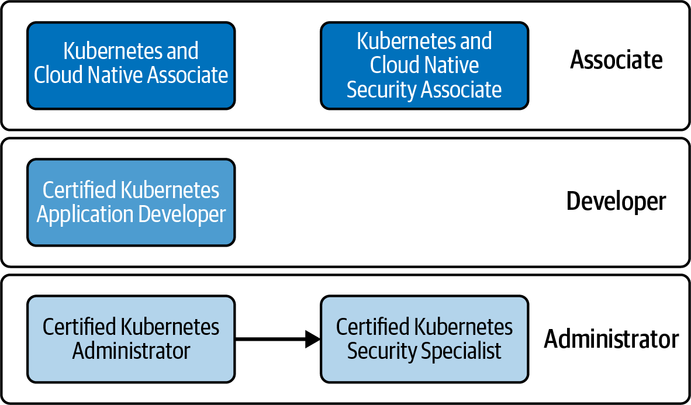
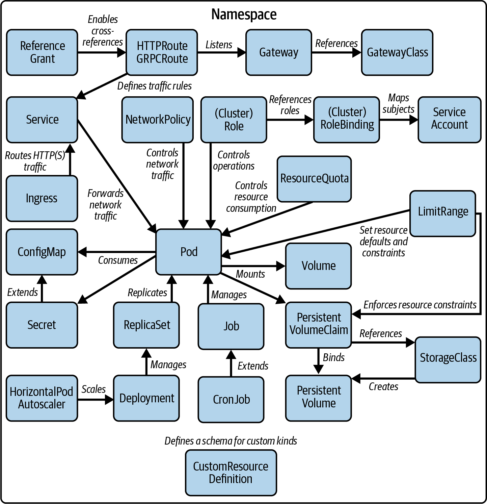

# Chương 1. Chi tiết về kỳ thi và tài nguyên

*Dịch từ: Chapter 1. Exam Details and Resources — Certified Kubernetes Administrator (CKA) Study Guide, 2nd Edition (O'Reilly).*

Chương này giải đáp những câu hỏi thường gặp nhất của các thí sinh (candidate) đang chuẩn bị để vượt qua kỳ thi (exam) Certified Kubernetes Administrator (CKA). Các chương sau sẽ tóm lược cho bạn về lợi ích và kiến trúc của Kubernetes, cũng như cách tương tác với một cluster Kubernetes bằng `kubectl`.

## Lộ trình học các chứng chỉ Kubernetes

Cloud Native Computing Foundation (CNCF) cung cấp năm chứng chỉ Kubernetes khác nhau. Hình 1-1 phân loại từng chứng chỉ theo đối tượng mục tiêu.



*Hình 1-1. Lộ trình học các chứng chỉ Kubernetes*

Đối tượng mục tiêu của các chứng chỉ cấp độ Associate là những người mới bắt đầu với cloud và Kubernetes. Các kỳ thi chứng chỉ cấp độ Associate sử dụng hình thức trắc nghiệm. Bạn sẽ không phải tương tác với một cluster Kubernetes trong môi trường tương tác.

Các chứng chỉ cấp độ Practitioner dành cho những nhà phát triển và quản trị viên đã có sẵn kinh nghiệm với Kubernetes. Các kỳ thi thuộc nhóm này yêu cầu bạn giải quyết vấn đề bằng cách thực hành (hands-on) trong nhiều môi trường Kubernetes. Bạn sẽ thấy rằng CKA hướng đến các quản trị viên của một cluster Kubernetes và không yêu cầu bất kỳ chứng chỉ nào khác làm điều kiện tiên quyết. Nếu bạn vượt qua tất cả các chứng chỉ Kubernetes, bạn có thể tự gọi mình là Kubestronaut. Chương trình Kubestronaut ghi nhận những thành viên cộng đồng có khả năng chứng minh kỹ năng của mình trong những mảng cốt lõi quan trọng nhất của Kubernetes.

Hãy cùng điểm qua từng chứng chỉ để xem CKA có phải là lựa chọn phù hợp với bạn hay không.

### Kubernetes and Cloud Native Associate (KCNA)

KCNA là chương trình chứng chỉ cấp nhập môn dành cho bất kỳ ai quan tâm đến phát triển ứng dụng cloud native, môi trường runtime và công cụ. Mặc dù kỳ thi có đề cập đến Kubernetes, nó *không* yêu cầu bạn tương tác trực tiếp với một cluster. Kỳ thi này gồm các câu hỏi trắc nghiệm và phù hợp với những thí sinh quan tâm đến chủ đề này với hiểu biết rộng về hệ sinh thái.

### Kubernetes and Cloud Native Security Associate (KCSA)

KCSA xác minh kiến thức cơ bản của bạn về các khái niệm bảo mật và việc áp dụng chúng trong một cluster Kubernetes. Bề rộng, chiều sâu và hình thức của chương trình này chắc chắn nâng cao hơn KCNA. Cá nhân tôi sẽ không xếp kỳ thi này vào loại phù hợp với người mới bắt đầu với các khái niệm bảo mật. Bạn có thể muốn thi KCSA sau khi đã có thêm trải nghiệm thực hành và hiểu biết sâu hơn về Kubernetes, vì các câu hỏi trong kỳ thi có thể khá khó trả lời.

### Certified Kubernetes Application Developer (CKAD)

Kỳ thi CKAD tập trung xác minh khả năng của bạn trong việc xây dựng, cấu hình và triển khai một ứng dụng dựa trên microservices lên Kubernetes. Bạn không được yêu cầu phải thực sự hiện thực một ứng dụng; tuy nhiên, kỳ thi này phù hợp với các nhà phát triển quen thuộc với những chủ đề như kiến trúc ứng dụng, runtime và ngôn ngữ lập trình.

### Certified Kubernetes Administrator (CKA)

Đối tượng mục tiêu của kỳ thi CKA là những người làm DevOps, quản trị viên hệ thống và kỹ sư site reliability. Kỳ thi này kiểm tra khả năng của bạn khi đảm nhận vai trò một quản trị viên Kubernetes, bao gồm các tác vụ như quản lý cluster, mạng, lưu trữ và bảo mật ở mức cơ bản, với trọng tâm là các tình huống xử lý sự cố (troubleshooting).

### Certified Kubernetes Security Specialist (CKS)

Kỳ thi CKS mở rộng các chủ đề đã được xác minh trong kỳ thi CKA. Vượt qua CKA là điều kiện tiên quyết trước khi bạn có thể đăng ký kỳ thi CKS. Với chứng chỉ này, bạn được kỳ vọng có kiến thức sâu hơn về bảo mật Kubernetes. Đề cương (curriculum) bao gồm các chủ đề như áp dụng thực hành tốt nhất (best practice) để xây dựng ứng dụng container hóa và đảm bảo một môi trường runtime Kubernetes an toàn.

## Mục tiêu của kỳ thi

Các cluster Kubernetes cần được cài đặt (install), cấu hình và bảo trì bởi những chuyên gia có tay nghề. Đó là công việc của một quản trị viên Kubernetes. Chương trình chứng chỉ CKA xác minh sự hiểu biết sâu sắc về các tác vụ quản trị điển hình gặp phải trong công việc: cụ thể hơn là bảo trì cluster Kubernetes, mạng, giải pháp lưu trữ, và xử lý sự cố cho ứng dụng cũng như các node của cluster.

Cuốn sách này tập trung giúp bạn sẵn sàng cho kỳ thi CKA. Tôi sẽ cung cấp một chút bối cảnh về lý do Kubernetes quan trọng đối với quản trị viên trước khi mổ xẻ những chủ đề quan trọng đối với kỳ thi.

> **PHIÊN BẢN KUBERNETES ĐƯỢC SỬ DỤNG TRONG KỲ THI**
>
> Tại thời điểm viết sách, kỳ thi dựa trên Kubernetes 1.33. Toàn bộ nội dung trong cuốn sách này sẽ bám theo các tính năng, API và hỗ trợ dòng lệnh của phiên bản đó. Có thể các phiên bản tương lai sẽ phá vỡ tính tương thích ngược. Trong khi chuẩn bị cho chứng chỉ, hãy xem lại ghi chú phát hành (release notes) của Kubernetes và luyện tập với phiên bản Kubernetes được dùng trong kỳ thi để tránh những bất ngờ không mong muốn. Môi trường thi sẽ được đồng bộ với phiên bản minor mới nhất của Kubernetes trong vòng khoảng bốn đến tám tuần kể từ ngày phát hành Kubernetes.

## Đề cương

Tổng quan sau đây liệt kê các phần ở cấp cao, hay còn gọi là các lĩnh vực (domain), của kỳ thi cùng trọng số điểm của chúng:

- 25%: Kiến trúc, cài đặt và cấu hình cluster (Cluster Architecture, Installation, and Configuration)
- 15%: Workload và lập lịch (Workloads and Scheduling)
- 20%: Service và mạng (Servicing and Networking)
- 10%: Lưu trữ (Storage)
- 30%: Xử lý sự cố (Troubleshooting)

Các mục tiếp theo trình bày chi tiết từng lĩnh vực.

### Kiến trúc, cài đặt và cấu hình cluster

Phần này của đề cương đi sâu vào mọi khía cạnh của cluster Kubernetes. Nó bao gồm kiến trúc nền tảng của Kubernetes, trong đó có sự phân biệt giữa control plane và worker node, các cấu hình có tính sẵn sàng cao (high availability, HA), và các công cụ cần thiết để cài đặt, nâng cấp (upgrade) và bảo trì một cluster. Ngoài ra, bạn sẽ khám phá các giao diện mở rộng chính và học những kỹ năng thực tế như cài đặt một cluster từ đầu, nâng cấp phiên bản của nó, và sao lưu/khôi phục (backup/restore) cơ sở dữ liệu etcd.

CNCF cũng đã đưa các chủ đề liên quan vào lĩnh vực này. Chẳng hạn, thành thạo kiểm soát truy cập dựa trên vai trò (role-based access control, RBAC) là điều thiết yếu để quản trị viên quản lý hiệu quả quyền truy cập vào tài nguyên (resource) của cluster. Bạn cũng sẽ trở nên thành thạo trong việc cài đặt các Operator của Kubernetes và sử dụng các công cụ như Kustomize và Helm để khám phá và triển khai các thành phần của cluster một cách hiệu quả.

### Workload và lập lịch

Quản trị viên phải có hiểu biết vững chắc về các khái niệm Kubernetes thiết yếu để quản lý hiệu quả các ứng dụng cloud native. Lĩnh vực này tập trung vào những khía cạnh quan trọng đó. Nó bao gồm các tài nguyên chính như Deployment, ReplicaSet, và quản lý cấu hình bằng ConfigMap và Secret.

Khi một Pod mới được tạo, scheduler của Kubernetes gán nó cho một node khả dụng dựa trên các tiêu chí định trước. Các quy tắc lập lịch (scheduling), chẳng hạn như node affinity và taint/toleration, giúp tinh chỉnh quá trình này để đáp ứng những yêu cầu cụ thể. Để chuẩn bị cho kỳ thi, điều quan trọng là nắm được các yếu tố và khái niệm khác nhau liên quan đến thuật toán lập lịch của Kubernetes nhằm đảm bảo vị trí đặt workload và hiệu năng tối ưu.

### Service và mạng

Một microservice cloud native hiếm khi hoạt động đơn lẻ. Thường thì nó tương tác với các microservice khác hoặc các hệ thống bên ngoài. Đối với quản trị viên, việc hiểu giao tiếp Pod-với-Pod, cách đưa ứng dụng ra cho các client bên ngoài truy cập, và cách cấu hình mạng của cluster là điều cốt yếu để duy trì một hệ thống hoạt động đầy đủ.

Lĩnh vực này của kỳ thi đánh giá kiến thức của bạn về các primitive mạng thiết yếu của Kubernetes, bao gồm Service, Ingress, NetworkPolicy và Gateway API. Thành thạo những thành phần này đảm bảo bạn có thể quản lý và bảo mật hiệu quả việc giao tiếp bên trong và bên ngoài cluster.

### Lưu trữ

Lĩnh vực này tập trung vào các loại volume khác nhau được dùng để đọc và ghi dữ liệu trong Kubernetes. Với tư cách quản trị viên, bạn phải hiểu cách tạo, cấu hình và quản lý hiệu quả những volume này.

PersistentVolume (PV) đóng vai trò cốt yếu trong việc đảm bảo tính bền vững (persistence) của dữ liệu, ngay cả sau khi một node của cluster khởi động lại. Bạn sẽ cần chứng minh khả năng mount một PersistentVolume vào một path cụ thể bên trong container và hiểu cơ chế bên dưới. Ngoài ra, điều thiết yếu là nắm được sự khác biệt giữa static provisioning và dynamic provisioning để quản lý tài nguyên lưu trữ hiệu quả.

### Xử lý sự cố

Trong các cluster Kubernetes production, sự cố chắc chắn sẽ xảy ra. Ứng dụng có thể hoạt động sai, ngừng phản hồi, hoặc thậm chí hoàn toàn không thể truy cập được. Ngoài ra, các node của cluster có thể bị sập hoặc gặp vấn đề về cấu hình. Xây dựng các chiến lược xử lý sự cố hiệu quả là điều then chốt để nhanh chóng xác định và giải quyết những tình huống này nhằm giảm thiểu thời gian ngừng hoạt động và gián đoạn.

Lĩnh vực này có trọng số điểm cao nhất trong kỳ thi. Bạn sẽ gặp những tình huống thực tế đòi hỏi bạn chẩn đoán vấn đề và triển khai giải pháp thích hợp. Thành thạo những kỹ năng này đảm bảo bạn có thể duy trì sự ổn định và độ tin cậy của môi trường Kubernetes dưới áp lực.

## Các primitive Kubernetes liên quan

Một số mục tiêu của kỳ thi có thể được bao phủ bằng cách hiểu các primitive cốt lõi liên quan của Kubernetes. Hãy lưu ý rằng kỳ thi kết hợp nhiều khái niệm trong cùng một bài toán. Hãy tham khảo Hình 1-2 như một hướng dẫn về các tài nguyên Kubernetes có liên quan và mối quan hệ giữa chúng.



*Hình 1-2. Các primitive Kubernetes liên quan đến kỳ thi*

## Tài liệu

Trong kỳ thi, bạn được phép mở một danh sách xác định các trang web để tham khảo. Bạn có thể tự do duyệt các trang đó và sao chép-dán code vào terminal của kỳ thi. Tài liệu chính thức của Kubernetes bao gồm sổ tay tham khảo (reference manual) và blog. Ngoài ra, bạn cũng có thể duyệt tài liệu của Helm:

- Sổ tay tham khảo: https://kubernetes.io/docs
- Blog: https://kubernetes.io/blog
- Helm: https://helm.sh/docs

Có sẵn các trang tài liệu Kubernetes trong tầm tay là cực kỳ giá trị, nhưng hãy chắc rằng bạn biết *ở đâu* để tìm thông tin liên quan trong những trang đó. Để chuẩn bị cho bài thi, hãy đọc tất cả các trang tài liệu từ đầu đến cuối ít nhất một lần. Đừng quên chức năng tìm kiếm của các trang tài liệu chính thức. Để tham khảo, Phụ lục B ánh xạ các mục tiêu của kỳ thi tới các chương sách đề cập những chủ đề đó và các trang tài liệu Kubernetes liên quan.

> **SỬ DỤNG TÀI LIỆU MỘT CÁCH HIỆU QUẢ**
>
> Dùng một từ khóa tìm kiếm nhiều khả năng sẽ đưa bạn đến đúng trang tài liệu nhanh hơn so với điều hướng qua các mục menu. Việc sao chép và dán các đoạn code từ tài liệu vào console của môi trường thi hoạt động khá ổn. Bạn có thể phải tự chỉnh lại thụt đầu dòng của YAML vì định dạng đúng có thể bị mất trong quá trình này.

## Môi trường thi và các mẹo

Để tham gia kỳ thi, bạn phải mua một voucher đăng ký, có thể mua trên trang web đào tạo và chứng chỉ của CNCF. Thỉnh thoảng, CNCF có giảm giá cho voucher (ví dụ, vào khoảng dịp lễ Tạ ơn ở Mỹ). Những đợt giảm giá này thường được thông báo trên trang LinkedIn của Linux Foundation.

Sau khi mua voucher, bạn có thể đặt lịch thi với PSI, công ty tổ chức bài thi theo hình thức trực tuyến. Không có hình thức thi trực tiếp tại cơ sở khảo thí. Vào ngày thi đã đặt lịch, bạn sẽ được yêu cầu đăng nhập vào nền tảng thi bằng một URL được gửi cho bạn qua email. Bạn sẽ được yêu cầu bật âm thanh và video trên máy tính của mình để ngăn ngừa gian lận. Một giám thị (proctor) sẽ giám sát hành động của bạn qua luồng âm thanh/video và chấm dứt phiên thi nếu họ cho rằng bạn không tuân thủ quy định.

> **SỐ LẦN THI**
>
> Voucher bạn đã mua cho phép hai lần thi để vượt qua kỳ thi. Tôi khuyên bạn nên chuẩn bị tương đối kỹ trước khi thi lần đầu. Điều đó sẽ cho bạn một cơ hội công bằng để vượt qua bài thi và mang lại ấn tượng tốt về môi trường thi cũng như độ phức tạp của các câu hỏi. Đừng quá lo lắng nếu bạn không đậu ở lần thi đầu tiên. Bạn còn một lượt thi miễn phí nữa.

Kỳ thi có giới hạn thời gian là hai giờ. Trong khoảng thời gian đó, bạn sẽ cần giải quyết các bài toán thực hành trên một cluster Kubernetes thật, được định nghĩa sẵn. Mỗi câu hỏi sẽ nêu rõ cluster mà bạn cần làm việc trên đó. Cách tiếp cận thực tiễn này để đánh giá kỹ năng của thí sinh vượt trội hơn các bài kiểm tra trắc nghiệm, vì bạn có thể chuyển hóa kiến thức trực tiếp thành các tác vụ thực hiện trong công việc.

Tôi đặc biệt khuyên bạn đọc FAQ của kỳ thi. Bạn sẽ tìm thấy ở đó câu trả lời cho hầu hết các câu hỏi cấp thiết của mình, bao gồm yêu cầu hệ thống đối với máy tính của bạn, cách chấm điểm, gia hạn chứng chỉ và các yêu cầu khi thi lại.

## Kỹ năng của thí sinh

Chứng chỉ này giả định rằng bạn đã có hiểu biết cơ bản về Kubernetes. Bạn nên quen thuộc với cấu trúc bên trong của Kubernetes, các khái niệm cốt lõi của nó, và công cụ dòng lệnh `kubectl`. CNCF cung cấp khóa học miễn phí "Introduction to Kubernetes" dành cho người mới bắt đầu với Kubernetes.

Dưới đây là tổng quan ngắn gọn về kiến thức nền tảng bạn cần có để tăng khả năng vượt qua kỳ thi:

**Kiến trúc và các khái niệm của Kubernetes**

Kỳ thi sẽ không yêu cầu bạn cài đặt một cluster Kubernetes từ đầu. Hãy đọc về những điều cơ bản của Kubernetes và các thành phần kiến trúc của nó. Tham khảo Chương 2 để có bước khởi đầu nhanh về kiến trúc và các khái niệm của Kubernetes.

**Công cụ CLI `kubectl`**

Công cụ dòng lệnh `kubectl` là công cụ trung tâm bạn sẽ dùng trong kỳ thi để tương tác với cluster Kubernetes. Ngay cả khi bạn chỉ có ít thời gian chuẩn bị cho kỳ thi, điều thiết yếu là luyện tập thao tác với `kubectl`, cũng như các lệnh và tùy chọn dòng lệnh (command-line option) liên quan của nó. Bạn sẽ không có quyền truy cập vào giao diện web dashboard trong kỳ thi. Chương 3 cung cấp một bản tóm tắt ngắn về những cách quan trọng nhất để tương tác với cluster Kubernetes.

**Các công cụ bảo trì cluster Kubernetes**

Việc cài đặt một cluster Kubernetes từ đầu và nâng cấp phiên bản Kubernetes của một cluster hiện có được thực hiện bằng công cụ `kubeadm`. Điều quan trọng là hiểu cách sử dụng nó và các bước liên quan để đi qua quy trình đó. Tham khảo Chương 4 để biết thêm thông tin. Ngoài ra, bạn cần hiểu rõ các công cụ `etcdctl` và `etcdutl`, bao gồm các tùy chọn dòng lệnh của chúng để sao lưu và khôi phục cơ sở dữ liệu etcd, được đề cập trong Chương 5.

**Kiến thức thực hành về container runtime engine**

Kubernetes sử dụng một container runtime engine để quản lý image. Container runtime engine mặc định trong Kubernetes là containerd. Ở mức tối thiểu, hãy hiểu sự khác biệt giữa container image và container, cùng mục đích của chúng. Chủ đề này vượt ra ngoài phạm vi của cuốn sách và không được kiểm tra trực tiếp trong kỳ thi.

**Kiến thức nền tảng về Linux**

Kỳ thi được thực hiện hoàn toàn qua terminal Linux, đòi hỏi kỹ năng dòng lệnh vững vàng. Bạn nên thoải mái trong việc điều hướng hệ thống tệp, quản lý tệp và thư mục, và hiểu quyền của tệp. Quen thuộc với các trình soạn thảo văn bản như `vi` hoặc `vim` là thiết yếu, vì bạn sẽ cần chỉnh sửa các file YAML thường xuyên. Các kỹ năng quản lý tiến trình cơ bản như xem các tiến trình đang chạy, kiểm tra mức sử dụng tài nguyên, và hiểu log hệ thống là quan trọng đối với các tác vụ xử lý sự cố. Bạn cũng nên thoải mái với các lệnh Linux thông dụng để xử lý văn bản (`grep`, `awk`, `sed`), thao tác tệp (`cat`, `less`, `head`, `tail`), và các khái niệm shell scripting cơ bản bao gồm piping, chuyển hướng (redirection) và biến môi trường (environment variable). Kiến thức về SSH để truy cập các node từ xa và các lệnh mạng cơ bản (`netstat`, `curl`, `wget`) cũng sẽ tỏ ra hữu ích trong kỳ thi.

## Quản lý thời gian

Linux Foundation kỳ vọng những người làm việc với Kubernetes có khả năng áp dụng kiến thức của mình vào các tình huống thực tế bằng cách tìm ra giải pháp cho vấn đề một cách kịp thời. Kỳ thi thường gồm 15–20 câu hỏi dựa trên thao tác thực hiện (performance-based) cần hoàn thành trong 2 giờ, tức là trung bình bạn có khoảng 6–8 phút cho mỗi câu.

Vì không có chiến lược duy nhất nào phù hợp với tất cả mọi người, hãy cân nhắc những cách tiếp cận sau để quản lý ràng buộc thời gian của kỳ thi. Một lựa chọn là đọc qua tất cả các câu hỏi trước khi bắt tay làm bất kỳ câu nào, cho phép bạn sắp xếp chúng trong đầu theo độ khó cảm nhận được và giải quyết các câu dễ trước để xây dựng sự tự tin và giành điểm nhanh. Cách khác, bạn có thể làm các câu hỏi theo thứ tự được đưa ra nhưng giới hạn nghiêm ngặt mỗi câu trong 4–5 phút (chừa thời gian dự phòng để xem lại), đánh dấu những câu chưa hoàn thành để quay lại, sau đó dùng lượt thứ hai để xem lại các câu đã đánh dấu theo thứ tự độ khó hoặc khối lượng công việc còn lại. Cách tiếp cận kết hợp gộp cả hai chiến lược: ban đầu quét qua tất cả các câu hỏi để đánh giá độ khó, rồi lần lượt làm chúng với giới hạn thời gian nghiêm ngặt, để lại lượt thứ ba để đánh giá lại và hoàn thành những câu mà bạn đã làm được một phần hoặc đã hiểu rõ hơn nhờ giải các bài toán tương tự.

Điểm mấu chốt là có một chiến lược có chủ đích thay vì bị mắc kẹt sớm ở những câu hỏi khó, vì kỳ thi đề cao bề rộng kiến thức và quản lý thời gian hiệu quả hơn là làm hoàn hảo từng tình huống phức tạp riêng lẻ. Hãy nhớ rằng thường có điểm thành phần (partial credit), nên tốt hơn là cố gắng làm tất cả các câu hỏi thay vì làm hoàn hảo chỉ một vài câu.

## Mẹo và thủ thuật dòng lệnh

Do dòng lệnh là giao diện duy nhất của bạn với cluster Kubernetes, điều thiết yếu là bạn phải trở nên cực kỳ quen thuộc với công cụ `kubectl` và các tùy chọn sẵn có của nó. Mục này cung cấp các mẹo và thủ thuật giúp việc sử dụng chúng hiệu quả và năng suất hơn.

### Thiết lập context và namespace

Môi trường thi đi kèm nhiều cluster Kubernetes đã được thiết lập sẵn cho bạn. Hãy xem phần hướng dẫn để có cái nhìn tổng quan kỹ thuật ở mức cao về những cluster đó. Mỗi bài thi cần được giải trên một cluster được chỉ định, như đã nêu trong mô tả của nó. Hơn nữa, phần hướng dẫn sẽ yêu cầu bạn làm việc trong một namespace khác với `default`. Hãy chắc chắn thiết lập context và namespace như việc làm đầu tiên trước khi bắt tay vào một câu hỏi. Lệnh sau thiết lập context và namespace như một hành động thực hiện một lần:

```shell
$ kubectl config set-context <context-of-question> \
  --namespace=<namespace-of-question>
$ kubectl config use-context <context-of-question>
```

Bạn có thể tìm thấy thảo luận chi tiết hơn về khái niệm context và các lệnh `kubectl` tương ứng trong mục "Xác thực (authentication) với kubectl".

Với những tác vụ cụ thể, ví dụ như quy trình nâng cấp một node của cluster, bạn sẽ cần mở một shell tương tác tới máy chủ (host) của node đó. Hãy dùng lệnh `ssh <nodename>` để làm điều này.

### Sử dụng alias cho kubectl

Trong quá trình thi, bạn sẽ phải thực thi lệnh `kubectl` hàng chục, thậm chí hàng trăm lần. Bạn có thể là người gõ phím cực nhanh; tuy nhiên, chẳng có lý do gì để gõ đầy đủ tên chương trình lặp đi lặp lại. Môi trường thi đã thiết lập sẵn alias `k` cho lệnh `kubectl`.

Để chuẩn bị cho kỳ thi, bạn có thể thiết lập hành vi tương tự trên máy của mình. Lệnh `alias` sau ánh xạ chữ `k` sang lệnh `kubectl` đầy đủ:

```shell
$ alias k=kubectl
$ k version
```

### Sử dụng tính năng tự động hoàn thành lệnh kubectl

Ghi nhớ các lệnh và tùy chọn dòng lệnh của `kubectl` đòi hỏi nhiều luyện tập. Môi trường thi được bật sẵn tính năng tự động hoàn thành (auto-completion) theo mặc định. Bạn có thể tìm hướng dẫn thiết lập tự động hoàn thành cho shell trên máy của mình trong tài liệu Kubernetes.

### Nằm lòng các tên viết tắt của tài nguyên

Nhiều lệnh `kubectl` có thể khá dài. Ví dụ, lệnh để quản lý PersistentVolumeClaim là `persistentvolumeclaims`. Gõ đầy đủ lệnh có thể dễ sai sót và tốn thời gian. May mắn thay, một số lệnh dài hơn đi kèm với dạng viết tắt. Lệnh `api-resources` liệt kê tất cả các lệnh có sẵn cùng tên viết tắt của chúng:

```shell
$ kubectl api-resources
NAME                           SHORTNAMES      APIGROUP      NAMESPACED      KIND
...
persistentvolumeclaims         pvc                           true            PersistentVolumeClaim
...
```

Dùng `pvc` thay cho `persistentvolumeclaims` cho ra một câu lệnh ngắn gọn và súc tích hơn, như minh họa dưới đây:

```shell
$ kubectl describe pvc my-claim
```

## Luyện tập và các bài thi thử

Thực hành là cực kỳ quan trọng khi nói đến việc vượt qua kỳ thi. Vì mục đích đó, bạn sẽ cần một môi trường cluster Kubernetes hoạt động được. Những lựa chọn sau đây nổi bật:

- Tôi thấy hữu ích khi chạy một hoặc nhiều máy ảo bằng Vagrant và VirtualBox. Những công cụ này giúp tạo ra một môi trường Kubernetes cô lập, dễ dàng khởi tạo và hủy bỏ theo nhu cầu.
- Việc cài đặt một cluster Kubernetes đơn giản trên máy phát triển của bạn là tương đối dễ. Tài liệu Kubernetes cung cấp nhiều tùy chọn cài đặt khác nhau, tùy thuộc vào hệ điều hành của bạn. minikube hữu ích khi bạn muốn thử nghiệm các tính năng nâng cao hơn như Ingress hoặc storage class, vì nó cung cấp các chức năng cần thiết dưới dạng add-on có thể cài đặt chỉ với một lệnh.
- Ngoài ra, bạn cũng có thể thử kind; đó là một công cụ khác để chạy các cluster Kubernetes cục bộ.
- Nếu bạn là người đăng ký O'Reilly Learning Platform, bạn có quyền truy cập không giới hạn vào các kịch bản (scenario) chạy trong môi trường sandbox Kubernetes. Ngoài ra, bạn có thể kiểm tra kiến thức của mình với sự trợ giúp của các interactive lab luyện thi CKA.
- Killercoda lưu trữ các kịch bản tương tác cho kỳ thi do cộng đồng Kubernetes đóng góp.

Bạn cũng có thể muốn thử một trong các tài nguyên học tập và luyện tập thương mại sau:

- Killer Shell là một trình mô phỏng với các bài tập mẫu (sample exercises) cho tất cả các chứng chỉ Kubernetes. Nếu bạn mua voucher cho kỳ thi, bạn sẽ được phép dùng hai phiên miễn phí.
- Các nhà cung cấp đào tạo trực tuyến khác cung cấp các khóa học video cho kỳ thi, một số trong đó bao gồm môi trường luyện tập Kubernetes tích hợp. Tôi muốn nhắc đến KodeKloud và Pluralsight. Bạn sẽ cần mua gói đăng ký để truy cập nội dung của từng khóa học riêng lẻ.

## Tóm tắt

Kỳ thi là một bài kiểm tra hoàn toàn thực hành, yêu cầu bạn giải quyết các bài toán trong nhiều cluster Kubernetes. Bạn được kỳ vọng hiểu, sử dụng và cấu hình các primitive Kubernetes liên quan đến quản trị viên. Đề cương kỳ thi chia nhỏ những trọng tâm đó và đặt trọng số khác nhau cho các chủ đề, điều này quyết định mức đóng góp của chúng vào tổng điểm. Mặc dù các trọng tâm được nhóm lại một cách có ý nghĩa, đề cương không nhất thiết đi theo một lộ trình học tự nhiên, vì vậy sẽ hữu ích nếu bạn tham chiếu chéo các chương trong sách khi chuẩn bị cho kỳ thi.

Trong chương này, chúng ta đã thảo luận về môi trường thi và cách điều hướng trong đó. Chìa khóa để đạt điểm cao trong kỳ thi là luyện tập `kubectl` chuyên sâu để giải quyết các tình huống thực tế. Hai chương tiếp theo trong Phần I sẽ cung cấp bước khởi đầu nhanh về Kubernetes.

Tất cả các chương thảo luận chi tiết về các lĩnh vực đều cho bạn cơ hội thực hành. Bạn sẽ tìm thấy các bài tập mẫu ở cuối mỗi chương.
