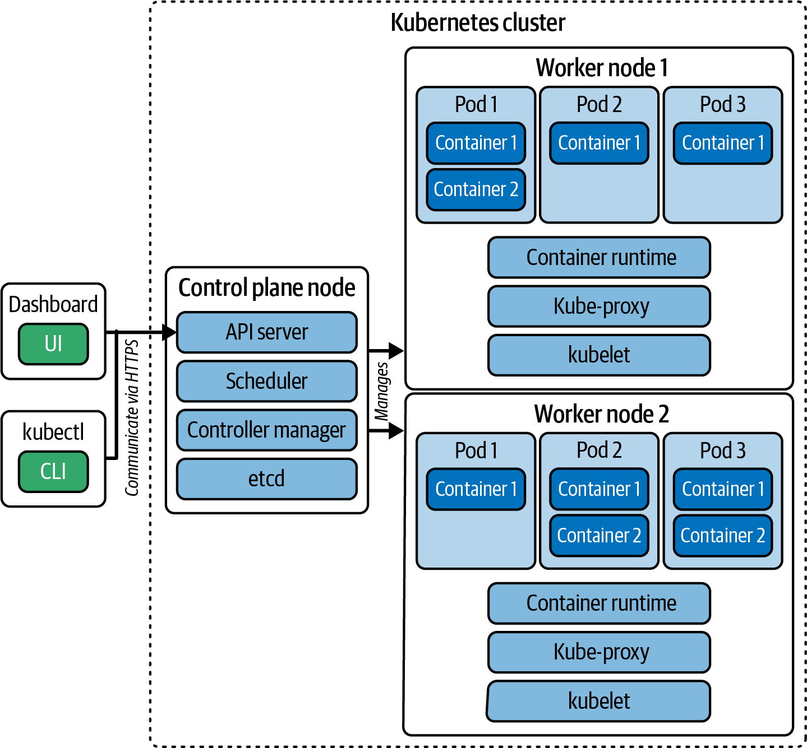

# Chương 2. Tóm lược về Kubernetes

*Dịch từ: Chapter 2. Kubernetes in a Nutshell — Certified Kubernetes Administrator (CKA) Study Guide, 2nd Edition (O'Reilly).*

Nếu bạn mới bước vào lĩnh vực này, sẽ rất hữu ích khi có một cái nhìn tổng quan nhanh về Kubernetes là gì và nó hoạt động như thế nào. Trên web có rất nhiều bài hướng dẫn và khóa học nhập môn (101), nhưng tôi muốn tóm tắt những thông tin nền tảng và khái niệm quan trọng nhất trong chương này. Xuyên suốt cuốn sách, tôi sẽ tham chiếu đến các thành phần của node trong cluster, vì vậy bạn cứ thoải mái quay lại phần thông tin này bất cứ lúc nào.

## Kubernetes là gì?

Để hiểu Kubernetes là gì, trước tiên chúng ta hãy định nghĩa *microservice* và *container*.

Kiến trúc microservice đòi hỏi phải phát triển và thực thi các phần của application stack dưới dạng những dịch vụ riêng lẻ, và các dịch vụ đó phải giao tiếp với nhau. Nếu bạn quyết định vận hành các dịch vụ đó trong container, bạn sẽ phải quản lý rất nhiều container, đồng thời phải cân nhắc đến các mối quan tâm xuyên suốt (cross-cutting concerns) như khả năng mở rộng quy mô (scalability), bảo mật, lưu trữ bền vững (persistence) và cân bằng tải (load balancing).

Các công cụ như BuildKit và Podman đóng gói các software artifact thành một container image. Các container runtime engine như Docker Engine và containerd sử dụng image đó để chạy một container. Cách này hoạt động rất tốt trên máy của lập trình viên cho mục đích kiểm thử hoặc cho những lần thực thi tùy thời (ad hoc), ví dụ như một phần của pipeline tích hợp liên tục (continuous integration – CI).

Kubernetes là một công cụ điều phối container (container orchestration) giúp vận hành hàng trăm, thậm chí hàng nghìn container trên các máy vật lý, máy ảo hoặc trên cloud. Kubernetes cũng có thể đáp ứng những mối quan tâm xuyên suốt đã đề cập ở trên. Container runtime engine tích hợp với Kubernetes. Mỗi khi việc tạo một container được kích hoạt, Kubernetes sẽ ủy thác các khía cạnh về vòng đời (lifecycle) cho container runtime engine.

## Các tính năng

Mục trước đã đề cập sơ qua một số tính năng mà Kubernetes cung cấp. Ở đây, tôi sẽ đi sâu hơn một chút bằng cách giải thích chi tiết hơn về các tính năng đó:

**Mô hình khai báo (Declarative model)**

Bạn không cần viết mã mệnh lệnh (imperative) bằng một ngôn ngữ lập trình để chỉ cho Kubernetes cách vận hành một ứng dụng. Tất cả những gì bạn cần làm với tư cách người dùng cuối là khai báo một trạng thái mong muốn (desired state). Trạng thái mong muốn có thể được định nghĩa bằng một manifest YAML hoặc JSON tuân theo một API schema. Sau đó Kubernetes sẽ duy trì trạng thái này và khôi phục nó trong trường hợp xảy ra sự cố.

**Autoscaling**

Bạn sẽ muốn tăng tài nguyên (scale up) khi tải của ứng dụng tăng lên, và giảm tài nguyên (scale down) khi lưu lượng truy cập vào ứng dụng giảm xuống. Trong Kubernetes, điều này có thể đạt được bằng cách scale thủ công hoặc tự động. Lựa chọn thực tế và tối ưu nhất là để Kubernetes tự động scale tài nguyên mà một ứng dụng chạy trong container cần đến.

**Quản lý ứng dụng (Application management)**

Các thay đổi đối với ứng dụng, ví dụ như tính năng mới và bản sửa lỗi, thường được đóng gói vào một container image với một tag mới (thường là số phiên bản). Bạn có thể dễ dàng rollout các thay đổi đó trên tất cả các container đang chạy chúng nhờ tính năng nhân bản (replication) tiện lợi của Kubernetes. Kubernetes cũng cho phép rollback về phiên bản ứng dụng trước đó trong trường hợp gặp lỗi nghiêm trọng (blocking bug) hoặc khi phát hiện lỗ hổng bảo mật.

**Lưu trữ bền vững (Persistent storage)**

Container chỉ cung cấp một hệ thống tập tin tạm thời (ephemeral). Khi container khởi động lại, toàn bộ dữ liệu đã ghi vào hệ thống tập tin sẽ bị mất. Tùy vào bản chất của ứng dụng, bạn có thể cần lưu trữ dữ liệu lâu hơn, ví dụ nếu ứng dụng của bạn tương tác với một cơ sở dữ liệu. Kubernetes cung cấp khả năng mount storage mà các workload ứng dụng cần đến.

**Mạng (Networking)**

Để hỗ trợ kiến trúc microservice, trình điều phối container cần cho phép giao tiếp giữa các container với nhau, và từ người dùng cuối bên ngoài cluster đến các container. Kubernetes sử dụng cân bằng tải nội bộ và bên ngoài để định tuyến lưu lượng mạng.

## Kiến trúc tổng quan

Về mặt kiến trúc, một cluster Kubernetes bao gồm các node control plane (control plane node) và các worker node, như minh họa trong Hình 2-1. Mỗi node chạy trên hạ tầng được cấp phát trên một máy vật lý, máy ảo hoặc trên cloud. Số lượng node bạn muốn thêm vào cluster và topology của chúng phụ thuộc vào nhu cầu tài nguyên của ứng dụng.

*Hình 2-1. Các node và thành phần của cluster Kubernetes*

Node control plane và worker node có những trách nhiệm cụ thể:

**Node control plane**

Node này cung cấp Kubernetes API thông qua API server và quản lý các node tạo nên cluster. Nó cũng phản hồi các sự kiện của cluster, ví dụ khi người dùng cuối yêu cầu tăng số lượng Pod để phân tán tải cho một ứng dụng. Các cluster production sử dụng kiến trúc có tính sẵn sàng cao (highly available – HA), thường bao gồm ba node control plane trở lên.

**Worker node**

Worker node thực thi workload trong các container được quản lý bởi Pod. Mỗi worker node cần có một container runtime engine được cài đặt trên máy chủ (host) để có thể quản lý container.

Trong hai mục tiếp theo, chúng ta sẽ xem xét các thành phần thiết yếu được tích hợp trong những node đó để hoàn thành nhiệm vụ của chúng. Các add-on như cluster DNS không được thảo luận cụ thể ở đây. Hãy xem tài liệu Kubernetes để biết thêm chi tiết.

### Các thành phần của node control plane

Node control plane cần một tập hợp các thành phần cụ thể để thực hiện công việc của mình. Danh sách các thành phần sau đây sẽ cho bạn một cái nhìn tổng quan:

**API server**

API server cung cấp các API endpoint mà client sử dụng để giao tiếp với cluster Kubernetes. Ví dụ, nếu bạn thực thi công cụ `kubectl`, một Kubernetes client dựa trên dòng lệnh, bạn sẽ thực hiện một lời gọi RESTful API đến một endpoint do API server cung cấp như một phần trong cách nó được hiện thực. Quy trình xử lý API bên trong API server sẽ đảm bảo các khía cạnh như xác thực (authentication), ủy quyền (authorization) và kiểm soát tiếp nhận (admission control). Để biết thêm thông tin về chủ đề này, xem Chương 6.

**Scheduler**

Scheduler là một tiến trình chạy nền theo dõi (watch) các Pod Kubernetes mới chưa được gán node và gán chúng cho một worker node để thực thi.

**Controller manager**

Controller manager theo dõi trạng thái của cluster và thực hiện các thay đổi khi cần thiết. Ví dụ, nếu bạn thay đổi cấu hình của một đối tượng (object) hiện có, controller manager sẽ cố gắng đưa đối tượng đó về trạng thái mong muốn.

**etcd**

Dữ liệu trạng thái của cluster cần được lưu trữ bền vững theo thời gian để có thể được tái tạo khi một node khởi động lại, hoặc thậm chí khi toàn bộ cluster khởi động lại. Đó là trách nhiệm của etcd, một phần mềm mã nguồn mở mà Kubernetes tích hợp cùng. Về cốt lõi, etcd là một kho lưu trữ key-value dùng để lưu trữ bền vững toàn bộ dữ liệu liên quan đến cluster Kubernetes.

### Các thành phần chung của node

Kubernetes sử dụng các thành phần được mọi node tận dụng, bất kể trách nhiệm chuyên biệt của chúng:

**Kubelet**

Kubelet chạy trên mọi node trong cluster; tuy nhiên, nó có ý nghĩa nhất trên worker node. Lý do là node control plane thường không thực thi workload, còn trách nhiệm chính của worker node là chạy workload. Kubelet là một agent đảm bảo rằng các container cần thiết đang chạy trong một Pod. Có thể nói kubelet là chất keo gắn kết giữa Kubernetes và container runtime engine, đảm bảo các container đang chạy và khỏe mạnh.

**Kube-proxy**

Kube-proxy là một network proxy chạy trên từng node trong cluster để duy trì các quy tắc mạng và cho phép giao tiếp mạng. Một phần, thành phần này chịu trách nhiệm hiện thực khái niệm Service được đề cập trong Chương 17.

**Container runtime**

Như đã đề cập trước đó, container runtime là phần mềm chịu trách nhiệm quản lý container. Kubelet có thể được cấu hình để lựa chọn trong số nhiều container runtime engine khác nhau. Mặc dù bạn có thể cài đặt một container runtime engine trên control plane, nhưng điều đó không bắt buộc, vì node control plane thường không xử lý workload.

## Ưu điểm

Mục này chỉ ra một số ưu điểm quan trọng nhất của Kubernetes, được tóm tắt dưới đây:

**Tính khả chuyển (Portability)**

Một container runtime engine có thể quản lý container độc lập với môi trường thực thi của nó. Container image đóng gói mọi thứ nó cần để hoạt động, bao gồm tệp nhị phân hoặc mã nguồn của ứng dụng, các thư viện phụ thuộc và cấu hình của nó. Kubernetes có thể chạy ứng dụng trong container ở cả môi trường on-premise lẫn cloud. Với tư cách quản trị viên, bạn có thể chọn nền tảng mà bạn cho là phù hợp nhất với nhu cầu của mình mà không phải viết lại ứng dụng. Nhiều dịch vụ cloud cung cấp các tính năng đặc thù theo sản phẩm, có thể tùy chọn bật (opt-in). Mặc dù việc sử dụng các tính năng đặc thù theo sản phẩm giúp ích cho khía cạnh vận hành, hãy lưu ý rằng chúng sẽ làm giảm khả năng chuyển đổi dễ dàng giữa các nền tảng của bạn.

**Khả năng phục hồi (Resilience)**

Kubernetes được thiết kế như một máy trạng thái khai báo (declarative state machine). Các controller là những reconciliation loop (vòng lặp điều hòa) theo dõi trạng thái của cluster, sau đó thực hiện hoặc yêu cầu các thay đổi khi cần thiết. Mục tiêu là đưa trạng thái hiện tại của cluster tiến gần hơn đến trạng thái mong muốn.

**Khả năng mở rộng quy mô (Scalability)**

Các doanh nghiệp vận hành ứng dụng ở quy mô lớn. Hãy thử hình dung các nhà bán lẻ như Amazon, Walmart hay Target cần vận hành bao nhiêu thành phần phần mềm để duy trì hoạt động kinh doanh của họ. Kubernetes có thể scale số lượng Pod theo nhu cầu hoặc tự động dựa trên mức tiêu thụ tài nguyên hay xu hướng lịch sử.

**Dựa trên API (API-based)**

Kubernetes cung cấp chức năng của mình thông qua các API. Chúng ta đã biết rằng mọi client đều cần tương tác với API server để quản lý các đối tượng. Việc hiện thực một client mới có thể thực hiện các lời gọi RESTful API đến các endpoint được cung cấp là rất dễ dàng.

**Khả năng mở rộng chức năng (Extensibility)**

Khía cạnh API còn vươn xa hơn nữa. Đôi khi, chức năng cốt lõi của Kubernetes không đáp ứng được những nhu cầu riêng của bạn, nhưng bạn có thể tự hiện thực các phần mở rộng (extension) cho Kubernetes. Với sự trợ giúp của các điểm mở rộng (extension point) cụ thể, cộng đồng Kubernetes có thể xây dựng chức năng tùy chỉnh theo yêu cầu của họ, ví dụ như các giải pháp giám sát (monitoring) hoặc ghi log (logging).

## Tóm tắt

Kubernetes là phần mềm để quản lý các ứng dụng chạy trong container ở quy mô lớn. Mỗi cluster Kubernetes bao gồm ít nhất một node control plane và một worker node. Node control plane chịu trách nhiệm lập lịch (scheduling) cho workload và đóng vai trò là điểm vào duy nhất để quản lý chức năng của cluster. Các worker node xử lý workload được node control plane giao cho chúng.

Kubernetes là một môi trường thực thi sẵn sàng cho production dành cho các công ty muốn vận hành kiến trúc microservice, đồng thời hỗ trợ các yêu cầu phi chức năng như khả năng mở rộng quy mô, bảo mật, cân bằng tải và khả năng mở rộng chức năng.

Chương tiếp theo sẽ giải thích cách tương tác với một cluster Kubernetes bằng công cụ dòng lệnh `kubectl`. Bạn sẽ học cách chạy nó để quản lý các đối tượng, một kỹ năng thiết yếu để vượt qua kỳ thi một cách xuất sắc.
