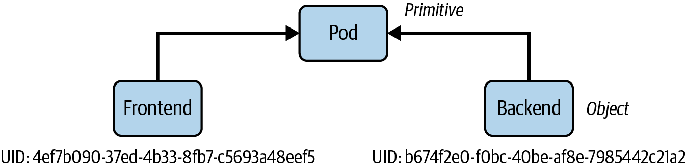
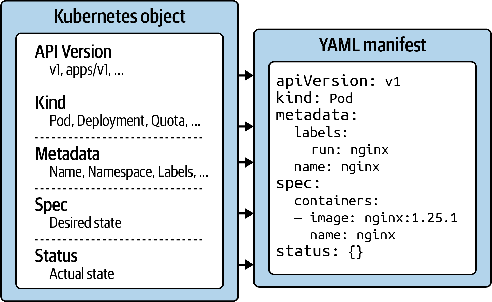
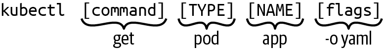

# Chương 3. Tương tác với Kubernetes

*Dịch từ: Chapter 3. Interacting with Kubernetes — Certified Kubernetes Administrator (CKA) Study Guide, 2nd Edition (O'Reilly).*

Là một nhà phát triển ứng dụng, bạn sẽ muốn tương tác với cluster Kubernetes để quản lý các đối tượng (object) vận hành ứng dụng của mình. Mọi lời gọi tới cluster đều được thành phần API server tiếp nhận và xử lý. Có nhiều cách để thực hiện một lời gọi tới API server. Ví dụ, bạn có thể dùng dashboard trên nền web, một công cụ dòng lệnh như `kubectl`, hoặc gửi trực tiếp một yêu cầu HTTPS tới các endpoint của RESTful API.

Kỳ thi không kiểm tra việc sử dụng giao diện người dùng trực quan để tương tác với cluster Kubernetes. Client duy nhất bạn có để giải các câu hỏi thi là `kubectl`. Chương này sẽ đề cập đến các primitive và đối tượng của Kubernetes API, cũng như những cách khác nhau để quản lý đối tượng bằng `kubectl`.

## Các primitive và đối tượng của API

Các primitive của Kubernetes là những khối xây dựng cơ bản gắn liền với kiến trúc Kubernetes, dùng để tạo và vận hành một ứng dụng trên nền tảng này. Ngay cả khi mới làm quen với Kubernetes, có thể bạn đã từng nghe đến các thuật ngữ Pod, Deployment và Service — tất cả đều là primitive của Kubernetes. Còn nhiều primitive khác nữa, mỗi loại phục vụ một mục đích riêng trong kiến trúc Kubernetes.

Để dễ hình dung, hãy nhớ lại các khái niệm của lập trình hướng đối tượng. Trong các ngôn ngữ lập trình hướng đối tượng, một lớp (class) định nghĩa bản thiết kế của một chức năng trong thế giới thực: các thuộc tính và hành vi của nó. Một primitive của Kubernetes tương đương với một lớp. Thể hiện (instance) của một lớp trong lập trình hướng đối tượng là một đối tượng, tự quản lý trạng thái của mình và có khả năng giao tiếp với các phần khác của hệ thống. Mỗi khi bạn tạo một đối tượng Kubernetes, bạn đang sinh ra một thể hiện như vậy.

Ví dụ, Pod trong Kubernetes là lớp mà từ đó có thể có nhiều thể hiện với định danh riêng. Mọi đối tượng Kubernetes đều có một định danh duy nhất do hệ thống sinh ra (còn gọi là UID) để phân biệt rõ ràng giữa các thực thể trong hệ thống. Ở phần sau, chúng ta sẽ xem xét các thuộc tính của một đối tượng Kubernetes. Hình 3-1 minh họa mối quan hệ giữa một primitive của Kubernetes và một đối tượng.



*Hình 3-1. Định danh của đối tượng Kubernetes*

Mọi primitive của Kubernetes đều tuân theo một cấu trúc chung, bạn có thể quan sát được nếu nhìn kỹ hơn vào manifest của một đối tượng, như minh họa trong Hình 3-2. Ngôn ngữ đánh dấu chính được dùng cho manifest Kubernetes là YAML.



*Hình 3-2. Cấu trúc của đối tượng Kubernetes*

Hãy cùng xem từng phần và ý nghĩa của nó trong hệ thống Kubernetes:

**API version**

Phiên bản API của Kubernetes định nghĩa cấu trúc của một primitive và dùng cấu trúc đó để kiểm tra tính đúng đắn của dữ liệu. Phiên bản API có vai trò tương tự như XML schema đối với tài liệu XML hay JSON schema đối với tài liệu JSON. Phiên bản thường trải qua một quá trình trưởng thành — ví dụ, từ alpha đến beta rồi đến bản chính thức. Đôi khi bạn sẽ thấy các tiền tố (prefix) khác nhau được ngăn cách bằng dấu gạch chéo (ví dụ, `apps`). Bạn có thể liệt kê các phiên bản API tương thích với phiên bản cluster của mình bằng cách chạy lệnh `kubectl api-versions`.

**Kind**

Kind định nghĩa loại của primitive — ví dụ, Pod hay Service. Về cơ bản nó trả lời câu hỏi: "Chúng ta đang làm việc với loại tài nguyên nào ở đây?"

**Metadata**

Metadata mô tả thông tin ở mức cao hơn về đối tượng — ví dụ, tên của nó, nó nằm trong namespace nào, hay nó có định nghĩa label và annotation hay không. Phần này cũng định nghĩa UID.

**Spec**

Đặc tả (specification, gọi tắt là *spec*) khai báo trạng thái mong muốn (desired state) — ví dụ, đối tượng này trông như thế nào sau khi được tạo? Image nào nên chạy trong container, hay những biến môi trường (environment variable) nào cần được thiết lập?

**Status**

Status mô tả trạng thái thực tế (actual state) của một đối tượng. Các controller của Kubernetes và vòng lặp điều hòa (reconciliation loop) của chúng liên tục cố gắng chuyển một đối tượng Kubernetes từ trạng thái thực tế sang trạng thái mong muốn. Đối tượng vẫn chưa được hiện thực hóa nếu status trong YAML hiển thị giá trị `{}`.

Với cấu trúc cơ bản này trong đầu, hãy cùng xem cách tạo một đối tượng Kubernetes với sự trợ giúp của `kubectl`.

## Sử dụng kubectl

`kubectl` là công cụ chính để tương tác với các cluster Kubernetes từ dòng lệnh. Kỳ thi tập trung hoàn toàn vào việc sử dụng `kubectl`. Do đó, điều tối quan trọng là phải hiểu tường tận công cụ này và luyện tập sử dụng nó thật nhiều.

Mục này cung cấp cho bạn cái nhìn tổng quan ngắn gọn về mẫu sử dụng điển hình của nó. Hãy bắt đầu bằng việc xem xét cú pháp để chạy các lệnh. Một lần thực thi `kubectl` bao gồm một lệnh (command), một loại tài nguyên, một tên tài nguyên, và các cờ (flag) dòng lệnh tùy chọn:

```shell
$ kubectl [command] [TYPE] [NAME] [flags]
```

Lệnh chỉ định thao tác bạn định chạy. Các lệnh điển hình là những động từ như `create`, `get`, `describe` hoặc `delete`. Tiếp theo, bạn cần cung cấp loại tài nguyên mà bạn đang làm việc, dưới dạng tên đầy đủ của loại tài nguyên hoặc dạng viết tắt của nó. Ví dụ, bạn có thể làm việc với `service` ở đây hoặc dùng dạng viết tắt là `svc`.

Tên của tài nguyên xác định định danh đối tượng hướng tới người dùng, thực chất là giá trị của `metadata.name` trong biểu diễn YAML. Hãy lưu ý rằng tên đối tượng không giống với UID. UID là một tham chiếu đối tượng nội bộ của Kubernetes, được sinh tự động, mà bạn thường không cần phải tương tác. Tên của một đối tượng phải là duy nhất trong số tất cả các đối tượng cùng loại tài nguyên trong một namespace.

Cuối cùng, bạn có thể cung cấp từ không đến nhiều cờ dòng lệnh để mô tả hành vi cấu hình bổ sung. Một ví dụ điển hình của cờ dòng lệnh là cờ `--port`, dùng để mở (expose) cổng container của một Pod.

Hình 3-3 minh họa một lệnh `kubectl` đầy đủ trong thực tế.



*Hình 3-3. Mẫu sử dụng `kubectl`*

Trong suốt cuốn sách này, chúng ta sẽ khám phá các lệnh `kubectl` giúp bạn đạt năng suất cao nhất trong kỳ thi. Tuy nhiên, còn nhiều lệnh khác nữa, và chúng thường vượt ra ngoài những lệnh bạn dùng hằng ngày với tư cách nhà phát triển ứng dụng. Tiếp theo, chúng ta sẽ xem xét kỹ hơn lệnh `create`, cách mệnh lệnh (imperative) để tạo một đối tượng Kubernetes. Chúng ta cũng sẽ so sánh cách tạo đối tượng theo kiểu mệnh lệnh với cách khai báo (declarative).

Một công cụ tiết kiệm thời gian cực kỳ quan trọng trong kỳ thi là `kubectl explain`, cung cấp truy cập tức thì vào đặc tả của tài nguyên mà không cần tìm kiếm trong tài liệu. Ví dụ, `kubectl explain pods.spec.containers` hiển thị tất cả các trường cấu hình container hiện có, còn `kubectl explain deployment.spec.strategy.rollingUpdate` trình bày chi tiết các tham số của rolling update. Lệnh này đặc biệt có giá trị khi bạn cần nhanh chóng kiểm tra tên trường, xem một thuộc tính là danh sách hay giá trị đơn, hoặc hiểu các cấu trúc lồng nhau — hãy dùng nó thoải mái để tránh lỗi gõ sai và tiết kiệm những phút quý giá mà lẽ ra phải dành cho việc tìm kiếm trong tài liệu Kubernetes.

## Quản lý đối tượng

Bạn có thể tạo đối tượng trong cluster Kubernetes theo hai cách: mệnh lệnh hoặc khai báo. Các mục sau đây mô tả từng cách tiếp cận, bao gồm lợi ích, hạn chế và trường hợp sử dụng của chúng.

### Quản lý đối tượng theo kiểu mệnh lệnh

Quản lý đối tượng theo kiểu mệnh lệnh không đòi hỏi định nghĩa manifest. Bạn sẽ dùng `kubectl` để điều khiển việc tạo, sửa đổi và xóa đối tượng bằng một lệnh duy nhất cùng một hoặc nhiều tùy chọn dòng lệnh. Xem tài liệu Kubernetes để có mô tả chi tiết hơn về quản lý đối tượng theo kiểu mệnh lệnh.

#### Tạo đối tượng

Dùng lệnh `run` hoặc `create` để tạo một đối tượng ngay lập tức. Mọi cấu hình cần thiết tại thời điểm chạy được cung cấp thông qua các tùy chọn dòng lệnh. Lợi ích của cách này là thời gian hoàn tất nhanh mà không phải vật lộn với cấu trúc YAML. Lệnh `run` sau đây tạo một Pod tên là `frontend`, thực thi container image `nginx:1.29.0` trong một container với cổng 80 được mở:

```shell
$ kubectl run frontend --image=nginx:1.29.0 --port=80
pod/frontend created
```

#### Cập nhật đối tượng

Cấu hình của các đối tượng đang chạy (live object) vẫn có thể được sửa đổi. `kubectl` hỗ trợ trường hợp này bằng cách cung cấp các lệnh `edit` và `patch`.

Lệnh `edit` mở một trình soạn thảo với cấu hình thô của đối tượng đang chạy. Các thay đổi đối với cấu hình sẽ được áp dụng lên đối tượng đang chạy sau khi thoát khỏi trình soạn thảo. Lệnh này sẽ mở trình soạn thảo được định nghĩa bởi biến môi trường `KUBE_EDITOR` hoặc `EDITOR`, hoặc mặc định dùng `vi` trên Linux hay `notepad` trên Windows. Lệnh này minh họa việc sử dụng lệnh `edit` cho đối tượng Pod đang chạy có tên `frontend`:

```shell
$ kubectl edit pod frontend
```

Lệnh `patch` cho phép sửa đổi chi tiết một đối tượng đang chạy ở mức thuộc tính bằng JSON merge patch. Ví dụ sau minh họa việc sử dụng lệnh `patch` để cập nhật tag của container image được gán cho Pod đã tạo trước đó. Cờ `-p` định nghĩa cấu trúc JSON dùng để sửa đổi đối tượng đang chạy:

```shell
$ kubectl patch pod frontend -p '{"spec":{"containers":[{"name":"frontend",
"image":"nginx:1.29.2"}]}}'
pod/frontend patched
```

#### Xóa đối tượng

Bạn có thể xóa một đối tượng Kubernetes bất cứ lúc nào. Trong kỳ thi, nhu cầu này có thể nảy sinh nếu bạn mắc lỗi khi giải một bài và muốn làm lại từ đầu để đảm bảo một trạng thái sạch. Trong môi trường Kubernetes production, bạn sẽ muốn xóa những đối tượng không còn cần thiết. Lệnh `delete` sau đây xóa đối tượng Pod theo tên `frontend`:

```shell
$ kubectl delete pod frontend
pod "frontend" deleted
```

Khi thực thi lệnh `delete`, Kubernetes cố gắng xóa đối tượng được nhắm tới một cách êm thấm (gracefully) để giảm thiểu tác động đến người dùng cuối. Nếu đối tượng không thể bị xóa trong thời gian ân hạn (grace period) mặc định (30 giây), kubelet sẽ tìm cách buộc chấm dứt đối tượng.

Trong kỳ thi, tác động đến người dùng cuối không phải là mối bận tâm. Mục tiêu quan trọng nhất là hoàn thành tất cả các nhiệm vụ trong thời gian được cấp cho thí sinh (candidate). Do đó, chờ đợi một đối tượng bị xóa êm thấm là lãng phí thời gian. Bạn có thể buộc xóa ngay lập tức một đối tượng bằng tùy chọn dòng lệnh `--now`. Lệnh sau đây chấm dứt Pod tên `nginx` bằng tín hiệu `SIGKILL`:

```shell
$ kubectl delete pod nginx --now
```

### Quản lý đối tượng theo kiểu khai báo

Quản lý đối tượng theo kiểu khai báo đòi hỏi một hoặc nhiều manifest ở định dạng YAML hoặc JSON mô tả trạng thái mong muốn của một đối tượng. Bạn tạo, cập nhật và xóa đối tượng bằng cách tiếp cận này.

Lợi ích của việc dùng phương pháp khai báo là khả năng tái tạo và việc bảo trì được cải thiện, vì trong hầu hết trường hợp file được đưa vào hệ thống quản lý phiên bản (version control). Cách tiếp cận khai báo là cách được khuyến nghị để tạo đối tượng trong môi trường production.

Bạn có thể tìm thêm thông tin về quản lý đối tượng theo kiểu khai báo trong tài liệu Kubernetes.

#### Tạo đối tượng

Cách tiếp cận khai báo tạo đối tượng từ một manifest (trong hầu hết trường hợp là một file YAML) bằng lệnh `apply`. Lệnh này hoạt động bằng cách trỏ tới một file, một thư mục chứa các file, hoặc một file được tham chiếu bằng URL HTTP(S) thông qua tùy chọn `-f`. Nếu một hoặc nhiều đối tượng đã tồn tại, lệnh sẽ đồng bộ những thay đổi trong cấu hình với đối tượng đang chạy.

Để minh họa chức năng này, chúng ta giả định có các thư mục và file cấu hình sau đây. Các lệnh bên dưới tạo đối tượng từ một file đơn lẻ, từ tất cả các file trong một thư mục, và từ tất cả các file trong một thư mục theo cách đệ quy. Hãy tham khảo các file trong kho GitHub của cuốn sách nếu bạn muốn thử. Các chương sau sẽ giải thích mục đích của những primitive được dùng ở đây:

```text
.
├── app-stack
│   ├── mysql-pod.yaml
│   ├── mysql-service.yaml
│   ├── web-app-pod.yaml
│   └── web-app-service.yaml
├── nginx-deployment.yaml
└── web-app
    ├── config
    │   ├── db-configmap.yaml
    │   └── db-secret.yaml
    └── web-app-pod.yaml
```

Tạo một đối tượng từ một file đơn lẻ:

```shell
$ kubectl apply -f nginx-deployment.yaml
deployment.apps/nginx-deployment created
```

Tạo các đối tượng từ nhiều file trong một thư mục:

```shell
$ kubectl apply -f app-stack/
pod/mysql-db created
service/mysql-service created
pod/web-app created
service/web-app-service created
```

Tạo các đối tượng từ một cây thư mục đệ quy chứa các file:

```shell
$ kubectl apply -f web-app/ -R
configmap/db-config configured
secret/db-creds created
pod/web-app created
```

Tạo các đối tượng từ một file được tham chiếu bằng URL HTTP(S):

```shell
$ kubectl apply -f https://raw.githubusercontent.com/bmuschko/\
cka-study-guide/master/ch03/object-management/nginx-deployment.yaml
deployment.apps/nginx-deployment created
```

Lệnh `apply` theo dõi các thay đổi bằng cách thêm hoặc sửa annotation có key `kubectl.kubernetes.io/last-applied-configuration`. Dưới đây là một ví dụ về annotation này trong output của lệnh `get pod`:

```shell
$ kubectl get pod web-app -o yaml
apiVersion: v1
kind: Pod
metadata:
  annotations:
    kubectl.kubernetes.io/last-applied-configuration: |
      {"apiVersion":"v1","kind":"Pod","metadata":{"annotations":{}, \
      "labels":{"app":"web-app"},"name":"web-app","namespace":"default"}, \
      "spec":{"containers":[{"envFrom":[{"configMapRef":{"name":"db-config"}}, \
      {"secretRef":{"name":"db-creds"}}],"image":"bmuschko/web-app:1.0.1", \
      "name":"web-app","ports":[{"containerPort":3000,"protocol":"TCP"}]}], \
      "restartPolicy":"Always"}}
...
```

#### Cập nhật đối tượng

Việc cập nhật một đối tượng hiện có được thực hiện bằng chính lệnh `apply`. Tất cả những gì bạn cần làm là thay đổi file cấu hình rồi chạy lệnh đó với file này.

> **LỆNH KUBECTL CREATE SO VỚI KUBECTL APPLY**
>
> Lệnh `kubectl create` được dùng để tạo các tài nguyên Kubernetes mới và sẽ thất bại nếu tài nguyên đã tồn tại, khiến nó phù hợp cho việc tạo tài nguyên một lần. Ngược lại, `kubectl apply` dùng cách tiếp cận khai báo, có thể vừa tạo tài nguyên mới vừa cập nhật tài nguyên hiện có bằng cách so sánh trạng thái mong muốn trong file YAML/JSON của bạn với trạng thái hiện tại trong cluster, khiến nó có tính idempotent và lý tưởng cho việc quản lý tài nguyên theo thời gian.

Ví dụ 3-1 sửa đổi cấu hình hiện có của một Deployment trong file *nginx-deployment.yaml*. Tôi đã thêm một label mới với key `team` và thay đổi số lượng replica từ ba thành năm.

**Ví dụ 3-1. File cấu hình đã sửa đổi của một Deployment**

```yaml
apiVersion: apps/v1
kind: Deployment
metadata:
  name: nginx-deployment
  labels:
    app: nginx
    team: red
spec:
  replicas: 5
...
```

Lệnh sau đây áp dụng file cấu hình đã thay đổi. Kết quả là số lượng Pod do ReplicaSet bên dưới kiểm soát là năm:

```shell
$ kubectl apply -f nginx-deployment.yaml
deployment.apps/nginx-deployment configured
```

Annotation `kubectl.kubernetes.io/last-applied-configuration` của Deployment phản ánh thay đổi mới nhất đối với cấu hình:

```shell
$ kubectl get deployment nginx-deployment -o yaml
apiVersion: apps/v1
kind: Deployment
metadata:
  annotations:
    kubectl.kubernetes.io/last-applied-configuration: |
      {"apiVersion":"apps/v1","kind":"Deployment","metadata":{"annotations":{}, \
      "labels":{"app":"nginx","team":"red"},"name":"nginx-deployment", \
      "namespace":"default"},"spec":{"replicas":5,"selector":{"matchLabels": \
      {"app":"nginx"}},"template":{"metadata":{"labels":{"app":"nginx"}}, \
      "spec":{"containers":[{"image":"nginx:1.14.2","name":"nginx", \
      "ports":[{"containerPort":80}]}]}}}}
...
```

#### Xóa đối tượng

Mặc dù bạn có thể xóa đối tượng bằng lệnh `apply` với các tùy chọn `--prune -l <labels>`, nhưng cách được khuyến nghị là xóa đối tượng bằng lệnh `delete` và trỏ nó tới file cấu hình. Lệnh sau đây xóa một Deployment cùng các đối tượng mà nó kiểm soát (ReplicaSet và các Pod):

```shell
$ kubectl delete -f nginx-deployment.yaml
deployment.apps "nginx-deployment" deleted
```

Khi bạn xóa một Pod được quản lý bởi một ReplicaSet hoặc Deployment, controller sẽ tự động tạo lại nó để duy trì số lượng replica mong muốn, khiến việc xóa chỉ là tạm thời và không có hiệu quả. Do đó, bạn chỉ nên sửa đổi hoặc xóa những tài nguyên mà bạn trực tiếp tạo ra (như chính Deployment), thay vì cố gắng thay đổi trạng thái của các đối tượng được controller quản lý gián tiếp (như từng Pod riêng lẻ do Deployment đó tạo ra). Điều này đảm bảo các thay đổi của bạn là lâu dài và phù hợp với mô hình khai báo của Kubernetes, trong đó các controller liên tục điều hòa trạng thái thực tế với trạng thái mong muốn.

Bạn có thể dùng tùy chọn `--now` để buộc xóa các Pod, như đã mô tả trong mục "Xóa đối tượng".

### Cách tiếp cận lai

Đôi khi bạn có thể muốn đi theo cách tiếp cận lai (hybrid). Bạn có thể bắt đầu bằng phương pháp mệnh lệnh để sinh ra một file manifest mà không thực sự tạo đối tượng. Bạn làm điều này bằng cách thực thi lệnh `run` hoặc `create` với các tùy chọn dòng lệnh `-o yaml` và `--dry-run=client`:

```shell
$ kubectl run frontend --image=nginx:1.29.2 --port=80 \
  -o yaml --dry-run=client > pod.yaml
```

Giờ bạn có thể dùng manifest YAML đã sinh ra làm điểm khởi đầu để thực hiện thêm các sửa đổi trước khi tạo đối tượng. Chỉ cần mở file bằng một trình soạn thảo, thay đổi nội dung, rồi thực thi lệnh khai báo `apply`:

```shell
$ vim pod.yaml
$ kubectl apply -f pod.yaml
pod/frontend created
```

### Nên dùng cách tiếp cận nào?

Trong kỳ thi, dùng các lệnh mệnh lệnh là cách hiệu quả và nhanh nhất để quản lý đối tượng. Không phải mọi tùy chọn cấu hình đều được cung cấp qua cờ dòng lệnh, điều này có thể buộc bạn phải dùng cách tiếp cận khai báo. Cách tiếp cận lai có thể giúp ích trong trường hợp này.

> **GITOPS VÀ KUBERNETES**
>
> GitOps là một thực hành tận dụng mã nguồn được đưa vào kho Git để tự động hóa việc quản lý hạ tầng, đặc biệt trong các môi trường cloud native vận hành bởi Kubernetes. Các công cụ như Argo CD và Flux hiện thực các nguyên tắc GitOps để triển khai ứng dụng lên Kubernetes thông qua cách tiếp cận khai báo. Các nhóm chịu trách nhiệm giám sát những cluster Kubernetes trong thực tế cùng các ứng dụng bên trong chúng rất có khả năng sẽ áp dụng cách tiếp cận khai báo.

Mặc dù việc tạo đối tượng theo kiểu mệnh lệnh có thể tối ưu thời gian hoàn tất, nhưng trong môi trường Kubernetes thực tế, gần như chắc chắn bạn sẽ muốn dùng cách tiếp cận khai báo. Một file manifest YAML đại diện cho nguồn sự thật tối thượng (source of truth) của một đối tượng Kubernetes. Các file được quản lý phiên bản có thể được kiểm toán và chia sẻ, đồng thời lưu giữ lịch sử thay đổi trong trường hợp bạn cần quay lại một phiên bản trước đó.

## Tóm tắt

Kubernetes thể hiện chức năng triển khai và vận hành ứng dụng cloud native của mình thông qua các primitive. Mỗi primitive tuân theo một cấu trúc chung: phiên bản API, kind, metadata và trạng thái mong muốn của tài nguyên, còn gọi là spec. Khi tạo hoặc sửa đổi đối tượng, scheduler của Kubernetes tự động cố gắng đảm bảo trạng thái thực tế của đối tượng tuân theo đặc tả đã định nghĩa. Mọi đối tượng đang chạy đều có thể được kiểm tra, chỉnh sửa và xóa.

`kubectl` đóng vai trò là client dựa trên CLI để tương tác với cluster Kubernetes. Bạn có thể dùng các lệnh và cờ của nó để quản lý đối tượng Kubernetes. Cách tiếp cận mệnh lệnh mang lại thời gian hoàn tất nhanh khi quản lý đối tượng chỉ bằng một lệnh duy nhất, miễn là bạn nhớ được các cờ hiện có. Cấu hình phức tạp hơn đòi hỏi phải dùng manifest YAML để định nghĩa một primitive. Hãy dùng lệnh khai báo để khởi tạo đối tượng từ định nghĩa đó. Manifest YAML thường được đưa vào hệ thống quản lý phiên bản và cung cấp một cách để theo dõi các thay đổi đối với cấu hình.
