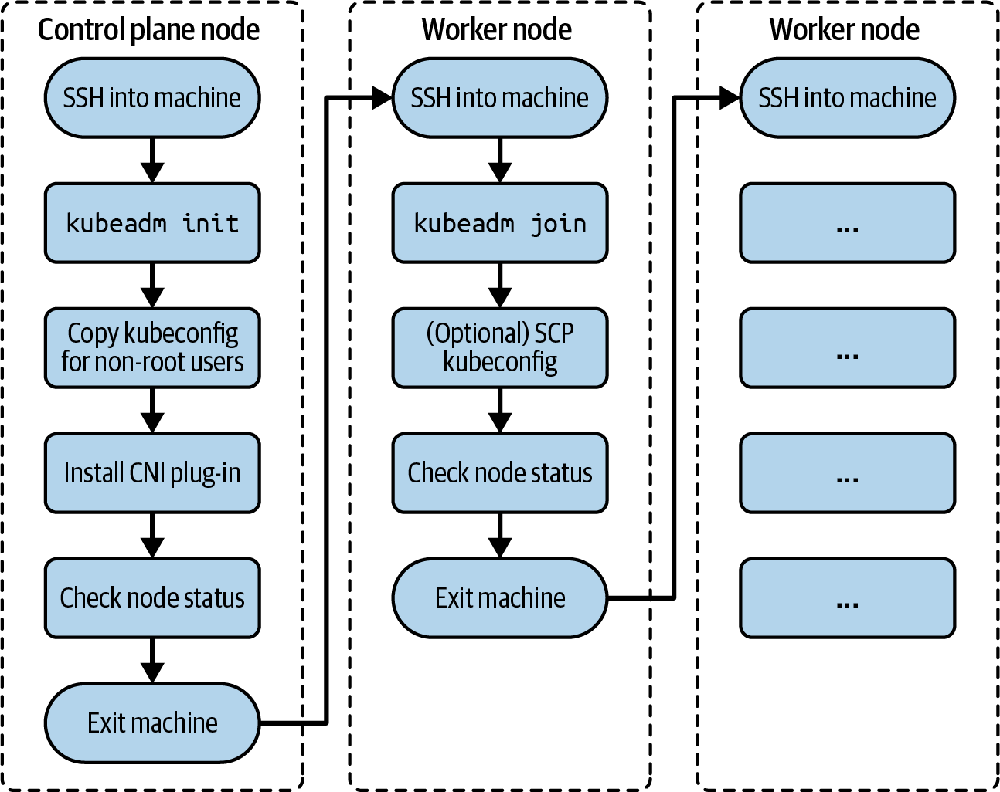
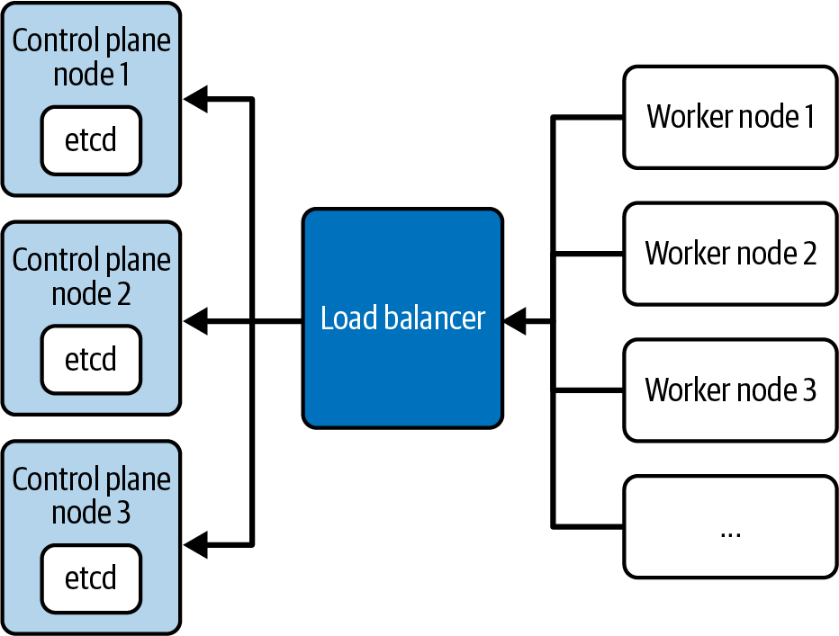
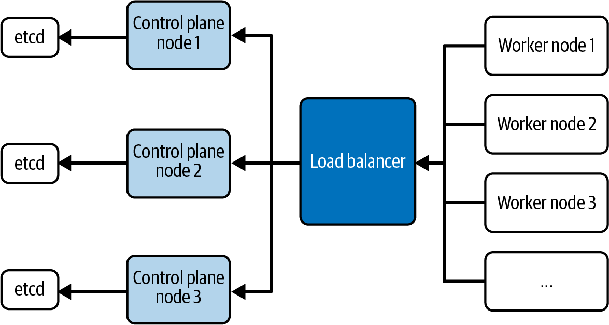
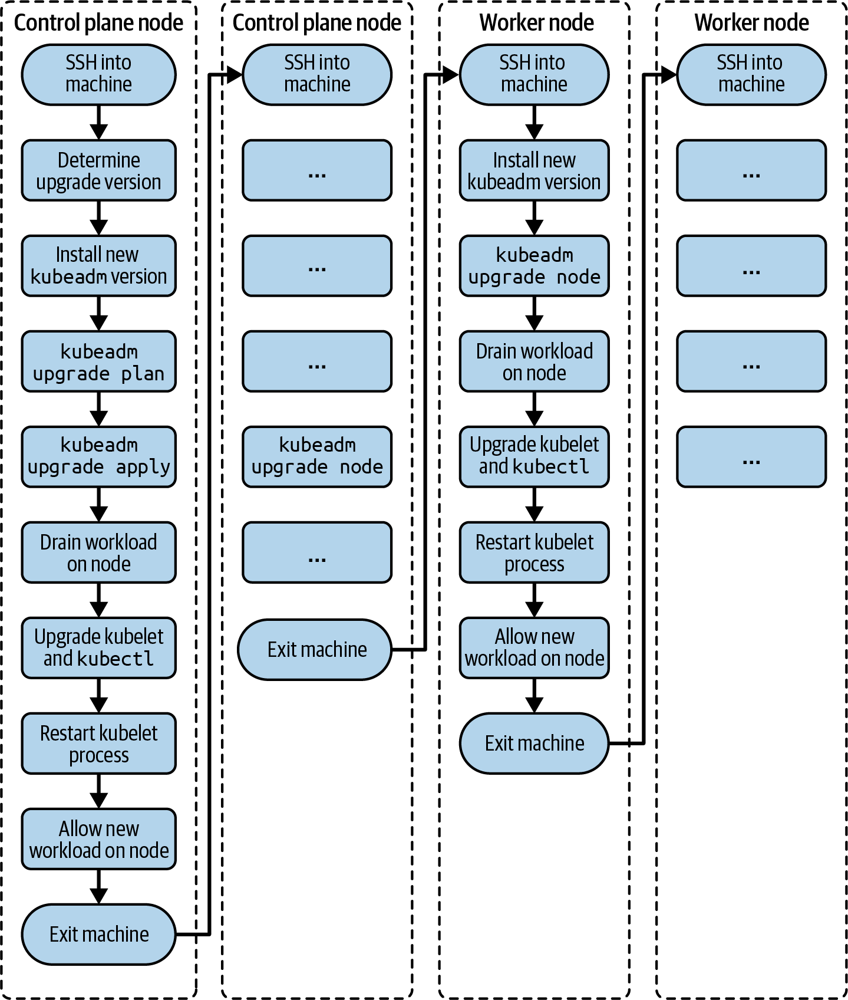

# Chương 4. Cài đặt và nâng cấp cluster

*Dịch từ: Chapter 4. Cluster Installation and Upgrade — Certified Kubernetes Administrator (CKA) Study Guide, 2nd Edition (O'Reilly).*

Lĩnh vực đầu tiên của đề cương (curriculum) đề cập đến những công việc điển hình mà bạn kỳ vọng ở một người quản trị Kubernetes. Những công việc đó bao gồm hiểu các thành phần kiến trúc của một cluster Kubernetes, dựng một cluster từ đầu và duy trì cluster về sau. Kết thúc chương này, bạn sẽ hiểu các công cụ và quy trình để cài đặt và duy trì một cluster Kubernetes.

> **PHẠM VI BAO PHỦ MỤC TIÊU ĐỀ CƯƠNG**
>
> Chương này đề cập đến các mục tiêu đề cương sau:
>
> - Chuẩn bị hạ tầng nền tảng để cài đặt một cluster Kubernetes
> - Hiểu các giao diện mở rộng (CNI, CSI, CRI, v.v.)
> - Tạo và quản lý các cluster Kubernetes bằng `kubeadm`
> - Quản lý vòng đời của các cluster Kubernetes
> - Triển khai và cấu hình một control plane có tính sẵn sàng cao

## Cung cấp hạ tầng

Hạ tầng mà các node của cluster Kubernetes cần đến bao gồm máy chủ, mạng và lưu trữ. Việc cung cấp hạ tầng (provisioning) được thực hiện bằng cách cấu hình các tài nguyên đó tại chỗ (on premises) hoặc trên cloud, tốt nhất là theo cách tự động. Đó chính là mục đích của các công cụ tự động hóa hạ tầng như Ansible và Terraform.

Mặc dù "cung cấp hạ tầng" đã được nhắc đến trong đề cương kỳ thi, một cuộc thảo luận chi tiết về chủ đề này sẽ vượt ra ngoài phạm vi của cuốn sách và không liên quan trực tiếp đến Kubernetes. Nếu bạn quan tâm hơn đến chủ đề này, hãy xem cuốn sách *Infrastructure as Code* của Kief Morris (O'Reilly, 2025).

## Tìm hiểu các giao diện mở rộng

Chương 2 đã đặt nền móng để hiểu kiến trúc Kubernetes, các loại node và các thành phần cluster của chúng. Kiến trúc Kubernetes được thiết kế linh hoạt, mô-đun hóa và có khả năng mở rộng để chức năng cốt lõi của nền tảng có thể được mở rộng thêm. Bạn có thể mở rộng cluster bằng các *extension* (phần mở rộng). Extension là các thành phần có thể được cắm vào nền tảng để hỗ trợ chức năng tùy chỉnh không có sẵn trong Kubernetes. Những plug-in này thường bao gồm các chức năng như plug-in mạng, plug-in thiết bị và plug-in lưu trữ.

Mục này nói về các giao diện quan trọng mà bạn sẽ cần hiểu với tư cách là người quản trị Kubernetes:

- Container Network Interface (CNI)
- Container Runtime Interface (CRI)
- Container Storage Interface (CSI)

### Container Network Interface (CNI)

CNI là một đặc tả (specification) cùng các thư viện tương ứng để viết plug-in cấu hình giao diện mạng trong container Linux. Trong Kubernetes, CNI chịu trách nhiệm thiết lập kết nối mạng giữa các Pod đang chạy trong cluster. Bạn sẽ cần cài đặt một plug-in CNI trên (các) node control plane để chúng hoạt động đúng. Mục "Cài đặt Pod Network Add-on" minh họa quy trình cài đặt một CNI.

Các lựa chọn phổ biến bao gồm Calico, flannel, Cilium và các giải pháp dành riêng cho cloud như AWS VPC CNI và Azure CNI.

### Container Runtime Interface (CRI)

Container runtime chịu trách nhiệm quản lý vòng đời của container và đảm bảo rằng container nhận được các tài nguyên mà chúng yêu cầu. Kubernetes sử dụng containerd làm container runtime mặc định, tuy nhiên bạn có thể thay thế bằng một container runtime khác nếu cần. CRI là một API tạo điều kiện cho sự tương tác giữa Kubernetes và các container runtime khác nhau.

Các nhà cung cấp phổ biến bao gồm containerd (phổ biến nhất), CRI-O, Docker Engine (thông qua cri-dockerd) và Mirantis Container Runtime, với khoảng 10–15 tùy chọn runtime sẵn sàng cho môi trường sản xuất (production-ready) có triển khai đặc tả CRI.

### Container Storage Interface (CSI)

Mặc dù Kubernetes cung cấp một hệ thống plug-in volume, việc tích hợp các giải pháp lưu trữ của bên thứ ba vẫn rất khó khăn. Để giải quyết vấn đề này, CSI đã được phát triển như một tiêu chuẩn để triển khai các plug-in tích hợp hệ thống lưu trữ khối (block) và tệp (file) tùy ý với các workload được container hóa.

Các nhà cung cấp hàng đầu bao gồm các tùy chọn cloud native như AWS EBS CSI, Azure Disk CSI và GCE Persistent Disk CSI, cùng với các driver hệ thống lưu trữ từ NetApp, Pure Storage, Portworx và Rook/Ceph, tổng cộng có hơn một trăm driver CSI trong hệ sinh thái cho nhiều backend lưu trữ khác nhau, từ các nhà cung cấp cloud đến các nhà cung cấp lưu trữ truyền thống.

## Sử dụng kubeadm

Công cụ dòng lệnh cấp thấp để thực hiện các thao tác khởi tạo (bootstrapping) cluster được gọi là `kubeadm`. Nó không dành cho việc cung cấp hạ tầng nền tảng.

Để cài đặt `kubeadm`, hãy làm theo hướng dẫn cài đặt trong tài liệu chính thức của Kubernetes. Mặc dù không được nêu rõ trong trang câu hỏi thường gặp (FAQ) của CKA, bạn có thể giả định rằng tệp thực thi `kubeadm` đã được cài đặt sẵn cho bạn.

Các mục tiếp theo mô tả ở mức tổng quan quy trình tạo và quản lý một cluster Kubernetes và sẽ sử dụng `kubeadm` rất nhiều. Để biết thông tin chi tiết hơn, hãy xem tài liệu tham khảo từng bước của Kubernetes mà tôi sẽ chỉ ra cho mỗi tác vụ.

## Cài đặt Cluster

Topology (cấu trúc liên kết) cơ bản nhất của một cluster Kubernetes bao gồm một node duy nhất vừa đóng vai trò control plane vừa là worker node. Theo mặc định, nhiều bản cài đặt Kubernetes hướng đến nhà phát triển như minikube hoặc Docker Desktop khởi đầu với cấu hình này. Mặc dù cluster một node có thể là lựa chọn tốt cho một sân chơi Kubernetes, nó không phải là nền tảng tốt xét về khả năng mở rộng và tính sẵn sàng cao. Ít nhất, bạn sẽ muốn tạo một cluster với một control plane duy nhất và một hoặc nhiều node xử lý workload.

Mục này giải thích cách cài đặt một cluster với một control plane duy nhất và một worker node. Bạn có thể lặp lại quy trình cài đặt worker node để thêm nhiều worker node hơn vào cluster. Bạn có thể tìm thấy mô tả đầy đủ về các bước cài đặt trong tài liệu chính thức của Kubernetes. Hình 4-1 minh họa quy trình cài đặt.



*Hình 4-1. Quy trình cài đặt một cluster*

### Khởi tạo node control plane

Bắt đầu bằng việc khởi tạo control plane trên node control plane. Control plane là máy chịu trách nhiệm lưu trữ API server, etcd và các thành phần quan trọng khác để quản lý cluster Kubernetes.

Mở một shell tương tác đến node control plane bằng lệnh `ssh`. Lệnh sau nhắm đến node control plane có tên `kube-control-plane` đang chạy Ubuntu 24.10:

```shell
$ ssh kube-control-plane
Welcome to Ubuntu 24.10 (GNU/Linux 6.11.0-8-generic aarch64)
...
```

Khởi tạo control plane bằng lệnh `kubeadm init`. Bạn sẽ cần thêm hai tùy chọn dòng lệnh sau: cung cấp dải địa chỉ IP cho mạng Pod bằng tùy chọn `--pod-network-cidr`. Với tùy chọn `--apiserver-advertise-address`, bạn có thể khai báo địa chỉ IP mà API Server sẽ quảng bá để lắng nghe.

Theo mặc định, `kubeadm` dùng phiên bản của chính nó để xác định phiên bản của node control plane. Ví dụ, nếu bạn dùng `kubeadm` phiên bản 1.31.1, thì nó sẽ dùng phiên bản 1.31.1 cho node được khởi tạo. Bạn có thể cung cấp phiên bản Kubernetes mong muốn bằng tùy chọn `--kubernetes-version`, mặc dù khuyến nghị là dùng phiên bản `kubeadm` mà bạn muốn dùng cho các node.

Đầu ra trên console hiển thị một lệnh `kubeadm join`. Hãy giữ lại lệnh đó để dùng sau. Nó rất quan trọng cho việc thêm các worker node vào cluster ở bước sau.

> **LẤY LẠI LỆNH JOIN CHO CÁC WORKER NODE**
>
> Bạn luôn có thể lấy lại lệnh `join` bằng cách chạy `kubeadm token create --print-join-command` trên node control plane nếu chẳng may làm mất nó.

Lệnh sau dùng `10.244.0.0/16` làm Classless Inter-Domain Routing (CIDR):

```shell
$ sudo kubeadm init --pod-network-cidr=10.244.0.0/16
...
To start using your cluster, you need to run the following as a regular user:

  mkdir -p $HOME/.kube
  sudo cp -i /etc/kubernetes/admin.conf $HOME/.kube/config
  sudo chown $(id -u):$(id -g) $HOME/.kube/config

You should now deploy a pod network to the cluster.
Run "kubectl apply -f [podnetwork].yaml" with one of the options listed at:
  https://kubernetes.io/docs/concepts/cluster-administration/addons/

Then you can join any number of worker nodes by running the following on \
each as root:

kubeadm join 172.16.0.5:6443 --token fi8io0.dtkzsy9kws56dmsp \
    --discovery-token-ca-cert-hash \
    sha256:cc89ea1f82d5ec460e21b69476e0c052d691d0c52cce83fbd7e403559c1ebdac
```

Sau khi lệnh `init` hoàn tất, hãy chạy các lệnh cần thiết từ đầu ra trên console:

```shell
$ mkdir -p $HOME/.kube
$ sudo cp -i /etc/kubernetes/admin.conf $HOME/.kube/config
$ sudo chown $(id -u):$(id -g) $HOME/.kube/config
```

### Cài đặt Pod Network Add-on

Bạn phải triển khai một plug-in Container Network Interface (CNI) để các Pod có thể giao tiếp với nhau. Bạn có thể chọn từ nhiều plug-in mạng được liệt kê trong tài liệu Kubernetes. Các plug-in phổ biến bao gồm flannel, Calico và Cilium. Đôi khi bạn sẽ thấy thuật ngữ *add-on* trong tài liệu, thuật ngữ này đồng nghĩa với plug-in.

Kỳ thi rất có thể sẽ yêu cầu bạn cài đặt một add-on cụ thể. Hầu hết hướng dẫn cài đặt nằm trên các trang web bên ngoài, vốn không được phép sử dụng trong kỳ thi. Hãy đảm bảo bạn tìm kiếm hướng dẫn liên quan trong tài liệu chính thức của Kubernetes. Ví dụ, bạn có thể tìm thấy hướng dẫn cài đặt flannel trên GitHub.

#### Cài đặt flannel bằng kubectl

Lệnh sau cài đặt các đối tượng của flannel thông qua manifest YAML đã phát hành:

```shell
$ kubectl apply -f https://github.com/flannel-io/flannel/releases/latest/\
download/kube-flannel.yml
namespace/kube-flannel created
serviceaccount/flannel created
clusterrole.rbac.authorization.k8s.io/flannel created
clusterrolebinding.rbac.authorization.k8s.io/flannel created
configmap/kube-flannel-cfg created
daemonset.apps/kube-flannel-ds created
```

Manifest YAML này gán cứng (hard-code) Pod CIDR thành giá trị `10.244.0.0/16`. Nếu muốn thay đổi giá trị đó, bạn sẽ phải tải manifest YAML về trước, chỉnh sửa giá trị tương ứng, rồi áp dụng manifest.

#### Cài đặt flannel bằng Helm

Bạn có thể quyết định cài đặt flannel bằng Helm thay thế, hoặc vì bạn thích phương pháp cài đặt này, hoặc vì bạn muốn cung cấp Pod CIDR tùy chỉnh một cách thuận tiện hơn. Helm cung cấp tùy chọn `--set` để chèn giá trị tùy chỉnh. Lệnh sau minh họa việc dùng Helm để cài đặt flannel. Tham khảo mục "Làm việc với Helm" để tìm hiểu thêm về cách sử dụng Helm:

```shell
$ kubectl create ns kube-flannel
$ kubectl label --overwrite ns kube-flannel pod-security.kubernetes.io/\
enforce=privileged
$ helm repo add flannel https://flannel-io.github.io/flannel/
$ helm install flannel --set podCidr="10.244.0.0/16" --namespace kube-flannel \
  flannel/flannel
namespace/kube-flannel created
namespace/kube-flannel labeled
"flannel" has been added to your repositories
NAME: flannel
LAST DEPLOYED: Wed Jan 29 23:03:33 2025
NAMESPACE: kube-flannel
STATUS: deployed
REVISION: 1
TEST SUITE: None
```

Cả hai phương pháp cài đặt, manifest YAML và Helm chart, đều tạo Pod flannel trong namespace `kube-flannel`. Hãy đợi đến khi Pod đạt trạng thái `Running`. Bạn có thể kiểm tra chi tiết của Pod bằng lệnh sau:

```shell
$ kubectl get pods -n kube-flannel
NAME                    READY   STATUS    RESTARTS   AGE
kube-flannel-ds-h6455   1/1     Running   0          25s
```

Xác minh rằng node control plane cho thấy trạng thái `Ready` bằng lệnh `kubectl get nodes`. Có thể mất vài giây trước khi node chuyển từ trạng thái `NotReady` sang trạng thái `Ready`. Nếu quá trình chuyển trạng thái không diễn ra, bạn đang gặp vấn đề với việc cài đặt node. Tham khảo Phần VI để biết các chiến lược debug:

```shell
$ kubectl get nodes
NAME                 STATUS   ROLES           AGE     VERSION
kube-control-plane   Ready    control-plane   5m31s   v1.31.1
```

Thoát khỏi node control plane bằng lệnh `exit`:

```shell
$ exit
logout
...
```

### Thêm các worker node vào cluster

Worker node chịu trách nhiệm xử lý workload do control plane lập lịch. Ví dụ về workload là Pod, Deployment, Job và CronJob. Để thêm một worker node vào cluster sao cho nó có thể được sử dụng, bạn sẽ phải chạy một vài lệnh, như mô tả tiếp theo.

Mở một shell tương tác đến worker node bằng lệnh `ssh`. Lệnh sau nhắm đến worker node có tên `kube-worker-1` đang chạy Ubuntu 24.10:

```shell
$ ssh kube-worker-1
Welcome to Ubuntu 24.10 (GNU/Linux 6.11.0-8-generic aarch64)
...
```

Chạy lệnh `kubeadm join` được cung cấp trong đầu ra console của `kubeadm init` trên node control plane. Lệnh sau là một ví dụ. Hãy nhớ rằng địa chỉ IP, token và hash SHA256 sẽ khác đối với bạn:

```shell
$ sudo kubeadm join 172.16.0.5:6443 --token fi8io0.dtkzsy9kws56dmsp \
  --discovery-token-ca-cert-hash \
  sha256:cc89ea1f82d5ec460e21b69476e0c052d691d0c52cce83fbd7e403559c1ebdac
[preflight] Running pre-flight checks
[preflight] Reading configuration from the cluster...
[preflight] FYI: You can look at this config file with \
'kubectl -n kube-system get cm kubeadm-config -o yaml'
[kubelet-start] Writing kubelet configuration to file \
"/var/lib/kubelet/config.yaml"
[kubelet-start] Writing kubelet environment file with \
flags to file "/var/lib/kubelet/kubeadm-flags.env"
[kubelet-start] Starting the kubelet
[kubelet-start] Waiting for the kubelet to perform the TLS Bootstrap...

This node has joined the cluster:
* Certificate signing request was sent to apiserver and a response was received.
* The Kubelet was informed of the new secure connection details.

Run 'kubectl get nodes' on the control plane to see this node join the cluster.
```

Bạn sẽ không thể chạy lệnh `kubectl get nodes` từ worker node nếu không sao chép tệp kubeconfig của người quản trị từ node control plane. Hãy làm theo hướng dẫn trong tài liệu Kubernetes để thực hiện việc đó, hoặc đăng nhập lại vào node control plane. Ở đây, chúng ta chỉ đơn giản đăng nhập lại vào node control plane. Bạn sẽ thấy worker node đã gia nhập cluster và ở trạng thái `Ready`:

```shell
$ ssh kube-control-plane
Welcome to Ubuntu 24.10 (GNU/Linux 6.11.0-8-generic aarch64)
...
$ kubectl get nodes
NAME                 STATUS   ROLES           AGE     VERSION
kube-control-plane   Ready    control-plane   2m14s   v1.31.1
kube-worker-1        Ready    <none>          6m43s   v1.31.1
```

Bạn có thể lặp lại quy trình này cho bất kỳ worker node nào khác mà bạn muốn thêm vào cluster.

## Quản lý cluster có tính sẵn sàng cao

Cluster với một control plane duy nhất dễ cài đặt; tuy nhiên, chúng gặp vấn đề khi node đó bị mất. Một khi node control plane trở nên không khả dụng, bất kỳ ReplicaSet nào đang chạy trên worker node đều không thể tạo lại Pod do không thể liên lạc ngược với scheduler chạy trên node control plane. Hơn nữa, cluster không còn có thể được truy cập từ bên ngoài nữa (ví dụ, qua `kubectl`), vì không thể kết nối tới API server.

*Cluster có tính sẵn sàng cao (high-availability, HA)* giúp ích cho khả năng mở rộng và tính dự phòng (redundancy). Đối với kỳ thi, bạn sẽ cần hiểu biết cơ bản về cách cấu hình chúng và các hệ quả của chúng. Với độ phức tạp của việc dựng một cluster HA, khó có khả năng bạn sẽ được yêu cầu thực hiện các bước này trong kỳ thi. Để có thảo luận đầy đủ về việc thiết lập cluster HA, hãy xem tài liệu Kubernetes.

### Topology etcd xếp chồng

*Topology etcd xếp chồng (stacked etcd topology)* bao gồm việc tạo hai hoặc nhiều node control plane với etcd được đặt cùng trên chính node đó. Hình 4-2 minh họa topology này với ba node control plane.

Mỗi node control plane lưu trữ API server, scheduler và controller manager. Các worker node giao tiếp với API server thông qua một load balancer. Tôi khuyến nghị bạn vận hành topology cluster này với tối thiểu ba node control plane vì lý do dự phòng, do etcd gắn chặt với node control plane. Theo mặc định, `kubeadm` sẽ tạo một instance etcd khi thêm một node control plane vào cluster.



*Hình 4-2. Topology etcd xếp chồng với ba node control plane*

### Topology node etcd bên ngoài

*Topology node etcd bên ngoài (external etcd node topology)* tách etcd khỏi node control plane bằng cách chạy nó trên một máy chuyên dụng. Hình 4-3 minh họa một thiết lập với ba node control plane, mỗi node chạy etcd trên một máy khác.



*Hình 4-3. Topology node etcd bên ngoài*

Tương tự topology etcd xếp chồng, mỗi node control plane lưu trữ API server, scheduler và controller manager. Các worker node giao tiếp với chúng thông qua một load balancer. Điểm khác biệt chính ở đây là các instance etcd chạy trên một host riêng biệt. Topology này tách rời etcd khỏi các chức năng control plane khác và do đó ít ảnh hưởng đến tính dự phòng hơn khi một node control plane bị mất. Như bạn có thể thấy trong hình minh họa, topology này cần số lượng host gấp đôi so với topology etcd xếp chồng.

## Nâng cấp phiên bản Cluster

Theo thời gian, bạn sẽ muốn nâng cấp phiên bản Kubernetes của một cluster hiện có để nhận các bản sửa lỗi và tính năng mới. Quy trình nâng cấp phải được thực hiện một cách có kiểm soát để tránh gián đoạn workload đang chạy và ngăn ngừa hư hỏng các node của cluster.

Khuyến nghị là nâng cấp từ một phiên bản minor lên phiên bản minor kế tiếp (ví dụ, từ 1.31.0 lên 1.32.0), hoặc từ một phiên bản patch lên phiên bản patch cao hơn (ví dụ, từ 1.31.0 lên 1.31.3). Tránh nhảy qua nhiều phiên bản minor cùng lúc để tránh các tác dụng phụ không mong muốn. Bạn có thể tìm thấy mô tả đầy đủ về các bước nâng cấp trong tài liệu chính thức của Kubernetes. Hình 4-4 minh họa quy trình nâng cấp.



*Hình 4-4. Quy trình nâng cấp phiên bản cluster*

### Nâng cấp các node control plane

Như đã giải thích trước đó, một cluster Kubernetes có thể dùng một hoặc nhiều node control plane để hỗ trợ tốt hơn các yêu cầu về tính sẵn sàng cao và khả năng mở rộng. Khi nâng cấp phiên bản cluster, thay đổi này cần được thực hiện lần lượt trên từng node control plane một.

Chọn một trong các node control plane có chứa tệp kubeconfig (nằm tại */etc/kubernetes/admin.conf*), và mở một shell tương tác đến node control plane bằng lệnh `ssh`. Lệnh sau nhắm đến node control plane có tên `kube-control-plane` đang chạy Ubuntu 24.10:

```shell
$ ssh kube-control-plane
Welcome to Ubuntu 24.10 (GNU/Linux 6.11.0-8-generic aarch64)
...
```

Trước tiên, kiểm tra các node và phiên bản Kubernetes của chúng. Trong thiết lập này, tất cả các node đều chạy phiên bản 1.31.1. Chúng ta chỉ làm việc với một node control plane và một worker node:

```shell
$ kubectl get nodes
NAME                 STATUS   ROLES           AGE     VERSION
kube-control-plane   Ready    control-plane   4m54s   v1.31.1
kube-worker-1        Ready    <none>          3m18s   v1.31.1
```

Bắt đầu bằng việc nâng cấp phiên bản `kubeadm`. Xác định phiên bản mà bạn muốn nâng cấp lên. Trên các máy Ubuntu, bạn có thể dùng lệnh `apt-get` sau. Định dạng phiên bản thường bao gồm cả phiên bản patch (ví dụ, `1.20.7-00`). Hãy kiểm tra tài liệu Kubernetes nếu máy của bạn chạy hệ điều hành khác:

```shell
$ sudo apt update
...
$ sudo apt-cache madison kubeadm
   kubeadm | 1.31.5-1.1 | https://pkgs.k8s.io/core:/stable:/v1.31/deb  Packages
   kubeadm | 1.31.4-1.1 | https://pkgs.k8s.io/core:/stable:/v1.31/deb  Packages
   kubeadm | 1.31.3-1.1 | https://pkgs.k8s.io/core:/stable:/v1.31/deb  Packages
   kubeadm | 1.31.2-1.1 | https://pkgs.k8s.io/core:/stable:/v1.31/deb  Packages
   kubeadm | 1.31.1-1.1 | https://pkgs.k8s.io/core:/stable:/v1.31/deb  Packages
   kubeadm | 1.31.0-1.1 | https://pkgs.k8s.io/core:/stable:/v1.31/deb  Packages
```

Nâng cấp `kubeadm` lên phiên bản đích. Giả sử bạn muốn nâng cấp lên phiên bản 1.31.5-1.1. Chuỗi lệnh sau cài đặt `kubeadm` với phiên bản cụ thể đó và kiểm tra phiên bản hiện được cài đặt để xác minh:

```shell
$ sudo apt-mark unhold kubeadm && sudo apt-get update && sudo apt-get install \
  -y kubeadm=1.31.5-1.1 && sudo apt-mark hold kubeadm
Canceled hold on kubeadm.
...
Unpacking kubeadm (1.31.5-1.1) over (1.31.1-1.1) ...
Setting up kubeadm (1.31.5-1.1) ...
kubeadm set on hold.
$ sudo apt-get update && sudo apt-get install -y --allow-change-held-packages \
  kubeadm=1.31.5-1.1
...
kubeadm is already the newest version (1.31.5-1.1).
0 upgraded, 0 newly installed, 0 to remove and 94 not upgraded.
$ kubeadm version
kubeadm version: &version.Info{Major:"1", Minor:"31", GitVersion:"v1.31.5",
GitCommit:"af64d838aacd9173317b39cf273741816bd82377", GitTreeState:"clean",
BuildDate:"2025-01-15T14:39:21Z", GoVersion:"go1.22.10", Compiler:"gc", \
Platform:"linux/arm64"}
```

Kiểm tra những phiên bản nào có sẵn để nâng cấp lên và xác thực xem cluster hiện tại của bạn có thể nâng cấp được hay không. Bạn có thể thấy trong đầu ra của lệnh sau rằng chúng ta có thể nâng cấp lên phiên bản 1.31.5:

```shell
$ sudo kubeadm upgrade plan
...
[upgrade] Fetching available versions to upgrade to
[upgrade/versions] Cluster version: 1.31.5
[upgrade/versions] kubeadm version: v1.31.5
I0130 22:26:53.887541   13574 version.go:261] remote version is \
much newer: v1.32.1; falling back to: stable-1.31
[upgrade/versions] Target version: v1.31.5
[upgrade/versions] Latest version in the v1.31 series: v1.31.
```

Như mô tả trong đầu ra console, chúng ta sẽ bắt đầu nâng cấp control plane. Quá trình này có thể mất vài phút. Bạn cũng có thể phải nâng cấp cả plug-in CNI. Hãy làm theo hướng dẫn của nhà cung cấp để biết thêm thông tin:

```shell
$ sudo kubeadm upgrade apply v1.31.5
...
[upgrade/version] You have chosen to change the cluster version to "v1.31.5"
[upgrade/versions] Cluster version: v1.31.5
[upgrade/versions] kubeadm version: v1.31.5
...
[upgrade/successful] SUCCESS! Your cluster was upgraded to "v1.31.5". Enjoy!

[upgrade/kubelet] Now that your control plane is upgraded, please proceed \
with upgrading your kubelets if you haven't already done so.
```

Drain node control plane bằng cách trục xuất (evict) workload. Workload mới sẽ không thể được lập lịch lên node này cho đến khi node được uncordon (mở khóa lập lịch trở lại):

```shell
$ kubectl drain kube-control-plane --ignore-daemonsets
node/kube-control-plane cordoned
WARNING: ignoring DaemonSet-managed Pods: kube-system/calico-node-qndb9, \
kube-system/kube-proxy-vpvms
evicting pod kube-system/calico-kube-controllers-65f8bc95db-krp72
evicting pod kube-system/coredns-f9fd979d6-2brkq
pod/calico-kube-controllers-65f8bc95db-krp72 evicted
pod/coredns-f9fd979d6-2brkq evicted
node/kube-control-plane evicted
```

Nâng cấp kubelet và công cụ `kubectl` lên cùng phiên bản:

```shell
$ sudo apt-mark unhold kubelet kubectl && sudo apt-get update && sudo \
  apt-get install -y kubelet=1.31.5-1.1 kubectl=1.31.5-1.1 && sudo apt-mark \
  hold kubelet kubectl
...
Setting up kubelet (1.31.5-1.1) ...
Setting up kubectl (1.31.5-1.1) ...
kubelet set on hold.
kubectl set on hold.
```

Khởi động lại tiến trình kubelet:

```shell
$ sudo systemctl daemon-reload
$ sudo systemctl restart kubelet
```

Kích hoạt lại node control plane để workload mới có thể được lập lịch:

```shell
$ kubectl uncordon kube-control-plane
node/kube-control-plane uncordoned
```

Node control plane bây giờ sẽ hiển thị đang sử dụng Kubernetes 1.31.5:

```shell
$ kubectl get nodes
NAME                 STATUS   ROLES           AGE   VERSION
kube-control-plane   Ready    control-plane   21h   v1.31.5
kube-worker-1        Ready    <none>          21h   v1.31.1
```

Thoát khỏi node control plane bằng lệnh `exit`:

```shell
$ exit
logout
...
```

### Nâng cấp các worker node

Chọn một trong các worker node và mở một shell tương tác đến node đó bằng lệnh `ssh`. Lệnh sau nhắm đến worker node có tên `kube-worker-1` đang chạy Ubuntu 24.10:

```shell
$ ssh kube-worker-1
Welcome to Ubuntu 24.10 (GNU/Linux 6.11.0-8-generic aarch64)
...
```

Nâng cấp `kubeadm` lên phiên bản đích. Đây chính là lệnh bạn đã dùng cho node control plane, như đã giải thích trước đó:

```shell
$ sudo apt-mark unhold kubeadm && sudo apt-get update && sudo apt-get install \
  -y kubeadm=1.31.5-1.1 && sudo apt-mark hold kubeadm
Canceled hold on kubeadm.
...
Unpacking kubeadm (1.31.5-1.1) over (1.31.1-1.1) ...
Setting up kubeadm (1.31.5-1.1) ...
kubeadm set on hold.
$ kubeadm version
kubeadm version: &version.Info{Major:"1", Minor:"31", GitVersion:"v1.31.5",
GitCommit:"af64d838aacd9173317b39cf273741816bd82377", GitTreeState:"clean",
BuildDate:"2025-01-15T14:39:21Z", GoVersion:"go1.22.10", Compiler:"gc", \
Platform:"linux/arm64"}
```

Nâng cấp cấu hình kubelet:

```shell
$ sudo kubeadm upgrade node
[upgrade] Reading configuration from the cluster...
[upgrade] FYI: You can look at this config file with \
'kubectl -n kube-system get cm kubeadm-config -o yaml'
[preflight] Running pre-flight checks
[preflight] Skipping prepull. Not a control plane node.
[upgrade] Skipping phase. Not a control plane node.
[upgrade] Skipping phase. Not a control plane node.
[upgrade] Backing up kubelet config file to \
/etc/kubernetes/tmp/kubeadm-kubelet-config3058962439/config.yaml
[kubelet-start] Writing kubelet configuration to file \
"/var/lib/kubelet/config.yaml"
[upgrade] The configuration for this node was successfully updated!
[upgrade] Now you should go ahead and upgrade the kubelet package \
using your package manager.
```

Drain worker node bằng cách trục xuất workload. Workload mới sẽ không thể được lập lịch lên node này cho đến khi node được uncordon:

```shell
$ kubectl drain kube-worker-1 --ignore-daemonsets
node/kube-worker-1 cordoned
WARNING: ignoring DaemonSet-managed Pods: kube-system/calico-node-2hrxg, \
kube-system/kube-proxy-qf6nl
evicting pod kube-system/calico-kube-controllers-65f8bc95db-kggbr
evicting pod kube-system/coredns-f9fd979d6-7zm4q
evicting pod kube-system/coredns-f9fd979d6-tlmhq
pod/calico-kube-controllers-65f8bc95db-kggbr evicted
pod/coredns-f9fd979d6-7zm4q evicted
pod/coredns-f9fd979d6-tlmhq evicted
node/kube-worker-1 evicted
```

Nâng cấp kubelet và công cụ `kubectl` bằng cùng lệnh đã dùng cho node control plane:

```shell
$ sudo apt-mark unhold kubelet kubectl && sudo apt-get update && sudo apt-get \
  install -y kubelet=1.31.5-1.1 kubectl=1.31.5-1.1 && sudo apt-mark hold kubelet \
  kubectl
...
Setting up kubelet (1.31.5-1.1) ...
Setting up kubectl (1.31.5-1.1) ...
kubelet set on hold.
kubectl set on hold.
```

Khởi động lại tiến trình kubelet:

```shell
$ sudo systemctl daemon-reload
$ sudo systemctl restart kubelet
```

Kích hoạt lại worker node để workload mới có thể được lập lịch:

```shell
$ kubectl uncordon kube-worker-1
node/kube-worker-1 uncordoned
```

Liệt kê các node bây giờ sẽ hiển thị phiên bản 1.31.5 cho worker node. Bạn sẽ không thể chạy `kubectl get nodes` từ worker node nếu không sao chép tệp kubeconfig của người quản trị từ node control plane. Hãy làm theo hướng dẫn trong tài liệu Kubernetes để thực hiện việc đó, hoặc đăng nhập lại vào node control plane:

```shell
$ kubectl get nodes
NAME                 STATUS   ROLES           AGE   VERSION
kube-control-plane   Ready    control-plane   24h   v1.31.5
kube-worker-1        Ready    <none>          24h   v1.31.5
```

Thoát khỏi worker node bằng lệnh `exit`:

```shell
$ exit
logout
...
```

## Tóm tắt

Với tư cách là người quản trị Kubernetes, bạn cần quen thuộc với các công việc điển hình liên quan đến việc quản lý các node của cluster. Công cụ chính để cài đặt node mới và nâng cấp phiên bản node là `kubeadm`. Topology của một cluster như vậy có thể khác nhau. Để đạt kết quả tối ưu về tính dự phòng và khả năng mở rộng, hãy cân nhắc cấu hình cluster với thiết lập có tính sẵn sàng cao sử dụng từ ba node control plane trở lên và các host etcd chuyên dụng.

## Trọng tâm cho kỳ thi

**Hiểu vì sao bạn cần cung cấp hạ tầng**

Mỗi node của cluster đều cần chạy trên một máy vật lý hoặc máy ảo. Cung cấp phần cứng là công việc của người quản trị, mặc dù bạn sẽ không cần có kinh nghiệm thực hành cho kỳ thi. Hãy tìm hiểu các cách tiếp cận thủ công và tự động để cung cấp phần cứng, vì bạn sẽ cần đến nó để cài đặt một cluster.

**Biết cách tạo một cluster Kubernetes từ đầu**

Cài đặt các node cluster mới và nâng cấp phiên bản của một node cluster hiện có là những công việc điển hình mà người quản trị Kubernetes thực hiện. Bạn không cần ghi nhớ tất cả các bước liên quan. Tài liệu cung cấp hướng dẫn từng bước, dễ làm theo cho các thao tác đó. Trong kỳ thi, hãy mở tài liệu liên quan và sao chép–dán các lệnh.

**Luyện tập quy trình nâng cấp cluster**

Quy trình nâng cấp cluster đòi hỏi thực thi nhiều lệnh hơn quy trình cài đặt. Điều quan trọng cần nhớ là bạn chỉ nhảy lên một phiên bản minor duy nhất hoặc nhiều phiên bản patch trước khi xử lý phiên bản cao hơn kế tiếp. Tôi khuyên bạn nên mở trang tài liệu nâng cấp và đi qua quy trình này vài lần.

**Có hiểu biết lý thuyết về các topology cluster có tính sẵn sàng cao**

Cluster có tính sẵn sàng cao giúp ích cho tính dự phòng và khả năng mở rộng. Đối với kỳ thi, bạn sẽ cần hiểu các topology HA khác nhau, mặc dù khó có khả năng bạn sẽ phải cấu hình một trong số chúng vì quy trình này sẽ liên quan đến một loạt các host khác nhau.

## Bài tập mẫu

Lời giải cho các bài tập này có trong Phụ lục A.

1. Tạo một cluster với bốn node: một node control plane và ba worker node.

   Tạo một Pod có tên `nginx` sử dụng container image `nginx:1.27.4-alpine`.

   Xác định node mà Pod đã được lập lịch lên.

   Trục xuất tất cả các Pod khỏi node đang chạy Pod đó cùng một lúc. Không dùng lệnh `kubectl delete pod` để thực hiện thao tác này. Đảm bảo rằng Pod không còn chạy nữa.

   *Điều kiện tiên quyết:* Để tạo một cluster với bốn node bằng minikube, hãy chạy lệnh `minikube start --nodes 4`.

2. Di chuyển đến thư mục *app-a/ch04/upgrade-cluster-version* của kho GitHub *bmuschko/cka-study-guide* đã được checkout.

   Khởi động các máy ảo (VM) chạy cluster bằng lệnh `vagrant up`. Cluster bao gồm một node control plane duy nhất có tên `kube-control-plane` và một worker node có tên `kube-worker-1`. Mở một shell tương tác vào node control plane và kiểm tra phiên bản Kubernetes hiện đang được dùng bằng cách liệt kê tất cả các node. Nâng cấp tất cả các node của cluster từ Kubernetes 1.32.1 lên 1.32.2. Sau khi xong, tắt cluster bằng `vagrant destroy -f`.

   *Điều kiện tiên quyết:* Bài tập này yêu cầu cài đặt các công cụ Vagrant và một VMware provider.
