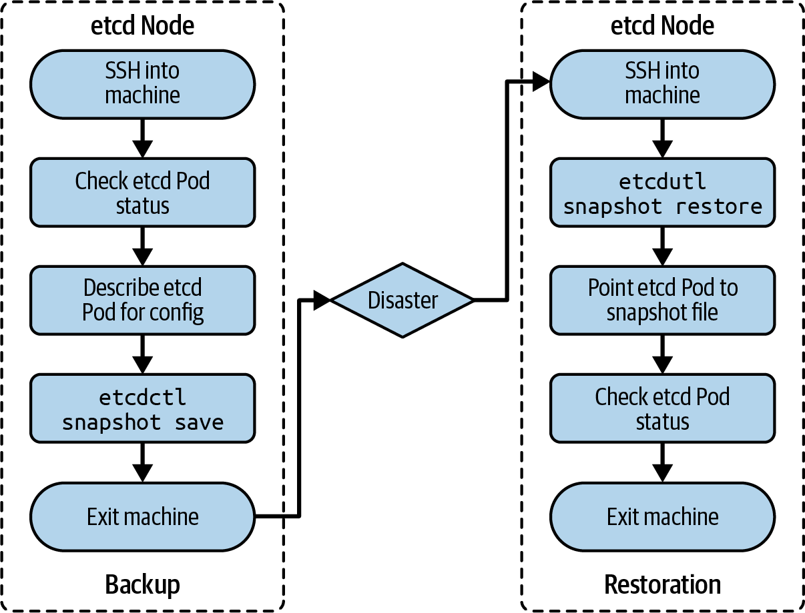

# Chương 5. Sao lưu và khôi phục etcd

*Dịch từ: Chapter 5. Backing Up and Restoring etcd — Certified Kubernetes Administrator (CKA) Study Guide, 2nd Edition (O'Reilly).*

Kubernetes lưu trữ cả trạng thái được khai báo (declared state) lẫn trạng thái quan sát được (observed state) của cluster trong kho lưu trữ key-value phân tán etcd. Điều quan trọng là phải chuẩn bị sẵn một kế hoạch sao lưu (backup) có thể giúp bạn khôi phục (restore) dữ liệu trong trường hợp dữ liệu bị hỏng. Việc sao lưu dữ liệu nên diễn ra định kỳ với khoảng thời gian ngắn giữa các lần để giảm thiểu tối đa lượng dữ liệu lịch sử bị mất.

> **PHẠM VI BAO PHỦ MỤC TIÊU ĐỀ CƯƠNG**
>
> Chương này đề cập đến mục tiêu đề cương (curriculum) sau:
>
> - Quản lý vòng đời (lifecycle) của các cluster Kubernetes

## Sử dụng các tiện ích quản trị etcd

Quy trình sao lưu lưu dữ liệu etcd vào một *file snapshot*. File snapshot này có thể được dùng để khôi phục dữ liệu etcd tại bất kỳ thời điểm nào. Bạn có thể mã hóa file snapshot để bảo vệ thông tin nhạy cảm. Công cụ `etcdctl` được dùng để tạo file snapshot sao lưu. Việc khôi phục dữ liệu etcd từ file snapshot đòi hỏi phải sử dụng công cụ `etcdutl`.

Với vai trò quản trị viên, bạn sẽ cần hiểu cách sử dụng các công cụ cho cả hai thao tác này. Bạn có thể cần cài đặt `etcdctl` và `etcdutl` nếu chúng chưa có sẵn trên node control plane. Bạn có thể tìm thấy hướng dẫn cài đặt trong kho GitHub của etcd. Hình 5-1 minh họa quy trình sao lưu và khôi phục etcd.



*Hình 5-1. Quy trình sao lưu và khôi phục etcd*

Tùy thuộc vào cấu trúc liên kết (topology) của cluster, cluster của bạn có thể bao gồm một hoặc nhiều instance etcd. Hãy tham khảo mục "Quản lý cluster có tính sẵn sàng cao (HA)" để biết thêm thông tin về cách thiết lập. Các mục tiếp theo giải thích cách thiết lập một cluster etcd một node. Bạn có thể tìm thấy hướng dẫn bổ sung về quy trình sao lưu và khôi phục cho các cluster etcd nhiều node trong tài liệu chính thức của Kubernetes.

### Sao lưu etcd

Mở một shell tương tác đến máy đang chạy etcd bằng lệnh `ssh`. Lệnh sau nhắm đến node control plane có tên `kube-control-plane` đang chạy Ubuntu 24.04 LTS:

```shell
$ ssh kube-control-plane
Welcome to Ubuntu 24.04 LTS (GNU/Linux 6.8.0-51-generic x86_64)
...
```

Kiểm tra phiên bản `etcdctl` đã cài đặt để xác nhận rằng công cụ này đã được cài. Trên node này, phiên bản là 3.5.15:

```shell
$ etcdctl version
etcdctl version: 3.5.15
API version: 3.5
```

Etcd được triển khai dưới dạng một Pod trong namespace `kube-system`. Kiểm tra phiên bản bằng cách mô tả (describe) Pod. Trong output sau, bạn sẽ thấy phiên bản là 3.5.15-0:

```shell
$ kubectl get pods -n kube-system
NAME                                                    READY      STATUS    RESTARTS   AG
...
etcd-kube-control-plane                                 1/1        Running   0          33
...
$ kubectl describe pod etcd-kube-control-plane -n kube-system
...
Containers:
  etcd:
    Container ID:  containerd://47a6cf3ed27d455be6c9b782d2e35ee77b429ee5c03c6c3d6282628f6492b15
    Image:         registry.k8s.io/etcd:3.5.15-0
    Image ID:      registry.k8s.io/etcd@sha256:a6dc63e6e8cfa0307d7851762fab629afb18f28d8aa3fab5a6e91b4af60026a
...
```

Cùng lệnh `describe` đó cho thấy cấu hình của dịch vụ etcd. Hãy tìm giá trị của tùy chọn `--listen-client-urls` để biết URL endpoint. Trong output sau, host là `localhost` và port là `2379`. Chứng chỉ (certificate) máy chủ nằm tại `/etc/kubernetes/pki/etcd/server.crt`, được định nghĩa bởi tùy chọn `--cert-file`. Chứng chỉ CA có thể được tìm thấy tại `/etc/kubernetes/pki/etcd/ca.crt`, được chỉ định bởi tùy chọn `--trusted-ca-file`:

```shell
$ kubectl describe pod etcd-kube-control-plane -n kube-system
...
Containers:
  etcd:
    ...
    Command:
      etcd
        ...
        --cert-file=/etc/kubernetes/pki/etcd/server.crt
        --key-file=/etc/kubernetes/pki/etcd/server.key
        --listen-client-urls=/etc/kubernetes/pki/etcd/server.key
        --trusted-ca-file=/etc/kubernetes/pki/etcd/ca.crt
...
```

Sử dụng lệnh `etcdctl` để tạo bản sao lưu với phiên bản 3 của công cụ. Để có một điểm khởi đầu tốt, hãy sao chép lệnh từ tài liệu chính thức của Kubernetes. Cung cấp các tùy chọn dòng lệnh (command-line option) bắt buộc `--cacert`, `--cert` và `--key`. Tùy chọn `--endpoints` là không cần thiết vì chúng ta đang chạy lệnh trên cùng máy chủ với etcd. Sau khi chạy lệnh, file `/opt/etcd-backup.db` đã được tạo:

```shell
$ sudo ETCDCTL_API=3 etcdctl --cacert=/etc/kubernetes/pki/etcd/ca.crt \
  --cert=/etc/kubernetes/pki/etcd/server.crt \
  --key=/etc/kubernetes/pki/etcd/server.key \
  snapshot save /opt/etcd-backup.db
...
Snapshot saved at /opt/etcd-backup.db
```

Thoát khỏi node bằng lệnh `exit`:

```shell
$ exit
logout
...
```

### Khôi phục etcd

Bạn đã tạo một bản sao lưu etcd và cất nó ở một nơi an toàn. Vào lúc này thì không còn gì phải làm nữa. Về thực chất, đó là hợp đồng bảo hiểm của bạn, và nó sẽ phát huy tác dụng khi thảm họa xảy ra. Trong kịch bản thảm họa—chẳng hạn dữ liệu trong etcd bị hỏng, hoặc máy quản lý etcd gặp sự cố hỏng hóc thiết bị lưu trữ vật lý—đó chính là lúc bạn muốn lấy bản sao lưu etcd ra để khôi phục.

Để khôi phục etcd từ bản sao lưu, hãy sử dụng lệnh `etcdutl snapshot restore`. Tối thiểu, hãy cung cấp tùy chọn dòng lệnh `--data-dir`.

> **LỆNH ETCDCTL ĐÃ LỖI THỜI (DEPRECATED)**
>
> Lệnh `etcdctl snapshot restore` đã lỗi thời (deprecated) và sẽ bị loại bỏ khi etcd 3.6 được phát hành. Thay vào đó, hãy sử dụng file thực thi `etcdutl snapshot restore`.

Mở một shell tương tác đến máy đang chạy etcd bằng lệnh `ssh`:

```shell
$ ssh kube-control-plane
Welcome to Ubuntu 24.04 LTS (GNU/Linux 6.8.0-51-generic x86_64)
...
```

Sau khi chạy lệnh sau, bạn sẽ có thể tìm thấy bản sao lưu đã khôi phục trong thư mục `/var/lib/from-backup`:

```shell
$ sudo ETCDCTL_API=3 etcdutl --data-dir=/var/lib/from-backup snapshot restore \
  /opt/etcd-backup.db
...
$ sudo ls /var/lib/from-backup
member
```

Chỉnh sửa manifest YAML của Pod etcd, có thể tìm thấy tại `/etc/kubernetes/manifests/etcd.yaml`. Thay đổi giá trị của thuộc tính `spec.volumes.hostPath` có tên `etcd-data` từ giá trị ban đầu `/var/lib/etcd` thành `/var/lib/from-backup`:

```shell
$ cd /etc/kubernetes/manifests/
$ sudo vim etcd.yaml
...
spec:
  volumes:
  ...
  - hostPath:
      path: /var/lib/from-backup
      type: DirectoryOrCreate
    name: etcd-data
...
```

Pod `etcd-kube-control-plane` sẽ được tạo lại và trỏ đến thư mục sao lưu đã khôi phục:

```shell
$ kubectl get pod etcd-kube-control-plane -n kube-system
NAME                      READY   STATUS    RESTARTS   AGE
etcd-kube-control-plane   1/1     Running   0          5m1s
```

Trong trường hợp Pod không chuyển sang trạng thái `Running`, hãy thử xóa nó thủ công bằng lệnh `kubectl delete pod etcd-kube-control-plane -n kube-system`.

Thoát khỏi node bằng lệnh `exit`:

```shell
$ exit
logout
...
```

## Tóm tắt

Việc sao lưu cơ sở dữ liệu etcd nên được thực hiện như một quy trình định kỳ để ngăn ngừa mất mát dữ liệu quan trọng trong trường hợp node hoặc thiết bị lưu trữ bị hỏng. Bạn có thể dùng công cụ `etcdctl` để sao lưu và công cụ `etcdutl` để khôi phục etcd từ node control plane hoặc thông qua một API endpoint.

## Trọng tâm cho kỳ thi

**Thực hành sao lưu etcd**

Việc sao lưu etcd đòi hỏi phải cài đặt một phiên bản tương thích của file thực thi `etcdctl`. Bạn có thể xác định phiên bản etcd bằng cách kiểm tra tag của container image được dùng để chạy Pod etcd (giả định rằng chúng ta đang nói về một cluster không có đặc tính sẵn sàng cao). Tiến trình etcd hoạt động bên trong một container thuộc Pod, và việc xem xét cấu hình của Pod sẽ cho thấy các cờ (flag) dòng lệnh cần thiết để thực hiện thao tác sao lưu. Trong kỳ thi, bạn có thể giả định rằng file thực thi `etcdctl` đã được cài đặt sẵn.

**Biết cách khôi phục etcd**

Việc khôi phục etcd đòi hỏi sử dụng file thực thi `etcdutl`. Bạn sẽ cần trỏ lệnh đến file snapshot đã tạo trong quy trình sao lưu, và đến một thư mục đích dùng để giải nén dữ liệu etcd vào đó. Chỉ giải nén dữ liệu etcd vào một thư mục thì chưa đủ để báo cho tiến trình etcd sử dụng nó. Bạn cần cấu hình đường dẫn host (host path) đến thư mục đó trong cấu hình của etcd.

## Bài tập mẫu

Lời giải cho các bài tập này có trong Phụ lục A.

1. Di chuyển đến thư mục `app-a/ch05/etcd-backup-restore` của kho GitHub `bmuschko/cka-study-guide` đã được checkout. Khởi động các VM chạy cluster bằng lệnh `vagrant up`. Cluster bao gồm một node control plane duy nhất có tên `kube-control-plane` và một worker node có tên `kube-worker-1`. Mở một shell tương tác vào node control plane và kiểm tra phiên bản Kubernetes hiện đang được sử dụng bằng cách liệt kê tất cả các node.

   SSH vào máy host của node control plane. Xác định Pod chạy file thực thi etcd. Kiểm tra chi tiết của Pod để tìm ra phiên bản etcd mà nó đang chạy. Ghi phiên bản đó vào file `etcd-version.txt`.

   Sau khi hoàn tất, tắt cluster bằng `vagrant destroy -f`.

   *Điều kiện tiên quyết:* Bài tập này yêu cầu cài đặt các công cụ Vagrant và một VMware provider.

2. Di chuyển đến thư mục `app-a/ch05/etcd-backup-restore` của kho GitHub `bmuschko/cka-study-guide` đã được checkout. Khởi động các VM chạy cluster bằng lệnh `vagrant up`. Cluster bao gồm một node control plane duy nhất có tên `kube-control-plane` và một worker node có tên `kube-worker-1`. Mở một shell tương tác vào node control plane và kiểm tra phiên bản Kubernetes hiện đang được sử dụng bằng cách liệt kê tất cả các node.

   Các công cụ `etcdctl` và `etcdutl` đã được cài đặt sẵn trên node `kube-control-plane`. Sao lưu etcd vào file snapshot `/opt/etcd.bak`. Khôi phục etcd từ file snapshot đó. Sử dụng thư mục dữ liệu `/var/bak`.

   Sau khi hoàn tất, tắt cluster bằng `vagrant destroy -f`.

   *Điều kiện tiên quyết:* Bài tập này yêu cầu cài đặt các công cụ Vagrant và một VMware provider.
