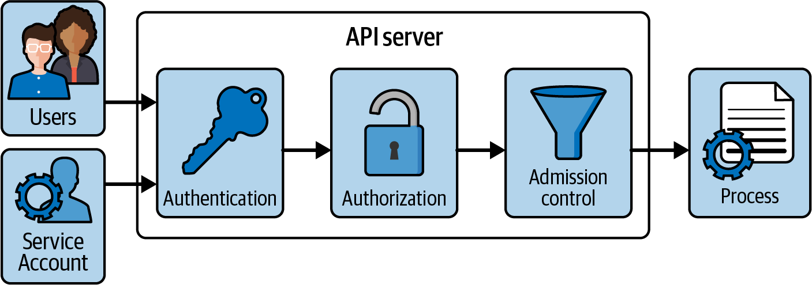
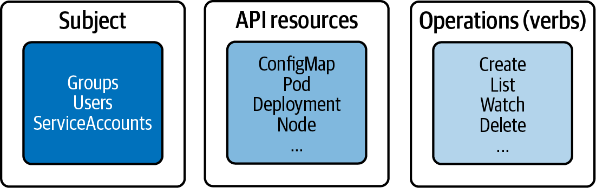
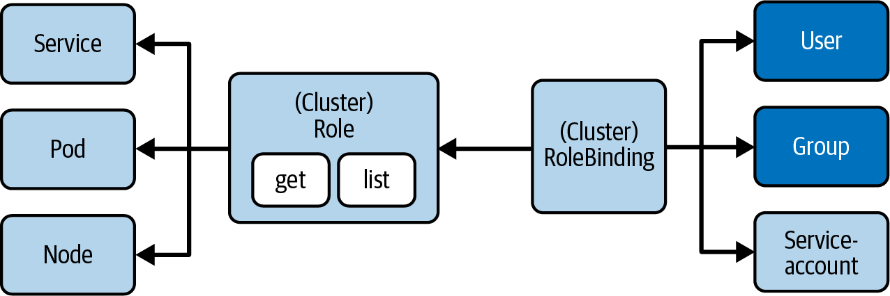
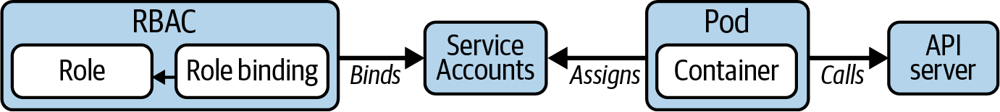

# Chương 6. Xác thực, ủy quyền và kiểm soát tiếp nhận

*Dịch từ: Chapter 6. Authentication, Authorization, and Admission Control — Certified Kubernetes Administrator (CKA) Study Guide, 2nd Edition (O'Reilly).*

API server là cổng vào (gateway) của cluster Kubernetes. Bất kỳ người dùng, client (ví dụ `kubectl`), thành phần của cluster hay service account nào cũng sẽ truy cập API server bằng cách thực hiện một lời gọi RESTful API qua HTTPS. Đây *chính là* điểm trung tâm để thực hiện các thao tác như tạo một Pod hoặc xóa một Service.

Trong chương này, chúng ta sẽ tập trung vào các khía cạnh liên quan đến bảo mật của API server. Để có phần thảo luận chi tiết về cơ chế hoạt động bên trong của API server và cách sử dụng Kubernetes API, hãy tham khảo cuốn *Managing Kubernetes* của Brendan Burns và Craig Tracey (O'Reilly, 2018).

> **PHẠM VI BAO PHỦ MỤC TIÊU ĐỀ CƯƠNG**
>
> Chương này đề cập đến mục tiêu đề cương (curriculum) sau:
>
> - Quản lý kiểm soát truy cập dựa trên vai trò (role-based access control – RBAC)

## Xử lý một yêu cầu API

Hình 6-1 minh họa các giai đoạn mà một yêu cầu (request) phải trải qua khi một lời gọi được gửi đến API server. Để tham khảo, bạn có thể tìm thêm thông tin trong tài liệu Kubernetes.

Giai đoạn đầu tiên của quá trình xử lý yêu cầu là *xác thực* (authentication). Xác thực kiểm tra danh tính của bên gọi bằng cách xem xét chứng chỉ client (client certificate) hoặc bearer token. Nếu bearer token gắn với một service account thì nó sẽ được kiểm tra tại đây.



*Hình 6-1. Quá trình xử lý yêu cầu của API server*

Giai đoạn thứ hai xác định xem danh tính được cung cấp ở giai đoạn đầu có được phép truy cập vào verb và đường dẫn HTTP của yêu cầu hay không. Do đó, giai đoạn hai xử lý việc *ủy quyền* (authorization) cho yêu cầu, được triển khai bằng mô hình RBAC tiêu chuẩn của Kubernetes. Tại đây, chúng ta đảm bảo rằng service account được phép liệt kê các Pod hoặc tạo một đối tượng Service mới nếu đó là điều được yêu cầu.

Giai đoạn thứ ba của quá trình xử lý yêu cầu liên quan đến *kiểm soát tiếp nhận* (admission control). Kiểm soát tiếp nhận kiểm tra xem yêu cầu có được định dạng đúng hay không, hoặc có cần được sửa đổi trước khi yêu cầu được xử lý hay không. Ví dụ, một chính sách kiểm soát tiếp nhận có thể đảm bảo rằng yêu cầu tạo một Pod phải bao gồm định nghĩa của một label cụ thể. Nếu yêu cầu không định nghĩa label đó thì nó sẽ bị từ chối.

## Xác thực với kubectl

Các nhà phát triển tương tác với Kubernetes API bằng cách chạy công cụ dòng lệnh `kubectl`. Mỗi khi bạn thực thi một lệnh với `kubectl`, lời gọi HTTPS bên dưới đến API server cần phải được xác thực.

### Kubeconfig

Thông tin đăng nhập (credentials) để sử dụng `kubectl` được lưu trong file *$HOME/.kube/config*, còn được gọi là *file kubeconfig*. File kubeconfig định nghĩa các endpoint API server của những cluster mà chúng ta muốn tương tác, cũng như danh sách người dùng đã đăng ký với cluster, bao gồm thông tin đăng nhập của họ dưới dạng chứng chỉ client. Ánh xạ giữa một cluster và một người dùng cho một namespace nhất định được gọi là *context*. `kubectl` dùng context hiện đang được chọn để biết cần giao tiếp với cluster nào và dùng thông tin đăng nhập nào.

> **GỘP NHIỀU FILE KUBECONFIG**
>
> Bạn có thể trỏ biến môi trường `KUBECONFIG` đến một tập hợp các file kubeconfig. Tại thời điểm chạy, `kubectl` sẽ gộp nội dung của tập hợp các file kubeconfig đã định nghĩa và sử dụng chúng. Theo mặc định, `KUBECONFIG` không được thiết lập và sẽ quay về dùng *$HOME/.kube/config*.

Ví dụ 6-1 cho thấy một file kubeconfig. Lưu ý rằng các đường dẫn file được gán trong ví dụ là đặc thù theo từng người dùng và có thể khác trong môi trường của bạn. Bạn có thể tìm thấy mô tả chi tiết về tất cả các thuộc tính có thể cấu hình trong tài liệu API của loại tài nguyên config.

**Ví dụ 6-1. Một file kubeconfig**

```yaml
apiVersion: v1
kind: Config
clusters:                                 # ❶
- cluster:
    certificate-authority: /Users/bmuschko/.minikube/ca.crt
    extensions:
    - extension:
        last-update: Mon, 09 Oct 2023 07:33:01 MDT
        provider: minikube.sigs.k8s.io
        version: v1.30.1
      name: cluster_info
    server: https://127.0.0.1:63709
  name: minikube
contexts:                                 # ❷
- context:
    cluster: minikube
    user: bmuschko
  name: bmuschko
- context:
    cluster: minikube
    extensions:
    - extension:
        last-update: Mon, 09 Oct 2023 07:33:01 MDT
        provider: minikube.sigs.k8s.io
        version: v1.30.1
      name: context_info
    namespace: default
    user: minikube
  name: minikube
current-context: minikube                 # ❸
preferences: {}
users:                                    # ❹
- name: bmuschko
  user:
    client-key-data: <REDACTED>
- name: minikube
  user:
    client-certificate: /Users/bmuschko/.minikube/profiles/minikube/client.crt
    client-key: /Users/bmuschko/.minikube/profiles/minikube/client.key
```

❶ Danh sách các tên tham chiếu đến các cluster và endpoint API server của chúng

❷ Danh sách các tên tham chiếu đến các context (sự kết hợp giữa cluster và người dùng)

❸ Context hiện đang được chọn

❹ Danh sách các tên tham chiếu đến các người dùng và thông tin đăng nhập của họ

Việc quản lý người dùng do quản trị viên cluster đảm nhiệm. Quản trị viên tạo một người dùng đại diện cho nhà phát triển và trao các thông tin liên quan (tên người dùng và thông tin đăng nhập) cho người muốn tương tác với cluster thông qua `kubectl`. Ngoài ra, cũng có thể tích hợp với các nhà cung cấp danh tính (identity provider) bên ngoài cho mục đích xác thực, ví dụ thông qua OpenID Connect.

Việc tạo một người dùng mới theo cách thủ công gồm nhiều bước, như được mô tả trong tài liệu Kubernetes. Sau đó nhà phát triển sẽ thêm người dùng này vào file kubeconfig trên máy dự định dùng để tương tác với cluster.

### Quản lý kubeconfig bằng kubectl

Bạn không cần phải chỉnh sửa thủ công (các) file kubeconfig để thay đổi hoặc thêm cấu hình. `kubectl` cung cấp các lệnh để đọc và sửa đổi nội dung của nó. Các lệnh sau đây cung cấp một cái nhìn tổng quan. Bạn có thể tìm thêm ví dụ về các lệnh trong bảng tra cứu nhanh (cheat sheet) của `kubectl`.

Để xem nội dung đã gộp của (các) file kubeconfig, hãy chạy lệnh sau:

```shell
$ kubectl config view
apiVersion: v1
kind: Config
clusters:
...
```

Để hiển thị context hiện đang được chọn, hãy dùng lệnh con `current-context`. Context có tên `minikube` là context đang hoạt động:

```shell
$ kubectl config current-context
minikube
```

Để thay đổi context, hãy cung cấp tên với lệnh con `use-context`. Ở đây, chúng ta chuyển sang context `bmuschko`:

```shell
$ kubectl config use-context bmuschko
Switched to context "bmuschko".
```

Để đăng ký một người dùng với (các) file kubeconfig, hãy dùng lệnh con `set-credentials`. Chúng ta chọn gán tên người dùng `myuser` và trỏ đến chứng chỉ client bằng cách cung cấp các cờ CLI tương ứng:

```shell
$ kubectl config set-credentials myuser \
  --client-key=myuser.key --client-certificate=myuser.crt \
  --embed-certs=true
```

Đối với kỳ thi, hãy làm quen với lệnh `kubectl config`. Mọi nhiệm vụ trong kỳ thi đều yêu cầu bạn làm việc với một context và/hoặc namespace cụ thể.

## Ủy quyền với kiểm soát truy cập dựa trên vai trò

Chúng ta đã biết rằng API server sẽ cố gắng xác thực mọi yêu cầu được gửi bằng `kubectl` bằng cách kiểm tra thông tin đăng nhập được cung cấp. Một yêu cầu đã được xác thực sau đó cần được đối chiếu với các quyền được gán cho bên yêu cầu. Giai đoạn ủy quyền trong quy trình xử lý API kiểm tra xem thao tác có được phép thực hiện trên tài nguyên API được yêu cầu hay không.

Trong Kubernetes, các quyền đó có thể được kiểm soát bằng kiểm soát truy cập dựa trên vai trò (RBAC). Nói ngắn gọn, RBAC định nghĩa các chính sách cho người dùng, nhóm và service account bằng cách cho phép hoặc không cho phép truy cập để quản lý các tài nguyên API. Việc bật và cấu hình RBAC là bắt buộc đối với bất kỳ tổ chức nào chú trọng đến bảo mật.

Thiết lập quyền là trách nhiệm của quản trị viên cluster. Các mục sau đây trình bày ngắn gọn về tác động của RBAC lên các yêu cầu đến từ người dùng và service account.

### Tổng quan về RBAC

RBAC giúp triển khai nhiều trường hợp sử dụng khác nhau:

- Thiết lập một hệ thống cho phép những người dùng với các vai trò khác nhau truy cập vào một tập hợp tài nguyên Kubernetes
- Kiểm soát các tiến trình (gắn với một service account) chạy trong Pod và thực hiện các thao tác đối với Kubernetes API
- Giới hạn khả năng hiển thị của một số tài nguyên nhất định theo từng namespace

RBAC bao gồm ba khối xây dựng chính, như minh họa trong Hình 6-2. Cùng nhau, chúng kết nối các primitive của API và các thao tác được phép trên chúng với *chủ thể* (subject), là một người dùng, một nhóm hoặc một service account.



*Hình 6-2. Các khối xây dựng chính của RBAC*

Trách nhiệm của mỗi khối như sau:

**Subject (chủ thể)**

Người dùng hoặc service account muốn truy cập một tài nguyên

**Resource (tài nguyên)**

Loại tài nguyên Kubernetes API (ví dụ: một Deployment hoặc node)

**Verb (thao tác)**

Thao tác có thể được thực thi trên tài nguyên (ví dụ: tạo một Pod hoặc xóa một Service)

Khi bạn cần nhanh chóng xác định những thao tác (verb) nào được hỗ trợ cho một tài nguyên Kubernetes cụ thể trong kỳ thi, `kubectl api-resources -o wide` là một lệnh vô cùng hữu ích, hiển thị tất cả các tài nguyên API có sẵn cùng với các verb được hỗ trợ của chúng (như `get`, `list`, `create`, `update`, `patch`, `watch`, `delete`).

### Tìm hiểu các primitive API của RBAC

Với những khái niệm chính này trong đầu, hãy cùng xem xét các primitive của Kubernetes API triển khai chức năng RBAC:

**Role**

Primitive API Role khai báo những tài nguyên API nào và thao tác nào trên chúng mà quy tắc này sẽ áp dụng trong một namespace cụ thể. Ví dụ, bạn có thể muốn nói "cho phép liệt kê và xóa Pod", hoặc bạn có thể diễn đạt "cho phép theo dõi (watch) log của Pod", hoặc thậm chí cả hai trong cùng một Role. Bất kỳ thao tác nào không được nêu rõ ràng đều bị cấm ngay khi Role được gắn (bind) với chủ thể.

**RoleBinding**

Primitive API RoleBinding *gắn* (bind) đối tượng Role với (các) chủ thể trong một namespace cụ thể. Nó là chất keo để làm cho các quy tắc có hiệu lực. Ví dụ, bạn có thể muốn nói "gắn Role cho phép cập nhật Service với người dùng John Doe".

Hình 6-3 cho thấy mối quan hệ giữa các primitive API có liên quan. Hãy nhớ rằng hình chỉ hiển thị một danh sách chọn lọc các loại tài nguyên API và thao tác.



*Hình 6-3. Các primitive của RBAC*

Các mục sau đây trình bày cách sử dụng Role và RoleBinding ở phạm vi namespace, nhưng các thao tác và thuộc tính tương tự cũng áp dụng cho Role và RoleBinding ở phạm vi cluster, được thảo luận trong "RBAC phạm vi namespace và phạm vi cluster".

### Các Role mặc định dành cho người dùng

Kubernetes định nghĩa một tập hợp các Role mặc định. Bạn có thể gán chúng cho một chủ thể thông qua RoleBinding hoặc tự định nghĩa các Role tùy chỉnh tùy theo nhu cầu của mình. Bảng 6-1 mô tả các Role mặc định dành cho người dùng.

**Bảng 6-1. Các Role mặc định dành cho người dùng**

| ClusterRole mặc định | Mô tả |
|---|---|
| `cluster-admin` | Cho phép truy cập đọc và ghi vào các tài nguyên trên tất cả các namespace. |
| `admin` | Cho phép truy cập đọc và ghi vào các tài nguyên trong namespace, bao gồm cả Role và RoleBinding. |
| `edit` | Cho phép truy cập đọc và ghi vào các tài nguyên trong namespace, ngoại trừ Role và RoleBinding. Cho phép truy cập vào Secret. |
| `view` | Cho phép truy cập chỉ đọc vào các tài nguyên trong namespace, ngoại trừ Role, RoleBinding và Secret. |

Để định nghĩa các Role và RoleBinding mới, bạn sẽ phải dùng một context cho phép tạo hoặc sửa đổi chúng, tức là `cluster-admin` hoặc `admin`.

### Tạo Role

Role có thể được tạo theo cách mệnh lệnh (imperative) bằng lệnh `create role`. Các tùy chọn quan trọng nhất của lệnh này là `--verb` để định nghĩa các verb, còn gọi là thao tác, và `--resource` để khai báo danh sách các tài nguyên API (các primitive cốt lõi cũng như CRD). Lệnh sau tạo một Role mới cho các tài nguyên Pod, Deployment và Service với các verb `list`, `get` và `watch`:

```shell
$ kubectl create role read-only --verb=list,get,watch \
  --resource=pods,deployments,services
role.rbac.authorization.k8s.io/read-only created
```

Việc khai báo nhiều verb và tài nguyên cho một lệnh `create role` mệnh lệnh có thể được thực hiện dưới dạng danh sách phân tách bằng dấu phẩy cho tùy chọn dòng lệnh tương ứng hoặc dưới dạng nhiều đối số. Ví dụ, `--verb=list,get,watch` và `--verb=list --verb=get --verb=watch` mang cùng một chỉ thị. Bạn cũng có thể dùng ký tự đại diện `*` để chỉ tất cả các verb hoặc tài nguyên.

Tùy chọn dòng lệnh `--resource-name` chỉ rõ một hoặc nhiều tên đối tượng mà các quy tắc chính sách sẽ áp dụng. Tên của một Pod có thể là `nginx` và được liệt kê ở đây bằng tên của nó. Việc cung cấp danh sách tên tài nguyên là tùy chọn. Nếu không có tên nào được cung cấp thì các quy tắc đã cho sẽ áp dụng cho tất cả các đối tượng của một loại tài nguyên.

Cách tiếp cận khai báo (declarative) có thể hơi dài dòng. Như bạn thấy trong Ví dụ 6-2, phần `rules` liệt kê các tài nguyên và verb. Các tài nguyên có API group, như Deployment dùng phiên bản API `apps/v1`, cần khai báo rõ ràng group đó dưới thuộc tính `apiGroups`. Tất cả các tài nguyên khác (ví dụ: Pod và Service) chỉ cần dùng một chuỗi rỗng, vì phiên bản API của chúng không chứa group. Lưu ý rằng lệnh mệnh lệnh để tạo Role sẽ tự động xác định API group.

**Ví dụ 6-2. Manifest YAML định nghĩa một Role**

```yaml
apiVersion: rbac.authorization.k8s.io/v1
kind: Role
metadata:
  name: read-only
rules:
- apiGroups:
  - ""
  resources:
  - pods
  - services
  verbs:
  - list
  - get
  - watch
- apiGroups:                              # ❶
  - apps
  resources:
  - deployments
  verbs:
  - list
  - get
  - watch
```

❶ Bất kỳ tài nguyên nào thuộc về một API group đều cần được liệt kê thành một quy tắc riêng, bên cạnh các tài nguyên API không thuộc API group nào.

### Liệt kê Role

Sau khi Role đã được tạo, đối tượng của nó có thể được liệt kê. Danh sách Role chỉ hiển thị tên và dấu thời gian tạo. Mỗi Role được liệt kê không tiết lộ bất kỳ chi tiết nào của nó:

```shell
$ kubectl get roles
NAME        CREATED AT
read-only   2021-06-23T19:46:48Z
```

### Hiển thị chi tiết Role

Bạn có thể xem xét chi tiết của một Role bằng lệnh `describe`. Kết quả hiển thị một bảng ánh xạ mỗi tài nguyên với các verb được phép của nó:

```shell
$ kubectl describe role read-only
Name:         read-only
Labels:       <none>
Annotations:  <none>
PolicyRule:
  Resources         Non-Resource URLs  Resource Names  Verbs
  ---------         -----------------  --------------  -----
  pods              []                 []              [list get watch]
  services          []                 []              [list get watch]
  deployments.apps  []                 []              [list get watch]
```

Cluster này chưa có tài nguyên nào được tạo, nên danh sách tên tài nguyên trong kết quả console sau đây hiện đang rỗng.

### Tạo RoleBinding

Lệnh mệnh lệnh để tạo một đối tượng RoleBinding là `create rolebinding`. Để gắn một Role với RoleBinding, hãy dùng tùy chọn dòng lệnh `--role`. Loại chủ thể có thể được gán bằng cách khai báo các tùy chọn `--user`, `--group` hoặc `--serviceaccount`. Lệnh sau tạo RoleBinding có tên `read-only-binding` cho người dùng tên là `bmuschko`:

```shell
$ kubectl create rolebinding read-only-binding --role=read-only --user=bmuschko
rolebinding.rbac.authorization.k8s.io/read-only-binding created
```

Ví dụ 6-3 cho thấy manifest YAML biểu diễn RoleBinding. Từ cấu trúc này, bạn có thể thấy rằng một role có thể được ánh xạ tới một hoặc nhiều chủ thể. Kiểu dữ liệu là một mảng, được biểu thị bằng ký tự gạch ngang dưới thuộc tính `subjects`. Tại thời điểm này, chỉ có người dùng `bmuschko` được gán.

**Ví dụ 6-3. Manifest YAML định nghĩa một RoleBinding**

```yaml
apiVersion: rbac.authorization.k8s.io/v1
kind: RoleBinding
metadata:
  name: read-only-binding
roleRef:
  apiGroup: rbac.authorization.k8s.io
  kind: Role
  name: read-only
subjects:
- apiGroup: rbac.authorization.k8s.io
  kind: User
  name: bmuschko
```

### Liệt kê RoleBinding

Thông tin quan trọng nhất mà danh sách RoleBinding hiển thị là Role được gắn với nó. Lệnh sau cho thấy RoleBinding `read-only-binding` đã được ánh xạ tới Role `read-only`:

```shell
$ kubectl get rolebindings
NAME                ROLE             AGE
read-only-binding   Role/read-only   24h
```

Kết quả không cho biết gì về các chủ thể. Bạn sẽ cần hiển thị chi tiết của đối tượng để có thêm thông tin, như mô tả trong mục tiếp theo.

### Hiển thị chi tiết RoleBinding

RoleBinding có thể được xem xét bằng lệnh `describe`. Kết quả hiển thị một bảng gồm các chủ thể và role được gán. Ví dụ sau hiển thị biểu diễn mô tả của RoleBinding có tên `read-only-binding`:

```shell
$ kubectl describe rolebinding read-only-binding
Name:         read-only-binding
Labels:       <none>
Annotations:  <none>
Role:
  Kind:  Role
  Name:  read-only
Subjects:
  Kind  Name      Namespace
  ----  ----      ---------
  User  bmuschko
```

### Xem các quy tắc RBAC có hiệu lực

Hãy cùng xem Kubernetes thực thi các quy tắc RBAC như thế nào cho kịch bản chúng ta đã thiết lập đến giờ. Trước tiên, chúng ta sẽ tạo một Deployment mới với quyền `cluster-admin`. Trong minikube, các quyền đó được cấp sẵn cho context `minikube` theo mặc định:

```shell
$ kubectl config current-context
minikube
$ kubectl create deployment myapp --image=nginx:1.25.2 --port=80 --replicas=2
deployment.apps/myapp created
```

Bây giờ, chúng ta sẽ chuyển sang context của người dùng `bmuschko`:

```shell
$ kubectl config use-context bmuschko-context
Switched to context "bmuschko-context".
```

Hãy nhớ rằng người dùng `bmuschko` được phép liệt kê Deployment. Chúng ta sẽ kiểm chứng điều đó bằng lệnh `get deployments`:

```shell
$ kubectl get deployments
NAME    READY   UP-TO-DATE   AVAILABLE   AGE
myapp   2/2     2            2           8s
```

Các quy tắc RBAC chỉ cho phép liệt kê Deployment, Pod và Service. Lệnh sau cố gắng liệt kê các ReplicaSet, dẫn đến lỗi:

```shell
$ kubectl get replicasets
Error from server (Forbidden): replicasets.apps is forbidden: User "bmuschko"
cannot list resource "replicasets" in API group "apps" in the namespace "default"
```

Hành vi tương tự cũng có thể được quan sát khi cố gắng dùng các verb khác ngoài `list`, `get` hoặc `watch`. Lệnh sau cố gắng xóa một Deployment:

```shell
$ kubectl delete deployment myapp
Error from server (Forbidden): deployments.apps "myapp" is forbidden: User
"bmuschko" cannot delete resource "deployments" in API group "apps" in the
namespace "default"
```

Tại bất kỳ thời điểm nào, bạn có thể kiểm tra quyền của một người dùng bằng lệnh `auth can-i`. Lệnh này cho bạn tùy chọn liệt kê tất cả các quyền hoặc kiểm tra một quyền cụ thể:

```shell
$ kubectl auth can-i --list --as bmuschko
Resources          Non-Resource URLs   Resource Names   Verbs
...
pods               []                  []               [list get watch]
services           []                  []               [list get watch]
deployments.apps   []                  []               [list get watch]
$ kubectl auth can-i list pods --as bmuschko
yes
```

### RBAC phạm vi namespace và phạm vi cluster

Role và RoleBinding áp dụng cho một namespace cụ thể. Bạn sẽ phải chỉ định namespace khi tạo cả hai đối tượng. Đôi khi, một tập hợp Role và RoleBinding cần áp dụng cho nhiều namespace hoặc thậm chí cho toàn bộ cluster. Đối với định nghĩa ở phạm vi cluster, Kubernetes cung cấp các loại tài nguyên API ClusterRole và ClusterRoleBinding. Các thành phần cấu hình thực chất là giống nhau. Điểm khác biệt duy nhất là giá trị của thuộc tính `kind`:

- Để định nghĩa một Role ở phạm vi cluster, hãy dùng lệnh con mệnh lệnh `clusterrole` hoặc kind `ClusterRole` trong manifest YAML.
- Để định nghĩa một RoleBinding ở phạm vi cluster, hãy dùng lệnh con mệnh lệnh `clusterrolebinding` hoặc kind `ClusterRoleBinding` trong manifest YAML.

ClusterRole và ClusterRoleBinding không chỉ thiết lập quyền ở phạm vi cluster cho một tài nguyên thuộc namespace, mà còn có thể được dùng để thiết lập quyền cho các tài nguyên không thuộc namespace như CRD và node.

### Tổng hợp các quy tắc RBAC

Các ClusterRole hiện có có thể được tổng hợp (aggregate) để tránh phải định nghĩa lại một tập hợp quy tắc mới được ghép lại, điều rất có thể dẫn đến việc lặp lại các chỉ thị. Ví dụ, giả sử bạn muốn kết hợp một role dành cho người dùng với một Role tùy chỉnh. Một ClusterRole tổng hợp có thể gộp các quy tắc thông qua lựa chọn theo label mà không cần phải sao chép-dán các quy tắc hiện có vào một chỗ.

Giả sử chúng ta định nghĩa hai ClusterRole như trong Ví dụ 6-4 và Ví dụ 6-5. ClusterRole `list-pods` cho phép liệt kê Pod và ClusterRole `delete-services` cho phép xóa Service.

**Ví dụ 6-4. Manifest YAML định nghĩa một ClusterRole để liệt kê Pod**

```yaml
apiVersion: rbac.authorization.k8s.io/v1
kind: ClusterRole
metadata:
  name: list-pods
  namespace: rbac-example
  labels:
    rbac-pod-list: "true"
rules:
- apiGroups:
  - ""
  resources:
  - pods
  verbs:
  - list
```

**Ví dụ 6-5. Manifest YAML định nghĩa một ClusterRole để xóa Service**

```yaml
apiVersion: rbac.authorization.k8s.io/v1
kind: ClusterRole
metadata:
  name: delete-services
  namespace: rbac-example
  labels:
    rbac-service-delete: "true"
rules:
- apiGroups:
  - ""
  resources:
  - services
  verbs:
  - delete
```

Để tổng hợp các quy tắc đó, ClusterRole có thể chỉ định một `aggregationRule`. Thuộc tính này mô tả các quy tắc lựa chọn theo label. Ví dụ 6-6 cho thấy một ClusterRole tổng hợp được định nghĩa bởi một mảng các tiêu chí `matchLabels`. ClusterRole này không thêm quy tắc riêng của nó, như được biểu thị bằng `rules: []`; tuy nhiên, không có yếu tố hạn chế nào cấm điều đó.

**Ví dụ 6-6. Manifest YAML định nghĩa một ClusterRole với các quy tắc tổng hợp**

```yaml
apiVersion: rbac.authorization.k8s.io/v1
kind: ClusterRole
metadata:
  name: pods-services-aggregation-rules
  namespace: rbac-example
aggregationRule:
  clusterRoleSelectors:
  - matchLabels:
      rbac-pod-list: "true"
  - matchLabels:
      rbac-service-delete: "true"
rules: []
```

Chúng ta có thể kiểm chứng hành vi tổng hợp đúng đắn của ClusterRole bằng cách describe đối tượng. Bạn có thể thấy trong kết quả sau rằng cả hai ClusterRole, `list-pods` và `delete-services`, đều đã được tính đến:

```shell
$ kubectl describe clusterroles pods-services-aggregation-rules -n rbac-example
Name:         pods-services-aggregation-rules
Labels:       <none>
Annotations:  <none>
PolicyRule:
  Resources  Non-Resource URLs  Resource Names  Verbs
  ---------  -----------------  --------------  -----
  services   []                 []              [delete]
  pods       []                 []              [list]
```

Để biết thêm thông tin về các quy tắc lựa chọn theo label của ClusterRole, hãy xem tài liệu chính thức. Trang đó cũng giải thích cách tổng hợp các ClusterRole mặc định dành cho người dùng.

## Làm việc với Service Account

Chúng ta đã dùng file thực thi `kubectl` để chạy các thao tác trên cluster Kubernetes. Bên dưới, phần triển khai của nó gọi API server bằng cách thực hiện một lời gọi HTTP đến các endpoint được phơi bày. Một số ứng dụng chạy bên trong Pod cũng có thể cần giao tiếp với API server. Ví dụ, ứng dụng có thể yêu cầu thông tin cụ thể về node của cluster hoặc các namespace có sẵn.

Pod có thể dùng service account để xác thực với API server thông qua một token xác thực. Quản trị viên Kubernetes gán các quy tắc cho service account thông qua RBAC để ủy quyền truy cập vào các tài nguyên và hành động cụ thể, như minh họa trong Hình 6-4.



*Hình 6-4. Dùng service account để giao tiếp với API server*

Không nhất thiết phải có Pod tham gia vào quá trình này. Các trường hợp sử dụng khác đòi hỏi tận dụng service account bên ngoài cluster Kubernetes. Ví dụ, bạn có thể muốn giao tiếp với API server như một bước tự động hóa trong pipeline CI/CD. Service account có thể cung cấp thông tin đăng nhập để xác thực với API server.

### Service Account mặc định

Cho đến giờ, chúng ta chưa định nghĩa service account cho Pod. Nếu không được gán rõ ràng, Pod sẽ dùng service account `default`, có cùng quyền với một người dùng chưa xác thực. Điều này có nghĩa là Pod không thể xem hoặc sửa đổi trạng thái của cluster, cũng không thể liệt kê hoặc sửa đổi bất kỳ tài nguyên nào của nó. Tuy nhiên, service account `default` có thể yêu cầu thông tin cơ bản về cluster thông qua Role `system:discovery` được gán cho nó.

Bạn có thể truy vấn các service account có sẵn bằng lệnh con `serviceaccounts`. Bạn sẽ chỉ thấy service account `default` được liệt kê trong kết quả:

```shell
$ kubectl get serviceaccounts
NAME      SECRETS   AGE
default   0         4d
```

Mặc dù bạn có thể thực thi thao tác `kubectl` để xóa service account `default`, Kubernetes sẽ ngay lập tức tạo lại service account đó.

### Tạo Service Account

Bạn có thể tạo một đối tượng service account tùy chỉnh bằng cách tiếp cận mệnh lệnh và khai báo. Lệnh này tạo một đối tượng service account có tên `cicd-bot`. Giả định ở đây là service account này được dùng cho các lời gọi đến API server do một pipeline CI/CD thực hiện:

```shell
$ kubectl create serviceaccount cicd-bot
serviceaccount/cicd-bot created
```

Bạn cũng có thể biểu diễn service account dưới dạng manifest. Ở dạng đơn giản nhất, định nghĩa này gán kind `ServiceAccount` và một tên, như trong Ví dụ 6-7.

**Ví dụ 6-7. Manifest YAML cho một service account**

```yaml
apiVersion: v1
kind: ServiceAccount
metadata:
  name: cicd-bot
```

Bạn có thể thiết lập một vài tùy chọn cấu hình cho service account. Ví dụ, bạn có thể muốn tắt tính năng tự động mount token xác thực khi gán service account cho Pod. Mặc dù bạn sẽ không cần hiểu những tùy chọn cấu hình đó cho kỳ thi, việc tìm hiểu sâu hơn về các thực hành tốt nhất (best practice) về bảo mật bằng cách đọc thêm về chúng trong tài liệu Kubernetes là hợp lý.

### Thiết lập quyền cho Service Account

Điều quan trọng là giới hạn quyền chỉ ở những service account cần thiết để ứng dụng hoạt động. Các mục tiếp theo sẽ giải thích cách chúng ta đạt được điều này nhằm giảm thiểu bề mặt tấn công tiềm tàng.

Để kịch bản này hoạt động, bạn sẽ cần tạo một đối tượng ServiceAccount và gán nó cho Pod. Service account có thể được kết hợp với RBAC và được gán một Role và RoleBinding để định nghĩa những thao tác nào chúng được phép thực hiện.

#### Gắn service account với Pod

Để bắt đầu, chúng ta sẽ thiết lập một Pod liệt kê tất cả các Pod và Deployment trong namespace `k97` bằng cách gọi Kubernetes API. Lời gọi được thực hiện trong một vòng lặp vô hạn, cứ mười giây một lần. Phản hồi từ lời gọi API sẽ được ghi ra standard output, có thể truy cập thông qua log của Pod.

> **TRUY CẬP ENDPOINT CỦA API SERVER**
>
> Việc truy cập Kubernetes API từ một Pod khá đơn giản. Thay vì dùng địa chỉ IP và port của Pod API server, bạn có thể đơn giản tham chiếu đến một Service có tên `kubernetes.default.svc`. Service đặc biệt này nằm trong namespace `default` và được cluster tự động dựng lên.

Để xác thực với API server, chúng ta sẽ gửi một bearer token gắn với service account mà Pod sử dụng. Hành vi mặc định của service account là tự động mount thông tin đăng nhập API tại đường dẫn */var/run/secrets/kubernetes.io/serviceaccount/token*. Chúng ta chỉ cần lấy nội dung của file bằng công cụ dòng lệnh `cat` và gửi kèm dưới dạng một header của yêu cầu HTTP. Ví dụ 6-8 định nghĩa namespace, service account và Pod trong một file manifest YAML duy nhất: *setup.yaml*.

**Ví dụ 6-8. Manifest YAML để gán service account cho Pod**

```yaml
apiVersion: v1
kind: Namespace
metadata:
  name: k97
---
apiVersion: v1
kind: ServiceAccount
metadata:
  name: sa-api
  namespace: k97
---
apiVersion: v1
kind: Pod
metadata:
  name: list-objects
  namespace: k97
spec:
  serviceAccountName: sa-api              # ❶
  containers:
  - name: pods
    image: alpine/curl:3.14
    command: ['sh', '-c', 'while true; do curl -s -k -m 5 -H \
              "Authorization: Bearer $(cat /var/run/secrets/kubernetes.io/serviceaccount/token)" https://kubernetes.default.svc.cluster.local/api/v1/namespaces/k97/pods; sleep 10; done']   # ❷
  - name: deployments
    image: alpine/curl:3.14
    command: ['sh', '-c', 'while true; do curl -s -k -m 5 -H \
              "Authorization: Bearer $(cat /var/run/secrets/kubernetes.io/serviceaccount/token)" https://kubernetes.default.svc.cluster.local/apis/apps/v1/namespaces/k97/deployments; sleep 10; done']   # ❸
```

❶ Service account được tham chiếu theo tên, dùng để giao tiếp với Kubernetes API

❷ Thực hiện một lời gọi API để lấy danh sách các Pod trong namespace `k97`

❸ Thực hiện một lời gọi API để lấy danh sách các Deployment trong namespace `k97`

Tạo các đối tượng từ manifest YAML bằng lệnh sau:

```shell
$ kubectl apply -f setup.yaml
namespace/k97 created
serviceaccount/sa-api created
pod/list-objects created
```

#### Kiểm chứng các quyền mặc định

Pod có tên `list-objects` thực hiện lời gọi đến API server để lấy danh sách Pod và Deployment trong các container riêng biệt. Container `pods` thực hiện lời gọi để liệt kê Pod. Container `deployments` gửi yêu cầu đến API server để liệt kê Deployment.

Như được giải thích trong tài liệu Kubernetes, các chính sách RBAC mặc định không cấp bất kỳ quyền nào cho các service account bên ngoài namespace `kube-system`. Log của các container `pods` và `deployments` trả về thông báo lỗi cho biết service account `sa-api` không được ủy quyền để liệt kê các tài nguyên:

```shell
$ kubectl logs list-objects -c pods -n k97
{
  "kind": "Status",
  "apiVersion": "v1",
  "metadata": {},
  "status": "Failure",
  "message": "pods is forbidden: User \"system:serviceaccount:k97:sa-api\" \
              cannot list resource \"pods\" in API group \"\" in the \
              namespace \"k97\"",
  "reason": "Forbidden",
  "details": {
    "kind": "pods"
  },
  "code": 403
}
$ kubectl logs list-objects -c deployments -n k97
{
  "kind": "Status",
  "apiVersion": "v1",
  "metadata": {},
  "status": "Failure",
  "message": "deployments.apps is forbidden: User \
              \"system:serviceaccount:k97:sa-api\" cannot list resource \
              \"deployments\" in API group \"apps\" in the namespace \
              \"k97\"",
  "reason": "Forbidden",
  "details": {
    "group": "apps",
    "kind": "deployments"
  },
  "code": 403
}
```

Tiếp theo, chúng ta sẽ dựng lên một đối tượng Role và RoleBinding với các quyền API cần thiết để thực hiện các lời gọi cần thiết.

#### Tạo Role

Bắt đầu bằng cách định nghĩa Role có tên `list-pods-role` như trong Ví dụ 6-9 trong file *role.yaml*. Tập hợp quy tắc chỉ thêm tài nguyên Pod và verb `list`.

**Ví dụ 6-9. Manifest YAML cho một Role cho phép liệt kê Pod**

```yaml
apiVersion: rbac.authorization.k8s.io/v1
kind: Role
metadata:
  name: list-pods-role
  namespace: k97
rules:
- apiGroups: [""]
  resources: ["pods"]
  verbs: ["list"]
```

Tạo đối tượng bằng cách trỏ đến file manifest YAML tương ứng của nó:

```shell
$ kubectl apply -f role.yaml
role.rbac.authorization.k8s.io/list-pods-role created
```

#### Tạo RoleBinding

Ví dụ 6-10 định nghĩa manifest YAML cho RoleBinding trong file *rolebinding.yaml*. RoleBinding ánh xạ Role `list-pods-role` tới service account có tên `sa-pod-api` và chỉ áp dụng cho namespace `k97`.

**Ví dụ 6-10. Manifest YAML cho một RoleBinding gắn với service account**

```yaml
apiVersion: rbac.authorization.k8s.io/v1
kind: RoleBinding
metadata:
  name: serviceaccount-pod-rolebinding
  namespace: k97
subjects:
- kind: ServiceAccount
  name: sa-api
roleRef:
  kind: Role
  name: list-pods-role
  apiGroup: rbac.authorization.k8s.io
```

Tạo cả hai đối tượng RoleBinding bằng lệnh `apply`:

```shell
$ kubectl apply -f rolebinding.yaml
rolebinding.rbac.authorization.k8s.io/serviceaccount-pod-rolebinding created
```

#### Kiểm chứng các quyền đã cấp

Với quyền `list` đã được cấp, service account giờ đây có thể lấy đúng tất cả các Pod trong namespace `k97`. Lệnh `curl` trong container `pods` thành công, như trong kết quả sau:

```shell
$ kubectl logs list-objects -c pods -n k97
{
  "kind": "PodList",
  "apiVersion": "v1",
  "metadata": {
    "resourceVersion": "628"
  },
  "items": [
    {
      "metadata": {
        "name": "list-objects",
        "namespace": "k97",
        ...
      }
    }
  ]
}
```

Chúng ta chưa cấp bất kỳ quyền nào cho service account đối với các tài nguyên khác. Việc liệt kê Deployment trong namespace `k97` vẫn thất bại. Kết quả sau cho thấy phản hồi từ lệnh `curl` trong namespace `deployments`:

```shell
$ kubectl logs list-objects -c deployments -n k97
{
  "kind": "Status",
  "apiVersion": "v1",
  "metadata": {},
  "status": "Failure",
  "message": "deployments.apps is forbidden: User \
              \"system:serviceaccount:k97:sa-api\" cannot list resource \
              \"deployments\" in API group \"apps\" in the namespace \
              \"k97\"",
  "reason": "Forbidden",
  "details": {
    "group": "apps",
    "kind": "deployments"
  },
  "code": 403
}
```

Bạn có thể tùy ý sửa đổi đối tượng Role để cho phép liệt kê cả các đối tượng Deployment.

## Kiểm soát tiếp nhận

Giai đoạn cuối cùng của quá trình xử lý một yêu cầu đến API server là kiểm soát tiếp nhận. Kiểm soát tiếp nhận được triển khai bởi các admission controller. Một admission controller cung cấp một webhook để phê duyệt, từ chối hoặc sửa đổi (mutate) một yêu cầu trước khi nó có hiệu lực.

Các admission controller có thể được đăng ký trong cấu hình của API server. Theo mặc định, file cấu hình nằm tại */etc/kubernetes/manifests/kube-apiserver.yaml*. Việc quản lý cấu hình API server là công việc của quản trị viên cluster. Lời gọi dòng lệnh sau của API server bật các plugin kiểm soát tiếp nhận có tên `NamespaceLifecycle`, `PodSecurity` và `LimitRanger`:

```shell
$ kube-apiserver --enable-admission-plugins=NamespaceLifecycle,PodSecurity,LimitRanger
```

Các nhà phát triển sẽ vô tình sử dụng các plugin kiểm soát tiếp nhận đã được quản trị viên cấu hình. Hai ví dụ là LimitRanger và ResourceQuota, mà tôi sẽ thảo luận trong "Làm việc với Limit Range" và "Làm việc với Resource Quota".

## Tóm tắt

API server xử lý các yêu cầu đến Kubernetes API. Mọi yêu cầu đều phải đi qua ba giai đoạn: xác thực, ủy quyền và kiểm soát tiếp nhận. Mỗi giai đoạn đều có thể ngăn không cho xử lý tiếp. Ví dụ, nếu thông tin đăng nhập gửi kèm yêu cầu không thể được xác thực thì yêu cầu sẽ bị loại bỏ.

Chúng ta đã xem xét ví dụ cho tất cả các giai đoạn. Giai đoạn xác thực đề cập đến `kubectl` với vai trò là client thực hiện lời gọi đến Kubernetes API. File kubeconfig đóng vai trò là nguồn cấu hình cho các cluster có tên, người dùng và thông tin đăng nhập của họ. Trong Kubernetes, ủy quyền được xử lý bởi RBAC. Chúng ta đã học các primitive của Kubernetes cho phép bạn cấu hình quyền cho các tài nguyên API gắn với một hoặc nhiều chủ thể.

Cuối cùng, chúng ta đã xem xét ngắn gọn mục đích của kiểm soát tiếp nhận và liệt kê một số plugin đóng vai trò là controller để xác nhận (validate) hoặc sửa đổi (mutate) một yêu cầu đến Kubernetes API.

## Trọng tâm cho kỳ thi

**Thực hành tương tác với Kubernetes API**

Chương này đã trình bày một số cách để giao tiếp với Kubernetes API. Chúng ta đã thực hiện các yêu cầu API bằng cách chuyển sang context của một người dùng và với sự trợ giúp của một lời gọi RESTful API bằng `curl`. Hãy tự mình khám phá Kubernetes API và các endpoint của nó để có hiểu biết rộng hơn.

**Hiểu các hệ quả của việc định nghĩa quy tắc RBAC cho người dùng và service account**

Các yêu cầu từ người dùng ẩn danh đến Kubernetes API sẽ không được phép thực hiện bất kỳ thao tác đáng kể nào. Đối với các yêu cầu đến từ một người dùng hoặc một service account, bạn sẽ cần phân tích cẩn thận các quyền được cấp cho chủ thể. Hãy học kỹ mọi ngóc ngách của việc định nghĩa quy tắc RBAC bằng cách tạo các đối tượng liên quan để kiểm soát quyền. Service account tự động mount một token khi được dùng trong Pod. Chỉ phơi bày token dưới dạng volume nếu bạn có ý định thực hiện các lời gọi API từ Pod.

**Nắm được mục đích của kiểm soát tiếp nhận**

API server đi kèm với các plugin kiểm soát tiếp nhận được cấu hình sẵn, hỗ trợ chức năng của các primitive Kubernetes như LimitRange. Đối với kỳ thi, bạn sẽ không cần hiểu sâu về việc bật hoặc cấu hình các plugin kiểm soát tiếp nhận.

## Bài tập mẫu

Lời giải cho các bài tập này có trong Phụ lục A.

1. Di chuyển đến thư mục *app-a/ch06/rbac-aggregation* của kho GitHub *bmuschko/cka-study-guide* đã được checkout.

   Tạo một ClusterRole có tên `service-view` cho tài nguyên API `services` với các thao tác `get` và `list`. Tạo RoleBinding có tên `ellasmith-service-view` trong namespace `development`. Ánh xạ người dùng `ellasmith` tới ClusterRole `service-view`.

   Tạo một ClusterRole có tên `combined`. Tổng hợp các cluster role dựa trên cặp key-value label khớp `rbac.cka.cncf.com/aggregate: "true"`. Hiển thị các quy tắc đã được chọn của ClusterRole `combined`. Bạn thấy bao nhiêu quy tắc?

   Tạo một ClusterRole có tên `deployment-modify` cho tài nguyên API `deployments` với các thao tác `create`, `delete`, `patch` và `update`. Gán cặp key-value label `rbac.cka.cncf.com/aggregate: "true"`. Hiển thị các quy tắc đã được chọn của ClusterRole `combined`. Bạn thấy bao nhiêu quy tắc?

   Chạy một lệnh để xác định xem người dùng `ellasmith` có thể liệt kê Service trong namespace `development` hay không. Ghi kết quả của lệnh vào file *list-services-ellasmith.txt*. Kết quả là `no` hoặc `yes`.

   Chạy một lệnh để xác định xem người dùng `ellasmith` có thể watch Deployment trong namespace `production` hay không. Ghi kết quả của lệnh vào file *watch-deployments-ellasmith.txt*. Kết quả là `no` hoặc `yes`.

   *Điều kiện tiên quyết:* Bài tập này yêu cầu cài đặt các công cụ Vagrant và một VMware provider.

2. Tạo ServiceAccount có tên `api-access` trong một namespace mới có tên `apps`.

   Tạo một ClusterRole có tên `api-clusterrole`, và tạo một ClusterRoleBinding có tên `api-clusterrolebinding`. Ánh xạ ServiceAccount từ bước trước tới tài nguyên API `pods` với các thao tác `watch`, `list` và `get`.

   Tạo một Pod có tên `operator` với image `nginx:1.21.1` trong namespace `apps`. Phơi bày container port 80. Gán ServiceAccount `api-access` cho Pod. Tạo một Pod khác có tên `disposable` với image `nginx:1.21.1` trong namespace `rm`. Không gán ServiceAccount cho Pod này.

   Mở một shell tương tác vào Pod có tên `operator`. Dùng công cụ dòng lệnh `curl` để thực hiện một lời gọi API liệt kê các Pod trong namespace `rm`. Bạn mong đợi phản hồi gì? Dùng công cụ dòng lệnh `curl` để thực hiện một lời gọi API xóa Pod `disposable` trong namespace `rm`. Phản hồi có khác với lời gọi đầu tiên không? Bạn có thể tìm thông tin về cách tương tác với Pod thông qua API qua HTTP trong tài liệu Kubernetes.
