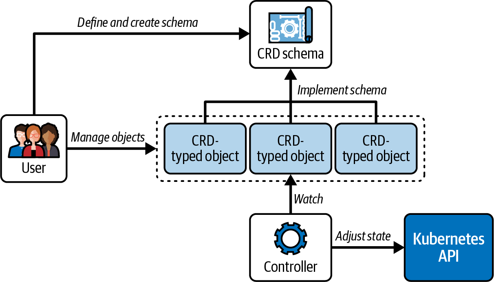
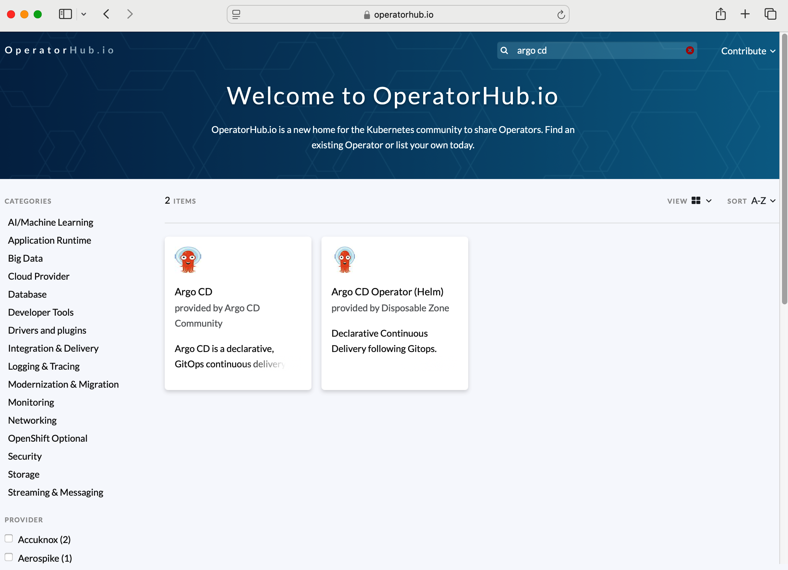
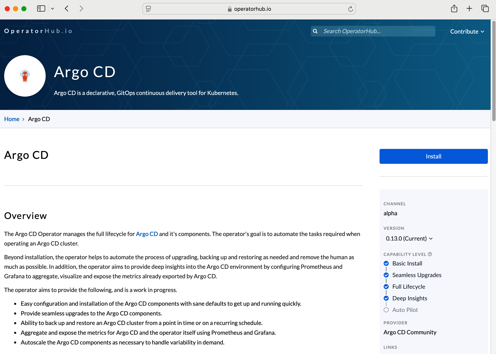
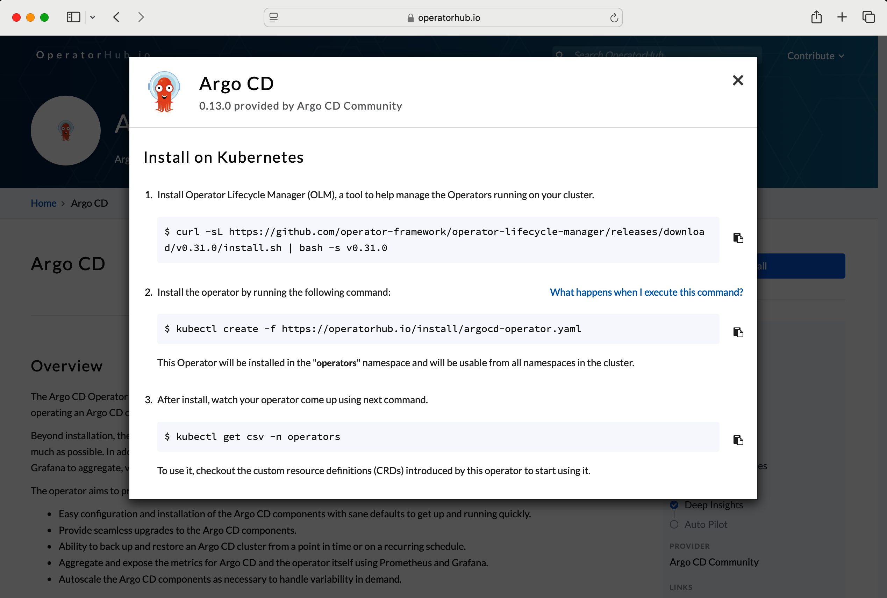

# Chương 7. Operator và Custom Resource Definition (CRD)

*Dịch từ: Chapter 7. Operators and Custom Resource Definitions (CRDs) — Certified Kubernetes Administrator (CKA) Study Guide, 2nd Edition (O'Reilly).*

Kubernetes đi kèm một bộ tính năng cốt lõi nhằm đáp ứng các nhu cầu cơ bản khi chạy các application stack bằng một bộ primitive tiêu chuẩn. Với những trường hợp sử dụng tùy biến, Kubernetes cho phép cài đặt các phần mở rộng cho nền tảng, gọi là *operator*.

Custom Resource Definition (CRD) là một cơ chế mở rộng của Kubernetes (thường được đóng gói cùng một operator) để đưa vào các primitive API tùy biến nhằm đáp ứng những yêu cầu mà các primitive có sẵn chưa bao phủ.

Chương này sẽ tập trung vào việc cài đặt và cấu hình operator, cũng như việc tương tác với các CRD được cung cấp.

> **PHẠM VI BAO PHỦ MỤC TIÊU ĐỀ CƯƠNG**
>
> Chương này đề cập đến mục tiêu đề cương (curriculum) sau:
>
> - Hiểu về CRD, cài đặt và cấu hình operator

## Làm việc với Operator

Operator mở rộng hành vi cốt lõi của cluster Kubernetes mà không thực sự thay đổi mã nguồn Kubernetes. Bạn có thể xem operator như một plug-in cho nền tảng. Operator thường tự động hóa những tác vụ mà lẽ ra con người phải thực hiện, chẳng hạn như triển khai, cấu hình, scaling, nâng cấp và quản lý ứng dụng.

### Mẫu Operator (Operator Pattern)

Một operator thường bao gồm nhiều thành phần: một hoặc nhiều CRD, một controller, và thường có thêm các thành phần bổ sung như các quy tắc RBAC để cấp quyền. CRD có thể được hiểu là schema định nghĩa bản thiết kế (blueprint) cho một đối tượng tùy biến; còn các thể hiện được khởi tạo của những đối tượng đó với kiểu mới được đưa vào thì được gọi là Custom Resource (CR).

Để một CRD trở nên hữu ích, nó phải được hậu thuẫn bởi một controller. Controller tương tác với API Kubernetes và hiện thực logic reconciliation (điều hòa) tương tác với các đối tượng CRD.

Sự kết hợp giữa CRD và controller thường được gọi là *mẫu operator* (operator pattern). Kỳ thi không yêu cầu bạn phải hiểu về controller; do đó, phần hiện thực của chúng sẽ không được đề cập trong chương này.

Hình 7-1 minh họa mẫu operator với tất cả các thành phần vận hành của nó.



*Hình 7-1. Mẫu operator của Kubernetes*

### Khám phá Operator

Cộng đồng Kubernetes đã hiện thực nhiều operator hữu ích mà bạn có thể tìm thấy trên OperatorHub.io hoặc Artifact Hub.

Một operator nổi bật là External Secrets Operator, giúp tích hợp các trình quản lý Secret bên ngoài, như Amazon Web Services (AWS) Secrets Manager và HashiCorp Vault, với Kubernetes. Một operator khác là Crossplane operator, giúp tạo và quản lý các tài nguyên đám mây bằng cú pháp khai báo (declarative).

Để minh họa chức năng của OperatorHub.io, chúng ta sẽ tìm kiếm và cài đặt Argo CD Operator phổ biến, một công cụ continuous delivery theo kiểu GitOps khai báo dành cho Kubernetes, tự động hóa việc triển khai bằng cách liên tục giám sát các ứng dụng và đồng bộ chúng với trạng thái mong muốn (desired state) được định nghĩa trong các Git repository.

Trong trình duyệt, hãy mở URL của OperatorHub.io và nhập cụm từ *argo cd* vào ô tìm kiếm có tên Search OperatorHub. Bạn sẽ nhận được kết quả như trong Hình 7-2.



*Hình 7-2. Một kết quả tìm kiếm trên OperatorHub.io*

Nhấp vào ô Argo CD sẽ đưa bạn đến trang chi tiết của Argo CD Operator, như trong Hình 7-3.

Trang này mô tả chức năng của operator, bao gồm cả phần tổng quan ở mức cao về các CRD được cung cấp. Để có thể tạo CR từ các CRD, trước tiên chúng ta cần cài đặt operator.



*Hình 7-3. Argo CD Operator trên OperatorHub.io*

### Cài đặt Operator

Bạn có thể cài đặt nhiều operator trong số đó chỉ bằng một lần thực thi lệnh `kubectl` hoặc bằng cách sử dụng chương trình thực thi Helm. Để biết thêm thông tin về cách sử dụng Helm, xem Chương 8.

Nhấp vào nút Install trên OperatorHub.io sẽ hiển thị hướng dẫn cài đặt, như trong Hình 7-4.

Như được trình bày trên trang cài đặt của operator, chúng ta sẽ sử dụng Operator Lifecycle Manager (OLM), một công cụ giúp quản lý các operator đang chạy trên cluster của bạn. Đây là thao tác chỉ cần thực hiện một lần:

```shell
$ curl -sL https://github.com/operator-framework/operator-lifecycle-manager/releases/download/v0.31.0/install.sh | bash -s v0.31.0
```

Tiếp theo, chúng ta sẽ cài đặt Argo CD Operator; thao tác này sẽ đặt các đối tượng của operator vào namespace `operators`:

```shell
$ kubectl create -f https://operatorhub.io/install/argocd-operator.yaml
subscription.operators.coreos.com/my-argocd-operator created
```



*Hình 7-4. Hướng dẫn cài đặt Argo CD Operator*

Bạn có thể theo dõi quá trình cài đặt bằng cách chạy lệnh sau. Một quá trình cài đặt hợp lệ sẽ kết thúc với phase `Succeeded` trong output được hiển thị của lệnh:

```shell
$ kubectl get csv -n operators
NAME                      DISPLAY   VERSION   REPLACES                  PHASE
argocd-operator.v0.13.0   Argo CD   0.13.0    argocd-operator.v0.12.0   Succeeded
```

Bây giờ bạn đã sẵn sàng sử dụng operator. Hãy tham khảo các mục tiếp theo trong chương để tương tác với các CRD đã cài đặt.

## Làm việc với Custom Resource Definition

Đối với kỳ thi, bạn sẽ cần hiểu cách khám phá các schema CRD do các operator bên ngoài cung cấp và cách tương tác với các đối tượng tuân theo schema CRD đó.

### Khám phá CRD

Argo CD Operator cung cấp một vài CRD như `Application`, `ApplicationSet`, `AppProject` và một số CRD khác. Mục đích ở mức cao của từng loại như sau:

**`Application`**

Một Application là một nhóm các tài nguyên Kubernetes được định nghĩa bởi một manifest.

**`ApplicationSet`**

Một ApplicationSet là một nhóm hay tập hợp các tài nguyên Application.

**`AppProject`**

Một AppProject là một nhóm logic định nghĩa những Git repository, cluster và namespace nào mà một tập hợp Application có thể truy cập, cung cấp khả năng đa người thuê (multi-tenancy) và các ranh giới bảo mật bên trong ArgoCD.

Chạy lệnh sau để liệt kê tất cả các CRD đã cài đặt. Bạn sẽ thấy các CRD của Argo CD trong output của lệnh:

```shell
$ kubectl get crds
NAME                                                        CREATED AT
applications.argoproj.io                                    2025-03-21T23:02:40Z
applicationsets.argoproj.io                                 2025-03-21T23:02:39Z
appprojects.argoproj.io                                     2025-03-21T23:02:39Z
argocdexports.argoproj.io                                   2025-03-21T23:02:39Z
argocds.argoproj.io                                         2025-03-21T23:02:39Z
notificationsconfigurations.argoproj.io                     2025-03-21T23:02:39Z
```

Giống như mọi đối tượng Kubernetes khác, bạn có thể hiển thị chi tiết của nó. Chi tiết của CRD sẽ cho thấy kind, API group và version, cùng các thuộc tính của nó. Lệnh này kiểm tra CRD `Application`:

```shell
$ kubectl describe crd applications.argoproj.io
```

Để ngắn gọn, tôi không hiển thị phần output dài dòng ở đây. Trong mục tiếp theo, chúng ta sẽ tạo một CR cho CRD `Application`.

### Khởi tạo một CR cho một trong các CRD

CRD `Application` mô tả một schema để định nghĩa hình thức biểu diễn của một ứng dụng nằm trong một Git repository, sao cho ứng dụng đó có thể được triển khai lên một cluster Kubernetes.

Vì mục đích đó, hãy tạo một manifest YAML mới có kind `Application` trong file `nginx-application.yaml`, như trong Ví dụ 7-1. Bạn có thể nhận ra một số thuộc tính được sử dụng ở đây từ lúc hiển thị schema của CRD.

**Ví dụ 7-1. Khởi tạo CR cho CRD Application**

```yaml
apiVersion: argoproj.io/v1alpha1
kind: Application
metadata:
  name: nginx
spec:
  project: default
  source:
    repoURL: https://github.com/bmuschko/cka-study-guide.git
    targetRevision: HEAD
    path: ./ch07/nginx
  destination:
    server: https://kubernetes.default.svc
    namespace: default
```

Tạo một đối tượng mới từ manifest YAML:

```shell
kubectl apply -f nginx-application.yaml
application.argoproj.io/nginx created
```

### Tương tác với một CR

Bạn có thể tương tác với CR như với bất kỳ đối tượng nào khác trong Kubernetes. Mọi chức năng tạo, đọc, cập nhật và xóa (CRUD) của `kubectl` đều khả dụng. Ví dụ, để liệt kê đối tượng, hãy dùng lệnh `describe`. Lệnh sau cho thấy các thao tác này trong thực tế:

```shell
$ kubectl describe application nginx
Name:              nginx
Namespace:         default
Labels:            <none>
Annotations:       <none>
API Version:       argoproj.io/v1alpha1
Kind:              Application
...
```

Để xóa đối tượng, hãy dùng lệnh `delete`, như sau:

```shell
$ kubectl delete application nginx
application.argoproj.io "nginx" deleted
```

Chúng ta đã minh họa rằng một operator có thể cài đặt các CRD vào cluster, và rằng chúng ta có thể tạo CR từ các CRD đó rồi tương tác với chúng.

Đi sâu hơn vào việc sử dụng Argo CD sẽ cần hẳn một chương riêng và nằm ngoài phạm vi của chứng chỉ. Để biết thêm thông tin về Argo CD, hãy tham khảo cuốn sách *Argo CD: Up and Running* của Andrew Block và Christian Hernandez (O'Reilly, 2025).

### Kiểm tra Controller

Các CR của Argo CD chỉ đơn thuần biểu diễn dữ liệu và tự bản thân chúng sẽ không hữu ích. Một controller đóng vai trò như một tiến trình reconciliation bằng cách kiểm tra trạng thái của các đối tượng CR thông qua các lời gọi đến API Kubernetes nhằm thực hiện quá trình triển khai lên cluster.

Argo CD Operator chạy logic của controller bên trong một Pod được quản lý bởi một Deployment. Bạn có thể tìm các đối tượng controller của Argo CD như sau:

```shell
$ kubectl get deployments,pods -n operators
NAME                                                                  READY     UP-TO-DATE
deployment.apps/argocd-operator-controller-manager                    1/1       1

NAME                                                                          READY   STATUS
pod/argocd-operator-controller-manager-6998544bff-zx8bg                       1/1     Running
```

Vì chúng ta đã cài đặt operator bằng OLM, Pod của controller sẽ được đặt vào namespace `operators` để tách biệt chúng khỏi các đối tượng khác trong cluster. Bạn có thể scale số lượng replica khi cần bằng cách thay đổi cấu hình của Deployment.

## Tóm tắt

Kubernetes gọi CRD cùng với controller tương ứng là mẫu operator. Cộng đồng Kubernetes đã hiện thực nhiều operator để đáp ứng các yêu cầu tùy biến. Bạn có thể cài đặt chúng vào cluster của mình để tái sử dụng chức năng.

Một schema CRD định nghĩa cấu trúc của một custom resource. Schema bao gồm group, name, version và các thuộc tính có thể cấu hình của nó. Các đối tượng mới thuộc kind này, tức CR, có thể được tạo sau khi đăng ký schema. Bạn có thể tương tác với một đối tượng tùy biến bằng `kubectl` với cùng các lệnh CRUD dùng cho mọi primitive khác.

CRD phát huy toàn bộ tiềm năng khi được kết hợp với một hiện thực controller. Hiện thực controller kiểm tra trạng thái của các đối tượng tùy biến cụ thể và phản ứng dựa trên trạng thái phát hiện được.

## Trọng tâm cho kỳ thi

**Biết cách cài đặt operator**

Các operator do cộng đồng Kubernetes xây dựng và quản lý có sẵn trên các trang web có thể tìm kiếm như Artifact Hub và OperatorHub.io. Bạn sẽ tìm thấy hướng dẫn cài đặt trên các trang web tương ứng. Bạn không cần phải ghi nhớ chúng cho kỳ thi. Nếu muốn khám phá thêm, hãy cài đặt một operator mã nguồn mở, chẳng hạn như Prometheus Operator hoặc Jaeger Operator.

**Có được hiểu biết ở mức tổng quan về các tùy chọn có thể cấu hình của một schema CRD**

Bạn không bị yêu cầu phải hiện thực một schema CRD tùy biến. Tất cả những gì bạn cần biết là cách khám phá và tương tác với chúng bằng `kubectl`. Hãy luyện tập việc định nghĩa một CR dưới dạng manifest YAML và tạo các đối tượng cho nó. Việc hiện thực controller chắc chắn nằm ngoài phạm vi kỳ thi.

## Bài tập mẫu

Lời giải cho các bài tập này có trong Phụ lục A.

1. Bạn quyết định quản lý một bản cài đặt MongoDB trong Kubernetes với sự trợ giúp của operator cộng đồng chính thức. Operator này cung cấp một CRD. Sau khi cài đặt operator, bạn sẽ tương tác với CRD đó.

   Di chuyển đến thư mục `app-a/ch07/mongodb-operator` của GitHub repository `bmuschko/cka-study-guide` đã checkout. Cài đặt operator bằng lệnh sau: `kubectl apply -f mongodbcommunity.mongodb.com_mongodbcommunity.yaml`.

   Liệt kê tất cả các CRD bằng lệnh `kubectl` thích hợp. Bạn có xác định được CRD nào đã được cài đặt bởi quy trình cài đặt không?

   Kiểm tra schema của CRD. Type và tên các thuộc tính (property) của CRD này là gì?

2. Di chuyển đến thư mục `app-a/ch07/backup-crd` của GitHub repository `bmuschko/cka-study-guide` đã checkout.

   Tạo CRD từ file `backup-resource.yaml`. Truy xuất chi tiết của custom resource `Backup` đã tạo ở bước trước.

   Tạo một CR có tên `nginx-backup` cho CRD đó trong namespace `default`. Cung cấp các giá trị thuộc tính sau:

   - `cronExpression`: `0 0 * * *`
   - `podName`: `nginx`
   - `path`: `/usr/local/nginx`

   Truy xuất chi tiết của đối tượng `nginx-backup` đã tạo ở bước trước.
