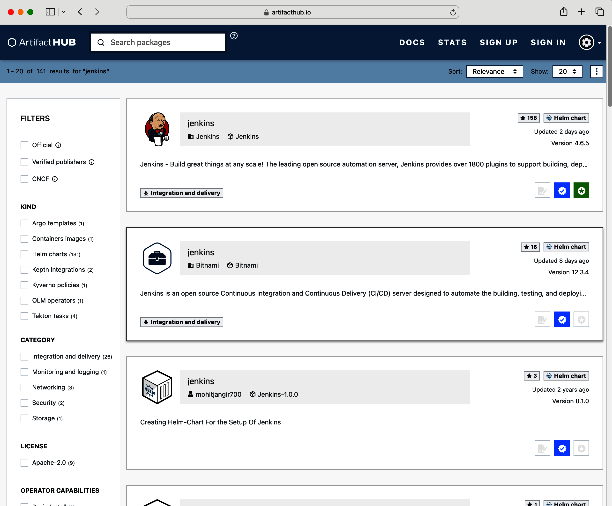
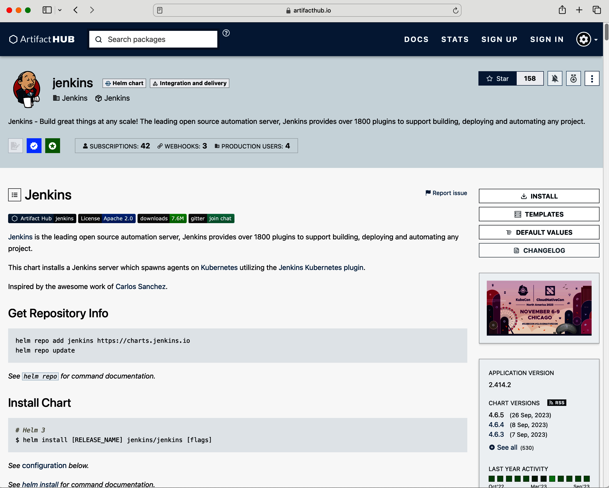
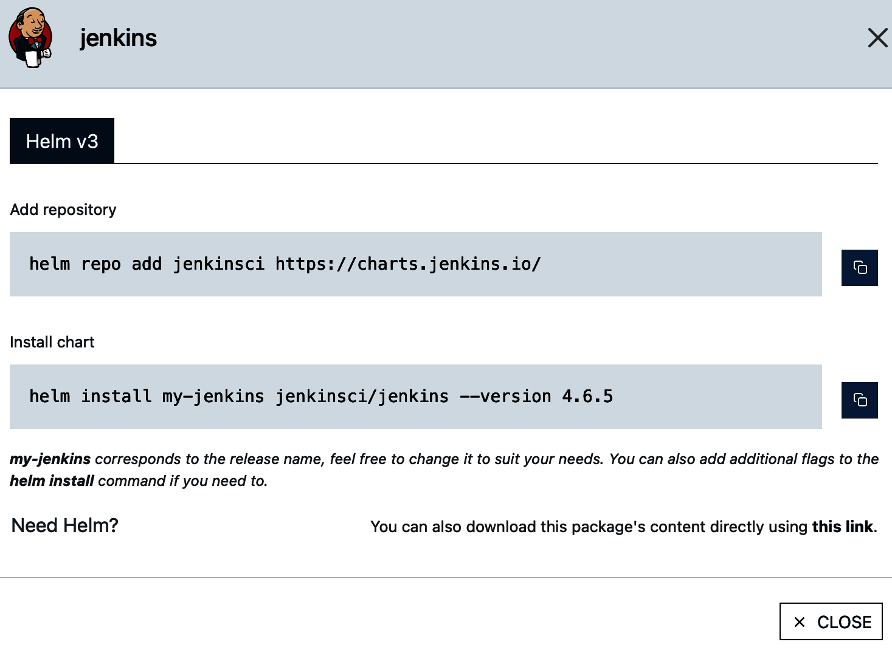
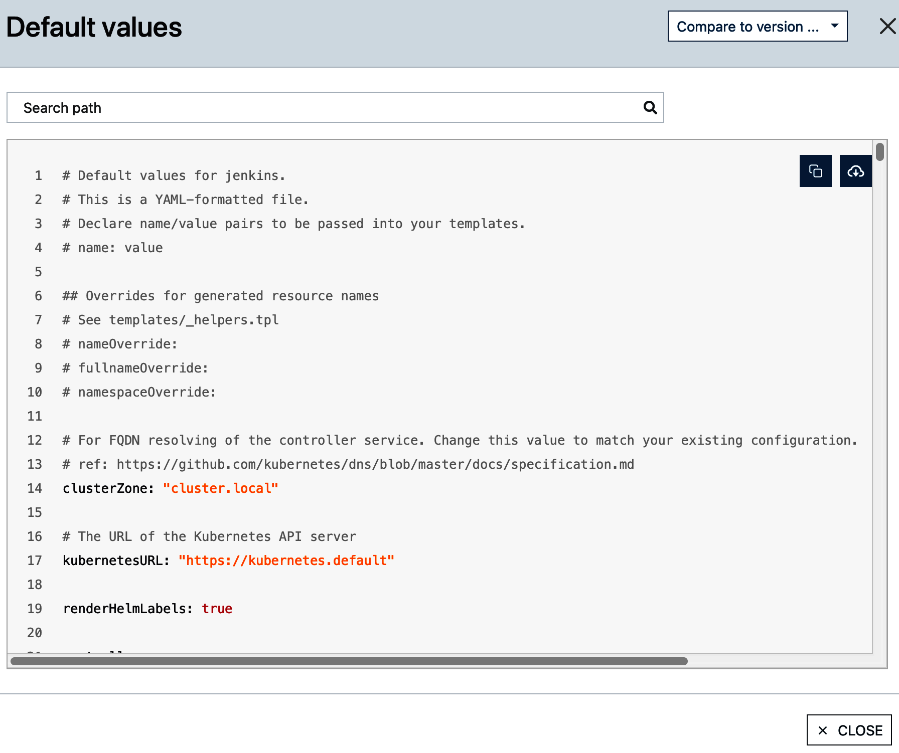

# Chương 8. Helm và Kustomize

*Dịch từ: Chapter 8. Helm and Kustomize — Certified Kubernetes Administrator (CKA) Study Guide, 2nd Edition (O'Reilly).*

Các đối tượng (object) Kubernetes có thể được tạo, sửa đổi và xóa bằng các lệnh `kubectl` dạng mệnh lệnh (imperative), hoặc bằng cách chạy một lệnh `kubectl` với một file manifest khai báo trạng thái mong muốn (desired state) của đối tượng, gọi là *manifest*. Ngôn ngữ định nghĩa chính của manifest là YAML, dù bạn cũng có thể chọn JSON, định dạng ít được cộng đồng Kubernetes sử dụng hơn. Các nhóm phát triển nên commit và push những file manifest này lên các kho quản lý phiên bản (version control repository), vì điều đó sẽ giúp theo dõi và kiểm toán các thay đổi theo thời gian.

Mô hình hóa một ứng dụng trong Kubernetes thường đòi hỏi một tập các đối tượng hỗ trợ, mỗi đối tượng có thể có manifest riêng. Ví dụ, bạn có thể muốn tạo một Deployment chạy ứng dụng trên năm Pod, một ConfigMap để đưa dữ liệu cấu hình vào dưới dạng biến môi trường (environment variable), và một Service để mở truy cập mạng.

Việc quản lý một application stack đầy đủ bằng cách chạy từng lệnh `kubectl` riêng lẻ là không thực tế. Đó là lúc các công cụ mã nguồn mở như Helm và Kustomize phát huy tác dụng. Chúng cho phép bạn quản lý thuận tiện vòng đời (lifecycle) của các application stack và các thành phần cluster như một đơn vị duy nhất, đồng thời cho phép điều chỉnh tham số theo ngữ cảnh tại thời điểm triển khai.

> **PHẠM VI BAO PHỦ MỤC TIÊU ĐỀ CƯƠNG**
>
> Chương này đề cập đến mục tiêu đề cương (curriculum) sau:
>
> - Sử dụng Helm và Kustomize để cài đặt (install) các thành phần cluster

## Làm việc với Helm

Helm là trình quản lý gói (package manager) cho một tập các manifest Kubernetes; nó cũng cung cấp một templating engine. Tại thời điểm chạy, nó thay thế các placeholder trong các file template YAML bằng các giá trị thực do người dùng cuối định nghĩa. Artifact do file thực thi Helm tạo ra là một *file chart* đóng gói các manifest tạo nên các tài nguyên API của một ứng dụng dưới dạng một file TAR. Bạn có thể tải file chart lên một *chart repository* để các nhóm khác có thể dùng nó triển khai các manifest đã được đóng gói. Hệ sinh thái Helm cung cấp rất nhiều chart có thể tái sử dụng cho các trường hợp sử dụng phổ biến, có thể tìm kiếm trên Artifact Hub (ví dụ, để chạy Grafana hoặc PostgreSQL).

Do Helm có quá nhiều chức năng, chúng ta sẽ chỉ thảo luận những điều cơ bản. Kỳ thi không đòi hỏi bạn phải là chuyên gia Helm; thay vào đó, kỳ thi muốn bạn quen thuộc với quy trình cài đặt các gói có sẵn bằng Helm. Việc xây dựng và xuất bản chart của riêng bạn nằm ngoài phạm vi kỳ thi. Để biết thông tin chi tiết hơn về Helm, hãy xem tài liệu. Phiên bản Helm được dùng để mô tả chức năng ở đây là 3.19.0.

### Quản lý một chart có sẵn

Là nhà phát triển, bạn muốn tái sử dụng chức năng có sẵn thay vì bỏ công tự định nghĩa và cấu hình nó. Ví dụ, bạn có thể muốn cài đặt dịch vụ giám sát mã nguồn mở Prometheus trên cluster của mình.

Prometheus yêu cầu cài đặt nhiều primitive Kubernetes. May mắn thay, cộng đồng Kubernetes đã cung cấp một Helm chart, giúp việc cài đặt và cấu hình tất cả các thành phần liên quan trở nên rất dễ dàng dưới dạng một Kubernetes operator. Hãy xem lại Chương 7 để ôn lại các thành phần của mẫu operator (operator pattern).

Danh sách sau đây cho thấy quy trình điển hình để sử dụng và quản lý một Helm chart. Hầu hết các bước này cần dùng file thực thi `helm`:

1. Xác định chart bạn muốn cài đặt
2. Thêm repository chứa chart
3. Cài đặt chart từ repository
4. Kiểm tra các đối tượng Kubernetes đã được chart cài đặt
5. Hiển thị danh sách các chart đã cài đặt
6. Nâng cấp (upgrade) một chart đã cài đặt
7. Gỡ cài đặt (uninstall) chart nếu không còn cần đến chức năng của nó

Các mục sau đây sẽ giải thích từng bước.

#### Xác định chart

Qua nhiều năm, cộng đồng Kubernetes đã triển khai và xuất bản hàng nghìn Helm chart. Artifact Hub cung cấp khả năng tìm kiếm trên web để khám phá chart theo từ khóa.

Giả sử bạn muốn tìm một chart cài đặt giải pháp tích hợp liên tục (continuous integration) Jenkins. Tất cả những gì bạn cần làm là nhập từ *jenkins* vào ô tìm kiếm và nhấn phím Enter. Hình 8-1 cho thấy danh sách kết quả trên Artifact Hub.



*Hình 8-1. Tìm kiếm chart Jenkins trên Artifact Hub*

Tại thời điểm viết sách, có 141 kết quả khớp với từ khóa tìm kiếm. Bạn có thể xem chi tiết về chart bằng cách nhấp vào một trong các kết quả tìm kiếm, bao gồm mô tả tổng quan và repository chứa file chart. Hơn nữa, bạn có thể xem các template được đóng gói cùng file chart, cho biết các đối tượng sẽ được tạo khi cài đặt và các tùy chọn cấu hình của chúng. Hình 8-2 cho thấy trang của chart Jenkins chính thức.

Bạn không thể cài đặt chart trực tiếp từ Artifact Hub. Bạn phải cài đặt nó từ repository lưu trữ file chart.



*Hình 8-2. Chi tiết chart Jenkins*

#### Thêm chart repository

Mô tả của chart có thể đề cập đến repository lưu trữ file chart. Ngoài ra, bạn có thể nhấp nút Install để hiển thị chi tiết repository và lệnh để thêm nó. Hình 8-3 cho thấy cửa sổ pop-up theo ngữ cảnh xuất hiện sau khi nhấp Install.

Theo mặc định, một bản cài đặt Helm không định nghĩa repository bên ngoài nào. Lệnh sau cho thấy cách liệt kê tất cả các repository đã đăng ký. Chưa có repository nào được đăng ký:

```shell
$ helm repo list
Error: no repositories to show
```

Như bạn có thể thấy từ pop-up, file chart nằm trong repository có URL https://charts.jenkins.io. Chúng ta sẽ cần thêm repository này. Đây là thao tác chỉ làm một lần. Bạn có thể cài đặt các chart khác từ repository đó hoặc cập nhật một chart có nguồn gốc từ repository đó bằng các lệnh được thảo luận ở mục sau.



*Hình 8-3. Hướng dẫn cài đặt chart Jenkins*

Bạn cần cung cấp một tên cho repository khi đăng ký. Hãy đặt tên repository càng mô tả rõ càng tốt. Lệnh sau đăng ký repository với tên `jenkinsci`:

```shell
$ helm repo add jenkinsci https://charts.jenkins.io/
"jenkinsci" has been added to your repositories
```

Liệt kê các repository lúc này cho thấy ánh xạ giữa tên và URL:

```shell
$ helm repo list
NAME        URL
jenkinsci   https://charts.jenkins.io/
```

Bạn đã thêm vĩnh viễn repository vào bản cài đặt Helm.

#### Tìm kiếm chart trong repository

Cửa sổ pop-up Install đã cung cấp sẵn lệnh để cài đặt chart. Bạn cũng có thể tìm kiếm trong repository các chart có sẵn trong trường hợp bạn không biết tên hoặc phiên bản mới nhất của chúng. Thêm cờ `--versions` để liệt kê tất cả các phiên bản có sẵn:

```shell
$ helm search repo jenkinsci
NAME                CHART VERSION   APP VERSION   DESCRIPTION
jenkinsci/jenkins   5.8.26          2.492.2       ...
```

Tại thời điểm viết sách, phiên bản mới nhất có sẵn là 5.8.26. Con số này có thể khác khi bạn chạy lệnh trên máy của mình, vì dự án Jenkins có thể đã phát hành phiên bản mới hơn.

#### Cài đặt chart

Giả sử phiên bản mới nhất của Helm chart chứa một lỗ hổng bảo mật. Do đó, chúng ta quyết định cài đặt chart Jenkins với phiên bản trước đó, 5.8.25. Bạn cần gán một tên để có thể nhận diện chart đã cài đặt. Tên chúng ta sẽ dùng ở đây là `my-jenkins`:

```shell
$ helm install my-jenkins jenkinsci/jenkins --version 5.8.25
NAME: my-jenkins
LAST DEPLOYED: Wed Mar 26 13:48:50 2025
NAMESPACE: default
STATUS: deployed
REVISION: 1
...
```

Chart đã tự động tạo các đối tượng Kubernetes trong namespace `default`. Bạn có thể dùng lệnh sau để khám phá các loại tài nguyên quan trọng nhất:

```shell
$ kubectl get all
NAME                     READY      STATUS       RESTARTS       AGE
pod/my-jenkins-0         2/2        Running      0              12m

NAME                                TYPE            CLUSTER-IP             EXTERNAL-IP   ..
service/my-jenkins                  ClusterIP       10.99.166.189          <none>        ..
service/my-jenkins-agent            ClusterIP       10.110.246.141         <none>        ..

NAME                                    READY     AGE
statefulset.apps/my-jenkins             1/1       12m
```

Chart đã được cài đặt với các tùy chọn cấu hình mặc định. Bạn có thể xem các giá trị mặc định đó bằng cách nhấp nút Default Values trên trang của chart, như minh họa trong Hình 8-4.



*Hình 8-4. Các giá trị mặc định của chart Jenkins*

Bạn cũng có thể khám phá các tùy chọn cấu hình đó bằng lệnh sau. Output được hiển thị chỉ gồm một phần nhỏ các giá trị, tên người dùng admin và mật khẩu của nó, được biểu diễn bởi `controller.adminUser` và `controller.adminPassword`:

```shell
$ helm show values jenkinsci/jenkins
...
controller:
  # When enabling LDAP or another non-Jenkins identity source, the built-in
  # admin account will no longer exist.
  # If you disable the non-Jenkins identity store and instead use the Jenkins
  # internal one,
  # you should revert controller.adminUser to your preferred admin user:
  adminUser: "admin"
  # adminPassword: <defaults to random>
...
```

Bạn có thể tùy chỉnh bất kỳ giá trị cấu hình nào khi cài đặt chart. Để truyền dữ liệu cấu hình trong quá trình cài đặt, hãy dùng một trong các cờ (flag) sau:

**`--values`**

Chỉ định các giá trị ghi đè dưới dạng một con trỏ tới file manifest YAML

**`--set`**

Chỉ định các giá trị ghi đè trực tiếp từ dòng lệnh

Để biết thêm thông tin, xem mục "Customizing the Chart Before Installing" trong tài liệu Helm.

Bạn có thể quyết định cài đặt chart vào một namespace tùy chỉnh. Dùng cờ `-n` để cung cấp tên của một namespace đã tồn tại. Thêm cờ `--create-namespace` để tự động tạo namespace nếu nó chưa tồn tại.

Lệnh sau cho thấy cách tùy chỉnh một số giá trị và namespace được dùng trong quá trình cài đặt:

```shell
$ helm install my-jenkins jenkinsci/jenkins --version 4.6.4 \
--set controller.adminUser=boss --set controller.adminPassword=password \
-n jenkins --create-namespace
```

Chúng ta đã thiết lập cụ thể tên người dùng và mật khẩu cho người dùng admin. Helm đã tạo các đối tượng do chart kiểm soát vào namespace `jenkins`.

#### Liệt kê các chart đã cài đặt

Chart có thể nằm trong namespace `default` hoặc một namespace tùy chỉnh. Bạn có thể xem danh sách các chart đã cài đặt bằng lệnh `helm list`. Nếu bạn không biết namespace nào, chỉ cần thêm cờ `--all-namespaces` vào lệnh:

```shell
$ helm list --all-namespaces
NAME         NAMESPACE   REVISION   UPDATED         STATUS     CHART
my-jenkins   default     1          2023-09-28...   deployed   jenkins-4.6
```

Output của lệnh bao gồm cột `NAMESPACE` cho biết namespace được dùng bởi một chart cụ thể. Tương tự như khi dùng `kubectl`, lệnh `helm list` cung cấp tùy chọn `-n` để chỉ định rõ namespace. Không cung cấp cờ nào cho lệnh sẽ trả về kết quả cho namespace `default`.

#### Nâng cấp một chart đã cài đặt

Nâng cấp một chart đã cài đặt thường có nghĩa là chuyển sang một phiên bản chart mới. Bạn có thể kiểm tra các phiên bản mới có sẵn trong repository bằng cách chạy lệnh này:

```shell
$ helm repo update
Hang tight while we grab the latest from your chart repositories...
...Successfully got an update from the "jenkinsci" chart repository
Update Complete. *Happy Helming!*
```

Nếu bạn muốn nâng cấp bản cài đặt chart hiện có lên một phiên bản chart mới hơn thì sao? Chạy lệnh sau để nâng cấp chart lên phiên bản cụ thể đó với cấu hình mặc định:

```shell
$ helm upgrade my-jenkins jenkinsci/jenkins --version 5.8.26
Release "my-jenkins" has been upgraded. Happy Helming!
...
```

Cũng như với lệnh `install`, bạn sẽ phải cung cấp các giá trị cấu hình tùy chỉnh nếu muốn tinh chỉnh hành vi lúc chạy của chart khi nâng cấp chart.

#### Gỡ cài đặt chart

Đôi khi bạn không còn cần chạy một chart nữa. Lệnh gỡ cài đặt chart rất đơn giản, như minh họa dưới đây. Nó sẽ xóa tất cả các đối tượng do chart kiểm soát. Đừng quên cung cấp cờ `-n` nếu trước đó bạn đã cài đặt chart vào một namespace khác `default`:

```shell
$ helm uninstall my-jenkins
release "my-jenkins" uninstalled
```

Việc thực thi lệnh có thể mất tới 30 giây, vì Kubernetes cần chờ thời gian ân hạn (grace period) của workload kết thúc.

## Làm việc với Kustomize

Kustomize là một công cụ được giới thiệu cùng Kubernetes 1.14 nhằm giúp việc quản lý manifest thuận tiện hơn. Nó hỗ trợ ba trường hợp sử dụng khác nhau:

- Sinh manifest từ các nguồn khác. Ví dụ, tạo một ConfigMap và điền các cặp key-value của nó từ một file properties.
- Thêm cấu hình chung cho nhiều manifest. Ví dụ, thêm một namespace và một tập label cho một Deployment và một Service.
- Kết hợp và tùy chỉnh một tập hợp các manifest. Ví dụ, thiết lập giới hạn tài nguyên cho nhiều Deployment.

File trung tâm cần thiết để Kustomize hoạt động là file kustomization. Tên chuẩn hóa của file là *kustomization.yaml* và không thể thay đổi. File kustomization định nghĩa các quy tắc xử lý mà Kustomize dựa vào để làm việc.

Kustomize được tích hợp hoàn toàn với `kubectl` và có thể được thực thi ở hai chế độ: hiển thị output xử lý ra console hoặc tạo các đối tượng. Cả hai chế độ đều có thể hoạt động trên một thư mục, tarball, Git archive, hoặc URL, miễn là chúng chứa file kustomization và các file tài nguyên được tham chiếu:

**Hiển thị output được tạo ra**

Chế độ thứ nhất dùng lệnh con `kustomize` để hiển thị kết quả được tạo ra trên console nhưng không tạo các đối tượng. Lệnh này hoạt động tương tự tùy chọn dry-run mà bạn có thể đã biết từ lệnh `run`:

```shell
$ kubectl kustomize <target>
```

**Tạo các đối tượng**

Chế độ thứ hai dùng lệnh `apply` kết hợp với tùy chọn dòng lệnh `-k` để áp dụng các tài nguyên đã được Kustomize xử lý, như đã giải thích ở mục trước:

```shell
$ kubectl apply -k <target>
```

Các mục sau đây minh họa từng trường hợp sử dụng bằng một ví dụ. Để có phạm vi đầy đủ về mọi kịch bản có thể, hãy tham khảo tài liệu hoặc kho GitHub của Kustomize.

### Kết hợp các manifest

Một trong những chức năng cốt lõi của Kustomize là tạo một manifest kết hợp từ các manifest khác. Việc gộp nhiều manifest thành một có vẻ không hữu ích lắm nếu xét riêng, nhưng nhiều tính năng khác được mô tả sau này sẽ xây dựng trên khả năng này. Giả sử bạn muốn kết hợp một định nghĩa YAML duy nhất gồm nhiều manifest được phân tách bằng "---" từ một file tài nguyên Deployment và một file tài nguyên Service. Tất cả những gì bạn cần làm là đặt các file tài nguyên vào cùng thư mục với file kustomization:

```text
.
├── kustomization.yaml
├── web-app-deployment.yaml
└── web-app-service.yaml
```

File kustomization liệt kê các tài nguyên trong mục `resources`, như minh họa trong Ví dụ 8-1.

**Ví dụ 8-1. File kustomization kết hợp hai manifest**

```yaml
resources:
- web-app-deployment.yaml
- web-app-service.yaml
```

Kết quả là lệnh con `kustomize` hiển thị manifest kết hợp chứa tất cả các tài nguyên được phân tách bằng ba dấu gạch ngang (`---`) để đánh dấu các định nghĩa đối tượng khác nhau:

```shell
$ kubectl kustomize ./
apiVersion: v1
kind: Service
metadata:
  labels:
    app: web-app-service
  name: web-app-service
spec:
  ports:
  - name: web-app-port
    port: 3000
    protocol: TCP
    targetPort: 3000
  selector:
    app: web-app
  type: NodePort
---
apiVersion: apps/v1
kind: Deployment
metadata:
  labels:
    app: web-app-deployment
  name: web-app-deployment
spec:
  replicas: 3
  selector:
    matchLabels:
      app: web-app
  template:
    metadata:
      labels:
        app: web-app
    spec:
      containers:
      - env:
        - name: DB_HOST
          value: mysql-service
        - name: DB_USER
          value: root
        - name: DB_PASSWORD
          value: password
        image: bmuschko/web-app:1.0.1
        name: web-app
        ports:
        - containerPort: 3000
```

### Sinh manifest từ các nguồn khác

Ở phần trước trong chương này, chúng ta đã biết rằng ConfigMap và Secret có thể được tạo bằng cách trỏ chúng tới một file chứa dữ liệu cấu hình thực tế. Kustomize có thể hỗ trợ quá trình này bằng cách ánh xạ mối quan hệ giữa manifest YAML của các đối tượng cấu hình đó và dữ liệu của chúng. Hơn nữa, chúng ta sẽ muốn đưa ConfigMap và Secret đã tạo vào một Pod dưới dạng biến môi trường. Trong mục này, bạn sẽ học cách đạt được điều đó với sự trợ giúp của Kustomize.

Cấu trúc file và thư mục sau đây chứa file YAML cho Pod và các file dữ liệu cấu hình mà chúng ta cần cho ConfigMap và Secret. File kustomization bắt buộc nằm ở cấp gốc của cây thư mục:

```text
.
├── config
│   ├── db-config.properties
│   └── db-secret.properties
├── kustomization.yaml
└── web-app-pod.yaml
```

Trong *kustomization.yaml*, bạn có thể định nghĩa rằng đối tượng ConfigMap và Secret sẽ được sinh ra với tên cho trước. Tên của ConfigMap sẽ là `db-config`, và tên của Secret sẽ là `db-creds`. Cả hai thuộc tính generator, `configMapGenerator` và `secretGenerator`, đều tham chiếu tới một file đầu vào được dùng để nạp dữ liệu cấu hình. Mọi tài nguyên bổ sung có thể được chỉ định bằng thuộc tính `resources`. Ví dụ 8-2 cho thấy nội dung của file kustomization.

**Ví dụ 8-2. File kustomization dùng generator cho ConfigMap và Secret**

```yaml
configMapGenerator:
- name: db-config
  files:
  - config/db-config.properties
secretGenerator:
- name: db-creds
  files:
  - config/db-secret.properties
resources:
- web-app-pod.yaml
```

Kustomize sinh ConfigMap và Secret bằng cách thêm một hậu tố vào tên. Bạn có thể thấy hành vi này khi tạo các đối tượng bằng lệnh `apply`. ConfigMap và Secret có thể được tham chiếu theo tên trong manifest của Pod:

```shell
$ kubectl apply -k ./
configmap/db-config-t4c79h4mtt unchanged
secret/db-creds-4t9dmgtf9h unchanged
pod/web-app created
```

> **CẤU HÌNH CHIẾN LƯỢC ĐẶT TÊN**
>
> Chiến lược đặt tên này có thể được cấu hình bằng thuộc tính `generatorOptions` trong file kustomization. Xem tài liệu để biết thêm thông tin.

Hãy thử cả lệnh con `kustomize`. Thay vì tạo các đối tượng, lệnh này hiển thị output đã xử lý trên console:

```shell
$ kubectl kustomize ./
apiVersion: v1
data:
  db-config.properties: |-
    DB_HOST: mysql-service
    DB_USER: root
kind: ConfigMap
metadata:
  name: db-config-t4c79h4mtt
---
apiVersion: v1
data:
  db-secret.properties: REJfUEFTU1dPUkQ6IGNHRnpjM2R2Y21RPQ==
kind: Secret
metadata:
  name: db-creds-4t9dmgtf9h
type: Opaque
---
apiVersion: v1
kind: Pod
metadata:
  labels:
    app: web-app
  name: web-app
spec:
  containers:
  - envFrom:
    - configMapRef:
        name: db-config-t4c79h4mtt
    - secretRef:
        name: db-creds-4t9dmgtf9h
    image: bmuschko/web-app:1.0.1
    name: web-app
    ports:
    - containerPort: 3000
      protocol: TCP
  restartPolicy: Always
```

### Thêm cấu hình chung cho nhiều manifest

Các nhà phát triển ứng dụng thường làm việc trên một application stack gồm nhiều manifest. Ví dụ, một application stack có thể bao gồm một microservice frontend, một microservice backend, và một cơ sở dữ liệu. Thực hành phổ biến là dùng cùng một cấu hình xuyên suốt (cross-cutting) cho từng manifest. Kustomize cung cấp một loạt các trường được hỗ trợ (ví dụ: namespace, label, hoặc annotation). Hãy tham khảo tài liệu để tìm hiểu về tất cả các trường được hỗ trợ.

Với ví dụ tiếp theo, chúng ta sẽ giả định rằng một Deployment và một Service nằm trong cùng namespace và dùng một tập label chung. Namespace có tên `persistence` và label là cặp key-value `team: helix`. Ví dụ 8-3 minh họa cách thiết lập các trường chung đó trong file kustomization.

**Ví dụ 8-3. File kustomization dùng trường chung**

```yaml
namespace: persistence
commonLabels:
  team: helix
resources:
- web-app-deployment.yaml
- web-app-service.yaml
```

Để tạo các đối tượng được tham chiếu trong file kustomization, hãy chạy lệnh `apply`. Hãy đảm bảo tạo namespace `persistence` trước:

```shell
$ kubectl create namespace persistence
namespace/persistence created
$ kubectl apply -k ./
service/web-app-service created
deployment.apps/web-app-deployment created
```

Biểu diễn YAML của các file đã xử lý trông như sau:

```shell
$ kubectl kustomize ./
apiVersion: v1
kind: Service
metadata:
  labels:
    app: web-app-service
    team: helix
  name: web-app-service
  namespace: persistence
spec:
  ports:
  - name: web-app-port
    port: 3000
    protocol: TCP
    targetPort: 3000
  selector:
    app: web-app
    team: helix
  type: NodePort
---
apiVersion: apps/v1
kind: Deployment
metadata:
  labels:
    app: web-app-deployment
    team: helix
  name: web-app-deployment
  namespace: persistence
spec:
  replicas: 3
  selector:
    matchLabels:
      app: web-app
      team: helix
  template:
    metadata:
      labels:
        app: web-app
        team: helix
    spec:
      containers:
      - env:
        - name: DB_HOST
          value: mysql-service
        - name: DB_USER
          value: root
        - name: DB_PASSWORD
          value: password
        image: bmuschko/web-app:1.0.1
        name: web-app
        ports:
        - containerPort: 3000
```

### Tùy chỉnh một tập hợp các manifest

Kustomize có thể hợp nhất nội dung của một manifest YAML với một đoạn mã từ một manifest YAML khác. Các trường hợp sử dụng điển hình bao gồm thêm cấu hình security context vào định nghĩa Pod hoặc thiết lập giới hạn tài nguyên cho một Deployment. File kustomization cho phép chỉ định các chiến lược patch khác nhau như `patchesStrategicMerge` và `patchesJson6902`. Để thảo luận sâu hơn về sự khác biệt giữa các chiến lược patch, hãy tham khảo tài liệu Kubernetes.

Ví dụ 8-4 cho thấy nội dung của một file kustomization thực hiện patch định nghĩa Deployment trong file *nginx-deployment.yaml* bằng nội dung của file *security-context.yaml*.

**Ví dụ 8-4. File kustomization định nghĩa một patch**

```yaml
resources:
- nginx-deployment.yaml
patchesStrategicMerge:
- security-context.yaml
```

File patch trong Ví dụ 8-5 định nghĩa một security context ở cấp container cho Pod template của Deployment. Tại thời điểm chạy, chiến lược patch cố gắng tìm container có tên `nginx` và bổ sung cấu hình thêm vào đó.

**Ví dụ 8-5. Manifest YAML của patch**

```yaml
apiVersion: apps/v1
kind: Deployment
metadata:
  name: nginx-deployment
spec:
  template:
    spec:
      containers:
      - name: nginx
        securityContext:
          runAsUser: 1000
          runAsGroup: 3000
          fsGroup: 2000
```

Kết quả là một định nghĩa Deployment đã được patch, như minh họa trong output của lệnh con `kustomize` dưới đây. Cơ chế patch có thể được áp dụng cho các file khác cần một định nghĩa security context thống nhất:

```shell
$ kubectl kustomize ./
apiVersion: apps/v1
kind: Deployment
metadata:
  labels:
    app: nginx
  name: nginx-deployment
spec:
  replicas: 3
  selector:
    matchLabels:
      app: nginx
  template:
    metadata:
      labels:
        app: nginx
    spec:
      containers:
      - image: nginx:1.14.2
        name: nginx
        ports:
        - containerPort: 80
        securityContext:
          fsGroup: 2000
          runAsGroup: 3000
          runAsUser: 1000
```

## Những khác biệt chính giữa Helm và Kustomize

Nhìn bề ngoài, Helm và Kustomize có vẻ giải quyết cùng những vấn đề. Helm thiên về đóng gói và phân phối, còn Kustomize thiên về quản lý cấu hình. Hãy dùng cả hai ở nơi mỗi công cụ phù hợp nhất.

Ở đây, chúng ta muốn xác định những khác biệt chính giữa hai công cụ này để bạn có thể đưa ra quyết định sáng suốt dựa trên các trường hợp sử dụng mà bạn đang cố gắng đáp ứng:

**Tính dễ sử dụng**

Kustomize được đóng gói sẵn cùng dòng lệnh `kubectl`. Bạn không cần cài đặt thêm công cụ khác, cũng không phải học thêm một templating engine khác.

Helm yêu cầu cài đặt một file thực thi và đòi hỏi bạn phải làm quen với các lệnh và quy trình làm việc của nó.

**Đường cong học tập**

Kustomize xây dựng trên kiến thức của một quản trị viên hoặc nhà phát triển đã quen với việc viết các manifest YAML Kubernetes.

Helm có đường cong học tập dốc hơn. Bạn sẽ phải làm quen với hệ thống quản lý gói của nó, ký pháp của templating engine, và cách truyền vào các giá trị do người dùng định nghĩa khi gọi lệnh.

**Đóng gói**

Kustomize không yêu cầu người dùng cuối tạo ra một file lưu trữ (archive). Tất cả những gì bạn cần là một tập các manifest YAML và file *kustomization.yaml*, mà bạn sẽ đưa vào một kho Git.

Ngược lại, Helm yêu cầu tạo một file metadata có tên *Chart.yaml*, các giá trị mặc định được biểu diễn trong file có tên *values.yaml*, và một tập các file template trong thư mục con *templates*. Để có thể phân phối Helm chart, bạn sẽ cần đóng gói nó thành một file TAR.

**Quản lý phiên bản release**

Kustomize chỉ tập trung vào việc sinh ra trạng thái mong muốn trong cluster thông qua các manifest YAML. Bạn có thể theo dõi các thay đổi theo thời gian bằng các hash commit hoặc tag của Git để chỉ ra phiên bản.

Cấu trúc dự án cứng nhắc của Helm yêu cầu định nghĩa phiên bản chart bên trong file *Chart.yaml*. Mỗi lần thay đổi, bạn sẽ tăng số phiên bản, thường được biểu diễn theo semantic versioning.

Helm và Kustomize là các công cụ Kubernetes được dùng để tự động hóa quá trình triển khai các đối tượng vào cluster. Hãy phân tích kỹ các yêu cầu kỹ thuật, mục tiêu kinh doanh, và bộ kỹ năng của các thành viên trong nhóm trước khi quyết định chọn một trong hai công cụ. Bạn thậm chí có thể xác định rằng nên dùng cả hai công cụ để quản lý các application stack trong Kubernetes. Hầu hết các công cụ GitOps cho Kubernetes, ví dụ Argo CD hoặc Flux, đều hỗ trợ Helm và Kustomize.

## Tóm tắt

Helm đã phát triển để trở thành công cụ tiêu chuẩn de facto cho việc triển khai các application stack lên Kubernetes. Artifact chứa các file manifest, các giá trị cấu hình mặc định và metadata được gọi là chart. Một nhóm hoặc một cá nhân có thể xuất bản chart lên một chart repository. Người dùng có thể khám phá một chart đã xuất bản thông qua giao diện người dùng Artifact Hub và cài đặt nó vào một cluster Kubernetes.

Một trong những quy trình làm việc chính của nhà phát triển khi dùng Helm bao gồm tìm kiếm, cài đặt và nâng cấp một chart với một phiên bản cụ thể. Bạn bắt đầu bằng việc đăng ký repository chứa các file chart mà bạn muốn sử dụng. Lệnh `helm install` tải file chart về và lưu vào bộ nhớ đệm cục bộ. Nó cũng tạo các đối tượng Kubernetes được mô tả bởi chart.

Quá trình cài đặt có thể cấu hình được. Nhà phát triển có thể cung cấp các giá trị ghi đè cho các giá trị cấu hình tùy chỉnh được. Lệnh `helm upgrade` cho phép bạn nâng cấp phiên bản của một chart đã cài đặt. Để gỡ cài đặt một chart và xóa tất cả các đối tượng Kubernetes do chart quản lý, hãy chạy lệnh `helm uninstall`.

Các công cụ bổ sung đã xuất hiện để quản lý manifest thuận tiện hơn. Kustomize được tích hợp hoàn toàn với chuỗi công cụ `kubectl`. Nó hỗ trợ việc sinh, kết hợp và tùy chỉnh các manifest.

## Trọng tâm cho kỳ thi

**Giả định rằng các file thực thi Helm và Kustomize đã được cài đặt sẵn**

Đáng tiếc, FAQ của kỳ thi không đề cập bất kỳ chi tiết nào về các file thực thi Helm và Kustomize. Có thể giả định một cách hợp lý rằng chúng sẽ được cài đặt sẵn cho bạn, và do đó bạn không cần ghi nhớ hướng dẫn cài đặt.

**Làm quen với Artifact Hub**

Artifact Hub cung cấp một giao diện người dùng trên web cho các Helm chart. Rất đáng để khám phá khả năng tìm kiếm và các chi tiết mà từng chart cung cấp, cụ thể hơn là repository chứa file chart, và các giá trị có thể cấu hình của nó. Trong kỳ thi, bạn có thể sẽ không được yêu cầu truy cập Artifact Hub vì URL của nó chưa được liệt kê trong số các trang tài liệu được phép. Bạn có thể giả định rằng câu hỏi thi sẽ cung cấp cho bạn URL của repository.

**Luyện tập các lệnh cần thiết để sử dụng các Helm chart có sẵn**

Kỳ thi không yêu cầu bạn xây dựng và xuất bản file chart của riêng mình. Tất cả những gì bạn cần hiểu là cách sử dụng một chart có sẵn. Bạn sẽ cần quen thuộc với lệnh `helm repo add` để đăng ký một repository, `helm search repo` để tìm các phiên bản chart có sẵn, và lệnh `helm install` để cài đặt một chart. Bạn nên có hiểu biết cơ bản về quy trình nâng cấp cho một Helm chart đã cài đặt bằng lệnh `helm upgrade`.

## Bài tập mẫu

Lời giải cho các bài tập này có trong Phụ lục A.

1. Trong bài tập này, bạn sẽ dùng Helm để cài đặt các đối tượng Kubernetes cần thiết cho giải pháp giám sát mã nguồn mở Prometheus. Cách dễ nhất để cài đặt Prometheus trên Kubernetes là với sự trợ giúp của Helm chart prometheus-operator.

   Bạn có thể tìm kiếm kube-prometheus-stack trên Artifact Hub. Thêm repository vào danh sách các repository đã biết mà Helm có thể truy cập, với tên `prometheus-community`.

   Cập nhật thông tin mới nhất về các chart từ chart repository tương ứng.

   Chạy lệnh Helm để liệt kê các Helm chart có sẵn và phiên bản của chúng. Xác định phiên bản chart mới nhất của `kube-prometheus-stack`.

   Cài đặt chart `kube-prometheus-stack`. Liệt kê Helm chart đã cài đặt.

   Liệt kê Service có tên `prometheus-operated` được tạo bởi Helm chart. Đối tượng này nằm trong namespace `default`.

   Dùng lệnh `kubectl port-forward` để chuyển tiếp cổng cục bộ 8080 tới cổng 9090 của Service. Mở trình duyệt và hiển thị bảng điều khiển (dashboard) Prometheus.

   Dừng chuyển tiếp cổng và gỡ cài đặt Helm chart.

2. Tạo thư mục có tên *manifests*. Trong thư mục đó, tạo hai file: *pod.yaml* và *configmap.yaml*. File *pod.yaml* sẽ định nghĩa một Pod có tên `nginx` với image `nginx:1.21.1`. File *configmap.yaml* định nghĩa một ConfigMap có tên `logs-config` với cặp key-value `dir=/etc/logs/traffic.log`. Tạo cả hai đối tượng bằng một lệnh khai báo (declarative) duy nhất.

   Sửa manifest của ConfigMap bằng cách đổi giá trị của key `dir` thành `/etc/logs/traffic-log.txt`. Áp dụng các thay đổi. Xóa cả hai đối tượng bằng một lệnh khai báo duy nhất.

   Dùng Kustomize để thiết lập namespace chung `t012` cho file tài nguyên *pod.yaml*. File *pod.yaml* định nghĩa Pod có tên `nginx` với image `nginx:1.21.1` mà không có namespace. Chạy lệnh Kustomize để hiển thị manifest đã được biến đổi trên console.
