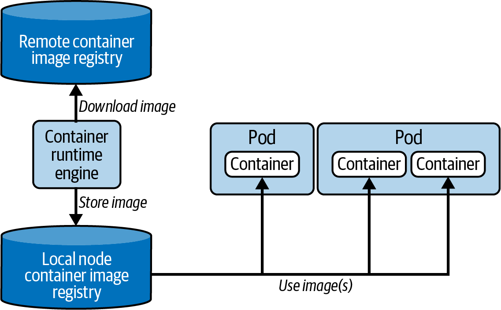
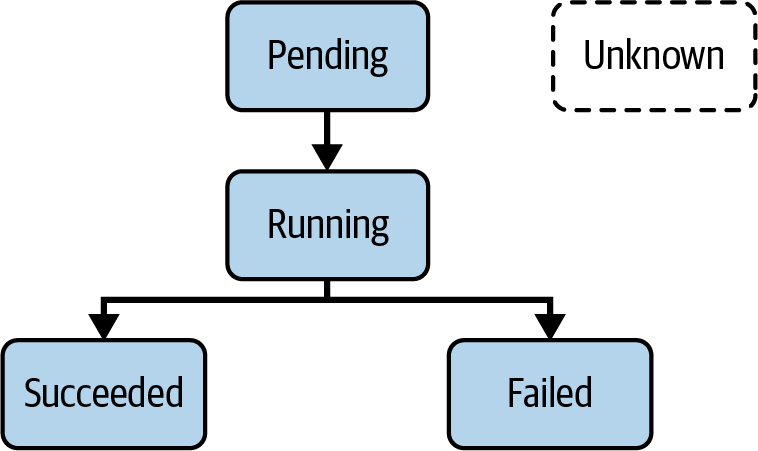

# Chương 9. Pod và Namespace

*Dịch từ: Chapter 9. Pods and Namespaces — Certified Kubernetes Administrator (CKA) Study Guide, 2nd Edition (O'Reilly).*

Primitive quan trọng nhất trong API Kubernetes là Pod. Một Pod cho phép bạn chạy một ứng dụng đã được đóng gói trong container. Trong thực tế, bạn sẽ thường gặp ánh xạ một-một giữa một Pod và một container; tuy nhiên, có những trường hợp sử dụng được hưởng lợi từ việc khai báo nhiều hơn một container trong một Pod duy nhất.

Pod đa container hữu ích cho các tiến trình gắn kết chặt chẽ với nhau cần chia sẻ tài nguyên như storage volume và network namespace, đáp ứng các trường hợp sử dụng như mẫu sidecar (thu thập log, agent giám sát), mẫu adapter (chuẩn hóa định dạng đầu ra), mẫu ambassador (proxy kết nối), và init container (thực hiện các tác vụ thiết lập trước khi container chính khởi động). Xem blog Kubernetes để có cái nhìn tổng quan.

Ngoài việc chạy container, một Pod còn có thể sử dụng các dịch vụ khác như lưu trữ, dữ liệu cấu hình, và nhiều thứ khác nữa. Do đó, hãy xem Pod như một lớp bao bọc (wrapper) để chạy container, đồng thời có thể kết hợp thêm các tính năng xuyên suốt và chuyên biệt của Kubernetes.

> **PHẠM VI BAO PHỦ MỤC TIÊU ĐỀ CƯƠNG**
>
> Đề cương (curriculum) không đề cập rõ ràng đến việc bao phủ Pod và namespace. Tuy nhiên, bạn chắc chắn sẽ cần hiểu những primitive này vì chúng là nền tảng thiết yếu để chạy workload trong Kubernetes.

## Làm việc với Pod

Trong chương này, chúng ta sẽ xem xét cách làm việc với một Pod chỉ chạy một container duy nhất. Tôi sẽ thảo luận tất cả các lệnh `kubectl` quan trọng để tạo, sửa đổi, tương tác và xóa Pod bằng cả cách tiếp cận mệnh lệnh (imperative) và khai báo (declarative).

### Tạo Pod

Định nghĩa Pod cần chỉ rõ một image cho mỗi container. Khi tạo đối tượng Pod, dù theo cách mệnh lệnh hay khai báo, scheduler sẽ gán Pod cho một node, và engine của container runtime sẽ kiểm tra xem container image đã tồn tại trên node đó chưa. Nếu image chưa tồn tại, engine sẽ tải nó về từ container image registry được container runtime định nghĩa làm mặc định. Ngay khi image có mặt trên node, container được khởi tạo và sẽ chạy. Hình 9-1 minh họa luồng thực thi này.



*Hình 9-1. Tương tác của Container Runtime Interface với container image*

Lệnh `run` là điểm vào trung tâm để tạo Pod theo cách mệnh lệnh. Hãy cùng bàn về cách sử dụng nó và những tùy chọn dòng lệnh quan trọng nhất mà bạn nên ghi nhớ và luyện tập. Giả sử bạn muốn chạy một instance Hazelcast bên trong một Pod. Container nên dùng image Hazelcast mới nhất, mở port 5701, và định nghĩa một biến môi trường (environment variable). Ngoài ra, bạn cũng muốn gán hai label cho Pod. Lệnh mệnh lệnh sau đây kết hợp tất cả thông tin này và không đòi hỏi phải chỉnh sửa gì thêm trên đối tượng đang chạy (live object):

```shell
$ kubectl run hazelcast --image=hazelcast/hazelcast:5.1.7 \
  --port=5701 --env="DNS_DOMAIN=cluster" --labels="app=hazelcast,env=prod"
```

Lệnh `run` cung cấp rất nhiều tùy chọn dòng lệnh. Hãy chạy `kubectl run --help` hoặc tham khảo tài liệu Kubernetes để có cái nhìn tổng quan. Đối với kỳ thi, bạn không cần hiểu mọi lệnh. Bảng 9-1 liệt kê các tùy chọn được sử dụng phổ biến nhất.

**Bảng 9-1. Các tùy chọn dòng lệnh quan trọng của `kubectl run`**

| Tùy chọn | Giá trị ví dụ | Mô tả |
|---|---|---|
| `--image` | `hazelcast/hazelcast:5.1.7` | Image cho container cần chạy. |
| `--port` | `5701` | Port mà container này mở ra. |
| `--rm` | `true` | Xóa Pod sau khi lệnh trong container kết thúc. Xem "Tạo Pod tạm thời" để biết thêm thông tin. |
| `--env` | `DNS_DOMAIN=cluster` | Các biến môi trường cần đặt trong container. |
| `--labels` | `app=hazelcast,env=prod` | Danh sách các label, phân tách bằng dấu phẩy, để áp dụng cho Pod. |

Một số nhà phát triển quen tạo Pod từ manifest YAML hơn. Có lẽ bạn đã quen với cách tiếp cận khai báo vì nó mang lại hạ tầng dưới dạng mã (infrastructure as code) có thể quản lý phiên bản, có thể tái tạo, có thể lưu trữ trong Git, cho phép các quy trình GitOps, đánh giá chéo (peer review), và khả năng rollback. Bạn có thể diễn đạt cùng cấu hình đó cho Pod Hazelcast bằng cách mở trình soạn thảo, sao chép một đoạn mã YAML của Pod từ tài liệu trực tuyến của Kubernetes, rồi sửa đổi theo nhu cầu của mình. Ví dụ 9-1 cho thấy manifest của Pod được lưu trong file `pod.yaml`:

**Ví dụ 9-1. Manifest YAML của Pod**

```yaml
apiVersion: v1
kind: Pod
metadata:
  name: hazelcast                          # ❶
  labels:                                  # ❷
    app: hazelcast
    env: prod
spec:
  containers:
  - name: hazelcast
    image: hazelcast/hazelcast:5.1.7       # ❸
    env:                                   # ❹
    - name: DNS_DOMAIN
      value: cluster
    ports:
    - containerPort: 5701                  # ❺
```

❶ Gán tên `hazelcast` cho Pod

❷ Chỉ định các label cho Pod

❸ Khai báo container image sẽ được thực thi trong container của Pod

❹ Đưa một hoặc nhiều biến môi trường vào container

❺ Số port cần mở trên địa chỉ IP của Pod

Tạo Pod từ manifest rất đơn giản. Chỉ cần dùng lệnh `create` hoặc `apply`, như minh họa ở đây và được giải thích trong "Quản lý đối tượng":

```shell
$ kubectl apply -f pod.yaml
pod/hazelcast created
```

### Liệt kê Pod

Giờ bạn đã tạo được một Pod, bạn có thể kiểm tra sâu hơn thông tin lúc chạy của nó. Lệnh `kubectl` cung cấp một lệnh để liệt kê tất cả các Pod đang chạy trong cluster: `get pods`. Lệnh sau hiển thị Pod có tên `hazelcast`:

```shell
$ kubectl get pods
NAME        READY   STATUS    RESTARTS   AGE
hazelcast   1/1     Running   0          17s
```

Các cluster Kubernetes trong thực tế có thể chạy hàng trăm Pod cùng lúc. Nếu bạn biết tên của Pod cần quan tâm, truy vấn theo tên thường dễ hơn. Bạn vẫn sẽ chỉ thấy một Pod duy nhất:

```shell
$ kubectl get pods hazelcast
NAME        READY   STATUS    RESTARTS   AGE
hazelcast   1/1     Running   0          17s
```

Vì chúng ta đang bàn về việc liệt kê Pod cơ bản, cũng đáng nhắc đến `kubectl get pods | grep <pattern>` như một cách thay thế thực tiễn cho việc tra cứu theo tên chính xác, đặc biệt khi tìm các Pod được tạo bởi Deployment, nơi tên Pod có chứa hậu tố được sinh tự động—ví dụ, `kubectl get pods | grep nginx` tìm tất cả các Pod liên quan đến NGINX bất kể tên đầy đủ được sinh ra của chúng.

Tốt hơn nữa là dùng label selector như `kubectl get pods -l app=hazelcast`, truy vấn Pod theo label thay vì theo tên, giúp nó chính xác hơn và "thuần Kubernetes" hơn so với `grep`, đồng thời còn hoạt động xuyên các namespace với `-A` hoặc `--all-namespaces`.

### Các pha trong vòng đời của Pod

Vì Kubernetes là một máy trạng thái với các control loop bất đồng bộ, có thể trạng thái của Pod không hiển thị là `Running` ngay lập tức khi liệt kê các Pod. Thường mất vài giây để lấy image và khởi động container. Khi Pod được tạo, đối tượng trải qua một số pha trong vòng đời (lifecycle phase), như minh họa trong Hình 9-2.



*Hình 9-2. Các pha trong vòng đời của Pod*

Hiểu ý nghĩa của từng pha là rất quan trọng, vì nó cho bạn biết về trạng thái vận hành của một Pod. Ví dụ, trong kỳ thi bạn có thể được yêu cầu xác định một Pod đang gặp vấn đề và tiếp tục debug đối tượng đó. Bảng 9-2 mô tả tất cả các pha trong vòng đời của Pod.

**Bảng 9-2. Các pha trong vòng đời của Pod**

| Tùy chọn | Mô tả |
|---|---|
| `Pending` | Pod đã được hệ thống Kubernetes chấp nhận, nhưng một hoặc nhiều container image chưa được tạo. |
| `Running` | Ít nhất một container vẫn đang chạy hoặc đang trong quá trình khởi động hay khởi động lại. |
| `Succeeded` | Tất cả container trong Pod đã kết thúc thành công. |
| `Failed` | Các container trong Pod đã kết thúc, trong đó ít nhất một container thất bại với lỗi. |
| `Unknown` | Không thể lấy được trạng thái của Pod. |

Không nên nhầm lẫn các pha trong vòng đời của Pod với trạng thái của container bên trong Pod. Container có thể ở một trong ba trạng thái: `Waiting`, `Running`, và `Terminated`. Bạn có thể đọc thêm về trạng thái container trong tài liệu Kubernetes.

### Khởi động lại ở cấp container

Mỗi Pod đều cung cấp khả năng khởi động lại ở cấp container. Nếu một container thất bại, thành phần kubelet của cluster sẽ khởi động lại nó dựa trên chính sách khởi động lại (restart policy) đã được cấu hình.

Chính sách khởi động lại của một Pod có thể được đặt bằng thuộc tính `spec.restartPolicy`. Các giá trị có thể có của thuộc tính này bao gồm `Always`, `OnFailure`, và `Never`, như trong Bảng 9-3. Giá trị mặc định là `Always` nếu thuộc tính không được đặt rõ ràng.

**Bảng 9-3. Các tùy chọn khởi động lại ở cấp container**

| Tùy chọn | Mô tả |
|---|---|
| `Always` | Tự động khởi động lại container sau bất kỳ lần kết thúc nào |
| `OnFailure` | Chỉ khởi động lại container nếu nó thoát với lỗi (trạng thái thoát khác 0) |
| `Never` | Không tự động khởi động lại container đã kết thúc |

Ví dụ 9-2 cho thấy cách sử dụng thuộc tính này trong manifest của Pod.

**Ví dụ 9-2. Đặt chính sách khởi động lại cho Pod**

```yaml
apiVersion: v1
kind: Pod
metadata:
  name: hazelcast
spec:
  containers:
  - name: hazelcast
    image: hazelcast/hazelcast:5.1.7
  restartPolicy: Never
```

Thuộc tính này áp dụng cho các container ứng dụng và init container của Pod (cả init container thông thường lẫn sidecar container). Sidecar container yêu cầu phải đặt rõ ràng `restartPolicy: Always`.

### Hiển thị chi tiết Pod

Bảng kết quả do lệnh `get` tạo ra cung cấp thông tin ở mức tổng quan về một Pod. Nhưng nếu bạn cần xem sâu hơn vào chi tiết thì sao? Lệnh `describe` có thể giúp:

```shell
$ kubectl describe pods hazelcast
Name:               hazelcast
Namespace:          default
Priority:           0
PriorityClassName:  <none>
Node:               docker-desktop/192.168.65.3
Start Time:         Wed, 20 May 2020 19:35:47 -0600
Labels:             app=hazelcast
                    env=prod
Annotations:        <none>
Status:             Running
IP:                 10.1.0.41
Containers:
  ...
Events:
  ...
```

Kết quả trên terminal chứa thông tin metadata của Pod, các container mà nó chạy, và nhật ký sự kiện (event log), chẳng hạn các lỗi khi Pod được lập lịch (scheduled). Kết quả ví dụ đã được rút gọn để chỉ hiển thị phần metadata. Bạn có thể dự đoán rằng kết quả thực tế sẽ khá dài.

Có một cách để chỉ định cụ thể hơn thông tin bạn muốn hiển thị. Bạn có thể kết hợp lệnh `describe` với lệnh `grep` của Unix nếu muốn xác định image dùng để chạy trong container:

```shell
$ kubectl describe pods hazelcast | grep Image:
    Image:          hazelcast/hazelcast:5.1.7
```

### Truy cập log của Pod

Là nhà phát triển ứng dụng, chúng ta biết rất rõ những gì cần mong đợi trong các file log do ứng dụng mà mình xây dựng tạo ra. Lỗi lúc chạy có thể xảy ra khi vận hành một ứng dụng trong container. Lệnh `logs` tải về nội dung log của một container. Kết quả sau cho thấy máy chủ Hazelcast đã khởi động thành công:

```shell
$ kubectl logs hazelcast
...
May 25, 2020 3:36:26 PM com.hazelcast.core.LifecycleService
INFO: [10.1.0.46]:5701 [dev] [4.0.1] [10.1.0.46]:5701 is STARTED
```

Rất có khả năng sẽ có thêm nhiều bản ghi log được tạo ra ngay khi container nhận lưu lượng truy cập từ người dùng cuối. Bạn có thể truyền phát (stream) log bằng tùy chọn dòng lệnh `-f`. Tùy chọn này hữu ích nếu bạn muốn xem log theo thời gian thực.

Kubernetes cố gắng khởi động lại container trong một số điều kiện nhất định, chẳng hạn nếu không thể phân giải image ở lần thử đầu tiên. Khi container được khởi động lại, bạn sẽ không truy cập được log của container trước đó; lệnh `logs` chỉ hiển thị log của container hiện tại. Tuy nhiên, bạn vẫn có thể xem lại log của container trước đó bằng cách thêm tùy chọn dòng lệnh `-p`. Bạn có thể muốn dùng tùy chọn đó để xác định nguyên nhân gốc rễ đã kích hoạt việc khởi động lại container.

### Thực thi lệnh trong container

Một số tình huống đòi hỏi bạn phải mở shell vào một container đang chạy và khám phá hệ thống file. Có thể bạn muốn kiểm tra cấu hình của ứng dụng hoặc debug trạng thái hiện tại của nó. Bạn có thể dùng lệnh `exec` để mở một shell trong container và khám phá nó một cách tương tác, như sau:

```shell
$ kubectl exec -it hazelcast -- /bin/sh
# ...
```

Lưu ý rằng bạn không cần cung cấp loại tài nguyên. Lệnh này chỉ hoạt động với Pod. Hai dấu gạch ngang (`--`) tách lệnh `exec` cùng các tùy chọn của nó khỏi lệnh bạn muốn chạy bên trong container.

Cũng có thể thực thi một lệnh đơn lẻ bên trong container. Giả sử bạn muốn hiển thị các biến môi trường có sẵn cho container mà không cần đăng nhập vào. Chỉ cần bỏ cờ tương tác `-it` và cung cấp lệnh liên quan sau hai dấu gạch ngang:

```shell
$ kubectl exec hazelcast -- env
...
DNS_DOMAIN=cluster
```

### Tạo Pod tạm thời

Lệnh được thực thi bên trong một Pod—thường là một ứng dụng hiện thực logic nghiệp vụ—được thiết kế để chạy vô hạn. Một khi Pod đã được tạo, nó sẽ tồn tại mãi. Trong một số điều kiện nhất định, bạn sẽ muốn thực thi một lệnh trong Pod chỉ để xử lý sự cố (troubleshooting). Trường hợp sử dụng này không đòi hỏi đối tượng Pod phải tiếp tục chạy sau khi lệnh thực thi xong. Đó là lúc Pod tạm thời phát huy tác dụng.

Lệnh `run` cung cấp cờ `--rm`, cờ này sẽ tự động xóa Pod sau khi lệnh chạy bên trong nó kết thúc. Giả sử bạn muốn hiển thị tất cả các biến môi trường bằng `env` để xem những gì có sẵn bên trong container. Lệnh sau thực hiện chính xác điều đó:

```shell
$ kubectl run busybox --image=busybox:1.36.1 --rm -it --restart=Never -- env
...
HOSTNAME=busybox
pod "busybox" deleted
```

Thông báo cuối cùng được hiển thị trong kết quả nêu rõ rằng Pod đã bị xóa sau khi lệnh thực thi xong.

### Sử dụng địa chỉ IP của Pod để giao tiếp mạng

Mỗi Pod được gán một địa chỉ IP khi được tạo. Bạn có thể kiểm tra địa chỉ IP của Pod bằng cách dùng tùy chọn dòng lệnh `-o wide` cho lệnh `get pod` hoặc bằng cách describe Pod. Địa chỉ IP của Pod trong kết quả console sau đây là `10.244.0.5`:

```shell
$ kubectl run nginx --image=nginx:1.25.1 --port=80
pod/nginx created
$ kubectl get pod nginx -o wide
NAME    READY   STATUS    RESTARTS   AGE   IP           NODE       \
NOMINATED NODE   READINESS GATES
nginx   1/1     Running   0          37s   10.244.0.5   minikube   \
<none>           <none>
$ kubectl get pod nginx -o yaml
...
status:
  podIP: 10.244.0.5
...
```

Địa chỉ IP được gán cho một Pod là duy nhất trên tất cả các node và namespace. Điều này đạt được bằng cách gán một subnet riêng cho mỗi node khi đăng ký node đó. Khi tạo một Pod mới trên node, địa chỉ IP được cấp phát từ subnet đã gán. Việc này được xử lý bởi trình quản lý vòng đời mạng kube-proxy cùng với Domain Name System (DNS) và Container Network Interface (CNI).

Bạn có thể dễ dàng xác minh hành vi này bằng cách tạo một Pod tạm thời gọi đến địa chỉ IP của Pod khác bằng công cụ dòng lệnh `curl` hoặc `wget`:

```shell
$ kubectl run busybox --image=busybox:1.36.1 --rm -it --restart=Never \
  -- wget 10.244.0.5:80
Connecting to 10.244.0.5:80 (10.244.0.5:80)
saving to 'index.html'
index.html           100% |********************************|   615  0:00:00 ETA
'index.html' saved
pod "busybox" deleted
```

### Cấu hình Pod

Đề cương kỳ vọng bạn cảm thấy thoải mái khi chỉnh sửa manifest YAML dưới dạng file hoặc dưới dạng biểu diễn của đối tượng đang chạy. Mục này cho bạn thấy một số kịch bản cấu hình điển hình mà bạn có thể gặp trong kỳ thi. Các chương sau sẽ giúp bạn hiểu sâu hơn bằng cách đề cập đến các khía cạnh cấu hình khác.

#### Khai báo biến môi trường

Các ứng dụng cần cung cấp một cách để hành vi lúc chạy của chúng có thể cấu hình được. Ví dụ, bạn có thể muốn đưa vào URL của một dịch vụ web bên ngoài hoặc khai báo tên người dùng cho kết nối cơ sở dữ liệu. Biến môi trường là một lựa chọn phổ biến để cung cấp cấu hình lúc chạy này.

> **TRÁNH TẠO CONTAINER IMAGE RIÊNG CHO TỪNG MÔI TRƯỜNG**
>
> Có thể bạn sẽ bị cám dỗ mà nói rằng: "Này, hãy tạo một container image cho mỗi môi trường triển khai đích mà chúng ta cần, bao gồm cả cấu hình của nó." Đó là một ý tưởng tồi. Một trong những thực hành của continuous delivery và các nguyên tắc Twelve-Factor App là chỉ xây dựng một artifact có thể triển khai cho mỗi commit đúng một lần. Trong trường hợp này, artifact chính là container image. Sự khác biệt về hành vi cấu hình lúc chạy nên được kiểm soát bằng cách đưa thông tin lúc chạy vào khi khởi tạo container. Bạn có thể dùng biến môi trường để kiểm soát hành vi khi cần.

Định nghĩa biến môi trường trong manifest YAML của Pod tương đối dễ. Hãy thêm hoặc bổ sung phần `env` của một container. Mỗi biến môi trường bao gồm một cặp key-value, được biểu diễn bằng các thuộc tính `name` và `value`. Kubernetes không bắt buộc hay chuẩn hóa các quy ước đặt tên thông thường cho key của biến môi trường, dù vậy bạn nên tuân theo chuẩn dùng chữ in hoa và dùng ký tự gạch dưới (`_`) để phân tách các từ.

Để minh họa một tập hợp các biến môi trường, hãy xem Ví dụ 9-3. Đoạn mã mô tả một Pod chạy ứng dụng dựa trên Java sử dụng framework Spring Boot.

**Ví dụ 9-3. Manifest YAML của một Pod định nghĩa các biến môi trường**

```yaml
apiVersion: v1
kind: Pod
metadata:
  name: spring-boot-app
spec:
  containers:
  - name: spring-boot-app
    image: springio/gs-spring-boot-docker
    env:
    - name: SPRING_PROFILES_ACTIVE
      value: dev
    - name: VERSION
      value: '1.5.3'
```

Biến môi trường đầu tiên, có tên `SPRING_PROFILES_ACTIVE`, định nghĩa một con trỏ đến cái gọi là *profile*. Spring dùng profile để quản lý các thuộc tính đặc thù theo môi trường. Ở đây, chúng ta đang trỏ đến profile cấu hình cho môi trường production. Biến môi trường `VERSION` chỉ định phiên bản ứng dụng. Giá trị của nó có thể được ứng dụng đang chạy đưa ra để hiển thị trong giao diện người dùng.

#### Định nghĩa lệnh kèm đối số

Nhiều container image đã định nghĩa sẵn chỉ thị `ENTRYPOINT` hoặc `CMD`. Lệnh được gán cho chỉ thị này sẽ tự động được thực thi như một phần của quá trình khởi động container. Ví dụ, image Hazelcast mà chúng ta dùng trước đó định nghĩa chỉ thị `CMD ["/opt/hazelcast/start-hazelcast.sh"]`.

Trong định nghĩa Pod, bạn có thể định nghĩa lại các chỉ thị `ENTRYPOINT` và `CMD` của image, hoặc gán một lệnh để thực thi cho container nếu image chưa chỉ định lệnh nào. Bạn có thể cung cấp thông tin này với sự trợ giúp của các thuộc tính `command` và `args` của container. Thuộc tính `command` ghi đè chỉ thị `ENTRYPOINT` của image. Thuộc tính `args` thay thế chỉ thị `CMD` của image.

Hãy tưởng tượng bạn muốn cung cấp một lệnh cho một image chưa có lệnh nào. Như thường lệ, có hai cách tiếp cận khác nhau: mệnh lệnh và khai báo. Chúng ta sẽ sinh manifest YAML với sự trợ giúp của lệnh `run`. Pod nên dùng image `busybox:1.36.1` và thực thi một lệnh shell hiển thị ngày giờ hiện tại mỗi 10 giây trong một vòng lặp vô hạn:

```shell
$ kubectl run mypod --image=busybox:1.36.1 -o yaml --dry-run=client \
  > pod.yaml -- /bin/sh -c "while true; do date; sleep 10; done"
```

Bạn có thể thấy trong file `pod.yaml` được sinh ra (đã được rút gọn) ở Ví dụ 9-4 rằng lệnh đã được chuyển thành thuộc tính `args`. Kubernetes chỉ định mỗi đối số trên một dòng riêng.

**Ví dụ 9-4. Manifest YAML chứa thuộc tính `args`**

```yaml
apiVersion: v1
kind: Pod
metadata:
  name: mypod
spec:
  containers:
  - name: mypod
    image: busybox:1.36.1
    args:
    - /bin/sh
    - -c
    - while true; do date; sleep 10; done
```

Bạn có thể đạt được kết quả tương tự bằng cách kết hợp các thuộc tính `command` và `args` nếu tự tay viết manifest YAML. Ví dụ 9-5 cho thấy một cách tiếp cận khác.

**Ví dụ 9-5. Manifest YAML chứa các thuộc tính `command` và `args`**

```yaml
apiVersion: v1
kind: Pod
metadata:
  name: mypod
spec:
  containers:
  - name: mypod
    image: busybox:1.36.1
    command: ["/bin/sh"]
    args: ["-c", "while true; do date; sleep 10; done"]
```

Bạn có thể nhanh chóng xác minh xem lệnh đã khai báo có thực sự làm đúng việc của nó không. Trước tiên, tạo instance Pod, sau đó theo dõi (tail) log:

```shell
$ kubectl apply -f pod.yaml
pod/mypod created
$ kubectl logs mypod -f
Fri May 29 00:49:06 UTC 2020
Fri May 29 00:49:16 UTC 2020
Fri May 29 00:49:26 UTC 2020
...
```

### Xóa Pod

Sớm hay muộn bạn cũng sẽ muốn xóa một Pod. Trong kỳ thi, bạn có thể được yêu cầu xóa một Pod. Hoặc có thể bạn đã mắc lỗi cấu hình và muốn bắt đầu lại câu hỏi từ đầu:

```shell
$ kubectl delete pod hazelcast
pod "hazelcast" deleted
```

Hãy nhớ rằng Kubernetes cố gắng xóa Pod một cách *êm thấm* (gracefully). Điều này có nghĩa là Pod sẽ cố gắng hoàn thành các yêu cầu đang hoạt động gửi đến Pod để tránh gián đoạn không cần thiết cho người dùng cuối. Một thao tác xóa êm thấm có thể mất từ 5 đến 30 giây, khoảng thời gian bạn không muốn lãng phí trong kỳ thi. Xem Chương 1 để biết thêm thông tin về cách đẩy nhanh quá trình này.

Một cách khác để xóa Pod là trỏ lệnh `delete` đến manifest YAML mà bạn đã dùng để tạo nó. Hành vi là như nhau:

```shell
$ kubectl delete -f pod.yaml
pod "hazelcast" deleted
```

Để tiết kiệm thời gian trong kỳ thi, bạn có thể bỏ qua thời gian ân hạn (grace period) bằng cách thêm tùy chọn `--now` vào lệnh `delete`. Tránh dùng cờ `--now` trong môi trường Kubernetes production.

## Làm việc với Namespace

Namespace là một cấu trúc API được dùng để tránh xung đột tên, và chúng đại diện cho một phạm vi (scope) cho tên đối tượng. Một trường hợp sử dụng tốt của namespace là cô lập các đối tượng theo nhóm hoặc theo trách nhiệm.

> **NAMESPACE CHO CÁC ĐỐI TƯỢNG**
>
> Nội dung trong chương này minh họa việc sử dụng namespace cho đối tượng Pod. Tuy nhiên, namespace không phải là khái niệm chỉ áp dụng cho Pod. Hầu hết các loại đối tượng đều có thể được nhóm theo namespace.

Hầu hết các câu hỏi trong kỳ thi sẽ yêu cầu bạn thực thi lệnh trong một namespace cụ thể đã được thiết lập sẵn cho bạn. Các mục sau đây đề cập ngắn gọn đến các thao tác cơ bản cần thiết để làm việc với namespace.

### Liệt kê Namespace

Một cluster Kubernetes khởi đầu với một vài namespace ban đầu. Bạn có thể liệt kê chúng bằng lệnh sau:

```shell
$ kubectl get namespaces
NAME              STATUS   AGE
default           Active   157d
kube-node-lease   Active   157d
kube-public       Active   157d
kube-system       Active   157d
```

Namespace `default` chứa các đối tượng chưa được gán cho một namespace rõ ràng. Các namespace bắt đầu bằng tiền tố `kube-` không được coi là namespace của người dùng cuối. Chúng được hệ thống Kubernetes tạo ra.

### Tạo và sử dụng Namespace

Để tạo một namespace mới, hãy dùng lệnh `create namespace`. Lệnh sau dùng tên `code-red`:

```shell
$ kubectl create namespace code-red
namespace/code-red created
$ kubectl get namespace code-red
NAME       STATUS   AGE
code-red   Active   16s
```

Ví dụ 9-6 cho thấy biểu diễn tương ứng dưới dạng manifest YAML.

**Ví dụ 9-6. Manifest YAML của Namespace**

```yaml
apiVersion: v1
kind: Namespace
metadata:
  name: code-red
```

Một khi namespace đã sẵn sàng, bạn có thể tạo các đối tượng bên trong nó. Bạn có thể làm vậy bằng tùy chọn dòng lệnh `--namespace` hoặc dạng viết tắt `-n` của nó. Các lệnh sau tạo một Pod mới trong namespace `code-red` rồi liệt kê các Pod có sẵn trong namespace đó:

```shell
$ kubectl run pod --image=nginx:1.25.1 -n code-red
pod/pod created
$ kubectl get pods -n code-red
NAME   READY   STATUS    RESTARTS   AGE
pod    1/1     Running   0          13s
```

### Thiết lập Namespace ưu tiên

Việc cung cấp tùy chọn dòng lệnh `--namespace` hoặc `-n` cho mọi lệnh vừa tẻ nhạt vừa dễ gây lỗi. Bạn có thể thiết lập một namespace ưu tiên cố định nếu biết rằng mình cần tương tác với một namespace cụ thể mà mình chịu trách nhiệm. Lệnh đầu tiên được hiển thị thiết lập namespace cố định là `code-red`. Lệnh thứ hai hiển thị namespace cố định đang được đặt hiện tại:

```shell
$ kubectl config set-context --current --namespace=code-red
Context "minikube" modified.
$ kubectl config view --minify | grep namespace:
    namespace: code-red
```

Các lần thực thi `kubectl` sau đó không cần phải nêu rõ namespace `code-red`:

```shell
$ kubectl get pods
NAME   READY   STATUS    RESTARTS   AGE
pod    1/1     Running   0          13s
```

Bạn luôn có thể chuyển về namespace `default` hoặc một namespace tùy chỉnh khác bằng lệnh `config set-context`:

```shell
$ kubectl config set-context --current --namespace=default
Context "minikube" modified.
```

### Xóa Namespace

Xóa một namespace có hiệu ứng lan truyền (cascading) đến các đối tượng tồn tại trong nó. Xóa namespace sẽ tự động xóa các đối tượng của nó:

```shell
$ kubectl delete namespace code-red
namespace "code-red" deleted
$ kubectl get pods -n code-red
No resources found in code-red namespace.
```

## Tóm tắt

Kỳ thi đặt trọng tâm lớn vào khái niệm Pod, một primitive của Kubernetes chịu trách nhiệm chạy ứng dụng trong container. Một Pod có thể định nghĩa một hoặc nhiều container sử dụng container image. Khi Pod được tạo, container image được phân giải và dùng để khởi động ứng dụng. Mỗi Pod có thể được tùy chỉnh thêm bằng cấu hình YAML phù hợp.

## Trọng tâm cho kỳ thi

**Biết cách tương tác với Pod**

Một Pod chạy ứng dụng bên trong container. Bạn có thể kiểm tra trạng thái và cấu hình của Pod bằng cách xem xét đối tượng với các lệnh `kubectl get` hoặc `kubectl describe`. Hãy làm quen với các pha trong vòng đời của Pod để có thể nhanh chóng chẩn đoán lỗi. Lệnh `kubectl logs` có thể được dùng để tải về thông tin log của container mà không cần mở shell vào container. Dùng lệnh `kubectl exec` để khám phá sâu hơn môi trường container, ví dụ như kiểm tra các tiến trình hoặc xem xét các file.

**Hiểu các tùy chọn cấu hình Pod nâng cao**

Đôi khi bạn phải bắt đầu với manifest YAML của Pod rồi tạo Pod theo cách khai báo. Đây có thể là trường hợp bạn muốn cung cấp biến môi trường cho container hoặc khai báo một lệnh tùy chỉnh. Hãy luyện tập các tùy chọn cấu hình khác nhau bằng cách sao chép-dán các đoạn mã liên quan từ tài liệu Kubernetes.

**Luyện tập sử dụng namespace tùy chỉnh**

Hầu hết các câu hỏi trong kỳ thi sẽ yêu cầu bạn làm việc trong một namespace cho trước. Bạn cần hiểu cách tương tác với namespace đó từ `kubectl` bằng các tùy chọn `--namespace` và `-n`. Để tránh vô tình làm việc trên sai namespace, hãy biết cách thiết lập namespace cố định.

## Bài tập mẫu

Lời giải cho các bài tập này có trong Phụ lục A.

1. Tạo một Pod mới tên `nginx` chạy image `nginx:1.17.10`. Mở port `80` của container. Pod phải nằm trong namespace tên `j43`.

   Lấy thông tin chi tiết của Pod bao gồm địa chỉ IP của nó.

   Tạo một Pod tạm thời dùng image `busybox:1.36.1` để thực thi lệnh `wget` bên trong container. Lệnh `wget` phải truy cập endpoint được container `nginx` mở ra. Bạn sẽ thấy phần thân phản hồi HTML được hiển thị trên terminal.

   Lấy log của container `nginx`.

   Thêm các biến môi trường `DB_URL=postgresql://mydb:5432` và `DB_USERNAME=admin` vào container của Pod `nginx`.

   Mở một shell cho container `nginx` và xem xét nội dung của thư mục hiện tại bằng `ls -l`. Thoát khỏi container.

2. Tạo một manifest YAML cho Pod tên `loop` trong namespace `j43` chạy image `busybox:1.36.1` trong một container. Container phải chạy lệnh sau: `for i in {1..10}; do echo "Welcome $i times"; done`. Tạo Pod từ manifest YAML. Trạng thái của Pod là gì?

   Chỉnh sửa Pod tên `loop`. Thay đổi lệnh để chạy trong một vòng lặp vô tận. Mỗi lần lặp phải `echo` ngày giờ hiện tại.

   Xem xét các sự kiện và trạng thái của Pod `loop`.
