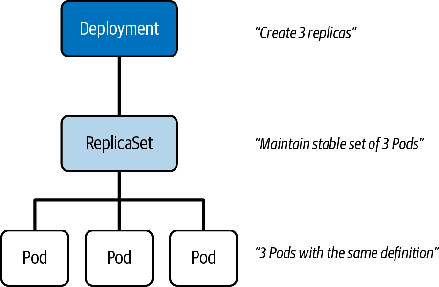
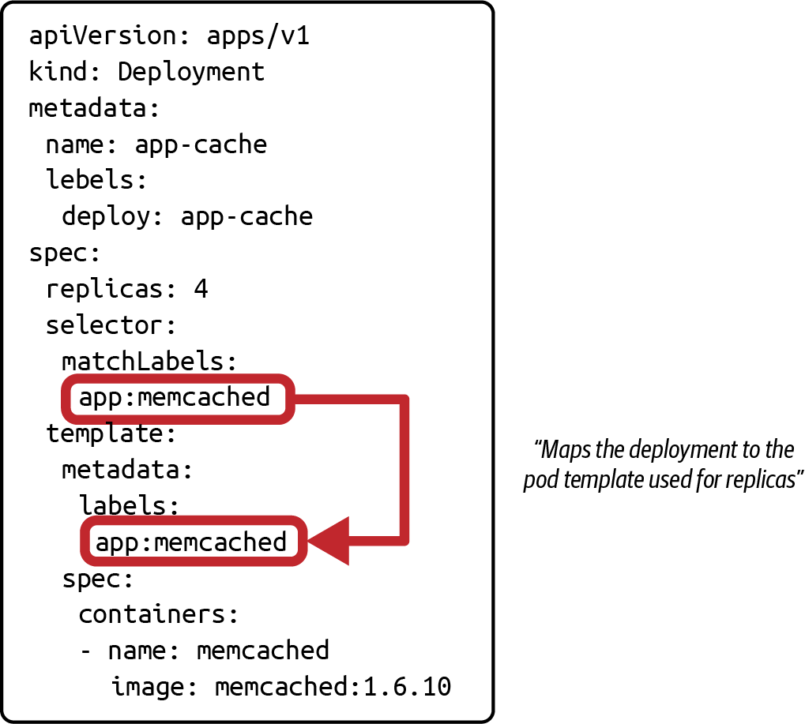
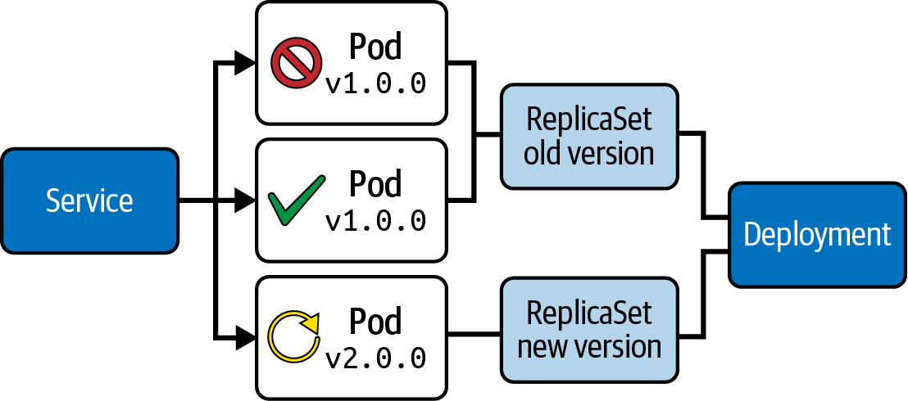

# Chương 11. Deployment và ReplicaSet

*Dịch từ: Chapter 11. Deployments and ReplicaSets — Certified Kubernetes Administrator (CKA) Study Guide, 2nd Edition (O'Reilly).*

Một thế mạnh lớn của Kubernetes nằm ở khả năng scale ứng dụng một cách liền mạch và quản lý việc nhân bản (replication) một cách dễ dàng. Để hiện thực hóa những khả năng này, Kubernetes cung cấp hai primitive: Deployment và ReplicaSet.

Trong chương này, bạn sẽ học cách tạo một Deployment, thứ tận dụng một ReplicaSet phía sau hậu trường để quản lý và scale một nhóm các Pod giống hệt nhau. Deployment cũng giúp bạn dễ dàng rollout các bản cập nhật cho ứng dụng và, khi cần, rollback về phiên bản trước đó—tất cả với thời gian gián đoạn (downtime) tối thiểu và khả năng kiểm soát tối đa.

> **PHẠM VI BAO PHỦ MỤC TIÊU ĐỀ CƯƠNG**
>
> Chương này đề cập đến các mục tiêu đề cương (curriculum) sau:
>
> - Hiểu về việc triển khai ứng dụng và cách thực hiện rolling update cũng như rollback
> - Hiểu các primitive được dùng để tạo ra những bản triển khai ứng dụng mạnh mẽ, có khả năng tự phục hồi (self-healing)

## Làm việc với Deployment

Primitive để chạy một ứng dụng trong container là Pod. Việc dùng một instance Pod duy nhất để vận hành một ứng dụng có những khiếm khuyết của nó—nó là một điểm lỗi đơn (single point of failure) vì toàn bộ lưu lượng (traffic) nhắm đến ứng dụng đều được dồn về Pod này. Hành vi này đặc biệt có vấn đề khi tải tăng lên do nhu cầu cao hơn (ví dụ, trong mùa mua sắm cao điểm đối với một ứng dụng thương mại điện tử, hoặc khi ngày càng nhiều microservice giao tiếp với một chức năng microservice tập trung, chẳng hạn như một nhà cung cấp xác thực (authentication provider)).

Một khía cạnh quan trọng khác của việc chạy ứng dụng trong Pod là khả năng chịu lỗi (failure tolerance). Thành phần scheduler của cluster sẽ không lập lịch lại (reschedule) một Pod trong trường hợp node bị lỗi, điều này có thể dẫn đến gián đoạn hệ thống đối với người dùng cuối. Trong chương này, chúng ta sẽ xem xét các cơ chế của Kubernetes hỗ trợ khả năng mở rộng (scalability) và khả năng chịu lỗi của ứng dụng.

*ReplicaSet* là một tài nguyên API của Kubernetes điều khiển nhiều instance giống hệt nhau của một Pod chạy ứng dụng, gọi là các *replica*. Nó có khả năng scale số lượng replica lên hoặc xuống theo nhu cầu.

*Deployment* trừu tượng hóa chức năng của ReplicaSet và quản lý nó ở bên trong. Trên thực tế, điều này có nghĩa là bạn không phải tự tạo, sửa đổi hay xóa các đối tượng ReplicaSet. Deployment lưu giữ lịch sử các phiên bản ứng dụng và có thể ủy thác cho ReplicaSet để rollback về một phiên bản cũ hơn nhằm đối phó với một sự cố production gây tắc nghẽn hoặc tiềm ẩn tốn kém. Hơn nữa, nó cung cấp khả năng scale số lượng replica.

Hình 11-1 minh họa mối quan hệ giữa một Deployment, một ReplicaSet và các replica mà nó điều khiển.



*Hình 11-1. Mối quan hệ giữa một Deployment và một ReplicaSet*

Các mục sau đây giải thích cách quản lý Deployment, bao gồm các tính năng scaling và rollout.

### Tạo Deployment

Bạn có thể tạo một Deployment bằng lệnh mệnh lệnh (imperative) `create deployment`. Lệnh này cung cấp một loạt tùy chọn, trong đó một số là bắt buộc. Ở mức tối thiểu, bạn cần cung cấp tên của Deployment và container image. Deployment chuyển thông tin này cho ReplicaSet, và ReplicaSet dùng nó để quản lý các replica. Số lượng replica được tạo theo mặc định là một; tuy nhiên, bạn có thể định nghĩa số lượng replica cao hơn bằng tùy chọn `--replicas`.

Hãy cùng quan sát lệnh này hoạt động. Lệnh sau tạo Deployment có tên `app-cache`, chạy object cache memcached bên trong container trên bốn replica:

```shell
$ kubectl create deployment app-cache --image=memcached:1.6.8 --replicas=4
deployment.apps/app-cache created
```

Việc ánh xạ giữa Deployment và các replica mà nó điều khiển diễn ra thông qua lựa chọn theo label (label selection). Khi bạn chạy lệnh mệnh lệnh, `kubectl` thiết lập việc ánh xạ này cho bạn. Ví dụ 11-1 cho thấy việc lựa chọn theo label trong manifest YAML. Manifest YAML này có thể được dùng để tạo một Deployment theo cách khai báo (declarative), hoặc có thể thu được bằng cách xem xét đối tượng đang hoạt động (live object) đã được tạo bởi lệnh mệnh lệnh trước đó.

**Ví dụ 11-1. Manifest YAML của một Deployment**

```yaml
apiVersion: apps/v1
kind: Deployment
metadata:
  name: app-cache
  labels:
    app: app-cache
spec:
  replicas: 4
  selector:
    matchLabels:
      app: app-cache
  template:
    metadata:
      labels:
        app: app-cache
    spec:
      containers:
       - name: memcached
         image: memcached:1.6.8
```

Khi được tạo bởi lệnh mệnh lệnh, `app` là key của label mà Deployment dùng theo mặc định. Bạn có thể tìm thấy key này ở ba vị trí khác nhau trong output YAML:

- `metadata.labels`
- `spec.selector.matchLabels`
- `spec.template.metadata.labels`

Để việc lựa chọn theo label hoạt động đúng, giá trị gán cho `spec.selector.matchLabels` và `spec.template.metadata` cần phải khớp nhau, như minh họa trong Hình 11-2. Việc tạo đối tượng sẽ thất bại kèm theo thông báo lỗi phù hợp nếu giá trị của hai phần gán này không khớp.

Giá trị của `metadata.labels` không liên quan đến việc ánh xạ Deployment với Pod template. Như bạn thấy trong hình, phần gán label cho `metadata.labels` đã được cố ý đổi thành `deploy: app-cache` để nhấn mạnh rằng nó không quan trọng đối với việc lựa chọn Pod template của Deployment.



*Hình 11-2. Lựa chọn theo label của Deployment*

### Liệt kê Deployment, ReplicaSet và các Pod của chúng

Bạn có thể xem xét một Deployment sau khi tạo bằng lệnh `get deployments`. Output của lệnh hiển thị các chi tiết quan trọng về các replica của nó, như sau:

```shell
$ kubectl get deployments
NAME        READY   UP-TO-DATE   AVAILABLE   AGE
app-cache   4/4     4            4           125m
```

Các tiêu đề cột liên quan đến các replica do Deployment điều khiển được trình bày trong Bảng 11-1.

**Bảng 11-1. Thông tin replica lúc chạy khi liệt kê Deployment**

| Tiêu đề cột | Mô tả |
|---|---|
| `READY` | Liệt kê số lượng replica sẵn sàng phục vụ người dùng cuối theo định dạng `<ready>/<desired>`. Số replica mong muốn tương ứng với giá trị của `spec.replicas`. |
| `UP-TO-DATE` | Liệt kê số lượng replica đã được cập nhật để đạt được trạng thái mong muốn (desired state). |
| `AVAILABLE` | Liệt kê số lượng replica sẵn sàng phục vụ người dùng cuối. |

Bạn có thể nhận diện các Pod do Deployment điều khiển qua tiền tố (prefix) trong tên của chúng. Trong trường hợp Deployment được tạo trước đó, tên của ReplicaSet và các Pod của nó bắt đầu bằng `app-cache-`. Chuỗi hash theo sau tiền tố được tự động sinh ra và gắn thêm vào tên khi tạo:

```shell
$ kubectl get replicasets,pods
NAME                                   DESIRED   CURRENT   READY   AGE
replicaset.apps/app-cache-596bc5586d   4         4         4       6h5m

NAME                         READY   STATUS    RESTARTS   AGE
app-cache-596bc5586d-84dkv   1/1     Running   0          6h5m
app-cache-596bc5586d-8bzfs   1/1     Running   0          6h5m
app-cache-596bc5586d-rc257   1/1     Running   0          6h5m
app-cache-596bc5586d-tvm4d   1/1     Running   0          6h5m
```

### Hiển thị chi tiết Deployment

Bạn có thể hiển thị chi tiết của một Deployment. Những chi tiết đó bao gồm tiêu chí lựa chọn theo label, thứ có thể cực kỳ hữu ích khi xử lý sự cố (troubleshooting) một Deployment bị cấu hình sai. Output sau cung cấp đầy đủ chi tiết:

```shell
$ kubectl describe deployment app-cache
Name:                   app-cache
Namespace:              default
CreationTimestamp:      Sat, 07 Aug 2021 09:44:18 -0600
Labels:                 app=app-cache
Annotations:            deployment.kubernetes.io/revision: 1
Selector:               app=app-cache
Replicas:               4 desired | 4 updated | 4 total | 4 available | 0 unavailable
StrategyType:           RollingUpdate
MinReadySeconds:        0
RollingUpdateStrategy:  25% max unavailable, 25% max surge
Pod Template:
  Labels:  app=app-cache
  Containers:
   memcached:
    Image:        memcached:1.6.10
    Port:         <none>
    Host Port:    <none>
    Environment:  <none>
    Mounts:       <none>
  Volumes:        <none>
Conditions:
  Type           Status  Reason
  ----           ------  ------
  Progressing    True    NewReplicaSetAvailable
  Available      True    MinimumReplicasAvailable
OldReplicaSets:  <none>
NewReplicaSet:   app-cache-596bc5586d (4/4 replicas created)
Events:          <none>
```

Có thể bạn đã để ý rằng output chứa một tham chiếu đến ReplicaSet. Mục đích của ReplicaSet là *nhân bản (replicate)* một tập các Pod giống hệt nhau. Bạn không cần hiểu sâu chức năng cốt lõi của ReplicaSet cho kỳ thi. Chỉ cần biết rằng Deployment tự động tạo ReplicaSet và dùng tên của Deployment làm tiền tố cho ReplicaSet, tương tự như các Pod mà nó điều khiển. Trong trường hợp Deployment có tên `app-cache` ở trên, tên của ReplicaSet là `app-cache-596bc5586d`.

## Thay thế replica

ReplicaSet trong Kubernetes bảo đảm rằng một số lượng replica xác định luôn chạy tại mọi thời điểm. Nếu một Pod bị lỗi hoặc bị xóa, Kubernetes tự động tạo một Pod thay thế để duy trì số lượng replica mong muốn. Hành vi này là một trong những *khả năng tự phục hồi (self-healing)* then chốt của Kubernetes.

Bạn có thể dễ dàng quan sát điều này trong thực tế bằng cách xóa thủ công một trong các Pod do ReplicaSet quản lý. Giả sử có các đối tượng ReplicaSet và Pod như sau:

```shell
$ kubectl get replicasets,pods
NAME                                   DESIRED   CURRENT   READY   AGE
replicaset.apps/app-cache-596bc5586d   4         4         4       6h47m

NAME                             READY   STATUS    RESTARTS   AGE
pod/app-cache-596bc5586d-84dkv   1/1     Running   0          6h47m
pod/app-cache-596bc5586d-8bzfs   1/1     Running   0          6h47m
pod/app-cache-596bc5586d-rc257   1/1     Running   0          6h47m
pod/app-cache-596bc5586d-tvm4d   1/1     Running   0          6h47m
```

Bạn có thể xóa bất kỳ Pod nào do ReplicaSet điều khiển, ví dụ Pod có tên `app-cache-596bc5586d-rc257`:

```shell
$ kubectl delete pod app-cache-596bc5586d-rc257
pod "app-cache-596bc5586d-rc257" deleted
```

Ngay sau khi xóa Pod thủ công, một Pod mới sẽ được ReplicaSet tạo ra. Bạn có thể dễ dàng nhận diện Pod mới được tạo qua giá trị `AGE` của nó. Trong output sau, Pod này mới chỉ được năm giây tuổi:

```shell
$ kubectl get replicasets,pods
NAME                                   DESIRED   CURRENT   READY   AGE
replicaset.apps/app-cache-596bc5586d   4         4         4       6h47m

NAME                             READY   STATUS    RESTARTS   AGE
pod/app-cache-596bc5586d-84dkv   1/1     Running   0          6h47m
pod/app-cache-596bc5586d-8bzfs   1/1     Running   0          6h47m
pod/app-cache-596bc5586d-lwflz   1/1     Running   0          5s
pod/app-cache-596bc5586d-tvm4d   1/1     Running   0          6h47m
```

Tương tự Deployment, các workload primitive khác như StatefulSet và DaemonSet cũng quản lý một ReplicaSet để điều khiển một tập replica.

Với StatefulSet, hành vi thay thế replica giống như với Deployment. Nếu một Pod thuộc DaemonSet bị lỗi, node control plane bảo đảm rằng Pod thay thế được chạy trên đúng node mà nó đã được lập lịch trước đó. Các primitive StatefulSet và DaemonSet nằm ngoài phạm vi của kỳ thi; tuy nhiên, các chương sau có thể nhắc lại chúng.

## Xóa Deployment

Deployment chịu trách nhiệm hoàn toàn về việc tạo và xóa các đối tượng mà nó điều khiển: ReplicaSet và Pod. Khi bạn xóa một Deployment, các đối tượng tương ứng cũng bị xóa theo. Giả sử bạn đang làm việc với tập đối tượng được hiển thị trong output sau:

```shell
$ kubectl get deployments,replicasets,pods
NAME                        READY   UP-TO-DATE   AVAILABLE   AGE
deployment.apps/app-cache   4/4     4            4           6h47m

NAME                                   DESIRED   CURRENT   READY   AGE
replicaset.apps/app-cache-596bc5586d   4         4         4       6h47m

NAME                             READY   STATUS    RESTARTS   AGE
pod/app-cache-596bc5586d-84dkv   1/1     Running   0          6h47m
pod/app-cache-596bc5586d-8bzfs   1/1     Running   0          6h47m
pod/app-cache-596bc5586d-rc257   1/1     Running   0          6h47m
pod/app-cache-596bc5586d-tvm4d   1/1     Running   0          6h47m
```

Chạy lệnh `delete deployment` để xóa theo tầng (cascading deletion) các đối tượng mà nó quản lý:

```shell
$ kubectl delete deployment app-cache
deployment.apps "app-cache" deleted
$ kubectl get deployments,replicasets,pods
No resources found in default namespace.
```

## Thực hiện rolling update và rollback

Deployment trừu tượng hóa hoàn toàn các khả năng rollout và rollback bằng cách ủy thác trách nhiệm này cho (các) ReplicaSet mà nó quản lý. Một khi người dùng thay đổi định nghĩa của Pod template trong Deployment, Kubernetes sẽ tạo một ReplicaSet mới áp dụng các thay đổi cho những replica mà nó điều khiển, rồi sau đó tắt ReplicaSet trước đó. Trong mục này, chúng ta sẽ xem xét cả hai kịch bản: triển khai một phiên bản mới của ứng dụng và quay lại một phiên bản cũ của ứng dụng.

### Cập nhật Pod template của Deployment

Bạn có thể chọn trong nhiều tùy chọn để cập nhật định nghĩa của các replica do Deployment điều khiển. Tùy chọn nào cũng hợp lệ, nhưng chúng khác nhau về mức độ dễ sử dụng và môi trường vận hành.

#### Áp dụng thay đổi theo cách khai báo

Trong các dự án thực tế, bạn nên đưa các file manifest vào hệ thống quản lý phiên bản (version control). Khi đó, các thay đổi đối với định nghĩa sẽ được thực hiện bằng cách chỉnh sửa trực tiếp file. Lệnh `kubectl apply` có thể cập nhật một live object bằng cách trỏ đến manifest đã thay đổi:

```shell
$ kubectl apply -f deployment.yaml
```

#### Chỉnh sửa đối tượng bằng trình soạn thảo mặc định

Lệnh `kubectl edit` cho phép bạn thay đổi Pod template một cách tương tác bằng cách sửa manifest của live object trong một trình soạn thảo. Để chỉnh sửa live object Deployment có tên `web-server`, dùng lệnh sau:

```shell
$ kubectl edit deployment web-server
```

#### Cập nhật container image theo cách mệnh lệnh

Lệnh mệnh lệnh `kubectl set image` chỉ thay đổi container image được gán cho một Pod template bằng cách chọn theo tên của container. Ví dụ, bạn có thể dùng lệnh này để gán image `nginx:1.25.2` cho container có tên `nginx` trong Deployment `web-server`:

```shell
$ kubectl set image deployment web-server nginx=nginx:1.25.2
```

#### Thay thế một đối tượng hiện có

Lệnh `kubectl replace` cho phép bạn thay thế Deployment hiện có bằng một định nghĩa mới chứa thay đổi của bạn đối với manifest. Cờ tùy chọn `--force` sẽ xóa đối tượng hiện có trước rồi tạo lại nó từ đầu. Lệnh sau giả định rằng bạn đã thay đổi phần gán container image trong *deployment.yaml*:

```shell
$ kubectl replace -f deployment.yaml
```

#### Cập nhật các trường của đối tượng bằng JSON patch

Lệnh `kubectl patch` yêu cầu bạn cung cấp các phần hợp nhất (merge) dưới dạng một bản vá (patch) để cập nhật Deployment. Lệnh sau minh họa thao tác này. Ở đây, bạn gửi các thay đổi cần thực hiện dưới dạng một cấu trúc JSON:

```shell
$ kubectl patch deployment web-server -p '{"spec":{"template":{"spec":\
{"containers":[{"name":"nginx","image":"nginx:1.25.2"}]}}}}'
```

### Rollout một revision mới

Primitive Deployment dùng *rolling update* làm chiến lược triển khai (deployment strategy) mặc định, còn được gọi là *ramped deployment* (triển khai tăng dần). Nó được gọi là "ramped" vì Deployment chuyển dần các replica từ phiên bản cũ sang phiên bản mới theo từng đợt. Deployment tự động tạo một ReplicaSet mới cho thay đổi mong muốn sau khi người dùng cập nhật Pod template.

Hình 11-3 cho thấy một khoảnh khắc trong quá trình rollout.



*Hình 11-3. Chiến lược rolling update*

Trong kịch bản này, người dùng khởi phát việc cập nhật phiên bản ứng dụng từ 1.0.0 lên 2.0.0. Kết quả là Deployment tạo một ReplicaSet mới và khởi động các Pod chạy phiên bản ứng dụng mới, đồng thời scale down phiên bản cũ. Service định tuyến lưu lượng mạng đến phiên bản cũ hoặc phiên bản mới của ứng dụng. Hành vi lúc chạy của chiến lược triển khai có thể được tùy chỉnh thêm. Hãy tham khảo tài liệu để xem các tùy chọn cấu hình.

Giả sử bạn muốn nâng cấp phiên bản memcached từ 1.6.8 lên 1.6.10 để hưởng lợi từ những tính năng mới nhất và các bản sửa lỗi. Tất cả những gì bạn cần làm là thay đổi trạng thái mong muốn của đối tượng bằng cách cập nhật Pod template. Lệnh `set image` cung cấp một cách nhanh chóng, tiện lợi để thay đổi image của Deployment, như trong lệnh sau:

```shell
$ kubectl set image deployment app-cache memcached=memcached:1.6.10
deployment.apps/app-cache image updated
```

Bạn có thể kiểm tra trạng thái hiện tại của một rollout đang diễn ra bằng lệnh `rollout status`. Output cho biết số lượng replica đã được cập nhật kể từ khi phát lệnh:

```shell
$ kubectl rollout status deployment app-cache
Waiting for rollout to finish: 2 out of 4 new replicas have been updated
deployment "app-cache" successfully rolled out
```

Kubernetes theo dõi những thay đổi bạn thực hiện với một Deployment theo thời gian trong lịch sử rollout (rollout history). Mỗi thay đổi được biểu diễn bằng một *revision*. Khi thay đổi Pod template của Deployment—ví dụ, bằng cách cập nhật image—Deployment kích hoạt việc tạo một ReplicaSet mới. Deployment sẽ thực hiện dần việc chuyển đổi bằng cách giảm số replica của ReplicaSet cũ và tăng số replica của ReplicaSet mới. Bạn có thể kiểm tra lịch sử rollout bằng cách chạy lệnh sau. Bạn sẽ thấy hai revision được liệt kê:

```shell
$ kubectl rollout history deployment app-cache
deployment.apps/app-cache
REVISION  CHANGE-CAUSE
1         <none>
2         <none>
```

Revision đầu tiên được ghi nhận cho trạng thái ban đầu của Deployment khi bạn tạo đối tượng. Revision thứ hai được thêm vào cho việc thay đổi tag của image.

> **LỊCH SỬ REVISION CÓ THỂ CẤU HÌNH**
>
> Theo mặc định, một Deployment lưu giữ tối đa 10 revision trong lịch sử của nó. Bạn có thể thay đổi giới hạn này bằng cách gán một giá trị khác cho `spec.revisionHistoryLimit`.

Để có cái nhìn chi tiết hơn về revision, hãy chạy lệnh sau. Bạn có thể thấy image dùng giá trị `memcached:1.6.10`:

```shell
$ kubectl rollout history deployments app-cache --revision=2
deployment.apps/app-cache with revision #2
Pod Template:
  Labels:       app=app-cache
        pod-template-hash=596bc5586d
  Containers:
   memcached:
    Image:      memcached:1.6.10
    Port:       <none>
    Host Port:  <none>
    Environment:        <none>
    Mounts:     <none>
  Volumes:      <none>
```

Chiến lược rolling update bảo đảm rằng ứng dụng luôn sẵn sàng phục vụ người dùng cuối. Cách tiếp cận này ngụ ý rằng hai phiên bản của cùng một ứng dụng cùng tồn tại trong quá trình cập nhật. Là một nhà phát triển ứng dụng, bạn phải ý thức rằng sự tiện lợi này không phải không đi kèm tác dụng phụ tiềm ẩn. Nếu bạn tình cờ đưa vào một thay đổi phá vỡ tương thích (breaking change) trong API công khai của ứng dụng, bạn có thể tạm thời làm hỏng các bên tiêu thụ (consumer), vì họ có thể gặp phải revision 1 hoặc 2 của ứng dụng.

Bạn có thể thay đổi chiến lược triển khai mặc định bằng cách cung cấp một giá trị khác cho thuộc tính `spec.strategy.type`; tuy nhiên, hãy cân nhắc các đánh đổi. Giá trị `Recreate` tắt (kill) tất cả các Pod trước, rồi mới tạo các Pod mới với revision mới nhất, gây ra khả năng gián đoạn cho các bên tiêu thụ.

### Thêm nguyên nhân thay đổi cho một revision

Lịch sử rollout hiển thị cột `CHANGE-CAUSE`. Bạn có thể điền thông tin này cho một revision để ghi lại *lý do* bạn đưa vào một thay đổi mới hoặc *lệnh* `kubectl` *nào* bạn đã dùng để thực hiện thay đổi.

Theo mặc định, việc thay đổi Pod template không tự động ghi nhận nguyên nhân thay đổi. Để thêm nguyên nhân thay đổi cho revision hiện tại, hãy thêm một annotation với key dành riêng `kubernetes.io/change-cause` vào đối tượng Deployment. Lệnh mệnh lệnh `annotate` sau gán nguyên nhân thay đổi "Image updated to 1.6.10":

```shell
$ kubectl annotate deployment app-cache kubernetes.io/change-cause=\
"Image updated to 1.6.10"
deployment.apps/app-cache annotated
```

Lịch sử rollout giờ đây hiển thị giá trị nguyên nhân thay đổi cho revision hiện tại:

```shell
$ kubectl rollout history deployment app-cache
deployment.apps/app-cache
REVISION  CHANGE-CAUSE
1         <none>
2         Image updated to 1.6.10
```

### Rollback về một revision trước đó

Các sự cố có thể phát sinh trong môi trường production đòi hỏi hành động nhanh chóng. Ví dụ, container image bạn vừa rollout chứa một lỗi nghiêm trọng. Kubernetes cho bạn tùy chọn rollback về một trong các revision trước đó trong lịch sử rollout. Bạn có thể thực hiện điều này bằng lệnh `rollout undo`. Để chọn một revision cụ thể, hãy cung cấp tùy chọn dòng lệnh `--to-revision`. Lệnh sẽ rollback về revision ngay trước đó nếu bạn không cung cấp tùy chọn này. Ở đây, chúng ta rollback về revision 1:

```shell
$ kubectl rollout undo deployment app-cache --to-revision=1
deployment.apps/app-cache rolled back
```

Kết quả là Kubernetes thực hiện một rolling update cho tất cả các replica với revision 1.

> **ROLLBACK VÀ DỮ LIỆU BỀN VỮNG**
>
> Lệnh `rollout undo` không khôi phục bất kỳ dữ liệu bền vững (persistent data) nào gắn với ứng dụng. Nó chỉ hoàn nguyên Pod template của Deployment (`.spec.template`) về một revision trước đó. Các thiết lập khác của Deployment, chẳng hạn như số lượng replica, vẫn giữ nguyên.

Lịch sử rollout giờ đây liệt kê revision 3. Vì chúng ta đã rollback về revision 1 nên không cần giữ lại mục đó như một bản trùng lặp nữa. Kubernetes đơn giản là biến revision 1 thành 3 và loại bỏ 1 khỏi danh sách:

```shell
$ kubectl rollout history deployment app-cache
deployment.apps/app-cache
REVISION  CHANGE-CAUSE
2         Image updated to 1.16.10
3         <none>
```

## Tóm tắt

Deployment là một primitive thiết yếu để cung cấp các bản cập nhật theo cách khai báo và quản lý vòng đời (lifecycle) của các Pod. ReplicaSet đảm nhận phần việc nặng nhọc là quản lý các Pod đó, thường được gọi là các replica. Deployment quản lý ReplicaSet ở bên dưới.

Deployment có thể dễ dàng rollout và rollback các revision của ứng dụng, được biểu diễn bằng một image chạy trong container. Trong chương này, bạn đã học về các lệnh để kiểm soát lịch sử revision và các thao tác trên nó.

## Trọng tâm cho kỳ thi

**Nắm rõ mọi ngóc ngách của Deployment**

Vì Deployment là một primitive trung tâm như vậy trong Kubernetes, bạn có thể đoán trước rằng kỳ thi sẽ kiểm tra bạn về nó. Hãy biết cách tạo và cấu hình một Deployment.

**Hiểu cách ReplicaSet hỗ trợ việc nhân bản**

Hãy học cách scale lên nhiều replica. Một trong những tính năng vượt trội của ReplicaSet là chức năng rollout cho các revision mới. Hãy thực hành cách rollout một revision mới, xem xét lịch sử rollout và rollback về một revision trước đó.

**Phân biệt các chiến lược triển khai tích hợp sẵn**

Hãy học cách cấu hình các chiến lược tích hợp sẵn trong primitive Deployment và các tùy chọn của chúng để tinh chỉnh hành vi lúc chạy. Bạn có thể hiện thực hóa những kịch bản triển khai phức tạp hơn nữa với sự trợ giúp của các primitive Deployment và Service. Ví dụ là các chiến lược triển khai blue-green và canary, vốn đòi hỏi một quy trình rollout nhiều giai đoạn, nhưng sẽ không được đề cập trong kỳ thi.

## Bài tập mẫu

Lời giải cho các bài tập này có trong Phụ lục A.

1. Một thành viên trong nhóm đã viết một manifest Deployment nhưng gặp khó khăn khi tạo đối tượng từ nó. Hãy giúp tìm ra vấn đề.

   Di chuyển đến thư mục *app-a/ch11/misconfigured-deployment* của kho GitHub *bmuschko/cka-study-guide* đã được checkout.

   Chạy một lệnh `kubectl` để tạo đối tượng Deployment được định nghĩa trong file *fix-me-deployment.yaml*. Xem xét thông báo lỗi. Sửa manifest Deployment sao cho đối tượng có thể được tạo.

2. Tạo một Deployment có tên `nginx` với ba replica. Các Pod phải dùng image `nginx:1.23.0` và tên `nginx`. Deployment dùng label `tier=backend`. Pod template phải dùng label `app=v1`.

   Liệt kê Deployment và bảo đảm rằng đúng số lượng replica đang chạy.

   Cập nhật image thành `nginx:1.23.4`.

   Xác minh rằng thay đổi đã được rollout đến tất cả các replica.

   Gán nguyên nhân thay đổi "Pick up patch version" cho revision.

   Xem lịch sử rollout của Deployment. Hoàn nguyên Deployment về revision 1.

   Bảo đảm rằng các Pod dùng image `nginx:1.23.0`.
