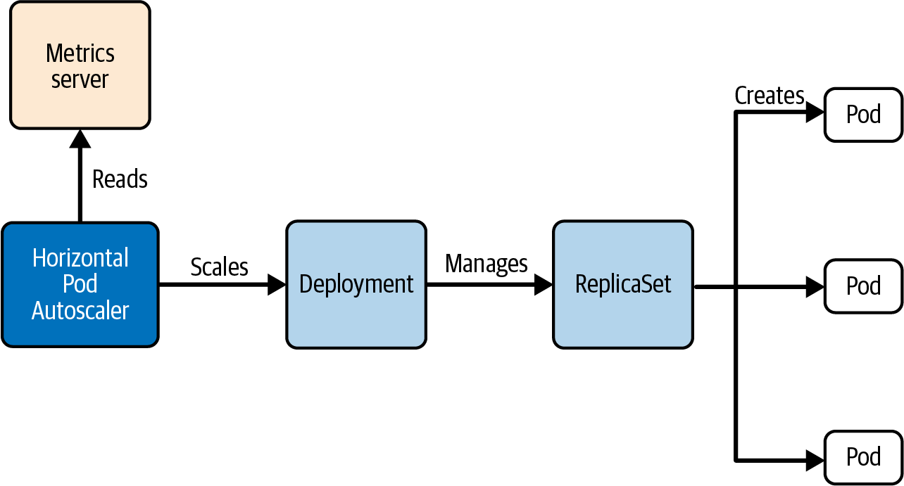
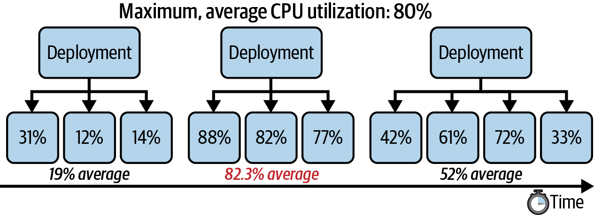

# Chương 12. Scale workload

*Dịch từ: Chapter 12. Scaling Workloads — Certified Kubernetes Administrator (CKA) Study Guide, 2nd Edition (O'Reilly).*

Có nhiều lý do khiến việc scale một workload trở nên cần thiết, đặc biệt là để duy trì hiệu năng tối ưu khi nhu cầu ngày càng tăng. Ví dụ, một ứng dụng có thể chứng kiến lượng người dùng tăng vọt khi nó trở nên phổ biến, hoặc nó có thể cần xử lý khối lượng dữ liệu ngày càng lớn theo thời gian.

Trong Kubernetes, việc scale một workload có thể được thực hiện theo hai cách chính: tăng lượng tài nguyên cấp phát cho mỗi Pod (*vertical scaling* — scale theo chiều dọc), hoặc điều chỉnh số lượng Pod chạy đồng thời (*horizontal scaling* — scale theo chiều ngang). Horizontal scaling đặc biệt hiệu quả trong việc xử lý các workload biến động, đảm bảo ứng dụng luôn phản hồi nhanh và có khả năng chống chịu dưới các mức nhu cầu khác nhau, chẳng hạn như áp lực ngược (back pressure) lên CPU, memory và I/O.

Trong chương này, bạn sẽ học cách scale thủ công số lượng replica để phản ứng với tải ứng dụng tăng lên. Ngoài ra, chúng ta sẽ tìm hiểu primitive API HorizontalPodAutoscaler (HPA), cho phép bạn tự động scale tập hợp Pod được quản lý dựa trên các ngưỡng tài nguyên như CPU và memory. Chúng ta sẽ không đi vào vertical scaling, được đại diện bởi primitive API VerticalPodAutoscaler (VPA), vì kỳ thi không đề cập đến nó.

> **PHẠM VI BAO PHỦ MỤC TIÊU ĐỀ CƯƠNG**
>
> Chương này đề cập đến mục tiêu đề cương (curriculum) sau:
>
> - Cấu hình autoscaling cho workload

## Scale workload thủ công

Scale workload thủ công đòi hỏi phải chỉ định một số lượng Pod cố định để chạy. Con số này nên dựa trên các số liệu (metric) sử dụng thực tế thu thập từ môi trường production hoặc được ước lượng thông qua kiểm thử tải (load testing) trong quá trình phát triển.

Tuy nhiên, vì lưu lượng truy cập của ứng dụng có thể biến động bất ngờ — tăng vọt hoặc giảm dần — bạn sẽ cần liên tục theo dõi và điều chỉnh số lượng Pod để phù hợp với nhu cầu. Nếu không làm vậy, có thể dẫn đến cấp phát dư thừa (over-provisioning), gây lãng phí tài nguyên, hoặc cấp phát thiếu (under-provisioning), làm suy giảm hiệu năng và trải nghiệm người dùng.

### Scale thủ công một Deployment

Scale (tăng hoặc giảm) số lượng replica do một Deployment kiểm soát là một quy trình đơn giản. Bạn có thể chỉnh sửa thủ công đối tượng đang chạy (live object) bằng lệnh `edit deployment` và thay đổi giá trị của thuộc tính `spec.replicas`, hoặc có thể dùng lệnh mệnh lệnh (imperative) `scale deployment`. Trong môi trường production thực tế, bạn nên chỉnh sửa manifest YAML của Deployment, đưa nó vào hệ thống quản lý phiên bản (version control), rồi apply các thay đổi. Lệnh sau đây tăng số lượng replica từ bốn lên sáu:

```shell
$ kubectl scale deployment app-cache --replicas=6
deployment.apps/app-cache scaled
```

Bạn có thể quan sát quá trình tạo replica theo thời gian thực bằng cờ dòng lệnh `-w`. Bạn sẽ thấy trạng thái của các Pod mới tạo chuyển từ `ContainerCreating` sang `Running`:

```shell
$ kubectl get pods -w
NAME                          READY   STATUS              RESTARTS   AGE
app-cache-5d6748d8b9-6cc4j    1/1     ContainerCreating   0          11s
app-cache-5d6748d8b9-6rmlj    1/1     Running             0          28m
app-cache-5d6748d8b9-6z7g5    1/1     ContainerCreating   0          11s
app-cache-5d6748d8b9-96dzf    1/1     Running             0          28m
app-cache-5d6748d8b9-jkjsv    1/1     Running             0          28m
app-cache-5d6748d8b9-svrxw    1/1     Running             0          28m
```

Scale thủ công số lượng replica ít nhiều mang tính phỏng đoán. Bạn vẫn sẽ phải theo dõi tải trên hệ thống của mình để xem số lượng replica có đủ để xử lý lưu lượng truy cập đến hay không.

### Scale thủ công một StatefulSet

Một primitive API khác có thể được scale thủ công là StatefulSet. StatefulSet được dùng để quản lý các ứng dụng có trạng thái (stateful) bằng một tập hợp Pod (ví dụ: cơ sở dữ liệu). Tương tự Deployment, StatefulSet định nghĩa một Pod template; tuy nhiên, mỗi replica của nó được đảm bảo có một định danh duy nhất và bền vững. Tương tự Deployment, StatefulSet sử dụng một ReplicaSet để quản lý các replica.

Chúng ta sẽ không xem xét StatefulSet chi tiết hơn, nhưng bạn có thể đọc thêm về chúng trong tài liệu chính thức. Lý do tôi thảo luận primitive StatefulSet ở đây là vì nó có thể được scale thủ công theo cách tương tự như Deployment.

Giả sử chúng ta làm việc với định nghĩa YAML của một StatefulSet chạy và expose một cơ sở dữ liệu Redis, như minh họa trong Ví dụ 12-1.

**Ví dụ 12-1. Manifest YAML của một StatefulSet**

```yaml
apiVersion: apps/v1
kind: StatefulSet
metadata:
  name: redis
spec:
  selector:
    matchLabels:
      app: redis
  replicas: 1
  serviceName: "redis"
  template:
    metadata:
      labels:
        app: redis
    spec:
      containers:
      - name: redis
        image: redis:6.2.5
        command: ["redis-server", "--appendonly", "yes"]
        ports:
        - containerPort: 6379
          name: web
        volumeMounts:
        - name: redis-vol
          mountPath: /data
  volumeClaimTemplates:
  - metadata:
      name: redis-vol
    spec:
      accessModes: ["ReadWriteOnce"]
      resources:
        requests:
          storage: 1Gi
```

Sau khi tạo, liệt kê StatefulSet sẽ hiển thị số lượng replica trong cột `READY`. Như bạn thấy trong output sau, số lượng replica được đặt là `1`:

```shell
$ kubectl apply -f redis.yaml
service/redis created
statefulset.apps/redis created
$ kubectl get statefulset redis
NAME    READY   AGE
redis   1/1     2m10s
$ kubectl get pods
NAME      READY   STATUS    RESTARTS   AGE
redis-0   1/1     Running   0          2m
```

Lệnh `scale` mà chúng ta đã tìm hiểu trong ngữ cảnh Deployment cũng hoạt động ở đây. Trong lệnh sau, chúng ta scale số lượng replica từ một lên ba:

```shell
$ kubectl scale statefulset redis --replicas=3
statefulset.apps/redis scaled
$ kubectl get statefulset redis
NAME    READY   AGE
redis   3/3     3m43s
$ kubectl get pods
NAME      READY   STATUS    RESTARTS   AGE
redis-0   1/1     Running   0          101m
redis-1   1/1     Running   0          97m
redis-2   1/1     Running   0          97m
```

Điều quan trọng cần đề cập là quá trình scale giảm (scale down) một StatefulSet yêu cầu tất cả replica phải ở trạng thái khỏe mạnh. Bất kỳ vấn đề nào không được giải quyết trong thời gian dài ở các Pod do StatefulSet kiểm soát đều có thể dẫn đến tình huống khiến ứng dụng trở nên không khả dụng đối với người dùng cuối.

## Autoscaling workload

Một cách khác để scale Deployment là nhờ sự trợ giúp của HorizontalPodAutoscaler (HPA). HPA là một primitive API định nghĩa các quy tắc để tự động scale số lượng replica trong những điều kiện nhất định. Các điều kiện scale phổ biến bao gồm giá trị mục tiêu (target value), giá trị trung bình (average value), hoặc mức sử dụng trung bình (average utilization) của một metric cụ thể (ví dụ: cho CPU và/hoặc memory). Tham khảo API MetricTarget để biết thêm thông tin.

Hình 12-1 minh họa sơ đồ kiến trúc tổng quan có sự tham gia của một HPA.



*Hình 12-1. Autoscaling một Deployment*

### Điều kiện tiên quyết cho autoscaling

HPA chỉ hoạt động trên các tài nguyên có thể scale như Deployment, ReplicaSet và StatefulSet. Nó không thể scale các Pod độc lập. Để HPA hoạt động, cần đáp ứng một vài điều kiện tiên quyết:

- Metrics Server cần được cài đặt. Nếu không có nó, HPA không thể lấy được các metric cần thiết để đánh giá hiệu năng của Pod. Việc thu thập metric có thể mất vài phút lúc ban đầu sau khi cài đặt thành phần này.
- Resource request của container cần được định nghĩa. Với autoscaling dựa trên CPU, các Pod của bạn phải định nghĩa `spec.containers[].resources.requests.cpu`. Với autoscaling dựa trên memory, cần có `spec.containers[].resources.requests.memory`. Các giá trị này cung cấp đường cơ sở (baseline) để tính toán mức sử dụng.
- Cluster phải có đủ tài nguyên CPU và memory để lập lịch (schedule) các Pod mới.

### Tạo Horizontal Pod Autoscaler

Giả sử bạn muốn định nghĩa mức sử dụng CPU trung bình làm điều kiện scale. Tại thời điểm chạy, HPA kiểm tra các metric do Metrics Server thu thập để xác định xem mức sử dụng CPU hoặc memory tối đa trung bình trên tất cả replica của một Deployment là nhỏ hơn hay lớn hơn ngưỡng đã định nghĩa.

Hình 12-2 minh họa việc sử dụng một HPA sẽ scale tăng số lượng replica nếu mức sử dụng CPU trung bình đạt 80% trên tất cả các Pod hiện có do Deployment kiểm soát.



*Hình 12-2. Autoscaling một Deployment theo chiều ngang*

Bạn có thể dùng lệnh `autoscale deployment` để tạo một HPA cho một Deployment đã có. Tùy chọn `--cpu-percent` định nghĩa ngưỡng mức sử dụng CPU tối đa trung bình. Tại thời điểm viết sách, lệnh mệnh lệnh này không cung cấp tùy chọn để định nghĩa ngưỡng mức sử dụng memory tối đa trung bình. Các tùy chọn `--min` và `--max` lần lượt cung cấp số lượng replica tối thiểu có thể scale giảm xuống và số lượng replica tối đa mà HPA có thể tạo ra để xử lý tải tăng lên:

```shell
$ kubectl autoscale deployment app-cache --cpu-percent=80 --min=3 --max=5
horizontalpodautoscaler.autoscaling/app-cache autoscaled
```

Lệnh này là một lối tắt tuyệt vời để tạo HPA cho một Deployment. Biểu diễn dưới dạng manifest YAML của đối tượng HPA trông như Ví dụ 12-2.

**Ví dụ 12-2. Manifest YAML của một HPA**

```yaml
apiVersion: autoscaling/v2
kind: HorizontalPodAutoscaler
metadata:
  name: app-cache
spec:
  scaleTargetRef:
    apiVersion: apps/v1
    kind: Deployment
    name: app-cache
  minReplicas: 3
  maxReplicas: 5
  metrics:
  - resource:
      name: cpu
      target:
        averageUtilization: 80
        type: Utilization
    type: Resource
```

### Liệt kê Horizontal Pod Autoscaler

Dạng viết tắt trong lệnh của Horizontal Pod Autoscaler là `hpa`. Liệt kê tất cả các đối tượng HPA sẽ mô tả rõ ràng trạng thái hiện tại của chúng: mức sử dụng CPU và số lượng replica tại thời điểm này:

```shell
$ kubectl get hpa
NAME        REFERENCE              TARGETS         MINPODS   MAXPODS   REPLICAS   AGE
app-cache   Deployment/app-cache   <unknown>/80%   3         5         4          58s
```

Nếu Pod template của Deployment không định nghĩa yêu cầu tài nguyên (resource requirements) CPU, hoặc nếu không thể lấy được metric CPU từ Metrics Server, giá trị bên trái của cột `TARGETS` sẽ hiển thị `<unknown>`. Ví dụ 12-3 thiết lập yêu cầu tài nguyên cho Pod template để HPA có thể hoạt động đúng. Bạn có thể tìm hiểu thêm về cách định nghĩa yêu cầu tài nguyên trong mục "Làm việc với yêu cầu tài nguyên".

**Ví dụ 12-3. Thiết lập yêu cầu tài nguyên CPU cho Pod template**

```yaml
# ...
spec:
  # ...
  template:
    # ...
    spec:
      containers:
      - name: memcached
        # ...
        resources:
          requests:
            cpu: 250m
          limits:
            cpu: 500m
```

Khi có lưu lượng truy cập đến các replica, mức sử dụng CPU hiện tại được hiển thị dưới dạng phần trăm. Ở đây, mức sử dụng CPU tối đa trung bình là 15%:

```shell
$ kubectl get hpa
NAME        REFERENCE              TARGETS   MINPODS   MAXPODS   REPLICAS
app-cache   Deployment/app-cache   15%/80%   3         5         4
```

### Hiển thị chi tiết Horizontal Pod Autoscaler

Log sự kiện (event log) của một HPA có thể cung cấp thêm thông tin chi tiết về các hoạt động scale lại. Hiển thị chi tiết HPA có thể là một công cụ tuyệt vời để giám sát thời điểm số lượng replica được scale tăng hoặc giảm, cũng như các điều kiện scale của chúng:

```shell
$ kubectl describe hpa app-cache
Name:                                                  app-cache
Namespace:                                             default
Labels:                                                <none>
Annotations:                                           <none>
CreationTimestamp:                                     Sun, 15 Aug 2021 \
                                                       15:54:11 -0600
Reference:                                             Deployment/app-cache
Metrics:                                               ( current / target )
  resource cpu on pods  (as a percentage of request):  0% (1m) / 80%
Min replicas:                                          3
Max replicas:                                          5
Deployment pods:                                       3 current / 3 desired
Conditions:
  Type            Status  Reason            Message
  ----            ------  ------            -------
  AbleToScale     True    ReadyForNewScale  recommended size matches current size
  ScalingActive   True    ValidMetricFound  the HPA was able to successfully
  calculate a replica count from cpu resource utilization (percentage of request)
  ScalingLimited  True    TooFewReplicas    the desired replica count is less
  than the minimum replica count
Events:
  Type    Reason             Age   From                       Message
  ----    ------             ----  ----                       -------
  Normal  SuccessfulRescale  13m   horizontal-pod-autoscaler  New size: 3;
  reason: All metrics below target
```

### Định nghĩa nhiều metric scale

Bạn có thể định nghĩa nhiều hơn một loại tài nguyên làm metric scale. Như bạn thấy trong Ví dụ 12-4, chúng ta kiểm tra mức sử dụng CPU và memory để xác định xem các replica của một Deployment có cần scale tăng hay giảm hay không.

**Ví dụ 12-4. Manifest YAML của một HPA với nhiều metric**

```yaml
apiVersion: autoscaling/v2
kind: HorizontalPodAutoscaler
metadata:
  name: app-cache
spec:
  scaleTargetRef:
    apiVersion: apps/v1
    kind: Deployment
    name: app-cache
  minReplicas: 3
  maxReplicas: 5
  metrics:
  - type: Resource
    resource:
      name: cpu
      target:
        type: Utilization
        averageUtilization: 80
  - type: Resource
    resource:
      name: memory
      target:
        type: AverageValue
        averageValue: 500Mi
```

Để đảm bảo HPA xác định được các tài nguyên hiện đang sử dụng, chúng ta cũng sẽ thiết lập yêu cầu tài nguyên memory cho Pod template, như trong Ví dụ 12-5.

**Ví dụ 12-5. Thiết lập yêu cầu tài nguyên memory cho Pod template**

```yaml
...
spec:
  ...
  template:
    ...
    spec:
      containers:
      - name: memcached
        ...
        resources:
          requests:
            cpu: 250m
            memory: 100Mi
          limits:
            cpu: 500m
            memory: 500Mi
```

Liệt kê HPA sẽ hiển thị cả hai metric trong cột `TARGETS`, như trong output của lệnh `get` dưới đây:

```shell
$ kubectl get hpa
NAME        REFERENCE              TARGETS                 MINPODS   MAXPODS   REPLICAS   AGE
app-cache   Deployment/app-cache   1994752/500Mi, 0%/80%   3         5         3          2m14s
```

## Tóm tắt

Scale workload thủ công đòi hỏi hiểu biết sâu sắc về yêu cầu và tải của một ứng dụng. Horizontal Pod Autoscaler có thể tự động scale số lượng replica dựa trên các ngưỡng CPU và memory quan sát được tại thời điểm chạy.

## Trọng tâm cho kỳ thi

**Hiểu sự khác biệt giữa scale thủ công và scale tự động**

Workload trong Kubernetes có thể được scale thủ công hoặc tự động. Trong các tình huống thực tế, autoscaling là cách tiếp cận được ưu tiên, vì nó cho phép số lượng replica tự điều chỉnh linh hoạt dựa trên mức tiêu thụ tài nguyên thực tế so với các ngưỡng đã định nghĩa. Điều này đảm bảo hiệu năng tối ưu và hiệu quả sử dụng tài nguyên mà không cần giám sát thủ công liên tục.

**Xác định các điều kiện tiên quyết cho autoscaling đã được đáp ứng hay chưa**

Để HPA hoạt động đúng, điều thiết yếu là phải cài đặt Metrics Server và định nghĩa resource request cho các container của bạn. Nếu thiếu những thứ này, HPA sẽ không có dữ liệu cần thiết để đưa ra quyết định scale có cơ sở, khiến nó trở nên vô hiệu.

**Biết cách khởi tạo và cấu hình một Horizontal Pod Autoscaler**

Manifest YAML của HPA được xây dựng xoay quanh ba thành phần thiết yếu: mục tiêu scale (tài nguyên có tên mà HPA sẽ quản lý, ví dụ: một Deployment hoặc một ReplicaSet), số lượng replica tối thiểu và tối đa mà HPA có thể scale trong khoảng đó, và các quy tắc scale — những điều kiện kích hoạt việc scale, thường dựa trên các ngưỡng sử dụng tài nguyên như mức sử dụng CPU hoặc memory.

## Bài tập mẫu

Lời giải cho các bài tập này có trong Phụ lục A.

1. Định nghĩa một Deployment tên `hello-world` với ba replica trong một file YAML tên `hello-world-deployment.yaml`. Pod template của Deployment nên sử dụng container image `bmuschko/nodejs-hello-world:1.0.0`. Tạo đối tượng từ file YAML.

   Scale số lượng replica lên tám bằng cách sửa file YAML. Apply các thay đổi và xác minh rằng cả tám replica đều đang chạy.

2. Tạo một Deployment tên `nginx` với một replica. Pod template của Deployment nên sử dụng container image `nginx:1.23.4`; đặt CPU resource request là 0.5 và memory resource request/limit là 500 Mi.

   Tạo một HorizontalPodAutoscaler cho Deployment này với tên `nginx-hpa`, scale trong khoảng tối thiểu ba và tối đa tám replica. Việc scale nên dựa trên mức sử dụng CPU trung bình 75% và mức sử dụng memory trung bình 60%.

   Kiểm tra đối tượng HorizontalPodAutoscaler và xác định các tài nguyên hiện đang được sử dụng. Bạn dự đoán sẽ có bao nhiêu replica?
