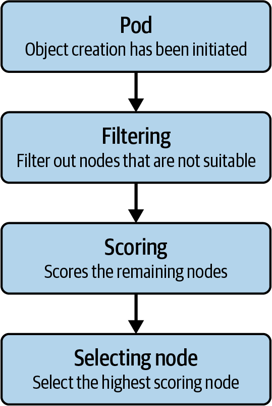
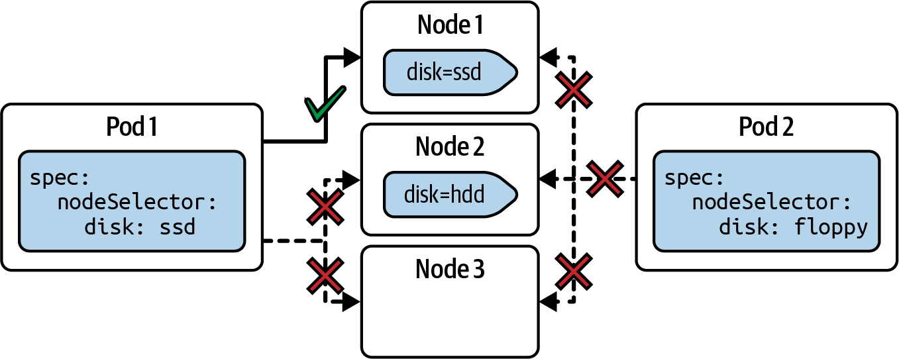
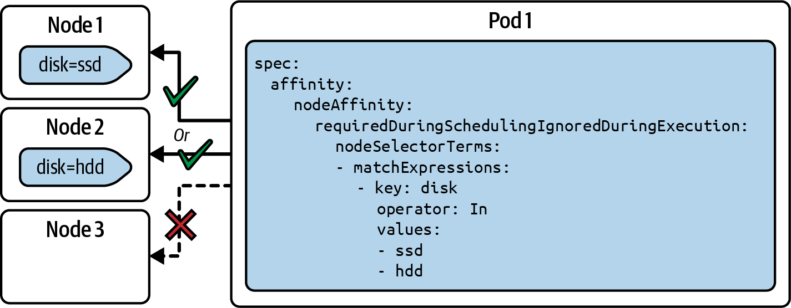
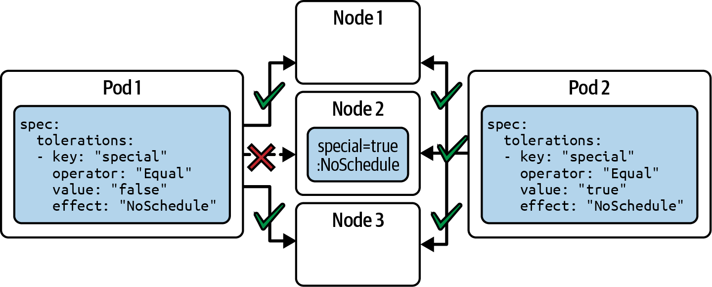

# Chương 14. Lập lịch Pod

*Dịch từ: Chapter 14. Pod Scheduling — Certified Kubernetes Administrator (CKA) Study Guide, 2nd Edition (O'Reilly).*

*Scheduler* là thành phần của cluster chịu trách nhiệm quyết định chọn node nào để chạy một Pod. Trong chương này, bạn sẽ tìm hiểu về thuật toán lập lịch (scheduling) nói chung và các khái niệm của Kubernetes cho phép bạn biểu đạt các yêu cầu mềm (soft requirement) và yêu cầu cứng (hard requirement) nhằm tác động đến các quyết định lập lịch.

> **PHẠM VI BAO PHỦ MỤC TIÊU ĐỀ CƯƠNG**
>
> Chương này đề cập đến mục tiêu đề cương (curriculum) sau:
>
> - Cấu hình admission và lập lịch cho Pod (limits, node affinity, v.v.)

## Thuật toán lập lịch Pod

Ban đầu, một Pod do người dùng cuối tạo ra chưa được gán node nào. Đó là công việc của thành phần scheduler trong cluster. Scheduler chạy trong một vòng lặp lập lịch, theo dõi (watch) các Pod chưa được lập lịch. Sau đó nó sẽ đánh giá các node hiện có để chọn ra node phù hợp nhất cho Pod.

Việc tìm một node phù hợp tuân theo cách tiếp cận hai bước: *lọc* (filtering) và *chấm điểm* (scoring). Bước lọc xác định danh sách các node khả thi để chạy Pod (ví dụ, bằng cách kiểm tra dung lượng phần cứng còn trống). Bước chấm điểm xếp hạng các node còn lại để chọn ra node phù hợp nhất cho việc chạy workload. Các quyết định lập lịch bao gồm yêu cầu tài nguyên, các đặc tả affinity và anti-affinity, cùng nhiều yếu tố khác. Bạn có thể xem hình minh họa thuật toán lập lịch Pod trong Hình 14-1.



*Hình 14-1. Thuật toán lập lịch Pod*

Pod và (các) container của nó có thể định nghĩa các yêu cầu giúp xác định node. Nếu không node nào đáp ứng được các yêu cầu đó, Pod sẽ ở trạng thái chưa được lập lịch cho đến khi scheduler kiểm tra lại. Ngược lại, scheduler chọn node có điểm số cao nhất và gán Pod cho node đó.

## Thiết lập cluster phát triển nhiều node

Tác động của các yêu cầu lập lịch được giải thích tốt nhất bằng cách minh họa chúng trên một cluster nhiều node. Trong phần còn lại của chương này, tôi sẽ dùng một cluster có một node control plane và ba worker node, như dưới đây:

```shell
$ kubectl get nodes
NAME             STATUS   ROLES           AGE     VERSION
multi-node       Ready    control-plane   2m33s   v1.32.2
multi-node-m02   Ready    <none>          2m22s   v1.32.2
multi-node-m03   Ready    <none>          2m15s   v1.32.2
multi-node-m04   Ready    <none>          2m9s    v1.32.2
```

Việc thiết lập một cluster nhiều node với môi trường Kubernetes khá dễ thực hiện. Hầu hết các triển khai cluster phát triển như minikube và kind đều cung cấp tùy chọn để khởi tạo nhiều hơn một node. Lệnh sau tạo một cluster bốn node với tiền tố tên `multi-node` bằng minikube:

```shell
$ minikube start --kubernetes-version=v1.32.2 --nodes=4 -p multi-node
```

Hãy tham khảo tài liệu của cluster phát triển Kubernetes mà bạn chọn để biết thêm thông tin về các tùy chọn cấu hình áp dụng được.

## Xác định node mà Pod đang chạy trên đó

Điều kiện tiên quyết để có thể lập lịch cho một Pod là scheduler phải hoạt động. Tiến trình scheduler chạy trong một Pod trên node control plane. Bạn có thể dùng lệnh sau để tìm Pod của scheduler. Hãy đảm bảo Pod này có trạng thái `Running`:

```shell
$ kubectl get pods -n kube-system
NAME                          READY   STATUS    RESTARTS   AGE
kube-scheduler-multi-node     1/1     Running   0          5m10s
```

Bạn có thể tìm ra node mà một Pod đang chạy bằng lệnh `kubectl get` hoặc `kubectl describe`. Các lệnh sau cho thấy những biến thể cách dùng của chúng đối với một Pod tên `nginx`:

```shell
$ kubectl get pod nginx -o=wide
NAME    READY   STATUS    RESTARTS   AGE     IP           NODE
nginx   1/1     Running   0          3m49s   10.244.2.2   multi-node-m03
$ kubectl get pod nginx -o yaml | grep nodeName:
  nodeName: multi-node-m03
$ kubectl describe pod nginx
Name:             nginx
Namespace:        default
Priority:         0
Service Account:  default
Node:             multi-node-m03/192.168.49.4
...
```

## Các tùy chọn lập lịch Pod

Scheduler làm khá tốt việc gán một Pod cho một node khả thi. Trong một số điều kiện nhất định, bạn có thể muốn giới hạn node mà Pod được phép chạy, hoặc định nghĩa tiêu chí lựa chọn ưu tiên. Điều này thường được biểu đạt bằng cách chọn theo label.

Kubernetes cung cấp nhiều tùy chọn lập lịch Pod khác nhau, mỗi tùy chọn có thể kết hợp với nhau. Trong chương này, tôi sẽ thảo luận các khái niệm sau; tuy nhiên, còn có nhiều khái niệm khác mà bạn có thể lựa chọn:

**Node selector**

Một yêu cầu cứng để xác định node mà Pod cần chạy trên đó

**Node affinity và anti-affinity**

Một yêu cầu linh hoạt hơn để định nghĩa các yêu cầu cứng hoặc mềm cho việc chọn node

**Taint và toleration**

Một cách để bảo vệ các node cụ thể khỏi việc bị lập lịch Pod lên chúng dựa trên các điều kiện và yêu cầu

**Ràng buộc phân bố topology của Pod (Pod topology spread constraints)**

Định nghĩa cách phân bố Pod trên các topology khác nhau, tức là các region và zone

### Làm việc với node selector

Node selector định nghĩa một yêu cầu cứng cho việc lập lịch Pod lên những node cụ thể. Để dùng node selector, hãy gán label cho một hoặc nhiều node bằng một cặp key-value label cụ thể. Khi định nghĩa Pod trong manifest YAML, hãy chọn label đó từ Pod thông qua thuộc tính `spec.nodeSelector`.

Một ví dụ điển hình cho việc dùng node selector là đảm bảo Pod cuối cùng chạy trên node có phần cứng cụ thể. Các ứng dụng nặng về nhập/xuất cần truy cập đĩa nhanh, ví dụ như được hỗ trợ bởi các volume ổ cứng thể rắn (SSD), có thể tận dụng tốt khái niệm này.

Hình 14-2 minh họa một cluster có ba node. Node 1 có label `disk=ssd` và Node 2 có label `disk=hdd`. Pod 1 chỉ có thể được lập lịch lên Node 1, vì nó định nghĩa node selector khớp, và do đó không được lập lịch lên bất kỳ node nào khác. Pod 2 không thể được lập lịch lên node nào cả, vì node selector không khớp với label của bất kỳ node nào. Pod 1 và Pod 2 đều không thể được lập lịch lên Node 3.



*Hình 14-2. Các kịch bản node selector*

### Gán label cho node

Theo trường hợp sử dụng đã mô tả là chỉ chạy ứng dụng trên các node cung cấp quyền truy cập volume SSD, trước tiên chúng ta cần gán một cặp key-value label cụ thể. Lệnh sau dùng lệnh mệnh lệnh (imperative) `kubectl label` để gán label `disk=ssd` cho node tên `multi-node-m03`:

```shell
$ kubectl label node multi-node-m03 disk=ssd
node/multi-node-m03 labeled
```

Bạn có thể xem các label đã gán cho tất cả các node khi liệt kê chúng với tùy chọn `--show-labels`:

```shell
$ kubectl get nodes --show-labels
NAME             STATUS   ROLES           AGE   VERSION   LABELS
multi-node       Ready    control-plane   14m   v1.32.2   ...
multi-node-m02   Ready    <none>          14m   v1.32.2   ...
multi-node-m03   Ready    <none>          14m   v1.32.2   ...
multi-node-m04   Ready    <none>          14m   v1.32.2   ...,disk=ssd,..
```

Tiếp theo, bạn sẽ cần chọn label này từ Pod cần được lập lịch lên node `multi-node-m03`.

### Gán node selector cho Pod

Phần bổ sung duy nhất so với cấu trúc thông thường là định nghĩa thuộc tính `spec.nodeSelector`, như trong Ví dụ 14-1.

**Ví dụ 14-1. Gán node selector**

```yaml
apiVersion: v1
kind: Pod
metadata:
  name: app
spec:
  nodeSelector:            # ❶
    disk: ssd              # ❷
  containers:
  - name: nginx
    image: nginx:1.27.1
```

❶ Định nghĩa node selector cho Pod

❷ Cặp key-value của label dùng để xác định node phù hợp

> **GIỚI HẠN CỦA NODE SELECTOR**
>
> Node selector không bị giới hạn ở một cặp key-value label duy nhất. Việc chọn một map gồm nhiều label là hoàn toàn hợp lệ.

Pod với định nghĩa này chỉ có thể được lập lịch lên node cung cấp label khớp. Bạn có thể xác minh rằng Pod chạy trên node mong đợi bằng cùng lệnh đã mô tả trong "Xác định node mà Pod đang chạy trên đó".

## Làm việc với node affinity và anti-affinity

Trong Kubernetes, trường `spec.nodeSelector` được dùng để định nghĩa các ràng buộc lập lịch nghiêm ngặt—nó cho phép bạn chỉ định các yêu cầu cứng mà một node phải thỏa mãn để Pod được lập lịch lên đó. Dù đơn giản và dễ hiểu, node selector chỉ giới hạn ở việc khớp chính xác các label key-value và không hỗ trợ logic nâng cao.

Để có các quy tắc lập lịch linh hoạt và giàu biểu đạt hơn, bạn nên dùng node affinity, được định nghĩa dưới `spec.affinity.nodeAffinity` trong đặc tả Pod. Node affinity cho phép bạn khớp node bằng các biểu thức label selector, cho phép các tiêu chí phức tạp hơn như toán tử logic (`In`, `NotIn`, `Exists`, v.v.) và các ưu tiên có thứ tự.

Quay lại trường hợp sử dụng trước đó, bạn có thể muốn chạy Pod trên các node hỗ trợ volume dựa trên SSD *hoặc* các volume với thiết bị lưu trữ chậm hơn nếu ưu tiên chính không thể được đáp ứng.

Hình 14-3 cho thấy khái niệm node affinity trong thực tế. Trong kịch bản này, Pod 1 có thể được lập lịch lên Node 1 hoặc Node 2 dựa trên cách chọn label theo tập hợp (set-based) đã định nghĩa.



*Hình 14-3. Các kịch bản node affinity*

Node anti-affinity hữu ích trong những tình huống bạn muốn ngăn Pod bị lập lịch lên các node cụ thể. Điều này đặc biệt hữu ích trong các tình huống có tính sẵn sàng cao (HA), khi bạn muốn phân tán Pod trên các zone hoặc region khác nhau.

### Gán node affinity cho Pod

Nói ngắn gọn, node affinity thực sự thay thế node selector trong hầu hết các trường hợp sử dụng, mang lại độ chính xác và khả năng kiểm soát cao hơn đối với việc sắp đặt workload. Ví dụ 14-2 cho thấy cùng định nghĩa Pod mà chúng ta đã thấy trước đó, nhưng trong trường hợp này nó cho phép đặt Pod lên node có cặp key-value label được gán là `disk=ssd` hoặc `disk=hdd`.

**Ví dụ 14-2. Gán node affinity**

```yaml
apiVersion: v1
kind: Pod
metadata:
  name: app
spec:
  affinity:
    nodeAffinity:                                          # ❶
      requiredDuringSchedulingIgnoredDuringExecution:      # ❷
        nodeSelectorTerms:
        - matchExpressions:                                # ❸
          - key: disk                                      # ❹
            operator: In                                   # ❹
            values:                                        # ❹
            - ssd                                          # ❹
            - hdd                                          # ❹
  containers:
  - name: nginx
    image: nginx:1.27.1
```

❶ Định nghĩa node affinity cho Pod

❷ Loại node affinity sẽ được tuân thủ khi lập lịch Pod

❸ Biểu thức để tìm các node khớp

❹ Một yêu cầu label theo tập hợp

### Các loại node affinity

Ngoài việc hỗ trợ biểu thức theo tập hợp, node affinity còn giới thiệu các loại cụ thể kiểm soát thời điểm các quy tắc được áp dụng. Một loại thường dùng là `requiredDuringSchedulingIgnoredDuringExecution`. Thiết lập này có nghĩa là các quy tắc affinity chỉ được thực thi nghiêm ngặt vào thời điểm lập lịch—khi Pod được gán cho node lần đầu. Một khi Pod đã chạy, mọi thay đổi đối với quy tắc node affinity đều bị bỏ qua và sẽ không kích hoạt việc lập lịch lại.

Đây không phải là loại node affinity duy nhất hiện có. Bảng 14-1 liệt kê danh sách. Các loại bắt đầu bằng `requiredDuringScheduling` biểu đạt một yêu cầu cứng, còn các loại bắt đầu bằng `preferredDuringScheduling` biểu đạt một yêu cầu mềm, tức một ưu tiên mà scheduler không bắt buộc phải tuân thủ trong trường hợp không xác định được node phù hợp.

**Bảng 14-1. Các loại node affinity**

| Loại | Mô tả |
|---|---|
| `requiredDuringSchedulingIgnoredDuringExecution` | Các quy tắc bắt buộc phải được đáp ứng để Pod được lập lịch lên một node |
| `preferredDuringSchedulingIgnoredDuringExecution` | Các quy tắc chỉ định những ưu tiên mà scheduler sẽ cố gắng thực thi nhưng không đảm bảo |

Tại thời điểm viết sách, không loại node affinity nào hỗ trợ sửa đổi một Pod đã được lập lịch, như được chỉ ra bởi hậu tố `IgnoredDuringExecution`. Nhóm phát triển Kubernetes có thể quyết định thay đổi điều đó trong một bản phát hành tương lai.

### Các toán tử node affinity

Trong ví dụ trước, bạn đã thấy một trong các toán tử node affinity được sử dụng: toán tử `In`. Toán tử `In` là toán tử định nghĩa yêu cầu tìm một giá trị label nằm trong một tập chuỗi cho trước. Bạn có thể chọn các toán tử khác để định nghĩa yêu cầu node affinity, như liệt kê trong Bảng 14-2.

**Bảng 14-2. Các toán tử node affinity**

| Toán tử | Hành vi |
|---|---|
| `In` | Node có giá trị label được gán nằm trong tập chuỗi cho trước. |
| `NotIn` | Chỉ chọn những node không có giá trị label được gán nằm trong tập chuỗi cho trước. |
| `Exists` | Node có một key label được gán khớp với chuỗi cho trước. |
| `DoesNotExist` | Node không có key label nào được gán khớp với chuỗi cho trước. |
| `Gt` | Chọn các node có giá trị label lớn hơn về mặt số học so với giá trị chỉ định, ví dụ chọn các node có nhiều hơn 8 CPU bằng "cpu-count Gt 8". |
| `Lt` | Chọn các node có giá trị label nhỏ hơn về mặt số học so với giá trị chỉ định, ví dụ chọn các node có ít hơn 16 GB bộ nhớ bằng "memory-gb Lt 16". |

Có hai toán tử, `NotIn` và `DoesNotExist`, phủ định tác dụng chọn lọc của các toán tử đối ứng `In` và `Exists`. Những toán tử này được dùng để định nghĩa hành vi node anti-affinity.

### Gán node anti-affinity cho Pod

Các quy tắc node anti-affinity thường được dùng để ngăn một số Pod nhất định bị lập lịch lên cùng các node, dựa trên label. Một công cụ thiết yếu để định nghĩa hành vi anti-affinity là toán tử. Ví dụ 14-3 dùng toán tử `NotIn` để đẩy Pod ra khỏi một tập node có các giá trị label cho trước.

**Ví dụ 14-3. Gán node anti-affinity**

```yaml
apiVersion: v1
kind: Pod
metadata:
  name: app
spec:
  affinity:
    nodeAffinity:
      requiredDuringSchedulingIgnoredDuringExecution:
        nodeSelectorTerms:
        - matchExpressions:
          - key: disk
            operator: NotIn                                # ❶
            values:
            - ssd
            - ebs
  containers:
  - name: nginx
    image: nginx:1.27.1
```

❶ Định nghĩa node anti-affinity bằng cách dùng một điều kiện phủ định

Về bản chất, node anti-affinity không đòi hỏi bạn phải học một API mới hay các thuộc tính mới khi định nghĩa Pod. Cách dùng của nó chủ yếu quy về toán tử mà bạn chọn để định nghĩa quy tắc node affinity.

## Làm việc với taint và toleration

Tương tự node anti-affinity, taint và toleration là một cách khác trong Kubernetes để tác động đến nơi Pod có thể được lập lịch, nhưng chúng phục vụ mục đích khác và hoạt động theo cách khác biệt về căn bản. Node anti-affinity được dùng để phân tán hoặc tách biệt workload giữa các node, trong khi taint và toleration được dùng để cô lập node và bảo vệ workload.

Mục đích chính của taint và toleration là ngăn Pod bị lập lịch lên một node trừ khi chúng *chấp nhận* (tolerate) taint của node đó một cách tường minh. Bạn thêm taint vào node để nói rằng "đừng lập lịch bất cứ thứ gì lên đây trừ khi nó chấp nhận taint này." Sau đó trong Pod, bạn thêm toleration nếu muốn Pod có thể được lập lịch lên node đã bị taint.

Một trường hợp sử dụng điển hình của taint và toleration là nhu cầu đảm bảo Pod không bị lập lịch lên các node control plane. Các node control plane dùng taint `node-role.kubernetes.io/control-plane:NoSchedule` để ngăn Pod bị lập lịch lên chúng trừ khi Pod cung cấp toleration tương ứng.

Trong Hình 14-4, bạn có thể thấy một kịch bản minh họa việc dùng taint và toleration. Node 1 và Node 3 chấp nhận Pod 1 và Pod 2. Node 2 chấp nhận Pod 1, vì Pod này cung cấp toleration khớp, nhưng Pod này cũng có thể được lập lịch lên Node 1 và Node 3, vì chúng không định nghĩa taint.



*Hình 14-4. Các kịch bản taint và toleration*

Hãy minh họa quy trình thêm taint vào node và thêm toleration vào Pod bằng ví dụ.

### Gán taint cho node

Một taint trên node đánh dấu node đó là không phù hợp cho một số Pod nhất định trừ khi các Pod đó tuyên bố tường minh rằng chúng có thể chấp nhận taint. Một taint gồm ba phần—key, value và effect—được định dạng là `key=value:effect`. Phần key và value biểu diễn một cặp key-value đơn giản, tự do, tương tự việc gán label. Effect mô tả cách scheduler xử lý taint tại thời điểm chạy.

Dùng lệnh mệnh lệnh `kubectl taint` để thêm taint vào node. Lệnh sau thêm taint `special=true:NoSchedule` vào node tên `multi-node-m02`:

```shell
$ kubectl taint node multi-node-m02 special=true:NoSchedule
node/multi-node-m02 tainted
```

Scheduler giờ đây sẽ xem xét taint này khi sắp đặt Pod. Để xem các taint đã gán của một node, hãy chạy lệnh `kubectl get` hoặc `kubectl describe`. Lệnh sau kết xuất biểu diễn YAML của node `multi-node-m02` rồi tìm thông tin liên quan trong đầu ra bằng cách kết hợp với lệnh `grep` của Linux:

```shell
$ kubectl get node multi-node-m02 -o yaml | grep -C 3 taints:
...
spec:
  taints:
  - effect: NoSchedule
    key: special
    value: "true"
```

### Các effect của taint

Taint trong ví dụ trước dùng effect `NoSchedule`, là một sự chặn cứng đối với bất kỳ Pod nào không đi kèm toleration liên quan. Bạn có thể chọn các effect taint khác, được giải thích trong Bảng 14-3.

**Bảng 14-3. Các effect của taint**

| Effect | Mô tả |
|---|---|
| `NoSchedule` | Trừ khi Pod có toleration khớp, nó sẽ không được lập lịch lên node. |
| `PreferNoSchedule` | Cố gắng không đặt Pod không chấp nhận taint lên node, nhưng không bắt buộc. |
| `NoExecute` | Trục xuất (evict) Pod khỏi node nếu nó đang chạy trên đó. Không lập lịch lên node này trong tương lai. |

Nói ngắn gọn, bạn có thể hình dung các effect taint hiện có và cách thực thi tại thời điểm chạy của chúng như sau. Effect `NoSchedule` là một sự chặn cứng. `PreferNoSchedule` đưa ra một gợi ý mềm. Cuối cùng, `NoExecute` không chỉ chặn các Pod không có toleration tương ứng mà còn trục xuất các Pod đang chạy không thể đáp ứng yêu cầu.

### Gán toleration cho Pod

Để cho phép một Pod chạy trên node đã bị taint, bạn phải thêm vào đặc tả Pod một toleration khớp chính xác key, value và effect của taint trên node. Điều này báo cho scheduler biết rằng Pod được phép chấp nhận taint và có thể được đặt lên node bất chấp hạn chế đó.

Ví dụ 14-4 cho thấy một toleration khớp được gán cho Pod đối với taint `special=true:NoSchedule`.

**Ví dụ 14-4. Gán toleration**

```yaml
apiVersion: v1
kind: Pod
metadata:
  name: app
spec:
  tolerations:                 # ❶
  - key: "special"             # ❷
    operator: "Equal"          # ❸
    value: "true"              # ❹
    effect: "NoSchedule"       # ❺
  containers:
  - name: nginx
    image: nginx:1.27.1
```

❶ Thuộc tính cho phép bạn định nghĩa một hoặc nhiều toleration.

❷ Key của toleration cần khớp với taint.

❸ Một toleration "khớp" với taint nếu key giống nhau và effect giống nhau.

❹ Value của toleration cần khớp với taint.

❺ Effect tại thời điểm chạy.

Việc dùng effect trong toleration là bắt buộc trong hầu hết các trường hợp thực tế. Nếu toleration của bạn thiếu effect, nó sẽ không khớp với bất kỳ taint nào. Việc bỏ effect chỉ được xem là tùy chọn khi dùng toán tử `Exists` và bạn muốn chấp nhận mọi taint có một key cụ thể (bất kể value). Dù vậy, ngay cả trong kịch bản này, việc chỉ định effect vẫn được khuyến nghị.

## Làm việc với ràng buộc phân bố topology của Pod

Ràng buộc phân bố topology của Pod kiểm soát cách Pod được phân bố trên cluster của bạn nhằm cải thiện tính sẵn sàng, khả năng chống chịu và mức sử dụng tài nguyên. Chúng định nghĩa các quy tắc về cách các Pod thuộc một nhóm nhất định (thường là trong cùng một Deployment) nên được phân bố trên các miền topology (như zone, node hoặc rack). Bạn có thể định nghĩa ràng buộc phân bố topology của Pod trong API Pod bằng thuộc tính `spec.topologySpreadConstraints`.

### Gán ràng buộc phân bố topology cho Pod

Ví dụ 14-5 cho thấy một ví dụ về định nghĩa YAML của Deployment với sáu replica của một ứng dụng và đảm bảo chúng được phân bố đều trên các vùng khả dụng (availability zone).

**Ví dụ 14-5. Gán ràng buộc phân bố topology cho Pod**

```yaml
apiVersion: apps/v1
kind: Deployment
metadata:
  name: web
spec:
  replicas: 6
  selector:
    matchLabels:
      app: web
  template:
    metadata:
      labels:
        app: web
    spec:
      topologySpreadConstraints:
      - maxSkew: 1                                    # ❶
        topologyKey: topology.kubernetes.io/zone      # ❷
        whenUnsatisfiable: DoNotSchedule              # ❸
        labelSelector:                                # ❹
          matchLabels:                                # ❹
            app: web                                  # ❹
      containers:
      - name: nginx
        image: nginx:1.27.1
```

❶ Chênh lệch số lượng Pod giữa các zone không được vượt quá một.

❷ Dùng label của node, trong trường hợp này là label dành riêng để định nghĩa việc phân bố Pod trên các vùng khả dụng.

❸ Việc cần làm nếu không thể thỏa mãn phân bố.

❹ Chỉ áp dụng quy tắc phân bố cho các Pod có (các) label cho trước.

### Tác động của ràng buộc phân bố topology tại thời điểm chạy

Có một vài điểm quan trọng cần đề cập về cách khái niệm này hoạt động tại thời điểm chạy. Ràng buộc phân bố topology của Pod chỉ ảnh hưởng đến các Pod mới được lập lịch; chúng không cân bằng lại các Pod hiện có. Bạn có thể định nghĩa nhiều ràng buộc, ví dụ phân bố theo zone và theo hostname của node. Hãy lưu ý rằng việc dùng khái niệm này có thể dẫn đến các Pod không thể lập lịch nếu ràng buộc quá nghiêm ngặt và tài nguyên bị hạn chế.

## Tóm tắt

Lập lịch Pod trong Kubernetes là quá trình gán Pod cho các node khả dụng trong cluster dựa trên nhiều tiêu chí khác nhau. Theo mặc định, scheduler của Kubernetes xem xét yêu cầu tài nguyên, tính khả dụng của node, và các ràng buộc như taint, toleration và node selector.

Nhà phát triển có thể tác động đến việc lập lịch bằng node affinity, thứ biểu đạt các ưu tiên đối với những label node cụ thể, và Pod affinity/anti-affinity, thứ kiểm soát việc các Pod được đặt cùng nhau hay tách biệt. Taint và toleration cho phép node đẩy lùi một số Pod nhất định trừ khi các Pod đó chấp nhận taint một cách tường minh. Ràng buộc phân bố topology giúp phân bố đều Pod trên các miền lỗi (failure domain) như zone hoặc node.

## Trọng tâm cho kỳ thi

**Có khả năng xác định node mà một Pod đang chạy trên đó**

Với tư cách người dùng cuối của Kubernetes, bạn có thể dễ dàng tìm ra node mà một Pod đang chạy. Hãy làm quen với các lệnh `kubectl` liên quan cho phép bạn truy cập thông tin này. Trong kỳ thi, bạn có thể được hỏi Pod nào chạy trên node nào của cluster.

**Hiểu tường tận các tùy chọn lập lịch Pod**

Bạn sẽ cần làm quen với nhiều khái niệm lập lịch Pod khác nhau. Các nhiệm vụ trong kỳ thi có thể yêu cầu bạn chọn khái niệm phù hợp nhất để định nghĩa yêu cầu mềm hoặc cứng cho các kịch bản lập lịch cụ thể. Nhiều khả năng, khái niệm lập lịch Pod sẽ được nêu rõ tường minh, và bạn sẽ cần có khả năng áp dụng cú pháp một cách phù hợp.

## Bài tập mẫu

Lời giải cho các bài tập này có trong Phụ lục A.

1. Kiểm tra các node hiện có và các label được gán cho chúng. Chọn một node khả dụng và gán cho nó cặp key-value `color=green`. Chọn một node thứ hai và gán cho nó cặp key-value `color=red`.

   Định nghĩa một Pod với image `nginx:1.27.1` trong file manifest YAML *pod.yaml*. Dùng phép gán `nodeSelector` để lập lịch Pod lên node có label `color=green`. Tạo Pod và đảm bảo rằng đúng node đó đã được dùng để chạy Pod.

   Thay đổi định nghĩa Pod để lập lịch nó lên các node có label `color=green` hoặc `color=red`. Xác minh rằng Pod chạy trên đúng node.

2. Định nghĩa một Pod với image `nginx:1.27.1` trong file manifest YAML *pod.yaml*. Tạo Pod và kiểm tra xem Pod đang chạy trên node nào.

   Thêm một taint vào node. Đặt nó là `exclusive=yes`. Effect phải là `NoExecute`.

   Sửa đổi đối tượng Pod đang chạy bằng cách thêm toleration sau: nó phải bằng với cặp key-value của taint và có effect `NoExecute`. Quan sát hành vi chạy của Pod. Nếu cluster của bạn có nhiều hơn một node, bạn mong đợi Pod chạy ở đâu?

   Gỡ taint khỏi node. Bạn có mong đợi Pod vẫn chạy trên node đó không?
