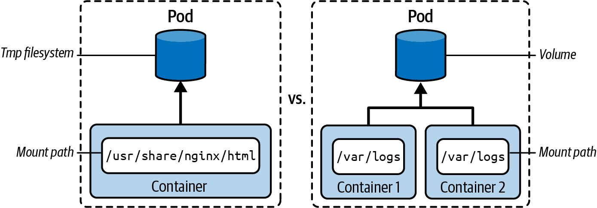

# Chương 15. Volume

*Dịch từ: Chapter 15. Volumes — Certified Kubernetes Administrator (CKA) Study Guide, 2nd Edition (O'Reilly).*

Khi container image được khởi tạo thành container, container đó cần có ngữ cảnh — ngữ cảnh về tài nguyên CPU, memory và I/O. Pod cung cấp ngữ cảnh mạng và ngữ cảnh hệ thống tệp (filesystem) cho các container bên trong nó. Mạng được cung cấp dưới dạng địa chỉ IP ảo của Pod, còn hệ thống tệp được mount vào hệ thống tệp của node đang chứa Pod.

Các ứng dụng chạy trong container có thể tương tác với hệ thống tệp như một phần của ngữ cảnh Pod. Hệ thống tệp tạm thời của một container được cách ly khỏi mọi container hoặc Pod khác và không được lưu giữ sau khi Pod khởi động lại.

Về bản chất, một *volume* là một thư mục có thể chia sẻ giữa nhiều container của một Pod. Hình 15-1 minh họa sự khác biệt giữa hệ thống tệp tạm thời của một container và việc sử dụng volume.



*Hình 15-1. Một container sử dụng hệ thống tệp tạm thời so với sử dụng volume*

Trong chương này, bạn sẽ tìm hiểu về các loại volume khác nhau và quy trình định nghĩa cũng như mount một volume vào container.

> **PHẠM VI BAO PHỦ MỤC TIÊU ĐỀ CƯƠNG**
>
> Đề cương (curriculum) không đề cập rõ ràng đến việc bao phủ những kiến thức cơ bản về volume. Tuy nhiên, bạn chắc chắn cần hiểu khái niệm này để nắm được persistent volume được mô tả trong chương tiếp theo.

## Mục đích của Volume

Nói ngắn gọn, khái niệm *volume* trong Kubernetes hướng đến việc đáp ứng các mục tiêu được mô tả dưới đây:

**Lưu trữ dữ liệu bền vững (Data persistence)**

Các ứng dụng chạy trong container có thể sử dụng hệ thống tệp tạm thời để đọc và ghi tệp. Trong trường hợp container bị crash hoặc cluster/node khởi động lại, kubelet sẽ khởi động lại container. Mọi dữ liệu đã được ghi vào hệ thống tệp tạm thời đều bị mất và không thể lấy lại được nữa. Container thực tế lại bắt đầu từ một trạng thái hoàn toàn trống. Volume có thể cung cấp lưu trữ bền vững (persistent storage) tồn tại qua các lần container khởi động lại, bảo đảm dữ liệu quan trọng không bị mất.

**Chia sẻ dữ liệu (Data sharing)**

Có nhiều trường hợp sử dụng mà bạn muốn mount một volume vào container. Một trong những trường hợp sử dụng nổi bật nhất là các Pod nhiều container (multi-container Pod) dùng volume để trao đổi dữ liệu giữa container ứng dụng chính và một sidecar, cho phép chúng chia sẻ tệp và giao tiếp thông qua hệ thống tệp.

**Tách rời lưu trữ khỏi container (Decoupling storage from containers)**

Volume trừu tượng hóa các chi tiết về lưu trữ khỏi ứng dụng, cho phép bạn thay đổi backend lưu trữ mà không cần sửa đổi container image.

## Các loại Volume

Mỗi volume đều cần định nghĩa một loại (type). Loại volume quyết định phương tiện lưu trữ đứng sau volume và hành vi của nó lúc chạy. Tài liệu Kubernetes đưa ra một danh sách dài các loại volume. Một số loại — ví dụ `azureDisk`, `awsElasticBlockStore` hoặc `gcePersistentDisk` — chỉ khả dụng khi chạy cluster Kubernetes trên một nhà cung cấp cloud cụ thể. Nhiều loại volume gắn với nhà cung cấp cloud như vậy đã bị đánh dấu lỗi thời (deprecated).

Bảng 15-1 liệt kê một danh sách rút gọn các loại volume mà tôi cho là liên quan nhất đến kỳ thi.

**Bảng 15-1. Các loại volume liên quan đến kỳ thi**

| Loại | Mô tả |
|---|---|
| `emptyDir` | Thư mục trống trong Pod với quyền đọc/ghi. Chỉ được lưu giữ trong vòng đời của Pod. Là lựa chọn tốt cho việc triển khai cache hoặc trao đổi dữ liệu giữa các container trong cùng một Pod. |
| `hostPath` | Tệp hoặc thư mục từ hệ thống tệp của node chủ. |
| `configMap`, `secret` | Cung cấp cách để đưa (inject) dữ liệu cấu hình vào. Để xem các ví dụ thực tế, hãy xem Chương 10. |
| `nfs` | Một chia sẻ Network File System (NFS) hiện có. Giữ được dữ liệu sau khi Pod khởi động lại. |
| `persistentVolumeClaim` | Yêu cầu (claim) một persistent volume. Để biết thêm thông tin, xem "Tạo PersistentVolumeClaim". |

## Tạo và truy cập Volume

Định nghĩa một volume cho Pod cần hai bước. Thứ nhất, bạn cần khai báo chính volume đó bằng thuộc tính `spec.volumes[]`. Trong phần định nghĩa, bạn cung cấp tên và loại. Tuy nhiên, chỉ khai báo volume thôi là chưa đủ. Thứ hai, volume còn cần được mount vào một đường dẫn của container sử dụng nó thông qua `spec.containers[].volumeMounts[]`. Việc ánh xạ giữa volume và volume mount diễn ra dựa trên tên trùng khớp.

Từ manifest YAML được lưu trong file `pod-with-volume.yaml` và được trình bày trong Ví dụ 15-1, bạn có thể thấy định nghĩa của một volume có loại `emptyDir`. Volume này đã được mount vào đường dẫn `/usr/share/nginx/html` bên trong container tên `nginx` và vào đường dẫn `/data` bên trong container tên `sidecar`.

**Ví dụ 15-1. Một Pod định nghĩa và mount một volume**

```yaml
apiVersion: v1
kind: Pod
metadata:
  name: business-app
spec:
  volumes:
  - name: shared-data
    emptyDir: {}                            # ❶
  containers:
  - name: nginx
    image: nginx:1.27.1
    volumeMounts:
    - name: shared-data
      mountPath: /usr/share/nginx/html      # ❷
  - name: sidecar
    image: busybox:1.37.0
    volumeMounts:
    - name: shared-data
      mountPath: /data                      # ❷
```

❶ Chỉ định một volume có loại `emptyDir`. Cặp dấu ngoặc nhọn nghĩa là chúng ta không muốn cung cấp thêm cấu hình nào, ví dụ như giới hạn dung lượng.

❷ Mount volume vào các container với đường dẫn mount khác nhau bên trong container.

Hãy tạo Pod từ định nghĩa YAML ở trên. Pod này chạy hai container:

```shell
$ kubectl apply -f pod-with-volume.yaml
pod/business-app created
$ kubectl get pod business-app
NAME               READY      STATUS       RESTARTS      AGE
business-app       2/2        Running      0             43s
```

Các lệnh sau đây mở một shell tương tác vào container tên `nginx` sau khi Pod được tạo, rồi di chuyển đến đường dẫn mount. Bạn có thể thấy rằng loại volume `emptyDir` khởi tạo đường dẫn mount dưới dạng một thư mục trống:

```shell
$ kubectl exec business-app -it -c nginx -- /bin/sh
# cd /usr/share/nginx/html
# pwd
/usr/share/nginx/html
# ls
# touch example.html
# ls
example.html
```

Các tệp và thư mục mới có thể được tạo tùy ý mà không có giới hạn nào.

## Volume mount chỉ đọc

Một số dữ liệu chỉ dành để tiêu thụ, ví dụ như dữ liệu cấu hình được cung cấp thông qua volume. Bạn có thể đánh dấu một volume mount là chỉ đọc (read-only). Kubernetes sẽ ngăn mọi thao tác ghi trên volume mount đó. Điều quan trọng cần hiểu là các container khác vẫn có thể sử dụng cùng volume đó ở chế độ đọc/ghi.

Để làm cho một volume mount trở thành chỉ đọc, hãy gán giá trị `true` cho thuộc tính `spec.containers[].volumeMounts[].readOnly`, như trong Ví dụ 15-2.

**Ví dụ 15-2. Một đường dẫn mount được đánh dấu chỉ đọc**

```yaml
apiVersion: v1
kind: Pod
metadata:
  name: business-app
spec:
  volumes:
  - name: shared-data
    emptyDir: {}
  containers:
  - name: nginx
    image: nginx:1.27.1
    volumeMounts:
    - name: shared-data
      mountPath: /usr/share/nginx/html
      readOnly: true                        # ❶
```

❶ Ngăn các thao tác ghi đối với đường dẫn mount này

Các mount chỉ đọc không mang tính chỉ đọc đệ quy. Tuy nhiên, bạn có thể ép buộc hành vi này bằng cách đặt thuộc tính `.spec.containers[].volumeMounts[].recursiveReadOnly` thành `true`. Xem blog Kubernetes để biết thêm thông tin.

## Tóm tắt

Kubernetes cung cấp volume để tách rời lưu trữ khỏi vòng đời (lifecycle) của container, cho phép lưu trữ dữ liệu cả tạm thời (ephemeral) lẫn bền vững (persistent), cũng như chia sẻ dữ liệu giữa các container trong một Pod.

## Trọng tâm cho kỳ thi

**Hiểu nhu cầu và các trường hợp sử dụng của volume**

Nhiều stack ứng dụng sẵn sàng cho production chạy trong môi trường cloud native cần lưu trữ dữ liệu bền vững. Hãy đọc thêm về các trường hợp sử dụng phổ biến và khám phá những công thức (recipe) mô tả các kịch bản điển hình. Bạn có thể tìm thấy một số ví dụ trong các cuốn sách của O'Reilly: *Kubernetes Best Practices* của Brendan Burns và cộng sự, và *Cloud Native DevOps with Kubernetes* của John Arundel và Justin Domingus.

**Thực hành định nghĩa và sử dụng volume**

Volume là một khái niệm xuyên suốt được áp dụng trong nhiều lĩnh vực khác nhau của kỳ thi. Hãy biết nơi tìm tài liệu liên quan về cách định nghĩa một volume và vô số cách để sử dụng một volume từ container. Nhất định hãy xem lại Chương 10 để tìm hiểu sâu về cách mount ConfigMap và Secret dưới dạng volume.

## Bài tập mẫu

Lời giải cho các bài tập này có trong Phụ lục A.

1. Tạo một manifest YAML cho Pod với hai container sử dụng image `alpine:3.22.2`. Cung cấp một lệnh cho cả hai container để giữ chúng chạy mãi mãi.

   Định nghĩa một volume có loại `emptyDir` cho Pod. Container 1 sẽ mount volume vào đường dẫn `/etc/a`, và Container 2 sẽ mount volume vào đường dẫn `/etc/b`.

   Mở một shell tương tác vào Container 1 và tạo thư mục `data` trong đường dẫn mount. Di chuyển vào thư mục đó và tạo tệp `hello.txt` với nội dung "Hello World." Thoát khỏi container.

   Mở một shell tương tác vào Container 2 và di chuyển đến thư mục `/etc/b/data`. Kiểm tra nội dung của tệp `hello.txt`. Thoát khỏi container.
