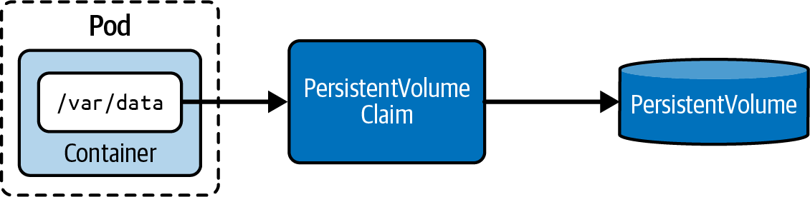

# Chương 16. Persistent Volume

*Dịch từ: Chapter 16. Persistent Volumes — Certified Kubernetes Administrator (CKA) Study Guide, 2nd Edition (O'Reilly).*

*Persistent volume* là một nhóm cụ thể trong khái niệm rộng hơn về volume, với khả năng lưu giữ dữ liệu bền vững (persistent) vượt ra ngoài vòng đời (lifecycle) của một Pod. Cơ chế hoạt động của persistent volume phức tạp hơn một chút. Persistent volume là tài nguyên thực sự lưu trữ bền vững dữ liệu xuống một thiết bị lưu trữ vật lý bên dưới.

*Persistent volume claim* đại diện cho tài nguyên kết nối giữa một Pod và một persistent volume, chịu trách nhiệm yêu cầu dung lượng lưu trữ.

Cuối cùng, Pod cần *claim* (yêu cầu sử dụng) persistent volume và mount nó vào một đường dẫn thư mục mà các container chạy bên trong Pod có thể truy cập.

> **PHẠM VI BAO PHỦ MỤC TIÊU ĐỀ CƯƠNG**
>
> Chương này đề cập đến các mục tiêu đề cương (curriculum) sau:
>
> - Triển khai storage class và dynamic volume provisioning
> - Cấu hình các loại volume, access mode và reclaim policy
> - Quản lý persistent volume và persistent volume claim

Hình 16-1 minh họa mối quan hệ giữa Pod, persistent volume claim và persistent volume.



*Hình 16-1. Claim một persistent volume từ một Pod*

## Làm việc với Persistent Volume

Dữ liệu lưu trên volume tồn tại lâu hơn một lần khởi động lại của container. Trong nhiều ứng dụng, dữ liệu sống lâu hơn nhiều so với vòng đời của ứng dụng, container, Pod, node, và thậm chí cả chính cluster. Tính bền vững của dữ liệu (data persistence) đảm bảo vòng đời của dữ liệu được tách rời khỏi vòng đời của các tài nguyên trong cluster. Một ví dụ điển hình là dữ liệu được lưu trữ bền vững bởi một cơ sở dữ liệu. Đó chính là trách nhiệm của một persistent volume. Kubernetes mô hình hóa việc lưu trữ bền vững dữ liệu với sự trợ giúp của hai primitive: PersistentVolume và PersistentVolumeClaim.

*PersistentVolume* là primitive đại diện cho một phần dung lượng lưu trữ trong một cluster Kubernetes. Nó hoàn toàn tách rời khỏi Pod và do đó có vòng đời riêng. Đối tượng này ghi nhận nguồn của thiết bị lưu trữ (ví dụ, lưu trữ do một nhà cung cấp cloud cung cấp). Một PersistentVolume hoặc được quản trị viên Kubernetes cung cấp sẵn, hoặc được gán động bằng cách ánh xạ tới một storage class.

*PersistentVolumeClaim* yêu cầu các tài nguyên của một PersistentVolume — ví dụ, kích thước lưu trữ và kiểu truy cập. Trong Pod, bạn sẽ dùng loại `persistentVolumeClaim` để mount PersistentVolume đã được trừu tượng hóa thông qua PersistentVolumeClaim.

## Các loại Volume

Kubernetes hỗ trợ nhiều loại persistent volume để đáp ứng các backend lưu trữ và trường hợp sử dụng khác nhau. Mỗi loại có đặc điểm riêng và phù hợp với những kịch bản cụ thể. Bảng 16-1 liệt kê các loại persistent volume được sử dụng phổ biến nhất mà chưa bị loại bỏ (deprecated).

**Bảng 16-1. Các loại persistent volume**

| Loại | Mô tả |
|---|---|
| `hostPath` | Mount một file hoặc thư mục từ hệ thống file của node chủ vào Pod. Hữu ích cho phát triển và kiểm thử nhưng không được khuyến nghị cho các cluster nhiều node trong môi trường production, vì nó gắn chặt Pod với một node cụ thể. |
| `local` | Đại diện cho một thiết bị lưu trữ cục bộ đã được mount, chẳng hạn một ổ đĩa, phân vùng hoặc thư mục. Cho hiệu năng tốt hơn lưu trữ từ xa nhưng yêu cầu node affinity để đảm bảo Pod được lập lịch (schedule) lên đúng node. |
| `nfs` | Cho phép nhiều Pod chia sẻ cùng một mount Network File System (NFS). Hỗ trợ access mode `ReadWriteMany` và hữu ích cho việc chia sẻ dữ liệu giữa các Pod trên nhiều node. |
| `csi` | Driver Container Storage Interface (CSI) cung cấp một cách chuẩn hóa để đưa các hệ thống lưu trữ đến với các workload chạy trong container. Hầu hết các giải pháp lưu trữ hiện đại đều dùng driver CSI. |
| `fc` | Volume Fibre Channel (FC) cho phép gắn thiết bị lưu trữ FC có sẵn vào Pod. Yêu cầu phần cứng FC và cấu hình phù hợp trên các node. |
| `iscsi` | Volume Internet Small Computer Systems Interface (iSCSI) cho phép mount thiết bị lưu trữ iSCSI có sẵn vào Pod. Cung cấp lưu trữ cấp khối (block-level) qua mạng IP. |

Việc lựa chọn loại volume phụ thuộc vào hạ tầng của bạn, yêu cầu về hiệu năng, và việc bạn có cần chia sẻ lưu trữ giữa nhiều Pod hoặc node hay không. Với môi trường cloud, các driver CSI thường được nhà cung cấp cloud cung cấp (như AWS EBS CSI driver, GCE Persistent Disk CSI driver, hoặc Azure Disk CSI driver) để tích hợp với các dịch vụ lưu trữ gốc của họ.

## Cung cấp tĩnh và cung cấp động

Một PersistentVolume có thể được tạo theo cách tĩnh hoặc động. Nếu chọn cách tiếp cận tĩnh (static provisioning), trước tiên bạn cần tạo một thiết bị lưu trữ rồi tham chiếu đến nó bằng cách tạo tường minh một đối tượng có kind là PersistentVolume. Cách tiếp cận động (dynamic provisioning) không yêu cầu bạn tạo đối tượng PersistentVolume. Nó sẽ được tạo tự động từ PersistentVolumeClaim bằng cách đặt tên storage class thông qua thuộc tính `spec.storageClassName`.

*Storage class* là một khái niệm trừu tượng định nghĩa một lớp (class) thiết bị lưu trữ (ví dụ, lưu trữ có hiệu năng chậm hoặc nhanh) dùng cho các loại ứng dụng khác nhau. Việc thiết lập storage class là công việc của quản trị viên Kubernetes. Để thảo luận sâu hơn về storage class, xem "Storage Class". Hiện tại, chúng ta sẽ tập trung vào việc cung cấp tĩnh PersistentVolume.

## Tạo PersistentVolume

Khi bạn tự tạo đối tượng PersistentVolume, chúng ta gọi cách tiếp cận này là *cung cấp tĩnh* (static provisioning). Một PersistentVolume chỉ có thể được tạo bằng cách tiếp cận manifest-first (viết manifest trước). Tại thời điểm này, `kubectl` không cho phép tạo PersistentVolume bằng lệnh `create`. Mọi PersistentVolume đều cần định nghĩa dung lượng lưu trữ bằng `spec.capacity` và một access mode được đặt qua `spec.accessModes`. Xem "Các tùy chọn cấu hình cho PersistentVolume" để biết thêm thông tin về các tùy chọn cấu hình có sẵn cho một PersistentVolume.

Ví dụ 16-1 tạo một PersistentVolume tên `db-pv` với dung lượng lưu trữ 1 Gi và quyền đọc/ghi bởi một node duy nhất. Thuộc tính `hostPath` mount thư mục */data/db* từ hệ thống file của node chủ. Chúng ta sẽ lưu manifest YAML vào file *db-pv.yaml*.

**Ví dụ 16-1. Manifest YAML định nghĩa một PersistentVolume**

```yaml
apiVersion: v1
kind: PersistentVolume
metadata:
  name: db-pv
spec:
  capacity:                 # ❶
    storage: 1Gi            # ❶
  accessModes:              # ❷
    - ReadWriteOnce         # ❷
  hostPath:
    path: /data/db
```

❶ Dung lượng lưu trữ có sẵn cho persistent volume

❷ Các access mode đọc/ghi áp dụng cho persistent volume

Khi kiểm tra PersistentVolume vừa tạo, bạn sẽ thấy hầu hết thông tin bạn đã cung cấp trong manifest. Trạng thái `Available` cho biết đối tượng đã sẵn sàng để được claim. Reclaim policy xác định điều gì sẽ xảy ra với PersistentVolume sau khi nó được giải phóng khỏi claim của nó. Theo mặc định, đối tượng sẽ được giữ lại (retain). Ví dụ sau dùng lệnh dạng viết tắt `pv` để tránh phải gõ `persistentvolume`:

```shell
$ kubectl apply -f db-pv.yaml
persistentvolume/db-pv created
$ kubectl get pv db-pv
NAME    CAPACITY   ACCESS MODES   RECLAIM POLICY   STATUS      \
  CLAIM   STORAGECLASS   REASON   AGE
db-pv   1Gi        RWO            Retain           Available   \
                                  10s
```

## Các tùy chọn cấu hình cho PersistentVolume

Một PersistentVolume cung cấp nhiều tùy chọn cấu hình quyết định hành vi vận hành vốn có của nó. Đối với kỳ thi, điều quan trọng là hiểu các tùy chọn cấu hình volume mode, access mode, reclaim policy và node affinity.

### Volume Mode

Volume mode xử lý loại thiết bị. Đó là thiết bị hoặc được dùng thông qua hệ thống file, hoặc được hỗ trợ bởi một thiết bị khối (block device). Trường hợp phổ biến nhất là thiết bị hệ thống file. Bạn có thể đặt volume mode bằng thuộc tính `spec.volumeMode`. Bảng 16-2 cho thấy tất cả các volume mode có sẵn.

**Bảng 16-2. Các volume mode của PersistentVolume**

| Loại | Mô tả |
|---|---|
| `Filesystem` | Mặc định. Mount volume vào một thư mục của Pod sử dụng nó. Tạo hệ thống file trước nếu volume được hỗ trợ bởi một thiết bị khối và thiết bị đó đang trống. |
| `Block` | Dùng cho volume như một thiết bị khối thô (raw block device) không có hệ thống file trên đó. |

Volume mode không được hiển thị mặc định trong output trên console của lệnh `get pv`. Bạn sẽ cần cung cấp tùy chọn dòng lệnh `-o wide` để thấy cột `VOLUMEMODE`, như minh họa sau đây:

```shell
$ kubectl get pv -o wide
NAME    CAPACITY   ACCESS MODES   RECLAIM POLICY   STATUS      \
CLAIM   STORAGECLASS   REASON   AGE   VOLUMEMODE
db-pv   1Gi        RWO            Retain           Available   \
                                 19m   Filesystem
```

### Access Mode

Mỗi PersistentVolume có thể biểu thị cách nó có thể được truy cập bằng thuộc tính `spec.accessModes`. Ví dụ, bạn có thể định nghĩa rằng volume chỉ có thể được mount bởi một Pod duy nhất ở chế độ đọc hoặc ghi, hoặc rằng volume là chỉ đọc nhưng có thể truy cập đồng thời từ nhiều node khác nhau. Bảng 16-3 cung cấp tổng quan về các access mode có sẵn. Dạng viết tắt của access mode thường được hiển thị trong output của một số lệnh cụ thể, ví dụ `get pv` hoặc `describe pv`.

**Bảng 16-3. Các access mode của PersistentVolume**

| Loại | Dạng viết tắt | Mô tả |
|---|---|---|
| `ReadWriteOnce` | RWO | Truy cập đọc/ghi bởi một node duy nhất |
| `ReadOnlyMany` | ROX | Truy cập chỉ đọc bởi nhiều node |
| `ReadWriteMany` | RWX | Truy cập đọc/ghi bởi nhiều node |
| `ReadWriteOncePod` | RWOP | Truy cập đọc/ghi được mount bởi một Pod duy nhất |

Lệnh sau trích xuất các access mode từ PersistentVolume tên `db-pv`. Như bạn thấy, giá trị trả về là một mảng, nhấn mạnh thực tế rằng bạn có thể gán nhiều access mode cùng một lúc:

```shell
$ kubectl get pv db-pv -o jsonpath='{.spec.accessModes}'
["ReadWriteOnce"]
```

ReadWriteOnce (RWO) cho phép một node duy nhất mount ở chế độ đọc-ghi, lý tưởng cho các cơ sở dữ liệu như MySQL hoặc PostgreSQL và các ứng dụng có trạng thái (stateful) dùng lưu trữ khối (AWS EBS, GCE Persistent Disk). ReadOnlyMany (ROX) cho phép nhiều node mount đồng thời ở chế độ chỉ đọc, hoàn hảo để phục vụ nội dung web tĩnh hoặc các file cấu hình dùng chung giữa nhiều Pod. ReadWriteMany (RWX) cho phép truy cập đọc-ghi đồng thời từ nhiều node, yêu cầu lưu trữ dựa trên file như NFS hoặc AWS EFS, và là thiết yếu cho các thư mục upload dùng chung hoặc các hệ thống quản trị nội dung nơi nhiều Pod xử lý cùng một tập file. ReadWriteOncePod (RWOP) đảm bảo chỉ một Pod duy nhất trên toàn cluster có thể mount volume, mang lại sự đảm bảo mạnh hơn RWO cho các ứng dụng như etcd hoặc trong quá trình di chuyển (migration) StatefulSet, nơi ngữ nghĩa một-người-ghi tuyệt đối (single-writer) là tối quan trọng. Mức hỗ trợ của nhà cung cấp lưu trữ khác nhau: lưu trữ khối thường hỗ trợ RWO/RWOP, trong khi ROX/RWX cần đến hệ thống file.

### Reclaim Policy

Tùy chọn, bạn cũng có thể định nghĩa một reclaim policy cho PersistentVolume. Reclaim policy chỉ định điều gì sẽ xảy ra với đối tượng PersistentVolume khi PersistentVolumeClaim đã gắn kết (bound) với nó bị xóa (xem Bảng 16-4). Với các PersistentVolume được tạo động, reclaim policy có thể được đặt qua thuộc tính `.reclaimPolicy` trong storage class. Với các PersistentVolume được tạo tĩnh, hãy dùng thuộc tính `spec.persistentVolumeReclaimPolicy` trong định nghĩa PersistentVolume.

**Bảng 16-4. Các reclaim policy của PersistentVolume**

| Loại | Mô tả |
|---|---|
| `Retain` | Mặc định. Khi PersistentVolumeClaim bị xóa, PersistentVolume được "giải phóng" (released) và phải được thu hồi thủ công. |
| `Delete` | Việc xóa sẽ loại bỏ PersistentVolume cùng với thiết bị lưu trữ liên kết với nó. |
| `Recycle` | Giá trị này đã bị loại bỏ (deprecated). Bạn nên dùng một trong các giá trị khác. |

Lệnh này lấy ra reclaim policy đã được gán cho PersistentVolume tên `db-pv`:

```shell
$ kubectl get pv db-pv -o jsonpath='{.spec.persistentVolumeReclaimPolicy}'
Retain
```

### Node Affinity

Node affinity cho phép bạn ràng buộc những node nào có thể truy cập một PersistentVolume. Điều này đặc biệt quan trọng với các loại lưu trữ cục bộ như volume `local` và `hostPath`, vốn gắn liền về mặt vật lý với các node cụ thể. Bằng cách định nghĩa các quy tắc node affinity, bạn đảm bảo rằng các Pod sử dụng PersistentVolume chỉ được lập lịch lên những node thực sự có thể truy cập thiết bị lưu trữ bên dưới.

Node affinity được chỉ định bằng trường `spec.nodeAffinity` trong định nghĩa PersistentVolume. Nó dùng cú pháp giống như node affinity của Pod, với các quy tắc `required` phải được thỏa mãn để volume có thể truy cập được.

Ví dụ 16-2 minh họa một PersistentVolume có node affinity giới hạn nó ở những node cụ thể.

**Ví dụ 16-2. Định nghĩa node affinity cho một PersistentVolume**

```yaml
apiVersion: v1
kind: PersistentVolume
metadata:
  name: local-pv
spec:
  capacity:
    storage: 10Gi
  accessModes:
    - ReadWriteOnce
  persistentVolumeReclaimPolicy: Retain
  storageClassName: local-storage
  local:                                  # ❶
    path: /mnt/data
  nodeAffinity:                           # ❷
    required:
      nodeSelectorTerms:
      - matchExpressions:
        - key: kubernetes.io/hostname     # ❸
          operator: In
          values:
          - node01
          - node02
```

❶ Dùng loại volume `local`, loại này yêu cầu node affinity

❷ Định nghĩa các quy tắc node affinity cho PersistentVolume này

❸ Giới hạn volume ở các node có hostname `node01` hoặc `node02`

Các trường hợp sử dụng phổ biến của node affinity với PersistentVolume bao gồm:

**Volume cục bộ (local volume)**

Phải chỉ định node affinity để cho biết node nào chứa thiết bị lưu trữ

**Ràng buộc theo vùng (zone)**

Đảm bảo volume chỉ được truy cập từ các node trong những vùng khả dụng (availability zone) cụ thể

**Yêu cầu về phần cứng**

Giới hạn volume ở các node có phần cứng lưu trữ cụ thể (ví dụ, các node SSD)

Khi một PersistentVolumeClaim gắn kết với một PersistentVolume có node affinity, bất kỳ Pod nào dùng claim đó sẽ được lập lịch theo các ràng buộc này. Nếu không có node phù hợp, Pod sẽ ở lại trạng thái `Pending`.

Những lưu ý quan trọng:

- Node affinity là bắt buộc đối với loại volume `local`.
- Scheduler xem xét cả node selector của Pod lẫn node affinity của PersistentVolume.
- Việc thay đổi label của node sau khi đã gắn kết không ảnh hưởng đến các volume hiện đang được mount.
- Để có tính sẵn sàng cao (high availability), hãy tránh các quy tắc node affinity quá hạn chế.

## Tạo PersistentVolumeClaim

Đối tượng tiếp theo chúng ta cần tạo là PersistentVolumeClaim. Mục đích của nó là gắn kết PersistentVolume với Pod. Hãy xem manifest YAML lưu trong file *db-pvc.yaml*, được trình bày trong Ví dụ 16-3.

**Ví dụ 16-3. Định nghĩa một PersistentVolumeClaim**

```yaml
kind: PersistentVolumeClaim
apiVersion: v1
metadata:
  name: db-pvc
spec:
  accessModes:              # ❶
    - ReadWriteOnce         # ❶
  storageClassName: ""      # ❷
  resources:                # ❸
    requests:               # ❸
      storage: 256Mi        # ❸
```

❶ Các access mode mà chúng ta yêu cầu một persistent volume chưa gắn kết phải cung cấp

❷ Dùng phép gán chuỗi rỗng để cho biết chúng ta muốn dùng cung cấp tĩnh

❸ Dung lượng lưu trữ tối thiểu mà một persistent volume chưa gắn kết cần có sẵn

Điều đó có nghĩa là: "Hãy cho tôi một PersistentVolume có thể đáp ứng yêu cầu tài nguyên (resource request) 256 Mi và cung cấp access mode `ReadWriteOnce`."

Cung cấp tĩnh nên dùng chuỗi rỗng cho thuộc tính `spec.storageClassName` nếu bạn không muốn nó tự động gán storage class mặc định. Việc gắn kết với một PersistentVolume phù hợp diễn ra tự động dựa trên các tiêu chí đó.

Sau khi tạo PersistentVolumeClaim, trạng thái được đặt là `Bound`, nghĩa là việc gắn kết với PersistentVolume đã thành công. Một khi việc gắn kết tương ứng đã diễn ra, không gì khác có thể gắn kết với nó nữa. Mối quan hệ gắn kết là một-một. Không gì khác có thể gắn kết với PersistentVolume một khi nó đã được claim. Lệnh `get` sau dùng dạng viết tắt `pvc` thay cho `persistentvolumeclaim`:

```shell
$ kubectl apply -f db-pvc.yaml
persistentvolumeclaim/db-pvc created
$ kubectl get pvc db-pvc
NAME     STATUS   VOLUME   CAPACITY   ACCESS MODES   STORAGECLASS   AGE
db-pvc   Bound    db-pv    1Gi        RWO                           111s
```

PersistentVolume vẫn chưa được Pod nào mount. Do đó, khi kiểm tra chi tiết của đối tượng sẽ thấy `<none>`. Dùng lệnh `describe` là một cách tốt để xác minh rằng PersistentVolumeClaim đã được mount đúng cách:

```shell
$ kubectl describe pvc db-pvc
...
Used By:       <none>
...
```

## Gắn kết theo tên Volume

Khi tạo một PersistentVolumeClaim, bạn có thể tùy chọn chỉ định chính xác PersistentVolume mà bạn muốn gắn kết bằng thuộc tính `spec.volumeName`. Điều này tạo ra một gắn kết trực tiếp giữa PersistentVolumeClaim và một PersistentVolume cụ thể, bỏ qua thuật toán so khớp thông thường vốn xem xét kích thước lưu trữ, access mode và storage class.

Điều này hữu ích trong các kịch bản mà:

- Bạn có các PersistentVolume được cung cấp sẵn (preprovisioned) với những đặc tính cụ thể.
- Bạn cần đảm bảo rằng một PersistentVolumeClaim gắn kết với một PersistentVolume nhất định vì lý do tuân thủ (compliance) hoặc vị trí dữ liệu (data locality).
- Bạn muốn tái sử dụng một PersistentVolume hiện có chứa dữ liệu quan trọng.

Ví dụ 16-4 minh họa một PersistentVolumeClaim gắn kết tường minh với PersistentVolume tên `db-pv`.

**Ví dụ 16-4. Gắn kết một PersistentVolume với một PersistentVolumeClaim theo tên**

```yaml
apiVersion: v1
kind: PersistentVolumeClaim
metadata:
  name: specific-pvc
spec:
  volumeName: db-pv         # ❶
  accessModes:
    - ReadWriteOnce
  resources:
    requests:
      storage: 1Gi
```

❶ Gắn kết tường minh PersistentVolumeClaim này với PersistentVolume tên `db-pv`.

Khi dùng `volumeName`, hãy đảm bảo rằng:

- PersistentVolume được chỉ định tồn tại và đang ở trạng thái `Available`.
- Dung lượng của PersistentVolume lớn hơn hoặc bằng dung lượng lưu trữ mà PersistentVolumeClaim yêu cầu.
- Các access mode tương thích với nhau.
- Các storage class khớp nhau (hoặc cả hai đều không được đặt).

Nếu các điều kiện này không được đáp ứng, PersistentVolumeClaim sẽ ở lại trạng thái `Pending`.

## Mount PersistentVolumeClaim trong Pod

Việc còn lại là mount PersistentVolumeClaim trong Pod muốn sử dụng nó. Bạn đã học cách mount một volume trong Pod. Khác biệt lớn ở đây, như trình bày trong Ví dụ 16-5, là dùng `spec.volumes[].persistentVolumeClaim` và cung cấp tên của PersistentVolumeClaim.

**Ví dụ 16-5. Một Pod tham chiếu đến một PersistentVolumeClaim**

```yaml
apiVersion: v1
kind: Pod
metadata:
  name: app-consuming-pvc
spec:
  volumes:
  - name: app-storage
    persistentVolumeClaim:      # ❶
      claimName: db-pvc         # ❷
  containers:
  - image: alpine:3.22.2
    name: app
    command: ["/bin/sh"]
    args: ["-c", "while true; do sleep 60; done;"]
    volumeMounts:
      - mountPath: "/mnt/data"
        name: app-storage
```

❶ Loại volume chọn một persistent volume claim theo tên

❷ Tên của đối tượng persistent volume claim mà chúng ta muốn gắn kết

Giả sử chúng ta đã lưu cấu hình vào file *app-consuming-pvc.yaml*. Sau khi tạo Pod từ manifest, bạn sẽ thấy Pod chuyển sang trạng thái `Ready`. Lệnh `describe` sẽ cung cấp thêm thông tin về volume:

```shell
$ kubectl apply -f app-consuming-pvc.yaml
pod/app-consuming-pvc created
$ kubectl get pods
NAME                READY   STATUS    RESTARTS   AGE
app-consuming-pvc   1/1     Running   0          3s
$ kubectl describe pod app-consuming-pvc
...
Volumes:
  app-storage:
    Type:          PersistentVolumeClaim (a reference to a PersistentVolumeClaim
                   in the same namespace)
    ClaimName:     db-pvc
    ReadOnly:      false
...
```

PersistentVolumeClaim giờ đây cũng hiển thị Pod đã mount nó:

```shell
$ kubectl describe pvc db-pvc
...
Used By:       app-consuming-pvc
...
```

Giờ bạn có thể tiến hành mở một shell tương tác vào Pod. Di chuyển đến đường dẫn mount tại */mnt/data* sẽ cho bạn quyền truy cập vào PersistentVolume bên dưới:

```shell
$ kubectl exec app-consuming-pvc -it -- /bin/sh
/ # cd /mnt/data
/mnt/data # ls -l
total 0
/mnt/data # touch test.db
/mnt/data # ls -l
total 0
-rw-r--r--    1 root     root             0 Sep 29 23:59 test.db
```

## Storage Class

*StorageClass* là một primitive của Kubernetes định nghĩa một loại hay "lớp" (class) lưu trữ cụ thể. Một đặc tính lưu trữ điển hình là loại (ví dụ, lưu trữ SSD nhanh so với lưu trữ cloud từ xa, hoặc chính sách sao lưu (backup) cho lưu trữ). Storage class được dùng để cung cấp động một PersistentVolume dựa trên các tiêu chí của nó.

Trong thực tế, điều này có nghĩa là bạn không phải tự tạo đối tượng PersistentVolume. Provisioner được gán cho storage class sẽ lo việc đó. Hầu hết các nhà cung cấp cloud Kubernetes đều đi kèm một danh sách các provisioner có sẵn. minikube đã tạo sẵn một storage class mặc định tên `standard`, bạn có thể truy vấn nó bằng lệnh sau:

```shell
$ kubectl get storageclass
NAME                 PROVISIONER                RECLAIMPOLICY   \
  VOLUMEBINDINGMODE   ALLOWVOLUMEEXPANSION   AGE
standard (default)   k8s.io/minikube-hostpath   Delete          \
  Immediate           false                  108d
```

### Tạo Storage Class

Storage class chỉ có thể được tạo theo kiểu khai báo (declarative) với sự trợ giúp của một manifest YAML. Tối thiểu, bạn cần khai báo provisioner. Tất cả các thuộc tính khác là tùy chọn và sẽ dùng giá trị mặc định nếu không được cung cấp lúc tạo. Hầu hết các provisioner cho phép bạn đặt các tham số đặc thù cho loại lưu trữ. Ví dụ 16-6 định nghĩa một storage class trên Google Compute Engine, được biểu thị bởi provisioner `kubernetes.io/gce-pd`.

**Ví dụ 16-6. Định nghĩa một storage class**

```yaml
apiVersion: storage.k8s.io/v1
kind: StorageClass
metadata:
  name: fast
provisioner: kubernetes.io/gce-pd
parameters:
  type: pd-ssd
  replication-type: regional-pd
```

Nếu bạn đã lưu nội dung YAML vào file *fast-sc.yaml*, thì lệnh sau sẽ tạo đối tượng. Storage class có thể được liệt kê bằng lệnh `get storageclass`:

```shell
$ kubectl create -f fast-sc.yaml
storageclass.storage.k8s.io/fast created
$ kubectl get storageclass
NAME   PROVISIONER            RECLAIMPOLICY   \
  VOLUMEBINDINGMODE   ALLOWVOLUMEEXPANSION   AGE
fast   kubernetes.io/gce-pd   Delete          \
  Immediate           false                  4s
...
```

### Sử dụng Storage Class

Việc cung cấp động một PersistentVolume yêu cầu gán storage class khi bạn tạo PersistentVolumeClaim. Ví dụ 16-7 minh họa cách dùng thuộc tính `spec.storageClassName` để gán storage class tên `standard`.

**Ví dụ 16-7. Sử dụng storage class trong một PersistentVolumeClaim**

```yaml
kind: PersistentVolumeClaim
apiVersion: v1
metadata:
  name: db-pvc
spec:
  accessModes:
    - ReadWriteOnce
  resources:
    requests:
      storage: 512Mi
  storageClassName: standard      # ❶
```

❶ Dùng storage class theo tên của nó để bật cung cấp động

Đối tượng PersistentVolume tương ứng sẽ chỉ được tạo nếu storage class có thể cung cấp một PersistentVolume phù hợp bằng provisioner của nó. Điều quan trọng cần hiểu là Kubernetes không hiển thị thông báo lỗi hay cảnh báo nếu điều này không xảy ra.

Lệnh sau hiển thị PersistentVolumeClaim và PersistentVolume đã được tạo. Như bạn thấy, tên của PersistentVolume được cung cấp động dùng một hash để đảm bảo tên là duy nhất:

```shell
$ kubectl get pv,pvc
NAME                                                        CAPACITY   \
  ACCESS MODES   RECLAIM POLICY   STATUS   CLAIM            STORAGECLASS   \
  REASON   AGE
persistentvolume/pvc-b820b919-f7f7-4c74-9212-ef259d421734   512Mi      \
  RWO            Delete           Bound    default/db-pvc   standard       \
           2s

NAME                           STATUS   VOLUME
CAPACITY   ACCESS MODES   STORAGECLASS   AGE
persistentvolumeclaim/db-pvc   Bound    pvc-b820b919-f7f7-4c74-9212-ef259d421734
512Mi      RWO            standard       2s
```

Các bước để mount PersistentVolumeClaim từ một Pod là giống nhau cho cả cung cấp tĩnh và cung cấp động. Tham khảo "Mount PersistentVolumeClaim trong Pod" để biết thêm thông tin.

## Tóm tắt

PersistentVolume lưu trữ dữ liệu vượt ra ngoài một lần khởi động lại của Pod hoặc cluster/node. Những đối tượng này tách rời khỏi vòng đời của Pod và do đó được biểu diễn bằng một primitive riêng của Kubernetes. PersistentVolumeClaim trừu tượng hóa các chi tiết triển khai bên dưới của một PersistentVolume và đóng vai trò trung gian giữa Pod và PersistentVolume. Một PersistentVolume có thể được cung cấp tĩnh bằng cách tạo đối tượng, hoặc cung cấp động với sự trợ giúp của provisioner được gán cho một storage class.

## Trọng tâm cho kỳ thi

**Nắm vững cơ chế định nghĩa và sử dụng một PersistentVolume**

Việc tạo một PersistentVolume liên quan đến một vài thành phần phối hợp với nhau. Hãy hiểu các tùy chọn cấu hình cho PersistentVolume và PersistentVolumeClaim cũng như cách chúng phối hợp với nhau. Hãy thử mô phỏng những tình huống ngăn cản việc gắn kết thành công một PersistentVolumeClaim. Sau đó khắc phục tình huống bằng các biện pháp xử lý. Nằm lòng các lệnh viết tắt `pv` và `pvc` để tiết kiệm thời gian quý giá trong kỳ thi.

**Biết sự khác biệt giữa cung cấp tĩnh và cung cấp động một PersistentVolume**

Một PersistentVolume phải được tạo tĩnh bằng cách tạo đối tượng từ một manifest YAML. Hoặc, bạn có thể để Kubernetes cung cấp động một PersistentVolume mà không cần bạn trực tiếp can thiệp. Để điều này xảy ra, hãy gán một storage class cho PersistentVolumeClaim. Provisioner của storage class sẽ lo việc tạo đối tượng PersistentVolume cho bạn.

## Bài tập mẫu

Lời giải cho các bài tập này có trong Phụ lục A.

1. Tạo một PersistentVolume tên `logs-pv` ánh xạ tới `hostPath` */var/logs*. Access mode phải là `ReadWriteOnce` và `ReadOnlyMany`. Cung cấp dung lượng lưu trữ 5 Gi. Đảm bảo trạng thái của PersistentVolume hiển thị `Available`.

   Tạo một PersistentVolumeClaim tên `logs-pvc`. Nó dùng quyền truy cập `ReadWriteOnce`. Yêu cầu dung lượng 2 Gi. Đảm bảo trạng thái của PersistentVolume hiển thị `Bound`.

   Mount PersistentVolumeClaim trong một Pod chạy image `nginx` tại đường dẫn mount */var/log/nginx*.

   Mở một shell tương tác vào container và tạo một file mới tên *my-nginx.log* trong */var/log/nginx*. Thoát khỏi Pod.

   Xóa Pod và tạo lại nó với cùng manifest YAML. Mở một shell tương tác vào Pod, di chuyển đến thư mục */var/log/nginx*, và tìm file bạn đã tạo trước đó.

2. Di chuyển đến thư mục *app-a/ch16/dynamic-provisioning* của repository GitHub *bmuschko/cka-study-guide* đã checkout. Xem xét định nghĩa manifest YAML trong file *local-path-storage-0.0.31.yaml*. Tạo các đối tượng từ file manifest YAML.

   Tạo một PersistentVolumeClaim tên `db-pvc` trong namespace `persistence`. Quyền truy cập nó dùng là `ReadWriteOnce`. Yêu cầu dung lượng 10 Mi. Dùng tên storageclass `local-path`.

   Đảm bảo trạng thái của đối tượng PersistentVolumeClaim hiển thị `Pending`. Chưa có đối tượng PersistentVolume nào được cung cấp.

   Mount PersistentVolumeClaim trong một Pod tên `app-consuming-pvc` trong namespace `persistence` tại đường dẫn mount */mnt/data*. Container phải dùng image `alpine:3.21.3`.

   Chờ cho đến khi Pod chuyển sang trạng thái `Running`. Đảm bảo đối tượng PersistentVolume đã được tạo động.

   Mở một shell tương tác vào container, và tạo một file mới tên *test.db* trong */mnt/data*. Thoát khỏi Pod.
