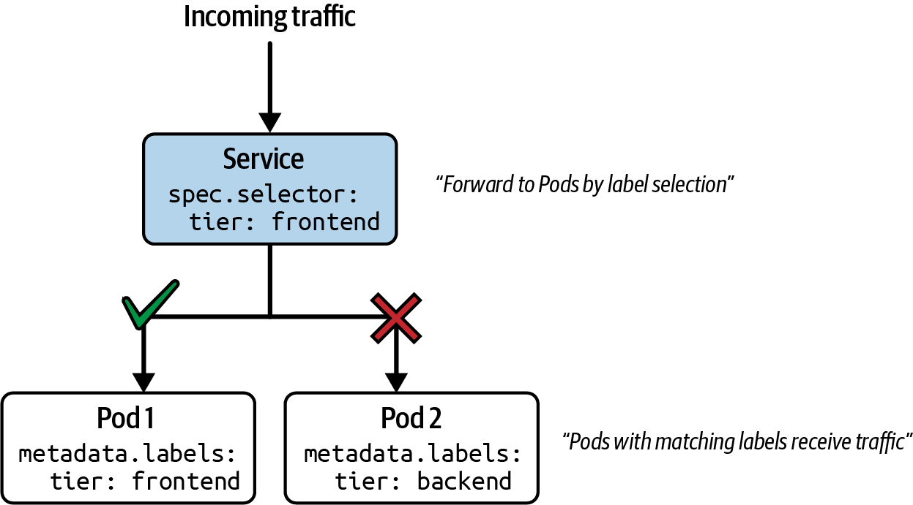
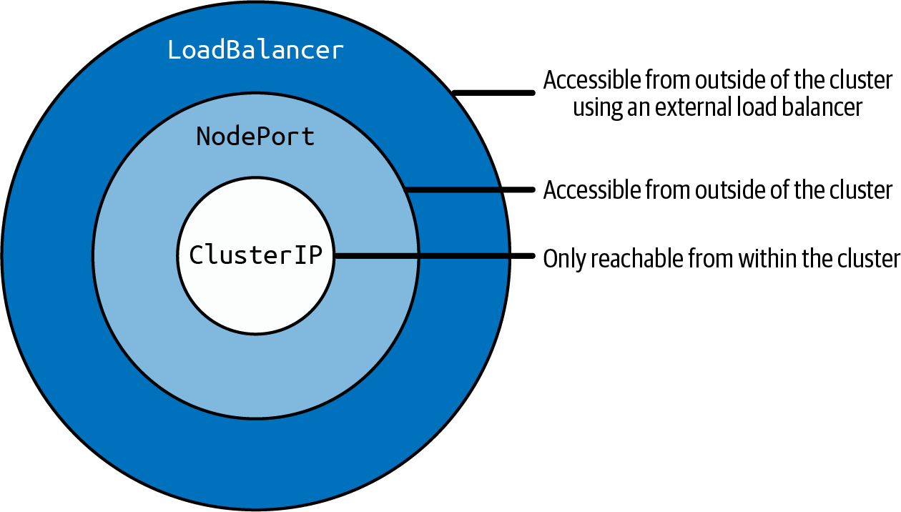
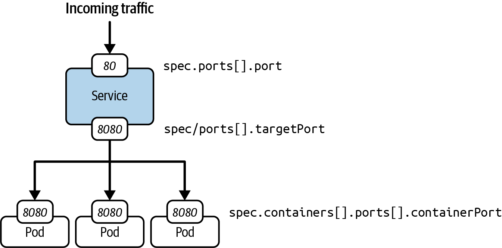
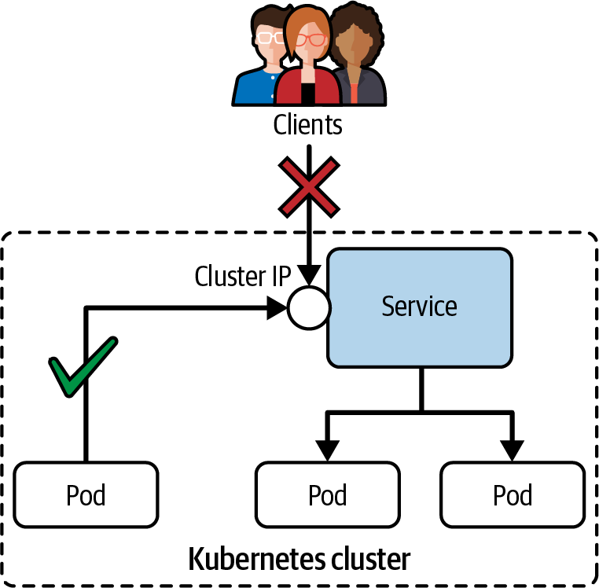
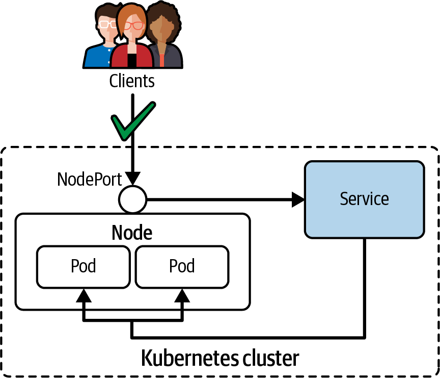
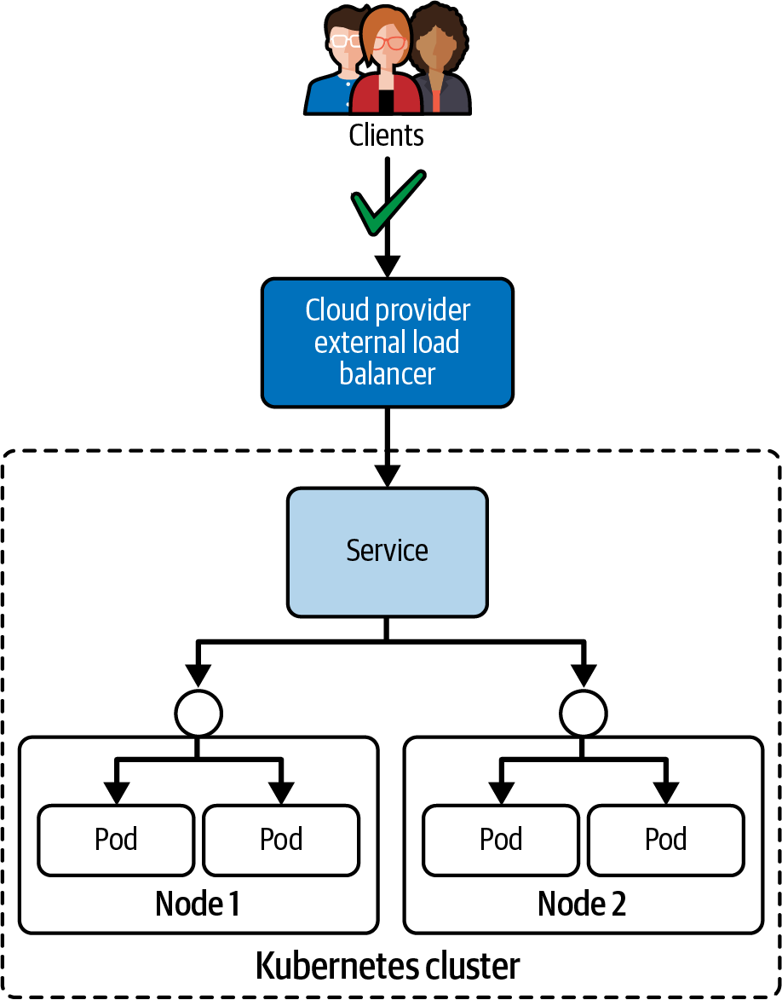

# Chương 17. Service

*Dịch từ: Chapter 17. Services — Certified Kubernetes Administrator (CKA) Study Guide, 2nd Edition (O'Reilly).*

Trong mục “Sử dụng địa chỉ IP của Pod để giao tiếp mạng”, chúng ta đã biết rằng bạn có thể giao tiếp với một Pod thông qua địa chỉ IP của nó. Khi một Pod khởi động lại, nó sẽ tự động được gán một địa chỉ ClusterIP ảo mới. Do đó, các phần khác trong hệ thống của bạn không thể dựa vào địa chỉ IP của Pod nếu chúng cần trao đổi với nhau.

Việc xây dựng một kiến trúc microservice, trong đó mỗi thành phần chạy trong Pod riêng của nó và cần giao tiếp với nhau thông qua một giao diện mạng ổn định, đòi hỏi một primitive khác: *Service*.

Service triển khai một lớp trừu tượng bên trên các Pod, gán một địa chỉ IP ảo cố định đứng trước tất cả các Pod có label khớp, và địa chỉ IP ảo đó được gọi là ClusterIP. Chương này sẽ tập trung vào mọi ngóc ngách của Service, và quan trọng nhất là việc công khai (expose) Pod ra bên trong và bên ngoài cluster dựa trên loại (type) được khai báo của Service.

> **TRUY CẬP SERVICE TRONG MINIKUBE**
>
> Việc truy cập các Service loại `NodePort` và `LoadBalancer` trong minikube cần có cách xử lý đặc biệt. Hãy tham khảo tài liệu để biết hướng dẫn chi tiết.

> **PHẠM VI BAO PHỦ MỤC TIÊU ĐỀ CƯƠNG**
>
> Chương này đề cập đến các mục tiêu đề cương (curriculum) sau:
>
> - Hiểu về kết nối giữa các Pod
> - Sử dụng các loại Service ClusterIP, NodePort, LoadBalancer và endpoint
> - Hiểu và sử dụng CoreDNS

## Làm việc với Service

Nói ngắn gọn, Service cung cấp tên có thể khám phá được (discoverable name) và khả năng cân bằng tải (load balancing) cho một tập hợp Pod. Service không phụ thuộc vào địa chỉ IP nhờ sự trợ giúp của thành phần control plane DNS của Kubernetes, một khía cạnh mà chúng ta sẽ thảo luận trong mục “Khám phá Service bằng tra cứu DNS”. Tương tự như Deployment, Service xác định các Pod mà nó làm việc cùng nhờ sự trợ giúp của việc lựa chọn label (label selection).

Hình 17-1 minh họa chức năng này. Pod 1 nhận lưu lượng (traffic) vì label được gán cho nó khớp với lựa chọn label được định nghĩa trong Service. Pod 2 không nhận lưu lượng, vì nó định nghĩa một label không khớp.



*Hình 17-1. Định tuyến lưu lượng của Service dựa trên lựa chọn label*

Lưu ý rằng có thể tạo một Service không có label selector để hỗ trợ các kịch bản khác. Hãy tham khảo tài liệu Kubernetes liên quan để biết thêm thông tin.

> **SERVICE VÀ DEPLOYMENT**
>
> Service là một khái niệm bổ trợ cho Deployment. Service định tuyến lưu lượng mạng đến một tập hợp Pod, còn Deployment ủy quyền cho một ReplicaSet để quản lý một tập hợp Pod, tức các replica. Mặc dù bạn có thể dùng riêng lẻ từng khái niệm, nhưng khuyến nghị là nên dùng Deployment và Service cùng nhau. Lý do chính là khả năng scale số lượng replica và đồng thời có thể công khai một endpoint để dẫn lưu lượng mạng đến các Pod đó.

### Các loại Service

Mỗi Service đều định nghĩa một loại (type). Loại này chịu trách nhiệm công khai Service ra bên trong và/hoặc bên ngoài cluster. Bảng 17-1 liệt kê các loại Service liên quan đến kỳ thi.

**Bảng 17-1. Các loại Service**

| Loại | Mô tả |
|---|---|
| `ClusterIP` | Công khai Service trên một địa chỉ IP nội bộ của cluster. Chỉ có thể truy cập được từ bên trong cluster. Kubernetes sử dụng thuật toán round-robin để phân phối lưu lượng đồng đều giữa các Pod đích. |
| `NodePort` | Công khai Service trên địa chỉ IP của mỗi node tại một port tĩnh. Có thể truy cập được từ bên ngoài cluster. Loại Service này không cung cấp bất kỳ khả năng cân bằng tải nào giữa nhiều node. |
| `LoadBalancer` | Công khai Service ra bên ngoài bằng cách sử dụng load balancer của một nhà cung cấp cloud. |

Các loại Service khác, ví dụ `ExternalName` hoặc headless Service, cũng có thể được định nghĩa; tuy nhiên, chúng tôi sẽ không đề cập đến chúng trong cuốn sách này vì chúng không nằm trong phạm vi của kỳ thi. Để biết thêm thông tin, hãy tham khảo tài liệu Kubernetes.

#### Kế thừa giữa các loại Service

Các loại Service vừa được nhắc đến, `ClusterIP`, `NodePort` và `LoadBalancer`, giúp Service có thể truy cập được với các phạm vi công khai khác nhau. Điều bắt buộc phải hiểu là các loại Service đó cũng được xây dựng chồng lên nhau. Hình 17-2 cho thấy mối quan hệ giữa các loại Service khác nhau.



*Hình 17-2. Đặc tính khả năng truy cập mạng của các loại Service*

Ví dụ, việc tạo một Service loại `NodePort` có nghĩa là Service đó cũng sẽ mang các đặc tính khả năng truy cập mạng của loại Service `ClusterIP`. Từ đó, một Service `NodePort` có thể truy cập được từ cả bên trong lẫn bên ngoài cluster. Chương này minh họa từng loại Service bằng ví dụ. Bạn sẽ thấy các tham chiếu đến hành vi công khai được kế thừa này trong các mục tiếp theo.

#### Khi nào dùng loại Service nào?

Khi xây dựng một kiến trúc microservice, câu hỏi đặt ra là nên chọn loại Service nào để triển khai những trường hợp sử dụng nhất định. Chúng ta sẽ thảo luận ngắn gọn câu hỏi này ở đây.

Loại Service `ClusterIP` phù hợp với các trường hợp sử dụng cần công khai một microservice cho các Pod khác bên trong cluster. Giả sử bạn có một microservice frontend cần kết nối đến một hoặc nhiều microservice backend. Để triển khai đúng kịch bản này, bạn sẽ dựng một Service `ClusterIP` định tuyến lưu lượng đến các Pod backend. Các Pod frontend sau đó sẽ trao đổi với Service đó.

Loại Service `NodePort` thường được nhắc đến như một cách để công khai ứng dụng cho những người dùng (consumer) bên ngoài cluster. Người dùng sẽ phải biết địa chỉ IP của node và port được gán tĩnh để kết nối đến Service. Điều đó gây ra vấn đề vì nhiều lý do. Thứ nhất, node port thường được cấp phát động. Do đó, bạn thường sẽ không biết trước nó. Thứ hai, việc cung cấp địa chỉ IP của node sẽ dẫn lưu lượng mạng chỉ qua một node duy nhất, nên bạn sẽ không có khả năng cân bằng tải trong tay. Cuối cùng, bằng việc mở một node port truy cập công khai, bạn có nguy cơ làm tăng bề mặt tấn công (attack surface) của cluster. Vì tất cả các lý do này, Service `NodePort` chủ yếu được dùng cho mục đích phát triển hoặc kiểm thử, và ít được dùng hơn trong môi trường production.

Loại Service `LoadBalancer` giúp ứng dụng khả dụng cho người dùng bên ngoài thông qua một địa chỉ IP bên ngoài (external IP) do một load balancer bên ngoài cung cấp. Lưu lượng mạng sẽ được phân phối qua nhiều node trong cluster. Giải pháp này hoạt động rất tốt cho môi trường production, nhưng hãy nhớ rằng mỗi load balancer được cấp phát (provision) sẽ phát sinh chi phí và có thể dẫn đến một hóa đơn hạ tầng đắt đỏ. Một giải pháp tiết kiệm chi phí hơn là sử dụng Ingress, được thảo luận trong Chương 18.

### Ánh xạ port

Service sử dụng lựa chọn label để xác định tập hợp Pod cần chuyển tiếp lưu lượng đến. Việc định tuyến lưu lượng mạng thành công phụ thuộc vào ánh xạ port (port mapping).

Hình 17-3 cho thấy một Service chấp nhận lưu lượng đến trên port 80. Đó là port được định nghĩa bởi thuộc tính `spec.ports[].port` trong manifest. Mọi lưu lượng đến sau đó được định tuyến đến target port, được biểu diễn bởi `spec.ports[].targetPort`.



*Hình 17-3. Ánh xạ port của Service*

Target port chính là port được định nghĩa bởi container bằng `spec.containers[].ports[].containerPort` chạy bên trong Pod được lựa chọn theo label. Trong ví dụ này, đó là port 8080. (Các) Pod được chọn sẽ chỉ nhận lưu lượng nếu target port của Service và container port khớp nhau.

### Tạo Service

Bạn có thể tạo Service theo nhiều cách khác nhau, trong đó một số cách phù hợp hơn cho kỳ thi vì chúng cho kết quả nhanh. Hãy thảo luận cách tiếp cận mệnh lệnh (imperative) trước.

Một Service cần chọn một Pod có label khớp. Pod được tạo bởi lệnh `run` sau đây có tên là `echoserver`, công khai ứng dụng trên container port 8080. Bên trong, lệnh này tự động gán cặp key-value label `run=echoserver` cho đối tượng:

```shell
$ kubectl run echoserver --image=k8s.gcr.io/echoserver:1.10 --restart=Never --port=8080
pod/echoserver created
```

Bạn có thể tạo một đối tượng Service bằng lệnh `create service`. Hãy đảm bảo cung cấp loại Service như một đối số bắt buộc. Ở đây chúng ta dùng loại `clusterip`. Tùy chọn dòng lệnh `--tcp` chỉ định ánh xạ port. Port 80 công khai Service cho lưu lượng mạng đến. Port 8080 nhắm đến container port được Pod công khai:

```shell
$ kubectl create service clusterip echoserver --tcp=80:8080
service/echoserver created
```

Một quy trình thậm chí còn nhanh hơn để tạo Pod và Service cùng nhau có thể đạt được bằng lệnh `run` với tùy chọn `--expose`. Lệnh sau tạo cả hai đối tượng chỉ trong một lần, đồng thời thiết lập đúng lựa chọn label. Tùy chọn dòng lệnh này là một lựa chọn tốt trong kỳ thi để tiết kiệm thời gian nếu bạn được yêu cầu tạo một Pod và một Service:

```shell
$ kubectl run echoserver --image=k8s.gcr.io/echoserver:1.10 --restart=Never --port=8080 --expose
service/echoserver created
pod/echoserver created
```

Thực tế, việc dùng một Deployment và một Service phối hợp với nhau phổ biến hơn. Tập hợp lệnh sau tạo một Deployment với năm replica rồi dùng lệnh `expose deployment` để khởi tạo đối tượng Service. Ánh xạ port có thể được cung cấp bằng các tùy chọn `--port` và `--target-port`:

```shell
$ kubectl create deployment echoserver --image=hashicorp/http-echo:1.0.0 \
  --replicas=5
deployment.apps/echoserver created
$ kubectl expose deployment echoserver --port=80 --target-port=8080
service/echoserver exposed
```

Ví dụ 17-1 cho thấy biểu diễn của một Service dưới dạng manifest YAML. Service khai báo cặp key-value `app=echoserver` để lựa chọn label và định nghĩa ánh xạ port từ 80 sang 8080.

**Ví dụ 17-1. Một Service được định nghĩa bằng manifest YAML**

```yaml
apiVersion: v1
kind: Service
metadata:
  name: echoserver
spec:
  selector:
    run: echoserver      # ❶
  ports:                 # ❷
  - port: 80
    targetPort: 8080
```

❶ Chọn tất cả các Pod có label được gán như đã cho.

❷ Định nghĩa port vào (incoming port) và port ra (outgoing port) của Service. Port ra cần khớp với container port của các Pod được chọn.

Manifest YAML của Service ở trên không gán loại một cách tường minh. Một đối tượng Service không chỉ định giá trị cho thuộc tính `spec.type` sẽ mặc định là `ClusterIP` khi được tạo.

### Liệt kê Service

Việc liệt kê tất cả Service hiển thị một bảng bao gồm loại Service, địa chỉ ClusterIP, một địa chỉ IP bên ngoài (tùy chọn), và (các) port vào. Ở đây, bạn có thể thấy output cho Pod `echoserver` mà chúng ta đã tạo trước đó:

```shell
$ kubectl get services
NAME         TYPE        CLUSTER-IP      EXTERNAL-IP   PORT(S)   AGE
echoserver   ClusterIP   10.109.241.68   <none>        80/TCP    6s
```

Kubernetes gán một địa chỉ ClusterIP vì loại Service là `ClusterIP`. Địa chỉ IP bên ngoài không khả dụng với loại Service này. Service có thể truy cập được trên port 80.

### Hiển thị chi tiết Service

Bạn có thể muốn đi sâu vào chi tiết của một Service cho mục đích xử lý sự cố (troubleshooting). Đó có thể là trường hợp lưu lượng đến Service không được định tuyến đúng đến tập hợp Pod mà bạn mong đợi sẽ xử lý yêu cầu.

Lệnh `describe service` hiển thị thông tin có giá trị về cấu hình của một Service. Cấu hình liên quan đến việc xử lý sự cố của Service là giá trị của các trường `Selector`, `IP`, `Port`, `TargetPort` và `Endpoints`. Một nguồn cấu hình sai phổ biến là lựa chọn label và gán port không chính xác. Hãy đảm bảo rằng các label được chọn thực sự có mặt trong các Pod mà bạn dự định định tuyến lưu lượng đến, và target port của Service khớp với container port được công khai của các Pod.

Hãy xem output của lệnh `describe` sau. Đó là chi tiết của một Service được tạo cho năm Pod do một Deployment kiểm soát. Thuộc tính `Endpoints` liệt kê một loạt endpoint, mỗi endpoint tương ứng với một Pod:

```shell
$ kubectl describe service echoserver
Name:                    echoserver
Namespace:               default
Labels:                  app=echoserver
Annotations:             <none>
Selector:                app=echoserver
Type:                    ClusterIP
IP Family Policy:        SingleStack
IP Families:             IPv4
IP:                      10.109.241.68
IPs:                     10.109.241.68
Port:                    <unset>  80/TCP
TargetPort:              8080/TCP
Endpoints:               172.17.0.4:8080,172.17.0.5:8080,172.17.0.7:8080 + 2 more.
Session Affinity:        None
Events:                  <none>
```

Endpoint là một endpoint mạng có thể phân giải được, đóng vai trò là địa chỉ IP ảo và container port của một Pod. Nếu một Service không hiển thị bất kỳ endpoint nào, thì nhiều khả năng bạn đang gặp phải một cấu hình sai. Hãy dùng API EndpointSlice để tương tác với các endpoint.

EndpointSlice là cơ chế khám phá dịch vụ (service discovery) có khả năng mở rộng của Kubernetes, ánh xạ các Service tới các endpoint mạng của những Pod đứng sau chúng. Thay vì lưu tất cả endpoint trong một đối tượng duy nhất như API Endpoints đã bị loại bỏ (deprecated), EndpointSlice phân tán thông tin này qua nhiều đối tượng nhỏ hơn, với mỗi slice chứa tối đa 100 endpoint theo mặc định. Lệnh sau liệt kê các endpoint của Service có tên `echoserver` với label được gán `app=echoserver`:

```shell
$ kubectl get endpointslices -l app=echoserver
NAME               ADDRESSTYPE   PORTS   ENDPOINTS
echoserver-js2xj   IPv4          8080    10.244.0.10,10.244.0.11,10.244.0.9.
```

Chi tiết của các endpoint cho biết danh sách đầy đủ các tổ hợp địa chỉ IP và port:

```shell
$ kubectl describe endpointslice echoserver-js2xj
Name:         echoserver-js2xj
Namespace:    default
Labels:       app=echoserver
              endpointslice.kubernetes.io/managed-by=endpointslice-controller
              kubernetes.io/service-name=echoserver
Annotations:  endpoints.kubernetes.io/last-change-trigger-time: 2025-10-25T1
AddressType:  IPv4
Ports:
  Name     Port  Protocol
  ----     ----  --------
  <unset>  8080  TCP
Endpoints:
  - Addresses:  10.244.0.10
    Conditions:
      Ready:    true
    Hostname:   <unset>
    TargetRef:  Pod/echoserver-85df578d68-q5r57
    NodeName:   minikube
    Zone:       <unset>
    ...
```

## Loại Service ClusterIP

`ClusterIP` là loại Service mặc định. Nó công khai Service trên một địa chỉ IP nội bộ của cluster. Điều đó có nghĩa là Service chỉ có thể được truy cập từ một Pod đang chạy bên trong cluster chứ không phải từ bên ngoài cluster (ví dụ, nếu bạn gọi đến Service từ máy cục bộ của mình). Hình 17-4 minh họa khả năng truy cập của một Service loại `ClusterIP`.



*Hình 17-4. Khả năng truy cập của Service loại `ClusterIP`*

### Tạo và kiểm tra Service

Chúng ta sẽ tạo một Pod và một Service tương ứng để minh họa hành vi tại thời điểm chạy (runtime) của loại Service `ClusterIP`. Pod có tên `echoserver` công khai container port 8080 và chỉ định label `app=echoserver`. Service định nghĩa port 5005 cho lưu lượng vào, được chuyển tiếp đến port ra 8080. Lựa chọn label khớp với Pod mà chúng ta đã thiết lập:

```shell
$ kubectl run echoserver --image=k8s.gcr.io/echoserver:1.10 --restart=Never --port=8080 -l app=echoserver
pod/echoserver created
$ kubectl create service clusterip echoserver --tcp=5005:8080
service/echoserver created
```

Kiểm tra đối tượng đang chạy (live object) bằng lệnh `kubectl get service echoserver -o yaml` sẽ hiển thị địa chỉ ClusterIP được gán. Ví dụ 17-2 cho thấy phiên bản rút gọn của biểu diễn tại thời điểm chạy của Service.

**Ví dụ 17-2. Một đối tượng Service `ClusterIP` tại thời điểm chạy**

```yaml
apiVersion: v1
kind: Service
metadata:
  name: echoserver
spec:
  type: ClusterIP            # ❶
  clusterIP: 10.96.254.0     # ❷
  selector:
    app: echoserver
  ports:
  - port: 5005
    targetPort: 8080
    protocol: TCP
```

❶ Loại Service được đặt là `ClusterIP`

❷ Địa chỉ ClusterIP được gán cho Service tại thời điểm chạy

Địa chỉ ClusterIP giúp Service khả dụng trong ví dụ này là `10.96.254.0`. Liệt kê đối tượng Service là một cách khác để hiển thị thông tin chúng ta cần để gọi đến Service:

```shell
$ kubectl get service echoserver
NAME         TYPE        CLUSTER-IP    EXTERNAL-IP   PORT(S)    AGE
echoserver   ClusterIP   10.96.254.0   <none>        5005/TCP   8s
```

Tiếp theo, chúng ta sẽ thử gọi đến Service.

### Truy cập Service

Bạn có thể truy cập Service bằng cách kết hợp địa chỉ ClusterIP và port vào: `10.96.254.0:5005`. Việc gửi yêu cầu từ bất kỳ máy nào khác nằm ngoài cluster sẽ thất bại, như được minh họa bởi lệnh `wget` sau:

```shell
$ wget 10.96.254.0:5005 --timeout=5 --tries=1
--2021-11-15 15:45:36--  http://10.96.254.0:5005/
Connecting to 10.96.254.0:5005... failed: Operation timed out.
Giving up.
```

Truy cập Service từ một Pod bên trong cluster sẽ định tuyến đúng yêu cầu đến Pod khớp với lựa chọn label:

```shell
$ kubectl run tmp --image=busybox:1.36.1 --restart=Never -it --rm \
  -- wget 10.96.254.0:5005
Connecting to 10.96.254.0:5005 (10.96.254.0:5005)
saving to 'index.html'
index.html           100% |********************************|   408  0:00:00
'index.html' saved
pod "tmp" deleted
```

Ngoài việc dùng địa chỉ ClusterIP và port, bạn cũng có thể khám phá Service bằng tên DNS và các biến môi trường có sẵn cho container.

#### Khám phá Service bằng tra cứu DNS

Kubernetes đăng ký mọi Service theo tên của nó với sự trợ giúp của dịch vụ DNS có tên CoreDNS. Bên trong, CoreDNS sẽ lưu tên Service dưới dạng hostname và ánh xạ nó tới địa chỉ ClusterIP. Truy cập Service bằng tên DNS thay vì địa chỉ IP thuận tiện và biểu đạt hơn nhiều khi xây dựng kiến trúc microservice, vì địa chỉ IP là tạm thời (ephemeral) và không thể đoán trước, trong khi label mang tính khai báo và đã được biết trước.

Bạn có thể xác minh việc khám phá dịch vụ hoạt động đúng bằng cách chạy một Pod trong cùng namespace để gọi đến Service bằng hostname và port vào của nó:

```shell
$ kubectl run tmp --image=busybox:1.36.1 --restart=Never -it --rm \
  -- wget echoserver:5005
Connecting to echoserver:5005 (10.96.254.0:5005)
saving to 'index.html'
index.html           100% |********************************|   408  0:00:00
'index.html' saved
pod "tmp" deleted
```

Không hiếm khi một Pod cần gọi đến một Service nằm ở một namespace khác. Chỉ tham chiếu hostname của Service sẽ không hoạt động xuyên namespace. Bạn cũng cần thêm namespace vào. Lệnh sau thực hiện một cuộc gọi từ một Pod trong namespace `other` đến Service trong namespace `default`:

```shell
$ kubectl run tmp --image=busybox:1.36.1 --restart=Never -it --rm \
  -n other -- wget echoserver.default:5005
Connecting to echoserver.default:5005 (10.96.254.0:5005)
saving to 'index.html'
index.html           100% |********************************|   408  0:00:00
'index.html' saved
pod "tmp" deleted
```

Hostname đầy đủ của một Service là `echoserver.default.svc.cluster.local`. Chuỗi `svc` mô tả loại tài nguyên mà chúng ta đang giao tiếp. CoreDNS dùng giá trị mặc định `cluster.local` làm tên miền (có thể cấu hình được nếu bạn muốn thay đổi). Bạn không cần phải viết đầy đủ hostname khi giao tiếp với một Service.

#### Khám phá Service bằng biến môi trường

Bạn có thể thấy dễ dàng hơn khi dùng trực tiếp thông tin kết nối của Service từ ứng dụng chạy trong Pod. kubelet cung cấp địa chỉ ClusterIP và port của mọi Service đang hoạt động dưới dạng biến môi trường. Quy ước đặt tên cho các biến môi trường liên quan đến Service là `<SERVICE_NAME>_SERVICE_HOST` và `<SERVICE_NAME>_SERVICE_PORT`.

> **TÍNH SẴN CÓ CỦA CÁC BIẾN MÔI TRƯỜNG SERVICE**
>
> Hãy đảm bảo bạn tạo Service trước khi khởi tạo Pod. Nếu không, các biến môi trường đó sẽ không được điền. Đây là lý do hầu hết các nhà phát triển tránh dựa vào các biến môi trường này, vì chúng phụ thuộc vào thứ tự tạo (hoặc xóa) của các đối tượng.

Bạn có thể kiểm tra các cặp key-value thực tế bằng cách liệt kê các biến môi trường của container, như sau:

```shell
$ kubectl exec -it echoserver -- env
ECHOSERVER_SERVICE_HOST=10.96.254.0
ECHOSERVER_SERVICE_PORT=8080
...
```

Tên của Service, `echoserver`, không chứa ký tự đặc biệt nào. Đó là lý do việc chuyển đổi sang key của biến môi trường rất dễ dàng; tên Service chỉ đơn giản được viết hoa để tuân theo quy ước đặt tên biến môi trường. Bất kỳ ký tự đặc biệt nào (chẳng hạn dấu gạch ngang) trong tên Service sẽ được thay thế bằng ký tự gạch dưới. Bạn cần đảm bảo rằng Service đã được tạo trước khi khởi động Pod nếu muốn các biến môi trường đó được điền.

## Loại Service NodePort

Khai báo một Service với loại `NodePort` sẽ công khai quyền truy cập thông qua địa chỉ IP của node và có thể được phân giải từ bên ngoài cluster Kubernetes. Địa chỉ IP của node có thể được truy cập kết hợp với một số port trong khoảng từ 30000 đến 32767 (còn gọi là node port), được gán tự động khi tạo Service. Hình 17-5 minh họa việc định tuyến lưu lượng đến các Pod thông qua một Service loại `NodePort`.



*Hình 17-5. Khả năng truy cập của Service loại `NodePort`*

Node port được mở trên mọi node trong cluster, và giá trị của nó là toàn cục và duy nhất ở phạm vi cluster. Để tránh xung đột port, tốt nhất là không định nghĩa chính xác node port mà để Kubernetes tự tìm một port khả dụng.

### Tạo và kiểm tra Service

Hai lệnh tiếp theo tạo một Pod và một Service loại `NodePort`. Điểm khác biệt duy nhất ở đây là `nodeport` được cung cấp thay cho `clusterip` làm tùy chọn dòng lệnh:

```shell
$ kubectl run echoserver --image=k8s.gcr.io/echoserver:1.10 --restart=Never --port=8080 -l app=echoserver
pod/echoserver created
$ kubectl create service nodeport echoserver --tcp=5005:8080
service/echoserver created
```

Biểu diễn tại thời điểm chạy của đối tượng Service được thể hiện trong Ví dụ 17-3. Điều quan trọng cần chỉ ra là node port sẽ được gán tự động. Hãy nhớ rằng `NodePort` (chữ *N* viết hoa) là loại Service, còn `nodePort` (chữ *n* viết thường) là key của giá trị.

**Ví dụ 17-3. Một đối tượng Service `NodePort` tại thời điểm chạy**

```yaml
apiVersion: v1
kind: Service
metadata:
  name: echoserver
spec:
  type: NodePort             # ❶
  clusterIP: 10.96.254.0
  selector:
    app: echoserver
  ports:
  - port: 5005
    nodePort: 30158          # ❷
    targetPort: 8080
    protocol: TCP
```

❶ Loại Service được đặt là `NodePort`

❷ Node port được gán tĩnh giúp Service có thể truy cập được từ bên ngoài cluster

Sau khi Service được tạo, bạn có thể liệt kê nó. Bạn sẽ thấy phần biểu diễn port chứa port được gán tĩnh giúp Service có thể truy cập được:

```shell
$ kubectl get service echoserver
NAME         TYPE       CLUSTER-IP       EXTERNAL-IP   PORT(S)          AGE
echoserver   NodePort   10.101.184.152   <none>        5005:30158/TCP   5s
```

Trong output này, node port là 30158 (nhận biết bằng dấu hai chấm phân cách). Port vào 5005 vẫn khả dụng cho mục đích phân giải Service từ bên trong cluster.

### Truy cập Service

Từ bên trong cluster, bạn vẫn có thể truy cập Service bằng địa chỉ ClusterIP và số port. Service này thể hiện hành vi hoàn toàn giống như thể nó thuộc loại `ClusterIP`:

```shell
$ kubectl run tmp --image=busybox:1.36.1 --restart=Never -it --rm \
  -- wget 10.101.184.152:5005
Connecting to 10.101.184.152:5005 (10.101.184.152:5005)
saving to 'index.html'
index.html           100% |********************************|   414  0:00:00
'index.html' saved
pod "tmp" deleted
```

Từ bên ngoài cluster, bạn cần dùng địa chỉ IP của bất kỳ worker node nào trong cluster cùng với port được gán tĩnh. Một cách để xác định địa chỉ IP của worker node là hiển thị chi tiết của node. Một lựa chọn khác là dùng giá trị thuộc tính `status.hostIP` của một Pod, chính là địa chỉ IP của worker node mà Pod đang chạy trên đó.

Địa chỉ IP của node ở đây là `192.168.64.15`. Nó có thể được dùng để gọi Service từ bên ngoài cluster:

```shell
$ kubectl get nodes -o \
  jsonpath='{ $.items[*].status.addresses[?(@.type=="InternalIP")].address }'
192.168.64.15
$ wget 192.168.64.15:30158
--2021-11-16 14:10:16--  http://192.168.64.15:30158/
Connecting to 192.168.64.15:30158... connected.
HTTP request sent, awaiting response... 200 OK
Length: unspecified [text/plain]
Saving to: 'index.html'
...
```

## Loại Service LoadBalancer

Loại Service cuối cùng được thảo luận trong cuốn sách này là `LoadBalancer`. Loại Service này cấp phát một load balancer bên ngoài, chủ yếu khả dụng với các nhà cung cấp cloud cho Kubernetes, công khai một địa chỉ IP duy nhất để phân phối các yêu cầu đến tới các node của cluster. Việc triển khai chiến lược cân bằng tải (ví dụ, round-robin) tùy thuộc vào nhà cung cấp cloud.

> **LOAD BALANCER CHO CÁC CLUSTER KUBERNETES ON-PREMISES**
>
> Kubernetes không cung cấp giải pháp load balancer gốc (native) cho các cluster on-premises. Các nhà cung cấp cloud chịu trách nhiệm cung cấp một triển khai phù hợp. Dự án MetalLB hướng đến việc lấp đầy khoảng trống này.

Hình 17-6 cho thấy tổng quan kiến trúc của loại Service `LoadBalancer`.



*Hình 17-6. Khả năng truy cập của Service loại `LoadBalancer`*

Như bạn có thể thấy từ hình minh họa, load balancer định tuyến lưu lượng giữa các node khác nhau, miễn là các Pod đích thỏa mãn lựa chọn label được yêu cầu.

### Tạo và kiểm tra Service

Để tạo một Service dưới dạng load balancer, hãy đặt loại là `LoadBalancer` trong manifest hoặc dùng lệnh `create service loadbalancer`:

```shell
$ kubectl run echoserver --image=k8s.gcr.io/echoserver:1.10 --restart=Never --port=8080 -l app=echoserver
pod/echoserver created
$ kubectl create service loadbalancer echoserver --tcp=5005:8080
service/echoserver created
```

Các đặc tính tại thời điểm chạy của loại Service `LoadBalancer` trông tương tự như những gì loại Service `NodePort` cung cấp. Khác biệt chính là cột địa chỉ IP bên ngoài có giá trị, như trong Ví dụ 17-4.

**Ví dụ 17-4. Một đối tượng Service `LoadBalancer` tại thời điểm chạy**

```yaml
apiVersion: v1
kind: Service
metadata:
  name: echoserver
spec:
  type: LoadBalancer               # ❶
  clusterIP: 10.96.254.0
  loadBalancerIP: 10.109.76.157    # ❷
  selector:
    app: echoserver
  ports:
  - port: 5005
    targetPort: 8080
    nodePort: 30158
    protocol: TCP
```

❶ Loại Service được đặt là `LoadBalancer`

❷ Địa chỉ IP bên ngoài được gán cho Service tại thời điểm chạy

Liệt kê Service sẽ hiển thị địa chỉ IP bên ngoài, là `10.109.76.157`, như được minh họa bởi lệnh này:

```shell
$ kubectl get service echoserver
NAME         TYPE           CLUSTER-IP      EXTERNAL-IP     PORT(S)
echoserver   LoadBalancer   10.109.76.157   10.109.76.157   5005:30642/TCP
```

Vì load balancer bên ngoài cần được nhà cung cấp cloud cấp phát, có thể mất một chút thời gian cho đến khi địa chỉ IP bên ngoài trở nên khả dụng.

### Truy cập Service

Để gọi Service từ bên ngoài cluster, hãy dùng địa chỉ IP bên ngoài và port vào của nó:

```shell
$ wget 10.109.76.157:5005
--2021-11-17 11:30:44--  http://10.109.76.157:5005/
Connecting to 10.109.76.157:5005... connected.
HTTP request sent, awaiting response... 200 OK
Length: unspecified [text/plain]
Saving to: 'index.html'
...
```

Như đã thảo luận, một Service `LoadBalancer` cũng có thể truy cập được theo cùng cách bạn truy cập một Service `ClusterIP` hoặc `NodePort`.

## Tóm tắt

Kubernetes gán một địa chỉ IP duy nhất cho mọi Pod trong cluster. Các Pod có thể giao tiếp với nhau bằng địa chỉ IP đó; tuy nhiên, bạn không thể dựa vào việc địa chỉ IP sẽ ổn định theo thời gian. Đó là lý do Kubernetes cung cấp loại tài nguyên Service.

Một Service chuyển tiếp lưu lượng mạng đến một tập hợp Pod dựa trên lựa chọn label và ánh xạ port. Mỗi Service cần được gán một loại xác định cách Service trở nên có thể truy cập được từ bên trong hoặc bên ngoài cluster. Các loại Service liên quan đến kỳ thi là `ClusterIP`, `NodePort` và `LoadBalancer`. CoreDNS, máy chủ DNS của Kubernetes, cho phép các Pod truy cập Service bằng hostname từ cùng namespace và từ các namespace khác.

## Trọng tâm cho kỳ thi

**Hiểu mục đích của Service**

Giao tiếp Pod-với-Pod thông qua địa chỉ IP của chúng không đảm bảo một giao diện mạng ổn định theo thời gian. Khi Pod khởi động lại, nó sẽ được cấp một địa chỉ IP ảo mới. Mục đích của Service là cung cấp giao diện mạng ổn định đó để bạn có thể vận hành kiến trúc microservice phức tạp chạy trong cluster Kubernetes. Trong hầu hết các trường hợp, các Pod gọi Service bằng hostname. Hostname được cung cấp bởi máy chủ DNS có tên CoreDNS chạy dưới dạng một Pod trong namespace `kube-system`.

**Thực hành cách truy cập Service cho từng loại**

Kỳ thi mong đợi bạn hiểu sự khác biệt giữa các loại Service `ClusterIP`, `NodePort` và `LoadBalancer`. Tùy vào loại được gán, một Service có thể truy cập được từ bên trong cluster hoặc từ bên ngoài cluster.

**Làm quen với các kịch bản xử lý sự cố Service**

Rất dễ cấu hình sai một Service. Bất kỳ cấu hình sai nào cũng sẽ không cho phép lưu lượng mạng đến được tập hợp Pod mà nó dự định hướng tới. Các cấu hình sai phổ biến bao gồm lựa chọn label và gán port không chính xác. Lệnh `kubectl get endpoints` sẽ cho bạn biết Service có thể định tuyến lưu lượng đến những Pod nào.

## Bài tập mẫu

Lời giải cho các bài tập này có trong Phụ lục A.

1. Bạn cần công khai một ứng dụng web chạy trên port 80 và có một endpoint metrics trên port 9090. Ứng dụng phải có thể truy cập được từ bên ngoài cluster.

   Tạo một Deployment tên `webapp` dùng image `nginxdemos/hello:0.4-plain-text` với ba replica.

   Tạo một Service tên `webapp-service` loại `NodePort` công khai port 80 thành port 80 (đặt tên là `web`), và công khai port 9090 thành port 9090 (đặt tên là `metrics`). Đặt node port cho port `web` là 30080. Dùng các selector phù hợp để nhắm đến Deployment của bạn.

   Xác minh Service hoạt động bằng cách truy cập nó thông qua ClusterIP.

2. Bạn có một cơ sở dữ liệu backend và một ứng dụng frontend. Frontend cần kết nối đến cơ sở dữ liệu bằng khám phá dịch vụ. Cả hai chỉ nên có thể truy cập được bên trong cluster.

   Tạo một Deployment tên `database` với một replica dùng image `mysql:9.4.0` với các biến môi trường sau: `MYSQL_ROOT_PASSWORD=secretpass` và `MYSQL_DATABASE=myapp`.

   Tạo một Service `ClusterIP` tên `database-service` công khai port 3306 và nhắm đến các Pod database.

   Tạo một Deployment tên `frontend` với hai replica dùng image `busybox:1.35` chạy một lệnh để liên tục kiểm tra kết nối cơ sở dữ liệu bằng lệnh sau: `sh -c "while true; do nc -zv database-service 3306; sleep 5; done"`

   Xác minh rằng các Pod `frontend` có thể phân giải và kết nối đến Service `database`.
