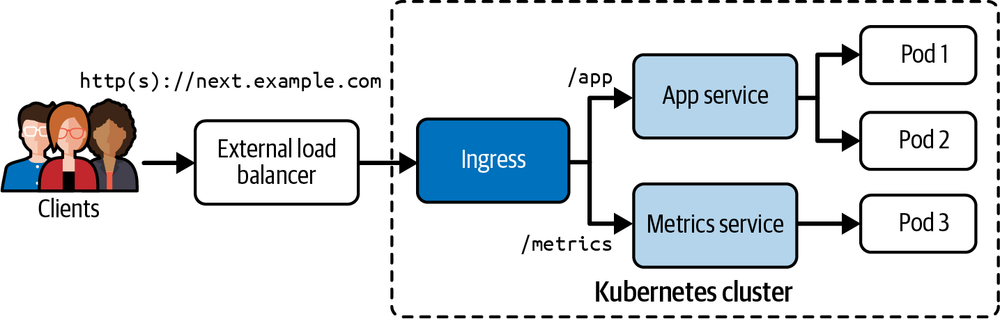

# Chương 18. Ingress

*Dịch từ: Chapter 18. Ingresses — Certified Kubernetes Administrator (CKA) Study Guide, 2nd Edition (O'Reilly).*

Chương 17 đã đi sâu vào mục đích và cách tạo primitive Service. Khi có nhu cầu đưa ứng dụng ra cho các bên sử dụng bên ngoài (expose), việc chọn đúng loại Service trở nên rất quan trọng. Lựa chọn thiết thực nhất thường là tạo một Service loại `LoadBalancer`. Service như vậy cung cấp khả năng cân bằng tải (load balancing) bằng cách gán một địa chỉ IP bên ngoài mà các bên sử dụng nằm ngoài cluster Kubernetes có thể truy cập được.

Tuy nhiên, việc dùng một Service `LoadBalancer` cho mỗi ứng dụng cần truy cập từ bên ngoài lại có những nhược điểm. Trong môi trường của nhà cung cấp đám mây (cloud provider), mỗi Service sẽ kích hoạt việc cấp phát một load balancer bên ngoài, dẫn đến chi phí tăng lên. Ngoài ra, việc quản lý một tập hợp các đối tượng Service `LoadBalancer` có thể gây ra khó khăn về mặt quản trị, vì phải tạo một đối tượng mới cho mỗi microservice cần truy cập từ bên ngoài.

Để giảm thiểu những vấn đề này, primitive Ingress xuất hiện, cung cấp một điểm vào duy nhất, có cân bằng tải, cho cả một ngăn xếp ứng dụng (application stack). Một Ingress có khả năng định tuyến các yêu cầu HTTP(S) từ bên ngoài đến một hoặc nhiều Service trong cluster dựa trên một hostname có thể phân giải qua DNS (tùy chọn) và đường dẫn ngữ cảnh URL (URL context path). Chương này sẽ hướng dẫn bạn cách tạo và truy cập một Ingress.

> **PHẠM VI BAO PHỦ MỤC TIÊU ĐỀ CƯƠNG**
>
> Chương này đề cập đến mục tiêu đề cương sau:
>
> - Biết cách sử dụng Ingress controller và tài nguyên Ingress

> **TRUY CẬP INGRESS TRONG MINIKUBE**
>
> Việc truy cập một Ingress trong minikube cần cách xử lý đặc biệt. Hãy tham khảo bài hướng dẫn của Kubernetes "Set up Ingress on Minikube with the NGINX Ingress Controller" để biết chi tiết.

## Làm việc với Ingress

Ingress expose các route HTTP (và tùy chọn cả HTTPS) cho các client bên ngoài cluster thông qua một URL có thể truy cập từ bên ngoài. Các quy tắc định tuyến (routing rule) được cấu hình trong Ingress quyết định *cách thức* lưu lượng được định tuyến. Các môi trường Kubernetes của nhà cung cấp đám mây thường sẽ triển khai một load balancer bên ngoài. Ingress nhận một địa chỉ IP công cộng từ load balancer đó. Bạn có thể cấu hình các quy tắc để định tuyến lưu lượng đến nhiều Service dựa trên các đường dẫn ngữ cảnh URL cụ thể, như minh họa trong Hình 18-1.



*Hình 18-1. Quản lý truy cập từ bên ngoài đến các Service qua HTTP(S)*

Kịch bản được mô tả trong Hình 18-1 khởi tạo một Ingress làm điểm vào duy nhất cho các lời gọi HTTP(S) đến tên miền *next.example.com*. Dựa trên ngữ cảnh URL được cung cấp, Ingress chuyển hướng lưu lượng đến một trong hai Service giả định: một Service dành cho ứng dụng nghiệp vụ và Service còn lại để lấy các metric liên quan đến ứng dụng.

Cụ thể, đường dẫn ngữ cảnh URL `/app` được định tuyến đến App Service, chịu trách nhiệm quản lý ứng dụng nghiệp vụ. Ngược lại, khi gửi yêu cầu đến ngữ cảnh URL `/metrics`, lời gọi sẽ được chuyển tiếp đến Metrics Service, vốn có khả năng trả về các metric liên quan.

### Cài đặt Ingress Controller

Để Ingress hoạt động, cần phải có một Ingress controller. Controller này đánh giá tập hợp các quy tắc được nêu trong một Ingress, từ đó quyết định việc định tuyến lưu lượng. Việc chọn Ingress controller thường phụ thuộc vào các trường hợp sử dụng, yêu cầu và sở thích cụ thể của người quản trị cluster Kubernetes. Các ví dụ đáng chú ý về Ingress controller cấp production bao gồm F5 NGINX Ingress Controller hoặc AKS Application Gateway Ingress Controller. Bạn có thể tìm hiểu thêm các lựa chọn khác trong tài liệu Kubernetes.

Với NGINX Ingress Controller mà chúng ta đang dùng, sau khi cài đặt bạn sẽ thấy ít nhất một Pod chạy Ingress controller. Output sau đây hiển thị Pod do NGINX Ingress controller tạo ra, nằm trong namespace `ingress-nginx`:

```shell
$ kubectl get pods -n ingress-nginx
NAME                                        READY   STATUS      RESTARTS
ingress-nginx-admission-create-qqhrp        0/1     Completed   0
ingress-nginx-admission-patch-56z26         0/1     Completed   1
ingress-nginx-controller-7c6974c4d8-2gg8c   1/1     Running     0
```

Khi Pod của Ingress controller chuyển sang trạng thái `Running`, bạn có thể yên tâm rằng các quy tắc do các đối tượng Ingress định nghĩa sẽ được đánh giá.

### Triển khai nhiều Ingress Controller

Chắc chắn rằng việc triển khai nhiều Ingress controller trong cùng một cluster là hoàn toàn khả thi, đặc biệt khi nhà cung cấp đám mây đã cấu hình sẵn một Ingress controller trong cluster Kubernetes. API Ingress đưa ra thuộc tính `spec.ingressClassName` để hỗ trợ việc chọn một triển khai controller cụ thể theo tên. Để xác định tất cả các Ingress class đã được cài đặt, bạn có thể dùng lệnh sau:

```shell
$ kubectl get ingressclasses
NAME    CONTROLLER             PARAMETERS   AGE
nginx   k8s.io/ingress-nginx   <none>       14m
```

Kubernetes xác định Ingress class mặc định bằng cách quét annotation `ingressclass.kubernetes.io/is-default-class: "true"` trong tất cả các đối tượng Ingress class. Trong trường hợp các đối tượng Ingress không chỉ định rõ Ingress class thông qua thuộc tính `spec.ingressClassName`, chúng sẽ tự động dùng Ingress class được đánh dấu là mặc định thông qua annotation này. Cơ chế này mang lại sự linh hoạt trong việc quản lý các Ingress class và cho phép có một hành vi mặc định khi không có class cụ thể nào được chỉ định trong từng đối tượng Ingress.

Mặc dù Kubernetes không ngăn cấm cấu hình này, nhưng khi nhiều Ingress class cùng được gán annotation `ingressclass.kubernetes.io/is-default-class: "true"`, điều đó sẽ tạo ra hành vi không rõ ràng. Các tài nguyên Ingress không có `ingressClassName` tường minh thường sẽ không tạo được, kèm theo lỗi xác thực (validation error) về việc tìm thấy nhiều giá trị mặc định, vì hệ thống không thể chọn một cách xác định controller nào sẽ xử lý chúng.

### Cấu hình quy tắc Ingress

Khi tạo một Ingress, bạn có thể linh hoạt định nghĩa một hoặc nhiều quy tắc. Mỗi quy tắc bao gồm phần đặc tả của một host (tùy chọn), một tập các đường dẫn ngữ cảnh URL, và backend chịu trách nhiệm định tuyến lưu lượng đi vào. Cấu trúc này cho phép kiểm soát chi tiết cách các yêu cầu HTTP(S) từ bên ngoài được chuyển hướng bên trong cluster Kubernetes, phục vụ các service khác nhau dựa trên các điều kiện được chỉ định. Bảng 18-1 mô tả ba quy tắc này.

**Bảng 18-1. Quy tắc Ingress**

| Loại | Ví dụ | Mô tả |
|---|---|---|
| Host (tùy chọn) | `next.example.com` | Nếu được cung cấp, các quy tắc sẽ áp dụng cho host đó. Nếu không định nghĩa host, mọi lưu lượng HTTP(S) đi vào đều được xử lý (ví dụ, nếu được gọi qua địa chỉ IP của Ingress). |
| Danh sách đường dẫn | `/app` | Lưu lượng đi vào phải khớp với host và đường dẫn thì mới được chuyển tiếp đúng đến Service. |
| Backend | `app-service:8080` | Sự kết hợp giữa tên Service và port. Ingress cho phép truy cập các Service nội bộ cluster được định nghĩa với loại `ClusterIP`. |

Một Ingress controller có thể tùy chọn định nghĩa một backend mặc định (default backend) được dùng làm route dự phòng trong trường hợp không có quy tắc Ingress nào đã cấu hình khớp. Bạn có thể tìm hiểu thêm trong tài liệu về primitive Ingress.

### Tạo Ingress

Bạn có thể tạo một Ingress bằng lệnh mệnh lệnh (imperative) `create ingress`. Tùy chọn dòng lệnh chính mà bạn cần cung cấp là `--rule`, dùng để định nghĩa các quy tắc theo dạng phân tách bằng dấu phẩy. Ký pháp cho mỗi cặp key-value là `<host>/<path>=<service>:<port>`. Hãy tạo một đối tượng Ingress với hai quy tắc:

```shell
$ kubectl create ingress next-app \
  --rule="next.example.com/app=app-service:8080" \
  --rule="next.example.com/metrics=metrics-service:9090"
ingress.networking.k8s.io/next-app created
```

Nếu xem output của lệnh `create ingress --help`, bạn sẽ thấy có thể chỉ định các quy tắc chi tiết hơn nữa.

> **HỖ TRỢ TLS TERMINATION**
>
> Port 80 cho lưu lượng HTTP được ngầm định, vì chúng ta không chỉ định tham chiếu đến một đối tượng Secret TLS. Nếu bạn chỉ định `tls=mysecret` trong định nghĩa quy tắc, thì port 443 cũng sẽ được liệt kê ở đây. Để biết thêm thông tin về việc bật lưu lượng HTTPS, xem tài liệu Kubernetes. Kỳ thi không bao gồm việc cấu hình TLS termination cho Ingress.

Sử dụng manifest YAML để định nghĩa Ingress thường trực quan hơn và được nhiều người ưa thích. Cách này đem lại một phương thức rõ ràng và có cấu trúc hơn để diễn đạt cấu hình mong muốn. Ví dụ 18-1 cho thấy một Ingress được định nghĩa dưới dạng manifest YAML.

**Ví dụ 18-1. Một Ingress được định nghĩa bằng manifest YAML**

```yaml
apiVersion: networking.k8s.io/v1
kind: Ingress
metadata:
  name: next-app
  annotations:
    nginx.ingress.kubernetes.io/rewrite-target: /$1    # ❶
spec:
  rules:
  - host: next.example.com                             # ❷
    http:
      paths:
      - backend:
          service:
            name: app-service
            port:
              number: 8080
        path: /app
        pathType: Exact
      - backend:                                       # ❸
          service:
            name: metrics-service
            port:
              number: 9090
        path: /metrics
        pathType: Exact
```

❶ Gán một annotation đặc thù của NGINX Ingress để ghi lại (rewrite) URL

❷ Định nghĩa quy tắc ánh xạ backend `app-service` đến URL *next.example.com/app*

❸ Định nghĩa quy tắc ánh xạ backend `metrics-service` đến URL *next.example.com/metrics*

Manifest YAML của Ingress có một điểm khác biệt lớn so với biểu diễn đối tượng thực (live object) được tạo bởi lệnh mệnh lệnh: việc gán một annotation của Ingress controller. Một số triển khai Ingress controller cung cấp các annotation để tùy chỉnh hành vi của chúng. Bạn có thể tìm thấy danh sách đầy đủ các annotation đi kèm NGINX Ingress controller trong tài liệu tương ứng.

### Định nghĩa loại đường dẫn

Manifest YAML ở trên minh họa một trong các tùy chọn để chỉ định loại đường dẫn (path type) thông qua thuộc tính `spec.rules[].http.paths[].pathType`. Loại đường dẫn xác định cách một yêu cầu đi vào được đánh giá so với đường dẫn đã khai báo. Bảng 18-2 cho thấy cách đánh giá các yêu cầu đi vào và đường dẫn của chúng. Xem tài liệu Kubernetes để có danh sách đầy đủ hơn.

**Bảng 18-2. Các loại đường dẫn của Ingress**

| Loại đường dẫn | Quy tắc | Yêu cầu đi vào |
|---|---|---|
| `Exact` | `/app` | Khớp `/app` nhưng không khớp `/app/test` hay `/app/` |
| `Prefix` | `/app` | Khớp `/app`, `/app/` và `/application` nhưng không khớp `/admin` |

Điểm khác biệt chính giữa loại đường dẫn `Exact` và `Prefix` nằm ở cách chúng xử lý dấu gạch chéo ở cuối (trailing slash). Loại đường dẫn `Prefix` chỉ tập trung vào phần tiền tố (prefix) được cung cấp của đường dẫn ngữ cảnh URL, cho phép nó chấp nhận các yêu cầu có URL chứa dấu gạch chéo ở cuối. Ngược lại, loại đường dẫn `Exact` nghiêm ngặt hơn, yêu cầu khớp chính xác đường dẫn ngữ cảnh URL đã chỉ định mà không xét đến dấu gạch chéo ở cuối.

### Liệt kê Ingress

Việc liệt kê các Ingress có thể thực hiện bằng lệnh `get ingress`. Bạn sẽ thấy một số thông tin đã chỉ định khi tạo Ingress (ví dụ, các host):

```shell
$ kubectl get ingress
NAME       CLASS   HOSTS              ADDRESS        PORTS   AGE
next-app   nginx   next.example.com   192.168.66.4   80      5m38s
```

Ingress đã tự động chọn Ingress class mặc định `nginx` do Ingress controller cấu hình. Bạn có thể tìm thấy thông tin đó ở cột `CLASS`. Giá trị được liệt kê ở cột `ADDRESS` là địa chỉ IP do load balancer bên ngoài cung cấp.

### Hiển thị chi tiết Ingress

Lệnh `describe ingress` là một công cụ hữu ích để lấy thông tin chi tiết về một tài nguyên Ingress. Nó trình bày các quy tắc dưới dạng bảng rõ ràng, giúp hiểu được cấu hình định tuyến. Ngoài ra, khi xử lý sự cố (troubleshooting), điều thiết yếu là phải chú ý đến mọi thông điệp hoặc sự kiện (event) bổ sung.

Trong output dưới đây, rõ ràng có thể có vấn đề với các Service tên `app-service` và `metrics-service` được ánh xạ trong các quy tắc Ingress. Sự không nhất quán giữa các Service được chỉ định và sự tồn tại thực tế của chúng có thể dẫn đến lỗi định tuyến:

```shell
$ kubectl describe ingress next-app
Name:             next-app
Labels:           <none>
Namespace:        default
Address:          192.168.66.4
Ingress Class:    nginx
Default backend:  <default>
Rules:
  Host              Path  Backends
  ----              ----  --------
  next.example.com
                    /app       app-service:8080 (<error: endpoints \
                    "app-service" not found>)
                    /metrics   metrics-service:9090 (<error: endpoints \
                    "metrics-service" not found>)
Annotations:        <none>
Events:
  Type    Reason  Age                   From                      ...
  ----    ------  ----                  ----                      ...
  Normal  Sync    6m45s (x2 over 7m3s)  nginx-ingress-controller  ...
```

Hơn nữa, việc quan sát nhật ký sự kiện (event log) hiển thị hoạt động đồng bộ của Ingress controller là rất quan trọng. Bất kỳ cảnh báo hay lỗi nào trong nhật ký này đều có thể cung cấp manh mối về các vấn đề tiềm ẩn trong quá trình đồng bộ.

Để khắc phục vấn đề, hãy đảm bảo rằng các Service được chỉ định trong quy tắc Ingress thực sự tồn tại và có thể truy cập được trong cluster Kubernetes. Ngoài ra, hãy xem lại nhật ký sự kiện để tìm bất kỳ thông điệp liên quan nào có thể chỉ ra nguyên nhân của sự không nhất quán.

Hãy giải quyết vấn đề không thể định tuyến đến các backend được cấu hình trong đối tượng Ingress. Các lệnh sau tạo các Pod và Service:

```shell
$ kubectl run app --image=k8s.gcr.io/echoserver:1.10 --port=8080 \
  -l app=app-service
pod/app created
$ kubectl run metrics --image=k8s.gcr.io/echoserver:1.10 --port=8080 \
  -l app=metrics-service
pod/metrics created
$ kubectl create service clusterip app-service --tcp=8080:8080
service/app-service created
$ kubectl create service clusterip metrics-service --tcp=9090:8080
service/metrics-service created
```

Việc kiểm tra đối tượng Ingress không còn hiển thị lỗi nào cho các quy tắc đã cấu hình. Nếu bây giờ bạn thấy được danh sách các backend có thể phân giải cùng với địa chỉ IP ảo và port của Pod tương ứng, thì đối tượng Ingress đã được cấu hình đúng, và các backend đã được nhận diện và có thể truy cập được:

```shell
$ kubectl describe ingress next-app
Name:             next-app
Labels:           <none>
Namespace:        default
Address:          192.168.66.4
Ingress Class:    nginx
Default backend:  <default>
Rules:
  Host              Path  Backends
  ----              ----  --------
  next.example.com
                    /app       app-service:8080 (10.244.0.6:8080)
                    /metrics   metrics-service:9090 (10.244.0.7:8080)
Annotations:        <none>
Events:
  Type    Reason  Age                From                      Message
  ----    ------  ----               ----                      -------
  Normal  Sync    13m (x2 over 13m)  nginx-ingress-controller  Scheduled fo
```

Nên quay lại xem chi tiết Ingress nếu bạn gặp bất kỳ vấn đề nào khi định tuyến lưu lượng qua một endpoint Ingress.

### Truy cập Ingress

Để cho phép định tuyến lưu lượng HTTP(S) đi vào thông qua Ingress rồi sau đó đến Service đã cấu hình, điều quan trọng là phải thiết lập một bản ghi DNS ánh xạ đến địa chỉ bên ngoài. Việc này thường bao gồm cấu hình một bản ghi Address (bản ghi A) hoặc bản ghi Canonical Name (CNAME). Dự án ExternalDNS là một công cụ hữu ích có thể hỗ trợ quản lý các bản ghi DNS này một cách tự động.

Để kiểm thử cục bộ trên cluster Kubernetes chạy trên máy của bạn, hãy làm theo các bước sau:

1. Tìm địa chỉ IP của load balancer mà Ingress sử dụng.
2. Thêm ánh xạ địa chỉ IP với hostname vào file */etc/hosts* của bạn.

Bằng cách thêm địa chỉ IP vào file */etc/hosts* cục bộ, bạn sẽ phân giải được tên miền ngay tại máy, cho phép kiểm thử hành vi của Ingress mà không cần dựa vào các bản ghi DNS bên ngoài:

```shell
$ kubectl get ingress next-app \
  --output=jsonpath="{.status.loadBalancer.ingress[0]['ip']}"
192.168.66.4
$ sudo vim /etc/hosts
...
192.168.66.4   next.example.com
```

Giờ bạn có thể gửi các yêu cầu HTTP đến backend. Lời gọi này khớp với quy tắc đường dẫn `Exact` và do đó trả về mã phản hồi HTTP 200 từ ứng dụng:

```shell
$ wget next.example.com/app --timeout=5 --tries=1
--2021-11-30 19:34:57--  http://next.example.com/app
Resolving next.example.com (next.example.com)... 192.168.66.4
Connecting to next.example.com (next.example.com)|192.168.66.4|:80... \
connected.
HTTP request sent, awaiting response... 200 OK
```

Lời gọi tiếp theo dùng một URL có dấu gạch chéo ở cuối. Quy tắc đường dẫn của Ingress không hỗ trợ trường hợp này, do đó lời gọi không đi qua được. Bạn sẽ nhận được mã phản hồi HTTP 404. Để lời gọi thứ hai hoạt động, bạn sẽ phải đổi quy tắc đường dẫn sang `Prefix`:

```shell
$ wget next.example.com/app/ --timeout=5 --tries=1
--2021-11-30 15:36:26--  http://next.example.com/app/
Resolving next.example.com (next.example.com)... 192.168.66.4
Connecting to next.example.com (next.example.com)|192.168.66.4|:80... \
connected.
HTTP request sent, awaiting response... 404 Not Found
2021-11-30 15:36:26 ERROR 404: Not Found.
```

Bạn có thể quan sát hành vi tương tự với Metrics Service được cấu hình với đường dẫn ngữ cảnh URL `metrics`. Hãy thoải mái thử nghiệm cả trường hợp đó.

## Tóm tắt

Loại tài nguyên Ingress định nghĩa các quy tắc để định tuyến lưu lượng HTTP(S) từ bên ngoài cluster đến một hoặc nhiều Service. Mỗi quy tắc định nghĩa một đường dẫn ngữ cảnh URL để nhắm đến một Service. Để Ingress hoạt động, trước tiên bạn cần cài đặt một Ingress controller. Ingress controller định kỳ đánh giá các quy tắc đó và đảm bảo chúng được áp dụng cho cluster. Để expose Ingress, nhà cung cấp đám mây thường dựng lên một load balancer bên ngoài, cấp một địa chỉ IP bên ngoài cho Ingress.

## Trọng tâm cho kỳ thi

**Biết sự khác biệt giữa Service và Ingress**

Không được nhầm lẫn Ingress với Service. Ingress dùng để định tuyến lưu lượng HTTP(S) từ bên ngoài cluster đến một hoặc nhiều Service dựa trên hostname (tùy chọn) và đường dẫn (bắt buộc). Service định tuyến lưu lượng đến một tập các Pod.

**Hiểu vai trò của Ingress controller**

Cần cài đặt Ingress controller trước khi Ingress có thể hoạt động đúng. Nếu không cài đặt Ingress controller, các quy tắc Ingress sẽ không có tác dụng. Bạn có thể chọn từ nhiều triển khai Ingress controller khác nhau, tất cả đều được ghi trên trang tài liệu Kubernetes. Hãy giả định rằng trong môi trường thi, Ingress controller đã được cài sẵn cho bạn.

**Thực hành định nghĩa quy tắc Ingress**

Bạn có thể định nghĩa một hoặc nhiều quy tắc trong một Ingress. Mỗi quy tắc bao gồm host (tùy chọn), đường dẫn ngữ cảnh URL, cùng tên DNS và port của Service. Hãy thử định nghĩa nhiều hơn một quy tắc và cách truy cập endpoint. Bạn sẽ không cần hiểu quy trình cấu hình TLS termination cho Ingress—khía cạnh này thuộc phạm vi của kỳ thi CKS.

## Bài tập mẫu

Lời giải cho các bài tập này có trong Phụ lục A.

1. Công ty của bạn có hai microservice chạy trong cùng một cluster Kubernetes: một ứng dụng frontend phục vụ trang web chính, và một service API backend xử lý các yêu cầu API. Cả hai service đều cần truy cập được từ bên ngoài cluster thông qua cùng một tên miền (*app.example.com*) nhưng với các đường dẫn URL khác nhau. Sử dụng F5 NGINX Ingress controller.

   Tạo một namespace tên là `webapp`. Triển khai hai ứng dụng: một ứng dụng frontend (dùng image `nginx:1.29.1-alpine`, tên: `frontend`, hai replica), và một ứng dụng API (dùng image `httpd:2.4.65-alpine`, tên: `api`, hai replica).

   Tạo Service `ClusterIP` cho cả hai Deployment: một Frontend Service ở port 80, một API Service ở port 80.

   Tạo một tài nguyên Ingress dùng host *app.example.com* và định tuyến các đường dẫn `/` và `/app` đến Frontend Service. Nó cũng định tuyến `/api` đến API Service. Dùng Ingress class `nginx`. Xác minh cấu hình Ingress đúng bằng cách thực hiện một lời gọi đến nó.

2. Nhóm của bạn muốn triển khai chiến lược blue-green deployment bằng Ingress. Bạn cần tạo một cấu hình Ingress có thể chuyển lưu lượng giữa hai phiên bản của một ứng dụng, với khả năng thực hiện kiểm thử canary trước khi chuyển đổi hoàn toàn. Nhóm quyết định dùng F5 NGINX Ingress controller. Bạn có thể tham khảo các annotation đặc thù của controller trong tài liệu.

   Tạo một namespace tên là `production-apps`. Triển khai hai phiên bản của một ứng dụng: phiên bản blue (hiện tại) tên `app-blue` với ba replica dùng container image `nginxdemos/hello:0.3-plain-text`, và phiên bản green (mới) tên `app-green` với ba replica dùng container image `nginxdemos/hello:0.4-plain-text`.

   Tạo hai tài nguyên Ingress trong namespace `production-apps`. Một Ingress chính định tuyến đến phiên bản blue, và một Ingress canary để kiểm thử phiên bản green (20% lưu lượng). Gán hostname `app.production.com`. Việc định tuyến lưu lượng sẽ như sau: Lưu lượng mặc định đi đến phiên bản blue. Hai mươi phần trăm lưu lượng đi đến phiên bản green (canary).

   Thêm một mục vào */etc/hosts* ánh xạ địa chỉ IP của load balancer đến host *app.production.com*. Xác minh việc truy cập các Ingress qua hostname này. Kiểm thử phân phối định tuyến lưu lượng blue-green.
