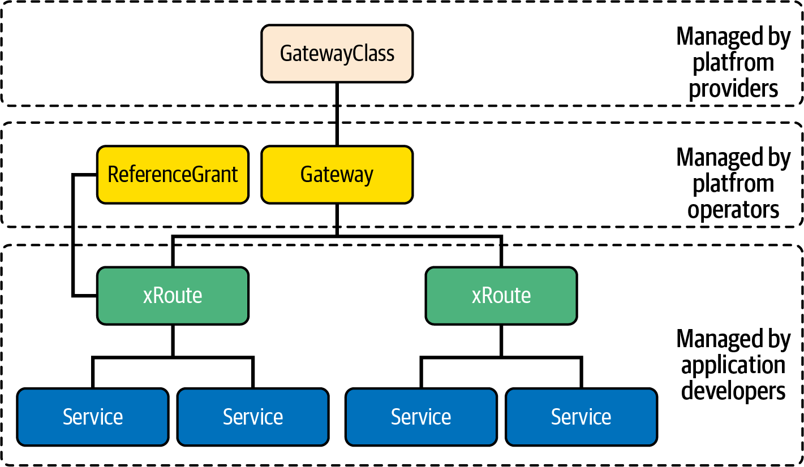
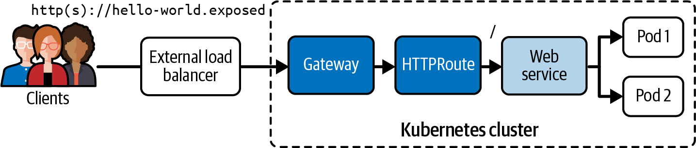

# Chương 19. Gateway API

*Dịch từ: Chapter 19. Gateway API — Certified Kubernetes Administrator (CKA) Study Guide, 2nd Edition (O'Reilly).*

Gateway API được giới thiệu nhằm chuẩn hóa và xây dựng dựa trên những bài học rút ra từ Ingress và các framework service mesh như Istio, Contour và Linkerd, vốn đã cho thấy nhu cầu về các khả năng quản lý lưu lượng (traffic) tinh vi hơn so với những gì Ingress có thể cung cấp. Là một giải pháp thay thế giàu tính biểu đạt hơn và dễ mở rộng hơn cho tài nguyên Ingress truyền thống, Gateway API mang đến thiết kế hướng vai trò (role-oriented), hỗ trợ nhiều giao thức ngoài HTTP/HTTPS, và các tính năng định tuyến lưu lượng nâng cao.

Gateway API là kế thừa của primitive Ingress và ngày càng trở nên quan trọng khi các tổ chức áp dụng cách tiếp cận hiện đại này để quản lý lưu lượng từ bên ngoài.

Với tư cách là thí sinh của kỳ thi, bạn sẽ cần hiểu cách triển khai Gateway API và khởi tạo các đối tượng liên quan để thiết lập truy cập Ingress vào cluster của mình.

> **PHẠM VI BAO PHỦ MỤC TIÊU ĐỀ CƯƠNG**
>
> Chương này đề cập đến mục tiêu đề cương (curriculum) sau:
>
> - Sử dụng Gateway API để quản lý lưu lượng Ingress

## Tại sao primitive Ingress chưa đủ?

Ingress API là cách tiêu chuẩn của Kubernetes để cấu hình cân bằng tải (load balancing) HTTP/HTTPS từ bên ngoài cho các Service, nhưng nó có những hạn chế. Mặc dù Ingress hỗ trợ kết thúc TLS (TLS termination) và định tuyến yêu cầu đơn giản dựa trên nội dung đối với lưu lượng HTTP, các trường hợp sử dụng trong thực tế đòi hỏi những tính năng nâng cao hơn. Việc mở rộng mô hình Ingress API hiện có của Ingress sẽ không cho phép bổ sung những tính năng đó một cách dễ dàng vì nhiều lý do:

**Khả năng mở rộng đặc thù theo từng Ingress controller**

Các tính năng nâng cao như chia tách lưu lượng (traffic splitting), giới hạn tốc độ (rate limiting) và thao tác trên request/response được cung cấp thông qua các annotation không khả chuyển (nonportable), dành riêng cho từng triển khai Ingress cụ thể.

**Mô hình phân quyền không đầy đủ**

Ingress API không thực sự phù hợp với các môi trường đa người thuê (multitenant) vốn đòi hỏi một mô hình phân quyền mạnh.

Trong chương này, tôi sẽ không thảo luận về tất cả các tùy chọn cấu hình và tính năng có thể có của Gateway API. Điều đó vượt quá phạm vi cần thiết cho kỳ thi. Tuy nhiên, tôi sẽ giải thích cách bạn có thể mô hình hóa lưu lượng HTTP ingress tương tự như những gì bạn đã học trong Chương 18. Hãy xem tài liệu Gateway API, trong đó giải thích cách hiện thực các trường hợp sử dụng khác.

## Làm việc với Gateway API

Gateway API là kế thừa chính thức của primitive Ingress, đại diện cho một tập bao trùm (superset) chức năng của Ingress, đồng thời cho phép các trường hợp sử dụng nâng cao hơn.

Bạn có thể xem Gateway API như một API thống nhất và được chuẩn hóa để quản lý lưu lượng đi vào và đi ra khỏi một cluster Kubernetes, thay vì phải lựa chọn giữa các triển khai Ingress riêng lẻ. Không còn cần đến các annotation đặc thù theo sản phẩm để cấu hình các tùy chọn định tuyến nữa. Gateway API cung cấp một cách linh hoạt để tích hợp những tính năng tương tự. Về bản chất, Gateway API là một đặc tả phổ quát được hỗ trợ bởi một loạt các triển khai khác nhau.

Thay vì xử lý một primitive duy nhất như Ingress, Gateway API tách trách nhiệm ra thành nhiều primitive, được giải thích trong mục tiếp theo.

### Các tài nguyên của Gateway API

Gateway API đưa ra cách tiếp cận phân lớp đối với việc quản lý lưu lượng thông qua bốn loại tài nguyên chính phối hợp với nhau để xử lý lưu lượng đến:

**Gateway**

Định nghĩa một thể hiện (instance) của hạ tầng xử lý lưu lượng, chẳng hạn như một cloud load balancer.

**GatewayClass**

Mỗi Gateway được liên kết với một GatewayClass, mô tả loại gateway controller thực tế sẽ xử lý lưu lượng cho Gateway đó.

**HTTPRoute/GRPCRoute**

Định nghĩa các quy tắc đặc thù cho HTTP hoặc GRPC để ánh xạ lưu lượng từ một listener của Gateway tới một biểu diễn của các endpoint mạng backend. Các endpoint này thường được biểu diễn dưới dạng một Service.

**ReferenceGrant**

Có thể được dùng để cho phép tham chiếu xuyên namespace bên trong Gateway API, ví dụ, các route có thể chuyển tiếp lưu lượng tới các backend ở namespace khác.

Việc quản lý các tài nguyên Gateway API này thuộc trách nhiệm của những vai trò (persona) khác nhau, như minh họa trong Hình 19-1.



*Hình 19-1. Các tài nguyên Gateway API được quản lý theo vai trò*

GatewayClass được cung cấp bởi các nhà cung cấp nền tảng, ví dụ như nhà cung cấp cloud. Gateway và ReferenceGrant được cài đặt bởi quản trị viên cluster Kubernetes. Cuối cùng, HTTPRoute và GRPCRoute được tạo bởi các nhà phát triển ứng dụng.

Trường hợp sử dụng nổi bật của Gateway API mà tôi muốn trình bày trong chương này là cách định tuyến lưu lượng HTTP ingress tới nhiều Service dựa trên URL ngữ cảnh (context URL). Hình 19-2 minh họa trường hợp sử dụng này.



*Hình 19-2. Định tuyến lưu lượng HTTP bằng Gateway API*

Trước khi có thể thực sự tạo các đối tượng trong hình minh họa, chúng ta sẽ cần cho cluster Kubernetes biết về các CRD của Gateway API.

### Cài đặt các CRD của Gateway API

Tại thời điểm viết sách, các tài nguyên Gateway API chưa được đi kèm trong bộ tài nguyên API tiêu chuẩn của Kubernetes. Bạn sẽ phải cài đặt Gateway API dưới dạng các Custom Resource Definition. Lệnh sau cài đặt phiên bản 1.3.0 của các CRD:

```shell
$ kubectl apply -f https://github.com/kubernetes-sigs/gateway-api/releases/download/v1.3.0/standard-install.yaml
customresourcedefinition.apiextensions.k8s.io/\
gatewayclasses.gateway.networking.k8s.io created
customresourcedefinition.apiextensions.k8s.io/\
gateways.gateway.networking.k8s.io created
customresourcedefinition.apiextensions.k8s.io/\
grpcroutes.gateway.networking.k8s.io created
customresourcedefinition.apiextensions.k8s.io/\
httproutes.gateway.networking.k8s.io created
customresourcedefinition.apiextensions.k8s.io/\
referencegrants.gateway.networking.k8s.io created
```

Giờ bạn có thể liệt kê các CRD bằng cách tìm theo API group được các tài nguyên Gateway API sử dụng:

```shell
$ kubectl get crds | grep gateway.networking.k8s.io
gatewayclasses.gateway.networking.k8s.io    2025-08-07T18:14:16Z
gateways.gateway.networking.k8s.io          2025-08-07T18:14:16Z
grpcroutes.gateway.networking.k8s.io        2025-08-07T18:14:16Z
httproutes.gateway.networking.k8s.io        2025-08-07T18:14:16Z
referencegrants.gateway.networking.k8s.io   2025-08-07T18:14:17Z
```

Hãy xem kho lưu trữ GitHub chính thức để biết thêm thông tin về Gateway API.

### Triển khai một Gateway controller

Gateway API cần một triển khai controller (controller implementation) để hoạt động. Các controller khác nhau cung cấp những tính năng và đặc tính hiệu năng khác nhau. Trong ví dụ này, chúng ta sẽ dùng triển khai Envoy Gateway được cài đặt bằng Helm:

```shell
$ helm install eg oci://docker.io/envoyproxy/gateway-helm --version v1.4.2 -n envoy-gateway-system --create-namespace
```

Bạn nên đợi cho đến khi triển khai Gateway hoạt động đầy đủ:

```shell
$ kubectl wait --timeout=5m -n envoy-gateway-system deployment/envoy-gateway --for=condition=Available
deployment.apps/envoy-gateway condition met
```

Với các điều kiện tiên quyết đã sẵn sàng, chúng ta sẽ thiết lập mọi thứ cần thiết để dùng Gateway API định tuyến lưu lượng HTTP Ingress tới một Service backend.

### Tạo GatewayClass

Tùy vào môi trường Kubernetes bạn đang vận hành, bạn có thể phải hoặc không phải tạo một GatewayClass. Các cluster Kubernetes của nhà cung cấp cloud hẳn đã có sẵn một GatewayClass.

Trong trường hợp bạn muốn tạo GatewayClass của riêng mình, trước tiên bạn sẽ phải xác định tên của Gateway controller. Tên controller phụ thuộc vào triển khai controller đã được cài đặt. Bạn thường có thể tra cứu tên controller trong tài liệu của nó.

Tên controller cho Envoy là `gateway.envoyproxy.io/gatewayclass-controller`. Hãy tạo file `gateway-class.yaml` với nội dung như trong Ví dụ 19-1.

**Ví dụ 19-1. Một GatewayClass sử dụng controller GatewayClass của Envoy**

```yaml
apiVersion: gateway.networking.k8s.io/v1
kind: GatewayClass
metadata:
  name: envoy
spec:
  controllerName: gateway.envoyproxy.io/gatewayclass-controller   # ❶
```

❶ Tham chiếu tới controller đã được cài đặt bởi Helm chart

Chạy lệnh sau để tạo đối tượng GatewayClass:

```shell
$ kubectl apply -f gateway-class.yaml
gatewayclass.gateway.networking.k8s.io/envoy created
```

Để liệt kê các đối tượng GatewayClass, chạy lệnh sau:

```shell
$ kubectl get gatewayclasses
NAME    CONTROLLER                                      ACCEPTED   AGE
envoy   gateway.envoyproxy.io/gatewayclass-controller   True       31s
```

Bạn sẽ thấy đối tượng chúng ta đã tạo trước đó, và có thể cả các đối tượng GatewayClass khác đi kèm với môi trường Kubernetes.

### Tạo Gateway

Sau khi GatewayClass đã được khởi tạo, hãy tạo một tài nguyên Gateway để xử lý lưu lượng đến. Tạo một file manifest YAML có tên `gateway.yaml` và điền nội dung như trong Ví dụ 19-2.

**Ví dụ 19-2. Một Gateway mở một listener HTTP**

```yaml
apiVersion: gateway.networking.k8s.io/v1
kind: Gateway
metadata:
  name: hello-world-gateway
spec:
  gatewayClassName: envoy    # ❶
  listeners:
    - name: http
      protocol: HTTP         # ❷
      port: 80               # ❷
```

❶ Tham chiếu tới GatewayClass theo tên

❷ Listener chấp nhận lưu lượng HTTP trên port 80

Chạy lệnh sau để tạo đối tượng Gateway:

```shell
$ kubectl apply -f gateway.yaml
gateway.gateway.networking.k8s.io/hello-world-gateway created
```

Bạn liệt kê đối tượng Gateway bằng lệnh sau:

```shell
$ kubectl get gateways
NAME                  CLASS   ADDRESS   PROGRAMMED   AGE
hello-world-gateway   envoy             False        16s
```

Chỉ còn một đối tượng nữa cần thiết lập để hoàn tất việc định tuyến lưu lượng HTTP: đối tượng HTTPRoute.

### Tạo HTTPRoute

Lưu định nghĩa của HTTPRoute trong file manifest YAML có tên `httproute.yaml`, như trong Ví dụ 19-3. Để ngắn gọn, chương này sẽ không trình bày cách tạo các Service backend. Vui lòng tham khảo Chương 17 để biết thêm thông tin.

**Ví dụ 19-3. Một HTTPRoute định tuyến lưu lượng tới một Service backend**

```yaml
apiVersion: gateway.networking.k8s.io/v1
kind: HTTPRoute
metadata:
  name: hello-world-httproute
spec:
  parentRefs:
    - name: hello-world-gateway
  hostnames:
    - "hello-world.exposed"     # ❶
  rules:
    - backendRefs:
        - group: ""             # ❷
          kind: Service         # ❷
          name: web             # ❷
          port: 3000            # ❷
          weight: 1             # ❸
      matches:
        - path:
            type: PathPrefix    # ❹
            value: /            # ❹
```

❶ Hostname mà việc định tuyến lưu lượng sẽ được áp dụng

❷ Service backend mà lưu lượng sẽ được định tuyến tới

❸ Xác định tỷ lệ lưu lượng sẽ được gửi tới Service cụ thể đó

❹ Các quy tắc định tuyến dựa trên URL ngữ cảnh được yêu cầu

Chạy lệnh sau để tạo đối tượng HTTPRoute:

```shell
$ kubectl apply -f httproute.yaml
httproute.gateway.networking.k8s.io/hello-world-httproute created
```

Bạn có thể liệt kê tất cả các đối tượng HTTPRoute bằng lệnh sau:

```shell
$ kubectl get httproutes
NAME                    HOSTNAMES                 AGE
hello-world-httproute   ["hello-world.exposed"]   64s
```

### Truy cập Gateway

Việc truy cập Gateway khác nhau tùy vào cluster Kubernetes bạn đang sử dụng. Hãy làm theo hướng dẫn trong mục này dựa trên cách thiết lập cluster Kubernetes của bạn, và giả định rằng bạn không có hỗ trợ external load balancer.

Lấy tên của Envoy Service được tạo bởi Gateway trong ví dụ, và gán nó cho biến môi trường `ENVOY_SERVICE`:

```shell
$ export ENVOY_SERVICE=$(kubectl get svc -n envoy-gateway-system \
--selector=gateway.envoyproxy.io/owning-gateway-namespace=default,\
gateway.envoyproxy.io/owning-gateway-name=hello-world-gateway \
-o jsonpath='{.items[0].metadata.name}')
```

Port forward tới Envoy Service:

```shell
$ kubectl -n envoy-gateway-system port-forward service/${ENVOY_SERVICE} 8889:80 &
[2] 93490
Forwarding from 127.0.0.1:8889 -> 10080
Forwarding from [::1]:8889 -> 10080
```

Với mục tương ứng trong `/etc/hosts`, bạn sẽ có thể thực hiện một lời gọi tới Gateway:

```shell
$ curl hello-world.exposed:8889
Handling connection for 8889
Hello World
```

Trong ví dụ này, backend phản hồi với thông điệp "Hello World." Một phản hồi thành công có thể trông khác đi tùy vào chi tiết hiện thực của ứng dụng của bạn.

## Chuyển đổi từ Ingress sang Gateway API

Gateway API đại diện cho bước tiến hóa tiếp theo của việc quản lý lưu lượng trong Kubernetes, được thiết kế để cuối cùng thay thế tài nguyên Ingress truyền thống.

Quá trình chuyển đổi (migration) thường bao gồm việc thay thế các tài nguyên Ingress bằng tổ hợp Gateway và HTTPRoute. Một tài nguyên Gateway duy nhất có thể xử lý nhiều ứng dụng thông qua các tài nguyên Route khác nhau, tương tự như cách một Ingress Controller hoạt động nhưng với sự phân tách trách nhiệm rõ ràng hơn.

Gateway API đã đạt trạng thái ổn định (stable) cho các tính năng cốt lõi vào cuối năm 2023. Mặc dù Ingress vẫn được hỗ trợ và sử dụng rộng rãi, các ingress controller lớn như NGINX, Istio và Envoy Gateway hiện đã cung cấp các triển khai Gateway API. Các tổ chức nên đánh giá việc chuyển đổi dựa trên nhu cầu của họ về các tính năng quản lý lưu lượng nâng cao và các yêu cầu về độ phức tạp vận hành.

Hầu hết các cuộc chuyển đổi đều theo cách tiếp cận theo từng giai đoạn: triển khai Gateway API song song với Ingress hiện có, dần dần chuyển đổi các ứng dụng, và cuối cùng loại bỏ (deprecate) các tài nguyên Ingress. Nhiều controller hỗ trợ đồng thời cả hai API, cho phép chuyển đổi suôn sẻ mà không làm gián đoạn dịch vụ.

Công cụ chuyển đổi chính thức có tên ingress2gateway tự động dịch các tài nguyên Ingress sang các tài nguyên Gateway API tương đương. Nó xử lý các chuyển đổi cơ bản và cung cấp nền tảng cho những cuộc chuyển đổi phức tạp hơn. Tôi chỉ nhắc đến công cụ này cho đầy đủ mà thôi. Bạn không cần phải hiểu hay sử dụng nó trong kỳ thi.

## Tóm tắt

Gateway API đại diện cho tương lai của việc quản lý ingress trong Kubernetes, mang đến những tính năng mạnh mẽ trong khi vẫn duy trì sự rõ ràng nhờ thiết kế hướng vai trò. Khi ngày càng nhiều tổ chức áp dụng tiêu chuẩn này, việc thành thạo Gateway API trở thành một kỹ năng thiết yếu đối với các quản trị viên Kubernetes.

## Trọng tâm cho kỳ thi

**Kiểm tra các GatewayClass hiện có**

Hãy nhớ rằng môi trường thi có thể đã cài sẵn các Gateway controller, vì vậy hãy luôn kiểm tra các GatewayClass khả dụng trước khi tạo tài nguyên.

**Hiểu các CRD của Gateway API**

Thực hành tạo các cấu hình Gateway khác nhau, thử nghiệm với nhiều mẫu HTTPRoute khác nhau, và hiểu cách các thành phần phối hợp với nhau để xây dựng một nền tảng vững chắc cho việc quản lý lưu lượng production.

## Bài tập mẫu

Lời giải cho các bài tập này có trong Phụ lục A.

1. Bạn được giao nhiệm vụ thiết lập quản lý lưu lượng ingress cho một ứng dụng mới bằng Gateway API. Ứng dụng gồm hai service cần được truy cập từ bên ngoài cluster. Hãy dùng triển khai controller NGINX Gateway Fabric.

   Tạo một Deployment có tên `web-app` với hai replica sử dụng image `nginx:1.21` trong namespace `default`. Tạo một Deployment có tên `api-app` với hai replica sử dụng image `httpd:2.4` trong namespace default. Expose cả hai Deployment dưới dạng Service `ClusterIP` trên port 80. Bạn có thể rút ngắn việc thiết lập bằng cách apply file YAML `setup.yaml` trong thư mục `app-a/ch19/basic-gateway` của kho GitHub `bmuschko/cka-study-guide` đã checkout.

   Tạo một Gateway có tên `main-gateway` trong namespace `default`. Cấu hình nó lắng nghe trên port 80 cho lưu lượng HTTP. Dùng hostname `example.local`. Tạo một HTTPRoute có tên `app-routes` định tuyến lưu lượng có path `/web` tới Service `web-app`. Nó cũng định tuyến lưu lượng có path `/api` tới Service `api-app`. Định nghĩa khớp theo tiền tố path (path prefix matching).

   Kiểm tra rằng Gateway đã sẵn sàng và đã được gán IP/hostname. Xác minh rằng HTTPRoute đã được chấp nhận và gắn với Gateway, sau đó kiểm tra kết nối tới Gateway.

2. Tổ chức của bạn cần thiết lập một cấu hình Gateway sẵn sàng cho production để xử lý lưu lượng HTTP cho các ứng dụng trên nhiều namespace. Hãy dùng triển khai controller NGINX Gateway Fabric.

   Tạo hai namespace có tên `production` và `staging`. Trong namespace `production`, tạo một Deployment có tên `prod-web` với ba replica sử dụng image `nginx:1.22`. Tạo một Service ClusterIP expose port 80, định tuyến lưu lượng tới các replica của `prod-web`. Trong namespace `staging`, tạo một Deployment có tên `staging-web` với hai replica sử dụng image `nginx:1.21`. Tạo một Service `ClusterIP` expose port 80, định tuyến lưu lượng tới các replica của `staging-web`. Bạn có thể rút ngắn việc thiết lập bằng cách apply file YAML `setup.yaml` trong thư mục `app-a/ch19/cross-namespace-gateway` của kho GitHub `bmuschko/cka-study-guide` đã checkout.

   Tạo một Gateway có tên `gateway` trong namespace `production`. Cấu hình một listener HTTP trên port 80. Dùng hostname `example.com`.

   Tạo một HTTPRoute có tên `prod-route` trong namespace `production`. Đối tượng này phải định tuyến lưu lượng có path `/app` tới Service `prod-web`, dùng khớp path chính xác (exact path matching), và gắn với `gateway`.

   Tạo một HTTPRoute khác có tên `staging-route` trong namespace `staging`. Đối tượng này phải định tuyến lưu lượng có path `/staging` tới Service `staging-web`, dùng khớp theo tiền tố path, và gắn với `gateway` trong namespace `production`. Cấu hình chính sách tham chiếu xuyên namespace phù hợp. Thêm các request header để nhận diện môi trường (production hay staging).

   Xác minh việc định tuyến HTTP đúng. Route production chỉ nên phản hồi với path chính xác `/app`. Route staging nên phản hồi với `/staging`. Cả hai route đều phải phục vụ thành công trang chào mừng của NGINX.
