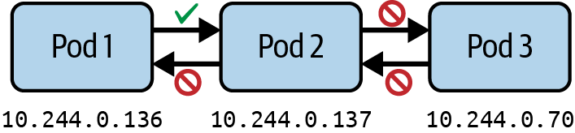
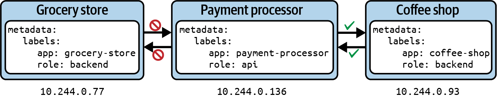

# Chương 20. Network Policy

*Dịch từ: Chapter 20. Network Policies — Certified Kubernetes Administrator (CKA) Study Guide, 2nd Edition (O'Reilly).*

Tính duy nhất của địa chỉ IP được gán cho một Pod được duy trì trên toàn bộ các node và namespace. Điều này đạt được bằng cách cấp phát một subnet riêng cho mỗi node đã đăng ký ngay trong quá trình tạo node. Plugin Container Network Interface (CNI) đảm nhiệm việc cấp phát (lease) địa chỉ IP từ subnet đã được gán khi một Pod mới được tạo trên node. Nhờ vậy, các Pod trên một node có thể giao tiếp thông suốt với tất cả các Pod khác đang chạy trên bất kỳ node nào trong cluster.

Theo mặc định, Kubernetes cho phép giao tiếp Pod-với-Pod không hạn chế trên mọi namespace, điều này gây ra rủi ro bảo mật đáng kể, vì một Pod bị xâm nhập ở namespace này có thể truy cập vào các dịch vụ nhạy cảm ở namespace khác.

Network policy trong Kubernetes hoạt động tương tự như các quy tắc tường lửa (firewall rule), được thiết kế riêng để quản lý giao tiếp Pod-với-Pod. Các policy này bao gồm các quy tắc chỉ định hướng của lưu lượng mạng (ingress và/hoặc egress) cho một hoặc nhiều Pod trong một namespace hoặc xuyên qua các namespace khác nhau. Ngoài ra, các quy tắc này còn định nghĩa các port đích dùng cho giao tiếp. Khả năng kiểm soát chi tiết này giúp tăng cường bảo mật và quản lý luồng lưu lượng bên trong cluster Kubernetes.

> **PHẠM VI BAO PHỦ MỤC TIÊU ĐỀ CƯƠNG**
>
> Chương này đề cập đến mục tiêu đề cương sau:
>
> - Định nghĩa và thực thi Network Policy

## Làm việc với Network Policy

Bên trong một cluster Kubernetes, bất kỳ Pod nào cũng có thể giao tiếp với bất kỳ Pod nào khác mà không bị hạn chế, thông qua địa chỉ IP hoặc tên DNS của nó, kể cả xuyên namespace. Giao tiếp liên Pod không hạn chế không chỉ gây ra rủi ro bảo mật tiềm ẩn mà còn khiến việc hình dung mô hình giao tiếp trong kiến trúc của bạn trở nên khó khăn hơn. Một network policy định nghĩa các quy tắc kiểm soát lưu lượng đi từ và đến một Pod, như minh họa trong Hình 20-1.



*Hình 20-1. Network policy định nghĩa lưu lượng từ và đến một Pod*

Ví dụ, không có lý do chính đáng nào để cho phép một ứng dụng backend chạy trong một Pod giao tiếp trực tiếp với ứng dụng frontend chạy trong một Pod khác. Giao tiếp nên được định hướng từ Pod frontend tới Pod backend.

### Cài đặt Network Policy Controller

Một network policy không thể hoạt động nếu không có network policy controller. Network policy controller đánh giá tập hợp các quy tắc được định nghĩa bởi một network policy. Bạn có thể tìm thấy hướng dẫn cho nhiều loại network policy controller khác nhau trong tài liệu Kubernetes. Một số CNI như flannel không bao gồm network policy controller mà chỉ tập trung vào việc cung cấp kết nối Pod-với-Pod cơ bản, nghĩa là các tài nguyên NetworkPolicy sẽ được API chấp nhận nhưng hoàn toàn không được thực thi.

Cilium là một CNI có triển khai network policy controller. Bạn có thể cài đặt Cilium trên các cluster Kubernetes của nhà cung cấp cloud lẫn on-prem. Hãy tham khảo hướng dẫn cài đặt để biết thông tin chi tiết. Sau khi cài đặt xong, bạn sẽ thấy ít nhất hai Pod chạy Cilium và Cilium Operator trong namespace `kube-system`:

```shell
$ kubectl get pods -n kube-system
NAME                                READY   STATUS    RESTARTS   AGE
cilium-k5td6                        1/1     Running   0          110s
cilium-operator-f5dcdcc8d-njfbk     1/1     Running   0          110s
```

Giờ đây bạn có thể yên tâm rằng các quy tắc được định nghĩa bởi các đối tượng network policy sẽ được đánh giá. Ngoài ra, bạn có thể dùng công cụ dòng lệnh của Cilium để xác nhận việc cài đặt đã đúng.

### Tạo Network Policy

Việc chọn theo label đóng vai trò then chốt trong việc xác định network policy áp dụng cho những Pod nào. Chúng ta đã thấy khái niệm này được vận dụng trong các ngữ cảnh khác (ví dụ: Deployment và Service). Hơn nữa, một network policy định nghĩa hướng của lưu lượng được phép hoặc không được phép. Trong ngữ cảnh network policy, lưu lượng đi vào được gọi là *ingress*, còn lưu lượng đi ra được gọi là *egress*. Với ingress và egress, bạn có thể đưa vào danh sách cho phép (allowlist) các nguồn lưu lượng như Pod, địa chỉ IP hoặc port.

> **NETWORK POLICY KHÔNG ÁP DỤNG CHO SERVICE**
>
> Trong hầu hết các trường hợp, bạn sẽ thiết lập các đối tượng Service để dẫn lưu lượng mạng tới các Pod dựa trên việc chọn label và port. Network policy hoàn toàn không liên quan đến Service. Mọi quy tắc đều gắn với namespace và Pod cụ thể.

Cách tốt nhất để giải thích việc tạo network policy là thông qua ví dụ. Giả sử bạn đang chạy một Pod cung cấp API cho các bên tiêu thụ khác, ví dụ một Pod xử lý thanh toán cho các ứng dụng khác. Công ty bạn đang làm việc đang di chuyển các ứng dụng từ một bộ xử lý thanh toán cũ sang bộ xử lý mới. Do đó, bạn sẽ muốn chỉ cho phép truy cập từ những ứng dụng có khả năng giao tiếp đúng cách với nó. Hiện tại, bạn có hai bên tiêu thụ—một cửa hàng tạp hóa và một quán cà phê—mỗi bên chạy ứng dụng của mình trong một Pod riêng. Quán cà phê đã sẵn sàng tiêu thụ API của bộ xử lý thanh toán, nhưng cửa hàng tạp hóa thì chưa. Hình 20-2 cho thấy các Pod và các label được gán cho chúng.



*Hình 20-2. Giới hạn lưu lượng đến và đi từ một Pod*

Trước khi tạo network policy, chúng ta sẽ dựng các Pod để thể hiện kịch bản này:

```shell
$ kubectl run grocery-store --image=nginx:1.25.3-alpine \
  -l app=grocery-store,role=backend --port 80
pod/grocery-store created
$ kubectl run payment-processor --image=nginx:1.25.3-alpine \
  -l app=payment-processor,role=api --port 80
pod/payment-processor created
$ kubectl run coffee-shop --image=nginx:1.25.3-alpine \
  -l app=coffee-shop,role=backend --port 80
```

Với hành vi mặc định của Kubernetes là cho phép giao tiếp Pod-với-Pod không hạn chế, ba Pod này sẽ có thể giao tiếp với nhau. Các lệnh sau đây xác minh hành vi đó. Pod cửa hàng tạp hóa và Pod quán cà phê thực hiện một lệnh gọi `wget` tới địa chỉ IP của Pod bộ xử lý thanh toán:

```shell
$ kubectl get pod payment-processor --template '{{.status.podIP}}'
10.244.0.136
$ kubectl exec grocery-store -it -- wget --spider --timeout=1 10.244.0.136
Connecting to 10.244.0.136 (10.244.0.136:80)
remote file exists
$ kubectl exec coffee-shop -it -- wget --spider --timeout=1 10.244.0.136
Connecting to 10.244.0.136 (10.244.0.136:80)
remote file exists
```

Bạn không thể tạo network policy mới bằng lệnh mệnh lệnh (imperative) `create`. Thay vào đó, bạn sẽ phải dùng cách tiếp cận khai báo (declarative). Manifest YAML trong Ví dụ 20-1, được lưu trong file `networkpolicy-api-allow.yaml`, thể hiện một network policy cho kịch bản đã mô tả ở trên.

**Ví dụ 20-1. Khai báo NetworkPolicy bằng YAML**

```yaml
apiVersion: networking.k8s.io/v1
kind: NetworkPolicy
metadata:
  name: api-allow
spec:
  podSelector:                  # ❶
    matchLabels:
      app: payment-processor
      role: api
  ingress:                      # ❷
  - from:
    - podSelector:
        matchLabels:
          app: coffee-shop
```

❶ Chọn Pod mà policy sẽ áp dụng bằng cách chọn theo label

❷ Cho phép lưu lượng đi vào từ Pod có label khớp trong cùng namespace

Một network policy định nghĩa một vài thuộc tính quan trọng, cùng nhau tạo thành tập quy tắc của nó. Bảng 20-1 liệt kê các thuộc tính ở cấp `spec`.

**Bảng 20-1. Các thuộc tính cấp spec của một network policy**

| Thuộc tính | Mô tả |
|---|---|
| `podSelector` | Chọn các Pod trong namespace để áp dụng network policy. |
| `policyTypes` | Định nghĩa loại lưu lượng (tức là ingress và/hoặc egress) mà network policy áp dụng. |
| `ingress` | Liệt kê các quy tắc cho lưu lượng đi vào. Mỗi quy tắc có thể định nghĩa các phần `from` và `ports`. |
| `egress` | Liệt kê các quy tắc cho lưu lượng đi ra. Mỗi quy tắc có thể định nghĩa các phần `to` và `ports`. |

Bạn có thể chỉ định các quy tắc ingress và egress một cách độc lập bằng `spec.ingress.from[]` và `spec.egress.to[]`. Mỗi quy tắc bao gồm một Pod selector, một namespace selector tùy chọn, hoặc kết hợp cả hai. Bảng 20-2 liệt kê các thuộc tính liên quan cho các selector `to` và `from`.

**Bảng 20-2. Các thuộc tính của selector `to` và `from` trong network policy**

| Thuộc tính | Mô tả |
|---|---|
| `podSelector` | Chọn các Pod theo label trong cùng namespace với network policy, được phép làm nguồn ingress hoặc đích egress |
| `namespaceSelector` | Chọn các namespace theo label mà tất cả Pod trong đó được phép làm nguồn ingress hoặc đích egress |
| `namespaceSelector` và `podSelector` | Chọn các Pod theo label bên trong các namespace được chọn theo label |

Hãy xem hiệu quả của network policy trong thực tế. Tạo đối tượng network policy từ manifest:

```shell
$ kubectl apply -f networkpolicy-api-allow.yaml
networkpolicy.networking.k8s.io/api-allow created
```

Network policy ngăn việc gọi tới bộ xử lý thanh toán từ Pod cửa hàng tạp hóa. Việc truy cập bộ xử lý thanh toán từ Pod quán cà phê hoạt động hoàn hảo, vì Pod selector của network policy khớp với label được gán cho Pod là `app=coffee-shop`:

```shell
$ kubectl exec grocery-store -it -- wget --spider --timeout=1 10.244.0.136
Connecting to 10.244.0.136 (10.244.0.136:80)
wget: download timed out
command terminated with exit code 1
$ kubectl exec coffee-shop -it -- wget --spider --timeout=1 10.244.0.136
Connecting to 10.244.0.136 (10.244.0.136:80)
remote file exists
```

Với tư cách quản trị viên, bạn có thể phải làm việc với các network policy đã được các thành viên khác trong nhóm hoặc các quản trị viên khác thiết lập sẵn. Bạn cần biết các lệnh `kubectl` để liệt kê và kiểm tra các đối tượng network policy nhằm hiểu tác động của chúng lên lưu lượng mạng có hướng giữa các microservice.

### Liệt kê Network Policy

Việc liệt kê network policy hoạt động giống như với bất kỳ primitive Kubernetes nào khác. Dùng lệnh `get` kết hợp với loại tài nguyên `networkpolicy`, hoặc dạng viết tắt của nó là `netpol`. Với network policy ở trên, bạn sẽ thấy một bảng hiển thị tên và Pod selector:

```shell
$ kubectl get networkpolicy api-allow
NAME        POD-SELECTOR                     AGE
api-allow   app=payment-processor,role=api   83m
```

Đáng tiếc là output của lệnh không cung cấp nhiều thông tin về các quy tắc ingress và egress. Để lấy thêm thông tin, bạn phải đào sâu vào phần chi tiết.

### Hiển thị chi tiết Network Policy

Bạn có thể kiểm tra chi tiết của một network policy bằng lệnh `describe`. Output hiển thị tất cả thông tin quan trọng: Pod selector, cùng các quy tắc ingress và egress:

```shell
$ kubectl describe networkpolicy api-allow
Name:         api-allow
Namespace:    default
Created on:   2024-01-10 09:06:59 -0700 MST
Labels:       <none>
Annotations:  <none>
Spec:
  PodSelector:     app=payment-processor,role=api
  Allowing ingress traffic:
    To Port: <any> (traffic allowed to all ports)
    From:
      PodSelector: app=coffee-shop
  Not affecting egress traffic
  Policy Types: Ingress
```

Chi tiết của network policy không vẽ ra một bức tranh rõ ràng về những Pod đã được chọn dựa trên các quy tắc của nó. Bạn có thể tạo các Pod khớp và không khớp với quy tắc để xác minh hành vi mong muốn của network policy.

> **TRỰC QUAN HÓA NETWORK POLICY**
>
> Định nghĩa đúng các quy tắc của network policy có thể là một thách thức. Trang networkpolicy.io cung cấp một trình soạn thảo trực quan cho network policy, hiển thị biểu diễn đồ họa ngay trên trình duyệt.

Như đã giải thích ở trên, mọi Pod đều có thể giao tiếp với các Pod khác chạy trên bất kỳ node nào của cluster, điều này làm lộ ra một rủi ro bảo mật tiềm ẩn. Về lý thuyết, kẻ tấn công có được quyền truy cập vào một Pod có thể cố gắng xâm nhập một Pod khác bằng cách giao tiếp với nó qua địa chỉ IP ảo.

### Áp dụng Network Policy mặc định

Nguyên tắc đặc quyền tối thiểu (principle of least privilege) là một khái niệm bảo mật nền tảng, và rất được khuyến nghị khi nói đến việc hạn chế lưu lượng mạng Pod-với-Pod trong Kubernetes. Ý tưởng là ban đầu cấm toàn bộ lưu lượng, rồi mở có chọn lọc chỉ những kết nối cần thiết dựa trên kiến trúc và yêu cầu giao tiếp của ứng dụng.

Bạn có thể khóa chặt giao tiếp Pod-với-Pod với sự trợ giúp của một network policy mặc định. Network policy mặc định là các policy tùy chỉnh do quản trị viên thiết lập để thực thi các mẫu giao tiếp hạn chế theo mặc định.

Để minh họa chức năng của một network policy mặc định như vậy, chúng ta sẽ thiết lập hai Pod trong namespace `internal-tools`. Bên trong namespace này, tất cả các Pod sẽ có thể giao tiếp với nhau:

```shell
$ kubectl create namespace internal-tools
namespace/internal-tools created
$ kubectl run metrics-api --image=nginx:1.25.3-alpine --port=80 \
  -l app=api -n internal-tools
pod/metrics-api created
$ kubectl run metrics-consumer --image=nginx:1.25.3-alpine --port=80 \
  -l app=consumer -n internal-tools
pod/metrics-consumer created
```

Ví dụ 20-2 định nghĩa một network policy mặc định từ chối toàn bộ lưu lượng mạng ingress và egress trong namespace. Chúng ta sẽ lưu network policy này trong file `networkpolicy-deny-all.yaml`.

**Ví dụ 20-2. Cấm toàn bộ lưu lượng bằng policy mặc định**

```yaml
apiVersion: networking.k8s.io/v1
kind: NetworkPolicy
metadata:
  name: default-deny-all
  namespace: internal-tools
spec:
  podSelector: {}               # ❶
  policyTypes:                  # ❷
  - Ingress                     # ❷
  - Egress                      # ❷
```

❶ Cặp dấu ngoặc nhọn của `spec.podSelector` có nghĩa là "áp dụng cho tất cả Pod trong namespace."

❷ Định nghĩa các loại lưu lượng mà quy tắc sẽ áp dụng, trong trường hợp này là lưu lượng ingress và egress.

Tạo network policy từ manifest:

```shell
$ kubectl apply -f networkpolicy-deny-all.yaml
networkpolicy.networking.k8s.io/default-deny-all created
```

Network policy ngăn mọi giao tiếp mạng giữa các Pod trong namespace `internal-tools`, như minh họa dưới đây:

```shell
$ kubectl get pod metrics-api --template '{{.status.podIP}}' -n internal-tools
10.244.0.182
$ kubectl exec metrics-consumer -it -n internal-tools \
  -- wget --spider --timeout=1 10.244.0.182
Connecting to 10.244.0.182 (10.244.0.182:80)
wget: download timed out
command terminated with exit code 1
$ kubectl get pod metrics-consumer --template '{{.status.podIP}}' \
  -n internal-tools
10.244.0.70
$ kubectl exec metrics-api -it -n internal-tools \
  -- wget --spider --timeout=1 10.244.0.70
Connecting to 10.244.0.70 (10.244.0.70:80)
wget: download timed out
command terminated with exit code 1
```

Với các ràng buộc từ chối mặc định này đã được thiết lập, bạn có thể định nghĩa các quy tắc chi tiết hơn và nới lỏng hạn chế dần dần. Network policy có tính cộng dồn (additive). Thực hành phổ biến lúc này là thiết lập thêm các network policy bổ sung để mở lưu lượng theo hướng, nhưng chỉ những lưu lượng thực sự cần thiết.

### Hạn chế truy cập vào các port cụ thể

Kiểm soát truy cập ở cấp port là một khía cạnh quan trọng của bảo mật mạng trong Kubernetes. Nếu network policy không định nghĩa rõ ràng, tất cả các port đều có thể truy cập được, điều này có thể gây ra rủi ro bảo mật. Chẳng hạn, nếu bạn có một ứng dụng chạy trong Pod mở port 80 ra bên ngoài, việc để ngỏ tất cả các port khác sẽ mở rộng các vector tấn công một cách không cần thiết. Quy tắc về port có thể được chỉ định cho ingress và egress như một phần của network policy. Định nghĩa network policy trong Ví dụ 20-3 cho phép truy cập trên port 80.

**Ví dụ 20-3. Định nghĩa một network policy cho phép truy cập ingress trên port 8080**

```yaml
apiVersion: networking.k8s.io/v1
kind: NetworkPolicy
metadata:
  name: port-allow
  namespace: internal-tools
spec:
  podSelector:
    matchLabels:
      app: api
  ingress:
  - from:
    - podSelector:
        matchLabels:
          app: consumer
    ports:                      # ❶
    - protocol: TCP             # ❶
      port: 80                  # ❶
```

❶ Chỉ cho phép lưu lượng đi vào trên port 80

Khi định nghĩa network policy, chỉ cho phép những port cần thiết để đáp ứng nhu cầu kiến trúc của bạn. Tất cả các port khác nên được khóa lại.

## Tóm tắt

Giao tiếp liên Pod hoặc giao tiếp giữa hai container của cùng một Pod là hoàn toàn không bị hạn chế trong Kubernetes. Network policy thiết lập các quy tắc để kiểm soát lưu lượng mạng đi từ hoặc đến một Pod. Bạn có thể xem network policy như các quy tắc tường lửa dành cho Pod. Thực hành tốt nhất (best practice) là bắt đầu với quy tắc "từ chối toàn bộ lưu lượng" để giảm thiểu vector tấn công.

Từ đó, bạn có thể mở quyền truy cập khi cần. Để nắm được những điểm tinh tế của network policy cần một chút thực hành, vì không dễ thấy ngay được liệu các quy tắc có hoạt động như mong đợi hay không.

## Trọng tâm cho kỳ thi

**Hiểu mục đích và tác động của network policy**

Theo mặc định, giao tiếp Pod-với-Pod không bị hạn chế. Hãy tạo một quy tắc từ chối mặc định để hạn chế lưu lượng mạng Pod-với-Pod theo nguyên tắc đặc quyền tối thiểu. Thuộc tính `spec.podSelector` của network policy chọn Pod đích mà các quy tắc áp dụng dựa trên việc chọn theo label. Các quy tắc ingress và egress định nghĩa các Pod, namespace, địa chỉ IP và port để cho phép lưu lượng đi vào và đi ra.

**Biết cách triển khai nguyên tắc đặc quyền tối thiểu**

Các network policy có thể được gộp lại. Một quy tắc từ chối mặc định có thể cấm lưu lượng ingress và/hoặc egress. Một network policy bổ sung có thể mở các quy tắc đó với định nghĩa chi tiết hơn.

**Khám phá các kịch bản network policy phổ biến**

Để khám phá các kịch bản phổ biến, hãy xem kho GitHub có tên "Kubernetes Network Policy Recipes". Kho này đi kèm biểu diễn trực quan cho từng kịch bản và hướng dẫn bạn từng bước thiết lập network policy cùng các Pod liên quan. Đây là một nguồn luyện tập tuyệt vời.

## Bài tập mẫu

Lời giải cho các bài tập này có trong Phụ lục A.

1. Cluster của bạn có hai nhóm làm việc trong các namespace riêng biệt. Bạn cần triển khai các network policy để kiểm soát giao tiếp xuyên namespace.

   Di chuyển tới thư mục `app-a/ch20/cross-namespace-control` của kho GitHub `bmuschko/cka-study-guide` đã được checkout. Tạo các đối tượng từ manifest YAML `setup.yaml`. Kiểm tra các đối tượng trong các namespace `team-alpha` và `team-beta`.

   Tạo một NetworkPolicy trong namespace `team-alpha` cho phép Pod `alpha-app` chỉ được kết nối tới namespace `team-beta` và từ chối mọi lưu lượng egress khác ngoại trừ DNS.

   Tạo một NetworkPolicy trong namespace `team-beta` cho phép Pod `beta-app` nhận lưu lượng từ namespace `team-alpha` trên port 80 và từ chối mọi lưu lượng ingress khác.

   Kiểm thử các policy để đảm bảo rằng Pod `alpha-app` có thể kết nối tới Pod `beta-app`, Pod `alpha-app` không thể kết nối tới các trang bên ngoài, và Pod `beta-app` không thể nhận lưu lượng từ các nguồn khác.

2. Bạn có một ứng dụng ba tầng với các thành phần frontend, backend và database. Bạn cần triển khai các network policy để đảm bảo chỉ Pod `backend` mới có thể truy cập database, trong khi `frontend` chỉ có thể giao tiếp với Pod `backend`.

   Di chuyển tới thư mục `app-a/ch20/database-access-control` của kho GitHub `bmuschko/cka-study-guide` đã được checkout. Tạo các đối tượng từ manifest YAML `setup.yaml`. Kiểm tra các đối tượng trong namespace `production`.

   Tạo một NetworkPolicy tên `database-policy` áp dụng cho các Pod có label `tier=database`. Nó chỉ nên cho phép ingress từ các Pod có label `tier=backend` trên port 6379.

   Tạo một NetworkPolicy tên `backend-policy` áp dụng cho các Pod có label `tier=backend`. Nó chỉ nên cho phép ingress từ các Pod có label `tier=frontend` trên port 80. Cho phép egress tới các Pod có label `tier=database` trên port 6379. Cho phép phân giải DNS trên port 53.

   Tạo một policy từ chối toàn bộ ingress mặc định cho namespace `production`.

   Xác minh các policy của bạn bằng cách kiểm thử kết nối: Pod `frontend` *không* được phép kết nối tới database. Pod `frontend` phải kết nối được tới Pod `backend`. Pod `backend` phải kết nối được tới Pod `database`.
