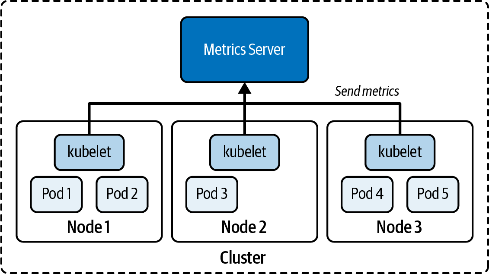

# Chương 21. Xử lý sự cố ứng dụng

*Dịch từ: Chapter 21. Troubleshooting Applications — Certified Kubernetes Administrator (CKA) Study Guide, 2nd Edition (O'Reilly).*

Khi vận hành một ứng dụng trong cluster Kubernetes ở môi trường production, sự cố gần như là điều không thể tránh khỏi. Trách nhiệm của bạn với tư cách quản trị viên Kubernetes là phải có khả năng xử lý sự cố (troubleshooting) cho các đối tượng Kubernetes do nhà phát triển ứng dụng thiết kế và triển khai.

Trong chương này, chúng ta sẽ xem xét các chiến lược xử lý sự cố có thể giúp xác định nguyên nhân gốc rễ của một vấn đề, để bạn có thể hành động và khắc phục lỗi một cách phù hợp. Các chiến lược được thảo luận ở đây bắt đầu từ góc nhìn tổng quan về một đối tượng Kubernetes rồi đi sâu vào chi tiết hơn khi cần.

> **PHẠM VI BAO PHỦ MỤC TIÊU ĐỀ CƯƠNG**
>
> Chương này đề cập đến các mục tiêu đề cương sau:
>
> - Quản lý và đánh giá các luồng output của container
> - Xử lý sự cố Service và mạng
> - Giám sát mức sử dụng tài nguyên của cluster và ứng dụng

## Xử lý sự cố Pod

Trong hầu hết các trường hợp, việc tạo một Pod không gặp vấn đề gì. Bạn chỉ cần phát lệnh `run`, `create` hoặc `apply` để khởi tạo Pod. Nếu manifest YAML được viết đúng định dạng, Kubernetes sẽ chấp nhận yêu cầu của bạn, nên giả định là mọi thứ hoạt động như mong đợi. Để xác minh hành vi đúng đắn, điều đầu tiên bạn muốn làm là kiểm tra thông tin runtime tổng quan của Pod. Thao tác này có thể liên quan đến các đối tượng Kubernetes khác, chẳng hạn như một Deployment chịu trách nhiệm rollout nhiều replica của một Pod.

### Truy xuất thông tin tổng quan

Để truy xuất thông tin, hãy chạy lệnh `kubectl get pods` nếu chỉ cần xem các Pod đang chạy trong namespace, hoặc lệnh `kubectl get all` để truy xuất các loại đối tượng nổi bật nhất trong namespace (bao gồm cả Deployment). Bạn sẽ muốn xem các cột `READY`, `STATUS` và `RESTARTS`. Trong trường hợp tối ưu, số container ở trạng thái sẵn sàng khớp với số container bạn đã định nghĩa trong `spec`. Với một Pod chỉ có một container, cột `READY` sẽ hiển thị `1/1`.

Trạng thái phải là `Running` để cho biết Pod đã bước vào trạng thái vòng đời đúng. Hãy lưu ý rằng hoàn toàn có khả năng một Pod hiển thị trạng thái `Running` nhưng ứng dụng thực ra lại không hoạt động đúng. Nếu số lần khởi động lại lớn hơn 0, bạn có thể muốn kiểm tra logic của liveness probe (nếu có định nghĩa) và xác định lý do vì sao cần phải khởi động lại.

Pod sau đây có trạng thái `ErrImagePull` và chỉ có 0/1 container sẵn sàng phục vụ lưu lượng đến. Nói ngắn gọn, Pod này đang gặp vấn đề:

```shell
$ kubectl get pods
NAME              READY   STATUS         RESTARTS   AGE
misbehaving-pod   0/1     ErrImagePull   0          2s
```

Sau một thời gian làm việc với Kubernetes, bạn sẽ tự động nhận ra các tình trạng lỗi phổ biến. Bảng 21-1 liệt kê một số trạng thái lỗi đó và giải thích cách khắc phục.

**Bảng 21-1. Các trạng thái lỗi phổ biến của Pod**

| Trạng thái | Nguyên nhân gốc rễ | Cách khắc phục khả dĩ |
|---|---|---|
| `ImagePullBackOff` hoặc `ErrImagePull` | Không thể pull image từ registry. | Kiểm tra tên image có đúng không, kiểm tra tên image có tồn tại trong registry không, xác minh khả năng truy cập mạng từ node đến registry, đảm bảo xác thực đúng cách. |
| `CrashLoopBackOff` | Ứng dụng hoặc lệnh chạy trong container bị crash. | Kiểm tra lệnh được thực thi trong container, đảm bảo image có thể thực thi đúng (ví dụ: bằng cách tạo một container với Docker). |
| `CreateContainerConfigError` | Không tìm thấy ConfigMap hoặc Secret mà container tham chiếu đến. | Kiểm tra tên của đối tượng cấu hình có đúng không, xác minh sự tồn tại của đối tượng cấu hình trong namespace. |

### Kiểm tra Event

Có thể bạn không gặp bất kỳ trạng thái lỗi nào trong số đó. Nhưng vẫn có khả năng Pod gặp vấn đề về cấu hình. Bạn có thể truy xuất thông tin chi tiết về Pod bằng lệnh `kubectl describe pod` để kiểm tra các event của nó.

Output sau đây thuộc về một Pod cố gắng mount một Secret không tồn tại. Thay vì hiển thị một thông báo lỗi cụ thể, Pod bị kẹt ở trạng thái `ContainerCreating`:

```shell
$ kubectl get pods
NAME         READY   STATUS              RESTARTS   AGE
secret-pod   0/1     ContainerCreating   0          4m57s
$ kubectl describe pod secret-pod
...
Events:
Type     Reason       Age                   From               Message
----     ------       ----                  ----               -------
Normal   Scheduled    <unknown>             default-scheduler  Successfully \
                                                               assigned \
                                                               default/secret-pod \
                                                               to minikube
Warning  FailedMount  3m15s                 kubelet, minikube  Unable to attach or \
                                                               mount volumes: \
                                                               unmounted \
                                                               volumes=[mysecret], \
                                                               unattached volumes= \
                                                               [default-token-bf8rh \
                                                               mysecret]: timed out \
                                                               waiting for the \
                                                               condition
Warning  FailedMount  68s (x10 over 5m18s)  kubelet, minikube  MountVolume.SetUp \
                                                               failed for volume \
                                                               "mysecret" : secret \
                                                               "mysecret" not found
Warning  FailedMount  61s                   kubelet, minikube  Unable to attach or \
                                                               mount volumes: \
                                                               unmounted volumes= \
                                                               [mysecret], \
                                                               unattached \
                                                               volumes=[mysecret \
                                                               default-token-bf8rh \
                                                               ]: timed out \
                                                               waiting for the \
                                                               condition
```

Một lệnh hữu ích khác là `kubectl get events`. Output của lệnh này liệt kê các event trên tất cả các Pod trong một namespace cho trước. Bạn có thể dùng thêm các tùy chọn dòng lệnh để lọc và sắp xếp event:

```shell
$ kubectl get events
LAST SEEN   TYPE      REASON             OBJECT                MESSAGE
3m14s       Warning   BackOff            pod/custom-cmd        Back-off \
                                                               restarting \
                                                               failed container
2s          Warning   FailedNeedsStart   cronjob/google-ping   Cannot determine \
                                                               if job needs to \
                                                               be started: too \
                                                               many missed start \
                                                               time (> 100). Set \
                                                               or decrease \
                                                               .spec. \
                                                               startingDeadline \
                                                               Seconds or check \
                                                               clock skew
```

Đôi khi việc xử lý sự cố như vậy vẫn chưa đủ. Bạn có thể phải đào sâu vào hành vi runtime và cấu hình của ứng dụng bên trong container.

### Sử dụng port forwarding

Trong môi trường production, bạn sẽ vận hành một ứng dụng trong nhiều Pod do một ReplicaSet kiểm soát. Không có gì lạ khi một trong những replica đó gặp sự cố lúc runtime. Thay vì xử lý sự cố Pod có vấn đề từ một Pod tạm thời bên trong cluster, bạn cũng có thể chuyển tiếp lưu lượng đến Pod thông qua một kết nối HTTP được tạo đường hầm (tunnel). Đây là lúc lệnh `port-forward` phát huy tác dụng.

Hãy cùng minh họa hành vi này. Lệnh sau tạo một Deployment mới chạy NGINX với ba replica:

```shell
$ kubectl create deployment nginx --image=nginx:1.24.0 --replicas=3 --port=80
deployment.apps/nginx created
```

Các Pod tạo ra sẽ có tên duy nhất được suy ra từ tên của Deployment. Giả sử Pod `nginx-595dff4799-ph4js` gặp vấn đề mà bạn muốn xử lý:

```shell
$ kubectl get pods
NAME                     READY   STATUS    RESTARTS   AGE
nginx-595dff4799-pfgdg   1/1     Running   0          6m25s
nginx-595dff4799-ph4js   1/1     Running   0          6m25s
nginx-595dff4799-s76s8   1/1     Running   0          6m25s
```

Lệnh `port-forward` chuyển tiếp các kết nối HTTP từ một port cục bộ đến một port do Pod expose. Lệnh ví dụ này chuyển tiếp port 2500 trên máy cục bộ của bạn đến container port 80 đang chạy trong Pod `nginx-595dff4799-ph4js`:

```shell
$ kubectl port-forward nginx-595dff4799-ph4js 2500:80
Forwarding from 127.0.0.1:2500 -> 80
Forwarding from [::1]:2500 -> 80
```

Lệnh `port-forward` chạy ở tiền cảnh (foreground) và không trả về dấu nhắc shell, đòi hỏi bạn phải mở một terminal khác để thực hiện các lời gọi đến Pod qua port đã chuyển tiếp, hoặc dùng các tính năng job control của shell — nhấn Ctrl+Z để tạm dừng rồi gõ `bg` để chạy nó ở hậu cảnh (background), hoặc thêm `&` khi khởi chạy lệnh (ví dụ: `kubectl port-forward mypod 8080:80 &`) để đưa ngay tiến trình xuống hậu cảnh trong khi vẫn giữ port forwarding hoạt động.

Lệnh sau đơn giản chỉ kiểm tra xem Pod có thể truy cập được từ máy cục bộ của bạn hay không bằng `curl`:

```shell
$ curl -Is localhost:2500 | head -n 1
HTTP/1.1 200 OK
```

Mã phản hồi HTTP 200 cho thấy rõ ràng rằng chúng ta có thể truy cập Pod từ bên ngoài cluster. Lệnh `port-forward` không nhằm để chạy trong thời gian dài. Mục đích chính của nó là để kiểm thử hoặc xử lý sự cố một Pod mà không phải expose nó bằng một Service.

## Xử lý sự cố container

Bạn có thể tương tác với container để đi sâu vào môi trường runtime của ứng dụng. Các mục tiếp theo sẽ thảo luận cách kiểm tra log, mở một shell tương tác vào container, và debug các container không cung cấp shell.

> **NHẮM ĐẾN MỘT CONTAINER CỤ THỂ**
>
> Các lệnh được mô tả trong các mục sau cũng áp dụng cho init container và sidecar container. Hãy dùng cờ dòng lệnh `-c` hoặc `--container` để nhắm đến một container cụ thể nếu bạn đang chạy nhiều hơn một container.

### Kiểm tra log

Khi xử lý sự cố một Pod, bạn có thể truy xuất mức chi tiết tiếp theo bằng cách tải về và kiểm tra log của nó. Bạn có thể tìm thấy hoặc không tìm thấy thông tin bổ sung chỉ ra nguyên nhân gốc rễ của một Pod hoạt động sai, nhưng chắc chắn đáng để xem qua. Manifest YAML trong Ví dụ 21-1 định nghĩa một Pod chạy một lệnh shell.

**Ví dụ 21-1. Một Pod chạy một lệnh shell bị lỗi**

```yaml
apiVersion: v1
kind: Pod
metadata:
  name: incorrect-cmd-pod
spec:
  containers:
  - name: test-container
    image: busybox:1.36.1
    command: ["/bin/sh", "-c", "unknown"]
```

Sau khi tạo đối tượng, Pod bị lỗi với trạng thái `CrashLoopBackOff`. Chạy lệnh `logs` cho thấy lệnh chạy trong container có vấn đề:

```shell
$ kubectl create -f crash-loop-backoff.yaml
pod/incorrect-cmd-pod created
$ kubectl get pods incorrect-cmd-pod
NAME                READY   STATUS             RESTARTS   AGE
incorrect-cmd-pod   0/1     CrashLoopBackOff   5          3m20s
$ kubectl logs incorrect-cmd-pod
/bin/sh: unknown: not found
```

Lệnh `logs` cung cấp hai tùy chọn hữu ích. Tùy chọn `-f` stream log, nghĩa là bạn sẽ thấy các mục log mới ngay khi chúng được tạo ra theo thời gian thực. Tùy chọn `--previous` lấy log từ lần khởi tạo trước của container, rất hữu ích nếu container đã bị khởi động lại.

### Mở một shell tương tác

Nếu không có lệnh nào ở trên chỉ ra cho bạn nguyên nhân gốc rễ của Pod bị lỗi, đã đến lúc mở một shell tương tác vào container. Các nhà phát triển ứng dụng sẽ biết rõ nhất hành vi cần mong đợi từ ứng dụng lúc runtime. Hãy kiểm tra các tiến trình đang chạy bằng các công cụ tiện ích Unix hoặc Windows, tùy thuộc vào image chạy trong container.

Giả sử bạn gặp một tình huống trong đó một Pod bề ngoài có vẻ hoạt động bình thường, như trong Ví dụ 21-2.

**Ví dụ 21-2. Một Pod định kỳ ghi ngày giờ hiện tại vào một file**

```yaml
apiVersion: v1
kind: Pod
metadata:
  name: failing-pod
spec:
  containers:
  - args:
    - /bin/sh
    - -c
    - while true; do echo $(date) >> ~/tmp/curr-date.txt; sleep \
      5; done;
    image: busybox:1.36.1
    name: failing-pod
```

Sau khi tạo Pod, bạn kiểm tra trạng thái. Nó hiển thị `Running`; tuy nhiên, khi gửi yêu cầu đến ứng dụng, endpoint báo lỗi. Tiếp theo, bạn kiểm tra log. Output của log hiển thị một thông báo lỗi chỉ ra một thư mục không tồn tại. Rõ ràng là thư mục mà ứng dụng cần chưa được thiết lập đúng:

```shell
$ kubectl create -f failing-pod.yaml
pod/failing-pod created
$ kubectl get pods failing-pod
NAME          READY   STATUS    RESTARTS   AGE
failing-pod   1/1     Running   0          5s
$ kubectl logs failing-pod
/bin/sh: can't create /root/tmp/curr-date.txt: nonexistent directory
```

Lệnh `exec` mở một shell tương tác để xử lý sự cố theo cách thực hành trực tiếp. Trong đoạn mã sau, chúng ta dùng các công cụ Unix `mkdir`, `cd` và `ls` bên trong container đang chạy để khắc phục vấn đề. Tất nhiên, chiến lược khắc phục tốt hơn là tạo thư mục từ ứng dụng hoặc cung cấp một chỉ thị trong Dockerfile:

```shell
$ kubectl exec failing-pod -it -- /bin/sh
# mkdir -p ~/tmp
# cd ~/tmp
# ls -l
total 4
-rw-r--r-- 1 root root 112 May 9 23:52 curr-date.txt
```

### Tương tác với container distroless

Một số image chạy trong container được thiết kế rất tối giản vì lý do bảo mật. Ví dụ, các image distroless của Google không có sẵn bất kỳ công cụ tiện ích Unix nào. Bạn thậm chí không thể mở một shell vào container, vì image không đi kèm shell.

> **ÁP DỤNG CÁC THỰC HÀNH TỐT NHẤT VỀ BẢO MẬT CHO CONTAINER IMAGE**
>
> Việc phát hành container image có shell truy cập được và chạy với người dùng `root` thường không được khuyến khích, vì những khía cạnh này có thể bị lợi dụng làm hướng tấn công tiềm tàng. Hãy tìm hiểu chứng chỉ CKS để biết thêm về các mối quan tâm bảo mật trong Kubernetes.

Một trong các image distroless của Google là `k8s.gcr.io/pause:3.1`, được trình bày trong Ví dụ 21-3.

**Ví dụ 21-3. Chạy một image distroless**

```yaml
apiVersion: v1
kind: Pod
metadata:
  name: minimal-pod
spec:
  containers:
  - image: k8s.gcr.io/pause:3.1
    name: pause
```

Như bạn có thể thấy trong lệnh `exec` sau đây, image không cung cấp shell:

```shell
$ kubectl create -f minimal-pod.yaml
pod/minimal-pod created
$ kubectl get pods minimal-pod
NAME          READY   STATUS    RESTARTS   AGE
minimal-pod   1/1     Running   0          8s
$ kubectl exec minimal-pod -it -- /bin/sh
OCI runtime exec failed: exec failed: container_linux.go:349: starting \
container process caused "exec: \"/bin/sh\": stat /bin/sh: no such file \
or directory": unknown
command terminated with exit code 126
```

Kubernetes cung cấp khái niệm *ephemeral container*. Những container này được thiết kế để dùng xong rồi bỏ và không có các tính năng chịu lỗi như probe. Bạn có thể triển khai một ephemeral container để xử lý sự cố các container tối giản vốn thường không cho phép dùng lệnh `exec`.

Lệnh `debug` có thể chèn một ephemeral container vào một Pod đang chạy cho mục đích debug. Lệnh sau thêm ephemeral container chạy image `busybox` vào Pod có tên `minimal-pod` và mở một shell tương tác cho nó:

```shell
$ kubectl debug -it minimal-pod --image=busybox:1.37.0
Defaulting debug container name to debugger-jf98g.
If you don't see a command prompt, try pressing enter.
/ # pwd
/
/ # exit
Session ended, resume using 'kubectl alpha attach minimal-pod -c \
debugger-jf98g -i -t' command when the pod is running
```

## Xử lý sự cố Service và mạng

Một Service cung cấp một giao diện mạng thống nhất cho các Pod. Để có cái nhìn đầy đủ về các khía cạnh mạng trong Kubernetes, xem Chương 17. Ở đây, tôi muốn chỉ ra các kỹ thuật xử lý sự cố cho primitive này.

Các vấn đề về Service và mạng trong Kubernetes nằm trong số những vấn đề khó chẩn đoán nhất vì chúng liên quan đến nhiều lớp: mạng của Pod, service discovery, phân giải DNS, network policy và ingress controller. Những vấn đề này thường biểu hiện dưới dạng hết thời gian chờ kết nối (timeout), kết nối bị từ chối, hoặc lỗi chập chờn có thể làm tê liệt chức năng của ứng dụng.

### Chẩn đoán việc chọn Pod theo label của Service

Trong trường hợp bạn không thể truy cập các Pod lẽ ra phải được ánh xạ đến Service, hãy bắt đầu bằng việc đảm bảo label selector khớp với các label được gán cho các Pod. Bạn có thể truy vấn thông tin này bằng cách describe Service rồi hiển thị label của các Pod hiện có với tùy chọn `--show-labels`. Ví dụ sau không có label khớp nhau và do đó sẽ không áp dụng cho bất kỳ Pod nào đang chạy trong namespace:

```shell
$ kubectl describe service myservice
...
Selector:          app=myapp
...
$ kubectl get pods --show-labels
NAME                     READY   STATUS    RESTARTS   AGE     LABELS
myapp-68bf896d89-qfhlv   1/1     Running   0          7m39s   app=hello
myapp-68bf896d89-tzt55   1/1     Running   0          7m37s   app=world
```

### Chẩn đoán ánh xạ port giữa Service và Pod

Service phải ánh xạ port một cách chính xác giữa định nghĩa Service và các container của Pod được chọn. Hãy kiểm tra xem ánh xạ port từ target port của Service đến container port của Pod có được cấu hình đúng không. Hai port này phải khớp nhau, nếu không lưu lượng mạng sẽ không được định tuyến đúng:

```shell
$ kubectl get service myapp -o yaml | grep targetPort:
    targetPort: 80
$ kubectl get pods myapp-68bf896d89-qfhlv -o yaml | grep containerPort:
    - containerPort: 80
```

### Kiểm tra endpoint của Service

Một cách đơn giản để kiểm tra xem việc chọn theo label và ánh xạ port đã được thiết lập đúng hay chưa là kiểm tra các endpoint của Service. Endpoint của Service là các đối tượng API biểu diễn địa chỉ mạng (địa chỉ IP và port) của các Pod đứng sau một Service.

Dùng lệnh `get endpoints` để hiển thị các endpoint của một Service. Hãy đảm bảo output liệt kê đúng số địa chỉ IP của Pod và container port mà Service được kỳ vọng sẽ chọn:

```shell
$ kubectl get endpoints myservice
NAME        ENDPOINTS                     AGE
myservice   172.17.0.5:80,172.17.0.6:80   9m31s
```

Nếu output của lệnh không hiển thị endpoint nào, thì bạn biết rằng hoặc việc chọn theo label hoặc ánh xạ port chưa được cấu hình đúng trong Service.

### Xác minh phạm vi truy cập

Các loại Service khác nhau (`ClusterIP`, `NodePort`, `LoadBalancer`) có phạm vi truy cập khác nhau. Theo mặc định, loại Service là `ClusterIP`, nghĩa là một Pod chỉ có thể được truy cập thông qua Service nếu truy vấn từ bên trong cluster. Trước tiên, hãy kiểm tra loại Service:

```shell
$ kubectl get services
NAME        TYPE        CLUSTER-IP      EXTERNAL-IP   PORT(S)   AGE
myservice   ClusterIP   10.99.155.165   <none>        80/TCP    15m
...
```

Nếu bạn cho rằng `ClusterIP` đúng là loại bạn muốn gán, hãy mở một shell tương tác từ một Pod tạm thời bên trong cluster và chạy lệnh `curl` hoặc `wget`:

```shell
$ kubectl run tmp --image=busybox:1.37.0 -it --rm -- wget 10.99.155.165:80
```

### Vấn đề phân giải DNS

Thay vì dùng địa chỉ IP nội bộ cluster để truy cập một Service `ClusterIP`, bạn nhiều khả năng sẽ muốn dùng tên DNS của Service:

```shell
$ kubectl run tmp --image=busybox:1.37.0 -it --rm -- wget myservice:80
```

Trước khi vội đi đến kết luận nào, hãy nhớ rằng các Service ở namespace khác cần tên miền đầy đủ (fully qualified domain name — FQDN). Cách chắc chắn hơn để kiểm tra khả năng truy cập đến một Service là kèm theo namespace:

```shell
$ kubectl run tmp --image=busybox:1.37.0 -it --rm -- wget \
  myservice.default.svc.cluster.local:80
```

Các vấn đề về DNS có thể khiến Pod không phân giải được tên Service, gây ra lỗi ứng dụng. Có khả năng các Pod CoreDNS hiện không chạy. Bạn có thể kiểm tra bằng cách thực thi lệnh sau:

```shell
$ kubectl get pods -n kube-system -l k8s-app=kube-dns
```

Để quét log của CoreDNS tìm các thông báo lỗi, hãy chạy lệnh sau:

```shell
$ kubectl logs -n kube-system -l k8s-app=kube-dns --tail=50
```

Log của CoreDNS bộc lộ các vấn đề liên quan đến DNS thông qua nhiều mẫu lỗi khác nhau giúp xác định nguyên nhân gốc rễ của lỗi service discovery. Các vấn đề thường gặp bao gồm: sự cố kết nối upstream khiến CoreDNS không thể tiếp cận các máy chủ DNS bên ngoài, lỗi phân giải đối với các Service không tồn tại hoặc bị tham chiếu sai, gián đoạn giao tiếp với API server của Kubernetes khiến không thể khám phá Service, vấn đề cấu hình gây ra vòng lặp định tuyến hoặc lỗi xử lý, và vấn đề hiệu năng do tải truy vấn quá lớn hoặc tài nguyên không đủ. Bằng cách nhận ra các mẫu này trong log, bạn có thể nhanh chóng xác định vấn đề nằm ở kết nối mạng, cấu hình hay phân bổ tài nguyên.

### Hạn chế từ network policy

Network policy trong Kubernetes hoạt động như một tường lửa ở cấp Pod, kiểm soát Pod nào có thể giao tiếp với nhau và lưu lượng bên ngoài nào được phép. Khi network policy được triển khai, chúng tuân theo mô hình "mặc định từ chối" (default deny) — một khi bất kỳ network policy nào chọn một Pod, Pod đó trở nên bị cô lập và chỉ có thể nhận lưu lượng được các policy cho phép một cách tường minh.

Tính năng bảo mật này, dù thiết yếu cho môi trường production, lại thường xuyên gây ra những vấn đề kết nối bí ẩn, trong đó các ứng dụng trước đây hoạt động bình thường bỗng nhiên gặp timeout hoặc lỗi kết nối bị từ chối. Các triệu chứng phổ biến bao gồm Pod không thể tiếp cận các service mà chúng phụ thuộc vào, health check thất bại, giao tiếp liên namespace bị gián đoạn, hoặc lưu lượng bên ngoài bị chặn một cách bất ngờ.

Thách thức khi xử lý sự cố network policy nằm ở bản chất ngầm định của chúng — không có thông báo lỗi tức thời nào cho biết một network policy đang chặn lưu lượng; thay vào đó, các kết nối đơn giản là thất bại trong im lặng.

Việc debug đòi hỏi phải kiểm tra một cách có hệ thống xem network policy có tồn tại trong namespace hay không, hiểu chúng chọn những Pod nào thông qua `podSelector`, xem xét các quy tắc ingress và egress để biết lưu lượng nào được phép, và kiểm thử kết nối từ các Pod nguồn khác nhau để xác định chính xác việc thực thi policy đang diễn ra ở đâu.

Lệnh sau kiểm tra xem có network policy nào tồn tại trong namespace `production` hay không:

```shell
$ kubectl get networkpolicies -n production
```

Để xem những Pod nào bị ảnh hưởng bởi network policy, hãy hiển thị chi tiết của nó. Lệnh sau giả định rằng chúng ta đã tìm thấy network policy `api-policy` tồn tại:

```shell
$ kubectl describe networkpolicy api-policy -n production
```

Cuối cùng, hãy thử kiểm tra kết nối từ một Pod đến một Pod khác, hoặc trực tiếp hoặc thông qua một Service trong cùng namespace. Lệnh sau chạy một lệnh `curl` đến Service có tên `backend-service`:

```shell
$ kubectl exec -it frontend-pod -n production -- curl http://backend-service
```

Nếu lệnh này bị timeout, nhưng backend vẫn đang chạy, thì hợp lý để cho rằng network policy đang tác động ở đây.

## Kiểm tra số liệu tài nguyên

Triển khai phần mềm lên một cluster Kubernetes chỉ là bước khởi đầu của việc vận hành ứng dụng lâu dài. Các nhà phát triển cần hiểu các mẫu và hành vi tiêu thụ tài nguyên của ứng dụng, với mục tiêu cung cấp một dịch vụ có khả năng mở rộng và đáng tin cậy.

Trong thế giới Kubernetes, các công cụ giám sát như Prometheus và Datadog giúp thu thập, xử lý và trực quan hóa thông tin theo thời gian. Kỳ thi không yêu cầu bạn phải quen thuộc với các công cụ giám sát, ghi log, tracing và tổng hợp của bên thứ ba; tuy nhiên, sẽ hữu ích nếu bạn có hiểu biết cơ bản về hạ tầng Kubernetes bên dưới chịu trách nhiệm thu thập các số liệu sử dụng. Sau đây là các ví dụ về số liệu (metrics) điển hình:

- Số lượng node trong cluster
- Tình trạng sức khỏe của các node
- Số liệu hiệu năng của node như CPU, memory, dung lượng đĩa
- Số liệu hiệu năng ở cấp Pod như mức tiêu thụ CPU và memory

Trách nhiệm này thuộc về Metrics Server, một bộ tổng hợp dữ liệu sử dụng tài nguyên trên toàn cluster. Như minh họa trong Hình 21-1, các kubelet chạy trên các node thu thập số liệu và gửi chúng đến Metrics Server.



*Hình 21-1. Thu thập dữ liệu cho Metrics Server*

Metrics Server lưu dữ liệu trong bộ nhớ và không lưu trữ dữ liệu bền vững theo thời gian. Nếu bạn đang tìm một giải pháp lưu giữ dữ liệu lịch sử, bạn cần xem xét các lựa chọn thương mại hoặc tự lưu trữ (self-hosted). Hãy tham khảo tài liệu để biết thêm thông tin về quy trình cài đặt của nó.

Nếu bạn dùng minikube làm môi trường luyện tập, việc bật add-on Metrics Server rất đơn giản bằng lệnh sau:

```shell
$ minikube addons enable metrics-server
The 'metrics-server' addon is enabled
```

Giờ bạn có thể truy vấn số liệu của các node và Pod trong cluster bằng lệnh `top`:

```shell
$ kubectl top nodes
NAME       CPU(cores)   CPU%   MEMORY(bytes)   MEMORY%
minikube   283m         14%    1262Mi          32%
$ kubectl top pod frontend
NAME       CPU(cores)   MEMORY(bytes)
frontend   0m           2Mi
```

Sau khi cài đặt Metrics Server, phải mất vài phút để nó thu thập được thông tin về mức tiêu thụ tài nguyên. Hãy chạy lại lệnh `kubectl top` nếu bạn nhận được thông báo lỗi `error: Metrics API not available`.

## Tóm tắt

Chương này đã thảo luận các chiến lược tiếp cận những Pod bị lỗi hoặc hoạt động sai. Mục tiêu chính là chẩn đoán nguyên nhân gốc rễ của một sự cố rồi khắc phục bằng hành động đúng đắn. Xử lý sự cố Pod không nhất thiết phải khó khăn. Với các lệnh `kubectl` phù hợp trong bộ công cụ của mình, bạn có thể loại trừ từng nguyên nhân gốc rễ một để có được bức tranh rõ ràng hơn.

Xử lý sự cố mạng Kubernetes hiệu quả tuân theo một cách tiếp cận có hệ thống, bắt đầu bằng việc xác minh những điều cơ bản — đảm bảo các Pod đang chạy, các Service có endpoint khỏe mạnh, và phân giải DNS hoạt động — trước khi chuyển sang các cuộc điều tra phức tạp hơn. Quan trọng nhất, hãy hiểu khả năng và giới hạn của từng loại Service (`ClusterIP` cho lưu lượng nội bộ, `NodePort` cho truy cập ở cấp node, và `LoadBalancer` để expose ra bên ngoài) để đặt kỳ vọng phù hợp và chọn cách tiếp cận xử lý sự cố đúng cho từng tình huống.

Hệ sinh thái Kubernetes cung cấp rất nhiều lựa chọn để thu thập và xử lý số liệu của cluster theo thời gian. Trong số đó có các công cụ giám sát như Prometheus và Datadog. Nhiều công cụ trong số này dùng Metrics Server làm nguồn dữ liệu chuẩn (source of truth) cho các số liệu đó. Chúng ta cũng đã điểm qua quy trình cài đặt và lệnh `kubectl top` để truy xuất số liệu từ dòng lệnh.

## Trọng tâm cho kỳ thi

**Biết cách xử lý sự cố ứng dụng**

Các ứng dụng chạy trong Pod có thể dễ dàng hỏng do cấu hình sai. Hãy nghĩ đến các kịch bản có thể xảy ra và cố gắng chủ động mô hình hóa chúng để tái hiện một tình huống lỗi. Sau đó, dùng các lệnh `get`, `logs` và `exec` để đi đến tận cùng vấn đề và khắc phục nó. Hãy thử nghĩ ra những kịch bản khó hiểu để trở nên thành thạo hơn trong việc tìm và sửa lỗi ứng dụng cho các loại tài nguyên khác nhau. Hãy tham khảo tài liệu Kubernetes để tìm hiểu thêm về cách debug các loại tài nguyên Kubernetes khác.

**Biến việc truy cập log container thành công việc thường ngày**

Truy cập log container rất đơn giản. Chỉ cần dùng lệnh `logs`. Hãy luyện tập sử dụng tất cả các tùy chọn dòng lệnh liên quan. Tùy chọn `-c` nhắm đến một container cụ thể. Tùy chọn này không cần dùng tường minh với Pod chỉ có một container. Tùy chọn `-f` theo dõi các mục log nếu bạn muốn xem quá trình xử lý trực tiếp trong ứng dụng. Tùy chọn `-p` có thể dùng để truy cập log nếu container đã phải khởi động lại nhưng bạn vẫn muốn xem log của container trước đó.

**Biết cách chẩn đoán vấn đề mạng**

Hãy tuân theo cách tiếp cận có hệ thống: trước tiên xác minh kết nối cơ bản và DNS, sau đó kiểm tra endpoint và selector của Service, xem xét cấu hình port, điều tra mọi network policy, và cuối cùng kiểm thử toàn bộ đường đi của lưu lượng từ nguồn đến đích. Hãy luôn nhớ rằng môi trường thi có thể có sẵn các network policy được cấu hình trước hoặc các plugin mạng cụ thể ảnh hưởng đến chiến lược xử lý sự cố.

**Học cách truy xuất và diễn giải số liệu tài nguyên**

Giám sát một cluster Kubernetes là một khía cạnh quan trọng để vận hành thành công trong môi trường thực tế. Bạn nên đọc thêm về các sản phẩm giám sát thương mại và những dữ liệu mà Metrics Server có thể thu thập. Bạn có thể giả định rằng môi trường thi cung cấp sẵn cho bạn một bản cài đặt Metrics Server. Hãy học cách dùng lệnh `kubectl top` để hiển thị số liệu tài nguyên của Pod và node cũng như cách diễn giải chúng.

## Bài tập mẫu

Lời giải cho các bài tập này có trong Phụ lục A.

1. Trong bài tập này, bạn sẽ luyện tập kỹ năng xử lý sự cố bằng cách kiểm tra một Pod bị cấu hình sai. Di chuyển đến thư mục *app-a/ch21/troubleshooting-pod* của kho GitHub *bmuschko/cka-study-guide* đã checkout.

   Tạo một Pod mới từ manifest YAML trong file *setup.yaml*. Kiểm tra trạng thái của Pod. Bạn có thấy vấn đề gì không?

   Hiển thị log của container đang chạy và xác định một vấn đề. Mở shell vào container. Bạn có thể xác minh vấn đề dựa trên thông báo log được hiển thị không?

   Đề xuất các giải pháp có thể khắc phục nguyên nhân gốc rễ của vấn đề.

2. Kate là một nhà phát triển phụ trách triển khai một stack ứng dụng web. Cô ấy không quen thuộc với Kubernetes và nhờ bạn giúp đỡ. Các đối tượng liên quan đã được tạo; tuy nhiên, không thể thiết lập kết nối đến ứng dụng từ bên trong cluster. Hãy giúp Kate sửa cấu hình các manifest YAML của cô ấy.

   Di chuyển đến thư mục *app-a/ch21/troubleshooting-service* của kho GitHub *bmuschko/cka-study-guide* đã checkout. Tạo các đối tượng từ manifest YAML *setup.yaml*. Kiểm tra các đối tượng trong namespace `y72`.

   Tạo một Pod tạm thời dùng image `busybox:1.36.1` trong namespace `y72`. Lệnh của container phải thực hiện một lời gọi `wget` đến Service `web-app`. Lời gọi `wget` sẽ không thể thiết lập kết nối thành công đến Service.

   Xác định nguyên nhân gốc rễ của vấn đề kết nối và khắc phục nó. Xác minh hành vi đúng bằng cách lặp lại bước trước. Lời gọi `wget` phải trả về phản hồi thành công.

3. Bạn sẽ kiểm tra các số liệu được Metrics Server thu thập. Di chuyển đến thư mục *app-a/ch21/stress-test* của kho GitHub *bmuschko/cka-study-guide* đã checkout. Thư mục hiện tại chứa các manifest YAML cho ba Pod: *stress-1-pod.yaml*, *stress-2-pod.yaml* và *stress-3-pod.yaml*. Hãy xem xét các file manifest đó.

   Tạo namespace `stress-test` và các Pod bên trong namespace đó.

   Dùng dữ liệu có sẵn qua Metrics Server để xác định Pod nào tiêu thụ nhiều memory nhất.

   *Điều kiện tiên quyết:* Bạn sẽ cần cài đặt Metrics Server nếu muốn kiểm tra được các số liệu tài nguyên thực tế. Bạn có thể tìm hướng dẫn cài đặt trên trang GitHub của dự án.
