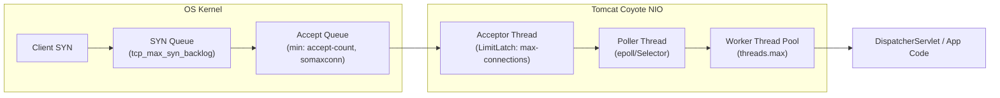
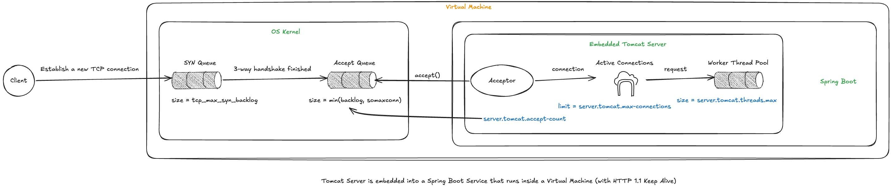

# 01 — Hành trình một request: từ TCP handshake đến Worker Thread

> **Chủ đề I — Connection & Request Lifecycle**
> Câu hỏi trung tâm: *"Scale đến đâu là đủ?"* — muốn trả lời được, phải mổ xẻ toàn bộ đường đi của một request: nó phải chui qua những hàng đợi nào, mỗi hàng đợi do ai quản lý, bị giới hạn bởi tham số gì, và khi tràn thì chuyện gì xảy ra.

---

### ⚡ TL;DR & Quick Takeaways (30 giây)
* **5 Chặng luồng request:** SYN Queue (Kernel) → Accept Queue (Kernel) → Acceptor (Tomcat LimitLatch) → Poller (Tomcat epoll) → Worker Thread Pool.
* **Cạm bẫy Kernel "cắt ngọn":** `Accept Queue size = min(server.tomcat.accept-count, net.core.somaxconn)`. Cấu hình `accept-count: 5000` vô tác dụng nếu `somaxconn = 128`.
* **Application Log "Mù mắt":** Khi Accept Queue tràn, kernel âm thầm drop gói ACK/SYN. Application log hoàn toàn KHÔNG có dấu vết — lỗi hiện ra ở client dưới dạng `Connect timed out`.
* **Connection ≠ Thread:** `max-connections` (mặc định 8192) quản lý kết nối mở (bao gồm Keep-Alive idle), còn `threads.max` (mặc định 200) quản lý request đang xử lý đồng thời.





---

## 1. Đặt vấn đề: vì sao "cứ scale lên" là phản xạ sai

Trong các buổi incident review, kết luận phổ biến nhất là *"tăng max-connections lên"*, *"tăng thread pool lên"* — mà không ai hỏi: **tăng đến đâu, và tăng để làm gì?** Những câu hỏi kiểu *"em đang để 200 thread, có nên tăng lên 1000 không?"* không thể trả lời được nếu chưa biết:

1. Một request đi qua **những hàng đợi nào** trước khi chạm code Java.
2. Mỗi hàng đợi bị giới hạn bởi **tham số nào**, thuộc **tầng nào** (kernel / Tomcat / JVM).
3. Khi một hàng đợi tràn, **triệu chứng** hiện ra ở đâu (phía client hay server, lỗi gì).

Bức tranh đầy đủ gồm 5 chặng: **SYN Queue → Accept Queue → Acceptor → Active Connections (Poller) → Worker Thread Pool**. Hai chặng đầu thuộc OS kernel, ba chặng sau thuộc Tomcat. Đi từng chặng một.

---

## 2. Tầng OS Kernel — nơi mọi kết nối bắt đầu

### 2.1. Nhắc lại 3-way handshake và vì sao cần hai hàng đợi

M��t kết nối TCP được thiết lập qua 3 bước:

```
Client                          Server (kernel)
  |------------- SYN ------------->|   (1) client xin mở kết nối
  |<---------- SYN-ACK ------------|   (2) server xác nhận + xin mở chiều ngược
  |------------- ACK ------------->|   (3) client xác nhận → ESTABLISHED
```

Giữa bước (1) và bước (3) có một khoảng thời gian kết nối ở trạng thái **nửa mở** (`SYN_RECV`). Kernel phải nhớ các kết nối nửa mở này ở đâu đó — đó chính là **SYN Queue** (còn gọi incomplete connection queue). Khi bước (3) hoàn tất, kết nối chuyển sang `ESTABLISHED` và được đẩy sang **Accept Queue** (complete connection queue) — nằm chờ *ứng dụng* gọi `accept()` tới "nhận hàng".

Điểm cần khắc sâu: **toàn bộ handshake do kernel thực hiện, không cần ứng dụng tham gia**. Một kết nối có thể `ESTABLISHED` xong xuôi, nằm trong Accept Queue hàng trăm ms mà chưa một dòng code Spring Boot nào chạy. Đây là lý do nhiều triệu chứng quá tải "vô hình" với application log.

### 2.2. SYN Queue

| Thuộc tính | Chi tiết |
|---|---|
| Chứa gì | Kết nối đang ở `SYN_RECV` (đã nhận SYN, đã gửi SYN-ACK, chờ ACK) |
| Kích thước | Điều khiển bởi `net.ipv4.tcp_max_syn_backlog` |
| Khi tràn | Kernel drop SYN mới; nếu bật `net.ipv4.tcp_syncookies=1` (mặc định trên hầu hết distro), kernel trả SYN-ACK "không trạng thái" bằng cookie mã hoá — chống được SYN flood nhưng mất một số TCP option |
| Triệu chứng tràn | Counter `TcpExtListenDrops` / dòng "SYNs to LISTEN sockets dropped" trong `netstat -s` tăng |

SYN Queue tràn trong thực tế thường do **tấn công SYN flood** hoặc do Accept Queue phía sau đầy (một số kernel drop SYN khi accept queue đầy — xem 2.3), chứ hiếm khi do traffic hợp lệ.

### 2.3. Accept Queue — hàng đợi quan trọng nhất

| Thuộc tính | Chi tiết |
|---|---|
| Chứa gì | Kết nối đã `ESTABLISHED`, chờ ứng dụng `accept()` |
| Kích thước | `min(backlog, net.core.somaxconn)` — trong đó `backlog` là tham số ứng dụng truyền vào syscall `listen(fd, backlog)` |
| Với Tomcat | `backlog` chính là `server.tomcat.accept-count` (mặc định 100) |
| Khi tràn | Mặc định (`tcp_abort_on_overflow=0`): kernel **lặng lẽ drop** ACK/SYN — client tưởng server vẫn nghe, retry rồi `Connect timed out`. Nếu `tcp_abort_on_overflow=1`: kernel bắn RST → client nhận `Connection refused` ngay |

Chuỗi ràng buộc cần nhớ:

```
Accept Queue size thực tế = min(server.tomcat.accept-count, net.core.somaxconn)
```

Nghĩa là nếu bạn hào phóng đặt `accept-count: 5000` nhưng `somaxconn` của node vẫn là 128 (kernel cũ) thì hàng chờ thực chỉ 128 — **config ứng dụng bị kernel âm thầm "cắt ngọn"**. Kernel ≥ 5.4 nâng mặc định `somaxconn` lên 4096, nhưng trong container hoá, giá trị này là per-network-namespace, cần kiểm tra trong chính container/pod.

### 2.4. Bộ lệnh chẩn đoán tầng kernel

```bash
# 1) Tham số hiện tại
sysctl net.ipv4.tcp_max_syn_backlog net.core.somaxconn net.ipv4.tcp_syncookies

# 2) Độ sâu Accept Queue theo từng socket LISTEN — quan trọng nhất
ss -lnt 'sport = :8080'
# State   Recv-Q  Send-Q  ...
# LISTEN  87      100
# Với socket LISTEN: Recv-Q = số connection ĐANG NẰM trong accept queue
#                    Send-Q = kích thước tối đa của accept queue
# Recv-Q tiệm cận Send-Q liên tục = ứng dụng accept() không kịp → nghẽn ngay cửa vào

# 3) Counter tích luỹ — bằng chứng lịch sử của overflow
netstat -s | egrep -i "overflow|listen"
#   4021 times the listen queue of a socket overflowed   ← Accept Queue từng tràn 4021 lần
#   4021 SYNs to LISTEN sockets dropped

# 4) Theo dõi realtime overflow (mỗi 1s)
watch -n1 'netstat -s | egrep -i "overflow|listen"'
```

**Kỹ thuật đọc:** counter overflow là **tích luỹ từ boot** — giá trị tuyệt đối không nói lên gì, phải nhìn **tốc độ tăng**. Trên Kubernetes, node-exporter expose các counter này thành `node_netstat_TcpExt_ListenOverflows` / `ListenDrops` — nên đặt alert theo `rate()`.

---

## 3. Tầng Tomcat — Acceptor, Poller, và giới hạn connection

Từ đây bắt đầu là code Java, nhưng **chưa phải code của bạn** — là code của Tomcat (Coyote NIO connector). Ba nhân vật:

### 3.1. Acceptor — một thread duy nhất, một vòng lặp duy nhất

Tomcat có đúng **một** thread tên `http-nio-8080-Acceptor`. Vòng lặp của nó (rút gọn từ `org.apache.tomcat.util.net.Acceptor`):

```java
// Tinh thần mã nguồn Acceptor.run()
while (!stopCalled) {
    connectionLimitLatch.countUpOrAwait();  // [A] BLOCK tại đây nếu đã chạm max-connections
    SocketChannel socket = serverSocket.accept();  // [B] lấy 1 connection từ Accept Queue
    setSocketOptions(socket);               // [C] cấu hình socket (TCP_NODELAY, ...)
    poller.register(socket);                // [D] giao cho Poller theo dõi
}
```

Hai chi tiết quyết định hành vi hệ thống:

- **[A] `LimitLatch`**: đây là cách `server.tomcat.max-connections` (mặc định 8192) được enforce. `LimitLatch` là một counter đồng bộ: mỗi connection accept vào thì `countUp`, đóng thì `countDown`. Khi counter chạm 8192, **Acceptor tự block** — ngừng gọi `accept()`. Hệ quả tinh tế: connection mới **không bị từ chối bởi Tomcat**, chúng chỉ **ứ lại trong Accept Queue của kernel** (tối đa `accept-count` cái), và khi cả queue đó đầy thì kernel mới drop. Tomcat không "reject" — kernel mới là người ra tay.
- **[D] Acceptor không bao giờ phục vụ request.** Nó chỉ là người gác cửa dẫn khách vào, việc còn lại của Poller.

### 3.2. Poller — trái tim của NIO connector

Từ Tomcat 9, connector mặc định là NIO với đúng **một** Poller thread chạy một **Selector** (epoll trên Linux):

```java
// Tinh thần NioEndpoint.Poller.run()
while (true) {
    int n = selector.select();              // chờ sự kiện I/O trên TẤT CẢ socket đã đăng ký
    for (SelectionKey key : selector.selectedKeys()) {
        if (key.isReadable()) {
            // socket này có bytes để đọc → có request đến
            processSocket(key);             // bọc thành SocketProcessor, ném vào Executor
        }
    }
}
```

Đây là chỗ trả lời câu hỏi *"8192 connection mà chỉ 200 thread thì ai trông đám còn lại?"*: **một Poller thread trông cả 8192 socket** thông qua epoll — chi phí gần như không đổi theo số connection (đây chính là lời giải cho bài toán C10K). Connection **idle** (keep-alive, không có request đang bay) không tốn thread nào; chỉ khi có bytes đến, socket mới được bọc thành task đẩy vào Worker Pool.

Hệ quả kiến trúc quan trọng:

> **Connection là tài nguyên rẻ (chỉ tốn file descriptor + buffer), thread mới là tài nguyên đắt.** Vì thế `max-connections` mặc định 8192 còn `threads.max` chỉ 200 — chênh nhau 40 lần là có chủ đích.

### 3.3. Worker Thread Pool — nơi code của bạn chạy

Chỉ đến khi `SocketProcessor` được một worker thread nhặt lên, chuỗi xử lý quen thuộc mới bắt đầu:

```
Worker thread → Http11Processor.process() → CoyoteAdapter.service()
             → Catalina pipeline → DispatcherServlet.doDispatch()
             → HandlerMapping → Interceptor → @Controller của bạn
```

Toàn bộ chuỗi này chạy **trên đúng một worker thread** (mô hình thread-per-request). Blocking ở bất cứ đâu trong chuỗi — JDBC, RestTemplate, đọc file — là giam worker thread đó ([tài liệu 03](../03-sync-async-blocking-nonblocking.md) và [04](../04-java-thread-lifecycle.md) phân tích sâu).

### 3.4. Keep-Alive: vì sao connection ≠ request

Với HTTP/1.1, mặc định connection được giữ lại sau mỗi response (keep-alive) để phục vụ request tiếp theo:

```
timeline một connection keep-alive:
[request 1: 40ms trên worker] [idle 3s] [request 2: 35ms trên worker] [idle 8s] ...
      ↑ tốn thread                ↑ CHỈ tốn Poller theo dõi, không tốn thread
```

Ba tham số điều khiển vòng đời này:

```yaml
server:
  tomcat:
    connection-timeout: 20s        # chờ request ĐẦU TIÊN sau accept() (chống khách "ngồi im")
    keep-alive-timeout: 60s        # chờ request TIẾP THEO trên connection đã dùng
                                   # (không set → mặc định = connection-timeout)
    max-keep-alive-requests: 100   # tối đa 100 request / connection, sau đó Tomcat chủ động
                                   # đóng (Connection: close) — chống connection "bất tử",
                                   # giúp LB tái phân phối tải khi scale-out
```

Từ đó suy ra công thức ước lượng đúng:

```
Số connection cần giữ  ≈  số client hoạt động × connection mỗi client   (có thể hàng nghìn)
Số thread cần có       ≈  số request THỰC SỰ đang xử lý đồng thời        (thường hàng chục)
                       =  RPS × latency trung bình (Little's Law — tài liệu 07)
```

Hai đại lượng này **độc lập nhau** — nhầm lẫn giữa chúng là nguồn gốc của các quyết định tuning sai (tăng `max-connections` để chữa bệnh thiếu thread, hoặc ngược lại).

---

## 4. Ráp toàn cảnh: bảng "cánh cửa" và số phận request khi từng cửa tràn

| # | Cánh cửa | Tầng | Tham số giới hạn | Mặc định | Khi tràn, chuyện gì xảy ra |
|---|---|---|---|---|---|
| 1 | SYN Queue | Kernel | `tcp_max_syn_backlog` | 1024–4096 | Drop SYN / syncookies kích hoạt |
| 2 | Accept Queue | Kernel | `min(accept-count, somaxconn)` | min(100, 4096) | Drop âm thầm → client `Connect timed out` |
| 3 | LimitLatch (Acceptor) | Tomcat | `max-connections` | 8192 | Acceptor ngừng accept → connection ứ ngược về cửa 2 |
| 4 | TaskQueue trước Worker Pool | Tomcat | `threads.max-queue-capacity` | 2^31−1 (vô hạn!) | Request xếp hàng vô tận → latency phình → client `Read timed out` ([tài liệu 06](./06-tomcat-threadpool-taskqueue.md)) |
| 5 | Worker Pool | Tomcat | `threads.max` | 200 | — (cửa 4 hứng thay) |

Đọc bảng theo chiều "nước chảy ngược": khi cửa 5 nghẽn → dồn về cửa 4 (âm thầm, vì queue vô hạn) → nếu connection mới vẫn ập vào, cửa 3 chạm trần → dồn về cửa 2 → tràn ra client thành lỗi connect. **Triệu chứng hiện ra ở cửa 2 nhưng bệnh nằm ở cửa 5** — đây là bản chất của mọi ca "client timeout mà server log sạch bong".

---

## 5. Ba sai lầm kinh điển khi scale — phân tích bằng mô hình trên

### 5.1. Tăng `max-connections` mà không tăng năng lực xử lý

Bạn chỉ nới cửa 3 — "mời thêm người vào phòng chờ" trong khi bếp (cửa 5) vẫn từng ấy đầu bếp. Connection vào được nhiều hơn thật, nhưng request của chúng chất vào TaskQueue: **throughput không nhúc nhích, latency tăng, và lỗi phía client chỉ đổi tên** từ `Connect timed out` thành `Read timed out` (xem [tài liệu 02](02-timeouts-and-exceptions.md)).

### 5.2. Tăng `threads.max` quá tay

M��i platform thread = 1 OS thread ≈ 1MB stack **native memory** (ngoài heap — cần nhớ khi set memory limit cho container: `heap + metaspace + threads×1MB + buffer` mới là RSS thật). Nghìn thread tranh vài core → context switch dày đặc, CPU cache liên tục bị đập vỡ, GC quét vất vả hơn → **p99 dựng đứng dù "công suất" trên giấy tăng**. Con số đúng được tính ở [tài liệu 07](./07-threadpool-sizing.md).

### 5.3. Không phân biệt CPU-bound / I/O-bound trước khi vặn bất cứ nút nào

- **I/O-bound** (mỗi request gọi DB vài lần, 90% thời gian chờ): tăng thread có ích *đến một ngưỡng*; căn cơ hơn là virtual threads ([tài liệu 05](../05-virtual-threads.md)) hoặc WebFlux.
- **CPU-bound** (mã hoá, resize ảnh, scoring model): thêm thread chỉ thêm contention — hướng đúng là tối ưu thuật toán hoặc scale-out.

Cách xác định nhanh bằng dữ liệu (không đoán): so `CPU utilization` với `tomcat_threads_busy_threads`. Thread busy cao + CPU thấp → I/O-bound. Cả hai cùng cao → CPU-bound.

---

## 6. Quan sát được (observability) — thiết lập tối thiểu cho production

```yaml
# application.yml
management:
  endpoints.web.exposure.include: health,metrics,prometheus
  metrics.distribution.percentiles-histogram.http.server.requests: true  # cho p95/p99 chuẩn
server:
  tomcat:
    mbeanregistry.enabled: true   # bắt buộc để có nhóm metric tomcat_*
```

| Metric | Ý nghĩa | Ngưỡng đáng chú ý |
|---|---|---|
| `tomcat_connections_current` | Số connection active (cửa 3) | Tiệm cận `max-connections` |
| `tomcat_connections_keepalive_current` | Connection idle keep-alive | Cao là bình thường — đừng hoảng |
| `tomcat_threads_busy_threads` | Worker đang bận (cửa 5) | Tiệm cận `threads.max` kéo dài |
| `tomcat_threads_current_threads` | Thread đã tạo | So với `min-spare`/`max` |
| `http_server_requests_seconds{quantile}` | Latency p50/p95/p99 | p99 tách xa p50 = có hàng đợi ở đâu đó |
| `node_netstat_TcpExt_ListenOverflows` (node-exporter) | Accept Queue tràn (cửa 2) | `rate() > 0` là báo động đỏ |

**Ba tín hiệu quyết định "có cần scale không"** (thay cho cảm giác "thấy chậm"):

1. **Độ sâu hàng đợi** — accept queue (Recv-Q / ListenOverflows) là tín hiệu *sớm nhất*.
2. **p95–p99**, không phải trung bình — trung bình rất hay "lừa người": 99 request 10ms + 1 request 5s cho trung bình ~60ms trông vẫn "ổn".
3. **CPU utilization** — CPU 80–90% mà vẫn chậm → vertical scale hết cửa, phải scale-out; CPU 20% mà chậm → đừng thêm máy, đi tìm chỗ block.

---

## 7. Use case thực chiến

### 7.1. Playbook: service "treo" mà CPU nhàn — chẩn đoán theo tầng trong 5 phút

```
B1. ss -lnt 'sport = :8080'
    → Recv-Q sát Send-Q?  CÓ → nghẽn từ trước cửa app (đi B2).  KHÔNG → đi B3.
B2. tomcat_connections_current đã chạm max-connections chưa?
    → CHẠM: Acceptor đang block ở LimitLatch → hỏi tiếp: vì sao connection không được giải phóng?
      (thường: worker giữ connection lâu vì response chậm → quay về B3)
B3. tomcat_threads_busy == threads.max?
    → ĐÚNG + CPU thấp → 100% là block I/O. Lấy thread dump (jstack), đếm đỉnh stack:
      socketRead trong driver JDBC → DB chậm/pool cạn (tài liệu 08)
      HttpClient/RestTemplate → downstream chậm (kiểm tra timeout budget — tài liệu 02)
    → ĐÚNG + CPU cao → thật sự thiếu công suất → profile (async-profiler) rồi mới scale
    → SAI (thread còn rảnh) mà vẫn chậm → nghẽn nằm NGOÀI service: LB, DNS, client
```

### 7.2. Thí nghiệm tự kiểm chứng Accept Queue (làm được trên laptop)

```yaml
# Cấu hình cực đoan để quan sát: chỉ 1 thread xử lý, phòng chờ 5
server:
  tomcat:
    max-connections: 2
    accept-count: 5
    threads.max: 1
```

```java
@GetMapping("/slow")
public String slow() throws InterruptedException {
    Thread.sleep(10_000);   // giữ worker 10 giây
    return "done";
}
```

```bash
# Bắn 20 kết nối song song rồi quan sát
for i in $(seq 1 20); do curl -s -m 5 http://localhost:8080/slow & done
ss -tn state established '( dport = :8080 or sport = :8080 )' | wc -l
ss -lnt 'sport = :8080'    # Recv-Q sẽ dâng lên 5 rồi kịch trần
# Kết quả quan sát được: 2 conn được nhận, 5 nằm accept queue,
# số còn lại: curl treo rồi báo timeout — đúng từng cửa như mô hình.
```

### 7.3. Cấu hình tham chiếu theo kịch bản

| Kịch bản | max-connections | accept-count | threads.max | Lý do |
|---|---|---|---|---|
| API nội bộ ít client, gọi qua LB có pool riêng | 1000–2000 | 100 | tính theo [07](../Chủ%20đề%20III%20—%20Capacity%20Planning%20&%20Pool%20Sizing/07-threadpool-sizing.md) | Client là vài chục instance service khác, connection tái sử dụng mạnh |
| API public nhiều client mobile | 8192 (giữ mặc định) | 200–500 | tính theo [07](../Chủ%20đề%20III%20—%20Capacity%20Planning%20&%20Pool%20Sizing/07-threadpool-sizing.md) | Nhiều connection idle keep-alive, mỗi connection ít request |
| Server-Sent Events / long-polling | 10000+ | 100 | nhỏ | Connection sống lâu nhưng gần như không tốn thread — cân nhắc WebFlux |

*(Các con số trên là điểm xuất phát có lý do — không phải "số ma thuật". Chốt bằng load test + metrics.)*

---

## 8. Scale đến đâu là đủ?

> **Đủ để đáp ứng SLA với chi phí chấp nhận được. Không hơn.**

M��t hệ thống dư sức phục vụ gấp 100 lần traffic hiện tại với chi phí gấp 50 lần là một quyết định kinh doanh tồi. Scalability là bài toán tối ưu ba biến: **khả năng phục vụ – độ tin cậy – tiền**; và lời giải luôn bắt đầu bằng việc chỉ ra **đúng cánh cửa đang nghẽn** bằng dữ liệu, thay vì nới tất cả các cửa theo cảm giác.

## 9. Tổng kết — những điều phải thuộc

1. Đường đi: **SYN Queue → Accept Queue → Acceptor (LimitLatch) → Poller (epoll) → Worker Pool → DispatcherServlet**. Hai chặng đầu thuộc kernel — app log không thấy gì ở đó.
2. `max-connections` giới hạn **connection**; `threads.max` giới hạn **request song song**; keep-alive khiến hai con số chênh nhau hàng chục lần một cách lành mạnh.
3. Tomcat không reject connection — nó **ngừng accept**; kernel mới là người drop. Vì thế triệu chứng tràn hiện ra ở tầng TCP, không phải HTTP.
4. `accept-count` bị `somaxconn` cắt ngọn — tuning ứng dụng phải đi đôi với tuning kernel/node.
5. Chẩn đoán luôn theo thứ tự tầng: `ss -lnt` → connections metric → threads metric → thread dump — mỗi bước loại trừ một cửa.

## 10. Tự kiểm chứng & Câu hỏi phỏng vấn (Self-Assessment)

1. **Câu hỏi:** Tại sao một ứng dụng Spring Boot bị tràn Accept Queue nhưng trên Grafana Dashboard hay Kibana Log lại hoàn toàn không ghi nhận bất kỳ Exception nào?
   * *Gợi ý trả lời:* Vì Accept Queue nằm ở tầng OS Kernel. Khi queue tràn, kernel drop gói SYN hoặc ACK trước khi Tomcat gọi syscall `accept()`. Code Java chưa từng tiếp nhận socket nên ứng dụng không thể ghi log.
2. **Câu hỏi:** Sự khác biệt bản chất giữa `server.tomcat.max-connections` và `server.tomcat.threads.max` là gì?
   * *Gợi ý trả lời:* `max-connections` kiểm soát số lượng TCP socket mở tối đa mà Tomcat Poller/epoll đang theo dõi (bao gồm cả connection rảnh keep-alive). `threads.max` kiểm soát số Worker Thread thực sự đang xử lý request HTTP cùng một lúc.
3. **Câu hỏi:** Bạn chỉnh `server.tomcat.accept-count=1000` trong `application.yml` nhưng khi test tải, hệ thống vẫn drop connection ở mức 128 request xếp hàng. Lý do là gì và kiểm tra bằng lệnh nào?
   * *Gợi ý trả lời:* Kích thước Accept Queue thực tế bị giới hạn bởi `min(accept-count, net.core.somaxconn)`. Nếu `somaxconn` của OS là 128 thì config 1000 bị kernel "cắt ngọn". Kiểm tra bằng `ss -lnt 'sport = :8080'` (quan sát cột `Send-Q`).

---

**Tài liệu liên quan:** [02 — Timeouts & Exceptions](02-timeouts-and-exceptions.md) · [06 — TaskQueue internals](../Chủ%20đề%20III%20—%20Capacity%20Planning%20&%20Pool%20Sizing/06-tomcat-threadpool-taskqueue.md) · [07 — Thread pool sizing](../Chủ%20đề%20III%20—%20Capacity%20Planning%20&%20Pool%20Sizing/07-threadpool-sizing.md)

