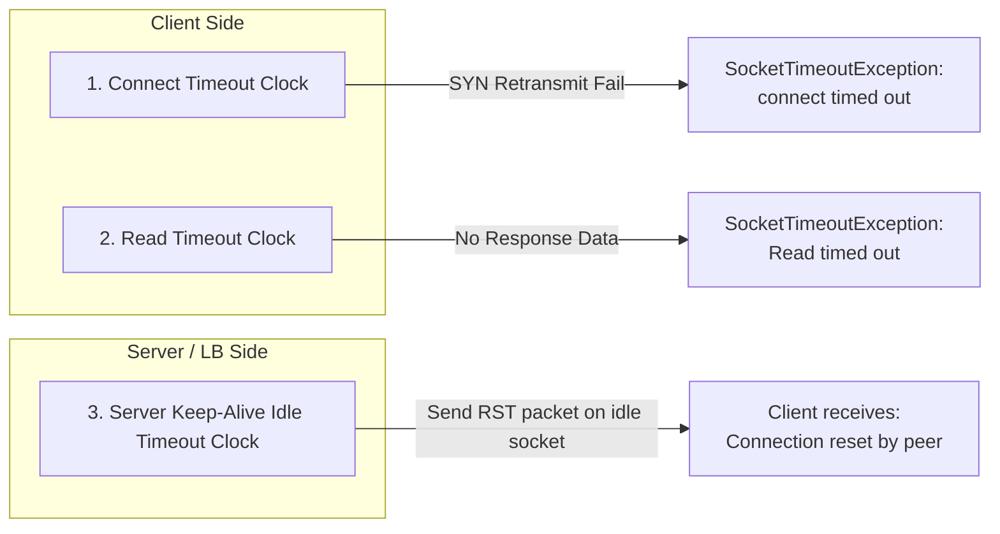
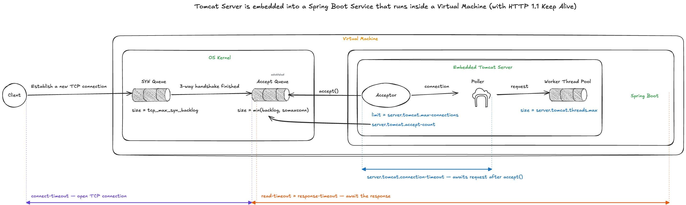

# 02 — Giải phẫu các Timeout: Connect timed out, Connection refused, Read timed out, Connection reset

> **Chủ đề I — Connection & Request Lifecycle**
> Bốn lỗi trông như bốn sự cố không liên quan — nên mỗi lần gặp, người ta lại đi tìm bốn nguyên nhân khác nhau. Thực ra chúng mọc lên từ **cùng một gốc bệnh**: sự lệch pha giữa tốc độ khách vào và tốc độ quán phục vụ. Chúng chỉ là những cái đồng hồ reo lên ở **các chặng khác nhau** của cùng một vòng đời kết nối. Tài liệu này giải phẫu từng lỗi xuống tận tầng TCP: gói tin nào được gửi, ai là người ngắt, và exception hiện ra ở phía nào.

---

### ⚡ TL;DR & Quick Takeaways (30 giây)
* **Connect timed out:** Client gửi SYN nhưng Server không phản hồi SYN-ACK (Accept Queue đầy hoặc Kernel drop gói). Đồng hồ: **Client Connect Timeout**.
* **Connection refused:** Server chủ động gửi gói RST từ chối ngay lập tức (Port không có process lắng nghe hoặc `tcp_abort_on_overflow=1`).
* **Read timed out:** Kết nối đã `ESTABLISHED`, Client đã gửi HTTP Request nhưng Server quá tải/treo DB nên quá thời gian chờ mà chưa trả ra byte dữ liệu nào. Đồng hồ: **Client Read Timeout**.
* **Connection reset (by peer):** Kết nối bị phía bên kia (Server / Load Balancer) đơn phương ngắt bằng gói RST (thường do lệch pha `idle-timeout` giữa Client và Server/LB).





---

## 1. Nền tảng: vòng đời một HTTP call và ba cái đồng hồ

M��t cuộc gọi HTTP trải qua ba pha, mỗi pha có một đồng hồ riêng, thuộc về một "chủ sở hữu" riêng:

```
Pha 1: THIẾT LẬP          Pha 2: GỬI REQUEST & CHỜ RESPONSE       Pha 0*: SERVER CHỜ CLIENT
(TCP 3-way handshake)     (đã gửi request, đợi bytes đầu tiên)    (đã accept, chưa thấy request)
─────────────────────     ─────────────────────────────────────   ─────────────────────────────
Đồng hồ: CLIENT           Đồng hồ: CLIENT                          Đồng hồ: SERVER
connect-timeout           read-timeout / response-timeout          server.tomcat.connection-timeout
Hết giờ:                  Hết giờ:                                 Hết giờ:
SocketTimeoutException    SocketTimeoutException                   server ĐÓNG kết nối
"connect timed out"       "Read timed out"                         → client thấy "Connection reset"
Bị từ chối thẳng:
ConnectException
"Connection refused"
```

Hai đồng hồ đầu là **khách sốt ruột chờ quán**. Đồng hồ thứ ba là **quán sốt ruột chờ khách**. Phân biệt "ai là chủ đồng hồ" và "ai là người ngắt" chính là chìa khoá chẩn đoán.

### Cấu hình cả ba đồng hồ

```java
// Phía client — Spring RestClient (Spring 6.1+)
var settings = ClientHttpRequestFactorySettings.defaults()
        .withConnectTimeout(Duration.ofSeconds(2))    // đồng hồ pha 1
        .withReadTimeout(Duration.ofSeconds(5));      // đồng hồ pha 2
RestClient client = RestClient.builder()
        .requestFactory(ClientHttpRequestFactories.get(settings))
        .baseUrl("http://downstream")
        .build();

// Cùng khái niệm ở các client khác:
// - java.net.http.HttpClient:  .connectTimeout(...) + HttpRequest .timeout(...)
// - OkHttp:                    .connectTimeout / .readTimeout / .callTimeout
// - WebClient (Reactor Netty): CONNECT_TIMEOUT_MILLIS + responseTimeout(...)
```

```yaml
# Phía server
server:
  tomcat:
    connection-timeout: 20s   # đồng hồ pha 0: chờ client gửi request sau accept()
```

---

## 2. Trường hợp 1 — Cửa quán đã kín: `Connect timed out` vs `Connection refused`

### 2.1. Bối cảnh (nối từ [tài liệu 01](01-connection-request-flow.md))

`max-connections=8192` (ghế trong quán) + `accept-count=100` (băng ghế chờ). Khách 8193→8292 đứng băng ghế; khách **8293** thì cả ghế lẫn băng ghế đều kín. Gói SYN của anh ta gửi lên, nhưng Accept Queue đã đầy → kernel server **không xử lý**.

**Điểm mấu chốt hay bị bỏ qua:** khách 8293 **không bao giờ** gặp `Read timed out`, cũng chẳng liên quan `connection-timeout` của server. Vì read timeout chỉ chạy khi *đã gửi request*; connection-timeout server chỉ chạy khi *server đã nhận anh vào*. Khách 8293 còn chưa bắt tay xong — chưa được vào cửa thì lấy đâu ra chuyện order hay chờ món. **Chỉ cần nhìn tên exception là khoanh vùng được chặng.**

### 2.2. Hai kịch bản ở tầng gói tin

**Kịch bản A — Drop âm thầm → `Connect timed out`:**

```
Client                              Server kernel (accept queue FULL, tcp_abort_on_overflow=0)
  |-- SYN ------------------------->|  (drop, không trả lời gì)
  |        (chờ ~1s)                |
  |-- SYN (retransmit #1) --------->|  (drop)
  |        (chờ ~2s)                |
  |-- SYN (retransmit #2) --------->|  (drop)
  |        ...exponential backoff   |
  X  connect-timeout của client reo → SocketTimeoutException: connect timed out
```

Kernel Linux hiện đại mặc định chọn cách **lặng lẽ vứt** gói SYN khi Accept Queue đầy — không một lời từ chối. Client cứ ngỡ quán vẫn nghe, gửi lại SYN theo backoff (`tcp_syn_retries`, mặc định 6 lần ≈ 130s nếu không set connect-timeout!), đợi mỏi mòn rồi mới báo lỗi. Đây là lý do **bắt buộc set connect-timeout tường minh** — mặc định của nhiều client là "vô hạn hoặc rất dài".

Vì sao kernel chọn drop thay vì reject? Vì **drop cho hệ thống cơ hội tự hồi phục**: nếu overflow chỉ là gợn sóng vài trăm ms, gói SYN retransmit sau đó sẽ vào được — client chỉ thấy "hơi chậm" thay vì lỗi.

**Kịch bản B — Từ chối tường minh → `Connection refused`:**

```
Client                              Server kernel
  |-- SYN ------------------------->|  không có ai listen port này
  |<-- RST ------------------------ |  "ở đây không có ai, đi đi"
  X  ConnectException: Connection refused   (NGAY LẬP TỨC, không chờ)
```

RST được bắn khi: **không có process nào listen** port đó (service chết, sai port, sai host), firewall cấu hình `REJECT` (thay vì `DROP`), hoặc `tcp_abort_on_overflow=1`. Đặc điểm nhận dạng: lỗi trả về **tức thì** — nhanh bất thường chính là manh mối.

### 2.3. Phân biệt tại hiện trường

```bash
# Nhìn thẳng vào gói tin
tcpdump -i any -n "tcp port 8080 and (tcp[tcpflags] & (tcp-syn|tcp-rst) != 0)"
# SYN đi, im lặng, SYN lại, im lặng...  → drop âm thầm → Connect timed out
#   → service SỐNG nhưng QUÁ TẢI (accept queue đầy) — đừng restart, đi tìm chỗ nghẽn phía sau
# SYN đi, RST về ngay                   → Connection refused
#   → service CHẾT / sai port / firewall REJECT — kiểm tra process & routing

# Đối chiếu phía server
ss -lnt 'sport = :8080'                  # Recv-Q kịch Send-Q?
netstat -s | grep -i overflow            # counter tăng?
```

| | `Connection refused` | `Connect timed out` |
|---|---|---|
| Gói tin | RST trả về ngay | SYN bị nuốt, không hồi âm |
| Thời gian nhận lỗi | Tức thì | Đúng bằng connect-timeout |
| Ý nghĩa vận hành | Không có ai nghe → lỗi **triển khai/hạ tầng** | Có người nghe nhưng hết chỗ → lỗi **quá tải** (hoặc mất mạng/firewall DROP) |
| Retry có ích không | Có (nếu service đang khởi động lại) | Có, với backoff — nhưng phải chữa gốc quá tải |

---

## 3. Trường hợp 2 — Vào được quán nhưng bếp không kịp: `Read timed out`

### 3.1. Cơ chế

Nhóm khách 1→8292 (cả ngồi trong quán lẫn băng ghế chờ) có điểm chung: **đã bắt tay TCP thành công, đã gửi được request** — tức đã order. Giờ họ đợi bếp. Nhưng bếp chỉ có `threads.max=200` đầu bếp, và nếu mỗi tô phở phải chờ database hay downstream ì ạch, cả 200 thread bị giam vào các request dang dở → order mới chất núi trong TaskQueue ([tài liệu 06](./06-tomcat-threadpool-taskqueue.md)) → khách đợi đến khi đồng hồ read-timeout **của chính anh ta** reo:

```
Client                               Server
  |== TCP established ==============|
  |-- POST /order ----------------->|  request nằm trong TaskQueue... chờ thread...
  |         (read-timeout 5s)       |  hoặc thread đang kẹt ở socketRead0 chờ DB...
  X  SocketTimeoutException: Read timed out
  |-- FIN/RST (client đóng) ------->|  server VẪN ĐANG NẤU, không hề biết khách đã bỏ đi
```

### 3.2. Hai đặc điểm nhận dạng quyết định

**Một — kẻ ngắt là CLIENT.** Server không đóng gì cả; nó vẫn hì hục xử lý (hoặc đang kẹt chờ DB). Khi xử lý xong và cố ghi response vào socket đã bị client đóng, server mới ăn lỗi `Broken pipe` / `ClientAbortException` — **lỗi này trong server log là *hệ quả*, không phải nguyên nhân**. Rất nhiều cuộc điều tra đi lạc vì đuổi theo `ClientAbortException`.

**Hai — nghịch lý "client gào, server im".** Client timeout hàng loạt nhưng server log sạch, CPU nhàn tênh — vì gốc rễ không phải "quán hết chỗ" (cái đó ra lỗi connect) mà là "**bếp phục vụ không kịp**": thread bị giam trong blocking I/O, trạng thái vẫn RUNNABLE ([tài liệu 04](../04-java-thread-lifecycle.md)), không exception nào được ném ở server cả.

### 3.3. Hệ quả nguy hiểm: công sức bị vứt và bão retry

Khi client bỏ đi, server **vẫn nấu tiếp tô phở không ai ăn** — transaction vẫn chạy, DB vẫn tải. Nếu client retry ngay, hệ thống đang quá tải phải gánh **thêm** request trong khi request cũ chưa nhả tài nguyên → vòng xoáy tự khuếch đại (retry storm). Hai kỹ thuật giảm thiểu:

```java
// (1) Retry CÓ KỶ LUẬT: backoff + jitter, và phân loại lỗi được phép retry
@Retryable(
    retryFor = ConnectException.class,            // refused → server chưa nhận việc → retry an toàn
    noRetryFor = SocketTimeoutException.class,    // read timeout → server CÓ THỂ đã xử lý!
    maxAttempts = 3,
    backoff = @Backoff(delay = 200, multiplier = 2, random = true))
public PricingResponse getPricing(String sku) { ... }
```

> **Nguyên tắc idempotency:** `Connection refused` / `Connect timed out` xảy ra **trước khi** request tới server → retry luôn an toàn. `Read timed out` xảy ra **sau khi** request đã tới → server có thể đã thực thi (đã trừ tiền, đã tạo đơn) → chỉ retry khi API idempotent (GET/PUT/DELETE đúng chuẩn, hoặc POST có `Idempotency-Key`).

```java
// (2) Idempotency-Key cho POST — mẫu triển khai phía server
@PostMapping("/payments")
public ResponseEntity<Payment> pay(@RequestHeader("Idempotency-Key") String key,
                                   @RequestBody PayRequest req) {
    return idempotencyStore.findByKey(key)                    // đã xử lý key này rồi?
        .map(saved -> ResponseEntity.ok(saved))               // → trả kết quả cũ, không trừ tiền lần 2
        .orElseGet(() -> {
            Payment p = paymentService.charge(req);
            idempotencyStore.save(key, p);                    // lưu key + kết quả (có TTL)
            return ResponseEntity.status(201).body(p);
        });
}
```

---

## 4. Trường hợp 3 — Khách vào rồi ngồi im: `Connection reset`

### 4.1. Cơ chế

Ngược đời nhất: không phải quán chậm mà **khách order chậm**. Client mở connection (hoặc giữ keep-alive) rồi... không gửi gì. Quán không thể giữ ghế cho người ngồi đực mặt — tới ngưỡng `server.tomcat.connection-timeout`, **server chủ động đóng**:

```
Client                               Server (Tomcat)
  |== TCP established ==============|
  |        (im lặng 20s...)         |  connection-timeout reo
  |<-- FIN ------------------------ |  server đóng lịch sự
  |   (client không đọc socket,     |
  |    vẫn tưởng connection sống)   |
  |-- POST /order (gửi muộn) ------>|
  |<-- RST ------------------------ |  socket đã chết → kernel server bắn RST
  X  SocketException: Connection reset   (hoặc Broken pipe nếu đang ghi)
```

Khác hẳn hai ca trên: **kẻ ngắt là SERVER**. `Connection reset` nói chung là dấu hiệu của một kết nối bị **một phía đóng mà phía kia không hay biết** — rồi phía "không hay biết" cố dùng tiếp.

### 4.2. Thủ phạm quen mặt nhất trong microservices: connection pool phía client vs idle timeout phía server

Ca `Connection reset` phổ biến nhất production **không phải** do client "lười gửi request", mà do **client-side connection pool giữ connection lâu hơn server cho phép**:

```
Client pool giữ connection idle tối đa:  90s   (ví dụ pool mặc định)
Server/LB đóng connection idle sau:      60s   (keep-alive-timeout / LB idle timeout)
→ cửa sổ 60–90s: pool cho mượn một connection ĐÃ CHẾT → request đầu tiên trên nó ăn reset
```

Chuỗi trung gian càng dài càng dễ dính: client pool → AWS ALB (idle 60s) → Tomcat (keep-alive 60s). **Quy tắc vàng: idle timeout của tầng ngoài phải NHỎ HƠN tầng trong** (client < LB < server), để bên chủ động đóng luôn là bên "biết mình đóng":

```java
// Apache HttpClient 5 làm connection pool cho RestClient
PoolingHttpClientConnectionManager cm = PoolingHttpClientConnectionManagerBuilder.create()
        .setMaxConnTotal(200)
        .setMaxConnPerRoute(50)
        .setValidateAfterInactivity(TimeValue.ofSeconds(5))  // kiểm tra connection "ôi" trước khi dùng
        .build();
CloseableHttpClient http = HttpClients.custom()
        .setConnectionManager(cm)
        .evictIdleConnections(TimeValue.ofSeconds(30))       // client tự vứt sau 30s < ALB 60s < server
        .build();
```

Các nguồn `Connection reset` khác cần loại trừ: server bị restart/OOM-kill giữa chừng (deploy rolling không drain), LB health-check fail nên cắt backend, TCP keepalive của OS phát hiện peer chết, hoặc middlebox/firewall cắt flow idle.

---

## 5. Bảng chẩn đoán tổng hợp — tra cứu khi trực 2 giờ sáng

| Exception | Ai ngắt? | Chặng | Gói tin đặc trưng | Gốc rễ hàng đầu | Việc ĐẦU TIÊN nên làm |
|---|---|---|---|---|---|
| `Connection refused` | Kernel server (RST tức thì) | Trước handshake | SYN→RST | Service chết / sai port / firewall REJECT | `ss -lnt` xem có ai listen không |
| `Connect timed out` | Client (hết kiên nhẫn) | Handshake không hoàn tất | SYN bị nuốt | Accept queue đầy (quá tải) / mất mạng / firewall DROP | `netstat -s \| grep overflow` phía server |
| `Read timed out` | **Client** | Đã gửi request, chờ response | Client gửi FIN/RST sau timeout | Thread pool hoặc DB pool cạn, downstream chậm | Thread dump server, đếm đỉnh stack |
| `Connection reset` / `Broken pipe` | **Phía bên kia** (thường server/LB) | Trên connection đã thiết lập | FIN/RST từ server trước đó | Idle-timeout lệch pha giữa các tầng pool; restart giữa chừng | Đối chiếu idle timeout: client pool vs LB vs server |

---

## 6. Cái bẫy tư duy: "thấy lỗi gì thì sửa đúng config mang tên lỗi đó"

- Thấy `Read timed out` → **tăng read-timeout?** Chỉ làm khách kiên nhẫn đợi lâu hơn — bếp vẫn không kịp. Tệ hơn: thread *phía client* bị giam lâu hơn theo, kéo **cả tầng gọi mình nghẽn dây chuyền** (một service chậm làm cả chuỗi phía trên cạn thread — cascading failure).
- Thấy connect timeout hàng loạt → **nâng `accept-count` lên 5000?** Là kê thêm băng ghế chờ thật dài trước cái quán mà bếp vẫn 200 đầu bếp. Khách vào được nhiều hơn thật — rồi chuyển hoá thành **làn sóng `Read timed out`**, vì chỗ nghẽn thật là throughput của bếp.

> Cả hai đều là *"chữa bệnh bằng cách đẩy bệnh sang phòng bên cạnh"* — đổi một triệu chứng dễ thấy lấy một triệu chứng khó thấy hơn. Câu hỏi đúng luôn là: **bếp đang kẹt ở đâu?** (CPU-bound hay I/O-bound? thời gian request trôi đi đâu — DB, downstream, hay tính toán?) — trả lời bằng thread dump và metrics, rồi mới quyết định tăng thread ([07](./07-threadpool-sizing.md)), bật virtual threads ([05](../Chủ%20đề%20II%20—%20Concurrency%20Model/05-virtual-threads.md)), hay tối ưu query ([08](./08-database-connection-pool-sizing.md)).

---

## 7. Thiết kế timeout cho hệ microservices — nguyên tắc "budget giảm dần"

Timeout không phải con số đặt tuỳ hứng từng service — nó là **ngân sách được phân bổ từ ngoài vào trong**, tầng ngoài lớn nhất, càng sâu càng nhỏ, để lỗi **fail-fast từ dưới lên** thay vì mọi tầng cùng treo rồi cùng timeout một lượt:

```
User → Gateway (10s) → Service A (read 8s) → Service B (read 5s) → DB (statement timeout 3s)

Phản ví dụ (budget ngược): Gateway 5s, Service B đặt read 30s
→ Gateway đã trả lỗi cho user từ giây thứ 5, nhưng A và B vẫn ôm thread thêm 25s
→ tài nguyên bị giam cho những response không còn ai nhận
```

Kèm ba lớp bảo hiểm:

```java
// (1) Circuit breaker — ngắt hẳn khi downstream hỏng kéo dài, khỏi tốn timeout từng request
@CircuitBreaker(name = "pricing", fallbackMethod = "cachedPrice")
@TimeLimiter(name = "pricing")           // (2) chặn trần thời gian ở tầng ứng dụng
public CompletableFuture<Price> price(String sku) { ... }
```

```sql
-- (3) Timeout tận gốc ở DB — không để query "bất tử" giam connection
SET statement_timeout = '3s';            -- PostgreSQL, hoặc đặt per-datasource
```

---

## 8. Tổng kết

1. Bốn lỗi = **các đồng hồ ở các chặng khác nhau** của cùng một vòng đời kết nối, chung một gốc bệnh: *lệch pha giữa tốc độ vào và tốc độ phục vụ*.
2. Câu hỏi chẩn đoán số một: **ai là người ngắt — client hay server?** Tên exception + độ trễ nhận lỗi + gói tin (`tcpdump`) trả lời được ngay.
3. `Read timed out` = server có thể **đã xử lý** → retry phải đi kèm idempotency. `Connection reset` trong microservices = nghĩ ngay đến **idle-timeout lệch pha giữa các tầng pool**.
4. Sửa timeout mà không sửa điểm nghẽn là dời triệu chứng. Timeout đúng là một **hệ thống ngân sách giảm dần** + circuit breaker + statement timeout, không phải một con số.

## 9. Tự kiểm chứng & Câu hỏi phỏng vấn (Self-Assessment)

1. **Câu hỏi:** Tại sao khi Client nhận lỗi `java.net.SocketTimeoutException: Read timed out`, ta KHÔNG ĐƯỢC phép tự động retry request nếu API không có Idempotency Key?
   * *Gợi ý trả lời:* Vì `Read timed out` xuất hiện ở pha 2 (đã gửi request thành công sang server). Server có thể đã xử lý xong việc trừ tiền / tạo đơn hàng nhưng chưa kịp trả bytes response về. Retry không kiểm soát sẽ gây trùng lặp giao dịch.
2. **Câu hỏi:** Nguyên nhân chính dẫn đến lỗi `Connection reset by peer` xuất hiện chập chờn khi gọi microservice qua Load Balancer là gì và khắc phục ra sao?
   * *Gợi ý trả lời:* Do lệch pha `idle-timeout` giữa Client Connection Pool và Server/LB. Nếu Server đóng connection rảnh trước, Client vẫn lấy socket cũ trong pool ra gửi request đúng lúc server gửi gói FIN/RST. Fix bằng cách đặt `Client Keep-Alive Idle Timeout < Server/LB Idle Timeout` (ví dụ: Client 20s, Server 60s).
3. **Câu hỏi:** Thiết kế Timeout theo nguyên tắc "Budget giảm dần" có nghĩa là gì trong kiến trúc Microservices?
   * *Gợi ý trả lời:* Nghĩa là thời gian timeout giảm dần từ tầng ngoài cùng vào tầng sâu nhất (Gateway 10s -> Service A 8s -> Service B 5s -> DB 3s). Đảm bảo service tầng dưới fail-fast giải phóng tài nguyên trước khi service tầng trên ngắt ngọn.

---

**Tài liệu liên quan:** [01 — Connection flow](01-connection-request-flow.md) · [04 — Vì sao thread chờ DB vẫn RUNNABLE](../Chủ%20đề%20II%20—%20Concurrency%20Model/04-java-thread-lifecycle.md) · [06 — TaskQueue & back-pressure](../Chủ%20đề%20III%20—%20Capacity%20Planning%20&%20Pool%20Sizing/06-tomcat-threadpool-taskqueue.md)

