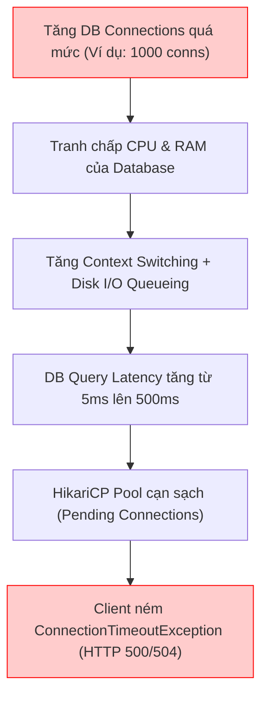
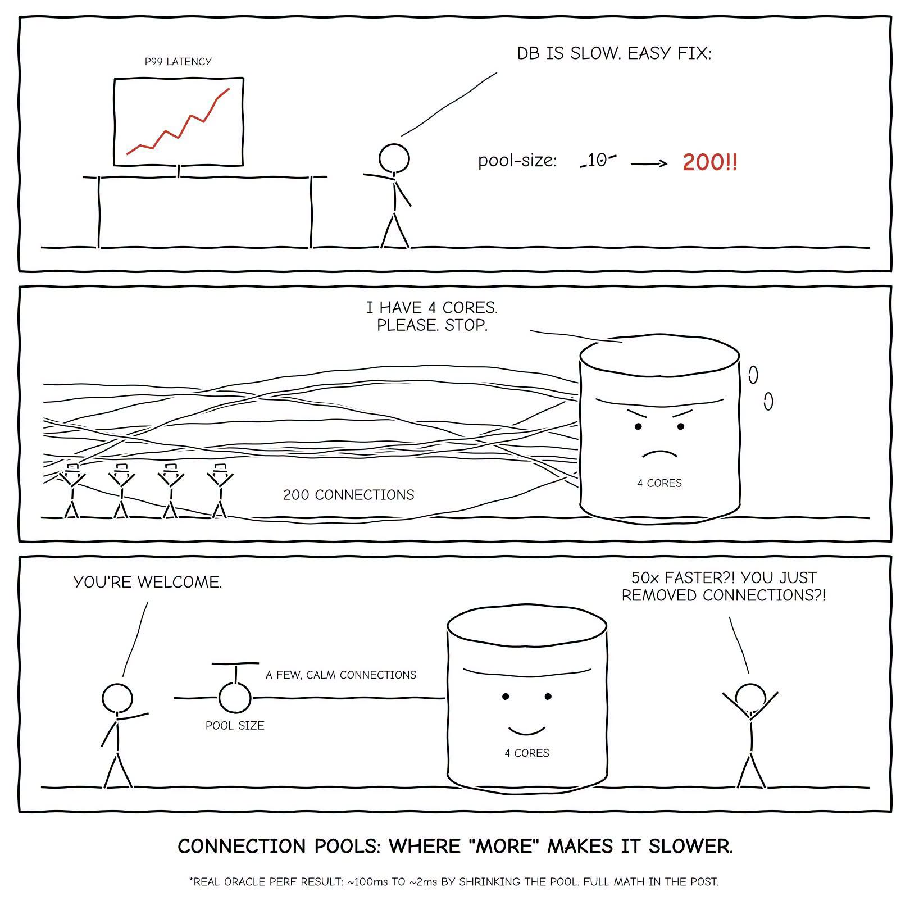

# 08 — Database Connection Pool: pool size bao nhiêu là đủ?

> **Chủ đề III — Capacity Planning & Pool Sizing**
> Đề bài rất "đời": PM quăng một câu gọn lỏn — *service phải đáp ứng 1600 RPS*. Hai câu hỏi lập tức kéo theo: *"Mỗi instance để Hikari pool mặc định 10 có ổn không? Và database cần bao nhiêu core mới gánh nổi?"* Câu trả lời không phải một con số, mà là **một chuỗi năm phép nhân chia nối đuôi nhau** — và ở giữa chuỗi có một biến gần như ai cũng quên, lòi ra là cả phép tính lệch hẳn.

---

### ⚡ TL;DR & Quick Takeaways (30 giây)
* **More Connections = SLOWER:** Tăng quá nhiều DB connections vượt số CPU Cores của DB không giúp hệ thống nhanh hơn, mà làm DB bị treo giật do Context Switching & Lock Contention ở Disk I/O (Bài học Oracle RWP: giảm pool tăng throughput 50 lần).
* **Công thức HikariCP căn bản:** $\text{Pool Size} = \text{Core Count} \times 2 + \text{Effective Spindle Count}$.
* **Chuỗi 5 Phép Tính:** $\text{RPS} \rightarrow \text{Số Instance} \rightarrow \text{Hikari Pool/Instance} \rightarrow \text{Tổng DB Connections} \rightarrow \text{Số DB CPU Cores cần thiết}$.
* **Bẫy Giữ Connection Quá Lâu:** Bị N+1 Query, giữ Connection khi gọi REST API bên ngoài, hoặc bật Spring `open-in-view=true`.





---

## 1. Đầu vào (kế thừa [tài liệu 07](07-threadpool-sizing.md))

| Giả định | Giá trị |
|---|---|
| Workload | I/O-bound, 2 vCPU/instance, `threads.max = 18` |
| Mỗi request | 55ms = 5ms compute + **50ms dính tới database** |
| Capacity/instance (Little's Law) | ~327 RPS |
| Mỗi request gọi | **2 query** → mỗi query giữ connection ~25ms |
| Trong 25ms giữ connection | DB **thực sự execute chỉ ~5ms** (còn lại: mạng + xếp hàng + truyền kết quả) |

Hai dòng cuối chính là **hai biến thầm lặng** quyết định cả bài — không tài liệu nào ghi sẵn, phải tự đo.

## 2. Connection pool khác thread pool ở đâu — về bản chất

- **Thread pool**: sizing cho năng lực **của chính mình** — đặt riêng từng service chẳng sao.
- **Connection pool**: sizing cho một **tài nguyên dùng chung** — buộc phải ngẩng lên nhìn **cả đoàn instance** đang cùng chĩa xuống một con database, rồi cúi xuống đếm mỗi request chạm DB mấy lần, giữ connection bao lâu.

**Ràng buộc nền tảng (chìa khoá của phép tính pool):** trong mô hình thread-per-request, mỗi request khi chạm DB sẽ **ôm một connection suốt thời gian nói chuyện với DB** — nhưng *không phải suốt vòng đời request*. Hệ quả kép:

1. **Trần**: một instance không bao giờ cần nhiều connection hơn số thread — 18 thread thì connection thứ 19 mở ra cũng chẳng thread nào tới lấy. `pool ≤ threads.max`.
2. **Dưới trần**: tại một khoảnh khắc, chỉ một *phần* trong 18 thread đang thực sự cầm connection — đúng bằng tỷ lệ thời-gian-giữ-connection trên tổng-thời-gian-request. Đây là phép 2 dưới đây.

## 3. Chuỗi năm phép tính

### Phép 1 — Số instance
```
1600 RPS / 327 RPS·instance⁻¹ ≈ 5 instance
```

### Phép 2 — Hikari pool mỗi instance
```
pool = threads.max × (thời gian giữ connection / tổng thời gian request)
     = 18 × (50/55) ≈ 17
```

Công thức **tự ràng buộc**: tỷ lệ luôn < 1 → kết quả luôn < `threads.max`, không bao giờ ra số vô lý vượt trần. (Nói theo Little's Law thì đây cũng chính là nó: *số connection đang dùng = tốc độ query × thời gian mỗi connection bị giữ* — đi đường qua `threads.max` cho liền mạch bài trước.)

```yaml
spring:
  datasource:
    hikari:
      maximum-pool-size: 17
      minimum-idle: 17               # pool "phẳng": tránh trả độ trễ tạo connection đúng lúc cao điểm
      leak-detection-threshold: 60000 # 60s — Hikari tự "la lên" khi connection bị giữ bất thường lâu
      max-lifetime: 1800000           # 30 phút — trẻ hoá connection, tránh bị hạ tầng cắt trước
```

**Đối chiếu "kinh nghiệm dân gian"** (*pool 4–8 là đẹp, default 10 đã cao*): cảm giác đó không sai — nó đúng **trong bối cảnh khác**. 17 là hệ quả trực tiếp của mục tiêu 327 RPS/instance với connection bị giữ 50/55 thời gian. Đổi giả định là số đổi ngay: tải nhẹ hơn → tụt; hoặc nếu trong 50ms "chờ I/O" hoá ra chỉ 20ms là nói chuyện DB còn 30ms chờ external service (lúc đó connection **đâu bị giữ** suốt 50ms, chỉ 20ms) → pool cần tụt về 4–8. **Không có con số ma thuật — chỉ có công thức và bộ giả định bạn đặt vào.** Và ở tải mục tiêu này, default 10 thực ra **THIẾU** chứ không thừa: cần 17 mà có 10 → 7 luồng đứng chờ ở cửa pool, p99 phình dù query vẫn nhanh (cùng cơ chế với cảnh 200 request đồng thời chia nhau 10 connection: 190 request xếp hàng, response time dựng đứng dù query rất nhanh).

### Phép 3 — Tổng connection cả cụm
```
17 × 5 = 85 connection cùng mở xuống database
```

### Phép 4 — Connection đang *thực sự execute* (mắt xích hay bị quên nhất)

Nghịch lý cần gỡ: 85 connection mở xuống, mà công thức phép 5 sẽ nói DB 4 core chỉ "thích" 8–9? Vậy phần lớn connection kia là phá hoại à? **Không — hai con số đo hai thứ khác nhau:**

- **85** = connection service cần **mở và giữ** để đạt 1600 RPS — mỗi connection bị giam suốt round-trip, mà phần lớn round-trip là **chờ mạng và chờ kết quả, DB không hề đang làm việc**.
- Con số công thức = connection DB muốn thấy đang **thực sự execute** cùng lúc.

Tách 25ms-giữ-connection mỗi query — chỗ phải cẩn thận vì rất nhiều người nhầm *"25ms = thời gian DB chạy query"*:

```
25ms giữ connection = round-trip mạng (đi+về) + xếp hàng ở DB nếu bận
                    + DB THỰC EXECUTE (~5ms — chỉ một phần năm!) + truyền kết quả về

→ connection đang execute tại một khoảnh khắc = 85 × (5/25) = 17
```

Phần còn lại (68 connection) đang "treo" chờ mạng — **chiếm slot trong pool của service nhưng không làm DB bận**.

### Phép 5 — Số core database

Công thức kinh điển (HikariCP wiki & cộng đồng PostgreSQL cùng trỏ về, khởi nguồn từ nhóm **Real-World Performance của Oracle**):

```
connection tối ưu cho DB = (số core × 2) + spindle
```

Ghi chú "rất 2026" về **spindle** (số đĩa hiệu dụng): xưa là số ổ cứng quay — vì ổ quay cho I/O song song thật; với NVMe + working set nóng nằm sẵn trong buffer cache thì **coi như 0**. Hệ số ×2 tồn tại vì ngay cả lúc "execute", query vẫn có những khoảng dừng ngắn (chờ page, WAL, lock) — chừa gấp đôi core để lấp các khe hở đó. Lật ngược tìm core:

```
số core DB = (17 − 1) / 2 = 8
```

**Cái đẹp của kết quả:** 85 connection mở từ phía service, nhưng DB chỉ cần đủ sức cho **17** connection execute đồng thời → **8 core là đủ**, không cần con quái vật 24–32 core. Cái 50ms-chờ hoá ra là **bạn của database**: chính vì connection phần lớn thời gian chờ mạng chứ không đè lên CPU, một con DB nhỏ vẫn cõng được một cụm service lớn.

### Tổng hợp & phân tích độ nhạy

| Bước | Phép tính | Kết quả |
|---|---|---|
| Số instance | 1600 / 327 | **5** |
| Hikari pool / instance | 18 × (50/55) | **17** |
| Tổng connection cụm | 17 × 5 | **85** |
| Connection đang execute | 85 × (5/25) | **17** |
| Core database | (17−1)/2 | **8** |

Chuỗi này **nhạy** — thử động vào từng biến: query execute 10ms thay vì 5ms → connection-đang-execute ×2 = 34 → cần ~16 core. Mỗi request 3 query thay vì 2 → QPS cụm +50% → kéo cả pool lẫn core tăng theo. Cùng một con "1600 RPS", nhích một biến là nhu cầu hạ tầng nhảy loạn — *không có số liệu thật thì mọi con số đều là đoán mò*.

---

## 4. Vì sao "more connections" làm DB chậm đi — cơ chế

Khi số connection **đang execute** vượt khả năng song song thật của DB, đám connection thừa không giúp gì — chúng bắt DB trả thêm ba loại thuế:

1. **Context switch**: mỗi backend process/thread của DB tranh nhau ít core — y hệt bệnh 10000 thread ở [tài liệu 07](07-threadpool-sizing.md) §1, lần này diễn ra trên máy DB.
2. **Tranh chấp tài nguyên chung**: lock manager, buffer pool, WAL — càng đông kẻ tranh, phần "xếp hàng nội bộ" trong mỗi query càng dài.
3. **Bộ nhớ**: mỗi connection PostgreSQL là một **process** với overhead riêng (vùng làm việc, catalog cache) — trăm connection idle vẫn ăn RAM đáng kể.

Kết quả thực nghiệm của nhóm Oracle Real-World Performance: **thu nhỏ pool kéo response time từ ~100ms xuống ~2ms — nhanh hơn ~50 lần bằng cách GIẢM connection**. Brett Wooldridge (tác giả HikariCP) gói lại: bạn muốn một cái pool **nhỏ, bão hoà** bởi đám thread xếp hàng chờ connection — chứ không phải một pool phình to với hàng trăm connection đạp nhau. *Hàng đợi đứng trước một DB chạy hết tốc lực tốt hơn một DB nghẹt thở vì đám đông.*

## 5. Ba con số dễ nhầm: 17 / 85 / `max_connections`

PostgreSQL `max_connections` mặc định ~100, cụm ta mở 85 — sát nút. Có "chửi nhau" không? Không — vì **ba con số đo ba thứ**:

| Con số | Là gì | Ẩn dụ quán phở |
|---|---|---|
| **17** | Đang **thực sự execute** — số bạn *muốn đang chạy* để nhanh | Bếp lò đang nổi lửa |
| **85** | Cụm service **thực mở và giữ** | Khách đang ngồi trong quán |
| **`max_connections` = 150–200** | **Được phép tồn tại** — để không sập | Tổng số ghế quán kê được |

Bạn không kê đúng 17 ghế chỉ vì có 17 lò — phải đủ cho 85 ông khách đang giữ chỗ, **cộng** admin đang `psql`, tool monitoring, job migration. 85 đã sát 100 → nâng `max_connections` lên **150–200** cho có đệm; không thì đúng cao điểm, cả cụm mở đủ 85 + vài kết nối admin là DB từ chối thẳng: `FATAL: too many connections`. (Khi số instance lớn hơn nhiều — autoscale hàng chục pod — cân nhắc thêm một tầng pooler như **PgBouncer** đứng giữa: hàng trăm connection phía service được "gom" xuống vài chục connection thật tới DB.)

---

## 6. Đo đạc: mô hình chỉ tốt bằng giả định của nó

Cả mô hình đẹp đẽ trên treo vào hai giả định chưa kiểm chứng — *"2 query/request"* và *"execute 5ms"*. Sau khi đặt pool theo công thức, **bật metrics lên mà nhìn** (HikariCP expose sẵn qua Micrometer):

| Metric | Ý nghĩa | Đọc thế nào |
|---|---|---|
| `hikaricp.connections.pending` | Số thread đang **xếp hàng chờ mượn** connection | Thường xuyên > 0 → pool là điểm nghẽn (đi tiếp bảng dưới) |
| `hikaricp.connections.usage` | Một connection bị **giữ bao lâu** mỗi lần mượn | So với thời gian DB execute thật → đo độ "lãng phí" |
| `hikaricp.connections.acquire` | Thời gian chờ để mượn được | Đuôi dài = thread đứng ở cửa pool |
| `hikaricp.connections.timeout` | Số lần chờ quá `connectionTimeout` (30s) → exception | > 0 là sự cố người dùng thấy được |

Cây quyết định khi `pending` cao mà p99 xấu:

```
DB còn dư sức (CPU DB thấp, không lock wait)?
├─ CÓ  → nhích pool lên từng nấc, quan sát lại
└─ KHÔNG, hoặc pool tăng mà không đỡ
     → bệnh thật: CONNECTION BỊ GIỮ QUÁ LÂU — tăng pool không giải quyết gì, đi mục 6.1
```

### 6.1. Thủ phạm "connection bị giữ quá lâu" — soi từng ca

Trục xương sống của cả bài là **khoảng cách giữa 50ms-giữ và 5ms-execute**; code tệ còn kéo khoảng "giữ" phình xa hơn nữa — và pool cần thiết phình theo. Các ca lãng xẹt quen mặt:

```java
// ❌ CA 1 — transaction ôm luôn cú gọi HTTP:
// connection bị giam thêm 300ms chờ MẠNG trong khi chẳng query gì
@Transactional
public void placeOrder(OrderRequest req) {
    orderRepo.save(toOrder(req));
    PaymentResult pr = paymentClient.charge(req);   // HTTP call TRONG transaction!
    orderRepo.updateStatus(req.id(), pr.status());
}

// ✅ Tách: transaction chỉ bọc đúng phần chạm DB
public void placeOrder(OrderRequest req) {
    Long id = tx.execute(s -> orderRepo.save(toOrder(req)).getId());
    PaymentResult pr = paymentClient.charge(req);          // ngoài transaction
    tx.executeWithoutResult(s -> orderRepo.updateStatus(id, pr.status()));
}
```

```java
// ❌ CA 2 — mở transaction từ đầu request giữ tới cuối (interceptor/@Transactional trên
//          controller/service "to") trong khi chỉ một đoạn nhỏ cần nó
// ❌ CA 3 — query thiếu index quét cả bảng: "execute" 5ms thành 500ms, chuỗi 5 phép tính
//          lệch cả dây (mục 3 — độ nhạy); soi bằng EXPLAIN ANALYZE / pg_stat_statements
// ❌ CA 4 — Open-Session-In-View của Spring Boot (mặc định BẬT): session/connection
//          dính tới khi render xong response → tắt: spring.jpa.open-in-view=false
```

**Thước đo sức khoẻ tổng:** khoảng cách giữa `connections.usage` và thời gian DB execute thật (từ `pg_stat_statements`) = phần bạn đang **lãng phí**. Hai con số càng sát nhau, code càng "sạch", pool cần càng nhỏ. `leak-detection-threshold` (vd. 60000ms) sẽ tự lôi mấy ca giữ-quá-lâu này ra ánh sáng kèm stack trace.

---

## 7. Phía database: tự vệ bằng timeout tận gốc

Pool phía service là một nửa; nửa kia là không để một query "bất tử" giam connection vô hạn:

```sql
-- PostgreSQL — đặt per-role cho user của ứng dụng
ALTER ROLE app_user SET statement_timeout = '3s';                     -- trần một câu query
ALTER ROLE app_user SET idle_in_transaction_session_timeout = '10s';  -- giết transaction mở rồi bỏ quên
-- (chính là lưới an toàn cuối cho CA 1, CA 2 ở trên)
```

Khớp với timeout budget của cả chuỗi ([tài liệu 02](../02-timeouts-and-exceptions.md) §7): `statement_timeout` < read-timeout của service < ... — lỗi fail-fast từ tầng sâu nhất.

---

## 8. Virtual threads có đổi câu chuyện này không?

**Đổi thread pool, gần như không đụng connection pool** — và đây là chỗ dễ lạc nhất. Bật `spring.threads.virtual.enabled` (Java 25 + Spring Boot mới): trần "18 thread = 18 chỗ ngồi" bốc hơi, hàng nghìn virtual thread cùng chạy. Nghe sướng. Nhưng tất cả, khi cần query, **vẫn xếp hàng xin connection từ đúng cái Hikari pool 17 kia**. Virtual thread giải phóng carrier trong lúc chờ I/O — nhưng **không nhân thêm connection xuống DB, không làm DB nuốt query nhanh hơn**. DB vẫn chỉ kham chừng ấy query song song.

> Virtual thread **dời điểm nghẽn** từ thread pool sang connection pool. Trong thế giới VT, connection pool là **cái van back-pressure đáng giá nhất còn lại** — công thức phép 2 mất "trần threads.max" tự nhiên, nên càng phải sizing chủ động; Spring Framework 7 bổ sung `@ConcurrencyLimit` để giới hạn concurrency kiểu khai báo — đặc biệt hợp mô hình này (đặt trần số VT đồng thời đi vào tầng chạm DB, thay cho cái trần mà thread pool cũ vô tình cung cấp).

---

## 9. Tổng kết

Thứ đáng mang theo không phải 17, 85 hay 8 core — mà là **chuỗi mắt xích**:

```
số instance → pool mỗi instance (threads.max × tỷ lệ giữ-connection)
            → tổng connection cả cụm
            → connection đang-thực-sự-execute (× tỷ lệ execute/giữ)
            → số core database
```

1. Năm mắt nối đuôi — **đứt một mắt là cả chuỗi sai**. Hai mắt hay đứt nhất lại thầm lặng nhất: *số query mỗi request* và *tỷ lệ giữ-connection/DB-execute* — không tài liệu nào ghi, phải tự đo (`connections.usage` vs `pg_stat_statements`).
2. "Giữ connection" ≠ "DB đang làm việc": 85 mở – 17 execute – 150-200 cho phép tồn tại — **ba con số, ba vai trò**, đừng để chúng "chửi nhau" trong đầu bạn.
3. More connections ≠ more throughput: quá điểm bão hoà, thêm connection là thêm thuế context-switch/lock/buffer — bằng chứng thực nghiệm ~50× của Oracle RWP.
4. Pool cạn mà RPS thấp → nghi ngay *connection bị giữ quá lâu* (HTTP trong transaction, open-in-view, thiếu index) — tăng pool là chữa triệu chứng.
5. Virtual threads làm connection pool trở thành **van số một** của toàn hệ — sizing nó nghiêm túc hơn, không lỏng hơn.

Framework như Spring, như Hikari sinh ra để giấu các chi tiết này — và phần lớn thời gian ta chẳng cần nhớ Little's Law hay công thức core-nhân-hai. Nhưng tới cái đêm 2 giờ sáng — *pool cạn sạch mà CPU database nhàn tênh*, hoặc *cả cụm cùng nuốt "too many connections"* — thì đúng cái tầng dưới này quyết định bạn gỡ xong trong 15 phút hay 15 tiếng. Điền một con số vào `application.yml` thì nhanh; **hiểu cả sợi dây chuyền từ một request ngoài cùng xuống tới một câu query trong lòng database** mới là thứ ở lại lâu.

## 10. Tự kiểm chứng & Bài toán thực hành (Self-Assessment)

1. **Câu hỏi:** Giải thích tại sao tăng số lượng DB Connection Pool trong HikariCP quá mức (ví dụ tăng từ 20 lên 200 per instance) lại làm hệ thống chạy CHẬM HƠN thay vì nhanh hơn?
   * *Gợi ý trả lời:* Vì khi số lượng active connection vượt xa số CPU Cores của Database Server, OS của DB bị nghẽn do Context Switching, Disk I/O Queueing và Lock Contention giữa các process Postgres/MySQL. Giảm connection pool giúp DB tập trung xử lý song song đúng số query khả thi, giảm thời gian chờ của mỗi query.
2. **Bài toán:** Database PostgreSQL Server của bạn có 8 vCPU cores và dùng ổ cứng SSD (Spindle = 1). Áp dụng công thức căn bản của HikariCP (`connections = core * 2 + spindle`), hãy tính số DB Connection tối đa tối ưu mà con DB này nên gánh. Nếu bạn có 10 instances ứng dụng, mỗi instance nên đặt Hikari `maximum-pool-size` là bao nhiêu?
   * *Gợi ý đáp án:* Tổng số connection tối ưu cho DB = $8 \times 2 + 1 = 17$ connections. Nếu phân bổ đều cho 10 instances, mỗi instance chỉ nên đặt Hikari `maximum-pool-size = 2` (hoặc nâng số core DB nếu muốn scale up pool size per instance).
3. **Câu hỏi:** Sự nguy hiểm của việc giữ DB Connection khi thực hiện Lời gọi External HTTP REST API trong một `@Transactional` method là gì và khắc phục thế nào?
   * *Gợi ý trả lời:* Transaction được mở trước khi gọi HTTP API sẽ giam giữ 1 DB Connection rảnh trong suốt thời gian chờ response (ví dụ 200ms–2000ms). Việc này làm cạn sạch Hikari Connection Pool vô ích. Khắc phục bằng cách tách HTTP API call ra ngoài khối `@Transactional`, chỉ mở Transaction cho đoạn code ghi DB thực sự.

---

**Tài liệu liên quan:** [07 — Thread pool sizing (đầu vào của chuỗi)](07-threadpool-sizing.md) · [05 — Virtual threads](../Chủ%20đề%20II%20—%20Concurrency%20Model/05-virtual-threads.md) · [06 — Bulkhead & back-pressure](06-tomcat-threadpool-taskqueue.md) · [02 — Timeout budget](../02-timeouts-and-exceptions.md)

