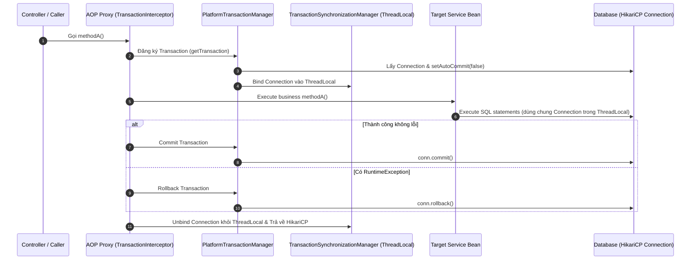

# 09 — @Transactional Part 1: Annotation "ma thuật", AOP Proxy và sợi dây ThreadLocal

> **Chủ đề IV — Transaction Management**
> Con bug mở màn (kinh điển đến mức gần như ai cũng từng dính): production báo *một bản ghi được lưu, bản ghi liên quan thì không* — log sạch, không exception. Mở code: method A **không có** annotation gọi sang method B **cùng class**, B có `@Transactional` chình ình. Đọc đi đọc lại vẫn "đúng mà". Tài liệu này tháo `@Transactional` ra đến tận đáy — BeanPostProcessor, AOP proxy, ThreadLocal — để đến cuối bài, con bug đó không còn là "luật phải thuộc" mà là **hệ quả tự suy ra được**.

---

### ⚡ TL;DR & Quick Takeaways (30 giây)
* **Bản chất Transaction:** Transaction = Tắt `autoCommit` (`setAutoCommit(false)`), gom nhóm các câu SQL, và quyết định `commit()` hoặc `rollback()` **một lần duy nhất** ở cuối khối.
* **Sức mạnh AOP Proxy:** Annotation `@Transactional` chỉ là nhãn metadata. Spring dùng `BeanPostProcessor` bọc Bean thật bằng một **AOP Proxy** (CGLIB hoặc JDK Dynamic Proxy) để đánh chặn các lời gọi method.
* **Sợi dây ThreadLocal:** Connection sau khi lấy từ HikariCP được cất vào `TransactionSynchronizationManager` (ThreadLocal). Tất cả Repository/DAO gọi trong cùng Thread sẽ tự động rút đúng Connection này ra dùng chung.
* **Cạm bẫy Self-Invocation:** Gọi `this.methodB()` từ một method cùng class sẽ nhảy thẳng vào Bean thật, **bỏ qua AOP Proxy**! Kết quả: `@Transactional` ở `methodB` hoàn toàn bị phớt lờ.



## 1. Nền móng: auto-commit và bản chất của một transaction


Điều JDBC làm sẵn mà nhiều người quên: **mặc định `autoCommit = true`** — mỗi câu SQL bắn xuống database là **tự commit ngay khi chạy xong**. Ghi là ghi luôn, không đường lùi. Mỗi statement thực chất là một "transaction tí hon tự đóng".

```
autoCommit = true (mặc định)              conn.setAutoCommit(false)
──────────────────────────────            ──────────────────────────────
INSERT INTO orders        → ✓ commit ngay  ┌─ INSERT INTO orders       ─┐
INSERT INTO order_items   → ✓ commit ngay  │  INSERT INTO order_items   │ một khối —
UPDATE inventory          → 💥 exception!  │  UPDATE inventory          │ chưa gì là vĩnh viễn
                                           └────────────┬───────────────┘
Câu 1 & 2 ĐÃ NẰM TRONG DB.                 cuối khối — quyết định MỘT LẦN:
Không rút lại được — dữ liệu dở dang.      commit TẤT ✓  hoặc  rollback TẤT ↩
```

> **Định nghĩa gọn nhất:** transaction = tắt auto-commit, gom nhiều câu lệnh vào một khối, rồi quyết định **một lần**. Toàn bộ tài liệu này (và tài liệu 10) xoay quanh đúng một câu đó.

Không có Spring, code tay sẽ là `try { conn.setAutoCommit(false); ...; conn.commit(); } catch { conn.rollback(); } finally { ... }` lặp lại ở mọi service. `@Transactional` sinh ra để giấu đống boilerplate đó đi. Câu hỏi là: giấu **bằng cách nào** — vì cách giấu chính là nguồn gốc mọi cái bẫy.

---

## 2. `@Transactional` chỉ là cái nhãn — sức mạnh nằm ở proxy


`@Transactional` **không phải feature của Java, cũng không phải của database**. Nó là **metadata** — một cái nhãn dán lên method, tự thân không chạy nổi một dòng lệnh. Cơ chế thật diễn ra ở **chặng cuối của bean lifecycle**:

```
UserService (bean vừa đúc xong, có nhãn @Transactional)
        │
        ▼
BeanPostProcessor.postProcessAfterInitialization()   ← "vòng kiểm duyệt cuối" trước khi
        │                                               bean được đặt vào container
        ▼
AbstractAutoProxyCreator thấy nhãn → KHÔNG trả bean gốc
        │                            trả về AOP PROXY bọc quanh bean gốc
        ▼
Container chứa... cái proxy. Mọi bean khác inject "UserService"
thực chất đang cầm proxy — bạn tưởng mình cầm service, bạn đang cầm người gác cổng.
```

**Vì sao `userService.save()` vẫn compile ngon lành nếu proxy là object khác?** Vì proxy được sinh ra để "giả dạng" bean gốc — hoặc **implement đúng các interface** của bean gốc (JDK Dynamic Proxy), hoặc **kế thừa thẳng class** của bean gốc (CGLIB). Cách nào thì về mặt kiểu dữ liệu nó vẫn là "một UserService". Bên trong, proxy **giữ một tham chiếu tới bean gốc** và ủy quyền mọi lời gọi xuống đó — *ghim chi tiết "giữ tham chiếu" này, nó là chìa khoá của con bug đầu bài*.

## 3. Người gác cổng làm gì khi bạn gọi `save()`


Hình dung proxy như **người gác cổng đứng bên ngoài căn nhà**: khách từ ngoài muốn vào phải qua cổng, và gác cổng làm thủ tục trước khi mở cửa. Thủ tục do `TransactionInterceptor` thực hiện, đúng ba bước:

```
① MỞ:    TransactionInterceptor hỏi PlatformTransactionManager
          (DataSourceTransactionManager / JpaTransactionManager): "mở transaction giúp tôi"
          → TM lấy một Connection từ DataSource
          → gọi connection.setAutoCommit(false)        ← chính là động tác ở mục 1!
          → CẤT Connection vào TransactionSynchronizationManager
② CHẠY:  delegate xuống method thật của bean gốc — code của bạn chạy ở đây
③ CHỐT:  method return êm đẹp → commit ✓
          method ném exception  → rollback ↩   (điều kiện chính xác: tài liệu 10, bẫy 4)
```

Điểm mấu chốt cả bài nằm ở nửa cuối bước ①: **`TransactionSynchronizationManager`, bên dưới, là một đống `ThreadLocal`.**

## 4. Transaction bound vào thread — cái tủ locker phòng gym


`ThreadLocal` = dữ liệu thuộc về **thread hiện tại**, chỉ thread đó nhìn thấy — như **tủ locker cá nhân ở phòng gym**: mỗi người một ngăn, chìa khoá trong túi mình. (Đây cũng chính là cơ chế mà security context, MDC logging dựa vào — đã gặp ở [tài liệu 03](./03-sync-async-blocking-nonblocking.md) §5 khi bàn vì sao reactive làm chúng gãy.)

Từ đó, phép màu "cả chuỗi chung một transaction" được giải thích trọn vẹn:

```
Thread-1 xử lý request:
  OrderService (@Transactional) ──> OrderRepository ──> PaymentRepository
       │                                │                    │
       │  cả ba KHÔNG truyền Connection cho nhau — thay vào đó cùng hỏi một câu:
       └────────────> "ngăn locker của Thread-1 có sẵn Connection chưa?" <──────┘
                                  CÓ → dùng lại nó
  → cả chuỗi chung 1 Connection, 1 transaction — không ai truyền tham số nào cả
```

Bạn chưa từng gọi `TransactionSynchronizationManager`? Đúng — **Spring gọi hộ**: `JdbcTemplate`/`JdbcClient` và các repository lấy Connection qua `DataSourceUtils.getConnection()` (hỏi locker trước, không xin thẳng DataSource); phía JPA thì `EntityManager` bạn inject **cũng là một proxy** — mỗi lần dùng, nó đi tìm EntityManager thật đang bound vào thread.

Và một hệ quả tưởng lạ hoá hiển nhiên: **A gọi B khác bean, cả hai cùng `@Transactional` → B không mở Connection mới** — nó nhìn locker, thấy có sẵn, dùng chung. **Hai annotation, một transaction.** Kẻ quyết định là `propagation`, mặc định `REQUIRED`: *có transaction rồi thì nhảy vào dùng chung, chưa có thì mở mới*. (Các giá trị khác và cái giá của chúng — `REQUIRES_NEW` với hai Connection — ở [tài liệu 10](./10-transactional-five-traps.md).)

> **Ba câu thần chú của cả chủ đề IV** — thuộc ba câu này là tự suy ra được mọi cái bẫy:
> 1. **Transaction bound vào thread** (nằm trong locker ThreadLocal).
> 2. **Transaction sống đúng bằng phạm vi method** (mở ở cổng vào, chốt ở cổng ra).
> 3. **Người gác cổng luôn đứng ngoài nhà** (proxy là object khác, bọc bên ngoài).

---

## 5. Giải phẫu con bug đầu bài: self-invocation


Ráp ba câu thần chú vào hiện trường:

```java
@Service
public class OrderService {
    public void methodA() {          // KHÔNG có @Transactional
        this.methodB();              // ← gọi nội bộ
    }
    @Transactional
    public void methodB() {
        repo.insert(record1);        // nếu chạy trần: auto-commit ngay
        repo.insert(record2);        // 💥 exception ở đây
    }
}
```

Truy vết từng bước:

1. Controller gọi `orderService.methodA()` — đi qua proxy thật, nhưng **A không có nhãn** → gác cổng không làm thủ tục gì, ủy quyền thẳng vào bean gốc.
2. Bên trong bean gốc, `this.methodB()` — nhớ chi tiết đã ghim: proxy giữ tham chiếu **xuống** bean gốc, nhưng bean gốc **không giữ đường nào ngược lên proxy**, thậm chí không biết proxy tồn tại. `this` = bean gốc. Bạn đang **ở trong nhà đi từ phòng này sang phòng kia** — có bước ra cổng đâu mà gác cổng chặn được.
3. Không ai làm thủ tục → trên thread đó **không tồn tại transaction nào** → locker rỗng → `methodB` chạy **trần trụi** theo JDBC mặc định: mỗi câu lệnh **tự commit ngay**.
4. `insert(record1)` → đã nằm vĩnh viễn trong DB. `insert(record2)` → exception — **quá muộn**. Kết quả: *một bản ghi được lưu, bản ghi kia thì không*. Không bí ẩn gì — một **hệ quả thẳng tuột** của ba câu thần chú.

### Ba đường thoát


```java
// ① TÁCH BEAN — khuyến nghị: lời gọi giờ đi TỪ NGOÀI vào, phải qua cổng
@Service class OrderService {
    private final OrderTxService tx;              // inject bean khác
    public void methodA() { tx.methodB(); }       // qua proxy của OrderTxService ✓
}
@Service class OrderTxService {
    @Transactional public void methodB() { ... }
}

// ② SELF-INJECTION — chạy được, nhưng đọc lên "hơi ma quái"
@Service class OrderService {
    @Lazy @Autowired private OrderService self;   // @Lazy để né circular dependency
    public void methodA() { self.methodB(); }     // self trỏ vào PROXY → vòng ra cổng rồi vòng lại ✓
    @Transactional public void methodB() { ... }
}

// ③ TRANSACTIONTEMPLATE — không annotation, không proxy, không phép thuật
txTemplate.execute(status -> {
    repoA.save(x);
    repoB.save(y);
    return null;
});   // ranh giới transaction TƯỜNG MINH, nằm ngay trong code
```

Cách ① đáng chọn nhất không phải vì ngắn — mà vì nó **ép bạn trả lời câu hỏi đúng**: *ranh giới transaction thật sự nằm ở đâu?* (Câu hỏi này quyết định trực tiếp thời gian giữ connection — mạch nối sang [tài liệu 08](./08-database-connection-pool-sizing.md) §6.1 và bẫy 2 của [tài liệu 10](./10-transactional-five-traps.md).)

---

## 6. Kiểm chứng bằng tay — đừng tin, hãy nhìn

```yaml
# Bật log để NHÌN THẤY transaction mở/đóng — bài tập một phút đáng giá nhất chủ đề này
logging:
  level:
    org.springframework.transaction.interceptor: TRACE   # "Getting transaction for [...methodB]"
    org.springframework.jdbc.datasource.DataSourceTransactionManager: DEBUG
    org.springframework.orm.jpa.JpaTransactionManager: DEBUG
```

```java
// Trong code — hai câu hỏi tự trả lời được ngay tại runtime:
TransactionSynchronizationManager.isActualTransactionActive();  // đang trong transaction thật không?
TransactionSynchronizationManager.getCurrentTransactionName();  // tên = FQN của method mở nó
AopUtils.isAopProxy(orderService);        // bean này có bị bọc proxy không?
AopUtils.isCglibProxy(orderService);      // bọc bằng CGLIB?
```

Chạy lại kịch bản self-invocation với log TRACE: gọi qua bean tách sẽ thấy `Getting transaction for [OrderTxService.methodB]`; gọi `this.methodB()` — **im lặng tuyệt đối**. Log không nói dối.

---

## 7. Tổng kết

1. Transaction = **tắt auto-commit, gom khối, quyết định một lần**. `@Transactional` chỉ là nhãn; kẻ làm việc thật là **AOP proxy** được `AbstractAutoProxyCreator` (một BeanPostProcessor) tráo vào ở chặng cuối bean lifecycle.
2. Chuỗi thủ tục: proxy → `TransactionInterceptor` → `PlatformTransactionManager` → lấy Connection, `setAutoCommit(false)`, **cất vào ThreadLocal** (`TransactionSynchronizationManager`) → mọi repository trong chuỗi cùng "mở locker" lấy ra dùng chung.
3. Ba câu thần chú: **bound vào thread — sống bằng phạm vi method — gác cổng đứng ngoài nhà.** Self-invocation không phải "luật phải thuộc lòng" mà là hệ quả suy ra từ ba câu đó. *Người dùng framework nhớ luật; người hiểu framework suy ra luật.*
4. Framework giấu phức tạp đi là điều tốt — nhưng **phức tạp bị giấu vẫn nằm nguyên dưới tấm thảm**. Self-invocation là cái vấp dễ thấy nhất (còn để lại một bản ghi lẻ loi làm manh mối). Bốn cái còn lại — connection bị giam lúc 2 giờ sáng, `@Async` chạy hai đường, checked exception im lặng commit, `UnexpectedRollbackException` — khó hơn nhiều: [tài liệu 10](./10-transactional-five-traps.md).

## 8. Tự kiểm chứng & Câu hỏi phỏng vấn (Self-Assessment)

1. **Câu hỏi:** Giải thích nguyên nhân tại sao một method A (không có `@Transactional`) gọi sang method B (có `@Transactional`) trong CÙNG MỘT CLASS lại không mở ra bất kỳ Transaction nào?
   * *Gợi ý trả lời:* Vì khi gọi `this.methodB()` từ bên trong class, lời gọi trực tiếp thi hành trên Target Bean thật mà KHÔNG đi qua AOP Proxy (người gác cổng). `TransactionInterceptor` không được kích hoạt, dẫn đến `@Transactional` bị hoàn toàn lơ đi.
2. **Câu hỏi:** Spring Framework dùng cơ chế nào để truyền đúng Database Connection từ Service layer xuống các Spring Data Repository/DAO layer trong cùng một request mà không cần truyền parameter `Connection` thủ công?
   * *Gợi ý trả lời:* Spring dùng `TransactionSynchronizationManager` để cất `ConnectionHolder` vào `ThreadLocal` của Thread đang xử lý. Khi Repository thực hiện query, nó gọi `DataSourceUtils.getConnection(dataSource)` để rút đúng Connection từ `ThreadLocal` ra dùng chung.
3. **Câu hỏi:** Làm thế nào để khắc phục triệt để con bug Self-Invocation trong Spring Service?
   * *Gợi ý trả lời:* Có 3 cách: (1) Tách method B sang một Spring Bean độc lập khác (`OrderTxService`), (2) Inject chính bean proxy của mình (`@Autowired @Lazy OrderService selfProxy`), (3) Dùng `TransactionTemplate` để quản lý ranh giới Transaction bằng code thủ công ngắn gọn.

---

**Tài liệu liên quan:** [10 — Năm cái bẫy của @Transactional](./10-transactional-five-traps.md) · [03 — ThreadLocal & mô hình concurrency](./03-sync-async-blocking-nonblocking.md) · [08 — Transaction giữ connection & pool sizing](./08-database-connection-pool-sizing.md)

