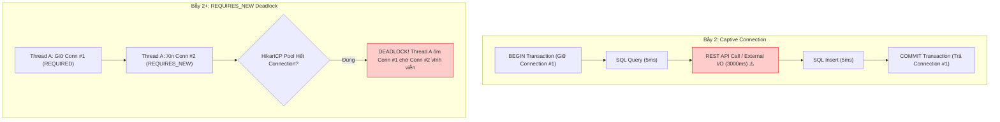
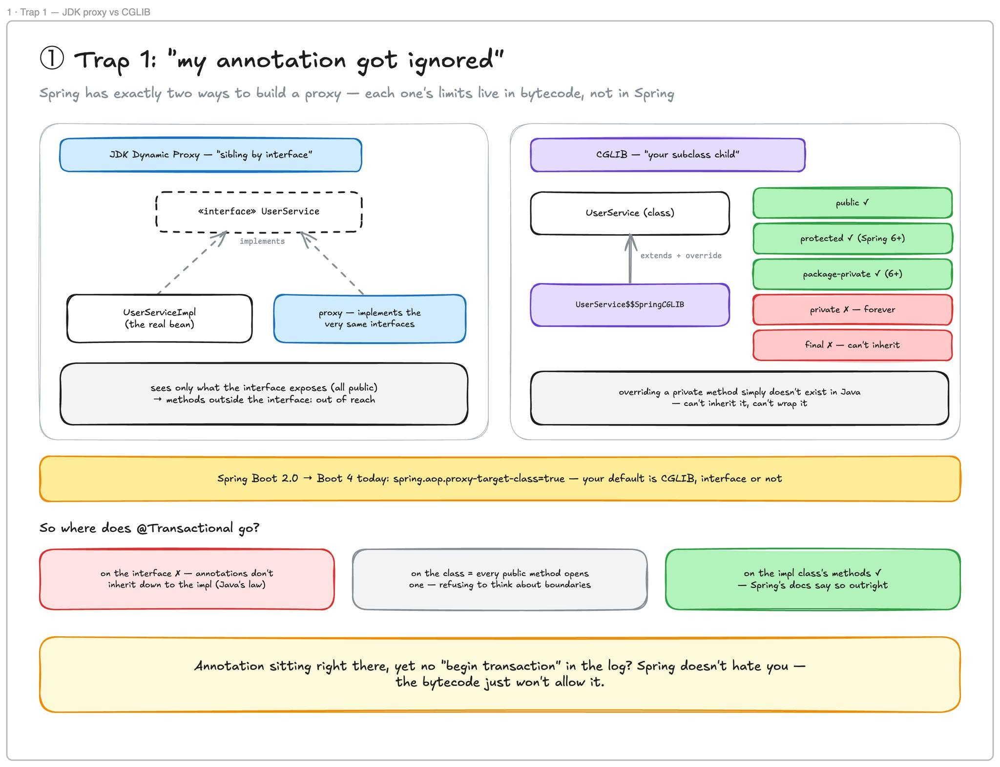
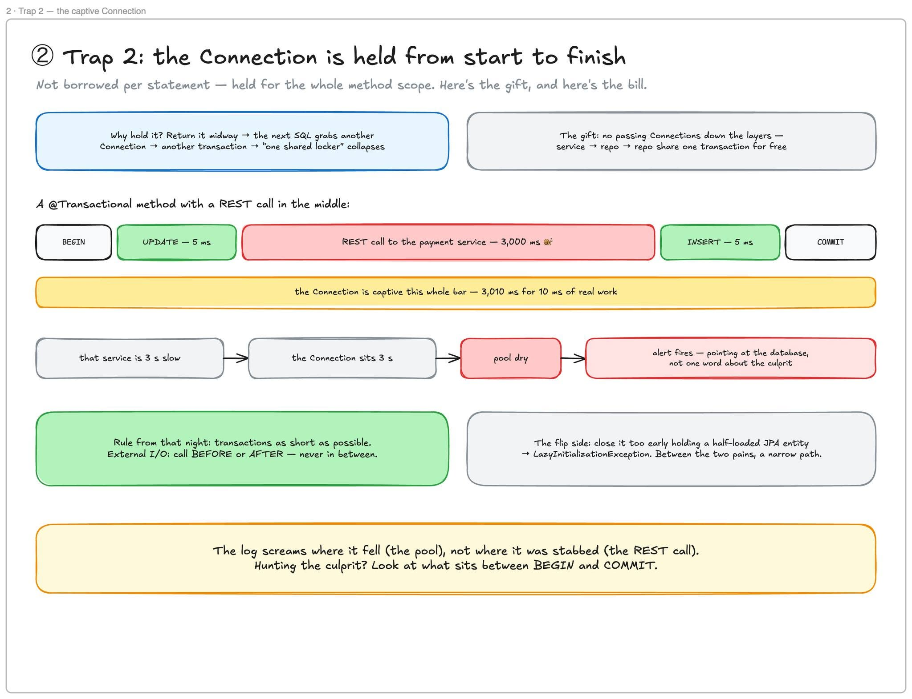
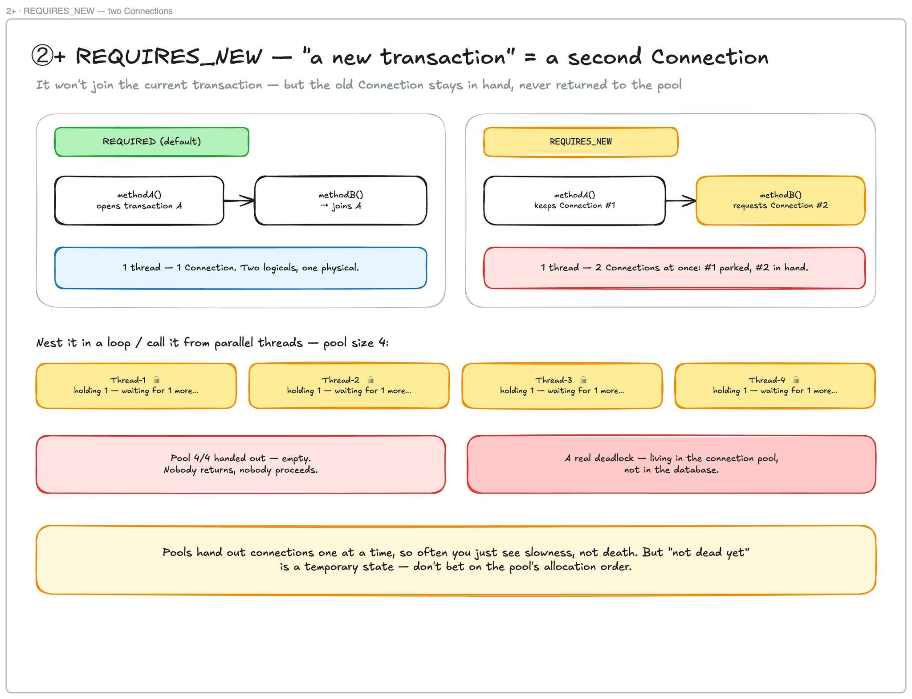
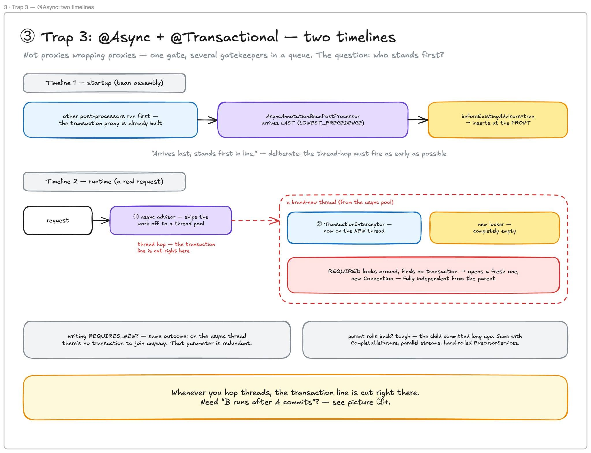
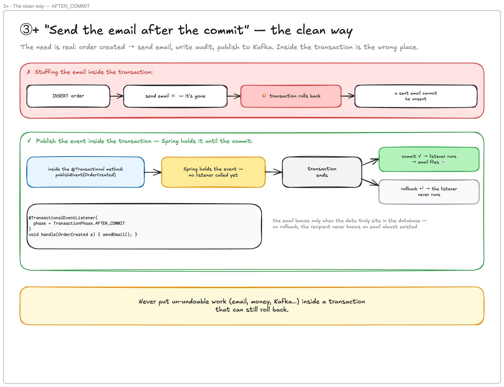
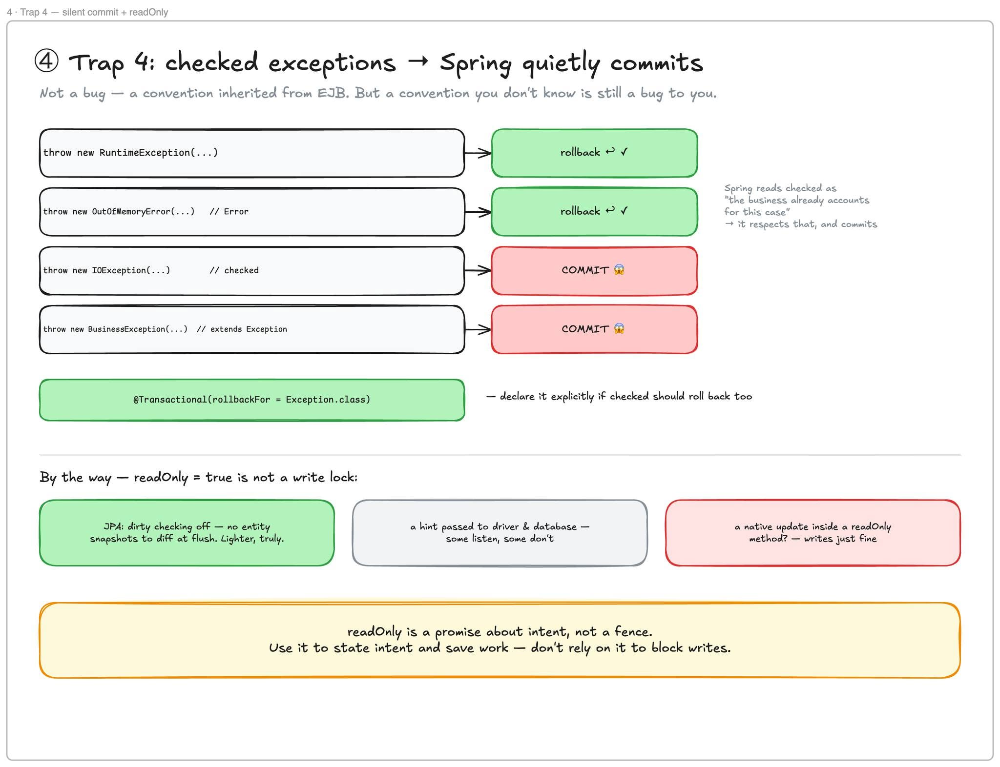
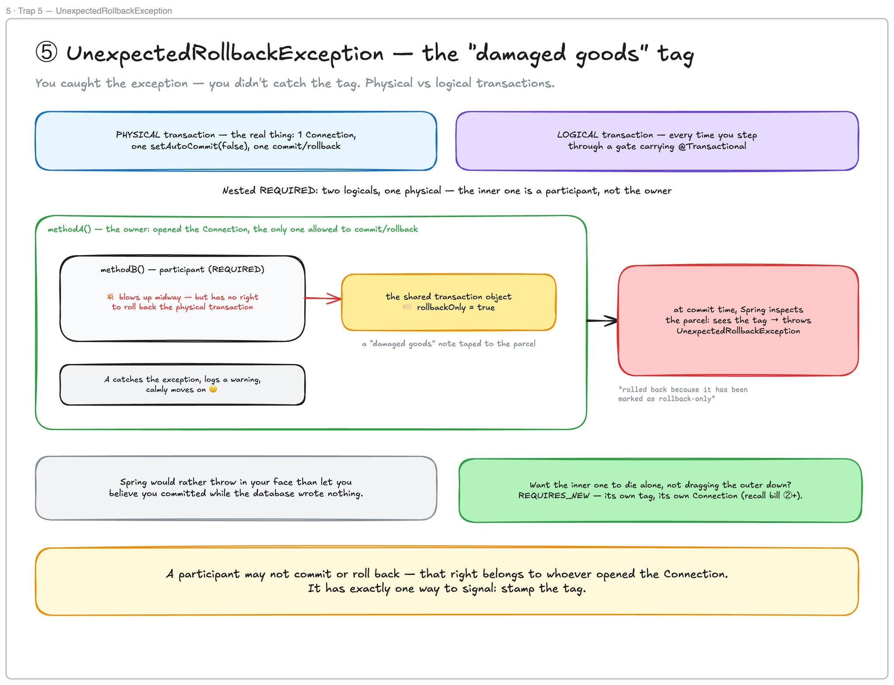

# 10 — @Transactional Part 2: Năm cái bẫy — cái giá của sự tiện nghi

> **Chủ đề IV — Transaction Management**
> Alert nổ lúc 2 giờ sáng, message vỏn vẹn: `unable to obtain connection`. Cả team lao vào lục database — slow query, lock, index, migration. Không thấy gì, database khoẻ re. Gần một tiếng sau mới có người hỏi bâng quơ: *cái service thanh toán bên kia có ổn không?* — Nó chậm. Nó chậm nên connection pool **của mình** cạn. Và trong toàn bộ log của mình **không có một chữ nào nhắc đến nó**. Cái đau của loại bug này: **log chỉ hét lên chỗ nó gục, không phải chỗ nó bị đâm.**
>
> Năm cái bẫy dưới đây cùng một họ — đều là hoá đơn trả sau của sự tiện nghi, và đều suy ra được từ ba câu thần chú của [tài liệu 09](./09-transactional-proxy-threadlocal.md): **transaction bound vào thread · sống bằng phạm vi method · gác cổng đứng ngoài nhà.**

---

### ⚡ TL;DR & Quick Takeaways (30 giây)
* **Bẫy 1 (Annotation bị lơ):** `@Transactional` trên method `private`, `final` hoặc gọi nội bộ (Self-invocation) bị phớt lờ hoàn toàn do giới hạn của Java Bytecode & AOP Proxy.
* **Bẫy 2 (Captive Connection - Cạn Pool 2h sáng):** Mở `@Transactional` bọc một Lời gọi REST API/External HTTP 3000ms. Connection bị giam giữ 3010ms chỉ cho 10ms công việc DB thật!
* **Bẫy 2+ (`REQUIRES_NEW` Deadlock):** 1 Thread mở `@Transactional` chính (giữ Conn #1) rồi gọi method `REQUIRES_NEW` (xin thêm Conn #2). Tải cao gây cạn pool và Deadlock giữa các Thread trong cùng HikariCP!
* **Bẫy 3 (@Async + @Transactional):** Chuyển sang `@Async` làm đứt sợi dây `ThreadLocal`, làm Transaction ở Thread mới độc lập hoàn toàn với Thread cũ.
* **Bẫy 4 (Checked Exception):** Mặc định Spring CHỈ rollback với `RuntimeException` (Unchecked). Ném Checked Exception (`Exception`, `IOException`) làm Spring **im lặng commit**!
* **Bẫy 5 (`UnexpectedRollbackException`):** Catch Exception từ method con nhưng method con đã lỡ đánh dấu `setRollbackOnly()`, dẫn đến toàn bộ Transaction bị đúp Rollback ở ngoài.



---

## Bẫy 1 — "Annotation của tôi bị lơ": JDK Proxy vs CGLIB



Spring có **đúng hai** cách tạo proxy, và giới hạn của mỗi cách nằm ở **bytecode của Java**, không phải ở Spring:

| | JDK Dynamic Proxy | CGLIB |
|---|---|---|
| Cách "giả dạng" | Sinh class mới **implement đúng các interface** của bean — "anh em cùng interface" | Sinh **subclass kế thừa chính class** của bean (`UserService$$SpringCGLIB`), override method để chèn interceptor — "con của bạn" |
| Chạm được method nào | Chỉ những gì **interface phơi ra** (toàn public); method ngoài interface: bó tay | `public` ✓, `protected` ✓ (Spring 6+), package-private ✓ (6+) |
| Không bao giờ chạm được | — | **`private`** — override một method private là chuyện *không tồn tại* trong Java; **`final`** method/class — không kế thừa được thì không bọc được |
| Khi nào được dùng | Spring Framework thuần: bean có interface → mặc định JDK proxy | **Spring Boot 2.0 → Boot 4 hôm nay: `spring.aop.proxy-target-class=true`** → mặc định của phần lớn chúng ta là CGLIB, có interface hay không |

Annotation nằm chình ình trên method mà log không có dòng "begin transaction" nào? Soát theo bảng trên: method `private`? `final`? Không phải Spring ghét bạn — **bytecode không cho phép**.

**Đặt `@Transactional` ở đâu?** Trên **class impl, không phải interface** — lý do nằm ở chính Java: annotation **không được kế thừa** từ interface xuống class implement; đặt trên interface thì class impl, xét về reflection, sạch trơn — Spring có cố lần ngược lên tìm, nhưng đó là *nỗ lực bù đắp, không phải bảo đảm*, và docs Spring khuyến cáo thẳng: đặt trên impl. Trên method hay trên cả class? **Trên method** — đặt trên class là tuyên bố "mọi method public đều mở transaction", nghe tiện nhưng thực chất là **từ chối suy nghĩ về ranh giới**. Mà ranh giới chính là nhân vật chính của bẫy 2.

---

## Bẫy 2 — Đêm 2 giờ sáng: Connection bị giam suốt cả method



Từ [tài liệu 09](./09-transactional-proxy-threadlocal.md): bước ① của gác cổng là *lấy Connection, cất vào locker*. Điều chưa nói rõ: **Connection bị giữ từ lúc method bắt đầu tới lúc method kết thúc** — không phải mượn-trong-lúc-chạy-SQL-rồi-trả.

**Vì sao phải giữ?** Vì nếu trả giữa chừng, câu SQL tiếp theo mượn được một Connection **khác** — mà Connection khác là **transaction khác** — cả cơ chế "chung một locker" sụp đổ. Giữ Connection là **món quà** (không phải truyền nó qua từng tầng method signature). Và **hóa đơn**:

```
@Transactional method:
BEGIN ─ UPDATE (5ms) ─ [REST call sang payment service... 3.000ms 🐌] ─ INSERT (5ms) ─ COMMIT
        └────────────── Connection bị giam TRỌN 3.010ms cho 10ms việc DB thật ──────────────┘

Service kia chậm 3s  →  Connection ngồi tù 3s  →  nhân với N request đồng thời  →  pool cạn
→  alert nổ: "unable to obtain connection" — chỉ tay vào DATABASE, không một chữ về thủ phạm
```

Đây chính là lời giải trọn vẹn cho đêm 2 giờ sáng — và là phiên bản "tầng cơ chế" của CA 1 trong [tài liệu 08](./08-database-connection-pool-sizing.md) §6.1. **Log gục ở pool, nhưng bị đâm ở REST call.** Truy thủ phạm: nhìn vào **những gì nằm giữa BEGIN và COMMIT**.

> **Nguyên tắc rút ra từ đêm đó:** transaction **ngắn nhất có thể**, và **tuyệt đối không bọc I/O bên ngoài** (HTTP, Kafka, file) vào trong nó. Gọi API *trước* hoặc *sau* — đừng gọi *ở giữa*.
>
> Mặt trái của chiều ngược lại: đóng transaction **quá sớm** khi tay còn cầm entity JPA chưa load hết → `LazyInitializationException`. Cùng một cơ chế, hai hướng đau — giữa chúng là một khoảng hẹp bạn phải tự tìm (gợi ý thực dụng: `spring.jpa.open-in-view=false` + fetch tường minh những gì response cần).

### Bẫy 2+ — `REQUIRES_NEW`: "transaction mới" = Connection thứ hai



Giá trị propagation đã hẹn từ bài trước. `REQUIRES_NEW` = *không dùng ké transaction đang có, luôn mở cái mới*. Nghe gọn — nhưng cụ thể là:

```
methodA (REQUIRED, đang giữ Connection #1)
   └─> methodB (REQUIRES_NEW)
        → Connection #1 KHÔNG trả về pool — parked, vẫn trong tay
        → xin THÊM Connection #2
        → MỘT thread, HAI Connection cùng lúc
```

Lồng vào vòng lặp hoặc gọi từ nhiều thread song song, pool size 4:

```
Thread-1 🔒 giữ 1, chờ 1...   Thread-2 🔒 giữ 1, chờ 1...
Thread-3 🔒 giữ 1, chờ 1...   Thread-4 🔒 giữ 1, chờ 1...
Pool 4/4 đã phát hết — rỗng. Không ai trả, không ai đi tiếp.
→ DEADLOCK THẬT — sống ở CONNECTION POOL, không phải ở database
   (soi pg_locks vô ích; hikaricp.connections.pending kịch trần mới là hiện trường)
```

Điều kiện nổ không phải số học đơn thuần — pool cấp connection tuần tự nên nhiều khi chỉ thấy **chậm** chứ chưa **chết**. Nhưng "chưa chết" là trạng thái tạm bợ: đừng đánh cược vào thứ tự cấp phát của pool. Dùng `REQUIRES_NEW` có kỷ luật: chỉ cho các ca thật sự cần commit độc lập (audit log, ghi nhận tiến độ batch), **không bao giờ trong vòng lặp**, và nhớ tính *hai* connection mỗi thread khi sizing pool ([tài liệu 08](./08-database-connection-pool-sizing.md) §2).

---

## Bẫy 3 — `@Async` + `@Transactional`: hai trục thời gian



M��t method có thể bị nhiều advice xếp chồng — `@Async` một cái, `@Transactional` một cái. **Không phải proxy bọc proxy như búp bê Nga** — chỉ có *một cái cổng*, nhiều người gác đứng **nối đuôi** ở đó; khách đi qua lần lượt. Câu hỏi sống còn: **ai đứng trước?** Muốn trả lời phải tách bạch **hai trục thời gian**:

**Trục 1 — startup (lắp bean):** `AsyncAnnotationBeanPostProcessor` mang order `LOWEST_PRECEDENCE` — nó đến **sau cùng**, khi proxy transaction đã dựng xong, chỉ việc ghép thêm advisor của mình (khỏi bọc thêm lớp proxy). Nhưng ghép vào đâu? Nó bật sẵn cờ `beforeExistingAdvisors = true` → **chèn vào ĐẦU chuỗi**.

**Trục 2 — runtime (request thật):** vì đứng đầu chuỗi, advisor async chạy **trước**:

```
request → ① async advisor: bắn công việc sang thread pool ✂️ ← SỢI DÂY TRANSACTION BỊ CẮT TẠI ĐÂY
              │
              ▼  (thread MỚI TOANH từ async pool)
          ② TransactionInterceptor giờ mới chạy — trên thread mới
             → locker mới, RỖNG TUẾCH
             → REQUIRED nhìn quanh: không thấy transaction nào → mở CÁI MỚI, Connection MỚI
             → độc lập TUYỆT ĐỐI với transaction cha
```

*"Đến sau cùng, đứng đầu hàng"* — Spring **cố ý**: lệnh "nhảy thread" phải nổ sớm nhất có thể. Hệ quả lạnh gáy:

- Viết `@Async @Transactional(propagation = REQUIRES_NEW)` với niềm tin *chính REQUIRES_NEW làm nó độc lập*? Niềm tin đặt sai chỗ: trên thread async **làm gì có transaction để mà ké** — REQUIRED hay REQUIRES_NEW cho **cùng một kết quả**; tham số đó **thừa**. Nó độc lập vì *đã nhảy thread*, chấm hết.
- Cha rollback? Kệ — **thằng con đã commit từ đời nào**. Y hệt với `CompletableFuture`, parallel stream, `ExecutorService` tự tạo: **hễ nhảy thread, sợi dây transaction đứt ngay tại đó** — đây là "mặt transaction" của đúng cái bẫy ô 3 trong [tài liệu 03](./03-sync-async-blocking-nonblocking.md) §4, và virtual thread ([05](./05-virtual-threads.md)) **không** đổi luật này: VT cũng là thread khác, locker khác.

### Bẫy 3+ — Nhu cầu thật: "làm việc B sau khi A đã commit"



Tạo đơn xong → gửi email, ghi audit, bắn Kafka — nhu cầu có thật. Nhét cú gửi email **vào trong** transaction thì có ngày transaction rollback mà email đã bay — *một email đã gửi thì không thu về được*:

```
✗  INSERT order → send email 📧 (đã đi mất) → 💥 rollback → dữ liệu biến mất, email thì không
```

```java
// ✓ Cách sạch: event + AFTER_COMMIT
@Transactional
public void placeOrder(Order o) {
    orderRepo.save(o);
    events.publishEvent(new OrderCreated(o.id()));  // Spring GIỮ event — chưa gọi listener nào
}                                                    // commit xong mới thả

@Component
class OrderMailer {
    @TransactionalEventListener(phase = TransactionPhase.AFTER_COMMIT)
    void handle(OrderCreated e) { mailService.send(e); }   // rollback → KHÔNG BAO GIỜ chạy
}
```

> Quy tắc: **đừng bao giờ đặt việc không-hoàn-tác-được** (email, tiền, Kafka...) **bên trong một transaction còn có thể rollback.** (Cần bảo đảm giao *ít nhất một lần* kể cả khi app chết ngay sau commit → nâng cấp lên transactional outbox pattern — ghi "việc cần làm" vào một bảng cùng transaction, worker riêng đọc và gửi.)

---

## Bẫy 4 — Checked exception → Spring **im lặng commit**; và sự thật về `readOnly`



Cái đau nhất vì **im lặng nhất**. Mặc định Spring chỉ rollback với **`RuntimeException` và `Error`**:

```java
throw new RuntimeException(...)   → rollback ↩ ✓
throw new OutOfMemoryError(...)   → rollback ↩ ✓
throw new IOException(...)        → COMMIT 😱      // checked
throw new BusinessException(...)  → COMMIT 😱      // extends Exception
```

Không phải bug — **quy ước kế thừa từ EJB**: Spring đọc checked exception là *"nghiệp vụ đã tính đến trường hợp này rồi"* → nó tôn trọng, và commit. Nhưng **quy ước mà bạn không biết thì với bạn nó vẫn là bug** — loại không ném exception nào cả, im lặng commit nửa vời, ba tháng sau kế toán phát hiện lệch số. Muốn khác đi, khai tường minh:

```java
@Transactional(rollbackFor = Exception.class)      // checked cũng rollback
public void transfer(...) throws IOException { ... }
```

**Nhân tiện, `readOnly = true` không phải cái khoá chống ghi.** Với JPA, nó **tắt dirty checking** — Hibernate khỏi chụp snapshot mọi entity để so lúc flush, nhẹ hơn *thật*. Nó cũng *gợi ý* xuống driver và database — nhưng gợi ý thì **có thằng nghe, có thằng không**: một câu native UPDATE trong method `readOnly` **vẫn ghi ngon lành**. Nó là **lời hứa về ý định, không phải hàng rào** — dùng để tuyên bố ý định + tiết kiệm công, đừng dựa vào nó để chặn ghi.

---

## Bẫy 5 — `UnexpectedRollbackException`: cái dấu "hàng hỏng"



Tên nghe "vô lý" nhưng lại rất có lý — với điều kiện tách được một khái niệm làm đôi:

| | Là gì | Đếm bằng |
|---|---|---|
| **Physical transaction** | Thứ *thật*: một Connection, một `setAutoCommit(false)`, một commit/rollback ở database | số Connection |
| **Logical transaction** | Mỗi lần bạn *bước qua một cái cổng* có `@Transactional` | số lần qua cổng |

Nested REQUIRED = **hai logical, một physical** (chuyện "hai annotation, một transaction" của [tài liệu 09](./09-transactional-proxy-threadlocal.md) §4). Thằng trong là **participant, không phải chủ nhà** — quyền commit/rollback thuộc về kẻ **đã thực sự mở Connection** (thằng ngoài cùng). Vậy participant chết giữa chừng thì báo hiệu bằng gì? Chỉ còn **một cách duy nhất**: đóng dấu `rollbackOnly = true` lên chính transaction object dùng chung — *dán tờ giấy "hàng hỏng" lên kiện hàng*, để chủ nhà đọc lúc kiểm hàng:

```java
@Transactional                        // A — chủ nhà (mở Connection)
public void outer() {
    try {
        inner.doWork();               // B — participant (REQUIRED, cùng physical tx)
    } catch (RuntimeException e) {    // B nổ → TransactionInterceptor của B ĐÃ đóng dấu
        log.warn("bỏ qua, chạy tiếp"); // A tử tế nuốt exception... 🙂
    }
    // A chạy nốt, êm đẹp...
}   // COMMIT TIME: Spring kiểm kiện hàng, thấy dấu →
    // 💥 UnexpectedRollbackException: "Transaction rolled back because it has been marked as rollback-only"
    // → TOÀN BỘ rollback. Bạn bắt được EXCEPTION — nhưng không bắt được CÁI DẤU.
```

Spring **cố tình**: thà ném vào mặt bạn còn hơn để bạn tưởng đã commit thành công trong khi transaction trong đã hỏng. Muốn thằng trong *được phép chết riêng* không kéo thằng ngoài theo? `REQUIRES_NEW` — physical riêng, Connection riêng, **dấu riêng**. Nhưng nhớ hoá đơn **hai Connection** của bẫy 2+.

---

## Tổng kết — bảng tra nhanh và bài học lớn hơn Spring

| # | Bẫy | Triệu chứng | Gốc rễ (từ 3 câu thần chú) | Thuốc |
|---|---|---|---|---|
| 1 | Annotation bị lơ | Không có "begin transaction" trong log | Proxy = kế thừa/implement → private, final, (interface) nằm ngoài tầm | Method public trên class impl; kiểm `AopUtils.isAopProxy` |
| 2 | Connection bị giam | Pool cạn 2h sáng, alert chỉ DB, DB khoẻ | Connection giữ **trọn phạm vi method** | Transaction ngắn; I/O ngoài ra khỏi tx; soi giữa BEGIN–COMMIT; [08 §6](./08-database-connection-pool-sizing.md) |
| 2+ | REQUIRES_NEW | Chậm bí ẩn / treo cứng khi tải cao | 1 thread giữ 2 Connection; giữ-1-chờ-1 × N thread | Không dùng trong loop; sizing pool tính đủ; `pending` metric |
| 3 | @Async + @Transactional | Con commit dù cha rollback | Nhảy thread = locker mới rỗng — dây tx **đứt tại chỗ cắt thread** | Tách bạch; cần "sau commit" → bẫy 3+ AFTER_COMMIT |
| 4 | Checked exception | Commit nửa vời, 3 tháng sau lệch số | Quy ước EJB: checked = "đã tính rồi" → commit | `rollbackFor = Exception.class`; đừng tin `readOnly` chặn ghi |
| 5 | UnexpectedRollbackException | "Tôi đã bắt exception rồi mà?!" | Participant không có quyền rollback — chỉ có quyền **đóng dấu** | Hiểu physical vs logical; cần chết riêng → REQUIRES_NEW (nhớ 2+) |

Nhìn lại: `@Transactional` = BeanPostProcessor + AOP proxy + ThreadLocal + connection management + một mớ quy ước ngầm chồng lên nhau. **Dễ dùng — khó dùng đúng.** Và cái khó chịu nhất: dùng sai, nó không chửi vào mặt bạn ngay; nó im lặng, commit nửa vời, rồi để kế toán phát hiện hộ.

M��i tiện nghi là một tờ hoá đơn trả sau — và ba tờ hoá đơn của Spring rất sòng phẳng:

- Chọn **ThreadLocal** (truyền context ngầm, khỏi sửa nghìn method signature) → trả giá: transaction **chết ngay khi đổi thread** (bẫy 3).
- Chọn **proxy** (khỏi sửa bytecode class của bạn) → trả giá: **self-invocation** và method private (bẫy 1, [09](./09-transactional-proxy-threadlocal.md)).
- Chọn **giữ Connection suốt method** (mọi repository chung một transaction miễn phí) → trả giá: **2 giờ sáng và một cái alert chỉ sai chỗ** (bẫy 2).

Còn tương lai? Virtual thread đã có từ Java 21, `ScopedValue` lên final ở Java 25 — nhẹ hơn ThreadLocal, gắn dữ liệu vào *phạm vi thực thi* thay vì thread, hết phạm vi tự biến mất ([05 §6.2](./05-virtual-threads.md)). Nhưng đừng vội nghĩ transaction sẽ dọn sang đó: ScopedValue **immutable, một chiều** — mà transaction context cần *mutate*, cần ai đó đóng cái dấu `rollbackOnly`. Chính OpenJDK nói thẳng transaction management là ca **không nên** migrate. Tấm thảm đó chưa bị lật. Nhưng hai nguyên lý thì ở lại: **context phải gắn vào một cái gì đó**, và **muốn chèn hành vi thì phải có ai đó đứng giữa** — ai hiểu hai câu này thì đọc framework mới nào cũng thấy quen.

## Tự kiểm chứng & Bài toán thực hành (Self-Assessment)

1. **Câu hỏi:** Giải thích tại sao một method bọc `@Transactional` thực hiện gọi HTTP REST API sang bên thứ 3 (mất 3 giây) lại có thể kéo sập HikariCP Connection Pool của ứng dụng vào thời điểm cao điểm traffic?
   * *Gợi ý trả lời:* Vì Spring giữ DB Connection trong suốt phạm vi thi hành của method từ khi BEGIN đến COMMIT. Mặc dù thời gian ghi DB chỉ mất 10ms, nhưng Connection bị bắt làm "con nợ captive" ngâm 3000ms chờ HTTP REST API. Khi nhiều request đồng thời tràn vào, toàn bộ Hikari Connections bị giam giữ làm cạn kiệt pool.
2. **Câu hỏi:** Tại sao khi ném một Checked Exception (ví dụ: `SQLException` hoặc custom `BusinessException extends Exception`), Spring `@Transactional` mặc định lại KHÔNG rollback dữ liệu? Cách cấu hình chuẩn là gì?
   * *Gợi ý trả lời:* Theo quy ước kế thừa từ EJB, Spring coi Checked Exception là "lỗi nghiệp vụ đã đoán trước" nên mặc định chỉ Rollback cho `RuntimeException` và `Error` (Unchecked). Để rollback cho tất cả Exception, phải khai báo `@Transactional(rollbackFor = Exception.class)`.
3. **Câu hỏi:** Sự cố `UnexpectedRollbackException` xảy ra trong trường hợp nào và làm thế nào để xử lý nếu muốn method con bị lỗi mà không làm sập Transaction của method cha?
   * *Gợi ý trả lời:* Xảy ra khi Method cha try-catch ném ra từ Method con (dùng chung `Propagation.REQUIRED`). Method con nổ exception đã lỡ đánh dấu `setRollbackOnly = true` vào Transaction context. Khi Method cha try-catch nuốt exception và cố commit, Spring phát hiện dấu rollback và ném `UnexpectedRollbackException`. Muốn method con chết riêng, phải đặt method con chạy `Propagation.REQUIRES_NEW`.

---

**Tài liệu liên quan:** [09 — Proxy & ThreadLocal (Part 1)](./09-transactional-proxy-threadlocal.md) · [03 — Bẫy @Async tổng quát](./03-sync-async-blocking-nonblocking.md) · [08 — Connection bị giữ lâu & pool sizing](./08-database-connection-pool-sizing.md) · [04 — Thread & ThreadLocal ở tầng JVM](./04-java-thread-lifecycle.md)

