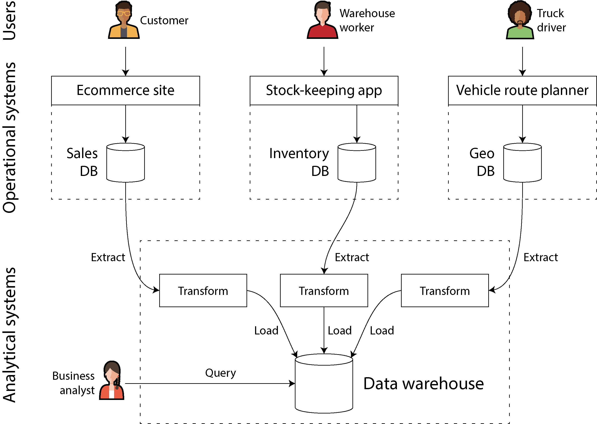
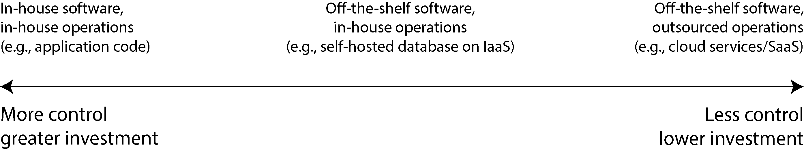

# Chương 1. Những sự đánh đổi trong kiến trúc hệ thống dữ liệu

> *Không có giải pháp nào cả; chỉ có những sự đánh đổi. […] Nhưng bạn cố gắng đạt được sự đánh đổi tốt nhất có thể, và đó là tất cả những gì bạn có thể mong đợi.*

> —Thomas Sowell, phỏng vấn với Fred Barnes (2005)

Dữ liệu là trung tâm của phần lớn hoạt động phát triển ứng dụng ngày nay. Với các ứng dụng web và di động, phần mềm dưới dạng dịch vụ (software as a service, SaaS) và các dịch vụ cloud, việc lưu trữ dữ liệu của nhiều người dùng khác nhau trong một hạ tầng dữ liệu dùng chung dựa trên server đã trở thành điều bình thường. Dữ liệu từ hoạt động của người dùng, các giao dịch kinh doanh, thiết bị và cảm biến cần được lưu trữ và sẵn sàng cho việc phân tích. Khi người dùng tương tác với một ứng dụng, họ vừa đọc dữ liệu đã được lưu trữ, vừa tạo ra thêm dữ liệu mới.

Lượng dữ liệu nhỏ, có thể lưu trữ và xử lý trên một máy duy nhất, thường khá dễ xử lý. Tuy nhiên, khi khối lượng dữ liệu hoặc tốc độ truy vấn tăng lên, dữ liệu cần được phân tán trên nhiều máy, và điều này mang đến nhiều thách thức. Khi nhu cầu của ứng dụng trở nên phức tạp hơn, việc lưu mọi thứ trong một hệ thống duy nhất không còn đủ nữa, và có thể cần phải kết hợp nhiều hệ thống lưu trữ hoặc xử lý cung cấp những khả năng khác nhau.

Chúng ta gọi một ứng dụng là *data-intensive* (thiên về dữ liệu) nếu việc quản lý dữ liệu là một trong những thách thức chính khi phát triển ứng dụng đó [1]. Trong khi ở các hệ thống *compute-intensive* (thiên về tính toán), thách thức nằm ở việc song song hóa một phép tính rất lớn, thì trong các ứng dụng data-intensive, chúng ta thường lo lắng nhiều hơn về những việc như lưu trữ và xử lý khối lượng dữ liệu lớn, quản lý các thay đổi của dữ liệu, đảm bảo tính nhất quán (consistency) khi đối mặt với hỏng hóc và tính đồng thời (concurrency), và đảm bảo các dịch vụ có tính sẵn sàng cao.

Những ứng dụng như vậy thường được xây dựng từ các khối xây dựng tiêu chuẩn cung cấp những chức năng thường cần đến. Ví dụ, nhiều ứng dụng cần làm những việc sau:

- Lưu trữ dữ liệu để chính ứng dụng đó, hoặc một ứng dụng khác, có thể tìm lại sau này (*databases* — cơ sở dữ liệu)

- Ghi nhớ kết quả của một phép toán tốn kém, để tăng tốc việc đọc (*caches*)

- Cho phép người dùng tìm kiếm dữ liệu theo từ khóa hoặc lọc dữ liệu theo nhiều cách khác nhau (*search indexes* — chỉ mục tìm kiếm)

- Xử lý các event và các thay đổi dữ liệu ngay khi chúng xảy ra (*stream processing*)

- Định kỳ xử lý một lượng lớn dữ liệu đã tích lũy (*batch processing*)

Khi xây dựng một ứng dụng, chúng ta thường lấy một số hệ thống phần mềm hoặc dịch vụ, chẳng hạn như database hoặc API, và gắn kết chúng lại với nhau bằng mã ứng dụng. Nếu bạn đang làm đúng những gì các hệ thống dữ liệu đó được thiết kế để làm, quá trình này có thể khá dễ dàng.

Tuy nhiên, khi ứng dụng của bạn trở nên tham vọng hơn, các thách thức sẽ xuất hiện. Có rất nhiều hệ thống database với những đặc tính khác nhau, phù hợp với những mục đích khác nhau — làm thế nào để bạn chọn được hệ thống nên dùng? Có nhiều cách tiếp cận khác nhau đối với caching, nhiều cách xây dựng search index, v.v. — làm thế nào để bạn lý giải về những sự đánh đổi (trade-off) của chúng? Bạn cần xác định công cụ nào và cách tiếp cận nào là phù hợp nhất cho công việc trước mắt, và việc kết hợp các công cụ có thể khó khăn khi bạn cần làm điều gì đó mà một công cụ đơn lẻ không thể tự làm được.

Cuốn sách này là một cẩm nang giúp bạn đưa ra quyết định về việc nên dùng công nghệ nào và kết hợp chúng như thế nào. Như bạn sẽ thấy, không có cách tiếp cận nào về căn bản là tốt hơn những cách khác; mọi thứ đều có ưu và nhược điểm. Với cuốn sách này, bạn sẽ học cách đặt ra những câu hỏi đúng để đánh giá và so sánh các hệ thống dữ liệu, từ đó bạn có thể xác định cách tiếp cận nào sẽ phục vụ tốt nhất nhu cầu của ứng dụng cụ thể của mình.

Chúng ta sẽ bắt đầu hành trình bằng việc xem xét một số cách mà dữ liệu thường được sử dụng trong các tổ chức ngày nay. Nhiều ý tưởng ở đây có nguồn gốc từ *enterprise software* (phần mềm doanh nghiệp, tức là các nhu cầu phần mềm và thực hành kỹ thuật của các tổ chức lớn, như các tập đoàn lớn và chính phủ), vì trong lịch sử, chỉ các tổ chức lớn mới có khối lượng dữ liệu lớn đòi hỏi những giải pháp kỹ thuật tinh vi. Nếu khối lượng dữ liệu của bạn đủ nhỏ, bạn hoàn toàn có thể giữ nó trong một bảng tính! Tuy nhiên, gần đây việc các công ty nhỏ hơn và các startup quản lý khối lượng dữ liệu lớn và xây dựng các hệ thống data-intensive cũng đã trở nên phổ biến.

Một trong những thách thức chính với các hệ thống dữ liệu là những người khác nhau cần làm những việc rất khác nhau với dữ liệu. Nếu bạn đang làm việc tại một công ty, bạn và đội của bạn sẽ có một tập ưu tiên, trong khi một đội khác có thể có những mục tiêu hoàn toàn khác, mặc dù các bạn có thể đang làm việc trên cùng một tập dữ liệu! Hơn nữa, những mục tiêu đó có thể không được nói ra một cách rõ ràng, điều này có thể dẫn đến hiểu lầm và bất đồng về cách tiếp cận đúng.

Để giúp bạn hiểu rõ các lựa chọn của mình, chương này so sánh một số khái niệm đối lập và khám phá những sự đánh đổi giữa chúng. Chúng ta sẽ xem xét các chủ đề sau:

- Sự khác biệt giữa hệ thống vận hành (operational) và hệ thống phân tích (analytical) (“Hệ thống vận hành và hệ thống phân tích”)

- Ưu và nhược điểm của các dịch vụ cloud và các hệ thống tự vận hành (self-hosted) (“Cloud so với Tự vận hành (Self-Hosting)”)

- Khi nào nên chuyển từ hệ thống đơn nút (single-node) sang hệ phân tán (distributed system) (“Hệ phân tán so với hệ đơn nút”)

- Cân bằng giữa nhu cầu của doanh nghiệp và quyền của người dùng (“Hệ thống dữ liệu, pháp luật và xã hội”)

Chương này cũng định nghĩa các thuật ngữ mà bạn sẽ cần cho phần còn lại của cuốn sách.

#### THUẬT NGỮ: FRONTEND VÀ BACKEND

Phần lớn những gì chúng ta sẽ thảo luận trong cuốn sách này liên quan đến *backend development* (phát triển backend). Để giải thích thuật ngữ đó: với các ứng dụng web, mã phía client (chạy trong trình duyệt web) được gọi là *frontend*, còn mã phía server xử lý các request của người dùng được gọi là *backend*. Các ứng dụng di động tương tự như frontend ở chỗ chúng cung cấp giao diện người dùng, và thường giao tiếp qua internet với một backend phía server. Frontend đôi khi quản lý dữ liệu cục bộ trên thiết bị của người dùng [2], nhưng những thách thức lớn nhất về hạ tầng dữ liệu thường nằm ở backend: một frontend chỉ cần xử lý dữ liệu của một người dùng, trong khi backend quản lý dữ liệu thay cho *tất cả* người dùng.

Một dịch vụ backend thường có thể truy cập được qua HTTP (hoặc đôi khi là WebSocket); nó thường gồm mã ứng dụng đọc và ghi dữ liệu trong một hoặc nhiều database, và đôi khi giao tiếp với các hệ thống dữ liệu bổ sung như cache hoặc message queue (mà chúng ta có thể gọi chung là *data infrastructure* — hạ tầng dữ liệu). Mã ứng dụng thường là *stateless* (không trạng thái, tức là khi xử lý xong một HTTP request, nó quên hết mọi thứ về request đó), và bất kỳ thông tin nào cần được lưu giữ từ request này sang request khác đều phải được lưu hoặc ở phía client, hoặc trong hạ tầng dữ liệu phía server.

## Hệ thống vận hành và hệ thống phân tích

Nếu bạn làm việc với các hệ thống dữ liệu trong một doanh nghiệp, bạn có thể sẽ gặp nhiều kiểu người khác nhau làm việc với dữ liệu. Kiểu thứ nhất là các *backend engineer* (kỹ sư backend), những người xây dựng các dịch vụ xử lý các request đọc và cập nhật dữ liệu; các dịch vụ này thường phục vụ người dùng bên ngoài, hoặc trực tiếp hoặc gián tiếp thông qua các dịch vụ khác (xem “Microservices và Serverless”). Đôi khi các dịch vụ được dùng nội bộ bởi các bộ phận khác của tổ chức.

Ngoài các đội quản lý dịch vụ backend, thường có hai nhóm người khác cũng cần truy cập dữ liệu của tổ chức: các *business analyst* (chuyên viên phân tích nghiệp vụ), những người tạo báo cáo về hoạt động của tổ chức để giúp ban quản lý ra quyết định tốt hơn (*business intelligence*, hay BI), và các *data scientist* (nhà khoa học dữ liệu), những người tìm kiếm những hiểu biết mới mẻ trong dữ liệu hoặc tạo ra các tính năng sản phẩm hướng tới người dùng được hiện thực hóa nhờ phân tích dữ liệu và machine learning (ML)/AI (ví dụ: gợi ý “những người đã mua *X* cũng mua *Y*” trên một website thương mại điện tử, phân tích dự đoán như chấm điểm rủi ro hoặc lọc spam, và xếp hạng kết quả tìm kiếm).

Mặc dù business analyst và data scientist thường dùng những công cụ khác nhau và làm việc theo những cách khác nhau, họ có một số thực hành chung. Thứ nhất, cả hai đều thực hiện *analytics* (phân tích), nghĩa là họ xem xét dữ liệu mà người dùng và các dịch vụ backend đã tạo ra. Thứ hai, họ thường không sửa đổi dữ liệu này (có lẽ trừ việc sửa lỗi), mặc dù họ có thể tạo ra các tập dữ liệu dẫn xuất (derived dataset) trong đó dữ liệu gốc đã được xử lý theo cách nào đó.

Điều này đã dẫn đến sự phân tách thành hai loại hệ thống — một sự phân biệt mà chúng ta sẽ dùng xuyên suốt cuốn sách này:

- *Operational systems* (hệ thống vận hành) gồm các dịch vụ backend và hạ tầng dữ liệu nơi dữ liệu được tạo ra — ví dụ, bằng việc phục vụ người dùng bên ngoài. Ở đây, mã ứng dụng vừa đọc vừa sửa đổi dữ liệu trong các database của nó, dựa trên các hành động do người dùng thực hiện.

- *Analytical systems* (hệ thống phân tích) phục vụ nhu cầu của business analyst và data scientist. Chúng chứa một bản sao chỉ đọc của dữ liệu từ các hệ thống vận hành, và được tối ưu hóa cho các kiểu xử lý dữ liệu cần thiết cho việc phân tích.

Như chúng ta sẽ thấy trong mục tiếp theo, hệ thống vận hành và hệ thống phân tích thường được tách riêng, vì những lý do chính đáng. Khi các hệ thống này trưởng thành, hai vai trò chuyên môn mới đã xuất hiện: data engineer và analytics engineer. *Data engineer* (kỹ sư dữ liệu) là những người biết cách tích hợp các hệ thống vận hành và hệ thống phân tích, và chịu trách nhiệm về hạ tầng dữ liệu của tổ chức ở phạm vi rộng hơn [3]. *Analytics engineer* (kỹ sư phân tích) mô hình hóa và biến đổi dữ liệu để làm cho nó hữu ích hơn cho các business analyst và data scientist trong một tổ chức [4].

Nhiều kỹ sư chuyên về hoặc phía vận hành hoặc phía phân tích. Tuy nhiên, cuốn sách này bao quát cả hệ thống dữ liệu vận hành và hệ thống dữ liệu phân tích, vì cả hai đều đóng vai trò quan trọng trong vòng đời của dữ liệu trong một tổ chức. Chúng ta sẽ khám phá sâu hạ tầng dữ liệu được dùng để cung cấp dịch vụ cho cả người dùng nội bộ và bên ngoài, để bạn có thể làm việc tốt hơn với các đồng nghiệp ở phía bên kia của ranh giới này.

### Đặc trưng của xử lý transaction và phân tích

Trong những ngày đầu của xử lý dữ liệu kinh doanh, một lần ghi vào database thường tương ứng với một giao dịch thương mại đang diễn ra: thực hiện một giao dịch bán hàng, đặt đơn hàng với nhà cung cấp, trả lương cho nhân viên, v.v. Khi database mở rộng sang các lĩnh vực không liên quan đến việc chuyển tiền, thuật ngữ *transaction* vẫn được giữ lại, dùng để chỉ một nhóm các thao tác đọc và ghi tạo thành một đơn vị logic.

> **LƯU Ý**
>
> Chương 8 khám phá chi tiết ý nghĩa của transaction. Chương này dùng thuật ngữ đó một cách lỏng lẻo để chỉ các thao tác đọc và ghi có độ trễ thấp (low-latency).

Mặc dù database bắt đầu được dùng cho nhiều loại dữ liệu — bài đăng trên mạng xã hội, các nước đi trong một trò chơi, danh bạ liên hệ, và rất, rất nhiều thứ khác — mẫu truy cập cơ bản vẫn tương tự như xử lý các giao dịch kinh doanh. Một hệ thống vận hành thường tra cứu một số lượng nhỏ bản ghi (record) theo khóa (key) (điều này được gọi là *point query* — truy vấn điểm). Các bản ghi được chèn, cập nhật hoặc xóa dựa trên đầu vào của người dùng. Vì các ứng dụng này có tính tương tác, mẫu truy cập này được gọi là *online transaction processing* (OLTP).

Tuy nhiên, database cũng bắt đầu ngày càng được dùng nhiều cho phân tích, vốn có các mẫu truy cập rất khác so với OLTP. Thông thường, một truy vấn phân tích quét qua một số lượng khổng lồ bản ghi và tính toán các thống kê tổng hợp (như count, sum hoặc average) thay vì trả về từng bản ghi riêng lẻ cho người dùng. Ví dụ, một business analyst tại một chuỗi siêu thị có thể muốn trả lời các truy vấn phân tích như sau:

- Tổng doanh thu của từng cửa hàng của chúng ta trong tháng Một là bao nhiêu? Chúng ta đã bán được nhiều hơn bao nhiêu quả chuối so với bình thường trong đợt khuyến mãi gần nhất?

- Nhãn hiệu thức ăn trẻ em nào thường được mua cùng với tã hiệu *X* nhất?

Các báo cáo thu được từ những kiểu truy vấn này rất quan trọng cho BI, giúp ban quản lý quyết định nên làm gì tiếp theo. Để phân biệt mẫu sử dụng database này với xử lý transaction, nó được gọi là *online analytical processing* (OLAP) [5]. Sự khác biệt giữa OLTP và phân tích không phải lúc nào cũng rõ ràng, nhưng một số đặc trưng điển hình được liệt kê trong Bảng 1-1.

*Bảng 1-1. So sánh đặc trưng của hệ thống vận hành và hệ thống phân tích*

| **Thuộc tính** | **Hệ thống vận hành (OLTP)** | **Hệ thống phân tích (OLAP)** |
|---|---|---|
| Mẫu đọc chính | Point query (lấy từng bản ghi theo khóa) | Tổng hợp trên số lượng lớn bản ghi |
| Mẫu ghi chính | Tạo, cập nhật và xóa từng bản ghi | Nhập hàng loạt (ETL) hoặc event stream |
| Ví dụ người dùng là con người | Người dùng cuối của ứng dụng web/di động | Chuyên viên phân tích nội bộ, để hỗ trợ ra quyết định |
| Ví dụ sử dụng bởi máy | Kiểm tra xem một hành động có được phép hay không | Phát hiện các mẫu gian lận/lạm dụng |
| Loại truy vấn | Cố định, được ứng dụng định nghĩa trước | Tùy ý, khám phá ad-hoc bởi chuyên viên phân tích |
| Khối lượng truy vấn | Rất nhiều truy vấn nhỏ | Ít truy vấn, mỗi truy vấn đều phức tạp |
| Dữ liệu biểu thị | Trạng thái mới nhất của dữ liệu (thời điểm hiện tại) | Lịch sử các event đã xảy ra theo thời gian |
| Kích thước tập dữ liệu | Từ gigabyte đến terabyte | Từ terabyte đến petabyte |

> **LƯU Ý**
>
> Ý nghĩa của từ *online* trong *OLAP* không rõ ràng; nó có lẽ chỉ ra rằng các truy vấn không chỉ dành cho các báo cáo được định nghĩa trước, mà các chuyên viên phân tích còn dùng hệ thống OLAP một cách tương tác cho các truy vấn khám phá.

Với các hệ thống vận hành, người dùng thường không được phép tự xây dựng các truy vấn SQL tùy ý và chạy chúng trên database, vì điều đó có khả năng cho phép họ đọc hoặc sửa đổi dữ liệu mà họ không có quyền truy cập. Họ cũng có thể viết những truy vấn tốn kém khi thực thi và do đó ảnh hưởng đến hiệu năng của database đối với những người dùng khác. Vì những lý do này, các hệ thống OLTP chủ yếu chạy các tập truy vấn cố định được nhúng sẵn trong mã ứng dụng, với các truy vấn tùy biến một lần chỉ được dùng thỉnh thoảng cho việc bảo trì hoặc xử lý sự cố. Ngược lại, các database phân tích thường cho người dùng tự do viết các truy vấn SQL tùy ý bằng tay, hoặc tự động sinh truy vấn bằng một công cụ trực quan hóa dữ liệu hoặc dashboard như Tableau, Looker hay Microsoft Power BI.

Một loại hệ thống khác được thiết kế cho các khối lượng công việc phân tích (các truy vấn tổng hợp trên nhiều bản ghi) nhưng được nhúng vào các sản phẩm hướng tới người dùng. Các hệ thống được thiết kế cho kiểu sử dụng này, được gọi là *product analytics* hoặc *real-time analytics*, bao gồm Pinot, Druid và ClickHouse [6]. Những hệ thống như vậy tiếp nhận (ingest) dữ liệu theo thời gian thực và được tối ưu hóa cho phản hồi truy vấn có độ trễ thấp. Ngược lại, các hệ thống OLAP truyền thống thường tiếp nhận dữ liệu theo lô (batch) và được tối ưu hóa cho xử lý truy vấn có thông lượng (throughput) cao.

### Data Warehousing (Kho dữ liệu)

Ban đầu, cùng một database được dùng cho cả xử lý transaction và các truy vấn phân tích. SQL hóa ra khá linh hoạt về mặt này; nó hoạt động tốt cho cả hai loại truy vấn. Tuy nhiên, vào cuối những năm 1980 và đầu những năm 1990, một xu hướng nổi lên là các công ty ngừng dùng hệ thống OLTP của họ cho mục đích phân tích và thay vào đó chạy phân tích trên một hệ thống database riêng biệt. Database riêng biệt này được gọi là *data warehouse* (kho dữ liệu).

Một doanh nghiệp lớn có thể có hàng chục, thậm chí hàng trăm hệ thống OLTP: các hệ thống vận hành website hướng tới khách hàng, điều khiển các hệ thống điểm bán hàng (thanh toán) trong các cửa hàng vật lý, theo dõi hàng tồn kho trong các nhà kho, lập kế hoạch lộ trình cho xe, quản lý nhà cung cấp, quản trị nhân viên, và thực hiện nhiều tác vụ khác. Mỗi hệ thống trong số này đều phức tạp và cần một đội ngũ để bảo trì, nên cuối cùng chúng vận hành gần như độc lập với nhau.

Việc để các business analyst và data scientist truy vấn trực tiếp các hệ thống OLTP này thường là không mong muốn, vì một số lý do:

- Dữ liệu cần quan tâm có thể nằm rải rác trên nhiều hệ thống vận hành, khiến việc kết hợp các tập dữ liệu đó trong một truy vấn duy nhất trở nên khó khăn (một vấn đề được gọi là *data silos* — các ốc đảo dữ liệu).

- Các kiểu schema và cách bố trí dữ liệu phù hợp với OLTP lại kém phù hợp hơn cho phân tích (xem “Star và Snowflake: Các schema cho phân tích”).

- Các truy vấn phân tích có thể khá tốn kém, và việc chạy chúng trên một database OLTP sẽ ảnh hưởng đến hiệu năng đối với những người dùng khác. Các hệ thống OLTP có thể nằm trong một mạng riêng mà người dùng không được phép truy cập trực tiếp, vì lý do bảo mật hoặc tuân thủ.

Ngược lại, một *data warehouse* là một database riêng biệt mà các chuyên viên phân tích có thể truy vấn thỏa thích, không ảnh hưởng đến các hoạt động OLTP [7]. Như chúng ta sẽ thấy trong Chương 4, data warehouse thường lưu dữ liệu theo cách rất khác so với các database OLTP, để tối ưu hóa cho các kiểu truy vấn phổ biến trong phân tích.

Data warehouse chứa một bản sao chỉ đọc của dữ liệu từ tất cả các hệ thống OLTP khác nhau trong công ty. Dữ liệu được trích xuất từ các database OLTP (bằng cách kết xuất dữ liệu định kỳ hoặc bằng một luồng cập nhật liên tục), được biến đổi sang một schema thân thiện với phân tích, được làm sạch, rồi được nạp vào data warehouse. Quá trình đưa dữ liệu vào data warehouse này được gọi là *extract–transform–load* (ETL) và được minh họa trong Hình 1-1. Đôi khi thứ tự của các bước *transform* và *load* được đổi chỗ (tức là việc biến đổi được thực hiện trong data warehouse, sau khi nạp), dẫn đến *ELT*.

*Hình 1-1. Sơ đồ đơn giản hóa của quá trình ETL vào một data warehouse*

Trong một số trường hợp, nguồn dữ liệu của các quy trình ETL là các sản phẩm SaaS bên ngoài như hệ thống quản lý quan hệ khách hàng (CRM), email marketing, hoặc hệ thống xử lý thẻ tín dụng. Trong những trường hợp đó, bạn không có quyền truy cập trực tiếp vào database gốc, vì nó chỉ có thể truy cập được qua API của nhà cung cấp phần mềm. Việc đưa dữ liệu từ các hệ thống bên ngoài này vào data warehouse của chính bạn có thể cho phép những phân tích không thể thực hiện được qua API của SaaS. ETL cho các API SaaS thường được hiện thực bởi các dịch vụ data connector chuyên biệt như Fivetran, Singer hoặc Airbyte.

Một số hệ thống database cung cấp *hybrid transactional/analytical processing* (HTAP — xử lý giao dịch/phân tích kết hợp), nhằm cho phép cả OLTP và phân tích trong một hệ thống duy nhất mà không cần ETL từ hệ thống này sang hệ thống khác [8, 9]. Tuy nhiên, nhiều hệ thống HTAP bên trong gồm một hệ thống OLTP ghép với một hệ thống phân tích riêng biệt, được ẩn sau một giao diện chung — nên sự phân biệt giữa hai loại này vẫn quan trọng để hiểu cách các hệ thống đó hoạt động.

Hơn nữa, mặc dù HTAP tồn tại, việc tách riêng hệ thống transactional và hệ thống phân tích vẫn phổ biến do các mục tiêu và yêu cầu khác nhau của chúng. Cụ thể, việc mỗi hệ thống vận hành có database riêng của mình được coi là thực hành tốt (xem “Microservices và Serverless”), dẫn đến khả năng có hàng trăm database vận hành riêng biệt; mặt khác, một doanh nghiệp thường chỉ có một data warehouse duy nhất, để các business analyst có thể kết hợp dữ liệu từ nhiều hệ thống vận hành trong một truy vấn duy nhất.

Do đó, HTAP không thay thế data warehouse. Thay vào đó, nó hữu ích khi cùng một ứng dụng cần vừa thực hiện các truy vấn phân tích quét qua một số lượng lớn hàng, vừa đọc và cập nhật từng bản ghi riêng lẻ với độ trễ thấp. Ví dụ, phát hiện gian lận có thể bao gồm những khối lượng công việc như vậy [10].

Sự tách biệt giữa hệ thống vận hành và hệ thống phân tích là một phần của một xu hướng rộng hơn. Khi các khối lượng công việc trở nên đòi hỏi hơn, các hệ thống đã trở nên chuyên biệt hơn và được tối ưu hóa cho những khối lượng công việc cụ thể. Các hệ thống đa dụng có thể xử lý thoải mái các khối lượng dữ liệu nhỏ, nhưng quy mô càng lớn thì các hệ thống càng có xu hướng trở nên chuyên biệt [11].

#### Từ data warehouse đến data lake

Một data warehouse thường dùng mô hình dữ liệu (data model) *quan hệ* (relational) được truy vấn qua SQL (xem Chương 3), có lẽ với phần mềm BI chuyên dụng. Mô hình này hoạt động tốt cho các kiểu truy vấn mà business analyst cần thực hiện, nhưng nó kém phù hợp hơn với nhu cầu của các data scientist khi thực hiện những tác vụ như sau:

- Biến đổi dữ liệu sang một dạng phù hợp để huấn luyện một mô hình ML. Điều này thường đòi hỏi chuyển các hàng và cột của một bảng database thành một vector hoặc ma trận các giá trị số gọi là *features* (đặc trưng). Quá trình thực hiện phép biến đổi này theo cách tối đa hóa hiệu năng của mô hình được huấn luyện được gọi là *feature engineering*, và nó thường đòi hỏi mã tùy biến vốn khó diễn đạt bằng SQL.

- Sử dụng các kỹ thuật xử lý ngôn ngữ tự nhiên (NLP) trên dữ liệu văn bản (ví dụ: các bài đánh giá về một sản phẩm) để cố gắng trích xuất thông tin có cấu trúc từ đó (ví dụ: cảm xúc của tác giả, hoặc những chủ đề họ đề cập). Tương tự, data scientist có thể cần trích xuất thông tin có cấu trúc từ ảnh bằng các kỹ thuật thị giác máy tính.

Mặc dù đã có những nỗ lực bổ sung các toán tử ML vào mô hình dữ liệu SQL [12] và xây dựng các hệ thống ML hiệu quả trên nền tảng quan hệ [13], nhiều data scientist không muốn làm việc trong một database quan hệ như data warehouse. Thay vào đó, nhiều người thích dùng các thư viện phân tích dữ liệu Python như Pandas và scikit-learn, các ngôn ngữ phân tích thống kê như R, và các framework phân tích phân tán như Spark [14]. Chúng ta sẽ thảo luận thêm về những điều này trong “DataFrame, Ma trận và Mảng”.

Hệ quả là, các tổ chức đối mặt với nhu cầu làm cho dữ liệu sẵn có ở một dạng phù hợp để data scientist sử dụng. Câu trả lời là *data lake* (hồ dữ liệu): một kho lưu trữ dữ liệu tập trung chứa bản sao của bất kỳ dữ liệu nào có thể hữu ích cho phân tích, thu được từ các hệ thống vận hành thông qua các quy trình ETL. Điểm khác biệt so với data warehouse là data lake chỉ đơn giản chứa các file, không áp đặt bất kỳ định dạng file, mô hình dữ liệu hay schema cụ thể nào [15]. Các file trong data lake có thể là tập hợp các bản ghi database, được mã hóa (encode) bằng một định dạng file như Avro hoặc Parquet (xem Chương 5), nhưng data lake cũng hoàn toàn có thể chứa văn bản, hình ảnh, video, dữ liệu đọc từ cảm biến, ma trận thưa, vector đặc trưng, chuỗi gen, hoặc bất kỳ loại dữ liệu nào khác [16]. Ngoài việc linh hoạt hơn, data lake cũng thường rẻ hơn so với lưu trữ dữ liệu quan hệ, vì nó có thể dùng các dịch vụ lưu trữ file phổ thông như object store (xem “Kiến trúc Hệ thống Cloud Native”).

Các quy trình ETL đã được tổng quát hóa thành *data pipeline*, và trong một số trường hợp data lake đã trở thành một trạm trung gian trên đường đi từ các hệ thống vận hành đến data warehouse. Data lake chứa dữ liệu ở dạng “thô” do các hệ thống vận hành tạo ra, không qua bước biến đổi sang schema của data warehouse quan hệ. Cách tiếp cận này có ưu điểm là mỗi bên tiêu thụ dữ liệu có thể biến đổi dữ liệu thô sang dạng phù hợp nhất với nhu cầu của mình. Nó đôi khi được gọi là *nguyên tắc sushi* (sushi principle): “dữ liệu thô thì tốt hơn” [17].

#### Vượt ra ngoài data lake

Khi các thực hành phân tích ngày càng trưởng thành, các tổ chức ngày càng chú ý hơn đến việc quản lý và vận hành các hệ thống phân tích (analytical) và data pipeline, như được ghi nhận, chẳng hạn, trong DataOps Manifesto [18]. Xu hướng này một phần được thúc đẩy bởi các vấn đề về quản trị (governance), quyền riêng tư, và việc tuân thủ các quy định như Quy định Bảo vệ Dữ liệu Chung (General Data Protection Regulation — GDPR) và Đạo luật Quyền riêng tư Người tiêu dùng California (California Consumer Privacy Act — CCPA), mà chúng ta sẽ thảo luận trong “Hệ thống dữ liệu, pháp luật và xã hội” và trong Chương 14.

Một yếu tố quan trọng khác là dữ liệu dành cho phân tích ngày càng được cung cấp không chỉ dưới dạng file và bảng quan hệ, mà còn dưới dạng các stream of event (dòng sự kiện) (xem Chương 12). Với phân tích dữ liệu dựa trên file, bạn có thể chạy lại phân tích theo định kỳ (ví dụ, hằng ngày) để phản ứng với các thay đổi trong dữ liệu, nhưng stream processing cho phép các hệ thống phân tích phản ứng với các event nhanh hơn nhiều, ở mức vài giây. Tùy vào ứng dụng và mức độ nhạy cảm về thời gian của nó, cách tiếp cận stream processing có thể rất có giá trị, chẳng hạn để nhận diện và chặn các hoạt động có khả năng gian lận hoặc lạm dụng.

Trong một số trường hợp, đầu ra của các hệ thống phân tích được cung cấp cho các hệ thống vận hành (operational) (một quy trình đôi khi được gọi là *reverse ETL* [19]). Ví dụ, một mô hình ML được huấn luyện trên dữ liệu trong một hệ thống phân tích có thể được triển khai lên production để nó có thể tạo ra các gợi ý cho người dùng cuối, chẳng hạn “những người đã mua *X* cũng đã mua *Y*.” Các mô hình machine learning có thể được triển khai vào các hệ thống vận hành bằng các công cụ chuyên dụng như TFX, Kubeflow, hoặc MLflow.

### Hệ thống lưu trữ gốc (System of Record) và Dữ liệu dẫn xuất (Derived Data)

Liên quan đến sự phân biệt giữa hệ thống vận hành và hệ thống phân tích, cuốn sách này cũng phân biệt giữa *system of record* (hệ thống lưu trữ gốc) và *derived data system* (hệ thống dữ liệu dẫn xuất). Các thuật ngữ này hữu ích vì chúng giúp làm rõ luồng dữ liệu đi qua một hệ thống:

- **Hệ thống lưu trữ gốc (system of record)**

  Một system of record, còn được gọi là *source of truth* (nguồn sự thật), nắm giữ phiên bản dữ liệu có thẩm quyền hay *canonical* (chuẩn tắc). Khi dữ liệu mới đến — ví dụ, dưới dạng đầu vào từ người dùng — nó được ghi vào đây trước tiên. Mỗi sự kiện thực tế (fact) được biểu diễn đúng một lần (cách biểu diễn thường là *normalized* (đã chuẩn hóa); xem “Chuẩn hóa, phi chuẩn hóa và join”). Nếu có bất kỳ sự khác biệt nào giữa một hệ thống khác và system of record, thì giá trị trong system of record (theo định nghĩa) là giá trị đúng.

- **Hệ thống dữ liệu dẫn xuất (derived data system)**

  Dữ liệu trong một hệ thống dẫn xuất là kết quả của việc lấy dữ liệu hiện có từ một hệ thống khác rồi biến đổi hoặc xử lý nó theo cách nào đó. Nếu bạn mất dữ liệu dẫn xuất, bạn có thể tạo lại nó từ nguồn gốc. Một ví dụ điển hình là cache: dữ liệu có thể được phục vụ từ cache nếu có sẵn, nhưng nếu cache không chứa thứ bạn cần, bạn có thể quay về database bên dưới. Các giá trị đã denormalize, các index, materialized view, các biểu diễn dữ liệu đã được biến đổi, và các mô hình được huấn luyện trên một tập dữ liệu cũng thuộc loại này.

Nói một cách kỹ thuật, dữ liệu dẫn xuất là *redundant* (dư thừa), theo nghĩa nó lặp lại thông tin đã có. Tuy nhiên, dữ liệu này thường thiết yếu để đạt được hiệu năng tốt cho các truy vấn đọc. Bạn có thể dẫn xuất nhiều tập dữ liệu từ một nguồn duy nhất, cho phép bạn nhìn dữ liệu từ các góc độ khác nhau.

Các hệ thống phân tích thường là hệ thống dữ liệu dẫn xuất, vì chúng là bên tiêu thụ dữ liệu được tạo ra ở nơi khác. Các dịch vụ vận hành có thể chứa hỗn hợp cả system of record và hệ thống dữ liệu dẫn xuất. Các system of record là các database chính mà dữ liệu được ghi vào trước tiên, trong khi các hệ thống dữ liệu dẫn xuất là các index và cache giúp tăng tốc các thao tác đọc phổ biến, đặc biệt là cho các truy vấn mà system of record không thể trả lời một cách hiệu quả.

Hầu hết các database, storage engine, và ngôn ngữ truy vấn về bản chất không phải là system of record hay hệ thống dẫn xuất. Một database chỉ là một công cụ; bạn dùng nó thế nào là tùy bạn. Sự phân biệt giữa system of record và hệ thống dữ liệu dẫn xuất không phụ thuộc vào công cụ, mà phụ thuộc vào cách bạn sử dụng nó trong ứng dụng của mình. Bằng cách làm rõ dữ liệu nào được dẫn xuất từ dữ liệu nào khác, bạn có thể mang lại sự rõ ràng cho một kiến trúc hệ thống vốn có thể rất rối rắm.

Khi dữ liệu trong một hệ thống được dẫn xuất từ dữ liệu trong một hệ thống khác, bạn cần một quy trình để cập nhật dữ liệu dẫn xuất khi bản gốc trong system of record thay đổi. Thật không may, nhiều database được thiết kế dựa trên giả định rằng ứng dụng của bạn sẽ luôn chỉ cần dùng duy nhất database đó, và chúng không làm cho việc tích hợp nhiều hệ thống để lan truyền các cập nhật như vậy trở nên dễ dàng. Trong Chương 11, chúng ta sẽ thảo luận về data pipeline như một cách tiếp cận để *data integration* (tích hợp dữ liệu), cho phép chúng ta kết hợp nhiều hệ thống dữ liệu để đạt được những điều mà một hệ thống đơn lẻ không thể làm được.

Đến đây chúng ta kết thúc phần so sánh giữa phân tích (analytics) và xử lý giao dịch (transaction processing). Trong phần tiếp theo, chúng ta sẽ xem xét một sự đánh đổi (trade-off) khác mà có lẽ bạn đã từng thấy được tranh luận nhiều lần.

## Cloud so với Tự vận hành (Self-Hosting)

Với bất cứ việc gì mà một tổ chức cần làm, một trong những câu hỏi đầu tiên là nên tự làm trong nội bộ (in-house) hay thuê ngoài (outsource). Tức là, bạn nên tự xây dựng hay nên mua?

Xét đến cùng, đây là câu hỏi về các ưu tiên kinh doanh. Một quy tắc kinh nghiệm phổ biến là những thứ thuộc năng lực cốt lõi hoặc lợi thế cạnh tranh của tổ chức bạn thì nên tự làm trong nội bộ, trong khi những thứ không cốt lõi, thường lệ, hoặc phổ thông thì nên để cho nhà cung cấp (vendor) làm [20]. Lấy một ví dụ cực đoan, hầu hết các công ty không tự chế tạo CPU của mình, vì mua chúng từ các nhà sản xuất bán dẫn rẻ hơn.

Với phần mềm, hai quyết định quan trọng cần đưa ra là ai xây dựng phần mềm và ai triển khai nó. Phổ các khả năng được minh họa trong Hình 1-2. Ở một cực là phần mềm đặt riêng (bespoke) mà bạn tự viết và tự chạy trong nội bộ; ở cực kia là các dịch vụ cloud hoặc sản phẩm SaaS được sử dụng rộng rãi, do một nhà cung cấp bên ngoài hiện thực và vận hành, và bạn chỉ truy cập chúng thông qua giao diện web hoặc API.

*Hình 1-2. Phổ các quyết định về việc thuê ngoài phần mềm và việc vận hành nó*

Vùng ở giữa là phần mềm sẵn có (off-the-shelf; mã nguồn mở hoặc thương mại) mà bạn *self-host*, tức là tự triển khai — ví dụ, nếu bạn tải MySQL về và cài đặt nó trên một server do bạn kiểm soát. Điều này có thể diễn ra trên phần cứng của chính bạn (thường được gọi là *on premises*, ngay cả khi server nằm trong một rack thuê ở datacenter chứ không thực sự nằm tại cơ sở của bạn), hoặc trên một máy ảo (virtual machine — VM) trên cloud (*infrastructure as a service*, hay IaaS). Còn có những điểm khác dọc theo phổ này, chẳng hạn lấy phần mềm mã nguồn mở và chạy một phiên bản đã được chỉnh sửa của nó.

Một câu hỏi liên quan là bạn triển khai các dịch vụ *như thế nào*, dù trên cloud hay on premises — ví dụ, bạn có dùng một framework điều phối (orchestration) như Kubernetes hay không. Tuy nhiên, việc lựa chọn công cụ triển khai nằm ngoài phạm vi của cuốn sách này, vì có những yếu tố khác ảnh hưởng lớn hơn đến kiến trúc của các hệ thống dữ liệu.

### Ưu và Nhược điểm của các Dịch vụ Cloud

Sử dụng một dịch vụ cloud, thay vì tự chạy phần mềm tương đương, về bản chất là thuê ngoài việc vận hành phần mềm đó cho nhà cung cấp cloud. Có những lập luận xác đáng cả ủng hộ lẫn phản đối cách tiếp cận này. Các nhà cung cấp cloud khẳng định rằng việc dùng dịch vụ của họ giúp bạn tiết kiệm thời gian và tiền bạc, đồng thời cho phép bạn tiến nhanh hơn so với việc tự thiết lập hạ tầng của mình.

Tuy nhiên, việc dùng dịch vụ cloud có thực sự rẻ hơn và dễ hơn so với self-hosting hay không phụ thuộc rất nhiều vào kỹ năng của bạn và workload (khối lượng công việc) trên hệ thống của bạn. Nếu bạn đã có kinh nghiệm thiết lập và vận hành các hệ thống mình cần, và nếu tải của bạn khá dễ dự đoán (tức là số lượng máy bạn cần không dao động dữ dội), thì thường sẽ rẻ hơn nếu tự mua máy và tự chạy phần mềm trên đó [21, 22].

Mặt khác, nếu bạn cần một hệ thống mà bạn chưa biết cách triển khai và vận hành, thì việc áp dụng một dịch vụ cloud thường dễ hơn và nhanh hơn so với việc học cách quản lý hệ thống đó. Việc tuyển dụng và đào tạo nhân sự chuyên để bảo trì và vận hành hệ thống có thể trở nên rất tốn kém. Bạn vẫn cần một đội vận hành (operations) khi dùng cloud (xem “Vận hành (Operations) trong Kỷ nguyên Cloud”), nhưng việc thuê ngoài phần quản trị hệ thống cơ bản có thể giải phóng đội của bạn để tập trung vào những mối quan tâm ở tầng cao hơn.

Thuê ngoài việc vận hành một hệ thống cho một công ty chuyên chạy hệ thống đó có khả năng mang lại dịch vụ tốt hơn, vì nhà cung cấp tích lũy được chuyên môn vận hành từ việc cung cấp dịch vụ cho nhiều khách hàng. Mặt khác, nếu bạn tự chạy dịch vụ, bạn có thể cấu hình và tinh chỉnh nó để hoạt động tốt trên workload cụ thể của mình. Một dịch vụ cloud nhiều khả năng sẽ không sẵn lòng thực hiện những tùy biến như vậy thay cho bạn.

Các dịch vụ cloud đặc biệt có giá trị nếu tải trên hệ thống của bạn biến động nhiều theo thời gian. Nếu bạn cấp phát (provision) máy đủ để xử lý tải đỉnh, nhưng các tài nguyên tính toán đó lại nhàn rỗi phần lớn thời gian, thì hệ thống trở nên kém hiệu quả về chi phí. Trong tình huống này, các dịch vụ cloud có lợi thế là chúng có thể giúp việc mở rộng hoặc thu hẹp tài nguyên tính toán của bạn theo thay đổi của nhu cầu trở nên dễ dàng hơn.

Ví dụ, các hệ thống phân tích thường có tải biến động cực lớn. Để chạy nhanh một truy vấn phân tích lớn cần rất nhiều tài nguyên tính toán song song, nhưng một khi truy vấn hoàn tất, các tài nguyên đó nằm nhàn rỗi cho đến khi người dùng đưa ra truy vấn tiếp theo. Các truy vấn định sẵn (ví dụ, cho các báo cáo hằng ngày) có thể được đưa vào hàng đợi và lên lịch để làm phẳng tải, nhưng với các truy vấn tương tác, bạn càng muốn chúng hoàn tất nhanh thì workload càng trở nên biến động. Nếu tập dữ liệu của bạn lớn đến mức truy vấn nhanh trên nó đòi hỏi tài nguyên tính toán đáng kể, thì dùng cloud có thể tiết kiệm tiền, vì bạn có thể trả lại các tài nguyên không dùng cho nhà cung cấp thay vì để chúng nhàn rỗi. Với các tập dữ liệu nhỏ hơn, sự khác biệt này ít đáng kể hơn.

Nhược điểm lớn nhất của một dịch vụ cloud là bạn không có quyền kiểm soát nó:

- Nếu nó thiếu một tính năng bạn cần, tất cả những gì bạn có thể làm là lịch sự hỏi nhà cung cấp xem họ có bổ sung không; bạn thường không thể tự hiện thực nó.

- Nếu dịch vụ ngừng hoạt động, tất cả những gì bạn có thể làm là chờ nó phục hồi. Nếu bạn đang dùng dịch vụ theo cách kích hoạt một bug hoặc gây ra vấn đề hiệu năng, việc chẩn đoán vấn đề sẽ khó khăn. Với phần mềm bạn tự chạy, bạn có thể lấy các chỉ số hiệu năng và thông tin gỡ lỗi từ hệ điều hành để giúp hiểu hành vi của nó, và bạn có thể xem log của server. Với một dịch vụ do nhà cung cấp lưu trữ, bạn thường không có quyền truy cập vào những phần nội bộ này. Nếu dịch vụ đóng cửa hoặc trở nên đắt đến mức không thể chấp nhận, hoặc nếu nhà cung cấp thay đổi sản phẩm theo cách bạn không thích, bạn phải phó mặc cho họ; tiếp tục chạy một phiên bản cũ của phần mềm thường không phải là một lựa chọn, nên bạn sẽ buộc phải di chuyển (migrate) sang một dịch vụ thay thế [23]. Rủi ro này được giảm nhẹ nếu các dịch vụ thay thế cung cấp API tương thích, nhưng với nhiều dịch vụ cloud không có API chuẩn, điều này làm tăng chi phí chuyển đổi, khiến vendor lock-in (bị khóa chặt vào nhà cung cấp) trở thành một vấn đề.

- Nếu nhà cung cấp cloud ở một quốc gia khác và xảy ra xung đột chính trị giữa quốc gia đó và quốc gia của bạn, bạn có nguy cơ bị chặn khỏi dịch vụ do các lệnh trừng phạt được áp đặt.

- Nhà cung cấp cloud cần được tin cậy để giữ dữ liệu an toàn, điều này có thể làm phức tạp quá trình tuân thủ các quy định về quyền riêng tư và bảo mật.

Bất chấp tất cả những rủi ro này, việc các tổ chức xây dựng ứng dụng mới trên nền các dịch vụ cloud, hoặc áp dụng cách tiếp cận lai (hybrid) trong đó các dịch vụ cloud được dùng cho một số khía cạnh của hệ thống, ngày càng trở nên phổ biến. Tuy nhiên, các dịch vụ cloud sẽ không thay thế toàn bộ các hệ thống dữ liệu nội bộ. Nhiều hệ thống cũ ra đời trước cloud, và với bất kỳ dịch vụ nào có các yêu cầu chuyên biệt mà các dịch vụ cloud hiện có không thể đáp ứng, các hệ thống nội bộ vẫn cần thiết. Ví dụ, các ứng dụng rất nhạy cảm với độ trễ (latency) như giao dịch tần suất cao (high-frequency trading) đòi hỏi quyền kiểm soát hoàn toàn đối với phần cứng.

### Kiến trúc Hệ thống Cloud Native

Bên cạnh việc có một mô hình kinh tế khác (đăng ký thuê bao một dịch vụ thay vì mua phần cứng và mua giấy phép phần mềm để chạy trên đó), sự trỗi dậy của cloud cũng đã có ảnh hưởng sâu sắc đến cách các hệ thống dữ liệu được hiện thực ở cấp độ kỹ thuật. Thuật ngữ *cloud native* được dùng để mô tả một kiến trúc được thiết kế để tận dụng các dịch vụ cloud.

Về nguyên tắc, gần như bất kỳ phần mềm nào bạn có thể self-host cũng có thể được cung cấp dưới dạng dịch vụ cloud, và thực tế các managed service (dịch vụ được quản lý) như vậy hiện đã có sẵn cho nhiều hệ thống dữ liệu phổ biến. Tuy nhiên, các hệ thống được thiết kế từ đầu để trở thành cloud native đã cho thấy có nhiều lợi thế: hiệu năng tốt hơn trên cùng phần cứng, phục hồi nhanh hơn sau hỏng hóc, có thể nhanh chóng mở rộng tài nguyên tính toán để khớp với tải, và hỗ trợ các tập dữ liệu lớn hơn [24, 25, 26]. Bảng 1-2 liệt kê một số ví dụ về cả hai loại hệ thống.

*Bảng 1-2. Ví dụ về các hệ thống database self-hosted và cloud native*

| **Loại** | **Hệ thống self-hosted** | **Hệ thống cloud native** |
|---|---|---|
| Vận hành/OLTP | MySQL, PostgreSQL, MongoDB | AWS Aurora [24], Azure SQL DB Hyperscale [25], Google Cloud Spanner |
| Phân tích/OLAP | Teradata, ClickHouse, Spark | Snowflake [26], Google BigQuery, Azure Synapse Analytics |

#### Phân tầng các dịch vụ cloud

Nhiều hệ thống dữ liệu self-hosted có các yêu cầu hệ thống đơn giản; chúng chạy trên một hệ điều hành thông thường như Linux hoặc Windows, lưu dữ liệu dưới dạng file trên filesystem, và giao tiếp qua các giao thức mạng chuẩn như TCP/IP. Một vài hệ thống phụ thuộc vào phần cứng đặc biệt như GPU (cho ML) hoặc giao diện mạng remote direct memory access (RDMA), nhưng nhìn chung, phần mềm self-hosted có xu hướng sử dụng các tài nguyên tính toán thông dụng: CPU, RAM, một filesystem, và một mạng IP.

Trên cloud, loại phần mềm này có thể được chạy trong môi trường IaaS, sử dụng một hoặc nhiều VM (hay *instance*) với một lượng phân bổ nhất định về CPU, bộ nhớ, đĩa, và băng thông mạng. So với máy vật lý, các cloud instance có thể được cấp phát nhanh hơn và có nhiều kích cỡ đa dạng hơn, nhưng ngoài điều đó chúng tương tự các máy tính truyền thống: bạn có thể chạy bất kỳ phần mềm nào bạn muốn trên đó, nhưng bạn phải tự chịu trách nhiệm quản trị nó.

Ngược lại, ý tưởng then chốt của các dịch vụ cloud native là không chỉ sử dụng các tài nguyên tính toán do hệ điều hành của bạn quản lý, mà còn xây dựng trên các dịch vụ cloud ở tầng thấp hơn để tạo ra các dịch vụ ở tầng cao hơn. Ví dụ:

- Các dịch vụ object storage như Amazon S3, Azure Blob Storage, và Cloudflare R2 lưu trữ các file lớn. Chúng cung cấp API hạn chế hơn so với một filesystem thông thường (chỉ các thao tác đọc và ghi file cơ bản), nhưng chúng có lợi thế là ẩn đi các máy vật lý bên dưới; dịch vụ tự động phân phối dữ liệu trên nhiều máy để bạn không phải lo hết dung lượng đĩa trên bất kỳ máy nào. Ngay cả khi một số máy hoặc đĩa của chúng hỏng hoàn toàn, không có dữ liệu nào bị mất. Đến lượt mình, nhiều dịch vụ khác lại được xây dựng trên object storage và các dịch vụ cloud khác. Chẳng hạn, Snowflake là một database phân tích (data warehouse) dựa trên cloud, dựa vào S3 để lưu trữ dữ liệu [26], và một số dịch vụ khác, đến lượt chúng, lại xây dựng trên Snowflake.

Như thường lệ với các lớp trừu tượng (abstraction) trong tính toán, không có một câu trả lời đúng duy nhất cho việc bạn nên dùng gì. Theo quy tắc chung, các lớp trừu tượng ở tầng cao hơn có xu hướng hướng đến những trường hợp sử dụng cụ thể hơn. Nếu nhu cầu của bạn khớp với các tình huống mà một hệ thống tầng cao được thiết kế cho, thì dùng hệ thống tầng cao sẵn có nhiều khả năng sẽ đáp ứng nhu cầu của bạn với ít phiền toái hơn nhiều so với việc tự xây dựng từ các hệ thống tầng thấp. Mặt khác, nếu không có hệ thống tầng cao nào đáp ứng nhu cầu của bạn, thì tự xây dựng từ các thành phần tầng thấp là lựa chọn duy nhất.

#### Tách biệt lưu trữ (storage) và tính toán (compute)

Trong tính toán truyền thống, lưu trữ trên đĩa được coi là bền vững (durable) (chúng ta giả định rằng một khi thứ gì đó đã được ghi vào đĩa, nó sẽ không bị mất). Để chịu được sự hỏng hóc của một ổ đĩa cứng riêng lẻ, RAID (redundant array of independent disks — mảng dư thừa các đĩa độc lập) thường được dùng để duy trì các bản sao dữ liệu trên nhiều đĩa gắn vào cùng một máy. RAID có thể được hiện thực bằng phần cứng hoặc bằng phần mềm bởi hệ điều hành, và nó trong suốt đối với các ứng dụng truy cập filesystem.

Trên cloud, các compute instance (VM) cũng có thể có đĩa cục bộ gắn kèm, nhưng các hệ thống cloud native thường coi những đĩa này giống một cache tạm thời (ephemeral) hơn là lưu trữ dài hạn. Đó là vì đĩa cục bộ trở nên không thể truy cập nếu instance tương ứng bị hỏng, hoặc nếu instance đó được thay bằng một instance lớn hơn hay nhỏ hơn (trên một máy vật lý khác) để thích ứng với thay đổi về tải.

Như một lựa chọn thay thế cho đĩa cục bộ, các dịch vụ cloud cũng cung cấp lưu trữ đĩa ảo có thể được tháo ra khỏi một instance và gắn vào một instance khác (ví dụ, Amazon EBS, Azure managed disks, và persistent disks trong Google Cloud). Một đĩa ảo như vậy không phải là đĩa vật lý, mà là một dịch vụ cloud được cung cấp bởi một nhóm máy riêng biệt mô phỏng hành vi của một chiếc đĩa (một *block device* (thiết bị khối), trong đó mỗi block thường có kích cỡ 4 KiB). Công nghệ này cho phép chạy phần mềm truyền thống dựa trên đĩa trên cloud, nhưng việc mô phỏng block device gây ra các chi phí phụ trội (overhead) mà các hệ thống được thiết kế từ đầu cho cloud có thể tránh được [24]. Việc dùng đĩa ảo cũng khiến ứng dụng rất nhạy cảm với các trục trặc mạng, vì mỗi thao tác I/O trên block device ảo đều là một lời gọi qua mạng [27].

Để giải quyết vấn đề này, các dịch vụ cloud native thường tránh dùng đĩa ảo và thay vào đó xây dựng trên các dịch vụ lưu trữ chuyên dụng được tối ưu cho các workload cụ thể. Các dịch vụ object storage như S3 được thiết kế để lưu trữ dài hạn các file khá lớn, có kích cỡ từ vài trăm kilobyte đến vài gigabyte. Các hàng hoặc giá trị riêng lẻ được lưu trong một database thường nhỏ hơn thế nhiều; do đó các cloud database thường quản lý các giá trị nhỏ hơn trong một dịch vụ riêng và lưu các block dữ liệu lớn hơn (chứa nhiều giá trị riêng lẻ) trong một object store [25, 28]. Chúng ta sẽ thấy các cách làm điều này trong Chương 4.

Trong kiến trúc hệ thống truyền thống, cùng một máy tính chịu trách nhiệm cả về lưu trữ (đĩa) và tính toán (CPU và RAM), nhưng trong các hệ thống cloud native, hai trách nhiệm này đã trở nên tách biệt phần nào, hay *disaggregated* (phân rã) [9, 26, 29, 30]: ví dụ, S3 chỉ lưu file, và nếu bạn muốn phân tích dữ liệu đó, bạn sẽ phải chạy mã phân tích ở đâu đó bên ngoài S3. Điều này hàm ý phải truyền dữ liệu qua mạng, mà chúng ta sẽ thảo luận thêm trong “Hệ phân tán so với hệ đơn nút”.

Hơn nữa, các hệ thống cloud native thường là *multitenant* (đa người thuê), nghĩa là thay vì có một máy riêng cho mỗi khách hàng, dữ liệu và tính toán của nhiều khách hàng được xử lý trên cùng phần cứng dùng chung bởi cùng một dịch vụ [31]. Multitenancy có thể cho phép tận dụng phần cứng tốt hơn, khả năng mở rộng dễ hơn, và việc quản lý dễ hơn cho nhà cung cấp cloud, nhưng nó cũng đòi hỏi kỹ thuật cẩn trọng để đảm bảo hoạt động của một khách hàng không ảnh hưởng đến hiệu năng hoặc bảo mật của hệ thống đối với các khách hàng khác [32].

### Vận hành (Operations) trong Kỷ nguyên Cloud

Theo truyền thống, những người quản lý hạ tầng dữ liệu phía server của một tổ chức được gọi là *database administrator* (quản trị viên cơ sở dữ liệu — DBA) hoặc *system administrator* (quản trị viên hệ thống — sysadmin). Gần đây hơn, nhiều tổ chức đã cố gắng tích hợp vai trò phát triển phần mềm và vận hành vào các đội có trách nhiệm chung đối với cả các dịch vụ backend và hạ tầng dữ liệu; triết lý *DevOps* đã dẫn dắt xu hướng này. *Site reliability engineer* (kỹ sư độ tin cậy hệ thống — SRE) là cách Google hiện thực ý tưởng này [33].

Vai trò của vận hành là đảm bảo các dịch vụ được cung cấp một cách đáng tin cậy đến người dùng (bao gồm cấu hình hạ tầng và triển khai ứng dụng) và đảm bảo một môi trường production ổn định (bao gồm giám sát và chẩn đoán bất kỳ vấn đề nào có thể ảnh hưởng đến độ tin cậy). Với các hệ thống self-hosted, vận hành theo truyền thống bao gồm một lượng đáng kể công việc ở cấp độ từng máy riêng lẻ, chẳng hạn lập kế hoạch dung lượng (capacity planning; ví dụ, giám sát dung lượng đĩa còn trống và thêm đĩa trước khi hết chỗ), cấp phát máy mới, chuyển dịch vụ từ máy này sang máy khác, và cài đặt các bản vá hệ điều hành.

Nhiều dịch vụ cloud cung cấp một API che giấu các máy riêng lẻ hiện thực dịch vụ đó. Ví dụ, lưu trữ cloud thay thế các đĩa có kích cỡ cố định bằng *metered billing* (tính phí theo mức sử dụng), trong đó bạn có thể lưu dữ liệu mà không cần lập kế hoạch nhu cầu dung lượng trước, và sau đó bạn được tính phí dựa trên dung lượng đã dùng. Hơn nữa, nhiều dịch vụ cloud vẫn duy trì tính sẵn sàng cao, ngay cả khi các máy riêng lẻ đã hỏng (xem “Độ tin cậy và khả năng chịu lỗi”).

Sự chuyển dịch trọng tâm từ các máy riêng lẻ sang các dịch vụ này đi kèm với một sự thay đổi trong vai trò của vận hành. Mục tiêu tổng thể là cung cấp một dịch vụ đáng tin cậy vẫn giữ nguyên, nhưng các quy trình và công cụ đã tiến hóa.

Triết lý DevOps/SRE đặt trọng tâm lớn hơn vào những điều sau:

- Thiết lập tự động hóa, ưu tiên các quy trình có thể lặp lại thay vì các công việc thủ công làm một lần

- Sử dụng các VM và dịch vụ tạm thời (ephemeral) thay vì các server chạy lâu dài

- Cho phép cập nhật ứng dụng thường xuyên

- Học hỏi từ các sự cố (incident)

- Bảo tồn kiến thức của tổ chức về hệ thống, ngay cả khi từng cá nhân đến và đi [34]

Với sự trỗi dậy của các dịch vụ cloud, đã xảy ra một sự phân nhánh vai trò. Các đội vận hành tại các công ty hạ tầng chuyên sâu vào chi tiết của việc cung cấp một dịch vụ đáng tin cậy cho số lượng lớn khách hàng, trong khi khách hàng của dịch vụ dành càng ít thời gian và công sức cho hạ tầng càng tốt [35].

Khách hàng của các dịch vụ cloud vẫn cần vận hành, nhưng họ tập trung vào các khía cạnh khác, chẳng hạn chọn dịch vụ phù hợp nhất cho một nhiệm vụ nhất định, tích hợp các dịch vụ với nhau, và di chuyển từ dịch vụ này sang dịch vụ khác. Mặc dù metered billing loại bỏ nhu cầu lập kế hoạch dung lượng theo nghĩa truyền thống, vẫn rất quan trọng để biết bạn đang dùng những tài nguyên nào cho mục đích gì, để không lãng phí tiền vào các tài nguyên cloud không cần thiết. Lập kế hoạch dung lượng trở thành lập kế hoạch tài chính, và tối ưu hiệu năng trở thành tối ưu chi phí [36]. Ngoài ra, các dịch vụ cloud có các giới hạn tài nguyên hay *quota* (hạn mức) (chẳng hạn số process tối đa bạn có thể chạy đồng thời), mà bạn cần biết và lên kế hoạch trước khi vấp phải chúng [37].

Việc áp dụng một dịch vụ cloud có thể dễ hơn và nhanh hơn so với việc tự cấp phát và chạy hạ tầng của mình, mặc dù bạn vẫn phải học cách sử dụng dịch vụ cloud đó và có lẽ phải tìm cách vượt qua các hạn chế của nó.

Việc tích hợp giữa các dịch vụ trở thành một thách thức đặc biệt khi ngày càng nhiều nhà cung cấp đưa ra một dải dịch vụ cloud ngày càng rộng nhắm đến các trường hợp sử dụng khác nhau [38, 39]. ETL (xem “Data Warehousing (Kho dữ liệu)”) chỉ là một phần của câu chuyện; các dịch vụ cloud vận hành cũng cần được tích hợp với nhau. Hiện tại, chúng ta thiếu các chuẩn để hỗ trợ kiểu tích hợp này, nên nó thường đòi hỏi nỗ lực thủ công đáng kể.

Các khía cạnh vận hành khác không thể thuê ngoài hoàn toàn cho các dịch vụ cloud bao gồm duy trì bảo mật của ứng dụng và các thư viện nó sử dụng, quản lý các tương tác giữa các dịch vụ của chính bạn, giám sát tải trên các dịch vụ của bạn, và truy tìm nguyên nhân của các vấn đề như suy giảm hiệu năng hoặc ngừng hoạt động (outage). Trong khi cloud đang thay đổi vai trò của vận hành, nhu cầu về vận hành vẫn lớn như bao giờ hết.

## Hệ phân tán so với hệ đơn nút

Một hệ thống gồm nhiều máy giao tiếp với nhau qua mạng được gọi là *distributed system* (hệ phân tán). Mỗi process tham gia vào một hệ phân tán được gọi là một *node* (nút). Bạn có thể muốn dùng loại hệ thống này vì nhiều lý do:

- **Phân tán vốn có (Inherent distribution)**

  Nếu một ứng dụng có từ hai người dùng trở lên tương tác với nhau, mỗi người dùng thiết bị riêng của mình, thì hệ thống tất yếu là phân tán: việc giao tiếp giữa các thiết bị sẽ phải diễn ra qua mạng.

- **Request giữa các dịch vụ cloud**

  Nếu dữ liệu được lưu trong một dịch vụ nhưng lại được xử lý ở một dịch vụ khác, dữ liệu đó phải được truyền qua mạng từ dịch vụ này sang dịch vụ kia. Do đó, các hệ thống cloud native và microservices (xem “Microservices và Serverless”) là hệ phân tán.

- **Khả năng chịu lỗi/tính sẵn sàng cao (Fault tolerance/high availability)**

  Nếu ứng dụng của bạn cần tiếp tục hoạt động ngay cả khi một máy (hoặc nhiều máy, hoặc mạng, hoặc toàn bộ một datacenter) ngừng hoạt động, bạn có thể dùng nhiều máy để có được sự dự phòng (redundancy). Khi một máy hỏng, máy khác có thể tiếp quản. Xem “Độ tin cậy và khả năng chịu lỗi” và Chương 6.

- **Khả năng mở rộng (Scalability)**

  Nếu khối lượng dữ liệu hoặc nhu cầu tính toán của bạn tăng vượt quá khả năng xử lý của một máy đơn lẻ, bạn có thể phân bổ tải lên nhiều máy. Xem “Khả năng mở rộng”.

- **Độ trễ (Latency)**

  Nếu bạn có người dùng trên khắp thế giới, bạn có thể muốn đặt server ở nhiều region khác nhau trên toàn cầu để mỗi người dùng được phục vụ từ một server gần họ về mặt địa lý. Điều đó giúp người dùng không phải chờ các gói tin mạng đi nửa vòng trái đất để trả lời request của họ. Xem “Mô tả hiệu năng”.

- **Tính co giãn (Elasticity)**

  Nếu ứng dụng của bạn bận rộn vào một số thời điểm và nhàn rỗi vào những thời điểm khác, một triển khai trên cloud có thể tăng hoặc giảm quy mô để đáp ứng nhu cầu, nhờ đó bạn chỉ trả tiền cho những tài nguyên đang thực sự sử dụng. Điều này khó thực hiện hơn trên một máy đơn lẻ, vốn cần được cấp phát (provision) đủ để xử lý tải tối đa, kể cả vào những lúc nó hầu như không được dùng đến.

- **Phần cứng chuyên dụng (Specialized hardware)**

  Các phần khác nhau của hệ thống có thể tận dụng các loại phần cứng khác nhau phù hợp với workload của chúng. Ví dụ, một object store có thể dùng các máy có nhiều đĩa nhưng ít CPU, trong khi một hệ thống phân tích dữ liệu có thể dùng các máy có nhiều CPU và bộ nhớ nhưng không có đĩa, còn một hệ thống machine learning có thể dùng các máy có GPU (vốn hiệu quả hơn CPU rất nhiều trong việc huấn luyện mạng neural sâu và các tác vụ ML khác).

- **Tuân thủ pháp luật (Legal compliance)**

  Một số quốc gia có luật về nơi lưu trữ dữ liệu (data residency) yêu cầu dữ liệu về những người thuộc phạm vi pháp lý của họ phải được lưu trữ và xử lý về mặt địa lý trong lãnh thổ quốc gia đó [40]. Phạm vi của các quy định này khác nhau — ví dụ, trong một số trường hợp nó chỉ áp dụng cho dữ liệu y tế hoặc tài chính, trong khi những trường hợp khác lại rộng hơn. Do đó, một dịch vụ có người dùng ở nhiều khu vực pháp lý như vậy sẽ phải phân tán dữ liệu của họ lên các server ở nhiều địa điểm.

- **Tính bền vững môi trường (Sustainability)**

  Nếu bạn có sự linh hoạt về nơi và thời điểm chạy các job của mình, bạn có thể chạy chúng vào thời điểm và tại nơi có sẵn nhiều điện tái tạo, và tránh chạy chúng khi lưới điện đang căng thẳng. Điều này có thể giảm lượng phát thải carbon của bạn và cho phép bạn tận dụng nguồn điện giá rẻ khi có sẵn [41, 42].

Những lý do này áp dụng cho cả các dịch vụ do bạn tự viết (mã ứng dụng) lẫn các dịch vụ gồm phần mềm có sẵn (chẳng hạn như các database).

### Các vấn đề của hệ phân tán

Hệ phân tán cũng có những mặt trái. Mỗi request và lời gọi API đi qua mạng đều phải đối mặt với khả năng thất bại. Mạng có thể bị gián đoạn, hoặc dịch vụ có thể bị quá tải hay crash, và do đó bất kỳ request nào cũng có thể bị timeout mà không nhận được response. Trong trường hợp này, chúng ta không biết dịch vụ đã nhận được request hay chưa, và việc đơn giản thử lại có thể không an toàn. Chúng ta sẽ thảo luận chi tiết những vấn đề này trong Chương 9.

Mặc dù mạng trong datacenter rất nhanh, việc gọi đến một dịch vụ khác vẫn chậm hơn rất nhiều so với gọi một hàm trong cùng process [43]. Khi thao tác trên khối lượng dữ liệu lớn, thay vì chuyển dữ liệu từ nơi lưu trữ đến một máy riêng để xử lý, đưa việc tính toán đến máy đã có sẵn dữ liệu có thể nhanh hơn [44]. Nhiều node hơn không phải lúc nào cũng nhanh hơn; trong một số trường hợp, một chương trình đơn luồng (single-threaded) đơn giản trên một máy tính có thể đạt hiệu năng tốt hơn đáng kể so với một cluster có hơn 100 nhân CPU [45].

Khắc phục sự cố trong một hệ phân tán thường khó khăn — nếu hệ thống phản hồi chậm, làm sao bạn xác định được vấn đề nằm ở đâu? Các kỹ thuật chẩn đoán vấn đề trong hệ phân tán được phát triển dưới tên gọi *observability* (khả năng quan sát) [46, 47], bao gồm việc thu thập dữ liệu về quá trình thực thi của hệ thống và cho phép truy vấn dữ liệu đó theo những cách giúp phân tích được cả các metric ở mức tổng quan lẫn từng event riêng lẻ. Các công cụ *tracing* như OpenTelemetry, Zipkin và Jaeger cho phép bạn theo dõi client nào đã gọi server nào cho thao tác nào và mỗi lời gọi mất bao lâu [48].

Các database cung cấp nhiều cơ chế khác nhau để đảm bảo tính nhất quán (consistency) của dữ liệu, như chúng ta sẽ thấy trong Chương 6 và 8. Tuy nhiên, khi mỗi dịch vụ có database riêng, việc duy trì tính nhất quán của dữ liệu giữa các dịch vụ khác nhau đó trở thành vấn đề của ứng dụng. Distributed transaction, mà chúng ta sẽ tìm hiểu trong Chương 8, là một kỹ thuật khả dĩ để đảm bảo tính nhất quán, nhưng chúng hiếm khi được dùng trong bối cảnh microservices vì chúng đi ngược lại mục tiêu làm cho các dịch vụ độc lập với nhau, và nhiều database không hỗ trợ chúng [49].

Vì tất cả những lý do này, thực hiện một tác vụ trên một máy đơn lẻ thường đơn giản và rẻ hơn nhiều so với thiết lập một hệ phân tán [22, 45, 50]. CPU, bộ nhớ và đĩa đã trở nên lớn hơn, nhanh hơn và đáng tin cậy hơn. Khi kết hợp với các database đơn nút (single-node) như DuckDB, SQLite và KùzuDB, nhiều workload giờ đây có thể chạy trên một node duy nhất. Chúng ta sẽ tìm hiểu thêm chủ đề này trong Chương 4.

### Microservices và Serverless

Cách phổ biến nhất để phân tán một hệ thống lên nhiều máy là chia chúng thành client và server, rồi để client gửi request đến server. Thông thường nhất, HTTP được dùng cho việc giao tiếp này, như chúng ta sẽ thảo luận trong “Dataflow qua dịch vụ: REST và RPC”. Cùng một process có thể vừa là server (xử lý các request đến) vừa là client (gửi request ra ngoài đến các dịch vụ khác).

Cách xây dựng ứng dụng này theo truyền thống được gọi là *service-oriented architecture* (SOA — kiến trúc hướng dịch vụ); gần đây hơn, ý tưởng này đã được tinh chỉnh thành *microservices architecture* (kiến trúc microservices) [51, 52]. Trong kiến trúc microservices, mỗi dịch vụ có một mục đích được xác định rõ (ví dụ, với S3 thì đó là lưu trữ file); mỗi dịch vụ cung cấp một API mà client có thể gọi qua mạng, và mỗi dịch vụ có một team chịu trách nhiệm bảo trì nó. Nhờ vậy, một ứng dụng phức tạp có thể được phân rã thành nhiều dịch vụ tương tác với nhau, mỗi dịch vụ do một team riêng quản lý. Các hệ thống cloud native sử dụng rất nhiều việc phân rã thành dịch vụ, nhưng các hệ thống on-premises cũng có thể dùng cách tiếp cận hướng dịch vụ.

Chia một phần mềm phức tạp thành nhiều dịch vụ có một số lợi ích: mỗi dịch vụ có thể được cập nhật độc lập, giảm công sức phối hợp giữa các team; mỗi dịch vụ có thể được cấp các tài nguyên phần cứng mà nó cần; và việc ẩn các chi tiết triển khai phía sau một API có nghĩa là chủ sở hữu dịch vụ được tự do thay đổi cách triển khai mà không ảnh hưởng đến client. Về mặt lưu trữ dữ liệu, thông thường mỗi dịch vụ có các database riêng và không dùng chung database giữa các dịch vụ. Dùng chung một database thực chất sẽ biến toàn bộ cấu trúc database thành một phần API của dịch vụ, và khi đó cấu trúc ấy sẽ khó thay đổi. Database dùng chung cũng có thể khiến các truy vấn của một dịch vụ ảnh hưởng xấu đến hiệu năng của các dịch vụ khác.

Mặt khác, việc có nhiều dịch vụ tự nó có thể sinh ra sự phức tạp. Kiểm thử một dịch vụ trong quá trình phát triển có thể phức tạp, vì bạn cũng cần chạy tất cả các dịch vụ khác mà nó phụ thuộc vào. Hơn nữa, mỗi dịch vụ đều cần hạ tầng để triển khai các bản phát hành mới, điều chỉnh tài nguyên phần cứng được cấp cho phù hợp với tải, thu thập log, giám sát tình trạng dịch vụ và cảnh báo cho kỹ sư trực (on-call) khi có vấn đề. Các framework điều phối (orchestration) như Kubernetes đã trở thành một cách phổ biến để triển khai dịch vụ, vì chúng cung cấp nền tảng cho hạ tầng này.

Ngoài ra, các API của microservice có thể khó tiến hóa. Các client gọi một API kỳ vọng nó có những trường (field) nhất định. Các nhà phát triển có thể muốn thêm hoặc bỏ các trường trong một API khi nhu cầu kinh doanh thay đổi, nhưng làm vậy có thể khiến client bị lỗi. Tệ hơn nữa, những lỗi như vậy thường không được phát hiện cho đến giai đoạn cuối của chu kỳ phát triển, khi API dịch vụ đã cập nhật được triển khai lên môi trường staging hoặc production. Các chuẩn mô tả API như OpenAPI và gRPC giúp quản lý mối quan hệ giữa API phía client và phía server; chúng ta sẽ thảo luận thêm về chúng trong Chương 5.

Microservices chủ yếu là một giải pháp kỹ thuật cho một vấn đề về con người: cho phép các team khác nhau tiến triển độc lập mà không phải phối hợp với nhau. Điều này có giá trị trong một công ty lớn, nhưng ở một công ty nhỏ với ít team hơn, dùng microservices nhiều khả năng là chi phí phụ trội (overhead) không cần thiết, và triển khai ứng dụng theo cách đơn giản nhất có thể là lựa chọn tốt hơn [51].

*Serverless*, hay *function as a service* (FaaS), là một cách tiếp cận khác để triển khai dịch vụ, trong đó việc quản lý hạ tầng được giao cho một nhà cung cấp cloud [32]. Khi dùng VM, bạn phải chủ động chọn thời điểm khởi động hoặc tắt một instance; ngược lại, với mô hình serverless, nhà cung cấp cloud tự động cấp phát và giải phóng tài nguyên phần cứng khi cần, dựa trên các request đến dịch vụ của bạn [53]. Giống như cloud storage đã thay thế việc lập kế hoạch dung lượng (quyết định trước cần mua bao nhiêu đĩa) bằng mô hình tính phí theo mức sử dụng, cách tiếp cận serverless đang đưa mô hình tính phí theo mức sử dụng vào việc thực thi mã: bạn chỉ trả tiền cho thời gian mã ứng dụng của bạn đang chạy thay vì phải cấp phát tài nguyên trước.

Để mang lại những lợi ích như vậy, nhiều nhà cung cấp hạ tầng serverless áp đặt giới hạn thời gian cho việc thực thi hàm và giới hạn môi trường runtime, và các dịch vụ có thể gặp tình trạng khởi động chậm khi một hàm được gọi lần đầu. Thuật ngữ “serverless” cũng có thể gây hiểu nhầm; mỗi lần thực thi hàm serverless vẫn chạy trên một server, nhưng những lần thực thi tiếp theo có thể chạy trên một server khác. Hơn nữa, các dịch vụ hạ tầng như BigQuery và nhiều sản phẩm Kafka khác nhau đã dùng thuật ngữ “serverless” để báo hiệu rằng dịch vụ của họ tự động co giãn (autoscale) và tính phí theo mức sử dụng thay vì theo instance máy.

### Điện toán đám mây so với siêu máy tính

Điện toán đám mây (cloud computing) không phải là cách duy nhất để xây dựng các hệ thống tính toán quy mô lớn; một lựa chọn khác là *high-performance computing* (HPC — tính toán hiệu năng cao), còn được gọi là *supercomputing* (siêu máy tính). Mặc dù có những điểm chồng lấn, HPC thường có các ưu tiên khác và dùng các kỹ thuật khác so với cloud computing và các hệ thống datacenter doanh nghiệp. Dưới đây là một số khác biệt chính:

- Siêu máy tính thường được dùng cho các tác vụ tính toán khoa học nặng về tính toán, như dự báo thời tiết, mô hình hóa khí hậu, động lực học phân tử (mô phỏng chuyển động của các nguyên tử và phân tử), các bài toán tối ưu hóa phức tạp và giải phương trình đạo hàm riêng. Mặt khác, cloud computing có xu hướng được dùng cho các dịch vụ trực tuyến, hệ thống dữ liệu kinh doanh và các hệ thống tương tự cần phục vụ request của người dùng với tính sẵn sàng cao.

- Một siêu máy tính thường chạy các batch job lớn, định kỳ checkpoint trạng thái tính toán của chúng xuống đĩa. Nếu một node bị hỏng, giải pháp phổ biến là đơn giản dừng toàn bộ workload của cluster, sửa node bị lỗi, rồi khởi động lại việc tính toán từ checkpoint gần nhất [54, 55]. Với các dịch vụ cloud, dừng toàn bộ cluster thường là điều không mong muốn, vì các dịch vụ cần phục vụ người dùng liên tục với mức gián đoạn tối thiểu.

- Các node của siêu máy tính thường giao tiếp qua bộ nhớ dùng chung (shared memory) và RDMA, vốn hỗ trợ băng thông cao và độ trễ thấp nhưng giả định mức độ tin cậy cao giữa những người dùng hệ thống [56]. Trong cloud computing, mạng và các máy thường được dùng chung bởi các tổ chức không tin tưởng lẫn nhau, đòi hỏi các cơ chế bảo mật mạnh hơn như cô lập tài nguyên (ví dụ, máy ảo), mã hóa và xác thực.

- Mạng trong datacenter cloud thường dựa trên IP và Ethernet, được bố trí theo topology Clos để cung cấp bisection bandwidth cao — một thước đo thường dùng cho hiệu năng tổng thể của mạng [54, 57]. Siêu máy tính thường dùng các topology mạng chuyên biệt, như lưới (mesh) đa chiều và torus [58], mang lại hiệu năng tốt hơn cho các workload HPC có mẫu giao tiếp đã biết trước. Cloud computing cho phép các node được phân tán trên nhiều region địa lý, trong khi siêu máy tính thường giả định rằng tất cả các node của chúng nằm gần nhau.

Các hệ thống phân tích quy mô lớn đôi khi có một số đặc điểm chung với supercomputing, đó là lý do việc hiểu biết về những kỹ thuật này có thể đáng giá nếu bạn làm việc trong lĩnh vực đó. Tuy nhiên, cuốn sách này chủ yếu quan tâm đến các dịch vụ cần luôn sẵn sàng liên tục, như đã thảo luận trong “Độ tin cậy và khả năng chịu lỗi”.

## Hệ thống dữ liệu, pháp luật và xã hội

Như bạn đã thấy trong chương này, kiến trúc của các hệ thống dữ liệu không chỉ chịu ảnh hưởng bởi các mục tiêu và yêu cầu kỹ thuật, mà còn bởi các nhu cầu mang tính con người của những tổ chức mà chúng phục vụ. Ngày càng nhiều kỹ sư hệ thống dữ liệu nhận ra rằng chỉ phục vụ nhu cầu của doanh nghiệp mình là chưa đủ; chúng ta còn có trách nhiệm với xã hội nói chung.

Một mối quan tâm đặc biệt là các hệ thống lưu trữ dữ liệu về con người và hành vi của họ. Từ năm 2018, GDPR đã trao cho cư dân của nhiều nước châu Âu quyền kiểm soát và các quyền pháp lý lớn hơn đối với dữ liệu cá nhân của họ, và các quy định về quyền riêng tư tương tự đã được thông qua ở nhiều quốc gia và tiểu bang khác trên thế giới (bao gồm, chẳng hạn, CCPA). Các quy định về AI, như EU AI Act, đặt ra thêm những hạn chế về cách dữ liệu cá nhân có thể được sử dụng.

Hơn nữa, ngay cả trong những lĩnh vực không trực tiếp chịu sự điều chỉnh của pháp luật, người ta ngày càng nhận thức rõ những tác động mà các hệ thống máy tính gây ra cho con người và xã hội. Mạng xã hội đã thay đổi cách các cá nhân tiếp nhận tin tức, điều này ảnh hưởng đến quan điểm chính trị của họ và do đó có thể tác động đến kết quả các cuộc bầu cử. Các hệ thống tự động ngày càng đưa ra những quyết định có hậu quả sâu sắc đối với từng cá nhân, chẳng hạn ai được cấp khoản vay hoặc bảo hiểm, ai được mời phỏng vấn xin việc, hay ai bị nghi ngờ phạm tội [59].

Mọi người làm việc trên những hệ thống như vậy đều chia sẻ trách nhiệm cân nhắc tác động đạo đức của các quyết định của mình và đảm bảo chúng tuân thủ các luật liên quan. Không phải ai cũng cần trở thành chuyên gia về pháp luật và đạo đức, nhưng một nhận thức cơ bản về các nguyên tắc pháp lý và đạo đức cũng quan trọng không kém, chẳng hạn, một số kiến thức nền tảng về hệ phân tán.

Các cân nhắc pháp lý đang ảnh hưởng đến chính nền tảng của việc thiết kế hệ thống dữ liệu [60]. Ví dụ, GDPR trao cho các cá nhân quyền được xóa dữ liệu của mình theo yêu cầu (đôi khi được gọi là *right to be forgotten* — quyền được lãng quên). Tuy nhiên, như chúng ta sẽ thấy trong cuốn sách này, nhiều hệ thống dữ liệu dựa vào các cấu trúc bất biến (immutable) như log chỉ-ghi-thêm (append-only) như một phần trong thiết kế của chúng. Làm thế nào chúng ta có thể đảm bảo xóa một phần dữ liệu nằm giữa một file vốn được cho là bất biến? Chúng ta xử lý thế nào việc xóa dữ liệu đã được đưa vào các tập dữ liệu dẫn xuất (derived dataset) (xem “Hệ thống lưu trữ gốc (System of Record) và Dữ liệu dẫn xuất (Derived Data)”), chẳng hạn dữ liệu huấn luyện cho các mô hình ML? Trả lời những câu hỏi này tạo ra các thách thức kỹ thuật mới.

Hiện tại, chúng ta chưa có hướng dẫn rõ ràng về những công nghệ hay kiến trúc hệ thống cụ thể nào nên được coi là tuân thủ GDPR. Quy định này cố ý không bắt buộc các công nghệ cụ thể, vì chúng có thể thay đổi nhanh chóng khi công nghệ tiến bộ. Thay vào đó, các văn bản pháp luật đặt ra những nguyên tắc ở mức cao và cần được diễn giải. Do đó, cách tuân thủ các quy định về quyền riêng tư không có câu trả lời đơn giản, nhưng chúng ta sẽ xem xét một số công nghệ qua lăng kính này.

Nói chung, chúng ta lưu trữ dữ liệu vì cho rằng giá trị của nó lớn hơn chi phí lưu trữ. Tuy nhiên, cần nhớ rằng chi phí lưu trữ không chỉ dừng ở hóa đơn bạn trả cho S3 hay một dịch vụ khác. Bài toán chi phí-lợi ích cũng nên tính đến rủi ro về trách nhiệm pháp lý và tổn hại danh tiếng nếu dữ liệu bị rò rỉ hoặc bị kẻ tấn công xâm phạm, cùng rủi ro về chi phí pháp lý và tiền phạt nếu việc lưu trữ và xử lý dữ liệu bị phát hiện là không tuân thủ pháp luật [50].

Chính phủ hoặc lực lượng cảnh sát cũng có thể buộc các công ty giao nộp dữ liệu. Khi dữ liệu có thể tiết lộ những hành vi bị hình sự hóa (ví dụ, đồng tính luyến ái ở một số nước Trung Đông và châu Phi, hoặc tìm cách phá thai ở một số tiểu bang tại Hoa Kỳ), việc lưu trữ dữ liệu đó tạo ra rủi ro thực sự về an toàn cho người dùng. Chẳng hạn, việc đi đến một phòng khám phá thai có thể dễ dàng bị tiết lộ qua dữ liệu vị trí, hoặc thậm chí có thể qua log các địa chỉ IP của người dùng theo thời gian (vốn cho biết vị trí gần đúng).

Khi đã tính đến tất cả các rủi ro, có thể hợp lý khi quyết định rằng một số dữ liệu đơn giản là không đáng để lưu trữ, và do đó nên được xóa. Nguyên tắc *data minimization* (tối thiểu hóa dữ liệu; đôi khi được biết đến qua thuật ngữ tiếng Đức *Datensparsamkeit*) đi ngược lại triết lý “big data” về việc lưu trữ thật nhiều dữ liệu một cách phỏng đoán với hy vọng nó sẽ hữu ích trong tương lai [61]. Nhưng tối thiểu hóa dữ liệu phù hợp với GDPR, vốn quy định rằng dữ liệu cá nhân chỉ được thu thập cho một mục đích cụ thể, rõ ràng; sau đó không được dùng cho bất kỳ mục đích nào khác; và không được lưu giữ lâu hơn mức cần thiết cho các mục đích mà nó được thu thập [62].

Các doanh nghiệp cũng đã chú ý đến những lo ngại về quyền riêng tư và an toàn. Các công ty thẻ tín dụng yêu cầu các doanh nghiệp xử lý thanh toán tuân thủ nghiêm ngặt các chuẩn Payment Card Industry (PCI). Các đơn vị xử lý thanh toán phải trải qua các đợt đánh giá thường xuyên từ những kiểm toán viên độc lập để xác nhận việc tiếp tục tuân thủ. Các nhà cung cấp phần mềm cũng chịu sự giám sát chặt chẽ hơn. Nhiều khách hàng hiện yêu cầu nhà cung cấp của họ tuân thủ các chuẩn Service Organization Control (SOC) Type 2. Giống như với tuân thủ PCI, các nhà cung cấp phải trải qua kiểm toán của bên thứ ba để xác nhận sự tuân thủ.

Nói chung, điều quan trọng là cân bằng giữa nhu cầu của doanh nghiệp bạn và nhu cầu của những người mà bạn đang thu thập và xử lý dữ liệu của họ. Chủ đề này còn nhiều điều để nói; trong Chương 14 chúng ta sẽ đi sâu hơn vào đạo đức và tuân thủ pháp luật, bao gồm các vấn đề về thiên lệch (bias) và phân biệt đối xử.

## Tóm tắt

Chủ đề của chương này là hiểu về các sự đánh đổi (trade-off) — tức là nhận ra rằng nhiều câu hỏi không có một câu trả lời đúng duy nhất, mà có nhiều khả năng, mỗi khả năng đều có ưu và nhược điểm. Chúng ta đã tìm hiểu một số lựa chọn quan trọng nhất ảnh hưởng đến kiến trúc của các hệ thống dữ liệu, và giới thiệu các thuật ngữ sẽ được dùng xuyên suốt phần còn lại của cuốn sách. Chúng ta bắt đầu bằng việc phân biệt giữa hệ thống vận hành (operational — xử lý transaction, OLTP) và hệ thống phân tích (analytical — OLAP) và tìm hiểu chúng khác nhau thế nào, không chỉ trong việc quản lý các loại dữ liệu khác nhau với các mẫu truy cập khác nhau, mà còn trong việc phục vụ những đối tượng khác nhau. Trên đường đi, chúng ta đã gặp các khái niệm data warehouse và data lake, vốn nhận dữ liệu từ các hệ thống vận hành thông qua ETL. Trong Chương 4 chúng ta sẽ thấy các hệ thống vận hành và phân tích thường dùng các bố cục dữ liệu nội bộ rất khác nhau do các loại truy vấn khác nhau mà chúng cần phục vụ.

Sau đó chúng ta so sánh các dịch vụ cloud, một sự phát triển tương đối gần đây, với mô hình truyền thống của phần mềm tự vận hành (self-hosted) vốn trước đây thống trị kiến trúc hệ thống dữ liệu. Cách tiếp cận nào hiệu quả hơn về chi phí phụ thuộc rất nhiều vào tình huống cụ thể của bạn, nhưng không thể phủ nhận rằng các cách tiếp cận cloud native đang mang đến những thay đổi lớn trong cách các hệ thống dữ liệu được kiến trúc — ví dụ, trong cách chúng tách biệt lưu trữ (storage) và tính toán (compute).

Các hệ thống cloud về bản chất là phân tán, và chúng ta đã xem xét ngắn gọn một số sự đánh đổi của hệ phân tán so với việc dùng một máy đơn lẻ. Trong một số tình huống bạn không thể tránh việc đi theo hướng phân tán, nhưng nên tránh vội vàng biến một hệ thống thành phân tán nếu có thể giữ nó trên một máy duy nhất. Trong Chương 9 chúng ta sẽ đề cập chi tiết hơn về những thách thức của hệ phân tán.

Cuối cùng, chúng ta thấy rằng kiến trúc của một hệ thống dữ liệu không chỉ được quyết định bởi nhu cầu của doanh nghiệp triển khai hệ thống, mà còn bởi các quy định về quyền riêng tư bảo vệ quyền của những người có dữ liệu đang được xử lý — một khía cạnh mà nhiều kỹ sư dễ bỏ qua. Cách chúng ta chuyển các yêu cầu pháp lý thành các triển khai kỹ thuật vẫn chưa được hình thức hóa, nhưng điều quan trọng là ghi nhớ câu hỏi này khi chúng ta đi qua phần còn lại của cuốn sách.

#### Tài liệu tham khảo

[1] Richard T. Kouzes, Gordon A. Anderson, Stephen T. Elbert, Ian Gorton, and Deborah K. Gracio. [“The Changing Paradigm of Data-Intensive Computing.”](http://www2.ic.uff.br/~boeres/slides_AP/papers/TheChanginParadigmDataIntensiveComputing_2009.pdf) *IEEE Computer*, volume 42, issue 1, pages 26–34, January 2009. [*doi:10.1109/MC.2009.26*](https://doi.org/10.1109/MC.2009.26)

[2] Martin Kleppmann, Adam Wiggins, Peter van Hardenberg, and Mark McGranaghan. [“Local-First Software: You Own Your Data, in Spite of the Cloud.”](https://www.inkandswitch.com/local-first/) At *2019 ACM SIGPLAN International Symposium on New Ideas, New Paradigms, and Reflections on Programming and Software* (Onward!), October 2019. [*doi:10.1145/3359591.3359737*](https://doi.org/10.1145/3359591.3359737)

[3] Joe Reis and Matt Housley. [*Fundamentals of Data Engineering*](https://www.oreilly.com/library/view/fundamentals-of-data/9781098108298/). O’Reilly Media, 2022. ISBN: 9781098108304

[4] Rui Pedro Machado and Helder Russa. [*Analytics Engineering with SQL and dbt*.](https://www.oreilly.com/library/view/analytics-engineering-with/9781098142377/) O’Reilly Media, 2023. ISBN: 9781098142384

[5] Edgar F. Codd, S. B. Codd, and C. T. Salley. [“Providing OLAP to User-Analysts: An IT Mandate.”](https://scispace.com/pdf/providing-olap-to-user-analysts-an-it-mandate-1klqncel3i.pdf) E. F. Codd Associates, 1993. Archived at [*perma.cc/RKX8-2GEE*](https://perma.cc/RKX8-2GEE)

[6] Chinmay Soman and Neha Pawar. [“Comparing Three Real-Time OLAP Databases: Apache Pinot, Apache Druid, and ClickHouse.”](https://startree.ai/blog/a-tale-of-three-real-time-olap-databases) *startree.ai*, April 2023. Archived at [*perma.cc/8BZP-VWPA*](https://perma.cc/8BZP-VWPA)

[7] Surajit Chaudhuri and Umeshwar Dayal. [“An Overview of Data Warehousing and OLAP Technology.”](https://www.microsoft.com/en-us/research/wp-content/uploads/2016/02/sigrecord.pdf) *ACM SIGMOD Record*, volume 26, issue 1, pages 65–74, March 1997. [*doi:10.1145/248603.248616*](https://doi.org/10.1145/248603.248616)

[8] Fatma Özcan, Yuanyuan Tian, and Pinar Tözün. [“Hybrid Transactional/Analytical Processing: A Survey.”](https://humming80.github.io/papers/sigmod-htaptut.pdf) At *ACM International Conference on Management of Data* (SIGMOD), May 2017. [*doi:10.1145/3035918.3054784*](https://doi.org/10.1145/3035918.3054784)

[9] Adam Prout, Szu-Po Wang, Joseph Victor, Zhou Sun, Yongzhu Li, Jack Chen, Evan Bergeron, Eric Hanson, Robert Walzer, Rodrigo Gomes, and Nikita Shamgunov. [“Cloud-Native Transactions and Analytics in SingleStore.”](https://dl.acm.org/doi/abs/10.1145/3514221.3526055) At *International Conference on Management of Data* (SIGMOD), June 2022. [*doi:10.1145/3514221.3526055*](https://doi.org/10.1145/3514221.3526055)

[10] Chao Zhang, Guoliang Li, Jintao Zhang, Xinning Zhang, and Jianhua Feng. [“HTAP Databases: A Survey.”](https://arxiv.org/pdf/2404.15670) *IEEE Transactions on Knowledge and Data Engineering*, volume 36, issue 11, pages 6410–6429, April 2024. [*doi:10.1109/TKDE.2024.3389693*](https://doi.org/10.1109/TKDE.2024.3389693)

[11] Michael Stonebraker and Uğur Çetintemel. [“‘One Size Fits All’: An Idea Whose Time Has Come and Gone.”](https://pages.cs.wisc.edu/~shivaram/cs744-readings/fits_all.pdf) At *21st International Conference on Data Engineering* (ICDE), April 2005. [*doi:10.1109/ICDE.2005.1*](https://doi.org/10.1109/ICDE.2005.1)

[12] Jeffrey Cohen, Brian Dolan, Mark Dunlap, Joseph M. Hellerstein, and Caleb Welton. [“MAD Skills: New Analysis Practices for Big Data.”](https://www.vldb.org/pvldb/vol2/vldb09-219.pdf) *Proceedings of the VLDB Endowment*, volume 2, issue 2, pages 1481–1492, August 2009. [*doi:10.14778/1687553.1687576*](https://doi.org/10.14778/1687553.1687576)

[13] Dan Olteanu. [“The Relational Data Borg Is Learning.”](https://www.vldb.org/pvldb/vol13/p3502-olteanu.pdf) *Proceedings of the VLDB Endowment*, volume 13, issue 12, pages 3502–3515, August 2020. [*doi:10.14778/3415478.3415572*](https://doi.org/10.14778/3415478.3415572)

[14] Matt Bornstein, Martin Casado, and Jennifer Li. [“Emerging Architectures for Modern Data Infrastructure: 2020.”](https://future.a16z.com/emerging-architectures-for-modern-data-infrastructure-2020/) *future.a16z.com*, October 2020. Archived at [*perma.cc/LF8W-KDCC*](https://perma.cc/LF8W-KDCC)

[15] Rihan Hai, Christos Koutras, Christoph Quix, and Matthias Jarke. [“Data Lakes: A Survey of Functions and Systems.”](https://pure.tudelft.nl/ws/portalfiles/portal/168102346/Data_Lakes_A_Survey_of_Functions_and_Systems.pdf) *IEEE Transactions on Knowledge and Data Engineering* (TKDE), volume 35, issue 12, pages 12571–12590, December 2023. [*doi:10.1109/TKDE.2023.3270101*](https://doi.org/10.1109/TKDE.2023.3270101)

[16] Martin Fowler. [“Data Lake.”](https://www.martinfowler.com/bliki/DataLake.html) *martinfowler.com*, February 2015. Archived at [*per-* *ma.cc/4WKN-CZUK*](https://perma.cc/4WKN-CZUK)

[17] Bobby Johnson and Joseph Adler. [“The Sushi Principle: Raw Data Is Better.”](https://learning.oreilly.com/videos/strata-hadoop/9781491924143/9781491924143-video210840/) At *Strata+Hadoop World*, February 2015.

[18] DataKitchen, Inc. [“The DataOps Manifesto.”](https://dataopsmanifesto.org/en/) *dataopsmanifesto.org*, 2017. Archived at [*perma.cc/3F5N-FUQ4*](https://perma.cc/3F5N-FUQ4)

[19] Tejas Manohar. [“What Is Reverse ETL: A Definition & Why It’s Taking Off.”](https://hightouch.io/blog/reverse-etl/) *high-touch.io*, November 2021. Archived at [*perma.cc/A7TN-GLYJ*](https://perma.cc/A7TN-GLYJ)

[20] Camille Fournier. [“Why Is It So Hard to Decide to Buy?”](https://skamille.medium.com/why-is-it-so-hard-to-decide-to-buy-d86fee98e88e) *skamille.medium.com*, July 2021. Archived at [*perma.cc/6VSG-HQ5X*](https://perma.cc/6VSG-HQ5X)

[21] David Heinemeier Hansson. [“Why We’re Leaving the Cloud.”](https://world.hey.com/dhh/why-we-re-leaving-the-cloud-654b47e0) *world.hey.com*, October 2022. Archived at [*perma.cc/82E6-UJ65*](https://perma.cc/82E6-UJ65)

[22] Nima Badizadegan. [“Use One Big Server.”](https://specbranch.com/posts/one-big-server/) *specbranch.com*, August 2022. Archived at [*perma.cc/M8NB-95UK*](https://perma.cc/M8NB-95UK)

[23] Steve Yegge. [“Dear Google Cloud: Your Deprecation Policy Is Killing You.”](https://steve-yegge.medium.com/dear-google-cloud-your-deprecation-policy-is-killing-you-ee7525dc05dc) *steve-yegge.medium.com*, August 2020. Archived at [*perma.cc/KQP9-SPGU*](https://perma.cc/KQP9-SPGU)

[24] Alexandre Verbitski, Anurag Gupta, Debanjan Saha, Murali Brahmadesam, Kamal Gupta, Raman Mittal, Sailesh Krishnamurthy, Sandor Maurice, Tengiz Kharatishvili, and Xiaofeng Bao. [“Amazon Aurora: Design Considerations for High Throughput Cloud-Native Relational Databases.”](https://media.amazonwebservices.com/blog/2017/aurora-design-considerations-paper.pdf) At *ACM International Conference on Management of Data* (SIGMOD), May 2017. [*doi:10.1145/3035918.3056101*](https://doi.org/10.1145/3035918.3056101)

[25] Panagiotis Antonopoulos, Alex Budovski, Cristian Diaconu, Alejandro Hernandez Saenz, Jack Hu, Hanuma Kodavalla, Donald Kossmann, Sandeep Lingam, Umar Farooq Minhas, Naveen Prakash, Vijendra Purohit, Hugh Qu, Chaitanya Sreenivas Ravella, Krystyna Reisteter, Sheetal Shrotri, Dixin Tang, and Vikram Wakade. [“Socrates: The New SQL Server in the Cloud.”](https://www.microsoft.com/en-us/research/uploads/prod/2019/05/socrates.pdf) At *ACM International Conference on Management of Data* (SIGMOD), June 2019. [*doi:10.1145/3299869.3314047*](https://doi.org/10.1145/3299869.3314047)

[26] Midhul Vuppalapati, Justin Miron, Rachit Agarwal, Dan Truong, Ashish Motivala, and Thierry Cruanes. [“Building an Elastic Query Engine on Disaggregated Storage.”](https://www.usenix.org/system/files/nsdi20-paper-vuppalapati.pdf) At *17th USENIX Symposium on Networked Systems Design and Implementation* (NSDI), February 2020.

[27] Nick Van Wiggeren. [“The Real Failure Rate of EBS.”](https://planetscale.com/blog/the-real-fail-rate-of-ebs) *planetscale.com*, March 2025. Archived at [*perma.cc/43CR-SAH5*](https://perma.cc/43CR-SAH5)

[28] Colin Breck. [“Predicting the Future of Distributed Systems.”](https://blog.colinbreck.com/predicting-the-future-of-distributed-systems/) *blog.colinbreck.com*, August 2024. Archived at [*perma.cc/K5FC-4XX2*](https://perma.cc/K5FC-4XX2)

[29] Gwen Shapira. [“Compute-Storage Separation Explained.”](https://www.thenile.dev/blog/storage-compute-separation) *thenile.dev*, January 2023. Archived at [perma.cc/QCV3-XJNZ](https://perma.cc/QCV3-XJNZ)

[30] Ravi Murthy and Gurmeet Goindi. [“AlloyDB for PostgreSQL Under the Hood: Intelligent, Database-Aware Storage.”](https://cloud.google.com/blog/products/databases/alloydb-for-postgresql-intelligent-scalable-storage) *cloud.google.com*, May 2022. Archived at [archive.org](https://web.archive.org/web/20220514021120/https://cloud.google.com/blog/products/databases/alloydb-for-postgresql-intelligent-scalable-storage)

[31] Jack Vanlightly. [“The Architecture of Serverless Data Systems.”](https://jack-vanlightly.com/blog/2023/11/14/the-architecture-of-serverless-data-systems) *jack-vanlightly.com*, November 2023. Archived at [*perma.cc/UDV4-TNJ5*](https://perma.cc/UDV4-TNJ5)

[32] Eric Jonas, Johann Schleier-Smith, Vikram Sreekanti, Chia-Che Tsai, Anurag Khandelwal, Qifan Pu, Vaishaal Shankar, Joao Carreira, Karl Krauth, Neeraja Yadwadkar, Joseph E. Gonzalez, Raluca Ada Popa, Ion Stoica, and David A. Patterson. [“Cloud Programming Simplified: A Berkeley View on Serverless Computing.”](https://arxiv.org/abs/1902.03383) *arXiv:1902.03383*, February 2019.

[33] Betsy Beyer, Jennifer Petoff, Chris Jones, and Niall Richard Murphy. [*Site Reliability* *Engineering: How Google Runs Production Systems*](https://www.oreilly.com/library/view/site-reliability-engineering/9781491929117/). O’Reilly Media, 2016. ISBN: 9781491929124

[34] Thomas Limoncelli. [“The Time I Stole $10,000 from Bell Labs.”](https://queue.acm.org/detail.cfm?id=3434773) *ACM Queue*, volume 18, issue 5, November 2020. [*doi:10.1145/3434571.3434773*](https://doi.org/10.1145/3434571.3434773)

[35] Charity Majors. [“The Future of Ops Jobs.”](https://acloudguru.com/blog/engineering/the-future-of-ops-jobs) *acloudguru.com*, August 2020. Archived at [*perma.cc/GRU2-CZG3*](https://perma.cc/GRU2-CZG3)

[36] Boris Cherkasky. [“(Over)Pay as You Go for Your Datastore.”](https://medium.com/riskified-technology/over-pay-as-you-go-for-your-datastore-11a29ae49a8b) *medium.com*, September 2021. Archived at [*perma.cc/Q8TV-2AM2*](https://perma.cc/Q8TV-2AM2)

[37] Shlomi Kushchi. [“Serverless Doesn’t Mean DevOpsLess or NoOps.”](https://thenewstack.io/serverless-doesnt-mean-devopsless-or-noops/) *thenewstack.io*, February 2023. Archived at [*perma.cc/3NJR-AYYU*](https://perma.cc/3NJR-AYYU)

[38] Erik Bernhardsson. [“Storm in the Stratosphere: How the Cloud Will Be Reshuffled.”](https://erikbern.com/2021/11/30/storm-in-the-stratosphere-how-the-cloud-will-be-reshuffled.html) *erikbern.com*, November 2021. Archived at [*perma.cc/SYB2-99P3*](https://perma.cc/SYB2-99P3)

[39] Benn Stancil. [“The Data OS.”](https://benn.substack.com/p/the-data-os) *benn.substack.com*, September 2021. Archived at [*per-* *ma.cc/WQ43-FHS6*](https://perma.cc/WQ43-FHS6)

[40] Maria Korolov. [“Data Residency Laws Pushing Companies Toward Residency as a Service.”](https://www.csoonline.com/article/3647761/data-residency-laws-pushing-companies-toward-residency-as-a-service.html) *csoonline.com*, January 2022. Archived at [*perma.cc/CHE4-XZZ2*](https://perma.cc/CHE4-XZZ2)

[41] Severin Borenstein. [“Can Data Centers Flex Their Power Demand?”](https://energyathaas.wordpress.com/2025/04/14/can-data-centers-flex-their-power-demand/) *energyathaas.wordpress.com*, April 2025. Archived at [*perma.cc/MUD3-A6FF*](https://perma.cc/MUD3-A6FF)

[42] Bilge Acun, Benjamin Lee, Fiodar Kazhamiaka, Aditya Sundarrajan, Kiwan Maeng, Manoj Chakkaravarthy, David Brooks, and Carole-Jean Wu. [“Carbon Dependencies in Datacenter Design and Management.”](https://hotcarbon.org/assets/2022/pdf/hotcarbon22-acun.pdf) *ACM SIGENERGY Energy Informatics Review*, volume 3, issue 3, pages 21–26, October 2023. [*doi:10.1145/3630614.3630619*](https://doi.org/10.1145/3630614.3630619)

[43] Kousik Nath. [“These Are the Numbers Every Computer Engineer Should Know.”](https://www.freecodecamp.org/news/must-know-numbers-for-every-computer-engineer/) *freecodecamp.org*, September 2019. Archived at [*perma.cc/RW73-36RL*](https://perma.cc/RW73-36RL)

[44] Joseph M. Hellerstein, Jose Faleiro, Joseph E. Gonzalez, Johann Schleier-Smith, Vikram Sreekanti, Alexey Tumanov, and Chenggang Wu. [“Serverless Computing: One Step Forward, Two Steps Back.”](https://arxiv.org/abs/1812.03651) *arXiv:1812.03651*, December 2018.

[45] Frank McSherry, Michael Isard, and Derek G. Murray. [“Scalability! But at What COST?”](https://www.usenix.org/system/files/conference/hotos15/hotos15-paper-mcsherry.pdf) At *15th USENIX Workshop on Hot Topics in Operating Systems* (HotOS), May 2015.

[46] Cindy Sridharan. [*Distributed Systems Observability: A Guide to Building Robust* *Systems*](https://unlimited.humio.com/rs/756-LMY-106/images/Distributed-Systems-Observability-eBook.pdf). Report, O’Reilly Media, 2018. Archived at [*perma.cc/M6JL-XKCM*](https://perma.cc/M6JL-XKCM)

[47] Charity Majors. [“Observability—A 3-Year Retrospective.”](https://thenewstack.io/observability-a-3-year-retrospective/) *thenewstack.io*, August 2019. Archived at [*perma.cc/CG62-TJWL*](https://perma.cc/CG62-TJWL)

[48] Benjamin H. Sigelman, Luiz André Barroso, Mike Burrows, Pat Stephenson, Manoj Plakal, Donald Beaver, Saul Jaspan, and Chandan Shanbhag. [“Dapper, a Large- Scale Distributed Systems Tracing Infrastructure.”](https://research.google/pubs/pub36356/) Google Technical Report dapper-2010-1, April 2010. Archived at [*perma.cc/K7KU-2TMH*](https://perma.cc/K7KU-2TMH)

[49] Rodrigo Laigner, Yongluan Zhou, Marcos Antonio Vaz Salles, Yijian Liu, and Marcos Kalinowski. [“Data Management in Microservices: State of the Practice, Challenges, and Research Directions.”](https://www.vldb.org/pvldb/vol14/p3348-laigner.pdf) *Proceedings of the VLDB Endowment*, volume 14, issue 13, pages 3348–3361, September 2021. [*doi:10.14778/3484224.3484232*](https://doi.org/10.14778/3484224.3484232)

[50] Jordan Tigani. [“Big Data Is Dead.”](https://motherduck.com/blog/big-data-is-dead/) *motherduck.com*, February 2023. Archived at [*perma.cc/HT4Q-K77U*](https://perma.cc/HT4Q-K77U)

[51] Sam Newman. [*Building Microservices*, 2nd edition.](https://www.oreilly.com/library/view/building-microservices-2nd/9781492034018/) O’Reilly Media, 2021. ISBN: 9781492034025

[52] Chris Richardson. [“Microservices: Decomposing Applications for Deployability and Scalability.”](https://www.infoq.com/articles/microservices-intro/) *infoq.com*, May 2014. Archived at [*perma.cc/CKN4-YEQ2*](https://perma.cc/CKN4-YEQ2)

[53] Mohammad Shahrad, Rodrigo Fonseca, Íñigo Goiri, Gohar Chaudhry, Paul Batum, Jason Cooke, Eduardo Laureano, Colby Tresness, Mark Russinovich, and Ricardo Bianchini. [“Serverless in the Wild: Characterizing and Optimizing the Serverless Workload at a Large Cloud Provider.”](https://www.usenix.org/system/files/atc20-shahrad.pdf) At *USENIX Annual Technical Conference* (ATC), July 2020.

[54] Luiz André Barroso, Urs Hölzle, and Parthasarathy Ranganathan. [*The Datacenter* *as a Computer: Designing Warehouse-Scale Machines*](https://link.springer.com/book/10.1007/978-3-031-01761-2), 3rd edition. Springer Nature, 2019. [ISBN: 9783031017612](https://doi.org/10.2200/S00874ED3V01Y201809CAC046)

[55] David Fiala, Frank Mueller, Christian Engelmann, Rolf Riesen, Kurt Ferreira, and Ron Brightwell. [“Detection and Correction of Silent Data Corruption for Large- Scale High-Performance Computing.”](https://arcb.csc.ncsu.edu/~mueller/ftp/pub/mueller/papers/sc12.pdf) At *International Conference for High Performance Computing, Networking, Storage and Analysis* (SC), November 2012. [*doi:10.1109/SC.2012.49*](https://doi.org/10.1109/SC.2012.49)

[56] Anna Kornfeld Simpson, Adriana Szekeres, Jacob Nelson, and Irene Zhang. [“Secur- ing RDMA for High-Performance Datacenter Storage Systems.”](https://www.usenix.org/conference/hotcloud20/presentation/kornfeld-simpson) At *12th USENIX Workshop on Hot Topics in Cloud Computing* (HotCloud), July 2020.

[57] Arjun Singh, Joon Ong, Amit Agarwal, Glen Anderson, Ashby Armistead, Roy Bannon, Seb Boving, Gaurav Desai, Bob Felderman, Paulie Germano, Anand Kanagala, Jeff Provost, Jason Simmons, Eiichi Tanda, Jim Wanderer, Urs Hölzle, Stephen Stuart, and Amin Vahdat. [“Jupiter Rising: A Decade of Clos Topologies and Centralized Control in Google’s Datacenter Network.”](https://conferences.sigcomm.org/sigcomm/2015/pdf/papers/p183.pdf) At *Annual Conference of the ACM Special Interest Group on Data Communication* (SIGCOMM), August 2015. [*doi:10.1145/2785956.2787508*](https://doi.org/10.1145/2785956.2787508)

[58] Glenn K. Lockwood. [“Hadoop’s Uncomfortable Fit in HPC.”](https://blog.glennklockwood.com/2014/05/hadoops-uncomfortable-fit-in-hpc.html) *glennklockwood.blogspot.co.uk*, May 2014. Archived at [*perma.cc/S8XX-Y67B*](https://perma.cc/S8XX-Y67B)

[59] Cathy O’Neil. *Weapons of Math Destruction: How Big Data Increases Inequality and Threatens Democracy*. Crown Publishing, 2016. ISBN: 9780553418811

[60] Supreeth Shastri, Vinay Banakar, Melissa Wasserman, Arun Kumar, and Vijay Chidambaram. [“Understanding and Benchmarking the Impact of GDPR on Database Systems.”](https://www.vldb.org/pvldb/vol13/p1064-shastri.pdf) *Proceedings of the VLDB Endowment*, volume 13, issue 7, pages 1064–1077, March 2020. [*doi:10.14778/3384345.3384354*](https://doi.org/10.14778/3384345.3384354)

[61] Martin Fowler. [“Datensparsamkeit.”](https://www.martinfowler.com/bliki/Datensparsamkeit.html) *martinfowler.com*, December 2013. Archived at [*perma.cc/R9QX-CME6*](https://perma.cc/R9QX-CME6)

[62] [“Regulation (EU) 2016/679 of the European Parliament and of the Council of 27 April 2016 (General Data Protection Regulation).”](https://eur-lex.europa.eu/legal-content/EN/TXT/HTML/?uri=CELEX:32016R0679&from=EN) *Official Journal of the European Union* L 119/1, May 2016.
