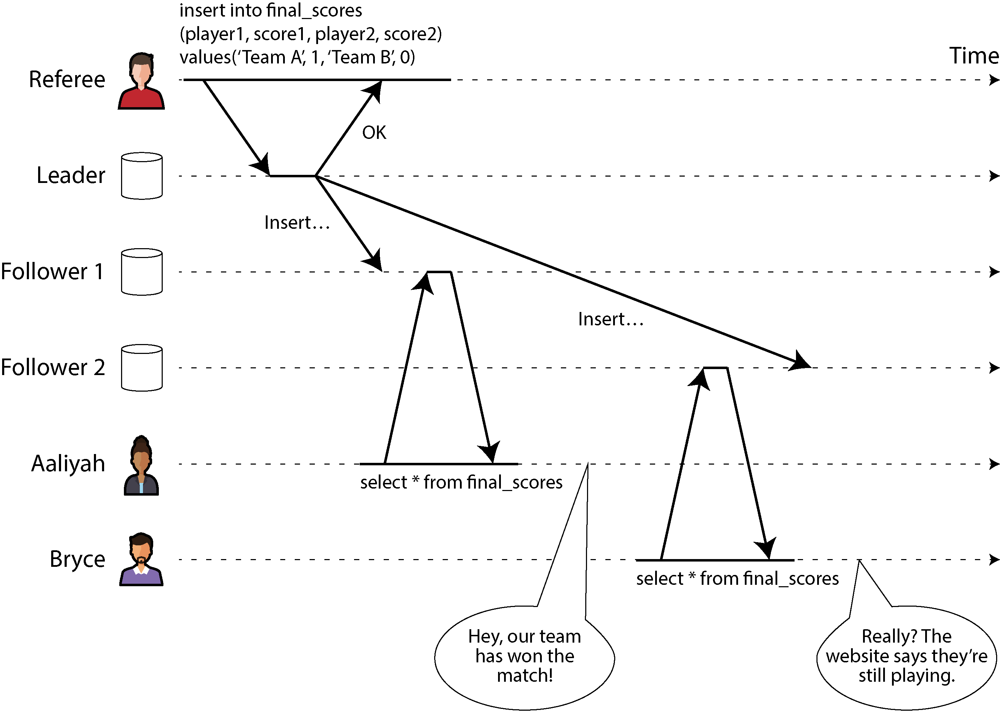
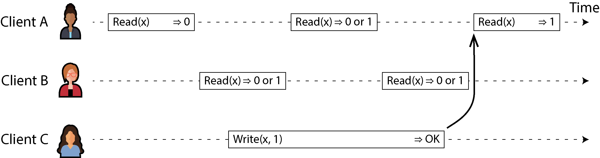
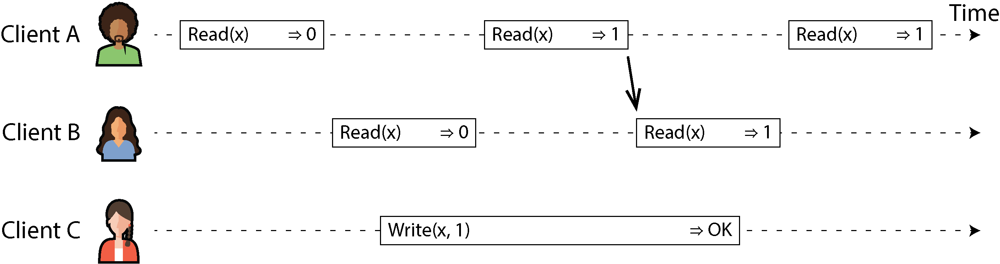
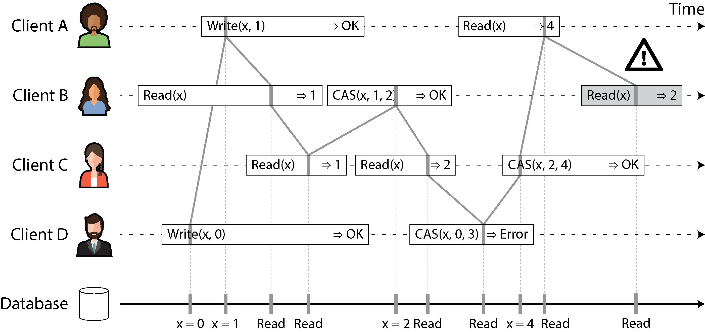
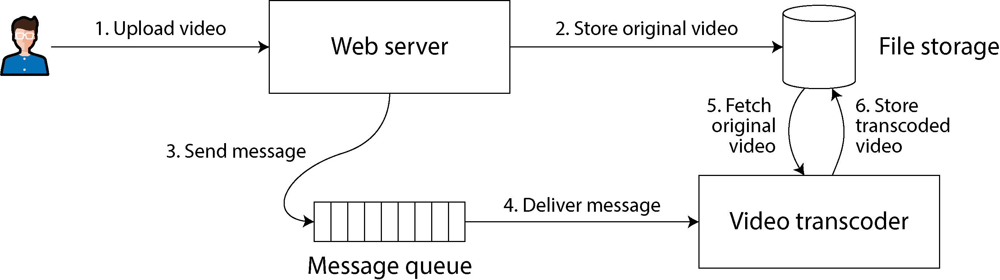
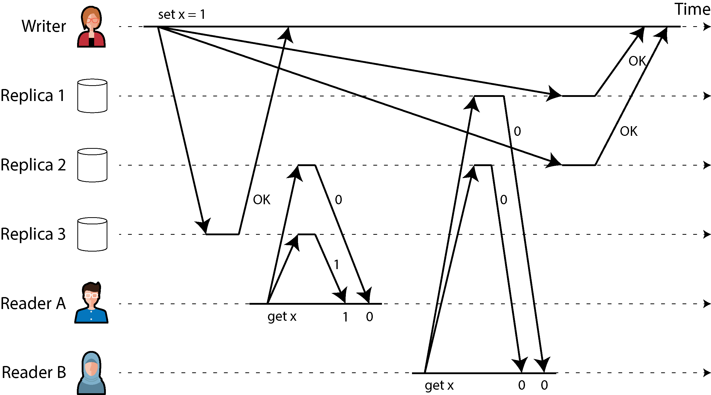
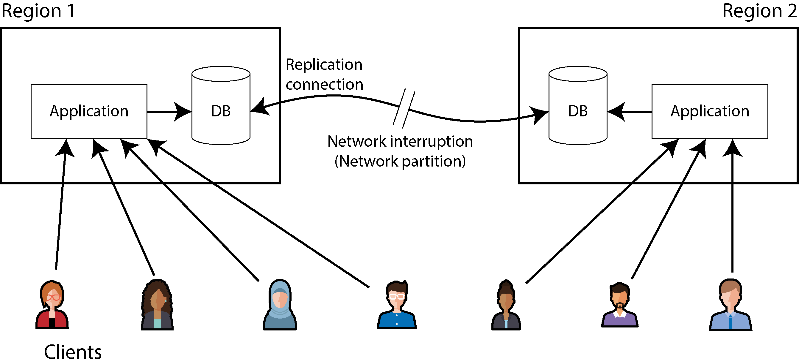
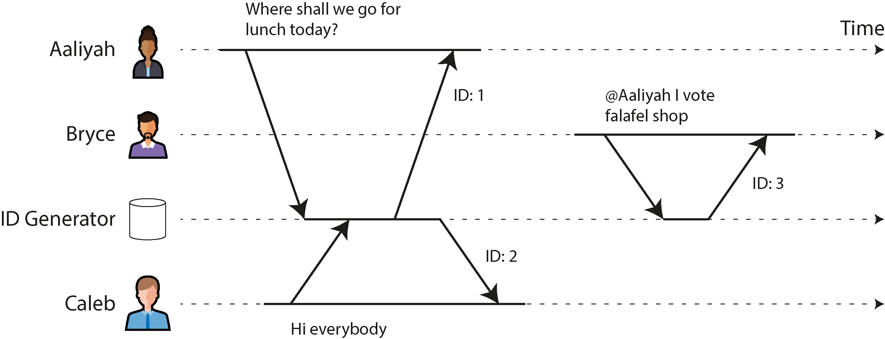
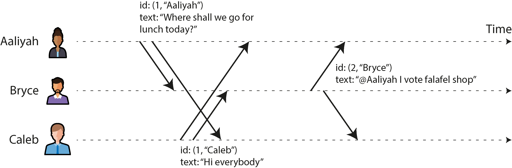
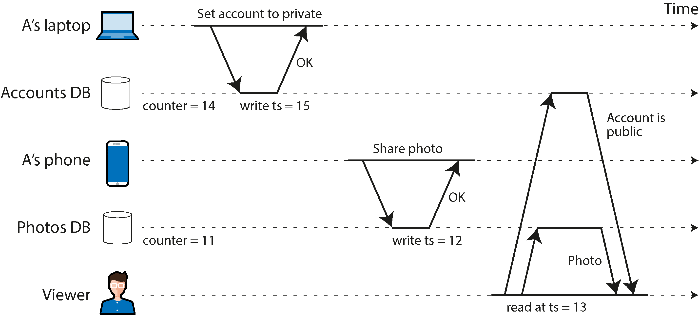

# Chương 10. Tính nhất quán và Consensus

> *Một câu ngạn ngữ xưa cảnh báo: “Đừng bao giờ ra khơi với hai chiếc đồng hồ hàng hải; hãy mang một hoặc ba.”*

> —Frederick P. Brooks Jr., *The Mythical Man-Month:*

          - *Essays on Software Engineering* (1995)

Có rất nhiều thứ có thể trục trặc trong hệ phân tán (distributed system), như đã thảo luận trong Chương 9. Nếu chúng ta muốn một dịch vụ tiếp tục hoạt động đúng bất chấp những trục trặc đó, chúng ta cần tìm cách chịu đựng được các lỗi (fault).

Một trong những công cụ tốt nhất mà chúng ta có cho khả năng chịu lỗi (fault tolerance) là *replication*. Tuy nhiên, như chúng ta đã thấy trong Chương 6, việc có nhiều bản sao của dữ liệu trên nhiều replica làm tăng nguy cơ xảy ra sự không nhất quán. Các thao tác đọc có thể được xử lý bởi một replica chưa được cập nhật, trả về kết quả cũ (stale). Nếu nhiều replica có thể chấp nhận ghi, chúng ta phải xử lý các xung đột tiềm tàng giữa những giá trị được ghi đồng thời trên các replica khác nhau. Ở mức tổng quan, chúng ta có hai triết lý cạnh tranh nhau để xử lý những vấn đề như vậy:

- **Eventual consistency (tính nhất quán cuối cùng)**

  Trong triết lý này, việc hệ thống được replicate được làm cho hiển hiện với ứng dụng, và bạn — với vai trò nhà phát triển ứng dụng — được kỳ vọng sẽ tự xử lý các sự không nhất quán và xung đột có thể phát sinh. Cách tiếp cận này thường được dùng trong các hệ thống có multi-leader replication (xem “Multi-Leader Replication”) và leaderless replication (xem “Leaderless Replication (Replication không có leader)”).

- **Strong consistency (tính nhất quán mạnh)**

  Triết lý này cho rằng ứng dụng không cần phải bận tâm đến các chi tiết nội bộ của replication, và hệ thống nên hành xử như thể nó là một node đơn lẻ. Ưu điểm của cách tiếp cận này là nó đơn giản hơn cho bạn, nhà phát triển ứng dụng. Nhược điểm là tính nhất quán mạnh hơn đi kèm chi phí về hiệu năng, và một số loại lỗi mà hệ thống eventually consistent có thể chịu đựng được lại gây ra sự cố ngừng hoạt động (outage) trong các hệ thống strongly consistent.

Như thường lệ, cách tiếp cận nào tốt hơn phụ thuộc vào ứng dụng của bạn. Nếu ứng dụng của bạn cho phép người dùng thay đổi dữ liệu khi đang offline, eventual consistency là điều không thể tránh khỏi, như đã thảo luận trong “Sync Engine và phần mềm Local-First”. Tuy nhiên, eventual consistency có thể gây khó khăn cho ứng dụng khi xử lý. Nếu các replica của bạn nằm trong các datacenter có kết nối nhanh và đáng tin cậy, strong consistency thường là phù hợp vì chi phí của nó ở mức chấp nhận được.

Trong chương này, chúng ta sẽ đi sâu hơn vào cách tiếp cận strongly consistent, tập trung vào ba lĩnh vực:

- Một thách thức là “strong consistency” khá mơ hồ, nên chúng ta sẽ xây dựng một định nghĩa chính xác hơn về điều chúng ta muốn đạt được: linearizability.

- Chúng ta sẽ xem xét bài toán sinh ID và timestamp. Điều này nghe có vẻ không liên quan đến tính nhất quán, nhưng thực ra nó gắn kết chặt chẽ. Chúng ta sẽ khám phá cách các hệ phân tán có thể đạt được linearizability trong khi vẫn duy trì khả năng chịu lỗi — câu trả lời là các thuật toán consensus.

Trên hành trình đó, chúng ta sẽ thấy rằng có những giới hạn căn bản về những gì khả thi trong một hệ phân tán.

Các chủ đề được thảo luận trong chương này nổi tiếng là khó triển khai đúng. Rất dễ xây dựng những hệ thống hoạt động tốt khi không có lỗi nhưng sụp đổ hoàn toàn khi đối mặt với một tổ hợp không may của các lỗi hoặc thứ tự thông điệp (message) mà người thiết kế chưa từng tính đến. Rất nhiều lý thuyết đã được phát triển để giúp chúng ta suy nghĩ thấu đáo về những trường hợp biên đó, nhờ vậy chúng ta có thể xây dựng các hệ thống chịu lỗi một cách vững chắc.

Chương này chỉ chạm tới bề mặt của vấn đề. Chúng ta sẽ bám theo các trực giác không hình thức và tránh những chi tiết vụn vặt của thuật toán, các mô hình hình thức và các chứng minh. Để làm việc nghiêm túc với các hệ thống consensus và hạ tầng tương tự, bạn sẽ cần đi sâu hơn nhiều vào lý thuyết nếu muốn hệ thống của mình có cơ hội trở nên vững chắc. Như thường lệ, các tài liệu tham khảo trong chương này cung cấp những chỉ dẫn ban đầu.

## Linearizability

Nếu bạn muốn một database được replicate trở nên đơn giản nhất có thể khi sử dụng, bạn nên làm cho nó hành xử như thể nó là một database đơn nút (single-node) nhất quán. Khi đó người dùng không phải lo lắng về replication lag, xung đột và các sự không nhất quán khác; nó mang lại cho bạn lợi thế của khả năng chịu lỗi mà không có sự phức tạp của việc phải nghĩ về nhiều replica.

Đây là ý tưởng đằng sau *linearizability* [1] (còn được gọi là *atomic consistency* [2], *strong consistency*, *immediate consistency*, hay *external consistency* [3]). Định nghĩa chính xác của linearizability khá tinh tế, và chúng ta sẽ khám phá nó trong phần còn lại của mục này. Tuy vậy, ý tưởng cơ bản là làm cho hệ thống trông như thể chỉ có một bản sao duy nhất của dữ liệu, và mọi thao tác trên đó đều là nguyên tử (atomic). Với đảm bảo này, dù trong thực tế có thể có nhiều replica, ứng dụng không cần phải bận tâm đến chúng.

Trong một hệ thống linearizable, ngay khi một client hoàn tất thành công một thao tác ghi, mọi client đọc từ database đều phải thấy được giá trị vừa ghi. Duy trì ảo giác về một bản sao duy nhất của dữ liệu có nghĩa là đảm bảo rằng giá trị được đọc là giá trị mới nhất, cập nhật nhất, và không đến từ một cache hay replica cũ (stale). Nói cách khác, linearizability là một *recency guarantee* (đảm bảo về tính mới). Để làm rõ ý tưởng này, hãy xem một ví dụ về hệ thống không linearizable.

Hình 10-1 cho thấy một website thể thao không linearizable [4]. Aaliyah và Bryce đang ngồi cùng phòng, cả hai đều xem điện thoại để biết kết quả trận đấu mà đội bóng yêu thích của họ đang thi đấu. Ngay sau khi tỷ số chung cuộc được công bố, Aaliyah tải lại trang, thấy đội thắng được công bố, và hào hứng kể cho Bryce. Bryce không tin nên nhấn tải lại trên điện thoại của mình, nhưng request của anh đi đến một replica của database đang bị trễ, nên điện thoại của anh hiển thị rằng trận đấu vẫn đang diễn ra.

*Hình 10-1. Hệ thống này không linearizable, khiến người hâm mộ thể thao bối rối.*

Nếu Aaliyah và Bryce nhấn tải lại cùng lúc, việc họ nhận được kết quả truy vấn khác nhau sẽ ít gây ngạc nhiên hơn, bởi họ không biết chính xác thời điểm mà từng request của mình được server xử lý. Tuy nhiên, Bryce biết rằng anh nhấn nút tải lại (khởi phát truy vấn của mình) *sau khi* nghe Aaliyah reo lên tỷ số chung cuộc, và do đó anh kỳ vọng kết quả truy vấn của mình ít nhất cũng phải mới bằng kết quả của Aaliyah. Việc truy vấn của anh trả về kết quả cũ là một vi phạm linearizability.

### Điều gì làm cho một hệ thống Linearizable?

Để hiểu rõ hơn về linearizability, hãy xem thêm vài ví dụ. Hình 10-2 cho thấy ba client đồng thời đọc và ghi cùng một đối tượng *x* trong một database linearizable. Trong lý thuyết hệ phân tán, *x* được gọi là một *register* (thanh ghi) — trong thực tế, nó có thể là một key trong key-value store, một hàng trong database quan hệ, hoặc một document trong document database, chẳng hạn.

*Hình 10-2. Nếu một request đọc diễn ra đồng thời với một request ghi, nó có thể trả về giá trị cũ hoặc giá trị mới.*

Để đơn giản, Hình 10-2 chỉ hiển thị các request từ góc nhìn của client, không phải nội bộ của database. Mỗi thanh là một request do một client thực hiện. Điểm đầu của thanh là thời điểm request được gửi đi, và điểm cuối của thanh là thời điểm client nhận được response. Do độ trễ mạng biến thiên, client không biết chính xác khi nào database xử lý request của mình. Nó chỉ biết rằng việc đó phải xảy ra vào một lúc nào đó giữa thời điểm client gửi request và thời điểm nhận response.

Trong ví dụ này, register có hai loại thao tác:

- *Read*(*x*) ⇒ *v* có nghĩa là client yêu cầu đọc giá trị của register *x*, và database trả về giá trị *v*.

- *Write*(*x*, *v*) ⇒ *r* có nghĩa là client yêu cầu đặt register *x* thành giá trị *v*, và database trả về response *r* (có thể là OK hoặc Error).

Trong Hình 10-2, giá trị của *x* ban đầu là 0, và client C thực hiện một request ghi để đặt nó thành 1. Trong khi điều này diễn ra, các client A và B liên tục thăm dò (poll) database để đọc giá trị mới nhất. Những response khả dĩ mà A và B có thể nhận được cho các request đọc của họ là gì?

Hãy phân tích từng trường hợp:

- Thao tác đọc đầu tiên của client A hoàn tất trước khi thao tác ghi bắt đầu, nên nó phải trả về giá trị cũ, 0.

- Thao tác đọc cuối cùng của client A bắt đầu sau khi thao tác ghi đã hoàn tất, nên nếu database là linearizable, nó phải trả về giá trị mới, 1, bởi thao tác đọc phải được xử lý sau thao tác ghi.

- Bất kỳ thao tác đọc nào chồng lấn về thời gian với thao tác ghi đều có thể trả về 0 hoặc 1, bởi chúng ta không biết thao tác ghi đã có hiệu lực hay chưa tại thời điểm thao tác đọc được xử lý. Những thao tác này là *concurrent* (đồng thời) với thao tác ghi.

Tuy nhiên, điều này vẫn chưa đủ để mô tả đầy đủ linearizability. Nếu các thao tác đọc đồng thời với một thao tác ghi có thể trả về giá trị cũ hoặc mới, thì người đọc có thể thấy giá trị nhảy qua nhảy lại giữa cũ và mới nhiều lần trong khi thao tác ghi đang diễn ra. Đó không phải là điều chúng ta kỳ vọng ở một hệ thống mô phỏng “một bản sao duy nhất của dữ liệu.”

Để làm cho hệ thống linearizable, chúng ta cần thêm một ràng buộc nữa, được minh họa trong Hình 10-3.

*Hình 10-3. Sau khi bất kỳ thao tác đọc nào đã trả về giá trị mới, mọi thao tác đọc tiếp theo (trên cùng client hoặc client khác) cũng phải trả về giá trị mới.*

Trong một hệ thống linearizable, chúng ta tưởng tượng rằng phải có một thời điểm nào đó (giữa lúc bắt đầu và kết thúc của thao tác ghi) tại đó giá trị của *x* chuyển một cách nguyên tử từ 0 sang 1. Do đó, nếu thao tác đọc của một client trả về giá trị mới 1, mọi thao tác đọc sau đó cũng phải trả về giá trị mới, ngay cả khi thao tác ghi chưa hoàn tất.

Sự phụ thuộc về thời gian này được minh họa bằng một mũi tên trong Hình 10-3. Client A là client đầu tiên đọc được giá trị mới, 1. Ngay sau khi thao tác đọc của A trả về, B bắt đầu một thao tác đọc mới. Vì thao tác đọc của B diễn ra hoàn toàn sau thao tác đọc của A, nó cũng phải trả về 1, dù thao tác ghi của C vẫn đang diễn ra. (Đây là tình huống tương tự như với Aaliyah và Bryce trong Hình 10-1: sau khi Aaliyah đã đọc được giá trị mới, Bryce cũng kỳ vọng đọc được giá trị mới.)

Chúng ta có thể tinh chỉnh thêm biểu đồ thời gian này để hình dung mỗi thao tác có hiệu lực một cách nguyên tử tại một thời điểm nào đó [5], như trong ví dụ phức tạp hơn ở Hình 10-4. Trong ví dụ này, chúng ta thêm loại thao tác thứ ba bên cạnh *read* và *write*:

- *CAS*(*x*, *v_old*, *v_new*) ⇒ *r* có nghĩa là client yêu cầu một thao tác CAS nguyên tử (xem “Ghi có điều kiện (conditional write, compare-and-set)”). Nếu giá trị hiện tại của register *x* bằng *v_old*, nó phải được đặt một cách nguyên tử thành *v_new*. Nếu giá trị của *x* khác *v_old*, thì thao tác phải giữ nguyên register và trả về lỗi. *r* là response của database (OK hoặc Error).

Mỗi thao tác trong Hình 10-4 được đánh dấu bằng một đường thẳng đứng (bên trong thanh của mỗi thao tác) tại thời điểm mà chúng ta cho rằng thao tác đó được thực thi. Các điểm đánh dấu này được nối lại theo một thứ tự tuần tự, và kết quả phải là một chuỗi đọc và ghi hợp lệ đối với một register (mỗi thao tác đọc phải trả về giá trị được đặt bởi thao tác ghi gần nhất).

Yêu cầu của linearizability là các đường nối các điểm đánh dấu thao tác luôn tiến về phía trước theo thời gian (từ trái sang phải), không bao giờ lùi lại. Yêu cầu này đảm bảo recency guarantee mà chúng ta đã thảo luận trước đó: một khi giá trị mới đã được ghi hoặc đọc, mọi thao tác đọc sau đó đều thấy giá trị đã được ghi, cho đến khi nó bị ghi đè lần nữa.

*Hình 10-4. Hình dung các thời điểm mà các thao tác đọc và ghi dường như đã có hiệu lực — thao tác đọc cuối cùng của B không linearizable*

Có một vài chi tiết thú vị cần chỉ ra trong Hình 10-4:

- Đầu tiên client B gửi một request đọc *x*, rồi client D gửi một request đặt *x* thành 0, và sau đó client A gửi một request đặt *x* thành 1. Tuy vậy, giá trị trả về cho thao tác đọc của B là 1 (giá trị do A ghi). Điều này là chấp nhận được: nó có nghĩa là database xử lý thao tác ghi của D trước, rồi đến thao tác ghi của A, và cuối cùng là thao tác đọc của B. Dù đây không phải thứ tự mà các request được gửi đi, nó là một thứ tự chấp nhận được, bởi ba request này là đồng thời. Có lẽ request đọc của B bị trễ một chút trong mạng, nên nó chỉ đến database sau hai thao tác ghi.

- Thao tác đọc của client B trả về 1 trước khi client A nhận được response từ database báo rằng việc ghi giá trị 1 đã thành công. Điều này cũng chấp nhận được, bởi nó chỉ có nghĩa là response OK từ database gửi tới client A bị trễ một chút trong mạng.

- Mô hình này không giả định bất kỳ transaction isolation nào; một client khác có thể thay đổi giá trị vào bất kỳ lúc nào. Ví dụ, C đọc được 1 rồi sau đó đọc được 2, bởi giá trị đã bị B thay đổi giữa hai lần đọc. Một thao tác CAS nguyên tử có thể được dùng để kiểm tra rằng giá trị chưa bị một client khác thay đổi đồng thời: các request CAS của B và C thành công, nhưng request CAS của D thất bại (đến lúc database xử lý nó, giá trị của *x* không còn là 0 nữa).

- Thao tác đọc cuối cùng của client B (trong thanh được tô đậm) không linearizable. Thao tác này đồng thời với thao tác ghi CAS của C, vốn cập nhật *x* từ 2 thành 4. Nếu không có các request khác, việc thao tác đọc của B trả về 2 sẽ là chấp nhận được. Tuy nhiên, client A đã đọc được giá trị mới (4) trước khi thao tác đọc của B bắt đầu, nên B không được phép đọc một giá trị cũ hơn A. Một lần nữa, đây là tình huống tương tự như với Aaliyah và Bryce trong Hình 10-1.

Đó là trực giác đằng sau linearizability; định nghĩa hình thức [1] mô tả nó chính xác hơn. Có thể (dù tốn kém về mặt tính toán) kiểm tra xem hành vi của một hệ thống có linearizable hay không bằng cách ghi lại thời điểm của mọi request và response rồi kiểm tra xem chúng có thể được sắp xếp thành một thứ tự tuần tự hợp lệ hay không [6, 7].

Giống như có nhiều mức isolation yếu hơn cho transaction bên cạnh serializability (xem “Các mức cô lập yếu (Weak Isolation Levels)”), cũng có nhiều mô hình nhất quán (consistency model) yếu hơn cho các hệ thống được replicate bên cạnh linearizability [8]. Các đảm bảo read-after-write consistency, monotonic reads và consistent prefix reads mà chúng ta đã thấy trong “Các vấn đề với replication lag” là những ví dụ về điều này. Linearizability bao gồm tất cả các đảm bảo này và hơn thế nữa; nó là mô hình nhất quán mạnh nhất được sử dụng phổ biến.

#### LINEARIZABILITY SO VỚI SERIALIZABILITY

Linearizability dễ bị nhầm lẫn với serializability (xem “Serializability”), bởi cả hai từ dường như đều có nghĩa đại loại là “có thể sắp xếp theo một thứ tự tuần tự.” Tuy nhiên, chúng là hai đảm bảo khá khác nhau, và việc phân biệt chúng là quan trọng:

- **Serializability**

  Serializability là một mức isolation của transaction, trong đó mỗi transaction có thể đọc và ghi *nhiều đối tượng* (hàng, document, record). Nó đảm bảo rằng các transaction hành xử giống như thể chúng đã được thực thi theo *một* thứ tự tuần tự nào đó — tức là, như thể bạn thực hiện toàn bộ các thao tác của một transaction trước, rồi toàn bộ các thao tác của transaction khác, và cứ thế tiếp tục, không đan xen chúng. Thứ tự tuần tự đó được phép khác với thứ tự mà các transaction thực sự được chạy [9].

- **Linearizability**

  Linearizability là một đảm bảo trên các thao tác đọc và ghi của một register (một *đối tượng riêng lẻ*). Nó không gom các thao tác lại thành transaction, nên nó không ngăn được những vấn đề như write skew liên quan đến nhiều đối tượng (xem “Write Skew và Phantom”). Tuy nhiên, linearizability là một đảm bảo về *tính mới* (recency): nó yêu cầu rằng nếu một thao tác kết thúc trước khi một thao tác khác bắt đầu, thì thao tác sau phải quan sát được một trạng thái ít nhất cũng mới bằng thao tác trước. Serializability không có yêu cầu đó — ví dụ, serializability cho phép các thao tác đọc cũ (stale read) [10].

*Sequential consistency* lại là một thứ khác nữa [8], nhưng chúng ta sẽ không thảo luận nó ở đây.

Một database có thể cung cấp cả serializability và linearizability; sự kết hợp này được gọi là *strict serializability* hay *strong one-copy serializability* (*strong-1SR*) [11, 12]. Các database đơn nút thường là linearizable. Với các database phân tán sử dụng các phương pháp lạc quan (optimistic) như SSI (xem “Serializable Snapshot Isolation”), tình hình phức tạp hơn. Ví dụ, CockroachDB cung cấp serializability và một số đảm bảo về tính mới trên các thao tác đọc, nhưng không cung cấp strict serializability [13], bởi điều này sẽ đòi hỏi sự phối hợp tốn kém giữa các transaction [14]. Ngược lại, Spanner và FoundationDB cung cấp strict serializability [15, 16].

Cũng có thể kết hợp một mức isolation yếu hơn với linearizability, hoặc một mô hình nhất quán yếu hơn với serializability; thực tế, mô hình nhất quán và mức isolation có thể được chọn gần như độc lập với nhau [17, 18].

### Dựa vào Linearizability

Linearizability hữu ích trong những hoàn cảnh nào? Việc xem tỷ số chung cuộc của một trận thể thao có lẽ là một ví dụ tầm phào; một kết quả lỗi thời vài giây khó có thể gây ra tổn hại thực sự nào trong tình huống này. Tuy nhiên, trong một số lĩnh vực, linearizability là yêu cầu quan trọng để hệ thống hoạt động đúng.

#### Locking và bầu chọn leader

Một hệ thống sử dụng single-leader replication cần đảm bảo rằng thực sự chỉ có một leader, không phải nhiều (split brain). Một cách để bầu chọn leader là sử dụng lease. Mỗi node khi khởi động đều cố gắng giành lấy lease, và node nào thành công sẽ trở thành leader [19]. Bất kể cơ chế này được triển khai như thế nào, nó phải linearizable. Không thể có chuyện hai node cùng giành được lease vào cùng một thời điểm.

Các dịch vụ phối hợp (coordination service) như Apache ZooKeeper [20] và etcd thường được dùng để triển khai distributed lease và bầu chọn leader. Chúng sử dụng các thuật toán consensus để triển khai các thao tác linearizable theo cách chịu lỗi (chúng ta sẽ thảo luận các thuật toán này ở phần sau của chương). Có nhiều chi tiết tinh tế liên quan đến việc triển khai đúng lease và bầu chọn leader (ví dụ, vấn đề fencing trong “Lock và Lease phân tán”), và các thư viện như Apache Curator hỗ trợ bằng cách cung cấp các công thức (recipe) mức cao hơn bên trên ZooKeeper. Tuy nhiên, một dịch vụ lưu trữ linearizable là nền tảng cơ bản cho các tác vụ phối hợp này.

> **LƯU Ý**
>
> Nói một cách chặt chẽ, ZooKeeper cung cấp các thao tác ghi linearizable, nhưng các thao tác đọc có thể bị cũ (stale), vì không có đảm bảo rằng chúng được phục vụ từ leader hiện tại [20]. etcd từ phiên bản 3 cung cấp các thao tác đọc linearizable theo mặc định.

Distributed locking cũng được dùng ở mức chi tiết hơn nhiều trong một số database phân tán, chẳng hạn Oracle Real Application Clusters (RAC) [21]. RAC sử dụng một lock cho mỗi trang đĩa (disk page), với nhiều node cùng chia sẻ quyền truy cập vào cùng một hệ thống lưu trữ đĩa. Vì các lock linearizable này nằm trên đường tới hạn (critical path) của việc thực thi transaction, các triển khai RAC thường có một mạng kết nối cluster chuyên dụng (cluster interconnect) cho việc giao tiếp giữa các node database.

#### Ràng buộc và đảm bảo tính duy nhất

Các ràng buộc duy nhất (uniqueness constraint) rất phổ biến trong database — ví dụ, một username hoặc địa chỉ email phải định danh duy nhất một người dùng, và trong một dịch vụ lưu trữ file không thể có hai file cùng đường dẫn và tên file. Nếu bạn muốn thực thi ràng buộc này ngay khi dữ liệu được ghi (sao cho nếu hai người cố đồng thời tạo một người dùng hoặc một file cùng tên, một trong hai sẽ nhận được lỗi), bạn cần linearizability.

Tình huống này tương tự như một lock; khi một người dùng đăng ký dịch vụ của bạn, bạn có thể hình dung họ đang giành lấy một lock trên username mà họ đã chọn. Thao tác này cũng rất giống một CAS nguyên tử: đặt username thành ID của người dùng đã đăng ký nó, với điều kiện username đó chưa bị ai lấy.

Những vấn đề tương tự nảy sinh nếu bạn muốn đảm bảo rằng số dư tài khoản ngân hàng không bao giờ âm, hoặc bạn không bán nhiều hàng hơn số lượng còn trong kho, hoặc hai người không đồng thời đặt cùng một ghế trên máy bay hay trong rạp hát. Tất cả những ràng buộc này đều đòi hỏi một giá trị cập nhật duy nhất (số dư tài khoản, mức tồn kho, tình trạng ghế) mà mọi node đều đồng thuận.

Trong các ứng dụng thực tế, đôi khi có thể chấp nhận việc xử lý những ràng buộc như vậy một cách lỏng lẻo — ví dụ, nếu một chuyến bay bị đặt vượt số ghế (overbooked), bạn có thể chuyển khách hàng sang chuyến bay khác và đền bù cho sự bất tiện. Trong những trường hợp như vậy, có thể không cần linearizability (chúng ta sẽ thảo luận những ràng buộc được diễn giải lỏng lẻo như vậy trong “Tính kịp thời và tính toàn vẹn”).

Tuy nhiên, một ràng buộc duy nhất cứng (hard uniqueness constraint), như loại bạn thường thấy trong các database quan hệ, đòi hỏi linearizability. Các loại ràng buộc khác, như ràng buộc khóa ngoại (foreign-key) hay ràng buộc thuộc tính, có thể được triển khai mà không cần linearizability [22].

#### Phụ thuộc thời gian giữa các kênh giao tiếp

Có một chi tiết quan trọng cần chú ý trong Hình 10-1: nếu Aaliyah không reo lên tỷ số, Bryce sẽ không biết rằng kết quả truy vấn của mình đã cũ (stale). Anh ấy chỉ đơn giản tải lại trang vài giây sau đó và cuối cùng sẽ thấy tỷ số chung cuộc. Vi phạm linearizability chỉ được nhận ra bởi vì trong hệ thống có thêm một kênh giao tiếp bổ sung (giọng nói của Aaliyah đến tai của Bryce).

Những tình huống tương tự cũng có thể xảy ra trong các hệ thống máy tính. Ví dụ, giả sử website của bạn cho phép người dùng tải lên một video, và một tiến trình nền (background process) sẽ transcode video đó sang chất lượng thấp hơn để có thể stream trên các kết nối internet chậm. Kiến trúc và dataflow của hệ thống này được minh họa trong Hình 10-5. Bộ transcode video cần được chỉ thị một cách tường minh để thực hiện một công việc transcode, và chỉ thị này được gửi từ web server đến bộ transcode thông qua một message queue (xem Chương 12). Web server không đặt toàn bộ video lên queue, vì hầu hết các message broker được thiết kế cho các message nhỏ, trong khi một video có thể có kích thước nhiều megabyte. Thay vào đó, video trước tiên được ghi vào một dịch vụ lưu trữ file (file storage service), và khi việc ghi hoàn tất, chỉ thị dành cho bộ transcode mới được đặt lên queue.

*Hình 10-5. Web server và bộ transcode video giao tiếp với nhau thông qua cả file storage và message queue, mở ra khả năng xảy ra race condition.*

Nếu dịch vụ file storage là linearizable, hệ thống này sẽ hoạt động tốt. Nếu nó không linearizable, sẽ có nguy cơ xảy ra race condition: message queue (bước 3 và 4 trong Hình 10-5) có thể nhanh hơn quá trình replication nội bộ bên trong dịch vụ lưu trữ. Trong trường hợp này, khi bộ transcode lấy video gốc (bước 5), nó có thể thấy một phiên bản cũ của file hoặc hoàn toàn không thấy gì. Nếu nó xử lý một phiên bản cũ của video, video gốc và video đã transcode trong file storage sẽ trở nên không nhất quán với nhau một cách vĩnh viễn.

Vấn đề này phát sinh bởi vì có hai kênh giao tiếp giữa web server và bộ transcode: file storage và message queue. Không có sự đảm bảo về tính mới (recency guarantee) của linearizability, race condition giữa hai kênh này là hoàn toàn có thể xảy ra. Tình huống này tương tự với tình huống trong Hình 10-1, nơi cũng có một race condition giữa hai kênh giao tiếp: replication của database và kênh âm thanh ngoài đời thực giữa miệng của Aaliyah và tai của Bryce.

Một race condition tương tự xảy ra nếu bạn có một ứng dụng di động có thể nhận push notification, và ứng dụng đó lấy một số dữ liệu từ server khi nhận được thông báo. Nếu yêu cầu lấy dữ liệu có thể được gửi đến một replica bị trễ (lagging replica), có thể xảy ra trường hợp push notification được chuyển đi nhanh chóng, nhưng lần lấy dữ liệu sau đó lại không thấy dữ liệu mà thông báo đề cập đến.

Linearizability không phải là cách duy nhất để tránh race condition này, nhưng nó là cách dễ hiểu nhất. Nếu bạn kiểm soát được kênh giao tiếp bổ sung (như trong trường hợp message queue, nhưng không phải trong trường hợp của Aaliyah và Bryce), bạn có thể sử dụng các cách tiếp cận thay thế tương tự như những gì chúng ta đã thảo luận trong “Đọc lại những gì chính mình đã ghi”, với cái giá là độ phức tạp tăng thêm.

### Triển khai hệ thống linearizable

Sau khi đã xem qua một vài ví dụ trong đó linearizability là hữu ích, chúng ta hãy nghĩ về cách có thể triển khai một hệ thống cung cấp ngữ nghĩa linearizable.

Vì linearizability về bản chất có nghĩa là “hành xử như thể chỉ có một bản sao duy nhất của dữ liệu, và mọi phép toán trên nó đều là atomic,” câu trả lời đơn giản nhất sẽ là thực sự chỉ sử dụng một bản sao duy nhất của dữ liệu. Tuy nhiên, cách tiếp cận đó sẽ không thể chịu được lỗi: nếu node đang giữ bản sao duy nhất đó bị hỏng, dữ liệu sẽ bị mất, hoặc ít nhất là không thể truy cập được cho đến khi node đó được khởi động lại.

Hãy cùng xem lại các phương pháp replication từ Chương 6 và xem liệu chúng có thể được làm cho linearizable hay không:

- *Single-leader replication (có thể linearizable)*

  - Trong một hệ thống với single-leader replication, leader giữ bản sao chính (primary copy) của dữ liệu được dùng cho các thao tác ghi, và các follower duy trì các bản sao dự phòng của dữ liệu trên những node khác. Miễn là bạn thực hiện mọi thao tác đọc và ghi trên leader, chúng nhiều khả năng sẽ là linearizable. Tuy nhiên, điều này giả định rằng bạn biết chắc chắn ai là leader. Như đã thảo luận trong “Lock và Lease phân tán”, hoàn toàn có khả năng một node nghĩ rằng nó là leader trong khi thực tế thì không—và nếu leader ảo tưởng đó tiếp tục phục vụ các request, nó nhiều khả năng sẽ vi phạm linearizability [23]. Với replication bất đồng bộ (asynchronous), failover thậm chí có thể dẫn đến việc các thao tác ghi đã commit bị mất, điều này vi phạm cả tính bền vững (durability) và linearizability.

  - Việc sharding một database single-leader, với một leader riêng cho mỗi shard, không ảnh hưởng đến linearizability, vì đó chỉ là một đảm bảo trên từng đối tượng đơn lẻ (single-object guarantee). Transaction liên shard (cross-shard) là một vấn đề khác (xem “Transaction phân tán”).

- *Thuật toán consensus (nhiều khả năng linearizable)*

  - Một số thuật toán consensus về bản chất là single-leader replication với cơ chế bầu chọn leader (leader election) và failover tự động. Chúng được thiết kế cẩn thận để ngăn chặn split brain, cho phép triển khai lưu trữ linearizable một cách an toàn. Ví dụ, ZooKeeper sử dụng thuật toán consensus Zab [24], và etcd sử dụng Raft [25]. Tuy nhiên, chỉ vì một hệ thống sử dụng consensus không có nghĩa là mọi phép toán trên nó đều được đảm bảo là linearizable. Nếu hệ thống cho phép đọc trên một node mà không kiểm tra xem node đó có còn là leader hay không, kết quả đọc có thể đã cũ nếu một leader mới vừa được bầu.

- *Multi-leader replication (không linearizable)*

  - Các hệ thống với multi-leader replication thường không linearizable, bởi vì chúng xử lý đồng thời các thao tác ghi trên nhiều node và replicate chúng một cách bất đồng bộ đến các node khác. Vì lý do này, chúng có thể tạo ra các thao tác ghi xung đột cần được giải quyết (xem “Xử lý các thao tác ghi xung đột”).

- *Leaderless replication (có lẽ không linearizable)*

  - Đối với các hệ thống với leaderless replication (kiểu Dynamo; xem “Leaderless Replication (Replication không có leader)”), người ta đôi khi khẳng định rằng bạn có thể đạt được “strong consistency” (tính nhất quán mạnh) bằng cách yêu cầu đọc và ghi theo quorum (*w* + *r* > *n*). Tùy thuộc vào thuật toán cụ thể và cách bạn định nghĩa strong consistency, điều này không hoàn toàn đúng.

  - Các phương pháp giải quyết xung đột LWW dựa trên đồng hồ thời gian thực (time-of-day clock) (ví dụ, trong Cassandra và ScyllaDB) gần như chắc chắn là không linearizable, bởi vì các timestamp từ đồng hồ không thể được đảm bảo là nhất quán với thứ tự sự kiện thực tế do hiện tượng lệch đồng hồ (clock skew) (xem “Dựa vào đồng hồ được đồng bộ”). Ngay cả với quorum, hành vi không linearizable vẫn có thể xảy ra, như được minh họa trong mục tiếp theo.

Theo trực giác, dường như các thao tác đọc và ghi theo quorum phải là linearizable trong mô hình kiểu Dynamo. Tuy nhiên, khi độ trễ mạng biến thiên, race condition hoàn toàn có thể xảy ra, như được minh họa trong Hình 10-6.

Trong Hình 10-6, giá trị ban đầu của *x* là 0, và một client ghi đang cập nhật *x* thành 1 bằng cách gửi thao tác ghi đến cả ba replica (*n* = 3, *w* = 3). Đồng thời, client A đọc từ một quorum gồm hai node (*r* = 2) và thấy giá trị mới 1 trên một node và giá trị cũ 0 trên node còn lại. Cũng đồng thời với thao tác ghi, client B đọc từ một quorum khác gồm hai node và nhận về giá trị cũ 0 từ cả hai.

Điều kiện quorum được thỏa mãn (*w* + *r* > *n*), nhưng quá trình thực thi này vẫn không linearizable. Request của B bắt đầu sau khi request của A hoàn tất, nhưng B trả về giá trị cũ trong khi A trả về giá trị mới. (Đây một lần nữa lại là tình huống của Aaliyah và Bryce trong Hình 10-1.)

Có thể làm cho quorum kiểu Dynamo trở thành linearizable, với cái giá là hiệu năng bị giảm. Một bên đọc phải thực hiện read repair một cách đồng bộ (xem “Bắt kịp các thao tác ghi bị bỏ lỡ”) trước khi trả kết quả về cho ứng dụng [26]. Ngoài ra, trước khi ghi, một bên ghi phải đọc trạng thái mới nhất của một quorum các node để lấy timestamp mới nhất của bất kỳ thao tác ghi nào trước đó và đảm bảo rằng thao tác ghi mới có timestamp lớn hơn [27, 28]. Tuy nhiên, Riak không thực hiện read repair đồng bộ vì tổn hại về hiệu năng. Cassandra có chờ read repair hoàn tất khi đọc theo quorum [29], nhưng nó mất linearizability do sử dụng đồng hồ thời gian thực cho các timestamp.

*Hình 10-6. Một quá trình thực thi không linearizable, mặc dù sử dụng quorum*

Hơn nữa, chỉ có các phép toán đọc và ghi linearizable là có thể được triển khai theo cách này; một phép toán CAS linearizable thì không thể, vì nó yêu cầu một thuật toán consensus [30]. Tóm lại, an toàn nhất là giả định rằng một hệ thống leaderless với replication kiểu Dynamo không cung cấp linearizability, ngay cả với đọc và ghi theo quorum.

### Cái giá của linearizability

Vì một số phương pháp replication có thể cung cấp linearizability và một số khác thì không, sẽ rất thú vị khi khám phá sâu hơn về ưu và nhược điểm của linearizability.

Chúng ta đã thảo luận một số trường hợp sử dụng cho các phương pháp replication khác nhau trong Chương 6; ví dụ, chúng ta đã thấy rằng multi-leader replication thường là một lựa chọn tốt cho replication đa region (xem “Vận hành phân tán theo địa lý”). Một ví dụ về kiểu triển khai như vậy được minh họa trong Hình 10-7.

Hãy xem xét điều gì xảy ra nếu có sự gián đoạn mạng giữa hai region. Giả sử mạng bên trong mỗi region vẫn hoạt động, và các client có thể kết nối đến region cục bộ của mình, nhưng các region không thể kết nối với nhau. Điều này được gọi là *network partition* (phân mảnh mạng).

*Hình 10-7. Một sự gián đoạn mạng buộc phải lựa chọn giữa linearizability và tính sẵn sàng (availability)*

Với một database multi-leader, mỗi region có thể tiếp tục hoạt động bình thường. Vì các thao tác ghi từ một region được replicate bất đồng bộ đến region kia, chúng chỉ đơn giản được xếp vào hàng đợi và trao đổi khi kết nối mạng được khôi phục.

Mặt khác, nếu sử dụng single-leader replication, leader phải nằm ở một trong hai region. Mọi thao tác ghi và mọi thao tác đọc linearizable đều phải được gửi đến leader. Do đó, đối với bất kỳ client nào kết nối đến một region follower, các request đọc và ghi đó phải được gửi một cách đồng bộ qua mạng đến region của leader.

Nếu mạng giữa các region bị gián đoạn trong cấu hình single-leader, các client kết nối đến các region follower không thể liên lạc với leader, nên chúng không thể thực hiện bất kỳ thao tác ghi nào vào database cũng như bất kỳ thao tác đọc linearizable nào. Chúng vẫn có thể đọc từ follower, nhưng dữ liệu có thể đã cũ (không linearizable). Nếu ứng dụng yêu cầu đọc và ghi linearizable, sự gián đoạn mạng khiến ứng dụng trở nên không khả dụng ở những region không thể liên lạc với leader.

Nếu các client có thể kết nối trực tiếp đến region của leader, đây không phải là vấn đề, vì ứng dụng vẫn tiếp tục hoạt động bình thường ở đó. Nhưng những client chỉ có thể tiếp cận một region follower sẽ gặp phải sự cố ngừng hoạt động cho đến khi đường kết nối mạng được sửa chữa.

#### Định lý CAP

Vấn đề này không chỉ là hệ quả của single-leader và multi-leader replication. Bất kỳ database linearizable nào cũng gặp vấn đề này, bất kể nó được triển khai như thế nào. Vấn đề cũng không chỉ riêng cho các triển khai đa region, mà có thể xảy ra trên bất kỳ mạng không đáng tin cậy nào, ngay cả trong một region. Sự đánh đổi (trade-off) như sau:

- Nếu ứng dụng của bạn *yêu cầu* linearizability, và một số replica bị ngắt kết nối khỏi các replica khác do sự cố mạng, những replica đó sẽ tạm thời không thể xử lý request: chúng phải hoặc chờ cho đến khi sự cố mạng được khắc phục, hoặc trả về lỗi (dù theo cách nào, chúng cũng trở nên *không khả dụng* (unavailable)). Lựa chọn này đôi khi được gọi là *CP* (*consistent under network partitions* — nhất quán khi có network partition).

- Nếu ứng dụng của bạn *không yêu cầu* linearizability, nó có thể được viết theo cách mà mỗi replica có thể xử lý request một cách độc lập, ngay cả khi bị ngắt kết nối khỏi các replica khác (ví dụ, multi-leader). Trong trường hợp này, ứng dụng có thể duy trì *khả dụng* (available) khi đối mặt với sự cố mạng, nhưng hành vi của nó không linearizable. Lựa chọn này được gọi là *AP* (*available under network partitions* — sẵn sàng khi có network partition).

Do đó, các ứng dụng không yêu cầu linearizability có thể chịu đựng các sự cố mạng tốt hơn. Nhận thức này được biết đến rộng rãi với tên gọi *định lý CAP* (CAP theorem) [31, 32, 33, 34], được Eric Brewer đặt tên vào năm 2000, mặc dù sự đánh đổi này đã được các nhà thiết kế database phân tán biết đến từ những năm 1970 [35, 36, 37].

CAP ban đầu được đề xuất như một quy tắc kinh nghiệm (rule of thumb) không có định nghĩa chính xác, với mục tiêu khơi mào một cuộc thảo luận về các sự đánh đổi trong database. Vào thời điểm đó, nhiều database phân tán tập trung vào việc cung cấp ngữ nghĩa linearizable trên một cluster các máy có bộ lưu trữ dùng chung (shared storage) [21], và CAP đã khuyến khích các kỹ sư database khám phá một không gian thiết kế rộng hơn của các hệ thống phân tán shared-nothing, vốn phù hợp hơn để triển khai các dịch vụ web quy mô lớn [38]. CAP xứng đáng được ghi công cho sự thay đổi văn hóa này—nó đã góp phần châm ngòi cho phong trào NoSQL, một sự bùng nổ của các công nghệ database mới vào khoảng giữa những năm 2000.

Định lý CAP theo định nghĩa hình thức [32] có phạm vi rất hẹp. Nó chỉ xem xét một mô hình nhất quán (consistency model) duy nhất (cụ thể là linearizability) và một loại lỗi duy nhất (network partition, mà theo dữ liệu từ Google là nguyên nhân của chưa đến 8% các sự cố [39]). Nó không nói gì về độ trễ mạng, các node bị chết, hay các sự đánh đổi khác. Do đó, mặc dù CAP đã có ảnh hưởng về mặt lịch sử, nó có rất ít giá trị thực tiễn cho việc thiết kế hệ thống [4, 45].

Đã có những nỗ lực nhằm tổng quát hóa CAP. Ví dụ, *nguyên lý PACELC* (PACELC principle) nhận xét rằng các nhà thiết kế hệ thống cũng có thể chọn làm suy yếu tính nhất quán vào những thời điểm mạng đang hoạt động tốt để giảm độ trễ [40, 46, 47]. Do đó, trong một network partition (P), chúng ta cần chọn giữa tính sẵn sàng (A) và tính nhất quán (C); ngược lại (E — else), khi không có partition, chúng ta có thể chọn giữa độ trễ thấp (L) và tính nhất quán (C). Tuy nhiên, định nghĩa này thừa hưởng một số vấn đề của CAP, chẳng hạn như các định nghĩa phản trực giác về tính nhất quán và tính sẵn sàng.

Còn có nhiều kết quả bất khả thi (impossibility result) thú vị khác trong hệ phân tán [41], và CAP hiện đã bị thay thế bởi những kết quả chính xác hơn [42, 43], nên ngày nay nó chủ yếu chỉ còn mang ý nghĩa lịch sử.

#### ĐỊNH LÝ CAP KHÔNG HỮU ÍCH

CAP đôi khi được trình bày dưới dạng *consistency, availability, partition tolerance: chọn hai trong ba*. Thật không may, diễn đạt theo cách này gây hiểu nhầm [34]. Bởi vì network partition là một loại lỗi, chúng không phải là thứ bạn lựa chọn mà là thứ sẽ xảy ra dù bạn muốn hay không. Cách duy nhất để bạn đảm bảo không có network partition là không có mạng—tức là chỉ có một replica duy nhất—nhưng khi đó bạn cũng không có tính sẵn sàng cao (high availability).

Vào những thời điểm mạng hoạt động đúng, một hệ thống có thể cung cấp cả tính nhất quán (linearizability) và tính sẵn sàng. Khi xảy ra lỗi mạng, bạn phải chọn giữa hai điều đó. Do đó, một cách diễn đạt CAP tốt hơn sẽ là *hoặc nhất quán hoặc sẵn sàng khi bị phân mảnh* (either consistent or available when partitioned) [44]. Một mạng đáng tin cậy hơn sẽ cần phải đưa ra lựa chọn này ít thường xuyên hơn, nhưng đến một lúc nào đó lựa chọn là không thể tránh khỏi.

Sơ đồ phân loại CP/AP còn có một số khiếm khuyết khác [4]. *Consistency* được hình thức hóa thành linearizability (định lý không nói gì về các mô hình nhất quán yếu hơn), và sự hình thức hóa của *availability* [32] không khớp với ý nghĩa thông thường của thuật ngữ này [45]. Nhiều hệ thống có tính sẵn sàng cao (chịu lỗi) thực tế không đáp ứng định nghĩa đặc thù của CAP về tính sẵn sàng. Hơn nữa, một số nhà thiết kế hệ thống chọn (với lý do chính đáng) không cung cấp cả linearizability lẫn dạng tính sẵn sàng mà định lý CAP giả định, nên những hệ thống đó không phải CP cũng không phải AP [46, 47].

Nhìn chung, có rất nhiều hiểu lầm và nhầm lẫn xung quanh CAP, và nó không giúp chúng ta hiểu các hệ thống tốt hơn, nên tốt nhất là không nên bận tâm quá nhiều về nó.

#### Linearizability và độ trễ mạng

Mặc dù linearizability là một đảm bảo hữu ích, số hệ thống thực sự linearizable trong thực tế lại ít đến mức đáng ngạc nhiên. Ví dụ, ngay cả RAM trên một CPU đa nhân hiện đại cũng không linearizable [48]. Nếu một thread chạy trên một nhân CPU ghi vào một địa chỉ bộ nhớ, và một thread trên nhân CPU khác đọc cùng địa chỉ đó ngay sau đó, không có gì đảm bảo nó sẽ đọc được giá trị mà thread đầu tiên đã ghi (trừ khi sử dụng *memory barrier* hoặc *fence* [49]). Lý do cho hành vi này là mỗi nhân CPU có cache bộ nhớ và store buffer riêng của nó. Các thao tác đọc mặc định được phục vụ từ cache, và mọi thay đổi được ghi ra bộ nhớ chính một cách bất đồng bộ. Vì việc truy cập dữ liệu trong cache nhanh hơn nhiều so với truy cập bộ nhớ chính [50], tính năng này là thiết yếu để có hiệu năng tốt trên các CPU hiện đại. Tuy nhiên, điều đó có nghĩa là giờ đây có nhiều bản sao của dữ liệu (một trong bộ nhớ chính, và có thể vài bản khác trong các cache khác nhau), và những bản sao này được cập nhật bất đồng bộ, nên linearizability bị mất.

Tại sao lại thực hiện sự đánh đổi này? Việc dùng định lý CAP để biện minh cho mô hình nhất quán bộ nhớ đa nhân là vô nghĩa. Trong một máy tính, chúng ta thường giả định giao tiếp là đáng tin cậy, và chúng ta không mong đợi một nhân CPU có thể tiếp tục hoạt động bình thường nếu nó bị ngắt kết nối khỏi phần còn lại của máy tính. Lý do từ bỏ linearizability là *hiệu năng* (performance), không phải khả năng chịu lỗi [46].

Điều tương tự cũng đúng với nhiều database phân tán chọn không cung cấp các đảm bảo linearizable: chúng làm vậy chủ yếu để tăng hiệu năng, chứ không hẳn là vì khả năng chịu lỗi [40]. Các hệ thống linearizable thường có độ trễ cao hơn—và điều này đúng ở mọi thời điểm, không chỉ trong lúc có lỗi mạng.

Liệu chúng ta không thể tìm ra một cách triển khai hiệu quả hơn cho lưu trữ linearizable? Có vẻ câu trả lời là không. Attiya và Welch [51] chứng minh rằng nếu bạn muốn linearizability, thời gian phản hồi của các request đọc và ghi ít nhất sẽ tỷ lệ với độ bất định của độ trễ trong mạng. Trong một mạng có độ trễ biến thiên mạnh, như hầu hết các mạng máy tính (xem “Timeout và độ trễ không giới hạn”), thời gian phản hồi của các thao tác đọc và ghi linearizable chắc chắn sẽ cao. Không tồn tại thuật toán nhanh hơn cho linearizability, nhưng các mô hình nhất quán yếu hơn có thể nhanh hơn nhiều, nên sự đánh đổi này rất quan trọng đối với các hệ thống nhạy cảm với độ trễ. Trong Chương 13, chúng ta sẽ thảo luận một số cách tiếp cận để tránh linearizability mà không phải hy sinh tính đúng đắn.

## Bộ sinh ID và đồng hồ logic (logical clock)

Trong nhiều ứng dụng, bạn cần gán một loại ID duy nhất nào đó cho các bản ghi (record) trong database khi chúng được tạo ra, điều này cho bạn một primary key để tham chiếu đến các bản ghi đó. Trong các database đơn nút (single-node), người ta thường dùng một số nguyên tự tăng (autoincrementing integer), có ưu điểm là chỉ cần lưu trong 64 bit (hoặc thậm chí 32 bit, nếu bạn chắc chắn rằng sẽ không bao giờ có hơn 4 tỷ bản ghi, nhưng điều đó là rủi ro).

Một ưu điểm khác của ID tự tăng là thứ tự của các ID cho bạn biết thứ tự mà các bản ghi được tạo ra. Ví dụ, Hình 10-8 cho thấy một ứng dụng chat gán các ID tự tăng cho các tin nhắn chat khi chúng được đăng. Sau đó bạn có thể hiển thị các tin nhắn theo thứ tự ID tăng dần, và các luồng chat thu được sẽ hợp lý: Aaliyah đăng một câu hỏi được gán ID 1, và câu trả lời của Bryce cho câu hỏi đó được gán một ID lớn hơn—cụ thể là 3.

Bộ sinh ID đơn nút này là một ví dụ khác về hệ thống linearizable. Mỗi request lấy ID là một phép toán tăng một bộ đếm một cách atomic và trả về giá trị cũ của bộ đếm (một phép toán *fetch-and-add*); linearizability đảm bảo rằng nếu việc đăng tin nhắn của Aaliyah hoàn tất trước khi việc đăng của Bryce bắt đầu, thì ID của tin nhắn của Bryce phải lớn hơn ID của Aaliyah. Các tin nhắn của Aaliyah và Caleb trong Hình 10-8 là đồng thời, nên linearizability không quy định ID của chúng phải được sắp thứ tự như thế nào, miễn là chúng duy nhất.

*Hình 10-8. Một bộ sinh ID gán các ID số nguyên tự tăng cho các tin nhắn trong một ứng dụng chat*

Một bộ sinh ID đơn nút trong bộ nhớ (in-memory) rất dễ triển khai. Bạn có thể sử dụng lệnh tăng atomic (atomic increment) do CPU cung cấp, cho phép nhiều thread tăng cùng một bộ đếm một cách an toàn. Sẽ tốn thêm chút công sức để làm cho bộ đếm bền vững (persistent), sao cho node có thể crash và khởi động lại mà không đặt lại giá trị bộ đếm, điều vốn sẽ dẫn đến các ID trùng lặp. Nhưng các vấn đề thực sự là như sau:

- Một bộ sinh ID đơn nút không có khả năng chịu lỗi vì node đó là một điểm lỗi duy nhất (single point of failure).

- Nó chậm nếu bạn muốn tạo một bản ghi ở một region khác, vì bạn có thể phải thực hiện một chuyến khứ hồi (round trip) đến phía bên kia của hành tinh chỉ để lấy một ID.

- Node đơn lẻ đó có thể trở thành nút thắt cổ chai (bottleneck) nếu bạn có thông lượng ghi (write throughput) cao.

Bạn có thể cân nhắc nhiều phương án thay thế khác nhau cho bộ sinh ID:

- **Gán ID theo shard (sharded ID assignment)**

  Bạn có thể có nhiều node gán ID—ví dụ, một node chỉ sinh các số chẵn và một node chỉ sinh các số lẻ. Nói chung, bạn có thể dành riêng một số bit trong ID để chứa số hiệu shard. Những ID này vẫn gọn nhẹ, nhưng bạn mất đi tính chất thứ tự—ví dụ, nếu bạn có các tin nhắn chat với ID 16 và 17, bạn không biết liệu tin nhắn 16 có thực sự được gửi trước hay không, bởi vì các ID được gán bởi những node khác nhau, và một node có thể đã đi trước node kia.

- **Các khối ID được cấp phát trước (preallocated blocks of IDs)**

  Thay vì từng ID riêng lẻ, bộ sinh ID đơn nút có thể phân phát các khối (block) ID. Ví dụ, node A có thể nhận khối ID từ 1 đến 1,000, và node B có thể nhận khối từ 1,001 đến 2,000. Sau đó mỗi node có thể độc lập phân phát ID từ khối của mình, và yêu cầu một khối mới từ bộ sinh ID khi nguồn cung số thứ tự của nó bắt đầu cạn. Tuy nhiên, sơ đồ này cũng không đảm bảo thứ tự đúng. Có thể xảy ra trường hợp một tin nhắn được cấp ID trong khoảng từ 1,001 đến 2,000 và một tin nhắn sau đó lại được cấp ID trong khoảng từ 1 đến 1,000 nếu ID được gán bởi một node khác.

- **UUID ngẫu nhiên (random UUIDs)**

  Bạn có thể sử dụng *universally unique identifier* (UUID — định danh duy nhất toàn cục), còn được gọi là *globally unique identifier* (GUID). Chúng có ưu điểm lớn là có thể được sinh ra cục bộ trên bất kỳ node nào mà không cần giao tiếp, nhưng chúng cần nhiều không gian hơn (128 bit). UUID có nhiều phiên bản; đơn giản nhất là phiên bản 4, về bản chất là một số ngẫu nhiên dài đến mức rất khó có khả năng hai node lại chọn cùng một số. Thật không may, thứ tự của những ID như vậy cũng là ngẫu nhiên, nên việc so sánh hai ID không cho bạn biết gì về việc ID nào mới hơn.

- **Timestamp đồng hồ thực được làm cho duy nhất (wall-clock timestamp made unique)**

  Nếu đồng hồ thời gian thực (time-of-day clock) của các node được giữ gần đúng bằng NTP, bạn có thể sinh ID bằng cách đặt một timestamp từ đồng hồ này vào các bit có trọng số cao nhất (most significant bits) và lấp các bit còn lại bằng thông tin bổ sung đảm bảo ID là duy nhất ngay cả khi timestamp không duy nhất—ví dụ, một số hiệu shard và một số thứ tự tăng dần theo từng shard, hoặc một giá trị ngẫu nhiên dài. Cách tiếp cận này được sử dụng trong UUID phiên bản 7 [52], Snowflake của X [53], ULID [54], bộ sinh Flake ID của Hazelcast, ObjectID của MongoDB, và nhiều sơ đồ tương tự khác [52]. Bạn có thể triển khai các bộ sinh ID này trong mã ứng dụng hoặc bên trong một database [55].

Tất cả các sơ đồ này đều sinh ra các ID duy nhất (ít nhất là với xác suất đủ cao để các va chạm (collision) trở nên cực kỳ hiếm), nhưng chúng có các đảm bảo về thứ tự ID yếu hơn nhiều so với sơ đồ tự tăng đơn nút.

Như đã thảo luận trong “Timestamp để sắp thứ tự sự kiện”, các timestamp từ đồng hồ thực (wall-clock) tốt nhất cũng chỉ có thể cung cấp một thứ tự xấp xỉ. Nếu một thao tác ghi sớm hơn nhận timestamp từ một đồng hồ hơi nhanh và timestamp của một thao tác ghi muộn hơn lại đến từ một đồng hồ hơi chậm, thứ tự timestamp có thể không nhất quán với thứ tự mà các sự kiện thực sự xảy ra. Với các bước nhảy đồng hồ do sử dụng đồng hồ không đơn điệu (nonmonotonic clock), ngay cả các timestamp được sinh bởi một node duy nhất cũng có thể bị sắp thứ tự sai. Do đó, các bộ sinh ID dựa trên thời gian đồng hồ thực khó có khả năng là linearizable.

Bạn có thể giảm những sự không nhất quán về thứ tự như vậy bằng cách dựa vào đồng bộ hóa đồng hồ độ chính xác cao, sử dụng đồng hồ nguyên tử hoặc bộ thu GPS. Nhưng sẽ thật tốt nếu có thể sinh ra các ID duy nhất và được sắp thứ tự đúng mà không cần dựa vào phần cứng đặc biệt. Tiếp theo, chúng ta sẽ xem xét một loại đồng hồ cho phép làm chính điều đó.

### Đồng hồ logic (Logical Clock)

Trong “Đồng hồ không đáng tin cậy”, chúng ta đã thảo luận về đồng hồ thời gian thực (time-of-day clock) và đồng hồ đơn điệu (monotonic clock). Cả hai đều là *đồng hồ vật lý* (*physical clock*): các thiết bị phần cứng đo sự trôi qua của thời gian (giây, mili giây, micro giây, v.v.).

Trong các hệ phân tán, người ta cũng thường dùng một loại đồng hồ khác, gọi là *đồng hồ logic* (*logical clock*). Khác với đồng hồ vật lý, đồng hồ logic là một thuật toán đếm các event đã xảy ra. Do đó, một timestamp từ đồng hồ logic không cho bạn biết bây giờ là mấy giờ, nhưng bạn *có thể* so sánh hai timestamp từ một đồng hồ logic để biết cái nào xảy ra trước và cái nào xảy ra sau.

Các yêu cầu chung đối với một đồng hồ logic như sau:

- Các timestamp của nó phải nhỏ gọn (kích thước vài byte) và duy nhất. Bạn có thể so sánh hai timestamp bất kỳ và xác định cái nào sớm hơn (tức là chúng có *thứ tự toàn phần* — *totally ordered*).

- Thứ tự của các timestamp phải *nhất quán với quan hệ nhân quả* (*consistent with causality*). Nghĩa là, nếu thao tác A xảy ra trước thao tác B, thì timestamp của A nhỏ hơn timestamp của B. (Chúng ta đã thảo luận về quan hệ nhân quả trước đây trong “Quan hệ happens-before và tính đồng thời”.)

Một bộ sinh ID đơn nút (single-node ID generator) đáp ứng các yêu cầu này, nhưng các bộ sinh ID phân tán mà chúng ta vừa thảo luận thì không đáp ứng yêu cầu về thứ tự nhân quả.

#### Lamport timestamp

May mắn là có một phương pháp đơn giản để sinh timestamp logic *thực sự* nhất quán với quan hệ nhân quả, và bạn có thể dùng nó như một bộ sinh ID phân tán. Nó được gọi là *Lamport clock* (đồng hồ Lamport), do Leslie Lamport đề xuất năm 1978 [56], trong bài báo mà nay là một trong những bài báo được trích dẫn nhiều nhất trong lĩnh vực hệ phân tán.

Mặc dù Lamport clock cung cấp thứ tự toàn phần, chúng *không* cung cấp linearizability — tức là chúng không phải là cách để đảm bảo rằng một giá trị là mới nhất. Chúng chỉ đơn thuần là cách gán ID cho các event sao cho nếu event A xảy ra trước event B thì ID của A nhỏ hơn ID của B.

Hình 10-9 cho thấy Lamport clock sẽ hoạt động thế nào trong ví dụ ứng dụng chat ở Hình 10-8. Mỗi node có một định danh duy nhất, trong Hình 10-9 là tên Aaliyah, Bryce hoặc Caleb, nhưng trong thực tế có thể là một UUID ngẫu nhiên hoặc thứ gì tương tự. Mỗi node cũng giữ một bộ đếm số thao tác mà nó đã xử lý. Khi đó, một Lamport timestamp đơn giản là một cặp (*counter*, *node ID*). Hai node đôi khi có thể có cùng giá trị counter, nhưng bằng cách đưa node ID vào timestamp, mỗi timestamp trở thành duy nhất.

*Hình 10-9. Lamport timestamp cung cấp thứ tự toàn phần nhất quán với quan hệ nhân quả.*

Mỗi lần một node sinh ra một timestamp, nó tăng giá trị counter của mình và dùng giá trị mới. Mỗi lần một node nhìn thấy timestamp từ một node khác, nếu giá trị counter trong timestamp đó lớn hơn giá trị counter cục bộ của nó, nó tăng counter cục bộ lên cho khớp với giá trị trong timestamp.

Trong Hình 10-9, Aaliyah chưa nhìn thấy thông điệp của Caleb khi cô đăng thông điệp của mình, và ngược lại. Giả sử cả hai người dùng đều bắt đầu với giá trị counter ban đầu là 0, do đó cả hai đều tăng counter cục bộ của mình và gắn giá trị counter mới là 1 vào thông điệp của họ. Khi Bryce nhận được các thông điệp đó, anh tăng giá trị counter cục bộ của mình lên 1. Cuối cùng, Bryce gửi một trả lời cho thông điệp của Aaliyah, tăng counter cục bộ và gắn giá trị mới là 2 vào thông điệp.

Để so sánh hai Lamport timestamp, trước tiên chúng ta so sánh giá trị counter của chúng — ví dụ, (2, “Bryce”) lớn hơn (1, “Aaliyah”) và cũng lớn hơn (1, “Caleb”). Nếu hai timestamp có cùng giá trị counter, chúng ta so sánh node ID của chúng, dùng phép so sánh chuỗi theo thứ tự từ điển thông thường. Do đó, thứ tự timestamp trong ví dụ này là (1, “Aaliyah”) < (1, “Caleb”) < (2, “Bryce”).

#### Hybrid logical clock (đồng hồ logic lai)

Lamport timestamp rất tốt trong việc nắm bắt thứ tự mà các sự việc đã xảy ra, nhưng chúng có một số hạn chế:

- Vì chúng không có mối liên hệ trực tiếp nào với thời gian vật lý, bạn không thể dùng chúng để tìm, chẳng hạn, tất cả các thông điệp được đăng vào một ngày cụ thể; bạn sẽ cần lưu thời gian vật lý riêng.

- Nếu hai node không bao giờ giao tiếp với nhau, các lần tăng counter của node này sẽ không bao giờ được phản ánh trong counter của node kia. Kết quả là, các event được sinh ra vào khoảng cùng thời điểm trên các node khác nhau có thể có giá trị counter khác nhau rất xa.

Một *hybrid logical clock* (đồng hồ logic lai) kết hợp các ưu điểm của đồng hồ thời gian thực vật lý với các đảm bảo về thứ tự của Lamport clock [57]. Giống như đồng hồ vật lý, nó đếm giây hoặc micro giây. Giống như Lamport clock, khi một node nhìn thấy timestamp từ một node khác lớn hơn giá trị đồng hồ cục bộ của nó, nó đẩy giá trị cục bộ của mình tiến lên cho khớp với timestamp của node kia. Kết quả là, nếu đồng hồ của một node chạy nhanh, các node khác cũng sẽ đẩy đồng hồ của chúng tiến lên tương tự khi giao tiếp với nhau.

Mỗi lần một timestamp từ hybrid logical clock được sinh ra, nó cũng được tăng lên, điều này đảm bảo đồng hồ tiến lên một cách đơn điệu ngay cả khi đồng hồ vật lý bên dưới nhảy ngược lại — ví dụ, do các điều chỉnh của NTP. Do đó, hybrid logical clock có thể hơi đi trước đồng hồ vật lý bên dưới một chút. Các chi tiết của thuật toán đảm bảo rằng sự chênh lệch này được giữ ở mức nhỏ nhất có thể.

Kết quả là, bạn có thể coi một timestamp từ hybrid logical clock gần như giống một timestamp từ đồng hồ thời gian thực thông thường, với thuộc tính bổ sung là thứ tự của nó nhất quán với quan hệ happens-before. Nó không phụ thuộc vào phần cứng đặc biệt nào và chỉ yêu cầu các đồng hồ được đồng bộ một cách xấp xỉ. Hybrid logical clock được dùng bởi CockroachDB chẳng hạn.

#### Lamport clock/hybrid logical clock so với vector clock

Trong “Điều khiển đồng thời đa phiên bản (multiversion concurrency control)”, chúng ta đã thảo luận cách snapshot isolation thường được triển khai: về bản chất, bằng cách gán cho mỗi transaction một transaction ID, và cho phép mỗi transaction nhìn thấy các lần ghi được thực hiện bởi các transaction có ID nhỏ hơn nhưng làm cho các lần ghi của transaction có ID lớn hơn trở nên vô hình. Lamport clock và hybrid logical clock là một cách tốt để sinh các transaction ID này vì chúng đảm bảo rằng snapshot nhất quán với quan hệ nhân quả [58].

Khi nhiều timestamp được sinh ra đồng thời, các thuật toán này sắp thứ tự chúng một cách tùy ý. Điều này có nghĩa là khi bạn nhìn vào hai timestamp, bạn thường không thể biết chúng được sinh ra đồng thời hay một cái xảy ra trước cái kia. (Trong Hình 10-9, bạn thực ra có thể biết rằng thông điệp của Aaliyah và Caleb chắc chắn là đồng thời, vì chúng có cùng giá trị counter; tuy nhiên, khi các giá trị counter khác nhau, bạn không thể biết liệu chúng có đồng thời hay không.)

Nếu bạn muốn có khả năng xác định khi nào các record được tạo ra đồng thời, bạn cần một thuật toán khác, chẳng hạn như *vector clock*. Vector clock giữ một counter cho mỗi node và lưu tất cả các giá trị counter cùng với mỗi lần ghi. Nếu lần ghi A có giá trị counter cao hơn B đối với một node, và lần ghi B có giá trị counter cao hơn A đối với một node khác, thì A và B chắc chắn là đồng thời (xem “Phát hiện các thao tác ghi đồng thời”). Nhược điểm là các timestamp từ vector clock chiếm nhiều không gian hơn hẳn so với các loại timestamp khác mà chúng ta đã thảo luận — có thể lên tới một số nguyên cho mỗi node trong hệ thống.

### Bộ sinh ID linearizable

Mặc dù Lamport clock và hybrid logical clock cung cấp các đảm bảo thứ tự hữu ích, thứ tự đó vẫn yếu hơn bộ sinh ID đơn nút linearizable mà chúng ta đã nói đến trước đây. Nhớ lại rằng linearizability yêu cầu nếu request A hoàn thành trước khi request B bắt đầu, thì B phải có ID lớn hơn, ngay cả khi A và B chưa bao giờ giao tiếp với nhau. Ngược lại, Lamport clock chỉ có thể đảm bảo rằng một node sinh ra các timestamp lớn hơn bất kỳ timestamp nào khác mà node đó đã nhìn thấy; không thể đưa ra đảm bảo nào như vậy đối với các timestamp mà nó chưa nhìn thấy.

Hình 10-10 cho thấy một bộ sinh ID không linearizable có thể gây ra vấn đề như thế nào. Hãy tưởng tượng trên một trang mạng xã hội, người dùng A muốn chia sẻ riêng tư một bức ảnh đáng xấu hổ với bạn bè của mình. Tài khoản của người dùng A ban đầu là công khai, nhưng dùng laptop, họ thay đổi cài đặt tài khoản sang riêng tư. Sau đó họ dùng điện thoại để tải ảnh lên. Vì người dùng A thực hiện các cập nhật này theo trình tự, họ có thể kỳ vọng một cách hợp lý rằng việc tải ảnh lên sẽ tuân theo quyền tài khoản mới, đã bị hạn chế. Tuy nhiên, như hình minh họa cho thấy, điều này không nhất thiết xảy ra.

*Hình 10-10. Người dùng A trước tiên đặt tài khoản của mình sang riêng tư, sau đó chia sẻ một bức ảnh. Với một bộ sinh ID không linearizable, một người xem không được phép có thể nhìn thấy bức ảnh.*

Quyền tài khoản và bức ảnh được lưu trong hai database riêng biệt (hoặc các shard riêng biệt của cùng một database), và giả sử chúng dùng Lamport clock hoặc hybrid logical clock để gán timestamp cho mỗi lần ghi. Vì database ảnh không đọc từ database tài khoản, có thể counter cục bộ trong database ảnh hơi chậm hơn một chút, và do đó việc tải ảnh lên được gán một timestamp nhỏ hơn timestamp của việc cập nhật cài đặt tài khoản.

Bây giờ, giả sử một người xem (không phải bạn bè của A) đang xem hồ sơ của A, và lượt đọc của họ dùng một triển khai MVCC của snapshot isolation. Có thể xảy ra trường hợp lượt đọc của người xem có timestamp lớn hơn timestamp của việc tải ảnh lên, nhưng nhỏ hơn timestamp của việc cập nhật cài đặt tài khoản. Kết quả là, hệ thống sẽ xác định rằng tài khoản vẫn còn công khai tại thời điểm đọc và do đó hiển thị cho người xem bức ảnh đáng xấu hổ mà họ không được phép nhìn thấy.

Bạn có thể hình dung một vài cách khả dĩ để khắc phục vấn đề này. Có lẽ database ảnh nên đọc trạng thái tài khoản của người dùng trước khi thực hiện ghi, nhưng rất dễ quên một bước kiểm tra như vậy. Nếu các hành động của A được thực hiện trên cùng một thiết bị, có lẽ ứng dụng trên thiết bị của họ có thể theo dõi timestamp mới nhất của các lần ghi của người dùng đó — nhưng nếu người dùng dùng cả laptop và điện thoại, như trong ví dụ này, thì điều đó không dễ đến vậy. Giải pháp đơn giản nhất trong trường hợp này là dùng một bộ sinh ID linearizable, điều này sẽ đảm bảo rằng việc tải ảnh lên được gán ID lớn hơn ID của việc thay đổi quyền tài khoản.

#### Triển khai bộ sinh ID linearizable

Cách đơn giản nhất để đảm bảo việc gán ID là linearizable là thực sự dùng một node duy nhất cho mục đích này. Node đó chỉ cần làm ba việc: tăng một counter một cách nguyên tử và trả về giá trị của nó khi được yêu cầu, lưu bền (persist) giá trị counter (để nó không sinh ra ID trùng lặp nếu node bị crash và khởi động lại), và replicate nó để có khả năng chịu lỗi (dùng single-leader replication). Cách tiếp cận này được dùng trong thực tế — ví dụ, TiDB/TiKV gọi nó là *timestamp oracle*, lấy cảm hứng từ Percolator của Google [59].

Như một tối ưu hóa, bạn có thể tránh việc thực hiện ghi đĩa và replication trên mỗi request. Thay vào đó, bộ sinh ID có thể ghi một record mô tả một lô (batch) ID; một khi record đó đã được lưu bền và replicate, node có thể bắt đầu phát các ID đó cho client theo trình tự. Trước khi hết ID trong lô đó, nó có thể lưu bền và replicate record cho lô tiếp theo. Bằng cách đó, một số ID sẽ bị bỏ qua nếu node bị crash và khởi động lại hoặc nếu bạn failover sang một follower, nhưng bạn sẽ không phát ra bất kỳ ID trùng lặp hay sai thứ tự nào.

Bạn không thể dễ dàng shard bộ sinh ID, vì nếu bạn có nhiều shard độc lập phát ID, bạn không còn có thể đảm bảo rằng thứ tự của chúng là linearizable. Bạn cũng không thể dễ dàng phân tán bộ sinh ID qua nhiều region; do đó, trong một database phân tán theo địa lý, mọi request xin ID sẽ phải đi đến một node trong một region duy nhất. Mặt tích cực là công việc của bộ sinh ID rất đơn giản, nên một node duy nhất có thể xử lý một throughput request lớn.

Nếu bạn không muốn dùng bộ sinh ID đơn nút, bạn có thể làm như Spanner của Google, như đã thảo luận trong “Đồng hồ được đồng bộ cho snapshot toàn cục”. Nó dựa trên một đồng hồ vật lý trả về không chỉ một timestamp duy nhất, mà là một khoảng timestamp biểu thị độ bất định trong việc đọc đồng hồ. Sau đó Spanner chờ cho khoảng bất định đó trôi qua rồi mới trả về.

Giả sử khoảng bất định là đúng (tức là thời gian vật lý thực sự hiện tại luôn nằm trong khoảng đó), quá trình này cũng đảm bảo rằng nếu một request hoàn thành trước khi request khác bắt đầu, request sau sẽ có timestamp lớn hơn. Cách tiếp cận này đảm bảo việc gán ID linearizable mà không cần bất kỳ giao tiếp nào; ngay cả các request ở các region khác nhau cũng sẽ được sắp thứ tự đúng, mà không phải chờ các request xuyên region. Nhược điểm là bạn cần hỗ trợ từ phần cứng và phần mềm để các đồng hồ được đồng bộ chặt chẽ và tính được khoảng bất định cần thiết.

#### Thực thi các ràng buộc bằng đồng hồ logic

Trong “Ràng buộc và đảm bảo tính duy nhất”, chúng ta đã thấy rằng một phép toán CAS linearizable có thể được dùng để triển khai lock, ràng buộc duy nhất (uniqueness constraint) và các cấu trúc tương tự trong một hệ phân tán. Điều này đặt ra câu hỏi: liệu một đồng hồ logic hay một bộ sinh ID linearizable cũng đủ để triển khai những thứ này không?

Câu trả lời là: chưa hẳn. Khi bạn có nhiều node đều đang cố giành cùng một lock hoặc đăng ký cùng một username, bạn có thể dùng đồng hồ logic để gán timestamp cho các request đó và chọn request có timestamp nhỏ nhất làm người thắng. Nếu đồng hồ là linearizable, bạn biết rằng mọi request tương lai sẽ luôn sinh ra timestamp lớn hơn, và do đó bạn có thể chắc chắn rằng không có request tương lai nào nhận được timestamp nhỏ hơn người thắng.

Đáng tiếc, một phần của vấn đề vẫn chưa được giải quyết: làm sao một node biết được timestamp của chính nó là nhỏ nhất? Để chắc chắn, nó cần nhận được tin từ *mọi* node khác có thể đã sinh ra timestamp [56]. Nếu một trong các node khác đã hỏng trong lúc đó, hoặc không thể liên lạc được do sự cố mạng, hệ thống này sẽ đình trệ hoàn toàn vì chúng ta không thể chắc rằng timestamp của node đó không nhỏ hơn. Đây không phải là kiểu hệ thống chịu lỗi mà chúng ta cần.

Để triển khai lock, lease và các cấu trúc tương tự theo cách chịu lỗi, chúng ta cần thứ gì đó mạnh hơn đồng hồ logic hay bộ sinh ID. Chúng ta cần consensus.

## Consensus

Trong chương này, chúng ta đã thấy một số ví dụ về những việc dễ dàng khi bạn chỉ có một node duy nhất nhưng trở nên khó hơn nhiều nếu bạn muốn có khả năng chịu lỗi:

- Một database có thể linearizable nếu bạn chỉ có một leader duy nhất và bạn thực hiện mọi thao tác đọc và ghi trên leader đó. Nhưng làm sao bạn failover nếu leader đó hỏng, đồng thời tránh split brain? Làm sao bạn đảm bảo rằng một node tự cho mình là leader thực ra chưa bị bỏ phiếu loại trong lúc nó tạm dừng?

- Một bộ sinh ID linearizable trên một node duy nhất chỉ là một counter với một lệnh fetch-and-add nguyên tử — nếu nó crash thì sao?

- Một phép toán CAS nguyên tử hữu ích để quyết định ai nhận được lock hoặc lease khi nhiều process đang chạy đua để giành nó, chẳng hạn, hoặc để đảm bảo tính duy nhất của một file hay người dùng với một tên cho trước. Trên một node duy nhất, CAS có thể đơn giản chỉ là một lệnh CPU, nhưng làm sao bạn làm cho nó chịu lỗi?

Hóa ra tất cả những điều này đều là các trường hợp của cùng một bài toán nền tảng trong hệ phân tán: *consensus*. Phát biểu tiêu chuẩn của consensus liên quan đến việc làm cho nhiều node đồng thuận về một giá trị duy nhất. Đây là một trong những bài toán quan trọng và nền tảng nhất trong tính toán phân tán; nó cũng nổi tiếng là khó làm đúng [60, 61], và nhiều hệ thống đã làm sai trong quá khứ. Giờ đây khi đã thảo luận về replication (Chương 6), transaction (Chương 8), các mô hình hệ thống (Chương 9) và linearizability (chương này), chúng ta cuối cùng đã sẵn sàng để giải quyết bài toán consensus.

Các thuật toán consensus nổi tiếng nhất là Viewstamped Replication [62, 63], Paxos [60, 64, 65, 66], Raft [25, 67, 68] và Zab [20, 24, 69]. Các thuật toán này có khá nhiều điểm tương đồng, nhưng chúng không giống nhau [70, 71]. Tất cả chúng đều hoạt động trong mô hình hệ thống phi Byzantine (non-Byzantine) — nghĩa là, giao tiếp mạng có thể bị trì hoãn hoặc mất tùy ý, và các node có thể crash, khởi động lại và bị mất kết nối, nhưng các thuật toán giả định rằng ngoài những điều đó ra các node tuân theo giao thức một cách đúng đắn và không hành xử ác ý.

Cũng có các thuật toán consensus có thể chịu được một số node Byzantine (tức là các node không tuân theo giao thức một cách đúng đắn — ví dụ, bằng cách gửi các thông điệp mâu thuẫn nhau đến các node khác). Một giả định phổ biến là có ít hơn một phần ba số node bị lỗi Byzantine [28, 72]. Các thuật toán như vậy được dùng trong blockchain, chẳng hạn [73]. Tuy nhiên, như đã giải thích trong “Byzantine Fault”, các thuật toán chịu lỗi Byzantine nằm ngoài phạm vi của cuốn sách này.

#### TÍNH BẤT KHẢ THI CỦA CONSENSUS

Bạn có thể đã nghe về *kết quả FLP* [74] — được đặt tên theo các tác giả Fischer, Lynch và Paterson — chứng minh rằng không có thuật toán nào luôn có thể đạt được consensus nếu có nguy cơ một node bị crash. Trong một hệ phân tán, chúng ta phải giả định rằng các node có thể crash, do đó consensus đáng tin cậy là bất khả thi. Thế mà, chúng ta đang ở đây, thảo luận về các thuật toán để đạt được consensus. Chuyện gì đang xảy ra vậy?

Thứ nhất, FLP không nói rằng chúng ta không bao giờ có thể đạt được consensus; nó chỉ nói rằng chúng ta không thể đảm bảo một thuật toán consensus sẽ *luôn luôn* kết thúc. Hơn nữa, kết quả FLP được chứng minh với giả định thuật toán là deterministic trong mô hình hệ thống bất đồng bộ (xem “Mô hình hệ thống và thực tế”), nghĩa là thuật toán không thể dùng bất kỳ đồng hồ hay timeout nào. Nếu nó có thể dùng timeout để nghi ngờ rằng một node khác có thể đã crash (ngay cả khi sự nghi ngờ đó đôi khi sai), thì consensus trở nên giải được [75]. Thậm chí chỉ cần cho phép thuật toán dùng số ngẫu nhiên cũng là đủ [76].

Do đó, mặc dù kết quả FLP về tính bất khả thi của consensus có tầm quan trọng lý thuyết lớn, các hệ phân tán thường vẫn có thể đạt được consensus trong thực tế.

### Nhiều bộ mặt của Consensus

Consensus có thể được diễn đạt theo nhiều cách. Ví dụ:

- *Consensus đơn giá trị* (*single-value consensus*) rất giống với một phép toán CAS nguyên tử. Nó có thể được dùng để triển khai lock, lease và các ràng buộc duy nhất. Việc xây dựng một *log chỉ ghi thêm* (*append-only log*) cũng đòi hỏi consensus, thường được hình thức hóa dưới dạng *total order broadcast*. Với một log, bạn có thể triển khai state machine replication, replication dựa trên leader, event sourcing và các mẫu hữu ích khác.

- Một phép toán *fetch-and-add* nguyên tử (hay tăng nguyên tử) cũng hóa ra là tương đương với consensus.

- *Atomic commitment* (cam kết nguyên tử) của một transaction đa database hoặc đa shard yêu cầu tất cả các bên tham gia đồng thuận về việc commit hay abort transaction.

Thực tế, tất cả các bài toán này đều tương đương với nhau. Nếu bạn có một thuật toán giải một trong các bài toán này, bạn có thể chuyển nó thành lời giải cho bất kỳ bài toán nào khác. Đây là một nhận thức khá sâu sắc và có lẽ đáng ngạc nhiên. Đó cũng là lý do chúng ta có thể gộp tất cả những thứ này lại dưới tên gọi “consensus”, mặc dù bề ngoài chúng trông khá khác nhau. Hãy xem xét kỹ hơn từng bài toán để hiểu vì sao lại như vậy.

#### Consensus đơn giá trị

Khả năng làm cho nhiều node đồng thuận về một giá trị duy nhất là rất hữu ích. Ví dụ:

- Khi một database với single-leader replication khởi động lần đầu, hoặc khi leader hiện tại hỏng, một số node có thể đồng thời cố trở thành leader. Tương tự, nhiều node có thể chạy đua để giành một lock hoặc lease. Consensus cho phép chúng quyết định node nào thắng.

- Nếu nhiều người đồng thời cố đặt chỗ ngồi cuối cùng trên một chuyến bay hoặc cùng một ghế trong rạp hát, hoặc cố đăng ký tài khoản với cùng một username, thì một thuật toán consensus có thể xác định ai nên thành công nếu không rõ ai đến trước.

Tổng quát hơn, một hoặc nhiều node có thể *đề xuất* (propose) các giá trị, và thuật toán consensus *quyết định* (decide) một trong các giá trị đó. Trong các ví dụ ở đây, mỗi node có thể đề xuất ID của chính nó, và thuật toán sẽ quyết định node ID nào sẽ trở thành leader mới, người giữ lease, hoặc người mua ghế máy bay/rạp hát. Trong cách hình thức hóa này, một thuật toán consensus phải thỏa mãn các thuộc tính sau [28]:

- **Đồng thuận thống nhất (Uniform agreement)**

  Không có hai node nào quyết định khác nhau.

- **Tính toàn vẹn (Integrity)**

  Sau khi một node đã quyết định một giá trị, nó không thể đổi ý bằng cách quyết định một giá trị khác.

- **Tính hợp lệ (Validity)**

  Nếu một node quyết định giá trị *v*, thì *v* đã được đề xuất bởi một node nào đó.

- **Tính kết thúc (Termination)**

  Mọi node không bị crash cuối cùng đều quyết định một giá trị.

Nếu bạn muốn quyết định nhiều giá trị, bạn có thể chạy một thể hiện (instance) riêng của thuật toán consensus cho mỗi giá trị. Ví dụ, bạn có thể có một lần chạy consensus riêng cho mỗi ghế có thể đặt trong rạp hát, để bạn nhận được một quyết định (một người mua) cho mỗi ghế.

Các thuộc tính đồng thuận thống nhất và tính toàn vẹn định nghĩa ý tưởng cốt lõi của consensus: mọi người đều quyết định cùng một kết quả, và sau khi đã quyết định, bạn không thể đổi ý. Thuộc tính hợp lệ loại trừ các lời giải tầm thường — ví dụ, bạn có thể có một thuật toán luôn quyết định `null` , bất kể điều gì được đề xuất; thuật toán này sẽ thỏa mãn các thuộc tính đồng thuận và toàn vẹn, nhưng không thỏa mãn thuộc tính hợp lệ.

Nếu bạn không quan tâm đến khả năng chịu lỗi, việc thỏa mãn ba thuộc tính đầu là dễ dàng. Bạn chỉ cần hardcode một node làm “kẻ độc tài” và để node đó đưa ra mọi quyết định. Tuy nhiên, nếu node đó hỏng, hệ thống không thể đưa ra bất kỳ quyết định nào nữa — giống như single-leader replication không có failover. Toàn bộ khó khăn nảy sinh từ nhu cầu về khả năng chịu lỗi.

Thuộc tính kết thúc hình thức hóa ý tưởng về khả năng chịu lỗi. Về bản chất, nó nói rằng một thuật toán consensus không thể chỉ ngồi yên và không làm gì mãi mãi — nói cách khác, nó phải tiến triển. Ngay cả khi một số node hỏng, các node khác vẫn phải đạt được quyết định. (Tính kết thúc là một thuộc tính liveness, trong khi ba thuộc tính còn lại là thuộc tính safety — xem “Phân biệt giữa safety và liveness”.)

Nếu một node bị crash có thể phục hồi, bạn có thể chỉ cần chờ nó quay lại. Tuy nhiên, một thuật toán consensus phải đảm bảo rằng nó đưa ra quyết định ngay cả khi một node bị crash đột nhiên biến mất và không bao giờ quay lại. (Thay vì một sự cố phần mềm, hãy tưởng tượng một trận động đất khiến datacenter chứa node của bạn bị phá hủy bởi lở đất. Bạn phải giả định rằng node của bạn bị chôn vùi dưới 30 feet bùn và sẽ không bao giờ hoạt động trở lại.)

Dĩ nhiên, nếu *tất cả* các node đều crash và không có node nào đang chạy, thì không thuật toán nào có thể quyết định bất cứ điều gì. Có một giới hạn về số lượng hỏng hóc mà một thuật toán có thể chịu được. Thực tế, có thể chứng minh rằng bất kỳ thuật toán consensus nào cũng yêu cầu ít nhất một đa số các node hoạt động đúng để đảm bảo tính kết thúc [75]. Đa số đó có thể an toàn tạo thành một quorum (xem “Dùng quorum cho việc đọc và ghi”).

Do đó, thuộc tính kết thúc phụ thuộc vào giả định rằng có ít hơn một nửa số node không thể liên lạc được. Tuy nhiên, hầu hết các thuật toán consensus đảm bảo rằng các thuộc tính safety — đồng thuận, toàn vẹn và hợp lệ — luôn được đáp ứng, ngay cả khi đa số node hỏng hoặc xảy ra sự cố mạng nghiêm trọng [77]. Do đó, một sự cố ngừng hoạt động quy mô lớn có thể khiến hệ thống không thể xử lý request, nhưng nó không thể làm hỏng hệ thống consensus bằng cách khiến nó đưa ra các quyết định không nhất quán.

#### Compare-and-set như là consensus

Một phép toán CAS kiểm tra xem giá trị hiện tại của một đối tượng có bằng một giá trị kỳ vọng hay không. Nếu bằng, nó cập nhật đối tượng đó sang giá trị mới một cách nguyên tử; nếu không, nó giữ nguyên đối tượng và trả về lỗi.

Nếu bạn có một phép toán CAS có khả năng chịu lỗi và linearizable, việc giải bài toán consensus trở nên dễ dàng. Ban đầu đặt đối tượng về giá trị null, rồi để mỗi node muốn đề xuất một giá trị thực hiện một CAS, với giá trị kỳ vọng là null và giá trị mới là giá trị mà nó muốn đề xuất (giả sử giá trị đó khác null). Giá trị được quyết định khi đó chính là giá trị mà đối tượng được đặt thành.

Tương tự, nếu bạn có một giải pháp cho consensus, bạn có thể triển khai CAS. Bất cứ khi nào một hoặc nhiều node muốn thực hiện CAS với cùng một giá trị kỳ vọng, bạn dùng giao thức consensus để đề xuất các giá trị mới trong lời gọi CAS, rồi đặt đối tượng thành giá trị nào đã được consensus quyết định. Mọi lời gọi CAS mà giá trị đề xuất của nó không được quyết định sẽ trả về lỗi. Các lời gọi CAS với giá trị kỳ vọng khác nhau sử dụng các lượt chạy riêng biệt của giao thức consensus.

Điều này cho thấy CAS và consensus là tương đương [30, 75]. Một lần nữa, cả hai đều đơn giản trên một node đơn lẻ nhưng lại khó để làm cho có khả năng chịu lỗi. Một ví dụ về CAS trong môi trường phân tán là các phép ghi có điều kiện (conditional write) cho object store mà chúng ta đã thấy trong “Cơ sở dữ liệu dựa trên Object Storage”, cho phép một phép ghi chỉ diễn ra nếu một đối tượng cùng tên chưa bị client khác tạo hoặc sửa đổi kể từ lần cuối client hiện tại đọc nó.

#### Shared log như là consensus

Chúng ta đã thấy nhiều ví dụ về log, chẳng hạn như replication log, transaction log và write-ahead log. Một log lưu một chuỗi các *log entry* (mục log), và bất kỳ ai đọc nó đều thấy cùng những entry đó theo cùng một thứ tự. Đôi khi một log chỉ có một writer duy nhất được phép nối thêm (append) các entry mới, nhưng *shared log* (log dùng chung) là log mà nhiều node có thể yêu cầu nối thêm entry vào. Một ví dụ là single-leader replication: bất kỳ client nào cũng có thể yêu cầu leader thực hiện một phép ghi, leader nối phép ghi đó vào replication log, rồi tất cả các follower áp dụng các phép ghi theo cùng thứ tự với leader.

Một cách hình thức hơn, shared log hỗ trợ hai phép toán: bạn có thể yêu cầu thêm một giá trị vào log, và bạn có thể đọc các entry trong log. Nó phải thỏa mãn các tính chất sau:

- **Eventual append** (cuối cùng sẽ được nối thêm)

  Nếu một node yêu cầu thêm một giá trị vào log, và node đó không bị crash, thì cuối cùng node đó phải đọc được giá trị ấy trong một log entry.

- **Reliable delivery** (giao nhận đáng tin cậy)

  Không có log entry nào bị mất—nếu một node đọc được một log entry, thì cuối cùng mọi node không bị crash cũng phải đọc được log entry đó.

- **Append-only** (chỉ nối thêm)

  Sau khi một node đã đọc một log entry, entry đó là bất biến (immutable), và các log entry mới chỉ có thể được thêm vào sau nó, không phải trước nó. Nếu node đọc lại log, nó sẽ thấy cùng những log entry đó theo cùng thứ tự như lần đọc ban đầu (ngay cả khi node bị crash và khởi động lại).

- **Agreement** (nhất trí)

  Nếu hai node cùng đọc một log entry *e*, thì trước *e* chúng phải đã đọc đúng cùng một chuỗi log entry theo cùng thứ tự.

- **Validity** (tính hợp lệ)

  Nếu một node đọc được một log entry chứa một giá trị, thì trước đó đã có một node yêu cầu thêm giá trị ấy vào log.

> **LƯU Ý**
>
> Shared log có thể được triển khai bằng giao thức *total order broadcast*, còn được gọi là giao thức *atomic broadcast* hay *total order multicast* [28, 78, 79]. Để thêm một giá trị vào log, chúng ta “broadcast” (phát) nó bằng giao thức này, và khi giao thức “deliver” (giao) nó, giá trị ấy trở thành một phần của một log entry có thể đọc được.

Nếu bạn có một triển khai của shared log, việc giải bài toán consensus trở nên dễ dàng. Mỗi node muốn đề xuất một giá trị sẽ yêu cầu thêm giá trị đó vào log, và giá trị nào được đọc lại trong log entry đầu tiên chính là giá trị được quyết định. Vì tất cả các node đọc các log entry theo cùng một thứ tự, chúng được đảm bảo sẽ nhất trí về việc giá trị nào được deliver trước [30].

Ngược lại, nếu bạn có một giải pháp cho consensus, bạn có thể triển khai shared log. Chi tiết thì phức tạp hơn một chút, nhưng ý tưởng cơ bản là như sau [75]:

1. Bạn có một slot (ô) trong log cho mỗi log entry tương lai, và bạn chạy một instance riêng của thuật toán consensus cho mỗi slot như vậy để quyết định giá trị nào sẽ nằm trong entry đó.

2. Khi một node muốn thêm một giá trị vào log, nó đề xuất giá trị đó cho một trong các slot chưa được quyết định.

3. Khi thuật toán consensus quyết định cho một slot nào đó, và tất cả các slot trước đó đã được quyết định rồi, thì giá trị được quyết định sẽ được nối thêm vào log như một log entry mới, và bất kỳ slot liên tiếp nào đã được quyết định cũng có giá trị được quyết định của chúng được nối thêm vào log.

4. Nếu một giá trị được đề xuất không được chọn cho một slot, node muốn thêm giá trị đó sẽ thử lại bằng cách đề xuất nó cho một slot sau.

Điều này cho thấy consensus tương đương với total order broadcast và shared log. Single-leader replication không có failover không đáp ứng các yêu cầu về liveness (tính sống) vì nó ngừng deliver các thông điệp nếu leader bị crash. Như thường lệ, thách thức nằm ở việc thực hiện failover một cách an toàn và tự động.

#### Fetch-and-add như là consensus

Bộ sinh ID linearizable mà chúng ta đã thấy trong “Bộ sinh ID linearizable” tiến gần đến việc giải quyết consensus, nhưng vẫn còn thiếu một chút. Chúng ta có thể triển khai một bộ sinh ID như vậy bằng phép toán *fetch-and-add*, phép toán này tăng một bộ đếm một cách nguyên tử và trả về giá trị cũ của bộ đếm.

Nếu bạn có phép toán CAS, việc triển khai fetch-and-add rất dễ. Trước tiên đọc giá trị bộ đếm, rồi thực hiện một CAS với giá trị kỳ vọng là giá trị bạn vừa đọc, và giá trị mới là giá trị đó cộng 1. Nếu CAS thất bại, bạn thử lại toàn bộ quy trình cho đến khi CAS thành công. Cách này kém hiệu quả hơn một phép toán fetch-and-add nguyên bản khi có tranh chấp (contention), nhưng về chức năng là tương đương. Vì bạn có thể triển khai CAS bằng consensus, bạn cũng có thể triển khai fetch-and-add bằng consensus.

Ngược lại, nếu bạn có một phép toán fetch-and-add có khả năng chịu lỗi, bạn có thể giải bài toán consensus không? Giả sử bạn khởi tạo bộ đếm bằng 0, và mỗi node muốn đề xuất một giá trị sẽ gọi phép toán fetch-and-add để tăng bộ đếm. Vì phép toán fetch-and-add là nguyên tử, một node sẽ đọc được giá trị ban đầu là 0, và tất cả các node khác sẽ đọc được một giá trị đã được tăng ít nhất một lần.

Bây giờ giả sử node đọc được 0 là node thắng, và giá trị của nó được quyết định. Điều đó ổn với node đã đọc được 0, nhưng các node khác gặp vấn đề: chúng biết mình không phải node thắng, nhưng không biết node nào trong số các node còn lại đã thắng. Node thắng có thể gửi một thông điệp cho các node khác để báo rằng nó đã thắng, nhưng nếu node thắng bị crash trước khi có cơ hội gửi thông điệp này thì sao? Trong trường hợp đó các node khác bị bỏ lại lơ lửng, không thể quyết định giá trị nào, và do đó consensus không kết thúc (terminate). Và các node khác cũng không thể chuyển sang dùng một node khác thay thế, vì node đã đọc được 0 vẫn có thể quay trở lại và quyết định một cách hợp lệ giá trị mà nó đã đề xuất.

Có một ngoại lệ nếu chúng ta biết chắc rằng sẽ không có quá hai node đề xuất giá trị. Trong trường hợp đó, các node có thể gửi cho nhau giá trị mà chúng muốn đề xuất, rồi mỗi node thực hiện phép toán fetch-and-add. Node đọc được 0 quyết định giá trị của chính nó, và node đọc được 1 quyết định giá trị của node kia. Điều này giải bài toán consensus cho hai node, đó là lý do chúng ta có thể nói rằng fetch-and-add có *consensus number* (số consensus) là 2 [30]. Ngược lại, CAS và shared log giải được consensus cho bất kỳ số lượng node nào có thể đề xuất giá trị, nên chúng có consensus number là ∞ (vô hạn).

#### Atomic commitment như là consensus

Trong “Transaction phân tán” chúng ta đã thấy bài toán *atomic commitment* (commit nguyên tử), tức là đảm bảo rằng các database hoặc shard tham gia vào một distributed transaction hoặc tất cả cùng commit hoặc tất cả cùng abort transaction đó. Chúng ta cũng đã thấy thuật toán *two-phase commit*, vốn dựa vào một coordinator (điều phối viên) là một điểm hỏng hóc đơn lẻ (single point of failure).

Mối quan hệ giữa consensus và atomic commitment là gì? Thoạt nhìn, chúng trông rất giống nhau—cả hai đều yêu cầu các node đạt được một dạng nhất trí nào đó. Tuy nhiên, có một khác biệt quan trọng: với consensus, quyết định bất kỳ giá trị nào đã được đề xuất đều được chấp nhận, trong khi với atomic commitment, thuật toán *bắt buộc* phải abort nếu *bất kỳ* participant (bên tham gia) nào đã bỏ phiếu abort. Chính xác hơn, atomic commitment yêu cầu các tính chất sau [80]:

- **Uniform agreement** (nhất trí đồng nhất)

  Không thể xảy ra việc một node commit còn một node khác abort.

- **Integrity** (tính toàn vẹn)

  Một khi một node đã commit, nó không thể đổi ý sang abort, và ngược lại.

- **Validity** (tính hợp lệ)

  Nếu một node commit, tất cả các node trước đó phải đã bỏ phiếu commit. Nếu bất kỳ node nào bỏ phiếu abort, tất cả các node phải abort.

- **Nontriviality** (tính không tầm thường)

  Nếu tất cả các node bỏ phiếu commit, và không xảy ra timeout giao tiếp nào, thì tất cả các node phải commit.

- **Termination** (tính kết thúc)

  Mọi node không bị crash cuối cùng đều hoặc commit hoặc abort.

Tính chất validity đảm bảo rằng một transaction chỉ có thể commit nếu tất cả các node đồng ý, và tính chất nontriviality đảm bảo rằng thuật toán không thể đơn giản là luôn luôn abort (nhưng nó cho phép abort nếu bất kỳ giao tiếp nào giữa các node bị timeout). Ba tính chất còn lại về cơ bản giống như của consensus.

Nếu bạn có một giải pháp cho consensus, bạn có thể giải atomic commitment theo nhiều cách [80, 81]. Một cách hoạt động như sau: khi bạn muốn commit transaction, mỗi node gửi phiếu bầu commit hoặc abort của mình đến mọi node khác. Các node nhận được phiếu commit từ chính mình và từ mọi node khác sẽ đề xuất “commit” thông qua thuật toán consensus; các node nhận được một phiếu abort, hoặc gặp timeout, sẽ đề xuất “abort” thông qua thuật toán consensus. Khi một node biết được thuật toán consensus đã quyết định gì, nó commit hoặc abort tương ứng.

Trong thuật toán này, “commit” chỉ được đề xuất nếu tất cả các node đã bỏ phiếu commit. Nếu bất kỳ node nào bỏ phiếu abort, mọi đề xuất trong thuật toán consensus sẽ là “abort”. Có thể xảy ra trường hợp một số node đề xuất “abort” trong khi các node khác đề xuất “commit” nếu tất cả các node đã bỏ phiếu commit nhưng một số giao tiếp bị timeout; trong trường hợp này, việc các node commit hay abort không quan trọng, miễn là tất cả chúng đều làm cùng một việc.

Nếu bạn có một giao thức atomic commitment có khả năng chịu lỗi, bạn cũng có thể giải consensus. Mỗi node muốn đề xuất một giá trị sẽ bắt đầu một transaction trên một quorum các node, và tại mỗi node nó thực hiện một CAS đơn nút (single-node) để đặt một register (thanh ghi) thành giá trị được đề xuất nếu giá trị của register đó chưa bị một transaction khác đặt trước. Nếu CAS thành công, node bỏ phiếu commit, ngược lại nó bỏ phiếu abort. Nếu giao thức atomic commit commit một transaction, giá trị của transaction đó được quyết định cho consensus; nếu atomic commit abort, node đề xuất sẽ thử lại với một transaction mới.

Điều này cho thấy atomic commit và consensus cũng tương đương với nhau.

### Consensus trong thực tế

Chúng ta đã thấy rằng single-value consensus (consensus đơn giá trị), CAS, shared log và atomic commitment đều tương đương: bạn có thể chuyển một giải pháp cho một trong các bài toán này thành giải pháp cho bất kỳ bài toán nào còn lại. Đó là một hiểu biết lý thuyết có giá trị, nhưng nó không trả lời câu hỏi này: trong số nhiều cách phát biểu consensus này, cách nào hữu ích nhất trong thực tế?

Câu trả lời là hầu hết các hệ thống consensus cung cấp shared log (một abstraction tương đương với total order broadcast). Raft, Viewstamped Replication và Zab cung cấp shared log ngay từ đầu. Paxos cung cấp single-value consensus, nhưng trong thực tế hầu hết các hệ thống dùng Paxos thực ra dùng phần mở rộng gọi là Multi-Paxos, vốn cũng cung cấp shared log.

#### Sử dụng shared log

Shared log rất phù hợp cho database replication. Nếu mỗi log entry biểu diễn một phép ghi vào database, và mỗi replica xử lý cùng các phép ghi đó theo cùng thứ tự bằng logic deterministic, thì tất cả các replica cuối cùng sẽ ở trạng thái nhất quán. Ý tưởng này được gọi là *state machine replication* (sao chép máy trạng thái) [82], và nó là nguyên lý đằng sau event sourcing mà chúng ta đã thấy trong “Event Sourcing và CQRS”. Shared log cũng hữu ích cho stream processing, như chúng ta sẽ thấy trong Chương 12.

Tương tự, shared log có thể được dùng để triển khai các transaction serializable. Như đã thảo luận trong “Thực thi tuần tự thực sự”, nếu mỗi log entry biểu diễn một transaction deterministic được thực thi dưới dạng stored procedure, và nếu mỗi node thực thi các transaction đó theo cùng thứ tự, thì các transaction sẽ là serializable [83, 84].

> **LƯU Ý**
>
> Các database được shard với mô hình nhất quán mạnh thường duy trì một log riêng cho mỗi shard, điều này cải thiện khả năng mở rộng nhưng hạn chế các đảm bảo nhất quán (ví dụ, snapshot nhất quán, tham chiếu khóa ngoại) mà chúng có thể cung cấp xuyên các shard. Các transaction serializable xuyên shard là khả thi nhưng đòi hỏi thêm sự phối hợp [85].

Shared log cũng rất mạnh vì nó có thể dễ dàng được điều chỉnh cho các dạng consensus khác:

- Trước đó chúng ta đã thấy cách dùng nó để triển khai single-value consensus và CAS: đơn giản là quyết định giá trị xuất hiện đầu tiên trong log. Nếu bạn muốn nhiều instance của single-value consensus—chẳng hạn, một instance cho mỗi ghế trong một nhà hát nơi nhiều người đang cố đặt ghế—hãy đưa số ghế vào các log entry và quyết định theo log entry đầu tiên chứa một số ghế cho trước.

- Nếu bạn muốn một phép fetch-and-add nguyên tử, hãy đặt số cần cộng vào bộ đếm trong một log entry, và cho giá trị bộ đếm hiện tại là tổng của tất cả các log entry cho đến thời điểm đó. Một bộ đếm đơn giản trên các log entry có thể được dùng để sinh fencing token (xem “Rào chắn (fencing off) các zombie và request bị trì hoãn”); ví dụ, trong ZooKeeper, số thứ tự này được gọi là `zxid` [20].

#### Từ single-leader replication đến consensus

Trước đó chúng ta đã thấy rằng single-value consensus rất dễ nếu bạn có một node “độc tài” (dictator) duy nhất đưa ra quyết định, và tương tự shared log cũng dễ nếu một leader duy nhất là node duy nhất được phép nối thêm log entry. Câu hỏi là làm sao cung cấp khả năng chịu lỗi nếu node đó hỏng.

Theo truyền thống, các database dùng single-leader replication không giải quyết vấn đề này: chúng để việc failover leader là một hành động mà quản trị viên phải thực hiện thủ công. Đáng tiếc, điều này đồng nghĩa với một khoảng thời gian ngừng hoạt động (downtime) đáng kể, vì tốc độ phản ứng của con người có giới hạn, và nó không thỏa mãn tính chất termination của consensus. Với consensus, chúng ta yêu cầu thuật toán có thể tự động chọn một leader mới. (Không phải mọi thuật toán consensus đều có leader, nhưng các thuật toán được dùng phổ biến thì có [86, 87].)

Điều này không đơn giản. Trước đó chúng ta đã thảo luận vấn đề split brain, và đã xác lập rằng tất cả các node cần nhất trí về việc ai là leader—nếu không, hai node có thể mỗi node đều tin rằng mình là leader và đưa ra các quyết định không nhất quán. Do đó, dường như chúng ta cần consensus để bầu leader, và lại cần leader để giải consensus. Làm sao chúng ta thoát khỏi thế bế tắc này?

Thực ra, các thuật toán consensus không yêu cầu chỉ có một leader tại bất kỳ thời điểm nào. Thay vào đó, chúng đưa ra một đảm bảo yếu hơn: chúng định nghĩa một *epoch number* (số kỷ nguyên; gọi là *ballot number* trong Paxos, *view number* trong Viewstamped Replication, và *term number* trong Raft) và đảm bảo rằng trong mỗi epoch, leader là duy nhất.

Khi một node tin rằng leader hiện tại đã chết vì nó không nhận được tin gì từ leader trong một khoảng timeout nào đó, nó có thể khởi động một cuộc bỏ phiếu để bầu leader mới. Cuộc bầu cử này được gán một epoch number mới lớn hơn mọi epoch number trước đó. Nếu xảy ra xung đột giữa hai leader ở hai epoch (có lẽ vì leader trước thực ra chưa chết), thì leader có epoch number cao hơn sẽ thắng.

Trước khi một leader được phép nối thêm entry tiếp theo vào shared log, nó phải kiểm tra trước rằng không có leader nào khác với epoch number cao hơn có thể nối thêm một entry khác. Nó có thể làm điều này bằng cách thu thập phiếu bầu từ một quorum các node—thường là, nhưng không phải luôn luôn, đa số các node [88]. Một node chỉ bỏ phiếu đồng ý nếu nó không biết về bất kỳ leader nào khác có epoch cao hơn.

Như vậy, chúng ta có hai vòng bỏ phiếu: một lần để chọn leader, và lần thứ hai để bỏ phiếu cho đề xuất của leader về entry tiếp theo được nối vào log. Các quorum của hai cuộc bỏ phiếu này phải giao nhau: nếu một cuộc bỏ phiếu cho một đề xuất thành công, thì ít nhất một trong các node đã bỏ phiếu cho nó cũng phải đã tham gia vào cuộc bầu leader thành công gần nhất [88]. Nếu cuộc bỏ phiếu cho một đề xuất được thông qua mà không phát hiện ra epoch nào có số cao hơn, leader hiện tại có thể kết luận rằng không có leader nào với epoch number cao hơn đã được bầu, và do đó nó có thể nối thêm entry được đề xuất vào log một cách an toàn [28, 89].

Hai vòng bỏ phiếu này bề ngoài trông giống 2PC (xem “Two-Phase Commit”), nhưng chúng là những giao thức rất khác nhau. Trong các thuật toán consensus, bất kỳ node nào cũng có thể khởi động một cuộc bầu cử, và nó chỉ yêu cầu một quorum các node phản hồi; trong 2PC, chỉ coordinator mới có thể yêu cầu bỏ phiếu, và nó yêu cầu phiếu đồng ý từ *mọi* participant trước khi có thể commit.

#### Những điểm tinh tế của consensus

Cấu trúc cơ bản này là chung cho Raft, Multi-Paxos, Viewstamped Replication và Zab: một cuộc bỏ phiếu bởi một quorum các node bầu ra leader, rồi cần một cuộc bỏ phiếu quorum khác cho mỗi entry mà leader muốn nối vào log [70, 71]. Mỗi log entry mới được replicate đồng bộ đến một quorum các node trước khi được xác nhận với client đã yêu cầu phép ghi. Điều này đảm bảo log entry sẽ không bị mất nếu leader hiện tại hỏng.

Tuy nhiên, ma quỷ nằm ở chi tiết, và đó cũng là nơi các thuật toán này có cách tiếp cận khác nhau. Ví dụ, khi leader cũ hỏng và một leader mới được bầu, thuật toán cần đảm bảo rằng leader mới tôn trọng mọi log entry đã được leader cũ nối thêm trước khi nó hỏng. Raft làm điều này bằng cách chỉ cho phép một node trở thành leader mới nếu log của nó ít nhất cũng cập nhật bằng log của đa số các follower [71]. Ngược lại, Paxos cho phép bất kỳ node nào trở thành leader mới, nhưng yêu cầu node đó phải cập nhật log của mình cho khớp với các node khác trước khi có thể bắt đầu nối thêm các entry mới của chính nó.

#### TÍNH NHẤT QUÁN SO VỚI TÍNH SẴN SÀNG TRONG BẦU LEADER

Nếu bạn muốn thuật toán consensus đảm bảo chặt chẽ các tính chất đã nêu trong “Shared log như là consensus”, điều thiết yếu là leader mới phải được cập nhật với mọi log entry đã được xác nhận trước khi nó có thể xử lý bất kỳ phép ghi hay phép đọc linearizable nào. Nếu một node có dữ liệu cũ (stale) trở thành leader mới, nó có thể ghi các giá trị mới vào những log entry đã được leader cũ ghi, vi phạm tính chất append-only của shared log.

Trong một số trường hợp, bạn có thể chọn làm yếu các tính chất consensus để khôi phục nhanh hơn sau khi leader hỏng, hoặc để có thể khôi phục được. Ví dụ, Kafka cung cấp tùy chọn bật *unclean leader election* (bầu leader không sạch), cho phép bất kỳ replica nào trở thành leader, ngay cả khi nó chưa được cập nhật. Ngoài ra, trong các database dùng replication bất đồng bộ, bạn không thể đảm bảo rằng có follower nào được cập nhật đầy đủ khi leader hỏng.

Nếu bạn bỏ yêu cầu leader mới phải được cập nhật, bạn có thể cải thiện hiệu năng và tính sẵn sàng, nhưng bạn đang đi trên lớp băng mỏng, vì lý thuyết consensus không còn áp dụng được nữa. Mặc dù mọi thứ sẽ hoạt động tốt miễn là không có lỗi, các vấn đề được thảo luận trong Chương 9 có thể dễ dàng gây mất hoặc hỏng dữ liệu.

Một điểm tinh tế khác là cách các thuật toán xử lý những log entry đã được leader cũ đề xuất trước khi nó hỏng, nhưng cuộc bỏ phiếu về việc nối chúng vào log chưa hoàn tất. Bạn có thể tìm thấy các thảo luận về những chi tiết này trong tài liệu tham khảo của chương này [25, 71, 89].

Với các database dùng thuật toán consensus cho replication, việc biến các phép ghi thành log entry và replicate chúng đến một quorum chưa phải là tất cả những gì cần thiết. Nếu bạn muốn đảm bảo các phép đọc linearizable, chúng cũng phải đi qua một cuộc bỏ phiếu quorum, tương tự như một phép ghi, để xác nhận rằng node tin mình là leader thực sự vẫn còn được cập nhật. Ví dụ, các phép đọc linearizable trong etcd hoạt động như vậy.

Ở dạng chuẩn, hầu hết các thuật toán consensus giả định một tập node cố định—tức là, các node có thể ngừng hoạt động rồi hoạt động trở lại, nhưng tập các node được phép bỏ phiếu được cố định khi cluster được tạo. Trong thực tế, thường cần phải thêm node mới hoặc gỡ bỏ node cũ trong cấu hình hệ thống. Các thuật toán consensus đã được mở rộng với các tính năng *reconfiguration* (tái cấu hình) để làm điều này khả thi. Điều này đặc biệt hữu ích khi thêm các region mới vào hệ thống, hoặc khi di chuyển từ một địa điểm sang địa điểm khác (bằng cách trước tiên thêm các node mới rồi sau đó gỡ bỏ các node cũ).

#### Ưu và nhược điểm của consensus

Dù phức tạp và tinh tế, các thuật toán consensus là một bước đột phá to lớn đối với hệ phân tán (distributed system). Về bản chất, consensus là “single-leader replication được thực hiện đúng cách,” với failover tự động khi leader hỏng, đảm bảo không mất dữ liệu đã commit và không thể xảy ra split brain, ngay cả khi đối mặt với mọi vấn đề mà chúng ta đã thảo luận trong Chương 9.

Bất kỳ hệ thống nào cung cấp failover tự động nhưng không sử dụng một thuật toán consensus đã được chứng minh thì nhiều khả năng là không an toàn [90]. Sử dụng một thuật toán consensus đã được chứng minh không đảm bảo tính đúng đắn của toàn bộ hệ thống—vẫn còn rất nhiều nơi khác mà bug có thể ẩn náu—nhưng đó là một khởi đầu tốt.

Tuy vậy, consensus không được dùng ở mọi nơi vì những lợi ích này đi kèm với cái giá phải trả. Các hệ thống consensus luôn yêu cầu một đa số nghiêm ngặt (strict majority) để hoạt động—ba node để chịu được một hỏng hóc, hoặc năm node để chịu được hai hỏng hóc. Mỗi thao tác bạn thực hiện đều yêu cầu giao tiếp với một quorum, nên bạn không thể tăng thông lượng (throughput) bằng cách thêm node (thực tế, mỗi node bạn thêm vào lại làm thuật toán chậm hơn). Nếu một network partition cắt rời một số node khỏi phần còn lại, chỉ phần đa số của mạng mới có thể tiếp tục tiến triển, còn các node khác bị chặn.

Các hệ thống consensus thường dựa vào timeout để phát hiện các node bị hỏng. Trong những môi trường có độ trễ mạng biến động mạnh, đặc biệt là các hệ thống phân tán trên nhiều region địa lý, việc tinh chỉnh các timeout này có thể rất khó. Nếu timeout quá lớn, việc khôi phục sau hỏng hóc mất nhiều thời gian; nếu quá nhỏ, có thể xảy ra rất nhiều cuộc bầu leader (leader election) không cần thiết, dẫn đến hiệu năng tệ hại vì hệ thống có thể rơi vào tình trạng dành nhiều thời gian để chọn leader hơn là làm công việc hữu ích.

Đôi khi các thuật toán consensus đặc biệt nhạy cảm với các vấn đề về mạng. Chẳng hạn, Raft đã được chỉ ra là có những trường hợp biên (edge case) khó chịu [91, 92]. Nếu toàn bộ mạng hoạt động đúng ngoại trừ một liên kết mạng cụ thể liên tục không đáng tin cậy, Raft có thể rơi vào tình huống mà vai trò leader liên tục nhảy qua lại giữa hai node, hoặc leader hiện tại liên tục bị buộc phải từ chức, khiến hệ thống thực tế không bao giờ tiến triển được. Thuật toán Raft nguyên bản đã được mở rộng thêm một giai đoạn pre-vote để giải quyết vấn đề này [67]. Paxos cũng phụ thuộc vào leader, điều này có thể gây ra các vấn đề hiệu năng tương tự. Egalitarian Paxos (EPaxos) và các biến thể của nó sử dụng một giao thức leaderless (không có leader), vốn bền bỉ hơn trước các node hoặc kết nối mạng hoạt động kém [86].

### Dịch vụ điều phối (Coordination Services)

Các thuật toán consensus hữu ích trong bất kỳ database phân tán nào muốn cung cấp các thao tác linearizable, và nhiều database phân tán hiện đại dùng chúng cho replication. Nhưng có một họ hệ thống là người dùng consensus đặc biệt nổi bật: các *coordination service* (dịch vụ điều phối) như ZooKeeper, etcd và Consul. Dù bề ngoài các hệ thống này trông giống bất kỳ key-value store nào khác, chúng không được thiết kế cho khối lượng ghi lớn hay lưu trữ dữ liệu đa dụng như hầu hết các database.

Thay vào đó, chúng được thiết kế để điều phối giữa các node của một hệ phân tán khác. Chẳng hạn, Kubernetes dựa vào etcd, trong khi Spark và Flink ở chế độ high availability (tính sẵn sàng cao) dựa vào ZooKeeper chạy ở nền. Các coordination service được thiết kế để lưu một lượng nhỏ dữ liệu có thể nằm gọn hoàn toàn trong bộ nhớ (dù chúng vẫn ghi xuống đĩa để đảm bảo tính bền vững), và dữ liệu này được replicate trên nhiều node thông qua một thuật toán consensus có khả năng chịu lỗi.

Các coordination service được mô phỏng theo dịch vụ khóa Chubby của Google [19, 60]. Chúng kết hợp một thuật toán consensus với một số tính năng khác, những tính năng hóa ra đặc biệt hữu ích khi xây dựng hệ phân tán:

- **Lock và lease**

  Trước đó chúng ta đã thấy cách các hệ thống consensus có thể triển khai một thao tác CAS nguyên tử, có khả năng chịu lỗi. Các coordination service dựa vào cách tiếp cận này để triển khai lock và lease. Nếu nhiều node đồng thời cố giành cùng một lease, chỉ một trong số chúng thành công.

- **Hỗ trợ fencing**

  Như đã thảo luận trong “Lock và Lease phân tán”, khi một tài nguyên được bảo vệ bởi một lease, bạn cần *fencing* để ngăn các client can thiệp lẫn nhau trong trường hợp process bị tạm dừng hoặc độ trễ mạng lớn. Các hệ thống consensus có thể tạo ra fencing token bằng cách gán cho mỗi log entry một ID tăng đơn điệu ( `zxid` và `cversion` trong ZooKeeper, revision number trong etcd).

- **Phát hiện hỏng hóc (failure detection)**

  Các client duy trì một session tồn tại lâu dài trên coordination service và định kỳ trao đổi heartbeat để kiểm tra xem phía bên kia còn sống hay không. Ngay cả khi kết nối bị gián đoạn tạm thời hoặc một server bị hỏng, mọi lease mà client đang giữ vẫn còn hiệu lực. Tuy nhiên, nếu không có heartbeat trong khoảng thời gian dài hơn timeout của lease, coordination service sẽ coi client đã chết và giải phóng lease (ZooKeeper gọi chúng là *ephemeral node*).

- **Thông báo thay đổi (change notification)**

  Một client có thể yêu cầu coordination service gửi cho nó một thông báo mỗi khi một số key nhất định thay đổi. Điều này cho phép một client biết được khi nào một client khác gia nhập cluster (dựa trên giá trị mà client đó ghi vào coordination service), hoặc khi một client khác bị hỏng (vì session của nó hết hạn và các ephemeral node của nó biến mất), chẳng hạn. Những thông báo này giúp client không phải thường xuyên poll dịch vụ để biết về các thay đổi.

Phát hiện hỏng hóc và thông báo thay đổi không yêu cầu consensus, nhưng chúng hữu ích cho việc điều phối phân tán bên cạnh các thao tác nguyên tử và hỗ trợ fencing, vốn là những thứ có yêu cầu consensus.

#### QUẢN LÝ CẤU HÌNH BẰNG COORDINATION SERVICE

Các ứng dụng và hạ tầng thường có các tham số cấu hình như timeout, kích thước thread pool, v.v. Các coordination service đôi khi được dùng để lưu những dữ liệu cấu hình như vậy, biểu diễn dưới dạng các cặp key-value. Các process nạp các thiết lập mới nhất khi khởi động và đăng ký (subscribe) để nhận thông báo về mọi thay đổi. Khi một cấu hình thay đổi, process có thể bắt đầu dùng thiết lập mới ngay lập tức hoặc tự khởi động lại để nạp các thay đổi mới nhất.

Quản lý cấu hình không cần đến khía cạnh consensus của coordination service, nhưng sẽ thuận tiện khi dùng coordination service và dựa vào tính năng thông báo của nó nếu bạn đằng nào cũng đang chạy dịch vụ này. Một cách khác, process có thể định kỳ poll các cập nhật cấu hình từ một file hoặc URL, nhờ đó tránh được nhu cầu về một dịch vụ chuyên biệt.

#### Phân bổ công việc cho các node

Coordination service hữu ích nếu bạn có nhiều instance của một process hoặc dịch vụ, và một trong số chúng cần được chọn làm leader hoặc primary. Nếu leader hỏng, một trong các node khác nên tiếp quản. Điều này cần thiết cho các database single-leader, nhưng cũng phù hợp cho các job scheduler và các hệ thống có trạng thái (stateful) tương tự.

Một trường hợp sử dụng khác là khi bạn có một tài nguyên được shard (database, các message stream, lưu trữ file, hệ thống actor phân tán, v.v.) và cần quyết định gán shard nào cho node nào. Khi các node mới gia nhập cluster, một số shard cần được chuyển từ các node hiện có sang các node mới để cân bằng lại (rebalance) tải. Khi các node bị gỡ bỏ hoặc hỏng, các node khác cần tiếp quản công việc của các node đã hỏng.

Những loại tác vụ này có thể đạt được bằng cách sử dụng khéo léo các thao tác nguyên tử, ephemeral node và thông báo trong một coordination service. Nếu được làm đúng, cách tiếp cận này cho phép ứng dụng tự động khôi phục sau các lỗi mà không cần con người can thiệp. Việc này không dễ, dù đã có các thư viện như Apache Curator ra đời để cung cấp các công cụ cấp cao hơn bên trên ZooKeeper client API—nhưng nó vẫn tốt hơn nhiều so với việc cố tự triển khai từ đầu các thuật toán consensus cần thiết, điều rất dễ sinh bug.

Một coordination service chuyên dụng còn có lợi thế là nó có thể chạy trên một tập node cố định (thường là ba hoặc năm), bất kể hệ phân tán dựa vào nó để điều phối có bao nhiêu node. Chẳng hạn, trong một hệ thống lưu trữ với hàng nghìn shard, chạy thuật toán consensus trên hàng nghìn node sẽ cực kỳ kém hiệu quả; tốt hơn nhiều là “thuê ngoài” (outsource) việc consensus cho một số ít node chạy coordination service.

Thông thường, loại dữ liệu mà coordination service quản lý thay đổi khá chậm. Dữ liệu này biểu diễn những thông tin như “node chạy ở địa chỉ IP 10.1.1.23 là leader của shard 7,” và những phép gán như vậy thường thay đổi theo thang thời gian phút hoặc giờ. Coordination service không nhằm để lưu dữ liệu có thể thay đổi hàng nghìn lần mỗi giây. Với nhu cầu đó, tốt hơn là dùng một database thông thường; hoặc có thể dùng các công cụ như Apache BookKeeper [93, 94] để replicate trạng thái nội bộ thay đổi nhanh của một dịch vụ.

#### Service discovery (khám phá dịch vụ)

ZooKeeper, etcd và Consul cũng thường được dùng cho *service discovery* (khám phá dịch vụ)— tức là để tìm ra địa chỉ IP nào bạn cần kết nối tới để đến được một dịch vụ cụ thể (xem “Load balancer, service discovery, và service mesh”). Trong môi trường cloud, nơi các máy ảo thường liên tục xuất hiện rồi biến mất, bạn thường không biết trước địa chỉ IP của các dịch vụ của mình. Thay vào đó, bạn có thể cấu hình các dịch vụ sao cho khi khởi động, chúng đăng ký các network endpoint của mình vào một service registry, nơi các dịch vụ khác sau đó có thể tìm thấy chúng.

Dùng coordination service cho service discovery có thể rất thuận tiện, vì các tính năng phát hiện hỏng hóc và thông báo thay đổi của nó giúp client dễ dàng theo dõi các instance dịch vụ khi chúng xuất hiện và biến mất. Và nếu bạn đã dùng coordination service cho lease, lock hoặc leader election, thì việc dùng nó cho cả service discovery cũng hợp lý, vì nó đã biết node nào nên nhận các request cho dịch vụ của bạn.

Tuy nhiên, dùng consensus cho service discovery thường là quá mức cần thiết. Trường hợp sử dụng này thường không yêu cầu linearizability, và điều quan trọng hơn là service discovery phải có tính sẵn sàng cao và nhanh, vì không có nó thì mọi thứ sẽ đình trệ. Do đó, thường nên cache thông tin service discovery. Các client không thể kết nối tới một dịch vụ có thể bỏ qua cache, thử lại với giá trị mới nhất, và cập nhật cache nếu cần. Cache cũng có thể được làm mới định kỳ bằng cấu hình time-to-live (TTL). Chẳng hạn, service discovery dựa trên DNS dùng nhiều lớp cache để đạt hiệu năng và tính sẵn sàng tốt.

Để hỗ trợ trường hợp sử dụng này, ZooKeeper hỗ trợ *observer*. Những replica này nhận log và duy trì một bản sao của dữ liệu lưu trong ZooKeeper, nhưng không tham gia vào quá trình bỏ phiếu của thuật toán consensus. Các lần đọc từ observer không linearizable vì chúng có thể bị cũ (stale), nhưng chúng vẫn sẵn sàng ngay cả khi mạng bị gián đoạn, và chúng tăng thông lượng đọc mà hệ thống có thể hỗ trợ nhờ cache.

## Tóm tắt

Trong chương này, chúng ta đã xem xét chủ đề tính nhất quán mạnh (strong consistency) trong các hệ thống có khả năng chịu lỗi: nó là gì và làm sao đạt được nó. Chúng ta đã xem xét sâu về linearizability, một hình thức hóa phổ biến của tính nhất quán mạnh, đảm bảo rằng dữ liệu được replicate trông như thể chỉ có một bản sao duy nhất, với mọi thao tác tác động lên nó một cách nguyên tử. Chúng ta đã thấy linearizability hữu ích nếu bạn cần một dữ liệu nào đó phải là mới nhất khi đọc, hoặc nếu bạn cần giải quyết một race condition (ví dụ, khi nhiều node đồng thời cố làm cùng một việc, như tạo các file có cùng tên).

Dù linearizability hấp dẫn vì dễ hiểu—nó làm cho database hành xử như một biến trong chương trình đơn luồng (single-threaded)—nó có nhược điểm là chậm, đặc biệt trong các môi trường có độ trễ mạng lớn. Nhiều thuật toán replication không đảm bảo linearizability, dù bề ngoài có vẻ như chúng cung cấp tính nhất quán mạnh.

Tiếp theo, chúng ta đã áp dụng khái niệm linearizability trong bối cảnh các bộ sinh ID (ID generator). Một bộ đếm tự tăng đơn nút (single-node) là linearizable nhưng không có khả năng chịu lỗi. Nhiều cơ chế sinh ID phân tán không đảm bảo rằng các ID được sắp thứ tự nhất quán với thứ tự mà các sự kiện thực sự xảy ra. Các đồng hồ logic (logical clock) như Lamport clock và hybrid logical clock cung cấp thứ tự nhất quán với quan hệ nhân quả (causality) nhưng không đảm bảo linearizability.

Điều này dẫn chúng ta đến các thuật toán consensus, vốn cho phép triển khai replication linearizable có khả năng chịu lỗi. Linearizability có nghĩa là hệ thống phải hành xử như thể chỉ có một bản sao dữ liệu, và mọi thao tác xảy ra lần lượt từng cái một trên bản sao duy nhất đó, theo một thứ tự được xác định rõ. Consensus cung cấp điều này bằng cách làm cho một nhóm node đồng thuận về một chuỗi thao tác duy nhất, ngay cả khi các thông điệp (message) bị trễ hoặc một số node bị hỏng. Chuỗi thao tác đó làm cho hệ phân tán hành xử như thể chỉ có một node đang xử lý các thao tác theo thứ tự, mặc dù thực ra là một nhóm node đang cùng làm việc.

Phát biểu cổ điển của consensus liên quan đến việc quyết định một giá trị duy nhất theo cách mà mọi node đều đồng thuận về điều đã được quyết định, và sao cho chúng không thể đổi ý. Thực tế, một loạt các bài toán có thể quy về (reducible to) consensus và tương đương với nhau (tức là nếu bạn có giải pháp cho một bài toán, bạn có thể biến đổi nó thành giải pháp cho tất cả các bài toán còn lại). Những bài toán tương đương như vậy bao gồm:

- **Thao tác CAS linearizable**

  Register cần *quyết định* một cách nguyên tử có đặt giá trị của nó hay không, dựa trên việc giá trị hiện tại của nó có bằng tham số được truyền vào thao tác hay không.

- **Lock và lease**

  Khi nhiều client đồng thời cố giành một lock hoặc lease, lock *quyết định* client nào giành được nó thành công.

- **Ràng buộc duy nhất (uniqueness constraint)**

  Khi nhiều transaction đồng thời cố tạo các bản ghi (record) xung đột có cùng key, ràng buộc phải *quyết định* cho phép transaction nào và transaction nào phải thất bại với lỗi vi phạm ràng buộc.

- **Shared log**

  Khi nhiều node đồng thời muốn nối thêm (append) các entry vào một log, log *quyết định* thứ tự mà chúng được nối thêm. Shared log được triển khai bằng một giao thức total order broadcast.

- **Commit transaction nguyên tử (atomic transaction commit)**

  Các node database tham gia vào một transaction phân tán phải cùng *quyết định* theo cùng một cách là commit hay abort transaction đó.

- **Thao tác fetch-and-add linearizable**

  Loại thao tác này có thể được dùng để triển khai một bộ sinh ID. Nhiều node có thể đồng thời gọi thao tác này, và nó *quyết định* thứ tự mà chúng tăng bộ đếm. Trường hợp này thực ra chỉ giải quyết consensus giữa hai node, trong khi các trường hợp còn lại hoạt động với số node bất kỳ.

Tất cả những điều này đều đơn giản nếu bạn chỉ có một node duy nhất hoặc nếu bạn sẵn sàng giao khả năng ra quyết định cho một node duy nhất. Đây là điều xảy ra trong một database single-leader: toàn bộ quyền ra quyết định được trao cho leader, đó là lý do các database như vậy có thể cung cấp các thao tác linearizable, ràng buộc duy nhất, replication log, và nhiều thứ khác.

Tuy nhiên, nếu leader duy nhất đó hỏng, hoặc nếu một sự gián đoạn mạng làm leader không thể truy cập được, hệ thống như vậy không thể tiến triển gì cho đến khi có người thực hiện failover thủ công. Các thuật toán consensus được dùng rộng rãi như Raft và Paxos về bản chất là single-leader replication với cơ chế leader election và failover tự động được tích hợp sẵn khi leader hiện tại hỏng.

Các thuật toán consensus được thiết kế cẩn thận để đảm bảo không có lần ghi đã commit nào bị mất trong quá trình failover và hệ thống không thể rơi vào trạng thái split-brain, trong đó nhiều node cùng chấp nhận ghi. Điều này yêu cầu mọi lần ghi, và mọi lần đọc linearizable, đều phải được xác nhận bởi một quorum (thường là đa số) các node. Điều này có thể tốn kém, đặc biệt là xuyên các region địa lý, nhưng là không thể tránh khỏi nếu bạn muốn có tính nhất quán mạnh và khả năng chịu lỗi mà consensus mang lại.

Các coordination service như ZooKeeper và etcd cũng được xây dựng trên các thuật toán consensus. Chúng cung cấp lock, lease, phát hiện hỏng hóc và các tính năng thông báo thay đổi, hữu ích cho việc quản lý trạng thái của các ứng dụng phân tán. Nếu bạn thấy mình muốn làm một trong những việc có thể quy về consensus, và muốn nó có khả năng chịu lỗi, thì nên dùng một coordination service. Nó không đảm bảo bạn sẽ làm đúng, nhưng có lẽ sẽ giúp ích.

Các thuật toán consensus phức tạp và tinh tế, nhưng chúng được hậu thuẫn bởi một nền tảng lý thuyết phong phú đã được phát triển từ những năm 1980. Lý thuyết này cho phép xây dựng các hệ thống có thể chịu được mọi lỗi mà chúng ta đã thảo luận trong Chương 9 mà vẫn đảm bảo dữ liệu của bạn không bị hư hỏng. Đây là một thành tựu đáng kinh ngạc, và các tài liệu tham khảo ở cuối chương này giới thiệu một số điểm nổi bật của công trình này.

Dù vậy, consensus không phải lúc nào cũng là công cụ phù hợp. Trong một số hệ thống, các thuộc tính nhất quán mạnh mà nó cung cấp là không cần thiết, và tốt hơn là có tính nhất quán yếu hơn đi kèm tính sẵn sàng cao hơn và hiệu năng tốt hơn. Trong những trường hợp này, người ta thường dùng leaderless replication hoặc multi-leader replication, mà chúng ta đã thảo luận trong Chương 6. Các đồng hồ logic mà chúng ta đã thảo luận trong chương này hữu ích trong bối cảnh đó.

#### Tài liệu tham khảo

[1] Maurice P. Herlihy and Jeannette M. Wing. [“Linearizability: A Correctness Condition for Concurrent Objects.”](https://cs.brown.edu/~mph/HerlihyW90/p463-herlihy.pdf) *ACM Transactions on Programming Languages and Systems* (TOPLAS), volume 12, issue 3, pages 463–492, July 1990. [*doi:10.1145/78969.78972*](https://doi.org/10.1145/78969.78972)

[2] Leslie Lamport. [“On Interprocess Communication.”](https://www.microsoft.com/en-us/research/publication/interprocess-communication-part-basic-formalism-part-ii-algorithms/) *Distributed Computing*, volume 1, issue 2, pages 77–101, June 1986. [*doi:10.1007/BF01786228*](https://doi.org/10.1007/BF01786228)

[3] David K. Gifford. [“Information Storage in a Decentralized Computer System.”](https://bitsavers.org/pdf/xerox/parc/techReports/CSL-81-8_Information_Storage_in_a_Decentralized_Computer_System.pdf) Xerox Palo Alto Research Centers, CSL-81-8, June 1981. Archived at [*perma.cc/2XXP-3JPB*](https://perma.cc/2XXP-3JPB)

[4] Martin Kleppmann. [“Please Stop Calling Databases CP or AP.”](https://martin.kleppmann.com/2015/05/11/please-stop-calling-databases-cp-or-ap.html) *martin.kleppmann.com*, May 2015. Archived at [*perma.cc/MJ5G-75GL*](https://perma.cc/MJ5G-75GL)

[5] Kyle Kingsbury. [“Jepsen: MongoDB Stale Reads.”](https://aphyr.com/posts/322-call-me-maybe-mongodb-stale-reads) *aphyr.com*, April 2015. Archived at [*perma.cc/DXB4-J4JC*](https://perma.cc/DXB4-J4JC)

[6] Kyle Kingsbury. [“Computational Techniques in Knossos.”](https://aphyr.com/posts/314-computational-techniques-in-knossos) *aphyr.com*, May 2014. Archived at [*perma.cc/2X5M-EHTU*](https://perma.cc/2X5M-EHTU)

[7] Kyle Kingsbury and Peter Alvaro. [“Elle: Inferring Isolation Anomalies from Experimental Observations.”](https://www.vldb.org/pvldb/vol14/p268-alvaro.pdf) *Proceedings of the VLDB Endowment*, volume 14, issue 3, pages 268–280, November 2020. [*doi:10.14778/3430915.3430918*](https://doi.org/10.14778/3430915.3430918)

[8] Paolo Viotti and Marko Vukolić. [“Consistency in Non-Transactional Distributed Storage Systems.”](https://arxiv.org/abs/1512.00168) *ACM Computing Surveys* (CSUR), volume 49, issue 1, article no. 19, June 2016. [*doi:10.1145/2926965*](https://doi.org/10.1145/2926965)

[9] Peter Bailis. [“Linearizability Versus Serializability.”](http://www.bailis.org/blog/linearizability-versus-serializability/) *bailis.org*, September 2014. Archived at [*perma.cc/386B-KAC3*](https://perma.cc/386B-KAC3)

[10] Daniel Abadi. [“Correctness Anomalies Under Serializable Isolation.”](https://dbmsmusings.blogspot.com/2019/06/correctness-anomalies-under.html) *dbmsmusings.blogspot.com*, June 2019. Archived at [*perma.cc/JGS7-BZFY*](https://perma.cc/JGS7-BZFY)

[11] Peter Bailis, Aaron Davidson, Alan Fekete, Ali Ghodsi, Joseph M. Hellerstein, and Ion Stoica. [“Highly Available Transactions: Virtues and Limitations.”](https://www.vldb.org/pvldb/vol7/p181-bailis.pdf) *Proceedings of the VLDB Endowment*, volume 7, issue 3, pages 181–192, November 2013. [*doi:10.14778/2732232.2732237*,](https://doi.org/10.14778/2732232.2732237) extended version published as [*arXiv:1302.0309*](https://arxiv.org/abs/1302.0309)

[12] Philip A. Bernstein, Vassos Hadzilacos, and Nathan Goodman. [*Concurrency Control* *and Recovery in Database Systems*](https://www.microsoft.com/en-us/research/people/philbe/book/). Addison-Wesley, 1987. ISBN: 9780201107159. Available online at [*microsoft.com*.](https://www.microsoft.com/en-us/research/people/philbe/book/)

[13] Andrei Matei. [“CockroachDB’s Consistency Model.”](https://www.cockroachlabs.com/blog/consistency-model/) *cockroachlabs.com*, February 2021. Archived at [*perma.cc/MR38-883B*](https://perma.cc/MR38-883B)

[14] Murat Demirbas. [“Strict-Serializability, but at What Cost, for What Purpose?”](https://muratbuffalo.blogspot.com/2022/08/strict-serializability-but-at-what-cost.html) *muratbuffalo.blogspot.com*, August 2022. Archived at [*perma.cc/T8AY-N3U9*](https://perma.cc/T8AY-N3U9)

[15] Doug Judd. [“Spanner Under the Hood: Understanding Strict Serializability and External Consistency.”](https://cloud.google.com/blog/products/databases/strict-serializability-and-external-consistency-in-spanner) *cloud.google.com*, April 2023. Archived at [*perma.cc/KJ9F-* *BJ5T*](https://perma.cc/KJ9F-BJ5T)

[16] FoundationDB project authors. [“Developer Guide.”](https://apple.github.io/foundationdb/developer-guide.html) *apple.github.io*. Archived at [*per-* *ma.cc/F53L-TM9P*](https://perma.cc/F53L-TM9P)

[17] Ben Darnell. [“How to Talk About Consistency and Isolation in Distributed DBs.”](https://www.cockroachlabs.com/blog/db-consistency-isolation-terminology/) *cockroachlabs.com*, February 2022. Archived at [*perma.cc/53SV-JBGK*](https://perma.cc/53SV-JBGK)

[18] Daniel Abadi. [“An Explanation of the Difference Between Isolation Levels vs. Consistency Levels.”](https://dbmsmusings.blogspot.com/2019/08/an-explanation-of-difference-between.html) *dbmsmusings.blogspot.com*, August 2019. Archived at [*per-* *ma.cc/QSF2-CD4P*](https://perma.cc/QSF2-CD4P)

[19] Mike Burrows. [“The Chubby Lock Service for Loosely-Coupled Distributed Systems.”](https://research.google/pubs/pub27897/) At *7th USENIX Symposium on Operating System Design and Implementation* (OSDI), November 2006.

[20] Flavio P. Junqueira and Benjamin Reed. [*ZooKeeper: Distributed Process* *Coordination*.](https://www.oreilly.com/library/view/zookeeper/9781449361297/) O’Reilly Media, 2013. ISBN: 9781449361303

[21] Murali Vallath. [*Oracle 10g RAC Grid, Services & Clustering*](https://www.oreilly.com/library/view/oracle-10g-rac/9781555583217/). Elsevier Digital Press, 2006. ISBN: 9781555583217

[22] Peter Bailis, Alan Fekete, Michael J. Franklin, Ali Ghodsi, Joseph M. Hellerstein, and Ion Stoica. [“Coordination Avoidance in Database Systems.”](https://www.vldb.org/pvldb/vol8/p185-bailis.pdf) *Proceedings of the VLDB Endowment*, volume 8, issue 3, pages 185–196, November 2014. [*doi:10.14778/2735508.2735509*,](https://doi.org/10.14778/2735508.2735509) extended version published as [*arXiv:1402.2237*](https://arxiv.org/abs/1402.2237)

[23] Kyle Kingsbury. [“Jepsen: etcd and Consul.”](https://aphyr.com/posts/316-call-me-maybe-etcd-and-consul) *aphyr.com*, June 2014. Archived at [*per-* *ma.cc/XL7U-378K*](https://perma.cc/XL7U-378K)

[24] Flavio P. Junqueira, Benjamin C. Reed, and Marco Serafini. [“Zab: High- Performance Broadcast for Primary-Backup Systems.”](https://marcoserafini.github.io/assets/pdf/zab.pdf) At *41st IEEE International Conference on Dependable Systems and Networks* (DSN), June 2011. [*doi:10.1109/DSN.2011.5958223*](https://doi.org/10.1109/DSN.2011.5958223)

[25] Diego Ongaro and John K. Ousterhout. [“In Search of an Understandable Consensus Algorithm.”](https://www.usenix.org/system/files/conference/atc14/atc14-paper-ongaro.pdf) At *USENIX Annual Technical Conference* (ATC), June 2014.

[26] Hagit Attiya, Amotz Bar-Noy, and Danny Dolev. [“Sharing Memory Robustly in Message-Passing Systems.”](https://www.cs.huji.ac.il/course/2004/dist/p124-attiya.pdf) *Journal of the ACM*, volume 42, issue 1, pages 124–142, January 1995. [*doi:10.1145/200836.200869*](https://doi.org/10.1145/200836.200869)

[27] Nancy Lynch and Alex Shvartsman. [“Robust Emulation of Shared Memory Using Dynamic Quorum-Acknowledged Broadcasts.”](https://groups.csail.mit.edu/tds/papers/Lynch/FTCS97.pdf) At *27th Annual International Symposium on Fault-Tolerant Computing* (FTCS), June 1997. [*doi:10.1109/FTCS.1997.614100*](https://doi.org/10.1109/FTCS.1997.614100)

[28] Christian Cachin, Rachid Guerraoui, and Luís Rodrigues. [*Introduction to Reliable* *and Secure Distributed Programming*,](https://www.distributedprogramming.net/) 2nd edition. Springer, 2011. ISBN: 9783642152597, [*doi:10.1007/978-3-642-15260-3*](https://doi.org/10.1007/978-3-642-15260-3)

[29] Niklas Ekström, Mikhail Panchenko, and Jonathan Ellis. [“Possible Issue with Read Repair?”](https://lists.apache.org/thread/wwsjnnc93mdlpw8nb0d5gn4q1bmpzbon) Email thread on *cassandra-dev* mailing list, October 2012. Archived at [*perma.cc/49GF-QMWA*](https://perma.cc/49GF-QMWA)

[30] Maurice P. Herlihy. [“Wait-Free Synchronization.”](https://cs.brown.edu/~mph/Herlihy91/p124-herlihy.pdf) *ACM Transactions on Programming Languages and Systems* (TOPLAS), volume 13, issue 1, pages 124– 149, January 1991. [*doi:10.1145/114005.102808*](https://doi.org/10.1145/114005.102808)

[31] Armando Fox and Eric A. Brewer. [“Harvest, Yield, and Scalable Tolerant Systems.”](https://radlab.cs.berkeley.edu/people/fox/static/pubs/pdf/c18.pdf) At *7th Workshop on Hot Topics in Operating Systems* (HotOS), March 1999. [*doi:10.1109/HOTOS.1999.798396*](https://doi.org/10.1109/HOTOS.1999.798396)

[32] Seth Gilbert and Nancy Lynch. [“Brewer’s Conjecture and the Feasibility of Consistent, Available, Partition-Tolerant Web Services.”](https://www.comp.nus.edu.sg/~gilbert/pubs/BrewersConjecture-SigAct.pdf) *ACM SIGACT News*, volume 33, issue 2, pages 51–59, June 2002. [*doi:10.1145/564585.564601*](https://doi.org/10.1145/564585.564601)

[33] Seth Gilbert and Nancy Lynch. [“Perspectives on the CAP Theorem.”](https://groups.csail.mit.edu/tds/papers/Gilbert/Brewer2.pdf) *IEEE Computer Magazine*, volume 45, issue 2, pages 30–36, February 2012. [*doi:10.1109/MC.2011.389*](https://doi.org/10.1109/MC.2011.389)

[34] Eric A. Brewer. [“CAP Twelve Years Later: How the ‘Rules’ Have Changed.”](https://sites.cs.ucsb.edu/~rich/class/cs293-cloud/papers/brewer-cap.pdf) *IEEE Computer Magazine*, volume 45, issue 2, pages 23–29, February 2012. [*doi:10.1109/MC.2012.37*](https://doi.org/10.1109/MC.2012.37)

[35] Susan B. Davidson, Hector Garcia-Molina, and Dale Skeen. [“Consistency in Partitioned Networks.”](https://www.cs.rice.edu/~alc/old/comp520/papers/DGS85.pdf) *ACM Computing Surveys*, volume 17, issue 3, pages 341– 370, September 1985. [*doi:10.1145/5505.5508*](https://doi.org/10.1145/5505.5508)

[36] Paul R. Johnson and Robert H. Thomas. [“RFC 677: The Maintenance of Duplicate Databases.”](https://tools.ietf.org/html/rfc677) Network Working Group, January 1975.

[37] Michael J. Fischer and Alan Michael. [“Sacrificing Serializability to Attain High Availability of Data in an Unreliable Network.”](https://sites.cs.ucsb.edu/~agrawal/spring2011/ugrad/p70-fischer.pdf) At *1st ACM Symposium on Principles of Database Systems* (PODS), March 1982. [*doi:10.1145/588111.588124*](https://doi.org/10.1145/588111.588124)

[38] Eric A. Brewer. [“NoSQL: Past, Present, Future.”](https://www.infoq.com/presentations/NoSQL-History/) At *QCon San Francisco*, November 2012.

[39] Eric Brewer. [“Spanner, TrueTime & The CAP Theorem.”](https://research.google.com/pubs/archive/45855.pdf) *research.google.com*, February 2017. Archived at [*perma.cc/59UW-RH7N*](https://perma.cc/59UW-RH7N)

[40] Daniel J. Abadi. [“Consistency Tradeoffs in Modern Distributed Database System Design.”](https://www.cs.umd.edu/~abadi/papers/abadi-pacelc.pdf) *IEEE Computer Magazine*, volume 45, issue 2, pages 37–42, February 2012. [*doi:10.1109/MC.2012.33*](https://doi.org/10.1109/MC.2012.33)

[41] Nancy A. Lynch. [“A Hundred Impossibility Proofs for Distributed Computing.”](https://groups.csail.mit.edu/tds/papers/Lynch/podc89.pdf) At *8th ACM Symposium on Principles of Distributed Computing* (PODC), August 1989. [*doi:10.1145/72981.72982*](https://doi.org/10.1145/72981.72982)

[42] Prince Mahajan, Lorenzo Alvisi, and Mike Dahlin. [“Consistency, Availability, and Convergence.”](https://apps.cs.utexas.edu/tech_reports/reports/tr/TR-2036.pdf) University of Texas at Austin, Department of Computer Science, Tech Report UTCS TR-11-22, May 2011. Archived at [*perma.cc/SAV8-9JAJ*](https://perma.cc/SAV8-9JAJ)

[43] Hagit Attiya, Faith Ellen, and Adam Morrison. [“Limitations of Highly-Available Eventually-Consistent Data Stores.”](https://www.cs.tau.ac.il/~mad/publications/podc2015-replds.pdf) At *ACM Symposium on Principles of Distributed Computing* (PODC), July 2015. [*doi:10.1145/2767386.2767419*](https://doi.org/10.1145/2767386.2767419)

[44] Adrian Cockcroft. [“Migrating to Microservices.”](https://www.infoq.com/presentations/migration-cloud-native/) At *QCon London*, March 2014.

[45] Martin Kleppmann. [“A Critique of the CAP Theorem.”](https://arxiv.org/abs/1509.05393) *arXiv:1509.05393*, September 2015.

[46] Daniel Abadi. [“Problems with CAP, and Yahoo’s Little Known NoSQL System.”](https://dbmsmusings.blogspot.com/2010/04/problems-with-cap-and-yahoos-little.html) *dbmsmusings.blogspot.com*, April 2010. Archived at [*perma.cc/4NTZ-CLM9*](https://perma.cc/4NTZ-CLM9)

[47] Daniel Abadi. [“Hazelcast and the Mythical PA/EC System.”](https://dbmsmusings.blogspot.com/2017/10/hazelcast-and-mythical-paec-system.html) *dbmsmusings.blogspot.com*, October 2017. Archived at [*perma.cc/J5XM-U5C2*](https://perma.cc/J5XM-U5C2)

[48] Peter Sewell, Susmit Sarkar, Scott Owens, Francesco Zappa Nardelli, and Magnus O. Myreen. [“x86-TSO: A Rigorous and Usable Programmer’s Model for x86 Multiprocessors.”](https://www.cl.cam.ac.uk/~pes20/weakmemory/cacm.pdf) *Communications of the ACM*, volume 53, issue 7, pages 89–97, July 2010. [*doi:10.1145/1785414.1785443*](https://doi.org/10.1145/1785414.1785443)

[49] Martin Thompson. [“Memory Barriers/Fences.”](https://mechanical-sympathy.blogspot.com/2011/07/memory-barriersfences.html) *mechanical-sympathy.blogspot.co.uk*, July 2011. Archived at [*perma.cc/7NXM-GC5U*](https://perma.cc/7NXM-GC5U)

[50] Ulrich Drepper. [“What Every Programmer Should Know About Memory.”](https://www.akkadia.org/drepper/cpumemory.pdf) *akkadia.org*, November 2007. Archived at [*perma.cc/NU6Q-DRXZ*](https://perma.cc/NU6Q-DRXZ)

[51] Hagit Attiya and Jennifer L. Welch. [“Sequential Consistency Versus Linearizability.”](https://courses.csail.mit.edu/6.852/01/papers/p91-attiya.pdf) *ACM Transactions on Computer Systems* (TOCS), volume 12, issue 2, pages 91–122, May 1994. [*doi:10.1145/176575.176576*](https://doi.org/10.1145/176575.176576)

[52] Kyzer R. Davis, Brad G. Peabody, and Paul J. Leach. [“Universally Unique IDentifiers (UUIDs).”](https://www.rfc-editor.org/rfc/rfc9562) RFC 9562, IETF, May 2024.

[53] Ryan King. [“Announcing Snowflake.”](https://blog.x.com/engineering/en_us/a/2010/announcing-snowflake) *blog.x.com*, June 2010. Archived at [*archive.org*](https://web.archive.org/web/20241128214604/https://blog.x.com/engineering/en_us/a/2010/announcing-snowflake)

[54] Alizain Feerasta. [“Universally Unique Lexicographically Sortable Identifier.”](https://github.com/ulid/spec) *github.com*, 2016. Archived at [*perma.cc/NV2Y-ZP8U*](https://perma.cc/NV2Y-ZP8U)

[55] Rob Conery. [“A Better ID Generator for PostgreSQL.”](https://blog.bigmachine.io/postgres/a-better-id-generator-for-postgresql) *bigmachine.io*, May 2014. Archived at [*perma.cc/K7QV-3KFC*](https://perma.cc/K7QV-3KFC)

[56] Leslie Lamport. [“Time, Clocks, and the Ordering of Events in a Distributed System.”](https://www.microsoft.com/en-us/research/publication/time-clocks-ordering-events-distributed-system/) *Communications of the ACM*, volume 21, issue 7, pages 558–565, July 1978. [*doi:10.1145/359545.359563*](https://doi.org/10.1145/359545.359563)

[57] Sandeep S. Kulkarni, Murat Demirbas, Deepak Madeppa, Bharadwaj Avva, and Marcelo Leone. [“Logical Physical Clocks.”](https://cse.buffalo.edu/~demirbas/publications/hlc.pdf) *18th International Conference on Principles of Distributed Systems* (OPODIS), December 2014. [*doi:10.1007/978-3-319-* *14472-6_2*](https://doi.org/10.1007/978-3-319-14472-6_2)

[58] Manuel Bravo, Nuno Diegues, Jingna Zeng, Paolo Romano, and Luís Rodrigues. [“On the Use of Clocks to Enforce Consistency in the Cloud.”](http://sites.computer.org/debull/A15mar/p18.pdf) *IEEE Data Engineering Bulletin*, volume 38, issue 1, pages 18–31, March 2015. Archived at [*perma.cc/68ZU-* *45SH*](https://perma.cc/68ZU-45SH)

[59] Daniel Peng and Frank Dabek. [“Large-Scale Incremental Processing Using Distributed Transactions and Notifications.”](https://www.usenix.org/legacy/event/osdi10/tech/full_papers/Peng.pdf) At *9th USENIX Conference on Operating Systems Design and Implementation* (OSDI), October 2010.

[60] Tushar Deepak Chandra, Robert Griesemer, and Joshua Redstone. [“Paxos Made Live—An Engineering Perspective.”](https://www.read.seas.harvard.edu/~kohler/class/08w-dsi/chandra07paxos.pdf) At *26th ACM Symposium on Principles of Distributed Computing* (PODC), June 2007. [*doi:10.1145/1281100.1281103*](https://doi.org/10.1145/1281100.1281103)

[61] Will Portnoy. [“Lessons Learned from Implementing Paxos.”](https://blog.willportnoy.com/2012/06/lessons-learned-from-paxos.html) *blog.willportnoy.com*, June 2012. Archived at [*perma.cc/QHD9-FDD2*](https://perma.cc/QHD9-FDD2)

[62] Brian M. Oki and Barbara H. Liskov. [“Viewstamped Replication: A New Primary Copy Method to Support Highly-Available Distributed Systems.”](http://pmg.csail.mit.edu/papers/vr.pdf) At *7th ACM Symposium on Principles of Distributed Computing* (PODC), August 1988. [*doi:10.1145/62546.62549*](https://doi.org/10.1145/62546.62549)

[63] Barbara H. Liskov and James Cowling. [“Viewstamped Replication Revisited.”](http://pmg.csail.mit.edu/papers/vr-revisited.pdf) Massachusetts Institute of Technology, Tech Report MIT-CSAIL-TR-2012-021, July 2012. Archived at [*perma.cc/56SJ-WENQ*](https://perma.cc/56SJ-WENQ)

[64] Leslie Lamport. [“The Part-Time Parliament.”](https://www.microsoft.com/en-us/research/publication/part-time-parliament/) *ACM Transactions on Computer Systems*, volume 16, issue 2, pages 133–169, May 1998. [*doi:10.1145/279227.279229*](https://doi.org/10.1145/279227.279229)

[65] Leslie Lamport. [“Paxos Made Simple.”](https://www.microsoft.com/en-us/research/publication/paxos-made-simple/) *ACM SIGACT News*, volume 32, issue 4, pages 51–58, December 2001. Archived at [*perma.cc/82HP-MNKE*](https://perma.cc/82HP-MNKE)

[66] Robbert van Renesse and Deniz Altinbuken. [“Paxos Made Moderately Complex.”](https://people.cs.umass.edu/~arun/590CC/papers/paxos-moderately-complex.pdf) *ACM Computing Surveys* (CSUR), volume 47, issue 3, article no. 42, February 2015. [*doi:10.1145/2673577*](https://doi.org/10.1145/2673577)

[67] Diego Ongaro. [“Consensus: Bridging Theory and Practice.”](https://github.com/ongardie/dissertation) PhD thesis, Stanford University, August 2014. Archived at [*perma.cc/5VTZ-2ADH*](https://perma.cc/5VTZ-2ADH)

[68] Heidi Howard, Malte Schwarzkopf, Anil Madhavapeddy, and Jon Crowcroft. [“Raft Refloated: Do We Have Consensus?”](https://www.cl.cam.ac.uk/research/srg/netos/papers/2015-raftrefloated-osr.pdf) *ACM SIGOPS Operating Systems Review*, volume 49, issue 1, pages 12–21, January 2015. [*doi:10.1145/2723872.2723876*](https://doi.org/10.1145/2723872.2723876)

[69] André Medeiros. [“ZooKeeper’s Atomic Broadcast Protocol: Theory and Practice.”](http://www.tcs.hut.fi/Studies/T-79.5001/reports/2012-deSouzaMedeiros.pdf) Aalto University School of Science, March 2012. Archived at [*perma.cc/FVL4-JMVA*](https://perma.cc/FVL4-JMVA)

[70] Robbert van Renesse, Nicolas Schiper, and Fred B. Schneider. [“Vive la Différence: Paxos vs. Viewstamped Replication vs. Zab.”](https://arxiv.org/abs/1309.5671) *IEEE Transactions on Dependable and Secure Computing*, volume 12, issue 4, pages 472–484, September 2014. [*doi:10.1109/TDSC.2014.2355848*](https://doi.org/10.1109/TDSC.2014.2355848)

[71] Heidi Howard and Richard Mortier. [“Paxos vs Raft: Have We Reached Consensus on Distributed Consensus?”](https://arxiv.org/abs/2004.05074) At *7th Workshop on Principles and Practice of Consistency for Distributed Data* (PaPoC), April 2020. [*doi:10.1145/3380787.3393681*](https://doi.org/10.1145/3380787.3393681)

[72] Miguel Castro and Barbara H. Liskov. [“Practical Byzantine Fault Tolerance and Proactive Recovery.”](https://www.microsoft.com/en-us/research/wp-content/uploads/2017/01/p398-castro-bft-tocs.pdf) *ACM Transactions on Computer Systems*, volume 20, issue 4, pages 396–461, November 2002. [*doi:10.1145/571637.571640*](https://doi.org/10.1145/571637.571640)

[73] Shehar Bano, Alberto Sonnino, Mustafa Al-Bassam, Sarah Azouvi, Patrick McCorry, Sarah Meiklejohn, and George Danezis. [“SoK: Consensus in the Age of Blockchains.”](https://smeiklej.com/files/aft19a.pdf) At *1st ACM Conference on Advances in Financial Technologies* (AFT), October 2019. [*doi:10.1145/3318041.3355458*](https://doi.org/10.1145/3318041.3355458)

[74] Michael J. Fischer, Nancy Lynch, and Michael S. Paterson. [“Impossibility of Distributed Consensus with One Faulty Process.”](https://groups.csail.mit.edu/tds/papers/Lynch/jacm85.pdf) *Journal of the ACM*, volume 32, issue 2, pages 374–382, April 1985. [*doi:10.1145/3149.214121*](https://doi.org/10.1145/3149.214121)

[75] Tushar Deepak Chandra and Sam Toueg. [“Unreliable Failure Detectors for Reliable Distributed Systems.”](https://courses.csail.mit.edu/6.852/08/papers/CT96-JACM.pdf) *Journal of the ACM*, volume 43, issue 2, pages 225–267, March 1996. [*doi:10.1145/226643.226647*](https://doi.org/10.1145/226643.226647)

[76] Michael Ben-Or. [“Another Advantage of Free Choice: Completely Asynchronous Agreement Protocols.”](https://homepage.cs.uiowa.edu/~ghosh/BenOr.pdf) At *2nd ACM Symposium on Principles of Distributed Computing* (PODC), August 1983. [*doi:10.1145/800221.806707*](https://doi.org/10.1145/800221.806707)

[77] Cynthia Dwork, Nancy Lynch, and Larry Stockmeyer. [“Consensus in the Presence of Partial Synchrony.”](https://groups.csail.mit.edu/tds/papers/Lynch/jacm88.pdf) *Journal of the ACM*, volume 35, issue 2, pages 288–323, April 1988. [*doi:10.1145/42282.42283*](https://doi.org/10.1145/42282.42283)

[78] Xavier Défago, André Schiper, and Péter Urbán. [“Total Order Broadcast and Multicast Algorithms: Taxonomy and Survey.”](https://dspace.jaist.ac.jp/dspace/bitstream/10119/4883/1/defago_et_al.pdf) *ACM Computing Surveys*, volume 36, issue 4, pages 372–421, December 2004. [*doi:10.1145/1041680.1041682*](https://doi.org/10.1145/1041680.1041682)

[79] Hagit Attiya and Jennifer Welch. *Distributed Computing: Fundamentals, Simulations and Advanced Topics*, 2nd edition. John Wiley & Sons, 2004. ISBN: 9780471453246, [*doi:10.1002/0471478210*](https://doi.org/10.1002/0471478210)

[80] Rachid Guerraoui. [“Revisiting the Relationship Between Non-Blocking Atomic Commitment and Consensus.”](https://citeseerx.ist.psu.edu/pdf/5d06489503b6f791aa56d2d7942359c2592e44b0) At *9th International Workshop on Distributed Algorithms* (WDAG), September 1995. [*doi:10.1007/BFb0022140*](https://doi.org/10.1007/BFb0022140)

[81] Jim N. Gray and Leslie Lamport. [“Consensus on Transaction Commit.”](https://dsf.berkeley.edu/cs286/papers/paxoscommit-tods2006.pdf) *ACM Transactions on Database Systems* (TODS), volume 31, issue 1, pages 133–160, March 2006. [*doi:10.1145/1132863.1132867*](https://doi.org/10.1145/1132863.1132867)

[82] Fred B. Schneider. [“Implementing Fault-Tolerant Services Using the State Machine Approach: A Tutorial.”](https://www.cs.cornell.edu/fbs/publications/SMSurvey.pdf) *ACM Computing Surveys*, volume 22, issue 4, pages 299– 319, December 1990. [*doi:10.1145/98163.98167*](https://doi.org/10.1145/98163.98167)

[83] Alexander Thomson, Thaddeus Diamond, Shu-Chun Weng, Kun Ren, Philip Shao, and Daniel J. Abadi. [“Calvin: Fast Distributed Transactions for Partitioned Database Systems.”](https://cs.yale.edu/homes/thomson/publications/calvin-sigmod12.pdf) At *ACM International Conference on Management of Data* (SIGMOD), May 2012. [*doi:10.1145/2213836.2213838*](https://doi.org/10.1145/2213836.2213838)

[84] Mahesh Balakrishnan, Dahlia Malkhi, Ted Wobber, Ming Wu, Vijayan Prabhakaran, Michael Wei, John D. Davis, Sriram Rao, Tao Zou, and Aviad Zuck. [“Tango: Distributed Data Structures over a Shared Log.”](https://www.microsoft.com/en-us/research/publication/tango-distributed-data-structures-over-a-shared-log/) At *24th ACM Symposium on Operating Systems Principles* (SOSP), November 2013. [*doi:10.1145/2517349.2522732*](https://doi.org/10.1145/2517349.2522732)

[85] Mahesh Balakrishnan, Dahlia Malkhi, Vijayan Prabhakaran, Ted Wobber, Michael Wei, and John D. Davis. [“CORFU: A Shared Log Design for Flash Clusters.”](https://www.usenix.org/system/files/conference/nsdi12/nsdi12-final30.pdf) At *9th USENIX Symposium on Networked Systems Design and Implementation* (NSDI), April 2012.

[86] Iulian Moraru, David G. Andersen, and Michael Kaminsky. [“There Is More Consensus in Egalitarian Parliaments.”](https://dl.acm.org/doi/pdf/10.1145/2517349.2517350) At *24th ACM Symposium on Operating Systems Principles* (SOSP), November 2013. [*doi:10.1145/2517349.2517350*](https://doi.org/10.1145/2517349.2517350)

[87] Vasilis Gavrielatos, Antonios Katsarakis, and Vijay Nagarajan. [“Odyssey: the Impact of Modern Hardware on Strongly-Consistent Replication Protocols.”](https://vasigavr1.github.io/files/Odyssey_Eurosys_2021.pdf) At *16th European Conference on Computer Systems* (EuroSys), April 2021. [*doi:10.1145/3447786.3456240*](https://doi.org/10.1145/3447786.3456240)

[88] Heidi Howard, Dahlia Malkhi, and Alexander Spiegelman. [“Flexible Paxos: Quorum Intersection Revisited.”](https://drops.dagstuhl.de/opus/volltexte/2017/7094/pdf/LIPIcs-OPODIS-2016-25.pdf) At *20th International Conference on Principles of Distributed Systems* (OPODIS), December 2016. [*doi:10.4230/LIPIcs.OPODIS.2016.25*](https://doi.org/10.4230/LIPIcs.OPODIS.2016.25)

[89] Martin Kleppmann. [“Distributed Systems.”](https://www.cl.cam.ac.uk/teaching/2425/ConcDisSys/dist-sys-notes.pdf) Lecture Notes. *University of Cambridge*, October 2024. Archived at [*perma.cc/SS3Q-FNS5*](https://perma.cc/SS3Q-FNS5)

[90] Kyle Kingsbury. [“Jepsen: Elasticsearch 1.5.0.”](https://aphyr.com/posts/323-call-me-maybe-elasticsearch-1-5-0) *aphyr.com*, April 2015. Archived at [*perma.cc/37MZ-JT7H*](https://perma.cc/37MZ-JT7H)

[91] Heidi Howard and Jon Crowcroft. [“Coracle: Evaluating Consensus at the Internet Edge.”](https://conferences.sigcomm.org/sigcomm/2015/pdf/papers/p85.pdf) At *Annual Conference of the ACM Special Interest Group on Data Communication* (SIGCOMM), August 2015. [*doi:10.1145/2829988.2790010*](https://doi.org/10.1145/2829988.2790010)

[92] Tom Lianza and Chris Snook. [“A Byzantine failure in the Real World.”](https://blog.cloudflare.com/a-byzantine-failure-in-the-real-world/) *blog.cloudflare.com*, November 2020. Archived at [*perma.cc/83EZ-ALCY*](https://perma.cc/83EZ-ALCY)

[93] Ivan Kelly. [“BookKeeper Tutorial.”](https://github.com/ivankelly/bookkeeper-tutorial) *github.com*, October 2014. Archived at [*perma.cc/37Y6-VZWU*](https://perma.cc/37Y6-VZWU)

[94] Jack Vanlightly. [“Apache BookKeeper Insights Part 1—External Consensus and Dynamic Membership.”](https://medium.com/splunk-maas/apache-bookkeeper-insights-part-1-external-consensus-and-dynamic-membership-c259f388da21) *medium.com*, November 2021. Archived at [*perma.cc/3MDB-8GFB*](https://perma.cc/3MDB-8GFB)
