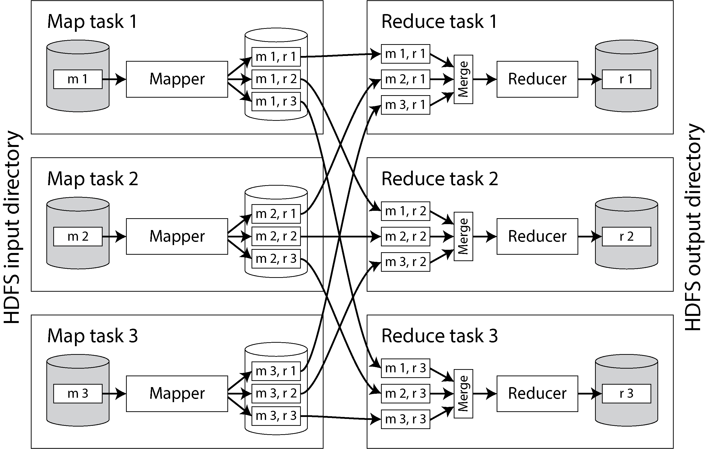
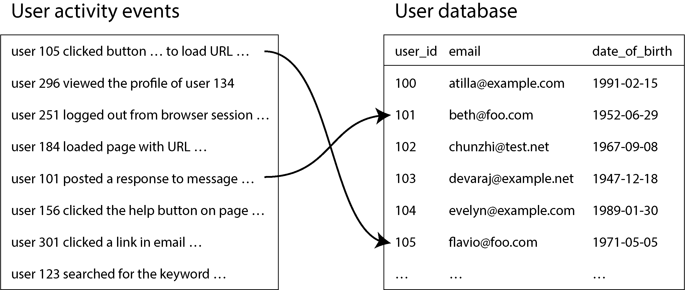
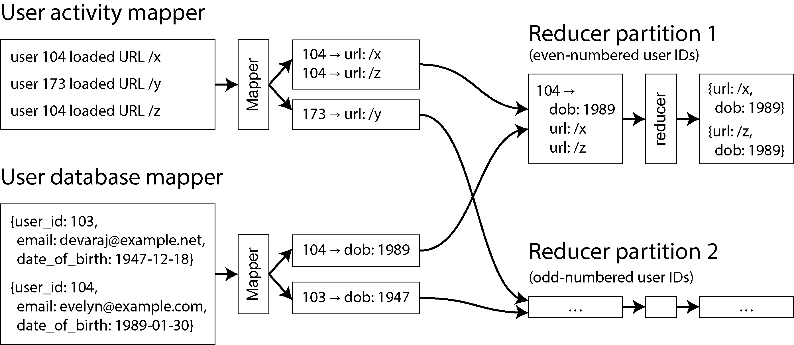

# Chương 11. Batch Processing

> *Một hệ thống không thể thành công nếu nó bị ảnh hưởng quá mạnh bởi một cá nhân duy nhất. Một khi thiết kế ban đầu đã hoàn tất và khá vững chắc, thử thách thực sự mới bắt đầu khi những người với nhiều quan điểm khác nhau tiến hành các thử nghiệm của riêng họ.*

> —Donald Knuth, “The Errors of TeX” (1989)

Phần lớn nội dung cuốn sách này cho đến nay đã nói về các *request* (yêu cầu) và *truy vấn* (query) cùng với các *response* (phản hồi) hay *kết quả* tương ứng. Kiểu xử lý dữ liệu này được giả định trong nhiều hệ thống dữ liệu hiện đại: bạn yêu cầu một thứ gì đó, hoặc bạn gửi một chỉ thị, và hệ thống cố gắng đưa ra câu trả lời cho bạn nhanh nhất có thể.

Một trình duyệt web yêu cầu một trang, một dịch vụ gọi một API từ xa, các database, cache, chỉ mục tìm kiếm (search index), và nhiều hệ thống khác đều hoạt động theo cách này. Chúng ta gọi chúng là *online system* (hệ thống trực tuyến). Thời gian phản hồi thường là thước đo hiệu năng chính của chúng, và chúng thường đòi hỏi khả năng chịu lỗi (fault tolerance) để đảm bảo tính sẵn sàng cao.

Tuy nhiên, đôi khi bạn cần chạy một phép tính lớn hơn hoặc xử lý lượng dữ liệu lớn hơn mức có thể làm được trong một request tương tác. Có thể bạn cần huấn luyện một mô hình AI, hoặc biến đổi rất nhiều dữ liệu từ dạng này sang dạng khác, hoặc tính toán phân tích trên một tập dữ liệu (dataset) rất lớn. Chúng ta gọi những tác vụ này là các job *batch processing* (xử lý theo lô), và các hệ thống xử lý chúng đôi khi được gọi là *offline system* (hệ thống ngoại tuyến).

Một job batch processing nhận dữ liệu đầu vào (chỉ đọc) và tạo ra dữ liệu đầu ra (được sinh lại từ đầu mỗi lần job chạy). Nó thường không thay đổi dữ liệu theo cách mà một transaction đọc/ghi sẽ làm. Do đó, đầu ra là dữ liệu *dẫn xuất* (derived) từ đầu vào (như đã thảo luận trong “Hệ thống lưu trữ gốc (System of Record) và Dữ liệu dẫn xuất (Derived Data)”). Nếu bạn không hài lòng với đầu ra, bạn có thể xóa nó, điều chỉnh logic của job, rồi chạy lại job.

Bằng cách coi đầu vào là bất biến (immutable) và tránh các tác dụng phụ (side effect) (chẳng hạn như ghi vào các database bên ngoài), các batch job đạt được hiệu năng tốt cũng như những lợi ích khác:

- Nếu bạn đưa một bug vào code và đầu ra bị sai hoặc bị hỏng, bạn chỉ cần rollback về phiên bản code trước đó và chạy lại job, và đầu ra sẽ lại đúng. Hoặc, đơn giản hơn nữa, bạn có thể giữ đầu ra cũ trong một thư mục khác và chuyển về dùng lại nó. Hầu hết các object store và các định dạng bảng mở (open table format) (xem “Data Warehouse trên Cloud”) đều hỗ trợ tính năng này, được gọi là *time travel* (du hành thời gian). Hầu hết các database có transaction đọc/ghi không có tính chất này: nếu bạn triển khai code lỗi ghi dữ liệu sai vào database, việc rollback code sẽ không làm gì để sửa dữ liệu đó. Ý tưởng về khả năng phục hồi từ code lỗi đã được gọi là *human fault tolerance* (khả năng chịu lỗi do con người) [1].

- Nhờ việc rollback dễ dàng như vậy, việc phát triển tính năng có thể tiến hành nhanh hơn so với trong một môi trường mà sai lầm có thể đồng nghĩa với thiệt hại không thể đảo ngược. Nguyên tắc *minimizing irreversibility* (giảm thiểu tính không thể đảo ngược) này có lợi cho phát triển phần mềm Agile [2].

- Cùng một tập file có thể được dùng làm đầu vào cho nhiều loại job khác nhau, bao gồm các job giám sát tính toán các chỉ số (metric) và đánh giá xem đầu ra của một job có các đặc tính mong đợi hay không (ví dụ, bằng cách so sánh nó với đầu ra của lần chạy trước và đo lường các sai lệch).

- Các framework batch processing sử dụng tài nguyên tính toán một cách hiệu quả. Mặc dù có thể xử lý dữ liệu theo lô thông qua các hệ thống dữ liệu trực tuyến như các database OLTP và các application server, làm như vậy có thể tốn kém hơn nhiều về tài nguyên cần thiết.

Batch processing đã chứng tỏ sự hữu ích trong rất nhiều trường hợp sử dụng (use case), mà chúng ta sẽ xem lại trong “Các trường hợp sử dụng batch”. Tuy nhiên, nó cũng đặt ra những thách thức. Với hầu hết các framework, đầu ra chỉ có thể được các job khác xử lý sau khi toàn bộ job kết thúc. Batch processing cũng có thể kém hiệu quả; bất kỳ thay đổi nào đối với dữ liệu đầu vào—dù chỉ một byte—cũng đòi hỏi batch job phải xử lý lại toàn bộ dataset đầu vào.

Một batch job có thể mất nhiều thời gian để chạy: vài phút, vài giờ, hoặc thậm chí vài ngày. Các job có thể được lên lịch chạy định kỳ (ví dụ, một lần mỗi ngày). Thước đo hiệu năng chính thường là thông lượng (throughput): job có thể xử lý bao nhiêu dữ liệu trong một đơn vị thời gian. Một số hệ thống batch xử lý lỗi bằng cách đơn giản là abort và khởi động lại toàn bộ job, trong khi những hệ thống khác có khả năng chịu lỗi để một job có thể hoàn thành thành công dù một số node của nó bị crash.

Ranh giới giữa các hệ thống trực tuyến và batch processing không phải lúc nào cũng rõ ràng; một truy vấn database chạy lâu trông khá giống một tiến trình batch. Nhưng batch processing cũng có những đặc tính riêng khiến nó trở thành một khối xây dựng hữu ích để xây dựng các ứng dụng tin cậy, có khả năng mở rộng và dễ bảo trì. Ví dụ, nó thường đóng vai trò trong *data integration* (tích hợp dữ liệu)—kết hợp nhiều hệ thống dữ liệu để đạt được những điều mà một hệ thống đơn lẻ không thể làm. ETL, như đã thảo luận trong “Data Warehousing (Kho dữ liệu)”, là một ví dụ về điều này.

> **LƯU Ý**
>
> Một lựa chọn thay thế cho batch processing là *stream processing* (xử lý luồng), trong đó job không kết thúc khi đã xử lý xong đầu vào, mà thay vào đó tiếp tục theo dõi đầu vào và xử lý các thay đổi trong đầu vào ngay sau khi chúng xảy ra. Chúng ta sẽ chuyển sang stream processing trong Chương 12.

Batch processing hiện đại đã chịu ảnh hưởng nặng nề từ MapReduce, một thuật toán batch processing được Google công bố năm 2004 [3] và sau đó được hiện thực trong nhiều hệ thống dữ liệu mã nguồn mở, bao gồm Hadoop, CouchDB và MongoDB. MapReduce là một mô hình lập trình khá cấp thấp, kém tinh vi hơn các engine thực thi truy vấn song song có trong, chẳng hạn, các data warehouse [4, 5]. Khi còn mới, MapReduce là một bước tiến về quy mô xử lý có thể đạt được trên phần cứng phổ thông (commodity hardware), nhưng hiện nay nó phần lớn đã lỗi thời và không còn được sử dụng tại Google [6, 7].

Batch processing ngày nay thường được thực hiện bằng các framework như Spark hoặc Flink, hoặc các engine truy vấn của data warehouse. Giống như MapReduce, chúng phụ thuộc nhiều vào sharding (xem Chương 7) và thực thi song song, nhưng chúng có các chiến lược caching và thực thi tinh vi hơn nhiều. Khi các hệ thống này trưởng thành, các vấn đề vận hành đã phần lớn được giải quyết, nên trọng tâm đã chuyển sang tính dễ sử dụng. Các mô hình xử lý mới như dataflow API, ngôn ngữ truy vấn và DataFrame API hiện được hỗ trợ rộng rãi. Việc điều phối (orchestration) job và workflow cũng đã trưởng thành. Các bộ lên lịch workflow lấy Hadoop làm trung tâm như Oozie và Azkaban đã được thay thế bằng các giải pháp tổng quát hơn như Airflow, Dagster và Prefect, vốn hỗ trợ một loạt rộng các framework batch processing và cloud data warehouse.

Điện toán đám mây (cloud computing) đã trở nên phổ biến khắp nơi. Các tầng lưu trữ cho batch đang chuyển từ các hệ thống file phân tán (distributed filesystem, DFS) như HDFS (Hadoop Distributed File System), GlusterFS và CephFS sang các hệ thống object storage như S3. Các cloud data warehouse có khả năng mở rộng như BigQuery và Snowflake đang làm mờ ranh giới giữa data warehouse và batch processing.

Để xây dựng trực giác về batch processing là gì, chúng ta sẽ bắt đầu chương này với một ví dụ sử dụng các công cụ Unix tiêu chuẩn trên một máy đơn. Sau đó chúng ta sẽ tìm hiểu cách mở rộng việc xử lý dữ liệu ra nhiều máy trong một hệ phân tán (distributed system). Chúng ta sẽ thấy rằng, giống như một hệ điều hành, các framework batch processing phân tán có một bộ lên lịch (scheduler) và một hệ thống file (filesystem). Tiếp theo chúng ta sẽ khám phá các mô hình xử lý khác nhau mà chúng ta dùng để viết các batch job. Cuối cùng, chúng ta sẽ thảo luận về các trường hợp sử dụng batch processing phổ biến.

## Batch Processing với các công cụ Unix

Giả sử bạn có một web server nối thêm một dòng vào file log mỗi khi nó phục vụ một request. Ví dụ, sử dụng định dạng access log mặc định của NGINX, một dòng log có thể trông như sau:

```
216.58.210.78 - - [27/Jun/2025:17:55:11 +0000] "GET /css/typography.css HTT
200 3377 "https://martin.kleppmann.com/" "Mozilla/5.0 (Macintosh; Intel Mac
10_15_7) AppleWebKit/537.36 (KHTML, like Gecko) Chrome/137.0.0.0 Safari/537
```

(Thực ra đó là một dòng duy nhất; ở đây nó được tách thành nhiều dòng để dễ đọc.) Có rất nhiều thông tin trong dòng đó. Để diễn giải nó, bạn cần xem định nghĩa của định dạng log, như sau:

```
$remote_addr - $remote_user [$time_local] "$request"
$status $body_bytes_sent "$http_referer" "$http_user_agent"
```

Vậy, dòng log này cho biết rằng vào ngày 27 tháng 6 năm 2025, lúc 17:55:11 UTC, server đã nhận một request cho file */css/typography.css* từ địa chỉ IP client 216.58.210.78. Người dùng không được xác thực, nên `$remote_user` được đặt là dấu gạch ngang ( `-` ). Trạng thái phản hồi là 200 (tức là request thành công), và phản hồi có kích thước 3,377 byte. Trình duyệt web là Chrome 137, và nó tải file này vì file được tham chiếu trong trang tại URL *https://martin.kleppmann.com/*.

Mặc dù việc phân tích log có thể trông như một ví dụ gượng ép, nó là một phần thiết yếu trong hoạt động vận hành của nhiều công ty công nghệ hiện đại và được dùng cho mọi thứ, từ các pipeline quảng cáo đến xử lý thanh toán. Thực tế, nó là một động lực thúc đẩy sự chấp nhận nhanh chóng của MapReduce và phong trào “big data”.

### Phân tích log đơn giản

Nhiều công cụ có thể nhận các file log này và tạo ra các báo cáo đẹp về lưu lượng truy cập website của bạn, nhưng để luyện tập, hãy tự xây dựng công cụ của riêng chúng ta bằng các công cụ Unix cơ bản. Ví dụ, giả sử bạn muốn tìm năm trang phổ biến nhất trên website của mình. Bạn có thể làm điều này trong Unix shell như sau:

```
cat /var/log/nginx/access.log |  ①
  awk '{print $7}' |  ②
  sort             |  ③
  uniq -c          |  ④
  sort -r -n       |  ⑤
  head -n 5  ⑥
```

- ① Đọc file log. (Nói một cách chặt chẽ, `cat` là không cần thiết ở đây, vì file đầu vào có thể được đưa trực tiếp làm đối số cho `awk` . Tuy nhiên, pipeline tuyến tính trở nên rõ ràng hơn khi được viết như thế này.)

- ② Tách mỗi dòng thành các trường theo khoảng trắng, và chỉ xuất ra trường thứ bảy của mỗi dòng, mà tình cờ chính là URL được yêu cầu. Trong dòng ví dụ của chúng ta, URL này là */css/typography.css*.

- ③ `sort` danh sách các URL được yêu cầu theo thứ tự bảng chữ cái. Lý do sắp xếp là để đảm bảo rằng, nếu một URL được yêu cầu *n* lần, file đã sắp xếp sẽ chứa cùng URL đó lặp lại *n* lần liên tiếp.

- ④ Lệnh `uniq` lọc bỏ các dòng lặp lại trong đầu vào của nó bằng cách kiểm tra xem hai dòng liền kề có giống nhau không. Tùy chọn `-c` bảo nó xuất thêm một bộ đếm: với mỗi URL riêng biệt, nó báo cáo số lần URL đó xuất hiện trong đầu vào.

- ⑤ Lệnh `sort` thứ hai sắp xếp theo con số ( `-n` ) ở đầu mỗi dòng, chính là số lần URL được yêu cầu. Sau đó nó trả về kết quả theo thứ tự đảo ngược (`-r` )—số lớn nhất đứng trước.

- ⑥ Cuối cùng, `head` chỉ xuất ra năm dòng đầu tiên ( `-n 5` ) của đầu vào và loại bỏ phần còn lại.

Đầu ra của chuỗi lệnh đó trông đại loại như sau:

```
4189 /favicon.ico
3631 /2016/02/08/how-to-do-distributed-locking.html
2124 /2020/11/18/distributed-systems-and-elliptic-curves.html
1369 /
 915 /css/typography.css
```

Mặc dù dòng lệnh trên có thể trông hơi khó hiểu nếu bạn chưa quen với các công cụ Unix, nó cực kỳ mạnh mẽ. Nó sẽ xử lý hàng gigabyte file log chỉ trong vài giây, và bạn có thể dễ dàng sửa đổi phép phân tích cho phù hợp với nhu cầu của mình. Ví dụ, nếu bạn muốn loại các file CSS khỏi báo cáo, bạn có thể đổi đối số của `awk` thành `$7 !~ /\.css$/ {print $7}` , và nếu bạn muốn đếm các địa chỉ IP client hàng đầu thay vì các trang hàng đầu, bạn có thể đổi đối số của `awk` thành `{print $1}` , và cứ thế.

Chúng tôi không có đủ chỗ trong cuốn sách này để khám phá chi tiết các công cụ Unix, nhưng chúng rất đáng để học. Nhiều phép phân tích dữ liệu có thể được thực hiện trong vài phút bằng cách kết hợp `awk` , `sed` , `grep` , `sort` , `uniq` và `xargs` , và chúng hoạt động tốt một cách đáng ngạc nhiên [8].

### Chuỗi lệnh so với chương trình tùy biến

Thay cho chuỗi lệnh Unix, bạn có thể viết một chương trình đơn giản để làm điều tương tự. Ví dụ, trong Python, nó có thể trông đại loại như sau:

```
from collections import defaultdict

counts = defaultdict(int)  ①

with open('/var/log/nginx/access.log', 'r') as file:
    for line in file:
        url = line.split()[6]  ②
        counts[url] += 1  ③

top5 = sorted(((count, url) for url, count in counts.items()),
              reverse=True)[:5]  ④

for count, url in top5:  ⑤
    print(f"{count} {url}")
```

- ① Khởi tạo `counts` là một bảng hash (hash table) lưu một bộ đếm số lần chúng ta đã thấy mỗi URL. Giá trị ban đầu của mỗi bộ đếm là 0.

- ② Lấy URL được yêu cầu, là trường thứ bảy phân tách bởi khoảng trắng, từ mỗi dòng của log (chỉ số mảng là 6 vì mảng trong Python được đánh chỉ số từ 0).

- ③ Tăng bộ đếm cho URL trong dòng log hiện tại.

- ④ Sắp xếp nội dung bảng hash theo giá trị bộ đếm (giảm dần), và lấy năm mục đầu.

- ⑤ In ra năm mục đầu đó.

Chương trình này không ngắn gọn bằng chuỗi lệnh Unix, nhưng nó khá dễ đọc, và việc bạn thích cách nào trong hai cách một phần là vấn đề khẩu vị. Tuy nhiên, ngoài những khác biệt bề ngoài về cú pháp giữa hai cách, có một khác biệt lớn trong luồng thực thi, điều này trở nên rõ ràng nếu bạn chạy phép phân tích này trên một file lớn.

### Sắp xếp so với aggregation trong bộ nhớ

Script Python giữ một bảng hash trong bộ nhớ chứa các URL, trong đó mỗi URL được ánh xạ tới số lần nó đã được thấy. Ví dụ pipeline Unix không có bảng hash như vậy, mà thay vào đó dựa vào việc sắp xếp một danh sách URL trong đó nhiều lần xuất hiện của cùng một URL chỉ đơn giản được lặp lại.

Cách nào tốt hơn? Điều đó phụ thuộc vào số lượng URL bạn có. Với hầu hết các website cỡ nhỏ đến trung bình, bạn có thể chứa tất cả các URL riêng biệt, cùng một bộ đếm cho mỗi URL, trong (chẳng hạn) 1 GB bộ nhớ. Trong ví dụ này, *working set* (tập làm việc) của job (lượng bộ nhớ mà job cần truy cập ngẫu nhiên) chỉ phụ thuộc vào số URL riêng biệt. Nếu có một triệu dòng log cho một URL duy nhất, không gian cần thiết trong bảng hash vẫn chỉ là một URL cộng với kích thước của bộ đếm. Nếu working set này đủ nhỏ, một bảng hash trong bộ nhớ hoạt động tốt—ngay cả trên một laptop.

Mặt khác, nếu working set của job lớn hơn bộ nhớ khả dụng, cách tiếp cận sắp xếp có lợi thế là nó có thể sử dụng đĩa một cách hiệu quả. Đó cũng chính là nguyên lý chúng ta đã thảo luận trong “Lưu trữ Log-Structured”: các khối dữ liệu có thể được sắp xếp trong bộ nhớ và ghi ra đĩa dưới dạng các file segment, rồi nhiều segment đã sắp xếp có thể được trộn (merge) thành một file đã sắp xếp lớn hơn. Mergesort có các mẫu truy cập tuần tự hoạt động tốt trên đĩa (xem “Ghi tuần tự so với ghi ngẫu nhiên trên SSD”).

Tiện ích `sort` trong GNU Coreutils (Linux) tự động xử lý các dataset lớn hơn bộ nhớ bằng cách tràn (spill) ra đĩa và tự động song song hóa việc sắp xếp trên nhiều lõi CPU [9]. Điều này có nghĩa là chuỗi lệnh Unix đơn giản mà chúng ta đã thấy trước đó dễ dàng mở rộng cho các dataset lớn mà không bị hết bộ nhớ. Nút thắt cổ chai nhiều khả năng là tốc độ đọc file đầu vào từ đĩa.

Một hạn chế của các công cụ Unix là chúng chạy trên một máy đơn. Các dataset quá lớn để chứa trong bộ nhớ hoặc trên đĩa cục bộ là một vấn đề—và đó là lúc các framework batch processing phân tán phát huy vai trò.

## Batch Processing trong hệ phân tán

Máy chạy ví dụ công cụ Unix của chúng ta có một số thành phần cùng hoạt động để xử lý dữ liệu log:

- Các thiết bị lưu trữ được truy cập thông qua giao diện filesystem của hệ điều hành

- Một scheduler quyết định khi nào các process được chạy và cách phân bổ tài nguyên CPU cho chúng

- Một chuỗi các chương trình Unix có đầu vào tiêu chuẩn và đầu ra tiêu chuẩn ( `stdin` và `stdout` ) được nối với nhau bằng các pipe

Chính những thành phần này cũng tồn tại trong các framework xử lý dữ liệu phân tán. Thực tế, bạn có thể coi các framework này như những hệ điều hành phân tán; chúng có filesystem, job scheduler, và các chương trình gửi dữ liệu cho nhau thông qua filesystem hoặc các kênh giao tiếp khác.

### Hệ thống file phân tán

Filesystem do hệ điều hành của bạn cung cấp được cấu thành từ nhiều tầng:

- Ở tầng thấp nhất, các driver thiết bị khối (block device driver) nói chuyện trực tiếp với đĩa và cho phép các tầng bên trên đọc và ghi các block thô.

- Bên trên tầng block là một page cache giữ các block mới được truy cập gần đây trong bộ nhớ để truy cập nhanh hơn.

- API block được bao bọc trong một tầng filesystem, tầng này chia các file lớn thành các block và theo dõi metadata của file như inode, thư mục và file. Ví dụ, hai hiện thực phổ biến trên Linux là ext4 và XFS.

- Cuối cùng, hệ điều hành cung cấp các filesystem khác nhau cho ứng dụng thông qua một API chung gọi là *virtual filesystem* (hệ thống file ảo, VFS). VFS là thứ cho phép các ứng dụng đọc và ghi theo một cách tiêu chuẩn bất kể filesystem bên dưới là gì.

Các hệ thống file phân tán hoạt động theo cách gần như tương tự. Các file được chia thành các block, và các block này được phân tán trên nhiều máy. Block của DFS thường lớn hơn nhiều so với block cục bộ. HDFS mặc định là 128 MB, trong khi JuiceFS và nhiều object store dùng block 4 MB—lớn hơn nhiều so với 4,096 byte của ext4. Block lớn hơn đồng nghĩa với ít metadata cần theo dõi hơn, điều này tạo ra khác biệt lớn trên các dataset cỡ petabyte. Block lớn hơn cũng giảm chi phí phụ trội (overhead) của việc seek tới một block so với việc đọc nó.

Hầu hết các thiết bị lưu trữ vật lý không thể ghi một phần block, nên các hệ điều hành yêu cầu các lần ghi phải dùng trọn một block ngay cả khi dữ liệu không chiếm hết block đó. Vì các hệ thống file phân tán có block lớn hơn và thường được hiện thực bên trên các filesystem của hệ điều hành, chúng không có yêu cầu này. Ví dụ, một file 900 MB được lưu với các block 128 MB sẽ có bảy block dùng 128 MB và một block dùng 4 MB.

Các block DFS được đọc bằng cách gửi các request qua mạng tới một máy trong cluster lưu trữ block đó. Mỗi máy chạy một daemon, cung cấp một API cho phép các process từ xa đọc và ghi các block dưới dạng file trên filesystem cục bộ của nó. HDFS gọi các daemon này là DataNode, trong khi GlusterFS gọi chúng là các process glusterfsd. Trong cuốn sách này chúng tôi sẽ gọi chúng là *data node* (nút dữ liệu).

Các hệ thống file phân tán cũng hiện thực phiên bản phân tán tương đương của page cache. Vì các block DFS được lưu dưới dạng file trên các data node, các thao tác đọc và ghi đi qua hệ điều hành của từng data node, vốn bao gồm một page cache trong bộ nhớ. Điều này giữ các block dữ liệu được đọc thường xuyên trong bộ nhớ trên các data node. Một số hệ thống file phân tán còn hiện thực thêm các tầng caching khác, chẳng hạn như caching phía client và caching trên đĩa cục bộ có trong JuiceFS.

Các filesystem như ext4 và XFS theo dõi metadata lưu trữ bao gồm không gian trống, vị trí các block của file, cấu trúc thư mục, thiết lập quyền truy cập, và nhiều thứ khác. Các hệ thống file phân tán cũng cần một cách để theo dõi vị trí các file trải trên nhiều máy, thiết lập quyền truy cập, v.v. Hadoop có một dịch vụ gọi là NameNode duy trì metadata cho cluster. 3FS của DeepSeek có một dịch vụ metadata lưu bền dữ liệu của nó vào một key-value store như FoundationDB.

Bên trên filesystem là VFS. Một điểm tương đồng gần gũi trong batch processing là giao thức (protocol) của hệ thống file phân tán. Các hệ thống file phân tán phải cung cấp một giao thức hoặc giao diện để các hệ thống batch processing có thể đọc và ghi file. Giao thức này hoạt động như một giao diện có thể cắm thay (pluggable); bất kỳ DFS nào cũng có thể được sử dụng miễn là nó hiện thực giao thức đó. Ví dụ, API của Amazon S3 đã được chấp nhận rộng rãi bởi các hệ thống lưu trữ như MinIO, R2 của Cloudflare, Tigris, B2 của Backblaze, và nhiều hệ thống khác. Các hệ thống batch processing có hỗ trợ S3 có thể dùng bất kỳ hệ thống lưu trữ nào trong số này.

Một số DFS hiện thực các filesystem tuân thủ POSIX, xuất hiện trước VFS của hệ điều hành như bất kỳ filesystem nào khác. Filesystem in Userspace (FUSE) hoặc giao thức Network File System (NFS) thường được dùng để tích hợp vào VFS. NFS có lẽ là giao thức hệ thống file phân tán nổi tiếng nhất. Giao thức này ban đầu được phát triển để cho phép nhiều client đọc và ghi dữ liệu trên một server duy nhất. Gần đây hơn, các filesystem như Amazon Elastic File System (EFS) và Archil cung cấp các hiện thực hệ thống file phân tán tương thích NFS với khả năng mở rộng vượt trội. Các client NFS vẫn kết nối tới một endpoint duy nhất, nhưng bên dưới, các hệ thống này giao tiếp với các dịch vụ metadata phân tán và các data node để đọc và ghi dữ liệu.

#### HỆ THỐNG FILE PHÂN TÁN VÀ LƯU TRỮ MẠNG

Các hệ thống file phân tán (distributed filesystem) dựa trên nguyên lý *shared-nothing* (xem “Kiến trúc Shared-Memory, Shared-Disk và Shared-Nothing”), trái ngược với cách tiếp cận shared-disk của các kiến trúc network attached storage (NAS) và storage area network (SAN). Lưu trữ shared-disk được hiện thực bằng một thiết bị lưu trữ tập trung, thường dùng phần cứng tùy biến và hạ tầng mạng đặc thù như Fibre Channel. Ngược lại, cách tiếp cận shared-nothing không đòi hỏi phần cứng đặc biệt nào, chỉ cần các máy tính được kết nối bằng mạng datacenter thông thường. Nhiều hệ thống file phân tán được xây dựng trên phần cứng phổ thông (commodity hardware), loại rẻ hơn nhưng có tỷ lệ hỏng hóc cao hơn phần cứng cấp doanh nghiệp. Để chịu được các hỏng hóc của máy và đĩa, các block của file được replicate trên nhiều máy. Điều này cũng cho phép các scheduler phân bổ khối lượng công việc đồng đều hơn, vì chúng có thể thực thi một task trên bất kỳ node nào chứa replica của dữ liệu đầu vào cho task đó.

Replication có thể chỉ đơn giản là giữ nhiều bản sao của cùng một dữ liệu trên nhiều máy, như đã mô tả trong Chương 6, hoặc dùng một cơ chế *erasure coding* (mã hóa xóa) như mã Reed–Solomon, cho phép khôi phục dữ liệu bị mất với chi phí lưu trữ thấp hơn so với replication toàn phần [10, 11, 12]. Các kỹ thuật này tương tự RAID, vốn cung cấp tính dự phòng trên nhiều đĩa gắn vào cùng một máy; điểm khác biệt là trong hệ thống file phân tán, việc truy cập file và replication được thực hiện qua mạng datacenter thông thường mà không cần phần cứng đặc biệt.

### Object Store

Các dịch vụ object storage như Amazon S3, Google Cloud Storage, Azure Blob Storage và OpenStack Swift đã trở thành một lựa chọn thay thế phổ biến cho hệ thống file phân tán đối với các job batch processing. Thực tế, ranh giới giữa hai loại này khá mờ nhạt. Như chúng ta đã thấy ở mục trước và trong “Cơ sở dữ liệu dựa trên Object Storage”, các driver FUSE cho phép người dùng coi các object store như S3 như một filesystem. Một số hiện thực DFS, như JuiceFS và Ceph, cung cấp cả API object storage lẫn API filesystem. Tuy nhiên, API, hiệu năng và các đảm bảo về tính nhất quán (consistency) của chúng rất khác nhau. Cần thận trọng khi áp dụng những hệ thống như vậy để đảm bảo chúng hoạt động như mong đợi, ngay cả khi chúng trông như đã hiện thực đủ các API cần thiết.

Mỗi object trong một object store có một URL như *s3://my-photo-bucket/2025/04/01 / birthday.png*. Phần host của URL (*my-photo-bucket*) mô tả bucket nơi các object được lưu trữ, và phần theo sau là *key* (khóa) của object (*/2025/04/01 / birthday.png* trong ví dụ của chúng ta). Một bucket có tên duy nhất toàn cục, và key của mỗi object phải là duy nhất trong bucket của nó.

Object được đọc bằng lời gọi `get` và được ghi bằng lời gọi `put`. Khác với file trên filesystem, object là bất biến (immutable) một khi đã được ghi. Để cập nhật một object, nó phải được ghi lại toàn bộ bằng lời gọi `put`, tương tự như trong key-value store. Azure Blob Storage và S3 Express One Zone hỗ trợ thao tác append (nối thêm), nhưng phần lớn các store khác thì không. Không có API kiểu file handle với các hàm như `fopen` và `fseek`.

Các object trông như được tổ chức thành các thư mục, điều này hơi gây nhầm lẫn vì object store không có khái niệm thư mục. Cấu trúc đường dẫn chỉ đơn giản là một quy ước, và các dấu gạch chéo là một phần của key của object. Quy ước này cho phép bạn thực hiện điều gì đó tương tự liệt kê thư mục bằng cách yêu cầu danh sách các object có một tiền tố (prefix) nhất định. Tuy nhiên, việc liệt kê object theo prefix khác với liệt kê thư mục trên filesystem ở hai điểm:

- Thao tác `list` theo prefix hoạt động giống lời gọi `ls -R` đệ quy trên hệ thống Unix. Nó trả về tất cả các object bắt đầu bằng prefix đó, bao gồm cả các object nằm trong các đường dẫn con.

- Không thể có thư mục rỗng. Nếu bạn xóa tất cả các object bên dưới *s3://my-photo-bucket/2025/04/01*, thì *01* sẽ không còn xuất hiện khi bạn gọi `list` trên *s3://my-photo-bucket/2025/04*. Một thực hành phổ biến là tạo một object kích thước 0 byte để biểu diễn thư mục rỗng (ví dụ, tạo một file rỗng *s3://my-photo-bucket/2025/04/01* để giữ nó tồn tại khi tất cả các object con bị xóa).

Các hiện thực DFS thường hỗ trợ các thao tác filesystem thông dụng như hard link, symbolic link, khóa file (file locking) và đổi tên nguyên tử (atomic rename). Object store thiếu những tính năng như vậy. Liên kết (link) và khóa (lock) thường không được hỗ trợ, còn việc đổi tên thì không nguyên tử; nó được thực hiện bằng cách sao chép object sang key mới rồi xóa object cũ. Nếu bạn muốn đổi tên một thư mục, bạn phải đổi tên từng object bên trong nó, vì tên thư mục là một phần của key.

Các key-value store mà chúng ta đã thảo luận trong Chương 4 được tối ưu cho các giá trị nhỏ (thường ở mức kilobyte) và các thao tác đọc/ghi thường xuyên, độ trễ (latency) thấp. Ngược lại, hệ thống file phân tán và object store thường được tối ưu cho các object lớn (từ megabyte đến gigabyte) và các thao tác đọc ít thường xuyên hơn nhưng lớn hơn. Tuy nhiên, gần đây các object store đã bắt đầu bổ sung hỗ trợ cho các thao tác đọc/ghi nhỏ và thường xuyên. Ví dụ, S3 Express One Zone hiện cung cấp độ trễ ở mức một mili-giây và mô hình định giá gần giống với key-value store hơn.

Một khác biệt nữa giữa hệ thống file phân tán và object store là các DFS như HDFS cho phép chạy các task tính toán trên chính máy đang lưu một bản sao của file cụ thể. Điều này cho phép task đọc file đó mà không phải gửi nó qua mạng, giúp tiết kiệm băng thông nếu mã thực thi của task nhỏ hơn file mà nó cần đọc. Ngược lại, object store thường tách biệt lưu trữ và tính toán. Làm vậy có thể tốn nhiều băng thông hơn, nhưng mạng datacenter hiện đại rất nhanh, nên điều này thường chấp nhận được. Kiến trúc này cũng cho phép các tài nguyên máy như CPU và bộ nhớ được mở rộng độc lập với lưu trữ, vì hai thành phần này đã được tách rời (decoupled).

### Điều phối job phân tán

Phép so sánh với hệ điều hành của chúng ta cũng áp dụng cho việc điều phối job (job orchestration). Khi bạn thực thi một batch job trên Unix, cần có thứ gì đó thực sự chạy các process `awk`, `sort`, `uniq` và `head`. Dữ liệu cần được chuyển từ đầu ra của process này sang đầu vào của process kia, bộ nhớ phải được cấp phát cho từng process, các chỉ thị (instruction) của từng process phải được lên lịch công bằng và thực thi trên CPU, các ranh giới về bộ nhớ và I/O phải được thi hành, v.v. Trên một máy đơn lẻ, kernel của hệ điều hành chịu trách nhiệm cho những công việc này. Trong môi trường phân tán, đó là vai trò của một job orchestrator (bộ điều phối job).

Các framework batch processing gửi một request đến scheduler của orchestrator để chạy một job. Request khởi động một job chứa các metadata như sau:

- Số lượng task cần thực thi

- Lượng bộ nhớ, CPU và đĩa cần cho mỗi task

- Một định danh (identifier) của job

- Thông tin xác thực truy cập (access credentials)

- Các tham số của job như dữ liệu đầu vào và đầu ra

- Chi tiết phần cứng yêu cầu như GPU hoặc loại đĩa

- Vị trí của mã thực thi của job

Các orchestrator như Kubernetes và Hadoop YARN (Yet Another Resource Negotiator) [13] kết hợp thông tin này với metadata của cluster để thực thi job bằng các thành phần sau:

- **Bộ thực thi task (task executor)**

  Một daemon executor như *NodeManager* của YARN hay *kubelet* của Kubernetes chạy trên mỗi node trong cluster. Các executor chịu trách nhiệm chạy các task của job, gửi heartbeat để báo hiệu rằng chúng còn sống, và theo dõi trạng thái task cũng như việc cấp phát tài nguyên trên node. Khi một request khởi động task được gửi đến executor, nó lấy mã thực thi của job về và chạy một lệnh để khởi động task. Executor sau đó giám sát process cho đến khi nó hoàn thành hoặc thất bại, và tại thời điểm đó nó cập nhật metadata trạng thái của task tương ứng.

  Nhiều executor cũng phối hợp với hệ điều hành để cung cấp cả cô lập về bảo mật lẫn cô lập về hiệu năng. Ví dụ, YARN và Kubernetes dùng *cgroups* của Linux. Điều này ngăn các task truy cập dữ liệu khi không có quyền, hoặc ảnh hưởng tiêu cực đến hiệu năng của các task khác trên node do sử dụng tài nguyên quá mức.

- **Resource manager (bộ quản lý tài nguyên)**

  Resource manager của orchestrator lưu metadata về từng node, bao gồm phần cứng khả dụng (CPU, GPU, bộ nhớ, đĩa, v.v.), trạng thái các task, vị trí mạng, trạng thái node và các thông tin liên quan khác. Do đó, resource manager cung cấp một cái nhìn toàn cục về trạng thái hiện tại của cluster. Bản chất tập trung của resource manager có thể dẫn đến các điểm nghẽn (bottleneck) về cả khả năng mở rộng (scalability) lẫn tính sẵn sàng (availability). YARN dùng ZooKeeper, còn Kubernetes dùng etcd, để lưu trạng thái cluster (xem “Dịch vụ điều phối (Coordination Services)”).

- **Scheduler (bộ lên lịch)**

  Các orchestrator thường có một hệ thống con scheduler tập trung, nhận các request khởi động, dừng, hoặc kiểm tra trạng thái của một job. Ví dụ, một scheduler có thể nhận request khởi động một job gồm 10 task dùng một Docker image cụ thể trên các node có một loại GPU cụ thể. Scheduler dùng thông tin từ request và trạng thái của resource manager để xác định task nào chạy trên node nào. Các task executor sau đó được thông báo về công việc được giao và bắt đầu thực thi.

Dù mỗi orchestrator dùng thuật ngữ khác nhau, bạn sẽ thấy các thành phần này trong gần như mọi hệ thống điều phối.

> **LƯU Ý**
>
> Các quyết định lên lịch đôi khi cần đến những scheduler đặc thù cho ứng dụng, có khả năng tính đến các yêu cầu riêng, chẳng hạn tự động mở rộng (autoscaling) các read replica khi đạt đến một ngưỡng truy vấn nhất định. Scheduler tập trung và các scheduler đặc thù cho ứng dụng phối hợp với nhau để xác định cách thực thi task tốt nhất. YARN gọi các scheduler con của nó là *ApplicationMaster*, còn Kubernetes gọi chúng là *operator*.

#### Cấp phát tài nguyên

Scheduler có một vai trò đặc biệt thách thức trong việc điều phối job. Chúng phải tìm ra cách cấp phát tối ưu tài nguyên hữu hạn của cluster cho các job có nhu cầu cạnh tranh nhau. Về căn bản, các quyết định này phải cân bằng giữa tính công bằng và tính hiệu quả.

Hãy tưởng tượng một cluster nhỏ với năm node, có tổng cộng 160 lõi CPU khả dụng. Scheduler của cluster nhận được hai request job, mỗi job muốn 100 lõi để hoàn thành công việc của mình. Cách tốt nhất để lên lịch cho khối lượng công việc này là gì?

- Scheduler có thể quyết định chạy 80 task cho mỗi job, và khởi động 20 task còn lại của mỗi job khi các task trước đó hoàn thành.

- Scheduler có thể chạy toàn bộ task của một job, rồi chỉ bắt đầu chạy các task của job thứ hai khi có đủ 100 lõi khả dụng (một chiến lược gọi là *gang scheduling*).

- Nếu request của job thứ hai đến muộn hơn nhiều so với job thứ nhất, scheduler có thông tin không đầy đủ. Nó phải quyết định cấp toàn bộ 100 lõi cho job thứ nhất, hay giữ lại một phần để dự phòng cho một job tương lai có thể đến hoặc không bao giờ đến.

Đây là một ví dụ rất đơn giản, nhưng chúng ta đã thấy nhiều sự đánh đổi (trade-off) khó khăn. Chẳng hạn, trong kịch bản gang scheduling, nếu scheduler giữ chỗ các lõi CPU cho đến khi có đủ 100 lõi khả dụng cùng lúc, các node sẽ nằm nhàn rỗi. Mức sử dụng tài nguyên của cluster sẽ giảm, và deadlock có thể xảy ra nếu các job khác cũng cố giữ chỗ lõi CPU.

Ngược lại, nếu scheduler chỉ đơn giản chờ cho đến khi có 100 lõi khả dụng, các job khác có thể chiếm lấy các lõi đó trong lúc chờ. Cluster có thể không có đủ 100 lõi khả dụng trong một thời gian rất dài, dẫn đến *starvation* (đói tài nguyên). Một cách khác, scheduler có thể quyết định *preempt* (chiếm quyền) một số task của job thứ nhất, kill chúng để nhường chỗ cho job thứ hai. Tuy nhiên, việc preempt task cũng làm giảm hiệu quả của cluster, vì các task bị kill sẽ phải được khởi động lại sau đó.

Bây giờ hãy tưởng tượng một scheduler phải đưa ra quyết định cấp phát cho hàng trăm, thậm chí hàng triệu request job như vậy. Việc tìm một giải pháp tối ưu dường như bất khả thi. Thực tế, bài toán này là *NP-hard*, nghĩa là việc tính toán một giải pháp tối ưu chậm đến mức không chấp nhận được, ngoại trừ với những ví dụ nhỏ nhất [14, 15].

Do đó, trong thực tế các scheduler dùng heuristic để đưa ra những quyết định không tối ưu nhưng hợp lý. Một số thuật toán thường được dùng, bao gồm first-in first-out (FIFO), dominant resource fairness (DRF), hàng đợi ưu tiên (priority queue), lên lịch dựa trên capacity hoặc quota, và nhiều thuật toán bin-packing khác nhau. Chi tiết của các thuật toán này nằm ngoài phạm vi cuốn sách, nhưng chúng là một lĩnh vực nghiên cứu rất thú vị.

#### Lên lịch workflow

Ví dụ về các công cụ Unix trong “Phân tích log đơn giản” bao gồm một chuỗi nhiều lệnh được nối với nhau bằng Unix pipe. Mô hình tương tự cũng xuất hiện trong các batch process phân tán: thường thì đầu ra của một job cần trở thành đầu vào của một hoặc nhiều job khác, và mỗi job có thể có nhiều đầu vào được tạo ra bởi các job khác. Điều này được gọi là một *workflow* hay *directed acyclic graph* (DAG — đồ thị có hướng không chu trình) của các job.

> **LƯU Ý**
>
> Trong “Durable Execution và Workflow” chúng ta đã thấy các workflow engine cung cấp durable execution (thực thi bền vững) cho một chuỗi các bước, thường là thực hiện các RPC. Trong bối cảnh batch processing, “workflow” có nghĩa khác: đó là một chuỗi các batch process, mỗi process nhận dữ liệu đầu vào và tạo ra dữ liệu đầu ra, nhưng thông thường không thực hiện RPC đến các dịch vụ bên ngoài. Các durable execution engine thường xử lý ít dữ liệu hơn trên mỗi request so với các đối tác batch processing của chúng, dù ranh giới này khá mờ.

Một workflow gồm nhiều job có thể cần thiết vì một số lý do:

- Nếu đầu ra của một job cần trở thành đầu vào của nhiều job khác do các nhóm khác nhau bảo trì, tốt nhất là job đầu tiên ghi đầu ra của nó vào một vị trí mà tất cả các job khác đều có thể đọc. Các job tiêu thụ đó sau đó có thể được lên lịch chạy mỗi khi dữ liệu đó được cập nhật, hoặc theo một lịch khác.

- Bạn có thể muốn chuyển dữ liệu từ công cụ xử lý này sang công cụ xử lý khác. Ví dụ, một Spark job có thể xuất dữ liệu của nó ra HDFS, rồi một script Python có thể kích hoạt một truy vấn Trino SQL (xem “Data Warehouse trên Cloud”) để xử lý tiếp các file trên HDFS và xuất ra S3. Một số data pipeline về bản chất cần nhiều giai đoạn xử lý. Ví dụ, nếu một giai đoạn cần shard dữ liệu theo một key, và giai đoạn kế tiếp cần shard theo một key khác, thì giai đoạn thứ nhất có thể xuất dữ liệu đã được shard theo cách mà giai đoạn thứ hai yêu cầu.

Trong ví dụ về các công cụ Unix, pipe nối đầu ra của lệnh này với đầu vào của lệnh kia chỉ dùng một buffer nhỏ trong bộ nhớ và không ghi dữ liệu ra file. Nếu buffer đó đầy, process sản xuất phải chờ cho đến khi process tiêu thụ đã đọc một phần dữ liệu khỏi buffer trước khi có thể xuất thêm — một dạng backpressure. Spark, Flink và các batch execution engine khác hỗ trợ một mô hình tương tự, trong đó đầu ra của một task được truyền trực tiếp sang task khác (qua mạng nếu các task chạy trên các máy khác nhau).

Tuy nhiên, điển hình hơn là một job trong workflow ghi đầu ra của nó vào một hệ thống file phân tán hoặc object store, và job kế tiếp đọc từ đó. Điều này tách rời các job khỏi nhau, cho phép chúng chạy ở những thời điểm khác nhau. Nếu một job có nhiều đầu vào, workflow scheduler thường chờ cho đến khi tất cả các job tạo ra các đầu vào đó đã hoàn thành thành công, rồi mới chạy job tiêu thụ những đầu vào ấy.

Các scheduler trong các framework điều phối như ResourceManager của YARN hay scheduler tích hợp sẵn của Spark không quản lý toàn bộ workflow; chúng lên lịch theo từng job. Để xử lý các phụ thuộc giữa các lần thực thi job như vậy, nhiều workflow scheduler đã được phát triển, bao gồm Airflow, Dagster và Prefect. Các workflow scheduler có những tính năng quản lý hữu ích khi bảo trì một tập hợp lớn các batch job. Các workflow gồm 50 đến 100 job là chuyện phổ biến trong nhiều data pipeline, và trong một tổ chức lớn, nhiều nhóm có thể đang chạy các job hoặc workflow đọc đầu ra của nhau trên nhiều hệ thống. Sự hỗ trợ của công cụ là rất quan trọng để quản lý những dataflow phức tạp như vậy.

#### Xử lý lỗi

Các batch job thường chạy trong thời gian dài. Những job chạy lâu với nhiều task song song có nhiều khả năng gặp ít nhất một task thất bại trên đường đi. Như đã thảo luận trong “Lỗi phần cứng và lỗi phần mềm” và “Mạng không đáng tin cậy”, điều này có thể xảy ra vì nhiều lý do, bao gồm lỗi phần cứng (đặc biệt trên phần cứng phổ thông) hoặc gián đoạn mạng.

Một lý do khác khiến task có thể không chạy đến khi hoàn thành là scheduler có thể chủ động preempt (kill) nó. Preemption đặc biệt hữu ích nếu bạn có nhiều mức ưu tiên, chẳng hạn các task ưu tiên thấp rẻ hơn để chạy và các task ưu tiên cao tốn kém hơn. Các task ưu tiên thấp có thể chạy bất cứ khi nào có dư năng lực tính toán, nhưng chúng đối mặt với rủi ro bị preempt vào bất kỳ lúc nào nếu một task ưu tiên cao hơn xuất hiện. Những máy ảo ưu tiên thấp, rẻ hơn như vậy được gọi là *spot instance* trên Amazon EC2, *spot virtual machine* trên Azure, và *preemptible instance* trên Google Cloud [16].

Vì batch processing thường được dùng cho các job không nhạy về thời gian, nó rất phù hợp để dùng các task ưu tiên thấp và spot instance nhằm giảm chi phí chạy job. Về bản chất, những job đó có thể dùng các tài nguyên tính toán dư thừa vốn sẽ bị bỏ không, qua đó tăng mức sử dụng của cluster. Tuy nhiên, điều này cũng có nghĩa là những task đó dễ bị scheduler kill hơn, vì preemption xảy ra thường xuyên hơn lỗi phần cứng [17].

Vì các batch job tạo lại đầu ra của chúng từ đầu mỗi lần chạy, các thất bại của task dễ xử lý hơn so với trong các hệ thống trực tuyến (online). Hệ thống có thể xóa phần đầu ra dở dang của lần thực thi thất bại và lên lịch chạy lại task trên một máy khác. Tuy vậy, chạy lại toàn bộ job chỉ vì một task thất bại sẽ rất lãng phí. Do đó, MapReduce và các hệ kế nhiệm của nó giữ cho việc thực thi các task song song độc lập với nhau, để có thể thử lại công việc ở mức độ chi tiết (granularity) của từng task riêng lẻ [3].

Khả năng chịu lỗi (fault tolerance) trở nên phức tạp hơn khi đầu ra của một task trở thành đầu vào của task khác trong một workflow. MapReduce giải quyết điều này bằng cách luôn ghi dữ liệu trung gian như vậy trở lại hệ thống file phân tán và chờ task ghi hoàn thành thành công trước khi cho phép các task khác đọc dữ liệu đó. Cách này hoạt động được, ngay cả trong môi trường mà preemption là phổ biến, nhưng nó đồng nghĩa với rất nhiều lần ghi vào DFS, điều có thể kém hiệu quả.

Spark giữ dữ liệu trung gian trong bộ nhớ (“spill” nó ra đĩa cục bộ nếu không đủ chỗ), và chỉ ghi kết quả cuối cùng vào DFS. Nó cũng theo dõi cách dữ liệu trung gian đã được tính toán, cho phép Spark tính lại dữ liệu đó trong trường hợp bị mất [18]. Flink dùng một cách tiếp cận khác dựa trên việc định kỳ checkpoint một snapshot của các task [19]. Chúng ta sẽ quay lại chủ đề này trong “Các Dataflow Engine”.

## Các mô hình batch processing

Chúng ta đã thấy cách các batch job được lên lịch trong môi trường phân tán. Bây giờ hãy chuyển sự chú ý sang cách các framework batch processing xử lý dữ liệu. Hai mô hình phổ biến nhất là MapReduce và dataflow engine. Mặc dù dataflow engine đã phần lớn thay thế MapReduce trong thực tế, việc hiểu cách MapReduce hoạt động vẫn hữu ích vì nó đã ảnh hưởng đến nhiều framework batch processing hiện đại.

MapReduce và dataflow engine đã tiến hóa để hỗ trợ nhiều mô hình lập trình, bao gồm các API lập trình cấp thấp, ngôn ngữ truy vấn quan hệ, và các API DataFrame. Sự đa dạng về lựa chọn cho phép kỹ sư ứng dụng, kỹ sư phân tích, chuyên viên phân tích nghiệp vụ, và thậm chí cả nhân viên không chuyên kỹ thuật xử lý dữ liệu của công ty cho nhiều trường hợp sử dụng khác nhau, điều mà chúng ta sẽ thảo luận trong “Các trường hợp sử dụng batch”.

### MapReduce

Mô hình xử lý dữ liệu trong MapReduce rất giống ví dụ phân tích log của web server trong “Phân tích log đơn giản”:

1. Đọc một tập các file đầu vào và tách nó thành các *record* (bản ghi). Trong ví dụ về log của web server, mỗi record là một dòng trong log (tức là `\n` là ký tự phân tách record). Trong MapReduce của Hadoop, file đầu vào được lưu trong một hệ thống file phân tán như HDFS hoặc một object store như S3. Nhiều định dạng file khác nhau được sử dụng, chẳng hạn Apache Parquet (định dạng dạng cột, xem “Lưu trữ hướng cột (Column-Oriented Storage)”) hoặc Apache Avro (định dạng dạng hàng, xem “Avro”).

2. Gọi hàm mapper để trích xuất một key và một value từ mỗi record đầu vào. Trong ví dụ về các công cụ Unix, hàm mapper là `awk '{print $7}'`, trích xuất URL (`$7`) làm key và để trống value.

3. Sắp xếp tất cả các cặp key-value theo key. Trong ví dụ về log, việc này được thực hiện bởi lệnh `sort` đầu tiên.

4. Gọi hàm reducer để duyệt qua các cặp key-value đã được sắp xếp. Nếu cùng một key xuất hiện nhiều lần, việc sắp xếp đã làm chúng nằm kề nhau trong danh sách, nên dễ dàng kết hợp các value đó mà không cần giữ nhiều trạng thái trong bộ nhớ. Trong ví dụ về các công cụ Unix, reducer được hiện thực bởi lệnh `uniq -c`, lệnh này đếm số record kề nhau có cùng key.

Bốn bước đó có thể được thực hiện bởi một MapReduce job. Bước 2 (map) và bước 4 (reduce) là nơi bạn viết mã xử lý dữ liệu tùy biến của mình. Bước 1 (tách file thành các record) được xử lý bởi bộ phân tích định dạng đầu vào (input format parser). Bước 3, bước `sort`, là ngầm định trong MapReduce — bạn không phải viết nó, vì đầu ra từ mapper luôn được sắp xếp trước khi được đưa cho reducer. Bước sắp xếp này là một thuật toán batch processing nền tảng, mà chúng ta sẽ xem lại trong “Shuffle dữ liệu”.

Để tạo một MapReduce job, bạn cần hiện thực hai hàm callback, mapper và reducer, hoạt động như sau:

- **Mapper**

  Mapper được gọi một lần cho mỗi record đầu vào, và nhiệm vụ của nó là trích xuất key và value từ record. Với mỗi đầu vào, nó có thể sinh ra bất kỳ số lượng cặp key-value nào (kể cả không sinh ra cặp nào). Nó không giữ trạng thái nào từ record đầu vào này sang record kế tiếp, nên mỗi record được xử lý độc lập. Có thể có nhiều mapper chạy song song trên các phần khác nhau của đầu vào.

- **Reducer**

  Framework MapReduce lấy các cặp key-value do các mapper tạo ra, gom tất cả các value thuộc cùng một key, và gọi reducer với một iterator duyệt qua tập value đó. Reducer có thể tạo ra các record đầu ra (chẳng hạn số lần xuất hiện của cùng một URL). Các reducer cho các key khác nhau cũng có thể chạy song song.

Trong ví dụ về log của web server, chúng ta có lệnh `sort` thứ hai ở bước 5, xếp hạng các URL theo số lượng request. Trong MapReduce, nếu bạn cần một giai đoạn sắp xếp thứ hai, bạn có thể hiện thực nó bằng cách viết một MapReduce job thứ hai và dùng đầu ra của job thứ nhất làm đầu vào cho job thứ hai. Nhìn theo cách này, vai trò của mapper là chuẩn bị dữ liệu bằng cách đưa nó về dạng phù hợp để sắp xếp, còn vai trò của reducer là xử lý dữ liệu đã được sắp xếp.

#### MAPREDUCE VÀ LẬP TRÌNH HÀM

Mặc dù MapReduce được dùng cho batch processing, mô hình lập trình của nó lại xuất phát từ lập trình hàm (functional programming). Lisp đã giới thiệu `map` và `reduce` (hay `fold`) như các hàm bậc cao (higher-order function) trên danh sách, và chúng đã đi vào các ngôn ngữ phổ biến như Python, Rust và Java.

Nhiều phép xử lý dữ liệu thông dụng, bao gồm những phép mà SQL cung cấp, có thể được triển khai trên nền MapReduce. Nguyên tắc tránh trạng thái khả biến (mutable state) của lập trình hàm giúp cho việc thực thi song song trở nên khả thi. Vì mỗi lần gọi mapper và reducer chỉ phụ thuộc vào dữ liệu mà framework MapReduce truyền một cách tường minh cho các hàm đó, framework được tự do chạy các lời gọi độc lập song song trên các node khác nhau. Và nếu một task thất bại, framework được tự do gọi lại mapper và reducer với cùng input đó trên một node khác.

Triển khai một job xử lý phức tạp bằng các API MapReduce thô thực ra khá vất vả — chẳng hạn, mọi thuật toán join mà job sử dụng đều phải được triển khai từ đầu [20]. MapReduce cũng khá chậm so với các bộ xử lý batch hiện đại hơn. Một lý do là I/O dựa trên file của nó ngăn cản việc pipelining giữa các job (tức là xử lý dữ liệu output trong một job phía sau (downstream) trước khi job phía trước (upstream) hoàn tất).

### Các Dataflow Engine

Để khắc phục một số vấn đề của MapReduce, nhiều execution engine mới cho tính toán batch phân tán đã được phát triển, nổi tiếng nhất trong số đó là Spark [18, 21] và Flink [19]. Chúng được thiết kế khác nhau, nhưng có một điểm chung: chúng xử lý toàn bộ workflow như một job duy nhất, thay vì chia nhỏ nó thành các subjob độc lập.

Vì chúng mô hình hóa một cách tường minh luồng dữ liệu đi qua nhiều giai đoạn xử lý, các hệ thống này được gọi là *dataflow engine*. Giống như MapReduce, chúng hỗ trợ một API cấp thấp gọi lặp đi lặp lại một hàm do người dùng định nghĩa để xử lý từng record một, nhưng chúng cũng cung cấp các operator cấp cao hơn như *join* và *group by*. Chúng song song hóa công việc bằng cách sharding input, và sao chép output của một task qua mạng để trở thành input cho một task khác. Khác với MapReduce, các operator không cần phải tuân theo vai trò cứng nhắc là map và reduce xen kẽ nhau, mà có thể được lắp ghép theo những cách linh hoạt hơn.

Các API dataflow này thường dùng các khối xây dựng kiểu quan hệ (relational-style) để biểu diễn một phép tính toán: join các dataset theo giá trị của một trường; nhóm các tuple theo key; lọc theo một điều kiện; và aggregation các tuple bằng phép đếm, tính tổng hoặc các hàm khác. Bên trong, các phép toán này được triển khai bằng các thuật toán shuffle mà chúng ta sẽ thảo luận trong phần tiếp theo.

Kiểu processing engine này dựa trên các hệ thống nghiên cứu như Dryad [22] và Nephele [23], và nó mang lại một số lợi thế so với mô hình MapReduce:

- Những công việc tốn kém như sắp xếp chỉ cần được thực hiện ở những nơi thật sự cần thiết, thay vì luôn diễn ra theo mặc định giữa mỗi giai đoạn map và reduce.

- Khi có nhiều operator liên tiếp không làm thay đổi cách sharding của dataset (chẳng hạn map hoặc filter), chúng có thể được gộp vào một task duy nhất, giảm chi phí sao chép dữ liệu.

- Vì tất cả các join và phụ thuộc dữ liệu trong một workflow đều được khai báo tường minh, scheduler có được cái nhìn tổng quan về dữ liệu nào cần ở đâu, nên nó có thể thực hiện các tối ưu hóa về tính cục bộ (locality). Ví dụ, nó có thể cố gắng đặt task tiêu thụ một dữ liệu nào đó trên cùng máy với task tạo ra dữ liệu ấy, để dữ liệu có thể được trao đổi qua một vùng nhớ đệm dùng chung (shared memory buffer) thay vì phải sao chép qua mạng.

- Thường thì chỉ cần giữ trạng thái trung gian giữa các operator trong bộ nhớ hoặc ghi ra đĩa cục bộ là đủ, điều này đòi hỏi ít I/O hơn so với việc ghi nó vào một hệ thống file phân tán hay object store (nơi nó phải được replicate sang nhiều máy và ghi ra đĩa trên mỗi replica). MapReduce đã dùng tối ưu hóa này cho output của mapper, nhưng các dataflow engine tổng quát hóa ý tưởng đó cho toàn bộ trạng thái trung gian. Các operator có thể bắt đầu thực thi ngay khi input của chúng sẵn sàng; không cần phải chờ toàn bộ giai đoạn trước hoàn tất rồi giai đoạn tiếp theo mới bắt đầu.

- Các process hiện có có thể được tái sử dụng để chạy các operator mới, giảm chi phí khởi động so với MapReduce (vốn khởi chạy một JVM mới cho mỗi task).

Bạn có thể dùng các dataflow engine để triển khai những phép tính toán giống như các workflow MapReduce, và chúng thường thực thi nhanh hơn đáng kể nhờ các tối ưu hóa được mô tả ở đây.

### Shuffle dữ liệu

Như chúng ta đã thấy, cả ví dụ về các công cụ Unix ở đầu chương lẫn MapReduce đều dựa trên việc sắp xếp. Các bộ xử lý batch cần có khả năng sắp xếp những dataset có kích cỡ hàng petabyte, quá lớn để chứa trên một máy duy nhất. Do đó chúng cần một thuật toán sắp xếp phân tán trong đó cả input và output đều được sharding. Thuật toán như vậy được gọi là *shuffle*.

> **SHUFFLE KHÔNG PHẢI LÀ NGẪU NHIÊN**
>
> Thuật ngữ *shuffle* có thể gây nhầm lẫn. Khi bạn xáo (shuffle) một bộ bài, bạn nhận được một thứ tự ngẫu nhiên. Ngược lại, shuffle mà chúng ta đang nói đến tạo ra một thứ tự đã sắp xếp, không có chút ngẫu nhiên nào.

Shuffle là một thuật toán nền tảng của các bộ xử lý batch, nơi nó được dùng cho join và aggregation. MapReduce, Spark, Flink, Daft, Dataflow và BigQuery [24] đều triển khai các thuật toán shuffle có khả năng mở rộng và hiệu năng cao để xử lý các dataset lớn. Chúng ta sẽ dùng shuffle trong Hadoop MapReduce [25] để minh họa, nhưng các khái niệm trong phần này cũng áp dụng được cho các hệ thống khác.

Hình 11-1 cho thấy dataflow trong một job MapReduce. Chúng ta giả định rằng input của job được sharding, và các shard được gán nhãn *m 1*, *m 2* và *m 3*. Ví dụ, mỗi shard có thể là một file riêng trên HDFS hoặc một object riêng trong một object store, và tất cả các shard thuộc cùng một dataset được nhóm vào cùng một thư mục HDFS hoặc có cùng tiền tố key trong một bucket của object store.



*Hình 11-1. Một job MapReduce với ba mapper và ba reducer*

Framework khởi động một map task riêng cho mỗi shard input. Một task đọc file được giao cho nó, truyền từng record một cho callback của mapper. Phía reduce của phép tính toán cũng được sharding. Trong khi số lượng map task được quyết định bởi số shard input, số lượng reduce task được cấu hình bởi tác giả của job (nó có thể khác với số lượng map task).

Output của mapper bao gồm các cặp key-value, và framework cần đảm bảo rằng nếu hai mapper xuất ra cùng một key, các cặp key-value đó cuối cùng sẽ được xử lý bởi cùng một reducer task. Để đạt được điều này, mỗi mapper tạo một file output riêng trên đĩa cục bộ của nó cho mỗi reducer (ví dụ, file *m 1, r 2* trong Hình 11-1 là file do mapper 1 tạo ra, chứa dữ liệu dành cho reducer 2). Khi mapper xuất ra một cặp key-value, thường thì một hash của key sẽ quyết định cặp đó được ghi vào file của reducer nào (tương tự với quy trình được mô tả trong “Sharding theo Hash của khóa”).

Trong khi ghi các file này, mapper cũng sắp xếp các cặp key-value bên trong mỗi file. Việc này có thể được thực hiện bằng các kỹ thuật mà chúng ta đã thấy trong “Lưu trữ Log-Structured”: các batch cặp key-value trước tiên được thu thập vào một cấu trúc dữ liệu đã sắp xếp trong bộ nhớ, sau đó được ghi ra thành các file segment đã sắp xếp, và các file segment nhỏ hơn được merge dần dần thành các file lớn hơn.

Sau khi mỗi mapper hoàn tất, các reducer kết nối tới nó và sao chép file tương ứng chứa các cặp key-value đã sắp xếp về đĩa cục bộ của mình. Một khi reduce task đã có phần output của nó từ tất cả các mapper, nó merge các file này lại với nhau, giữ nguyên thứ tự sắp xếp, theo kiểu mergesort. Các cặp key-value có cùng key giờ nằm liền kề nhau, ngay cả khi chúng đến từ các mapper khác nhau. Hàm reducer sau đó được gọi một lần cho mỗi key, mỗi lần với một iterator trả về tất cả các giá trị của key đó.

Mọi record mà hàm reducer xuất ra được ghi tuần tự vào một file, với một file cho mỗi reduce task. Các file này (*r 1*, *r 2* và *r 3* trong Hình 11-1) trở thành các shard của dataset output của job, và chúng được ghi trở lại hệ thống file phân tán hoặc object store.

Mặc dù MapReduce thực thi bước shuffle giữa các bước map và reduce của nó, các dataflow engine hiện đại và các cloud data warehouse thì tinh vi hơn. Các hệ thống như BigQuery đã tối ưu hóa thuật toán shuffle của mình để giữ dữ liệu trong bộ nhớ và ghi dữ liệu tới các dịch vụ sắp xếp bên ngoài [24]. Những dịch vụ như vậy giúp tăng tốc shuffle và replicate dữ liệu đã shuffle để mang lại khả năng phục hồi (resilience).

### Join và Grouping

Hãy xem dữ liệu đã sắp xếp đơn giản hóa các phép join và aggregation phân tán như thế nào. Chúng ta sẽ tiếp tục dùng MapReduce để minh họa, mặc dù các khái niệm này áp dụng cho hầu hết các hệ thống batch processing.

Một ví dụ điển hình về join trong một batch job được minh họa trong Hình 11-2. Bên trái là một log các event mô tả những việc mà người dùng đã đăng nhập thực hiện trên một website (được gọi là *activity event* hay *clickstream data*), và bên phải là một database người dùng. Bạn có thể xem ví dụ này như một phần của star schema (xem “Star và Snowflake: Các schema cho phân tích”); log các event là bảng fact, và database người dùng là một trong các dimension.



*Hình 11-2. Một phép join giữa log các activity event của người dùng và database hồ sơ người dùng*

Nếu bạn muốn thực hiện một phân tích trên các activity event có tính đến thông tin từ database người dùng (ví dụ, tìm hiểu xem một số trang nhất định có được ưa chuộng hơn bởi người dùng trẻ hay người dùng lớn tuổi hay không, dùng trường ngày sinh trong hồ sơ người dùng), bạn cần tính một phép join giữa hai bảng này. Bạn sẽ tính phép join đó như thế nào, giả sử cả hai bảng đều lớn đến mức phải được sharding?

Bạn có thể tận dụng việc trong MapReduce, shuffle gom tất cả các cặp key-value có cùng key về cùng một reducer, bất kể ban đầu chúng nằm ở shard nào. Ở đây, ID người dùng có thể đóng vai trò là key. Do đó bạn có thể viết một mapper duyệt qua các activity event của người dùng và phát ra (emit) các URL lượt xem trang với key là ID người dùng, như minh họa trong Hình 11-3. Một mapper khác duyệt qua database người dùng từng hàng một, trích xuất ID người dùng làm key và ngày sinh của người dùng làm value.

Shuffle sau đó đảm bảo rằng một hàm reducer có thể truy cập ngày sinh của một người dùng cụ thể và tất cả các event xem trang của người dùng đó cùng một lúc. Job MapReduce thậm chí có thể sắp đặt để các record được sắp xếp sao cho các reducer luôn thấy record từ database người dùng trước, tiếp theo là các activity event theo thứ tự timestamp. Kỹ thuật này được gọi là *secondary sort* [25].

Giờ các reducer có thể thực hiện logic join thực sự một cách dễ dàng. Giá trị đầu tiên được kỳ vọng là ngày sinh, mà reducer lưu vào một biến cục bộ. Sau đó nó lặp qua các activity event có cùng ID người dùng, xuất ra mỗi URL đã xem cùng với ngày sinh của người xem. Vì một reducer xử lý tất cả các record của một ID người dùng cụ thể trong một lượt, nó chỉ cần giữ một record người dùng trong bộ nhớ tại bất kỳ thời điểm nào, và nó không bao giờ cần thực hiện request nào qua mạng. Thuật toán này được gọi là *sort-merge join*, vì output của mapper được sắp xếp theo key và các reducer sau đó merge các danh sách record đã sắp xếp từ cả hai phía của phép join lại với nhau.

Job MapReduce tiếp theo trong workflow sau đó có thể tính phân bố độ tuổi người xem cho mỗi URL. Để làm vậy, job trước tiên shuffle dữ liệu dùng URL làm key. Sau khi đã sắp xếp, các reducer lặp qua tất cả các lượt xem trang (kèm ngày sinh người xem) của một URL, duy trì một bộ đếm số lượt xem theo từng nhóm tuổi và tăng bộ đếm tương ứng cho mỗi lượt xem trang. Bằng cách này, bạn có thể triển khai một phép group by và aggregation.



*Hình 11-3. Một sort-merge join theo ID người dùng; nếu các dataset input được sharding thành nhiều file, mỗi dataset có thể được xử lý bằng nhiều mapper song song*

### Các ngôn ngữ truy vấn

Qua nhiều năm, các execution engine cho batch processing phân tán đã trưởng thành. Hạ tầng giờ đây đủ vững chắc để lưu trữ và xử lý nhiều petabyte dữ liệu trên các cluster hơn 10.000 máy. Khi bài toán vận hành vật lý các tiến trình batch ở quy mô như vậy được xem là đã giải quyết được ít nhiều, sự chú ý đã chuyển sang việc cải thiện mô hình lập trình.

MapReduce, các dataflow engine và các cloud data warehouse đều đã đón nhận SQL làm ngôn ngữ chung (lingua franca) cho batch processing. Đó là sự lựa chọn tự nhiên, vì các data warehouse cũ đã dùng SQL, các công cụ phân tích dữ liệu và ETL vốn đã hỗ trợ nó, và mọi developer cùng analyst đều biết nó.

Bên cạnh việc đòi hỏi ít code hơn so với các job MapReduce viết tay, các giao diện ngôn ngữ truy vấn này còn cho phép sử dụng tương tác, trong đó bạn viết các truy vấn phân tích và chạy chúng từ terminal hoặc GUI. Kiểu truy vấn tương tác này là một cách hiệu quả và tự nhiên để các chuyên viên phân tích nghiệp vụ (business analyst), quản lý sản phẩm, đội ngũ bán hàng và tài chính, cùng những người khác khám phá dữ liệu trong một môi trường batch processing. Hỗ trợ SQL cũng đã làm cho các hệ thống batch processing phân tán trở nên phù hợp với các truy vấn khám phá (exploratory query).

Các ngôn ngữ truy vấn cấp cao không chỉ giúp con người sử dụng hệ thống làm việc năng suất hơn; chúng còn cải thiện hiệu quả thực thi job ở cấp độ máy. Như chúng ta đã thấy trong “Data Warehouse trên Cloud”, các query engine chịu trách nhiệm chuyển đổi các truy vấn SQL thành các batch job để thực thi trong một cluster. Bước chuyển đổi này, từ truy vấn sang cây cú pháp (syntax tree) rồi sang các operator vật lý, cho phép engine tối ưu hóa truy vấn. Các query engine như Hive, Trino, Spark và Flink có các bộ tối ưu hóa truy vấn dựa trên chi phí (cost-based query optimizer), có thể phân tích các thuộc tính của input của phép join và tự động quyết định thuật toán nào phù hợp nhất cho tác vụ đang xét. Các bộ tối ưu hóa thậm chí có thể thay đổi thứ tự các phép join để lượng trạng thái trung gian được giảm thiểu [19, 26, 27, 28].

Mặc dù SQL là ngôn ngữ truy vấn batch processing đa dụng phổ biến nhất, các ngôn ngữ khác vẫn được dùng cho những nhu cầu chuyên biệt. Ví dụ, Apache Pig là một ngôn ngữ dựa trên các operator quan hệ, cho phép các data pipeline được đặc tả từng bước, thay vì dưới dạng một truy vấn SQL lớn. DataFrame (được thảo luận trong phần tiếp theo) có những đặc điểm tương tự, và Morel là một ngôn ngữ hiện đại hơn chịu ảnh hưởng từ Pig. Những người dùng khác đã chọn các ngôn ngữ truy vấn JSON như jq, JMESPath hoặc JSONPath.

Trong “Các mô hình dữ liệu dạng đồ thị” chúng ta đã thảo luận về việc dùng graph để mô hình hóa dữ liệu và dùng các ngôn ngữ truy vấn graph để duyệt các cạnh (edge) và đỉnh (vertex) trong một graph. Nhiều framework xử lý graph cũng hỗ trợ tính toán batch thông qua các ngôn ngữ truy vấn như Gremlin của Apache TinkerPop. Chúng ta sẽ xem xét các kịch bản xử lý graph chi tiết hơn trong “Các trường hợp sử dụng batch”.

#### BATCH PROCESSING VÀ CLOUD DATA WAREHOUSE HỘI TỤ

Trong lịch sử, các data warehouse chạy trên các thiết bị phần cứng chuyên dụng (hardware appliance) và hỗ trợ các truy vấn phân tích dựa trên SQL trên dữ liệu quan hệ. Các framework batch processing như MapReduce đặt mục tiêu mang lại khả năng mở rộng và tính linh hoạt cao hơn bằng cách hỗ trợ logic xử lý được viết bằng một ngôn ngữ lập trình đa dụng, cho phép đọc và ghi các định dạng dữ liệu tùy ý.

Theo thời gian, hai bên đã trở nên giống nhau hơn nhiều. Các framework batch processing hiện đại giờ đây hỗ trợ SQL làm ngôn ngữ để viết các batch job, và chúng đạt được hiệu năng tốt trên các truy vấn quan hệ bằng cách dùng các định dạng lưu trữ theo cột (columnar) như Parquet và các query execution engine được tối ưu hóa (xem “Thực thi truy vấn: Biên dịch và Vector hóa”). Trong khi đó, các data warehouse đã trở nên có khả năng mở rộng hơn bằng cách chuyển lên cloud (xem “Data Warehouse trên Cloud”) và triển khai nhiều kỹ thuật scheduling, khả năng chịu lỗi và shuffle giống như các framework batch phân tán. Nhiều hệ thống cũng dùng hệ thống file phân tán.

Cũng như các hệ thống batch processing đã chọn SQL làm một mô hình xử lý, các cloud warehouse cũng đã chọn các mô hình xử lý thay thế. Ví dụ, BigQuery cung cấp một thư viện DataFrames, và thư viện Snowpark của Snowflake tích hợp với Pandas. Các bộ điều phối workflow (workflow orchestrator) cho batch processing như Airflow, Prefect và Dagster cũng tích hợp với các cloud warehouse.

Tuy vậy, không phải mọi batch job đều dễ biểu diễn bằng SQL, bao gồm các thuật toán graph lặp như PageRank, các tác vụ ML phức tạp và nhiều workflow khác. Xử lý dữ liệu AI, bao gồm dữ liệu phi quan hệ và đa phương thức (multimodal) như hình ảnh, video và âm thanh, cũng có thể khó biểu diễn bằng SQL.

Các cloud data warehouse cũng gặp khó khăn với một số workload nhất định. Tính toán theo từng hàng kém hiệu quả hơn khi dùng các định dạng lưu trữ hướng cột (column-oriented); trong những trường hợp như vậy, các API warehouse thay thế hoặc một hệ thống batch processing được ưa chuộng hơn. Các cloud data warehouse cũng có xu hướng đắt hơn các hệ thống batch processing khác. Thay vào đó, việc chạy các job lớn trong các hệ thống batch processing như Spark hoặc Flink có thể tiết kiệm chi phí hơn.

Cuối cùng, quyết định giữa xử lý dữ liệu trong các hệ thống batch hay trong data warehouse thường quy về các yếu tố như chi phí, sự tiện lợi, mức độ dễ triển khai và tính sẵn sàng (availability). Hầu hết các doanh nghiệp lớn có nhiều hệ thống xử lý dữ liệu, điều này cho họ sự linh hoạt trong quyết định này. Các công ty nhỏ hơn thường chỉ cần một hệ thống là đủ.

### DataFrame

Các nhà khoa học dữ liệu và nhà thống kê thường quen làm việc với mô hình dữ liệu DataFrame có trong R và Pandas (xem “DataFrame, Ma trận và Mảng”). Một DataFrame tương tự như một bảng trong cơ sở dữ liệu quan hệ: nó là một tập hợp các hàng, và tất cả các giá trị trong cùng một cột có cùng kiểu. Thay vì viết một truy vấn SQL lớn, người dùng gọi các hàm tương ứng với các operator quan hệ để thực hiện lọc, join, sắp xếp, aggregation và các phép toán khác.

Ban đầu, việc thao tác DataFrame thường diễn ra cục bộ, trong bộ nhớ. Do đó, DataFrame bị giới hạn ở những dataset vừa với một máy duy nhất. Các nhà khoa học dữ liệu muốn tương tác với các dataset lớn có trong các môi trường batch processing bằng các API DataFrame mà họ đã quen dùng, vì SQL và MapReduce không thật phù hợp với nhu cầu của họ. Các framework xử lý dữ liệu phân tán như Spark, Flink và Daft đã chọn các API DataFrame để đáp ứng nhu cầu này. Tuy nhiên, cách triển khai của chúng hoạt động hơi khác; các DataFrame cục bộ thường được đánh index và có thứ tự, trong khi các DataFrame phân tán thì nhìn chung không [29]. Điều này có thể dẫn đến những bất ngờ về hiệu năng khi di trú (migrate) sang các framework batch.

Các API DataFrame trông tương tự các API dataflow, nhưng cách triển khai thì khác nhau. Trong khi Pandas thực thi các phép toán ngay lập tức khi các phương thức DataFrame được gọi, Spark trước tiên dịch tất cả các lời gọi API DataFrame thành một query plan và chạy tối ưu hóa truy vấn trước khi thực thi workflow trên nền dataflow engine phân tán của nó.

Các framework như Daft thậm chí hỗ trợ tính toán cả ở phía client lẫn phía server. Các phép toán nhỏ hơn, trong bộ nhớ được thực thi trên client, còn các dataset lớn hơn được xử lý trên một server. Các định dạng lưu trữ theo cột như Apache Arrow cung cấp một mô hình dữ liệu thống nhất mà cả execution engine phía client và phía server đều có thể dùng chung.

## Các trường hợp sử dụng batch

Giờ chúng ta đã thấy batch processing hoạt động như thế nào, hãy xem nó được áp dụng vào một loạt ứng dụng ra sao. Các batch job rất tuyệt để xử lý hàng loạt các dataset lớn, nhưng chúng không tốt cho các trường hợp sử dụng cần độ trễ thấp (low-latency). Do đó, bạn sẽ thấy batch job ở bất cứ đâu có nhiều dữ liệu và độ tươi mới của dữ liệu (data freshness) không quan trọng. Điều này nghe có vẻ hạn chế, nhưng hóa ra một lượng đáng kể các tác vụ xử lý dữ liệu phù hợp với mô hình này. Ví dụ:

- Đối soát kế toán và hàng tồn kho, trong đó các công ty xác minh rằng các giao dịch khớp với tài khoản ngân hàng và hàng tồn kho của họ, thường được thực hiện dưới dạng batch job [30].

- Trong sản xuất, dự báo nhu cầu thường chạy như một batch job định kỳ [31].

- Các công ty thương mại điện tử, truyền thông và mạng xã hội huấn luyện các mô hình gợi ý (recommendation model) của họ bằng batch job [32, 33].

- Nhiều hệ thống tài chính dựa trên batch; ví dụ, mạng lưới ngân hàng Hoa Kỳ vận hành gần như hoàn toàn trên các batch job [34].

Trong các phần tiếp theo, chúng ta sẽ thảo luận một số trường hợp sử dụng batch processing mà bạn sẽ thấy trong gần như mọi ngành.

### Extract–Transform–Load

“Data Warehousing (Kho dữ liệu)” đã giới thiệu ETL và ELT, trong đó một pipeline xử lý dữ liệu trích xuất (extract) dữ liệu từ một database production, biến đổi (transform) nó, và tải (load) kết quả vào một hệ thống phía sau (downstream) (trong phần này chúng ta sẽ dùng “ETL” để chỉ cả các workload ETL và ELT). Batch job thường được dùng cho những workload như vậy, đặc biệt khi hệ thống downstream là một data warehouse.

Bản chất song song của batch job khiến chúng rất phù hợp cho việc biến đổi dữ liệu, phần lớn trong đó là các workload “song song một cách dễ dàng” (embarrassingly parallel). Lọc dữ liệu, chiếu (projection) các trường, và nhiều phép biến đổi data warehouse thông dụng khác đều có thể được thực hiện song song.

Các môi trường batch processing cũng đi kèm các workflow scheduler mạnh mẽ, giúp dễ dàng lên lịch, điều phối (orchestrate) và gỡ lỗi các job của data pipeline ETL. Khi xảy ra thất bại, các scheduler thường thử lại (retry) job để giảm nhẹ những sự cố tạm thời có thể xảy ra. Một job thất bại lặp đi lặp lại sẽ được đánh dấu là failed, giúp developer dễ dàng thấy job nào trong data pipeline của họ đã ngừng hoạt động. Các scheduler như Airflow thậm chí còn có sẵn các operator source, sink và query cho MySQL, PostgreSQL, Snowflake, Spark, Flink và hàng chục hệ thống phổ biến khác. Sự tích hợp chặt chẽ giữa các scheduler và các hệ thống xử lý dữ liệu đơn giản hóa việc tích hợp dữ liệu.

Chúng ta cũng đã thấy rằng batch job dễ chẩn đoán và sửa chữa khi có sự cố. Đặc tính này vô giá khi gỡ lỗi các data pipeline. Các file bị lỗi có thể được kiểm tra dễ dàng để xem điều gì đã sai, và các batch job ETL có thể được sửa rồi chạy lại. Ví dụ, nếu một file input không chứa một trường mà batch job biến đổi định dùng, các kỹ sư dữ liệu có thể dễ dàng phát hiện trường đó bị thiếu và cập nhật logic biến đổi hoặc job đã tạo ra input đó.

Các data pipeline trước đây thường được quản lý bởi một đội kỹ thuật dữ liệu duy nhất, vì việc yêu cầu các đội khác đang làm về tính năng sản phẩm phải viết và quản lý các data pipeline batch phức tạp được xem là không công bằng. Gần đây, những cải tiến trong các mô hình batch processing và quản lý metadata đã giúp các kỹ sư trong toàn tổ chức dễ dàng hơn nhiều trong việc đóng góp và quản lý các data pipeline của riêng họ. Các thực hành *data mesh* [35, 36], *data contract* [37] và *data fabric* [38] cung cấp các tiêu chuẩn và công cụ giúp các đội công bố dữ liệu của mình một cách an toàn để bất kỳ ai trong tổ chức cũng có thể sử dụng.

Các data pipeline và các truy vấn phân tích đã bắt đầu dùng chung không chỉ mô hình xử lý, mà cả execution engine. Nhiều batch job ETL giờ đây chạy trên cùng hệ thống với các truy vấn phân tích đọc output của chúng. Không hiếm khi thấy cả các phép biến đổi của data pipeline lẫn các truy vấn phân tích đều chạy dưới dạng truy vấn SparkSQL, Trino hoặc DuckDB. Kiến trúc như vậy càng làm mờ ranh giới giữa kỹ thuật ứng dụng, kỹ thuật dữ liệu, kỹ thuật phân tích và phân tích nghiệp vụ.

### Phân tích (Analytics)

Trong “Hệ thống vận hành và hệ thống phân tích”, chúng ta đã thấy rằng các truy vấn phân tích (OLAP) thường quét qua một số lượng lớn bản ghi (record), thực hiện các phép gom nhóm và aggregation. Có thể chạy những workload như vậy trong một hệ thống batch processing, song song với các workload batch processing khác. Các nhà phân tích viết truy vấn SQL chạy trên một query engine, engine này đọc và ghi vào một hệ thống tệp phân tán (distributed filesystem) hoặc object store. Metadata của bảng như ánh xạ bảng-tới-tệp, tên và kiểu dữ liệu được quản lý bằng các định dạng bảng (table format) như Apache Iceberg và các catalog như Unity (xem “Data Warehouse trên Cloud”). Kiến trúc này được gọi là *data lakehouse* [39].

Cũng như với ETL, những cải tiến trong giao diện truy vấn SQL khiến nhiều tổ chức hiện nay dùng các batch framework như Spark cho phân tích. Các mẫu truy vấn này có hai kiểu:

- **Truy vấn pre-aggregation (tổng hợp trước)**

  Dữ liệu được cuộn lên (roll up) thành các OLAP cube hoặc data mart để tăng tốc truy vấn (xem “Materialized View và Data Cube”). Dữ liệu đã tổng hợp trước được truy vấn trong data warehouse hoặc được đẩy sang các hệ thống OLAP thời gian thực chuyên dụng như Apache Druid hay Apache Pinot. Việc tổng hợp trước thường diễn ra theo một khoảng thời gian định kỳ. Các workflow scheduler được thảo luận trong “Lên lịch workflow” được dùng để quản lý những workload này.

- **Truy vấn ad hoc**

  Người dùng chạy các truy vấn này để trả lời những câu hỏi nghiệp vụ cụ thể, điều tra hành vi người dùng, gỡ lỗi các vấn đề vận hành, và nhiều việc khác. Thời gian phản hồi rất quan trọng đối với trường hợp sử dụng này. Các nhà phân tích chạy truy vấn theo kiểu lặp đi lặp lại: nhận kết quả rồi hiểu thêm về dữ liệu mà họ đang điều tra. Các batch processing framework có tốc độ thực thi truy vấn nhanh giúp giảm thời gian chờ đợi cho các nhà phân tích.

Hỗ trợ SQL cho phép các batch processing framework tích hợp với bảng tính và các công cụ trực quan hóa dữ liệu như Tableau, Power BI, Looker và Apache Superset. Ví dụ, Tableau cung cấp connector cho SparkSQL và Presto, trong khi Apache Superset hỗ trợ Trino, Hive, Spark SQL, Presto và nhiều hệ thống khác mà cuối cùng đều thực thi các batch job để truy vấn dữ liệu.

### Machine Learning

Machine learning (ML) sử dụng batch processing rất thường xuyên. Các nhà khoa học dữ liệu (data scientist), kỹ sư ML và kỹ sư AI dùng các batch processing framework để khảo sát các mẫu dữ liệu, biến đổi dữ liệu và huấn luyện các mô hình ML. Những ứng dụng phổ biến bao gồm:

- **Feature engineering (kỹ thuật đặc trưng)**

  Dữ liệu thô được lọc và biến đổi thành dữ liệu mà các mô hình có thể được huấn luyện trên đó. Các mô hình dự đoán thường cần dữ liệu dạng số, vì vậy kỹ sư phải biến đổi các dạng dữ liệu khác (như văn bản hoặc giá trị rời rạc) sang định dạng yêu cầu.

- **Huấn luyện mô hình (model training)**

  Dữ liệu huấn luyện là đầu vào của tiến trình batch, và các trọng số (weight) của mô hình đã huấn luyện là đầu ra.

- **Batch inference (suy luận theo lô)**

  Một mô hình đã huấn luyện có thể được dùng để đưa ra dự đoán hàng loạt nếu tập dữ liệu lớn và không yêu cầu kết quả thời gian thực. Điều này bao gồm cả việc đánh giá các dự đoán của mô hình trên một tập dữ liệu kiểm thử (test dataset).

Các batch processing framework cung cấp công cụ dành riêng cho những trường hợp sử dụng này. Ví dụ, MLlib của Apache Spark và FlinkML của Apache Flink đi kèm với rất nhiều công cụ feature engineering, hàm thống kê và bộ phân loại (classifier).

Các ứng dụng ML như hệ thống gợi ý (recommendation engine) và hệ thống xếp hạng (ranking system) cũng sử dụng nhiều đến xử lý đồ thị (graph processing) (xem “Các mô hình dữ liệu dạng đồ thị”). Nhiều thuật toán đồ thị được biểu diễn bằng cách duyệt từng cạnh (edge) một, join một đỉnh (vertex) với một đỉnh kề để lan truyền thông tin nào đó, và lặp lại cho đến khi thỏa một điều kiện nhất định — ví dụ, cho đến khi không còn cạnh nào để đi tiếp, hoặc cho đến khi một chỉ số hội tụ. Mô hình tính toán *bulk synchronous parallel* (BSP) [40] đã trở nên phổ biến cho việc xử lý đồ thị theo lô; nó được hiện thực bởi Apache Giraph [20], API GraphX của Spark và API Gelly của Flink [41], cùng nhiều hệ thống khác. Mô hình này còn được gọi là mô hình *Pregel*, vì bài báo Pregel của Google đã phổ biến cách tiếp cận này cho việc xử lý đồ thị [42].

Batch processing cũng là một phần không thể thiếu trong việc chuẩn bị dữ liệu và huấn luyện các mô hình ngôn ngữ lớn (large language model). Dữ liệu văn bản thô đầu vào, như nội dung các website, thường nằm trong một DFS hoặc object store. Dữ liệu này phải được tiền xử lý để phù hợp cho việc huấn luyện. Các bước tiền xử lý rất phù hợp với các batch processing framework bao gồm:

- Trích xuất văn bản thuần từ HTML và sửa các văn bản bị lỗi định dạng. Phát hiện và loại bỏ các tài liệu chất lượng thấp, không liên quan và trùng lặp.

- Token hóa văn bản (tách thành các từ) và chuyển đổi thành embedding, tức là các biểu diễn dạng số của từng từ.

Các batch processing framework như Kubeflow, Flyte và Ray được xây dựng chuyên cho những workload như vậy. Ví dụ, OpenAI dùng Ray như một phần trong quy trình huấn luyện ChatGPT [43]. Những framework này có sẵn tích hợp với các thư viện LLM và AI như PyTorch, TensorFlow, XGBoost và nhiều thư viện khác. Chúng cũng hỗ trợ sẵn feature engineering, huấn luyện mô hình, batch inference và fine-tuning (tinh chỉnh một mô hình nền tảng cho các trường hợp sử dụng cụ thể).

Cuối cùng, các nhà khoa học dữ liệu thường thử nghiệm với dữ liệu trong các notebook tương tác như Jupyter hoặc Hex. Notebook được tạo thành từ các *cell* (ô), là những đoạn nhỏ Markdown, Python hoặc SQL. Các cell được thực thi tuần tự để tạo ra bảng tính, biểu đồ hoặc dữ liệu. Nhiều notebook sử dụng batch processing thông qua các DataFrame API hoặc truy vấn những hệ thống đó bằng SQL.

### Phục vụ dữ liệu dẫn xuất (Serving Derived Data)

Các batch job thường được dùng để xây dựng các tập dữ liệu tính toán trước hoặc dữ liệu dẫn xuất (derived data), như gợi ý sản phẩm, báo cáo cho người dùng và các feature cho mô hình ML. Những tập dữ liệu này thường được phục vụ từ một database production, key-value store hoặc search engine. Bất kể hệ thống nào được dùng, dữ liệu đã tính toán trước cần tìm đường từ hệ thống tệp phân tán hoặc object store của bộ xử lý batch quay trở lại database đang phục vụ lưu lượng truy cập thực (live traffic).

Bạn có thể bị cám dỗ dùng thư viện client của database ưa thích ngay trong batch job và ghi trực tiếp vào database server, từng bản ghi một. Cách này sẽ hoạt động (giả sử các quy tắc firewall của bạn cho phép truy cập trực tiếp từ môi trường batch processing đến các database production), nhưng đó là một ý tưởng tồi vì nhiều lý do:

- Việc thực hiện một request mạng cho từng bản ghi chậm hơn nhiều bậc so với thông lượng (throughput) bình thường của một batch task. Ngay cả khi thư viện client hỗ trợ gom lô (batching), hiệu năng nhiều khả năng vẫn kém. Các batch processing framework thường chạy nhiều task song song. Nếu tất cả các task đồng thời ghi vào cùng một database đầu ra với tốc độ như kỳ vọng của một tiến trình batch, database đó có thể dễ dàng bị quá tải, và hiệu năng truy vấn của nó nhiều khả năng sẽ bị ảnh hưởng. Điều này đến lượt nó có thể gây ra các vấn đề vận hành ở những phần khác của hệ thống [44]. Thông thường, các batch job cung cấp một bảo đảm all-or-nothing (tất cả hoặc không gì cả) rõ ràng cho đầu ra của job. Nếu job thành công, kết quả là đầu ra của việc chạy mỗi task đúng một lần, ngay cả khi một số task thất bại và phải được thử lại trên đường đi; nếu toàn bộ job thất bại, không có đầu ra nào được tạo ra. Tuy nhiên, việc ghi vào một hệ thống bên ngoài từ bên trong job tạo ra các tác dụng phụ (side effect) có thể nhìn thấy từ bên ngoài mà không thể che giấu theo cách này. Do đó, bạn phải lo lắng về việc kết quả từ các job hoàn thành một phần bị các hệ thống khác nhìn thấy. Nếu một task thất bại và được khởi động lại, nó có thể tạo ra đầu ra trùng lặp với lần thực thi đã thất bại.

Một giải pháp tốt hơn là để các batch job đẩy các tập dữ liệu đã tính toán trước vào các stream như Kafka topic, điều mà chúng ta sẽ thảo luận thêm trong Chương 12. Các search engine như Elasticsearch, các hệ thống OLAP thời gian thực như Apache Pinot và Apache Druid, các derived datastore như Venice [45], và các cloud data warehouse như ClickHouse đều có sẵn khả năng nạp (ingest) dữ liệu từ Kafka vào hệ thống của chúng. Đẩy dữ liệu qua một hệ thống streaming khắc phục được một vài vấn đề nêu trên:

- Các hệ thống streaming được tối ưu cho ghi tuần tự, khiến chúng phù hợp hơn với workload ghi hàng loạt của một batch job. Hệ thống streaming có thể đóng vai trò bộ đệm (buffer) giữa batch job và các database production. Các hệ thống hạ nguồn (downstream) có thể điều tiết (throttle) tốc độ đọc của mình để đảm bảo vẫn có thể phục vụ lưu lượng production một cách thoải mái.

- Đầu ra của một batch job duy nhất có thể được tiêu thụ bởi nhiều hệ thống downstream.

- Các hệ thống streaming có thể đóng vai trò ranh giới bảo mật giữa môi trường batch processing và mạng production. Chúng có thể được triển khai trong một mạng gọi là *demilitarized zone* (DMZ, vùng phi quân sự) nằm giữa mạng batch processing và mạng production.

Một vấn đề mà streaming không tự thân giải quyết được là bảo đảm all-or-nothing. Để điều này hoạt động, khi hoàn thành, các batch job phải gửi thông báo đến các hệ thống downstream rằng job của chúng đã xong và dữ liệu giờ có thể được phục vụ. Các consumer của stream cần có khả năng giữ cho dữ liệu chúng nhận được ở trạng thái vô hình đối với các truy vấn, giống như một transaction chưa commit dưới mức cô lập read committed (xem “Read Committed”), cho đến khi chúng được thông báo rằng job đã hoàn thành.

Một mẫu khác phổ biến hơn khi khởi tạo (bootstrap) database là xây dựng một database hoàn toàn mới *bên trong* batch job và nạp hàng loạt (bulk-load) những tệp đó trực tiếp vào database từ một hệ thống tệp phân tán, object store hoặc hệ thống tệp cục bộ. Nhiều hệ thống dữ liệu cung cấp công cụ nhập hàng loạt (bulk import), như Lightning của TiDB và các Hadoop import job của Apache Pinot. RocksDB cũng cung cấp một API để nhập hàng loạt các tệp Sorted String Table (SST) từ các batch job.

Xây dựng database theo lô và nhập hàng loạt dữ liệu rất nhanh và giúp các hệ thống dễ dàng chuyển đổi một cách nguyên tử (atomically) giữa các phiên bản tập dữ liệu. Mặt khác, việc cập nhật tăng dần (incremental) các tập dữ liệu từ những batch job xây dựng database hoàn toàn mới có thể là một thách thức. Thường người ta áp dụng cách tiếp cận lai (hybrid) khi cần cả bootstrap lẫn nạp tăng dần. Ví dụ, Venice hỗ trợ các hybrid store cho phép cả cập nhật theo hàng theo lô lẫn hoán đổi toàn bộ tập dữ liệu.

## Tóm tắt

Trong chương này, chúng ta đã khám phá thiết kế và hiện thực của các hệ thống batch processing. Chúng ta bắt đầu với bộ công cụ Unix cổ điển ( `awk` , `sort` , `uniq` , v.v.) để minh họa các phép toán nguyên thủy (primitive) cơ bản của batch processing như sắp xếp và đếm.

Sau đó chúng ta mở rộng lên các hệ thống batch processing phân tán. Các batch framework xử lý những tập dữ liệu đầu vào bất biến (immutable), hữu hạn (bounded) để tạo ra dữ liệu đầu ra, cho phép chạy lại và gỡ lỗi mà không có tác dụng phụ. Việc xử lý này bao gồm ba thành phần chính: một tầng điều phối (orchestration layer) xác định job chạy ở đâu và khi nào, một tầng lưu trữ (storage layer) để lưu bền dữ liệu, và một tầng tính toán (computation layer) xử lý dữ liệu thực sự.

Chúng ta đã xem xét cách các hệ thống tệp phân tán và object store quản lý các tệp lớn thông qua replication theo khối (block), caching và các dịch vụ metadata, và cách các batch framework hiện đại tương tác với những hệ thống này qua các API có thể cắm thêm (pluggable). Chúng ta cũng thảo luận cách các job orchestrator lên lịch task, phân bổ tài nguyên và xử lý lỗi trong các cluster lớn, và so sánh chúng với các workflow orchestrator quản lý vòng đời của một tập hợp job chạy trong một đồ thị phụ thuộc (dependency graph).

Chúng ta đã khảo sát các mô hình batch processing, bắt đầu với MapReduce và các hàm map và reduce kinh điển của nó. Tiếp theo, chúng ta chuyển sang các dataflow engine như Spark và Flink, vốn cung cấp các dataflow API dễ dùng hơn và hiệu năng tốt hơn. Để hiểu cách các batch job mở rộng quy mô, chúng ta đã đề cập đến thuật toán shuffle, một phép toán nền tảng cho phép gom nhóm, join và aggregation.

Chúng ta đã thấy rằng khi các hệ thống batch trưởng thành, trọng tâm chuyển sang tính dễ dùng. Hỗ trợ được bổ sung cho các ngôn ngữ truy vấn bậc cao như SQL và các DataFrame API, khiến các batch job dễ tiếp cận hơn và dễ tối ưu hơn. Batch framework nhận các job được viết bằng những ngôn ngữ này và tự động xác định cách thực thi chúng hiệu quả trên một cluster gồm nhiều máy.

Chúng ta kết thúc chương với một khảo sát về các trường hợp sử dụng batch processing phổ biến, bao gồm:

- Các ETL pipeline, trích xuất (extract), biến đổi (transform) và nạp (load) dữ liệu giữa các hệ thống bằng các workflow được lên lịch

- Phân tích, nơi các batch job hỗ trợ cả truy vấn tổng hợp trước lẫn truy vấn ad hoc

- Machine learning, nơi các batch job được dùng để chuẩn bị và xử lý các tập dữ liệu huấn luyện lớn

- Nạp dữ liệu vào các hệ thống hướng production từ đầu ra của batch, thường thông qua các stream hoặc công cụ nạp hàng loạt, để phục vụ dữ liệu dẫn xuất cho người dùng

Trong chương tiếp theo, chúng ta sẽ chuyển sang stream processing, trong đó đầu vào là *unbounded* (vô hạn) — nghĩa là đầu vào của một job là các stream dữ liệu không bao giờ kết thúc. Điều này có nghĩa là các job không bao giờ hoàn thành vì có thể có thêm việc đến vào bất kỳ lúc nào. Chúng ta sẽ thấy rằng stream processing và batch processing tương tự nhau ở một số khía cạnh, nhưng giả định về các stream vô hạn cũng có tác động đáng kể đến cách chúng ta xây dựng hệ thống.

#### Tài liệu tham khảo

[1] Nathan Marz. [“How to Beat the CAP Theorem.”](http://nathanmarz.com/blog/how-to-beat-the-cap-theorem.html) *nathanmarz.com*, October 2011. Archived at [*perma.cc/4BS9-R9A4*](https://perma.cc/4BS9-R9A4)

[2] Molly Bartlett Dishman and Martin Fowler. [“Agile Architecture.”](https://www.youtube.com/watch?v=VjKYO6DP3fo&list=PL055Epbe6d5aFJdvWNtTeg_UEHZEHdInE) At *O’Reilly Software Architecture Conference*, March 2015.

[3] Jeffrey Dean and Sanjay Ghemawat. [“MapReduce: Simplified Data Processing on Large Clusters.”](https://www.usenix.org/legacy/publications/library/proceedings/osdi04/tech/full_papers/dean/dean.pdf) At *6th USENIX Symposium on Operating System Design and Implementation* (OSDI), December 2004.

[4] Shivnath Babu and Herodotos Herodotou. [“Massively Parallel Databases and MapReduce Systems.”](https://www.microsoft.com/en-us/research/wp-content/uploads/2013/11/db-mr-survey-final.pdf) *Foundations and Trends in Databases*, volume 5, issue 1, pages 1–104, November 2013. [*doi:10.1561/1900000036*](https://doi.org/10.1561/1900000036)

[5] David J. DeWitt and Michael Stonebraker. [“MapReduce: A Major Step Backwards.”](https://homes.cs.washington.edu/~billhowe/mapreduce_a_major_step_backwards.html) Originally published at *databasecolumn.vertica.com*, January 2008. Archived at [*perma.cc/U8PA-K48V*](https://perma.cc/U8PA-K48V)

[6] Henry Robinson. [“The Elephant Was a Trojan Horse: On the Death of Map-Reduce at Google.”](https://www.the-paper-trail.org/post/2014-06-25-the-elephant-was-a-trojan-horse-on-the-death-of-map-reduce-at-google/) *the-paper-trail.org*, June 2014. Archived at [*perma.cc/9FEM-X787*](https://perma.cc/9FEM-X787)

[7] Urs Hölzle. [“R.I.P. MapReduce. After having served us well since 2003, today we re- moved the remaining internal codebase for good.”](https://twitter.com/uhoelzle/status/1177360023976067077) *x.com*, September 2019. Archived at [*perma.cc/B34T-LLY7*](https://perma.cc/B34T-LLY7)

[8] Adam Drake. [“Command-Line Tools Can Be 235x Faster than Your Hadoop Cluster.”](https://adamdrake.com/command-line-tools-can-be-235x-faster-than-your-hadoop-cluster.html) *aadrake.com*, January 2014. Archived at [*perma.cc/87SP-ZMCY*](https://perma.cc/87SP-ZMCY)

[9] ["](https://www.gnu.org/software/coreutils/manual/html_node/sort-invocation.html)`sort` [: Sort Text Files.”](https://www.gnu.org/software/coreutils/manual/html_node/sort-invocation.html) GNU Coreutils 9.7 Documentation, Free Software Foundation, Inc., 2025. Archived at [*perma.cc/68KN-E8TL*](https://perma.cc/68KN-E8TL)

[10] Michael Ovsiannikov, Silvius Rus, Damian Reeves, Paul Sutter, Sriram Rao, and Jim Kelly. [“The Quantcast File System.”](https://db.disi.unitn.eu/pages/VLDBProgram/pdf/industry/p808-ovsiannikov.pdf) *Proceedings of the VLDB Endowment*, volume 6, issue 11, pages 1092–1101, August 2013. [*doi:10.14778/2536222.2536234*](https://doi.org/10.14778/2536222.2536234)

[11] Andrew Wang, Zhe Zhang, Kai Zheng, Uma Maheswara G., and Vinayakumar B. [“Introduction to HDFS Erasure Coding in Apache Hadoop.”](https://www.cloudera.com/blog/technical/introduction-to-hdfs-erasure-coding-in-apache-hadoop.html) *blog.cloudera.com*, September 2015. Archived at [*archive.org*](https://web.archive.org/web/20250731115546/https://www.cloudera.com/blog/technical/introduction-to-hdfs-erasure-coding-in-apache-hadoop.html)

[12] Andy Warfield. [“Building and Operating a Pretty Big Storage System Called S3.”](https://www.allthingsdistributed.com/2023/07/building-and-operating-a-pretty-big-storage-system.html) *allthingsdistributed.com*, July 2023. Archived at [*perma.cc/7LPK-TP7V*](https://perma.cc/7LPK-TP7V)

[13] Vinod Kumar Vavilapalli, Arun C. Murthy, Chris Douglas, Sharad Agarwal, Mahadev Konar, Robert Evans, Thomas Graves, Jason Lowe, Hitesh Shah, Siddharth Seth, Bikas Saha, Carlo Curino, Owen O’Malley, Sanjay Radia, Benjamin Reed, and Eric Baldeschwieler. [“Apache Hadoop YARN: Yet Another Resource Negotiator.”](https://opencourse.inf.ed.ac.uk/sites/default/files/2023-10/yarn-socc13.pdf) At *4th Annual Symposium on Cloud Computing* (SoCC), October 2013. [*doi:10.1145/2523616.2523633*](https://doi.org/10.1145/2523616.2523633)

[14] Richard M. Karp. [“Reducibility Among Combinatorial Problems.”](https://www.cs.purdue.edu/homes/hosking/197/canon/karp.pdf) *Complexity of Computer Computations. The IBM Research Symposia Series*. Springer, 1972. [*doi:10.1007/978-1-4684-2001-2_9*](https://doi.org/10.1007/978-1-4684-2001-2_9)

[15] J. D. Ullman. [“NP-Complete Scheduling Problems.”](https://www.cs.montana.edu/bhz/classes/fall-2018/csci460/paper4.pdf) *Journal of Computer and System Sciences*, volume 10, issue 3, pages 384–393, June 1975. [*doi:10.1016/S0022-* *0000(75)80008-0*](https://doi.org/10.1016/S0022-0000(75)80008-0)

[16] Gilad David Maayan. [“The Complete Guide to Spot Instances on AWS, Azure and GCP.”](https://www.datacenterdynamics.com/en/opinions/complete-guide-spot-instances-aws-azure-and-gcp/) *datacenterdynamics.com*, March 2021. Archived at [*archive.org*](https://web.archive.org/web/20250722114617/https://www.datacenterdynamics.com/en/opinions/complete-guide-spot-instances-aws-azure-and-gcp/)

[17] Abhishek Verma, Luis Pedrosa, Madhukar Korupolu, David Oppenheimer, Eric Tune, and John Wilkes. [“Large-Scale Cluster Management at Google with Borg.”](https://dl.acm.org/doi/pdf/10.1145/2741948.2741964) At *10th European Conference on Computer Systems* (EuroSys), April 2015. [*doi:10.1145/2741948.2741964*](https://doi.org/10.1145/2741948.2741964)

[18] Matei Zaharia, Mosharaf Chowdhury, Tathagata Das, Ankur Dave, Justin Ma, Murphy McCauley, Michael J. Franklin, Scott Shenker, and Ion Stoica. [“Resilient Distributed Datasets: A Fault-Tolerant Abstraction for In-Memory Cluster Computing.”](https://www.usenix.org/system/files/conference/nsdi12/nsdi12-final138.pdf) At *9th USENIX Symposium on Networked Systems Design and Implementation* (NSDI), April 2012.

[19] Paris Carbone, Stephan Ewen, Seif Haridi, Asterios Katsifodimos, Volker Markl, and Kostas Tzoumas. [“Apache Flink: Stream and Batch Processing in a Single Engine.”](http://sites.computer.org/debull/A15dec/p28.pdf) *Bulletin of the IEEE Computer Society Technical Committee on Data Engineering*, volume 38, issue 4, pages 28–38, December 2015. Archived at [*per-* *ma.cc/G3N3-BKX5*](https://perma.cc/G3N3-BKX5)

[20] Mark Grover, Ted Malaska, Jonathan Seidman, and Gwen Shapira. [*Hadoop* *Application Architectures*](https://learning.oreilly.com/library/view/hadoop-application-architectures/9781491910313/). O’Reilly Media, 2015. ISBN: 9781491900048

[21] Jules S. Damji, Brooke Wenig, Tathagata Das, and Denny Lee. [*Learning Spark*,](https://learning.oreilly.com/library/view/learning-spark-2nd/9781492050032/) 2nd edition. O’Reilly Media, 2020. ISBN: 9781492050049

[22] Michael Isard, Mihai Budiu, Yuan Yu, Andrew Birrell, and Dennis Fetterly. [“Dryad: Distributed Data-Parallel Programs from Sequential Building Blocks.”](https://www.microsoft.com/en-us/research/publication/dryad-distributed-data-parallel-programs-from-sequential-building-blocks/) At *2nd European Conference on Computer Systems* (EuroSys), March 2007. [*doi:10.1145/1272996.1273005*](https://doi.org/10.1145/1272996.1273005)

[23] Daniel Warneke and Odej Kao. [“Nephele: Efficient Parallel Data Processing in the Cloud.”](https://stratosphere2.dima.tu-berlin.de/assets/papers/Nephele_09.pdf) At *2nd Workshop on Many-Task Computing on Grids and Supercomputers* (MTAGS), November 2009. [*doi:10.1145/1646468.1646476*](https://doi.org/10.1145/1646468.1646476)

[24] Hossein Ahmadi. [“In-Memory Query Execution in Google BigQuery.”](https://cloud.google.com/blog/products/bigquery/in-memory-query-execution-in-google-bigquery) *cloud.google.com*, August 2016. Archived at [*perma.cc/DGG2-FL9W*](https://perma.cc/DGG2-FL9W)

[25] Tom White. [*Hadoop: The Definitive Guide*,](https://learning.oreilly.com/library/view/hadoop-the-definitive/9781491901687/) 4th edition. O’Reilly Media, 2015. ISBN: 9781491901632

[26] Fabian Hüske. [“Peeking into Apache Flink’s Engine Room.”](https://flink.apache.org/2015/03/13/peeking-into-apache-flinks-engine-room/) *flink.apache.org*, March 2015. Archived at [*perma.cc/44BW-ALJX*](https://perma.cc/44BW-ALJX)

[27] Mostafa Mokhtar. [“Hive 0.14 Cost Based Optimizer (CBO) Technical Overview.”](https://web.archive.org/web/20170607112708/http://hortonworks.com/blog/hive-0-14-cost-based-optimizer-cbo-technical-overview/) *hortonworks.com*, March 2015. Archived at [*archive.org*](https://web.archive.org/web/20170607112708/http://hortonworks.com/blog/hive-0-14-cost-based-optimizer-cbo-technical-overview/)

[28] Michael Armbrust, Reynold S. Xin, Cheng Lian, Yin Huai, Davies Liu, Joseph K. Bradley, Xiangrui Meng, Tomer Kaftan, Michael J. Franklin, Ali Ghodsi, and Matei Zaharia. [“Spark SQL: Relational Data Processing in Spark.”](https://people.csail.mit.edu/matei/papers/2015/sigmod_spark_sql.pdf) At *ACM International Conference on Management of Data* (SIGMOD), June 2015. [*doi:10.1145/2723372.2742797*](https://doi.org/10.1145/2723372.2742797)

[29] Kaya Kupferschmidt. [“Spark vs. Pandas, Part 2—Spark.”](https://towardsdatascience.com/spark-vs-pandas-part-2-spark-c57f8ea3a781/) *towardsdatascience.com*, October 2020. Archived at [*perma.cc/5BRK-G4N5*](https://perma.cc/5BRK-G4N5)

[30] Ammar Chalifah. [“Tracking Payments at Scale.”](https://bolt.eu/en/blog/tracking-payments-at-scale) *bolt.eu.com*, June 2025. Archived at [*perma.cc/Q4KX-8K3J*](https://perma.cc/Q4KX-8K3J)

[31] Nafi Ahmet Turgut, Hamza Akyıldız, Hasan Burak Yel, Mehmet İkbal Özmen, Mutlu Polatcan, Pinar Baki, and Esra Kayabali. [“Demand Forecasting at Getir Built with Amazon Forecast.”](https://aws.amazon.com/blogs/machine-learning/demand-forecasting-at-getir-built-with-amazon-forecast) *aws.amazon.com*, May 2023. Archived at [*perma.cc/H3H6-* *GNL7*](https://perma.cc/H3H6-GNL7)

[32] Jason (Siyu) Zhu. [“Enhancing Homepage Feed Relevance by Harnessing the Power of Large Corpus Sparse ID Embeddings.”](https://www.linkedin.com/blog/engineering/feed/enhancing-homepage-feed-relevance-by-harnessing-the-power-of-lar) *linkedin.com*, August 2023. Archived at [*archive.org*](https://web.archive.org/web/20250225094424/https://www.linkedin.com/blog/engineering/feed/enhancing-homepage-feed-relevance-by-harnessing-the-power-of-lar)

[33] Avery Ching, Sital Kedia, and Shuojie Wang. [“Apache Spark @Scale: A 60 TB+ Production Use Case.”](https://engineering.fb.com/2016/08/31/core-infra/apache-spark-scale-a-60-tb-production-use-case/) *engineering.fb.com*, August 2016. Archived at [*perma.cc/F7R5-YFAV*](https://perma.cc/F7R5-YFAV)

[34] Edward Kim. [“How ACH Works: A Developer Perspective—Part 1.”](https://engineering.gusto.com/how-ach-works-a-developer-perspective-part-1-339d3e7bea1) *engineering.gusto.com*, April 2014. Archived at [*perma.cc/F67P-VBLK*](https://perma.cc/F67P-VBLK)

[35] Zhamak Dehghani. [“How to Move Beyond a Monolithic Data Lake to a Distributed Data Mesh.”](https://martinfowler.com/articles/data-monolith-to-mesh.html) *martinfowler.com*, May 2019. Archived at [*perma.cc/LN2L-L4VC*](https://perma.cc/LN2L-L4VC)

[36] Chris Riccomini. [“What the Heck Is a Data Mesh?!”](https://cnr.sh/essays/what-the-heck-data-mesh) *cnr.sh*, June 2021. Archived at [*perma.cc/NEJ2-BAX3*](https://perma.cc/NEJ2-BAX3)

[37] Chad Sanderson, Mark Freeman, and B. E. Schmidt. [*Data Contracts*](https://www.oreilly.com/library/view/data-contracts/9781098157623/). O’Reilly Media, 2025. ISBN: 9781098157623

[38] Daniel Abadi. [“Data Fabric vs. Data Mesh: What’s the Difference?”](https://www.starburst.io/blog/data-fabric-vs-data-mesh-whats-the-difference/) *starburst.io*, November 2021. Archived at [*perma.cc/RSK3-HXDK*](https://perma.cc/RSK3-HXDK)

[39] Michael Armbrust, Ali Ghodsi, Reynold Xin, and Matei Zaharia. [“Lakehouse: A New Generation of Open Platforms That Unify Data Warehousing and Advanced Analytics.”](https://www.cidrdb.org/cidr2021/papers/cidr2021_paper17.pdf) At *11th Annual Conference on Innovative Data Systems Research* (CIDR), January 2021. Archived at [*perma.cc/7C6D-T9NR*](https://perma.cc/7C6D-T9NR)

[40] Leslie G. Valiant. [“A Bridging Model for Parallel Computation.”](https://dl.acm.org/doi/pdf/10.1145/79173.79181) *Communications of the ACM*, volume 33, issue 8, pages 103–111, August 1990. [*doi:10.1145/79173.79181*](https://doi.org/10.1145/79173.79181)

[41] Stephan Ewen, Kostas Tzoumas, Moritz Kaufmann, and Volker Markl. [“Spinning Fast Iterative Data Flows.”](https://vldb.org/pvldb/vol5/p1268_stephanewen_vldb2012.pdf) *Proceedings of the VLDB Endowment*, volume 5, issue 11, pages 1268–1279, July 2012. [*doi:10.14778/2350229.2350245*](https://doi.org/10.14778/2350229.2350245)

[42] Grzegorz Malewicz, Matthew H. Austern, Aart J. C. Bik, James C. Dehnert, Ilan Horn, Naty Leiser, and Grzegorz Czajkowski. [“Pregel: A System for Large-Scale Graph Processing.”](https://kowshik.github.io/JPregel/pregel_paper.pdf) At *ACM International Conference on Management of Data* (SIGMOD), June 2010. [*doi:10.1145/1807167.1807184*](https://doi.org/10.1145/1807167.1807184)

[43] Richard MacManus. [“OpenAI Chats About Scaling LLMs at Anyscale’s Ray Summit.”](https://thenewstack.io/openai-chats-about-scaling-llms-at-anyscales-ray-summit/) *thenewstack.io*, September 2023. Archived at [*perma.cc/YJD6-KUXU*](https://perma.cc/YJD6-KUXU)

[44] Jay Kreps. [“Why Local State Is a Fundamental Primitive in Stream Processing.”](https://www.oreilly.com/ideas/why-local-state-is-a-fundamental-primitive-in-stream-processing) *oreilly.com*, July 2014. Archived at [*perma.cc/P8HU-R5LA*](https://perma.cc/P8HU-R5LA)

[45] Félix GV. [“Open Sourcing Venice—LinkedIn’s Derived Data Platform.”](https://www.linkedin.com/blog/engineering/open-source/open-sourcing-venice-linkedin-s-derived-data-platform) *linkedin.com*, September 2022. Archived at [*archive.org*](https://web.archive.org/web/20250226160927/https://www.linkedin.com/blog/engineering/open-source/open-sourcing-venice-linkedin-s-derived-data-platform)
