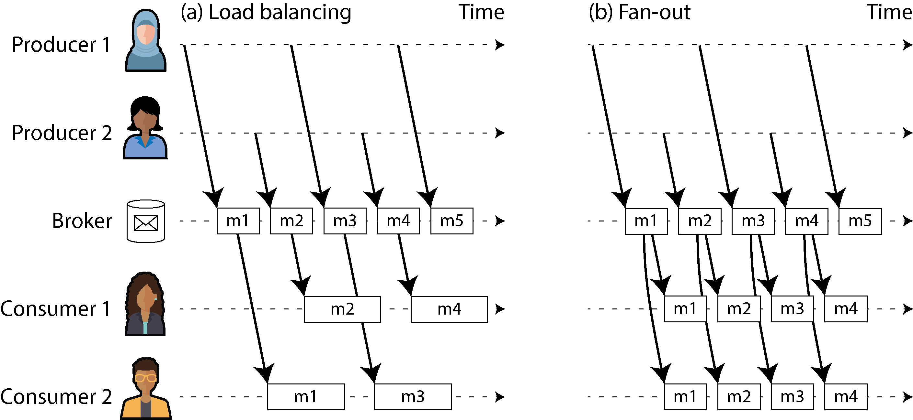
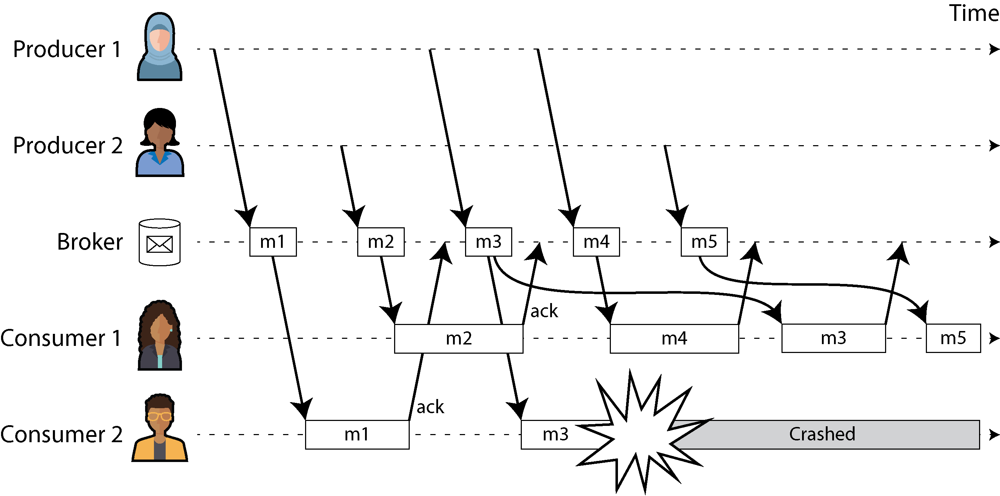
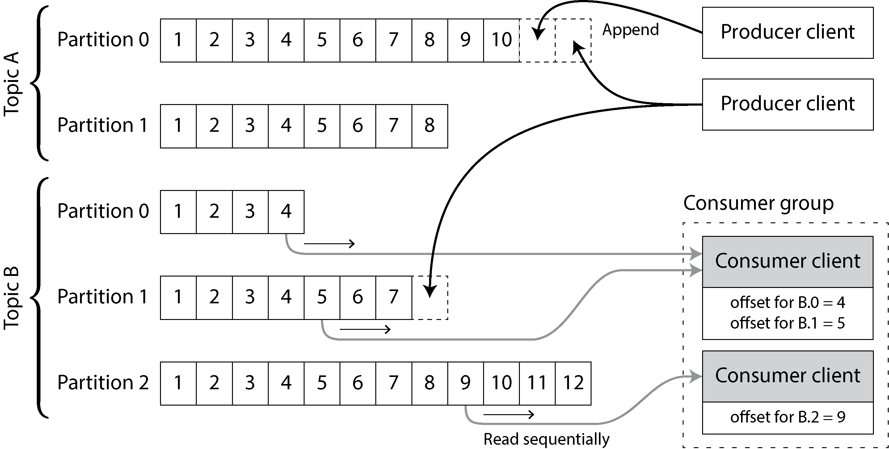
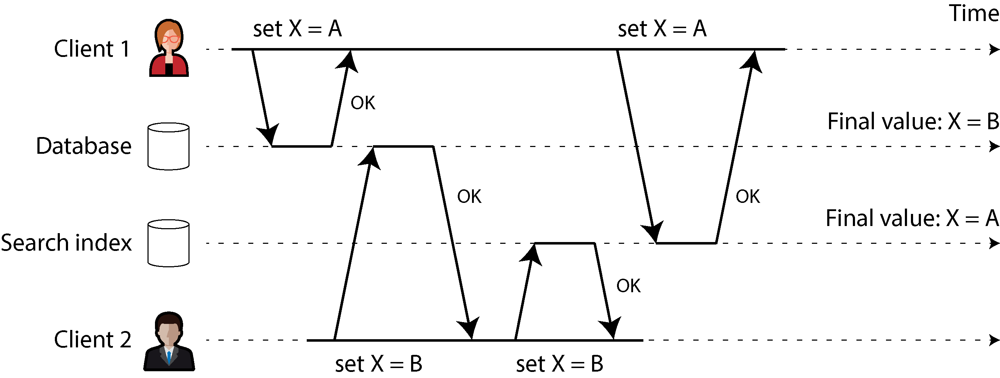
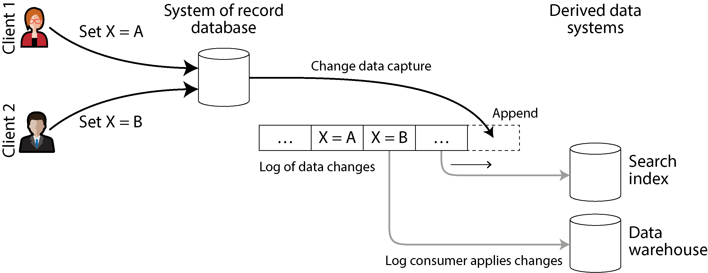
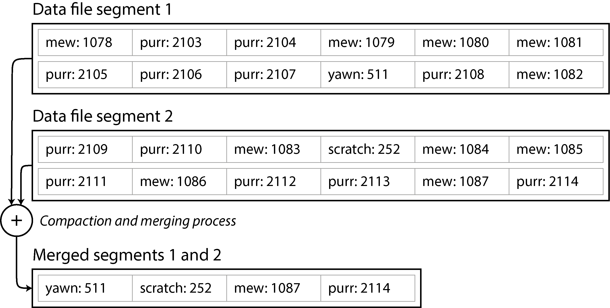
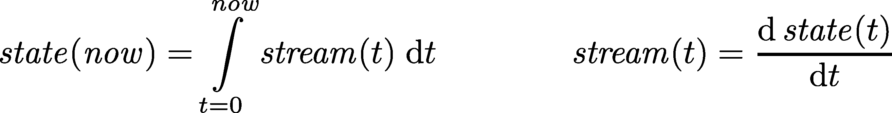
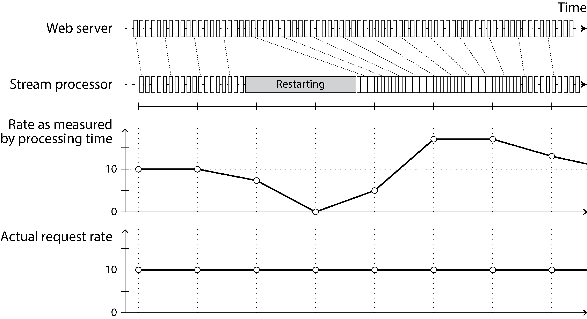

# Chương 12. Stream Processing

> *Một hệ thống phức tạp hoạt động được luôn được phát hiện là đã tiến hóa từ một hệ thống đơn giản hoạt động được. Mệnh đề ngược lại dường như cũng đúng: Một hệ thống phức tạp được thiết kế từ đầu không bao giờ hoạt động và không thể làm cho nó hoạt động được.*

> —John Gall, *Systemantics* (1975)

Trong Chương 11 chúng ta đã thảo luận về batch processing—các kỹ thuật đọc một tập file làm đầu vào và tạo ra một tập file đầu ra mới. Đầu ra là một dạng *derived data* (dữ liệu dẫn xuất); nghĩa là một tập dữ liệu có thể được tạo lại bằng cách chạy lại tiến trình batch nếu cần. Chúng ta đã thấy ý tưởng đơn giản nhưng mạnh mẽ này có thể được dùng để tạo các search index, hệ thống gợi ý, phân tích, và nhiều thứ khác.

Tuy nhiên, có một giả định lớn xuyên suốt Chương 11: đó là đầu vào có giới hạn (bounded)—có kích thước đã biết và hữu hạn—nên tiến trình batch biết khi nào nó đã đọc xong đầu vào. Ví dụ, phép sắp xếp vốn là trung tâm của MapReduce phải đọc toàn bộ đầu vào trước khi có thể bắt đầu tạo đầu ra, vì bản ghi đầu vào cuối cùng có thể chính là bản ghi có khóa nhỏ nhất và do đó cần phải là bản ghi đầu ra đầu tiên, nên việc bắt đầu xuất kết quả sớm là không thể.

Trong thực tế, rất nhiều dữ liệu là không giới hạn (unbounded) vì nó đến dần dần theo thời gian. Người dùng của bạn đã tạo ra dữ liệu hôm qua và hôm nay, và họ sẽ tiếp tục tạo ra thêm dữ liệu vào ngày mai. Trừ khi bạn ngừng kinh doanh, quá trình này không bao giờ kết thúc, nên tập dữ liệu không bao giờ “hoàn chỉnh” theo bất kỳ nghĩa có ý nghĩa nào [1]. Do đó, các bộ xử lý batch phải chia dữ liệu một cách nhân tạo thành các khối có khoảng thời gian cố định—ví dụ, xử lý dữ liệu của một ngày vào cuối mỗi ngày, hoặc xử lý dữ liệu của một giờ vào cuối mỗi giờ.

Vấn đề với các tiến trình batch hằng ngày là những thay đổi ở đầu vào chỉ được phản ánh trong đầu ra một ngày sau đó, điều này quá chậm đối với nhiều người dùng thiếu kiên nhẫn. Để giảm độ trễ, chúng ta có thể chạy việc xử lý thường xuyên hơn—chẳng hạn, xử lý dữ liệu của một giây vào cuối mỗi giây—hoặc thậm chí liên tục, bỏ hẳn các lát thời gian cố định và đơn giản là xử lý mỗi event ngay khi nó xảy ra. Đó là ý tưởng đằng sau *stream processing* (xử lý luồng).

Nói chung, một *stream* (luồng) chỉ dữ liệu được cung cấp dần dần theo thời gian. Khái niệm này xuất hiện ở nhiều nơi: trong `stdin` và `stdout` của Unix, các ngôn ngữ lập trình (lazy list) [2], các API hệ thống file (như `FileInputStream` của Java), các kết nối TCP, âm thanh và video truyền qua internet, và nhiều thứ khác.

Trong chương này chúng ta sẽ xem xét *event stream* (luồng sự kiện) như một cơ chế quản lý dữ liệu: phiên bản không giới hạn, được xử lý dần dần, tương ứng với dữ liệu batch mà chúng ta đã thấy ở chương trước. Trước tiên chúng ta sẽ thảo luận cách các stream được biểu diễn, lưu trữ và truyền qua mạng, sau đó tìm hiểu mối quan hệ giữa stream và database. Cuối cùng, trong “Xử lý Stream”, chúng ta sẽ khám phá các cách tiếp cận và công cụ để xử lý các stream đó một cách liên tục cùng những cách chúng có thể được dùng để xây dựng ứng dụng.

## Truyền tải Event Stream

Trong thế giới batch processing, đầu vào và đầu ra của một job là các file (có thể nằm trên một hệ thống file phân tán). Vậy phiên bản tương đương trong streaming trông như thế nào?

Khi đầu vào là một file (một chuỗi byte), bước xử lý đầu tiên thường là phân tích (parse) nó thành một chuỗi các bản ghi (record). Trong ngữ cảnh stream processing, một bản ghi thường được gọi là *event* (sự kiện), nhưng về bản chất nó là cùng một thứ: một đối tượng nhỏ, tự chứa, bất biến (immutable), chứa chi tiết về một điều gì đó đã xảy ra tại một thời điểm. Một event thường chứa một timestamp cho biết nó xảy ra khi nào theo đồng hồ thời gian thực (time-of-day clock) (xem “Đồng hồ monotonic so với đồng hồ time-of-day”).

Ví dụ, điều đã xảy ra có thể là một hành động của người dùng, như xem một trang hoặc thực hiện một giao dịch mua hàng. Nó cũng có thể xuất phát từ một máy móc, như một phép đo định kỳ từ cảm biến nhiệt độ hoặc một chỉ số mức sử dụng CPU. Trong ví dụ ở “Batch Processing với các công cụ Unix”, mỗi dòng của log web server là một event.

Một event có thể được encode thành một chuỗi văn bản, hoặc JSON, hoặc có lẽ ở dạng nhị phân, như đã thảo luận trong Chương 5. Việc encoding này cho phép bạn lưu trữ một event—ví dụ, bằng cách nối thêm nó vào một file, chèn nó vào một bảng quan hệ, hoặc ghi nó vào một document database. Encoding cũng cho phép bạn gửi event qua mạng đến một node khác để xử lý nó.

Trong batch processing, một file được ghi một lần rồi có thể được đọc bởi nhiều job. Tương tự, theo thuật ngữ streaming, một event được tạo ra một lần bởi một *producer* (còn gọi là *publisher* hoặc *sender*) rồi có thể được xử lý bởi nhiều *consumer* (*subscriber* hoặc *recipient*) [3]. Trong một hệ thống file, tên file xác định một tập các bản ghi liên quan; trong một hệ thống streaming, các event liên quan thường được nhóm lại với nhau thành một *topic* hoặc *stream*.

Về nguyên tắc, một file hoặc database là đủ để kết nối producer và consumer. Producer ghi mỗi event mà nó tạo ra vào datastore, và mỗi consumer định kỳ poll datastore để kiểm tra các event đã xuất hiện kể từ lần chạy trước của nó. Đây về bản chất là điều một tiến trình batch làm khi nó xử lý dữ liệu của một ngày vào cuối mỗi ngày.

Tuy nhiên, khi tiến tới xử lý liên tục với độ trễ thấp, việc polling trở nên tốn kém nếu datastore không được thiết kế cho kiểu sử dụng này. Bạn poll càng thường xuyên, tỷ lệ request trả về event mới càng thấp, và do đó chi phí phụ trội (overhead) càng cao. Thay vào đó, tốt hơn là consumer được thông báo khi có event mới xuất hiện.

Các database theo truyền thống không hỗ trợ tốt loại cơ chế thông báo này. Các database quan hệ thường có *trigger*, có thể phản ứng với một thay đổi (ví dụ, một hàng được chèn vào bảng), nhưng chúng rất hạn chế về những gì có thể làm và phần nào chỉ là một tính năng được thêm vào sau trong thiết kế database [4]. Thay vào đó, các công cụ chuyên biệt đã được phát triển cho mục đích chuyển giao thông báo event.

### Hệ thống Messaging

Một cách tiếp cận phổ biến để thông báo cho consumer về các event mới là dùng một *messaging system* (hệ thống nhắn tin): producer gửi một thông điệp (message) chứa event, sau đó message này được đẩy tới các consumer. Chúng ta đã đề cập đến các hệ thống này trước đây trong “Kiến trúc hướng sự kiện (Event-Driven Architecture)” và bây giờ sẽ đi vào chi tiết hơn.

Một kênh liên lạc trực tiếp như Unix pipe hoặc kết nối TCP giữa producer và consumer sẽ là một cách đơn giản để hiện thực một messaging system. Tuy nhiên, hầu hết các messaging system mở rộng mô hình cơ bản này. Cụ thể, Unix pipe và TCP kết nối đúng một bên gửi với một bên nhận, trong khi một messaging system cho phép nhiều node producer gửi message tới cùng một topic và cho phép nhiều node consumer nhận message trong một topic.

Trong mô hình *publish/subscribe* này, các hệ thống khác nhau có nhiều cách tiếp cận rất khác nhau, và không có một câu trả lời đúng duy nhất cho mọi mục đích. Để phân biệt các hệ thống, đặc biệt hữu ích khi đặt ra hai câu hỏi sau:

- *Điều gì xảy ra nếu producer gửi message nhanh hơn tốc độ consumer có thể xử lý chúng?*

  - Nói rộng ra, hệ thống có ba lựa chọn: bỏ message, đưa message vào buffer trong một queue, hoặc áp dụng *backpressure* (còn gọi là *flow control*, tức là chặn producer không cho gửi thêm message). Ví dụ, Unix pipe và TCP dùng backpressure; chúng có một buffer nhỏ kích thước cố định, và nếu nó đầy, bên gửi bị chặn cho đến khi bên nhận lấy dữ liệu ra khỏi buffer (xem “Tắc nghẽn mạng và xếp hàng (queueing)”).

  - Nếu message được đưa vào buffer trong một queue, điều quan trọng là phải hiểu điều gì xảy ra khi queue đó lớn lên. Hệ thống có crash nếu queue không còn chứa được trong bộ nhớ, hay nó ghi message ra đĩa? Trong trường hợp sau, việc truy cập đĩa ảnh hưởng thế nào đến hiệu năng của messaging system [5], và điều gì xảy ra khi đĩa đầy [6]?

- *Điều gì xảy ra nếu các node crash hoặc tạm thời offline—có message nào bị mất không?*

  - Giống như với database, tính bền vững (durability) có thể yêu cầu kết hợp giữa ghi ra đĩa và/hoặc replication (xem sidebar “Replication và Durability”), và điều đó có chi phí. Nếu bạn có thể chấp nhận đôi khi mất message, bạn có thể đạt được throughput cao hơn và latency thấp hơn trên cùng phần cứng.

Việc mất message có chấp nhận được hay không phụ thuộc rất nhiều vào ứng dụng. Ví dụ, với các số đọc từ cảm biến và các metric được truyền định kỳ, việc thiếu một điểm dữ liệu đôi lúc có lẽ không quan trọng, vì một giá trị cập nhật sẽ được gửi ngay sau đó không lâu. Tuy nhiên, hãy cẩn thận rằng nếu một số lượng lớn message bị bỏ, có thể không dễ nhận ra ngay rằng các metric đang không chính xác [7]. Nếu bạn đang đếm event, việc chúng được chuyển giao một cách đáng tin cậy quan trọng hơn, vì mỗi message bị mất đồng nghĩa với bộ đếm sai.

Một đặc tính tốt của các hệ thống batch processing mà chúng ta đã khám phá trong Chương 11 là chúng cung cấp một đảm bảo mạnh về độ tin cậy. Các task thất bại được tự động thử lại, và đầu ra một phần từ các task thất bại được tự động loại bỏ. Điều này có nghĩa là đầu ra giống như khi không có hỏng hóc nào xảy ra, giúp đơn giản hóa mô hình lập trình. Ở phần sau của chương này chúng ta sẽ xem xét cách có thể cung cấp các đảm bảo tương tự trong ngữ cảnh streaming.

#### Messaging trực tiếp từ producer tới consumer

Một số messaging system dùng giao tiếp mạng trực tiếp giữa producer và consumer mà không dùng các node trung gian:

- UDP multicast được dùng rộng rãi trong ngành tài chính cho các stream như dữ liệu thị trường chứng khoán, nơi latency thấp là quan trọng [8]. Mặc dù bản thân UDP không đáng tin cậy, các giao thức ở tầng ứng dụng có thể khôi phục các gói tin bị mất (producer phải ghi nhớ các gói tin đã gửi để có thể truyền lại chúng khi được yêu cầu).

- Các thư viện messaging không có broker (brokerless) như ZeroMQ và nanomsg có cách tiếp cận tương tự, hiện thực messaging publish/subscribe trên TCP hoặc IP multicast.

- Một số agent thu thập metric, như StatsD [9], dùng messaging UDP không đáng tin cậy để thu thập metric từ tất cả các máy trên mạng và giám sát chúng. (Trong giao thức StatsD, các metric kiểu bộ đếm chỉ chính xác nếu tất cả message đều được nhận; việc dùng UDP khiến các metric tốt nhất cũng chỉ là xấp xỉ [10]. Xem thêm “TCP so với UDP”.)

- Nếu consumer cung cấp một dịch vụ trên mạng, producer có thể thực hiện một request HTTP hoặc RPC trực tiếp (xem “Dataflow qua dịch vụ: REST và RPC”) để đẩy message tới consumer. Đây là ý tưởng đằng sau webhook [11], một mẫu (pattern) trong đó một callback URL của một dịch vụ được đăng ký với một dịch vụ khác, và dịch vụ đó gửi request tới URL đó mỗi khi có event xảy ra.

Mặc dù các hệ thống messaging trực tiếp này hoạt động tốt trong những tình huống mà chúng được thiết kế cho, chúng thường yêu cầu mã ứng dụng phải nhận thức được khả năng mất message. Các lỗi mà chúng có thể chịu được khá hạn chế. Ngay cả khi các giao thức phát hiện và truyền lại các gói tin bị mất trên mạng, chúng thường giả định rằng producer và consumer luôn online.

Nếu một consumer offline, nó có thể bỏ lỡ các message được gửi trong lúc nó không thể truy cập được. Một số giao thức cho phép producer thử lại các lần chuyển giao message thất bại, nhưng cách tiếp cận này có thể đổ vỡ nếu producer crash, làm mất buffer chứa các message mà nó đáng ra phải gửi lại.

#### Message broker

Một giải pháp thay thế được dùng rộng rãi là gửi message qua một *message broker* (còn gọi là *message queue*), về bản chất là một loại database được tối ưu hóa cho việc xử lý các stream message [12]. Nó chạy như một server, với producer và consumer kết nối tới nó như các client. Producer ghi message vào broker, và broker chuyển giao chúng tới consumer.

Bằng cách tập trung dữ liệu vào broker, các hệ thống này có thể dễ dàng chịu được các client đến rồi đi (kết nối, ngắt kết nối, và crash), và câu hỏi về tính bền vững được chuyển sang cho broker. Một số message broker chỉ giữ message trong bộ nhớ, trong khi một số khác (tùy cấu hình) ghi chúng ra đĩa để chúng không bị mất trong trường hợp broker crash. Khi gặp các consumer chậm, chúng thường cho phép queue không giới hạn (thay vì bỏ message hoặc backpressure), mặc dù lựa chọn này cũng có thể phụ thuộc vào cấu hình.

Một hệ quả của việc xếp hàng (queueing) là consumer thường là *bất đồng bộ* (asynchronous). Khi producer gửi một message, nó thường chỉ chờ broker xác nhận rằng đã đưa message vào buffer và không chờ message được xử lý bởi consumer. Việc chuyển giao tới consumer sẽ xảy ra tại một thời điểm không xác định trong tương lai—thường là trong một phần nhỏ của giây, nhưng đôi khi muộn hơn đáng kể nếu queue bị tồn đọng (backlog).

#### So sánh message broker với database

Một số message broker thậm chí có thể tham gia vào các giao thức two-phase commit bằng XA hoặc JTA (xem “Transaction phân tán trên các hệ thống khác nhau”). Tính năng này khiến chúng khá giống về bản chất với database, mặc dù message broker và database vẫn có những khác biệt thực tế quan trọng:

- Database thường giữ dữ liệu cho đến khi nó bị xóa một cách tường minh, trong khi một số message broker tự động xóa một message khi nó đã được chuyển giao thành công tới các consumer. Những message broker như vậy không phù hợp để lưu trữ dữ liệu dài hạn.

- Vì chúng xóa message nhanh chóng, hầu hết message broker giả định rằng working set của chúng khá nhỏ—tức là các queue ngắn. Nếu broker cần buffer nhiều message vì consumer chậm (có thể phải đổ message ra đĩa nếu chúng không còn chứa được trong bộ nhớ), mỗi message riêng lẻ mất nhiều thời gian hơn để xử lý, và throughput tổng thể có thể giảm [5].

- Database thường hỗ trợ secondary index và nhiều cách khác nhau để tìm kiếm dữ liệu bằng một ngôn ngữ truy vấn, trong khi message broker thường hỗ trợ một cách nào đó để subscribe vào một tập con các topic khớp với một mẫu (pattern). Cả hai về bản chất đều là cách để client chọn phần dữ liệu mà nó muốn biết, nhưng database thường cung cấp chức năng truy vấn tiên tiến hơn nhiều.

- Khi truy vấn một database, kết quả thường dựa trên một snapshot của dữ liệu tại một thời điểm. Nếu sau đó một client khác ghi thứ gì đó vào database làm thay đổi kết quả truy vấn, client đầu tiên không biết được rằng kết quả trước đó của nó giờ đã lỗi thời (trừ khi nó lặp lại truy vấn hoặc poll để kiểm tra thay đổi). Ngược lại, message broker không hỗ trợ truy vấn tùy ý và không cho phép cập nhật message sau khi chúng đã được gửi, nhưng chúng có thông báo cho client khi dữ liệu thay đổi (tức là khi có message mới sẵn sàng).

Đây là quan điểm truyền thống về message broker, được gói gọn trong các chuẩn như JMS [13] và AMQP [14] và được hiện thực trong các phần mềm như RabbitMQ, ActiveMQ, HornetQ, Qpid, TIBCO Enterprise Message Service, IBM MQ, Azure Service Bus, và Google Cloud Pub/Sub [15]. Mặc dù có thể dùng database làm queue, việc tinh chỉnh chúng để đạt hiệu năng tốt không hề đơn giản [16].

#### Nhiều consumer

Khi nhiều consumer đọc message trong cùng một topic, hai mẫu messaging chính được sử dụng, như minh họa trong Hình 12-1:

- **Load balancing (cân bằng tải)**

  Mỗi message được chuyển giao tới *một* trong các consumer, nên các consumer có thể chia sẻ công việc xử lý các message trong topic. Broker có thể gán message cho consumer một cách tùy ý. Mẫu này hữu ích khi các message tốn kém để xử lý, nên bạn muốn có thể thêm consumer để song song hóa việc xử lý. (Trong AMQP, bạn có thể hiện thực load balancing bằng cách cho nhiều client tiêu thụ từ cùng một queue, và trong JMS nó được gọi là *shared* *subscription*.)

- **Fan-out**

  Mỗi message được chuyển giao tới *tất cả* các consumer. Fan-out cho phép nhiều consumer độc lập cùng “bắt sóng” cùng một luồng phát message, mà không ảnh hưởng đến nhau—tương đương trong streaming với việc có nhiều batch job đọc cùng một file đầu vào. (Tính năng này được cung cấp bởi topic subscription trong JMS và exchange binding trong AMQP.)



*Hình 12-1. (a) Load balancing chia sẻ công việc tiêu thụ một topic giữa các consumer; (b) với fan-out, mỗi message được chuyển giao tới nhiều consumer.*

Hai mẫu này có thể được kết hợp—ví dụ, bằng tính năng *consumer group* của Kafka. Khi một consumer group subscribe vào một topic, mỗi message trong topic được gửi tới một trong các consumer trong group (cân bằng tải giữa các consumer trong group). Nếu hai consumer group riêng biệt subscribe vào cùng một topic, mỗi message được gửi tới một consumer trong mỗi group (cung cấp fan-out giữa các consumer group).

#### Xác nhận (acknowledgment) và gửi lại (redelivery)

Consumer có thể crash bất kỳ lúc nào. Do đó, một broker có thể chuyển giao một message tới consumer nhưng consumer không bao giờ xử lý nó, hoặc chỉ xử lý được một phần trước khi crash. Để đảm bảo message không bị mất, message broker dùng *acknowledgment* (xác nhận): client phải nói rõ với broker khi nó đã xử lý xong một message để broker có thể xóa nó khỏi queue.

Nếu kết nối tới một client bị đóng hoặc hết thời gian chờ (timeout) mà broker không nhận được acknowledgment, nó giả định rằng message chưa được xử lý, và do đó nó chuyển giao message đó một lần nữa cho một consumer khác. (Lưu ý rằng có thể xảy ra trường hợp message thực sự *đã* được xử lý hoàn toàn, nhưng acknowledgment bị mất trên mạng. Xử lý trường hợp này yêu cầu một giao thức atomic commit, như đã thảo luận trong “Xử lý thông điệp exactly-once”, trừ khi phép toán là idempotent hoặc không yêu cầu ngữ nghĩa exactly-once.)

Khi kết hợp với load balancing, hành vi gửi lại này có một tác động thú vị lên thứ tự của các message. Trong Hình 12-2, các consumer nói chung xử lý message theo thứ tự chúng được producer gửi. Tuy nhiên, consumer 2 crash trong khi đang xử lý message *m3*, cùng lúc consumer 1 đang xử lý message *m4*. Message *m3* chưa được xác nhận sau đó được gửi lại cho consumer 1, kết quả là consumer 1 xử lý các message theo thứ tự *m4*, *m3*, *m5*. Như vậy, *m3* và *m4* không được chuyển giao theo cùng thứ tự mà producer 1 đã gửi chúng.



*Hình 12-2. Consumer 2 crash trong khi xử lý m3, nên m3 được gửi lại cho consumer 1 vào lúc sau.*

Ngay cả khi message broker ở những mặt khác cố gắng bảo toàn thứ tự message (như cả hai chuẩn JMS và AMQP đều yêu cầu), việc kết hợp load balancing với gửi lại tất yếu dẫn đến message bị đổi thứ tự. Để tránh vấn đề này, bạn có thể dùng một queue riêng cho mỗi consumer (tức là không dùng tính năng load balancing). Việc đổi thứ tự message không phải là vấn đề nếu các message hoàn toàn độc lập với nhau, nhưng nó có thể quan trọng nếu có các phụ thuộc nhân quả giữa các message, như chúng ta sẽ thấy ở phần sau của chương.

Việc gửi lại cũng có thể dẫn đến lãng phí tài nguyên, thiếu hụt tài nguyên (resource starvation), hoặc tắc nghẽn vĩnh viễn trong một stream. Một kịch bản phổ biến là producer serialize một message không đúng cách—ví dụ, bỏ sót một khóa bắt buộc trong một đối tượng được encode dạng JSON. Nếu message thiếu khóa đó khiến một consumer crash và khởi động lại, nó sẽ không xác nhận message, nên broker sẽ gửi lại, khiến một consumer khác lỗi. Vòng lặp này tự lặp lại vô hạn. Nếu broker đảm bảo thứ tự chặt, sẽ không thể có thêm tiến triển nào. Các broker cho phép đổi thứ tự message có thể tiếp tục tiến triển, nhưng chúng sẽ lãng phí tài nguyên cho những message không bao giờ được xác nhận.

Dead letter queue (DLQ) được dùng để xử lý vấn đề này. Thay vì giữ message trong queue hiện tại và thử lại mãi mãi, message được chuyển sang một queue khác để giải phóng các consumer [17, 18]. Việc giám sát thường được thiết lập trên các DLQ—bất kỳ message nào trong queue đều là một lỗi. Khi phát hiện một message mới, người vận hành có thể quyết định bỏ hẳn nó, sửa thủ công và tạo lại message, hoặc sửa mã consumer để xử lý message một cách thích hợp. DLQ phổ biến trong hầu hết các hệ thống queue, nhưng các hệ thống messaging dựa trên log như Apache Pulsar và các hệ thống stream processing như Kafka Streams hiện cũng hỗ trợ chúng [19].

### Message Broker Dựa trên Log

Gửi một gói tin qua mạng hoặc thực hiện một request tới một dịch vụ mạng thường là một hoạt động nhất thời, không để lại dấu vết lâu dài. Mặc dù có thể ghi lại vĩnh viễn một hoạt động như vậy (bằng cách bắt gói tin và ghi log), chúng ta thường không nghĩ về nó theo cách đó. Các message broker kiểu AMQP/JMS kế thừa tư duy messaging nhất thời này. Dù chúng có thể ghi message ra đĩa, chúng nhanh chóng xóa các message đó sau khi đã chuyển giao tới consumer.

Database và hệ thống file có cách tiếp cận ngược lại: mọi thứ được ghi vào database hoặc file thường được kỳ vọng là được lưu lại vĩnh viễn, ít nhất cho đến khi ai đó chủ động chọn xóa nó.

Sự khác biệt về tư duy này có tác động lớn đến cách derived data được tạo ra. Một đặc điểm then chốt của các tiến trình batch, như đã thảo luận trong Chương 11, là bạn có thể chạy chúng lặp đi lặp lại, thử nghiệm với các bước xử lý, mà không có nguy cơ làm hỏng đầu vào (vì đầu vào là chỉ đọc). Điều này không đúng với messaging kiểu AMQP/JMS: việc nhận một message là có tính phá hủy nếu acknowledgment khiến nó bị xóa khỏi broker, nên bạn không thể chạy lại cùng một consumer và mong đợi nhận được cùng kết quả.

Nếu bạn thêm một consumer mới vào một messaging system, nó thường chỉ bắt đầu nhận các message được gửi sau thời điểm nó được đăng ký; mọi message trước đó đã mất và không thể khôi phục. Hãy so sánh điều này với file và database, nơi bạn có thể thêm một client mới vào bất kỳ lúc nào, và nó có thể đọc dữ liệu được ghi từ bao lâu trước cũng được (miễn là dữ liệu đó chưa bị ứng dụng ghi đè hoặc xóa một cách tường minh).

Tại sao chúng ta không thể có một dạng lai, kết hợp cách tiếp cận lưu trữ bền vững của database với các tiện ích thông báo độ trễ thấp của messaging? Đây là ý tưởng đằng sau *log-based message broker* (message broker dựa trên log), vốn đã trở nên rất phổ biến trong những năm gần đây.

#### Dùng log để lưu trữ thông điệp

Log đơn giản là một chuỗi bản ghi (record) chỉ-ghi-thêm (append-only) trên đĩa. Chúng ta đã thảo luận về log trong bối cảnh các storage engine cấu trúc log (log-structured) và write-ahead log ở Chương 4, trong bối cảnh replication ở Chương 6, và như một dạng consensus ở Chương 10.

Cùng cấu trúc này có thể được dùng để triển khai một message broker. Producer gửi một thông điệp (message) bằng cách ghi thêm nó vào cuối log, và consumer nhận thông điệp bằng cách đọc log một cách tuần tự. Nếu consumer đọc đến cuối log, nó chờ một thông báo rằng có thông điệp mới đã được ghi thêm. Công cụ Unix `tail` với tùy chọn `-f`, vốn theo dõi một file để phát hiện dữ liệu được ghi thêm, về bản chất hoạt động đúng như vậy.

Để mở rộng lên thông lượng (throughput) cao hơn mức một đĩa đơn lẻ có thể cung cấp, log có thể được *shard* (theo nghĩa của Chương 7). Các shard khác nhau khi đó có thể được đặt trên các máy khác nhau, khiến mỗi shard trở thành một log riêng biệt có thể được đọc và ghi độc lập với các shard khác, và một topic có thể được định nghĩa là một nhóm các shard cùng mang các thông điệp thuộc một loại. Cách tiếp cận này được minh họa trong Hình 12-3.



*Hình 12-3. Producer gửi thông điệp bằng cách ghi thêm chúng vào file partition của topic, và consumer đọc các file này một cách tuần tự.*

Trong mỗi shard, mà Kafka gọi là *partition*, broker gán cho mỗi thông điệp một số thứ tự tăng đơn điệu, gọi là *offset* (trong Hình 12-3, các con số trong các ô là offset của thông điệp). Số thứ tự như vậy có ý nghĩa vì một partition (shard) là append-only, nên các thông điệp trong một partition có thứ tự toàn phần (totally ordered). Không có đảm bảo về thứ tự giữa các partition khác nhau.

Apache Kafka [20] và Amazon Kinesis Streams là các message broker dựa trên log (log-based) hoạt động theo cách này. Google Cloud Pub/Sub có kiến trúc tương tự nhưng cung cấp API kiểu JMS thay vì một abstraction dạng log [15]. Mặc dù các message broker này ghi mọi thông điệp xuống đĩa, chúng vẫn có thể đạt thông lượng hàng triệu thông điệp mỗi giây bằng cách sharding trên nhiều máy, và đạt khả năng chịu lỗi (fault tolerance) bằng cách replicate các thông điệp [21, 22].

#### So sánh log với messaging truyền thống

Cách tiếp cận dựa trên log hỗ trợ messaging kiểu fan-out một cách hiển nhiên, vì nhiều consumer có thể đọc log độc lập mà không ảnh hưởng đến nhau; việc đọc một thông điệp không xóa nó khỏi log. Để đạt được cân bằng tải (load balancing) trên một nhóm consumer, broker có thể gán toàn bộ các shard cho các node trong consumer group thay vì gán từng thông điệp riêng lẻ cho các consumer client.

Mỗi client khi đó tiêu thụ *tất cả* các thông điệp trong các shard mà nó được gán. Thông thường, khi một consumer được gán một shard của log, nó đọc các thông điệp trong shard đó một cách tuần tự, theo kiểu đơn luồng (single-threaded) đơn giản. Cách tiếp cận cân bằng tải thô (coarse-grained) này có những nhược điểm:

- Số node chia sẻ công việc tiêu thụ một topic tối đa chỉ có thể bằng số shard của log trong topic đó, vì các thông điệp trong cùng một shard được chuyển đến cùng một node. (Có thể tạo ra một sơ đồ cân bằng tải trong đó hai consumer chia sẻ công việc xử lý một shard bằng cách để cả hai đều đọc toàn bộ tập thông điệp nhưng một consumer chỉ xét các thông điệp có offset chẵn trong khi consumer kia xử lý các offset lẻ. Hoặc bạn có thể phân tán việc xử lý thông điệp trên một thread pool, nhưng cách đó làm phức tạp việc quản lý consumer offset. Nói chung, xử lý đơn luồng cho một shard là cách được ưu tiên, và có thể tăng mức song song bằng cách dùng nhiều shard hơn.)

- Nếu một thông điệp đơn lẻ xử lý chậm, nó sẽ làm chậm việc xử lý các thông điệp tiếp theo trong shard đó (một dạng head-of-line blocking; xem “Mô tả hiệu năng”).

Do đó, khi các thông điệp có thể tốn kém để xử lý và bạn muốn song song hóa việc xử lý theo từng thông điệp, còn thứ tự thông điệp không quá quan trọng, thì message broker kiểu JMS/AMQP là lựa chọn tốt hơn. Ngược lại, trong các tình huống có thông lượng thông điệp cao, nơi mỗi thông điệp xử lý nhanh và thứ tự thông điệp là quan trọng, cách tiếp cận dựa trên log hoạt động rất tốt [23, 24]. Tuy nhiên, ranh giới giữa hai kiến trúc này đang dần mờ đi, vì các hệ thống messaging dựa trên log như Kafka hiện đã hỗ trợ consumer group kiểu JMS/AMQP, cho phép nhiều consumer nhận thông điệp từ cùng một partition [25, 26].

Vì log được shard thường chỉ bảo toàn thứ tự thông điệp trong phạm vi một shard, tất cả các thông điệp cần được sắp thứ tự nhất quán phải được định tuyến đến cùng một shard. Ví dụ, một ứng dụng có thể yêu cầu các event liên quan đến một người dùng cụ thể phải xuất hiện theo một thứ tự cố định. Điều này có thể đạt được bằng cách chọn shard cho một event dựa trên user ID của event đó (nói cách khác, lấy user ID làm *partition key*).

#### Consumer offset

Việc tiêu thụ một shard theo thứ tự tuần tự giúp dễ dàng xác định thông điệp nào đã được xử lý. Tất cả thông điệp có offset nhỏ hơn offset hiện tại của consumer đều đã được xử lý, và tất cả thông điệp có offset lớn hơn thì chưa được nhìn thấy. Do đó, broker không cần theo dõi acknowledgment cho từng thông điệp riêng lẻ mà chỉ cần ghi lại consumer offset theo định kỳ. Chi phí ghi sổ (bookkeeping) giảm đi cùng với cơ hội batching và pipelining trong cách tiếp cận này giúp tăng thông lượng của các hệ thống dựa trên log. Tuy nhiên, nếu một consumer gặp lỗi, nó sẽ tiếp tục từ offset được ghi lại gần nhất thay vì offset cuối cùng mới hơn mà nó đã thấy. Điều này có thể khiến consumer nhìn thấy một số thông điệp hai lần.

Offset thực ra rất giống với *log sequence number* (số thứ tự log) thường thấy trong replication database kiểu single-leader, mà chúng ta đã thảo luận trong “Thiết lập follower mới”. Trong replication của database, log sequence number cho phép một follower kết nối lại với leader sau khi bị mất kết nối và tiếp tục replication mà không bỏ sót bất kỳ thao tác ghi nào. Nguyên lý hoàn toàn tương tự được dùng ở đây: message broker hành xử như một database leader và consumer như một follower.

Nếu một node consumer gặp lỗi, một node khác trong consumer group sẽ được gán các shard của consumer bị lỗi, và nó bắt đầu tiêu thụ thông điệp từ offset được ghi lại gần nhất. Nếu consumer đó đã xử lý các thông điệp tiếp theo nhưng chưa kịp ghi lại offset của chúng, những thông điệp đó sẽ được xử lý lần thứ hai khi khởi động lại. Chúng ta sẽ thảo luận các cách xử lý vấn đề này ở phần sau của chương.

#### Sử dụng dung lượng đĩa

Nếu bạn chỉ luôn ghi thêm vào log, cuối cùng bạn sẽ hết dung lượng đĩa. Để thu hồi dung lượng đĩa, log được chia thành các segment, và theo thời gian các segment cũ được xóa hoặc chuyển sang kho lưu trữ dài hạn (archive storage). (Chúng ta sẽ thảo luận một cách tinh vi hơn để giải phóng dung lượng đĩa trong “Log compaction”.)

Điều này có nghĩa là nếu một consumer chậm không theo kịp tốc độ thông điệp, và bị tụt lại xa đến mức consumer offset của nó trỏ vào một segment đã bị xóa, nó sẽ bỏ lỡ một số thông điệp. Về bản chất, log triển khai một buffer có kích thước giới hạn, loại bỏ các thông điệp cũ khi đầy, còn được gọi là *circular buffer* hay *ring buffer* (bộ đệm vòng). Tuy nhiên, vì buffer đó nằm trên đĩa, nó có thể khá lớn.

Hãy làm một phép tính ước lượng nhanh. Tại thời điểm viết sách, một ổ cứng dung lượng lớn điển hình có dung lượng 20 TB và thông lượng ghi tuần tự 250 MB/s. Nếu bạn ghi thông điệp với tốc độ nhanh nhất có thể, sẽ mất khoảng 22 giờ cho đến khi ổ đĩa đầy và bạn cần bắt đầu xóa các thông điệp cũ nhất. Điều đó có nghĩa là một log dựa trên đĩa luôn có thể đệm ít nhất 22 giờ thông điệp, ngay cả khi bạn có nhiều đĩa trên nhiều máy (có nhiều đĩa hơn làm tăng cả dung lượng khả dụng lẫn tổng băng thông ghi). Trong thực tế, các hệ thống triển khai hiếm khi dùng hết băng thông ghi của đĩa, nên log thường có thể giữ một buffer chứa thông điệp của vài ngày hoặc thậm chí vài tuần.

Nhiều message broker dựa trên log hiện nay lưu thông điệp trong object storage để tăng dung lượng lưu trữ, tương tự như các database, như chúng ta đã thấy trong “Cơ sở dữ liệu dựa trên Object Storage”. Các message broker như Apache Kafka và Redpanda phục vụ các thông điệp cũ hơn từ object storage như một phần của cơ chế lưu trữ phân tầng (tiered storage) của chúng. Những hệ thống khác, như WarpStream, Confluent Freight và Bufstream, lưu toàn bộ dữ liệu của chúng trong object store. Ngoài hiệu quả về chi phí, kiến trúc này còn giúp việc tích hợp dữ liệu dễ dàng hơn: các thông điệp trong object storage được lưu dưới dạng bảng Iceberg, cho phép thực thi các job batch và data warehouse trực tiếp trên dữ liệu mà không cần sao chép nó sang một hệ thống khác.

#### Khi consumer không theo kịp producer

Ở đầu “Hệ thống Messaging” chúng ta đã thảo luận ba lựa chọn về việc phải làm gì nếu consumer không theo kịp tốc độ gửi thông điệp của producer: loại bỏ thông điệp, đệm (buffering), hoặc áp dụng backpressure. Trong cách phân loại này, cách tiếp cận dựa trên log là một dạng buffering với một buffer lớn nhưng có kích thước cố định (bị giới hạn bởi dung lượng đĩa khả dụng).

Nếu một consumer tụt lại xa đến mức các thông điệp nó cần cũ hơn những thông điệp còn được giữ trên đĩa, nó sẽ không thể đọc các thông điệp đó—vì vậy broker thực chất loại bỏ các thông điệp cũ vượt quá phạm vi mà kích thước buffer có thể chứa. Bạn có thể giám sát mức độ tụt lại của một consumer so với đầu (head) của log và phát cảnh báo nếu nó tụt lại đáng kể. Vì buffer lớn, có đủ thời gian để người vận hành sửa consumer chậm và cho phép nó bắt kịp trước khi bắt đầu bỏ lỡ thông điệp.

Ngay cả khi một consumer thực sự tụt lại quá xa và bắt đầu bỏ lỡ thông điệp, chỉ consumer đó bị ảnh hưởng; nó không làm gián đoạn dịch vụ cho các consumer khác. Điều này là một lợi thế lớn về mặt vận hành. Bạn có thể thử nghiệm tiêu thụ một log production cho mục đích phát triển, kiểm thử hoặc gỡ lỗi, mà không phải lo lắng nhiều về việc làm gián đoạn các dịch vụ production. Khi một consumer bị tắt hoặc gặp sự cố (crash), nó ngừng tiêu tốn tài nguyên—thứ duy nhất còn lại là consumer offset của nó.

Hành vi này trái ngược với hành vi của các message broker truyền thống, nơi bạn cần cẩn thận xóa bất kỳ queue nào mà consumer của nó đã bị tắt, để tránh việc chúng tích lũy thông điệp một cách không cần thiết và chiếm bộ nhớ của các consumer đang hoạt động.

#### Phát lại (replay) các thông điệp cũ

Chúng ta đã lưu ý trước đó rằng với các message broker kiểu AMQP và JMS, việc xử lý và acknowledge thông điệp là một thao tác phá hủy, vì nó khiến các thông điệp bị xóa trên broker. Ngược lại, trong một message broker dựa trên log, việc tiêu thụ thông điệp giống như đọc từ một file hơn: đó là một thao tác chỉ đọc không làm thay đổi log.

Tác dụng phụ duy nhất của việc xử lý, ngoài bất kỳ đầu ra nào của consumer, là consumer offset tiến về phía trước. Nhưng offset nằm dưới sự kiểm soát của consumer, nên nó có thể dễ dàng được điều chỉnh khi cần—ví dụ, bạn có thể khởi động một bản sao của consumer với offset của ngày hôm qua và ghi đầu ra vào một vị trí khác để xử lý lại toàn bộ thông điệp của ngày vừa qua. Bạn có thể lặp lại điều này bao nhiêu lần tùy ý, với các phiên bản khác nhau của mã xử lý.

Khía cạnh này khiến messaging dựa trên log giống hơn với các quy trình batch được thảo luận ở chương trước, nơi dữ liệu dẫn xuất (derived data) được tách biệt rõ ràng khỏi dữ liệu đầu vào thông qua một quy trình biến đổi có thể lặp lại. Nó cho phép thử nghiệm nhiều hơn và phục hồi dễ dàng hơn khi gặp lỗi và bug, khiến nó trở thành một công cụ tốt để tích hợp các dataflow trong một tổ chức [27].

## Database và Stream

Chúng ta đã đưa ra một số so sánh giữa message broker và database. Mặc dù theo truyền thống chúng được coi là hai loại công cụ riêng biệt, chúng ta đã thấy rằng các message broker dựa trên log đã thành công trong việc lấy các ý tưởng từ database và áp dụng chúng vào messaging. Chúng ta cũng có thể làm điều ngược lại, lấy các ý tưởng từ messaging và stream rồi áp dụng chúng vào database.

Một cách tiếp cận là dùng event stream làm hệ thống lưu trữ gốc (system of record) để lưu dữ liệu (xem “Hệ thống lưu trữ gốc (System of Record) và Dữ liệu dẫn xuất (Derived Data)”). Đây là điều xảy ra trong event sourcing, mà chúng ta đã thảo luận trong “Event Sourcing và CQRS”. Thay vì lưu dữ liệu trong một mô hình dữ liệu (data model) bị thay đổi bằng các thao tác cập nhật và xóa, bạn có thể mô hình hóa mỗi thay đổi trạng thái thành một event bất biến (immutable) và ghi nó vào một log append-only. Mọi materialized view được tối ưu cho việc đọc đều được dẫn xuất từ các event này. Các message broker dựa trên log (được cấu hình để không bao giờ xóa các event cũ) rất phù hợp cho event sourcing vì chúng dùng lưu trữ append-only, và chúng có thể thông báo cho consumer về các event mới với độ trễ (latency) thấp.

Nhưng bạn không cần phải đi xa đến mức áp dụng event sourcing; ngay cả với các mô hình dữ liệu có thể thay đổi (mutable), event stream vẫn hữu ích cho database. Thực tế, mỗi thao tác ghi vào database là một event có thể được thu thập, lưu trữ và xử lý. Mối liên hệ giữa database và stream sâu sắc hơn nhiều so với việc chỉ lưu trữ vật lý các log trên đĩa—nó mang tính nền tảng. Ví dụ, một replication log (xem “Triển khai replication log”) là một stream các event ghi của database, được leader tạo ra khi nó xử lý các transaction. Các follower áp dụng stream các thao tác ghi đó lên bản sao database của chính chúng và nhờ đó có được một bản sao chính xác của cùng dữ liệu. Các event trong replication log mô tả các thay đổi dữ liệu đã xảy ra.

Chúng ta cũng đã gặp nguyên lý state machine replication trong “Sử dụng shared log”, phát biểu rằng: nếu mỗi event biểu thị một thao tác ghi vào database, và mỗi replica xử lý cùng các event theo cùng thứ tự, thì tất cả các replica sẽ kết thúc ở cùng một trạng thái cuối. (Việc xử lý một event được giả định là một thao tác deterministic.) Đó chỉ là một trường hợp khác của event stream!

Trong mục này, trước tiên chúng ta sẽ xem xét một vấn đề nảy sinh trong các hệ thống dữ liệu không đồng nhất (heterogeneous), sau đó khám phá cách chúng ta có thể giải quyết nó bằng cách đưa các ý tưởng từ event stream vào database.

### Giữ các hệ thống đồng bộ với nhau

Như chúng ta đã thấy xuyên suốt cuốn sách này, không có hệ thống đơn lẻ nào có thể thỏa mãn mọi nhu cầu lưu trữ, truy vấn và xử lý dữ liệu. Trong thực tế, hầu hết các ứng dụng không tầm thường đều cần kết hợp nhiều công nghệ để thỏa mãn các yêu cầu của chúng—ví dụ, dùng một database OLTP để phục vụ các request của người dùng, một cache để tăng tốc các request phổ biến, một full-text index để xử lý các truy vấn tìm kiếm, và một data warehouse cho phân tích. Mỗi hệ thống này có bản sao dữ liệu riêng, được lưu theo cách biểu diễn riêng được tối ưu cho mục đích của chính nó.

Khi cùng một dữ liệu hoặc dữ liệu liên quan xuất hiện ở nhiều nơi, chúng cần được giữ đồng bộ với nhau. Nếu một mục được cập nhật trong database, nó cũng cần được cập nhật trong cache, các search index và data warehouse. Với data warehouse, việc đồng bộ này thường được thực hiện bởi các quy trình ETL (xem “Data Warehousing (Kho dữ liệu)”), thường bằng cách lấy một bản sao đầy đủ của database, biến đổi nó, và nạp hàng loạt (bulk-load) vào data warehouse—nói cách khác, một quy trình batch. Tương tự, chúng ta đã thấy trong “Các trường hợp sử dụng batch” cách các search index, hệ thống gợi ý và các hệ thống dữ liệu dẫn xuất khác có thể được tạo ra bằng các quy trình batch.

Nếu việc dump toàn bộ database theo định kỳ quá chậm, một giải pháp thay thế đôi khi được dùng là *dual writes* (ghi kép), trong đó mã ứng dụng ghi tường minh vào từng hệ thống khi dữ liệu thay đổi—ví dụ, trước tiên ghi vào database, rồi cập nhật search index, rồi vô hiệu hóa (invalidate) các mục trong cache (hoặc thậm chí thực hiện các thao tác ghi đó đồng thời).

Tuy nhiên, dual writes có những vấn đề nghiêm trọng, một trong số đó là race condition được minh họa trong Hình 12-4. Trong ví dụ này, hai client đồng thời muốn cập nhật một mục *X*. Client 1 muốn đặt giá trị thành *A*, và client 2 muốn đặt nó thành *B*. Cả hai client đều ghi giá trị mới vào database trước, rồi ghi vào search index. Do thời điểm không may, các request bị xen kẽ nhau. Database nhìn thấy thao tác ghi từ client 1 đặt giá trị thành *A* trước, rồi đến thao tác ghi từ client 2 đặt giá trị thành *B*, nên giá trị cuối cùng trong database là *B*. Search index nhìn thấy thao tác ghi từ client 2 trước, rồi đến client 1, nên giá trị cuối cùng trong search index là *A*. Hai hệ thống giờ đây không nhất quán với nhau một cách vĩnh viễn, mặc dù không có lỗi nào xảy ra.



*Hình 12-4. Trong database, X được đặt thành A trước rồi thành B, trong khi ở search index các thao tác ghi đến theo thứ tự ngược lại.*

Trừ khi bạn có thêm một cơ chế phát hiện đồng thời, như version vector mà chúng ta đã thảo luận trong “Phát hiện các thao tác ghi đồng thời”, bạn thậm chí sẽ không nhận ra rằng các thao tác ghi đồng thời đã xảy ra. Một giá trị đơn giản sẽ âm thầm ghi đè lên giá trị khác.

Một vấn đề khác với dual writes là một trong các thao tác ghi có thể thất bại trong khi thao tác kia thành công. Đây là vấn đề về khả năng chịu lỗi hơn là vấn đề về tính đồng thời, nhưng nó cũng dẫn đến hậu quả là hai hệ thống trở nên không nhất quán với nhau. Việc đảm bảo cả hai cùng thành công hoặc cùng thất bại là một trường hợp của bài toán atomic commit, vốn tốn kém để giải quyết (xem “Two-Phase Commit”).

Nếu bạn chỉ có một database được replicate với một leader duy nhất, leader đó quyết định thứ tự các thao tác ghi, nên cách tiếp cận state machine replication hoạt động được giữa các replica của database. Tuy nhiên, trong Hình 12-4 không có một leader duy nhất. Database có thể có một leader và search index có thể có một leader, nhưng không bên nào là follower của bên kia, nên xung đột có thể xảy ra (xem “Multi-Leader Replication”).

Tình huống sẽ tốt hơn nếu thực sự chỉ có một leader—ví dụ, database—và nếu chúng ta có thể biến search index thành một follower của database. Nhưng điều này có khả thi trong thực tế không?

### Change Data Capture

Vấn đề với replication log của hầu hết các database là chúng từ lâu đã được coi là chi tiết triển khai nội bộ của database, không phải là một API công khai. Client được kỳ vọng truy vấn database thông qua mô hình dữ liệu và ngôn ngữ truy vấn của nó, chứ không phải phân tích (parse) các replication log và cố gắng trích xuất dữ liệu từ đó.

Trong nhiều thập kỷ, nhiều database đơn giản là không có một cách được ghi chép chính thức nào để lấy log các thay đổi đã được ghi vào chúng. Điều này khiến việc lấy tất cả các thay đổi được thực hiện trong một database và replicate chúng sang một công nghệ lưu trữ khác, như search index, cache hay data warehouse, trở nên khó khăn.

Gần đây hơn, ngày càng có nhiều sự quan tâm đến *change data capture* (CDC), là quá trình quan sát tất cả các thay đổi dữ liệu được ghi vào một database và trích xuất chúng dưới dạng có thể được replicate sang các hệ thống khác [28]. CDC đặc biệt thú vị nếu các thay đổi được cung cấp dưới dạng một stream, ngay lập tức khi chúng được ghi.

Ví dụ, bạn có thể thu thập các thay đổi trong một database và liên tục áp dụng chính các thay đổi đó lên một search index. Nếu log các thay đổi được áp dụng theo cùng thứ tự, bạn có thể kỳ vọng dữ liệu trong search index khớp với dữ liệu trong database. Search index và bất kỳ hệ thống dữ liệu dẫn xuất nào khác chỉ là các consumer của stream thay đổi.

Hình 12-5 cho thấy vấn đề đồng thời của Hình 12-4 được giải quyết như thế nào với CDC. Mặc dù hai request lần lượt đặt *X* thành *A* và *B* đến database một cách đồng thời, database quyết định thứ tự thực thi chúng và ghi chúng vào replication log của nó theo thứ tự đó. Search index nhận lấy chúng và áp dụng theo cùng thứ tự. Nếu bạn cần dữ liệu trong một hệ thống khác, như data warehouse, bạn chỉ cần thêm nó làm một consumer khác của CDC event stream.



*Hình 12-5. Lấy các thay đổi đã commit vào một database và lan truyền chúng đến các hệ thống downstream theo cùng thứ tự*

#### Triển khai CDC

Chúng ta có thể gọi các consumer của log là *hệ thống dữ liệu dẫn xuất* (derived data system), như đã thảo luận trong “Hệ thống lưu trữ gốc (System of Record) và Dữ liệu dẫn xuất (Derived Data)”. Dữ liệu được lưu trong search index và data warehouse chỉ là một góc nhìn khác lên dữ liệu trong hệ thống lưu trữ gốc. CDC là một cơ chế để đảm bảo rằng tất cả các thay đổi được thực hiện trên hệ thống lưu trữ gốc cũng được phản ánh trong các hệ thống dữ liệu dẫn xuất, để các hệ thống dẫn xuất có được một bản sao chính xác của dữ liệu.

Về bản chất, CDC biến một database thành leader (database mà từ đó các thay đổi được thu thập) và biến các hệ thống khác thành follower. Một message broker dựa trên log rất phù hợp để vận chuyển các event thay đổi từ database nguồn đến các hệ thống dẫn xuất, vì nó bảo toàn thứ tự của các thông điệp (tránh được vấn đề đảo thứ tự của Hình 12-2).

Các replication log logic (logical) có thể được dùng để triển khai CDC (xem “Replication bằng logical log (dựa trên hàng)”), mặc dù việc này đi kèm với những thách thức, như xử lý các thay đổi schema và mô hình hóa đúng các thao tác cập nhật. Dự án mã nguồn mở Debezium giải quyết những thách thức này. Dự án chứa các *source connector* cho MySQL, PostgreSQL, Oracle, SQL Server, Db2, Cassandra và nhiều database khác. Các connector này gắn vào replication log của database và đưa các thay đổi ra dưới một schema event chuẩn. Các thông điệp sau đó có thể được biến đổi và ghi vào các database downstream. Framework Kafka Connect cũng cung cấp các CDC connector cho nhiều database khác nhau. Maxwell làm điều tương tự cho MySQL bằng cách phân tích binlog [29], GoldenGate cung cấp các tiện ích tương tự cho Oracle, và pgcapture làm điều tương tự cho PostgreSQL.

Giống như các message broker, CDC thường là bất đồng bộ (asynchronous): database lưu trữ gốc không chờ một thay đổi được áp dụng đến các consumer trước khi commit nó. Thiết kế này có lợi thế về vận hành là việc thêm một consumer chậm không ảnh hưởng quá nhiều đến hệ thống lưu trữ gốc, nhưng nó có nhược điểm là tất cả các vấn đề của replication lag đều áp dụng (xem “Các vấn đề với replication lag”).

#### Snapshot ban đầu

Nếu bạn có log của mọi thay đổi từng được thực hiện trên một database, bạn có thể tái dựng toàn bộ trạng thái của database bằng cách replay (phát lại) log đó. Tuy nhiên, trong nhiều trường hợp, việc giữ lại mọi thay đổi mãi mãi sẽ tốn quá nhiều dung lượng đĩa, và việc replay sẽ mất quá nhiều thời gian, nên log cần được cắt bớt (truncate).

Chẳng hạn, việc xây dựng một full-text index mới đòi hỏi một bản sao đầy đủ của toàn bộ database. Chỉ áp dụng log của những thay đổi gần đây là không đủ, vì nó sẽ thiếu những mục không được cập nhật gần đây. Do đó, nếu bạn không có toàn bộ lịch sử log, bạn cần bắt đầu từ một snapshot nhất quán, như đã thảo luận trong “Thiết lập follower mới”.

Snapshot của database phải tương ứng với một vị trí hoặc offset đã biết trong change log, để bạn biết cần bắt đầu áp dụng các thay đổi từ điểm nào sau khi snapshot đã được xử lý. Một số công cụ CDC tích hợp sẵn chức năng snapshot này, trong khi những công cụ khác để nó là một thao tác thủ công. Debezium sử dụng thuật toán watermarking DBLog của Netflix để cung cấp các snapshot tăng dần (incremental snapshot) [30, 31].

#### Log compaction

Nếu bạn chỉ có thể giữ một lượng lịch sử log giới hạn, bạn cần trải qua quy trình snapshot mỗi khi muốn thêm một hệ thống dữ liệu dẫn xuất (derived data system) mới. Tuy nhiên, *log compaction* (nén log) mang lại một giải pháp thay thế tốt.

Chúng ta đã thảo luận về log compaction trước đây trong “Lưu trữ Log-Structured”, trong ngữ cảnh của các storage engine dạng log-structured (xem Hình 4-3 để có ví dụ). Nguyên lý rất đơn giản: storage engine định kỳ tìm các log record có cùng key, loại bỏ mọi bản trùng lặp, và chỉ giữ lại bản cập nhật mới nhất cho mỗi key. Điều này có thể làm các log segment nhỏ đi rất nhiều, nên các segment cũng có thể được gộp (merge) lại như một phần của quá trình compaction, như minh họa trong Hình 12-6. Quá trình này chạy ở chế độ nền (background).



*Hình 12-6. Trong log các cặp key-value này, key là ID của một video mèo (mew, purr, scratch hoặc yawn) và value là số lần video đó đã được phát; log compaction chỉ giữ lại giá trị mới nhất cho mỗi key.*

Trong một storage engine dạng log-structured, một bản cập nhật với giá trị null đặc biệt (gọi là *tombstone*) cho biết rằng một key đã bị xóa và khiến key đó bị loại bỏ trong quá trình log compaction. Nhưng chừng nào một key chưa bị ghi đè hoặc xóa, nó vẫn nằm trong log mãi mãi. Dung lượng đĩa cần cho một log đã được compaction như vậy chỉ phụ thuộc vào nội dung hiện tại của database, chứ không phụ thuộc vào số lần ghi từng xảy ra trong database. Nếu cùng một key bị ghi đè thường xuyên, các giá trị trước đó cuối cùng sẽ bị garbage-collect, và chỉ giá trị mới nhất được giữ lại.

Ý tưởng tương tự cũng hoạt động trong ngữ cảnh của các message broker dựa trên log và CDC. Nếu hệ thống CDC được thiết lập sao cho mọi thay đổi đều có một primary key, và mọi bản cập nhật cho một key sẽ thay thế giá trị trước đó của key ấy, thì chỉ cần giữ lại lần ghi mới nhất cho một key cụ thể là đủ.

Giờ đây, mỗi khi bạn muốn xây dựng lại một hệ thống dữ liệu dẫn xuất như search index, bạn có thể khởi động một consumer mới từ offset 0 của topic đã được log compaction và quét tuần tự qua toàn bộ các thông điệp (message) trong log. Log được đảm bảo chứa giá trị mới nhất cho mọi key trong database (và có thể cả một số giá trị cũ hơn). Nói cách khác, bạn có thể dùng nó để lấy được một bản sao đầy đủ nội dung của database mà không phải tạo thêm một snapshot khác của database nguồn CDC.

Tính năng log compaction này được Apache Kafka hỗ trợ. Như chúng ta sẽ thấy ở phần sau của chương này, nó cho phép message broker được dùng làm nơi lưu trữ bền vững (durable storage), không chỉ để truyền thông điệp tạm thời.

#### Hỗ trợ API cho change stream

Hầu hết các database phổ biến hiện nay đều cung cấp change stream như một giao diện hạng nhất (first-class interface), thay vì những nỗ lực CDC kiểu gắn thêm và dịch ngược (reverse-engineered) như trước đây. Các database quan hệ như MySQL và PostgreSQL thường gửi các thay đổi qua chính replication log mà chúng dùng cho các replica của mình. Hầu hết các nhà cung cấp cloud cũng đưa ra các giải pháp CDC cho sản phẩm của họ — ví dụ, Datastream cung cấp khả năng truy cập dữ liệu dạng streaming cho các database quan hệ và data warehouse của Google Cloud.

Ngay cả các database nhất quán cuối cùng (eventually consistent) dựa trên quorum như Cassandra hiện nay cũng hỗ trợ CDC. Như chúng ta đã thấy trong “Triển khai hệ thống linearizable”, client phải ghi bền vững lên đa số các node trước khi các lần ghi được coi là hiển thị. Hỗ trợ CDC cho các lần ghi theo quorum là một thách thức vì không có một nguồn sự thật duy nhất (single source of truth) để đăng ký theo dõi. Dữ liệu có hiển thị hay không phụ thuộc vào yêu cầu về tính nhất quán của từng bên đọc. Cassandra né tránh vấn đề này bằng cách cung cấp các log segment thô cho từng node thay vì đưa ra một stream duy nhất các thay đổi (mutation). Các hệ thống muốn tiêu thụ dữ liệu này phải đọc các log segment thô của từng node và tự quyết định cách gộp chúng thành một stream duy nhất sao cho tốt nhất (giống như cách một quorum reader làm) [32].

Kafka Connect [33] tích hợp các công cụ CDC cho rất nhiều hệ thống database với Kafka. Một khi stream các sự kiện thay đổi (change event) đã nằm trong Kafka, nó có thể được dùng để cập nhật các hệ thống dữ liệu dẫn xuất như search index, cũng như đưa vào các hệ thống stream processing, như sẽ thảo luận ở phần sau của chương này.

#### CDC so với event sourcing

CDC so với event sourcing thì thế nào? Tương tự CDC, event sourcing bao gồm việc lưu mọi thay đổi đối với trạng thái ứng dụng dưới dạng một log các sự kiện thay đổi. Khác biệt lớn nhất là event sourcing áp dụng ý tưởng này ở một mức trừu tượng khác:

- Trong CDC, ứng dụng sử dụng database theo cách khả biến (mutable), cập nhật và xóa các bản ghi (record) tùy ý. Log các thay đổi được trích xuất từ database ở mức thấp (ví dụ, bằng cách phân tích replication log), điều này đảm bảo thứ tự các lần ghi được trích xuất từ database khớp với thứ tự chúng thực sự được ghi, tránh được race condition trong Hình 12-4.

- Trong event sourcing, logic ứng dụng được xây dựng một cách tường minh trên cơ sở các sự kiện bất biến (immutable event) được ghi vào một event log. Trong trường hợp này, event store là append-only (chỉ ghi nối thêm), và việc cập nhật hoặc xóa sự kiện bị hạn chế hoặc cấm. Các sự kiện được thiết kế để phản ánh những điều đã xảy ra ở mức ứng dụng thay vì những thay đổi trạng thái ở mức thấp.

Cách nào tốt hơn tùy thuộc vào tình huống của bạn. Áp dụng event sourcing là một thay đổi lớn đối với một ứng dụng chưa từng làm vậy; nó có một số ưu và nhược điểm mà chúng ta đã thảo luận trong “Event Sourcing và CQRS”. Ngược lại, CDC có thể được thêm vào một database hiện có với thay đổi tối thiểu; ứng dụng đang ghi vào database thậm chí có thể không biết rằng CDC đang diễn ra.

#### CHANGE DATA CAPTURE VÀ SCHEMA CỦA DATABASE

Dù CDC có vẻ dễ áp dụng hơn event sourcing, nó cũng đi kèm với những thách thức riêng. Trong kiến trúc microservices, một database thường chỉ được truy cập từ một service duy nhất. Các service khác tương tác với nó thông qua API công khai (public API) của service đó, và thường không truy cập trực tiếp vào database. Điều này khiến database trở thành một chi tiết triển khai nội bộ của service, cho phép các nhà phát triển thay đổi schema của nó mà không ảnh hưởng tới public API.

Tuy nhiên, các hệ thống CDC thường sử dụng schema của database nguồn (upstream) khi sao chép dữ liệu của nó, điều này biến các schema ấy thành public API và phải được quản lý giống như public API của service. Xóa một cột trong bảng của database sẽ làm hỏng các consumer phía sau (downstream) đang phụ thuộc vào trường đó. Những thách thức như vậy luôn tồn tại với các data pipeline, nhưng chúng thường chỉ ảnh hưởng tới ETL của data warehouse. Vì CDC thường được triển khai dưới dạng một data stream, các service production khác có thể là consumer. Làm hỏng những consumer như vậy có thể gây ra sự cố ngừng dịch vụ ảnh hưởng tới khách hàng [34]. Các data contract (hợp đồng dữ liệu) thường được dùng để ngăn ngừa những hỏng hóc này.

Một cách phổ biến để tách rời schema nội bộ khỏi schema bên ngoài là dùng *outbox pattern* (mẫu hộp thư đi). Outbox là các bảng có schema riêng, được cung cấp cho hệ thống CDC thay vì mô hình miền (domain model) nội bộ trong database [35, 36]. Khi đó các nhà phát triển có thể sửa đổi schema nội bộ tùy ý trong khi vẫn giữ nguyên các bảng outbox. Điều này có thể trông giống một dual write (ghi kép) — và đúng là như vậy. Tuy nhiên, outbox tránh được các thách thức mà chúng ta đã thảo luận trong “Giữ các hệ thống đồng bộ với nhau” bằng cách giữ cả hai lần ghi trong cùng một hệ thống (database). Thiết kế này cho phép cả hai lần ghi xuất hiện trong một transaction duy nhất.

Tuy vậy, outbox cũng có một vài sự đánh đổi (trade-off). Các nhà phát triển vẫn phải duy trì phép biến đổi giữa schema nội bộ và schema outbox, điều này có thể khá thách thức. Outbox cũng làm tăng lượng dữ liệu mà database phải ghi xuống bộ lưu trữ bên dưới, điều này có thể gây ra các vấn đề về hiệu năng.

Giống như với CDC, việc replay event log cho phép bạn tái dựng trạng thái hiện tại của hệ thống. Tuy nhiên, log compaction cần được xử lý theo cách khác:

- Một sự kiện CDC cho việc cập nhật một bản ghi thường chứa toàn bộ phiên bản mới của bản ghi đó, nên giá trị hiện tại của một primary key được xác định hoàn toàn bởi sự kiện mới nhất cho primary key ấy, và log compaction có thể loại bỏ các sự kiện trước đó của cùng key. Ngược lại, với event sourcing, các sự kiện được mô hình hóa ở mức cao hơn. Một sự kiện thường biểu đạt ý định của một hành động người dùng, chứ không phải cơ chế cập nhật trạng thái xảy ra do hành động đó. Trong trường hợp này, các sự kiện sau thường không ghi đè các sự kiện trước, nên bạn cần toàn bộ lịch sử sự kiện để tái dựng trạng thái cuối cùng. Log compaction không thể thực hiện theo cách tương tự.

Các ứng dụng dùng event sourcing thường có cơ chế lưu snapshot của trạng thái hiện tại được dẫn xuất từ log các sự kiện, để chúng không phải xử lý lại toàn bộ log nhiều lần. Tuy nhiên, đây chỉ là một tối ưu hóa hiệu năng để tăng tốc việc đọc và phục hồi sau sự cố (crash); ý định là hệ thống có khả năng lưu tất cả các sự kiện thô mãi mãi và xử lý lại toàn bộ event log bất cứ khi nào cần. Chúng ta sẽ thảo luận giả định này trong “Hạn chế của tính bất biến”.

### Trạng thái, Stream và Tính bất biến

Chúng ta đã thấy trong Chương 11 rằng batch processing được hưởng lợi từ tính bất biến (immutability) của các file đầu vào, nên bạn có thể chạy các job xử lý thử nghiệm trên các file đầu vào hiện có mà không sợ làm hỏng chúng. Nguyên lý bất biến này cũng chính là điều khiến event sourcing và CDC mạnh mẽ đến vậy.

Chúng ta thường nghĩ về database như nơi lưu trạng thái hiện tại của ứng dụng. Biểu diễn này được tối ưu cho việc đọc, và thường là thuận tiện nhất để phục vụ các truy vấn. Bản chất của trạng thái là nó thay đổi, nên database hỗ trợ cập nhật và xóa dữ liệu cũng như chèn dữ liệu. Điều này ăn khớp với tính bất biến như thế nào?

Mỗi khi bạn có một trạng thái thay đổi, trạng thái đó là kết quả của các sự kiện đã làm biến đổi nó theo thời gian. Ví dụ, danh sách ghế hiện còn trống của bạn là kết quả của các lượt đặt chỗ bạn đã xử lý, số dư tài khoản hiện tại là kết quả của các khoản ghi có và ghi nợ trên tài khoản, và biểu đồ thời gian phản hồi của web server là phép tổng hợp (aggregation) các thời gian phản hồi riêng lẻ của tất cả các web request đã xảy ra.

Bất kể trạng thái thay đổi thế nào, luôn có một chuỗi sự kiện đã gây ra những thay đổi đó. Ngay cả khi mọi thứ được làm rồi lại hoàn tác, sự thật vẫn là những sự kiện đó đã xảy ra. Ý tưởng then chốt là trạng thái khả biến (mutable state) và một log append-only các sự kiện bất biến không mâu thuẫn nhau; chúng là hai mặt của cùng một đồng xu. Log của mọi thay đổi, hay *changelog*, biểu thị sự tiến hóa của trạng thái theo thời gian.

Nếu bạn thiên về toán học, bạn có thể nói rằng trạng thái ứng dụng là thứ bạn nhận được khi lấy tích phân một event stream theo thời gian, và một change stream là thứ bạn nhận được khi lấy đạo hàm của trạng thái theo thời gian, như minh họa trong Hình 12-7 [37, 38]. Phép so sánh này có những hạn chế (ví dụ, đạo hàm bậc hai của trạng thái dường như không có ý nghĩa), nhưng nó là một điểm khởi đầu hữu ích để suy nghĩ về dữ liệu.



*Hình 12-7. Mối quan hệ giữa trạng thái ứng dụng hiện tại và một event stream*

Nếu bạn lưu changelog một cách bền vững, điều đó đơn giản có tác dụng làm cho trạng thái có thể tái tạo được. Nếu bạn coi log các sự kiện là hệ thống lưu trữ gốc (system of record) của mình và mọi trạng thái khả biến đều được dẫn xuất từ nó, việc suy luận về luồng dữ liệu chảy qua một hệ thống sẽ trở nên dễ dàng hơn. Như Jim Gray và Andreas Reuter đã viết vào năm 1992 [39]:

- *Về căn bản không có nhu cầu nào phải giữ một database cả; log đã chứa toàn bộ thông tin hiện có. Lý do duy nhất để lưu database (tức là trạng thái hiện tại ở cuối log) là hiệu năng của các thao tác truy xuất.*

Log compaction là một cách để nối liền khoảng cách giữa log và trạng thái database. Việc compaction chỉ giữ lại phiên bản mới nhất của mỗi bản ghi và loại bỏ các phiên bản đã bị ghi đè.

#### Ưu điểm của các sự kiện bất biến

Tính bất biến trong database là một ý tưởng lâu đời. Ví dụ, các kế toán viên đã sử dụng tính bất biến trong ghi sổ tài chính suốt nhiều thế kỷ. Khi một giao dịch xảy ra, nó được ghi vào một *ledger* (sổ cái) dạng append-only, về bản chất là một log các sự kiện mô tả tiền, hàng hóa hoặc dịch vụ đã được trao đổi. Các báo cáo kế toán, như báo cáo lãi lỗ hay bảng cân đối kế toán, được dẫn xuất từ các giao dịch trong sổ cái bằng cách cộng dồn chúng lại [40].

Nếu có sai sót, kế toán viên không xóa hay sửa giao dịch sai trong sổ cái. Thay vào đó, họ thêm một giao dịch khác để bù trừ cho sai sót — ví dụ, hoàn lại một khoản thu sai. Giao dịch sai vẫn nằm trong sổ cái mãi mãi, vì nó có thể quan trọng cho mục đích kiểm toán. Nếu các số liệu sai được dẫn xuất từ sổ cái sai đã được công bố, thì các số liệu của kỳ kế toán tiếp theo sẽ bao gồm một khoản điều chỉnh. Quy trình này hoàn toàn bình thường trong kế toán [41].

Dù khả năng kiểm toán như vậy đặc biệt quan trọng trong các hệ thống tài chính, nó cũng có lợi cho nhiều hệ thống khác không chịu sự quản lý chặt chẽ đến thế. Nếu bạn vô tình triển khai mã có lỗi ghi dữ liệu sai vào database, việc phục hồi sẽ khó hơn nhiều nếu mã đó có khả năng ghi đè phá hủy dữ liệu. Với một log append-only các sự kiện bất biến, việc chẩn đoán điều gì đã xảy ra và phục hồi sau sự cố dễ dàng hơn nhiều. Tương tự, bộ phận chăm sóc khách hàng có thể dùng audit log (nhật ký kiểm toán) để chẩn đoán các yêu cầu và khiếu nại của khách hàng.

Các sự kiện bất biến cũng nắm bắt được nhiều thông tin hơn chỉ trạng thái hiện tại. Ví dụ, trên một website mua sắm, khách hàng có thể thêm một mặt hàng vào giỏ rồi lại bỏ ra. Dù sự kiện thứ hai triệt tiêu sự kiện thứ nhất theo góc nhìn của việc thực hiện đơn hàng, thì với mục đích phân tích, việc biết rằng khách hàng đã cân nhắc một mặt hàng nào đó rồi quyết định không mua có thể hữu ích. Có lẽ họ sẽ chọn mua nó trong tương lai, hoặc có lẽ họ đã tìm được một sản phẩm thay thế. Thông tin này được ghi lại trong event log, nhưng sẽ bị mất trong một database xóa mặt hàng khi chúng bị bỏ khỏi giỏ.

#### Dẫn xuất nhiều view từ cùng một event log

Bằng cách tách trạng thái khả biến khỏi event log bất biến, bạn có thể dẫn xuất nhiều biểu diễn hướng đọc (read-oriented) khác nhau từ cùng một log sự kiện. Điều này hoạt động giống như việc có nhiều consumer của một stream (Hình 12-5) — ví dụ, database phân tích Druid nạp dữ liệu trực tiếp từ Kafka theo cách này, và các sink của Kafka Connect có thể xuất dữ liệu từ Kafka sang nhiều database và index khác nhau [33].

Có một bước chuyển đổi tường minh từ event log sang database giúp việc phát triển ứng dụng của bạn theo thời gian dễ dàng hơn. Nếu bạn muốn đưa ra một tính năng mới trình bày dữ liệu hiện có theo một cách mới, bạn có thể dùng event log để xây dựng một view riêng được tối ưu cho việc đọc dành cho tính năng mới và chạy nó song song với các hệ thống hiện có mà không phải sửa đổi chúng. Chạy hệ thống cũ và mới song song thường dễ hơn thực hiện một cuộc di trú schema (schema migration) phức tạp trong hệ thống hiện có. Một khi các bên đọc đã chuyển sang hệ thống mới và hệ thống cũ không còn cần thiết, bạn có thể đơn giản tắt nó đi và thu hồi tài nguyên [42, 43].

Chúng ta đã gặp ý tưởng ghi dữ liệu theo một dạng được tối ưu cho việc ghi rồi chuyển đổi nó sang các biểu diễn được tối ưu cho việc đọc khác nhau khi cần trong “Event Sourcing và CQRS”. Quá trình này không nhất thiết đòi hỏi event sourcing; bạn hoàn toàn có thể xây dựng nhiều materialized view từ một stream các sự kiện CDC [44].

Cách tiếp cận truyền thống với thiết kế database và schema dựa trên một ngụy biện rằng dữ liệu phải được ghi theo đúng dạng mà nó sẽ được truy vấn. Các tranh luận về chuẩn hóa (normalization) và phi chuẩn hóa (denormalization) (xem “Chuẩn hóa, phi chuẩn hóa và join”) phần lớn trở nên không còn quan trọng nếu bạn có thể chuyển đổi dữ liệu từ một event log được tối ưu cho việc ghi sang trạng thái ứng dụng được tối ưu cho việc đọc. Việc phi chuẩn hóa dữ liệu trong các view được tối ưu cho việc đọc là hoàn toàn hợp lý, vì quá trình chuyển đổi cung cấp cho bạn một cơ chế để giữ nó nhất quán với event log.

Trong “Nghiên cứu tình huống: Home timeline của mạng xã hội” chúng ta đã thảo luận về home timeline của một mạng xã hội, một cache các bài đăng gần đây của những người mà một người dùng cụ thể đang theo dõi (giống như một hộp thư). Đây là một ví dụ khác về trạng thái được tối ưu cho việc đọc: các home timeline được phi chuẩn hóa ở mức cao, vì các bài đăng của bạn được nhân bản trong tất cả các timeline của những người theo dõi bạn. Tuy nhiên, dịch vụ fan-out giữ cho trạng thái được nhân bản này đồng bộ với các bài đăng mới và các quan hệ theo dõi mới, giúp việc nhân bản vẫn ở mức có thể quản lý được.

#### Kiểm soát đồng thời (concurrency control)

Nhược điểm lớn nhất của CQRS là các consumer của event log thường bất đồng bộ, nên một người dùng có thể thực hiện một lần ghi vào log, rồi đọc từ một view dẫn xuất và thấy rằng lần ghi của họ vẫn chưa được phản ánh trong view. Chúng ta đã thảo luận vấn đề này và các giải pháp tiềm năng trong “Đọc lại những gì chính mình đã ghi”.

Một giải pháp là thực hiện việc cập nhật read view một cách đồng bộ với việc ghi nối sự kiện vào log. Điều này đòi hỏi hoặc một distributed transaction trải qua cả event log và view dẫn xuất, hoặc một cách nào đó để chờ đến khi một sự kiện đã được phản ánh trong view. Cả hai cách tiếp cận thường không thực tế, nên các view thường được cập nhật bất đồng bộ.

Mặt khác, việc dẫn xuất trạng thái hiện tại từ một event log cũng đơn giản hóa một số khía cạnh của kiểm soát đồng thời. Phần lớn nhu cầu về các transaction đa đối tượng (multi-object transaction) (xem “Thao tác đơn đối tượng và đa đối tượng”) xuất phát từ việc một hành động người dùng duy nhất đòi hỏi dữ liệu phải thay đổi ở nhiều nơi. Với event sourcing, bạn có thể thiết kế một sự kiện sao cho nó là một mô tả tự chứa (self-contained) về một hành động người dùng. Khi đó hành động người dùng chỉ cần một lần ghi duy nhất ở một nơi — cụ thể là ghi nối sự kiện vào log — điều này dễ dàng làm cho có tính nguyên tử (atomic).

Nếu event log và trạng thái ứng dụng được sharding theo cùng một cách (ví dụ, việc xử lý một sự kiện cho một khách hàng ở shard 3 chỉ đòi hỏi cập nhật shard 3 của trạng thái ứng dụng), thì một log consumer đơn luồng (single-threaded) đơn giản không cần bất kỳ kiểm soát đồng thời nào cho các lần ghi. Theo cách xây dựng, nó chỉ xử lý một sự kiện tại một thời điểm (xem “Thực thi tuần tự thực sự”). Log loại bỏ tính bất định (nondeterminism) của sự đồng thời bằng cách định nghĩa một thứ tự tuần tự của các sự kiện trong một shard [27]. Nếu một sự kiện chạm tới nhiều shard trạng thái, sẽ cần thêm một chút công việc nữa, điều mà chúng ta sẽ thảo luận trong Chương 13.

Nhiều hệ thống không dùng mô hình event-sourced nhưng vẫn dựa vào tính bất biến để kiểm soát đồng thời. Nhiều database sử dụng nội bộ các cấu trúc dữ liệu bất biến hoặc dữ liệu đa phiên bản (multiversion) để hỗ trợ các snapshot tại một thời điểm (point-in-time) (xem “Index và snapshot isolation”). Các hệ thống quản lý phiên bản như Git, Mercurial và Fossil cũng dựa vào dữ liệu bất biến để lưu giữ lịch sử phiên bản của các file.

#### Hạn chế của tính bất biến

Việc giữ một lịch sử bất biến của mọi thay đổi mãi mãi khả thi đến mức nào? Câu trả lời phụ thuộc vào mức độ biến động (churn) của tập dữ liệu. Một số workload chủ yếu thêm dữ liệu và hiếm khi cập nhật hay xóa; chúng dễ dàng được làm cho bất biến. Các workload khác có tỷ lệ cập nhật và xóa cao trên một tập dữ liệu tương đối nhỏ; trong những trường hợp này, lịch sử bất biến có thể lớn lên tới mức không chấp nhận được, sự phân mảnh (fragmentation) có thể trở thành vấn đề, và hiệu năng của compaction và garbage collection trở nên then chốt đối với sự vững chắc trong vận hành [45, 46].

Ngoài các lý do về hiệu năng, bạn cũng có thể cần dữ liệu được xóa vì các lý do quản trị hoặc pháp lý, bất chấp mọi tính bất biến. Ví dụ, các quy định về quyền riêng tư như GDPR yêu cầu thông tin cá nhân của người dùng phải được xóa và thông tin sai lệch phải được gỡ bỏ theo yêu cầu, hoặc một vụ rò rỉ vô tình thông tin nhạy cảm có thể cần được khống chế.

Trong những hoàn cảnh này, chỉ ghi nối thêm một sự kiện khác vào log để chỉ ra rằng dữ liệu trước đó nên được coi là đã xóa là không đủ — bạn thực sự muốn viết lại lịch sử và giả như dữ liệu đó chưa bao giờ được ghi ngay từ đầu. Ví dụ, Datomic gọi tính năng này là *excision* (cắt bỏ) [47], và hệ thống quản lý phiên bản Fossil có một khái niệm tương tự gọi là *shunning* (xa lánh) [48].

Xóa dữ liệu thực sự khó một cách đáng ngạc nhiên [49], vì các bản sao có thể tồn tại ở nhiều nơi. Storage engine, hệ thống file và SSD thường ghi vào một vị trí mới thay vì ghi đè dữ liệu tại chỗ [41], và các bản backup thường được cố ý làm cho bất biến để ngăn việc xóa hoặc hư hỏng do vô ý.

Một cách để cho phép xóa dữ liệu bất biến là *crypto-shredding* (hủy bằng mật mã) [50]. Dữ liệu mà bạn có thể muốn xóa trong tương lai được lưu ở dạng mã hóa, và khi bạn muốn loại bỏ nó, bạn quên khóa mã hóa đi. Khi đó dữ liệu đã mã hóa vẫn còn đó, nhưng không ai có thể sử dụng nó.

Theo một nghĩa nào đó, điều này chỉ chuyển vấn đề đi nơi khác; dữ liệu thực tế vẫn bất biến, nhưng kho lưu khóa của bạn lại khả biến. Hơn nữa, bạn phải quyết định trước dữ liệu nào sẽ được mã hóa bằng cùng một khóa, và khi nào bạn sẽ dùng các khóa khác nhau — một quyết định quan trọng, vì sau này bạn chỉ có thể crypto-shred hoặc toàn bộ hoặc không gì cả trong số dữ liệu được mã hóa bằng một khóa cụ thể, chứ không thể chỉ một phần. Lưu một khóa riêng cho từng mục dữ liệu sẽ trở nên quá cồng kềnh, vì kho lưu khóa sẽ lớn ngang với kho lưu dữ liệu chính. Các sơ đồ tinh vi hơn, như puncturable encryption (mã hóa có thể đục lỗ) [51], cho phép thu hồi có chọn lọc khả năng giải mã của một khóa, nhưng chúng chưa được sử dụng rộng rãi.

Nhìn chung, việc xóa thiên về “làm cho việc truy xuất dữ liệu khó hơn” hơn là thực sự “làm cho việc truy xuất dữ liệu trở thành bất khả thi.”

Tuy vậy, đôi khi bạn vẫn phải cố gắng, như chúng ta sẽ thấy trong “Luật pháp và tự điều chỉnh”.

## Xử lý Stream

Cho đến giờ trong chương này, chúng ta đã nói về nguồn gốc của stream (các event hoạt động của người dùng, cảm biến, và các thao tác ghi vào database) và cách stream được truyền tải (thông qua nhắn tin trực tiếp, qua message broker, và trong event log).

Điều còn lại cần thảo luận là bạn có thể làm gì với stream một khi đã có nó—cụ thể là, bạn có thể *xử lý* (process) nó. Nhìn chung, bạn có ba lựa chọn:

1. Bạn có thể lấy dữ liệu trong các event và ghi nó vào một database, cache, search index, hoặc hệ thống lưu trữ tương tự, từ đó các client khác có thể truy vấn dữ liệu này. Như minh họa trong Hình 12-5, đây là một cách tốt để giữ cho database đồng bộ với các thay đổi đang diễn ra ở những phần khác của hệ thống—đặc biệt nếu consumer của stream là client duy nhất ghi vào database. Ghi vào một hệ thống lưu trữ là phiên bản streaming tương đương với những gì chúng ta đã thảo luận trong “Các trường hợp sử dụng batch”.

2. Bạn có thể đẩy các event đến người dùng theo cách nào đó—ví dụ, bằng cách gửi email cảnh báo hoặc push notification, hoặc bằng cách stream các event đến một dashboard thời gian thực nơi chúng được trực quan hóa. Trong trường hợp này, con người là consumer cuối cùng của stream.

3. Bạn có thể xử lý một hoặc nhiều stream đầu vào để tạo ra một hoặc nhiều stream đầu ra. Các stream có thể đi qua một pipeline gồm nhiều giai đoạn xử lý như vậy trước khi cuối cùng đi đến một đầu ra (lựa chọn 1 hoặc 2).

Trong phần còn lại của chương này, chúng ta sẽ thảo luận lựa chọn 3: xử lý stream để tạo ra các stream dẫn xuất khác. Một đoạn mã xử lý stream theo cách này được gọi là một *operator* hoặc một *job*. Nó có liên hệ chặt chẽ với các process Unix và các job MapReduce mà chúng ta đã thảo luận trong Chương 11, và mẫu dataflow cũng tương tự: một stream processor tiêu thụ các stream đầu vào theo kiểu chỉ đọc (read-only) và ghi đầu ra của nó vào một vị trí khác theo kiểu chỉ ghi nối thêm (append-only).

Các mẫu sharding và song song hóa trong stream processor cũng rất giống với những mẫu trong MapReduce và các dataflow engine mà chúng ta đã thấy trong Chương 11, nên chúng ta sẽ không lặp lại những chủ đề đó ở đây. Các phép toán mapping cơ bản như biến đổi và lọc record cũng hoạt động theo cách tương tự.

Điểm khác biệt quan trọng duy nhất so với batch job là một stream không bao giờ kết thúc. Sự khác biệt này có nhiều hệ quả. Như đã thảo luận ở đầu chương này, việc sắp xếp không có ý nghĩa với một tập dữ liệu không giới hạn (unbounded), nên sort-merge join (xem “Join và Grouping”) không thể được sử dụng. Các cơ chế chịu lỗi cũng phải thay đổi. Với một batch job đã chạy được vài phút, một task thất bại có thể đơn giản được khởi động lại từ đầu, nhưng với một stream job đã chạy được vài năm, việc khởi động lại từ đầu sau khi bị crash có thể không phải là một lựa chọn khả thi.

### Các ứng dụng của Stream Processing

Stream processing từ lâu đã được sử dụng cho mục đích giám sát (monitoring), khi một tổ chức muốn được cảnh báo nếu những sự việc nhất định xảy ra. Ví dụ:

- Các hệ thống phát hiện gian lận cần xác định xem mẫu sử dụng của một thẻ tín dụng có thay đổi bất thường hay không và khóa thẻ nếu nó có khả năng đã bị đánh cắp.

- Các hệ thống giao dịch cần xem xét các biến động giá trên thị trường tài chính và thực hiện giao dịch theo các quy tắc đã được chỉ định.

- Các hệ thống sản xuất cần giám sát trạng thái của máy móc trong nhà máy và nhanh chóng xác định vấn đề nếu xảy ra trục trặc. Các hệ thống quân sự và tình báo cần theo dõi hoạt động của một kẻ xâm lược tiềm tàng và báo động khi có bất kỳ dấu hiệu tấn công nào.

Những loại ứng dụng này đòi hỏi việc so khớp mẫu (pattern matching) và tìm tương quan khá tinh vi. Tuy nhiên, những ứng dụng khác của stream processing cũng đã xuất hiện theo thời gian. Trong phần này chúng ta sẽ so sánh và đối chiếu ngắn gọn một số ứng dụng đó.

#### Complex event processing (xử lý event phức hợp)

*Complex event processing* (CEP, xử lý event phức hợp) là một phương pháp được phát triển vào những năm 1990 để phân tích các event stream, đặc biệt hướng đến loại ứng dụng đòi hỏi tìm kiếm những mẫu event nhất định [52]. Tương tự như cách một biểu thức chính quy (regular expression) cho phép bạn tìm kiếm những mẫu ký tự nhất định trong một chuỗi, CEP cho phép bạn chỉ định các quy tắc để tìm kiếm những mẫu event nhất định trong một stream.

Các hệ thống CEP thường dùng một ngôn ngữ truy vấn khai báo bậc cao như SQL, hoặc một GUI, để mô tả các mẫu event cần được phát hiện. Những truy vấn này được gửi tới một engine xử lý, engine này tiêu thụ các stream đầu vào và duy trì bên trong một state machine thực hiện việc so khớp cần thiết. Khi tìm thấy một kết quả khớp, engine phát ra một *complex event* (event phức hợp—do đó mới có tên gọi này) kèm chi tiết về mẫu event đã được phát hiện [53].

Trong những hệ thống này, mối quan hệ giữa truy vấn và dữ liệu bị đảo ngược so với các database thông thường. Thường thì một database lưu trữ dữ liệu bền vững và coi các truy vấn là tạm thời. Khi một truy vấn đến, database tìm kiếm dữ liệu khớp với truy vấn đó, và quên truy vấn đi khi đã hoàn tất. Các CEP engine đảo ngược những vai trò này. Các truy vấn được lưu trữ dài hạn; khi mỗi event đến, engine kiểm tra xem giờ đây nó đã thấy một mẫu event khớp với bất kỳ truy vấn thường trực (standing query) nào của nó hay chưa [54].

Các hiện thực của CEP bao gồm Esper, Apama, và TIBCO StreamBase. Các stream processor phân tán như Flink và Spark Streaming cũng hỗ trợ SQL cho các truy vấn khai báo trên stream.

#### Stream analytics (phân tích stream)

Stream processing cũng được dùng cho *analytics* (phân tích) trên stream. Ranh giới giữa CEP và stream analytics khá mờ nhạt, nhưng theo quy tắc chung, stream analytics ít tập trung vào việc phát hiện các chuỗi event cụ thể mà thiên về các phép aggregation và các chỉ số thống kê trên một khối lượng lớn event. Các ứng dụng ví dụ bao gồm:

- Đo tốc độ của một loại event nhất định (nó xảy ra bao nhiêu lần trong mỗi khoảng thời gian)

- Tính trung bình trượt (rolling average) của một giá trị trong một khoảng thời gian

- So sánh các thống kê hiện tại với các khoảng thời gian trước đó (ví dụ, để phát hiện xu hướng hoặc để cảnh báo về các chỉ số cao hoặc thấp bất thường so với cùng thời điểm tuần trước)

Những thống kê như vậy thường được tính trên các khoảng thời gian cố định—ví dụ, bạn có thể muốn biết số truy vấn trung bình mỗi giây tới một dịch vụ trong năm phút vừa qua và thời gian phản hồi ở percentile thứ 99 của chúng trong khoảng thời gian đó. Lấy trung bình trong vài phút giúp làm mượt các biến động không đáng kể từ giây này sang giây kế tiếp, trong khi vẫn cho bạn một bức tranh kịp thời về bất kỳ thay đổi nào trong mẫu lưu lượng. Khoảng thời gian mà bạn thực hiện aggregation được gọi là một *window* (cửa sổ); chúng ta sẽ xem xét windowing chi tiết hơn trong “Suy luận về thời gian”.

Các hệ thống stream analytics đôi khi dùng các thuật toán xác suất, chẳng hạn như Bloom filter (mà chúng ta đã gặp trong “Bloom filter”) để kiểm tra thành viên tập hợp, HyperLogLog [55] để ước lượng cardinality (số phần tử phân biệt), và nhiều thuật toán ước lượng percentile khác nhau (xem “Tính toán Percentile”). Các thuật toán xác suất cho ra kết quả xấp xỉ nhưng có lợi thế là đòi hỏi ít bộ nhớ hơn đáng kể trong stream processor so với các thuật toán chính xác. Việc sử dụng các thuật toán xấp xỉ này đôi khi khiến người ta tin rằng các hệ thống stream processing luôn mất mát và không chính xác, nhưng điều đó là sai. Không có gì vốn dĩ mang tính xấp xỉ trong stream processing, và việc dùng các thuật toán xác suất chỉ đơn thuần là một sự tối ưu hóa [56].

Nhiều framework stream processing phân tán mã nguồn mở, như Apache Storm, Spark Streaming, Flink, Samza, Apache Beam, và Kafka Streams, được thiết kế với analytics là mục tiêu chính [57]. Các dịch vụ được lưu trữ sẵn (hosted) bao gồm Google Cloud Dataflow và Azure Stream Analytics.

#### Duy trì materialized view

Chúng ta đã thấy rằng một stream các thay đổi đối với một database có thể được dùng để giữ cho các hệ thống dữ liệu dẫn xuất (derived data), như cache, search index, và data warehouse, luôn cập nhật với database nguồn. Đây là những ví dụ về việc duy trì materialized view: dẫn xuất một góc nhìn thay thế lên một tập dữ liệu để bạn có thể truy vấn nó hiệu quả, và cập nhật góc nhìn đó mỗi khi dữ liệu nền tảng thay đổi [37].

Tương tự, trong event sourcing, trạng thái ứng dụng được duy trì bằng cách áp dụng một log các event; ở đây, trạng thái ứng dụng cũng là một loại materialized view. Không giống các kịch bản stream analytics, việc chỉ xem xét các event trong một time window nhất định thường là không đủ. Việc xây dựng materialized view có thể đòi hỏi *tất cả* các event trong một khoảng thời gian tùy ý, ngoại trừ bất kỳ event lỗi thời nào có thể bị loại bỏ bởi log compaction. Thực tế là, bạn cần một window kéo dài ngược trở lại tận thời điểm khởi đầu.

Về nguyên tắc, bất kỳ stream processor nào cũng có thể được dùng để duy trì materialized view, mặc dù nhu cầu lưu giữ các event mãi mãi đi ngược lại với các giả định của một số framework hướng analytics vốn chủ yếu hoạt động trên các window có thời lượng giới hạn. Kafka Streams và ksqlDB của Confluent hỗ trợ kiểu sử dụng này, dựa trên sự hỗ trợ log compaction của Kafka [58].

#### DUY TRÌ VIEW TĂNG DẦN (INCREMENTAL VIEW MAINTENANCE)

Các database có vẻ rất phù hợp cho việc duy trì materialized view; xét cho cùng, chúng được thiết kế để lưu giữ các bản sao đầy đủ của một tập dữ liệu. Nhiều database cũng hỗ trợ materialized view. Chúng ta đã thấy trong “Materialized View và Data Cube” rằng các truy vấn phân tích điển hình của một data warehouse có thể được vật chất hóa (materialize) thành các OLAP cube.

Thật không may, các database thường làm mới các bảng materialized view bằng các batch job định kỳ hoặc các yêu cầu theo nhu cầu như `REFRESH MATERIALIZED VIEW` của PostgreSQL, chứ không phải ở mỗi lần cập nhật dữ liệu nguồn. Cách tiếp cận này có hai nhược điểm đáng kể khiến nó không phù hợp cho việc duy trì view theo kiểu stream processing:

- **Hiệu suất kém**

  Toàn bộ dữ liệu được xử lý lại mỗi lần view được cập nhật, dù phần lớn dữ liệu nhiều khả năng vẫn không thay đổi.

- **Độ tươi mới của dữ liệu (data freshness)**

  Các thay đổi trong dữ liệu nguồn không được phản ánh vào materialized view cho đến khi truy vấn của nó được chạy lại, trong lần cập nhật theo lịch kế tiếp.

Có thể viết các database trigger cập nhật materialized view một cách hiệu quả khi dữ liệu dễ được partition và phép tính toán có bản chất tăng dần (incremental). Ví dụ, nếu một materialized view duy trì tổng doanh thu bán hàng theo ngày, hàng tương ứng với ngày đó có thể được cập nhật mỗi khi có một giao dịch bán mới. Các giải pháp may đo riêng (bespoke) hoạt động trong một vài trường hợp, nhưng nhiều truy vấn SQL không thể được chuyển đổi dễ dàng hoặc hiệu quả sang tính toán tăng dần.

*Incremental view maintenance* (IVM, duy trì view tăng dần) là một giải pháp tổng quát hơn cho các vấn đề vừa mô tả. Các kỹ thuật IVM chuyển đổi các truy vấn viết bằng SQL hoặc các ngôn ngữ khác thành các operator có khả năng tính toán tăng dần. Thay vì xử lý toàn bộ tập dữ liệu, các thuật toán IVM chỉ tính toán lại và cập nhật dữ liệu đã thay đổi [38, 59, 60]. Việc tính toán view khi đó trở nên hiệu quả hơn nhiều; điều này có nghĩa là các cập nhật có thể được chạy thường xuyên hơn nhiều, giúp tăng đáng kể độ tươi mới của dữ liệu.

Các database như Materialize [61], RisingWave, ClickHouse, và Feldera đều dùng các kỹ thuật IVM để cung cấp materialized view tăng dần hiệu quả. Những database này tiếp nhận (ingest) các stream event để cung cấp materialized view theo thời gian thực. Các event gần đây được lưu tạm (buffer) trong bộ nhớ và định kỳ được dùng để cập nhật các materialized view trên đĩa. Các thao tác đọc kết hợp các event gần đây với dữ liệu đã được vật chất hóa để cung cấp một góc nhìn thời gian thực duy nhất. Vì các thao tác đọc thường được biểu diễn bằng SQL và materialized view thường được lưu ở các định dạng kiểu OLAP, những hệ thống này cũng hỗ trợ các truy vấn quy mô lớn kiểu data warehouse như những truy vấn đã thảo luận trong Chương 11.

#### Tìm kiếm trên stream

Bên cạnh CEP, vốn cho phép tìm kiếm các mẫu gồm nhiều event, đôi khi cũng có nhu cầu tìm kiếm các event riêng lẻ dựa trên các tiêu chí phức tạp, chẳng hạn như các truy vấn tìm kiếm toàn văn (full-text search). Ví dụ, các dịch vụ giám sát truyền thông đăng ký nhận các feed bài báo và chương trình phát sóng từ các hãng truyền thông và tìm kiếm bất kỳ tin tức nào đề cập đến các công ty, sản phẩm, hoặc chủ đề quan tâm. Điều này được thực hiện bằng cách xây dựng trước một truy vấn tìm kiếm, rồi liên tục so khớp stream các mục tin tức với truy vấn này. Các tính năng tương tự tồn tại trên một số website—ví dụ, người dùng các trang bất động sản có thể yêu cầu được thông báo khi một bất động sản mới khớp với tiêu chí tìm kiếm của họ xuất hiện trên thị trường. Tính năng percolator của Elasticsearch [62] là một lựa chọn để hiện thực kiểu tìm kiếm trên stream này.

Các search engine thông thường trước tiên index các document rồi chạy các truy vấn trên index đó. Ngược lại, tìm kiếm trên một stream đảo ngược hoàn toàn quá trình xử lý. Các truy vấn được lưu trữ, và các document được đánh giá đối chiếu với chúng, giống như trong CEP. Trong trường hợp đơn giản nhất, bạn có thể kiểm tra mọi document với mọi truy vấn, mặc dù điều này có thể chậm nếu bạn có số lượng truy vấn lớn. Để tối ưu hóa quá trình, có thể index cả các truy vấn cũng như các document và nhờ đó thu hẹp tập các truy vấn có khả năng khớp [63].

#### Kiến trúc hướng event (event-driven) và RPC

Trong “Kiến trúc hướng sự kiện (Event-Driven Architecture)” chúng ta đã thảo luận về các hệ thống truyền thông điệp (message-passing) như một giải pháp thay thế cho RPC. Cơ chế giao tiếp giữa các dịch vụ này được dùng, ví dụ, trong actor model.

Mặc dù những hệ thống này cũng dựa trên message và event, chúng ta thường không coi chúng là stream processor, vì một vài lý do:

- Các actor framework chủ yếu là một cơ chế để quản lý tính đồng thời (concurrency) và thực thi phân tán của các module giao tiếp với nhau, trong khi stream processing chủ yếu là một kỹ thuật quản lý dữ liệu. Giao tiếp giữa các actor thường là tạm thời và một-một, trong khi event log là bền vững và có nhiều subscriber.

- Các actor có thể giao tiếp theo những cách tùy ý (bao gồm các mẫu request/response có chu trình), nhưng các stream processor thường được thiết lập trong các pipeline không có chu trình (acyclic), nơi mỗi stream là đầu ra của một job cụ thể và được dẫn xuất từ một tập các stream đầu vào được xác định rõ.

Dù vậy, có một số điểm giao thoa giữa các hệ thống kiểu RPC và stream processing. Ví dụ, Apache Storm có một tính năng gọi là *distributed RPC* (RPC phân tán), cho phép các truy vấn của người dùng được phân phát tới một tập các node cũng đang xử lý event stream; những truy vấn này sau đó được đan xen với các event từ các stream đầu vào, và kết quả có thể được aggregate rồi gửi trả lại cho người dùng.

Cũng có thể xử lý stream bằng cách dùng các actor framework. Tuy nhiên, nhiều framework như vậy không đảm bảo việc chuyển giao message trong trường hợp crash, nên việc xử lý không có khả năng chịu lỗi trừ khi bạn hiện thực thêm logic thử lại (retry).

### Suy luận về thời gian

Các stream processor thường cần xử lý vấn đề thời gian, đặc biệt khi chạy các tác vụ analytics, vốn thường xuyên dùng các time window như “trung bình trong năm phút vừa qua.” Ý nghĩa của “năm phút vừa qua” có vẻ rõ ràng và không mơ hồ, nhưng thật không may khái niệm này lại rắc rối một cách đáng ngạc nhiên.

Trong một batch process, các task xử lý nhanh chóng nghiền qua một tập hợp lớn các event lịch sử. Nếu cần một kiểu phân tách nào đó theo thời gian, batch process cần xem xét timestamp được nhúng trong mỗi event. Việc xem đồng hồ hệ thống của máy đang chạy process là vô nghĩa, vì thời điểm nó được chạy không liên quan gì đến thời điểm các event thực sự xảy ra.

Một batch process có thể đọc lượng event lịch sử của cả một năm chỉ trong vài phút; trong hầu hết các trường hợp, dòng thời gian được quan tâm là năm lịch sử đó, chứ không phải vài phút xử lý. Hơn nữa, việc dùng các timestamp trong event cho phép quá trình xử lý mang tính deterministic: chạy lại cùng một process trên cùng một đầu vào sẽ cho cùng một kết quả.

Mặt khác, nhiều framework stream processing dùng đồng hồ hệ thống cục bộ trên máy xử lý (*processing time*—thời gian xử lý) để xác định windowing [64]. Cách tiếp cận này có lợi thế là đơn giản, và nó hợp lý nếu độ trễ giữa lúc tạo event và lúc xử lý event là ngắn đến mức có thể bỏ qua. Tuy nhiên, nó không còn đúng khi có độ trễ xử lý đáng kể (tức là, nếu việc xử lý diễn ra muộn hơn rõ rệt so với thời điểm event xảy ra).

#### Event time so với processing time

Việc xử lý có thể bị trễ vì nhiều lý do, bao gồm việc xếp hàng đợi (queueing), lỗi mạng, một vấn đề hiệu năng dẫn đến tranh chấp (contention) trong message broker hoặc processor, việc khởi động lại stream consumer, hoặc việc xử lý lại các event quá khứ trong khi khôi phục sau một sự cố hoặc sau khi sửa một bug trong mã.

Độ trễ của message cũng có thể dẫn đến thứ tự message không thể dự đoán. Ví dụ, giả sử một người dùng trước tiên thực hiện một web request (được xử lý bởi web server A), rồi sau đó một request thứ hai (được xử lý bởi server B). A và B phát ra các event mô tả những request mà chúng đã xử lý, nhưng event của B đến message broker trước event của A. Giờ đây các stream processor sẽ thấy event B trước rồi mới đến event A, mặc dù chúng xảy ra theo thứ tự ngược lại.

Nếu một phép so sánh giúp dễ hiểu hơn, hãy xem xét các bộ phim *Star Wars*. Tập IV được phát hành năm 1977, Tập V năm 1980, và Tập VI năm 1983, tiếp theo là các Tập I, II, và III lần lượt vào các năm 1999, 2002, và 2005, rồi các Tập VII, VIII, và IX vào các năm 2015, 2017, và 2019 [65]. Nếu bạn xem các bộ phim theo thứ tự chúng ra mắt, thứ tự bạn xử lý chúng không nhất quán với thứ tự cốt truyện của chúng. (Số tập giống như timestamp của event, và ngày bạn xem phim là processing time.) Là con người, chúng ta có thể đối phó với những sự gián đoạn như vậy, nhưng các thuật toán stream processing cần được viết một cách chuyên biệt để thích ứng với những vấn đề về thời gian và thứ tự kiểu này. Nhầm lẫn giữa event time và processing time dẫn đến dữ liệu sai. Ví dụ, giả sử bạn có một stream processor đo tốc độ request (đếm số request mỗi giây). Nếu bạn triển khai lại stream processor, nó có thể bị tắt trong một phút và xử lý lượng event tồn đọng (backlog) khi hoạt động trở lại. Nếu bạn đo tốc độ dựa trên processing time, sẽ có vẻ như đã có một đợt tăng vọt request bất thường đột ngột trong khi xử lý lượng tồn đọng, trong khi thực tế tốc độ request thực sự là ổn định (Hình 12-8).



*Hình 12-8. Windowing theo processing time tạo ra các hiện tượng giả (artifact) do sự biến động của tốc độ xử lý.*

#### Xử lý các event đến muộn (straggler)

Một vấn đề rắc rối khi định nghĩa window theo event time là bạn không bao giờ có thể chắc chắn liệu mình đã nhận được tất cả các event cho một window cụ thể hay vẫn còn một số event sắp đến.

Ví dụ, giả sử bạn đang nhóm các event vào các window 1 phút để có thể đếm số request mỗi phút. Bạn đã đếm được một số event có timestamp rơi vào phút thứ 37 của giờ, và thời gian đã trôi qua; giờ đây hầu hết các event đến rơi vào phút thứ 38 và 39 của giờ. Khi nào bạn tuyên bố rằng mình đã hoàn thành window cho phút thứ 37 và xuất ra giá trị bộ đếm của nó?

Bạn có thể đặt timeout và tuyên bố một window sẵn sàng sau khi không thấy event mới nào cho window đó trong một khoảng thời gian. Tuy nhiên, một số event có thể đang bị lưu tạm trên một máy khác ở đâu đó, bị trễ do gián đoạn mạng. Bạn cần có khả năng xử lý những event *straggler* (đến muộn) như vậy, những event đến sau khi window đã được tuyên bố hoàn thành. Nhìn chung, bạn có hai lựa chọn [1]:

- Bỏ qua các event straggler, vì trong điều kiện bình thường chúng có lẽ chỉ chiếm một tỷ lệ nhỏ trong số các event. Bạn có thể theo dõi số event bị loại bỏ như một chỉ số và cảnh báo nếu bạn bắt đầu loại bỏ một lượng dữ liệu đáng kể.

- Công bố một *correction* (bản hiệu chỉnh), một giá trị được cập nhật cho window bao gồm cả các straggler. Bạn cũng có thể cần rút lại đầu ra trước đó.

Trong một số trường hợp có thể dùng một message đặc biệt để chỉ ra rằng “từ giờ trở đi, sẽ không còn message nào có timestamp sớm hơn *t*,” mà các consumer có thể dùng để kích hoạt các window [66]. Tuy nhiên, nếu nhiều producer trên các máy khác nhau đang tạo ra event, mỗi producer với ngưỡng timestamp tối thiểu riêng của mình, các consumer cần theo dõi từng producer một cách riêng lẻ. Việc thêm và bớt producer trở nên phức tạp hơn trong trường hợp này.

#### Rốt cuộc bạn đang dùng đồng hồ của ai?

Việc gán timestamp cho các event còn khó hơn nữa khi các event có thể bị lưu tạm tại nhiều điểm trong hệ thống. Ví dụ, hãy xem xét một ứng dụng di động báo cáo các event phục vụ các chỉ số sử dụng tới một server. Ứng dụng có thể được dùng khi thiết bị đang offline, trong trường hợp đó nó sẽ lưu tạm các event cục bộ trên thiết bị và gửi chúng tới server khi có kết nối internet lần tiếp theo (có thể là vài giờ hoặc thậm chí vài ngày sau). Với bất kỳ consumer nào của stream này, các event sẽ xuất hiện như những straggler bị trễ cực độ.

Trong bối cảnh này, timestamp trên các event thực ra nên là thời điểm tương tác của người dùng xảy ra, theo đồng hồ cục bộ của thiết bị di động. Tuy nhiên, đồng hồ trên một thiết bị do người dùng kiểm soát thường không thể tin cậy được, vì nó có thể vô tình hoặc cố ý bị đặt sai giờ (xem “Đồng bộ hóa đồng hồ và độ chính xác”). Thời điểm event được server nhận (theo đồng hồ của server) nhiều khả năng chính xác hơn, vì server nằm dưới sự kiểm soát của bạn, nhưng lại ít ý nghĩa hơn trong việc mô tả tương tác của người dùng.

Để điều chỉnh cho các đồng hồ thiết bị không chính xác, một cách tiếp cận là ghi lại ba timestamp [67]:

- Thời điểm event xảy ra, theo đồng hồ thiết bị

- Thời điểm event được gửi tới server, theo đồng hồ thiết bị

- Thời điểm event được server nhận, theo đồng hồ server

Bằng cách lấy timestamp thứ ba trừ đi timestamp thứ hai, bạn có thể ước lượng độ lệch (offset) giữa đồng hồ thiết bị và đồng hồ server (giả định độ trễ mạng là không đáng kể so với độ chính xác timestamp yêu cầu). Sau đó bạn có thể áp dụng độ lệch đó vào timestamp của event, và nhờ vậy ước lượng được thời điểm thực sự mà event xảy ra (giả định độ lệch đồng hồ thiết bị không thay đổi giữa thời điểm event xảy ra và thời điểm nó được gửi tới server).

Vấn đề này không phải là đặc thù riêng của stream processing; batch processing cũng gặp phải chính xác những vấn đề tương tự về suy luận thời gian. Nó chỉ dễ nhận thấy hơn trong bối cảnh streaming, nơi chúng ta ý thức rõ hơn về sự trôi đi của thời gian.

#### Các loại window

Khi đã biết timestamp của một event nên được xác định như thế nào, bước tiếp theo là quyết định cách định nghĩa các window trên các khoảng thời gian. Window sau đó có thể được dùng cho các phép aggregation—ví dụ, để đếm số event hoặc tính giá trị trung bình của các giá trị nằm trong window. Có một số loại window được sử dụng phổ biến [64, 68]:

- **Tumbling window**

  Một tumbling window có độ dài cố định, và mỗi event thuộc về đúng một window. Ví dụ, nếu bạn có một tumbling window một phút, tất cả các event có timestamp từ 10:03:00 đến 10:03:59 được nhóm vào một window, các event từ 10:04:00 đến 10:04:59 vào window kế tiếp, và cứ thế tiếp tục. Bạn có thể triển khai một tumbling window một phút bằng cách lấy timestamp của mỗi event và làm tròn xuống đến phút gần nhất để xác định window mà nó thuộc về.

- **Hopping window**

  Một hopping window cũng có độ dài cố định, nhưng có sự chồng lấn giữa các window liên tiếp để tạo hiệu ứng làm mượt (smoothing). Ví dụ, một window năm phút với bước nhảy (hop size) một phút sẽ chứa các event từ 10:03:00 đến 10:07:59, rồi window kế tiếp sẽ bao phủ các event từ 10:04:00 đến 10:08:59, và cứ thế tiếp tục. Bạn có thể triển khai điều này bằng cách trước hết tính các tumbling window một phút, sau đó aggregate trên nhiều window kề nhau.

- **Sliding window**

  Một sliding window chứa tất cả các event xảy ra trong một khoảng thời gian nhất định so với nhau. Ví dụ, một sliding window năm phút sẽ bao phủ các event tại 10:03:39 và 10:08:12, vì chúng cách nhau chưa đến năm phút (lưu ý rằng tumbling window và hopping window năm phút sẽ không đặt hai event này vào cùng một window, vì chúng dùng các ranh giới cố định). Một sliding window có thể được triển khai bằng cách giữ một buffer các event được sắp xếp theo thời gian và loại bỏ các event cũ khi chúng hết hạn khỏi window.

- **Session window**

  Khác với các loại window khác, session window không có thời lượng cố định. Thay vào đó, nó được định nghĩa bằng cách nhóm tất cả các event của cùng một người dùng xảy ra gần nhau về thời gian, và window kết thúc khi người dùng không hoạt động trong một khoảng thời gian (ví dụ, nếu không có event nào xảy ra trong 30 phút). Sessionization (phân chia phiên) là một yêu cầu phổ biến trong phân tích website.

Các phép toán trên window thường duy trì state tạm thời. Trong một số trường hợp, state có kích thước cố định, bất kể window lớn đến đâu hay có bao nhiêu event xảy ra—ví dụ, một phép đếm sẽ chỉ có một bộ đếm duy nhất bất kể kích thước window hay số lượng event. Ngược lại, sliding window hoặc stream join, mà chúng ta sẽ thảo luận ở mục tiếp theo, yêu cầu các event phải được buffer cho đến khi window kết thúc. Do đó, kích thước window lớn hoặc các stream có throughput cao có thể khiến stream processor phải giữ rất nhiều state tạm thời. Khi đó bạn phải cẩn thận đảm bảo rằng các máy chạy các task xử lý stream có đủ năng lực để duy trì state này, dù là trong bộ nhớ hay trên đĩa.

### Stream Join

Trong “Join và Grouping” chúng ta đã thảo luận cách các batch job có thể join các tập dữ liệu theo khóa (key) và cách các join như vậy tạo thành một phần quan trọng của các data pipeline. Vì stream processing tổng quát hóa các data pipeline thành xử lý tăng dần (incremental) trên các tập dữ liệu không giới hạn (unbounded), nhu cầu join trên các stream cũng hoàn toàn tương tự.

Tuy nhiên, việc các event mới có thể xuất hiện bất cứ lúc nào trên một stream khiến join trên stream khó hơn so với trong batch job. Để hiểu rõ tình huống hơn, hãy phân biệt ba loại join: join *stream–stream*, join *stream–table*, và join *table–table*. Trong các mục sau chúng ta sẽ minh họa từng loại bằng ví dụ.

#### Join stream–stream (window join)

Giả sử bạn có một tính năng tìm kiếm trên website của mình, và bạn muốn phát hiện các xu hướng gần đây trong các URL được tìm kiếm. Mỗi khi ai đó gõ một truy vấn tìm kiếm, bạn ghi lại một event chứa truy vấn và các kết quả được trả về. Mỗi khi ai đó nhấp vào một trong các kết quả tìm kiếm, bạn ghi lại một event khác ghi nhận lượt nhấp đó. Để tính tỷ lệ nhấp (click-through rate) cho mỗi URL trong kết quả tìm kiếm, bạn cần gom các event của hành động tìm kiếm và hành động nhấp lại với nhau, vốn được liên kết bởi cùng một session ID. Các phân tích tương tự cũng cần thiết trong các hệ thống quảng cáo [69].

Lượt nhấp có thể không bao giờ đến nếu người dùng bỏ dở tìm kiếm của họ, và ngay cả khi nó đến, khoảng thời gian giữa tìm kiếm và lượt nhấp có thể biến thiên rất lớn. Trong nhiều trường hợp nó có thể chỉ là vài giây, nhưng cũng có thể kéo dài đến nhiều ngày hoặc nhiều tuần (nếu người dùng thực hiện một tìm kiếm, quên mất tab trình duyệt đó, rồi sau đó quay lại tab và nhấp vào một kết quả). Do độ trễ mạng biến thiên, event nhấp thậm chí có thể đến trước event tìm kiếm. Bạn có thể chọn một window phù hợp cho join—ví dụ, bạn có thể chọn join một lượt nhấp với một tìm kiếm nếu chúng xảy ra cách nhau tối đa một giờ.

Lưu ý rằng việc nhúng chi tiết của tìm kiếm vào event nhấp không tương đương với việc join các event. Làm như vậy chỉ cho bạn biết về các trường hợp người dùng đã nhấp vào một kết quả tìm kiếm, chứ không cho biết về các tìm kiếm mà người dùng không nhấp vào kết quả nào. Để đo chất lượng tìm kiếm, bạn cần tỷ lệ nhấp chính xác, và để có được nó bạn cần cả các event tìm kiếm lẫn các event nhấp.

Để triển khai loại join này, stream processor cần duy trì state—ví dụ, tất cả các event đã xảy ra trong một giờ vừa qua, được index theo session ID. Mỗi khi một event tìm kiếm hoặc event nhấp xảy ra, nó được thêm vào index tương ứng, và stream processor cũng kiểm tra index còn lại để xem liệu một event khác cho cùng session ID đã đến chưa. Nếu có event khớp, bạn phát ra một event cho biết kết quả tìm kiếm nào đã được nhấp. Nếu event tìm kiếm hết hạn mà bạn không thấy event nhấp khớp nào, bạn phát ra một event cho biết những kết quả tìm kiếm nào đã không được nhấp.

#### Join stream–table (stream enrichment)

Trong “Join và Grouping” (Hình 11-2) chúng ta đã thấy một ví dụ về batch job join hai tập dữ liệu: một tập các event hoạt động của người dùng và một database hồ sơ người dùng (user profile). Việc coi các event hoạt động của người dùng như một stream và thực hiện cùng phép join đó một cách liên tục trong stream processor là điều tự nhiên. Đầu vào là một stream các event hoạt động chứa user ID, và đầu ra là một stream các event hoạt động trong đó user ID đã được bổ sung thêm thông tin hồ sơ về người dùng. Quá trình này đôi khi được gọi là *làm giàu* (enriching) các event hoạt động bằng thông tin từ database.

Để thực hiện join này, stream process cần lấy từng event hoạt động một, tra cứu user ID của event trong database, và thêm thông tin hồ sơ vào event hoạt động. Việc tra cứu database có thể được triển khai bằng cách truy vấn một database từ xa; tuy nhiên, như đã thảo luận trong “Join và Grouping”, các truy vấn từ xa như vậy nhiều khả năng sẽ chậm và có nguy cơ làm quá tải database [58].

Một cách tiếp cận khác là nạp một bản sao của database vào stream processor để có thể truy vấn nó cục bộ mà không cần một vòng khứ hồi qua mạng (network round trip). Kỹ thuật này được gọi là *hash join* vì bản sao cục bộ của database có thể là một hash table trong bộ nhớ nếu nó đủ nhỏ, hoặc một index trên đĩa cục bộ.

Điểm khác biệt so với batch job là batch job dùng một snapshot tại một thời điểm (point-in-time) của database làm đầu vào, trong khi stream processor chạy lâu dài, và nội dung của database nhiều khả năng sẽ thay đổi theo thời gian, nên bản sao cục bộ của database trong stream processor cần được giữ cập nhật. Vấn đề này có thể được giải quyết bằng CDC. Stream processor có thể đăng ký (subscribe) nhận changelog của database hồ sơ người dùng cũng như stream các event hoạt động. Khi một hồ sơ được tạo hoặc sửa đổi, stream processor cập nhật bản sao cục bộ của nó. Như vậy, chúng ta có được một join giữa hai stream: các event hoạt động và các cập nhật hồ sơ.

Join stream–table rất giống với join stream–stream. Khác biệt lớn nhất là đối với stream changelog của bảng, join dùng một window kéo ngược về tận “thời điểm khởi đầu” (một window vô hạn về mặt khái niệm), với các phiên bản mới hơn của record ghi đè các phiên bản cũ hơn. Đối với đầu vào stream, join có thể không duy trì window nào cả.

#### Join table–table (duy trì materialized view)

Hãy xem xét ví dụ về timeline mạng xã hội mà chúng ta đã thảo luận trong “Nghiên cứu tình huống: Home timeline của mạng xã hội”. Chúng ta đã nói rằng khi một người dùng muốn xem home timeline của họ, việc duyệt qua tất cả những người mà người dùng đó đang theo dõi, tìm các bài đăng gần đây của họ, rồi gộp lại là quá tốn kém.

Thay vào đó, chúng ta muốn có một cache timeline, một kiểu “hộp thư đến” (inbox) cho từng người dùng mà các bài đăng được ghi vào ngay khi chúng được gửi, để việc đọc timeline chỉ là một lần tra cứu duy nhất. Việc materialize và duy trì cache này yêu cầu xử lý các event như sau:

- Khi người dùng *u* gửi một bài đăng mới, nó được thêm vào timeline của mọi người dùng đang theo dõi *u*.

- Khi một người dùng xóa một bài đăng, hoặc xóa toàn bộ tài khoản của họ, nó được gỡ khỏi timeline của tất cả người dùng.

- Khi người dùng *u*₁ bắt đầu theo dõi người dùng *u*₂, các bài đăng gần đây của *u*₂ được thêm vào timeline của *u*₁.

- Khi người dùng *u*₁ bỏ theo dõi người dùng *u*₂, các bài đăng của *u*₂ được gỡ khỏi timeline của *u*₁.

Để triển khai việc duy trì cache này trong stream processor, bạn cần các stream event cho bài đăng (gửi và xóa) và cho quan hệ theo dõi (theo dõi và bỏ theo dõi). Stream process cần duy trì một database chứa tập người theo dõi (follower) của mỗi người dùng để biết những timeline nào cần được cập nhật khi một bài đăng mới đến.

Một cách nhìn khác về stream process này là nó duy trì một materialized view cho một truy vấn join hai bảng ( `posts` và `follows` )—đại loại như sau:

```
SELECT follows.follower_id AS timeline_id,
  array_agg(posts.* ORDER BY posts.timestamp DESC)
FROM posts
JOIN follows ON follows.followee_id = posts.sender_id
GROUP BY follows.follower_id
```

Join của các stream tương ứng trực tiếp với join của các bảng trong truy vấn này. Các timeline thực chất là một cache của kết quả truy vấn, được cập nhật mỗi khi các bảng nền bên dưới thay đổi.

> **LƯU Ý**
>
> Nếu bạn coi một stream là đạo hàm của một bảng, như trong Hình 12-7, và coi join là tích của hai bảng *u·v*, một điều thú vị sẽ xảy ra: stream các thay đổi của materialized join tuân theo quy tắc tích (*u·v*)′ = *u*′*v* + *uv*′. Bất kỳ thay đổi nào của `posts` được join với các follower hiện tại, và bất kỳ thay đổi nào của `follows` được join với các bài đăng hiện tại [37].

#### Sự phụ thuộc thời gian của join

Ba loại join được mô tả ở đây (stream–stream, stream–table, và table–table) có nhiều điểm chung. Tất cả đều yêu cầu stream processor duy trì một state (các event tìm kiếm và nhấp, hồ sơ người dùng, hoặc danh sách follower) dẫn xuất từ một đầu vào của join và truy vấn state đó khi xử lý các record từ đầu vào còn lại.

Thứ tự của các event duy trì state là quan trọng—ví dụ, việc bạn theo dõi rồi mới bỏ theo dõi một người dùng, hay ngược lại, là có khác biệt. Trong một event log được shard như Kafka, thứ tự của các event trong một shard (partition) đơn lẻ được bảo toàn, nhưng thường không có đảm bảo thứ tự nào giữa các stream hoặc shard khác nhau.

Điều này đặt ra một câu hỏi: nếu các event trên các stream khác nhau xảy ra vào khoảng thời gian gần nhau, chúng được xử lý theo thứ tự nào? Chẳng hạn, trong ví dụ join stream–table, nếu một người dùng cập nhật hồ sơ của họ, những event hoạt động nào được join với hồ sơ cũ (được xử lý trước khi cập nhật hồ sơ), và những event nào được join với hồ sơ mới (được xử lý sau khi cập nhật hồ sơ)? Nói cách khác: nếu state thay đổi theo thời gian, và bạn join với một state, bạn dùng thời điểm nào cho phép join?

Sự phụ thuộc thời gian như vậy có thể xảy ra ở nhiều nơi. Ví dụ, nếu bạn bán hàng, bạn cần áp dụng đúng thuế suất cho các hóa đơn, thuế suất này phụ thuộc vào quốc gia hoặc tiểu bang, loại sản phẩm, và ngày bán (vì thuế suất thay đổi theo thời gian). Khi join các giao dịch bán hàng với một bảng thuế suất, bạn có lẽ muốn join với thuế suất tại thời điểm bán, vốn có thể khác với thuế suất hiện tại nếu bạn đang xử lý lại dữ liệu lịch sử.

Nếu thứ tự của các event giữa các stream không được xác định, join trở thành không xác định (nondeterministic) [70], nghĩa là bạn không thể chạy lại cùng một job trên cùng một đầu vào mà chắc chắn nhận được cùng một kết quả. Các event trên các stream đầu vào có thể được xen kẽ theo cách khác khi bạn chạy lại job.

Trong các data warehouse, vấn đề này được gọi là *slowly changing dimension* (SCD — chiều thay đổi chậm), và nó thường được giải quyết bằng cách dùng một định danh duy nhất cho một phiên bản cụ thể của record được join—ví dụ, mỗi khi thuế suất thay đổi, nó được gán một định danh mới, và hóa đơn bao gồm định danh của thuế suất tại thời điểm bán [71, 72]. Thay đổi này làm cho join trở nên deterministic, nhưng hệ quả là không thể thực hiện log compaction, vì tất cả các phiên bản của các record trong bảng cần được giữ lại. Một cách khác là bạn có thể phi chuẩn hóa (denormalize) dữ liệu và đưa thẳng thuế suất áp dụng vào mỗi event bán hàng.

### Khả năng chịu lỗi

Trong mục cuối cùng của chương này, hãy xem xét cách các stream processor có thể chịu lỗi. Chúng ta đã thấy trong Chương 11 rằng các framework batch processing có thể chịu lỗi khá dễ dàng: nếu một task thất bại, nó có thể đơn giản được khởi động lại trên một máy khác, và đầu ra của task thất bại bị loại bỏ. Việc thử lại trong suốt (transparent retry) này là khả thi vì các file đầu vào là bất biến (immutable), mỗi task ghi đầu ra của nó vào một file riêng, và đầu ra chỉ được làm cho hiển thị khi task hoàn thành thành công.

Đặc biệt, cách tiếp cận chịu lỗi của batch đảm bảo rằng đầu ra của batch job giống như khi không có gì trục trặc xảy ra, ngay cả khi một số task thực sự đã thất bại. Có vẻ như mọi record đầu vào đã được xử lý đúng một lần—không record nào bị bỏ qua, và không record nào bị xử lý hai lần. Mặc dù việc khởi động lại các task có nghĩa là các record có thể được xử lý nhiều lần, hiệu ứng hiển thị trong đầu ra giống như chúng chỉ được xử lý một lần duy nhất. Nguyên tắc này được gọi là *exactly-once semantics* (ngữ nghĩa đúng-một-lần), mặc dù *effectively-once* (thực-chất-một-lần) sẽ là thuật ngữ mô tả sát hơn [73].

Vấn đề chịu lỗi tương tự cũng xuất hiện trong stream processing, nhưng việc xử lý nó kém đơn giản hơn. Chờ đến khi một task kết thúc rồi mới làm cho đầu ra của nó hiển thị không phải là một lựa chọn, vì stream là vô hạn, nên bạn không bao giờ có thể xử lý xong nó.

#### Microbatching và checkpointing

Một giải pháp là chia stream thành các khối nhỏ và xử lý mỗi khối như một tiến trình batch thu nhỏ. Cách tiếp cận này được gọi là *microbatching*, và nó được dùng trong Spark Streaming [74]. Kích thước batch thường vào khoảng một giây, là kết quả của một sự thỏa hiệp về hiệu năng: batch nhỏ hơn gây ra chi phí lập lịch và phối hợp lớn hơn, trong khi batch lớn hơn đồng nghĩa với độ trễ dài hơn trước khi kết quả của stream processor trở nên hiển thị.

Microbatching cũng ngầm cung cấp một tumbling window bằng với kích thước batch (chia window theo thời gian xử lý, không phải theo timestamp của event); bất kỳ job nào cần window lớn hơn phải chuyển state một cách tường minh từ microbatch này sang microbatch kế tiếp.

Một cách tiếp cận biến thể, được dùng trong Apache Flink, là định kỳ tạo ra các checkpoint cuốn chiếu (rolling checkpoint) của state và ghi chúng vào bộ lưu trữ bền vững [75, 76]. Nếu một stream operator gặp sự cố (crash), nó có thể khởi động lại từ checkpoint gần nhất và loại bỏ mọi đầu ra được tạo ra giữa checkpoint cuối cùng và thời điểm sự cố. Các checkpoint được kích hoạt bởi các barrier trong stream thông điệp, tương tự như các ranh giới giữa các microbatch, nhưng không ép buộc một kích thước window cụ thể.

Trong phạm vi của framework stream processing, các cách tiếp cận microbatching và checkpointing cung cấp cùng exactly-once semantics như batch processing. Tuy nhiên, ngay khi đầu ra rời khỏi stream processor (ví dụ, khi nó ghi vào một database, publish các thông điệp tới một message broker bên ngoài, hoặc kích hoạt việc gửi email), framework không còn có khả năng loại bỏ đầu ra của một microbatch thất bại. Trong trường hợp này, việc khởi động lại một task thất bại khiến hiệu ứng phụ (side effect) bên ngoài xảy ra hai lần, và chỉ riêng microbatching hoặc checkpointing là không đủ để ngăn chặn vấn đề này.

#### Xem lại atomic commit

Để tạo ra vẻ ngoài của xử lý exactly-once khi có lỗi xảy ra, chúng ta cần đảm bảo rằng tất cả đầu ra và hiệu ứng phụ của việc xử lý một event được lưu giữ *khi và chỉ khi* việc xử lý thành công. Điều đó bao gồm mọi thông điệp được gửi tới các operator hạ nguồn (downstream) hoặc các hệ thống nhắn tin bên ngoài (bao gồm email hoặc push notification), các lần ghi database, các thay đổi state của operator, và các xác nhận (acknowledgment) cho thông điệp đầu vào (bao gồm việc dịch chuyển consumer offset về phía trước trong một message broker dựa trên log).

Tất cả các hành động này phải xảy ra một cách nguyên tử (atomic): hoặc tất cả đều xảy ra, hoặc không hành động nào xảy ra. Nếu cách tiếp cận này nghe quen thuộc, đó là vì chúng ta đã thảo luận nó trong “Xử lý thông điệp exactly-once” trong bối cảnh distributed transaction và two-phase commit.

Chúng ta đã xem xét các vấn đề với các triển khai truyền thống của distributed transaction, như XA, trong Chương 8. Tuy nhiên, trong các môi trường hạn chế hơn, có thể triển khai một cơ chế atomic commit như vậy một cách hiệu quả. Cách tiếp cận này được dùng trong Google Cloud Dataflow [66, 75], VoltDB [77], và Apache Kafka [78, 79]. Khác với XA, các triển khai này không cố cung cấp transaction xuyên qua các công nghệ không đồng nhất, mà thay vào đó giữ các transaction ở nội bộ bằng cách quản lý cả các thay đổi state lẫn việc nhắn tin bên trong framework stream processing. Chi phí của giao thức transaction có thể được khấu hao bằng cách xử lý nhiều thông điệp đầu vào trong một transaction duy nhất.

#### Idempotence

Mục tiêu của chúng ta là loại bỏ đầu ra một phần của bất kỳ task thất bại nào để chúng có thể được thử lại một cách an toàn. Distributed transaction là một cách để đạt được mục tiêu đó; một cách khác là dựa vào *idempotence* (tính lũy đẳng), như chúng ta đã thấy trong “Durable Execution và Workflow” [80].

Một phép toán idempotent là phép toán bạn có thể thực hiện nhiều lần, và nó có cùng hiệu ứng như khi bạn chỉ thực hiện một lần. Ví dụ, xóa một khóa trong key-value store là idempotent (xóa giá trị lần nữa không có thêm hiệu ứng gì), trong khi tăng một bộ đếm thì không idempotent (thực hiện phép tăng lần nữa có nghĩa là giá trị bị tăng hai lần). Ngay cả khi một phép toán không tự nhiên idempotent, nó thường có thể được làm cho idempotent với một chút metadata bổ sung. Ví dụ, khi tiêu thụ (consume) thông điệp từ Kafka, mỗi thông điệp có một offset bền vững, tăng đơn điệu. Khi ghi một giá trị vào một database bên ngoài, bạn có thể kèm theo giá trị đó offset của thông điệp đã kích hoạt lần ghi cuối cùng. Nhờ vậy, bạn có thể biết liệu một cập nhật đã được áp dụng chưa và tránh thực hiện lại cùng cập nhật đó. Việc xử lý state trong Trident của Storm dựa trên một ý tưởng tương tự.

Dựa vào idempotence hàm ý một số giả định: việc khởi động lại một task thất bại phải phát lại (replay) cùng các thông điệp theo cùng thứ tự (một message broker dựa trên log làm được điều này), việc xử lý phải deterministic, và không node nào khác được cập nhật đồng thời cùng một giá trị [81, 82]. Khi failover từ một node xử lý sang node khác, có thể cần fencing (xem “Lock và Lease phân tán”) để ngăn sự can thiệp từ một node bị cho là đã chết nhưng thực ra vẫn còn sống. Bất chấp tất cả những lưu ý đó, các phép toán idempotent có thể là một cách hiệu quả để đạt được exactly-once semantics với chỉ một chi phí nhỏ.

#### Xây dựng lại state sau hỏng hóc

Bất kỳ stream process nào cần state—ví dụ, các phép aggregation theo window (như bộ đếm, giá trị trung bình, và histogram) và bất kỳ bảng và index nào được dùng cho join—phải đảm bảo rằng state này có thể được khôi phục sau một hỏng hóc.

Một lựa chọn là giữ state trong một datastore từ xa và replicate nó, mặc dù việc phải truy vấn một database từ xa cho từng thông điệp riêng lẻ có thể chậm. Một cách khác là giữ state cục bộ trong stream processor và replicate nó định kỳ. Sau đó, khi stream processor đang khôi phục từ một hỏng hóc, task mới có thể đọc state đã được replicate và tiếp tục xử lý mà không mất dữ liệu.

Ví dụ, Flink định kỳ chụp snapshot của state operator và ghi chúng vào bộ lưu trữ bền vững như một hệ thống file phân tán [75, 76], còn Kafka Streams replicate các thay đổi state bằng cách gửi chúng tới một Kafka topic chuyên dụng có log compaction, tương tự như CDC [83]. VoltDB replicate state bằng cách xử lý dư thừa mỗi thông điệp đầu vào trên nhiều node (xem “Thực thi tuần tự thực sự”).

Trong một số trường hợp, việc replicate state thậm chí có thể không cần thiết, vì nó có thể được xây dựng lại từ các stream đầu vào. Ví dụ, nếu state gồm các phép aggregation trên một window khá ngắn, việc đơn giản phát lại các event đầu vào tương ứng với window đó có thể đủ nhanh. Nếu state là một replica cục bộ của một database, được duy trì bằng CDC, database đó cũng có thể được xây dựng lại từ stream thay đổi đã được log compaction.

Tất cả điều này phụ thuộc vào các đặc tính hiệu năng của hạ tầng bên dưới. Trong một số hệ thống, độ trễ mạng có thể thấp hơn độ trễ truy cập đĩa, và băng thông mạng có thể tương đương với băng thông đĩa. Không có giải pháp nào là lý tưởng phổ quát cho mọi tình huống, và ưu điểm của state cục bộ so với state từ xa cũng có thể thay đổi khi các công nghệ lưu trữ và mạng phát triển.

## Tóm tắt

Trong chương này chúng ta đã thảo luận về các event stream, mục đích mà chúng phục vụ, và cách xử lý chúng. Ở một số khía cạnh, stream processing rất giống với batch processing mà chúng ta đã thảo luận trong Chương 11, nhưng được thực hiện liên tục trên các stream không giới hạn (không bao giờ kết thúc) thay vì trên một đầu vào có kích thước cố định [84]. Từ góc nhìn này, message broker và event log đóng vai trò tương đương với hệ thống file trong thế giới streaming.

Chúng ta đã dành thời gian so sánh hai loại message broker:

- **Message broker kiểu AMQP/JMS**

  Broker gán từng thông điệp riêng lẻ cho các consumer, và các consumer xác nhận (acknowledge) từng thông điệp khi chúng đã được xử lý thành công. Các thông điệp bị xóa khỏi broker sau khi đã được xác nhận. Cách tiếp cận này phù hợp như một dạng RPC bất đồng bộ (xem thêm “Kiến trúc hướng sự kiện (Event-Driven Architecture)”)—ví dụ, trong một task queue, nơi thứ tự chính xác của việc xử lý thông điệp không quan trọng và không cần quay lại đọc các thông điệp cũ lần nữa sau khi chúng đã được xử lý.

- **Message broker dựa trên log**

  Broker gán tất cả các thông điệp trong một shard cho cùng một consumer node và luôn giao các thông điệp theo cùng thứ tự. Tính song song đạt được thông qua sharding, và các consumer theo dõi tiến độ của mình bằng cách checkpoint offset của thông điệp cuối cùng mà chúng đã xử lý. Broker giữ lại các thông điệp trên đĩa, nên có thể nhảy ngược lại và đọc lại các thông điệp cũ nếu cần.

Cách tiếp cận dựa trên log có những điểm tương đồng với các replication log trong database (xem Chương 6) và các storage engine có cấu trúc log (xem Chương 4). Nó cũng là một dạng consensus, như chúng ta đã thấy trong Chương 10. Chúng ta đã thấy rằng cách tiếp cận này đặc biệt phù hợp cho các hệ thống stream processing tiêu thụ các stream đầu vào và tạo ra state dẫn xuất hoặc các stream đầu ra dẫn xuất.

Về nguồn gốc của các stream, chúng ta đã thảo luận một số khả năng; các event hoạt động của người dùng, các cảm biến cung cấp số đọc định kỳ, và các data feed (ví dụ, dữ liệu thị trường trong tài chính) được biểu diễn một cách tự nhiên dưới dạng stream. Chúng ta đã thấy rằng việc coi các lần ghi vào database như một stream cũng có thể hữu ích. Chúng ta có thể ghi lại changelog—lịch sử của tất cả các thay đổi được thực hiện trên một database—hoặc ngầm định thông qua CDC hoặc tường minh thông qua event sourcing. Log compaction cho phép stream giữ lại một bản sao đầy đủ nội dung của database.

Biểu diễn database dưới dạng stream mở ra những cơ hội mạnh mẽ để tích hợp các hệ thống. Bạn có thể giữ các hệ thống dữ liệu dẫn xuất (derived data) như search index, cache, và hệ thống phân tích (analytical) liên tục được cập nhật bằng cách tiêu thụ log các thay đổi và áp dụng chúng vào hệ thống dẫn xuất. Bạn thậm chí có thể xây dựng các view hoàn toàn mới trên dữ liệu hiện có bằng cách bắt đầu từ đầu và tiêu thụ log các thay đổi từ điểm khởi đầu cho đến hiện tại.

Các cơ chế duy trì state dưới dạng stream và phát lại thông điệp cũng là nền tảng cho các kỹ thuật cho phép stream join và khả năng chịu lỗi trong nhiều framework stream processing khác nhau. Chúng ta đã thảo luận một số mục đích của stream processing, bao gồm tìm kiếm các mẫu event (complex event processing), tính các phép aggregation theo window (stream analytics), và giữ các hệ thống dữ liệu dẫn xuất luôn được cập nhật (materialized view).

Sau đó chúng ta đã thảo luận những khó khăn trong việc suy luận về thời gian trong stream processor, bao gồm sự phân biệt giữa thời gian xử lý (processing time) và timestamp của event, và vấn đề xử lý các event đến muộn (straggler) sau khi bạn đã nghĩ rằng window của mình đã hoàn tất.

Chúng ta đã phân biệt ba loại join có thể xuất hiện trong các stream process:

- **Join stream–stream**

  Cả hai stream đầu vào đều gồm các event hoạt động, và join operator tìm kiếm các event liên quan xảy ra trong một window thời gian. Ví dụ, join operator có thể khớp hai hành động do cùng một người dùng thực hiện trong vòng 30 phút của nhau. Hai đầu vào của join thực tế có thể là cùng một stream (một *self join*) nếu bạn muốn tìm các event liên quan trong chính stream đó.

- **Join stream–table**

  Một stream đầu vào gồm các event hoạt động, trong khi stream kia là changelog của database. Changelog giữ một bản sao cục bộ của database luôn được cập nhật. Với mỗi event hoạt động, join operator truy vấn database và xuất ra một event hoạt động đã được làm giàu.

- **Join table–table**

  Cả hai stream đầu vào đều là changelog của database. Trong trường hợp này, mỗi thay đổi ở một bên được join với state mới nhất của bên kia. Kết quả là một stream các thay đổi đối với materialized view của phép join giữa hai bảng.

Cuối cùng, chúng ta đã thảo luận các kỹ thuật để đạt được khả năng chịu lỗi và exactly-once semantics trong stream processor. Giống như với batch processing, chúng ta cần loại bỏ đầu ra một phần của bất kỳ task thất bại nào. Tuy nhiên, vì một stream process chạy lâu dài và tạo ra đầu ra liên tục, chúng ta không thể đơn giản loại bỏ toàn bộ đầu ra. Thay vào đó, có thể dùng một cơ chế khôi phục chi tiết hơn (finer-grained), dựa trên microbatching, checkpointing, transaction, hoặc các lần ghi idempotent.

#### Tài liệu tham khảo

[1] Tyler Akidau, Robert Bradshaw, Craig Chambers, Slava Chernyak, Rafael J. Fernández-Moctezuma, Reuven Lax, Sam McVeety, Daniel Mills, Frances Perry, Eric Schmidt, and Sam Whittle. [“The Dataflow Model: A Practical Approach to Balancing Correctness, Latency, and Cost in Massive-Scale, Unbounded, Out-of- Order Data Processing.”](https://www.vldb.org/pvldb/vol8/p1792-Akidau.pdf) *Proceedings of the VLDB Endowment*, volume 8, issue 12, pages 1792–1803, August 2015. [*doi:10.14778/2824032.2824076*](https://doi.org/10.14778/2824032.2824076)

[2] Harold Abelson, Gerald Jay Sussman, and Julie Sussman. [*Structure and* *Interpretation of Computer Programs*](https://web.mit.edu/6.001/6.037/sicp.pdf), 2nd edition. MIT Press, 1996. ISBN: 9780262510875. Archived at [*archive.org*](https://archive.org/details/sicp_20211010)

[3] Patrick Th. Eugster, Pascal A. Felber, Rachid Guerraoui, and Anne-Marie Kermarrec. [“The Many Faces of Publish/Subscribe.”](https://www.cs.ru.nl/~pieter/oss/manyfaces.pdf) *ACM Computing Surveys*, volume 35, issue 2, pages 114–131, June 2003. [*doi:10.1145/857076.857078*](https://doi.org/10.1145/857076.857078)

[4] Don Carney, Uğur Çetintemel, Mitch Cherniack, Christian Convey, Sangdon Lee, Greg Seidman, Michael Stonebraker, Nesime Tatbul, and Stan Zdonik. [“Monitoring Streams—A New Class of Data Management Applications.”](https://www.vldb.org/conf/2002/S07P02.pdf) At *28th International Conference on Very Large Data Bases* (VLDB), August 2002. [*doi:10.1016/B978-* *155860869-6/50027-5*](https://doi.org/10.1016/B978-155860869-6/50027-5)

[5] Matthew Sackman. [“Pushing Back.”](https://wellquite.org/posts/lshift/pushing_back/) *wellquite.org*, May 2016. Archived at [*perma.cc/3KCZ-RUFY*](https://perma.cc/3KCZ-RUFY)

[6] Thomas Figg (tef). [“How (Not) to Write a Pipeline.”](https://web.archive.org/web/20250107135013/https://cohost.org/tef/post/1764930-how-not-to-write-a) *cohost.org*, June 2023. Archived at [*perma.cc/A3V8-NYCM*](https://perma.cc/A3V8-NYCM)

[7] Vicent Martí. [“Brubeck, a statsd-Compatible Metrics Aggregator.”](https://github.blog/news-insights/the-library/brubeck/) *github.blog*, June 2015. Archived at [*perma.cc/TP3Q-DJYM*](https://perma.cc/TP3Q-DJYM)

[8] Seth Lowenberger. [“MoldUDP64 Protocol Specification V 1.00.”](https://www.nasdaqtrader.com/content/technicalsupport/specifications/dataproducts/moldudp64.pdf) *nasdaqtrader.com*, July 2009. Archived at [*perma.cc/7CRQ-QBD7*](https://perma.cc/7CRQ-QBD7)

[9] Ian Malpass. [“Measure Anything, Measure Everything.”](https://codeascraft.com/2011/02/15/measure-anything-measure-everything/) *codeascraft.com*, February 2011. Archived at [*archive.org*](https://web.archive.org/web/20250820034209/https://www.etsy.com/codeascraft/measure-anything-measure-everything/)

[10] Dieter Plaetinck. [“25 Graphite, Grafana and statsd Gotchas.”](https://grafana.com/blog/2016/03/03/25-graphite-grafana-and-statsd-gotchas/) *grafana.com*, March 2016. Archived at [*perma.cc/3NP3-67U7*](https://perma.cc/3NP3-67U7)

[11] Jeff Lindsay. [“Web Hooks to Revolutionize the Web.”](https://progrium.github.io/blog/2007/05/03/web-hooks-to-revolutionize-the-web/) *progrium.com*, May 2007. Archived at [*perma.cc/BF9U-XNX4*](https://perma.cc/BF9U-XNX4)

[12] Jim N. Gray. [“Queues Are Databases.”](https://arxiv.org/pdf/cs/0701158.pdf) Microsoft Research Technical Report MSR-TR-95-56, December 1995. Archived at [*arxiv.org*](https://arxiv.org/pdf/cs/0701158)

[13] Mark Hapner, Rich Burridge, Rahul Sharma, Joseph Fialli, Kate Stout, and Nigel Deakin. [“JSR-343 Java Message Service (JMS) 2.0 Specification.”](https://jcp.org/en/jsr/detail?id=343) *jms-spec.java.net*, March 2013. Archived at [*perma.cc/E4YG-46TA*](https://perma.cc/E4YG-46TA)

[14] Sanjay Aiyagari, Matthew Arrott, Mark Atwell, Jason Brome, Alan Conway, Robert Godfrey, Robert Greig, Pieter Hintjens, John O’Hara, Matthias Radestock, Alexis Richardson, Martin Ritchie, Shahrokh Sadjadi, Rafael Schloming, Steven Shaw, Martin Sustrik, Carl Trieloff, Kim van der Riet, and Steve Vinoski. [“AMQP: Advanced Message Queuing Protocol Specification.”](https://www.rabbitmq.com/resources/specs/amqp0-9-1.pdf) Version 0-9-1, November 2008. Archived at [*perma.cc/6YJJ-GM9X*](https://perma.cc/6YJJ-GM9X)

[15] [“Architectural Overview of Pub/Sub.”](https://cloud.google.com/pubsub/architecture) *cloud.google.com*, 2025. Archived at [*perma.cc/VWF5-ABP4*](https://perma.cc/VWF5-ABP4)

[16] Aris Tzoumas. [“Lessons from Scaling PostgreSQL Queues to 100k Events Per Second.”](https://www.rudderstack.com/blog/scaling-postgres-queue/) *rudderstack.com*, July 2025. Archived at [*perma.cc/QD8C-VA4Y*](https://perma.cc/QD8C-VA4Y)

[17] Robin Moffatt. [“Kafka Connect Deep Dive—Error Handling and Dead Letter Queues.”](https://www.confluent.io/blog/kafka-connect-deep-dive-error-handling-dead-letter-queues/) *confluent.io*, March 2019. Archived at [*perma.cc/KQ5A-AB28*](https://perma.cc/KQ5A-AB28)

[18] Dunith Danushka. [" Message Reprocessing: How to Implement the Dead Letter Queue.”](https://redpanda.com/blog/reliable-message-processing-with-dead-letter-queue) *redpanda.com*. Archived at [*perma.cc/R7UB-WEWF*](https://perma.cc/R7UB-WEWF)

[19] Damien Gasparina, Loic Greffier, and Sebastien Viale. [“KIP-1034: Dead Letter Queue in Kafka Streams.”](https://cwiki.apache.org/confluence/display/KAFKA/KIP-1034%3A+Dead+letter+queue+in+Kafka+Streams) *cwiki.apache.org*, April 2024. Archived at [*perma.cc/3VXV-QXAN*](https://perma.cc/3VXV-QXAN)

[20] Jay Kreps, Neha Narkhede, and Jun Rao. [“Kafka: A Distributed Messaging System for Log Processing.”](https://www.microsoft.com/en-us/research/wp-content/uploads/2017/09/Kafka.pdf) At *6th International Workshop on Networking Meets Databases* (NetDB), June 2011. Archived at [*perma.cc/CSW7-TCQ5*](https://perma.cc/CSW7-TCQ5)

[21] Jay Kreps. [“Benchmarking Apache Kafka: 2 Million Writes Per Second (On Three Cheap Machines).”](https://engineering.linkedin.com/kafka/benchmarking-apache-kafka-2-million-writes-second-three-cheap-machines) *engineering.linkedin.com*, April 2014. Archived at [archive.org](https://web.archive.org/web/20140921000742/https://engineering.linkedin.com/kafka/benchmarking-apache-kafka-2-million-writes-second-three-cheap-machines)

[22] Kartik Paramasivam. [“How We’re Improving and Advancing Kafka at LinkedIn.”](https://engineering.linkedin.com/apache-kafka/how-we_re-improving-and-advancing-kafka-linkedin) *engineering.linkedin.com*, September 2015. Archived at [*perma.cc/3S3V-JCYJ*](https://perma.cc/3S3V-JCYJ)

[23] Philippe Dobbelaere and Kyumars Sheykh Esmaili. [“Kafka Versus RabbitMQ: A Comparative Study of Two Industry Reference Publish/Subscribe Implementations.”](https://arxiv.org/abs/1709.00333) At *11th ACM International Conference on Distributed and Event-Based Systems* (DEBS), June 2017. [*doi:10.1145/3093742.3093908*](https://doi.org/10.1145/3093742.3093908)

[24] Kate Holterhoff. [“Why Message Queues Endure: A History.”](https://redmonk.com/kholterhoff/2024/12/12/why-message-queues-endure-a-history/) *redmonk.com*, December 2024. Archived at [*perma.cc/6DX8-XK4W*](https://perma.cc/6DX8-XK4W)

[25] Andrew Schofield. [“KIP-932: Queues for Kafka.”](https://cwiki.apache.org/confluence/display/KAFKA/KIP-932%3A+Queues+for+Kafka) *cwiki.apache.org*, May 2023. Archived at [*perma.cc/LBE4-BEMK*](https://perma.cc/LBE4-BEMK)

[26] Jack Vanlightly. [“The Advantages of Queues on Logs.”](https://jack-vanlightly.com/blog/2023/10/2/the-advantages-of-queues-on-logs) *jack-vanlightly.com*, October 2023. Archived at [*perma.cc/WJ7V-287K*](https://perma.cc/WJ7V-287K)

[27] Jay Kreps. [“The Log: What Every Software Engineer Should Know About Real-Time Data’s Unifying Abstraction.”](https://engineering.linkedin.com/distributed-systems/log-what-every-software-engineer-should-know-about-real-time-datas-unifying) *engineering.linkedin.com*, December 2013. Archived at [*perma.cc/2JHR-FR64*](https://perma.cc/2JHR-FR64)

[28] Andy Hattemer. [“Change Data Capture Is Having a Moment. Why?”](https://materialize.com/blog/change-data-capture-is-having-a-moment-why/) *materialize.com*, September 2021. Archived at [*perma.cc/AL37-P53C*](https://perma.cc/AL37-P53C)

[29] Prem Santosh Udaya Shankar. [“Streaming MySQL Tables in Real-Time to Kafka.”](https://engineeringblog.yelp.com/2016/08/streaming-mysql-tables-in-real-time-to-kafka.html) *engineeringblog.yelp.com*, August 2016. Archived at [*perma.cc/5ZR3-2GVV*](https://perma.cc/5ZR3-2GVV)

[30] Andreas Andreakis, Ioannis Papapanagiotou. [“DBLog: A Watermark Based Change-Data-Capture Framework.”](https://arxiv.org/pdf/2010.12597) Archived at [*arXiv:2010.12597*](https://arxiv.org/pdf/2010.12597), October 2020.

[31] Jiri Pechanec. [“Percolator.”](https://debezium.io/blog/2021/10/07/incremental-snapshots/) *debezium.io*, October 2021. Archived at [*perma.cc/EQ8E-* *W6KQ*](https://perma.cc/EQ8E-W6KQ)

[32] Debezium maintainers. [“Debezium Connector for Cassandra.”](https://debezium.io/documentation/reference/stable/connectors/cassandra.html) *debezium.io*. Archived at [*perma.cc/WR6K-EKMD*](https://perma.cc/WR6K-EKMD)

[33] Neha Narkhede. [“Announcing Kafka Connect: Building Large-Scale Low-Latency Data Pipelines.”](https://www.confluent.io/blog/announcing-kafka-connect-building-large-scale-low-latency-data-pipelines/) *confluent.io*, February 2016. Archived at [*perma.cc/8WXJ-L6GF*](https://perma.cc/8WXJ-L6GF)

[34] Chris Riccomini. [“Kafka Change Data Capture Breaks Database Encapsulation.”](https://cnr.sh/posts/2018-11-05-kafka-change-data-capture-breaks-database-encapsulation/) *cnr.sh*, November 2018. Archived at [*perma.cc/P572-9MKF*](https://perma.cc/P572-9MKF)

[35] Gunnar Morling. [“‘Change Data Capture Breaks Encapsulation’. Does It, Though?”](https://www.decodable.co/blog/change-data-capture-breaks-encapsulation-does-it-though) *decodable.co*, November 2023. Archived at [*perma.cc/YX2P-WNWR*](https://perma.cc/YX2P-WNWR)

[36] Gunnar Morling. [“Revisiting the Outbox Pattern.”](https://www.decodable.co/blog/revisiting-the-outbox-pattern) *decodable.co*, October 2024. Archived at [*perma.cc/M5ZL-RPS9*](https://perma.cc/M5ZL-RPS9)

[37] Ashish Gupta and Inderpal Singh Mumick. [“Maintenance of Materialized Views: Problems, Techniques, and Applications.”](https://web.archive.org/web/20220407025818id_/http://sites.computer.org/debull/95JUN-CD.pdf#page=5) *IEEE Data Engineering Bulletin*, volume 18, issue 2, pages 3–18, June 1995. Archived at [*archive.org*](https://web.archive.org/web/20220407025818id_/http://sites.computer.org/debull/95JUN-CD.pdf#page=5)

[38] Mihai Budiu, Tej Chajed, Frank McSherry, Leonid Ryzhyk, and Val Tannen. [“DBSP: Incremental Computation on Streams and Its Applications to Databases.”](https://sigmodrecord.org/publications/sigmodRecord/2403/pdfs/20_dbsp-budiu.pdf) *SIGMOD Record*, volume 53, issue 1, pages 87–95, March 2024. [*doi:10.1145/3665252.3665271*](https://doi.org/10.1145/3665252.3665271)

[39] Jim Gray and Andreas Reuter. [*Transaction Processing: Concepts and Techniques*.](https://learning.oreilly.com/library/view/transaction-processing/9780080519555/) Morgan Kaufmann, 1992. ISBN: 9781558601901

[40] Martin Kleppmann. [“Accounting for Computer Scientists.”](https://martin.kleppmann.com/2011/03/07/accounting-for-computer-scientists.html) *martin.kleppmann.com*, March 2011. Archived at [*perma.cc/9EGX-P38N*](https://perma.cc/9EGX-P38N)

[41] Pat Helland. [“Immutability Changes Everything.”](https://www.cidrdb.org/cidr2015/Papers/CIDR15_Paper16.pdf) At *7th Biennial Conference on Innovative Data Systems Research* (CIDR), January 2015. Archived at [*perma.cc/33WX-3669*](https://perma.cc/33WX-3669)

[42] Martin Kleppmann. [*Making Sense of Stream Processing*.](https://martin.kleppmann.com/papers/stream-processing.pdf) Report, O’Reilly Media, May 2016. Archived at [*perma.cc/RAY4-JDVX*](https://perma.cc/RAY4-JDVX)

[43] Kartik Paramasivam. [“Stream Processing Hard Problems—Part 1: Killing Lambda.”](https://engineering.linkedin.com/blog/2016/06/stream-processing-hard-problems-part-1-killing-lambda) *engineering.linkedin.com*, June 2016. Archived at [*archive.org*](https://web.archive.org/web/20240621211312/https://www.linkedin.com/blog/engineering/data-streaming-processing/stream-processing-hard-problems-part-1-killing-lambda)

[44] Stéphane Derosiaux. [“CQRS: What? Why? How?”](https://sderosiaux.medium.com/cqrs-what-why-how-945543482313) *sderosiaux.medium.com*, September 2019. Archived at [*perma.cc/FZ3U-HVJ4*](https://perma.cc/FZ3U-HVJ4)

[45] Baron Schwartz. [“Immutability, MVCC, and Garbage Collection.”](https://web.archive.org/web/20220122020806/http://www.xaprb.com/blog/2013/12/28/immutability-mvcc-and-garbage-collection/) *xaprb.com*, December 2013. Archived at [*archive.org*](https://web.archive.org/web/20220122020806/http://www.xaprb.com/blog/2013/12/28/immutability-mvcc-and-garbage-collection/)

[46] Daniel Eloff, Slava Akhmechet, Jay Kreps, et al. [“Re: Turning the Database Inside- out with Apache Samza.”](https://news.ycombinator.com/item?id=9145197) Hacker News discussion, *news.ycombinator.com*, March 2015. Archived at [*perma.cc/ML9E-JC83*](https://perma.cc/ML9E-JC83)

[47] Cognitect, Inc. [“Datomic Documentation: Excision.”](https://docs.datomic.com/operation/excision.html) *docs.datomic.com*. Archived at [*perma.cc/J5QQ-SH32*](https://perma.cc/J5QQ-SH32)

[48] [“Fossil Documentation: Deleting Content from Fossil.”](https://fossil-scm.org/home/doc/trunk/www/shunning.wiki) *fossil-scm.org*, 2025. Archived at [*perma.cc/DS23-GTNG*](https://perma.cc/DS23-GTNG)

[49] Jay Kreps. [“The irony of distributed systems is that data loss is really easy but deleting data is surprisingly hard.”](https://x.com/jaykreps/status/582580836425330688) *x.com*, March 2015. Archived at [*perma.cc/7RRZ-V7B7*](https://perma.cc/7RRZ-V7B7)

[50] Brent Robinson. [“Crypto Shredding: How It Can Solve Modern Data Retention Challenges.”](https://medium.com/@brentrobinson5/crypto-shredding-how-it-can-solve-modern-data-retention-challenges-da874b01745b) *medium.com*, January 2019. Archived at [*perma.cc/4LFK-S6XE*](https://perma.cc/4LFK-S6XE)

[51] Matthew D. Green and Ian Miers. [“Forward Secure Asynchronous Messaging from Puncturable Encryption.”](https://isi.jhu.edu/~mgreen/forward_sec.pdf) At *IEEE Symposium on Security and Privacy*, May 2015. [*doi:10.1109/SP.2015.26*](https://doi.org/10.1109/SP.2015.26)

[52] David C. Luckham. [“What’s the Difference Between ESP and CEP?”](https://complexevents.com/2020/06/15/whats-the-difference-between-esp-and-cep-2/) *complexevents.com*, June 2019. Archived at [*perma.cc/E7PZ-FDEF*](https://perma.cc/E7PZ-FDEF)

[53] Arvind Arasu, Shivnath Babu, and Jennifer Widom. [“The CQL Continuous Query Language: Semantic Foundations and Query Execution.”](https://www.microsoft.com/en-us/research/wp-content/uploads/2016/02/cql.pdf) *The VLDB Journal*, volume 15, issue 2, pages 121–142, June 2006. [*doi:10.1007/s00778-004-0147-z*](https://doi.org/10.1007/s00778-004-0147-z)

[54] Julian Hyde. [“Data in Flight: How Streaming SQL Technology Can Help Solve the Web 2.0 Data Crunch.”](https://queue.acm.org/detail.cfm?id=1667562) *ACM Queue*, volume 7, issue 11, December 2009. [*doi:10.1145/1661785.1667562*](https://doi.org/10.1145/1661785.1667562)

[55] Philippe Flajolet, Éric Fusy, Olivier Gandouet, and Frédéric Meunier. ["HyperLogLog: The Analysis of a Near-Optimal Cardinality Estimation Algorithm.”](https://algo.inria.fr/flajolet/Publications/FlFuGaMe07.pdf) At *Conference on Analysis of Algorithms* (AofA), June 2007. [*doi:10.46298/dmtcs.3545*](https://doi.org/10.46298/dmtcs.3545)

[56] Jay Kreps. [“Questioning the Lambda Architecture.”](https://www.oreilly.com/ideas/questioning-the-lambda-architecture) *oreilly.com*, July 2014. Archived at [*perma.cc/2WY5-HC8Y*](https://perma.cc/2WY5-HC8Y)

[57] Ian Reppel. [“An Overview of Apache Streaming Technologies.”](https://ianreppel.org/an-overview-of-apache-streaming-technologies/) *ianreppel.org*, March 2016. Archived at [*perma.cc/BB3E-QJLW*](https://perma.cc/BB3E-QJLW)

[58] Jay Kreps. [“Why Local State Is a Fundamental Primitive in Stream Processing.”](https://www.oreilly.com/ideas/why-local-state-is-a-fundamental-primitive-in-stream-processing) *oreilly.com*, July 2014. Archived at [*perma.cc/P8HU-R5LA*](https://perma.cc/P8HU-R5LA)

[59] RisingWave Labs. [“Deep Dive into the RisingWave Stream Processing Engine—Part 2: Computational Model.”](https://risingwave.com/blog/deep-dive-into-the-risingwave-stream-processing-engine-part-2-computational-model/) *risingwave.com*, November 2023. Archived at [*perma.cc/LM74-XDEL*](https://perma.cc/LM74-XDEL)

[60] Frank McSherry, Derek G. Murray, Rebecca Isaacs, and Michael Isard. [“Differential Dataflow.”](https://www.cidrdb.org/cidr2013/Papers/CIDR13_Paper111.pdf) At *6th Biennial Conference on Innovative Data Systems Research* (CIDR), January 2013. Archived at [*perma.cc/T83W-ZBR2*](https://perma.cc/T83W-ZBR2)

[61] Andy Hattemer. [“Incremental Computation in the Database.”](https://materialize.com/guides/incremental-computation/) *materialize.com*, March 2020. Archived at [*perma.cc/AL94-YVRN*](https://perma.cc/AL94-YVRN)

[62] Shay Banon. [“Percolator.”](https://www.elastic.co/blog/percolator) *elastic.co*, February 2011. Archived at [*perma.cc/LS5R-* *4FQX*](https://perma.cc/LS5R-4FQX)

[63] Alan Woodward and Martin Kleppmann. [“Real-Time Full-Text Search with Luwak and Samza.”](https://martin.kleppmann.com/2015/04/13/real-time-full-text-search-luwak-samza.html) *martin.kleppmann.com*, April 2015. Archived at [*perma.cc/2U92-Q7R4*](https://perma.cc/2U92-Q7R4)

[64] Tyler Akidau. [“The World Beyond Batch: Streaming 102.”](https://www.oreilly.com/ideas/the-world-beyond-batch-streaming-102) *oreilly.com*, January 2016. Archived at [*perma.cc/4XF9-8M2K*](https://perma.cc/4XF9-8M2K)

[65] Stephan Ewen. [“Streaming Analytics with Apache Flink.”](https://www.slideshare.net/slideshow/advanced-streaming-analytics-with-apache-flink-and-apache-kafka-stephan-ewen/61920008) At *Kafka Summit*, April 2016. Archived at [*perma.cc/QBQ4-F9MR*](https://perma.cc/QBQ4-F9MR)

[66] Tyler Akidau, Alex Balikov, Kaya Bekiroğlu, Slava Chernyak, Josh Haberman, Reuven Lax, Sam McVeety, Daniel Mills, Paul Nordstrom, and Sam Whittle. [“Mill- Wheel: Fault-Tolerant Stream Processing at Internet Scale.”](https://www.vldb.org/pvldb/vol6/p1033-akidau.pdf) *Proceedings of the VLDB Endowment*, volume 6, issue 11, pages 1033–1044, August 2013. [*doi:10.14778/2536222.2536229*](https://doi.org/10.14778/2536222.2536229)

[67] Alex Dean. [“Improving Snowplow’s Understanding of Time.”](https://snowplow.io/blog/improving-snowplows-understanding-of-time) *snowplow.io*, September 2015. Archived at [*perma.cc/6CT9-Z3Q2*](https://perma.cc/6CT9-Z3Q2)

[68] [“Azure Stream Analytics: Windowing Functions.”](https://learn.microsoft.com/en-gb/stream-analytics-query/windowing-azure-stream-analytics) Microsoft Azure Reference, *learn.microsoft.com*, July 2025. Archived at [*archive.org*](https://web.archive.org/web/20250901140013/https://learn.microsoft.com/en-gb/stream-analytics-query/windowing-azure-stream-analytics)

[69] Rajagopal Ananthanarayanan, Venkatesh Basker, Sumit Das, Ashish Gupta, Haifeng Jiang, Tianhao Qiu, Alexey Reznichenko, Deomid Ryabkov, Manpreet Singh, and Shivakumar Venkataraman. [“Photon: Fault-Tolerant and Scalable Joining of Continuous Data Streams.”](https://research.google.com/pubs/archive/41529.pdf) At *ACM International Conference on Management of Data* (SIGMOD), June 2013. [*doi:10.1145/2463676.2465272*](https://doi.org/10.1145/2463676.2465272)

[70] Ben Kirwin. [“Doing the Impossible: Exactly-Once Messaging Patterns in Kafka.”](https://ben.kirw.in/2014/11/28/kafka-patterns/) *ben.kirw.in*, November 2014. Archived at [*perma.cc/A5QL-QRX7*](https://perma.cc/A5QL-QRX7)

[71] Pat Helland. [“Data on the Outside Versus Data on the Inside.”](https://www.cidrdb.org/cidr2005/papers/P12.pdf) At *2nd Biennial Conference on Innovative Data Systems Research* (CIDR), January 2005. Archived at [*perma.cc/K9AH-LQPS*](https://perma.cc/K9AH-LQPS)

[72] Ralph Kimball and Margy Ross. [*The Data Warehouse Toolkit: The Definitive Guide* *to Dimensional Modeling*](https://learning.oreilly.com/library/view/the-data-warehouse/9781118530801/), 3rd edition. John Wiley & Sons, 2013. ISBN: 9781118530801

[73] Viktor Klang. [“I’m coining the phrase ‘effectively-once’ for message processing with at-least-once + idempotent operations.”](https://x.com/viktorklang/status/789036133434978304) *x.com*, October 2016. Archived at [*per-* *ma.cc/7DT9-TDG2*](https://perma.cc/7DT9-TDG2)

[74] Matei Zaharia, Tathagata Das, Haoyuan Li, Scott Shenker, and Ion Stoica. [“Dis- cretized Streams: An Efficient and Fault-Tolerant Model for Stream Processing on Large Clusters.”](https://www.usenix.org/system/files/conference/hotcloud12/hotcloud12-final28.pdf) At *4th USENIX Conference in Hot Topics in Cloud Computing* (HotCloud), June 2012.

[75] Kostas Tzoumas, Stephan Ewen, and Robert Metzger. [“High-Throughput, Low- Latency, and Exactly-Once Stream Processing with Apache Flink.”](https://web.archive.org/web/20250429165534/https://www.ververica.com/blog/high-throughput-low-latency-and-exactly-once-stream-processing-with-apache-flink) *ververica.com*, August 2015. Archived at [*archive.org*](https://web.archive.org/web/20250429165534/https://www.ververica.com/blog/high-throughput-low-latency-and-exactly-once-stream-processing-with-apache-flink)

[76] Paris Carbone, Gyula Fóra, Stephan Ewen, Seif Haridi, and Kostas Tzoumas. [“Light- weight Asynchronous Snapshots for Distributed Dataflows.”](https://arxiv.org/abs/1506.08603) *arXiv:1506.08603*, June 2015.

[77] Ryan Betts and John Hugg. [*Fast Data: Smart and at Scale*](https://www.voltactivedata.com/wp-content/uploads/2017/03/hv-ebook-fast-data-smart-and-at-scale.pdf). Report, O’Reilly Media, October 2015. Archived at [*perma.cc/VQ6S-XQQY*](https://perma.cc/VQ6S-XQQY)

[78] Neha Narkhede and Guozhang Wang. [“Exactly-Once Semantics Are Possible: Here’s How Kafka Does It.”](https://www.confluent.io/blog/exactly-once-semantics-are-possible-heres-how-apache-kafka-does-it/) *confluent.io*, June 2019. Archived at [*perma.cc/Q2AU-* *Q2ED*](https://perma.cc/Q2AU-Q2ED)

[79] Jason Gustafson, Flavio Junqueira, Apurva Mehta, Sriram Subramanian, and Guozhang Wang. [“KIP-98—Exactly Once Delivery and Transactional Messaging.”](https://cwiki.apache.org/confluence/display/KAFKA/KIP-98+-+Exactly+Once+Delivery+and+Transactional+Messaging) *cwiki.apache.org*, November 2016. Archived at [*perma.cc/95PT-RCTG*](https://perma.cc/95PT-RCTG)

[80] Pat Helland. [“Idempotence Is Not a Medical Condition.”](https://dl.acm.org/doi/pdf/10.1145/2160718.2160734) *Communications of the ACM*, volume 55, issue 5, pages 56–65, May 2012. [*doi:10.1145/2160718.2160734*](https://doi.org/10.1145/2160718.2160734)

[81] Jay Kreps. [“Re: Trying to Achieve Deterministic Behavior on Recovery/Rewind.”](https://lists.apache.org/thread/n0sz6zld72nvjtnytv09pxc57mdcf9ft) Email to *samza-dev* mailing list, September 2014. Archived at [*perma.cc/7DPD-GJNL*](https://perma.cc/7DPD-GJNL)

[82] E. N. (Mootaz) Elnozahy, Lorenzo Alvisi, Yi-Min Wang, and David B. Johnson. [“A Survey of Rollback-Recovery Protocols in Message-Passing Systems.”](https://www.cs.utexas.edu/~lorenzo/papers/SurveyFinal.pdf) *ACM Computing Surveys*, volume 34, issue 3, pages 375–408, September 2002. [*doi:10.1145/568522.568525*](https://doi.org/10.1145/568522.568525)

[83] Adam Warski. [“Kafka Streams—How Does It Fit the Stream Processing Landscape?”](https://softwaremill.com/kafka-streams-how-does-it-fit-stream-landscape/) *softwaremill.com*, June 2016. Archived at [*perma.cc/WQ5Q-H2J2*](https://perma.cc/WQ5Q-H2J2)

[84] Stephan Ewen, Fabian Hueske, and Xiaowei Jiang. [“Batch as a Special Case of Streaming and Alibaba’s contribution of Blink.”](https://flink.apache.org/2019/02/13/batch-as-a-special-case-of-streaming-and-alibabas-contribution-of-blink/) *flink.apache.org*, February 2019. Archived at [*perma.cc/A529-SKA9*](https://perma.cc/A529-SKA9)
