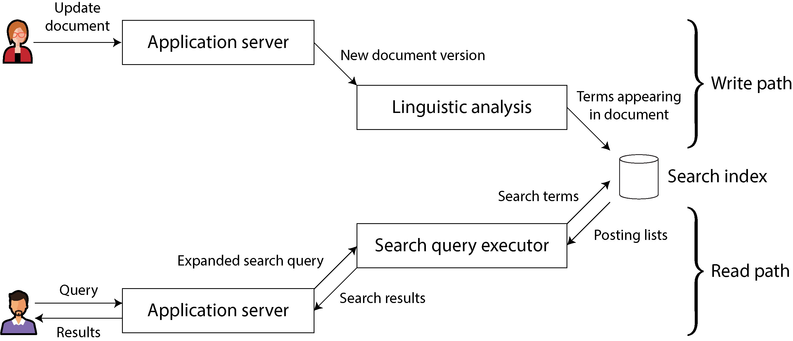
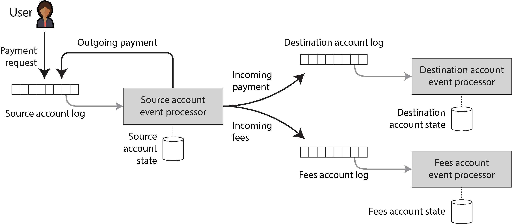

# Chương 13. Một triết lý về hệ thống streaming

> *Nếu một vật được định hướng tới một vật khác như là mục đích của nó, thì mục đích tối hậu của nó không thể nằm ở việc bảo toàn sự tồn tại của chính nó. Do đó, một thuyền trưởng không lấy việc bảo toàn con tàu được giao phó cho mình làm mục đích tối hậu, vì con tàu được định hướng tới một điều khác như là mục đích của nó, tức là việc đi biển.*

> *(Thường được trích dẫn là: Nếu mục tiêu cao nhất của một thuyền trưởng là bảo toàn con tàu của mình, ông ta sẽ giữ nó trong cảng mãi mãi.)*

> —Thánh Thomas Aquinas, *Summa Theologica* (Tổng luận Thần học) (1265–1274)

Trong Chương 2, chúng ta đã thảo luận về mục tiêu tạo ra các ứng dụng và hệ thống *đáng tin cậy* (reliable), *có khả năng mở rộng* (scalable) và *dễ bảo trì* (maintainable). Những chủ đề này xuyên suốt tất cả các chương—ví dụ, chúng ta đã thảo luận nhiều thuật toán chịu lỗi (fault-tolerance) giúp cải thiện độ tin cậy, sharding để cải thiện khả năng mở rộng, và các cơ chế tiến hóa và trừu tượng hóa giúp cải thiện khả năng bảo trì.

Trong chương này, chúng ta sẽ tập hợp tất cả những ý tưởng đó lại và đặc biệt xây dựng dựa trên các ý tưởng về kiến trúc streaming/hướng sự kiện (event-driven) từ Chương 12 để phát triển một triết lý phát triển ứng dụng đáp ứng được những mục tiêu ấy. Chương này mang nhiều quan điểm cá nhân hơn các chương trước, đi sâu vào một triết lý cụ thể thay vì so sánh nhiều cách tiếp cận khác nhau.

## Tích hợp dữ liệu

Một chủ đề lặp đi lặp lại trong cuốn sách này là với bất kỳ vấn đề nào cho trước, đều có nhiều giải pháp, mỗi giải pháp có những ưu điểm, nhược điểm và sự đánh đổi (trade-off) riêng. Ví dụ, khi thảo luận về storage engine trong Chương 4, chúng ta đã xem xét lưu trữ có cấu trúc log (log-structured), B-tree và lưu trữ hướng cột (column-oriented). Khi thảo luận về replication trong Chương 6, chúng ta đã xem xét các cách tiếp cận single-leader, multi-leader và leaderless.

Nếu bạn có một vấn đề như “Tôi muốn lưu một số dữ liệu và tra cứu lại sau,” thì không có một giải pháp đúng duy nhất, mà có nhiều cách tiếp cận, mỗi cách phù hợp trong những hoàn cảnh khác nhau. Một triển khai phần mềm thường phải chọn một cách tiếp cận cụ thể. Chỉ riêng việc làm cho một đường mã (code path) trở nên vững chắc và hoạt động hiệu quả đã đủ khó; cố gắng thỏa mãn quá nhiều trường hợp sử dụng bằng nhiều tính năng nhiều khả năng sẽ dẫn đến việc triển khai các tính năng đó kém chất lượng, so với các công cụ chuyên biệt.

Do đó, lựa chọn công cụ phần mềm phù hợp nhất cũng phụ thuộc vào hoàn cảnh. Mọi phần mềm—kể cả một database được gọi là “đa dụng” (general-purpose)—đều được thiết kế cho một mẫu hình sử dụng cụ thể.

Đối mặt với vô số lựa chọn như vậy, thách thức đầu tiên là tìm ra sự tương ứng giữa các sản phẩm phần mềm và những hoàn cảnh mà chúng phù hợp. Dễ hiểu là các nhà cung cấp thường ngần ngại nói cho bạn biết những loại workload mà phần mềm của họ không phù hợp, nhưng hy vọng rằng các chương trước đã trang bị cho bạn những câu hỏi cần đặt ra để giúp bạn đọc được những điều ẩn giữa các dòng chữ và hiểu rõ hơn về các sự đánh đổi.

Tuy nhiên, ngay cả khi bạn hiểu hoàn toàn sự tương ứng giữa các công cụ và hoàn cảnh sử dụng chúng, vẫn còn một thách thức khác. Trong các ứng dụng phức tạp, dữ liệu thường được sử dụng theo nhiều cách khác nhau, và một phần mềm khó có thể phù hợp với *tất cả* các cách đó. Vì vậy, bạn không tránh khỏi việc phải ghép nhiều phần mềm lại với nhau để cung cấp chức năng cho ứng dụng của mình.

### Kết hợp các công cụ chuyên biệt bằng cách dẫn xuất dữ liệu

Lấy một ví dụ, việc cần tích hợp một database OLTP với một chỉ mục tìm kiếm toàn văn (full-text search index) để xử lý các truy vấn theo từ khóa tùy ý là rất phổ biến. Mặc dù một số database (như PostgreSQL) có bao gồm tính năng đánh chỉ mục toàn văn, có thể đủ dùng cho các ứng dụng đơn giản [1], nhưng các khả năng tìm kiếm tinh vi hơn đòi hỏi những công cụ truy hồi thông tin (information-retrieval) chuyên biệt. Ngược lại, các chỉ mục tìm kiếm nói chung không phù hợp lắm để làm hệ thống lưu trữ gốc (system of record) bền vững. Do đó, nhiều ứng dụng cần kết hợp hai công cụ để thỏa mãn tất cả các yêu cầu của mình.

Chúng ta đã đề cập đến vấn đề tích hợp các hệ thống dữ liệu trong “Giữ các hệ thống đồng bộ với nhau”. Khi số lượng biểu diễn của dữ liệu tăng lên, vấn đề tích hợp trở nên khó hơn. Bên cạnh database và chỉ mục tìm kiếm, có lẽ bạn cần giữ các bản sao dữ liệu trong các hệ thống phân tích (data warehouse, hoặc các hệ thống batch processing và stream processing); duy trì cache hoặc các phiên bản phi chuẩn hóa (denormalized) của các đối tượng được dẫn xuất từ dữ liệu gốc; đưa dữ liệu qua các hệ thống machine learning, phân loại, xếp hạng hoặc gợi ý; hoặc gửi thông báo dựa trên những thay đổi của dữ liệu.

#### Suy luận về các dataflow

Khi các bản sao của cùng một dữ liệu cần được duy trì trong nhiều hệ thống lưu trữ để thỏa mãn nhiều mẫu hình truy cập, bạn cần phải rất rõ ràng về đầu vào và đầu ra. Dữ liệu được ghi ở đâu trước tiên, và biểu diễn nào được dẫn xuất từ nguồn nào? Làm thế nào để đưa dữ liệu vào tất cả những nơi cần thiết, với đúng định dạng?

Ví dụ, bạn có thể sắp xếp để dữ liệu trước tiên được ghi vào một database đóng vai trò system of record, sau đó những thay đổi được thực hiện trên database đó được ghi nhận (xem “Change Data Capture”) và áp dụng vào chỉ mục tìm kiếm theo cùng thứ tự. Nếu CDC là cách duy nhất để cập nhật chỉ mục, bạn có thể tin chắc rằng chỉ mục hoàn toàn được dẫn xuất từ system of record và do đó nhất quán với nó (trừ khi có lỗi trong phần mềm). Ghi vào database là cách duy nhất để cung cấp đầu vào mới cho hệ thống này.

Việc cho phép ứng dụng ghi trực tiếp vào cả chỉ mục tìm kiếm và database gây ra vấn đề được minh họa trong Hình 12-4, trong đó hai client đồng thời gửi các thao tác ghi xung đột, và hai hệ thống lưu trữ xử lý chúng theo thứ tự khác nhau. Trong trường hợp này, cả database và chỉ mục tìm kiếm đều không “chịu trách nhiệm” quyết định thứ tự các thao tác ghi, nên chúng có thể đưa ra những quyết định trái ngược nhau và trở nên không nhất quán với nhau vĩnh viễn.

Nếu bạn có thể dẫn toàn bộ đầu vào của người dùng qua một hệ thống duy nhất quyết định thứ tự cho tất cả các thao tác ghi, thì việc dẫn xuất các biểu diễn khác của dữ liệu bằng cách xử lý các thao tác ghi theo cùng thứ tự đó sẽ trở nên dễ dàng hơn nhiều. Đây là một ứng dụng của cách tiếp cận state machine replication mà chúng ta đã thấy trong “Consensus trong thực tế”. Việc bạn dùng CDC hay một log event sourcing ít quan trọng hơn so với nguyên tắc quyết định một thứ tự toàn phần (total order).

Việc cập nhật một hệ thống dữ liệu dẫn xuất (derived data) dựa trên một event log thường có thể được làm cho deterministic và idempotent (xem “Idempotence”), giúp việc khôi phục sau lỗi trở nên khá dễ dàng.

#### Dữ liệu dẫn xuất so với distributed transaction

Cách tiếp cận cổ điển để giữ cho các hệ thống dữ liệu nhất quán với nhau là dùng distributed transaction (giao dịch phân tán), như đã thảo luận trong “Two-Phase Commit”. Cách tiếp cận sử dụng các hệ thống dữ liệu dẫn xuất so với distributed transaction thì như thế nào?

Ở mức trừu tượng, chúng đạt được một mục tiêu tương tự bằng những phương tiện khác nhau. Distributed transaction sử dụng một giao thức atomic commit để đảm bảo các thay đổi được áp dụng một cách nguyên tử, trong khi các hệ thống dựa trên log đạt được tính đúng đắn thông qua việc thử lại deterministic và idempotence.

Khác biệt lớn nhất là các hệ thống transaction thường đảm bảo rằng sau khi một giá trị được ghi, bạn có thể đọc ngay được giá trị mới nhất (xem “Đọc lại những gì chính mình đã ghi”). Ngược lại, các hệ thống dữ liệu dẫn xuất thường được cập nhật bất đồng bộ, nên theo mặc định chúng không đảm bảo rằng các thao tác đọc trả về dữ liệu mới nhất.

Distributed transaction đã được sử dụng thành công trong những môi trường sẵn sàng chấp nhận chi phí về hiệu năng và vận hành của chúng. Tuy nhiên, XA có các đặc tính chịu lỗi và hiệu năng kém (xem “Transaction phân tán trên các hệ thống khác nhau”), điều này hạn chế nghiêm trọng tính hữu dụng của nó. Có thể tạo ra một giao thức tốt hơn cho distributed transaction, nhưng việc đưa một giao thức như vậy được áp dụng rộng rãi và tích hợp với các công cụ hiện có sẽ là một thách thức, và điều đó khó có thể xảy ra sớm.

Khi chưa có sự hỗ trợ rộng rãi cho một giao thức distributed transaction tốt, dữ liệu dẫn xuất dựa trên log là cách tiếp cận hứa hẹn nhất để tích hợp các hệ thống dữ liệu khác nhau. Dù vậy, những đảm bảo như đọc được chính thao tác ghi của mình (reading your own writes) vẫn hữu ích, và việc nói với mọi người rằng “eventual consistency là điều không thể tránh khỏi—hãy chấp nhận và học cách sống chung với nó” là không mang tính xây dựng (ít nhất là khi không có hướng dẫn tốt về *cách* đối phó với nó).

Ở phần sau của chương này, chúng ta sẽ thảo luận một số cách tiếp cận để triển khai các đảm bảo mạnh hơn trên nền các hệ thống dẫn xuất bất đồng bộ, và hướng tới một điểm trung gian giữa distributed transaction và các hệ thống bất đồng bộ dựa trên log.

#### Giới hạn của thứ tự toàn phần (total ordering)

Với những hệ thống đủ nhỏ, việc xây dựng một event log có thứ tự toàn phần là hoàn toàn khả thi (như đã được chứng minh bởi sự phổ biến của các database dùng single-leader replication, vốn xây dựng chính xác một log như vậy). Tuy nhiên, khi các hệ thống được mở rộng để phục vụ các workload lớn hơn và phức tạp hơn, những giới hạn bắt đầu xuất hiện:

- Trong hầu hết các trường hợp, việc xây dựng một log có thứ tự toàn phần đòi hỏi tất cả các event phải đi qua một *node leader duy nhất* (single leader node) quyết định thứ tự. Nếu thông lượng (throughput) của các event lớn hơn mức một máy đơn lẻ có thể xử lý, bạn cần shard log này ra nhiều máy. Khi đó thứ tự của các event nằm trong hai shard khác nhau trở nên không rõ ràng.

- Nếu các server được trải rộng trên nhiều region *phân tán về địa lý*—ví dụ, để chịu được việc toàn bộ một datacenter ngừng hoạt động—bạn thường có một leader riêng trong mỗi datacenter, bởi vì độ trễ mạng khiến việc phối hợp đồng bộ giữa các datacenter trở nên kém hiệu quả. Điều này dẫn đến thứ tự không xác định của các event bắt nguồn từ hai datacenter khác nhau.

- Khi các ứng dụng được triển khai dưới dạng *microservices*, một lựa chọn thiết kế phổ biến là triển khai mỗi service cùng với trạng thái bền vững của nó thành một đơn vị độc lập, không có trạng thái bền vững nào được chia sẻ giữa các service. Khi hai event bắt nguồn từ các service khác nhau, những event đó không có thứ tự xác định.

- Một số ứng dụng duy trì trạng thái phía client được cập nhật ngay lập tức khi người dùng nhập liệu (không chờ xác nhận từ server), và thậm chí tiếp tục hoạt động khi offline. Với những ứng dụng như vậy, client và server rất có thể sẽ thấy các event theo những thứ tự khác nhau.

Về mặt hình thức, việc quyết định một thứ tự toàn phần cho các event được gọi là *total order broadcast*, và như chúng ta đã thấy trong “Nhiều bộ mặt của Consensus”, nó tương đương với consensus. Hầu hết các thuật toán consensus được thiết kế cho những tình huống mà thông lượng của một node duy nhất là đủ để xử lý toàn bộ luồng event, và các thuật toán này không cung cấp cơ chế để nhiều node cùng chia sẻ công việc sắp thứ tự các event.

#### Sắp thứ tự event để ghi nhận quan hệ nhân quả

Nếu không tồn tại liên hệ nhân quả giữa các event, việc thiếu thứ tự toàn phần không phải là vấn đề lớn, vì các event đồng thời có thể được sắp thứ tự tùy ý. Một số trường hợp khác cũng dễ xử lý—ví dụ, nhiều lần cập nhật cùng một đối tượng có thể được sắp thứ tự toàn phần bằng cách định tuyến tất cả các cập nhật cho một object ID cụ thể tới cùng một shard của log. Tuy nhiên, các phụ thuộc nhân quả đôi khi nảy sinh theo những cách tinh vi hơn.

Ví dụ, hãy xem xét một dịch vụ mạng xã hội và hai người dùng từng có mối quan hệ tình cảm nhưng vừa chia tay. Một người hủy kết bạn với người kia, rồi gửi một tin nhắn cho những người bạn còn lại để phàn nàn về người yêu cũ. Ý định của người dùng này là người yêu cũ không được thấy tin nhắn thô lỗ đó, vì tin nhắn được gửi sau khi trạng thái bạn bè của người kia đã bị thu hồi.

Tuy nhiên, trong một hệ thống lưu trạng thái bạn bè ở một nơi và tin nhắn ở một nơi khác, sự phụ thuộc thứ tự giữa event *unfriend* (hủy kết bạn) và event *message-send* (gửi tin nhắn) có thể bị mất. Nếu phụ thuộc nhân quả không được ghi nhận, một service gửi thông báo về tin nhắn mới có thể xử lý event *message-send* trước event *unfriend* và do đó gửi nhầm thông báo tới người yêu cũ.

Trong ví dụ này, các thông báo thực chất là một phép join giữa các tin nhắn và danh sách bạn bè, khiến nó liên quan đến các vấn đề về thời điểm của join mà chúng ta đã thảo luận trước đây (xem “Sự phụ thuộc thời gian của join”).

Thật không may, vấn đề này dường như không có câu trả lời đơn giản [2, 3]. Một số điểm khởi đầu bao gồm:

- Logical timestamp (nhãn thời gian logic) có thể cung cấp thứ tự toàn phần mà không cần phối hợp (xem “Bộ sinh ID và đồng hồ logic (logical clock)”), nên chúng có thể hữu ích khi total order broadcast không khả thi. Tuy nhiên, chúng vẫn đòi hỏi bên nhận phải xử lý các event được chuyển đến không đúng thứ tự, và đòi hỏi phải truyền thêm metadata.

- Nếu bạn có thể ghi lại một event để lưu trạng thái của hệ thống mà người dùng đã thấy trước khi đưa ra quyết định, và gán cho event đó một định danh duy nhất, thì bất kỳ event nào sau đó đều có thể tham chiếu tới định danh event ấy để ghi nhận phụ thuộc nhân quả [4].

- Các thuật toán giải quyết xung đột (xem “Giải quyết xung đột tự động”) giúp xử lý các event được chuyển đến theo thứ tự không mong đợi. Chúng hữu ích cho việc duy trì trạng thái, nhưng không giúp được gì nếu các hành động có tác dụng phụ ra bên ngoài (chẳng hạn gửi thông báo cho người dùng).

Có lẽ trong tương lai sẽ xuất hiện những mẫu hình phát triển ứng dụng cho phép ghi nhận các phụ thuộc nhân quả một cách hiệu quả, và duy trì trạng thái dẫn xuất một cách chính xác, mà không buộc tất cả các event phải đi qua nút thắt cổ chai của total order broadcast.

### Batch processing và stream processing

Mục tiêu của tích hợp dữ liệu là đảm bảo dữ liệu đến được tất cả những nơi cần thiết dưới đúng dạng thức. Để làm được điều đó cần tiêu thụ đầu vào, biến đổi, join, lọc, tổng hợp (aggregate), huấn luyện mô hình, đánh giá, và cuối cùng ghi vào các đầu ra thích hợp. Các bộ xử lý batch và stream là những công cụ để đạt được mục tiêu này. Đầu ra của các tiến trình batch và stream là các tập dữ liệu dẫn xuất như chỉ mục tìm kiếm, materialized view, gợi ý để hiển thị cho người dùng, các chỉ số tổng hợp, v.v.

Như chúng ta đã thấy trong Chương 11 và 12, batch processing và stream processing có nhiều nguyên tắc chung. Khác biệt cơ bản chính là các bộ xử lý stream hoạt động trên các tập dữ liệu không giới hạn (unbounded), trong khi đầu vào của tiến trình batch có kích thước hữu hạn, đã biết trước.

#### Duy trì trạng thái dẫn xuất

Batch processing mang đậm màu sắc lập trình hàm (functional) (ngay cả khi mã không được viết bằng một ngôn ngữ lập trình hàm). Nó khuyến khích các hàm thuần (pure function) deterministic mà đầu ra chỉ phụ thuộc vào đầu vào và không có tác dụng phụ nào ngoài các đầu ra tường minh, coi đầu vào là bất biến (immutable) và đầu ra là chỉ-thêm (append-only). Stream processing cũng tương tự, nhưng nó mở rộng các operator để cho phép một trạng thái được quản lý và có khả năng chịu lỗi.

Nguyên tắc về các hàm deterministic với đầu vào và đầu ra được định nghĩa rõ ràng không chỉ tốt cho khả năng chịu lỗi mà còn đơn giản hóa việc suy luận về các dataflow trong một tổ chức [5]. Bất kể dữ liệu dẫn xuất là một chỉ mục tìm kiếm, một mô hình thống kê hay một cache, việc tư duy theo các pipeline dữ liệu dẫn xuất thứ này từ thứ khác—đẩy các thay đổi trạng thái trong một hệ thống qua mã ứng dụng kiểu hàm và áp dụng các hiệu ứng lên các hệ thống dẫn xuất—là rất hữu ích.

Về nguyên tắc, các hệ thống dữ liệu dẫn xuất có thể được duy trì một cách đồng bộ, giống như cách một database quan hệ cập nhật các secondary index một cách đồng bộ trong cùng transaction với các thao tác ghi vào bảng được đánh chỉ mục. Tuy nhiên, tính bất đồng bộ chính là điều làm cho các hệ thống dựa trên event log trở nên vững chắc. Nó cho phép một lỗi ở một phần của hệ thống được khoanh vùng cục bộ, trong khi distributed transaction sẽ abort nếu bất kỳ một participant nào bị hỏng, nên chúng có xu hướng khuếch đại các hỏng hóc bằng cách lan truyền chúng sang phần còn lại của hệ thống.

Chúng ta đã thấy trong “Sharding và secondary index” rằng các secondary index thường vượt qua ranh giới các shard. Một hệ thống được shard có secondary index cần hoặc gửi các thao tác ghi tới nhiều shard (nếu index được phân vùng theo term—term-partitioned) hoặc gửi các thao tác đọc tới tất cả các shard (nếu index được phân vùng theo document—document-partitioned). Việc giao tiếp liên shard như vậy cũng đáng tin cậy và có khả năng mở rộng nhất nếu index được duy trì một cách bất đồng bộ [6].

#### Tái xử lý dữ liệu để tiến hóa ứng dụng

Khi duy trì dữ liệu dẫn xuất, cả batch processing và stream processing đều hữu ích. Stream processing cho phép các thay đổi ở đầu vào được phản ánh vào các view dẫn xuất với độ trễ thấp, trong khi batch processing cho phép tái xử lý lượng lớn dữ liệu lịch sử đã tích lũy để dẫn xuất các view mới trên một tập dữ liệu hiện có.

Đặc biệt, việc tái xử lý dữ liệu hiện có cung cấp một cơ chế tốt để bảo trì một hệ thống, tiến hóa nó để hỗ trợ các tính năng mới và các yêu cầu thay đổi. Không có tái xử lý, schema evolution bị giới hạn ở những thay đổi đơn giản như thêm một trường tùy chọn mới vào một record hoặc thêm một loại record mới. Ngược lại, với tái xử lý, có thể tái cấu trúc một tập dữ liệu thành một mô hình hoàn toàn khác để phục vụ tốt hơn các yêu cầu mới.

#### SCHEMA MIGRATION TRÊN ĐƯỜNG SẮT

Những “schema migration” quy mô lớn cũng xảy ra trong các hệ thống không phải máy tính. Ví dụ, trong những ngày đầu xây dựng đường sắt ở nước Anh thế kỷ 19, có nhiều tiêu chuẩn cạnh tranh nhau về khổ đường ray (gauge—khoảng cách giữa hai thanh ray). Tàu được chế tạo cho một khổ đường ray không thể chạy trên đường ray có khổ khác, điều này hạn chế khả năng kết nối trong mạng lưới đường sắt [7].

Sau khi một khổ đường ray tiêu chuẩn duy nhất cuối cùng được quyết định vào năm 1846, các đường ray có khổ khác phải được chuyển đổi—nhưng làm thế nào để thực hiện việc này mà không phải đóng tuyến đường sắt trong nhiều tháng hoặc nhiều năm? Giải pháp là trước tiên chuyển đổi đường ray thành *dual gauge* (khổ đôi) hay *mixed gauge* (khổ hỗn hợp) bằng cách thêm một thanh ray thứ ba. Việc chuyển đổi này có thể được thực hiện dần dần, và khi hoàn tất, tàu của cả hai khổ đều có thể chạy trên tuyến, sử dụng hai trong ba thanh ray. Cuối cùng, một khi tất cả các đoàn tàu đã được chuyển sang khổ tiêu chuẩn, thanh ray phục vụ khổ phi tiêu chuẩn có thể được gỡ bỏ.

“Tái xử lý” các đường ray hiện có theo cách này, và cho phép phiên bản cũ và mới cùng tồn tại song song, giúp có thể thay đổi khổ đường ray dần dần trong nhiều năm. Dù vậy, công việc này rất tốn kém, đó là lý do các khổ đường ray phi tiêu chuẩn vẫn còn tồn tại đến ngày nay. Ví dụ, hệ thống BART ở Vùng Vịnh San Francisco sử dụng một khổ đường ray khác với phần lớn nước Mỹ.

Các view dẫn xuất cho phép tiến hóa *dần dần*. Nếu bạn muốn tái cấu trúc một tập dữ liệu, bạn không cần thực hiện migration như một cú chuyển đổi đột ngột. Thay vào đó, bạn có thể duy trì schema cũ và schema mới song song với nhau như hai view được dẫn xuất độc lập trên cùng một dữ liệu nền. Sau đó bạn có thể bắt đầu chuyển một số ít người dùng sang view mới để kiểm tra hiệu năng của nó và tìm các lỗi, trong khi phần lớn người dùng tiếp tục được định tuyến tới view cũ. Dần dần, bạn có thể tăng tỷ lệ người dùng truy cập view mới, và cuối cùng bạn có thể bỏ view cũ [8, 9].

Vẻ đẹp của một cuộc migration dần dần như vậy là mọi giai đoạn của quá trình đều có thể dễ dàng đảo ngược nếu có gì đó không ổn; bạn luôn có một hệ thống đang hoạt động để quay về. Việc giảm rủi ro thiệt hại không thể đảo ngược cho phép bạn tự tin hơn khi tiến bước và do đó tiến nhanh hơn trong việc cải thiện hệ thống của mình [10].

#### Hợp nhất batch processing và stream processing

Một đề xuất ban đầu để hợp nhất batch processing và stream processing là *lambda architecture* (kiến trúc lambda) [11], vốn có một số vấn đề [12] và đã không còn được sử dụng. Các hệ thống gần đây hơn cho phép các tính toán batch (tái xử lý dữ liệu lịch sử) và các tính toán stream (xử lý các event khi chúng đến) được triển khai trong cùng một hệ thống [13]—một cách tiếp cận đôi khi được gọi là *kappa architecture* (kiến trúc kappa) [12].

Việc hợp nhất batch processing và stream processing trong một hệ thống đòi hỏi các tính năng sau:

- Khả năng phát lại (replay) các event lịch sử qua cùng một engine xử lý đang xử lý luồng các event gần đây. Ví dụ, các message broker dựa trên log có khả năng phát lại các thông điệp (message), và một số bộ xử lý stream có thể đọc đầu vào từ một hệ thống file phân tán hoặc object storage.

- Ngữ nghĩa exactly-once cho các bộ xử lý stream—tức là đảm bảo rằng đầu ra giống như khi không có lỗi nào xảy ra, ngay cả khi trên thực tế lỗi đã xảy ra. Giống như với batch processing, điều này đòi hỏi phải loại bỏ các đầu ra một phần của bất kỳ task nào bị thất bại.

- Các công cụ để chia window theo thời gian sự kiện (event time), chứ không phải theo thời gian xử lý (processing time), vì thời gian xử lý là vô nghĩa khi tái xử lý các event lịch sử. Ví dụ, Apache Beam cung cấp một API để biểu diễn các tính toán như vậy, sau đó có thể chạy bằng Apache Flink hoặc Google Cloud Dataflow.

## Tách rời database (Unbundling)

Ở mức trừu tượng, database, các bộ xử lý batch/stream và hệ điều hành đều thực hiện những chức năng giống nhau: chúng lưu trữ một số dữ liệu, và cho phép bạn xử lý và truy vấn dữ liệu đó [14, 15]. Một database lưu dữ liệu dưới dạng các record của một mô hình dữ liệu (data model) (hàng trong bảng, document, đỉnh trong graph, v.v.), trong khi hệ thống file của hệ điều hành lưu dữ liệu trong các file—nhưng về cốt lõi, cả hai đều là các hệ thống “quản lý thông tin” [16]. Như chúng ta đã thấy trong Chương 11, các bộ xử lý batch giống như một phiên bản phân tán của Unix.

Thực tế, có nhiều khác biệt trong thực hành. Ví dụ, nhiều hệ thống file không xử lý tốt một thư mục chứa 10 triệu file nhỏ, trong khi một database chứa 10 triệu record nhỏ là điều hoàn toàn bình thường và không có gì đáng chú ý. Dù vậy, những điểm tương đồng và khác biệt giữa hệ điều hành và database vẫn đáng để khám phá.

Unix và các database quan hệ đã tiếp cận vấn đề quản lý thông tin với những triết lý rất khác nhau. Unix xem mục đích của mình là đem đến cho lập trình viên một sự trừu tượng hóa phần cứng hợp lý nhưng khá ở mức thấp, trong khi các database quan hệ muốn cung cấp cho lập trình viên ứng dụng một sự trừu tượng hóa mức cao che giấu đi những phức tạp của cấu trúc dữ liệu trên đĩa, tính đồng thời (concurrency), khôi phục sau sự cố (crash recovery), v.v. Unix phát triển pipe và file vốn chỉ là các chuỗi byte, trong khi database phát triển SQL và transaction.

Cách tiếp cận nào tốt hơn? Điều đó phụ thuộc vào việc bạn muốn gì. Unix “đơn giản hơn” theo nghĩa nó là một lớp bọc khá mỏng quanh các tài nguyên phần cứng; các database quan hệ “đơn giản hơn” theo nghĩa một truy vấn khai báo ngắn gọn có thể tận dụng rất nhiều hạ tầng mạnh mẽ (tối ưu hóa truy vấn, index, các phương pháp join, điều khiển đồng thời (concurrency control), replication, v.v.) mà người viết truy vấn không cần phải hiểu các chi tiết triển khai.

Sự căng thẳng giữa hai triết lý này đã kéo dài hàng thập kỷ (cả Unix và mô hình quan hệ đều xuất hiện vào đầu thập niên 1970) và vẫn chưa được giải quyết. Ví dụ, phong trào NoSQL có thể được hiểu như mong muốn áp dụng cách tiếp cận kiểu Unix với các trừu tượng hóa mức thấp vào lĩnh vực lưu trữ dữ liệu OLTP phân tán.

Mục này cố gắng dung hòa hai cách tiếp cận, với hy vọng chúng ta có thể kết hợp những điểm tốt nhất của cả hai thế giới.

### Kết hợp các công nghệ lưu trữ dữ liệu

Trong suốt cuốn sách này, chúng ta đã thảo luận về nhiều tính năng mà các database cung cấp và cách chúng hoạt động, bao gồm:

- Secondary index, cho phép bạn tìm kiếm hiệu quả các bản ghi (record) dựa trên giá trị của một trường

- Materialized view, là một dạng cache được tính toán trước của kết quả truy vấn

- Replication log, giúp giữ cho các bản sao dữ liệu trên các node khác luôn được cập nhật

- Full-text search index, cho phép tìm kiếm theo từ khóa trong văn bản và được tích hợp sẵn trong một số cơ sở dữ liệu quan hệ [1]

Trong Chương 11 và 12, những chủ đề tương tự cũng đã xuất hiện; chúng ta đã nói về việc xây dựng full-text search index, về việc duy trì materialized view, và về việc sao chép các thay đổi từ một database sang các hệ thống dữ liệu dẫn xuất (derived data) bằng CDC.

Có vẻ như tồn tại những điểm song song giữa các tính năng được tích hợp sẵn trong database và các hệ thống derived data mà người ta đang xây dựng bằng các bộ xử lý batch và stream.

#### Tạo một index

Hãy nghĩ về điều gì xảy ra khi bạn chạy `CREATE INDEX` để tạo một index mới trong một cơ sở dữ liệu quan hệ. Database phải quét qua một snapshot nhất quán của bảng, chọn ra tất cả các giá trị trường được đánh index, sắp xếp chúng, và ghi index ra. Sau đó nó phải xử lý phần tồn đọng (backlog) các thao tác ghi đã được thực hiện kể từ khi snapshot nhất quán được lấy (giả sử bảng không bị khóa trong khi tạo index, nên các thao tác ghi vẫn có thể tiếp tục). Khi việc đó hoàn tất, database phải tiếp tục giữ cho index luôn được cập nhật mỗi khi một transaction ghi vào bảng.

Quá trình này giống một cách đáng chú ý với việc thiết lập một follower replica mới (xem “Thiết lập follower mới”), và cũng rất giống với việc khởi tạo (bootstrapping) CDC trong một hệ thống streaming (xem “Snapshot ban đầu”).

Mỗi khi bạn chạy `CREATE INDEX` , về bản chất database xử lý lại tập dữ liệu hiện có và dẫn xuất ra index như một view mới lên dữ liệu hiện có. Dữ liệu hiện có có thể là một snapshot của trạng thái chứ không phải là log của mọi thay đổi từng xảy ra, nhưng hai thứ này có liên hệ mật thiết với nhau.

#### Siêu cơ sở dữ liệu (meta-database) của mọi thứ

Nhìn theo cách này, dataflow xuyên suốt toàn bộ một tổ chức bắt đầu trông giống như một database khổng lồ duy nhất [5]. Mỗi khi một tiến trình batch, stream, hoặc ETL vận chuyển dữ liệu từ một nơi và một dạng này sang một nơi và một dạng khác, nó đang hoạt động giống như hệ thống con của database chịu trách nhiệm giữ cho các index hoặc materialized view luôn được cập nhật.

Nhìn như vậy, các bộ xử lý batch và stream giống như những cách triển khai tinh vi của trigger, stored procedure, và các thuật toán duy trì materialized view. Các hệ thống derived data mà chúng duy trì giống như những loại index khác nhau. Ví dụ, một cơ sở dữ liệu quan hệ có thể hỗ trợ B-tree index, hash index, spatial index (index không gian), và các loại index khác. Trong kiến trúc đang nổi lên của các hệ thống derived data, thay vì triển khai những tiện ích đó như các tính năng của một sản phẩm database tích hợp duy nhất, chúng được cung cấp bởi nhiều phần mềm khác nhau, chạy trên các máy khác nhau, được quản trị bởi các nhóm khác nhau.

Những phát triển này sẽ đưa chúng ta đến đâu trong tương lai? Nếu chúng ta xuất phát từ tiền đề rằng không có một mô hình dữ liệu (data model) hay định dạng lưu trữ duy nhất nào phù hợp với mọi mẫu truy cập, thì có hai hướng đi để các công cụ lưu trữ và xử lý khác nhau vẫn có thể được kết hợp thành một hệ thống gắn kết:

- *Federated database (hợp nhất các thao tác đọc)*

  - Có thể cung cấp một giao diện truy vấn thống nhất cho rất nhiều storage engine và phương pháp xử lý bên dưới — một cách tiếp cận được gọi là *federated database* (cơ sở dữ liệu liên hợp) hay *polystore* [17, 18]. Ví dụ, tính năng *foreign data wrapper* của PostgreSQL phù hợp với mẫu này, cũng như các federated query engine như Trino, Hoptimator, và Xorq. Các ứng dụng cần một data model hoặc giao diện truy vấn chuyên biệt vẫn có thể truy cập trực tiếp các storage engine bên dưới, trong khi những người dùng muốn kết hợp dữ liệu từ nhiều nơi khác nhau có thể làm điều đó dễ dàng thông qua giao diện liên hợp.

  - Một giao diện truy vấn liên hợp đi theo truyền thống quan hệ của một hệ thống tích hợp duy nhất với ngôn ngữ truy vấn bậc cao và ngữ nghĩa thanh thoát, nhưng cách triển khai lại phức tạp.

- *Unbundled database (hợp nhất các thao tác ghi)*

  - Trong khi liên hợp (federation) giải quyết việc truy vấn chỉ-đọc xuyên qua nhiều hệ thống, nó không có câu trả lời tốt cho việc đồng bộ hóa các thao tác ghi giữa những hệ thống đó. Chúng ta đã nói rằng trong một database duy nhất, việc tạo một index nhất quán là một tính năng có sẵn. Khi chúng ta kết hợp nhiều hệ thống lưu trữ, tương tự chúng ta cần đảm bảo rằng mọi thay đổi dữ liệu đều đi đến tất cả những nơi đúng đắn, ngay cả khi có lỗi xảy ra. Việc làm cho các hệ thống lưu trữ dễ ghép nối với nhau một cách đáng tin cậy hơn (ví dụ, thông qua CDC và event log) giống như *tách rời* (unbundling) các tính năng duy trì index của một database theo cách có thể đồng bộ hóa các thao tác ghi xuyên qua những công nghệ khác nhau [5, 19].

  - Cách tiếp cận unbundled đi theo truyền thống Unix của những công cụ nhỏ làm tốt một việc [20], giao tiếp với nhau thông qua một API cấp thấp thống nhất (pipe), và có thể được kết hợp bằng một ngôn ngữ bậc cao hơn (shell) [14].

#### Làm cho unbundling hoạt động

Federation và unbundling là hai mặt của cùng một đồng xu: kết hợp các thành phần đa dạng thành một hệ thống đáng tin cậy, có khả năng mở rộng, và dễ bảo trì. Truy vấn chỉ-đọc liên hợp yêu cầu ánh xạ một data model sang một data model khác, việc này cần suy nghĩ đôi chút nhưng cuối cùng là một vấn đề khá dễ kiểm soát. Giữ cho các thao tác ghi vào nhiều hệ thống lưu trữ được đồng bộ là bài toán kỹ thuật khó hơn, vì vậy chúng ta sẽ tập trung vào đó ở đây.

Cách tiếp cận truyền thống để đồng bộ hóa các thao tác ghi yêu cầu distributed transaction xuyên qua các hệ thống lưu trữ không đồng nhất [17], vốn có nhiều vấn đề như đã thảo luận trước đây. Transaction trong một hệ thống lưu trữ hoặc xử lý stream duy nhất là khả thi, nhưng khi dữ liệu vượt qua ranh giới giữa các công nghệ khác nhau, một event log bất đồng bộ với các thao tác ghi idempotent là cách tiếp cận vững chắc và thực tế hơn nhiều.

Ví dụ, distributed transaction được dùng bên trong một số bộ xử lý stream để đạt được ngữ nghĩa exactly-once, và điều này có thể hoạt động khá tốt. Tuy nhiên, khi một transaction cần liên quan đến các hệ thống được viết bởi những nhóm người khác nhau (ví dụ, khi dữ liệu được ghi từ một bộ xử lý stream sang một key-value store phân tán hoặc search index), việc thiếu một giao thức transaction được chuẩn hóa khiến việc tích hợp khó hơn nhiều. Một log các event có thứ tự với các consumer idempotent là một sự trừu tượng hóa đơn giản hơn nhiều và do đó khả thi hơn nhiều để triển khai xuyên qua các hệ thống không đồng nhất [5].

Ưu điểm lớn của việc tích hợp dựa trên log là *loose coupling* (liên kết lỏng) giữa các thành phần khác nhau, điều này thể hiện theo hai cách:

- Ở cấp độ hệ thống, các event stream bất đồng bộ làm cho hệ thống nói chung vững chắc hơn trước sự cố ngừng hoạt động hoặc suy giảm hiệu năng của các thành phần riêng lẻ. Nếu một consumer chạy chậm hoặc bị hỏng, event log có thể đệm (buffer) các thông điệp (message), cho phép producer và bất kỳ consumer nào khác tiếp tục chạy mà không bị ảnh hưởng. Consumer bị lỗi có thể bắt kịp khi nó được sửa, nên nó không bỏ lỡ dữ liệu nào, và lỗi được khoanh vùng. Ngược lại, sự tương tác đồng bộ của distributed transaction có xu hướng leo thang các lỗi cục bộ thành những hỏng hóc quy mô lớn.

- Ở cấp độ con người, việc unbundling các hệ thống dữ liệu cho phép các thành phần phần mềm và dịch vụ được phát triển, cải tiến, và bảo trì độc lập với nhau bởi các nhóm khác nhau. Sự chuyên môn hóa cho phép mỗi nhóm tập trung làm tốt một việc, với các giao diện được định nghĩa rõ ràng tới hệ thống của các nhóm khác. Event log cung cấp một giao diện đủ mạnh để nắm bắt các tính chất nhất quán (consistency) khá mạnh (nhờ tính bền vững và thứ tự của các event), nhưng cũng đủ tổng quát để áp dụng cho gần như mọi loại dữ liệu.

#### Hệ thống unbundled so với hệ thống tích hợp

Nếu unbundling thực sự trở thành con đường của tương lai, nó sẽ không thay thế các database ở dạng hiện tại của chúng. Chúng vẫn sẽ cần thiết như trước đây, để duy trì trạng thái trong các bộ xử lý stream và để phục vụ truy vấn cho đầu ra của các bộ xử lý batch và stream. Các query engine chuyên biệt cũng sẽ tiếp tục quan trọng đối với những workload cụ thể — ví dụ, các query engine trong data warehouse được tối ưu hóa cho các truy vấn phân tích khám phá và xử lý loại workload này rất tốt.

Sự phức tạp của việc vận hành nhiều mảnh hạ tầng có thể là một vấn đề. Mỗi phần mềm đều có đường cong học tập riêng cùng những vấn đề cấu hình và đặc thù vận hành của nó, vì vậy nên triển khai càng ít thành phần chuyển động càng tốt. Một sản phẩm phần mềm tích hợp duy nhất cũng có thể đạt được hiệu năng tốt hơn và dễ dự đoán hơn trên những loại workload mà nó được thiết kế cho, so với một hệ thống gồm nhiều công cụ mà bạn đã kết hợp bằng mã ứng dụng [21]. Xây dựng cho quy mô mà bạn không cần là lãng phí công sức và có thể trói bạn vào một thiết kế thiếu linh hoạt. Thực chất, đó là một dạng tối ưu hóa quá sớm (premature optimization).

Mục tiêu của unbundling không phải là cạnh tranh với từng database riêng lẻ về hiệu năng cho những workload cụ thể; mục tiêu là cho phép bạn kết hợp nhiều database để đạt được hiệu năng tốt cho một phạm vi workload rộng hơn nhiều so với những gì có thể làm được với một phần mềm duy nhất. Đó là vấn đề về chiều rộng, không phải chiều sâu.

Do đó, nếu một công nghệ duy nhất làm được mọi thứ bạn cần, rất có thể tốt nhất là bạn chỉ cần dùng sản phẩm đó thay vì cố tự triển khai lại nó từ các thành phần cấp thấp hơn. Ưu điểm của unbundling và kết hợp chỉ xuất hiện khi không có một phần mềm duy nhất nào thỏa mãn tất cả các yêu cầu của bạn.

Các công cụ để kết hợp các hệ thống dữ liệu đang ngày càng tốt hơn. Debezium có thể trích xuất các change stream từ nhiều database, giao thức của Kafka đang trở thành tiêu chuẩn thực tế (de facto) cho các event stream, và các engine duy trì view tăng dần (xem “Duy trì View tăng dần (Incremental View Maintenance)”) giúp có thể tính toán trước và cập nhật các cache của những truy vấn phức tạp.

### Thiết kế ứng dụng xoay quanh Dataflow

Ý tưởng chung về việc cập nhật derived data khi dữ liệu nền của nó thay đổi không có gì mới. Ví dụ, các bảng tính (spreadsheet) có khả năng lập trình dataflow mạnh mẽ [22]: bạn có thể đặt một công thức vào một ô (ví dụ, tổng của các ô trong một cột khác), và mỗi khi bất kỳ đầu vào nào của công thức thay đổi, kết quả của công thức được tự động tính lại. Đây chính xác là điều chúng ta muốn ở cấp độ hệ thống dữ liệu. Khi một record trong database thay đổi, chúng ta muốn bất kỳ index nào cho record đó được tự động cập nhật và bất kỳ view hoặc aggregation nào được cache mà phụ thuộc vào record đó được tự động làm mới. Chúng ta không nên phải lo lắng về các chi tiết kỹ thuật của việc làm mới này diễn ra như thế nào và nên có thể đơn giản tin tưởng rằng nó hoạt động đúng.

Do đó, hầu hết các hệ thống dữ liệu vẫn còn điều gì đó để học từ những tính năng mà VisiCalc đã có từ năm 1979 [23]. Điểm khác biệt so với bảng tính là các hệ thống dữ liệu ngày nay cần có khả năng chịu lỗi, khả năng mở rộng, và khả năng lưu trữ dữ liệu một cách bền vững. Chúng cũng cần có khả năng tích hợp những công nghệ khác nhau được viết bởi các nhóm người khác nhau theo thời gian và tận dụng các thư viện và dịch vụ hiện có. Thật phi thực tế khi mong đợi tất cả phần mềm được phát triển bằng một ngôn ngữ, framework, hay công cụ cụ thể nào.

Trong mục này chúng ta sẽ mở rộng những ý tưởng này và khám phá một số cách xây dựng ứng dụng xoay quanh các unbundled database và dataflow.

#### Mã ứng dụng như một hàm dẫn xuất

Khi một tập dữ liệu được dẫn xuất từ một tập dữ liệu khác, nó đi qua một loại hàm biến đổi nào đó. Ví dụ:

- Secondary index là một loại tập dữ liệu dẫn xuất với hàm biến đổi đơn giản — với mỗi hàng hoặc document trong bảng cơ sở, nó chọn ra các giá trị trong những cột hoặc trường được đánh index và sắp xếp theo các giá trị đó (giả sử dùng SSTable hoặc B-tree index, vốn được sắp xếp theo khóa).

- Full-text search index được tạo bằng cách áp dụng nhiều hàm xử lý ngôn ngữ tự nhiên như nhận diện ngôn ngữ, tách từ, stemming hoặc lemmatization, sửa lỗi chính tả, và nhận diện từ đồng nghĩa, sau đó xây dựng một cấu trúc dữ liệu để tra cứu hiệu quả (như inverted index).

- Trong một hệ thống ML, chúng ta có thể xem mô hình là được dẫn xuất từ dữ liệu huấn luyện bằng cách áp dụng nhiều hàm trích xuất đặc trưng (feature extraction) và phân tích thống kê. Khi mô hình được áp dụng lên dữ liệu đầu vào mới, đầu ra của nó được dẫn xuất từ đầu vào đó và các tham số đã học của nó (và do đó, một cách gián tiếp, từ dữ liệu huấn luyện).

- Một cache thường chứa một aggregation của dữ liệu ở dạng mà nó sẽ được hiển thị trong UI. Do đó việc nạp cache yêu cầu hiểu biết về những trường nào được tham chiếu trong UI; các thay đổi trong UI có thể yêu cầu cập nhật định nghĩa về cách nạp cache và xây dựng lại cache.

Hàm dẫn xuất cho secondary index được yêu cầu phổ biến đến mức nó được tích hợp vào nhiều database như một tính năng cốt lõi, và bạn có thể gọi nó chỉ bằng cách chạy `CREATE INDEX` . Đối với full-text indexing, các tính năng ngôn ngữ học cơ bản cho những ngôn ngữ thông dụng có thể được tích hợp vào database, nhưng các tính năng tinh vi hơn thường yêu cầu tinh chỉnh theo từng lĩnh vực cụ thể. Trong machine learning, feature engineering nổi tiếng là mang tính đặc thù theo ứng dụng và thường phải kết hợp hiểu biết chi tiết về cách người dùng tương tác với ứng dụng và cách ứng dụng được triển khai [24].

Khi hàm tạo ra một tập dữ liệu dẫn xuất không phải là một hàm rập khuôn tiêu chuẩn như hàm tạo secondary index, cần có mã tùy biến để xử lý các khía cạnh đặc thù của ứng dụng. Mã tùy biến này chính là nơi nhiều database gặp khó khăn. Mặc dù các cơ sở dữ liệu quan hệ thường hỗ trợ trigger, stored procedure, và hàm do người dùng định nghĩa (user-defined function), vốn có thể được dùng để thực thi mã ứng dụng bên trong database, chúng ít nhiều chỉ là một phần được thêm vào sau trong thiết kế database.

#### Tách biệt mã ứng dụng và trạng thái

Về lý thuyết, database có thể là môi trường triển khai cho mã ứng dụng tùy ý, giống như một hệ điều hành. Tuy nhiên, trong thực tế chúng đã cho thấy là không phù hợp cho mục đích này. Chúng không đáp ứng tốt các yêu cầu của phát triển ứng dụng hiện đại, như quản lý dependency và package, quản lý phiên bản (version control), nâng cấp luân phiên (rolling upgrade), khả năng tiến hóa (evolvability), giám sát (monitoring), metrics, các lời gọi tới dịch vụ mạng, và tích hợp với các hệ thống bên ngoài.

Mặt khác, các công cụ triển khai và quản lý cluster như Kubernetes, Docker, Mesos, YARN, và những công cụ khác được thiết kế đặc biệt cho mục đích chạy mã ứng dụng. Bằng cách tập trung làm tốt một việc, chúng có thể làm việc đó tốt hơn nhiều so với một database cung cấp việc thực thi user-defined function như một trong nhiều tính năng của nó.

Hầu hết các ứng dụng web ngày nay được triển khai dưới dạng các dịch vụ không trạng thái (stateless), trong đó bất kỳ request nào của người dùng cũng có thể được định tuyến tới bất kỳ application server nào, và server quên hết mọi thứ về request sau khi đã gửi response. Với kiểu triển khai này, các server có thể được thêm vào và gỡ bỏ tùy ý, điều này rất thuận tiện — nhưng trạng thái phải đi đến đâu đó (thường là một database). Xu hướng đã là giữ logic ứng dụng không trạng thái tách biệt với việc quản lý trạng thái (database): không đặt logic ứng dụng vào database và không đặt trạng thái bền vững vào ứng dụng [25]. Như những người trong cộng đồng lập trình hàm thích đùa, “Chúng tôi tin vào sự tách biệt giữa Church và state” [26].

> **LƯU Ý**
>
> Giải thích một câu đùa thường làm hỏng nó, nhưng dù sao đây vẫn là lời giải thích để không ai cảm thấy bị bỏ lại. *Church* là ám chỉ nhà toán học Alonzo Church, người đã tạo ra phép tính lambda (lambda calculus), một hình thức tính toán sơ khai là nền tảng cho hầu hết các ngôn ngữ lập trình hàm. Phép tính lambda không có trạng thái khả biến (mutable state) (tức là không có biến nào có thể bị ghi đè), nên người ta có thể nói rằng trạng thái khả biến tách biệt với công trình của Church.

Trong mô hình ứng dụng web điển hình này, database hoạt động như một loại biến chia sẻ khả biến có thể được truy cập đồng bộ qua mạng. Ứng dụng có thể đọc và cập nhật biến này, và database đảm nhiệm việc làm cho nó bền vững, cung cấp một số kiểm soát đồng thời (concurrency control) và khả năng chịu lỗi.

Tuy nhiên, trong hầu hết các ngôn ngữ lập trình bạn không thể đăng ký (subscribe) nhận các thay đổi của một biến khả biến — bạn chỉ có thể đọc nó định kỳ. Không giống như trong bảng tính, những bên đọc biến không được thông báo nếu giá trị của biến thay đổi. (Bạn có thể tự triển khai cơ chế thông báo như vậy trong mã của mình — điều này được gọi là *observer pattern* — nhưng hầu hết các ngôn ngữ không có mẫu này như một tính năng có sẵn.)

Các database đã kế thừa cách tiếp cận thụ động này đối với dữ liệu khả biến. Nếu bạn muốn biết nội dung của database đã thay đổi hay chưa, thường lựa chọn duy nhất của bạn là poll (tức là lặp lại truy vấn của bạn theo định kỳ). Việc đăng ký nhận các thay đổi chỉ mới bắt đầu xuất hiện như một tính năng.

#### Dataflow: Sự tương tác giữa các thay đổi trạng thái và mã ứng dụng

Suy nghĩ về các ứng dụng theo góc nhìn dataflow ngụ ý việc tái thương lượng mối quan hệ giữa mã ứng dụng và quản lý trạng thái. Thay vì coi database như một biến thụ động được ứng dụng thao tác, chúng ta suy nghĩ nhiều hơn về sự tương tác và cộng tác giữa trạng thái, các thay đổi trạng thái, và mã xử lý chúng. Mã ứng dụng phản ứng với các thay đổi trạng thái ở một nơi bằng cách kích hoạt các thay đổi trạng thái ở một nơi khác.

Chúng ta đã thấy ý tưởng này trong CDC, trong mô hình actor, trong trigger, và trong incremental view maintenance. Unbundling database có nghĩa là áp dụng ý tưởng đó vào việc tạo ra các tập dữ liệu dẫn xuất bên ngoài database chính: cache, full-text search index, machine learning, hoặc các hệ thống phân tích (analytical). Chúng ta có thể dùng các hệ thống stream processing và messaging cho mục đích này.

Việc duy trì derived data yêu cầu các tính chất sau, mà các message broker dựa trên log có thể cung cấp:

- Khi duy trì derived data, thứ tự của các thay đổi trạng thái thường rất quan trọng (nếu nhiều view được dẫn xuất từ một event log, chúng cần xử lý các event theo cùng một thứ tự để vẫn nhất quán với nhau).

- Khả năng chịu lỗi là thiết yếu — chỉ mất một thông điệp duy nhất cũng khiến tập dữ liệu dẫn xuất vĩnh viễn mất đồng bộ với nguồn dữ liệu của nó. Cả việc chuyển giao thông điệp và việc cập nhật trạng thái dẫn xuất đều phải đáng tin cậy.

Thứ tự thông điệp ổn định và xử lý thông điệp có khả năng chịu lỗi là những yêu cầu khá khắt khe, nhưng chúng ít tốn kém hơn nhiều và vững chắc hơn về mặt vận hành so với distributed transaction. Các bộ xử lý stream hiện đại có thể cung cấp những đảm bảo về thứ tự và độ tin cậy này ở quy mô lớn, và chúng cho phép mã ứng dụng được chạy dưới dạng các stream operator.

Mã ứng dụng này có thể thực hiện việc xử lý tùy ý mà các hàm dẫn xuất có sẵn trong database thường không cung cấp. Giống như các công cụ Unix được nối chuỗi bằng pipe, các stream operator có thể được kết hợp để xây dựng những hệ thống lớn xoay quanh dataflow. Mỗi operator nhận các stream thay đổi trạng thái làm đầu vào và tạo ra các stream thay đổi trạng thái khác làm đầu ra.

#### Các bộ xử lý stream và các dịch vụ

Phong cách phát triển ứng dụng đang chiếm ưu thế hiện nay chia chức năng thành một tập các *service* (dịch vụ) giao tiếp với nhau thông qua các request mạng đồng bộ như REST API. Ưu điểm của kiến trúc hướng dịch vụ như vậy so với một ứng dụng monolith duy nhất chủ yếu là khả năng mở rộng về mặt tổ chức thông qua loose coupling. Các nhóm khác nhau có thể làm việc trên các service khác nhau, điều này giảm bớt công sức phối hợp giữa các nhóm (miễn là các service có thể được triển khai và cập nhật độc lập).

Việc kết hợp các stream operator thành các hệ thống dataflow có nhiều đặc điểm tương tự với cách tiếp cận microservices [27, 28]. Tuy nhiên, cơ chế giao tiếp bên dưới rất khác: các stream thông điệp bất đồng bộ, một chiều thay vì các tương tác request/response đồng bộ.

Bên cạnh những ưu điểm được liệt kê trong “Kiến trúc hướng sự kiện (Event-Driven Architecture)”, như khả năng chịu lỗi tốt hơn, các hệ thống dataflow cũng có thể đạt được hiệu năng tốt hơn so với REST API truyền thống hoặc RPC. Ví dụ, giả sử một khách hàng đang mua một mặt hàng được định giá bằng một loại tiền tệ nhưng thanh toán bằng một loại tiền tệ khác. Để thực hiện việc chuyển đổi tiền tệ, bạn cần biết tỷ giá hối đoái hiện tại. Thao tác này có thể được triển khai theo hai cách [27, 29]:

- Trong cách tiếp cận microservices, mã xử lý giao dịch mua có lẽ sẽ truy vấn một dịch vụ tỷ giá hối đoái hoặc database để lấy tỷ giá hiện tại cho một loại tiền tệ cụ thể.

- Trong cách tiếp cận dataflow, mã xử lý các giao dịch mua sẽ đăng ký trước một stream các cập nhật tỷ giá hối đoái và ghi lại tỷ giá hiện tại vào một database cục bộ mỗi khi nó thay đổi. Khi đến lúc xử lý giao dịch mua, mã xử lý có thể truy vấn trực tiếp database cục bộ này.

Cách tiếp cận thứ hai thay thế một request mạng đồng bộ tới một service khác bằng một truy vấn tới database cục bộ (có thể nằm trên cùng một máy, thậm chí trong cùng một process). Trong cách tiếp cận microservices, bạn có thể tránh request mạng đồng bộ bằng cách cache tỷ giá hối đoái cục bộ trong service xử lý giao dịch mua. Tuy nhiên, để giữ cho cache đó luôn mới, bạn sẽ cần định kỳ poll để lấy tỷ giá được cập nhật hoặc đăng ký một stream các thay đổi — đây chính xác là điều xảy ra trong cách tiếp cận dataflow.

Cách tiếp cận dataflow không chỉ nhanh hơn mà còn vững chắc hơn trước sự hỏng hóc của một service khác. Request mạng nhanh nhất và đáng tin cậy nhất là không có request mạng nào cả! Thay cho RPC, giờ chúng ta có một stream join giữa các event mua hàng và các event cập nhật tỷ giá hối đoái.

Phép join này phụ thuộc vào thời gian: nếu các event mua hàng được xử lý lại vào một thời điểm sau đó, tỷ giá hối đoái sẽ đã thay đổi. Nếu bạn muốn tái tạo đầu ra ban đầu, bạn sẽ cần lấy được tỷ giá hối đoái lịch sử tại thời điểm mua hàng ban đầu. Bất kể bạn truy vấn một service hay đăng ký một stream các cập nhật tỷ giá hối đoái, bạn sẽ cần xử lý sự phụ thuộc thời gian này (xem “Sự phụ thuộc thời gian của join”).

Việc đăng ký một stream các thay đổi, thay vì truy vấn trạng thái hiện tại khi cần, đưa chúng ta đến gần hơn với một mô hình tính toán giống bảng tính. Khi một mẩu dữ liệu thay đổi, bất kỳ derived data nào phụ thuộc vào nó đều có thể được cập nhật nhanh chóng. Vẫn còn nhiều câu hỏi mở — ví dụ, xoay quanh các vấn đề như join phụ thuộc thời gian — nhưng xây dựng ứng dụng xoay quanh các ý tưởng dataflow là một hướng đi đầy hứa hẹn để khám phá.

### Quan sát trạng thái dẫn xuất

Ở mức trừu tượng, các hệ thống dataflow được thảo luận trong mục trước cung cấp cho bạn một quy trình để tạo ra các tập dữ liệu dẫn xuất (derived dataset) (chẳng hạn như search index, materialized view và mô hình dự đoán) và giữ cho chúng luôn được cập nhật. Hãy gọi quy trình đó là *write path* (đường ghi). Mỗi khi một mẩu thông tin được ghi vào hệ thống, nó có thể đi qua nhiều giai đoạn batch processing và stream processing, và cuối cùng mọi tập dữ liệu dẫn xuất đều được cập nhật để tích hợp dữ liệu vừa được ghi. Hình 13-1 cho thấy một ví dụ về việc cập nhật một search index.



*Hình 13-1. Trong một search index, các thao tác ghi (cập nhật document) gặp các thao tác đọc (truy vấn).*

Nhưng vì sao bạn tạo ra tập dữ liệu dẫn xuất ngay từ đầu? Rất có thể là vì bạn muốn truy vấn nó lại vào một thời điểm sau đó. Đây là *read path* (đường đọc): khi phục vụ một request của người dùng, bạn đọc từ tập dữ liệu dẫn xuất, có thể thực hiện thêm một số xử lý trên kết quả, rồi xây dựng response trả về cho người dùng.

Gộp lại, write path và read path bao trùm toàn bộ hành trình của dữ liệu, từ điểm nó được thu thập đến điểm nó được tiêu thụ (có lẽ bởi một con người khác). Write path là phần hành trình được tính toán trước; nó được thực hiện một cách háo hức (eager) ngay khi dữ liệu đến, bất kể có ai yêu cầu xem nó hay không. Read path là phần hành trình chỉ diễn ra khi có ai đó yêu cầu. Nếu bạn quen với các ngôn ngữ lập trình hàm, bạn có thể nhận thấy rằng write path tương tự với eager evaluation (đánh giá háo hức) còn read path tương tự với lazy evaluation (đánh giá lười).

Tập dữ liệu dẫn xuất là nơi write path và read path gặp nhau, như minh họa trong Hình 13-1. Nó thể hiện một sự đánh đổi (trade-off) giữa lượng công việc cần thực hiện tại thời điểm ghi và lượng công việc cần thực hiện tại thời điểm đọc.

#### Materialized view và caching

Một full-text search index là ví dụ tốt: write path cập nhật index, còn read path tìm kiếm từ khóa trong index. Cả đọc lẫn ghi đều cần thực hiện một số công việc. Thao tác ghi cần cập nhật các mục index cho tất cả các term xuất hiện trong document. Thao tác đọc cần tìm từng từ trong truy vấn và áp dụng logic Boolean để tìm các document chứa *tất cả* các từ trong truy vấn (toán tử `AND`) hoặc *bất kỳ* từ đồng nghĩa nào của mỗi từ (toán tử `OR`).

Nếu không có index, một truy vấn tìm kiếm sẽ phải quét qua tất cả các document (giống như `grep` ), điều này sẽ trở nên rất tốn kém nếu bạn có số lượng document lớn. Không có index nghĩa là ít công việc hơn trên write path (không có index nào để cập nhật) nhưng nhiều công việc hơn rất nhiều trên read path.

Mặt khác, bạn có thể tưởng tượng việc tính toán trước kết quả tìm kiếm cho mọi truy vấn khả dĩ. Trong trường hợp đó, bạn sẽ có ít công việc hơn trên read path: không cần logic Boolean, chỉ cần tìm kết quả cho truy vấn của bạn và trả về. Tuy nhiên, write path sẽ tốn kém hơn rất nhiều. Tập các truy vấn tìm kiếm khả dĩ có thể được hỏi là vô hạn (hoặc ít nhất là tăng theo hàm mũ với số term trong kho ngữ liệu), và do đó việc tính toán trước mọi kết quả tìm kiếm khả dĩ là không thể.

Một lựa chọn khác là chỉ tính toán trước kết quả tìm kiếm cho một tập cố định các truy vấn phổ biến nhất, để chúng có thể được phục vụ nhanh chóng mà không cần đi đến index. Các truy vấn ít phổ biến vẫn có thể được phục vụ từ index. Cách này thường được gọi là *cache* của các truy vấn phổ biến, mặc dù chúng ta cũng có thể gọi nó là materialized view, vì nó sẽ cần được cập nhật khi xuất hiện các document mới cần được đưa vào kết quả của một trong các truy vấn phổ biến.

Từ ví dụ này, chúng ta có thể thấy rằng index không phải là ranh giới khả dĩ duy nhất giữa write path và read path. Việc cache các kết quả tìm kiếm phổ biến là khả thi, và việc quét kiểu `grep` không dùng index cũng khả thi với số lượng document nhỏ. Nhìn theo cách này, vai trò của cache, index và materialized view rất đơn giản: chúng dịch chuyển ranh giới giữa read path và write path. Chúng cho phép chúng ta làm nhiều công việc hơn trên write path, bằng cách tính toán trước kết quả, để tiết kiệm công sức trên read path.

Việc dịch chuyển ranh giới giữa công việc được thực hiện trên write path và read path thực ra chính là chủ đề của ví dụ mạng xã hội trong “Nghiên cứu tình huống: Home timeline của mạng xã hội”. Trong ví dụ đó, chúng ta cũng đã thấy ranh giới giữa write path và read path có thể được vẽ khác nhau đối với người nổi tiếng so với người dùng thông thường. Sau 500 trang, chúng ta đã đi trọn một vòng!

#### Client có trạng thái, có khả năng hoạt động offline

Ý tưởng về ranh giới giữa write path và read path rất thú vị vì chúng ta có thể thảo luận về việc dịch chuyển ranh giới đó và khám phá xem sự dịch chuyển ấy có ý nghĩa gì trong thực tế. Hãy xem xét nó trong một bối cảnh khác.

Trước đây, trình duyệt web là các client không trạng thái (stateless) chỉ có thể làm được những việc hữu ích khi bạn có kết nối internet (gần như điều duy nhất bạn có thể làm khi offline là cuộn lên xuống trong một trang mà bạn đã tải trước đó khi còn online). Tuy nhiên, các ứng dụng web JavaScript dạng single-page ngày nay có rất nhiều khả năng có trạng thái (stateful), bao gồm tương tác UI phía client và lưu trữ cục bộ bền vững trong trình duyệt web. Các ứng dụng di động cũng tương tự có thể lưu nhiều trạng thái trên thiết bị và không cần một vòng khứ hồi (round trip) đến server cho hầu hết các tương tác của người dùng.

Trong “Sync Engine và phần mềm Local-First” chúng ta đã thấy trạng thái cục bộ bền vững cho phép một lớp ứng dụng trong đó người dùng có thể làm việc offline, không cần kết nối internet, và đồng bộ với các server từ xa ở chế độ nền khi có kết nối mạng [30]. Vì các thiết bị di động đôi khi có kết nối internet di động chậm và không đáng tin cậy, sẽ là một lợi thế lớn cho người dùng nếu UI không phải chờ các request mạng đồng bộ và các ứng dụng hầu như vẫn hoạt động được khi offline.

Khi chúng ta rời khỏi giả định về các client không trạng thái nói chuyện với một database trung tâm và hướng tới trạng thái được duy trì trên thiết bị của người dùng cuối, một thế giới cơ hội mới mở ra. Đặc biệt, chúng ta có thể coi trạng thái trên thiết bị như một *cache của trạng thái trên server*. Các pixel trên màn hình là một materialized view của các đối tượng mô hình (model object) trong ứng dụng client; các đối tượng mô hình là một replica cục bộ của trạng thái trong một datacenter ở xa [31].

#### Đẩy các thay đổi trạng thái đến client

Nếu bạn tải một trang web thông thường trong trình duyệt web và sau đó dữ liệu thay đổi trên server, trình duyệt sẽ không biết về sự thay đổi đó cho đến khi bạn tải lại trang. Trình duyệt chỉ đọc dữ liệu tại một thời điểm duy nhất, giả định rằng dữ liệu là tĩnh; trình duyệt không đăng ký (subscribe) nhận cập nhật từ server. Do đó, trạng thái trong trình duyệt là một cache cũ (stale) không được cập nhật trừ khi bạn chủ động poll để kiểm tra thay đổi. (Các giao thức đăng ký feed dựa trên HTTP như RSS thực ra chỉ là một dạng polling cơ bản.)

Các giao thức gần đây hơn đã vượt ra ngoài mô thức request/response cơ bản của HTTP. Server-sent events (EventSource API) và WebSockets cung cấp các kênh giao tiếp qua đó trình duyệt web có thể giữ một kết nối TCP mở tới server và server có thể chủ động đẩy (push) các thông điệp (message) đến trình duyệt miễn là kết nối vẫn còn. Điều này tạo cơ hội cho server chủ động thông báo cho client của người dùng cuối về bất kỳ thay đổi nào đối với trạng thái mà client đã lưu cục bộ, giảm độ cũ của trạng thái phía client.

Theo mô hình write path và read path của chúng ta, việc chủ động đẩy các thay đổi trạng thái đến tận các thiết bị client có nghĩa là mở rộng write path đến tận người dùng cuối. Khi một client được khởi tạo lần đầu, nó vẫn cần dùng read path để lấy trạng thái ban đầu, nhưng sau đó nó có thể dựa vào một stream các thay đổi trạng thái do server gửi đến. Do đó, những ý tưởng chúng ta đã thảo luận về stream processing và messaging không bị giới hạn trong việc chạy trong một datacenter; chúng ta có thể đưa chúng đi xa hơn và mở rộng chúng đến tận các thiết bị của người dùng cuối [32].

Các thiết bị sẽ offline vào một số thời điểm, và trong thời gian đó chúng sẽ không thể nhận được bất kỳ thông báo nào về thay đổi trạng thái từ server. Nhưng chúng ta đã giải quyết vấn đề đó rồi; trong “Consumer offset” chúng ta đã thảo luận cách một consumer của một message broker dựa trên log có thể kết nối lại sau khi bị lỗi hoặc mất kết nối và đảm bảo rằng nó không bỏ lỡ bất kỳ thông điệp nào đã đến trong lúc nó bị ngắt kết nối. Kỹ thuật tương tự cũng áp dụng được cho từng người dùng riêng lẻ, trong đó mỗi thiết bị là một subscriber nhỏ của một stream event nhỏ.

#### Event stream đầu-cuối (end-to-end)

Các công cụ để phát triển client và UI có trạng thái, chẳng hạn như React và Elm [33], đã có khả năng cập nhật UI được render để phản ứng với các thay đổi trong trạng thái bên dưới. Sẽ rất tự nhiên nếu mở rộng mô hình lập trình này để cũng cho phép server đẩy các event thay đổi trạng thái vào pipeline event phía client này.

Khi đó các thay đổi trạng thái có thể chảy qua một write path đầu-cuối: từ tương tác trên một thiết bị kích hoạt sự thay đổi, qua các event log và các hệ thống dữ liệu dẫn xuất cùng stream processor khác nhau, đến tận giao diện người dùng trên một thiết bị khác. Những thay đổi trạng thái này có thể được lan truyền với độ trễ khá thấp — chẳng hạn, dưới một giây từ đầu đến cuối.

Một số ứng dụng, chẳng hạn như nhắn tin tức thời và trò chơi trực tuyến, đã có kiến trúc “thời gian thực” như vậy (theo nghĩa các tương tác có độ trễ thấp, không phải theo nghĩa đảm bảo về thời gian phản hồi). Vì sao chúng ta không xây dựng mọi ứng dụng theo cách này?

Thách thức là giả định về các client không trạng thái và các tương tác request/response đã ăn sâu vào các database, thư viện, framework và giao thức của chúng ta. Nhiều datastore hỗ trợ các thao tác đọc và ghi trong đó một request trả về một response duy nhất, nhưng có rất ít datastore hỗ trợ các thao tác trong đó một request trả về một stream các response theo thời gian (tức là khả năng subscribe các thay đổi).

Để mở rộng write path đến tận người dùng cuối, chúng ta sẽ cần suy nghĩ lại một cách căn bản về cách chúng ta xây dựng nhiều hệ thống trong số này, rời khỏi tương tác request/response và hướng tới dataflow kiểu publish/subscribe [31]. Điều này sẽ đòi hỏi nỗ lực, nhưng nó có lợi thế là làm cho UI phản hồi nhanh hơn và hỗ trợ offline tốt hơn.

#### Thao tác đọc cũng là event

Chúng ta đã thảo luận rằng khi một stream processor ghi dữ liệu dẫn xuất vào một kho lưu trữ (database, cache hoặc index) và kho lưu trữ đó được truy vấn, thì kho lưu trữ đóng vai trò là ranh giới giữa write path và read path. Nó cho phép các truy vấn đọc truy cập ngẫu nhiên vào dữ liệu mà nếu không có nó thì sẽ phải quét toàn bộ event log.

Trong nhiều trường hợp, datastore tách biệt với hệ thống streaming. Tuy nhiên, hãy nhớ lại rằng các stream processor cũng cần duy trì trạng thái để thực hiện aggregation và join. Trạng thái này thường được ẩn bên trong stream processor, nhưng một số framework cho phép các client bên ngoài truy vấn nó [34], biến chính stream processor thành một loại database đơn giản.

Hãy đưa ý tưởng đó đi xa hơn. Trong mô hình chúng ta đã thảo luận đến giờ, các thao tác ghi vào kho lưu trữ đi qua một event log, trong khi các thao tác đọc là những request mạng tạm thời đi trực tiếp đến các node lưu trữ dữ liệu đang được truy vấn. Đây là một thiết kế hợp lý, nhưng không phải là thiết kế khả dĩ duy nhất. Cũng có thể biểu diễn các request đọc dưới dạng các stream event và gửi cả các event đọc lẫn các event ghi qua một stream processor. Processor phản hồi các event đọc bằng cách phát ra kết quả của thao tác đọc vào một output stream [35].

Khi cả thao tác ghi và đọc đều được biểu diễn dưới dạng event và được định tuyến đến cùng một stream operator, thực chất chúng ta đang thực hiện một stream-table join giữa stream các truy vấn đọc và database. Mỗi event đọc cần được gửi đến shard của database đang giữ dữ liệu liên quan, giống như cách các batch processor và stream processor phân vùng đồng bộ (copartition) các input theo cùng một key khi thực hiện join.

Sự tương ứng này giữa việc phục vụ request và việc thực hiện join là khá căn bản [36]. Một request đọc một lần đi qua join operator, và operator này ngay lập tức quên request đó; một request subscribe là một join bền vững với các event trong quá khứ và tương lai ở phía bên kia của join.

Việc ghi lại một log các event đọc cũng có thể mang lại lợi ích trong việc theo dõi các phụ thuộc nhân quả và nguồn gốc dữ liệu (data provenance) xuyên suốt hệ thống. Log này cho phép bạn tái dựng những gì người dùng đã thấy trước khi họ đưa ra một quyết định cụ thể. Ví dụ, trong một cửa hàng trực tuyến, ngày giao hàng dự kiến và tình trạng tồn kho hiển thị cho khách hàng có thể ảnh hưởng đến việc họ chọn mua một mặt hàng hay không [4]. Để phân tích mối liên hệ này, bạn cần ghi lại kết quả truy vấn của người dùng về tình trạng giao hàng và tồn kho.

Như vậy, việc ghi các request đọc vào bộ lưu trữ bền vững cho phép theo dõi các quan hệ nhân quả tốt hơn, nhưng nó phát sinh thêm chi phí lưu trữ và I/O. Tối ưu hóa các hệ thống như vậy để giảm chi phí phụ trội vẫn là một vấn đề nghiên cứu mở [2], nhưng nếu bạn đã ghi log các request đọc cho mục đích vận hành như một tác dụng phụ của việc xử lý request, thì việc biến log đó thành nguồn của các request không phải là một thay đổi lớn.

#### Xử lý dữ liệu đa shard

Đối với các truy vấn chỉ chạm đến một shard duy nhất, công sức gửi chúng qua một stream và thu thập một stream các response có lẽ là quá mức cần thiết. Tuy nhiên, ý tưởng này mở ra khả năng thực thi phân tán các truy vấn phức tạp cần kết hợp dữ liệu từ nhiều shard, tận dụng hạ tầng định tuyến thông điệp, sharding và join mà các stream processor đã cung cấp sẵn.

Tính năng distributed RPC của Storm hỗ trợ mô thức sử dụng này. Ví dụ, nó đã được dùng để tính số người đã nhìn thấy một URL trên mạng xã hội — tức là hợp của các tập follower của tất cả những người đã đăng URL đó [37]. Vì tập người dùng được shard, phép tính này yêu cầu kết hợp kết quả từ nhiều shard.

Một ví dụ khác của mô thức này xuất hiện trong phòng chống gian lận. Để đánh giá rủi ro một event mua hàng cụ thể có gian lận hay không, bạn có thể xem xét điểm uy tín của địa chỉ IP, địa chỉ email, địa chỉ thanh toán, địa chỉ giao hàng của người dùng, v.v. Mỗi database uy tín này bản thân nó cũng được shard, do đó việc thu thập điểm cho một event mua hàng cụ thể yêu cầu một chuỗi các join với các tập dữ liệu được shard theo những cách khác nhau [38].

Các đồ thị thực thi truy vấn nội bộ của các query engine trong data warehouse có những đặc điểm tương tự. Nếu bạn cần thực hiện loại join đa shard này, có lẽ đơn giản hơn là dùng một database cung cấp tính năng này thay vì tự triển khai bằng một stream processor. Tuy nhiên, việc coi các truy vấn như các stream mang lại một lựa chọn để triển khai các ứng dụng quy mô lớn vượt quá giới hạn của các giải pháp sẵn có thông thường.

## Hướng tới tính đúng đắn

Với các dịch vụ không trạng thái chỉ đọc dữ liệu, nếu có gì đó sai sót thì cũng không phải chuyện lớn; bạn có thể sửa lỗi và khởi động lại dịch vụ, và mọi thứ trở lại bình thường. Các hệ thống có trạng thái như database thì không đơn giản như vậy. Chúng được thiết kế để ghi nhớ mọi thứ mãi mãi (ít nhiều là vậy), nên nếu có gì đó sai sót, các hậu quả cũng có thể kéo dài mãi mãi — điều đó có nghĩa là chúng đòi hỏi sự cân nhắc kỹ lưỡng hơn [39].

Chúng ta muốn xây dựng các ứng dụng đáng tin cậy và *đúng đắn* (correct) (tức là các chương trình có ngữ nghĩa được định nghĩa rõ ràng và được hiểu rõ, ngay cả khi đối mặt với nhiều loại lỗi khác nhau). Trong khoảng bốn thập kỷ, các tính chất transaction gồm tính nguyên tử (atomicity), tính cô lập (isolation) và tính bền vững (durability) đã là công cụ được lựa chọn để xây dựng các ứng dụng đúng đắn. Tuy nhiên, những nền tảng đó yếu hơn vẻ ngoài của chúng: chẳng hạn, hãy nhìn vào sự nhầm lẫn xung quanh các mức isolation yếu (xem “Các mức cô lập yếu (Weak Isolation Levels)”).

Trong một số lĩnh vực, transaction đã bị từ bỏ hoàn toàn và được thay thế bằng các mô hình mang lại hiệu năng và khả năng mở rộng tốt hơn nhưng ngữ nghĩa rối rắm hơn. *Tính nhất quán* (consistency) thường được nói đến nhưng lại được định nghĩa kém. Một số người khẳng định rằng chúng ta nên “chấp nhận tính nhất quán yếu” để đổi lấy tính sẵn sàng tốt hơn, trong khi không có ý niệm rõ ràng về điều đó có nghĩa gì trong thực tế.

Đối với một chủ đề quan trọng đến vậy, hiểu biết và các phương pháp kỹ thuật của chúng ta lại mong manh một cách đáng ngạc nhiên. Ví dụ, rất khó để xác định liệu có an toàn khi chạy một ứng dụng cụ thể với một mức isolation của transaction hoặc một cấu hình replication cụ thể hay không [40, 41]. Thường thì các giải pháp đơn giản dường như hoạt động đúng khi mức đồng thời thấp và không có lỗi, nhưng lại lộ ra nhiều lỗi tinh vi trong những hoàn cảnh khắc nghiệt hơn.

Ví dụ, các thử nghiệm Jepsen của Kyle Kingsbury [42] đã làm nổi bật những khác biệt rõ rệt giữa các đảm bảo an toàn mà một số sản phẩm tuyên bố và hành vi thực tế của chúng khi có sự cố mạng và crash. Ngay cả khi các sản phẩm hạ tầng như database không có vấn đề gì, mã ứng dụng vẫn cần sử dụng đúng các tính năng mà chúng cung cấp, điều này dễ gây lỗi nếu cấu hình khó hiểu (như trường hợp của các mức isolation yếu, cấu hình quorum, v.v.).

Nếu ứng dụng của bạn có thể chấp nhận việc thỉnh thoảng làm hỏng hoặc mất dữ liệu theo những cách không thể dự đoán, cuộc sống sẽ đơn giản hơn nhiều, và bạn có thể chỉ cần cầu may và hy vọng điều tốt nhất sẽ xảy ra. Nếu bạn cần những đảm bảo mạnh hơn về tính đúng đắn, serializability và atomic commit là các cách tiếp cận đã được thiết lập, nhưng chúng có giá của nó. Chúng thường chỉ hoạt động trong một datacenter duy nhất (loại trừ các kiến trúc phân tán theo địa lý), và chúng giới hạn quy mô cũng như các tính chất chịu lỗi mà bạn có thể đạt được.

Mặc dù cách tiếp cận transaction truyền thống sẽ không biến mất, nó không phải là lời cuối cùng trong việc làm cho các ứng dụng đúng đắn và có khả năng chống chịu lỗi. Trong mục này chúng ta sẽ khám phá những cách nghĩ khác về tính đúng đắn trong bối cảnh các kiến trúc dataflow.

### Lập luận đầu-cuối (end-to-end argument) cho database

Chỉ vì một ứng dụng sử dụng một hệ thống dữ liệu cung cấp các tính chất an toàn tương đối mạnh, chẳng hạn như serializable transaction, không có nghĩa là ứng dụng đó được đảm bảo không bị mất hoặc hỏng dữ liệu. Ví dụ, nếu một ứng dụng có lỗi khiến nó ghi dữ liệu sai hoặc xóa dữ liệu khỏi database, serializable transaction sẽ không cứu được bạn. Đây là một lập luận ủng hộ dữ liệu bất biến (immutable) và chỉ-thêm (append-only), vì sẽ dễ khôi phục sau những sai lầm như vậy hơn nếu bạn loại bỏ khả năng mã lỗi phá hủy dữ liệu tốt.

Mặc dù tính bất biến hữu ích, bản thân nó không phải là thuốc chữa bách bệnh. Hãy xem một ví dụ tinh vi hơn về cách dữ liệu có thể bị hỏng.

#### Thực thi exactly-once một thao tác

Trong “Transaction phân tán trên các hệ thống khác nhau” chúng ta đã giới thiệu ý tưởng về ngữ nghĩa *exactly-once* (hay *effectively-once*) trong bối cảnh xử lý thông điệp. Ý tưởng là thế này: nếu có gì đó sai sót trong khi xử lý một thông điệp, bạn có thể bỏ cuộc (bằng cách loại bỏ thông điệp và chịu mất dữ liệu) hoặc thử lại. Nếu bạn thử lại, có nguy cơ là việc xử lý thực ra đã thành công ngay lần đầu và bạn chỉ là không nhận được xác nhận, nên thông điệp cuối cùng bị xử lý hai lần.

Xử lý hai lần là một dạng hỏng dữ liệu: không ai mong muốn tính tiền khách hàng hai lần cho cùng một dịch vụ (thu quá nhiều) hoặc tăng một bộ đếm hai lần (thổi phồng một chỉ số). Trong bối cảnh này, *exactly once* có nghĩa là sắp xếp phép tính sao cho hiệu ứng cuối cùng giống như khi không có lỗi nào xảy ra, ngay cả khi thao tác đã được thử lại vì một lỗi. Chúng ta đã thảo luận một vài cách tiếp cận để đạt được mục tiêu này.

Một trong những cách tiếp cận hiệu quả nhất là làm cho thao tác trở thành *idempotent* — tức là đảm bảo rằng nó có cùng hiệu ứng, bất kể được thực thi một lần hay nhiều lần. Tuy nhiên, làm điều này cho một thao tác vốn không idempotent một cách tự nhiên đòi hỏi nỗ lực và sự cẩn trọng. Bạn có thể cần duy trì thêm metadata (chẳng hạn như tập các ID thao tác đã cập nhật một giá trị) và đảm bảo fencing khi failover từ node này sang node khác (xem “Lock và Lease phân tán”).

#### Loại bỏ trùng lặp

Mô thức cần loại bỏ trùng lặp này cũng xuất hiện ở nhiều nơi khác ngoài stream processing. Ví dụ, TCP dùng số thứ tự (sequence number) trên các gói tin để sắp chúng theo đúng thứ tự ở phía nhận và để xác định liệu có gói tin nào bị mất hoặc bị trùng lặp trên mạng hay không. Mọi gói tin bị mất đều được truyền lại và mọi gói trùng lặp đều được TCP stack loại bỏ trước khi nó chuyển dữ liệu cho ứng dụng.

Tuy nhiên, việc loại bỏ trùng lặp này chỉ hoạt động trong phạm vi một kết nối TCP duy nhất. Hãy tưởng tượng kết nối TCP đó là kết nối của một client tới một database, và nó hiện đang thực thi transaction trong Ví dụ 13-1. Trong nhiều database, một transaction được gắn với một kết nối client (nếu client gửi nhiều truy vấn, database biết rằng chúng thuộc cùng một transaction vì chúng được gửi trên cùng một kết nối TCP). Nếu client gặp gián đoạn mạng và timeout kết nối sau khi gửi `COMMIT` nhưng trước khi nhận được phản hồi từ server database, nó không biết transaction đã được commit hay abort (chúng ta đã thấy tình huống này trong Hình 9-1).

**Ví dụ 13-1. Một giao dịch chuyển tiền không idempotent từ tài khoản này sang tài khoản khác**

```
BEGIN TRANSACTION;
UPDATE accounts SET balance = balance + 11.00 WHERE account_id = 1234
UPDATE accounts SET balance = balance - 11.00 WHERE account_id = 4321
COMMIT;
```

Client có thể kết nối lại với database và thử lại transaction, nhưng lúc này nó đã nằm ngoài phạm vi loại bỏ trùng lặp của TCP. Vì transaction trong Ví dụ 13-1 không idempotent, $22 có thể bị chuyển thay vì $11 như mong muốn. Do đó, mặc dù đoạn mã như thế này là một ví dụ tiêu chuẩn về tính nguyên tử của transaction, nó không đúng đắn, và các ngân hàng thực sự không hoạt động như vậy [3].

Các giao thức 2PC (xem “Two-Phase Commit”) phá vỡ ánh xạ một-một giữa một kết nối TCP và một transaction, vì chúng phải cho phép transaction coordinator kết nối lại với database sau một lỗi mạng và báo cho nó biết nên commit hay abort một transaction đang nghi vấn (in-doubt). Điều này có đủ để đảm bảo transaction chỉ được thực thi một lần không? Thật không may là không.

Ngay cả khi chúng ta có thể loại bỏ các transaction trùng lặp giữa client và server database, chúng ta vẫn cần lo lắng về mạng giữa thiết bị của người dùng cuối và server ứng dụng. Ví dụ, nếu client của người dùng cuối là một trình duyệt web, nó có lẽ dùng một request HTTP `POST` để gửi một chỉ thị đến server. Có thể người dùng có kết nối dữ liệu di động yếu, và họ gửi thành công request `POST`, nhưng mất tín hiệu trước khi kịp nhận được response từ server.

Trong trường hợp này, người dùng có lẽ sẽ được hiển thị một thông báo lỗi, và họ có thể thử lại bằng tay. Các trình duyệt web cảnh báo, “Bạn có chắc muốn gửi lại biểu mẫu này không?” — và người dùng trả lời có, vì họ muốn thao tác được thực hiện. (Mô thức Post/Redirect/Get [43] tránh được thông báo cảnh báo này trong hoạt động bình thường, nhưng nó không giúp được gì nếu request POST bị timeout.) Từ góc nhìn của web server, lần thử lại là một request riêng biệt, và từ góc nhìn của database, đó là một transaction riêng biệt. Các cơ chế deduplication thông thường không giúp được gì.

#### Định danh duy nhất cho các request

Để làm cho một request trở nên idempotent qua nhiều chặng (hop) truyền thông mạng, chỉ dựa vào cơ chế transaction do database cung cấp là không đủ. Bạn cần xem xét luồng *end-to-end* (đầu-cuối) của request.

Ví dụ, bạn có thể sinh một định danh duy nhất cho mỗi request (chẳng hạn một UUID) và đưa nó vào như một trường ẩn trong form của ứng dụng client, hoặc tính hash của tất cả các trường form liên quan để suy ra request ID [3]. Nếu trình duyệt web gửi một request POST hai lần, hai request đó sẽ có cùng request ID. Sau đó bạn có thể truyền request ID này xuyên suốt cho tới database và kiểm tra để đảm bảo rằng bạn luôn chỉ thực thi một request với một ID cho trước, như minh họa trong Ví dụ 13-2.

**Ví dụ 13-2. Loại bỏ request trùng lặp bằng cách dùng một ID duy nhất**

```
ALTER TABLE requests ADD UNIQUE (request_id);
BEGIN TRANSACTION;
INSERT INTO requests
  (request_id, from_account, to_account, amount)
  VALUES('0286FDB8-D7E1-423F-B40B-792B3608036C', 4321, 1234, 11.00);
UPDATE accounts SET balance = balance + 11.00 WHERE account_id = 1234
UPDATE accounts SET balance = balance - 11.00 WHERE account_id = 4321
COMMIT;
```

Đoạn mã này dựa vào một ràng buộc duy nhất (uniqueness constraint) trên cột `request_id`. Nếu một transaction cố chèn một ID đã tồn tại, lệnh `INSERT` sẽ thất bại và transaction bị abort, ngăn nó có hiệu lực hai lần. Các database quan hệ nói chung có thể duy trì đúng một uniqueness constraint, ngay cả ở các mức isolation yếu (trong khi cách kiểm-tra-rồi-chèn (check-then-insert) ở tầng ứng dụng có thể thất bại dưới mức isolation không serializable, như đã thảo luận trong “Write Skew và Phantom”).

Ngoài việc loại bỏ request trùng lặp, bảng `requests` trong Ví dụ 13-2 còn đóng vai trò như một loại event log, có thể hữu ích cho event sourcing hoặc CDC. Các cập nhật số dư tài khoản không nhất thiết phải diễn ra trong cùng transaction với việc chèn event, vì chúng là dư thừa và có thể được dẫn xuất từ request event trong một consumer phía downstream—miễn là event được xử lý đúng một lần (exactly once), điều này một lần nữa có thể được đảm bảo bằng request ID.

#### Lập luận end-to-end

Kịch bản loại bỏ transaction trùng lặp này chỉ là một ví dụ của một nguyên lý tổng quát hơn gọi là *end-to-end argument* (lập luận đầu-cuối), được Saltzer, Reed và Clark trình bày vào năm 1984 [44]:

- *Chức năng đang được xét chỉ có thể được hiện thực đầy đủ và đúng đắn với sự hiểu biết và trợ giúp của ứng dụng đứng ở các điểm đầu cuối của hệ thống truyền thông. Do đó, việc cung cấp chức năng đó như một tính năng của bản thân hệ thống truyền thông là không thể. (Đôi khi một phiên bản không đầy đủ của chức năng do hệ thống truyền thông cung cấp có thể hữu ích như một cách cải thiện hiệu năng.)*

Trong ví dụ của chúng ta, *chức năng đang được xét* là loại bỏ trùng lặp. Chúng ta đã thấy rằng TCP loại bỏ các packet trùng lặp ở cấp kết nối TCP, và một số stream processor cung cấp cái gọi là ngữ nghĩa exactly-once ở cấp xử lý message, nhưng như vậy vẫn chưa đủ để ngăn người dùng gửi một request trùng lặp nếu request đầu tiên bị timeout. Tự bản thân chúng, TCP, database transaction và stream processor không thể hoàn toàn loại trừ những trùng lặp này. Giải quyết vấn đề đòi hỏi một giải pháp end-to-end: một định danh transaction được truyền xuyên suốt từ client của người dùng cuối cho tới database.

Lập luận end-to-end cũng áp dụng cho việc kiểm tra tính toàn vẹn (integrity) của dữ liệu. Các checksum tích hợp trong Ethernet, TCP và TLS có thể phát hiện packet bị hỏng trên mạng, nhưng chúng không thể phát hiện hư hỏng do bug trong phần mềm ở hai đầu gửi và nhận của kết nối mạng, hay hư hỏng trên các đĩa nơi dữ liệu được lưu trữ. Nếu bạn muốn bắt được mọi nguồn có thể gây hỏng dữ liệu, bạn cũng cần checksum end-to-end.

Một lập luận tương tự cũng áp dụng cho mã hóa [44]. Mật khẩu mạng WiFi ở nhà bạn bảo vệ khỏi những người nghe lén lưu lượng WiFi của bạn, nhưng không bảo vệ khỏi kẻ tấn công ở nơi khác trên internet; TLS/SSL giữa client của bạn và server bảo vệ khỏi kẻ tấn công trên mạng, nhưng không bảo vệ khỏi việc server bị xâm nhập. Chỉ có mã hóa và xác thực end-to-end mới có thể bảo vệ khỏi tất cả những điều này.

Mặc dù các tính năng tầng thấp (loại bỏ trùng lặp của TCP, checksum của Ethernet, mã hóa WiFi) tự thân không thể cung cấp các tính năng end-to-end mong muốn, chúng vẫn hữu ích, vì chúng làm giảm xác suất xảy ra vấn đề ở các tầng cao hơn. Ví dụ, các request HTTP sẽ thường bị xáo trộn nếu không có TCP sắp các packet lại theo đúng thứ tự. Chúng ta chỉ cần nhớ rằng các tính năng đảm bảo độ tin cậy ở tầng thấp tự chúng không đủ để bảo đảm tính đúng đắn end-to-end.

#### Áp dụng tư duy end-to-end trong các hệ thống dữ liệu

Điều này đưa chúng ta trở lại luận điểm ban đầu: chỉ vì một ứng dụng sử dụng một hệ thống dữ liệu cung cấp các thuộc tính an toàn tương đối mạnh, chẳng hạn transaction serializable, không có nghĩa là ứng dụng đó được đảm bảo không bị mất hay hỏng dữ liệu. Bản thân ứng dụng cũng cần thực hiện các biện pháp end-to-end, chẳng hạn loại bỏ trùng lặp.

Đó là điều đáng tiếc, bởi các cơ chế chịu lỗi (fault-tolerance) rất khó làm đúng. Các cơ chế đảm bảo độ tin cậy ở tầng thấp, như trong TCP, hoạt động khá tốt, nên các lỗi còn lại ở tầng cao hơn xảy ra khá hiếm. Sẽ thật tuyệt nếu có thể gói bộ máy chịu lỗi tầng cao vào một abstraction (lớp trừu tượng) để mã ứng dụng không cần phải lo lắng về nó—nhưng có vẻ chúng ta vẫn chưa tìm ra abstraction phù hợp.

Transaction từ lâu đã được xem là một abstraction hữu ích. Như đã thảo luận trong Chương 8, chúng gom một loạt vấn đề có thể xảy ra (ghi đồng thời, vi phạm ràng buộc, crash, gián đoạn mạng, hỏng đĩa) và thu gọn chúng về hai kết quả khả dĩ: commit hoặc abort. Đó là một sự đơn giản hóa rất lớn của mô hình lập trình, nhưng vẫn chưa đủ.

Transaction rất tốn kém, đặc biệt khi chúng liên quan đến các công nghệ lưu trữ không đồng nhất (xem “Transaction phân tán trên các hệ thống khác nhau”). Khi chúng ta từ chối dùng distributed transaction vì chúng quá tốn kém, cuối cùng chúng ta phải hiện thực lại các cơ chế chịu lỗi trong mã ứng dụng. Như nhiều ví dụ xuyên suốt cuốn sách này đã cho thấy, suy luận về tính đồng thời (concurrency) và hỏng hóc cục bộ (partial failure) là khó và phản trực giác, và vì thế phần lớn các cơ chế ở tầng ứng dụng không hoạt động đúng. Hậu quả là dữ liệu bị mất hoặc bị hỏng.

Vì những lý do này, đáng để khám phá các abstraction chịu lỗi giúp dễ dàng cung cấp các thuộc tính đúng đắn end-to-end đặc thù cho ứng dụng, đồng thời vẫn duy trì hiệu năng và các đặc tính vận hành tốt trong một môi trường phân tán quy mô lớn.

### Thực thi ràng buộc

Hãy suy nghĩ về tính đúng đắn trong bối cảnh các ý tưởng xoay quanh việc tách rời (unbundling) database. Chúng ta đã thấy rằng loại bỏ trùng lặp end-to-end có thể đạt được với một request ID được truyền xuyên suốt từ client cho tới database ghi nhận thao tác ghi. Còn các loại ràng buộc khác thì sao?

Cụ thể, hãy tập trung vào các uniqueness constraint, như ràng buộc mà chúng ta đã dựa vào trong Ví dụ 13-2. Trong “Ràng buộc và đảm bảo tính duy nhất” chúng ta đã thấy một số ví dụ khác về các tính năng ứng dụng cần thực thi tính duy nhất: một username hoặc địa chỉ email phải định danh duy nhất một người dùng, một dịch vụ lưu trữ file không thể có nhiều hơn một file cùng tên, và hai người không thể đặt cùng một ghế trên một chuyến bay hay trong một nhà hát.

Các loại ràng buộc khác cũng rất tương tự—ví dụ, đảm bảo số dư tài khoản không bao giờ âm, rằng bạn không bán nhiều mặt hàng hơn số lượng còn trong kho, hay một phòng họp không có các lượt đặt chồng lấn nhau. Các kỹ thuật thực thi tính duy nhất thường cũng có thể được dùng cho những loại ràng buộc này.

#### Uniqueness constraint đòi hỏi consensus

Trong Chương 10 chúng ta đã thấy rằng trong bối cảnh phân tán, thực thi một uniqueness constraint đòi hỏi consensus. Nếu nhiều request đồng thời có cùng một giá trị, hệ thống cần bằng cách nào đó quyết định thao tác nào trong số các thao tác xung đột được chấp nhận và từ chối các thao tác còn lại vì vi phạm ràng buộc.

Cách phổ biến nhất để đạt được consensus này là biến một node duy nhất thành leader và giao cho nó đưa ra mọi quyết định. Cách này hoạt động tốt miễn là bạn không ngại dồn mọi request qua một node duy nhất (ngay cả khi client ở nửa bên kia của thế giới), và miễn là node đó không bị hỏng. Các thuật toán consensus như Raft giải quyết bài toán bầu chọn an toàn một leader mới nếu leader hiện tại đã hỏng (hoặc bị cho là đã hỏng do sự cố mạng) và ngăn chặn split brain.

Việc kiểm tra tính duy nhất có thể được mở rộng theo chiều ngang (scale out) bằng cách sharding dựa trên giá trị cần phải duy nhất. Ví dụ, nếu bạn cần đảm bảo tính duy nhất theo request ID, như trong Ví dụ 13-2, bạn có thể đảm bảo rằng mọi request có cùng request ID đều được định tuyến tới cùng một shard. Nếu bạn cần username là duy nhất, bạn có thể shard theo hash của username.

Tuy nhiên, replication multi-leader bất đồng bộ bị loại trừ, vì các leader khác nhau có thể đồng thời chấp nhận các thao tác ghi xung đột, và do đó các giá trị không còn duy nhất nữa. Nếu bạn muốn có thể từ chối ngay lập tức bất kỳ thao tác ghi nào vi phạm ràng buộc, việc phối hợp đồng bộ là không thể tránh khỏi [45].

#### Tính duy nhất trong nhắn tin dựa trên log

Một log dùng chung đảm bảo rằng mọi consumer đều thấy các message theo cùng một thứ tự (đảm bảo total order broadcast mà, như chúng ta đã xác lập trong “Nhiều bộ mặt của Consensus”, là tương đương với consensus). Trong cách tiếp cận database tách rời (unbundled) với nhắn tin dựa trên log, chúng ta có thể dùng một cách tiếp cận rất tương tự để thực thi các uniqueness constraint.

Một stream processor tiêu thụ tất cả các message trong một log shard theo thứ tự tuần tự trên một thread duy nhất. Do đó, nếu log được shard dựa trên giá trị cần phải duy nhất, stream processor có thể quyết định một cách rõ ràng và deterministic thao tác nào trong số nhiều thao tác xung đột đến trước trong log. Ví dụ, trong trường hợp nhiều người dùng cố giành cùng một username [46]:

1. Mỗi request đăng ký một username được mã hóa thành một message và được nối thêm (append) vào một shard được xác định bởi hash của username.

2. Một stream processor đọc tuần tự các request trong log, dùng một database cục bộ để theo dõi những username nào đã được lấy. Với mỗi request cho một username còn trống, nó ghi nhận tên đó là đã được lấy và phát ra một message thành công tới một output stream. Với mỗi request cho một username đã bị lấy, nó phát ra một message từ chối tới một output stream.

3. Client đã yêu cầu username theo dõi output stream và chờ một message thành công hoặc từ chối tương ứng với request của mình.

Thuật toán này giống với cách xây dựng để đạt consensus bằng một log dùng chung mà chúng ta đã thấy trong Chương 10. Nó dễ dàng mở rộng tới thông lượng (throughput) request lớn bằng cách tăng số lượng shard, vì mỗi shard có thể được xử lý độc lập.

Cách tiếp cận này không chỉ hiệu quả với uniqueness constraint mà còn với nhiều loại ràng buộc khác. Nguyên lý cơ bản của nó là mọi thao tác ghi có thể xung đột đều được định tuyến tới cùng một shard và được xử lý tuần tự. Định nghĩa về xung đột có thể tùy thuộc vào ứng dụng, nhưng stream processor có thể dùng logic tùy ý để kiểm tra tính hợp lệ của một request.

#### Xử lý request trên nhiều shard

Việc đảm bảo một thao tác được thực thi một cách nguyên tử (atomic), đồng thời thỏa mãn các ràng buộc, trở nên thú vị hơn khi có nhiều shard tham gia. Trong Ví dụ 13-2, có thể có tới ba shard: một chứa request ID, một chứa tài khoản người nhận tiền, và một chứa tài khoản người trả tiền. Không có lý do gì ba thứ đó phải nằm trong cùng một shard, vì chúng hoàn toàn độc lập với nhau.

Trong cách tiếp cận database truyền thống, thực thi transaction này sẽ đòi hỏi một atomic commit trên cả ba shard, điều này về cơ bản buộc nó vào một thứ tự toàn phần (total order) so với mọi transaction khác trên bất kỳ shard nào trong số đó. Vì giờ đây có sự phối hợp liên shard, các shard khác nhau không còn có thể được xử lý độc lập nữa, nên throughput nhiều khả năng sẽ bị ảnh hưởng.

Tuy nhiên, tính đúng đắn tương đương có thể đạt được mà không cần transaction liên shard bằng cách dùng các log đã shard và stream processor. Hình 13-2 cho thấy một ví dụ về giao dịch thanh toán cần kiểm tra xem tài khoản nguồn có đủ tiền hay không và, nếu có, chuyển một khoản tiền một cách nguyên tử tới tài khoản đích đồng thời khấu trừ phí.



*Hình 13-2. Kiểm tra xem tài khoản nguồn có đủ tiền hay không và chuyển tiền một cách nguyên tử tới tài khoản đích và tài khoản phí, dùng event log và stream processor*

Quy trình này hoạt động như sau [47]:

1. Request chuyển tiền từ tài khoản nguồn tới tài khoản đích được client của người dùng gán một request ID duy nhất và được nối thêm vào một log shard dựa trên ID tài khoản nguồn.

2. Một stream processor đọc log các request và duy trì một database chứa trạng thái của tài khoản nguồn và các ID của những request nó đã xử lý. Nội dung của database này hoàn toàn được dẫn xuất từ log. Khi stream processor gặp một request có ID mà nó chưa từng thấy trước đó, nó kiểm tra trong database cục bộ của mình xem tài khoản nguồn có đủ tiền để thực hiện chuyển khoản hay không.

- Nếu đủ, nó cập nhật database cục bộ để giữ chỗ (reserve) khoản thanh toán trên tài khoản nguồn và phát ra các event tới một số log khác: một event thanh toán đi (outgoing payment) tới log shard của tài khoản nguồn (chính là input log của nó), một event thanh toán đến (incoming payment) tới log shard của tài khoản đích, và một event thanh toán đến tới log shard của tài khoản phí. Request ID ban đầu được kèm trong các event được phát ra đó.

3. Cuối cùng, event thanh toán đi được chuyển trở lại processor của tài khoản nguồn (processor này trong lúc đó có thể đã nhận các event không liên quan). Dựa vào request ID, stream processor nhận ra đây là khoản thanh toán mà nó đã giữ chỗ trước đó và thực hiện thanh toán, một lần nữa cập nhật trạng thái cục bộ cho tài khoản nguồn. Nó bỏ qua các bản trùng lặp dựa trên request ID.

4. Các log shard của tài khoản đích và tài khoản phí được tiêu thụ bởi các tác vụ stream processing độc lập. Khi nhận được một event thanh toán đến, chúng cập nhật trạng thái cục bộ để phản ánh khoản thanh toán, và chúng khử trùng lặp (deduplicate) các event dựa trên request ID.

Hình 13-2 cho thấy ba tài khoản nằm trong ba shard riêng biệt, nhưng chúng hoàn toàn có thể nằm trong cùng một shard—điều đó không quan trọng. Các yêu cầu duy nhất là các event của bất kỳ tài khoản nào cũng được xử lý nghiêm ngặt theo thứ tự trong log với ngữ nghĩa at-least-once, và các stream processor phải deterministic.

Ví dụ, hãy xem điều gì xảy ra nếu processor của tài khoản nguồn bị crash trong khi đang xử lý một request thanh toán. Các message đầu ra có thể đã hoặc chưa được phát ra trước khi crash xảy ra. Sau khi khôi phục từ crash, processor sẽ xử lý lại cùng request đó (do ngữ nghĩa at-least-once), và nó sẽ đưa ra cùng một quyết định về việc có cho phép thanh toán hay không (vì nó deterministic). Do đó nó sẽ phát ra cùng các message đầu ra với cùng request ID tới các shard tài khoản đi, đến và phí. Nếu các message là trùng lặp, các consumer phía downstream sẽ bỏ qua chúng dựa trên request ID.

Tính nguyên tử (atomicity) trong hệ thống này không đến từ transaction, mà từ việc ghi request event ban đầu vào log của tài khoản nguồn là một hành động nguyên tử. Một khi event đó đã nằm trong log, tất cả các event downstream cuối cùng cũng sẽ được ghi—có thể là sau khi các stream processor đã khôi phục từ crash, và có thể kèm trùng lặp, nhưng cuối cùng chúng sẽ xuất hiện.

Với ngữ nghĩa exactly-once, ví dụ này trở nên dễ hiện thực hơn, vì ngữ nghĩa này đảm bảo trạng thái cục bộ của stream processor nhất quán với tập các message nó đã xử lý. Do đó, nếu nó crash và xử lý lại một số message, trạng thái cục bộ của nó cũng được đặt lại về trạng thái trước khi các message đó được xử lý.

Nếu người dùng trong Hình 13-2 muốn biết liệu giao dịch chuyển tiền của họ đã được chấp thuận hay chưa, họ có thể đăng ký (subscribe) vào log shard của tài khoản nguồn và chờ event thanh toán đi. Để thông báo rõ ràng cho người dùng nếu số dư không đủ, stream processor có thể phát ra một event “thanh toán bị từ chối” (declined payment) tới log shard đó.

Bằng cách chia transaction đa shard thành nhiều giai đoạn được shard theo cách khác nhau và dùng request ID end-to-end, chúng ta đạt được cùng thuộc tính đúng đắn (mỗi request được áp dụng đúng một lần cho cả tài khoản người trả và người nhận), ngay cả khi có lỗi xảy ra, mà không cần dùng giao thức atomic commit.

### Tính kịp thời và tính toàn vẹn

Một thuộc tính thuận tiện của nhiều hệ thống giao dịch là ngay khi một transaction commit, các thao tác ghi của nó lập tức hiển thị với các transaction khác. Thuộc tính này được hình thức hóa thành *strict serializability* (được thảo luận trong “Linearizability so với Serializability”).

Điều này không đúng khi tách rời một thao tác thành nhiều giai đoạn của các stream processor. Các consumer của một log vốn được thiết kế là bất đồng bộ, nên producer không chờ cho tới khi message của nó được các consumer xử lý. Tuy nhiên, một client vẫn có thể chờ một message xuất hiện trên output stream, giống như người dùng chờ event thanh toán đi hoặc thanh toán bị từ chối trong Hình 13-2, điều này phụ thuộc vào việc tài khoản nguồn có đủ tiền hay không.

Trong ví dụ này, tính đúng đắn của việc kiểm tra số dư tài khoản nguồn không phụ thuộc vào việc người dùng gửi request có chờ kết quả hay không. Việc chờ chỉ nhằm mục đích thông báo đồng bộ cho người dùng biết thanh toán có thành công hay không; thông báo này được tách rời khỏi các hiệu ứng của việc xử lý request.

Tổng quát hơn, thuật ngữ *consistency* (tính nhất quán) gộp chung hai yêu cầu đáng được xem xét riêng rẽ:

- **Timeliness (tính kịp thời)**

  Timeliness nghĩa là đảm bảo người dùng quan sát hệ thống ở trạng thái mới nhất. Chúng ta đã thấy trước đó rằng nếu một người dùng đọc từ một bản sao dữ liệu cũ (stale), họ có thể quan sát thấy nó ở trạng thái không nhất quán (xem “Các vấn đề với replication lag”). Tuy nhiên, sự không nhất quán đó chỉ là tạm thời, và cuối cùng nó sẽ được giải quyết đơn giản bằng cách chờ và thử lại.

  CAP theorem dùng “consistency” theo nghĩa linearizability, đây là một cách mạnh để đạt được timeliness. Các thuộc tính timeliness yếu hơn, như read-after-write consistency, cũng có thể hữu ích.

- **Integrity (tính toàn vẹn)**

  Integrity nghĩa là không có hư hỏng—không mất dữ liệu, không có dữ liệu mâu thuẫn hay sai lệch. Cụ thể, nếu một tập dữ liệu dẫn xuất (derived dataset) được duy trì như một view lên dữ liệu nền, thì việc dẫn xuất phải đúng. Ví dụ, một index của database phải phản ánh đúng nội dung của database—một index thiếu record thì không hữu ích lắm.

  Nếu integrity bị vi phạm, sự không nhất quán là vĩnh viễn; chờ và thử lại sẽ không sửa được hư hỏng database trong hầu hết các trường hợp. Thay vào đó, cần có việc kiểm tra và sửa chữa tường minh. Trong bối cảnh transaction ACID, “consistency” thường được hiểu là một khái niệm integrity nào đó đặc thù cho ứng dụng. Tính nguyên tử (atomicity) và tính bền vững (durability) là những công cụ quan trọng để bảo toàn integrity.

Nói theo kiểu khẩu hiệu: vi phạm timeliness được phép dưới eventual consistency, trong khi vi phạm integrity dẫn đến sự không nhất quán vĩnh viễn.

Trong hầu hết các ứng dụng, integrity quan trọng hơn timeliness rất nhiều. Vi phạm timeliness có thể gây khó chịu và bối rối, nhưng vi phạm integrity có thể là thảm họa.

Ví dụ, trên bảng sao kê thẻ tín dụng của bạn, không có gì ngạc nhiên nếu một giao dịch bạn thực hiện trong 24 giờ vừa qua chưa xuất hiện. Việc các hệ thống này có một độ trễ nhất định là bình thường. Chúng ta biết rằng các ngân hàng đối soát và quyết toán giao dịch một cách bất đồng bộ, và timeliness không quá quan trọng ở đây [3]. Tuy nhiên, sẽ rất tệ nếu số dư trên sao kê không bằng tổng các giao dịch cộng với số dư sao kê kỳ trước (sai sót trong tính tổng), hoặc nếu một giao dịch bị tính tiền cho bạn nhưng không được trả cho người bán (tiền biến mất). Những vấn đề như vậy sẽ là vi phạm integrity của hệ thống.

#### Tính đúng đắn của các hệ thống dataflow

Transaction ACID thường cung cấp cả đảm bảo timeliness (ví dụ, linearizability) lẫn integrity (ví dụ, atomic commit). Do đó, nếu bạn tiếp cận tính đúng đắn của ứng dụng từ góc nhìn của transaction ACID, sự phân biệt giữa timeliness và integrity khá là không đáng kể.

Mặt khác, một thuộc tính thú vị của các hệ thống dataflow dựa trên event mà chúng ta đã thảo luận trong chương này là chúng tách rời timeliness và integrity. Khi xử lý các event stream một cách bất đồng bộ, không có đảm bảo về timeliness, trừ khi bạn chủ động xây dựng các consumer chờ một message đến trước khi trả về. Ví dụ, một người dùng có thể yêu cầu một khoản thanh toán rồi đọc trạng thái tài khoản của mình trước khi stream processor thực thi request đó; người dùng sẽ không thấy khoản thanh toán họ vừa yêu cầu.

Tuy nhiên, integrity thực ra là trọng tâm của các hệ thống streaming. Như chúng ta đã thấy, ngữ nghĩa exactly-once hay effectively-once là một cơ chế để bảo toàn integrity. Nếu một event bị mất hoặc có hiệu lực hai lần, integrity của hệ thống dữ liệu có thể bị vi phạm. Do đó, việc chuyển giao message chịu lỗi và loại bỏ trùng lặp (ví dụ, các thao tác idempotent) là quan trọng để duy trì integrity của một hệ thống dữ liệu khi đối mặt với lỗi.

Như chúng ta đã thấy trong mục trước, các hệ thống stream processing đáng tin cậy có thể bảo toàn integrity mà không đòi hỏi distributed transaction và giao thức atomic commit, điều đó có nghĩa là chúng có tiềm năng đạt được tính đúng đắn tương đương với hiệu năng và độ vững chắc vận hành tốt hơn nhiều. Chúng ta đã đạt được integrity này thông qua sự kết hợp của nhiều cơ chế:

- Biểu diễn nội dung của thao tác ghi dưới dạng một message duy nhất, có thể dễ dàng được ghi một cách nguyên tử—một cách tiếp cận rất phù hợp với event sourcing

- Dẫn xuất mọi cập nhật trạng thái khác từ message duy nhất đó thông qua các hàm dẫn xuất deterministic, tương tự như stored procedure Truyền một request ID do client sinh ra qua tất cả các cấp xử lý này, cho phép loại bỏ trùng lặp và idempotence end-to-end

- Làm cho message bất biến (immutable) và cho phép dữ liệu dẫn xuất được xử lý lại theo thời gian, giúp việc khôi phục từ bug dễ dàng hơn

#### Ràng buộc được diễn giải lỏng lẻo

Như đã thảo luận trước đó, việc thực thi một ràng buộc duy nhất (uniqueness constraint) yêu cầu consensus, thường được triển khai bằng cách dồn tất cả các event trong một shard cụ thể qua một node duy nhất. Hạn chế này là không thể tránh khỏi nếu chúng ta muốn có dạng truyền thống của ràng buộc duy nhất, và stream processing không thể vượt qua nó.

Tuy nhiên, nhiều ứng dụng thực tế có yêu cầu nghiệp vụ cho phép vi phạm những gì bạn có thể coi là ràng buộc cứng (hard constraint):

- Nếu khách hàng đặt nhiều mặt hàng hơn số lượng bạn có trong kho, bạn có thể nhập thêm hàng, xin lỗi vì sự chậm trễ và tặng họ một khoản giảm giá. Điều này cũng giống như những gì bạn phải làm nếu, chẳng hạn, một chiếc xe nâng cán qua một số mặt hàng trong kho của bạn, khiến bạn còn ít hàng trong kho hơn bạn tưởng [3]. Do đó, quy trình xin lỗi (apology workflow) dù sao cũng đã cần phải là một phần trong các quy trình nghiệp vụ của bạn để xử lý những sự cố như vậy, và một ràng buộc cứng về số lượng mặt hàng trong kho có thể là không cần thiết.

- Tương tự, nhiều hãng hàng không bán vé vượt số ghế (overbook) với kỳ vọng rằng một số hành khách sẽ bỏ lỡ chuyến bay, và nhiều khách sạn nhận đặt phòng vượt số phòng, kỳ vọng rằng một số khách sẽ hủy. Trong những trường hợp này, ràng buộc “một người một ghế” bị vi phạm một cách có chủ ý vì lý do kinh doanh, và các quy trình bồi thường (hoàn tiền, nâng hạng, cung cấp phòng miễn phí tại một khách sạn lân cận) được thiết lập để xử lý nhu cầu vượt quá nguồn cung. Ngay cả khi không có việc bán vượt nào xảy ra, các quy trình xin lỗi và bồi thường vẫn cần thiết để xử lý các sự kiện như chuyến bay bị hủy do thời tiết xấu hoặc nhân viên đình công—việc phục hồi từ những vấn đề như vậy chỉ là một phần bình thường của hoạt động kinh doanh [3].

- Nếu ai đó rút nhiều tiền hơn số tiền họ có trong tài khoản, ngân hàng có thể thu phí thấu chi (overdraft fee) và yêu cầu họ trả lại số tiền còn nợ. Bằng cách giới hạn tổng số tiền rút mỗi ngày, rủi ro đối với ngân hàng được giới hạn.

- Trong các hệ thống tích hợp dữ liệu giữa nhiều tổ chức, sự không nhất quán chắc chắn sẽ nảy sinh, và các cơ chế sửa chữa là cần thiết để xử lý chúng. Như đã lưu ý trong “Các trường hợp sử dụng batch”, việc thanh toán bù trừ (settlement) giữa các ngân hàng là một ví dụ về điều này.

Do đó, trong nhiều bối cảnh kinh doanh, việc tạm thời vi phạm một ràng buộc rồi sửa chữa sau bằng cách xin lỗi là chấp nhận được. Kiểu thay đổi để sửa một sai lầm như vậy được gọi là *compensating transaction* (giao dịch bù trừ) [48, 49]. Chi phí của lời xin lỗi (về tiền bạc hoặc danh tiếng) thay đổi tùy trường hợp, nhưng thường khá thấp; bạn không thể rút lại một email đã gửi, nhưng bạn có thể gửi một email tiếp theo để đính chính. Nếu bạn vô tình tính phí thẻ tín dụng hai lần, bạn có thể hoàn lại một trong hai khoản phí đó, và chi phí đối với bạn chỉ là phí xử lý và có lẽ là một lời phàn nàn từ khách hàng. Một khi tiền đã được chi ra khỏi máy ATM, bạn không thể trực tiếp lấy lại nó, mặc dù về nguyên tắc bạn có thể cử nhân viên thu hồi nợ đến thu hồi số tiền nếu tài khoản bị thấu chi và khách hàng không chịu trả lại.

Việc chi phí của lời xin lỗi có chấp nhận được hay không là một quyết định kinh doanh. Nếu nó chấp nhận được, thì mô hình truyền thống kiểm tra tất cả các ràng buộc trước cả khi ghi dữ liệu là hạn chế một cách không cần thiết. Hoàn toàn có thể hợp lý khi cứ tiến hành ghi một cách lạc quan (optimistically) rồi kiểm tra ràng buộc sau. Bạn vẫn có thể đảm bảo rằng việc xác thực (validation) diễn ra trước khi thực hiện những hành động mà việc khôi phục sẽ tốn kém, nhưng điều đó không có nghĩa là bạn phải xác thực trước cả khi ghi dữ liệu.

Những ứng dụng này *thực sự* yêu cầu tính toàn vẹn (integrity). Bạn sẽ không muốn mất một đơn đặt chỗ hoặc để tiền biến mất do các khoản ghi có và ghi nợ không khớp nhau. Nhưng chúng *không* yêu cầu tính kịp thời (timeliness) trong việc thực thi ràng buộc. Nếu bạn đã bán nhiều mặt hàng hơn số lượng có trong kho, bạn có thể vá lại vấn đề sau đó. Làm như vậy tương tự với các cách tiếp cận giải quyết xung đột mà chúng ta đã thảo luận trong “Xử lý các thao tác ghi xung đột”.

#### Hệ thống dữ liệu tránh điều phối (coordination-avoiding)

Đến đây chúng ta đã có hai quan sát thú vị:

- Các hệ thống dataflow có thể duy trì các đảm bảo về tính toàn vẹn trên dữ liệu dẫn xuất (derived data) mà không cần atomic commit, linearizability, hay điều phối đồng bộ xuyên shard.

- Mặc dù các ràng buộc duy nhất nghiêm ngặt yêu cầu tính kịp thời và điều phối (coordination), nhiều ứng dụng vẫn ổn với các ràng buộc lỏng có thể bị vi phạm tạm thời và được sửa chữa sau, miễn là tính toàn vẹn được bảo toàn xuyên suốt.

Gộp lại, những quan sát này có nghĩa là các hệ thống dataflow có thể cung cấp dịch vụ quản lý dữ liệu cho nhiều ứng dụng mà không yêu cầu điều phối, trong khi vẫn đưa ra các đảm bảo mạnh về tính toàn vẹn. Những hệ thống dữ liệu *coordination-avoiding* (tránh điều phối) như vậy rất hấp dẫn; chúng có thể đạt được hiệu năng và khả năng chịu lỗi tốt hơn so với các hệ thống cần thực hiện điều phối đồng bộ [45].

Ví dụ, một hệ thống như vậy có thể vận hành phân tán trên nhiều datacenter theo cấu hình multi-leader, replicate bất đồng bộ giữa các region. Bất kỳ datacenter nào cũng có thể tiếp tục hoạt động độc lập với các datacenter khác, vì không yêu cầu điều phối đồng bộ xuyên region. Một hệ thống như vậy sẽ có các đảm bảo yếu về tính kịp thời—nó không thể linearizable nếu không đưa vào điều phối—nhưng nó vẫn có thể có các đảm bảo mạnh về tính toàn vẹn.

Trong bối cảnh này, các transaction serializable vẫn hữu ích như một phần của việc duy trì trạng thái dẫn xuất (derived state), nhưng chúng có thể được chạy ở phạm vi nhỏ, nơi chúng hoạt động tốt [6]. Các distributed transaction không đồng nhất (heterogeneous) như XA transaction là không bắt buộc. Điều phối đồng bộ vẫn có thể được đưa vào ở những nơi cần thiết (ví dụ, để thực thi các ràng buộc nghiêm ngặt trước một thao tác mà từ đó không thể khôi phục), nhưng không cần thiết để mọi thứ phải trả chi phí điều phối nếu chỉ một phần nhỏ của ứng dụng cần nó [32].

Một cách nhìn khác về điều phối và ràng buộc là chúng làm giảm số lời xin lỗi bạn phải đưa ra vì sự không nhất quán, nhưng cũng có khả năng làm giảm hiệu năng và tính sẵn sàng của hệ thống, và do đó có khả năng làm tăng số lời xin lỗi bạn phải đưa ra vì các sự cố ngừng hoạt động (outage). Bạn không thể giảm số lời xin lỗi xuống bằng không, nhưng bạn có thể hướng tới việc tìm ra sự đánh đổi (trade-off) tốt nhất cho nhu cầu của mình—điểm ngọt (sweet spot) nơi không có quá nhiều sự không nhất quán cũng không có quá nhiều vấn đề về tính sẵn sàng.

### Tin tưởng, nhưng hãy kiểm chứng

Toàn bộ thảo luận của chúng ta về tính đúng đắn, tính toàn vẹn và khả năng chịu lỗi đều dựa trên giả định rằng một số điều có thể xảy ra sai sót, nhưng những điều khác thì không. Chúng ta gọi những giả định như vậy là *system model* (mô hình hệ thống) của mình (xem “Mô hình hệ thống và thực tế”). Ví dụ, chúng ta nên giả định rằng process có thể crash, máy có thể đột ngột mất điện, và mạng có thể trì hoãn hoặc làm mất thông điệp (message) một cách tùy ý. Chúng ta cũng có thể giả định rằng dữ liệu đã ghi xuống đĩa không bị mất sau `fsync` , rằng dữ liệu trong bộ nhớ không bị hỏng, và rằng lệnh nhân của CPU luôn trả về kết quả đúng.

Những giả định này khá hợp lý, vì chúng đúng trong hầu hết thời gian, và sẽ rất khó để làm được bất cứ điều gì nếu chúng ta phải liên tục lo lắng về việc máy tính của mình mắc lỗi. Theo truyền thống, các system model có cách tiếp cận nhị phân đối với lỗi (fault): chúng ta giả định rằng một số điều có thể xảy ra và những điều khác không bao giờ có thể xảy ra. Trong thực tế, đó là một câu hỏi về xác suất nhiều hơn: một số điều có nhiều khả năng xảy ra hơn, những điều khác ít khả năng hơn. Câu hỏi là liệu các vi phạm giả định của chúng ta có xảy ra đủ thường xuyên để chúng ta có thể gặp phải chúng trong thực tế hay không.

Chúng ta đã thấy rằng dữ liệu có thể bị hỏng trong bộ nhớ (xem “Lỗi phần cứng và lỗi phần mềm”), trên đĩa (xem “Replication và Durability”), và trên mạng (xem “Các dạng “nói dối” yếu”). Có lẽ đây là điều chúng ta nên chú ý nhiều hơn? Nếu bạn vận hành ở quy mô đủ lớn, ngay cả những điều rất khó xảy ra cũng sẽ xảy ra.

#### Duy trì tính toàn vẹn khi đối mặt với lỗi phần mềm (software bug)

Bên cạnh những vấn đề phần cứng như vậy, luôn có rủi ro về bug phần mềm, những bug này sẽ không bị phát hiện bởi các checksum ở tầng thấp hơn của mạng, bộ nhớ hay hệ thống file. Ngay cả phần mềm database được sử dụng rộng rãi cũng có bug—ví dụ, các phiên bản trước đây của MySQL đã không duy trì đúng các ràng buộc duy nhất [50], và mức cô lập serializable của PostgreSQL đã từng thể hiện các bất thường write skew trong quá khứ [51], mặc dù MySQL và PostgreSQL là những database vững chắc và được đánh giá cao, đã được nhiều người kiểm nghiệm thực chiến qua nhiều năm. Trong những phần mềm kém trưởng thành hơn, tình hình có thể còn tệ hơn nhiều.

Bất chấp những nỗ lực đáng kể trong việc thiết kế cẩn thận, kiểm thử và review, bug vẫn len lỏi vào. Mặc dù chúng hiếm gặp và cuối cùng cũng được tìm ra và sửa, vẫn có một khoảng thời gian mà những bug như vậy có thể làm hỏng dữ liệu.

Khi nói đến mã ứng dụng, chúng ta phải giả định có nhiều bug hơn nữa, vì hầu hết các ứng dụng không nhận được lượng review và kiểm thử nào gần bằng mã của database. Nhiều ứng dụng thậm chí còn không sử dụng đúng các tính năng mà database cung cấp để bảo toàn tính toàn vẹn, chẳng hạn như ràng buộc khóa ngoại (foreign-key) hoặc ràng buộc duy nhất [25].

Tính nhất quán (consistency) theo nghĩa của ACID dựa trên ý tưởng rằng database khởi đầu ở một trạng thái nhất quán, và một transaction chuyển nó từ một trạng thái nhất quán này sang một trạng thái nhất quán khác. Do đó, chúng ta kỳ vọng database luôn ở trạng thái nhất quán. Tuy nhiên, khái niệm này chỉ có ý nghĩa nếu chúng ta giả định rằng transaction không có bug. Nếu ứng dụng sử dụng database không đúng theo cách nào đó—ví dụ, sử dụng một mức cô lập yếu một cách không an toàn—thì tính toàn vẹn của database không thể được đảm bảo.

#### Đừng chỉ tin tưởng mù quáng vào những gì chúng hứa hẹn

Khi cả phần cứng và phần mềm đều không luôn đáp ứng được lý tưởng của chúng ta, việc hỏng dữ liệu (data corruption) dường như là không thể tránh khỏi, sớm hay muộn. Do đó, ít nhất chúng ta nên có một cách để phát hiện xem dữ liệu đã bị hỏng hay chưa, để có thể sửa nó và cố gắng truy tìm nguồn gốc của lỗi. Việc kiểm tra tính toàn vẹn của dữ liệu được gọi là *auditing* (kiểm toán).

Như đã thảo luận trong “Ưu điểm của các sự kiện bất biến”, auditing không chỉ dành cho các ứng dụng tài chính. Tuy nhiên, khả năng kiểm toán (auditability) rất quan trọng trong tài chính chính xác là vì mọi người đều biết rằng sai sót sẽ xảy ra, và chúng ta đều nhận ra sự cần thiết của việc có thể phát hiện và khắc phục vấn đề.

Các hệ thống trưởng thành cũng tương tự có xu hướng xem xét khả năng những điều khó xảy ra sẽ xảy ra và quản lý rủi ro đó. Ví dụ, các hệ thống lưu trữ quy mô lớn như HDFS và Amazon S3 không hoàn toàn tin tưởng vào đĩa. Những hệ thống này chạy các process nền liên tục đọc lại các file, so sánh chúng với các replica khác, và di chuyển file từ đĩa này sang đĩa khác, nhằm giảm thiểu rủi ro hỏng dữ liệu âm thầm (silent corruption) [52, 53].

Nếu bạn muốn chắc chắn rằng dữ liệu của mình vẫn còn đó, bạn phải đọc nó và kiểm tra. Hầu hết thời gian nó vẫn sẽ còn đó, nhưng nếu không, bạn muốn phát hiện ra sớm hơn là muộn. Theo cùng lập luận đó, điều quan trọng là thỉnh thoảng hãy thử khôi phục từ các bản backup của bạn—nếu không, bạn có thể phát hiện ra rằng bản backup của mình bị hỏng khi đã quá muộn và bạn đã mất dữ liệu. Đừng chỉ tin tưởng mù quáng rằng mọi thứ đều đang hoạt động.

Các hệ thống như HDFS và S3 vẫn phải giả định rằng đĩa hoạt động đúng trong hầu hết thời gian—đây là một giả định hợp lý, nhưng không giống với việc giả định rằng chúng *luôn luôn* hoạt động đúng. Tuy nhiên, hiện không có nhiều hệ thống có kiểu tiếp cận “tin tưởng, nhưng hãy kiểm chứng” này, tức là liên tục tự kiểm toán chính mình. Nhiều hệ thống giả định rằng các đảm bảo về tính đúng đắn là tuyệt đối và không có dự phòng nào cho khả năng hỏng dữ liệu hiếm gặp. Trong tương lai, chúng ta có thể thấy nhiều hệ thống *self-validating* (tự xác thực) hoặc *self-auditing* (tự kiểm toán) hơn, liên tục kiểm tra tính toàn vẹn của chính chúng thay vì dựa vào sự tin tưởng mù quáng [54].

#### Thiết kế cho khả năng kiểm toán (auditability)

Nếu một transaction thay đổi nhiều đối tượng trong database, lý do đằng sau đó có thể khó xác định sau khi sự việc đã xảy ra. Ngay cả khi bạn thu thập các transaction log, các thao tác chèn, cập nhật và xóa trong các bảng khác nhau không nhất thiết cho một bức tranh rõ ràng về *lý do* những thay đổi đó được thực hiện. Lời gọi logic ứng dụng đã quyết định những thay đổi đó là nhất thời và không thể tái tạo lại.

Ngược lại, các hệ thống dựa trên event có thể cung cấp khả năng kiểm toán tốt hơn. Trong cách tiếp cận event sourcing, đầu vào của người dùng vào hệ thống được biểu diễn dưới dạng một event bất biến (immutable) duy nhất, và mọi cập nhật trạng thái kết quả đều được dẫn xuất từ event đó. Việc dẫn xuất có thể được làm cho deterministic và có thể lặp lại, sao cho việc chạy cùng một log các event qua cùng một phiên bản mã dẫn xuất sẽ cho ra cùng các cập nhật trạng thái.

Việc tường minh về dataflow làm cho nguồn gốc (provenance) của dữ liệu rõ ràng hơn nhiều, điều này khiến việc kiểm tra tính toàn vẹn khả thi hơn nhiều. Đối với event log, chúng ta có thể dùng hash để kiểm tra rằng kho lưu trữ event chưa bị hỏng. Đối với bất kỳ trạng thái dẫn xuất nào, chúng ta có thể chạy lại các batch processor và stream processor đã dẫn xuất nó từ event log để kiểm tra xem có nhận được cùng kết quả hay không, hoặc thậm chí chạy song song một quá trình dẫn xuất dư thừa (redundant).

Một dataflow deterministic và được định nghĩa rõ ràng cũng giúp việc debug và truy vết (trace) quá trình thực thi của hệ thống dễ dàng hơn, để xác định vì sao nó đã làm điều gì đó [4, 55]. Nếu có điều gì bất ngờ xảy ra, sẽ rất có giá trị khi có khả năng chẩn đoán để tái tạo chính xác các tình huống đã dẫn đến sự kiện bất ngờ đó—một kiểu khả năng debug du hành thời gian (time-travel debugging).

#### Lập luận end-to-end một lần nữa

Nếu chúng ta không thể hoàn toàn tin tưởng rằng mọi thành phần riêng lẻ của hệ thống sẽ không bị hỏng—rằng mọi phần cứng đều không có lỗi và mọi phần mềm đều không có bug—thì ít nhất chúng ta phải định kỳ kiểm tra tính toàn vẹn của dữ liệu. Nếu không kiểm tra, chúng ta sẽ không phát hiện ra sự hỏng hóc cho đến khi đã quá muộn và nó đã gây ra thiệt hại nào đó ở phía downstream, lúc đó việc truy tìm vấn đề sẽ khó hơn và tốn kém hơn nhiều.

Việc kiểm tra tính toàn vẹn của các hệ thống dữ liệu tốt nhất nên được thực hiện theo cách end-to-end. Càng đưa được nhiều hệ thống vào một lần kiểm tra tính toàn vẹn, thì càng ít cơ hội cho sự hỏng hóc trôi qua mà không bị phát hiện ở một giai đoạn nào đó của quy trình. Nếu chúng ta có thể kiểm tra rằng toàn bộ một pipeline dữ liệu dẫn xuất là đúng từ đầu đến cuối, thì mọi đĩa, mạng, dịch vụ và thuật toán dọc theo đường đi đó đều ngầm được bao gồm trong lần kiểm tra.

Có các kiểm tra tính toàn vẹn end-to-end liên tục giúp bạn tăng sự tự tin về tính đúng đắn của hệ thống, điều này lại cho phép bạn tiến nhanh hơn [56]. Giống như kiểm thử tự động, auditing làm tăng khả năng bug được tìm thấy nhanh chóng, và do đó giảm rủi ro rằng một thay đổi đối với hệ thống hoặc một công nghệ lưu trữ mới sẽ gây ra thiệt hại. Nếu bạn không sợ thực hiện thay đổi, bạn có thể phát triển ứng dụng tốt hơn nhiều để đáp ứng các yêu cầu thay đổi.

#### Công cụ cho các hệ thống dữ liệu có thể kiểm toán

Hiện tại, không có nhiều hệ thống dữ liệu coi khả năng kiểm toán là một mối quan tâm hàng đầu. Một số ứng dụng tự triển khai cơ chế kiểm toán của riêng mình—ví dụ, bằng cách ghi log tất cả các thay đổi vào một bảng audit riêng—nhưng việc đảm bảo tính toàn vẹn của audit log và trạng thái database vẫn còn khó khăn. Một transaction log có thể được làm cho chống giả mạo (tamper-proof) bằng cách định kỳ ký nó với một hardware security module, nhưng điều đó không đảm bảo rằng những transaction đúng đã được đưa vào log ngay từ đầu.

Các blockchain như Bitcoin và Ethereum là những log chỉ-thêm (append-only) được chia sẻ với các kiểm tra nhất quán bằng mật mã; các transaction chúng lưu trữ là các event, và các smart contract về cơ bản là các stream processor. Các giao thức consensus mà chúng sử dụng đảm bảo rằng tất cả các node đồng ý về cùng một chuỗi event. Điểm khác biệt so với các giao thức consensus của Chương 10 là blockchain có khả năng chịu Byzantine fault—tức là chúng vẫn hoạt động nếu một số node tham gia có dữ liệu bị hỏng, vì các replica liên tục kiểm tra tính toàn vẹn của nhau.

Đối với hầu hết các ứng dụng, blockchain có chi phí phụ trội (overhead) quá cao để hữu ích. Tuy nhiên, một số công cụ mật mã của chúng cũng có thể được dùng trong bối cảnh nhẹ hơn. Ví dụ, *Merkle tree* [57] là các cây hash có thể được dùng để chứng minh một cách hiệu quả rằng một bản ghi (record) xuất hiện trong một tập dữ liệu (và một vài điều khác nữa). *Certificate transparency* sử dụng các log append-only được xác minh bằng mật mã và Merkle tree để kiểm tra tính hợp lệ của các chứng chỉ TLS/SSL [58, 59]; nó tránh được việc cần một giao thức consensus bằng cách có một leader duy nhất cho mỗi log.

Các thuật toán kiểm tra tính toàn vẹn và kiểm toán, như các thuật toán của certificate transparency và sổ cái phân tán (distributed ledger), có thể sẽ được sử dụng rộng rãi hơn trong các hệ thống dữ liệu nói chung trong tương lai. Sẽ cần một số công sức để làm cho chúng có khả năng mở rộng ngang với các hệ thống không có kiểm toán mật mã và giữ mức tổn hại hiệu năng thấp nhất có thể, nhưng dù vậy chúng vẫn rất đáng quan tâm.

## Tóm tắt

Trong chương này, chúng ta đã thảo luận các cách tiếp cận mới để thiết kế hệ thống dữ liệu dựa trên các ý tưởng từ stream processing. Chúng ta bắt đầu với quan sát rằng không có một công cụ đơn lẻ nào có thể phục vụ hiệu quả mọi trường hợp sử dụng, vì vậy các ứng dụng phải kết hợp nhiều phần mềm để đạt được mục tiêu của mình. Chúng ta đã thảo luận cách giải quyết bài toán *data integration* (tích hợp dữ liệu) này bằng cách sử dụng batch processing và các event stream để cho các thay đổi dữ liệu chảy giữa các hệ thống.

Trong cách tiếp cận này, một số hệ thống nhất định được chỉ định là hệ thống lưu trữ gốc (system of record), và dữ liệu khác được dẫn xuất từ chúng thông qua các phép biến đổi. Bằng cách này, chúng ta có thể duy trì các index, materialized view, mô hình học máy, các bản tóm tắt thống kê, và nhiều thứ khác. Việc làm cho các quá trình dẫn xuất và biến đổi này bất đồng bộ và liên kết lỏng giúp ngăn một vấn đề ở một khu vực lan sang các khu vực không liên quan, làm tăng độ vững chắc và khả năng chịu lỗi của toàn bộ hệ thống.

Việc biểu diễn các dataflow dưới dạng các phép biến đổi từ tập dữ liệu này sang tập dữ liệu khác cũng giúp phát triển ứng dụng. Nếu bạn muốn thay đổi một trong các bước xử lý—ví dụ, để thay đổi cấu trúc của một index hoặc cache—bạn chỉ cần chạy lại mã biến đổi mới trên toàn bộ tập dữ liệu đầu vào để dẫn xuất lại đầu ra. Tương tự, nếu có gì đó sai, bạn có thể sửa mã và xử lý lại dữ liệu để khôi phục.

Các quy trình này khá tương tự với những gì database đã làm bên trong, vì vậy chúng ta diễn đạt lại ý tưởng về các ứng dụng dataflow như là việc *unbundling* (tách rời) các thành phần của một database và xây dựng ứng dụng bằng cách kết hợp các thành phần liên kết lỏng này.

Trạng thái dẫn xuất có thể được cập nhật bằng cách quan sát các thay đổi trong dữ liệu nền tảng. Trạng thái đó cũng có thể được quan sát bởi các consumer ở phía downstream. Chúng ta thậm chí có thể đưa dataflow này đi suốt đến tận thiết bị của người dùng cuối hiển thị dữ liệu, và nhờ đó xây dựng các UI cập nhật động để phản ánh các thay đổi dữ liệu và tiếp tục hoạt động khi offline.

Tiếp theo, chúng ta đã thảo luận cách đảm bảo rằng toàn bộ quá trình xử lý này vẫn đúng khi có lỗi xảy ra. Chúng ta đã thấy rằng các đảm bảo mạnh về tính toàn vẹn có thể được triển khai một cách có khả năng mở rộng bằng xử lý event bất đồng bộ, bằng cách sử dụng các định danh request end-to-end để làm cho các thao tác idempotent, và bằng cách kiểm tra ràng buộc một cách bất đồng bộ. Client có thể hoặc chờ cho đến khi việc kiểm tra đã vượt qua, hoặc cứ tiến hành mà không chờ nhưng chấp nhận rủi ro phải xin lỗi về một vi phạm ràng buộc. Cách tiếp cận này có khả năng mở rộng và vững chắc hơn nhiều so với cách tiếp cận truyền thống sử dụng distributed transaction, và phù hợp với cách nhiều quy trình nghiệp vụ hoạt động trong thực tế.

Bằng cách cấu trúc ứng dụng xoay quanh dataflow và kiểm tra ràng buộc một cách bất đồng bộ, chúng ta có thể tránh được hầu hết việc điều phối và tạo ra các hệ thống duy trì tính toàn vẹn nhưng vẫn hoạt động tốt, ngay cả trong các kịch bản phân tán về địa lý và khi có lỗi xảy ra. Để kết lại, chúng ta đã nói một chút về việc sử dụng kiểm toán để xác minh tính toàn vẹn của dữ liệu và phát hiện hỏng hóc, và nhận thấy rằng các kỹ thuật được blockchain sử dụng cũng có sự tương đồng với các hệ thống dựa trên event.

#### Tài liệu tham khảo

[1] Rachid Belaid. [“Postgres Full-Text Search Is Good Enough!”](https://rachbelaid.com/postgres-full-text-search-is-good-enough/) *rachbelaid.com*, July 2015. Archived at [*perma.cc/ZVP9-YDCB*](https://perma.cc/ZVP9-YDCB)

[2] Philippe Ajoux, Nathan Bronson, Sanjeev Kumar, Wyatt Lloyd, and Kaushik Veeraraghavan. [“Challenges to Adopting Stronger Consistency at Scale.”](https://www.usenix.org/system/files/conference/hotos15/hotos15-paper-ajoux.pdf) At *15th USENIX Workshop on Hot Topics in Operating Systems* (HotOS), May 2015.

[3] Pat Helland and Dave Campbell. [“Building on Quicksand.”](https://arxiv.org/pdf/0909.1788) At *4th Biennial Conference on Innovative Data Systems Research* (CIDR), January 2009. Archived at [*arxiv.org*](https://arxiv.org/pdf/0909.1788)

[4] Jessica Kerr. [“Provenance and Causality in Distributed Systems.”](https://jessitron.com/2016/09/25/provenance-and-causality-in-distributed-systems/) *jessitron.com*, September 2016. Archived at [*perma.cc/DTD2-F8ZM*](https://perma.cc/DTD2-F8ZM)

[5] Jay Kreps. [“The Log: What Every Software Engineer Should Know About Real-Time Data’s Unifying Abstraction.”](https://engineering.linkedin.com/distributed-systems/log-what-every-software-engineer-should-know-about-real-time-datas-unifying) *engineering.linkedin.com*, December 2013. Archived at [*perma.cc/2JHR-FR64*](https://perma.cc/2JHR-FR64)

[6] Pat Helland. [“Life Beyond Distributed Transactions: An Apostate’s Opinion.”](https://www.cidrdb.org/cidr2007/papers/cidr07p15.pdf) At *3rd Biennial Conference on Innovative Data Systems Research* (CIDR), January 2007. Archived at [*perma.cc/2GZG-UZ65*](https://perma.cc/2GZG-UZ65)

[7] Lionel A. Smith. [“The Broad Gauge Story.”](https://lionels.orpheusweb.co.uk/RailSteam/GWRBroadG/BGHist.html) *Journal of the Monmouthshire Railway Society*, Summer 1985. Archived at [*perma.cc/DDK9-JA6X*](https://perma.cc/DDK9-JA6X)

[8] Jacqueline Xu. [“Online Migrations at Scale.”](https://stripe.com/blog/online-migrations) *stripe.com*, February 2017. Archived at [*perma.cc/ZQY2-EAU2*](https://perma.cc/ZQY2-EAU2)

[9] Flavio Santos and Robert Stephenson. [“Changing the Wheels on a Moving Bus— Spotify’s Event Delivery Migration.”](https://engineering.atspotify.com/2021/10/changing-the-wheels-on-a-moving-bus-spotify-event-delivery-migration) *engineering.atspotify.com*, October 2021. Archived at [*perma.cc/5C4V-G8EV*](https://perma.cc/5C4V-G8EV)

[10] Molly Bartlett Dishman and Martin Fowler. [“Agile Architecture.”](https://www.youtube.com/watch?v=VjKYO6DP3fo&list=PL055Epbe6d5aFJdvWNtTeg_UEHZEHdInE) At *O’Reilly Software Architecture Conference*, March 2015.

[11] Nathan Marz and James Warren. [*Big Data: Principles and Best Practices of Scalable* *Real-Time Data Systems*](https://www.manning.com/books/big-data). Manning, 2015. ISBN: 9781617290343

[12] Jay Kreps. [“Questioning the Lambda Architecture.”](https://www.oreilly.com/ideas/questioning-the-lambda-architecture) *oreilly.com*, July 2014. Archived at [*perma.cc/PGH6-XUCH*](https://perma.cc/PGH6-XUCH)

[13] Raul Castro Fernandez, Peter Pietzuch, Jay Kreps, Neha Narkhede, Jun Rao, Joel Koshy, Dong Lin, Chris Riccomini, and Guozhang Wang. [“Liquid: Unifying Nearline and Offline Big Data Integration.”](https://www.cidrdb.org/cidr2015/Papers/CIDR15_Paper25u.pdf) At *7th Biennial Conference on Innovative Data Systems Research* (CIDR), January 2015. Archived at [*perma.cc/QMA9-8PKL*](https://perma.cc/QMA9-8PKL)

[14] Dennis M. Ritchie and Ken Thompson. [“The UNIX Time-Sharing System.”](https://web.eecs.utk.edu/~qcao1/cs560/papers/paper-unix.pdf) *Communications of the ACM*, volume 17, issue 7, pages 365–375, July 1974. [*doi:10.1145/361011.361061*](https://doi.org/10.1145/361011.361061)

[15] Wes McKinney. [“The Road to Composable Data Systems: Thoughts on the Last 15 Years and the Future.”](https://wesmckinney.com/blog/looking-back-15-years/) *wesmckinney.com*, September 2023. Archived at [*perma.cc/J9SJ-886N*](https://perma.cc/J9SJ-886N)

[16] Eric A. Brewer and Joseph M. Hellerstein. [“CS262a: Advanced Topics in Computer Systems.”](https://people.eecs.berkeley.edu/~brewer/cs262/systemr.html) Lecture notes, University of California, Berkeley, *cs.berkeley.edu*, August 2011. Archived at [*perma.cc/TE79-LGWU*](https://perma.cc/TE79-LGWU)

[17] Michael Stonebraker. [“The Case for Polystores.”](https://wp.sigmod.org/?p=1629) *wp.sigmod.org*, July 2015. Archived at [*perma.cc/G7J2-KR45*](https://perma.cc/G7J2-KR45)

[18] Jennie Duggan, Aaron J. Elmore, Michael Stonebraker, Magda Balazinska, Bill Howe, Jeremy Kepner, Sam Madden, David Maier, Tim Mattson, and Stan Zdonik. [“The BigDAWG Polystore System.”](https://sigmod.org/publications/sigmodRecord/1506/pdfs/04_vision_Duggan.pdf) *ACM SIGMOD Record*, volume 44, issue 2, pages 11–16, June 2015. [*doi:10.1145/2814710.2814713*](https://doi.org/10.1145/2814710.2814713)

[19] David B. Lomet, Alan Fekete, Gerhard Weikum, and Mike Zwilling. [“Unbundling Transaction Services in the Cloud.”](https://arxiv.org/pdf/0909.1768) At *4th Biennial Conference on Innovative Data Systems Research* (CIDR), January 2009. Archived at [*arxiv.org*](https://arxiv.org/pdf/0909.1768)

[20] Martin Kleppmann and Jay Kreps. [“Kafka, Samza and the Unix Philosophy of Distributed Data.”](https://martin.kleppmann.com/papers/kafka-debull15.pdf) *IEEE Data Engineering Bulletin*, volume 38, issue 4, pages 4–14, December 2015. Archived at [*perma.cc/BJM5-TJ4Z*](https://perma.cc/BJM5-TJ4Z)

[21] John Hugg. [“Winning Now and in the Future: Where Volt Active Data Shines.”](https://www.voltactivedata.com/blog/2016/03/winning-now-future-voltdb-shines/) *voltactivedata.com*, March 2016. Archived at [*perma.cc/44MP-3MWM*](https://perma.cc/44MP-3MWM)

[22] Felienne Hermans. [“Spreadsheets Are Code.”](https://vimeo.com/145492419) At *Code Mesh*, November 2015.

[23] Dan Bricklin and Bob Frankston. [“VisiCalc: Information from Its Creators.”](http://danbricklin.com/visicalc.htm) *dan-bricklin.com*. Archived at [*archive.org*](https://web.archive.org/web/20250905040530/http://danbricklin.com/visicalc.htm)

[24] D. Sculley, Gary Holt, Daniel Golovin, Eugene Davydov, Todd Phillips, Dietmar Ebner, Vinay Chaudhary, and Michael Young. [“Machine Learning: The High- Interest Credit Card of Technical Debt.”](https://research.google.com/pubs/archive/43146.pdf) At *NIPS Workshop on Software Engineering for Machine Learning* (SE4ML), December 2014. Archived at [*perma.cc/M3MD-U7WL*](https://perma.cc/M3MD-U7WL)

[25] Peter Bailis, Alan Fekete, Michael J. Franklin, Ali Ghodsi, Joseph M. Hellerstein, and Ion Stoica. [“Feral Concurrency Control: An Empirical Investigation of Modern Application Integrity.”](http://www.bailis.org/papers/feral-sigmod2015.pdf) At *ACM International Conference on Management of Data* (SIGMOD), June 2015. [*doi:10.1145/2723372.2737784*](https://doi.org/10.1145/2723372.2737784)

[26] Guy Steele. [“Re: Need for Macros (Was Re: Icon).”](https://people.csail.mit.edu/gregs/ll1-discuss-archive-html/msg01134.html) Email to *ll1-discuss* mailing list, *people.csail.mit.edu*, December 2001. Archived at [*perma.cc/K9X8-CJ65*](https://perma.cc/K9X8-CJ65)

[27] Ben Stopford. [“Microservices in a Streaming World.”](https://www.infoq.com/presentations/microservices-streaming) At *QCon London*, March 2016.

[28] Adam Bellemare. [*Building Event-Driven Microservices*, 2nd edition.](https://learning.oreilly.com/library/view/building-event-driven-microservices/9798341622180/) O’Reilly Media, 2025. ISBN: 9798341622180

[29] Christian Posta. [“Why Microservices Should Be Event Driven: Autonomy vs Authority.”](https://blog.christianposta.com/microservices/why-microservices-should-be-event-driven-autonomy-vs-authority/) *blog.christianposta.com*, May 2016. Archived at [*perma.cc/E6N9-3X92*](https://perma.cc/E6N9-3X92)

[30] Alex Feyerke. [“Designing Offline-First Web Apps.”](https://alistapart.com/article/offline-first/) *alistapart.com*, December 2013. Archived at [*perma.cc/WH7R-S2DS*](https://perma.cc/WH7R-S2DS)

[31] Martin Kleppmann. [“Turning the Database Inside-out with Apache Samza.”](https://martin.kleppmann.com/2015/03/04/turning-the-database-inside-out.html) At *Strange Loop*, September 2014. Archived at [*perma.cc/U6E8-A9MT*](https://perma.cc/U6E8-A9MT)

[32] Sebastian Burckhardt, Daan Leijen, Jonathan Protzenko, and Manuel Fähndrich. [“Global Sequence Protocol: A Robust Abstraction for Replicated Shared State.”](https://drops.dagstuhl.de/entities/document/10.4230/LIPIcs.ECOOP.2015.568) At *29th European Conference on Object-Oriented Programming* (ECOOP), July 2015. [*doi:10.4230/LIPIcs.ECOOP.2015.568*](https://doi.org/10.4230/LIPIcs.ECOOP.2015.568)

[33] Evan Czaplicki and Stephen Chong. [“Asynchronous Functional Reactive Programming for GUIs.”](https://people.seas.harvard.edu/~chong/pubs/pldi13-elm.pdf) At *34th ACM SIGPLAN Conference on Programming Language Design and Implementation* (PLDI), June 2013. [*doi:10.1145/2491956.2462161*](https://doi.org/10.1145/2491956.2462161)

[34] Eno Thereska, Damian Guy, Michael Noll, and Neha Narkhede. [“Unifying Stream Processing and Interactive Queries in Apache Kafka.”](https://www.confluent.io/blog/unifying-stream-processing-and-interactive-queries-in-apache-kafka/) *confluent.io*, October 2016. Archived at [*perma.cc/W8JG-EAZF*](https://perma.cc/W8JG-EAZF)

[35] Frank McSherry. [“Dataflow as Database.”](https://github.com/frankmcsherry/blog/blob/master/posts/2016-07-17.md) *github.com*, July 2016. Archived at [*per-* *ma.cc/384D-DUFH*](https://perma.cc/384D-DUFH)

[36] Peter Alvaro. [“I See What You Mean.”](https://www.youtube.com/watch?v=R2Aa4PivG0g) At *Strange Loop*, September 2015.

[37] Nathan Marz. [“Trident: A High-Level Abstraction for Realtime Computation.”](https://blog.x.com/engineering/en_us/a/2012/trident-a-high-level-abstraction-for-realtime-computation) *blog.x.com*, August 2012. Archived at [*archive.org*](https://web.archive.org/web/20250515030808/https://blog.x.com/engineering/en_us/a/2012/trident-a-high-level-abstraction-for-realtime-computation)

[38] Edi Bice. [“Low Latency Web Scale Fraud Prevention with Apache Samza, Kafka and Friends.”](https://www.slideshare.net/slideshow/extremely-low-latency-web-scale-fraud-prevention-with-apache-samza-kafka-and-friends/57068078) At *Merchant Risk Council MRC Vegas Conference*, March 2016. Archived at [*perma.cc/T3H5-QN3R*](https://perma.cc/T3H5-QN3R)

[39] Charity Majors. [“The Accidental DBA.”](https://charity.wtf/2016/10/02/the-accidental-dba/) *charity.wtf*, October 2016. Archived at [*per-* *ma.cc/6ANP-ARB6*](https://perma.cc/6ANP-ARB6)

[40] Arthur J. Bernstein, Philip M. Lewis, and Shiyong Lu. [“Semantic Conditions for Correctness at Different Isolation Levels.”](https://dsf.berkeley.edu/cs286/papers/isolation-icde2000.pdf) At *16th International Conference on Data Engineering* (ICDE), February 2000. [*doi:10.1109/ICDE.2000.839387*](https://doi.org/10.1109/ICDE.2000.839387)

[41] Sudhir Jorwekar, Alan Fekete, Krithi Ramamritham, and S. Sudarshan. [“Automat- ing the Detection of Snapshot Isolation Anomalies.”](https://www.vldb.org/conf/2007/papers/industrial/p1263-jorwekar.pdf) At *33rd International Conference on Very Large Data Bases* (VLDB), September 2007.

[42] Kyle Kingsbury. [“Distributed Systems Safety Research.”](https://jepsen.io/) *jepsen.io*.

[43] Michael Jouravlev. [“Redirect After Post.”](https://www.theserverside.com/news/1365146/Redirect-After-Post) *theserverside.com*, August 2004. Archived at [*archive.org*](https://web.archive.org/web/20250904205736/https://www.theserverside.com/news/1365146/Redirect-After-Post)

[44] Jerome H. Saltzer, David P. Reed, and David D. Clark. [“End-to-End Arguments in System Design.”](https://groups.csail.mit.edu/ana/Publications/PubPDFs/End-to-End%20Arguments%20in%20System%20Design.pdf) *ACM Transactions on Computer Systems*, volume 2, issue 4, pages 277–288, November 1984. [*doi:10.1145/357401.357402*](https://doi.org/10.1145/357401.357402)

[45] Peter Bailis, Alan Fekete, Michael J. Franklin, Ali Ghodsi, Joseph M. Hellerstein, and Ion Stoica. [“Coordination Avoidance in Database Systems.”](https://www.vldb.org/pvldb/vol8/p185-bailis.pdf) *Proceedings of the VLDB Endowment*, volume 8, issue 3, pages 185–196, November 2014. [*doi:10.14778/2735508.2735509*,](https://doi.org/10.14778/2735508.2735509) extended version published as [*arXiv:1402.2237*](https://arxiv.org/pdf/1402.2237)

[46] Alex Yarmula. [“Strong Consistency in Manhattan.”](https://blog.x.com/engineering/en_us/a/2016/strong-consistency-in-manhattan) *blog.x.com*, March 2016. Archived at [*archive.org*](https://web.archive.org/web/20250713175819/https://blog.x.com/engineering/en_us/a/2016/strong-consistency-in-manhattan)

[47] Martin Kleppmann, Alastair R. Beresford, and Boerge Svingen. [“Online Event Processing: Achieving Consistency Where Distributed Transactions Have Failed.”](https://martin.kleppmann.com/papers/olep-cacm.pdf) *Communications of the ACM*, volume 62, issue 5, pages 43–49, May 2019. [*doi:10.1145/3312527*](https://doi.org/10.1145/3312527)

[48] Jim Gray. [“The Transaction Concept: Virtues and Limitations.”](https://jimgray.azurewebsites.net/papers/thetransactionconcept.pdf) At *7th International Conference on Very Large Data Bases* (VLDB), September 1981. Archived at [*per-* *ma.cc/8VPT-N5H6*](https://perma.cc/8VPT-N5H6)

[49] Hector Garcia-Molina and Kenneth Salem. [“Sagas.”](https://www.cs.cornell.edu/andru/cs711/2002fa/reading/sagas.pdf) At *ACM International Conference on Management of Data* (SIGMOD), May 1987. [*doi:10.1145/38713.38742*](https://doi.org/10.1145/38713.38742)

[50] Annamalai Gurusami and Daniel Price. [“Bug #73170: Duplicates in Unique Secondary Index Because of Fix of Bug#68021.”](https://bugs.mysql.com/bug.php?id=73170) *bugs.mysql.com*, July 2014. Archived at [*perma.cc/P6BV-W7JJ*](https://perma.cc/P6BV-W7JJ)

[51] Gary Fredericks. [“Postgres Serializability Bug.”](https://github.com/gfredericks/pg-serializability-bug) *github.com*, September 2015. Archived at [*perma.cc/N8UP-2822*](https://perma.cc/N8UP-2822)

[52] Xiao Chen. [“HDFS DataNode Scanners and Disk Checker Explained.”](https://www.cloudera.com/blog/technical/hdfs-datanode-scanners-and-disk-checker-explained.html) *blog.cloudera.com*, December 2016. Archived at [*perma.cc/6S36-X98L*](https://perma.cc/6S36-X98L)

[53] Daniel Persson. [“How Does Ceph Scrubbing Work?”](https://www.youtube.com/watch?v=M9QGMoc3GU8) *youtube.com*, March 2022.

[54] Jay Kreps. [“Getting Real About Distributed System Reliability.”](https://blog.empathybox.com/post/19574936361/getting-real-about-distributed-system-reliability) *blog.empathybox.com*, March 2012. Archived at [*perma.cc/9B5Q-AEBW*](https://perma.cc/9B5Q-AEBW)

[55] Martin Fowler. [“The LMAX Architecture.”](https://martinfowler.com/articles/lmax.html) *martinfowler.com*, July 2011. Archived at [*perma.cc/5AV4-N6RJ*](https://perma.cc/5AV4-N6RJ)

[56] Sam Stokes. [“Move Fast with Confidence.”](https://five-eights.com/2016/07/11/move-fast-with-confidence/) *five-eights.com*, July 2016. Archived at [*perma.cc/J8C6-DHXB*](https://perma.cc/J8C6-DHXB)

[57] Ralph C. Merkle. [“A Digital Signature Based on a Conventional Encryption Function.”](https://people.eecs.berkeley.edu/~raluca/cs261-f15/readings/merkle.pdf) At *CRYPTO ’87*, August 1987. [*doi:10.1007/3-540-48184-2_32*](https://doi.org/10.1007/3-540-48184-2_32)

[58] Ben Laurie. [“Certificate Transparency.”](https://queue.acm.org/detail.cfm?id=2668154) *ACM Queue*, volume 12, issue 8, pages 10– 19, August 2014. [*doi:10.1145/2668152.2668154*](https://doi.org/10.1145/2668152.2668154)

[59] Mark D. Ryan. [“Enhanced Certificate Transparency and End-to-End Encrypted Mail.”](https://www.ndss-symposium.org/wp-content/uploads/2017/09/12_2_1.pdf) At *Network and Distributed System Security Symposium* (NDSS), February 2014. [*doi:10.14722/ndss.2014.23379*](https://doi.org/10.14722/ndss.2014.23379)
