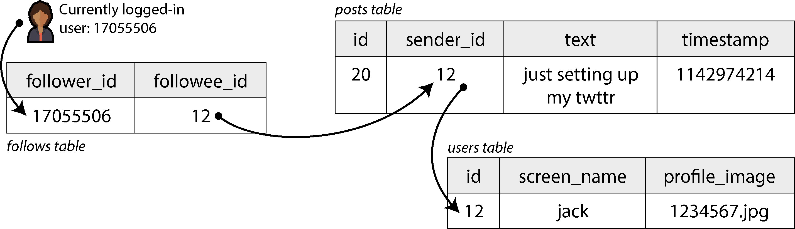
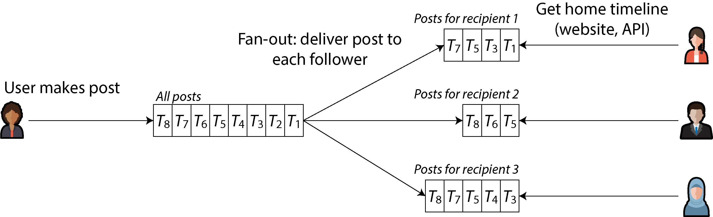
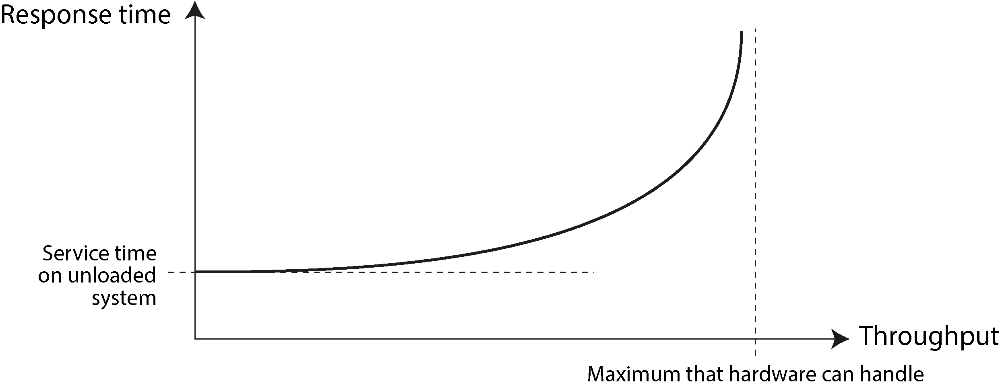
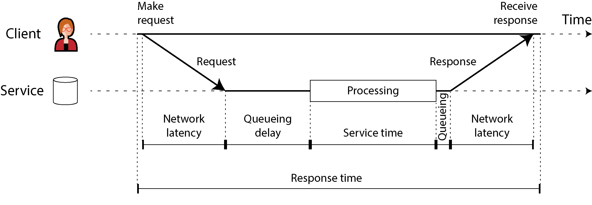
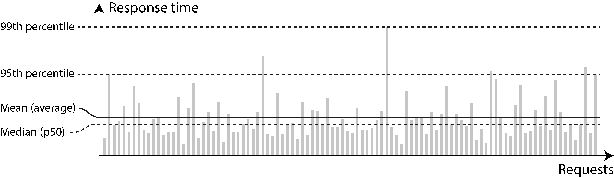
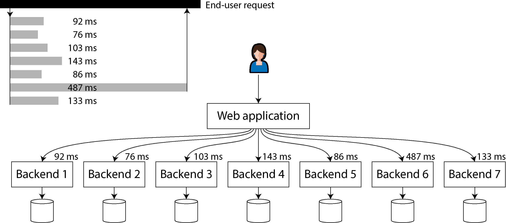

# Chương 2. Xác định các yêu cầu phi chức năng

> *Internet được làm tốt đến mức hầu hết mọi người coi nó như một tài nguyên thiên nhiên giống Thái Bình Dương, thay vì một thứ do con người tạo ra. Lần cuối cùng một công nghệ với quy mô như thế mà lại ít lỗi đến vậy là khi nào?*

> —Alan Kay, trong cuộc phỏng vấn với *Dr. Dobb’s Journal* (2012)

Nếu bạn đang xây dựng một ứng dụng, bạn sẽ được dẫn dắt bởi một danh sách các yêu cầu. Đứng đầu danh sách đó rất có thể là các chức năng mà ứng dụng phải cung cấp: bạn cần những màn hình nào, những nút bấm nào, và mỗi thao tác phải làm gì để hoàn thành mục đích của phần mềm. Đây là các *yêu cầu chức năng* (functional requirements) của bạn.

Ngoài ra, bạn có lẽ còn có các *yêu cầu phi chức năng* (nonfunctional requirements): ví dụ, ứng dụng phải nhanh, đáng tin cậy, an toàn, tuân thủ pháp luật và dễ bảo trì. Những yêu cầu này có thể không được viết ra một cách rõ ràng, vì chúng có vẻ khá hiển nhiên, nhưng chúng quan trọng không kém gì chức năng của ứng dụng; một ứng dụng chậm đến mức không chịu nổi hoặc không đáng tin cậy thì cũng chẳng khác gì không tồn tại.

Nhiều yêu cầu phi chức năng, chẳng hạn như bảo mật, nằm ngoài phạm vi của cuốn sách này. Nhưng chúng ta sẽ xem xét một vài yêu cầu, và chương này sẽ giúp bạn diễn đạt chúng cho hệ thống của chính mình. Cụ thể, chúng ta sẽ xem xét những điểm sau:

- Định nghĩa và đo lường *hiệu năng* (performance) của một hệ thống

- Một dịch vụ *đáng tin cậy* (reliable) nghĩa là gì—cụ thể là tiếp tục hoạt động đúng ngay cả khi có sự cố xảy ra

- Cho phép một hệ thống có *khả năng mở rộng* (scalable) bằng cách có những phương thức hiệu quả để bổ sung năng lực tính toán khi tải trên hệ thống tăng lên

- Làm cho việc bảo trì một hệ thống trong dài hạn trở nên dễ dàng hơn

Thuật ngữ được giới thiệu trong chương này cũng sẽ hữu ích trong các chương tiếp theo, khi chúng ta đi vào chi tiết cách các hệ thống thâm dụng dữ liệu (data-intensive) được triển khai. Tuy nhiên, các định nghĩa trừu tượng có thể khá khô khan; để làm cho các ý tưởng cụ thể hơn, chúng ta sẽ bắt đầu chương này bằng một nghiên cứu tình huống về một dịch vụ mạng xã hội, vốn sẽ cung cấp những ví dụ thực tế về hiệu năng và khả năng mở rộng.

## Nghiên cứu tình huống: Home timeline của mạng xã hội

Hãy tưởng tượng chúng ta được giao nhiệm vụ triển khai một mạng xã hội theo kiểu X (trước đây là Twitter), nơi người dùng có thể đăng bài và theo dõi (follow) những người dùng khác. Đây sẽ là một sự đơn giản hóa rất lớn so với cách một dịch vụ như vậy thực sự hoạt động [1, 2, 3], nhưng nó sẽ giúp minh họa một số vấn đề nảy sinh trong các hệ thống quy mô lớn.

Giả sử người dùng đăng tổng cộng 500 triệu bài mỗi ngày, tức trung bình 5,800 bài mỗi giây. Đôi khi, tốc độ này có thể tăng vọt lên tới 150,000 bài mỗi giây [4]. Cũng giả sử rằng một người dùng trung bình theo dõi 200 người và có 200 người theo dõi (follower) (mặc dù phạm vi biến thiên rất rộng: hầu hết mọi người chỉ có một số ít người theo dõi, còn một vài người nổi tiếng, như Barack Obama, có hơn 100 triệu người theo dõi).

### Biểu diễn người dùng, bài đăng và quan hệ theo dõi

Chúng ta lưu toàn bộ dữ liệu trong một cơ sở dữ liệu quan hệ (relational database), như minh họa trong Hình 2-1. Chúng ta có một bảng cho người dùng, một bảng cho bài đăng và một bảng cho các quan hệ theo dõi.



*Hình 2-1. Một schema quan hệ đơn giản cho mạng xã hội trong đó người dùng có thể theo dõi nhau*

Giả sử thao tác đọc chính mà mạng xã hội của chúng ta phải hỗ trợ là *home timeline*, hiển thị các bài đăng gần đây của những người mà người dùng đang theo dõi (để đơn giản, chúng ta sẽ bỏ qua quảng cáo, bài đăng gợi ý từ những người họ không theo dõi, và các phần mở rộng khác). Chúng ta có thể viết truy vấn SQL sau để lấy home timeline cho một người dùng cụ thể:

```
SELECT posts.*, users.* FROM posts
  JOIN follows ON posts.sender_id = follows.followee_id
  JOIN users   ON posts.sender_id = users.id
  WHERE follows.follower_id = current_user
  ORDER BY posts.timestamp DESC
  LIMIT 1000
```

Để thực thi truy vấn này, database sẽ dùng bảng `follows` để tìm tất cả những người mà `current_user` đang theo dõi, tra cứu các bài đăng gần đây của những người dùng đó, rồi sắp xếp chúng theo timestamp để lấy 1,000 bài đăng mới nhất của bất kỳ người dùng nào được theo dõi.

Bài đăng cần phải kịp thời, nên hãy giả sử rằng sau khi ai đó đăng bài, chúng ta muốn những người theo dõi họ có thể thấy bài đó trong vòng năm giây. Một cách tiếp cận là client của người dùng lặp lại truy vấn trên mỗi năm giây trong khi người dùng đang online (cách này được gọi là *polling*). Nếu giả sử có 10 triệu người dùng đang online và đăng nhập cùng lúc, điều đó có nghĩa là chạy truy vấn 2 triệu lần mỗi giây. Ngay cả khi chúng ta poll ít thường xuyên hơn, đây vẫn là một con số rất lớn.

Truy vấn này cũng khá tốn kém: nếu một người dùng theo dõi 200 người, truy vấn cần lấy danh sách các bài đăng gần đây của từng người trong 200 người đó và hợp nhất các danh sách này. Hai triệu truy vấn timeline mỗi giây nhân với 200 tài khoản được theo dõi cho ra 400 triệu lượt tra cứu mỗi giây—một con số khổng lồ. Và đó mới chỉ là trường hợp trung bình. Một số người dùng theo dõi hàng chục nghìn tài khoản; với họ, truy vấn này rất tốn kém để thực thi và khó làm cho nhanh.

### Vật chất hóa và cập nhật timeline

Làm sao chúng ta có thể làm tốt hơn? Thứ nhất, thay vì polling, sẽ tốt hơn nếu server chủ động đẩy (push) các bài đăng mới tới bất kỳ người theo dõi nào hiện đang online. Thứ hai, chúng ta nên tính toán trước (precompute) kết quả của truy vấn để yêu cầu xem home timeline của người dùng có thể được phục vụ từ cache.

Hãy tưởng tượng rằng với mỗi người dùng, chúng ta lưu một cấu trúc dữ liệu chứa home timeline của họ (tức là các bài đăng gần đây của những người họ đang theo dõi). Mỗi khi một người dùng đăng bài, chúng ta tra cứu tất cả người theo dõi của họ và chèn bài đăng đó vào home timeline của từng người theo dõi—giống như chuyển một bức thư vào hộp thư. Giờ đây khi một người dùng đăng nhập, chúng ta chỉ cần đưa cho họ home timeline đã được tính toán trước này. Hơn nữa, để nhận thông báo về bất kỳ bài đăng mới nào trên timeline của mình, client của người dùng chỉ cần subscribe vào luồng (stream) các bài đăng đang được thêm vào home timeline của họ.

Nhược điểm của cách tiếp cận này là giờ đây chúng ta phải làm nhiều việc hơn mỗi khi một người dùng đăng bài, vì các home timeline là dữ liệu dẫn xuất (derived data) cần được cập nhật. Quá trình này được minh họa trong Hình 2-2. Khi một yêu cầu ban đầu dẫn đến việc thực hiện nhiều yêu cầu hạ nguồn (downstream), chúng ta dùng thuật ngữ *fan-out* để mô tả hệ số mà số lượng yêu cầu tăng lên.



*Hình 2-2. Fan-out: chuyển bài đăng mới tới mọi người theo dõi của người dùng đã đăng bài*

Với tốc độ 5,800 bài đăng mỗi giây, nếu một bài đăng trung bình đến được 200 người theo dõi (tức hệ số fan-out là 200), chúng ta sẽ cần thực hiện hơn 1 triệu lượt ghi home timeline mỗi giây. Đây là con số lớn, nhưng vẫn là một khoản tiết kiệm đáng kể so với 400 triệu lượt tra cứu bài đăng theo từng người gửi mỗi giây mà nếu không chúng ta sẽ phải thực hiện.

Nếu tốc độ đăng bài tăng vọt do một sự kiện đặc biệt, chúng ta không nhất thiết phải chuyển bài vào timeline ngay lập tức—chúng ta có thể đưa chúng vào hàng đợi (queue) và chấp nhận rằng tạm thời các bài đăng sẽ mất lâu hơn một chút để xuất hiện trên timeline của người theo dõi. Ngay cả trong những đợt tải tăng vọt như vậy, timeline vẫn tải nhanh, vì chúng ta chỉ đơn giản phục vụ chúng từ cache.

Quá trình tính toán trước và cập nhật kết quả của một truy vấn này được gọi là *materialization* (vật chất hóa), và timeline cache là một ví dụ về *materialized view* (một khái niệm chúng ta sẽ thảo luận thêm trong các chương sau). Materialized view giúp tăng tốc việc đọc, nhưng đổi lại chúng ta phải làm nhiều việc hơn khi ghi. Chi phí ghi đối với hầu hết người dùng là khiêm tốn, nhưng một mạng xã hội cũng phải cân nhắc một số trường hợp cực đoan:

- Nếu một người dùng theo dõi một số lượng rất lớn tài khoản, và những tài khoản đó đăng bài nhiều, người dùng đó sẽ có tốc độ ghi cao vào timeline được vật chất hóa của họ. Tuy nhiên, người dùng đó nhiều khả năng không đọc hết mọi bài đăng trên timeline của mình, nên hoàn toàn có thể bỏ qua một số lượt ghi timeline và chỉ hiển thị cho người dùng một mẫu (sample) các bài đăng từ những tài khoản họ đang theo dõi [5].

- Khi một tài khoản người nổi tiếng với số lượng người theo dõi rất lớn đăng bài, chúng ta phải làm rất nhiều việc để chèn bài đăng đó vào home timeline của từng người trong hàng triệu người theo dõi họ. Trong trường hợp này, bỏ qua một số lượt ghi là không chấp nhận được. Một cách giải quyết vấn đề này là xử lý bài đăng của người nổi tiếng tách riêng khỏi bài đăng của những người khác: chúng ta có thể tiết kiệm công sức thêm bài đăng của người nổi tiếng vào hàng triệu timeline bằng cách lưu chúng riêng và hợp nhất chúng với timeline được vật chất hóa khi timeline được đọc. Bất chấp những tối ưu hóa như vậy, việc xử lý người nổi tiếng trên mạng xã hội có thể đòi hỏi rất nhiều hạ tầng [6].

## Mô tả hiệu năng

Hầu hết các thảo luận về hiệu năng phần mềm xem xét hai loại chỉ số (metric) chính:

- **Thời gian phản hồi (response time)**

  Khoảng thời gian trôi qua từ lúc người dùng gửi một yêu cầu cho đến khi họ nhận được câu trả lời mong muốn. Đơn vị đo là giây (hoặc mili giây, hoặc micro giây).

- **Thông lượng (throughput)**

  Số yêu cầu mỗi giây, hoặc khối lượng dữ liệu mỗi giây, mà hệ thống đang xử lý. Với một lượng tài nguyên phần cứng được cấp phát nhất định, có một *thông lượng tối đa* (maximum throughput) có thể xử lý được. Đơn vị đo là “một thứ gì đó mỗi giây.”

Trong nghiên cứu tình huống về mạng xã hội, “số bài đăng mỗi giây” và “số lượt ghi timeline mỗi giây” là các chỉ số thông lượng, trong khi “thời gian cần để tải home timeline” và “thời gian cho đến khi một bài đăng được chuyển tới người theo dõi” là các chỉ số thời gian phản hồi.

Thông lượng và thời gian phản hồi thường có liên quan với nhau. Một ví dụ về mối quan hệ như vậy đối với một dịch vụ trực tuyến được phác họa trong Hình 2-3. Dịch vụ có thời gian phản hồi thấp khi thông lượng yêu cầu thấp, nhưng thời gian phản hồi tăng lên khi tải tăng. Điều này là do *hàng đợi* (queueing): khi một yêu cầu đến một hệ thống đang chịu tải cao, CPU nhiều khả năng đang bận xử lý một yêu cầu trước đó, và do vậy yêu cầu mới đến phải chờ cho đến khi yêu cầu trước đó hoàn thành. Khi thông lượng tiến gần đến mức tối đa mà phần cứng có thể xử lý, độ trễ do hàng đợi tăng vọt.



*Hình 2-3. Khi thông lượng của một dịch vụ tiến gần đến năng lực của nó, thời gian phản hồi tăng lên đột biến do hàng đợi.*

#### KHI MỘT HỆ THỐNG QUÁ TẢI KHÔNG THỂ PHỤC HỒI

Nếu một hệ thống gần mức quá tải, với thông lượng bị đẩy sát tới giới hạn, đôi khi nó có thể rơi vào một vòng luẩn quẩn trong đó nó trở nên kém hiệu quả hơn và do đó càng quá tải hơn. Ví dụ, nếu một hàng dài các yêu cầu đang chờ được xử lý, thời gian phản hồi có thể tăng nhiều đến mức các client hết thời gian chờ (timeout) và gửi lại yêu cầu của mình. Điều này làm tốc độ yêu cầu tăng thêm nữa, khiến vấn đề càng tệ hơn—một *retry storm* (bão thử lại). Ngay cả khi tải đã giảm trở lại, một hệ thống như vậy có thể vẫn ở trong trạng thái quá tải cho đến khi được khởi động lại hoặc reset theo cách nào đó. Hiện tượng này được gọi là *metastable failure* (hỏng hóc siêu bền), và nó có thể gây ra những sự cố ngừng hoạt động nghiêm trọng trong các hệ thống production [7, 8, 9].

Để tránh việc thử lại làm quá tải một dịch vụ, bạn có thể tăng và ngẫu nhiên hóa khoảng thời gian giữa các lần thử lại liên tiếp ở phía client (*exponential backoff* [10, 11]) và tạm thời ngừng gửi yêu cầu tới một dịch vụ vừa trả về lỗi hoặc vừa hết thời gian chờ gần đây (bằng cách dùng *circuit breaker* [12, 13] hoặc thuật toán *token bucket* [14]). Server cũng có thể phát hiện khi nó đang tiến gần đến mức quá tải và bắt đầu chủ động từ chối các yêu cầu (*load shedding* [15]), hoặc gửi lại các phản hồi yêu cầu client giảm tốc độ (*backpressure* [1, 16]). Việc lựa chọn thuật toán hàng đợi và cân bằng tải (load balancing) cũng có thể tạo ra sự khác biệt [17].

Về các chỉ số hiệu năng, thời gian phản hồi thường là điều người dùng quan tâm nhất, trong khi thông lượng quyết định tài nguyên tính toán cần thiết (ví dụ, bạn cần bao nhiêu server) và do đó là chi phí để phục vụ một khối lượng công việc (workload) cụ thể. Nếu thông lượng có khả năng tăng vượt quá năng lực của phần cứng hiện tại, năng lực cần được mở rộng; một hệ thống được gọi là có *khả năng mở rộng* (scalable) nếu thông lượng tối đa của nó có thể được tăng đáng kể bằng cách bổ sung tài nguyên tính toán.

Trong phần này chúng ta sẽ tập trung chủ yếu vào thời gian phản hồi, và chúng ta sẽ quay lại với thông lượng và khả năng mở rộng trong “Khả năng mở rộng”.

### Độ trễ và thời gian phản hồi

“Latency” (độ trễ) và “response time” (thời gian phản hồi) đôi khi được dùng thay thế cho nhau, nhưng trong cuốn sách này chúng ta sẽ dùng hai thuật ngữ này cùng một vài thuật ngữ liên quan theo một cách cụ thể (minh họa trong Hình 2-4):

- *Thời gian phản hồi* (response time) là những gì client nhìn thấy; nó bao gồm mọi độ trễ phát sinh ở bất kỳ đâu trong hệ thống.

- *Thời gian phục vụ* (service time) là khoảng thời gian dịch vụ đang tích cực xử lý yêu cầu của client.

- *Độ trễ do hàng đợi* (queueing delay) có thể xảy ra ở nhiều điểm trong luồng xử lý—ví dụ, sau khi một yêu cầu được nhận, nó có thể phải chờ cho đến khi có CPU rảnh trước khi được xử lý, hoặc một gói tin phản hồi có thể phải được lưu tạm (buffer) trước khi gửi qua mạng nếu các tác vụ khác trên cùng máy đang gửi nhiều dữ liệu qua giao diện mạng đầu ra. *Latency* (độ trễ) là một thuật ngữ bao quát cho khoảng thời gian mà một yêu cầu không được tích cực xử lý—tức là khoảng thời gian nó ở trạng thái *tiềm ẩn* (latent). Cụ thể, *network latency* (độ trễ mạng) hay *network delay* chỉ khoảng thời gian mà yêu cầu và phản hồi dành để di chuyển qua mạng.



*Hình 2-4. Thời gian phản hồi, thời gian phục vụ, độ trễ mạng và độ trễ do hàng đợi*

Trong Hình 2-4, thời gian chạy từ trái sang phải; mỗi node giao tiếp được thể hiện bằng một đường ngang, và một thông điệp (message) yêu cầu hay phản hồi được thể hiện bằng một mũi tên chéo đậm từ node này sang node khác. Bạn sẽ thường xuyên gặp kiểu sơ đồ này trong suốt cuốn sách.

Thời gian phản hồi có thể thay đổi đáng kể từ yêu cầu này sang yêu cầu khác, ngay cả khi bạn cứ lặp lại cùng một yêu cầu hết lần này đến lần khác. Nhiều yếu tố có thể thêm vào những độ trễ ngẫu nhiên—ví dụ, một lần chuyển ngữ cảnh (context switch) sang một tiến trình nền, việc mất một gói tin mạng và TCP truyền lại, một lần tạm dừng để garbage collection, một page fault buộc phải đọc từ đĩa, hoặc rung động cơ học trong rack server [18]. Chúng ta sẽ thảo luận chủ đề này chi tiết hơn trong “Timeout và độ trễ không giới hạn”.

Độ trễ do hàng đợi thường chiếm phần lớn sự biến thiên trong thời gian phản hồi. Vì một server chỉ có thể xử lý song song một số lượng nhỏ công việc (bị giới hạn, ví dụ, bởi số lõi CPU của nó), chỉ cần một số ít yêu cầu chậm là đủ để cản trở việc xử lý các yêu cầu tiếp theo—một hiệu ứng được gọi là *head-of-line blocking*. Ngay cả khi các yêu cầu tiếp theo đó có thời gian phục vụ nhanh, client vẫn sẽ thấy thời gian phản hồi tổng thể chậm do phải chờ yêu cầu trước đó hoàn thành. Độ trễ do hàng đợi không phải là một phần của thời gian phục vụ, và vì lý do này, việc đo thời gian phản hồi ở phía client là rất quan trọng.

### Trung bình, trung vị và percentile

Vì thời gian phản hồi thay đổi từ yêu cầu này sang yêu cầu khác, chúng ta cần coi nó không phải là một con số đơn lẻ, mà là một *phân phối* (distribution) các giá trị mà chúng ta có thể đo được. Trong Hình 2-5, mỗi thanh màu xám biểu thị một yêu cầu tới một dịch vụ, và chiều cao của nó cho thấy yêu cầu đó mất bao lâu. Hầu hết các yêu cầu khá nhanh, nhưng đôi khi có những *giá trị ngoại lai* (outlier) mất nhiều thời gian hơn hẳn. Sự biến thiên trong độ trễ mạng còn được gọi là *jitter*.



*Hình 2-5. Minh họa giá trị trung bình và các percentile: thời gian phản hồi của một mẫu 100 yêu cầu tới một dịch vụ*

Người ta thường báo cáo thời gian phản hồi *trung bình* (average) của một dịch vụ (về mặt kỹ thuật là *trung bình cộng* (arithmetic mean), được tính bằng cách cộng tất cả các thời gian phản hồi rồi chia cho số yêu cầu). Thời gian phản hồi trung bình hữu ích để ước lượng giới hạn thông lượng [19]. Tuy nhiên, giá trị trung bình không phải là một chỉ số tốt lắm nếu bạn muốn biết thời gian phản hồi “điển hình” của mình, vì nó không cho bạn biết có bao nhiêu người dùng thực sự trải qua độ trễ đó.

Thường thì dùng *percentile* sẽ tốt hơn. Nếu bạn lấy danh sách thời gian phản hồi và sắp xếp từ nhanh nhất đến chậm nhất, *trung vị* (median) là điểm ở chính giữa—ví dụ, nếu thời gian phản hồi trung vị của bạn là 200 ms, điều đó có nghĩa là một nửa số yêu cầu trả về trong chưa đến 200 mili giây (ms), và một nửa số yêu cầu mất lâu hơn. Điều này khiến trung vị trở thành một chỉ số tốt nếu bạn muốn biết người dùng thường phải chờ bao lâu. Trung vị còn được gọi là *percentile thứ 50* (50th percentile), đôi khi viết tắt là *p50*.

Để đánh giá các giá trị ngoại lai của bạn tệ đến mức nào, bạn có thể xem các percentile cao hơn: *percentile thứ 95*, *thứ 99* và *thứ 99.9* là phổ biến (viết tắt là *p95*, *p99* và *p999*). Ví dụ, nếu thời gian phản hồi ở percentile thứ 95 là 1.5 giây, điều đó có nghĩa là 95 trong 100 yêu cầu mất chưa đến 1.5 giây, và 5 trong 100 yêu cầu mất từ 1.5 giây trở lên. Điều này được minh họa trong Hình 2-5.

Các percentile thời gian phản hồi cao, còn được gọi là *tail latency* (độ trễ đuôi), rất quan trọng vì chúng ảnh hưởng trực tiếp đến trải nghiệm của người dùng với dịch vụ. Ví dụ, Amazon mô tả các yêu cầu về thời gian phản hồi cho các dịch vụ nội bộ theo percentile thứ 99.9, mặc dù điều này chỉ ảnh hưởng đến 1 trong 1,000 yêu cầu. Lý do là những khách hàng có yêu cầu chậm nhất thường là những người có nhiều dữ liệu nhất trong tài khoản của họ, vì họ đã mua hàng nhiều lần—tức là họ là những khách hàng có giá trị nhất [20]. Việc giữ cho những khách hàng đó hài lòng bằng cách đảm bảo website nhanh đối với họ là rất quan trọng.

Việc tối ưu hóa percentile thứ 99.99 (1 trong 10,000 yêu cầu chậm nhất) được cho là quá tốn kém và được nhận thấy là không mang lại đủ lợi ích cho mục đích của Amazon. Giảm thời gian phản hồi ở các percentile rất cao là khó vì chúng dễ bị ảnh hưởng bởi các sự kiện ngẫu nhiên nằm ngoài tầm kiểm soát của bạn, và lợi ích thu được ngày càng giảm dần.

#### TÁC ĐỘNG CỦA THỜI GIAN PHẢN HỒI ĐỐI VỚI NGƯỜI DÙNG

Có vẻ hiển nhiên rằng một dịch vụ nhanh thì tốt hơn cho người dùng so với một dịch vụ chậm [21]. Tuy nhiên, thật đáng ngạc nhiên là rất khó để có được dữ liệu đáng tin cậy nhằm định lượng tác động của độ trễ đối với hành vi người dùng.

Một số thống kê thường được trích dẫn lại không đáng tin cậy. Ví dụ, năm 2006, Google báo cáo rằng việc kết quả tìm kiếm chậm đi từ 400 ms lên 900 ms đi kèm với mức giảm 20% lưu lượng và doanh thu [22]. Tuy nhiên, một nghiên cứu khác của Google từ năm 2009 lại báo cáo rằng độ trễ tăng thêm 400 ms chỉ dẫn đến số lượt tìm kiếm mỗi ngày giảm 0.6% [23], và cùng năm đó Bing nhận thấy thời gian tải tăng thêm hai giây làm giảm doanh thu quảng cáo 4.3% [24]. Dữ liệu mới hơn từ các công ty này có vẻ không được công khai.

Một nghiên cứu gần đây hơn của Akamai khẳng định rằng thời gian phản hồi tăng thêm 100 ms làm giảm tỷ lệ chuyển đổi (conversion rate) của các trang thương mại điện tử tới 7% [25]; tuy nhiên, khi xem xét kỹ hơn, chính nghiên cứu này lại cho thấy thời gian tải trang rất *nhanh* cũng tương quan với tỷ lệ chuyển đổi thấp hơn! Kết quả có vẻ nghịch lý này được giải thích bởi thực tế là những trang tải nhanh nhất thường là những trang không có nội dung hữu ích (ví dụ, trang lỗi 404). Tuy nhiên, vì nghiên cứu này không hề cố gắng tách biệt tác động của nội dung trang khỏi tác động của thời gian tải, kết quả của nó có lẽ không có ý nghĩa.

Một nghiên cứu của Yahoo thực hiện vào năm sau đó đã so sánh tỷ lệ nhấp (click-through rate) trên các kết quả tìm kiếm tải nhanh so với tải chậm, có kiểm soát chất lượng kết quả tìm kiếm [26]. Nghiên cứu này báo cáo số lượt nhấp nhiều hơn 20%–30% trên các tìm kiếm nhanh khi sự khác biệt giữa phản hồi nhanh và chậm là từ 1.25 giây trở lên.

### Sử dụng các chỉ số thời gian phản hồi

Các percentile cao đặc biệt quan trọng trong các dịch vụ backend được gọi nhiều lần trong quá trình phục vụ một yêu cầu duy nhất của người dùng cuối. Ngay cả khi bạn thực hiện các lời gọi song song, yêu cầu vẫn phải chờ lời gọi song song chậm nhất hoàn thành. Chỉ cần một lời gọi chậm là đủ làm chậm toàn bộ yêu cầu của người dùng cuối, như minh họa trong Hình 2-6. Ngay cả khi chỉ một tỷ lệ nhỏ các lời gọi backend là chậm, khả năng gặp một lời gọi chậm tăng lên nếu một yêu cầu của người dùng cuối đòi hỏi nhiều lời gọi backend, nên một tỷ lệ cao hơn các yêu cầu của người dùng cuối như vậy cuối cùng bị chậm (một hiệu ứng được gọi là *tail latency amplification* (khuếch đại độ trễ đuôi) [27]).



*Hình 2-6. Khi cần nhiều lời gọi backend để phục vụ một yêu cầu, chỉ một lời gọi chậm duy nhất cũng có thể làm chậm toàn bộ yêu cầu của người dùng cuối.*

Các percentile thường được dùng trong *service level objective* (SLO — mục tiêu mức dịch vụ) và *service level agreement* (SLA — thỏa thuận mức dịch vụ) như những cách để xác định hiệu năng và tính sẵn sàng (availability) kỳ vọng của một dịch vụ [28]. Ví dụ, một SLO có thể đặt mục tiêu cho một dịch vụ là có thời gian phản hồi trung vị dưới 200 ms và percentile thứ 99 dưới 1 giây, cùng mục tiêu rằng ít nhất 99.9% các yêu cầu hợp lệ nhận được phản hồi không lỗi. Một SLA là một hợp đồng quy định điều gì sẽ xảy ra nếu SLO không được đáp ứng (ví dụ, khách hàng có thể được hoàn tiền). Ít nhất thì đó là ý tưởng cơ bản; trên thực tế, việc định nghĩa các chỉ số tính sẵn sàng tốt cho SLO và SLA không hề đơn giản [29, 30].

#### TÍNH TOÁN PERCENTILE

Nếu bạn muốn thêm các percentile của thời gian phản hồi (response time) vào bảng điều khiển giám sát (monitoring dashboard) cho các dịch vụ của mình, bạn cần tính toán chúng một cách hiệu quả và liên tục. Ví dụ, bạn có thể muốn duy trì một cửa sổ trượt (rolling window) chứa thời gian phản hồi của các request trong 10 phút gần nhất. Mỗi phút, bạn tính trung vị (median) và các percentile khác nhau trên các giá trị trong cửa sổ đó rồi vẽ những chỉ số này lên đồ thị.

Cách triển khai đơn giản nhất là giữ một danh sách thời gian phản hồi của tất cả các request trong cửa sổ thời gian đó và sắp xếp danh sách này mỗi phút. Nếu cách đó quá kém hiệu quả đối với bạn, có những thuật toán có thể tính xấp xỉ tốt các percentile với chi phí CPU và bộ nhớ tối thiểu. Các thư viện mã nguồn mở ước lượng percentile bao gồm HdrHistogram [31], t-digest [32, 33], OpenHistogram [34] và DDSketch [35].

Hãy lưu ý rằng việc lấy trung bình các percentile (ví dụ, để giảm độ phân giải thời gian hoặc để kết hợp dữ liệu từ nhiều máy) là vô nghĩa về mặt toán học. Cách đúng để tổng hợp dữ liệu thời gian phản hồi là cộng các histogram lại với nhau [36].

## Độ tin cậy và khả năng chịu lỗi

Ai cũng có một ý niệm trực quan về việc một thứ gì đó đáng tin cậy hay không đáng tin cậy nghĩa là gì. Đối với phần mềm, những kỳ vọng điển hình bao gồm:

- Ứng dụng thực hiện đúng chức năng mà người dùng mong đợi. Ứng dụng có thể chịu được việc người dùng mắc lỗi hoặc sử dụng phần mềm theo những cách không lường trước.

- Hiệu năng của nó đủ tốt cho trường hợp sử dụng được yêu cầu, dưới mức tải và khối lượng dữ liệu dự kiến.

- Hệ thống ngăn chặn mọi truy cập trái phép và hành vi lạm dụng.

Nếu tất cả những điều đó gộp lại có nghĩa là “hoạt động đúng”, thì chúng ta có thể hiểu *độ tin cậy* (reliability), một cách đại khái, là “tiếp tục hoạt động đúng, ngay cả khi có sự cố xảy ra”. Để nói chính xác hơn về những sự cố này, chúng ta sẽ phân biệt giữa fault (lỗi) và failure (hỏng hóc) [37, 38, 39]:

- **Fault**

  Một fault xảy ra khi một *bộ phận* cụ thể của hệ thống ngừng hoạt động đúng—ví dụ, khi một ổ cứng đơn lẻ bị trục trặc, hoặc một máy đơn lẻ bị crash, hoặc một dịch vụ bên ngoài (mà hệ thống phụ thuộc vào) bị gián đoạn.

- **Failure**

  Một failure xảy ra khi hệ thống *xét như một tổng thể* ngừng cung cấp dịch vụ được yêu cầu cho người dùng—nói cách khác, khi nó không đáp ứng được SLO.

Sự phân biệt giữa fault và failure có thể gây nhầm lẫn vì chúng thực chất là cùng một thứ, chỉ ở những cấp độ khác nhau. Ví dụ, nếu một ổ cứng ngừng hoạt động, ta nói rằng ổ cứng đó đã hỏng (failed); nếu hệ thống chỉ gồm duy nhất ổ cứng đó, thì nó đã ngừng cung cấp dịch vụ được yêu cầu và do đó cũng đã gặp failure. Tuy nhiên, nếu hệ thống gồm nhiều ổ cứng, việc một ổ cứng hỏng chỉ là một fault khi nhìn từ góc độ của hệ thống lớn hơn, và hệ thống lớn hơn có thể chịu được fault đó bằng cách giữ một bản sao dữ liệu trên một ổ cứng khác.

### Khả năng chịu lỗi

Chúng ta gọi một hệ thống là *chịu lỗi* (fault-tolerant) nếu nó tiếp tục cung cấp dịch vụ được yêu cầu cho người dùng bất chấp một số fault nhất định xảy ra. Nếu một hệ thống không thể chịu được việc một bộ phận nào đó gặp lỗi, chúng ta gọi bộ phận đó là *single point of failure* (SPOF, điểm hỏng đơn lẻ), vì một fault ở bộ phận đó sẽ leo thang thành failure của toàn hệ thống.

Ví dụ, trong tình huống nghiên cứu về mạng xã hội, một fault có thể xảy ra là trong quá trình fan-out, một máy tham gia cập nhật các timeline được vật chất hóa (materialized timeline) bị crash hoặc trở nên không khả dụng. Để làm cho quá trình này chịu lỗi, chúng ta cần đảm bảo rằng một máy khác có thể tiếp quản nhiệm vụ này mà không bỏ sót bất kỳ bài đăng nào đáng lẽ phải được chuyển đi, và cũng không trùng lặp bài đăng nào. (Ý tưởng này được gọi là *exactly-once semantics*, và chúng ta sẽ xem xét nó chi tiết trong Chương 12.)

Khả năng chịu lỗi luôn bị giới hạn ở một số lượng nhất định của một số loại fault nhất định. Ví dụ, một hệ thống có thể chịu được tối đa hai ổ cứng hỏng cùng lúc, hoặc tối đa một trong ba node bị crash. Sẽ không hợp lý nếu đòi chịu được số lượng fault bất kỳ; nếu tất cả các node đều crash thì chẳng thể làm gì được. Nếu toàn bộ Trái Đất (cùng mọi máy chủ trên đó) bị một lỗ đen nuốt chửng, thì để chịu được fault đó sẽ cần đến dịch vụ web hosting ngoài không gian—chúc bạn may mắn khi xin duyệt khoản ngân sách này.

Trái với trực giác, trong những hệ thống chịu lỗi như vậy, việc *tăng* tỷ lệ fault bằng cách cố ý kích hoạt chúng có thể là hợp lý—ví dụ, bằng cách ngẫu nhiên kill từng process mà không báo trước. Điều này được gọi là *fault injection* (tiêm lỗi). Nhiều bug nghiêm trọng thực ra bắt nguồn từ việc xử lý lỗi kém [40]; bằng cách cố ý gây ra fault, bạn đảm bảo rằng bộ máy chịu lỗi được vận hành và kiểm thử liên tục, từ đó có thể tăng sự tin tưởng của bạn rằng các fault sẽ được xử lý đúng khi chúng xảy ra một cách tự nhiên. *Chaos engineering* là một lĩnh vực nhằm nâng cao sự tin tưởng vào các cơ chế chịu lỗi thông qua những thí nghiệm như cố ý tiêm lỗi [41].

Mặc dù nhìn chung chúng ta ưu tiên chịu lỗi hơn là ngăn ngừa lỗi, trong một số trường hợp phòng bệnh vẫn tốt hơn chữa bệnh (ví dụ, vì không tồn tại cách chữa nào). Đây là trường hợp của các vấn đề bảo mật chẳng hạn; nếu kẻ tấn công đã xâm nhập hệ thống và giành được quyền truy cập vào dữ liệu nhạy cảm, sự kiện đó không thể đảo ngược. Tuy nhiên, cuốn sách này chủ yếu bàn về những loại fault có thể chữa được, như mô tả trong các mục tiếp theo.

### Lỗi phần cứng và lỗi phần mềm

Khi nghĩ về các nguyên nhân gây hỏng hóc hệ thống, lỗi phần cứng (hardware fault) nhanh chóng hiện lên trong đầu:

- Khoảng 2%–5% ổ cứng từ tính hỏng mỗi năm [42, 43]; do đó trong một cluster lưu trữ với 10.000 đĩa, trung bình chúng ta nên dự kiến có một đĩa hỏng mỗi ngày. Dữ liệu gần đây cho thấy đĩa đang ngày càng đáng tin cậy hơn, nhưng tỷ lệ hỏng hóc vẫn đáng kể [44]. Khoảng 0,5%–1% ổ đĩa thể rắn (SSD) hỏng mỗi năm [45]. Một số ít lỗi bit được sửa tự động [46], nhưng các lỗi không thể sửa xảy ra khoảng một lần mỗi năm trên mỗi ổ, kể cả ở những ổ còn khá mới (tức là ít bị hao mòn). Tỷ lệ lỗi này cao hơn so với ổ cứng từ tính [47, 48]. Các linh kiện phần cứng khác (như bộ nguồn, bộ điều khiển RAID và các mô-đun bộ nhớ) cũng hỏng, dù ít thường xuyên hơn ổ cứng [49, 50].

- Khoảng 1 trong 1.000 máy có một nhân CPU đôi khi tính ra kết quả sai, nhiều khả năng do khiếm khuyết trong sản xuất [51, 52, 53]. Trong một số trường hợp, một phép tính sai dẫn đến crash, nhưng trong những trường hợp khác nó chỉ đơn giản làm chương trình trả về kết quả sai.

- Dữ liệu trong RAM có thể bị hỏng, do các sự kiện ngẫu nhiên như tia vũ trụ hoặc do các khiếm khuyết vật lý vĩnh viễn. Ngay cả khi dùng bộ nhớ có mã sửa lỗi (ECC), hơn 1% số máy gặp phải một lỗi không thể sửa trong một năm bất kỳ, điều này thường dẫn đến việc máy bị crash và mô-đun bộ nhớ bị ảnh hưởng cần được thay thế [54]. Hơn nữa, một số mẫu truy cập bộ nhớ bất thường (pathological) có thể đảo bit với xác suất cao [55]. Toàn bộ một datacenter có thể trở nên không khả dụng (ví dụ, do mất điện hoặc cấu hình mạng sai) hoặc thậm chí bị phá hủy vĩnh viễn (ví dụ, do hỏa hoạn, lũ lụt hoặc động đất [56]). Một cơn bão mặt trời, vốn tạo ra dòng điện lớn trong các đường dây dài khi mặt trời phóng ra một khối lượng lớn hạt mang điện, có thể làm hư hại lưới điện và các tuyến cáp mạng dưới biển [57]. Mặc dù những hỏng hóc quy mô lớn như vậy là hiếm, tác động của chúng có thể là thảm khốc nếu một dịch vụ không thể chịu được việc mất một datacenter [58].

Những sự kiện này đủ hiếm để bạn thường không cần lo lắng về chúng khi làm việc trên một hệ thống nhỏ, miễn là bạn có thể dễ dàng thay thế phần cứng bị lỗi. Tuy nhiên, trong một hệ thống quy mô lớn, lỗi phần cứng xảy ra thường xuyên đến mức chúng trở thành một phần của hoạt động bình thường của hệ thống.

#### Chịu lỗi phần cứng thông qua dự phòng

Phản ứng đầu tiên của chúng ta trước phần cứng không đáng tin cậy thường là thêm dự phòng (redundancy) cho từng linh kiện phần cứng nhằm giảm tỷ lệ hỏng hóc của hệ thống. Đĩa có thể được thiết lập theo cấu hình RAID (phân tán dữ liệu trên nhiều đĩa trong cùng một máy để một đĩa hỏng không gây mất dữ liệu), máy chủ có thể có hai bộ nguồn và CPU có thể thay nóng (hot-swappable), và datacenter có thể có pin và máy phát diesel để cấp điện dự phòng. Sự dự phòng như vậy thường có thể giữ cho một máy chạy liên tục trong nhiều năm.

Dự phòng hiệu quả nhất khi các fault của linh kiện là độc lập với nhau—tức là khi việc một fault xảy ra không làm thay đổi khả năng xảy ra của một fault khác. Tuy nhiên, kinh nghiệm cho thấy có những mối tương quan đáng kể giữa các hỏng hóc của linh kiện [43, 59, 60]. Việc toàn bộ một rack máy chủ hoặc toàn bộ một datacenter trở nên không khả dụng vẫn xảy ra thường xuyên hơn chúng ta mong muốn.

Dự phòng phần cứng làm tăng thời gian hoạt động (uptime) của một máy đơn lẻ; tuy nhiên, như đã thảo luận trong “Hệ phân tán so với hệ đơn nút”, việc dùng một hệ phân tán có những lợi thế, chẳng hạn khả năng chịu được việc một datacenter ngừng hoạt động hoàn toàn. Vì lý do này, các hệ thống cloud có xu hướng ít tập trung vào độ tin cậy của từng máy riêng lẻ mà thay vào đó hướng tới việc làm cho dịch vụ có tính sẵn sàng cao bằng cách chịu được các node bị lỗi ở tầng phần mềm. Các nhà cung cấp cloud dùng *availability zone* để xác định những tài nguyên nào được đặt cùng vị trí vật lý; các tài nguyên ở cùng một nơi có nhiều khả năng hỏng đồng thời hơn so với các tài nguyên tách biệt về địa lý.

Các kỹ thuật chịu lỗi mà chúng ta thảo luận trong cuốn sách này được thiết kế để chịu được việc mất toàn bộ máy, rack hoặc availability zone. Chúng thường hoạt động bằng cách cho phép một máy ở một datacenter tiếp quản khi một máy ở datacenter khác hỏng hoặc không thể liên lạc được. Chúng ta sẽ thảo luận các kỹ thuật chịu lỗi như vậy trong Chương 6, Chương 10 và nhiều điểm khác trong cuốn sách này.

Các hệ thống có thể chịu được việc mất toàn bộ máy cũng có những lợi thế về vận hành. Một hệ thống đơn máy chủ đòi hỏi thời gian ngừng hoạt động theo kế hoạch (planned downtime) nếu bạn cần khởi động lại máy (ví dụ, để áp dụng các bản vá bảo mật cho hệ điều hành), trong khi một hệ thống đa node chịu lỗi có thể được vá bằng cách khởi động lại từng node một, mà không ảnh hưởng đến dịch vụ cho người dùng. Điều này được gọi là *rolling upgrade*, và chúng ta sẽ thảo luận thêm về nó trong Chương 5.

#### Lỗi phần mềm

Mặc dù các hỏng hóc phần cứng có thể có tương quan yếu, chúng vẫn chủ yếu là độc lập—ví dụ, nếu một đĩa hỏng, các đĩa khác trong cùng máy nhiều khả năng vẫn ổn, ít nhất là trong một khoảng thời gian. Ngược lại, lỗi phần mềm (software fault) thường có tương quan rất cao, vì việc nhiều node chạy cùng một phần mềm và do đó có cùng những bug là điều phổ biến [61, 62]. Những fault như vậy khó lường trước hơn, và chúng có xu hướng gây ra nhiều hỏng hóc hệ thống hơn hẳn so với các lỗi phần cứng không tương quan [49]. Các ví dụ bao gồm:

- Một bug phần mềm khiến mọi node hỏng cùng lúc trong những tình huống cụ thể. Chẳng hạn, vào ngày 30 tháng 6 năm 2012, một giây nhuận (leap second) đã khiến nhiều ứng dụng Java bị treo đồng thời do một bug trong nhân Linux, làm sập nhiều dịch vụ internet [63]. Và do một bug firmware, tất cả SSD của một số model nhất định đột ngột hỏng sau đúng 32.768 giờ hoạt động (chưa đến bốn năm), khiến dữ liệu trên chúng không thể khôi phục [64].

- Một process chạy mất kiểm soát (runaway process) tiêu tốn hết một tài nguyên dùng chung có giới hạn, như thời gian CPU, bộ nhớ, dung lượng đĩa, băng thông mạng hoặc thread [65]. Chẳng hạn, một process tiêu tốn quá nhiều bộ nhớ khi xử lý một request lớn có thể bị hệ điều hành kill, hoặc một bug trong thư viện client có thể gây ra lượng request cao hơn nhiều so với dự kiến [66].

- Một dịch vụ mà hệ thống phụ thuộc vào bị chậm lại, ngừng phản hồi hoặc bắt đầu trả về các response bị hỏng.

- Sự tương tác giữa các hệ thống khác nhau dẫn đến hành vi nảy sinh (emergent behavior) không xuất hiện khi mỗi hệ thống được kiểm thử riêng lẻ [67]. Hỏng hóc dây chuyền (cascading failure), trong đó một vấn đề ở một thành phần khiến thành phần khác bị quá tải và chậm lại, rồi đến lượt nó làm sập một thành phần khác nữa [68, 69].

Những bug gây ra các loại lỗi phần mềm này thường nằm im trong thời gian dài cho đến khi bị kích hoạt bởi một tập hợp tình huống bất thường. Trong những tình huống đó, người ta phát hiện ra rằng phần mềm đang đưa ra một giả định nào đó về môi trường của nó—và trong khi giả định đó *thường* đúng, đến một lúc nào đó nó không còn đúng nữa vì lý do nào đó [70, 71].

Vấn đề về lỗi mang tính hệ thống (systematic fault) trong phần mềm không có giải pháp nhanh gọn. Nhiều điều nhỏ có thể giúp ích: suy nghĩ cẩn thận về các giả định và tương tác trong hệ thống; kiểm thử kỹ lưỡng; đảm bảo cô lập process; cho phép process crash và khởi động lại; tránh các vòng phản hồi như retry storm (xem “Khi một hệ thống quá tải không thể phục hồi”); đo lường, giám sát và phân tích hành vi hệ thống trong môi trường production.

### Con người và độ tin cậy

Con người thiết kế và xây dựng các hệ thống phần mềm, và những người vận hành (operator) giữ cho hệ thống chạy cũng là con người. Không giống máy móc, con người không chỉ đơn thuần tuân theo quy tắc; một trong những thế mạnh của họ là sự sáng tạo và khả năng thích ứng để hoàn thành công việc. Tuy nhiên, đặc điểm này cũng dẫn đến tính khó lường, và đôi khi là những sai lầm có thể dẫn đến hỏng hóc, bất chấp ý định tốt nhất. Ví dụ, một nghiên cứu về các dịch vụ internet lớn cho thấy các thay đổi cấu hình do người vận hành thực hiện là nguyên nhân hàng đầu gây gián đoạn dịch vụ, trong khi lỗi phần cứng (máy chủ hoặc mạng) chỉ đóng vai trò trong 10%–25% các trường hợp [72].

Thật hấp dẫn khi gán nhãn những vấn đề như vậy là “lỗi con người” (human error) và mong rằng chúng có thể được giải quyết bằng cách kiểm soát hành vi con người chặt chẽ hơn thông qua các quy trình nghiêm ngặt hơn và việc tuân thủ quy tắc. Tuy nhiên, đổ lỗi cho con người vì những sai lầm là phản tác dụng. Cái mà chúng ta gọi là “lỗi con người” thực ra không phải là nguyên nhân của sự cố, mà là một triệu chứng của vấn đề trong hệ thống kỹ thuật-xã hội (sociotechnical system), nơi con người đang cố gắng hết sức để làm tốt công việc của mình [73]. Các hệ thống phức tạp thường có hành vi nảy sinh, trong đó những tương tác không lường trước giữa các thành phần cũng có thể dẫn đến hỏng hóc [74].

Nhiều biện pháp kỹ thuật có thể giúp giảm thiểu tác động của sai lầm con người, bao gồm kiểm thử kỹ lưỡng (cả các bài kiểm thử viết tay lẫn *property testing* trên nhiều đầu vào ngẫu nhiên) [40], các cơ chế rollback để nhanh chóng hoàn tác các thay đổi cấu hình, triển khai mã mới theo từng bước (gradual rollout), giám sát chi tiết và rõ ràng, các công cụ quan sát (observability) để chẩn đoán sự cố trong production (xem “Các vấn đề của hệ phân tán”), và các giao diện được thiết kế tốt nhằm khuyến khích “làm điều đúng” và cản trở “làm điều sai”.

Tuy nhiên, tất cả những điều này đều đòi hỏi đầu tư thời gian và tiền bạc, và trong thực tế kinh doanh thường ngày, các tổ chức thường ưu tiên những hoạt động tạo ra doanh thu hơn các biện pháp giúp tăng khả năng chống chịu (resilience) của hệ thống trước sai lầm. Khi phải chọn giữa thêm tính năng và thêm kiểm thử, nhiều tổ chức—một cách dễ hiểu—chọn tính năng. Rồi khi một sai lầm vốn có thể ngăn ngừa được tất yếu xảy ra, việc đổ lỗi cho người mắc sai lầm là vô nghĩa; vấn đề nằm ở các ưu tiên của tổ chức.

Ngày càng nhiều tổ chức đang áp dụng văn hóa *blameless postmortem* (mổ xẻ sự cố không đổ lỗi): sau một sự cố, những người liên quan được khuyến khích chia sẻ đầy đủ chi tiết về những gì đã xảy ra mà không sợ bị trừng phạt, vì điều này cho phép những người khác trong tổ chức học được cách ngăn ngừa các vấn đề tương tự trong tương lai [75]. Quá trình này có thể phát hiện ra nhu cầu thay đổi các ưu tiên kinh doanh, đầu tư vào những lĩnh vực bị bỏ bê, thay đổi cơ chế khuyến khích cho những người liên quan, hoặc đưa một vấn đề hệ thống khác đến sự chú ý của ban quản lý.

Về nguyên tắc chung, khi điều tra một sự cố, bạn nên hoài nghi những câu trả lời quá đơn giản. “Bob đáng lẽ nên cẩn thận hơn khi triển khai thay đổi đó” là không hữu ích, nhưng “Chúng ta phải viết lại backend bằng Haskell” cũng vậy. Thay vào đó, ban quản lý nên nắm lấy cơ hội này để tìm hiểu chi tiết cách hệ thống kỹ thuật-xã hội vận hành từ góc nhìn của những người làm việc với nó hằng ngày, và thực hiện các bước cải thiện dựa trên phản hồi này [73].

#### ĐỘ TIN CẬY QUAN TRỌNG ĐẾN MỨC NÀO?

Độ tin cậy không chỉ dành cho các nhà máy điện hạt nhân và kiểm soát không lưu; những ứng dụng đời thường hơn cũng được kỳ vọng hoạt động đáng tin cậy. Bug trong các ứng dụng kinh doanh dẫn đến mất năng suất (và rủi ro pháp lý nếu số liệu được báo cáo sai), và sự gián đoạn của các trang thương mại điện tử có thể gây tổn thất lớn về doanh thu bị mất và thiệt hại về uy tín.

Trong nhiều ứng dụng, một sự gián đoạn tạm thời vài phút hoặc thậm chí vài giờ là có thể chấp nhận được [76], nhưng mất hoặc hỏng dữ liệu vĩnh viễn sẽ là thảm họa. Hãy nghĩ đến một phụ huynh lưu toàn bộ ảnh và video về con cái của họ trong ứng dụng ảnh của bạn [77]. Họ sẽ cảm thấy thế nào nếu database đó đột nhiên bị hỏng? Họ có biết cách khôi phục bộ sưu tập của mình từ bản backup không?

Một ví dụ khác về việc phần mềm không đáng tin cậy có thể gây hại cho con người là vụ bê bối Post Office Horizon. Từ năm 1999 đến 2019, hàng trăm người quản lý các chi nhánh bưu điện (Post Office) ở Anh đã bị kết tội trộm cắp hoặc gian lận vì phần mềm kế toán cho thấy có sự thiếu hụt trong tài khoản của họ. Cuối cùng người ta nhận ra rằng nhiều khoản thiếu hụt này là do bug trong phần mềm, dẫn đến việc nhiều bản án trong số đó bị đảo ngược [78]. Điều dẫn đến vụ việc này—có lẽ là vụ oan sai lớn nhất trong lịch sử nước Anh—là giả định của luật pháp Anh rằng máy tính hoạt động đúng (và do đó, bằng chứng do máy tính tạo ra là đáng tin cậy) trừ khi có bằng chứng ngược lại [79]. Các kỹ sư phần mềm có thể cười trước ý nghĩ rằng phần mềm có thể hoàn toàn không có bug, nhưng điều đó chẳng an ủi được gì cho những người đã bị bỏ tù oan, tuyên bố phá sản, hoặc thậm chí tự tử do một bản án sai gây ra bởi một hệ thống máy tính không đáng tin cậy.

Trong một số tình huống, chúng ta có thể chọn hy sinh độ tin cậy để giảm chi phí phát triển (ví dụ, khi phát triển một sản phẩm nguyên mẫu cho một thị trường chưa được kiểm chứng)—nhưng chúng ta nên rất ý thức về những lúc mình đang đi đường tắt và luôn ghi nhớ những hậu quả tiềm tàng.

## Khả năng mở rộng

Ngay cả khi một hệ thống đang hoạt động đáng tin cậy hôm nay, điều đó không có nghĩa là nó nhất định sẽ hoạt động đáng tin cậy trong tương lai. Một lý do phổ biến gây suy giảm là tải tăng lên. Có lẽ hệ thống đã tăng từ 10.000 người dùng đồng thời lên 100.000 người dùng đồng thời, hoặc từ 1 triệu lên 10 triệu. Có lẽ nó đang xử lý khối lượng dữ liệu lớn hơn nhiều so với trước.

*Khả năng mở rộng* (scalability) là thuật ngữ chúng ta dùng để mô tả khả năng của một hệ thống trong việc đối phó với tải tăng lên. Đôi khi, khi thảo luận về khả năng mở rộng, người ta đưa ra những nhận xét kiểu như: “Bạn không phải là Google hay Amazon. Đừng lo về quy mô nữa, cứ dùng một cơ sở dữ liệu quan hệ đi.” Liệu châm ngôn này có áp dụng cho bạn hay không tùy thuộc vào loại ứng dụng bạn đang xây dựng.

Nếu bạn đang xây dựng một sản phẩm mới hiện chỉ có một số lượng nhỏ người dùng, có lẽ tại một startup, mục tiêu kỹ thuật bao trùm thường là giữ cho hệ thống đơn giản và linh hoạt nhất có thể để bạn có thể dễ dàng sửa đổi và điều chỉnh các tính năng của sản phẩm khi hiểu thêm về nhu cầu khách hàng [80]. Trong môi trường như vậy, lo lắng về quy mô giả định có thể cần đến trong tương lai là phản tác dụng. Trong trường hợp tốt nhất, các khoản đầu tư vào khả năng mở rộng là công sức lãng phí và tối ưu hóa quá sớm (premature optimization); trong trường hợp xấu nhất, chúng trói buộc bạn vào một thiết kế thiếu linh hoạt và làm cho việc phát triển ứng dụng trở nên khó khăn hơn.

Khả năng mở rộng không phải là một nhãn một chiều—nói “*X* có khả năng mở rộng” hay “*Y* không mở rộng được” là vô nghĩa. Thay vào đó, thảo luận về khả năng mở rộng có nghĩa là xem xét những câu hỏi như sau:

- Nếu hệ thống tăng trưởng theo một cách cụ thể, chúng ta có những lựa chọn nào để đối phó với sự tăng trưởng đó?

- Chúng ta có thể thêm tài nguyên tính toán như thế nào để xử lý tải bổ sung? Dựa trên các dự báo tăng trưởng hiện tại, khi nào chúng ta sẽ chạm đến giới hạn của kiến trúc hiện tại?

Nếu bạn thành công trong việc làm cho ứng dụng của mình trở nên phổ biến, và do đó đang xử lý một lượng tải ngày càng tăng, bạn sẽ biết được các nút thắt cổ chai về hiệu năng nằm ở đâu và bạn cần mở rộng theo những chiều nào. Đến lúc đó, đã đến thời điểm bắt đầu quan tâm đến các kỹ thuật cho khả năng mở rộng.

### Hiểu về tải

Trước hết, bạn cần hiểu rõ về tải hiện tại trên hệ thống. Chỉ khi đó bạn mới có thể thảo luận các câu hỏi về tăng trưởng (“Điều gì xảy ra nếu tải của chúng ta tăng gấp đôi?”). Thường thì đây sẽ là một thước đo về thông lượng (throughput)—ví dụ, số request mỗi giây tới một dịch vụ, số gigabyte dữ liệu mới đến mỗi ngày, hoặc số lượt thanh toán giỏ hàng mỗi giờ. Đôi khi bạn quan tâm đến giá trị đỉnh của một đại lượng biến thiên, chẳng hạn số người dùng trực tuyến đồng thời trong tình huống nghiên cứu về mạng xã hội của chúng ta.

Thường thì các đặc tính thống kê khác của tải cũng ảnh hưởng đến các mẫu truy cập (access pattern) và do đó ảnh hưởng đến các yêu cầu về khả năng mở rộng. Ví dụ, bạn có thể cần biết tỷ lệ giữa đọc và ghi trong một database, tỷ lệ trúng (hit rate) của cache, hoặc số mục dữ liệu trên mỗi người dùng (số follower, trong tình huống nghiên cứu của chúng ta). Có lẽ trường hợp trung bình là điều quan trọng với bạn, hoặc có lẽ nút thắt cổ chai của bạn bị chi phối bởi một số nhỏ các trường hợp cực đoan. Tất cả phụ thuộc vào chi tiết của ứng dụng cụ thể của bạn.

Một khi đã hiểu tải trên hệ thống của mình, bạn có thể tìm hiểu điều gì xảy ra khi tải tăng lên. Bạn có thể xem xét điều này theo hai cách:

- Khi bạn tăng tải theo một cách nhất định và giữ nguyên tài nguyên hệ thống (CPU, bộ nhớ, băng thông mạng, v.v.), hiệu năng của hệ thống bị ảnh hưởng như thế nào?

- Khi bạn tăng tải theo một cách nhất định, bạn cần tăng tài nguyên lên bao nhiêu nếu muốn giữ hiệu năng không thay đổi?

Thông thường, mục tiêu là giữ hiệu năng của hệ thống trong phạm vi các yêu cầu của SLA (xem “Sử dụng các chỉ số thời gian phản hồi”) đồng thời giảm thiểu chi phí vận hành hệ thống. Tài nguyên tính toán cần thiết càng lớn thì chi phí càng cao. Một số loại phần cứng có thể tiết kiệm chi phí hơn những loại khác, và những yếu tố này có thể thay đổi theo thời gian khi các loại phần cứng mới xuất hiện.

Nếu việc tăng gấp đôi tài nguyên cho phép bạn xử lý gấp đôi tải trong khi vẫn giữ hiệu năng như cũ, chúng ta nói rằng bạn có *khả năng mở rộng tuyến tính* (linear scalability), và điều này được coi là tốt. Đôi khi có thể xử lý gấp đôi tải với chưa đến gấp đôi tài nguyên, nhờ lợi thế kinh tế theo quy mô hoặc nhờ phân bổ tải đỉnh tốt hơn [81, 82]. Khả năng cao hơn nhiều là chi phí tăng nhanh hơn tuyến tính. Có thể có nhiều lý do cho sự kém hiệu quả này; ví dụ, nếu bạn có nhiều dữ liệu, việc xử lý một request ghi đơn lẻ có thể tốn nhiều công hơn so với khi bạn có ít dữ liệu, ngay cả khi kích thước của request là như nhau.

### Kiến trúc Shared-Memory, Shared-Disk và Shared-Nothing

Cách đơn giản nhất để tăng tài nguyên phần cứng cho một dịch vụ là chuyển nó sang một máy mạnh hơn. Từng nhân CPU riêng lẻ không còn nhanh lên đáng kể nữa, nhưng bạn có thể mua một máy (hoặc thuê một cloud instance) có nhiều nhân CPU hơn, nhiều RAM hơn và nhiều dung lượng đĩa hơn. Cách tiếp cận này được gọi là *vertical scaling* (mở rộng theo chiều dọc) hay *scaling up*.

Bạn có thể đạt được tính song song trên một máy đơn bằng cách dùng nhiều process hoặc thread. Tất cả các thread thuộc cùng một process đều có thể truy cập cùng một vùng RAM, do đó cách tiếp cận này còn được gọi là *shared-memory architecture* (kiến trúc chia sẻ bộ nhớ). Vấn đề của cách tiếp cận shared-memory là chi phí tăng nhanh hơn tuyến tính; một máy cao cấp có tài nguyên phần cứng gấp đôi một máy cấu hình thấp hơn thường có giá đắt hơn gấp đôi đáng kể. Và vì các điểm nghẽn (bottleneck), máy đó khó có khả năng thực sự xử lý được gấp đôi tải.

Một cách tiếp cận khác là *shared-disk architecture* (kiến trúc chia sẻ đĩa), sử dụng nhiều máy với CPU và RAM độc lập nhưng lưu dữ liệu trên một mảng đĩa được chia sẻ giữa các máy, và các máy này được kết nối với nhau qua một mạng tốc độ cao: *network-attached storage* (NAS) hoặc *storage area network* (SAN). Kiến trúc này theo truyền thống được dùng cho các workload data warehousing tại chỗ (on-premises), nhưng sự tranh chấp (contention) và chi phí phụ trội của việc khóa (locking) làm hạn chế khả năng mở rộng của cách tiếp cận shared-disk [83].

Ngược lại, *shared-nothing architecture* (kiến trúc không chia sẻ) [84] (còn gọi là *horizontal scaling* — mở rộng theo chiều ngang — hay *scaling out*) bao gồm một hệ phân tán (distributed system) với nhiều node, mỗi node có CPU, RAM và đĩa riêng. Mọi sự phối hợp giữa các node đều được thực hiện ở tầng phần mềm, thông qua một mạng thông thường.

Ưu điểm của cách tiếp cận này, vốn đã trở nên phổ biến trong những năm gần đây, là nó có tiềm năng mở rộng tuyến tính, có thể dùng bất kỳ phần cứng nào mang lại tỷ lệ giá/hiệu năng tốt nhất (đặc biệt là trên cloud), có thể điều chỉnh tài nguyên phần cứng dễ dàng hơn khi tải tăng hoặc giảm, và có thể đạt được khả năng chịu lỗi (fault tolerance) cao hơn bằng cách phân bố hệ thống trên nhiều datacenter và region. Nhược điểm là nó đòi hỏi sharding tường minh (xem Chương 7) và gánh chịu toàn bộ sự phức tạp của các hệ phân tán (được thảo luận trong Chương 9).

Một số hệ thống database cloud native sử dụng các dịch vụ tách biệt cho việc lưu trữ và thực thi transaction (xem “Tách biệt lưu trữ (storage) và tính toán (compute)”), với nhiều compute node cùng chia sẻ quyền truy cập vào cùng một dịch vụ lưu trữ. Mô hình này có phần tương tự với shared-disk architecture, nhưng nó tránh được các vấn đề về khả năng mở rộng của những hệ thống cũ hơn. Thay vì cung cấp một lớp trừu tượng dạng hệ thống tệp (NAS) hay thiết bị khối (SAN), dịch vụ lưu trữ cung cấp một API chuyên biệt được thiết kế cho những nhu cầu cụ thể của database [85].

### Các nguyên tắc cho khả năng mở rộng

Kiến trúc của các hệ thống vận hành ở quy mô lớn thường mang tính đặc thù rất cao đối với từng ứng dụng. Không tồn tại thứ gọi là một kiến trúc có khả năng mở rộng tổng quát, phù hợp cho mọi trường hợp (được gọi một cách không chính thức là *magic scaling sauce* — “nước sốt mở rộng thần kỳ”). Chẳng hạn, một hệ thống được thiết kế để xử lý 100,000 request mỗi giây, mỗi request có kích thước 1 kB, trông rất khác so với một hệ thống được thiết kế cho 3 request mỗi phút, mỗi request có kích thước 2 GB — mặc dù hai hệ thống này có cùng thông lượng (throughput) dữ liệu (100 MB/giây).

Hơn nữa, một kiến trúc phù hợp với một mức tải nhất định khó có thể đáp ứng được mức tải gấp 10 lần. Do đó, nếu bạn đang làm việc trên một dịch vụ tăng trưởng nhanh, rất có thể bạn sẽ cần phải xem xét lại kiến trúc của mình mỗi khi tải tăng lên một bậc độ lớn (order of magnitude). Vì nhu cầu của ứng dụng nhiều khả năng sẽ thay đổi theo thời gian, việc lên kế hoạch trước cho nhu cầu mở rộng trong tương lai vượt quá một bậc độ lớn thường là không đáng.

Một nguyên tắc chung tốt cho khả năng mở rộng là chia hệ thống thành các thành phần nhỏ hơn có thể vận hành phần lớn độc lập với nhau. Đây là nguyên tắc nền tảng đằng sau microservices (xem “Microservices và Serverless”), sharding (Chương 7), stream processing (Chương 12) và các shared-nothing architecture. Thách thức nằm ở việc biết vạch ranh giới ở đâu giữa những thứ nên đi cùng nhau và những thứ nên tách rời. Các hướng dẫn thiết kế cho microservices có thể được tìm thấy trong những cuốn sách khác [86], và chúng ta sẽ thảo luận về sharding trong các hệ thống shared-nothing ở Chương 7.

Một nguyên tắc tốt khác là không làm mọi thứ phức tạp hơn mức cần thiết. Nếu một database trên máy đơn đủ để làm được việc, thì nó có lẽ đáng ưu tiên hơn một cấu hình phân tán phức tạp. Các hệ thống autoscaling (tự động thêm hoặc bớt tài nguyên theo nhu cầu) rất hay, nhưng nếu tải của bạn khá dễ dự đoán, một hệ thống được mở rộng thủ công có thể ít gây ra những bất ngờ trong vận hành hơn (xem “Vận hành: Rebalancing tự động và thủ công”). Một hệ thống với 5 dịch vụ đơn giản hơn một hệ thống với 50 dịch vụ. Các kiến trúc tốt thường bao gồm một sự kết hợp thực dụng giữa nhiều cách tiếp cận.

## Khả năng bảo trì

Phần mềm không bị hao mòn hay chịu sự mỏi vật liệu, nên nó không hỏng theo cách mà các vật thể cơ khí hỏng. Nhưng các yêu cầu đối với một ứng dụng thường xuyên thay đổi, môi trường mà phần mềm chạy trong đó cũng thay đổi (chẳng hạn như các dependency và nền tảng bên dưới), và nó có thể có những bug cần sửa.

Người ta thừa nhận rộng rãi rằng phần lớn chi phí của phần mềm không nằm ở giai đoạn phát triển ban đầu mà ở việc bảo trì liên tục — sửa bug, giữ cho các hệ thống của nó hoạt động, điều tra các hỏng hóc, điều chỉnh nó cho các nền tảng mới, sửa đổi nó cho các trường hợp sử dụng mới, trả nợ kỹ thuật (technical debt) và thêm các tính năng mới [87, 88].

Việc bảo trì có thể phức tạp, đặc biệt là với các hệ thống legacy (kế thừa). Một hệ thống đã chạy thành công trong thời gian dài rất có thể sử dụng những công nghệ lạc hậu mà ngày nay không nhiều kỹ sư hiểu được (chẳng hạn như mainframe và mã COBOL), và tri thức nội bộ của tổ chức về việc hệ thống được thiết kế như thế nào và vì sao lại theo một cách nhất định có thể đã bị mất khi những người liên quan rời khỏi tổ chức. Việc sửa lỗi của người khác cũng có thể là cần thiết. Vì các hệ thống máy tính thường gắn chặt với các tổ chức con người mà chúng phục vụ, việc bảo trì những hệ thống như vậy vừa là một vấn đề về con người vừa là một vấn đề kỹ thuật [89].

Mọi hệ thống chúng ta tạo ra hôm nay một ngày nào đó sẽ trở thành hệ thống legacy nếu nó đủ giá trị để tồn tại lâu dài. Để giảm thiểu nỗi khổ cho các thế hệ tương lai phải bảo trì phần mềm của chúng ta, chúng ta nên thiết kế nó với việc bảo trì trong tâm trí. Mặc dù không phải lúc nào chúng ta cũng dự đoán được những quyết định nào có thể gây ra rắc rối cho việc bảo trì trong tương lai, trong cuốn sách này chúng ta sẽ chú ý đến một số nguyên tắc có thể áp dụng rộng rãi:

- **Operability (khả năng vận hành)**

  Giúp tổ chức dễ dàng giữ cho hệ thống vận hành trơn tru.

- **Simplicity (tính đơn giản)**

  Giúp các kỹ sư mới dễ hiểu hệ thống, bằng cách triển khai nó với những mẫu (pattern) và cấu trúc nhất quán, đã được hiểu rõ, và tránh sự phức tạp không cần thiết.

- **Evolvability (khả năng tiến hóa)**

  Giúp các kỹ sư dễ dàng thay đổi hệ thống trong tương lai, điều chỉnh và mở rộng nó cho những trường hợp sử dụng chưa lường trước khi các yêu cầu thay đổi.

### Operability: Giúp công việc vận hành trở nên dễ dàng

Trước đó chúng ta đã thảo luận về vai trò của vận hành trong “Vận hành (Operations) trong Kỷ nguyên Cloud”, và chúng ta đã thấy rằng các quy trình con người ít nhất cũng quan trọng đối với việc vận hành đáng tin cậy ngang với các công cụ phần mềm. Thực tế, người ta đã nhận định rằng “vận hành tốt thường có thể khắc phục được những hạn chế của phần mềm tồi (hoặc chưa hoàn thiện), nhưng phần mềm tốt không thể chạy đáng tin cậy với việc vận hành tồi” [62].

Trong các hệ thống quy mô lớn gồm hàng nghìn máy, việc bảo trì thủ công sẽ tốn kém một cách phi lý, và tự động hóa là thiết yếu. Tuy nhiên, tự động hóa có thể là con dao hai lưỡi. Sẽ luôn có những trường hợp biên (edge case), chẳng hạn như các kịch bản hỏng hóc hiếm gặp, đòi hỏi sự can thiệp thủ công từ đội vận hành, và vì những trường hợp không thể xử lý tự động thường là những trường hợp phức tạp nhất, tự động hóa nhiều hơn đòi hỏi một đội vận hành có kỹ năng *cao hơn* để có thể giải quyết những vấn đề đó [90].

Ngoài ra, một hệ thống tự động khi gặp trục trặc thường khó khắc phục sự cố hơn một hệ thống dựa vào người vận hành thực hiện một số thao tác thủ công. Vì lý do đó, tự động hóa nhiều hơn không phải lúc nào cũng tốt hơn cho operability. Tuy vậy, một mức độ tự động hóa nhất định là quan trọng — điểm cân bằng tối ưu sẽ phụ thuộc vào đặc thù của ứng dụng và tổ chức cụ thể của bạn.

Operability tốt có nghĩa là làm cho các tác vụ thường nhật trở nên dễ dàng, cho phép đội vận hành tập trung vào những hoạt động có giá trị cao. Các hệ thống dữ liệu có thể giúp bằng cách làm những điều sau [91]:

- Cho phép các công cụ giám sát (monitoring) kiểm tra các chỉ số then chốt của hệ thống và hỗ trợ các công cụ quan sát (observability) (xem “Các vấn đề của hệ phân tán”) để cung cấp hiểu biết sâu về hành vi của hệ thống lúc chạy. Có nhiều công cụ thương mại và mã nguồn mở có thể giúp ở đây [92].

- Tránh phụ thuộc vào từng máy riêng lẻ (cho phép tắt các máy để bảo trì trong khi toàn bộ hệ thống vẫn tiếp tục chạy không gián đoạn).

- Cung cấp tài liệu tốt và một mô hình vận hành dễ hiểu (“Nếu tôi làm *X*, *Y* sẽ xảy ra”).

- Cung cấp hành vi mặc định tốt, nhưng cũng cho quản trị viên quyền tự do ghi đè các mặc định khi cần.

- Tự phục hồi (self-healing) khi thích hợp, nhưng cũng cho quản trị viên quyền kiểm soát thủ công trạng thái hệ thống khi cần.

- Thể hiện hành vi có thể dự đoán được, giảm thiểu những bất ngờ.

### Simplicity: Quản lý sự phức tạp

Các dự án phần mềm nhỏ có thể có mã nguồn đơn giản và giàu tính biểu đạt một cách thú vị, nhưng khi dự án lớn dần, chúng thường trở nên rất phức tạp và khó hiểu. Sự phức tạp này làm chậm tất cả những ai cần làm việc trên hệ thống, càng làm tăng thêm chi phí bảo trì. Một dự án phần mềm sa lầy trong sự phức tạp đôi khi được mô tả là một *big ball of mud* (quả bóng bùn lớn) [93].

Khi sự phức tạp làm cho việc bảo trì trở nên khó khăn, ngân sách và lịch trình thường bị vượt quá. Trong phần mềm phức tạp, cũng có nguy cơ cao hơn đưa vào bug khi thực hiện một thay đổi. Khi hệ thống trở nên khó hiểu và khó suy luận hơn đối với các nhà phát triển, những giả định ẩn, hậu quả không mong muốn và tương tác bất ngờ dễ bị bỏ qua hơn [71]. Ngược lại, giảm sự phức tạp cải thiện đáng kể khả năng bảo trì của phần mềm, và do đó tính đơn giản nên là một mục tiêu then chốt cho các hệ thống chúng ta xây dựng.

Các hệ thống đơn giản dễ hiểu hơn, nên chúng ta nên cố gắng giải quyết một vấn đề cho trước theo cách đơn giản nhất có thể. Đáng tiếc là nói thì dễ hơn làm. Một thứ có đơn giản hay không thường là vấn đề chủ quan, vì không có tiêu chuẩn khách quan nào về tính đơn giản [94]. Ví dụ, một hệ thống có thể che giấu một phần triển khai phức tạp đằng sau một giao diện đơn giản, trong khi một hệ thống khác có thể có phần triển khai đơn giản nhưng phơi bày nhiều chi tiết nội bộ hơn cho người dùng của nó — hệ thống nào đơn giản hơn?

Một nỗ lực lý giải về sự phức tạp chia nó thành hai loại: thiết yếu (essential) và ngẫu nhiên (accidental) [95]. Ý tưởng là sự phức tạp *essential* vốn có sẵn trong miền vấn đề của ứng dụng, trong khi sự phức tạp *accidental* chỉ nảy sinh do những hạn chế của công cụ mà chúng ta dùng. Đáng tiếc, sự phân biệt này cũng có khiếm khuyết, vì ranh giới giữa cái thiết yếu và cái ngẫu nhiên dịch chuyển khi công cụ của chúng ta tiến hóa [96].

Một trong những công cụ tốt nhất mà chúng ta có để quản lý sự phức tạp là *abstraction* (trừu tượng hóa). Một abstraction tốt có thể che giấu rất nhiều chi tiết triển khai đằng sau một bề mặt gọn gàng, dễ hiểu. Một abstraction tốt cũng có thể được dùng cho nhiều loại ứng dụng khác nhau. Việc tái sử dụng này không chỉ hiệu quả hơn so với việc triển khai lại một thứ tương tự nhiều lần, mà còn dẫn đến phần mềm chất lượng cao hơn, vì những cải tiến về chất lượng trong thành phần được trừu tượng hóa mang lại lợi ích cho tất cả các ứng dụng sử dụng nó.

Ví dụ, các ngôn ngữ lập trình bậc cao là những abstraction che giấu mã máy, các thanh ghi CPU và các lời gọi hệ thống (system call). SQL là một abstraction che giấu các cấu trúc dữ liệu phức tạp trên đĩa và trong bộ nhớ, các request đồng thời từ những client khác, và những sự không nhất quán sau khi crash. Dĩ nhiên, khi lập trình bằng ngôn ngữ bậc cao, chúng ta vẫn đang dùng mã máy; chúng ta chỉ không dùng nó *trực tiếp*, vì abstraction của ngôn ngữ lập trình giúp chúng ta không phải nghĩ về nó.

Các abstraction cho mã ứng dụng nhằm giảm sự phức tạp của nó có thể được tạo ra bằng những phương pháp luận như *design patterns* (mẫu thiết kế) [97] và *domain-driven design* (DDD) [98]. Cuốn sách này không nói về những abstraction đặc thù cho ứng dụng như vậy, mà nói về các abstraction đa dụng mà trên đó bạn có thể xây dựng ứng dụng của mình, chẳng hạn như database transaction, index và event log. Nếu bạn muốn dùng các kỹ thuật như DDD, bạn có thể triển khai chúng trên nền những nền tảng được mô tả trong cuốn sách này.

### Evolvability: Giúp việc thay đổi trở nên dễ dàng

Cực kỳ khó có khả năng các yêu cầu của hệ thống của bạn sẽ giữ nguyên mãi mãi. Nhiều khả năng hơn là chúng luôn ở trong trạng thái biến động liên tục: bạn biết thêm những thực tế mới, những trường hợp sử dụng chưa lường trước xuất hiện, các ưu tiên kinh doanh thay đổi, người dùng yêu cầu tính năng mới, các nền tảng mới thay thế nền tảng cũ, các yêu cầu pháp lý hoặc quy định thay đổi, sự tăng trưởng của hệ thống buộc phải thay đổi kiến trúc, v.v.

Về mặt quy trình tổ chức, các mô hình làm việc *Agile* cung cấp một khung để thích ứng với thay đổi. Cộng đồng Agile cũng đã phát triển các công cụ và quy trình kỹ thuật hữu ích khi xây dựng phần mềm trong một môi trường thay đổi thường xuyên, chẳng hạn như test-driven development (TDD) và refactoring. Trong cuốn sách này, chúng ta tìm kiếm những cách để tăng tính linh hoạt (agility) ở cấp độ một hệ thống gồm nhiều ứng dụng hoặc dịch vụ với các đặc tính khác nhau.

Mức độ dễ dàng mà bạn có thể sửa đổi một hệ thống dữ liệu và điều chỉnh nó theo các yêu cầu thay đổi gắn chặt với tính đơn giản và các abstraction của nó. Các hệ thống đơn giản, kết nối lỏng (loosely coupled) thường dễ sửa đổi hơn các hệ thống phức tạp, kết nối chặt (tightly coupled). Vì đây là một ý tưởng quan trọng như vậy, chúng ta sẽ dùng một từ khác để chỉ tính linh hoạt ở cấp độ hệ thống dữ liệu: *evolvability* (khả năng tiến hóa) [99].

Một yếu tố lớn khiến việc thay đổi trở nên khó khăn trong các hệ thống lớn là tính không thể đảo ngược (irreversibility) [100]. Ví dụ, giả sử bạn đang di chuyển (migrate) từ một database sang một database khác. Nếu bạn không thể chuyển trở lại hệ thống cũ trong trường hợp hệ thống mới gặp vấn đề, thì rủi ro cao hơn nhiều so với khi bạn có thể dễ dàng quay lại. Do đó, những hành động không thể đảo ngược cần được thực hiện hết sức cẩn trọng. Giảm thiểu tính không thể đảo ngược sẽ cải thiện tính linh hoạt.

## Tóm tắt

Trong chương này chúng ta đã xem xét một số ví dụ về các yêu cầu phi chức năng: hiệu năng, độ tin cậy, khả năng mở rộng và khả năng bảo trì. Qua những chủ đề này, chúng ta cũng đã gặp các nguyên tắc và thuật ngữ sẽ còn liên quan trong suốt phần còn lại của cuốn sách.

Chúng ta bắt đầu với một nghiên cứu tình huống về việc triển khai home timeline trong một mạng xã hội, minh họa một số thách thức nảy sinh ở quy mô lớn. Sau đó chúng ta thảo luận cách đo hiệu năng (ví dụ, dùng các percentile của thời gian phản hồi) và tải trên một hệ thống (ví dụ, dùng các chỉ số throughput), và cách những chỉ số này được dùng trong các SLA. Khả năng mở rộng là một khái niệm liên quan mật thiết: nó tập trung vào việc đảm bảo hiệu năng giữ nguyên khi tải tăng lên. Chúng ta đã thấy một số nguyên tắc chung cho khả năng mở rộng, chẳng hạn như chia một tác vụ thành các phần nhỏ hơn có thể vận hành độc lập, và chúng ta sẽ đi sâu vào chi tiết kỹ thuật hơn về các kỹ thuật mở rộng trong những chương tiếp theo.

Để đạt được độ tin cậy, bạn có thể dùng các kỹ thuật chịu lỗi (fault-tolerance), cho phép một hệ thống tiếp tục cung cấp dịch vụ của nó ngay cả khi một thành phần (ví dụ, một đĩa, một máy hoặc một dịch vụ khác) bị lỗi. Chúng ta đã thấy các ví dụ về lỗi phần cứng có thể xảy ra và phân biệt chúng với lỗi phần mềm, vốn có thể khó xử lý hơn vì chúng thường có tương quan mạnh với nhau. Một khía cạnh khác của việc đạt được độ tin cậy là xây dựng khả năng chống chịu (resilience) trước việc con người mắc sai lầm, và chúng ta đã thấy blameless postmortem (phân tích sự cố không đổ lỗi) là một kỹ thuật để học hỏi từ các sự cố.

Cuối cùng, chúng ta đã xem xét một số khía cạnh của khả năng bảo trì, bao gồm hỗ trợ công việc của các đội vận hành, quản lý sự phức tạp, và giúp việc tiến hóa chức năng của một ứng dụng theo thời gian trở nên dễ dàng. Không có câu trả lời dễ dàng nào cho việc làm thế nào để đạt được những mục tiêu này, nhưng một cách tiếp cận có thể giúp là xây dựng các ứng dụng bằng những khối xây dựng (building block) đã được hiểu rõ, cung cấp các abstraction hữu ích. Phần còn lại của cuốn sách này sẽ bao quát một tuyển chọn các khối xây dựng đã chứng tỏ được giá trị trong thực tiễn.

#### Tài liệu tham khảo

[1] Mike Cvet. [“How We Learned to Stop Worrying and Love Fan-in at Twitter.”](https://www.youtube.com/watch?v=WEgCjwyXvwc) At *QCon San Francisco*, December 2016.

[2] Raffi Krikorian. [“Timelines at Scale.”](https://www.infoq.com/presentations/Twitter-Timeline-Scalability/) At *QCon San Francisco*, November 2012. Archived at [*perma.cc/V9G5-KLYK*](https://perma.cc/V9G5-KLYK)

[3] Twitter. [“Twitter’s Recommendation Algorithm.”](https://blog.twitter.com/engineering/en_us/topics/open-source/2023/twitter-recommendation-algorithm) *blog.x.com*, March 2023. Archived at [*perma.cc/L5GT-229T*](https://perma.cc/L5GT-229T)

[4] Raffi Krikorian. [“New Tweets per Second Record, and How!”](https://blog.twitter.com/engineering/en_us/a/2013/new-tweets-per-second-record-and-how) *blog.x.com*, August 2013. Archived at [*perma.cc/6JZN-XJYN*](https://perma.cc/6JZN-XJYN)

[5] Jaz Volpert. [“When Imperfect Systems Are Good, Actually: Bluesky’s Lossy Timelines.”](https://jazco.dev/2025/02/19/imperfection/) *jazco.dev*, February 2025. Archived at [*perma.cc/2PVE-L2MX*](https://perma.cc/2PVE-L2MX)

[6] Samuel Axon. [“3% of Twitter’s Servers Dedicated to Justin Bieber.”](https://mashable.com/archive/justin-bieber-twitter) *mashable.com*, September 2010. Archived at [*perma.cc/F35N-CGVX*](https://perma.cc/F35N-CGVX)

[7] Nathan Bronson, Abutalib Aghayev, Aleksey Charapko, and Timothy Zhu. [“Metastable Failures in Distributed Systems.”](https://sigops.org/s/conferences/hotos/2021/papers/hotos21-s11-bronson.pdf) At *Workshop on Hot Topics in Operating Systems* (HotOS), May 2021. [*doi:10.1145/3458336.3465286*](https://doi.org/10.1145/3458336.3465286)

[8] Marc Brooker. [“Metastability and Distributed Systems.”](https://brooker.co.za/blog/2021/05/24/metastable.html) *brooker.co.za*, May 2021. Archived at [*perma.cc/7FGJ-7XRK*](https://perma.cc/7FGJ-7XRK)

[9] Lexiang Huang, Matthew Magnusson, Abishek Bangalore Muralikrishna, Salman Estyak, Rebecca Isaacs, Abutalib Aghayev, Timothy Zhu, and Aleksey Charapko. [“Metastable Failures in the Wild.”](https://www.usenix.org/system/files/osdi22-huang-lexiang.pdf) At *16th USENIX Symposium on Operating Systems Design and Implementation* (OSDI), July 2022.

[10] Marc Brooker. [“Exponential Backoff and Jitter.”](https://aws.amazon.com/blogs/architecture/exponential-backoff-and-jitter/) *aws.amazon.com*, March 2015. Archived at [*perma.cc/R6MS-AZKH*](https://perma.cc/R6MS-AZKH)

[11] Marc Brooker. [“What Is Backoff For?”](https://brooker.co.za/blog/2022/08/11/backoff.html) *brooker.co.za*, August 2022. Archived at [*per-* *ma.cc/PW9N-55Q5*](https://perma.cc/PW9N-55Q5)

[12] Michael T. Nygard. [*Release It!*](https://learning.oreilly.com/library/view/release-it-2nd/9781680504552/), 2nd edition. Pragmatic Bookshelf, 2018. ISBN: 9781680502398

[13] Frank Chen. [“Slowing Down to Speed Up—Circuit Breakers for Slack’s CI/CD.”](https://slack.engineering/circuit-breakers/) *slack.engineering*, August 2022. Archived at [*perma.cc/5FGS-ZPH3*](https://perma.cc/5FGS-ZPH3)

[14] Marc Brooker. [“Fixing Retries with Token Buckets and Circuit Breakers.”](https://brooker.co.za/blog/2022/02/28/retries.html) *brooker.co.za*, February 2022. Archived at [*perma.cc/MD6N-GW26*](https://perma.cc/MD6N-GW26)

[15] David Yanacek. [“Using Load Shedding to Avoid Overload.”](https://aws.amazon.com/builders-library/using-load-shedding-to-avoid-overload/) Amazon Builders’ Library, *aws.amazon.com*. Archived at [*perma.cc/9SAW-68MP*](https://perma.cc/9SAW-68MP)

[16] Matthew Sackman. [“Pushing Back.”](https://wellquite.org/posts/lshift/pushing_back/) *wellquite.org*, May 2016. Archived at [*perma.cc/3KCZ-RUFY*](https://perma.cc/3KCZ-RUFY)

[17] Dmitry Kopytkov and Patrick Lee. [“Meet Bandaid, the Dropbox Service Proxy.”](https://dropbox.tech/infrastructure/meet-bandaid-the-dropbox-service-proxy) *dropbox.tech*, March 2018. Archived at [*perma.cc/KUU6-YG4S*](https://perma.cc/KUU6-YG4S)

[18] Haryadi S. Gunawi, Riza O. Suminto, Russell Sears, Casey Golliher, Swaminathan Sundararaman, Xing Lin, Tim Emami, Weiguang Sheng, Nematollah Bidokhti, Caitie McCaffrey, Gary Grider, Parks M. Fields, Kevin Harms, Robert B. Ross, Andree Jacobson, Robert Ricci, Kirk Webb, Peter Alvaro, H. Birali Runesha, Mingzhe Hao, and Huaicheng Li. [“Fail-Slow at Scale: Evidence of Hardware Performance Faults in Large Production Systems.”](https://www.usenix.org/system/files/conference/fast18/fast18-gunawi.pdf) At *16th USENIX Conference on File and Storage Technologies*, February 2018.

[19] Marc Brooker. [“Is the Mean Really Useless?”](https://brooker.co.za/blog/2017/12/28/mean.html) *brooker.co.za*, December 2017. Archived at [*perma.cc/U5AE-CVEM*](https://perma.cc/U5AE-CVEM)

[20] Giuseppe DeCandia, Deniz Hastorun, Madan Jampani, Gunavardhan Kakulapati, Avinash Lakshman, Alex Pilchin, Swaminathan Sivasubramanian, Peter Vosshall, and Werner Vogels. [“Dynamo: Amazon’s Highly Available Key-Value Store.”](https://www.allthingsdistributed.com/files/amazon-dynamo-sosp2007.pdf) At *21st ACM Symposium on Operating Systems Principles* (SOSP), October 2007. [*doi:10.1145/1294261.1294281*](https://doi.org/10.1145/1294261.1294281)

[21] Kathryn Whitenton. [“The Need for Speed, 23 Years Later.”](https://www.nngroup.com/articles/the-need-for-speed/) *nngroup.com*, May 2020. Archived at [*perma.cc/C4ER-LZYA*](https://perma.cc/C4ER-LZYA)

[22] Greg Linden. [“Marissa Mayer at Web 2.0.”](https://glinden.blogspot.com/2006/11/marissa-mayer-at-web-20.html) *glinden.blogspot.com*, November 2005. Archived at [*perma.cc/V7EA-3VXB*](https://perma.cc/V7EA-3VXB)

[23] Jake Brutlag. [“Speed Matters for Google Web Search.”](https://services.google.com/fh/files/blogs/google_delayexp.pdf) *services.google.com*, June 2009. Archived at [*perma.cc/BK7R-X7M2*](https://perma.cc/BK7R-X7M2)

[24] Eric Schurman and Jake Brutlag. [“Performance Related Changes and Their User Impact.”](https://www.youtube.com/watch?v=bQSE51-gr2s) Talk at *Velocity 2009*.

[25] Akamai Technologies, Inc. [“The State of Online Retail Performance.”](https://web.archive.org/web/20210729180749/https://www.akamai.com/us/en/multimedia/documents/report/akamai-state-of-online-retail-performance-spring-2017.pdf) *akamai.com*, April 2017. Archived at [*perma.cc/UEK2-HYCS*](https://perma.cc/UEK2-HYCS)

[26] Xiao Bai, Ioannis Arapakis, B. Barla Cambazoglu, and Ana Freire. [“Understanding and Leveraging the Impact of Response Latency on User Behaviour in Web Search.”](http://hdl.handle.net/10230/32777) *ACM Transactions on Information Systems*, volume 36, issue 2, article 21, April 2018. [*doi:10.1145/3106372*](https://doi.org/10.1145/3106372)

[27] Jeffrey Dean and Luiz André Barroso. [“The Tail at Scale.”](https://cacm.acm.org/research/the-tail-at-scale/) *Communications of the ACM*, volume 56, issue 2, pages 74–80, February 2013. [*doi:10.1145/2408776.2408794*](https://doi.org/10.1145/2408776.2408794)

[28] Alex Hidalgo. [*Implementing Service Level Objectives: A Practical Guide to SLIs,* *SLOs, and Error Budgets*](https://www.oreilly.com/library/view/implementing-service-level/9781492076803/). O’Reilly Media, 2020. ISBN: 9781492076813

[29] Jeffrey C. Mogul and John Wilkes. [“Nines Are Not Enough: Meaningful Metrics for Clouds.”](https://research.google/pubs/pub48033/) At *17th Workshop on Hot Topics in Operating Systems* (HotOS), May 2019. [*doi:10.1145/3317550.3321432*](https://doi.org/10.1145/3317550.3321432)

[30] Tamás Hauer, Philipp Hoffmann, John Lunney, Dan Ardelean, and Amer Diwan. [“Meaningful Availability.”](https://www.usenix.org/conference/nsdi20/presentation/hauer) At *17th USENIX Symposium on Networked Systems Design and Implementation* (NSDI), February 2020.

[31] Gil Tene. [“HdrHistogram: A High Dynamic Range Histogram.”](https://hdrhistogram.github.io/HdrHistogram) *hdrhistogram.github.io/HdrHistogram*

[32] Ted Dunning. [“The *t*-digest: Efficient Estimates of Distributions.”](https://www.sciencedirect.com/science/article/pii/S2665963820300403) *Software Impacts*, volume 7, article 100049, February 2021. [*doi:10.1016/j.simpa.2020.100049*](https://doi.org/10.1016/j.simpa.2020.100049)

[33] David Kohn. [“How Percentile Approximation Works (and Why It’s More Useful than Averages).”](https://www.timescale.com/blog/how-percentile-approximation-works-and-why-its-more-useful-than-averages/) *timescale.com*, September 2021. Archived at [*perma.cc/3PDP-NR8B*](https://perma.cc/3PDP-NR8B)

[34] Heinrich Hartmann and Theo Schlossnagle. [“Circllhist—A Log-Linear Histogram Data Structure for IT Infrastructure Monitoring.”](https://arxiv.org/pdf/2001.06561.pdf) *arXiv:2001.06561*, January 2020.

[35] Charles Masson, Jee E. Rim, and Homin K. Lee. [“DDSketch: A Fast and Fully- Mergeable Quantile Sketch with Relative-Error Guarantees.”](https://www.vldb.org/pvldb/vol12/p2195-masson.pdf) *Proceedings of the VLDB Endowment*, volume 12, issue 12, pages 2195–2205, August 2019. [*doi:10.14778/3352063.3352135*](https://doi.org/10.14778/3352063.3352135)

[36] Baron Schwartz. [“Why Percentiles Don’t Work the Way You Think.”](https://orangematter.solarwinds.com/2016/11/18/why-percentiles-dont-work-the-way-you-think/) *solarwinds.com*, November 2016. Archived at [*perma.cc/469T-6UGB*](https://perma.cc/469T-6UGB)

[37] Walter L. Heimerdinger and Charles B. Weinstock. [“A Conceptual Framework for System Fault Tolerance.”](https://resources.sei.cmu.edu/asset_files/TechnicalReport/1992_005_001_16112.pdf) Technical Report CMU/SEI-92-TR-033, Software Engineering Institute, Carnegie Mellon University, October 1992. Archived at [*per-* *ma.cc/GD2V-DMJW*](https://perma.cc/GD2V-DMJW)

[38] Felix C. Gärtner. [“Fundamentals of Fault-Tolerant Distributed Computing in Asynchronous Environments.”](https://dl.acm.org/doi/pdf/10.1145/311531.311532) *ACM Computing Surveys*, volume 31, issue 1, pages 1–26, March 1999. [*doi:10.1145/311531.311532*](https://doi.org/10.1145/311531.311532)

[39] Algirdas Avižienis, Jean-Claude Laprie, Brian Randell, and Carl Landwehr. [“Basic Concepts and Taxonomy of Dependable and Secure Computing.”](https://hdl.handle.net/1903/6459) *IEEE Transactions on Dependable and Secure Computing*, volume 1, issue 1, pages 11– 33, January 2004. [*doi:10.1109/TDSC.2004.2*](https://doi.org/10.1109/TDSC.2004.2)

[40] Ding Yuan, Yu Luo, Xin Zhuang, Guilherme Renna Rodrigues, Xu Zhao, Yongle Zhang, Pranay U. Jain, and Michael Stumm. [“Simple Testing Can Prevent Most Critical Failures: An Analysis of Production Failures in Distributed Data-Intensive Systems.”](https://www.usenix.org/system/files/conference/osdi14/osdi14-paper-yuan.pdf) At *11th USENIX Symposium on Operating Systems Design and Implementation* (OSDI), October 2014.

[41] Casey Rosenthal and Nora Jones. [*Chaos Engineering*](https://learning.oreilly.com/library/view/chaos-engineering/9781492043850/). O’Reilly Media, 2020. ISBN: 9781492043867

[42] Eduardo Pinheiro, Wolf-Dietrich Weber, and Luiz Andre Barroso. [“Failure Trends in a Large Disk Drive Population.”](https://www.usenix.org/legacy/events/fast07/tech/full_papers/pinheiro/pinheiro_old.pdf) At *5th USENIX Conference on File and Storage Technologies* (FAST), February 2007.

[43] Bianca Schroeder and Garth A. Gibson. [“Disk Failures in the Real World: What Does an Mttf of 1,000,000 Hours Mean to You?”](https://www.usenix.org/legacy/events/fast07/tech/schroeder/schroeder.pdf) At *5th USENIX Conference on File and Storage Technologies* (FAST), February 2007.

[44] Andy Klein. [“Backblaze Drive Stats for Q2 2021.”](https://www.backblaze.com/blog/backblaze-drive-stats-for-q2-2021/) *backblaze.com*, August 2021. Archived at [*perma.cc/2943-UD5E*](https://perma.cc/2943-UD5E)

[45] Iyswarya Narayanan, Di Wang, Myeongjae Jeon, Bikash Sharma, Laura Caulfield, Anand Sivasubramaniam, Ben Cutler, Jie Liu, Badriddine Khessib, and Kushagra Vaid. [“SSD Failures in Datacenters: What? When? And Why?”](https://www.microsoft.com/en-us/research/wp-content/uploads/2016/08/a7-narayanan.pdf) At *9th ACM International on Systems and Storage Conference* (SYSTOR), June 2016. [*doi:10.1145/2928275.2928278*](https://doi.org/10.1145/2928275.2928278)

[46] Alibaba Cloud Storage Team. [“Storage System Design Analysis: Factors Affecting NVMe SSD Performance (1).”](https://www.alibabacloud.com/blog/594375) *alibabacloud.com*, January 2019. Archived at [*archive.org*](https://web.archive.org/web/20230522005034/https://www.alibabacloud.com/blog/594375)

[47] Bianca Schroeder, Raghav Lagisetty, and Arif Merchant. [“Flash Reliability in Production: The Expected and the Unexpected.”](https://www.usenix.org/system/files/conference/fast16/fast16-papers-schroeder.pdf) At *14th USENIX Conference on File and Storage Technologies* (FAST), February 2016.

[48] Jacob Alter, Ji Xue, Alma Dimnaku, and Evgenia Smirni. [“SSD Failures in the Field: Symptoms, Causes, and Prediction Models.”](https://dl.acm.org/doi/pdf/10.1145/3295500.3356172) At *International Conference for High Performance Computing, Networking, Storage and Analysis* (SC), November 2019. [*doi:10.1145/3295500.3356172*](https://doi.org/10.1145/3295500.3356172)

[49] Daniel Ford, François Labelle, Florentina I. Popovici, Murray Stokely, Van-Anh Truong, Luiz Barroso, Carrie Grimes, and Sean Quinlan. [“Availability in Globally Distributed Storage Systems.”](https://www.usenix.org/legacy/event/osdi10/tech/full_papers/Ford.pdf) At *9th USENIX Symposium on Operating Systems Design and Implementation* (OSDI), October 2010.

[50] Kashi Venkatesh Vishwanath and Nachiappan Nagappan. [“Characterizing Cloud Computing Hardware Reliability.”](https://www.microsoft.com/en-us/research/wp-content/uploads/2010/06/socc088-vishwanath.pdf) At *1st ACM Symposium on Cloud Computing* (SoCC), June 2010. [*doi:10.1145/1807128.1807161*](https://doi.org/10.1145/1807128.1807161)

[51] Peter H. Hochschild, Paul Turner, Jeffrey C. Mogul, Rama Govindaraju, Parthasarathy Ranganathan, David E. Culler, and Amin Vahdat. [“Cores That Don’t Count.”](https://sigops.org/s/conferences/hotos/2021/papers/hotos21-s01-hochschild.pdf) At *Workshop on Hot Topics in Operating Systems* (HotOS), June 2021. [*doi:10.1145/3458336.3465297*](https://doi.org/10.1145/3458336.3465297)

[52] Harish Dattatraya Dixit, Sneha Pendharkar, Matt Beadon, Chris Mason, Tejasvi Chakravarthy, Bharath Muthiah, and Sriram Sankar. [Silent Data Corruptions at Scale](https://arxiv.org/abs/2102.11245). *arXiv:2102.11245*, February 2021.

[53] Diogo Behrens, Marco Serafini, Sergei Arnautov, Flavio P. Junqueira, and Christof Fetzer. [“Scalable Error Isolation for Distributed Systems.”](https://www.usenix.org/conference/nsdi15/technical-sessions/presentation/behrens) At *12th USENIX Symposium on Networked Systems Design and Implementation* (NSDI), May 2015.

[54] Bianca Schroeder, Eduardo Pinheiro, and Wolf-Dietrich Weber. [“DRAM Errors in the Wild: A Large-Scale Field Study.”](https://static.googleusercontent.com/media/research.google.com/en//pubs/archive/35162.pdf) At *11th International Joint Conference on Measurement and Modeling of Computer Systems* (SIGMETRICS), June 2009. [*doi:10.1145/1555349.1555372*](https://doi.org/10.1145/1555349.1555372)

[55] Yoongu Kim, Ross Daly, Jeremie Kim, Chris Fallin, Ji Hye Lee, Donghyuk Lee, Chris Wilkerson, Konrad Lai, and Onur Mutlu. [“Flipping Bits in Memory Without Accessing Them: An Experimental Study of DRAM Disturbance Errors.”](https://users.ece.cmu.edu/~yoonguk/papers/kim-isca14.pdf) At *41st Annual International Symposium on Computer Architecture* (ISCA), June 2014. [*doi:10.5555/2665671.2665726*](https://doi.org/10.5555/2665671.2665726)

[56] Tim Bray. [“Worst Case.”](https://www.tbray.org/ongoing/When/202x/2021/10/08/The-WOrst-Case) *tbray.org*, October 2021. Archived at [*perma.cc/4QQM-* *RTHN*](https://perma.cc/4QQM-RTHN)

[57] Sangeetha Abdu Jyothi. [“Solar Superstorms: Planning for an Internet Apocalypse.”](https://ics.uci.edu/~sabdujyo/papers/sigcomm21-cme.pdf) At *ACM SIGCOMM Conference*, August 2021. [*doi:10.1145/3452296.3472916*](https://doi.org/10.1145/3452296.3472916)

[58] Adrian Cockcroft. [“Failure Modes and Continuous Resilience.”](https://adrianco.medium.com/failure-modes-and-continuous-resilience-6553078caad5) *adrianco.medium.com*, November 2019. Archived at [*perma.cc/7SYS-BVJP*](https://perma.cc/7SYS-BVJP)

[59] Shujie Han, Patrick P. C. Lee, Fan Xu, Yi Liu, Cheng He, and Jiongzhou Liu. [“An In- Depth Study of Correlated Failures in Production SSD-Based Data Centers.”](https://www.usenix.org/conference/fast21/presentation/han) At *19th USENIX Conference on File and Storage Technologies* (FAST), February 2021.

[60] Edmund B. Nightingale, John R. Douceur, and Vince Orgovan. [“Cycles, Cells and Platters: An Empirical Analysis of Hardware Failures on a Million Consumer PCs.”](https://eurosys2011.cs.uni-salzburg.at/pdf/eurosys2011-nightingale.pdf) At *6th European Conference on Computer Systems* (EuroSys), April 2011. [*doi:10.1145/1966445.1966477*](https://doi.org/10.1145/1966445.1966477)

[61] Haryadi S. Gunawi, Mingzhe Hao, Tanakorn Leesatapornwongsa, Tiratat Patana-anake, Thanh Do, Jeffry Adityatama, Kurnia J. Eliazar, Agung Laksono, Jeffrey F. Lukman, Vincentius Martin, and Anang D. Satria. [“What Bugs Live in the Cloud? A Study of 3000+ Issues in Cloud Systems.”](https://ucare.cs.uchicago.edu/pdf/socc14-cbs.pdf) At *5th ACM Symposium on Cloud Computing* (SoCC), November 2014. [*doi:10.1145/2670979.2670986*](https://doi.org/10.1145/2670979.2670986)

[62] Jay Kreps. [“Getting Real About Distributed System Reliability.”](https://blog.empathybox.com/post/19574936361/getting-real-about-distributed-system-reliability) *blog.empathybox.com*, March 2012. Archived at [*perma.cc/9B5Q-AEBW*](https://perma.cc/9B5Q-AEBW)

[63] Nelson Minar. [“Leap Second Crashes Half the Internet.”](https://www.somebits.com/weblog/tech/bad/leap-second-2012.html) *somebits.com*, July 2012. Archived at [*perma.cc/2WB8-D6EU*](https://perma.cc/2WB8-D6EU)

[64] Hewlett Packard Enterprise. [“Support Alerts—Customer Bulletin a00092491en_us.”](https://support.hpe.com/hpesc/public/docDisplay?docId=emr_na-a00092491en_us) *support.hpe.com*, November 2019. Archived at [*perma.cc/S5F6-* *7ZAC*](https://perma.cc/S5F6-7ZAC)

[65] Lorin Hochstein. [“Awesome Limits.”](https://github.com/lorin/awesome-limits) *github.com*, November 2020. Archived at [*per-* *ma.cc/3R5M-E5Q4*](https://perma.cc/3R5M-E5Q4)

[66] Caitie McCaffrey. [“Clients Are Jerks: AKA How Halo 4 DoSed the Services at Launch & How We Survived.”](https://www.caitiem.com/2015/06/23/clients-are-jerks-aka-how-halo-4-dosed-the-services-at-launch-how-we-survived/) *caitiem.com*, June 2015. Archived at [*perma.cc/MXX4-W373*](https://perma.cc/MXX4-W373)

[67] Lilia Tang, Chaitanya Bhandari, Yongle Zhang, Anna Karanika, Shuyang Ji, Indranil Gupta, and Tianyin Xu. [“Fail Through the Cracks: Cross-System Interaction Failures in Modern Cloud Systems.”](https://tianyin.github.io/pub/csi-failures.pdf) At *18th European Conference on Computer Systems* (EuroSys), May 2023. [*doi:10.1145/3552326.3587448*](https://doi.org/10.1145/3552326.3587448)

[68] Mike Ulrich. [Addressing Cascading Failures](https://sre.google/sre-book/addressing-cascading-failures/). In Betsy Beyer, Jennifer Petoff, Chris Jones, and Niall Richard Murphy (ed). [*Site Reliability Engineering: How Google* *Runs Production Systems*.](https://www.oreilly.com/library/view/site-reliability-engineering/9781491929117/) O’Reilly Media, 2016. ISBN: 9781491929124

[69] Harri Faßbender. [“Cascading Failures in Large-Scale Distributed Systems.”](https://blog.mi.hdm-stuttgart.de/index.php/2022/03/03/cascading-failures-in-large-scale-distributed-systems/) *blog.mi.hdm-stuttgart.de*, March 2022. Archived at [*perma.cc/K7VY-YJRX*](https://perma.cc/K7VY-YJRX)

[70] Richard I. Cook. [“How Complex Systems Fail.”](https://www.adaptivecapacitylabs.com/HowComplexSystemsFail.pdf) Cognitive Technologies Laboratory, April 2000. Archived at [*perma.cc/RDS6-2YVA*](https://perma.cc/RDS6-2YVA)

[71] David D. Woods. [“STELLA: Report from the SNAFUcatchers Workshop on Coping with Complexity.”](https://snafucatchers.github.io/) *snafucatchers.github.io*, March 2017. Archived at [*archive.org*](https://web.archive.org/web/20230306130131/https://snafucatchers.github.io/)

[72] David Oppenheimer, Archana Ganapathi, and David A. Patterson. [“Why Do Internet Services Fail, and What Can Be Done About It?”](https://static.usenix.org/events/usits03/tech/full_papers/oppenheimer/oppenheimer.pdf) At *4th USENIX Symposium on Internet Technologies and Systems* (USITS), March 2003.

[73] Sidney Dekker. [*The Field Guide to Understanding “Human Error”*, 3rd edition.](https://learning.oreilly.com/library/view/the-field-guide/9781317031833/) CRC Press, 2017. ISBN: 9781472439055

[74] Sidney Dekker. [*Drift into Failure: From Hunting Broken Components to* *Understanding Complex Systems*.](https://www.taylorfrancis.com/books/mono/10.1201/9781315257396/drift-failure-sidney-dekker) CRC Press, 2011. ISBN: 9781315257396

[75] John Allspaw. [“Blameless PostMortems and a Just Culture.”](https://www.etsy.com/codeascraft/blameless-postmortems/) *etsy.com*, May 2012. Archived at [*perma.cc/YMJ7-NTAP*](https://perma.cc/YMJ7-NTAP)

[76] Itzy Sabo. [“Uptime Guarantees—A Pragmatic Perspective.”](https://world.hey.com/itzy/uptime-guarantees-a-pragmatic-perspective-736d7ea4) *world.hey.com*, March 2023. Archived at [*perma.cc/F7TU-78JB*](https://perma.cc/F7TU-78JB)

[77] Michael Jurewitz. [“The Human Impact of Bugs.”](http://jury.me/blog/2013/3/14/the-human-impact-of-bugs) *jury.me*, March 2013. Archived at [*perma.cc/5KQ4-VDYL*](https://perma.cc/5KQ4-VDYL)

[78] Mark Halper. [“How Software Bugs Led to ‘One of the Greatest Miscarriages of Justice’ in British History.”](https://cacm.acm.org/news/how-software-bugs-led-to-one-of-the-greatest-miscarriages-of-justice-in-british-history/) *Communications of the ACM*, volume 68, issue 3, pages 12–14, January 2025. [*doi:10.1145/3703779*](https://doi.org/10.1145/3703779)

[79] Nicholas Bohm, James Christie, Peter Bernard Ladkin, Bev Littlewood, Paul Marshall, Stephen Mason, Martin Newby, Steven J. Murdoch, Harold Thimbleby, and Martyn Thomas. [“The Legal Rule That Computers Are Presumed to be Operating Correctly—Unforeseen and Unjust Consequences.”](https://www.benthamsgaze.org/wp-content/uploads/2022/06/briefing-presumption-that-computers-are-reliable.pdf) Briefing note, *benthamsgaze.org*, June 2022. Archived at [*perma.cc/WQ6X-TMW4*](https://perma.cc/WQ6X-TMW4)

[80] Dan McKinley. [“Choose Boring Technology.”](https://mcfunley.com/choose-boring-technology) *mcfunley.com*, March 2015. Archived at [*perma.cc/7QW7-J4YP*](https://perma.cc/7QW7-J4YP)

[81] Andy Warfield. [“Building and Operating a Pretty Big Storage System Called S3.”](https://www.allthingsdistributed.com/2023/07/building-and-operating-a-pretty-big-storage-system.html) *allthingsdistributed.com*, July 2023. Archived at [*perma.cc/7LPK-TP7V*](https://perma.cc/7LPK-TP7V)

[82] Marc Brooker. [“Surprising Scalability of Multitenancy.”](https://brooker.co.za/blog/2023/03/23/economics.html) *brooker.co.za*, March 2023. Archived at [*perma.cc/ZZD9-VV8T*](https://perma.cc/ZZD9-VV8T)

[83] Ben Stopford. [“Shared Nothing vs. Shared Disk Architectures: An Independent View.”](http://www.benstopford.com/2009/11/24/understanding-the-shared-nothing-architecture/) *benstopford.com*, November 2009. Archived at [*perma.cc/7BXH-EDUR*](https://perma.cc/7BXH-EDUR)

[84] Michael Stonebraker. [“The Case for Shared Nothing.”](https://dsf.berkeley.edu/papers/hpts85-nothing.pdf) *IEEE Database Engineering Bulletin*, volume 9, issue 1, pages 4–9, March 1986. [perma.cc/P9YL-C4PS](https://perma.cc/P9YL-C4PS)

[85] Panagiotis Antonopoulos, Alex Budovski, Cristian Diaconu, Alejandro Hernandez Saenz, Jack Hu, Hanuma Kodavalla, Donald Kossmann, Sandeep Lingam, Umar Farooq Minhas, Naveen Prakash, Vijendra Purohit, Hugh Qu, Chaitanya Sreenivas Ravella, Krystyna Reisteter, Sheetal Shrotri, Dixin Tang, and Vikram Wakade. [“Socrates: The New SQL Server in the Cloud.”](https://www.microsoft.com/en-us/research/uploads/prod/2019/05/socrates.pdf) At *ACM International Conference on Management of Data* (SIGMOD), June 2019. [*doi:10.1145/3299869.3314047*](https://doi.org/10.1145/3299869.3314047)

[86] Sam Newman. [*Building Microservices*, 2nd edition.](https://www.oreilly.com/library/view/building-microservices-2nd/9781492034018/) O’Reilly Media, 2021. ISBN: 9781492034025

[87] Nathan Ensmenger. [“When Good Software Goes Bad: The Surprising Durability of an Ephemeral Technology.”](https://themaintainers.wpengine.com/wp-content/uploads/2021/04/ensmenger-maintainers-v2.pdf) At *The Maintainers Conference*, April 2016. Archived at [*perma.cc/ZXT4-HGZB*](https://perma.cc/ZXT4-HGZB)

[88] Robert L. Glass. [*Facts and Fallacies of Software Engineering*](https://learning.oreilly.com/library/view/facts-and-fallacies/0321117425/). Addison-Wesley Professional, 2002. ISBN: 9780321117427

[89] Marianne Bellotti. [*Kill It with Fire*.](https://learning.oreilly.com/library/view/kill-it-with/9781098128883/) No Starch Press, 2021. ISBN: 9781718501188

[90] Lisanne Bainbridge. [“Ironies of Automation.”](https://www.adaptivecapacitylabs.com/IroniesOfAutomation-Bainbridge83.pdf) *Automatica*, volume 19, issue 6, pages 775–779, November 1983. [*doi:10.1016/0005-1098(83)90046-8*](https://doi.org/10.1016/0005-1098(83)90046-8)

[91] James Hamilton. [“On Designing and Deploying Internet-Scale Services.”](https://www.usenix.org/legacy/events/lisa07/tech/full_papers/hamilton/hamilton.pdf) At *21st Large Installation System Administration Conference* (LISA), November 2007.

[92] Dotan Horovits. [“Open Source for Better Observability.”](https://horovits.medium.com/open-source-for-better-observability-8c65b5630561) *horovits.medium.com*, October 2021. Archived at [*perma.cc/R2HD-U2ZT*](https://perma.cc/R2HD-U2ZT)

[93] Brian Foote and Joseph Yoder. [“Big Ball of Mud.”](http://www.laputan.org/pub/foote/mud.pdf) At *4th Conference on Pattern Languages of Programs* (PLoP), September 1997. Archived at [*perma.cc/4GUP-2PBV*](https://perma.cc/4GUP-2PBV)

[94] Marc Brooker. [“What Is a Simple System?”](https://brooker.co.za/blog/2022/05/03/simplicity.html) *brooker.co.za*, May 2022. Archived at [*perma.cc/U72T-BFVE*](https://perma.cc/U72T-BFVE)

[95] Frederick P. Brooks. [“No Silver Bullet—Essence and Accident in Software Engineering.”](https://worrydream.com/refs/Brooks_1986_-_No_Silver_Bullet.pdf) In [*The Mythical Man-Month*,](https://www.oreilly.com/library/view/mythical-man-month-the/0201835959/) Anniversary edition, Addison-Wesley, 1995. ISBN: 9780201835953

[96] Dan Luu. [“Against Essential and Accidental Complexity.”](https://danluu.com/essential-complexity/) *danluu.com*, December 2020. Archived at [*perma.cc/H5ES-69KC*](https://perma.cc/H5ES-69KC)

[97] Erich Gamma, Richard Helm, Ralph Johnson, and John Vlissides. [*Design Patterns:* *Elements of Reusable Object-Oriented Software*.](https://learning.oreilly.com/library/view/design-patterns-elements/0201633612/) Addison-Wesley Professional, 1994. ISBN: 9780201633610

[98] Eric Evans. [*Domain-Driven Design: Tackling Complexity in the Heart of Software*.](https://learning.oreilly.com/library/view/domain-driven-design-tackling/0321125215/) Addison-Wesley Professional, 2003. ISBN: 9780321125217

[99] Hongyu Pei Breivold, Ivica Crnkovic, and Peter J. Eriksson. [“Analyzing Software Evolvability.”](https://www.es.mdh.se/pdf_publications/1251.pdf) At *32nd Annual IEEE International Computer Software and Applications Conference* (COMPSAC), July 2008. [*doi:10.1109/COMPSAC.2008.50*](https://doi.org/10.1109/COMPSAC.2008.50)

[100] Enrico Zaninotto. [“From X Programming to the X Organisation.”](https://martinfowler.com/articles/zaninotto.pdf) At *XP Conference*, May 2002. Archived at [*perma.cc/R9AR-QCKZ*](https://perma.cc/R9AR-QCKZ)
