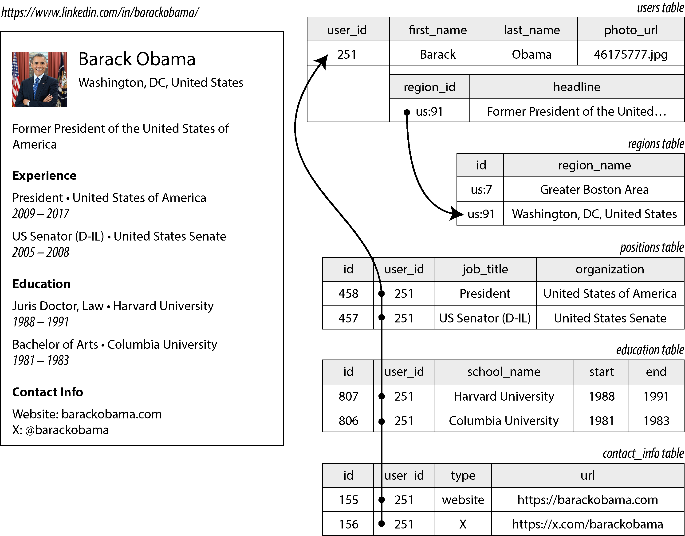
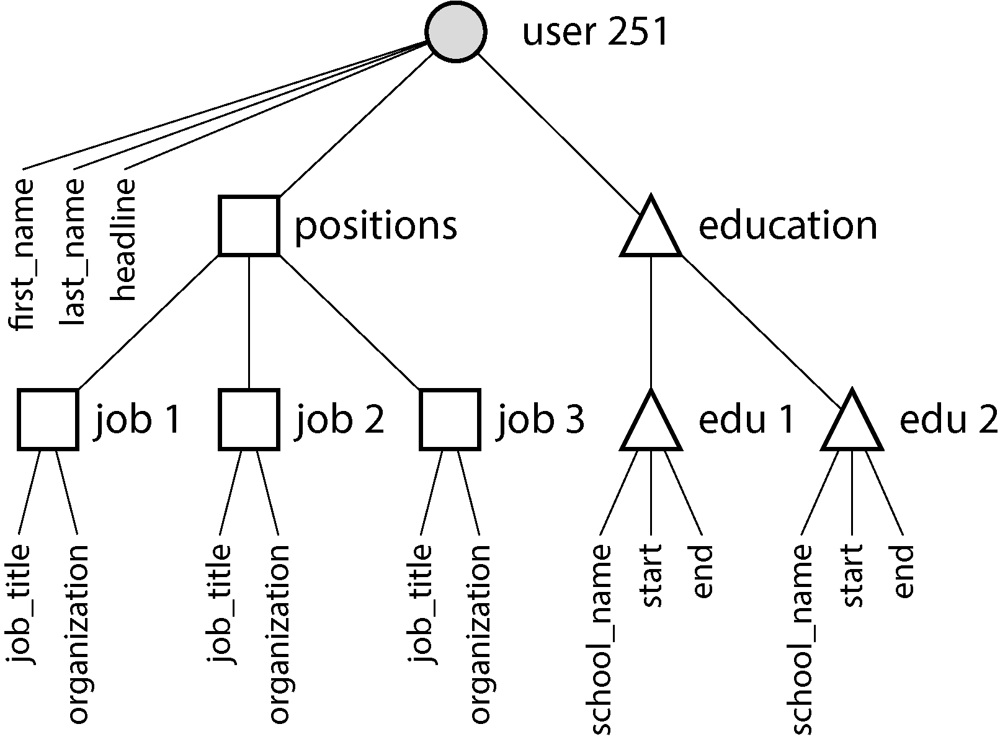
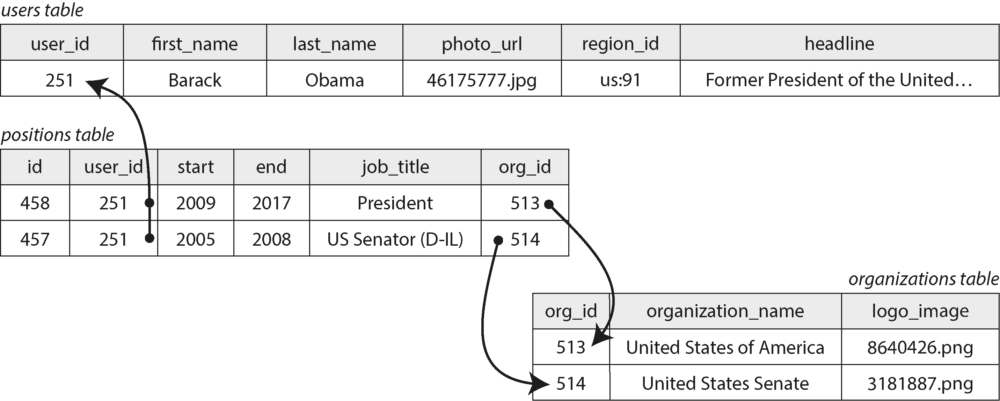
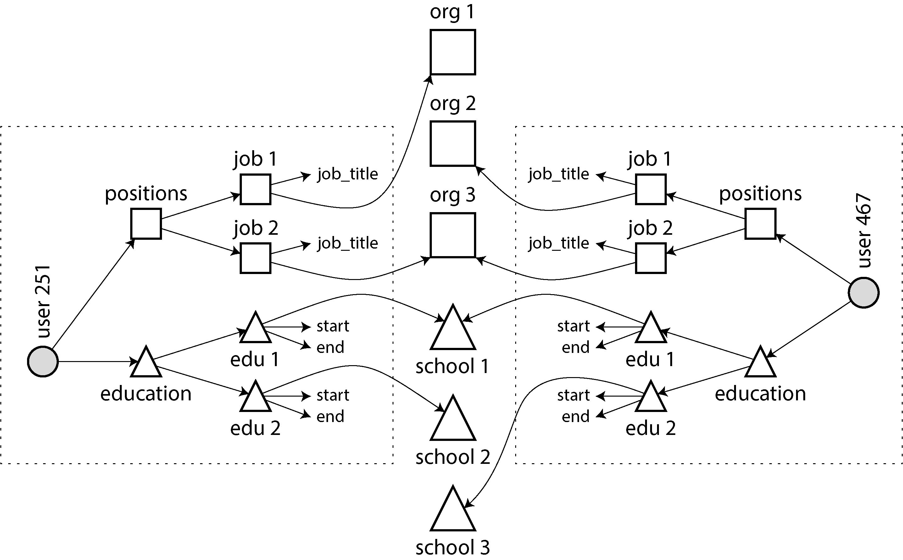
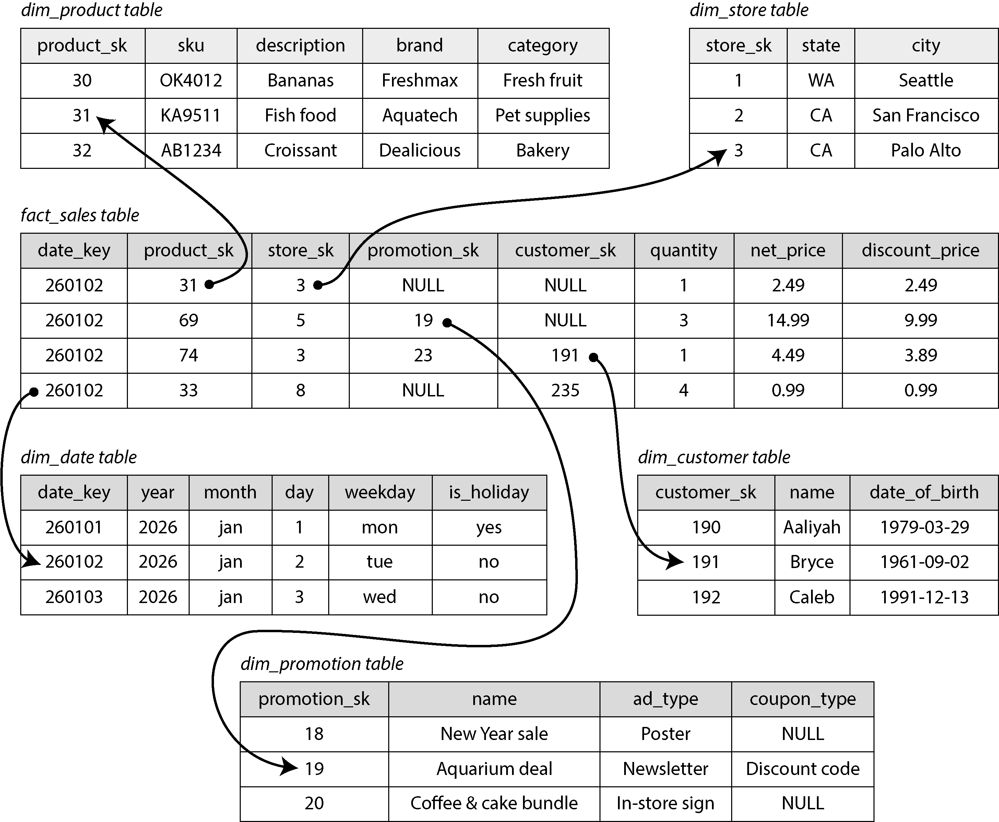
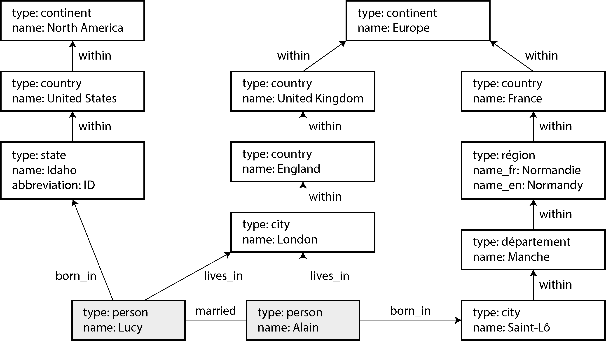
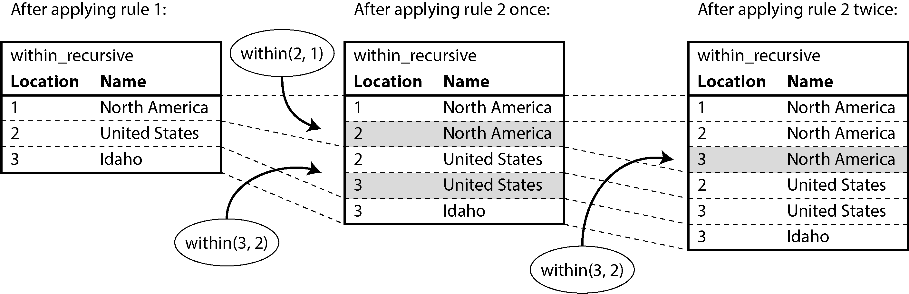
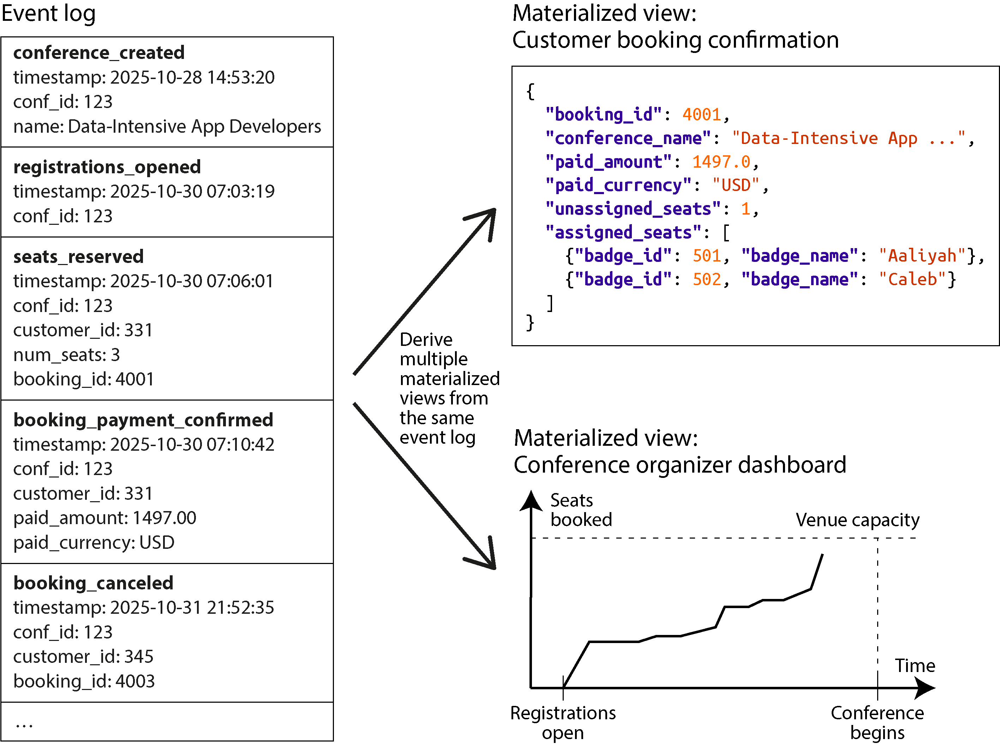
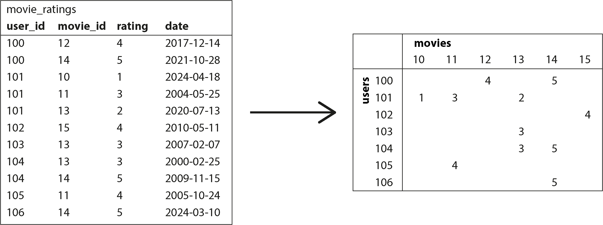

# Chương 3. Mô hình dữ liệu và ngôn ngữ truy vấn

> *Giới hạn của ngôn ngữ tôi chính là giới hạn của thế giới tôi.*

> —Ludwig Wittgenstein, *Tractatus Logico-Philosophicus* (1922)

Mô hình dữ liệu (data model) có lẽ là phần quan trọng nhất trong việc phát triển phần mềm, bởi chúng có ảnh hưởng sâu sắc không chỉ đến cách phần mềm được viết, mà còn đến cách chúng ta *tư duy về vấn đề* mà chúng ta đang giải quyết.

Hầu hết các ứng dụng được xây dựng bằng cách xếp lớp mô hình dữ liệu này lên trên mô hình dữ liệu khác. Với mỗi lớp, câu hỏi then chốt là nó được *biểu diễn* như thế nào theo lớp ngay bên dưới nó. Dưới đây là một ví dụ về các lớp của ứng dụng, từ mức cao nhất đến mức thấp nhất:

1. Với vai trò nhà phát triển ứng dụng, bạn nhìn vào thế giới thực (bao gồm con người, tổ chức, hàng hóa, hành động, dòng tiền, cảm biến, v.v.) và mô hình hóa nó dưới dạng các object hoặc cấu trúc dữ liệu cùng các API thao tác trên những cấu trúc dữ liệu đó, thường là đặc thù cho ứng dụng của bạn.

2. Khi bạn muốn lưu trữ những cấu trúc dữ liệu đó, bạn biểu diễn chúng theo một mô hình dữ liệu tổng quát, chẳng hạn như các document JSON hoặc XML, các bảng trong cơ sở dữ liệu quan hệ (relational database), hoặc các đỉnh (vertex) và cạnh (edge) trong một graph. Những mô hình dữ liệu đó là chủ đề của chương này.

3. Các kỹ sư xây dựng phần mềm cơ sở dữ liệu của bạn đã quyết định một cách biểu diễn dữ liệu document, quan hệ hoặc graph đó dưới dạng các byte trong bộ nhớ, trên đĩa, hoặc trên mạng. Cách biểu diễn này có thể cho phép dữ liệu được truy vấn, tìm kiếm, thao tác và xử lý theo nhiều cách khác nhau. Chúng ta sẽ thảo luận về các thiết kế storage engine này trong Chương 4.

4. Ở các mức còn thấp hơn nữa, các kỹ sư phần cứng đã tìm ra cách biểu diễn các byte dưới dạng dòng điện, xung ánh sáng, trường từ, và nhiều thứ khác.

Trong một ứng dụng phức tạp có thể có nhiều mức trung gian hơn, chẳng hạn như API được xây dựng trên API khác, nhưng ý tưởng cơ bản vẫn như vậy: mỗi lớp che giấu sự phức tạp của các lớp bên dưới bằng cách cung cấp một mô hình dữ liệu rõ ràng. Những sự trừu tượng hóa này cho phép các nhóm người khác nhau—ví dụ, các kỹ sư ở nhà cung cấp cơ sở dữ liệu và các nhà phát triển ứng dụng sử dụng cơ sở dữ liệu của họ—làm việc cùng nhau một cách hiệu quả.

Một số mô hình dữ liệu được sử dụng rộng rãi trong thực tế, thường cho các mục đích khác nhau. Một số loại dữ liệu và một số truy vấn dễ biểu diễn trong mô hình này nhưng lại vụng về trong mô hình khác. Trong chương này, chúng ta sẽ khám phá những sự đánh đổi (trade-off) đó bằng cách so sánh mô hình quan hệ (relational model), mô hình document, các mô hình dữ liệu dựa trên graph, event sourcing, và DataFrame. Chúng ta cũng sẽ xem xét sơ lược các ngôn ngữ truy vấn cho phép bạn làm việc với những mô hình này. Sự so sánh này sẽ giúp bạn quyết định khi nào nên dùng mô hình nào.

#### THUẬT NGỮ: NGÔN NGỮ TRUY VẤN KHAI BÁO

Nhiều ngôn ngữ truy vấn được thảo luận trong chương này (như SQL, Cypher, SPARQL và Datalog) là ngôn ngữ *khai báo* (declarative), nghĩa là bạn chỉ định mẫu hình của dữ liệu mà bạn muốn—kết quả phải đáp ứng những điều kiện nào và bạn muốn dữ liệu được biến đổi như thế nào (ví dụ: sắp xếp, nhóm và tổng hợp)—nhưng không chỉ định *cách* đạt được mục tiêu đó. Bộ tối ưu hóa truy vấn (query optimizer) của hệ thống cơ sở dữ liệu có thể quyết định dùng index và thuật toán join nào, và thực thi các phần khác nhau của truy vấn theo thứ tự nào.

Ngược lại, với hầu hết các ngôn ngữ lập trình (như Python và Java), bạn sẽ phải viết một *thuật toán* chỉ cho máy tính biết cần thực hiện những phép toán nào theo thứ tự nào. Ngôn ngữ truy vấn khai báo hấp dẫn vì nó thường ngắn gọn hơn và dễ viết hơn một thuật toán tường minh. Quan trọng hơn, nó che giấu các chi tiết triển khai của query engine, điều này cho phép hệ thống cơ sở dữ liệu đưa vào các cải tiến về hiệu năng mà không yêu cầu bất kỳ thay đổi nào đối với các truy vấn [1, 2].

Ví dụ, một cơ sở dữ liệu có thể thực thi một truy vấn khai báo song song trên nhiều nhân CPU và nhiều máy, mà bạn không cần phải lo lắng về cách triển khai tính song song đó [3]. Với một thuật toán viết tay, bạn sẽ tốn rất nhiều công sức để tự triển khai việc thực thi song song như vậy.

## Mô hình quan hệ so với mô hình document

Mô hình dữ liệu được biết đến nhiều nhất ngày nay có lẽ là mô hình của SQL, dựa trên mô hình quan hệ do Edgar Codd đề xuất vào năm 1970 [4]. Trong mô hình này, dữ liệu được tổ chức thành các *relation* (quan hệ; gọi là *table*—bảng—trong SQL), trong đó mỗi relation là một tập hợp không có thứ tự của các *tuple* (*row*—hàng—trong SQL).

Mô hình quan hệ ban đầu chỉ là một đề xuất lý thuyết, và nhiều người thời đó nghi ngờ liệu nó có thể được triển khai hiệu quả hay không. Tuy nhiên, đến giữa những năm 1980, các hệ quản trị cơ sở dữ liệu quan hệ (RDBMS) và SQL đã trở thành công cụ được lựa chọn của hầu hết những người cần lưu trữ và truy vấn dữ liệu có cấu trúc đều đặn ở một mức độ nào đó. Nhiều trường hợp sử dụng trong quản lý dữ liệu—ví dụ, phân tích kinh doanh (xem “Star và Snowflake: Các schema cho phân tích”)—vẫn do dữ liệu quan hệ thống lĩnh nhiều thập kỷ sau đó.

Qua nhiều năm, đã có nhiều cách tiếp cận cạnh tranh nhau trong việc lưu trữ và truy vấn dữ liệu. Trong những năm 1970 và đầu những năm 1980, *mô hình mạng* (network model) và *mô hình phân cấp* (hierarchical model) là những lựa chọn thay thế chính, nhưng mô hình quan hệ đã vươn lên thống lĩnh chúng. Cơ sở dữ liệu hướng đối tượng (object database; không nên nhầm với object storage dùng cho các file lớn, một dịch vụ cloud phổ biến ngày nay) xuất hiện rồi lại biến mất vào cuối những năm 1980 và đầu những năm 1990. Cơ sở dữ liệu XML xuất hiện vào đầu những năm 2000, nhưng chỉ được áp dụng trong một số lĩnh vực hẹp. Mỗi đối thủ của mô hình quan hệ đều tạo ra rất nhiều sự thổi phồng vào thời của nó, nhưng không đối thủ nào trụ lại được [5]. Thay vào đó, SQL đã phát triển để bao hàm cả các loại dữ liệu khác—ví dụ, bổ sung hỗ trợ cho dữ liệu XML, JSON và graph [6].

Trong những năm 2010, *NoSQL* là từ thời thượng mới nhất cố gắng lật đổ sự thống trị của cơ sở dữ liệu quan hệ. NoSQL không chỉ một công nghệ đơn lẻ mà là một tập hợp lỏng lẻo các ý tưởng xoay quanh các mô hình dữ liệu mới, sự linh hoạt về schema, khả năng mở rộng, và xu hướng chuyển sang các mô hình cấp phép mã nguồn mở. Một số cơ sở dữ liệu tự gắn nhãn là *NewSQL*, phản ánh mục tiêu của chúng là cung cấp khả năng mở rộng của các hệ thống NoSQL cùng với mô hình dữ liệu và các đảm bảo transaction của cơ sở dữ liệu quan hệ truyền thống. Các ý tưởng NoSQL và NewSQL đã có ảnh hưởng rất lớn đến thiết kế của các hệ thống dữ liệu, nhưng khi các nguyên lý này đã được áp dụng rộng rãi, việc sử dụng những thuật ngữ đó cũng dần mờ nhạt.

Một ảnh hưởng lâu dài của phong trào NoSQL là sự phổ biến của *mô hình document* (document model), thường biểu diễn dữ liệu dưới dạng JSON. Mô hình này ban đầu được phổ biến bởi các cơ sở dữ liệu document chuyên dụng như MongoDB và Couchbase, mặc dù hiện nay hầu hết các cơ sở dữ liệu quan hệ cũng đã bổ sung hỗ trợ JSON. So với các bảng quan hệ, vốn thường bị xem là có schema cứng nhắc và thiếu linh hoạt, các document JSON được cho là linh hoạt hơn.

Ưu và nhược điểm của dữ liệu document và dữ liệu quan hệ đã được tranh luận rất nhiều. Hãy cùng xem xét một số điểm chính của cuộc tranh luận đó.

### Sự không tương thích giữa object và quan hệ

Ngày nay, phần lớn việc phát triển ứng dụng được thực hiện bằng các ngôn ngữ lập trình hướng đối tượng, dẫn đến một lời phê bình phổ biến đối với mô hình dữ liệu SQL: nếu dữ liệu được lưu trong các bảng quan hệ, thì cần có một lớp chuyển đổi vụng về giữa các object trong mã ứng dụng và mô hình cơ sở dữ liệu gồm bảng, hàng và cột. Sự lệch pha giữa các mô hình này đôi khi được gọi là *impedance mismatch* (sự không phối hợp trở kháng).

> **LƯU Ý**
>
> Thuật ngữ *impedance mismatch* được vay mượn từ điện tử học. Mỗi mạch điện có một trở kháng (impedance; sức cản đối với dòng điện xoay chiều) nhất định ở đầu vào và đầu ra. Khi bạn nối đầu ra của mạch này với đầu vào của mạch khác, công suất truyền qua kết nối đạt cực đại nếu trở kháng đầu ra và đầu vào của hai mạch khớp nhau. Sự không phối hợp trở kháng có thể dẫn đến phản xạ tín hiệu và các rắc rối khác.

#### Ánh xạ object-quan hệ

Các framework ánh xạ object-quan hệ (object-relational mapping, ORM) như ActiveRecord và Hibernate giúp giảm lượng mã boilerplate cần thiết cho lớp chuyển đổi này, nhưng chúng cũng thường bị phê bình [7]. Một số vấn đề thường được nêu ra như sau:

- Các ORM rất phức tạp và không thể che giấu hoàn toàn sự khác biệt giữa hai mô hình, vì vậy các nhà phát triển cuối cùng vẫn phải suy nghĩ về cả biểu diễn quan hệ lẫn biểu diễn object của dữ liệu.

- Các ORM thường chỉ được dùng để phát triển ứng dụng OLTP (xem “Đặc trưng của xử lý transaction và phân tích”); các kỹ sư dữ liệu khi cung cấp dữ liệu cho mục đích phân tích cần làm việc với biểu diễn quan hệ bên dưới, vì vậy thiết kế của schema quan hệ vẫn quan trọng khi dùng ORM.

- Nhiều ORM chỉ làm việc với các cơ sở dữ liệu OLTP quan hệ. Các tổ chức có nhiều hệ thống dữ liệu đa dạng như search engine, cơ sở dữ liệu graph và các hệ thống NoSQL có thể thấy sự hỗ trợ của ORM còn thiếu.

- Một số ORM tự động sinh ra schema quan hệ, nhưng những schema này có thể bất tiện cho những người dùng truy cập trực tiếp vào dữ liệu quan hệ, và chúng có thể không hiệu quả trên cơ sở dữ liệu bên dưới. Việc tùy biến cách ORM sinh schema và truy vấn có thể phức tạp và làm mất đi lợi ích của việc dùng ORM ngay từ đầu.

- Các ORM khiến việc vô tình viết ra các truy vấn không hiệu quả trở nên dễ dàng. Một ví dụ về điều này là *vấn đề truy vấn N+1* (N+1 query problem) [8]. Chẳng hạn, giả sử bạn muốn hiển thị danh sách bình luận của người dùng trên một trang, nên bạn thực hiện một truy vấn trả về *N* bình luận, mỗi bình luận chứa ID của tác giả. Để hiển thị tên tác giả của mỗi bình luận, bạn cần tra cứu ID đó trong bảng `users`. Với SQL viết tay, bạn có lẽ sẽ thực hiện phép join này ngay trong truy vấn và trả về tên tác giả cùng với mỗi bình luận. Tuy nhiên, với ORM, bạn có thể rơi vào tình huống thực hiện một truy vấn riêng lên bảng `users` cho mỗi bình luận trong *N* bình luận để tra cứu tác giả của nó, dẫn đến tổng cộng *N*+1 truy vấn cơ sở dữ liệu, chậm hơn so với việc thực hiện join trong cơ sở dữ liệu. Để tránh vấn đề này, bạn có thể cần chỉ định cho ORM lấy thông tin tác giả cùng lúc với việc lấy các bình luận.

Dù vậy, ORM cũng có những ưu điểm:

- Với dữ liệu phù hợp với mô hình quan hệ, một kiểu chuyển đổi nào đó giữa biểu diễn quan hệ được lưu trữ bền vững và biểu diễn object trong bộ nhớ là không thể tránh khỏi, và ORM giúp giảm lượng mã boilerplate cần cho việc chuyển đổi này. Các truy vấn phức tạp có thể vẫn cần được xử lý bên ngoài ORM, nhưng ORM có thể giúp ích trong các trường hợp đơn giản và lặp đi lặp lại.

- Một số ORM hỗ trợ cache kết quả của các truy vấn cơ sở dữ liệu, điều này có thể giúp giảm tải cho cơ sở dữ liệu.

- ORM cũng có thể hỗ trợ quản lý việc di trú schema (schema migration) và các hoạt động quản trị khác.

#### Mô hình dữ liệu document cho quan hệ một-nhiều

Không phải mọi dữ liệu đều phù hợp với biểu diễn quan hệ. Hãy xem một ví dụ để khám phá một hạn chế của mô hình quan hệ. Hình 3-1 minh họa cách một bản lý lịch (résumé; một hồ sơ LinkedIn) có thể được biểu diễn trong một schema quan hệ. Toàn bộ hồ sơ có thể được định danh bằng một định danh duy nhất, `user_id`. Các trường như `first_name` và `last_name` xuất hiện đúng một lần cho mỗi người dùng, nên chúng có thể được mô hình hóa thành các cột trên bảng `users`.

Hầu hết mọi người đã làm nhiều hơn một công việc (vị trí) trong sự nghiệp của mình, và mỗi người có thể có số giai đoạn học tập khác nhau cũng như số lượng thông tin liên hệ bất kỳ. Một cách biểu diễn những *quan hệ một-nhiều* (one-to-many relationship) như vậy là đặt vị trí công việc, học vấn và thông tin liên hệ vào các bảng riêng, mỗi bảng có một tham chiếu khóa ngoại (foreign key) đến bảng `users`, như trong Hình 3-1.

Một cách khác để biểu diễn cùng thông tin đó, có lẽ tự nhiên hơn và ánh xạ gần hơn với cấu trúc object trong mã ứng dụng, là dưới dạng một document JSON, như minh họa trong Ví dụ 3-1.



*Hình 3-1. Dùng schema quan hệ để biểu diễn một hồ sơ LinkedIn*

**Ví dụ 3-1. Biểu diễn một hồ sơ LinkedIn dưới dạng document JSON**

```
{
  "user_id":     251,
  "first_name":  "Barack",
  "last_name":   "Obama",
  "headline":    "Former President of the United States of America",
  "region_id":   "us:91",
  "photo_url":   "/p/7/000/253/05b/308dd6e.jpg",
  "positions": [
    {"job_title": "President", "organization": "United States of America"},
    {"job_title": "US Senator (D-IL)", "organization": "United States Senate
  ],
  "education": [
    {"school_name": "Harvard University",  "start": 1988, "end": 1991},
    {"school_name": "Columbia University", "start": 1981, "end": 1983}
  ],
  "contact_info": {
    "website": "https://barackobama.com",
    "x": "https://x.com/barackobama"
  }
}
```

Một số nhà phát triển cảm thấy mô hình JSON làm giảm impedance mismatch giữa mã ứng dụng và tầng lưu trữ. Việc không có schema cũng thường được nêu như một lợi thế; chúng ta sẽ thảo luận điều này trong “Tính linh hoạt về schema trong mô hình document”. Tuy nhiên, như chúng ta sẽ thấy trong Chương 5, JSON với vai trò một định dạng encoding dữ liệu cũng có những vấn đề.

Biểu diễn JSON có *tính cục bộ* (locality) tốt hơn so với schema nhiều bảng trong Hình 3-1 (xem “Tính cục bộ dữ liệu cho đọc và ghi”). Nếu bạn muốn lấy một hồ sơ trong ví dụ quan hệ, bạn phải hoặc thực hiện nhiều truy vấn (truy vấn từng bảng theo `user_id`), hoặc thực hiện một phép join nhiều chiều rối rắm giữa bảng `users` và các bảng phụ thuộc của nó [9, 10]. Trong biểu diễn JSON, tất cả thông tin liên quan nằm ở một chỗ, khiến truy vấn vừa nhanh hơn vừa đơn giản hơn.

Các quan hệ một-nhiều từ hồ sơ người dùng đến các vị trí công việc, lịch sử học tập và thông tin liên hệ của người dùng hàm ý một cấu trúc cây trong dữ liệu, và biểu diễn JSON làm cho cấu trúc cây này trở nên tường minh (xem Hình 3-2).



*Hình 3-2. Các quan hệ một-nhiều tạo thành một cấu trúc cây*

> **LƯU Ý**
>
> Quan hệ một-nhiều đôi khi được gọi là *một-ít* (one-to-few), vì một bản lý lịch thường chỉ có một số ít vị trí công việc [11, 12]. Nếu bạn có một số lượng thực sự lớn các mục liên quan—chẳng hạn, các bình luận trên một bài đăng mạng xã hội của người nổi tiếng, có thể lên đến hàng nghìn—thì việc nhúng tất cả chúng vào cùng một document có thể quá cồng kềnh, nên cách tiếp cận quan hệ trong Hình 3-1 sẽ phù hợp hơn.

### Chuẩn hóa, phi chuẩn hóa và join

Trong Ví dụ 3-1 ở mục trước, `region_id` được cho dưới dạng một ID, chứ không phải chuỗi văn bản thuần `Washington, DC, United States`. Tại sao vậy?

Nếu giao diện người dùng có một trường văn bản tự do để nhập khu vực, thì lưu nó dưới dạng chuỗi văn bản thuần là hợp lý. Nhưng có những lợi thế khi có các danh sách khu vực địa lý được chuẩn hóa và cho người dùng chọn từ một danh sách thả xuống hoặc bộ gợi ý tự động hoàn thành. Những lợi thế đó bao gồm:

- Phong cách và chính tả nhất quán giữa các hồ sơ

- Tránh mơ hồ nếu nhiều địa điểm có cùng tên (nếu chuỗi chỉ là `Washington, DC`, thì nó chỉ DC hay chỉ tiểu bang Washington?) Dễ cập nhật—tên chỉ được lưu ở một chỗ, nên dễ cập nhật đồng loạt nếu có lúc cần thay đổi (ví dụ: đổi tên thành phố do các sự kiện chính trị)

- Hỗ trợ bản địa hóa—khi trang web được dịch sang các ngôn ngữ khác, các danh sách chuẩn hóa có thể được bản địa hóa, để khu vực được hiển thị bằng ngôn ngữ của người xem

- Chức năng tìm kiếm tốt hơn (ví dụ, một tìm kiếm những người ở Bờ Đông Hoa Kỳ có thể khớp với hồ sơ này, vì danh sách khu vực có thể mã hóa thông tin rằng Washington nằm ở Bờ Đông—điều không thể thấy rõ chỉ từ chuỗi `Washington, DC`)

Việc bạn lưu một ID hay một chuỗi văn bản là câu hỏi về *chuẩn hóa* (normalization). Khi bạn dùng ID, dữ liệu của bạn được chuẩn hóa hơn: thông tin có ý nghĩa đối với con người (như văn bản *Washington, DC*) chỉ được lưu ở một chỗ, và mọi thứ tham chiếu đến nó đều dùng một ID (chỉ có ý nghĩa bên trong cơ sở dữ liệu). Khi bạn lưu trực tiếp văn bản, bạn đang nhân bản thông tin có ý nghĩa với con người trong mọi bản ghi (record) sử dụng nó; biểu diễn này là *phi chuẩn hóa* (denormalized).

Lợi thế của việc dùng ID là vì nó không có ý nghĩa với con người, nó không bao giờ cần thay đổi: ID có thể giữ nguyên ngay cả khi thông tin mà nó định danh thay đổi. Bất cứ thứ gì có ý nghĩa với con người đều có thể cần thay đổi vào một lúc nào đó trong tương lai—và nếu thông tin đó bị nhân bản, tất cả các bản sao dư thừa sẽ cần được cập nhật. Điều đó đòi hỏi nhiều mã hơn, nhiều phép ghi hơn, và nhiều dung lượng đĩa hơn, đồng thời có nguy cơ gây ra sự không nhất quán (khi một số bản sao của thông tin được cập nhật còn số khác thì không).

Nhược điểm của biểu diễn chuẩn hóa là mỗi khi bạn muốn hiển thị một bản ghi chứa ID, bạn phải thực hiện thêm một lần tra cứu để phân giải ID đó thành thứ gì đó mà con người đọc được. Trong mô hình dữ liệu quan hệ, điều này được thực hiện bằng một phép *join*. Ví dụ:

```
SELECT users.*, regions.region_name
FROM users
JOIN regions ON users.region_id = regions.id
WHERE users.id = 251;
```

Cơ sở dữ liệu document có thể lưu cả dữ liệu chuẩn hóa và phi chuẩn hóa, nhưng chúng thường gắn liền với phi chuẩn hóa—một phần vì mô hình dữ liệu JSON giúp dễ dàng lưu thêm các trường phi chuẩn hóa, và một phần vì sự hỗ trợ join yếu trong nhiều cơ sở dữ liệu document khiến việc chuẩn hóa trở nên bất tiện. Một số cơ sở dữ liệu document hoàn toàn không hỗ trợ join, nên bạn phải thực hiện join trong mã ứng dụng—tức là, trước tiên bạn lấy một document chứa ID, rồi thực hiện truy vấn thứ hai để phân giải ID đó thành một document khác. Trong MongoDB, cũng có thể thực hiện join bằng toán tử `$lookup` trong một aggregation pipeline:

```
db.users.aggregate([
  { $match: { _id: 251 } },
  { $lookup: {
      from: "regions",
      localField: "region_id",
      foreignField: "_id",
      as: "region"
  } }
])
```

#### Những đánh đổi của chuẩn hóa

Trong ví dụ về bản lý lịch, trong khi trường `region_id` là một tham chiếu đến một tập khu vực chuẩn hóa, thì `organization` (công ty hoặc cơ quan chính phủ nơi người đó đã làm việc) và `school_name` (nơi họ đã học) chỉ là các chuỗi. Biểu diễn này là phi chuẩn hóa: nhiều người có thể đã làm việc ở cùng một công ty, nhưng không có ID nào liên kết họ lại.

Đáng để cân nhắc liệu tên tổ chức và tên trường học có nên là các thực thể (entity) riêng thay vì chuỗi, và hồ sơ nên tham chiếu đến ID của chúng hay không. Những lập luận ủng hộ việc tham chiếu ID của khu vực cũng áp dụng ở đây. Ví dụ, giả sử chúng ta muốn đưa vào cả logo của trường học hoặc công ty bên cạnh tên của nó:

- Trong biểu diễn phi chuẩn hóa, chúng ta sẽ đưa URL hình ảnh của logo vào hồ sơ của từng cá nhân. Điều này làm cho document JSON tự chứa đủ thông tin, nhưng sẽ gây đau đầu nếu có lúc chúng ta cần thay đổi logo, vì lúc đó chúng ta phải tìm tất cả các lần xuất hiện của URL cũ và cập nhật chúng [11].

- Trong biểu diễn chuẩn hóa, chúng ta sẽ tạo một thực thể đại diện cho tổ chức hoặc trường học và lưu tên, URL logo, và có thể cả các thuộc tính khác (mô tả, bảng tin, v.v.) một lần duy nhất như một phần của thực thể đó. Mỗi bản lý lịch có nhắc đến tổ chức đó khi ấy chỉ cần tham chiếu ID của nó, và việc cập nhật logo sẽ trở nên dễ dàng.

Theo nguyên tắc chung, dữ liệu chuẩn hóa thường ghi nhanh hơn (vì chỉ có một bản sao) nhưng truy vấn chậm hơn (vì cần join); dữ liệu phi chuẩn hóa thường đọc nhanh hơn (ít join hơn) nhưng ghi tốn kém hơn (nhiều bản sao cần cập nhật hơn, dùng nhiều dung lượng đĩa hơn). Bạn có thể thấy hữu ích khi xem phi chuẩn hóa như một dạng dữ liệu dẫn xuất (derived data; xem “Hệ thống lưu trữ gốc (System of Record) và Dữ liệu dẫn xuất (Derived Data)”), vì bạn cần thiết lập một quy trình để cập nhật các bản sao dư thừa của dữ liệu.

Bên cạnh chi phí thực hiện tất cả các cập nhật này, bạn cần xem xét tính nhất quán (consistency) của cơ sở dữ liệu nếu một process bị crash giữa chừng khi đang thực hiện các cập nhật. Các cơ sở dữ liệu cung cấp transaction nguyên tử (atomic; xem “Atomicity”) giúp việc duy trì nhất quán dễ dàng hơn, nhưng không phải cơ sở dữ liệu nào cũng cung cấp tính nguyên tử (atomicity) trên nhiều document. Cũng có thể đảm bảo tính nhất quán thông qua stream processing, điều mà chúng ta sẽ thảo luận trong Chương 12.

Chuẩn hóa thường tốt hơn cho các hệ thống OLTP, nơi cả đọc và cập nhật đều cần nhanh; các hệ thống phân tích (analytical) thường hoạt động tốt hơn với dữ liệu phi chuẩn hóa, vì chúng thực hiện cập nhật theo lô và hiệu năng của các truy vấn chỉ đọc là mối quan tâm chủ đạo. Trong các hệ thống quy mô nhỏ đến vừa, mô hình dữ liệu chuẩn hóa thường là tốt nhất vì bạn không phải lo lắng về việc giữ nhiều bản sao của dữ liệu nhất quán với nhau, và chi phí thực hiện join là chấp nhận được. Tuy nhiên, trong các hệ thống quy mô rất lớn, chi phí của join có thể trở thành vấn đề.

#### Phi chuẩn hóa trong nghiên cứu tình huống mạng xã hội

Trong “Nghiên cứu tình huống: Home timeline của mạng xã hội”, chúng ta đã so sánh một biểu diễn chuẩn hóa (Hình 2-1) và một biểu diễn phi chuẩn hóa (các timeline được tính toán trước, được materialize). Ở đó, phép join giữa `posts` và `follows` quá tốn kém, và timeline được materialize là một cache của kết quả phép join đó. Quy trình fan-out chèn một bài đăng mới vào timeline của những người theo dõi là cách chúng ta giữ cho biểu diễn phi chuẩn hóa nhất quán.

Tuy nhiên, cách triển khai materialized timeline tại X (trước đây là Twitter) không lưu nội dung văn bản thực sự của mỗi bài đăng. Mỗi mục chỉ lưu ID bài đăng, ID của người dùng đã đăng nó, và một chút thông tin bổ sung để nhận diện các bài đăng lại (repost) và trả lời [13]. Nói cách khác, nó là kết quả được tính toán trước của (xấp xỉ) truy vấn sau:

```
SELECT posts.id, posts.sender_id FROM posts
  JOIN follows ON posts.sender_id = follows .followee_id
  WHERE follows.follower_id = current_user
  ORDER BY posts.timestamp DESC
  LIMIT 1000
```

Điều này có nghĩa là mỗi khi timeline được đọc, dịch vụ vẫn cần thực hiện hai phép join: nó tra cứu ID bài đăng để lấy nội dung thực sự của bài đăng (cũng như các số liệu thống kê như số lượt thích và trả lời), và nó tra cứu hồ sơ của người gửi theo ID (để lấy tên người dùng, ảnh hồ sơ và các chi tiết khác). Quá trình tra cứu thông tin mà con người đọc được theo ID này được gọi là *hydrating* (làm đầy) các ID, và về bản chất nó là một phép join được thực hiện trong mã ứng dụng [13].

Lý do chỉ lưu các ID trong timeline được tính toán trước là vì dữ liệu mà chúng tham chiếu đến thay đổi nhanh. Số lượt thích và trả lời có thể thay đổi nhiều lần mỗi giây trên một bài đăng phổ biến, và một số người dùng thường xuyên thay đổi tên người dùng hoặc ảnh hồ sơ của họ. Vì timeline cần hiển thị số lượt thích và ảnh hồ sơ mới nhất khi nó được xem, việc phi chuẩn hóa thông tin này vào materialized timeline sẽ không hợp lý. Hơn nữa, chi phí lưu trữ sẽ tăng lên đáng kể do việc phi chuẩn hóa như vậy.

Ví dụ này cho thấy việc phải thực hiện join khi đọc dữ liệu không phải là, như đôi khi người ta khẳng định, một trở ngại đối với việc tạo ra các dịch vụ hiệu năng cao và có khả năng mở rộng. Hydrating các ID bài đăng và người dùng thực ra là một thao tác khá dễ mở rộng, vì nó song song hóa tốt, và chi phí không phụ thuộc vào số tài khoản bạn đang theo dõi hay số người theo dõi bạn có.

Nếu bạn cần quyết định có nên phi chuẩn hóa thứ gì đó trong ứng dụng của mình hay không, nghiên cứu tình huống mạng xã hội cho thấy lựa chọn này không hiển nhiên ngay lập tức; cách tiếp cận có khả năng mở rộng tốt nhất có thể bao gồm việc phi chuẩn hóa một số thứ và giữ nguyên chuẩn hóa những thứ khác. Bạn sẽ phải cân nhắc kỹ thông tin thay đổi thường xuyên đến mức nào và chi phí của các phép đọc và ghi (có thể bị chi phối bởi các trường hợp ngoại lệ, như những người dùng có nhiều lượt theo dõi/người theo dõi trong trường hợp một mạng xã hội điển hình). Chuẩn hóa và phi chuẩn hóa vốn dĩ không tốt cũng không xấu—chúng đơn giản thể hiện những sự đánh đổi về hiệu năng đọc và ghi cũng như công sức triển khai.

### Quan hệ nhiều-một và nhiều-nhiều

Trong khi các bảng `positions` và `education` trong Hình 3-1 là ví dụ về quan hệ một-nhiều (one-to-many) hoặc một-vài (one-to-few) (một résumé có nhiều position, nhưng mỗi position chỉ thuộc về một résumé), thì trường `region_id` là một ví dụ về quan hệ *many-to-one* (nhiều-một) (nhiều người sống trong cùng một region, nhưng chúng ta giả định rằng mỗi người chỉ sống ở một region tại bất kỳ thời điểm nào).

Nếu chúng ta đưa vào các thực thể (entity) cho tổ chức (organization) và trường học (school) rồi tham chiếu chúng bằng ID từ résumé, thì chúng ta cũng có quan hệ *many-to-many* (nhiều-nhiều) (một người có thể đã làm việc cho nhiều tổ chức, và một tổ chức có nhiều nhân viên trong quá khứ hoặc hiện tại). Trong mô hình quan hệ (relational model), quan hệ như vậy thường được biểu diễn dưới dạng một *associative table* (bảng liên kết), hay *join table*, như trong Hình 3-3: mỗi position liên kết một user ID với một organization ID.



*Hình 3-3. Quan hệ nhiều-nhiều trong mô hình quan hệ*

Các quan hệ nhiều-một và nhiều-nhiều không dễ nằm gọn trong một document JSON độc lập; chúng phù hợp hơn với cách biểu diễn chuẩn hóa (normalized). Trong mô hình document, một cách biểu diễn khả dĩ được đưa ra trong Ví dụ 3-2 và minh họa trong Hình 3-4. Dữ liệu bên trong mỗi hình chữ nhật nét đứt có thể được nhóm thành một document, nhưng các liên kết đến tổ chức và trường học thì tốt nhất nên được biểu diễn dưới dạng tham chiếu đến các document khác.

**Ví dụ 3-2. Một résumé tham chiếu đến các tổ chức bằng ID**

```
{
  "user_id":    251,
  "first_name": "Barack",
  "last_name":  "Obama",
  "positions": [
    {"start": 2009, "end": 2017, "job_title": "President",         "org_id"
    {"start": 2005, "end": 2008, "job_title": "US Senator (D-IL)", "org_id"
  ],
  ...
}
```

Các quan hệ nhiều-nhiều thường cần được truy vấn theo “cả hai chiều”—ví dụ, tìm tất cả các tổ chức mà một người cụ thể đã làm việc, và tìm tất cả những người đã làm việc tại một tổ chức cụ thể. Một cách để hỗ trợ các truy vấn như vậy là lưu tham chiếu ID ở cả hai phía, sao cho résumé chứa ID của mỗi tổ chức nơi người đó đã làm việc, và document của tổ chức chứa các ID của những résumé có nhắc đến tổ chức đó. Cách biểu diễn này là phi chuẩn hóa (denormalized), vì quan hệ được lưu ở hai nơi, và hai nơi này có thể trở nên không nhất quán với nhau.



*Hình 3-4. Quan hệ nhiều-nhiều trong mô hình document—dữ liệu bên trong mỗi khung nét đứt có thể được nhóm thành một document*

Cách biểu diễn chuẩn hóa chỉ lưu quan hệ ở một nơi và dựa vào các *secondary index* (mà chúng ta sẽ thảo luận trong Chương 4) để cho phép truy vấn quan hệ một cách hiệu quả theo cả hai chiều. Trong schema quan hệ ở Hình 3-3, chúng ta sẽ yêu cầu database tạo index trên cả hai cột `user_id` và `org_id` của bảng `positions`.

Trong mô hình document của Ví dụ 3-2, database cần đánh index cho trường `org_id` của các object bên trong mảng `positions`. Nhiều document database và relational database có hỗ trợ JSON đều có khả năng tạo các index như vậy trên các giá trị nằm bên trong một document.

### Star và Snowflake: Các schema cho phân tích

Data warehouse (xem “Data Warehousing (Kho dữ liệu)”) thường là dạng quan hệ, và có một vài quy ước được sử dụng rộng rãi cho cấu trúc của các bảng trong data warehouse, bao gồm star schema, snowflake schema, dimensional modeling (mô hình hóa theo chiều) [14], và one big table (OBT). Các cấu trúc này được tối ưu hóa cho nhu cầu của các nhà phân tích kinh doanh (business analyst). Các quy trình ETL chuyển đổi dữ liệu từ các hệ thống vận hành (operational) sang schema đã chọn.

Hình 3-5 cho thấy một ví dụ về *star schema* (schema hình sao) có thể gặp trong data warehouse của một nhà bán lẻ tạp hóa. Ở trung tâm của schema là một bảng gọi là *fact table* (bảng sự kiện) (trong ví dụ này, nó có tên `fact_sales`). Mỗi hàng của fact table biểu diễn một event xảy ra tại một thời điểm cụ thể (ở đây, mỗi hàng biểu diễn việc một khách hàng mua một sản phẩm). Nếu chúng ta phân tích lưu lượng truy cập website thay vì doanh số bán lẻ, mỗi hàng có thể biểu diễn một lượt xem trang hoặc một lượt click của người dùng.



*Hình 3-5. Một star schema dùng trong data warehouse*

Thông thường các fact được ghi lại dưới dạng các event riêng lẻ, vì điều này cho phép sự linh hoạt tối đa khi phân tích về sau. Tuy nhiên, điều này có nghĩa là fact table có thể trở nên cực kỳ lớn. Một doanh nghiệp lớn có thể có nhiều petabyte lịch sử transaction trong data warehouse của mình, phần lớn được biểu diễn dưới dạng các fact table.

Một số cột trong fact table là các thuộc tính, chẳng hạn giá bán của sản phẩm và chi phí mua nó từ nhà cung cấp (cho phép tính biên lợi nhuận). Các cột khác trong fact table là các tham chiếu khóa ngoại (foreign key) đến các bảng khác, được gọi là *dimension table* (bảng chiều). Vì mỗi hàng trong fact table biểu diễn một event, các dimension biểu diễn *ai*, *cái gì*, *ở đâu*, *khi nào*, *như thế nào*, và *vì sao* của event đó.

Ví dụ, trong Hình 3-5, một trong các dimension là sản phẩm đã bán. Mỗi hàng trong bảng `dim_product` biểu diễn một loại sản phẩm đang được bày bán, bao gồm mã hàng (stock-keeping unit, SKU), mô tả, tên thương hiệu, danh mục, hàm lượng chất béo, và kích cỡ bao bì. Mỗi hàng trong bảng `fact_sales` dùng một foreign key để chỉ ra sản phẩm nào đã được bán trong transaction cụ thể đó. Các truy vấn thường liên quan đến nhiều phép join với nhiều dimension table.

Ngay cả ngày và giờ cũng thường được biểu diễn bằng dimension table, vì điều này cho phép mã hóa thêm thông tin về ngày (chẳng hạn các ngày lễ), giúp truy vấn có thể phân biệt giữa doanh số vào ngày lễ và ngày thường.

Tên gọi *star schema* xuất phát từ việc khi các quan hệ giữa các bảng được vẽ ra, fact table nằm ở giữa, bao quanh bởi các dimension table của nó (như trong Hình 3-5); các kết nối đến những bảng này giống như các tia của một ngôi sao.

Một biến thể của mẫu này là *snowflake schema* (schema bông tuyết), trong đó các dimension được chia nhỏ tiếp thành các subdimension (chiều con). Ví dụ, có thể có các bảng riêng cho thương hiệu và danh mục sản phẩm, và mỗi hàng trong bảng `dim_product` có thể tham chiếu đến thương hiệu và danh mục dưới dạng foreign key, thay vì lưu chúng dưới dạng chuỗi trong bảng `dim_product`. Snowflake schema được chuẩn hóa hơn star schema, nhưng star schema thường được ưa chuộng hơn vì chúng đơn giản hơn cho các nhà phân tích làm việc [14].

Trong một data warehouse điển hình, các bảng thường khá rộng: fact table thường có hơn một trăm cột, có khi tới vài trăm. Dimension table cũng có thể rộng, vì chúng chứa tất cả metadata có thể liên quan đến việc phân tích—ví dụ, bảng `dim_store` có thể chứa chi tiết về những dịch vụ được cung cấp tại mỗi cửa hàng, cửa hàng có lò bánh tại chỗ hay không, diện tích mặt bằng, ngày cửa hàng mở cửa lần đầu, lần tu sửa gần nhất, và khoảng cách từ cửa hàng đến đường cao tốc gần nhất.

Một star schema hay snowflake schema chủ yếu gồm các quan hệ nhiều-một (ví dụ, nhiều giao dịch bán hàng xảy ra cho một sản phẩm cụ thể, tại một cửa hàng cụ thể), được biểu diễn bằng việc fact table có các foreign key trỏ vào dimension table, hoặc dimension trỏ vào subdimension. Về nguyên tắc, các loại quan hệ khác có thể tồn tại, nhưng chúng thường được phi chuẩn hóa để đơn giản hóa truy vấn. Ví dụ, nếu một khách hàng mua nhiều sản phẩm khác nhau cùng một lúc, transaction nhiều mặt hàng đó không được biểu diễn tường minh; thay vào đó, fact table có một hàng riêng cho mỗi sản phẩm được mua, và những fact đó chỉ tình cờ có cùng customer ID, store ID, và timestamp.

Một số schema data warehouse còn đẩy việc phi chuẩn hóa đi xa hơn nữa và bỏ hẳn các dimension table, thay vào đó gộp thông tin trong các dimension vào các cột phi chuẩn hóa trong fact table (về bản chất là tính trước phép join giữa fact table và các dimension table). Cách tiếp cận này được gọi là *one big table* (OBT), và mặc dù nó đòi hỏi nhiều không gian lưu trữ hơn, đôi khi nó cho phép truy vấn nhanh hơn [15].

Trong bối cảnh phân tích, việc phi chuẩn hóa như vậy không gây vấn đề, vì dữ liệu thường biểu diễn một log dữ liệu lịch sử sẽ không thay đổi (ngoại trừ có thể đôi khi sửa một lỗi). Các vấn đề về tính nhất quán dữ liệu (data consistency) và chi phí ghi phát sinh khi phi chuẩn hóa trong hệ thống OLTP không cấp bách bằng trong phân tích.

### Khi nào dùng mô hình nào

Các lập luận chính ủng hộ mô hình dữ liệu document là tính linh hoạt về schema, hiệu năng tốt hơn nhờ tính cục bộ (locality), và việc đối với một số ứng dụng, nó gần hơn với mô hình đối tượng mà ứng dụng sử dụng. Mô hình quan hệ phản bác bằng việc hỗ trợ tốt hơn cho join và các quan hệ nhiều-một, nhiều-nhiều. Hãy xem xét các lập luận này chi tiết hơn.

Nếu dữ liệu trong ứng dụng của bạn có cấu trúc kiểu document (tức là một cây các quan hệ một-nhiều, trong đó thông thường toàn bộ cây được tải cùng lúc), thì có lẽ nên dùng mô hình document. Kỹ thuật *shredding* (băm nhỏ) của mô hình quan hệ—chia một cấu trúc kiểu document thành nhiều bảng (như `positions`, `education`, và `contact_info` trong Hình 3-1)—có thể dẫn đến các schema cồng kềnh và mã ứng dụng phức tạp không cần thiết.

Mô hình document có những hạn chế. Ví dụ, bạn không thể tham chiếu trực tiếp đến một mục lồng bên trong một document; thay vào đó, bạn cần nói kiểu như, “mục thứ hai trong danh sách positions của user 251.” Nếu bạn cần tham chiếu đến các mục lồng nhau, cách tiếp cận quan hệ hoạt động tốt hơn, vì bạn có thể tham chiếu trực tiếp đến bất kỳ mục nào bằng ID của nó.

Một số ứng dụng cho phép người dùng chọn thứ tự các mục—ví dụ, hãy tưởng tượng một danh sách việc cần làm (to-do list) hoặc một hệ thống theo dõi vấn đề (issue tracker) nơi người dùng có thể kéo thả các tác vụ để sắp xếp lại chúng. Mô hình document hỗ trợ tốt các ứng dụng như vậy, vì các mục (hoặc ID của chúng) có thể đơn giản được lưu trong một mảng JSON để xác định thứ tự. Trong relational database không có cách chuẩn nào để biểu diễn những danh sách có thể sắp xếp lại như vậy, và người ta dùng nhiều thủ thuật khác nhau, chẳng hạn sắp xếp theo một cột số nguyên (đòi hỏi đánh số lại khi bạn chèn vào giữa), duy trì một danh sách liên kết (linked list) các ID, hoặc dùng fractional indexing (đánh chỉ số phân số) [16, 17, 18].

#### Tính linh hoạt về schema trong mô hình document

Hầu hết document database, và phần hỗ trợ JSON trong relational database, không áp đặt bất kỳ schema nào lên dữ liệu trong document. Hỗ trợ XML trong relational database thường đi kèm với kiểm tra schema tùy chọn. Không có schema nghĩa là có thể thêm các key và value tùy ý vào một document, và khi đọc, client không có bảo đảm gì về việc document có thể chứa những trường nào.

Document database đôi khi được gọi là *schemaless* (không có schema), nhưng điều đó gây hiểu nhầm vì mã đọc dữ liệu thường giả định một cấu trúc nào đó—tức là, có một schema ngầm định, nhưng nó không được database áp đặt [19]. Một thuật ngữ chính xác hơn là *schema-on-read* (cấu trúc dữ liệu là ngầm định và chỉ được diễn giải khi dữ liệu được đọc), đối lập với *schema-on-write* (cách tiếp cận truyền thống của relational database, trong đó schema là tường minh và database bảo đảm rằng mọi dữ liệu đều tuân theo schema khi dữ liệu được ghi) [20].

Schema-on-read tương tự như kiểm tra kiểu động (lúc chạy) trong các ngôn ngữ lập trình, trong khi schema-on-write tương tự như kiểm tra kiểu tĩnh (lúc biên dịch). Giống như những người ủng hộ kiểm tra kiểu tĩnh và động tranh luận sôi nổi về ưu điểm tương đối của mỗi bên [21], việc áp đặt schema trong database là một chủ đề gây tranh cãi, và nói chung không có bên nào thắng rõ ràng.

Sự khác biệt giữa các cách tiếp cận đặc biệt dễ nhận thấy khi một ứng dụng muốn thay đổi định dạng dữ liệu của nó. Ví dụ, giả sử hiện tại bạn đang lưu họ tên đầy đủ của mỗi người dùng trong một trường, và thay vào đó bạn muốn lưu tên (first name) và họ (last name) riêng biệt [22]. Trong document database, bạn chỉ cần bắt đầu ghi các document mới với các trường mới và có mã trong ứng dụng xử lý trường hợp đọc các document cũ. Ví dụ:

```
if (user && user.name && !user.first_name)  {
    // Documents written before Dec 8, 2023 don't have first_name
    user.first_name = user.name.split(" ")[ 0];
}
```

Nhược điểm của cách tiếp cận này là mọi phần của ứng dụng đọc từ database giờ đây đều phải xử lý các document ở định dạng cũ có thể đã được ghi từ rất lâu trong quá khứ. Mặt khác, trong một database schema-on-write, bạn thường sẽ thực hiện một *migration* (di trú schema) theo kiểu như sau:

```
ALTER TABLE users ADD COLUMN first_name text  DEFAULT NULL;
UPDATE users SET first_name = split_part(name , ' ', 1);      -- PostgreSQL
UPDATE users SET first_name = substring_index (name, ' ', 1);      -- MySQL
```

Trong hầu hết relational database, việc thêm một cột với giá trị mặc định là nhanh và không gây vấn đề, ngay cả trên các bảng lớn. Tuy nhiên, việc chạy câu lệnh `UPDATE` có khả năng chậm trên bảng lớn vì mọi hàng đều phải được ghi lại, và các phép toán schema khác (chẳng hạn thay đổi kiểu dữ liệu của một cột) thường cũng đòi hỏi sao chép toàn bộ bảng.

Có nhiều công cụ cho phép thực hiện loại thay đổi schema này ở chế độ nền mà không cần downtime [23, 24, 25, 26], nhưng việc thực hiện các migration như vậy trên các database lớn vẫn là thách thức về mặt vận hành. Có thể tránh các migration phức tạp bằng cách thêm cột `first_name` với giá trị mặc định `NULL` (việc này nhanh) và điền giá trị cho nó lúc đọc, như bạn sẽ làm với document database.

Cách tiếp cận schema-on-read có lợi nếu các mục trong collection không có cùng cấu trúc (tức là dữ liệu không đồng nhất); ví dụ:

- Có nhiều loại object, và việc đặt mỗi loại object vào một bảng riêng là không khả thi.

- Cấu trúc của dữ liệu được xác định bởi các hệ thống bên ngoài mà bạn không kiểm soát được và có thể thay đổi bất cứ lúc nào.

Trong những tình huống như thế, schema có thể gây hại nhiều hơn có lợi, và các document không có schema có thể là một mô hình dữ liệu tự nhiên hơn nhiều. Nhưng khi mọi record đều được kỳ vọng có cùng cấu trúc, schema là một cơ chế hữu ích để tài liệu hóa và áp đặt cấu trúc đó. Chúng ta sẽ thảo luận về schema và schema evolution chi tiết hơn trong Chương 5.

#### Tính cục bộ dữ liệu cho đọc và ghi

Một document thường được lưu dưới dạng một chuỗi liên tục duy nhất, được mã hóa dưới dạng JSON, XML, hoặc một biến thể nhị phân của chúng (chẳng hạn BSON của MongoDB). Nếu ứng dụng của bạn thường cần truy cập toàn bộ document (ví dụ, để hiển thị nó trên một trang web), thì *storage locality* (tính cục bộ lưu trữ) này có lợi thế về hiệu năng. Nếu dữ liệu bị chia ra nhiều bảng, như trong Hình 3-1, cần nhiều lần tra cứu index để lấy toàn bộ dữ liệu, điều này có thể đòi hỏi nhiều lần seek đĩa hơn và tốn nhiều thời gian hơn.

Lợi thế về locality chỉ áp dụng nếu bạn cần các phần lớn của document cùng một lúc. Database thường phải tải toàn bộ document, điều này có thể lãng phí nếu bạn chỉ cần truy cập một phần nhỏ của một document lớn. Hơn nữa, khi cập nhật một document, thường toàn bộ document phải được ghi lại. Vì những lý do này, nhìn chung nên giữ các document khá nhỏ và tránh các cập nhật nhỏ diễn ra thường xuyên.

Tuy nhiên, việc lưu dữ liệu liên quan cùng nhau để có locality không chỉ giới hạn ở mô hình document. Ví dụ, database Spanner của Google cung cấp các đặc tính locality tương tự trong một mô hình dữ liệu quan hệ, bằng cách cho phép schema khai báo rằng các hàng của một bảng nên được xen kẽ (interleaved) (lồng) bên trong một bảng cha [27]. Oracle cho phép điều tương tự, bằng một tính năng gọi là *multi-table index cluster tables* [28]. Mô hình dữ liệu *wide-column* được phổ biến bởi Bigtable của Google và được dùng, chẳng hạn, trong HBase và Accumulo có các *column family* (họ cột), với mục đích tương tự là quản lý locality [29].

#### Ngôn ngữ truy vấn cho document

Một khác biệt khác giữa relational database và document database là ngôn ngữ hoặc API mà bạn dùng để truy vấn nó. Hầu hết relational database được truy vấn bằng SQL, nhưng document database thì đa dạng hơn. Một số chỉ cho phép truy cập key-value theo primary key, trong khi số khác còn cung cấp secondary index để truy vấn các giá trị bên trong document, và một số cung cấp ngôn ngữ truy vấn phong phú.

XML database thường được truy vấn bằng XQuery và XPath, vốn được thiết kế để cho phép các truy vấn phức tạp, bao gồm join qua nhiều document, và định dạng kết quả dưới dạng XML [30]. JSON Pointer [31] và JSONPath [32] cung cấp một thứ tương đương với XPath cho JSON. Aggregation pipeline của MongoDB, với toán tử `$lookup` cho join mà chúng ta đã thấy trong “Chuẩn hóa, phi chuẩn hóa và join”, là một ví dụ về ngôn ngữ truy vấn cho các collection document JSON.

Hãy xem một ví dụ khác để cảm nhận ngôn ngữ này—lần này là một phép aggregation, vốn đặc biệt cần thiết cho phân tích. Hãy tưởng tượng bạn là một nhà sinh vật học biển, và bạn thêm một record quan sát vào database mỗi khi bạn nhìn thấy động vật trong đại dương. Bây giờ bạn muốn tạo một báo cáo cho biết bạn đã nhìn thấy bao nhiêu con cá mập mỗi tháng. Trong PostgreSQL, bạn có thể diễn đạt truy vấn đó như sau:

```
SELECT date_trunc('month', observation_timestamp) AS observation_month,  ①
       sum(num_animals) AS total_animals
FROM observations
WHERE family = 'Sharks'
GROUP BY observation_month;
```

- ① Hàm `date_trunc('month', observation_timestamp)` xác định tháng dương lịch chứa `timestamp` và trả về một timestamp khác biểu diễn thời điểm đầu tháng đó. Nói cách khác, hàm này làm tròn một timestamp xuống tháng gần nhất.

Truy vấn này trước tiên lọc các quan sát để chỉ hiển thị các loài trong họ `Sharks`, sau đó nhóm các quan sát theo tháng dương lịch mà chúng xảy ra, và cuối cùng cộng dồn số động vật được nhìn thấy trong tất cả các quan sát của tháng đó. Truy vấn tương tự có thể được diễn đạt bằng aggregation pipeline của MongoDB như sau:

```
db.observations.aggregate([
    { $match: { family: "Sharks" } },
    { $group: {
        _id: {
            year:  { $year:  "$observationTimestamp" },
            month: { $month: "$observationTimestamp" }
        },
        totalAnimals: { $sum: "$numAnimals" }
    } }
]);
```

Ngôn ngữ aggregation pipeline có khả năng biểu đạt tương tự một tập con của SQL, nhưng nó dùng cú pháp dựa trên JSON thay vì cú pháp kiểu câu tiếng Anh của SQL. Sự khác biệt có lẽ là vấn đề sở thích.

#### Sự hội tụ của document database và relational database

Document database và relational database khởi đầu như những cách tiếp cận rất khác nhau đối với việc quản lý dữ liệu, nhưng theo thời gian chúng đã ngày càng giống nhau hơn [33]. Relational database đã bổ sung hỗ trợ cho kiểu JSON và các toán tử truy vấn JSON, cùng khả năng đánh index các thuộc tính bên trong document. Một số document database (chẳng hạn MongoDB, Couchbase, và RethinkDB) đã bổ sung hỗ trợ cho join, secondary index, và ngôn ngữ truy vấn khai báo (declarative).

Sự hội tụ này của các mô hình là tin tốt cho các nhà phát triển ứng dụng, vì mô hình quan hệ và mô hình document hoạt động tốt nhất khi bạn có thể kết hợp cả hai trong cùng một database. Nhiều document database cần các tham chiếu kiểu quan hệ đến các document khác, và nhiều relational database có những phần mà tính linh hoạt về schema là có lợi.

Các hệ lai quan hệ–document là một sự kết hợp mạnh mẽ.

> **LƯU Ý**
>
> Mô tả ban đầu của Codd về mô hình quan hệ [4] đã cho phép một thứ tương tự JSON bên trong một schema quan hệ. Ông gọi nó là *nonsimple domains* (miền không đơn giản). Ý tưởng là một giá trị trong một hàng không nhất thiết phải là kiểu dữ liệu nguyên thủy như số hay chuỗi; nó cũng có thể là một quan hệ (bảng) lồng bên trong, nên bạn có thể có một cấu trúc cây lồng nhau tùy ý làm giá trị. Cấu trúc này có thể so sánh với hỗ trợ JSON và XML đã được thêm vào SQL hơn 30 năm sau đó.

## Các mô hình dữ liệu dạng đồ thị

Chúng ta đã thấy ở trên rằng loại quan hệ là một đặc điểm phân biệt quan trọng giữa các mô hình dữ liệu. Nếu ứng dụng của bạn chủ yếu có các quan hệ một-nhiều (dữ liệu có cấu trúc cây) và ít quan hệ khác giữa các record, mô hình document là phù hợp.

Nhưng nếu các quan hệ nhiều-nhiều rất phổ biến trong dữ liệu của bạn thì sao? Mô hình quan hệ có thể xử lý các trường hợp đơn giản của quan hệ nhiều-nhiều, nhưng khi các kết nối trong dữ liệu của bạn trở nên phức tạp hơn, việc bắt đầu mô hình hóa dữ liệu đó dưới dạng đồ thị (graph) trở nên tự nhiên hơn.

Một đồ thị gồm hai loại đối tượng: *vertex* (đỉnh) (còn gọi là *node* hay *entity*) và *edge* (cạnh) (còn gọi là *relationship* hay *arc*). Nhiều loại dữ liệu có thể được mô hình hóa dưới dạng đồ thị. Các ví dụ điển hình bao gồm:

- **Đồ thị xã hội (social graph)**

  Các vertex là người, và các edge cho biết những người nào biết nhau.

- **Đồ thị web (web graph)**

  Các vertex là các trang web, và các edge cho biết các liên kết HTML đến các trang khác.

- **Mạng lưới đường bộ hoặc đường sắt**

  Các vertex là các nút giao, và các edge biểu diễn các con đường hoặc tuyến đường sắt giữa chúng.

Các thuật toán nổi tiếng có thể vận hành trên các đồ thị này—ví dụ, các ứng dụng điều hướng bản đồ tìm đường đi ngắn nhất giữa hai điểm trong mạng lưới đường bộ, và PageRank có thể được dùng trên đồ thị web để xác định mức độ phổ biến của một trang web và do đó thứ hạng của nó trong kết quả tìm kiếm [34].

Đồ thị có thể được biểu diễn theo nhiều cách. Trong mô hình *adjacency list* (danh sách kề), mỗi vertex lưu ID của các vertex lân cận cách nó một edge. Hoặc, bạn có thể dùng *adjacency matrix* (ma trận kề), một mảng hai chiều trong đó mỗi hàng và mỗi cột tương ứng với một vertex, với giá trị là 0 khi không có edge giữa vertex hàng và vertex cột, và là 1 khi có edge. Adjacency list phù hợp cho việc duyệt đồ thị (graph traversal), còn ma trận phù hợp cho machine learning (xem “DataFrame, Ma trận và Mảng”).

Trong các ví dụ vừa nêu, tất cả các vertex trong một đồ thị biểu diễn cùng một loại sự vật (lần lượt là người, trang web, hoặc nút giao đường bộ). Tuy nhiên, đồ thị không bị giới hạn ở dữ liệu *đồng nhất* (homogeneous) như vậy. Một cách dùng đồ thị mạnh mẽ không kém là cung cấp một cách nhất quán để lưu trữ các loại đối tượng hoàn toàn khác nhau trong một database duy nhất. Ví dụ:

- Facebook duy trì một đồ thị duy nhất với nhiều loại vertex và edge. Các vertex biểu diễn người, địa điểm, sự kiện, lượt check-in, và bình luận của người dùng; các edge cho biết những người nào là bạn của nhau, lượt check-in nào diễn ra ở địa điểm nào, ai bình luận bài đăng nào, ai tham dự sự kiện nào, v.v. [35]. Các công cụ tìm kiếm dùng knowledge graph (đồ thị tri thức) để ghi lại các fact về những thực thể thường xuất hiện trong truy vấn tìm kiếm, chẳng hạn tổ chức, người, và địa điểm [36]. Thông tin này được thu thập bằng cách crawl và phân tích văn bản trên các website; một số website, như Wikidata, cũng công bố dữ liệu đồ thị ở dạng có cấu trúc.

Đồ thị cung cấp nhiều cách khác nhau, nhưng có liên quan với nhau, để cấu trúc và truy vấn dữ liệu. Trong mục này chúng ta sẽ thảo luận mô hình *property graph* (đồ thị thuộc tính) (được triển khai bởi Neo4j, Memgraph, KùzuDB [37], và các hệ khác [38]) và mô hình *triple store* (kho bộ ba) (được triển khai bởi Datomic, AllegroGraph, Blazegraph, và các hệ khác). Các mô hình này khá giống nhau về những gì chúng có thể biểu đạt, và một số graph database (chẳng hạn Amazon Neptune) hỗ trợ cả hai. Chúng ta cũng sẽ xem xét bốn ngôn ngữ truy vấn cho đồ thị (Cypher, SPARQL, Datalog, và GraphQL), cũng như hỗ trợ của SQL cho việc truy vấn đồ thị. Còn có các ngôn ngữ truy vấn đồ thị khác, như Gremlin [39], nhưng những ngôn ngữ trên sẽ cho chúng ta một cái nhìn tổng quan mang tính đại diện.

Để minh họa các ngôn ngữ và mô hình này, mục này dùng Hình 3-6 làm ví dụ xuyên suốt. Nó có thể được lấy từ một mạng xã hội hoặc một database phả hệ; nó cho thấy hai người, Lucy đến từ Idaho và Alain đến từ Saint-Lô, Pháp. Họ đã kết hôn và đang sống ở London. Mỗi người và mỗi địa điểm được biểu diễn dưới dạng một vertex, và các quan hệ giữa họ được biểu diễn dưới dạng các edge. Ví dụ này sẽ giúp minh họa một số truy vấn dễ thực hiện trong graph database nhưng khó trong các mô hình dữ liệu khác.



*Hình 3-6. Dữ liệu có cấu trúc đồ thị (các hộp biểu diễn vertex, các mũi tên biểu diễn edge)*

### Đồ thị thuộc tính (Property Graph)

Trong mô hình *property graph* (đồ thị thuộc tính, còn được gọi là *labeled property graph*), mỗi vertex (đỉnh) gồm các thành phần sau:

- Một định danh duy nhất

- Một label (nhãn, dạng chuỗi) để mô tả loại đối tượng mà vertex này biểu diễn

- Một tập các edge (cạnh) đi ra

- Một tập các edge đi vào

- Một tập hợp các property (thuộc tính, dưới dạng các cặp key-value)

Mỗi edge gồm các thành phần sau:

- Một định danh duy nhất

- Vertex mà edge bắt đầu (*tail vertex* — đỉnh đuôi)

- Vertex mà edge kết thúc (*head vertex* — đỉnh đầu)

- Một label để mô tả loại quan hệ giữa hai vertex

- Một tập hợp các property (các cặp key-value)

Bạn có thể xem một graph store như gồm hai bảng quan hệ, một bảng cho các vertex và một bảng cho các edge, như trong Ví dụ 3-3 (schema này dùng kiểu dữ liệu `jsonb` của PostgreSQL để lưu các property của mỗi vertex hoặc edge). Head vertex và tail vertex được lưu cho mỗi edge; nếu bạn muốn lấy tập các edge đi vào hoặc đi ra của một vertex, bạn có thể truy vấn bảng `edges` theo `head_vertex` hoặc `tail_vertex` tương ứng.

**Ví dụ 3-3. Biểu diễn một property graph bằng một schema quan hệ**

```
CREATE TABLE vertices (
    vertex_id   integer PRIMARY KEY,
    label       text,
    properties  jsonb
);

CREATE TABLE edges (
    edge_id     integer PRIMARY KEY,
    tail_vertex integer REFERENCES vertices (vertex_id),
    head_vertex integer REFERENCES vertices (vertex_id),
    label       text,
    properties  jsonb
);

CREATE INDEX edges_tails ON edges (tail_vertex);
CREATE INDEX edges_heads ON edges (head_vertex);
```

Một số khía cạnh quan trọng của mô hình này như sau:

- Bất kỳ vertex nào cũng có thể có một edge nối nó với bất kỳ vertex nào khác. Không có schema nào hạn chế loại đối tượng nào có thể hoặc không thể được liên kết với nhau.

- Với bất kỳ vertex nào, bạn đều có thể tìm một cách hiệu quả cả các edge đi vào và các edge đi ra của nó, và do đó có thể *traverse* (duyệt) đồ thị (tức là đi theo một đường qua một chuỗi các vertex) cả theo chiều tiến và chiều lùi. (Đó là lý do Ví dụ 3-3 có index trên cả hai cột `tail_vertex` và `head_vertex`.)

- Bằng cách dùng các label khác nhau cho các loại vertex và quan hệ khác nhau, bạn có thể lưu nhiều loại thông tin trong một đồ thị duy nhất mà vẫn duy trì được một mô hình dữ liệu gọn gàng.

Bảng `edges` giống như bảng liên kết (associative) nhiều-nhiều, hay bảng join, mà chúng ta đã thấy trong “Quan hệ nhiều-một và nhiều-nhiều”, được tổng quát hóa để cho phép lưu nhiều loại quan hệ trong cùng một bảng. Cũng có thể có index trên các label và các property, cho phép tìm một cách hiệu quả các vertex hoặc edge có những property nhất định.

> **LƯU Ý**
>
> Một hạn chế của các mô hình đồ thị là một edge chỉ có thể liên kết hai vertex với nhau, trong khi một bảng join quan hệ có thể biểu diễn các quan hệ ba ngôi hoặc thậm chí bậc cao hơn bằng cách có nhiều tham chiếu khóa ngoại (foreign key) trên một hàng duy nhất. Những quan hệ như vậy có thể được biểu diễn trong đồ thị bằng cách tạo thêm một vertex tương ứng với mỗi hàng của bảng join cùng các edge đi đến/đi từ vertex đó, hoặc bằng cách dùng một *hypergraph* (siêu đồ thị).

Những đặc điểm đó mang lại cho đồ thị sự linh hoạt rất lớn trong mô hình hóa dữ liệu, như minh họa trong Hình 3-6. Hình này cho thấy một vài điều sẽ rất khó diễn đạt trong một schema quan hệ truyền thống, chẳng hạn các kiểu cấu trúc vùng khác nhau ở các quốc gia khác nhau (Pháp có *départements* và *régions*, trong khi Mỹ có *counties* và *states*), những điểm kỳ lạ của lịch sử như một quốc gia nằm trong một quốc gia khác (tạm bỏ qua những phức tạp về quốc gia có chủ quyền và dân tộc), và độ chi tiết dữ liệu khác nhau (nơi cư trú hiện tại của Lucy được chỉ định ở mức thành phố, trong khi nơi sinh của cô chỉ được chỉ định ở mức tiểu bang).

Bạn có thể tưởng tượng việc mở rộng đồ thị để bao gồm nhiều sự thật khác về Lucy và Alain, hay về những người khác. Chẳng hạn, bạn có thể dùng đồ thị để chỉ ra các dị ứng thực phẩm mà họ có (bằng cách thêm một vertex cho mỗi chất gây dị ứng, và một edge giữa một người và một chất gây dị ứng để biểu thị dị ứng), rồi liên kết các chất gây dị ứng với một tập vertex cho biết loại thực phẩm nào chứa chất nào. Sau đó bạn có thể viết một truy vấn để tìm ra món gì là an toàn cho mỗi người ăn. Đồ thị rất tốt cho khả năng tiến hóa (evolvability): khi bạn thêm tính năng vào ứng dụng, đồ thị có thể dễ dàng được mở rộng để thích ứng với các thay đổi trong cấu trúc dữ liệu của ứng dụng.

### Ngôn ngữ truy vấn Cypher

*Cypher* là một ngôn ngữ truy vấn cho property graph, ban đầu được tạo ra cho cơ sở dữ liệu đồ thị Neo4j và sau đó được phát triển thành một chuẩn mở với tên *openCypher* [40]. Ngoài Neo4j, Cypher còn được hỗ trợ bởi Memgraph, KùzuDB [37], Amazon Neptune, Apache AGE (với phần lưu trữ trong PostgreSQL), và một số hệ thống khác. Ngôn ngữ này được đặt tên theo một nhân vật trong bộ phim *The Matrix* và không liên quan gì đến cipher (mật mã) trong mật mã học [41].

Ví dụ 3-4 cho thấy truy vấn Cypher để chèn phần bên trái của Hình 3-6 vào một cơ sở dữ liệu đồ thị. Phần còn lại của đồ thị có thể được thêm vào theo cách tương tự. Mỗi vertex được gán một tên tượng trưng, như `usa` hay `idaho`. Tên đó không được lưu trong database mà chỉ được dùng nội bộ trong truy vấn để tạo các edge giữa các vertex, bằng ký pháp mũi tên: `(idaho) -[:WITHIN]-> (usa)` tạo một edge có label `WITHIN`, với `idaho` là tail node và `usa` là head node.

**Ví dụ 3-4. Một phần dữ liệu trong** **Hình 3-6****, biểu diễn dưới dạng một truy vấn Cypher**

```
CREATE
  (namerica :Location {name:'North America' ,  type:'continent'}),
  (usa      :Location {name:'United States' ,  type:'country'  }),
  (idaho    :Location {name:'Idaho',           type:'state'    }),
  (lucy     :Person   {name:'Lucy' }),
  (idaho) -[:WITHIN ]-> (usa)  -[:WITHIN]->  (namerica),
  (lucy)  -[:BORN_IN]-> (idaho)
```

Khi tất cả các vertex và edge của Hình 3-6 đã được thêm vào database, chúng ta có thể bắt đầu đặt những câu hỏi thú vị. Chẳng hạn, giả sử chúng ta muốn tìm tên của tất cả những người đã di cư từ Mỹ sang châu Âu. Chúng ta có thể làm điều đó bằng cách tìm tất cả các vertex có một edge `BORN_IN` đến một địa điểm nằm trong Mỹ và một edge `LIVING_IN` đến một địa điểm nằm trong châu Âu, rồi trả về property `name` của mỗi vertex đó.

Ví dụ 3-5 cho thấy cách diễn đạt truy vấn đó trong Cypher. Cùng ký pháp mũi tên đó được dùng trong mệnh đề `MATCH` để tìm các mẫu (pattern) trong đồ thị: `(person) -[:BORN_IN]-> ()` khớp với bất kỳ hai vertex nào có quan hệ với nhau qua một edge có label `BORN_IN`. Tail vertex của edge đó được gán cho biến `person`, còn head vertex được để không tên.

**Ví dụ 3-5. Một truy vấn Cypher để tìm những người đã di cư từ Mỹ sang châu Âu**

```
MATCH
  (person) -[:BORN_IN]->  () -[:WITHIN*0..]-> (:Location {name:'United State
  (person) -[:LIVES_IN]-> () -[:WITHIN*0..]-> (:Location {name:'Europe'})
RETURN person.name
```

Truy vấn này có thể được đọc như sau:

- *Tìm bất kỳ vertex nào (gọi nó là* `person`*) thỏa mãn cả hai điều kiện sau:*

- *1.* `person` *có một edge đi ra* `BORN_IN` *đến một vertex. Từ vertex đó, bạn có thể đi theo một chuỗi các edge đi ra* `WITHIN` *cho đến khi cuối cùng đến được một vertex có kiểu* `Location` *, mà property* `name` *của nó bằng* `United States` *.*

- *2. Cũng chính vertex* `person` *đó có một edge đi ra* `LIVES_IN` *. Đi theo edge đó, rồi theo một chuỗi các edge đi ra* `WITHIN` *, cuối cùng bạn đến được một vertex có kiểu* `Location` *, mà property* `name` *của nó bằng* `Europe` *.*

- *Với mỗi vertex* `person` *như vậy, trả về property* `name` *.*

Có nhiều cách khả dĩ để thực thi truy vấn này. Mô tả ở trên gợi ý rằng bạn bắt đầu bằng cách quét tất cả những người trong database, xem xét nơi sinh và nơi cư trú của từng người, rồi chỉ trả về những người đáp ứng tiêu chí.

Nhưng một cách tương đương, bạn cũng có thể bắt đầu từ hai vertex `Location` và đi ngược lại. Nếu có index trên property `name`, bạn có thể tìm một cách hiệu quả hai vertex biểu diễn Mỹ và châu Âu. Sau đó bạn có thể tiếp tục tìm tất cả các địa điểm (tiểu bang, vùng, thành phố, v.v.) lần lượt trong Mỹ và châu Âu bằng cách đi theo tất cả các edge `WITHIN` đi vào. Cuối cùng, bạn có thể tìm những người có thể được tìm thấy thông qua một edge `BORN_IN` hoặc `LIVES_IN` đi vào một trong các vertex địa điểm đó.

### Truy vấn đồ thị trong SQL

Ví dụ 3-3 đã gợi ý rằng dữ liệu đồ thị có thể được biểu diễn trong một cơ sở dữ liệu quan hệ. Nhưng nếu chúng ta đặt dữ liệu đồ thị vào một cấu trúc quan hệ, liệu chúng ta cũng có thể truy vấn nó bằng SQL không?

Câu trả lời là có, nhưng với một số khó khăn. Mỗi edge mà bạn duyệt qua trong một truy vấn đồ thị thực chất là một join với bảng `edges`. Trong cơ sở dữ liệu quan hệ, bạn thường biết trước những join nào bạn cần trong truy vấn của mình. Ngược lại, trong một truy vấn đồ thị, bạn có thể cần duyệt qua một số lượng edge không cố định trước khi tìm được vertex bạn đang tìm — tức là số lượng join không được cố định trước.

Trong ví dụ của chúng ta, điều đó xảy ra ở mẫu `() -[:WITHIN*0..]-> ()` trong truy vấn Cypher. Edge `LIVES_IN` của một người có thể trỏ đến bất kỳ loại địa điểm nào, chẳng hạn một con đường, một thành phố, một quận, một vùng, hay một tiểu bang. Một thành phố có thể `WITHIN` một vùng, một vùng `WITHIN` một tiểu bang, một tiểu bang `WITHIN` một quốc gia, và cứ thế. Edge `LIVES_IN` có thể trỏ trực tiếp đến vertex địa điểm bạn đang tìm, hoặc nó có thể cách đó vài cấp trong hệ thống phân cấp địa điểm.

Trong Cypher, `:WITHIN*0..` diễn đạt điều đó rất súc tích: nó có nghĩa là “đi theo một edge `WITHIN`, không hoặc nhiều lần.” Nó giống toán tử `*` trong biểu thức chính quy (regular expression).

Ý tưởng về các đường duyệt có độ dài biến đổi trong một truy vấn có thể được diễn đạt bằng *recursive common table expressions* (biểu thức bảng chung đệ quy, cú pháp `WITH RECURSIVE`). Ví dụ 3-6 cho thấy cùng truy vấn đó — tìm tên những người đã di cư từ Mỹ sang châu Âu — được diễn đạt trong SQL bằng kỹ thuật này (các dòng bắt đầu bằng `--` là comment). Như bạn có thể thấy, cú pháp rất cồng kềnh so với Cypher.

**Ví dụ 3-6. Cùng truy vấn như** **Ví dụ 3-5****, viết bằng SQL dùng recursive common table expressions**

```
WITH RECURSIVE

  -- in_usa is the set of vertex IDs of all locations within the United Stat
  in_usa(vertex_id) AS (
      SELECT vertex_id FROM vertices
        WHERE label = 'Location' AND properties->>'name' = 'United States'  ①
    UNION
      SELECT edges.tail_vertex FROM edges  ②
        JOIN in_usa ON edges.head_vertex = in_usa.vertex_id
        WHERE edges.label = 'within'
  ),

  -- in_europe is the set of vertex IDs of all locations within Europe
  in_europe(vertex_id) AS (
      SELECT vertex_id FROM vertices
        WHERE label = 'location' AND properties->>'name' = 'Europe'  ③
    UNION
      SELECT edges.tail_vertex FROM edges
        JOIN in_europe ON edges.head_vertex = in_europe.vertex_id
        WHERE edges.label = 'within'
  ),

  -- born_in_usa is the set of vertex IDs of all people born in the US
  born_in_usa(vertex_id) AS (  ④
    SELECT edges.tail_vertex FROM edges
      JOIN in_usa ON edges.head_vertex = in_usa.vertex_id
      WHERE edges.label = 'born_in'
  ),

  -- lives_in_europe is the set of vertex IDs of all people living in Europe
  lives_in_europe(vertex_id) AS (  ⑤
    SELECT edges.tail_vertex FROM edges
      JOIN in_europe ON edges.head_vertex = in_europe.vertex_id
      WHERE edges.label = 'lives_in'
  )

SELECT vertices.properties->>'name'
FROM vertices
-- join to find those people who were both born in the US *and* live in Euro
JOIN born_in_usa     ON vertices.vertex_id = born_in_usa.vertex_id  ⑥
JOIN lives_in_europe ON vertices.vertex_id = lives_in_europe.vertex_id;
```

- ① Đầu tiên tìm vertex có property `name` mang giá trị `United States`, và đặt nó làm phần tử đầu tiên của tập vertex `in_usa`.

- ② Đi theo tất cả các edge `within` đi vào từ các vertex trong tập `in_usa` và thêm chúng vào cùng tập đó, cho đến khi tất cả các edge `within` đi vào đã được thăm.

- ③ Làm tương tự bắt đầu từ vertex có property `name` mang giá trị `Europe`, và xây dựng tập vertex `in_europe`.

- ④ Với mỗi vertex trong tập `in_usa`, đi theo các edge `born_in` đi vào để tìm những người sinh ra tại một nơi nào đó trong Mỹ.

- ⑤ Tương tự, với mỗi vertex trong tập `in_europe`, đi theo các edge `lives_in` đi vào để tìm những người sống ở châu Âu.

- ⑥ Cuối cùng, lấy giao của tập những người sinh ở Mỹ với tập những người sống ở châu Âu bằng cách join chúng với nhau.

Việc một truy vấn Cypher 4 dòng cần đến 31 dòng trong SQL cho thấy việc chọn đúng mô hình dữ liệu và ngôn ngữ truy vấn có thể tạo ra khác biệt lớn đến mức nào. Và đây mới chỉ là khởi đầu; còn nhiều chi tiết khác cần xem xét, chẳng hạn xoay quanh việc xử lý chu trình (cycle) và lựa chọn giữa duyệt theo chiều rộng (breadth-first) hay theo chiều sâu (depth-first) [42]. Oracle có một phần mở rộng SQL khác cho các truy vấn đệ quy, mà họ gọi là *hierarchical* (phân cấp) [43]. Các ngôn ngữ truy vấn đồ thị khác bao gồm GSQL của TigerGraph [44] và Property Graph Query Language (PGQL) [45].

Chuẩn ISO Graph Query Language (GQL), dựa trên Cypher, đã được công bố vào năm 2024 [46, 47, 48]. Mặc dù nó chưa được áp dụng rộng rãi, hy vọng nó sẽ dẫn đến sự thống nhất lớn hơn giữa các cơ sở dữ liệu đồ thị trong những năm tới.

### Triple Store và SPARQL

*Mô hình triple store* (kho bộ ba) về cơ bản tương đương với mô hình property graph, chỉ dùng những từ ngữ khác để mô tả cùng các ý tưởng. Dù vậy nó vẫn đáng được thảo luận, vì các công cụ và ngôn ngữ khác nhau dành cho triple store có thể là những bổ sung giá trị cho bộ công cụ xây dựng ứng dụng của bạn.

Trong một triple store, mọi thông tin được lưu dưới dạng các phát biểu ba phần rất đơn giản: (*subject* — chủ thể, *predicate* — vị ngữ, *object* — đối tượng). Chẳng hạn, trong bộ ba (*Jim*, *likes*, *bananas*), *Jim* là subject, *likes* là predicate (động từ), và *bananas* là object.

> **LƯU Ý**
>
> Nói chính xác, các database cung cấp mô hình dữ liệu kiểu triple thường cần lưu thêm metadata trên mỗi tuple. Chẳng hạn, AWS Neptune dùng quad (bộ 4) bằng cách thêm một graph ID vào mỗi triple [49]; Datomic dùng bộ 5, mở rộng mỗi triple với một transaction ID và một giá trị Boolean để biểu thị việc xóa [50]. Vì các database này vẫn giữ cấu trúc cơ bản *subject-predicate-object* được giải thích ở đây, cuốn sách này vẫn gọi chúng là triple store.

Subject của một triple tương đương với một vertex trong đồ thị. Object là một trong hai thứ sau:

- Một giá trị thuộc kiểu dữ liệu nguyên thủy, như chuỗi hoặc số. Trong trường hợp đó, predicate và object của triple tương đương với key và value của một property trên vertex subject. Dùng ví dụ từ Hình 3-6, (*lucy*, *birthYear*, *1989*) giống như một vertex `lucy` với các property `{"birthYear": 1989}`.

- Một vertex khác trong đồ thị. Trong trường hợp đó, predicate là một edge trong đồ thị, subject là tail vertex, và object là head vertex. Chẳng hạn, trong (*lucy*, *marriedTo*, *alain*), subject và object *lucy* và *alain* đều là vertex, và predicate *marriedTo* là label của edge nối chúng.

Ví dụ 3-7 cho thấy cùng dữ liệu như trong Ví dụ 3-4 được viết dưới dạng các triple theo một định dạng gọi là *Turtle*, một tập con của *Notation3* (*N3*) [51].

**Ví dụ 3-7. Một phần dữ liệu trong** **Hình 3-6****, biểu diễn dưới dạng các triple Turtle**

```
@prefix : <urn:example:>.
_:lucy     a       :Person.
_:lucy     :name   "Lucy".
_:lucy     :bornIn _:idaho.
_:idaho    a       :Location.
_:idaho    :name   "Idaho".
_:idaho    :type   "state".
_:idaho    :within _:usa.
_:usa      a       :Location.
_:usa      :name   "United States".
_:usa      :type   "country".
_:usa      :within _:namerica.
_:namerica a       :Location.
_:namerica :name   "North America".
_:namerica :type   "continent".
```

Trong ví dụ này, các vertex của đồ thị được viết dưới dạng `_:``someName`. Tên này không có ý nghĩa gì bên ngoài file này; nó tồn tại chỉ vì nếu không có nó, chúng ta sẽ không biết những triple nào tham chiếu đến cùng một vertex. Khi predicate biểu diễn một edge, object là một vertex, như trong `_:idaho :within _:usa`. Khi predicate là một property, object là một chuỗi literal, như trong `_:usa :name "United States"`.

Để có biểu diễn gọn hơn, bạn có thể dùng dấu chấm phẩy để phát biểu nhiều điều về cùng một subject, như trong Ví dụ 3-8. Điều này làm cho định dạng Turtle khá dễ đọc.

**Ví dụ 3-8. Một cách viết gọn hơn cho dữ liệu trong** **Ví dụ 3-7**

```
@prefix : <urn:example:>.
_:lucy     a :Person;   :name "Lucy";          :bornIn _:idaho.
_:idaho    a :Location; :name "Idaho";         :type "state";   :within _:us
_:usa      a :Location; :name "United States"; :type "country"; :within _:na
_:namerica a :Location; :name "North America"; :type "continent".
```

#### SEMANTIC WEB

Một phần nỗ lực nghiên cứu và phát triển về triple store được thúc đẩy bởi *Semantic Web* (Web ngữ nghĩa), một nỗ lực vào đầu những năm 2000 nhằm tạo thuận lợi cho việc trao đổi dữ liệu trên toàn internet bằng cách công bố dữ liệu không chỉ dưới dạng các trang web mà con người đọc được, mà còn ở một định dạng chuẩn hóa, máy có thể đọc được. Mặc dù Semantic Web theo hình dung ban đầu đã không thành công [52, 53], di sản của dự án vẫn tiếp tục sống, chẳng hạn trong các chuẩn linked data như JSON-LD [54], các ontology dùng trong khoa học y sinh [55], giao thức Open Graph của Facebook [56] (được dùng cho link unfurling — hiển thị bản xem trước của liên kết [57]), các knowledge graph (đồ thị tri thức) như Wikidata, và các bộ từ vựng chuẩn hóa cho dữ liệu có cấu trúc do Schema.org duy trì.

Triple store là một công nghệ Semantic Web khác đã tìm được ứng dụng bên ngoài trường hợp sử dụng ban đầu của nó; ngay cả khi bạn không quan tâm đến Semantic Web, các triple vẫn có thể là một mô hình dữ liệu nội bộ tốt cho các ứng dụng.

#### Mô hình dữ liệu RDF

Ngôn ngữ Turtle mà chúng ta dùng trong Ví dụ 3-8 thực ra là một cách encoding dữ liệu theo *Resource Description Framework* (RDF) [58], một mô hình dữ liệu được thiết kế cho Semantic Web. Dữ liệu RDF cũng có thể được encoding theo những cách khác, bao gồm XML (dài dòng hơn), như trong Ví dụ 3-9. Các công cụ như Apache Jena có thể tự động chuyển đổi giữa các encoding RDF khác nhau.

**Ví dụ 3-9. Dữ liệu từ** **Ví dụ 3-8** **được diễn đạt bằng cú pháp RDF/XML**

```
<rdf:RDF xmlns="urn:example:"
    xmlns:rdf="http://www.w3.org/1999/02/22-rdf-syntax-ns#">

  <Location rdf:nodeID="idaho">
    <name>Idaho</name>
    <type>state</type>
    <within>
      <Location rdf:nodeID="usa">
        <name>United States</name>
        <type>country</type>
        <within>
          <Location rdf:nodeID="namerica">
            <name>North America</name>
            <type>continent</type>
          </Location>
        </within>
      </Location>
    </within>
  </Location>

  <Person rdf:nodeID="lucy">
    <name>Lucy</name>
    <bornIn rdf:nodeID="idaho"/>
  </Person>
</rdf:RDF>
```

RDF có một vài điểm kỳ lạ vì nó được thiết kế cho việc trao đổi dữ liệu trên toàn internet. Subject, predicate và object của một triple thường là các URI. Chẳng hạn, một predicate có thể là một URI như `<http://my-company.com/namespace#within>` hoặc `<http://my-company.com/namespace#lives_in>`, thay vì chỉ là `WITHIN` hay `LIVES_IN`. Lý do đằng sau thiết kế này là bạn phải có thể kết hợp dữ liệu của mình với dữ liệu của người khác, và nếu họ gán một ý nghĩa khác cho từ `within` hay `lives_in`, bạn sẽ không gặp xung đột vì các predicate của họ thực ra là `<http://other.org/foo#within>` và `<http://other.org/foo#lives_in>`.

URL `<http://my-company.com/namespace>` không nhất thiết phải phân giải (resolve) đến bất cứ thứ gì — từ góc nhìn của RDF, nó đơn giản là một namespace. Để tránh nhầm lẫn có thể xảy ra với các URL `http://`, các ví dụ trong mục này dùng các URI không thể phân giải như `urn:example:within`. May mắn là bạn chỉ cần chỉ định prefix này một lần duy nhất ở đầu file rồi có thể quên nó đi.

#### Ngôn ngữ truy vấn SPARQL

*SPARQL* là một ngôn ngữ truy vấn cho các triple store dùng mô hình dữ liệu RDF [59]. (Tên này là một từ viết tắt đệ quy của *SPARQL Protocol and RDF Query Language*, phát âm là “sparkle.”) Nó ra đời trước Cypher, và vì cơ chế khớp mẫu (pattern matching) của Cypher được vay mượn từ SPARQL, hai ngôn ngữ trông khá giống nhau.

Cùng truy vấn như trước — tìm những người đã chuyển từ Mỹ sang châu Âu — trong SPARQL cũng súc tích tương tự như trong Cypher (xem Ví dụ 3-10).

**Ví dụ 3-10. Cùng truy vấn như** **Ví dụ 3-5****, diễn đạt bằng SPARQL**

```
PREFIX : <urn:example:>
SELECT ?personName WHERE {
  ?person :name ?personName.
  ?person :bornIn  / :within* / :name "United States".
  ?person :livesIn / :within* / :name "Europe".
}
```

Cấu trúc rất giống nhau. Hai biểu thức sau đây là tương đương (trong SPARQL, các biến bắt đầu bằng dấu chấm hỏi):

```
(person) -[:BORN_IN]-> () -[:WITHIN*0..]-> (location)   # Cypher
?person :bornIn / :within* ?location.                   # SPARQL
```

Vì RDF không phân biệt giữa property và edge mà chỉ dùng predicate cho cả hai, bạn có thể dùng cùng cú pháp để khớp các property. Trong biểu thức sau, biến `usa` được gán cho bất kỳ vertex nào có property `name` với giá trị là chuỗi `United States`:

```
(usa {name:'United States'})   # Cypher
?usa :name "United States".    # SPARQL
```

SPARQL được hỗ trợ bởi Amazon Neptune, AllegroGraph, Blazegraph, OpenLink Virtuoso, Apache Jena, và nhiều triple store khác [38].

### Datalog: Truy vấn quan hệ đệ quy

*Datalog*, một ngôn ngữ lâu đời hơn nhiều so với SPARQL hay Cypher, ra đời từ nghiên cứu học thuật trong những năm 1980 [60, 61, 62]. Nó ít được biết đến trong giới kỹ sư phần mềm và không được hỗ trợ rộng rãi trong các database phổ thông, nhưng nó đáng được biết đến nhiều hơn vì đây là một ngôn ngữ rất giàu sức biểu đạt, đặc biệt mạnh cho các truy vấn phức tạp. Một số database ngách, bao gồm Datomic, LogicBlox, CozoDB, và LIquid của LinkedIn [63], dùng Datalog làm ngôn ngữ truy vấn của chúng. Nó dựa trên mô hình dữ liệu quan hệ, không phải đồ thị, nhưng chúng ta thảo luận nó ở đây vì các truy vấn đệ quy trên đồ thị là một thế mạnh đặc biệt của Datalog.

Nội dung của một database Datalog được gọi là các *fact* (sự thật), và mỗi fact tương ứng với một hàng trong một bảng quan hệ. Chẳng hạn, giả sử chúng ta có một bảng `location` chứa các địa điểm, và nó có ba cột: `ID`, `name`, và `type`. Sự thật rằng Mỹ là một quốc gia khi đó có thể được viết là `location(2, "United States", "country")`, trong đó `2` là ID của Mỹ. Nói chung, phát biểu `table(val1, val2,` … `)` có nghĩa là `table` chứa một hàng mà cột thứ nhất chứa `val1`, cột thứ hai chứa `val2`, và cứ thế.

Ví dụ 3-11 cho thấy cách viết dữ liệu ở phía bên trái của Hình 3-6 trong Datalog. Các edge của đồ thị (`within`, `born_in`, và `lives_in`) được biểu diễn dưới dạng các bảng join hai cột. Chẳng hạn, Lucy có ID `100` và Idaho có ID `3`, nên quan hệ “Lucy sinh ra ở Idaho” được biểu diễn là `born_in(100, 3)`.

**Ví dụ 3-11. Một phần dữ liệu trong** **Hình 3-6****, biểu diễn dưới dạng các fact Datalog**

```
location(1, "North America", "continent").
location(2, "United States", "country").
location(3, "Idaho", "state").

within(2, 1).    /* US is in North America */
within(3, 2).    /* Idaho is in the US     */

person(100, "Lucy").
born_in(100, 3). /* Lucy was born in Idaho */
```

Giờ chúng ta đã định nghĩa dữ liệu, chúng ta có thể viết cùng truy vấn như trước, như trong Ví dụ 3-12. Nó trông hơi khác so với phiên bản tương đương trong Cypher hay SPARQL, nhưng đừng để điều đó làm bạn nản lòng. Datalog là một tập con của Prolog, một ngôn ngữ lập trình mà bạn có thể đã từng gặp nếu bạn đã học khoa học máy tính.

**Ví dụ 3-12. Cùng truy vấn như** **Ví dụ 3-5****, diễn đạt bằng Datalog**

```
within_recursive(LocID, PlaceName) :- location(LocID, PlaceName, _). /* Rule

within_recursive(LocID, PlaceName) :- within(LocID, ViaID),          /* Rule
                                      within_recursive(ViaID, PlaceName).

migrated(PName, BornIn, LivingIn)  :- person(PersonID, PName),       /* Rule
                                      born_in(PersonID, BornID),
                                      within_recursive(BornID, BornIn),
                                      lives_in(PersonID, LivingID),
                                      within_recursive(LivingID, LivingIn).

us_to_europe(Person) :- migrated(Person, "United States", "Europe"). /* Rule
/* us_to_europe contains the row "Lucy". */
```

Cypher và SPARQL nhảy ngay vào với `SELECT`, còn Datalog đi từng bước nhỏ một. Chúng ta định nghĩa các *rule* (quy tắc) để dẫn xuất ra các bảng ảo mới từ các fact nền tảng. Các bảng dẫn xuất này giống như các view SQL (ảo): chúng không được lưu trong database, nhưng bạn có thể truy vấn chúng theo cùng cách như một bảng chứa các fact được lưu trữ.

Trong Ví dụ 3-12 chúng ta định nghĩa ba bảng dẫn xuất: `within_recursive`, `migrated`, và `us_to_europe`. Tên và các cột của các bảng ảo được định nghĩa bởi phần xuất hiện trước ký hiệu `:-` trong mỗi rule. Chẳng hạn, `migrated(PName, BornIn, LivingIn)` là một bảng ảo với ba cột: tên của một người, tên nơi họ sinh ra, và tên nơi họ đang sống.

Nội dung của một bảng ảo được định nghĩa bởi phần của rule nằm sau ký hiệu `:-`, nơi chúng ta cố tìm các hàng khớp với một mẫu nhất định trong các bảng. Chẳng hạn, `person(PersonID, PName)` khớp với hàng `person(100, "Lucy")`, với biến `PersonID` được gán giá trị `100` và biến `PName` được gán giá trị `"Lucy"`. Một rule được áp dụng nếu hệ thống có thể tìm được kết quả khớp cho *tất cả* các mẫu ở phía bên phải của toán tử `:-`. Khi rule được áp dụng, nó giống như phía bên trái của `:-` được thêm vào database (với các biến được thay bằng các giá trị mà chúng đã khớp).

Do đó, một cách khả dĩ để áp dụng các rule là như sau (như minh họa trong Hình 3-7):

1. `location(1, "North America", "continent")` tồn tại trong database, nên rule 1 được áp dụng. Nó sinh ra `within_recursive(1, "North America")`.

2. `within(2, 1)` tồn tại trong database và bước trước đã sinh ra `within_recursive(1, "North America")`, nên rule 2 được áp dụng. Nó sinh ra `within_recursive(2, "North America")`.

3. `within(3, 2)` tồn tại trong database và bước trước đã sinh ra `within_recursive(2, "North America")`, nên rule 2 được áp dụng. Nó sinh ra `within_recursive(3, "North America")`.

Bằng cách áp dụng lặp lại rule 1 và rule 2, bảng ảo `within_recursive` có thể cho chúng ta biết tất cả các địa điểm ở Bắc Mỹ (hoặc bất kỳ địa điểm nào khác) có trong database của chúng ta.



*Hình 3-7. Xác định rằng Idaho nằm trong Bắc Mỹ, dùng các rule Datalog từ Ví dụ 3-12*

Giờ rule 3 có thể tìm những người sinh ra ở một địa điểm `BornIn` nào đó và sống ở một địa điểm `LivingIn` nào đó. Rule 4 gọi rule 3 với `BornIn = 'United States'` và `LivingIn = 'Europe'` và chỉ trả về tên của những người khớp với tìm kiếm. Bằng cách truy vấn nội dung của bảng ảo `us_to_europe`, hệ thống Datalog cuối cùng nhận được cùng câu trả lời như các truy vấn Cypher và SPARQL trước đó.

Cách tiếp cận Datalog đòi hỏi một kiểu tư duy khác so với các ngôn ngữ truy vấn khác được thảo luận trong chương này. Nó cho phép xây dựng các truy vấn phức tạp từng rule một, với một rule tham chiếu đến các rule khác, tương tự như cách bạn chia code thành các hàm gọi lẫn nhau. Cũng như các hàm có thể đệ quy, các rule Datalog cũng có thể tự gọi chính mình, như rule 2 trong Ví dụ 3-12, điều này cho phép thực hiện duyệt đồ thị trong các truy vấn Datalog.

### GraphQL

*GraphQL* là một ngôn ngữ truy vấn mà, theo thiết kế, hạn chế hơn nhiều so với các ngôn ngữ khác chúng ta đã thấy trong chương này. Nó được thiết kế cho các truy vấn OLTP; mục đích của nó là cho phép phần mềm client chạy trên thiết bị của người dùng (chẳng hạn ứng dụng di động hoặc frontend của ứng dụng web viết bằng JavaScript) yêu cầu một document JSON có cấu trúc cụ thể, chứa các trường (field) cần thiết để hiển thị (render) giao diện người dùng (UI) của nó.

Giao diện GraphQL cho phép nhà phát triển thay đổi nhanh các truy vấn trong mã client mà không cần thay đổi API phía server. Tuy nhiên, sự linh hoạt đó có cái giá của nó. Các tổ chức áp dụng GraphQL thường cần công cụ để chuyển đổi các truy vấn thành các request tới các dịch vụ nội bộ, vốn thường dùng REST hoặc gRPC (xem Chương 5). Ủy quyền (authorization), giới hạn tốc độ (rate limiting) và các thách thức về hiệu năng là những mối quan tâm bổ sung [64].

Ngôn ngữ này cũng bị giới hạn một cách có chủ ý, vì các truy vấn GraphQL đến từ những nguồn không đáng tin cậy. Nó không cho phép bất cứ thứ gì có thể tốn kém khi thực thi, vì nếu không, người dùng có thể (có lẽ vô tình) gây ra tình trạng từ chối dịch vụ (denial-of-service) trên server bằng cách chạy nhiều truy vấn tốn kém. Đặc biệt, GraphQL không cho phép truy vấn đệ quy (khác với Cypher, SPARQL, SQL hay Datalog), và không cho phép các điều kiện tìm kiếm tùy ý (như truy vấn “tìm những người sinh ra ở Mỹ và hiện đang sống ở châu Âu” của chúng ta), trừ khi chủ sở hữu dịch vụ chủ động chọn cung cấp chức năng tìm kiếm như vậy.

Dù vậy, GraphQL vẫn hữu ích. Ví dụ 3-13 cho thấy cách bạn có thể triển khai một ứng dụng chat nhóm như Discord hoặc Slack bằng GraphQL. Truy vấn yêu cầu tất cả các kênh (channel) mà người dùng có quyền truy cập, bao gồm tên kênh và 50 tin nhắn (message) gần nhất trong mỗi kênh. Với mỗi tin nhắn, truy vấn yêu cầu timestamp, nội dung tin nhắn, cùng tên và URL ảnh đại diện của người gửi. Nếu một tin nhắn là trả lời cho một tin nhắn khác, truy vấn cũng yêu cầu tên người gửi và nội dung của tin nhắn đó (có thể được hiển thị bằng phông chữ nhỏ hơn phía trên phần trả lời, nhằm cung cấp một chút ngữ cảnh).

**Ví dụ 3-13. Một truy vấn GraphQL cho ứng dụng chat nhóm**

```
query ChatApp {
  channels {
    name
    recentMessages(latest: 50) {
      timestamp
      content
      sender {
        fullName
        imageUrl
      }
      replyTo {
        content
        sender {
          fullName
        }
      }
    }
  }
}
```

Ví dụ 3-14 cho thấy phản hồi (response) cho truy vấn trong Ví dụ 3-13 có thể trông như thế nào. Phản hồi là một document JSON phản chiếu cấu trúc của truy vấn: nó chứa đúng những thuộc tính đã được yêu cầu, không hơn không kém. Cách tiếp cận này có ưu điểm là server không cần biết client cần những thuộc tính nào để hiển thị giao diện người dùng; client chỉ cần yêu cầu những gì nó cần. Ví dụ, truy vấn này không yêu cầu URL ảnh đại diện của người gửi tin nhắn `replyTo`, nhưng nếu UI được thay đổi để hiển thị thêm ảnh đại diện đó, client có thể dễ dàng thêm thuộc tính `imageUrl` cần thiết vào truy vấn mà không cần thay đổi gì ở phía server.

**Ví dụ 3-14. Một phản hồi khả dĩ cho truy vấn trong** **Ví dụ 3-13**

```
{
  "data": {
    "channels": [
      {
        "name": "#general",
        "recentMessages": [
          {
            "timestamp": 1693143014,
            "content": "Hey! How are y'all doing?",
            "sender": {"fullName": "Aaliyah", "imageUrl": "https://..."},
            "replyTo": null
          },
          {
            "timestamp": 1693143024,
            "content": "Great! And you?",
            "sender": {"fullName": "Caleb", "imageUrl": "https://..."},
            "replyTo": {
              "content": "Hey! How are y'all doing?",
              "sender": {"fullName": "Aaliyah"}
            }
          },
          ...
```

Trong ví dụ này, tên và URL ảnh của người gửi tin nhắn được nhúng trực tiếp vào đối tượng tin nhắn. Nếu cùng một người dùng gửi nhiều tin nhắn, thông tin này sẽ bị lặp lại trong mỗi tin nhắn. Về nguyên tắc, có thể giảm bớt sự trùng lặp này, nhưng GraphQL đưa ra lựa chọn thiết kế là chấp nhận kích thước phản hồi lớn hơn để việc hiển thị UI dựa trên dữ liệu được yêu cầu trở nên đơn giản hơn.

Trường `replyTo` cũng tương tự: trong Ví dụ 3-14, tin nhắn thứ hai là trả lời cho tin nhắn thứ nhất, và nội dung (“Hey…”) cùng tên người gửi (Aaliyah) được lặp lại dưới `replyTo`. Thay vào đó, có thể trả về ID của tin nhắn được trả lời, nhưng khi đó client sẽ phải gửi thêm một request tới server nếu ID đó không nằm trong 50 tin nhắn gần nhất được trả về. Việc nhân bản nội dung giúp làm việc với dữ liệu đơn giản hơn nhiều.

Database của server có thể lưu dữ liệu ở dạng chuẩn hóa hơn và thực hiện các phép join cần thiết để xử lý truy vấn. Ví dụ, server có thể lưu một tin nhắn cùng với ID người dùng của người gửi và ID của tin nhắn mà nó trả lời; khi nhận được một truy vấn như trong Ví dụ 3-13, server sẽ phân giải (resolve) các ID đó để tìm các bản ghi (record) mà chúng tham chiếu đến. Tuy nhiên, client chỉ có thể yêu cầu những phép join đã được khai báo tường minh trong schema GraphQL.

Mặc dù phản hồi cho một truy vấn GraphQL trông giống phản hồi từ một document database, và mặc dù tên của nó có chữ “graph”, GraphQL có thể được triển khai trên bất kỳ loại database nào—quan hệ (relational), document hay graph.

## Event Sourcing và CQRS

Trong tất cả các mô hình dữ liệu chúng ta đã thảo luận cho đến nay, dữ liệu được truy vấn ở cùng dạng mà nó được ghi—dù là document JSON, hàng trong bảng, hay đỉnh (vertex) và cạnh (edge) trong một đồ thị (graph). Tuy nhiên, trong các ứng dụng phức tạp, đôi khi rất khó tìm được một biểu diễn dữ liệu duy nhất có thể thỏa mãn mọi cách mà dữ liệu cần được truy vấn và trình bày. Trong những tình huống như vậy, sẽ có lợi nếu ghi dữ liệu ở một dạng rồi từ đó dẫn xuất ra các biểu diễn được tối ưu cho các kiểu đọc khác nhau.

Chúng ta đã thấy ý tưởng này trước đó trong “Hệ thống lưu trữ gốc (System of Record) và Dữ liệu dẫn xuất (Derived Data)”, và ETL (xem “Data Warehousing (Kho dữ liệu)”) là một ví dụ về quá trình dẫn xuất như vậy. Bây giờ chúng ta sẽ đưa ý tưởng này đi xa hơn. Nếu đằng nào chúng ta cũng dẫn xuất một biểu diễn dữ liệu từ một biểu diễn khác, chúng ta có thể chọn các biểu diễn khác nhau được tối ưu lần lượt cho việc ghi và việc đọc. Bạn sẽ mô hình hóa dữ liệu của mình như thế nào nếu chỉ muốn tối ưu cho việc ghi, và không quan tâm đến việc truy vấn hiệu quả?

Có lẽ cách ghi dữ liệu đơn giản nhất, nhanh nhất và biểu đạt tốt nhất là một *event log* (nhật ký sự kiện): mỗi khi bạn muốn ghi dữ liệu nào đó, bạn mã hóa (encode) nó thành một chuỗi tự chứa (có thể là JSON), kèm timestamp, rồi nối (append) nó vào một chuỗi các event. Các event trong log này là *immutable* (bất biến); bạn không bao giờ thay đổi hay xóa chúng, mà chỉ nối thêm event vào log (những event này có thể thay thế các event trước đó). Một event có thể chứa các thuộc tính tùy ý.

Hình 3-8 cho thấy một ví dụ có thể lấy từ một hệ thống quản lý hội nghị. Một hội nghị có thể là một miền nghiệp vụ phức tạp: không chỉ từng người tham dự có thể đăng ký và thanh toán bằng thẻ, mà các công ty cũng có thể đặt chỗ hàng loạt, thanh toán bằng hóa đơn, rồi sau đó gán chỗ ngồi cho từng cá nhân. Một số chỗ nhất định có thể được dành riêng cho diễn giả, nhà tài trợ, tình nguyện viên hỗ trợ, v.v. Các đặt chỗ cũng có thể bị hủy, và ban tổ chức hội nghị có thể thay đổi sức chứa của sự kiện bằng cách chuyển sang phòng khác. Với tất cả những điều này diễn ra, chỉ riêng việc tính số chỗ còn trống cũng đã trở thành một truy vấn đầy thách thức.



*Hình 3-8. Dùng một log các event bất biến làm nguồn sự thật (source of truth) và dẫn xuất các materialized view từ đó*

Trong Hình 3-8, mọi thay đổi đối với trạng thái của hội nghị (chẳng hạn ban tổ chức mở đăng ký, hoặc người tham dự đăng ký và hủy đăng ký) trước hết được lưu dưới dạng một event. Mỗi khi một event được nối vào log, một số *materialized view* (còn gọi là *projection* hay *read model*) cũng được cập nhật để phản ánh tác động của event đó. Trong ví dụ hội nghị, có thể có một materialized view thu thập mọi thông tin liên quan đến trạng thái của từng đặt chỗ, một view khác tính toán các biểu đồ cho dashboard của ban tổ chức hội nghị, và một view thứ ba tạo ra các file cho máy in để in thẻ đeo (badge) của người tham dự.

Ý tưởng dùng các event làm nguồn sự thật và biểu diễn mọi thay đổi trạng thái dưới dạng một event được gọi là *event sourcing* [65, 66]. Nguyên tắc duy trì các biểu diễn riêng được tối ưu cho việc đọc và dẫn xuất chúng từ biểu diễn được tối ưu cho việc ghi được gọi là *command query responsibility segregation* (CQRS – phân tách trách nhiệm lệnh và truy vấn) [67]. Những thuật ngữ này bắt nguồn từ cộng đồng DDD, mặc dù các ý tưởng tương tự đã tồn tại từ lâu—ví dụ, trong state machine replication (xem “Sử dụng shared log”).

Khi một request từ người dùng đến, nó được gọi là một *command* (lệnh), và trước hết cần được kiểm tra hợp lệ (validate). Một khi command đã được thực thi và được xác định là hợp lệ (ví dụ, có đủ chỗ trống cho yêu cầu đặt chỗ), nó trở thành một sự thật (fact), và event tương ứng được thêm vào log. Do đó, event log chỉ nên chứa các event hợp lệ, và một consumer của event log xây dựng materialized view không được phép từ chối một event.

Khi mô hình hóa dữ liệu theo phong cách event sourcing, bạn nên đặt tên các event ở thì quá khứ (ví dụ, “các chỗ ngồi đã được đặt”), vì một event là bản ghi về sự thật rằng điều gì đó đã xảy ra. Ngay cả khi sau đó người dùng quyết định thay đổi hoặc hủy đặt chỗ, sự thật rằng trước đây họ đã từng có một đặt chỗ vẫn đúng, và việc thay đổi hay hủy là một event riêng được thêm vào sau.

Một điểm tương đồng giữa event sourcing và bảng fact trong star schema, đã thảo luận trong “Star và Snowflake: Các schema cho phân tích”, là cả hai đều là tập hợp các event đã xảy ra trong quá khứ. Tuy nhiên, các hàng trong bảng fact đều có cùng một tập cột, trong khi với event sourcing có thể có nhiều loại event, mỗi loại có các thuộc tính khác nhau. Ngoài ra, bảng fact là một tập hợp không có thứ tự, còn trong event sourcing thứ tự của các event là quan trọng: nếu một đặt chỗ được thực hiện trước rồi bị hủy sau, việc xử lý các event đó theo sai thứ tự sẽ không có ý nghĩa.

Event sourcing và CQRS có một số ưu điểm:

- Đối với những người phát triển hệ thống, các event truyền đạt tốt hơn ý định về *lý do* điều gì đó đã xảy ra. Ví dụ, event “đặt chỗ đã bị hủy” dễ hiểu hơn so với “cột `active` ở hàng 4001 của bảng `bookings` được đặt thành `false` , ba hàng liên quan đến đặt chỗ đó bị xóa khỏi bảng `seat_assignments`, và một hàng biểu thị khoản hoàn tiền được chèn vào bảng `payments`.” Những thay đổi hàng đó vẫn có thể xảy ra khi một materialized view xử lý event hủy, nhưng khi chúng được điều khiển bởi một event, lý do của các cập nhật trở nên rõ ràng hơn nhiều.

- Một nguyên tắc then chốt của event sourcing là các materialized view được dẫn xuất từ event log theo cách có thể tái tạo. Bạn luôn có thể xóa các materialized view và tính toán lại chúng bằng cách xử lý cùng các event theo cùng thứ tự, dùng cùng đoạn mã. Nếu có bug trong mã duy trì view, bạn chỉ cần xóa view và tính toán lại nó với mã mới. Việc tìm bug cũng dễ hơn vì bạn có thể chạy lại mã duy trì view bao nhiêu lần tùy thích và kiểm tra hành vi của nó.

- Bạn có thể có nhiều materialized view được tối ưu cho những truy vấn cụ thể mà ứng dụng của bạn cần. Các view này có thể được lưu trong cùng database với các event hoặc trong một database khác, tùy theo nhu cầu của bạn. Chúng có thể dùng bất kỳ mô hình dữ liệu nào, và có thể được phi chuẩn hóa (denormalize) để đọc nhanh. Bạn thậm chí có thể chỉ giữ một view trong bộ nhớ và không lưu bền (persist) nó, miễn là việc tính toán lại view từ event log mỗi khi dịch vụ khởi động lại là chấp nhận được.

- Nếu bạn quyết định muốn trình bày thông tin hiện có theo một cách mới, việc xây dựng một materialized view mới từ event log hiện có rất dễ dàng. Bạn cũng có thể phát triển hệ thống để hỗ trợ các tính năng mới bằng cách thêm các loại event mới hoặc thêm thuộc tính mới vào các loại event hiện có (mọi event cũ vẫn giữ nguyên không thay đổi). Bạn cũng có thể móc nối các hành vi mới vào các event hiện có (ví dụ, khi một người tham dự hội nghị hủy, chỗ ngồi của họ có thể được đề nghị cho người tiếp theo trong danh sách chờ). Nếu một event được ghi nhầm, bạn có thể ghi một event xóa tiếp sau để đảo ngược nó. Các view hạ nguồn (downstream) sẽ tự động tích hợp việc xóa này, qua đó sửa lại dữ liệu. Ngược lại, trong một database mà bạn cập nhật và xóa dữ liệu trực tiếp, một transaction đã commit thường khó đảo ngược. Do đó event sourcing có thể giảm số hành động không thể đảo ngược trong hệ thống, giúp việc thay đổi dễ dàng hơn (xem “Evolvability: Giúp việc thay đổi trở nên dễ dàng”).

- Event log cũng có thể đóng vai trò là nhật ký kiểm toán (audit log) về những gì đã xảy ra trong hệ thống, điều này có giá trị trong các ngành được quản lý chặt chẽ đòi hỏi khả năng kiểm toán như vậy.

- Event log thường có thể xử lý thông lượng ghi (write throughput) cao hơn database nhờ mẫu truy cập tuần tự của chúng. Nếu bạn có một đợt bùng phát event tạm thời, log có thể hấp thụ nó, và các hệ thống hạ nguồn duy trì materialized view có thể bắt kịp theo tốc độ của riêng chúng mà không bị quá tải.

Tuy nhiên, event sourcing và CQRS cũng có những nhược điểm:

- Bạn cần cẩn thận nếu có thông tin bên ngoài liên quan. Ví dụ, giả sử một event chứa một mức giá theo một loại tiền tệ, và với một trong các view, nó cần được chuyển đổi sang loại tiền tệ khác. Vì tỷ giá hối đoái có thể biến động, việc lấy tỷ giá từ một nguồn bên ngoài khi xử lý event sẽ gây rắc rối, vì bạn sẽ nhận được kết quả khác nếu tính toán lại materialized view vào một ngày khác. Để logic xử lý event có tính deterministic, bạn phải hoặc đưa tỷ giá vào ngay trong event, hoặc có cách truy vấn tỷ giá lịch sử tại timestamp được chỉ ra trong event, đảm bảo truy vấn này luôn trả về cùng kết quả cho cùng một timestamp.

- Yêu cầu các event phải bất biến gây ra vấn đề nếu event chứa dữ liệu cá nhân của người dùng, vì người dùng có thể thực thi quyền của họ (ví dụ, theo GDPR) để yêu cầu xóa dữ liệu của mình. Nếu event log được tổ chức theo từng người dùng, bạn chỉ cần xóa toàn bộ log của người dùng đó, nhưng cách này không hiệu quả nếu event log của bạn chứa các event liên quan đến nhiều người dùng. Bạn có thể thử lưu dữ liệu cá nhân bên ngoài event thực sự, hoặc mã hóa nó bằng một khóa mà sau này bạn có thể chọn xóa đi (một kỹ thuật gọi là *crypto-shredding* [68]), nhưng điều đó cũng khiến việc tính toán lại trạng thái dẫn xuất khi cần trở nên khó hơn.

- Việc xử lý lại các event cần cẩn trọng nếu có các tác dụng phụ (side effect) hiển thị ra bên ngoài—ví dụ, bạn hẳn không muốn gửi lại email xác nhận mỗi lần xây dựng lại một materialized view.

Bạn có thể triển khai event sourcing trên bất kỳ database nào, nhưng một số hệ thống được thiết kế riêng để hỗ trợ mẫu (pattern) này, chẳng hạn EventStoreDB, MartenDB (dựa trên PostgreSQL) và Axon Framework. Bạn cũng có thể dùng các message broker như Apache Kafka để lưu event log, và các stream processor có thể giữ cho các materialized view luôn được cập nhật; chúng ta sẽ quay lại các chủ đề này trong Chương 12.

Yêu cầu quan trọng duy nhất là hệ thống lưu trữ event phải đảm bảo rằng tất cả các materialized view xử lý các event theo đúng thứ tự mà chúng xuất hiện trong log. Như chúng ta sẽ thấy trong Chương 10, điều này không phải lúc nào cũng dễ đạt được trong một hệ phân tán (distributed system).

## DataFrame, Ma trận và Mảng

Các mô hình dữ liệu chúng ta đã thấy cho đến nay trong chương này thường được dùng cho cả mục đích xử lý transaction và phân tích (xem “Hệ thống vận hành và hệ thống phân tích”). Cũng có một vài mô hình dữ liệu mà bạn nhiều khả năng gặp trong bối cảnh phân tích hoặc khoa học nhưng hiếm khi xuất hiện trong các hệ thống OLTP, bao gồm DataFrame và các mảng số đa chiều như ma trận.

Mô hình dữ liệu *DataFrame* được hỗ trợ bởi ngôn ngữ R, thư viện Pandas cho Python, Apache Spark, ArcticDB, Dask và các hệ thống khác. DataFrame là công cụ phổ biến của các nhà khoa học dữ liệu khi chuẩn bị dữ liệu để huấn luyện các mô hình ML, nhưng chúng cũng được dùng rộng rãi cho việc khám phá dữ liệu, phân tích dữ liệu thống kê, trực quan hóa dữ liệu và các mục đích tương tự.

Thoạt nhìn, một DataFrame tương tự như một bảng trong database quan hệ hoặc một bảng tính (spreadsheet). DataFrame hỗ trợ các toán tử kiểu quan hệ thực hiện các thao tác hàng loạt trên nội dung của nó; ví dụ, áp dụng một hàm lên tất cả các hàng, lọc các hàng theo một điều kiện, nhóm các hàng theo một số cột và tổng hợp (aggregate) các cột khác, và join các hàng trong một DataFrame với một DataFrame khác dựa trên một khóa (điều mà database quan hệ gọi là *join* thường được gọi là *merge* trên DataFrame).

Thay vì dùng một ngôn ngữ truy vấn khai báo như SQL, DataFrame thường được thao tác thông qua một loạt lệnh làm thay đổi cấu trúc và nội dung của nó. Điều này phù hợp với quy trình làm việc điển hình của các nhà khoa học dữ liệu, những người từng bước “nhào nặn” (wrangle) dữ liệu thành dạng cho phép họ tìm ra câu trả lời cho những câu hỏi đang đặt ra. Những thao tác này thường diễn ra trên bản sao riêng của tập dữ liệu thuộc nhà khoa học dữ liệu, thường là trên máy cục bộ của họ, dù kết quả cuối cùng có thể được chia sẻ với những người dùng khác.

Các API của DataFrame cũng cung cấp rất nhiều thao tác vượt xa những gì database quan hệ cung cấp, và mô hình dữ liệu này thường được dùng theo những cách rất khác với mô hình hóa dữ liệu quan hệ điển hình [69]. Ví dụ, một cách dùng phổ biến của DataFrame là biến đổi dữ liệu từ biểu diễn kiểu quan hệ sang biểu diễn ma trận hoặc mảng đa chiều, là dạng mà nhiều thuật toán ML mong đợi ở đầu vào của chúng.

Một ví dụ đơn giản về phép biến đổi như vậy được minh họa trong Hình 3-9. Bên trái là một bảng quan hệ cho biết đánh giá của người dùng về các bộ phim khác nhau (theo thang điểm từ 1 đến 5), và bên phải dữ liệu đã được biến đổi thành một ma trận trong đó mỗi cột là một bộ phim và mỗi hàng là một người dùng (tương tự như *pivot table* trong bảng tính). Ma trận này là *sparse* (thưa), nghĩa là không có dữ liệu cho nhiều tổ hợp người dùng–phim, nhưng điều đó không sao. Ma trận này có thể có hàng nghìn cột và do đó sẽ không phù hợp với một database quan hệ, nhưng DataFrame và các thư viện cung cấp mảng thưa (như NumPy cho Python) có thể xử lý dữ liệu như vậy một cách dễ dàng.



*Hình 3-9. Biến đổi một database quan hệ chứa các đánh giá phim thành một ma trận*

Một ma trận chỉ có thể chứa các con số, và nhiều kỹ thuật khác nhau được dùng để biến đổi dữ liệu phi số thành các con số trong ma trận. Ví dụ:

- Ngày tháng (được bỏ qua trong ma trận ví dụ ở Hình 3-9) có thể được co giãn (scale) thành các số dấu phẩy động trong một khoảng phù hợp. Với các cột chỉ có thể nhận một trong một tập nhỏ, cố định các giá trị (ví dụ, thể loại của một bộ phim trong database phim), *one-hot encoding* thường được dùng. Chúng ta tạo một cột cho mỗi giá trị khả dĩ (“hài,” “chính kịch,” “kinh dị,” v.v.), và với mỗi hàng biểu thị một bộ phim, chúng ta đặt số 1 vào cột tương ứng với thể loại của phim đó và số 0 vào tất cả các cột còn lại. Biểu diễn này cũng dễ dàng tổng quát hóa cho các bộ phim thuộc nhiều thể loại.

Một khi dữ liệu đã ở dạng ma trận số, nó phù hợp với các phép toán đại số tuyến tính, vốn là nền tảng của nhiều thuật toán ML. Ví dụ, dữ liệu trong Hình 3-9 có thể là một phần của hệ thống gợi ý những bộ phim mà người dùng có thể thích. DataFrame đủ linh hoạt để cho phép dữ liệu được tiến hóa dần từ dạng quan hệ sang biểu diễn ma trận, đồng thời trao cho nhà khoa học dữ liệu quyền kiểm soát biểu diễn phù hợp nhất để đạt được mục tiêu của quá trình phân tích dữ liệu hoặc huấn luyện mô hình.

Một số database, chẳng hạn TileDB [70], chuyên lưu trữ các mảng số đa chiều lớn; chúng được gọi là *array database* (database mảng) và thường được dùng nhất cho các tập dữ liệu khoa học như các phép đo không gian địa lý (dữ liệu raster trên một lưới cách đều), hình ảnh y khoa, hoặc các quan sát từ kính thiên văn [71]. DataFrame cũng được dùng trong ngành tài chính để biểu diễn *time-series data* (dữ liệu chuỗi thời gian), chẳng hạn giá tài sản và các giao dịch theo thời gian [72]. Do được các nhà khoa học dữ liệu ưa chuộng, DataFrame cũng đã được thêm vào các framework batch processing như Spark và Flink; chúng ta sẽ quay lại chủ đề này trong Chương 11.

## Tóm tắt

Mô hình dữ liệu là một chủ đề rất rộng, và trong chương này chúng ta đã điểm qua nhanh nhiều loại mô hình khác nhau. Chúng tôi không có đủ chỗ để đi vào mọi chi tiết của từng mô hình, nhưng hy vọng phần tổng quan này đã đủ để khơi gợi sự hứng thú của bạn trong việc tìm hiểu thêm về mô hình phù hợp nhất với yêu cầu của ứng dụng của bạn.

*Mô hình quan hệ* (relational model), dù đã hơn nửa thế kỷ tuổi, vẫn là một mô hình dữ liệu quan trọng đối với nhiều ứng dụng—đặc biệt trong data warehousing và phân tích nghiệp vụ, nơi các star schema hay snowflake schema quan hệ và các truy vấn SQL hiện diện khắp nơi. Tuy nhiên, một số lựa chọn thay thế cho dữ liệu quan hệ đã trở nên phổ biến trong các lĩnh vực khác:

- *Mô hình document* (document model) hướng đến các trường hợp sử dụng mà dữ liệu đến dưới dạng các document JSON tự chứa và các mối quan hệ giữa document này với document khác là hiếm.

- *Các mô hình dữ liệu đồ thị* (graph data model) đi theo hướng ngược lại, hướng đến các trường hợp sử dụng mà bất cứ thứ gì cũng có thể liên quan đến mọi thứ khác và các truy vấn có thể cần duyệt qua nhiều bước nhảy (hop) để tìm dữ liệu quan tâm (một nhu cầu có thể được đáp ứng bằng các truy vấn đệ quy trong Cypher, SPARQL hay Datalog).

- *DataFrame* tổng quát hóa dữ liệu quan hệ cho số lượng cột lớn, tạo cầu nối giữa database và các mảng đa chiều vốn là nền tảng của phần lớn học máy (machine learning), phân tích dữ liệu thống kê và tính toán khoa học.

Ở một mức độ nào đó, một mô hình thường có thể được mô phỏng bằng một mô hình khác—ví dụ, dữ liệu đồ thị có thể được biểu diễn trong database quan hệ—nhưng kết quả có thể vụng về, như chúng ta đã thấy với việc hỗ trợ truy vấn đệ quy trong SQL.

Do đó, nhiều database chuyên biệt đã được phát triển cho từng mô hình dữ liệu, cung cấp các ngôn ngữ truy vấn và storage engine được tối ưu cho mô hình cụ thể đó. Tuy nhiên, cũng có xu hướng các database mở rộng sang các phân khúc lân cận bằng cách thêm hỗ trợ cho các mô hình dữ liệu khác—ví dụ, các database quan hệ đã thêm hỗ trợ dữ liệu document dưới dạng các cột JSON, các document database đã thêm các phép join kiểu quan hệ, và việc hỗ trợ dữ liệu đồ thị trong SQL đang dần được cải thiện.

Một mô hình khác chúng ta đã thảo luận là *event sourcing*, biểu diễn dữ liệu dưới dạng một log chỉ-nối-thêm (append-only) gồm các event bất biến và có thể có lợi cho việc mô hình hóa các hoạt động trong các miền nghiệp vụ phức tạp. Một log append-only rất tốt cho việc ghi dữ liệu (như chúng ta sẽ thấy trong Chương 4); để hỗ trợ truy vấn hiệu quả, event log được chuyển thành các materialized view tối ưu cho việc đọc thông qua CQRS.

Một điểm chung của các mô hình dữ liệu phi quan hệ là chúng thường không áp đặt schema cho dữ liệu mà chúng lưu trữ, điều này có thể giúp dễ dàng hơn trong việc điều chỉnh ứng dụng theo các yêu cầu thay đổi. Tuy nhiên, ứng dụng của bạn nhiều khả năng vẫn giả định rằng dữ liệu có một cấu trúc nhất định; vấn đề chỉ là schema đó là tường minh (được áp đặt khi ghi) hay ngầm định (được giả định khi đọc).

Mặc dù chúng ta đã bao quát rất nhiều nội dung, một số mô hình dữ liệu vẫn chưa được nhắc đến. Chỉ xin nêu vài ví dụ ngắn gọn:

- Các nhà nghiên cứu làm việc với dữ liệu bộ gen thường cần thực hiện *sequence similarity search* (tìm kiếm tương đồng trình tự), nhận vào một chuỗi rất dài (biểu thị một phân tử DNA) và đối sánh nó với một database lớn gồm các chuỗi tương tự nhưng không giống hệt. Không database nào được mô tả ở đây có thể xử lý kiểu sử dụng này, đó là lý do các nhà nghiên cứu đã viết phần mềm database bộ gen chuyên biệt như GenBank [73]. Nhiều hệ thống tài chính dùng *ledger* (sổ cái) với kế toán kép (double-entry accounting) làm mô hình dữ liệu của họ. Loại dữ liệu này có thể được biểu diễn trong database quan hệ, nhưng cũng có những database (như TigerBeetle) chuyên về mô hình dữ liệu này. Tiền mã hóa và blockchain thường dựa trên các sổ cái phân tán (distributed ledger), vốn cũng có việc chuyển giao giá trị được tích hợp sẵn trong mô hình dữ liệu của chúng.

- *Full-text search* (tìm kiếm toàn văn) có thể xem là một kiểu mô hình dữ liệu thường được dùng song song với database. Truy hồi thông tin (information retrieval) là một chủ đề chuyên sâu rộng lớn mà chúng tôi sẽ không đề cập chi tiết trong cuốn sách này, nhưng chúng ta sẽ chạm đến các chỉ mục tìm kiếm (search index) và tìm kiếm vector (vector search) trong “Tìm kiếm toàn văn (Full-Text Search)”.

Chúng ta tạm dừng ở đây. Trong chương tiếp theo, chúng ta sẽ thảo luận một số sự đánh đổi (trade-off) nảy sinh khi *triển khai* các mô hình dữ liệu được mô tả trong chương này.

#### Tài liệu tham khảo

[1] Jamie Brandon. [“Unexplanations: Query Optimization Works Because SQL Is Declarative.”](https://www.scattered-thoughts.net/writing/unexplanations-sql-declarative/) *scattered-thoughts.net*, February 2024. Archived at [*perma.cc/P6W2-* *WMFZ*](https://perma.cc/P6W2-WMFZ)

[2] Neel Krishnaswami. [“What Declarative Languages Are.”](https://semantic-domain.blogspot.com/2013/07/what-declarative-languages-are.html) *semantic-domain.blogspot.com*, July 2013. Archived at [*perma.cc/R4LP-T2RV*](https://perma.cc/R4LP-T2RV)

[3] Joseph M. Hellerstein. [“The Declarative Imperative: Experiences and Conjectures in Distributed Logic.”](https://www2.eecs.berkeley.edu/Pubs/TechRpts/2010/EECS-2010-90.pdf) Tech report UCB/EECS-2010-90, Electrical Engineering and Computer Sciences, University of California at Berkeley, June 2010. Archived at [*perma.cc/K56R-VVQM*](https://perma.cc/K56R-VVQM)

[4] Edgar F. Codd. [“A Relational Model of Data for Large Shared Data Banks.”](https://www.seas.upenn.edu/~zives/03f/cis550/codd.pdf) *Communications of the ACM*, volume 13, issue 6, pages 377–387, June 1970. [*doi:10.1145/362384.362685*](https://doi.org/10.1145/362384.362685)

[5] Michael Stonebraker and Joseph M. Hellerstein. [“What Goes Around Comes Around.”](http://mitpress2.mit.edu/books/chapters/0262693143chapm1.pdf) In *Readings in Database Systems*, 4th edition, MIT Press, 2005, pages 2– 41. ISBN: 9780262693141

[6] Markus Winand. [“Modern SQL: Beyond Relational.”](https://modern-sql.com/) *modern-sql.com*, 2015. Archived at [*perma.cc/D63V-WAPN*](https://perma.cc/D63V-WAPN)

[7] Martin Fowler. [“Orm Hate.”](https://martinfowler.com/bliki/OrmHate.html) *martinfowler.com*, May 2012. Archived at [*perma.cc/VCM8-PKNG*](https://perma.cc/VCM8-PKNG)

[8] Vlad Mihalcea. [“N+1 Query Problem with JPA and Hibernate.”](https://vladmihalcea.com/n-plus-1-query-problem/) *vladmihalcea.com*, January 2023. Archived at [*perma.cc/79EV-TZKB*](https://perma.cc/79EV-TZKB)

[9] Jens Schauder. [“This Is the Beginning of the End of the N+1 Problem: Introducing Single Query Loading.”](https://spring.io/blog/2023/08/31/this-is-the-beginning-of-the-end-of-the-n-1-problem-introducing-single-query) *spring.io*, August 2023. Archived at [*perma.cc/6V96-R333*](https://perma.cc/6V96-R333)

[10] Jamie Brandon. [“SQL Needed Structure.”](https://www.scattered-thoughts.net/writing/sql-needed-structure/) *scattered-thoughts.net*, September 2025. Archived at [*perma.cc/9EVK-HLVR*](https://perma.cc/9EVK-HLVR)

[11] William Zola. [“6 Rules of Thumb for MongoDB Schema Design.”](https://www.mongodb.com/blog/post/6-rules-of-thumb-for-mongodb-schema-design) *mongodb.com*, June 2014. Archived at [*perma.cc/T2BZ-PPJB*](https://perma.cc/T2BZ-PPJB)

[12] Sidney Andrews and Christopher McClister. [“Data Modeling in Azure Cosmos DB.”](https://learn.microsoft.com/en-us/azure/cosmos-db/nosql/modeling-data) *learn.microsoft.com*, February 2023. Archived at [*archive.org*](https://web.archive.org/web/20230207193233/https://learn.microsoft.com/en-us/azure/cosmos-db/nosql/modeling-data)

[13] Raffi Krikorian. [“Timelines at Scale.”](https://www.infoq.com/presentations/Twitter-Timeline-Scalability/) At *QCon San Francisco*, November 2012. Archived at [*perma.cc/V9G5-KLYK*](https://perma.cc/V9G5-KLYK)

[14] Ralph Kimball and Margy Ross. [*The Data Warehouse Toolkit: The Definitive Guide* *to Dimensional Modeling*,](https://learning.oreilly.com/library/view/the-data-warehouse/9781118530801/) 3rd edition. John Wiley & Sons, 2013. ISBN: 9781118530801

[15] Michael Kaminsky. [“Data Warehouse Modeling: Star Schema vs. OBT.”](https://www.fivetran.com/blog/star-schema-vs-obt) *fivetran.com*, August 2022. Archived at [*perma.cc/2PZK-BFFP*](https://perma.cc/2PZK-BFFP)

[16] Joe Nelson. [“User-defined Order in SQL.”](https://begriffs.com/posts/2018-03-20-user-defined-order.html) *begriffs.com*, March 2018. Archived at [*perma.cc/GS3W-F7AD*](https://perma.cc/GS3W-F7AD)

[17] Evan Wallace. [“Realtime Editing of Ordered Sequences.”](https://www.figma.com/blog/realtime-editing-of-ordered-sequences/) *figma.com*, March 2017. Archived at [*perma.cc/K6ER-CQZW*](https://perma.cc/K6ER-CQZW)

[18] David Greenspan. [“Implementing Fractional Indexing.”](https://observablehq.com/@dgreensp/implementing-fractional-indexing) *observablehq.com*, October 2020. Archived at [*perma.cc/5N4R-MREN*](https://perma.cc/5N4R-MREN)

[19] Martin Fowler. [“Schemaless Data Structures.”](https://martinfowler.com/articles/schemaless/) *martinfowler.com*, January 2013.

[20] Amr Awadallah. [“Schema-on-Read vs. Schema-on-Write.”](https://www.slideshare.net/awadallah/schemaonread-vs-schemaonwrite) At *Berkeley EECS RAD Lab Retreat*, May 2009. Archived at [*perma.cc/DTB2-JCFR*](https://perma.cc/DTB2-JCFR)

[21] Martin Odersky. [“The Trouble with Types.”](https://www.infoq.com/presentations/data-types-issues/) At *Strange Loop*, September 2013. Archived at [*perma.cc/85QE-PVEP*](https://perma.cc/85QE-PVEP)

[22] Conrad Irwin. [“MongoDB—Confessions of a PostgreSQL Lover.”](https://speakerdeck.com/conradirwin/mongodb-confessions-of-a-postgresql-lover) At *HTML5DevConf*, October 2013. Archived at [*perma.cc/C2J6-3AL5*](https://perma.cc/C2J6-3AL5)

[23] [“Percona Toolkit Documentation: pt-online-schema-change.”](https://docs.percona.com/percona-toolkit/pt-online-schema-change.html) *docs.percona.com*, 2023. Archived at [*perma.cc/9K8R-E5UH*](https://perma.cc/9K8R-E5UH)

[24] Shlomi Noach. [“gh-ost: GitHub’s Online Schema Migration Tool for MySQL.”](https://github.blog/2016-08-01-gh-ost-github-s-online-migration-tool-for-mysql/) *github.blog*, August 2016. Archived at [*perma.cc/7XAG-XB72*](https://perma.cc/7XAG-XB72)

[25] Shayon Mukherjee. [“pg-osc: Zero Downtime Schema Changes in PostgreSQL.”](https://www.shayon.dev/post/2022/47/pg-osc-zero-downtime-schema-changes-in-postgresql/) *shayon.dev*, February 2022. Archived at [*perma.cc/35WN-7WMY*](https://perma.cc/35WN-7WMY)

[26] Carlos Pérez-Aradros Herce. [“Introducing pgroll: Zero-Downtime, Reversible, Schema Migrations for Postgres.”](https://xata.io/blog/pgroll-schema-migrations-postgres) *xata.io*, October 2023. Archived at [*archive.org*](https://web.archive.org/web/20231008161750/https://xata.io/blog/pgroll-schema-migrations-postgres)

[27] James C. Corbett, Jeffrey Dean, Michael Epstein, Andrew Fikes, Christopher Frost, JJ Furman, Sanjay Ghemawat, Andrey Gubarev, Christopher Heiser, Peter Hochschild, Wilson Hsieh, Sebastian Kanthak, Eugene Kogan, Hongyi Li, Alexander Lloyd, Sergey Melnik, David Mwaura, David Nagle, Sean Quinlan, Rajesh Rao, Lindsay Rolig, Dale Woodford, Yasushi Saito, Christopher Taylor, Michal Szymaniak, and Ruth Wang. [“Spanner: Google’s Globally-Distributed Database.”](https://research.google/pubs/pub39966/) At *10th USENIX Symposium on Operating System Design and Implementation* (OSDI), October 2012.

[28] Donald K. Burleson. [“Reduce I/O with Oracle Cluster Tables.”](https://perma.cc/7LBJ-9X2C) *dba-oracle.com*. Archived at [*perma.cc/7LBJ-9X2C*](https://perma.cc/7LBJ-9X2C)

[29] Fay Chang, Jeffrey Dean, Sanjay Ghemawat, Wilson C. Hsieh, Deborah A. Wallach, Mike Burrows, Tushar Chandra, Andrew Fikes, and Robert E. Gruber. [“Bigtable: A Distributed Storage System for Structured Data.”](https://research.google/pubs/pub27898/) At *7th USENIX Symposium on Operating System Design and Implementation* (OSDI), November 2006.

[30] Priscilla Walmsley. [*XQuery*, 2nd edition.](https://learning.oreilly.com/library/view/xquery-2nd-edition/9781491915080/) O’Reilly Media, 2015. ISBN: 9781491915080

[31] Paul C. Bryan, Kris Zyp, and Mark Nottingham. [“JavaScript Object Notation (JSON) Pointer.”](https://www.rfc-editor.org/rfc/rfc6901) RFC 6901, IETF, April 2013.

[32] Stefan Gössner, Glyn Normington, and Carsten Bormann. [“JSONPath: Query Expressions for JSON.”](https://www.rfc-editor.org/rfc/rfc9535.html) RFC 9535, IETF, February 2024.

[33] Michael Stonebraker and Andrew Pavlo. [“What Goes Around Comes Around… And Around….”](https://db.cs.cmu.edu/papers/2024/whatgoesaround-sigmodrec2024.pdf) *ACM SIGMOD Record*, volume 53, issue 2, pages 21–37, July 2024. [*doi:10.1145/3685980.3685984*](https://doi.org/10.1145/3685980.3685984)

[34] Lawrence Page, Sergey Brin, Rajeev Motwani, and Terry Winograd. [“The PageRank Citation Ranking: Bringing Order to the Web.”](http://ilpubs.stanford.edu:8090/422/) Technical Report 1999-66, Stanford University InfoLab, November 1999. Archived at [*perma.cc/UML9-* *UZHW*](https://perma.cc/UML9-UZHW)

[35] Nathan Bronson, Zach Amsden, George Cabrera, Prasad Chakka, Peter Dimov, Hui Ding, Jack Ferris, Anthony Giardullo, Sachin Kulkarni, Harry Li, Mark Marchukov, Dmitri Petrov, Lovro Puzar, Yee Jiun Song, and Venkat Venkataramani. [“TAO: Facebook’s Distributed Data Store for the Social Graph.”](https://www.usenix.org/conference/atc13/technical-sessions/presentation/bronson) At *USENIX Annual Technical Conference* (ATC), June 2013.

[36] Natasha Noy, Yuqing Gao, Anshu Jain, Anant Narayanan, Alan Patterson, and Jamie Taylor. [“Industry-Scale Knowledge Graphs: Lessons and Challenges.”](https://cacm.acm.org/magazines/2019/8/238342-industry-scale-knowledge-graphs/fulltext) *Communications of the ACM*, volume 62, issue 8, pages 36–43, August 2019. [*doi:10.1145/3331166*](https://doi.org/10.1145/3331166)

[37] Xiyang Feng, Guodong Jin, Ziyi Chen, Chang Liu, and Semih Salihoğlu. [“KÙZU Graph Database Management System.”](https://www.cidrdb.org/cidr2023/papers/p48-jin.pdf) At *13th Annual Conference on Innovative Data Systems Research* (CIDR 2023), January 2023. Archived at [*perma.cc/PS6J-* *ZBZU*](https://perma.cc/PS6J-ZBZU)

[38] Maciej Besta, Emanuel Peter, Robert Gerstenberger, Marc Fischer, Michał Podstawski, Claude Barthels, Gustavo Alonso, Torsten Hoefler. [“Demystifying Graph Databases: Analysis and Taxonomy of Data Organization, System Designs, and Graph Queries.”](https://arxiv.org/pdf/1910.09017.pdf) *arXiv:1910.09017*, October 2019.

[39] [“Apache TinkerPop. TinkerPop 3.6.3 Documentation.”](https://tinkerpop.apache.org/docs/3.6.3/reference/) *tinkerpop.apache.org*, May 2023. Archived at [*perma.cc/KM7W-7PAT*](https://perma.cc/KM7W-7PAT)

[40] Nadime Francis, Alastair Green, Paolo Guagliardo, Leonid Libkin, Tobias Lindaaker, Victor Marsault, Stefan Plantikow, Mats Rydberg, Petra Selmer, and Andrés Taylor. [“Cypher: An Evolving Query Language for Property Graphs.”](https://core.ac.uk/download/pdf/158372754.pdf) At *International Conference on Management of Data* (SIGMOD), May 2018. [*doi:10.1145/3183713.3190657*](https://doi.org/10.1145/3183713.3190657)

[41] Emil Eifrem. [Twitter correspondence,](https://twitter.com/emileifrem/status/419107961512804352) January 2014. Archived at [*perma.cc/WM4S-* *BW64*](https://perma.cc/WM4S-BW64)

[42] Francesco Tisiot. [“Explore the New SEARCH and CYCLE Features in PostgreSQL® 14.”](https://aiven.io/blog/explore-the-new-search-and-cycle-features-in-postgresql-14) *aiven.io*, December 2021. Archived at [*perma.cc/J6BT-83UZ*](https://perma.cc/J6BT-83UZ)

[43] Gaurav Goel. [“Understanding Hierarchies in Oracle.”](https://medium.com/data-science/understanding-hierarchies-in-oracle-43f85561f3d9) *towardsdatascience.com*, May 2020. Archived at [*perma.cc/5ZLR-Q7EW*](https://perma.cc/5ZLR-Q7EW)

[44] Alin Deutsch, Yu Xu, and Mingxi Wu. [“Seamless Syntactic and Semantic Integration of Query Primitives over Relational and Graph Data in GSQL.”](https://cdn2.hubspot.net/hubfs/4114546/IntegrationQuery%20PrimitivesGSQL.pdf) *tiger-graph.com*, November 2018. Archived at [*perma.cc/JG7J-Y35X*](https://perma.cc/JG7J-Y35X)

[45] Oskar van Rest, Sungpack Hong, Jinha Kim, Xuming Meng, and Hassan Chafi. [“PGQL: A Property Graph Query Language.”](https://event.cwi.nl/grades/2016/07-VanRest.pdf) At *4th International Workshop on Graph Data Management Experiences and Systems* (GRADES), June 2016. [*doi:10.1145/2960414.2960421*](https://doi.org/10.1145/2960414.2960421)

[46] Philip Rathle and Brad Bebee. [“GQL: The ISO Standard for Graphs Has Arrived.”](https://aws.amazon.com/blogs/database/gql-the-iso-standard-for-graphs-has-arrived/) *aws.amazon.com*, April 2024. Archived at [*perma.cc/5TEU-N2Y8*](https://perma.cc/5TEU-N2Y8)

[47] Alin Deutsch, Nadime Francis, Alastair Green, Keith Hare, Bei Li, Leonid Libkin, Tobias Lindaaker, Victor Marsault, Wim Martens, Jan Michels, Filip Murlak, Stefan Plantikow, Petra Selmer, Oskar van Rest, Hannes Voigt, Domagoj Vrgoč, Mingxi Wu, and Fred Zemke. [“Graph Pattern Matching in GQL and SQL/PGQ.”](https://victor.marsault.xyz/resources/articles/GPMLSigmod.pdf) At *International Conference on Management of Data* (SIGMOD), June 2022. [*doi:10.1145/3514221.3526057*](https://doi.org/10.1145/3514221.3526057)

[48] Alastair Green. [“SQL...And Now GQL.”](https://opencypher.org/articles/2019/09/12/SQL-and-now-GQL/) *opencypher.org*, September 2019. Archived at [*perma.cc/AFB2-3SY7*](https://perma.cc/AFB2-3SY7)

[49] Amazon Web Services. [“Neptune Graph Data Model.”](https://docs.aws.amazon.com/neptune/latest/userguide/feature-overview-data-model.html) Amazon Neptune User Guide, *docs.aws.amazon.com*. Archived at [*perma.cc/CX3T-EZU9*](https://perma.cc/CX3T-EZU9)

[50] Cognitect. [“Datomic Data Model.”](https://docs.datomic.com/cloud/whatis/data-model.html) Datomic Cloud Documentation, *docs.datomic.com*. Archived at [*perma.cc/LGM9-LEUT*](https://perma.cc/LGM9-LEUT)

[51] David Beckett and Tim Berners-Lee. [“Turtle—Terse RDF Triple Language.”](https://www.w3.org/TeamSubmission/turtle/) W3C Team Submission, March 2011.

[52] Sinclair Target. [“Whatever Happened to the Semantic Web?”](https://twobithistory.org/2018/05/27/semantic-web.html) *twobithistory.org*, May 2018. Archived at [*perma.cc/M8GL-9KHS*](https://perma.cc/M8GL-9KHS)

[53] Gavin Mendel-Gleason. [“The Semantic Web Is Dead—Long Live the Semantic Web!”](https://github.com/GavinMendelGleason/blog/blob/main/entries/semantic_future.md) *terminusdb.com*, August 2022. Archived at [*perma.cc/G2MZ-DSS3*](https://perma.cc/G2MZ-DSS3)

[54] Manu Sporny. [“JSON-LD and Why I Hate the Semantic Web.”](https://perma.cc/7PT4-PJKF) *manu.sporny.org*, January 2014. Archived at [*perma.cc/7PT4-PJKF*](https://perma.cc/7PT4-PJKF)

[55] University of Michigan Library. [“Biomedical Ontologies and Controlled Vocabularies.”](https://guides.lib.umich.edu/ontology) *guides.lib.umich.edu/ontology*. Archived at [*perma.cc/Q5GA-F2N8*](https://perma.cc/Q5GA-F2N8)

[56] Facebook. [“The Open Graph Protocol.”](https://ogp.me/) *ogp.me*. Archived at [*perma.cc/C49A-GUSY*](https://perma.cc/C49A-GUSY)

[57] Matt Haughey. [“Everything You Ever Wanted to Know About Unfurling but Were Afraid to Ask /or/ How to Make Your Site Previews Look Amazing in Slack.”](https://medium.com/slack-developer-blog/everything-you-ever-wanted-to-know-about-unfurling-but-were-afraid-to-ask-or-how-to-make-your-e64b4bb9254) *medium.com*, November 2015. Archived at [*perma.cc/C7S8-4PZN*](https://perma.cc/C7S8-4PZN)

[58] W3C RDF Working Group. [“Resource Description Framework (RDF).”](https://www.w3.org/RDF/) *w3.org*, February 2004.

[59] Steve Harris, Andy Seaborne, and Eric Prud’hommeaux. [“SPARQL 1.1 Query Language.”](https://www.w3.org/TR/sparql11-query/) W3C Recommendation, March 2013.

[60] Todd J. Green, Shan Shan Huang, Boon Thau Loo, and Wenchao Zhou. [“Datalog and Recursive Query Processing.”](http://blogs.evergreen.edu/sosw/files/2014/04/Green-Vol5-DBS-017.pdf) *Foundations and Trends in Databases*, volume 5, issue 2, pages 105–195, November 2013. [*doi:10.1561/1900000017*](https://doi.org/10.1561/1900000017)

[61] Stefano Ceri, Georg Gottlob, and Letizia Tanca. [“What You Always Wanted to Know About Datalog (And Never Dared to Ask).”](https://www2.cs.sfu.ca/CourseCentral/721/jim/DatalogPaper.pdf) *IEEE Transactions on Knowledge and Data Engineering*, volume 1, issue 1, pages 146–166, March 1989. [*doi:10.1109/69.43410*](https://doi.org/10.1109/69.43410)

[62] Serge Abiteboul, Richard Hull, and Victor Vianu. [*Foundations of Databases*](http://webdam.inria.fr/Alice/). Addison-Wesley, 1995. ISBN: 9780201537710. Available online at [*webdam.inria.fr/Alice*](http://webdam.inria.fr/Alice/).

[63] Scott Meyer, Andrew Carter, and Andrew Rodriguez. [“LIquid: The Soul of a New Graph Database, Part 2.”](https://engineering.linkedin.com/blog/2020/liquid--the-soul-of-a-new-graph-database--part-2) *engineering.linkedin.com*, September 2020. Archived at [*perma.cc/K9M4-PD6Q*](https://perma.cc/K9M4-PD6Q)

[64] Matt Bessey. [“Why, After 6 Years, I’m over GraphQL.”](https://bessey.dev/blog/2024/05/24/why-im-over-graphql/) *bessey.dev*, May 2024. Archived at [*perma.cc/2PAU-JYRA*](https://perma.cc/2PAU-JYRA)

[65] Dominic Betts, Julián Domínguez, Grigori Melnik, Fernando Simonazzi, and Mani Subramanian. [*Exploring CQRS and Event Sourcing*.](https://learn.microsoft.com/en-us/previous-versions/msp-n-p/jj554200(v=pandp.10)) Microsoft Patterns & Practices, 2012. ISBN: 9781621140164. Archived at [*perma.cc/7A39-3NM8*](https://perma.cc/7A39-3NM8)

[66] Greg Young. [“CQRS and Event Sourcing.”](https://www.youtube.com/watch?v=JHGkaShoyNs) At *Code on the Beach*, August 2014.

[67] Greg Young. [“CQRS Documents.”](https://cqrs.files.wordpress.com/2010/11/cqrs_documents.pdf) *cqrs.wordpress.com*, November 2010. Archived at [*perma.cc/X5R6-R47F*](https://perma.cc/X5R6-R47F)

[68] Brent Robinson. [“Crypto Shredding: How It Can Solve Modern Data Retention Challenges.”](https://medium.com/@brentrobinson5/crypto-shredding-how-it-can-solve-modern-data-retention-challenges-da874b01745b) *medium.com*, January 2019. Archived at [*perma.cc/4LFK-S6XE*](https://perma.cc/4LFK-S6XE)

[69] Devin Petersohn, Stephen Macke, Doris Xin, William Ma, Doris Lee, Xiangxi Mo, Joseph E. Gonzalez, Joseph M. Hellerstein, Anthony D. Joseph, and Aditya Parameswaran. [“Towards Scalable Dataframe Systems.”](https://www.vldb.org/pvldb/vol13/p2033-petersohn.pdf) *Proceedings of the VLDB Endowment*, volume 13, issue 11, pages 2033–2046, July 2020. [*doi:10.14778/3407790.3407807*](https://doi.org/10.14778/3407790.3407807)

[70] Stavros Papadopoulos, Kushal Datta, Samuel Madden, and Timothy Mattson. [“The TileDB Array Data Storage Manager.”](https://www.vldb.org/pvldb/vol10/p349-papadopoulos.pdf) *Proceedings of the VLDB Endowment*, volume 10, issue 4, pages 349–360, November 2016. [*doi:10.14778/3025111.3025117*](https://doi.org/10.14778/3025111.3025117)

[71] Florin Rusu. [“Multidimensional Array Data Management.”](https://faculty.ucmerced.edu/frusu/Papers/Report/2022-09-fntdb-arrays.pdf) *Foundations and Trends in Databases*, volume 12, issues 2–3, pages 69–220, February 2023. [*doi:10.1561/1900000069*](https://doi.org/10.1561/1900000069)

[72] Ed Targett. [“Bloomberg, Man Group Team Up to Develop Open Source ‘ArcticDB’ Database.”](https://www.thestack.technology/bloomberg-man-group-arcticdb-database-dataframe/) *thestack.technology*, March 2023. Archived at [*perma.cc/M5YD-QQYV*](https://perma.cc/M5YD-QQYV)

[73] Dennis A. Benson, Ilene Karsch-Mizrachi, David J. Lipman, James Ostell, and David L. Wheeler. [GenBank](https://academic.oup.com/nar/article/36/suppl_1/D25/2507746). *Nucleic Acids Research*, volume 36, issue suppl_1, pages D25–D30, January 2008. [*doi:10.1093/nar/gkm929*](https://doi.org/10.1093/nar/gkm929)
