# Chương 4. Lưu trữ và Truy xuất

> *Một trong những nỗi khổ của cuộc đời là ai cũng đặt tên mọi thứ sai đi một chút. Và vì thế mọi thứ trên thế giới trở nên khó hiểu hơn một chút so với khi chúng được đặt tên khác đi. Máy tính về bản chất không phải là để tính toán theo nghĩa làm phép số học. […] Chúng chủ yếu là các hệ thống lưu hồ sơ (filing systems).*

> —Richard Feynman, hội thảo *Idiosyncratic Thinking* (1985)

Ở mức cơ bản nhất, một cơ sở dữ liệu (database) cần làm hai việc: khi bạn đưa cho nó một số dữ liệu, nó phải lưu trữ dữ liệu đó, và khi bạn hỏi lại sau đó, nó phải trả dữ liệu lại cho bạn.

Trong Chương 3 chúng ta đã thảo luận về mô hình dữ liệu (data model) và ngôn ngữ truy vấn—tức là định dạng mà bạn dùng để đưa dữ liệu cho database, và giao diện mà qua đó bạn có thể hỏi lại dữ liệu sau này. Trong chương này chúng ta thảo luận cùng chủ đề đó nhưng từ góc nhìn của database: database có thể lưu trữ dữ liệu bạn đưa cho nó như thế nào, và nó có thể tìm lại dữ liệu đó như thế nào khi bạn yêu cầu.

Vì sao bạn, với vai trò là một nhà phát triển ứng dụng, lại cần quan tâm đến cách database xử lý việc lưu trữ và truy xuất bên trong? Có lẽ bạn sẽ không tự triển khai storage engine của riêng mình từ đầu, nhưng bạn *thực sự* cần lựa chọn một storage engine phù hợp với ứng dụng của mình, trong số rất nhiều lựa chọn đang có. Để cấu hình một storage engine hoạt động tốt với kiểu workload của bạn, bạn cần có một hình dung sơ bộ về những gì storage engine đang làm bên dưới.

Đặc biệt, có một sự khác biệt lớn giữa các storage engine được tối ưu cho workload giao dịch (OLTP) và các storage engine được tối ưu cho phân tích (chúng ta đã giới thiệu sự phân biệt này trong “Hệ thống vận hành và hệ thống phân tích”). Chương này bắt đầu bằng việc xem xét hai họ storage engine dành cho OLTP: các storage engine *log-structured* (cấu trúc log) ghi ra các file dữ liệu bất biến (immutable), và các storage engine như *B-tree* cập nhật dữ liệu tại chỗ (in place). Những cấu trúc này được dùng cho cả lưu trữ key-value lẫn secondary index.

Trong “Lưu trữ dữ liệu cho phân tích” chúng ta sẽ thảo luận về một họ storage engine được tối ưu cho phân tích, và trong “Index đa chiều và Index toàn văn” chúng ta sẽ xem xét các index dành cho những truy vấn nâng cao hơn, chẳng hạn như truy xuất văn bản.

## Lưu trữ và Đánh index cho OLTP

Hãy xem xét cơ sở dữ liệu đơn giản nhất thế giới, được triển khai bằng hai hàm bash:

```
#!/bin/bash

db_set () {
    echo "$1,$2" >> database
}

db_get () {
    grep "^$1," database | sed -e "s/^$1,//" | tail -n 1
}
```

Hai hàm này triển khai một kho lưu trữ key-value. Bạn có thể gọi `db_set key value` , lệnh này sẽ lưu `key` và `value` vào database. Khóa (key) và giá trị (value) có thể là (gần như) bất cứ thứ gì bạn muốn—ví dụ, giá trị có thể là một document JSON. Sau đó bạn có thể gọi `db_get` `key` , lệnh này tra cứu giá trị mới nhất gắn với khóa cụ thể đó và trả về nó.

Và nó hoạt động:

```
$ db_set 12 '{"name":"London","attractions":["Big Ben","London Eye"]}'
$ db_set 42 '{"name":"San Francisco","attractions":["Golden Gate Bridge"
$ db_get 42
{"name":"San Francisco","attractions":["Golden Gate Bridge"]}
```

Định dạng lưu trữ rất đơn giản: một file văn bản trong đó mỗi dòng chứa một cặp key-value, phân tách bằng dấu phẩy (gần giống một file CSV, bỏ qua các vấn đề về escape). Mỗi lần gọi `db_set` sẽ nối thêm vào cuối file. Nếu bạn cập nhật một khóa nhiều lần, các phiên bản cũ của giá trị không bị ghi đè—bạn cần xem lần xuất hiện cuối cùng của khóa trong file để tìm giá trị mới nhất (do đó mới có `tail -n 1` trong `db_get` ):

```
$ db_set 42 '{"name":"San Francisco","attractions":["Exploratorium"]}'

$ db_get 42
{"name":"San Francisco","attractions":["Exploratorium"]}

$ cat database
12,{"name":"London","attractions":["Big Ben","London Eye"]}
42,{"name":"San Francisco","attractions":["Golden Gate Bridge"]}
42,{"name":"San Francisco","attractions":["Exploratorium"]}
```

Hàm `db_set` có hiệu năng khá tốt đối với một thứ đơn giản như vậy, bởi việc nối thêm vào file nói chung rất hiệu quả. Tương tự như những gì `db_set` làm, nhiều database bên trong sử dụng một *log*, tức là một file dữ liệu chỉ cho phép nối thêm (append-only). Các database thực tế có nhiều vấn đề hơn cần xử lý (chẳng hạn xử lý các thao tác ghi đồng thời, thu hồi dung lượng đĩa để log không tăng mãi, và xử lý các record bị ghi dở khi khôi phục sau sự cố crash), nhưng nguyên lý cơ bản là như nhau. Log cực kỳ hữu ích, và chúng ta sẽ gặp lại chúng nhiều lần trong cuốn sách này.

> **LƯU Ý**
>
> Từ *log* thường được dùng để chỉ log ứng dụng, nơi ứng dụng xuất ra văn bản mô tả những gì đang diễn ra. Trong cuốn sách này, *log* được dùng theo nghĩa tổng quát hơn: một chuỗi record chỉ cho phép nối thêm (append-only) trên đĩa. Nó không nhất thiết phải đọc được bởi con người; nó có thể ở dạng nhị phân và chỉ dành cho việc sử dụng nội bộ của hệ thống database.

Mặt khác, hàm `db_get` có hiệu năng tệ hại nếu bạn có một số lượng lớn record trong database. Mỗi lần bạn muốn tra cứu một khóa, `db_get` phải quét toàn bộ file database từ đầu đến cuối để tìm các lần xuất hiện của khóa đó. Nói theo ngôn ngữ thuật toán, chi phí của một lần tra cứu là *O*(*n*): nếu bạn tăng gấp đôi số record *n* trong database, một lần tra cứu sẽ mất gấp đôi thời gian. Điều đó không tốt.

Để tìm giá trị cho một khóa cụ thể trong database một cách hiệu quả, chúng ta cần một cấu trúc dữ liệu khác: một *index*. Trong chương này chúng ta sẽ xem xét một loạt các cấu trúc index và so sánh chúng với nhau. Ý tưởng chung là tổ chức dữ liệu theo một cách đặc biệt (ví dụ, sắp xếp theo khóa) giúp định vị dữ liệu bạn muốn nhanh hơn. Nếu bạn muốn tìm kiếm cùng một dữ liệu theo nhiều cách khác nhau, bạn có thể cần nhiều index trên các phần khác nhau của dữ liệu.

Index là một cấu trúc *bổ sung* được dẫn xuất từ dữ liệu chính. Nhiều database cho phép bạn thêm và xóa index, và việc này không ảnh hưởng đến nội dung của database; nó chỉ ảnh hưởng đến hiệu năng của các truy vấn. Việc duy trì các cấu trúc bổ sung gây ra chi phí phụ trội (overhead), đặc biệt là đối với các thao tác ghi. Với thao tác ghi, khó có gì vượt qua được hiệu năng của việc đơn giản nối thêm vào file, bởi đó là thao tác ghi đơn giản nhất có thể. Bất kỳ loại index nào thường cũng làm chậm thao tác ghi, bởi index cũng cần được cập nhật mỗi khi dữ liệu được ghi.

Đây là một sự đánh đổi (trade-off) quan trọng trong các hệ thống lưu trữ: các index được chọn tốt giúp tăng tốc truy vấn đọc, nhưng mỗi index lại tiêu tốn thêm dung lượng đĩa và làm chậm thao tác ghi, có khi đáng kể [1]. Vì lý do này, các database thường không mặc định đánh index cho mọi thứ, mà yêu cầu bạn—người viết ứng dụng hoặc quản trị database—tự lựa chọn index, dựa trên hiểu biết của bạn về các mẫu truy vấn điển hình của ứng dụng. Khi đó bạn có thể chọn những index mang lại lợi ích lớn nhất cho ứng dụng của mình, mà không gây ra nhiều overhead cho thao tác ghi hơn mức cần thiết.

### Lưu trữ Log-Structured

Để bắt đầu, hãy giả sử rằng bạn muốn tiếp tục lưu dữ liệu trong file append-only do `db_set` ghi ra, và bạn chỉ muốn tăng tốc việc đọc. Một cách để làm điều này là duy trì một hash map trong bộ nhớ, ánh xạ mỗi khóa tới byte offset nơi có thể tìm thấy giá trị mới nhất của khóa đó, như minh họa trong Hình 4-1.

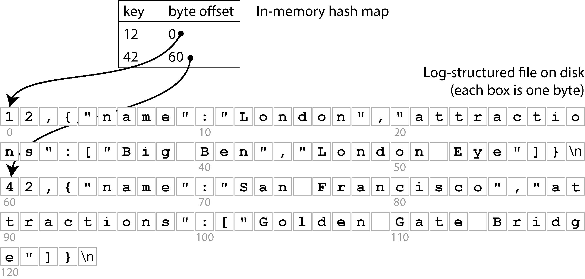

*Hình 4-1. Lưu một log gồm các cặp key-value ở định dạng giống CSV, được đánh index bằng một hash map trong bộ nhớ*

Mỗi khi bạn nối thêm một cặp key-value mới vào file, bạn cũng cập nhật hash map để phản ánh offset của dữ liệu vừa ghi. Khi bạn muốn tra cứu một giá trị, bạn dùng hash map để tìm offset trong file log, seek đến vị trí đó, và đọc giá trị. Nếu phần đó của file dữ liệu đã có sẵn trong cache của filesystem, một lần đọc hoàn toàn không cần bất kỳ I/O đĩa nào.

Cách tiếp cận này nhanh hơn nhiều, nhưng vẫn gặp phải một số vấn đề:

- Bạn không bao giờ giải phóng dung lượng đĩa bị chiếm bởi các mục log cũ đã bị ghi đè; nếu bạn cứ tiếp tục ghi vào database, bạn có thể hết dung lượng đĩa.

- Hash map không được lưu bền (persist), nên bạn phải xây dựng lại nó khi khởi động lại database—ví dụ, bằng cách quét toàn bộ file log để tìm byte offset mới nhất cho mỗi khóa. Điều này khiến việc khởi động lại chậm nếu bạn có nhiều dữ liệu.

- Hash table phải nằm vừa trong bộ nhớ. Về nguyên tắc, bạn có thể duy trì một hash table trên đĩa, nhưng tiếc là rất khó để làm một hash map trên đĩa hoạt động hiệu quả. Nó đòi hỏi rất nhiều I/O truy cập ngẫu nhiên, tốn kém khi cần mở rộng lúc đã đầy, và các xung đột hash (hash collision) đòi hỏi logic xử lý rắc rối [2].

- Các truy vấn theo khoảng (range query) không hiệu quả. Ví dụ, bạn không thể dễ dàng quét qua tất cả các khóa từ `10000` đến `19999` —bạn phải tra cứu từng khóa riêng lẻ trong hash map.

#### Định dạng file SSTable

Trong thực tế, hash table không được dùng thường xuyên cho index của database. Thay vào đó, phổ biến hơn nhiều là giữ dữ liệu trong một cấu trúc được *sắp xếp theo khóa* [3]. Một ví dụ về cấu trúc như vậy là *Sorted Strings Table*, gọi tắt là *SSTable*, như thể hiện trong Hình 4-2. Định dạng file này cũng lưu các cặp key-value, nhưng nó đảm bảo rằng chúng được sắp xếp theo khóa, và mỗi khóa chỉ xuất hiện một lần trong file.

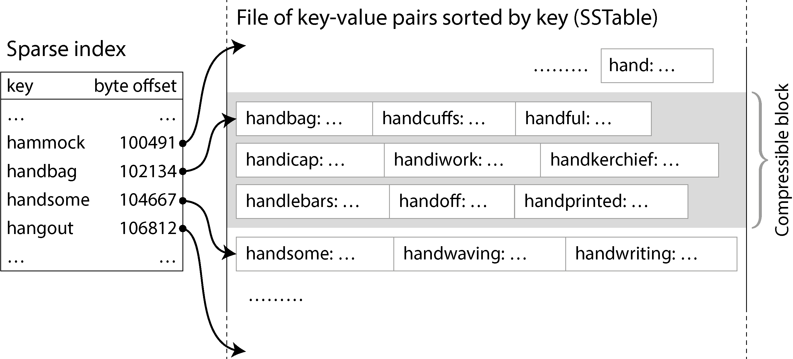

*Hình 4-2. Một SSTable với sparse index, cho phép truy vấn nhảy thẳng đến block phù hợp*

Giờ đây, bạn không cần giữ tất cả các khóa trong bộ nhớ. Bạn có thể nhóm các cặp key-value trong một SSTable thành các *block* cỡ vài kilobyte rồi lưu khóa đầu tiên của mỗi block vào index. Loại index này, vốn chỉ lưu một phần các khóa, được gọi là *sparse* (thưa). Index này được lưu trong một phần riêng của SSTable—ví dụ, dùng một B-tree bất biến, một trie, hoặc một cấu trúc dữ liệu khác cho phép truy vấn tra cứu nhanh một khóa cụ thể [4].

Chẳng hạn, trong Hình 4-2, khóa đầu tiên của một block là `handbag` , và khóa đầu tiên của block kế tiếp là `handsome` . Giờ giả sử bạn đang tìm khóa `handiwork` , khóa này không xuất hiện trong sparse index. Nhờ việc sắp xếp, bạn biết rằng `handiwork` phải nằm giữa `handbag` và `handsome` . Điều này có nghĩa là bạn có thể seek đến offset của `handbag` và quét file từ đó cho đến khi tìm thấy `handiwork` (hoặc không, nếu khóa không có trong file). Một block cỡ vài kilobyte có thể được quét rất nhanh.

Mỗi block record cũng có thể được nén (thể hiện bằng vùng tô bóng trong Hình 4-2). Ngoài việc tiết kiệm dung lượng đĩa, việc nén còn giảm mức sử dụng băng thông I/O, với cái giá là tốn thêm một chút thời gian CPU.

#### Xây dựng và gộp (merge) các SSTable

Định dạng file SSTable tốt hơn cho việc đọc so với một log append-only, nhưng nó làm cho việc ghi khó khăn hơn. Chúng ta không thể đơn giản nối thêm vào cuối, bởi khi đó file sẽ không còn được sắp xếp nữa (trừ khi các khóa tình cờ được ghi theo thứ tự tăng dần). Nếu chúng ta phải ghi lại toàn bộ SSTable mỗi khi một khóa được chèn vào đâu đó ở giữa, việc ghi sẽ trở nên quá tốn kém.

Chúng ta có thể giải quyết vấn đề này bằng cách tiếp cận *log-structured*, một dạng kết hợp giữa log append-only và file đã sắp xếp:

1. Khi một thao tác ghi đến, thêm nó vào một cấu trúc dữ liệu ánh xạ có thứ tự (ordered map) trong bộ nhớ, chẳng hạn cây đỏ–đen (red–black tree), skip list [5], hoặc trie [6]. Với các cấu trúc dữ liệu này, bạn có thể chèn khóa theo bất kỳ thứ tự nào, tra cứu chúng một cách hiệu quả, và đọc lại chúng theo thứ tự đã sắp xếp. Cấu trúc dữ liệu trong bộ nhớ này được gọi là *memtable*.

2. Khi memtable lớn hơn một ngưỡng nhất định—thường là vài megabyte—ghi nó ra đĩa theo thứ tự đã sắp xếp dưới dạng một file SSTable. Chúng ta gọi file SSTable mới này là *segment* (phân đoạn) mới nhất của database, và nó được lưu thành một file riêng bên cạnh các segment cũ hơn. Mỗi segment có một index riêng cho nội dung của nó. Trong khi segment mới đang được ghi ra đĩa, database có thể tiếp tục ghi vào một instance memtable mới, và bộ nhớ của memtable cũ được giải phóng khi việc ghi SSTable hoàn tất.

3. Để đọc giá trị của một khóa, trước tiên hãy thử tìm khóa trong memtable và segment trên đĩa mới nhất. Nếu không có ở đó, tiếp tục tìm trong segment cũ hơn kế tiếp cho đến khi bạn tìm thấy khóa hoặc chạm đến segment cũ nhất. Nếu khóa không xuất hiện trong bất kỳ segment nào, nó không tồn tại trong database.

4. Thỉnh thoảng, chạy một tiến trình gộp (merging) và compaction ở chế độ nền để kết hợp các file segment và loại bỏ các giá trị đã bị ghi đè hoặc đã bị xóa.

Việc gộp các segment hoạt động tương tự thuật toán *mergesort* [5]. Quá trình này được minh họa trong Hình 4-3: bắt đầu đọc các file đầu vào song song với nhau, xem khóa đầu tiên trong mỗi file, sao chép khóa nhỏ nhất (theo thứ tự sắp xếp) sang file đầu ra, và lặp lại. Nếu cùng một khóa xuất hiện trong nhiều file đầu vào, chỉ giữ lại giá trị mới hơn. Quá trình này tạo ra một file segment mới đã gộp, cũng được sắp xếp theo khóa, với một giá trị cho mỗi khóa, và nó sử dụng rất ít bộ nhớ bởi chúng ta có thể duyệt qua các SSTable từng khóa một.

Để đảm bảo dữ liệu trong memtable không bị mất nếu database gặp sự cố crash, storage engine giữ một log riêng trên đĩa mà mọi thao tác ghi đều được nối thêm vào ngay lập tức. Log này không được sắp xếp theo khóa, nhưng điều đó không quan trọng, bởi mục đích duy nhất của nó là khôi phục memtable sau khi crash. Mỗi lần memtable được ghi ra thành một SSTable, phần tương ứng của log có thể được loại bỏ.

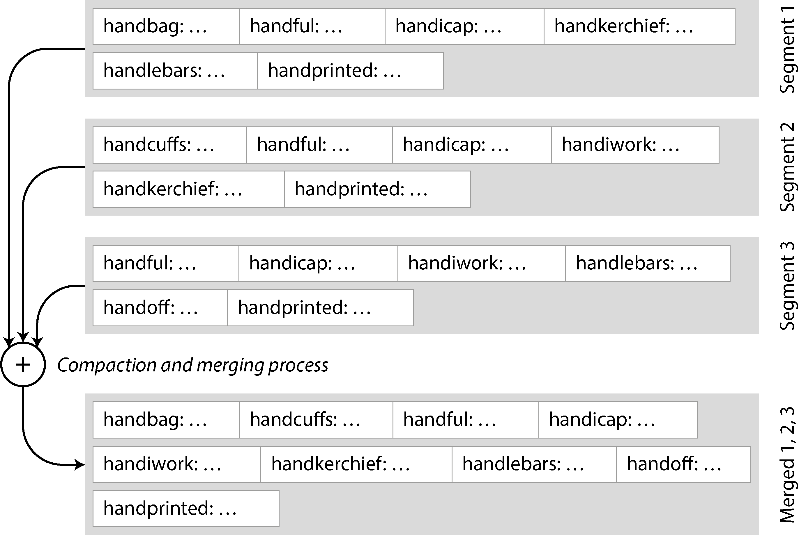

*Hình 4-3. Gộp nhiều segment SSTable, chỉ giữ lại giá trị mới nhất cho mỗi khóa*

Nếu bạn muốn xóa một khóa và giá trị gắn với nó, bạn phải nối thêm một record xóa đặc biệt gọi là *tombstone* (bia mộ) vào file dữ liệu. Khi các segment log được gộp, tombstone báo cho tiến trình gộp loại bỏ mọi giá trị trước đó của khóa đã xóa. Một khi tombstone đã được gộp vào segment cũ nhất, nó có thể bị bỏ đi.

Thuật toán được mô tả ở đây về bản chất là những gì được dùng trong RocksDB [7], Cassandra, ScyllaDB và HBase [8], tất cả đều được truyền cảm hứng từ bài báo Bigtable của Google [9] (bài báo đã giới thiệu các thuật ngữ *SSTable* và *memtable*). Thuật toán này ban đầu được công bố năm 1996 dưới tên *Log-Structured Merge-tree*, hay *LSM-tree* [10], xây dựng trên các công trình trước đó về filesystem log-structured [11]. Vì lý do này, các storage engine dựa trên nguyên lý gộp và compaction các file đã sắp xếp thường được gọi là *LSM storage engine*.

Trong các LSM storage engine, một file segment được ghi trong một lượt duy nhất (hoặc bằng cách ghi memtable ra, hoặc bằng cách gộp một số segment hiện có), và sau đó nó là bất biến (immutable). Việc gộp và compaction các segment có thể được thực hiện trong một thread nền. Trong khi quá trình gộp đang diễn ra, chúng ta vẫn có thể tiếp tục phục vụ các thao tác đọc bằng cách dùng các segment đầu vào của quá trình gộp (như trước, các thao tác đọc tìm trước trong memtable và các file segment mới hơn). Khi quá trình gộp hoàn tất, chúng ta chuyển các request đọc sang dùng segment mới đã gộp thay cho các segment đầu vào, và khi đó các file segment đầu vào có thể bị xóa.

Các file segment không nhất thiết phải được lưu trên đĩa cục bộ; chúng cũng rất phù hợp để ghi lên object storage. Chẳng hạn, SlateDB và Delta Lake [12] áp dụng cách tiếp cận này.

Việc có các file segment bất biến cũng đơn giản hóa việc khôi phục sau crash. Nếu crash xảy ra trong khi đang ghi memtable ra hoặc trong khi đang gộp các segment, database chỉ cần xóa SSTable chưa hoàn tất và bắt đầu lại. Log lưu bền các thao tác ghi vào memtable có thể chứa các record không hoàn chỉnh nếu crash xảy ra giữa lúc đang ghi một record, hoặc nếu đĩa đã đầy; những vấn đề này thường được phát hiện bằng cách đưa checksum vào log và loại bỏ các mục log bị hỏng hoặc không hoàn chỉnh. Chúng ta sẽ nói thêm về tính bền vững (durability) và khôi phục sau crash trong Chương 8.

#### Bloom filter

Với lưu trữ LSM, việc đọc một khóa được cập nhật lần cuối từ rất lâu, hoặc cố đọc một khóa không tồn tại, có thể chậm, bởi storage engine sẽ phải kiểm tra nhiều file segment. Để tăng tốc những lần đọc như vậy, các LSM storage engine thường bao gồm một *Bloom filter* [13] trong mỗi segment, cung cấp một cách nhanh nhưng xấp xỉ để kiểm tra xem một khóa cụ thể có xuất hiện trong một SSTable cụ thể hay không.

Hình 4-4 cho thấy ví dụ về một Bloom filter chứa hai khóa và 16 bit (trong thực tế, nó sẽ chứa nhiều khóa hơn và nhiều bit hơn). Với mỗi khóa trong SSTable, chúng ta tính một hash function, tạo ra một tập các số rồi được diễn giải như các chỉ số vào mảng bit [14]. Chúng ta đặt các bit tương ứng với các chỉ số đó thành 1 và giữ các bit còn lại là 0. Ví dụ, khóa `handbag` được hash thành các số (2, 9, 4), nên chúng ta đặt bit thứ hai, thứ chín và thứ tư thành 1. Bitmap này sau đó được lưu như một phần của SSTable, cùng với sparse index của các khóa. Việc này tốn thêm một chút dung lượng, nhưng Bloom filter thường nhỏ so với phần còn lại của SSTable.

Khi chúng ta muốn biết một khóa có xuất hiện trong SSTable hay không, chúng ta tính cùng hash của khóa đó như trước và kiểm tra các bit tại những chỉ số đó. Ví dụ, trong Hình 4-4, chúng ta đang truy vấn khóa `handheld` , khóa này được hash thành (6, 11, 2). Một trong các bit đó là 1 (cụ thể là bit số 2), trong khi hai bit còn lại là 0. Những kiểm tra này có thể được thực hiện cực nhanh bằng các phép toán bitwise mà mọi CPU đều hỗ trợ.

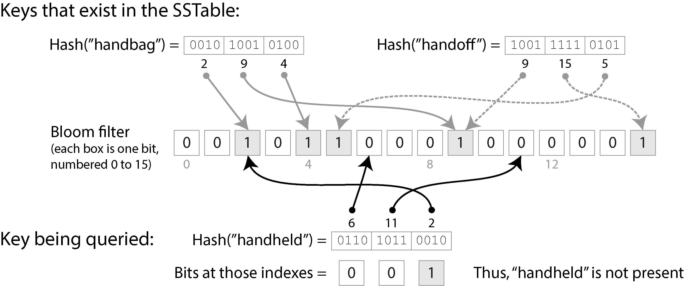

*Hình 4-4. Bloom filter cung cấp một cách kiểm tra nhanh, mang tính xác suất, về việc một khóa cụ thể có tồn tại trong một SSTable cụ thể hay không.*

Nếu ít nhất một trong các bit là 0, chúng ta biết rằng khóa chắc chắn không xuất hiện trong SSTable. Nếu tất cả các bit trong truy vấn đều là 1, khóa nhiều khả năng có trong SSTable, nhưng cũng có thể là do tình cờ mà tất cả các bit đó đã được đặt thành 1 bởi các khóa khác. Trường hợp này, khi trông như một khóa có mặt dù thực tế không có, được gọi là *false positive* (dương tính giả).

Xác suất false positive phụ thuộc vào số khóa, số bit được đặt cho mỗi khóa, và tổng số bit trong Bloom filter. Bạn có thể dùng một công cụ tính toán trực tuyến để tìm ra các tham số phù hợp cho ứng dụng của mình [15]. Theo kinh nghiệm, bạn cần cấp phát 10 bit dung lượng Bloom filter cho mỗi khóa trong SSTable để đạt được xác suất false positive là 1%, và xác suất này giảm đi mười lần cho mỗi 5 bit bổ sung mà bạn cấp phát cho mỗi khóa.

Trong ngữ cảnh các LSM storage engine, false positive không phải là vấn đề:

- Nếu Bloom filter nói rằng một khóa *không* có mặt, chúng ta có thể an toàn bỏ qua SSTable đó, vì chúng ta có thể chắc chắn rằng nó không chứa khóa. Nếu Bloom filter nói rằng khóa *có* mặt, chúng ta phải tham chiếu sparse index và giải mã block các cặp key-value để kiểm tra xem khóa có thực sự ở đó không. Nếu đó là một false positive, chúng ta đã làm một chút việc không cần thiết, nhưng ngoài ra không có hại gì—chúng ta chỉ tiếp tục tìm kiếm với segment cũ hơn kế tiếp.

#### Các chiến lược compaction

Một chi tiết quan trọng là cách LSM storage chọn thời điểm thực hiện compaction và những SSTable nào được đưa vào một lần compaction. Nhiều hệ thống lưu trữ dựa trên LSM cho phép bạn cấu hình chiến lược compaction nào sẽ được dùng. Một số lựa chọn phổ biến như sau [16, 17]:

- **Size-tiered compaction**

  Các SSTable mới hơn và nhỏ hơn được lần lượt gộp vào các SSTable cũ hơn và lớn hơn. Ví dụ, bốn SSTable 256 MB có thể được compact thành một SSTable 898 MB (kết quả không phải 1,024 MB là do các thao tác xóa, ghi đè, hết hạn time-to-live, v.v.). Các SSTable chứa dữ liệu cũ có thể trở nên rất lớn, và việc gộp chúng đòi hỏi rất nhiều dung lượng đĩa tạm. Ưu điểm của chiến lược này là nó có thể xử lý thông lượng (throughput) ghi rất cao vì phần lớn dữ liệu chỉ được ghi lại vài lần trong các lần gộp tuần tự lớn hơn.

- **Leveled compaction**

  Thay vì ghi các SSTable lớn, leveled compaction giữ kích thước SSTable cố định và nhóm chúng thành các “level” (cấp) tăng dần (gọi là L0, L1, v.v.). L0 chứa dữ liệu được ghi gần đây nhất. Tất cả các level sau L0 chứa các SSTable được partition theo khoảng khóa. Ví dụ, L1 có thể có hai SSTable: cái đầu với các khóa `a–m` và cái thứ hai với `n–z` . Mỗi level có giới hạn kích thước riêng, và mỗi level lớn hơn level đứng trước nó (ví dụ, L2 sẽ lớn hơn L1). Khi các SSTable của một level cộng lại vượt quá giới hạn kích thước tối đa, một hoặc nhiều SSTable từ level *i* được gộp vào level *i* + 1 và bị xóa khỏi level *i*. Cách tiếp cận này cho phép compaction diễn ra từng bước hơn và dùng ít dung lượng đĩa hơn so với chiến lược size-tiered. Leveled compaction hiệu quả hơn cho việc đọc so với size-tiered compaction bởi storage engine cần đọc ít SSTable hơn để kiểm tra xem chúng có chứa khóa hay không.

Theo kinh nghiệm, size-tiered compaction hoạt động tốt hơn nếu bạn chủ yếu ghi và ít đọc, trong khi leveled compaction hoạt động tốt hơn nếu workload của bạn chủ yếu là đọc. Nếu bạn ghi thường xuyên một số ít khóa và hiếm khi ghi một số lượng lớn khóa, thì leveled compaction cũng có thể có lợi [18]. May mắn là, hầu hết các triển khai LSM-tree đều cung cấp nhiều chiến lược compaction cho các workload khác nhau.

Dù có nhiều điểm tinh tế, ý tưởng cơ bản của LSM-tree—duy trì một chuỗi tầng các SSTable được gộp ở chế độ nền—là đơn giản và hiệu quả. Chúng ta sẽ thảo luận chi tiết hơn về các đặc tính hiệu năng của chúng trong “So sánh B-Tree và LSM-Tree”.

#### CÁC STORAGE ENGINE NHÚNG

Nhiều database chạy dưới dạng một dịch vụ nhận truy vấn qua mạng, nhưng cũng có những database *nhúng* (*embedded*) không cung cấp API mạng. Thay vào đó, chúng là các thư viện chạy trong cùng process với mã ứng dụng của bạn, thường đọc và ghi các file trên đĩa cục bộ, và bạn tương tác với chúng thông qua các lời gọi hàm thông thường. Ví dụ về các storage engine nhúng bao gồm RocksDB, SQLite, LMDB, DuckDB và KùzuDB [19].

Database nhúng được sử dụng rất phổ biến trong các ứng dụng di động để lưu trữ dữ liệu của người dùng cục bộ. Ở phía backend, chúng có thể là lựa chọn phù hợp nếu dữ liệu đủ nhỏ để nằm gọn trên một máy duy nhất và nếu không có nhiều transaction đồng thời. Ví dụ, trong một hệ thống đa tenant (multitenant) mà mỗi tenant đủ nhỏ và hoàn toàn tách biệt với các tenant khác (tức là bạn không cần chạy các truy vấn kết hợp dữ liệu từ nhiều tenant), bạn có thể dùng một instance database nhúng riêng cho mỗi tenant [20].

Các phương pháp lưu trữ và truy xuất mà chúng ta thảo luận trong chương này được dùng trong cả database nhúng và database client/server. Trong Chương 6 và 7, chúng ta sẽ thảo luận các kỹ thuật để mở rộng một database ra nhiều máy.

### B-Tree

Cách tiếp cận log-structured rất phổ biến, nhưng nó không phải là dạng lưu trữ key-value duy nhất. Cấu trúc được sử dụng rộng rãi nhất để đọc và ghi các bản ghi (record) trong database theo khóa là *B-tree*.

Được giới thiệu vào năm 1970 [21] và được gọi là “có mặt ở khắp nơi” (“ubiquitous”) chưa đến 10 năm sau đó [22], B-tree đã vượt qua thử thách của thời gian rất tốt. Chúng vẫn là cách triển khai index tiêu chuẩn trong gần như mọi database quan hệ, và nhiều database phi quan hệ cũng sử dụng chúng.

Giống như SSTable, B-tree giữ các cặp key-value được sắp xếp theo khóa, cho phép tra cứu key-value và truy vấn theo khoảng (range query) một cách hiệu quả. Nhưng sự tương đồng chỉ dừng lại ở đó; B-tree có một triết lý thiết kế rất khác.

Các index log-structured mà chúng ta đã thấy trước đó chia database thành các *segment* có kích thước biến đổi, thường là vài megabyte hoặc lớn hơn, được ghi một lần rồi trở thành bất biến (immutable). Ngược lại, B-tree chia database thành các *block* hoặc *page* (trang) có kích thước cố định và có thể ghi đè một page tại chỗ (in place). Một page theo truyền thống có kích thước 4 KiB, nhưng PostgreSQL hiện dùng 8 KiB và MySQL dùng 16 KiB theo mặc định.

Mỗi page có thể được định danh bằng một số hiệu page (page number), cho phép một page tham chiếu đến một page khác — tương tự như một con trỏ (pointer), nhưng nằm trên đĩa thay vì trong bộ nhớ. Nếu tất cả các page được lưu trong cùng một file, nhân số hiệu page với kích thước page sẽ cho ta byte offset trong file nơi page đó nằm. Chúng ta có thể dùng các tham chiếu page này để xây dựng một cây gồm các page, như minh họa trong Hình 4-5.

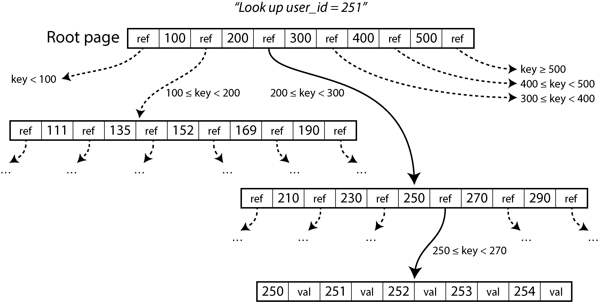

*Hình 4-5. Tra cứu khóa 251 bằng một index B-tree. Từ page gốc (root), ta đi theo tham chiếu đến page cho các khóa 200–300 trước, rồi đến page cho các khóa 250–270.*

Một page được chỉ định làm *root* (gốc) của B-tree; mỗi khi bạn muốn tra cứu một khóa trong index, bạn bắt đầu từ đây. Page này chứa một số khóa và các tham chiếu đến các page con. Mỗi page con chịu trách nhiệm cho một khoảng khóa liên tục, và các khóa nằm giữa các tham chiếu cho biết ranh giới giữa các khoảng đó nằm ở đâu. (Cấu trúc này đôi khi được gọi là B+ tree, nhưng chúng ta không cần phân biệt nó với các biến thể B-tree khác.)

Trong ví dụ ở Hình 4-5, chúng ta đang tìm khóa 251, nên ta biết rằng cần đi theo tham chiếu page nằm giữa hai ranh giới 200 và 300. Điều đó dẫn ta đến một page có dạng tương tự, tiếp tục chia nhỏ khoảng 200–300 thành các khoảng con. Cuối cùng ta đi xuống tới một page chứa các khóa riêng lẻ (một *leaf page* — page lá), page này hoặc chứa trực tiếp (inline) giá trị của từng khóa, hoặc chứa các tham chiếu đến những page nơi có thể tìm thấy các giá trị.

Số lượng tham chiếu đến các page con trong một page của B-tree được gọi là *branching factor* (hệ số phân nhánh). Ví dụ, trong Hình 4-5 branching factor là sáu. Trong thực tế, branching factor phụ thuộc vào lượng không gian cần thiết để lưu các tham chiếu page và các ranh giới khoảng, nhưng thường là vài trăm.

Nếu bạn muốn cập nhật giá trị cho một khóa đã tồn tại trong B-tree, bạn tìm leaf page chứa khóa đó và ghi đè page đó trên đĩa bằng một phiên bản chứa giá trị mới. Nếu bạn muốn thêm một khóa mới, bạn cần tìm page có khoảng bao trùm khóa mới đó và thêm nó vào page này. Nếu không đủ không gian trống trong page để chứa khóa mới, page sẽ được tách (split) thành hai page đầy một nửa, và page cha được cập nhật để phản ánh sự phân chia mới của các khoảng khóa, như minh họa trong Hình 4-6.

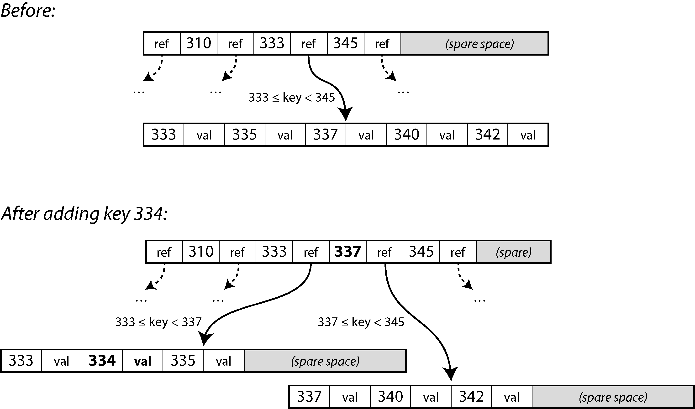

*Hình 4-6. Mở rộng một B-tree bằng cách tách một page tại khóa ranh giới 337. Page cha được cập nhật để tham chiếu đến cả hai page con.*

Trong ví dụ này, chúng ta muốn chèn khóa 334, nhưng page cho khoảng 333–345 đã đầy. Do đó ta tách nó thành một page cho khoảng 333–337 (bao gồm khóa mới, 334) và một page cho khoảng 337–345. Ta cũng phải cập nhật page cha để có tham chiếu đến cả hai page con, với giá trị ranh giới 337 nằm giữa chúng. Nếu page cha không đủ chỗ cho tham chiếu mới, nó cũng có thể cần được tách, và việc tách có thể tiếp diễn lên tận root của cây. Khi root bị tách, ta tạo một root mới phía trên nó. Việc xóa khóa (có thể yêu cầu gộp các node lại) thì phức tạp hơn [5].

Thuật toán này đảm bảo cây luôn *cân bằng* (*balanced*): một B-tree với *n* khóa luôn có độ sâu *O*(log *n*). Hầu hết các database có thể nằm gọn trong một B-tree sâu ba hoặc bốn tầng, nên bạn không cần đi theo nhiều tham chiếu page để tìm được page mình cần. (Một cây bốn tầng với các page 4 KiB và branching factor 500 có thể lưu tới 250 TB.)

#### Làm cho B-tree đáng tin cậy

Thao tác ghi cơ bản bên dưới của B-tree là ghi đè một page trên đĩa bằng dữ liệu mới. Người ta giả định rằng việc ghi đè không làm thay đổi vị trí của page; mọi tham chiếu đến page đó vẫn còn nguyên khi page được ghi đè. Điều này hoàn toàn trái ngược với các index log-structured như LSM-tree, vốn chỉ nối thêm (append) vào file (và cuối cùng xóa các file lỗi thời) nhưng không bao giờ sửa file tại chỗ.

Ghi đè nhiều page cùng lúc, như khi tách page, là một thao tác nguy hiểm. Nếu database bị crash sau khi chỉ mới ghi được một số page, bạn sẽ có một cây bị hỏng (ví dụ, có thể tồn tại một page *mồ côi* (*orphan*) không phải là con của bất kỳ page cha nào). Nếu phần cứng không thể ghi nguyên tử toàn bộ một page, bạn cũng có thể gặp một page chỉ được ghi một phần (điều này được gọi là *torn page* [23]).

Để database có khả năng chống chịu crash, các triển khai B-tree thường bao gồm thêm một cấu trúc dữ liệu trên đĩa: một *write-ahead log* (WAL). Đây là một file chỉ nối thêm (append-only), mà mọi thay đổi trên B-tree phải được ghi vào đó trước khi có thể được áp dụng lên chính các page của cây. Khi database khởi động lại sau một lần crash, log này được dùng để khôi phục B-tree về trạng thái nhất quán [2, 24]. Trong các filesystem, cơ chế tương đương được gọi là *journaling*.

Để cải thiện hiệu năng, các triển khai B-tree thường không ghi ngay lập tức mọi page đã sửa xuống đĩa, mà trước tiên giữ các page của B-tree trong bộ đệm (buffer) trong bộ nhớ một thời gian. Khi đó write-ahead log cũng đảm bảo rằng dữ liệu không bị mất trong trường hợp crash. Miễn là dữ liệu đã được ghi vào WAL và được đẩy xuống đĩa (flush) bằng lời gọi hệ thống `fsync`, dữ liệu sẽ có tính bền vững (durable), vì database sẽ có thể khôi phục nó sau một lần crash [25].

#### Sử dụng các biến thể của B-tree

Vì B-tree đã tồn tại từ rất lâu, nhiều biến thể đã được phát triển qua các năm. Chỉ kể ra một vài ví dụ:

- Thay vì ghi đè các page và duy trì một WAL để khôi phục sau crash, một số database (như LMDB) sử dụng cơ chế copy-on-write [26]. Một page đã sửa được ghi vào một vị trí khác, và một phiên bản mới của các page cha trong cây được tạo ra, trỏ đến vị trí mới. Cách tiếp cận này cũng hữu ích cho việc kiểm soát đồng thời (concurrency control), như chúng ta sẽ thấy trong “Snapshot Isolation và Repeatable Read”.

- Chúng ta có thể tiết kiệm không gian trong các page bằng cách không lưu toàn bộ khóa mà chỉ lưu dạng rút gọn của nó. Đặc biệt là ở các page bên trong cây, các khóa chỉ cần cung cấp đủ thông tin để đóng vai trò ranh giới giữa các khoảng khóa. Đóng gói nhiều khóa hơn vào một page cho phép cây có branching factor cao hơn và do đó ít tầng hơn.

- Để tăng tốc việc quét (scan) trên khoảng khóa theo thứ tự đã sắp xếp, một số triển khai B-tree cố gắng bố trí cây sao cho các leaf page xuất hiện theo thứ tự tuần tự trên đĩa, giảm số lần dịch chuyển đầu đọc đĩa (disk seek). Tuy nhiên, việc duy trì thứ tự đó là khó khi cây phát triển.

- Các con trỏ bổ sung đã được thêm vào cây. Ví dụ, mỗi leaf page có thể có tham chiếu đến các page anh em (sibling) bên trái và bên phải của nó, cho phép quét các khóa theo thứ tự mà không cần nhảy ngược về các page cha.

### So sánh B-Tree và LSM-Tree

Theo kinh nghiệm chung, LSM-tree phù hợp hơn cho các ứng dụng ghi nhiều (write-heavy), trong khi B-tree nhanh hơn cho các thao tác đọc [27, 28]. Tuy nhiên, các benchmark thường nhạy cảm với những chi tiết của workload. Bạn cần kiểm thử các hệ thống với workload cụ thể của mình để có được một so sánh hợp lệ. Hơn nữa, đây không phải là một lựa chọn hoặc-này-hoặc-kia nghiêm ngặt giữa LSM-tree và B-tree; các storage engine đôi khi pha trộn đặc tính của cả hai cách tiếp cận — ví dụ, bằng cách có nhiều B-tree và gộp (merge) chúng theo kiểu LSM. Trong mục này, chúng ta sẽ thảo luận ngắn gọn một vài điều đáng cân nhắc khi đo hiệu năng của một storage engine.

#### Hiệu năng đọc

Trong một B-tree, việc tra cứu một khóa bao gồm đọc một page ở mỗi tầng. Vì số tầng thường khá nhỏ, các thao tác đọc từ B-tree nói chung nhanh và có hiệu năng dễ dự đoán. Trong một storage engine LSM, các thao tác đọc thường phải kiểm tra nhiều SSTable ở các giai đoạn compaction khác nhau, nhưng Bloom filter giúp giảm số thao tác I/O đĩa cần thiết. Cả hai cách tiếp cận đều có thể hoạt động tốt, và cách nào nhanh hơn phụ thuộc vào chi tiết của storage engine và workload.

Range query đơn giản và nhanh trên B-tree, vì chúng có thể tận dụng cấu trúc đã sắp xếp của cây. Trên storage LSM, range query cũng có thể tận dụng việc sắp xếp của SSTable, nhưng chúng cần quét song song tất cả các segment và kết hợp các kết quả. Bloom filter không giúp ích cho range query (vì bạn sẽ phải tính hash của mọi khóa có thể có trong khoảng đó, điều không thực tế), khiến range query tốn kém hơn point query trong cách tiếp cận LSM [29].

Thông lượng (throughput) ghi cao có thể gây ra các đợt tăng vọt độ trễ (latency spike) trong một storage engine log-structured nếu memtable bị đầy. Điều này xảy ra nếu dữ liệu không thể được ghi ra đĩa đủ nhanh, có thể do quá trình compaction không theo kịp các thao tác ghi đến. Nhiều storage engine, bao gồm RocksDB, áp dụng *backpressure* trong tình huống này: chúng tạm dừng mọi thao tác đọc và ghi cho đến khi memtable đã được ghi ra đĩa [30, 31].

Về thông lượng đọc, các SSD hiện đại (đặc biệt là SSD NVMe [Non-Volatile Memory Express] kết nối qua bus PCIe nhanh hơn nhiều thay vì bus SATA) có thể thực hiện song song nhiều yêu cầu đọc độc lập. Cả LSM-tree và B-tree đều có khả năng cung cấp thông lượng đọc cao, nhưng các storage engine cần được thiết kế cẩn thận để tận dụng tính song song này [32].

#### Ghi tuần tự so với ghi ngẫu nhiên

Với B-tree, nếu ứng dụng ghi các khóa nằm rải rác khắp không gian khóa, các thao tác đĩa tương ứng cũng bị phân tán ngẫu nhiên, vì các page mà storage engine cần ghi đè có thể nằm ở bất kỳ đâu trên đĩa. Mặt khác, một storage engine log-structured ghi trọn vẹn từng file segment một lúc (khi ghi memtable ra đĩa hoặc trong khi compaction các segment hiện có), và các file này lớn hơn nhiều so với một page trong B-tree.

Mẫu hình gồm nhiều thao tác ghi nhỏ, rải rác (như trong B-tree) được gọi là *ghi ngẫu nhiên* (*random writes*), trong khi mẫu hình gồm ít thao tác ghi lớn hơn (như trong LSM-tree) được gọi là *ghi tuần tự* (*sequential writes*). Đĩa nói chung có thông lượng ghi tuần tự cao hơn thông lượng ghi ngẫu nhiên, điều đó có nghĩa là một storage engine log-structured nói chung có thể xử lý thông lượng ghi cao hơn B-tree trên cùng phần cứng. Sự khác biệt này đặc biệt lớn trên các ổ đĩa cứng quay (spinning-disk); trên các SSD mà hầu hết database ngày nay sử dụng, sự khác biệt nhỏ hơn nhưng vẫn đáng chú ý.

#### GHI TUẦN TỰ SO VỚI GHI NGẪU NHIÊN TRÊN SSD

Trên các ổ đĩa cứng quay (HDD), ghi tuần tự nhanh hơn nhiều so với ghi ngẫu nhiên. Đó là vì một thao tác ghi ngẫu nhiên phải di chuyển cơ học đầu đọc đĩa đến một vị trí mới và chờ phần thích hợp của mặt đĩa (platter) đi qua bên dưới đầu đọc, việc này mất vài mili giây — cả một thiên thu theo thang thời gian của máy tính. Tuy nhiên, các SSD bao gồm NVMe (hay bộ nhớ flash gắn vào bus PCI Express) hiện đã vượt qua HDD trong nhiều trường hợp sử dụng, và chúng không chịu những giới hạn cơ học như vậy.

Dù vậy, SSD cũng có thông lượng ghi tuần tự cao hơn ghi ngẫu nhiên. Lý do là bộ nhớ flash có thể được đọc hoặc ghi từng page (thường là 4 KiB) một lần, nhưng chỉ có thể được xóa từng block (thường là 512 KiB) một lần. Một số page trong một block có thể chứa dữ liệu hợp lệ, trong khi các page khác có thể chứa dữ liệu không còn cần thiết. Trước khi xóa một block, bộ điều khiển (controller) phải di chuyển các page chứa dữ liệu hợp lệ sang các block khác; quá trình này được gọi là *garbage collection* (GC) [33].

Một workload ghi tuần tự ghi các khối dữ liệu lớn hơn mỗi lần, nên nhiều khả năng toàn bộ một block 512 KiB thuộc về một file duy nhất. Khi file đó sau này bị xóa, toàn bộ block có thể được xóa mà không cần thực hiện GC nào. Mặt khác, với một workload ghi ngẫu nhiên, một block nhiều khả năng chứa lẫn lộn các page có dữ liệu hợp lệ và không hợp lệ, nên garbage collector phải thực hiện nhiều việc hơn trước khi một block có thể được xóa [34, 35, 36]. Băng thông ghi bị GC tiêu tốn khi đó không còn dành cho ứng dụng. Các thao tác ghi bổ sung được thực hiện do GC cũng góp phần làm hao mòn bộ nhớ flash; do đó, ghi ngẫu nhiên làm ổ đĩa hao mòn nhanh hơn ghi tuần tự.

#### Write amplification (khuếch đại ghi)

Với bất kỳ loại storage engine nào, một yêu cầu ghi từ ứng dụng sẽ trở thành nhiều thao tác I/O trên đĩa bên dưới. Với LSM-tree, một giá trị trước tiên được ghi vào log để đảm bảo tính bền vững (durability), rồi được ghi lại khi memtable được ghi ra đĩa, và ghi lại lần nữa mỗi khi cặp key-value đó là một phần của một lần compaction. (Nếu các giá trị lớn hơn đáng kể so với các khóa, chi phí này có thể được giảm bằng cách lưu giá trị tách biệt khỏi khóa và chỉ thực hiện compaction trên các SSTable chứa khóa và tham chiếu đến giá trị [37].)

Một index B-tree phải ghi mỗi mẩu dữ liệu ít nhất hai lần: một lần vào write-ahead log, và một lần vào chính page của cây. Ngoài ra, đôi khi cần phải ghi ra toàn bộ một page, dù chỉ vài byte trong page đó thay đổi, để đảm bảo B-tree có thể được khôi phục đúng sau một lần crash hoặc mất điện [38, 39].

Nếu bạn lấy tổng số byte được ghi xuống đĩa trong một workload và chia cho số byte bạn sẽ phải ghi nếu chỉ đơn giản ghi một log append-only không có index, bạn sẽ có *write amplification* (hệ số khuếch đại ghi). (Đôi khi write amplification được định nghĩa theo số thao tác I/O thay vì số byte.) Trong các ứng dụng ghi nhiều, nút thắt cổ chai có thể là tốc độ mà database có thể ghi xuống đĩa. Trong trường hợp này, write amplification càng cao thì số thao tác ghi mỗi giây mà nó có thể xử lý trong băng thông đĩa khả dụng càng ít.

Write amplification là vấn đề ở cả LSM-tree và B-tree. Cái nào tốt hơn phụ thuộc vào nhiều yếu tố, như độ dài của khóa và giá trị của bạn, và mức độ thường xuyên bạn ghi đè các khóa hiện có so với chèn khóa mới. Với các workload điển hình, LSM-tree có xu hướng có write amplification thấp hơn vì chúng không phải ghi toàn bộ page và có thể nén các khối (chunk) của SSTable [40]. Đây là một yếu tố khác khiến các storage engine LSM phù hợp với các workload ghi nhiều.

Bên cạnh việc ảnh hưởng đến thông lượng, write amplification cũng liên quan đến sự hao mòn của SSD. Một storage engine có write amplification thấp hơn sẽ làm SSD hao mòn chậm hơn.

Khi đo thông lượng ghi của một storage engine, điều quan trọng là phải chạy thử nghiệm đủ lâu để các tác động của write amplification trở nên rõ ràng. Khi ghi vào một LSM-tree trống, chưa có compaction nào diễn ra, nên toàn bộ băng thông đĩa dành cho các thao tác ghi mới. Khi database lớn dần, các thao tác ghi mới cần chia sẻ băng thông đĩa với compaction.

#### Mức sử dụng không gian đĩa

B-tree có thể trở nên *phân mảnh* (*fragmented*) theo thời gian; ví dụ, nếu một lượng lớn khóa bị xóa, file database có thể chứa nhiều page không còn được B-tree sử dụng. Các lần thêm dữ liệu sau đó vào B-tree có thể dùng những page trống này, nhưng chúng không thể dễ dàng được trả lại cho hệ điều hành vì chúng nằm ở giữa file, nên chúng vẫn chiếm không gian trên filesystem. Do đó các database cần một process nền để di chuyển các page nhằm bố trí chúng tốt hơn, chẳng hạn như process vacuum trong PostgreSQL [25].

Phân mảnh ít là vấn đề hơn trong LSM-tree, vì dù sao quá trình compaction cũng định kỳ ghi lại các file dữ liệu, và SSTable không có các page với không gian chưa dùng. Hơn nữa, các block gồm các cặp key-value có thể được nén tốt hơn trong SSTable, thường dẫn đến các file trên đĩa nhỏ hơn so với B-tree. Các khóa và giá trị đã bị ghi đè tiếp tục chiếm không gian cho đến khi chúng bị loại bỏ bởi một lần compaction, nhưng chi phí này khá thấp khi dùng leveled compaction [40, 41]. Size-tiered compaction (xem “Các chiến lược compaction”) dùng nhiều không gian đĩa hơn, đặc biệt là tạm thời trong lúc compaction.

Việc có nhiều bản sao của một số dữ liệu trên đĩa cũng có thể là vấn đề khi bạn cần xóa một số dữ liệu và chắc chắn rằng nó thực sự đã bị xóa (có thể là để tuân thủ các quy định bảo vệ dữ liệu). Ví dụ, trong hầu hết các storage engine LSM, một bản ghi đã xóa có thể vẫn tồn tại ở các tầng cao hơn cho đến khi tombstone biểu thị việc xóa đã được lan truyền qua tất cả các tầng compaction, việc này có thể mất nhiều thời gian. Các thiết kế storage engine chuyên biệt có thể lan truyền việc xóa nhanh hơn [42].

Mặt khác, bản chất bất biến của các file segment SSTable rất hữu ích nếu bạn muốn tạo một snapshot của database tại một thời điểm nào đó (ví dụ, để backup hoặc để tạo một bản sao của database cho việc kiểm thử). Bạn có thể ghi memtable ra đĩa và ghi lại những file segment nào tồn tại tại thời điểm đó. Miễn là bạn không xóa các file thuộc snapshot, bạn không cần thực sự sao chép chúng. Trong một B-tree mà các page bị ghi đè, việc tạo một snapshot như vậy một cách hiệu quả khó hơn.

### Index đa cột và Secondary Index

Cho đến giờ chúng ta chỉ mới thảo luận về các index key-value, vốn giống như *primary-key index* (index khóa chính) trong mô hình quan hệ. Một khóa chính (primary key) định danh duy nhất một hàng trong một bảng quan hệ, hoặc một document trong một database document, hoặc một đỉnh (vertex) trong một database graph. Các bản ghi khác trong database có thể tham chiếu đến hàng/document/đỉnh đó bằng khóa chính (hay ID) của nó, và index được dùng để phân giải các tham chiếu như vậy.

Việc có các *secondary index* (index thứ cấp) cũng rất phổ biến. Trong các database quan hệ, bạn có thể tạo nhiều secondary index trên cùng một bảng bằng lệnh `CREATE INDEX`, cho phép bạn tìm kiếm theo các cột khác ngoài khóa chính. Ví dụ, trong schema quan hệ được minh họa ở Hình 3-1, rất có thể bạn sẽ có một secondary index trên các cột `user_id` để có thể tìm tất cả các hàng thuộc về cùng một người dùng trong mỗi bảng.

Một secondary index có thể được xây dựng dễ dàng từ một index key-value. Khác biệt chính là trong một secondary index, các giá trị được đánh index không nhất thiết là duy nhất; nghĩa là có thể có nhiều hàng (document, đỉnh) dưới cùng một mục index. Điều này có thể được giải quyết theo hai cách: hoặc làm cho mỗi giá trị trong index là một danh sách các định danh hàng khớp (giống như postings list trong một index toàn văn (full-text)), hoặc làm cho mỗi mục trở thành duy nhất bằng cách nối thêm một định danh hàng vào nó. Cả các storage engine cập nhật tại chỗ (in-place update) như B-tree, và storage log-structured đều có thể được dùng để triển khai một index.

### Lưu trữ giá trị bên trong Index

Khóa (key) trong một index là thứ mà các truy vấn dùng để tìm kiếm. Tùy loại index, ngoài các khóa, index còn có thể lưu thêm những dữ liệu khác:

- Nếu dữ liệu thực tế (hàng, document, đỉnh) được lưu trực tiếp bên trong cấu trúc index, nó được gọi là *clustered index* (index phân cụm). Ví dụ, trong storage engine InnoDB của MySQL, khóa chính của một bảng luôn là một clustered index, còn trong SQL Server, bạn có thể chỉ định một clustered index cho mỗi bảng [43].

- Hoặc, giá trị có thể là một tham chiếu tới dữ liệu thực tế: hoặc là khóa chính của hàng đang xét (InnoDB làm như vậy với các secondary index), hoặc là một tham chiếu trực tiếp tới một vị trí trên đĩa. Trong trường hợp sau, nơi lưu các hàng được gọi là *heap file*, và nó lưu dữ liệu không theo thứ tự cụ thể nào (nó có thể là append-only, hoặc có thể theo dõi các hàng đã xóa để sau đó ghi đè lên chúng bằng dữ liệu mới). Ví dụ, Postgres dùng cách tiếp cận heap file [44]. Một giải pháp trung gian giữa hai cách này là *covering index* (index bao phủ) hay *index with included columns* (index có kèm cột), lưu *một số* cột của bảng ngay trong index, bên cạnh việc lưu toàn bộ hàng trong heap hoặc trong clustered index theo khóa chính [45]. Điều này cho phép một số truy vấn được trả lời chỉ bằng index, mà không cần phải tra khóa chính hay tìm trong heap file (trong trường hợp đó, ta nói index *bao phủ* (cover) truy vấn). Cách này có thể giúp một số truy vấn nhanh hơn, nhưng việc dữ liệu bị trùng lặp khiến index chiếm nhiều dung lượng đĩa hơn và làm chậm việc ghi.

Các index đã thảo luận cho đến giờ chỉ ánh xạ một khóa duy nhất tới một giá trị. Nếu bạn cần truy vấn đồng thời nhiều cột của một bảng (hoặc nhiều trường trong một document), hãy xem “Index đa chiều và Index toàn văn”.

Khi cập nhật một giá trị mà không thay đổi khóa, cách tiếp cận heap file có thể cho phép ghi đè bản ghi (record) ngay tại chỗ, với điều kiện giá trị mới không lớn hơn giá trị cũ. Tình huống phức tạp hơn nếu giá trị mới lớn hơn, vì khi đó nó có lẽ phải được chuyển tới một vị trí mới trong heap có đủ chỗ trống. Trong trường hợp đó, mọi index đều phải được cập nhật để trỏ tới vị trí mới của bản ghi trong heap, hoặc phải để lại một con trỏ chuyển tiếp (forwarding pointer) tại vị trí cũ trong heap [2].

### Giữ toàn bộ dữ liệu trong bộ nhớ

Các cấu trúc dữ liệu được thảo luận cho đến giờ trong chương này đều là những lời giải cho các hạn chế của đĩa. So với bộ nhớ chính, đĩa là thứ khó xử lý. Với cả đĩa từ và SSD, dữ liệu cần được bố trí cẩn thận nếu bạn muốn có hiệu năng đọc và ghi tốt. Chúng ta chấp nhận sự bất tiện này vì đĩa có hai lợi thế đáng kể: chúng bền vững (nội dung không bị mất khi tắt nguồn), và chúng có chi phí trên mỗi gigabyte thấp hơn RAM.

Khi RAM ngày càng rẻ, lập luận về chi phí trên mỗi gigabyte dần mất đi sức nặng. Nhiều tập dữ liệu đơn giản là không lớn đến mức đó, nên hoàn toàn khả thi để giữ chúng toàn bộ trong bộ nhớ, có thể phân tán trên nhiều máy. Điều này đã dẫn tới sự phát triển của các *in-memory database* (cơ sở dữ liệu trong bộ nhớ).

Một số key-value store trong bộ nhớ, chẳng hạn Memcached, chỉ được thiết kế cho mục đích cache, trong đó việc mất dữ liệu khi một máy khởi động lại là chấp nhận được. Nhưng những in-memory database khác hướng tới tính bền vững (durability), điều có thể đạt được bằng phần cứng đặc biệt (như RAM có pin dự phòng) hoặc, phổ biến hơn, bằng cách ghi một log các thay đổi ra đĩa, ghi các snapshot định kỳ ra đĩa, hoặc replicate trạng thái trong bộ nhớ sang các máy khác.

Điều này cho phép database nạp lại trạng thái của nó khi khởi động lại, hoặc từ đĩa hoặc qua mạng từ một replica (trừ khi dùng phần cứng đặc biệt). Dù có ghi ra đĩa, những hệ thống này vẫn được coi là in-memory database vì đĩa chỉ được dùng như một log append-only phục vụ tính bền vững, còn việc đọc được phục vụ hoàn toàn từ bộ nhớ. Việc ghi ra đĩa cũng có những lợi thế về vận hành: các file trên đĩa có thể dễ dàng được sao lưu, kiểm tra và phân tích bởi các công cụ bên ngoài.

Các sản phẩm như VoltDB, SingleStore và Oracle TimesTen là các in-memory database với mô hình quan hệ, và các nhà cung cấp tuyên bố rằng chúng có thể mang lại cải thiện hiệu năng lớn nhờ loại bỏ mọi chi phí phụ trội (overhead) gắn với việc quản lý các cấu trúc dữ liệu trên đĩa [46, 47]. RAMCloud là một key-value store mã nguồn mở trong bộ nhớ có tính bền vững (dùng cách tiếp cận log-structured cho cả dữ liệu trong bộ nhớ lẫn dữ liệu trên đĩa) [48]. Redis và Couchbase cung cấp tính bền vững yếu bằng cách ghi ra đĩa một cách bất đồng bộ.

Trái với trực giác, lợi thế hiệu năng của các in-memory database không đến từ việc chúng không cần đọc từ đĩa. Ngay cả một storage engine dựa trên đĩa cũng có thể chẳng bao giờ cần đọc từ đĩa nếu bạn có đủ bộ nhớ, vì hệ điều hành vốn đã cache các block đĩa được dùng gần đây trong bộ nhớ. Thay vào đó, chúng nhanh hơn vì chúng tránh được chi phí phụ trội của việc encoding các cấu trúc dữ liệu trong bộ nhớ sang một dạng có thể ghi ra đĩa [49].

Bên cạnh hiệu năng, một trường hợp sử dụng thú vị khác của in-memory database là cung cấp các mô hình dữ liệu khó triển khai bằng các index trên đĩa. Ví dụ, Redis cung cấp một giao diện kiểu database cho nhiều cấu trúc dữ liệu khác nhau, như hàng đợi ưu tiên (priority queue) và tập hợp (set). Vì giữ toàn bộ dữ liệu trong bộ nhớ, việc triển khai của nó tương đối đơn giản.

## Lưu trữ dữ liệu cho phân tích

Mô hình dữ liệu của một data warehouse thường là quan hệ, vì SQL nói chung rất phù hợp với các truy vấn phân tích. Có nhiều công cụ phân tích dữ liệu đồ họa sinh ra các truy vấn SQL, trực quan hóa kết quả và cho phép các nhà phân tích khám phá dữ liệu (thông qua các thao tác như *drill-down* và *slicing and dicing*).

Nhìn bề ngoài, một data warehouse và một database OLTP quan hệ trông giống nhau, vì cả hai đều có giao diện truy vấn SQL. Tuy nhiên, phần bên trong của các hệ thống này có thể rất khác nhau, vì chúng được tối ưu cho những mẫu truy vấn rất khác nhau. Nhiều nhà cung cấp database hiện nay tập trung hỗ trợ hoặc là xử lý transaction hoặc là các workload phân tích, chứ không phải cả hai.

Một số database, như Microsoft SQL Server, SAP HANA và SingleStore, hỗ trợ cả xử lý transaction và data warehousing trong cùng một sản phẩm. Tuy nhiên, các database xử lý transaction và phân tích lai (hybrid transactional and analytical processing, HTAP) này (được giới thiệu trong “Data Warehousing (Kho dữ liệu)”) ngày càng trở thành hai engine lưu trữ và truy vấn tách biệt, chỉ tình cờ có thể truy cập được thông qua một giao diện SQL chung [50, 51, 52, 53].

### Data Warehouse trên Cloud

Các nhà cung cấp data warehouse lâu đời như Teradata, Vertica và SAP HANA cung cấp các bản triển khai tại chỗ (on-premises) theo giấy phép thương mại cũng như các giải pháp trên cloud. Nhưng khi ngày càng nhiều khách hàng chuyển lên cloud, các data warehouse mới chỉ chạy trên cloud như BigQuery của Google Cloud, Amazon Redshift và Snowflake cũng đã được sử dụng rộng rãi. Khác với các data warehouse truyền thống, các data warehouse trên cloud có thể tận dụng hạ tầng cloud có khả năng mở rộng như object storage và các nền tảng tính toán serverless.

Các data warehouse trên cloud có xu hướng tích hợp tốt hơn với các dịch vụ cloud khác. Ví dụ, nhiều warehouse trên cloud hỗ trợ tự động nạp log (log ingestion) và cung cấp khả năng tích hợp dễ dàng với các framework xử lý dữ liệu như Dataflow của Google Cloud hay AWS Kinesis. Các warehouse này cũng có tính đàn hồi (elastic) cao hơn vì chúng tách rời việc tính toán truy vấn khỏi tầng lưu trữ [54]. Dữ liệu được lưu bền trong object storage thay vì trên đĩa cục bộ, điều này giúp dễ dàng điều chỉnh độc lập dung lượng lưu trữ và tài nguyên tính toán cho các truy vấn, như chúng ta đã thấy trong “Kiến trúc Hệ thống Cloud Native”.

Các data warehouse mã nguồn mở như Apache Hive, Trino và Apache Spark cũng đã tiến hóa cùng với cloud. Khi việc lưu trữ dữ liệu cho phân tích chuyển sang các data lake trên object storage, các warehouse mã nguồn mở đã bắt đầu tách rời thành từng phần [55]. Các thành phần sau đây, vốn trước kia được tích hợp trong một hệ thống duy nhất như Hive, nay thường được triển khai như các thành phần riêng biệt:

- **Query engine**

  Các query engine như Trino, Apache DataFusion và Presto phân tích cú pháp các truy vấn SQL, tối ưu chúng thành các kế hoạch thực thi (execution plan), và thực thi chúng trên dữ liệu. Việc thực thi thường đòi hỏi các tác vụ xử lý dữ liệu song song, phân tán. Một số query engine cung cấp sẵn cơ chế thực thi tác vụ, trong khi số khác chọn dùng các framework thực thi của bên thứ ba như Spark hoặc Flink.

- **Định dạng lưu trữ (storage format)**

  Định dạng lưu trữ quyết định cách các hàng của một bảng được encode thành các byte trong một file, file này sau đó thường được lưu trong object storage hoặc một hệ thống file phân tán [12]. Dữ liệu này khi đó có thể được truy cập không chỉ bởi query engine mà còn bởi các ứng dụng khác sử dụng data lake. Ví dụ về các định dạng lưu trữ như vậy là Parquet, ORC, Lance và Nimble; chúng ta sẽ nói thêm về chúng trong mục tiếp theo.

- **Định dạng bảng (table format)**

  Các file được ghi theo Parquet và các định dạng lưu trữ tương tự thường là bất biến (immutable) một khi đã được ghi. Để hỗ trợ chèn và xóa hàng, có thể dùng một định dạng bảng như Apache Iceberg hoặc định dạng Delta của Databricks. Các định dạng bảng quy định một định dạng file xác định những file nào cấu thành một bảng cùng với schema của bảng đó. Những định dạng như vậy còn cung cấp các tính năng nâng cao như time travel (khả năng truy vấn một bảng như nó đã tồn tại tại một thời điểm trước đó), GC, và thậm chí cả transaction.

- **Data catalog**

  Giống như một định dạng bảng xác định những file nào tạo nên một bảng, một data catalog xác định những bảng nào được chứa trong một database. Các catalog được dùng để tạo, đổi tên và xóa bảng. Khác với các định dạng lưu trữ và định dạng bảng, các data catalog như Polaris của Snowflake và Unity Catalog của Databricks thường chạy như một dịch vụ độc lập có thể được truy vấn qua một giao diện REST. Apache Iceberg cũng cung cấp một catalog, có thể chạy bên trong một client hoặc như một process riêng. Các query engine dùng thông tin catalog khi đọc và ghi bảng. Theo truyền thống, catalog và query engine được tích hợp với nhau, nhưng việc tách rời chúng đã cho phép các hệ thống khám phá dữ liệu (data discovery) và quản trị dữ liệu (data governance) (được thảo luận trong “Hệ thống dữ liệu, pháp luật và xã hội”) cũng truy cập được metadata của catalog.

### Lưu trữ hướng cột (Column-Oriented Storage)

Như đã thảo luận trong “Star và Snowflake: Các schema cho phân tích”, theo quy ước các data warehouse thường dùng một schema quan hệ với một bảng fact lớn chứa các tham chiếu khóa ngoại tới các bảng dimension. Nếu bạn có hàng nghìn tỷ hàng và hàng petabyte dữ liệu trong các bảng fact, việc lưu trữ và truy vấn chúng một cách hiệu quả trở thành một thách thức. Các bảng dimension thường nhỏ hơn nhiều và dễ quản lý hơn (hàng triệu hàng), nên trong mục này chúng ta sẽ tập trung vào việc lưu trữ các fact.

Mặc dù các bảng fact thường rộng hơn một trăm cột, một truy vấn data warehouse điển hình chỉ truy cập bốn hoặc năm cột trong số đó tại một thời điểm (các truy vấn `SELECT *` hiếm khi cần thiết cho phân tích) [52]. Lấy truy vấn trong Ví dụ 4-1 làm ví dụ: nó truy cập một số lượng lớn hàng (mọi lần ai đó mua trái cây hoặc kẹo trong năm dương lịch 2024), nhưng chỉ cần truy cập ba cột của bảng `fact_sales`: `date_key` , `product_sk` và `quantity` . Truy vấn bỏ qua tất cả các cột khác.

**Ví dụ 4-1. Phân tích xem mọi người có xu hướng mua trái cây tươi hay kẹo nhiều hơn, tùy theo ngày trong tuần**

```
SELECT
  dim_date.weekday, dim_product.category,
  SUM(fact_sales.quantity) AS quantity_sold
FROM fact_sales
  JOIN dim_date    ON fact_sales.date_key   = dim_date.date_key
  JOIN dim_product ON fact_sales.product_sk = dim_product.product_sk
WHERE
  dim_date.year = 2024 AND
  dim_product.category IN ('Fresh fruit', 'Candy')
GROUP BY
  dim_date.weekday, dim_product.category;
```

Làm thế nào chúng ta có thể thực thi truy vấn này một cách hiệu quả?

Trong hầu hết các database OLTP, dữ liệu được bố trí theo kiểu *row-oriented* (hướng hàng): tất cả các giá trị của một hàng trong bảng được lưu cạnh nhau. Các document database cũng tương tự: toàn bộ một document thường được lưu như một chuỗi byte liên tiếp. Bạn có thể thấy điều này trong ví dụ CSV ở Hình 4-1.

Để xử lý một truy vấn như trong Ví dụ 4-1, bạn có thể có các index trên `fact_sales.date_key` và/hoặc `fact_sales.product_sk` cho storage engine biết nơi tìm tất cả các giao dịch bán hàng của một ngày cụ thể hay của một sản phẩm cụ thể. Nhưng sau đó, một storage engine hướng hàng vẫn cần nạp tất cả các hàng đó (mỗi hàng gồm hơn 100 thuộc tính) từ đĩa vào bộ nhớ, phân tích chúng, và lọc bỏ những hàng không đáp ứng các điều kiện yêu cầu. Việc đó có thể tốn nhiều thời gian.

Ý tưởng đằng sau lưu trữ *column-oriented* (hướng cột, hay *columnar*) rất đơn giản: thay vì lưu tất cả các giá trị của một hàng cùng nhau, hãy lưu tất cả các giá trị của mỗi *cột* cùng nhau [56]. Nếu mỗi cột được lưu riêng, một truy vấn chỉ cần đọc và phân tích những cột được dùng trong truy vấn đó, điều này có thể tiết kiệm rất nhiều công việc. Hình 4-7 minh họa nguyên tắc này bằng một phiên bản mở rộng của bảng fact từ Hình 3-5.

> **LƯU Ý**
>
> Lưu trữ theo cột dễ hiểu nhất trong mô hình dữ liệu quan hệ, nhưng nó cũng áp dụng được tương đương cho dữ liệu phi quan hệ. Ví dụ, Parquet là một định dạng lưu trữ theo cột hỗ trợ mô hình dữ liệu document [57] dựa trên Dremel của Google [58], sử dụng một kỹ thuật được gọi là *shredding* hay *striping* [59].

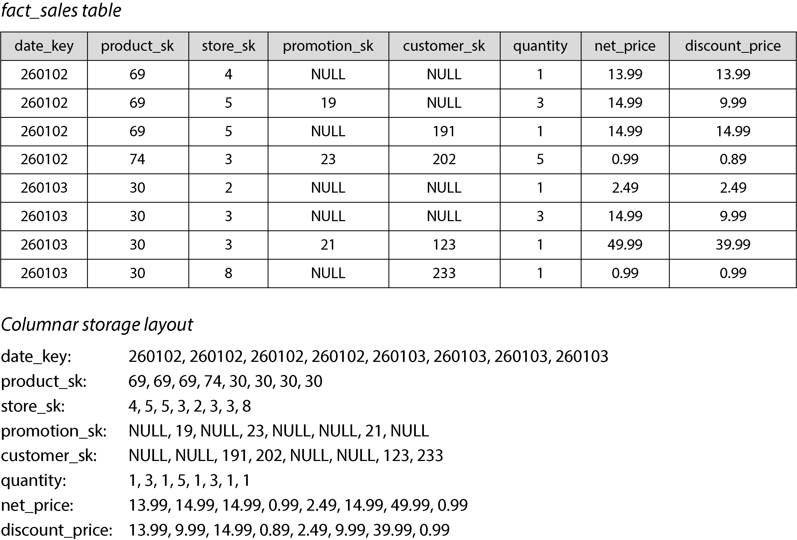

*Hình 4-7. Lưu trữ dữ liệu quan hệ theo cột thay vì theo hàng*

Cách bố trí lưu trữ hướng cột dựa vào việc mỗi cột lưu các hàng theo cùng một thứ tự. Do đó, nếu bạn cần lắp ráp lại toàn bộ một hàng, bạn có thể lấy mục thứ 23 từ mỗi cột riêng lẻ và ghép chúng lại để tạo thành hàng thứ 23 của bảng.

Trong thực tế, các storage engine theo cột không thực sự lưu toàn bộ một cột (có thể chứa hàng nghìn tỷ hàng) trong một lần. Thay vào đó, chúng chia bảng thành các block gồm hàng nghìn hoặc hàng triệu hàng, và trong mỗi block chúng lưu riêng các giá trị của từng cột [60]. Vì nhiều truy vấn bị giới hạn trong một khoảng ngày cụ thể, người ta thường làm cho mỗi block chứa các hàng thuộc một khoảng timestamp nhất định. Khi đó một truy vấn chỉ cần nạp những cột nó cần trong những block giao với khoảng ngày được yêu cầu.

Lưu trữ theo cột ngày nay được dùng trong gần như tất cả các database phân tích [60], từ các data warehouse trên cloud quy mô lớn như Snowflake [61] tới các database nhúng đơn nút (single-node) như DuckDB [62] và các hệ thống phân tích sản phẩm như Pinot [63] và Druid [64]. Nó được dùng trong các định dạng lưu trữ như Parquet, ORC [65, 66], Lance [67] và Nimble [68], và trong các định dạng phân tích trong bộ nhớ như Apache Arrow [65, 69] và Pandas/NumPy [70]. Một số database chuỗi thời gian (time-series), như InfluxDB IOx [71] và TimescaleDB [72], cũng dựa trên lưu trữ hướng cột.

#### Nén cột

Bên cạnh việc chỉ nạp từ đĩa những cột cần cho một truy vấn, chúng ta có thể giảm thêm nữa yêu cầu về thông lượng (throughput) đĩa và băng thông mạng bằng cách nén dữ liệu. May mắn là lưu trữ hướng cột thường rất thích hợp cho việc nén.

Hãy nhìn vào các chuỗi giá trị của mỗi cột trong Hình 4-7. Có khá nhiều sự lặp lại, đó là một dấu hiệu tốt cho việc nén. Tùy vào dữ liệu trong cột, có thể dùng các kỹ thuật nén khác nhau [73]. Một kỹ thuật đặc biệt hiệu quả trong data warehouse là *bitmap encoding* (mã hóa bitmap), được minh họa trong Hình 4-8.

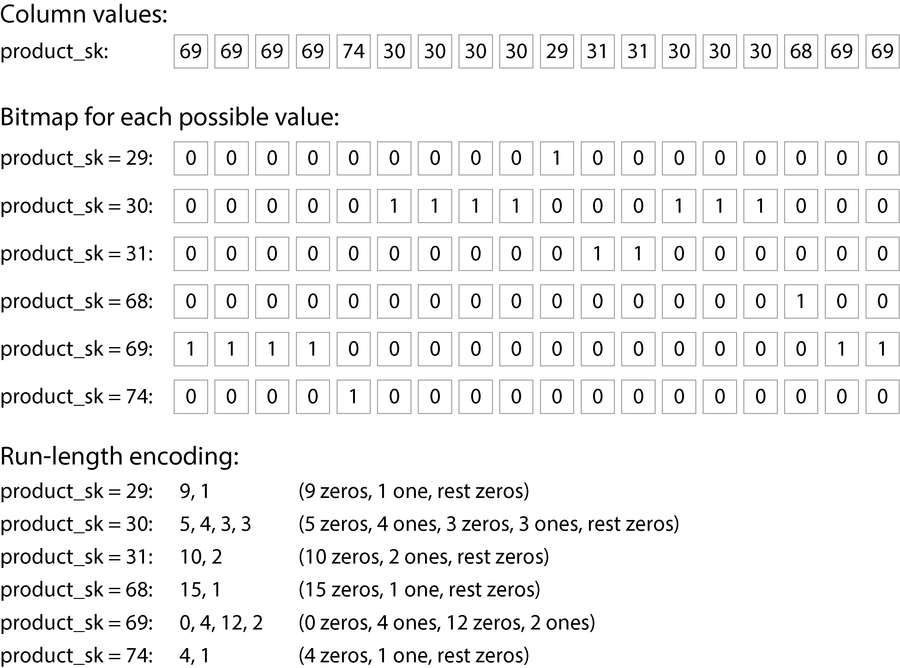

*Hình 4-8. Lưu trữ một cột đơn dưới dạng nén, có index bitmap*

Thường thì số giá trị phân biệt trong một cột là nhỏ so với số hàng (ví dụ, một nhà bán lẻ có thể có hàng tỷ giao dịch bán hàng, nhưng chỉ có 100.000 sản phẩm phân biệt). Bây giờ chúng ta có thể lấy một cột có *n* giá trị phân biệt và biến nó thành *n* bitmap riêng biệt: một bitmap cho mỗi giá trị phân biệt, với một bit cho mỗi hàng. Bit là 1 nếu hàng có giá trị đó, và là 0 nếu không.

Một lựa chọn là lưu các bitmap dùng một bit cho mỗi hàng. Tuy nhiên, các bitmap này thường chứa rất nhiều số 0 (ta nói rằng chúng *thưa* (sparse)). Trong trường hợp đó, các bitmap có thể được *run-length encoded* (mã hóa theo độ dài chạy) thêm nữa, tức là đếm các số 0 hoặc số 1 liên tiếp và lưu các số đếm đó, như minh họa ở cuối Hình 4-8. Các kỹ thuật như *roaring bitmaps* chuyển đổi giữa hai cách biểu diễn bitmap, dùng cách nào gọn nhất [74]. Điều này có thể làm cho việc encode một cột trở nên hiệu quả đáng kể.

Các index bitmap như thế này rất phù hợp với những loại truy vấn phổ biến trong một data warehouse. Ví dụ:

```
WHERE product_sk IN (31, 68, 69)
```

  - Nạp ba bitmap cho `product_sk = 31` , `product_sk = 68` và `product_sk = 69` , rồi tính phép OR theo bit của ba bitmap đó, việc này có thể được thực hiện rất hiệu quả.

```
WHERE product_sk = 30 AND store_sk = 3
```

  - Nạp các bitmap cho `product_sk = 30` và `store_sk = 3` , rồi tính phép AND theo bit. Cách này hoạt động được vì các cột chứa các hàng theo cùng một thứ tự, nên bit thứ *k* trong bitmap của một cột tương ứng với cùng một hàng như bit thứ *k* trong bitmap của một cột khác.

Bitmap cũng có thể được dùng để trả lời các truy vấn đồ thị, chẳng hạn tìm tất cả người dùng của một mạng xã hội được người dùng *X* theo dõi và đồng thời cũng theo dõi người dùng *Y* [75].

> **LƯU Ý**
>
> Đừng nhầm lẫn các database hướng cột với mô hình dữ liệu *wide-column* (còn gọi là *column-family*), trong đó một hàng có thể có hàng nghìn cột, và các hàng không cần phải có cùng các cột [9]. Dù tên gọi tương tự, các database wide-column là hướng hàng, vì chúng lưu tất cả các giá trị của một hàng cùng nhau. Google Bigtable, Apache Accumulo và HBase là các ví dụ về hệ thống dùng mô hình wide-column.

#### Thứ tự sắp xếp trong lưu trữ theo cột

Trong một column store, thứ tự lưu các hàng không nhất thiết quan trọng. Dễ nhất là lưu chúng theo thứ tự chúng được chèn vào, vì khi đó việc chèn một hàng mới chỉ đơn giản là nối thêm vào mỗi cột. Tuy nhiên, chúng ta có thể chọn áp đặt một thứ tự, như chúng ta đã làm với SSTable trước đó, và dùng nó như một cơ chế index.

Lưu ý rằng sắp xếp từng cột một cách độc lập sẽ không có ý nghĩa, vì khi đó chúng ta sẽ không còn biết những mục nào trong các cột thuộc cùng một hàng. Chúng ta chỉ có thể tái tạo một hàng vì chúng ta biết rằng mục thứ *k* trong một cột thuộc cùng một hàng với mục thứ *k* trong cột khác.

Thay vào đó, dữ liệu cần được sắp xếp theo từng hàng trọn vẹn, mặc dù nó được lưu theo cột. Người quản trị database có thể chọn các cột để sắp xếp bảng, dựa trên hiểu biết của họ về các truy vấn thường gặp. Ví dụ, nếu các truy vấn thường nhắm tới các khoảng ngày, chẳng hạn tháng vừa rồi, thì có thể hợp lý khi lấy `date_key` làm khóa sắp xếp (sort key) đầu tiên. Khi đó truy vấn chỉ cần quét các hàng của tháng vừa rồi, sẽ nhanh hơn nhiều so với quét toàn bộ các hàng.

Một cột thứ hai có thể quyết định thứ tự sắp xếp của những hàng có cùng giá trị ở cột thứ nhất. Ví dụ, nếu `date_key` là khóa sắp xếp đầu tiên trong Hình 4-7, thì có thể hợp lý khi lấy `product_sk` làm khóa sắp xếp thứ hai, để tất cả các giao dịch bán cùng một sản phẩm trong cùng một ngày được nhóm lại với nhau trong bộ lưu trữ. Điều đó sẽ giúp các truy vấn cần nhóm hoặc lọc các giao dịch bán hàng theo sản phẩm trong một khoảng ngày nhất định.

Một lợi thế khác của thứ tự đã sắp xếp là nó có thể giúp nén các cột. Nếu cột sắp xếp chính không có nhiều giá trị phân biệt, thì sau khi sắp xếp, nó sẽ có những chuỗi dài trong đó cùng một giá trị được lặp lại nhiều lần liên tiếp. Một run-length encoding đơn giản, như cách chúng ta đã dùng cho các bitmap trong Hình 4-8, có thể nén cột đó xuống chỉ còn vài kilobyte — ngay cả khi bảng có hàng tỷ hàng.

Hiệu ứng nén đó mạnh nhất ở khóa sắp xếp đầu tiên. Khóa sắp xếp thứ hai và thứ ba sẽ lộn xộn hơn và do đó không có những chuỗi giá trị lặp lại dài như vậy. Các cột ở thứ tự ưu tiên sắp xếp thấp hơn xuất hiện theo thứ tự về cơ bản là ngẫu nhiên, nên có lẽ chúng sẽ không nén tốt bằng. Dù vậy, việc có vài cột đầu được sắp xếp vẫn là một lợi ích về tổng thể.

#### Ghi vào lưu trữ hướng cột

Chúng ta đã thấy trong “Đặc trưng của xử lý transaction và phân tích” rằng các thao tác đọc trong data warehouse thường là các phép aggregation trên một số lượng lớn hàng. Lưu trữ hướng cột, nén và sắp xếp đều giúp các truy vấn đọc đó nhanh hơn.

Các thao tác ghi trong data warehouse thường là các lần nhập dữ liệu hàng loạt (bulk import), thường thông qua một quy trình ETL. Với lưu trữ theo cột, việc ghi một hàng riêng lẻ vào đâu đó ở giữa một bảng đã sắp xếp sẽ rất kém hiệu quả, vì bạn sẽ phải ghi lại tất cả các cột đã nén từ vị trí chèn trở đi. Tuy nhiên, một lần ghi hàng loạt nhiều hàng cùng lúc sẽ khấu hao (amortize) chi phí ghi lại các cột đó, làm cho nó trở nên hiệu quả.

Một cách tiếp cận log-structured thường được dùng để thực hiện các thao tác ghi theo batch. Tất cả các thao tác ghi trước tiên đi vào một kho lưu trữ trong bộ nhớ, hướng hàng và đã sắp xếp. Khi đã tích lũy đủ các thao tác ghi, chúng được merge với các file được encode theo cột trên đĩa và được ghi hàng loạt vào các file mới. Vì các file cũ vẫn bất biến và các file mới được ghi trong một lần, object storage rất phù hợp để lưu các file này.

Các truy vấn cần xem xét cả dữ liệu cột trên đĩa lẫn các thao tác ghi gần đây trong bộ nhớ, và kết hợp cả hai. Engine thực thi truy vấn che giấu sự phân biệt này khỏi người dùng. Từ góc nhìn của một nhà phân tích, dữ liệu đã được sửa đổi bằng các thao tác chèn, cập nhật hoặc xóa được phản ánh ngay lập tức trong các truy vấn tiếp theo. Snowflake, Vertica, Apache Pinot, Apache Druid và nhiều database khác làm như vậy [61, 63, 64, 76].

### Thực thi truy vấn: Biên dịch và Vector hóa

Một truy vấn SQL phức tạp dành cho analytics được chia nhỏ thành một *query plan* (kế hoạch truy vấn) gồm nhiều giai đoạn, gọi là các *operator* (toán tử), có thể được phân tán trên nhiều máy để thực thi song song. Các query planner có thể thực hiện rất nhiều tối ưu hóa bằng cách chọn dùng operator nào, thực thi chúng theo thứ tự nào, và chạy từng operator ở đâu.

Bên trong mỗi operator, query engine có thể cần làm nhiều việc khác nhau với các giá trị trong một cột, chẳng hạn tìm tất cả các hàng mà giá trị nằm trong một tập giá trị cụ thể (có thể là một phần của phép join), hoặc kiểm tra xem giá trị có lớn hơn, chẳng hạn, 15 hay không. Query engine nhiều khả năng cũng cần xem xét nhiều cột của cùng một hàng—ví dụ, để tìm tất cả các giao dịch bán hàng mà sản phẩm là “chuối” và cửa hàng là một cửa hàng cụ thể mà ta quan tâm.

Với các truy vấn data warehouse phải quét hàng triệu hàng, chúng ta không chỉ cần lo về lượng dữ liệu chúng phải đọc từ đĩa, mà còn về thời gian CPU cần thiết để thực thi các operator phức tạp. Loại operator đơn giản nhất giống như một trình thông dịch (interpreter) cho một ngôn ngữ lập trình. Trong khi lặp qua từng hàng, nó kiểm tra một cấu trúc dữ liệu biểu diễn truy vấn để tìm ra cần thực hiện những phép so sánh hay tính toán nào trên những cột nào. Đáng tiếc, cách này quá chậm đối với nhiều mục đích analytics. Hai cách tiếp cận thay thế cho việc thực thi truy vấn hiệu quả đã xuất hiện [77]:

- **Query compilation (biên dịch truy vấn)**

  Query engine nhận truy vấn SQL và sinh ra mã để thực thi nó. Mã này lặp qua từng hàng một, xem xét các giá trị trong các cột quan tâm, thực hiện bất kỳ phép so sánh hay tính toán nào cần thiết, và sao chép các giá trị cần thiết vào một buffer đầu ra nếu các điều kiện yêu cầu được thỏa mãn. Sau đó query engine biên dịch mã đã sinh ra thành mã máy (thường dùng một compiler sẵn có như LLVM) và chạy nó trên dữ liệu đã được mã hóa theo cột (column-encoded) và nạp vào bộ nhớ. Cách tiếp cận sinh mã này tương tự với cách biên dịch just-in-time (JIT) được dùng trong Java Virtual Machine (JVM) và các runtime tương tự.

- **Vectorized processing (xử lý vector hóa)**

  Truy vấn được thông dịch, không được biên dịch, nhưng nó được làm cho nhanh bằng cách xử lý nhiều giá trị từ một cột theo từng batch thay vì lặp qua từng hàng một. Một tập cố định các operator định nghĩa sẵn được tích hợp trong database; chúng ta có thể truyền đối số cho chúng và nhận về một batch kết quả [50, 73].

  Ví dụ, chúng ta có thể truyền cột `product_sk` và ID của một sản phẩm (chẳng hạn, “chuối”) cho một operator so sánh bằng, và nhận về một bitmap (một bit cho mỗi giá trị trong cột đầu vào, bit đó là 1 nếu giá trị khớp với ID đó). Sau đó chúng ta có thể truyền cột `store_sk` và ID của cửa hàng quan tâm cho cùng operator so sánh bằng đó, và nhận về một bitmap khác. Cuối cùng, chúng ta có thể truyền hai bitmap này cho một operator AND theo bit (bitwise AND), như minh họa trong Hình 4-9; kết quả sẽ là một bitmap chứa giá trị 1 cho tất cả các giao dịch bán chuối tại một cửa hàng cụ thể.

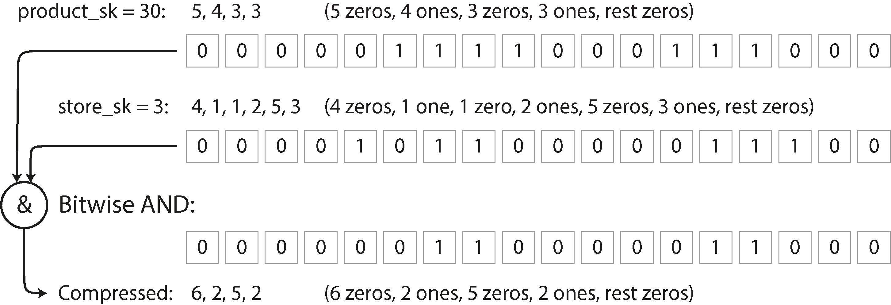

*Hình 4-9. Phép AND theo bit giữa hai bitmap rất phù hợp với vector hóa.*

Hai cách tiếp cận này rất khác nhau về mặt triển khai, nhưng cả hai đều được dùng trong thực tế [77]. Cả hai đều có thể đạt hiệu năng rất tốt bằng cách tận dụng các đặc điểm của CPU hiện đại:

- Ưu tiên truy cập bộ nhớ tuần tự thay vì truy cập ngẫu nhiên để giảm cache miss [78]

- Thực hiện phần lớn công việc trong các vòng lặp trong chặt (tight inner loop) (tức là với số lượng lệnh nhỏ và không có lời gọi hàm) để giữ cho pipeline xử lý lệnh của CPU luôn bận và tránh dự đoán nhánh sai (branch misprediction)

- Tận dụng tính song song như đa thread và các lệnh single-instruction, multiple data (SIMD) [79, 80]

- Thao tác trực tiếp trên dữ liệu đã nén mà không giải mã nó thành một biểu diễn riêng trong bộ nhớ, giúp tiết kiệm chi phí cấp phát và sao chép bộ nhớ

### Materialized View và Data Cube

Chúng ta đã gặp *materialized view* trước đây trong “Vật chất hóa và cập nhật timeline”: trong mô hình dữ liệu quan hệ, chúng là những đối tượng giống bảng mà nội dung là kết quả của một truy vấn. Một materialized view là một bản sao thực sự của kết quả truy vấn, được ghi xuống đĩa, trong khi một virtual view (view ảo) chỉ là một lối viết tắt để viết truy vấn. Khi bạn đọc từ một virtual view, SQL engine mở rộng nó thành truy vấn nền tảng của view ngay lúc đó rồi xử lý truy vấn đã mở rộng.

Khi dữ liệu nền tảng thay đổi, materialized view cần được cập nhật tương ứng. Một số database có thể làm điều đó tự động, và cũng có những hệ thống như Materialize chuyên về việc duy trì materialized view [81]. Chúng ta sẽ trở lại chủ đề này trong “Duy trì materialized view”. Thực hiện các cập nhật như vậy nghĩa là tốn thêm công việc khi ghi, nhưng materialized view có thể cải thiện hiệu năng đọc trong các workload cần thực hiện lặp đi lặp lại cùng những truy vấn giống nhau.

*Materialized aggregate* (kết quả tổng hợp được vật chất hóa) là một loại materialized view có thể hữu ích trong data warehouse. Như đã thảo luận trước đó, các truy vấn data warehouse thường có một hàm aggregation, như `COUNT` , `SUM` , `AVG` , `MIN` , hoặc `MAX` trong SQL. Nếu cùng những aggregate đó được nhiều truy vấn dùng, việc cày lại toàn bộ dữ liệu thô mỗi lần có thể rất lãng phí. Tại sao không cache một số count hay sum mà các truy vấn dùng thường xuyên nhất? Một *data cube* (còn gọi là *OLAP cube*) làm điều này bằng cách tạo một lưới các aggregate được nhóm theo các dimension (chiều) khác nhau [82]. Hình 4-10 cho thấy một ví dụ.

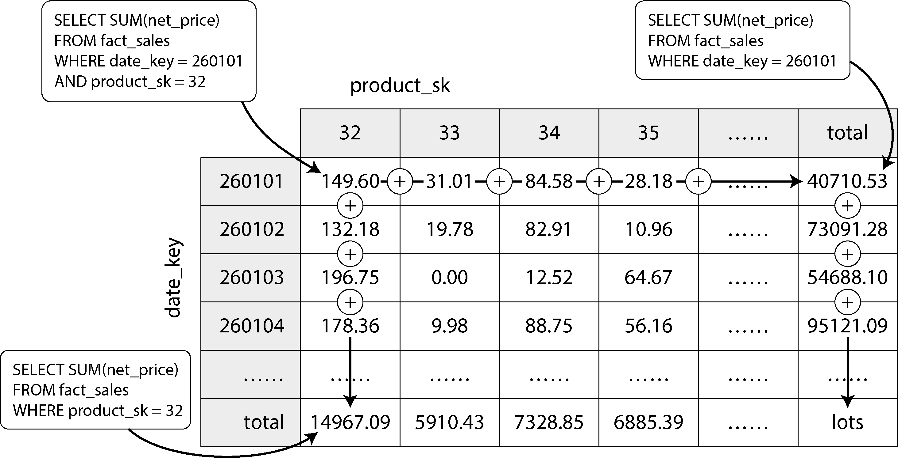

*Hình 4-10. Hai chiều của một data cube, tổng hợp dữ liệu bằng phép cộng*

Tạm thời hãy tưởng tượng rằng mỗi fact chỉ có foreign key tới hai bảng dimension; trong Hình 4-10, đó là `date_key` và `product_sk` . Bây giờ bạn có thể vẽ một bảng hai chiều, với ngày dọc theo một trục và sản phẩm dọc theo trục kia. Mỗi ô chứa aggregate (ví dụ, `SUM` ) của một thuộc tính (ví dụ, `net_price` ) của tất cả các fact có tổ hợp ngày–sản phẩm đó. Sau đó, bạn có thể áp dụng cùng aggregate đó dọc theo mỗi hàng hoặc cột và nhận được một bản tóm tắt đã được rút bớt một chiều (doanh số theo sản phẩm bất kể ngày, hoặc doanh số theo ngày bất kể sản phẩm).

Nói chung, các fact thường có nhiều hơn hai dimension. Trong Hình 3-5, có năm dimension: ngày, sản phẩm, cửa hàng, khuyến mãi, và khách hàng. Sẽ khó hơn nhiều để tưởng tượng một siêu khối (hypercube) năm chiều trông như thế nào, nhưng nguyên tắc vẫn giữ nguyên: mỗi ô chứa doanh số cho một tổ hợp ngày–sản phẩm–cửa hàng–khuyến mãi–khách hàng cụ thể. Các giá trị này sau đó có thể được tóm tắt lặp đi lặp lại dọc theo từng dimension.

Ưu điểm của một data cube được vật chất hóa là một số truy vấn nhất định trở nên rất nhanh vì thực chất chúng đã được tính toán trước. Ví dụ, nếu bạn muốn biết tổng doanh số của mỗi cửa hàng ngày hôm qua, bạn chỉ cần xem các tổng dọc theo dimension tương ứng—không cần quét hàng triệu hàng.

Nhược điểm là data cube không có được sự linh hoạt như khi truy vấn dữ liệu thô. Ví dụ, không có cách nào tính được tỷ lệ doanh số đến từ các mặt hàng có giá trên $100, bởi vì giá không phải là một trong các dimension. Do đó phần lớn data warehouse cố gắng giữ càng nhiều dữ liệu thô càng tốt và chỉ dùng các aggregate như data cube để tăng tốc cho một số truy vấn nhất định.

## Index đa chiều và Index toàn văn

Các B-tree và LSM-tree chúng ta đã thấy ở nửa đầu chương này cho phép range query trên một thuộc tính duy nhất; ví dụ, nếu key là username, bạn có thể dùng chúng làm index để tìm hiệu quả tất cả các tên bắt đầu bằng chữ *L*. Nhưng đôi khi, tìm kiếm theo một thuộc tính duy nhất là không đủ.

Loại index nhiều cột phổ biến nhất được gọi là *concatenated index* (index ghép), đơn giản là kết hợp nhiều field thành một key bằng cách nối cột này tiếp sau cột kia (định nghĩa index chỉ rõ các field được nối theo thứ tự nào). Điều này giống như một cuốn danh bạ điện thoại bằng giấy kiểu cũ, cung cấp một index từ (*lastname*, *firstname*) tới số điện thoại. Nhờ thứ tự sắp xếp, index có thể được dùng để tìm tất cả những người có một họ (last name) cụ thể, hoặc tất cả những người có một tổ hợp *lastname–firstname* cụ thể. Tuy nhiên, index này vô dụng nếu bạn muốn tìm tất cả những người có một tên (first name) cụ thể.

Mặt khác, *multidimensional index* (index đa chiều) cho phép bạn truy vấn nhiều cột cùng một lúc. Điều này đặc biệt quan trọng với dữ liệu không gian địa lý (geospatial). Ví dụ, một website tìm kiếm nhà hàng có thể có một database chứa vĩ độ và kinh độ của từng nhà hàng. Khi người dùng đang xem các nhà hàng trên bản đồ, website cần tìm tất cả các nhà hàng nằm trong vùng bản đồ hình chữ nhật mà người dùng hiện đang xem. Điều này yêu cầu một range query hai chiều như sau:

```
SELECT * FROM restaurants WHERE latitude  > 51.4946 AND latitude  < 51.5
                            AND longitude > -0.1162 AND longitude < -0.1
```

Một concatenated index trên các cột `latitude` và `longitude` không thể trả lời loại truy vấn đó một cách hiệu quả. Index có thể cho bạn hoặc là tất cả các nhà hàng trong một khoảng vĩ độ (nhưng ở bất kỳ kinh độ nào) hoặc tất cả các nhà hàng trong một khoảng kinh độ (nhưng ở bất kỳ đâu giữa Bắc Cực và Nam Cực), nhưng không thể cả hai đồng thời.

Một lựa chọn là chuyển đổi một vị trí hai chiều thành một số duy nhất thông qua một đường cong lấp đầy không gian (space-filling curve), rồi dùng một B-tree index thông thường [83]. Phổ biến hơn, các index không gian chuyên dụng như *R-tree* hoặc *Bkd-tree* [84] được sử dụng; chúng chia không gian sao cho các điểm dữ liệu gần nhau có xu hướng được nhóm vào cùng một cây con. Ví dụ, PostGIS triển khai các index không gian địa lý dưới dạng R-tree bằng cách dùng cơ chế đánh index Generalized Search Tree của PostgreSQL [85]. Cũng có thể dùng các lưới đều gồm các tam giác, hình vuông, hoặc lục giác [86].

Tuy vậy, index đa chiều không chỉ dành cho vị trí địa lý. Ví dụ, trên một website thương mại điện tử bạn có thể dùng một index ba chiều trên các chiều (*red*, *green*, *blue*) để tìm các sản phẩm trong một khoảng màu nhất định, hoặc trong một database quan trắc thời tiết bạn có thể có một index hai chiều trên (*date*, *temperature*) để tìm hiệu quả tất cả các quan trắc trong một năm nhất định mà nhiệt độ nằm trong khoảng từ 25°C đến 30°C. Với một index một chiều, bạn sẽ phải hoặc quét tất cả các record của năm đó (bất kể nhiệt độ) rồi lọc chúng theo nhiệt độ, hoặc ngược lại. Một index hai chiều có thể thu hẹp kết quả theo timestamp và nhiệt độ đồng thời [87].

### Tìm kiếm toàn văn (Full-Text Search)

*Full-text search* (tìm kiếm toàn văn) cho phép bạn tìm kiếm trong một tập hợp tài liệu văn bản (trang web, mô tả sản phẩm, v.v.) theo các từ khóa có thể xuất hiện ở bất kỳ đâu trong văn bản [88]. Truy hồi thông tin (information retrieval) là một chủ đề lớn, mang tính chuyên sâu và thường liên quan đến xử lý đặc thù theo ngôn ngữ; ví dụ, một số ngôn ngữ châu Á được viết không có khoảng trắng hay dấu câu giữa các từ, do đó việc tách văn bản thành các từ yêu cầu một mô hình chỉ ra những chuỗi ký tự nào cấu thành một từ. Full-text search cũng thường liên quan đến việc khớp các từ tương tự nhưng không giống hệt (để xử lý lỗi gõ hoặc các dạng ngữ pháp khác nhau của từ) và các từ đồng nghĩa. Những vấn đề đó vượt ra ngoài phạm vi của cuốn sách này.

Tuy nhiên, về cốt lõi, bạn có thể coi full-text search như một loại truy vấn đa chiều khác. Trong trường hợp này, mỗi từ có thể xuất hiện trong một văn bản (một *term*) là một chiều. Một tài liệu chứa term *x* có giá trị 1 ở chiều *x*, và một tài liệu không chứa *x* có giá trị 0. Tìm kiếm các tài liệu đề cập đến “red apples” nghĩa là một truy vấn tìm giá trị 1 ở chiều *red* và, đồng thời, giá trị 1 ở chiều *apples*. Do đó số chiều có thể rất lớn.

Cấu trúc dữ liệu mà nhiều search engine dùng để trả lời các truy vấn như vậy được gọi là *inverted index* (index đảo ngược). Đây là một cấu trúc key-value trong đó key là một term và value là danh sách ID của tất cả các tài liệu chứa term đó (gọi là *postings list*). Nếu các ID tài liệu là các số tuần tự, postings list cũng có thể được biểu diễn dưới dạng một bitmap thưa, như trong Hình 4-8; bit thứ *n* trong bitmap của term *x* là 1 nếu tài liệu có ID *n* chứa term *x* [89].

Việc tìm tất cả các tài liệu chứa cả hai term *x* và *y* giờ đây tương tự như một truy vấn data warehouse vector hóa tìm các hàng khớp với hai điều kiện (Hình 4-9): nạp hai bitmap của các term *x* và *y* rồi tính phép AND theo bit của chúng. Ngay cả khi các bitmap được mã hóa run-length, việc này vẫn có thể được thực hiện rất hiệu quả.

Ví dụ, Lucene, engine đánh index toàn văn được dùng bởi Elasticsearch và Solr, hoạt động theo cách này [90]. Nó lưu ánh xạ từ term tới postings list trong các file đã sắp xếp giống SSTable, được merge ở chế độ nền bằng cùng cách tiếp cận log-structured mà chúng ta đã thấy trước đó trong chương này [91]. Kiểu index GIN của PostgreSQL cũng dùng postings list để hỗ trợ full-text search và đánh index bên trong các tài liệu JSON [92, 93].

Thay vì tách văn bản thành các từ, một cách khác là tìm tất cả các chuỗi con có độ dài *n*, được gọi là *n*-gram. Ví dụ, các trigram (*n* = 3) của chuỗi `hello` là `hel` , `ell` , và `llo` . Nếu chúng ta xây dựng một inverted index của tất cả các trigram, chúng ta có thể tìm kiếm trong các tài liệu những chuỗi con bất kỳ có độ dài ít nhất ba ký tự. Các trigram index thậm chí cho phép dùng biểu thức chính quy (regular expression) trong truy vấn tìm kiếm; nhược điểm là chúng khá lớn [94].

Để xử lý lỗi gõ trong tài liệu hoặc truy vấn, Lucene có thể tìm trong văn bản các từ nằm trong một khoảng cách chỉnh sửa nhất định (một *edit distance* (khoảng cách chỉnh sửa) bằng 1 nghĩa là một chữ cái đã được thêm vào, xóa đi, hoặc thay thế) [95]. Nó làm điều này bằng cách lưu tập các term dưới dạng một automat hữu hạn trạng thái (finite state automaton) trên các ký tự trong key, tương tự như một trie [96], và biến đổi nó thành một *Levenshtein automaton*, vốn hỗ trợ tìm kiếm hiệu quả các từ nằm trong một edit distance cho trước [97].

### Vector Embedding

*Semantic search* (tìm kiếm ngữ nghĩa) đi xa hơn từ đồng nghĩa và lỗi gõ để cố gắng hiểu các khái niệm trong tài liệu và ý định của người dùng. Nó đang trở thành một phần quan trọng của các ứng dụng AI, chẳng hạn như *retrieval-augmented generation* (sinh nội dung tăng cường bằng truy hồi), vốn kết hợp kết quả tìm kiếm vào đầu ra của một mô hình ngôn ngữ lớn (LLM). Ví dụ, nếu các trang trợ giúp của bạn có một trang tiêu đề “canceling your subscription” (hủy đăng ký thuê bao), người dùng vẫn nên tìm được trang đó khi tìm kiếm “how to close my account” (cách đóng tài khoản của tôi) hoặc “terminate contract” (chấm dứt hợp đồng), những cụm gần nhau về nghĩa mặc dù dùng những từ hoàn toàn khác nhau.

Để hiểu ngữ nghĩa của một tài liệu—nghĩa của nó—các index semantic search dùng các embedding model (mô hình nhúng) để chuyển một tài liệu văn bản thành một vector gồm các giá trị dấu phẩy động, gọi là *vector embedding*. Việc này thường được thực hiện bằng các LLM. Vector biểu diễn một điểm trong một không gian đa chiều, và mỗi giá trị dấu phẩy động biểu diễn vị trí của tài liệu dọc theo trục của một chiều. Các embedding model sinh ra các vector embedding gần nhau (trong không gian đa chiều này) khi các tài liệu đầu vào của embedding tương tự nhau về ngữ nghĩa.

> **LƯU Ý**
>
> Chúng ta đã thấy thuật ngữ *vectorized processing* trong “Thực thi truy vấn: Biên dịch và Vector hóa”. Vector trong semantic search có một ý nghĩa khác. Trong vectorized processing, vector chỉ một batch các bit có thể được xử lý bằng mã được tối ưu hóa đặc biệt. Trong các embedding model, một vector là một mảng các số dấu phẩy động biểu diễn một vị trí trong không gian đa chiều.

Ví dụ, một vector embedding ba chiều cho một trang Wikipedia về nông nghiệp có thể là [0.38, 0.83, 0.41]. Một trang Wikipedia về rau củ sẽ khá gần, có lẽ với embedding là [0.36, 0.64, 0.67]. Một trang về star schema có thể có embedding là [0.85, 0.10, -0.52], tương đối xa hơn. Chỉ cần nhìn vào là chúng ta có thể thấy hai vector đầu gần nhau hơn so với vector thứ ba.

Các embedding model dùng các vector lớn hơn nhiều (thường trên 1.000 số), nhưng nguyên tắc vẫn như vậy. Chúng ta không cố hiểu từng con số riêng lẻ có nghĩa gì; chúng đơn giản là cách để mô hình chỉ đến một vị trí trong một không gian đa chiều trừu tượng. Các search engine dùng các hàm khoảng cách như *cosine similarity* (độ tương đồng cosine) hoặc *Euclidean distance* (khoảng cách Euclid) để đo khoảng cách giữa các vector: cosine similarity đo cosine của góc giữa hai vector để xác định chúng gần nhau đến đâu, trong khi Euclidean distance đo khoảng cách đường thẳng giữa hai điểm trong không gian.

Nhiều embedding model thời kỳ đầu, như Word2Vec [98], BERT [99], và GPT [100], làm việc với dữ liệu văn bản. Các mô hình như vậy thường được triển khai dưới dạng mạng neural. Các nhà nghiên cứu sau đó tiếp tục tạo ra các embedding model cho cả video, âm thanh, và hình ảnh. Gần đây hơn, kiến trúc mô hình đã trở thành *multimodal* (đa phương thức): một mô hình duy nhất có thể sinh vector embedding cho nhiều phương thức, như văn bản và hình ảnh.

Các semantic search engine dùng một embedding model để sinh một vector embedding khi người dùng nhập một truy vấn. Truy vấn của người dùng và ngữ cảnh liên quan (như vị trí của người dùng) được đưa vào embedding model. Sau khi embedding model sinh ra vector embedding của truy vấn, search engine phải tìm các tài liệu có vector embedding tương tự bằng cách dùng một vector index.

Các vector index lưu các vector embedding của một tập hợp tài liệu. Để truy vấn index, bạn truyền vào vector embedding của truy vấn, và index trả về các tài liệu có vector gần nhất với vector truy vấn. Vì các R-tree chúng ta đã thấy trước đó không hoạt động tốt với các vector có nhiều chiều, các vector index chuyên dụng được sử dụng, chẳng hạn như sau:

- **Flat index**

  Các vector được lưu trong index đúng như chúng vốn có. Một truy vấn phải đọc mọi vector và đo khoảng cách của nó tới vector truy vấn. Flat index cho kết quả chính xác, nhưng việc đo khoảng cách giữa truy vấn và từng vector rất chậm.

- **Inverted file (IVF) index**

  Không gian vector được phân cụm thành các partition (gọi là *centroid*) của các vector để giảm số lượng vector phải so sánh. IVF index nhanh hơn flat index nhưng chỉ có thể cho kết quả xấp xỉ; truy vấn và một tài liệu có thể rơi vào các partition khác nhau, mặc dù chúng gần nhau. Một truy vấn trên IVF index trước tiên xác định số *probe*, đơn giản là số partition cần kiểm tra. Các truy vấn dùng nhiều probe hơn sẽ chính xác hơn nhưng chậm hơn, vì phải so sánh nhiều vector hơn.

- **Hierarchical Navigable Small World (HNSW) index**

  HNSW index duy trì nhiều lớp (layer) của không gian vector, như minh họa trong Hình 4-11. Mỗi lớp được biểu diễn dưới dạng một đồ thị, trong đó các node biểu diễn các vector và các cạnh biểu diễn sự gần gũi với các vector lân cận. Một truy vấn bắt đầu bằng việc định vị vector gần nhất trong lớp trên cùng, lớp này có số node nhỏ. Sau đó truy vấn di chuyển tới cùng node đó ở lớp bên dưới và đi theo các cạnh trong lớp đó, vốn được kết nối dày đặc hơn, để tìm một vector gần hơn với vector truy vấn. Quá trình tiếp diễn cho đến khi đạt tới lớp cuối cùng. Giống như IVF index, HNSW index cho kết quả xấp xỉ.

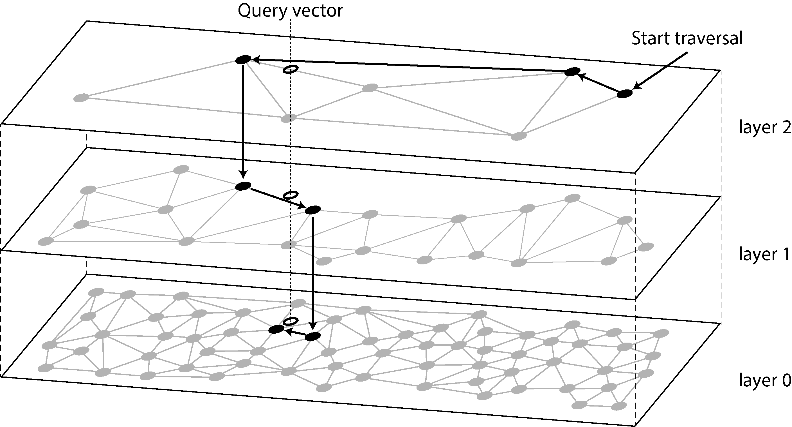

*Hình 4-11. Tìm kiếm mục trong database gần nhất với một vector truy vấn cho trước trong một HNSW index*

Nhiều vector database phổ biến triển khai IVF và HNSW index. Thư viện Faiss của Facebook có một số biến thể của mỗi loại [101], và pgvector của PostgreSQL cũng hỗ trợ cả hai [102]. Toàn bộ chi tiết của các thuật toán IVF và HNSW vượt ra ngoài phạm vi cuốn sách này, nhưng các bài báo về chúng là những tài liệu tuyệt vời [103, 104].

## Tóm tắt

Trong chương này chúng ta đã cố gắng đi đến tận cùng của cách các database thực hiện lưu trữ và truy xuất. Điều gì xảy ra khi bạn lưu dữ liệu vào một database, và database làm gì khi bạn truy vấn dữ liệu đó trở lại sau này?

“Hệ thống vận hành và hệ thống phân tích” đã giới thiệu sự phân biệt giữa xử lý transaction (OLTP) và analytics (OLAP). Trong chương này chúng ta đã thấy rằng các storage engine được tối ưu cho OLTP trông rất khác so với những storage engine được tối ưu cho analytics:

- Các hệ thống OLTP được tối ưu cho khối lượng request lớn, mỗi request đọc và ghi một số lượng nhỏ record và cần phản hồi nhanh. Các record thường được truy cập thông qua primary key hoặc secondary index, và các index này thường là các ánh xạ có thứ tự từ key tới record, đồng thời cũng hỗ trợ range query.

- Data warehouse và các hệ thống analytical tương tự được tối ưu cho các truy vấn đọc phức tạp quét qua một số lượng lớn record. Chúng thường dùng bố cục lưu trữ hướng cột (column-oriented) kèm nén để giảm thiểu lượng dữ liệu mà một truy vấn như vậy cần đọc từ đĩa, và biên dịch JIT các truy vấn hoặc vector hóa để giảm thiểu thời gian CPU dành cho việc xử lý dữ liệu.

Về phía OLTP, chúng ta đã thấy các storage engine từ hai trường phái tư tưởng chính:

- Cách tiếp cận log-structured, cho phép nối thêm (append) vào file và xóa các file lỗi thời nhưng không bao giờ cập nhật một file đã được ghi. Nói chung, các storage engine log-structured có xu hướng cung cấp thông lượng ghi (write throughput) cao. SSTable, LSM-tree, RocksDB, Cassandra, HBase, ScyllaDB, Lucene, và những hệ thống khác thuộc nhóm này.

- Cách tiếp cận update-in-place (cập nhật tại chỗ), coi đĩa như một tập các page có kích thước cố định có thể được ghi đè. B-tree, ví dụ phổ biến nhất của triết lý này, được dùng trong tất cả các database quan hệ OLTP lớn và nhiều database phi quan hệ. Theo kinh nghiệm chung, B-tree có xu hướng tốt hơn cho việc đọc, cung cấp thông lượng đọc cao hơn và thời gian phản hồi thấp hơn so với lưu trữ log-structured.

Sau đó chúng ta đã xem xét các index có thể tìm kiếm theo nhiều điều kiện cùng lúc: các index đa chiều như R-tree có thể tìm các điểm trên bản đồ theo vĩ độ và kinh độ đồng thời, và các index full-text search có thể tìm nhiều từ khóa xuất hiện trong cùng một văn bản. Cuối cùng, chúng ta đã thấy rằng vector database được dùng cho semantic search trên các tài liệu văn bản và các phương tiện khác; chúng dùng các vector với số chiều lớn hơn và tìm các tài liệu tương tự bằng cách so sánh độ tương đồng vector.

Với tư cách là một nhà phát triển ứng dụng, được trang bị kiến thức này về nội bộ của các storage engine giúp bạn ở vị thế tốt hơn nhiều để biết công cụ nào phù hợp nhất cho ứng dụng cụ thể của mình. Nếu bạn cần điều chỉnh các tham số tuning của một database, sự hiểu biết này cho phép bạn hình dung một giá trị cao hơn hay thấp hơn có thể có tác động gì.

Mặc dù chương này không thể biến bạn thành chuyên gia trong việc tuning bất kỳ một storage engine cụ thể nào, hy vọng nó đã trang bị cho bạn đủ từ vựng và ý tưởng để bạn có thể hiểu được tài liệu của database mà bạn chọn.

#### Tài liệu tham khảo

[1] Nikolay Samokhvalov. [“How Partial, Covering, and Multicolumn Indexes May Slow Down UPDATEs in PostgreSQL.”](https://postgres.ai/blog/20211029-how-partial-and-covering-indexes-affect-update-performance-in-postgresql) *postgres.ai*, October 2021. Archived at [*perma.cc/PBK3-F4G9*](https://perma.cc/PBK3-F4G9)

[2] Goetz Graefe. [“Modern B-Tree Techniques.”](https://web.archive.org/web/20240423233106/https://w6113.github.io/files/papers/btreesurvey-graefe.pdf) *Foundations and Trends in Databases*, volume 3, issue 4, pages 203–402, August 2011. [*doi:10.1561/1900000028*](https://doi.org/10.1561/1900000028)

[3] Evan Jones. [“Why Databases Use Ordered Indexes but Programming Uses Hash Tables.”](https://www.evanjones.ca/ordered-vs-unordered-indexes.html) *evanjones.ca*, December 2019. Archived at [*perma.cc/NJX8-3ZZD*](https://perma.cc/NJX8-3ZZD)

[4] Branimir Lambov. [“CEP-25: Trie-Indexed SSTable Format.”](https://cwiki.apache.org/confluence/display/CASSANDRA/CEP-25%3A+Trie-indexed+SSTable+format) *cwiki.apache.org*, November 2022. Archived at [*perma.cc/HD7W-PW8U*](https://perma.cc/HD7W-PW8U) (linked Google Doc archived at [*perma.cc/UL6C-AAAE*)](https://perma.cc/UL6C-AAAE)

[5] Thomas H. Cormen, Charles E. Leiserson, Ronald L. Rivest, and Clifford Stein. *Introduction to Algorithms*, 3rd edition. MIT Press, 2009. ISBN: 9780262533058

[6] Branimir Lambov. [“Trie Memtables in Cassandra.”](https://www.vldb.org/pvldb/vol15/p3359-lambov.pdf) *Proceedings of the VLDB Endowment*, volume 15, issue 12, pages 3359–3371, August 2022. [*doi:10.14778/3554821.3554828*](https://doi.org/10.14778/3554821.3554828)

[7] Dhruba Borthakur. [“The History of RocksDB.”](https://rocksdb.blogspot.com/2013/11/the-history-of-rocksdb.html) *rocksdb.blogspot.com*, November 2013. Archived at [*perma.cc/Z7C5-JPSP*](https://perma.cc/Z7C5-JPSP)

[8] Matteo Bertozzi. [“Apache HBase I/O—HFile.”](https://blog.cloudera.com/apache-hbase-i-o-hfile/) *blog.cloudera.com*, June 2012. Archived at [*perma.cc/U9XH-L2KL*](https://perma.cc/U9XH-L2KL)

[9] Fay Chang, Jeffrey Dean, Sanjay Ghemawat, Wilson C. Hsieh, Deborah A. Wallach, Mike Burrows, Tushar Chandra, Andrew Fikes, and Robert E. Gruber. [“Bigtable: A Distributed Storage System for Structured Data.”](https://research.google/pubs/pub27898/) At *7th USENIX Symposium on Operating System Design and Implementation* (OSDI), November 2006.

[10] Patrick O’Neil, Edward Cheng, Dieter Gawlick, and Elizabeth O’Neil. [“The Log- Structured Merge-Tree (LSM-Tree).”](https://www.cs.umb.edu/~poneil/lsmtree.pdf) *Acta Informatica*, volume 33, issue 4, pages 351–385, June 1996. [*doi:10.1007/s002360050048*](https://doi.org/10.1007/s002360050048)

[11] Mendel Rosenblum and John K. Ousterhout. [“The Design and Implementation of a Log-Structured File System.”](https://research.cs.wisc.edu/areas/os/Qual/papers/lfs.pdf) *ACM Transactions on Computer Systems*, volume 10, issue 1, pages 26–52, February 1992. [*doi:10.1145/146941.146943*](https://doi.org/10.1145/146941.146943)

[12] Michael Armbrust, Tathagata Das, Liwen Sun, Burak Yavuz, Shixiong Zhu, Mukul Murthy, Joseph Torres, Herman van Hovell, Adrian Ionescu, Alicja Łuszczak, Michał Świtakowski, Michał Szafrański, Xiao Li, Takuya Ueshin, Mostafa Mokhtar, Peter Boncz, Ali Ghodsi, Sameer Paranjpye, Pieter Senster, Reynold Xin, and Matei Zaharia. [“Delta Lake: High-Performance ACID Table Storage over Cloud Object Stores.”](https://vldb.org/pvldb/vol13/p3411-armbrust.pdf) *Proceedings of the VLDB Endowment*, volume 13, issue 12, pages 3411– 3424, August 2020. [*doi:10.14778/3415478.3415560*](https://doi.org/10.14778/3415478.3415560)

[13] Burton H. Bloom. [“Space/Time Trade-offs in Hash Coding with Allowable Errors.”](https://people.cs.umass.edu/~emery/classes/cmpsci691st/readings/Misc/p422-bloom.pdf) *Communications of the ACM*, volume 13, issue 7, pages 422–426, July 1970. [*doi:10.1145/362686.362692*](https://doi.org/10.1145/362686.362692)

[14] Adam Kirsch and Michael Mitzenmacher. [“Less Hashing, Same Performance: Building a Better Bloom Filter.”](https://www.eecs.harvard.edu/%7Emichaelm/postscripts/tr-02-05.pdf) *Random Structures & Algorithms*, volume 33, issue 2, pages 187–218, September 2008. [*doi:10.1002/rsa.20208*](https://doi.org/10.1002/rsa.20208)

[15] Thomas Hurst. [“Bloom Filter Calculator.”](https://hur.st/bloomfilter/) *hur.st*, September 2023. Archived at [*per-* *ma.cc/L3AV-6VC2*](https://perma.cc/L3AV-6VC2)

[16] Chen Luo and Michael J. Carey. [“LSM-Based Storage Techniques: a Survey.”](https://arxiv.org/abs/1812.07527) *The VLDB Journal*, volume 29, pages 393–418, July 2019. [*doi:10.1007/s00778-019-00555-* *y*](https://doi.org/10.1007/s00778-019-00555-y)

[17] Subhadeep Sarkar and Manos Athanassoulis. [“Dissecting, Designing, and Optimizing LSM-Based Data Stores.”](https://www.youtube.com/watch?v=hkMkBZn2mGs) Tutorial at *ACM International Conference on Management of Data* (SIGMOD), June 2022. Slides archived at [*perma.cc/93B3-E827*](https://perma.cc/93B3-E827)

[18] Mark Callaghan. [“Name That Compaction Algorithm.”](https://smalldatum.blogspot.com/2018/08/name-that-compaction-algorithm.html) *smalldatum.blogspot.com*, August 2018. Archived at [*perma.cc/CN4M-82DY*](https://perma.cc/CN4M-82DY)

[19] Prashanth Rao. [“Embedded Databases (1): The Harmony of DuckDB, KùzuDB and LanceDB.”](https://thedataquarry.com/posts/embedded-db-1/) *thedataquarry.com*, August 2023. Archived at [*perma.cc/PA28-2R35*](https://perma.cc/PA28-2R35)

[20] Hacker News discussion. [“Bluesky Migrates to Single-Tenant SQLite.”](https://news.ycombinator.com/item?id=38171322) *news.ycombinator.com*, October 2023. Archived at [*perma.cc/69LM-5P6X*](https://perma.cc/69LM-5P6X)

[21] Rudolf Bayer and Edward M. McCreight. [“Organization and Maintenance of Large Ordered Indices.”](https://dl.acm.org/doi/pdf/10.1145/1734663.1734671) Boeing Scientific Research Laboratories, Mathematical and Information Sciences Laboratory, report no. 20, July 1970. [*doi:10.1145/1734663.1734671*](https://doi.org/10.1145/1734663.1734671)

[22] Douglas Comer. [“The Ubiquitous B-Tree.”](https://web.archive.org/web/20170809145513id_/http://sites.fas.harvard.edu/~cs165/papers/comer.pdf) *ACM Computing Surveys*, volume 11, issue 2, pages 121–137, June 1979. [*doi:10.1145/356770.356776*](https://doi.org/10.1145/356770.356776)

[23] Alex Miller. [“Torn Write Detection and Protection.”](https://transactional.blog/blog/2025-torn-writes) *transactional.blog*, April 2025. Archived at [*perma.cc/G7EB-33EW*](https://perma.cc/G7EB-33EW)

[24] C. Mohan and Frank Levine. [“ARIES/IM: An Efficient and High Concurrency Index Management Method Using Write-Ahead Logging.”](https://ics.uci.edu/~cs223/papers/p371-mohan.pdf) At *ACM International Conference on Management of Data* (SIGMOD), June 1992. [*doi:10.1145/130283.130338*](https://doi.org/10.1145/130283.130338)

[25] Hironobu Suzuki. [“The Internals of PostgreSQL.”](https://www.interdb.jp/pg/) *interdb.jp*, 2017. Archived at [*archive.org*](https://web.archive.org/web/20251005094032/https://www.interdb.jp/pg/)

[26] Howard Chu. [“LDAP at Lightning Speed.”](https://buildstuff14.sched.com/event/08a1a368e272eb599a52e08b4c3c779d) At *Build Stuff ’14*, November 2014. Archived at [*perma.cc/GB6Z-P8YH*](https://perma.cc/GB6Z-P8YH)

[27] Manos Athanassoulis, Michael S. Kester, Lukas M. Maas, Radu Stoica, Stratos Idreos, Anastasia Ailamaki, and Mark Callaghan. [“Designing Access Methods: The RUM Conjecture.”](https://openproceedings.org/2016/conf/edbt/paper-12.pdf) At *19th International Conference on Extending Database Technology* (EDBT), March 2016. [*doi:10.5441/002/edbt.2016.42*](https://doi.org/10.5441/002/edbt.2016.42)

[28] Ben Stopford. [“Log Structured Merge Trees.”](http://www.benstopford.com/2015/02/14/log-structured-merge-trees/) *benstopford.com*, February 2015. Archived at [*perma.cc/E5BV-KUJ6*](https://perma.cc/E5BV-KUJ6)

[29] Mark Callaghan. [“The Advantages of an LSM vs. a B-Tree.”](https://smalldatum.blogspot.com/2016/01/summary-of-advantages-of-lsm-vs-b-tree.html) *smalldatum.blogspot.co.uk*, January 2016. Archived at [*perma.cc/3TYZ-EFUD*](https://perma.cc/3TYZ-EFUD)

[30] Oana Balmau, Florin Dinu, Willy Zwaenepoel, Karan Gupta, Ravishankar Chandhiramoorthi, and Diego Didona. [“SILK: Preventing Latency Spikes in Log- Structured Merge Key-Value Stores.”](https://www.usenix.org/conference/atc19/presentation/balmau) At *USENIX Annual Technical Conference*, July 2019.

[31] Igor Canadi, Siying Dong, Mark Callaghan, et al. [“RocksDB Tuning Guide.”](https://github.com/facebook/rocksdb/wiki/RocksDB-Tuning-Guide) *github.com*, 2023. Archived at [*perma.cc/UNY4-MK6C*](https://perma.cc/UNY4-MK6C)

[32] Gabriel Haas and Viktor Leis. [“What Modern NVMe Storage Can Do, and How to Exploit It: High-Performance I/O for High-Performance Storage Engines.”](https://www.vldb.org/pvldb/vol16/p2090-haas.pdf) *Proceedings of the VLDB Endowment*, volume 16, issue 9, pages 2090–2102. May 2023. [*doi:10.14778/3598581.3598584*](https://doi.org/10.14778/3598581.3598584)

[33] Emmanuel Goossaert. [“Coding for SSDs.”](https://codecapsule.com/2014/02/12/coding-for-ssds-part-1-introduction-and-table-of-contents/) *codecapsule.com*, February 2014.

[34] Jack Vanlightly. [“Is Sequential IO Dead in the Era of the NVMe Drive?”](https://jack-vanlightly.com/blog/2023/5/9/is-sequential-io-dead-in-the-era-of-the-nvme-drive) *jack-vanlightly.com*, May 2023. Archived at [*perma.cc/7TMZ-TAPU*](https://perma.cc/7TMZ-TAPU)

[35] Alibaba Cloud Storage Team. [“Storage System Design Analysis: Factors Affecting NVMe SSD Performance (2).”](https://www.alibabacloud.com/blog/594376) *alibabacloud.com*, January 2019. Archived at [*archive.org*](https://web.archive.org/web/20230510065132/https://www.alibabacloud.com/blog/594376)

[36] Xiao-Yu Hu and Robert Haas. [“The Fundamental Limit of Flash Random Write Performance: Understanding, Analysis and Performance Modelling.”](https://dominoweb.draco.res.ibm.com/reports/rz3771.pdf) *dominoweb.draco.res.ibm.com*, March 2010. Archived at [*perma.cc/8JUL-4ZDS*](https://perma.cc/8JUL-4ZDS)

[37] Lanyue Lu, Thanumalayan Sankaranarayana Pillai, Andrea C. Arpaci-Dusseau, and Remzi H. Arpaci-Dusseau. [“WiscKey: Separating Keys from Values in SSD- Conscious Storage.”](https://www.usenix.org/system/files/conference/fast16/fast16-papers-lu.pdf) At *4th USENIX Conference on File and Storage Technologies* (FAST), February 2016.

[38] Peter Zaitsev. [“Innodb Double Write.”](https://www.percona.com/blog/innodb-double-write/) *percona.com*, August 2006. Archived at [*per-* *ma.cc/NT4S-DK7T*](https://perma.cc/NT4S-DK7T)

[39] Tomas Vondra. [“On the Impact of Full-Page Writes.”](https://www.2ndquadrant.com/en/blog/on-the-impact-of-full-page-writes/) *2ndquadrant.com*, November 2016. Archived at [*perma.cc/7N6B-CVL3*](https://perma.cc/7N6B-CVL3)

[40] Mark Callaghan. [“Read, Write & Space Amplification—B-Tree vs. LSM.”](https://smalldatum.blogspot.com/2015/11/read-write-space-amplification-b-tree.html) *smalldatum.blogspot.com*, November 2015. Archived at [*perma.cc/S487-WK5P*](https://perma.cc/S487-WK5P)

[41] Mark Callaghan. [“Choosing Between Efficiency and Performance with RocksDB.”](https://www.youtube.com/watch?v=tgzkgZVXKB4) At *Code Mesh*, November 2016

[42] Subhadeep Sarkar, Tarikul Islam Papon, Dimitris Staratzis, Zichen Zhu, and Manos Athanassoulis. [“Enabling Timely and Persistent Deletion in LSM-Engines.”](https://subhadeep.net/assets/fulltext/Enabling_Timely_and_Persistent_Deletion_in_LSM-Engines.pdf) *ACM Transactions on Database Systems*, volume 48, issue 3, article no. 8, August 2023. [*doi:10.1145/3599724*](https://doi.org/10.1145/3599724)

[43] Lukas Fittl. [“Postgres vs. SQL Server: B-Tree Index Differences & the Benefit of Deduplication.”](https://pganalyze.com/blog/postgresql-vs-sql-server-btree-index-deduplication) *pganalyze.com*, April 2025. Archived at [*perma.cc/XY6T-LTPX*](https://perma.cc/XY6T-LTPX)

[44] Drew Silcock. [“How Postgres Stores Data on Disk—This One’s a Page Turner.”](https://drew.silcock.dev/blog/how-postgres-stores-data-on-disk/) *drew.silcock.dev*, August 2024. Archived at [*perma.cc/8K7K-7VJ2*](https://perma.cc/8K7K-7VJ2)

[45] Joe Webb. [“Using Covering Indexes to Improve Query Performance.”](https://www.red-gate.com/simple-talk/databases/sql-server/learn/using-covering-indexes-to-improve-query-performance/) *simple-talk.com*, September 2008. Archived at [*perma.cc/6MEZ-R5VR*](https://perma.cc/6MEZ-R5VR)

[46] Michael Stonebraker, Samuel Madden, Daniel J. Abadi, Stavros Harizopoulos, Nabil Hachem, and Pat Helland. [“The End of an Architectural Era (It’s Time for a Complete Rewrite).”](https://vldb.org/conf/2007/papers/industrial/p1150-stonebraker.pdf) At *33rd International Conference on Very Large Data Bases* (VLDB), September 2007.

[47] [“VoltDB Technical Overview White Paper.”](https://www.voltactivedata.com/wp-content/uploads/2017/03/hv-white-paper-voltdb-technical-overview.pdf) VoltDB, 2017. Archived at [*perma.cc/B9SF-SK5G*](https://perma.cc/B9SF-SK5G)

[48] Stephen M. Rumble, Ankita Kejriwal, and John K. Ousterhout. [“Log-Structured Memory for DRAM-Based Storage.”](https://www.usenix.org/system/files/conference/fast14/fast14-paper_rumble.pdf) At *12th USENIX Conference on File and Storage Technologies* (FAST), February 2014.

[49] Stavros Harizopoulos, Daniel J. Abadi, Samuel Madden, and Michael Stonebraker. [“OLTP Through the Looking Glass, and What We Found There.”](https://hstore.cs.brown.edu/papers/hstore-lookingglass.pdf) At *ACM International Conference on Management of Data* (SIGMOD), June 2008. [*doi:10.1145/1376616.1376713*](https://doi.org/10.1145/1376616.1376713)

[50] Per-Åke Larson, Cipri Clinciu, Campbell Fraser, Eric N. Hanson, Mostafa Mokhtar, Michal Nowakiewicz, Vassilis Papadimos, Susan L. Price, Srikumar Rangarajan, Remus Rusanu, and Mayukh Saubhasik. [“Enhancements to SQL Server Column Stores.”](https://web.archive.org/web/20131203001153id_/http://research.microsoft.com/pubs/193599/Apollo3%20-%20Sigmod%202013%20-%20final.pdf) At *ACM International Conference on Management of Data* (SIGMOD), June 2013. [*doi:10.1145/2463676.2463708*](https://doi.org/10.1145/2463676.2463708)

[51] Franz Färber, Norman May, Wolfgang Lehner, Philipp Große, Ingo Müller, Hannes Rauhe, and Jonathan Dees. [“The SAP HANA Database—An Architecture Overview.”](https://web.archive.org/web/20220208081111id_/http://sites.computer.org/debull/A12mar/hana.pdf) *IEEE Data Engineering Bulletin*, volume 35, issue 1, pages 28–33, March 2012. Archived at [*perma.cc/H2WC-YQZY*](https://perma.cc/H2WC-YQZY)

[52] Michael Stonebraker. [“The Traditional RDBMS Wisdom Is (Almost Certainly) All Wrong.”](https://slideshot.epfl.ch/talks/166) Presentation at *EPFL*, May 2013.

[53] Adam Prout, Szu-Po Wang, Joseph Victor, Zhou Sun, Yongzhu Li, Jack Chen, Evan Bergeron, Eric Hanson, Robert Walzer, Rodrigo Gomes, and Nikita Shamgunov. [“Cloud-Native Transactions and Analytics in SingleStore.”](https://dl.acm.org/doi/pdf/10.1145/3514221.3526055) At *ACM International Conference on Management of Data* (SIGMOD), June 2022. [*doi:10.1145/3514221.3526055*](https://doi.org/10.1145/3514221.3526055)

[54] Tino Tereshko and Jordan Tigani. [“BigQuery Under the Hood.”](https://cloud.google.com/blog/products/bigquery/bigquery-under-the-hood) *cloud.google.com*, January 2016. Archived at [*perma.cc/WP2Y-FUCF*](https://perma.cc/WP2Y-FUCF)

[55] Wes McKinney. [“The Road to Composable Data Systems: Thoughts on the Last 15 Years and the Future.”](https://wesmckinney.com/blog/looking-back-15-years/) *wesmckinney.com*, September 2023. Archived at [*perma.cc/6L2M-GTJX*](https://perma.cc/6L2M-GTJX)

[56] Michael Stonebraker, Daniel J. Abadi, Adam Batkin, Xuedong Chen, Mitch Cherniack, Miguel Ferreira, Edmond Lau, Amerson Lin, Sam Madden, Elizabeth O’Neil, Pat O’Neil, Alex Rasin, Nga Tran, and Stan Zdonik. [“C-Store: A Column- Oriented DBMS.”](https://www.vldb.org/archives/website/2005/program/paper/thu/p553-stonebraker.pdf) At *31st International Conference on Very Large Data Bases* (VLDB), September 2005.

[57] Julien Le Dem. [“Dremel Made Simple with Parquet.”](https://blog.twitter.com/engineering/en_us/a/2013/dremel-made-simple-with-parquet.html) *blog.x.com*, September 2013. Archived at [*archive.org*](https://web.archive.org/web/20250730031810/https://blog.x.com/engineering/en_us/a/2013/dremel-made-simple-with-parquet)

[58] Sergey Melnik, Andrey Gubarev, Jing Jing Long, Geoffrey Romer, Shiva Shivakumar, Matt Tolton, and Theo Vassilakis. [“Dremel: Interactive Analysis of Web-Scale Datasets.”](https://vldb.org/pvldb/vol3/R29.pdf) At *36th International Conference on Very Large Data Bases* (VLDB), September 2010. [*doi:10.14778/1920841.1920886*](https://doi.org/10.14778/1920841.1920886)

[59] Joe Kearney. [“Understanding Record Shredding: Storing Nested Data in Columns.”](https://www.joekearney.co.uk/posts/understanding-record-shredding) *joekearney.co.uk*, December 2016. Archived at [*perma.cc/ZD5N-AX5D*](https://perma.cc/ZD5N-AX5D)

[60] Jamie Brandon. [“A Shallow Survey of OLAP and HTAP Query Engines.”](https://www.scattered-thoughts.net/writing/a-shallow-survey-of-olap-and-htap-query-engines) *scattered-thoughts.net*, September 2023. Archived at [*perma.cc/L3KH-J4JF*](https://perma.cc/L3KH-J4JF)

[61] Benoit Dageville, Thierry Cruanes, Marcin Zukowski, Vadim Antonov, Artin Avanes, Jon Bock, Jonathan Claybaugh, Daniel Engovatov, Martin Hentschel, Jiansheng Huang, Allison W. Lee, Ashish Motivala, Abdul Q. Munir, Steven Pelley, Peter Povinec, Greg Rahn, Spyridon Triantafyllis, and Philipp Unterbrunner. [“The Snowflake Elastic Data Warehouse.”](https://dl.acm.org/doi/pdf/10.1145/2882903.2903741) At *ACM International Conference on Management of Data* (SIGMOD), June 2016. [*doi:10.1145/2882903.2903741*](https://doi.org/10.1145/2882903.2903741)

[62] Mark Raasveldt and Hannes Mühleisen. [“Data Management for Data Science Towards Embedded Analytics.”](https://duckdb.org/pdf/CIDR2020-raasveldt-muehleisen-duckdb.pdf) At *10th Conference on Innovative Data Systems Research* (CIDR), January 2020. Archived at [*perma.cc/65G2-NYDT*](https://perma.cc/65G2-NYDT)

[63] Jean-François Im, Kishore Gopalakrishna, Subbu Subramaniam, Mayank Shrivastava, Adwait Tumbde, Xiaotian Jiang, Jennifer Dai, Seunghyun Lee, Neha Pawar, Jialiang Li, and Ravi Aringunram. [“Pinot: Realtime OLAP for 530 Million Users.”](https://cwiki.apache.org/confluence/download/attachments/103092375/Pinot.pdf) At *ACM International Conference on Management of Data* (SIGMOD), May 2018. [*doi:10.1145/3183713.3190661*](https://doi.org/10.1145/3183713.3190661)

[64] Fangjin Yang, Eric Tschetter, Xavier Léauté, Nelson Ray, Gian Merlino, and Deep Ganguli. [“Druid: A Real-Time Analytical Data Store.”](https://cs-courses.mines.edu/csci598ab/spring2022/assets/papers/yang2014druid.pdf) At *ACM International Conference on Management of Data* (SIGMOD), June 2014. [*doi:10.1145/2588555.2595631*](https://doi.org/10.1145/2588555.2595631)

[65] Chunwei Liu, Anna Pavlenko, Matteo Interlandi, and Brandon Haynes. [“Deep Dive into Common Open Formats for Analytical DBMSs.”](https://www.vldb.org/pvldb/vol16/p3044-liu.pdf) *Proceedings of the VLDB Endowment*, volume 16, issue 11, pages 3044–3056, July 2023. [*doi:10.14778/3611479.3611507*](https://doi.org/10.14778/3611479.3611507)

[66] Xinyu Zeng, Yulong Hui, Jiahong Shen, Andrew Pavlo, Wes McKinney, and Huanchen Zhang. [“An Empirical Evaluation of Columnar Storage Formats.”](https://www.vldb.org/pvldb/vol17/p148-zeng.pdf) *Proceedings of the VLDB Endowment*, volume 17, issue 2, pages 148–161. [*doi:10.14778/3626292.3626298*](https://doi.org/10.14778/3626292.3626298)

[67] Weston Pace. [“Lance v2: A Columnar Container Format for Modern Data.”](https://blog.lancedb.com/lance-v2/) *blog.lancedb.com*, April 2024. Archived at [*perma.cc/ZK3Q-S9VJ*](https://perma.cc/ZK3Q-S9VJ)

[68] Yoav Helfman. [“Nimble, A New Columnar File Format.”](https://www.youtube.com/watch?v=bISBNVtXZ6M) At *VeloxCon*, April 2024.

[69] Wes McKinney. [“Apache Arrow: High-Performance Columnar Data Framework.”](https://www.youtube.com/watch?v=YhF8YR0OEFk) At *CMU Database Group—Vaccination Database Tech Talks*, December 2021.

[70] Wes McKinney. [*Python for Data Analysis*, 3rd edition.](https://learning.oreilly.com/library/view/python-for-data/9781098104023/) O’Reilly Media, 2022. ISBN: 9781098104023

[71] Paul Dix. [“The Design of InfluxDB IOx: An In-Memory Columnar Database Written in Rust with Apache Arrow.”](https://www.youtube.com/watch?v=_zbwz-4RDXg) At *CMU Database Group—Vaccination Database Tech Talks*, May 2021.

[72] Carlota Soto and Mike Freedman. [“Building Columnar Compression for Large PostgreSQL Databases.”](https://www.timescale.com/blog/building-columnar-compression-in-a-row-oriented-database/) *timescale.com*, March 2024. Archived at [*perma.cc/7KTF-* *V3EH*](https://perma.cc/7KTF-V3EH)

[73] Daniel J. Abadi, Peter Boncz, Stavros Harizopoulos, Stratos Idreos, and Samuel Madden. [“The Design and Implementation of Modern Column-Oriented Database Systems.”](https://www.cs.umd.edu/~abadi/papers/abadi-column-stores.pdf) *Foundations and Trends in Databases*, volume 5, issue 3, pages 197–280, December 2013. [*doi:10.1561/1900000024*](https://doi.org/10.1561/1900000024)

[74] Daniel Lemire, Gregory Ssi-Yan-Kai, and Owen Kaser. [“Consistently Faster and Smaller Compressed Bitmaps with Roaring.”](https://arxiv.org/pdf/1603.06549) *Software: Practice and Experience*, volume 46, issue 11, pages 1547–1569, November 2016. [*doi:10.1002/spe.2402*](https://doi.org/10.1002/spe.2402)

[75] Jaz Volpert. [“An Entire Social Network in 1.6GB (GraphD Part 2).”](https://jazco.dev/2024/04/20/roaring-bitmaps/) *jazco.dev*, April 2024. Archived at [*perma.cc/L27Z-QVMG*](https://perma.cc/L27Z-QVMG)

[76] Andrew Lamb, Matt Fuller, Ramakrishna Varadarajan, Nga Tran, Ben Vandiver, Lyric Doshi, and Chuck Bear. [“The Vertica Analytic Database: C-Store 7 Years Later.”](https://vldb.org/pvldb/vol5/p1790_andrewlamb_vldb2012.pdf) *Proceedings of the VLDB Endowment*, volume 5, issue 12, pages 1790–1801, August 2012. [*doi:10.14778/2367502.2367518*](https://doi.org/10.14778/2367502.2367518)

[77] Timo Kersten, Viktor Leis, Alfons Kemper, Thomas Neumann, Andrew Pavlo, and Peter Boncz. [“Everything You Always Wanted to Know About Compiled and Vectorized Queries But Were Afraid to Ask.”](https://www.vldb.org/pvldb/vol11/p2209-kersten.pdf) *Proceedings of the VLDB Endowment*, volume 11, issue 13, pages 2209–2222, September 2018. [*doi:10.14778/3275366.3284966*](https://doi.org/10.14778/3275366.3284966)

[78] Forrest Smith. [“Memory Bandwidth Napkin Math.”](https://www.forrestthewoods.com/blog/memory-bandwidth-napkin-math/) *forrestthewoods.com*, February 2020. Archived at [*perma.cc/Y8U4-PS7N*](https://perma.cc/Y8U4-PS7N)

[79] Peter Boncz, Marcin Zukowski, and Niels Nes. [“MonetDB/X100: Hyper-Pipelining Query Execution.”](https://www.cidrdb.org/cidr2005/papers/P19.pdf) At *2nd Biennial Conference on Innovative Data Systems Research* (CIDR), January 2005. Archived at [*perma.cc/R4KF-QKHF*](https://perma.cc/R4KF-QKHF)

[80] Jingren Zhou and Kenneth A. Ross. [“Implementing Database Operations Using SIMD Instructions.”](https://www1.cs.columbia.edu/~kar/pubsk/simd.pdf) At *ACM International Conference on Management of Data* (SIGMOD), June 2002. [*doi:10.1145/564691.564709*](https://doi.org/10.1145/564691.564709)

[81] Kevin Bartley. [“OLTP Queries: Transfer Expensive Workloads to Materialize.”](https://materialize.com/blog/oltp-queries/) *materialize.com*, August 2024. Archived at [*perma.cc/4TYM-TYD8*](https://perma.cc/4TYM-TYD8)

[82] Jim Gray, Surajit Chaudhuri, Adam Bosworth, Andrew Layman, Don Reichart, Murali Venkatrao, Frank Pellow, and Hamid Pirahesh. [“Data Cube: A Relational Aggregation Operator Generalizing Group-By, Cross-Tab, and Sub-Totals.”](https://arxiv.org/pdf/cs/0701155) *Data Mining and Knowledge Discovery*, volume 1, issue 1, pages 29–53, March 2007. [*doi:10.1023/A:1009726021843*](https://doi.org/10.1023/A:1009726021843)

[83] Frank Ramsak, Volker Markl, Robert Fenk, Martin Zirkel, Klaus Elhardt, and Rudolf Bayer. [“Integrating the UB-Tree into a Database System Kernel.”](https://www.vldb.org/conf/2000/P263.pdf) At *26th International Conference on Very Large Data Bases* (VLDB), September 2000.

[84] Octavian Procopiuc, Pankaj K. Agarwal, Lars Arge, and Jeffrey Scott Vitter. [“Bkd- Tree: A Dynamic Scalable kd-Tree.”](https://users.cs.duke.edu/~pankaj/publications/papers/bkd-sstd.pdf) At *8th International Symposium on Spatial and Temporal Databases* (SSTD), July 2003. [*doi:10.1007/978-3-540-45072-6_4*](https://doi.org/10.1007/978-3-540-45072-6_4)

[85] Joseph M. Hellerstein, Jeffrey F. Naughton, and Avi Pfeffer. [“Generalized Search Trees for Database Systems.”](https://dsf.berkeley.edu/papers/vldb95-gist.pdf) At *21st International Conference on Very Large Data Bases* (VLDB), September 1995.

[86] Isaac Brodsky. [“H3: Uber’s Hexagonal Hierarchical Spatial Index.”](https://eng.uber.com/h3/) *eng.uber.com*, June 2018. Archived at [*archive.org*](https://web.archive.org/web/20240722003854/https://www.uber.com/blog/h3/)

[87] Robert Escriva, Bernard Wong, and Emin Gün Sirer. [“HyperDex: A Distributed, Searchable Key-Value Store.”](https://www.cs.princeton.edu/courses/archive/fall13/cos518/papers/hyperdex.pdf) At *ACM SIGCOMM Conference*, August 2012. [*doi:10.1145/2377677.2377681*](https://doi.org/10.1145/2377677.2377681)

[88] Christopher D. Manning, Prabhakar Raghavan, and Hinrich Schütze. [*Introduction* *to Information Retrieval*](https://nlp.stanford.edu/IR-book/). Cambridge University Press, 2008. ISBN: 9780521865715. Available online at [*nlp.stanford.edu/IR-book*.](https://nlp.stanford.edu/IR-book/)

[89] Jianguo Wang, Chunbin Lin, Yannis Papakonstantinou, and Steven Swanson. [“An Experimental Study of Bitmap Compression vs. Inverted List Compression.”](https://cseweb.ucsd.edu/~swanson/papers/SIGMOD2017-ListCompression.pdf) At *ACM International Conference on Management of Data* (SIGMOD), May 2017. [*doi:10.1145/3035918.3064007*](https://doi.org/10.1145/3035918.3064007)

[90] Adrien Grand. [“What Is in a Lucene Index?”](https://speakerdeck.com/elasticsearch/what-is-in-a-lucene-index) At *Lucene/Solr Revolution*, November 2013. Archived at [*perma.cc/Z7QN-GBYY*](https://perma.cc/Z7QN-GBYY)

[91] Michael McCandless. [“Visualizing Lucene’s Segment Merges.”](https://blog.mikemccandless.com/2011/02/visualizing-lucenes-segment-merges.html) *blog.mikemccandless.com*, February 2011. Archived at [*perma.cc/3ZV8-72W6*](https://perma.cc/3ZV8-72W6)

[92] Lukas Fittl. [“Understanding Postgres GIN Indexes: The Good and the Bad.”](https://pganalyze.com/blog/gin-index) *pganalyze.com*, December 2021. Archived at [*perma.cc/V3MW-26H6*](https://perma.cc/V3MW-26H6)

[93] Jimmy Angelakos. [“The State of (Full) Text Search in PostgreSQL 12.”](https://www.youtube.com/watch?v=c8IrUHV70KQ) At *FOSDEM*, February 2020. Archived at [*perma.cc/J6US-3WZS*](https://perma.cc/J6US-3WZS)

[94] Alexander Korotkov. [“Index Support for Regular Expression Search.”](https://wiki.postgresql.org/images/6/6c/Index_support_for_regular_expression_search.pdf) At *PGConf.EU Prague*, October 2012. Archived at [*perma.cc/5RFZ-ZKDQ*](https://perma.cc/5RFZ-ZKDQ)

[95] Michael McCandless. [“Lucene’s FuzzyQuery Is 100 Times Faster in 4.0.”](https://blog.mikemccandless.com/2011/03/lucenes-fuzzyquery-is-100-times-faster.html) *blog.mikemccandless.com*, March 2011. Archived at [*perma.cc/E2WC-GHTW*](https://perma.cc/E2WC-GHTW)

[96] Steffen Heinz, Justin Zobel, and Hugh E. Williams. [“Burst Tries: A Fast, Efficient Data Structure for String Keys.”](https://web.archive.org/web/20130903070248id_/http://ww2.cs.mu.oz.au:80/~jz/fulltext/acmtois02.pdf) *ACM Transactions on Information Systems*, volume 20, issue 2, pages 192–223, April 2002. [*doi:10.1145/506309.506312*](https://doi.org/10.1145/506309.506312)

[97] Klaus U. Schulz and Stoyan Mihov. [“Fast String Correction with Levenshtein Automata.”](https://dmice.ohsu.edu/bedricks/courses/cs655/pdf/readings/2002_Schulz.pdf) *International Journal on Document Analysis and Recognition*, volume 5, issue 1, pages 67–85, November 2002. [*doi:10.1007/s10032-002-0082-8*](https://doi.org/10.1007/s10032-002-0082-8)

[98] Tomas Mikolov, Kai Chen, Greg Corrado, and Jeffrey Dean. [“Efficient Estimation of Word Representations in Vector Space.”](https://arxiv.org/pdf/1301.3781) *arXiv:1301.3781*, September 2013

[99] Jacob Devlin, Ming-Wei Chang, Kenton Lee, and Kristina Toutanova. [“BERT: Pre- Training of Deep Bidirectional Transformers for Language Understanding.”](https://arxiv.org/pdf/1810.04805) At *Conference of the North American Chapter of the Association for Computational Linguistics: Human Language Technologies*, June 2019. [*doi:10.18653/v1/N19-1423*](https://doi.org/10.18653/v1/N19-1423)

[100] Alec Radford, Karthik Narasimhan, Tim Salimans, and Ilya Sutskever. [“Improv- ing Language Understanding by Generative Pre-Training.”](https://cdn.openai.com/research-covers/language-unsupervised/language_understanding_paper.pdf) *openai.com*, June 2018. Archived at [*perma.cc/5N3C-DJ4C*](https://perma.cc/5N3C-DJ4C)

[101] Matthijs Douze, Maria Lomeli, and Lucas Hosseini. [“Faiss Indexes.”](https://github.com/facebookresearch/faiss/wiki/Faiss-indexes) *github.com*, August 2024. Archived at [*perma.cc/2EWG-FPBS*](https://perma.cc/2EWG-FPBS)

[102] Varik Matevosyan. [“Understanding pgvector’s HNSW Index Storage in Postgres.”](https://lantern.dev/blog/pgvector-storage) *lantern.dev*, August 2024. Archived at [*perma.cc/B2YB-JB59*](https://perma.cc/B2YB-JB59)

[103] Dmitry Baranchuk, Artem Babenko, and Yury Malkov. [“Revisiting the Inverted Indices for Billion-Scale Approximate Nearest Neighbors.”](https://arxiv.org/pdf/1802.02422) At *European Conference on Computer Vision* (ECCV), September 2018. [*doi:10.1007/978-3-030-01258-8_13*](https://doi.org/10.1007/978-3-030-01258-8_13)

[104] Yury A. Malkov and Dmitry A. Yashunin. [“Efficient and Robust Approximate Nearest Neighbor Search Using Hierarchical Navigable Small World Graphs.”](https://arxiv.org/pdf/1603.09320) *IEEE Transactions on Pattern Analysis and Machine Intelligence*, volume 42, issue 4, pages 824–836, April 2020. [*doi:10.1109/TPAMI.2018.2889473*](https://doi.org/10.1109/TPAMI.2018.2889473)
