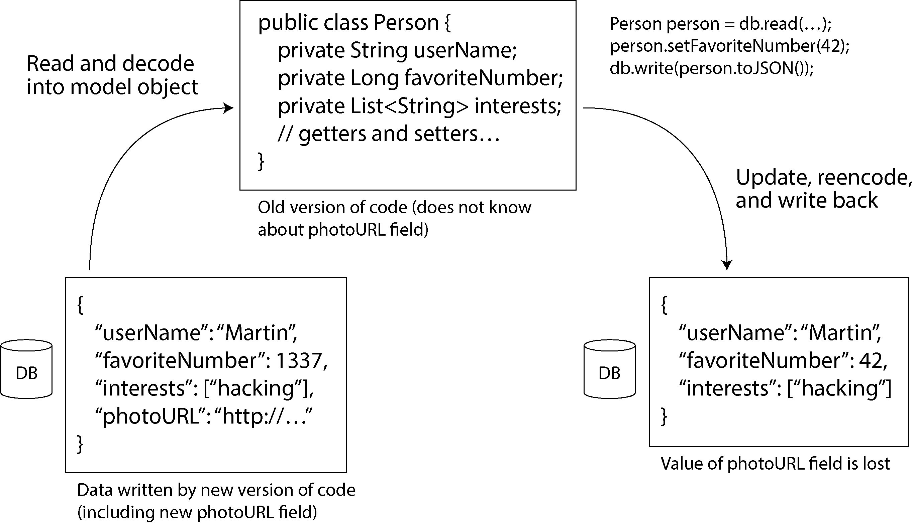
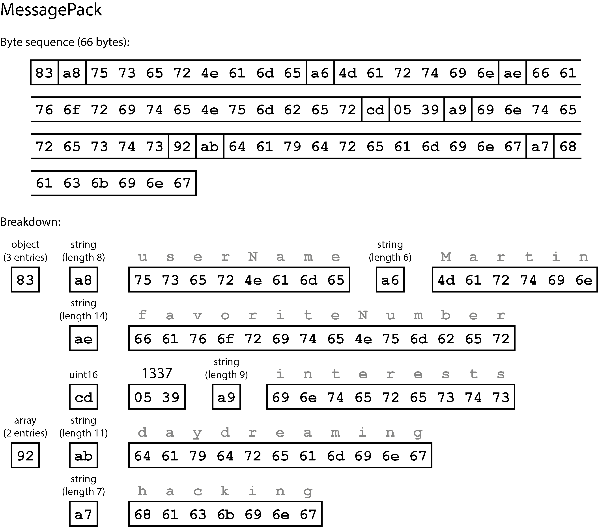
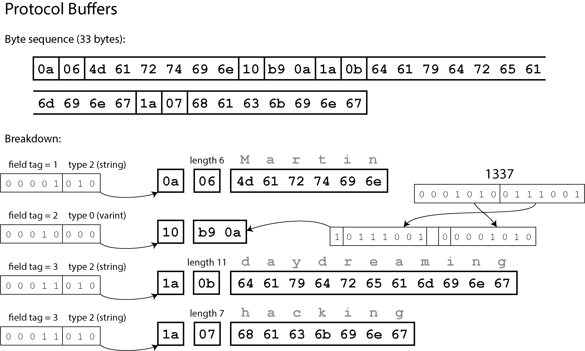
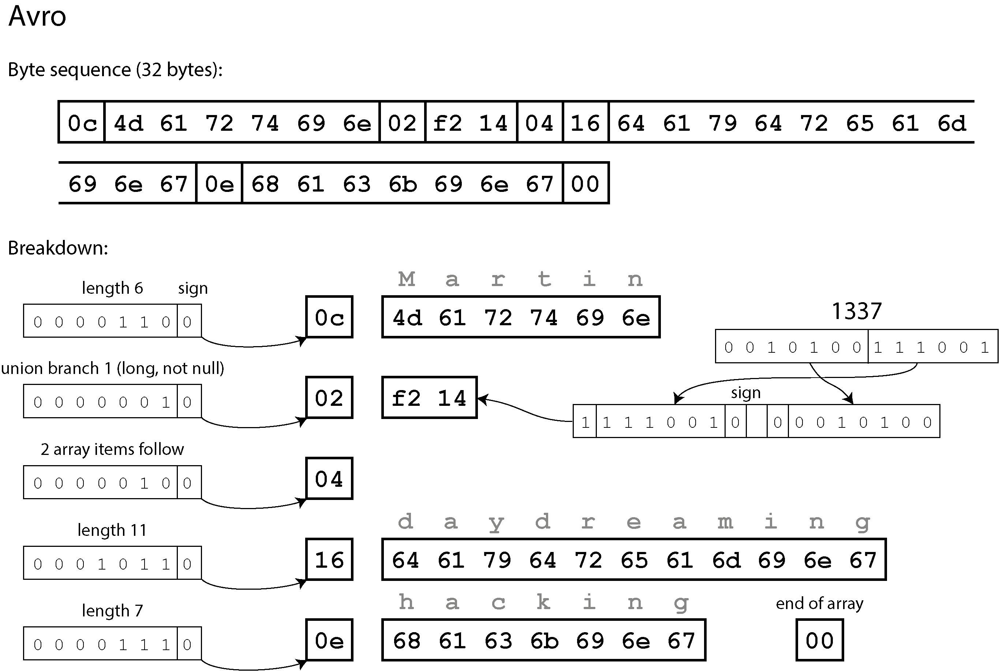
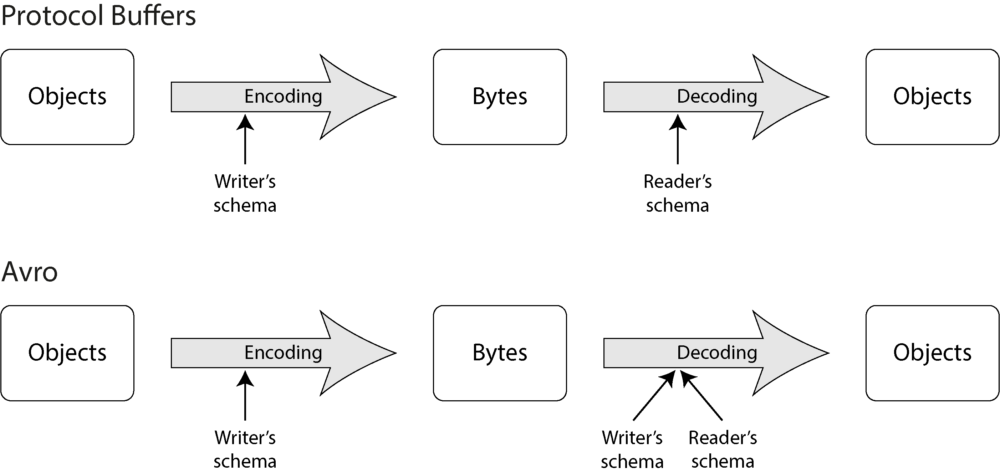
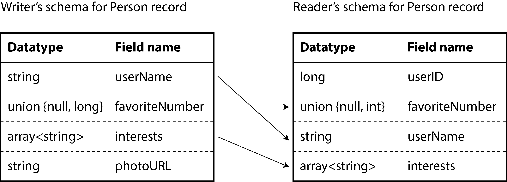
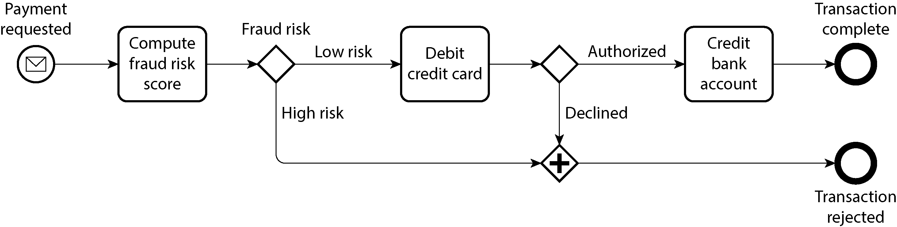

# Chương 5. Encoding và Tiến hóa

> *Mọi thứ đều thay đổi và không có gì đứng yên.*

> —Heraclitus xứ Ephesus, được Plato trích dẫn trong *Cratylus* (360 TCN)

Các ứng dụng tất yếu sẽ thay đổi theo thời gian. Tính năng được thêm vào hoặc sửa đổi khi sản phẩm mới ra mắt, khi yêu cầu của người dùng được hiểu rõ hơn, hoặc khi hoàn cảnh kinh doanh thay đổi. Trong Chương 2 chúng ta đã giới thiệu ý tưởng về *evolvability* (khả năng tiến hóa): chúng ta nên hướng tới việc xây dựng những hệ thống giúp dễ dàng thích ứng với thay đổi (xem “Evolvability: Giúp việc thay đổi trở nên dễ dàng”).

Trong hầu hết các trường hợp, một thay đổi về tính năng của ứng dụng cũng đòi hỏi thay đổi đối với dữ liệu mà nó lưu trữ. Có thể cần thu thập một trường (field) mới hoặc một loại bản ghi (record) mới, hoặc dữ liệu hiện có cần được trình bày theo cách mới.

Các mô hình dữ liệu (data model) mà chúng ta đã thảo luận trong Chương 3 có những cách khác nhau để đối phó với thay đổi như vậy. Các cơ sở dữ liệu quan hệ thường giả định rằng toàn bộ dữ liệu trong database tuân theo một schema duy nhất. Mặc dù schema đó có thể được thay đổi (thông qua schema migration; tức là các câu lệnh `ALTER`), tại bất kỳ thời điểm nào cũng chỉ có đúng một schema có hiệu lực. Ngược lại, các database schema-on-read (“schemaless”) không bắt buộc một schema, do đó database có thể chứa lẫn lộn các định dạng dữ liệu cũ và mới được ghi vào những thời điểm khác nhau (xem “Tính linh hoạt về schema trong mô hình document”).

Khi một định dạng dữ liệu hoặc schema thay đổi, thường cũng cần một thay đổi tương ứng trong mã ứng dụng (ví dụ, bạn thêm một trường mới vào bản ghi, và mã ứng dụng bắt đầu đọc và ghi trường đó). Tuy nhiên, trong một ứng dụng lớn, việc thay đổi mã thường không thể diễn ra ngay lập tức, vì nhiều lý do. Ví dụ:

- Với các ứng dụng phía server, bạn có thể muốn thực hiện *rolling upgrade* (nâng cấp cuốn chiếu, còn gọi là *staged rollout* — triển khai theo giai đoạn), tức là triển khai phiên bản mới lên một vài node mỗi lần, theo dõi xem nó có chạy trơn tru không, rồi dần dần đi qua toàn bộ các node. Cách này cho phép triển khai phiên bản mới mà không cần ngừng dịch vụ, từ đó khuyến khích phát hành thường xuyên hơn và cải thiện evolvability.

- Với các ứng dụng phía client, bạn phụ thuộc vào người dùng, những người có thể không cài đặt bản cập nhật trong một thời gian.

Điều này có nghĩa là các phiên bản cũ và mới của mã, cũng như các định dạng dữ liệu cũ và mới, có thể cùng tồn tại trong hệ thống tại cùng một thời điểm. Để hệ thống tiếp tục hoạt động trơn tru, bạn cần duy trì tính tương thích theo cả hai hướng:

- **Backward compatibility** (tương thích ngược)

  Đảm bảo rằng mã mới hơn có thể đọc được dữ liệu do mã cũ hơn ghi ra

- **Forward compatibility** (tương thích tiến)

  Đảm bảo rằng mã cũ hơn có thể đọc được dữ liệu do mã mới hơn ghi ra

Trong bối cảnh API, nếu bạn muốn một client cũ hơn có thể gọi thành công một service mới hơn, bạn cần backward compatibility đối với request và forward compatibility đối với response. Để một client mới hơn gọi được một service cũ hơn, bạn cần forward compatibility đối với request và backward compatibility đối với response.

Backward compatibility thường không khó đạt được. Là tác giả của mã mới hơn, bạn biết định dạng dữ liệu mà mã cũ ghi ra, nên bạn có thể xử lý nó một cách tường minh (nếu cần, đơn giản chỉ cần giữ lại mã cũ để đọc dữ liệu cũ). Forward compatibility có thể khó hơn, vì nó đòi hỏi mã cũ phải bỏ qua những phần bổ sung do phiên bản mã mới hơn tạo ra.

Một thách thức khác của forward compatibility được minh họa trong Hình 5-1. Giả sử bạn thêm một trường vào schema của bản ghi, và mã mới tạo ra một bản ghi chứa trường mới đó rồi lưu vào database. Sau đó, một phiên bản cũ hơn của mã (chưa biết về trường mới) đọc bản ghi này, cập nhật nó, rồi ghi lại. Trong tình huống này, hành vi mong muốn thường là mã cũ giữ nguyên trường mới, mặc dù nó không thể diễn giải được trường đó. Nhưng nếu bản ghi được decode thành một đối tượng mô hình (model object) không lưu giữ tường minh các trường không xác định, dữ liệu có thể bị mất, như minh họa ở đây.

Trong chương này chúng ta sẽ xem xét một số định dạng để encode dữ liệu, bao gồm JSON, XML, Protocol Buffers và Avro. Đặc biệt, chúng ta sẽ xem cách chúng xử lý thay đổi schema và cách chúng hỗ trợ những hệ thống cần dữ liệu và mã cũ lẫn mới cùng tồn tại. Sau đó chúng ta sẽ thảo luận cách các định dạng này được dùng để lưu trữ dữ liệu và giao tiếp: trong database, web service, REST API, remote procedure call (RPC), workflow engine, và các hệ thống hướng sự kiện (event-driven) như actor và message queue.



*Hình 5-1. Khi một phiên bản cũ hơn của ứng dụng cập nhật dữ liệu đã được ghi trước đó bởi một phiên bản mới hơn của ứng dụng, dữ liệu có thể bị mất nếu bạn không cẩn thận.*

## Các định dạng encoding dữ liệu

Chương trình thường làm việc với dữ liệu ở (ít nhất) hai dạng biểu diễn:

- Trong bộ nhớ, dữ liệu được lưu trong các object, struct, list, array, hash table, tree, v.v. Các cấu trúc dữ liệu này được tối ưu hóa để CPU truy cập và thao tác hiệu quả (thường dùng pointer). Khi bạn muốn ghi dữ liệu ra file hoặc gửi qua mạng, bạn phải encode nó thành một dạng chuỗi byte tự chứa nào đó (ví dụ, một document JSON). Vì pointer sẽ không có ý nghĩa với bất kỳ process nào khác, biểu diễn dạng chuỗi byte này thường trông khá khác so với các cấu trúc dữ liệu thường được dùng trong bộ nhớ.

Do đó, chúng ta cần một kiểu chuyển đổi nào đó giữa hai dạng biểu diễn này. Việc chuyển đổi từ biểu diễn trong bộ nhớ sang chuỗi byte được gọi là *encoding* (còn gọi là *serialization* hay *marshaling*), và quá trình ngược lại được gọi là *decoding* (hay *parsing*, *deserialization*, hoặc *unmarshaling*).

> **XUNG ĐỘT THUẬT NGỮ**
>
> Thuật ngữ *serialization* không may cũng được dùng trong bối cảnh transaction (xem Chương 8), với một ý nghĩa hoàn toàn khác. Để tránh làm quá tải từ này, trong cuốn sách này chúng tôi sẽ dùng nhất quán từ *encoding*, mặc dù serialization có lẽ phổ biến hơn.

Đôi khi không cần encoding/decoding — ví dụ, khi một database thao tác trực tiếp trên dữ liệu đã nén được nạp từ đĩa, như đã thảo luận trong “Thực thi truy vấn: Biên dịch và Vector hóa”. Cũng có các định dạng dữ liệu *zero-copy* được thiết kế để dùng cả tại runtime lẫn trên đĩa/trên mạng mà không cần bước chuyển đổi tường minh, chẳng hạn Cap’n Proto và FlatBuffers.

Tuy nhiên, hầu hết các hệ thống cần chuyển đổi giữa các object trong bộ nhớ và chuỗi byte phẳng. Vì đây là một vấn đề rất phổ biến, có vô số thư viện và định dạng encoding để lựa chọn. Hãy cùng điểm qua một cách ngắn gọn.

### Các định dạng đặc thù theo ngôn ngữ

Nhiều ngôn ngữ lập trình có sẵn hỗ trợ tích hợp để encode các object trong bộ nhớ thành chuỗi byte. Ví dụ, Java có `java.io.Serializable`, Python có `pickle`, và Ruby có `Marshal`. Cũng có nhiều thư viện bên thứ ba, chẳng hạn Kryo cho Java.

Những thư viện encoding này rất tiện lợi, vì chúng cho phép lưu và khôi phục các object trong bộ nhớ với rất ít mã bổ sung. Tuy nhiên, chúng cũng có một số vấn đề sâu xa:

- Encoding thường bị gắn chặt với một ngôn ngữ lập trình cụ thể, và việc đọc dữ liệu đó bằng ngôn ngữ khác là rất khó. Nếu bạn lưu trữ hoặc truyền dữ liệu bằng kiểu encoding như vậy, bạn đang tự ràng buộc mình với ngôn ngữ lập trình hiện tại trong một thời gian có thể rất dài, và loại trừ khả năng tích hợp hệ thống của bạn với hệ thống của các tổ chức khác (vốn có thể dùng ngôn ngữ khác).

- Để khôi phục dữ liệu về đúng các kiểu object ban đầu, quá trình decoding cần có khả năng khởi tạo (instantiate) các class tùy ý. Đây thường là nguồn gốc của các vấn đề bảo mật [1]; nếu kẻ tấn công có thể khiến ứng dụng của bạn decode một chuỗi byte tùy ý, họ có thể khởi tạo các class tùy ý, điều này lại thường cho phép họ làm những việc khủng khiếp như thực thi mã tùy ý từ xa [2, 3].

- Việc quản lý phiên bản dữ liệu thường chỉ là chuyện tính sau trong các thư viện này. Vì chúng được thiết kế để encode dữ liệu nhanh và dễ dàng, chúng thường bỏ qua những vấn đề bất tiện về forward compatibility và backward compatibility [4]. Hiệu năng (thời gian CPU để encode hoặc decode, và kích thước của cấu trúc đã encode) cũng thường bị xem nhẹ. Ví dụ, cơ chế serialization tích hợp sẵn của Java nổi tiếng vì hiệu năng kém và encoding cồng kềnh [5].

Vì những lý do này, nói chung việc dùng encoding tích hợp sẵn của ngôn ngữ cho bất cứ mục đích gì ngoài những mục đích rất tạm thời là một ý tưởng tồi.

### JSON, XML và các biến thể nhị phân

Khi chuyển sang các encoding được chuẩn hóa có thể được ghi và đọc bởi nhiều ngôn ngữ lập trình, JSON và XML là những ứng viên hiển nhiên: chúng được biết đến rộng rãi và được hỗ trợ rộng rãi. CSV là một định dạng độc lập với ngôn ngữ phổ biến khác, nhưng nó chỉ hỗ trợ dữ liệu dạng bảng không lồng nhau.

JSON, XML và CSV là các định dạng văn bản, do đó chúng ít nhiều có thể đọc được bởi con người, mặc dù cú pháp của chúng là chủ đề tranh cãi thường gặp. Ngoài các vấn đề cú pháp bề mặt, chúng còn có nhiều vấn đề khác:

- XML thường bị chỉ trích là quá dài dòng và phức tạp không cần thiết [6].

- Có nhiều điểm mơ hồ xung quanh việc encode số. Trong XML và CSV, bạn không thể phân biệt giữa một số và một chuỗi tình cờ chỉ gồm các chữ số (trừ khi tham chiếu đến một schema bên ngoài). JSON phân biệt chuỗi và số, nhưng không phân biệt số nguyên và số dấu phẩy động, và không quy định độ chính xác.

- Đây là vấn đề khi xử lý các số lớn — ví dụ, các số nguyên lớn hơn 2⁵³ không thể được biểu diễn chính xác bằng số dấu phẩy động độ chính xác kép theo IEEE 754, nên những số như vậy trở nên không chính xác khi được parse trong một ngôn ngữ dùng số dấu phẩy động, chẳng hạn JavaScript [7]. Một ví dụ về các số lớn hơn 2⁵³ xuất hiện trên X, nền tảng dùng số 64-bit để định danh mỗi bài đăng. JSON mà API trả về bao gồm ID bài đăng hai lần, một lần dưới dạng số JSON và một lần dưới dạng chuỗi thập phân, để khắc phục việc các ứng dụng JavaScript parse số không chính xác [8].

- JSON và XML hỗ trợ tốt chuỗi ký tự Unicode (tức là văn bản con người đọc được), nhưng chúng không hỗ trợ chuỗi nhị phân (binary string — chuỗi byte không có character encoding). Chuỗi nhị phân là một tính năng hữu ích, nên người ta vượt qua hạn chế này bằng cách encode dữ liệu nhị phân thành văn bản dùng Base64. Schema sau đó được dùng để chỉ ra rằng giá trị cần được diễn giải là đã encode Base64. Cách này hoạt động được, nhưng hơi chắp vá và làm tăng kích thước dữ liệu khoảng một phần ba. XML Schema và JSON Schema rất mạnh mẽ, do đó cũng khá phức tạp để học và triển khai. Vì việc diễn giải đúng dữ liệu (như số và chuỗi nhị phân) phụ thuộc vào thông tin trong schema, các ứng dụng không dùng XML/JSON Schema có thể phải hardcode logic encoding/decoding thích hợp thay thế.

- CSV không có schema nào, nên ứng dụng phải tự định nghĩa ý nghĩa của từng hàng và cột. Nếu một thay đổi trong ứng dụng thêm một hàng hoặc cột mới, bạn phải xử lý thay đổi đó thủ công. CSV cũng là một định dạng khá mơ hồ (điều gì xảy ra nếu một giá trị chứa dấu phẩy hoặc ký tự xuống dòng?). Mặc dù các quy tắc escape của nó đã được quy định chính thức [9], không phải parser nào cũng triển khai chúng đúng.

Bất chấp những khiếm khuyết này, JSON, XML và CSV đủ tốt cho nhiều mục đích. Chúng nhiều khả năng sẽ vẫn phổ biến, đặc biệt là với vai trò định dạng trao đổi dữ liệu (tức là để gửi dữ liệu từ tổ chức này sang tổ chức khác). Trong những tình huống này, miễn là mọi người đồng ý về định dạng, thì việc nó đẹp hay hiệu quả đến đâu thường không quan trọng. Khó khăn trong việc khiến các tổ chức khác nhau đồng ý về *bất cứ điều gì* lớn hơn hầu hết các mối quan tâm khác.

#### JSON Schema

JSON Schema đã được áp dụng rộng rãi như một cách để mô hình hóa dữ liệu mỗi khi dữ liệu được trao đổi giữa các hệ thống hoặc ghi vào bộ lưu trữ. Bạn sẽ thấy JSON Schema trong các web service (xem “Web service”) như một phần của đặc tả web service OpenAPI, trong các schema registry như Schema Registry của Confluent và Apicurio Registry của Red Hat, và trong các database (ví dụ, extension kiểm tra `pg_jsonschema` của PostgreSQL và cú pháp kiểm tra `$jsonSchema` của MongoDB).

Đặc tả JSON Schema cung cấp nhiều tính năng. Schema bao gồm các kiểu nguyên thủy tiêu chuẩn như `string`, `number`, `integer`, `object`, `array`, `boolean` và `null`. Nhưng JSON Schema còn cung cấp một đặc tả kiểm tra (validation) riêng cho phép nhà phát triển phủ thêm các ràng buộc lên các trường. Ví dụ, một trường `port` có thể có giá trị tối thiểu là 1 và tối đa là 65,535.

JSON Schema có thể có mô hình nội dung mở (open content model) hoặc đóng (closed content model). Mô hình nội dung mở cho phép bất kỳ trường nào không được định nghĩa trong schema tồn tại với bất kỳ kiểu dữ liệu nào, trong khi mô hình nội dung đóng chỉ cho phép các trường được định nghĩa tường minh. Mô hình nội dung mở trong JSON Schema được bật khi `additionalProperties` được đặt là `true`, và đây là giá trị mặc định. Do đó, JSON Schema thường là một định nghĩa về những gì *không* được phép (cụ thể là các giá trị không hợp lệ ở bất kỳ trường đã định nghĩa nào) thay vì những gì *được* phép.

Mô hình nội dung mở rất mạnh mẽ, nhưng chúng có thể phức tạp. Ví dụ, giả sử bạn muốn định nghĩa một map từ số nguyên (như ID) sang chuỗi. JSON không có kiểu map hay dictionary cho phép khóa là số nguyên; các object JSON luôn dùng chuỗi làm khóa. Để đáp ứng nhu cầu của bạn, bạn có thể ràng buộc kiểu này bằng JSON Schema sao cho khóa chỉ được chứa chữ số và giá trị chỉ được là chuỗi, dùng `patternProperties` và `additionalProperties`, như minh họa trong Ví dụ 5-1.

**Ví dụ 5-1. Một JSON Schema với khóa là số nguyên và giá trị là chuỗi**

```
{
  "$schema": "http://json-schema.org/draft-07/schema#",
  "type": "object",
  "patternProperties": {
    "^[0-9]+$": {
      "type": "string"
    }
  },
  "additionalProperties": false
}
```

Ngoài mô hình nội dung mở và đóng cùng các validator, JSON Schema còn hỗ trợ logic schema có điều kiện `if/else`, các kiểu có tên (named type), tham chiếu đến schema từ xa, và nhiều hơn nữa. Tất cả những điều này tạo nên một ngôn ngữ schema rất mạnh mẽ. Nhưng những tính năng như vậy cũng dẫn đến các định nghĩa cồng kềnh. Việc phân giải schema từ xa, suy luận về các quy tắc có điều kiện, hay tiến hóa schema theo cách tương thích tiến hoặc tương thích ngược có thể đầy thách thức [10, 11]. Những lo ngại tương tự cũng áp dụng cho XML Schema [12].

#### Các encoding nhị phân

JSON ít dài dòng hơn XML, nhưng cả hai vẫn chiếm nhiều không gian so với các định dạng nhị phân. Nhận xét này đã dẫn đến sự ra đời của hàng loạt encoding nhị phân cho JSON (MessagePack, CBOR, BSON, BJSON, UBJSON, BISON, Hessian và Smile, chỉ kể một vài) và cho XML (ví dụ WBXML và Fast Infoset). Các định dạng này đã được áp dụng trong nhiều lĩnh vực ngách, vì chúng gọn hơn và đôi khi parse nhanh hơn, nhưng không định dạng nào được áp dụng rộng rãi bằng các phiên bản văn bản của JSON và XML [13].

Một số định dạng này mở rộng tập kiểu dữ liệu (ví dụ, phân biệt số nguyên và số dấu phẩy động, hoặc bổ sung hỗ trợ chuỗi nhị phân), nhưng ngoài ra chúng giữ nguyên mô hình dữ liệu JSON/XML. Đặc biệt, vì chúng không quy định schema, chúng cần bao gồm toàn bộ tên trường của object trong dữ liệu đã encode. Nghĩa là, trong một encoding nhị phân của document JSON ở Ví dụ 5-2, chúng sẽ cần chứa các chuỗi `userName`, `favoriteNumber` và `interests` ở đâu đó.

**Ví dụ 5-2. Một bản ghi mà chúng ta sẽ encode bằng nhiều định dạng nhị phân trong chương này**

```
{
    "userName": "Martin",
    "favoriteNumber": 1337,
    "interests": ["daydreaming", "hacking"]
}
```

Hãy xem một ví dụ về MessagePack, một encoding nhị phân cho JSON. Hình 5-2 cho thấy chuỗi byte bạn nhận được nếu encode document JSON ở Ví dụ 5-2 bằng MessagePack.



*Hình 5-2. Bản ghi của chúng ta (Ví dụ 5-2) được encode bằng MessagePack*

Vài byte đầu tiên như sau:

1. Byte đầu tiên, `0x83`, cho biết phần theo sau là một object (bốn bit cao = `0x80`) với ba trường (bốn bit thấp = `0x03`). (Nếu bạn thắc mắc điều gì xảy ra khi một object có hơn 15 trường, khiến số trường không vừa trong bốn bit, thì nó sẽ nhận một chỉ báo kiểu khác, và số trường được encode trong hai hoặc bốn byte.)

2. Byte thứ hai, `0xa8`, cho biết phần theo sau là một chuỗi (bốn bit cao = `0xa0`) dài tám byte (bốn bit thấp = `0x08`).

3. Tám byte tiếp theo là tên trường `userName` ở dạng ASCII. Vì độ dài đã được chỉ ra trước đó, không cần bất kỳ dấu hiệu nào để cho biết chuỗi kết thúc ở đâu (hay bất kỳ escape nào).

4. Bảy byte tiếp theo encode giá trị chuỗi sáu chữ cái `Martin` với tiền tố `0xa6`, và cứ thế tiếp tục.

Encoding nhị phân này dài 66 byte, chỉ ít hơn một chút so với 81 byte mà encoding JSON dạng văn bản chiếm (sau khi bỏ khoảng trắng). Tất cả các encoding nhị phân của JSON đều tương tự ở điểm này. Không rõ liệu mức giảm không gian nhỏ như vậy (và có lẽ tăng tốc parse chút ít) có đáng để đánh đổi khả năng đọc được bởi con người hay không.

Trong các phần tiếp theo chúng ta sẽ thấy cách làm tốt hơn nhiều, encode cùng bản ghi đó chỉ với một nửa số byte.

### Protocol Buffers

*Protocol Buffers* (protobuf) là một thư viện encoding nhị phân được phát triển tại Google. Nó tương tự Apache Thrift, vốn ban đầu được Facebook phát triển [14]; hầu hết những gì phần này nói về Protocol Buffers cũng áp dụng cho Thrift.

Protocol Buffers yêu cầu một schema cho mọi dữ liệu được encode. Để encode dữ liệu trong Ví dụ 5-2, bạn sẽ mô tả schema bằng ngôn ngữ định nghĩa giao diện (interface definition language, IDL) của Protocol Buffers như sau:

```
syntax = "proto3";

message Person {
    string user_name = 1;
    int64 favorite_number = 2;
    repeated string interests = 3;
}
```

Protocol Buffers đi kèm một công cụ sinh mã nhận một định nghĩa schema như trên và tạo ra các class triển khai schema đó trong nhiều ngôn ngữ lập trình. Mã ứng dụng của bạn có thể gọi mã được sinh ra này để encode hoặc decode các bản ghi tuân theo schema. Ngôn ngữ schema này rất đơn giản so với JSON Schema; nó định nghĩa các trường của mỗi bản ghi và kiểu của chúng, nhưng không hỗ trợ các ràng buộc khác lên các giá trị khả dĩ của trường.

Encode Ví dụ 5-2 bằng một encoder Protocol Buffers cần 33 byte, như minh họa trong Hình 5-3 [15]. Giống như trong Hình 5-2, mỗi trường có một chú thích kiểu (để cho biết nó là chuỗi, số nguyên, v.v.) và, khi cần, một chỉ báo độ dài (chẳng hạn độ dài của chuỗi). Các chuỗi xuất hiện trong dữ liệu (`Martin`, `daydreaming`, `hacking`) được encode ở dạng ASCII (chính xác hơn là UTF-8), như trước.



*Hình 5-3. Bản ghi của chúng ta được encode bằng Protocol Buffers*

Khác với Hình 5-2, ví dụ này không có tên trường (`userName`, `favoriteNumber`, `interests`). Thay vào đó, dữ liệu đã encode chứa các *field tag* (thẻ trường), là các con số (`1`, `2` và `3`). Đó là những con số xuất hiện trong định nghĩa schema. Field tag giống như bí danh (alias) cho các trường — chúng là cách gọn nhẹ để chỉ ra trường đang được nói đến, mà không cần viết ra đầy đủ tên trường.

Như bạn thấy, Protocol Buffers còn tiết kiệm không gian hơn nữa bằng cách gói kiểu trường và số tag vào một byte duy nhất. Nó dùng số nguyên độ dài biến đổi (variable-length integer): số 1337 được encode trong hai byte, với bit cao nhất của mỗi byte dùng để cho biết còn byte nào tiếp theo hay không (bảy bit thấp được lưu trong byte đầu tiên để đơn giản hóa việc tái tạo số nguyên khi các byte được đọc vào). Điều này có nghĩa là các số từ –64 đến 63 được encode trong một byte, các số từ –8,192 đến 8,191 được encode trong hai byte, v.v. Các số lớn hơn dùng nhiều byte hơn.

Protocol Buffers không có kiểu dữ liệu list hay array tường minh. Thay vào đó, bộ chỉnh `repeated` trên trường `interests` cho biết trường này chứa một danh sách giá trị thay vì một giá trị đơn. Trong encoding nhị phân, các phần tử của danh sách được biểu diễn đơn giản là các lần xuất hiện lặp lại của cùng một field tag trong cùng một bản ghi.

#### Field tag và schema evolution

Chúng ta đã nói trước đó rằng schema tất yếu cần thay đổi theo thời gian. Chúng ta gọi điều này là *schema evolution* (tiến hóa schema). Protocol Buffers xử lý thay đổi schema thế nào trong khi vẫn giữ được backward compatibility và forward compatibility?

Như bạn thấy từ các ví dụ, một bản ghi đã encode chỉ đơn giản là sự ghép nối các trường đã encode của nó. Mỗi trường được định danh bằng số tag của nó (các số `1`, `2`, `3` trong schema mẫu) và được chú thích bằng một kiểu dữ liệu (ví dụ chuỗi hoặc số nguyên). Nếu một giá trị trường không được đặt, nó đơn giản bị bỏ qua khỏi bản ghi đã encode. Từ đó, bạn có thể thấy field tag là yếu tố then chốt đối với ý nghĩa của dữ liệu đã encode. Bạn có thể đổi tên một trường trong schema, vì dữ liệu đã encode không bao giờ tham chiếu đến tên trường, nhưng bạn không thể đổi tag của một trường, vì điều đó sẽ làm toàn bộ dữ liệu đã encode hiện có trở nên không hợp lệ.

Bạn có thể thêm các trường mới vào schema, miễn là bạn gán cho mỗi trường một số tag mới. Nếu mã cũ (không biết về các số tag mới bạn đã thêm) cố đọc dữ liệu do mã mới ghi ra, bao gồm một trường mới với số tag mà nó không nhận ra, nó có thể đơn giản bỏ qua trường đó. Chú thích kiểu dữ liệu cho phép parser xác định cần bỏ qua bao nhiêu byte trong khi vẫn giữ lại các trường không xác định, để tránh vấn đề trong Hình 5-1. Điều này duy trì forward compatibility: mã cũ có thể đọc các bản ghi do mã mới ghi ra.

Còn backward compatibility thì sao? Miễn là mỗi trường có một số tag duy nhất, mã mới luôn có thể đọc dữ liệu cũ, vì các số tag vẫn mang ý nghĩa như trước. Nếu một trường được thêm vào schema mới, và bạn đọc dữ liệu cũ chưa chứa trường đó, nó sẽ được điền bằng giá trị mặc định (ví dụ, chuỗi rỗng nếu kiểu trường là chuỗi, hoặc 0 nếu là số).

Xóa một trường cũng tương tự như thêm một trường, với các mối quan tâm về backward compatibility và forward compatibility đảo ngược lại. Bạn không bao giờ được dùng lại cùng số tag đó, vì có thể vẫn còn dữ liệu được ghi ở đâu đó có chứa số tag cũ, và trường đó phải được mã mới bỏ qua. Các số tag đã dùng trong quá khứ có thể được đánh dấu dành riêng (reserved) trong định nghĩa schema để đảm bảo chúng không bị quên.

Còn việc đổi kiểu dữ liệu của một trường thì sao? Điều đó là khả thi với một số kiểu — hãy xem tài liệu để biết chi tiết — nhưng có rủi ro là các giá trị sẽ bị cắt bớt (truncate). Ví dụ, giả sử bạn đổi một số nguyên 32-bit thành số nguyên 64-bit. Mã mới có thể dễ dàng đọc dữ liệu do mã cũ ghi ra, vì parser có thể điền các bit còn thiếu bằng 0. Tuy nhiên, nếu mã cũ đọc dữ liệu do mã mới ghi ra, mã cũ vẫn đang dùng một biến 32-bit để chứa giá trị. Nếu giá trị 64-bit đã decode không vừa trong 32 bit, nó sẽ bị cắt bớt.

### Avro

*Apache Avro* là một định dạng binary encoding khác, với một số khác biệt đáng chú ý so với Protocol Buffers. Nó được khởi động vào năm 2009 như một dự án con của Hadoop, xuất phát từ việc Protocol Buffers không phù hợp với các trường hợp sử dụng của Hadoop [16].

Avro cũng dùng một schema để mô tả cấu trúc của dữ liệu được encode. Nó có hai ngôn ngữ schema: một (Avro IDL) dành cho con người soạn thảo, và một (dựa trên JSON) để máy đọc dễ hơn. Giống như Protocol Buffers, các ngôn ngữ schema này chỉ mô tả các trường (field) và kiểu của chúng, không hỗ trợ các quy tắc kiểm tra hợp lệ (validation) phức tạp như trong JSON Schema.

Viết bằng Avro IDL, schema ví dụ của chúng ta có thể trông như sau:

```
record Person {
    string               userName;
    union { null, long } favoriteNumber = null;
    array<string>        interests;
}
```

Biểu diễn JSON tương đương của schema đó như sau:

```
{
    "type": "record",
    "name": "Person",
    "fields": [
        {"name": "userName",       "type": "string"},
        {"name": "favoriteNumber", "type": ["null", "long"], "default": nu
        {"name": "interests",      "type": {"type": "array", "items": "str
    ]
}
```

Lưu ý rằng schema này không có số tag (tag number). Nếu chúng ta encode bản ghi của mình (Ví dụ 5-2) bằng schema này, Avro binary encoding chỉ dài 32 byte—gọn nhất trong tất cả các encoding chúng ta đã thấy. Phân tích chi tiết chuỗi byte đã encode được thể hiện trong Hình 5-4.

Nếu bạn xem xét chuỗi byte, bạn có thể thấy không có gì xác định các trường hay kiểu dữ liệu của chúng. Encoding đơn giản chỉ gồm các giá trị được nối liền với nhau. Một chuỗi (string) chỉ là một tiền tố độ dài (length prefix) theo sau là các byte UTF-8, nhưng không có gì trong dữ liệu đã encode cho bạn biết đó là một chuỗi. Nó hoàn toàn có thể là một số nguyên hoặc thứ gì đó khác hẳn. Một số nguyên được encode bằng encoding độ dài biến đổi (variable-length encoding).

Để phân tích (parse) dữ liệu nhị phân, bạn đi qua các trường theo thứ tự chúng xuất hiện trong schema và dùng schema để xác định kiểu dữ liệu của từng trường. Điều này có nghĩa là dữ liệu nhị phân chỉ có thể được decode chính xác nếu đoạn mã đọc dữ liệu đang dùng *đúng schema y hệt* với đoạn mã đã ghi dữ liệu. Bất kỳ sự không khớp nào về schema giữa bên đọc (reader) và bên ghi (writer) đều dẫn đến dữ liệu được decode sai.



*Hình 5-4. Bản ghi của chúng ta được encode bằng Avro*

Vậy, Avro hỗ trợ schema evolution như thế nào?

#### Writer’s schema và reader’s schema

Khi một ứng dụng muốn encode dữ liệu nào đó (để ghi vào file hoặc database, gửi qua mạng, v.v.), ứng dụng dùng bất kỳ phiên bản schema nào mà nó biết—ví dụ, một schema được biên dịch sẵn vào ứng dụng. Đây được gọi là *writer’s schema* (schema của bên ghi).

Để decode dữ liệu nào đó (đọc từ file hoặc database, nhận từ mạng, v.v.), một ứng dụng dùng hai schema: writer’s schema, giống hệt schema đã dùng để encode, và *reader’s schema* (schema của bên đọc), có thể khác với schema kia. Điều này được minh họa trong Hình 5-5. Reader’s schema định nghĩa các trường của mỗi bản ghi mà mã ứng dụng đang mong đợi, cùng kiểu của chúng.

Nếu reader’s schema và writer’s schema giống nhau, việc decode rất dễ. Nếu chúng khác nhau, Avro giải quyết sự khác biệt bằng cách so sánh hai schema và chuyển đổi dữ liệu từ writer’s schema sang reader’s schema.



*Hình 5-5. Trong Protocol Buffers, encoding và decoding có thể dùng các phiên bản schema khác nhau. Trong Avro, decoding dùng hai schema: writer’s schema phải giống hệt schema đã dùng để encode, nhưng reader’s schema có thể là phiên bản cũ hơn hoặc mới hơn.*

Đặc tả Avro [17, 18] định nghĩa chính xác cách hoạt động của quá trình giải quyết (resolution) này. Như minh họa trong Hình 5-6, sẽ không có vấn đề gì nếu writer’s schema và reader’s schema có các trường theo thứ tự khác nhau, vì quá trình schema resolution khớp các trường theo tên trường. Nếu đoạn mã đọc dữ liệu gặp một trường có trong writer’s schema nhưng không có trong reader’s schema, trường đó bị bỏ qua. Nếu đoạn mã đọc dữ liệu mong đợi một trường nào đó nhưng writer’s schema không chứa trường có tên đó, trường ấy được điền bằng giá trị mặc định (default value) khai báo trong reader’s schema.



*Hình 5-6. Một Avro reader giải quyết sự khác biệt giữa writer’s schema và reader’s schema*

#### Các quy tắc schema evolution

Với Avro, forward compatibility nghĩa là bên ghi có thể dùng phiên bản schema mới hơn bên đọc. Ngược lại, backward compatibility nghĩa là bên ghi có thể dùng phiên bản schema cũ hơn bên đọc.

Để duy trì tính tương thích, bạn chỉ có thể thêm hoặc xóa một trường có giá trị mặc định (như trường `favoriteNumber` trong Avro schema của chúng ta). Ví dụ, giả sử bạn thêm một trường có giá trị mặc định, sao cho trường mới này tồn tại trong schema mới nhưng không có trong schema cũ. Khi một bên đọc dùng schema mới đọc một bản ghi được ghi bằng schema cũ, giá trị mặc định được điền vào cho trường bị thiếu.

Nếu bạn thêm một trường không có giá trị mặc định, các bên đọc mới sẽ không thể đọc dữ liệu do các bên ghi cũ ghi ra, nên bạn sẽ phá vỡ backward compatibility. Nếu bạn xóa một trường không có giá trị mặc định, các bên đọc cũ sẽ không thể đọc dữ liệu do các bên ghi mới ghi ra, nên bạn sẽ phá vỡ forward compatibility.

Trong một số ngôn ngữ lập trình, `null` là giá trị mặc định chấp nhận được cho bất kỳ biến nào, nhưng trong Avro thì không như vậy: nếu bạn muốn cho phép một trường nhận giá trị `null`, bạn phải dùng một *union type* (kiểu hợp). Ví dụ, `union { null, long, string } field;` cho biết `field` có thể là một số, một chuỗi, hoặc `null`. Bạn chỉ có thể dùng `null` làm giá trị mặc định nếu nó là nhánh đầu tiên của union. Cách này dài dòng hơn một chút so với việc mọi thứ đều nullable theo mặc định, nhưng nó giúp ngăn ngừa lỗi bằng cách tường minh về những gì có thể và không thể là `null` [19].

Thay đổi kiểu dữ liệu của một trường là khả thi, miễn là Avro có thể chuyển đổi kiểu đó. Thay đổi tên của một trường cũng khả thi nhưng hơi phức tạp. Reader’s schema có thể chứa các bí danh (alias) cho tên trường, nên nó có thể khớp tên trường trong writer’s schema cũ với các bí danh này. Điều này có nghĩa là thay đổi tên trường là backward compatible nhưng không forward compatible. Tương tự, thêm một nhánh vào union type là backward compatible nhưng không forward compatible.

#### Nhưng writer’s schema là gì?

Chúng ta đã lướt qua một câu hỏi quan trọng: làm sao bên đọc biết được schema đã được dùng để encode một mẩu dữ liệu cụ thể? Chúng ta không thể đơn giản đính kèm toàn bộ schema vào mỗi bản ghi, vì schema nhiều khả năng sẽ lớn hơn nhiều so với dữ liệu đã encode, làm mất đi toàn bộ khoản tiết kiệm dung lượng có được từ binary encoding.

Câu trả lời tùy thuộc vào bối cảnh mà Avro được sử dụng. Xin nêu vài ví dụ:

- **File lớn với nhiều bản ghi**

  Một cách dùng phổ biến của Avro là lưu một file lớn chứa hàng triệu bản ghi, tất cả được encode bằng cùng một schema. (Chúng ta sẽ thảo luận loại tình huống này trong Chương 11.) Trong trường hợp này, bên ghi file đó chỉ cần đưa schema vào một lần ở đầu file. Avro quy định một định dạng file (object container files) để làm điều này.

- **Database với các bản ghi được ghi riêng lẻ**

  Trong một database, các bản ghi khác nhau có thể được ghi vào những thời điểm khác nhau bằng những schema khác nhau—bạn không thể giả định rằng tất cả các bản ghi sẽ có cùng schema. Giải pháp đơn giản nhất trong trường hợp này là đưa một số phiên bản (version number) vào đầu mỗi bản ghi đã encode và giữ một danh sách các phiên bản schema trong database của bạn. Bên đọc có thể lấy một bản ghi, trích xuất số phiên bản, rồi lấy writer’s schema tương ứng với số phiên bản đó từ database. Sau đó nó có thể decode phần còn lại của bản ghi bằng schema đó. Ví dụ, schema registry của Confluent cho Apache Kafka [20] và Espresso của LinkedIn [21] hoạt động theo cách này.

- **Gửi bản ghi qua kết nối mạng**

  Khi hai process giao tiếp qua một kết nối mạng hai chiều, chúng có thể thương lượng phiên bản schema khi thiết lập kết nối rồi dùng schema đó trong suốt thời gian tồn tại của kết nối. Giao thức Avro RPC (xem “Dataflow qua dịch vụ: REST và RPC”) hoạt động như vậy.

Một database lưu các phiên bản schema là thứ hữu ích nên có trong mọi trường hợp, vì nó đóng vai trò như tài liệu và cho bạn cơ hội kiểm tra tính tương thích của schema [22]. Bạn có thể dùng một số nguyên tăng dần đơn giản hoặc một hash của schema làm số phiên bản.

#### Schema được tạo động

Một ưu điểm của cách tiếp cận của Avro, so với Protocol Buffers, là schema không chứa bất kỳ số tag nào. Nhưng tại sao điều này quan trọng? Việc giữ vài con số trong schema thì có vấn đề gì?

Sự khác biệt là Avro thân thiện hơn với các schema *được tạo động* (dynamically generated). Ví dụ, giả sử bạn có một cơ sở dữ liệu quan hệ mà bạn muốn kết xuất (dump) nội dung ra một file, và bạn muốn dùng định dạng nhị phân để tránh những vấn đề đã nêu ở trên của các định dạng văn bản (JSON, CSV, XML). Nếu bạn dùng Avro, bạn có thể khá dễ dàng sinh ra một Avro schema (ở dạng biểu diễn JSON chúng ta đã thấy trước đó) từ schema quan hệ và encode nội dung database bằng schema đó, kết xuất toàn bộ vào một Avro object container file [23]. Bạn có thể sinh một record schema cho mỗi bảng trong database, và mỗi cột trở thành một trường trong record đó. Tên cột trong database ánh xạ sang tên trường trong Avro.

Giờ đây, nếu schema của database thay đổi (ví dụ, một bảng được thêm một cột và bớt một cột), bạn chỉ cần sinh một Avro schema mới từ schema database đã cập nhật và xuất dữ liệu theo Avro schema mới. Quy trình xuất dữ liệu không cần quan tâm gì đến thay đổi schema—nó chỉ cần thực hiện việc chuyển đổi schema mỗi lần chạy. Bất kỳ ai đọc các file dữ liệu mới sẽ thấy các trường của record đã thay đổi, nhưng vì các trường được xác định theo tên, writer’s schema đã cập nhật vẫn có thể được khớp với reader’s schema cũ.

Ngược lại, nếu bạn dùng Protocol Buffers cho mục đích này, các tag của trường nhiều khả năng sẽ phải được gán bằng tay. Mỗi lần schema database thay đổi, một quản trị viên sẽ phải cập nhật thủ công ánh xạ từ tên cột database sang tag của trường. (Có thể tự động hóa việc này, nhưng bộ sinh schema sẽ phải rất cẩn thận để không gán lại các tag trường đã từng được dùng trước đó.) Kiểu schema được tạo động này đơn giản không phải là mục tiêu thiết kế của Protocol Buffers, trong khi nó lại là mục tiêu của Avro.

### Ưu điểm của schema

Như chúng ta đã thấy, Protocol Buffers và Avro đều dùng một schema để mô tả định dạng binary encoding. Các ngôn ngữ schema của chúng đơn giản hơn nhiều so với XML Schema hay JSON Schema, vốn hỗ trợ các quy tắc kiểm tra hợp lệ chi tiết hơn (ví dụ, “giá trị chuỗi của trường này phải khớp với biểu thức chính quy này” hay “giá trị số nguyên của trường này phải nằm trong khoảng từ 0 đến 100”). Vì Protocol Buffers và Avro đơn giản hơn để triển khai và sử dụng, chúng đã được hỗ trợ trong khá nhiều ngôn ngữ lập trình.

Những ý tưởng làm nền tảng cho các encoding này hoàn toàn không mới. Ví dụ, chúng có nhiều điểm chung với ASN.1, một ngôn ngữ định nghĩa schema được chuẩn hóa lần đầu vào năm 1984 [24, 25]. Nó được dùng để định nghĩa nhiều giao thức mạng khác nhau, và binary encoding của nó (DER) vẫn được dùng để encode các chứng chỉ SSL (X.509), chẳng hạn [26]. ASN.1 hỗ trợ schema evolution bằng số tag, tương tự Protocol Buffers [27]. Tuy nhiên, nó cũng rất phức tạp và được tài liệu hóa kém, nên ASN.1 có lẽ không phải lựa chọn tốt cho các ứng dụng mới.

Nhiều hệ thống dữ liệu cũng triển khai một loại binary encoding độc quyền nào đó cho dữ liệu của chúng. Ví dụ, hầu hết các cơ sở dữ liệu quan hệ có một giao thức mạng qua đó bạn có thể gửi truy vấn tới database và nhận về phản hồi. Các giao thức đó thường đặc thù cho một database cụ thể, và nhà cung cấp database cung cấp một driver (ví dụ, dùng các API ODBC hoặc JDBC) để decode các phản hồi từ giao thức mạng của database thành các cấu trúc dữ liệu trong bộ nhớ.

Vậy, chúng ta có thể thấy rằng dù các định dạng dữ liệu văn bản như JSON, XML và CSV rất phổ biến, các binary encoding dựa trên schema cũng là một lựa chọn khả thi. Chúng có một số tính chất tốt:

- Chúng có thể gọn hơn nhiều so với các biến thể “binary JSON” khác nhau, vì chúng có thể bỏ tên trường ra khỏi dữ liệu đã encode. Schema là một dạng tài liệu có giá trị, và vì schema là bắt buộc để decode, bạn có thể chắc chắn rằng nó luôn được cập nhật (trong khi tài liệu được duy trì thủ công có thể dễ dàng lệch khỏi thực tế).

- Việc duy trì một database các schema cho phép bạn kiểm tra forward và backward compatibility của các thay đổi schema trước khi bất cứ thứ gì được triển khai. Với người dùng các ngôn ngữ lập trình kiểu tĩnh, khả năng sinh mã từ schema rất hữu ích, vì nó cho phép kiểm tra kiểu tại thời điểm biên dịch.

Tóm lại, schema evolution cho phép sự linh hoạt tương tự như các database JSON schemaless/schema-on-read mang lại (xem “Tính linh hoạt về schema trong mô hình document”), đồng thời cung cấp các đảm bảo tốt hơn về dữ liệu của bạn và công cụ hỗ trợ tốt hơn. Dù vậy, nên giữ số lượng định dạng schema tồn tại đồng thời ở mức tối thiểu để việc vận hành được đơn giản.

## Các phương thức dataflow

Ở đầu chương này chúng ta đã nói rằng bất cứ khi nào bạn muốn gửi dữ liệu nào đó tới một process khác mà bạn không chia sẻ bộ nhớ với nó—ví dụ, khi bạn muốn gửi dữ liệu qua mạng hoặc ghi vào file—bạn cần encode dữ liệu đó thành một chuỗi byte. Sau đó chúng ta đã thảo luận nhiều encoding khác nhau để làm việc này.

Chúng ta đã nói về forward và backward compatibility, những thứ quan trọng đối với khả năng tiến hóa (evolvability—làm cho việc thay đổi trở nên dễ dàng bằng cách cho phép bạn nâng cấp từng phần của hệ thống một cách độc lập thay vì phải thay đổi mọi thứ cùng lúc). Tính tương thích là một mối quan hệ giữa một process encode dữ liệu và một process khác decode dữ liệu đó.

Đó là một ý tưởng khá trừu tượng vì dữ liệu có thể chảy từ process này sang process khác theo nhiều cách. Ai encode dữ liệu, và ai decode nó? Trong phần còn lại của chương này, chúng ta sẽ khám phá một số cách phổ biến nhất mà dữ liệu chảy giữa các process thông qua database, lời gọi dịch vụ (service call), workflow engine và thông điệp bất đồng bộ (asynchronous message).

### Dataflow qua database

Trong một database, process thực hiện ghi sẽ encode dữ liệu, và process thực hiện đọc sẽ decode dữ liệu. Có thể chỉ một process duy nhất truy cập database, trong trường hợp đó bên đọc đơn giản là một phiên bản sau này của chính process đó; trong tình huống như vậy, bạn có thể coi việc lưu thứ gì đó vào database như *gửi một thông điệp cho chính mình trong tương lai*. Backward compatibility rõ ràng là cần thiết ở đây, vì nếu không thì bản thân bạn trong tương lai sẽ không thể decode những gì bạn đã ghi trước đó.

Tuy nhiên, nói chung, việc nhiều process truy cập một database cùng lúc là chuyện phổ biến. Các process đó có thể là các ứng dụng hoặc dịch vụ khác nhau, hoặc đơn giản là nhiều instance của cùng một dịch vụ (chạy song song để có khả năng mở rộng hoặc khả năng chịu lỗi). Dù thế nào, trong môi trường như vậy, nhiều khả năng một số process truy cập database sẽ chạy mã mới hơn và một số chạy mã cũ hơn—ví dụ, vì một phiên bản mới hiện đang được triển khai theo kiểu rolling upgrade, nên một số instance đã được cập nhật trong khi số khác thì chưa.

Điều này có nghĩa là một giá trị trong database có thể được ghi bởi phiên bản mã *mới hơn* và sau đó được đọc bởi phiên bản mã *cũ hơn* vẫn đang chạy. Do đó, forward compatibility cũng thường được yêu cầu đối với database.

#### Các giá trị khác nhau được ghi vào những thời điểm khác nhau

Một database thường cho phép bất kỳ giá trị nào được cập nhật vào bất kỳ lúc nào. Trong cùng một database, bạn có thể có một số giá trị được ghi cách đây năm mili giây và những giá trị khác được ghi cách đây năm năm.

Khi bạn triển khai một phiên bản mới của ứng dụng (ít nhất là với ứng dụng phía server), bạn có thể thay thế hoàn toàn phiên bản cũ bằng phiên bản mới trong vòng vài phút. Điều tương tự không đúng với nội dung database; dữ liệu năm năm tuổi vẫn sẽ ở đó, trong encoding ban đầu, trừ khi bạn đã chủ động ghi lại nó kể từ đó. Nhận xét này đôi khi được tóm gọn thành *dữ liệu sống lâu hơn mã* (data outlives code).

Mặc dù việc ghi lại (*migrating*—di trú) dữ liệu sang một schema mới chắc chắn là khả thi, nó tốn kém trên một tập dữ liệu lớn. Vì vậy, hầu hết các database trì hoãn thao tác này, thực hiện nó một cách bất đồng bộ và theo kiểu best-effort (cố gắng hết sức). Ví dụ, các storage engine LSM-tree (xem “Lưu trữ Log-Structured”) sẽ ghi lại dữ liệu bằng định dạng mới nhất trong quá trình compaction. Hầu hết các cơ sở dữ liệu quan hệ cũng cho phép các thay đổi schema đơn giản, như thêm một cột mới với giá trị mặc định `null`, mà không cần ghi lại dữ liệu hiện có. Khi một hàng cũ được đọc, database điền `null` cho bất kỳ cột nào bị thiếu trong dữ liệu đã encode trên đĩa. Schema evolution do đó cho phép toàn bộ database trông như thể được encode bằng một schema duy nhất, mặc dù lớp lưu trữ bên dưới có thể chứa các bản ghi được encode bằng nhiều phiên bản lịch sử khác nhau của schema.

Các thay đổi schema phức tạp hơn—ví dụ, đổi một thuộc tính đơn trị thành đa trị, hoặc chuyển một số dữ liệu sang một bảng riêng—vẫn yêu cầu ghi lại dữ liệu, thường là ở tầng ứng dụng [28]. Việc duy trì forward và backward compatibility qua các đợt migration như vậy vẫn là một vấn đề nghiên cứu [29].

#### Lưu trữ dài hạn (archival storage)

Có lẽ thỉnh thoảng bạn tạo một snapshot của database—chẳng hạn, để sao lưu hoặc để nạp vào một data warehouse (xem “Data Warehousing (Kho dữ liệu)”). Trong trường hợp này, bản kết xuất dữ liệu (data dump) thường sẽ được encode bằng schema mới nhất, ngay cả khi encoding gốc trong database nguồn chứa hỗn hợp các phiên bản schema từ những thời kỳ khác nhau. Vì đằng nào bạn cũng đang sao chép dữ liệu, bạn cũng nên encode bản sao dữ liệu một cách nhất quán.

Vì bản kết xuất dữ liệu được ghi một lần và sau đó là bất biến (immutable), các định dạng như Avro object container file rất phù hợp. Đây cũng là cơ hội tốt để encode dữ liệu theo một định dạng hướng cột (column-oriented) thân thiện với phân tích như Parquet (xem “Nén cột”).

Trong Chương 11 chúng ta sẽ nói thêm về việc sử dụng dữ liệu trong lưu trữ dài hạn.

### Dataflow qua dịch vụ: REST và RPC

Khi bạn có các process cần giao tiếp qua mạng, bạn có thể sắp xếp việc giao tiếp đó theo một vài cách. Cách sắp xếp phổ biến nhất là có hai vai trò: client và server. Các *server* phơi bày một API qua mạng, và các *client* có thể kết nối tới server để gửi request tới API đó. API mà server phơi bày được gọi là một *service* (dịch vụ).

Web hoạt động theo cách này: các client (trình duyệt web) gửi request tới các web server, thực hiện các request `GET` để tải xuống HTML, CSS, JavaScript, hình ảnh, v.v. và thực hiện các request `POST` để gửi dữ liệu lên server. API bao gồm một tập chuẩn hóa các giao thức và định dạng dữ liệu (HTTP, URL, SSL/TLS, HTML, v.v.). Vì các trình duyệt web, web server và tác giả website phần lớn đồng thuận về các chuẩn này, bạn có thể dùng bất kỳ trình duyệt web nào để truy cập bất kỳ website nào (ít nhất là trên lý thuyết!).

Trình duyệt web không phải là loại client duy nhất. Ví dụ, các ứng dụng native chạy trên thiết bị di động và máy tính để bàn thường nói chuyện với server, và các ứng dụng JavaScript phía client chạy trong trình duyệt web cũng có thể thực hiện các HTTP request. Trong trường hợp này, phản hồi của server thường không phải là HTML để hiển thị cho con người, mà là dữ liệu ở một encoding thuận tiện cho việc xử lý tiếp theo bởi mã ứng dụng phía client (thường nhất là JSON). Dù HTTP có thể được dùng làm giao thức truyền tải, API được triển khai bên trên nó là đặc thù cho ứng dụng, và client cùng server cần thống nhất về các chi tiết của API đó.

Ở một số khía cạnh, dịch vụ tương tự như database: chúng thường cho phép client gửi và truy vấn dữ liệu. Tuy nhiên, trong khi database cho phép các truy vấn tùy ý bằng các ngôn ngữ truy vấn chúng ta đã thảo luận trong Chương 3, dịch vụ phơi bày một API đặc thù cho ứng dụng, chỉ cho phép các đầu vào và đầu ra đã được định trước bởi logic nghiệp vụ (mã ứng dụng) của dịch vụ [30]. Hạn chế này mang lại một mức độ đóng gói (encapsulation): dịch vụ có thể áp đặt các hạn chế chi tiết về những gì client có thể và không thể làm.

Một mục tiêu thiết kế then chốt của kiến trúc hướng dịch vụ/microservices là làm cho ứng dụng dễ thay đổi và bảo trì hơn bằng cách làm cho các dịch vụ có thể được triển khai và tiến hóa độc lập. Một nguyên tắc phổ biến là mỗi dịch vụ nên được sở hữu bởi một đội, và đội đó phải có thể phát hành các phiên bản mới của dịch vụ thường xuyên mà không phải phối hợp với các đội khác. Do đó chúng ta nên kỳ vọng các phiên bản cũ và mới của server và client chạy cùng lúc, và vì vậy encoding dữ liệu mà server và client dùng phải tương thích qua các phiên bản của API dịch vụ. Miễn là các API vẫn tương thích, các đội được tự do sửa đổi hệ thống của mình theo bất kỳ cách nào họ muốn; tính chất này giúp các nhà phát triển dễ dàng hơn nhiều trong việc thực hiện các đợt di trú nội bộ đối với dữ liệu, dịch vụ, hay thậm chí toàn bộ hệ thống.

#### Web service

Khi HTTP được dùng làm giao thức nền để giao tiếp với service, nó được gọi là *web service*. Web service thường được dùng khi xây dựng kiến trúc hướng dịch vụ (service-oriented) hoặc kiến trúc microservices (đã thảo luận trước đó trong “Microservices và Serverless”). Thuật ngữ này có lẽ hơi lệch nghĩa một chút, vì web service không chỉ được dùng trên web mà còn trong nhiều bối cảnh khác. Ví dụ:

- Một ứng dụng client chạy trên thiết bị của người dùng (ví dụ, một ứng dụng native trên thiết bị di động, hoặc một web app JavaScript trong trình duyệt) gửi request tới một service qua HTTP. Các request này thường đi qua internet công cộng.

- Một service gửi request tới một service khác thuộc cùng tổ chức, thường nằm trong cùng một mạng riêng, như một phần của kiến trúc hướng dịch vụ/microservices.

- Một service gửi request tới một service thuộc một tổ chức khác, thường là qua internet. Cách này được dùng để trao đổi dữ liệu giữa các hệ thống backend của các tổ chức. Nhóm này bao gồm các API công khai do các dịch vụ trực tuyến cung cấp, chẳng hạn các hệ thống xử lý thẻ tín dụng, hoặc OAuth để chia sẻ quyền truy cập dữ liệu người dùng.

Triết lý thiết kế service phổ biến nhất là REST, được xây dựng trên các nguyên tắc của HTTP [31, 32]. REST nhấn mạnh các định dạng dữ liệu đơn giản, dùng URL để định danh tài nguyên (resource) và dùng các tính năng của HTTP cho việc kiểm soát cache, xác thực (authentication), và thương lượng kiểu nội dung (content type negotiation). Một API được thiết kế theo các nguyên tắc của REST được gọi là *RESTful*.

Mã nguồn cần gọi một API web service phải biết cần truy vấn HTTP endpoint nào, và cần gửi định dạng dữ liệu nào cũng như mong đợi định dạng nào trong response. Ngay cả khi một service áp dụng các nguyên tắc thiết kế RESTful, client vẫn cần cách nào đó để tìm ra những chi tiết này. Các nhà phát triển service thường dùng một IDL để định nghĩa và lập tài liệu cho các API endpoint và mô hình dữ liệu của service, cũng như để tiến hóa chúng theo thời gian. Các nhà phát triển khác sau đó có thể dùng định nghĩa service để xác định cách truy vấn service. Hai IDL cho service phổ biến nhất là OpenAPI (còn gọi là Swagger [33]), dùng cho các web service gửi và nhận JSON, và Protocol Buffers, dùng cho các service gRPC.

Các nhà phát triển thường viết định nghĩa service OpenAPI bằng JSON hoặc YAML (xem Ví dụ 5-3). Định nghĩa service cho phép nhà phát triển định nghĩa các endpoint của service, tài liệu, phiên bản, mô hình dữ liệu, và nhiều thứ khác. Định nghĩa service của Protocol Buffers dùng IDL mà chúng ta đã thấy trong “Protocol Buffers”.

**Ví dụ 5-3. Một định nghĩa service OpenAPI bằng YAML**

```
openapi: 3.0.0
info:
  title: Ping, Pong
  version: 1.0.0
servers:
  - url: http://localhost:8080
paths:
  /ping:
    get:
      summary: Given a ping, returns a pong message
      responses:
        '200':
          description: A pong
          content:
            application/json:
              schema:
                type: object
                properties:
                  message:
                    type: string
                    example: Pong!
```

Ngay cả khi đã áp dụng một triết lý thiết kế và một IDL, nhà phát triển vẫn phải viết mã hiện thực các lời gọi API của service. Một *service framework*, như Spring Boot, FastAPI, hoặc gRPC, thường được sử dụng để đơn giản hóa công việc này. Các service framework cho phép nhà phát triển tập trung viết logic nghiệp vụ cho từng API endpoint, trong khi mã của framework xử lý việc định tuyến (routing), metrics, caching, xác thực, v.v. Ví dụ 5-4 cho thấy một hiện thực bằng Python của service được định nghĩa trong Ví dụ 5-3.

**Ví dụ 5-4. Một service FastAPI hiện thực định nghĩa từ Ví dụ 5-3**

```
from fastapi import FastAPI
from pydantic import BaseModel

app = FastAPI(title="Ping, Pong", version="1.0.0")

class PongResponse(BaseModel):
    message: str = "Pong!"

@app.get("/ping", response_model=PongResponse,
         summary="Given a ping, returns a pong message")
async def ping():
    return PongResponse()
```

Nhiều framework gắn kết định nghĩa service và mã server với nhau. Trong một số trường hợp, như với framework Python phổ biến FastAPI, server được viết bằng mã và IDL được sinh ra tự động. Trong các trường hợp khác, như với gRPC, định nghĩa service được viết trước và khung mã server (scaffolding) được sinh ra từ đó. Cả hai cách tiếp cận đều cho phép nhà phát triển sinh ra thư viện client và SDK bằng nhiều ngôn ngữ khác nhau từ định nghĩa service. Ngoài việc sinh mã, các công cụ IDL như của Swagger có thể sinh tài liệu, kiểm tra tính tương thích khi thay đổi schema, và cung cấp giao diện đồ họa (GUI) để nhà phát triển truy vấn và kiểm thử service.

#### Những vấn đề của remote procedure call

Web service chỉ là hiện thân mới nhất của một chuỗi dài các công nghệ để thực hiện request API qua mạng, nhiều trong số đó đã được thổi phồng rất nhiều nhưng lại có những vấn đề nghiêm trọng. Enterprise JavaBeans (EJB) và Remote Method Invocation (RMI) của Java chỉ giới hạn trong Java. Distributed Component Object Model (DCOM) chỉ giới hạn trong các nền tảng của Microsoft. Common Object Request Broker Architecture (CORBA) quá phức tạp và không cung cấp khả năng tương thích ngược (backward compatibility) hay tương thích tiến (forward compatibility) [34]. SOAP và framework web service WS-* hướng tới việc cung cấp khả năng liên thông (interoperability) giữa các nhà cung cấp nhưng cũng bị hành hạ bởi các vấn đề về độ phức tạp và tính tương thích [35, 36, 37].

Tất cả những công nghệ này đều dựa trên ý tưởng *remote procedure call* (RPC — lời gọi thủ tục từ xa), được giới thiệu từ những năm 1970 [38]. Mô hình RPC cố gắng làm cho một request tới một service mạng ở xa trông giống như việc gọi một hàm hay phương thức trong cùng một process (sự trừu tượng hóa này được gọi là *location transparency* — tính minh bạch về vị trí). Dù thoạt đầu điều này có vẻ tiện lợi, cách tiếp cận này có khiếm khuyết căn bản [39, 40]. Một request qua mạng rất khác với một lời gọi hàm cục bộ, vì nhiều lý do:

- Một lời gọi hàm cục bộ là có thể dự đoán được, và nó thành công hay thất bại tùy thuộc vào các tham số nằm trong tầm kiểm soát của bạn. Một request qua mạng thì không thể dự đoán được, vì những lý do hoàn toàn nằm ngoài tầm kiểm soát của bạn. Chẳng hạn, request hoặc response có thể bị mất do sự cố mạng, hoặc máy ở xa có thể chậm hoặc không sẵn sàng. Sự cố mạng là chuyện thường gặp, nên ứng dụng phải lường trước chúng (ví dụ, bằng cách thử lại các request thất bại).

- Một lời gọi hàm cục bộ hoặc trả về kết quả, hoặc ném ra một exception, hoặc không bao giờ trả về (vì rơi vào vòng lặp vô hạn hoặc process bị crash). Một request qua mạng có thêm một kết cục khả dĩ khác: nó có thể trả về mà không có kết quả, do *timeout*. Trong trường hợp đó, bạn đơn giản là không biết điều gì đã xảy ra; nếu không nhận được response từ service ở xa, bạn không có cách nào biết được request đã tới đích hay chưa. (Chúng ta sẽ thảo luận vấn đề này chi tiết hơn trong Chương 9.)

- Nếu bạn thử lại một request mạng thất bại, có thể xảy ra trường hợp request trước đó thực ra đã tới đích, và chỉ có response bị mất. Trong trường hợp đó, việc thử lại sẽ khiến hành động được thực hiện nhiều lần, trừ khi bạn xây dựng một cơ chế deduplication (*idempotence* — tính lũy đẳng) vào giao thức [41]. Lời gọi hàm cục bộ không gặp vấn đề này. (Chúng ta sẽ thảo luận về idempotence chi tiết hơn trong Chương 12.)

- Mỗi lần bạn gọi một hàm cục bộ, thông thường nó mất khoảng cùng một khoảng thời gian để thực thi. Một request qua mạng chậm hơn nhiều so với lời gọi hàm, và độ trễ (latency) của nó cũng biến động rất mạnh: lúc thuận lợi nó có thể hoàn thành trong chưa đến một mili giây, nhưng khi mạng bị tắc nghẽn hoặc service ở xa bị quá tải, nó có thể mất nhiều giây để làm đúng cùng một việc.

- Khi bạn gọi một hàm cục bộ, bạn có thể truyền cho nó các tham chiếu (con trỏ) tới các đối tượng trong bộ nhớ cục bộ một cách hiệu quả. Khi bạn thực hiện một request qua mạng, tất cả những tham số đó cần được encode thành một chuỗi byte có thể gửi qua mạng. Điều đó không sao nếu các tham số là các kiểu nguyên thủy bất biến (immutable primitive) như số hoặc chuỗi ngắn, nhưng nó nhanh chóng trở thành vấn đề với lượng dữ liệu lớn hơn và các đối tượng khả biến (mutable).

- Client và service có thể được hiện thực bằng các ngôn ngữ lập trình khác nhau, nên RPC framework phải chuyển đổi các kiểu dữ liệu từ ngôn ngữ này sang ngôn ngữ khác. Việc này có thể trở nên xấu xí, vì không phải mọi ngôn ngữ đều có các kiểu giống nhau — hãy nhớ lại các vấn đề của JavaScript với những số lớn hơn 2⁵³, chẳng hạn (xem “JSON, XML và các biến thể nhị phân”). Vấn đề này không tồn tại trong một process duy nhất được viết bằng một ngôn ngữ duy nhất.

Tất cả những yếu tố này có nghĩa là chẳng có ích gì khi cố làm cho một service ở xa trông quá giống một đối tượng cục bộ trong ngôn ngữ lập trình của bạn, bởi về bản chất nó là một thứ hoàn toàn khác. Một phần sức hấp dẫn của REST nằm ở việc nó coi việc truyền trạng thái qua mạng là một quá trình khác biệt với lời gọi hàm.

#### Load balancer, service discovery, và service mesh

Tất cả các service đều giao tiếp qua mạng. Vì lý do này, client phải biết địa chỉ của service mà nó kết nối tới — một vấn đề được gọi là *service discovery* (khám phá dịch vụ). Cách tiếp cận đơn giản nhất là cấu hình client kết nối tới địa chỉ IP và port nơi service đang chạy. Cấu hình này sẽ hoạt động, nhưng nếu server ngừng hoạt động, được chuyển sang máy mới, hoặc bị quá tải, client phải được cấu hình lại bằng tay.

Để cung cấp tính sẵn sàng và khả năng mở rộng cao hơn, nhiều instance của một service thường chạy trên nhiều máy, và bất kỳ instance nào cũng có thể xử lý một request đến. Việc phân phối các request trên các instance này được gọi là *load balancing* (cân bằng tải) [42]. Có nhiều giải pháp load balancing và service discovery:

- **Hardware load balancer (bộ cân bằng tải phần cứng)**

  Đây là những thiết bị chuyên dụng được lắp đặt trong các datacenter. Chúng cho phép client kết nối tới một host và port duy nhất, và các kết nối đến được định tuyến tới một trong các server đang chạy service. Những load balancer này phát hiện lỗi mạng khi kết nối tới một server phía sau (downstream) và chuyển lưu lượng sang các server khác.

*Software load balancer (bộ cân bằng tải phần mềm, như NGINX và HAProxy)*

  Chúng hoạt động gần giống hardware load balancer, nhưng thay vì đòi hỏi một thiết bị chuyên dụng, chúng là những ứng dụng có thể được cài đặt trên một máy thông thường.

*Domain Name Service (DNS)*

  Đây là cách các tên miền được phân giải trên internet khi bạn mở một trang web. Nó hỗ trợ load balancing bằng cách cho phép nhiều địa chỉ IP được gắn với một tên miền duy nhất. Client khi đó có thể được cấu hình để kết nối tới service qua tên miền thay vì địa chỉ IP, và tầng mạng của client sẽ chọn địa chỉ IP nào để dùng khi tạo kết nối. Một nhược điểm của cách tiếp cận này là DNS được thiết kế để lan truyền các thay đổi trong khoảng thời gian dài hơn và để cache các bản ghi DNS. Nếu các server được khởi động, dừng, hoặc di chuyển thường xuyên, client có thể thấy các địa chỉ IP cũ (stale) mà trên đó không còn server nào đang chạy nữa.

- **Hệ thống service discovery**

  Các hệ thống này dùng một registry tập trung như etcd hoặc Apache ZooKeeper thay cho DNS để theo dõi những endpoint nào của service đang sẵn sàng (chúng ta sẽ quay lại các hệ thống này trong “Dịch vụ điều phối (Coordination Services)”). Khi một instance mới của service khởi động, nó tự đăng ký với hệ thống service discovery bằng cách khai báo host và port mà nó đang lắng nghe, cùng với các metadata liên quan như thông tin sở hữu shard (xem Chương 7), vị trí datacenter, và hơn thế nữa. Sau đó service định kỳ gửi một tín hiệu heartbeat tới hệ thống discovery để báo rằng service vẫn còn sẵn sàng.

  Khi client muốn kết nối tới một service, trước tiên nó truy vấn hệ thống discovery để lấy danh sách các endpoint sẵn có, rồi kết nối trực tiếp tới endpoint đó. So với DNS, service discovery hỗ trợ một môi trường động hơn nhiều, nơi các instance của service thay đổi thường xuyên. Các hệ thống discovery cũng cung cấp cho client nhiều metadata hơn về service mà chúng đang kết nối tới, giúp client đưa ra các quyết định load balancing thông minh hơn.

- **Service mesh**

  Hình thức load balancing tinh vi này kết hợp software load balancer và service discovery. Khác với các software load balancer truyền thống chạy trên một máy riêng, load balancer của service mesh thường được triển khai dưới dạng một thư viện client trong process (in-process) hoặc dưới dạng một process hay container “sidecar” ở cả phía client và server. Các ứng dụng client kết nối tới service load balancer cục bộ của chính chúng, và load balancer này kết nối tới load balancer của server. Từ đó, kết nối được định tuyến tới process server cục bộ.

  Dù phức tạp, cấu trúc liên kết (topology) này mang lại nhiều lợi thế. Vì client và server được định tuyến hoàn toàn qua các kết nối cục bộ, việc mã hóa kết nối có thể được xử lý hoàn toàn ở tầng load balancer. Điều này giúp client và server không phải đối mặt với sự phức tạp của chứng chỉ SSL và TLS. Các hệ thống mesh cũng cung cấp khả năng quan sát (observability) tinh vi. Chúng có thể theo dõi service nào đang gọi service nào theo thời gian thực, phát hiện hỏng hóc, theo dõi tải lưu lượng, và hơn thế nữa.

Giải pháp nào phù hợp phụ thuộc vào nhu cầu của tổ chức. Những tổ chức vận hành trong môi trường service rất động với một orchestrator như Kubernetes thường chọn chạy một service mesh như Istio hoặc Linkerd. Hạ tầng chuyên biệt như database hay hệ thống nhắn tin (messaging) có thể cần load balancer được xây dựng riêng cho chúng. Các triển khai đơn giản hơn thì phù hợp nhất với software load balancer.

#### Encoding dữ liệu và tiến hóa cho RPC

Để có khả năng tiến hóa (evolvability), điều quan trọng là các RPC client và server có thể được thay đổi và triển khai độc lập. So với dữ liệu chảy qua database (như đã mô tả trong “Dataflow qua database”), chúng ta có thể đưa ra một giả định đơn giản hóa trong trường hợp dataflow qua các service: hợp lý khi giả định rằng tất cả các server sẽ được cập nhật trước và tất cả các client được cập nhật sau. Do đó, bạn chỉ cần tương thích ngược đối với request, và tương thích tiến đối với response.

Các thuộc tính tương thích ngược và tương thích tiến của một cơ chế RPC được thừa hưởng từ encoding mà nó sử dụng:

- gRPC (Protocol Buffers) và Avro RPC có thể được tiến hóa theo các quy tắc tương thích của định dạng encoding tương ứng.

- Các API RESTful thường dùng JSON cho response và JSON hoặc các tham số request được mã hóa dạng URI/form (URI-encoded/form-encoded) cho request. Việc thêm các tham số request tùy chọn và thêm các trường mới vào đối tượng response thường được coi là những thay đổi duy trì được tính tương thích.

Tính tương thích của service trở nên khó hơn bởi thực tế là RPC thường được dùng để giao tiếp xuyên ranh giới tổ chức, nên nhà cung cấp service thường không kiểm soát được các client của mình và không thể buộc họ nâng cấp. Do đó, tính tương thích cần được duy trì trong thời gian dài, có lẽ là vô hạn định. Nếu buộc phải có một thay đổi phá vỡ tính tương thích, nhà cung cấp service thường rốt cuộc phải duy trì nhiều phiên bản của API service song song với nhau.

Không có sự đồng thuận về cách quản lý phiên bản API (API versioning) nên hoạt động thế nào (tức là, cách một client chỉ ra phiên bản API mà nó muốn dùng [43]). Với các API RESTful, các cách tiếp cận phổ biến là dùng số phiên bản trong URL hoặc trong HTTP header `Accept`. Với các service dùng API key để định danh một client cụ thể, một lựa chọn khác là lưu phiên bản API mà client yêu cầu trên server và cho phép cập nhật lựa chọn phiên bản này thông qua một giao diện quản trị riêng [44].

### Durable Execution và Workflow

Theo định nghĩa, các kiến trúc dựa trên service có nhiều service, mỗi service chịu trách nhiệm cho những phần khác nhau của một ứng dụng. Hãy xem xét một ứng dụng xử lý thanh toán thực hiện trừ tiền thẻ tín dụng và nộp tiền vào một tài khoản ngân hàng. Hệ thống này nhiều khả năng sẽ có các service khác nhau chịu trách nhiệm về phát hiện gian lận, tích hợp thẻ tín dụng, tích hợp ngân hàng, v.v.

Xử lý một khoản thanh toán duy nhất trong ví dụ của chúng ta đòi hỏi nhiều lời gọi service. Một service xử lý thanh toán có thể gọi service phát hiện gian lận để kiểm tra gian lận, gọi service thẻ tín dụng để trừ tiền thẻ, và gọi service ngân hàng để nộp số tiền đã trừ, như trong Hình 5-7. Chúng ta gọi chuỗi các bước này là một *workflow*, và mỗi bước là một *task*. Workflow thường được định nghĩa dưới dạng một đồ thị các task. Định nghĩa workflow có thể được viết bằng một ngôn ngữ lập trình đa dụng, một ngôn ngữ chuyên biệt miền (domain-specific language, DSL), hoặc một ngôn ngữ đánh dấu như Business Process Execution Language (BPEL) [45].

> **TASK, ACTIVITY, VÀ FUNCTION**
>
> Các workflow engine khác nhau dùng những tên gọi khác nhau cho task. Chẳng hạn, Temporal dùng thuật ngữ *activity*. Một số khác gọi task là *durable function*. Dù tên gọi khác nhau, các khái niệm là như nhau.



*Hình 5-7. Một workflow được biểu diễn bằng Business Process Model and Notation (BPMN), một ký pháp đồ họa*

Workflow được chạy, hay thực thi, bởi một *workflow engine*. Workflow engine xác định khi nào và trên máy nào chạy từng task, phải làm gì nếu một task thất bại (ví dụ, nếu máy bị crash trong khi task đang chạy), bao nhiêu task được phép thực thi song song, và hơn thế nữa.

Workflow engine thường gồm một orchestrator và một executor: *orchestrator* chịu trách nhiệm lên lịch các task cần thực thi, và *executor* chịu trách nhiệm thực thi các task. Việc thực thi bắt đầu khi một workflow được kích hoạt (trigger). Orchestrator tự kích hoạt workflow nếu người dùng định nghĩa một lịch theo thời gian, chẳng hạn thực thi mỗi giờ. Các nguồn bên ngoài như một web service hay thậm chí một con người cũng có thể kích hoạt việc thực thi workflow. Một khi được kích hoạt, các executor được gọi để chạy các task.

Có nhiều loại workflow engine phục vụ một tập đa dạng các trường hợp sử dụng. Một số, như Airflow, Dagster, và Prefect, tích hợp với các hệ thống dữ liệu và điều phối các task ETL. Một số khác, như Camunda và Orkes, cung cấp ký pháp đồ họa cho workflow (như BPMN, được dùng trong Hình 5-7) để những người không phải kỹ sư có thể dễ dàng định nghĩa và thực thi workflow hơn. Còn một số khác nữa, như Temporal và Restate, cung cấp *durable execution* (thực thi bền vững).

Các durable execution framework đã trở thành một cách phổ biến để xây dựng các kiến trúc dựa trên service đòi hỏi tính giao dịch (transactionality). Trong ví dụ thanh toán của chúng ta, chúng ta muốn xử lý mỗi khoản thanh toán đúng một lần (exactly once). Một hỏng hóc trong khi workflow đang thực thi có thể dẫn đến việc thẻ tín dụng bị trừ tiền nhưng không có khoản nộp tương ứng vào tài khoản ngân hàng. Trong một kiến trúc dựa trên service, chúng ta không thể đơn giản gói hai task đó vào một transaction của database. Hơn nữa, chúng ta có thể đang tương tác với các cổng thanh toán (payment gateway) bên thứ ba mà chúng ta có rất ít quyền kiểm soát.

Các durable execution framework là một cách để cung cấp *ngữ nghĩa exactly-once* (exactly-once semantics) cho workflow. Nếu một task thất bại, framework sẽ thực thi lại task đó, nhưng sẽ bỏ qua bất kỳ lời gọi RPC hay thay đổi trạng thái nào mà task đã thực hiện thành công trước khi thất bại. Nó sẽ giả vờ thực hiện lời gọi, nhưng thay vào đó trả về kết quả từ lời gọi trước. Điều này khả thi vì các durable execution framework ghi log tất cả các RPC và thay đổi trạng thái vào bộ lưu trữ bền vững giống như một write-ahead log [46, 47]. Ví dụ 5-5 cho thấy một định nghĩa workflow hỗ trợ durable execution sử dụng Temporal.

**Ví dụ 5-5. Một đoạn định nghĩa workflow Temporal cho workflow thanh toán trong** **Hình 5-7**

```
@workflow.defn
class PaymentWorkflow:
    @workflow.run
    async def run(self, payment: PaymentRequest) -> PaymentResult:
        is_fraud = await workflow.execute_activity(
            check_fraud,
            payment,
            start_to_close_timeout=timedelta(seconds=15),
        )
        if is_fraud:
            return PaymentResultFraudulent
        credit_card_response = await workflow.execute_activity(
            debit_credit_card,
            payment,
            start_to_close_timeout=timedelta(seconds=15),
        )
        # ...
```

Các framework như Temporal không phải là không có thách thức. Các service bên ngoài, như cổng thanh toán bên thứ ba trong ví dụ của chúng ta, vẫn phải cung cấp một API idempotent. Nhà phát triển phải nhớ dùng các ID duy nhất cho các API này để ngăn việc thực thi trùng lặp [48]. Và vì các durable execution framework ghi log từng lời gọi RPC theo thứ tự, chúng mong đợi các lần thực thi tiếp theo thực hiện cùng những lời gọi RPC đó theo cùng thứ tự. Điều này làm cho việc thay đổi mã trở nên mong manh (brittle); bạn có thể gây ra hành vi không xác định (undefined behavior) chỉ đơn giản bằng việc đổi thứ tự các lời gọi hàm [49]. Thay vì sửa mã của một workflow hiện có, sẽ an toàn hơn nếu triển khai một phiên bản mới của mã một cách riêng biệt, để các lần thực thi lại của những lượt gọi workflow hiện có tiếp tục dùng phiên bản cũ, và chỉ những lượt gọi mới dùng mã mới [50].

Tương tự, vì các durable execution framework mong đợi phát lại (replay) toàn bộ mã một cách deterministic (cùng đầu vào cho ra cùng đầu ra), mã không deterministic như gọi bộ sinh số ngẫu nhiên hay đồng hồ hệ thống là có vấn đề [49]. Các framework thường cung cấp các hiện thực deterministic riêng của chúng cho những hàm thư viện như vậy, nhưng bạn phải nhớ dùng chúng. Một số còn cung cấp công cụ phân tích tĩnh, như Workflow Check của Temporal, để xác định liệu hành vi không deterministic có bị đưa vào hay không.

> **LƯU Ý**
>
> Làm cho mã trở nên deterministic là một ý tưởng mạnh mẽ nhưng khó thực hiện một cách vững chắc. Chúng ta sẽ quay lại chủ đề này trong Chương 9.

### Kiến trúc hướng sự kiện (Event-Driven Architecture)

Trong phần cuối này, chúng ta sẽ xem xét ngắn gọn *kiến trúc hướng sự kiện* (event-driven architecture), một cách khác để dữ liệu đã encode chảy từ process này sang process khác. Trong bối cảnh này, một request được gọi là một *event* hoặc *message* (thông điệp). Khác với RPC, bên gửi thường không chờ bên nhận xử lý event. Ngoài ra, event thường không được gửi tới bên nhận qua một kết nối mạng trực tiếp, mà đi qua một trung gian gọi là *message broker* (còn gọi là *event broker*, *message queue*, hoặc *message-oriented middleware*), trung gian này lưu message tạm thời [51].

Dùng message broker có nhiều lợi thế so với RPC trực tiếp:

- Nó có thể đóng vai trò bộ đệm (buffer) nếu bên nhận không sẵn sàng hoặc quá tải, cải thiện độ tin cậy của hệ thống.

- Nó có thể tự động gửi lại message tới một process đã bị crash, ngăn message bị mất.

- Nó tránh được nhu cầu service discovery, vì bên gửi không cần kết nối trực tiếp tới địa chỉ IP của bên nhận.

- Nó cho phép cùng một message được gửi tới nhiều bên nhận.

- Nó tách rời bên gửi khỏi bên nhận về mặt logic (bên gửi chỉ publish message và không quan tâm ai tiêu thụ (consume) chúng).

Giao tiếp qua message broker là *bất đồng bộ* (asynchronous): bên gửi không chờ message được chuyển tới đích, mà chỉ gửi nó rồi quên đi. Tuy nhiên, có thể hiện thực một mô hình đồng bộ kiểu RPC bằng cách để bên gửi chờ response trên một kênh riêng.

#### Message broker

Trong quá khứ, bức tranh message broker bị thống lĩnh bởi phần mềm doanh nghiệp thương mại từ các công ty như TIBCO, IBM WebSphere, và webMethods, trước khi các hiện thực mã nguồn mở như RabbitMQ, ActiveMQ, HornetQ, NATS, Redpanda, và Apache Kafka trở nên phổ biến. Gần đây hơn, các dịch vụ cloud như Amazon Kinesis, Azure Service Bus, và Google Cloud Pub/Sub đã được đón nhận rộng rãi. Chúng ta sẽ so sánh chúng chi tiết hơn trong Chương 12.

Ngữ nghĩa chuyển giao (delivery semantics) chi tiết khác nhau tùy theo hiện thực và cấu hình, nhưng nói chung, hai mẫu phân phối message được dùng nhiều nhất là:

- Một process thêm một message vào một *queue* có tên, và một *consumer* của queue đó sau đó nhận message. Nếu có nhiều consumer, một trong số chúng nhận message.

- Một process publish một message tới một *topic* có tên, và broker chuyển message đó tới tất cả các *subscriber* của topic đó. Nếu có nhiều subscriber, tất cả đều nhận message.

Message broker thường không áp đặt bất kỳ mô hình dữ liệu cụ thể nào. Một message chỉ là một chuỗi byte kèm một số metadata, nên bạn có thể dùng bất kỳ định dạng encoding nào. Một cách tiếp cận phổ biến là dùng Protocol Buffers, Avro, hoặc JSON, và triển khai một schema registry bên cạnh message broker để lưu tất cả các phiên bản schema hợp lệ và kiểm tra tính tương thích của chúng [20, 22]. AsyncAPI, một phiên bản tương đương của OpenAPI dành cho messaging, cũng có thể được dùng để đặc tả schema của message.

Các message broker khác nhau về tính bền vững (durability) của message. Nhiều broker ghi message ra đĩa để chúng không bị mất nếu message broker bị crash hoặc cần khởi động lại. Khác với database, nhiều message broker tự động xóa message sau khi chúng đã được tiêu thụ. Tuy nhiên, một số broker có thể được cấu hình để lưu message vô hạn định, điều bạn sẽ cần nếu muốn dùng event sourcing (xem “Event Sourcing và CQRS”).

Nếu một consumer publish lại message sang một topic khác, bạn có thể cần cẩn thận bảo toàn các trường không xác định (unknown field), để ngăn vấn đề đã được mô tả trước đó trong bối cảnh database (Hình 5-1).

#### Distributed actor framework

*Actor model* (mô hình actor) là một mô hình lập trình cho tính đồng thời (concurrency) trong một process duy nhất. Thay vì xử lý trực tiếp với thread (và các vấn đề đi kèm như race condition, khóa (locking), và deadlock), logic được đóng gói trong các *actor*. Mỗi actor thường đại diện cho một client hoặc một thực thể. Nó có thể có một số trạng thái cục bộ (không được chia sẻ với bất kỳ actor nào khác), và nó giao tiếp với các actor khác bằng cách gửi và nhận các message bất đồng bộ. Việc chuyển giao message không được đảm bảo; trong một số tình huống lỗi nhất định, message sẽ bị mất. Vì mỗi actor chỉ xử lý một message tại một thời điểm, nó không cần lo lắng về thread, và mỗi actor có thể được framework lên lịch một cách độc lập.

Trong các *distributed actor framework* như Akka, Orleans [52], và Erlang/OTP, mô hình lập trình này được dùng để mở rộng một ứng dụng trên nhiều node. Cùng một cơ chế truyền message được dùng, bất kể bên gửi và bên nhận ở cùng một node hay ở các node khác nhau. Nếu chúng ở các node khác nhau, message được encode một cách minh bạch thành một chuỗi byte, gửi qua mạng, và decode ở phía bên kia.

Location transparency hoạt động tốt hơn trong actor model so với trong RPC, vì actor model đã giả định sẵn rằng message có thể bị mất, ngay cả trong một process duy nhất. Dù độ trễ qua mạng nhiều khả năng cao hơn so với trong cùng một process, sự bất tương xứng căn bản giữa giao tiếp cục bộ và giao tiếp từ xa là ít hơn khi dùng actor model.

Một distributed actor framework về bản chất tích hợp một message broker và mô hình lập trình actor vào một framework duy nhất. Tuy nhiên, nếu bạn muốn thực hiện nâng cấp cuốn chiếu (rolling upgrade) cho ứng dụng dựa trên actor của mình, bạn vẫn phải lo về tương thích tiến và tương thích ngược, vì message có thể được gửi từ một node chạy phiên bản mới tới một node chạy phiên bản cũ, và ngược lại. Điều này có thể đạt được bằng cách dùng một trong các encoding đã thảo luận trong chương này.

## Tóm tắt

Trong chương này chúng ta đã xem xét nhiều cách biến các cấu trúc dữ liệu thành các byte trên mạng hoặc trên đĩa. Chúng ta đã thấy các chi tiết của những encoding này ảnh hưởng không chỉ đến hiệu quả của chúng, mà quan trọng hơn, còn đến kiến trúc của ứng dụng và các lựa chọn của bạn để tiến hóa chúng.

Cụ thể, nhiều service cần hỗ trợ rolling upgrade (nâng cấp cuốn chiếu), trong đó một phiên bản mới của service được triển khai dần dần tới một vài node mỗi lần thay vì tới tất cả các node đồng thời. Rolling upgrade cho phép phát hành các phiên bản mới của service mà không có thời gian ngừng hoạt động (downtime) (do đó khuyến khích các đợt phát hành nhỏ và thường xuyên thay vì các đợt phát hành lớn và hiếm hoi) và làm cho việc triển khai ít rủi ro hơn (cho phép phát hiện và rollback các đợt phát hành lỗi trước khi chúng ảnh hưởng đến số lượng lớn người dùng). Những thuộc tính này cực kỳ có lợi cho *khả năng tiến hóa* (evolvability), tức sự dễ dàng khi thực hiện các thay đổi đối với một ứng dụng.

Trong quá trình rolling upgrade, hoặc vì nhiều lý do khác, chúng ta phải giả định rằng các node khác nhau đang chạy các phiên bản khác nhau của mã ứng dụng. Do đó, điều quan trọng là mọi dữ liệu chảy trong hệ thống đều được encode theo cách cung cấp tương thích ngược (mã mới có thể đọc dữ liệu cũ) và tương thích tiến (mã cũ có thể đọc dữ liệu mới).

Chúng ta đã thảo luận một số định dạng encoding dữ liệu và các thuộc tính tương thích của chúng:

- Các encoding đặc thù cho ngôn ngữ lập trình bị giới hạn trong một ngôn ngữ lập trình duy nhất và thường không cung cấp được tương thích tiến và tương thích ngược.

- Các định dạng văn bản như JSON, XML, và CSV rất phổ biến, và tính tương thích của chúng phụ thuộc vào cách bạn sử dụng chúng. Chúng có các ngôn ngữ schema tùy chọn, đôi khi hữu ích và đôi khi lại là trở ngại. Các định dạng này khá mơ hồ về kiểu dữ liệu, nên bạn phải cẩn thận với những thứ như số và chuỗi nhị phân. Các định dạng nhị phân dựa trên schema như Protocol Buffers và Avro cho phép encoding gọn nhẹ, hiệu quả với ngữ nghĩa tương thích tiến và tương thích ngược được định nghĩa rõ ràng. Các schema có thể hữu ích cho việc lập tài liệu và sinh mã trong các ngôn ngữ kiểu tĩnh. Tuy nhiên, các định dạng này có nhược điểm là dữ liệu cần được decode trước khi con người có thể đọc được.

Chúng ta cũng đã thảo luận một số chế độ dataflow, minh họa các tình huống khác nhau trong đó encoding dữ liệu là quan trọng:

- **Database**

  Process ghi vào database encode dữ liệu và process đọc từ database decode dữ liệu đó

- **RPC và REST API**

  Client encode một request, server decode request đó và encode một response, và cuối cùng client decode response

*Kiến trúc hướng sự kiện (dùng message broker hoặc actor)*

  Các node giao tiếp bằng cách gửi cho nhau các message được encode bởi bên gửi và decode bởi bên nhận

Chúng ta có thể kết luận rằng với một chút cẩn trọng, tương thích ngược/tiến và rolling upgrade là hoàn toàn có thể đạt được. Chúc cho ứng dụng của bạn tiến hóa nhanh chóng và các đợt triển khai của bạn diễn ra thường xuyên.

#### Tài liệu tham khảo

[1] [“CWE-502: Deserialization of Untrusted Data.”](https://cwe.mitre.org/data/definitions/502.html) Common Weakness Enumeration, *cwe.mitre.org*, July 2006. Archived at [*perma.cc/26EU-UK9Y*](https://perma.cc/26EU-UK9Y)

[2] Steve Breen. [“What Do WebLogic, WebSphere, JBoss, Jenkins, OpenNMS, and Your Application Have in Common? This Vulnerability.”](https://foxglovesecurity.com/2015/11/06/what-do-weblogic-websphere-jboss-jenkins-opennms-and-your-application-have-in-common-this-vulnerability/) *foxglovesecurity.com*, November 2015. Archived at [*perma.cc/9U97-UVVD*](https://perma.cc/9U97-UVVD)

[3] Patrick McKenzie. [“What the Rails Security Issue Means for Your Startup.”](https://www.kalzumeus.com/2013/01/31/what-the-rails-security-issue-means-for-your-startup/) *kalzumeus.com*, January 2013. Archived at [*perma.cc/2MBJ-7PZ6*](https://perma.cc/2MBJ-7PZ6)

[4] Brian Goetz. [“Towards Better Serialization.”](https://openjdk.org/projects/amber/design-notes/towards-better-serialization) *openjdk.org*, June 2019. Archived at [*perma.cc/UK6U-GQDE*](https://perma.cc/UK6U-GQDE)

[5] Eishay Smith. [“jvm-serializers Wiki.”](https://github.com/eishay/jvm-serializers/wiki) *github.com*, October 2023. Archived at [*per-* *ma.cc/PJP7-WCNG*](https://perma.cc/PJP7-WCNG)

[6] [“XML Is a Poor Copy of S-Expressions.”](https://wiki.c2.com/?XmlIsaPoorCopyOfEssExpressions) *wiki.c2.com*, May 2013. Archived at [*perma.cc/7FAN-YBKL*](https://perma.cc/7FAN-YBKL)

[7] Julia Evans. [“Examples of Floating Point Problems.”](https://jvns.ca/blog/2023/01/13/examples-of-floating-point-problems/) *jvns.ca*, January 2023. Archived at [*perma.cc/M57L-QKKW*](https://perma.cc/M57L-QKKW)

[8] Matt Harris. [“Snowflake: An Update and Some Very Important Information.”](https://groups.google.com/g/twitter-development-talk/c/ahbvo3VTIYI) Email to *Twitter Development Talk* mailing list, October 2010. Archived at [*perma.cc/8UBV-MZ3D*](https://perma.cc/8UBV-MZ3D)

[9] Yakov Shafranovich. [“RFC 4180: Common Format and MIME Type for Comma- Separated Values (CSV) Files.”](https://tools.ietf.org/html/rfc4180) IETF, October 2005.

[10] Andy Coates. [“Evolving JSON Schemas—Part I.”](https://www.creekservice.org/articles/2024/01/08/json-schema-evolution-part-1.html) *creekservice.org*, January 2024. Archived at [*perma.cc/MZW3-UA54*](https://perma.cc/MZW3-UA54)

[11] Andy Coates. [“Evolving JSON Schemas—Part II.”](https://www.creekservice.org/articles/2024/01/09/json-schema-evolution-part-2.html) *creekservice.org*, January 2024. Archived at [*perma.cc/GT5H-WKZ5*](https://perma.cc/GT5H-WKZ5)

[12] Pierre Genevès, Nabil Layaïda, and Vincent Quint. [“Ensuring Query Compatibility with Evolving XML Schemas.”](https://arxiv.org/abs/0811.4324) INRIA Technical Report 6711, November 2008. Archived at *arxiv.org*

[13] Tim Bray. [“Bits on the Wire.”](https://www.tbray.org/ongoing/When/201x/2019/11/17/Bits-On-the-Wire) *tbray.org*, November 2019. Archived at [*perma.cc/3BT3-BQU3*](https://perma.cc/3BT3-BQU3)

[14] Mark Slee, Aditya Agarwal, and Marc Kwiatkowski. [“Thrift: Scalable Cross- Language Services Implementation.”](https://thrift.apache.org/static/files/thrift-20070401.pdf) Facebook Technical Report, April 2007. Archived at [*perma.cc/22BS-TUFB*](https://perma.cc/22BS-TUFB)

[15] Martin Kleppmann. [“Schema Evolution in Avro, Protocol Buffers and Thrift.”](https://martin.kleppmann.com/2012/12/05/schema-evolution-in-avro-protocol-buffers-thrift.html) *martin.kleppmann.com*, December 2012. Archived at [*perma.cc/E4R2-9RJT*](https://perma.cc/E4R2-9RJT)

[16] Doug Cutting et al. [“[PROPOSAL] New Subproject: Avro.”](https://lists.apache.org/thread/z571w0r5jmfsjvnl0fq4fgg0vh28d3bk) Email thread on *hadoop-general* mailing list, *lists.apache.org*, April 2009. Archived at [*perma.cc/4A79-BMEB*](https://perma.cc/4A79-BMEB)

[17] Apache Software Foundation. [“Apache Avro 1.12.0 Specification.”](https://avro.apache.org/docs/1.12.0/specification/) *avro.apache.org*, August 2024. Archived at [*perma.cc/C36P-5EBQ*](https://perma.cc/C36P-5EBQ)

[18] Apache Software Foundation. [“Avro Schemas as LL(1) CFG Definitions.”](https://avro.apache.org/docs/1.12.0/api/java/org/apache/avro/io/parsing/doc-files/parsing.html) *avro.apache.org*, August 2024. Archived at [*perma.cc/JB44-EM9Q*](https://perma.cc/JB44-EM9Q)

[19] Tony Hoare. [“Null References: The Billion Dollar Mistake.”](https://www.infoq.com/presentations/Null-References-The-Billion-Dollar-Mistake-Tony-Hoare/) At *QCon London*, March 2009.

[20] Confluent, Inc. [“Schema Registry Overview.”](https://docs.confluent.io/platform/current/schema-registry/index.html) *docs.confluent.io*, 2024. Archived at [*perma.cc/92C3-A9JA*](https://perma.cc/92C3-A9JA)

[21] Aditya Auradkar and Tom Quiggle. [“Introducing Espresso—LinkedIn’s Hot New Distributed Document Store.”](https://engineering.linkedin.com/espresso/introducing-espresso-linkedins-hot-new-distributed-document-store) *engineering.linkedin.com*, January 2015. Archived at [*perma.cc/FX4P-VW9T*](https://perma.cc/FX4P-VW9T)

[22] Jay Kreps. [“Putting Apache Kafka to Use: A Practical Guide to Building a Stream Data Platform (Part 2).”](https://www.confluent.io/blog/event-streaming-platform-2/) *confluent.io*, February 2015. Archived at [*perma.cc/8UA4-* *ZS5S*](https://perma.cc/8UA4-ZS5S)

[23] Gwen Shapira. [“The Problem of Managing Schemas.”](https://www.oreilly.com/content/the-problem-of-managing-schemas/) *oreilly.com*, November 2014. Archived at [*perma.cc/BY8Q-RYV3*](https://perma.cc/BY8Q-RYV3)

[24] John Larmouth. [*ASN.1 Complete*](https://www.oss.com/asn1/resources/books-whitepapers-pubs/larmouth-asn1-book.pdf). Morgan Kaufmann, 1999. ISBN: 9780122334351. Archived at [*perma.cc/GB7Y-XSXQ*](https://perma.cc/GB7Y-XSXQ)

[25] Burton S. Kaliski Jr. [“A Layman’s Guide to a Subset of ASN.1, BER, and DER.”](https://luca.ntop.org/Teaching/Appunti/asn1.html) Technical Note, RSA Data Security, Inc., November 1993. Archived at [*perma.cc/2LMN-W9U8*](https://perma.cc/2LMN-W9U8)

[26] Jacob Hoffman-Andrews. [“A Warm Welcome to ASN.1 and DER.”](https://letsencrypt.org/docs/a-warm-welcome-to-asn1-and-der/) *letsencrypt.org*, April 2020. Archived at [*perma.cc/CYT2-GPQ8*](https://perma.cc/CYT2-GPQ8)

[27] Lev Walkin. [“Question: Extensibility and Dropping Fields.”](https://lionet.info/asn1c/blog/2010/09/21/question-extensibility-removing-fields/) *lionet.info*, September 2010. Archived at [*perma.cc/VX8E-NLH3*](https://perma.cc/VX8E-NLH3)

[28] Jacqueline Xu. [“Online Migrations at Scale.”](https://stripe.com/blog/online-migrations) *stripe.com*, February 2017. Archived at [*perma.cc/X59W-DK7Y*](https://perma.cc/X59W-DK7Y)

[29] Geoffrey Litt, Peter van Hardenberg, and Orion Henry. [“Project Cambria: Translate Your Data with Lenses.”](https://www.inkandswitch.com/cambria/) Technical Report, October 2020. Archived at [*perma.cc/WA4V-VKDB*](https://perma.cc/WA4V-VKDB)

[30] Pat Helland. [“Data on the Outside Versus Data on the Inside.”](https://www.cidrdb.org/cidr2005/papers/P12.pdf) At *2nd Biennial Conference on Innovative Data Systems Research* (CIDR), January 2005. Archived at [*perma.cc/GH56-WYZS*](https://perma.cc/GH56-WYZS)

[31] Roy Thomas Fielding. [“Architectural Styles and the Design of Network-Based Software Architectures.”](https://ics.uci.edu/~fielding/pubs/dissertation/fielding_dissertation.pdf) PhD thesis, University of California, Irvine, 2000. Archived at [*perma.cc/LWY9-7BPE*](https://perma.cc/LWY9-7BPE)

[32] Roy Thomas Fielding. [“REST APIs Must Be Hypertext-Driven.”](https://roy.gbiv.com/untangled/2008/rest-apis-must-be-hypertext-driven) *roy.gbiv.com*, October 2008. Archived at [*perma.cc/M2ZW-8ATG*](https://perma.cc/M2ZW-8ATG)

[33] [“OpenAPI Specification Version 3.1.0.”](https://swagger.io/specification/) *swagger.io*, February 2021. Archived at [*per-* *ma.cc/3S6S-K5M4*](https://perma.cc/3S6S-K5M4)

[34] Michi Henning. [“The Rise and Fall of CORBA.”](https://cacm.acm.org/practice/the-rise-and-fall-of-corba/) *Communications of the ACM*, volume 51, issue 8, pages 52–57, August 2008. [*doi:10.1145/1378704.1378718*](https://doi.org/10.1145/1378704.1378718)

[35] Pete Lacey. [“The S Stands for Simple.”](https://harmful.cat-v.org/software/xml/soap/simple) *harmful.cat-v.org*, November 2006. Archived at [*perma.cc/4PMK-Z9X7*](https://perma.cc/4PMK-Z9X7)

[36] Stefan Tilkov. [“Interview: Pete Lacey Criticizes Web Services.”](https://www.infoq.com/articles/pete-lacey-ws-criticism/) *infoq.com*, December 2006. Archived at [*perma.cc/JWF4-XY3P*](https://perma.cc/JWF4-XY3P)

[37] Tim Bray. [“The Loyal WS-Opposition.”](https://www.tbray.org/ongoing/When/200x/2004/09/18/WS-Oppo) *tbray.org*, September 2004. Archived at [*per-* *ma.cc/J5Q8-69Q2*](https://perma.cc/J5Q8-69Q2)

[38] Andrew D. Birrell and Bruce Jay Nelson. [“Implementing Remote Procedure Calls.”](https://www.cs.princeton.edu/courses/archive/fall03/cs518/papers/rpc.pdf) *ACM Transactions on Computer Systems* (TOCS), volume 2, issue 1, pages 39–59, February 1984. [*doi:10.1145/2080.357392*](https://doi.org/10.1145/2080.357392)

[39] Jim Waldo, Geoff Wyant, Ann Wollrath, and Sam Kendall. [“A Note on Distributed Computing.”](https://m.mirror.facebook.net/kde/devel/smli_tr-94-29.pdf) Sun Microsystems Laboratories, Inc., Technical Report TR-94-29, November 1994. Archived at [*perma.cc/8LRZ-BSZR*](https://perma.cc/8LRZ-BSZR)

[40] Steve Vinoski. [“Convenience over Correctness.”](https://steve.vinoski.net/pdf/IEEE-Convenience_Over_Correctness.pdf) *IEEE Internet Computing*, volume 12, issue 4, pages 89–92, July 2008. [*doi:10.1109/MIC.2008.75*](https://doi.org/10.1109/MIC.2008.75)

[41] Brandur Leach. [“Designing Robust and Predictable APIs with Idempotency.”](https://stripe.com/blog/idempotency) *stripe.com*, February 2017. Archived at [*perma.cc/JD22-XZQT*](https://perma.cc/JD22-XZQT)

[42] Sam Rose. [“Load Balancing.”](https://samwho.dev/load-balancing/) *samwho.dev*, April 2023. Archived at [*perma.cc/Q7BA-* *9AE2*](https://perma.cc/Q7BA-9AE2)

[43] Troy Hunt. [“Your API Versioning Is Wrong, Which Is Why I Decided to Do It 3 Different Wrong Ways.”](https://www.troyhunt.com/your-api-versioning-is-wrong-which-is/) *troyhunt.com*, February 2014. Archived at [*perma.cc/9DSW-DGR5*](https://perma.cc/9DSW-DGR5)

[44] Brandur Leach. [“APIs As Infrastructure: Future-Proofing Stripe with Versioning.”](https://stripe.com/blog/api-versioning) *stripe.com*, August 2017. Archived at [*perma.cc/L63K-USFW*](https://perma.cc/L63K-USFW)

[45] AOASIS Web Services Business Process Execution Language (WSBPEL) Technical Committee. [“Web Services Business Process Execution Language Version 2.0.”](https://docs.oasis-open.org/wsbpel/2.0/wsbpel-v2.0.html) *docs.oasis-open.org*, April 2007.

[46] [“Temporal. Temporal Service.”](https://docs.temporal.io/clusters) *docs.temporal.io*, 2024. Archived at [*perma.cc/32P3-* *CJ9V*](https://perma.cc/32P3-CJ9V)

[47] Stephan Ewen. [“Why We Built Restate.”](https://restate.dev/blog/why-we-built-restate/) *restate.dev*, August 2023. Archived at [*per-* *ma.cc/BJJ2-X75K*](https://perma.cc/BJJ2-X75K)

[48] Keith Tenzer and Joshua Smith. [“Understanding Idempotency in Distributed Systems.”](https://temporal.io/blog/idempotency-and-durable-execution) *temporal.io*, February 2024. Archived at [*perma.cc/TY4U-EH3W*](https://perma.cc/TY4U-EH3W)

[49] [“Temporal. Temporal Workflow.”](https://docs.temporal.io/workflows) *docs.temporal.io*, 2024. Archived at [*perma.cc/B5C5-Y396*](https://perma.cc/B5C5-Y396)

[50] Jack Kleeman. [“Solving Durable Execution’s Immutability Problem.”](https://restate.dev/blog/solving-durable-executions-immutability-problem/) *restate.dev*, February 2024. Archived at [*perma.cc/G55L-EYH5*](https://perma.cc/G55L-EYH5)

[51] Srinath Perera. [“Exploring Event-Driven Architecture: A Beginner’s Guide for Cloud Native Developers.”](https://wso2.com/blogs/thesource/exploring-event-driven-architecture-a-beginners-guide-for-cloud-native-developers/) *wso2.com*, August 2023. Archived at [*archive.org*](https://web.archive.org/web/20240716204613/https://wso2.com/blogs/thesource/exploring-event-driven-architecture-a-beginners-guide-for-cloud-native-developers/)

[52] Philip A. Bernstein, Sergey Bykov, Alan Geller, Gabriel Kliot, and Jorgen Thelin. [“Orleans: Distributed Virtual Actors for Programmability and Scalability.”](https://www.microsoft.com/en-us/research/publication/orleans-distributed-virtual-actors-for-programmability-and-scalability/) Microsoft Research Technical Report MSR-TR-2014-41, March 2014. Archived at [*perma.cc/PD3U-WDMF*](https://perma.cc/PD3U-WDMF)
