# Chương 6. Replication

> *Sự khác biệt lớn giữa một thứ có thể hỏng và một thứ không thể nào hỏng được là khi thứ không thể nào hỏng được lại hỏng, thường thì hóa ra không thể nào tiếp cận hay sửa chữa được nó.*

> —Douglas Adams, *Mostly Harmless* (1992)

*Replication* (sao chép dữ liệu) nghĩa là giữ một bản sao của cùng một dữ liệu trên nhiều máy được kết nối với nhau qua mạng. Như đã thảo luận trong “Hệ phân tán so với hệ đơn nút”, có một số lý do khiến bạn có thể muốn replicate dữ liệu, bao gồm:

- Để giữ dữ liệu ở gần người dùng về mặt địa lý (và nhờ đó giảm độ trễ truy cập)

- Để cho phép hệ thống tiếp tục hoạt động ngay cả khi một số bộ phận của nó đã hỏng (và nhờ đó tăng tính sẵn sàng và tính bền vững)

- Để mở rộng số lượng máy có thể phục vụ các truy vấn đọc (và nhờ đó tăng thông lượng đọc)

Trong chương này, chúng ta sẽ giả định rằng tập dữ liệu của bạn đủ nhỏ để mỗi máy có thể chứa một bản sao của toàn bộ tập dữ liệu. Trong Chương 7, chúng ta sẽ nới lỏng giả định đó và thảo luận về *sharding* (*partitioning*) đối với những tập dữ liệu quá lớn so với một máy đơn lẻ. Trong các chương sau, chúng ta sẽ thảo luận về nhiều loại lỗi khác nhau có thể xảy ra trong một hệ thống dữ liệu được replicate và cách xử lý chúng.

Nếu dữ liệu bạn đang replicate không thay đổi theo thời gian thì replication rất dễ; bạn chỉ cần sao chép dữ liệu tới mọi node một lần là xong. Toàn bộ khó khăn của replication nằm ở việc xử lý các *thay đổi* đối với dữ liệu được replicate, và đó chính là nội dung của chương này. Chúng ta sẽ thảo luận ba họ thuật toán để replicate các thay đổi giữa các node: replication *single-leader*, *multi-leader* và *leaderless*. Gần như tất cả các cơ sở dữ liệu phân tán đều sử dụng một trong ba cách tiếp cận này. Mỗi cách đều có ưu và nhược điểm, mà chúng ta sẽ xem xét chi tiết.

Có nhiều sự đánh đổi (trade-off) cần cân nhắc với replication—ví dụ, nên dùng replication đồng bộ hay bất đồng bộ, và cách xử lý các replica bị hỏng. Đó thường là các tùy chọn cấu hình trong cơ sở dữ liệu, và mặc dù chi tiết khác nhau tùy từng database, các nguyên tắc chung là tương tự nhau trên nhiều hiện thực. Chúng ta sẽ thảo luận hệ quả của những lựa chọn như vậy trong chương này.

Replication cơ sở dữ liệu là một chủ đề lâu đời. Các nguyên tắc không thay đổi nhiều kể từ khi chúng được nghiên cứu vào những năm 1970 [1] bởi vì các ràng buộc cơ bản của mạng vẫn giữ nguyên. Tuy vậy, những khái niệm như *eventual consistency* (nhất quán sau cùng) vẫn gây nhầm lẫn. Trong “Các vấn đề với replication lag”, chúng ta sẽ làm rõ hơn về eventual consistency và thảo luận những thứ như các đảm bảo *read-your-writes* và *monotonic reads*.

#### BACKUP VÀ REPLICATION

Bạn có thể tự hỏi liệu mình còn cần backup nữa không nếu đã có replication. Câu trả lời là có, bởi vì chúng có mục đích khác nhau: các replica nhanh chóng phản ánh các lần ghi từ một node lên các node khác, còn backup lưu trữ các snapshot cũ của dữ liệu để bạn có thể quay ngược thời gian. Nếu bạn vô tình xóa một số dữ liệu, replication không giúp được gì vì thao tác xóa cũng sẽ được lan truyền tới các replica; bạn cần một bản backup nếu muốn khôi phục dữ liệu đã xóa.

Thực tế, replication và backup thường bổ trợ cho nhau. Backup đôi khi là một phần của quá trình thiết lập replication, như chúng ta sẽ thấy trong “Thiết lập follower mới”. Ngược lại, việc lưu trữ (archive) các replication log có thể là một phần của quy trình backup.

Một số cơ sở dữ liệu duy trì nội bộ các snapshot bất biến (immutable) của các trạng thái trong quá khứ, đóng vai trò như một loại backup nội bộ. Tuy nhiên, điều này đồng nghĩa với việc giữ các phiên bản cũ của dữ liệu trên cùng phương tiện lưu trữ với trạng thái hiện tại. Nếu bạn có lượng dữ liệu lớn, việc giữ các bản backup của dữ liệu cũ trong một object store được tối ưu cho dữ liệu ít được truy cập, và chỉ lưu trạng thái hiện tại của database trong bộ lưu trữ chính, có thể rẻ hơn.

## Single-Leader Replication

Mỗi node lưu một bản sao của cơ sở dữ liệu được gọi là một *replica*. Với nhiều replica, một câu hỏi tất yếu nảy sinh: làm thế nào để đảm bảo rằng toàn bộ dữ liệu cuối cùng đều có mặt trên tất cả các replica?

Mọi lần ghi vào cơ sở dữ liệu đều cần được xử lý bởi mọi replica; nếu không, các replica sẽ không còn chứa cùng một dữ liệu nữa. Giải pháp phổ biến nhất được gọi là replication *leader-based*, *primary-backup*, hoặc *active/passive*. Nó hoạt động như sau (xem Hình 6-1):

1. Một trong các replica được chỉ định làm *leader* (còn gọi là *primary* hoặc *source* [2]). Khi client muốn ghi vào cơ sở dữ liệu, chúng phải gửi request của mình tới leader, và leader trước tiên ghi dữ liệu mới vào bộ lưu trữ cục bộ của nó.

2. Các replica còn lại được gọi là *follower* (hoặc *read replica*, *secondary*, hay *hot standby*). Mỗi khi leader ghi dữ liệu mới vào bộ lưu trữ cục bộ, nó cũng gửi thay đổi dữ liệu đó tới tất cả các follower của mình như một phần của *replication log* hay *change stream*. Mỗi follower nhận log từ leader và cập nhật bản sao cục bộ của cơ sở dữ liệu tương ứng, bằng cách áp dụng tất cả các lần ghi theo đúng thứ tự mà chúng đã được xử lý trên leader.

3. Khi một client muốn đọc từ cơ sở dữ liệu, nó có thể truy vấn leader hoặc bất kỳ follower nào. Tuy nhiên, các lần ghi chỉ được chấp nhận bởi leader (các follower là read-only từ góc nhìn của client).

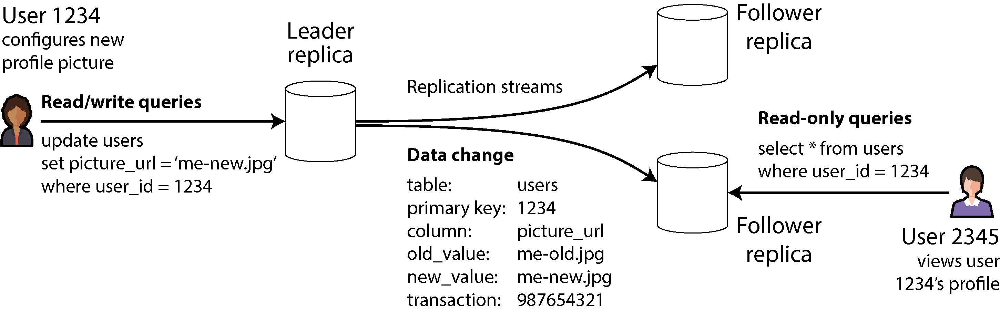

*Hình 6-1. Single-leader replication hướng tất cả các lần ghi tới một leader được chỉ định, leader này gửi một stream các thay đổi tới các replica follower.*

Nếu cơ sở dữ liệu được shard (xem Chương 7), mỗi shard có một leader. Các shard khác nhau có thể có leader trên các node khác nhau, nhưng dù vậy mỗi shard vẫn phải có một node leader. Trong “Multi-Leader Replication”, chúng ta sẽ thảo luận một mô hình thay thế trong đó một hệ thống có thể có nhiều leader cho cùng một shard tại cùng một thời điểm.

Single-leader replication được sử dụng rất rộng rãi. Đó là một tính năng có sẵn của nhiều cơ sở dữ liệu quan hệ, như PostgreSQL, MySQL, Oracle Data Guard [3], và Always On availability groups của SQL Server [4]. Nó cũng được dùng trong một số document database (như MongoDB và DynamoDB [5]), các message broker như Kafka, các thiết bị block được replicate như DRBD, và một số hệ thống tệp mạng (network filesystem). Nhiều thuật toán consensus—như Raft, được dùng cho replication trong CockroachDB [6], TiDB [7], etcd, và RabbitMQ quorum queues (cùng nhiều hệ thống khác)—cũng dựa trên một leader duy nhất và tự động bầu một leader mới nếu leader cũ hỏng (chúng ta sẽ thảo luận consensus chi tiết hơn trong Chương 10).

> **LƯU Ý**
>
> Trong các tài liệu cũ, bạn có thể thấy thuật ngữ *master–slave replication*. Nó có nghĩa tương tự leader-based replication, nhưng nên tránh dùng thuật ngữ này vì nó được xem rộng rãi là mang tính xúc phạm [8].

### Replication đồng bộ so với bất đồng bộ

Một chi tiết quan trọng của hệ thống được replicate là replication diễn ra *đồng bộ* (synchronous) hay *bất đồng bộ* (asynchronous). (Trong các cơ sở dữ liệu quan hệ, đây thường là một tùy chọn có thể cấu hình; các hệ thống khác thường được cố định cứng theo một trong hai cách.)

Hãy nghĩ về điều xảy ra trong Hình 6-1, khi người dùng của một website cập nhật ảnh hồ sơ của họ. Tại một thời điểm nào đó, client gửi request cập nhật tới leader; ngay sau đó, leader nhận được request. Leader sau đó chuyển tiếp thay đổi dữ liệu tới các follower và thông báo cho client rằng việc cập nhật đã thành công. Hình 6-2 cho thấy một cách khả dĩ mà các mốc thời gian có thể diễn ra.

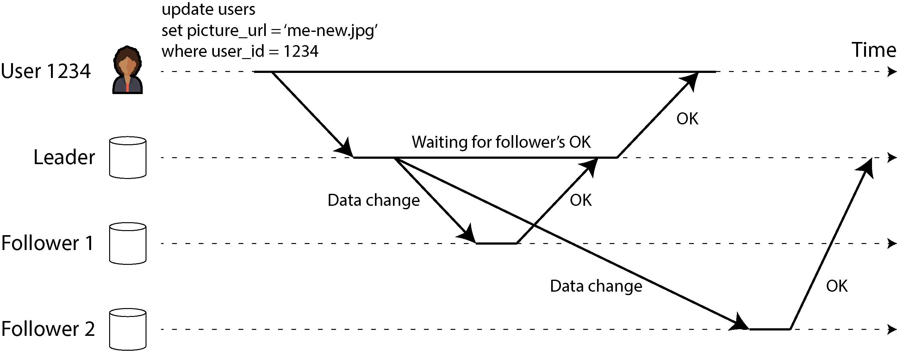

*Hình 6-2. Leader-based replication với một follower đồng bộ và một follower bất đồng bộ*

Trong ví dụ này, replication tới follower 1 là *đồng bộ*: leader chờ cho tới khi follower 1 xác nhận rằng nó đã nhận được lần ghi trước khi báo thành công cho người dùng và trước khi làm cho lần ghi đó trở nên nhìn thấy được với các client khác. Replication tới follower 2 là *bất đồng bộ* (hay *nonblocking*): leader gửi thông điệp nhưng không chờ phản hồi từ follower.

Sơ đồ cho thấy một độ trễ đáng kể trước khi follower 2 xử lý thông điệp. Thông thường, replication khá nhanh; hầu hết các hệ thống cơ sở dữ liệu áp dụng các thay đổi lên follower trong chưa tới một giây. Tuy nhiên, không có đảm bảo nào về việc nó có thể mất bao lâu. Trong một số hoàn cảnh, các follower có thể tụt lại sau leader vài phút hoặc hơn—ví dụ, nếu một follower đang phục hồi sau sự cố, nếu hệ thống đang hoạt động gần công suất tối đa, hoặc nếu có vấn đề mạng giữa các node.

Ưu điểm của replication đồng bộ là follower được đảm bảo có một bản sao dữ liệu cập nhật và nhất quán với bản của leader. Nếu leader đột ngột hỏng, chúng ta có thể chắc chắn rằng dữ liệu vẫn còn sẵn trên follower. Nhược điểm là nếu follower đồng bộ không phản hồi (vì nó đã crash, hoặc vì có lỗi mạng, hoặc vì bất kỳ lý do nào khác), lần ghi không thể được xử lý. Leader phải chặn tất cả các lần ghi và chờ cho tới khi replica đồng bộ sẵn sàng trở lại.

Vì lý do đó, việc tất cả các follower đều đồng bộ là không thực tế; bất kỳ một node nào ngừng hoạt động cũng sẽ khiến toàn bộ hệ thống đình trệ. Trong thực tế, nếu một cơ sở dữ liệu cung cấp replication đồng bộ, điều đó thường có nghĩa là *một* trong các follower là đồng bộ và các follower còn lại là bất đồng bộ. Nếu follower đồng bộ trở nên không sẵn sàng hoặc chậm, một trong các follower bất đồng bộ sẽ được chuyển thành đồng bộ. Điều này đảm bảo rằng bạn có một bản sao dữ liệu cập nhật trên ít nhất hai node: leader và một follower đồng bộ. Cấu hình này đôi khi cũng được gọi là *semisynchronous* (bán đồng bộ).

Trong một số hệ thống, *đa số* (majority) các replica (ví dụ, ba trong năm, tính cả leader) được cập nhật đồng bộ, và số ít còn lại là bất đồng bộ. Đây là một ví dụ về *quorum*, mà chúng ta sẽ thảo luận thêm trong “Dùng quorum cho việc đọc và ghi”. Majority quorum thường được dùng trong các hệ thống eventually consistent hoặc các hệ thống dùng giao thức consensus để tự động bầu leader. Chúng ta sẽ trở lại các hệ thống này trong Chương 10.

Đôi khi leader-based replication được cấu hình hoàn toàn bất đồng bộ. Trong trường hợp này, nếu leader hỏng và không thể khôi phục, mọi lần ghi chưa được replicate tới các follower sẽ bị mất. Điều này có nghĩa là một lần ghi không được đảm bảo bền vững, ngay cả khi nó đã được xác nhận với client. Tuy nhiên, cấu hình hoàn toàn bất đồng bộ có ưu điểm là leader có thể tiếp tục xử lý các lần ghi, ngay cả khi tất cả các follower của nó đã tụt lại phía sau.

Làm suy yếu tính bền vững nghe có vẻ là một sự đánh đổi tồi, nhưng dù vậy replication bất đồng bộ vẫn được sử dụng rộng rãi, đặc biệt khi có nhiều follower hoặc khi chúng phân tán về mặt địa lý [9]. Chúng ta sẽ trở lại vấn đề này trong “Các vấn đề với replication lag”.

### Thiết lập follower mới

Thi thoảng, bạn cần thiết lập các follower mới—có lẽ để tăng số lượng replica hoặc để thay thế các node bị hỏng. Làm thế nào để bạn đảm bảo rằng follower mới có một bản sao chính xác dữ liệu của leader?

Đơn giản sao chép các file dữ liệu từ node này sang node khác thường là không đủ. Các client liên tục ghi vào cơ sở dữ liệu, và dữ liệu luôn thay đổi, nên một thao tác sao chép file tiêu chuẩn sẽ nhìn thấy các phần khác nhau của cơ sở dữ liệu tại các thời điểm khác nhau. Kết quả có thể chẳng có ý nghĩa gì.

Bạn có thể làm cho các file trên đĩa nhất quán bằng cách khóa cơ sở dữ liệu (khiến nó không sẵn sàng cho việc ghi), nhưng điều đó đi ngược lại mục tiêu tính sẵn sàng cao của chúng ta. May mắn là việc thiết lập một follower thường có thể được thực hiện mà không cần downtime. Về mặt khái niệm, quy trình như sau:

1. Lấy một snapshot nhất quán của cơ sở dữ liệu trên leader tại một thời điểm nào đó—nếu có thể, không khóa toàn bộ cơ sở dữ liệu. Hầu hết các cơ sở dữ liệu đều có tính năng này, vì nó cũng cần thiết cho backup. Trong một số trường hợp, cần tới các công cụ bên thứ ba, chẳng hạn Percona XtraBackup cho MySQL.

2. Sao chép snapshot tới node follower mới.

3. Follower kết nối tới leader và yêu cầu tất cả các thay đổi dữ liệu đã xảy ra kể từ khi snapshot được lấy. Điều này yêu cầu snapshot phải được gắn với một vị trí chính xác trong replication log của leader. Vị trí đó có nhiều tên gọi khác nhau—ví dụ, PostgreSQL gọi nó là *log sequence number*; MySQL có hai cơ chế, *binlog coordinates* và *global transaction identifiers* (GTIDs).

4. Khi follower đã xử lý xong lượng thay đổi dữ liệu tồn đọng kể từ snapshot, chúng ta nói rằng nó đã *bắt kịp* (caught up). Giờ nó có thể tiếp tục xử lý các thay đổi dữ liệu từ leader khi chúng xảy ra.

Các bước thực tế để thiết lập một follower khác nhau đáng kể tùy theo cơ sở dữ liệu. Trong một số hệ thống, quy trình này hoàn toàn tự động, trong khi ở các hệ thống khác, nó có thể là một workflow nhiều bước khá rắc rối mà quản trị viên phải thực hiện thủ công.

Bạn cũng có thể lưu trữ (archive) replication log vào một object store cùng với các snapshot định kỳ của toàn bộ cơ sở dữ liệu. Đây là một cách hay để hiện thực backup cơ sở dữ liệu và khôi phục sau thảm họa (disaster recovery), và bạn có thể thực hiện bước 1 và 2 của việc thiết lập follower mới bằng cách tải các file đó từ object store. Ví dụ, WAL-G làm điều này cho PostgreSQL, MySQL và SQL Server, còn Litestream làm điều tương tự cho SQLite.

#### CƠ SỞ DỮ LIỆU DỰA TRÊN OBJECT STORAGE

Object storage có thể được dùng cho nhiều việc hơn là lưu trữ dữ liệu. Nhiều cơ sở dữ liệu đang bắt đầu sử dụng các object store như Amazon S3, Google Cloud Storage và Azure Blob Storage để phục vụ dữ liệu cho các truy vấn trực tiếp (live). Lưu dữ liệu của cơ sở dữ liệu trong object storage có nhiều lợi ích:

- Object storage rẻ so với các tùy chọn lưu trữ cloud khác. Điều này cho phép các cơ sở dữ liệu cloud lưu dữ liệu ít được truy vấn hơn trên bộ lưu trữ rẻ hơn, độ trễ cao hơn, trong khi phục vụ working set từ bộ nhớ, SSD và NVMe.

- Các object store cung cấp replication đa vùng (multi-zone), hai region (dual-region) hoặc đa region (multi-region) với các đảm bảo bền vững rất cao. Điều này cũng cho phép các cơ sở dữ liệu tránh được phí mạng liên vùng (inter-zone).

- Các cơ sở dữ liệu có thể dùng tính năng *conditional write* (ghi có điều kiện) của object store—về bản chất là một phép toán *compare-and-set* (CAS)—để hiện thực transaction và bầu leader [10, 11].

- Lưu dữ liệu từ nhiều cơ sở dữ liệu trong cùng một object store có thể đơn giản hóa việc tích hợp dữ liệu (xem “Data Warehouse trên Cloud”), đặc biệt khi dùng các định dạng mở như Parquet và Iceberg.

Những lợi ích này đơn giản hóa đáng kể kiến trúc cơ sở dữ liệu bằng cách chuyển trách nhiệm về transaction, bầu leader và replication sang object storage.

Tuy vậy, các hệ thống áp dụng object storage cho replication phải vật lộn với những sự đánh đổi. Đáng chú ý, các object store có độ trễ đọc và ghi cao hơn nhiều so với đĩa cục bộ hoặc các thiết bị block ảo như Amazon EBS. Nhiều nhà cung cấp cloud cũng tính phí theo từng lời gọi API, điều này buộc các hệ thống phải gom (batch) các lần đọc và ghi để giảm chi phí. Việc gom như vậy càng làm tăng độ trễ. Các object cũng thường là bất biến, khiến việc ghi ngẫu nhiên vào một object lớn trở thành một thao tác cực kỳ tốn tài nguyên. Cuối cùng, nhiều object store không cung cấp các giao diện hệ thống tệp tiêu chuẩn, khiến các hệ thống không có tích hợp object storage không thể tận dụng object storage. Các giao diện như *filesystem in userspace* (FUSE) cho phép người vận hành mount các bucket của object store thành hệ thống tệp mà ứng dụng có thể sử dụng mà không cần biết dữ liệu của mình được lưu trên object storage. Dù vậy, nhiều giao diện FUSE cho object store thiếu các tính năng POSIX như ghi không tuần tự (nonsequential write) hay symlink, mà các hệ thống có thể phụ thuộc vào.

Các hệ thống khác nhau xử lý những sự đánh đổi này theo nhiều cách. Một số đưa vào kiến trúc *tiered storage* (lưu trữ phân tầng), đặt dữ liệu ít được truy cập hơn trên object storage, trong khi dữ liệu mới hoặc được truy cập thường xuyên được giữ trên các thiết bị lưu trữ nhanh hơn như SSD hay NVMe, hoặc thậm chí trong bộ nhớ. Các hệ thống khác dùng object storage làm tầng lưu trữ chính nhưng dùng một hệ thống lưu trữ độ trễ thấp riêng (như Amazon EBS hoặc Safekeepers của Neon [12]) để lưu WAL của chúng. Gần đây, một số hệ thống còn đi xa hơn bằng cách áp dụng *zero-disk architecture* (ZDA). Các hệ thống dựa trên ZDA lưu bền vững toàn bộ dữ liệu vào object storage và chỉ dùng đĩa và bộ nhớ hoàn toàn cho việc cache. Điều này cho phép các node không có trạng thái bền vững nào, giúp đơn giản hóa vận hành đáng kể. WarpStream, Confluent Freight, Bufstream của Buf, và Redpanda Serverless đều là các hệ thống tương thích Kafka được xây dựng bằng zero-disk architecture. Gần như mọi cloud data warehouse hiện đại cũng áp dụng kiến trúc như vậy, cũng như Turbopuffer (một công cụ tìm kiếm vector) và SlateDB (một LSM storage engine cloud native).

### Xử lý node ngừng hoạt động

Bất kỳ node nào trong hệ thống cũng có thể ngừng hoạt động, có thể là bất ngờ do lỗi, nhưng cũng có thể do bảo trì theo kế hoạch (ví dụ, khởi động lại máy để cài đặt bản vá bảo mật cho kernel). Khả năng khởi động lại từng node riêng lẻ mà không có downtime là một lợi thế lớn cho vận hành và bảo trì. Do đó, mục tiêu của chúng ta là giữ cho toàn bộ hệ thống tiếp tục chạy bất chấp các node riêng lẻ hỏng hóc, và giữ cho tác động của việc một node ngừng hoạt động nhỏ nhất có thể.

Làm thế nào để đạt được tính sẵn sàng cao với leader-based replication?

#### Follower hỏng: Khôi phục bắt kịp (catch-up recovery)

Trên đĩa cục bộ của mình, mỗi follower giữ một log các thay đổi dữ liệu nó đã nhận từ leader. Nếu một follower bị crash và được khởi động lại, hoặc nếu mạng giữa leader và follower bị gián đoạn tạm thời, follower có thể phục hồi khá dễ dàng: từ log của nó, nó biết transaction cuối cùng đã được xử lý trước khi lỗi xảy ra. Do đó, follower có thể kết nối tới leader và yêu cầu tất cả các thay đổi dữ liệu đã xảy ra trong khoảng thời gian follower bị ngắt kết nối. Khi đã áp dụng các thay đổi này, nó đã bắt kịp leader và có thể tiếp tục nhận stream các thay đổi dữ liệu như trước.

Mặc dù về khái niệm việc phục hồi follower là đơn giản, nó có thể gây thách thức về mặt hiệu năng. Nếu cơ sở dữ liệu có thông lượng ghi cao hoặc nếu follower đã offline trong thời gian dài, có thể có rất nhiều lần ghi cần bắt kịp. Sẽ có tải cao trên cả follower đang phục hồi và leader (vốn cần gửi lượng ghi tồn đọng tới follower) trong khi quá trình bắt kịp này diễn ra.

Leader có thể xóa log các lần ghi của mình sau khi tất cả các follower đã xác nhận rằng chúng đã xử lý xong, nhưng nếu một follower không sẵn sàng trong thời gian dài, leader đối mặt với một lựa chọn: giữ lại log cho tới khi follower phục hồi và bắt kịp (với rủi ro hết dung lượng đĩa trên leader), hoặc xóa phần log mà follower không sẵn sàng chưa xác nhận (trong trường hợp đó follower sẽ không thể phục hồi từ log và sẽ phải được khôi phục từ backup khi nó hoạt động trở lại).

#### Leader hỏng: Failover

Xử lý việc leader hỏng thì khó hơn. Một trong các follower cần được thăng cấp thành leader mới, các client cần được cấu hình lại để gửi các lần ghi của chúng tới leader mới, và các follower khác cần bắt đầu tiêu thụ các thay đổi dữ liệu từ leader mới. Quy trình này được gọi là *failover*.

Failover có thể diễn ra thủ công (quản trị viên được thông báo rằng leader đã hỏng và thực hiện các bước cần thiết để tạo leader mới) hoặc tự động. Một quy trình failover tự động thường bao gồm các bước sau:

1. *Xác định rằng leader đã hỏng.* Nhiều thứ có thể xảy ra sai sót: crash, mất điện, sự cố mạng, và nhiều thứ khác. Không có cách nào hoàn toàn chắc chắn để phát hiện điều gì đã xảy ra, nên hầu hết các hệ thống đơn giản dùng timeout; các node thường xuyên gửi thông điệp qua lại với nhau, và nếu một node không phản hồi trong một khoảng thời gian nào đó—chẳng hạn 30 giây—nó được coi là đã chết. (Nếu leader được chủ động hạ xuống để bảo trì theo kế hoạch, điều này không áp dụng vì leader có thể kích hoạt một cuộc chuyển giao an toàn trước khi tắt.)

2. *Chọn leader mới.* Điều này có thể được thực hiện thông qua một quy trình bầu chọn (trong đó leader được chọn bởi đa số các replica còn lại), hoặc một leader mới có thể được chỉ định bởi một *controller node* đã được thiết lập từ trước [13]. Ứng viên tốt nhất cho vị trí leader thường là replica có các thay đổi dữ liệu cập nhật nhất từ leader cũ (để giảm thiểu mất dữ liệu). Việc khiến tất cả các node đồng thuận về một leader mới là một bài toán consensus, được thảo luận chi tiết trong Chương 10.

3. *Cấu hình lại hệ thống để sử dụng leader mới.* Các client giờ cần gửi request ghi của chúng tới leader mới (chúng ta thảo luận điều này trong “Định tuyến request”). Nếu leader cũ quay trở lại, nó có thể vẫn tin rằng mình là leader, không nhận ra rằng các replica khác đã buộc nó phải từ chức. Hệ thống cần đảm bảo rằng leader cũ trở thành follower và công nhận leader mới.

Failover đầy rẫy những thứ có thể xảy ra sai sót:

- Nếu dùng replication bất đồng bộ, leader mới có thể chưa nhận được tất cả các lần ghi từ leader cũ trước khi nó hỏng. Nếu leader cũ tham gia lại cluster sau khi leader mới đã được chọn, điều gì nên xảy ra với những lần ghi đó? Leader mới có thể đã nhận được các lần ghi xung đột trong lúc đó. Giải pháp phổ biến nhất là các lần ghi chưa được replicate của leader cũ đơn giản bị loại bỏ, có nghĩa là những lần ghi mà bạn tin rằng đã được commit hóa ra lại không bền vững.

- Việc loại bỏ các lần ghi đặc biệt nguy hiểm nếu các hệ thống lưu trữ khác bên ngoài cơ sở dữ liệu cần được phối hợp với nội dung của cơ sở dữ liệu. Ví dụ, trong một sự cố tại GitHub [14], một follower MySQL lỗi thời đã được thăng cấp thành leader. Cơ sở dữ liệu dùng một bộ đếm tự tăng để gán khóa chính (primary key) cho các hàng mới, nhưng vì bộ đếm của leader mới tụt lại sau bộ đếm của leader cũ, nó đã dùng lại một số khóa chính mà trước đó đã được leader cũ gán. Các khóa chính này cũng được dùng trong một Redis store, nên việc dùng lại khóa chính dẫn tới sự không nhất quán giữa MySQL và Redis, khiến một số dữ liệu riêng tư bị tiết lộ cho sai người dùng. Trong một số kịch bản lỗi nhất định (xem Chương 9), hai node có thể đều tin rằng chúng là leader. Tình huống này, gọi là *split brain*, rất nguy hiểm; nếu cả hai leader đều chấp nhận ghi, và không có quy trình nào để giải quyết xung đột (xem “Multi-Leader Replication”), dữ liệu rất có thể bị mất hoặc hư hỏng. Như một chốt an toàn, một số hệ thống có cơ chế tắt một node nếu phát hiện hai leader. Tuy nhiên, nếu cơ chế này không được thiết kế cẩn thận, bạn có thể rơi vào tình huống cả hai node đều bị tắt [15]. Hơn nữa, có rủi ro là đến khi split brain được phát hiện và node cũ bị tắt thì đã quá muộn và dữ liệu đã bị hư hỏng.

- Quyết định timeout phù hợp trước khi tuyên bố leader đã chết có thể khó. Timeout dài hơn nghĩa là thời gian khôi phục lâu hơn trong trường hợp leader hỏng. Tuy nhiên, nếu timeout quá ngắn, các failover không cần thiết có thể xảy ra. Ví dụ, một đợt tăng tải tạm thời có thể khiến thời gian phản hồi của node tăng vượt quá timeout, hoặc một trục trặc mạng có thể khiến các gói tin bị trễ. Nếu hệ thống đã đang vật lộn với tải cao hoặc sự cố mạng, một failover không cần thiết nhiều khả năng sẽ làm tình hình tệ hơn chứ không tốt hơn.

Việc phòng ngừa split brain bằng cách hạn chế hoặc tắt các leader cũ được gọi là fencing; chúng ta thảo luận chi tiết hơn về nó trong “Lock và Lease phân tán”. Tuy nhiên, những vấn đề này không có giải pháp dễ dàng. Vì lý do này, một số đội vận hành thích thực hiện failover thủ công, ngay cả khi phần mềm hỗ trợ failover tự động.

Điều quan trọng nhất với failover là chọn một follower cập nhật làm leader mới. Nếu dùng replication đồng bộ hoặc semisynchronous, đó sẽ là follower mà leader cũ đã chờ trước khi xác nhận các lần ghi. Với replication bất đồng bộ, bạn có thể chọn follower có log sequence number cao nhất. Điều này giảm thiểu lượng dữ liệu bị mất trong quá trình failover; mất lượng ghi tương đương một phần giây có thể chấp nhận được, nhưng chọn một follower tụt lại vài ngày có thể là thảm họa.

Những vấn đề này—node hỏng, mạng không đáng tin cậy, và các sự đánh đổi xung quanh tính nhất quán, tính bền vững, tính sẵn sàng và độ trễ của replica—thực ra là các bài toán cơ bản trong hệ phân tán. Trong Chương 9 và 10, chúng ta sẽ thảo luận về chúng sâu hơn.

### Triển khai replication log

Replication dựa trên leader hoạt động như thế nào bên dưới lớp vỏ? Trong thực tế có nhiều phương pháp replication được sử dụng. Hãy cùng xem xét ngắn gọn từng phương pháp.

#### Replication dựa trên statement

Trong trường hợp đơn giản nhất, leader ghi log mọi request ghi (*statement*) mà nó thực thi và gửi log statement đó tới các follower của mình. Với một cơ sở dữ liệu quan hệ, điều này có nghĩa là mọi câu lệnh `INSERT` , `UPDATE` , hoặc `DELETE` đều được chuyển tiếp tới các follower, và mỗi follower phân tích cú pháp rồi thực thi câu lệnh SQL đó như thể nó được nhận từ một client.

Mặc dù cách tiếp cận replication này nghe có vẻ hợp lý, nó có thể đổ vỡ theo nhiều cách khác nhau:

- Bất kỳ statement nào gọi một hàm không deterministic (nondeterministic), chẳng hạn `NOW` để lấy ngày giờ hiện tại hoặc `RAND` để lấy một số ngẫu nhiên, nhiều khả năng sẽ sinh ra giá trị khác nhau trên mỗi replica.

- Nếu các statement sử dụng một cột tự tăng (autoincrementing), hoặc nếu chúng phụ thuộc vào dữ liệu hiện có trong cơ sở dữ liệu (ví dụ, `UPDATE` … `WHERE` `<some condition>` ), chúng phải được thực thi theo đúng cùng một thứ tự trên mỗi replica, nếu không chúng có thể tạo ra hiệu ứng khác nhau. Điều này có thể gây hạn chế khi có nhiều transaction thực thi đồng thời. Các statement có tác dụng phụ (side effect) (ví dụ, trigger, stored procedure, hàm do người dùng định nghĩa) có thể dẫn đến các tác dụng phụ khác nhau xảy ra trên mỗi replica, trừ khi các tác dụng phụ đó là hoàn toàn deterministic.

Có thể khắc phục những vấn đề này—ví dụ, leader có thể thay thế mọi lời gọi hàm nondeterministic bằng một giá trị trả về cố định khi statement được ghi log, để tất cả các follower đều nhận được cùng một giá trị. Ý tưởng thực thi các statement deterministic theo một thứ tự cố định tương tự với mô hình event sourcing mà chúng ta đã thảo luận trước đó trong “Event Sourcing và CQRS”. Cách tiếp cận này còn được gọi là *state machine replication* (replication máy trạng thái), và chúng ta sẽ thảo luận lý thuyết phía sau nó trong “Sử dụng shared log”.

Replication dựa trên statement từng được sử dụng trong MySQL trước phiên bản 5.1. Ngày nay nó vẫn đôi khi được dùng vì khá gọn nhẹ, nhưng theo mặc định MySQL hiện chuyển sang replication dựa trên hàng (row-based, sẽ thảo luận ngay sau đây) nếu có bất kỳ yếu tố nondeterministic nào trong một statement. VoltDB sử dụng replication dựa trên statement và làm cho nó an toàn bằng cách yêu cầu các transaction phải deterministic [16]. Tuy nhiên, tính deterministic có thể khó đảm bảo trong thực tế, nên nhiều cơ sở dữ liệu ưu tiên các phương pháp replication khác.

#### Vận chuyển write-ahead log (WAL shipping)

Trong Chương 4 chúng ta đã thấy rằng cần có write-ahead log để làm cho các storage engine B-tree trở nên vững chắc; mọi thay đổi đều được ghi vào WAL trước, để cây có thể được khôi phục về trạng thái nhất quán sau một sự cố crash. Vì WAL chứa toàn bộ thông tin cần thiết để khôi phục các index và heap về trạng thái nhất quán, chúng ta có thể dùng đúng log này để xây dựng một replica trên một node khác; ngoài việc ghi log ra đĩa, leader cũng gửi nó qua mạng tới các follower của mình. Khi follower xử lý log này, nó xây dựng một bản sao của đúng những file giống như trên leader.

Phương pháp replication này được sử dụng trong PostgreSQL và Oracle, cùng với một số hệ khác [17, 18]. Nhược điểm chính là log mô tả dữ liệu ở mức rất thấp—một WAL chứa chi tiết về những byte nào đã bị thay đổi trong những khối đĩa (disk block) nào. Điều này khiến replication bị ràng buộc chặt (tightly coupled) với storage engine. Nếu cơ sở dữ liệu thay đổi định dạng lưu trữ từ phiên bản này sang phiên bản khác, thường sẽ không thể chạy các phiên bản khác nhau của phần mềm cơ sở dữ liệu trên leader và các follower.

Điều đó có vẻ như một chi tiết triển khai nhỏ nhặt, nhưng nó có thể có tác động vận hành lớn. Nếu giao thức replication cho phép follower dùng phiên bản phần mềm mới hơn leader, bạn có thể thực hiện nâng cấp phần mềm cơ sở dữ liệu không có thời gian ngừng hoạt động (zero-downtime) bằng cách trước tiên nâng cấp các follower, rồi thực hiện failover để đưa một trong các node đã nâng cấp trở thành leader mới. Nếu giao thức replication không cho phép sự chênh lệch phiên bản này, như thường xảy ra với WAL shipping, những lần nâng cấp như vậy sẽ đòi hỏi downtime.

#### Replication bằng logical log (dựa trên hàng)

Một lựa chọn khác là dùng các định dạng log khác nhau cho replication và cho storage engine, điều này cho phép replication log được tách rời (decoupled) khỏi các chi tiết nội bộ của storage engine. Loại replication log này được gọi là *logical log* (log logic), để phân biệt với biểu diễn dữ liệu (vật lý) của storage engine.

Một logical log cho cơ sở dữ liệu quan hệ thường là một chuỗi các bản ghi (record) mô tả các thao tác ghi vào các bảng của cơ sở dữ liệu ở mức độ chi tiết (granularity) của một hàng:

- Với một hàng được chèn (insert), log chứa các giá trị mới của tất cả các cột. Với một hàng bị xóa, log chứa đủ thông tin để xác định duy nhất hàng đã bị xóa. Thông thường đó sẽ là khóa chính (primary key), nhưng nếu bảng không có khóa chính, các giá trị cũ của tất cả các cột cần được ghi log.

- Với một hàng được cập nhật, log chứa đủ thông tin để xác định duy nhất hàng đã được cập nhật, cùng với các giá trị mới của tất cả các cột (hoặc ít nhất là tất cả các cột có giá trị đã thay đổi).

Một transaction sửa đổi nhiều hàng sẽ sinh ra nhiều bản ghi log như vậy, theo sau là một bản ghi cho biết transaction đã được commit. Khi được cấu hình dùng replication dựa trên hàng, MySQL giữ một logical replication log riêng, gọi là *binlog*, bên cạnh WAL. PostgreSQL triển khai logical replication bằng cách giải mã WAL vật lý thành các event chèn/cập nhật/xóa hàng [19].

Vì logical log được tách rời khỏi các chi tiết nội bộ của storage engine, nó có thể dễ dàng hơn trong việc duy trì tính tương thích ngược (backward compatible), cho phép leader và follower chạy các phiên bản khác nhau của phần mềm cơ sở dữ liệu. Điều này đến lượt nó cho phép nâng cấp lên phiên bản mới với downtime tối thiểu [20].

Định dạng logical log cũng dễ hơn cho các ứng dụng bên ngoài phân tích cú pháp. Khía cạnh này hữu ích nếu bạn muốn gửi nội dung của một cơ sở dữ liệu tới một hệ thống bên ngoài, chẳng hạn một data warehouse để phân tích offline, hoặc một hệ thống chuyên biệt để xây dựng các index và cache tùy chỉnh [21]. Kỹ thuật này được gọi là *change data capture* (CDC), và chúng ta sẽ quay lại với nó trong Chương 12.

### Các vấn đề với replication lag

Khả năng chịu được hỏng hóc node chỉ là một lý do để cần replication. Như đã đề cập trong “Hệ phân tán so với hệ đơn nút”, các lý do khác bao gồm khả năng mở rộng (scalability—xử lý nhiều request hơn khả năng của một máy đơn lẻ) và độ trễ (latency—đặt các replica gần người dùng hơn về mặt địa lý).

Replication dựa trên leader yêu cầu mọi thao tác ghi phải đi qua một node duy nhất, nhưng các truy vấn chỉ đọc có thể đi tới bất kỳ replica nào. Với các workload chủ yếu là đọc và chỉ có một tỷ lệ nhỏ là ghi (điều thường xảy ra với các dịch vụ trực tuyến), có một lựa chọn hấp dẫn: tạo nhiều follower, và phân phối các request đọc trên các follower đó. Điều này giảm tải cho leader và cho phép các request đọc được phục vụ bởi các replica ở gần.

Trong kiến trúc *read-scaling* (mở rộng đọc) này, bạn có thể tăng năng lực phục vụ các request chỉ đọc đơn giản bằng cách thêm nhiều follower hơn. Tuy nhiên, trên thực tế cách tiếp cận này chỉ hoạt động với replication bất đồng bộ (asynchronous). Nếu bạn cố replicate đồng bộ tới tất cả các follower, chỉ một node hỏng hoặc một sự cố mạng cũng sẽ làm toàn bộ hệ thống không thể ghi được. Và càng nhiều node thì khả năng có một node bị ngừng hoạt động càng cao, nên một cấu hình hoàn toàn đồng bộ sẽ rất không đáng tin cậy.

Thật không may, một ứng dụng đọc từ một follower *bất đồng bộ* có thể thấy thông tin lỗi thời nếu follower đó đã bị tụt lại phía sau. Điều này dẫn đến những bất nhất rõ ràng trong cơ sở dữ liệu; nếu bạn chạy cùng một truy vấn trên leader và một follower cùng lúc, bạn có thể nhận được các kết quả khác nhau, vì không phải mọi thao tác ghi đều đã được phản ánh trên follower. Sự bất nhất này là một trạng thái tạm thời—nếu bạn ngừng ghi vào cơ sở dữ liệu và chờ một lúc, các follower cuối cùng sẽ bắt kịp và trở nên nhất quán với leader. Vì lý do đó, hiệu ứng này được gọi là *eventual consistency* (nhất quán cuối cùng) [22].

> **LƯU Ý**
>
> Thuật ngữ *eventual consistency* được Douglas Terry cùng các cộng sự đặt ra [23] và được Werner Vogels phổ biến [24], và nó đã trở thành khẩu hiệu chiến đấu của nhiều dự án NoSQL. Tuy nhiên, không chỉ các cơ sở dữ liệu NoSQL mới là eventually consistent; các follower trong một cơ sở dữ liệu quan hệ được replicate bất đồng bộ cũng có cùng đặc tính này.

Thuật ngữ “eventually” (cuối cùng) là cố ý mơ hồ; nói chung, không có giới hạn nào cho việc một replica có thể tụt lại bao xa. Trong hoạt động bình thường, độ trễ giữa lúc một thao tác ghi xảy ra trên leader và lúc nó được phản ánh trên một follower—gọi là *replication lag* (độ trễ replication)—có thể chỉ là một phần nhỏ của giây và không nhận thấy được trong thực tế. Tuy nhiên, nếu hệ thống đang hoạt động gần mức công suất tối đa hoặc nếu có sự cố xảy ra trong mạng, độ trễ này có thể dễ dàng tăng lên vài giây hoặc thậm chí vài phút.

Khi độ trễ lớn đến vậy, những bất nhất mà nó gây ra không chỉ là vấn đề lý thuyết mà là vấn đề thực sự đối với các ứng dụng. Trong mục này chúng ta sẽ nêu bật ba ví dụ về các vấn đề có khả năng xảy ra với replication lag. Chúng ta cũng sẽ phác thảo một số cách tiếp cận để giải quyết chúng.

#### Đọc lại những gì chính mình đã ghi

Nhiều ứng dụng cho phép người dùng gửi lên một số dữ liệu rồi xem lại những gì họ đã gửi. Đó có thể là một bản ghi trong cơ sở dữ liệu khách hàng, hoặc một bình luận trên một chủ đề thảo luận, hoặc thứ gì đó tương tự. Khi dữ liệu mới được gửi lên, nó phải được gửi tới leader, nhưng khi người dùng xem dữ liệu, nó có thể được đọc từ một follower. Điều này đặc biệt thích hợp nếu dữ liệu được xem thường xuyên nhưng chỉ đôi khi được ghi.

Với replication bất đồng bộ, một vấn đề nảy sinh, như minh họa trong Hình 6-3: nếu người dùng xem dữ liệu ngay sau khi thực hiện một thao tác ghi, dữ liệu mới có thể chưa tới được replica. Đối với người dùng, trông như thể dữ liệu họ đã gửi bị mất, nên họ sẽ không hài lòng—điều đó cũng dễ hiểu.

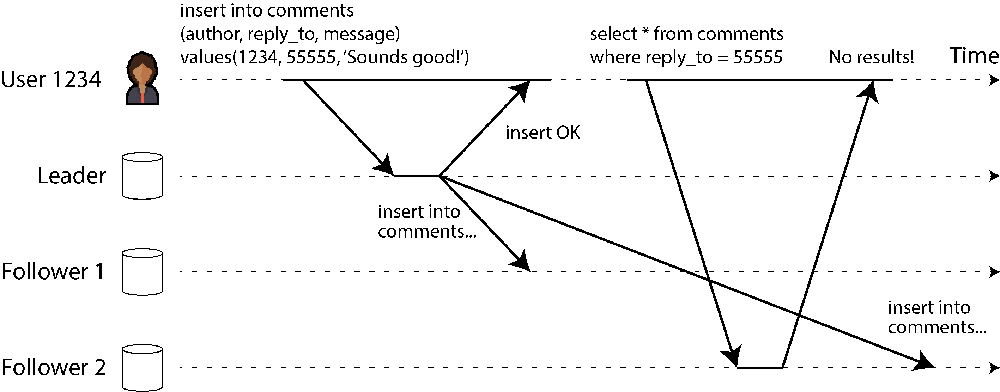

*Hình 6-3. Bất nhất có thể nảy sinh khi một người dùng thực hiện một thao tác ghi, tiếp theo là một thao tác đọc từ một replica cũ (stale).*

Trong tình huống này, chúng ta cần *read-after-write consistency* (nhất quán đọc-sau-ghi), còn được gọi là *read-your-writes consistency* [23]. Đây là một đảm bảo rằng nếu người dùng tải lại trang, họ sẽ luôn thấy mọi cập nhật mà chính họ đã gửi. Nó không hứa hẹn gì về những người dùng khác; các cập nhật của những người dùng khác có thể chưa hiển thị cho đến một thời điểm nào đó sau này. Tuy nhiên, nó đảm bảo cho người dùng rằng dữ liệu họ nhập vào đã được lưu đúng.

Làm thế nào chúng ta có thể triển khai read-after-write consistency trong một hệ thống có replication dựa trên leader? Có nhiều kỹ thuật khả dĩ. Xin nêu một vài kỹ thuật:

- Khi đọc thứ gì đó mà người dùng có thể đã sửa đổi, hãy đọc nó từ leader hoặc từ một follower được cập nhật đồng bộ; nếu không, hãy đọc từ một follower được cập nhật bất đồng bộ. Điều này yêu cầu bạn phải có cách nào đó để biết một thứ có thể đã bị sửa đổi hay không, mà không cần truy vấn nó. Ví dụ, thông tin hồ sơ người dùng trên một mạng xã hội thường chỉ có thể được chỉnh sửa bởi chủ sở hữu hồ sơ, không phải bởi bất kỳ ai khác. Vì vậy, một quy tắc đơn giản là: luôn đọc hồ sơ của chính người dùng từ leader, và hồ sơ của bất kỳ người dùng nào khác từ một follower. Nếu hầu hết mọi thứ trong ứng dụng đều có khả năng được người dùng chỉnh sửa, cách tiếp cận đó sẽ không hiệu quả, vì hầu hết mọi thứ sẽ phải được đọc từ leader (làm mất đi lợi ích của read scaling). Trong trường hợp đó, có thể dùng các tiêu chí khác để quyết định có đọc từ leader hay không. Ví dụ, bạn có thể theo dõi thời điểm của lần cập nhật cuối và, trong một phút sau lần cập nhật cuối, thực hiện mọi thao tác đọc từ leader [25]. Bạn cũng có thể giám sát replication lag trên các follower và ngăn các truy vấn tới bất kỳ follower nào bị tụt lại sau leader hơn một phút.

- Client có thể ghi nhớ timestamp của thao tác ghi gần nhất của nó, và hệ thống có thể đảm bảo rằng replica phục vụ bất kỳ thao tác đọc nào cho người dùng đó đã phản ánh các cập nhật ít nhất cho tới timestamp đó. Nếu một replica chưa đủ cập nhật, thao tác đọc có thể được xử lý bởi một replica khác, hoặc truy vấn có thể chờ cho đến khi replica bắt kịp [26]. Timestamp có thể là một *logical timestamp* (timestamp logic—thứ gì đó cho biết thứ tự của các thao tác ghi, chẳng hạn số thứ tự trong log) hoặc đồng hồ hệ thống thực (trong trường hợp này việc đồng bộ hóa đồng hồ trở nên tối quan trọng; xem “Đồng hồ không đáng tin cậy”).

- Nếu các replica của bạn được phân bố trên nhiều region (để gần người dùng về mặt địa lý, để có tính sẵn sàng, hoặc để có tính bền vững), sẽ có thêm độ phức tạp. Bất kỳ request nào cần được leader phục vụ đều phải được định tuyến tới region chứa leader.

Một rắc rối khác nảy sinh khi cùng một người dùng truy cập dịch vụ của bạn từ nhiều thiết bị, chẳng hạn một trình duyệt web trên máy tính để bàn và một ứng dụng di động. Trong trường hợp này bạn có thể muốn cung cấp read-after-write consistency *xuyên thiết bị* (cross-device): nếu người dùng nhập một số thông tin trên một thiết bị rồi xem nó trên một thiết bị khác, họ phải thấy được thông tin họ vừa nhập.

Có một số vấn đề bổ sung cần xem xét ở đây:

- Các cách tiếp cận yêu cầu ghi nhớ timestamp của lần cập nhật cuối của người dùng trở nên khó khăn hơn, vì mã chạy trên một thiết bị không biết những cập nhật nào đã xảy ra trên thiết bị kia. Metadata này sẽ cần được tập trung hóa.

- Nếu các replica của bạn được phân bố trên nhiều region, không có gì đảm bảo rằng các kết nối từ các thiết bị khác nhau sẽ được định tuyến tới cùng một region. (Ví dụ, nếu máy tính để bàn của người dùng dùng kết nối băng thông rộng tại nhà còn thiết bị di động của họ dùng mạng dữ liệu di động, đường đi trên mạng của các thiết bị có thể hoàn toàn khác nhau.) Nếu cách tiếp cận của bạn yêu cầu đọc từ leader, trước tiên bạn có thể cần định tuyến các request từ tất cả các thiết bị của một người dùng tới cùng một region.

#### REGION VÀ AVAILABILITY ZONE

Chúng tôi dùng thuật ngữ *region* (vùng) để chỉ một hoặc nhiều datacenter tại một vị trí địa lý duy nhất. Các nhà cung cấp cloud đặt nhiều datacenter trong cùng một vùng địa lý. Mỗi datacenter được gọi là một *availability zone* (vùng sẵn sàng) hay đơn giản là *zone*. Như vậy, một cloud region duy nhất được tạo thành từ nhiều zone. Mỗi zone là một datacenter riêng biệt nằm trong một cơ sở vật lý riêng với hệ thống điện, làm mát, v.v. của riêng nó.

Các zone trong cùng một region được kết nối bằng các đường mạng tốc độ rất cao. Độ trễ đủ thấp để hầu hết các hệ phân tán có thể chạy với các node trải trên nhiều zone trong cùng một region như thể chúng nằm trong một zone duy nhất. Các cấu hình đa zone cho phép hệ phân tán sống sót qua sự cố cấp zone khi một zone bị ngừng hoạt động, nhưng chúng không bảo vệ được trước sự cố cấp region khi tất cả các zone trong một region đều không khả dụng. Để sống sót qua sự cố cấp region, một hệ phân tán phải được triển khai trên nhiều region, điều này có thể dẫn đến độ trễ cao hơn, throughput thấp hơn, và hóa đơn mạng cloud tăng lên. Chúng ta sẽ thảo luận thêm về những sự đánh đổi này trong “Các topology của multi-leader replication”. Hiện tại, chỉ cần biết rằng khi chúng tôi nói region, chúng tôi muốn nói đến một tập hợp các zone/datacenter tại một vị trí địa lý duy nhất.

#### Monotonic reads

Ví dụ thứ hai của chúng ta về một bất thường (anomaly) có thể xảy ra khi đọc từ các follower bất đồng bộ là việc người dùng có thể thấy mọi thứ *đi ngược thời gian*.

Điều này có thể xảy ra nếu một người dùng thực hiện nhiều thao tác đọc từ các replica khác nhau. Ví dụ, Hình 6-4 cho thấy người dùng 2345 thực hiện cùng một truy vấn hai lần, lần đầu tới một follower có độ trễ nhỏ, rồi tới một follower có độ trễ lớn hơn. (Kịch bản này khá dễ xảy ra nếu người dùng làm mới một trang web và mỗi request được định tuyến tới một server ngẫu nhiên.) Truy vấn đầu tiên trả về một bình luận vừa được người dùng 1234 thêm vào, nhưng truy vấn thứ hai không trả về gì cả vì follower bị trễ chưa nhận được thao tác ghi đó. Thực chất, truy vấn thứ hai quan sát trạng thái hệ thống ở một thời điểm sớm hơn so với truy vấn thứ nhất. Điều này sẽ không tệ đến vậy nếu truy vấn đầu tiên không trả về gì, vì người dùng 2345 có lẽ sẽ không biết rằng người dùng 1234 vừa thêm một bình luận. Tuy nhiên, sẽ rất khó hiểu đối với người dùng 2345 nếu họ thấy bình luận của người dùng 1234 xuất hiện trước, rồi lại thấy nó biến mất.

*Monotonic reads* (đọc đơn điệu) [22] cung cấp một đảm bảo rằng loại bất thường này không xảy ra. Đó là một đảm bảo yếu hơn nhất quán mạnh (strong consistency), nhưng mạnh hơn eventual consistency. Khi bạn đọc dữ liệu, bạn có thể thấy một giá trị cũ; monotonic reads chỉ có nghĩa là nếu một người dùng thực hiện nhiều thao tác đọc liên tiếp, họ sẽ không thấy thời gian đi ngược (tức là, họ sẽ không đọc được dữ liệu cũ hơn sau khi trước đó đã đọc được dữ liệu mới hơn).

Một cách đạt được monotonic reads là đảm bảo rằng mỗi người dùng luôn thực hiện các thao tác đọc của họ từ cùng một replica (những người dùng khác nhau có thể đọc từ các replica khác nhau). Ví dụ, replica có thể được chọn dựa trên hash của ID người dùng thay vì ngẫu nhiên. Tuy nhiên, nếu replica đó hỏng, các truy vấn của người dùng sẽ cần được định tuyến lại tới một replica khác.

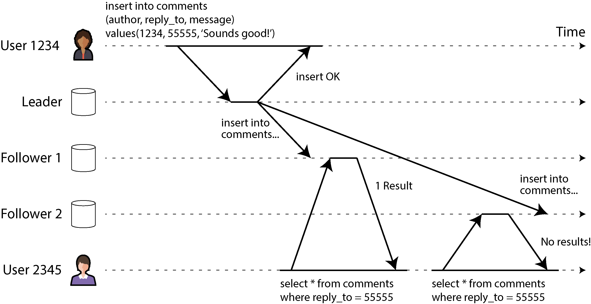

*Hình 6-4. Khi một người dùng đọc từ một replica mới (fresh) trước, rồi từ một replica cũ (stale), thời gian dường như đi ngược lại.*

#### Consistent prefix reads

Ví dụ thứ ba của chúng ta về các bất thường do replication lag liên quan đến việc vi phạm quan hệ nhân quả (causality). Hãy tưởng tượng đoạn đối thoại ngắn sau đây giữa ông Poons và bà Cake:

- **Ông Poons:** *Bà có thể nhìn thấy tương lai xa đến đâu, bà Cake?*

- **Bà Cake:** *Thường thì khoảng 10 giây, ông Poons.*

Có một phụ thuộc nhân quả giữa hai câu đó: bà Cake nghe câu hỏi của ông Poons và trả lời nó.

Bây giờ, hãy tưởng tượng một người thứ ba đang nghe cuộc đối thoại này thông qua các follower. Những gì bà Cake nói đi qua một follower có độ trễ nhỏ, nhưng những gì ông Poons nói lại có replication lag dài hơn (xem Hình 6-5). Người quan sát này sẽ nghe thấy như sau:

- **Bà Cake:** *Thường thì khoảng 10 giây, ông Poons.*

- **Ông Poons:** *Bà có thể nhìn thấy tương lai xa đến đâu, bà Cake?*

Đối với người quan sát, nghe như thể bà Cake đang trả lời câu hỏi trước cả khi ông Poons hỏi. Năng lực ngoại cảm như vậy thật ấn tượng nhưng rất khó hiểu [27].

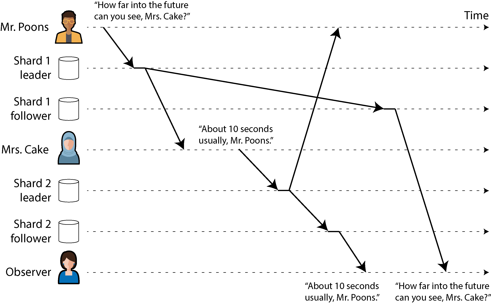

*Hình 6-5. Nếu một số shard được replicate chậm hơn các shard khác, người quan sát có thể thấy câu trả lời trước khi thấy câu hỏi.*

Ngăn chặn loại bất thường này đòi hỏi một loại đảm bảo khác: *consistent prefix reads* (đọc tiền tố nhất quán) [22]. Đảm bảo này nói rằng nếu một chuỗi các thao tác ghi xảy ra theo một thứ tự nhất định, thì bất kỳ ai đọc các thao tác ghi đó sẽ thấy chúng xuất hiện theo đúng thứ tự ấy.

Đây là một vấn đề đặc biệt trong các cơ sở dữ liệu được sharding (partitioning), mà chúng ta sẽ thảo luận trong Chương 7. Nếu cơ sở dữ liệu luôn áp dụng các thao tác ghi theo cùng một thứ tự, các thao tác đọc luôn thấy một tiền tố nhất quán, nên bất thường này không thể xảy ra. Tuy nhiên, trong nhiều cơ sở dữ liệu phân tán, các shard khác nhau hoạt động độc lập, nên không có thứ tự toàn cục cho các thao tác ghi. Khi một người dùng đọc từ cơ sở dữ liệu, họ có thể thấy một số phần của cơ sở dữ liệu ở trạng thái cũ hơn và một số phần ở trạng thái mới hơn.

Một giải pháp là đảm bảo rằng mọi thao tác ghi có quan hệ nhân quả với nhau đều được ghi vào cùng một shard—nhưng trong một số ứng dụng điều đó không thể thực hiện một cách hiệu quả. Một số thuật toán theo dõi tường minh các phụ thuộc nhân quả, một chủ đề mà chúng ta sẽ quay lại trong “Quan hệ happens-before và tính đồng thời”.

### Các giải pháp cho replication lag

Khi làm việc với một hệ thống eventually consistent, đáng để suy nghĩ về việc ứng dụng sẽ hành xử thế nào nếu replication lag tăng lên vài phút hoặc thậm chí vài giờ. Nếu câu trả lời là “không vấn đề gì”, thì thật tuyệt. Tuy nhiên, nếu kết quả là trải nghiệm tệ cho người dùng, điều quan trọng là phải thiết kế hệ thống để cung cấp một đảm bảo mạnh hơn, chẳng hạn read-after-write. Giả vờ rằng replication là đồng bộ trong khi thực tế nó là bất đồng bộ là công thức dẫn đến rắc rối về sau.

Như đã thảo luận trước đó, có những cách để một ứng dụng cung cấp đảm bảo mạnh hơn so với cơ sở dữ liệu bên dưới—ví dụ, bằng cách thực hiện một số loại thao tác đọc nhất định trên leader hoặc trên một follower được cập nhật đồng bộ. Tuy nhiên, xử lý những vấn đề này trong mã ứng dụng là phức tạp và dễ mắc lỗi.

Mô hình lập trình đơn giản nhất cho các nhà phát triển ứng dụng là chọn một cơ sở dữ liệu cung cấp đảm bảo nhất quán mạnh cho các replica, chẳng hạn linearizability (xem Chương 10), và hỗ trợ các transaction ACID (xem Chương 8). Điều này cho phép bạn hầu như bỏ qua những thách thức nảy sinh từ replication và coi cơ sở dữ liệu như thể nó chỉ có một node duy nhất. Vào đầu những năm 2010, phong trào NoSQL đã cổ vũ quan điểm rằng những tính năng này giới hạn khả năng mở rộng và rằng các hệ thống quy mô lớn sẽ phải chấp nhận eventual consistency.

Tuy nhiên, từ đó đến nay, một số cơ sở dữ liệu đã bắt đầu cung cấp nhất quán mạnh và hỗ trợ transaction trong khi vẫn mang lại các lợi thế về khả năng chịu lỗi, tính sẵn sàng cao và khả năng mở rộng của một cơ sở dữ liệu phân tán. Như đã đề cập trong “Mô hình quan hệ so với mô hình document”, xu hướng này được gọi là *NewSQL* để đối lập với NoSQL (mặc dù nó ít liên quan cụ thể đến SQL mà chủ yếu là về các cách tiếp cận mới đối với việc quản lý transaction có khả năng mở rộng).

Mặc dù các cơ sở dữ liệu phân tán có khả năng mở rộng và nhất quán mạnh hiện đã sẵn có, vẫn có những lý do chính đáng để một số ứng dụng chọn dùng các dạng replication khác với đảm bảo nhất quán yếu hơn. Đáng chú ý, chúng có thể mang lại khả năng chống chịu tốt hơn trước các gián đoạn mạng và có chi phí phụ trội (overhead) thấp hơn so với các hệ thống transactional. Chúng ta sẽ khám phá những cách tiếp cận như vậy trong phần còn lại của chương này.

## Multi-Leader Replication

Cho đến giờ trong chương này, chúng ta chỉ mới xem xét các kiến trúc replication sử dụng một leader duy nhất. Mặc dù đó là cách tiếp cận phổ biến, vẫn có những lựa chọn thay thế đáng quan tâm.

Single-leader replication có một nhược điểm lớn: mọi thao tác ghi đều phải đi qua một leader duy nhất. Nếu vì bất kỳ lý do gì bạn không thể kết nối tới leader—ví dụ, do mạng giữa bạn và leader bị gián đoạn—thì bạn không thể ghi vào database.

Một mở rộng tự nhiên của mô hình single-leader replication là cho phép nhiều hơn một node chấp nhận các thao tác ghi. Replication vẫn diễn ra theo cách tương tự: mỗi node xử lý một thao tác ghi phải chuyển tiếp thay đổi dữ liệu đó tới tất cả các node khác. Chúng ta gọi đây là cấu hình *multi-leader* (còn được gọi là replication *active/active* hoặc *bidirectional* (hai chiều)). Trong cách bố trí này, mỗi leader đồng thời đóng vai trò là follower đối với các leader khác.

Giống như với single-leader replication, ở đây có sự lựa chọn giữa đồng bộ (synchronous) hay bất đồng bộ (asynchronous). Giả sử bạn có hai leader, A và B, và bạn đang cố ghi vào A. Nếu các thao tác ghi được replicate đồng bộ từ A sang B, và mạng giữa hai node bị gián đoạn, bạn không thể ghi vào A cho đến khi kết nối được khôi phục. Do đó, multi-leader replication đồng bộ cho bạn một mô hình rất giống với single-leader replication, trong đó, chẳng hạn, bạn biến B thành leader và A chỉ đơn giản chuyển tiếp mọi yêu cầu ghi tới B để thực thi.

Vì lý do đó, chúng ta sẽ không đi sâu hơn vào multi-leader replication đồng bộ mà đơn giản coi nó tương đương với single-leader replication. Phần còn lại của mục này tập trung vào multi-leader replication bất đồng bộ, trong đó bất kỳ leader nào cũng có thể xử lý thao tác ghi, ngay cả khi kết nối của nó tới các leader khác bị gián đoạn.

### Vận hành phân tán theo địa lý

Hiếm khi việc sử dụng cấu hình multi-leader trong một region duy nhất là hợp lý, bởi lợi ích hiếm khi vượt trội so với độ phức tạp tăng thêm. Tuy nhiên, trong một số tình huống, cấu hình này là hợp lý.

Hãy tưởng tượng bạn có một database với các replica ở nhiều region (có thể để bạn có thể chịu được sự cố hỏng của cả một region, hoặc có thể để ở gần người dùng của bạn hơn). Đây được gọi là cấu hình *geographically distributed* (phân tán theo địa lý), *geo-distributed*, hoặc *geo-replicated*. Với single-leader replication, leader phải nằm ở *một* trong các region, và mọi thao tác ghi đều phải đi qua region đó.

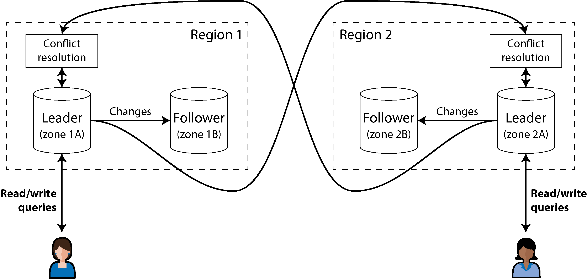

*Hình 6-6. Multi-leader replication trải trên nhiều region*

Trong cấu hình multi-leader, bạn có thể có một leader ở *mỗi* region. Hình 6-6 cho thấy kiến trúc này có thể trông như thế nào. Trong mỗi region, replication leader–follower thông thường được sử dụng (với các follower có thể nằm ở availability zone khác với leader); giữa các region, leader của mỗi region replicate các thay đổi của nó tới các leader ở những region khác. Hãy so sánh cấu hình single-leader và multi-leader hoạt động như thế nào trong một triển khai đa region:

- **Hiệu năng**

  Trong cấu hình single-leader, mọi thao tác ghi đều phải đi qua internet tới region có leader. Điều này có thể làm tăng đáng kể độ trễ (latency) của các thao tác ghi và có thể làm mất đi ý nghĩa của việc có nhiều region ngay từ đầu. Trong cấu hình multi-leader, mọi thao tác ghi đều có thể được xử lý ở region cục bộ rồi replicate bất đồng bộ sang các region khác. Nhờ vậy, độ trễ mạng giữa các region được che giấu khỏi người dùng, nghĩa là hiệu năng cảm nhận được có thể tốt hơn.

- **Khả năng chịu sự cố ngừng hoạt động của region**

  Trong cấu hình single-leader, nếu region có leader trở nên không sẵn sàng, failover có thể thăng cấp một follower ở region khác lên làm leader. Trong cấu hình multi-leader, mỗi region có thể tiếp tục hoạt động độc lập với các region khác, và replication sẽ bắt kịp khi region ngoại tuyến trở lại trực tuyến.

- **Khả năng chịu các vấn đề về mạng**

  Ngay cả với các kết nối chuyên dụng, lưu lượng giữa các region có thể kém tin cậy hơn lưu lượng giữa các zone trong cùng một region hoặc trong một zone duy nhất. Cấu hình single-leader rất nhạy cảm với các vấn đề trên đường liên kết giữa các region này, bởi khi một client ở một region muốn ghi vào leader ở region khác, nó phải gửi yêu cầu của mình qua đường liên kết đó và chờ phản hồi trước khi có thể hoàn tất.

  Cấu hình multi-leader với replication bất đồng bộ có thể chịu các vấn đề về mạng tốt hơn; trong thời gian mạng bị gián đoạn tạm thời, leader của mỗi region có thể tiếp tục xử lý các thao tác ghi một cách độc lập.

- **Tính nhất quán**

  Một hệ thống single-leader có thể cung cấp các đảm bảo nhất quán mạnh (strong consistency), chẳng hạn như serializable transaction, mà chúng ta sẽ thảo luận trong Chương 8. Nhược điểm lớn nhất của các hệ thống multi-leader là tính nhất quán (consistency) mà chúng có thể đạt được yếu hơn nhiều. Ví dụ, bạn không thể đảm bảo rằng một tài khoản ngân hàng sẽ không bị âm hay một username là duy nhất; luôn có khả năng các leader khác nhau xử lý những thao tác ghi mà xét riêng lẻ thì hoàn toàn ổn (rút một phần tiền trong tài khoản, đăng ký một username cụ thể) nhưng lại vi phạm ràng buộc khi xét cùng với một thao tác ghi khác trên một leader khác.

  Đây đơn giản là một hạn chế cơ bản của các hệ phân tán (distributed system) [28]. Do đó, nếu bạn cần thực thi những ràng buộc như vậy, bạn nên dùng hệ thống single-leader. Tuy nhiên, như chúng ta sẽ thấy trong “Xử lý các thao tác ghi xung đột”, các hệ thống multi-leader vẫn có thể đạt được những tính chất nhất quán hữu ích cho nhiều loại ứng dụng không cần đến những ràng buộc như vậy.

Multi-leader replication ít phổ biến hơn single-leader replication, nhưng vẫn được nhiều database hỗ trợ, bao gồm MySQL, Oracle, SQL Server và YugabyteDB. Trong một số trường hợp, đó là một tính năng bổ trợ bên ngoài—ví dụ, trong Redis Enterprise, EDB Postgres Distributed và pglogical [29].

Vì multi-leader replication là một tính năng được bổ sung sau (retrofitted) vào nhiều database, nên thường có những cạm bẫy cấu hình tinh vi và những tương tác bất ngờ với các tính năng khác của database. Ví dụ, khóa tự tăng (autoincrementing key), trigger và các ràng buộc toàn vẹn (integrity constraint) có thể gây ra vấn đề. Vì lý do này, multi-leader replication thường bị coi là vùng đất nguy hiểm nên tránh nếu có thể [30].

#### Các topology của multi-leader replication

*Replication topology* (topology replication) mô tả các đường truyền thông mà qua đó các thao tác ghi được lan truyền từ node này sang node khác. Nếu bạn có hai leader, như trong Hình 6-6, chỉ có một topology khả dĩ: leader 1 phải gửi tất cả các thao tác ghi của nó tới leader 2, và ngược lại. Với nhiều hơn hai leader, có thể có nhiều topology khác nhau. Một số ví dụ được minh họa trong Hình 6-7.

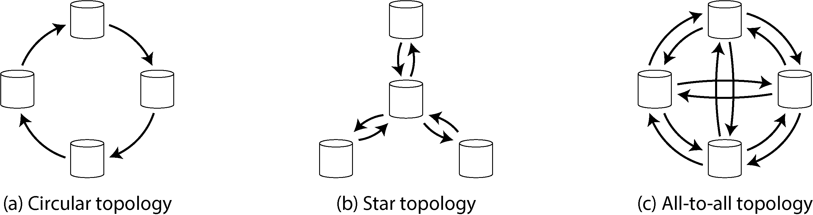

*Hình 6-7. Ba topology ví dụ cho multi-leader replication*

Topology tổng quát nhất là *all-to-all*, được thể hiện trong Hình 6-7(c), trong đó mỗi leader gửi các thao tác ghi của nó tới mọi leader khác. Tuy nhiên, những topology hạn chế hơn cũng được sử dụng. Ví dụ, trong *circular topology* (topology vòng), được thể hiện trong Hình 6-7(a), mỗi node nhận các thao tác ghi từ một node và chuyển tiếp những thao tác ghi đó (cộng với bất kỳ thao tác ghi nào của chính nó) tới một node khác. Topology *star* (hình sao), được thể hiện trong Hình 6-7(b), cũng phổ biến; ở đây, một node gốc được chỉ định chuyển tiếp các thao tác ghi tới tất cả các node khác. Topology hình sao có thể được tổng quát hóa thành cây.

> **LƯU Ý**
>
> Topology mạng hình sao không liên quan gì đến *star schema* (xem “Star và Snowflake: Các schema cho phân tích”), vốn mô tả cấu trúc của một mô hình dữ liệu (data model).

Trong topology vòng và hình sao, một thao tác ghi có thể cần đi qua nhiều node trước khi đến được tất cả các replica. Do đó, các node cần chuyển tiếp những thay đổi dữ liệu mà chúng nhận được từ các node khác. Để ngăn các vòng lặp replication vô hạn, mỗi node được gán một định danh (identifier) duy nhất, và trong replication log, mỗi thao tác ghi được gắn thẻ với định danh của tất cả các node mà nó đã đi qua [31]. Khi một node nhận được một thay đổi dữ liệu được gắn thẻ với định danh của chính nó, thay đổi dữ liệu đó bị bỏ qua, bởi node biết rằng nó đã được xử lý rồi.

#### Các vấn đề với những topology khác nhau

Một vấn đề với topology vòng và hình sao là nếu chỉ một node bị hỏng, nó có thể làm gián đoạn luồng thông điệp replication giữa các node khác, khiến chúng không thể giao tiếp cho đến khi node đó được sửa. Topology có thể được cấu hình lại để né node bị hỏng, nhưng trong hầu hết các triển khai, việc cấu hình lại như vậy phải được thực hiện thủ công. Khả năng chịu lỗi (fault tolerance) của một topology kết nối dày đặc hơn (như all-to-all) tốt hơn vì nó cho phép các thông điệp đi theo những đường khác nhau, tránh được điểm hỏng đơn lẻ (single point of failure).

Tuy nhiên, topology all-to-all cũng có thể gặp vấn đề. Cụ thể, một số đường liên kết mạng có thể nhanh hơn những đường khác (ví dụ, do tắc nghẽn mạng), dẫn đến việc một số thông điệp replication có thể “vượt mặt” những thông điệp khác, như minh họa trong Hình 6-8.

Trong Hình 6-8, client A chèn một hàng vào một bảng trên leader 1, và client B cập nhật hàng đó trên leader 3. Tuy nhiên, leader 2 có thể nhận các thao tác ghi theo thứ tự khác. Nó có thể nhận thao tác cập nhật trước (mà theo góc nhìn của nó, là cập nhật một hàng không tồn tại trong database) và chỉ sau đó mới nhận được thao tác chèn tương ứng (vốn đáng lẽ phải đến trước thao tác cập nhật).

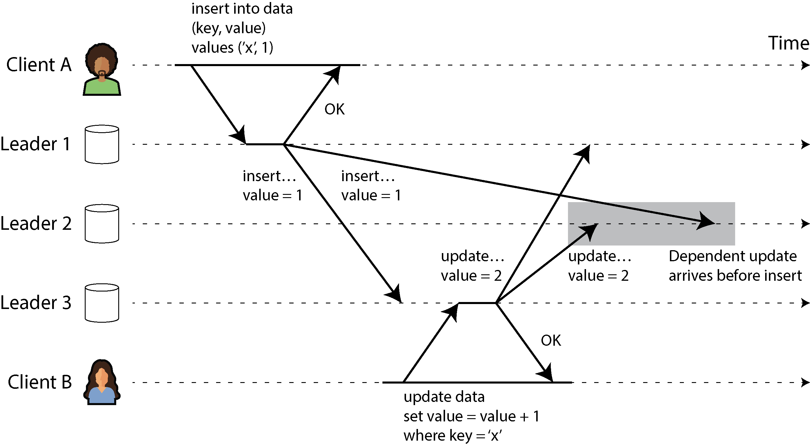

*Hình 6-8. Với multi-leader replication, các thao tác ghi có thể đến sai thứ tự ở một số replica.*

Đây là một vấn đề về quan hệ nhân quả (causality), tương tự như vấn đề chúng ta đã thấy trong “Consistent prefix reads”. Thao tác cập nhật phụ thuộc vào thao tác chèn trước đó, nên chúng ta cần đảm bảo rằng tất cả các node xử lý thao tác chèn trước, rồi mới đến thao tác cập nhật. Chỉ đơn giản gắn một timestamp vào mỗi thao tác ghi là không đủ, bởi không thể tin tưởng rằng các đồng hồ được đồng bộ đủ chính xác để sắp thứ tự đúng các sự kiện này tại leader 2 (xem Chương 9).

Để sắp thứ tự đúng các sự kiện này, có thể dùng một kỹ thuật gọi là *version vector*, mà chúng ta sẽ thảo luận trong “Phát hiện các thao tác ghi đồng thời”. Tuy nhiên, nhiều hệ thống multi-leader replication không sử dụng các kỹ thuật tốt để sắp thứ tự các cập nhật, khiến chúng dễ gặp những vấn đề như trong Hình 6-8. Nếu bạn đang sử dụng multi-leader replication, bạn nên nhận thức được những vấn đề này, đọc kỹ tài liệu, và kiểm thử kỹ lưỡng database của mình để đảm bảo rằng nó thực sự cung cấp những đảm bảo mà bạn tin là nó có.

### Sync Engine và phần mềm Local-First

Multi-leader replication cũng phù hợp nếu bạn có một ứng dụng cần tiếp tục hoạt động khi bị ngắt kết nối internet. Ví dụ, hãy xem xét các ứng dụng lịch trên điện thoại di động, laptop và các thiết bị khác của bạn. Bạn cần có thể xem các cuộc họp của mình (thực hiện yêu cầu đọc) và nhập các cuộc họp mới (thực hiện yêu cầu ghi) vào bất kỳ lúc nào, bất kể thiết bị của bạn hiện có kết nối internet hay không. Nếu bạn thực hiện bất kỳ thay đổi nào khi đang ngoại tuyến, chúng cần được đồng bộ với server và các thiết bị khác của bạn khi thiết bị trực tuyến trở lại.

Trong trường hợp này, mỗi thiết bị có một replica database cục bộ đóng vai trò là leader (nó chấp nhận các yêu cầu ghi), và có một tiến trình multi-leader replication bất đồng bộ (sync) giữa các replica của lịch của bạn trên tất cả các thiết bị. Replication lag có thể là hàng giờ hoặc thậm chí hàng ngày, tùy vào thời điểm bạn có kết nối internet.

Từ góc độ kiến trúc, cách bố trí này rất giống với multi-leader replication giữa các region, nhưng được đẩy đến cực điểm. Mỗi thiết bị là một “region”, và kết nối mạng giữa chúng cực kỳ không đáng tin cậy.

#### Ứng dụng cộng tác thời gian thực, offline-first và local-first

Nhiều ứng dụng web hiện đại cung cấp các tính năng *real-time collaboration* (cộng tác thời gian thực), chẳng hạn như Google Docs và Sheets cho tài liệu văn bản và bảng tính, Figma cho đồ họa, và Linear cho quản lý dự án. Điều làm cho những ứng dụng này phản hồi nhanh đến vậy là đầu vào của người dùng được phản ánh ngay lập tức trên giao diện người dùng, không cần chờ một vòng đi-về qua mạng (network round-trip) tới server, và các chỉnh sửa của một người dùng được hiển thị cho những người cộng tác với họ với độ trễ thấp [32, 33, 34].

Điều này lại một lần nữa dẫn đến kiến trúc multi-leader: mỗi tab trình duyệt web đã mở file chia sẻ là một replica, và bất kỳ cập nhật nào bạn thực hiện trên file đều được replicate bất đồng bộ tới thiết bị của những người dùng khác đã mở cùng file đó. Ngay cả khi ứng dụng không cho phép bạn tiếp tục chỉnh sửa file khi ngoại tuyến, việc nhiều người dùng có thể thực hiện chỉnh sửa mà không cần chờ phản hồi từ server đã đủ khiến nó trở thành multi-leader.

Cả chỉnh sửa ngoại tuyến và cộng tác thời gian thực đều đòi hỏi một hạ tầng replication tương tự. Ứng dụng cần nắm bắt mọi thay đổi mà người dùng thực hiện trên file và hoặc gửi chúng tới những người cộng tác ngay lập tức (nếu trực tuyến) hoặc lưu chúng cục bộ để gửi sau (nếu ngoại tuyến). Ngoài ra, ứng dụng cần nhận các thay đổi từ những người cộng tác, hợp nhất (merge) chúng vào bản sao cục bộ của file của người dùng, và cập nhật UI để phản ánh phiên bản mới nhất. Nếu nhiều người dùng đã thay đổi file một cách đồng thời, có thể cần logic giải quyết xung đột (conflict resolution) để hợp nhất những thay đổi đó.

Một thư viện phần mềm hỗ trợ quy trình này được gọi là *sync engine*. Mặc dù ý tưởng này đã tồn tại từ lâu, thuật ngữ này gần đây mới thu hút được sự chú ý [35, 36, 37]. Một ứng dụng cho phép người dùng tiếp tục chỉnh sửa file khi ngoại tuyến (có thể được triển khai bằng sync engine) được gọi là *offline-first* [38]. Thuật ngữ *local-first software* (phần mềm local-first) chỉ các ứng dụng cộng tác không chỉ là offline-first mà còn được thiết kế để tiếp tục hoạt động ngay cả khi nhà phát triển làm ra phần mềm đó đóng tất cả các dịch vụ trực tuyến của họ [39]. Điều này có thể đạt được bằng cách sử dụng một sync engine với giao thức sync theo chuẩn mở mà có nhiều nhà cung cấp dịch vụ hỗ trợ [40]. Ví dụ, Git là một hệ thống cộng tác local-first (dù là một hệ thống không hỗ trợ cộng tác thời gian thực), vì bạn có thể sync qua GitHub, GitLab, hoặc bất kỳ dịch vụ lưu trữ repository nào khác.

#### Ưu và nhược điểm của sync engine

Cách xây dựng ứng dụng web chủ đạo ngày nay là giữ rất ít trạng thái bền vững (persistent state) trên client và dựa vào việc gửi yêu cầu tới server mỗi khi cần hiển thị một mẩu dữ liệu mới hoặc cần cập nhật dữ liệu nào đó. Ngược lại, khi sử dụng sync engine, bạn có trạng thái bền vững trên client, và việc giao tiếp với server được chuyển vào một tiến trình nền. Cách tiếp cận sync engine có một số ưu điểm:

- Có dữ liệu cục bộ nghĩa là UI có thể phản hồi nhanh hơn nhiều so với khi phải chờ một lời gọi dịch vụ để lấy dữ liệu. Một số ứng dụng hướng tới việc phản hồi đầu vào của người dùng ngay trong *frame tiếp theo* của hệ thống đồ họa, nghĩa là render trong vòng 16 ms trên màn hình có tần số quét 60 Hz. Cho phép người dùng tiếp tục làm việc khi ngoại tuyến là điều có giá trị, đặc biệt trên các thiết bị di động với kết nối chập chờn. Với sync engine, ứng dụng không cần một chế độ ngoại tuyến riêng: ngoại tuyến cũng giống như có độ trễ mạng rất lớn.

- Sync engine đơn giản hóa mô hình lập trình cho các ứng dụng frontend, so với việc thực hiện các lời gọi dịch vụ tường minh trong mã ứng dụng. Mỗi lời gọi dịch vụ đều đòi hỏi xử lý lỗi, như đã thảo luận trong “Những vấn đề của remote procedure call”; ví dụ, nếu một yêu cầu cập nhật dữ liệu trên server thất bại, giao diện người dùng cần phản ánh lỗi đó theo cách nào đó. Sync engine cho phép ứng dụng thực hiện đọc và ghi trên dữ liệu cục bộ; những thao tác này gần như không bao giờ thất bại, dẫn đến một phong cách lập trình mang tính khai báo (declarative) hơn [41].

- Để hiển thị các chỉnh sửa của người dùng khác theo thời gian thực, bạn cần nhận thông báo về những chỉnh sửa đó và cập nhật UI tương ứng một cách hiệu quả. Sync engine kết hợp với mô hình *reactive programming* (lập trình phản ứng) là một cách tốt để triển khai điều này [42].

Sync engine hoạt động tốt nhất khi toàn bộ dữ liệu mà người dùng có thể cần được tải xuống trước và lưu trữ bền vững trên client. Điều này có nghĩa là dữ liệu sẵn có để truy cập ngoại tuyến khi cần, nhưng cũng có nghĩa là sync engine không phù hợp nếu người dùng có quyền truy cập vào một lượng dữ liệu rất lớn. Ví dụ, tải xuống tất cả các file mà người dùng đã tạo có lẽ là ổn (một người dùng thường không tạo ra nhiều dữ liệu đến thế), nhưng tải xuống toàn bộ catalog của một website thương mại điện tử có lẽ không hợp lý.

Sync engine được Lotus Notes tiên phong vào những năm 1980 [43] (dù không dùng thuật ngữ đó), và sync cho các ứng dụng cụ thể, như lịch, cũng đã tồn tại từ lâu. Ngày nay, chúng ta có rất nhiều sync engine đa dụng. Một số sử dụng dịch vụ backend độc quyền (ví dụ, Google Firestore, Realm hoặc Ditto), và một số khác có backend mã nguồn mở, khiến chúng phù hợp để tạo phần mềm local-first (ví dụ, PouchDB/CouchDB, Automerge và Yjs).

Các trò chơi điện tử nhiều người chơi (multiplayer) cũng có nhu cầu tương tự là phản hồi ngay lập tức với các hành động cục bộ của người dùng và đối soát chúng với hành động của những người chơi khác nhận được bất đồng bộ qua mạng. Trong thuật ngữ phát triển game, thứ tương đương với sync engine được gọi là *netcode*. Các kỹ thuật dùng trong netcode khá đặc thù cho các yêu cầu của game [44] và không trực tiếp chuyển sang các loại phần mềm khác được, nên chúng ta sẽ không xem xét thêm về chúng trong cuốn sách này.

### Xử lý các thao tác ghi xung đột

Vấn đề lớn nhất với multi-leader replication—cả trong database phía server phân tán theo địa lý lẫn sync engine local-first trên thiết bị người dùng cuối—là các thao tác ghi đồng thời trên những leader khác nhau có thể dẫn đến xung đột (conflict) cần được giải quyết.

Ví dụ, hãy xem xét một trang wiki đang được hai người dùng chỉnh sửa đồng thời, như trong Hình 6-9. Người dùng 1 đổi tiêu đề trang từ A thành B, và người dùng 2 độc lập đổi tiêu đề từ A thành C. Thay đổi của mỗi người dùng được áp dụng thành công lên leader cục bộ của họ. Tuy nhiên, khi các thay đổi được replicate bất đồng bộ, một xung đột được phát hiện. Vấn đề này không xảy ra trong database single-leader.

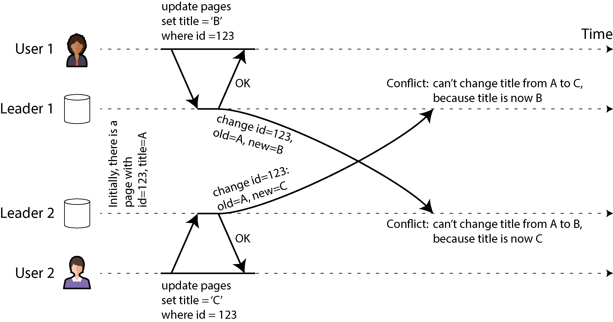

*Hình 6-9. Xung đột ghi gây ra bởi hai leader đồng thời cập nhật cùng một bản ghi*

> **LƯU Ý**
>
> Chúng ta nói rằng hai thao tác ghi trong Hình 6-9 là *đồng thời* (concurrent) vì không thao tác nào “biết” về thao tác kia tại thời điểm thao tác ghi được thực hiện ban đầu. Việc các thao tác ghi có thực sự xảy ra cùng một lúc hay không không quan trọng; thực tế, nếu các thao tác ghi được thực hiện khi ngoại tuyến, chúng có thể đã xảy ra cách nhau một khoảng thời gian. Điều quan trọng là liệu một thao tác ghi có xảy ra trong trạng thái mà thao tác ghi kia đã có hiệu lực hay không.

Trong “Phát hiện các thao tác ghi đồng thời” chúng ta sẽ giải quyết câu hỏi làm thế nào database có thể xác định hai thao tác ghi có đồng thời hay không. Hiện tại, chúng ta sẽ giả định rằng chúng ta có thể phát hiện xung đột và muốn tìm ra cách tốt nhất để giải quyết chúng.

#### Tránh xung đột

Một chiến lược để xử lý xung đột là ngăn chúng xảy ra ngay từ đầu. Ví dụ, nếu ứng dụng có thể đảm bảo rằng mọi thao tác ghi cho một bản ghi (record) cụ thể đều đi qua cùng một leader, thì xung đột không thể xảy ra, ngay cả khi database về tổng thể là multi-leader. Cách tiếp cận này không khả thi đối với client sync engine được cập nhật khi ngoại tuyến, nhưng đôi khi khả thi trong các hệ thống server geo-replicated [30].

Ví dụ, trong một ứng dụng mà người dùng chỉ có thể chỉnh sửa dữ liệu của chính mình, bạn có thể đảm bảo rằng các yêu cầu từ một người dùng cụ thể luôn được định tuyến tới cùng một region và sử dụng leader ở region đó để đọc và ghi. Những người dùng khác nhau có thể có region “nhà” khác nhau (có thể được chọn dựa trên khoảng cách địa lý tới người dùng), nhưng từ góc nhìn của bất kỳ một người dùng nào, cấu hình về bản chất là single-leader.

Tuy nhiên, đôi khi bạn có thể muốn thay đổi leader được chỉ định cho một bản ghi—có thể vì một region không sẵn sàng và bạn cần định tuyến lại lưu lượng sang region khác, hoặc có thể vì người dùng đã chuyển đến một địa điểm khác và hiện gần một region khác hơn. Lúc này có rủi ro là người dùng thực hiện một thao tác ghi trong khi việc thay đổi leader được chỉ định đang diễn ra, dẫn đến một xung đột sẽ phải được giải quyết bằng một trong các phương pháp sau đây. Do đó, việc tránh xung đột sẽ không còn hiệu quả nếu bạn cho phép thay đổi leader.

Một ví dụ khác về tránh xung đột: hãy tưởng tượng bạn muốn chèn các bản ghi mới và sinh ID duy nhất cho chúng dựa trên một bộ đếm tự tăng. Nếu bạn có hai leader, bạn có thể thiết lập để một leader chỉ sinh số lẻ và leader kia chỉ sinh số chẵn. Bằng cách đó, bạn có thể chắc chắn rằng hai leader sẽ không đồng thời gán cùng một ID cho các bản ghi khác nhau. Chúng ta sẽ thảo luận các cơ chế gán ID khác trong “Bộ sinh ID và đồng hồ logic (logical clock)”.

#### Last write wins (loại bỏ các thao tác ghi đồng thời)

Nếu không thể tránh được xung đột, cách đơn giản nhất để giải quyết chúng là gắn một timestamp vào mỗi thao tác ghi và luôn sử dụng giá trị có timestamp mới nhất (lớn nhất). Ví dụ, trong Hình 6-9, giả sử timestamp của thao tác ghi của người dùng 1 lớn hơn timestamp của thao tác ghi của người dùng 2. Trong trường hợp đó, cả hai leader sẽ xác định rằng tiêu đề mới của trang phải là B, và chúng sẽ loại bỏ thao tác ghi đặt nó thành C. Nếu các thao tác ghi tình cờ có cùng timestamp, bên thắng có thể được chọn bằng cách so sánh các giá trị (ví dụ, với chuỗi, lấy chuỗi đứng trước trong bảng chữ cái).

Cách tiếp cận này được gọi là *last write wins* (LWW — thao tác ghi cuối cùng thắng) vì thao tác ghi có timestamp lớn nhất có thể được coi là thao tác “cuối cùng”. Tuy nhiên, thuật ngữ này gây hiểu lầm, bởi khi hai thao tác ghi là đồng thời (như trong Hình 6-9), thao tác nào mới hơn là không xác định, nên thứ tự timestamp của các thao tác ghi đồng thời về bản chất là ngẫu nhiên.

Do đó, ý nghĩa thực sự của LWW là thế này: khi cùng một bản ghi được ghi đồng thời trên các leader khác nhau, một trong những thao tác ghi đó được chọn ngẫu nhiên làm bên thắng và các thao tác ghi còn lại bị loại bỏ một cách âm thầm, mặc dù chúng đã được leader tương ứng xử lý thành công. Điều này đạt được mục tiêu là cuối cùng tất cả các replica đều ở trạng thái nhất quán, nhưng với cái giá là mất dữ liệu.

Nếu bạn có thể tránh được xung đột—ví dụ, bằng cách chỉ chèn các bản ghi với khóa (key) duy nhất và không bao giờ cập nhật chúng—thì LWW không có vấn đề gì. Nhưng nếu bạn cập nhật các bản ghi hiện có, hoặc nếu các leader khác nhau có thể chèn các bản ghi với cùng một khóa, thì bạn phải quyết định liệu lost update có phải là vấn đề đối với ứng dụng của bạn hay không. Nếu lost update là không thể chấp nhận được, bạn cần sử dụng một trong các cách tiếp cận giải quyết xung đột được mô tả tiếp theo.

Một vấn đề khác với LWW là nếu đồng hồ thời gian thực (ví dụ, Unix timestamp) được dùng làm timestamp cho các thao tác ghi, hệ thống trở nên rất nhạy cảm với việc đồng bộ đồng hồ. Nếu một node có đồng hồ chạy trước các node khác, và bạn cố ghi đè một giá trị do node đó ghi, thao tác ghi của bạn có thể bị bỏ qua vì nó có thể có timestamp thấp hơn, mặc dù rõ ràng nó xảy ra sau. Vấn đề này có thể được giải quyết bằng cách sử dụng *logical clock* (đồng hồ logic), mà chúng ta sẽ thảo luận trong “Bộ sinh ID và đồng hồ logic (logical clock)”.

#### Giải quyết xung đột thủ công

Nếu việc loại bỏ ngẫu nhiên một số thao tác ghi của bạn là điều không mong muốn, lựa chọn tiếp theo là giải quyết xung đột một cách thủ công. Bạn có thể đã quen với việc giải quyết xung đột thủ công từ Git và các hệ thống quản lý phiên bản khác: nếu các commit trên hai branch chỉnh sửa cùng những dòng của cùng một file, và bạn cố gắng merge hai branch đó, bạn sẽ gặp một merge conflict cần được giải quyết trước khi việc merge hoàn tất.

Trong một database, sẽ là không thực tế nếu một xung đột làm dừng toàn bộ quá trình replication cho đến khi có người giải quyết nó. Thay vào đó, các database thường lưu tất cả các giá trị được ghi đồng thời cho một record nhất định—ví dụ, cả B và C trong Hình 6-9. Những giá trị này đôi khi được gọi là *siblings* (các giá trị anh em). Lần tiếp theo bạn truy vấn record đó, database trả về *tất cả* các giá trị đó thay vì chỉ giá trị mới nhất. Sau đó bạn có thể giải quyết các giá trị này theo bất kỳ cách nào bạn muốn, hoặc tự động trong mã ứng dụng (ví dụ, bạn có thể nối B và C thành B/C) hoặc bằng cách hỏi người dùng. Rồi bạn ghi ngược một giá trị mới vào database để giải quyết xung đột.

Cách tiếp cận giải quyết xung đột này được dùng trong một số hệ thống, chẳng hạn như CouchDB. Tuy nhiên, nó cũng gặp phải những vấn đề sau:

- API của database thay đổi—ví dụ, trước đây tiêu đề của trang wiki chỉ là một chuỗi, giờ nó trở thành một tập hợp các chuỗi thường chỉ chứa một phần tử, nhưng đôi khi có thể chứa nhiều phần tử nếu có xung đột. Điều này có thể khiến dữ liệu trở nên khó xử lý trong mã ứng dụng.

- Yêu cầu người dùng merge các sibling một cách thủ công là rất nhiều công việc, cả cho nhà phát triển ứng dụng (người phải xây dựng UI cho việc giải quyết xung đột) và cho người dùng (người có thể bối rối không hiểu họ đang được yêu cầu làm gì, và vì sao). Trong nhiều trường hợp, merge tự động tốt hơn là làm phiền người dùng.

- Merge các sibling một cách tự động có thể dẫn đến hành vi bất ngờ nếu không được thực hiện cẩn thận. Ví dụ, giỏ hàng trên Amazon trước đây cho phép các cập nhật đồng thời, sau đó được merge bằng cách giữ lại tất cả các mặt hàng trong giỏ xuất hiện ở bất kỳ sibling nào (tức là lấy hợp (set union) của các giỏ hàng). Điều này có nghĩa là nếu khách hàng đã xóa một mặt hàng khỏi giỏ trong một sibling, nhưng một sibling khác vẫn còn chứa mặt hàng cũ đó, thì mặt hàng đã xóa sẽ bất ngờ xuất hiện trở lại trong giỏ hàng của khách [45]. Trong Hình 6-10, thiết bị 1 xóa `Book` khỏi giỏ hàng và đồng thời thiết bị 2 xóa `DVD` , nhưng sau khi merge các sibling, cả hai mặt hàng đều xuất hiện trở lại.

- Nếu nhiều node quan sát thấy xung đột và đồng thời giải quyết nó, thì chính quá trình giải quyết xung đột có thể tạo ra một xung đột mới. Những cách giải quyết đó thậm chí có thể không nhất quán—ví dụ, một node có thể merge B và C thành B/C còn node khác có thể merge chúng thành C/B nếu bạn không cẩn thận sắp thứ tự chúng một cách nhất quán. Khi xung đột giữa B/C và C/B được merge, kết quả có thể là B/C/C/B hoặc điều gì đó bất ngờ tương tự.

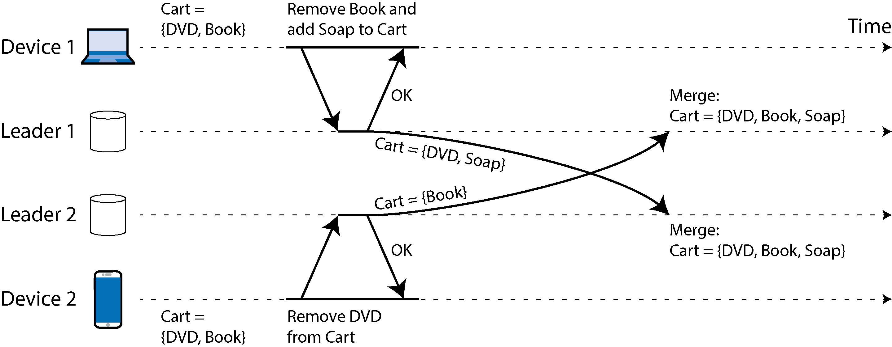

*Hình 6-10. Một ví dụ về bất thường trong giỏ hàng của Amazon: nếu các xung đột được merge bằng cách lấy hợp của tập hợp, các mặt hàng đã xóa có thể xuất hiện trở lại*

#### Giải quyết xung đột tự động

Với nhiều ứng dụng, cách tốt nhất để xử lý xung đột là dùng một thuật toán tự động merge các thao tác ghi đồng thời thành một trạng thái nhất quán. Giải quyết xung đột tự động đảm bảo rằng tất cả các replica *hội tụ* (converge) về cùng một trạng thái—tức là, tất cả các replica đã xử lý cùng một tập các thao tác ghi sẽ có cùng trạng thái, bất kể thứ tự mà các thao tác ghi đến. Việc kết hợp eventual consistency với một đảm bảo hội tụ được gọi là *strong eventual consistency* (tính nhất quán cuối cùng mạnh) [46].

LWW là một ví dụ đơn giản về thuật toán giải quyết xung đột. Các thuật toán merge tinh vi hơn đã được phát triển cho những kiểu dữ liệu khác nhau, với mục tiêu bảo toàn tối đa hiệu ứng dự kiến của tất cả các cập nhật và do đó tránh mất dữ liệu:

- Nếu dữ liệu là văn bản (ví dụ, tiêu đề hoặc nội dung của một trang wiki), chúng ta có thể phát hiện những ký tự nào đã được chèn vào hoặc xóa đi từ phiên bản này sang phiên bản tiếp theo. Kết quả merge khi đó bảo toàn tất cả các thao tác chèn và xóa được thực hiện ở bất kỳ sibling nào. Nếu người dùng đồng thời chèn văn bản tại cùng một vị trí, chúng có thể được sắp thứ tự một cách deterministic để tất cả các node nhận được cùng một kết quả merge.

- Nếu dữ liệu là một tập hợp các mục (có thứ tự như danh sách việc cần làm, hoặc không có thứ tự như giỏ hàng), chúng ta có thể merge nó tương tự như văn bản bằng cách theo dõi các thao tác chèn và xóa. Để tránh vấn đề giỏ hàng trong Hình 6-10, các thuật toán theo dõi việc `Book` và `DVD` đã bị xóa, nên kết quả merge là `Cart = {Soap}` .

- Nếu dữ liệu là một số nguyên biểu diễn bộ đếm có thể tăng hoặc giảm (ví dụ, số lượt thích trên một bài đăng mạng xã hội), thuật toán merge có thể biết được bao nhiêu lần tăng và giảm đã xảy ra trên mỗi sibling và cộng chúng lại một cách chính xác để kết quả không bị tính trùng và không bỏ sót cập nhật.

- Nếu dữ liệu là một ánh xạ key-value, chúng ta có thể merge các cập nhật lên cùng một key bằng cách áp dụng một trong các thuật toán giải quyết xung đột khác cho các giá trị dưới key đó. Các cập nhật lên những key khác nhau có thể được xử lý độc lập với nhau.

Có những giới hạn về điều có thể làm được với giải quyết xung đột. Ví dụ, nếu bạn muốn ép buộc rằng một danh sách không chứa quá năm mục, và nhiều người dùng đồng thời thêm các mục vào danh sách khiến tổng cộng có hơn năm mục, lựa chọn duy nhất của bạn là loại bỏ một số mục. Dù vậy, giải quyết xung đột tự động là đủ để xây dựng nhiều ứng dụng hữu ích. Và nếu bạn xuất phát từ yêu cầu muốn xây dựng một ứng dụng cộng tác theo hướng offline-first hoặc local-first, thì việc giải quyết xung đột là không thể tránh khỏi, và tự động hóa nó thường là cách tiếp cận tốt nhất.

#### Conflict-free replicated datatypes và operational transformation

Hai họ thuật toán thường được dùng để triển khai giải quyết xung đột tự động: *conflict-free replicated datatypes* (CRDT) [46] và *operational transformation* (OT) [47]. Chúng có triết lý thiết kế và đặc tính hiệu năng khác nhau, nhưng cả hai đều có thể thực hiện merge tự động cho tất cả các kiểu dữ liệu nêu trên.

Hình 6-11 cho thấy một ví dụ về cách OT và một CRDT merge các cập nhật đồng thời lên một văn bản. Giả sử bạn có hai replica cùng bắt đầu với văn bản `ice` . Một replica chèn thêm chữ `n` vào đầu để tạo thành `nice` , trong khi đồng thời replica kia thêm dấu chấm than vào cuối để tạo thành `ice!` .

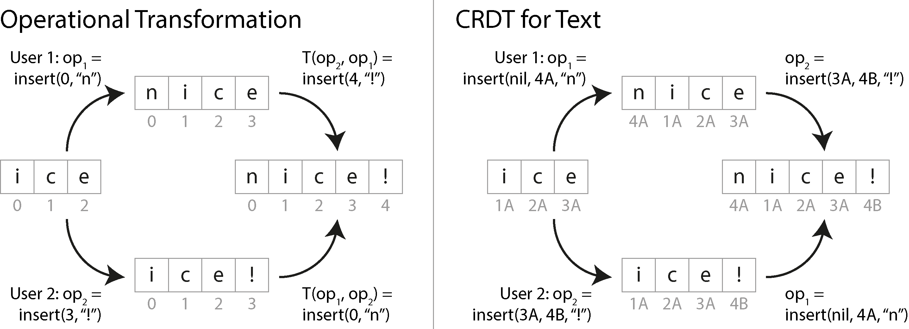

*Hình 6-11. Cách hai thao tác chèn đồng thời vào một chuỗi được merge lần lượt bởi OT và một CRDT*

Kết quả merge `nice!` được hai loại thuật toán đạt đến theo những cách khác nhau:

- **OT**

  Chúng ta ghi lại chỉ số (index) tại đó các ký tự được chèn vào hoặc xóa đi: `n` được chèn tại chỉ số 0 và `!` tại chỉ số 3. Tiếp theo, các replica trao đổi các thao tác của chúng. Thao tác chèn `n` tại chỉ số 0 có thể được áp dụng nguyên trạng, nhưng nếu thao tác chèn `!` tại chỉ số 3 được áp dụng lên trạng thái `nice,` chúng ta sẽ nhận được `nic!e,` là kết quả sai. Do đó chúng ta cần biến đổi (transform) chỉ số của mỗi thao tác để tính đến các thao tác đồng thời đã được áp dụng. Trong trường hợp này, thao tác chèn `!` được biến đổi thành chỉ số 4 để tính đến việc chèn `n` ở một chỉ số trước đó.

- **CRDT**

  Hầu hết các CRDT gán cho mỗi ký tự một ID duy nhất, bất biến và dùng các ID đó để xác định vị trí chèn/xóa, thay cho chỉ số. Ví dụ, trong Hình 6-11 chúng ta gán ID 1A cho `i` , ID 2A cho `c` , v.v. Khi chèn dấu chấm than, chúng ta tạo ra một thao tác chứa ID của ký tự mới (4B) và ID của ký tự hiện có mà chúng ta muốn chèn vào sau nó (3A). Để chèn vào đầu chuỗi, chúng ta dùng `nil` làm ID của ký tự đứng trước. Các thao tác chèn đồng thời tại cùng một vị trí được sắp thứ tự theo ID của các ký tự. Điều này đảm bảo các replica hội tụ mà không cần thực hiện bất kỳ phép biến đổi nào.

Nhiều thuật toán dựa trên các biến thể của những ý tưởng này. Danh sách và mảng có thể được hỗ trợ tương tự, dùng các phần tử danh sách thay cho ký tự, và các kiểu dữ liệu khác, chẳng hạn như key-value map, có thể được bổ sung khá dễ dàng. OT và CRDT có một số trade-off về hiệu năng và chức năng, nhưng có thể kết hợp ưu điểm của cả hai trong một thuật toán [48].

OT thường được dùng nhất cho việc soạn thảo văn bản cộng tác thời gian thực, chẳng hạn như trong Google Docs [32], trong khi CRDT có thể được tìm thấy trong các database phân tán như Redis Enterprise, Riak và Azure Cosmos DB [49]. Các sync engine cho dữ liệu JSON có thể được triển khai bằng cả CRDT (ví dụ, Automerge hoặc Yjs) và OT (ví dụ, ShareDB).

#### Các loại xung đột

Một số loại xung đột là rõ ràng. Trong ví dụ ở Hình 6-9, hai thao tác ghi đồng thời sửa đổi cùng một trường trong cùng một record, đặt nó thành hai giá trị khác nhau. Không có gì phải nghi ngờ rằng đây là một xung đột.

Các loại xung đột khác có thể tinh vi hơn và khó phát hiện hơn. Ví dụ, hãy xem xét một hệ thống đặt phòng họp: hệ thống này theo dõi phòng nào được đặt bởi nhóm người nào vào thời điểm nào. Thay vì cập nhật một trường cụ thể khi đặt phòng họp, hệ thống này chèn một record mới vào database cho mỗi lượt đặt. Ứng dụng cần đảm bảo rằng mỗi phòng chỉ được đặt bởi một nhóm người tại bất kỳ thời điểm nào (tức là không được có các lượt đặt chồng lấn cho cùng một phòng). Trong trường hợp này, xung đột có thể phát sinh nếu hai lượt đặt được tạo cho cùng một phòng vào cùng một thời điểm. Ngay cả khi ứng dụng kiểm tra tính khả dụng trước khi cho phép người dùng đặt phòng, xung đột vẫn có thể phát sinh nếu hai lượt đặt được thực hiện gần nhau đến mức cả hai đều thấy phòng còn trống trước khi chèn record mới của mình.

Không có câu trả lời sẵn có nhanh gọn, nhưng trong các chương tiếp theo chúng ta sẽ lần theo một con đường để hiểu rõ vấn đề này. Chúng ta sẽ thấy thêm các ví dụ về xung đột trong Chương 8, và trong Chương 13 chúng ta sẽ thảo luận các cách tiếp cận có khả năng mở rộng để phát hiện và giải quyết xung đột trong một hệ thống được replicate.

## Leaderless Replication (Replication không có leader)

Các cách tiếp cận replication mà chúng ta đã thảo luận cho đến nay trong chương này—single-leader và multi-leader replication—dựa trên ý tưởng rằng client gửi một yêu cầu ghi đến một node (leader), và hệ thống database đảm nhiệm việc sao chép thao tác ghi đó đến các replica khác. Leader quyết định thứ tự mà các thao tác ghi cần được xử lý, và các follower áp dụng các thao tác ghi của leader theo cùng thứ tự đó.

Một số hệ thống lưu trữ dữ liệu đi theo cách tiếp cận khác, từ bỏ khái niệm leader và cho phép bất kỳ replica nào trực tiếp chấp nhận thao tác ghi từ client. Một số hệ thống dữ liệu replicate sớm nhất là leaderless [1, 50], nhưng ý tưởng này gần như bị lãng quên trong thời kỳ thống trị của các database quan hệ. Nó một lần nữa trở thành kiến trúc thời thượng cho database sau khi Amazon dùng nó cho hệ thống Dynamo nội bộ của mình vào năm 2007 [45]. Riak, Cassandra và ScyllaDB là các datastore mã nguồn mở với mô hình leaderless replication lấy cảm hứng từ Dynamo, nên loại database này còn được gọi là *Dynamo-style* (kiểu Dynamo).

> **LƯU Ý**
>
> Kiến trúc hệ thống Dynamo nguyên bản được mô tả trong một bài báo [45] nhưng chưa bao giờ được phát hành ra bên ngoài Amazon. DynamoDB, có tên tương tự, là một cloud database gần đây hơn của Amazon, có kiến trúc hoàn toàn khác: nó dùng single-leader replication dựa trên thuật toán consensus Multi-Paxos [5, 51].

Trong một số triển khai leaderless, client trực tiếp gửi các thao tác ghi của mình đến nhiều replica, trong khi ở những triển khai khác, một node điều phối (coordinator) làm việc này thay cho client. Tuy nhiên, khác với database có leader, coordinator đó không ép buộc một thứ tự cụ thể cho các thao tác ghi. Như chúng ta sẽ thấy, sự khác biệt về thiết kế này có những hệ quả sâu sắc đối với cách database được sử dụng.

### Ghi vào Database khi một Node ngừng hoạt động

Hãy tưởng tượng bạn có một database với ba replica, và một trong các replica hiện không khả dụng— có thể nó đang được khởi động lại để cài đặt bản cập nhật hệ thống. Trong cấu hình single-leader, nếu bạn muốn tiếp tục xử lý các thao tác ghi, bạn có thể cần thực hiện failover (xem “Xử lý node ngừng hoạt động”).

Ngược lại, trong cấu hình leaderless, không có khái niệm failover, vì tất cả các replica đều bình đẳng và không có leader. Hình 6-12 cho thấy điều gì xảy ra.

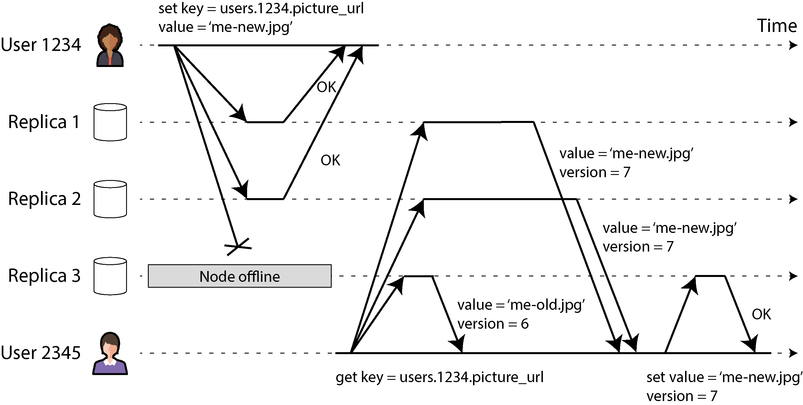

*Hình 6-12. Ghi vào đa số các replica, đọc từ đa số, và chuyển tiếp giá trị mới nhất đến một replica không khả dụng trong lúc ghi*

Client (user 1234) gửi thao tác ghi đến cả ba replica song song, và hai replica khả dụng chấp nhận thao tác ghi, nhưng replica không khả dụng bỏ lỡ nó. Giả sử rằng chỉ cần hai trong ba replica xác nhận thao tác ghi là đủ. Sau khi user 1234 nhận được hai phản hồi OK, chúng ta coi thao tác ghi là thành công. Client đơn giản bỏ qua thực tế là một trong các replica đã bỏ lỡ thao tác ghi.

Bây giờ hãy tưởng tượng node không khả dụng đó hoạt động trở lại, và các client bắt đầu đọc từ nó. Mọi thao tác ghi đã xảy ra trong lúc node ngừng hoạt động đều bị thiếu trên nó. Do đó, nếu bạn đọc từ node đó, bạn có thể nhận được các giá trị *stale* (cũ, lỗi thời) làm phản hồi.

Để giải quyết vấn đề đó, khi client đọc từ database, nó không chỉ gửi yêu cầu đến một replica: *các yêu cầu đọc cũng được gửi song song đến nhiều node*. Client có thể nhận được các phản hồi khác nhau từ các node khác nhau; ví dụ, giá trị mới nhất từ một node và giá trị stale từ node khác.

Để client xác định được phản hồi nào là mới nhất và phản hồi nào đã lỗi thời, mỗi giá trị được ghi cần được gắn nhãn với một số phiên bản hoặc timestamp, tương tự như những gì chúng ta đã thấy trong “Last write wins (loại bỏ các thao tác ghi đồng thời)”. Khi client nhận được nhiều giá trị trong phản hồi cho một lần đọc, nó dùng giá trị có timestamp lớn nhất (ngay cả khi giá trị đó chỉ được trả về bởi một replica, còn nhiều replica khác trả về các giá trị cũ hơn). Xem “Phát hiện các thao tác ghi đồng thời” để biết thêm chi tiết.

#### Bắt kịp các thao tác ghi bị bỏ lỡ

Hệ thống replication cần đảm bảo rằng cuối cùng toàn bộ dữ liệu được sao chép đến mọi replica. Sau khi một node không khả dụng hoạt động trở lại, nó bắt kịp các thao tác ghi đã bỏ lỡ bằng cách nào? Một số cơ chế được dùng trong các datastore kiểu Dynamo:

- **Read repair**

  Khi client thực hiện đọc từ nhiều node song song, nó có thể phát hiện bất kỳ phản hồi stale nào. Ví dụ, trong Hình 6-12, user 2345 nhận được giá trị phiên bản 6 từ replica 3 và giá trị phiên bản 7 từ replica 1 và 2. Client thấy rằng replica 3 có giá trị stale và ghi giá trị mới hơn ngược trở lại replica đó. Cách tiếp cận này hoạt động tốt cho các giá trị được đọc thường xuyên.

- **Hinted handoff**

  Nếu một replica không khả dụng, một replica khác có thể lưu các thao tác ghi thay cho nó dưới dạng các *hint* (gợi ý). Khi replica vốn phải nhận các thao tác ghi đó hoạt động trở lại, replica đang lưu các hint sẽ gửi chúng đến replica vừa khôi phục rồi xóa các hint. Quá trình *handoff* (chuyển giao) này giúp đưa các replica về trạng thái mới nhất, ngay cả với những giá trị không bao giờ được đọc và do đó không được xử lý bởi read repair.

- **Anti-entropy**

  Ngoài ra, một tiến trình nền định kỳ tìm kiếm sự khác biệt về dữ liệu giữa các replica rồi sao chép bất kỳ dữ liệu bị thiếu nào từ replica này sang replica khác. Khác với replication log trong leader-based replication, *tiến trình anti-entropy* này không sao chép các thao tác ghi theo một thứ tự cụ thể nào, và có thể có độ trễ đáng kể trước khi dữ liệu được sao chép.

#### Dùng quorum cho việc đọc và ghi

Trong Hình 6-12, chúng ta coi thao tác ghi là thành công mặc dù nó chỉ được xử lý trên hai trong ba replica. Điều gì xảy ra nếu chỉ một trong ba replica chấp nhận thao tác ghi? Chúng ta có thể đẩy điều này đi xa đến đâu?

Nếu chúng ta biết rằng mọi thao tác ghi thành công được đảm bảo hiện diện trên ít nhất hai trong ba replica, điều đó có nghĩa là nhiều nhất một replica có thể bị stale. Do đó, nếu chúng ta đọc từ ít nhất hai replica, chúng ta có thể chắc chắn rằng ít nhất một trong hai là mới nhất. Nếu replica thứ ba ngừng hoạt động hoặc phản hồi chậm, các thao tác đọc vẫn có thể tiếp tục trả về giá trị mới nhất.

Tổng quát hơn, nếu có *n* replica, mỗi thao tác ghi phải được xác nhận bởi *w* node để được coi là thành công, và chúng ta phải truy vấn ít nhất *r* node cho mỗi lần đọc. (Trong ví dụ của chúng ta, *n* = 3, *w* = 2, *r* = 2.) Miễn là *w* + *r* > *n*, chúng ta kỳ vọng nhận được giá trị mới nhất khi đọc, vì ít nhất một trong *r* node mà chúng ta đọc từ đó phải là mới nhất. Các thao tác đọc và ghi tuân theo các giá trị *r* và *w* này được gọi là các thao tác đọc và ghi *quorum* [50]. Bạn có thể coi *r* và *w* là số phiếu tối thiểu cần thiết để thao tác đọc hoặc ghi là hợp lệ.

Trong các database kiểu Dynamo, các tham số *n*, *w* và *r* thường có thể cấu hình được. Một lựa chọn phổ biến là đặt *n* là số lẻ (thường là 3 hoặc 5) và đặt *w* = *r* = (*n* + 1) / 2 (làm tròn lên). Tuy nhiên, bạn có thể thay đổi các con số tùy ý. Ví dụ, một workload có ít thao tác ghi và nhiều thao tác đọc có thể được lợi khi đặt *w* = *n* và *r* = 1. Điều này làm các thao tác đọc nhanh hơn nhưng có bất lợi là chỉ cần một node bị hỏng cũng khiến mọi thao tác ghi vào database thất bại.

> **LƯU Ý**
>
> Có thể có nhiều hơn *n* node trong cluster, nhưng bất kỳ giá trị nào cũng chỉ được lưu trên *n* node. Điều này cho phép tập dữ liệu được shard, hỗ trợ các tập dữ liệu lớn hơn mức có thể chứa trên một node. Chúng ta sẽ trở lại với sharding trong Chương 7.

Điều kiện quorum, *w* + *r* > *n*, cho phép hệ thống chịu được các node không khả dụng như sau:

- Nếu *w* < *n*, chúng ta vẫn có thể xử lý các thao tác ghi khi một node không khả dụng.

- Nếu *r* < *n*, chúng ta vẫn có thể xử lý các thao tác đọc khi một node không khả dụng.

- Với *n* = 3, *w* = 2, *r* = 2, chúng ta có thể chịu được một node không khả dụng, như trong Hình 6-12.

- Với *n* = 5, *w* = 3, *r* = 3, chúng ta có thể chịu được hai node không khả dụng. Trường hợp này được minh họa trong Hình 6-13.

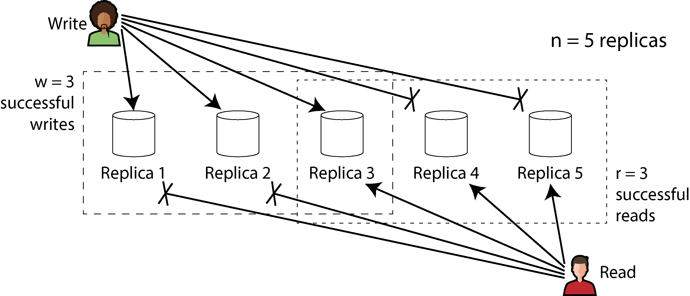

*Hình 6-13. Nếu w + r > n, ít nhất một trong r replica mà bạn đọc từ đó phải đã thấy thao tác ghi thành công gần nhất.*

Thông thường, các thao tác đọc và ghi luôn được gửi song song đến tất cả *n* replica. Các tham số *w* và *r* xác định chúng ta chờ bao nhiêu node—tức là, bao nhiêu trong số *n* node cần báo thành công trước khi chúng ta coi thao tác đọc hoặc ghi là thành công.

Nếu số node khả dụng ít hơn *w* hoặc *r* cần thiết, các thao tác ghi hoặc đọc sẽ trả về lỗi. Một node có thể không khả dụng vì nhiều lý do: node ngừng hoạt động (ví dụ, bị crash, bị tắt nguồn), một lỗi xảy ra trong khi thực thi thao tác (ví dụ, không thể ghi vì đĩa đầy), một sự gián đoạn mạng xảy ra giữa client và node, hoặc bất kỳ lý do nào khác. Chúng ta chỉ quan tâm liệu node có trả về phản hồi thành công hay không và không cần phân biệt giữa các loại lỗi khác nhau.

#### Hiểu các giới hạn của tính nhất quán quorum (quorum consistency)

Nếu bạn có *n* replica, và bạn chọn *w* và *r* sao cho *w* + *r* > *n*, nói chung bạn có thể kỳ vọng mọi lần đọc trả về giá trị mới nhất được ghi cho một key. Điều này đúng vì tập các node bạn đã ghi vào và tập các node bạn đã đọc từ đó phải giao nhau. Tức là, trong số các node bạn đọc, phải có ít nhất một node có giá trị mới nhất (như minh họa trong Hình 6-13).

Thường thì *r* và *w* được chọn là đa số (nhiều hơn *n* / 2) node, vì điều đó đảm bảo *w* + *r* > *n* trong khi vẫn chịu được tối đa *n* / 2 (làm tròn xuống) node bị hỏng. Nhưng quorum không nhất thiết phải là đa số—điều quan trọng chỉ là các tập node được dùng bởi thao tác đọc và thao tác ghi giao nhau ở ít nhất một node. Các cách gán quorum khác cũng khả thi, điều này cho phép một sự linh hoạt nhất định trong thiết kế các thuật toán phân tán [52]. Bạn cũng có thể đặt *w* và *r* thành các số nhỏ hơn, sao cho *w* + *r* ≤ *n* (tức là điều kiện quorum không được thỏa mãn). Trong trường hợp này, các thao tác đọc và ghi vẫn được gửi đến *n* node, nhưng cần ít phản hồi thành công hơn để thao tác thành công.

Với *w* và *r* nhỏ hơn, bạn có nhiều khả năng đọc được các giá trị stale hơn, vì nhiều khả năng lần đọc của bạn sẽ không bao gồm node có giá trị mới nhất. Về mặt tích cực, cấu hình này cho phép độ trễ thấp hơn, điều đặc biệt có lợi với replication *đồng bộ* (*synchronous*, *blocking*). Thiết lập này cũng có tính sẵn sàng cao hơn; nếu có gián đoạn mạng và nhiều replica trở nên không thể truy cập được, có khả năng cao hơn là bạn vẫn có thể tiếp tục xử lý các thao tác đọc và ghi. Chỉ sau khi số replica có thể truy cập được giảm xuống dưới *w* hoặc *r* thì database mới trở nên không khả dụng cho việc ghi hoặc đọc, tương ứng.

Tuy nhiên, ngay cả với *w* + *r* > *n*, các đặc tính nhất quán vẫn có thể gây nhầm lẫn trong một số trường hợp biên. Một số kịch bản bao gồm:

- Nếu một node mang giá trị mới bị hỏng, và dữ liệu của nó được khôi phục từ một replica mang giá trị cũ, số replica lưu giá trị mới có thể giảm xuống dưới *w*, phá vỡ điều kiện quorum.

- Trong khi rebalancing đang diễn ra, khi một số dữ liệu được di chuyển từ node này sang node khác (xem Chương 7), các node có thể có cái nhìn không nhất quán về việc node nào nên giữ *n* replica cho một giá trị cụ thể. Điều này có thể dẫn đến việc quorum đọc và quorum ghi không còn giao nhau.

- Nếu một thao tác đọc diễn ra đồng thời với một thao tác ghi, thao tác đọc có thể thấy hoặc không thấy giá trị đang được ghi đồng thời. Đặc biệt, có thể xảy ra trường hợp một lần đọc thấy giá trị mới và lần đọc tiếp theo lại thấy giá trị cũ, như chúng ta sẽ thấy trong “Triển khai hệ thống linearizable”. Nếu một thao tác ghi thành công trên một số replica nhưng thất bại trên những replica khác (ví dụ, vì đĩa trên một số node đã đầy), và tổng thể nó thành công trên ít hơn *w* replica, nó không được rollback trên các replica mà nó đã thành công. Điều này có nghĩa là nếu một thao tác ghi được báo là thất bại, các lần đọc tiếp theo có thể trả về hoặc không trả về giá trị từ thao tác ghi đó [53].

- Nếu database dùng timestamp từ đồng hồ thời gian thực để xác định thao tác ghi nào mới hơn (như Cassandra và ScyllaDB chẳng hạn), các thao tác ghi có thể bị loại bỏ âm thầm nếu một node khác có đồng hồ chạy nhanh hơn đã ghi vào cùng key—một vấn đề chúng ta đã thấy trước đó trong “Last write wins (loại bỏ các thao tác ghi đồng thời)”. Chúng ta sẽ thảo luận chi tiết hơn về điều này trong “Dựa vào đồng hồ được đồng bộ”.

- Nếu hai thao tác ghi xảy ra đồng thời, một trong chúng có thể được xử lý trước trên một replica, và thao tác kia có thể được xử lý trước trên replica khác. Điều này dẫn đến xung đột, tương tự như những gì chúng ta đã thấy với multi-leader replication (xem “Xử lý các thao tác ghi xung đột”). Chúng ta sẽ trở lại chủ đề này trong “Phát hiện các thao tác ghi đồng thời”.

Do đó, mặc dù quorum có vẻ đảm bảo rằng một lần đọc trả về giá trị mới nhất được ghi, trên thực tế điều đó không đơn giản như vậy. Các database kiểu Dynamo nói chung được tối ưu cho các trường hợp sử dụng có thể chấp nhận eventual consistency. Các tham số *w* và *r* cho phép bạn điều chỉnh xác suất đọc được các giá trị stale [54], nhưng sẽ là khôn ngoan nếu không coi chúng là những đảm bảo tuyệt đối.

#### Giám sát độ cũ của dữ liệu (staleness)

Từ góc độ vận hành, việc giám sát xem các database của bạn có đang trả về kết quả mới nhất hay không là rất quan trọng. Ngay cả khi ứng dụng của bạn có thể chấp nhận việc đọc dữ liệu cũ (stale read), bạn vẫn cần nắm được tình trạng sức khỏe của quá trình replication. Nếu replication bị tụt lại đáng kể, hệ thống nên cảnh báo cho bạn để bạn có thể điều tra nguyên nhân (ví dụ, một sự cố trong mạng hoặc một node bị quá tải).

Với replication dựa trên leader, database thường cung cấp các chỉ số (metrics) về replication lag mà bạn có thể đưa vào hệ thống giám sát. Điều này khả thi vì các thao tác ghi được áp dụng lên leader và các follower theo cùng một thứ tự, và mỗi node có một vị trí trong replication log (số lượng thao tác ghi mà nó đã áp dụng tại chỗ). Bằng cách lấy vị trí hiện tại của leader trừ đi vị trí hiện tại của một follower, bạn có thể đo được mức độ replication lag.

Tuy nhiên, trong các hệ thống dùng leaderless replication, không có thứ tự cố định nào cho việc áp dụng các thao tác ghi, điều này khiến việc giám sát khó khăn hơn. Số lượng hint mà một replica lưu để phục vụ handoff có thể là một thước đo cho sức khỏe của hệ thống, nhưng rất khó diễn giải nó một cách hữu ích [55]. Eventual consistency (tính nhất quán cuối cùng) là một đảm bảo cố tình mơ hồ, nhưng để vận hành được thì việc có thể định lượng được từ “cuối cùng” (eventual) là rất quan trọng.

### Hiệu năng của Single-Leader so với Leaderless Replication

Một hệ thống replication dựa trên một leader duy nhất có thể cung cấp các đảm bảo nhất quán mạnh (strong consistency) mà rất khó hoặc không thể đạt được trong một hệ thống leaderless. Tuy nhiên, như chúng ta đã thấy trong “Các vấn đề với replication lag”, các thao tác đọc trong một hệ thống replication dựa trên leader cũng có thể trả về giá trị cũ nếu bạn thực hiện chúng trên một follower được cập nhật bất đồng bộ.

Đọc từ leader đảm bảo phản hồi luôn mới nhất, nhưng lại gặp các vấn đề về hiệu năng:

- Thông lượng đọc (read throughput) bị giới hạn bởi khả năng xử lý request của leader (ngược với read scaling, vốn phân phối các thao tác đọc qua các replica được cập nhật bất đồng bộ và có thể trả về giá trị cũ).

- Nếu leader gặp sự cố, bạn phải chờ cho lỗi được phát hiện và failover hoàn tất rồi mới có thể tiếp tục xử lý request. Ngay cả khi quá trình failover diễn ra rất nhanh, người dùng vẫn sẽ nhận thấy vì thời gian phản hồi tạm thời tăng lên; nếu failover kéo dài, hệ thống sẽ không sẵn sàng trong suốt khoảng thời gian đó.

- Hệ thống rất nhạy cảm với các vấn đề hiệu năng trên leader. Nếu leader phản hồi chậm (ví dụ, do quá tải hoặc tranh chấp tài nguyên), thời gian phản hồi tăng lên cũng ngay lập tức ảnh hưởng đến người dùng.

Một lợi thế lớn của kiến trúc leaderless là nó có khả năng chống chịu tốt hơn trước những vấn đề như vậy. Vì không có failover, và các request vốn dĩ được gửi song song tới nhiều replica, việc một replica trở nên chậm hoặc không sẵn sàng có rất ít tác động đến thời gian phản hồi; client đơn giản là dùng phản hồi từ các replica khác trả lời nhanh hơn. Việc sử dụng các phản hồi nhanh nhất được gọi là *request hedging*, và nó có thể giảm đáng kể tail latency [56].

Về cốt lõi, khả năng chống chịu của một hệ thống leaderless đến từ việc nó không phân biệt giữa trường hợp bình thường và trường hợp có sự cố. Điều này đặc biệt hữu ích khi xử lý các *gray failure* (lỗi xám), trong đó một node không hoàn toàn ngừng hoạt động nhưng đang chạy trong trạng thái suy giảm, xử lý request chậm một cách bất thường [57], hoặc khi một node đơn giản là bị quá tải (ví dụ, nếu một node đã offline một thời gian, việc khôi phục thông qua hinted handoff có thể gây ra rất nhiều tải bổ sung). Một hệ thống dựa trên leader phải quyết định xem tình huống có đủ tệ để cần failover hay không (mà bản thân failover cũng có thể gây thêm gián đoạn), trong khi ở hệ thống leaderless, câu hỏi đó thậm chí không hề nảy sinh.

Dù vậy, các hệ thống leaderless cũng có thể gặp các vấn đề về hiệu năng:

- Mặc dù hệ thống không cần thực hiện failover, một replica vẫn cần phát hiện khi một replica khác không sẵn sàng để nó có thể lưu các hint về những thao tác ghi mà replica không sẵn sàng đó đã bỏ lỡ. Khi replica đó hoạt động trở lại, quá trình handoff cần gửi các hint đó cho nó. Điều này tạo thêm tải cho các replica vào đúng lúc hệ thống đã đang căng thẳng [55].

- Càng có nhiều replica, kích thước quorum của bạn càng lớn và bạn càng phải chờ nhiều phản hồi hơn trước khi một request có thể hoàn tất. Ngay cả khi bạn chỉ chờ *r* hoặc *w* replica nhanh nhất phản hồi, và ngay cả khi bạn gửi các request song song, *r* hoặc *w* lớn hơn làm tăng khả năng bạn gặp một replica chậm, khiến thời gian phản hồi tổng thể tăng lên (xem “Sử dụng các chỉ số thời gian phản hồi”). Trong thực tế, quorum hiếm khi vượt quá bốn trên bảy node hoặc năm trên chín node.

- Một sự gián đoạn mạng quy mô lớn làm ngắt kết nối giữa client và một số lượng lớn replica có thể khiến việc hình thành quorum trở thành bất khả thi. Một số database leaderless cung cấp tùy chọn cấu hình cho phép bất kỳ replica nào có thể liên lạc được đều chấp nhận thao tác ghi, ngay cả khi nó không phải là một trong các replica thông thường cho key đó (Riak và Dynamo gọi đây là *sloppy quorum* [45]; Cassandra và ScyllaDB gọi nó là *consistency level ANY*). Không có đảm bảo nào rằng các thao tác đọc sau đó sẽ thấy giá trị vừa ghi, nhưng tùy vào ứng dụng, điều này vẫn có thể tốt hơn là để thao tác ghi thất bại.

Multi-leader replication có thể mang lại khả năng chống chịu trước gián đoạn mạng còn cao hơn cả leaderless replication, vì các thao tác đọc và ghi chỉ cần giao tiếp với một leader duy nhất, vốn có thể được đặt cùng vị trí với client. Tuy nhiên, vì một thao tác ghi trên một leader được lan truyền bất đồng bộ tới các leader khác, các thao tác đọc có thể bị lạc hậu tùy ý. Quorum read và quorum write là một sự thỏa hiệp: khả năng chịu lỗi tốt và khả năng cao đọc được dữ liệu mới nhất.

### Vận hành đa vùng (Multi-Region)

Trước đây chúng ta đã thảo luận về replication xuyên vùng (cross-region) như một trường hợp sử dụng của multi-leader replication (xem “Multi-Leader Replication”). Leaderless replication cũng phù hợp cho vận hành đa vùng, vì nó được thiết kế để chịu được các thao tác ghi đồng thời xung đột, gián đoạn mạng và các đợt tăng vọt độ trễ.

Trong Cassandra và ScyllaDB, một client muốn thực hiện thao tác ghi đa vùng trước tiên chọn một node trong region cục bộ của mình, được gọi là *coordinator node* (node điều phối), và gửi thao tác ghi tới node đó. Coordinator node chuyển tiếp thao tác ghi tới tất cả các replica trong region của nó và tới một replica ở mỗi region khác, replica này sau đó lại chuyển tiếp tới các replica còn lại trong region đó. Tối ưu này tránh việc phải thực hiện request xuyên vùng nhiều lần.

Bạn có thể chọn từ nhiều mức nhất quán (consistency level) khác nhau, quy định cần bao nhiêu phản hồi để một request được coi là thành công. Ví dụ, bạn có thể yêu cầu một quorum trên toàn bộ các replica ở tất cả các region, một quorum riêng trong từng region, hoặc một quorum chỉ trong region cục bộ của client. Quorum cục bộ (local quorum) tránh việc phải chờ các request chậm tới các region khác, nhưng cũng dễ trả về kết quả cũ hơn.

Riak giữ toàn bộ giao tiếp giữa client và các node database trong phạm vi một region, nên *n* mô tả số lượng replica trong một region. Replication xuyên vùng giữa các cluster database diễn ra bất đồng bộ ở chế độ nền, theo phong cách tương tự với multi-leader replication.

### Phát hiện các thao tác ghi đồng thời

Giống với multi-leader replication, các database leaderless cho phép các thao tác ghi đồng thời lên cùng một key, dẫn đến các xung đột cần được giải quyết. Những xung đột như vậy có thể được phát hiện ngay khi thao tác ghi diễn ra, nhưng không phải luôn như vậy: chúng cũng có thể được phát hiện muộn hơn, trong quá trình read repair, hinted handoff, hoặc anti-entropy.

Vấn đề là các event có thể đến các node khác nhau theo thứ tự khác nhau, do độ trễ mạng biến thiên và các hỏng hóc cục bộ (partial failure). Ví dụ, Hình 6-14 cho thấy hai client, A và B, đồng thời ghi vào một key *X* trong một datastore ba node:

- Node 1 nhận được thao tác ghi từ A, nhưng không bao giờ nhận được thao tác ghi từ B do một sự cố ngắt kết nối tạm thời.

- Node 2 nhận thao tác ghi từ A trước, rồi đến thao tác ghi từ B. Node 3 nhận thao tác ghi từ B trước, rồi đến thao tác ghi từ A.

Nếu mỗi node đơn giản là ghi đè giá trị của một key mỗi khi nhận được một request ghi từ client, các node sẽ trở nên không nhất quán vĩnh viễn, như request *get* cuối cùng trong Hình 6-14 cho thấy: node 2 cho rằng giá trị cuối cùng của *X* là B, trong khi các node khác cho rằng giá trị đó là A.

Để đạt được eventual consistency, các replica cần hội tụ về cùng một giá trị. Để làm điều này, chúng ta có thể dùng bất kỳ cơ chế giải quyết xung đột nào đã thảo luận trước đây trong “Xử lý các thao tác ghi xung đột”, chẳng hạn như LWW (được Cassandra và ScyllaDB sử dụng), giải quyết thủ công, hoặc CRDT (được Riak sử dụng).

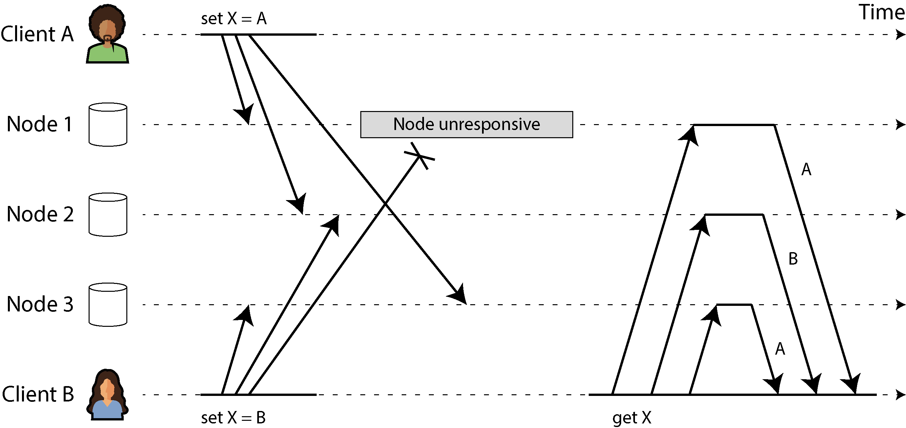

*Hình 6-14. Các thao tác ghi đồng thời trong một datastore kiểu Dynamo: không có thứ tự được xác định rõ*

LWW rất dễ triển khai. Mỗi thao tác ghi được gắn một timestamp, và giá trị có timestamp cao hơn luôn ghi đè giá trị có timestamp thấp hơn. Tuy nhiên, timestamp không cho bạn biết hai giá trị có thực sự xung đột hay không (tức là chúng được ghi đồng thời) hay không xung đột (chúng được ghi lần lượt cái này sau cái kia). Nếu bạn muốn giải quyết xung đột một cách tường minh, hệ thống cần cẩn trọng hơn trong việc phát hiện các thao tác ghi đồng thời.

#### Quan hệ happens-before và tính đồng thời

Làm sao chúng ta quyết định được hai thao tác có đồng thời hay không? Để xây dựng trực giác, hãy xem xét một vài ví dụ:

- Trong Hình 6-8, hai thao tác ghi không đồng thời: thao tác insert của A *xảy ra trước* (happens before) thao tác increment của B, vì giá trị mà B tăng lên chính là giá trị mà A đã chèn vào. Nói cách khác, thao tác của B được xây dựng dựa trên thao tác của A, nên thao tác của B hẳn phải xảy ra sau. Chúng ta cũng nói rằng B *phụ thuộc nhân quả* (causally dependent) vào A.

- Ngược lại, hai thao tác ghi trong Hình 6-14 là đồng thời: khi mỗi client bắt đầu thao tác của mình, nó không biết rằng một client khác cũng đang thực hiện một thao tác trên cùng key đó. Do vậy, không có sự phụ thuộc nhân quả nào giữa hai thao tác.

Một thao tác A *xảy ra trước* (happens before) một thao tác B khác nếu B biết về A, hoặc phụ thuộc vào A, hoặc được xây dựng dựa trên A theo cách nào đó. Việc một thao tác có xảy ra trước một thao tác khác hay không chính là chìa khóa để định nghĩa tính đồng thời (concurrency). Thực tế, chúng ta có thể đơn giản nói rằng hai thao tác là đồng thời nếu không thao tác nào xảy ra trước thao tác kia [58].

Do đó, mỗi khi bạn có hai thao tác A và B, có ba khả năng: A xảy ra trước B, hoặc B xảy ra trước A, hoặc A và B đồng thời. Điều chúng ta cần là một thuật toán cho biết hai thao tác có đồng thời hay không. Nếu một thao tác xảy ra trước thao tác khác, thao tác sau nên ghi đè thao tác trước, nhưng nếu các thao tác là đồng thời, chúng ta có một xung đột cần được giải quyết.

#### TÍNH ĐỒNG THỜI, THỜI GIAN VÀ THUYẾT TƯƠNG ĐỐI

Có vẻ như hai thao tác nên được gọi là đồng thời nếu chúng xảy ra “cùng lúc”—nhưng thực ra, việc chúng có thực sự chồng lấn về thời gian hay không không quan trọng. Do các vấn đề với đồng hồ trong hệ phân tán, thực tế rất khó để biết hai sự việc có xảy ra vào đúng cùng một thời điểm hay không—một vấn đề chúng ta sẽ thảo luận chi tiết hơn trong Chương 9.

Để định nghĩa tính đồng thời, thời gian chính xác không quan trọng. Chúng ta đơn giản gọi hai thao tác là đồng thời nếu cả hai đều không biết về nhau, bất kể thời gian vật lý mà chúng xảy ra. Người ta đôi khi liên hệ nguyên lý này với thuyết tương đối hẹp trong vật lý [58], thuyết đã đưa ra ý tưởng rằng thông tin không thể lan truyền nhanh hơn tốc độ ánh sáng. Hệ quả là hai sự kiện xảy ra cách nhau một khoảng không gian nào đó không thể ảnh hưởng lẫn nhau nếu khoảng thời gian giữa hai sự kiện ngắn hơn thời gian ánh sáng cần để đi hết khoảng cách giữa chúng.

Trong các hệ thống máy tính, hai thao tác có thể là đồng thời ngay cả khi về nguyên tắc tốc độ ánh sáng đã cho phép thao tác này ảnh hưởng đến thao tác kia. Ví dụ, nếu mạng bị chậm hoặc bị gián đoạn vào thời điểm đó, hai thao tác có thể xảy ra cách nhau một khoảng thời gian mà vẫn là đồng thời, vì sự cố mạng đã ngăn thao tác này biết về thao tác kia.

#### Ghi nhận quan hệ happens-before

Hãy xem xét một thuật toán xác định hai thao tác có đồng thời hay không, hay một thao tác xảy ra trước thao tác kia. Để đơn giản, hãy bắt đầu với một database chỉ có một replica. Sau khi đã tìm ra cách làm điều này trên một replica duy nhất, chúng ta có thể tổng quát hóa cách tiếp cận cho một database leaderless với nhiều replica. Thuật toán hoạt động như sau:

- Server duy trì một số phiên bản (version number) cho mỗi key, tăng số phiên bản mỗi khi key đó được ghi, và lưu số phiên bản mới cùng với giá trị được ghi.

- Khi một client đọc một key, server trả về tất cả các sibling—tất cả các giá trị chưa bị ghi đè—cùng với số phiên bản mới nhất. Client phải đọc một key trước khi ghi.

- Khi một client ghi một key, nó phải kèm theo số phiên bản từ lần đọc trước, và phải gộp (merge) tất cả các giá trị mà nó đã nhận được trong lần đọc trước (ví dụ, dùng một CRDT với đầu vào từ người dùng). Phản hồi của một request ghi cũng trả về tất cả các sibling, cho phép chúng ta nối chuỗi nhiều thao tác ghi (như trong ví dụ giỏ hàng đã thảo luận trong “Xử lý các thao tác ghi xung đột”).

- Khi server nhận được một thao tác ghi với một số phiên bản cụ thể, nó có thể ghi đè tất cả các giá trị có số phiên bản đó hoặc thấp hơn (vì nó biết rằng những giá trị đó đã được gộp vào giá trị mới), nhưng nó phải giữ lại tất cả các giá trị có số phiên bản cao hơn (vì những giá trị đó đồng thời với thao tác ghi đang đến).

Lưu ý rằng server có thể xác định hai thao tác có đồng thời hay không bằng cách nhìn vào các số phiên bản. Server không cần diễn giải bản thân giá trị, nên giá trị có thể là bất kỳ cấu trúc dữ liệu nào.

Khi một thao tác ghi kèm theo số phiên bản từ lần đọc trước, điều đó cho chúng ta biết thao tác ghi này dựa trên trạng thái trước đó nào. Nếu bạn thực hiện một thao tác ghi mà không kèm số phiên bản, nó sẽ đồng thời với tất cả các thao tác ghi khác, nên nó sẽ không ghi đè bất cứ thứ gì—nó chỉ đơn giản được trả về như một trong các giá trị ở các lần đọc sau. Hình 6-15 minh họa thuật toán này trong thực tế.

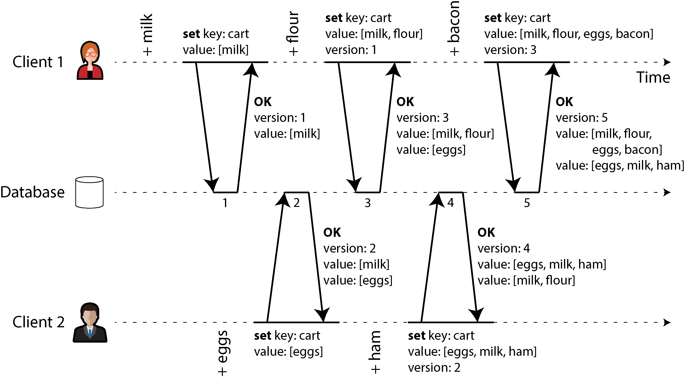

*Hình 6-15. Ghi nhận các phụ thuộc nhân quả giữa hai client đồng thời chỉnh sửa một giỏ hàng*

Trong ví dụ này, hai client đồng thời thêm các mặt hàng vào cùng một giỏ hàng. (Nếu bạn thấy ví dụ đó quá tầm thường, hãy tưởng tượng thay vào đó là hai kiểm soát viên không lưu đồng thời thêm máy bay vào khu vực mà họ đang theo dõi.) Ban đầu, giỏ hàng trống. Tổng cộng, hai client thực hiện năm thao tác ghi vào database:

1. Client 1 thêm `milk` vào giỏ hàng. Đây là thao tác ghi đầu tiên vào key đó, nên server lưu thành công và gán cho nó phiên bản 1. Server cũng gửi lại giá trị cho client, cùng với số phiên bản.

2. Client 2 thêm `eggs` vào giỏ hàng, không biết rằng client 1 đồng thời đã thêm `milk` (client 2 nghĩ rằng `eggs` của nó là mặt hàng duy nhất trong giỏ). Server gán phiên bản 2 cho thao tác ghi này và lưu `eggs` và `milk` như hai giá trị riêng biệt (sibling). Sau đó nó trả về *cả hai* giá trị cho client, cùng với số phiên bản, 2.

3. Client 1, không hay biết về thao tác ghi của client 2, muốn thêm `flour` vào giỏ hàng, sau đó nó giả định nội dung giỏ hàng sẽ là `[milk, flour]` . Nó gửi giá trị này lên server, cùng với số phiên bản mà server đã cấp cho nó trước đó (1). Từ số phiên bản, server có thể biết rằng thao tác ghi `[milk, flour]` thay thế giá trị trước đó `[milk]` nhưng đồng thời với `[eggs]` . Do đó, server gán phiên bản 3 cho `[milk, flour]` , ghi đè giá trị phiên bản 1 là `[milk]` , nhưng giữ lại giá trị phiên bản 2 là `[eggs]` và trả về cả hai giá trị còn lại cho client.

4. Trong lúc đó, client 2 muốn thêm `ham` vào giỏ hàng, không biết rằng client 1 vừa thêm `flour` . Client 2 đã nhận hai giá trị `[milk]` và `[eggs]` từ server trong phản hồi lần trước, nên giờ client gộp các giá trị đó và thêm `ham` để tạo thành một giá trị mới, `[eggs, milk, ham]` . Nó gửi giá trị đó lên server, cùng với số phiên bản trước đó (2). Server phát hiện rằng phiên bản 2 ghi đè `[eggs]` nhưng đồng thời với `[milk, flour]` , nên hai giá trị còn lại là `[milk, flour]` với phiên bản 3 và `[eggs, milk, ham]` với phiên bản 4.

5. Cuối cùng, client 1 muốn thêm `bacon` . Trước đó nó đã nhận `[milk, flour]` và `[eggs]` từ server ở phiên bản 3, nên nó gộp chúng lại, thêm `bacon` , và gửi giá trị cuối cùng `[milk, flour, eggs, bacon]` lên server, cùng với số phiên bản 3. Thao tác này ghi đè `[milk, flour]` (lưu ý rằng `[eggs]` đã bị ghi đè ở bước trước) nhưng đồng thời với `[eggs, milk, ham]` , nên server giữ lại cả hai giá trị đồng thời đó.

Luồng dữ liệu (dataflow) giữa các thao tác trong Hình 6-15 được minh họa bằng đồ thị trong Hình 6-16. Các mũi tên chỉ ra thao tác nào *xảy ra trước* thao tác nào, theo nghĩa thao tác sau *biết về* hoặc *phụ thuộc vào* thao tác trước. Trong ví dụ này, các client không bao giờ hoàn toàn cập nhật với dữ liệu trên server, vì luôn có một thao tác khác đang diễn ra đồng thời. Nhưng các phiên bản cũ của giá trị cuối cùng vẫn bị ghi đè, và không có thao tác ghi nào bị mất.

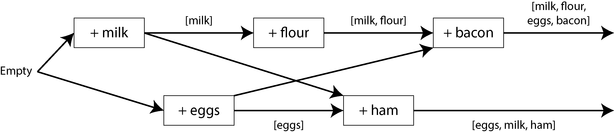

*Hình 6-16. Đồ thị các phụ thuộc nhân quả trong Hình 6-15*

#### Version vector

Ví dụ trong Hình 6-15 chỉ dùng một replica duy nhất. Thuật toán thay đổi thế nào khi có nhiều replica nhưng không có leader?

Hình 6-15 dùng một số phiên bản duy nhất để ghi nhận các phụ thuộc giữa các thao tác, nhưng điều đó không đủ khi có nhiều replica cùng chấp nhận thao tác ghi đồng thời. Thay vào đó, chúng ta cần dùng một số phiên bản *cho mỗi replica* bên cạnh cho mỗi key. Mỗi replica tăng số phiên bản của chính nó khi xử lý một thao tác ghi, và cũng theo dõi các số phiên bản mà nó đã thấy từ mỗi replica khác. Thông tin này cho biết giá trị nào cần ghi đè và giá trị nào cần giữ lại làm sibling.

Tập hợp các số phiên bản từ tất cả các replica được gọi là một *version vector* [59]. Một vài biến thể của ý tưởng này đang được sử dụng, nhưng thú vị nhất có lẽ là *dotted version vector* [60, 61], được dùng trong Riak 2.0 [62, 63]. Chúng ta sẽ không đi vào chi tiết, nhưng cách nó hoạt động khá giống với những gì chúng ta đã thấy trong ví dụ giỏ hàng.

Giống như các số phiên bản trong Hình 6-15, version vector được gửi từ các replica của database tới client khi đọc giá trị, và chúng cần được gửi lại database khi giá trị được ghi sau đó. (Riak mã hóa version vector thành một chuỗi mà nó gọi là *causal context*.) Version vector cho phép database phân biệt giữa ghi đè và ghi đồng thời.

Version vector cũng đảm bảo rằng việc đọc từ một replica rồi sau đó ghi lại vào một replica khác là an toàn. Làm như vậy có thể dẫn đến việc tạo ra các sibling, nhưng không có dữ liệu nào bị mất miễn là các sibling được gộp đúng cách.

> **VERSION VECTOR VÀ VECTOR CLOCK**
>
> Một *version vector* đôi khi cũng được gọi là *vector clock*, mặc dù chúng không hoàn toàn giống nhau. Sự khác biệt là khá tinh tế [61, 64, 65]. Xem các tài liệu tham khảo để biết chi tiết; nói ngắn gọn, khi so sánh trạng thái của các replica, version vector là cấu trúc dữ liệu đúng cần dùng.

## Tóm tắt

Trong chương này chúng ta đã xem xét vấn đề replication. Replication có thể phục vụ nhiều mục đích:

- **Tính sẵn sàng cao (High availability)**

  Giữ cho hệ thống tiếp tục hoạt động, ngay cả khi một máy (hoặc nhiều máy, một zone, hay thậm chí toàn bộ một region) ngừng hoạt động

- **Tính bền vững (Durability)**

  Đảm bảo bạn không mất dữ liệu, ngay cả khi cả một máy (hay thậm chí toàn bộ một region) hỏng vĩnh viễn

- **Hoạt động khi mất kết nối (Disconnected operation)**

  Cho phép ứng dụng tiếp tục hoạt động bất chấp gián đoạn mạng

- **Độ trễ (Latency)**

  Đặt dữ liệu gần người dùng về mặt địa lý để người dùng có thể tương tác với nó nhanh hơn

- **Khả năng mở rộng (Scalability)**

  Có thể xử lý một khối lượng đọc lớn hơn khả năng của một máy đơn lẻ, bằng cách thực hiện các thao tác đọc trên các replica

Mặc dù khái niệm này đơn giản—giữ một bản sao của cùng một dữ liệu trên nhiều máy—replication hóa ra lại là một vấn đề phức tạp đến đáng kinh ngạc. Nó đòi hỏi phải suy nghĩ cẩn thận về tính đồng thời, về tất cả những gì có thể xảy ra sai, và về cách xử lý hậu quả của những lỗi đó. Ở mức tối thiểu, chúng ta cần xử lý các node không sẵn sàng và các gián đoạn mạng (và đó còn chưa tính đến những loại lỗi hiểm hóc hơn, như hỏng dữ liệu âm thầm do bug phần mềm hoặc lỗi phần cứng).

Chúng ta đã thảo luận ba cách tiếp cận chính cho replication:

- **Single-leader replication**

  Client gửi tất cả các thao tác ghi tới một node duy nhất (leader), node này gửi một dòng (stream) các event thay đổi dữ liệu tới các replica khác (follower). Các thao tác đọc có thể được thực hiện trên bất kỳ replica nào, nhưng đọc từ follower có thể nhận dữ liệu cũ.

- **Multi-leader replication**

  Client gửi mỗi thao tác ghi tới một trong nhiều node leader, bất kỳ node nào trong số đó cũng có thể chấp nhận thao tác ghi. Các leader gửi các dòng event thay đổi dữ liệu cho nhau và cho các node follower nếu có.

- **Leaderless replication**

  Client gửi mỗi thao tác ghi tới nhiều node và đọc từ nhiều node song song để phát hiện và sửa các node có dữ liệu cũ.

Mỗi cách tiếp cận đều có ưu và nhược điểm. Single-leader replication phổ biến vì nó khá dễ hiểu và cung cấp tính nhất quán mạnh. Multi-leader và leaderless replication có thể bền bỉ hơn khi có các node bị lỗi, gián đoạn mạng và các đợt tăng vọt độ trễ, với cái giá là phải giải quyết xung đột và chỉ cung cấp các đảm bảo nhất quán yếu hơn.

Replication có thể là đồng bộ hoặc bất đồng bộ, điều này có ảnh hưởng sâu sắc đến hành vi của hệ thống khi có lỗi. Mặc dù replication bất đồng bộ có thể nhanh khi hệ thống đang chạy trơn tru, điều quan trọng là phải tìm hiểu xem điều gì xảy ra khi replication lag tăng lên và các server gặp sự cố. Nếu một leader gặp sự cố và bạn thăng cấp một follower được cập nhật bất đồng bộ lên làm leader mới, dữ liệu vừa được commit gần đây có thể bị mất. Chúng ta đã xem xét một số hiệu ứng kỳ lạ có thể do replication lag gây ra, và đã thảo luận một vài mô hình nhất quán (consistency model) hữu ích cho việc quyết định ứng dụng nên hành xử thế nào khi có replication lag:

- **Tính nhất quán read-after-write (Read-after-write consistency)**

  Người dùng phải luôn thấy được dữ liệu mà chính họ đã gửi lên.

- **Đọc đơn điệu (Monotonic reads)**

  Sau khi người dùng đã thấy dữ liệu tại một thời điểm, họ không nên thấy dữ liệu từ một thời điểm sớm hơn sau đó.

- **Đọc tiền tố nhất quán (Consistent prefix reads)**

  Người dùng phải thấy dữ liệu ở trạng thái hợp lý về mặt nhân quả—ví dụ, thấy một câu hỏi và câu trả lời của nó theo đúng thứ tự.

Cuối cùng, chúng ta đã thảo luận cách multi-leader và leaderless replication đảm bảo rằng tất cả các replica cuối cùng đều hội tụ về một trạng thái nhất quán: bằng cách dùng version vector hoặc thuật toán tương tự để phát hiện thao tác ghi nào là đồng thời, và bằng cách dùng một thuật toán giải quyết xung đột như CRDT để gộp các giá trị được ghi đồng thời. LWW và giải quyết xung đột thủ công cũng là những lựa chọn khả dĩ.

Chương này đã giả định rằng mỗi replica lưu một bản sao đầy đủ của toàn bộ database, điều này không thực tế với các tập dữ liệu lớn. Trong chương tiếp theo, chúng ta sẽ xem xét *sharding*, cho phép mỗi máy chỉ lưu một tập con của dữ liệu.

#### Tài liệu tham khảo

[1] B. G. Lindsay, P. G. Selinger, C. Galtieri, J. N. Gray, R. A. Lorie, T. G. Price, F. Putzolu, I. L. Traiger, and B. W. Wade. [“Notes on Distributed Databases.”](https://dominoweb.draco.res.ibm.com/reports/RJ2571.pdf) IBM Research, Research Report RJ2571(33471), July 1979. Archived at [*perma.cc/EPZ3-MHDD*](https://perma.cc/EPZ3-MHDD)

[2] Kenny Gryp. [“MySQL Terminology Updates.”](https://dev.mysql.com/blog-archive/mysql-terminology-updates/) *dev.mysql.com*, July 2020. Archived at [*perma.cc/S62G-6RJ2*](https://perma.cc/S62G-6RJ2)

[3] Oracle Corporation. [“Oracle (Active) Data Guard 19c: Real-Time Data Protection and Availability.”](https://www.oracle.com/technetwork/database/availability/dg-adg-technical-overview-wp-5347548.pdf) White Paper, *oracle.com*, March 2019. Archived at [*perma.cc/P5ST-* *RPKE*](https://perma.cc/P5ST-RPKE)

[4] Microsoft. [“What Is an Always On Availability Group?”](https://learn.microsoft.com/en-us/sql/database-engine/availability-groups/windows/overview-of-always-on-availability-groups-sql-server) *learn.microsoft.com*, September 2024. Archived at [*perma.cc/ABH6-3MXF*](https://perma.cc/ABH6-3MXF)

[5] Mostafa Elhemali, Niall Gallagher, Nicholas Gordon, Joseph Idziorek, Richard Krog, Colin Lazier, Erben Mo, Akhilesh Mritunjai, Somu Perianayagam, Tim Rath, Swami Sivasubramanian, James Christopher Sorenson III, Sroaj Sosothikul, Doug Terry, and Akshat Vig. [“Amazon DynamoDB: A Scalable, Predictably Performant, and Fully Managed NoSQL Database Service.”](https://www.usenix.org/conference/atc22/presentation/elhemali) At *USENIX Annual Technical Conference* (ATC), July 2022.

[6] Rebecca Taft, Irfan Sharif, Andrei Matei, Nathan VanBenschoten, Jordan Lewis, Tobias Grieger, Kai Niemi, Andy Woods, Anne Birzin, Raphael Poss, Paul Bardea, Amruta Ranade, Ben Darnell, Bram Gruneir, Justin Jaffray, Lucy Zhang, and Peter Mattis. [“CockroachDB: The Resilient Geo-Distributed SQL Database.”](https://dl.acm.org/doi/abs/10.1145/3318464.3386134) At *ACM SIGMOD International Conference on Management of Data* (SIGMOD), June 2020. [*doi:10.1145/3318464.3386134*](https://doi.org/10.1145/3318464.3386134)

[7] Dongxu Huang, Qi Liu, Qiu Cui, Zhuhe Fang, Xiaoyu Ma, Fei Xu, Li Shen, Liu Tang, Yuxing Zhou, Menglong Huang, Wan Wei, Cong Liu, Jian Zhang, Jianjun Li, Xuelian Wu, Lingyu Song, Ruoxi Sun, Shuaipeng Yu, Lei Zhao, Nicholas Cameron, Liquan Pei, and Xin Tang. [“TiDB: A Raft-Based HTAP Database.”](https://www.vldb.org/pvldb/vol13/p3072-huang.pdf) *Proceedings of the VLDB Endowment*, volume 13, issue 12, pages 3072–3084, August 2020. [*doi:10.14778/3415478.3415535*](https://doi.org/10.14778/3415478.3415535)

[8] Mallory Knodel and Niels ten Oever. [“Terminology, Power, and Inclusive Language in Internet-Drafts and RFCs.”](https://www.ietf.org/archive/id/draft-knodel-terminology-14.html) *IETF Internet-Draft*, August 2023. Archived at [*per-* *ma.cc/5ZY9-725E*](https://perma.cc/5ZY9-725E)

[9] Buck Hodges. [“Postmortem: VSTS 4 September 2018.”](https://devblogs.microsoft.com/devopsservice/?p=17485) *devblogs.microsoft.com*, September 2018. Archived at [*perma.cc/ZF5R-DYZS*](https://perma.cc/ZF5R-DYZS)

[10] Gunnar Morling. [“Leader Election with S3 Conditional Writes.”](https://www.morling.dev/blog/leader-election-with-s3-conditional-writes/) *www.morling.dev*, August 2024. Archived at [*perma.cc/7V2N-J78Y*](https://perma.cc/7V2N-J78Y)

[11] Vignesh Chandramohan, Rohan Desai, and Chris Riccomini. [“SlateDB Manifest Design.”](https://github.com/slatedb/slatedb/blob/main/rfcs/0001-manifest.md) *github.com*, May 2024. Archived at [*perma.cc/8EUY-P32Z*](https://perma.cc/8EUY-P32Z)

[12] Stas Kelvich. [“Why Does Neon Use Paxos Instead of Raft, and What’s the Difference?”](https://neon.tech/blog/paxos) *neon.tech*, August 2022. Archived at [*perma.cc/SEZ4-2GXU*](https://perma.cc/SEZ4-2GXU)

[13] Dimitri Fontaine. [“An Introduction to the pg_auto_failover Project.”](https://tapoueh.org/blog/2021/11/an-introduction-to-the-pg_auto_failover-project/) *tapoueh.org*, November 2021. Archived at [*perma.cc/3WH5-6BAF*](https://perma.cc/3WH5-6BAF)

[14] Jesse Newland. [“GitHub Availability This Week.”](https://github.blog/news-insights/the-library/github-availability-this-week/) *github.blog*, September 2012. Archived at [*perma.cc/3YRF-FTFJ*](https://perma.cc/3YRF-FTFJ)

[15] Mark Imbriaco. [“Downtime Last Saturday.”](https://github.blog/news-insights/the-library/downtime-last-saturday/) *github.blog*, December 2012. Archived at [*perma.cc/M7X5-E8SQ*](https://perma.cc/M7X5-E8SQ)

[16] John Hugg. [“‘All In’ with Determinism for Performance and Testing in Distributed Systems.”](https://www.youtube.com/watch?v=gJRj3vJL4wE) At *Strange Loop*, September 2015.

[17] Hironobu Suzuki. [“The Internals of PostgreSQL.”](https://www.interdb.jp/pg/) *interdb.jp*, 2017. Archived at [*archive.org*](https://web.archive.org/web/20251005094032/https://www.interdb.jp/pg/)

[18] Amit Kapila. [“WAL Internals of PostgreSQL.”](https://www.pgcon.org/2012/schedule/attachments/258_212_Internals%20Of%20PostgreSQL%20Wal.pdf) At *PostgreSQL Conference* (PGCon), May 2012. Archived at [*perma.cc/6225-3SUX*](https://perma.cc/6225-3SUX)

[19] Amit Kapila. [“Evolution of Logical Replication.”](https://amitkapila16.blogspot.com/2023/09/evolution-of-logical-replication.html) *amitkapila16.blogspot.com*, September 2023. Archived at [*perma.cc/F9VX-JLER*](https://perma.cc/F9VX-JLER)

[20] Aru Petchimuthu. [“Upgrade Your Amazon RDS for PostgreSQL or Amazon Aurora PostgreSQL Database, Part 2: Using the pglogical Extension.”](https://aws.amazon.com/blogs/database/part-2-upgrade-your-amazon-rds-for-postgresql-database-using-the-pglogical-extension/) *aws.amazon.com*, August 2021. Archived at [*perma.cc/RXT8-FS2T*](https://perma.cc/RXT8-FS2T)

[21] Yogeshwer Sharma, Philippe Ajoux, Petchean Ang, David Callies, Abhishek Choudhary, Laurent Demailly, Thomas Fersch, Liat Atsmon Guz, Andrzej Kotulski, Sachin Kulkarni, Sanjeev Kumar, Harry Li, Jun Li, Evgeniy Makeev, Kowshik Prakasam, Robbert van Renesse, Sabyasachi Roy, Pratyush Seth, Yee Jiun Song, Benjamin Wester, Kaushik Veeraraghavan, and Peter Xie. [“Wormhole: Reliable Pub-Sub to Support Geo-Replicated Internet Services.”](https://www.usenix.org/system/files/conference/nsdi15/nsdi15-paper-sharma.pdf) At *12th USENIX Symposium on Networked Systems Design and Implementation* (NSDI), May 2015.

[22] Douglas B. Terry. [“Replicated Data Consistency Explained Through Baseball.”](https://www.microsoft.com/en-us/research/publication/replicated-data-consistency-explained-through-baseball/) Microsoft Research, Technical Report MSR-TR-2011-137, October 2011. Archived at [*perma.cc/F4KZ-AR38*](https://perma.cc/F4KZ-AR38)

[23] Douglas B. Terry, Alan J. Demers, Karin Petersen, Mike J. Spreitzer, Marvin M. Theher, and Brent B. Welch. [“Session Guarantees for Weakly Consistent Replicated Data.”](https://csis.pace.edu/~marchese/CS865/Papers/SessionGuaranteesPDIS.pdf) At *3rd International Conference on Parallel and Distributed Information Systems* (PDIS), September 1994. [*doi:10.1109/PDIS.1994.331722*](https://doi.org/10.1109/PDIS.1994.331722)

[24] Werner Vogels. [“Eventually Consistent.”](https://queue.acm.org/detail.cfm?id=1466448) *ACM Queue*, volume 6, issue 6, pages 14– 19, October 2008. [*doi:10.1145/1466443.1466448*](https://doi.org/10.1145/1466443.1466448)

[25] Simon Willison. [Reply to: “My thoughts about Fly.io (so far) and other newish tech- nology I’m getting into”.](https://news.ycombinator.com/item?id=31413483) *news.ycombinator.com*, May 2022.

[26] Nithin Tharakan. [“Scaling Bitbucket’s Database.”](https://www.atlassian.com/blog/bitbucket/scaling-bitbuckets-database) *atlassian.com*, October 2020. Archived at [*perma.cc/JAB7-9FGX*](https://perma.cc/JAB7-9FGX)

[27] Terry Pratchett. *Reaper Man: A Discworld Novel*. Victor Gollancz, 1991. ISBN: 9780575049796

[28] Peter Bailis, Alan Fekete, Michael J. Franklin, Ali Ghodsi, Joseph M. Hellerstein, and Ion Stoica. [“Coordination Avoidance in Database Systems.”](https://vldb.org/pvldb/vol8/p185-bailis.pdf) *Proceedings of the VLDB Endowment*, volume 8, issue 3, pages 185–196, November 2014. [*doi:10.14778/2735508.2735509*](https://doi.org/10.14778/2735508.2735509)

[29] Yaser Raja and Peter Celentano. [“PostgreSQL Bi-Directional Replication Using pg- logical.”](https://aws.amazon.com/blogs/database/postgresql-bi-directional-replication-using-pglogical/) *aws.amazon.com*, January 2022. Archived at [*perma.cc/BUQ2-5QWN*](https://perma.cc/BUQ2-5QWN)

[30] Robert Hodges. [“If You *Must* Deploy Multi-Master Replication, Read This First.”](https://scale-out-blog.blogspot.com/2012/04/if-you-must-deploy-multi-master.html) *scale-out-blog.blogspot.com*, April 2012. Archived at [*perma.cc/C2JN-F6Y8*](https://perma.cc/C2JN-F6Y8)

[31] Lars Hofhansl. [“HBASE-7709: Infinite Loop Possible in Master/Master Replication.”](https://issues.apache.org/jira/browse/HBASE-7709) *issues.apache.org*, January 2013. Archived at [*perma.cc/24G2-8NLC*](https://perma.cc/24G2-8NLC)

[32] John Day-Richter. [“What’s Different About the New Google Docs: Making Collaboration Fast.”](https://drive.googleblog.com/2010/09/whats-different-about-new-google-docs.html) *drive.googleblog.com*, September 2010. Archived at [*perma.cc/5TL8-TSJ2*](https://perma.cc/5TL8-TSJ2)

[33] Evan Wallace. [“How Figma’s Multiplayer Technology Works.”](https://www.figma.com/blog/how-figmas-multiplayer-technology-works/) *figma.com*, October 2019. Archived at [*perma.cc/L49H-LY4D*](https://perma.cc/L49H-LY4D)

[34] Tuomas Artman. [“Scaling the Linear Sync Engine.”](https://linear.app/blog/scaling-the-linear-sync-engine) *linear.app*, June 2023.

[35] Amr Saafan. [“Why Sync Engines Might Be the Future of Web Applications.”](https://www.nilebits.com/blog/2024/09/sync-engines-future-web-applications/) *nilebits.com*, September 2024. Archived at [*perma.cc/5N73-5M3V*](https://perma.cc/5N73-5M3V)

[36] Isaac Hagoel. [“Are Sync Engines the Future of Web Applications?”](https://dev.to/isaachagoel/are-sync-engines-the-future-of-web-applications-1bbi) *dev.to*, July 2024. Archived at [*perma.cc/R9HF-BKKL*](https://perma.cc/R9HF-BKKL)

[37] Sujay Jayakar. [“A Map of Sync.”](https://stack.convex.dev/a-map-of-sync) *stack.convex.dev*, October 2024. Archived at [*per-* *ma.cc/82R3-H42A*](https://perma.cc/82R3-H42A)

[38] Alex Feyerke. [“Designing Offline-First Web Apps.”](https://alistapart.com/article/offline-first/) *alistapart.com*, December 2013. Archived at [*perma.cc/WH7R-S2DS*](https://perma.cc/WH7R-S2DS)

[39] Martin Kleppmann, Adam Wiggins, Peter van Hardenberg, and Mark McGranaghan. [“Local-First Software: You Own Your Data, in Spite of the Cloud.”](https://www.inkandswitch.com/local-first/) At *ACM SIGPLAN International Symposium on New Ideas, New Paradigms, and Reflections on Programming and Software* (Onward!), October 2019. [*doi:10.1145/3359591.3359737*](https://doi.org/10.1145/3359591.3359737)

[40] Martin Kleppmann. [“The Past, Present, and Future of Local-First.”](https://martin.kleppmann.com/2024/05/30/local-first-conference.html) At *Local-First Conference*, May 2024.

[41] Conrad Hofmeyr. [“API Calling Is to Sync Engines as jQuery Is to React.”](https://www.powersync.com/blog/api-calling-is-to-sync-engines-as-jquery-is-to-react) *powersync.com*, November 2024. Archived at [*perma.cc/2FP9-7WJJ*](https://perma.cc/2FP9-7WJJ)

[42] Peter van Hardenberg and Martin Kleppmann. [“PushPin: Towards Production- Quality Peer-to-Peer Collaboration.”](https://martin.kleppmann.com/papers/pushpin-papoc20.pdf) At *7th Workshop on Principles and Practice of Consistency for Distributed Data* (PaPoC), April 2020. [*doi:10.1145/3380787.3393683*](https://doi.org/10.1145/3380787.3393683)

[43] Leonard Kawell, Jr., Steven Beckhardt, Timothy Halvorsen, Raymond Ozzie, and Irene Greif. [“Replicated Document Management in a Group Communication System.”](https://dl.acm.org/doi/pdf/10.1145/62266.1024798) At *ACM Conference on Computer-Supported Cooperative Work* (CSCW), September 1988. [*doi:10.1145/62266.1024798*](https://doi.org/10.1145/62266.1024798)

[44] Ricky Pusch. [“Explaining How Fighting Games Use Delay-Based and Rollback Netcode.”](https://words.infil.net/w02-netcode.html) *words.infil.net* and *arstechnica.com*, October 2019. Archived at [*perma.cc/DE7W-RDJ8*](https://perma.cc/DE7W-RDJ8)

[45] Giuseppe DeCandia, Deniz Hastorun, Madan Jampani, Gunavardhan Kakulapati, Avinash Lakshman, Alex Pilchin, Swaminathan Sivasubramanian, Peter Vosshall, and Werner Vogels. [“Dynamo: Amazon’s Highly Available Key-Value Store.”](https://www.allthingsdistributed.com/files/amazon-dynamo-sosp2007.pdf) At *21st ACM Symposium on Operating Systems Principles* (SOSP), October 2007. [*doi:10.1145/1323293.1294281*](https://doi.org/10.1145/1323293.1294281)

[46] Marc Shapiro, Nuno Preguiça, Carlos Baquero, and Marek Zawirski. [“Conflict-Free Replicated Data Types.”](https://inria.hal.science/inria-00609399v2/document) At *13th International Symposium on Stabilization, Safety, and Security of Distributed Systems* (SSS), October 2011. [*doi:10.1007/978-3-642-* *24550-3_29*](https://doi.org/10.1007/978-3-642-24550-3_29)

[47] Chengzheng Sun and Clarence Ellis. [“Operational Transformation in Real-Time Group Editors: Issues, Algorithms, and Achievements.”](https://citeseerx.ist.psu.edu/document?repid=rep1&type=pdf&doi=aef660812c5a9c4d3f06775f9455eeb090a4ff0f) At *ACM Conference on Computer Supported Cooperative Work* (CSCW), November 1998. [*doi:10.1145/289444.289469*](https://doi.org/10.1145/289444.289469)

[48] Joseph Gentle and Martin Kleppmann. [“Collaborative Text Editing with Eg-walker: Better, Faster, Smaller.”](https://arxiv.org/abs/2409.14252) At *20th European Conference on Computer Systems* (EuroSys), March 2025. [*doi:10.1145/3689031.3696076*](https://doi.org/10.1145/3689031.3696076)

[49] Dharma Shukla. [“Azure Cosmos DB: Pushing the Frontier of Globally Distributed Databases.”](https://azure.microsoft.com/en-us/blog/azure-cosmos-db-pushing-the-frontier-of-globally-distributed-databases/) *azure.microsoft.com*, September 2018. Archived at [*perma.cc/UT3B-* *HH6R*](https://perma.cc/UT3B-HH6R)

[50] David K. Gifford. [“Weighted Voting for Replicated Data.”](https://www.cs.cmu.edu/~15-749/READINGS/required/availability/gifford79.pdf) At *7th ACM Symposium on Operating Systems Principles* (SOSP), December 1979. [*doi:10.1145/800215.806583*](https://doi.org/10.1145/800215.806583)

[51] Marc Brooker. [“Dynamo, DynamoDB, and Aurora DSQL.”](https://brooker.co.za/blog/2025/08/15/dynamo-dynamodb-dsql.html) *brooker.co.za*, August 2025. Archived at [*perma.cc/XG3C-ALDQ*](https://perma.cc/XG3C-ALDQ)

[52] Heidi Howard, Dahlia Malkhi, and Alexander Spiegelman. [“Flexible Paxos: Quorum Intersection Revisited.”](https://drops.dagstuhl.de/entities/document/10.4230/LIPIcs.OPODIS.2016.25) At *20th International Conference on Principles of Distributed Systems* (OPODIS), December 2016. [*doi:10.4230/LIPIcs.OPODIS.2016.25*](https://doi.org/10.4230/LIPIcs.OPODIS.2016.25)

[53] Joseph Blomstedt. [“Bringing Consistency to Riak.”](https://archive.org/details/vimeo-51973001) At *RICON West*, October 2012. Archived at [*archive.org*](https://archive.org/details/vimeo-51973001)

[54] Peter Bailis, Shivaram Venkataraman, Michael J. Franklin, Joseph M. Hellerstein, and Ion Stoica. [“Quantifying Eventual Consistency with PBS.”](http://www.bailis.org/papers/pbs-vldbj2014.pdf) *The VLDB Journal*, volume 23, issue 2, pages 279–302, April 2014. [*doi:10.1007/s00778-013-0330-1*](https://doi.org/10.1007/s00778-013-0330-1)

[55] Colin Breck. [“Shared-Nothing Architectures for Server Replication and Synchronization.”](https://blog.colinbreck.com/shared-nothing-architectures-for-server-replication-and-synchronization/) *blog.colinbreck.com*, December 2019. Archived at [*perma.cc/48P3-J6CJ*](https://perma.cc/48P3-J6CJ)

[56] Jeffrey Dean and Luiz André Barroso. [“The Tail at Scale.”](https://cacm.acm.org/research/the-tail-at-scale/) *Communications of the ACM*, volume 56, issue 2, pages 74–80, February 2013. [*doi:10.1145/2408776.2408794*](https://doi.org/10.1145/2408776.2408794)

[57] Peng Huang, Chuanxiong Guo, Lidong Zhou, Jacob R. Lorch, Yingnong Dang, Murali Chintalapati, and Randolph Yao. [“Gray Failure: The Achilles’ Heel of Cloud- Scale Systems.”](https://www.microsoft.com/en-us/research/wp-content/uploads/2017/06/paper-1.pdf) At *16th Workshop on Hot Topics in Operating Systems* (HotOS), May 2017. [*doi:10.1145/3102980.3103005*](https://doi.org/10.1145/3102980.3103005)

[58] Leslie Lamport. [“Time, Clocks, and the Ordering of Events in a Distributed System.”](https://www.microsoft.com/en-us/research/publication/time-clocks-ordering-events-distributed-system/) *Communications of the ACM*, volume 21, issue 7, pages 558–565, July 1978. [*doi:10.1145/359545.359563*](https://doi.org/10.1145/359545.359563)

[59] D. Stott Parker Jr., Gerald J. Popek, Gerard Rudisin, Allen Stoughton, Bruce J. Walker, Evelyn Walton, Johanna M. Chow, David Edwards, Stephen Kiser, and Charles Kline. [“Detection of Mutual Inconsistency in Distributed Systems.”](https://pages.cs.wisc.edu/~remzi/Classes/739/Papers/parker83detection.pdf) *IEEE Transactions on Software Engineering*, volume SE-9, issue 3, pages 240–247, May 1983. [*doi:10.1109/TSE.1983.236733*](https://doi.org/10.1109/TSE.1983.236733)

[60] Nuno Preguiça, Carlos Baquero, Paulo Sérgio Almeida, Victor Fonte, and Ricardo Gonçalves. [“Dotted Version Vectors: Logical Clocks for Optimistic Replication.”](https://arxiv.org/abs/1011.5808) *arXiv:1011.5808*, November 2010.

[61] Giridhar Manepalli. [“Clocks and Causality—Ordering Events in Distributed Systems.”](https://www.exhypothesi.com/clocks-and-causality/) *exhypothesi.com*, November 2022. Archived at [*perma.cc/8REU-KVLQ*](https://perma.cc/8REU-KVLQ)

[62] Sean Cribbs. [“A Brief History of Time in Riak.”](https://speakerdeck.com/seancribbs/a-brief-history-of-time-in-riak) At *RICON*, October 2014. Archived at [*perma.cc/7U9P-6JFX*](https://perma.cc/7U9P-6JFX)

[63] Russell Brown. [“Vector Clocks Revisited Part 2: Dotted Version Vectors.”](https://riak.com/posts/technical/vector-clocks-revisited-part-2-dotted-version-vectors/) *riak.com*, November 2015. Archived at [*perma.cc/96QP-W98R*](https://perma.cc/96QP-W98R)

[64] Carlos Baquero. [“Version Vectors Are Not Vector Clocks.”](https://haslab.wordpress.com/2011/07/08/version-vectors-are-not-vector-clocks/) *haslab.wordpress.com*, July 2011. Archived at [*perma.cc/7PNU-4AMG*](https://perma.cc/7PNU-4AMG)

[65] Reinhard Schwarz and Friedemann Mattern. [“Detecting Causal Relationships in Distributed Computations: In Search of the Holy Grail.”](https://disco.ethz.ch/courses/hs08/seminar/papers/mattern4.pdf) *Distributed Computing*, volume 7, issue 3, pages 149–174, March 1994. [*doi:10.1007/BF02277859*](https://doi.org/10.1007/BF02277859)
