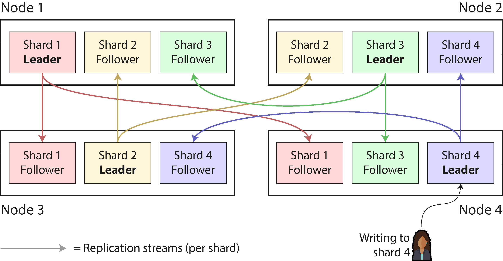
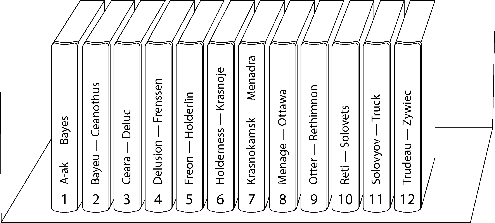
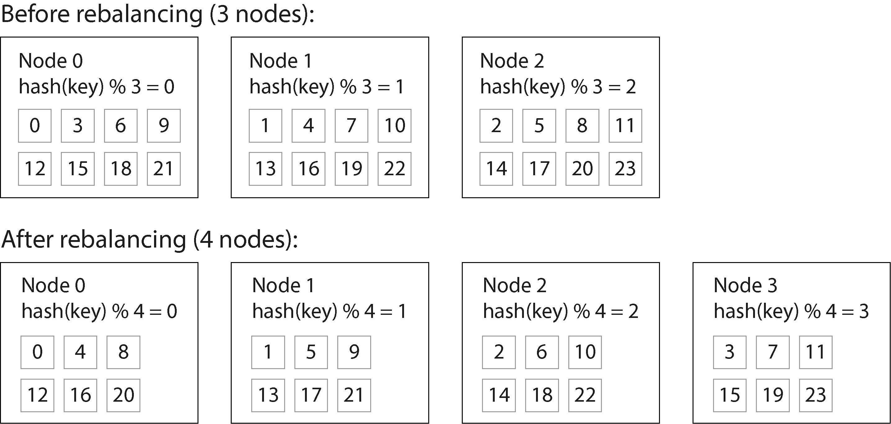
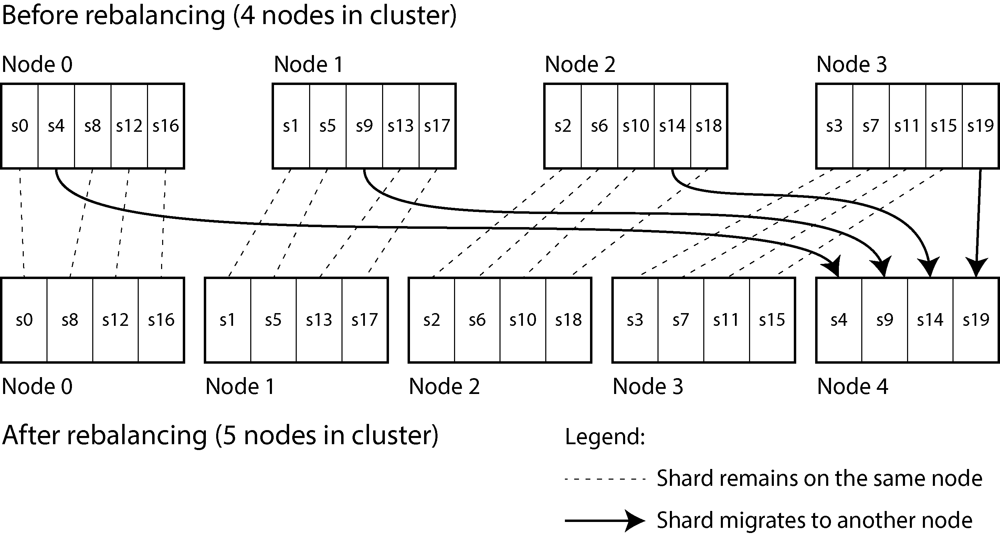
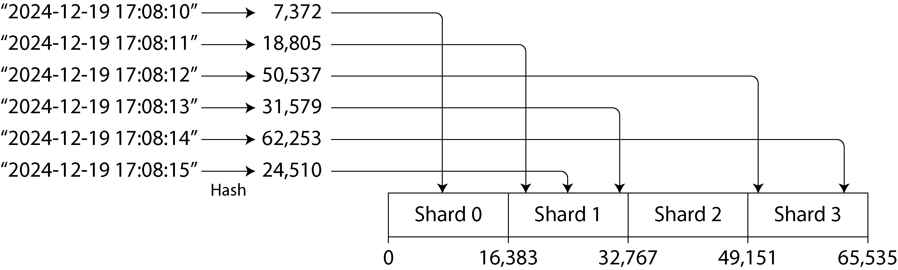
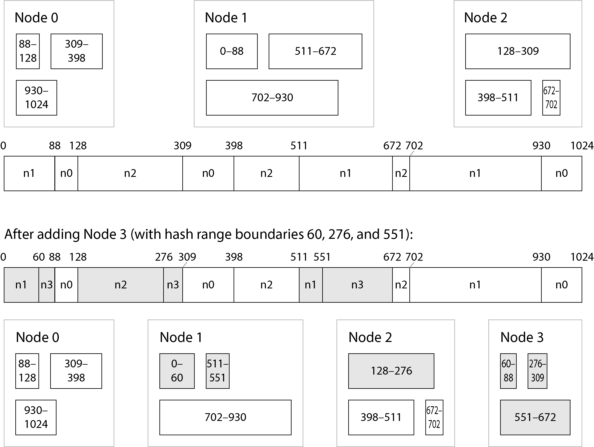
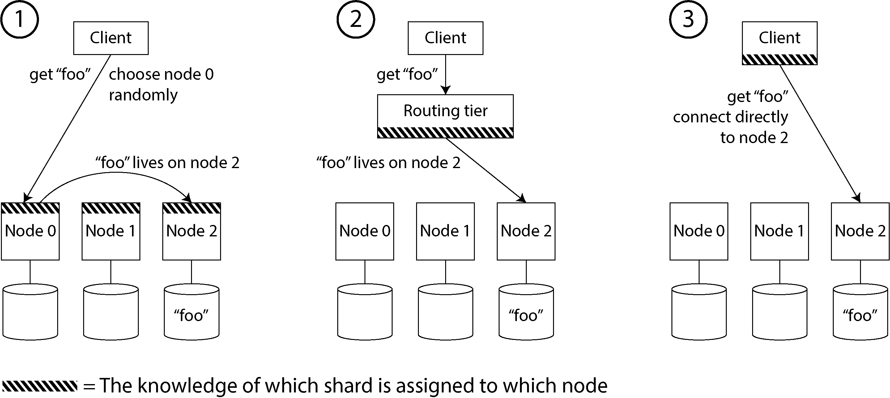
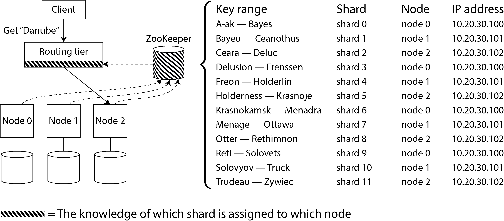
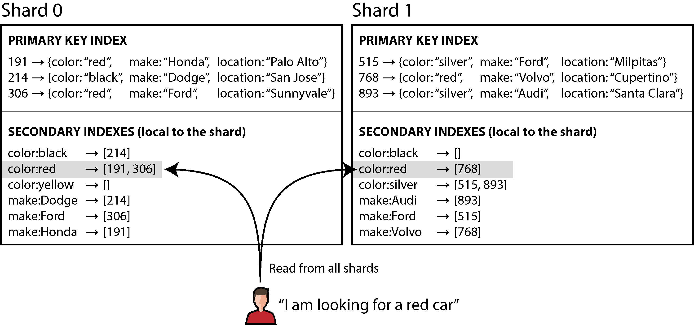
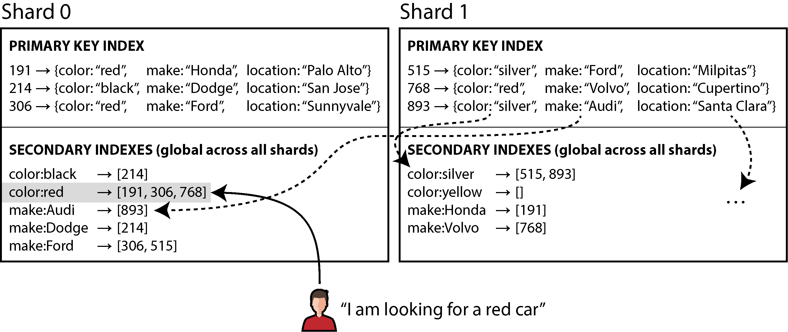

# Chương 7. Sharding

> *Rõ ràng, chúng ta phải thoát khỏi lối tư duy tuần tự và không giới hạn máy tính. Chúng ta phải nêu ra các định nghĩa và cung cấp các mức ưu tiên cùng mô tả về dữ liệu. Chúng ta phải phát biểu các mối quan hệ, chứ không phải các thủ tục.*

> —Grace Murray Hopper, *Management and the Computer of the Future* (Quản lý và máy tính của tương lai) (1962)

Một cơ sở dữ liệu phân tán (distributed database) thường phân phối dữ liệu qua các node theo hai cách:

- Nó lưu một bản sao của cùng một dữ liệu trên nhiều node. Đây là *replication*, mà chúng ta đã thảo luận trong Chương 6.

- Nếu có quá nhiều dữ liệu hoặc thông lượng ghi (write throughput) quá cao đến mức một node đơn lẻ không thể xử lý được, nó chia dữ liệu thành các *shard* hoặc *partition* nhỏ hơn, và lưu các shard khác nhau trên các node khác nhau. Chúng ta sẽ thảo luận về sharding trong chương này.

Thông thường, các shard được định nghĩa sao cho mỗi mẩu dữ liệu (mỗi record, hàng, hay document) thuộc về đúng một shard. Có nhiều cách để đạt được điều này, mà chúng ta sẽ thảo luận sâu trong chương này. Về thực chất, mỗi shard là một cơ sở dữ liệu nhỏ của riêng nó, mặc dù một số hệ thống cơ sở dữ liệu hỗ trợ các thao tác chạm đến nhiều shard cùng lúc.

Sharding thường được kết hợp với replication, để các bản sao của mỗi shard được lưu trên nhiều node. Điều này có nghĩa là mặc dù mỗi record thuộc về đúng một shard, nó vẫn có thể được lưu trên nhiều node khác nhau để đảm bảo khả năng chịu lỗi (fault tolerance).

Một node có thể lưu nhiều hơn một shard. Nếu dùng mô hình replication đơn leader (single-leader), sự kết hợp giữa sharding và replication có thể trông như Hình 7-1, chẳng hạn. Leader của mỗi shard được gán cho một node, và các follower của nó được gán cho các node khác. Mỗi node có thể là leader cho một số shard và là follower cho các shard khác, nhưng mỗi shard vẫn chỉ có duy nhất một leader.

*Hình 7-1. Kết hợp replication và sharding: mỗi node đóng vai trò leader cho một số shard và follower cho các shard khác*

#### SHARDING VÀ PARTITIONING

Cái mà chúng ta gọi là *shard* trong chương này có nhiều tên gọi khác nhau tùy vào phần mềm bạn đang dùng. Nó được gọi là *partition* trong Kafka, *range* trong CockroachDB, *region* trong HBase và TiDB, *vBucket* trong Couchbase, *vnode* trong Riak, *token-range* trong Cassandra, và *tablet* trong Bigtable, YugabyteDB và ScyllaDB, chỉ kể ra vài ví dụ.

Một số cơ sở dữ liệu coi partition và shard là hai khái niệm riêng biệt. Ví dụ, trong PostgreSQL, partitioning là cách chia một bảng lớn thành nhiều file được lưu trên cùng một máy (điều này có một số lợi ích, chẳng hạn giúp việc xóa toàn bộ một partition trở nên rất nhanh), trong khi sharding chia một tập dữ liệu ra nhiều máy [1, 2]. Trong nhiều hệ thống khác, partitioning chỉ là một từ khác để chỉ sharding.

Trong khi *partitioning* là một thuật ngữ khá dễ hình dung, thuật ngữ *sharding* có lẽ gây bất ngờ. Theo một giả thuyết, thuật ngữ này xuất phát từ trò chơi nhập vai trực tuyến *Ultima Online*, trong đó một viên pha lê ma thuật bị vỡ thành nhiều mảnh, và mỗi mảnh vỡ (shard) khúc xạ một bản sao của thế giới trò chơi [3]. Thuật ngữ *shard* do đó mang nghĩa là một trong một tập các máy chủ trò chơi song song, và sau này nó được chuyển sang lĩnh vực cơ sở dữ liệu. Một giả thuyết khác cho rằng ban đầu nó là từ viết tắt của *System for Highly Available Replicated Data* (Hệ thống cho dữ liệu được sao chép có tính sẵn sàng cao)—được cho là một cơ sở dữ liệu của thập niên 1980, mà chi tiết về nó đã thất lạc trong lịch sử.

Nhân tiện, partitioning không liên quan gì đến *network partition* (net-split), một loại lỗi trong mạng giữa các node. Chúng ta sẽ thảo luận về những lỗi như vậy trong Chương 9.

Mọi điều về replication của cơ sở dữ liệu trong Chương 6 đều áp dụng tương tự cho replication của các shard. Vì việc lựa chọn phương án sharding gần như độc lập với việc lựa chọn phương án replication, chúng ta sẽ bỏ qua replication trong chương này để đơn giản hóa.

## Ưu và nhược điểm của Sharding

Lý do chính để shard một cơ sở dữ liệu là *khả năng mở rộng* (scalability). Sharding là một giải pháp nếu khối lượng dữ liệu hoặc thông lượng ghi đã trở nên quá lớn để một node đơn lẻ có thể xử lý, vì nó cho phép bạn trải dữ liệu đó và các thao tác ghi đó ra nhiều node. (Nếu vấn đề nằm ở thông lượng đọc, bạn không nhất thiết cần sharding—bạn có thể dùng *read scaling* (mở rộng đọc), như đã thảo luận trong Chương 6.)

Thực tế, sharding là một trong những công cụ chính mà chúng ta có để đạt được *horizontal scaling* (mở rộng theo chiều ngang, hay kiến trúc *scale-out*), như đã thảo luận trong “Kiến trúc Shared-Memory, Shared-Disk và Shared-Nothing”—nghĩa là cho phép hệ thống tăng năng lực không phải bằng cách chuyển sang một máy lớn hơn, mà bằng cách thêm nhiều máy (nhỏ hơn). Nếu bạn có thể chia khối lượng công việc sao cho mỗi shard xử lý một phần xấp xỉ bằng nhau, bạn có thể gán các shard đó cho các máy khác nhau để xử lý dữ liệu và truy vấn của chúng song song.

Trong khi replication hữu ích ở cả quy mô nhỏ và lớn, vì nó cho phép khả năng chịu lỗi và vận hành ngoại tuyến (offline), sharding là một giải pháp nặng nề chủ yếu chỉ phù hợp ở quy mô lớn. Nếu khối lượng dữ liệu và thông lượng ghi của bạn ở mức mà một máy đơn lẻ có thể xử lý (và ngày nay một máy đơn lẻ có thể làm được rất nhiều!), thường thì tốt hơn là tránh sharding và gắn bó với một cơ sở dữ liệu chỉ có một shard.

Lý do cho khuyến nghị này là sharding làm tăng độ phức tạp. Bạn thường phải quyết định record nào đặt vào shard nào bằng cách chọn một *partition key* (khóa phân vùng); tất cả các record có cùng partition key sẽ được đặt vào cùng một shard [4]. Lựa chọn này quan trọng vì việc truy cập một record sẽ nhanh nếu bạn biết nó nằm trong shard nào, nhưng nếu không biết, bạn phải thực hiện một cuộc tìm kiếm kém hiệu quả trên tất cả các shard. Phương án sharding cũng rất khó thay đổi.

Sharding thường hoạt động tốt với dữ liệu key-value, nơi bạn có thể dễ dàng shard theo khóa, nhưng khó hơn với dữ liệu quan hệ (relational), nơi bạn có thể muốn tìm kiếm theo một secondary index hoặc join các record có thể phân bố trên nhiều shard khác nhau. Chúng ta sẽ thảo luận thêm về điều này trong “Sharding và secondary index”.

Một vấn đề khác của sharding là một thao tác ghi có thể cần cập nhật các record liên quan trong nhiều shard. Trong khi transaction trên một node đơn lẻ là khá phổ biến, việc đảm bảo tính nhất quán (consistency) trên nhiều shard đòi hỏi một *distributed transaction* (transaction phân tán). Như chúng ta sẽ thấy trong Chương 8, distributed transaction có sẵn trong một số cơ sở dữ liệu, nhưng chúng thường chậm hơn nhiều so với transaction đơn nút (single-node) và có thể trở thành nút thắt cổ chai cho toàn hệ thống.

Một số hệ thống dùng sharding ngay cả trên một máy đơn lẻ, thường bằng cách chạy một process đơn luồng (single-threaded) trên mỗi lõi CPU để tận dụng tính song song trong CPU hoặc để khai thác kiến trúc *nonuniform memory access* (NUMA — truy cập bộ nhớ không đồng nhất), trong đó một số dãy bộ nhớ nằm gần một CPU hơn so với các CPU khác [5]. Ví dụ, Redis, VoltDB và FoundationDB dùng một process trên mỗi lõi và dựa vào sharding để trải tải qua các lõi CPU trong cùng một máy [6].

## Sharding cho Multitenancy

Các sản phẩm phần mềm dạng dịch vụ (Software as a service — SaaS) và dịch vụ cloud thường là *multitenant* (đa tenant), trong đó mỗi tenant là một khách hàng. Nhiều người dùng có thể có tài khoản đăng nhập trên cùng một tenant, nhưng mỗi tenant có một tập dữ liệu khép kín, tách biệt với tập dữ liệu của các tenant khác. Ví dụ, trong một dịch vụ email marketing, mỗi doanh nghiệp đăng ký thường là một tenant riêng, vì danh sách đăng ký nhận bản tin, dữ liệu gửi thư, v.v. của một doanh nghiệp là tách biệt với của các doanh nghiệp khác.

Đôi khi sharding được dùng để triển khai các hệ thống multitenant. Hoặc mỗi tenant được cấp một shard riêng, hoặc nhiều tenant nhỏ có thể được gom lại thành một shard lớn hơn. Các shard này có thể là các cơ sở dữ liệu tách biệt về mặt vật lý (mà chúng ta đã đề cập trước đó trong “Các Storage Engine nhúng”) hoặc là các phần có thể quản lý riêng của một cơ sở dữ liệu logic lớn hơn [7]. Dùng sharding cho multitenancy có một số lợi ích:

- **Cách ly tài nguyên (resource isolation)**

  Nếu một tenant thực hiện một thao tác tốn nhiều tài nguyên tính toán, hiệu năng của các tenant khác ít có khả năng bị ảnh hưởng hơn nếu chúng đang chạy trên các shard khác nhau.

- **Cách ly quyền truy cập (permission isolation)**

  Nếu có lỗi (bug) trong logic kiểm soát truy cập của bạn, sẽ ít có khả năng bạn vô tình cấp cho một tenant quyền truy cập vào dữ liệu của tenant khác nếu tập dữ liệu của các tenant đó được lưu tách biệt về mặt vật lý.

- **Kiến trúc theo cell (cell-based architecture)**

  Bạn có thể áp dụng sharding không chỉ ở tầng lưu trữ dữ liệu, mà còn cho các dịch vụ chạy mã ứng dụng của bạn. Trong một *cell-based architecture*, các dịch vụ và bộ lưu trữ cho một tập tenant cụ thể được gom vào một *cell* khép kín, và các cell khác nhau được thiết lập sao cho chúng có thể chạy gần như độc lập với nhau. Cách tiếp cận này mang lại *cách ly lỗi* (fault isolation): một lỗi trong một cell chỉ giới hạn trong cell đó, và các tenant ở các cell khác không bị ảnh hưởng [8].

- **Sao lưu và khôi phục theo từng tenant**

  Việc sao lưu (backup) shard của từng tenant một cách riêng rẽ giúp có thể khôi phục trạng thái của một tenant từ bản sao lưu mà không ảnh hưởng đến các tenant khác, điều này có thể hữu ích nếu tenant đó vô tình xóa hoặc ghi đè dữ liệu quan trọng [9].

- **Tuân thủ quy định pháp lý**

  Các quy định về quyền riêng tư dữ liệu như GDPR và CCPA trao cho các cá nhân quyền truy cập và yêu cầu xóa thông tin cá nhân mà các doanh nghiệp lưu trữ về họ. Nếu dữ liệu của mỗi người được lưu trong một shard riêng, điều này chuyển thành các thao tác xuất và xóa dữ liệu đơn giản trên shard của họ [10].

- **Nơi lưu trữ dữ liệu (data residence)**

  Nếu dữ liệu của một tenant cụ thể cần được lưu trữ trong một khu vực pháp lý nhất định để tuân thủ luật về nơi lưu trữ dữ liệu (data residency), một cơ sở dữ liệu có nhận biết về region có thể cho phép bạn gán shard của tenant đó vào một region cụ thể.

- **Triển khai schema dần dần**

  Các schema migration (đã thảo luận trước đó trong “Tính linh hoạt về schema trong mô hình document”) có thể được triển khai dần dần, từng tenant một. Điều này giảm rủi ro, vì bạn có thể phát hiện vấn đề trước khi chúng ảnh hưởng đến tất cả các tenant, nhưng việc thực hiện điều đó theo kiểu transactional có thể khó [11].

Những thách thức chính khi dùng sharding cho multitenancy là như sau:

- Nó giả định rằng mỗi tenant riêng lẻ đủ nhỏ để nằm gọn trên một node đơn lẻ. Nếu không phải vậy, và bạn có một tenant quá lớn cho một máy, bạn sẽ cần thực hiện thêm sharding bên trong tenant đó, điều này đưa chúng ta trở lại chủ đề sharding vì khả năng mở rộng [12].

- Nếu bạn có nhiều tenant nhỏ, việc tạo một shard riêng cho mỗi tenant có thể gây ra quá nhiều chi phí phụ trội (overhead). Bạn có thể gom nhiều tenant nhỏ lại thành một shard lớn hơn, nhưng khi đó bạn gặp vấn đề là làm thế nào để di chuyển tenant từ shard này sang shard khác khi chúng lớn lên.

- Nếu bạn cần hỗ trợ các tính năng kết nối dữ liệu giữa nhiều tenant, những tính năng này trở nên khó triển khai hơn nếu bạn cần join dữ liệu qua nhiều shard.

## Sharding dữ liệu Key-Value

Giả sử bạn có một lượng dữ liệu lớn, và bạn muốn shard nó. Làm thế nào bạn quyết định record nào lưu trên node nào?

Mục tiêu của sharding là trải dữ liệu và tải truy vấn đều trên các node. Nếu mỗi node nhận một phần công bằng, thì—về lý thuyết—10 node sẽ có thể xử lý lượng dữ liệu gấp 10 lần và thông lượng đọc, ghi gấp 10 lần một node đơn lẻ (bỏ qua replication). Nếu bạn thêm hoặc bớt một node, bạn cũng muốn có thể *rebalance* (tái cân bằng) tải để nó được phân bố đều trên số node mới.

Nếu việc sharding không công bằng, khiến một số shard có nhiều dữ liệu hoặc truy vấn hơn các shard khác, chúng ta gọi đó là *skewed* (lệch). Sự hiện diện của skew làm cho sharding kém hiệu quả đi nhiều. Trong trường hợp cực đoan, toàn bộ tải có thể rơi vào một shard, khiến 9 trong 10 node nhàn rỗi, và nút thắt cổ chai của bạn là node bận duy nhất đó. Một shard có tải cao một cách bất cân xứng được gọi là *hot shard* hoặc *hot spot*. Nếu một khóa có tải đặc biệt cao (ví dụ, một người nổi tiếng trong một mạng xã hội), chúng ta gọi đó là *hot key*.

Để chia tập dữ liệu thành các shard, chúng ta cần một thuật toán nhận đầu vào là partition key của một record và cho chúng ta biết shard nào chứa record đó. Trong một key-value store, partition key thường là khóa hoặc phần đầu của khóa. Trong mô hình quan hệ, partition key có thể là một cột của bảng (không nhất thiết là khóa chính của nó). Thuật toán đó cần phải thuận tiện cho việc rebalancing để giải tỏa các hot spot.

### Sharding theo Key Range

Một cách sharding là gán một dải liên tục các partition key (từ một giá trị nhỏ nhất đến một giá trị lớn nhất) cho mỗi shard, giống như các tập của một bộ bách khoa toàn thư in giấy, như minh họa trong Hình 7-2. Trong ví dụ này, partition key của một mục từ là tiêu đề của nó. Nếu bạn muốn tra cứu mục từ cho một tiêu đề cụ thể, bạn có thể dễ dàng xác định shard nào chứa mục từ đó, và nhờ vậy lấy đúng cuốn sách khỏi giá, bằng cách tìm tập có key range (khoảng khóa) chứa tiêu đề bạn đang tìm.

*Hình 7-2. Một bộ bách khoa toàn thư in được shard theo key range.*

Các key range không nhất thiết được chia đều, vì dữ liệu của bạn có thể không phân bố đều. Ví dụ, trong Hình 7-2, tập 1 chứa các từ bắt đầu bằng *A* và *B*, nhưng tập 12 chứa các từ bắt đầu bằng *T*, *U*, *V*, *W*, *X*, *Y* và *Z*. Việc đơn giản có một tập cho mỗi hai chữ cái trong bảng chữ cái sẽ dẫn đến một số tập dày hơn nhiều so với các tập khác. Để phân bố dữ liệu đều, ranh giới các shard cần phải thích ứng với dữ liệu.

Ranh giới shard có thể được quản trị viên chọn thủ công, hoặc cơ sở dữ liệu có thể tự động chọn chúng. Sharding theo key range thủ công được dùng bởi Vitess (một tầng sharding cho MySQL), chẳng hạn; biến thể tự động được dùng bởi Bigtable và phiên bản mã nguồn mở tương đương của nó là HBase, tùy chọn sharding theo range trong MongoDB, cũng như CockroachDB, RethinkDB và FoundationDB [6]. YugabyteDB cung cấp cả chia tablet thủ công lẫn tự động.

Trong mỗi shard, các khóa được lưu theo thứ tự đã sắp xếp (ví dụ, trong một B-tree hoặc các SSTable, như đã thảo luận trong Chương 4). Điều này có lợi thế là range scan (quét theo khoảng) rất dễ dàng, và bạn có thể coi khóa như một concatenated index (chỉ mục ghép) để lấy nhiều record liên quan trong một truy vấn (xem “Index đa chiều và Index toàn văn”). Ví dụ, hãy xem xét một ứng dụng lưu dữ liệu từ một mạng cảm biến, trong đó khóa là timestamp của phép đo. Range scan rất hữu ích trong trường hợp này, vì chúng cho phép bạn dễ dàng lấy, chẳng hạn, tất cả các số đo của một tháng cụ thể.

Một nhược điểm của sharding theo key range là bạn có thể dễ dàng gặp hot shard nếu có nhiều thao tác ghi vào các khóa gần nhau. Ví dụ, nếu khóa là một timestamp, thì các shard tương ứng với các khoảng thời gian—ví dụ, một shard cho mỗi tháng. Nếu bạn ghi dữ liệu từ các cảm biến vào cơ sở dữ liệu ngay khi các phép đo diễn ra, tất cả các thao tác ghi sẽ đổ về cùng một shard (shard của tháng này), khiến shard đó bị quá tải với các thao tác ghi trong khi các shard khác nằm nhàn rỗi [13].

Để tránh vấn đề này trong cơ sở dữ liệu cảm biến, bạn cần dùng thứ gì khác ngoài timestamp làm phần tử đầu tiên của khóa. Ví dụ, bạn có thể thêm ID cảm biến làm tiền tố cho mỗi timestamp để thứ tự khóa trước hết theo ID cảm biến rồi mới đến timestamp. Giả sử bạn có nhiều cảm biến hoạt động cùng lúc, tải ghi sẽ được trải đều hơn trên các shard. Nhược điểm là khi bạn muốn lấy giá trị của nhiều cảm biến trong một khoảng thời gian, giờ bạn cần thực hiện một truy vấn khoảng (range query) riêng cho từng cảm biến.

#### Rebalancing dữ liệu được shard theo key range

Khi bạn mới thiết lập cơ sở dữ liệu, chưa có key range nào để chia thành các shard. Một số cơ sở dữ liệu, như HBase và MongoDB, cho phép bạn cấu hình một tập shard ban đầu trên một cơ sở dữ liệu trống, được gọi là *presplitting* (chia trước). Điều này đòi hỏi bạn đã có phần nào hình dung về phân bố khóa sẽ trông như thế nào, để có thể chọn ranh giới key range phù hợp [14].

Sau đó, khi khối lượng dữ liệu và thông lượng ghi tăng lên, một hệ thống sharding theo key range phát triển bằng cách tách một shard hiện có thành hai hoặc nhiều shard nhỏ hơn, mỗi shard nắm giữ một dải con liên tục của key range của shard ban đầu. Các shard nhỏ hơn thu được sau đó có thể được phân bố trên nhiều node. Nếu một lượng lớn dữ liệu bị xóa, bạn cũng có thể cần gộp nhiều shard kề nhau đã trở nên nhỏ thành một shard lớn hơn. Quá trình này tương tự với những gì xảy ra ở tầng trên cùng của một B-tree (xem “B-Tree”).

Với các cơ sở dữ liệu tự động quản lý ranh giới shard, việc tách shard thường được kích hoạt khi shard đạt đến một kích cỡ đã cấu hình (ví dụ, trên HBase, mặc định là 10 GB) hoặc, trong một số hệ thống, khi thông lượng ghi liên tục vượt trên một ngưỡng nhất định. Do đó, một hot shard có thể bị tách ngay cả khi nó không lưu nhiều dữ liệu, để tải ghi của nó có thể được phân bố đồng đều hơn.

Đáng tiếc, số lượng shard thích ứng với khối lượng dữ liệu. Nếu chỉ có một lượng dữ liệu nhỏ, một số ít shard là đủ, nên chi phí phụ trội nhỏ; nếu có một lượng dữ liệu khổng lồ, kích cỡ của từng shard riêng lẻ bị giới hạn ở một mức tối đa có thể cấu hình [15].

Đáng tiếc, việc tách một shard là một thao tác tốn kém, vì nó đòi hỏi toàn bộ dữ liệu của shard phải được ghi lại vào các file mới, tương tự như một compaction trong storage engine dạng log-structured. Một shard cần tách thường cũng là shard đang chịu tải cao, và chi phí của việc tách có thể làm trầm trọng thêm tải đó, có nguy cơ khiến nó bị quá tải.

### Sharding theo Hash của khóa

Sharding theo key range hữu ích nếu bạn muốn các record có partition key gần nhau (nhưng khác nhau) được gom vào cùng một shard—ví dụ, đây có thể là trường hợp với timestamp. Nếu bạn không quan tâm liệu các partition key có gần nhau hay không (ví dụ, nếu chúng là ID tenant trong một ứng dụng multitenant), một cách tiếp cận phổ biến là trước tiên hash partition key rồi mới ánh xạ nó tới một shard.

Một hash function tốt nhận dữ liệu lệch (skewed) và làm cho nó phân bố đồng đều. Giả sử bạn có một hash function 32-bit nhận đầu vào là một chuỗi. Mỗi khi bạn đưa cho nó một chuỗi mới, nó trả về một số dường như ngẫu nhiên từ 0 đến 2³² − 1. Ngay cả khi các chuỗi đầu vào rất giống nhau, hash của chúng vẫn được phân bố đều trên dải số đó (nhưng cùng một đầu vào luôn cho ra cùng một đầu ra).

Cho mục đích sharding, hash function không cần phải mạnh về mặt mật mã học: ví dụ, MongoDB dùng MD5, trong khi Cassandra và ScyllaDB dùng Murmur3. Nhiều ngôn ngữ lập trình có sẵn các hash function đơn giản (vì chúng được dùng cho hash table), nhưng chúng có thể không phù hợp cho sharding: ví dụ, trong `Object.hashCode()` của Java và `Object#hash` của Ruby, cùng một khóa có thể có giá trị hash khác nhau trong các process khác nhau, khiến chúng không phù hợp cho sharding [16].

#### Hash modulo số node

Sau khi đã hash khóa, bạn chọn shard nào để lưu nó như thế nào? Ý nghĩ đầu tiên của bạn có thể là lấy giá trị hash *modulo* số node trong hệ thống (dùng toán tử `%` trong nhiều ngôn ngữ lập trình). Ví dụ, *hash*(*key*) % 10 sẽ trả về một số từ 0 đến 9 (nếu ta viết hash dưới dạng số thập phân, *hash* % 10 sẽ là chữ số cuối). Nếu ta có 10 node, được đánh số từ 0 đến 9, đó dường như là một cách dễ dàng để gán mỗi khóa cho một node.

Vấn đề với cách tiếp cận *mod N* là nếu số node *N* thay đổi, phần lớn các khóa phải được di chuyển từ node này sang node khác. Hình 7-3 cho thấy điều gì xảy ra khi bạn có ba node và thêm node thứ tư. Trước khi rebalancing, node 0 lưu các khóa có hash là 0, 3, 6, 9, v.v. Sau khi thêm node thứ tư, khóa có hash 3 đã chuyển sang node 3, khóa có hash 6 đã chuyển sang node 2, khóa có hash 9 đã chuyển sang node 1, v.v.

*Hình 7-3. Gán khóa cho node bằng cách hash khóa và lấy modulo số node. Thay đổi số node dẫn đến nhiều khóa phải di chuyển từ node này sang node khác.*

Hàm *mod N* dễ tính toán, nhưng nó dẫn đến việc rebalancing rất kém hiệu quả vì có rất nhiều sự di chuyển không cần thiết của các record từ node này sang node khác. Chúng ta cần một cách tiếp cận di chuyển càng ít dữ liệu càng tốt.

#### Số shard cố định

Một giải pháp đơn giản nhưng được sử dụng rộng rãi là tạo ra số shard nhiều hơn hẳn số node và gán nhiều shard cho mỗi node. Ví dụ, một database chạy trên một cluster gồm 10 node có thể được chia thành 1,000 shard ngay từ đầu, sao cho mỗi node được gán 100 shard. Khi đó một khóa (key) được lưu trong shard số *hash*(*key*) % 1,000, và hệ thống theo dõi riêng shard nào được lưu trên node nào.

Giờ đây, nếu một node được thêm vào cluster, hệ thống có thể gán lại một số shard từ các node hiện có sang node mới cho đến khi chúng được phân bố công bằng trở lại. Quá trình này được minh họa trong Hình 7-4. Nếu một node bị gỡ khỏi cluster, điều tương tự diễn ra theo chiều ngược lại.

Trong mô hình này, chỉ có toàn bộ shard được di chuyển giữa các node, điều này rẻ hơn so với việc tách shard. Số lượng shard không thay đổi, và việc gán khóa cho shard cũng không thay đổi. Điều duy nhất thay đổi là việc gán shard cho node. Việc gán lại này không diễn ra ngay lập tức—cần một khoảng thời gian để truyền một lượng lớn dữ liệu qua mạng—nên cách gán shard cũ vẫn được dùng cho mọi thao tác đọc và ghi diễn ra trong khi quá trình truyền đang tiến hành.

*Hình 7-4. Thêm một node mới vào một cluster database với nhiều shard trên mỗi node*

Người ta thường chọn số shard là một số chia hết cho nhiều thừa số, sao cho tập dữ liệu có thể được chia đều trên nhiều số lượng node khác nhau—ví dụ, không đòi hỏi số node phải là lũy thừa của 2 [4]. Bạn thậm chí có thể tính đến phần cứng không đồng nhất trong cluster của mình: bằng cách gán nhiều shard hơn cho những node mạnh hơn, bạn có thể khiến những node đó gánh phần tải lớn hơn.

Cách tiếp cận sharding này được dùng trong Citus (một tầng sharding cho PostgreSQL), Riak, Elasticsearch và Couchbase, cùng nhiều hệ thống khác. Nó hoạt động tốt miễn là bạn có một ước lượng tốt về số shard cần thiết khi lần đầu tạo database. Sau đó bạn có thể dễ dàng thêm hoặc gỡ node, với giới hạn là bạn không thể có nhiều node hơn số shard.

Nếu bạn nhận thấy số shard được cấu hình ban đầu là sai—ví dụ, nếu bạn đã đạt đến quy mô mà bạn cần nhiều node hơn số shard hiện có—thì cần đến một thao tác resharding (chia lại shard) tốn kém. Nó cần tách từng shard và ghi ra các file mới, tiêu tốn rất nhiều dung lượng đĩa bổ sung trong quá trình đó. Một số hệ thống không cho phép resharding trong khi đồng thời ghi vào database, khiến việc thay đổi số shard mà không có downtime trở nên khó khăn.

Việc chọn đúng số shard là khó nếu tổng kích thước của tập dữ liệu biến động mạnh (ví dụ, nếu ban đầu nó nhỏ nhưng có thể lớn lên rất nhiều theo thời gian). Vì mỗi shard chứa một phần cố định của toàn bộ dữ liệu, kích thước mỗi shard tăng tỷ lệ thuận với tổng lượng dữ liệu trong cluster. Nếu các shard rất lớn, việc rebalancing và khôi phục sau hỏng hóc node trở nên tốn kém. Nhưng nếu các shard quá nhỏ, chúng gây ra quá nhiều chi phí phụ trội (overhead). Hiệu năng tốt nhất đạt được khi kích thước shard “vừa phải”, không quá lớn cũng không quá nhỏ, điều này có thể khó đạt được nếu số shard cố định nhưng kích thước tập dữ liệu lại thay đổi.

#### Sharding theo khoảng hash

Nếu không thể dự đoán trước số shard cần thiết, tốt hơn là dùng một sơ đồ trong đó số shard có thể dễ dàng thích ứng với workload. Sơ đồ sharding theo khoảng khóa (key-range sharding) đã nói ở trên có tính chất này, nhưng nó có rủi ro hot spot khi có nhiều thao tác ghi vào các khóa gần nhau. Một giải pháp là kết hợp key-range sharding với một hash function sao cho mỗi shard chứa một khoảng *giá trị hash* thay vì một khoảng *khóa*.

Hình 7-5 cho thấy một ví dụ sử dụng hash function 16-bit trả về một số từ 0 đến 65,535 = 2 − 1 (trong thực tế, hash thường là 32 bit hoặc hơn). Ngay cả khi các khóa đầu vào rất giống nhau (ví dụ, các timestamp liên tiếp), giá trị hash của chúng vẫn được phân bố đều trên khoảng đó. Sau đó chúng ta có thể gán một khoảng giá trị hash cho mỗi shard—ví dụ, các giá trị từ 0 đến 16,383 cho shard 0, các giá trị từ 16,384 đến 32,767 cho shard 1, và cứ thế tiếp tục.

*Hình 7-5. Gán một khoảng giá trị hash liên tục cho mỗi shard*

Giống như key-range sharding, trong hash-range sharding một shard có thể được tách khi nó trở nên quá lớn hoặc quá tải. Đây vẫn là một thao tác tốn kém, nhưng nó có thể diễn ra khi cần, nên số shard thích ứng với khối lượng dữ liệu thay vì bị cố định trước.

Nhược điểm so với key-range sharding là các truy vấn theo khoảng (range query) trên partition key không hiệu quả, vì các khóa trong khoảng đó giờ đây bị phân tán trên tất cả các shard. Tuy nhiên, nếu khóa gồm hai hay nhiều cột và partition key chỉ là cột đầu tiên trong số đó, bạn vẫn có thể thực hiện range query hiệu quả trên cột thứ hai và các cột tiếp theo. Miễn là tất cả các bản ghi trong range query có cùng partition key, chúng sẽ nằm trong cùng một shard.

#### PARTITIONING VÀ RANGE QUERY TRONG DATA WAREHOUSE

Các data warehouse như BigQuery, Snowflake và Delta Lake hỗ trợ một cách tiếp cận đánh index tương tự, dù thuật ngữ có khác. Ví dụ, trong BigQuery, partition key xác định bản ghi nằm trong partition nào, còn “cluster columns” xác định cách các bản ghi được sắp xếp trong partition. Snowflake tự động gán bản ghi vào các “micro-partition” nhưng cho phép người dùng định nghĩa cluster key cho một bảng. Delta Lake hỗ trợ cả việc gán partition thủ công và tự động, đồng thời hỗ trợ cluster key. Việc clustering dữ liệu không chỉ cải thiện hiệu năng range scan mà còn có thể cải thiện hiệu năng nén và lọc dữ liệu.

YugabyteDB và DynamoDB [17] sử dụng hash-range sharding, và đây cũng là một tùy chọn trong MongoDB. Cassandra và ScyllaDB dùng một biến thể của cách tiếp cận này, được minh họa trong Hình 7-6.

*Hình 7-6. Cassandra và ScyllaDB chia khoảng các giá trị hash có thể có (ở đây là 0–1024) thành các khoảng liên tục với ranh giới ngẫu nhiên và gán nhiều khoảng cho mỗi node.*

Không gian giá trị hash được chia thành một số khoảng tỷ lệ với số node (hình vẽ cho thấy 3 khoảng mỗi node, nhưng con số thực tế mặc định là 16 mỗi node trong Cassandra và 256 mỗi node trong ScyllaDB), với ranh giới ngẫu nhiên giữa các khoảng đó. Điều này có nghĩa là một số khoảng lớn hơn những khoảng khác, nhưng nhờ có nhiều khoảng trên mỗi node, những chênh lệch đó có xu hướng được cân bằng lại [15].

Khi node được thêm vào hoặc gỡ bỏ, ranh giới các khoảng được điều chỉnh và các shard được tách hoặc gộp tương ứng. Trong Hình 7-6, khi node 3 được thêm vào, node 1 chuyển một phần của hai khoảng của nó sang node 3, và node 2 chuyển một phần của một khoảng của nó sang node 3. Điều này có tác dụng trao cho node mới một phần xấp xỉ công bằng của tập dữ liệu, mà không truyền nhiều dữ liệu hơn mức cần thiết từ node này sang node khác.

#### Consistent hashing

Một thuật toán *consistent hashing* là một hash function ánh xạ các khóa vào một số shard xác định theo cách thỏa mãn hai tính chất:

- Số khóa được ánh xạ vào mỗi shard là xấp xỉ bằng nhau. Khi số shard thay đổi, càng ít khóa phải di chuyển từ shard này sang shard khác càng tốt.

Lưu ý rằng *consistent* ở đây không liên quan gì đến tính nhất quán (consistency) của replica (xem Chương 6) hay tính nhất quán trong ACID (xem Chương 8), mà thay vào đó mô tả xu hướng một khóa ở lại cùng một shard nếu có thể.

Thuật toán sharding được Cassandra và ScyllaDB sử dụng tương tự với định nghĩa ban đầu của consistent hashing [18], nhưng nhiều thuật toán consistent hashing khác cũng đã được đề xuất [19], chẳng hạn *highest random weight*, còn được gọi là *rendezvous hashing* [20], và *jump consistent hashing* [21]. Với những cách tiếp cận này, thay vì một số nhỏ các shard hiện có bị tách thành các khoảng con để tạo shard mới cho node được thêm vào, node mới thay vào đó được gán các khóa riêng lẻ trước đây nằm rải rác trên tất cả các node khác. Cách nào tốt hơn tùy thuộc vào ứng dụng.

### Workload lệch và giảm tải cho hot spot

Consistent hashing đảm bảo rằng các khóa được phân bố đều trên các node, nhưng điều đó không có nghĩa là tải thực tế được phân bố đều. Nếu workload lệch nhiều—tức là có nhiều dữ liệu hơn hẳn dưới một số partition key so với những key khác, hoặc tốc độ request đến một số khóa cao hơn hẳn so với những khóa khác—bạn vẫn có thể rơi vào tình trạng một số server bị quá tải trong khi những server khác gần như nhàn rỗi.

Ví dụ, trên một mạng xã hội, một bài đăng của một người dùng nổi tiếng với hàng triệu người theo dõi có thể gây ra một cơn bão hoạt động [22]. Sự kiện này có thể dẫn đến một khối lượng lớn thao tác đọc và ghi vào cùng một khóa (trong đó partition key có lẽ là ID người dùng của người nổi tiếng đó, hoặc ID của hành động mà mọi người đang bình luận).

Trong những tình huống như vậy, cần một chính sách sharding linh hoạt hơn [23, 24]. Một hệ thống định nghĩa shard dựa trên các khoảng khóa (hoặc khoảng hash) cho phép đặt một khóa nóng (hot key) riêng lẻ vào một shard của riêng nó, thậm chí có thể gán cho nó một máy chuyên dụng [25].

Cũng có thể bù đắp cho độ lệch ở tầng ứng dụng. Ví dụ, nếu biết một khóa nào đó rất nóng, một kỹ thuật đơn giản là thêm một số ngẫu nhiên vào đầu hoặc cuối khóa. Chỉ cần thêm hai chữ số ngẫu nhiên là đã chia đều các thao tác ghi vào khóa đó trên 100 khóa, cho phép các khóa này được phân bố đến các shard khác nhau.

Tuy nhiên, sau khi đã chia thao tác ghi ra nhiều khóa, mọi thao tác đọc giờ đây phải làm thêm việc, vì chúng phải đọc dữ liệu từ tất cả 100 khóa rồi kết hợp lại. Khối lượng đọc tới mỗi shard của hot key không giảm; chỉ có tải ghi được chia nhỏ. Kỹ thuật này cũng đòi hỏi thêm việc theo dõi sổ sách: chỉ nên nối thêm số ngẫu nhiên cho số ít các hot key; đối với đại đa số các khóa có throughput ghi thấp, điều này sẽ là overhead không cần thiết. Do đó, bạn cũng cần cách nào đó để theo dõi khóa nào đang được chia nhỏ, và một quy trình để chuyển một khóa thông thường thành một hot key được quản lý đặc biệt.

Vấn đề còn phức tạp hơn bởi sự thay đổi tải theo thời gian: ví dụ, một bài đăng mạng xã hội lan truyền mạnh (viral) có thể chịu tải cao trong vài ngày, nhưng sau đó nhiều khả năng sẽ lắng xuống trở lại. Ngoài ra, một số khóa có thể nóng về ghi, trong khi những khóa khác nóng về đọc, đòi hỏi các chiến lược xử lý khác nhau.

Một số hệ thống (đặc biệt là các dịch vụ cloud được thiết kế cho quy mô lớn) có các cách tiếp cận tự động để xử lý các shard nóng. Amazon, chẳng hạn, gọi đó là *heat management* (quản lý độ nóng) [26] hoặc *adaptive capacity* (dung lượng thích ứng) [17]. Chi tiết cách các hệ thống này hoạt động nằm ngoài phạm vi của cuốn sách này.

### Vận hành: Rebalancing tự động và thủ công

Chúng ta đã lướt qua một câu hỏi quan trọng liên quan đến rebalancing: việc tách shard và rebalancing diễn ra tự động hay thủ công?

Một số hệ thống tự động quyết định khi nào tách shard và khi nào di chuyển chúng từ node này sang node khác, không cần bất kỳ sự can thiệp nào của con người, trong khi những hệ thống khác để việc sharding được quản trị viên cấu hình một cách tường minh. Cũng có một lựa chọn trung gian—ví dụ, Couchbase và Riak tự động sinh ra một phương án gán shard đề xuất nhưng yêu cầu quản trị viên xác nhận (commit) trước khi nó có hiệu lực.

Rebalancing hoàn toàn tự động có thể thuận tiện, vì có ít công việc vận hành hơn cho việc bảo trì thông thường, và những hệ thống như vậy thậm chí có thể tự động co giãn (autoscale) để thích ứng với thay đổi của workload. Các cloud database như DynamoDB được quảng bá là có khả năng tự động thêm và gỡ shard để thích ứng với sự tăng hoặc giảm tải lớn chỉ trong vài phút [17, 27].

Tuy nhiên, việc quản lý shard tự động cũng có thể khó lường. Rebalancing là một thao tác tốn kém, vì nó đòi hỏi định tuyến lại các request và di chuyển một lượng lớn dữ liệu từ node này sang node khác. Nếu quá trình này không được thực hiện cẩn thận, nó có thể làm quá tải mạng hoặc các node, và có thể gây hại cho hiệu năng của các request khác. Hệ thống phải tiếp tục xử lý các thao tác ghi trong khi rebalancing đang diễn ra; nếu một hệ thống đang ở gần throughput ghi tối đa, quá trình tách shard thậm chí có thể không theo kịp tốc độ ghi đến [27].

Sự tự động hóa như vậy có thể nguy hiểm khi kết hợp với phát hiện lỗi tự động. Ví dụ, giả sử một node bị quá tải và tạm thời phản hồi request chậm. Các node khác kết luận rằng node quá tải đó đã chết, và tự động rebalance cluster để chuyển tải ra khỏi nó. Điều này đặt thêm tải lên các node khác và lên mạng, khiến tình hình tệ hơn. Có rủi ro gây ra hỏng hóc dây chuyền (cascading failure), trong đó các node khác trở nên quá tải và cũng bị nghi ngờ sai là đã ngừng hoạt động.

Vì lý do đó, việc có con người tham gia vào vòng lặp rebalancing có thể là điều tốt. Nó chậm hơn một quy trình hoàn toàn tự động, nhưng có thể giúp ngăn ngừa những bất ngờ trong vận hành. Rebalancing thủ công cũng hữu ích để rebalance trước một cách chủ động nếu dự kiến có đợt tăng vọt lưu lượng do một sự kiện đã biết, chẳng hạn đợt giảm giá ngày lễ Cyber Monday hoặc việc bán vé cho một sự kiện thể thao được ưa chuộng như World Cup.

## Định tuyến request

Chúng ta đã thảo luận cách shard một tập dữ liệu trên nhiều node, và cách rebalance các shard đó khi node được thêm vào hoặc gỡ bỏ. Giờ hãy chuyển sang một câu hỏi khác: nếu bạn muốn đọc hoặc ghi một khóa cụ thể, làm sao bạn biết node nào—tức là địa chỉ IP và số cổng nào—bạn cần kết nối tới?

Chúng ta gọi vấn đề này là *request routing* (định tuyến request), và nó rất giống với *service discovery* (khám phá dịch vụ), mà chúng ta đã thảo luận trước đây trong “Load balancer, service discovery, và service mesh”. Khác biệt lớn nhất giữa hai vấn đề này là với các dịch vụ chạy mã ứng dụng, mỗi instance thường là stateless (không trạng thái), và một load balancer có thể gửi request đến bất kỳ instance nào. Với các database được shard, một request cho một khóa chỉ có thể được xử lý bởi một node là replica của shard chứa khóa đó.

Điều này có nghĩa là request routing phải nhận biết được việc gán từ khóa đến shard và từ shard đến node. Ở mức cao, có vài cách tiếp cận cho vấn đề này (minh họa trong Hình 7-7):

1. Cho phép client liên hệ với bất kỳ node nào (ví dụ, thông qua một load balancer round-robin). Nếu node đó tình cờ sở hữu shard mà request áp dụng, node có thể xử lý request trực tiếp; nếu không, nó chuyển tiếp request đến node thích hợp, nhận phản hồi, và chuyển phản hồi đó lại cho client.

2. Gửi tất cả request từ client đến một tầng định tuyến (routing tier) trước, tầng này xác định node nào nên xử lý mỗi request và chuyển tiếp tương ứng. Bản thân tầng định tuyến này không xử lý bất kỳ request nào; nó chỉ hoạt động như một load balancer có nhận biết shard.

3. Yêu cầu client phải nhận biết được việc sharding và việc gán shard cho node. Trong trường hợp này, client có thể kết nối trực tiếp đến node thích hợp mà không cần bất kỳ trung gian nào.

*Hình 7-7. Ba cách định tuyến một request đến đúng node*

Mỗi trường hợp đều có một số vấn đề then chốt:

- Ai quyết định shard nào nên nằm trên node nào? Đơn giản nhất là có một coordinator (bộ điều phối) duy nhất đưa ra quyết định đó, nhưng trong trường hợp đó làm thế nào để nó có khả năng chịu lỗi khi node chạy coordinator bị sập? Và nếu vai trò coordinator có thể failover sang một node khác, làm thế nào để ngăn tình trạng split brain (xem “Xử lý node ngừng hoạt động”), trong đó hai coordinator khác nhau đưa ra những quyết định gán shard trái ngược nhau?

- Thành phần thực hiện định tuyến (có thể là một trong các node, tầng định tuyến, hoặc client) làm thế nào để biết được các thay đổi trong việc gán shard cho node?

- Trong khi một shard đang được di chuyển từ node này sang node khác, có một giai đoạn chuyển giao (cutover) trong đó node mới đã tiếp quản, nhưng các request đến node cũ vẫn có thể đang trên đường đi. Bạn xử lý những request đó như thế nào?

Nhiều hệ thống dữ liệu phân tán dựa vào một dịch vụ điều phối (coordination service) riêng như ZooKeeper hoặc etcd để theo dõi việc gán shard, như minh họa trong Hình 7-8. Chúng sử dụng các thuật toán consensus (xem Chương 10) để cung cấp khả năng chịu lỗi và bảo vệ chống split brain. Mỗi node tự đăng ký trong ZooKeeper, và ZooKeeper duy trì ánh xạ có thẩm quyền từ shard đến node. Các bên khác, như tầng định tuyến hoặc client có nhận biết sharding, có thể đăng ký nhận (subscribe) thông tin này trong ZooKeeper. Mỗi khi một shard thay đổi chủ sở hữu, hoặc một node được thêm vào hay gỡ bỏ, ZooKeeper thông báo cho tầng định tuyến để nó có thể giữ thông tin định tuyến của mình luôn cập nhật.

*Hình 7-8. Dùng ZooKeeper để theo dõi việc gán shard cho node*

Ví dụ, HBase và SolrCloud dùng ZooKeeper để quản lý việc gán shard, và Kubernetes dùng etcd để theo dõi instance dịch vụ nào đang chạy ở đâu. MongoDB có kiến trúc tương tự, nhưng nó dựa vào hiện thực *config server* riêng của mình và các daemon *mongos* làm tầng định tuyến. Kafka, YugabyteDB, TiDB và ScyllaDB [28] dùng các hiện thực tích hợp sẵn của giao thức consensus Raft để thực hiện chức năng điều phối này.

Riak đi theo một cách tiếp cận khác: nó dùng một *gossip protocol* giữa các node để lan truyền mọi thay đổi về trạng thái cluster. Cách này cung cấp tính nhất quán yếu hơn nhiều so với một giao thức consensus; có thể xảy ra split brain, trong đó các phần khác nhau của cluster có cách gán node khác nhau cho cùng một shard. Các database leaderless có thể chấp nhận điều này vì nhìn chung chúng vốn chỉ đưa ra các đảm bảo nhất quán yếu (xem “Hiểu các giới hạn của tính nhất quán quorum (quorum consistency)”).

Khi dùng một tầng định tuyến hoặc khi gửi request đến một node ngẫu nhiên, client vẫn cần tìm các địa chỉ IP để kết nối. Những địa chỉ này không thay đổi nhanh như việc gán shard cho node, nên thường chỉ cần dùng DNS cho mục đích này là đủ.

Phần thảo luận về request routing này đã tập trung vào việc tìm shard cho một khóa riêng lẻ, điều phù hợp nhất với các database OLTP được shard. Các database phân tích (analytical) cũng thường dùng sharding, nhưng chúng thường có kiểu thực thi truy vấn rất khác: thay vì thực thi trong một shard duy nhất, một truy vấn thường cần aggregate và join dữ liệu từ nhiều shard song song. Chúng ta sẽ thảo luận các kỹ thuật thực thi truy vấn song song như vậy trong Chương 11.

## Sharding và secondary index

Các sơ đồ sharding mà chúng ta đã thảo luận cho đến nay dựa vào việc client biết partition key của bất kỳ bản ghi nào nó muốn truy cập. Điều này dễ đạt được nhất trong mô hình dữ liệu key-value, nơi partition key là phần đầu của primary key (hoặc toàn bộ primary key), nên chúng ta có thể dùng partition key để xác định shard và do đó định tuyến các thao tác đọc và ghi đến node chịu trách nhiệm cho khóa đó.

Tình hình trở nên phức tạp hơn nếu có liên quan đến secondary index (xem “Index đa cột và Secondary Index”). Một secondary index thường không định danh duy nhất một bản ghi mà là một cách để tìm kiếm các lần xuất hiện của một giá trị cụ thể: tìm tất cả hành động của người dùng `123` , tìm tất cả bài viết chứa từ `hogwash` , tìm tất cả xe có màu `red` , và cứ thế.

Các key-value store thường không có secondary index, nhưng chúng là một tính năng tiêu chuẩn của các database quan hệ và phổ biến trong các database document. Kiểu index này cũng là *raison d’être* (lý do tồn tại) của các công cụ tìm kiếm toàn văn (full-text search) như Solr và Elasticsearch. Vấn đề với secondary index là chúng không ánh xạ gọn gàng vào các shard. Có hai cách tiếp cận chính để shard một database có secondary index: cục bộ (local) và toàn cục (global).

### Local secondary index

Trong cách tiếp cận đánh index thứ nhất, mỗi shard độc lập duy trì các secondary index của riêng nó, chỉ bao phủ các bản ghi trong shard đó. Nó không quan tâm dữ liệu nào được lưu trong các shard khác. Mỗi khi bạn ghi vào database—để thêm, xóa hoặc cập nhật một bản ghi—bạn chỉ cần làm việc với shard chứa bản ghi mà bạn đang ghi. Vì lý do đó, kiểu secondary index này được gọi là *local index* (index cục bộ). Trong ngữ cảnh truy hồi thông tin (information retrieval), nó còn được gọi là *document-partitioned index* [29].

Ví dụ, hãy tưởng tượng bạn đang vận hành một website bán xe ô tô đã qua sử dụng. Mỗi tin đăng có một ID duy nhất, và bạn dùng ID đó làm partition key để sharding, như minh họa trong Hình 7-9 (ID từ 0 đến 499 trong shard 0, ID từ 500 đến 999 trong shard 1, v.v.). Nếu bạn muốn cho người dùng tìm kiếm xe, cho phép họ lọc theo màu và theo hãng, bạn cần các secondary index trên `color` và `make` (trong database document thì đây là các field; trong database quan hệ thì đây là các cột). Nếu bạn đã khai báo index, database có thể tự động thực hiện việc đánh index. Ví dụ, mỗi khi một chiếc xe màu đỏ được thêm vào database, shard database tự động thêm ID của nó vào danh sách ID cho mục index `color:red` . Như đã thảo luận trong Chương 4, danh sách ID đó còn được gọi là *postings list*.

*Hình 7-9. Với local secondary index, mỗi shard chỉ đánh index các bản ghi mà nó chứa.*

> **CẢNH BÁO**
>
> Nếu database của bạn chỉ hỗ trợ mô hình key-value, bạn có thể bị cám dỗ tự hiện thực một secondary index bằng cách tạo một ánh xạ từ giá trị đến ID trong mã ứng dụng. Nếu đi theo con đường này, bạn cần hết sức cẩn trọng để đảm bảo các index của bạn luôn nhất quán với dữ liệu bên dưới. Race condition và các lỗi ghi không liên tục (khi một số thay đổi được lưu nhưng những thay đổi khác thì không) rất dễ khiến dữ liệu mất đồng bộ—xem “Nhu cầu về transaction đa đối tượng (multi-object)”.

Khi đọc từ một local secondary index, nếu bạn đã biết partition key của bản ghi mà bạn đang tìm, bạn chỉ cần thực hiện tìm kiếm trên shard thích hợp. Hơn nữa, nếu bạn chỉ muốn *một số* kết quả và không cần tất cả, bạn có thể gửi request đến bất kỳ shard nào. Tuy nhiên, nếu bạn muốn tất cả kết quả và không biết trước partition key của chúng, bạn sẽ cần gửi truy vấn đến tất cả các shard và kết hợp các kết quả nhận về, vì các bản ghi khớp có thể nằm rải rác trên tất cả các shard. Trong Hình 7-9, chẳng hạn, xe màu đỏ xuất hiện ở cả shard 0 và shard 1.

Cách truy vấn một database được shard như vậy có thể khiến các truy vấn đọc trên secondary index khá tốn kém. Ngay cả khi bạn truy vấn các shard song song, nó vẫn dễ bị khuếch đại tail latency (xem “Sử dụng các chỉ số thời gian phản hồi”). Nó cũng giới hạn khả năng mở rộng của ứng dụng: thêm nhiều shard cho phép bạn lưu nhiều dữ liệu hơn, nhưng không làm tăng throughput truy vấn nếu dù sao mọi shard cũng phải xử lý mọi truy vấn.

Dù vậy, local secondary index được sử dụng rộng rãi [30]—ví dụ, MongoDB, Riak, Cassandra [31], Elasticsearch [32], SolrCloud và VoltDB [33] đều dùng local secondary index.

### Global Secondary Index

Thay vì mỗi shard có local secondary index (chỉ mục thứ cấp cục bộ) riêng của mình, chúng ta có thể xây dựng một *global index* (chỉ mục toàn cục) bao phủ dữ liệu trong tất cả các shard. Tuy nhiên, chúng ta không thể chỉ đơn giản lưu index đó trên một node, vì nó nhiều khả năng sẽ trở thành nút thắt cổ chai và làm mất đi mục đích của sharding. Một global index cũng phải được shard, nhưng nó có thể được shard theo cách khác với index theo primary key (khóa chính).

Hình 7-10 minh họa điều này có thể trông như thế nào. ID của các xe màu đỏ từ tất cả các shard xuất hiện dưới mục `color:red` trong index, nhưng index được shard sao cho các màu bắt đầu bằng các chữ cái từ *a* đến *r* nằm ở shard 0 và các màu bắt đầu bằng *s* đến *z* nằm ở shard 1. Index trên hãng xe (make) được partition theo cách tương tự (với ranh giới shard nằm giữa *f* và *h*).

*Hình 7-10. Một global secondary index phản ánh dữ liệu từ tất cả các shard và bản thân nó cũng được shard theo giá trị được index*

Loại index này còn được gọi là *term-partitioned* (phân vùng theo term) [29]. Hãy nhớ lại từ “Tìm kiếm toàn văn (Full-Text Search)” rằng trong tìm kiếm toàn văn (full-text search), một *term* là một từ khóa trong văn bản mà bạn có thể tìm kiếm. Ở đây chúng ta tổng quát hóa nó để chỉ bất kỳ giá trị nào mà bạn có thể tìm kiếm trong secondary index.

Global index dùng term làm partition key, nhờ đó khi bạn tìm một term hay giá trị cụ thể, bạn có thể xác định được shard nào cần truy vấn. Một lần nữa, một shard có thể chứa một dải (range) liên tục các term (như trong Hình 7-10), hoặc bạn có thể gán term cho các shard dựa trên hash của term.

Global index có ưu điểm là một truy vấn với một điều kiện duy nhất (chẳng hạn `color = red`) chỉ cần đọc từ một shard duy nhất để lấy postings list (danh sách các bản ghi khớp). Tuy nhiên, nếu bạn muốn lấy các bản ghi (record) chứ không chỉ các ID, bạn vẫn phải đọc từ tất cả các shard chịu trách nhiệm cho các ID đó.

Nếu bạn có nhiều điều kiện tìm kiếm hoặc nhiều term (ví dụ, tìm các xe có một màu nhất định và một hãng nhất định, hoặc tìm nhiều từ cùng xuất hiện trong một văn bản), các term đó nhiều khả năng sẽ được gán cho các shard khác nhau. Để tính phép AND logic của hai điều kiện, hệ thống cần tìm tất cả các ID xuất hiện trong cả hai postings list. Điều đó không thành vấn đề nếu các postings list ngắn, nhưng nếu chúng dài, việc gửi chúng qua mạng để tính phần giao có thể chậm [29].

Một thách thức khác với global secondary index là các thao tác ghi phức tạp hơn so với local index, bởi vì việc ghi một bản ghi duy nhất có thể ảnh hưởng đến nhiều shard của index (mỗi term trong document có thể nằm trên một shard khác nhau). Điều này khiến việc giữ cho secondary index đồng bộ với dữ liệu gốc bên dưới trở nên khó khăn hơn. Một lựa chọn là dùng distributed transaction (giao dịch phân tán) để cập nhật một cách nguyên tử (atomically) các shard lưu bản ghi chính và các secondary index của nó (xem Chương 8).

Global secondary index được sử dụng bởi CockroachDB, TiDB và YugabyteDB; DynamoDB hỗ trợ cả local và global secondary index. Trong trường hợp DynamoDB, các thao tác ghi được phản ánh vào global index một cách bất đồng bộ, do đó các thao tác đọc từ global index có thể bị cũ (stale) (điều này tương tự với tình huống được thảo luận trong “Các vấn đề với replication lag”). Dù vậy, global index vẫn hữu ích nếu thông lượng đọc (read throughput) cao hơn thông lượng ghi (write throughput), và nếu các postings list không quá dài.

## Tóm tắt

Trong chương này, chúng ta đã khám phá các cách khác nhau để shard một tập dữ liệu lớn thành các tập con nhỏ hơn. Sharding là cần thiết khi bạn có quá nhiều dữ liệu đến mức việc lưu trữ và xử lý nó trên một máy duy nhất không còn khả thi.

Mục tiêu của sharding là phân bổ dữ liệu và tải truy vấn một cách đồng đều trên nhiều máy, tránh các hot spot (các node có tải cao một cách bất cân xứng). Điều này đòi hỏi phải chọn một sơ đồ sharding phù hợp với dữ liệu của bạn, và rebalancing (tái cân bằng) các shard khi node được thêm vào hoặc gỡ bỏ khỏi cluster.

Chúng ta đã thảo luận hai cách tiếp cận chính đối với sharding:

- **Key range sharding (sharding theo dải khóa)**

  Các khóa (key) được sắp xếp, và một shard sở hữu tất cả các khóa từ một giá trị nhỏ nhất đến một giá trị lớn nhất. Việc sắp xếp có ưu điểm là cho phép thực hiện các truy vấn theo dải (range query) hiệu quả, nhưng có nguy cơ xuất hiện hot spot nếu ứng dụng thường xuyên truy cập các khóa nằm gần nhau trong thứ tự đã sắp xếp.

  Trong cách tiếp cận này, các shard thường được rebalance bằng cách chia dải thành hai dải con khi một shard trở nên quá lớn.

- **Hash sharding (sharding theo hash)**

  Một hash function được áp dụng cho mỗi khóa, và một shard sở hữu một dải các giá trị hash (hoặc có thể dùng một thuật toán consistent hashing khác để ánh xạ các hash tới các shard). Phương pháp này phá vỡ thứ tự của các khóa, khiến các range query kém hiệu quả, nhưng nó có thể phân bổ tải đồng đều hơn.

  Khi shard theo hash, người ta thường tạo trước một số lượng shard cố định, gán nhiều shard cho mỗi node, và di chuyển toàn bộ các shard từ node này sang node khác khi node được thêm vào hoặc gỡ bỏ. Việc chia tách shard, giống như với các dải khóa, cũng là khả thi.

Người ta thường dùng phần đầu của khóa làm partition key (tức là để xác định shard) và sắp xếp các bản ghi trong shard đó theo phần còn lại của khóa. Bằng cách đó, bạn vẫn có thể thực hiện các range query hiệu quả trong số các bản ghi có cùng partition key.

Chúng ta cũng đã thảo luận các kỹ thuật định tuyến (routing) truy vấn tới shard thích hợp, và đã xem xét cách một dịch vụ điều phối (coordination service) thường được dùng để theo dõi việc gán các shard cho các node.

Cuối cùng, chúng ta đã xem xét sự tương tác giữa sharding và secondary index. Một secondary index cũng cần được shard. Có hai phương pháp cho việc này:

- **Local secondary index**

  Các secondary index được lưu trong cùng shard với primary key và giá trị. Chỉ một shard duy nhất cần được cập nhật khi ghi, nhưng việc tra cứu secondary index đòi hỏi phải đọc từ tất cả các shard.

- **Global secondary index**

  Các secondary index được shard riêng dựa trên các giá trị được index. Một mục (entry) trong secondary index có thể tham chiếu tới các bản ghi từ tất cả các shard của primary key. Khi một bản ghi được ghi, có thể cần cập nhật nhiều shard của secondary index; tuy nhiên, việc đọc postings list có thể được phục vụ từ một shard duy nhất (việc lấy các bản ghi thực sự vẫn đòi hỏi phải đọc từ nhiều shard).

Theo thiết kế, mỗi shard hoạt động gần như độc lập—đó chính là điều cho phép một database được shard mở rộng ra nhiều máy. Tuy nhiên, các thao tác cần ghi vào nhiều shard có thể gây ra vấn đề—ví dụ, điều gì xảy ra nếu thao tác ghi vào một shard thành công, nhưng vào shard khác lại thất bại? Chúng ta sẽ giải quyết câu hỏi đó trong các chương tiếp theo.

#### Tài liệu tham khảo

[1] Claire Giordano. [“Understanding Partitioning and Sharding in Postgres and Citus.”](https://www.citusdata.com/blog/2023/08/04/understanding-partitioning-and-sharding-in-postgres-and-citus/) *citusdata.com*, August 2023. Archived at [*perma.cc/8BTK-8959*](https://perma.cc/8BTK-8959)

[2] Brandur Leach. [“Partitioning in Postgres, 2022 Edition.”](https://brandur.org/fragments/postgres-partitioning-2022) *brandur.org*, October 2022. Archived at [*perma.cc/Z5LE-6AKX*](https://perma.cc/Z5LE-6AKX)

[3] Raph Koster. [“Database ‘Sharding’ Came from UO?”](https://www.raphkoster.com/2009/01/08/database-sharding-came-from-uo/) *raphkoster.com*, January 2009. Archived at [*perma.cc/4N9U-5KYF*](https://perma.cc/4N9U-5KYF)

[4] Garrett Fidalgo. [“Herding Elephants: Lessons Learned from Sharding Postgres at Notion.”](https://www.notion.com/blog/sharding-postgres-at-notion) *notion.com*, October 2021. Archived at [*perma.cc/5J5V-W2VX*](https://perma.cc/5J5V-W2VX)

[5] Ulrich Drepper. [“What Every Programmer Should Know About Memory.”](https://www.akkadia.org/drepper/cpumemory.pdf) *akkadia.org*, November 2007. Archived at [*perma.cc/NU6Q-DRXZ*](https://perma.cc/NU6Q-DRXZ)

[6] Jingyu Zhou, Meng Xu, Alexander Shraer, Bala Namasivayam, Alex Miller, Evan Tschannen, Steve Atherton, Andrew J. Beamon, Rusty Sears, John Leach, Dave Rosenthal, Xin Dong, Will Wilson, Ben Collins, David Scherer, Alec Grieser, Young Liu, Alvin Moore, Bhaskar Muppana, Xiaoge Su, and Vishesh Yadav. [“Founda- tionDB: A Distributed Unbundled Transactional Key Value Store.”](https://www.foundationdb.org/files/fdb-paper.pdf) At *ACM International Conference on Management of Data* (SIGMOD), June 2021. [*doi:10.1145/3448016.3457559*](https://doi.org/10.1145/3448016.3457559)

[7] Marco Slot. [“Citus 12: Schema-Based Sharding for PostgreSQL.”](https://www.citusdata.com/blog/2023/07/18/citus-12-schema-based-sharding-for-postgres/) *citusdata.com*, July 2023. Archived at [*perma.cc/R874-EC9W*](https://perma.cc/R874-EC9W)

[8] Robisson Oliveira. [“Reducing the Scope of Impact with Cell-Based Architecture.”](https://docs.aws.amazon.com/pdfs/wellarchitected/latest/reducing-scope-of-impact-with-cell-based-architecture/reducing-scope-of-impact-with-cell-based-architecture.pdf) AWS Well-Architected White Paper, Amazon Web Services, September 2023. Archived at [*perma.cc/4KWW-47NR*](https://perma.cc/4KWW-47NR)

[9] Gwen Shapira. [“Things DBs Don’t Do—But Should.”](https://www.thenile.dev/blog/things-dbs-dont-do) *thenile.dev*, February 2023. Archived at [*perma.cc/C3J4-JSFW*](https://perma.cc/C3J4-JSFW)

[10] Malte Schwarzkopf, Eddie Kohler, M. Frans Kaashoek, and Robert Morris. [“Posi- tion: GDPR Compliance by Construction.”](https://cs.brown.edu/people/malte/pub/papers/2019-poly-gdpr.pdf) At *Towards Polystores That Manage Multiple Databases, Privacy, Security and/or Policy Issues for Heterogenous Data* (Poly), August 2019. [*doi:10.1007/978-3-030-33752-0_3*](https://doi.org/10.1007/978-3-030-33752-0_3)

[11] Gwen Shapira. [“Introducing pg_karnak: Transactional Schema Migration Across Tenant Databases.”](https://www.thenile.dev/blog/distributed-ddl) *thenile.dev*, November 2024. Archived at [*perma.cc/R5RD-8HR9*](https://perma.cc/R5RD-8HR9)

[12] Arka Ganguli, Guido Iaquinti, Maggie Zhou, and Rafael Chacón. [“Scaling Datastores at Slack with Vitess.”](https://slack.engineering/scaling-datastores-at-slack-with-vitess/) *slack.engineering*, December 2020. Archived at [*perma.cc/UW8F-ALJK*](https://perma.cc/UW8F-ALJK)

[13] Ikai Lan. [“App Engine Datastore Tip: Monotonically Increasing Values Are Bad.”](https://ikaisays.com/2011/01/25/app-engine-datastore-tip-monotonically-increasing-values-are-bad/) *ikaisays.com*, January 2011. Archived at [*perma.cc/BPX8-RPJB*](https://perma.cc/BPX8-RPJB)

[14] Enis Soztutar. [“Apache HBase Region Splitting and Merging.”](https://www.cloudera.com/blog/technical/apache-hbase-region-splitting-and-merging.html) *cloudera.com*, February 2013. Archived at [*perma.cc/S9HS-2X2C*](https://perma.cc/S9HS-2X2C)

[15] Eric Evans. [“Rethinking Topology in Cassandra.”](https://www.youtube.com/watch?v=Qz6ElTdYjjU) At *Cassandra Summit*, June 2013. Archived at [*perma.cc/2DKM-F438*](https://perma.cc/2DKM-F438)

[16] Martin Kleppmann. [“Java’s hashCode Is Not Safe for Distributed Systems.”](https://martin.kleppmann.com/2012/06/18/java-hashcode-unsafe-for-distributed-systems.html) *martin.kleppmann.com*, June 2012. Archived at [*perma.cc/LK5U-VZSN*](https://perma.cc/LK5U-VZSN)

[17] Mostafa Elhemali, Niall Gallagher, Nicholas Gordon, Joseph Idziorek, Richard Krog, Colin Lazier, Erben Mo, Akhilesh Mritunjai, Somu Perianayagam, Tim Rath, Swami Sivasubramanian, James Christopher Sorenson III, Sroaj Sosothikul, Doug Terry, and Akshat Vig. [“Amazon DynamoDB: A Scalable, Predictably Performant, and Fully Managed NoSQL Database Service.”](https://www.usenix.org/conference/atc22/presentation/elhemali) At *USENIX Annual Technical Conference* (ATC), July 2022.

[18] David Karger, Eric Lehman, Tom Leighton, Rina Panigrahy, Matthew Levine, and Daniel Lewin. [“Consistent Hashing and Random Trees: Distributed Caching Protocols for Relieving Hot Spots on the World Wide Web.”](https://people.csail.mit.edu/karger/Papers/web.pdf) At *29th Annual ACM Symposium on Theory of Computing* (STOC), May 1997. [*doi:10.1145/258533.258660*](https://doi.org/10.1145/258533.258660)

[19] Damian Gryski. [“Consistent Hashing: Algorithmic Tradeoffs.”](https://dgryski.medium.com/consistent-hashing-algorithmic-tradeoffs-ef6b8e2fcae8) *dgryski.medium.com*, April 2018. Archived at [*perma.cc/B2WF-TYQ8*](https://perma.cc/B2WF-TYQ8)

[20] David G. Thaler and Chinya V. Ravishankar. [“Using Name-Based Mappings to Increase Hit Rates.”](https://www.cs.kent.edu/~javed/DL/web/p1-thaler.pdf) *IEEE/ACM Transactions on Networking*, volume 6, issue 1, pages 1–14, February 1998. [*doi:10.1109/90.663936*](https://doi.org/10.1109/90.663936)

[21] John Lamping and Eric Veach. [“A Fast, Minimal Memory, Consistent Hash Algorithm.”](https://arxiv.org/abs/1406.2294) *arXiv:1406.2294*, June 2014.

[22] Samuel Axon. [“3% of Twitter’s Servers Dedicated to Justin Bieber.”](https://mashable.com/archive/justin-bieber-twitter) *mashable.com*, September 2010. Archived at [*perma.cc/F35N-CGVX*](https://perma.cc/F35N-CGVX)

[23] Gerald Guo and Thawan Kooburat. [“Scaling Services with Shard Manager.”](https://engineering.fb.com/2020/08/24/production-engineering/scaling-services-with-shard-manager/) *engineering.fb.com*, August 2020. Archived at [*perma.cc/EFS3-XQYT*](https://perma.cc/EFS3-XQYT)

[24] Sangmin Lee, Zhenhua Guo, Omer Sunercan, Jun Ying, Thawan Kooburat, Suryadeep Biswal, Jun Chen, Kun Huang, Yatpang Cheung, Yiding Zhou, Kaushik Veeraraghavan, Biren Damani, Pol Mauri Ruiz, Vikas Mehta, and Chunqiang Tang. [“Shard Manager: A Generic Shard Management Framework for Geo-Distributed Applications.”](https://dl.acm.org/doi/pdf/10.1145/3477132.3483546) At *28th ACM SIGOPS Symposium on Operating Systems Principles* (SOSP), October 2021. [*doi:10.1145/3477132.3483546*](https://doi.org/10.1145/3477132.3483546)

[25] Scott Lystig Fritchie. [“A Critique of Resizable Hash Tables: Riak Core & Random Slicing.”](https://www.infoq.com/articles/dynamo-riak-random-slicing/) *infoq.com*, August 2018. Archived at [*perma.cc/RPX7-7BLN*](https://perma.cc/RPX7-7BLN)

[26] Andy Warfield. [“Building and Operating a Pretty Big Storage System Called S3.”](https://www.allthingsdistributed.com/2023/07/building-and-operating-a-pretty-big-storage-system.html) *allthingsdistributed.com*, July 2023. Archived at [*perma.cc/6S7P-GLM4*](https://perma.cc/6S7P-GLM4)

[27] Rich Houlihan. [“DynamoDB Adaptive Capacity: Smooth Performance for Chaotic Workloads (DAT327).”](https://www.youtube.com/watch?v=kMY0_m29YzU) At *AWS re:Invent*, November 2017.

[28] Kostja Osipov. [“ScyllaDB’s Safe Topology and Schema Changes on Raft.”](https://www.scylladb.com/2024/06/18/scylladbs-safe-topology-and-schema-changes-on-raft/) *scylladb.com*, June 2024. Archived at [*perma.cc/4S82-M277*](https://perma.cc/4S82-M277)

[29] Christopher D. Manning, Prabhakar Raghavan, and Hinrich Schütze. [*Introduction* *to Information Retrieval*](https://nlp.stanford.edu/IR-book/). Cambridge University Press, 2008. ISBN: 9780521865715. Available online at [*nlp.stanford.edu/IR-book*.](https://nlp.stanford.edu/IR-book/)

[30] Michael Busch, Krishna Gade, Brian Larson, Patrick Lok, Samuel Luckenbill, and Jimmy Lin. [“Earlybird: Real-Time Search at Twitter.”](https://cs.uwaterloo.ca/~jimmylin/publications/Busch_etal_ICDE2012.pdf) At *28th IEEE International Conference on Data Engineering* (ICDE), April 2012. [*doi:10.1109/ICDE.2012.149*](https://doi.org/10.1109/ICDE.2012.149)

[31] Nadav Har’El. [“Indexing in Cassandra 3.”](https://github.com/scylladb/scylladb/wiki/Indexing-in-Cassandra-3) *github.com*, April 2017. Archived at [*per-* *ma.cc/3ENV-8T9P*](https://perma.cc/3ENV-8T9P)

[32] Zachary Tong. [“Customizing Your Document Routing.”](https://www.elastic.co/blog/customizing-your-document-routing/) *elastic.co*, June 2013. Archived at [*perma.cc/97VM-MREN*](https://perma.cc/97VM-MREN)

[33] Andrew Pavlo. [“H-Store Documentation: Frequently Asked Questions.”](https://hstore.cs.brown.edu/documentation/faq/) *hstore.cs.brown.edu*, October 2013. Archived at [*perma.cc/X3ZA-DW6Z*](https://perma.cc/X3ZA-DW6Z)
