# Chương 8. Transaction

> *Một số tác giả đã cho rằng two-phase commit tổng quát quá tốn kém để hỗ trợ, vì những vấn đề về hiệu năng hoặc tính sẵn sàng mà nó mang lại. Chúng tôi tin rằng tốt hơn là để các lập trình viên ứng dụng xử lý các vấn đề hiệu năng do lạm dụng transaction khi các điểm nghẽn xuất hiện, thay vì luôn phải viết mã để né tránh việc thiếu transaction.*

> —James Corbett và cộng sự, “Spanner: Google’s Globally-Distributed Database” (2012)

Trong thực tế khắc nghiệt của các hệ thống dữ liệu, rất nhiều thứ có thể trục trặc:

- Phần mềm hoặc phần cứng của database có thể hỏng bất cứ lúc nào (kể cả giữa một thao tác ghi).

- Ứng dụng có thể crash bất cứ lúc nào (kể cả khi mới thực hiện được nửa chuỗi thao tác).

- Sự gián đoạn trong mạng có thể bất ngờ cắt đứt kết nối giữa ứng dụng và database, hoặc giữa một node database này với node khác.

- Nhiều client có thể ghi vào database cùng lúc, ghi đè lên các thay đổi của nhau.

- Một client có thể đọc được dữ liệu vô nghĩa vì dữ liệu đó mới chỉ được cập nhật một phần.

- Race condition giữa các client có thể gây ra những bug bất ngờ.

Để đáng tin cậy, một hệ thống phải xử lý được tất cả các loại lỗi này và đảm bảo rằng chúng không gây ra những hỏng hóc thảm khốc. Tuy nhiên, việc triển khai các cơ chế chịu lỗi (fault-tolerance) tốn rất nhiều công sức. Nó đòi hỏi phải suy nghĩ cẩn trọng về mọi thứ có thể trục trặc và kiểm thử nghiêm ngặt để đảm bảo các giải pháp được triển khai thực sự hoạt động.

Trong nhiều thập kỷ, transaction đã là cơ chế được lựa chọn để đơn giản hóa những vấn đề này. Một *transaction* là cách để ứng dụng nhóm nhiều thao tác đọc và ghi lại với nhau thành một đơn vị logic. Về mặt khái niệm, tất cả các thao tác đọc và ghi trong một transaction được thực thi như một thao tác duy nhất; hoặc toàn bộ transaction thành công, dẫn đến *commit*, hoặc nó thất bại, dẫn đến *abort* hay *rollback*. Nếu thất bại, ứng dụng có thể thử lại một cách an toàn. Với transaction, việc xử lý lỗi trở nên đơn giản hơn nhiều đối với ứng dụng, vì nó không cần lo lắng về thất bại một phần (partial failure — khi, vì bất kỳ lý do gì, một số thao tác thành công và một số thất bại).

Nếu bạn đã quen làm việc với transaction, chúng có thể trông hiển nhiên, nhưng chúng ta không nên coi chúng là điều đương nhiên. Transaction không phải là một quy luật tự nhiên; chúng được tạo ra với một mục đích — cụ thể là để *đơn giản hóa mô hình lập trình* cho các ứng dụng truy cập database. Việc sử dụng transaction cho phép ứng dụng bỏ qua một số kịch bản lỗi tiềm ẩn và các vấn đề về tính đồng thời (concurrency), bởi vì database sẽ thay nó lo những việc đó (chúng ta gọi đây là các *đảm bảo an toàn* — *safety guarantees*).

Không phải ứng dụng nào cũng cần transaction, và đôi khi việc làm yếu các đảm bảo giao dịch hoặc bỏ hẳn chúng lại có lợi (ví dụ để đạt hiệu năng tốt hơn hoặc tính sẵn sàng cao hơn). Một số thuộc tính an toàn có thể đạt được mà không cần transaction. Mặt khác, transaction có thể ngăn ngừa rất nhiều phiền toái; ví dụ, nguyên nhân kỹ thuật đằng sau vụ bê bối Post Office Horizon (xem “Độ tin cậy quan trọng đến mức nào?”) có lẽ là do thiếu transaction ACID trong hệ thống kế toán bên dưới [1].

Làm sao bạn biết được mình có cần transaction hay không? Để trả lời câu hỏi đó, trước hết chúng ta cần hiểu chính xác những đảm bảo an toàn mà transaction có thể cung cấp và những chi phí đi kèm với chúng. Mặc dù thoạt nhìn transaction có vẻ đơn giản, nhưng có rất nhiều chi tiết tinh vi song quan trọng cần được xét đến.

Kiểm soát tính đồng thời (concurrency control) có liên quan đến cả database đơn nút (single-node) lẫn database phân tán. Chúng ta sẽ xem xét kỹ chủ đề đó trong chương này, thảo luận về các loại race condition khác nhau có thể xảy ra và cách các database triển khai các mức cô lập (isolation level) như read committed, snapshot isolation và serializability. Chúng ta cũng sẽ xem xét giao thức two-phase commit và thách thức của việc đạt được tính nguyên tử (atomicity) trong một transaction phân tán.

## Transaction chính xác là gì?

Hầu như tất cả các database quan hệ ngày nay, và một số database phi quan hệ, đều hỗ trợ transaction. Phần lớn chúng đi theo phong cách được IBM System R, database SQL đầu tiên, giới thiệu vào năm 1975 [2, 3, 4]. Mặc dù một số chi tiết triển khai đã thay đổi, ý tưởng chung hầu như vẫn giữ nguyên trong suốt 50 năm: cơ chế hỗ trợ transaction trong MySQL, PostgreSQL, Oracle, SQL Server, v.v. giống với System R đến mức kỳ lạ.

Vào cuối những năm 2000, các database phi quan hệ (NoSQL) bắt đầu trở nên phổ biến. Chúng nhằm cải thiện hiện trạng của database quan hệ bằng cách đưa ra lựa chọn về các mô hình dữ liệu (data model) mới (xem Chương 3) và tích hợp sẵn replication và sharding (được thảo luận trong Chương 6 và 7) theo mặc định. Transaction là nạn nhân chính của phong trào này: nhiều database thuộc thế hệ này đã bỏ hẳn transaction, hoặc định nghĩa lại từ này để mô tả một tập các đảm bảo yếu hơn nhiều so với cách hiểu trước đó.

Cơn sốt xung quanh các database phân tán NoSQL đã dẫn đến một niềm tin phổ biến rằng transaction về căn bản là không thể mở rộng (unscalable) và bất kỳ hệ thống quy mô lớn nào cũng phải bỏ chúng để duy trì hiệu năng tốt và tính sẵn sàng cao. Gần đây hơn, niềm tin đó đã được chứng minh là sai. Các database được gọi là “NewSQL” như CockroachDB [5], TiDB [6], Spanner [7], FoundationDB [8] và YugabyteDB đã cho thấy các hệ thống giao dịch có thể mở rộng đến khối lượng dữ liệu lớn và thông lượng (throughput) cao. Các hệ thống này kết hợp sharding với các giao thức consensus, mà chúng ta sẽ khám phá trong Chương 10, để cung cấp các đảm bảo ACID mạnh ở quy mô lớn.

Tuy nhiên, điều đó cũng không có nghĩa là mọi hệ thống đều phải hỗ trợ transaction; giống như mọi lựa chọn thiết kế kỹ thuật khác, transaction có những ưu điểm và hạn chế. Để hiểu những sự đánh đổi (trade-off) đó, trong chương này chúng ta sẽ khám phá chi tiết các đảm bảo mà transaction có thể cung cấp, cả trong vận hành bình thường lẫn trong nhiều tình huống cực đoan (nhưng thực tế).

### Ý nghĩa của ACID

Các đảm bảo an toàn mà transaction cung cấp thường được mô tả bằng từ viết tắt nổi tiếng *ACID*, viết tắt của *atomicity* (tính nguyên tử), *consistency* (tính nhất quán), *isolation* (tính cô lập) và *durability* (tính bền vững). Thuật ngữ này được Theo Härder và Andreas Reuter đặt ra vào năm 1983 [9], trong nỗ lực thiết lập thuật ngữ chính xác cho các cơ chế chịu lỗi trong database.

Tuy nhiên, trong thực tế, cách triển khai ACID của database này không giống với database kia. Ví dụ, như chúng ta sẽ thấy, có rất nhiều sự mơ hồ xung quanh ý nghĩa của *isolation* [10]. Ý tưởng ở mức cao là hợp lý, nhưng ma quỷ nằm ở chi tiết. Ngày nay, khi một hệ thống tuyên bố là “tuân thủ ACID”, không rõ bạn thực sự có thể mong đợi những đảm bảo gì. Đáng tiếc là “ACID” đã trở thành chủ yếu một thuật ngữ marketing.

> **LƯU Ý**
>
> Các hệ thống không đáp ứng tiêu chí ACID đôi khi được gọi là *BASE*, viết tắt của *basically available* (về cơ bản là sẵn sàng), *soft state* (trạng thái mềm) và *eventual consistency* (nhất quán cuối cùng) [11]. Định nghĩa này còn mơ hồ hơn cả định nghĩa của ACID. Dường như định nghĩa hợp lý duy nhất của BASE là “không phải ACID” (tức là nó có thể mang nghĩa gần như bất cứ điều gì bạn muốn).

Hãy cùng đào sâu vào các định nghĩa của atomicity, consistency, isolation và durability, vì điều này sẽ giúp chúng ta tinh chỉnh lại quan niệm về transaction.

#### Atomicity

Nói chung, *atomic* (nguyên tử) chỉ thứ gì đó không thể bị chia nhỏ thành các phần nhỏ hơn. Từ này mang những nghĩa tương tự nhưng khác nhau một cách tinh tế trong các nhánh khác nhau của ngành tính toán. Ví dụ, trong lập trình đa luồng (multithreaded), nếu một thread thực thi một thao tác atomic, điều đó có nghĩa là không có cách nào để một thread khác nhìn thấy kết quả dở dang của thao tác đó. Hệ thống chỉ có thể ở trạng thái trước thao tác hoặc sau thao tác, chứ không phải trạng thái nào đó ở giữa.

Ngược lại, trong ngữ cảnh ACID, atomicity *không* nói về tính đồng thời. Nó không mô tả điều gì xảy ra nếu nhiều process cố truy cập cùng một dữ liệu cùng lúc, bởi vì điều đó được bao hàm trong chữ *I*, tức *isolation* (xem “Isolation”).

Thay vào đó, atomicity của ACID mô tả điều gì xảy ra nếu một client muốn thực hiện nhiều thao tác ghi, nhưng một lỗi xảy ra sau khi một số thao tác ghi đã được xử lý — ví dụ, một process crash, một kết nối mạng bị gián đoạn, một đĩa bị đầy, hoặc một ràng buộc toàn vẹn (integrity constraint) bị vi phạm. Nếu các thao tác ghi được nhóm lại với nhau thành một transaction atomic, và transaction đó không thể hoàn tất (commit) do lỗi, thì transaction bị abort và database phải loại bỏ hoặc hoàn tác (undo) mọi thao tác ghi mà nó đã thực hiện cho đến lúc đó trong transaction này.

Không có atomicity, nếu một lỗi xảy ra giữa chừng khi đang thực hiện nhiều thay đổi, rất khó biết thay đổi nào đã có hiệu lực và thay đổi nào chưa. Ứng dụng có thể thử lại, nhưng điều đó có nguy cơ thực hiện một số thay đổi hai lần, dẫn đến dữ liệu trùng lặp hoặc không chính xác. Atomicity đơn giản hóa vấn đề này: nếu một transaction bị abort, ứng dụng có thể chắc chắn rằng nó chưa thay đổi gì cả, do đó có thể thử lại một cách an toàn.

Khả năng abort một transaction khi có lỗi và loại bỏ tất cả các thao tác ghi của transaction đó là đặc trưng định nghĩa của atomicity trong ACID. Có lẽ *abortability* (khả năng hủy bỏ) sẽ là một thuật ngữ tốt hơn *atomicity*, nhưng chúng ta sẽ giữ *atomicity* vì đó là từ thông dụng.

#### Consistency

Từ *consistency* (tính nhất quán) bị quá tải nghĩa một cách khủng khiếp:

- Trong Chương 6, chúng ta đã thảo luận về *replica consistency* (tính nhất quán giữa các replica) và vấn đề *eventual consistency* (nhất quán cuối cùng) nảy sinh trong các hệ thống replication bất đồng bộ (xem “Các vấn đề với replication lag”).

- Một *consistent snapshot* (snapshot nhất quán) của database, chẳng hạn để backup, là một snapshot của toàn bộ database đúng như nó tồn tại tại một thời điểm. Chính xác hơn, một consistent snapshot là nhất quán với quan hệ happens-before (xem “Quan hệ happens-before và tính đồng thời”): nếu snapshot chứa một giá trị được ghi tại một thời điểm cụ thể, thì snapshot đó cũng phản ánh tất cả các thao tác ghi đã xảy ra trước khi giá trị đó được ghi.

- *Consistent hashing* là một cách tiếp cận sharding mà một số hệ thống sử dụng để rebalancing (xem “Consistent hashing”).

- Trong định lý CAP (CAP theorem, được thảo luận trong Chương 10), từ *consistency* được dùng với nghĩa *linearizability* (xem “Linearizability”).

- Trong ngữ cảnh ACID, *consistency* chỉ một khái niệm mang tính đặc thù ứng dụng về việc database đang ở “trạng thái tốt”.

Thật đáng tiếc khi cùng một từ lại có ít nhất năm nghĩa.

Ý tưởng của consistency trong ACID là bạn có những phát biểu nhất định về dữ liệu của mình (các *bất biến* — *invariant*) mà phải luôn đúng — ví dụ, trong một hệ thống kế toán, các khoản ghi có (credit) và ghi nợ (debit) trên tất cả các tài khoản phải luôn cân bằng. Nếu một transaction bắt đầu với một database hợp lệ theo các bất biến này, và mọi thao tác ghi trong transaction đều bảo toàn tính hợp lệ đó, thì bạn có thể chắc chắn rằng các bất biến luôn được thỏa mãn. (Một bất biến có thể bị vi phạm tạm thời trong quá trình thực thi transaction, nhưng nó phải được thỏa mãn trở lại tại thời điểm transaction commit.)

Nếu bạn muốn database thực thi các bất biến của mình, bạn cần khai báo chúng dưới dạng *ràng buộc* (*constraint*) như một phần của schema. Ví dụ, ràng buộc khóa ngoại (foreign-key constraint), ràng buộc duy nhất (uniqueness constraint) và ràng buộc kiểm tra (check constraint — giới hạn các giá trị có thể xuất hiện trong một hàng riêng lẻ) thường được dùng để mô hình hóa các loại bất biến cụ thể. Các yêu cầu nhất quán phức tạp hơn đôi khi có thể được mô hình hóa bằng trigger hoặc materialized view [12].

Tuy nhiên, các bất biến phức tạp có thể khó hoặc không thể mô hình hóa bằng các ràng buộc mà database thường cung cấp. Trong trường hợp đó, trách nhiệm của ứng dụng là định nghĩa các transaction của mình một cách đúng đắn để chúng bảo toàn tính nhất quán. Nếu bạn ghi dữ liệu xấu vi phạm các bất biến của mình, nhưng bạn chưa khai báo các bất biến đó, thì database không thể ngăn bạn. Do vậy, chữ *C* trong *ACID* thường phụ thuộc vào cách ứng dụng sử dụng database và không phải là một thuộc tính của riêng database.

#### Isolation

Hầu hết các database được nhiều client truy cập cùng lúc. Điều đó không thành vấn đề nếu chúng đọc và ghi các phần khác nhau của database, nhưng nếu chúng truy cập cùng các bản ghi (record) trong database, bạn có thể gặp các vấn đề về tính đồng thời (race condition).

Hình 8-1 là một ví dụ đơn giản về loại vấn đề này. Giả sử bạn có hai client đồng thời tăng một bộ đếm (counter) được lưu trong database. Mỗi client cần đọc giá trị hiện tại, cộng thêm 1, và ghi giá trị mới trở lại (giả định rằng database không có sẵn thao tác tăng). Trong Hình 8-1, bộ đếm đáng lẽ phải tăng từ 42 lên 44, vì đã có hai lần tăng, nhưng thực tế nó chỉ lên 43 do race condition.

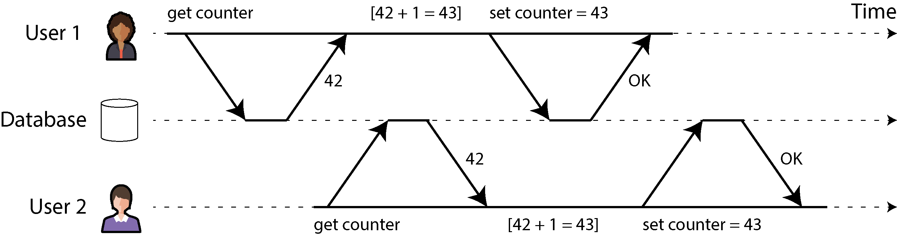

*Hình 8-1. Một race condition giữa hai client đồng thời tăng một bộ đếm*

*Isolation* theo nghĩa của ACID có nghĩa là các transaction thực thi đồng thời được cô lập với nhau; chúng không thể giẫm chân lên nhau. Các sách giáo khoa database kinh điển hình thức hóa isolation dưới dạng *serializability*, nghĩa là mỗi transaction có thể giả định rằng nó là transaction duy nhất đang chạy trên toàn bộ database. Database đảm bảo rằng khi các transaction đã commit, kết quả sẽ giống như khi chúng chạy *tuần tự* (*serially* — cái này sau cái kia), mặc dù trên thực tế chúng có thể đã chạy đồng thời [13].

Tuy nhiên, serializability có một chi phí về hiệu năng. Trong thực tế, nhiều database sử dụng các dạng isolation yếu hơn serializability — tức là chúng cho phép các transaction đồng thời can nhiễu lẫn nhau theo những cách hạn chế. Một số database phổ biến, như Oracle, thậm chí còn không triển khai nó (Oracle có một mức cô lập gọi là “serializable”, nhưng thực chất nó triển khai *snapshot isolation*, một đảm bảo yếu hơn serializability [10, 14]). Điều này có nghĩa là một số loại race condition vẫn có thể xảy ra. Chúng ta sẽ khám phá snapshot isolation và các dạng isolation khác trong “Các mức cô lập yếu (Weak Isolation Levels)”.

#### Durability

Mục đích của một hệ thống database là cung cấp một nơi an toàn để lưu trữ dữ liệu mà không sợ mất. *Durability* (tính bền vững) là lời hứa rằng sau khi một transaction đã commit thành công, mọi dữ liệu nó đã ghi sẽ không bị quên, ngay cả khi có lỗi phần cứng hoặc database bị crash.

Trong một database đơn nút, durability thường có nghĩa là dữ liệu đã được ghi vào bộ lưu trữ không bay hơi (nonvolatile storage) như ổ cứng hoặc SSD. Các thao tác ghi file thông thường thường được đệm (buffer) trong bộ nhớ trước khi được gửi xuống đĩa vào một lúc nào đó sau này, nghĩa là chúng có thể bị mất nếu mất điện đột ngột; do đó nhiều database sử dụng lời gọi hệ thống `fsync` để đảm bảo dữ liệu thực sự đã được ghi xuống đĩa. Các database thường cũng có write-ahead log hoặc tính năng tương tự (xem “Làm cho B-tree đáng tin cậy”), cho phép chúng khôi phục trong trường hợp crash xảy ra giữa một thao tác ghi. Nhiều database (như MySQL, MongoDB và PostgreSQL) lưu dữ liệu kèm checksum, cho phép chúng phát hiện các mục log bị hỏng hoặc không hoàn chỉnh và nhờ đó giúp khôi phục database về một snapshot nhất quán sau khi crash.

Trong một database có replication, durability có thể có nghĩa là dữ liệu đã được sao chép thành công đến một số lượng node nhất định. Để cung cấp đảm bảo về durability, database phải chờ cho đến khi các thao tác ghi hoặc replication này hoàn tất trước khi báo cáo một transaction là đã commit thành công. Tuy nhiên, như đã thảo luận trong “Độ tin cậy và khả năng chịu lỗi”, durability hoàn hảo không tồn tại; nếu tất cả ổ cứng và tất cả bản backup của bạn bị phá hủy cùng lúc, thì rõ ràng database của bạn chẳng thể làm gì để cứu bạn.

#### REPLICATION VÀ DURABILITY

Trong lịch sử, durability có nghĩa là ghi vào băng lưu trữ (archive tape). Sau đó nó được hiểu là ghi vào đĩa hoặc SSD. Gần đây hơn, nó đã được điều chỉnh để mang nghĩa replication. Cách triển khai nào tốt hơn?

Sự thật là, không có gì hoàn hảo:

- Nếu bạn ghi vào đĩa và máy chết, mặc dù dữ liệu của bạn không bị mất, nó vẫn không thể truy cập được cho đến khi bạn sửa máy hoặc chuyển đĩa sang máy khác. Các hệ thống có replication có thể vẫn duy trì tính sẵn sàng. Một lỗi tương quan (correlated fault) — chẳng hạn mất điện, hoặc một bug làm crash mọi node khi gặp một đầu vào cụ thể — có thể đánh sập tất cả các replica cùng lúc (xem “Độ tin cậy và khả năng chịu lỗi”), khiến mọi dữ liệu chỉ nằm trong bộ nhớ bị mất. Do đó việc ghi xuống đĩa vẫn có ý nghĩa đối với các database có replication.

- Trong một hệ thống replication bất đồng bộ, các thao tác ghi gần đây có thể bị mất khi leader trở nên không khả dụng (xem “Xử lý node ngừng hoạt động”). Khi điện bị cắt đột ngột, đặc biệt SSD đã được chứng minh là đôi khi vi phạm những đảm bảo mà chúng được cho là phải cung cấp; ngay cả `fsync` cũng không được đảm bảo hoạt động đúng [15]. Firmware của đĩa có thể có bug, giống như bất kỳ loại phần mềm nào khác [16, 17] — ví dụ, khiến ổ đĩa hỏng sau đúng 32,768 giờ hoạt động [18]. Và `fsync` rất khó dùng đúng; ngay cả PostgreSQL cũng đã dùng nó sai trong hơn 20 năm [19, 20, 21].

- Những tương tác tinh tế giữa storage engine và cách triển khai hệ thống file (filesystem) có thể dẫn đến các bug khó truy vết và có thể khiến các file trên đĩa bị hỏng sau khi crash [22, 23]. Lỗi hệ thống file trên một replica đôi khi cũng có thể lan sang các replica khác [24].

- Dữ liệu trên đĩa có thể dần bị hỏng mà không được phát hiện [25, 26]. Nếu dữ liệu đã bị hỏng trong một thời gian, các replica và các bản backup gần đây cũng có thể bị hỏng theo. Trong trường hợp này, bạn sẽ cần cố khôi phục dữ liệu từ một bản backup cũ hơn.

- Một nghiên cứu về SSD cho thấy 30% đến 80% ổ đĩa phát sinh ít nhất một khối hỏng (bad block) trong bốn năm hoạt động đầu tiên, và chỉ một số trong đó có thể được firmware sửa chữa [27]. Ổ cứng từ tính có tỷ lệ sector hỏng thấp hơn nhưng tỷ lệ hỏng hoàn toàn cao hơn so với SSD.

- Khi một SSD đã hao mòn (đã trải qua nhiều chu kỳ ghi/xóa) bị ngắt nguồn điện, nó có thể bắt đầu mất dữ liệu trong khoảng thời gian từ vài tuần đến vài tháng, tùy thuộc vào nhiệt độ [28]. Điều này ít là vấn đề hơn đối với các ổ đĩa có mức hao mòn thấp hơn [29].

Trong thực tế, không một kỹ thuật nào có thể cung cấp các đảm bảo tuyệt đối. Chỉ có nhiều kỹ thuật giảm rủi ro khác nhau — bao gồm ghi xuống đĩa, replication sang các máy ở xa, và backup — và chúng có thể và nên được sử dụng cùng nhau. Như thường lệ, sẽ là khôn ngoan nếu tiếp nhận mọi “đảm bảo” lý thuyết với một thái độ hoài nghi lành mạnh.

### Thao tác đơn đối tượng và đa đối tượng

Tóm lại, trong ACID, atomicity và isolation mô tả điều database nên làm nếu một client thực hiện nhiều thao tác ghi trong cùng một transaction:

- **Atomicity**

  Nếu một lỗi xảy ra giữa chừng một chuỗi thao tác ghi, transaction phải bị abort, và các thao tác ghi đã thực hiện cho đến thời điểm đó phải bị loại bỏ. Nói cách khác, database giúp bạn không phải lo lắng về thất bại một phần bằng cách đưa ra đảm bảo tất-cả-hoặc-không-gì (all-or-nothing).

- **Isolation**

  Các transaction chạy đồng thời không được can nhiễu lẫn nhau. Ví dụ, nếu một transaction thực hiện nhiều thao tác ghi, thì một transaction khác phải nhìn thấy hoặc tất cả hoặc không thao tác ghi nào trong số đó, chứ không phải một tập con.

Các định nghĩa này giả định rằng bạn muốn sửa đổi nhiều đối tượng (hàng, document, record) cùng lúc. Những transaction đa đối tượng (multi-object transaction) như vậy thường cần thiết nếu nhiều mẩu dữ liệu cần được giữ đồng bộ với nhau. Hình 8-2 cho thấy một ví dụ từ một ứng dụng email. Để hiển thị số thư chưa đọc của một người dùng, bạn có thể truy vấn kiểu như sau:

```
SELECT COUNT(*) FROM emails WHERE recipient_id = 2 AND unread_flag = true
```

Tuy nhiên, bạn có thể thấy truy vấn này quá chậm nếu có nhiều email và quyết định lưu số thư chưa đọc trong một trường riêng (một kiểu phi chuẩn hóa — denormalization, mà chúng ta thảo luận trong “Chuẩn hóa, phi chuẩn hóa và join”). Giờ đây, mỗi khi có thư mới đến, bạn cũng phải tăng bộ đếm thư chưa đọc, và mỗi khi một thư được đánh dấu là đã đọc, bạn cũng phải giảm bộ đếm thư chưa đọc.

Trong Hình 8-2, người dùng 2 gặp một bất thường (anomaly): danh sách hộp thư hiển thị một thư chưa đọc, nhưng bộ đếm lại cho thấy không có thư chưa đọc nào vì việc tăng bộ đếm chưa xảy ra. (Nếu một bộ đếm sai trong ứng dụng email có vẻ quá tầm thường, hãy nghĩ đến số dư tài khoản khách hàng thay cho bộ đếm thư chưa đọc và một giao dịch thanh toán thay cho email.) Isolation sẽ ngăn được vấn đề này bằng cách đảm bảo người dùng 2 nhìn thấy hoặc cả email được chèn vào lẫn bộ đếm đã cập nhật, hoặc không thấy cả hai, chứ không phải một điểm giữa chừng không nhất quán.

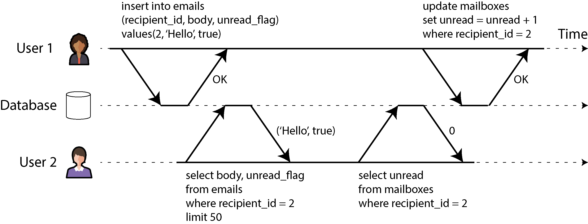

*Hình 8-2. Vi phạm isolation: một transaction đọc các thao tác ghi chưa commit của transaction khác (một “dirty read”)*

Hình 8-3 minh họa sự cần thiết của atomicity: nếu một lỗi xảy ra ở đâu đó trong quá trình thực hiện transaction, nội dung hộp thư và bộ đếm thư chưa đọc có thể trở nên lệch nhau. Trong một transaction atomic, nếu việc cập nhật bộ đếm thất bại, transaction bị abort và việc chèn email được rollback.

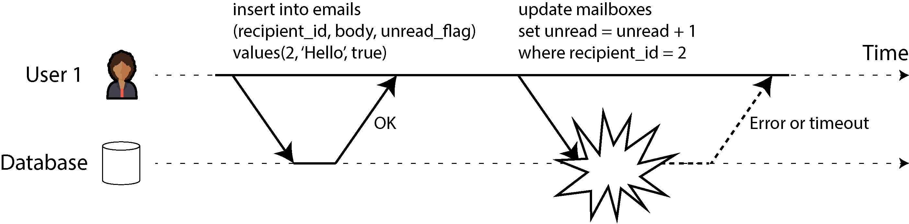

*Hình 8-3. Atomicity đảm bảo rằng nếu một lỗi xảy ra, mọi thao tác ghi trước đó của transaction này đều được hoàn tác, để tránh trạng thái không nhất quán.*

Các transaction đa đối tượng cần có cách nào đó để xác định những thao tác đọc và ghi nào thuộc cùng một transaction. Trong các database quan hệ, điều đó thường được thực hiện dựa trên kết nối TCP của client tới database server. Trên bất kỳ kết nối cụ thể nào, mọi thứ nằm giữa câu lệnh `BEGIN TRANSACTION` và `COMMIT` được coi là thuộc cùng một transaction. Nếu kết nối TCP bị gián đoạn, transaction phải bị abort.

Mặt khác, nhiều database phi quan hệ không có cách nhóm các thao tác lại với nhau như vậy. Ngay cả khi có một API đa đối tượng (ví dụ, một key-value store có thể có thao tác *multi-put* cập nhật nhiều khóa trong một thao tác), điều đó không nhất thiết có nghĩa là nó có ngữ nghĩa transaction: lệnh có thể thành công với một số khóa và thất bại với các khóa khác, để lại database ở trạng thái được cập nhật một phần.

#### Các phép ghi đơn đối tượng (single-object writes)

Tính nguyên tử (atomicity) và tính cô lập (isolation) cũng áp dụng khi chỉ một đối tượng (object) đơn lẻ được thay đổi. Ví dụ, hãy tưởng tượng bạn đang ghi một document JSON kích thước 20 kB vào một database:

- Nếu kết nối mạng bị gián đoạn sau khi 10 kB đầu tiên đã được gửi, database có lưu lại mảnh JSON 10 kB không thể phân tích cú pháp (unparseable) đó không?

- Nếu mất điện trong lúc database đang ghi đè giá trị cũ trên đĩa, liệu bạn có nhận được kết quả là giá trị cũ và giá trị mới bị ghép lẫn vào nhau?

- Nếu một client khác đọc document đó trong khi phép ghi đang diễn ra, nó có thấy một giá trị mới chỉ được cập nhật một phần không?

Mỗi kết quả như vậy đều sẽ gây bối rối vô cùng, vì thế gần như mọi storage engine đều hướng tới việc cung cấp tính nguyên tử và tính cô lập ở mức một đối tượng đơn lẻ (chẳng hạn một cặp key-value) trên một node. Tính nguyên tử có thể được triển khai bằng một log dùng để khôi phục sau sự cố (crash recovery) (xem “Làm cho B-tree đáng tin cậy”), và tính cô lập có thể được triển khai bằng một lock trên mỗi đối tượng (chỉ cho phép một thread truy cập một đối tượng tại bất kỳ thời điểm nào).

Một số database còn cung cấp các phép toán nguyên tử (atomic operation) phức tạp hơn, chẳng hạn phép tăng (increment), giúp loại bỏ nhu cầu phải thực hiện chu trình đọc-sửa-ghi (read-modify-write) như trong Hình 8-1. Cũng phổ biến không kém là phép *conditional write* (ghi có điều kiện), chỉ cho phép một phép ghi diễn ra nếu giá trị chưa bị ai khác thay đổi đồng thời (xem “Ghi có điều kiện (conditional write, compare-and-set)”), tương tự phép compare-and-set hay compare-and-swap (CAS) trong lập trình đồng thời trên bộ nhớ chia sẻ (shared-memory concurrency).

> **LƯU Ý**
>
> Nói một cách chặt chẽ, thuật ngữ *atomic increment* (tăng nguyên tử) dùng từ *atomic* theo nghĩa của lập trình đa luồng (multithreaded). Trong ngữ cảnh ACID, nó nên được gọi là phép tăng *isolated* (cô lập) hay *serializable*, nhưng đó không phải là thuật ngữ thường dùng.

Các phép toán đơn đối tượng này rất hữu ích, vì chúng có thể ngăn chặn lost update khi nhiều client cố ghi vào cùng một đối tượng đồng thời (xem “Ngăn chặn Lost Update”). Tuy nhiên, chúng không phải là transaction theo nghĩa thông thường của từ này. Ví dụ, chế độ “strong consistency” của Aerospike và tính năng “lightweight transactions” của Cassandra và ScyllaDB cung cấp các phép đọc linearizable (xem “Linearizability”) và conditional write trên một đối tượng đơn lẻ, nhưng không đảm bảo gì trên nhiều đối tượng.

#### Nhu cầu về transaction đa đối tượng (multi-object)

Liệu chúng ta có thực sự cần transaction đa đối tượng (multi-object transaction) không? Có thể triển khai bất kỳ ứng dụng nào chỉ với mô hình dữ liệu key-value và các phép toán đơn đối tượng hay không?

Trong một số trường hợp sử dụng, các phép chèn (insert), cập nhật (update) và xóa (delete) trên một đối tượng đơn lẻ là đủ. Tuy nhiên, trong nhiều trường hợp khác, các phép ghi lên nhiều đối tượng cần được phối hợp với nhau:

- Trong mô hình dữ liệu quan hệ (relational), một hàng trong bảng này thường có tham chiếu khóa ngoại (foreign key) tới một hàng trong bảng khác. Tương tự, trong mô hình dữ liệu dạng graph, một đỉnh (vertex) có các cạnh (edge) nối tới các đỉnh khác. Transaction đa đối tượng cho phép bạn đảm bảo các tham chiếu này luôn hợp lệ; khi chèn nhiều record tham chiếu lẫn nhau, các khóa ngoại phải chính xác và cập nhật, nếu không dữ liệu sẽ trở nên vô nghĩa.

- Trong mô hình dữ liệu document, các trường cần được cập nhật cùng nhau thường nằm trong cùng một document, vốn được xem là một đối tượng đơn lẻ; không cần transaction đa đối tượng khi cập nhật một document duy nhất. Tuy nhiên, các document database thiếu chức năng join cũng khuyến khích việc phi chuẩn hóa (denormalization) (xem “Khi nào dùng mô hình nào”). Khi thông tin đã phi chuẩn hóa cần được cập nhật, như trong ví dụ ở Hình 8-2, bạn cần cập nhật nhiều document cùng một lúc. Transaction rất hữu ích trong tình huống này để ngăn dữ liệu phi chuẩn hóa bị mất đồng bộ.

- Trong các database có secondary index (gần như mọi thứ trừ các key-value store thuần túy), các index cũng cần được cập nhật mỗi khi bạn thay đổi một giá trị. Xét từ góc nhìn transaction, các index này là những đối tượng database khác nhau—ví dụ, nếu không có tính cô lập của transaction, một record có thể xuất hiện trong index này nhưng không có trong index khác vì việc cập nhật index thứ hai chưa diễn ra (xem “Sharding và secondary index”).

Những ứng dụng như vậy vẫn có thể được triển khai mà không cần transaction. Tuy nhiên, việc xử lý lỗi trở nên phức tạp hơn nhiều khi không có tính nguyên tử, và việc thiếu tính cô lập có thể gây ra các vấn đề về tính đồng thời (concurrency). Chúng ta sẽ thảo luận những vấn đề đó trong “Các mức cô lập yếu (Weak Isolation Levels)” và khám phá các cách tiếp cận thay thế trong Chương 13.

#### Xử lý lỗi và abort

Một đặc điểm then chốt của transaction là nó có thể bị abort và được thử lại (retry) một cách an toàn nếu xảy ra lỗi. Các database ACID được xây dựng dựa trên triết lý này: nếu database có nguy cơ vi phạm đảm bảo về tính nguyên tử, tính cô lập hay tính bền vững (durability), nó sẽ chọn từ bỏ hoàn toàn transaction thay vì để nó ở trạng thái dở dang.

Tuy vậy, không phải hệ thống nào cũng theo triết lý đó. Đặc biệt, các datastore dùng leaderless replication (xem “Leaderless Replication (Replication không có leader)”) hoạt động theo kiểu “best effort” (cố gắng hết sức), có thể tóm gọn là “database sẽ làm hết những gì có thể, và nếu gặp lỗi, nó sẽ không hoàn tác những gì đã làm”—vì vậy việc khôi phục sau lỗi là trách nhiệm của ứng dụng.

Lỗi chắc chắn sẽ xảy ra, nhưng nhiều nhà phát triển phần mềm thích chỉ nghĩ về luồng thuận lợi (happy path) hơn là những chi tiết rắc rối của việc xử lý lỗi. Ví dụ, các framework ánh xạ đối tượng-quan hệ (object-relational mapping, ORM) phổ biến như Rails ActiveRecord và Django không thử lại các transaction bị abort—lỗi thường dẫn đến một exception lan ngược lên ngăn xếp (stack), vì thế mọi dữ liệu người dùng nhập vào bị vứt bỏ, và người dùng nhận được một thông báo lỗi. Điều này thật đáng tiếc, bởi toàn bộ mục đích của việc rollback transaction là để cho phép thử lại một cách an toàn.

Mặc dù thử lại một transaction bị abort là một cơ chế xử lý lỗi đơn giản và hiệu quả, nó không hoàn hảo:

- Nếu transaction thực ra đã thành công, nhưng mạng bị gián đoạn trong lúc server cố xác nhận (acknowledge) commit thành công tới client (nên từ góc nhìn của client thì nó bị timeout), thì việc thử lại transaction sẽ khiến nó được thực hiện hai lần, trừ khi bạn có thêm một cơ chế deduplication ở tầng ứng dụng.

- Nếu lỗi là do quá tải (overload) hoặc do tranh chấp (contention) cao giữa các transaction đồng thời, việc thử lại transaction sẽ làm vấn đề tệ hơn chứ không tốt hơn. Để tránh những vòng phản hồi (feedback cycle) như vậy, bạn có thể giới hạn số lần thử lại, dùng exponential backoff, và xử lý các lỗi liên quan đến quá tải khác với các lỗi khác (xem “Khi một hệ thống quá tải không thể phục hồi”).

- Chỉ đáng thử lại sau các lỗi tạm thời (transient error) (ví dụ, do deadlock, vi phạm tính cô lập, gián đoạn mạng tạm thời, hoặc failover). Sau một lỗi vĩnh viễn (ví dụ, vi phạm ràng buộc — constraint violation), việc thử lại là vô nghĩa.

- Nếu transaction còn có các tác dụng phụ (side effect) bên ngoài database, những tác dụng phụ đó có thể vẫn xảy ra ngay cả khi transaction bị abort. Ví dụ, nếu bạn đang gửi một email, bạn sẽ không muốn gửi lại email đó mỗi lần thử lại transaction. Nếu bạn muốn đảm bảo nhiều hệ thống cùng commit hoặc cùng abort, two-phase commit có thể giúp ích (chúng ta sẽ thảo luận điều này trong “Two-Phase Commit”).

- Nếu process của client bị crash trong lúc thử lại, mọi dữ liệu nó đang cố ghi vào database sẽ bị mất.

## Các mức cô lập yếu (Weak Isolation Levels)

Nếu hai transaction không truy cập cùng một dữ liệu, hoặc nếu cả hai đều chỉ đọc (read-only), chúng có thể chạy song song một cách an toàn, vì không transaction nào phụ thuộc vào transaction kia. Các vấn đề về tính đồng thời (race condition) chỉ nảy sinh khi một transaction đọc dữ liệu đang được một transaction khác sửa đổi đồng thời, hoặc khi hai transaction cố sửa đổi cùng một dữ liệu.

Các lỗi đồng thời (concurrency bug) rất khó phát hiện bằng kiểm thử, vì chúng chỉ được kích hoạt khi bạn gặp xui xẻo về thời điểm (timing). Những vấn đề về thời điểm như vậy có thể hiếm khi xảy ra và thường khó tái hiện. Tính đồng thời cũng khó suy luận, nhất là trong một ứng dụng lớn, nơi bạn không nhất thiết biết những đoạn mã nào khác đang truy cập database. Phát triển ứng dụng đã đủ khó khi chỉ có một người dùng tại một thời điểm; có nhiều người dùng đồng thời còn khiến nó khó hơn nhiều, vì bất kỳ mẩu dữ liệu nào cũng có thể thay đổi bất ngờ vào bất kỳ lúc nào.

Vì lý do đó, từ lâu các database đã cố che giấu các vấn đề đồng thời khỏi nhà phát triển ứng dụng bằng cách cung cấp *transaction isolation* (tính cô lập của transaction). Về lý thuyết, tính cô lập nên giúp cuộc sống của bạn dễ dàng hơn bằng cách cho phép bạn giả định rằng không có sự đồng thời nào đang diễn ra; tính cô lập *serializable* nghĩa là database đảm bảo các transaction có hiệu quả giống như khi chúng chạy *tuần tự* (serially) (tức là lần lượt từng transaction, không có bất kỳ sự đồng thời nào).

Trong thực tế, đáng tiếc là tính cô lập không đơn giản như vậy. Tính cô lập serializable có chi phí về hiệu năng, và nhiều database không muốn trả cái giá đó [10]. Do đó, các hệ thống thường dùng các mức cô lập yếu hơn, bảo vệ khỏi *một số* vấn đề đồng thời nhưng không phải tất cả. Những mức cô lập này khó hiểu hơn nhiều và có thể dẫn đến các lỗi tinh vi, nhưng dù vậy chúng vẫn được dùng trong thực tế [30].

Các lỗi đồng thời do tính cô lập transaction yếu và race condition gây ra không chỉ là vấn đề lý thuyết. Chúng đã gây thiệt hại tiền bạc đáng kể, bao gồm việc làm phá sản một sàn giao dịch Bitcoin [31, 32, 33, 34], dẫn đến điều tra của các kiểm toán viên tài chính [35], và làm hỏng dữ liệu khách hàng [36]. Một bình luận phổ biến khi những vấn đề như vậy được phanh phui là “Hãy dùng database ACID nếu bạn xử lý dữ liệu tài chính!”—nhưng điều đó đi lệch trọng tâm. Ngay cả nhiều hệ quản trị cơ sở dữ liệu quan hệ phổ biến (thường được coi là ACID) cũng dùng tính cô lập yếu, nên chúng không nhất thiết đã ngăn được những lỗi này xảy ra.

> **LƯU Ý**
>
> Nhân tiện, phần lớn hệ thống ngân hàng dựa vào các file văn bản được trao đổi qua FTP bảo mật (secure FTP) [37]. Trong ngữ cảnh này, việc có một dấu vết kiểm toán (audit trail) và một số biện pháp phòng chống gian lận ở cấp độ con người thực ra còn quan trọng hơn các thuộc tính ACID.

Những ví dụ đó cũng làm nổi bật một điểm quan trọng: ngay cả khi các vấn đề đồng thời hiếm gặp trong vận hành bình thường, bạn vẫn phải tính đến khả năng một kẻ tấn công cố tình gửi một loạt request có độ đồng thời cao tới API của bạn nhằm khai thác các lỗi đồng thời [32]. Do đó, để xây dựng những ứng dụng đáng tin cậy và an toàn, bạn phải đảm bảo những lỗi như vậy được ngăn chặn một cách có hệ thống.

Trong mục này chúng ta sẽ xem xét một số mức cô lập yếu (nonserializable) được dùng trong thực tế và thảo luận chi tiết những loại race condition có thể và không thể xảy ra với từng mức, để bạn có thể quyết định mức nào phù hợp với ứng dụng của mình. Sau khi làm xong việc đó, chúng ta sẽ thảo luận chi tiết về serializability (xem “Serializability”). Phần thảo luận về các mức cô lập của chúng ta sẽ mang tính không hình thức, thông qua các ví dụ. Nếu bạn muốn có các định nghĩa chặt chẽ và phân tích về tính chất của chúng, bạn có thể tìm thấy trong các tài liệu học thuật [38, 39, 40, 41].

### Read Committed

Mức cô lập transaction cơ bản nhất là *read committed*, và nó đưa ra hai đảm bảo:

- Khi đọc từ database, bạn sẽ chỉ thấy dữ liệu đã được commit (không có dirty read).

- Khi ghi vào database, bạn sẽ chỉ ghi đè dữ liệu đã được commit (không có dirty write).

Hãy cùng thảo luận chi tiết hơn về hai đảm bảo này.

#### Không có dirty read

Hãy tưởng tượng một transaction đã ghi một số dữ liệu vào database, nhưng transaction đó chưa commit hay abort. Liệu một transaction khác có thể thấy dữ liệu chưa commit đó không? Nếu có, điều đó được gọi là *dirty read* (đọc bẩn) [3].

Các transaction chạy ở mức cô lập read committed phải ngăn chặn dirty read. Điều này có nghĩa là mọi phép ghi của một transaction chỉ trở nên hữu hình với các transaction khác khi transaction đó commit (và lúc ấy toàn bộ các phép ghi của nó trở nên hữu hình cùng một lúc). Điều này được minh họa trong Hình 8-4, nơi người dùng 1 đã đặt *x* = 3, nhưng lệnh *get x* của người dùng 2 vẫn trả về giá trị cũ là 2, trong khi người dùng 1 chưa commit.

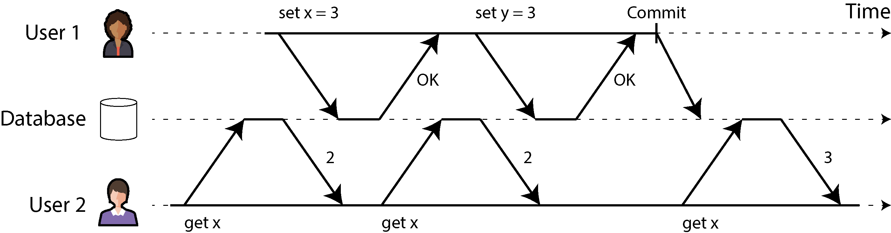

*Hình 8-4. Không có dirty read: người dùng 2 chỉ thấy giá trị mới của x sau khi transaction của người dùng 1 đã commit*

Ngăn chặn dirty read hữu ích vì một vài lý do:

- Nếu một transaction cần cập nhật nhiều hàng, dirty read có nghĩa là một transaction khác có thể thấy một số cập nhật nhưng không thấy những cập nhật còn lại. Ví dụ, trong Hình 8-2, người dùng thấy email chưa đọc mới nhưng không thấy bộ đếm đã được cập nhật. Đây là một dirty read trên email. Việc nhìn thấy database ở trạng thái cập nhật một phần gây bối rối cho người dùng và có thể khiến các transaction khác đưa ra quyết định sai.

- Nếu một transaction abort, mọi phép ghi nó đã thực hiện cần được rollback (như trong Hình 8-3). Nếu database cho phép dirty read, một transaction có thể thấy dữ liệu mà sau đó bị rollback—tức là dữ liệu chưa bao giờ thực sự được commit vào database. Bất kỳ transaction nào đã đọc dữ liệu chưa commit cũng sẽ cần bị abort, dẫn đến một vấn đề gọi là *cascading aborts* (abort dây chuyền).

#### Không có dirty write

Điều gì xảy ra nếu hai transaction đồng thời cố cập nhật cùng một hàng trong database? Chúng ta không biết các phép ghi sẽ diễn ra theo thứ tự nào, nhưng thường giả định rằng phép ghi sau sẽ ghi đè phép ghi trước.

Tuy nhiên, điều gì xảy ra nếu phép ghi trước là một phần của transaction chưa commit, nên phép ghi sau ghi đè lên một giá trị chưa được commit? Điều này được gọi là *dirty write* (ghi bẩn) [38]. Các transaction chạy ở mức cô lập read committed phải ngăn chặn dirty write, thường bằng cách trì hoãn phép ghi thứ hai cho đến khi transaction của phép ghi thứ nhất đã commit hoặc abort.

Bằng cách ngăn chặn dirty write, mức cô lập này tránh được một số loại vấn đề đồng thời:

- Nếu các transaction cập nhật nhiều hàng, dirty write có thể dẫn đến kết quả tệ hại. Ví dụ, hãy xem Hình 8-5, minh họa một website bán xe cũ nơi hai người, Aaliyah và Bryce, đang đồng thời cố mua cùng một chiếc xe. Mua một chiếc xe đòi hỏi hai phép ghi vào database: tin đăng bán trên website cần được cập nhật để phản ánh người mua, và hóa đơn bán hàng cần được gửi cho người mua. Trong trường hợp của Hình 8-5, thương vụ được trao cho Bryce (vì anh ta thực hiện phép cập nhật thắng thế trên bảng `listings`), nhưng hóa đơn lại được gửi cho Aaliyah (vì cô ấy thực hiện phép cập nhật thắng thế trên bảng `invoices`). Tính cô lập read committed ngăn chặn những sự cố như vậy.

- Tuy nhiên, tính cô lập read committed *không* ngăn được race condition giữa hai phép tăng bộ đếm trong Hình 8-1. Trong trường hợp này, phép ghi thứ hai diễn ra sau khi transaction thứ nhất đã commit, nên nó không phải là dirty write. Nó vẫn sai, nhưng vì một lý do khác; trong “Ngăn chặn Lost Update”, chúng ta sẽ thảo luận cách làm cho những phép tăng bộ đếm như vậy trở nên an toàn.

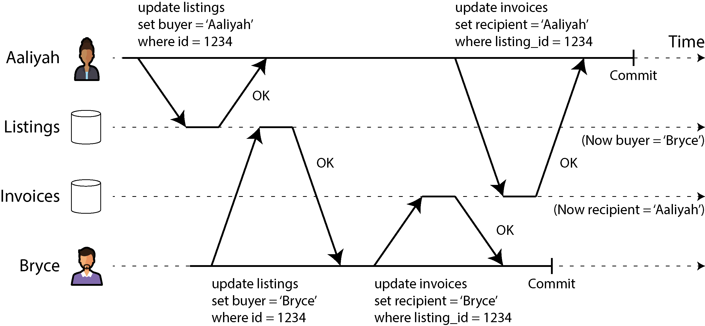

*Hình 8-5. Với dirty write, các phép ghi xung đột từ những transaction khác nhau có thể bị trộn lẫn vào nhau*

#### Triển khai read committed

Read committed là một mức cô lập rất phổ biến. Nó là thiết lập mặc định trong Oracle Database, PostgreSQL, SQL Server và nhiều database khác [10].

Phổ biến nhất, các database ngăn chặn dirty write bằng cách dùng lock ở mức hàng (row-level lock). Khi một transaction muốn sửa đổi một hàng cụ thể (hoặc document hay một đối tượng nào khác), trước hết nó phải giành được (acquire) lock trên hàng đó. Sau đó nó phải giữ lock ấy cho đến khi transaction được commit hoặc abort. Chỉ một transaction có thể giữ lock của một hàng bất kỳ tại một thời điểm; nếu một transaction khác muốn ghi vào cùng hàng đó, nó phải chờ cho đến khi transaction thứ nhất được commit hoặc abort rồi mới có thể giành lock và tiếp tục. Việc khóa này được database thực hiện tự động ở chế độ read committed (hoặc ở các mức cô lập mạnh hơn).

Làm thế nào để ngăn chặn dirty read? Một lựa chọn là dùng chính lock đó và yêu cầu bất kỳ transaction nào muốn đọc một hàng phải giành lock trong chốc lát rồi giải phóng nó ngay sau khi đọc xong. Điều này sẽ đảm bảo rằng một phép đọc không thể xảy ra trong khi hàng đang mang một giá trị bẩn, chưa commit (vì trong thời gian đó lock đang được transaction thực hiện phép ghi nắm giữ).

Tuy nhiên, cách tiếp cận yêu cầu lock khi đọc (read lock) không hoạt động tốt trong thực tế, vì một transaction ghi chạy lâu có thể buộc nhiều transaction khác phải chờ đến khi transaction chạy lâu đó hoàn thành, ngay cả khi các transaction kia chỉ đọc và không ghi gì vào database. Điều này làm tổn hại thời gian phản hồi của các transaction chỉ đọc và có hại cho khả năng vận hành (operability): sự chậm lại ở một phần của ứng dụng có thể gây hiệu ứng dây chuyền lên một phần hoàn toàn khác của ứng dụng, do phải chờ lock.

Dù vậy, lock vẫn được dùng để ngăn chặn dirty read trong một số database, chẳng hạn IBM Db2 và Microsoft SQL Server với thiết lập `read_committed_snapshot=off` [30].

Một cách tiếp cận phổ biến hơn để ngăn chặn dirty read là cách được minh họa trong Hình 8-4. Với mỗi hàng được ghi, database ghi nhớ cả giá trị cũ đã commit lẫn giá trị mới được đặt bởi transaction hiện đang giữ write lock. Trong khi transaction đó còn đang diễn ra, mọi transaction khác đọc hàng này đơn giản được trả về giá trị cũ. Chỉ khi giá trị mới được commit thì các transaction mới chuyển sang đọc giá trị mới (xem “Điều khiển đồng thời đa phiên bản (multiversion concurrency control)” để biết thêm chi tiết).

Một số database hỗ trợ một mức cô lập còn yếu hơn gọi là *read uncommitted*. Nó ngăn chặn dirty write nhưng không ngăn chặn dirty read. Nói cách khác, nó trả về ngay lập tức giá trị được ghi mới nhất, ngay cả khi transaction ghi chưa commit. Điều này có thể mang lại hiệu năng tốt hơn, vì database không cần lưu hai phiên bản của hàng. Nó cũng có thể làm giảm xác suất xảy ra (nhưng không ngăn chặn được) lost update, điều mà chúng ta sẽ nói đến trong “Ngăn chặn Lost Update”.

### Snapshot Isolation và Repeatable Read

Nếu nhìn một cách hời hợt vào tính cô lập read committed, bạn có thể được tha thứ khi nghĩ rằng nó làm được mọi thứ mà một transaction cần làm: nó cho phép abort (cần thiết cho tính nguyên tử), nó ngăn việc đọc các kết quả chưa hoàn chỉnh của transaction, và nó ngăn các phép ghi đồng thời bị trộn lẫn vào nhau. Quả thực, đó là những tính năng hữu ích, và chúng là những đảm bảo mạnh hơn nhiều so với những gì bạn có thể nhận được từ một hệ thống không hỗ trợ transaction.

Tuy nhiên, vẫn còn rất nhiều cách để gặp lỗi đồng thời khi dùng mức cô lập này. Ví dụ, Hình 8-6 minh họa một vấn đề có thể xảy ra với tính cô lập read committed.

Giả sử Aaliyah có $1,000 tiền tiết kiệm tại một ngân hàng, chia đều cho hai tài khoản, mỗi tài khoản $500. Một transaction chuyển $100 từ một tài khoản của cô sang tài khoản kia. Nếu cô xui xẻo xem danh sách số dư tài khoản đúng vào thời điểm transaction đó đang được xử lý, cô có thể thấy số dư của một tài khoản trước khi khoản tiền chuyển đến (vẫn là $500) và số dư của tài khoản kia sau khi khoản chuyển đi đã được thực hiện (số dư mới là $400). Đối với Aaliyah, giờ đây trông như cô chỉ có tổng cộng $900 trong các tài khoản của mình—dường như $100 đã tan biến vào không khí.

Bất thường (anomaly) này được gọi là *read skew*, và nó là một ví dụ của *nonrepeatable read* (đọc không lặp lại được): nếu Aaliyah đọc lại số dư của tài khoản 1 vào cuối transaction, cô sẽ thấy một giá trị khác ($600) so với giá trị cô đã thấy trong truy vấn trước. Read skew được coi là chấp nhận được dưới tính cô lập read committed: các số dư tài khoản mà Aaliyah thấy thực sự đã được commit vào thời điểm cô đọc chúng.

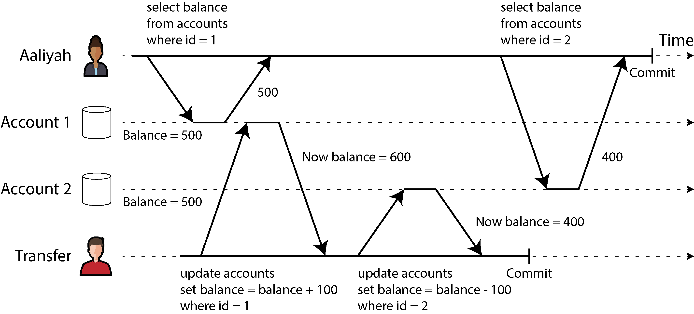

*Hình 8-6. Read skew: Aaliyah quan sát thấy database ở trạng thái không nhất quán*

> **LƯU Ý**
>
> Thuật ngữ *skew* đáng tiếc là bị dùng với nhiều nghĩa. Trước đây chúng ta đã dùng nó theo nghĩa *khối lượng công việc mất cân bằng với các hot spot* (xem “Workload lệch và giảm tải cho hot spot”), trong khi ở đây nó có nghĩa là một *bất thường về thời điểm* (timing anomaly).

Trong trường hợp của Aaliyah, đây không phải là vấn đề lâu dài, vì rất có thể cô sẽ thấy các số dư tài khoản nhất quán nếu tải lại website ngân hàng trực tuyến vài giây sau đó. Tuy nhiên, sự không nhất quán tạm thời như vậy là không thể chấp nhận được trong những trường hợp sau đây, chẳng hạn:

- **Sao lưu (backup)**

  Việc sao lưu đòi hỏi tạo một bản sao của toàn bộ database, có thể mất hàng giờ với một database lớn. Trong thời gian tiến trình sao lưu đang chạy, các phép ghi vẫn tiếp tục được thực hiện lên database. Do đó, bạn có thể rơi vào tình huống một số phần của bản sao lưu chứa phiên bản dữ liệu cũ hơn còn các phần khác chứa phiên bản mới hơn. Nếu bạn cần khôi phục từ một bản sao lưu như vậy, những điểm không nhất quán (như tiền biến mất) sẽ trở thành vĩnh viễn.

- **Truy vấn phân tích và kiểm tra tính toàn vẹn**

  Đôi khi bạn có thể muốn chạy một truy vấn quét qua những phần lớn của database. Những truy vấn như vậy phổ biến trong phân tích (analytics) (xem “Hệ thống vận hành và hệ thống phân tích”), hoặc chúng có thể là một phần của việc kiểm tra tính toàn vẹn định kỳ nhằm đảm bảo mọi thứ đều ổn (giám sát hỏng hóc dữ liệu). Những truy vấn này rất có thể sẽ trả về kết quả vô nghĩa nếu chúng quan sát các phần của database tại những thời điểm khác nhau.

*Snapshot isolation* [38] là giải pháp phổ biến nhất cho vấn đề này. Ý tưởng là mỗi transaction đọc từ một *consistent snapshot* (ảnh chụp nhất quán) của database—tức là nó thấy toàn bộ dữ liệu đã được commit trong database tại thời điểm bắt đầu transaction đó. Ngay cả khi dữ liệu sau đó bị một transaction khác thay đổi, mỗi transaction chỉ thấy dữ liệu cũ tại đúng thời điểm cụ thể đó.

Snapshot isolation là một món quà cho các truy vấn chỉ đọc chạy lâu như sao lưu và phân tích. Rất khó suy luận về ý nghĩa của một truy vấn nếu dữ liệu mà nó thao tác đang thay đổi cùng lúc truy vấn đang thực thi. Khi một transaction có thể thấy một snapshot nhất quán của database, được đóng băng tại một thời điểm cụ thể, việc hiểu nó trở nên dễ dàng hơn nhiều.

Snapshot isolation là một tính năng phổ biến: các biến thể của nó được hỗ trợ bởi PostgreSQL, MySQL với storage engine InnoDB, Oracle, SQL Server và nhiều hệ thống khác, mặc dù hành vi chi tiết khác nhau giữa các hệ thống [30, 42, 43]. Một số database, như Oracle, TiDB và Aurora DSQL, thậm chí chọn snapshot isolation làm mức cô lập cao nhất của mình. Các cloud data warehouse như BigQuery cũng thường dùng snapshot isolation, vì nó cung cấp một góc nhìn tại một thời điểm (point-in-time) của database cho các truy vấn phân tích.

#### Điều khiển đồng thời đa phiên bản (multiversion concurrency control)

Giống như với read committed isolation, các triển khai của snapshot isolation thường dùng write lock để ngăn dirty write (xem “Triển khai read committed”), điều này có nghĩa là một transaction thực hiện ghi có thể chặn tiến trình của một transaction khác ghi vào cùng một hàng. Tuy nhiên, các thao tác đọc không cần bất kỳ lock nào. Từ góc độ hiệu năng, một nguyên tắc then chốt của snapshot isolation là *người đọc không bao giờ chặn người ghi, và người ghi không bao giờ chặn người đọc* (readers never block writers, and writers never block readers). Điều này cho phép database xử lý các truy vấn đọc chạy lâu trên một snapshot nhất quán đồng thời với việc xử lý các thao tác ghi một cách bình thường, mà không có bất kỳ tranh chấp lock (lock contention) nào giữa hai bên.

Để triển khai snapshot isolation, các database dùng một dạng tổng quát hóa của cơ chế mà chúng ta đã thấy để ngăn dirty read trong Hình 8-4. Thay vì hai phiên bản của mỗi hàng (phiên bản đã commit và phiên bản đã bị ghi đè nhưng chưa commit), database có thể phải giữ nhiều phiên bản đã commit của một hàng, bởi vì các transaction đang thực hiện khác nhau có thể cần nhìn thấy trạng thái của database tại những thời điểm khác nhau. Vì nó duy trì nhiều phiên bản của một hàng song song với nhau, kỹ thuật này được gọi là *multiversion concurrency control* (MVCC — điều khiển đồng thời đa phiên bản).

Hình 8-7 minh họa cách snapshot isolation dựa trên MVCC được triển khai trong PostgreSQL [42, 44, 45] (các triển khai khác cũng tương tự). Khi một transaction được bắt đầu, nó được cấp một transaction ID duy nhất, luôn tăng ( `txid`). Mỗi khi một transaction ghi bất cứ thứ gì vào database, dữ liệu mà nó ghi được gắn nhãn với transaction ID của bên ghi. (Nói chính xác, transaction ID trong PostgreSQL là số nguyên 32-bit, nên chúng bị tràn số (overflow) sau khoảng 4 tỷ transaction. Tiến trình vacuum thực hiện dọn dẹp để đảm bảo rằng việc tràn số không ảnh hưởng đến dữ liệu.)

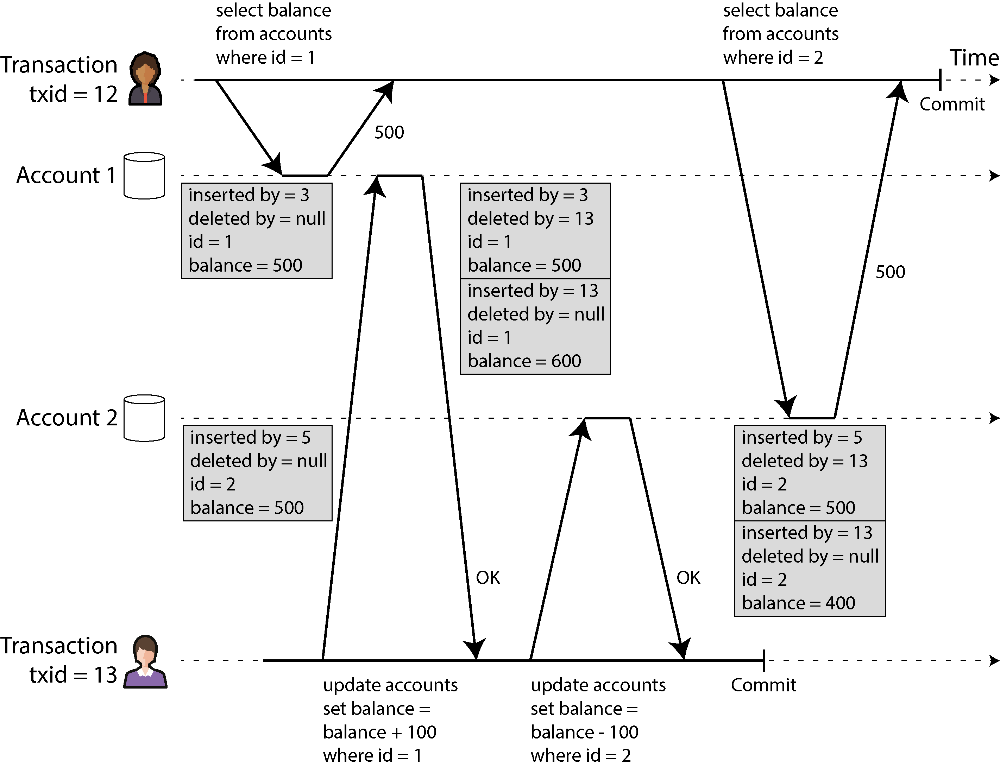

*Hình 8-7. Triển khai snapshot isolation bằng multiversion concurrency control*

Mỗi hàng trong một bảng có một trường `inserted_by`, chứa ID của transaction đã chèn hàng đó vào bảng. Mỗi hàng cũng có một trường `deleted_by`, ban đầu để trống. Nếu một transaction xóa một hàng, hàng đó không bị loại bỏ khỏi database mà thay vào đó được đánh dấu để xóa bằng cách đặt trường `deleted_by` thành ID của transaction đã yêu cầu xóa. Vào một thời điểm sau đó, khi chắc chắn rằng không còn transaction nào có thể truy cập dữ liệu đã bị xóa hoặc bị ghi đè nữa, một tiến trình garbage collection (GC) trong database sẽ loại bỏ mọi hàng được đánh dấu để xóa và giải phóng không gian của chúng.

Một thao tác update được dịch nội bộ thành một thao tác delete và một thao tác insert [46]. Ví dụ, trong Hình 8-7, transaction 13 trừ $100 từ tài khoản 2, thay đổi số dư từ $500 thành $400. Bảng `accounts` bây giờ chứa hai hàng cho tài khoản 2: một hàng với số dư $500 được đánh dấu là đã xóa bởi transaction 13, và một hàng với số dư $400 được chèn bởi transaction 13.

Tất cả các phiên bản của một hàng được lưu trong cùng một database heap (xem “Lưu trữ giá trị bên trong Index”), bất kể các transaction đã ghi chúng đã commit hay chưa. Các phiên bản của cùng một hàng tạo thành một danh sách liên kết (linked list), đi từ phiên bản mới nhất đến cũ nhất hoặc theo chiều ngược lại, để các truy vấn có thể duyệt nội bộ qua tất cả các phiên bản của một hàng [47, 48].

#### Các quy tắc hiển thị (visibility rules) để quan sát một snapshot nhất quán

Khi một transaction đọc từ database, các transaction ID được dùng để quyết định phiên bản hàng nào nó có thể nhìn thấy và phiên bản nào là vô hình. Bằng cách định nghĩa cẩn thận các quy tắc hiển thị, database có thể trình bày một snapshot nhất quán của nội dung của nó cho ứng dụng. Điều này hoạt động đại khái như sau [45]:

1. Ở đầu mỗi transaction, database lập một danh sách tất cả các transaction khác đang thực hiện (chưa commit hoặc abort) tại thời điểm đó. Mọi thao tác ghi mà các transaction đó đã thực hiện đều bị bỏ qua, ngay cả nếu các transaction đó sau đó commit. Điều này đảm bảo rằng ứng dụng nhìn thấy một snapshot nhất quán không bị ảnh hưởng bởi việc một transaction khác commit.

2. Mọi thao tác ghi được thực hiện bởi các transaction có transaction ID lớn hơn (tức là các transaction bắt đầu sau khi transaction hiện tại bắt đầu, và do đó không nằm trong danh sách các transaction đang thực hiện) đều bị bỏ qua, bất kể các transaction đó đã commit hay chưa.

3. Mọi thao tác ghi được thực hiện bởi các transaction đã abort đều bị bỏ qua, bất kể việc abort xảy ra khi nào. Điều này có ưu điểm là khi một transaction abort, chúng ta không cần phải loại bỏ ngay lập tức các hàng mà nó đã ghi khỏi bộ lưu trữ, vì quy tắc hiển thị sẽ lọc chúng ra. Tiến trình GC có thể loại bỏ chúng sau.

4. Tất cả các thao tác ghi khác đều hiển thị đối với các truy vấn của ứng dụng.

Các quy tắc này áp dụng cho cả việc chèn và xóa hàng. Trong Hình 8-7, khi transaction 12 đọc từ tài khoản 2, nó nhìn thấy số dư $500 vì việc xóa số dư $500 được thực hiện bởi transaction 13 (theo quy tắc 2, transaction 12 không thể nhìn thấy một thao tác xóa do transaction 13 thực hiện), và việc chèn số dư $400 vẫn chưa hiển thị (theo cùng quy tắc đó).

Nói cách khác, một hàng là hiển thị nếu cả hai điều kiện sau đều đúng:

- Tại thời điểm transaction của bên đọc bắt đầu, transaction đã chèn hàng đó đã commit rồi.

- Hàng đó không bị đánh dấu để xóa, hoặc nếu có, thì transaction yêu cầu xóa vẫn chưa commit tại thời điểm transaction của bên đọc bắt đầu.

Một transaction chạy lâu có thể tiếp tục dùng một snapshot trong thời gian dài, tiếp tục đọc những giá trị mà (từ góc nhìn của các transaction khác) đã bị ghi đè hoặc xóa từ lâu. Bằng cách không bao giờ cập nhật giá trị tại chỗ (in place) mà thay vào đó chèn một phiên bản mới mỗi khi một giá trị thay đổi, database có thể cung cấp một snapshot nhất quán trong khi chỉ chịu một chi phí phụ trội (overhead) nhỏ.

#### Index và snapshot isolation

Index hoạt động như thế nào trong một database đa phiên bản? Cách tiếp cận phổ biến nhất là mỗi mục index (index entry) trỏ đến một trong các phiên bản của một hàng khớp với mục đó (hoặc phiên bản cũ nhất hoặc phiên bản mới nhất). Mỗi phiên bản hàng có thể chứa một tham chiếu đến phiên bản cũ hơn kế tiếp hoặc mới hơn kế tiếp. Một truy vấn sử dụng index khi đó phải duyệt qua các hàng để tìm một hàng hiển thị và có giá trị khớp với những gì truy vấn đang tìm kiếm. Khi GC loại bỏ các phiên bản hàng cũ không còn hiển thị với bất kỳ transaction nào, các mục index tương ứng cũng có thể được loại bỏ.

Nhiều chi tiết triển khai ảnh hưởng đến hiệu năng của multiversion concurrency control [47, 48]. Ví dụ, PostgreSQL có các tối ưu hóa để tránh cập nhật index nếu các phiên bản khác nhau của cùng một hàng có thể nằm gọn trên cùng một page [42]. Một số database khác tránh lưu bản sao đầy đủ của các hàng đã sửa đổi mà chỉ lưu phần khác biệt giữa các phiên bản, để tiết kiệm không gian.

Một cách tiếp cận khác được dùng trong CouchDB, Datomic và LMDB. Mặc dù chúng cũng dùng B-tree (xem “B-Tree”), chúng dùng một biến thể *immutable* (bất biến, copy-on-write) không ghi đè các page của cây khi chúng được cập nhật mà thay vào đó tạo một bản sao mới của mỗi page bị sửa đổi. Các page cha, lên đến gốc (root) của cây, được sao chép và cập nhật để trỏ đến các phiên bản mới của các page con. Bất kỳ page nào không bị ảnh hưởng bởi một thao tác ghi thì không cần được sao chép và có thể được chia sẻ với cây mới [49].

Với B-tree bất biến, mỗi transaction ghi (hoặc mỗi batch transaction) tạo một gốc B-tree mới, và một gốc cụ thể là một snapshot nhất quán của database tại thời điểm nó được tạo. Không cần lọc các hàng dựa trên transaction ID vì các thao tác ghi sau đó không thể sửa đổi một B-tree hiện có; chúng chỉ có thể tạo các gốc cây mới. Cách tiếp cận này cũng yêu cầu một tiến trình nền để thực hiện compaction và GC.

#### Snapshot isolation, repeatable read và sự nhầm lẫn về tên gọi

MVCC là một kỹ thuật triển khai được dùng phổ biến cho các database, và nó thường được dùng để triển khai snapshot isolation. Tuy nhiên, các database khác nhau đôi khi dùng những thuật ngữ khác nhau để chỉ cùng một thứ — ví dụ, snapshot isolation được gọi là “repeatable read” trong PostgreSQL và “serializable” trong Oracle [30]. Ngoài ra, đôi khi các hệ thống khác nhau dùng cùng một thuật ngữ nhưng với nghĩa khác nhau — ví dụ, trong khi ở PostgreSQL “repeatable read” có nghĩa là snapshot isolation, thì ở MySQL nó có nghĩa là một triển khai MVCC với tính nhất quán yếu hơn snapshot isolation [43], còn IBM Db2 dùng “repeatable read” để chỉ serializability [10].

Lý do của sự nhầm lẫn tên gọi này là chuẩn SQL không có khái niệm snapshot isolation, bởi vì chuẩn này dựa trên định nghĩa các mức isolation của System R năm 1975 [3] và snapshot isolation khi đó vẫn chưa được phát minh. Thay vào đó, nó định nghĩa mức isolation repeatable read, trông bề ngoài khá giống snapshot isolation. PostgreSQL gọi mức snapshot isolation của mình là repeatable read vì nó đáp ứng các yêu cầu của chuẩn và do đó có thể tuyên bố tuân thủ chuẩn.

Thật không may, định nghĩa các mức isolation của chuẩn SQL có khiếm khuyết — nó mơ hồ, không chính xác, và không độc lập với triển khai như một chuẩn nên có [38]. Mặc dù nhiều database triển khai mức isolation repeatable read, có những khác biệt lớn trong các đảm bảo mà chúng cung cấp, dù các đảm bảo đó bề ngoài được xem là đã chuẩn hóa [30]. Mức isolation này đã được định nghĩa hình thức trong các tài liệu nghiên cứu [39, 40], nhưng hầu hết các triển khai không thỏa mãn định nghĩa hình thức đó. Kết quả là, không ai thực sự biết mức isolation repeatable read có nghĩa là gì.

### Ngăn chặn Lost Update

Thảo luận của chúng ta về các mức isolation read committed và snapshot isolation chủ yếu tập trung vào các đảm bảo về những gì một transaction chỉ đọc có thể nhìn thấy khi có các thao tác ghi đồng thời. Chúng ta hầu như đã bỏ qua vấn đề hai transaction ghi đồng thời — chúng ta chỉ mới thảo luận về dirty write (xem “Không có dirty write”), một loại xung đột ghi-ghi (write-write conflict) cụ thể có thể xảy ra.

Một số loại xung đột thú vị khác có thể xảy ra giữa các transaction ghi đồng thời. Nổi tiếng nhất trong số này là vấn đề *lost update* (mất cập nhật), được minh họa trong Hình 8-1 với ví dụ về hai lần tăng bộ đếm đồng thời.

Vấn đề lost update có thể xảy ra nếu một ứng dụng đọc một giá trị từ database, sửa đổi nó, rồi ghi lại giá trị đã sửa đổi (chu trình read-modify-write đã đề cập trước đó). Nếu hai transaction làm điều này đồng thời, một trong hai sửa đổi có thể bị mất, vì thao tác ghi thứ hai không bao gồm sửa đổi thứ nhất. (Đôi khi chúng ta nói rằng thao tác ghi sau *clobber* (đè mất) thao tác ghi trước.) Mẫu này xuất hiện trong nhiều tình huống khác nhau, chẳng hạn như:

- Tăng một bộ đếm hoặc cập nhật số dư tài khoản (yêu cầu đọc giá trị hiện tại, tính giá trị mới, và ghi lại giá trị đã cập nhật)

- Thực hiện một thay đổi cục bộ trên một giá trị phức tạp — ví dụ, thêm một phần tử vào một danh sách bên trong một document JSON (yêu cầu phân tích document, thực hiện thay đổi, và ghi lại document đã sửa đổi) Hai người dùng chỉnh sửa một trang wiki cùng lúc, trong đó mỗi người dùng lưu các thay đổi của mình bằng cách gửi toàn bộ nội dung trang lên server, ghi đè lên bất cứ thứ gì hiện có trong database

Vì đây là một vấn đề rất phổ biến, nhiều giải pháp khác nhau đã được phát triển [50]. Chúng ta sẽ xem xét những giải pháp phổ biến nhất ở đây.

#### Các thao tác ghi nguyên tử (atomic write operations)

Nhiều database cung cấp các thao tác cập nhật nguyên tử (atomic update operations), giúp loại bỏ nhu cầu triển khai chu trình read-modify-write trong mã ứng dụng. Chúng thường là giải pháp tốt nhất nếu mã của bạn có thể được biểu diễn bằng các thao tác đó. Ví dụ, chỉ thị sau đây là an toàn về tính đồng thời (concurrency-safe) trong hầu hết các database quan hệ:

```
UPDATE counters SET value = value + 1 WHERE key = 'foo';
```

Tương tự, các document database như MongoDB cung cấp các thao tác nguyên tử để thực hiện sửa đổi cục bộ trên một phần của document JSON, và Redis cung cấp các thao tác nguyên tử để sửa đổi các cấu trúc dữ liệu như priority queue. Không phải mọi thao tác ghi đều có thể dễ dàng biểu diễn bằng các thao tác nguyên tử — ví dụ, các cập nhật cho một trang wiki liên quan đến việc chỉnh sửa văn bản tùy ý, điều này có thể được xử lý bằng các thuật toán được thảo luận trong “Conflict-free replicated datatypes và operational transformation” — nhưng trong những tình huống mà các thao tác này có thể được dùng, chúng thường là lựa chọn tốt nhất.

Các thao tác nguyên tử thường được triển khai bằng cách khóa độc quyền (exclusive lock) đối tượng khi nó được đọc, để không transaction nào khác có thể đọc nó cho đến khi cập nhật đã được áp dụng. Một lựa chọn khác là đơn giản buộc tất cả các thao tác nguyên tử phải được thực thi trên một thread duy nhất.

Thật không may, các framework ORM khiến người ta dễ vô tình viết mã thực hiện chu trình read-modify-write không an toàn thay vì dùng các thao tác nguyên tử do database cung cấp [51, 52, 53]. Đây có thể là nguồn gốc của những lỗi tinh vi khó phát hiện bằng kiểm thử.

#### Khóa tường minh (explicit locking)

Một lựa chọn khác để ngăn lost update, nếu các thao tác nguyên tử có sẵn của database không cung cấp chức năng cần thiết, là để ứng dụng khóa tường minh các đối tượng sắp được cập nhật. Sau đó ứng dụng có thể thực hiện chu trình read-modify-write, và nếu bất kỳ transaction nào khác cố gắng cập nhật hoặc khóa đồng thời cùng đối tượng đó, nó buộc phải chờ cho đến khi chu trình read-modify-write thứ nhất hoàn tất.

Ví dụ, hãy xem xét một trò chơi nhiều người chơi trong đó nhiều người chơi có thể di chuyển cùng một quân cờ đồng thời. Trong trường hợp này, một thao tác nguyên tử có thể là không đủ, vì ứng dụng cũng cần đảm bảo rằng nước đi của người chơi tuân theo luật chơi, điều này liên quan đến một số logic mà bạn không thể triển khai một cách hợp lý dưới dạng truy vấn database. Thay vào đó, bạn có thể dùng một lock để ngăn hai người chơi di chuyển cùng một quân cờ đồng thời, như minh họa trong Ví dụ 8-1.

**Ví dụ 8-1. Khóa tường minh các hàng để ngăn lost update**

```
BEGIN TRANSACTION;

SELECT * FROM figures
  WHERE name = 'robot' AND game_id = 222
  FOR UPDATE;  ①

-- Check whether move is valid, then update the position
-- of the piece that was returned by the previous SELECT.
UPDATE figures SET position = 'c4' WHERE id = 1234;

COMMIT;
```

- ① Mệnh đề `FOR UPDATE` chỉ ra rằng database nên khóa tất cả các hàng được trả về bởi truy vấn này.

Cách này hoạt động được, nhưng để làm đúng, bạn cần suy nghĩ cẩn thận về logic ứng dụng của mình. Rất dễ quên thêm một lock cần thiết ở đâu đó trong mã và do đó đưa vào một race condition.

Hơn nữa, việc khóa nhiều đối tượng mang theo rủi ro deadlock, trong đó hai hoặc nhiều transaction chờ nhau giải phóng lock. Nhiều database tự động phát hiện deadlock và abort một trong các transaction liên quan để hệ thống có thể tiếp tục tiến triển. Bạn có thể xử lý tình huống này ở tầng ứng dụng bằng cách thử lại transaction đã bị abort.

#### Tự động phát hiện lost update

Các thao tác nguyên tử và lock là những cách ngăn lost update bằng cách buộc các chu trình read-modify-write phải diễn ra tuần tự. Một cách thay thế là cho phép chúng thực thi song song và, nếu transaction manager phát hiện một lost update, thì abort transaction đó và buộc nó thử lại chu trình read-modify-write của mình.

Một ưu điểm của cách tiếp cận này là các database có thể thực hiện kiểm tra này một cách hiệu quả kết hợp với snapshot isolation. Thực tế, các mức isolation repeatable read của PostgreSQL, serializable của Oracle, và snapshot isolation của SQL Server tự động phát hiện khi một lost update đã xảy ra và abort transaction vi phạm. Tuy nhiên, mức isolation repeatable read của MySQL/InnoDB không phát hiện lost update [30, 43]. Một số tác giả [38, 40] lập luận rằng một database phải ngăn được lost update thì mới đủ tiêu chuẩn được xem là cung cấp snapshot isolation, nên theo định nghĩa này MySQL không cung cấp snapshot isolation.

Một ưu điểm lớn của việc phát hiện lost update là nó không yêu cầu mã ứng dụng dùng bất kỳ tính năng database đặc biệt nào. Bạn có thể quên dùng lock hoặc thao tác nguyên tử và do đó đưa vào một lỗi, nhưng việc phát hiện lost update diễn ra tự động và do đó ít dễ mắc lỗi hơn. Tuy nhiên, bạn cũng phải thử lại các transaction bị abort ở tầng ứng dụng.

#### Ghi có điều kiện (conditional write, compare-and-set)

Trong các database không cung cấp transaction, đôi khi bạn thấy một thao tác *conditional write* (ghi có điều kiện) có thể ngăn lost update bằng cách chỉ cho phép một cập nhật xảy ra nếu giá trị chưa thay đổi kể từ lần bạn đọc nó gần nhất (đã đề cập trước đó trong “Các phép ghi đơn đối tượng (single-object writes)”). Nếu giá trị hiện tại không khớp với những gì bạn đã đọc trước đó, cập nhật sẽ không có hiệu lực, và chu trình read-modify-write phải được thử lại. Đó là phiên bản trong database của lệnh CAS nguyên tử được nhiều CPU hỗ trợ.

Ví dụ, để ngăn hai người dùng cập nhật đồng thời cùng một trang wiki, bạn có thể thử điều gì đó như sau, kỳ vọng rằng cập nhật chỉ xảy ra nếu nội dung của trang chưa thay đổi kể từ khi người dùng bắt đầu chỉnh sửa nó:

```
-- This may or may not be safe, depending on the database implementation
UPDATE wiki_pages SET content = 'new content'
  WHERE id = 1234 AND content = 'old content';
```

Nếu nội dung đã thay đổi và không còn khớp với `old content` , cập nhật này sẽ không có hiệu lực, nên bạn sẽ cần kiểm tra xem cập nhật có được thực hiện hay không và thử lại nếu cần. Thay vì so sánh toàn bộ nội dung, bạn cũng có thể dùng một cột số phiên bản (version number) mà bạn tăng lên sau mỗi lần cập nhật và chỉ áp dụng cập nhật nếu số phiên bản hiện tại chưa thay đổi. Cách tiếp cận này đôi khi được gọi là *optimistic locking* (khóa lạc quan) [54].

Lưu ý rằng nếu một transaction khác đã sửa đổi `content` một cách đồng thời, nội dung mới có thể không hiển thị theo các quy tắc hiển thị của MVCC (xem “Các quy tắc hiển thị (visibility rules) để quan sát một snapshot nhất quán”). Nhiều triển khai MVCC có một ngoại lệ đối với các quy tắc hiển thị cho tình huống này, trong đó các giá trị được ghi bởi các transaction khác là hiển thị đối với việc đánh giá mệnh đề `WHERE` của các truy vấn `UPDATE` và `DELETE`, ngay cả khi các thao tác ghi đó không hiển thị trong snapshot ở những chỗ khác.

#### Giải quyết xung đột và replication

Trong các database có replication (xem Chương 6), việc ngăn lost update có thêm một chiều kích khác. Vì các database này có các bản sao dữ liệu trên nhiều node, và dữ liệu có thể bị sửa đổi đồng thời trên các node khác nhau, cần thực hiện thêm các bước bổ sung.

Lock và các thao tác ghi có điều kiện giả định rằng có một bản sao duy nhất, cập nhật nhất của dữ liệu. Tuy nhiên, các database với multi-leader replication hoặc leaderless replication thường cho phép nhiều thao tác ghi xảy ra đồng thời và replicate chúng một cách bất đồng bộ, nên chúng không thể đảm bảo một bản sao duy nhất, cập nhật nhất của dữ liệu. Do đó, các kỹ thuật dựa trên lock hoặc ghi có điều kiện không áp dụng được trong bối cảnh này. (Chúng ta sẽ quay lại vấn đề này chi tiết hơn trong “Linearizability”.)

Thay vào đó, như đã thảo luận trong “Xử lý các thao tác ghi xung đột”, một cách tiếp cận phổ biến trong các database replicated như vậy là cho phép các thao tác ghi đồng thời tạo ra nhiều phiên bản xung đột của một giá trị (còn gọi là *siblings*) và dùng mã ứng dụng hoặc các cấu trúc dữ liệu đặc biệt để giải quyết và hợp nhất các phiên bản này sau đó.

Việc hợp nhất các giá trị xung đột có thể ngăn lost update nếu các cập nhật có tính giao hoán (commutative) (tức là bạn có thể áp dụng chúng theo thứ tự khác nhau trên các replica khác nhau và vẫn nhận được cùng kết quả). Ví dụ, tăng một bộ đếm và thêm một phần tử vào một tập hợp là các thao tác giao hoán. Đó là ý tưởng đằng sau CRDT, mà chúng ta đã gặp trong “Conflict-free replicated datatypes và operational transformation”. Tuy nhiên, một số thao tác, chẳng hạn như ghi có điều kiện, không thể được làm cho có tính giao hoán.

Ngoài ra, phương pháp giải quyết xung đột LWW (last write wins), vốn là mặc định trong nhiều database replicated, dễ gây ra lost update, như đã thảo luận trong “Last write wins (loại bỏ các thao tác ghi đồng thời)”.

### Write Skew và Phantom

Trong các mục trước, chúng ta đã xem xét *dirty write* và *lost update*, hai loại race condition có thể xảy ra khi các transaction khác nhau đồng thời cố ghi vào cùng các đối tượng. Để tránh hư hỏng dữ liệu, các race condition đó cần được ngăn chặn — hoặc tự động bởi database, hoặc bằng các biện pháp bảo vệ thủ công như dùng lock hoặc các thao tác ghi nguyên tử.

Tuy nhiên, đó chưa phải là hết danh sách các race condition tiềm tàng có thể xảy ra giữa các thao tác ghi đồng thời. Trong mục này chúng ta sẽ xem một số ví dụ tinh vi hơn về xung đột.

Để bắt đầu, hãy tưởng tượng bạn đang viết một ứng dụng cho các bác sĩ để quản lý ca trực (on-call) của họ tại một bệnh viện. Bệnh viện thường cố gắng có nhiều bác sĩ trực tại bất kỳ thời điểm nào, nhưng tuyệt đối phải có ít nhất một người. Các bác sĩ có thể bỏ ca trực của mình (ví dụ, nếu họ bị ốm), với điều kiện là ít nhất một đồng nghiệp vẫn còn trực trong ca đó [55, 56].

Bây giờ hãy tưởng tượng Aaliyah và Bryce là hai bác sĩ trực cho một ca cụ thể. Cả hai đều cảm thấy không khỏe, nên cả hai đều quyết định xin nghỉ. Thật không may, họ tình cờ nhấn nút để rời ca trực vào gần như cùng một thời điểm. Điều xảy ra tiếp theo được minh họa trong Hình 8-8.

Trong mỗi transaction, ứng dụng của bạn trước tiên kiểm tra rằng hiện có từ hai bác sĩ trở lên đang trực; nếu có, nó cho rằng việc một bác sĩ rời ca trực là an toàn. Vì database đang dùng snapshot isolation, cả hai lần kiểm tra đều trả về `2` , nên cả hai transaction đều tiến sang giai đoạn tiếp theo. Aaliyah cập nhật bản ghi của chính mình để rời ca trực, và Bryce cũng cập nhật bản ghi của chính anh ấy tương tự. Cả hai transaction đều commit, và bây giờ không còn bác sĩ nào trực. Yêu cầu của bạn về việc có ít nhất một bác sĩ trực đã bị vi phạm.

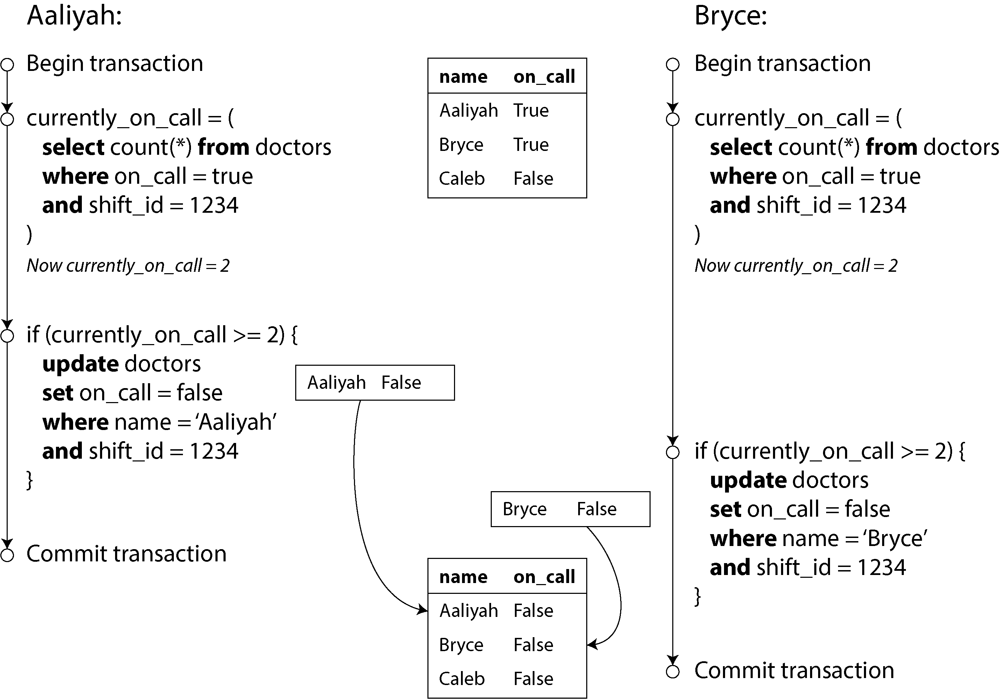

*Hình 8-8. Một write skew gây ra lỗi ứng dụng*

#### Đặc trưng của write skew

Bất thường này được gọi là *write skew* [38]. Nó không phải là dirty write cũng không phải là lost update, bởi vì hai transaction đang cập nhật hai đối tượng khác nhau (lần lượt là bản ghi trực ca của Aaliyah và của Bryce). Ở đây khó thấy rõ rằng đã xảy ra xung đột, nhưng đó chắc chắn là một race condition: nếu hai transaction chạy lần lượt cái này sau cái kia, bác sĩ thứ hai sẽ bị ngăn không cho rời ca trực. Hành vi bất thường này chỉ có thể xảy ra vì các transaction chạy đồng thời.

Bạn có thể coi write skew là dạng tổng quát hóa của vấn đề lost update. Write skew có thể xảy ra nếu hai transaction đọc cùng các đối tượng rồi sau đó cập nhật một số trong các đối tượng đó (các transaction khác nhau có thể cập nhật các đối tượng khác nhau). Trong trường hợp đặc biệt khi các transaction khác nhau cập nhật cùng một đối tượng, bạn gặp bất thường dirty write hoặc lost update (tùy vào thời điểm).

Chúng ta đã thấy có nhiều cách để ngăn chặn lost update. Với write skew, các lựa chọn của chúng ta bị hạn chế hơn:

- Các thao tác nguyên tử trên một đối tượng không giúp được gì, vì có nhiều đối tượng liên quan.

- Cơ chế tự động phát hiện lost update mà bạn thấy trong một số triển khai của snapshot isolation tiếc là cũng không giúp được— write skew không được tự động phát hiện trong mức repeatable read của PostgreSQL, repeatable read của MySQL/InnoDB, serializable của Oracle, hay mức snapshot isolation của SQL Server [30]. Việc tự động ngăn chặn write skew đòi hỏi serializable isolation thực sự (xem “Serializability”). Một số database cho phép bạn cấu hình các ràng buộc (constraint), sau đó được database thực thi (ví dụ, ràng buộc duy nhất, ràng buộc khóa ngoại, hoặc giới hạn trên một giá trị cụ thể). Tuy nhiên, để chỉ định rằng phải có ít nhất một bác sĩ trực ca, bạn sẽ cần một ràng buộc liên quan đến nhiều đối tượng. Hầu hết các database không có hỗ trợ sẵn cho những ràng buộc như vậy, mặc dù bạn có thể triển khai chúng bằng trigger hoặc materialized view, như đã thảo luận trong “Consistency” [12].

- Nếu bạn không thể dùng mức serializable isolation, lựa chọn tốt thứ hai trong trường hợp này có lẽ là khóa (lock) tường minh các hàng mà transaction phụ thuộc vào. Trong ví dụ về các bác sĩ, bạn có thể viết đại loại như sau:

```
BEGIN TRANSACTION;

SELECT * FROM doctors
  WHERE on_call = true
  AND shift_id = 1234 FOR UPDATE;  ①

UPDATE doctors
  SET on_call = false
  WHERE name = 'Aaliyah'
  AND shift_id = 1234;

COMMIT;
```

- ① Như trước, `FOR UPDATE` yêu cầu database khóa tất cả các hàng được trả về bởi truy vấn này.

#### Thêm các ví dụ về write skew

Write skew thoạt đầu có thể trông như một vấn đề khó hiểu và hiếm gặp, nhưng một khi bạn đã nhận biết về nó, bạn có thể nhận ra những tình huống khác mà nó có thể xảy ra. Dưới đây là một số ví dụ nữa:

- **Hệ thống đặt phòng họp**

  Giả sử bạn muốn đảm bảo rằng không thể có hai lượt đặt cho cùng một phòng họp vào cùng một thời điểm [57]. Khi ai đó muốn đặt phòng, trước tiên bạn kiểm tra xem có lượt đặt nào xung đột không (tức là các lượt đặt cùng phòng với khoảng thời gian chồng lấn), và nếu không tìm thấy, bạn tạo cuộc họp (xem Ví dụ 8-2).

  **Ví dụ 8-2. Một hệ thống đặt phòng họp cố gắng tránh đặt trùng (không an toàn dưới snapshot isolation)**

```
BEGIN TRANSACTION;
-- Check for any existing bookings that overlap with the period of no
SELECT COUNT(*) FROM bookings
  WHERE room_id = 123 AND
    end_time > '2025-01-01 12:00' AND start_time < '2025-01-01 13:00'

-- If the previous query returned zero:
INSERT INTO bookings
  (room_id, start_time, end_time, user_id)
  VALUES (123, '2025-01-01 12:00', '2025-01-01 13:00', 666);

COMMIT;
```

  Thật không may, snapshot isolation không ngăn được một người dùng khác đồng thời chèn vào một cuộc họp xung đột. Để đảm bảo bạn không gặp xung đột lịch, bạn một lần nữa cần serializable isolation.

- **Trò chơi nhiều người chơi**

  Trong Ví dụ 8-1, chúng ta đã dùng lock để ngăn lost update (đảm bảo hai người chơi không thể di chuyển cùng một quân cờ vào cùng một thời điểm). Tuy nhiên, lock không ngăn người chơi di chuyển hai quân cờ khác nhau đến cùng một vị trí trên bàn cờ, hoặc có thể thực hiện một nước đi khác vi phạm luật chơi. Tùy vào loại luật bạn đang áp dụng, bạn có thể dùng ràng buộc duy nhất, nhưng nếu không thì bạn dễ bị write skew.

- **Giành tên người dùng**

  Trên một website mà mỗi người dùng phải có một tên người dùng (username) duy nhất, hai người dùng có thể cố tạo tài khoản với cùng một username vào cùng một thời điểm. Bạn có thể dùng một transaction để kiểm tra xem tên đó đã bị lấy chưa và, nếu chưa, tạo tài khoản với tên đó. Tuy nhiên, như trong các ví dụ trước, điều đó không an toàn dưới snapshot isolation. May mắn là ràng buộc duy nhất là một giải pháp đơn giản ở đây (transaction thứ hai cố đăng ký username đó sẽ bị abort vì vi phạm ràng buộc).

- **Ngăn chặn chi tiêu hai lần (double-spending)**

  Một dịch vụ cho phép người dùng tiêu tiền hoặc điểm cần kiểm tra rằng người dùng không tiêu nhiều hơn số họ có. Bạn có thể triển khai điều này bằng cách chèn một khoản chi tạm thời vào tài khoản của người dùng, liệt kê tất cả các khoản trong tài khoản, và kiểm tra rằng tổng là số dương. Tuy nhiên, với write skew, có thể xảy ra trường hợp hai khoản chi được chèn đồng thời mà cộng lại khiến số dư trở thành âm, nhưng không transaction nào nhận thấy transaction kia.

#### Phantom gây ra write skew

Tất cả các ví dụ trước đều theo một khuôn mẫu tương tự:

1. Một truy vấn `SELECT` kiểm tra xem một yêu cầu có được thỏa mãn hay không bằng cách tìm các hàng khớp với một điều kiện tìm kiếm (ví dụ, có ít nhất hai bác sĩ đang trực, không có lượt đặt nào cho phòng đó vào thời điểm đó, vị trí trên bàn cờ chưa có quân cờ nào khác, username chưa bị lấy, tài khoản vẫn còn tiền).

2. Tùy vào kết quả của truy vấn đầu tiên, mã ứng dụng quyết định cách tiếp tục (có thể là tiến hành thao tác, hoặc có thể là báo lỗi cho người dùng và abort).

3. Nếu ứng dụng quyết định tiến hành, nó thực hiện một thao tác ghi ( `INSERT` , `UPDATE` , hoặc `DELETE` ) vào database và commit transaction. Tác động của thao tác ghi này làm thay đổi tiền điều kiện của quyết định ở bước 2. Nói cách khác, nếu bạn lặp lại truy vấn `SELECT` từ bước 1 sau khi commit thao tác ghi, bạn sẽ nhận được kết quả khác, bởi vì thao tác ghi đã thay đổi tập các hàng khớp với điều kiện tìm kiếm (giờ có ít hơn một bác sĩ trực ca, phòng họp giờ đã được đặt vào thời điểm đó, vị trí trên bàn cờ giờ đã bị quân cờ vừa di chuyển chiếm, username giờ đã bị lấy, tài khoản giờ có ít tiền hơn).

Các bước có thể xảy ra theo thứ tự khác. Ví dụ, bạn có thể thực hiện thao tác ghi trước, rồi đến truy vấn `SELECT`, và cuối cùng quyết định abort hay commit dựa trên kết quả của truy vấn.

Trong ví dụ về bác sĩ trực ca, hàng bị sửa đổi ở bước 3 là một trong các hàng được trả về ở bước 1, nên bạn có thể làm transaction an toàn và tránh write skew bằng cách khóa các hàng ở bước 1 ( `SELECT FOR UPDATE` ). Tuy nhiên, bốn ví dụ còn lại thì khác: chúng kiểm tra sự *không tồn tại* của các hàng khớp với điều kiện tìm kiếm, và thao tác ghi *thêm* một hàng khớp với chính điều kiện đó. Nếu truy vấn ở bước 1 không trả về hàng nào, `SELECT FOR UPDATE` không thể gắn lock vào bất cứ thứ gì [58].

Hiệu ứng này, trong đó một thao tác ghi ở một transaction làm thay đổi kết quả của truy vấn tìm kiếm trong một transaction khác, được gọi là *phantom* [4]. Snapshot isolation tránh được phantom trong các truy vấn chỉ đọc, nhưng trong các transaction đọc/ghi như các ví dụ chúng ta đã thảo luận, phantom có thể dẫn đến những trường hợp write skew đặc biệt khó xử lý. Mã SQL do các ORM sinh ra cũng dễ mắc write skew [52, 53].

#### Vật chất hóa xung đột (materializing conflicts)

Nếu vấn đề của phantom là không có đối tượng nào để chúng ta gắn lock vào, có lẽ chúng ta có thể đưa một đối tượng lock một cách nhân tạo vào database?

Ví dụ, trong trường hợp đặt phòng họp, bạn có thể hình dung việc tạo một bảng gồm các khung giờ và phòng. Mỗi hàng trong bảng này tương ứng với một phòng cụ thể trong một khoảng thời gian cụ thể (chẳng hạn, 15 phút). Bạn tạo trước các hàng cho tất cả các tổ hợp có thể của phòng và khoảng thời gian (ví dụ, cho sáu tháng tiếp theo).

Giờ đây, một transaction muốn tạo lượt đặt phòng có thể khóa ( `SELECT FOR UPDATE` ) các hàng trong bảng tương ứng với phòng và khoảng thời gian mong muốn. Sau khi có được các lock, transaction có thể kiểm tra các lượt đặt chồng lấn và chèn lượt đặt mới như trước. Lưu ý rằng bảng bổ sung này không được dùng để lưu thông tin về lượt đặt—nó thuần túy là một tập hợp các lock được dùng để ngăn việc đặt cùng một phòng và cùng khoảng thời gian diễn ra đồng thời.

Cách tiếp cận này được gọi là *materializing conflicts* (vật chất hóa xung đột), bởi vì nó lấy một phantom và biến nó thành xung đột lock trên một tập hàng cụ thể tồn tại trong database [14]. Thật không may, việc tìm ra cách vật chất hóa xung đột có thể khó và dễ sai, và việc để một cơ chế kiểm soát đồng thời rò rỉ vào mô hình dữ liệu của ứng dụng là điều không đẹp. Vì những lý do đó, vật chất hóa xung đột nên được coi là phương án cuối cùng nếu không còn lựa chọn nào khác. Mức serializable isolation là lựa chọn được ưu tiên hơn trong hầu hết các trường hợp.

## Serializability

Trong chương này chúng ta đã thấy một số ví dụ về các transaction dễ gặp race condition. Một số race condition được ngăn chặn bởi các mức read committed và snapshot isolation, nhưng số khác thì không. Chúng ta đã gặp một số ví dụ đặc biệt khó xử lý với write skew và phantom. Đó là một tình cảnh đáng buồn:

- Các mức isolation khó hiểu và được triển khai không nhất quán giữa các database khác nhau (ví dụ, ý nghĩa của “repeatable read” khác nhau đáng kể).

- Có thể khó xác định bằng cách nhìn vào mã ứng dụng xem nó có an toàn khi chạy ở một mức isolation cụ thể hay không—đặc biệt trong một ứng dụng lớn, nơi bạn có thể không biết hết mọi thứ có thể đang xảy ra đồng thời.

- Không có công cụ tốt nào giúp chúng ta phát hiện race condition. Về nguyên tắc, phân tích tĩnh có thể giúp [35], nhưng các kỹ thuật nghiên cứu vẫn chưa đi vào sử dụng thực tế. Kiểm thử các vấn đề đồng thời rất khó, bởi vì chúng thường không xác định (nondeterministic)—vấn đề chỉ xảy ra nếu bạn không may về thời điểm.

Đây không phải là vấn đề mới. Tình trạng này đã tồn tại từ thập niên 1970, khi các mức isolation yếu lần đầu được giới thiệu [3]. Suốt thời gian đó, câu trả lời từ các nhà nghiên cứu vẫn luôn đơn giản: hãy dùng *serializable* isolation!

Serializable isolation là mức isolation mạnh nhất. Nó đảm bảo rằng mặc dù các transaction có thể thực thi song song, kết quả cuối cùng vẫn giống như khi chúng được thực thi lần lượt từng cái một, *tuần tự*, không có bất kỳ sự đồng thời nào. Do đó, database đảm bảo rằng nếu các transaction hoạt động đúng khi chạy riêng lẻ, chúng sẽ tiếp tục đúng khi chạy đồng thời—nói cách khác, database ngăn chặn *mọi* race condition có thể xảy ra.

Nhưng nếu serializable isolation tốt hơn hẳn so với mớ hỗn độn của các mức isolation yếu, tại sao không phải ai cũng dùng nó? Để trả lời câu hỏi này, chúng ta cần xem xét các lựa chọn để triển khai serializability và hiệu năng của chúng. Hầu hết các database cung cấp serializability ngày nay dùng một trong ba kỹ thuật, mà chúng ta sẽ khám phá trong phần còn lại của chương này:

- Thực thi các transaction theo đúng nghĩa đen theo thứ tự tuần tự (xem mục tiếp theo)

- Two-phase locking (xem “Two-Phase Locking (Khóa hai pha)”), trong nhiều thập kỷ từng là lựa chọn khả thi duy nhất

- Các kỹ thuật kiểm soát đồng thời lạc quan (optimistic concurrency control) như serializable snapshot isolation (xem “Serializable Snapshot Isolation”)

### Thực thi tuần tự thực sự

Cách đơn giản nhất để tránh các vấn đề đồng thời là loại bỏ hoàn toàn sự đồng thời: chỉ thực thi một transaction tại một thời điểm, theo thứ tự tuần tự, trên một thread duy nhất. Bằng cách đó, chúng ta hoàn toàn né tránh được vấn đề phát hiện và ngăn chặn xung đột giữa các transaction; mức isolation thu được theo định nghĩa là serializable.

Mặc dù điều này có vẻ là một ý tưởng hiển nhiên, nhưng chỉ đến thập niên 2000 các nhà thiết kế database mới quyết định rằng một vòng lặp đơn thread để thực thi transaction là khả thi [59]. Nếu tính đồng thời đa thread từng được coi là thiết yếu để đạt hiệu năng tốt trong suốt 30 năm trước đó, thì điều gì đã thay đổi để khiến việc thực thi đơn thread trở nên khả dĩ?

Hai bước phát triển đã dẫn đến sự thay đổi tư duy này:

- RAM đã trở nên đủ rẻ để với nhiều trường hợp sử dụng, giờ đây việc giữ toàn bộ tập dữ liệu đang hoạt động trong bộ nhớ là khả thi (xem “Giữ toàn bộ dữ liệu trong bộ nhớ”). Khi tất cả dữ liệu mà một transaction cần truy cập đều nằm trong bộ nhớ, các transaction có thể thực thi nhanh hơn nhiều so với khi phải chờ dữ liệu được tải từ đĩa.

- Các nhà thiết kế database nhận ra rằng các transaction OLTP thường ngắn và chỉ thực hiện một số lượng nhỏ các thao tác đọc và ghi (xem “Hệ thống vận hành và hệ thống phân tích”). Ngược lại, các truy vấn phân tích chạy lâu thường chỉ đọc, nên chúng có thể chạy trên một snapshot nhất quán (dùng snapshot isolation) bên ngoài vòng lặp thực thi tuần tự.

Cách tiếp cận thực thi transaction tuần tự được triển khai chẳng hạn trong VoltDB/H-Store, Redis và Datomic [60, 61, 62]. Một hệ thống được thiết kế cho thực thi đơn thread đôi khi có thể hoạt động tốt hơn hệ thống hỗ trợ đồng thời, bởi vì nó có thể tránh được chi phí phối hợp của việc khóa. Tuy nhiên, thông lượng (throughput) của nó bị giới hạn ở mức của một nhân CPU duy nhất. Để tận dụng tối đa thread duy nhất đó, các transaction cần được cấu trúc khác với dạng truyền thống của chúng.

#### Đóng gói transaction trong stored procedure

Trong những ngày đầu của database, ý định là một database transaction có thể bao trùm toàn bộ một luồng hoạt động của người dùng. Ví dụ, đặt vé máy bay là một quy trình nhiều giai đoạn (tìm kiếm tuyến bay, giá vé và ghế còn trống; quyết định hành trình; đặt ghế trên từng chuyến bay của hành trình; nhập thông tin hành khách; thanh toán). Các nhà thiết kế database nghĩ rằng sẽ thật gọn gàng nếu toàn bộ quy trình đó là một transaction để nó có thể được commit một cách nguyên tử.

Thật không may, con người rất chậm trong việc quyết định và phản hồi. Nếu một database transaction cần chờ đầu vào từ người dùng, database cần hỗ trợ một số lượng transaction đồng thời có thể rất lớn, phần lớn trong số đó ở trạng thái rỗi. Hầu hết các database không thể làm điều đó một cách hiệu quả, nên gần như tất cả các ứng dụng OLTP giữ transaction ngắn bằng cách tránh chờ đợi tương tác với người dùng bên trong một transaction. Trên web, điều này có nghĩa là một transaction được commit trong cùng một HTTP request— một transaction không trải dài qua nhiều request. Một HTTP request mới bắt đầu một transaction mới.

Mặc dù con người đã được đưa ra khỏi đường dẫn tới hạn (critical path), các transaction vẫn tiếp tục được thực thi theo kiểu client/server tương tác, từng câu lệnh một. Một ứng dụng thực hiện một truy vấn, đọc kết quả, có thể thực hiện một truy vấn khác tùy vào kết quả của truy vấn đầu, và cứ thế tiếp tục. Các truy vấn và kết quả được gửi qua lại giữa mã ứng dụng (chạy trên một máy) và database server (trên một máy khác).

Trong kiểu transaction tương tác này, rất nhiều thời gian bị tiêu tốn vào việc giao tiếp mạng giữa ứng dụng và database. Nếu bạn không cho phép đồng thời trong database và chỉ xử lý một transaction tại một thời điểm, thông lượng sẽ tệ hại bởi vì database sẽ dành phần lớn thời gian để chờ ứng dụng phát ra truy vấn tiếp theo cho transaction hiện tại. Trong loại database này, cần phải xử lý nhiều transaction đồng thời để đạt được hiệu năng hợp lý.

Vì lý do này, các hệ thống xử lý transaction tuần tự đơn thread không cho phép các transaction tương tác gồm nhiều câu lệnh. Thay vào đó, ứng dụng phải hoặc là tự giới hạn ở các transaction chỉ chứa một câu lệnh duy nhất, hoặc là gửi trước toàn bộ mã của transaction cho database, dưới dạng một *stored procedure* [63].

Sự khác biệt giữa transaction tương tác và stored procedure được minh họa trong Hình 8-9. Với điều kiện tất cả dữ liệu mà transaction cần đều nằm trong bộ nhớ, stored procedure có thể thực thi rất nhanh, không cần chờ bất kỳ I/O mạng hay đĩa nào.

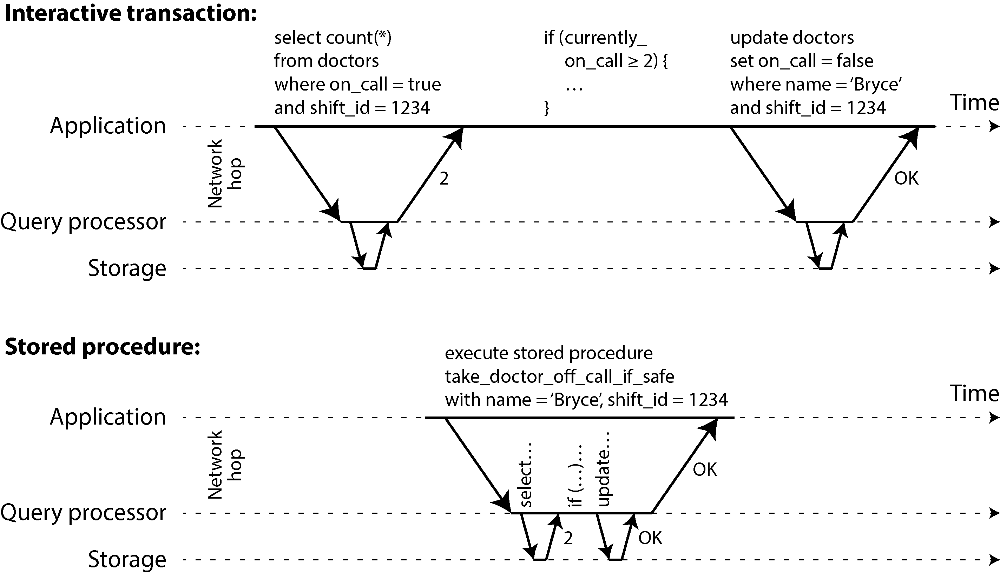

*Hình 8-9. Sự khác biệt giữa một transaction tương tác và một stored procedure (dùng transaction ví dụ của Hình 8-8)*

#### Ưu và nhược điểm của stored procedure

Stored procedure đã tồn tại từ khá lâu trong các database quan hệ, và chúng đã là một phần của chuẩn SQL (SQL/PSM) từ năm 1999. Chúng có tiếng xấu ở một mức độ nào đó vì nhiều lý do:

- Theo truyền thống, mỗi nhà cung cấp database có ngôn ngữ riêng cho stored procedure (Oracle có PL/SQL, SQL Server có T-SQL, PostgreSQL có PL/pgSQL, v.v.). Các ngôn ngữ này không theo kịp những phát triển trong các ngôn ngữ lập trình đa dụng, nên chúng trông khá xấu và cổ lỗ theo quan điểm ngày nay, và chúng thiếu hệ sinh thái thư viện mà bạn thấy ở hầu hết các ngôn ngữ lập trình hiện đại. Mã chạy trong database rất khó quản lý. So với một application server, nó khó debug hơn, bất tiện hơn khi đưa vào quản lý phiên bản và triển khai, khó kiểm thử hơn, và khó tích hợp với hệ thống thu thập số liệu (metrics) để giám sát.

- Một database thường nhạy cảm về hiệu năng hơn nhiều so với một application server, bởi vì một instance database duy nhất thường được chia sẻ bởi nhiều application server. Một stored procedure viết tồi (ví dụ, dùng nhiều bộ nhớ hoặc thời gian CPU, hoặc thậm chí gây crash) trong database có thể gây ra nhiều rắc rối hơn hẳn so với mã viết tồi tương đương trong một application server.

- Trong một hệ thống đa người thuê (multitenant) cho phép các tenant tự viết stored procedure của mình, việc thực thi mã không đáng tin cậy trong cùng process với nhân (kernel) của database là một rủi ro bảo mật [64].

Tuy nhiên, những vấn đề đó có thể khắc phục được. Các triển khai stored procedure hiện đại đã từ bỏ PL/SQL và thay vào đó dùng các ngôn ngữ lập trình đa dụng sẵn có. VoltDB dùng Java hoặc Groovy, Datomic dùng Java hoặc Clojure, Redis dùng Lua, và MongoDB dùng JavaScript.

Stored procedure cũng hữu ích khi logic ứng dụng không thể dễ dàng nhúng ở nơi khác. Ví dụ, các ứng dụng dùng GraphQL có thể trực tiếp phơi bày database của chúng thông qua một GraphQL proxy. Nếu proxy không hỗ trợ logic kiểm tra hợp lệ (validation) phức tạp, bạn có thể nhúng logic đó trực tiếp vào database bằng cách dùng stored procedure. Nếu database không hỗ trợ stored procedure, bạn sẽ phải triển khai một dịch vụ validation giữa proxy và database để thực hiện việc kiểm tra.

Với stored procedure và dữ liệu trong bộ nhớ, việc thực thi tất cả transaction trên một thread duy nhất trở nên khả thi. Khi stored procedure không cần chờ I/O và tránh được chi phí của các cơ chế kiểm soát đồng thời khác, chúng có thể đạt được thông lượng khá tốt trên một thread duy nhất.

VoltDB cũng dùng stored procedure cho replication. Thay vì sao chép các thao tác ghi của một transaction từ node này sang node khác, nó thực thi cùng một stored procedure trên mỗi replica. Do đó VoltDB yêu cầu các stored procedure phải *deterministic* (khi chạy trên các node khác nhau, chúng phải cho ra cùng kết quả). Ví dụ, nếu một transaction cần dùng ngày giờ hiện tại, nó phải làm điều đó thông qua các API deterministic đặc biệt (xem “Durable Execution và Workflow” để biết thêm chi tiết về các thao tác deterministic). Cách tiếp cận này được gọi là *state machine replication* (sao chép máy trạng thái), và chúng ta sẽ quay lại nó trong Chương 10.

#### Sharding

Thực thi tất cả transaction một cách tuần tự làm cho việc kiểm soát đồng thời đơn giản hơn nhiều, nhưng nó giới hạn thông lượng transaction của database ở tốc độ của một nhân CPU duy nhất trên một máy duy nhất. Các transaction chỉ đọc có thể thực thi ở nơi khác, dùng snapshot isolation, nhưng với các ứng dụng có thông lượng ghi cao, bộ xử lý transaction đơn thread có thể trở thành một nút thắt cổ chai nghiêm trọng.

Để mở rộng ra nhiều nhân CPU và nhiều node, bạn có thể shard dữ liệu của mình (xem Chương 7), điều này được hỗ trợ trong VoltDB. Nếu bạn có thể tìm ra cách sharding tập dữ liệu sao cho mỗi transaction chỉ cần đọc và ghi dữ liệu trong một shard duy nhất, thì mỗi shard có thể có thread xử lý transaction riêng chạy độc lập với các shard khác. Trong trường hợp này, bạn có thể gán cho mỗi nhân CPU một shard riêng, cho phép thông lượng transaction của bạn mở rộng tuyến tính theo số nhân CPU [61].

Tuy nhiên, với bất kỳ transaction nào cần truy cập nhiều shard, database phải phối hợp transaction đó trên tất cả các shard mà nó chạm tới. Stored procedure cần được thực hiện đồng nhịp (lockstep) trên tất cả các shard để đảm bảo serializability trên toàn hệ thống.

Vì các transaction liên shard (cross-shard) có thêm chi phí phối hợp, chúng chậm hơn rất nhiều so với các transaction đơn shard. VoltDB báo cáo thông lượng khoảng 1,000 thao tác ghi liên shard mỗi giây, thấp hơn nhiều bậc độ lớn so với thông lượng đơn shard của nó và không thể tăng lên bằng cách thêm máy [63]. Các nghiên cứu gần đây hơn đã khám phá những cách làm cho các transaction đa shard có khả năng mở rộng tốt hơn [65].

Việc các transaction có thể là đơn shard hay không phụ thuộc rất nhiều vào cấu trúc dữ liệu mà ứng dụng sử dụng. Dữ liệu key-value đơn giản thường có thể được shard rất dễ dàng, nhưng dữ liệu có nhiều secondary index nhiều khả năng sẽ đòi hỏi rất nhiều phối hợp liên shard (xem “Sharding và secondary index”).

#### Tóm tắt về thực thi tuần tự

Thực thi tuần tự (serial execution) các transaction đã trở thành một cách khả thi để đạt được serializable isolation, trong một số ràng buộc nhất định:

- Mỗi transaction phải nhỏ và nhanh, vì chỉ cần một transaction chậm là đủ để làm đình trệ toàn bộ việc xử lý transaction.

- Cách này phù hợp nhất khi tập dữ liệu đang hoạt động (active dataset) có thể nằm gọn trong bộ nhớ. Dữ liệu hiếm khi được truy cập có thể được chuyển xuống đĩa, nhưng nếu dữ liệu đó cần được truy cập trong một transaction đơn luồng (single-threaded), hệ thống sẽ trở nên rất chậm.

- Thông lượng ghi (write throughput) phải đủ thấp để một lõi CPU duy nhất có thể xử lý được, nếu không các transaction cần được shard mà không đòi hỏi phối hợp giữa các shard (cross-shard coordination).

- Các transaction xuyên shard (cross-shard) là khả thi, nhưng thông lượng của chúng khó mở rộng.

### Two-Phase Locking (Khóa hai pha)

Trong khoảng 30 năm, chỉ có một thuật toán được sử dụng rộng rãi để đạt serializability trong các database: *two-phase locking* (2PL, khóa hai pha), đôi khi được gọi là *strong strict two-phase locking* (SS2PL) để phân biệt với các biến thể khác của 2PL.

> **2PL KHÔNG PHẢI LÀ 2PC**
>
> 2PL và 2PC là hai thứ rất khác nhau. 2PL cung cấp serializable isolation, trong khi 2PC cung cấp atomic commit trong một database phân tán (xem “Two-Phase Commit”). Để tránh nhầm lẫn, tốt nhất hãy xem chúng là hai khái niệm hoàn toàn tách biệt và bỏ qua sự giống nhau đáng tiếc về tên gọi.

Trước đó chúng ta đã thấy rằng khóa (lock) thường được dùng để ngăn dirty write (xem “Không có dirty write”). Nếu hai transaction đồng thời cố ghi vào cùng một đối tượng, khóa đảm bảo rằng bên ghi thứ hai phải chờ cho đến khi bên thứ nhất hoàn tất transaction của nó (abort hoặc commit) rồi mới được tiếp tục.

2PL cũng tương tự, nhưng nó đặt ra các yêu cầu về khóa mạnh hơn nhiều. Nhiều transaction được phép đồng thời đọc cùng một đối tượng miễn là không có ai đang ghi vào nó. Nhưng ngay khi có ai đó muốn ghi (sửa đổi hoặc xóa) một đối tượng, quyền truy cập độc quyền (exclusive access) là bắt buộc:

- Nếu transaction A đã đọc một đối tượng và transaction B muốn ghi vào đối tượng đó, B phải chờ cho đến khi A commit hoặc abort rồi mới được tiếp tục. (Điều này đảm bảo B không thể thay đổi đối tượng một cách bất ngờ sau lưng A.)

- Nếu transaction A đã ghi một đối tượng và transaction B muốn đọc đối tượng đó, B phải chờ cho đến khi A commit hoặc abort rồi mới được tiếp tục. (Việc đọc một phiên bản cũ của đối tượng, như trong Hình 8-4, là không được chấp nhận trong 2PL.)

Trong 2PL, bên ghi không chỉ chặn (block) các bên ghi khác; chúng còn chặn cả bên đọc, và ngược lại. Câu châm ngôn *bên đọc không bao giờ chặn bên ghi, và bên ghi không bao giờ chặn bên đọc* của snapshot isolation đã nhắc đến trước đó (xem “Điều khiển đồng thời đa phiên bản (multiversion concurrency control)”) thể hiện rõ sự khác biệt then chốt này giữa snapshot isolation và 2PL. Mặt khác, vì 2PL cung cấp serializability, nó bảo vệ khỏi mọi race condition đã thảo luận trước đó, bao gồm lost update và write skew.

#### Triển khai 2PL

2PL được dùng bởi mức cô lập serializable trong MySQL/InnoDB và SQL Server, và bởi mức cô lập repeatable read trong Db2 [30].

Việc chặn bên đọc và bên ghi được triển khai bằng cách có một khóa trên mỗi đối tượng trong database. Khóa có thể ở *shared mode* (chế độ chia sẻ) hoặc *exclusive mode* (chế độ độc quyền) (còn được gọi là khóa *multi-reader single-writer* — nhiều bên đọc, một bên ghi). Nó được sử dụng như sau:

- Nếu một transaction muốn đọc một đối tượng, trước tiên nó phải giành được khóa ở shared mode. Nhiều transaction được phép giữ khóa ở shared mode cùng lúc, nhưng nếu một transaction khác đã có exclusive lock trên đối tượng đó, các transaction này phải chờ.

- Nếu một transaction muốn ghi vào một đối tượng, trước tiên nó phải giành được khóa ở exclusive mode. Không transaction nào khác được giữ khóa cùng lúc (dù ở shared mode hay exclusive mode), do đó nếu đã có bất kỳ khóa nào trên đối tượng, transaction phải chờ.

- Nếu một transaction đọc rồi sau đó ghi một đối tượng, nó có thể nâng cấp shared lock của mình lên exclusive lock. Việc nâng cấp hoạt động giống như việc lấy exclusive lock trực tiếp.

- Sau khi một transaction đã giành được khóa, nó phải tiếp tục giữ khóa cho đến khi transaction kết thúc (commit hoặc abort). Đây chính là nguồn gốc của tên gọi “two-phase” (hai pha): pha thứ nhất (pha *growing* — mở rộng, trong khi transaction đang thực thi) là khi các khóa được giành lấy, và pha thứ hai (pha *shrinking* — thu hẹp, ở cuối transaction) là khi tất cả các khóa được giải phóng. Hai pha này không được chồng lấn nhau; một khi một khóa đã được giải phóng, transaction không được giành thêm khóa mới nào nữa.

Vì có quá nhiều khóa được sử dụng, rất dễ xảy ra tình huống transaction A bị kẹt chờ transaction B giải phóng khóa của nó, và ngược lại. Tình huống này được gọi là *deadlock*. Database tự động phát hiện deadlock giữa các transaction và abort một trong số chúng để các transaction còn lại có thể tiếp tục tiến triển. Transaction bị abort cần được ứng dụng thử lại (retry).

#### Hiệu năng của 2PL

Nhược điểm lớn của 2PL, và là lý do nó không còn là mặc định cho hầu hết các hệ thống kể từ thập niên 1970, chính là hiệu năng. Thông lượng transaction và thời gian phản hồi của các truy vấn dưới 2PL kém hơn đáng kể so với dưới các mức cô lập yếu (weak isolation).

Điều này một phần là do chi phí (overhead) của việc giành và giải phóng tất cả các khóa đó, nhưng quan trọng hơn là do tính đồng thời (concurrency) bị giảm. Theo thiết kế, nếu hai transaction đồng thời cố làm bất cứ điều gì có thể dẫn đến race condition theo bất kỳ cách nào, một transaction phải chờ transaction kia hoàn tất.

Ví dụ, nếu bạn có một transaction cần đọc toàn bộ một bảng (chẳng hạn một bản sao lưu, một truy vấn phân tích, hoặc một phép kiểm tra tính toàn vẹn, như đã thảo luận trong “Snapshot Isolation và Repeatable Read”), transaction đó phải lấy một shared lock trên toàn bộ bảng. Do đó, transaction đọc trước tiên phải chờ cho đến khi tất cả các transaction đang ghi vào bảng đó hoàn tất; sau đó, trong khi toàn bộ bảng đang được đọc (có thể mất nhiều thời gian đối với bảng lớn), mọi transaction khác muốn ghi vào bảng đó đều bị chặn cho đến khi transaction chỉ đọc khổng lồ kia commit. Thực tế là database trở nên không sẵn sàng cho việc ghi trong một thời gian dài.

Vì lý do này, các database chạy 2PL có thể có độ trễ (latency) khá bất ổn, và chúng có thể rất chậm ở các percentile cao (xem “Mô tả hiệu năng”) nếu có tranh chấp (contention) trong workload. Chỉ một transaction chậm, hoặc một transaction truy cập nhiều dữ liệu và giành nhiều khóa, cũng có thể khiến phần còn lại của hệ thống đình trệ hoàn toàn. Transaction timeout và giám sát truy vấn chậm (slow query monitoring) được dùng để phát hiện và hạn chế các truy vấn hoạt động bất thường.

Mặc dù deadlock có thể xảy ra với mức cô lập read committed dựa trên khóa, chúng xảy ra thường xuyên hơn nhiều dưới serializable isolation bằng 2PL (tùy vào mẫu truy cập của transaction của bạn). Đây có thể là một vấn đề hiệu năng bổ sung: khi một transaction bị abort do deadlock và được thử lại, nó phải làm lại toàn bộ công việc của mình từ đầu. Nếu deadlock xảy ra thường xuyên, điều này có thể đồng nghĩa với một lượng công sức lãng phí đáng kể.

#### Predicate lock (khóa vị từ)

Trong phần mô tả về khóa ở trên, chúng ta đã lướt qua một chi tiết tinh tế nhưng quan trọng. Trong “Phantom gây ra write skew” chúng ta đã thảo luận về vấn đề *phantom*—tức là một transaction làm thay đổi kết quả truy vấn tìm kiếm của một transaction khác. Một database với serializable isolation phải ngăn chặn được phantom.

Trong ví dụ đặt phòng họp, điều này có nghĩa là nếu một transaction đã tìm kiếm các lượt đặt phòng hiện có cho một phòng trong một khoảng thời gian nhất định (xem Ví dụ 8-2), một transaction khác không được phép đồng thời chèn hoặc cập nhật một lượt đặt phòng khác cho cùng phòng và cùng khoảng thời gian đó. (Việc đồng thời chèn các lượt đặt cho phòng khác, hoặc cho cùng phòng vào một thời điểm khác không ảnh hưởng đến lượt đặt đang đề xuất, là hoàn toàn ổn.)

Chúng ta triển khai điều này như thế nào? Về mặt khái niệm, chúng ta cần một *predicate lock* (khóa vị từ) [4]. Nó hoạt động tương tự như shared/exclusive lock đã mô tả trước đó, nhưng thay vì thuộc về một đối tượng cụ thể (ví dụ một hàng trong bảng), nó thuộc về tất cả các đối tượng khớp với một điều kiện tìm kiếm, chẳng hạn như:

```
SELECT * FROM bookings
  WHERE room_id = 123 AND
    end_time   > '2026-01-01 12:00' AND
    start_time < '2026-01-01 13:00';
```

Một predicate lock hạn chế truy cập như sau:

- Nếu transaction A muốn đọc các đối tượng khớp với một điều kiện, như trong truy vấn `SELECT` đó, nó phải giành được một predicate lock ở shared mode trên các điều kiện của truy vấn. Nếu một transaction B khác hiện đang giữ exclusive lock trên bất kỳ đối tượng nào khớp với các điều kiện đó, A phải chờ cho đến khi B giải phóng khóa rồi mới được phép thực hiện truy vấn.

- Nếu transaction A muốn chèn, cập nhật hoặc xóa bất kỳ đối tượng nào, trước tiên nó phải kiểm tra xem giá trị cũ hoặc giá trị mới có khớp với bất kỳ predicate lock hiện có nào không. Nếu một predicate lock khớp đang được transaction B giữ, thì A phải chờ cho đến khi B commit hoặc abort rồi mới được tiếp tục.

Ý tưởng then chốt ở đây là predicate lock áp dụng ngay cả với các đối tượng chưa tồn tại trong database nhưng có thể được thêm vào trong tương lai (phantom). Nếu 2PL bao gồm predicate lock, database sẽ ngăn chặn mọi dạng write skew và các race condition khác, và do đó tính cô lập của nó trở thành serializable.

#### Index-range lock (khóa theo khoảng index)

Thật không may, predicate lock không có hiệu năng tốt: nếu có nhiều khóa do các transaction đang hoạt động nắm giữ, việc kiểm tra các khóa khớp trở nên tốn thời gian. Vì lý do đó, hầu hết các database dùng 2PL triển khai *index-range locking* (khóa theo khoảng index, còn được gọi là *next-key locking*), là một phép xấp xỉ đơn giản hóa của predicate locking [56, 66].

Việc đơn giản hóa một vị từ (predicate) bằng cách làm cho nó khớp với một tập đối tượng lớn hơn là an toàn. Ví dụ, nếu bạn có một predicate lock cho các lượt đặt phòng 123 từ 12 giờ trưa đến 1 giờ chiều, bạn có thể xấp xỉ nó bằng cách khóa các lượt đặt phòng 123 ở mọi thời điểm, hoặc bạn có thể xấp xỉ nó bằng cách khóa tất cả các phòng (không chỉ phòng 123) từ 12 giờ trưa đến 1 giờ chiều. Điều này an toàn vì bất kỳ thao tác ghi nào khớp với vị từ gốc chắc chắn cũng sẽ khớp với các phép xấp xỉ.

Trong database đặt phòng, bạn có lẽ sẽ có một index trên cột `room_id` và/hoặc các index trên `start_time` và `end_time` (nếu không, truy vấn ở trên sẽ rất chậm trên một database lớn):

- Giả sử index của bạn nằm trên `room_id` , và database dùng index này để tìm các lượt đặt hiện có cho phòng 123. Giờ database chỉ cần gắn một shared lock vào mục index này, cho biết rằng một transaction đã tìm kiếm các lượt đặt của phòng 123.

- Ngoài ra, nếu database dùng một index dựa trên thời gian để tìm các lượt đặt hiện có, nó có thể gắn một shared lock vào một khoảng giá trị trong index đó, cho biết rằng một transaction đã tìm kiếm các lượt đặt chồng lấn với khoảng thời gian từ 12 giờ trưa đến 1 giờ chiều vào ngày đã chỉ định.

Dù theo cách nào, một phép xấp xỉ của điều kiện tìm kiếm được gắn vào một trong các index. Giờ đây, nếu một transaction khác muốn chèn, cập nhật hoặc xóa một lượt đặt cho cùng phòng và/hoặc một khoảng thời gian chồng lấn, nó sẽ phải cập nhật cùng phần đó của index. Trong quá trình làm việc này, nó sẽ gặp shared lock, và nó sẽ buộc phải chờ cho đến khi khóa được giải phóng.

Điều này cung cấp sự bảo vệ hiệu quả chống lại phantom và write skew. Index-range lock không chính xác bằng predicate lock (chúng có thể khóa một khoảng đối tượng lớn hơn mức thực sự cần thiết để duy trì serializability), nhưng vì chi phí của chúng thấp hơn nhiều, chúng là một sự thỏa hiệp tốt.

Nếu không có index phù hợp nào để gắn range lock, database có thể quay về dùng một shared lock trên toàn bộ bảng. Điều này không tốt cho hiệu năng, vì nó sẽ ngăn mọi transaction khác ghi vào bảng, nhưng đó là một phương án dự phòng an toàn.

### Serializable Snapshot Isolation

Chương này đã vẽ nên một bức tranh khá ảm đạm về kiểm soát đồng thời (concurrency control) trong database. Một mặt, chúng ta có các triển khai serializability hoặc không có hiệu năng tốt (2PL) hoặc không mở rộng tốt (thực thi tuần tự). Mặt khác, chúng ta có các mức cô lập yếu có hiệu năng tốt nhưng dễ mắc nhiều race condition khác nhau (lost update, write skew, phantom, v.v.). Liệu serializable isolation và hiệu năng tốt có về căn bản là đối nghịch với nhau không?

Có vẻ là không: một thuật toán gọi là *serializable snapshot isolation* (SSI) cung cấp serializability đầy đủ với chỉ một tổn thất hiệu năng nhỏ so với snapshot isolation. SSI tương đối mới; nó được mô tả lần đầu vào năm 2008 [55, 67].

Ngày nay, SSI và các thuật toán tương tự được dùng trong các database đơn nút (single-node) (mức cô lập serializable trong PostgreSQL [56], In-Memory OLTP/Hekaton của SQL Server [68], và HyPer [69]), các database phân tán (CockroachDB [5] và FoundationDB [8]), và các storage engine nhúng như BadgerDB.

#### Kiểm soát đồng thời bi quan (pessimistic) so với lạc quan (optimistic)

2PL là một cơ chế kiểm soát đồng thời *bi quan* (pessimistic): nó dựa trên nguyên tắc rằng nếu có bất cứ điều gì có thể xảy ra sai sót (được báo hiệu bởi một khóa đang do transaction khác giữ), thì tốt hơn là chờ cho đến khi tình huống an toàn trở lại rồi mới làm bất cứ điều gì. Nó giống như *mutual exclusion* (loại trừ lẫn nhau), vốn được dùng để bảo vệ các cấu trúc dữ liệu trong lập trình đa luồng.

Thực thi tuần tự, theo một nghĩa nào đó, là bi quan đến mức cực đoan; về bản chất nó tương đương với việc mỗi transaction giữ một exclusive lock trên toàn bộ database (hoặc một shard của database) trong suốt thời gian transaction diễn ra. Chúng ta bù đắp cho sự bi quan đó bằng cách làm cho mỗi transaction thực thi rất nhanh, để nó chỉ cần giữ “khóa” trong một thời gian ngắn.

Ngược lại, serializable snapshot isolation là một kỹ thuật kiểm soát đồng thời lạc quan (optimistic). *Lạc quan* trong ngữ cảnh này có nghĩa là thay vì chặn lại khi có điều gì đó tiềm ẩn nguy hiểm xảy ra, các transaction vẫn cứ tiếp tục, với hy vọng rằng mọi thứ rồi sẽ ổn. Khi một transaction muốn commit, database kiểm tra xem có điều gì xấu đã xảy ra không (tức là tính cô lập có bị vi phạm không); nếu có, transaction bị abort và phải được thử lại. Chỉ những transaction đã thực thi một cách serializable mới được phép commit.

Kiểm soát đồng thời lạc quan là một ý tưởng cũ [70], và các ưu điểm, nhược điểm của nó đã được tranh luận từ lâu [71]. Nó hoạt động kém nếu có tranh chấp cao (nhiều transaction cố truy cập cùng các đối tượng), vì điều này dẫn đến tỷ lệ cao các transaction cần phải abort. Nếu hệ thống đã gần đạt thông lượng tối đa, tải transaction bổ sung từ các transaction được thử lại có thể làm hiệu năng tệ hơn.

Tuy nhiên, nếu có đủ dung lượng dự phòng, và nếu tranh chấp giữa các transaction không quá cao, các kỹ thuật kiểm soát đồng thời lạc quan có xu hướng hoạt động tốt hơn các kỹ thuật bi quan. Tranh chấp có thể được giảm bằng các thao tác nguyên tử có tính giao hoán (commutative atomic operation): ví dụ, nếu nhiều transaction đồng thời muốn tăng một bộ đếm, thứ tự áp dụng các phép tăng không quan trọng (miễn là bộ đếm không được đọc trong cùng transaction đó), nên tất cả các phép tăng đồng thời đều có thể được áp dụng mà không xung đột.

Như tên gọi gợi ý, SSI dựa trên snapshot isolation—tức là mọi thao tác đọc trong một transaction đều được thực hiện từ một snapshot nhất quán của database (xem “Snapshot Isolation và Repeatable Read”). Trên nền snapshot isolation, SSI bổ sung một thuật toán để phát hiện các xung đột serialization giữa các thao tác đọc và ghi và xác định transaction nào cần abort.

#### Quyết định dựa trên một tiền đề đã lỗi thời

Khi chúng ta thảo luận về write skew trong snapshot isolation trước đó (xem “Write Skew và Phantom”), chúng ta đã quan sát thấy một mẫu hình lặp lại: một transaction đọc dữ liệu từ database, xem xét kết quả truy vấn, và quyết định thực hiện một hành động (ghi vào database) dựa trên kết quả mà nó đã thấy. Tuy nhiên, dưới snapshot isolation, kết quả từ truy vấn ban đầu có thể không còn cập nhật vào thời điểm transaction commit, vì dữ liệu có thể đã bị sửa đổi trong lúc đó.

Nói cách khác, transaction đang thực hiện một hành động dựa trên một *tiền đề* (premise) (một sự kiện đúng ở thời điểm bắt đầu transaction, chẳng hạn “Hiện có hai bác sĩ đang trực”). Sau đó, khi transaction muốn commit, dữ liệu gốc có thể đã thay đổi—tiền đề có thể không còn đúng nữa.

Khi ứng dụng thực hiện một truy vấn (ví dụ “Hiện có bao nhiêu bác sĩ đang trực?”), database không biết logic ứng dụng sử dụng kết quả truy vấn đó như thế nào. Để an toàn, database cần giả định rằng bất kỳ thay đổi nào trong kết quả truy vấn (tiền đề) đều có nghĩa là các thao tác ghi trong transaction đó có thể không hợp lệ. Nói cách khác, có thể tồn tại một phụ thuộc nhân quả (causal dependency) giữa các truy vấn và các thao tác ghi trong transaction. Để cung cấp serializable isolation, database phải phát hiện các tình huống trong đó một transaction có thể đã hành động dựa trên một tiền đề lỗi thời, và abort transaction trong trường hợp đó.

Làm sao database biết được kết quả truy vấn có thể đã thay đổi? Hãy xem xét hai trường hợp:

- Phát hiện các thao tác đọc một phiên bản đối tượng MVCC đã cũ (stale) (một thao tác ghi chưa commit đã xảy ra trước thao tác đọc)

- Phát hiện các thao tác ghi ảnh hưởng đến các thao tác đọc trước đó (thao tác ghi xảy ra sau thao tác đọc)

#### Phát hiện các thao tác đọc MVCC đã cũ

Hãy nhớ lại rằng snapshot isolation thường được triển khai bằng MVCC (xem “Điều khiển đồng thời đa phiên bản (multiversion concurrency control)”). Khi một transaction đọc từ một snapshot nhất quán trong một database MVCC, nó bỏ qua các thao tác ghi do bất kỳ transaction nào khác thực hiện mà chưa commit vào thời điểm snapshot được lấy.

Trong Hình 8-10, transaction 43 thấy Aaliyah có `on_call = true` , vì transaction 42 (transaction đã sửa đổi trạng thái trực của Aaliyah) chưa commit. Tuy nhiên, đến thời điểm transaction 43 muốn commit, transaction 42 đã commit rồi. Điều này có nghĩa là thao tác ghi đã bị bỏ qua khi đọc từ snapshot nhất quán giờ đã có hiệu lực, và tiền đề của transaction 43 không còn đúng nữa. Mọi thứ còn phức tạp hơn khi một bên ghi chèn dữ liệu trước đó chưa tồn tại (xem “Phantom gây ra write skew”). Chúng ta sẽ thảo luận về việc phát hiện các thao tác ghi phantom cho SSI tiếp theo.

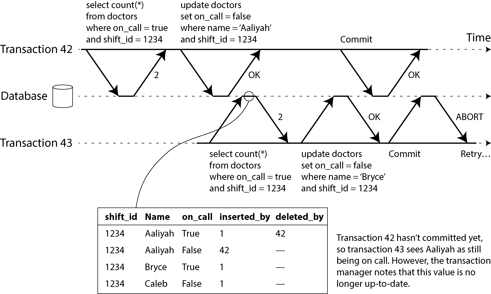

*Hình 8-10. Phát hiện khi một transaction đọc các giá trị lỗi thời từ một snapshot MVCC*

Để ngăn chặn bất thường này, database cần theo dõi thời điểm một transaction bỏ qua các thao tác ghi của transaction khác do các quy tắc hiển thị (visibility) của MVCC. Khi transaction muốn commit, database kiểm tra xem có thao tác ghi nào bị bỏ qua giờ đã được commit hay không. Nếu có, transaction phải bị abort.

Tại sao phải chờ đến lúc commit? Tại sao không abort transaction 43 ngay lập tức khi phát hiện thao tác đọc cũ? Vấn đề là, nếu transaction 43 là một transaction chỉ đọc, nó sẽ không cần bị abort, vì không có nguy cơ write skew. Vào thời điểm transaction 43 thực hiện thao tác đọc, database chưa biết liệu transaction đó sau này có thực hiện thao tác ghi hay không. Hơn nữa, transaction 42 có thể vẫn sẽ abort hoặc có thể vẫn chưa commit vào thời điểm transaction 43 commit, nên thao tác đọc có thể hóa ra không hề cũ. Bằng cách tránh các lần abort không cần thiết, SSI bảo toàn khả năng hỗ trợ của snapshot isolation cho các thao tác đọc kéo dài từ một snapshot nhất quán.

#### Phát hiện các thao tác ghi ảnh hưởng đến các thao tác đọc trước đó

Trường hợp thứ hai cần xem xét là một transaction khác sửa đổi dữ liệu sau khi dữ liệu đó đã được đọc. Trường hợp này được minh họa trong Hình 8-11.

Trong ngữ cảnh của 2PL, chúng ta đã thảo luận về index-range lock (xem “Index-range lock (khóa theo khoảng index)”), cho phép database khóa quyền truy cập vào tất cả các hàng khớp với một truy vấn tìm kiếm, chẳng hạn `WHERE shift_id = 1234` . Chúng ta có thể dùng một kỹ thuật tương tự ở đây, ngoại trừ việc các khóa của SSI không chặn các transaction khác.

Trong Hình 8-11, transaction 42 và 43 đều tìm kiếm các bác sĩ đang trực trong ca `1234`. Nếu có một index trên `shift_id` , database có thể dùng mục index `1234` để ghi lại sự kiện rằng transaction 42 và 43 đã đọc dữ liệu này. (Nếu không có index, thông tin này có thể được theo dõi ở mức bảng.) Thông tin này chỉ cần được lưu giữ trong một thời gian ngắn; sau khi một transaction đã kết thúc (commit hoặc abort), và tất cả các transaction đồng thời đã kết thúc, database có thể quên đi dữ liệu mà nó đã đọc.

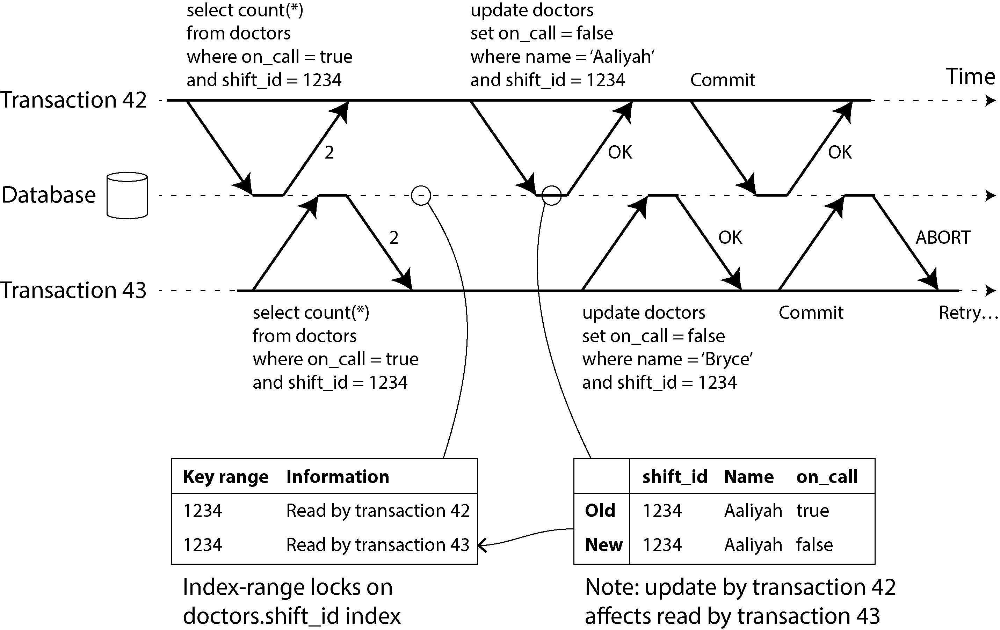

*Hình 8-11. Trong serializable snapshot isolation, phát hiện khi một transaction sửa đổi dữ liệu mà transaction khác đã đọc*

Khi một transaction ghi vào database, nó phải tra trong các index xem có transaction nào khác gần đây đã đọc dữ liệu bị ảnh hưởng không. Quá trình này tương tự như việc giành một write lock trên khoảng khóa (key range) bị ảnh hưởng, nhưng thay vì chặn cho đến khi các bên đọc đã commit, khóa này hoạt động như một dây bẫy (tripwire); nó chỉ đơn giản thông báo cho các transaction rằng dữ liệu chúng đã đọc có thể không còn cập nhật nữa.

Trong Hình 8-11, transaction 43 thông báo cho transaction 42 rằng thao tác đọc trước đó của nó đã lỗi thời, và ngược lại. Transaction 42 commit trước, và nó thành công; mặc dù thao tác ghi của transaction 43 ảnh hưởng đến 42, nhưng 43 chưa commit, nên thao tác ghi đó chưa có hiệu lực. Tuy nhiên, khi transaction 43 muốn commit, thao tác ghi xung đột từ 42 đã được commit rồi, nên 43 phải abort.

#### Hiệu năng của serializable snapshot isolation

Như thường lệ, nhiều chi tiết kỹ thuật ảnh hưởng đến mức độ hiệu quả của một thuật toán trong thực tế. Ví dụ, một sự đánh đổi (trade-off) là mức độ chi tiết (granularity) mà các thao tác đọc và ghi của transaction được theo dõi. Nếu database theo dõi hoạt động của từng transaction một cách rất chi tiết, nó có thể xác định chính xác những transaction nào cần abort, nhưng chi phí ghi chép (bookkeeping) có thể trở nên đáng kể. Theo dõi ít chi tiết hơn thì nhanh hơn, nhưng có thể dẫn đến nhiều transaction bị abort hơn mức thực sự cần thiết.

Trong một số trường hợp, việc một transaction đọc thông tin đã bị một transaction khác ghi đè là chấp nhận được. Tùy vào những gì khác đã xảy ra, đôi khi có thể chứng minh rằng kết quả của việc thực thi vẫn là serializable. PostgreSQL sử dụng lý thuyết này để giảm số lần abort không cần thiết [14, 56].

So với 2PL, ưu điểm lớn của serializable snapshot isolation là một transaction không cần phải bị chặn (block) để chờ các lock do transaction khác đang giữ. Giống như snapshot isolation, các thao tác ghi không chặn các thao tác đọc và ngược lại. Nguyên tắc thiết kế này làm cho độ trễ (latency) của truy vấn dễ dự đoán hơn nhiều và ít biến động hơn. Đặc biệt, các truy vấn chỉ đọc có thể chạy trên một snapshot nhất quán mà không cần bất kỳ lock nào, điều này rất hấp dẫn đối với các workload nặng về đọc.

So với thực thi tuần tự (serial execution), serializable snapshot isolation không bị giới hạn bởi thông lượng (throughput) của một lõi CPU duy nhất — ví dụ, FoundationDB phân tán việc phát hiện xung đột serialization trên nhiều máy, cho phép nó mở rộng đến thông lượng rất cao. Mặc dù dữ liệu có thể được shard trên nhiều máy, các transaction vẫn có thể đọc và ghi dữ liệu ở nhiều shard trong khi vẫn đảm bảo serializable isolation.

So với snapshot isolation không serializable, nhu cầu kiểm tra các vi phạm serializability tạo ra một số chi phí hiệu năng. Mức độ đáng kể của những chi phí này vẫn là vấn đề còn tranh cãi: một số người cho rằng việc kiểm tra serializability không đáng [72], trong khi những người khác tin rằng hiệu năng của serializability hiện đã tốt đến mức không còn cần dùng snapshot isolation yếu hơn nữa [69].

Tỷ lệ abort ảnh hưởng đáng kể đến hiệu năng tổng thể của SSI. Ví dụ, một transaction đọc và ghi dữ liệu trong một khoảng thời gian dài có nhiều khả năng gặp xung đột và bị abort, do đó SSI yêu cầu các transaction đọc/ghi phải khá ngắn (các transaction chỉ đọc chạy lâu thì không sao). Tuy nhiên, SSI ít nhạy cảm với các transaction chậm hơn so với 2PL hay thực thi tuần tự.

## Transaction phân tán

Trong một transaction đơn nút (single-node), bạn có một máy duy nhất chịu trách nhiệm thực thi logic của transaction, chẳng hạn như các thuật toán kiểm soát đồng thời (concurrency control) cho transaction isolation. Nếu database của bạn dùng single-leader replication, việc thực thi transaction chỉ diễn ra trên leader, và các follower chỉ đơn giản áp dụng log các thao tác ghi đã được commit bởi các transaction trên leader.

Tuy nhiên, điều gì xảy ra nếu nhiều node tham gia vào một transaction? Ví dụ, có thể bạn có một transaction cần chạm đến nhiều shard của một database đã được shard, hoặc một global secondary index (trong đó mục index có thể nằm trên một node khác với dữ liệu chính; xem “Sharding và secondary index”). Điều này được gọi là *distributed transaction* (transaction phân tán).

Các thuật toán kiểm soát đồng thời trong transaction phân tán nhìn chung tương tự với các thuật toán kiểm soát đồng thời trên một node. Chúng ta đã thảo luận về thực thi tuần tự trên các database được shard trước đó; 2PL hoạt động được trong môi trường phân tán, và với SSI có các bộ kiểm tra serializability phân tán [8]. Chúng ta sẽ không đi sâu thêm vào những vấn đề này.

Tuy nhiên, việc đạt được tính nguyên tử (atomicity) trong một transaction phân tán lại là một thử thách hoàn toàn mới, và đó là điều mà phần còn lại của chương này sẽ tập trung vào.

Với các transaction đơn nút, tính nguyên tử thường được storage engine hiện thực hóa. Khi client yêu cầu node database commit transaction, database làm cho các thao tác ghi của transaction trở nên bền vững (durable) (thường là trong một write-ahead log; xem “Làm cho B-tree đáng tin cậy”) rồi sau đó nối thêm một commit record vào log trên đĩa. Nếu database bị crash giữa quá trình này, transaction sẽ được khôi phục từ log khi node khởi động lại. Nếu commit record đã được ghi thành công xuống đĩa trước khi crash, transaction được coi là đã commit; nếu không, mọi thao tác ghi của transaction đó sẽ bị rollback.

Do đó, trên một node đơn lẻ, việc commit transaction phụ thuộc một cách then chốt vào *thứ tự* mà dữ liệu được ghi bền vững xuống đĩa: trước tiên là dữ liệu, sau đó là commit record [22]. Thời điểm quyết định then chốt cho việc transaction commit hay abort xảy ra khi đĩa hoàn tất việc ghi commit record — trước thời điểm đó, vẫn có thể abort (do crash), nhưng sau thời điểm đó, transaction đã được commit (kể cả khi database bị crash). Như vậy, chính một thiết bị duy nhất (bộ điều khiển của một ổ đĩa cụ thể, gắn với một node cụ thể) là thứ làm cho việc commit trở nên nguyên tử.

Trong một transaction phân tán, việc xác định liệu một transaction đã commit hay chưa không đơn giản như vậy. Ví dụ, khi một transaction muốn commit, chỉ đơn giản gửi một yêu cầu commit đến tất cả các node và commit transaction một cách độc lập trên từng node là không đủ. Rất dễ xảy ra trường hợp commit thành công trên một số node và thất bại trên các node khác (như minh họa trong Hình 8-12), vì nhiều lý do khác nhau:

- Một số node có thể phát hiện vi phạm ràng buộc (constraint) hoặc xung đột, khiến việc abort là cần thiết, trong khi các node khác lại commit thành công. Một số yêu cầu commit có thể bị mất trên mạng, cuối cùng bị abort vì timeout, trong khi các yêu cầu commit khác thì đến được đích.

- Một số node có thể bị crash trước khi commit record được ghi hoàn tất và rollback transaction khi khôi phục, trong khi các node khác lại commit thành công.

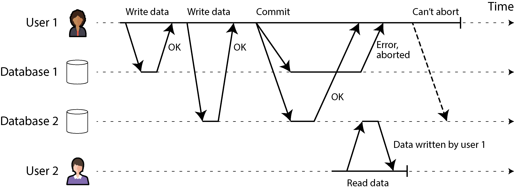

*Hình 8-12. Khi một transaction liên quan đến nhiều node database, nó có thể commit trên một số node và thất bại trên các node khác.*

Nếu một số node commit transaction nhưng các node khác lại abort nó, các node trở nên không nhất quán với nhau. Và một khi transaction đã được commit trên một node, nó không thể bị rút lại nếu sau đó phát hiện ra rằng nó đã bị abort trên một node khác. Đó là bởi vì một khi dữ liệu đã được commit, nó trở nên hiển thị đối với các transaction khác dưới mức isolation read committed hoặc mạnh hơn. Ví dụ, trong Hình 8-12, vào thời điểm người dùng 1 nhận ra commit của mình thất bại trên database 1, người dùng 2 đã đọc dữ liệu từ chính transaction đó trên database 2. Nếu transaction của người dùng 1 sau đó bị abort, transaction của người dùng 2 cũng sẽ phải bị hoàn nguyên (revert), vì nó dựa trên dữ liệu mà sau đó bị tuyên bố hồi tố là chưa từng tồn tại.

Một cách tiếp cận tốt hơn là đảm bảo rằng các node tham gia vào một transaction hoặc tất cả cùng commit hoặc tất cả cùng abort, và ngăn chặn sự pha trộn giữa hai trường hợp. Việc đạt được điều này được gọi là bài toán *atomic commitment* (commit nguyên tử).

### Two-Phase Commit

*Two-phase commit* (commit hai pha) là một thuật toán để đạt được commit transaction nguyên tử trên nhiều node. Đây là một thuật toán kinh điển trong các database phân tán [13, 73, 74]. 2PC được sử dụng nội bộ trong một số database và cũng được cung cấp cho các ứng dụng dưới dạng *XA transactions* [75] (được hỗ trợ bởi Java Transaction API chẳng hạn) hoặc thông qua WS-AtomicTransaction cho các web service SOAP [76, 77].

Luồng cơ bản của 2PC được minh họa trong Hình 8-13. Thay vì một yêu cầu commit duy nhất như với transaction đơn nút, quá trình commit/abort trong 2PC được chia thành hai pha (do đó mà có tên gọi này).

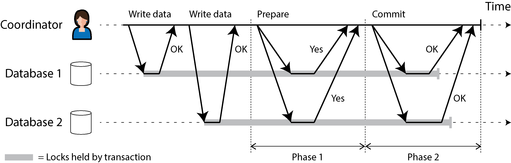

*Hình 8-13. Một lần thực thi 2PC thành công*

2PC sử dụng một thành phần mới thường không xuất hiện trong các transaction đơn nút: một *coordinator* (bộ điều phối, còn được gọi là *transaction manager*). Coordinator thường được hiện thực dưới dạng một thư viện nằm trong cùng tiến trình ứng dụng đang yêu cầu transaction (ví dụ, nhúng trong một Java EE container), nhưng nó cũng có thể là một tiến trình hoặc dịch vụ riêng biệt. Ví dụ về các coordinator như vậy bao gồm Narayana, JOTM, BTM và MSDTC.

Khi 2PC được sử dụng, một transaction phân tán bắt đầu bằng việc ứng dụng đọc và ghi dữ liệu trên nhiều node database như bình thường. Chúng ta gọi các node database này là các *participant* (bên tham gia) trong transaction. Khi ứng dụng sẵn sàng commit, coordinator bắt đầu pha 1 bằng cách gửi một yêu cầu *prepare* (chuẩn bị) đến từng node, hỏi xem chúng có thể commit hay không. Sau đó coordinator theo dõi các phản hồi từ các participant:

- Nếu tất cả participant trả lời có (yes), cho biết chúng đã sẵn sàng commit, coordinator gửi ra một yêu cầu *commit* trong pha 2, và việc commit diễn ra.

- Nếu bất kỳ participant nào trả lời không (no), coordinator gửi một yêu cầu *abort* đến tất cả các node trong pha 2.

Quá trình này có phần giống với lễ cưới truyền thống trong văn hóa phương Tây: người chủ trì hỏi riêng từng người xem họ có muốn kết hôn với người kia hay không, và thường nhận được câu trả lời “Tôi đồng ý” từ cả hai. Sau khi nhận được cả hai lời xác nhận, người chủ trì tuyên bố hai người đã thành vợ chồng — transaction đã được commit, và sự kiện vui mừng này được thông báo đến toàn thể khách mời. Nếu một trong hai người không nói đồng ý, buổi lễ bị abort [78].

#### Một hệ thống của những lời hứa

Từ mô tả ngắn gọn này, có thể chưa rõ vì sao 2PC đảm bảo được tính nguyên tử, trong khi commit một pha trên nhiều node thì không. Chắc chắn các yêu cầu prepare và commit cũng có thể dễ dàng bị mất trong trường hợp hai pha. Vậy điều gì làm 2PC khác biệt?

Để hiểu vì sao nó hoạt động, chúng ta phải phân tích quá trình này chi tiết hơn một chút:

1. Khi ứng dụng muốn bắt đầu một transaction phân tán, nó yêu cầu một transaction ID từ coordinator. Transaction ID này là duy nhất toàn cục (globally unique).

2. Ứng dụng bắt đầu một transaction đơn nút trên từng participant và gắn transaction ID duy nhất toàn cục vào transaction đơn nút đó. Tất cả các thao tác đọc và ghi được thực hiện trong một trong các transaction đơn nút này. Nếu có bất kỳ điều gì sai sót ở giai đoạn này (ví dụ, một node bị crash hoặc một yêu cầu bị timeout), coordinator hoặc bất kỳ participant nào cũng có thể abort.

3. Khi ứng dụng sẵn sàng commit, coordinator gửi một yêu cầu prepare đến tất cả các participant, được gắn nhãn với transaction ID toàn cục. Nếu bất kỳ yêu cầu nào trong số này thất bại hoặc timeout, coordinator gửi một yêu cầu abort cho transaction ID đó đến tất cả các participant.

4. Khi một participant nhận được yêu cầu prepare, nó đảm bảo rằng nó chắc chắn có thể commit transaction trong mọi tình huống. Điều này bao gồm việc ghi toàn bộ dữ liệu của transaction xuống đĩa (crash, mất điện hay hết dung lượng đĩa không phải là lý do chấp nhận được để từ chối commit sau đó) và kiểm tra mọi xung đột hoặc vi phạm ràng buộc. Bằng việc trả lời có với coordinator, node hứa sẽ commit transaction mà không có lỗi nếu được yêu cầu. Nói cách khác, participant từ bỏ quyền abort transaction, nhưng chưa thực sự commit nó.

5. Khi coordinator đã nhận được phản hồi cho tất cả các yêu cầu prepare, nó đưa ra quyết định dứt khoát về việc commit hay abort transaction (chỉ commit nếu tất cả participant đều bỏ phiếu có). Coordinator phải ghi quyết định đó vào transaction log của nó trên đĩa để nó biết mình đã quyết định theo hướng nào trong trường hợp sau đó bị crash. Điều này được gọi là *commit point* (điểm commit).

6. Một khi quyết định của coordinator đã được ghi xuống đĩa, yêu cầu commit hoặc abort được gửi đến tất cả các participant. Nếu yêu cầu này thất bại hoặc timeout, coordinator phải thử lại mãi cho đến khi thành công. Không còn đường quay lại nữa; nếu quyết định là commit, quyết định đó phải được thực thi, bất kể phải thử lại bao nhiêu lần. Nếu một participant bị crash trong lúc đó, transaction sẽ được commit khi nó khôi phục — vì participant đã bỏ phiếu có, nó không thể từ chối commit khi khôi phục.

Như vậy, giao thức này chứa hai “điểm không thể quay lại” then chốt: khi một participant bỏ phiếu có, nó hứa rằng nó chắc chắn sẽ có thể commit sau đó (mặc dù coordinator vẫn có thể chọn abort); và một khi coordinator đã quyết định, quyết định đó là không thể hủy bỏ. Những lời hứa này đảm bảo tính nguyên tử của 2PC. (Commit nguyên tử trên một node gộp hai sự kiện này thành một: ghi commit record vào transaction log.)

Quay lại với phép so sánh lễ cưới, trước khi nói “Tôi đồng ý”, bạn và người bạn đời có quyền tự do abort transaction bằng cách nói “Không đời nào!” (hoặc điều gì đó tương tự). Tuy nhiên, sau khi đã nói “Tôi đồng ý”, bạn không thể rút lại lời nói đó. Nếu bạn ngất đi sau khi nói “Tôi đồng ý” và không nghe thấy người chủ trì tuyên bố hai bạn đã thành vợ chồng, điều đó không thay đổi sự thật rằng transaction đã được commit. Khi tỉnh lại sau đó, bạn có thể tìm hiểu xem mình đã kết hôn hay chưa bằng cách hỏi người chủ trì về trạng thái của transaction ID toàn cục của bạn, hoặc bạn có thể chờ lần thử lại tiếp theo của người chủ trì cho yêu cầu commit (vì các lần thử lại vẫn tiếp diễn trong suốt thời gian bạn bất tỉnh).

#### Sự cố của coordinator

Chúng ta đã thảo luận điều gì xảy ra nếu một trong các participant hoặc mạng gặp sự cố trong quá trình 2PC: nếu bất kỳ yêu cầu prepare nào thất bại hoặc timeout, coordinator abort transaction; nếu bất kỳ yêu cầu commit hoặc abort nào thất bại, coordinator thử lại chúng vô hạn định. Tuy nhiên, điều gì xảy ra nếu coordinator bị crash thì lại kém rõ ràng hơn.

Nếu coordinator gặp sự cố trước khi gửi các yêu cầu prepare, một participant có thể an toàn abort transaction. Nhưng một khi participant đã nhận được yêu cầu prepare và bỏ phiếu có, nó không thể đơn phương abort nữa — nó phải chờ nghe lại từ coordinator xem transaction đã được commit hay abort. Nếu coordinator bị crash hoặc mạng gặp sự cố tại thời điểm này, participant không thể làm gì khác ngoài việc chờ đợi. Transaction của một participant trong trạng thái này được gọi là *in doubt* (nghi ngờ) hay *uncertain* (không chắc chắn).

Tình huống này được minh họa trong Hình 8-14. Trong ví dụ cụ thể này, coordinator thực sự đã quyết định commit, và database 2 đã nhận được yêu cầu commit. Tuy nhiên, coordinator bị crash trước khi kịp gửi yêu cầu commit đến database 1, nên database 1 không biết nên commit hay abort. Ngay cả timeout cũng không giúp được gì ở đây: nếu database 1 đơn phương abort sau một timeout, nó sẽ trở nên không nhất quán với database 2, vốn đã commit. Tương tự, đơn phương commit cũng không an toàn, vì một participant khác có thể đã abort.

Nếu không nhận được tin từ coordinator, một participant không có cách nào biết nên commit hay abort. Về nguyên tắc, các participant có thể trao đổi với nhau để tìm hiểu từng participant đã bỏ phiếu thế nào và đi đến một thỏa thuận, nhưng điều đó không phải là một phần của giao thức 2PC.

Cách duy nhất để 2PC có thể hoàn tất là chờ coordinator khôi phục. Đây là lý do coordinator phải ghi quyết định commit hoặc abort của mình vào một transaction log trên đĩa trước khi gửi các yêu cầu commit hoặc abort đến các participant: khi coordinator khôi phục, nó xác định trạng thái của tất cả các transaction in-doubt bằng cách đọc transaction log của mình. Bất kỳ transaction nào không có commit record trong log của coordinator sẽ bị abort. Như vậy, commit point của 2PC quy về một commit nguyên tử đơn nút thông thường trên coordinator.

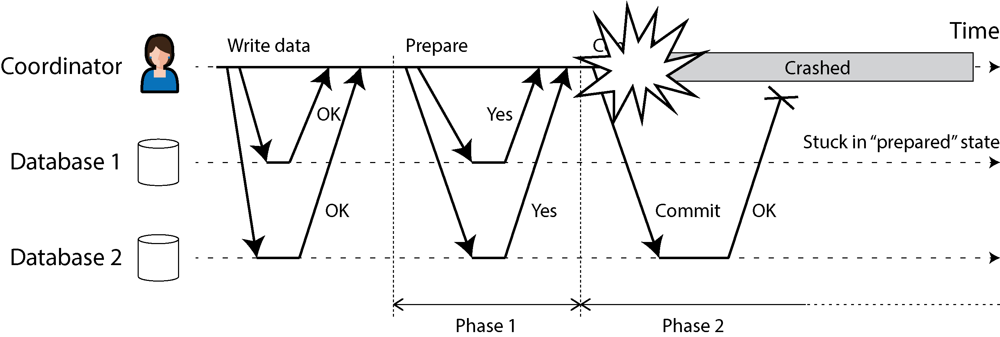

*Hình 8-14. Coordinator bị crash sau khi các participant bỏ phiếu có. Database 1 không biết nên commit hay abort.*

Hơn nữa, nếu đĩa của coordinator bị hỏng và log của nó bị mất, hệ thống không có cách nào tự động khôi phục. Lựa chọn duy nhất là một quản trị viên phải commit hoặc abort thủ công các transaction in-doubt. Nếu chỉ phần gần nhất của transaction log bị mất, coordinator đang khôi phục có thể tin rằng các transaction đã commit vẫn chưa được commit và cố gắng abort chúng, vi phạm tính nguyên tử.

#### Three-phase commit

2PC được gọi là giao thức commit nguyên tử *blocking* (chặn) vì 2PC có thể bị kẹt khi chờ coordinator khôi phục. Có thể làm cho một giao thức commit nguyên tử trở thành *nonblocking* (không chặn), để nó không bị kẹt nếu một node gặp sự cố. Tuy nhiên, làm cho điều này hoạt động trong thực tế không đơn giản như vậy.

Như một giải pháp thay thế cho 2PC, một thuật toán gọi là *three-phase commit* (commit ba pha, 3PC) đã được đề xuất [13, 79]. Tuy nhiên, 3PC giả định một mạng có độ trễ bị chặn (bounded delay) và các node có thời gian phản hồi bị chặn; trong hầu hết các hệ thống thực tế với độ trễ mạng không bị chặn và các khoảng dừng tiến trình (process pause) (xem Chương 9), 3PC không thể đảm bảo tính nguyên tử.

Một giải pháp tốt hơn trong thực tế là thay thế coordinator đơn nút bằng một giao thức consensus có khả năng chịu lỗi. Chúng ta sẽ xem cách làm điều này trong Chương 10.

### Transaction phân tán trên các hệ thống khác nhau

Transaction phân tán và 2PC có danh tiếng lẫn lộn. Một mặt, chúng được xem là cung cấp một đảm bảo an toàn quan trọng mà khó có thể đạt được bằng cách khác; mặt khác, chúng bị chỉ trích vì gây ra các vấn đề vận hành, làm giảm hiệu năng nghiêm trọng, và hứa hẹn nhiều hơn những gì có thể mang lại [80, 81, 82, 83]. Nhiều dịch vụ cloud chọn không hiện thực transaction phân tán vì các vấn đề vận hành mà chúng gây ra [84].

Một số hiện thực của transaction phân tán chịu tổn thất hiệu năng nặng nề. Phần lớn chi phí hiệu năng vốn có trong 2PC là do các thao tác `fsync` bổ sung cần thiết cho việc khôi phục sau crash và các vòng round trip mạng bổ sung.

Tuy nhiên, thay vì bác bỏ hoàn toàn transaction phân tán, chúng ta nên xem xét chúng chi tiết hơn, vì có những bài học quan trọng có thể rút ra từ chúng. Để bắt đầu, chúng ta nên nói chính xác ý mình khi nhắc đến “transaction phân tán”. Hai loại transaction phân tán khá khác nhau thường bị nhập nhằng với nhau:

- **Transaction phân tán nội bộ database (database-internal)**

  Một số database phân tán (tức là các database sử dụng replication và sharding trong cấu hình tiêu chuẩn của chúng) hỗ trợ các transaction nội bộ giữa các node của database đó. Ví dụ, YugabyteDB, TiDB, FoundationDB, Spanner, VoltDB, Cassandra và NDB storage engine của MySQL Cluster có hỗ trợ transaction nội bộ như vậy. Trong trường hợp này, tất cả các node tham gia vào transaction đều chạy cùng một phần mềm database.

- **Transaction phân tán không đồng nhất (heterogeneous)**

  Trong một transaction *heterogeneous* (không đồng nhất), các participant là hai hoặc nhiều công nghệ khác nhau — ví dụ, hai database từ các nhà cung cấp khác nhau, hoặc thậm chí các hệ thống không phải database như message broker. Một transaction phân tán trên các hệ thống này phải đảm bảo commit nguyên tử, mặc dù các hệ thống có thể hoàn toàn khác nhau bên dưới.

Các transaction nội bộ database không cần phải tương thích với bất kỳ hệ thống nào khác, nên chúng có thể dùng bất kỳ giao thức nào và áp dụng các tối ưu hóa đặc thù cho công nghệ cụ thể đó. Vì lý do đó, các transaction phân tán nội bộ database thường có thể hoạt động khá tốt. Ngược lại, các transaction trải rộng trên các công nghệ không đồng nhất khó khăn hơn nhiều. Chúng ta sẽ tập trung vào chúng ở đây và thảo luận về các transaction phân tán nội bộ database trong mục tiếp theo.

#### Xử lý thông điệp exactly-once

Các transaction phân tán không đồng nhất cho phép tích hợp các hệ thống đa dạng theo những cách mạnh mẽ. Ví dụ, một thông điệp (message) từ một message queue có thể được xác nhận (acknowledge) là đã xử lý khi và chỉ khi transaction database để xử lý thông điệp đó đã được commit thành công. Điều này được hiện thực bằng cách commit một cách nguyên tử việc xác nhận thông điệp và các thao tác ghi database trong một transaction duy nhất. Với sự hỗ trợ của transaction phân tán, điều này là khả thi ngay cả khi message broker và database là hai công nghệ không liên quan chạy trên các máy khác nhau.

Nếu việc giao thông điệp hoặc transaction database thất bại, cả hai đều bị abort để message broker có thể an toàn giao lại thông điệp sau đó. Như vậy, bằng cách commit nguyên tử thông điệp và các hiệu ứng phụ (side effect) của việc xử lý nó, chúng ta có thể đảm bảo rằng thông điệp *về mặt hiệu quả* được xử lý đúng một lần, ngay cả khi cần vài lần thử lại trước khi thành công. Việc abort loại bỏ mọi hiệu ứng phụ của transaction đã hoàn thành một phần. Điều này được gọi là *exactly-once semantics* (ngữ nghĩa đúng một lần).

Tuy nhiên, một transaction phân tán như vậy chỉ khả thi nếu tất cả các hệ thống bị ảnh hưởng bởi transaction đều có thể dùng cùng một giao thức commit nguyên tử. Ví dụ, giả sử một hiệu ứng phụ của việc xử lý thông điệp là gửi một email, và máy chủ email không hỗ trợ 2PC. Có thể xảy ra trường hợp email được gửi hai lần hoặc nhiều hơn nếu việc xử lý thông điệp thất bại và được thử lại. Nhưng nếu tất cả hiệu ứng phụ của việc xử lý thông điệp đều được rollback khi transaction abort, bước xử lý có thể được thử lại một cách an toàn như chưa có gì xảy ra.

Chúng ta sẽ quay lại chủ đề exactly-once semantics ở phần sau của chương này. Trước tiên, hãy xem xét giao thức commit nguyên tử cho phép các transaction phân tán không đồng nhất như vậy.

#### Transaction XA

*X/Open XA* (viết tắt của *eXtended Architecture*) là một chuẩn để hiện thực 2PC trên các công nghệ không đồng nhất [75]. Nó được giới thiệu vào năm 1991 và đã được hiện thực rộng rãi. XA được hỗ trợ bởi nhiều database quan hệ truyền thống (bao gồm PostgreSQL, MySQL, Db2, SQL Server và Oracle) và các message broker (bao gồm ActiveMQ, HornetQ, MSMQ và IBM MQ).

XA không phải là một giao thức mạng — nó chỉ đơn thuần là một API bằng C để giao tiếp với một transaction coordinator. Có các binding cho API này trong các ngôn ngữ khác; ví dụ, trong thế giới các ứng dụng Java EE, XA transactions được hiện thực bằng Java Transaction API (JTA), API này đến lượt nó được hỗ trợ bởi nhiều driver cho database dùng Java Database Connectivity (JDBC) và các driver cho message broker dùng các API Java Message Service (JMS).

XA giả định rằng ứng dụng của bạn dùng một driver mạng hoặc thư viện client để giao tiếp với các database hoặc dịch vụ nhắn tin (messaging) tham gia. Nếu driver hỗ trợ XA, điều đó có nghĩa là nó gọi XA API để tìm hiểu xem một thao tác có nên là một phần của transaction phân tán hay không — và nếu có, nó gửi thông tin cần thiết đến máy chủ database. Driver cũng cung cấp các callback mà thông qua đó coordinator có thể yêu cầu participant prepare, commit hoặc abort.

Transaction coordinator hiện thực XA API. Chuẩn này không quy định nó phải được hiện thực như thế nào, nhưng trong thực tế coordinator thường chỉ đơn giản là một thư viện được nạp vào cùng tiến trình với ứng dụng phát ra transaction (không phải một dịch vụ riêng biệt). Nó theo dõi các participant trong một transaction, thu thập phản hồi của các participant sau khi yêu cầu chúng prepare (thông qua một callback vào driver), và dùng một log trên đĩa cục bộ để theo dõi quyết định commit/abort cho từng transaction.

Nếu tiến trình ứng dụng bị crash, hoặc máy mà ứng dụng đang chạy bị chết, coordinator cũng đi theo. Bất kỳ participant nào có các transaction đã prepare nhưng chưa commit khi đó sẽ bị kẹt trong trạng thái in doubt. Vì log của coordinator nằm trên đĩa cục bộ của máy chủ ứng dụng, máy chủ đó phải được khởi động lại, và thư viện coordinator phải đọc log để khôi phục kết quả commit/abort của từng transaction. Chỉ khi đó coordinator mới có thể dùng các XA callback của database driver để yêu cầu các participant commit hoặc abort tùy trường hợp. Máy chủ database không thể liên hệ trực tiếp với coordinator, vì mọi giao tiếp phải đi qua thư viện client của nó.

#### Giữ lock trong khi ở trạng thái in doubt

Tại sao chúng ta lại quan tâm nhiều đến việc một transaction bị kẹt ở trạng thái in doubt (nghi ngờ) như vậy? Chẳng lẽ phần còn lại của hệ thống không thể cứ tiếp tục công việc của mình và bỏ qua transaction in doubt đó — thứ rốt cuộc rồi cũng sẽ được dọn dẹp?

Vấn đề nằm ở *locking* (khóa). Như đã thảo luận trong “Read Committed”, các transaction trong database thường giành exclusive lock ở cấp hàng (row-level) trên mọi hàng mà chúng sửa đổi, để ngăn dirty write. Nếu bạn muốn serializable isolation, một database dùng 2PL cũng sẽ phải giành shared lock trên mọi hàng mà transaction *đọc*.

Database không thể giải phóng các lock đó cho đến khi transaction commit hoặc abort (được minh họa bằng vùng tô bóng trong Hình 8-13). Do đó, khi dùng 2PC, một transaction phải giữ các lock trong suốt thời gian nó ở trạng thái in doubt. Nếu coordinator bị crash và mất 20 phút để khởi động lại, các lock đó sẽ bị giữ trong 20 phút. Nếu log của coordinator bị mất hoàn toàn vì lý do nào đó, các lock đó sẽ bị giữ mãi mãi — hoặc ít ra là cho đến khi tình huống được quản trị viên giải quyết thủ công.

Trong khi các lock đang bị giữ, không transaction nào khác có thể sửa đổi các hàng đó. Tùy vào isolation level, các transaction khác thậm chí có thể bị chặn không đọc được các hàng đó. Vì vậy, các transaction khác không thể đơn giản tiếp tục công việc của mình — nếu chúng muốn truy cập cùng dữ liệu đó, chúng sẽ bị chặn. Điều này có thể khiến nhiều phần lớn trong ứng dụng của bạn trở nên không sẵn sàng (unavailable) cho đến khi transaction in doubt được giải quyết.

#### Khôi phục sau khi coordinator hỏng

Về lý thuyết, nếu coordinator bị crash và được khởi động lại, nó sẽ khôi phục trạng thái của mình một cách sạch sẽ từ log và giải quyết mọi transaction in doubt. Tuy nhiên, trong thực tế, các transaction in doubt bị *bỏ rơi* (orphaned) vẫn xảy ra [85, 86] — tức là những transaction mà coordinator không thể quyết định kết quả vì bất kỳ lý do nào (ví dụ, vì transaction log đã bị mất hoặc bị hỏng do lỗi phần mềm). Những transaction này không thể được giải quyết tự động, nên chúng nằm mãi trong database, giữ lock và chặn các transaction khác.

Ngay cả việc khởi động lại các máy chủ database cũng không khắc phục được vấn đề này, vì một triển khai 2PC đúng đắn phải bảo toàn các lock của transaction in doubt kể cả qua các lần khởi động lại (nếu không, nó sẽ có nguy cơ vi phạm đảm bảo về tính nguyên tử). Đây là một tình huống khó gỡ.

Lối thoát duy nhất là quản trị viên phải tự tay quyết định commit hay roll back các transaction đó. Quản trị viên phải kiểm tra các participant của từng transaction in doubt, xác định xem có participant nào đã commit hoặc abort rồi hay chưa, rồi áp dụng cùng kết quả đó cho các participant còn lại. Việc giải quyết vấn đề có thể đòi hỏi rất nhiều công sức thủ công, và nhiều khả năng phải được thực hiện dưới áp lực cao và sức ép thời gian giữa một sự cố ngừng hoạt động nghiêm trọng trên production (nếu không thì tại sao coordinator lại rơi vào tình trạng tệ như vậy?).

Nhiều triển khai XA có một cửa thoát hiểm khẩn cấp gọi là *heuristic decisions* (quyết định heuristic): cho phép một participant đơn phương quyết định abort hoặc commit một transaction in doubt mà không cần quyết định dứt khoát từ coordinator [75]. Nói rõ hơn, *heuristic* ở đây là cách nói uyển ngữ cho *có thể phá vỡ tính nguyên tử*, vì quyết định heuristic vi phạm hệ thống các lời hứa trong 2PC. Do đó, heuristic decisions chỉ nhằm để thoát khỏi các tình huống thảm họa chứ không dành cho việc sử dụng thường xuyên.

#### Các vấn đề với XA transaction

Một coordinator đơn nút (single-node) là điểm hỏng đơn lẻ (single point of failure) của toàn hệ thống, và việc đặt nó thành một phần của application server cũng có vấn đề vì các log của coordinator trên đĩa cục bộ của nó trở thành một phần thiết yếu của trạng thái bền vững của hệ thống — quan trọng không kém chính các database.

Về nguyên tắc, coordinator của một XA transaction có thể có tính sẵn sàng cao và được replicate, giống như chúng ta kỳ vọng ở bất kỳ database quan trọng nào khác. Thật không may, điều này vẫn không giải quyết được một vấn đề căn bản của XA, đó là nó không cung cấp cách nào để coordinator và các participant của một transaction giao tiếp trực tiếp với nhau. Chúng chỉ có thể giao tiếp thông qua mã ứng dụng đã khởi gọi transaction và các database driver mà qua đó mã ứng dụng gọi đến các participant.

Ngay cả khi coordinator được replicate, mã ứng dụng do đó vẫn sẽ là một điểm hỏng đơn lẻ. Giải quyết vấn đề này sẽ đòi hỏi thiết kế lại hoàn toàn cách mã ứng dụng được chạy để nó có thể được replicate hoặc khởi động lại được, điều này có lẽ sẽ trông tương tự như durable execution (xem “Durable Execution và Workflow”). Tuy nhiên, trong thực tế dường như không có công cụ nào đi theo hướng này.

Một vấn đề khác là vì XA cần tương thích với một dải rộng các hệ thống dữ liệu, nó tất yếu là một mẫu số chung nhỏ nhất (lowest common denominator). Ví dụ, nó không thể phát hiện deadlock xuyên qua các hệ thống khác nhau (vì điều đó sẽ đòi hỏi một giao thức chuẩn hóa để các hệ thống trao đổi thông tin về các lock mà mỗi transaction đang chờ), và nó không hoạt động với SSI (xem “Serializable Snapshot Isolation”), vì điều đó sẽ đòi hỏi một giao thức để nhận diện xung đột xuyên qua các hệ thống khác nhau.

Những vấn đề này phần nào là cố hữu khi thực hiện transaction xuyên qua các công nghệ không đồng nhất (heterogeneous). Tuy nhiên, việc giữ cho nhiều hệ thống dữ liệu không đồng nhất nhất quán với nhau vẫn là một vấn đề thực tế và quan trọng, nên chúng ta cần tìm một giải pháp khác. Điều này có thể làm được, như chúng ta sẽ thấy trong mục tiếp theo và trong Chương 12.

### Distributed transaction nội bộ trong database

Như đã giải thích trước đó, có một khác biệt lớn giữa các distributed transaction trải trên nhiều công nghệ lưu trữ không đồng nhất và những distributed transaction nội bộ trong một hệ thống — tức là khi tất cả các node tham gia đều là một phần của cùng một database chạy cùng một phần mềm. Những distributed transaction nội bộ như vậy là một đặc trưng định hình của các database “NewSQL” như CockroachDB [5], TiDB [6], Spanner [7], FoundationDB [8], và YugabyteDB, chẳng hạn. Một số message broker, như Kafka, cũng hỗ trợ distributed transaction nội bộ [87].

Nhiều hệ thống trong số này dùng 2PC để đảm bảo tính nguyên tử của các transaction ghi vào nhiều shard, nhưng chúng không gặp phải những vấn đề giống như XA transaction. Vì các distributed transaction của chúng không cần giao tiếp với bất kỳ công nghệ nào khác, chúng tránh được cái bẫy mẫu số chung nhỏ nhất — các nhà thiết kế của những hệ thống này được tự do sử dụng các giao thức tốt hơn, đáng tin cậy hơn và nhanh hơn.

Những vấn đề lớn nhất của XA có thể được khắc phục bằng các cách sau:

- Replicate coordinator, với failover tự động sang một node coordinator khác nếu node primary bị crash

- Cho phép coordinator và các data shard giao tiếp trực tiếp mà không cần mã ứng dụng trung gian

- Replicate các shard tham gia để giảm nguy cơ phải abort một transaction do lỗi ở một trong các shard. Kết hợp giao thức atomic commitment với một giao thức distributed concurrency control hỗ trợ phát hiện deadlock và đọc nhất quán xuyên qua các shard

Các thuật toán consensus thường được dùng để replicate coordinator và các database shard. Chúng ta sẽ thấy trong Chương 10 cách atomic commitment cho distributed transaction có thể được triển khai bằng một thuật toán consensus. Các thuật toán này chịu được lỗi bằng cách tự động failover từ node này sang node khác mà không cần bất kỳ sự can thiệp nào của con người, trong khi vẫn tiếp tục đảm bảo các thuộc tính nhất quán mạnh (strong consistency).

Các isolation level được cung cấp cho distributed transaction tùy thuộc vào hệ thống, nhưng snapshot isolation [6] và serializable snapshot isolation [5, 8] đều khả thi xuyên qua các shard.

### Nhìn lại xử lý thông điệp exactly-once

Chúng ta đã thấy trong “Xử lý thông điệp exactly-once” rằng một trường hợp sử dụng quan trọng của distributed transaction là đảm bảo một thao tác có hiệu lực đúng một lần, ngay cả khi xảy ra crash trong lúc nó đang được xử lý và việc xử lý cần được thử lại. Nếu bạn có thể commit một transaction một cách nguyên tử xuyên qua một message broker và một database, bạn có thể xác nhận (acknowledge) thông điệp với broker khi và chỉ khi nó đã được xử lý thành công và các thao tác ghi vào database phát sinh từ quá trình xử lý đó đã được commit.

Tuy nhiên, thực ra bạn không cần distributed transaction để đạt được ngữ nghĩa exactly-once. Một cách tiếp cận thay thế như sau, chỉ đòi hỏi các transaction bên trong database:

1. Giả sử mỗi thông điệp có một ID duy nhất, và trong database bạn có một bảng chứa các ID thông điệp đã được xử lý. Khi bạn bắt đầu xử lý một thông điệp từ broker, bạn bắt đầu một transaction mới trên database và kiểm tra ID thông điệp. Nếu cùng ID thông điệp đó đã có trong database, bạn biết rằng nó đã được xử lý rồi, nên bạn có thể xác nhận thông điệp với broker và bỏ nó đi.

2. Nếu ID thông điệp chưa có trong database, bạn thêm nó vào bảng. Sau đó bạn xử lý thông điệp, việc này có thể dẫn đến các thao tác ghi bổ sung vào database trong cùng transaction đó. Khi bạn xử lý xong thông điệp, bạn commit transaction trên database.

3. Một khi transaction trên database đã được commit thành công, bạn có thể xác nhận thông điệp với broker.

4. Một khi thông điệp đã được xác nhận thành công với broker, bạn biết rằng nó sẽ không thử xử lý lại cùng thông điệp đó nữa, nên bạn có thể xóa ID thông điệp khỏi database (trong một transaction riêng).

Nếu message processor bị crash trước khi commit transaction trên database, transaction bị abort và message broker sẽ thử xử lý lại. Nếu nó bị crash sau khi commit nhưng trước khi xác nhận thông điệp với broker, nó cũng sẽ thử xử lý lại, nhưng lần thử lại sẽ thấy ID thông điệp trong database và bỏ nó đi. Nếu nó bị crash sau khi xác nhận thông điệp nhưng trước khi xóa ID thông điệp khỏi database, bạn sẽ có một ID thông điệp cũ còn sót lại, điều này không gây hại gì ngoài việc chiếm một chút dung lượng lưu trữ. Nếu một lần thử lại xảy ra trước khi transaction trên database bị abort (điều có thể xảy ra nếu liên lạc giữa message processor và database bị gián đoạn), một ràng buộc duy nhất (uniqueness constraint) trên bảng ID thông điệp sẽ ngăn cùng một ID thông điệp được chèn bởi hai transaction đồng thời.

Như vậy, đạt được xử lý exactly-once chỉ đòi hỏi các transaction bên trong database — tính nguyên tử xuyên qua database và message broker là không cần thiết cho trường hợp sử dụng này. Việc ghi lại ID thông điệp trong database làm cho việc xử lý thông điệp trở thành *idempotent*, nhờ đó việc xử lý thông điệp có thể được thử lại một cách an toàn mà không nhân đôi các tác dụng phụ của nó. Một cách tiếp cận tương tự được dùng trong các framework stream processing như Kafka Streams để đạt được ngữ nghĩa exactly-once, như chúng ta sẽ thấy trong Chương 12.

Dù vậy, các distributed transaction nội bộ trong database vẫn hữu ích cho khả năng mở rộng của những mẫu (pattern) như thế này; ví dụ, chúng cho phép các ID thông điệp được lưu trên một shard và dữ liệu chính được cập nhật bởi quá trình xử lý thông điệp được lưu trên các shard khác, đồng thời đảm bảo tính nguyên tử của việc commit transaction xuyên qua các shard đó.

## Tóm tắt

Transaction là một tầng trừu tượng cho phép ứng dụng giả định rằng một số vấn đề về tính đồng thời và một số loại lỗi phần cứng, phần mềm nhất định không tồn tại. Một lớp lớn các lỗi được quy về một *transaction abort* đơn giản, và ứng dụng chỉ cần thử lại.

Trong chương này chúng ta đã thấy nhiều ví dụ về các vấn đề mà transaction giúp ngăn chặn. Không phải mọi ứng dụng đều dễ gặp tất cả các vấn đề đó; một ứng dụng với các mẫu truy cập rất đơn giản, chẳng hạn chỉ đọc và ghi một bản ghi (record) duy nhất, có lẽ có thể xoay xở mà không cần transaction. Tuy nhiên, với các mẫu truy cập phức tạp hơn, transaction có thể giảm đi rất nhiều số trường hợp lỗi tiềm tàng mà bạn cần phải nghĩ đến.

Không có transaction, các kịch bản lỗi khác nhau (process bị crash, mạng bị gián đoạn, mất điện, đĩa đầy, tính đồng thời ngoài dự kiến, v.v.) có nghĩa là dữ liệu có thể trở nên không nhất quán theo nhiều cách khác nhau. Ví dụ, dữ liệu đã phi chuẩn hóa (denormalized) có thể dễ dàng lệch khỏi dữ liệu nguồn. Không có transaction, việc suy luận về những ảnh hưởng mà các truy cập phức tạp, tương tác lẫn nhau có thể gây ra cho database trở nên rất khó khăn.

Chúng ta đã đi đặc biệt sâu vào chủ đề concurrency control, thảo luận một số isolation level được dùng rộng rãi: cụ thể là *read-committed*, *snapshot* (đôi khi được gọi là *repeatable read*), và *serializable*. Chúng ta đã đặc tả các isolation level đó bằng cách thảo luận nhiều ví dụ về race condition, được tóm tắt trong Bảng 8-1.

*Bảng 8-1. Tóm tắt các bất thường (anomaly) có thể xảy ra ở các isolation level khác nhau*

| **Isolation level** | **Dirty reads** | **Read skew** | **Phantom reads** | **Lost updates** | **Write skew** |
|---|---|---|---|---|---|
| Read uncommitted | ✗ Có thể xảy ra | ✗ Có thể xảy ra | ✗ Có thể xảy ra | ✗ Có thể xảy ra | ✗ Có thể xảy ra |
| Read committed | ✓ Được ngăn chặn | ✗ Có thể xảy ra | ✗ Có thể xảy ra | ✗ Có thể xảy ra | ✗ Có thể xảy ra |
| Snapshot isolation | ✓ Được ngăn chặn | ✓ Được ngăn chặn | ✓ Được ngăn chặn | ? Tùy triển khai | ✗ Có thể xảy ra |
| Serializable | ✓ Được ngăn chặn | ✓ Được ngăn chặn | ✓ Được ngăn chặn | ✓ Được ngăn chặn | ✓ Được ngăn chặn |

Dưới đây là tóm tắt ngắn gọn:

- **Dirty reads**

  Một client đọc các thao tác ghi của client khác trước khi chúng được commit. Isolation level read-committed và các mức mạnh hơn ngăn chặn dirty read.

- **Dirty writes**

  Một client ghi đè lên dữ liệu mà client khác đã ghi nhưng chưa commit. Gần như mọi triển khai transaction đều ngăn chặn dirty write (do đó nó không được đưa vào bảng).

- **Read skew**

  Một client nhìn thấy các phần khác nhau của database ở những thời điểm khác nhau. Một số trường hợp read skew còn được gọi là *nonrepeatable reads* (đọc không lặp lại được). Vấn đề này thường được ngăn chặn nhất bằng snapshot isolation, cho phép một transaction đọc từ một snapshot nhất quán tương ứng với một thời điểm cụ thể. Snapshot isolation thường được triển khai bằng multiversion concurrency control (MVCC).

- **Phantom reads**

  Một transaction đọc các đối tượng khớp với một điều kiện tìm kiếm. Một client khác thực hiện một thao tác ghi ảnh hưởng đến kết quả của tìm kiếm đó. Snapshot isolation ngăn chặn các phantom read đơn giản, nhưng phantom trong bối cảnh write skew cần cách xử lý đặc biệt, chẳng hạn index-range lock.

- **Lost updates**

  Hai client đồng thời thực hiện một chu trình read-modify-write (đọc-sửa-ghi). Một client ghi đè lên thao tác ghi của client kia mà không tích hợp các thay đổi của nó, nên dữ liệu bị mất. Một số triển khai snapshot isolation tự động ngăn chặn bất thường này, trong khi những triển khai khác đòi hỏi một lock thủ công ( `SELECT FOR UPDATE` ).

- **Write skew**

  Một transaction đọc một thứ gì đó, đưa ra quyết định dựa trên giá trị nó nhìn thấy, và ghi quyết định đó vào database. Tuy nhiên, đến thời điểm thao tác ghi được thực hiện, tiền đề của quyết định đó không còn đúng nữa. Chỉ có serializable isolation mới ngăn chặn được bất thường này.

Các isolation level yếu bảo vệ khỏi một số bất thường trong số đó nhưng để lại cho bạn, nhà phát triển ứng dụng, phải tự xử lý những bất thường còn lại (ví dụ, bằng cách dùng locking tường minh). Chỉ có serializable isolation mới bảo vệ khỏi tất cả các vấn đề này. Chúng ta đã thảo luận ba cách tiếp cận để triển khai serializable transaction:

- **Thực thi transaction theo đúng nghĩa đen theo thứ tự tuần tự**

  Nếu bạn có thể làm cho mỗi transaction thực thi rất nhanh (thường bằng cách dùng stored procedure), và throughput của transaction đủ thấp để xử lý trên một lõi CPU duy nhất hoặc có thể được shard, thì đây là một lựa chọn đơn giản và hiệu quả.

- **Two-phase locking**

  Trong nhiều thập kỷ, 2PL đã là cách chuẩn để triển khai serializability, nhưng nhiều ứng dụng tránh dùng nó vì hiệu năng kém.

- **Serializable snapshot isolation**

  SSI là một thuật toán tương đối mới, tránh được hầu hết các nhược điểm của các cách tiếp cận trước. Nó dùng cách tiếp cận lạc quan (optimistic), cho phép các transaction tiến hành mà không bị chặn. Khi một transaction muốn commit, nó được kiểm tra, và bị abort nếu việc thực thi không serializable.

Cuối cùng, chúng ta đã xem xét cách đạt được tính nguyên tử khi một transaction được phân tán trên nhiều node, bằng 2PC. Nếu tất cả các node đó đều chạy cùng một phần mềm database, distributed transaction có thể hoạt động khá tốt. Tuy nhiên, xuyên qua các công nghệ lưu trữ khác nhau (dùng XA transaction), 2PC có nhiều vấn đề; nó rất nhạy với lỗi ở coordinator và ở mã ứng dụng điều khiển transaction, và nó tương tác kém với các cơ chế concurrency control. May mắn là, idempotence có thể đảm bảo ngữ nghĩa exactly-once mà không đòi hỏi atomic commit xuyên qua các công nghệ lưu trữ khác nhau; chúng ta sẽ thấy thêm về điều này trong các chương sau.

Các ví dụ trong chương này dùng mô hình dữ liệu quan hệ (relational data model). Tuy nhiên, như đã thảo luận trong “Nhu cầu về transaction đa đối tượng (multi-object)”, transaction là một tính năng giá trị của database, bất kể mô hình dữ liệu nào được sử dụng.

#### Tài liệu tham khảo

[1] Steven J. Murdoch. [“What Went Wrong with Horizon: Learning from the Post Office Trial.”](https://www.benthamsgaze.org/2021/07/15/what-went-wrong-with-horizon-learning-from-the-post-office-trial/) *benthamsgaze.org*, July 2021. Archived at [*perma.cc/CNM4-553F*](https://perma.cc/CNM4-553F)

[2] Donald D. Chamberlin, Morton M. Astrahan, Michael W. Blasgen, James N. Gray, W. Frank King, Bruce G. Lindsay, Raymond Lorie, James W. Mehl, Thomas G. Price, Franco Putzolu, Patricia Griffiths Selinger, Mario Schkolnick, Donald R. Slutz, Irving L. Traiger, Bradford W. Wade, and Robert A. Yost. [“A History and Evaluation of System R.”](https://dsf.berkeley.edu/cs262/2005/SystemR.pdf) *Communications of the ACM*, volume 24, issue 10, pages 632–646, October 1981. [*doi:10.1145/358769.358784*](https://doi.org/10.1145/358769.358784)

[3] Jim N. Gray, Raymond A. Lorie, Gianfranco R. Putzolu, and Irving L. Traiger. [“Gran- ularity of Locks and Degrees of Consistency in a Shared Data Base.”](https://citeseerx.ist.psu.edu/pdf/e127f0a6a912bb9150ecfe03c0ebf7fbc289a023) In *Modelling in Data Base Management Systems: Proceedings of the IFIP Working Conference on Modelling in Data Base Management Systems*, edited by G. M. Nijssen, pages 364– 394, Elsevier/North Holland Publishing, 1976. Also in *Readings in Database Systems*, 4th edition, edited by Joseph M. Hellerstein and Michael Stonebraker, MIT Press, 2005. ISBN: 9780262693141

[4] Kapali P. Eswaran, Jim N. Gray, Raymond A. Lorie, and Irving L. Traiger. [“The Notions of Consistency and Predicate Locks in a Database System.”](https://jimgray.azurewebsites.net/papers/On%20the%20Notions%20of%20Consistency%20and%20Predicate%20Locks%20in%20a%20Database%20System%20CACM.pdf?from=https://research.microsoft.com/en-us/um/people/gray/papers/On%20the%20Notions%20of%20Consistency%20and%20Predicate%20Locks%20in%20a%20Database%20System%20CACM.pdf) *Communications of the ACM*, volume 19, issue 11, pages 624–633, November 1976. [*doi:10.1145/360363.360369*](https://doi.org/10.1145/360363.360369)

[5] Rebecca Taft, Irfan Sharif, Andrei Matei, Nathan VanBenschoten, Jordan Lewis, Tobias Grieger, Kai Niemi, Andy Woods, Anne Birzin, Raphael Poss, Paul Bardea, Amruta Ranade, Ben Darnell, Bram Gruneir, Justin Jaffray, Lucy Zhang, and Peter Mattis. [“CockroachDB: The Resilient Geo-Distributed SQL Database.”](https://dl.acm.org/doi/pdf/10.1145/3318464.3386134) At *ACM SIGMOD International Conference on Management of Data* (SIGMOD), June 2020. [*doi:10.1145/3318464.3386134*](https://doi.org/10.1145/3318464.3386134)

[6] Dongxu Huang, Qi Liu, Qiu Cui, Zhuhe Fang, Xiaoyu Ma, Fei Xu, Li Shen, Liu Tang, Yuxing Zhou, Menglong Huang, Wan Wei, Cong Liu, Jian Zhang, Jianjun Li, Xuelian Wu, Lingyu Song, Ruoxi Sun, Shuaipeng Yu, Lei Zhao, Nicholas Cameron, Liquan Pei, and Xin Tang. [“TiDB: A Raft-Based HTAP Database.”](https://www.vldb.org/pvldb/vol13/p3072-huang.pdf) *Proceedings of the VLDB Endowment*, volume 13, issue 12, pages 3072–3084, August 2020. [*doi:10.14778/3415478.3415535*](https://doi.org/10.14778/3415478.3415535)

[7] James C. Corbett, Jeffrey Dean, Michael Epstein, Andrew Fikes, Christopher Frost, JJ Furman, Sanjay Ghemawat, Andrey Gubarev, Christopher Heiser, Peter Hochschild, Wilson Hsieh, Sebastian Kanthak, Eugene Kogan, Hongyi Li, Alexander Lloyd, Sergey Melnik, David Mwaura, David Nagle, Sean Quinlan, Rajesh Rao, Lindsay Rolig, Dale Woodford, Yasushi Saito, Christopher Taylor, Michal Szymaniak, and Ruth Wang. [“Spanner: Google’s Globally-Distributed Database.”](https://research.google/pubs/pub39966/) At *10th USENIX Symposium on Operating System Design and Implementation* (OSDI), October 2012.

[8] Jingyu Zhou, Meng Xu, Alexander Shraer, Bala Namasivayam, Alex Miller, Evan Tschannen, Steve Atherton, Andrew J. Beamon, Rusty Sears, John Leach, Dave Rosenthal, Xin Dong, Will Wilson, Ben Collins, David Scherer, Alec Grieser, Young Liu, Alvin Moore, Bhaskar Muppana, Xiaoge Su, and Vishesh Yadav. [“Founda- tionDB: A Distributed Unbundled Transactional Key Value Store.”](https://www.foundationdb.org/files/fdb-paper.pdf) At *ACM International Conference on Management of Data* (SIGMOD), June 2021. [*doi:10.1145/3448016.3457559*](https://doi.org/10.1145/3448016.3457559)

[9] Theo Härder and Andreas Reuter. [“Principles of Transaction-Oriented Database Recovery.”](https://citeseerx.ist.psu.edu/pdf/11ef7c142295aeb1a28a0e714c91fc8d610c3047) *ACM Computing Surveys*, volume 15, issue 4, pages 287–317, December 1983. [*doi:10.1145/289.291*](https://doi.org/10.1145/289.291)

[10] Peter Bailis, Alan Fekete, Ali Ghodsi, Joseph M. Hellerstein, and Ion Stoica. [“HAT, not CAP: Towards Highly Available Transactions.”](https://www.usenix.org/system/files/conference/hotos13/hotos13-final80.pdf) At *14th USENIX Workshop on Hot Topics in Operating Systems* (HotOS), May 2013.

[11] Armando Fox, Steven D. Gribble, Yatin Chawathe, Eric A. Brewer, and Paul Gauthier. [“Cluster-Based Scalable Network Services.”](https://people.eecs.berkeley.edu/~brewer/cs262b/TACC.pdf) At *16th ACM Symposium on Operating Systems Principles* (SOSP), October 1997. [*doi:10.1145/268998.266662*](https://doi.org/10.1145/268998.266662)

[12] Tony Andrews. [“Enforcing Complex Constraints in Oracle.”](https://tonyandrews.blogspot.com/2004/10/enforcing-complex-constraints-in.html) *tonyandrews.blogspot.co.uk*, October 2004. Archived at [*archive.org*](https://web.archive.org/web/20220201190625/https://tonyandrews.blogspot.com/2004/10/enforcing-complex-constraints-in.html)

[13] Philip A. Bernstein, Vassos Hadzilacos, and Nathan Goodman. [*Concurrency Control* *and Recovery in Database Systems*.](https://www.microsoft.com/en-us/research/people/philbe/book/) Addison-Wesley, 1987. ISBN: 9780201107159. Available online at [*microsoft.com*.](https://www.microsoft.com/en-us/research/people/philbe/book/)

[14] Alan Fekete, Dimitrios Liarokapis, Elizabeth O’Neil, Patrick O’Neil, and Dennis Shasha. [“Making Snapshot Isolation Serializable.”](https://www.cse.iitb.ac.in/infolab/Data/Courses/CS632/2009/Papers/p492-fekete.pdf) *ACM Transactions on Database Systems*, volume 30, issue 2, pages 492–528, June 2005. [*doi:10.1145/1071610.1071615*](https://doi.org/10.1145/1071610.1071615)

[15] Mai Zheng, Joseph Tucek, Feng Qin, and Mark Lillibridge. [“Understanding the Robustness of SSDs Under Power Fault.”](https://www.usenix.org/system/files/conference/fast13/fast13-final80.pdf) At *11th USENIX Conference on File and Storage Technologies* (FAST), February 2013.

[16] Laurie Denness. [“SSDs: A Gift and a Curse.”](https://laur.ie/blog/2015/06/ssds-a-gift-and-a-curse/) *laur.ie*, June 2015. Archived at [*per-* *ma.cc/6GLP-BX3T*](https://perma.cc/6GLP-BX3T)

[17] Adam Surak. [“When Solid State Drives Are Not That Solid.”](https://www.algolia.com/blog/engineering/when-solid-state-drives-are-not-that-solid) *blog.algolia.com*, June 2015. Archived at [*perma.cc/CBR9-QZEE*](https://perma.cc/CBR9-QZEE)

[18] Hewlett Packard Enterprise. [“Bulletin: (Revision) HPE SAS Solid State Drives— Critical Firmware Upgrade Required for Certain HPE SAS Solid State Drive Models to Prevent Drive Failure at 32,768 Hours of Operation.”](https://support.hpe.com/hpesc/public/docDisplay?docId=emr_na-a00092491en_us) *support.hpe.com*, November 2019. Archived at [*perma.cc/CZR4-AQBS*](https://perma.cc/CZR4-AQBS)

[19] Craig Ringer et al. [“PostgreSQL’s Handling of fsync() Errors Is Unsafe and Risks Data Loss at Least on XFS.”](https://www.postgresql.org/message-id/flat/CAMsr%2BYHh%2B5Oq4xziwwoEfhoTZgr07vdGG%2Bhu%3D1adXx59aTeaoQ%40mail.gmail.com) Email thread on *pgsql-hackers* mailing list, *postgresql.org*, March 2018. Archived at [*perma.cc/5RKU-57FL*](https://perma.cc/5RKU-57FL)

[20] Anthony Rebello, Yuvraj Patel, Ramnatthan Alagappan, Andrea C. Arpaci-Dusseau, and Remzi H. Arpaci-Dusseau. [“Can Applications Recover from fsync Failures?”](https://www.usenix.org/conference/atc20/presentation/rebello) At *USENIX Annual Technical Conference* (ATC), July 2020.

[21] Thanumalayan Sankaranarayana Pillai, Vijay Chidambaram, Ramnatthan Alagappan, Samer Al-Kiswany, Andrea C. Arpaci-Dusseau, and Remzi H. Arpaci-Dusseau. [“Crash Consistency: Rethinking the Fundamental Abstractions of the File System.”](https://dl.acm.org/doi/pdf/10.1145/2800695.2801719) *ACM Queue*, volume 13, issue 7, pages 20–28, July 2015. [*doi:10.1145/2800695.2801719*](https://doi.org/10.1145/2800695.2801719)

[22] Thanumalayan Sankaranarayana Pillai, Vijay Chidambaram, Ramnatthan Alagappan, Samer Al-Kiswany, Andrea C. Arpaci-Dusseau, and Remzi H. Arpaci-Dusseau. [“All File Systems Are Not Created Equal: On the Complexity of Crafting Crash-Consistent Applications.”](https://www.usenix.org/system/files/conference/osdi14/osdi14-paper-pillai.pdf) At *11th USENIX Symposium on Operating Systems Design and Implementation* (OSDI), October 2014.

[23] Chris Siebenmann. [“Unix’s File Durability Problem.”](https://utcc.utoronto.ca/~cks/space/blog/unix/FileSyncProblem) *utcc.utoronto.ca*, April 2016. Archived at [*perma.cc/VSS8-5MC4*](https://perma.cc/VSS8-5MC4)

[24] Aishwarya Ganesan, Ramnatthan Alagappan, Andrea C. Arpaci-Dusseau, and Remzi H. Arpaci-Dusseau. [“Redundancy Does Not Imply Fault Tolerance: Analysis of Distributed Storage Reactions to Single Errors and Corruptions.”](https://www.usenix.org/conference/fast17/technical-sessions/presentation/ganesan) At *15th USENIX Conference on File and Storage Technologies* (FAST), February 2017.

[25] Lakshmi N. Bairavasundaram, Garth R. Goodson, Bianca Schroeder, Andrea C. Arpaci-Dusseau, and Remzi H. Arpaci-Dusseau. [“An Analysis of Data Corruption in the Storage Stack.”](https://www.usenix.org/legacy/event/fast08/tech/full_papers/bairavasundaram/bairavasundaram.pdf) At *6th USENIX Conference on File and Storage Technologies* (FAST), February 2008.

[26] Richard van der Hoff. [“How We Discovered, and Recovered from, Postgres Corruption on the matrix.org Homeserver.”](https://matrix.org/blog/2025/07/postgres-corruption-postmortem/) *matrix.org*, July 2025. Archived at [*per-* *ma.cc/CDF5-NRBK*](https://perma.cc/CDF5-NRBK)

[27] Bianca Schroeder, Raghav Lagisetty, and Arif Merchant. [“Flash Reliability in Production: The Expected and the Unexpected.”](https://www.usenix.org/conference/fast16/technical-sessions/presentation/schroeder) At *14th USENIX Conference on File and Storage Technologies* (FAST), February 2016.

[28] Don Allison. [“SSD Storage—Ignorance of Technology Is No Excuse.”](https://blog.korelogic.com/blog/2015/03/24) *blog.korelogic.com*, March 2015. Archived at [*perma.cc/9QN4-9SNJ*](https://perma.cc/9QN4-9SNJ)

[29] Gordon Mah Ung. [“Debunked: Your SSD Won’T Lose Data If Left Unplugged After All.”](https://www.pcworld.com/article/427602/debunked-your-ssd-wont-lose-data-if-left-unplugged-after-all.html) *pcworld.com*, May 2015. Archived at [*perma.cc/S46H-JUDU*](https://perma.cc/S46H-JUDU)

[30] Martin Kleppmann. [“Hermitage: Testing the ‘I’ in ACID.”](https://martin.kleppmann.com/2014/11/25/hermitage-testing-the-i-in-acid.html) *martin.kleppmann.com*, November 2014. Archived at [*perma.cc/KP2Y-AQGK*](https://perma.cc/KP2Y-AQGK)

[31] Vlad Mihalcea. [“The Race Condition That Led to Flexcoin Bankruptcy.”](https://vladmihalcea.com/race-condition/) *vladmihalcea.com*, February 2025. Archived at [*perma.cc/RRK5-TFAU*](https://perma.cc/RRK5-TFAU)

[32] Todd Warszawski and Peter Bailis. [“ACIDRain: Concurrency-Related Attacks on Database-Backed Web Applications.”](http://www.bailis.org/papers/acidrain-sigmod2017.pdf) At *ACM International Conference on Management of Data* (SIGMOD), May 2017. [*doi:10.1145/3035918.3064037*](https://doi.org/10.1145/3035918.3064037)

[33] Tristan D’Agosta. [“BTC Stolen from Poloniex.”](https://bitcointalk.org/index.php?topic=499580) *bitcointalk.org*, March 2014. Archived at [*perma.cc/YHA6-4C5D*](https://perma.cc/YHA6-4C5D)

[34] bitcointhief2. [“How I Stole Roughly 100 BTC from an Exchange and How I Could Have Stolen More!”](https://www.reddit.com/r/Bitcoin/comments/1wtbiu/how_i_stole_roughly_100_btc_from_an_exchange_and/) *reddit.com*, February 2014. Archived at [*archive.org*](https://web.archive.org/web/20250118042610/https://www.reddit.com/r/Bitcoin/comments/1wtbiu/how_i_stole_roughly_100_btc_from_an_exchange_and/)

[35] Sudhir Jorwekar, Alan Fekete, Krithi Ramamritham, and S. Sudarshan. [“Automat- ing the Detection of Snapshot Isolation Anomalies.”](https://www.vldb.org/conf/2007/papers/industrial/p1263-jorwekar.pdf) At *33rd International Conference on Very Large Data Bases* (VLDB), September 2007.

[36] Michael Melanson. [“Transactions: The Limits of Isolation.”](https://www.michaelmelanson.net/posts/transactions-the-limits-of-isolation/) *michaelmelanson.net*, November 2014. Archived at [*perma.cc/RG5R-KMYZ*](https://perma.cc/RG5R-KMYZ)

[37] Edward Kim. [“How ACH Works: A Developer Perspective—Part 1.”](https://engineering.gusto.com/how-ach-works-a-developer-perspective-part-1-339d3e7bea1) *engineering.gusto.com*, April 2014. Archived at [*perma.cc/7B2H-PU94*](https://perma.cc/7B2H-PU94)

[38] Hal Berenson, Philip A. Bernstein, Jim N. Gray, Jim Melton, Elizabeth O’Neil, and Patrick O’Neil. [“A Critique of ANSI SQL Isolation Levels.”](https://www.microsoft.com/en-us/research/wp-content/uploads/2016/02/tr-95-51.pdf) At *ACM International Conference on Management of Data* (SIGMOD), May 1995. [*doi:10.1145/568271.223785*](https://doi.org/10.1145/568271.223785)

[39] Atul Adya. [“Weak Consistency: A Generalized Theory and Optimistic Implementations for Distributed Transactions.”](http://pmg.csail.mit.edu/papers/adya-phd.pdf) PhD thesis, Massachusetts Institute of Technology, March 1999. Archived at [*perma.cc/E97M-HW5Q*](https://perma.cc/E97M-HW5Q)

[40] Peter Bailis, Aaron Davidson, Alan Fekete, Ali Ghodsi, Joseph M. Hellerstein, and Ion Stoica. [“Highly Available Transactions: Virtues and Limitations.”](https://www.vldb.org/pvldb/vol7/p181-bailis.pdf) *Proceedings of the VLDB Endowment*, volume 7, issue 3, pages 181–192, November 2013. *doi:10.14778/2732232.2732237*.

[41] Natacha Crooks, Youer Pu, Lorenzo Alvisi, and Allen Clement. [“Seeing Is Believing: A Client-Centric Specification of Database Isolation.”](https://www.cs.cornell.edu/lorenzo/papers/Crooks17Seeing.pdf) At *ACM Symposium on Principles of Distributed Computing* (PODC), July 2017. [*doi:10.1145/3087801.3087802*](https://doi.org/10.1145/3087801.3087802)

[42] Bruce Momjian. [“MVCC Unmasked.”](https://momjian.us/main/writings/pgsql/mvcc.pdf) *momjian.us*, July 2014. Archived at [*perma.cc/KQ47-9GYB*](https://perma.cc/KQ47-9GYB)

[43] Peter Alvaro and Kyle Kingsbury. [“MySQL 8.0.34.”](https://jepsen.io/analyses/mysql-8.0.34) *jepsen.io*, December 2023. Archived at [*perma.cc/HGE2-Z878*](https://perma.cc/HGE2-Z878)

[44] Egor Rogov. [*PostgreSQL 14 Internals*.](https://postgrespro.com/community/books/internals) Postgres Professional, April 2023. Archived at [*perma.cc/FRK2-D7WB*](https://perma.cc/FRK2-D7WB)

[45] Hironobu Suzuki. [“The Internals of PostgreSQL.”](https://www.interdb.jp/pg/) *interdb.jp*, 2017.

[46] Rohan Reddy Alleti. [“Internals of MVCC in Postgres: Hidden Costs of Updates vs Inserts.”](https://medium.com/@rohanjnr44/internals-of-mvcc-in-postgres-hidden-costs-of-updates-vs-inserts-381eadd35844) *medium.com*, March 2025. Archived at [*perma.cc/3ACX-DFXT*](https://perma.cc/3ACX-DFXT)

[47] Andy Pavlo and Bohan Zhang. [“The Part of PostgreSQL We Hate the Most.”](https://www.cs.cmu.edu/~pavlo/blog/2023/04/the-part-of-postgresql-we-hate-the-most.html) *cs.cmu.edu*, April 2023. Archived at [*perma.cc/XSP6-3JBN*](https://perma.cc/XSP6-3JBN)

[48] Yingjun Wu, Joy Arulraj, Jiexi Lin, Ran Xian, and Andrew Pavlo. [“An Empirical Evaluation of In-Memory Multi-Version Concurrency Control.”](https://vldb.org/pvldb/vol10/p781-Wu.pdf) *Proceedings of the VLDB Endowment*, volume 10, issue 7, pages 781–792, March 2017. [*doi:10.14778/3067421.3067427*](https://doi.org/10.14778/3067421.3067427)

[49] Nikita Prokopov. [“Unofficial Guide to Datomic Internals.”](https://tonsky.me/blog/unofficial-guide-to-datomic-internals/) *tonsky.me*, May 2014. Archived at [*perma.cc/ULM2-T2FW*](https://perma.cc/ULM2-T2FW)

[50] Daniil Svetlov. [“A Practical Guide to Taming Postgres Isolation Anomalies.”](https://dansvetlov.me/postgres-anomalies/) *dansvetlov.me*, March 2025. Archived at [*perma.cc/L7LE-TDLS*](https://perma.cc/L7LE-TDLS)

[51] Nate Wiger. [“An Atomic Rant.”](https://nateware.com/2010/02/18/an-atomic-rant/) *nateware.com*, February 2010. Archived at [*perma.cc/5ZYB-PE44*](https://perma.cc/5ZYB-PE44)

[52] James Coglan. [“Reading and Writing, Part 3: Web Applications.”](https://blog.jcoglan.com/2020/10/12/reading-and-writing-part-3/) *blog.jcoglan.com*, October 2020. Archived at [*perma.cc/A7EK-PJVS*](https://perma.cc/A7EK-PJVS)

[53] Peter Bailis, Alan Fekete, Michael J. Franklin, Ali Ghodsi, Joseph M. Hellerstein, and Ion Stoica. [“Feral Concurrency Control: An Empirical Investigation of Modern Application Integrity.”](http://www.bailis.org/papers/feral-sigmod2015.pdf) At *ACM International Conference on Management of Data* (SIGMOD), June 2015. [*doi:10.1145/2723372.2737784*](https://doi.org/10.1145/2723372.2737784)

[54] Jaana Dogan. [“Things I Wished More Developers Knew About Databases.”](https://rakyll.medium.com/things-i-wished-more-developers-knew-about-databases-2d0178464f78) *rakyll.medium.com*, April 2020. Archived at [*perma.cc/6EFK-P2TD*](https://perma.cc/6EFK-P2TD)

[55] Michael J. Cahill, Uwe Röhm, and Alan Fekete. [“Serializable Isolation for Snapshot Databases.”](https://www.cs.cornell.edu/~sowell/dbpapers/serializable_isolation.pdf) At *ACM International Conference on Management of Data* (SIGMOD), June 2008. [*doi:10.1145/1376616.1376690*](https://doi.org/10.1145/1376616.1376690)

[56] Dan R. K. Ports and Kevin Grittner. [“Serializable Snapshot Isolation in PostgreSQL.”](https://drkp.net/papers/ssi-vldb12.pdf) *Proceedings of the VLDB Endowment*, volume 5, issue 12, pages 1850– 1861, August 2012. *doi:10.14778/2367502.2367523*

[57] Douglas B. Terry, Marvin M. Theimer, Karin Petersen, Alan J. Demers, Mike J. Spreitzer and Carl H. Hauser. [“Managing Update Conflicts in Bayou, a Weakly Connected Replicated Storage System.”](https://pdos.csail.mit.edu/6.824/papers/bayou-conflicts.pdf) At *15th ACM Symposium on Operating Systems Principles* (SOSP), December 1995. [*doi:10.1145/224056.224070*](https://doi.org/10.1145/224056.224070)

[58] Hans-Jürgen Schönig. [“Constraints over Multiple Rows in PostgreSQL.”](https://www.cybertec-postgresql.com/en/postgresql-constraints-over-multiple-rows/) *cybertecpostgresql.com*, June 2021. Archived at [*perma.cc/2TGH-XUPZ*](https://perma.cc/2TGH-XUPZ)

[59] Michael Stonebraker, Samuel Madden, Daniel J. Abadi, Stavros Harizopoulos, Nabil Hachem, and Pat Helland. [“The End of an Architectural Era (It’s Time for a Complete Rewrite).”](https://vldb.org/conf/2007/papers/industrial/p1150-stonebraker.pdf) At *33rd International Conference on Very Large Data Bases* (VLDB), September 2007.

[60] John Hugg. [“H-Store/VoltDB Architecture vs. CEP Systems and Newer Streaming Architectures.”](https://www.youtube.com/watch?v=hD5M4a1UVz8) At *Data @Scale Boston*, November 2014.

[61] Robert Kallman, Hideaki Kimura, Jonathan Natkins, Andrew Pavlo, Alexander Rasin, Stanley Zdonik, Evan P. C. Jones, Samuel Madden, Michael Stonebraker, Yang Zhang, John Hugg, and Daniel J. Abadi. [“H-Store: A High-Performance, Distributed Main Memory Transaction Processing System.”](https://www.vldb.org/pvldb/vol1/1454211.pdf) *Proceedings of the VLDB Endowment*, volume 1, issue 2, pages 1496–1499, August 2008. *doi:10.14778/1454159.1454211*

[62] Rich Hickey. [“The Architecture of Datomic.”](https://www.infoq.com/articles/Architecture-Datomic/) *infoq.com*, November 2012. Archived at [*perma.cc/5YWU-8XJK*](https://perma.cc/5YWU-8XJK)

[63] John Hugg. [“Debunking Myths About the VoltDB In-Memory Database.”](https://dzone.com/articles/debunking-myths-about-voltdb) *dzone.com*, May 2014. Archived at [*perma.cc/2Z9N-HPKF*](https://perma.cc/2Z9N-HPKF)

[64] Xinjing Zhou, Viktor Leis, Xiangyao Yu, and Michael Stonebraker. [“OLTP Through the Looking Glass 16 Years Later: Communication Is the New Bottleneck.”](https://www.vldb.org/cidrdb/papers/2025/p17-zhou.pdf) At *15th Annual Conference on Innovative Data Systems Research* (CIDR), January 2025. Archived at [*perma.cc/Q33D-K9YE*](https://perma.cc/Q33D-K9YE)

[65] Xinjing Zhou, Xiangyao Yu, Goetz Graefe, and Michael Stonebraker. [“Lotus: Scalable Multi-Partition Transactions On Single-Threaded Partitioned Databases.”](https://www.vldb.org/pvldb/vol15/p2939-zhou.pdf) *Proceedings of the VLDB Endowment* (PVLDB), volume 15, issue 11, pages 2939– 2952, July 2022. [*doi:10.14778/3551793.3551843*](https://doi.org/10.14778/3551793.3551843)

[66] Joseph M. Hellerstein, Michael Stonebraker, and James Hamilton. [“Architecture of a Database System.”](https://dsf.berkeley.edu/papers/fntdb07-architecture.pdf) *Foundations and Trends in Databases*, volume 1, issue 2, pages 141–259, November 2007. [*doi:10.1561/1900000002*](https://doi.org/10.1561/1900000002)

[67] Michael J. Cahill. [“Serializable Isolation for Snapshot Databases.”](https://ses.library.usyd.edu.au/bitstream/handle/2123/5353/michael-cahill-2009-thesis.pdf) PhD thesis, University of Sydney, July 2009. Archived at [*perma.cc/727J-NTMP*](https://perma.cc/727J-NTMP)

[68] Cristian Diaconu, Craig Freedman, Erik Ismert, Per-Åke Larson, Pravin Mittal, Ryan Stonecipher, Nitin Verma, and Mike Zwilling. [“Hekaton: SQL Server’s Memory-Optimized OLTP Engine.”](https://www.microsoft.com/en-us/research/wp-content/uploads/2013/06/Hekaton-Sigmod2013-final.pdf) At *ACM SIGMOD International Conference on Management of Data* (SIGMOD), June 2013. [*doi:10.1145/2463676.2463710*](https://doi.org/10.1145/2463676.2463710)

[69] Thomas Neumann, Tobias Mühlbauer, and Alfons Kemper. [“Fast Serializable Multi-Version Concurrency Control for Main-Memory Database Systems.”](https://db.in.tum.de/~muehlbau/papers/mvcc.pdf) At *ACM SIGMOD International Conference on Management of Data* (SIGMOD), May 2015. [*doi:10.1145/2723372.2749436*](https://doi.org/10.1145/2723372.2749436)

[70] D. Z. Badal. [“Correctness of Concurrency Control and Implications in Distributed Databases.”](https://ieeexplore.ieee.org/abstract/document/762563) At *3rd International IEEE Computer Software and Applications Conference* (COMPSAC), November 1979. [*doi:10.1109/CMPSAC.1979.762563*](https://doi.org/10.1109/CMPSAC.1979.762563)

[71] Rakesh Agrawal, Michael J. Carey, and Miron Livny. [“Concurrency Control Performance Modeling: Alternatives and Implications.”](https://people.eecs.berkeley.edu/~brewer/cs262/ConcControl.pdf) *ACM Transactions on Database Systems* (TODS), volume 12, issue 4, pages 609–654, December 1987. [*doi:10.1145/32204.32220*](https://doi.org/10.1145/32204.32220)

[72] Marc Brooker. [“Snapshot Isolation vs. Serializability.”](https://brooker.co.za/blog/2024/12/17/occ-and-isolation.html) *brooker.co.za*, December 2024. Archived at [*perma.cc/5TRC-CR5G*](https://perma.cc/5TRC-CR5G)

[73] B. G. Lindsay, P. G. Selinger, C. Galtieri, J. N. Gray, R. A. Lorie, T. G. Price, F. Putzolu, I. L. Traiger, and B. W. Wade. [“Notes on Distributed Databases.”](https://dominoweb.draco.res.ibm.com/reports/RJ2571.pdf) IBM Research, Research Report RJ2571(33471), July 1979. Archived at [*perma.cc/EPZ3-MHDD*](https://perma.cc/EPZ3-MHDD)

[74] C. Mohan, Bruce G. Lindsay, and Ron Obermarck. [“Transaction Management in the R* Distributed Database Management System.”](https://cs.brown.edu/courses/csci2270/archives/2012/papers/dtxn/p378-mohan.pdf) *ACM Transactions on Database Systems*, volume 11, issue 4, pages 378–396, December 1986. [*doi:10.1145/7239.7266*](https://doi.org/10.1145/7239.7266)

[75] X/Open Company Ltd. [“Distributed Transaction Processing: The XA Specification.”](https://pubs.opengroup.org/onlinepubs/009680699/toc.pdf) Technical Standard XO/CAE/91/300, December 1991. ISBN: 9781872630243, archived at [*perma.cc/Z96H-29JB*](https://perma.cc/Z96H-29JB)

[76] Ivan Silva Neto and Francisco Reverbel. [“Lessons Learned from Implementing WS-Coordination and WS-AtomicTransaction.”](https://www.ime.usp.br/~reverbel/papers/icis2008.pdf) At *7th IEEE/ACIS International Conference on Computer and Information Science* (ICIS), May 2008. [*doi:10.1109/ICIS.2008.75*](https://doi.org/10.1109/ICIS.2008.75)

[77] James E. Johnson, David E. Langworthy, Leslie Lamport, and Friedrich H. Vogt. [“Formal Specification of a Web Services Protocol.”](https://www.microsoft.com/en-us/research/publication/formal-specification-of-a-web-services-protocol/) At *1st International Workshop on Web Services and Formal Methods* (WS-FM), February 2004. [*doi:10.1016/j.entcs.2004.02.022*](https://doi.org/10.1016/j.entcs.2004.02.022)

[78] Jim Gray. [“The Transaction Concept: Virtues and Limitations.”](https://jimgray.azurewebsites.net/papers/thetransactionconcept.pdf) At *7th International Conference on Very Large Data Bases* (VLDB), September 1981.

[79] Dale Skeen. [“Nonblocking Commit Protocols.”](https://www.cs.utexas.edu/~lorenzo/corsi/cs380d/papers/Ske81.pdf) At *ACM International Conference on Management of Data* (SIGMOD), April 1981. [*doi:10.1145/582318.582339*](https://doi.org/10.1145/582318.582339)

[80] Gregor Hohpe. [“Your Coffee Shop Doesn’t Use Two-Phase Commit.”](https://www.martinfowler.com/ieeeSoftware/coffeeShop.pdf) *IEEE Software*, volume 22, issue 2, pages 64–66, March 2005. [*doi:10.1109/MS.2005.52*](https://doi.org/10.1109/MS.2005.52)

[81] Pat Helland. [“Life Beyond Distributed Transactions: An Apostate’s Opinion.”](https://www.cidrdb.org/cidr2007/papers/cidr07p15.pdf) At *3rd Biennial Conference on Innovative Data Systems Research* (CIDR), January 2007. Archived at [*perma.cc/FC4F-AHGH*](https://perma.cc/FC4F-AHGH)

[82] Jonathan Oliver. [“My Beef with MSDTC and Two-Phase Commits.”](https://blog.jonathanoliver.com/my-beef-with-msdtc-and-two-phase-commits/) *blog.jonathanoliver.com*, April 2011. Archived at [*perma.cc/K8HF-Z4EN*](https://perma.cc/K8HF-Z4EN)

[83] Oren Eini (Ahende Rahien). [“The Fallacy of Distributed Transactions.”](https://ayende.com/blog/167362/the-fallacy-of-distributed-transactions) *ayende.com*, July 2014. Archived at [*perma.cc/VB87-2JEF*](https://perma.cc/VB87-2JEF)

[84] Clemens Vasters. [“Transactions in Windows Azure (with Service Bus)—An Email Discussion.”](https://learn.microsoft.com/en-gb/archive/blogs/clemensv/transactions-in-windows-azure-with-service-bus-an-email-discussion) *learn.microsoft.com*, July 2012. Archived at [*perma.cc/4EZ9-5SKW*](https://perma.cc/4EZ9-5SKW)

[85] Ajmer Dhariwal. [“Orphaned MSDTC Transactions (-2 spids).”](https://www.eraofdata.com/posts/2008/orphaned-msdtc-transactions-2-spids/) *eraofdata.com*, December 2008. Archived at [*perma.cc/YG6F-U34C*](https://perma.cc/YG6F-U34C)

[86] Paul Randal. [“Real World Story of DBCC PAGE Saving the Day.”](https://www.sqlskills.com/blogs/paul/real-world-story-of-dbcc-page-saving-the-day/) *sqlskills.com*, June 2013. Archived at [*perma.cc/2MJN-A5QH*](https://perma.cc/2MJN-A5QH)

[87] Guozhang Wang, Lei Chen, Ayusman Dikshit, Jason Gustafson, Boyang Chen, Matthias J. Sax, John Roesler, Sophie Blee-Goldman, Bruno Cadonna, Apurva Mehta, Varun Madan, and Jun Rao. [“Consistency and Completeness: Rethinking Distributed Stream Processing in Apache Kafka.”](https://dl.acm.org/doi/pdf/10.1145/3448016.3457556) At *ACM International Conference on Management of Data* (SIGMOD), June 2021. [*doi:10.1145/3448016.3457556*](https://doi.org/10.1145/3448016.3457556)
