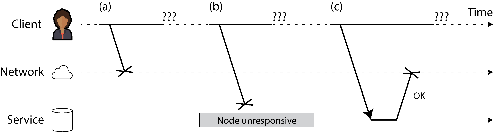
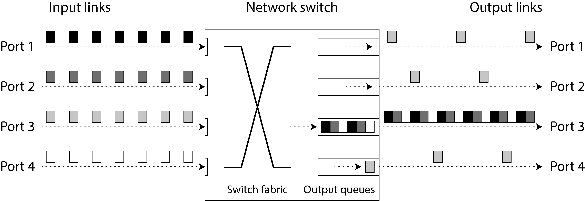
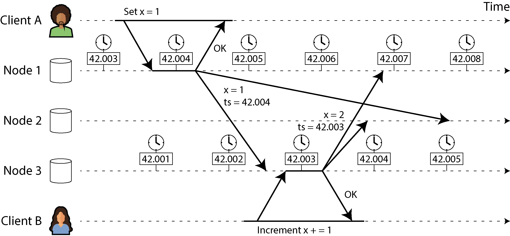
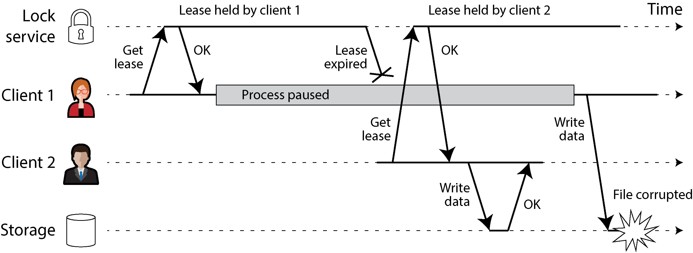
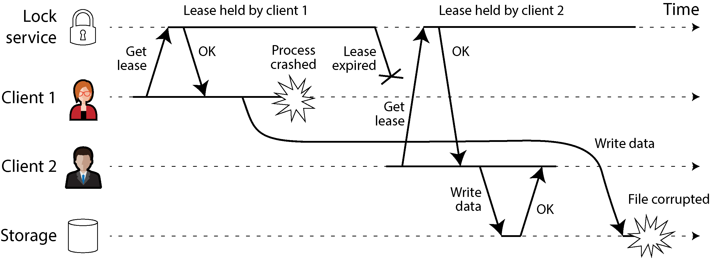
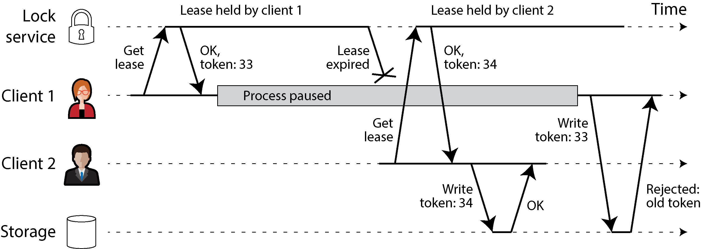
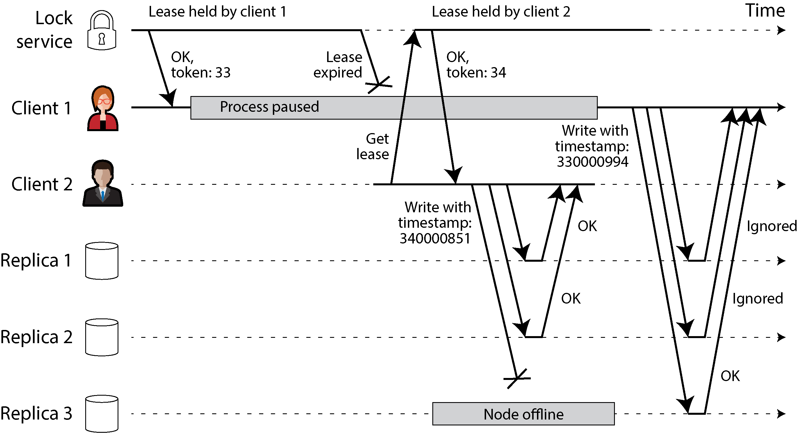

# Chương 9. Những rắc rối của hệ phân tán

> *Tai nạn là những thứ kỳ lạ. Bạn chẳng bao giờ gặp chúng cho đến khi bạn đang gặp chúng.*

> —A.A. Milne, *The House at Pooh Corner* (Ngôi nhà ở góc Pooh) (1928)

Như đã thảo luận trong “Độ tin cậy và khả năng chịu lỗi”, làm cho một hệ thống đáng tin cậy có nghĩa là bảo đảm rằng hệ thống nói chung vẫn tiếp tục hoạt động, ngay cả khi có sự cố xảy ra (tức là khi có lỗi — fault). Tuy nhiên, dự đoán trước mọi lỗi có thể xảy ra và xử lý chúng không hề dễ dàng. Là một nhà phát triển, ta rất dễ bị cám dỗ tập trung chủ yếu vào happy path (luồng thuận lợi) (rốt cuộc thì phần lớn thời gian mọi thứ đều hoạt động tốt!) và bỏ qua các lỗi, vì chúng kéo theo rất nhiều trường hợp biên (edge case).

Nếu bạn muốn hệ thống của mình đáng tin cậy khi có lỗi xảy ra, bạn phải thay đổi triệt để tư duy và tập trung vào những gì có thể trục trặc, dù điều đó có vẻ khó xảy ra. Không quan trọng nếu xác suất chỉ là một phần triệu; trong một hệ thống đủ lớn, các sự kiện một-phần-triệu xảy ra mỗi ngày. Những người vận hành hệ thống giàu kinh nghiệm sẽ nói với bạn rằng bất cứ điều gì *có thể* hỏng thì *sẽ* hỏng.

Làm việc với hệ phân tán (distributed system) cũng khác về căn bản so với viết phần mềm trên một máy tính đơn lẻ — khác biệt chính là mọi thứ có thể hỏng theo rất nhiều cách mới lạ và “thú vị” [1, 2]. Trong chương này, bạn sẽ được nếm trải những vấn đề nảy sinh trong thực tế và hiểu được những gì bạn có thể và không thể tin cậy.

Để hiểu những thách thức mà chúng ta phải đối mặt, chúng ta sẽ đẩy sự bi quan lên mức tối đa và khám phá nhiều loại sự cố có thể xảy ra trong một hệ phân tán, bao gồm các vấn đề về mạng cũng như các vấn đề về đồng hồ và thời gian. Hậu quả của tất cả những vấn đề này rất dễ gây hoang mang, nên chúng ta cũng sẽ tìm hiểu cách suy nghĩ về trạng thái của một hệ phân tán và cách lập luận về những điều đã xảy ra. Trong Chương 10, chúng ta sẽ xem xét một số ví dụ về cách đạt được khả năng chịu lỗi (fault tolerance) khi đối mặt với những sự kiện này.

## Lỗi và hỏng hóc một phần

Khi bạn viết một chương trình trên một máy tính đơn lẻ, nó thường hoạt động theo cách khá dễ đoán: hoặc chạy được, hoặc không. Phần mềm có bug có thể tạo cảm giác rằng máy tính đôi khi “có một ngày tồi tệ” (một vấn đề thường được khắc phục bằng cách khởi động lại), nhưng đó chủ yếu chỉ là hậu quả của phần mềm được viết tệ.

Không có lý do căn bản nào khiến phần mềm trên một máy tính đơn lẻ phải chập chờn. Khi phần cứng hoạt động đúng, cùng một thao tác luôn tạo ra cùng một kết quả (nó là *deterministic* — có tính xác định). Nếu có vấn đề phần cứng (ví dụ, bộ nhớ bị hỏng hoặc một đầu nối bị lỏng), hậu quả thường là toàn bộ hệ thống hỏng hoàn toàn (ví dụ, kernel panic, “màn hình xanh chết chóc”, không khởi động được). Một máy tính đơn lẻ với phần mềm tốt thường hoặc là hoạt động đầy đủ hoặc là hỏng hoàn toàn, chứ không phải một trạng thái lưng chừng nào đó.

Đây là một lựa chọn có chủ ý trong thiết kế máy tính. Nếu xảy ra lỗi bên trong, chúng ta muốn máy tính crash hoàn toàn thay vì trả về kết quả sai, vì kết quả sai rất khó xử lý và gây nhầm lẫn. Do đó, máy tính che giấu thực tại vật lý mờ nhòe mà chúng được hiện thực trên đó và trình bày một mô hình hệ thống lý tưởng hóa hoạt động với sự hoàn hảo toán học. Một lệnh CPU luôn làm cùng một việc; nếu bạn ghi dữ liệu vào bộ nhớ hoặc đĩa, dữ liệu đó vẫn còn nguyên vẹn và không bị hỏng một cách ngẫu nhiên. Như đã thảo luận trong “Lỗi phần cứng và lỗi phần mềm”, điều này thực ra không đúng — trong thực tế, dữ liệu vẫn bị hỏng một cách âm thầm và CPU đôi khi âm thầm trả về kết quả sai — nhưng điều đó xảy ra đủ hiếm để chúng ta có thể bỏ qua mà không sao.

Khi bạn viết phần mềm chạy trên nhiều máy tính, kết nối với nhau qua mạng, tình hình khác hẳn về căn bản. Trong hệ phân tán, lỗi xảy ra thường xuyên hơn nhiều, nên chúng ta không thể bỏ qua chúng nữa — chúng ta không có lựa chọn nào khác ngoài việc đối mặt với thực tại hỗn độn của thế giới vật lý. Và trong thế giới vật lý, có vô số thứ có thể hỏng, như minh họa trong câu chuyện sau [3]:

- *Với kinh nghiệm hạn hẹp của mình, tôi đã phải đối phó với những network partition kéo dài trong một data center (DC) duy nhất, hỏng PDU [power distribution unit — bộ phân phối điện], hỏng switch, vô tình tắt-mở nguồn toàn bộ rack, hỏng backbone của cả DC, mất điện toàn DC, và một tài xế bị hạ đường huyết lao chiếc xe bán tải Ford của anh ta vào hệ thống HVAC [heating, ventilation, and air conditioning — sưởi, thông gió và điều hòa không khí] của một DC. Mà tôi thậm chí còn không phải là dân vận hành.*

                          - —Coda Hale

Trong một hệ phân tán, rất có thể một số phần của hệ thống bị hỏng theo cách không thể dự đoán, trong khi các phần khác vẫn hoạt động tốt. Điều này được gọi là *partial failure* (hỏng hóc một phần). Khó khăn nằm ở chỗ partial failure là *nondeterministic* (bất định): nếu bạn cố làm bất cứ điều gì liên quan đến nhiều node và mạng, nó có thể lúc thì thành công, lúc thì thất bại một cách không đoán trước được. Như chúng ta sẽ thấy, bạn thậm chí có thể không *biết* liệu một việc nào đó đã thành công hay chưa!

Tính bất định này và khả năng xảy ra partial failure là điều khiến hệ phân tán khó làm việc [4]. Mặt khác, nếu một hệ phân tán có thể chịu được partial failure, điều đó mở ra những khả năng mạnh mẽ — ví dụ, nó có nghĩa là chúng ta có thể thực hiện rolling upgrade (nâng cấp cuốn chiếu), khởi động lại từng node một để cài đặt bản cập nhật phần mềm trong khi hệ thống nói chung vẫn tiếp tục hoạt động không gián đoạn. Do đó, khả năng chịu lỗi cho phép chúng ta làm cho hệ phân tán đáng tin cậy hơn hệ thống đơn nút (single-node); chúng ta có thể xây dựng một hệ thống đáng tin cậy từ những thành phần không đáng tin cậy.

Nhưng trước khi có thể hiện thực khả năng chịu lỗi, chúng ta cần biết thêm về những lỗi mà chúng ta phải chịu được. Điều quan trọng là phải xem xét một phạm vi rộng các lỗi có thể xảy ra — kể cả những lỗi khá khó xảy ra — và tạo ra một cách nhân tạo những tình huống như vậy trong môi trường kiểm thử của bạn để xem điều gì sẽ xảy ra. Trong hệ phân tán, sự nghi ngờ, bi quan và hoang tưởng đều được đền đáp.

## Mạng không đáng tin cậy

Trước đây, các máy tính đời cũ như mainframe được làm cho đáng tin cậy bằng cách bảo đảm các thành phần riêng lẻ có dự phòng — ví dụ, dùng RAID để chịu được hỏng hóc của từng đĩa riêng lẻ. Như đã thảo luận trong “Kiến trúc Shared-Memory, Shared-Disk và Shared-Nothing”, các hệ phân tán mà chúng ta tập trung trong cuốn sách này chủ yếu là *shared-nothing system*: một nhóm máy được kết nối với nhau qua mạng. Thay vì có dự phòng các thành phần bên trong một máy đơn lẻ, các hệ thống shared-nothing sử dụng replication giữa các máy riêng biệt để dự phòng. Mạng là cách duy nhất để những máy này giao tiếp với nhau. Chúng ta giả định rằng mỗi máy có bộ nhớ và đĩa riêng, và một máy không thể truy cập bộ nhớ hay đĩa của máy khác (ngoại trừ bằng cách gửi request đến một dịch vụ qua mạng). Ngay cả khi lưu trữ được chia sẻ, chẳng hạn với object storage, các máy vẫn giao tiếp với dịch vụ lưu trữ chia sẻ qua mạng.

Internet và hầu hết mạng nội bộ trong các datacenter (thường là Ethernet) là *asynchronous packet network* (mạng gói bất đồng bộ). Trong loại mạng này, một node có thể gửi một thông điệp (một packet — gói tin) đến node khác, nhưng mạng không đưa ra bảo đảm nào về thời điểm nó sẽ đến hay liệu nó có đến hay không. Nếu bạn gửi một request và mong đợi một response, nhiều điều có thể trục trặc (một số trong đó được minh họa trong Hình 9-1):

- Request của bạn có thể đã bị mất (có lẽ ai đó đã rút một sợi cáp mạng).

- Request của bạn có thể đang chờ trong một queue và sẽ được chuyển đi sau (có lẽ mạng hoặc bên nhận đang quá tải).

- Node ở xa có thể đã hỏng (có lẽ nó đã crash hoặc bị tắt nguồn).

- Node ở xa có thể đã tạm thời ngừng phản hồi (có lẽ nó đang trải qua một khoảng dừng GC dài; xem “Tạm dừng process”), nhưng sẽ phản hồi trở lại sau.

- Node ở xa có thể đã xử lý request của bạn, nhưng response đã bị mất trên mạng (có lẽ một network switch đã bị cấu hình sai).

- Node ở xa có thể đã xử lý request của bạn, nhưng response bị trễ và sẽ được chuyển đến sau (có lẽ mạng hoặc chính máy của bạn đang quá tải).



*Hình 9-1. Nếu bạn gửi một request và không nhận được response, không thể phân biệt được (a) request đã bị mất, (b) node ở xa đã ngừng hoạt động, hay (c) response đã bị mất.*

Bên gửi thậm chí không thể biết packet đã được chuyển đến hay chưa. Lựa chọn duy nhất là bên nhận gửi lại một thông điệp phản hồi, mà thông điệp này đến lượt nó cũng có thể bị mất hoặc bị trễ. Những vấn đề này không thể phân biệt được trong một mạng bất đồng bộ; thông tin duy nhất bạn có là bạn chưa nhận được response. Nếu bạn gửi một request đến node khác và không nhận được response, *không thể* biết được lý do tại sao.

Cách thông thường để xử lý vấn đề này là dùng *timeout*: sau một khoảng thời gian, bạn từ bỏ việc chờ đợi và giả định rằng response sẽ không đến. Tuy nhiên, khi timeout xảy ra, bạn vẫn không biết liệu node ở xa đã nhận được request của bạn hay chưa (và nếu request vẫn đang nằm trong queue ở đâu đó, nó vẫn có thể được chuyển đến bên nhận, ngay cả khi bạn đã từ bỏ khả năng đó).

### Những hạn chế của TCP

Các packet mạng có kích thước tối đa (thường là vài kilobyte), nhưng nhiều ứng dụng cần gửi các thông điệp (request, response) quá lớn để nằm gọn trong một packet. Những ứng dụng này thường dùng TCP, Transmission Control Protocol, để thiết lập một *connection* (kết nối) chia các luồng dữ liệu lớn thành từng packet riêng lẻ và ghép chúng lại ở phía nhận.

> **LƯU Ý**
>
> Hầu hết những gì chúng ta nói về TCP cũng áp dụng cho giải pháp thay thế gần đây hơn của nó là QUIC, cũng như Stream Control Transmission Protocol (SCTP) được dùng trong WebRTC, giao thức uTP của BitTorrent, và các giao thức tầng vận chuyển (transport) khác. Để so sánh với UDP, xem “TCP so với UDP”.

TCP thường được mô tả là cung cấp việc chuyển phát “đáng tin cậy”, theo nghĩa là nó phát hiện và truyền lại các packet bị rớt, nó phát hiện các packet bị đảo thứ tự và sắp xếp lại đúng thứ tự, và nó phát hiện packet bị hỏng bằng một checksum đơn giản. Nó cũng tự xác định tốc độ có thể gửi dữ liệu sao cho dữ liệu được truyền nhanh nhất có thể nhưng không làm quá tải mạng hay node nhận; điều này được gọi là *congestion control* (kiểm soát tắc nghẽn), *flow control* (kiểm soát luồng), hay *backpressure* [5].

Khi bạn “gửi” dữ liệu bằng cách ghi nó vào một socket, dữ liệu không được gửi đi ngay lập tức; nó được đặt vào một buffer do hệ điều hành của bạn quản lý. Khi thuật toán congestion control quyết định rằng còn dung lượng để gửi một packet, nó lấy lượng dữ liệu đủ cho packet tiếp theo từ buffer đó và chuyển cho giao diện mạng (network interface). Packet đi qua nhiều switch và router, và cuối cùng hệ điều hành của node nhận đặt dữ liệu của packet vào một receive buffer và gửi một packet xác nhận (acknowledgment) trở lại bên gửi. Chỉ đến lúc đó hệ điều hành bên nhận mới thông báo cho ứng dụng rằng có thêm dữ liệu đã đến [6].

Vậy, nếu TCP cung cấp “độ tin cậy”, điều đó có nghĩa là chúng ta không còn phải lo lắng về việc mạng không đáng tin cậy nữa? Rất tiếc là không. TCP kết luận rằng một packet hẳn đã bị mất nếu không có acknowledgment nào đến trong một khoảng timeout nhất định, nhưng nó không thể biết đó là packet gửi đi hay acknowledgment bị mất. Mặc dù nó có thể gửi lại packet, nó không thể bảo đảm packet mới sẽ đến được (ví dụ, nếu cáp mạng bị rút, TCP không thể cắm lại cho bạn). Cuối cùng, sau một khoảng timeout có thể cấu hình, nó từ bỏ và báo lỗi cho ứng dụng. Khả năng deduplication và truyền lại của TCP chỉ áp dụng cho một connection duy nhất, nên nếu ứng dụng kết nối lại và truyền lại, dữ liệu có thể bị trùng lặp.

Nếu một connection TCP bị đóng với lỗi — có lẽ vì node ở xa đã crash hoặc mạng bị gián đoạn — rất tiếc bạn không có cách nào biết được bao nhiêu dữ liệu đã thực sự được node ở xa xử lý [6]. Ngay cả khi bạn nhận được acknowledgment rằng một packet đã được chuyển đến, điều này chỉ có nghĩa là kernel của hệ điều hành trên node ở xa đã nhận được nó; ứng dụng có thể đã crash trước khi xử lý dữ liệu đó. Nếu bạn muốn chắc chắn rằng một request đã thành công, bạn cần một response khẳng định từ chính ứng dụng [7].

Dù vậy, TCP rất hữu ích vì nó cung cấp một cách thuận tiện để gửi và nhận các thông điệp quá lớn để nằm gọn trong một packet. Một khi connection TCP đã được thiết lập, bạn cũng có thể dùng nó để gửi nhiều request và response. Việc này thường được thực hiện bằng cách trước tiên gửi một header cho biết độ dài tính theo byte của thông điệp theo sau, rồi đến thông điệp thực sự. HTTP và nhiều giao thức RPC (xem “Dataflow qua dịch vụ: REST và RPC”) hoạt động theo cách này.

### Lỗi mạng trong thực tế

Chúng ta đã xây dựng mạng máy tính trong nhiều thập kỷ — người ta có thể hy vọng rằng đến giờ chúng ta đã tìm ra cách làm cho chúng đáng tin cậy. Rất tiếc, chúng ta vẫn chưa thành công. Một số nghiên cứu có hệ thống và rất nhiều bằng chứng thực nghiệm cho thấy các vấn đề về mạng phổ biến đến mức đáng ngạc nhiên, ngay cả trong các môi trường được kiểm soát như một datacenter do một công ty vận hành [8]:

- Một nghiên cứu ở một datacenter cỡ trung phát hiện khoảng 12 lỗi mạng mỗi tháng, trong đó nửa số lỗi làm ngắt kết nối một máy đơn lẻ và nửa còn lại làm ngắt kết nối cả một rack [9].

- Một nghiên cứu khác đo tỷ lệ hỏng hóc của các thành phần như top-of-rack switch, aggregation switch và load balancer [10]. Nghiên cứu này phát hiện rằng việc thêm thiết bị mạng dự phòng không giảm lỗi nhiều như bạn có thể kỳ vọng, vì nó không bảo vệ khỏi sai sót của con người (ví dụ, switch bị cấu hình sai), vốn là nguyên nhân chính gây ra sự cố ngừng hoạt động. Các gián đoạn của tuyến cáp quang diện rộng đã được quy cho bò [11], hải ly [12] và cá mập [13] (mặc dù các vụ cá mập cắn đã trở nên hiếm hơn nhờ lớp bọc bảo vệ tốt hơn cho cáp ngầm dưới biển [14]). Con người cũng thường là thủ phạm, qua việc vô tình cấu hình sai [15], trộm cắp phế liệu [16], hoặc phá hoại [17].

- Giữa các cloud region, đã quan sát được round-trip time lên đến vài *phút* ở các percentile cao [18, Table 3]. Ngay cả trong một datacenter duy nhất, độ trễ packet hơn một phút có thể xảy ra trong lúc tái cấu hình topology mạng, được kích hoạt bởi một sự cố trong quá trình nâng cấp phần mềm cho một switch [19]. Do đó, chúng ta phải giả định rằng thông điệp có thể bị trễ một cách tùy ý.

- Đôi khi liên lạc bị gián đoạn một phần, tùy thuộc vào bạn đang nói chuyện với ai — ví dụ, A và B có thể liên lạc với nhau, B và C có thể liên lạc với nhau, nhưng A và C thì không [20, 21]. Các lỗi đáng ngạc nhiên khác bao gồm một network interface đôi khi rớt tất cả các packet đi vào nhưng vẫn gửi các packet đi ra thành công [22]. Việc một liên kết mạng hoạt động theo một chiều không bảo đảm nó cũng hoạt động theo chiều ngược lại.

- Ngay cả một gián đoạn mạng ngắn ngủi cũng có thể gây ra những hệ quả kéo dài lâu hơn nhiều so với vấn đề ban đầu [8, 20, 23].

Ngay cả khi lỗi mạng hiếm gặp trong môi trường của bạn, việc lỗi *có thể* xảy ra có nghĩa là phần mềm của bạn cần có khả năng xử lý chúng. Bất cứ khi nào có giao tiếp qua mạng, nó đều có thể thất bại — không có cách nào tránh được điều đó.

> **NETWORK PARTITION (CHIA CẮT MẠNG)**
>
> Thuật ngữ *network partition* (chia cắt mạng), hay *netsplit*, đôi khi được dùng khi một phần của mạng bị cắt rời khỏi phần còn lại do lỗi mạng. Tuy nhiên, điều này không khác về căn bản so với các kiểu gián đoạn mạng khác. Network partition không liên quan đến sharding của một hệ thống lưu trữ, vốn đôi khi cũng được gọi là *partitioning* (xem Chương 7).

Nếu việc xử lý lỗi mạng không được định nghĩa và kiểm thử, những điều tồi tệ tùy ý có thể xảy ra — ví dụ, cluster có thể rơi vào deadlock và vĩnh viễn không thể phục vụ request, ngay cả khi mạng đã phục hồi [24], hoặc nó có khả năng xóa toàn bộ dữ liệu của bạn [25]. Nếu phần mềm bị đặt vào một tình huống không được lường trước, nó có thể làm những điều bất ngờ tùy ý.

Xử lý lỗi mạng không nhất thiết có nghĩa là *chịu được* (tolerating) chúng. Nếu mạng của bạn bình thường khá đáng tin cậy, một cách tiếp cận hợp lý có thể đơn giản là hiển thị thông báo lỗi cho người dùng trong khi mạng đang gặp sự cố. Tuy nhiên, bạn cần biết phần mềm của mình phản ứng thế nào với các vấn đề về mạng và bảo đảm hệ thống có thể phục hồi sau đó. Việc cố ý kích hoạt các sự cố mạng và kiểm thử phản ứng của hệ thống có thể là điều hợp lý (xem “Fault injection”).

### Phát hiện lỗi

Nhiều hệ thống cần tự động phát hiện các node bị lỗi. Ví dụ:

- Một load balancer cần ngừng gửi request đến một node đã chết (tức là đưa nó *ra khỏi vòng luân chuyển* — out of rotation).

- Trong một database phân tán với single-leader replication, nếu leader hỏng, một trong các follower cần được thăng cấp thành leader mới (xem “Xử lý node ngừng hoạt động”).

Rất tiếc, sự bất định về mạng khiến việc xác định một node có đang hoạt động hay không trở nên khó khăn. Trong những hoàn cảnh cụ thể, bạn có thể nhận được phản hồi cho biết rõ ràng rằng có gì đó không hoạt động:

- Nếu bạn có thể kết nối tới máy mà node đó được cho là đang chạy trên đó, nhưng không có process nào lắng nghe trên cổng đích (ví dụ, vì process đã crash), hệ điều hành sẽ “tử tế” đóng hoặc từ chối các connection TCP bằng cách gửi trả một packet `RST` hoặc `FIN`. Nếu process của node bị crash (hoặc bị quản trị viên kill) nhưng hệ điều hành của node vẫn đang chạy, một script có thể thông báo cho các node khác về vụ crash để node khác có thể tiếp quản nhanh chóng mà không phải chờ timeout hết hạn. Ví dụ, HBase làm như vậy [26].

- Nếu bạn có quyền truy cập vào giao diện quản trị của các network switch trong datacenter của mình, bạn có thể truy vấn chúng để phát hiện hỏng liên kết ở mức phần cứng (ví dụ, nếu máy ở xa bị tắt nguồn). Lựa chọn này bị loại trừ nếu bạn kết nối qua internet, nếu bạn ở trong một datacenter dùng chung mà không có quyền truy cập vào chính các switch, hoặc nếu bạn không thể tiếp cận giao diện quản trị do sự cố mạng. Nếu một router chắc chắn rằng địa chỉ IP bạn đang cố kết nối tới là không thể tiếp cận, nó có thể trả lời bạn bằng một packet ICMP Destination Unreachable. Tuy nhiên, router cũng không có khả năng phát hiện hỏng hóc thần kỳ nào; nó chịu cùng những hạn chế như các thành phần tham gia khác trong mạng.

Phản hồi nhanh về việc một node ở xa đã ngừng hoạt động là hữu ích, nhưng bạn không thể trông cậy vào nó. Nếu có gì đó trục trặc, bạn có thể nhận được một response báo lỗi ở tầng nào đó của stack, nhưng nói chung bạn phải giả định rằng bạn sẽ không nhận được response nào cả. Bạn có thể thử lại vài lần, chờ timeout trôi qua, và cuối cùng tuyên bố node đã chết nếu không nhận được hồi âm trong khoảng timeout. Vì node đó thực ra có thể vẫn còn sống, bạn cần cân bằng giữa dương tính giả (false positive) và âm tính giả (false negative): timeout quá ngắn khiến các node còn sống bị nghi ngờ nhầm là đã chết, còn timeout quá dài gây ra những độ trễ không cần thiết khi chờ các node đã chết.

### Timeout và độ trễ không giới hạn

Nếu timeout là cách chắc chắn duy nhất để phát hiện lỗi, thì timeout nên dài bao lâu? Rất tiếc là không có câu trả lời đơn giản.

Timeout dài có nghĩa là phải chờ lâu cho đến khi một node bị tuyên bố là đã chết (và trong thời gian này, người dùng có thể phải chờ hoặc thấy thông báo lỗi). Timeout ngắn phát hiện lỗi nhanh hơn nhưng mang rủi ro cao hơn về việc tuyên bố nhầm một node đã chết trong khi thực ra nó chỉ bị chậm tạm thời (ví dụ, do tải tăng vọt trên node hoặc trên mạng).

Tuyên bố sớm rằng một node đã chết là điều có vấn đề. Nếu node đó thực ra vẫn còn sống và đang giữa chừng thực hiện một hành động (ví dụ, gửi email), và một node khác tiếp quản, hành động đó cuối cùng có thể bị thực hiện hai lần. Chúng ta sẽ thảo luận vấn đề này chi tiết hơn trong “Tri thức, Sự thật và Dối trá” và trong Chương 10 và 12.

Khi một node bị tuyên bố là đã chết, trách nhiệm của nó cần được chuyển sang các node khác, điều này đặt thêm tải lên các node đó và lên mạng. Nếu hệ thống đã đang vật lộn với tải cao, việc tuyên bố node chết quá sớm có thể làm vấn đề tệ hơn. Đặc biệt, có thể xảy ra trường hợp node đó thực ra không chết mà chỉ phản hồi chậm do quá tải; việc chuyển tải của nó sang các node khác có thể gây ra hỏng hóc dây chuyền (cascading failure) (trong trường hợp cực đoan, tất cả các node tuyên bố nhau đã chết, và mọi thứ ngừng hoạt động — xem “Khi một hệ thống quá tải không thể phục hồi”).

Hãy tưởng tượng một hệ thống hư cấu với một mạng bảo đảm độ trễ tối đa cho các packet. Mỗi packet hoặc được chuyển đến trong thời gian *d* hoặc bị mất, và việc chuyển phát không bao giờ mất quá *d*. Hơn nữa, giả định rằng bạn có thể bảo đảm một node không bị hỏng luôn xử lý một request trong thời gian *r*. Trong trường hợp này, bạn có thể bảo đảm rằng mọi request thành công đều nhận được response trong thời gian 2*d* + *r* — và nếu bạn không nhận được response trong thời gian đó, bạn biết rằng hoặc mạng hoặc node ở xa không hoạt động. Nếu điều này đúng, 2*d* + *r* sẽ là một timeout hợp lý để dùng.

Rất tiếc, hầu hết các hệ thống chúng ta làm việc cùng không có cả hai bảo đảm đó. Mạng bất đồng bộ có *unbounded delay* (độ trễ không giới hạn) (chúng cố chuyển packet nhanh nhất có thể, nhưng không có giới hạn trên cho thời gian một packet có thể mất để đến nơi), và hầu hết các hiện thực server không thể bảo đảm xử lý request trong một khoảng thời gian tối đa (xem “Cung cấp đảm bảo về thời gian phản hồi”). Đối với việc phát hiện hỏng hóc, hệ thống nhanh trong hầu hết thời gian là chưa đủ: nếu timeout của bạn thấp, chỉ cần một đợt tăng vọt tạm thời của round-trip time là đủ để làm hệ thống mất cân bằng.

#### Tắc nghẽn mạng và xếp hàng (queueing)

Khi lái xe, thời gian di chuyển trên mạng lưới đường bộ thường biến động nhiều nhất là do tắc đường. Tương tự, sự biến động của độ trễ gói tin (packet) trên mạng máy tính thường xuyên nhất là do xếp hàng (queueing) [27]:

- Nếu nhiều node đồng thời cố gửi gói tin đến cùng một đích, network switch phải xếp chúng vào hàng đợi và đưa từng gói một vào đường liên kết mạng (network link) của đích (như minh họa trong Hình 9-2). Trên một đường liên kết mạng bận, một gói tin có thể phải chờ một lúc cho đến khi giành được một slot (điều này được gọi là *network congestion* — tắc nghẽn mạng). Nếu dữ liệu đến quá nhiều đến mức hàng đợi của switch bị đầy, gói tin sẽ bị loại bỏ (drop), do đó cần được gửi lại — mặc dù mạng vẫn đang hoạt động bình thường. Khi một gói tin đến được máy đích, nếu tất cả các CPU core hoặc thread của ứng dụng hiện đang bận, request đến từ mạng sẽ được hệ điều hành xếp vào hàng đợi cho đến khi ứng dụng sẵn sàng xử lý nó. Tùy vào tải trên máy, việc này có thể mất một khoảng thời gian dài bất kỳ [28].

- Trong các môi trường ảo hóa, một hệ điều hành đang chạy thường bị tạm dừng hàng chục mili giây trong khi một máy ảo (virtual machine, VM) khác sử dụng CPU core. Trong khoảng thời gian này, VM không thể tiêu thụ bất kỳ dữ liệu nào từ mạng, nên dữ liệu đến được VM monitor xếp vào hàng đợi (buffer) [29], càng làm tăng thêm sự biến động của độ trễ mạng. Như đã đề cập trước đó, để tránh làm quá tải mạng, TCP giới hạn tốc độ gửi dữ liệu. Điều này có nghĩa là có thêm việc xếp hàng ở phía gửi trước cả khi dữ liệu đi vào mạng.



*Hình 9-2. Nếu nhiều máy gửi lưu lượng mạng đến cùng một đích, hàng đợi của switch tại đích có thể bị đầy. Ở đây, các cổng 1, 2 và 4 đều đang cố gửi gói tin đến cổng 3.*

Hơn nữa, khi TCP phát hiện và tự động truyền lại một gói tin bị mất, ứng dụng không trực tiếp nhìn thấy việc mất gói tin nhưng lại thấy độ trễ phát sinh từ đó (chờ timeout hết hạn, rồi chờ gói tin được truyền lại được xác nhận).

#### TCP SO VỚI UDP

Một số ứng dụng nhạy cảm với độ trễ (latency), chẳng hạn như hội nghị truyền hình và Voice over IP (VoIP), sử dụng UDP thay vì TCP. Lựa chọn này là một sự đánh đổi (trade-off) giữa độ tin cậy và sự biến động của độ trễ: vì UDP không thực hiện kiểm soát luồng (flow control) và không truyền lại các gói tin bị mất, nó tránh được một số nguyên nhân gây biến động độ trễ mạng (mặc dù nó vẫn chịu ảnh hưởng của hàng đợi switch và độ trễ do lập lịch).

UDP là lựa chọn tốt khi dữ liệu bị trễ trở nên vô giá trị. Ví dụ, trong một cuộc gọi điện thoại VoIP, có lẽ không đủ thời gian để truyền lại một gói tin bị mất trước thời điểm dữ liệu của nó phải được phát ra loa. Trong trường hợp này, việc truyền lại gói tin là vô nghĩa — thay vào đó, ứng dụng phải lấp khoảng thời gian của gói tin bị thiếu bằng khoảng lặng (gây ra một đoạn ngắt âm thanh ngắn) và tiếp tục với luồng dữ liệu. Việc thử lại thay vào đó diễn ra ở tầng con người. (“Bạn có thể nhắc lại được không? Âm thanh vừa bị ngắt một lúc.”)

#### Sự biến động của độ trễ mạng

Tất cả các yếu tố này góp phần vào sự biến động của độ trễ mạng. Độ trễ do xếp hàng có phạm vi biến động đặc biệt rộng khi hệ thống gần đạt công suất tối đa. Một hệ thống có nhiều công suất dự phòng có thể dễ dàng giải phóng các hàng đợi, trong khi ở một hệ thống có mức sử dụng cao, các hàng đợi dài có thể tích tụ rất nhanh.

Trong public cloud và các datacenter đa khách thuê (multitenant), tài nguyên được chia sẻ giữa nhiều khách hàng. Các đường liên kết mạng và switch, và thậm chí cả giao diện mạng (network interface) và CPU của từng máy (khi chạy trên VM), đều được chia sẻ. Việc xử lý lượng dữ liệu lớn có thể dùng hết toàn bộ dung lượng của các đường liên kết mạng (làm chúng *saturate* — bão hòa). Vì bạn không có quyền kiểm soát hay khả năng nhìn thấu việc sử dụng tài nguyên chia sẻ của các khách hàng khác, độ trễ mạng có thể biến động rất mạnh nếu ai đó ở gần bạn (một *noisy neighbor* — “láng giềng ồn ào”) đang sử dụng nhiều tài nguyên [30, 31].

Trong những môi trường như vậy, bạn chỉ có thể chọn timeout bằng thực nghiệm: đo phân phối thời gian round-trip của mạng trong một khoảng thời gian dài, và trên nhiều máy, để xác định mức biến động độ trễ dự kiến. Sau đó, tính đến các đặc điểm của ứng dụng của bạn, bạn có thể xác định một sự đánh đổi phù hợp giữa độ trễ phát hiện lỗi và nguy cơ timeout quá sớm.

Tốt hơn nữa, thay vì dùng các timeout hằng số được cấu hình sẵn, hệ thống có thể liên tục đo thời gian phản hồi và sự biến động của chúng (*jitter*) rồi tự động điều chỉnh timeout theo phân phối thời gian phản hồi quan sát được. Phi Accrual failure detector [32] (được dùng, ví dụ, trong Akka và Cassandra [33]) là một cách để làm điều này. Timeout truyền lại của TCP cũng hoạt động tương tự [5].

### Mạng đồng bộ so với mạng bất đồng bộ

Các hệ phân tán (distributed system) sẽ đơn giản hơn rất nhiều nếu chúng ta có thể tin cậy rằng mạng sẽ chuyển các gói tin với một độ trễ tối đa cố định và không làm mất gói tin. Tại sao chúng ta không thể giải quyết vấn đề này ở cấp phần cứng và làm cho mạng trở nên đáng tin cậy để phần mềm không cần phải lo lắng về nó?

Để trả lời câu hỏi này, sẽ rất thú vị khi so sánh mạng datacenter với mạng điện thoại cố định truyền thống (không phải di động, không phải VoIP), vốn cực kỳ đáng tin cậy; các khung âm thanh bị trễ và các cuộc gọi bị rớt là rất hiếm. Một cuộc gọi điện thoại yêu cầu độ trễ đầu-cuối (end-to-end) luôn ở mức thấp và đủ băng thông để truyền các mẫu âm thanh của giọng nói của bạn. Chẳng phải sẽ rất tuyệt nếu có được độ tin cậy và khả năng dự đoán tương tự trong mạng máy tính sao?

Khi bạn thực hiện một cuộc gọi qua mạng điện thoại, nó thiết lập một *circuit* (kênh chuyển mạch): một lượng băng thông cố định, được đảm bảo, được phân bổ cho cuộc gọi, dọc theo toàn bộ tuyến đường giữa hai người gọi. Circuit này được duy trì cho đến khi cuộc gọi kết thúc [34]. Ví dụ, một mạng ISDN chạy ở tốc độ cố định 4.000 frame mỗi giây. Khi một cuộc gọi được thiết lập, nó được phân bổ 16 bit không gian trong mỗi frame (theo mỗi hướng). Do đó, trong suốt thời gian cuộc gọi, mỗi bên được đảm bảo có thể gửi đúng 16 bit dữ liệu âm thanh mỗi 250 micro giây [35].

Loại mạng này là *synchronous* (đồng bộ): ngay cả khi dữ liệu đi qua nhiều router, nó không bị xếp hàng, vì 16 bit không gian cho cuộc gọi đã được dành sẵn ở hop tiếp theo của mạng. Và vì không có xếp hàng, độ trễ đầu-cuối tối đa của mạng là cố định. Chúng ta gọi đây là *bounded delay* (độ trễ có giới hạn).

#### Chẳng lẽ chúng ta không thể đơn giản làm cho độ trễ mạng trở nên dự đoán được?

Lưu ý rằng một circuit trong mạng điện thoại rất khác với một kết nối TCP. Một circuit có một lượng băng thông dành riêng cố định mà không ai khác có thể sử dụng chừng nào nó còn được thiết lập, trong khi các gói tin của một kết nối TCP tận dụng một cách cơ hội bất kỳ băng thông mạng nào đang sẵn có. Bạn có thể đưa cho TCP một khối dữ liệu có kích thước thay đổi (ví dụ, một email hoặc một trang web), và nó sẽ cố truyền khối đó trong thời gian ngắn nhất có thể. Khi một kết nối TCP đang rảnh (idle), nó không dùng chút băng thông nào (ngoại trừ có lẽ một gói keepalive thỉnh thoảng).

Nếu mạng datacenter và internet là các mạng chuyển mạch kênh (circuit-switched), thì có thể thiết lập một thời gian round-trip tối đa được đảm bảo khi một circuit được dựng lên. Tuy nhiên, chúng không phải vậy. Ethernet và IP là các giao thức chuyển mạch gói (packet-switched), vốn chịu ảnh hưởng của xếp hàng và do đó có độ trễ không giới hạn (unbounded) trong mạng. Các giao thức này không có khái niệm circuit.

Tại sao mạng datacenter và internet lại dùng chuyển mạch gói? Câu trả lời là chúng được tối ưu cho *bursty traffic* (lưu lượng bùng phát theo đợt). Một circuit phù hợp cho cuộc gọi âm thanh hoặc video, vốn cần truyền một số bit mỗi giây khá ổn định trong suốt thời gian cuộc gọi. Ngược lại, việc yêu cầu một trang web, gửi một email hay truyền một file không có yêu cầu băng thông cụ thể nào — chúng ta chỉ muốn nó hoàn thành nhanh nhất có thể.

Nếu bạn muốn truyền một file qua circuit, bạn sẽ phải đoán một mức phân bổ băng thông. Nếu đoán quá thấp, việc truyền sẽ chậm một cách không cần thiết, để dung lượng mạng không được sử dụng. Nếu đoán quá cao, circuit không thể được thiết lập (vì mạng không thể cho phép tạo một circuit nếu mức băng thông phân bổ cho nó không thể được đảm bảo). Ngược lại, TCP tự động điều chỉnh tốc độ truyền dữ liệu theo dung lượng mạng sẵn có.

#### ĐỘ TRỄ VÀ MỨC SỬ DỤNG TÀI NGUYÊN

Tổng quát hơn, bạn có thể xem độ trễ biến động là hệ quả của việc phân chia tài nguyên động (dynamic resource partitioning).

Giả sử bạn có một đường dây (hoặc sợi quang) giữa hai tổng đài điện thoại có thể tải tối đa 10.000 cuộc gọi đồng thời. Mỗi circuit được chuyển mạch qua đường dây này chiếm một trong các slot cuộc gọi đó. Do đó, bạn có thể xem đường dây như một tài nguyên có thể được chia sẻ bởi tối đa 10.000 người dùng đồng thời. Tài nguyên được phân chia theo cách *tĩnh* (static): ngay cả khi hiện tại bạn là cuộc gọi duy nhất trên đường dây, và tất cả 9.999 slot còn lại đều không được sử dụng, circuit của bạn vẫn được phân bổ cùng một lượng băng thông cố định như khi đường dây được sử dụng hết.

Ngược lại, internet chia sẻ băng thông mạng một cách *động* (dynamic). Các bên gửi chen lấn và tranh giành nhau để đưa gói tin của mình qua đường dây nhanh nhất có thể, và các network switch quyết định gửi gói tin nào (tức là việc phân bổ băng thông) từ khoảnh khắc này sang khoảnh khắc tiếp theo. Cách tiếp cận này có nhược điểm là xếp hàng, nhưng ưu điểm là nó tối đa hóa mức sử dụng đường dây. Đường dây có chi phí cố định, nên nếu bạn sử dụng nó hiệu quả hơn, mỗi byte bạn gửi qua nó sẽ rẻ hơn.

Tình huống tương tự cũng xảy ra với CPU. Nếu bạn chia sẻ động mỗi CPU core giữa nhiều thread, một thread đôi khi phải chờ trong run queue của hệ điều hành trong khi một thread khác đang chạy, nên một thread có thể bị tạm dừng trong những khoảng thời gian dài ngắn khác nhau [36]. Tuy nhiên, cách này sử dụng phần cứng hiệu quả hơn so với việc bạn phân bổ tĩnh một số chu kỳ CPU cố định cho mỗi thread (xem “Cung cấp đảm bảo về thời gian phản hồi”). Mức sử dụng phần cứng tốt hơn cũng là lý do các nền tảng cloud chạy nhiều VM của các khách hàng khác nhau trên cùng một máy vật lý.

Đảm bảo về độ trễ là có thể đạt được trong một số môi trường nhất định, nếu tài nguyên được phân chia tĩnh (ví dụ, phần cứng chuyên dụng và phân bổ băng thông độc quyền). Tuy nhiên, những đảm bảo này đi kèm với cái giá là mức sử dụng giảm — nói cách khác, nó đắt hơn. Ngược lại, đa khách thuê (multitenancy) với phân chia tài nguyên động mang lại mức sử dụng tốt hơn, nên rẻ hơn, nhưng có nhược điểm là độ trễ biến động.

Độ trễ biến động trong mạng không phải là một quy luật tự nhiên mà đơn giản là kết quả của một sự đánh đổi chi phí/lợi ích.

#### Kết hợp chuyển mạch kênh và chuyển mạch gói

Đã có một số nỗ lực xây dựng các mạng lai (hybrid) hỗ trợ cả chuyển mạch kênh và chuyển mạch gói. *Asynchronous Transfer Mode* (ATM) là đối thủ cạnh tranh của Ethernet vào những năm 1980, nhưng nó không được áp dụng nhiều ngoài các switch lõi của mạng điện thoại. InfiniBand có một số điểm tương đồng [37]: nó triển khai kiểm soát luồng đầu-cuối ở tầng liên kết (link layer), giúp giảm nhu cầu xếp hàng trong mạng, mặc dù nó vẫn có thể bị trễ do tắc nghẽn đường liên kết [38].

Với việc sử dụng cẩn thận các cơ chế *quality of service* (QoS — chất lượng dịch vụ) như ưu tiên hóa và lập lịch gói tin cùng với *admission control* (kiểm soát tiếp nhận — giới hạn tốc độ của bên gửi), có thể mô phỏng chuyển mạch kênh trên mạng gói, hoặc cung cấp độ trễ có giới hạn về mặt thống kê [27, 34]. Các thuật toán mạng mới như *Low Latency, Low Loss, and Scalable Throughput* (L4S) cố gắng giảm nhẹ một số vấn đề về xếp hàng và kiểm soát tắc nghẽn ở cả cấp client và cấp router. Traffic controller (TC) của Linux cũng cho phép các ứng dụng thay đổi mức ưu tiên của gói tin cho mục đích QoS.

Tuy nhiên, các cơ chế QoS như vậy hiện không được bật trong các datacenter đa khách thuê và public cloud, hoặc khi giao tiếp qua internet. Công nghệ đang được triển khai hiện nay không cho phép chúng ta đưa ra bất kỳ đảm bảo nào về độ trễ hay độ tin cậy của mạng; chúng ta phải giả định rằng tắc nghẽn mạng, xếp hàng và độ trễ không giới hạn sẽ xảy ra. Do đó, không có giá trị “đúng” nào cho timeout — chúng cần được xác định bằng thực nghiệm.

Các thỏa thuận peering giữa các nhà cung cấp dịch vụ internet và việc thiết lập các tuyến đường thông qua Border Gateway Protocol (BGP) giống với chuyển mạch kênh hơn so với việc định tuyến gói IP thông thường. Ở cấp độ này, có thể mua băng thông chuyên dụng. Dù vậy, định tuyến internet hoạt động ở cấp độ các mạng, không phải các kết nối riêng lẻ giữa các host, và trên thang thời gian dài hơn nhiều.

## Đồng hồ không đáng tin cậy

Đồng hồ và thời gian rất quan trọng. Các ứng dụng phụ thuộc vào đồng hồ theo nhiều cách khác nhau, để trả lời những câu hỏi như sau:

1. Request này đã timeout chưa?

2. Thời gian phản hồi ở percentile thứ 99 của dịch vụ này là bao nhiêu?

3. Dịch vụ này đã xử lý trung bình bao nhiêu truy vấn mỗi giây trong năm phút vừa qua?

4. Người dùng đã dành bao lâu trên trang web của chúng ta?

5. Bài viết này được xuất bản khi nào?

6. Email nhắc nhở nên được gửi vào ngày giờ nào?

7. Mục cache này hết hạn khi nào?

8. Timestamp của thông báo lỗi này trong file log là gì?

Các câu hỏi 1–4 đo *khoảng thời gian* (duration) (ví dụ, khoảng thời gian giữa lúc một request được gửi và lúc nhận được response), trong khi các câu hỏi 5–8 mô tả *thời điểm* (point in time) (các sự kiện xảy ra vào một ngày cụ thể, tại một thời gian cụ thể).

Trong một hệ phân tán, thời gian là một chuyện rắc rối, vì việc giao tiếp không diễn ra tức thời; một thông điệp (message) cần thời gian để đi qua mạng từ máy này sang máy khác. Thời điểm một thông điệp được nhận luôn muộn hơn thời điểm nó được gửi, nhưng do độ trễ biến động trong mạng, chúng ta không biết muộn hơn bao nhiêu. Thực tế này đôi khi khiến việc xác định thứ tự xảy ra của các sự việc trở nên khó khăn khi có nhiều máy tham gia.

Hơn nữa, mỗi máy trên mạng có đồng hồ riêng của nó, là một thiết bị phần cứng — thường là một bộ dao động tinh thể thạch anh (quartz crystal oscillator). Những thiết bị này không hoàn toàn chính xác, nên mỗi máy có khái niệm riêng về thời gian, có thể nhanh hơn hoặc chậm hơn một chút so với các máy khác. Có thể đồng bộ hóa đồng hồ ở một mức độ nào đó; cơ chế được sử dụng phổ biến nhất là Network Time Protocol (NTP), cho phép điều chỉnh đồng hồ máy tính theo thời gian được báo bởi một nhóm server [39]. Các server này đến lượt mình lấy thời gian từ một nguồn thời gian chính xác hơn, chẳng hạn như một bộ thu GPS.

### Đồng hồ monotonic so với đồng hồ time-of-day

Máy tính hiện đại có ít nhất hai loại đồng hồ: đồng hồ time-of-day (đồng hồ giờ trong ngày) và đồng hồ monotonic (đồng hồ đơn điệu). Mặc dù cả hai đều đo thời gian, điều quan trọng là phải phân biệt chúng, vì chúng phục vụ những mục đích khác nhau.

#### Đồng hồ time-of-day

Một *time-of-day clock* làm điều bạn trực giác mong đợi ở một chiếc đồng hồ: nó trả về ngày và giờ hiện tại theo lịch (còn được gọi là *wall-clock time* — thời gian đồng hồ treo tường). Ví dụ, `clock_gettime(CLOCK_REALTIME)` trên Linux và `System.currentTimeMillis` trong Java trả về số giây (hoặc mili giây) kể từ *epoch*, được định nghĩa là nửa đêm UTC ngày 1 tháng 1 năm 1970 theo lịch Gregory, không tính các giây nhuận (leap second). Một số hệ thống dùng các ngày khác làm điểm tham chiếu. (Mặc dù đồng hồ của Linux được gọi là *real-time*, nó không liên quan gì đến các hệ điều hành thời gian thực, như đã thảo luận trong “Cung cấp đảm bảo về thời gian phản hồi”.)

Đồng hồ time-of-day thường được đồng bộ hóa với NTP, nghĩa là một timestamp từ máy này (lý tưởng nhất) có cùng ý nghĩa với một timestamp trên máy khác. Tuy nhiên, đồng hồ time-of-day cũng có nhiều điểm kỳ quặc, như được mô tả trong phần tiếp theo. Đặc biệt, nếu đồng hồ cục bộ chạy trước NTP server quá xa, nó có thể bị buộc đặt lại và trông như nhảy lùi về một thời điểm trước đó. Những bước nhảy này, cũng như những bước nhảy tương tự do giây nhuận gây ra, khiến đồng hồ time-of-day không phù hợp để đo thời gian đã trôi qua [40].

Đồng hồ time-of-day cũng có thể gặp các bước nhảy do bắt đầu và kết thúc Giờ tiết kiệm ánh sáng ban ngày (Daylight Saving Time, DST), mặc dù có thể tránh được điều này bằng cách luôn dùng UTC làm múi giờ, vốn không có DST. Trong lịch sử, những đồng hồ này có độ phân giải khá thô (ví dụ, tiến lên theo từng bước 10 ms trên các hệ thống Windows cũ [41]). Trên các hệ thống gần đây, đây không còn là vấn đề lớn.

#### Đồng hồ monotonic

Một *monotonic clock* phù hợp để đo một khoảng thời gian (time interval), chẳng hạn như timeout hoặc thời gian phản hồi của một dịch vụ;

`clock_gettime(CLOCK_MONOTONIC)` hoặc `clock_gettime(CLOCK_BOOTTIME)` trên Linux [42] và `System.nanoTime` trong Java, chẳng hạn, đo thời gian bằng đồng hồ monotonic. Tên gọi này xuất phát từ việc loại đồng hồ này được đảm bảo luôn tiến về phía trước (trong khi đồng hồ time-of-day có thể nhảy lùi về quá khứ).

Bạn có thể kiểm tra giá trị của đồng hồ monotonic tại một thời điểm, làm việc gì đó, rồi kiểm tra lại đồng hồ vào một thời điểm sau. *Hiệu số* giữa hai giá trị cho bạn biết bao nhiêu thời gian đã trôi qua giữa hai lần kiểm tra — giống đồng hồ bấm giờ hơn là đồng hồ treo tường. Tuy nhiên, giá trị *tuyệt đối* của đồng hồ là vô nghĩa; nó có thể là số nano giây kể từ khi máy tính được khởi động, hoặc một thứ gì đó tùy ý tương tự. Đặc biệt, việc so sánh giá trị đồng hồ monotonic từ hai máy tính là vô nghĩa, vì chúng không có cùng ý nghĩa.

Trên một server có nhiều socket CPU, có thể có một bộ đếm thời gian (timer) riêng cho mỗi CPU, không nhất thiết được đồng bộ với các CPU khác [43]. Hệ điều hành bù trừ cho mọi sai lệch và cố gắng trình bày một cái nhìn monotonic về đồng hồ cho các thread của ứng dụng, ngay cả khi chúng được lập lịch trên nhiều CPU. Tuy nhiên, sẽ là khôn ngoan nếu đón nhận đảm bảo về tính đơn điệu (monotonicity) này với một chút hoài nghi [44].

NTP có thể điều chỉnh tần suất tiến lên của đồng hồ monotonic (điều này được gọi là *slewing* đồng hồ) nếu nó phát hiện thạch anh cục bộ của máy tính đang chạy nhanh hơn hoặc chậm hơn NTP server. Theo mặc định, NTP cho phép tốc độ đồng hồ được tăng hoặc giảm tối đa 0,05%, nhưng nó không thể khiến đồng hồ monotonic nhảy tiến hoặc nhảy lùi. Độ phân giải của đồng hồ monotonic thường khá tốt: trên hầu hết các hệ thống, chúng có thể đo khoảng thời gian ở mức micro giây hoặc nhỏ hơn.

Trong một hệ phân tán, dùng đồng hồ monotonic để đo thời gian đã trôi qua (ví dụ, timeout) thường là ổn, vì nó không giả định bất kỳ sự đồng bộ nào giữa đồng hồ của các node khác nhau và không nhạy cảm với những sai số nhỏ trong phép đo.

### Đồng bộ hóa đồng hồ và độ chính xác

Đồng hồ monotonic không yêu cầu đồng bộ hóa, nhưng đồng hồ time-of-day cần được đặt theo một NTP server hoặc nguồn thời gian bên ngoài khác để trở nên hữu ích. Thật không may, các phương pháp của chúng ta để làm cho đồng hồ báo đúng giờ không đáng tin cậy hay chính xác như bạn có thể mong đợi — đồng hồ phần cứng và NTP có thể là những thứ khá thất thường. Chỉ xin nêu vài ví dụ:

- Đồng hồ thạch anh trong một máy tính thông thường không chính xác lắm: nó bị *drift* (trôi — chạy nhanh hơn hoặc chậm hơn mức cần thiết). Độ trôi của đồng hồ (clock drift) thay đổi tùy theo nhiệt độ của máy. Google giả định độ trôi đồng hồ lên tới 200 ppm (phần triệu) cho các server của mình [45], tương đương với độ trôi 6 ms đối với một đồng hồ được đồng bộ lại với server mỗi 30 giây, hoặc độ trôi 17 giây đối với một đồng hồ được đồng bộ lại một lần mỗi ngày. Độ trôi này giới hạn độ chính xác tốt nhất có thể mà bạn đạt được, ngay cả khi mọi thứ đều hoạt động đúng.

- Nếu đồng hồ của máy tính khác biệt quá nhiều so với NTP server, nó có thể từ chối đồng bộ hoặc bị buộc đặt lại [39]. Bất kỳ ứng dụng nào quan sát thời gian trước và sau lần đặt lại này có thể thấy thời gian đi lùi hoặc đột nhiên nhảy tiến.

- Nếu một node vô tình bị firewall chặn khỏi các NTP server, cấu hình sai này có thể không bị phát hiện trong một thời gian, trong khoảng đó độ trôi có thể tích tụ thành những sai lệch lớn giữa đồng hồ của node đó và các node khác. Bằng chứng thực tế cho thấy điều này quả thực xảy ra trong thực tiễn. Đồng bộ NTP chỉ có thể tốt bằng độ trễ mạng, nên độ chính xác của nó bị hạn chế khi bạn ở trên một mạng tắc nghẽn với độ trễ gói tin biến động. Một thí nghiệm cho thấy có thể đạt được sai số tối thiểu 35 ms khi đồng bộ qua internet [46], mặc dù các đợt tăng đột biến độ trễ mạng thỉnh thoảng có thể dẫn đến sai số khoảng một giây. Tùy vào cấu hình, độ trễ mạng lớn có thể khiến NTP client bỏ cuộc hoàn toàn.

- Một số NTP server bị sai hoặc cấu hình sai, báo thời gian lệch tới hàng giờ [47, 48]. NTP client giảm nhẹ những lỗi như vậy bằng cách truy vấn nhiều server và bỏ qua các giá trị ngoại lai (outlier). Dù vậy, việc đặt cược tính đúng đắn của hệ thống của bạn vào thời gian mà một người lạ trên internet nói cho bạn thì cũng có phần đáng lo.

- Giây nhuận dẫn đến một phút dài 59 giây hoặc 61 giây, làm rối các giả định về thời gian trong những hệ thống không được thiết kế có tính đến giây nhuận [49]. Việc giây nhuận đã làm sập nhiều hệ thống lớn [40, 50] cho thấy các giả định sai về đồng hồ dễ dàng len lỏi vào một hệ thống đến mức nào. Cách tốt nhất để xử lý giây nhuận có thể là làm cho NTP server “nói dối”, bằng cách thực hiện điều chỉnh giây nhuận dần dần trong suốt một ngày (điều này được gọi là *smearing*) [51, 52], mặc dù hành vi thực tế của NTP server trong thực tiễn rất khác nhau [53]. Giây nhuận sẽ không còn được sử dụng từ năm 2035 trở đi, nên may mắn là vấn đề này sẽ biến mất.

- Trong VM, đồng hồ phần cứng được ảo hóa, điều này đặt ra thêm thách thức cho các ứng dụng cần giữ thời gian chính xác [54]. Khi một CPU core được chia sẻ giữa các VM, mỗi VM bị tạm dừng hàng chục mili giây trong khi một VM khác đang chạy. Từ góc nhìn của ứng dụng, sự tạm dừng này biểu hiện dưới dạng đồng hồ đột nhiên nhảy tiến khi VM tiếp tục chạy [29]. Một NTP client chạy bên trong VM không biết khi nào xảy ra tạm dừng, nên nó có thể báo sai độ chính xác của đồng hồ [55].

- Nếu bạn chạy phần mềm trên các thiết bị mà bạn không kiểm soát hoàn toàn (ví dụ, thiết bị di động hoặc thiết bị nhúng), có lẽ bạn hoàn toàn không thể tin tưởng đồng hồ phần cứng của chúng. Một số người dùng cố ý đặt đồng hồ phần cứng của thiết bị về ngày giờ không chính xác, ví dụ, để gian lận trong trò chơi [56]. Kết quả là, đồng hồ có thể bị đặt về một thời gian sai lệch trầm trọng.

Đạt được độ chính xác đồng hồ rất tốt là điều khả thi nếu bạn quan tâm đến nó đủ để đầu tư nguồn lực đáng kể. Ví dụ, quy định MiFID II của châu Âu dành cho các tổ chức tài chính yêu cầu tất cả các quỹ giao dịch tần suất cao (high-frequency trading) phải đồng bộ đồng hồ của họ trong phạm vi 100 micro giây so với UTC, nhằm giúp gỡ lỗi các bất thường của thị trường như “flash crash” và giúp phát hiện thao túng thị trường [57].

Độ chính xác như vậy có thể đạt được với phần cứng đặc biệt (bộ thu GPS và/hoặc đồng hồ nguyên tử), Precision Time Protocol (PTP), cùng với việc triển khai và giám sát cẩn thận [58, 59]. Chỉ dựa vào GPS có thể rủi ro vì tín hiệu GPS dễ bị gây nhiễu. Ở một số địa điểm (ví dụ, gần các cơ sở quân sự), điều này xảy ra thường xuyên [60]. Một số nhà cung cấp cloud đã bắt đầu cung cấp đồng bộ hóa đồng hồ độ chính xác cao cho các máy ảo của họ [61], nhưng đồng bộ hóa đồng hồ vẫn đòi hỏi rất nhiều sự cẩn trọng. Nếu NTP daemon của bạn bị cấu hình sai hoặc một firewall đang chặn lưu lượng NTP, sai số đồng hồ do độ trôi có thể nhanh chóng trở nên lớn.

### Dựa vào đồng hồ được đồng bộ

Vấn đề với đồng hồ là dù chúng trông đơn giản và dễ dùng, chúng lại có một số lượng cạm bẫy đáng ngạc nhiên. Một ngày có thể không có đúng 86,400 giây, đồng hồ thời gian trong ngày (time-of-day clock) có thể nhảy ngược về quá khứ, và thời gian theo đồng hồ của một node có thể khác khá nhiều so với đồng hồ của node khác.

Ở phần trước của chương này, chúng ta đã thảo luận về việc mạng làm mất gói tin và làm trễ gói tin một cách tùy ý. Dù mạng hoạt động tốt trong phần lớn thời gian, phần mềm vẫn phải được thiết kế dựa trên giả định rằng mạng đôi khi sẽ gặp lỗi, và phần mềm phải xử lý những lỗi đó một cách êm thấm. Điều tương tự cũng đúng với đồng hồ: dù chúng hoạt động khá tốt trong phần lớn thời gian, phần mềm vững chắc cần sẵn sàng đối phó với đồng hồ sai. Một phần của vấn đề là đồng hồ sai rất dễ bị bỏ qua mà không ai nhận ra. Nếu CPU của một máy bị hỏng hoặc mạng của nó bị cấu hình sai, rất có thể máy đó hoàn toàn không hoạt động, nên vấn đề sẽ nhanh chóng được phát hiện và sửa chữa. Ngược lại, nếu đồng hồ thạch anh (quartz clock) của nó bị hỏng hoặc NTP client bị cấu hình sai, hầu hết mọi thứ vẫn có vẻ hoạt động bình thường, dù đồng hồ của máy dần dần trôi (drift) ngày càng xa khỏi thực tế. Nếu một phần mềm dựa vào đồng hồ được đồng bộ chính xác, kết quả nhiều khả năng là mất dữ liệu âm thầm và khó nhận thấy, thay vì một sự cố sập hệ thống rõ ràng [62, 63].

Do đó, nếu bạn dùng phần mềm yêu cầu đồng hồ được đồng bộ, điều thiết yếu là bạn phải theo dõi cẩn thận độ lệch đồng hồ (clock offset) giữa tất cả các máy trong cluster của mình. Bất kỳ node nào có đồng hồ trôi quá xa so với các node khác nên bị tuyên bố là đã chết và bị loại bỏ. Việc theo dõi như vậy đảm bảo rằng bạn nhận ra các đồng hồ lỗi trước khi chúng gây ra quá nhiều thiệt hại.

#### Timestamp để sắp thứ tự sự kiện

Hãy xem xét một tình huống cụ thể trong đó việc dựa vào đồng hồ rất hấp dẫn nhưng lại nguy hiểm: sắp thứ tự các sự kiện trên nhiều node [64]. Ví dụ, nếu hai client ghi vào một database phân tán, ai đến trước? Lần ghi nào là mới hơn?

Hình 9-3 minh họa một cách dùng nguy hiểm của đồng hồ thời gian trong ngày trong một database với multi-leader replication (ví dụ này tương tự Hình 6-8). Client A ghi *x* = 1 trên node 1; lần ghi này được replicate sang node 3; client B tăng *x* trên node 3 (bây giờ ta có *x* = 2); và cuối cùng, cả hai lần ghi đều được replicate sang node 2. Như hình này cho thấy, khi một lần ghi được replicate sang các node khác, nó được gắn một timestamp theo đồng hồ thời gian trong ngày của node nơi lần ghi đó xuất phát. Việc đồng bộ đồng hồ trong ví dụ này rất tốt; độ lệch (skew) giữa node 1 và node 3 chưa đến 3 ms, có lẽ còn tốt hơn những gì bạn có thể kỳ vọng trong thực tế.

Vì phép tăng được xây dựng dựa trên lần ghi *x* = 1 trước đó, ta có thể kỳ vọng rằng lần ghi *x* = 2 phải có timestamp lớn hơn trong hai lần ghi. Thật không may, đó không phải là điều xảy ra trong Hình 9-3. Lần ghi *x* = 1 có timestamp là 42.004 giây, nhưng lần ghi *x* = 2 lại có timestamp là 42.003 giây. Nói cách khác, lần ghi của client B xảy ra sau lần ghi của client A về mặt nhân quả, nhưng lần ghi của B lại có timestamp sớm hơn.



*Hình 9-3. Dựa vào timestamp để sắp thứ tự sự kiện có thể gây ra vấn đề khi đồng hồ thời gian trong ngày không được đồng bộ hoàn hảo.*

Như đã thảo luận trong “Xử lý các thao tác ghi xung đột”, một cách giải quyết xung đột giữa các giá trị được ghi đồng thời trên các node khác nhau là *last write wins* (LWW — lần ghi cuối thắng), nghĩa là giữ lại lần ghi có timestamp lớn nhất cho một khóa (key) nhất định và loại bỏ tất cả các lần ghi có timestamp cũ hơn. Trong Hình 9-3, khi node 2 nhận được hai sự kiện này, nó sẽ kết luận sai rằng *x* = 1 là giá trị mới hơn và bỏ lần ghi *x* = 2, do đó phép tăng bị mất.

Vấn đề này có thể được ngăn chặn bằng cách đảm bảo rằng khi một giá trị bị ghi đè, giá trị mới luôn có timestamp cao hơn giá trị bị ghi đè, ngay cả khi timestamp đó đi trước đồng hồ cục bộ của bên ghi. Tuy nhiên, điều đó phải trả giá bằng một lần đọc bổ sung để tìm timestamp lớn nhất hiện có. Một số hệ thống, bao gồm Cassandra và ScyllaDB, được thiết kế để tránh vòng round trip bổ sung này và đơn giản dùng timestamp từ đồng hồ của client cùng với chính sách LWW [62]. Cách tiếp cận này có một số vấn đề nghiêm trọng:

- Các lần ghi vào database có thể biến mất một cách bí ẩn. Một node có đồng hồ chạy chậm không thể ghi đè các giá trị đã được ghi trước đó bởi một node có đồng hồ chạy nhanh hơn, cho đến khi khoảng lệch đồng hồ (clock skew) giữa hai node đã trôi qua [63, 65]. Kịch bản này có thể khiến một lượng dữ liệu tùy ý bị loại bỏ âm thầm mà không có lỗi nào được báo cho ứng dụng. LWW không thể phân biệt giữa các lần ghi xảy ra tuần tự liên tiếp nhau trong thời gian ngắn (trong Hình 9-3, phép tăng của client B chắc chắn xảy ra *sau* lần ghi của client A) và các lần ghi thực sự đồng thời (không bên ghi nào biết về bên kia). Cần có các cơ chế theo dõi quan hệ nhân quả bổ sung, chẳng hạn như version vector, để ngăn chặn vi phạm quan hệ nhân quả (xem “Phát hiện các thao tác ghi đồng thời”).

- Hai node có thể độc lập tạo ra các lần ghi có cùng timestamp, đặc biệt khi đồng hồ chỉ có độ phân giải mili giây. Cần có một giá trị phân định thêm (tiebreaker, có thể đơn giản là một số ngẫu nhiên lớn) để giải quyết những xung đột như vậy, nhưng cách tiếp cận này cũng có thể dẫn đến vi phạm quan hệ nhân quả [62].

Do đó, dù việc giải quyết xung đột bằng cách giữ lại giá trị “mới nhất” và loại bỏ các giá trị khác rất hấp dẫn, điều quan trọng là phải nhận thức rằng định nghĩa của “mới nhất” phụ thuộc vào đồng hồ thời gian trong ngày cục bộ, vốn rất có thể không chính xác. Ngay cả với các đồng hồ được đồng bộ chặt chẽ bằng NTP, bạn có thể gửi một gói tin ở timestamp 100 ms (theo đồng hồ của bên gửi) và nó đến nơi ở timestamp 99 ms (theo đồng hồ của bên nhận) — nên trông như thể gói tin đến trước khi nó được gửi, điều này là bất khả thi.

Liệu việc đồng bộ NTP có thể được làm cho đủ chính xác để những thứ tự sai như vậy không thể xảy ra? Có lẽ là không, vì độ chính xác đồng bộ của NTP tự nó đã bị giới hạn bởi thời gian round trip của mạng, bên cạnh các nguồn sai số khác như độ trôi của thạch anh. Để đảm bảo thứ tự đúng, bạn sẽ cần sai số đồng hồ nhỏ hơn đáng kể so với độ trễ mạng, điều này là không thể.

Cái gọi là *logical clock* (đồng hồ logic) [66], dựa trên các bộ đếm tăng dần thay vì một tinh thể thạch anh dao động, là một lựa chọn thay thế an toàn hơn để sắp thứ tự sự kiện (xem “Phát hiện các thao tác ghi đồng thời”). Logical clock không đo thời gian trong ngày hay số giây đã trôi qua, mà chỉ đo thứ tự tương đối của các sự kiện (một sự kiện xảy ra trước hay sau sự kiện khác). Ngược lại, đồng hồ thời gian trong ngày và đồng hồ đơn điệu (monotonic clock), vốn đo thời gian thực sự trôi qua, được gọi là *physical clock* (đồng hồ vật lý). Chúng ta sẽ xem xét logical clock chi tiết hơn trong “Bộ sinh ID và đồng hồ logic (logical clock)”.

#### Giá trị đọc đồng hồ với khoảng tin cậy

Bạn có thể đọc được đồng hồ thời gian trong ngày của một máy với độ phân giải micro giây hay thậm chí nano giây. Nhưng ngay cả khi bạn có được phép đo chi tiết đến mức đó, điều đó không có nghĩa là giá trị thực sự chính xác đến độ đó. Thực tế, rất có thể là không. Như đã đề cập trước đây, độ trôi của một đồng hồ thạch anh không chính xác có thể dễ dàng lên đến vài mili giây, ngay cả khi bạn đồng bộ với một NTP server trong mạng nội bộ mỗi phút. Với một NTP server trên internet công cộng, độ chính xác tốt nhất có thể đạt được có lẽ là hàng chục mili giây, và sai số có thể dễ dàng tăng vọt lên hơn 100 ms khi mạng bị tắc nghẽn.

Do đó, sẽ không hợp lý nếu xem một giá trị đọc đồng hồ như một điểm thời gian. Nó giống hơn với một khoảng thời gian, trong một khoảng tin cậy (confidence interval) — ví dụ, một hệ thống có thể tin cậy 95% rằng thời gian hiện tại nằm trong khoảng từ 10.3 đến 10.5 giây sau đầu phút, nhưng nó không biết chính xác hơn mức đó [67]. Nếu ta chỉ biết thời gian với sai số +/– 100 ms, các chữ số micro giây trong timestamp về cơ bản là vô nghĩa.

Giới hạn bất định có thể được tính dựa trên nguồn thời gian của bạn. Nếu bạn có một bộ thu GPS hoặc đồng hồ nguyên tử gắn trực tiếp vào máy tính, phạm vi sai số kỳ vọng được xác định bởi thiết bị và, trong trường hợp GPS, bởi chất lượng tín hiệu từ các vệ tinh. Nếu bạn lấy thời gian từ một server, độ bất định dựa trên độ trôi thạch anh kỳ vọng kể từ lần đồng bộ cuối cùng với server, cộng với độ bất định của NTP server, cộng với thời gian round trip của mạng đến server (ở mức xấp xỉ bậc nhất, và giả định rằng bạn tin tưởng server đó).

Thật không may, hầu hết các hệ thống không cung cấp độ bất định này; ví dụ, khi bạn gọi `clock_gettime` , giá trị trả về không cho bạn biết sai số kỳ vọng của timestamp, nên bạn không biết khoảng tin cậy của nó là năm mili giây hay năm năm.

Có những ngoại lệ. API *TrueTime* trong Google Spanner [45] và Amazon ClockBound báo cáo rõ ràng khoảng tin cậy trên đồng hồ cục bộ. Khi bạn hỏi nó thời gian hiện tại, bạn nhận lại hai giá trị: `[``earliest``,` `latest``]`, tức là timestamp *sớm nhất có thể* và *muộn nhất có thể*. Dựa trên các phép tính bất định của mình, đồng hồ biết rằng thời gian hiện tại thực sự nằm đâu đó trong khoảng đó. Độ rộng của khoảng này phụ thuộc, bên cạnh các yếu tố khác, vào việc đã bao lâu kể từ lần cuối đồng hồ thạch anh cục bộ được đồng bộ với một nguồn đồng hồ chính xác hơn.

#### Đồng hồ được đồng bộ cho snapshot toàn cục

Trong “Snapshot Isolation và Repeatable Read” chúng ta đã thảo luận về *multiversion concurrency control* (MVCC), một tính năng rất hữu ích trong các database cần hỗ trợ cả các transaction đọc/ghi nhỏ, nhanh lẫn các transaction chỉ đọc lớn, chạy lâu (ví dụ, cho sao lưu hoặc phân tích). Nó cho phép các transaction chỉ đọc nhìn thấy một *snapshot* của database, tức một trạng thái nhất quán tại một thời điểm cụ thể, mà không cần khóa (lock) và không can thiệp vào các transaction đọc/ghi.

Nói chung, MVCC yêu cầu một transaction ID tăng đơn điệu. Nếu một lần ghi xảy ra sau snapshot (tức là lần ghi có transaction ID lớn hơn snapshot), lần ghi đó là vô hình đối với transaction snapshot. Trên một database đơn nút (single-node), một bộ đếm đơn giản là đủ để tạo transaction ID.

Tuy nhiên, khi một database được phân tán trên nhiều máy, có thể ở nhiều datacenter, việc tạo một transaction ID toàn cục, tăng đơn điệu (trên tất cả các shard) là khó khăn, vì nó yêu cầu sự phối hợp (coordination). Transaction ID phải phản ánh quan hệ nhân quả: nếu transaction B đọc hoặc ghi đè một giá trị đã được transaction A ghi trước đó, thì B phải có transaction ID cao hơn A — nếu không, snapshot sẽ không nhất quán. Với rất nhiều transaction nhỏ và nhanh, việc tạo transaction ID trong một hệ phân tán trở thành một điểm nghẽn (bottleneck) không thể chấp nhận được. (Chúng ta sẽ thảo luận về các bộ tạo ID như vậy trong “Bộ sinh ID và đồng hồ logic (logical clock)”.)

Liệu chúng ta có thể dùng timestamp từ các đồng hồ thời gian trong ngày được đồng bộ làm transaction ID? Nếu ta có thể đồng bộ đủ tốt, chúng sẽ có các tính chất phù hợp vì các transaction sau có timestamp cao hơn. Vấn đề là sự bất định về độ chính xác của đồng hồ.

Spanner triển khai snapshot isolation trên nhiều datacenter theo cách này [68, 69]. Nó dùng khoảng tin cậy của đồng hồ do API TrueTime báo cáo và dựa trên quan sát sau: nếu bạn có hai khoảng tin cậy, mỗi khoảng gồm một timestamp sớm nhất và muộn nhất có thể (*A* = [*A****earliest***, *A****latest***] và *B* = [*B****earliest***, *B****latest***]), và hai khoảng đó không chồng lấn (tức là *A****earliest*** < *A****latest*** < *B****earliest*** < *B****latest***), thì B chắc chắn xảy ra sau A — không thể có nghi ngờ gì. Chỉ khi các khoảng chồng lấn thì ta mới không chắc A và B xảy ra theo thứ tự nào.

Để đảm bảo timestamp của transaction phản ánh quan hệ nhân quả, Spanner cố ý chờ một khoảng thời gian bằng độ dài khoảng tin cậy trước khi commit một transaction đọc/ghi. Bằng cách đó, nó đảm bảo rằng bất kỳ transaction nào có thể đọc dữ liệu này đều ở một thời điểm đủ muộn để các khoảng tin cậy của chúng không chồng lấn. Để giữ thời gian chờ ngắn nhất có thể, Spanner cần giữ độ bất định của đồng hồ nhỏ nhất có thể; vì mục đích này, Google triển khai một bộ thu GPS hoặc đồng hồ nguyên tử tại mỗi datacenter, cho phép các đồng hồ được đồng bộ trong phạm vi khoảng 7 ms [45].

Đồng hồ nguyên tử và bộ thu GPS không thực sự bắt buộc trong Spanner. Điều quan trọng là phải có một khoảng tin cậy — các nguồn đồng hồ chính xác chỉ giúp giữ khoảng đó nhỏ. Các hệ thống khác đang bắt đầu áp dụng những cách tiếp cận tương tự — ví dụ, YugabyteDB có thể tận dụng ClockBound khi chạy trên AWS [70], và một số hệ thống khác hiện nay cũng dựa vào đồng bộ đồng hồ ở nhiều mức độ khác nhau [71, 72].

### Tạm dừng process

Hãy xem xét một ví dụ khác về việc dùng đồng hồ nguy hiểm trong hệ phân tán. Giả sử bạn có một database với một leader duy nhất cho mỗi shard. Chỉ leader mới được phép chấp nhận các lần ghi. Làm sao một node biết rằng nó vẫn là leader (rằng nó chưa bị các node khác tuyên bố là đã chết) và rằng nó có thể chấp nhận các lần ghi một cách an toàn?

Một lựa chọn là leader lấy một *lease* từ các node khác, tương tự như một khóa (lock) có timeout [73]. Tại mỗi thời điểm chỉ một node có thể giữ lease. Do đó, khi một node lấy được lease, nó biết rằng nó là leader trong một khoảng thời gian nhất định, cho đến khi lease hết hạn. Để tiếp tục là leader, node phải định kỳ gia hạn lease trước khi nó hết hạn. Nếu node gặp sự cố, nó ngừng gia hạn lease, nên một node khác có thể tiếp quản khi lease hết hạn.

Bạn có thể tưởng tượng vòng lặp xử lý request trông giống như sau:

```
while (true) {
    request = getIncomingRequest();

    // Ensure that the lease always has at least 10 seconds remaining
    if (lease.expiryTimeMillis - System.currentTimeMillis() < 10000)
        lease = lease.renew();
    }

    if (lease.isValid()) {
        process(request);
    }
}
```

Đoạn code này có gì sai? Thứ nhất, nó dựa vào các đồng hồ được đồng bộ: thời điểm hết hạn của lease được đặt bởi một máy khác (nơi thời điểm hết hạn có thể được tính là thời gian hiện tại cộng 30 giây, chẳng hạn), và nó được so sánh với đồng hồ hệ thống cục bộ. Nếu các đồng hồ lệch nhau hơn vài giây, đoạn code sẽ bắt đầu làm những điều kỳ lạ.

Thứ hai, ngay cả khi chúng ta thay đổi giao thức để chỉ dùng đồng hồ đơn điệu cục bộ, vẫn còn một vấn đề khác: đoạn code giả định rằng rất ít thời gian trôi qua giữa thời điểm nó kiểm tra thời gian

( `System.currentTimeMillis()` ) và thời điểm request được xử lý ( `process(request)` ). Thông thường đoạn code này chạy rất nhanh, nên khoảng đệm 10 giây là quá đủ để đảm bảo lease không hết hạn giữa lúc đang xử lý một request.

Tuy nhiên, điều gì xảy ra nếu có một khoảng tạm dừng bất ngờ trong quá trình thực thi chương trình? Ví dụ, hãy tưởng tượng thread dừng 15 giây quanh dòng gọi `lease.isValid` trước khi cuối cùng tiếp tục. Trong trường hợp đó, lease nhiều khả năng đã hết hạn vào lúc request được xử lý, và một node khác đã tiếp quản vai trò leader. Tuy nhiên, không có gì báo cho thread này biết rằng nó đã bị tạm dừng lâu đến vậy, nên đoạn code sẽ không nhận ra lease đã hết hạn cho đến vòng lặp kế tiếp — mà lúc đó nó có thể đã làm điều gì đó không an toàn khi xử lý request.

Liệu có hợp lý khi giả định rằng một thread có thể bị tạm dừng lâu đến vậy? Thật không may, có. Có nhiều lý do khiến điều này có thể xảy ra:

- Sự tranh chấp (contention) giữa các thread truy cập một tài nguyên dùng chung, như một lock hoặc queue, có thể khiến các thread dành phần lớn thời gian để chờ. Những vấn đề như vậy thường tệ hơn trên các máy có nhiều lõi CPU, và các vấn đề tranh chấp có thể khó chẩn đoán [74].

- Nhiều runtime của ngôn ngữ lập trình (như JVM) có một garbage collector đôi khi cần dừng tất cả các thread đang chạy. Trong quá khứ, những *khoảng tạm dừng garbage collection kiểu “stop-the-world”* như vậy đôi khi kéo dài vài phút [75]! Với các thuật toán GC hiện đại, đây không còn là vấn đề lớn, nhưng các khoảng tạm dừng GC vẫn có thể đáng kể (xem “Hạn chế tác động của garbage collection”).

- Trong các môi trường ảo hóa, một VM có thể bị *suspend* (tạm ngưng — dừng thực thi tất cả các process và lưu nội dung bộ nhớ xuống đĩa) và *resume* (khôi phục — phục hồi nội dung bộ nhớ và tiếp tục thực thi). Khoảng tạm dừng này có thể xảy ra tại bất kỳ thời điểm nào trong quá trình thực thi của một process và có thể kéo dài một khoảng thời gian tùy ý. Tính năng này đôi khi được dùng cho *live migration* (di chuyển nóng) VM từ host này sang host khác mà không cần khởi động lại, trong trường hợp đó độ dài khoảng tạm dừng phụ thuộc vào tốc độ các process đang ghi vào bộ nhớ [76].

- Trên các thiết bị người dùng cuối như laptop và điện thoại, việc thực thi cũng có thể bị tạm ngưng và khôi phục một cách tùy ý (ví dụ, khi người dùng đóng nắp laptop).

- Khi hệ điều hành chuyển ngữ cảnh (context switch) sang một thread khác, hoặc khi hypervisor chuyển sang một VM khác (khi chạy trong VM), thread hiện đang chạy có thể bị tạm dừng tại bất kỳ điểm nào trong code. Trong trường hợp VM, thời gian CPU dành cho các VM khác được gọi là *steal time*. Nếu máy đang chịu tải nặng — tức là nếu có một hàng đợi dài các thread đang chờ chạy — có thể mất một khoảng thời gian trước khi thread bị tạm dừng được chạy trở lại.

- Nếu ứng dụng thực hiện truy cập đĩa đồng bộ, một thread có thể bị tạm dừng để chờ một thao tác I/O đĩa chậm hoàn tất [77]. Trong nhiều ngôn ngữ, truy cập đĩa có thể xảy ra một cách bất ngờ, ngay cả khi code không đề cập rõ ràng đến việc truy cập file — ví dụ, class-loader của Java tải các file class một cách lười (lazy) khi chúng được dùng lần đầu, điều này có thể xảy ra vào bất kỳ lúc nào trong quá trình thực thi chương trình. Các khoảng tạm dừng I/O và tạm dừng GC thậm chí có thể kết hợp với nhau làm cộng dồn độ trễ [78]. Nếu đĩa thực ra là một hệ thống file mạng hoặc thiết bị block qua mạng (như Amazon EBS), độ trễ I/O còn chịu thêm ảnh hưởng từ sự biến động của độ trễ mạng [31].

- Nếu hệ điều hành được cấu hình cho phép *swapping to disk* (hoán đổi ra đĩa, hay *paging*), một truy cập bộ nhớ đơn giản có thể dẫn đến page fault, đòi hỏi phải tải một page từ đĩa vào bộ nhớ. Thread bị tạm dừng trong khi thao tác I/O chậm này diễn ra. Nếu áp lực bộ nhớ cao, điều này lại có thể đòi hỏi một page khác phải được hoán đổi ra đĩa. Trong những tình huống cực đoan, hệ điều hành có thể dành phần lớn thời gian để hoán đổi các page vào và ra bộ nhớ mà làm được rất ít việc thực sự (điều này được gọi là *thrashing*). Để tránh vấn đề này, paging thường bị tắt trên các máy server (nếu bạn muốn kill một process để giải phóng bộ nhớ hơn là chấp nhận rủi ro thrashing).

- Một process Unix có thể bị tạm dừng bằng cách gửi cho nó tín hiệu `SIGSTOP` — ví dụ, bằng cách nhấn Ctrl-Z trong shell. Tín hiệu này ngay lập tức ngăn process nhận thêm bất kỳ chu kỳ CPU nào cho đến khi nó được khôi phục bằng `SIGCONT` , lúc đó nó tiếp tục chạy từ chỗ đã dừng. Ngay cả khi môi trường của bạn thường không dùng `SIGSTOP`, nó vẫn có thể bị một kỹ sư vận hành gửi đi một cách vô tình.

Tất cả những tình huống này đều có thể *preempt* (chiếm quyền) thread đang chạy tại bất kỳ điểm nào và khôi phục nó vào một thời điểm sau đó, mà thread thậm chí không nhận ra. Vấn đề này tương tự với việc làm cho code đa luồng trên một máy đơn trở nên thread-safe; bạn không thể giả định bất cứ điều gì về thời gian, vì các lần chuyển ngữ cảnh tùy ý và tính song song có thể xảy ra.

Khi viết code đa luồng trên một máy đơn, chúng ta có những công cụ khá tốt để làm cho nó thread-safe: mutex, semaphore, bộ đếm nguyên tử (atomic counter), cấu trúc dữ liệu lock-free, blocking queue, v.v. Thật không may, những công cụ này không chuyển trực tiếp sang hệ phân tán được, vì hệ phân tán không có bộ nhớ dùng chung — chỉ có các thông điệp (message) được gửi qua một mạng không đáng tin cậy.

Một node trong hệ phân tán phải giả định rằng việc thực thi của nó có thể bị tạm dừng trong một khoảng thời gian đáng kể tại bất kỳ điểm nào, ngay cả giữa một hàm. Trong khoảng tạm dừng đó, phần còn lại của thế giới vẫn tiếp tục vận động và thậm chí có thể tuyên bố node bị tạm dừng là đã chết vì nó không phản hồi. Cuối cùng, node bị tạm dừng có thể tiếp tục chạy, mà thậm chí không nhận ra rằng nó đã ngủ, cho đến khi nó kiểm tra đồng hồ vào một lúc nào đó sau này.

#### Cung cấp đảm bảo về thời gian phản hồi

Như chúng ta vừa thảo luận, trong nhiều ngôn ngữ lập trình và hệ điều hành, thread và process có thể tạm dừng trong một khoảng thời gian không giới hạn. Tuy nhiên, những lý do gây tạm dừng đó *có thể* được loại bỏ nếu bạn đủ nỗ lực.

Một số phần mềm chạy trong những môi trường mà việc không phản hồi trong một khoảng thời gian xác định có thể gây ra thiệt hại nghiêm trọng. Ví dụ, các máy tính điều khiển chuyển động của máy bay, tên lửa, robot, xe hơi và các vật thể vật lý khác phải phản hồi nhanh và có thể dự đoán được trước các đầu vào từ cảm biến. Trong những hệ thống được gọi là hard *real-time* (thời gian thực cứng) này, phần mềm phải phản hồi trước một deadline xác định; không đáp ứng deadline có thể gây ra sự thất bại của toàn hệ thống.

> **LƯU Ý**
>
> Trong các hệ thống nhúng, *real-time* có nghĩa là hệ thống được thiết kế và kiểm thử cẩn thận để đáp ứng các đảm bảo về thời gian đã xác định trong mọi tình huống. Ý nghĩa này trái ngược với cách dùng mơ hồ hơn của thuật ngữ *real-time* trên web, nơi nó mô tả các server đẩy dữ liệu tới client và stream processing mà không có ràng buộc cứng về thời gian phản hồi (xem Chương 12).

Ví dụ, nếu các cảm biến trên xe của bạn phát hiện rằng bạn hiện đang gặp tai nạn, bạn sẽ không muốn việc bung túi khí bị trì hoãn vì một khoảng tạm dừng GC không đúng lúc trong hệ thống bung túi khí.

Cung cấp các đảm bảo real-time trong một hệ thống đòi hỏi sự hỗ trợ từ mọi tầng của software stack. Cần có một *real-time operating system* (RTOS — hệ điều hành thời gian thực) cho phép các process được lập lịch với sự phân bổ thời gian CPU được đảm bảo trong các khoảng xác định; các hàm thư viện phải ghi rõ thời gian thực thi trong trường hợp xấu nhất; việc cấp phát bộ nhớ động có thể bị hạn chế hoặc cấm hoàn toàn (garbage collector real-time có tồn tại, nhưng ứng dụng vẫn phải đảm bảo không giao cho garbage collector quá nhiều việc); và phải thực hiện một lượng khổng lồ kiểm thử và đo lường để đảm bảo các đảm bảo đó được đáp ứng.

Tất cả những điều này đòi hỏi một lượng lớn công việc bổ sung và hạn chế nghiêm trọng phạm vi các ngôn ngữ lập trình, thư viện và công cụ có thể dùng (vì hầu hết các ngôn ngữ và công cụ không cung cấp đảm bảo real-time). Vì những lý do này, phát triển hệ thống real-time rất tốn kém, và chúng thường được dùng nhất trong các thiết bị nhúng có tính an toàn trọng yếu (safety-critical). Ngoài ra, “real-time” không đồng nghĩa với “hiệu năng cao” — thực tế, các hệ thống real-time có thể có thông lượng (throughput) thấp hơn, vì chúng phải ưu tiên phản hồi đúng lúc trên hết mọi thứ (xem “Độ trễ và mức sử dụng tài nguyên”).

Đối với hầu hết các hệ thống xử lý dữ liệu phía server, các đảm bảo real-time đơn giản là không kinh tế hoặc không phù hợp. Do đó, những hệ thống này phải chịu đựng các khoảng tạm dừng và sự bất ổn của đồng hồ đến từ việc vận hành trong một môi trường không phải real-time.

#### Hạn chế tác động của garbage collection

Garbage collection từng là một trong những nguyên nhân lớn nhất gây ra tạm dừng process [79], nhưng may mắn là các thuật toán GC đã được cải thiện rất nhiều. Một bộ thu gom (collector) được tinh chỉnh đúng cách hiện nay thường chỉ tạm dừng process không quá vài mili giây. Java runtime cung cấp các collector như concurrent mark sweep (CMS), garbage-first (G1), Z garbage collector (ZGC), Epsilon và Shenandoah. Mỗi loại được tối ưu cho các đặc trưng sử dụng bộ nhớ khác nhau, chẳng hạn như tạo object với tần suất cao, heap lớn, v.v. Ngược lại, Go cung cấp một garbage collector concurrent mark and sweep đơn giản hơn, tự cố gắng tối ưu chính nó.

Nếu bạn cần tránh hoàn toàn các lần tạm dừng do GC, một lựa chọn là dùng ngôn ngữ không có garbage collector. Ví dụ, Swift dùng automatic reference counting (đếm tham chiếu tự động) để xác định khi nào bộ nhớ có thể được giải phóng, trong khi Rust và Mojo theo dõi vòng đời của object thông qua hệ thống kiểu (type system) để trình biên dịch có thể xác định bộ nhớ cần được cấp phát trong bao lâu.

Cũng có thể dùng một ngôn ngữ có garbage collector nhưng vẫn giảm nhẹ tác động của các lần tạm dừng. Ví dụ, các object có thể được lưu và tái sử dụng trong các pool thay vì bị loại bỏ, hoặc dữ liệu có thể được cấp phát off-heap (ngoài heap). Một cách tiếp cận cực đoan hơn là coi các lần tạm dừng do GC như những lần ngừng hoạt động ngắn có kế hoạch của một node, và để các node khác xử lý request từ client trong khi node đó đang thu gom rác. Nếu runtime có thể cảnh báo cho ứng dụng rằng một node sắp cần tạm dừng để GC, ứng dụng có thể ngừng gửi request mới đến node đó, chờ nó xử lý xong các request còn tồn đọng, rồi thực hiện GC khi không còn request nào đang được xử lý. Thủ thuật này che giấu các lần tạm dừng do GC khỏi client và giảm các percentile cao của thời gian phản hồi [80, 81].

Một biến thể của ý tưởng này là chỉ dùng garbage collector cho các object có vòng đời ngắn (vốn được thu gom nhanh) và khởi động lại process theo định kỳ, trước khi chúng tích lũy đủ object có vòng đời dài đến mức cần một lần full GC đối với các object đó [79, 82]. Mỗi lần có thể khởi động lại một node, và lưu lượng có thể được chuyển hướng khỏi node đó trước khi khởi động lại theo kế hoạch, giống như trong rolling upgrade (xem Chương 5).

Các biện pháp này không thể ngăn chặn hoàn toàn các lần tạm dừng do GC, nhưng chúng có thể giảm đáng kể tác động của chúng lên ứng dụng.

## Tri thức, Sự thật và Dối trá

Cho đến giờ trong chương này, chúng ta đã khám phá những khía cạnh mà hệ phân tán khác với các chương trình chạy trên một máy tính đơn lẻ. Hệ phân tán không có bộ nhớ chia sẻ, chỉ có truyền thông điệp (message passing) qua một mạng không đáng tin cậy với độ trễ biến thiên, và hệ thống có thể gặp phải hỏng hóc cục bộ (partial failure), đồng hồ không đáng tin cậy và các lần tạm dừng xử lý.

Hệ quả của những vấn đề này gây bối rối sâu sắc nếu bạn chưa quen với hệ phân tán. Một node trong mạng không thể *biết* chắc chắn bất cứ điều gì về các node khác—nó chỉ có thể phỏng đoán dựa trên các thông điệp mà nó nhận được (hoặc không nhận được). Một node chỉ có thể tìm hiểu trạng thái của node khác (nó đã lưu dữ liệu gì, nó có đang hoạt động đúng không, v.v.) bằng cách trao đổi thông điệp với node đó. Nếu một node ở xa không phản hồi, không có cách nào biết được trạng thái của nó, vì không thể phân biệt một cách đáng tin cậy giữa sự cố trong mạng và sự cố tại một node.

Các thảo luận về những hệ thống này gần như chạm đến ranh giới triết học: Chúng ta biết điều gì là đúng hay sai trong hệ thống của mình? Chúng ta có thể chắc chắn đến mức nào về tri thức đó, nếu các cơ chế nhận thức và đo lường đều không đáng tin cậy [83]? Hệ thống phần mềm có nên tuân theo các quy luật mà chúng ta kỳ vọng ở thế giới vật lý, chẳng hạn như nhân và quả?

May mắn là chúng ta không cần đi xa đến mức phải tìm ra ý nghĩa của cuộc sống. Trong một hệ phân tán, chúng ta có thể phát biểu các giả định mà mình đưa ra về hành vi (gọi là *system model* — mô hình hệ thống) và thiết kế hệ thống thực tế sao cho nó thỏa mãn các giả định đó. Các thuật toán có thể được chứng minh là hoạt động đúng trong một system model nhất định. Điều này có nghĩa là hành vi đáng tin cậy là có thể đạt được, ngay cả khi system model bên dưới chỉ cung cấp rất ít đảm bảo.

Tuy nhiên, dù có thể làm cho phần mềm hoạt động đúng đắn trong một system model không đáng tin cậy, việc này không hề đơn giản. Trong phần còn lại của chương này, chúng ta sẽ tiếp tục khám phá các khái niệm về tri thức và sự thật trong hệ phân tán, điều này sẽ giúp chúng ta suy nghĩ về những loại giả định mà mình có thể đưa ra và những đảm bảo mà mình có thể muốn cung cấp. Trong Chương 10, chúng ta sẽ tiếp tục xem xét một số ví dụ về các thuật toán phân tán cung cấp những đảm bảo cụ thể dưới những giả định cụ thể.

### Đa số quyết định

Hãy tưởng tượng một mạng có lỗi bất đối xứng: một node có thể nhận mọi thông điệp gửi đến nó, nhưng mọi thông điệp đi ra từ node đó đều bị mất hoặc bị trì hoãn [22]. Dù node đó vẫn hoạt động hoàn toàn tốt và đang nhận request từ các node khác, các node khác lại không thể nghe được phản hồi của nó. Sau một khoảng timeout, các node khác tuyên bố nó đã chết, vì chúng không nhận được tin gì từ node đó. Tình huống diễn ra như một cơn ác mộng—node bị ngắt kết nối một nửa bị kéo ra nghĩa địa, vừa giãy giụa vừa la hét “Tôi chưa chết!”—nhưng vì không ai nghe được tiếng la hét của nó, đám tang vẫn tiếp tục với sự kiên quyết lạnh lùng.

Trong một kịch bản ít ác mộng hơn một chút, node bị ngắt kết nối một nửa có thể nhận thấy rằng các thông điệp nó gửi đi không được các node khác xác nhận (acknowledge) và nhận ra rằng hẳn phải có lỗi trong mạng.

Dù vậy, node này vẫn bị các node khác tuyên bố nhầm là đã chết, và nó không thể làm gì để thay đổi điều đó.

Kịch bản thứ ba, hãy tưởng tượng một node tạm dừng thực thi trong một phút. Trong thời gian đó, không có request nào được xử lý và không có response nào được gửi đi. Các node khác chờ đợi, thử lại, dần mất kiên nhẫn, và cuối cùng tuyên bố node đó đã chết rồi chất nó lên xe tang. Cuối cùng, khoảng tạm dừng kết thúc, và các thread của node tiếp tục chạy như chưa có gì xảy ra. Các node khác ngỡ ngàng khi node được cho là đã chết bỗng ngẩng đầu lên khỏi quan tài, khỏe mạnh hoàn toàn, và bắt đầu vui vẻ trò chuyện với những người xung quanh. Ban đầu, node bị tạm dừng thậm chí không nhận ra rằng cả một phút đã trôi qua và nó đã bị tuyên bố là chết—theo góc nhìn của nó, hầu như chưa có bao nhiêu thời gian trôi qua kể từ lần cuối nó trò chuyện với các node khác.

Bài học rút ra từ những câu chuyện này là một node không nhất thiết có thể tin vào phán đoán của chính mình về một tình huống. Một hệ phân tán không thể chỉ dựa duy nhất vào một node, vì một node có thể hỏng bất cứ lúc nào, có thể khiến hệ thống bị kẹt và không thể khôi phục. Thay vào đó, nhiều thuật toán phân tán dựa trên *quorum* (tức là bỏ phiếu giữa các node; xem “Dùng quorum cho việc đọc và ghi”): các quyết định cần một số lượng phiếu tối thiểu từ nhiều node nhằm giảm sự phụ thuộc vào bất kỳ một node cụ thể nào.

Điều đó bao gồm cả các quyết định về việc tuyên bố node đã chết. Nếu một quorum các node tuyên bố một node khác đã chết, thì node đó phải bị coi là đã chết, ngay cả khi nó vẫn cảm thấy mình hoàn toàn còn sống. Node đơn lẻ phải tuân theo quyết định của quorum và rút lui (step down).

Thông thường nhất, quorum là một đa số tuyệt đối gồm hơn một nửa số node (dù các loại quorum khác cũng có thể có). Một quorum đa số cho phép hệ thống tiếp tục hoạt động nếu một thiểu số node bị lỗi (với ba node, có thể chịu được một node lỗi; với năm node, có thể chịu được hai node lỗi). Nó cũng an toàn, vì chỉ có thể có một đa số trong hệ thống—không thể có hai đa số với các quyết định xung đột nhau cùng lúc. Chúng ta sẽ thảo luận chi tiết hơn về việc dùng quorum khi đến các thuật toán consensus trong Chương 10.

### Lock và Lease phân tán

Lock và lease trong các ứng dụng phân tán rất dễ bị dùng sai và là một nguồn lỗi (bug) phổ biến [84]. Hãy cùng xem một trường hợp cụ thể về cách chúng có thể trục trặc.

Trong “Tạm dừng process”, chúng ta đã thấy rằng lease là một loại lock có thời hạn (timeout) và có thể được gán cho chủ sở hữu mới nếu chủ sở hữu cũ ngừng phản hồi (có thể vì nó bị crash, tạm dừng quá lâu, hoặc bị ngắt kết nối khỏi mạng). Bạn có thể dùng lease khi hệ thống yêu cầu chỉ được có duy nhất một thứ gì đó. Ví dụ:

- Chỉ một node được phép làm leader cho một shard của database, để tránh split brain (xem “Xử lý node ngừng hoạt động”).

- Chỉ một transaction hoặc client được phép cập nhật một tài nguyên hay object cụ thể, để ngăn nó bị hư hỏng bởi các lần ghi đồng thời.

- Chỉ một node nên xử lý một file đầu vào nhất định của một job xử lý lớn, để tránh lãng phí công sức do nhiều node làm cùng một việc một cách thừa thãi.

Đáng để suy nghĩ cẩn thận về điều gì sẽ xảy ra nếu nhiều node đồng thời tin rằng mình đang giữ lease, có thể do một lần tạm dừng process. Trong ví dụ thứ ba, hậu quả chỉ là lãng phí một chút tài nguyên tính toán, không phải chuyện lớn. Nhưng trong hai trường hợp đầu, hậu quả có thể là mất hoặc hư hỏng dữ liệu, nghiêm trọng hơn nhiều.

Ví dụ, Hình 9-4 cho thấy một bug làm hỏng dữ liệu do cài đặt locking không đúng. (Bug này không phải là lý thuyết; HBase từng gặp vấn đề này [85, 86].) Giả sử bạn muốn đảm bảo rằng một file trong một dịch vụ lưu trữ chỉ được truy cập bởi một client tại một thời điểm, vì nếu nhiều client cố ghi vào nó, file sẽ bị hư hỏng. Bạn cố cài đặt điều này bằng cách yêu cầu client phải lấy được lease từ một dịch vụ lock (lock service) trước khi truy cập file. Dịch vụ lock như vậy thường được cài đặt bằng một thuật toán consensus, sẽ được thảo luận thêm trong Chương 10.

Vấn đề này là một ví dụ về điều chúng ta đã thảo luận trong “Tạm dừng process”. Nếu client đang giữ lease bị tạm dừng quá lâu, lease của nó hết hạn. Một client khác khi đó có thể lấy được lease cho cùng file đó và bắt đầu ghi vào file. Khi client bị tạm dừng quay trở lại, nó tin (một cách sai lầm) rằng mình vẫn còn lease hợp lệ và tiếp tục ghi vào file. Giờ chúng ta có một tình huống split brain: các lần ghi của các client xung đột với nhau và làm hỏng file.



*Hình 9-4. Một cài đặt không đúng của lock phân tán: client 1 tin rằng nó vẫn còn lease hợp lệ, dù lease đã hết hạn, và do đó làm hỏng một file trong storage*

Hình 9-5 cho thấy một vấn đề khác có hậu quả tương tự. Trong ví dụ này không có tạm dừng process, chỉ có client 1 bị crash. Ngay trước khi crash, client 1 gửi một request ghi đến dịch vụ lưu trữ, nhưng request này bị trì hoãn rất lâu trong mạng. (Hãy nhớ từ “Lỗi mạng trong thực tế” rằng các packet đôi khi có thể bị trì hoãn một phút hoặc hơn.) Đến khi request ghi tới được dịch vụ lưu trữ, lease của client 1 đã hết hạn, cho phép client 2 lấy được lease và thực hiện một lần ghi của riêng nó. Kết quả là hư hỏng dữ liệu tương tự như trong Hình 9-4.



*Hình 9-5. Một thông điệp từ chủ lease cũ có thể bị trì hoãn rất lâu và đến sau khi một node khác đã tiếp quản lease.*

#### Rào chắn (fencing off) các zombie và request bị trì hoãn

Thuật ngữ *zombie* đôi khi được dùng để mô tả một chủ lease cũ chưa phát hiện ra rằng nó đã mất lease và vẫn hành xử như thể nó là chủ lease hiện tại. Vì chúng ta không thể loại trừ hoàn toàn zombie, thay vào đó chúng ta phải đảm bảo rằng chúng không thể gây ra bất kỳ thiệt hại nào dưới dạng split brain. Điều này được gọi là *fencing off* (rào chắn) zombie.

Một số hệ thống cố rào chắn zombie bằng cách tắt chúng đi—ví dụ, ngắt kết nối chúng khỏi mạng [9], tắt VM thông qua giao diện quản lý của nhà cung cấp cloud, hoặc thậm chí ngắt điện máy vật lý [87]. Cách tiếp cận này đôi khi được gọi là *shoot the other node in the head* (STONITH — bắn vào đầu node kia), dù chúng tôi không muốn dùng thuật ngữ bạo lực như vậy. Dù sao thì nó cũng không đặc biệt hiệu quả: cách tiếp cận này không bảo vệ được trước các độ trễ mạng lớn như mô tả trong Hình 9-5; tất cả các node có thể tắt lẫn nhau [19]; và đến khi một zombie được phát hiện và bị tắt, có thể đã quá muộn và dữ liệu có thể đã bị hư hỏng.

Một giải pháp fencing vững chắc hơn, bảo vệ trước cả zombie và các request bị trì hoãn, được minh họa trong Hình 9-6.



*Hình 9-6. Làm cho việc truy cập storage an toàn bằng cách chỉ cho phép ghi theo thứ tự fencing token tăng dần*

Giả sử mỗi lần dịch vụ lock cấp một lock hoặc lease, nó cũng trả về một *fencing token*, là một con số tăng lên mỗi lần một lock được cấp (ví dụ, được dịch vụ lock tăng dần). Khi đó chúng ta có thể yêu cầu rằng mỗi lần client gửi request ghi đến dịch vụ lưu trữ, nó phải kèm theo fencing token hiện tại của mình.

> **LƯU Ý**
>
> Fencing token có một số tên gọi thay thế. Trong Chubby, dịch vụ lock của Google, chúng được gọi là *sequencer* [88], và trong Kafka chúng được gọi là *epoch number*. Trong các thuật toán consensus, mà chúng ta sẽ thảo luận trong Chương 10, *ballot number* (Paxos) hoặc *term number* (Raft) phục vụ mục đích tương tự.

Trong Hình 9-6, client 1 lấy được lease với token là 33, nhưng sau đó nó rơi vào một khoảng tạm dừng dài và lease hết hạn. Client 2 lấy được lease với token là 34 (con số luôn tăng) và gửi request ghi của nó đến dịch vụ lưu trữ, kèm theo token. Sau đó, client 1 sống lại và gửi lần ghi của nó đến dịch vụ lưu trữ, kèm theo giá trị token của nó là 33. Tuy nhiên, dịch vụ lưu trữ nhớ rằng nó đã xử lý một lần ghi với số token cao hơn (34), nên nó từ chối request có token 33. Một client vừa lấy được lease phải ngay lập tức thực hiện một lần ghi đến dịch vụ lưu trữ, và một khi lần ghi đó hoàn tất, mọi zombie đều bị rào chắn. Các thao tác này tương tự với kỹ thuật optimistic concurrency control (OCC) mà chúng ta đã thấy trong “Kiểm soát đồng thời bi quan (pessimistic) so với lạc quan (optimistic)”, ngoại trừ việc fencing là vĩnh viễn, trong khi các thất bại của concurrency control có thể được thử lại.

Nếu ZooKeeper là dịch vụ lock của bạn, bạn có thể dùng transaction ID `zxid` hoặc phiên bản node `cversion` làm fencing token [85]. Với etcd, số revision cùng với lease ID phục vụ mục đích tương tự [89]. API FencedLock trong Hazelcast tạo ra fencing token một cách tường minh [90].

Cơ chế này yêu cầu dịch vụ lưu trữ phải có cách nào đó để kiểm tra xem một lần ghi có dựa trên token đã lỗi thời hay không. Hoặc thay vào đó, chỉ cần dịch vụ hỗ trợ một kiểu ghi chỉ thành công nếu object chưa bị client khác ghi vào kể từ lần đọc cuối của client hiện tại, tương tự như một thao tác CAS nguyên tử. Ví dụ, các dịch vụ object storage hỗ trợ kiểm tra như vậy; Amazon S3 gọi nó là *conditional writes*, Azure Blob Storage gọi nó là *conditional headers*, và Google Cloud Storage gọi nó là *request preconditions*.

#### Fencing với nhiều replica

Nếu client của bạn chỉ cần ghi vào một dịch vụ lưu trữ duy nhất có hỗ trợ conditional write, thì dịch vụ lock có phần thừa thãi [91, 92], vì việc gán lease vốn có thể được cài đặt trực tiếp dựa trên chính dịch vụ lưu trữ đó [93]. Tuy nhiên, một khi bạn đã có fencing token, bạn có thể dùng nó với nhiều dịch vụ hoặc replica và đảm bảo rằng chủ lease cũ bị rào chắn trên tất cả chúng.

Ví dụ, hãy tưởng tượng dịch vụ lưu trữ là một key-value store được replication không có leader (leaderless) với giải quyết xung đột kiểu LWW (xem “Leaderless Replication (Replication không có leader)”). Trong một hệ thống như vậy, client gửi các lần ghi trực tiếp đến từng replica, và mỗi replica độc lập quyết định có chấp nhận một lần ghi hay không dựa trên timestamp do client gán.

Như minh họa trong Hình 9-7, bạn có thể đặt fencing token của bên ghi vào các bit hoặc chữ số có trọng số cao nhất (most significant) của timestamp. Khi đó bạn có thể chắc chắn rằng bất kỳ timestamp nào do chủ lease mới tạo ra sẽ lớn hơn bất kỳ timestamp nào từ chủ lease cũ, ngay cả khi các lần ghi của chủ lease cũ xảy ra sau.

Trong Hình 9-7, client 2 có fencing token là 34, nên tất cả timestamp của nó bắt đầu bằng 34… đều lớn hơn bất kỳ timestamp nào bắt đầu bằng 33… do client 1 tạo ra. Client 2 ghi vào một quorum các replica, nhưng nó không thể tiếp cận replica 3. Điều này có nghĩa là khi zombie client 1 sau đó cố ghi, lần ghi của nó có thể thành công tại replica 3 dù bị replica 1 và 2 bỏ qua. Đây không phải là vấn đề, vì một lần đọc quorum sau đó sẽ ưu tiên lần ghi từ client 2 với timestamp lớn hơn, và read repair hoặc anti-entropy cuối cùng sẽ ghi đè giá trị mà client 1 đã ghi.



*Hình 9-7. Dùng fencing token để bảo vệ các lần ghi vào một database được replication không có leader*

Như bạn có thể thấy từ các ví dụ này, không an toàn khi giả định rằng chỉ có một node đang giữ lease tại bất kỳ thời điểm nào. May mắn là, với một chút cẩn trọng, bạn có thể dùng fencing token để ngăn zombie và các request bị trì hoãn gây ra bất kỳ thiệt hại nào.

### Byzantine Fault

Fencing token có thể phát hiện và chặn một node đang hành xử sai *một cách vô ý* (ví dụ, vì nó chưa phát hiện ra rằng lease của nó đã hết hạn). Tuy nhiên, nếu node đó cố tình muốn phá vỡ các đảm bảo của hệ thống, nó có thể dễ dàng làm vậy bằng cách gửi các thông điệp với fencing token giả.

Trong cuốn sách này, chúng tôi giả định rằng các node không đáng tin cậy nhưng trung thực. Chúng có thể chậm hoặc không bao giờ phản hồi (do lỗi), và trạng thái của chúng có thể lỗi thời (do tạm dừng GC hoặc độ trễ mạng), nhưng chúng tôi giả định rằng nếu một node *thực sự* phản hồi, nó đang nói “sự thật”. Trong phạm vi hiểu biết của mình, nó đang tuân theo các quy tắc của giao thức.

Các bài toán hệ phân tán trở nên khó hơn nhiều nếu có nguy cơ các node có thể “nói dối” (gửi các phản hồi sai hoặc hư hỏng tùy ý)—ví dụ, một node có thể bỏ nhiều phiếu mâu thuẫn nhau trong cùng một cuộc bầu cử. Hành vi như vậy được gọi là *Byzantine fault* (lỗi Byzantine), và bài toán đạt được consensus trong môi trường thiếu tin cậy này được gọi là *Byzantine Generals Problem* (Bài toán các vị tướng Byzantine) [94].

#### BÀI TOÁN CÁC VỊ TƯỚNG BYZANTINE

Bài toán các vị tướng Byzantine là sự tổng quát hóa của *two generals problem* (bài toán hai vị tướng) [95], trong đó tưởng tượng hai vị tướng quân đội cần thống nhất về một kế hoạch tác chiến. Vì họ đóng quân ở các địa điểm khác nhau, họ chỉ có thể liên lạc qua người đưa tin, và người đưa tin đôi khi bị chậm trễ hoặc thất lạc (giống như các packet trong mạng). Chúng ta sẽ thảo luận bài toán *consensus* này trong Chương 10.

Trong phiên bản Byzantine của bài toán, *n* vị tướng cần thống nhất, và nỗ lực của họ bị cản trở bởi những kẻ phản bội trong hàng ngũ. Hầu hết các vị tướng đều trung thành và do đó gửi các thông điệp trung thực, nhưng những kẻ phản bội có thể cố lừa dối và gây nhiễu loạn những người khác bằng cách gửi các thông điệp giả mạo hoặc sai sự thật. Không ai biết trước ai là kẻ phản bội.

Byzantium là một thành phố Hy Lạp cổ đại sau này trở thành Constantinople, tại nơi ngày nay là Istanbul ở Thổ Nhĩ Kỳ. Không có bằng chứng lịch sử nào cho thấy các vị tướng của Byzantium dễ dính vào âm mưu và mưu đồ hơn các vị tướng ở nơi khác. Thay vào đó, cái tên này bắt nguồn từ *Byzantine* theo nghĩa *phức tạp quá mức, quan liêu, xảo quyệt*, vốn đã được dùng trong chính trị từ lâu trước khi có máy tính [96]. Lamport muốn chọn một quốc tịch không làm mất lòng bất kỳ độc giả nào, và ông được khuyên rằng gọi nó là *The Albanian Generals Problem* (Bài toán các vị tướng Albania) không phải là ý hay [97].

#### Các ứng dụng của Byzantine fault tolerance

Một hệ thống là *Byzantine fault-tolerant* (chịu được lỗi Byzantine) nếu nó tiếp tục hoạt động đúng ngay cả khi một số node bị trục trặc và không tuân theo giao thức, hoặc khi những kẻ tấn công ác ý can thiệp vào mạng. Mối lo này có liên quan trong một số hoàn cảnh cụ thể. Ví dụ:

- Trong môi trường hàng không vũ trụ, dữ liệu trong bộ nhớ máy tính hoặc thanh ghi CPU có thể bị hư hỏng do bức xạ, khiến nó phản hồi các node khác theo những cách không thể dự đoán tùy ý. Vì một sự cố hệ thống sẽ rất tốn kém (ví dụ, một máy bay rơi giết chết tất cả mọi người trên khoang, hoặc một tên lửa va chạm với Trạm Vũ trụ Quốc tế), các hệ thống điều khiển bay phải chịu được Byzantine fault [98, 99]. Trong một hệ thống có nhiều bên tham gia, một số bên có thể cố gian lận hoặc lừa đảo những bên khác. Trong hoàn cảnh như vậy, không an toàn để một node đơn giản tin vào thông điệp của node khác, vì chúng có thể được gửi với ý đồ xấu. Các cơ chế consensus làm nền tảng cho các loại tiền mã hóa như Bitcoin và các hệ thống dựa trên blockchain khác có thể được xem là một cách để các bên không tin tưởng lẫn nhau thống nhất về việc một transaction có xảy ra hay không, mà không cần dựa vào một cơ quan trung tâm [100].

Tuy nhiên, trong các loại hệ thống mà chúng ta thảo luận trong cuốn sách này, chúng ta thường có thể giả định một cách an toàn rằng không có Byzantine fault. Trong một datacenter, tất cả các node đều do tổ chức của bạn kiểm soát (nên hy vọng là có thể tin tưởng chúng), và mức bức xạ đủ thấp để hư hỏng bộ nhớ không phải là vấn đề lớn (dù các datacenter trên quỹ đạo đang được cân nhắc [101]). Các hệ thống multitenant (đa bên thuê) có các tenant không tin tưởng lẫn nhau, nhưng chúng được cô lập với nhau thông qua firewall, ảo hóa và các chính sách kiểm soát truy cập, chứ không phải bằng Byzantine fault tolerance. Các giao thức làm cho hệ thống Byzantine fault-tolerant khá tốn kém [102], và các hệ thống nhúng chịu lỗi dựa vào sự hỗ trợ từ cấp phần cứng [98]. Trong hầu hết các hệ thống dữ liệu phía server, chi phí triển khai các giải pháp Byzantine fault-tolerant khiến chúng không khả thi.

Các ứng dụng web thực sự cần lường trước hành vi tùy ý và ác ý từ các client nằm dưới sự kiểm soát của người dùng cuối, chẳng hạn như trình duyệt web. Đây là lý do việc kiểm tra đầu vào (input validation), làm sạch dữ liệu (sanitization) và escape đầu ra lại quan trọng đến vậy: ví dụ, để ngăn SQL injection và cross-site scripting. Tuy nhiên, chúng ta thường không dùng các giao thức Byzantine fault-tolerant ở đây, mà đơn giản để server làm bên có thẩm quyền quyết định hành vi nào của client được phép và không được phép. Trong các mạng peer-to-peer, nơi không có cơ quan trung tâm như vậy, Byzantine fault tolerance có liên quan hơn [103, 104].

Một bug trong phần mềm có thể được coi là một Byzantine fault, nhưng nếu bạn triển khai cùng một phần mềm lên tất cả các node, thì một thuật toán Byzantine fault-tolerant không thể cứu bạn. Hầu hết các thuật toán Byzantine fault-tolerant yêu cầu một siêu đa số (supermajority) gồm hơn hai phần ba số node phải hoạt động đúng (ví dụ, nếu bạn có bốn node, tối đa một node được phép trục trặc). Để dùng cách tiếp cận này chống lại bug, bạn sẽ phải có bốn cài đặt độc lập của cùng một phần mềm và hy vọng rằng một bug nhất định chỉ xuất hiện trong một trong bốn cài đặt đó.

Tương tự, sẽ rất hấp dẫn nếu một giao thức có thể bảo vệ chúng ta khỏi các lỗ hổng, các vụ xâm phạm an ninh và các cuộc tấn công ác ý. Thật không may, điều này cũng không thực tế. Trong hầu hết các hệ thống, nếu kẻ tấn công có thể xâm nhập một node, chúng có lẽ có thể xâm nhập tất cả các node, vì các node có lẽ đang chạy cùng một phần mềm. Do đó, các cơ chế truyền thống (xác thực, kiểm soát truy cập, mã hóa, firewall, v.v.) vẫn tiếp tục là biện pháp bảo vệ chính chống lại kẻ tấn công.

#### Các dạng “nói dối” yếu

Mặc dù chúng ta giả định rằng các node nói chung là trung thực, vẫn có thể đáng để bổ sung vào phần mềm những cơ chế phòng vệ chống lại các dạng “nói dối” yếu—ví dụ, các thông điệp không hợp lệ do sự cố phần cứng, lỗi phần mềm và cấu hình sai. Những cơ chế bảo vệ này không phải là khả năng chịu lỗi Byzantine (Byzantine fault tolerance) đầy đủ, vì chúng sẽ không chống đỡ được một kẻ tấn công quyết tâm, nhưng dù vậy chúng vẫn là những bước đi đơn giản và thực dụng hướng tới độ tin cậy tốt hơn. Ví dụ:

- Các gói tin mạng (network packet) đôi khi bị hỏng do sự cố phần cứng hoặc lỗi trong hệ điều hành, driver, router, v.v. Thông thường, các gói tin bị hỏng được phát hiện bởi checksum tích hợp sẵn trong TCP và UDP, nhưng đôi khi chúng thoát khỏi sự phát hiện [105, 106, 107]. Các biện pháp đơn giản thường là đủ để bảo vệ chống lại kiểu hỏng hóc như vậy, chẳng hạn checksum trong giao thức ở tầng ứng dụng. Các kết nối được mã hóa bằng TLS cũng cung cấp sự bảo vệ chống lại việc dữ liệu bị hỏng.

- Một ứng dụng có thể truy cập công khai phải cẩn thận làm sạch (sanitize) mọi đầu vào của người dùng—ví dụ, bằng cách escape một số ký tự nhất định để ngăn chặn các cuộc tấn công SQL injection, kiểm tra rằng một giá trị nằm trong phạm vi hợp lý, và giới hạn kích thước của chuỗi để ngăn chặn tấn công từ chối dịch vụ (denial of service) thông qua việc cấp phát bộ nhớ lớn. Một dịch vụ nội bộ nằm sau firewall có thể chấp nhận các kiểm tra đầu vào ít nghiêm ngặt hơn, nhưng các kiểm tra cơ bản trong bộ phân tích giao thức (protocol parser) vẫn là một ý tưởng hay [105].

- Các NTP client có thể được cấu hình với nhiều địa chỉ server. Khi đồng bộ hóa, client liên hệ với tất cả các server đó, ước lượng sai số của chúng, và kiểm tra rằng đa số server đồng ý về một khoảng thời gian. Miễn là phần lớn server hoạt động bình thường, một NTP server bị cấu hình sai đang báo thời gian không chính xác sẽ bị phát hiện là một điểm ngoại lai (outlier) và bị loại khỏi quá trình đồng bộ hóa [39]. Việc sử dụng nhiều server làm cho NTP vững chắc (robust) hơn so với khi chỉ dùng một server duy nhất.

### Mô hình hệ thống và thực tế

Nhiều thuật toán đã được thiết kế để giải quyết các vấn đề của hệ phân tán—ví dụ, chúng ta sẽ xem xét các giải pháp cho bài toán consensus trong Chương 10. Để hữu ích, các thuật toán này cần chịu được các loại lỗi khác nhau của hệ phân tán mà chúng ta đã thảo luận trong chương này.

Các thuật toán phải được viết theo cách không phụ thuộc quá nhiều vào chi tiết của cấu hình phần cứng và phần mềm mà chúng chạy trên đó. Điều này đến lượt nó lại đòi hỏi chúng ta phải hình thức hóa (formalize) theo cách nào đó các loại lỗi mà chúng ta dự kiến sẽ xảy ra trong một hệ thống. Chúng ta làm điều này bằng cách định nghĩa một *system model* (mô hình hệ thống), là một sự trừu tượng hóa mô tả các giả định của một thuật toán.

Về các giả định thời gian (timing assumption), có ba mô hình hệ thống được sử dụng phổ biến:

- **Mô hình đồng bộ (synchronous model)**

  Mô hình đồng bộ giả định độ trễ mạng có giới hạn, thời gian tạm dừng của process có giới hạn, và sai số đồng hồ có giới hạn. Điều này không có nghĩa là các đồng hồ được đồng bộ hóa chính xác hay độ trễ mạng bằng không; nó chỉ có nghĩa là bạn biết rằng độ trễ mạng, các khoảng tạm dừng và độ trôi đồng hồ (clock drift) sẽ không bao giờ vượt quá một giới hạn trên cố định [108]. Mô hình đồng bộ không phải là một mô hình thực tế của hầu hết các hệ thống trong thực tiễn, bởi vì (như đã thảo luận trong chương này) độ trễ và các khoảng tạm dừng không giới hạn thực sự có xảy ra.

- **Mô hình đồng bộ một phần (partially synchronous model)**

  Đồng bộ một phần có nghĩa là một hệ thống hành xử giống như một hệ thống đồng bộ *trong phần lớn thời gian*, nhưng đôi khi nó vượt quá các giới hạn về độ trễ mạng, thời gian tạm dừng của process và độ trôi đồng hồ [108]. Đây là một mô hình thực tế của nhiều hệ thống. Trong phần lớn thời gian, mạng và các process hành xử khá tốt—nếu không, chúng ta sẽ chẳng bao giờ làm được việc gì—nhưng chúng ta phải tính đến thực tế rằng bất kỳ giả định thời gian nào cũng có thể bị phá vỡ vào lúc nào đó. Khi điều này xảy ra, độ trễ mạng, các khoảng tạm dừng và sai số đồng hồ có thể trở nên lớn tùy ý.

- **Mô hình bất đồng bộ (asynchronous model)**

  Trong mô hình này, một thuật toán không được phép đưa ra bất kỳ giả định thời gian nào—thực tế là nó thậm chí không có đồng hồ (nên không thể dùng timeout). Một số thuật toán có thể được thiết kế cho mô hình bất đồng bộ, nhưng mô hình này rất hạn chế.

Bên cạnh các vấn đề về thời gian, chúng ta cũng phải xem xét sự hỏng hóc của node. Một số mô hình hệ thống phổ biến cho các node như sau:

- **Lỗi crash-stop**

  Trong mô hình *crash-stop* (hay *fail-stop*), một thuật toán có thể giả định rằng một node chỉ có thể hỏng theo một cách duy nhất—cụ thể là bị crash [109]. Node có thể đột ngột ngừng phản hồi vào bất kỳ thời điểm nào, và sau đó node ấy biến mất vĩnh viễn—nó không bao giờ quay lại.

- **Lỗi crash-recovery**

  Trong mô hình crash-recovery, chúng ta giả định rằng các node có thể crash vào bất kỳ thời điểm nào, và có thể bắt đầu phản hồi trở lại sau một khoảng thời gian không xác định. Các node được giả định là có bộ lưu trữ ổn định (stable storage, tức là bộ lưu trữ trên đĩa không bay hơi) được bảo toàn qua các lần crash, trong khi trạng thái trong bộ nhớ được giả định là bị mất.

- **Hiệu năng suy giảm và chức năng một phần**

  Ngoài việc crash và khởi động lại, các node còn có thể chạy chậm đi. Chúng có thể vẫn phản hồi được các yêu cầu kiểm tra sức khỏe (health check), trong khi lại quá chậm để làm được bất kỳ công việc thực sự nào. Ví dụ, một giao diện mạng Gigabit có thể đột ngột tụt xuống thông lượng 1 Kb/s do lỗi driver [110]; một process đang chịu áp lực bộ nhớ có thể dành phần lớn thời gian của nó để thực hiện garbage collection [111]; các SSD đã hao mòn có thể có hiệu năng thất thường; và phần cứng có thể bị ảnh hưởng bởi nhiệt độ cao, đầu nối lỏng, rung động cơ học, sự cố nguồn điện, lỗi firmware, và nhiều thứ khác [112]. Tình huống như vậy được gọi là *limping node* (node khập khiễng), *gray failure* (hỏng hóc xám), hay *fail-slow* [113], và nó thậm chí có thể khó xử lý hơn cả một node hỏng hẳn một cách rõ ràng. Một vấn đề liên quan xảy ra khi một process ngừng làm một số việc mà nó được cho là phải làm, trong khi các khía cạnh khác vẫn tiếp tục hoạt động—ví dụ, do một thread nền bị crash hoặc bị deadlock [114].

- **Lỗi Byzantine (tùy ý)**

  Các node có thể làm bất cứ điều gì, kể cả cố gắng lừa gạt và đánh lừa các node khác, như đã mô tả trong mục trước.

Để mô hình hóa các hệ thống thực, mô hình đồng bộ một phần với lỗi crash-recovery nói chung là hữu ích nhất. Nó cho phép độ trễ mạng không giới hạn, các khoảng tạm dừng của process, và các node chạy chậm. Nhưng các thuật toán phân tán đối phó với mô hình đó như thế nào?

#### Định nghĩa tính đúng đắn của một thuật toán

Để định nghĩa thế nào là một thuật toán *đúng đắn* (correct), chúng ta có thể mô tả các *tính chất* (property) của nó. Ví dụ, đầu ra của một thuật toán sắp xếp có tính chất là với bất kỳ hai phần tử phân biệt nào của danh sách đầu ra, phần tử nằm xa hơn về bên trái sẽ nhỏ hơn phần tử nằm xa hơn về bên phải. Đó đơn giản là một cách hình thức để định nghĩa thế nào là một danh sách đã được sắp xếp—một bất biến (invariant) của danh sách đã sắp xếp.

Tương tự, chúng ta có thể viết ra các tính chất mà chúng ta mong muốn ở một thuật toán phân tán để định nghĩa thế nào là đúng đắn. Ví dụ, nếu chúng ta đang sinh các fencing token cho một khóa (lock) (xem “Rào chắn (fencing off) các zombie và request bị trì hoãn”), chúng ta có thể yêu cầu thuật toán có các tính chất sau:

- **Tính duy nhất (uniqueness)**

  Không có hai yêu cầu xin fencing token nào trả về cùng một giá trị.

- **Dãy đơn điệu (monotonic sequence)**

  Nếu yêu cầu *x* trả về token *t****x***, và yêu cầu *y* trả về token *t****y***, và *x* hoàn thành trước khi *y* bắt đầu, thì *t****x*** < *t****y***.

- **Tính sẵn sàng (availability)**

  Một node yêu cầu fencing token và không bị crash thì cuối cùng sẽ nhận được phản hồi.

Một thuật toán là đúng đắn trong một mô hình hệ thống nếu nó luôn thỏa mãn các tính chất của mình trong mọi tình huống mà chúng ta giả định có thể xảy ra trong mô hình hệ thống đó. Tuy nhiên, nếu tất cả các node đều crash, hoặc mọi độ trễ mạng đột nhiên trở thành dài vô hạn, thì không thuật toán nào có thể làm được gì cả. Làm thế nào chúng ta vẫn có thể đưa ra những đảm bảo hữu ích ngay cả trong một mô hình hệ thống cho phép hỏng hóc hoàn toàn?

#### Phân biệt giữa safety và liveness

Để làm rõ tình hình, đáng để phân biệt giữa hai loại tính chất: *safety* (an toàn) và *liveness* (sống động). Trong ví dụ vừa nêu, *tính duy nhất* và *dãy đơn điệu* là các tính chất safety, còn *tính sẵn sàng* là một tính chất liveness.

Điều gì phân biệt hai loại tính chất này? Một dấu hiệu nhận biết là các tính chất liveness thường bao gồm từ “cuối cùng” (eventually) trong định nghĩa của chúng. (Và đúng vậy, bạn đoán ra rồi—*eventual consistency* là một tính chất liveness [115].)

Safety thường được định nghĩa một cách không chính thức là *không có điều xấu nào xảy ra*, và liveness là *điều tốt cuối cùng sẽ xảy ra*. Tuy nhiên, tốt nhất là không nên suy diễn quá nhiều từ những định nghĩa không chính thức đó, bởi vì “tốt” và “xấu” là những phán xét giá trị không áp dụng tốt cho các thuật toán. Các định nghĩa thực sự của safety và liveness chính xác hơn [116]:

- Nếu một tính chất safety bị vi phạm, chúng ta có thể chỉ ra thời điểm cụ thể mà nó bị phá vỡ (ví dụ, nếu tính chất duy nhất bị vi phạm, chúng ta có thể xác định thao tác cụ thể trong đó một fencing token trùng lặp đã được trả về). Sau khi một tính chất safety bị vi phạm, sự vi phạm đó không thể được hoàn tác—thiệt hại đã xảy ra rồi.

- Một tính chất liveness thì hoạt động theo cách ngược lại. Nó có thể không được thỏa mãn tại một thời điểm nhất định (ví dụ, một node có thể đã gửi một yêu cầu nhưng chưa nhận được phản hồi), nhưng luôn có hy vọng rằng nó có thể được thỏa mãn trong tương lai (cụ thể là bằng việc nhận được phản hồi).

Một lợi ích của việc phân biệt giữa các tính chất safety và liveness là nó giúp chúng ta xử lý các mô hình hệ thống khó. Đối với các thuật toán phân tán, thông thường người ta yêu cầu các tính chất safety phải *luôn luôn* được giữ vững, trong mọi tình huống có thể có của một mô hình hệ thống [108]. Ngay cả khi tất cả các node đều crash, hoặc toàn bộ mạng bị hỏng, thuật toán vẫn phải đảm bảo rằng nó không trả về kết quả sai (tức là các tính chất safety vẫn được thỏa mãn).

Tuy nhiên, với các tính chất liveness, chúng ta được phép đưa ra các điều kiện ràng buộc—ví dụ, chúng ta có thể nói rằng một yêu cầu chỉ cần nhận được phản hồi nếu đa số các node chưa crash, và chỉ khi mạng cuối cùng phục hồi sau một sự cố mất kết nối. Định nghĩa của mô hình đồng bộ một phần yêu cầu rằng cuối cùng hệ thống sẽ trở lại trạng thái đồng bộ—tức là, bất kỳ khoảng thời gian gián đoạn mạng nào cũng chỉ kéo dài trong một khoảng hữu hạn và sau đó được sửa chữa.

#### Ánh xạ mô hình hệ thống vào thế giới thực

Các tính chất safety và liveness cùng với các mô hình hệ thống rất hữu ích cho việc suy luận về tính đúng đắn của một thuật toán phân tán. Tuy nhiên, khi triển khai một thuật toán trong thực tế, những sự thật rối rắm của thực tại lại quay lại cắn bạn một lần nữa, và trở nên rõ ràng rằng mô hình hệ thống chỉ là một sự trừu tượng hóa đơn giản hóa của thực tại.

Ví dụ, các thuật toán trong mô hình crash-recovery thường giả định rằng dữ liệu trong bộ lưu trữ ổn định sẽ sống sót qua các lần crash. Tuy nhiên, điều gì xảy ra nếu dữ liệu trên đĩa bị hỏng hoặc bị xóa sạch do lỗi phần cứng hay cấu hình sai [117]? Điều gì xảy ra nếu một server có lỗi firmware và không nhận ra các ổ cứng của nó khi khởi động lại, mặc dù các ổ đĩa được gắn đúng cách vào server [118]?

Các thuật toán quorum (xem “Dùng quorum cho việc đọc và ghi”) dựa vào việc một node nhớ được dữ liệu mà nó tuyên bố đã lưu trữ. Nếu một node có thể mắc chứng mất trí nhớ và quên đi dữ liệu đã lưu trước đó, điều đó phá vỡ điều kiện quorum và do đó phá vỡ tính đúng đắn của thuật toán. Có lẽ cần một mô hình hệ thống mới, trong đó chúng ta giả định rằng bộ lưu trữ ổn định hầu như luôn sống sót qua các lần crash nhưng đôi khi có thể bị mất. Nhưng mô hình đó khi ấy lại trở nên khó suy luận hơn.

Mô tả lý thuyết của một thuật toán có thể tuyên bố rằng một số điều đơn giản được giả định là không xảy ra—và trong các hệ thống phi Byzantine, chúng ta thực sự phải đưa ra các giả định về những lỗi có thể và không thể xảy ra. Tuy nhiên, một triển khai thực tế vẫn có thể phải bao gồm mã để xử lý trường hợp xảy ra điều gì đó vốn được giả định là bất khả, ngay cả khi việc xử lý đó quy về `printf("Sucks to be you")` và `exit(666)`—tức là để một người vận hành dọn dẹp đống hỗn độn [119]. (Đây là một điểm khác biệt giữa khoa học máy tính và kỹ thuật phần mềm.)

Điều đó không có nghĩa là các mô hình hệ thống lý thuyết, trừu tượng là vô giá trị—hoàn toàn ngược lại. Chúng cực kỳ hữu ích trong việc chắt lọc sự phức tạp của các hệ thống thực xuống một tập hợp lỗi có thể quản lý được mà chúng ta có thể suy luận về, để chúng ta có thể hiểu vấn đề và cố gắng giải quyết nó một cách có hệ thống.

### Phương pháp hình thức và kiểm thử ngẫu nhiên

Làm thế nào chúng ta biết rằng một thuật toán thỏa mãn các tính chất được yêu cầu? Do tính đồng thời (concurrency), hỏng hóc một phần (partial failure), và độ trễ mạng, có một số lượng khổng lồ các trạng thái tiềm năng. Chúng ta cần đảm bảo rằng các tính chất được giữ vững trong mọi trạng thái có thể có và đảm bảo rằng chúng ta không bỏ quên bất kỳ trường hợp biên (edge case) nào.

Một cách tiếp cận là xác minh hình thức (formally verify) một thuật toán bằng cách mô tả nó bằng toán học và sử dụng các kỹ thuật chứng minh để chỉ ra rằng nó thỏa mãn các tính chất được yêu cầu trong mọi tình huống mà mô hình hệ thống cho phép. Chứng minh một thuật toán đúng đắn không có nghĩa là *triển khai* (implementation) của nó trên một hệ thống thực nhất định sẽ luôn hành xử đúng. Nhưng đó là một bước đầu rất tốt, bởi vì phân tích lý thuyết có thể phát hiện ra những vấn đề trong một thuật toán mà có thể ẩn giấu rất lâu trong một hệ thống thực và chỉ quay lại cắn bạn khi các giả định của bạn (ví dụ về thời gian) bị đánh bại bởi những hoàn cảnh bất thường.

Sẽ là khôn ngoan khi kết hợp phân tích lý thuyết với kiểm thử thực nghiệm để xác minh rằng các triển khai hành xử như mong đợi. Các kỹ thuật như property-based testing (kiểm thử dựa trên tính chất), fuzzing, và deterministic simulation testing (kiểm thử mô phỏng xác định) sử dụng tính ngẫu nhiên để kiểm thử một hệ thống trong một phạm vi rộng các tình huống. Các tổ chức như Amazon Web Services, FoundationDB, và TigerBeetle đã sử dụng thành công sự kết hợp của các kỹ thuật này trên nhiều sản phẩm của họ [120, 121, 122, 123].

#### Model checking và các ngôn ngữ đặc tả

*Model checker* (bộ kiểm tra mô hình) là các công cụ giúp xác minh rằng một thuật toán hoặc hệ thống hành xử như mong đợi. Một đặc tả thuật toán được viết bằng một ngôn ngữ chuyên dụng như TLA+, Gallina, hoặc FizzBee. Các ngôn ngữ này giúp dễ tập trung hơn vào hành vi của thuật toán mà không phải lo lắng về các chi tiết triển khai mã. Sau đó các model checker sử dụng những mô hình này để xác minh rằng các bất biến được giữ vững trên tất cả các trạng thái của một thuật toán bằng cách thử một cách có hệ thống tất cả những điều có thể xảy ra.

Model checking thực ra không thể chứng minh rằng các bất biến của một thuật toán được giữ vững cho mọi trạng thái có thể có, vì hầu hết các thuật toán trong thế giới thực có một không gian trạng thái vô hạn. Một sự xác minh thực sự cho tất cả các trạng thái sẽ đòi hỏi một chứng minh hình thức, điều này có thể làm được, nhưng thường khó hơn việc chạy một model checker. Thay vào đó, các model checker khuyến khích bạn thu gọn mô hình của thuật toán về một xấp xỉ có thể được xác minh đầy đủ, hoặc giới hạn việc thực thi ở một giới hạn trên (ví dụ, bằng cách đặt số lượng thông điệp tối đa có thể được gửi). Bất kỳ lỗi nào chỉ xảy ra với các lần thực thi dài hơn khi đó sẽ không được tìm thấy.

Dù vậy, các model checker đạt được một sự cân bằng tốt giữa tính dễ sử dụng và khả năng tìm ra các lỗi không hiển nhiên. CockroachDB, TiDB, Kafka, và nhiều hệ phân tán khác sử dụng các đặc tả mô hình để tìm và sửa lỗi [124, 125, 126]. Ví dụ, sử dụng TLA+, các nhà nghiên cứu đã có thể chứng minh khả năng mất dữ liệu trong viewstamped replication (VR) gây ra bởi sự mơ hồ trong mô tả bằng văn xuôi của thuật toán [127].

Theo thiết kế, các model checker không chạy mã thực sự của bạn, mà thay vào đó là một mô hình đơn giản hóa chỉ đặc tả các ý tưởng cốt lõi của giao thức của bạn. Điều này làm cho việc khám phá không gian trạng thái một cách có hệ thống trở nên dễ xử lý hơn, nhưng nó có nguy cơ khiến đặc tả và triển khai của bạn không còn đồng bộ với nhau [128]. Có thể kiểm tra xem mô hình và triển khai thực có hành vi tương đương hay không, nhưng điều này đòi hỏi việc cài đặt đo lường (instrumentation) trong triển khai thực [129].

#### Fault injection

Nhiều lỗi được kích hoạt khi xảy ra hỏng hóc máy và mạng. *Fault injection* (tiêm lỗi) là một kỹ thuật hiệu quả (và đôi khi đáng sợ) để xác minh liệu triển khai của một hệ thống có hoạt động như mong đợi khi mọi thứ trục trặc hay không. Ý tưởng rất đơn giản: tiêm các lỗi vào môi trường của một hệ thống đang chạy và xem nó hành xử thế nào. Các lỗi có thể là hỏng hóc mạng, crash máy, hỏng đĩa, process bị tạm dừng—bất cứ điều gì bạn có thể tưởng tượng ra có thể xảy ra trục trặc với một máy tính.

Các bài kiểm thử fault injection thường được chạy trong một môi trường rất giống với môi trường production nơi hệ thống sẽ chạy. Một số thậm chí tiêm lỗi trực tiếp vào môi trường production của họ. Netflix đã phổ biến cách tiếp cận này với công cụ Chaos Monkey của họ [130]. Fault injection trong production thường được gọi là *chaos engineering*, mà chúng ta đã thảo luận trong “Độ tin cậy và khả năng chịu lỗi”.

Để chạy các bài kiểm thử fault injection, hệ thống được kiểm thử trước tiên được triển khai cùng với các bộ điều phối (coordinator) và các script tiêm lỗi. Các coordinator chịu trách nhiệm quyết định thực thi những lỗi nào và khi nào thực thi chúng. Các script cục bộ hoặc từ xa chịu trách nhiệm tiêm các hỏng hóc vào từng node hoặc process riêng lẻ. Các script tiêm lỗi sử dụng nhiều công cụ để kích hoạt lỗi. Một process Linux có thể bị tạm dừng hoặc bị giết bằng lệnh `kill` của Linux, một đĩa có thể bị ngắt gắn kết (unmount) bằng `umount` , và các kết nối mạng có thể bị gián đoạn thông qua các thiết lập firewall. Bạn có thể quan sát hành vi của hệ thống trong và sau khi các lỗi được tiêm vào để đảm bảo mọi thứ hoạt động như mong đợi.

Vô số công cụ cần thiết để kích hoạt các hỏng hóc khiến các bài kiểm thử fault injection trở nên rườm rà khi viết. Việc áp dụng một framework fault injection như Jepsen để chạy các bài kiểm thử fault injection nhằm đơn giản hóa quy trình là điều phổ biến. Các framework như vậy đi kèm với các tích hợp cho nhiều hệ điều hành khác nhau và nhiều bộ tiêm lỗi (fault injector) dựng sẵn [131]. Jepsen đã cực kỳ hiệu quả trong việc tìm ra các lỗi nghiêm trọng trong nhiều hệ thống được sử dụng rộng rãi [132, 133].

#### Deterministic simulation testing

Một kỹ thuật hình thức hóa khác, đã trở thành một sự bổ sung phổ biến cho model checking và fault injection, là *deterministic simulation testing* (DST, kiểm thử mô phỏng xác định). Nó sử dụng một quy trình khám phá không gian trạng thái tương tự như một model checker, nhưng nó kiểm thử mã thực sự của bạn, không phải một mô hình.

Trong DST, một mô phỏng tự động chạy qua một số lượng lớn các lần thực thi ngẫu nhiên của hệ thống. Giao tiếp mạng, I/O, và thời gian đồng hồ trong quá trình mô phỏng đều được thay thế bằng các mock cho phép bộ mô phỏng kiểm soát thứ tự chính xác mà mọi việc xảy ra, bao gồm nhiều kịch bản thời gian và hỏng hóc khác nhau. Điều này cho phép bộ mô phỏng khám phá nhiều tình huống hơn hẳn so với những gì các bài kiểm thử viết tay hoặc fault injection có thể làm được. Nếu một bài kiểm thử thất bại, nó có thể được chạy lại vì bộ mô phỏng biết chính xác thứ tự các thao tác đã kích hoạt sự thất bại đó—trái ngược với fault injection, vốn không có sự kiểm soát chi tiết đến vậy đối với hệ thống.

DST yêu cầu bộ mô phỏng phải có khả năng kiểm soát tất cả các nguồn gây bất định (nondeterminism), như độ trễ mạng hoặc lập lịch thread trong mã đa luồng. Một trong ba chiến lược sau thường được áp dụng để làm cho mã trở nên xác định (deterministic):

- **Cấp ứng dụng (application-level)**

  Một số hệ thống được xây dựng từ đầu để dễ dàng thực thi mã một cách xác định. Ví dụ, FoundationDB, một trong những người tiên phong trong lĩnh vực DST, được xây dựng bằng một thư viện giao tiếp bất đồng bộ gọi là Flow. Flow cung cấp một điểm để các nhà phát triển tiêm một mô phỏng mạng xác định vào hệ thống [134]. Tương tự, TigerBeetle là một OLTP database với hỗ trợ DST hạng nhất. Trạng thái của hệ thống được mô hình hóa như một máy trạng thái (state machine), với mọi thay đổi xảy ra bên trong một vòng lặp sự kiện (event loop) duy nhất. Khi kết hợp với các primitive xác định giả lập (mock) như đồng hồ, kiến trúc như vậy có thể chạy một cách xác định [135].

- **Cấp runtime (runtime-level)**

  Các ngôn ngữ có runtime bất đồng bộ và các thư viện được sử dụng phổ biến cung cấp một điểm chèn để đưa vào tính xác định. Một runtime đơn luồng được dùng để buộc tất cả mã bất đồng bộ chạy tuần tự. FrostDB, chẳng hạn, vá (patch) runtime của Go để thực thi các goroutine một cách tuần tự [136]. Thư viện MadSim của Rust hoạt động theo cách tương tự. Nó cung cấp các triển khai xác định của API runtime bất đồng bộ Tokio, thư viện S3 của Amazon, thư viện Rust của Kafka, và nhiều thư viện khác; các ứng dụng có thể hoán đổi sang các thư viện và runtime xác định để có được các lần thực thi kiểm thử xác định mà không cần thay đổi mã của chúng.

- **Cấp máy (machine-level)**

  Thay vì vá mã tại runtime, toàn bộ một máy có thể được làm cho xác định. Đây là một quy trình tinh vi đòi hỏi máy phải phản hồi tất cả các lời gọi vốn dĩ bất định bằng các phản hồi xác định. Các công cụ như Antithesis làm điều này bằng cách xây dựng một hypervisor tùy biến thay thế các thao tác vốn dĩ bất định bằng các thao tác xác định. Mọi thứ từ đồng hồ đến mạng và lưu trữ đều cần được tính đến. Tuy nhiên, một khi đã làm xong điều đó, các nhà phát triển có thể chạy toàn bộ hệ phân tán của họ trong một tập hợp các container bên trong hypervisor và có được một hệ phân tán hoàn toàn xác định.

DST mang lại một số lợi ích ngoài khả năng chạy lại (replayability). Ví dụ, Antithesis cố gắng khám phá nhiều đường đi trong mã ứng dụng bằng cách phân nhánh một lần thực thi kiểm thử thành nhiều lần thực thi con khi nó phát hiện ra hành vi ít phổ biến hơn. Và bởi vì các bài kiểm thử xác định thường dùng đồng hồ và các lời gọi mạng giả lập, những bài kiểm thử như vậy có thể chạy nhanh hơn thời gian thực (wall clock time). Chẳng hạn, sự trừu tượng hóa thời gian của TigerBeetle cho phép các mô phỏng giả lập độ trễ mạng và timeout mà không thực sự phải chờ hết toàn bộ khoảng thời gian để kích hoạt timeout. Những kỹ thuật như vậy cho phép bộ mô phỏng khám phá nhiều đường đi mã hơn và nhanh hơn.

#### SỨC MẠNH CỦA TÍNH XÁC ĐỊNH

Tính bất định (nondeterminism) nằm ở cốt lõi của tất cả các thách thức về hệ phân tán mà chúng ta đã thảo luận trong chương này: tính đồng thời, độ trễ mạng, các khoảng tạm dừng của process, các bước nhảy đồng hồ, và các sự cố crash đều xảy ra theo những cách không thể đoán trước và khác nhau từ lần chạy này sang lần chạy khác của một hệ thống. Ngược lại, nếu bạn có thể làm cho một hệ thống trở nên xác định (deterministic), điều đó có thể đơn giản hóa mọi thứ một cách đáng kể.

Thực tế, làm cho mọi thứ trở nên xác định là một ý tưởng đơn giản nhưng mạnh mẽ, xuất hiện lặp đi lặp lại trong thiết kế hệ phân tán. Bên cạnh deterministic simulation testing, chúng ta đã thấy một số cách sử dụng tính xác định trong các chương trước:

- Một lợi thế then chốt của event sourcing (xem “Event Sourcing và CQRS”) là bạn có thể phát lại (replay) một log các event một cách xác định để tái tạo các materialized view dẫn xuất.

- Các workflow engine (xem “Durable Execution và Workflow”) dựa vào việc các định nghĩa workflow là xác định để cung cấp ngữ nghĩa thực thi bền vững (durable execution).

- *State machine replication* (sao chép máy trạng thái), mà chúng ta sẽ thảo luận trong “Sử dụng shared log”, sao chép dữ liệu bằng cách thực thi độc lập cùng một chuỗi các transaction xác định trên mỗi replica. Chúng ta đã thấy hai biến thể của ý tưởng đó: statement-based replication (xem “Triển khai replication log”) và thực thi transaction tuần tự sử dụng stored procedure (xem “Ưu và nhược điểm của stored procedure”).

Tuy nhiên, làm cho mã hoàn toàn xác định đòi hỏi sự cẩn trọng. Ngay cả khi bạn đã loại bỏ toàn bộ tính đồng thời và thay thế I/O, giao tiếp mạng, đồng hồ, và các bộ sinh số ngẫu nhiên bằng các mô phỏng xác định, các yếu tố bất định vẫn có thể còn sót lại. Ví dụ, trong một số ngôn ngữ lập trình, thứ tự bạn lặp qua các phần tử của một bảng băm (hash table) có thể là bất định. Việc bạn có gặp giới hạn tài nguyên hay không (cấp phát bộ nhớ thất bại, stack overflow) cũng là bất định.

## Tóm tắt

Trong chương này chúng ta đã thảo luận một phạm vi rộng các vấn đề có thể xảy ra trong hệ phân tán. Ví dụ:

- Bất cứ khi nào bạn cố gắng gửi một gói tin qua mạng, nó có thể bị mất hoặc bị trì hoãn tùy ý. Tương tự, phản hồi có thể bị mất hoặc bị trì hoãn, vì vậy nếu bạn không nhận được phản hồi, bạn không có cách nào biết được liệu thông điệp đã đến nơi hay chưa.

- Đồng hồ của một node có thể lệch đáng kể so với các node khác (bất chấp những nỗ lực hết sức của bạn để thiết lập NTP), nó có thể đột ngột nhảy tới hoặc lùi về theo thời gian, và việc dựa vào nó là nguy hiểm bởi vì rất có thể bạn không có một thước đo tốt về khoảng tin cậy (confidence interval) của đồng hồ. Một process có thể tạm dừng trong một khoảng thời gian đáng kể tại bất kỳ điểm nào trong quá trình thực thi, bị các node khác tuyên bố là đã chết, rồi sau đó sống lại mà không nhận ra rằng nó đã bị tạm dừng.

Việc những *hỏng hóc một phần* (partial failure) như vậy có thể xảy ra là đặc trưng định nghĩa của hệ phân tán. Bất cứ khi nào phần mềm cố gắng làm bất cứ điều gì liên quan đến các node khác, luôn có khả năng là nó đôi khi có thể thất bại, hoặc chậm đi một cách ngẫu nhiên, hoặc hoàn toàn không phản hồi (và cuối cùng là timeout). Trong hệ phân tán, chúng ta cố gắng xây dựng khả năng chịu đựng các hỏng hóc một phần vào phần mềm để hệ thống nói chung có thể tiếp tục hoạt động ngay cả khi một số bộ phận cấu thành của nó bị hỏng.

Để chịu được lỗi, bước đầu tiên là *phát hiện* chúng, nhưng ngay cả điều đó cũng khó. Hầu hết các hệ thống không có một cơ chế chính xác để phát hiện liệu một node đã hỏng hay chưa, vì vậy hầu hết các thuật toán phân tán dựa vào timeout để xác định liệu một node ở xa còn khả dụng hay không. Tuy nhiên, timeout không thể phân biệt giữa hỏng hóc mạng và hỏng hóc node, và độ trễ mạng biến thiên đôi khi khiến một node bị nghi ngờ sai là đã crash. Xử lý các limping node, vốn vẫn phản hồi nhưng quá chậm để làm được bất cứ điều gì hữu ích, còn khó hơn nữa.

Một khi lỗi đã được phát hiện, làm cho một hệ thống chịu được nó cũng không dễ dàng; không có biến toàn cục, không có bộ nhớ chia sẻ, không có kiến thức chung hay bất kỳ loại trạng thái chia sẻ nào khác giữa các máy [83]. Các node thậm chí không thể đồng ý với nhau về việc bây giờ là mấy giờ, chưa nói đến bất cứ điều gì sâu sắc hơn. Cách duy nhất để thông tin có thể lưu chuyển từ node này sang node khác là gửi nó qua mạng không đáng tin cậy. Các quyết định quan trọng không thể được đưa ra một cách an toàn bởi một node duy nhất, vì vậy chúng ta cần các giao thức tranh thủ sự giúp đỡ từ các node khác và cố gắng đạt được sự đồng ý của một quorum.

Nếu bạn đã quen với việc viết phần mềm trong sự hoàn hảo toán học lý tưởng hóa của một máy tính đơn lẻ, nơi cùng một thao tác luôn trả về cùng một kết quả một cách xác định, thì việc chuyển sang thực tại vật lý rối rắm của hệ phân tán có thể là một cú sốc nhỏ. Ngược lại, các kỹ sư hệ phân tán thường sẽ coi một vấn đề là tầm thường nếu nó có thể được giải quyết trên một máy tính đơn lẻ [4], và thực sự ngày nay một máy tính đơn lẻ có thể làm được rất nhiều việc. Nếu bạn có thể tránh mở chiếc hộp Pandora và đơn giản là giữ mọi thứ trên một máy duy nhất–ví dụ, bằng cách sử dụng một embedded storage engine (xem “Các Storage Engine nhúng”)—thì nói chung điều đó đáng để làm.

Tuy nhiên, như đã thảo luận trong “Hệ phân tán so với hệ đơn nút”, khả năng mở rộng (scalability) không phải là lý do duy nhất để muốn sử dụng một hệ phân tán. Khả năng chịu lỗi và độ trễ thấp (bằng cách đặt dữ liệu ở vị trí địa lý gần người dùng) là những mục tiêu quan trọng không kém, và chúng không thể đạt được với một node duy nhất. Sức mạnh của hệ phân tán là về nguyên tắc, chúng có thể chạy mãi mãi mà không bị gián đoạn ở cấp độ dịch vụ, bởi vì mọi lỗi và việc bảo trì đều có thể được xử lý ở cấp độ node. (Trong thực tế, nếu một thay đổi cấu hình tồi được triển khai ra tất cả các node, điều đó vẫn sẽ khiến một hệ phân tán quỵ ngã.)

Trong chương này chúng ta cũng đã đi lạc đề một chút để khám phá liệu sự không đáng tin cậy của mạng, đồng hồ và process có phải là một quy luật tự nhiên không thể tránh khỏi hay không. Chúng ta đã thấy rằng không phải vậy: có thể đưa ra các đảm bảo phản hồi thời gian thực cứng (hard real-time) và độ trễ có giới hạn trong mạng, nhưng làm như vậy rất tốn kém và dẫn đến việc sử dụng tài nguyên phần cứng thấp hơn. Hầu hết các hệ thống không thuộc loại an toàn tối quan trọng (safety-critical) chọn rẻ và không đáng tin cậy thay vì đắt và đáng tin cậy.

Chương này toàn nói về các vấn đề, và nó đã trình bày cho chúng ta một viễn cảnh ảm đạm. Chúng ta thu được rất nhiều lợi ích khi sử dụng các hệ phân tán cấp production đã được kiểm thử kỹ lưỡng, vốn quản lý được những vấn đề này. Trong chương tiếp theo chúng ta sẽ chuyển sang các giải pháp và thảo luận về một số thuật toán mà các hệ thống như vậy sử dụng để đối phó với những vấn đề này.

#### Tài liệu tham khảo

[1] Mark Cavage. [“There’s Just No Getting Around It: You’re Building a Distributed System.”](https://queue.acm.org/detail.cfm?id=2482856) *ACM Queue*, volume 11, issue 4, pages 80–89, April 2013. [*doi:10.1145/2466486.2482856*](https://doi.org/10.1145/2466486.2482856)

[2] Jay Kreps. [“Getting Real About Distributed System Reliability.”](https://blog.empathybox.com/post/19574936361/getting-real-about-distributed-system-reliability) *blog.empathybox.com*, March 2012. Archived at [*perma.cc/9B5Q-AEBW*](https://perma.cc/9B5Q-AEBW)

[3] Coda Hale. [“You Can’t Sacrifice Partition Tolerance.”](https://perma.cc/6GJU-X4G5) *codahale.com*, October 2010. Archived at [*perma.cc/6GJU-X4G5*](https://perma.cc/6GJU-X4G5)

[4] Jeff Hodges. [“Notes on Distributed Systems for Young Bloods.”](https://www.somethingsimilar.com/2013/01/14/notes-on-distributed-systems-for-young-bloods/) *somethingsimilar.com*, January 2013. Archived at [*perma.cc/B636-62CE*](https://perma.cc/B636-62CE)

[5] Van Jacobson. [“Congestion Avoidance and Control.”](https://www.cs.usask.ca/ftp/pub/discus/seminars2002-2003/p314-jacobson.pdf) At *ACM Symposium on Communications Architectures and Protocols* (SIGCOMM), August 1988. [*doi:10.1145/52324.52356*](https://doi.org/10.1145/52324.52356)

[6] Bert Hubert. [“The Ultimate SO_LINGER Page, or: Why Is My TCP Not Reliable.”](https://blog.netherlabs.nl/articles/2009/01/18/the-ultimate-so_linger-page-or-why-is-my-tcp-not-reliable) *blog.netherlabs.nl*, January 2009. Archived at [*perma.cc/6HDX-L2RR*](https://perma.cc/6HDX-L2RR)

[7] Jerome H. Saltzer, David P. Reed, and David D. Clark. [“End-To-End Arguments in System Design.”](https://groups.csail.mit.edu/ana/Publications/PubPDFs/End-to-End%20Arguments%20in%20System%20Design.pdf) *ACM Transactions on Computer Systems*, volume 2, issue 4, pages 277–288, November 1984. [*doi:10.1145/357401.357402*](https://doi.org/10.1145/357401.357402)

[8] Peter Bailis and Kyle Kingsbury. [“The Network Is Reliable.”](https://queue.acm.org/detail.cfm?id=2655736) *ACM Queue*, volume 12, issue 7, pages 48–55, July 2014. [*doi:10.1145/2639988.2639988*](https://doi.org/10.1145/2639988.2639988)

[9] Joshua B. Leners, Trinabh Gupta, Marcos K. Aguilera, and Michael Walfish. [“Taming Uncertainty in Distributed Systems with Help from the Network.”](https://cs.nyu.edu/~mwalfish/papers/albatross-eurosys15.pdf) At *10th European Conference on Computer Systems* (EuroSys), April 2015. [*doi:10.1145/2741948.2741976*](https://doi.org/10.1145/2741948.2741976)

[10] Phillipa Gill, Navendu Jain, and Nachiappan Nagappan. [“Understanding Network Failures in Data Centers: Measurement, Analysis, and Implications.”](https://conferences.sigcomm.org/sigcomm/2011/papers/sigcomm/p350.pdf) At *ACM SIGCOMM Conference*, August 2011. [*doi:10.1145/2018436.2018477*](https://doi.org/10.1145/2018436.2018477)

[11] Urs Hölzle. [“But recently a farmer had started grazing a herd of cows nearby. And whenever they stepped on the fiber link, they bent it enough to cause a blip.”](https://x.com/uhoelzle/status/1263333283107991558) *x.com*, May 2020. Archived at [*perma.cc/WX8X-ZZA5*](https://perma.cc/WX8X-ZZA5)

[12] CBC News. [“Hundreds Lose Internet Service in Northern B.C. After Beaver Chews Through Cable.”](https://www.cbc.ca/news/canada/british-columbia/beaver-internet-down-tumbler-ridge-1.6001594) *cbc.ca*, April 2021. Archived at [*perma.cc/UW8C-H2MY*](https://perma.cc/UW8C-H2MY)

[13] Will Oremus. [“The Global Internet Is Being Attacked by Sharks, Google Confirms.”](https://slate.com/technology/2014/08/shark-attacks-threaten-google-s-undersea-internet-cables-video.html) *slate.com*, August 2014. Archived at [*perma.cc/P6F3-C6YG*](https://perma.cc/P6F3-C6YG)

[14] Jess Auerbach Jahajeeah. [“Down to the Wire: The Ship Fixing Our Internet.”](https://continent.substack.com/p/down-to-the-wire-the-ship-fixing) *continent.substack.com*, November 2023. Archived at [*perma.cc/DP7B-EQ7S*](https://perma.cc/DP7B-EQ7S)

[15] Santosh Janardhan. [“More Details About the October 4 Outage.”](https://engineering.fb.com/2021/10/05/networking-traffic/outage-details/) *engineering.fb.com*, October 2021. Archived at [*perma.cc/WW89-VSXH*](https://perma.cc/WW89-VSXH)

[16] Tom Parfitt. [“Georgian Woman Cuts off Web Access to Whole of Armenia.”](https://www.theguardian.com/world/2011/apr/06/georgian-woman-cuts-web-access) *theguardian.com*, April 2011. Archived at [*perma.cc/KMC3-N3NZ*](https://perma.cc/KMC3-N3NZ)

[17] Antonio Voce, Tural Ahmedzade and Ashley Kirk. [“‘Shadow Fleets’ and Subaquatic Sabotage: Are Europe’s Undersea Internet Cables Under Attack?”](https://www.theguardian.com/world/ng-interactive/2025/mar/05/shadow-fleets-subaquatic-sabotage-europe-undersea-internet-cables-under-attack) *theguardian.com*, March 2025. Archived at [*perma.cc/HA7S-ZDBV*](https://perma.cc/HA7S-ZDBV)

[18] Shengyun Liu, Paolo Viotti, Christian Cachin, Vivien Quéma, and Marko Vukolić. [“XFT: Practical Fault Tolerance Beyond Crashes.”](https://www.usenix.org/system/files/conference/osdi16/osdi16-liu.pdf) At *12th USENIX Symposium on Operating Systems Design and Implementation* (OSDI), November 2016.

[19] Mark Imbriaco. [“Downtime Last Saturday.”](https://github.blog/news-insights/the-library/downtime-last-saturday/) *github.blog*, December 2012. Archived at [*perma.cc/M7X5-E8SQ*](https://perma.cc/M7X5-E8SQ)

[20] Tom Lianza and Chris Snook. [“A Byzantine Failure in the Real World.”](https://blog.cloudflare.com/a-byzantine-failure-in-the-real-world/) *blog.cloudflare.com*, November 2020. Archived at [*perma.cc/83EZ-ALCY*](https://perma.cc/83EZ-ALCY)

[21] Mohammed Alfatafta, Basil Alkhatib, Ahmed Alquraan, and Samer Al-Kiswany. [“Toward a Generic Fault Tolerance Technique for Partial Network Partitioning.”](https://www.usenix.org/conference/osdi20/presentation/alfatafta) At *14th USENIX Symposium on Operating Systems Design and Implementation* (OSDI), November 2020.

[22] Marc A. Donges. [“Re: bnx2 Cards Intermittantly Going Offline.”](https://www.spinics.net/lists/netdev/msg210485.html) Message to Linux *netdev* mailing list, *spinics.net*, September 2012. Archived at [*perma.cc/TXP6-H8R3*](https://perma.cc/TXP6-H8R3)

[23] Troy Toman. [“Inside a CODE RED: Network Edition.”](https://signalvnoise.com/svn3/inside-a-code-red-network-edition/) *signalvnoise.com*, September 2020. Archived at [*perma.cc/BET6-FY25*](https://perma.cc/BET6-FY25)

[24] Kyle Kingsbury. [“Jepsen: Elasticsearch.”](https://aphyr.com/posts/317-call-me-maybe-elasticsearch) *aphyr.com*, June 2014. Archived at [*per-* *ma.cc/JK47-S89J*](https://perma.cc/JK47-S89J)

[25] Salvatore Sanfilippo. [“A Few Arguments About Redis Sentinel Properties and Fail Scenarios.”](https://antirez.com/news/80) *antirez.com*, October 2014. Archived at [*perma.cc/8XEU-CLM8*](https://perma.cc/8XEU-CLM8)

[26] Nicolas Liochon. [“CAP: If All You Have Is a Timeout, Everything Looks Like a Partition.”](http://blog.thislongrun.com/2015/05/CAP-theorem-partition-timeout-zookeeper.html) *blog.thislongrun.com*, May 2015. Archived at [*perma.cc/FS57-V2PZ*](https://perma.cc/FS57-V2PZ)

[27] Matthew P. Grosvenor, Malte Schwarzkopf, Ionel Gog, Robert N. M. Watson, Andrew W. Moore, Steven Hand, and Jon Crowcroft. [“Queues Don’t Matter When You Can JUMP Them!”](https://www.usenix.org/system/files/conference/nsdi15/nsdi15-paper-grosvenor_update.pdf) At *12th USENIX Symposium on Networked Systems Design and Implementation* (NSDI), May 2015.

[28] Theo Julienne. [“Debugging Network Stalls on Kubernetes.”](https://github.blog/engineering/debugging-network-stalls-on-kubernetes/) *github.blog*, November 2019. Archived at [*perma.cc/K9M8-XVGL*](https://perma.cc/K9M8-XVGL)

[29] Guohui Wang and T. S. Eugene Ng. [“The Impact of Virtualization on Network Performance of Amazon EC2 Data Center.”](https://www.cs.rice.edu/~eugeneng/papers/INFOCOM10-ec2.pdf) At *29th IEEE International Conference on Computer Communications* (INFOCOM), March 2010. [*doi:10.1109/INFCOM.2010.5461931*](https://doi.org/10.1109/INFCOM.2010.5461931)

[30] Brandon Philips. [“etcd: Distributed Locking and Service Discovery.”](https://www.youtube.com/watch?v=HJIjTTHWYnE) At *Strange Loop*, September 2014.

[31] Steve Newman. [“A Systematic Look at EC2 I/O.”](https://www.sentinelone.com/blog/a-systematic-look-at-ec2-i-o/) *blog.scalyr.com*, October 2012. Archived at [*perma.cc/FL4R-H2VE*](https://perma.cc/FL4R-H2VE)

[32] Naohiro Hayashibara, Xavier Défago, Rami Yared, and Takuya Katayama. [“The ϕ Accrual Failure Detector.”](https://hdl.handle.net/10119/4784) Japan Advanced Institute of Science and Technology, School of Information Science, Technical Report IS-RR-2004-010, May 2004. Archived at [*perma.cc/NSM2-TRYA*](https://perma.cc/NSM2-TRYA)

[33] Jeffrey Wang. [“Phi Accrual Failure Detector.”](https://ternarysearch.blogspot.com/2013/08/phi-accrual-failure-detector.html) *ternarysearch.blogspot.co.uk*, August 2013. Archived at [*perma.cc/L452-AMLV*](https://perma.cc/L452-AMLV)

[34] Srinivasan Keshav. *An Engineering Approach to Computer Networking: ATM Networks, the Internet, and the Telephone Network*. Addison-Wesley Professional, 1997. ISBN: 9780201634426

[35] Othmar Kyas. *ATM Networks*. International Thomson Publishing, 1995. ISBN: 9781850321286

[36] Jialin Li, Naveen Kr. Sharma, Dan R. K. Ports, and Steven D. Gribble. [“Tales of the Tail: Hardware, OS, and Application-level Sources of Tail Latency.”](https://syslab.cs.washington.edu/papers/latency-socc14.pdf) At *ACM Symposium on Cloud Computing* (SOCC), November 2014. [*doi:10.1145/2670979.2670988*](https://doi.org/10.1145/2670979.2670988)

[37] Mellanox Technologies. [“InfiniBand FAQ, Rev 1.3.”](https://network.nvidia.com/related-docs/whitepapers/InfiniBandFAQ_FQ_100.pdf) *network.nvidia.com*, December 2014. Archived at [*perma.cc/LQJ4-QZVK*](https://perma.cc/LQJ4-QZVK)

[38] Jose Renato Santos, Yoshio Turner, and G. (John) Janakiraman. [“End-to-End Congestion Control for InfiniBand.”](https://infocom2003.ieee-infocom.org/papers/28_01.PDF) At *22nd Annual Joint Conference of the IEEE Computer and Communications Societies* (INFOCOM), April 2003. Also published by HP Laboratories Palo Alto, Tech Report HPL-2002-359. [*doi:10.1109/INFCOM.2003.1208949*](https://doi.org/10.1109/INFCOM.2003.1208949)

[39] Ulrich Windl, David Dalton, Marc Martinec, and Dale R. Worley. [“The NTP FAQ and HOWTO.”](https://www.ntp.org/ntpfaq/) *ntp.org*, November 2006. Archived at [*archive.org*](https://web.archive.org/web/20250829132635/https://www.ntp.org/ntpfaq/)

[40] John Graham-Cumming. [“How and Why the Leap Second Affected Cloudflare DNS.”](https://blog.cloudflare.com/how-and-why-the-leap-second-affected-cloudflare-dns/) *blog.cloudflare.com*, January 2017. Archived at [*archive.org*](https://web.archive.org/web/20250202041444/https://blog.cloudflare.com/how-and-why-the-leap-second-affected-cloudflare-dns/)

[41] David Holmes. [“Inside the Hotspot VM: Clocks, Timers and Scheduling Events— Part I—Windows.”](https://web.archive.org/web/20160308031939/https://blogs.oracle.com/dholmes/entry/inside_the_hotspot_vm_clocks) *blogs.oracle.com*, October 2006. Archived at [*archive.org*](https://web.archive.org/web/20160308031939/https://blogs.oracle.com/dholmes/entry/inside_the_hotspot_vm_clocks)

[42] Joran Dirk Greef. [“Three Clocks Are Better than One.”](https://tigerbeetle.com/blog/2021-08-30-three-clocks-are-better-than-one/) *tigerbeetle.com*, August 2021. Archived at [*perma.cc/5RXG-EU6B*](https://perma.cc/5RXG-EU6B)

[43] Oliver Yang. [“Pitfalls of TSC Usage.”](https://oliveryang.net/2015/09/pitfalls-of-TSC-usage/) *oliveryang.net*, September 2015. Archived at [*perma.cc/Z2QY-5FRA*](https://perma.cc/Z2QY-5FRA)

[44] Steve Loughran. [“Time on Multi-Core, Multi-Socket Servers.”](https://steveloughran.blogspot.com/2015/09/time-on-multi-core-multi-socket-servers.html) *steveloughran.blogspot.co.uk*, September 2015. Archived at [*perma.cc/7M4S-D4U6*](https://perma.cc/7M4S-D4U6)

[45] James C. Corbett, Jeffrey Dean, Michael Epstein, Andrew Fikes, Christopher Frost, JJ Furman, Sanjay Ghemawat, Andrey Gubarev, Christopher Heiser, Peter Hochschild, Wilson Hsieh, Sebastian Kanthak, Eugene Kogan, Hongyi Li, Alexander Lloyd, Sergey Melnik, David Mwaura, David Nagle, Sean Quinlan, Rajesh Rao, Lindsay Rolig, Dale Woodford, Yasushi Saito, Christopher Taylor, Michal Szymaniak, and Ruth Wang. [“Spanner: Google’s Globally-Distributed Database.”](https://research.google/pubs/pub39966/) At *10th USENIX Symposium on Operating System Design and Implementation* (OSDI), October 2012.

[46] M. Caporaloni and R. Ambrosini. [“How Closely Can a Personal Computer Clock Track the UTC Timescale Via the Internet?”](https://iopscience.iop.org/0143-0807/23/4/103/) *European Journal of Physics*, volume 23, issue 4, pages L17–L21, June 2012. [*doi:10.1088/0143-0807/23/4/103*](https://doi.org/10.1088/0143-0807/23/4/103)

[47] Nelson Minar. [“A Survey of the NTP Network.”](https://alumni.media.mit.edu/~nelson/research/ntp-survey99/) *alumni.media.mit.edu*, December 1999. Archived at [*perma.cc/EV76-7ZV3*](https://perma.cc/EV76-7ZV3)

[48] Viliam Holub. [“Synchronizing Clocks in a Cassandra Cluster Pt. 1—The Problem.”](https://www.rapid7.com/blog/post/2014/03/14/synchronizing-clocks-in-a-cassandra-cluster-pt-1-the-problem/) *blog.rapid7.com*, March 2014. Archived at [*perma.cc/N3RV-5LNL*](https://perma.cc/N3RV-5LNL)

[49] Poul-Henning Kamp. [“The One-Second War (What Time Will You Die?)”](https://queue.acm.org/detail.cfm?id=1967009) *ACM Queue*, volume 9, issue 4, pages 44–48, April 2011. [*doi:10.1145/1966989.1967009*](https://doi.org/10.1145/1966989.1967009)

[50] Nelson Minar. [“Leap Second Crashes Half the Internet.”](https://www.somebits.com/weblog/tech/bad/leap-second-2012.html) *somebits.com*, July 2012. Archived at [*perma.cc/2WB8-D6EU*](https://perma.cc/2WB8-D6EU)

[51] Christopher Pascoe. [“Time, Technology and Leaping Seconds.”](https://googleblog.blogspot.com/2011/09/time-technology-and-leaping-seconds.html) *googleblog.blogspot.co.uk*, September 2011. Archived at [*perma.cc/U2JL-7E74*](https://perma.cc/U2JL-7E74)

[52] Mingxue Zhao and Jeff Barr. [“Look Before You Leap—The Coming Leap Second and AWS.”](https://aws.amazon.com/blogs/aws/look-before-you-leap-the-coming-leap-second-and-aws/) *aws.amazon.com*, May 2015. Archived at [*perma.cc/KPE9-XMFM*](https://perma.cc/KPE9-XMFM)

[53] Darryl Veitch and Kanthaiah Vijayalayan. [“Network Timing and the 2015 Leap Second.”](https://opus.lib.uts.edu.au/bitstream/10453/43923/1/LeapSecond_camera.pdf) At *17th International Conference on Passive and Active Measurement* (PAM), April 2016. [*doi:10.1007/978-3-319-30505-9_29*](https://doi.org/10.1007/978-3-319-30505-9_29)

[54] VMware, Inc. [“Timekeeping in VMware Virtual Machines.”](https://www.vmware.com/docs/vmware_timekeeping) *vmware.com*, October 2008. Archived at [*perma.cc/HM5R-T5NF*](https://perma.cc/HM5R-T5NF)

[55] Victor Yodaiken. [“Clock Synchronization in Finance and Beyond.”](https://www.yodaiken.com/wp-content/uploads/2018/05/financeandbeyond.pdf) *yodaiken.com*, November 2017. Archived at [*perma.cc/9XZD-8ZZN*](https://perma.cc/9XZD-8ZZN)

[56] Mustafa Emre Acer, Emily Stark, Adrienne Porter Felt, Sascha Fahl, Radhika Bhargava, Bhanu Dev, Matt Braithwaite, Ryan Sleevi, and Parisa Tabriz. [“Where the Wild Warnings Are: Root Causes of Chrome HTTPS Certificate Errors.”](https://acmccs.github.io/papers/p1407-acerA.pdf) At *ACM SIGSAC Conference on Computer and Communications Security* (CCS), October 2017. [*doi:10.1145/3133956.3134007*](https://doi.org/10.1145/3133956.3134007)

[57] European Securities and Markets Authority. [“MiFID II / MiFIR: Regulatory Technical and Implementing Standards—Annex I.”](https://www.esma.europa.eu/sites/default/files/library/2015/11/2015-esma-1464_annex_i_-_draft_rts_and_its_on_mifid_ii_and_mifir.pdf) *esma.europa.eu*, Report ESMA/2015/1464, September 2015. Archived at [*perma.cc/ZLX9-FGQ3*](https://perma.cc/ZLX9-FGQ3)

[58] Luke Bigum. [“Solving MiFID II Clock Synchronisation with Minimum Spend (Part 1).”](https://catach.blogspot.com/2015/11/solving-mifid-ii-clock-synchronisation.html) *catach.blogspot.com*, November 2015. Archived at [*perma.cc/4J5W-FNM4*](https://perma.cc/4J5W-FNM4)

[59] Oleg Obleukhov and Ahmad Byagowi. [“How Precision Time Protocol Is Being Deployed at Meta.”](https://engineering.fb.com/2022/11/21/production-engineering/precision-time-protocol-at-meta/) *engineering.fb.com*, November 2022. Archived at [*perma.cc/29G6-UJNW*](https://perma.cc/29G6-UJNW)

[60] John Wiseman. “GPSJAM: Daily Maps of GPS Interference.” [*gpsjam.org*](https://gpsjam.org/)

[61] Josh Levinson, Julien Ridoux, and Chris Munns. [“It’s About Time: Microsecond- Accurate Clocks on Amazon EC2 Instances.”](https://aws.amazon.com/blogs/compute/its-about-time-microsecond-accurate-clocks-on-amazon-ec2-instances/) *aws.amazon.com*, November 2023. Archived at [*perma.cc/56M6-5VMZ*](https://perma.cc/56M6-5VMZ)

[62] Kyle Kingsbury. [“Jepsen: Cassandra.”](https://aphyr.com/posts/294-call-me-maybe-cassandra/) *aphyr.com*, September 2013. Archived at [*per-* *ma.cc/4MBR-J96V*](https://perma.cc/4MBR-J96V)

[63] John Daily. [“Clocks Are Bad, or, Welcome to the Wonderful World of Distributed Systems.”](https://riak.com/clocks-are-bad-or-welcome-to-distributed-systems/) *riak.com*, November 2013. Archived at [*perma.cc/4XB5-UCXY*](https://perma.cc/4XB5-UCXY)

[64] Marc Brooker. [“It’s About Time!”](https://brooker.co.za/blog/2023/11/27/about-time.html) *brooker.co.za*, November 2023. Archived at [*per-* *ma.cc/N6YK-DRPA*](https://perma.cc/N6YK-DRPA)

[65] Kyle Kingsbury. [“The Trouble with Timestamps.”](https://aphyr.com/posts/299-the-trouble-with-timestamps) *aphyr.com*, October 2013. Archived at [*perma.cc/W3AM-5VAV*](https://perma.cc/W3AM-5VAV)

[66] Leslie Lamport. [“Time, Clocks, and the Ordering of Events in a Distributed System.”](https://www.microsoft.com/en-us/research/publication/time-clocks-ordering-events-distributed-system/) *Communications of the ACM*, volume 21, issue 7, pages 558–565, July 1978. [*doi:10.1145/359545.359563*](https://doi.org/10.1145/359545.359563)

[67] Justin Sheehy. [“There Is No Now: Problems with Simultaneity in Distributed Systems.”](https://queue.acm.org/detail.cfm?id=2745385) *ACM Queue*, volume 13, issue 3, pages 36–41, March 2015. [*doi:10.1145/2733108*](https://doi.org/10.1145/2733108)

[68] Murat Demirbas. [“Spanner: Google’s Globally-Distributed Database.”](https://muratbuffalo.blogspot.com/2013/07/spanner-googles-globally-distributed_4.html) *muratbuffalo.blogspot.co.uk*, July 2013. Archived at [*perma.cc/6VWR-C9WB*](https://perma.cc/6VWR-C9WB)

[69] Dahlia Malkhi and Jean-Philippe Martin. [“Spanner’s Concurrency Control.”](https://www.cs.cornell.edu/~ie53/publications/DC-col51-Sep13.pdf) *ACM SIGACT News*, volume 44, issue 3, pages 73–77, September 2013. [*doi:10.1145/2527748.2527767*](https://doi.org/10.1145/2527748.2527767)

[70] Franck Pachot. [“Achieving Precise Clock Synchronization on AWS.”](https://www.yugabyte.com/blog/aws-clock-synchronization/) *yugabyte.com*, December 2024. Archived at [*perma.cc/UYM6-RNBS*](https://perma.cc/UYM6-RNBS)

[71] Spencer Kimball. [“Living Without Atomic Clocks: Where CockroachDB and Spanner Diverge.”](https://www.cockroachlabs.com/blog/living-without-atomic-clocks/) *cockroachlabs.com*, January 2022. Archived at [*perma.cc/AWZ7-* *RXFT*](https://perma.cc/AWZ7-RXFT)

[72] Murat Demirbas. [“Use of Time in Distributed Databases (Part 4): Synchronized Clocks in Production Databases.”](https://muratbuffalo.blogspot.com/2025/01/use-of-time-in-distributed-databases.html) *muratbuffalo.blogspot.com*, January 2025. Archived at [*perma.cc/9WNX-Q9U3*](https://perma.cc/9WNX-Q9U3)

[73] Cary G. Gray and David R. Cheriton. [“Leases: An Efficient Fault-Tolerant Mechanism for Distributed File Cache Consistency.”](https://courses.cs.duke.edu/spring11/cps210/papers/p202-gray.pdf) At *12th ACM Symposium on Operating Systems Principles* (SOSP), December 1989. [*doi:10.1145/74850.74870*](https://doi.org/10.1145/74850.74870)

[74] Daniel Sturman, Scott Delap, Max Ross, et al. [“Roblox Return to Service.”](https://corp.roblox.com/newsroom/2022/01/roblox-return-to-service-10-28-10-31-2021) *corp.roblox.com*, January 2022. Archived at [*perma.cc/8ALT-WAS4*](https://perma.cc/8ALT-WAS4)

[75] Todd Lipcon. [“Avoiding Full GCs with MemStore-Local Allocation Buffers.”](https://www.slideshare.net/slideshow/hbase-hug-presentation/7038178) *slideshare.net*, February 2011. Archived at [*perma.cc/CH62-2EWJ*](https://perma.cc/CH62-2EWJ)

[76] Christopher Clark, Keir Fraser, Steven Hand, Jacob Gorm Hansen, Eric Jul, Christian Limpach, Ian Pratt, and Andrew Warfield. [“Live Migration of Virtual Machines.”](https://www.usenix.org/legacy/publications/library/proceedings/nsdi05/tech/full_papers/clark/clark.pdf) At *2nd USENIX Symposium on Symposium on Networked Systems Design & Implementation* (NSDI), May 2005.

[77] Mike Shaver. [“fsyncers and Curveballs.”](https://web.archive.org/web/20220107141023/http://shaver.off.net/diary/2008/05/25/fsyncers-and-curveballs/) *shaver.off.net*, May 2008. Archived at [*archive.org*](https://web.archive.org/web/20220107141023/http://shaver.off.net/diary/2008/05/25/fsyncers-and-curveballs/)

[78] Zhenyun Zhuang and Cuong Tran. [“Eliminating Large JVM GC Pauses Caused by Background IO Traffic.”](https://engineering.linkedin.com/blog/2016/02/eliminating-large-jvm-gc-pauses-caused-by-background-io-traffic) *engineering.linkedin.com*, February 2016. Archived at [*per-* *ma.cc/ML2M-X9XT*](https://perma.cc/ML2M-X9XT)

[79] Martin Thompson. [“Java Garbage Collection Distilled.”](https://mechanical-sympathy.blogspot.com/2013/07/java-garbage-collection-distilled.html) *mechanical-sympathy.blogspot.co.uk*, July 2013. Archived at [*perma.cc/DJT3-NQLQ*](https://perma.cc/DJT3-NQLQ)

[80] David Terei and Amit Levy. [“Blade: A Data Center Garbage Collector.”](https://arxiv.org/pdf/1504.02578) *arXiv:1504.02578*, April 2015.

[81] Martin Maas, Tim Harris, Krste Asanović, and John Kubiatowicz. [“Trash Day: Coordinating Garbage Collection in Distributed Systems.”](https://timharris.uk/papers/2015-hotos.pdf) At *15th USENIX Workshop on Hot Topics in Operating Systems* (HotOS), May 2015.

[82] Martin Fowler. [“The LMAX Architecture.”](https://martinfowler.com/articles/lmax.html) *martinfowler.com*, July 2011. Archived at [*perma.cc/5AV4-N6RJ*](https://perma.cc/5AV4-N6RJ)

[83] Joseph Y. Halpern and Yoram Moses. [“Knowledge and Common Knowledge in a Distributed Environment.”](https://groups.csail.mit.edu/tds/papers/Halpern/JACM90.pdf) *Journal of the ACM* (JACM), volume 37, issue 3, pages 549–587, July 1990. [*doi:10.1145/79147.79161*](https://doi.org/10.1145/79147.79161)

[84] Chuzhe Tang, Zhaoguo Wang, Xiaodong Zhang, Qianmian Yu, Binyu Zang, Haibing Guan, and Haibo Chen. [“Ad Hoc Transactions in Web Applications: The Good, the Bad, and the Ugly.”](https://ipads.se.sjtu.edu.cn/_media/publications/concerto-sigmod22.pdf) At *ACM International Conference on Management of Data* (SIGMOD), June 2022. [*doi:10.1145/3514221.3526120*](https://doi.org/10.1145/3514221.3526120)

[85] Flavio P. Junqueira and Benjamin Reed. [*ZooKeeper: Distributed Process* *Coordination*](https://www.oreilly.com/library/view/zookeeper/9781449361297/). O’Reilly Media, 2013. ISBN: 9781449361303

[86] Enis Söztutar. [“HBase and HDFS: Understanding Filesystem Usage in HBase.”](https://www.slideshare.net/slideshow/hbase-and-hdfs-understanding-filesystem-usage/22990858) At *HBaseCon*, June 2013. Archived at [*perma.cc/4DXR-9P88*](https://perma.cc/4DXR-9P88)

[87] SUSE LLC. [“SUSE Linux Enterprise High Availability 15 SP6 Administration Guide, Section 12: Fencing and STONITH.”](https://documentation.suse.com/sle-ha/15-SP6/html/SLE-HA-all/cha-ha-fencing.html) *documentation.suse.com*, March 2025. Archived at [*perma.cc/8LAR-EL9D*](https://perma.cc/8LAR-EL9D)

[88] Mike Burrows. [“The Chubby Lock Service for Loosely-Coupled Distributed Systems.”](https://research.google/pubs/pub27897/) At *7th USENIX Symposium on Operating System Design and Implementation* (OSDI), November 2006.

[89] Kyle Kingsbury. [“etcd 3.4.3.”](https://jepsen.io/analyses/etcd-3.4.3) *jepsen.io*, January 2020. Archived at [*perma.cc/2P3Y-* *MPWU*](https://perma.cc/2P3Y-MPWU)

[90] Ensar Basri Kahveci. [“Distributed Locks Are Dead; Long Live Distributed Locks!”](https://hazelcast.com/blog/long-live-distributed-locks/) *hazelcast.com*, April 2019. Archived at [*perma.cc/7FS5-LDXE*](https://perma.cc/7FS5-LDXE)

[91] Martin Kleppmann. [“How to Do Distributed Locking.”](https://martin.kleppmann.com/2016/02/08/how-to-do-distributed-locking.html) *martin.kleppmann.com*, February 2016. Archived at [*perma.cc/Y24W-YQ5L*](https://perma.cc/Y24W-YQ5L)

[92] Salvatore Sanfilippo. [“Is Redlock Safe?”](https://antirez.com/news/101) *antirez.com*, February 2016. Archived at [*perma.cc/B6GA-9Q6A*](https://perma.cc/B6GA-9Q6A)

[93] Gunnar Morling. [“Leader Election with S3 Conditional Writes.”](https://www.morling.dev/blog/leader-election-with-s3-conditional-writes/) *morling.dev*, August 2024. Archived at [*perma.cc/7V2N-J78Y*](https://perma.cc/7V2N-J78Y)

[94] Leslie Lamport, Robert Shostak, and Marshall Pease. [“The Byzantine Generals Problem.”](https://www.microsoft.com/en-us/research/publication/byzantine-generals-problem/) *ACM Transactions on Programming Languages and Systems* (TOPLAS), volume 4, issue 3, pages 382–401, July 1982. [*doi:10.1145/357172.357176*](https://doi.org/10.1145/357172.357176)

[95] Jim N. Gray. [“Notes on Data Base Operating Systems.”](https://jimgray.azurewebsites.net/papers/dbos.pdf) In *Operating Systems: An Advanced Course*, Lecture Notes in Computer Science, volume 60, edited by R. Bayer, R. M. Graham, and G. Seegmüller, pages 393–481, Springer-Verlag, 1978. ISBN: 9783540087557. Archived at [*perma.cc/7S9M-2LZU*](https://perma.cc/7S9M-2LZU)

[96] Brian Palmer. [“How Complicated Was the Byzantine Empire?”](https://slate.com/news-and-politics/2011/10/the-byzantine-tax-code-how-complicated-was-byzantium-anyway.html) *slate.com*, October 2011. Archived at [*perma.cc/AN7X-FL3N*](https://perma.cc/AN7X-FL3N)

[97] Leslie Lamport. [“My Writings.”](https://lamport.azurewebsites.net/pubs/pubs.html) *lamport.azurewebsites.net*, December 2014. Archived at [*perma.cc/5NNM-SQGR*](https://perma.cc/5NNM-SQGR)

[98] John Rushby. [“Bus Architectures for Safety-Critical Embedded Systems.”](https://www.csl.sri.com/papers/emsoft01/emsoft01.pdf) At *1st International Workshop on Embedded Software* (EMSOFT), October 2001. [*doi:10.1007/3-540-45449-7_22*](https://doi.org/10.1007/3-540-45449-7_22)

[99] Jake Edge. [“ELC: SpaceX Lessons Learned.”](https://lwn.net/Articles/540368/) *lwn.net*, March 2013. Archived at [*per-* *ma.cc/AYX8-QP5X*](https://perma.cc/AYX8-QP5X)

[100] Shehar Bano, Alberto Sonnino, Mustafa Al-Bassam, Sarah Azouvi, Patrick McCorry, Sarah Meiklejohn, and George Danezis. [“SoK: Consensus in the Age of Blockchains.”](https://smeiklej.com/files/aft19a.pdf) At *1st ACM Conference on Advances in Financial Technologies* (AFT), October 2019. [*doi:10.1145/3318041.3355458*](https://doi.org/10.1145/3318041.3355458)

[101] Ezra Feilden, Adi Oltean, and Philip Johnston. [“Why We Should Train AI in Space.”](https://www.starcloud.com/wp) White Paper, *starcloud.com*, September 2024. Archived at [*perma.cc/7Y3S-* *8UB6*](https://perma.cc/7Y3S-8UB6)

[102] James Mickens. [“The Saddest Moment.”](https://www.usenix.org/system/files/login-logout_1305_mickens.pdf) *USENIX ;login*, May 2013. Archived at [*per-* *ma.cc/T7BZ-XCFR*](https://perma.cc/T7BZ-XCFR)

[103] Martin Kleppmann and Heidi Howard. [“Byzantine Eventual Consistency and the Fundamental Limits of Peer-to-Peer Databases.”](https://arxiv.org/abs/2012.00472) *arXiv:2012.00472*, December 2020.

[104] Martin Kleppmann. [“Making CRDTs Byzantine Fault Tolerant.”](https://martin.kleppmann.com/papers/bft-crdt-papoc22.pdf) At *9th Workshop on Principles and Practice of Consistency for Distributed Data* (PaPoC), April 2022. [*doi:10.1145/3517209.3524042*](https://doi.org/10.1145/3517209.3524042)

[105] Evan Gilman. [“The Discovery of Apache ZooKeeper’s Poison Packet.”](https://www.pagerduty.com/blog/the-discovery-of-apache-zookeepers-poison-packet/) *pagerduty.com*, May 2015. Archived at [*perma.cc/RV6L-Y5CQ*](https://perma.cc/RV6L-Y5CQ)

[106] Jonathan Stone and Craig Partridge. [“When the CRC and TCP Checksum Disagree.”](https://conferences2.sigcomm.org/sigcomm/2000/conf/paper/sigcomm2000-9-1.pdf) At *ACM Conference on Applications, Technologies, Architectures, and Protocols for Computer Communication* (SIGCOMM), August 2000. [*doi:10.1145/347059.347561*](https://doi.org/10.1145/347059.347561)

[107] Evan Jones. [“How Both TCP and Ethernet Checksums Fail.”](https://www.evanjones.ca/tcp-and-ethernet-checksums-fail.html) *evanjones.ca*, October 2015. Archived at [*perma.cc/9T5V-B8X5*](https://perma.cc/9T5V-B8X5)

[108] Cynthia Dwork, Nancy Lynch, and Larry Stockmeyer. [“Consensus in the Presence of Partial Synchrony.”](https://groups.csail.mit.edu/tds/papers/Lynch/jacm88.pdf) *Journal of the ACM*, volume 35, issue 2, pages 288–323, April 1988. [*doi:10.1145/42282.42283*](https://doi.org/10.1145/42282.42283)

[109] Richard D. Schlichting and Fred B. Schneider. [“Fail-Stop Processors: An Approach to Designing Fault-Tolerant Computing Systems.”](https://www.cs.cornell.edu/fbs/publications/Fail_Stop.pdf) *ACM Transactions on Computer Systems* (TOCS), volume 1, issue 3, pages 222–238, August 1983. [*doi:10.1145/357369.357371*](https://doi.org/10.1145/357369.357371)

[110] Thanh Do, Mingzhe Hao, Tanakorn Leesatapornwongsa, Tiratat Patana-anake, and Haryadi S. Gunawi. [“Limplock: Understanding the Impact of Limpware on Scale-out Cloud Systems.”](https://ucare.cs.uchicago.edu/pdf/socc13-limplock.pdf) At *4th ACM Symposium on Cloud Computing* (SoCC), October 2013. [*doi:10.1145/2523616.2523627*](https://doi.org/10.1145/2523616.2523627)

[111] Josh Snyder and Joseph Lynch. [“Garbage Collecting Unhealthy JVMs, a Proactive Approach.”](https://netflixtechblog.medium.com/introducing-jvmquake-ec944c60ba70) *netflixtechblog.medium.com*, November 2019. Archived at [*perma.cc/8BTA-N3YB*](https://perma.cc/8BTA-N3YB)

[112] Haryadi S. Gunawi, Riza O. Suminto, Russell Sears, Casey Golliher, Swaminathan Sundararaman, Xing Lin, Tim Emami, Weiguang Sheng, Nematollah Bidokhti, Caitie McCaffrey, Gary Grider, Parks M. Fields, Kevin Harms, Robert B. Ross, Andree Jacobson, Robert Ricci, Kirk Webb, Peter Alvaro, H. Birali Runesha, Mingzhe Hao, and Huaicheng Li. [“Fail-Slow at Scale: Evidence of Hardware Performance Faults in Large Production Systems.”](https://www.usenix.org/system/files/conference/fast18/fast18-gunawi.pdf) At *16th USENIX Conference on File and Storage Technologies*, February 2018.

[113] Peng Huang, Chuanxiong Guo, Lidong Zhou, Jacob R. Lorch, Yingnong Dang, Murali Chintalapati, and Randolph Yao. [“Gray Failure: The Achilles’ Heel of Cloud- Scale Systems.”](https://www.microsoft.com/en-us/research/wp-content/uploads/2017/06/paper-1.pdf) At *16th Workshop on Hot Topics in Operating Systems* (HotOS), May 2017. [*doi:10.1145/3102980.3103005*](https://doi.org/10.1145/3102980.3103005)

[114] Chang Lou, Peng Huang, and Scott Smith. [“Understanding, Detecting and Localizing Partial Failures in Large System Software.”](https://www.usenix.org/conference/nsdi20/presentation/lou) At *17th USENIX Symposium on Networked Systems Design and Implementation* (NSDI), February 2020.

[115] Peter Bailis and Ali Ghodsi. [“Eventual Consistency Today: Limitations, Extensions, and Beyond.”](https://queue.acm.org/detail.cfm?id=2462076) *ACM Queue*, volume 11, issue 3, pages 55–63, March 2013. [*doi:10.1145/2460276.2462076*](https://doi.org/10.1145/2460276.2462076)

[116] Bowen Alpern and Fred B. Schneider. [“Defining Liveness.”](https://www.cs.cornell.edu/fbs/publications/DefLiveness.pdf) *Information Processing Letters*, volume 21, issue 4, pages 181–185, October 1985. [*doi:10.1016/0020-0190(85)90056-0*](https://doi.org/10.1016/0020-0190(85)90056-0)

[117] Flavio P. Junqueira. [“Dude, Where’s My Metadata?”](https://fpj.me/2015/05/28/dude-wheres-my-metadata/) *fpj.me*, May 2015. Archived at [*perma.cc/D2EU-Y9S5*](https://perma.cc/D2EU-Y9S5)

[118] Scott Sanders. [“January 28th Incident Report.”](https://github.com/blog/2106-january-28th-incident-report) *github.com*, February 2016. Archived at [*perma.cc/5GZR-88TV*](https://perma.cc/5GZR-88TV)

[119] Jay Kreps. [“A Few Notes on Kafka and Jepsen.”](https://blog.empathybox.com/post/62279088548/a-few-notes-on-kafka-and-jepsen) *blog.empathybox.com*, September 2013. Archived at [*perma.cc/XJ5C-F583*](https://perma.cc/XJ5C-F583)

[120] Marc Brooker and Ankush Desai. [“Systems Correctness Practices at AWS.”](https://dl.acm.org/doi/pdf/10.1145/3712057) *ACM Queue,* volume 22, issue 6, pages 79–96, November/December 2024. [*doi:10.1145/3712057*](https://doi.org/10.1145/3712057)

[121] Andrey Satarin. [“Testing Distributed Systems: Curated list of Resources on Testing Distributed Systems.”](https://asatarin.github.io/testing-distributed-systems/) *asatarin.github.io*. Archived at [*perma.cc/U5V8-XP24*](https://perma.cc/U5V8-XP24)

[122] Phil Eaton and Joran Dirk Greef. [“We Put a Distributed Database in the Browser —And Made a Game of It!”](https://tigerbeetle.com/blog/2023-07-11-we-put-a-distributed-database-in-the-browser/) *tigerbeetle.com*, June 2023. Archived at [*perma.cc/L7M7-* *X4HD*](https://perma.cc/L7M7-X4HD)

[123] Apple, Inc. and the FoundationDB project authors. [“FoundationDB—Simulation and Testing.”](https://apple.github.io/foundationdb/testing.html) *apple.github.io*. Archived at [*perma.cc/4C4L-AUH3*](https://perma.cc/4C4L-AUH3)

[124] Jack Vanlightly. [“Verifying Kafka Transactions—Diary Entry 2—Writing an Initial TLA+ Spec.”](https://jack-vanlightly.com/analyses/2024/12/3/verifying-kafka-transactions-diary-entry-2-writing-an-initial-tla-spec) *jack-vanlightly.com*, December 2024. Archived at [*perma.cc/NSQ8-* *MQ5N*](https://perma.cc/NSQ8-MQ5N)

[125] Siddon Tang. [“From Chaos to Order—Tools and Techniques for Testing TiDB, A Distributed NewSQL Database.”](https://pingcap.co.jp/blog/chaos-practice-in-tidb/) *pingcap.com*, April 2018. Archived at [*perma.cc/5EJB-R29F*](https://perma.cc/5EJB-R29F)

[126] Nathan VanBenschoten. [“Parallel Commits: An Atomic Commit Protocol for Globally Distributed Transactions.”](https://www.cockroachlabs.com/blog/parallel-commits/) *cockroachlabs.com*, November 2019. Archived at [*perma.cc/5FZ7-QK6J*](https://perma.cc/5FZ7-QK6J)

[127] Jack Vanlightly. [“Paper: VR Revisited—State Transfer (Part 3).”](https://jack-vanlightly.com/analyses/2022/12/28/paper-vr-revisited-state-transfer-part-3) *jack-vanlightly.com*, December 2022. Archived at [*perma.cc/KNK3-K6WS*](https://perma.cc/KNK3-K6WS)

[128] Hillel Wayne. [“What If the Spec Doesn’t Match the Code?”](https://buttondown.com/hillelwayne/archive/what-if-the-spec-doesnt-match-the-code/) *buttondown.com*, March 2024. Archived at [*perma.cc/8HEZ-KHER*](https://perma.cc/8HEZ-KHER)

[129] Lingzhi Ouyang, Xudong Sun, Ruize Tang, Yu Huang, Madhav Jivrajani, Xiaoxing Ma, Tianyin Xu. [“Multi-Grained Specifications for Distributed System Model Checking and Verification.”](https://arxiv.org/abs/2409.14301) At *20th European Conference on Computer Systems* (EuroSys), March 2025. [*doi:10.1145/3689031.3696069*](https://doi.org/10.1145/3689031.3696069)

[130] Yury Izrailevsky and Ariel Tseitlin. [“The Netflix Simian Army.”](https://netflixtechblog.com/the-netflix-simian-army-16e57fbab116) *netflixtechblog.com*, July, 2011. Archived at [*perma.cc/M3NY-FJW6*](https://perma.cc/M3NY-FJW6)

[131] Kyle Kingsbury. [“Jepsen: On the Perils of Network Partitions.”](https://aphyr.com/posts/281-jepsen-on-the-perils-of-network-partitions) *aphyr.com*, May, 2013. Archived at [*perma.cc/W98G-6HQP*](https://perma.cc/W98G-6HQP)

[132] Kyle Kingsbury. [Analyses.](https://jepsen.io/analyses) *jepsen.io*, 2024. Archived at [*perma.cc/8LDN-D2T8*](https://perma.cc/8LDN-D2T8)

[133] Rupak Majumdar and Filip Niksic. [“Why Is Random Testing Effective for Partition Tolerance Bugs?”](https://dl.acm.org/doi/pdf/10.1145/3158134) *Proceedings of the ACM on Programming Languages* (PACMPL), volume 2, issue POPL, article no. 46, December 2017. [*doi:10.1145/3158134*](https://doi.org/10.1145/3158134)

[134] FoundationDB project authors. [“Simulation and Testing.”](https://apple.github.io/foundationdb/testing.html) *apple.github.io*. Archived at [*perma.cc/NQ3L-PM4C*](https://perma.cc/NQ3L-PM4C)

[135] Alex Kladov. [“Simulation Testing for Liveness.”](https://tigerbeetle.com/blog/2023-07-06-simulation-testing-for-liveness/) *tigerbeetle.com*, July 2023. Archived at [*perma.cc/RKD4-HGCR*](https://perma.cc/RKD4-HGCR)

[136] Alfonso Subiotto Marqués. [“(Mostly) Deterministic Simulation Testing in Go.”](https://www.polarsignals.com/blog/posts/2024/05/28/mostly-dst-in-go) *polarsignals.com*, May 2024. Archived at [*perma.cc/ULD6-TSA4*](https://perma.cc/ULD6-TSA4)
