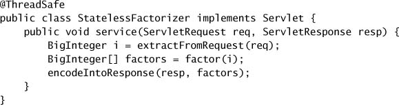
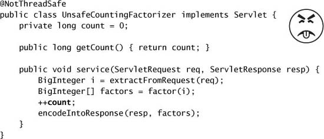
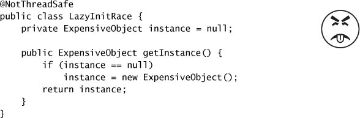
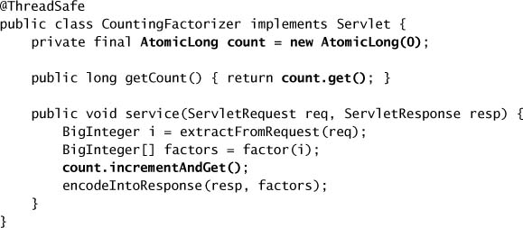
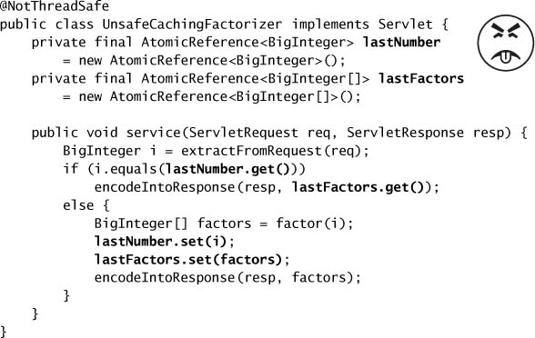
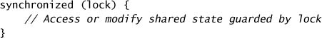
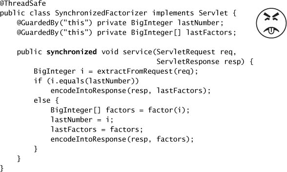
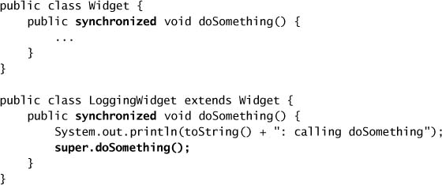
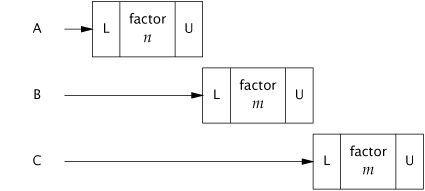
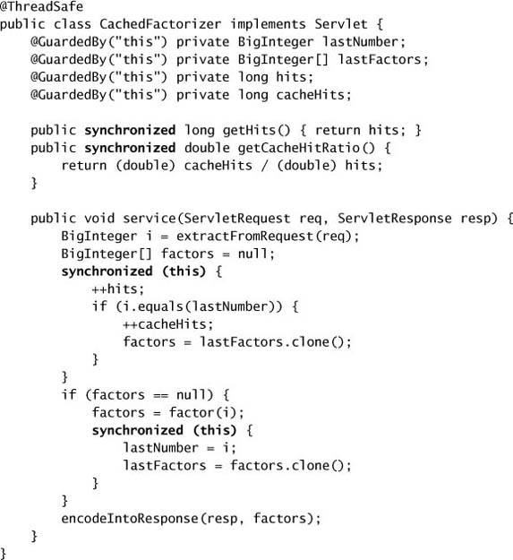

# Chương 2. Thread Safety

> **Về bản dịch này.** Đây là bản **dịch đầy đủ** chương 2 của cuốn *Java Concurrency in Practice* (Brian Goetz và cộng sự). Các **thuật ngữ chuyên ngành được giữ nguyên tiếng Anh** (thread-safe, race condition, lock, atomic, invariant…). Toàn bộ code listing và hình vẽ được trích trực tiếp từ file PDF gốc và lưu trong thư mục `images/ch02/`.

---

Có lẽ hơi bất ngờ, nhưng lập trình concurrent không thực sự xoay quanh thread hay lock, cũng như kỹ thuật xây dựng cầu đường không thực sự xoay quanh đinh tán và dầm thép. Dĩ nhiên, xây một cây cầu không sập đòi hỏi phải sử dụng đúng cách rất nhiều đinh tán và dầm thép, cũng như xây dựng các chương trình concurrent đòi hỏi sử dụng đúng cách thread và lock. Nhưng đó chỉ là những **cơ chế** — phương tiện để đạt được mục đích. Viết code thread-safe, về bản chất, là chuyện **quản lý truy cập vào state**, và cụ thể hơn là vào **shared, mutable state**.

Nói một cách không hình thức, **state** của một object là dữ liệu của nó, được lưu trong các state variable như instance field hoặc static field. State của một object có thể bao gồm cả field của những object khác mà nó phụ thuộc vào; state của một `HashMap` được lưu một phần trong chính object `HashMap`, nhưng cũng nằm trong nhiều object `Map.Entry`. State của một object bao gồm mọi dữ liệu có thể ảnh hưởng đến hành vi quan sát được từ bên ngoài của nó.

Khi nói **shared**, ý chúng tôi là một biến có thể bị truy cập bởi nhiều thread; khi nói **mutable**, ý chúng tôi là giá trị của nó có thể thay đổi trong suốt vòng đời. Chúng ta có thể nói về thread safety như thể nó là chuyện của code, nhưng điều chúng ta thực sự cố gắng làm là **bảo vệ dữ liệu khỏi việc bị truy cập concurrent không được kiểm soát**.

Một object có cần thread-safe hay không phụ thuộc vào việc nó có bị truy cập từ nhiều thread hay không. Đây là một thuộc tính của **cách object được sử dụng** trong chương trình, chứ không phải của **việc nó làm gì**. Làm cho một object thread-safe đòi hỏi phải dùng synchronization để điều phối truy cập vào mutable state của nó; không làm vậy có thể dẫn đến hỏng dữ liệu và những hậu quả không mong muốn khác.

> Bất cứ khi nào có nhiều hơn một thread truy cập một state variable nào đó, và một trong số chúng có thể ghi vào nó, thì **tất cả** các thread đó phải điều phối truy cập của mình bằng **synchronization**.

Cơ chế synchronization chính trong Java là từ khóa `synchronized`, thứ cung cấp exclusive locking, nhưng thuật ngữ "synchronization" cũng bao gồm cả việc dùng biến `volatile`, explicit lock, và atomic variable.

Bạn nên tránh cám dỗ nghĩ rằng có những tình huống "đặc biệt" mà quy tắc này không áp dụng. Một chương trình bỏ sót synchronization cần thiết có thể **trông như** chạy được, qua hết các test và hoạt động tốt trong nhiều năm, nhưng nó vẫn là một chương trình **hỏng** và có thể fail vào bất kỳ lúc nào.

Nếu nhiều thread truy cập cùng một mutable state variable mà không có synchronization thích hợp, **chương trình của bạn đã hỏng**. Có ba cách để sửa:

- **Đừng share** state variable đó giữa các thread;
- Làm cho state variable đó **immutable**; hoặc
- Dùng **synchronization** mỗi khi truy cập state variable đó.

Nếu bạn chưa cân nhắc đến truy cập concurrent khi thiết kế class, một số hướng tiếp cận trên có thể đòi hỏi thay đổi thiết kế đáng kể, nên việc sửa lỗi có thể không đơn giản như lời khuyên nghe có vẻ. **Thiết kế một class thread-safe ngay từ đầu dễ hơn nhiều so với việc vá lại thread safety cho nó sau này.**

Trong một chương trình lớn, việc xác định liệu nhiều thread có thể truy cập một biến nào đó hay không có thể rất phức tạp. May mắn là chính những kỹ thuật hướng đối tượng giúp bạn viết class có tổ chức tốt, dễ bảo trì — như **encapsulation** và **data hiding** — cũng giúp bạn tạo ra class thread-safe. Càng ít code có quyền truy cập vào một biến cụ thể, càng dễ đảm bảo rằng tất cả code đó đều dùng synchronization đúng cách, và càng dễ suy luận về những điều kiện mà biến đó có thể bị truy cập. Ngôn ngữ Java không ép bạn phải encapsulate state — hoàn toàn hợp lệ khi lưu state trong public field (thậm chí public static field) hoặc publish một tham chiếu tới một object lẽ ra là nội bộ — nhưng state của chương trình càng được encapsulate tốt, càng dễ làm cho chương trình thread-safe và càng dễ giúp người bảo trì giữ được điều đó.

> Khi thiết kế class thread-safe, các kỹ thuật hướng đối tượng tốt — **encapsulation**, **immutability**, và việc **đặc tả rõ ràng các invariant** — là những người bạn tốt nhất của bạn.

Sẽ có những lúc kỹ thuật thiết kế hướng đối tượng tốt xung đột với yêu cầu thực tế; trong những trường hợp đó có thể cần phải thỏa hiệp các quy tắc thiết kế tốt vì performance hoặc vì tương thích ngược với legacy code. Đôi khi abstraction và encapsulation xung đột với performance — dù không thường xuyên như nhiều developer vẫn tin — nhưng luôn luôn là một thói quen tốt khi **làm cho code đúng trước, rồi mới làm cho nó nhanh**. Ngay cả khi đó, chỉ theo đuổi tối ưu hóa nếu các phép đo performance và yêu cầu thực tế cho bạn biết bạn buộc phải làm vậy, và nếu chính những phép đo đó cho thấy tối ưu hóa của bạn thực sự tạo ra khác biệt trong điều kiện thực tế.[^1]

[^1]: Với concurrent code, nguyên tắc này còn cần được tuân thủ chặt chẽ hơn bình thường. Vì bug concurrency rất khó tái hiện và debug, lợi ích của một cải thiện performance nhỏ trên một code path ít được dùng có thể bị lấn át hoàn toàn bởi rủi ro chương trình fail ngoài production.

Nếu bạn quyết định rằng bạn đơn giản là **phải** phá vỡ encapsulation, không phải mọi thứ đều mất. Vẫn có thể làm cho chương trình của bạn thread-safe, chỉ là khó hơn rất nhiều. Hơn nữa, thread safety của chương trình sẽ **mong manh hơn**, làm tăng không chỉ chi phí và rủi ro phát triển mà cả chi phí và rủi ro bảo trì. Chương 4 mô tả những điều kiện mà việc nới lỏng encapsulation của state variable là an toàn.

Cho đến giờ chúng ta đã dùng các thuật ngữ "thread-safe class" và "thread-safe program" gần như thay thế cho nhau. Vậy một thread-safe program có phải là chương trình được xây dựng hoàn toàn từ các thread-safe class không? Không hẳn — một chương trình chỉ gồm toàn thread-safe class vẫn có thể không thread-safe, và một thread-safe program vẫn có thể chứa những class không thread-safe. Các vấn đề xoay quanh việc **composition** các thread-safe class cũng được bàn ở chương 4. Trong mọi trường hợp, khái niệm "thread-safe class" chỉ có ý nghĩa nếu class đó **encapsulate state của chính nó**. Thread safety có thể là thuật ngữ áp dụng cho code, nhưng nó nói về **state**, và nó chỉ có thể áp dụng cho toàn bộ khối code encapsulate state đó — có thể là một object, hoặc cả một chương trình.

---

## 2.1. Thread Safety là gì?

Định nghĩa thread safety khó một cách bất ngờ. Những nỗ lực hình thức hơn thì phức tạp đến mức chẳng đưa ra được mấy hướng dẫn thực tế hay trực giác dễ hiểu, còn phần còn lại là những mô tả không hình thức nghe có vẻ vòng vo. Một lần tìm Google nhanh sẽ cho ra hàng loạt "định nghĩa" kiểu như:

> …có thể được gọi từ nhiều thread của chương trình mà không có tương tác không mong muốn giữa các thread.
>
> …có thể được gọi bởi nhiều hơn một thread tại một thời điểm mà không đòi hỏi bất kỳ hành động nào khác từ phía caller.

Với những định nghĩa như vậy, chẳng có gì lạ khi chúng ta thấy thread safety thật khó hiểu! Chúng nghe đáng ngờ giống như "một class là thread-safe nếu nó có thể được dùng an toàn từ nhiều thread." Bạn không thể tranh cãi với một phát biểu như vậy, nhưng nó cũng chẳng giúp ích được bao nhiêu. Làm sao ta phân biệt một class thread-safe với một class không an toàn? Chúng ta thậm chí hiểu "an toàn" nghĩa là gì?

Nằm ở trung tâm của mọi định nghĩa hợp lý về thread safety là khái niệm **correctness**. Nếu định nghĩa của chúng ta về thread safety mơ hồ, đó là vì chúng ta thiếu một định nghĩa rõ ràng về correctness.

**Correctness** nghĩa là một class tuân theo **specification** của nó. Một specification tốt định nghĩa các **invariant** ràng buộc state của object và các **postcondition** mô tả hiệu ứng của các operation của nó. Vì chúng ta thường không viết specification đầy đủ cho class của mình, làm sao ta có thể biết chúng đúng? Chúng ta không thể, nhưng điều đó không ngăn chúng ta dùng chúng một khi đã tự thuyết phục được rằng "code chạy được". Sự "tự tin vào code" này gần như là mức correctness mà đa số chúng ta đạt tới, nên hãy cứ giả định rằng correctness ở single-thread là thứ mà "nhìn là biết". Sau khi đã lạc quan định nghĩa "correctness" là thứ có thể nhận ra được, giờ ta có thể định nghĩa thread safety theo cách bớt vòng vo hơn một chút: một class là thread-safe khi nó **tiếp tục hoạt động đúng** khi được truy cập từ nhiều thread.

> **Định nghĩa.** Một class là **thread-safe** nếu nó hoạt động đúng khi được truy cập từ nhiều thread, **bất kể** runtime environment lập lịch hay xen kẽ (interleave) việc thực thi của các thread đó như thế nào, và **không cần** thêm bất kỳ synchronization hay điều phối nào từ phía calling code.

Vì bất kỳ chương trình single-threaded nào cũng là một chương trình multithreaded hợp lệ, một class không thể thread-safe nếu nó thậm chí còn không đúng trong môi trường single-threaded.[^2] Nếu một object được hiện thực đúng, không có chuỗi operation nào — các lời gọi tới public method và các thao tác đọc/ghi public field — có thể vi phạm bất kỳ invariant hay postcondition nào của nó. Không có tập operation nào, dù thực hiện tuần tự hay concurrent trên instance của một thread-safe class, có thể khiến instance đó rơi vào invalid state.

[^2]: Nếu cách dùng "correctness" khá lỏng lẻo ở đây làm bạn khó chịu, bạn có thể thích cách nghĩ này hơn: một thread-safe class là class **không hỏng hơn** trong môi trường concurrent so với trong môi trường single-threaded.

> Các thread-safe class **tự encapsulate** mọi synchronization cần thiết, để client không phải tự cung cấp synchronization của riêng mình.

### 2.1.1. Ví dụ: Một Stateless Servlet

Ở chương 1, chúng ta đã liệt kê một số framework tạo ra thread và gọi component của bạn từ những thread đó, để lại cho bạn trách nhiệm làm cho component của mình thread-safe. Rất thường xuyên, yêu cầu về thread-safety không đến từ quyết định dùng thread trực tiếp, mà từ quyết định dùng một tiện ích như framework Servlets. Chúng ta sẽ phát triển một ví dụ đơn giản — một dịch vụ phân tích thừa số (factorization service) dựa trên servlet — và mở rộng dần để thêm tính năng trong khi vẫn bảo toàn thread safety của nó.

Listing 2.1 cho thấy servlet phân tích thừa số đơn giản của chúng ta. Nó lấy con số cần phân tích từ servlet request, phân tích nó, và đóng gói kết quả vào servlet response.

**Listing 2.1. Một Stateless Servlet.**

`StatelessFactorizer`, giống như hầu hết servlet, là **stateless**: nó không có field nào và không tham chiếu field nào của class khác. State tạm thời cho một lần tính toán cụ thể chỉ tồn tại trong các local variable được lưu trên **stack của thread** và chỉ thread đang thực thi mới truy cập được. Một thread truy cập `StatelessFactorizer` không thể ảnh hưởng đến kết quả của một thread khác cũng truy cập cùng `StatelessFactorizer` đó; vì hai thread không share state, mọi chuyện diễn ra như thể chúng đang truy cập hai instance khác nhau. Vì hành động của một thread truy cập một stateless object không thể ảnh hưởng đến tính đúng đắn của các operation ở thread khác, **stateless object là thread-safe**.

> **Stateless object luôn luôn thread-safe.**

Việc hầu hết servlet có thể được hiện thực mà không cần state làm giảm đáng kể gánh nặng làm cho servlet thread-safe. Chỉ khi servlet muốn **ghi nhớ** điều gì đó từ request này sang request khác thì yêu cầu thread safety mới trở thành vấn đề.

---

## 2.2. Atomicity

Chuyện gì xảy ra khi ta thêm **một** phần tử state vào thứ vốn là một stateless object? Giả sử ta muốn thêm một "hit counter" đo số request đã xử lý. Cách tiếp cận hiển nhiên là thêm một field `long` vào servlet và tăng nó ở mỗi request, như trong `UnsafeCountingFactorizer` ở Listing 2.2.

**Listing 2.2. Servlet đếm request mà thiếu Synchronization cần thiết. Đừng làm thế này.**

Đáng tiếc, `UnsafeCountingFactorizer` **không** thread-safe, mặc dù nó sẽ chạy hoàn toàn ổn trong môi trường single-threaded. Cũng giống như `UnsafeSequence` ở trang 6, nó dễ bị **lost update**. Dù operation tăng, `++count`, trông như một hành động đơn lẻ nhờ cú pháp gọn gàng của nó, nó **không atomic**, nghĩa là nó không thực thi như một operation đơn lẻ, không chia cắt được. Thay vào đó, nó là viết tắt cho một chuỗi **ba operation rời rạc**: đọc giá trị hiện tại, cộng một vào đó, và ghi giá trị mới trở lại. Đây là một ví dụ của **read-modify-write** operation, trong đó state kết quả được suy ra từ state trước đó.

Figure 1.1 ở trang 6 cho thấy điều gì có thể xảy ra nếu hai thread cùng cố tăng một counter đồng thời mà không có synchronization. Nếu counter ban đầu là 9, với một chút timing không may, mỗi thread có thể đọc giá trị, thấy nó là 9, cộng một vào, và cả hai cùng đặt counter thành 10. Rõ ràng đây không phải điều lẽ ra phải xảy ra; một lần tăng đã bị mất dọc đường, và hit counter giờ vĩnh viễn lệch đi một đơn vị.

Bạn có thể nghĩ rằng việc đếm hit hơi thiếu chính xác trong một dịch vụ web là mức mất mát chấp nhận được, và đôi khi đúng là vậy. Nhưng nếu counter được dùng để sinh **sequence** hoặc **unique object identifier**, việc trả về cùng một giá trị từ nhiều lần gọi có thể gây ra vấn đề nghiêm trọng về toàn vẹn dữ liệu.[^3] Khả năng cho ra kết quả sai khi timing không may quan trọng đến mức trong lập trình concurrent nó có hẳn một cái tên: **race condition**.

[^3]: Cách tiếp cận của `UnsafeSequence` và `UnsafeCountingFactorizer` còn có những vấn đề nghiêm trọng khác, bao gồm khả năng gặp **stale data** (mục 3.1.1).

### 2.2.1. Race Conditions

`UnsafeCountingFactorizer` có vài race condition khiến kết quả của nó không đáng tin. Một **race condition** xảy ra khi tính đúng đắn của một phép tính phụ thuộc vào **timing tương đối** hoặc **thứ tự xen kẽ** của nhiều thread do runtime quyết định; nói cách khác, khi có được câu trả lời đúng lại phụ thuộc vào **may mắn về timing**.[^4] Loại race condition phổ biến nhất là **check-then-act**, trong đó một quan sát có thể đã cũ được dùng để quyết định việc cần làm tiếp theo.

[^4]: Thuật ngữ **race condition** thường bị nhầm với thuật ngữ liên quan **data race**, thứ nảy sinh khi synchronization không được dùng để điều phối *mọi* truy cập vào một shared non-final field. Bạn có nguy cơ gặp data race bất cứ khi nào một thread ghi vào một biến mà biến đó có thể được thread khác đọc kế tiếp, hoặc đọc một biến mà biến đó có thể vừa được thread khác ghi, nếu cả hai thread đều không dùng synchronization; code có data race **không có semantics xác định hữu ích nào** theo Java Memory Model. Không phải mọi race condition đều là data race, và không phải mọi data race đều là race condition, nhưng cả hai đều có thể khiến chương trình concurrent fail theo những cách không lường trước được. `UnsafeCountingFactorizer` có **cả** race condition **lẫn** data race. Xem chương 16 để biết thêm về data race.

Chúng ta thường gặp race condition trong đời thực. Giả sử bạn hẹn gặp một người bạn lúc 12 giờ trưa ở quán Starbucks trên đường University Avenue. Nhưng khi đến nơi, bạn nhận ra có **hai** quán Starbucks trên đường University Avenue, và bạn không chắc mình đã hẹn ở quán nào. Lúc 12:10, bạn không thấy bạn mình ở Starbucks A, nên bạn đi bộ sang Starbucks B xem người đó có ở đó không, nhưng cũng không thấy. Có vài khả năng: bạn của bạn đến muộn và chưa ở quán nào cả; bạn của bạn đã đến Starbucks A sau khi bạn rời đi; hoặc bạn của bạn đã ở Starbucks B, nhưng đi tìm bạn, và giờ đang trên đường sang Starbucks A. Hãy giả định trường hợp tệ nhất và nói rằng đó là khả năng cuối cùng. Giờ là 12:15, cả hai bạn đều đã đến cả hai quán Starbucks, và cả hai đều đang tự hỏi liệu mình có bị cho leo cây không. Bạn sẽ làm gì tiếp? Quay lại quán kia? Bạn sẽ đi đi lại lại bao nhiêu lần nữa? Trừ khi hai người đã thỏa thuận một **protocol**, cả hai có thể dành cả ngày đi lên đi xuống đường University Avenue, bực bội và thiếu caffeine.

Vấn đề với cách tiếp cận "tôi sẽ chạy lên phố xem người đó có ở quán kia không" là **trong lúc bạn đang đi**, bạn của bạn có thể đã di chuyển. Bạn nhìn quanh Starbucks A, quan sát thấy "người đó không ở đây", và đi tìm. Bạn cũng có thể làm điều tương tự với Starbucks B, nhưng **không phải cùng lúc**. Phải mất vài phút để đi bộ lên phố, và trong vài phút đó, state của hệ thống có thể đã thay đổi.

Ví dụ Starbucks minh họa một race condition vì việc đạt được kết quả mong muốn (gặp được bạn mình) phụ thuộc vào timing tương đối của các sự kiện (mỗi người đến quán nào lúc nào, chờ ở đó bao lâu trước khi chuyển sang quán kia, v.v.). Quan sát rằng người đó không ở Starbucks A trở nên **có khả năng mất hiệu lực ngay khi bạn bước ra khỏi cửa trước**; người đó có thể đã vào bằng cửa sau mà bạn không hay biết. Chính **sự mất hiệu lực của quan sát** này là đặc trưng của hầu hết race condition — dùng một quan sát có thể đã cũ để ra quyết định hoặc thực hiện một phép tính. Loại race condition này được gọi là **check-then-act**: bạn quan sát thấy điều gì đó là đúng (file X không tồn tại) rồi thực hiện hành động dựa trên quan sát đó (tạo X); nhưng thực tế quan sát đó có thể đã mất hiệu lực giữa lúc bạn quan sát và lúc bạn hành động (ai đó đã tạo X trong khoảng thời gian ấy), gây ra vấn đề (exception bất ngờ, dữ liệu bị ghi đè, file hỏng).

### 2.2.2. Ví dụ: Race Condition trong Lazy Initialization

Một idiom phổ biến sử dụng check-then-act là **lazy initialization**. Mục tiêu của lazy initialization là trì hoãn việc khởi tạo một object cho đến khi nó thực sự cần thiết, đồng thời đảm bảo rằng nó **chỉ được khởi tạo một lần**. `LazyInitRace` ở Listing 2.3 minh họa idiom lazy initialization. Method `getInstance` trước tiên kiểm tra xem `ExpensiveObject` đã được khởi tạo chưa, nếu rồi thì trả về instance hiện có; nếu chưa, nó tạo một instance mới và trả về sau khi giữ lại một tham chiếu tới nó để những lần gọi sau có thể tránh code path tốn kém hơn.

**Listing 2.3. Race Condition trong Lazy Initialization. Đừng làm thế này.**

`LazyInitRace` có race condition có thể phá hỏng tính đúng đắn của nó. Giả sử thread A và B cùng thực thi `getInstance` một lúc. A thấy `instance` là `null`, và khởi tạo một `ExpensiveObject` mới. B cũng kiểm tra xem `instance` có `null` không. Việc `instance` có `null` tại thời điểm đó hay không phụ thuộc một cách khó lường vào timing, bao gồm cả sự thất thường của việc lập lịch và thời gian A cần để khởi tạo `ExpensiveObject` và gán field `instance`. Nếu `instance` vẫn là `null` khi B kiểm tra, **hai caller của `getInstance` có thể nhận về hai kết quả khác nhau**, mặc dù `getInstance` lẽ ra luôn phải trả về cùng một instance.

Operation đếm hit trong `UnsafeCountingFactorizer` có một loại race condition khác. Các **read-modify-write** operation, như tăng một counter, định nghĩa một phép biến đổi state của object dựa trên state trước đó của nó. Để tăng một counter, bạn phải biết giá trị trước đó của nó và đảm bảo không ai khác thay đổi hay sử dụng giá trị đó trong khi bạn đang cập nhật dở dang.

Giống như hầu hết lỗi concurrency, race condition không phải lúc nào cũng dẫn đến fail: cần thêm một chút timing không may nữa. Nhưng race condition có thể gây ra vấn đề nghiêm trọng. Nếu `LazyInitRace` được dùng để khởi tạo một registry cho toàn ứng dụng, việc nó trả về những instance khác nhau ở nhiều lần gọi có thể khiến các registration bị mất, hoặc khiến nhiều hoạt động có cái nhìn không nhất quán về tập các object đã đăng ký. Nếu `UnsafeSequence` được dùng để sinh entity identifier trong một persistence framework, hai object khác biệt có thể kết thúc với cùng một ID, vi phạm ràng buộc toàn vẹn về identity.

### 2.2.3. Compound Actions

Cả `LazyInitRace` lẫn `UnsafeCountingFactorizer` đều chứa một chuỗi operation cần phải **atomic**, hay không chia cắt được, so với các operation khác trên cùng state đó. Để tránh race condition, phải có cách ngăn các thread khác sử dụng một biến trong lúc chúng ta đang sửa nó, để ta có thể đảm bảo rằng các thread khác chỉ có thể quan sát hoặc sửa state **trước khi ta bắt đầu** hoặc **sau khi ta kết thúc**, chứ không bao giờ ở giữa chừng.

> **Định nghĩa.** Operation A và B là **atomic với nhau** nếu, từ góc nhìn của một thread đang thực thi A, khi một thread khác thực thi B thì hoặc **toàn bộ** B đã thực thi xong, hoặc **chưa phần nào** của nó được thực thi. Một **atomic operation** là operation atomic đối với **mọi** operation — kể cả chính nó — thao tác trên cùng state đó.

Nếu operation tăng trong `UnsafeSequence` là atomic, race condition minh họa ở Figure 1.1 trang 6 sẽ không thể xảy ra, và mỗi lần thực thi operation tăng sẽ có hiệu ứng mong muốn là tăng counter đúng một đơn vị. Để đảm bảo thread safety, các operation **check-then-act** (như lazy initialization) và **read-modify-write** (như increment) **luôn phải atomic**. Chúng ta gọi chung các chuỗi check-then-act và read-modify-write là **compound action**: những chuỗi operation phải được thực thi một cách atomic để duy trì thread safety. Ở phần tiếp theo, chúng ta sẽ xem xét **locking**, cơ chế built-in của Java để đảm bảo atomicity. Còn bây giờ, chúng ta sẽ sửa vấn đề theo một cách khác, bằng cách dùng một thread-safe class có sẵn, như trong `CountingFactorizer` ở Listing 2.4.

**Listing 2.4. Servlet đếm request bằng `AtomicLong`.**

Package `java.util.concurrent.atomic` chứa các **atomic variable class** để thực hiện những chuyển đổi state atomic trên số và object reference. Bằng cách thay counter kiểu `long` bằng một `AtomicLong`, chúng ta đảm bảo rằng mọi hành động truy cập state của counter đều atomic.[^5] Vì state của servlet chính là state của counter, và counter thì thread-safe, servlet của chúng ta lại thread-safe trở lại.

[^5]: `CountingFactorizer` gọi `incrementAndGet` để tăng counter, method này cũng trả về giá trị đã tăng; trong trường hợp này giá trị trả về bị bỏ qua.

Chúng ta đã có thể thêm một counter vào servlet phân tích thừa số và vẫn duy trì thread safety bằng cách dùng một thread-safe class có sẵn — `AtomicLong` — để quản lý state của counter. Khi **một** phần tử state được thêm vào một class stateless, class kết quả sẽ thread-safe nếu state đó được quản lý **hoàn toàn** bởi một thread-safe object. Nhưng, như ta sẽ thấy ở phần tiếp theo, đi từ **một** state variable lên **nhiều hơn một** không nhất thiết đơn giản như đi từ **không** lên **một**.

> Khi khả thi, hãy dùng các thread-safe object có sẵn, như `AtomicLong`, để quản lý state của class bạn. Suy luận về các state khả dĩ và các chuyển đổi state của những thread-safe object có sẵn đơn giản hơn nhiều so với với các state variable tùy ý, và điều này làm cho việc bảo trì và kiểm chứng thread safety dễ dàng hơn.

---

## 2.3. Locking

Chúng ta đã có thể thêm một state variable vào servlet trong khi vẫn duy trì thread safety bằng cách dùng một thread-safe object để quản lý toàn bộ state của servlet. Nhưng nếu ta muốn thêm nhiều state hơn nữa vào servlet, liệu ta có thể cứ thêm nhiều thread-safe state variable hơn không?

Hãy tưởng tượng ta muốn cải thiện performance của servlet bằng cách **cache** kết quả được tính gần nhất, phòng khi hai client liên tiếp cùng yêu cầu phân tích thừa số của cùng một số. (Đây khó có thể là một chiến lược cache hiệu quả; chúng tôi đưa ra một chiến lược tốt hơn ở mục 5.6.) Để hiện thực chiến lược này, ta cần nhớ **hai** thứ: số cuối cùng được phân tích, và các thừa số của nó.

Chúng ta đã dùng `AtomicLong` để quản lý state của counter một cách thread-safe; liệu ta có thể dùng "người anh em" của nó, `AtomicReference`,[^6] để quản lý số cuối cùng và các thừa số của nó không? Một nỗ lực như vậy được trình bày trong `UnsafeCachingFactorizer` ở Listing 2.5.

[^6]: Cũng như `AtomicLong` là một class giữ giá trị thread-safe cho một số nguyên `long`, `AtomicReference` là một class giữ giá trị thread-safe cho một object reference. Atomic variable và lợi ích của chúng được trình bày ở chương 15.

**Listing 2.5. Servlet cố cache kết quả gần nhất nhưng không đủ Atomicity. Đừng làm thế này.**

Đáng tiếc, cách tiếp cận này **không hoạt động**. Mặc dù từng atomic reference riêng lẻ là thread-safe, `UnsafeCachingFactorizer` vẫn có race condition có thể khiến nó cho ra câu trả lời sai.

Định nghĩa của thread safety đòi hỏi các **invariant phải được bảo toàn** bất kể timing hay thứ tự xen kẽ của các operation ở nhiều thread. Một invariant của `UnsafeCachingFactorizer` là **tích các thừa số được cache trong `lastFactors` phải bằng giá trị được cache trong `lastNumber`**; servlet của chúng ta chỉ đúng nếu invariant này luôn được giữ. Khi nhiều biến cùng tham gia vào một invariant, chúng **không độc lập với nhau**: giá trị của biến này ràng buộc (các) giá trị hợp lệ của biến kia. Do đó khi cập nhật một biến, bạn phải cập nhật các biến còn lại **trong cùng một atomic operation**.

Với một chút timing không may, `UnsafeCachingFactorizer` có thể vi phạm invariant này. Khi dùng atomic reference, ta không thể cập nhật đồng thời cả `lastNumber` lẫn `lastFactors`, dù mỗi lời gọi `set` đều atomic; vẫn tồn tại một **cửa sổ tổn thương** khi một biến đã bị sửa còn biến kia thì chưa, và trong khoảng thời gian đó các thread khác có thể thấy invariant không được giữ. Tương tự, hai giá trị cũng không thể được đọc đồng thời: giữa hai thời điểm mà thread A đọc hai giá trị, thread B có thể đã thay đổi chúng, và một lần nữa A có thể quan sát thấy invariant không được giữ.

> Để bảo toàn tính nhất quán của state, hãy cập nhật các state variable **có liên quan với nhau** trong **một** atomic operation duy nhất.

### 2.3.1. Intrinsic Locks

Java cung cấp một cơ chế locking built-in để cưỡng chế atomicity: **`synchronized` block**. (Còn một khía cạnh then chốt khác của locking và các cơ chế synchronization khác — **visibility** — được trình bày ở chương 3.) Một `synchronized` block gồm hai phần: **một tham chiếu tới object sẽ đóng vai trò lock**, và **một khối code được lock đó bảo vệ**.

Một `synchronized` **method** là dạng viết tắt của một `synchronized` block bao trọn toàn bộ thân method, và lock của nó là object mà method được gọi trên đó. (Các `static synchronized` method dùng object `Class` làm lock.)

**Mọi Java object đều có thể ngầm đóng vai trò một lock** cho mục đích synchronization; những lock built-in này được gọi là **intrinsic lock** hay **monitor lock**. Lock được thread đang thực thi **tự động acquire** trước khi vào `synchronized` block và **tự động release** khi luồng điều khiển ra khỏi `synchronized` block, bất kể là thoát ra theo đường bình thường hay do ném exception ra khỏi block. Cách **duy nhất** để acquire một intrinsic lock là đi vào một `synchronized` block hoặc method được lock đó bảo vệ.

Intrinsic lock trong Java hoạt động như **mutex** (mutual exclusion lock), nghĩa là **tối đa một thread** có thể sở hữu lock. Khi thread A cố acquire một lock đang được thread B giữ, A phải chờ, hay **block**, cho đến khi B release nó. Nếu B không bao giờ release lock, A sẽ chờ mãi mãi.

Vì mỗi lần chỉ một thread có thể thực thi một khối code được một lock nhất định bảo vệ, các `synchronized` block được **cùng một lock** bảo vệ sẽ thực thi **atomic với nhau**. Trong bối cảnh concurrency, atomicity mang cùng ý nghĩa như trong các ứng dụng transactional — rằng một nhóm câu lệnh tỏ ra như được thực thi như **một đơn vị đơn lẻ, không chia cắt được**. Không thread nào đang thực thi một `synchronized` block có thể quan sát thấy một thread khác đang ở giữa chừng một `synchronized` block được cùng lock đó bảo vệ.

Bộ máy synchronization giúp dễ dàng khôi phục thread safety cho servlet phân tích thừa số. Listing 2.6 làm cho method `service` trở thành `synchronized`, nên mỗi lần chỉ một thread được vào `service`. `SynchronizedFactorizer` giờ đã thread-safe; tuy nhiên, cách tiếp cận này khá cực đoan, vì nó ngăn hoàn toàn việc nhiều client cùng sử dụng servlet phân tích thừa số một lúc — dẫn đến khả năng đáp ứng kém đến mức không chấp nhận được. Vấn đề này — vốn là vấn đề về **performance**, không phải về thread safety — sẽ được giải quyết ở mục 2.5.

**Listing 2.6. Servlet cache kết quả gần nhất, nhưng với Concurrency kém đến mức không chấp nhận được. Đừng làm thế này.**

### 2.3.2. Reentrancy

Khi một thread yêu cầu một lock đang được thread khác giữ, thread yêu cầu sẽ block. Nhưng vì intrinsic lock là **reentrant**, nếu một thread cố acquire một lock mà chính nó **đã đang giữ**, yêu cầu đó sẽ thành công. **Reentrancy** nghĩa là lock được acquire trên cơ sở **từng thread** chứ không phải từng lời gọi.[^7] Reentrancy được hiện thực bằng cách gắn với mỗi lock một **acquisition count** và một **owning thread**. Khi count bằng không, lock được coi là không ai giữ. Khi một thread acquire một lock trước đó chưa ai giữ, JVM ghi lại chủ sở hữu và đặt acquisition count bằng một. Nếu chính thread đó acquire lock lần nữa, count được tăng lên, và khi owning thread thoát khỏi `synchronized` block, count được giảm đi. Khi count về không, lock được release.

[^7]: Điều này khác với hành vi locking mặc định của mutex trong pthreads (POSIX threads), vốn được cấp trên cơ sở từng lời gọi.

Reentrancy tạo điều kiện cho việc encapsulate hành vi locking, và do đó đơn giản hóa việc phát triển concurrent code hướng đối tượng. Không có reentrant lock, đoạn code trông rất tự nhiên ở Listing 2.7 — trong đó một subclass override một `synchronized` method rồi gọi method của superclass — sẽ **deadlock**. Vì method `doSomething` trong `Widget` và `LoggingWidget` đều là `synchronized`, mỗi method đều cố acquire lock trên `Widget` trước khi tiếp tục. Nhưng nếu intrinsic lock không reentrant, lời gọi `super.doSomething` sẽ không bao giờ acquire được lock vì lock đó bị coi là đã bị giữ, và thread sẽ đứng im vĩnh viễn để chờ một lock mà nó không bao giờ có thể acquire. Reentrancy cứu chúng ta khỏi deadlock trong những tình huống như thế này.

**Listing 2.7. Code sẽ Deadlock nếu Intrinsic Lock không Reentrant.**

---

## 2.4. Bảo vệ State bằng Lock

Vì lock cho phép truy cập **serialized**[^8] vào các code path mà chúng bảo vệ, ta có thể dùng chúng để xây dựng các protocol đảm bảo truy cập độc quyền vào shared state. Tuân thủ nhất quán những protocol này có thể đảm bảo tính nhất quán của state.

[^8]: Việc serialize truy cập vào một object không liên quan gì đến object serialization (biến một object thành byte stream); serialize truy cập nghĩa là các thread **thay phiên nhau** truy cập object một cách độc quyền, thay vì truy cập đồng thời.

Các **compound action** trên shared state, chẳng hạn tăng một hit counter (read-modify-write) hoặc lazy initialization (check-then-act), phải được làm cho atomic để tránh race condition. Việc giữ một lock trong **toàn bộ thời gian** thực hiện một compound action có thể làm compound action đó atomic. Tuy nhiên, chỉ bọc compound action bằng một `synchronized` block là **chưa đủ**; nếu synchronization được dùng để điều phối truy cập vào một biến, thì nó cần thiết ở **mọi nơi** biến đó được truy cập. Hơn nữa, khi dùng lock để điều phối truy cập vào một biến, **cùng một lock** phải được dùng ở mọi nơi biến đó được truy cập.

Một sai lầm phổ biến là giả định rằng chỉ cần dùng synchronization khi **ghi** vào shared variable; điều này đơn giản là không đúng. (Lý do sẽ trở nên rõ ràng hơn ở mục 3.1.)

> Với mỗi mutable state variable có thể bị truy cập bởi nhiều hơn một thread, **tất cả** các truy cập vào biến đó phải được thực hiện khi đang giữ **cùng một lock**. Trong trường hợp này, ta nói rằng biến đó **được lock đó bảo vệ (guarded by)**.

Trong `SynchronizedFactorizer` ở Listing 2.6, `lastNumber` và `lastFactors` được bảo vệ bởi intrinsic lock của chính object servlet; điều này được ghi lại bằng annotation `@GuardedBy`.

Không có mối quan hệ cố hữu nào giữa intrinsic lock của một object và state của nó; các field của một object **không nhất thiết** phải được bảo vệ bởi intrinsic lock của chính nó, dù đây là một quy ước locking hoàn toàn hợp lệ được nhiều class sử dụng. Việc acquire lock gắn với một object **không ngăn** các thread khác truy cập object đó — điều duy nhất mà việc acquire một lock ngăn thread khác làm là **acquire chính lock đó**. Việc mọi object đều có một lock built-in chỉ là một tiện lợi để bạn không phải tạo lock object một cách tường minh.[^9] Việc xây dựng các locking protocol hay **synchronization policy** cho phép bạn truy cập shared state an toàn, và dùng chúng nhất quán xuyên suốt chương trình, là trách nhiệm của bạn.

[^9]: Nhìn lại, quyết định thiết kế này có lẽ là một quyết định tồi: không chỉ gây nhầm lẫn, nó còn buộc những người hiện thực JVM phải đánh đổi giữa kích thước object và performance của locking.

> **Mọi shared, mutable variable nên được bảo vệ bởi đúng một lock.** Hãy làm rõ cho người bảo trì biết đó là lock nào.

Một quy ước locking phổ biến là encapsulate toàn bộ mutable state bên trong một object và bảo vệ nó khỏi truy cập concurrent bằng cách `synchronized` mọi code path truy cập mutable state, dùng intrinsic lock của chính object đó. Pattern này được nhiều thread-safe class sử dụng, như `Vector` và các synchronized collection class khác. Trong những trường hợp như vậy, tất cả các biến trong state của object đều được bảo vệ bởi intrinsic lock của object. Tuy nhiên, chẳng có gì đặc biệt về pattern này, và cả compiler lẫn runtime đều không cưỡng chế pattern locking này (hay bất kỳ pattern nào khác).[^10] Cũng rất dễ vô tình phá vỡ locking protocol này bằng cách thêm một method mới hay một code path mới rồi quên dùng synchronization.

[^10]: Các công cụ kiểm tra code như FindBugs có thể phát hiện khi một biến **thường xuyên nhưng không phải luôn luôn** được truy cập khi đang giữ lock, điều này có thể chỉ ra một bug.

Không phải mọi dữ liệu đều cần được lock bảo vệ — chỉ những mutable data sẽ bị truy cập từ nhiều thread. Ở chương 1, chúng ta đã mô tả việc thêm một sự kiện bất đồng bộ đơn giản như một `TimerTask` có thể tạo ra những yêu cầu thread safety lan tỏa khắp chương trình như thế nào, đặc biệt nếu state chương trình được encapsulate kém. Hãy xét một chương trình single-threaded xử lý một lượng lớn dữ liệu. Các chương trình single-threaded không cần synchronization, vì không có dữ liệu nào được share giữa các thread. Giờ hãy tưởng tượng bạn muốn thêm một tính năng tạo snapshot định kỳ về tiến độ của nó, để nó không phải bắt đầu lại từ đầu nếu bị crash hoặc phải dừng. Bạn có thể chọn làm điều này bằng một `TimerTask` chạy mỗi mười phút, lưu state chương trình vào file.

Vì `TimerTask` sẽ được gọi từ một thread khác (một thread do `Timer` quản lý), mọi dữ liệu liên quan đến snapshot giờ đây bị truy cập bởi **hai** thread: thread chính của chương trình và thread `Timer`. Điều này có nghĩa là không chỉ code của `TimerTask` phải dùng synchronization khi truy cập state chương trình, mà **mọi code path khác** trong phần còn lại của chương trình có động đến cùng dữ liệu đó cũng phải như vậy. Thứ trước đây không cần synchronization nay đòi hỏi synchronization xuyên suốt chương trình.

Khi một biến được một lock bảo vệ — nghĩa là mọi truy cập vào biến đó đều được thực hiện khi đang giữ lock đó — bạn đã đảm bảo rằng mỗi lần chỉ một thread có thể truy cập biến đó. Khi một class có các invariant liên quan đến nhiều hơn một state variable, có thêm một yêu cầu nữa: **mỗi biến tham gia vào invariant phải được bảo vệ bởi cùng một lock**. Điều này cho phép bạn truy cập hoặc cập nhật chúng trong một atomic operation duy nhất, bảo toàn invariant. `SynchronizedFactorizer` minh họa quy tắc này: cả số được cache lẫn các thừa số được cache đều được bảo vệ bởi intrinsic lock của object servlet.

> Với mọi invariant liên quan đến nhiều hơn một biến, **tất cả các biến** tham gia vào invariant đó phải được bảo vệ bởi **cùng một lock**.

Nếu synchronization là thuốc chữa cho race condition, sao không đơn giản khai báo mọi method là `synchronized`? Hóa ra việc áp dụng `synchronized` một cách bừa bãi như vậy có thể là **quá nhiều** hoặc **quá ít** synchronization. Chỉ đơn thuần synchronize mọi method, như `Vector` làm, là **không đủ** để làm cho các compound action trên một `Vector` trở nên atomic:

Nỗ lực thực hiện operation put-if-absent này có race condition, mặc dù cả `contains` lẫn `add` đều atomic. Trong khi các `synchronized` method có thể làm cho từng operation riêng lẻ atomic, cần thêm locking khi nhiều operation được kết hợp thành một compound action. (Xem mục 4.4 để biết một số kỹ thuật thêm operation atomic mới một cách an toàn vào các thread-safe object.) Đồng thời, việc synchronize mọi method có thể dẫn đến vấn đề về liveness hoặc performance, như ta đã thấy ở `SynchronizedFactorizer`.

---

## 2.5. Liveness và Performance

Ở `UnsafeCachingFactorizer`, chúng ta đã đưa một chút caching vào servlet phân tích thừa số với hy vọng cải thiện performance. Caching đòi hỏi một chút shared state, thứ lại đòi hỏi synchronization để duy trì tính toàn vẹn của state đó. Nhưng cách chúng ta dùng synchronization trong `SynchronizedFactorizer` khiến nó chạy rất tệ. Synchronization policy của `SynchronizedFactorizer` là bảo vệ mỗi state variable bằng intrinsic lock của object servlet, và policy đó được hiện thực bằng cách synchronize **toàn bộ** method `service`. Cách tiếp cận đơn giản, thô này khôi phục được tính an toàn, nhưng với cái giá rất đắt.

**Figure 2.1. Concurrency kém của `SynchronizedFactorizer`.**

Vì `service` là `synchronized`, mỗi lần chỉ một thread có thể thực thi nó. Điều này phá hỏng mục đích sử dụng của servlet framework — rằng servlet có thể xử lý nhiều request đồng thời — và có thể khiến người dùng bực bội nếu tải đủ cao. Nếu servlet đang bận phân tích một số lớn, các client khác phải chờ cho đến khi request hiện tại hoàn tất trước khi servlet có thể bắt đầu với số mới. Nếu hệ thống có nhiều CPU, các processor có thể vẫn nằm không dù tải cao. Trong mọi trường hợp, ngay cả những request chạy ngắn — như những request mà giá trị đã được cache — cũng có thể mất một khoảng thời gian dài bất ngờ vì chúng phải chờ các request chạy lâu trước đó hoàn tất.

Figure 2.1 cho thấy điều gì xảy ra khi nhiều request cùng đến servlet phân tích thừa số đã được synchronize: chúng **xếp hàng** và được xử lý tuần tự. Chúng ta sẽ mô tả ứng dụng web này là có **concurrency kém**: số lời gọi đồng thời bị giới hạn không phải bởi khả năng sẵn có của tài nguyên xử lý, mà bởi chính cấu trúc của ứng dụng. May mắn là rất dễ cải thiện concurrency của servlet trong khi vẫn duy trì thread safety, bằng cách **thu hẹp phạm vi** của `synchronized` block. Bạn nên cẩn thận đừng làm phạm vi của `synchronized` block **quá nhỏ**; bạn sẽ không muốn chia một operation lẽ ra phải atomic thành nhiều `synchronized` block. Nhưng hợp lý khi cố loại khỏi `synchronized` block những operation chạy lâu mà không ảnh hưởng đến shared state, để các thread khác không bị ngăn truy cập shared state trong khi operation chạy lâu đó đang diễn ra.

`CachedFactorizer` ở Listing 2.8 tái cấu trúc servlet để dùng **hai** `synchronized` block riêng biệt, mỗi block giới hạn trong một đoạn code ngắn. Một block bảo vệ chuỗi check-then-act kiểm tra xem ta có thể trả về ngay kết quả đã cache hay không, và block kia bảo vệ việc cập nhật cả số được cache lẫn các thừa số được cache. Như một phần thưởng, chúng ta đã đưa hit counter trở lại và thêm cả một counter "cache hit", cập nhật chúng bên trong `synchronized` block đầu tiên. Vì những counter này cũng là shared mutable state, ta phải dùng synchronization ở mọi nơi chúng được truy cập. Những phần code nằm **ngoài** `synchronized` block chỉ thao tác trên các biến local (trên stack), vốn không được share giữa các thread và do đó không cần synchronization.

**Listing 2.8. Servlet cache request và kết quả gần nhất.**

`CachedFactorizer` không còn dùng `AtomicLong` cho hit counter nữa, mà quay lại dùng một field `long`. Dùng `AtomicLong` ở đây vẫn an toàn, nhưng lợi ích ít hơn so với ở `CountingFactorizer`. Atomic variable hữu ích cho việc thực hiện các operation atomic trên **một** biến đơn lẻ, nhưng vì chúng ta đã dùng `synchronized` block để xây dựng các operation atomic rồi, việc dùng hai cơ chế synchronization khác nhau sẽ gây nhầm lẫn và không mang lại lợi ích nào về performance hay an toàn.

Việc tái cấu trúc `CachedFactorizer` tạo ra sự cân bằng giữa **tính đơn giản** (synchronize toàn bộ method) và **concurrency** (synchronize những code path ngắn nhất có thể). Việc acquire và release một lock có chi phí nhất định, nên không nên chia nhỏ các `synchronized` block quá mức (chẳng hạn tách `++hits` thành một `synchronized` block riêng), ngay cả khi việc đó không làm tổn hại atomicity. `CachedFactorizer` giữ lock khi truy cập các state variable và trong suốt thời gian thực hiện các compound action, nhưng release nó **trước khi** thực thi operation phân tích thừa số có thể chạy rất lâu. Điều này bảo toàn thread safety mà không ảnh hưởng quá mức đến concurrency; các code path trong mỗi `synchronized` block đều "đủ ngắn".

Việc quyết định làm cho `synchronized` block to hay nhỏ có thể đòi hỏi đánh đổi giữa những áp lực thiết kế cạnh tranh nhau, bao gồm **an toàn** (thứ không được phép thỏa hiệp), **đơn giản**, và **performance**. Đôi khi tính đơn giản và performance xung đột với nhau, mặc dù như `CachedFactorizer` minh họa, thường vẫn có thể tìm được một sự cân bằng hợp lý.

> Thường xuyên có sự căng thẳng giữa tính đơn giản và performance. Khi hiện thực một synchronization policy, hãy cưỡng lại cám dỗ **hy sinh sớm tính đơn giản** (và có nguy cơ làm tổn hại tính an toàn) chỉ vì performance.

Bất cứ khi nào bạn dùng locking, bạn nên ý thức được code trong block đang làm gì và khả năng nó mất nhiều thời gian để thực thi là bao nhiêu. Việc giữ một lock trong thời gian dài, dù vì bạn đang làm gì đó tốn nhiều tính toán hay vì bạn thực thi một operation có thể block, đều tạo ra rủi ro về liveness hoặc performance.

> **Tránh giữ lock trong khi thực hiện những tính toán kéo dài hoặc những operation có nguy cơ không hoàn tất nhanh chóng, chẳng hạn network I/O hay console I/O.**
