# Chương 3. Sharing Objects

> **Về bản dịch này.** Đây là bản **dịch đầy đủ** chương 3 của cuốn *Java Concurrency in Practice* (Brian Goetz và cộng sự). Các **thuật ngữ chuyên ngành được giữ nguyên tiếng Anh**. Toàn bộ code listing và hình vẽ được trích trực tiếp từ file PDF gốc và lưu trong thư mục `images/ch03/`.

---

Ở đầu chương 2 chúng ta đã khẳng định rằng viết chương trình concurrent đúng đắn chủ yếu là chuyện quản lý truy cập vào shared, mutable state. Chương đó nói về việc dùng synchronization để ngăn nhiều thread truy cập cùng dữ liệu cùng lúc; chương này xem xét các kỹ thuật **share** và **publish** object sao cho chúng có thể được nhiều thread truy cập an toàn. Cùng nhau, hai chương đặt nền móng cho việc xây dựng các thread-safe class và cấu trúc các ứng dụng concurrent một cách an toàn bằng các class trong thư viện `java.util.concurrent`.

Chúng ta đã thấy `synchronized` block và method có thể đảm bảo các operation thực thi atomic như thế nào, nhưng có một quan niệm sai lầm phổ biến rằng `synchronized` chỉ liên quan đến atomicity hoặc phân định "critical section". Synchronization còn có một khía cạnh quan trọng và tinh tế khác: **memory visibility**. Chúng ta không chỉ muốn ngăn một thread sửa state của một object khi thread khác đang dùng nó, mà còn muốn đảm bảo rằng khi một thread sửa state của một object, các thread khác **thực sự nhìn thấy** những thay đổi đã được thực hiện. Nhưng nếu không có synchronization, điều này có thể không xảy ra. Bạn có thể đảm bảo các object được publish an toàn bằng cách dùng synchronization tường minh, hoặc bằng cách tận dụng synchronization được xây dựng sẵn trong các class thư viện.

---

## 3.1. Visibility

Visibility tinh tế bởi vì những thứ có thể sai lại rất phản trực giác. Trong môi trường single-threaded, nếu bạn ghi một giá trị vào một biến rồi sau đó đọc lại biến đó mà không có lần ghi nào xen vào, bạn có thể mong đợi nhận lại đúng giá trị đó. Điều này có vẻ hoàn toàn tự nhiên. Ban đầu có thể khó chấp nhận, nhưng khi các thao tác đọc và ghi xảy ra ở **những thread khác nhau**, điều đó đơn giản là **không đúng**. Nói chung, không có bảo đảm nào rằng thread đọc sẽ thấy giá trị được thread khác ghi một cách kịp thời, hay thậm chí là thấy được nó. Để đảm bảo visibility của các thao tác ghi bộ nhớ giữa các thread, bạn **phải** dùng synchronization.

`NoVisibility` ở Listing 3.1 minh họa điều gì có thể sai khi các thread share dữ liệu mà không có synchronization. Hai thread — main thread và reader thread — truy cập các shared variable `ready` và `number`. Main thread khởi động reader thread rồi đặt `number` bằng 42 và `ready` bằng `true`. Reader thread quay vòng (spin) cho đến khi thấy `ready` là `true`, rồi in ra `number`. Dù có vẻ hiển nhiên rằng `NoVisibility` sẽ in ra 42, thực tế **hoàn toàn có thể** nó in ra số không, hoặc **không bao giờ kết thúc**! Vì nó không dùng synchronization thích hợp, không có bảo đảm nào rằng các giá trị của `ready` và `number` do main thread ghi sẽ nhìn thấy được từ reader thread.

**Listing 3.1. Share biến mà không có synchronization. Đừng làm thế này.**

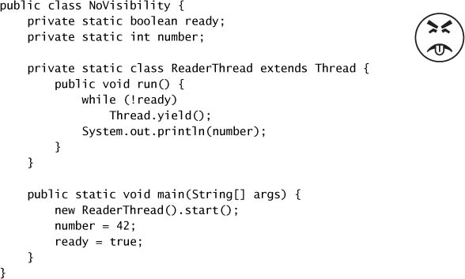

`NoVisibility` có thể lặp mãi mãi vì giá trị của `ready` có thể không bao giờ trở nên nhìn thấy được đối với reader thread. Kỳ lạ hơn nữa, `NoVisibility` có thể in ra số không vì thao tác ghi vào `ready` có thể được làm cho nhìn thấy được đối với reader thread **trước** thao tác ghi vào `number` — hiện tượng gọi là **reordering**. Không có bảo đảm nào rằng các operation trong một thread sẽ được thực hiện theo đúng thứ tự chương trình đưa ra, miễn là việc reordering đó không phát hiện được từ bên trong chính thread ấy — ngay cả khi việc reordering đó lộ rõ với các thread khác.[^1] Khi main thread ghi trước vào `number` rồi mới vào `ready` mà không có synchronization, reader thread có thể thấy các thao tác ghi đó xảy ra theo thứ tự ngược lại — hoặc không thấy gì cả.

[^1]: Điều này có vẻ như một thiết kế hỏng, nhưng mục đích của nó là cho phép JVM tận dụng tối đa performance của phần cứng đa xử lý hiện đại. Ví dụ, khi không có synchronization, Java Memory Model cho phép compiler reorder các operation và cache giá trị trong register, và cho phép CPU reorder các operation và cache giá trị trong các cache riêng của từng processor. Chi tiết hơn, xem chương 16.

Khi không có synchronization, compiler, processor và runtime có thể làm những điều thực sự kỳ quặc với thứ tự mà các operation **tỏ ra** được thực thi. Những nỗ lực suy luận về thứ tự mà các memory action "phải" xảy ra trong những chương trình multithreaded thiếu synchronization gần như chắc chắn sẽ sai.

`NoVisibility` gần như đã là chương trình concurrent đơn giản nhất có thể — hai thread và hai shared variable — vậy mà vẫn quá dễ để đi đến kết luận sai về việc nó làm gì, hay thậm chí về việc nó có kết thúc hay không. Suy luận về những chương trình concurrent thiếu synchronization là việc khó đến mức không nên làm.

Tất cả những điều này nghe có vẻ hơi đáng sợ, và đúng là nên như vậy. May mắn thay, có một cách dễ dàng để tránh những vấn đề phức tạp này: **luôn dùng synchronization thích hợp mỗi khi dữ liệu được share giữa các thread**.

### 3.1.1. Stale Data

`NoVisibility` đã minh họa một trong những cách mà chương trình thiếu synchronization có thể gây ra kết quả bất ngờ: **stale data** (dữ liệu cũ). Khi reader thread kiểm tra `ready`, nó có thể thấy một giá trị đã lỗi thời. Trừ khi synchronization được dùng **mỗi lần** một biến được truy cập, hoàn toàn có thể thấy một giá trị stale của biến đó. Tệ hơn, sự stale không phải kiểu "được ăn cả ngã về không": một thread có thể thấy giá trị mới nhất của một biến nhưng lại thấy giá trị stale của một biến khác **được ghi trước đó**.

Khi thức ăn ôi, nó thường vẫn ăn được — chỉ là kém ngon. Nhưng stale data có thể nguy hiểm hơn nhiều. Trong khi một hit counter lỗi thời trong ứng dụng web có lẽ không quá tệ,[^2] các giá trị stale có thể gây ra những sự cố nghiêm trọng về safety hay liveness. Trong `NoVisibility`, giá trị stale có thể khiến nó in ra giá trị sai hoặc khiến chương trình không kết thúc. Mọi thứ còn có thể phức tạp hơn nữa với giá trị stale của **object reference**, chẳng hạn các con trỏ liên kết trong một hiện thực linked list. Stale data có thể gây ra những sự cố nghiêm trọng và khó hiểu như exception bất ngờ, cấu trúc dữ liệu bị hỏng, tính toán sai lệch, và vòng lặp vô hạn.

[^2]: Đọc dữ liệu mà không có synchronization tương tự như dùng isolation level `READ_UNCOMMITTED` trong database, nơi bạn sẵn sàng đánh đổi độ chính xác lấy performance. Tuy nhiên, trong trường hợp các thao tác đọc không synchronize, bạn đánh đổi một mức độ chính xác lớn hơn nhiều, vì giá trị nhìn thấy được của một shared variable có thể stale một cách tùy ý.

`MutableInteger` ở Listing 3.2 không thread-safe vì field `value` được truy cập từ cả `get` lẫn `set` mà không có synchronization. Trong số các nguy cơ khác, nó dễ bị giá trị stale: nếu một thread gọi `set`, các thread khác gọi `get` có thể thấy hoặc không thấy cập nhật đó.

Chúng ta có thể làm cho `MutableInteger` thread-safe bằng cách synchronize cả getter và setter, như trong `SynchronizedInteger` ở Listing 3.3. Chỉ synchronize setter là **chưa đủ**: các thread gọi `get` vẫn có thể thấy giá trị stale.

**Listing 3.2. Class giữ Integer khả biến, không thread-safe.**

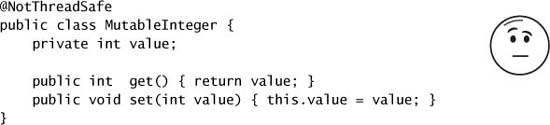

**Listing 3.3. Class giữ Integer khả biến, thread-safe.**

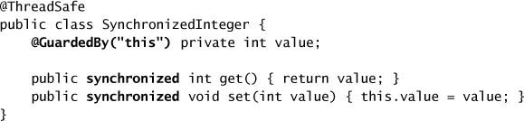

### 3.1.2. Các Operation 64-bit không Atomic

Khi một thread đọc một biến mà không có synchronization, nó có thể thấy giá trị stale, nhưng ít nhất nó cũng thấy một giá trị **thực sự từng được đặt vào đó** bởi một thread nào đó, chứ không phải một giá trị ngẫu nhiên. Bảo đảm an toàn này được gọi là **out-of-thin-air safety** (an toàn "không từ trên trời rơi xuống").

Out-of-thin-air safety áp dụng cho mọi biến, với **một ngoại lệ**: các biến số 64-bit (`double` và `long`) **không** được khai báo `volatile` (xem mục 3.1.4). Java Memory Model yêu cầu các operation đọc và ghi phải atomic, nhưng với biến `long` và `double` không `volatile`, JVM được phép coi một thao tác đọc/ghi 64-bit như **hai operation 32-bit riêng biệt**. Nếu các thao tác đọc và ghi xảy ra ở những thread khác nhau, do đó hoàn toàn có thể đọc một `long` không `volatile` và nhận về 32 bit cao của một giá trị và 32 bit thấp của một giá trị khác.[^3] Vì vậy, ngay cả khi bạn không quan tâm đến giá trị stale, việc dùng biến `long` và `double` shared và mutable trong chương trình multithreaded là **không an toàn** trừ khi chúng được khai báo `volatile` hoặc được một lock bảo vệ.

[^3]: Khi Java Virtual Machine Specification được viết, nhiều kiến trúc processor được dùng rộng rãi không thể cung cấp hiệu quả các phép toán số học 64-bit atomic.

### 3.1.3. Locking và Visibility

Intrinsic locking có thể được dùng để đảm bảo rằng một thread nhìn thấy các hiệu ứng của thread khác theo cách có thể dự đoán được, như minh họa ở Figure 3.1. Khi thread A thực thi một `synchronized` block, và sau đó thread B đi vào một `synchronized` block được **cùng lock** bảo vệ, các giá trị của những biến mà A nhìn thấy **trước khi release lock** được đảm bảo là nhìn thấy được đối với B **khi B acquire lock**. Nói cách khác, mọi thứ A đã làm trong hoặc trước một `synchronized` block đều nhìn thấy được đối với B khi B thực thi một `synchronized` block được cùng lock bảo vệ. Không có synchronization, không có bảo đảm nào như vậy.

**Figure 3.1. Các bảo đảm về Visibility của Synchronization.**

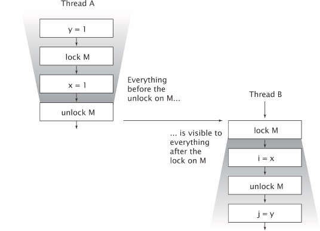

Giờ chúng ta có thể đưa ra lý do thứ hai cho quy tắc yêu cầu mọi thread phải synchronize trên **cùng một lock** khi truy cập một shared mutable variable — để đảm bảo rằng các giá trị được một thread ghi trở nên nhìn thấy được đối với các thread khác. Nếu không, khi một thread đọc một biến mà không giữ lock thích hợp, nó có thể thấy giá trị stale.

> Locking không chỉ là chuyện **mutual exclusion**; nó còn là chuyện **memory visibility**. Để đảm bảo mọi thread thấy giá trị mới nhất của các shared mutable variable, các thread đọc và ghi phải synchronize trên một **lock chung**.

### 3.1.4. Biến Volatile

Ngôn ngữ Java cũng cung cấp một dạng synchronization thay thế, yếu hơn — **biến `volatile`** — để đảm bảo rằng các cập nhật lên một biến được lan truyền một cách có thể dự đoán tới các thread khác. Khi một field được khai báo `volatile`, compiler và runtime được thông báo rằng biến này được share và rằng các operation trên nó **không được reorder** cùng với các memory operation khác. Biến volatile **không được cache** trong register hay trong các cache nơi chúng bị che khuất khỏi các processor khác, nên một thao tác đọc biến volatile luôn trả về lần ghi gần nhất bởi bất kỳ thread nào.

Một cách hay để hình dung về biến volatile là tưởng tượng rằng chúng hành xử đại khái giống class `SynchronizedInteger` ở Listing 3.3, thay các thao tác đọc/ghi biến volatile bằng các lời gọi `get` và `set`.[^4] Tuy nhiên, việc truy cập một biến volatile **không thực hiện locking** nên không thể khiến thread đang thực thi bị block, làm cho biến volatile trở thành một cơ chế synchronization **nhẹ hơn** so với `synchronized`.[^5]

[^4]: Phép so sánh này không hoàn toàn chính xác; hiệu ứng memory visibility của `SynchronizedInteger` thực ra mạnh hơn một chút so với của biến volatile. Xem chương 16.

[^5]: Trên hầu hết kiến trúc processor hiện nay, thao tác đọc volatile chỉ đắt hơn một chút so với đọc thường.

Hiệu ứng visibility của biến volatile vượt ra ngoài phạm vi giá trị của chính biến volatile đó. Khi thread A ghi vào một biến volatile và sau đó thread B đọc chính biến đó, giá trị của **tất cả** các biến mà A nhìn thấy trước khi ghi vào biến volatile sẽ trở nên nhìn thấy được đối với B sau khi B đọc biến volatile. Vì vậy, từ góc độ memory visibility, **ghi một biến volatile giống như thoát khỏi một `synchronized` block**, và **đọc một biến volatile giống như đi vào một `synchronized` block**. Tuy nhiên, chúng tôi không khuyến nghị phụ thuộc quá nhiều vào biến volatile để đảm bảo visibility; code dựa vào biến volatile để đảm bảo visibility của state tùy ý sẽ mong manh hơn và khó hiểu hơn code dùng locking.

> Chỉ dùng biến volatile khi chúng làm đơn giản hóa việc hiện thực và kiểm chứng synchronization policy của bạn; tránh dùng biến volatile khi việc kiểm chứng tính đúng đắn đòi hỏi những suy luận tinh vi về visibility. Những cách dùng tốt của biến volatile bao gồm đảm bảo visibility của chính state của nó, của object mà nó tham chiếu tới, hoặc để báo hiệu rằng một sự kiện vòng đời quan trọng (như initialization hay shutdown) đã xảy ra.

Listing 3.4 minh họa một cách dùng điển hình của biến volatile: kiểm tra một status flag để xác định khi nào thoát khỏi vòng lặp. Trong ví dụ này, thread được nhân cách hóa của chúng ta đang cố ngủ bằng phương pháp lâu đời là **đếm cừu**. Để ví dụ này hoạt động, flag `asleep` **phải** là volatile. Nếu không, thread có thể không nhận ra khi `asleep` đã được một thread khác đặt.[^6] Chúng ta cũng có thể đã dùng locking để đảm bảo visibility của các thay đổi lên `asleep`, nhưng điều đó sẽ làm code cồng kềnh hơn.

[^6]: Mẹo debug: Với các ứng dụng server, hãy luôn chỉ định tham số dòng lệnh `-server` khi gọi JVM, kể cả khi phát triển và test. Server JVM thực hiện nhiều tối ưu hóa hơn client JVM, chẳng hạn đưa các biến không bị sửa trong vòng lặp ra ngoài vòng lặp (hoisting); code có vẻ chạy được trong môi trường phát triển (client JVM) có thể hỏng trong môi trường triển khai (server JVM). Ví dụ, nếu chúng ta "quên" khai báo biến `asleep` là `volatile` ở Listing 3.4, server JVM có thể đưa phép kiểm tra ra ngoài vòng lặp (biến nó thành vòng lặp vô hạn), còn client JVM thì không. Một vòng lặp vô hạn xuất hiện lúc phát triển ít tốn kém hơn nhiều so với một vòng lặp chỉ xuất hiện ngoài production.

**Listing 3.4. Đếm cừu.**

Biến volatile tiện lợi, nhưng chúng có giới hạn. Cách dùng phổ biến nhất của biến volatile là làm cờ báo hoàn thành (completion), ngắt (interruption), hoặc trạng thái (status), như flag `asleep` ở Listing 3.4. Biến volatile có thể được dùng cho những loại thông tin state khác, nhưng cần cẩn trọng hơn khi làm vậy. Ví dụ, semantics của `volatile` **không đủ mạnh** để làm operation tăng (`count++`) trở nên atomic, trừ khi bạn có thể đảm bảo rằng biến đó chỉ được ghi từ **một** thread duy nhất. (Atomic variable **có** hỗ trợ read-modify-write atomic và thường có thể được dùng như "biến volatile tốt hơn"; xem chương 15.)

> Locking có thể đảm bảo **cả** visibility **lẫn** atomicity; biến volatile chỉ có thể đảm bảo visibility.

Bạn chỉ có thể dùng biến volatile khi **tất cả** các tiêu chí sau được thỏa mãn:

- Các thao tác ghi vào biến **không phụ thuộc** vào giá trị hiện tại của nó, hoặc bạn có thể đảm bảo rằng chỉ một thread duy nhất từng cập nhật giá trị;
- Biến **không tham gia** vào invariant với các state variable khác; và
- Locking **không cần thiết** vì bất kỳ lý do nào khác trong khi biến được truy cập.

---

## 3.2. Publication và Escape

**Publish** một object nghĩa là làm cho nó khả dụng với code bên ngoài phạm vi hiện tại của nó, chẳng hạn bằng cách lưu một tham chiếu tới nó ở nơi code khác có thể tìm thấy, trả nó về từ một method không phải `private`, hoặc truyền nó cho một method ở class khác. Trong nhiều tình huống, chúng ta muốn đảm bảo rằng object và phần nội tại của chúng **không** bị publish. Trong những tình huống khác, chúng ta **muốn** publish một object để dùng chung, nhưng làm điều đó một cách thread-safe có thể đòi hỏi synchronization. Việc publish các state variable nội bộ có thể làm tổn hại encapsulation và khiến việc bảo toàn invariant khó khăn hơn; việc publish object **trước khi chúng được khởi tạo hoàn tất** có thể làm tổn hại thread safety. Một object bị publish khi lẽ ra không nên được gọi là đã **escape**. Mục 3.5 nói về các idiom cho safe publication; ngay bây giờ, chúng ta hãy xem một object có thể escape như thế nào.

Dạng publish trắng trợn nhất là lưu một tham chiếu vào một `public static` field, nơi bất kỳ class và thread nào cũng có thể thấy nó, như ở Listing 3.5. Method `initialize` khởi tạo một `HashSet` mới và publish nó bằng cách lưu tham chiếu tới nó vào `knownSecrets`.

**Listing 3.5. Publish một Object.**

Publish một object có thể **gián tiếp** publish những object khác. Nếu bạn thêm một `Secret` vào set `knownSecrets` đã được publish, bạn cũng đã publish luôn `Secret` đó, vì bất kỳ code nào cũng có thể duyệt `Set` và lấy được tham chiếu tới `Secret` mới. Tương tự, việc trả về một tham chiếu từ một method không `private` cũng publish object được trả về. `UnsafeStates` ở Listing 3.6 publish mảng viết tắt tên bang lẽ ra phải là private.

**Listing 3.6. Cho phép Mutable State nội bộ Escape. Đừng làm thế này.**

Việc publish `states` theo cách này là có vấn đề vì bất kỳ caller nào cũng có thể sửa nội dung của nó. Trong trường hợp này, mảng `states` đã **escape** khỏi phạm vi dự kiến của nó, vì thứ lẽ ra là private state đã bị biến thành public trên thực tế.

Publish một object cũng publish mọi object được tham chiếu bởi các field không `private` của nó. Tổng quát hơn, **bất kỳ object nào có thể tiếp cận được từ một object đã publish** bằng cách đi theo một chuỗi các tham chiếu field không `private` và các lời gọi method cũng đã được publish.

Từ góc nhìn của một class C, một **alien method** là method mà hành vi của nó không được C đặc tả đầy đủ. Điều này bao gồm các method ở class khác cũng như các method có thể override (không `private` và không `final`) trong chính C. **Truyền một object cho một alien method cũng phải được coi là publish object đó.** Vì bạn không thể biết code nào thực sự sẽ được gọi, bạn không thể biết rằng alien method sẽ không publish object đó hay giữ lại một tham chiếu tới nó để sau này dùng từ một thread khác.

Việc một thread khác có thực sự làm gì đó với tham chiếu đã publish hay không thực ra không quan trọng, vì rủi ro bị dùng sai vẫn hiện hữu.[^7] Một khi một object đã escape, bạn phải giả định rằng một class hay thread khác có thể — dù cố ý hay bất cẩn — dùng sai nó. Đây là một lý do thuyết phục để dùng encapsulation: nó làm cho việc phân tích tính đúng đắn của chương trình trở nên khả thi và khiến việc vô tình vi phạm các ràng buộc thiết kế trở nên khó hơn.

[^7]: Nếu ai đó lấy trộm mật khẩu của bạn và đăng nó lên newsgroup `alt.free-passwords`, thông tin đó đã escape: bất kể đã có ai (chưa) dùng thông tin đăng nhập đó để gây rối hay chưa, tài khoản của bạn vẫn đã bị xâm phạm. Publish một tham chiếu đặt ra loại rủi ro tương tự.

Một cơ chế cuối cùng mà qua đó một object hoặc state nội bộ của nó có thể bị publish là publish một instance của **inner class**, như trong `ThisEscape` ở Listing 3.7. Khi `ThisEscape` publish `EventListener`, nó **ngầm** publish luôn cả instance `ThisEscape` bao ngoài, vì các instance của inner class chứa một tham chiếu ẩn tới instance bao ngoài.

**Listing 3.7. Ngầm cho phép tham chiếu `this` Escape. Đừng làm thế này.**

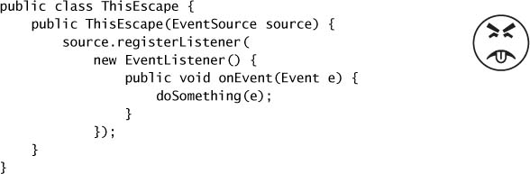

### 3.2.1. Thực hành khởi tạo an toàn

`ThisEscape` minh họa một trường hợp đặc biệt quan trọng của escape — khi tham chiếu `this` escape **trong lúc construct**. Khi instance `EventListener` bên trong được publish, instance `ThisEscape` bao ngoài cũng vậy. Nhưng một object chỉ ở trạng thái nhất quán và dự đoán được **sau khi constructor của nó trả về**, nên việc publish một object từ bên trong constructor của chính nó có thể publish một object **chưa được construct hoàn tất**. Điều này đúng ngay cả khi việc publish là câu lệnh cuối cùng trong constructor. Nếu tham chiếu `this` escape trong lúc construct, object bị coi là **không được construct đúng cách**.[^8]

[^8]: Cụ thể hơn, tham chiếu `this` không nên escape khỏi thread cho đến sau khi constructor trả về. Tham chiếu `this` **có thể** được constructor lưu ở đâu đó miễn là nó không bị một thread khác sử dụng cho đến sau khi việc construct hoàn tất. `SafeListener` ở Listing 3.8 dùng kỹ thuật này.

> **Đừng để tham chiếu `this` escape trong lúc construct.**

Một sai lầm phổ biến có thể khiến tham chiếu `this` escape trong lúc construct là **khởi động một thread từ constructor**. Khi một object tạo một thread từ constructor của nó, nó gần như luôn share tham chiếu `this` với thread mới, hoặc tường minh (bằng cách truyền vào constructor) hoặc ngầm định (vì `Thread` hay `Runnable` là inner class của object sở hữu). Thread mới khi đó có thể nhìn thấy object sở hữu **trước khi nó được construct hoàn tất**. Không có gì sai với việc tạo một thread trong constructor, nhưng tốt nhất là **đừng start thread ngay lập tức**. Thay vào đó, hãy expose một method `start` hoặc `initialize` để khởi động thread được sở hữu. (Xem chương 7 để biết thêm về các vấn đề vòng đời của service.) Việc gọi một instance method có thể override (không `private` và không `final`) từ constructor cũng có thể khiến tham chiếu `this` escape.

Nếu bạn bị cám dỗ đăng ký một event listener hay start một thread từ constructor, bạn có thể tránh việc construct không đúng cách bằng cách dùng một `private` constructor kèm một public factory method, như trong `SafeListener` ở Listing 3.8.

**Listing 3.8. Dùng Factory Method để ngăn tham chiếu `this` Escape trong lúc Construct.**

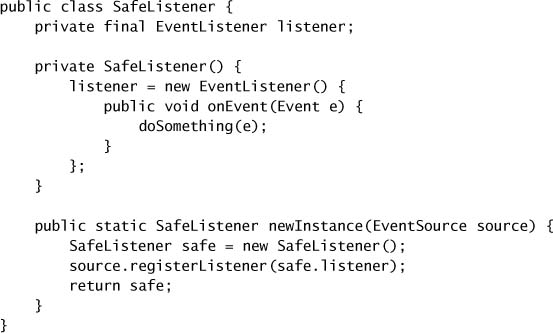

---

## 3.3. Thread Confinement

Truy cập shared, mutable data đòi hỏi dùng synchronization; một cách để tránh yêu cầu này là **không share**. Nếu dữ liệu chỉ được truy cập từ một thread duy nhất, không cần synchronization. Kỹ thuật này, **thread confinement**, là một trong những cách đơn giản nhất để đạt được thread safety. Khi một object bị giới hạn (confine) vào một thread, cách dùng đó **tự động thread-safe** ngay cả khi bản thân object bị confine không thread-safe [CPJ 2.3.2].

Swing sử dụng thread confinement rất rộng rãi. Các visual component và data model object của Swing **không** thread-safe; thay vào đó, tính an toàn đạt được bằng cách confine chúng vào **Swing event dispatch thread**. Để dùng Swing đúng cách, code chạy trong các thread khác event thread không nên truy cập những object này. (Để việc này dễ hơn, Swing cung cấp cơ chế `invokeLater` để lên lịch cho một `Runnable` thực thi trong event thread.) Nhiều lỗi concurrency trong ứng dụng Swing bắt nguồn từ việc dùng sai những object bị confine này từ một thread khác.

Một ứng dụng phổ biến khác của thread confinement là việc dùng các object `Connection` JDBC (Java Database Connectivity) trong pool. Đặc tả JDBC **không yêu cầu** object `Connection` phải thread-safe.[^9] Trong các ứng dụng server điển hình, một thread lấy một connection từ pool, dùng nó để xử lý một request duy nhất, rồi trả lại. Vì hầu hết request — như servlet request hay lời gọi EJB (Enterprise JavaBeans) — được xử lý đồng bộ bởi một thread duy nhất, và pool sẽ không cấp cùng connection đó cho thread khác cho đến khi nó được trả về, pattern quản lý connection này **ngầm** confine `Connection` vào thread đó trong suốt thời gian xử lý request.

[^9]: Các hiện thực connection pool do application server cung cấp **là** thread-safe; connection pool tất yếu bị truy cập từ nhiều thread, nên một hiện thực không thread-safe sẽ vô nghĩa.

Cũng như ngôn ngữ không có cơ chế cưỡng chế rằng một biến được một lock bảo vệ, nó cũng không có phương tiện nào để confine một object vào một thread. Thread confinement là một yếu tố trong **thiết kế** chương trình của bạn, phải được cưỡng chế bởi chính hiện thực của nó. Ngôn ngữ và các thư viện lõi cung cấp những cơ chế hỗ trợ duy trì thread confinement — **local variable** và class **`ThreadLocal`** — nhưng ngay cả với chúng, vẫn là trách nhiệm của lập trình viên để đảm bảo rằng các object bị confine vào thread không escape khỏi thread dự kiến.

### 3.3.1. Ad-hoc Thread Confinement

**Ad-hoc thread confinement** mô tả tình huống mà trách nhiệm duy trì thread confinement rơi hoàn toàn lên phần hiện thực. Ad-hoc thread confinement có thể mong manh vì không có tính năng ngôn ngữ nào — như visibility modifier hay local variable — giúp confine object vào thread mục tiêu. Trên thực tế, các tham chiếu tới những object bị confine vào thread như visual component hay data model trong ứng dụng GUI thường được giữ trong `public` field.

Quyết định dùng thread confinement thường là hệ quả của quyết định hiện thực một subsystem cụ thể, chẳng hạn GUI, như một **subsystem single-threaded**. Các subsystem single-threaded đôi khi mang lại lợi ích về tính đơn giản đủ lớn để bù lại sự mong manh của ad-hoc thread confinement.[^10]

[^10]: Một lý do khác để làm một subsystem single-threaded là **tránh deadlock**; đây là một trong những lý do chính khiến hầu hết GUI framework là single-threaded. Các subsystem single-threaded được trình bày ở chương 9.

Một trường hợp đặc biệt của thread confinement áp dụng cho **biến volatile**. Việc thực hiện các operation read-modify-write trên shared volatile variable là an toàn miễn là bạn đảm bảo rằng biến volatile đó **chỉ được ghi từ một thread duy nhất**. Trong trường hợp này, bạn đang confine việc **sửa đổi** vào một thread duy nhất để ngăn race condition, và các bảo đảm visibility của biến volatile đảm bảo rằng các thread khác thấy giá trị mới nhất.

Vì tính mong manh của nó, ad-hoc thread confinement nên được dùng dè dặt; nếu có thể, hãy dùng một trong những dạng thread confinement mạnh hơn (**stack confinement** hoặc **`ThreadLocal`**) thay thế.

### 3.3.2. Stack Confinement

**Stack confinement** là một trường hợp đặc biệt của thread confinement trong đó một object chỉ có thể tiếp cận được thông qua **local variable**. Cũng như encapsulation có thể giúp bảo toàn invariant dễ hơn, local variable có thể giúp confine object vào một thread dễ hơn. Local variable về bản chất đã bị confine vào thread đang thực thi; chúng tồn tại trên **stack của thread đang thực thi**, thứ mà các thread khác không truy cập được. Stack confinement (còn gọi là **within-thread** hay **thread-local usage**, nhưng đừng nhầm với class thư viện `ThreadLocal`) dễ duy trì hơn và ít mong manh hơn ad-hoc thread confinement.

Với các local variable kiểu nguyên thủy, như `numPairs` trong `loadTheArk` ở Listing 3.9, bạn **không thể** vi phạm stack confinement dù có cố. Không có cách nào để lấy được tham chiếu tới một biến kiểu nguyên thủy, nên semantics của ngôn ngữ đảm bảo rằng các local variable kiểu nguyên thủy **luôn luôn** bị stack-confine.

**Listing 3.9. Thread Confinement của biến Local kiểu nguyên thủy và kiểu tham chiếu.**

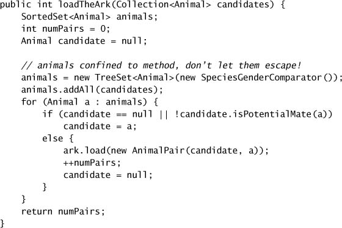

Việc duy trì stack confinement cho **object reference** đòi hỏi lập trình viên trợ giúp thêm một chút để đảm bảo rằng object được tham chiếu không escape. Trong `loadTheArk`, chúng ta khởi tạo một `TreeSet` và lưu một tham chiếu tới nó trong `animals`. Tại thời điểm này, có **đúng một** tham chiếu tới `Set`, được giữ trong một local variable và do đó bị confine vào thread đang thực thi. Tuy nhiên, nếu chúng ta publish một tham chiếu tới `Set` đó (hoặc bất kỳ phần nội tại nào của nó), confinement sẽ bị vi phạm và các "con vật" sẽ escape.

Dùng một object không thread-safe trong ngữ cảnh within-thread vẫn là thread-safe. Tuy nhiên, hãy cẩn thận: yêu cầu thiết kế rằng object phải bị confine vào thread đang thực thi, hoặc nhận thức rằng object bị confine không thread-safe, thường **chỉ tồn tại trong đầu của developer** lúc code được viết. Nếu giả định về cách dùng within-thread không được ghi lại rõ ràng, những người bảo trì sau này có thể vô tình cho phép object escape.

### 3.3.3. ThreadLocal

Một phương tiện hình thức hơn để duy trì thread confinement là **`ThreadLocal`**, cho phép bạn gắn một giá trị riêng cho từng thread với một object giữ giá trị. `ThreadLocal` cung cấp các accessor method `get` và `set` duy trì một **bản sao riêng biệt** của giá trị cho mỗi thread sử dụng nó, nên `get` trả về giá trị gần nhất được truyền vào `set` từ **thread đang thực thi hiện tại**.

Biến thread-local thường được dùng để ngăn việc share trong những thiết kế dựa trên mutable Singleton hay biến toàn cục. Ví dụ, một ứng dụng single-threaded có thể duy trì một database connection toàn cục được khởi tạo lúc startup để khỏi phải truyền một `Connection` vào mọi method. Vì JDBC connection có thể không thread-safe, một ứng dụng multithreaded dùng một connection toàn cục mà không có điều phối bổ sung cũng **không** thread-safe. Bằng cách dùng một `ThreadLocal` để lưu JDBC connection, như trong `ConnectionHolder` ở Listing 3.10, mỗi thread sẽ có connection **của riêng mình**.

**Listing 3.10. Dùng `ThreadLocal` để đảm bảo Thread Confinement.**

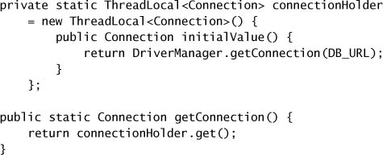

Kỹ thuật này cũng có thể được dùng khi một operation được gọi thường xuyên cần một object tạm như buffer và muốn tránh cấp phát lại object tạm đó ở mỗi lần gọi. Ví dụ, trước Java 5.0, `Integer.toString` dùng một `ThreadLocal` để lưu buffer 12 byte dùng để định dạng kết quả, thay vì dùng một buffer static dùng chung (thứ sẽ đòi hỏi locking) hoặc cấp phát một buffer mới cho mỗi lần gọi.[^11]

[^11]: Kỹ thuật này khó có thể là một thắng lợi về performance trừ khi operation được thực hiện rất thường xuyên hoặc việc cấp phát đặc biệt tốn kém. Trong Java 5.0, nó đã được thay bằng cách tiếp cận đơn giản hơn là cấp phát một buffer mới cho mỗi lần gọi, cho thấy rằng với thứ tầm thường như một buffer tạm, đó không phải là thắng lợi về performance.

Khi một thread gọi `ThreadLocal.get` lần đầu tiên, `initialValue` được tham vấn để cung cấp giá trị ban đầu cho thread đó. Về mặt khái niệm, bạn có thể nghĩ về một `ThreadLocal<T>` như thể nó giữ một `Map<Thread,T>` lưu các giá trị riêng theo thread, mặc dù nó không thực sự được hiện thực như vậy. Các giá trị riêng theo thread được lưu trong **chính object `Thread`**; khi thread kết thúc, các giá trị riêng theo thread có thể được garbage collect.

Nếu bạn đang chuyển một ứng dụng single-threaded sang môi trường multithreaded, bạn có thể bảo toàn thread safety bằng cách chuyển các biến toàn cục được share thành `ThreadLocal`, nếu semantics của các biến toàn cục đó cho phép; một cache dùng chung toàn ứng dụng sẽ không còn hữu ích nếu bị biến thành một loạt cache thread-local.

`ThreadLocal` được dùng rộng rãi trong việc hiện thực các application framework. Ví dụ, các J2EE container gắn một transaction context với một thread đang thực thi trong suốt thời gian một lời gọi EJB. Điều này dễ dàng được hiện thực bằng một `ThreadLocal` static giữ transaction context: khi code của framework cần xác định transaction nào đang chạy, nó lấy transaction context từ `ThreadLocal` này. Điều này tiện lợi ở chỗ nó giảm nhu cầu truyền thông tin ngữ cảnh thực thi vào mọi method, nhưng lại **gắn chặt** bất kỳ code nào dùng cơ chế này với framework.

Rất dễ **lạm dụng** `ThreadLocal` bằng cách coi tính chất thread confinement của nó như giấy phép để dùng biến toàn cục hoặc như một phương tiện tạo ra các "tham số method ẩn". Giống như biến toàn cục, biến thread-local có thể làm giảm khả năng tái sử dụng và tạo ra những coupling ẩn giữa các class, và do đó nên được dùng một cách cẩn trọng.

---

## 3.4. Immutability

Cách "đi vòng" còn lại để tránh nhu cầu synchronize là dùng **immutable object** [EJ Item 13]. Gần như mọi nguy cơ về atomicity và visibility mà chúng ta đã mô tả cho đến giờ — như thấy giá trị stale, mất cập nhật, hay quan sát thấy object ở trạng thái không nhất quán — đều liên quan đến sự thất thường của việc nhiều thread cùng cố truy cập cùng một mutable state cùng lúc. Nếu state của một object **không thể bị sửa đổi**, những rủi ro và phức tạp đó đơn giản là biến mất.

Một **immutable object** là object mà state của nó không thể thay đổi sau khi construct. Immutable object **vốn dĩ đã thread-safe**; các invariant của chúng được thiết lập bởi constructor, và nếu state của chúng không thể thay đổi, những invariant đó luôn luôn đúng.

> **Immutable object luôn luôn thread-safe.**

Immutable object thì **đơn giản**. Chúng chỉ có thể ở một trạng thái duy nhất, được constructor kiểm soát cẩn thận. Một trong những phần khó nhất của thiết kế chương trình là suy luận về các trạng thái khả dĩ của những object phức tạp. Ngược lại, suy luận về state của immutable object là chuyện tầm thường.

Immutable object cũng **an toàn hơn**. Truyền một mutable object cho code không đáng tin, hoặc publish nó ở nơi code không đáng tin có thể tìm thấy, là nguy hiểm — code đó có thể sửa state của nó, hoặc tệ hơn, giữ lại một tham chiếu tới nó và sửa state của nó sau này từ một thread khác. Ngược lại, immutable object không thể bị phá hoại theo cách này bởi code độc hại hay code có bug, nên chúng an toàn để share và publish thoải mái mà không cần tạo defensive copy [EJ Item 24].

Cả Java Language Specification lẫn Java Memory Model đều không định nghĩa immutability một cách hình thức, nhưng immutability **không tương đương** với việc chỉ đơn giản khai báo mọi field của một object là `final`. Một object mà tất cả field đều `final` vẫn có thể là mutable, vì các field `final` có thể giữ tham chiếu tới những object mutable.

> Một object là **immutable** nếu:
>
> - State của nó **không thể bị sửa đổi** sau khi construct;
> - **Tất cả** các field của nó đều `final`;[^12] và
> - Nó được **construct đúng cách** (tham chiếu `this` không escape trong lúc construct).

[^12]: Về mặt kỹ thuật, có thể có một immutable object mà không phải tất cả field đều `final` — `String` là một class như vậy — nhưng điều này dựa trên những suy luận tinh vi về **benign data race**, đòi hỏi hiểu biết sâu về Java Memory Model. (Dành cho ai tò mò: `String` tính lazy giá trị hash code lần đầu `hashCode` được gọi và cache nó trong một field không `final`, nhưng điều này chỉ hoạt động vì field đó chỉ có thể nhận **một** giá trị khác mặc định, và giá trị đó giống nhau mỗi lần được tính vì nó được suy ra một cách tất định từ immutable state. Đừng thử làm điều này ở nhà.)

Immutable object vẫn có thể dùng mutable object bên trong để quản lý state của mình, như minh họa bởi `ThreeStooges` ở Listing 3.11. Dù `Set` lưu các tên là mutable, thiết kế của `ThreeStooges` khiến việc sửa `Set` đó sau khi construct là **không thể**. Tham chiếu `stooges` là `final`, nên toàn bộ state của object được tiếp cận thông qua một field `final`. Yêu cầu cuối cùng — construct đúng cách — dễ dàng được thỏa mãn vì constructor không làm gì có thể khiến tham chiếu `this` trở nên tiếp cận được với code khác ngoài chính constructor và caller của nó.

**Listing 3.11. Class Immutable được xây từ các Object nền tảng Mutable.**

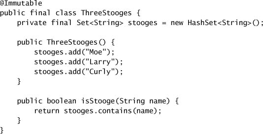

Vì state của chương trình thay đổi liên tục, bạn có thể bị cám dỗ nghĩ rằng immutable object có công dụng hạn chế, nhưng thực tế không phải vậy. Có sự khác biệt giữa việc **một object là immutable** và việc **tham chiếu tới nó là immutable**. State chương trình được lưu trong immutable object vẫn có thể được cập nhật bằng cách "thay thế" immutable object bằng một instance mới giữ state mới; phần tiếp theo đưa ra một ví dụ của kỹ thuật này.[^13]

[^13]: Nhiều developer lo rằng cách tiếp cận này sẽ gây ra vấn đề performance, nhưng những lo ngại đó thường không có cơ sở. Việc cấp phát rẻ hơn bạn tưởng, và immutable object mang lại thêm những lợi thế về performance như giảm nhu cầu locking hay defensive copy, và giảm tác động lên generational garbage collection.

### 3.4.1. Final Fields

Từ khóa `final`, một phiên bản hạn chế hơn của cơ chế `const` trong C++, hỗ trợ việc xây dựng immutable object. Các field `final` không thể bị sửa (mặc dù object mà chúng tham chiếu tới **có thể** bị sửa nếu object đó mutable), nhưng chúng còn có **semantics đặc biệt** trong Java Memory Model. Chính việc dùng field `final` làm cho bảo đảm về **initialization safety** (xem mục 3.5.2) trở nên khả thi, cho phép immutable object được truy cập và share tự do mà không cần synchronization.

Ngay cả khi một object là mutable, việc làm cho một số field trở thành `final` vẫn có thể đơn giản hóa việc suy luận về state của nó, vì việc giới hạn tính khả biến của một object sẽ thu hẹp tập trạng thái khả dĩ của nó. Một object "gần như immutable" nhưng có một hoặc hai mutable state variable vẫn đơn giản hơn một object có nhiều biến mutable. Khai báo field là `final` cũng ghi lại cho người bảo trì rằng những field này không được kỳ vọng sẽ thay đổi.

> Cũng như việc để mọi field là `private` trừ khi chúng cần visibility lớn hơn là một thói quen tốt [EJ Item 12], việc để mọi field là `final` trừ khi chúng cần mutable cũng là một thói quen tốt.

### 3.4.2. Ví dụ: Dùng Volatile để Publish Immutable Object

Trong `UnsafeCachingFactorizer` ở trang 24, chúng ta đã thử dùng hai `AtomicReference` để lưu số cuối cùng và các thừa số cuối cùng, nhưng cách đó không thread-safe vì ta không thể đọc hay cập nhật hai giá trị liên quan này một cách atomic. Dùng biến volatile cho những giá trị này cũng sẽ không thread-safe vì cùng lý do đó. Tuy nhiên, **immutable object đôi khi có thể cung cấp một dạng atomicity yếu**.

Servlet phân tích thừa số thực hiện hai operation phải atomic: cập nhật kết quả đã cache, và lấy có điều kiện các thừa số đã cache nếu số đã cache khớp với số được yêu cầu. Bất cứ khi nào một nhóm các mục dữ liệu liên quan phải được thao tác một cách atomic, hãy cân nhắc tạo một **immutable holder class** cho chúng, chẳng hạn `OneValueCache`[^14] ở Listing 3.12.

[^14]: `OneValueCache` sẽ không immutable nếu không có các lời gọi `copyOf` trong constructor và getter. `Arrays.copyOf` được thêm vào như một tiện ích ở Java 6; `clone` cũng dùng được.

Race condition khi truy cập hoặc cập nhật nhiều biến liên quan có thể được loại bỏ bằng cách dùng một immutable object để giữ tất cả các biến đó. Với một mutable holder object, bạn sẽ phải dùng locking để đảm bảo atomicity; với một immutable holder, một khi một thread lấy được tham chiếu tới nó, nó không bao giờ cần lo về việc thread khác sửa state của nó. Nếu các biến cần được cập nhật, một holder object **mới** sẽ được tạo, nhưng bất kỳ thread nào đang làm việc với holder trước đó vẫn thấy nó ở trạng thái nhất quán.

**Listing 3.12. Immutable Holder để cache một số và các thừa số của nó.**

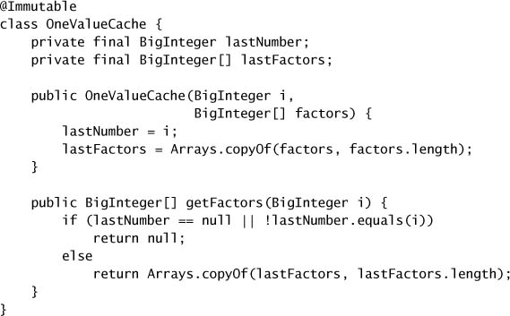

`VolatileCachedFactorizer` ở Listing 3.13 dùng một `OneValueCache` để lưu số và các thừa số được cache. Khi một thread đặt field volatile `cache` tham chiếu tới một `OneValueCache` mới, dữ liệu cache mới lập tức trở nên nhìn thấy được đối với các thread khác.

Các operation liên quan đến cache không thể can thiệp lẫn nhau vì `OneValueCache` là immutable và field `cache` chỉ được truy cập **đúng một lần** trong mỗi code path liên quan. Sự kết hợp giữa một immutable holder object cho nhiều state variable có liên hệ bởi một invariant, và một tham chiếu `volatile` dùng để đảm bảo visibility kịp thời của nó, cho phép `VolatileCachedFactorizer` trở nên thread-safe mặc dù nó **không thực hiện locking tường minh nào**.

**Listing 3.13. Cache kết quả gần nhất bằng một tham chiếu Volatile tới một Immutable Holder Object.**

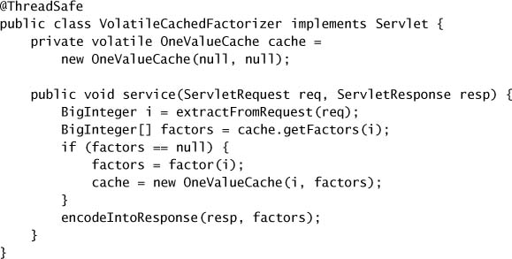

---

## 3.5. Safe Publication

Cho đến giờ chúng ta tập trung vào việc đảm bảo một object **không** bị publish, chẳng hạn khi nó lẽ ra phải bị confine vào một thread hay bên trong một object khác. Dĩ nhiên, đôi khi chúng ta **muốn** share object giữa các thread, và trong trường hợp đó ta phải làm điều đó một cách an toàn. Đáng tiếc, chỉ đơn giản lưu một tham chiếu tới một object vào một `public` field, như ở Listing 3.14, là **không đủ** để publish object đó một cách an toàn.

**Listing 3.14. Publish một Object mà không có Synchronization thích hợp. Đừng làm thế này.**

Bạn có thể ngạc nhiên về mức độ tệ hại mà ví dụ trông có vẻ vô hại này có thể gây ra. Vì các vấn đề về visibility, `Holder` có thể **tỏ ra** với một thread khác là đang ở trạng thái không nhất quán, mặc dù các invariant của nó đã được constructor thiết lập đúng cách! Việc publish không đúng cách này có thể cho phép một thread khác quan sát thấy một object **được construct dở dang**.

### 3.5.1. Publication không đúng cách: Khi Object tốt trở nên hỏng

Bạn **không thể** trông cậy vào tính toàn vẹn của những object được construct dở dang. Một thread quan sát có thể thấy object ở trạng thái không nhất quán, rồi sau đó thấy state của nó **đột ngột thay đổi**, mặc dù nó chưa hề bị sửa kể từ khi publish. Thực tế, nếu `Holder` ở Listing 3.15 được publish bằng idiom publish không an toàn ở Listing 3.14, và một thread khác thread publish gọi `assertSanity`, nó **có thể ném `AssertionError`**![^15]

[^15]: Vấn đề ở đây không phải bản thân class `Holder`, mà là `Holder` không được publish đúng cách. Tuy nhiên, `Holder` có thể được làm cho miễn nhiễm với publication không đúng cách bằng cách khai báo field `n` là `final`, điều này sẽ khiến `Holder` trở nên immutable; xem mục 3.5.2.

**Listing 3.15. Class có nguy cơ thất bại nếu không được Publish đúng cách.**

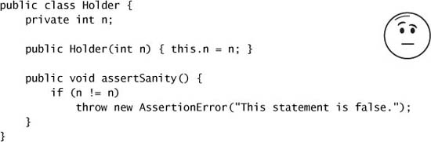

Vì synchronization không được dùng để làm cho `Holder` nhìn thấy được đối với các thread khác, ta nói rằng `Holder` **không được publish đúng cách**. Có **hai** thứ có thể sai với những object được publish không đúng cách. Các thread khác có thể thấy một giá trị stale cho field `holder`, và do đó thấy tham chiếu `null` hoặc một giá trị cũ khác mặc dù một giá trị đã được đặt vào `holder`. Nhưng tệ hơn nhiều, các thread khác có thể thấy một giá trị **mới nhất** cho tham chiếu `holder`, nhưng lại thấy các giá trị **stale** cho state của `Holder`.[^16] Để mọi thứ còn khó lường hơn nữa, một thread có thể thấy giá trị stale lần đầu nó đọc một field rồi thấy giá trị mới hơn ở lần đọc sau — đó là lý do `assertSanity` có thể ném `AssertionError`.

[^16]: Dù có vẻ như các giá trị field được đặt trong constructor là những giá trị đầu tiên được ghi vào các field đó, và do đó không có giá trị "cũ hơn" nào để thấy như giá trị stale, thực ra constructor của `Object` **ghi giá trị mặc định vào tất cả các field trước** khi constructor của subclass chạy. Do đó hoàn toàn có thể thấy giá trị mặc định của một field như một giá trị stale.

Dẫu có nguy cơ lặp lại chính mình: **những chuyện rất kỳ lạ có thể xảy ra khi dữ liệu được share giữa các thread mà không đủ synchronization.**

### 3.5.2. Immutable Object và Initialization Safety

Vì immutable object quá quan trọng, Java Memory Model cung cấp một bảo đảm đặc biệt về **initialization safety** cho việc share immutable object. Như chúng ta đã thấy, việc một object reference trở nên nhìn thấy được đối với một thread khác **không nhất thiết** có nghĩa là state của object đó cũng nhìn thấy được đối với thread tiêu thụ. Để đảm bảo một cái nhìn nhất quán về state của object, cần có synchronization.

Ngược lại, immutable object có thể được truy cập an toàn ngay cả khi synchronization **không** được dùng để publish object reference. Để bảo đảm về initialization safety này có hiệu lực, **tất cả** các yêu cầu của immutability phải được thỏa mãn: state không thể sửa đổi, tất cả field đều `final`, và construct đúng cách. (Nếu `Holder` ở Listing 3.15 là immutable, `assertSanity` sẽ **không thể** ném `AssertionError`, ngay cả khi `Holder` không được publish đúng cách.)

> Immutable object có thể được dùng an toàn bởi bất kỳ thread nào mà không cần synchronization bổ sung, ngay cả khi synchronization không được dùng để publish chúng.

Bảo đảm này mở rộng tới giá trị của **tất cả các field `final`** của những object được construct đúng cách; các field `final` có thể được truy cập an toàn mà không cần synchronization bổ sung. Tuy nhiên, nếu field `final` tham chiếu tới **mutable object**, vẫn cần synchronization để truy cập state của những object mà chúng tham chiếu tới.

### 3.5.3. Các Idiom cho Safe Publication

Những object không immutable **phải** được publish an toàn, điều này thường đòi hỏi synchronization ở **cả** thread publish **lẫn** thread tiêu thụ. Tạm thời, hãy tập trung vào việc đảm bảo rằng thread tiêu thụ có thể thấy object ở **trạng thái lúc publish** (as-published state); chúng ta sẽ sớm bàn về visibility của những sửa đổi diễn ra sau khi publish.

Để publish một object an toàn, **cả tham chiếu tới object lẫn state của object** đều phải được làm cho nhìn thấy được đối với các thread khác **cùng lúc**. Một object được construct đúng cách có thể được publish an toàn bằng cách:

- Khởi tạo một object reference từ một **static initializer**;
- Lưu một tham chiếu tới nó vào một field **`volatile`** hoặc một **`AtomicReference`**;
- Lưu một tham chiếu tới nó vào một field **`final`** của một object được construct đúng cách; hoặc
- Lưu một tham chiếu tới nó vào một field được **một lock bảo vệ** đúng cách.

Synchronization nội bộ trong các thread-safe collection có nghĩa là việc đặt một object vào một thread-safe collection, chẳng hạn `Vector` hay `synchronizedList`, thỏa mãn yêu cầu cuối cùng ở trên. Nếu thread A đặt object X vào một thread-safe collection và sau đó thread B lấy nó ra, B **được đảm bảo** thấy state của X đúng như A để lại, mặc dù code ứng dụng chuyển giao X theo cách này không có synchronization tường minh nào. Các collection thread-safe trong thư viện cung cấp những bảo đảm safe publication sau, ngay cả khi Javadoc không nói rõ về chủ đề này:

- Đặt một key hay value vào một `Hashtable`, `synchronizedMap`, hay `ConcurrentMap` sẽ publish nó an toàn tới bất kỳ thread nào lấy nó ra từ `Map` đó (dù trực tiếp hay qua iterator);
- Đặt một phần tử vào một `Vector`, `CopyOnWriteArrayList`, `CopyOnWriteArraySet`, `synchronizedList`, hay `synchronizedSet` sẽ publish nó an toàn tới bất kỳ thread nào lấy nó ra từ collection đó;
- Đặt một phần tử vào một `BlockingQueue` hay một `ConcurrentLinkedQueue` sẽ publish nó an toàn tới bất kỳ thread nào lấy nó ra từ queue đó.

Các cơ chế chuyển giao khác trong thư viện class (như `Future` và `Exchanger`) cũng cấu thành safe publication; chúng tôi sẽ chỉ ra chúng như những cơ chế cung cấp safe publication khi giới thiệu chúng.

Dùng **static initializer** thường là cách dễ nhất và an toàn nhất để publish những object có thể được construct một cách static:

Static initializer được JVM thực thi tại thời điểm **class initialization**; nhờ synchronization nội bộ trong JVM, cơ chế này được đảm bảo publish an toàn bất kỳ object nào được khởi tạo theo cách này [JLS 12.4.2].

### 3.5.4. Object Effectively Immutable

Safe publication là **đủ** để các thread khác truy cập an toàn những object sẽ không bị sửa đổi sau khi publish, mà không cần synchronization bổ sung. Tất cả các cơ chế safe publication đều đảm bảo rằng trạng thái lúc publish của một object nhìn thấy được với mọi thread truy cập ngay khi tham chiếu tới nó nhìn thấy được, và nếu state đó sẽ không thay đổi nữa, điều này là đủ để đảm bảo mọi truy cập đều an toàn.

Những object **không** immutable về mặt kỹ thuật, nhưng state của chúng sẽ không bị sửa đổi sau khi publish, được gọi là **effectively immutable**. Chúng không cần thỏa mãn định nghĩa nghiêm ngặt về immutability ở mục 3.4; chúng chỉ cần được chương trình **đối xử** như thể chúng immutable sau khi được publish. Dùng object effectively immutable có thể đơn giản hóa việc phát triển và cải thiện performance bằng cách giảm nhu cầu synchronization.

> Những object effectively immutable đã được publish an toàn có thể được dùng an toàn bởi bất kỳ thread nào mà không cần synchronization bổ sung.

Ví dụ, `Date` là mutable,[^17] nhưng nếu bạn dùng nó **như thể** nó immutable, bạn có thể loại bỏ được phần locking lẽ ra sẽ cần khi share một `Date` giữa các thread. Giả sử bạn muốn duy trì một `Map` lưu thời điểm đăng nhập cuối cùng của mỗi user:

[^17]: Đây có lẽ là một sai lầm trong thiết kế thư viện class.

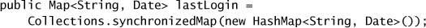

Nếu các giá trị `Date` không bị sửa sau khi được đặt vào `Map`, thì synchronization trong hiện thực `synchronizedMap` là **đủ** để publish các giá trị `Date` một cách an toàn, và không cần synchronization bổ sung khi truy cập chúng.

### 3.5.5. Mutable Object

Nếu một object **có thể** bị sửa sau khi construct, safe publication chỉ đảm bảo visibility của **trạng thái lúc publish**. Synchronization phải được dùng không chỉ để publish một mutable object, mà còn ở **mỗi lần** object đó được truy cập, để đảm bảo visibility của những sửa đổi sau đó. Để share mutable object một cách an toàn, chúng phải được publish an toàn **và** phải hoặc là thread-safe, hoặc được một lock bảo vệ.

> Yêu cầu publication của một object phụ thuộc vào tính khả biến của nó:
>
> - **Immutable object** có thể được publish qua bất kỳ cơ chế nào;
> - **Effectively immutable object** phải được publish an toàn;
> - **Mutable object** phải được publish an toàn, và phải hoặc là thread-safe, hoặc được một lock bảo vệ.

### 3.5.6. Share Object một cách an toàn

Bất cứ khi nào bạn lấy được một tham chiếu tới một object, bạn nên biết **mình được phép làm gì với nó**. Bạn có cần acquire một lock trước khi dùng nó không? Bạn có được phép sửa state của nó, hay chỉ được đọc? Nhiều lỗi concurrency bắt nguồn từ việc không hiểu những "luật chơi" này đối với một object được share. Khi bạn publish một object, bạn nên **ghi lại tài liệu** về cách object đó có thể được truy cập.

Những policy hữu ích nhất để sử dụng và share object trong một chương trình concurrent là:

**Thread-confined.** Một object thread-confined được sở hữu độc quyền bởi và bị confine vào **một** thread, và có thể được sửa bởi thread sở hữu nó.

**Shared read-only.** Một object shared read-only có thể được nhiều thread truy cập đồng thời mà không cần synchronization bổ sung, nhưng **không thể** bị sửa bởi bất kỳ thread nào. Object shared read-only bao gồm cả immutable object và effectively immutable object.

**Shared thread-safe.** Một object thread-safe thực hiện synchronization **bên trong**, nên nhiều thread có thể tự do truy cập nó thông qua public interface của nó mà không cần synchronization thêm.

**Guarded.** Một object guarded chỉ có thể được truy cập khi đang giữ một **lock cụ thể**. Object guarded bao gồm những object được encapsulate bên trong các thread-safe object khác, và những object đã publish mà được biết là được một lock cụ thể bảo vệ.
