# Chương 4. Composing Objects

> **Về bản dịch này.** Đây là bản **dịch đầy đủ** chương 4 của cuốn *Java Concurrency in Practice* (Brian Goetz và cộng sự). Các **thuật ngữ chuyên ngành được giữ nguyên tiếng Anh**. Toàn bộ code listing và hình vẽ được trích trực tiếp từ file PDF gốc và lưu trong thư mục `images/ch04/`.

---

Cho đến giờ, chúng ta đã đề cập những kiến thức nền tảng ở mức thấp về thread safety và synchronization. Nhưng chúng ta không muốn phải phân tích từng lần truy cập bộ nhớ để đảm bảo chương trình của mình thread-safe; chúng ta muốn có thể lấy các component thread-safe và **compose** chúng một cách an toàn thành những component hay chương trình lớn hơn. Chương này trình bày các pattern để cấu trúc class sao cho dễ làm chúng thread-safe hơn và dễ bảo trì chúng mà không vô tình phá hỏng những bảo đảm về an toàn của chúng.

---

## 4.1. Thiết kế một Thread-safe Class

Dù hoàn toàn có thể viết một chương trình thread-safe lưu toàn bộ state trong `public static` field, việc kiểm chứng thread safety của nó, hay sửa đổi nó sao cho vẫn thread-safe, khó hơn rất nhiều so với một chương trình dùng encapsulation hợp lý. Encapsulation làm cho việc xác định một class có thread-safe hay không trở nên khả thi **mà không cần xem xét toàn bộ chương trình**.

Quy trình thiết kế một thread-safe class nên bao gồm ba yếu tố cơ bản sau:

- **Xác định các biến** tạo nên state của object;
- **Xác định các invariant** ràng buộc các state variable đó;
- **Thiết lập một policy** để quản lý truy cập concurrent vào state của object.

State của một object bắt đầu từ các field của nó. Nếu tất cả đều thuộc kiểu nguyên thủy, các field đó tạo nên **toàn bộ** state. `Counter` ở Listing 4.1 chỉ có một field, nên field `value` tạo nên toàn bộ state của nó. State của một object có *n* field kiểu nguyên thủy chỉ đơn giản là bộ *n* giá trị field của nó; state của một `Point` 2 chiều là giá trị (x, y) của nó. Nếu object có các field là tham chiếu tới object khác, state của nó sẽ bao gồm cả các field từ những object được tham chiếu. Ví dụ, state của một `LinkedList` bao gồm state của tất cả các object node liên kết thuộc về list đó.

**Synchronization policy** định nghĩa cách một object điều phối truy cập vào state của nó mà không vi phạm các invariant hay postcondition. Nó đặc tả sự kết hợp nào giữa immutability, thread confinement và locking được dùng để duy trì thread safety, và biến nào được lock nào bảo vệ. Để đảm bảo class có thể được phân tích và bảo trì, hãy **ghi lại tài liệu về synchronization policy**.

**Listing 4.1. Counter thread-safe đơn giản dùng Java Monitor Pattern.**

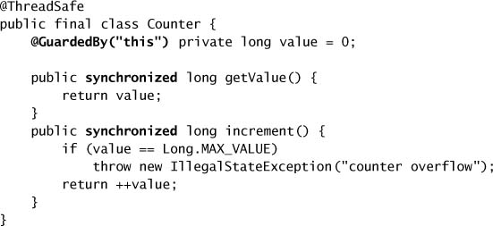

### 4.1.1. Thu thập các yêu cầu về Synchronization

Làm cho một class thread-safe nghĩa là đảm bảo các invariant của nó vẫn đúng dưới truy cập concurrent; điều này đòi hỏi suy luận về state của nó. Object và biến đều có một **state space**: phạm vi các trạng thái khả dĩ mà chúng có thể nhận. State space này càng nhỏ thì càng dễ suy luận. Bằng cách dùng field `final` ở mọi nơi khả thi, bạn làm cho việc phân tích các trạng thái khả dĩ của một object trở nên đơn giản hơn. (Ở trường hợp cực đoan, immutable object chỉ có thể ở **một** trạng thái duy nhất.)

Nhiều class có invariant xác định một số trạng thái là hợp lệ hay không hợp lệ. Field `value` trong `Counter` là một `long`. State space của một `long` trải từ `Long.MIN_VALUE` tới `Long.MAX_VALUE`, nhưng `Counter` đặt ràng buộc lên `value`: giá trị âm không được phép.

Tương tự, các operation có thể có **postcondition** xác định một số chuyển đổi state là không hợp lệ. Nếu state hiện tại của một `Counter` là 17, state kế tiếp hợp lệ duy nhất là 18. Khi state kế tiếp được suy ra từ state hiện tại, operation đó tất yếu là một **compound action**. Không phải mọi operation đều áp đặt ràng buộc chuyển đổi state; khi cập nhật một biến giữ nhiệt độ hiện tại, state trước đó của nó không ảnh hưởng đến phép tính.

Những ràng buộc đặt lên state hoặc lên chuyển đổi state bởi invariant và postcondition tạo ra thêm các yêu cầu về synchronization hoặc encapsulation. Nếu một số state là không hợp lệ, thì các state variable nền tảng **phải được encapsulate**, nếu không client code có thể đưa object vào trạng thái không hợp lệ. Nếu một operation có những chuyển đổi state không hợp lệ, nó **phải được làm cho atomic**. Ngược lại, nếu class không áp đặt ràng buộc nào như vậy, ta có thể nới lỏng các yêu cầu về encapsulation hay serialization để có được sự linh hoạt lớn hơn hoặc performance tốt hơn.

Một class cũng có thể có invariant ràng buộc **nhiều** state variable. Một class biểu diễn khoảng số, như `NumberRange` ở Listing 4.10, thường duy trì các state variable cho cận dưới và cận trên của khoảng. Những biến này phải tuân theo ràng buộc rằng cận dưới nhỏ hơn hoặc bằng cận trên. Các invariant nhiều biến như thế này tạo ra **yêu cầu về atomicity**: các biến liên quan phải được đọc hoặc cập nhật trong **một** atomic operation duy nhất. Bạn không thể cập nhật một biến, release rồi acquire lại lock, rồi mới cập nhật các biến còn lại, vì làm vậy có thể để object ở trạng thái không hợp lệ trong lúc lock được release. Khi nhiều biến tham gia vào một invariant, lock bảo vệ chúng phải được **giữ trong suốt** bất kỳ operation nào truy cập các biến liên quan đó.

> Bạn không thể đảm bảo thread safety nếu không hiểu các **invariant** và **postcondition** của một object. Ràng buộc về giá trị hợp lệ hay chuyển đổi state hợp lệ của các state variable có thể tạo ra những yêu cầu về **atomicity** và **encapsulation**.

### 4.1.2. Các Operation phụ thuộc State

Class invariant và method postcondition ràng buộc các state và chuyển đổi state hợp lệ của một object. Một số object còn có method với **precondition dựa trên state**. Ví dụ, bạn không thể lấy một phần tử ra khỏi một queue rỗng; queue phải ở trạng thái "không rỗng" trước khi bạn có thể lấy phần tử ra. Các operation có precondition dựa trên state được gọi là **state-dependent** [CPJ 3].

Trong một chương trình single-threaded, nếu một precondition không thỏa mãn, operation không còn lựa chọn nào ngoài **thất bại**. Nhưng trong một chương trình concurrent, precondition có thể trở nên đúng **sau đó** nhờ hành động của một thread khác. Chương trình concurrent thêm khả năng **chờ** cho đến khi precondition trở nên đúng, rồi mới tiếp tục operation.

Các cơ chế built-in để chờ một điều kiện trở nên đúng một cách hiệu quả — `wait` và `notify` — gắn chặt với intrinsic locking, và có thể khó dùng đúng. Để tạo ra những operation chờ một precondition trở nên đúng trước khi tiếp tục, thường dễ hơn nếu dùng các class thư viện có sẵn, chẳng hạn blocking queue hay semaphore, để cung cấp hành vi state-dependent mong muốn. Các class thư viện blocking như `BlockingQueue`, `Semaphore`, và các synchronizer khác được trình bày ở chương 5; việc tạo các class state-dependent bằng những cơ chế mức thấp do nền tảng và thư viện class cung cấp được trình bày ở chương 14.

### 4.1.3. Quyền sở hữu State

Ở mục 4.1 chúng ta đã ngụ ý rằng state của một object có thể là một **tập con** các field trong đồ thị object có gốc tại object đó. Tại sao lại là tập con? Trong điều kiện nào thì những field tiếp cận được từ một object lại **không** thuộc state của object đó?

Khi định nghĩa những biến nào tạo nên state của một object, chúng ta chỉ muốn xét dữ liệu mà object đó **sở hữu**. Quyền sở hữu (ownership) không được thể hiện tường minh trong ngôn ngữ, mà là một yếu tố của thiết kế class. Nếu bạn cấp phát và điền dữ liệu vào một `HashMap`, bạn đang tạo ra nhiều object: object `HashMap`, một số object `Map.Entry` được hiện thực `HashMap` sử dụng, và có thể cả những object nội bộ khác. State logic của một `HashMap` bao gồm state của tất cả các `Map.Entry` và object nội bộ của nó, dù chúng được hiện thực như những object riêng biệt.

Dù tốt hay xấu, garbage collection cho phép chúng ta khỏi phải suy nghĩ kỹ về ownership. Khi truyền một object vào một method trong C++, bạn phải suy nghĩ khá cẩn thận về việc mình đang **chuyển giao** quyền sở hữu, đang **cho mượn ngắn hạn**, hay đang hình dung một **quyền sở hữu chung dài hạn**. Trong Java, tất cả những mô hình ownership đó đều khả dĩ, nhưng garbage collector làm giảm chi phí của nhiều lỗi phổ biến trong việc share tham chiếu, cho phép ta suy nghĩ kém chính xác hơn về ownership.

Trong nhiều trường hợp, ownership và encapsulation đi cùng nhau — object encapsulate state mà nó sở hữu, và sở hữu state mà nó encapsulate. Chính **chủ sở hữu** của một state variable mới là bên quyết định locking protocol dùng để duy trì tính toàn vẹn của state biến đó. Ownership hàm ý **quyền kiểm soát**, nhưng một khi bạn publish một tham chiếu tới một mutable object, bạn không còn kiểm soát độc quyền nữa; tốt nhất thì bạn có thể có "quyền sở hữu chung". Một class thường **không** sở hữu những object được truyền vào method hay constructor của nó, trừ khi method đó được thiết kế để chuyển giao ownership một cách tường minh (như các factory method wrapper của synchronized collection).

Các collection class thường thể hiện một dạng "**split ownership**", trong đó collection sở hữu state của hạ tầng collection, còn client code sở hữu những object được lưu trong collection. Một ví dụ là `ServletContext` trong servlet framework. `ServletContext` cung cấp cho các servlet một dịch vụ chứa object giống `Map`, nơi chúng có thể đăng ký và lấy về các object của ứng dụng theo tên bằng `setAttribute` và `getAttribute`. Object `ServletContext` do servlet container hiện thực **phải** thread-safe, vì nó tất yếu sẽ bị nhiều thread truy cập. Các servlet không cần dùng synchronization khi gọi `setAttribute` và `getAttribute`, nhưng chúng **có thể phải** dùng synchronization khi sử dụng những object được lưu trong `ServletContext`. Những object này thuộc sở hữu của **ứng dụng**; chúng chỉ đang được servlet container giữ hộ thay mặt ứng dụng. Giống như mọi object được share, chúng phải được share an toàn; để ngăn sự can thiệp từ nhiều thread cùng truy cập một object đồng thời, chúng nên hoặc là thread-safe, hoặc effectively immutable, hoặc được một lock bảo vệ tường minh.[^1]

[^1]: Thú vị là object `HttpSession`, thứ thực hiện chức năng tương tự trong servlet framework, có thể có yêu cầu **chặt chẽ hơn**. Vì servlet container có thể truy cập các object trong `HttpSession` để serialize chúng phục vụ replication hay passivation, chúng phải thread-safe vì container cũng sẽ truy cập chúng bên cạnh ứng dụng web. (Chúng tôi nói "có thể có" vì replication và passivation nằm ngoài đặc tả servlet nhưng lại là tính năng phổ biến của các servlet container.)

---

## 4.2. Instance Confinement

Nếu một object không thread-safe, vẫn có vài kỹ thuật cho phép nó được dùng an toàn trong chương trình multithreaded. Bạn có thể đảm bảo rằng nó **chỉ được truy cập từ một thread duy nhất** (thread confinement), hoặc rằng **mọi truy cập vào nó đều được một lock bảo vệ đúng cách**.

Encapsulation đơn giản hóa việc làm cho class thread-safe bằng cách thúc đẩy **instance confinement**, thường chỉ gọi tắt là **confinement** [CPJ 2.3.3]. Khi một object được encapsulate bên trong một object khác, **mọi code path** có quyền truy cập object được encapsulate đó đều đã biết trước và do đó có thể được phân tích dễ hơn nhiều so với khi object đó tiếp cận được từ toàn bộ chương trình. Kết hợp confinement với một kỷ luật locking thích hợp có thể đảm bảo rằng những object vốn không thread-safe vẫn được dùng một cách thread-safe.

> Encapsulate dữ liệu bên trong một object sẽ giới hạn truy cập vào dữ liệu đó chỉ trong các method của object, giúp dễ đảm bảo rằng dữ liệu luôn được truy cập khi đang giữ lock thích hợp.

Object bị confine **không được escape** khỏi phạm vi dự kiến của chúng. Một object có thể bị confine vào một **class instance** (như một private class member), một **lexical scope** (như một local variable), hoặc một **thread** (như một object được truyền từ method này sang method khác trong cùng một thread, nhưng không được share giữa các thread). Dĩ nhiên, object không tự escape — chúng cần sự "giúp đỡ" từ developer, người publish object ra ngoài phạm vi dự kiến của nó.

`PersonSet` ở Listing 4.2 minh họa cách confinement và locking có thể phối hợp để làm một class thread-safe ngay cả khi các state variable thành phần của nó thì không. State của `PersonSet` được quản lý bởi một `HashSet`, thứ không thread-safe. Nhưng vì `mySet` là `private` và không được phép escape, `HashSet` bị confine vào `PersonSet`. Các code path duy nhất có thể truy cập `mySet` là `addPerson` và `containsPerson`, và mỗi method này đều acquire lock trên `PersonSet`. Toàn bộ state của nó được intrinsic lock của nó bảo vệ, khiến `PersonSet` trở nên thread-safe.

**Listing 4.2. Dùng Confinement để đảm bảo Thread Safety.**

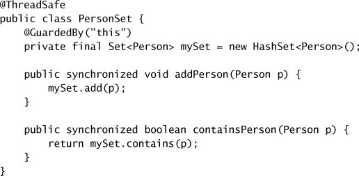

Ví dụ này **không đưa ra giả định nào** về thread-safety của `Person`, nhưng nếu `Person` là mutable, sẽ cần thêm synchronization khi truy cập một `Person` lấy ra từ một `PersonSet`. Cách đáng tin cậy nhất để làm điều này là làm cho `Person` thread-safe; kém tin cậy hơn là bảo vệ các object `Person` bằng một lock và đảm bảo mọi client tuân theo protocol acquire lock thích hợp trước khi truy cập `Person`.

Instance confinement là một trong những cách dễ nhất để xây dựng thread-safe class. Nó cũng cho phép linh hoạt trong việc chọn chiến lược locking; `PersonSet` tình cờ dùng intrinsic lock của chính nó để bảo vệ state, nhưng bất kỳ lock nào, nếu được dùng nhất quán, cũng đều tốt như vậy. Instance confinement cũng cho phép **những state variable khác nhau được những lock khác nhau bảo vệ**. (Để xem ví dụ về một class dùng nhiều lock object để bảo vệ state của nó, xem `ServerStatus` ở trang 236.)

Có rất nhiều ví dụ về confinement trong thư viện class của nền tảng, bao gồm một số class tồn tại **chỉ để** biến những class không thread-safe thành thread-safe. Các collection class cơ bản như `ArrayList` và `HashMap` không thread-safe, nhưng thư viện class cung cấp các wrapper factory method (`Collections.synchronizedList` và bạn bè) để chúng có thể được dùng an toàn trong môi trường multithreaded. Những factory này dùng pattern **Decorator** (Gamma và cộng sự, 1995) để bọc collection bằng một object wrapper đã synchronize; wrapper hiện thực mỗi method của interface tương ứng như một method `synchronized` chuyển tiếp yêu cầu tới object collection nền tảng. Miễn là object wrapper giữ **tham chiếu tiếp cận được duy nhất** tới collection nền tảng (tức là collection nền tảng bị confine vào wrapper), object wrapper sẽ thread-safe. Javadoc cho những method này cảnh báo rằng **mọi** truy cập vào collection nền tảng phải được thực hiện thông qua wrapper.

Dĩ nhiên, vẫn có thể vi phạm confinement bằng cách publish một object lẽ ra phải bị confine; nếu một object được dự kiến bị confine vào một phạm vi cụ thể, thì việc để nó escape khỏi phạm vi đó là một **bug**. Các object bị confine cũng có thể escape thông qua việc publish những object khác như iterator hay instance của inner class, thứ có thể gián tiếp publish các object bị confine.

> Confinement giúp việc xây dựng thread-safe class dễ hơn vì một class confine state của nó có thể được phân tích thread safety **mà không cần xem xét toàn bộ chương trình**.

### 4.2.1. Java Monitor Pattern

Đi theo nguyên tắc instance confinement đến kết luận logic của nó sẽ dẫn bạn đến **Java monitor pattern**.[^2] Một object tuân theo Java monitor pattern **encapsulate toàn bộ mutable state của nó và bảo vệ state đó bằng chính intrinsic lock của object**.

[^2]: Java monitor pattern được lấy cảm hứng từ công trình của Hoare về monitor (Hoare, 1974), dù có những khác biệt đáng kể giữa pattern này và một monitor thực thụ. Các lệnh bytecode để vào và ra một `synchronized` block thậm chí còn được gọi là `monitorenter` và `monitorexit`, và các lock built-in (intrinsic) của Java đôi khi được gọi là **monitor lock** hay **monitor**.

`Counter` ở Listing 4.1 cho thấy một ví dụ điển hình của pattern này. Nó encapsulate một state variable, `value`, và mọi truy cập vào state variable đó đều thông qua các method của `Counter`, tất cả đều là `synchronized`.

Java monitor pattern được nhiều class thư viện sử dụng, như `Vector` và `Hashtable`. Đôi khi cần một synchronization policy tinh vi hơn; chương 11 cho thấy cách cải thiện khả năng mở rộng (scalability) thông qua các chiến lược locking mịn hơn. Ưu điểm chính của Java monitor pattern là **tính đơn giản**.

Java monitor pattern chỉ đơn thuần là một **quy ước**; bất kỳ lock object nào cũng có thể được dùng để bảo vệ state của một object, miễn là nó được dùng nhất quán. Listing 4.3 minh họa một class dùng **private lock** để bảo vệ state của nó.

**Listing 4.3. Bảo vệ State bằng một Private Lock.**

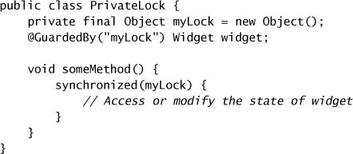

Có những lợi thế khi dùng một private lock object thay vì intrinsic lock của object (hay bất kỳ lock nào có thể truy cập công khai). Việc để lock object là `private` sẽ **encapsulate lock** để client code không thể acquire nó, trong khi một lock truy cập công khai cho phép client code tham gia vào synchronization policy của nó — dù đúng hay sai. Client acquire lock của object khác một cách không đúng cách có thể gây ra vấn đề về liveness, và việc kiểm chứng rằng một lock truy cập công khai được dùng đúng đòi hỏi xem xét **toàn bộ chương trình** thay vì một class đơn lẻ.

### 4.2.2. Ví dụ: Theo dõi đội xe

`Counter` ở Listing 4.1 là ví dụ ngắn gọn nhưng tầm thường về Java monitor pattern. Hãy xây một ví dụ bớt tầm thường hơn một chút: một "vehicle tracker" để điều phối đội xe như taxi, xe cảnh sát, hay xe giao hàng. Chúng ta sẽ xây nó trước bằng monitor pattern, rồi xem cách nới lỏng một số yêu cầu encapsulation mà vẫn giữ được thread safety.

Mỗi xe được định danh bằng một `String` và có vị trí biểu diễn bằng tọa độ (x, y). Các class `VehicleTracker` encapsulate danh tính và vị trí của những xe đã biết, khiến chúng rất phù hợp làm data model trong một ứng dụng GUI model-view-controller, nơi nó có thể được share giữa một view thread và nhiều updater thread. View thread sẽ lấy tên và vị trí của các xe rồi render chúng lên màn hình:

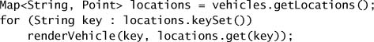

Tương tự, các updater thread sẽ sửa vị trí xe bằng dữ liệu nhận từ thiết bị GPS hoặc do người điều phối nhập tay qua giao diện GUI:

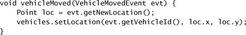

Vì view thread và các updater thread sẽ truy cập data model đồng thời, nó **phải** thread-safe. Listing 4.4 cho thấy một hiện thực của vehicle tracker dùng Java monitor pattern, sử dụng `MutablePoint` ở Listing 4.5 để biểu diễn vị trí xe.

**Listing 4.4. Hiện thực Vehicle Tracker dựa trên Monitor.**

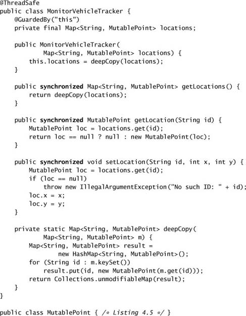

**Listing 4.5. Class Point khả biến, tương tự `java.awt.Point`.**

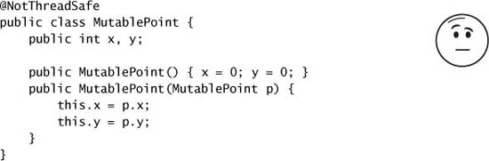

Mặc dù `MutablePoint` không thread-safe, class tracker thì có. Cả `Map` lẫn bất kỳ mutable point nào nó chứa đều **không bao giờ được publish**. Khi cần trả về vị trí xe cho caller, các giá trị tương ứng được **sao chép** bằng copy constructor của `MutablePoint` hoặc bằng `deepCopy`, thứ tạo ra một `Map` mới mà các giá trị là bản sao của key và value từ `Map` cũ.[^3]

[^3]: Lưu ý rằng `deepCopy` không thể chỉ đơn giản bọc `Map` bằng `unmodifiableMap`, vì cách đó chỉ bảo vệ **collection** khỏi bị sửa; nó không ngăn caller sửa các mutable object được lưu bên trong. Vì cùng lý do, việc điền `HashMap` trong `deepCopy` qua một copy constructor cũng không hoạt động, vì chỉ các **tham chiếu** tới point được sao chép, chứ không phải bản thân các object point.

Hiện thực này duy trì thread safety một phần bằng cách **sao chép mutable data trước khi trả về** cho client. Điều này thường không phải vấn đề về performance, nhưng có thể trở thành vấn đề nếu tập xe rất lớn.[^4] Một hệ quả khác của việc sao chép dữ liệu ở mỗi lời gọi `getLocation` là nội dung của collection được trả về **không thay đổi** ngay cả khi các vị trí nền tảng thay đổi. Việc này tốt hay xấu tùy thuộc vào yêu cầu của bạn. Nó có thể là lợi ích nếu có yêu cầu về tính nhất quán nội tại trên tập vị trí — trong trường hợp đó việc trả về một snapshot nhất quán là then chốt — hoặc là nhược điểm nếu caller cần thông tin mới nhất cho từng xe và do đó phải làm mới snapshot của mình thường xuyên hơn.

[^4]: Vì `deepCopy` được gọi từ một method `synchronized`, intrinsic lock của tracker bị giữ trong suốt một operation sao chép có thể chạy lâu, và điều này có thể làm giảm khả năng đáp ứng của giao diện người dùng khi có nhiều xe đang được theo dõi.

---

## 4.3. Ủy quyền Thread Safety (Delegating Thread Safety)

Trừ những object tầm thường nhất, mọi object đều là object **composite**. Java monitor pattern hữu ích khi xây class từ đầu hoặc compose class từ những object không thread-safe. Nhưng nếu các component của class chúng ta **đã** thread-safe thì sao? Chúng ta có cần thêm một lớp thread safety nữa không? Câu trả lời là… "còn tùy". Trong một số trường hợp, một composite tạo từ các component thread-safe **là** thread-safe (Listing 4.7 và 4.9), và trong những trường hợp khác, nó chỉ là một khởi đầu tốt (4.10).

Trong `CountingFactorizer` ở trang 23, chúng ta đã thêm một `AtomicLong` vào một object vốn stateless, và object composite kết quả vẫn thread-safe. Vì state của `CountingFactorizer` chính là state của `AtomicLong` thread-safe, và vì `CountingFactorizer` không áp đặt ràng buộc hợp lệ bổ sung nào lên state của counter, dễ thấy rằng `CountingFactorizer` là thread-safe. Ta có thể nói rằng `CountingFactorizer` **ủy quyền** (delegate) trách nhiệm thread safety của nó cho `AtomicLong`: `CountingFactorizer` thread-safe **vì** `AtomicLong` thread-safe.[^5]

[^5]: Nếu `count` không phải `final`, việc phân tích thread safety của `CountingFactorizer` sẽ phức tạp hơn. Nếu `CountingFactorizer` có thể sửa `count` để tham chiếu tới một `AtomicLong` khác, ta sẽ phải đảm bảo rằng cập nhật này nhìn thấy được với mọi thread có thể truy cập counter, và rằng không có race condition nào liên quan đến giá trị của tham chiếu `count`. Đây là một lý do tốt nữa để dùng field `final` ở mọi nơi khả thi.

### 4.3.1. Ví dụ: Vehicle Tracker dùng Delegation

Như một ví dụ đáng kể hơn về delegation, hãy xây một phiên bản vehicle tracker ủy quyền cho một thread-safe class. Chúng ta lưu các vị trí trong một `Map`, nên ta bắt đầu với một hiện thực `Map` thread-safe: `ConcurrentHashMap`. Chúng ta cũng lưu vị trí bằng một class `Point` **immutable** thay vì `MutablePoint`, như trong Listing 4.6.

**Listing 4.6. Class Point immutable được `DelegatingVehicleTracker` sử dụng.**

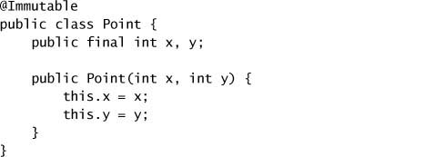

`Point` thread-safe vì nó **immutable**. Các giá trị immutable có thể được share và publish tự do, nên ta không còn cần sao chép vị trí khi trả về chúng nữa.

`DelegatingVehicleTracker` ở Listing 4.7 **không dùng synchronization tường minh nào**; mọi truy cập vào state đều được `ConcurrentHashMap` quản lý, và tất cả key và value của `Map` đều immutable.

**Listing 4.7. Ủy quyền Thread Safety cho một `ConcurrentHashMap`.**

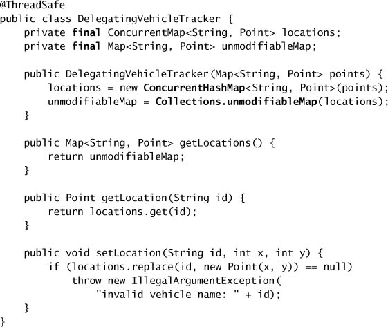

Nếu chúng ta đã dùng class `MutablePoint` ban đầu thay vì `Point`, ta sẽ phá vỡ encapsulation khi để `getLocations` publish một tham chiếu tới mutable state không thread-safe. Lưu ý rằng chúng ta đã thay đổi hành vi của class vehicle tracker một chút: trong khi phiên bản monitor trả về một **snapshot** của các vị trí, phiên bản delegating trả về một view **không sửa được nhưng "sống"** của vị trí các xe. Điều này nghĩa là nếu thread A gọi `getLocations` và sau đó thread B sửa vị trí của một số point, những thay đổi đó **được phản ánh** trong `Map` đã trả về cho thread A. Như đã nhận xét trước đó, đây có thể là lợi ích (dữ liệu mới hơn) hoặc gánh nặng (cái nhìn có thể không nhất quán về đội xe), tùy vào yêu cầu của bạn.

Nếu cần một cái nhìn bất biến về đội xe, `getLocations` có thể trả về một **shallow copy** của map vị trí. Vì nội dung của `Map` là immutable, chỉ **cấu trúc** của `Map`, chứ không phải nội dung, cần được sao chép, như trong Listing 4.8 (trả về một `HashMap` thường, vì `getLocations` không hứa sẽ trả về một `Map` thread-safe).

**Listing 4.8. Trả về một bản sao tĩnh của tập vị trí thay vì một bản "sống".**

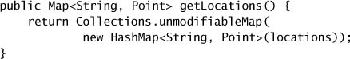

### 4.3.2. Các State Variable độc lập

Các ví dụ delegation cho đến giờ đều ủy quyền cho **một** state variable thread-safe duy nhất. Chúng ta cũng có thể ủy quyền thread safety cho **nhiều hơn một** state variable nền tảng, miễn là những state variable đó **độc lập**, nghĩa là class composite không áp đặt bất kỳ invariant nào liên quan đến nhiều state variable.

`VisualComponent` ở Listing 4.9 là một component đồ họa cho phép client đăng ký listener cho các sự kiện chuột và bàn phím. Nó duy trì một danh sách listener đã đăng ký cho mỗi loại, để khi một sự kiện xảy ra, các listener tương ứng có thể được gọi. Nhưng **không có mối quan hệ nào** giữa tập mouse listener và tập key listener; hai tập này độc lập, và do đó `VisualComponent` có thể ủy quyền nghĩa vụ thread safety của nó cho hai list thread-safe nền tảng.

**Listing 4.9. Ủy quyền Thread Safety cho nhiều State Variable nền tảng.**

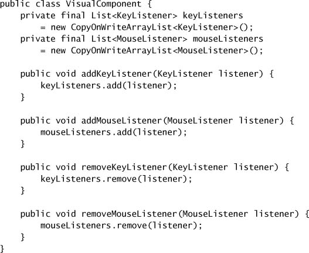

`VisualComponent` dùng `CopyOnWriteArrayList` để lưu mỗi danh sách listener; đây là một hiện thực `List` thread-safe đặc biệt phù hợp để quản lý danh sách listener (xem mục 5.2.3). Mỗi `List` đều thread-safe, và vì không có ràng buộc nào ghép state của list này với state của list kia, `VisualComponent` có thể ủy quyền trách nhiệm thread safety của nó cho các object nền tảng `mouseListeners` và `keyListeners`.

### 4.3.3. Khi Delegation thất bại

Hầu hết class composite không đơn giản như `VisualComponent`: chúng có những invariant **liên hệ** các state variable thành phần với nhau. `NumberRange` ở Listing 4.10 dùng hai `AtomicInteger` để quản lý state của nó, nhưng áp đặt một ràng buộc bổ sung — rằng số thứ nhất phải nhỏ hơn hoặc bằng số thứ hai.

**Listing 4.10. Class Number Range không bảo vệ đầy đủ các Invariant của nó. Đừng làm thế này.**

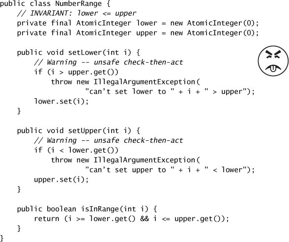

`NumberRange` **không** thread-safe; nó không bảo toàn invariant ràng buộc `lower` và `upper`. Các method `setLower` và `setUpper` cố gắng tôn trọng invariant này, nhưng làm việc đó rất tệ. Cả `setLower` lẫn `setUpper` đều là chuỗi **check-then-act**, nhưng chúng không dùng đủ locking để làm chúng atomic. Nếu number range đang giữ (0, 10), và một thread gọi `setLower(5)` trong khi thread khác gọi `setUpper(4)`, với một chút timing không may **cả hai** đều vượt qua các phép kiểm tra trong setter và **cả hai** sửa đổi đều được áp dụng. Kết quả là range giờ giữ (5, 4) — một trạng thái **không hợp lệ**. Vậy nên dù các `AtomicInteger` nền tảng là thread-safe, class composite thì không. Vì các state variable nền tảng `lower` và `upper` **không độc lập**, `NumberRange` không thể chỉ đơn giản ủy quyền thread safety cho các state variable thread-safe của nó.

`NumberRange` có thể được làm cho thread-safe bằng cách dùng locking để duy trì các invariant, chẳng hạn bảo vệ `lower` và `upper` bằng một **lock chung**. Nó cũng phải tránh publish `lower` và `upper` để ngăn client phá hoại các invariant của nó.

Nếu một class có compound action, như `NumberRange`, thì riêng delegation lại một lần nữa **không phải** cách tiếp cận phù hợp cho thread safety. Trong những trường hợp này, class phải cung cấp locking của riêng mình để đảm bảo các compound action là atomic, trừ khi toàn bộ compound action cũng có thể được ủy quyền cho các state variable nền tảng.

> Nếu một class được compose từ **nhiều state variable thread-safe độc lập** và **không có operation nào có chuyển đổi state không hợp lệ**, thì nó có thể ủy quyền thread safety cho các state variable nền tảng.

Vấn đề khiến `NumberRange` không thread-safe dù các thành phần state của nó thread-safe rất giống với một trong những quy tắc về biến volatile được mô tả ở mục 3.1.4: **một biến chỉ phù hợp để khai báo `volatile` nếu nó không tham gia vào các invariant liên quan đến những state variable khác.**

### 4.3.4. Publish các State Variable nền tảng

Khi bạn ủy quyền thread safety cho các state variable nền tảng của một object, trong điều kiện nào bạn có thể **publish** những biến đó để các class khác cũng có thể sửa chúng? Một lần nữa, câu trả lời phụ thuộc vào những invariant mà class của bạn áp đặt lên các biến đó. Trong khi field `value` nền tảng trong `Counter` có thể nhận bất kỳ giá trị số nguyên nào, `Counter` ràng buộc nó chỉ nhận giá trị dương, và operation increment ràng buộc tập state kế tiếp hợp lệ ứng với mỗi state hiện tại. Nếu bạn để field `value` là `public`, client có thể đổi nó thành một giá trị không hợp lệ, nên publish nó sẽ khiến class trở nên **không đúng**. Ngược lại, nếu một biến biểu diễn nhiệt độ hiện tại hay ID của người dùng đăng nhập cuối cùng, thì việc để một class khác sửa giá trị này bất cứ lúc nào có lẽ sẽ không vi phạm invariant nào, nên publish biến này có thể chấp nhận được. (Nó vẫn có thể không phải ý hay, vì publish mutable variable sẽ ràng buộc việc phát triển sau này và cơ hội tạo subclass, nhưng nó sẽ không nhất thiết khiến class trở nên không thread-safe.)

> Nếu một state variable **thread-safe**, **không tham gia vào bất kỳ invariant nào ràng buộc giá trị của nó**, và **không có chuyển đổi state bị cấm** ở bất kỳ operation nào của nó, thì nó có thể được publish một cách an toàn.

Ví dụ, sẽ an toàn khi publish `mouseListeners` hay `keyListeners` trong `VisualComponent`. Vì `VisualComponent` không áp đặt ràng buộc nào lên các state hợp lệ của danh sách listener, những field này có thể được để `public` hoặc publish theo cách khác mà không làm tổn hại thread safety.

### 4.3.5. Ví dụ: Vehicle Tracker publish State của nó

Hãy xây thêm một phiên bản vehicle tracker nữa, phiên bản này publish mutable state nền tảng của nó. Một lần nữa, chúng ta cần sửa interface một chút để phù hợp với thay đổi này, lần này dùng các point **mutable nhưng thread-safe**.

**Listing 4.11. Class Point khả biến, thread-safe.**

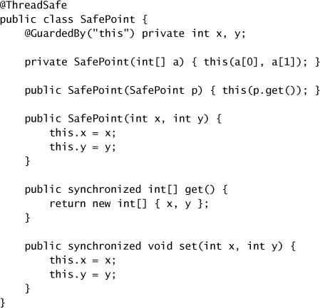

`SafePoint` ở Listing 4.11 cung cấp một getter lấy **cả** giá trị x lẫn y **cùng một lúc** bằng cách trả về một mảng hai phần tử.[^6] Nếu chúng ta cung cấp các getter riêng cho x và y, thì các giá trị có thể thay đổi giữa thời điểm lấy tọa độ này và tọa độ kia, khiến caller thấy một giá trị không nhất quán: một vị trí (x, y) mà xe **chưa từng ở đó**. Dùng `SafePoint`, ta có thể xây một vehicle tracker publish mutable state nền tảng mà không phá hỏng thread safety, như trong class `PublishingVehicleTracker` ở Listing 4.12.

[^6]: Constructor `private` tồn tại để tránh race condition sẽ xảy ra nếu copy constructor được hiện thực dưới dạng `this(p.x, p.y)`; đây là một ví dụ của idiom **private constructor capture** (Bloch và Gafter, 2005).

**Listing 4.12. Vehicle Tracker publish State nền tảng một cách an toàn.**

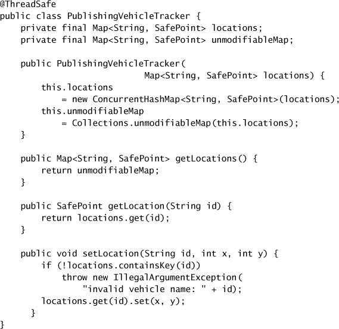

`PublishingVehicleTracker` có được thread safety nhờ ủy quyền cho một `ConcurrentHashMap` nền tảng, nhưng lần này nội dung của `Map` là các point **mutable nhưng thread-safe** chứ không phải immutable. Method `getLocation` trả về một bản sao **không sửa được** của `Map` nền tảng. Caller không thể thêm hay xóa xe, nhưng **có thể** thay đổi vị trí của một xe nào đó bằng cách mutate các giá trị `SafePoint` trong `Map` được trả về. Một lần nữa, bản chất "sống" của `Map` có thể là lợi ích hay nhược điểm, tùy vào yêu cầu.

`PublishingVehicleTracker` là thread-safe, nhưng sẽ **không** thread-safe nếu nó áp đặt bất kỳ ràng buộc bổ sung nào lên các giá trị hợp lệ của vị trí xe. Nếu nó cần có khả năng "phủ quyết" các thay đổi vị trí xe hoặc thực hiện hành động khi một vị trí thay đổi, cách tiếp cận của `PublishingVehicleTracker` sẽ **không** phù hợp.

---

## 4.4. Thêm chức năng vào các Thread-safe Class có sẵn

Thư viện class của Java chứa nhiều class "building block" hữu ích. Tái sử dụng class có sẵn thường tốt hơn tạo class mới: tái sử dụng có thể giảm công sức phát triển, rủi ro phát triển (vì các component có sẵn đã được test), và chi phí bảo trì. Đôi khi đã có sẵn một thread-safe class hỗ trợ tất cả operation ta muốn, nhưng thường thì thứ tốt nhất ta tìm được là một class hỗ trợ **gần như** tất cả operation ta muốn, và khi đó ta cần thêm một operation mới vào nó mà **không phá hỏng thread safety** của nó.

Ví dụ, giả sử ta cần một `List` thread-safe với một operation **put-if-absent** atomic. Các hiện thực `List` đã synchronize gần như làm được việc này, vì chúng cung cấp các method `contains` và `add` mà từ đó ta có thể dựng operation put-if-absent.

Khái niệm put-if-absent đủ đơn giản — kiểm tra xem một phần tử đã có trong collection chưa trước khi thêm nó, và không thêm nếu nó đã ở đó. (Chuông báo "check-then-act" của bạn giờ hẳn đang reo.) Yêu cầu rằng class phải thread-safe ngầm thêm một yêu cầu nữa — rằng những operation như put-if-absent phải **atomic**. Bất kỳ cách hiểu hợp lý nào cũng gợi ý rằng, nếu bạn lấy một `List` không chứa object X và thêm X **hai lần** bằng put-if-absent, collection kết quả chỉ chứa **một** bản sao của X. Nhưng nếu put-if-absent không atomic, với một chút timing không may, hai thread có thể **cùng** thấy X chưa hiện diện và **cùng** thêm X, dẫn đến hai bản sao của X.

Cách an toàn nhất để thêm một atomic operation mới là **sửa class gốc** để hỗ trợ operation mong muốn, nhưng điều này không phải lúc nào cũng khả thi vì bạn có thể không có quyền truy cập mã nguồn hoặc không được tự do sửa nó. Nếu bạn **có thể** sửa class gốc, bạn cần hiểu synchronization policy của hiện thực đó để có thể mở rộng nó theo cách nhất quán với thiết kế ban đầu. Thêm method mới trực tiếp vào class nghĩa là toàn bộ code hiện thực synchronization policy cho class đó vẫn nằm trong **một** file mã nguồn, giúp việc hiểu và bảo trì dễ hơn.

Một cách tiếp cận khác là **extend** class, giả định nó được thiết kế để mở rộng. `BetterVector` ở Listing 4.13 extend `Vector` để thêm method `putIfAbsent`. Extend `Vector` đủ đơn giản, nhưng không phải class nào cũng expose đủ state của mình cho subclass để chấp nhận cách tiếp cận này.

Extension **mong manh hơn** so với thêm code trực tiếp vào class, vì hiện thực của synchronization policy giờ bị phân tán trên nhiều file mã nguồn được bảo trì riêng biệt. Nếu class nền tảng thay đổi synchronization policy của nó bằng cách chọn một lock khác để bảo vệ các state variable, subclass sẽ **hỏng một cách tinh vi và âm thầm**, vì nó không còn dùng đúng lock để kiểm soát truy cập concurrent vào state của base class. (Synchronization policy của `Vector` được cố định bởi đặc tả của nó, nên `BetterVector` sẽ không gặp vấn đề này.)

**Listing 4.13. Extend `Vector` để có một method Put-if-absent.**

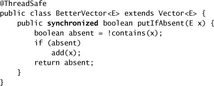

### 4.4.1. Client-side Locking

Với một `ArrayList` được bọc bởi wrapper `Collections.synchronizedList`, **không** cách nào trong hai cách trên — thêm method vào class gốc hay extend class — hoạt động được, vì client code thậm chí không biết class của object `List` được các synchronized wrapper factory trả về là gì. Chiến lược thứ ba là mở rộng chức năng của class **mà không extend chính class đó**, bằng cách đặt code mở rộng vào một class "helper".

Listing 4.14 cho thấy một nỗ lực **thất bại** trong việc tạo một class helper với operation put-if-absent atomic để thao tác trên một `List` thread-safe.

**Listing 4.14. Nỗ lực hiện thực Put-if-absent không thread-safe. Đừng làm thế này.**

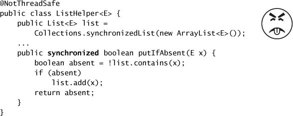

Tại sao cách này không hoạt động? Rốt cuộc thì `putIfAbsent` **là** `synchronized` mà, đúng không? Vấn đề là nó synchronize trên **sai lock**. Bất kể `List` dùng lock nào để bảo vệ state của nó, chắc chắn đó **không phải** lock trên `ListHelper`. `ListHelper` chỉ tạo ra **ảo giác** về synchronization; các operation list khác nhau, dù đều `synchronized`, lại dùng **những lock khác nhau**, nghĩa là `putIfAbsent` không atomic so với các operation khác trên `List`. Vậy nên không có bảo đảm nào rằng một thread khác sẽ không sửa list trong khi `putIfAbsent` đang chạy.

Để cách tiếp cận này hoạt động, chúng ta phải dùng **chính lock mà `List` dùng**, bằng cách dùng **client-side locking** hay **external locking**. Client-side locking nghĩa là bảo vệ client code sử dụng một object X bằng **chính lock mà X dùng để bảo vệ state của nó**. Để dùng client-side locking, bạn **phải biết X dùng lock nào**.

Tài liệu của `Vector` và các class synchronized wrapper có nêu, dù hơi gián tiếp, rằng chúng hỗ trợ client-side locking, bằng cách dùng intrinsic lock của chính `Vector` hay của collection wrapper (chứ **không phải** của collection được bọc bên trong). Listing 4.15 cho thấy một operation `putIfAbsent` trên một `List` thread-safe dùng client-side locking **đúng cách**.

**Listing 4.15. Hiện thực Put-if-absent bằng Client-side Locking.**

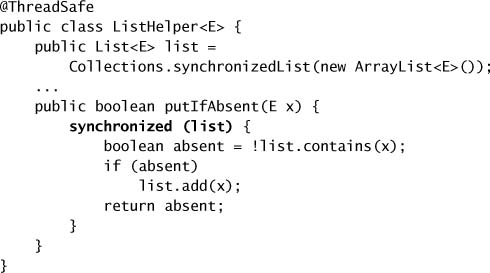

Nếu việc extend một class để thêm một atomic operation là mong manh vì nó phân tán code locking của một class ra nhiều class trong một cây phân cấp object, thì client-side locking còn **mong manh hơn nữa**, vì nó đòi hỏi đặt code locking cho class C vào những class **hoàn toàn không liên quan** đến C. Hãy thận trọng khi dùng client-side locking trên những class không cam kết về chiến lược locking của chúng.

Client-side locking có nhiều điểm chung với class extension — cả hai đều **ghép** hành vi của class dẫn xuất với hiện thực của base class. Cũng như extension vi phạm encapsulation của **hiện thực** [EJ Item 14], client-side locking vi phạm encapsulation của **synchronization policy**.

### 4.4.2. Composition

Có một lựa chọn thay thế ít mong manh hơn để thêm một atomic operation vào một class có sẵn: **composition**. `ImprovedList` ở Listing 4.16 hiện thực các operation của `List` bằng cách ủy quyền chúng cho một instance `List` nền tảng, và thêm một method `putIfAbsent` atomic. (Giống như `Collections.synchronizedList` và các collection wrapper khác, `ImprovedList` giả định rằng một khi một list được truyền vào constructor của nó, client sẽ không dùng trực tiếp list nền tảng đó nữa mà chỉ truy cập nó qua `ImprovedList`.)

**Listing 4.16. Hiện thực put-if-absent bằng composition.**

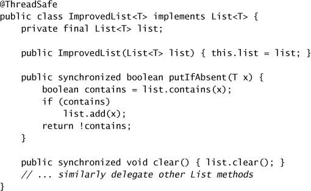

`ImprovedList` thêm một **tầng locking bổ sung** bằng intrinsic lock của chính nó. Nó **không quan tâm** `List` nền tảng có thread-safe hay không, vì nó cung cấp locking nhất quán của riêng mình, thứ đảm bảo thread safety ngay cả khi `List` không thread-safe hoặc thay đổi hiện thực locking của nó. Dù tầng synchronization thêm vào có thể tạo ra một chút phạt về performance,[^7] hiện thực trong `ImprovedList` **ít mong manh hơn** so với việc cố bắt chước chiến lược locking của một object khác. Trên thực tế, chúng ta đã dùng Java monitor pattern để encapsulate một `List` có sẵn, và điều này **được đảm bảo** cung cấp thread safety miễn là class của chúng ta giữ tham chiếu tồn tại **duy nhất** tới `List` nền tảng.

[^7]: Phần phạt sẽ nhỏ vì synchronization trên `List` nền tảng được đảm bảo là **không có tranh chấp** (uncontended) và do đó nhanh; xem chương 11.

---

## 4.5. Ghi tài liệu về Synchronization Policy

Tài liệu là một trong những công cụ mạnh mẽ nhất (và, đáng buồn thay, ít được tận dụng nhất) để quản lý thread safety. Người dùng tìm đến tài liệu để biết một class có thread-safe hay không, còn người bảo trì tìm đến tài liệu để hiểu chiến lược hiện thực nhằm bảo trì nó mà không vô tình làm tổn hại tính an toàn. Đáng tiếc, cả hai nhóm này thường tìm thấy trong tài liệu ít thông tin hơn họ mong muốn.

> Hãy ghi tài liệu về **những bảo đảm thread safety** của class cho **client** của nó; ghi tài liệu về **synchronization policy** của nó cho **người bảo trì**.

Mỗi lần dùng `synchronized`, `volatile`, hay bất kỳ thread-safe class nào đều phản ánh một **synchronization policy** định nghĩa một chiến lược đảm bảo tính toàn vẹn của dữ liệu trước truy cập concurrent. Policy đó là một yếu tố trong thiết kế chương trình của bạn, và **nên được ghi lại**. Dĩ nhiên, thời điểm tốt nhất để ghi lại các quyết định thiết kế là **lúc thiết kế**. Vài tuần hay vài tháng sau, các chi tiết có thể trở nên mờ mịt — nên hãy viết ra trước khi bạn quên.

Xây dựng một synchronization policy đòi hỏi một loạt quyết định: biến nào để `volatile`, biến nào bảo vệ bằng lock, lock nào bảo vệ biến nào, biến nào làm immutable hoặc confine vào một thread, operation nào phải atomic, v.v. Một số trong đó thuần túy là chi tiết hiện thực và nên được ghi lại cho người bảo trì tương lai, nhưng một số lại ảnh hưởng đến **hành vi locking quan sát được công khai** của class bạn và nên được ghi lại như một phần của **specification** của nó.

Tối thiểu, hãy ghi lại những bảo đảm thread safety mà class đưa ra. Nó có thread-safe không? Nó có thực hiện callback trong khi giữ lock không? Có lock cụ thể nào ảnh hưởng đến hành vi của nó không? Đừng buộc client phải **đoán một cách rủi ro**. Nếu bạn không muốn cam kết hỗ trợ client-side locking, cũng không sao, nhưng hãy **nói ra**. Nếu bạn muốn client có thể tạo những atomic operation mới trên class của bạn, như chúng ta đã làm ở mục 4.4, bạn cần ghi lại họ nên acquire lock nào để làm điều đó một cách an toàn. Nếu bạn dùng lock để bảo vệ state, hãy ghi lại điều này cho người bảo trì tương lai, vì việc đó quá dễ — annotation `@GuardedBy` sẽ làm được. Nếu bạn dùng những phương tiện tinh vi hơn để duy trì thread safety, hãy ghi lại chúng vì chúng có thể không hiển nhiên với người bảo trì.

Tình hình hiện tại của tài liệu về thread safety, ngay cả trong các class thư viện của nền tảng, không mấy khích lệ. Đã bao nhiêu lần bạn nhìn vào Javadoc của một class và tự hỏi liệu nó có thread-safe hay không?[^8] Hầu hết class không đưa ra manh mối nào theo cả hai hướng. Nhiều đặc tả công nghệ Java chính thức, như servlets và JDBC, ghi tài liệu về những cam kết và yêu cầu thread safety của chúng một cách đáng buồn là thiếu sót.

[^8]: Nếu bạn chưa bao giờ tự hỏi điều này, chúng tôi ngưỡng mộ sự lạc quan của bạn.

Dù sự thận trọng gợi ý rằng chúng ta không nên giả định những hành vi không nằm trong specification, chúng ta vẫn có việc phải hoàn thành, và ta thường đối mặt với việc phải chọn giữa những giả định tồi. Ta có nên giả định một object là thread-safe vì có vẻ như nó **nên** thế? Ta có nên giả định rằng truy cập vào một object có thể được làm cho thread-safe bằng cách acquire lock của nó trước? (Kỹ thuật rủi ro này chỉ hoạt động nếu chúng ta kiểm soát **toàn bộ** code truy cập object đó; nếu không, nó chỉ cung cấp ảo giác về thread safety.) Không lựa chọn nào thực sự thỏa đáng.

Tệ hơn nữa, trực giác của chúng ta thường sai về việc class nào "có lẽ thread-safe" và class nào thì không. Ví dụ, `java.text.SimpleDateFormat` **không** thread-safe, nhưng Javadoc đã bỏ sót không nhắc đến điều này cho đến tận JDK 1.4. Việc class cụ thể này không thread-safe khiến nhiều developer bất ngờ. Có bao nhiêu chương trình đã nhầm lẫn tạo một instance dùng chung của một object không thread-safe và dùng nó từ nhiều thread, mà không biết rằng điều này có thể gây ra kết quả sai dưới tải nặng?

Vấn đề với `SimpleDateFormat` lẽ ra có thể tránh được bằng cách **không giả định** một class là thread-safe nếu nó không nói vậy. Mặt khác, không thể phát triển một ứng dụng dựa trên servlet mà không đưa ra một số giả định khá đáng ngờ về thread safety của những object do container cung cấp như `HttpSession`. Đừng bắt khách hàng hay đồng nghiệp của bạn phải đoán như thế.

### 4.5.1. Diễn giải tài liệu mơ hồ

Nhiều đặc tả công nghệ Java im lặng, hoặc ít nhất là không cởi mở, về những bảo đảm và yêu cầu thread safety cho các interface như `ServletContext`, `HttpSession`, hay `DataSource`.[^9] Vì những interface này được container hay nhà cung cấp database của bạn hiện thực, bạn thường không thể nhìn vào code để xem nó làm gì. Ngoài ra, bạn không muốn phụ thuộc vào chi tiết hiện thực của một JDBC driver cụ thể — bạn muốn tuân thủ chuẩn để code của mình chạy đúng với **bất kỳ** JDBC driver nào. Nhưng các từ "thread" và "concurrent" hoàn toàn không xuất hiện trong đặc tả JDBC, và xuất hiện hiếm hoi đến mức bực bội trong đặc tả servlet. Vậy bạn làm gì?

[^9]: Chúng tôi thấy đặc biệt bực bội rằng những thiếu sót này vẫn tồn tại dù đã qua nhiều lần sửa đổi lớn các đặc tả.

Bạn sẽ phải **đoán**. Một cách để cải thiện chất lượng phỏng đoán của bạn là diễn giải đặc tả từ góc nhìn của người sẽ **hiện thực** nó (như một nhà cung cấp container hay database), thay vì từ góc nhìn của người chỉ **sử dụng** nó. Servlet luôn được gọi từ một thread do container quản lý, và có thể an toàn giả định rằng nếu có nhiều hơn một thread như vậy thì container biết điều đó. Servlet container cung cấp một số object phục vụ nhiều servlet, như `HttpSession` hay `ServletContext`. Vậy servlet container **nên kỳ vọng** những object này bị truy cập concurrent, vì chính nó đã tạo nhiều thread và gọi những method như `Servlet.service` từ chúng — những method mà ta hoàn toàn có lý do để kỳ vọng sẽ truy cập `ServletContext`.

Vì không thể tưởng tượng nổi một ngữ cảnh single-threaded nào mà những object này lại hữu ích, ta buộc phải giả định rằng chúng **đã được làm cho thread-safe**, dù đặc tả không yêu cầu điều đó một cách tường minh. Hơn nữa, nếu chúng đòi hỏi client-side locking, thì client code nên synchronize trên **lock nào**? Tài liệu không nói, và việc đoán có vẻ vô lý. "Giả định hợp lý" này còn được củng cố thêm bởi các ví dụ trong đặc tả và các tutorial chính thức, vốn cho thấy cách truy cập `ServletContext` hay `HttpSession` mà **không** dùng client-side synchronization nào.

Ngược lại, những object được đặt vào `ServletContext` hay `HttpSession` bằng `setAttribute` lại thuộc sở hữu của **ứng dụng web**, chứ không phải servlet container. Đặc tả servlet không gợi ý bất kỳ cơ chế nào để điều phối truy cập concurrent vào các attribute được share. Vì vậy, những attribute được container lưu thay mặt ứng dụng web nên là **thread-safe hoặc effectively immutable**. Nếu container chỉ đơn thuần lưu những attribute này thay mặt ứng dụng web, một lựa chọn khác sẽ là đảm bảo chúng luôn được một lock bảo vệ nhất quán khi được truy cập từ code ứng dụng servlet. Nhưng vì container có thể muốn serialize các object trong `HttpSession` để phục vụ replication hay passivation, và servlet container không thể nào biết locking protocol của bạn, bạn **nên làm cho chúng thread-safe**.

Ta có thể suy luận tương tự về interface JDBC `DataSource`, thứ biểu diễn một pool các database connection có thể tái sử dụng. Một `DataSource` cung cấp dịch vụ cho một ứng dụng, và nó chẳng có mấy ý nghĩa trong ngữ cảnh một ứng dụng single-threaded. Khó tưởng tượng một tình huống sử dụng nào lại không liên quan đến việc gọi `getConnection` từ nhiều thread. Và, cũng như với servlet, các ví dụ trong đặc tả JDBC không gợi ý nhu cầu về client-side locking nào trong rất nhiều ví dụ code dùng `DataSource`. Vì vậy, dù đặc tả không hứa rằng `DataSource` là thread-safe hay yêu cầu các nhà cung cấp container phải cung cấp một hiện thực thread-safe, theo cùng lập luận "sẽ thật vô lý nếu nó không thế", chúng ta không còn lựa chọn nào ngoài giả định rằng `DataSource.getConnection` **không** đòi hỏi client-side locking bổ sung.

Ngược lại, chúng ta sẽ **không** đưa ra lập luận tương tự về các object `Connection` JDBC do `DataSource` cấp phát, vì chúng không nhất thiết được dự định để share với các hoạt động khác cho đến khi chúng được trả về pool. Vậy nên nếu một hoạt động lấy một `Connection` JDBC trải rộng qua nhiều thread, nó phải chịu trách nhiệm đảm bảo rằng truy cập vào `Connection` được synchronization bảo vệ đúng cách. (Trong hầu hết ứng dụng, các hoạt động dùng `Connection` JDBC dù sao cũng được hiện thực theo cách confine `Connection` vào một thread cụ thể.)
