# Chương 5. Building Blocks

> **Về bản dịch này.** Đây là bản **dịch đầy đủ** chương 5 của cuốn *Java Concurrency in Practice* (Brian Goetz và cộng sự). Các **thuật ngữ chuyên ngành được giữ nguyên tiếng Anh**. Toàn bộ code listing và hình vẽ được trích trực tiếp từ file PDF gốc và lưu trong thư mục `images/ch05/`.

---

Chương trước đã khám phá một số kỹ thuật xây dựng thread-safe class, bao gồm việc ủy quyền (delegate) thread safety cho những thread-safe class có sẵn. Ở nơi khả thi, delegation là một trong những chiến lược hiệu quả nhất để tạo thread-safe class: cứ để các thread-safe class có sẵn quản lý toàn bộ state.

Thư viện của nền tảng bao gồm một tập phong phú các **building block** concurrent, chẳng hạn các thread-safe collection và nhiều loại **synchronizer** có thể điều phối luồng điều khiển của các thread hợp tác với nhau. Chương này trình bày những concurrent building block hữu ích nhất, đặc biệt là những thứ được giới thiệu ở Java 5.0 và Java 6, cùng một số pattern để dùng chúng cấu trúc các ứng dụng concurrent.

---

## 5.1. Synchronized Collections

Các synchronized collection class bao gồm `Vector` và `Hashtable` — thuộc JDK nguyên bản — cũng như những "anh em họ" của chúng được thêm vào ở JDK 1.2: các synchronized wrapper class được tạo bởi các factory method `Collections.synchronizedXxx`. Những class này đạt được thread safety bằng cách **encapsulate state của chúng** và **synchronize mọi public method**, sao cho mỗi lần chỉ một thread có thể truy cập state của collection.

### 5.1.1. Vấn đề với Synchronized Collections

Các synchronized collection là thread-safe, nhưng đôi khi bạn vẫn cần dùng thêm **client-side locking** để bảo vệ các compound action. Những compound action phổ biến trên collection bao gồm **iteration** (lặp lấy phần tử cho đến khi hết collection), **navigation** (tìm phần tử kế tiếp sau phần tử này theo một thứ tự nào đó), và các **operation có điều kiện** như put-if-absent (kiểm tra xem một `Map` đã có ánh xạ cho key K chưa, và nếu chưa thì thêm ánh xạ (K,V)). Với một synchronized collection, những compound action này về mặt kỹ thuật vẫn thread-safe ngay cả khi không có client-side locking, nhưng chúng có thể **không hành xử như bạn mong đợi** khi các thread khác có thể sửa collection một cách concurrent.

Listing 5.1 cho thấy hai method thao tác trên một `Vector` — `getLast` và `deleteLast` — cả hai đều là chuỗi **check-then-act**. Mỗi method gọi `size` để xác định kích thước mảng và dùng giá trị thu được để lấy ra hoặc xóa phần tử cuối cùng.

**Listing 5.1. Compound Action trên một `Vector` có thể cho ra kết quả khó hiểu.**

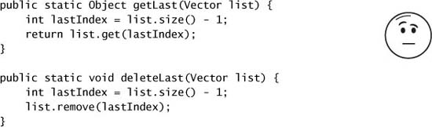

Những method này trông có vẻ vô hại, và theo một nghĩa nào đó thì đúng vậy — chúng không thể làm hỏng `Vector`, dù có bao nhiêu thread gọi chúng đồng thời. Nhưng **caller** của những method này có thể có ý kiến khác. Nếu thread A gọi `getLast` trên một `Vector` có mười phần tử, thread B gọi `deleteLast` trên cùng `Vector` đó, và các operation xen kẽ như trong Figure 5.1, thì `getLast` sẽ ném `ArrayIndexOutOfBoundsException`. Giữa lời gọi `size` và lời gọi `get` tiếp sau trong `getLast`, `Vector` đã **co lại** và chỉ số tính ở bước đầu tiên không còn hợp lệ. Điều này hoàn toàn nhất quán với đặc tả của `Vector` — nó ném exception nếu bị yêu cầu một phần tử không tồn tại. Nhưng đây **không phải** điều caller mong đợi `getLast` làm, ngay cả khi đối mặt với sửa đổi concurrent, trừ khi có lẽ `Vector` vốn đã rỗng ngay từ đầu.

**Figure 5.1. Sự xen kẽ của `getLast` và `deleteLast` gây ra `ArrayIndexOutOfBoundsException`.**

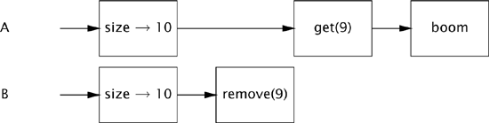

Vì các synchronized collection **cam kết** một synchronization policy hỗ trợ client-side locking,[^1] ta có thể tạo những operation mới atomic so với các operation collection khác, miễn là ta biết **dùng lock nào**. Các synchronized collection class bảo vệ mỗi method bằng lock trên **chính object collection đã synchronize**. Bằng cách acquire lock của collection, ta có thể làm `getLast` và `deleteLast` atomic, đảm bảo rằng kích thước của `Vector` không thay đổi giữa lời gọi `size` và `get`, như trong Listing 5.2.

[^1]: Điều này chỉ được ghi lại một cách gián tiếp trong Javadoc của Java 5.0, dưới dạng một ví dụ về idiom lặp đúng cách.

Rủi ro kích thước list thay đổi giữa lời gọi `size` và lời gọi `get` tương ứng cũng hiện diện khi ta duyệt qua các phần tử của một `Vector` như trong Listing 5.3.

Idiom lặp này dựa trên một **niềm tin liều lĩnh** rằng các thread khác sẽ không sửa `Vector` giữa các lời gọi `size` và `get`. Trong môi trường single-threaded, giả định này hoàn toàn hợp lệ, nhưng khi các thread khác có thể sửa `Vector` một cách concurrent, nó có thể dẫn đến rắc rối. Cũng như với `getLast`, nếu một thread khác xóa một phần tử trong khi bạn đang duyệt `Vector` và các operation xen kẽ một cách không may, idiom lặp này sẽ ném `ArrayIndexOutOfBoundsException`.

**Listing 5.2. Compound Action trên `Vector` dùng Client-side Locking.**

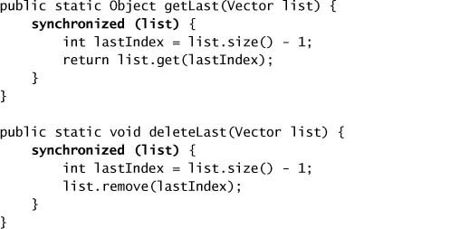

**Listing 5.3. Vòng lặp có thể ném `ArrayIndexOutOfBoundsException`.**

Mặc dù vòng lặp ở Listing 5.3 có thể ném exception, điều đó **không** có nghĩa `Vector` không thread-safe. State của `Vector` vẫn hợp lệ và exception thực ra tuân thủ đúng đặc tả của nó. Tuy nhiên, việc một thứ tầm thường như lấy phần tử cuối cùng hay duyệt collection lại ném exception rõ ràng là **không mong muốn**.

Vấn đề duyệt không đáng tin cậy lại một lần nữa có thể được giải quyết bằng client-side locking, với một chút chi phí bổ sung về scalability. Bằng cách giữ lock của `Vector` trong suốt quá trình duyệt, như trong Listing 5.4, chúng ta ngăn các thread khác sửa `Vector` trong khi ta đang duyệt nó. Đáng tiếc, chúng ta cũng ngăn luôn các thread khác truy cập nó **hoàn toàn** trong khoảng thời gian này, làm giảm concurrency.

**Listing 5.4. Vòng lặp với Client-side Locking.**

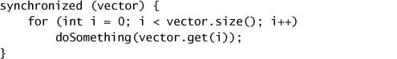

### 5.1.2. Iterator và ConcurrentModificationException

Chúng tôi dùng `Vector` cho rõ ràng trong nhiều ví dụ, mặc dù nó được coi là một collection class "legacy". Nhưng các collection class "hiện đại" hơn **không** loại bỏ được vấn đề của compound action. Cách chuẩn để duyệt một `Collection` là dùng một `Iterator`, hoặc tường minh hoặc thông qua cú pháp vòng lặp for-each được giới thiệu ở Java 5.0, nhưng dùng iterator **không** loại bỏ nhu cầu lock collection trong lúc duyệt nếu các thread khác có thể sửa nó một cách concurrent. Các iterator được trả về bởi những synchronized collection **không được thiết kế** để xử lý sửa đổi concurrent, và chúng là **fail-fast** — nghĩa là nếu chúng phát hiện collection đã thay đổi kể từ khi bắt đầu duyệt, chúng ném `ConcurrentModificationException` (unchecked).

Những fail-fast iterator này **không được thiết kế để tuyệt đối chống lỗi** — chúng được thiết kế để bắt lỗi concurrency trên tinh thần "nỗ lực thiện chí" và do đó chỉ đóng vai trò như chỉ báo cảnh báo sớm cho các vấn đề concurrency. Chúng được hiện thực bằng cách gắn một **modification count** với collection: nếu modification count thay đổi trong lúc duyệt, `hasNext` hay `next` sẽ ném `ConcurrentModificationException`. Tuy nhiên, phép kiểm tra này được thực hiện **không có synchronization**, nên có rủi ro thấy giá trị stale của modification count và do đó iterator không nhận ra rằng một sửa đổi đã xảy ra. Đây là một đánh đổi thiết kế có chủ ý nhằm giảm tác động về performance của code phát hiện sửa đổi concurrent.[^2]

[^2]: `ConcurrentModificationException` cũng có thể phát sinh trong code single-threaded; điều này xảy ra khi object bị xóa khỏi collection một cách trực tiếp thay vì thông qua `Iterator.remove`.

Listing 5.5 minh họa việc duyệt một collection bằng cú pháp for-each. Bên trong, `javac` sinh ra code dùng một `Iterator`, lặp lại việc gọi `hasNext` và `next` để duyệt `List`. Cũng như với việc duyệt `Vector`, cách ngăn `ConcurrentModificationException` là **giữ lock của collection trong suốt quá trình duyệt**.

**Listing 5.5. Duyệt một `List` bằng `Iterator`.**

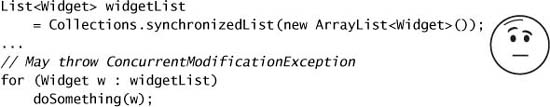

Tuy nhiên, có vài lý do khiến việc lock một collection trong lúc duyệt có thể không mong muốn. Các thread khác cần truy cập collection sẽ **block** cho đến khi việc duyệt hoàn tất; nếu collection lớn hoặc tác vụ thực hiện trên mỗi phần tử kéo dài, chúng có thể phải chờ rất lâu. Ngoài ra, nếu collection bị lock như trong Listing 5.4, thì `doSomething` đang được gọi **trong khi đang giữ lock**, và đây là một yếu tố rủi ro gây deadlock (xem chương 10). Ngay cả khi không có rủi ro starvation hay deadlock, việc lock collection trong khoảng thời gian đáng kể vẫn làm tổn hại scalability của ứng dụng. Lock được giữ càng lâu thì càng có khả năng bị tranh chấp (contended), và nếu nhiều thread bị block chờ một lock, throughput và mức sử dụng CPU có thể suy giảm (xem chương 11).

Một lựa chọn thay thế cho việc lock collection trong lúc duyệt là **clone** collection rồi duyệt bản sao. Vì bản clone bị thread-confined, không thread nào khác có thể sửa nó trong lúc duyệt, loại bỏ khả năng xảy ra `ConcurrentModificationException`. (Collection vẫn phải được lock trong chính operation clone.) Clone collection có một chi phí performance rõ ràng; việc đây có phải là một đánh đổi có lợi hay không tùy thuộc vào nhiều yếu tố, bao gồm kích thước collection, lượng công việc thực hiện trên mỗi phần tử, tần suất duyệt tương đối so với các operation collection khác, và các yêu cầu về khả năng đáp ứng và throughput.

### 5.1.3. Iterator ẩn

Dù locking có thể ngăn iterator ném `ConcurrentModificationException`, bạn phải **nhớ** dùng locking ở **mọi nơi** một shared collection có thể bị duyệt. Việc này khó hơn nghe có vẻ, vì iterator đôi khi bị **ẩn**, như trong `HiddenIterator` ở Listing 5.6. Không có vòng lặp tường minh nào trong `HiddenIterator`, nhưng đoạn code in đậm vẫn kéo theo việc duyệt. Phép nối chuỗi bị compiler biến thành lời gọi `StringBuilder.append(Object)`, thứ lại gọi method `toString` của collection — và hiện thực `toString` trong các collection chuẩn **duyệt collection** và gọi `toString` trên từng phần tử để tạo ra một biểu diễn được định dạng đẹp về nội dung của collection.

Method `addTenThings` có thể ném `ConcurrentModificationException`, vì collection đang bị `toString` duyệt trong quá trình chuẩn bị thông điệp debug. Dĩ nhiên, vấn đề thực sự là `HiddenIterator` **không thread-safe**; lock của `HiddenIterator` lẽ ra phải được acquire trước khi dùng `set` trong lời gọi `println`, nhưng code debug và logging thường bỏ qua việc này.

Bài học thực sự ở đây là: **khoảng cách giữa state và synchronization bảo vệ nó càng lớn, thì càng có khả năng ai đó sẽ quên dùng synchronization đúng cách khi truy cập state đó.** Nếu `HiddenIterator` bọc `HashSet` bằng một `synchronizedSet`, encapsulate phần synchronization, thì loại lỗi này sẽ không xảy ra.

> Cũng như việc encapsulate state của một object giúp bảo toàn invariant dễ hơn, việc encapsulate synchronization của nó giúp cưỡng chế synchronization policy dễ hơn.

**Listing 5.6. Vòng lặp ẩn bên trong phép nối chuỗi. Đừng làm thế này.**

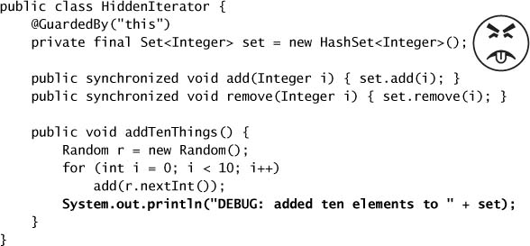

Việc duyệt cũng được gọi **gián tiếp** bởi các method `hashCode` và `equals` của collection, những method có thể được gọi nếu collection được dùng làm phần tử hay key của một collection khác. Tương tự, các method `containsAll`, `removeAll`, và `retainAll`, cũng như các constructor nhận collection làm đối số, cũng duyệt collection. Tất cả những cách dùng gián tiếp này của việc duyệt đều có thể gây ra `ConcurrentModificationException`.

---

## 5.2. Concurrent Collections

Java 5.0 cải tiến các synchronized collection bằng cách cung cấp một số **concurrent collection class**. Synchronized collection đạt được thread safety bằng cách **serialize mọi truy cập** vào state của collection. Cái giá của cách tiếp cận này là concurrency kém; khi nhiều thread tranh chấp lock cấp-toàn-collection, throughput sẽ suy giảm.

Ngược lại, các concurrent collection được **thiết kế cho truy cập concurrent từ nhiều thread**. Java 5.0 thêm `ConcurrentHashMap` — thứ thay thế cho các hiện thực `Map` dựa trên hash đã synchronize — và `CopyOnWriteArrayList` — thứ thay thế cho các hiện thực `List` đã synchronize trong những trường hợp mà **duyệt** là operation chủ đạo. Interface `ConcurrentMap` mới thêm hỗ trợ cho các compound action phổ biến như put-if-absent, replace, và conditional remove.

> Thay thế synchronized collection bằng concurrent collection có thể mang lại **cải thiện scalability đáng kể** với rất ít rủi ro.

Java 5.0 cũng thêm hai kiểu collection mới: `Queue` và `BlockingQueue`. Một `Queue` được dùng để giữ tạm thời một tập phần tử trong khi chúng chờ được xử lý. Có vài hiện thực được cung cấp, bao gồm `ConcurrentLinkedQueue` (một FIFO queue truyền thống) và `PriorityQueue` (một queue sắp theo độ ưu tiên, **không** concurrent). Các operation của `Queue` **không block**; nếu queue rỗng, operation lấy phần tử trả về `null`. Dù bạn có thể mô phỏng hành vi của một `Queue` bằng một `List` — thực tế `LinkedList` cũng hiện thực `Queue` — các class `Queue` được thêm vào vì việc loại bỏ yêu cầu truy cập ngẫu nhiên của `List` cho phép những hiện thực concurrent hiệu quả hơn.

`BlockingQueue` mở rộng `Queue` để thêm các operation chèn và lấy có **block**. Nếu queue rỗng, thao tác lấy sẽ block cho đến khi có phần tử, và nếu queue đầy (với queue có giới hạn), thao tác chèn sẽ block cho đến khi có chỗ trống. Blocking queue cực kỳ hữu ích trong các thiết kế producer-consumer, và được trình bày chi tiết hơn ở mục 5.3.

Cũng như `ConcurrentHashMap` là thứ thay thế concurrent cho một `Map` dựa trên hash đã synchronize, Java 6 thêm `ConcurrentSkipListMap` và `ConcurrentSkipListSet`, là những thứ thay thế concurrent cho một `SortedMap` hay `SortedSet` đã synchronize (chẳng hạn `TreeMap` hay `TreeSet` được bọc bằng `synchronizedMap`).

### 5.2.1. ConcurrentHashMap

Các synchronized collection class **giữ lock trong suốt** mỗi operation. Một số operation, như `HashMap.get` hay `List.contains`, có thể tốn nhiều công hơn thoạt nhìn: duyệt một hash bucket hay một list để tìm một object cụ thể kéo theo việc gọi `equals` (thứ mà bản thân nó cũng có thể tốn kha khá tính toán) trên một loạt object ứng viên. Trong một collection dựa trên hash, nếu `hashCode` không trải đều các giá trị hash, các phần tử có thể phân bố không đồng đều giữa các bucket; trong trường hợp suy biến, một hàm hash tồi sẽ biến hash table thành một linked list. Duyệt một list dài và gọi `equals` trên một số hoặc tất cả phần tử có thể mất rất lâu, và trong thời gian đó **không thread nào khác có thể truy cập collection**.

`ConcurrentHashMap` là một `Map` dựa trên hash giống `HashMap`, nhưng nó dùng một **chiến lược locking hoàn toàn khác**, mang lại concurrency và scalability tốt hơn. Thay vì synchronize mọi method trên một lock chung, hạn chế truy cập chỉ cho một thread tại một thời điểm, nó dùng một cơ chế locking mịn hơn gọi là **lock striping** (xem mục 11.4.3) để cho phép mức độ truy cập chung lớn hơn. **Vô số** thread đọc có thể truy cập map đồng thời, thread đọc có thể truy cập map đồng thời với thread ghi, và **một số giới hạn** thread ghi có thể sửa map đồng thời. Kết quả là throughput cao hơn rất nhiều dưới truy cập concurrent, với rất ít phạt về performance cho truy cập single-threaded.

`ConcurrentHashMap`, cùng với các concurrent collection khác, còn cải tiến thêm so với các synchronized collection class bằng cách cung cấp những iterator **không ném** `ConcurrentModificationException`, do đó loại bỏ nhu cầu lock collection trong lúc duyệt. Các iterator do `ConcurrentHashMap` trả về là **weakly consistent** thay vì fail-fast. Một weakly consistent iterator có thể **chịu được** sửa đổi concurrent, duyệt các phần tử **như chúng tồn tại tại thời điểm iterator được tạo**, và **có thể** (nhưng không được đảm bảo) phản ánh những sửa đổi lên collection sau khi iterator được tạo.

Như với mọi cải tiến, vẫn có một vài đánh đổi. Semantics của những method thao tác trên **toàn bộ** `Map`, như `size` và `isEmpty`, đã bị **làm yếu đi một chút** để phản ánh bản chất concurrent của collection. Vì kết quả của `size` có thể đã lỗi thời ngay khi nó được tính xong, nó thực sự chỉ là một **ước lượng**, nên `size` được phép trả về một con số xấp xỉ thay vì đếm chính xác. Dù thoạt đầu điều này có vẻ đáng lo, trên thực tế những method như `size` và `isEmpty` **ít hữu ích hơn nhiều** trong môi trường concurrent vì những đại lượng này là mục tiêu di động. Vậy nên yêu cầu cho những operation này đã được làm yếu đi để cho phép tối ưu hóa performance cho những operation quan trọng nhất, chủ yếu là `get`, `put`, `containsKey`, và `remove`.

Tính năng duy nhất mà các hiện thực `Map` đã synchronize cung cấp nhưng `ConcurrentHashMap` thì không, là khả năng **lock map để truy cập độc quyền**. Với `Hashtable` và `synchronizedMap`, việc acquire lock của `Map` ngăn mọi thread khác truy cập nó. Điều này có thể cần thiết trong những trường hợp bất thường như thêm nhiều ánh xạ một cách atomic, hoặc duyệt `Map` vài lần và cần thấy cùng những phần tử theo cùng thứ tự. Nhưng về tổng thể, đây là một đánh đổi hợp lý: các concurrent collection lẽ ra nên được kỳ vọng sẽ thay đổi nội dung liên tục.

Vì nó có quá nhiều ưu điểm và quá ít nhược điểm so với `Hashtable` hay `synchronizedMap`, việc thay các hiện thực `Map` đã synchronize bằng `ConcurrentHashMap` trong hầu hết trường hợp chỉ mang lại **scalability tốt hơn**. Chỉ khi ứng dụng của bạn cần lock map để truy cập độc quyền[^3] thì `ConcurrentHashMap` mới không phải một thứ thay thế trực tiếp phù hợp.

[^3]: Hoặc nếu bạn đang dựa vào các hiệu ứng phụ về synchronization của những hiện thực `Map` đã synchronize.

### 5.2.2. Các Atomic Map Operation bổ sung

Vì một `ConcurrentHashMap` không thể bị lock để truy cập độc quyền, chúng ta **không thể** dùng client-side locking để tạo các atomic operation mới như put-if-absent, như đã làm với `Vector` ở mục 4.4.1. Thay vào đó, một loạt compound operation phổ biến như put-if-absent, remove-if-equal, và replace-if-equal được hiện thực sẵn thành các **atomic operation** và được đặc tả bởi interface `ConcurrentMap`, thể hiện ở Listing 5.7. Nếu bạn thấy mình đang thêm chức năng như vậy vào một hiện thực `Map` đã synchronize có sẵn, đó có lẽ là dấu hiệu bạn nên cân nhắc dùng một `ConcurrentMap` thay thế.

### 5.2.3. CopyOnWriteArrayList

`CopyOnWriteArrayList` là thứ thay thế concurrent cho một `List` đã synchronize, mang lại concurrency tốt hơn trong một số tình huống phổ biến và loại bỏ nhu cầu lock hay copy collection trong lúc duyệt. (Tương tự, `CopyOnWriteArraySet` là thứ thay thế concurrent cho một `Set` đã synchronize.)

Các copy-on-write collection có được thread safety từ thực tế rằng, **miễn là một object effectively immutable được publish đúng cách, không cần synchronization thêm nào khi truy cập nó**. Chúng hiện thực tính khả biến bằng cách **tạo và republish một bản sao mới** của collection **mỗi lần** nó bị sửa. Iterator của các copy-on-write collection giữ một tham chiếu tới mảng nền tảng **đang hiện hành tại thời điểm bắt đầu duyệt**, và vì mảng đó sẽ không bao giờ thay đổi, chúng chỉ cần synchronize rất ngắn để đảm bảo visibility của nội dung mảng. Kết quả là nhiều thread có thể duyệt collection mà không can thiệp lẫn nhau hay bị can thiệp bởi những thread muốn sửa collection. Các iterator do copy-on-write collection trả về **không ném** `ConcurrentModificationException` và trả về các phần tử **đúng như chúng tồn tại tại thời điểm iterator được tạo**, bất kể những sửa đổi sau đó.

**Listing 5.7. Interface `ConcurrentMap`.**

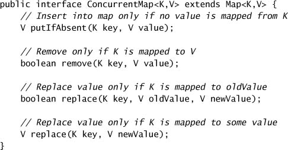

Rõ ràng có một chi phí cho việc sao chép mảng nền tảng mỗi lần collection bị sửa, đặc biệt nếu collection lớn; các copy-on-write collection chỉ hợp lý khi **duyệt phổ biến hơn nhiều so với sửa đổi**. Tiêu chí này mô tả chính xác nhiều hệ thống thông báo sự kiện: gửi một thông báo đòi hỏi duyệt danh sách listener đã đăng ký và gọi từng cái, và trong hầu hết trường hợp việc đăng ký hay hủy đăng ký một event listener ít phổ biến hơn nhiều so với việc nhận một thông báo sự kiện. (Xem [CPJ 2.4.4] để biết thêm về copy-on-write.)

---

## 5.3. Blocking Queue và Pattern Producer-Consumer

Blocking queue cung cấp các method `put` và `take` có block, cũng như các phiên bản có timeout tương ứng là `offer` và `poll`. Nếu queue đầy, `put` block cho đến khi có chỗ trống; nếu queue rỗng, `take` block cho đến khi có phần tử. Queue có thể **bounded** hoặc **unbounded**; queue unbounded không bao giờ đầy, nên `put` trên một queue unbounded không bao giờ block.

Blocking queue hỗ trợ **design pattern producer-consumer**. Một thiết kế producer-consumer **tách rời** việc xác định công việc cần làm khỏi việc thực thi công việc đó, bằng cách đặt các work item lên một danh sách "cần làm" để xử lý sau, thay vì xử lý ngay khi chúng được xác định. Pattern producer-consumer đơn giản hóa việc phát triển vì nó loại bỏ sự phụ thuộc code giữa class producer và class consumer, và đơn giản hóa việc quản lý khối lượng công việc bằng cách **decouple** những hoạt động có thể tạo ra hoặc tiêu thụ dữ liệu ở tốc độ khác nhau hoặc biến thiên.

Trong một thiết kế producer-consumer xây quanh một blocking queue, các producer đặt dữ liệu lên queue khi nó sẵn sàng, và các consumer lấy dữ liệu từ queue khi chúng sẵn sàng thực hiện hành động tương ứng. Producer **không cần biết gì** về danh tính hay số lượng consumer, thậm chí không cần biết mình có phải producer duy nhất hay không — tất cả những gì chúng phải làm là đặt các mục dữ liệu lên queue. Tương tự, consumer không cần biết producer là ai hay công việc đến từ đâu. `BlockingQueue` đơn giản hóa việc hiện thực các thiết kế producer-consumer với **bất kỳ số lượng** producer và consumer nào. Một trong những thiết kế producer-consumer phổ biến nhất là một **thread pool kết hợp với một work queue**; pattern này được thể hiện trong framework thực thi tác vụ `Executor`, chủ đề của chương 6 và 8.

Cách phân chia công việc quen thuộc khi hai người cùng rửa bát là một ví dụ của thiết kế producer-consumer: một người rửa bát và đặt chúng lên giá, người kia lấy bát từ giá xuống và lau khô. Trong kịch bản này, **giá bát đóng vai trò blocking queue**; nếu không có bát nào trên giá, consumer chờ cho đến khi có bát để lau, và nếu giá đầy, producer phải ngừng rửa cho đến khi có thêm chỗ. Phép so sánh này mở rộng được cho nhiều producer (dù có thể có tranh chấp bồn rửa) và nhiều consumer; mỗi người chỉ tương tác với giá bát. Không ai cần biết có bao nhiêu producer hay consumer, hay ai đã tạo ra một work item cụ thể.

Nhãn "producer" và "consumer" mang tính **tương đối**; một hoạt động đóng vai consumer trong ngữ cảnh này có thể đóng vai producer trong ngữ cảnh khác. Lau bát "tiêu thụ" bát sạch ướt và "sản xuất" bát sạch khô. Một người thứ ba muốn giúp có thể cất bát khô đi, trong trường hợp đó người lau vừa là consumer vừa là producer, và giờ có **hai** work queue được share (mỗi cái đều có thể block người lau khỏi tiếp tục).

Blocking queue đơn giản hóa việc viết code cho consumer, vì `take` block cho đến khi có dữ liệu. Nếu producer không tạo ra công việc đủ nhanh để giữ consumer bận, consumer chỉ việc chờ cho đến khi có thêm công việc. Đôi khi điều này hoàn toàn chấp nhận được (như trong ứng dụng server khi không client nào yêu cầu dịch vụ), và đôi khi nó chỉ ra rằng tỷ lệ giữa thread producer và thread consumer nên được điều chỉnh để đạt mức sử dụng tốt hơn (như trong web crawler hay ứng dụng khác nơi công việc gần như là vô hạn).

Nếu producer liên tục tạo ra công việc nhanh hơn consumer có thể xử lý, cuối cùng ứng dụng sẽ **hết bộ nhớ** vì các work item chất đống không giới hạn. Một lần nữa, bản chất block của `put` đơn giản hóa rất nhiều việc viết code producer; nếu ta dùng một **bounded queue**, thì khi queue đầy, producer sẽ block, cho consumer thời gian bắt kịp vì một producer đang block không thể tạo thêm công việc.

Blocking queue cũng cung cấp method `offer`, thứ trả về trạng thái thất bại nếu item không thể được đưa vào queue. Điều này cho phép bạn tạo những policy linh hoạt hơn để xử lý quá tải, chẳng hạn **shedding load** (bỏ bớt tải), serialize các work item dư thừa và ghi chúng ra đĩa, giảm số thread producer, hoặc điều tiết producer theo cách khác.

> **Bounded queue là công cụ quản lý tài nguyên mạnh mẽ** để xây dựng ứng dụng đáng tin cậy: chúng làm chương trình của bạn bền hơn trước quá tải bằng cách điều tiết những hoạt động có nguy cơ tạo ra nhiều công việc hơn mức có thể xử lý.

Dù pattern producer-consumer cho phép code producer và consumer được decouple khỏi nhau, hành vi của chúng vẫn được coupling **gián tiếp** qua work queue được share. Rất dễ bị cám dỗ giả định rằng consumer sẽ luôn theo kịp, để rồi bạn không cần đặt giới hạn nào lên kích thước của work queue, nhưng đó là công thức để phải kiến trúc lại hệ thống của bạn sau này. Hãy **đưa việc quản lý tài nguyên vào thiết kế ngay từ sớm** bằng blocking queue — làm việc này từ đầu dễ hơn nhiều so với vá lại sau. Blocking queue giúp việc này dễ dàng trong nhiều tình huống, nhưng nếu blocking queue không dễ dàng phù hợp với thiết kế của bạn, bạn có thể tạo các cấu trúc dữ liệu blocking khác bằng `Semaphore` (xem mục 5.5.3).

Thư viện class chứa vài hiện thực của `BlockingQueue`. `LinkedBlockingQueue` và `ArrayBlockingQueue` là các FIFO queue, tương tự `LinkedList` và `ArrayList` nhưng có performance concurrent tốt hơn một `List` đã synchronize. `PriorityBlockingQueue` là một queue sắp theo độ ưu tiên, hữu ích khi bạn muốn xử lý phần tử theo thứ tự khác FIFO. Cũng như các sorted collection khác, `PriorityBlockingQueue` có thể so sánh phần tử theo thứ tự tự nhiên của chúng (nếu chúng hiện thực `Comparable`) hoặc bằng một `Comparator`.

Hiện thực `BlockingQueue` cuối cùng, `SynchronousQueue`, thực ra **không phải một queue** chút nào, ở chỗ nó không duy trì không gian lưu trữ nào cho phần tử. Thay vào đó, nó duy trì một danh sách **các thread đang chờ** để đưa vào hoặc lấy ra một phần tử. Trong phép so sánh rửa bát, điều này giống như **không có giá bát**, mà thay vào đó đưa trực tiếp bát vừa rửa cho người lau tiếp theo đang rảnh. Dù đây có vẻ là cách kỳ lạ để hiện thực một queue, nó **giảm độ trễ** liên quan đến việc chuyển dữ liệu từ producer sang consumer vì công việc có thể được **chuyển giao trực tiếp**. (Trong một queue truyền thống, các operation enqueue và dequeue phải hoàn tất tuần tự trước khi một đơn vị công việc có thể được chuyển giao.) Việc chuyển giao trực tiếp cũng **phản hồi nhiều thông tin hơn** về trạng thái của tác vụ cho producer; khi việc chuyển giao được chấp nhận, nó biết rằng một consumer đã nhận trách nhiệm về nó, thay vì chỉ đơn giản để nó nằm đâu đó trên queue — giống như sự khác biệt giữa việc đưa tận tay một tài liệu cho đồng nghiệp và việc chỉ bỏ nó vào hộp thư rồi hy vọng người ta sẽ sớm lấy được. Vì một `SynchronousQueue` không có sức chứa, `put` và `take` sẽ **block** trừ khi đã có một thread khác đang chờ tham gia vào việc chuyển giao. Synchronous queue nói chung chỉ phù hợp khi có **đủ nhiều consumer** để gần như luôn có một consumer sẵn sàng nhận chuyển giao.

### 5.3.1. Ví dụ: Desktop Search

Một loại chương trình dễ phân rã thành producer và consumer là một agent quét các ổ đĩa cục bộ để tìm tài liệu và lập chỉ mục chúng cho việc tìm kiếm sau này, tương tự Google Desktop hay dịch vụ Windows Indexing. `DiskCrawler` ở Listing 5.8 cho thấy một tác vụ producer tìm kiếm trong cây thư mục những file thỏa tiêu chí lập chỉ mục và đặt tên của chúng lên work queue; `Indexer` ở Listing 5.8 cho thấy tác vụ consumer lấy tên file từ queue và lập chỉ mục chúng.

Pattern producer-consumer cung cấp một cách thân thiện với thread để phân rã bài toán desktop search thành những component đơn giản hơn. Việc tách crawl file và lập chỉ mục thành những hoạt động riêng biệt tạo ra code **dễ đọc và dễ tái sử dụng hơn** so với một hoạt động nguyên khối làm cả hai; mỗi hoạt động chỉ có một tác vụ duy nhất, và blocking queue xử lý toàn bộ việc điều khiển luồng, nên code cho mỗi bên đơn giản và rõ ràng hơn.

Pattern producer-consumer cũng mang lại vài lợi ích về performance. Producer và consumer có thể thực thi **đồng thời**; nếu một bên bị giới hạn bởi I/O còn bên kia bị giới hạn bởi CPU, thực thi chúng đồng thời cho throughput tổng thể tốt hơn so với thực thi tuần tự. Nếu các hoạt động producer và consumer có mức độ song song hóa khác nhau, việc coupling chặt chúng lại sẽ **giảm khả năng song song hóa xuống mức của bên ít song song hóa được hơn**.

Listing 5.9 khởi động vài crawler và indexer, mỗi cái trong thread riêng. Như đã viết, các thread consumer **không bao giờ thoát**, khiến chương trình không thể kết thúc; chúng ta sẽ xem xét vài kỹ thuật giải quyết vấn đề này ở chương 7. Dù ví dụ này dùng thread được quản lý tường minh, nhiều thiết kế producer-consumer có thể được diễn đạt bằng framework thực thi tác vụ `Executor`, thứ mà bản thân nó cũng dùng pattern producer-consumer.

**Listing 5.8. Các tác vụ Producer và Consumer trong ứng dụng Desktop Search.**

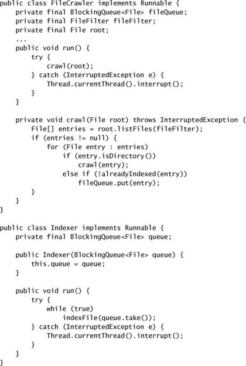

**Listing 5.9. Khởi động Desktop Search.**

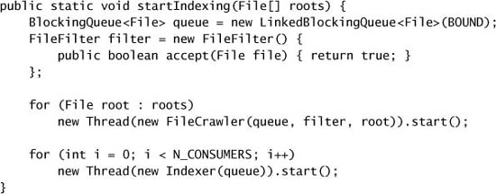

### 5.3.2. Serial Thread Confinement

Các hiện thực blocking queue trong `java.util.concurrent` đều chứa **đủ synchronization nội bộ** để publish object một cách an toàn từ thread producer sang thread consumer.

Với các mutable object, thiết kế producer-consumer và blocking queue tạo điều kiện cho **serial thread confinement** để **chuyển giao quyền sở hữu** object từ producer sang consumer. Một object thread-confined được sở hữu độc quyền bởi một thread duy nhất, nhưng quyền sở hữu đó có thể được "chuyển giao" bằng cách publish nó an toàn ở nơi mà **chỉ một** thread khác sẽ có quyền truy cập, và đảm bảo rằng thread publish **không truy cập nó nữa** sau khi chuyển giao. Safe publication đảm bảo state của object nhìn thấy được với chủ sở hữu mới, và vì chủ sở hữu cũ sẽ không đụng tới nó nữa, nó giờ đã bị confine vào thread mới. Chủ sở hữu mới có thể sửa nó thoải mái vì nó có quyền truy cập độc quyền.

Các **object pool** khai thác serial thread confinement, "cho mượn" một object cho thread yêu cầu. Miễn là pool chứa đủ synchronization nội bộ để publish object trong pool một cách an toàn, và miễn là client không tự publish object trong pool hay dùng nó sau khi trả về pool, quyền sở hữu có thể được chuyển giao an toàn từ thread này sang thread khác.

Bạn cũng có thể dùng các cơ chế publication khác để chuyển giao quyền sở hữu một mutable object, nhưng cần đảm bảo rằng **chỉ một** thread nhận được object đang được chuyển giao. Blocking queue làm việc này dễ dàng; với một chút công sức hơn, cũng có thể làm được bằng method `remove` atomic của `ConcurrentMap` hay method `compareAndSet` của `AtomicReference`.

### 5.3.3. Deque và Work Stealing

Java 6 cũng thêm hai kiểu collection nữa, `Deque` (đọc là "deck") và `BlockingDeque`, mở rộng `Queue` và `BlockingQueue`. Một `Deque` là một **queue hai đầu** cho phép chèn và xóa hiệu quả ở **cả đầu lẫn đuôi**. Các hiện thực bao gồm `ArrayDeque` và `LinkedBlockingDeque`.

Cũng như blocking queue phù hợp với pattern producer-consumer, deque phù hợp với một pattern liên quan gọi là **work stealing**. Một thiết kế producer-consumer có **một** work queue chung cho mọi consumer; trong một thiết kế work stealing, **mỗi consumer có deque riêng của mình**. Nếu một consumer làm hết công việc trong deque của mình, nó có thể **"đánh cắp" công việc từ đuôi deque của người khác**. Work stealing có thể mở rộng tốt hơn thiết kế producer-consumer truyền thống vì các worker **không tranh chấp** một work queue chung; hầu hết thời gian chúng chỉ truy cập deque của chính mình, giảm tranh chấp. Khi một worker phải truy cập queue của người khác, nó làm điều đó từ **đuôi** thay vì từ **đầu**, càng giảm tranh chấp hơn nữa.

Work stealing rất phù hợp với những bài toán mà consumer cũng đồng thời là producer — khi thực hiện một đơn vị công việc có khả năng dẫn đến việc xác định thêm công việc mới. Ví dụ, xử lý một trang trong một web crawler thường dẫn đến việc xác định các trang mới cần crawl. Tương tự, nhiều thuật toán duyệt đồ thị, như đánh dấu heap trong quá trình garbage collection, có thể được song song hóa hiệu quả bằng work stealing. Khi một worker xác định được một đơn vị công việc mới, nó đặt đơn vị đó vào **cuối deque của chính mình** (hoặc, trong một thiết kế work sharing, vào deque của một worker khác); khi deque của nó rỗng, nó tìm công việc ở **cuối deque của người khác**, đảm bảo mỗi worker luôn bận.

---

## 5.4. Các Method Blocking và Interruptible

Thread có thể **block**, hay tạm dừng, vì vài lý do: chờ I/O hoàn tất, chờ acquire một lock, chờ thức dậy từ `Thread.sleep`, hoặc chờ kết quả của một phép tính ở thread khác. Khi một thread block, nó thường bị **treo** và đặt vào một trong các trạng thái thread bị block (`BLOCKED`, `WAITING`, hoặc `TIMED_WAITING`). Sự khác biệt giữa một **blocking operation** và một operation thông thường chỉ đơn thuần mất nhiều thời gian để hoàn thành là: một thread bị block phải **chờ một sự kiện nằm ngoài tầm kiểm soát của nó** trước khi có thể tiếp tục — I/O hoàn tất, lock trở nên khả dụng, hoặc phép tính bên ngoài kết thúc. Khi sự kiện bên ngoài đó xảy ra, thread được đưa trở lại trạng thái `RUNNABLE` và lại đủ điều kiện để được lập lịch.

Các method `put` và `take` của `BlockingQueue` ném `InterruptedException` (checked), cũng như một loạt method thư viện khác như `Thread.sleep`. Khi một method có thể ném `InterruptedException`, nó đang nói với bạn rằng nó là một **blocking method**, và hơn nữa, nếu nó bị interrupt, nó sẽ **nỗ lực ngừng block sớm**.

`Thread` cung cấp method `interrupt` để interrupt một thread và để truy vấn xem một thread đã bị interrupt hay chưa. Mỗi thread có một thuộc tính boolean biểu diễn **interrupted status** của nó; interrupt một thread sẽ đặt trạng thái này.

**Interruption là một cơ chế hợp tác.** Một thread **không thể ép** thread khác dừng việc nó đang làm và làm việc khác; khi thread A interrupt thread B, A chỉ đơn thuần **yêu cầu** B dừng việc nó đang làm khi B đến một điểm dừng thuận tiện — nếu B muốn thế. Dù không có gì trong API hay đặc tả ngôn ngữ đòi hỏi một semantics cụ thể ở mức ứng dụng cho interruption, cách dùng hợp lý nhất của interruption là để **hủy một hoạt động**. Các blocking method phản ứng với interruption làm việc hủy các hoạt động chạy lâu trở nên dễ dàng và kịp thời hơn.

Khi code của bạn gọi một method ném `InterruptedException`, thì method của bạn **cũng là** một blocking method, và phải có kế hoạch để phản ứng với interruption. Với code thư viện, về cơ bản có hai lựa chọn:

**Lan truyền `InterruptedException`.** Đây thường là policy hợp lý nhất nếu bạn có thể làm vậy — cứ lan truyền `InterruptedException` lên caller của bạn. Điều này có thể có nghĩa là không bắt `InterruptedException`, hoặc bắt nó rồi ném lại sau khi thực hiện một chút dọn dẹp ngắn gọn đặc thù cho hoạt động đó.

**Khôi phục interrupt.** Đôi khi bạn **không thể** ném `InterruptedException`, ví dụ khi code của bạn là một phần của một `Runnable`. Trong những tình huống này, bạn phải bắt `InterruptedException` và **khôi phục interrupted status** bằng cách gọi `interrupt` trên thread hiện tại, để code ở cao hơn trên call stack có thể thấy rằng một interrupt đã được phát ra, như minh họa ở Listing 5.10.

Bạn có thể xử lý interruption theo những cách tinh vi hơn nhiều, nhưng hai cách tiếp cận này sẽ đủ dùng trong đại đa số tình huống. Nhưng có **một điều bạn không nên làm** với `InterruptedException` — **bắt nó rồi không làm gì cả**. Điều này tước đi cơ hội của code ở cao hơn trên call stack được hành động dựa trên interruption, vì bằng chứng rằng thread đã bị interrupt đã bị mất. Tình huống duy nhất mà việc "nuốt" một interrupt là chấp nhận được là khi bạn đang extend `Thread` và do đó kiểm soát toàn bộ code ở cao hơn trên call stack. Cancellation và interruption được trình bày chi tiết hơn ở chương 7.

**Listing 5.10. Khôi phục Interrupted Status để không "nuốt" mất Interrupt.**

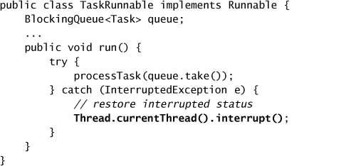

---

## 5.5. Synchronizers

Blocking queue là độc nhất trong số các collection class: chúng không chỉ đóng vai trò container chứa object, mà còn có thể **điều phối luồng điều khiển** của các thread producer và consumer, vì `take` và `put` block cho đến khi queue vào trạng thái mong muốn (không rỗng hoặc không đầy).

Một **synchronizer** là bất kỳ object nào điều phối luồng điều khiển của các thread dựa trên state của nó. Blocking queue có thể đóng vai trò synchronizer; các loại synchronizer khác bao gồm **semaphore**, **barrier**, và **latch**. Có một số class synchronizer trong thư viện của nền tảng; nếu chúng không đáp ứng nhu cầu của bạn, bạn cũng có thể tự tạo bằng các cơ chế được mô tả ở chương 14.

Mọi synchronizer đều có chung một số tính chất cấu trúc: chúng **encapsulate state** quyết định xem những thread đến synchronizer có được cho qua hay bị buộc phải chờ, cung cấp method để **thao tác state đó**, và cung cấp method để **chờ một cách hiệu quả** cho đến khi synchronizer vào trạng thái mong muốn.

### 5.5.1. Latch

Một **latch** là một synchronizer có thể trì hoãn tiến trình của các thread cho đến khi nó đạt tới **trạng thái kết thúc** (terminal state) của mình [CPJ 3.4.2]. Một latch hoạt động như một **cổng**: cho đến khi latch đạt trạng thái kết thúc thì cổng đóng và không thread nào qua được, còn ở trạng thái kết thúc thì cổng mở, cho **tất cả** thread đi qua. Một khi latch đạt trạng thái kết thúc, nó **không thể đổi trạng thái nữa**, nên nó mở mãi mãi. Latch có thể được dùng để đảm bảo rằng một số hoạt động không tiến hành cho đến khi những hoạt động một-lần khác hoàn tất, chẳng hạn:

- **Đảm bảo một phép tính không tiến hành cho đến khi các tài nguyên nó cần đã được khởi tạo.** Một latch nhị phân (hai trạng thái) đơn giản có thể được dùng để báo hiệu "Tài nguyên R đã được khởi tạo", và bất kỳ hoạt động nào cần R sẽ chờ trên latch này trước.
- **Đảm bảo một service không khởi động cho đến khi các service mà nó phụ thuộc đã khởi động.** Mỗi service sẽ có một latch nhị phân đi kèm; khởi động service S sẽ bao gồm việc chờ trên các latch của những service mà S phụ thuộc, rồi release latch của S sau khi khởi động xong để các service phụ thuộc vào S có thể tiếp tục.
- **Chờ cho đến khi tất cả các bên tham gia một hoạt động** — ví dụ những người chơi trong một game nhiều người — **đã sẵn sàng để tiếp tục.** Trong trường hợp này, latch đạt trạng thái kết thúc sau khi tất cả người chơi đã sẵn sàng.

`CountDownLatch` là một hiện thực latch linh hoạt có thể dùng trong bất kỳ tình huống nào ở trên; nó cho phép **một hoặc nhiều thread chờ một tập sự kiện xảy ra**. State của latch gồm một bộ đếm được khởi tạo bằng một số dương, biểu diễn số sự kiện cần chờ. Method `countDown` giảm bộ đếm, báo hiệu rằng một sự kiện đã xảy ra, và các method `await` chờ cho bộ đếm về không, điều xảy ra khi **tất cả** sự kiện đã xảy ra. Nếu bộ đếm khác không khi vào, `await` block cho đến khi bộ đếm về không, thread đang chờ bị interrupt, hoặc việc chờ hết thời gian.

`TestHarness` ở Listing 5.11 minh họa hai cách dùng phổ biến của latch. `TestHarness` tạo một số thread cùng chạy một tác vụ cho trước một cách concurrent. Nó dùng hai latch: một "**cổng xuất phát**" (starting gate) và một "**cổng về đích**" (ending gate). Cổng xuất phát được khởi tạo với đếm bằng một; cổng về đích được khởi tạo với đếm bằng số thread worker. Việc đầu tiên mỗi thread worker làm là **chờ ở cổng xuất phát**; điều này đảm bảo không thread nào bắt đầu làm việc cho đến khi tất cả đều sẵn sàng. Việc cuối cùng mỗi thread làm là **đếm ngược ở cổng về đích**; điều này cho phép thread chính chờ một cách hiệu quả cho đến khi thread worker cuối cùng kết thúc, để nó có thể tính thời gian đã trôi qua.

Tại sao chúng ta lại bận tâm dùng latch trong `TestHarness` thay vì chỉ khởi động các thread ngay sau khi chúng được tạo? Có lẽ vì chúng ta muốn đo **mất bao lâu để chạy một tác vụ n lần một cách concurrent**. Nếu ta chỉ đơn giản tạo và khởi động các thread, thì những thread khởi động sớm sẽ có "lợi thế xuất phát" so với những thread sau, và mức độ tranh chấp sẽ **biến thiên theo thời gian** khi số thread hoạt động tăng hay giảm. Dùng cổng xuất phát cho phép thread chính **thả tất cả thread worker cùng một lúc**, và cổng về đích cho phép thread chính chờ thread cuối cùng kết thúc thay vì phải chờ tuần tự từng thread một.

### 5.5.2. FutureTask

`FutureTask` cũng hoạt động **như một latch**. (`FutureTask` hiện thực `Future`, thứ mô tả một phép tính trừu tượng có mang kết quả [CPJ 4.3.3].) Một phép tính được biểu diễn bởi `FutureTask` được hiện thực bằng một `Callable` — phiên bản có mang kết quả của `Runnable` — và có thể ở một trong ba trạng thái: **chờ chạy**, **đang chạy**, hoặc **đã hoàn tất**. "Hoàn tất" bao trùm mọi cách một phép tính có thể kết thúc, bao gồm hoàn tất bình thường, bị hủy, và exception. Một khi một `FutureTask` vào trạng thái hoàn tất, nó **ở mãi trong trạng thái đó**.

Hành vi của `Future.get` phụ thuộc vào trạng thái của tác vụ. Nếu tác vụ đã hoàn tất, `get` trả về kết quả **ngay lập tức**; nếu chưa, nó **block** cho đến khi tác vụ chuyển sang trạng thái hoàn tất rồi trả về kết quả hoặc ném exception. `FutureTask` chuyển kết quả từ thread thực thi phép tính sang (các) thread lấy kết quả; đặc tả của `FutureTask` **đảm bảo rằng việc chuyển giao này cấu thành một safe publication** của kết quả.

**Listing 5.11. Dùng `CountDownLatch` để khởi động và dừng các Thread trong bài test đo thời gian.**

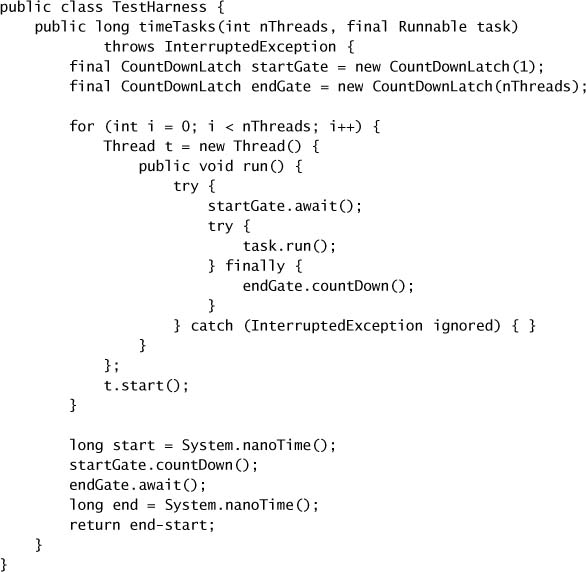

`FutureTask` được framework `Executor` dùng để biểu diễn các tác vụ bất đồng bộ, và cũng có thể được dùng để biểu diễn bất kỳ phép tính có thể kéo dài nào mà có thể được khởi động **trước khi** kết quả được cần đến. `Preloader` ở Listing 5.12 dùng `FutureTask` để thực hiện một phép tính tốn kém mà kết quả sẽ cần đến sau này; bằng cách khởi động phép tính sớm, bạn giảm thời gian phải chờ sau này khi bạn thực sự cần kết quả.

**Listing 5.12. Dùng `FutureTask` để nạp trước dữ liệu sẽ cần sau này.**

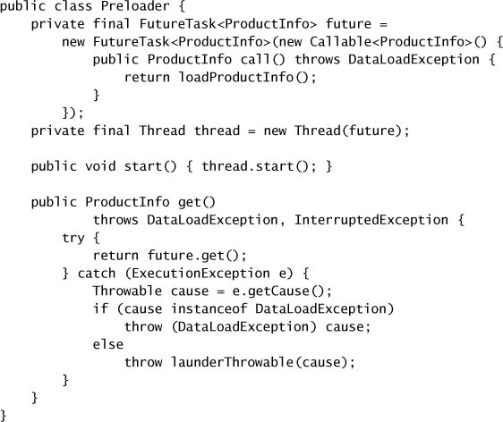

`Preloader` tạo một `FutureTask` mô tả tác vụ nạp thông tin sản phẩm từ database, và một thread để thực hiện phép tính. Nó cung cấp một method `start` để khởi động thread, vì **không nên** khởi động một thread từ constructor hay static initializer. Khi chương trình sau đó cần `ProductInfo`, nó có thể gọi `get`, thứ trả về dữ liệu đã nạp nếu sẵn sàng, hoặc chờ cho việc nạp hoàn tất nếu chưa.

Các tác vụ được mô tả bởi `Callable` có thể ném cả checked lẫn unchecked exception, và bất kỳ code nào cũng có thể ném `Error`. Bất kể code tác vụ ném gì, nó đều được bọc trong một `ExecutionException` và ném lại từ `Future.get`. Điều này làm phức tạp code gọi `get`, không chỉ vì nó phải xử lý khả năng gặp `ExecutionException` (và `CancellationException` unchecked), mà còn vì nguyên nhân của `ExecutionException` được trả về dưới dạng một `Throwable`, thứ bất tiện để xử lý.

Khi `get` ném `ExecutionException` trong `Preloader`, nguyên nhân sẽ rơi vào một trong ba loại: một checked exception do `Callable` ném, một `RuntimeException`, hoặc một `Error`. Chúng ta phải xử lý từng trường hợp riêng, nhưng ta sẽ dùng method tiện ích `launderThrowable` ở Listing 5.13 để encapsulate một phần logic xử lý exception rối rắm. Trước khi gọi `launderThrowable`, `Preloader` kiểm tra các checked exception đã biết và ném lại chúng. Việc đó chỉ còn lại các unchecked exception, thứ mà `Preloader` xử lý bằng cách gọi `launderThrowable` và ném kết quả. Nếu `Throwable` được truyền vào `launderThrowable` là một `Error`, `launderThrowable` ném lại nó trực tiếp; nếu nó không phải một `RuntimeException`, nó ném một `IllegalStateException` để báo hiệu một lỗi logic. Việc đó chỉ còn lại `RuntimeException`, thứ mà `launderThrowable` trả về cho caller của nó, và caller thường sẽ ném lại.

**Listing 5.13. Ép một Unchecked Throwable thành `RuntimeException`.**

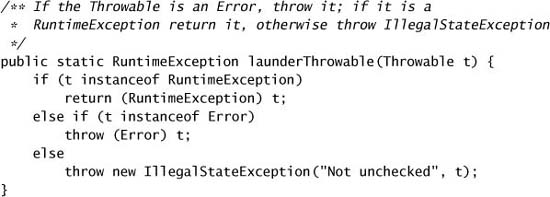

### 5.5.3. Semaphore

**Counting semaphore** được dùng để kiểm soát **số lượng hoạt động** có thể truy cập một tài nguyên nhất định hoặc thực hiện một hành động nhất định **cùng lúc** [CPJ 3.4.1]. Counting semaphore có thể được dùng để hiện thực resource pool hoặc để áp đặt giới hạn lên một collection.

Một `Semaphore` quản lý một tập **permit ảo**; số permit ban đầu được truyền vào constructor của `Semaphore`. Các hoạt động có thể **acquire** permit (miễn là còn permit) và **release** permit khi chúng dùng xong. Nếu không có permit nào, `acquire` **block** cho đến khi có (hoặc cho đến khi bị interrupt hoặc operation hết thời gian). Method `release` trả một permit về semaphore.[^4] Một trường hợp suy biến của counting semaphore là **binary semaphore**, một `Semaphore` với đếm ban đầu bằng một. Một binary semaphore có thể được dùng như một **mutex với semantics locking không reentrant**; ai giữ permit duy nhất thì giữ mutex.

[^4]: Hiện thực không có object permit thực sự nào, và `Semaphore` không gắn các permit đã cấp phát với thread, nên một permit được acquire ở thread này có thể được release từ thread khác. Bạn có thể nghĩ về `acquire` như **tiêu thụ** một permit và `release` như **tạo ra** một permit; một `Semaphore` **không bị giới hạn** ở số permit mà nó được tạo ra ban đầu.

Semaphore hữu ích để hiện thực các resource pool như database connection pool. Dù dễ dàng xây một pool cỡ cố định mà **thất bại** nếu bạn yêu cầu tài nguyên từ một pool rỗng, thứ bạn thực sự muốn là **block** nếu pool rỗng và **bỏ block** khi nó lại có phần tử. Nếu bạn khởi tạo một `Semaphore` bằng kích thước pool, acquire một permit trước khi cố lấy tài nguyên từ pool, và release permit sau khi trả tài nguyên về pool, thì `acquire` sẽ block cho đến khi pool có phần tử. Kỹ thuật này được dùng trong class bounded buffer ở chương 12. (Một cách dễ hơn để xây một object pool có block là dùng một `BlockingQueue` để giữ các tài nguyên trong pool.)

Tương tự, bạn có thể dùng một `Semaphore` để biến **bất kỳ collection nào** thành một collection có giới hạn và có block, như minh họa bởi `BoundedHashSet` ở Listing 5.14. Semaphore được khởi tạo bằng kích thước tối đa mong muốn của collection. Operation `add` acquire một permit trước khi thêm item vào collection nền tảng. Nếu operation `add` nền tảng thực ra không thêm gì, nó **release permit ngay lập tức**. Tương tự, một operation `remove` thành công sẽ release một permit, cho phép thêm nhiều phần tử hơn. Hiện thực `Set` nền tảng **không biết gì** về giới hạn; điều đó được `BoundedHashSet` xử lý.

**Listing 5.14. Dùng `Semaphore` để giới hạn một Collection.**

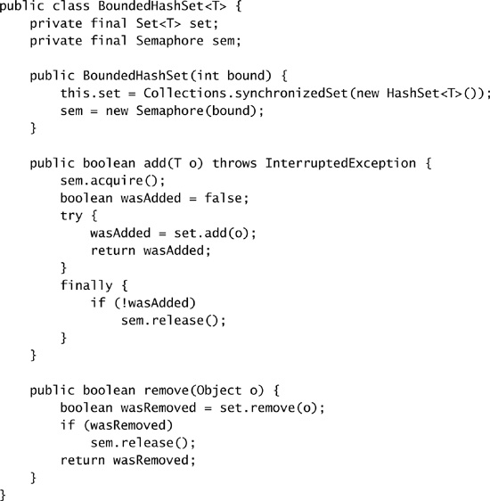

### 5.5.4. Barrier

Chúng ta đã thấy latch có thể tạo điều kiện cho việc khởi động một nhóm hoạt động liên quan hoặc chờ một nhóm hoạt động liên quan hoàn tất như thế nào. Latch là **object dùng một lần**; một khi latch vào trạng thái kết thúc, nó **không thể reset**.

**Barrier** tương tự latch ở chỗ chúng block một nhóm thread cho đến khi một sự kiện nào đó xảy ra [CPJ 4.4.3]. Khác biệt mấu chốt là với barrier, **tất cả** các thread phải cùng đến một **điểm barrier cùng lúc** thì mới được tiếp tục. **Latch là để chờ sự kiện; barrier là để chờ các thread khác.** Một barrier hiện thực đúng cái protocol mà một số gia đình dùng khi hẹn nhau trong một ngày đi trung tâm thương mại: "Mọi người gặp nhau ở McDonald's lúc 6 giờ; đến nơi rồi thì cứ ở đó cho đến khi mọi người đều tới, rồi ta sẽ tính tiếp làm gì."

`CyclicBarrier` cho phép một số lượng cố định các bên **gặp nhau lặp đi lặp lại** tại một điểm barrier, và hữu ích trong các thuật toán lặp song song chia một bài toán thành một số cố định các bài toán con độc lập. Các thread gọi `await` khi chúng đến điểm barrier, và `await` block cho đến khi **tất cả** thread đã đến điểm barrier. Nếu tất cả thread gặp nhau tại điểm barrier, barrier được vượt qua thành công, và trong trường hợp đó tất cả thread được thả và barrier được **reset** để có thể dùng lại. Nếu một lời gọi `await` hết thời gian hoặc một thread đang block trong `await` bị interrupt, thì barrier bị coi là **bị hỏng** (broken) và mọi lời gọi `await` còn tồn đọng sẽ kết thúc bằng `BrokenBarrierException`. Nếu barrier được vượt qua thành công, `await` trả về một **chỉ số đến duy nhất** cho mỗi thread, có thể dùng để "bầu" ra một thread lãnh đạo thực hiện hành động đặc biệt nào đó ở vòng lặp kế tiếp. `CyclicBarrier` cũng cho phép bạn truyền một **barrier action** vào constructor; đây là một `Runnable` được thực thi (trong một trong các thread tác vụ con) khi barrier được vượt qua thành công **nhưng trước khi** các thread bị block được thả ra.

Barrier thường được dùng trong **mô phỏng**, nơi công việc để tính một bước có thể làm song song nhưng toàn bộ công việc gắn với một bước phải hoàn tất trước khi tiến sang bước tiếp theo. Ví dụ, trong mô phỏng hạt n-body, mỗi bước tính một cập nhật lên vị trí của từng hạt dựa trên vị trí và các thuộc tính khác của các hạt còn lại. Việc chờ trên một barrier giữa mỗi lần cập nhật đảm bảo rằng **mọi cập nhật cho bước k đã hoàn tất trước khi chuyển sang bước k + 1**.

`CellularAutomata` ở Listing 5.15 minh họa việc dùng một barrier để tính một mô phỏng cellular automata, chẳng hạn trò chơi Life của Conway (Gardner, 1970). Khi song song hóa một mô phỏng, nói chung là **không thực tế** khi gán một thread riêng cho mỗi phần tử (trong trường hợp Life là mỗi ô); điều đó sẽ đòi hỏi quá nhiều thread, và chi phí điều phối chúng sẽ lấn át phần tính toán. Thay vào đó, hợp lý hơn là **chia bài toán thành một số phần con**, để mỗi thread giải một phần, rồi gộp kết quả. `CellularAutomata` chia bàn cờ thành Ncpu phần, với Ncpu là số CPU khả dụng, và gán mỗi phần cho một thread.[^5] Ở mỗi bước, các thread worker tính giá trị mới cho mọi ô trong phần bàn cờ của mình. Khi tất cả thread worker đã đến barrier, **barrier action commit các giá trị mới vào data model**. Sau khi barrier action chạy, các thread worker được thả để tính bước kế tiếp, việc này bao gồm tham vấn method `isDone` để xác định xem có cần lặp thêm nữa không.

[^5]: Với những bài toán tính toán như thế này — không có I/O và không truy cập dữ liệu được share — Ncpu hoặc Ncpu + 1 thread cho throughput tối ưu; nhiều thread hơn không giúp gì, và thực tế có thể làm giảm performance khi các thread cạnh tranh tài nguyên CPU và bộ nhớ.

Một dạng barrier khác là `Exchanger`, một **barrier hai bên** trong đó các bên **trao đổi dữ liệu** tại điểm barrier [CPJ 3.4.3]. `Exchanger` hữu ích khi các bên thực hiện những hoạt động bất đối xứng, ví dụ khi một thread điền dữ liệu vào một buffer còn thread kia tiêu thụ dữ liệu từ buffer đó; những thread này có thể dùng một `Exchanger` để gặp nhau và **đổi một buffer đầy lấy một buffer rỗng**. Khi hai thread trao đổi object qua một `Exchanger`, việc trao đổi đó **cấu thành một safe publication** của cả hai object tới bên kia.

Thời điểm trao đổi phụ thuộc vào yêu cầu về khả năng đáp ứng của ứng dụng. Cách tiếp cận đơn giản nhất là tác vụ điền trao đổi khi buffer đầy, và tác vụ rút trao đổi khi buffer rỗng; cách này **giảm thiểu số lần trao đổi** nhưng có thể trì hoãn việc xử lý một số dữ liệu nếu tốc độ đến của dữ liệu mới là khó lường. Một cách khác là bên điền trao đổi khi buffer đầy, **nhưng cũng** trao đổi khi buffer mới điền một phần và một khoảng thời gian nhất định đã trôi qua.

---

## 5.6. Xây dựng một Result Cache hiệu quả, có khả năng mở rộng

Gần như mọi ứng dụng server đều dùng một dạng caching nào đó. Tái sử dụng kết quả của một phép tính trước đó có thể giảm độ trễ và tăng throughput, với cái giá là dùng thêm một chút bộ nhớ.

**Listing 5.15. Điều phối tính toán trong một Cellular Automaton bằng `CyclicBarrier`.**

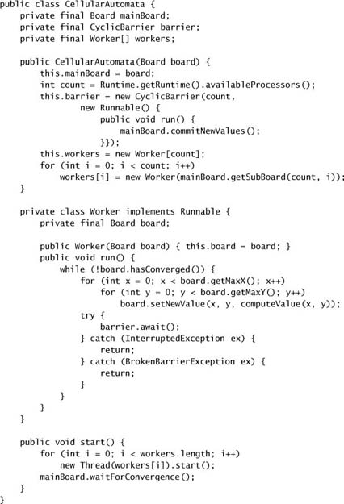

Giống như nhiều "bánh xe" thường xuyên được phát minh lại, caching thường trông đơn giản hơn thực tế. Một hiện thực cache ngây thơ nhiều khả năng sẽ biến một **nút thắt cổ chai về performance** thành một **nút thắt cổ chai về scalability**, ngay cả khi nó có cải thiện performance single-threaded. Trong mục này chúng ta phát triển một result cache hiệu quả và có khả năng mở rộng cho một hàm tốn kém về tính toán. Hãy bắt đầu với cách tiếp cận hiển nhiên — một `HashMap` đơn giản — rồi xem xét một số nhược điểm về concurrency của nó và cách khắc phục.

Interface `Computable<A, V>` ở Listing 5.16 mô tả một hàm với đầu vào kiểu A và kết quả kiểu V. `ExpensiveFunction`, thứ hiện thực `Computable`, mất rất lâu để tính kết quả; chúng ta muốn tạo một wrapper `Computable` **ghi nhớ** kết quả của các phép tính trước và encapsulate quá trình caching. (Kỹ thuật này được gọi là **memoization**.)

**Listing 5.16. Nỗ lực cache ban đầu dùng `HashMap` và Synchronization.**

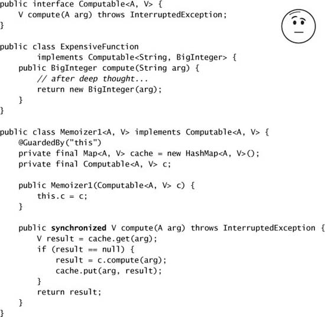

`Memoizer1` ở Listing 5.16 cho thấy nỗ lực đầu tiên: dùng một `HashMap` để lưu kết quả của các phép tính trước. Method `compute` trước tiên kiểm tra xem kết quả mong muốn đã được cache chưa, và trả về giá trị đã tính sẵn nếu có. Nếu không, kết quả được tính và cache vào `HashMap` trước khi trả về.

`HashMap` không thread-safe, nên để đảm bảo hai thread không truy cập `HashMap` cùng lúc, `Memoizer1` chọn cách tiếp cận bảo thủ là **synchronize toàn bộ method `compute`**. Điều này đảm bảo thread safety nhưng có một vấn đề scalability rõ ràng: **mỗi lần chỉ một thread có thể thực thi `compute`, chấm hết**. Nếu một thread đang bận tính một kết quả, các thread khác gọi `compute` có thể bị block rất lâu. Nếu nhiều thread xếp hàng chờ để tính những giá trị chưa được tính, `compute` thực tế có thể **mất nhiều thời gian hơn** so với khi không có memoization. Figure 5.2 minh họa điều có thể xảy ra khi vài thread cố dùng một hàm được memoize theo cách này. Đây không phải kiểu cải thiện performance mà chúng ta hy vọng đạt được nhờ caching.

**Figure 5.2. Concurrency kém của `Memoizer1`.**

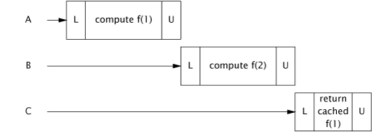

`Memoizer2` ở Listing 5.17 cải thiện hành vi concurrent tệ hại của `Memoizer1` bằng cách thay `HashMap` bằng một `ConcurrentHashMap`. Vì `ConcurrentHashMap` là thread-safe, không cần synchronize khi truy cập `Map` nền tảng, do đó loại bỏ sự serialize gây ra bởi việc synchronize `compute` trong `Memoizer1`.

`Memoizer2` chắc chắn có hành vi concurrent tốt hơn `Memoizer1`: nhiều thread thực sự có thể dùng nó đồng thời. Nhưng nó vẫn còn vài khiếm khuyết với vai trò một cache — có một **cửa sổ tổn thương** trong đó hai thread cùng gọi `compute` một lúc có thể kết thúc bằng việc **tính cùng một giá trị**. Trong trường hợp memoization, điều này chỉ đơn thuần là kém hiệu quả — mục đích của cache là ngăn cùng một dữ liệu bị tính nhiều lần. Với một cơ chế caching tổng quát hơn, điều đó tệ hơn nhiều; với một object cache lẽ ra phải cung cấp khởi tạo **một-lần-và-chỉ-một-lần**, lỗ hổng này còn tạo ra một **rủi ro về an toàn**.

Vấn đề với `Memoizer2` là nếu một thread bắt đầu một phép tính tốn kém, các thread khác **không biết** rằng phép tính đó đang diễn ra và do đó có thể bắt đầu cùng phép tính ấy, như minh họa ở Figure 5.3. Chúng ta muốn bằng cách nào đó biểu diễn được ý niệm "thread X hiện đang tính f(27)", để nếu một thread khác đến tìm f(27), nó biết rằng cách hiệu quả nhất để có kết quả là **đi tới nhà Thread X, ngồi đó đến khi X xong, rồi hỏi "Này, cậu tính ra f(27) bằng bao nhiêu?"**.

**Figure 5.3. Hai thread cùng tính một giá trị khi dùng `Memoizer2`.**

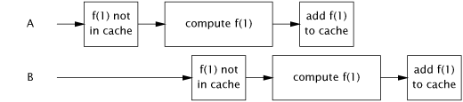

**Listing 5.17. Thay `HashMap` bằng `ConcurrentHashMap`.**

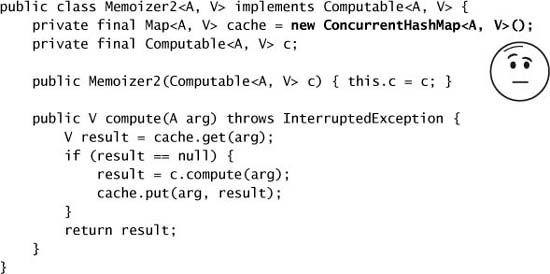

Chúng ta đã thấy một class làm gần như chính xác điều này: **`FutureTask`**. `FutureTask` biểu diễn một quá trình tính toán có thể đã hoàn tất hoặc chưa. `FutureTask.get` trả về kết quả của phép tính **ngay lập tức** nếu nó khả dụng; nếu không, nó **block** cho đến khi kết quả được tính xong rồi trả về.

`Memoizer3` ở Listing 5.18 định nghĩa lại `Map` nền tảng cho value cache thành một `ConcurrentHashMap<A, Future<V>>` thay vì `ConcurrentHashMap<A, V>`. `Memoizer3` trước tiên kiểm tra xem phép tính tương ứng đã **được bắt đầu** hay chưa (thay vì đã **kết thúc** hay chưa, như ở `Memoizer2`). Nếu chưa, nó tạo một `FutureTask`, đăng ký nó vào `Map`, và bắt đầu phép tính; nếu rồi, nó chờ kết quả của phép tính đang tồn tại. Kết quả có thể khả dụng ngay hoặc có thể đang trong quá trình được tính — nhưng điều này **trong suốt** với caller của `Future.get`.

Hiện thực `Memoizer3` gần như hoàn hảo: nó thể hiện concurrency rất tốt (phần lớn nhờ concurrency xuất sắc của `ConcurrentHashMap`), kết quả được trả về hiệu quả nếu đã biết, và nếu phép tính đang được một thread khác thực hiện, các thread mới đến sẽ **kiên nhẫn chờ** kết quả. Nó chỉ có **một** khiếm khuyết — vẫn còn một **cửa sổ tổn thương nhỏ** trong đó hai thread có thể cùng tính một giá trị. Cửa sổ này nhỏ hơn nhiều so với ở `Memoizer2`, nhưng vì khối `if` trong `compute` vẫn là một chuỗi **check-then-act không atomic**, vẫn có thể xảy ra việc hai thread gọi `compute` với cùng giá trị gần như cùng lúc, cả hai đều thấy cache không chứa giá trị mong muốn, và cả hai đều bắt đầu tính. Timing không may này được minh họa ở Figure 5.4.

**Figure 5.4. Timing không may có thể khiến `Memoizer3` tính cùng một giá trị hai lần.**

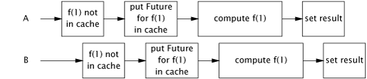

**Listing 5.18. Wrapper Memoize dùng `FutureTask`.**

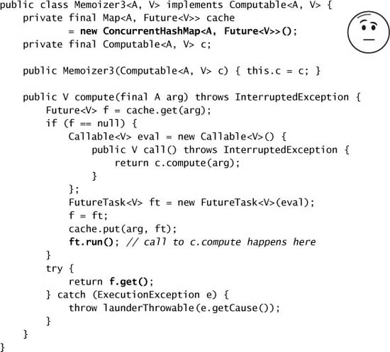

`Memoizer3` dễ bị vấn đề này vì một **compound action** (put-if-absent) được thực hiện trên map nền tảng mà **không thể làm cho atomic bằng locking**. `Memoizer` ở Listing 5.19 tận dụng method `putIfAbsent` atomic của `ConcurrentMap`, **đóng lại cửa sổ tổn thương** của `Memoizer3`.

Việc cache một `Future` thay vì một giá trị tạo ra khả năng **cache pollution** (ô nhiễm cache): nếu một phép tính bị hủy hoặc thất bại, những lần cố tính kết quả sau đó cũng sẽ báo hủy hoặc thất bại. Để tránh điều này, `Memoizer` **xóa `Future` khỏi cache** nếu nó phát hiện rằng phép tính đã bị hủy; cũng có thể nên xóa `Future` khi phát hiện một `RuntimeException` nếu phép tính có thể thành công ở lần thử sau. `Memoizer` cũng **không** giải quyết vấn đề **cache expiration** (hết hạn cache), nhưng điều này có thể thực hiện bằng cách dùng một subclass của `FutureTask` gắn một thời điểm hết hạn với mỗi kết quả và quét cache định kỳ để tìm các entry đã hết hạn. (Tương tự, nó cũng không giải quyết **cache eviction**, nơi các entry cũ bị xóa để nhường chỗ cho entry mới nhằm giữ cho cache không tiêu tốn quá nhiều bộ nhớ.)

Với hiện thực concurrent cache đã hoàn tất, giờ chúng ta có thể thêm caching thực sự vào servlet phân tích thừa số ở chương 2, như đã hứa. `Factorizer` ở Listing 5.20 dùng `Memoizer` để cache các giá trị đã tính trước đó một cách hiệu quả và có khả năng mở rộng.

**Listing 5.19. Hiện thực cuối cùng của `Memoizer`.**

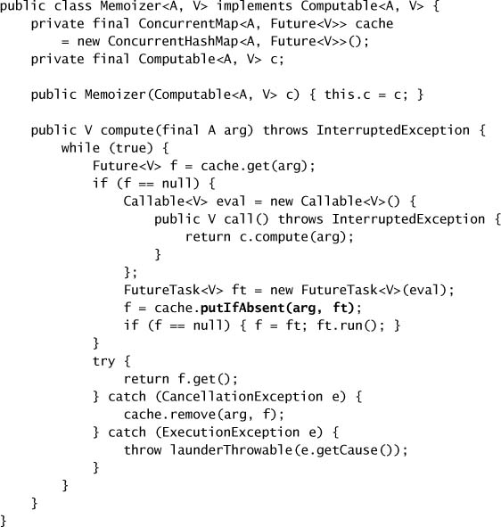

**Listing 5.20. Servlet phân tích thừa số cache kết quả bằng `Memoizer`.**

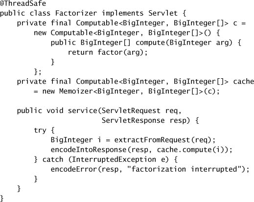

---

## Tóm tắt Phần I

Chúng ta đã đi qua rất nhiều nội dung! "Bảng ghi nhớ nhanh về concurrency" dưới đây tóm tắt những khái niệm và quy tắc chính đã trình bày ở Phần I.

**Vấn đề nằm ở mutable state, đồ ngốc.**[^6]
Mọi vấn đề concurrency đều quy về việc điều phối truy cập vào mutable state. Càng ít mutable state thì càng dễ đảm bảo thread safety.

[^6]: Trong cuộc bầu cử tổng thống Mỹ năm 1992, chiến lược gia bầu cử James Carville treo một tấm biển ở tổng hành dinh chiến dịch của Bill Clinton ghi "The economy, stupid" (Vấn đề nằm ở kinh tế, đồ ngốc), để giữ chiến dịch bám sát thông điệp.

**Hãy để field là `final` trừ khi chúng cần mutable.**

**Immutable object tự động thread-safe.**
Immutable object đơn giản hóa lập trình concurrent một cách vô cùng lớn. Chúng đơn giản hơn và an toàn hơn, và có thể được share tự do mà không cần locking hay defensive copy.

**Encapsulation làm cho việc quản lý độ phức tạp trở nên khả thi.**
Bạn *có thể* viết một chương trình thread-safe với toàn bộ dữ liệu lưu trong biến toàn cục, nhưng tại sao lại muốn thế? Encapsulate dữ liệu bên trong object giúp bảo toàn invariant của chúng dễ hơn; encapsulate synchronization bên trong object giúp tuân thủ synchronization policy của chúng dễ hơn.

**Bảo vệ mỗi mutable variable bằng một lock.**

**Bảo vệ tất cả các biến trong một invariant bằng cùng một lock.**

**Giữ lock trong suốt thời gian thực hiện các compound action.**

**Một chương trình truy cập một mutable variable từ nhiều thread mà không có synchronization là một chương trình hỏng.**

**Đừng dựa vào những lập luận khôn ngoan về lý do tại sao bạn không cần synchronize.**

**Hãy đưa thread safety vào quy trình thiết kế — hoặc ghi rõ tài liệu rằng class của bạn không thread-safe.**

**Ghi tài liệu về synchronization policy của bạn.**
