# Chương 6. Task Execution

> **Về bản dịch này.** Đây là bản **dịch đầy đủ** chương 6 của cuốn *Java Concurrency in Practice* (Brian Goetz và cộng sự). Các **thuật ngữ chuyên ngành được giữ nguyên tiếng Anh**. Toàn bộ code listing và hình vẽ được trích trực tiếp từ file PDF gốc và lưu trong thư mục `images/ch06/`.

---

Hầu hết ứng dụng concurrent đều được tổ chức xoay quanh việc thực thi các **task**: những đơn vị công việc trừu tượng, rời rạc. Việc chia công việc của một ứng dụng thành các task giúp đơn giản hóa tổ chức chương trình, tạo điều kiện khôi phục lỗi bằng cách cung cấp những ranh giới transaction tự nhiên, và thúc đẩy concurrency bằng cách cung cấp một cấu trúc tự nhiên để song song hóa công việc.

---

## 6.1. Thực thi Task trong Thread

Bước đầu tiên trong việc tổ chức một chương trình xoay quanh thực thi task là **xác định ranh giới task hợp lý**. Lý tưởng nhất, các task là những hoạt động **độc lập**: công việc không phụ thuộc vào state, kết quả, hay tác dụng phụ của các task khác. Tính độc lập tạo điều kiện cho concurrency, vì các task độc lập có thể được thực thi song song nếu có đủ tài nguyên xử lý. Để linh hoạt hơn trong việc lập lịch và cân bằng tải các task, mỗi task cũng nên đại diện cho **một phần nhỏ** năng lực xử lý của ứng dụng.

Các ứng dụng server nên thể hiện **cả throughput tốt lẫn khả năng đáp ứng tốt** dưới tải bình thường. Nhà cung cấp ứng dụng muốn ứng dụng hỗ trợ càng nhiều người dùng càng tốt, để giảm chi phí hạ tầng trên mỗi người dùng; người dùng muốn nhận phản hồi nhanh. Hơn nữa, ứng dụng nên thể hiện **sự suy giảm êm ái** (graceful degradation) khi trở nên quá tải, thay vì đơn giản là sụp đổ dưới tải nặng. Chọn ranh giới task tốt, kết hợp với một **execution policy** hợp lý (xem mục 6.2.2), có thể giúp đạt được những mục tiêu này.

Hầu hết ứng dụng server đều có một lựa chọn ranh giới task tự nhiên: **từng request riêng lẻ của client**. Web server, mail server, file server, EJB container, và database server đều nhận request qua kết nối mạng từ client ở xa. Dùng từng request riêng lẻ làm ranh giới task thường mang lại cả tính độc lập lẫn kích thước task phù hợp. Ví dụ, kết quả của việc gửi một thông điệp tới mail server không bị ảnh hưởng bởi những thông điệp khác đang được xử lý cùng lúc, và việc xử lý một thông điệp đơn lẻ thường chỉ cần một phần rất nhỏ trong tổng năng lực của server.

### 6.1.1. Thực thi Task tuần tự

Có một số policy khả dĩ để lập lịch task trong một ứng dụng, một số khai thác tiềm năng concurrency tốt hơn số khác. Đơn giản nhất là **thực thi task tuần tự trong một thread duy nhất**. `SingleThreadWebServer` ở Listing 6.1 xử lý các task của nó — các HTTP request đến trên cổng 80 — một cách tuần tự. Chi tiết của việc xử lý request không quan trọng; chúng ta quan tâm đến việc mô tả đặc tính concurrency của các scheduling policy khác nhau.

**Listing 6.1. Web Server tuần tự.**

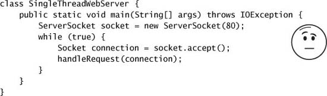

`SingleThreadedWebServer` đơn giản và về lý thuyết là đúng, nhưng sẽ chạy rất tệ trong production vì nó chỉ có thể xử lý **một request tại một thời điểm**. Thread chính luân phiên giữa việc chấp nhận kết nối và xử lý request tương ứng. Trong khi server đang xử lý một request, các kết nối mới phải chờ cho đến khi nó xong request hiện tại và gọi `accept` lần nữa. Điều này có thể ổn nếu việc xử lý request nhanh đến mức `handleRequest` trên thực tế trả về ngay lập tức, nhưng điều đó không mô tả bất kỳ web server nào trong thế giới thực.

Xử lý một web request bao gồm cả tính toán lẫn I/O. Server phải thực hiện socket I/O để đọc request và ghi response, thứ có thể **block** do tắc nghẽn mạng hay vấn đề kết nối. Nó cũng có thể thực hiện file I/O hoặc gửi request tới database, những thứ cũng có thể block. Trong một server single-threaded, việc block không chỉ trì hoãn việc hoàn tất request hiện tại, mà còn **ngăn hoàn toàn** việc xử lý các request đang chờ. Nếu một request block trong một khoảng thời gian dài bất thường, người dùng có thể nghĩ rằng server không khả dụng vì nó tỏ ra không phản hồi. Đồng thời, mức sử dụng tài nguyên rất kém, vì CPU nằm không trong khi thread duy nhất chờ I/O của nó hoàn tất.

Trong ứng dụng server, xử lý tuần tự **hiếm khi** mang lại throughput tốt hay khả năng đáp ứng tốt. Có ngoại lệ — chẳng hạn khi số task ít và chạy lâu, hoặc khi server phục vụ một client duy nhất chỉ gửi một request tại một thời điểm — nhưng hầu hết ứng dụng server không hoạt động theo cách này.[^1]

[^1]: Trong một số tình huống, xử lý tuần tự có thể mang lại lợi thế về tính đơn giản hoặc an toàn; hầu hết GUI framework xử lý task tuần tự bằng một thread duy nhất. Chúng ta sẽ quay lại mô hình tuần tự ở chương 9.

### 6.1.2. Tạo Thread tường minh cho từng Task

Một cách tiếp cận phản hồi tốt hơn là **tạo một thread mới để phục vụ mỗi request**, như trong `ThreadPerTaskWebServer` ở Listing 6.2.

**Listing 6.2. Web Server khởi động một Thread mới cho mỗi Request.**

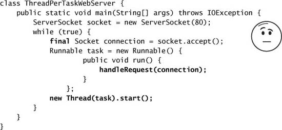

`ThreadPerTaskWebServer` có cấu trúc tương tự phiên bản single-threaded — thread chính vẫn luân phiên giữa việc chấp nhận một kết nối đến và điều phối request. Khác biệt là với mỗi kết nối, vòng lặp chính **tạo một thread mới** để xử lý request thay vì xử lý nó trong thread chính. Điều này có ba hệ quả chính:

- **Việc xử lý task được chuyển khỏi thread chính**, cho phép vòng lặp chính quay lại chờ kết nối tiếp theo nhanh hơn. Điều này cho phép các kết nối mới được chấp nhận trước khi các request trước hoàn tất, cải thiện khả năng đáp ứng.
- **Task có thể được xử lý song song**, cho phép nhiều request được phục vụ đồng thời. Điều này có thể cải thiện throughput nếu có nhiều processor, hoặc nếu task cần block vì bất kỳ lý do nào như hoàn tất I/O, acquire lock, hay chờ tài nguyên.
- **Code xử lý task phải thread-safe**, vì nó có thể bị gọi concurrent cho nhiều task.

Dưới tải nhẹ đến trung bình, cách tiếp cận thread-per-task là một cải tiến so với thực thi tuần tự. Miễn là tốc độ đến của request không vượt quá năng lực xử lý request của server, cách tiếp cận này mang lại khả năng đáp ứng và throughput tốt hơn.

### 6.1.3. Nhược điểm của việc tạo Thread không giới hạn

Tuy nhiên, để dùng trong production, cách tiếp cận thread-per-task có một số nhược điểm thực tế, đặc biệt khi **số lượng lớn thread** có thể được tạo ra:

**Chi phí vòng đời thread.** Việc tạo và hủy thread **không miễn phí**. Chi phí thực tế khác nhau giữa các nền tảng, nhưng việc tạo thread mất thời gian, đưa thêm độ trễ vào việc xử lý request, và đòi hỏi một số hoạt động xử lý từ JVM và OS. Nếu các request diễn ra thường xuyên và nhẹ, như trong hầu hết ứng dụng server, việc tạo một thread mới cho mỗi request có thể tiêu tốn tài nguyên tính toán đáng kể.

**Tiêu thụ tài nguyên.** Các thread đang hoạt động tiêu thụ tài nguyên hệ thống, đặc biệt là **bộ nhớ**. Khi có nhiều thread có thể chạy hơn số processor khả dụng, các thread nằm không. Có nhiều thread nằm không có thể chiếm dụng rất nhiều bộ nhớ, gây áp lực lên garbage collector, và có nhiều thread cạnh tranh CPU cũng có thể áp đặt những chi phí performance khác. Nếu bạn đã có đủ thread để giữ mọi CPU bận, tạo thêm thread sẽ **không giúp gì** và thậm chí có thể gây hại.

**Tính ổn định.** Có một **giới hạn** về số thread có thể tạo. Giới hạn này khác nhau theo nền tảng và bị ảnh hưởng bởi các yếu tố như tham số gọi JVM, kích thước stack được yêu cầu trong constructor của `Thread`, và các giới hạn mà hệ điều hành nền tảng đặt lên thread.[^2] Khi bạn chạm giới hạn này, kết quả nhiều khả năng nhất là một `OutOfMemoryError`. Cố khôi phục từ lỗi như vậy là rất rủi ro; dễ hơn nhiều là cấu trúc chương trình của bạn để **tránh** chạm giới hạn này.

[^2]: Trên máy 32-bit, một yếu tố giới hạn chính là không gian địa chỉ cho các thread stack. Mỗi thread duy trì hai stack thực thi, một cho code Java và một cho native code. Mặc định điển hình của JVM cho tổng kích thước stack khoảng nửa megabyte. (Bạn có thể thay đổi bằng cờ JVM `-Xss` hoặc thông qua constructor của `Thread`.) Nếu bạn chia 2³² cho kích thước stack mỗi thread, bạn được giới hạn khoảng vài nghìn đến vài chục nghìn thread. Các yếu tố khác, như giới hạn của OS, có thể áp đặt giới hạn chặt hơn.

Đến một mức nhất định, nhiều thread hơn có thể cải thiện throughput, nhưng vượt qua mức đó, tạo thêm thread chỉ làm chậm ứng dụng của bạn, và tạo **thêm một thread nữa** có thể khiến toàn bộ ứng dụng crash một cách kinh khủng. Cách để tránh nguy hiểm là **đặt giới hạn** lên số thread mà ứng dụng của bạn tạo ra, và test ứng dụng kỹ lưỡng để đảm bảo rằng, ngay cả khi chạm giới hạn này, nó vẫn không cạn tài nguyên.

Vấn đề với cách tiếp cận thread-per-task là **không có gì đặt giới hạn** lên số thread được tạo ngoài tốc độ mà người dùng ở xa có thể ném HTTP request vào nó. Giống như các nguy cơ concurrency khác, việc tạo thread không giới hạn có thể **trông ổn** trong lúc prototype và phát triển, với các vấn đề chỉ lộ ra khi ứng dụng được triển khai và chịu tải nặng. Vậy nên một người dùng độc hại, hoặc đủ nhiều người dùng bình thường, có thể làm web server của bạn crash nếu tải lưu lượng từng chạm một ngưỡng nhất định. Với một ứng dụng server lẽ ra phải cung cấp tính sẵn sàng cao và suy giảm êm ái dưới tải, đây là một khiếm khuyết nghiêm trọng.

---

## 6.2. Framework Executor

Task là các **đơn vị công việc logic**, còn thread là **cơ chế** mà nhờ đó task có thể chạy bất đồng bộ. Chúng ta đã xem xét hai policy để thực thi task bằng thread — thực thi task tuần tự trong một thread duy nhất, và thực thi mỗi task trong thread riêng của nó. Cả hai đều có hạn chế nghiêm trọng: cách tuần tự chịu khả năng đáp ứng và throughput kém, còn cách thread-per-task chịu việc quản lý tài nguyên kém.

Ở chương 5, chúng ta đã thấy cách dùng bounded queue để ngăn một ứng dụng quá tải cạn bộ nhớ. **Thread pool** mang lại lợi ích tương tự cho việc quản lý thread, và `java.util.concurrent` cung cấp một hiện thực thread pool linh hoạt như một phần của framework **`Executor`**. Sự trừu tượng hóa chính cho việc thực thi task trong thư viện class Java **không phải `Thread`**, mà là `Executor`, thể hiện ở Listing 6.3.

**Listing 6.3. Interface `Executor`.**


`Executor` có thể là một interface đơn giản, nhưng nó tạo nền tảng cho một framework linh hoạt và mạnh mẽ để thực thi task bất đồng bộ, hỗ trợ rất nhiều loại execution policy. Nó cung cấp một phương tiện chuẩn để **decouple việc gửi task khỏi việc thực thi task**, mô tả task bằng `Runnable`. Các hiện thực `Executor` cũng cung cấp hỗ trợ vòng đời và các hook để thêm việc thu thập thống kê, quản lý ứng dụng, và giám sát.

`Executor` dựa trên pattern **producer-consumer**, trong đó các hoạt động gửi task là **producer** (sản xuất các đơn vị công việc cần làm) và các thread thực thi task là **consumer** (tiêu thụ những đơn vị công việc đó). Dùng một `Executor` thường là con đường dễ nhất để hiện thực một thiết kế producer-consumer trong ứng dụng của bạn.

### 6.2.1. Ví dụ: Web Server dùng Executor

Xây một web server với `Executor` rất dễ. `TaskExecutionWebServer` ở Listing 6.4 thay thế việc tạo thread hard-code bằng một `Executor`. Trong trường hợp này, chúng ta dùng một trong các hiện thực `Executor` chuẩn: một thread pool cỡ cố định với 100 thread.

Trong `TaskExecutionWebServer`, việc gửi task xử lý request được **decouple** khỏi việc thực thi nó bằng một `Executor`, và hành vi của nó có thể thay đổi chỉ bằng cách thay một hiện thực `Executor` khác. Thay đổi hiện thực hay cấu hình `Executor` **ít xâm lấn hơn nhiều** so với thay đổi cách task được gửi; cấu hình `Executor` nói chung là một sự kiện một lần và có thể dễ dàng được expose để cấu hình tại thời điểm triển khai, trong khi code gửi task thường rải rác khắp chương trình và khó expose hơn.

**Listing 6.4. Web Server dùng Thread Pool.**

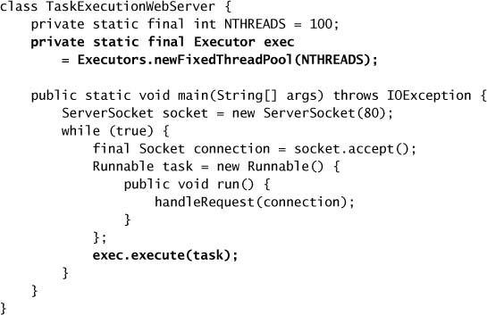

Chúng ta có thể dễ dàng sửa `TaskExecutionWebServer` để hành xử như `ThreadPerTaskWebServer` bằng cách thay bằng một `Executor` tạo một thread mới cho mỗi request. Viết một `Executor` như vậy là chuyện tầm thường, như thể hiện ở `ThreadPerTaskExecutor` trong Listing 6.5.

**Listing 6.5. `Executor` khởi động một Thread mới cho mỗi Task.**

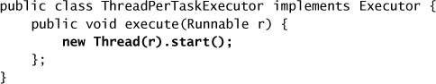

Tương tự, cũng dễ dàng viết một `Executor` khiến `TaskExecutionWebServer` hành xử như phiên bản single-threaded, thực thi mỗi task **đồng bộ** trước khi trả về từ `execute`, như thể hiện ở `WithinThreadExecutor` trong Listing 6.6.

**Listing 6.6. `Executor` thực thi Task đồng bộ trong Calling Thread.**

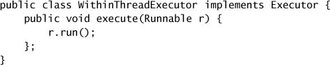

### 6.2.2. Execution Policy

Giá trị của việc decouple việc gửi khỏi việc thực thi là nó cho phép bạn dễ dàng đặc tả — và sau đó thay đổi mà không quá khó khăn — **execution policy** cho một lớp task nhất định. Một execution policy đặc tả "**cái gì, ở đâu, khi nào, và như thế nào**" của việc thực thi task, bao gồm:

- Task sẽ được thực thi **trong thread nào**?
- Task nên được thực thi **theo thứ tự nào** (FIFO, LIFO, thứ tự ưu tiên)?
- **Bao nhiêu task** có thể thực thi đồng thời?
- **Bao nhiêu task** có thể xếp hàng chờ thực thi?
- Nếu một task phải bị từ chối vì hệ thống quá tải, **task nào** nên được chọn làm "nạn nhân", và ứng dụng nên được **thông báo** như thế nào?
- Nên thực hiện **hành động gì** trước hoặc sau khi thực thi một task?

Execution policy là một **công cụ quản lý tài nguyên**, và policy tối ưu phụ thuộc vào tài nguyên tính toán khả dụng và yêu cầu chất lượng dịch vụ của bạn. Bằng cách giới hạn số task concurrent, bạn có thể đảm bảo rằng ứng dụng không fail vì cạn tài nguyên hay chịu vấn đề performance do tranh chấp tài nguyên khan hiếm.[^3] Việc tách đặc tả execution policy khỏi việc gửi task làm cho việc chọn một execution policy tại thời điểm triển khai — phù hợp với phần cứng khả dụng — trở nên khả thi.

[^3]: Điều này tương tự một trong các vai trò của transaction monitor trong ứng dụng doanh nghiệp: nó có thể điều tiết tốc độ mà các transaction được phép tiến hành để không làm cạn kiệt hay quá tải các tài nguyên hữu hạn.

> Bất cứ khi nào bạn thấy code dạng:
>
> ```java
> new Thread(runnable).start()
> ```
>
> và bạn nghĩ rằng tại một thời điểm nào đó mình có thể muốn một execution policy linh hoạt hơn, hãy nghiêm túc cân nhắc thay nó bằng việc dùng một `Executor`.

### 6.2.3. Thread Pool

Một **thread pool**, đúng như tên gọi, quản lý một pool đồng nhất các **worker thread**. Một thread pool gắn chặt với một **work queue** giữ các task đang chờ được thực thi. Worker thread có một cuộc sống đơn giản: yêu cầu task tiếp theo từ work queue, thực thi nó, rồi quay lại chờ task khác.

Thực thi task trong các thread của pool có nhiều lợi thế so với cách tiếp cận thread-per-task. **Tái sử dụng** một thread hiện có thay vì tạo mới sẽ **phân bổ** chi phí tạo và hủy thread ra nhiều request. Như một phần thưởng thêm, vì worker thread thường đã tồn tại sẵn tại thời điểm request đến, độ trễ liên quan đến việc tạo thread không làm chậm việc thực thi task, do đó cải thiện khả năng đáp ứng. Bằng cách điều chỉnh đúng kích thước thread pool, bạn có thể có đủ thread để giữ các processor bận trong khi không có quá nhiều thread đến mức ứng dụng cạn bộ nhớ hoặc "thrash" do các thread cạnh tranh tài nguyên.

Thư viện class cung cấp một hiện thực thread pool linh hoạt cùng một số cấu hình định sẵn hữu ích. Bạn có thể tạo một thread pool bằng cách gọi một trong các static factory method trong `Executors`:

**`newFixedThreadPool`.** Một thread pool cỡ cố định tạo thread khi task được gửi, cho đến kích thước pool tối đa, rồi cố giữ kích thước pool không đổi (thêm thread mới nếu một thread chết do `Exception` bất ngờ).

**`newCachedThreadPool`.** Một cached thread pool linh hoạt hơn trong việc "thu hoạch" các thread nhàn rỗi khi kích thước hiện tại của pool vượt quá nhu cầu xử lý, và thêm thread mới khi nhu cầu tăng, nhưng **không đặt giới hạn** lên kích thước pool.

**`newSingleThreadExecutor`.** Một executor single-threaded tạo **một** worker thread duy nhất để xử lý task, thay thế nó nếu nó chết bất ngờ. Task được **đảm bảo** xử lý tuần tự theo thứ tự do task queue áp đặt (FIFO, LIFO, thứ tự ưu tiên).[^4]

[^4]: Các executor single-threaded cũng cung cấp đủ synchronization nội bộ để đảm bảo rằng mọi thao tác ghi bộ nhớ do task thực hiện đều nhìn thấy được với các task tiếp theo; điều này nghĩa là object có thể được confine an toàn vào "task thread" ngay cả khi thread đó thỉnh thoảng bị thay bằng thread khác.

**`newScheduledThreadPool`.** Một thread pool cỡ cố định hỗ trợ thực thi task có trì hoãn và định kỳ, tương tự `Timer`. (Xem mục 6.2.5.)

Các factory `newFixedThreadPool` và `newCachedThreadPool` trả về instance của `ThreadPoolExecutor` đa dụng, thứ cũng có thể được dùng trực tiếp để xây dựng những executor chuyên biệt hơn. Chúng ta sẽ bàn sâu về các tùy chọn cấu hình thread pool ở chương 8.

Web server trong `TaskExecutionWebServer` dùng một `Executor` với một pool worker thread có giới hạn. Gửi một task bằng `execute` sẽ thêm task vào work queue, và các worker thread lặp lại việc lấy task khỏi work queue và thực thi chúng.

Chuyển từ policy thread-per-task sang policy dựa trên pool có tác động lớn đến **tính ổn định** của ứng dụng: web server sẽ không còn fail dưới tải nặng nữa.[^5] Nó cũng **suy giảm êm ái hơn**, vì nó không tạo hàng nghìn thread cạnh tranh tài nguyên CPU và bộ nhớ hữu hạn. Và việc dùng một `Executor` mở ra cánh cửa cho đủ loại cơ hội bổ sung để tinh chỉnh, quản lý, giám sát, ghi log, báo cáo lỗi, và những khả năng khác — những thứ sẽ khó thêm hơn rất nhiều nếu không có một framework thực thi task.

[^5]: Dù server có thể không fail vì tạo quá nhiều thread, nếu tốc độ đến của task vượt tốc độ phục vụ task đủ lâu, vẫn có thể (chỉ là khó hơn) cạn bộ nhớ vì hàng đợi `Runnable` chờ thực thi cứ lớn dần. Điều này có thể được giải quyết trong framework `Executor` bằng cách dùng một work queue có giới hạn — xem mục 8.3.2.

### 6.2.4. Vòng đời của Executor

Chúng ta đã thấy cách tạo một `Executor` nhưng chưa thấy cách **tắt** nó. Một hiện thực `Executor` nhiều khả năng sẽ tạo thread để xử lý task. Nhưng JVM không thể thoát cho đến khi tất cả thread (không phải daemon) đã kết thúc, nên việc **không tắt** một `Executor` có thể khiến JVM không thoát được.

Vì một `Executor` xử lý task bất đồng bộ, tại bất kỳ thời điểm nào, trạng thái của các task đã gửi trước đó không hiển nhiên ngay. Một số có thể đã hoàn tất, một số có thể đang chạy, và số khác có thể đang xếp hàng chờ thực thi. Khi tắt một ứng dụng, có cả một dải phổ từ **graceful shutdown** (hoàn thành những gì bạn đã bắt đầu nhưng không nhận thêm việc mới) đến **abrupt shutdown** (ngắt điện phòng máy), và nhiều điểm ở giữa. Vì `Executor` cung cấp dịch vụ cho ứng dụng, chúng cũng nên có thể được tắt — cả êm ái lẫn đột ngột — và phản hồi thông tin về trạng thái của những task bị ảnh hưởng bởi việc shutdown cho ứng dụng.

Để giải quyết vấn đề vòng đời của execution service, interface `ExecutorService` mở rộng `Executor`, thêm một số method quản lý vòng đời (cũng như một số method tiện lợi để gửi task). Các method quản lý vòng đời của `ExecutorService` được thể hiện ở Listing 6.7.

**Listing 6.7. Các Method vòng đời trong `ExecutorService`.**

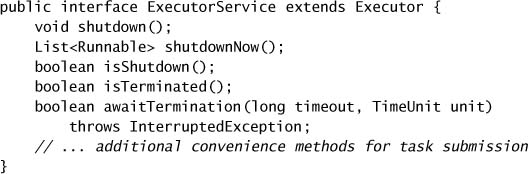

Vòng đời được `ExecutorService` ngụ ý có **ba trạng thái**: đang chạy (running), đang tắt (shutting down), và đã kết thúc (terminated). Các `ExecutorService` ban đầu được tạo ở trạng thái running. Method `shutdown` khởi động một graceful shutdown: **không nhận task mới** nhưng những task đã gửi trước đó được phép hoàn tất — bao gồm cả những task chưa bắt đầu thực thi. Method `shutdownNow` khởi động một abrupt shutdown: nó **cố hủy** các task còn tồn đọng và **không khởi động** bất kỳ task nào đang xếp hàng nhưng chưa bắt đầu.

Các task được gửi tới một `ExecutorService` **sau khi** nó đã bị tắt sẽ được xử lý bởi **rejected execution handler** (xem mục 8.3.3), thứ có thể âm thầm loại bỏ task hoặc có thể khiến `execute` ném `RejectedExecutionException` (unchecked). Một khi tất cả task đã hoàn tất, `ExecutorService` chuyển sang trạng thái terminated. Bạn có thể chờ một `ExecutorService` đạt trạng thái terminated bằng `awaitTermination`, hoặc poll xem nó đã kết thúc chưa bằng `isTerminated`. Người ta thường gọi `shutdown` rồi ngay sau đó gọi `awaitTermination`, tạo hiệu ứng **tắt `ExecutorService` một cách đồng bộ**. (Việc shutdown `Executor` và hủy task được trình bày chi tiết hơn ở chương 7.)

`LifecycleWebServer` ở Listing 6.8 mở rộng web server của chúng ta với hỗ trợ vòng đời. Nó có thể được tắt theo hai cách: bằng chương trình qua việc gọi `stop`, và thông qua một request của client bằng cách gửi cho web server một HTTP request được định dạng đặc biệt.

**Listing 6.8. Web Server có hỗ trợ Shutdown.**

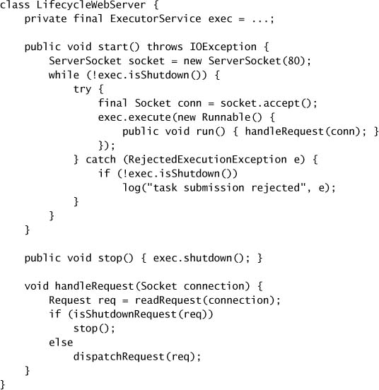

### 6.2.5. Task có trì hoãn và định kỳ

Tiện ích `Timer` quản lý việc thực thi các task **trì hoãn** ("chạy task này sau 100 ms") và **định kỳ** ("chạy task này mỗi 10 ms"). Tuy nhiên, `Timer` có một số nhược điểm, và `ScheduledThreadPoolExecutor` nên được coi là **thứ thay thế** cho nó.[^6] Bạn có thể tạo một `ScheduledThreadPoolExecutor` qua constructor của nó hoặc qua factory `newScheduledThreadPool`.

[^6]: `Timer` **có** hỗ trợ lập lịch dựa trên thời gian **tuyệt đối**, chứ không phải tương đối, nên task có thể nhạy cảm với thay đổi đồng hồ hệ thống; `ScheduledThreadPoolExecutor` chỉ hỗ trợ thời gian tương đối.

Một `Timer` chỉ tạo **một thread duy nhất** để thực thi timer task. Nếu một timer task chạy quá lâu, độ chính xác thời gian của các `TimerTask` khác có thể bị ảnh hưởng. Nếu một `TimerTask` định kỳ được lập lịch chạy mỗi 10 ms và một `TimerTask` khác mất 40 ms để chạy, thì task định kỳ hoặc (tùy vào việc nó được lập lịch theo fixed rate hay fixed delay) bị gọi **bốn lần liên tiếp** ngay sau khi task chạy lâu kết thúc, hoặc **"bỏ lỡ" hoàn toàn bốn lần gọi**. Scheduled thread pool giải quyết hạn chế này bằng cách cho phép bạn cung cấp **nhiều thread** để thực thi các task trì hoãn và định kỳ.

Một vấn đề khác với `Timer` là nó hành xử rất tệ nếu một `TimerTask` ném một unchecked exception. Thread của `Timer` **không bắt** exception, nên một unchecked exception ném ra từ một `TimerTask` sẽ **kết thúc timer thread**. `Timer` cũng không hồi sinh thread trong tình huống này; thay vào đó, nó **nhầm lẫn** giả định rằng toàn bộ `Timer` đã bị hủy. Trong trường hợp này, những `TimerTask` đã được lập lịch nhưng chưa thực thi sẽ **không bao giờ chạy**, và task mới không thể được lập lịch. (Vấn đề này, gọi là "**thread leakage**", được mô tả ở mục 7.3, cùng với các kỹ thuật tránh nó.)

`OutOfTime` ở Listing 6.9 minh họa cách một `Timer` có thể trở nên "rối loạn" theo kiểu này và — vì "nỗi rối loạn thích có bạn đồng hành" — cách `Timer` chia sẻ nỗi rối loạn của nó với caller xấu số tiếp theo cố gửi một `TimerTask`. Bạn có thể mong đợi chương trình chạy sáu giây rồi thoát, nhưng thực tế xảy ra là nó kết thúc **sau một giây** với một `IllegalStateException` có nội dung "Timer already cancelled". `ScheduledThreadPoolExecutor` xử lý đúng cách những task hư hỏng; có rất ít lý do để dùng `Timer` ở Java 5.0 trở lên.

Nếu bạn cần xây dựng dịch vụ lập lịch của riêng mình, bạn vẫn có thể tận dụng thư viện bằng cách dùng một `DelayQueue`, một hiện thực `BlockingQueue` cung cấp chức năng lập lịch của `ScheduledThreadPoolExecutor`. Một `DelayQueue` quản lý một collection các object `Delayed`. Một `Delayed` có một thời gian trì hoãn gắn với nó: `DelayQueue` chỉ cho bạn `take` một phần tử **nếu độ trễ của nó đã hết hạn**. Object được trả về từ `DelayQueue` theo thứ tự thời gian gắn với độ trễ của chúng.

---

## 6.3. Tìm kiếm Parallelism có thể khai thác

Framework `Executor` giúp dễ dàng đặc tả một execution policy, nhưng để dùng một `Executor`, bạn phải có khả năng mô tả task của mình dưới dạng một `Runnable`. Trong hầu hết ứng dụng server, có một ranh giới task hiển nhiên: một request đơn lẻ của client. Nhưng đôi khi ranh giới task tốt lại không hiển nhiên đến vậy, như trong nhiều ứng dụng desktop. Cũng có thể có parallelism khai thác được **ngay bên trong một request đơn lẻ** trong ứng dụng server, như đôi khi xảy ra ở database server. (Để bàn thêm về những áp lực thiết kế cạnh tranh nhau trong việc chọn ranh giới task, xem [CPJ 4.4.1.1].)

**Listing 6.9. Class minh họa hành vi khó hiểu của `Timer`.**

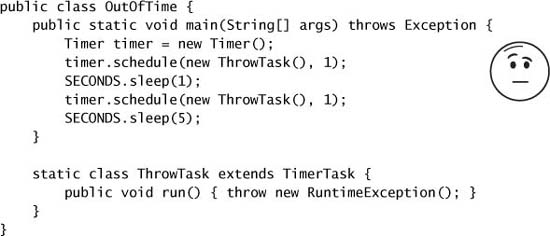

Trong mục này chúng ta phát triển vài phiên bản của một component cho phép các mức độ concurrency khác nhau. Component mẫu của chúng ta là phần **render trang** của một ứng dụng trình duyệt, nhận một trang HTML và render nó vào một image buffer. Để đơn giản, ta giả định rằng HTML chỉ gồm văn bản có đánh dấu xen lẫn các phần tử ảnh với kích thước và URL đã được chỉ định trước.

### 6.3.1. Ví dụ: Page Renderer tuần tự

Cách tiếp cận đơn giản nhất là xử lý tài liệu HTML **tuần tự**. Khi gặp text markup, render nó vào image buffer; khi gặp tham chiếu ảnh, tải ảnh qua mạng và vẽ nó vào image buffer luôn. Cách này dễ hiện thực và chỉ cần chạm vào mỗi phần tử đầu vào **một lần** (thậm chí không cần buffer tài liệu), nhưng nhiều khả năng sẽ làm người dùng khó chịu, vì họ có thể phải chờ rất lâu trước khi toàn bộ văn bản được render.

Một cách ít gây khó chịu hơn nhưng vẫn tuần tự là render các phần tử văn bản trước, để lại **các ô giữ chỗ hình chữ nhật** cho ảnh, và sau khi hoàn tất lượt duyệt đầu tiên trên tài liệu, quay lại tải ảnh và vẽ chúng vào ô giữ chỗ tương ứng. Cách này được thể hiện ở `SingleThreadRenderer` trong Listing 6.10.

Việc tải một ảnh chủ yếu là **chờ I/O hoàn tất**, và trong thời gian này CPU làm rất ít việc. Vậy nên cách tiếp cận tuần tự có thể **sử dụng CPU dưới mức**, và cũng bắt người dùng chờ lâu hơn mức cần thiết để thấy trang hoàn chỉnh. Chúng ta có thể đạt mức sử dụng và khả năng đáp ứng tốt hơn bằng cách chia bài toán thành những task độc lập có thể thực thi concurrent.

**Listing 6.10. Render các phần tử trang một cách tuần tự.**

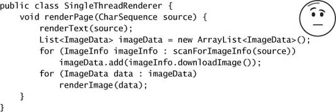

### 6.3.2. Task có mang kết quả: Callable và Future

Framework `Executor` dùng `Runnable` làm biểu diễn task cơ bản. `Runnable` là một trừu tượng hóa khá hạn chế: `run` **không thể trả về giá trị hay ném checked exception**, mặc dù nó có thể có tác dụng phụ như ghi vào file log hoặc đặt kết quả vào một cấu trúc dữ liệu được share.

Nhiều task trên thực tế là những **phép tính bị trì hoãn** — thực thi một truy vấn database, lấy một tài nguyên qua mạng, hay tính một hàm phức tạp. Với những loại task này, `Callable` là một trừu tượng hóa tốt hơn: nó kỳ vọng rằng điểm vào chính, `call`, sẽ **trả về một giá trị** và lường trước rằng nó có thể **ném một exception**.[^7] `Executors` bao gồm vài method tiện ích để bọc các loại task khác — bao gồm `Runnable` và `java.security.PrivilegedAction` — bằng một `Callable`.

[^7]: Để diễn đạt một task không trả về giá trị bằng `Callable`, hãy dùng `Callable<Void>`.

`Runnable` và `Callable` mô tả các task tính toán trừu tượng. Task thường là **hữu hạn**: chúng có một điểm bắt đầu rõ ràng và cuối cùng sẽ kết thúc. Vòng đời của một task được `Executor` thực thi có **bốn giai đoạn**: đã tạo (created), đã gửi (submitted), đã bắt đầu (started), và đã hoàn tất (completed). Vì task có thể mất rất lâu để chạy, chúng ta cũng muốn có khả năng **hủy** một task. Trong framework `Executor`, những task đã được gửi nhưng chưa bắt đầu **luôn có thể bị hủy**, và những task đã bắt đầu **đôi khi** có thể bị hủy nếu chúng phản ứng với interruption. Hủy một task đã hoàn tất **không có tác dụng gì**. (Cancellation được trình bày chi tiết hơn ở chương 7.)

`Future` biểu diễn vòng đời của một task và cung cấp method để kiểm tra xem task đã hoàn tất hay bị hủy chưa, lấy kết quả của nó, và hủy task. `Callable` và `Future` được thể hiện ở Listing 6.11. Điều được ngụ ý trong đặc tả của `Future` là vòng đời task **chỉ có thể tiến về phía trước, không lùi lại** — cũng như vòng đời của `ExecutorService`. Một khi một task hoàn tất, nó ở mãi trong trạng thái đó.

Hành vi của `get` thay đổi tùy trạng thái task (chưa bắt đầu, đang chạy, đã hoàn tất). Nó trả về ngay lập tức hoặc ném một `Exception` nếu task đã hoàn tất, nhưng nếu chưa, nó **block** cho đến khi task hoàn tất. Nếu task kết thúc bằng cách ném một exception, `get` ném lại exception đó được bọc trong một `ExecutionException`; nếu nó bị hủy, `get` ném `CancellationException`. Nếu `get` ném `ExecutionException`, exception nền tảng có thể được lấy bằng `getCause`.

**Listing 6.11. Các interface `Callable` và `Future`.**

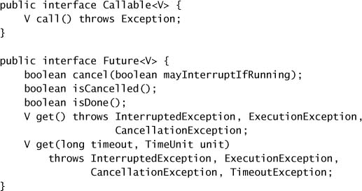

Có vài cách để tạo một `Future` mô tả một task. Các method `submit` trong `ExecutorService` đều trả về một `Future`, để bạn có thể gửi một `Runnable` hoặc một `Callable` tới một executor và nhận lại một `Future` có thể dùng để lấy kết quả hoặc hủy task. Bạn cũng có thể **tường minh** khởi tạo một `FutureTask` cho một `Runnable` hoặc `Callable` cho trước. (Vì `FutureTask` hiện thực `Runnable`, nó có thể được gửi tới một `Executor` để thực thi hoặc được thực thi trực tiếp bằng cách gọi method `run` của nó.)

Kể từ Java 6, các hiện thực `ExecutorService` có thể override `newTaskFor` trong `AbstractExecutorService` để kiểm soát việc khởi tạo `Future` tương ứng với một `Callable` hay `Runnable` được gửi. Hiện thực mặc định chỉ đơn giản tạo một `FutureTask` mới, như trong Listing 6.12.

**Listing 6.12. Hiện thực mặc định của `newTaskFor` trong `ThreadPoolExecutor`.**

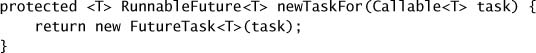

Việc gửi một `Runnable` hay `Callable` tới một `Executor` **cấu thành một safe publication** (xem mục 3.5) của `Runnable` hay `Callable` đó từ thread gửi sang thread cuối cùng sẽ thực thi task. Tương tự, việc đặt giá trị kết quả cho một `Future` cấu thành một safe publication của kết quả từ thread mà nó được tính sang bất kỳ thread nào lấy nó qua `get`.

### 6.3.3. Ví dụ: Page Renderer dùng Future

Như bước đầu tiên hướng tới việc làm page renderer concurrent hơn, hãy chia nó thành **hai task**: một task render văn bản và một task tải toàn bộ ảnh. (Vì một task chủ yếu bị giới hạn bởi CPU còn task kia chủ yếu bị giới hạn bởi I/O, cách này có thể mang lại cải thiện ngay cả trên hệ thống một CPU.)

`Callable` và `Future` có thể giúp chúng ta diễn đạt sự tương tác giữa những task hợp tác này. Trong `FutureRenderer` ở Listing 6.13, chúng ta tạo một `Callable` để tải tất cả ảnh, và gửi nó tới một `ExecutorService`. Việc này trả về một `Future` mô tả việc thực thi của task; khi task chính đến điểm cần các ảnh, nó **chờ kết quả** bằng cách gọi `Future.get`. Nếu may mắn, kết quả sẽ đã sẵn sàng vào lúc ta hỏi; nếu không, ít nhất chúng ta cũng đã "xuất phát sớm" trong việc tải ảnh.

Bản chất **phụ thuộc trạng thái** của `get` nghĩa là caller không cần biết trạng thái của task, và các tính chất safe publication của việc gửi task và lấy kết quả làm cho cách tiếp cận này thread-safe. Code xử lý exception bao quanh `Future.get` xử lý hai vấn đề khả dĩ: task đã gặp một `Exception`, hoặc thread gọi `get` bị interrupt trước khi kết quả sẵn sàng. (Xem mục 5.5.2 và 5.4.)

`FutureRenderer` cho phép văn bản được render **đồng thời** với việc tải dữ liệu ảnh. Khi tất cả ảnh đã được tải, chúng được render lên trang. Đây là một cải tiến ở chỗ người dùng thấy kết quả nhanh và nó khai thác được một phần parallelism, nhưng chúng ta có thể làm **tốt hơn đáng kể**. Người dùng không cần phải chờ **tất cả** ảnh được tải; có lẽ họ sẽ thích thấy từng ảnh được vẽ **ngay khi nó sẵn sàng** hơn.

### 6.3.4. Hạn chế của việc song song hóa các Task không đồng nhất

Ở ví dụ trước, chúng ta đã cố thực thi song song hai loại task khác nhau — tải ảnh và render trang. Nhưng việc đạt được cải thiện performance đáng kể bằng cách cố song song hóa những task tuần tự **không đồng nhất** có thể rất khó.

Hai người có thể chia công việc rửa bát khá hiệu quả: một người rửa còn người kia lau. Tuy nhiên, việc gán một **loại task khác nhau** cho mỗi worker **không mở rộng tốt**; nếu có thêm vài người xuất hiện, không rõ họ có thể giúp thế nào mà không vướng chân nhau hoặc không phải tái cấu trúc đáng kể cách phân chia lao động. Nếu không tìm ra parallelism mịn hơn giữa các task **tương tự nhau**, cách tiếp cận này sẽ cho lợi ích giảm dần.

Một vấn đề nữa với việc chia các task không đồng nhất giữa nhiều worker là các task có thể có **kích thước chênh lệch**. Nếu bạn chia task A và B giữa hai worker nhưng A mất gấp mười lần thời gian so với B, bạn chỉ tăng tốc toàn bộ quá trình được **9%**. Cuối cùng, việc chia một task giữa nhiều worker luôn kéo theo một lượng **chi phí điều phối** nào đó; để việc chia là đáng giá, chi phí này phải được bù đắp nhiều hơn bởi cải thiện năng suất nhờ parallelism.

`FutureRenderer` dùng hai task: một để render văn bản và một để tải ảnh. Nếu việc render văn bản **nhanh hơn nhiều** so với tải ảnh — điều hoàn toàn có thể — thì performance kết quả không khác mấy so với phiên bản tuần tự, nhưng code lại phức tạp hơn nhiều. Và điều tốt nhất ta có thể làm với hai thread là tăng tốc **gấp đôi**. Vì vậy, việc cố tăng concurrency bằng cách song song hóa những hoạt động không đồng nhất có thể tốn rất nhiều công, và có một giới hạn cho lượng concurrency bổ sung mà bạn có thể thu được từ đó. (Xem mục 11.4.2 và 11.4.3 để có một ví dụ khác về cùng hiện tượng này.)

**Listing 6.13. Chờ tải ảnh bằng `Future`.**

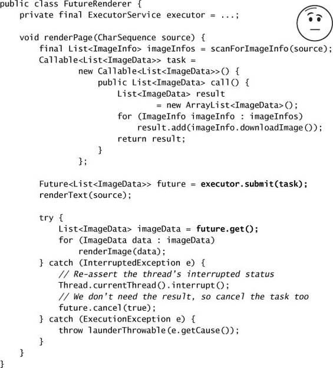

> Lợi ích performance thực sự của việc chia khối lượng công việc của một chương trình thành các task chỉ đến khi có **số lượng lớn task độc lập, đồng nhất** có thể được xử lý concurrent.

### 6.3.5. CompletionService: Khi Executor gặp BlockingQueue

Nếu bạn có một lô phép tính để gửi tới một `Executor` và muốn lấy kết quả của chúng **ngay khi chúng sẵn sàng**, bạn có thể giữ lại `Future` gắn với mỗi task và lặp lại việc poll xem đã hoàn tất chưa bằng cách gọi `get` với timeout bằng không. Cách này khả thi, nhưng **tẻ nhạt**. May mắn thay có một cách tốt hơn: một **completion service**.

`CompletionService` kết hợp chức năng của một `Executor` và một `BlockingQueue`. Bạn có thể gửi các task `Callable` tới nó để thực thi và dùng các method kiểu queue là `take` và `poll` để lấy các kết quả đã hoàn tất, được đóng gói dưới dạng `Future`, **ngay khi chúng sẵn sàng**. `ExecutorCompletionService` hiện thực `CompletionService`, ủy quyền phần tính toán cho một `Executor`.

Hiện thực của `ExecutorCompletionService` khá đơn giản. Constructor tạo một `BlockingQueue` để giữ các kết quả đã hoàn tất. `FutureTask` có một method `done` được gọi khi phép tính hoàn tất. Khi một task được gửi, nó được bọc bằng một `QueueingFuture`, một subclass của `FutureTask` **override `done`** để đặt kết quả lên `BlockingQueue`, như trong Listing 6.14. Các method `take` và `poll` ủy quyền cho `BlockingQueue`, block nếu kết quả chưa sẵn sàng.

**Listing 6.14. Class `QueueingFuture` được `ExecutorCompletionService` sử dụng.**

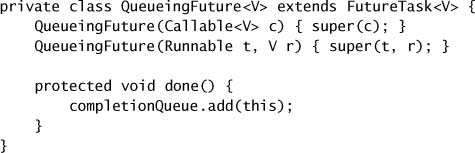

### 6.3.6. Ví dụ: Page Renderer dùng CompletionService

Chúng ta có thể dùng một `CompletionService` để cải thiện performance của page renderer theo **hai** cách: **tổng thời gian chạy ngắn hơn** và **khả năng đáp ứng tốt hơn**. Chúng ta có thể tạo một task riêng để tải **mỗi** ảnh và thực thi chúng trong một thread pool, biến việc tải tuần tự thành song song: điều này giảm thời gian để tải tất cả ảnh. Và bằng cách lấy kết quả từ `CompletionService` và render mỗi ảnh **ngay khi nó sẵn sàng**, chúng ta có thể mang lại cho người dùng một giao diện động và phản hồi tốt hơn. Hiện thực này được thể hiện ở `Renderer` trong Listing 6.15.

**Listing 6.15. Dùng `CompletionService` để render các phần tử trang ngay khi chúng sẵn sàng.**

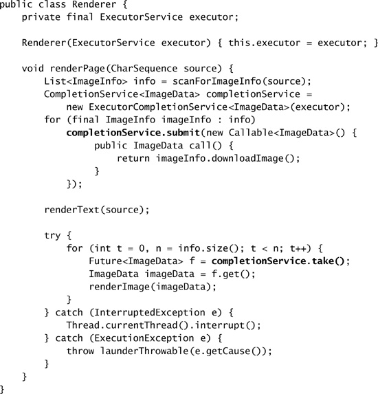

Nhiều `ExecutorCompletionService` có thể **dùng chung một `Executor`**, nên hoàn toàn hợp lý khi tạo một `ExecutorCompletionService` riêng cho một phép tính cụ thể trong khi vẫn share một `Executor` chung. Khi được dùng theo cách này, một `CompletionService` đóng vai trò như một **handle cho một lô phép tính**, giống hệt cách một `Future` đóng vai trò handle cho một phép tính đơn lẻ. Bằng cách nhớ có bao nhiêu task đã được gửi tới `CompletionService` và đếm bao nhiêu kết quả đã hoàn tất được lấy về, bạn có thể biết khi nào toàn bộ kết quả của một lô đã được lấy hết, ngay cả khi bạn dùng một `Executor` chung.

### 6.3.7. Đặt giới hạn thời gian cho Task

Đôi khi, nếu một hoạt động không hoàn tất trong một khoảng thời gian nhất định, kết quả không còn cần thiết nữa và hoạt động đó có thể bị **bỏ**. Ví dụ, một ứng dụng web có thể lấy quảng cáo từ một ad server bên ngoài, nhưng nếu quảng cáo không sẵn sàng trong vòng hai giây, nó sẽ hiển thị một quảng cáo mặc định để việc quảng cáo không khả dụng không làm tổn hại yêu cầu về khả năng đáp ứng của site. Tương tự, một site cổng thông tin có thể lấy dữ liệu song song từ nhiều nguồn, nhưng có thể chỉ sẵn sàng chờ một khoảng thời gian nhất định để dữ liệu sẵn sàng trước khi render trang mà không có nó.

Thách thức chính khi thực thi task trong một **ngân sách thời gian** là đảm bảo rằng bạn **không chờ lâu hơn** ngân sách thời gian để có được câu trả lời hoặc để biết rằng sẽ không có câu trả lời nào. Phiên bản có timeout của `Future.get` hỗ trợ yêu cầu này: nó trả về ngay khi kết quả sẵn sàng, nhưng **ném `TimeoutException`** nếu kết quả chưa sẵn sàng trong khoảng thời gian timeout.

Một vấn đề thứ cấp khi dùng task có timeout là **dừng chúng lại** khi chúng hết thời gian, để chúng không lãng phí tài nguyên tính toán bằng cách tiếp tục tính một kết quả sẽ không được dùng. Điều này có thể đạt được bằng cách để task **tự quản lý ngân sách thời gian** của nó và tự hủy nếu hết thời gian, hoặc bằng cách **hủy task** khi timeout hết hạn. Một lần nữa, `Future` có thể giúp; nếu một `get` có timeout kết thúc bằng `TimeoutException`, bạn có thể hủy task thông qua `Future`. Nếu task được viết sao cho có thể hủy được (xem chương 7), nó có thể bị kết thúc sớm để không tiêu tốn tài nguyên quá mức. Kỹ thuật này được dùng ở Listing 6.13 và 6.16.

Listing 6.16 cho thấy một ứng dụng điển hình của `Future.get` có timeout. Nó tạo ra một trang web tổng hợp chứa nội dung được yêu cầu cộng với một quảng cáo lấy từ ad server. Nó gửi task lấy quảng cáo tới một executor, tính phần nội dung còn lại của trang, rồi chờ quảng cáo cho đến khi ngân sách thời gian của nó hết.[^8] Nếu `get` hết thời gian, nó **hủy**[^9] task lấy quảng cáo và dùng quảng cáo mặc định thay thế.

[^8]: Timeout được truyền cho `get` được tính bằng cách lấy deadline trừ đi thời gian hiện tại; điều này thực tế có thể cho ra một số âm, nhưng mọi method có timeout trong `java.util.concurrent` đều coi timeout âm là bằng không, nên không cần code thêm để xử lý trường hợp này.

[^9]: Tham số `true` truyền cho `Future.cancel` nghĩa là thread của task **có thể bị interrupt** nếu task hiện đang chạy; xem chương 7.

### 6.3.8. Ví dụ: Cổng đặt chỗ du lịch

Cách tiếp cận ngân sách thời gian ở mục trước có thể dễ dàng tổng quát hóa cho một số lượng task tùy ý. Hãy xét một cổng đặt chỗ du lịch: người dùng nhập ngày đi và các yêu cầu, và cổng lấy về rồi hiển thị các báo giá từ một số hãng hàng không, khách sạn, hay công ty cho thuê xe. Tùy công ty, việc lấy một báo giá có thể liên quan đến việc gọi một web service, tra cứu một database, thực hiện một giao dịch EDI, hoặc cơ chế nào đó khác. Thay vì để thời gian phản hồi của trang bị quyết định bởi phản hồi **chậm nhất**, có thể tốt hơn nếu chỉ trình bày những thông tin có sẵn trong một ngân sách thời gian cho trước. Với những nhà cung cấp không phản hồi kịp, trang có thể hoặc bỏ qua hoàn toàn, hoặc hiển thị một placeholder như "Chưa nhận được phản hồi từ Air Java kịp thời."

**Listing 6.16. Lấy quảng cáo với một ngân sách thời gian.**

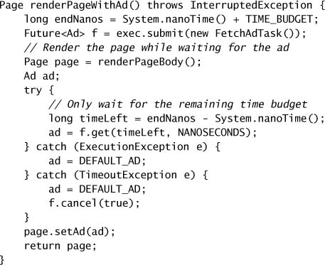

Việc lấy báo giá từ một công ty **độc lập** với việc lấy báo giá từ công ty khác, nên lấy một báo giá đơn lẻ là một ranh giới task hợp lý, cho phép việc lấy báo giá diễn ra concurrent. Sẽ khá dễ dàng để tạo n task, gửi chúng tới một thread pool, giữ lại các `Future`, và dùng một `get` có timeout để lấy từng kết quả tuần tự qua `Future` của nó, nhưng có một **cách còn dễ hơn nữa** — `invokeAll`.

Listing 6.17 dùng phiên bản có timeout của `invokeAll` để gửi nhiều task tới một `ExecutorService` và lấy về kết quả. Method `invokeAll` nhận một collection các task và trả về một collection các `Future`. Hai collection có **cấu trúc giống hệt nhau**; `invokeAll` thêm các `Future` vào collection trả về theo thứ tự mà iterator của collection task áp đặt, do đó cho phép caller liên kết một `Future` với `Callable` mà nó biểu diễn. Phiên bản có timeout của `invokeAll` sẽ trả về khi **tất cả** task đã hoàn tất, thread gọi bị interrupt, hoặc timeout hết hạn. Bất kỳ task nào chưa hoàn tất khi timeout hết hạn đều **bị hủy**. Khi `invokeAll` trả về, mỗi task sẽ hoặc đã hoàn tất bình thường hoặc đã bị hủy; code client có thể gọi `get` hoặc `isCancelled` để biết trường hợp nào.

---

## Tóm tắt

Cấu trúc ứng dụng xoay quanh việc thực thi task có thể đơn giản hóa việc phát triển và tạo điều kiện cho concurrency. Framework `Executor` cho phép bạn **decouple việc gửi task khỏi execution policy** và hỗ trợ rất nhiều loại execution policy khác nhau; bất cứ khi nào bạn thấy mình đang tạo thread để thực hiện task, hãy cân nhắc dùng một `Executor` thay thế. Để tối đa hóa lợi ích của việc phân rã một ứng dụng thành các task, bạn phải **xác định được ranh giới task hợp lý**. Trong một số ứng dụng, những ranh giới task hiển nhiên đã hoạt động tốt, trong khi ở những ứng dụng khác có thể cần một chút phân tích để khám phá ra parallelism mịn hơn có thể khai thác được.

**Listing 6.17. Yêu cầu báo giá du lịch trong một ngân sách thời gian.**

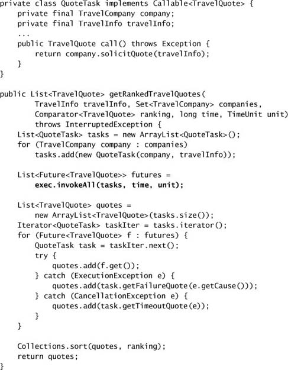
