# Chương 7. Cancellation and Shutdown

> **Về bản dịch này.** Đây là bản **dịch đầy đủ** chương 7 của cuốn *Java Concurrency in Practice* (Brian Goetz và cộng sự). Các **thuật ngữ chuyên ngành được giữ nguyên tiếng Anh**. Toàn bộ code listing và hình vẽ được trích trực tiếp từ file PDF gốc và lưu trong thư mục `images/ch07/`.

---

Khởi động task và thread thì dễ. Phần lớn thời gian, chúng ta để chúng tự quyết định khi nào dừng bằng cách cho chúng chạy đến khi hoàn tất. Tuy nhiên, đôi khi chúng ta muốn dừng task hay thread **sớm hơn** so với khi chúng tự dừng, có lẽ vì người dùng đã hủy một operation hoặc ứng dụng cần tắt nhanh.

Làm cho task và thread dừng lại một cách **an toàn, nhanh chóng, và đáng tin cậy** không phải lúc nào cũng dễ. Java **không cung cấp** cơ chế nào để ép một thread dừng việc nó đang làm một cách an toàn.[^1] Thay vào đó, nó cung cấp **interruption**, một cơ chế hợp tác cho phép một thread **yêu cầu** thread khác dừng việc nó đang làm.

[^1]: Các method `Thread.stop` và `suspend` đã bị deprecated từng là nỗ lực cung cấp một cơ chế như vậy, nhưng nhanh chóng bị nhận ra là có khiếm khuyết nghiêm trọng và nên tránh. Xem `http://java.sun.com/j2se/1.5.0/docs/guide/misc/threadPrimitiveDeprecation.html` để hiểu về các vấn đề với những method này.

Cách tiếp cận hợp tác là cần thiết vì chúng ta hiếm khi muốn một task, thread, hay service dừng **ngay lập tức**, bởi điều đó có thể để lại các cấu trúc dữ liệu được share ở trạng thái không nhất quán. Thay vào đó, task và service có thể được viết sao cho khi được yêu cầu, chúng **dọn dẹp** mọi công việc đang dở dang rồi mới kết thúc. Điều này mang lại sự linh hoạt lớn hơn, vì chính code của task thường có khả năng đánh giá việc dọn dẹp cần thiết tốt hơn code yêu cầu hủy.

Các vấn đề về **kết thúc vòng đời** có thể làm phức tạp việc thiết kế và hiện thực task, service, và ứng dụng, và yếu tố quan trọng này của thiết kế chương trình lại quá thường xuyên bị bỏ qua. Xử lý tốt việc thất bại, shutdown, và cancellation là một trong những đặc điểm phân biệt một ứng dụng **hành xử tốt** với một ứng dụng chỉ đơn thuần **chạy được**. Chương này bàn về các cơ chế cancellation và interruption, và cách viết task và service phản ứng tốt với yêu cầu hủy.

---

## 7.1. Hủy Task

Một hoạt động là **cancellable** nếu code bên ngoài có thể đưa nó tới trạng thái hoàn tất **trước** khi nó hoàn tất bình thường. Có nhiều lý do khiến bạn có thể muốn hủy một hoạt động:

**Hủy theo yêu cầu người dùng.** Người dùng nhấn nút "cancel" trong ứng dụng GUI, hoặc yêu cầu hủy qua một giao diện quản lý như JMX (Java Management Extensions).

**Hoạt động có giới hạn thời gian.** Một ứng dụng tìm kiếm trong không gian bài toán trong một khoảng thời gian hữu hạn và chọn giải pháp tốt nhất tìm được trong thời gian đó. Khi bộ đếm thời gian hết hạn, mọi task vẫn đang tìm kiếm đều bị hủy.

**Sự kiện ứng dụng.** Một ứng dụng tìm kiếm trong không gian bài toán bằng cách phân rã nó để các task khác nhau tìm ở các vùng khác nhau của không gian bài toán. Khi một task tìm ra giải pháp, mọi task khác vẫn đang tìm kiếm đều bị hủy.

**Lỗi.** Một web crawler tìm kiếm các trang liên quan, lưu trang hoặc dữ liệu tóm tắt xuống đĩa. Khi một task crawl gặp lỗi (ví dụ, đĩa đầy), các task crawl khác bị hủy, có thể ghi lại trạng thái hiện tại của chúng để có thể khởi động lại sau.

**Shutdown.** Khi một ứng dụng hay service bị tắt, phải làm gì đó với công việc đang được xử lý hoặc đang xếp hàng chờ xử lý. Trong một graceful shutdown, các task đang thực hiện có thể được phép hoàn tất; trong một shutdown tức thời hơn, các task đang thực thi có thể bị hủy.

**Không có cách an toàn nào để dừng một thread một cách áp đặt (preemptive) trong Java**, và do đó không có cách an toàn nào để dừng một task một cách áp đặt. Chỉ có các cơ chế **hợp tác**, theo đó task và code yêu cầu hủy tuân theo một **protocol đã thỏa thuận**.

Một cơ chế hợp tác như vậy là đặt một cờ "đã yêu cầu hủy" mà task kiểm tra định kỳ; nếu nó thấy cờ được đặt, task kết thúc sớm. `PrimeGenerator` ở Listing 7.1 — thứ liệt kê các số nguyên tố cho đến khi bị hủy — minh họa kỹ thuật này. Method `cancel` đặt cờ `cancelled`, và vòng lặp chính poll cờ này trước khi tìm số nguyên tố tiếp theo. (Để việc này hoạt động đáng tin cậy, `cancelled` **phải là `volatile`**.)

Listing 7.2 cho thấy một cách dùng mẫu của class này, để prime generator chạy một giây rồi hủy nó. Generator sẽ không nhất thiết dừng **chính xác** sau một giây, vì có thể có một độ trễ giữa thời điểm yêu cầu hủy và thời điểm vòng lặp `run` kiểm tra cancellation lần tiếp theo. Method `cancel` được gọi từ một khối `finally` để đảm bảo rằng prime generator bị hủy **ngay cả khi** lời gọi `sleep` bị interrupt. Nếu `cancel` không được gọi, thread tìm số nguyên tố sẽ chạy mãi mãi, tiêu tốn chu kỳ CPU và ngăn JVM thoát.

Một task muốn có thể bị hủy phải có một **cancellation policy** đặc tả "**như thế nào**", "**khi nào**", và "**cái gì**" của việc hủy — code khác có thể yêu cầu hủy như thế nào, khi nào task kiểm tra xem đã có yêu cầu hủy chưa, và task thực hiện hành động gì để phản hồi yêu cầu hủy.

Hãy xét ví dụ thực tế về việc dừng thanh toán một tấm séc. Ngân hàng có quy định về cách gửi yêu cầu dừng thanh toán, những bảo đảm về khả năng đáp ứng khi xử lý yêu cầu như vậy, và các thủ tục cần thực hiện khi việc thanh toán thực sự bị dừng (như thông báo cho ngân hàng bên kia trong giao dịch và tính phí vào tài khoản người trả). Gộp lại, những thủ tục và bảo đảm này cấu thành **cancellation policy** cho việc thanh toán séc.

**Listing 7.1. Dùng một field Volatile để giữ trạng thái Cancellation.**

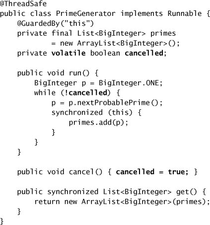

**Listing 7.2. Sinh số nguyên tố trong một giây.**

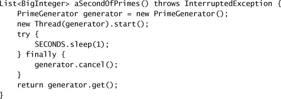

`PrimeGenerator` dùng một cancellation policy đơn giản: code client yêu cầu hủy bằng cách gọi `cancel`, `PrimeGenerator` kiểm tra cancellation **một lần cho mỗi số nguyên tố tìm được** và thoát khi nó phát hiện đã có yêu cầu hủy.

### 7.1.1. Interruption

Cơ chế cancellation trong `PrimeGenerator` cuối cùng sẽ khiến task tìm số nguyên tố thoát, nhưng có thể mất một lúc. Tuy nhiên, nếu một task dùng cách tiếp cận này gọi một **blocking method** như `BlockingQueue.put`, chúng ta có thể gặp vấn đề nghiêm trọng hơn — task có thể **không bao giờ kiểm tra** cờ cancellation và do đó **không bao giờ kết thúc**.

`BrokenPrimeProducer` ở Listing 7.3 minh họa vấn đề này. Thread producer sinh số nguyên tố và đặt chúng lên một blocking queue. Nếu producer đi trước consumer, queue sẽ đầy và `put` sẽ block. Chuyện gì xảy ra nếu consumer cố hủy task producer trong khi nó đang block ở `put`? Nó có thể gọi `cancel`, thứ sẽ đặt cờ `cancelled` — nhưng producer sẽ **không bao giờ kiểm tra** cờ đó vì nó sẽ không bao giờ thoát ra khỏi `put` đang block (vì consumer đã ngừng lấy số nguyên tố khỏi queue).

Như đã gợi ý ở chương 5, một số blocking method của thư viện **hỗ trợ interruption**. Thread interruption là một cơ chế hợp tác để một thread báo hiệu cho thread khác rằng nó nên — vào lúc thuận tiện và nếu nó muốn — dừng việc nó đang làm và làm việc khác.

Không có gì trong API hay đặc tả ngôn ngữ gắn interruption với một semantics cancellation cụ thể nào, nhưng trên thực tế, dùng interruption cho bất cứ việc gì **ngoài cancellation** đều mong manh và khó duy trì trong các ứng dụng lớn hơn.

Mỗi thread có một **interrupted status** kiểu boolean; interrupt một thread sẽ đặt interrupted status của nó thành `true`. `Thread` chứa các method để interrupt một thread và truy vấn interrupted status của một thread, như trong Listing 7.4. Method `interrupt` interrupt thread mục tiêu, và `isInterrupted` trả về interrupted status của thread mục tiêu. Method static `interrupted` (được đặt tên rất tệ) **xóa** interrupted status của thread hiện tại và trả về giá trị trước đó của nó; đây là **cách duy nhất** để xóa interrupted status.

Các blocking method của thư viện như `Thread.sleep` và `Object.wait` cố phát hiện khi một thread bị interrupt và **trả về sớm**. Chúng phản hồi interruption bằng cách **xóa interrupted status** và **ném `InterruptedException`**, báo hiệu rằng blocking operation đã hoàn tất sớm do interruption. JVM không đưa ra bảo đảm nào về việc một blocking method sẽ phát hiện interruption nhanh đến đâu, nhưng trên thực tế điều này xảy ra khá nhanh.

**Listing 7.3. Cancellation không đáng tin cậy có thể khiến Producer kẹt trong một Blocking Operation. Đừng làm thế này.**

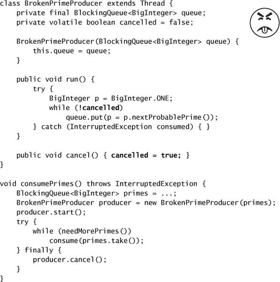

**Listing 7.4. Các Method Interruption trong `Thread`.**

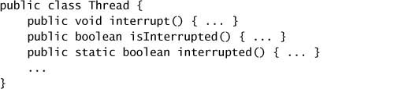

Nếu một thread bị interrupt khi nó **không** đang block, interrupted status của nó được đặt, và trách nhiệm thuộc về hoạt động đang bị hủy phải **poll interrupted status** để phát hiện interruption. Theo cách này, interruption có tính "**dính**" — nếu nó không kích hoạt một `InterruptedException`, bằng chứng về interruption vẫn tồn tại cho đến khi ai đó cố ý xóa interrupted status.

> Gọi `interrupt` **không nhất thiết** khiến thread mục tiêu dừng việc nó đang làm; nó chỉ đơn thuần **truyền đi thông điệp** rằng đã có yêu cầu interrupt.

Một cách hay để nghĩ về interruption là: nó **không thực sự interrupt** một thread đang chạy; nó chỉ **yêu cầu** rằng thread hãy tự interrupt mình vào cơ hội thuận tiện tiếp theo. (Những cơ hội này được gọi là **cancellation point**.) Một số method, như `wait`, `sleep`, và `join`, coi trọng những yêu cầu như vậy, ném exception khi chúng nhận được yêu cầu interrupt hoặc gặp một interrupt status đã được đặt sẵn khi vào. Các method **hành xử tốt** có thể hoàn toàn bỏ qua những yêu cầu như vậy miễn là chúng **để nguyên** yêu cầu interruption để code gọi có thể làm gì đó với nó. Các method **hành xử tệ** thì "nuốt" yêu cầu interrupt, do đó tước đi cơ hội hành động của code ở cao hơn trên call stack.

Method static `interrupted` nên được dùng **thận trọng**, vì nó **xóa** interrupted status của thread hiện tại. Nếu bạn gọi `interrupted` và nó trả về `true`, thì trừ khi bạn định "nuốt" interruption, bạn **nên làm gì đó với nó** — hoặc ném `InterruptedException`, hoặc khôi phục interrupted status bằng cách gọi `interrupt` lần nữa, như trong Listing 5.10 ở trang 94.

`BrokenPrimeProducer` minh họa việc các cơ chế cancellation tự chế không phải lúc nào cũng tương tác tốt với các blocking method của thư viện. Nếu bạn viết task của mình để phản ứng với interruption, bạn có thể dùng interruption làm cơ chế cancellation và tận dụng hỗ trợ interruption do nhiều class thư viện cung cấp.

> **Interruption thường là cách hợp lý nhất để hiện thực cancellation.**

`BrokenPrimeProducer` có thể dễ dàng được sửa (và đơn giản hóa) bằng cách dùng interruption thay vì một cờ boolean để yêu cầu hủy, như trong Listing 7.5. Có **hai điểm** trong mỗi vòng lặp mà interruption có thể được phát hiện: trong lời gọi `put` đang block, và bằng cách poll tường minh interrupted status trong phần đầu vòng lặp. Phép kiểm tra tường minh **không thực sự bắt buộc** ở đây vì đã có lời gọi `put` đang block, nhưng nó làm `PrimeProducer` phản ứng tốt hơn với interruption vì nó kiểm tra interruption **trước** khi bắt đầu tác vụ dài là tìm một số nguyên tố, thay vì sau đó. Khi các lời gọi tới blocking method có thể interrupt không đủ thường xuyên để mang lại khả năng đáp ứng mong muốn, việc kiểm tra tường minh interrupted status có thể giúp ích.

**Listing 7.5. Dùng Interruption để Cancellation.**

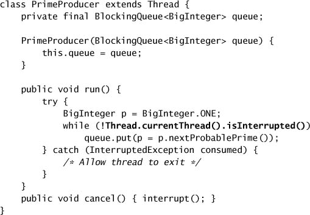

### 7.1.2. Interruption Policy

Cũng như task nên có một cancellation policy, **thread nên có một interruption policy**. Một interruption policy xác định cách một thread **diễn giải** một yêu cầu interruption — nó làm gì (nếu có) khi phát hiện một yêu cầu, những đơn vị công việc nào được coi là atomic đối với interruption, và nó phản ứng với interruption nhanh đến đâu.

Interruption policy hợp lý nhất là một dạng **cancellation ở mức thread hoặc mức service**: thoát càng nhanh càng tốt, dọn dẹp nếu cần, và có thể thông báo cho một thực thể sở hữu nào đó rằng thread đang thoát. Có thể thiết lập những interruption policy khác, như tạm dừng hay tiếp tục một service, nhưng những thread hay thread pool với interruption policy phi tiêu chuẩn có thể cần bị giới hạn cho những task được viết với nhận thức về policy đó.

Quan trọng là phải **phân biệt** giữa cách **task** và cách **thread** nên phản ứng với interruption. Một yêu cầu interrupt đơn lẻ có thể có **nhiều hơn một** người nhận mong muốn — interrupt một worker thread trong một thread pool có thể vừa có nghĩa là "hủy task hiện tại" vừa có nghĩa là "tắt worker thread".

Task **không thực thi trong thread mà chúng sở hữu**; chúng **mượn** thread do một service như thread pool sở hữu. Code không sở hữu thread (với một thread pool, là bất kỳ code nào bên ngoài hiện thực của thread pool) nên **cẩn thận bảo toàn interrupted status** để code sở hữu cuối cùng có thể hành động dựa trên nó, ngay cả khi code "khách" cũng hành động dựa trên interruption. (Nếu bạn trông nhà giúp ai đó, bạn không vứt thư đến trong lúc họ vắng nhà — bạn giữ lại và để họ xử lý khi trở về, ngay cả khi bạn có đọc tạp chí của họ.)

Đây là lý do hầu hết blocking method của thư viện đơn giản là **ném `InterruptedException`** để phản hồi một interrupt. Chúng sẽ không bao giờ thực thi trong một thread mà chúng sở hữu, nên chúng hiện thực cancellation policy hợp lý nhất cho code task hay code thư viện: **tránh ra càng nhanh càng tốt** và truyền thông tin về interruption trở lại cho caller để code ở cao hơn trên call stack có thể hành động tiếp.

Một task **không nhất thiết** phải bỏ hết mọi thứ khi nó phát hiện một yêu cầu interruption — nó có thể chọn **hoãn** yêu cầu đó đến một thời điểm thuận tiện hơn bằng cách ghi nhớ rằng nó đã bị interrupt, hoàn thành công việc nó đang làm, rồi mới ném `InterruptedException` hoặc báo hiệu interruption theo cách khác. Kỹ thuật này có thể bảo vệ cấu trúc dữ liệu khỏi bị hỏng khi một hoạt động bị interrupt giữa chừng một lần cập nhật.

Một task **không nên giả định gì** về interruption policy của thread thực thi nó, trừ khi nó được thiết kế tường minh để chạy trong một service có một interruption policy cụ thể. Dù task diễn giải interruption là cancellation hay thực hiện hành động khác khi bị interrupt, nó nên cẩn thận **bảo toàn interruption status** của thread thực thi. Nếu nó không đơn giản là lan truyền `InterruptedException` lên caller, nó nên **khôi phục interruption status** sau khi bắt `InterruptedException`:

```java
Thread.currentThread().interrupt();
```

Cũng như code của task không nên đưa ra giả định về việc interruption có nghĩa gì với thread thực thi nó, code cancellation không nên đưa ra giả định về interruption policy của những thread bất kỳ. Một thread chỉ nên bị interrupt **bởi chủ sở hữu của nó**; chủ sở hữu có thể encapsulate hiểu biết về interruption policy của thread vào một cơ chế cancellation phù hợp, chẳng hạn một method `shutdown`.

> Vì mỗi thread có interruption policy riêng, bạn **không nên interrupt một thread trừ khi bạn biết interruption có nghĩa gì với thread đó**.

Những người phê bình đã chê bai tiện ích interruption của Java vì nó không cung cấp khả năng interruption áp đặt mà lại buộc developer phải xử lý `InterruptedException`. Tuy nhiên, khả năng **hoãn** một yêu cầu interruption cho phép developer tạo ra những interruption policy linh hoạt, cân bằng giữa khả năng đáp ứng và tính bền vững sao cho phù hợp với ứng dụng.

### 7.1.3. Phản hồi Interruption

Như đã đề cập ở mục 5.4, khi bạn gọi một blocking method có thể interrupt như `Thread.sleep` hay `BlockingQueue.put`, có **hai chiến lược thực tế** để xử lý `InterruptedException`:

- **Lan truyền exception** (có thể sau một chút dọn dẹp đặc thù cho task), khiến method của bạn cũng trở thành một blocking method có thể interrupt; hoặc
- **Khôi phục interruption status** để code ở cao hơn trên call stack có thể xử lý nó.

Việc lan truyền `InterruptedException` có thể đơn giản như thêm `InterruptedException` vào mệnh đề `throws`, như thể hiện bởi `getNextTask` ở Listing 7.6.

**Listing 7.6. Lan truyền `InterruptedException` lên Caller.**

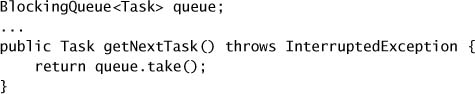

Nếu bạn không muốn hoặc không thể lan truyền `InterruptedException` (có lẽ vì task của bạn được định nghĩa bởi một `Runnable`), bạn cần tìm cách khác để **bảo toàn yêu cầu interruption**. Cách chuẩn để làm điều này là khôi phục interrupted status bằng cách gọi `interrupt` lần nữa. Điều bạn **không nên** làm là "nuốt" `InterruptedException` bằng cách bắt nó rồi không làm gì trong khối `catch`, trừ khi code của bạn thực sự đang hiện thực interruption policy cho một thread. `PrimeProducer` "nuốt" interrupt, nhưng làm vậy với hiểu biết rằng thread sắp kết thúc và do đó không có code nào ở cao hơn trên call stack cần biết về interruption. Hầu hết code **không biết** nó sẽ chạy trong thread nào và do đó nên bảo toàn interrupted status.

> Chỉ code **hiện thực interruption policy của một thread** mới được phép "nuốt" một yêu cầu interruption. Code task và thư viện đa dụng **không bao giờ** nên nuốt yêu cầu interruption.

Những hoạt động **không hỗ trợ cancellation** nhưng vẫn gọi các blocking method có thể interrupt sẽ phải gọi chúng **trong một vòng lặp**, thử lại khi phát hiện interruption. Trong trường hợp này, chúng nên **lưu interruption status cục bộ** và khôi phục nó **ngay trước khi trả về**, như trong Listing 7.7, thay vì ngay lập tức khi bắt `InterruptedException`. Đặt interrupted status quá sớm có thể dẫn đến **vòng lặp vô hạn**, vì hầu hết blocking method có thể interrupt đều kiểm tra interrupted status khi vào và ném `InterruptedException` ngay lập tức nếu nó được đặt. (Các method có thể interrupt thường poll interruption trước khi block hoặc làm việc gì đáng kể, để phản ứng với interruption tốt nhất có thể.)

Nếu code của bạn không gọi blocking method nào có thể interrupt, nó vẫn có thể được làm cho phản ứng với interruption bằng cách **poll interrupted status của thread hiện tại** xuyên suốt code của task. Chọn tần suất poll là một đánh đổi giữa **hiệu quả** và **khả năng đáp ứng**. Nếu bạn có yêu cầu cao về khả năng đáp ứng, bạn không thể gọi những method có khả năng chạy lâu mà bản thân chúng không phản ứng với interruption, điều này có thể hạn chế lựa chọn của bạn khi gọi code thư viện.

Cancellation có thể liên quan đến state khác ngoài interruption status; interruption có thể được dùng để **gây chú ý** cho thread, và thông tin được thread interrupt lưu ở nơi khác có thể được dùng để cung cấp thêm chỉ dẫn cho thread bị interrupt. (Hãy chắc chắn dùng synchronization khi truy cập thông tin đó.)

**Listing 7.7. Task không thể hủy, khôi phục Interruption trước khi thoát.**

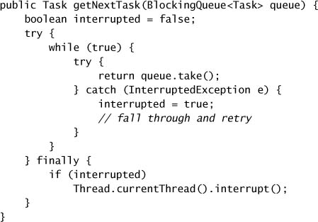

Ví dụ, khi một worker thread do một `ThreadPoolExecutor` sở hữu phát hiện interruption, nó kiểm tra xem pool có đang bị tắt không. Nếu có, nó thực hiện một số dọn dẹp cho pool trước khi kết thúc; nếu không, nó có thể tạo một thread mới để khôi phục thread pool về kích thước mong muốn.

### 7.1.4. Ví dụ: Timed Run

Nhiều bài toán có thể mất **vô hạn** thời gian để giải (ví dụ, liệt kê tất cả số nguyên tố); với những bài toán khác, câu trả lời có thể được tìm thấy khá nhanh nhưng cũng có thể mất vô hạn thời gian. Khả năng nói "dành tối đa mười phút để tìm câu trả lời" hoặc "liệt kê tất cả câu trả lời bạn có thể tìm trong mười phút" có thể hữu ích trong những tình huống này.

Method `aSecondOfPrimes` ở Listing 7.2 khởi động một `PrimeGenerator` và interrupt nó sau một giây. Dù `PrimeGenerator` có thể mất hơi lâu hơn một giây để dừng, cuối cùng nó sẽ nhận ra interrupt và dừng, cho phép thread kết thúc. Nhưng một khía cạnh khác của việc thực thi một task là bạn muốn **biết được nếu task ném exception**. Nếu `PrimeGenerator` ném một unchecked exception trước khi timeout hết hạn, có lẽ điều đó sẽ **không được ai chú ý**, vì prime generator chạy trong một thread riêng không xử lý exception một cách tường minh.

Listing 7.8 cho thấy một nỗ lực chạy một `Runnable` bất kỳ trong một khoảng thời gian cho trước. Nó chạy task **trong calling thread** và lập lịch một task cancellation để interrupt nó sau một khoảng thời gian nhất định. Điều này giải quyết vấn đề unchecked exception ném ra từ task, vì chúng có thể được caller của `timedRun` bắt được.

Đây là một cách tiếp cận đơn giản hấp dẫn, nhưng nó **vi phạm quy tắc**: bạn nên biết interruption policy của một thread trước khi interrupt nó. Vì `timedRun` có thể được gọi từ một thread bất kỳ, nó **không thể biết** interruption policy của calling thread. Nếu task hoàn tất trước timeout, task cancellation — thứ interrupt thread mà `timedRun` được gọi trong đó — có thể "nổ" **sau khi** `timedRun` đã trả về cho caller của nó. Chúng ta không biết code nào sẽ đang chạy khi điều đó xảy ra, nhưng kết quả sẽ không tốt đẹp. (Có thể loại bỏ rủi ro này bằng cách dùng `ScheduledFuture` do `schedule` trả về để hủy task cancellation, nhưng việc đó khó một cách bất ngờ.)

**Listing 7.8. Lập lịch một Interrupt trên một Thread đi mượn. Đừng làm thế này.**

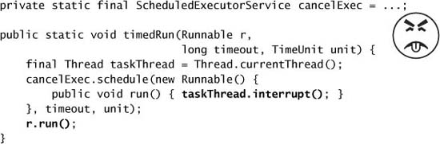

Hơn nữa, nếu task **không phản ứng** với interruption, `timedRun` sẽ không trả về cho đến khi task kết thúc, điều có thể xảy ra rất lâu sau timeout mong muốn (hoặc thậm chí không bao giờ). Một dịch vụ timed run không trả về sau thời gian đã chỉ định nhiều khả năng sẽ gây bực bội cho caller của nó.

Listing 7.9 giải quyết vấn đề xử lý exception của `aSecondOfPrimes` và các vấn đề của nỗ lực trước đó. Thread được tạo để chạy task có thể có **execution policy riêng của nó**, và ngay cả khi task không phản hồi interrupt, method timed run vẫn có thể trả về cho caller của nó. Sau khi khởi động thread task, `timedRun` thực hiện một `join` có timeout với thread vừa tạo. Sau khi `join` trả về, nó kiểm tra xem có exception nào được ném từ task không, và nếu có, ném lại nó trong thread gọi `timedRun`. `Throwable` được lưu lại được share giữa hai thread, nên nó được khai báo `volatile` để publish nó an toàn từ thread task sang thread `timedRun`.

Phiên bản này giải quyết được các vấn đề ở những ví dụ trước, nhưng vì nó dựa vào một `join` có timeout, nó chia sẻ một khiếm khuyết với `join`: chúng ta **không biết** liệu quyền điều khiển được trả về vì thread đã thoát bình thường hay vì `join` đã hết thời gian.[^2]

[^2]: Đây là một khiếm khuyết trong API của `Thread`, vì việc `join` có hoàn tất thành công hay không **có hệ quả về memory visibility** trong Java Memory Model, nhưng `join` lại không trả về trạng thái cho biết nó có thành công hay không.

### 7.1.5. Cancellation qua Future

Chúng ta đã dùng một trừu tượng hóa để quản lý vòng đời của một task, xử lý exception, và tạo điều kiện cho cancellation — **`Future`**. Theo nguyên tắc chung rằng dùng class thư viện có sẵn tốt hơn tự viết, hãy xây `timedRun` bằng `Future` và framework thực thi task.

**Listing 7.9. Interrupt một Task trong một Thread chuyên dụng.**

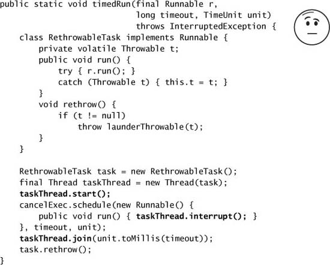

`ExecutorService.submit` trả về một `Future` mô tả task. `Future` có một method `cancel` nhận một đối số boolean, `mayInterruptIfRunning`, và trả về một giá trị cho biết nỗ lực hủy có thành công hay không. (Điều này chỉ cho bạn biết liệu nó có thể **gửi được interruption** hay không, chứ không phải liệu task có phát hiện và hành động dựa trên nó hay không.) Khi `mayInterruptIfRunning` là `true` và task hiện đang chạy trong một thread nào đó, thì thread đó **bị interrupt**. Đặt đối số này thành `false` nghĩa là "**đừng chạy task này nếu nó chưa bắt đầu**", và nên được dùng cho những task không được thiết kế để xử lý interruption.

Vì bạn không nên interrupt một thread trừ khi bạn biết interruption policy của nó, khi nào thì gọi `cancel` với đối số `true` là ổn? Các thread thực thi task được tạo bởi những hiện thực `Executor` chuẩn **hiện thực một interruption policy cho phép task bị hủy bằng interruption**, nên đặt `mayInterruptIfRunning` là an toàn khi hủy task qua `Future` của chúng khi chúng đang chạy trong một `Executor` chuẩn. Bạn **không nên interrupt trực tiếp** một thread của pool khi cố hủy một task, vì bạn sẽ không biết task nào đang chạy khi yêu cầu interrupt được gửi đi — hãy chỉ làm điều này thông qua `Future` của task. Đây lại là một lý do nữa để viết task sao cho chúng coi interruption là một yêu cầu hủy: khi đó chúng có thể bị hủy qua `Future` của mình.

Listing 7.10 cho thấy một phiên bản của `timedRun` gửi task tới một `ExecutorService` và lấy kết quả bằng một `Future.get` có timeout. Nếu `get` kết thúc bằng một `TimeoutException`, task bị hủy qua `Future` của nó. (Để đơn giản hóa code, phiên bản này gọi `Future.cancel` **vô điều kiện** trong một khối `finally`, tận dụng thực tế rằng hủy một task đã hoàn tất không có tác dụng gì.) Nếu phép tính nền tảng ném một exception trước khi bị hủy, nó được ném lại từ `timedRun`, đây là cách thuận tiện nhất để caller xử lý exception. Listing 7.10 cũng minh họa một thực hành tốt khác: **hủy những task mà kết quả không còn cần đến nữa**. (Kỹ thuật này cũng được dùng ở Listing 6.13 trang 128 và Listing 6.16 trang 132.)

**Listing 7.10. Hủy một Task bằng `Future`.**

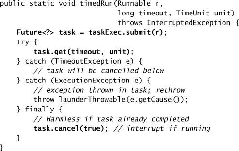

> Khi `Future.get` ném `InterruptedException` hoặc `TimeoutException` và bạn biết rằng kết quả không còn cần thiết cho chương trình nữa, hãy hủy task bằng `Future.cancel`.

### 7.1.6. Xử lý Blocking không thể Interrupt

Nhiều blocking method của thư viện phản hồi interruption bằng cách trả về sớm và ném `InterruptedException`, điều này giúp dễ dàng xây dựng các task phản ứng với cancellation. Tuy nhiên, **không phải mọi** blocking method hay cơ chế blocking đều phản ứng với interruption; nếu một thread bị block khi đang thực hiện socket I/O đồng bộ hoặc đang chờ acquire một intrinsic lock, interruption **không có tác dụng gì** ngoài việc đặt interrupted status của thread. Đôi khi chúng ta có thể thuyết phục các thread bị block trong những hoạt động không thể interrupt dừng lại bằng những cách tương tự interruption, nhưng việc này đòi hỏi hiểu biết sâu hơn về **lý do** thread bị block.

**Socket I/O đồng bộ trong `java.io`.** Dạng blocking I/O phổ biến trong ứng dụng server là đọc hoặc ghi vào một socket. Đáng tiếc, các method `read` và `write` trong `InputStream` và `OutputStream` **không phản ứng với interruption**, nhưng **đóng socket nền tảng** sẽ khiến mọi thread bị block trong `read` hay `write` ném một `SocketException`.

**I/O đồng bộ trong `java.nio`.** Interrupt một thread đang chờ trên một `InterruptibleChannel` khiến nó ném `ClosedByInterruptException` và đóng channel (và cũng khiến mọi thread khác đang block trên channel đó ném `ClosedByInterruptException`). Đóng một `InterruptibleChannel` khiến các thread bị block trên operation của channel ném `AsynchronousCloseException`. Hầu hết `Channel` chuẩn đều hiện thực `InterruptibleChannel`.

**I/O bất đồng bộ với `Selector`.** Nếu một thread bị block trong `Selector.select` (trong `java.nio.channels`), gọi `close` hay `wakeup` sẽ khiến nó trả về sớm.

**Acquire lock.** Nếu một thread bị block chờ một intrinsic lock, **không có gì bạn có thể làm** để dừng nó ngoài việc đảm bảo rằng cuối cùng nó acquire được lock và tiến triển đủ để bạn có thể gây chú ý cho nó bằng cách khác. Tuy nhiên, các class `Lock` tường minh cung cấp method `lockInterruptibly`, cho phép bạn chờ một lock mà vẫn phản ứng với interrupt — xem chương 13.

`ReaderThread` ở Listing 7.11 cho thấy một kỹ thuật để **encapsulate cancellation phi tiêu chuẩn**. `ReaderThread` quản lý một kết nối socket đơn lẻ, đọc đồng bộ từ socket và truyền mọi dữ liệu nhận được cho `processBuffer`. Để tạo điều kiện cho việc kết thúc một kết nối người dùng hay tắt server, `ReaderThread` **override `interrupt`** để vừa gửi một interrupt chuẩn vừa **đóng socket nền tảng**; nhờ đó, interrupt một `ReaderThread` khiến nó dừng việc nó đang làm dù nó đang block trong `read` hay trong một blocking method có thể interrupt.

### 7.1.7. Encapsulate Cancellation phi tiêu chuẩn với newTaskFor

Kỹ thuật dùng trong `ReaderThread` để encapsulate cancellation phi tiêu chuẩn có thể được tinh chỉnh bằng hook `newTaskFor` được thêm vào `ThreadPoolExecutor` ở Java 6. Khi một `Callable` được gửi tới một `ExecutorService`, `submit` trả về một `Future` có thể dùng để hủy task. Hook `newTaskFor` là một **factory method** tạo ra `Future` biểu diễn task. Nó trả về một `RunnableFuture`, một interface mở rộng cả `Future` lẫn `Runnable` (và được `FutureTask` hiện thực).

Tùy biến `Future` của task cho phép bạn **override `Future.cancel`**. Code cancellation tùy biến có thể thực hiện việc ghi log hay thu thập thống kê về cancellation, và cũng có thể được dùng để hủy những hoạt động không phản ứng với interruption. `ReaderThread` encapsulate cancellation của những thread dùng socket bằng cách override `interrupt`; điều tương tự có thể làm với task bằng cách override `Future.cancel`.

`CancellableTask` ở Listing 7.12 định nghĩa một interface `CancellableTask` mở rộng `Callable` và thêm một method `cancel` cùng một factory method `newTask` để tạo một `RunnableFuture`. `CancellingExecutor` mở rộng `ThreadPoolExecutor`, và override `newTaskFor` để cho phép một `CancellableTask` tạo `Future` của riêng nó.

**Listing 7.11. Encapsulate Cancellation phi tiêu chuẩn trong một Thread bằng cách Override `interrupt`.**

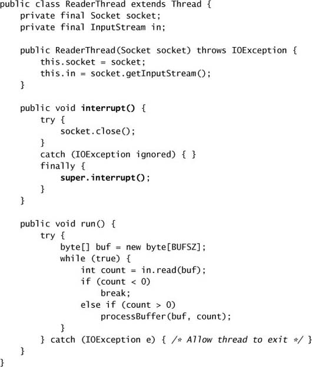

`SocketUsingTask` hiện thực `CancellableTask` và định nghĩa `Future.cancel` để **đóng socket** cũng như gọi `super.cancel`. Nếu một `SocketUsingTask` bị hủy qua `Future` của nó, socket bị đóng và thread thực thi bị interrupt. Điều này làm tăng khả năng phản ứng của task với cancellation: không chỉ nó có thể gọi an toàn các blocking method có thể interrupt mà vẫn phản ứng với cancellation, mà nó còn có thể gọi cả các method blocking socket I/O.

---

## 7.2. Dừng một Service dựa trên Thread

Ứng dụng thường tạo các service **sở hữu thread**, như thread pool, và vòng đời của những service này thường **dài hơn** vòng đời của method tạo ra chúng. Nếu ứng dụng muốn tắt một cách êm ái, các thread do những service này sở hữu cần được kết thúc. Vì không có cách áp đặt nào để dừng một thread, chúng phải được **thuyết phục tự tắt**.

Các thực hành encapsulation hợp lý quy định rằng bạn **không nên thao tác lên một thread** — interrupt nó, sửa độ ưu tiên của nó, v.v. — **trừ khi bạn sở hữu nó**. API của thread không có khái niệm hình thức nào về quyền sở hữu thread: một thread được biểu diễn bằng một object `Thread` có thể được share tự do như bất kỳ object nào khác. Tuy nhiên, hợp lý khi nghĩ về một thread như có một **chủ sở hữu**, và chủ sở hữu này thường là class đã tạo ra thread. Vậy nên một thread pool sở hữu các worker thread của nó, và nếu những thread đó cần bị interrupt, thread pool nên lo việc đó.

Cũng như với bất kỳ object được encapsulate nào khác, quyền sở hữu thread **không có tính bắc cầu**: ứng dụng có thể sở hữu service và service có thể sở hữu các worker thread, nhưng ứng dụng **không sở hữu** các worker thread và do đó không nên cố dừng chúng trực tiếp. Thay vào đó, service nên cung cấp các **method vòng đời** để tự tắt mình, những method này đồng thời cũng tắt các thread mà nó sở hữu; khi đó ứng dụng có thể tắt service, và service có thể tắt các thread. `ExecutorService` cung cấp các method `shutdown` và `shutdownNow`; các service sở hữu thread khác cũng nên cung cấp một cơ chế shutdown tương tự.

> Hãy cung cấp **method vòng đời** bất cứ khi nào một service sở hữu thread có vòng đời dài hơn vòng đời của method đã tạo ra nó.

### 7.2.1. Ví dụ: Một Logging Service

Hầu hết ứng dụng server đều dùng logging, việc này có thể đơn giản như chèn các câu lệnh `println` vào code. Các stream class như `PrintWriter` là thread-safe, nên cách tiếp cận đơn giản này sẽ không cần synchronization tường minh nào.[^3] Tuy nhiên, như ta sẽ thấy ở mục 11.6, logging nội tuyến có thể có một số chi phí performance trong các ứng dụng có khối lượng lớn. Một lựa chọn thay thế khác là để lời gọi log **đưa thông điệp vào queue** để một thread khác xử lý.

[^3]: Nếu bạn ghi log nhiều dòng như một phần của một thông điệp log duy nhất, bạn có thể cần dùng thêm client-side locking để ngăn việc output từ nhiều thread bị xen kẽ không mong muốn. Nếu hai thread ghi log stack trace nhiều dòng vào cùng một stream với một lời gọi `println` cho mỗi dòng, kết quả sẽ bị xen kẽ một cách khó lường, và rất dễ trông giống như một stack trace lớn nhưng vô nghĩa.

**Listing 7.12. Encapsulate Cancellation phi tiêu chuẩn trong một Task bằng `newTaskFor`.**

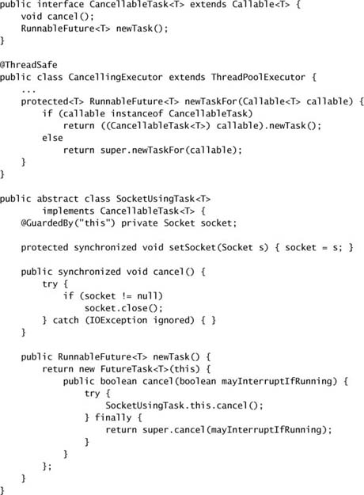

`LogWriter` ở Listing 7.13 cho thấy một logging service đơn giản trong đó hoạt động logging được chuyển sang một **logger thread** riêng. Thay vì để thread tạo ra thông điệp ghi nó trực tiếp vào output stream, `LogWriter` **chuyển giao** nó cho logger thread qua một `BlockingQueue`, và logger thread ghi nó ra. Đây là một thiết kế **nhiều producer, một consumer**: bất kỳ hoạt động nào gọi `log` đều đóng vai producer, còn logger thread chạy nền là consumer. Nếu logger thread bị tụt lại, `BlockingQueue` cuối cùng sẽ block các producer cho đến khi logger thread bắt kịp.

**Listing 7.13. Logging Service Producer-Consumer không có hỗ trợ Shutdown.**

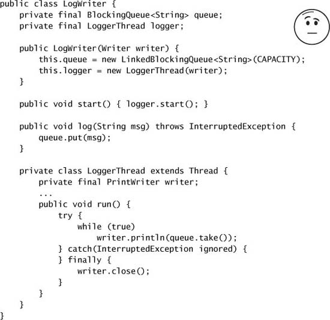

Để một service như `LogWriter` hữu ích trong production, chúng ta cần một cách để **kết thúc logger thread** để nó không ngăn JVM tắt bình thường. Dừng logger thread đủ dễ, vì nó lặp lại việc gọi `take`, thứ phản ứng với interruption; nếu logger thread được sửa để thoát khi bắt `InterruptedException`, thì việc interrupt logger thread sẽ dừng service.

Tuy nhiên, chỉ đơn giản làm cho logger thread thoát **không phải** một cơ chế shutdown thỏa đáng lắm. Một shutdown đột ngột như vậy sẽ **loại bỏ** những thông điệp log có thể đang chờ được ghi, nhưng quan trọng hơn, những thread bị block trong `log` vì queue đầy sẽ **không bao giờ được bỏ block**. Hủy một hoạt động producer-consumer đòi hỏi hủy **cả producer lẫn consumer**. Interrupt logger thread giải quyết được phía consumer, nhưng vì các producer trong trường hợp này không phải thread chuyên dụng, việc hủy chúng khó hơn.

Một cách tiếp cận khác để tắt `LogWriter` là đặt một cờ "**đã yêu cầu shutdown**" để ngăn thêm thông điệp được gửi, như trong Listing 7.14. Consumer khi đó có thể **rút cạn queue** khi được thông báo rằng đã có yêu cầu shutdown, ghi ra mọi thông điệp còn chờ và bỏ block mọi producer đang bị block trong `log`. Tuy nhiên, cách tiếp cận này có **race condition** khiến nó không đáng tin cậy. Hiện thực của `log` là một chuỗi **check-then-act**: producer có thể quan sát thấy service chưa bị tắt nhưng vẫn đưa thông điệp vào queue **sau** khi shutdown, một lần nữa với rủi ro producer có thể bị block trong `log` và không bao giờ được bỏ block. Có những mẹo làm giảm khả năng xảy ra điều này (như để consumer chờ vài giây trước khi tuyên bố queue đã cạn), nhưng chúng không thay đổi **vấn đề cơ bản**, mà chỉ thay đổi xác suất nó gây ra lỗi.

**Listing 7.14. Cách không đáng tin cậy để thêm hỗ trợ shutdown vào logging service.**

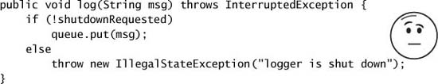

Cách để cung cấp shutdown đáng tin cậy cho `LogWriter` là **sửa race condition**, nghĩa là làm cho việc gửi một thông điệp log mới trở nên **atomic**. Nhưng chúng ta không muốn giữ lock trong khi cố đưa thông điệp vào queue, vì `put` có thể block. Thay vào đó, chúng ta có thể **kiểm tra shutdown một cách atomic và tăng có điều kiện một counter** để "đặt chỗ" cho quyền gửi một thông điệp, như trong `LogService` ở Listing 7.15.

### 7.2.2. Shutdown ExecutorService

Ở mục 6.2.4, chúng ta đã thấy `ExecutorService` cung cấp hai cách để shutdown: **graceful shutdown** với `shutdown`, và **abrupt shutdown** với `shutdownNow`. Trong một abrupt shutdown, `shutdownNow` trả về **danh sách các task chưa bắt đầu** sau khi cố hủy mọi task đang thực thi.

**Listing 7.15. Thêm cancellation đáng tin cậy vào `LogWriter`.**

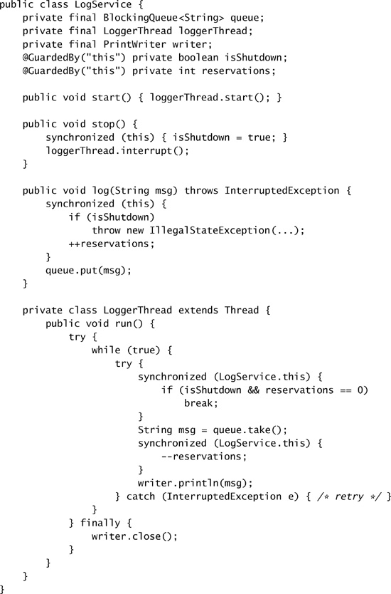

Hai lựa chọn kết thúc khác nhau này mang lại một đánh đổi giữa **an toàn** và **khả năng đáp ứng**: kết thúc đột ngột nhanh hơn nhưng rủi ro hơn vì task có thể bị interrupt giữa chừng khi đang thực thi, còn kết thúc bình thường chậm hơn nhưng an toàn hơn vì `ExecutorService` không tắt cho đến khi mọi task trong queue được xử lý. Các service sở hữu thread khác cũng nên cân nhắc cung cấp một lựa chọn tương tự giữa các chế độ shutdown.

Các chương trình đơn giản có thể chỉ cần khởi động và tắt một `ExecutorService` toàn cục từ `main`. Các chương trình phức tạp hơn nhiều khả năng sẽ **encapsulate một `ExecutorService`** sau một service cấp cao hơn cung cấp các method vòng đời riêng của nó, chẳng hạn biến thể của `LogService` ở Listing 7.16, thứ ủy quyền cho một `ExecutorService` thay vì tự quản lý thread của mình. Encapsulate một `ExecutorService` sẽ **kéo dài chuỗi sở hữu** từ ứng dụng → service → thread bằng cách thêm một mắt xích nữa; mỗi thành viên trong chuỗi quản lý vòng đời của các service hay thread mà nó sở hữu.

**Listing 7.16. Logging Service dùng một `ExecutorService`.**

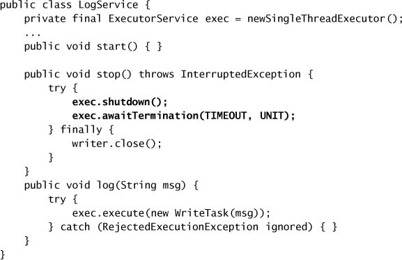

### 7.2.3. Poison Pill

Một cách khác để thuyết phục một service producer-consumer tắt là dùng một **poison pill** ("viên thuốc độc"): một object có thể nhận diện được, được đặt lên queue với ý nghĩa "**khi nhận được cái này, hãy dừng lại**". Với một FIFO queue, poison pill đảm bảo rằng consumer **hoàn thành công việc trên queue của nó** trước khi tắt, vì mọi công việc được gửi trước khi gửi poison pill sẽ được lấy ra trước viên thuốc; producer **không nên gửi thêm công việc nào** sau khi đặt một poison pill lên queue. `IndexingService` ở Listing 7.17, 7.18, và 7.19 cho thấy một phiên bản **một producer, một consumer** của ví dụ desktop search từ Listing 5.8 trang 91, sử dụng poison pill để tắt service.

**Listing 7.17. Shutdown bằng Poison Pill.**

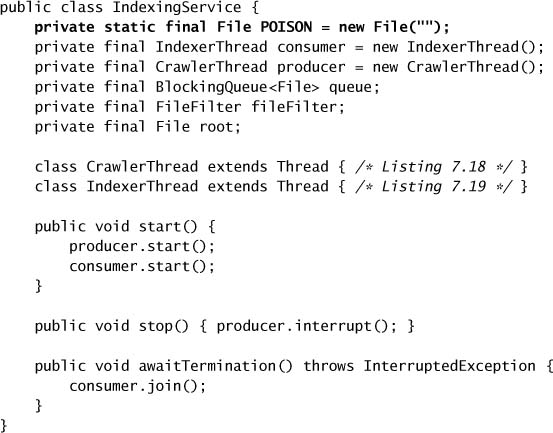

Poison pill **chỉ hoạt động khi số producer và consumer đã biết trước**. Cách tiếp cận trong `IndexingService` có thể mở rộng cho nhiều producer bằng cách để mỗi producer đặt một viên thuốc lên queue và để consumer chỉ dừng khi nó nhận được N<sub>producer</sub> viên thuốc. Nó có thể mở rộng cho nhiều consumer bằng cách để mỗi producer đặt N<sub>consumer</sub> viên thuốc lên queue, dù cách này có thể trở nên khó kiểm soát với số lượng lớn producer và consumer. Poison pill **chỉ hoạt động đáng tin cậy với queue không giới hạn** (unbounded).

### 7.2.4. Ví dụ: Một Execution Service dùng một lần

Nếu một method cần xử lý một lô task và không trả về cho đến khi tất cả task hoàn tất, nó có thể đơn giản hóa việc quản lý vòng đời service bằng cách dùng một **`Executor` riêng tư** có vòng đời bị giới hạn bởi chính method đó. (Các method `invokeAll` và `invokeAny` thường hữu ích trong những tình huống như vậy.)

Method `checkMail` ở Listing 7.20 kiểm tra thư mới **song song** trên một số host. Nó tạo một executor riêng tư và gửi một task cho mỗi host: sau đó nó tắt executor và chờ kết thúc, điều xảy ra khi tất cả task kiểm tra thư đã hoàn tất.[^4]

[^4]: Lý do dùng `AtomicBoolean` thay vì một `volatile boolean` là để truy cập cờ `hasNewMail` từ bên trong `Runnable`, nó sẽ phải là `final`, điều này sẽ ngăn việc sửa đổi nó.

**Listing 7.18. Thread Producer cho `IndexingService`.**

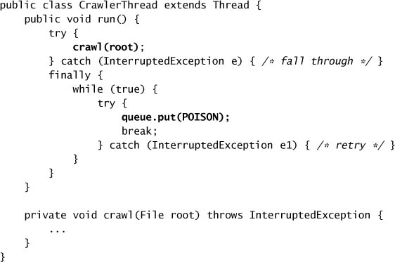

**Listing 7.19. Thread Consumer cho `IndexingService`.**

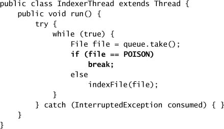

**Listing 7.20. Dùng một `Executor` riêng tư có vòng đời bị giới hạn bởi một lời gọi Method.**

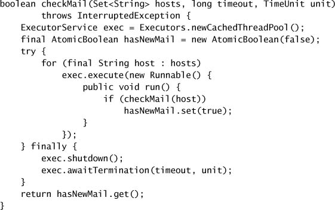

### 7.2.5. Hạn chế của shutdownNow

Khi một `ExecutorService` bị tắt đột ngột bằng `shutdownNow`, nó cố hủy các task đang thực hiện và trả về một danh sách các task đã được gửi nhưng **chưa bao giờ bắt đầu**, để chúng có thể được ghi log hoặc lưu lại để xử lý sau.[^5]

[^5]: Các object `Runnable` do `shutdownNow` trả về có thể **không phải** chính những object đã được gửi tới `ExecutorService`: chúng có thể là những instance đã được bọc của các task được gửi.

Tuy nhiên, **không có cách tổng quát nào** để tìm ra những task nào đã bắt đầu nhưng chưa hoàn tất. Điều này nghĩa là không có cách nào biết được trạng thái của các task đang thực hiện tại thời điểm shutdown, trừ khi bản thân các task thực hiện một dạng **checkpoint** nào đó. Để biết task nào chưa hoàn tất, bạn cần biết không chỉ những task nào chưa bắt đầu, mà còn cả những task nào **đang thực hiện** khi executor bị tắt.[^6]

[^6]: Đáng tiếc, không có tùy chọn shutdown nào mà trong đó các task chưa bắt đầu được trả về cho caller còn các task đang thực hiện được phép hoàn tất; một tùy chọn như vậy sẽ loại bỏ trạng thái trung gian không chắc chắn này.

`TrackingExecutor` ở Listing 7.21 cho thấy một kỹ thuật để xác định những task nào đang thực hiện tại thời điểm shutdown. Bằng cách encapsulate một `ExecutorService` và "gắn cảm biến" vào `execute` (và tương tự với `submit`, không thể hiện ở đây) để **ghi nhớ những task nào bị hủy sau shutdown**, `TrackingExecutor` có thể xác định những task nào đã bắt đầu nhưng không hoàn tất bình thường. Sau khi executor kết thúc, `getCancelledTasks` trả về danh sách các task đã bị hủy. Để kỹ thuật này hoạt động, các task **phải bảo toàn interrupted status của thread** khi chúng trả về — điều mà những task hành xử tốt dù sao cũng sẽ làm.

**Listing 7.21. `ExecutorService` theo dõi các Task bị hủy sau Shutdown.**

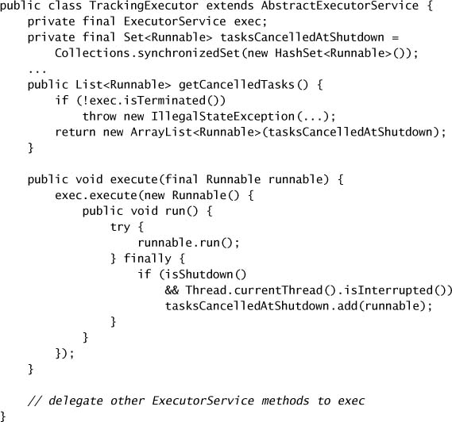

`WebCrawler` ở Listing 7.22 cho thấy một ứng dụng của `TrackingExecutor`. Công việc của một web crawler thường là **không giới hạn**, nên nếu một crawler phải bị tắt, chúng ta có thể muốn lưu trạng thái của nó để có thể khởi động lại sau. `CrawlTask` cung cấp một method `getPage` xác định nó đang làm việc trên trang nào. Khi crawler bị tắt, **cả** những task chưa bắt đầu **lẫn** những task đã bị hủy đều được quét và URL của chúng được ghi lại, để các task crawl trang cho những URL đó có thể được thêm vào queue khi crawler khởi động lại.

`TrackingExecutor` có một **race condition không thể tránh** khiến nó có thể cho ra **dương tính giả**: những task bị nhận diện là đã hủy nhưng thực ra đã hoàn tất. Điều này phát sinh vì thread pool có thể bị tắt **giữa** lúc lệnh cuối cùng của task thực thi và lúc pool ghi nhận task đã hoàn tất. Đây không phải vấn đề nếu các task là **idempotent** (nếu thực hiện chúng hai lần cho cùng hiệu ứng như thực hiện một lần), như thường thấy trong một web crawler. Nếu không, ứng dụng lấy về các task bị hủy phải nhận thức được rủi ro này và sẵn sàng xử lý dương tính giả.

**Listing 7.22. Dùng `TrackingExecutorService` để lưu các Task chưa hoàn tất cho lần thực thi sau.**

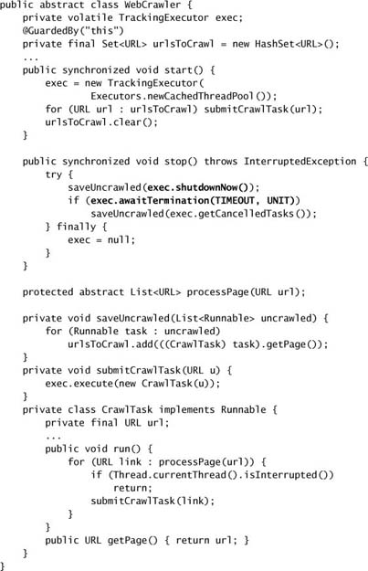

---

## 7.3. Xử lý việc Thread kết thúc bất thường

Rất rõ ràng khi một ứng dụng console single-threaded kết thúc do một exception không bắt được — chương trình ngừng chạy và tạo ra một stack trace rất khác với output thông thường của chương trình. Việc một thread thất bại trong một ứng dụng concurrent **không phải lúc nào cũng rõ ràng như vậy**. Stack trace có thể được in ra console, nhưng có thể **không ai đang xem console**. Ngoài ra, khi một thread thất bại, ứng dụng có thể **tỏ ra vẫn tiếp tục hoạt động**, nên thất bại của nó có thể không được chú ý. May mắn thay, có những phương tiện để **phát hiện** và **ngăn chặn** việc thread "rò rỉ" khỏi một ứng dụng.

Nguyên nhân hàng đầu khiến thread chết sớm là **`RuntimeException`**. Vì những exception này báo hiệu một lỗi lập trình hay vấn đề không khôi phục được khác, chúng thường **không được bắt**. Thay vào đó chúng lan truyền lên hết stack, tại đó hành vi mặc định là in một stack trace ra console và để thread kết thúc.

Hệ quả của việc thread chết bất thường trải từ vô hại đến thảm họa, tùy vào vai trò của thread trong ứng dụng. Mất một thread khỏi một thread pool có thể có hệ quả về performance, nhưng một ứng dụng chạy tốt với pool 50 thread có lẽ cũng sẽ chạy ổn với pool 49 thread. Nhưng mất **event dispatch thread** trong một ứng dụng GUI thì sẽ rất dễ nhận thấy — ứng dụng sẽ ngừng xử lý sự kiện và GUI sẽ đóng băng. `OutOfTime` ở trang 124 đã cho thấy một hệ quả nghiêm trọng của thread leakage: service được `Timer` biểu diễn bị **hỏng vĩnh viễn**.

**Gần như bất kỳ code nào cũng có thể ném `RuntimeException`.** Bất cứ khi nào bạn gọi một method khác, bạn đang đặt niềm tin rằng nó sẽ trả về bình thường hoặc ném một trong các checked exception mà signature của nó khai báo. Bạn càng ít quen thuộc với code đang được gọi, bạn càng nên hoài nghi về hành vi của nó.

Các thread xử lý task như worker thread trong một thread pool hay Swing event dispatch thread dành cả đời mình để **gọi code không rõ** qua một rào chắn trừu tượng như `Runnable`, và những thread này nên **rất hoài nghi** rằng code chúng gọi sẽ hành xử tốt. Sẽ rất tệ nếu một service như Swing event thread thất bại chỉ vì một event handler viết dở nào đó ném `NullPointerException`. Do đó, những tiện ích này nên gọi task **bên trong một khối `try-catch`** bắt các unchecked exception, hoặc bên trong một khối `try-finally` để đảm bảo rằng nếu thread thoát bất thường thì framework được thông báo và có thể thực hiện hành động khắc phục. Đây là một trong số ít lần bạn có thể muốn cân nhắc **bắt `RuntimeException`** — khi bạn đang gọi code không rõ, không đáng tin qua một trừu tượng hóa như `Runnable`.[^7]

[^7]: Có một số tranh cãi về tính an toàn của kỹ thuật này; khi một thread ném một unchecked exception, toàn bộ ứng dụng có thể đã bị tổn hại. Nhưng lựa chọn thay thế — tắt toàn bộ ứng dụng — thường không thực tế.

Listing 7.23 minh họa một cách cấu trúc một worker thread bên trong một thread pool. Nếu một task ném một unchecked exception, nó cho phép thread chết, nhưng **không trước khi thông báo** cho framework rằng thread đã chết. Framework khi đó có thể thay worker thread bằng một thread mới, hoặc có thể chọn không làm vậy vì thread pool đang bị tắt hoặc đã có đủ worker thread để đáp ứng nhu cầu hiện tại. `ThreadPoolExecutor` và Swing dùng kỹ thuật này để đảm bảo rằng một task hành xử tệ không ngăn các task tiếp theo được thực thi. Nếu bạn đang viết một class worker thread thực thi các task được gửi tới, hoặc gọi code bên ngoài không đáng tin (như các plugin được nạp động), hãy dùng một trong những cách tiếp cận này để ngăn một task hay plugin viết dở làm sập thread tình cờ gọi nó.

**Listing 7.23. Cấu trúc điển hình của Worker Thread trong Thread Pool.**

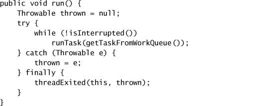

### 7.3.1. Uncaught Exception Handler

Mục trước đưa ra một cách tiếp cận **chủ động** cho vấn đề unchecked exception. API của `Thread` cũng cung cấp tiện ích **`UncaughtExceptionHandler`**, cho phép bạn phát hiện khi một thread chết do một exception không bắt được. Hai cách tiếp cận này **bổ trợ cho nhau**: gộp lại, chúng cung cấp phòng thủ nhiều lớp chống lại thread leakage.

Khi một thread thoát do một exception không bắt được, JVM báo cáo sự kiện này cho một `UncaughtExceptionHandler` do ứng dụng cung cấp (xem Listing 7.24); nếu không có handler nào tồn tại, hành vi mặc định là in stack trace ra `System.err`.[^8]

[^8]: Trước Java 5.0, cách duy nhất để kiểm soát `UncaughtExceptionHandler` là tạo subclass của `ThreadGroup`. Ở Java 5.0 trở lên, bạn có thể đặt một `UncaughtExceptionHandler` cho từng thread bằng `Thread.setUncaughtExceptionHandler`, và cũng có thể đặt `UncaughtExceptionHandler` mặc định bằng `Thread.setDefaultUncaughtExceptionHandler`. Tuy nhiên, **chỉ một** trong các handler này được gọi — trước tiên JVM tìm handler của từng thread, rồi tìm handler của `ThreadGroup`. Hiện thực handler mặc định trong `ThreadGroup` ủy quyền cho thread group cha của nó, và cứ thế lên trên chuỗi cho đến khi một trong các handler của `ThreadGroup` xử lý exception không bắt được hoặc nó nổi lên đến thread group cấp cao nhất. Handler của thread group cấp cao nhất ủy quyền cho system handler mặc định (nếu có; mặc định là không có) và nếu không thì in stack trace ra console.

**Listing 7.24. Interface `UncaughtExceptionHandler`.**

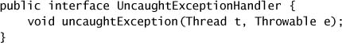

Handler nên làm gì với một exception không bắt được tùy thuộc vào yêu cầu chất lượng dịch vụ của bạn. Phản hồi phổ biến nhất là **ghi một thông điệp lỗi và stack trace vào log của ứng dụng**, như trong Listing 7.25. Handler cũng có thể thực hiện hành động trực tiếp hơn, như cố khởi động lại thread, tắt ứng dụng, nhắn tin cho operator, hoặc hành động khắc phục/chẩn đoán khác.

**Listing 7.25. `UncaughtExceptionHandler` ghi log Exception.**

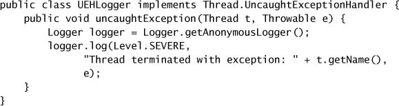

> Trong các ứng dụng chạy lâu dài, hãy **luôn dùng uncaught exception handler** cho mọi thread — ít nhất là để ghi log exception.

Để đặt một `UncaughtExceptionHandler` cho các thread của pool, hãy cung cấp một `ThreadFactory` cho constructor của `ThreadPoolExecutor`. (Cũng như với mọi thao tác trên thread, **chỉ chủ sở hữu của thread** mới nên thay đổi `UncaughtExceptionHandler` của nó.) Các thread pool chuẩn cho phép một exception không bắt được của task kết thúc thread của pool, nhưng dùng một khối `try-finally` để được thông báo khi điều này xảy ra để thread có thể được thay thế. Nếu không có uncaught exception handler hay cơ chế thông báo thất bại khác, task có thể **tỏ ra thất bại một cách âm thầm**, điều này có thể rất khó hiểu. Nếu bạn muốn được thông báo khi một task thất bại do exception để có thể thực hiện hành động khôi phục đặc thù cho task, hãy hoặc **bọc task** bằng một `Runnable` hay `Callable` bắt exception, hoặc **override hook `afterExecute`** trong `ThreadPoolExecutor`.

Hơi khó hiểu là, các exception ném ra từ task **chỉ đến được uncaught exception handler với những task được gửi bằng `execute`**; với những task được gửi bằng `submit`, bất kỳ exception nào được ném — checked hay không — đều được coi là một phần **trạng thái trả về** của task. Nếu một task được gửi bằng `submit` kết thúc bằng một exception, nó được ném lại bởi `Future.get`, được bọc trong một `ExecutionException`.

---

## 7.4. JVM Shutdown

JVM có thể tắt theo cách **có trật tự** (orderly) hoặc **đột ngột** (abrupt). Một orderly shutdown được khởi động khi thread "bình thường" (không phải daemon) **cuối cùng** kết thúc, khi ai đó gọi `System.exit`, hoặc bằng các phương tiện đặc thù nền tảng khác (như gửi `SIGINT` hoặc nhấn `Ctrl-C`). Dù đây là cách chuẩn và được ưa chuộng để JVM tắt, nó cũng có thể bị tắt đột ngột bằng cách gọi `Runtime.halt` hoặc kill tiến trình JVM qua hệ điều hành (như gửi `SIGKILL`).

### 7.4.1. Shutdown Hook

Trong một orderly shutdown, JVM trước tiên khởi động tất cả các **shutdown hook** đã đăng ký. Shutdown hook là những **thread chưa được start** được đăng ký bằng `Runtime.addShutdownHook`. JVM **không đảm bảo thứ tự** khởi động các shutdown hook. Nếu bất kỳ thread ứng dụng nào (daemon hay không) vẫn đang chạy tại thời điểm shutdown, chúng tiếp tục chạy **đồng thời** với quá trình shutdown. Khi tất cả shutdown hook đã hoàn tất, JVM có thể chọn chạy các finalizer nếu `runFinalizersOnExit` là `true`, rồi dừng lại. JVM **không cố** dừng hay interrupt bất kỳ thread ứng dụng nào vẫn đang chạy tại thời điểm shutdown; chúng bị kết thúc đột ngột khi JVM cuối cùng dừng lại. Nếu shutdown hook hoặc finalizer không hoàn tất, thì quá trình orderly shutdown sẽ "**treo**" và JVM phải bị tắt đột ngột. Trong một abrupt shutdown, JVM **không bắt buộc phải làm gì** ngoài dừng JVM; **shutdown hook sẽ không chạy**.

Shutdown hook nên **thread-safe**: chúng phải dùng synchronization khi truy cập dữ liệu được share và nên cẩn thận tránh deadlock, giống như bất kỳ code concurrent nào khác. Hơn nữa, chúng **không nên giả định** gì về trạng thái của ứng dụng (như liệu các service khác đã tắt chưa hoặc tất cả thread bình thường đã hoàn tất chưa) hay về **lý do** JVM đang tắt, và do đó phải được viết cực kỳ **phòng thủ**. Cuối cùng, chúng nên thoát càng nhanh càng tốt, vì sự tồn tại của chúng làm trì hoãn việc kết thúc JVM vào lúc mà người dùng có thể đang mong đợi JVM kết thúc nhanh.

Shutdown hook có thể được dùng để dọn dẹp service hay ứng dụng, chẳng hạn xóa file tạm hoặc dọn dẹp các tài nguyên không được OS tự động dọn. Listing 7.26 cho thấy cách `LogService` ở Listing 7.16 có thể đăng ký một shutdown hook từ method `start` của nó để đảm bảo file log được đóng khi thoát.

Vì các shutdown hook đều chạy **đồng thời**, việc đóng file log có thể gây rắc rối cho những shutdown hook khác muốn dùng logger. Để tránh vấn đề này, shutdown hook **không nên phụ thuộc** vào những service có thể bị ứng dụng hoặc shutdown hook khác tắt. Một cách để đạt được điều này là dùng **một shutdown hook duy nhất cho tất cả service**, thay vì một hook cho mỗi service, và để nó gọi một chuỗi các hành động shutdown. Điều này đảm bảo rằng các hành động shutdown thực thi **tuần tự trong một thread duy nhất**, do đó tránh được khả năng race condition hay deadlock giữa các hành động shutdown. Kỹ thuật này có thể dùng được dù bạn có dùng shutdown hook hay không; thực thi các hành động shutdown tuần tự thay vì đồng thời loại bỏ nhiều nguồn gây thất bại tiềm tàng. Trong những ứng dụng duy trì thông tin phụ thuộc tường minh giữa các service, kỹ thuật này cũng có thể đảm bảo các hành động shutdown được thực hiện **đúng thứ tự**.

**Listing 7.26. Đăng ký một Shutdown Hook để dừng Logging Service.**

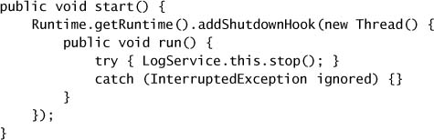

### 7.4.2. Daemon Thread

Đôi khi bạn muốn tạo một thread thực hiện một chức năng phụ trợ nào đó nhưng bạn **không muốn** sự tồn tại của thread này ngăn JVM tắt. Đó là mục đích của **daemon thread**.

Thread được chia thành hai loại: **normal thread** và **daemon thread**. Khi JVM khởi động, tất cả các thread nó tạo ra (như garbage collector và các thread dọn dẹp khác) đều là daemon thread, **ngoại trừ main thread**. Khi một thread mới được tạo, nó **kế thừa** trạng thái daemon của thread đã tạo ra nó, nên mặc định mọi thread do main thread tạo ra cũng là normal thread.

Normal thread và daemon thread chỉ khác nhau ở **điều xảy ra khi chúng thoát**. Khi một thread thoát, JVM kiểm kê các thread đang chạy, và nếu những thread còn lại **chỉ toàn là daemon thread**, nó khởi động một orderly shutdown. Khi JVM dừng, mọi daemon thread còn lại **bị bỏ mặc** — các khối `finally` **không được thực thi**, stack **không được unwind** — JVM chỉ đơn giản thoát.

Daemon thread nên được dùng **dè dặt** — rất ít hoạt động xử lý có thể bị bỏ mặc an toàn vào bất kỳ lúc nào mà không cần dọn dẹp. Đặc biệt, **rất nguy hiểm** khi dùng daemon thread cho những task có thể thực hiện bất kỳ dạng I/O nào. Daemon thread tốt nhất nên dành cho các task "dọn dẹp", chẳng hạn một thread chạy nền định kỳ xóa các entry hết hạn khỏi một cache trong bộ nhớ.

> Daemon thread **không phải** một thứ thay thế tốt cho việc quản lý vòng đời của service trong một ứng dụng một cách đúng đắn.

### 7.4.3. Finalizer

Garbage collector làm rất tốt việc thu hồi tài nguyên bộ nhớ khi chúng không còn cần thiết, nhưng một số tài nguyên — như file handle hay socket handle — **phải được trả về hệ điều hành một cách tường minh** khi không còn cần. Để hỗ trợ điều này, garbage collector đối xử đặc biệt với những object có method `finalize` không tầm thường: sau khi chúng được collector thu hồi, `finalize` được gọi để các tài nguyên bền vững có thể được giải phóng.

Vì finalizer có thể chạy trong một thread do JVM quản lý, mọi state được một finalizer truy cập sẽ bị **nhiều hơn một thread** truy cập và do đó phải được truy cập với synchronization. Finalizer **không đưa ra bảo đảm nào** về việc khi nào — hay thậm chí liệu — chúng có chạy hay không, và chúng áp đặt một **chi phí performance đáng kể** lên những object có finalizer không tầm thường. Chúng cũng cực kỳ khó viết cho đúng.[^9] Trong hầu hết trường hợp, sự kết hợp giữa khối `finally` và method `close` tường minh làm tốt việc quản lý tài nguyên hơn finalizer; ngoại lệ duy nhất là khi bạn cần quản lý những object giữ tài nguyên được acquire bởi native method. Vì những lý do này và những lý do khác, hãy **cố hết sức tránh viết hoặc dùng những class có finalizer** (ngoài các class thư viện của nền tảng) [EJ Item 6].

[^9]: Xem (Boehm, 2005) để biết một số thách thức liên quan đến việc viết finalizer.

> **Hãy tránh finalizer.**

---

## Tóm tắt

Các vấn đề về kết thúc vòng đời của task, thread, service, và ứng dụng có thể làm tăng độ phức tạp cho thiết kế và hiện thực của chúng. Java **không cung cấp** cơ chế áp đặt để hủy hoạt động hay kết thúc thread. Thay vào đó, nó cung cấp một cơ chế **interruption hợp tác** có thể được dùng để tạo điều kiện cho cancellation, nhưng trách nhiệm xây dựng các protocol cho cancellation và dùng chúng một cách nhất quán thuộc về **bạn**. Dùng `FutureTask` và framework `Executor` giúp đơn giản hóa việc xây dựng các task và service có thể hủy được.
