# Chương 8. Applying Thread Pools

> **Về bản dịch này.** Đây là bản **dịch đầy đủ** chương 8 của cuốn *Java Concurrency in Practice* (Brian Goetz và cộng sự). Các **thuật ngữ chuyên ngành được giữ nguyên tiếng Anh**. Toàn bộ code listing và hình vẽ được trích trực tiếp từ file PDF gốc và lưu trong thư mục `images/ch08/`.

---

Chương 6 đã giới thiệu framework thực thi task, thứ đơn giản hóa việc quản lý vòng đời của task và thread, đồng thời cung cấp một phương tiện đơn giản và linh hoạt để decouple việc gửi task khỏi execution policy. Chương 7 đã bàn về một số chi tiết rối rắm của vòng đời service phát sinh khi dùng framework thực thi task trong các ứng dụng thực tế. Chương này xem xét các tùy chọn nâng cao để **cấu hình và tinh chỉnh thread pool**, mô tả những nguy cơ cần chú ý khi dùng framework thực thi task, và đưa ra một số ví dụ nâng cao hơn về việc dùng `Executor`.

---

## 8.1. Sự gắn kết ngầm giữa Task và Execution Policy

Trước đó chúng ta đã khẳng định rằng framework `Executor` decouple việc gửi task khỏi việc thực thi task. Giống như nhiều nỗ lực decouple các quá trình phức tạp, điều này có phần **hơi quá lời**. Dù framework `Executor` mang lại sự linh hoạt đáng kể trong việc đặc tả và sửa đổi execution policy, **không phải mọi task đều tương thích với mọi execution policy**. Các loại task đòi hỏi execution policy cụ thể bao gồm:

**Task phụ thuộc (dependent task).** Những task hành xử tốt nhất là những task **độc lập**: những task không phụ thuộc vào timing, kết quả, hay tác dụng phụ của task khác. Khi thực thi các task độc lập trong một thread pool, bạn có thể thoải mái thay đổi kích thước và cấu hình pool mà không ảnh hưởng đến gì ngoài performance. Ngược lại, khi bạn gửi những task **phụ thuộc vào task khác** vào một thread pool, bạn **ngầm tạo ra ràng buộc** lên execution policy, thứ phải được quản lý cẩn thận để tránh vấn đề liveness (xem mục 8.1.1).

**Task khai thác thread confinement.** Các executor single-threaded đưa ra những cam kết mạnh hơn về concurrency so với thread pool bất kỳ. Chúng **đảm bảo rằng task không được thực thi concurrent**, điều này cho phép bạn nới lỏng thread safety của code task. Object có thể bị confine vào task thread, do đó cho phép các task được thiết kế chạy trong thread đó truy cập những object ấy **mà không cần synchronization**, ngay cả khi những tài nguyên đó không thread-safe. Điều này tạo ra một **gắn kết ngầm** giữa task và execution policy — task **đòi hỏi** executor của chúng phải là single-threaded.[^1] Trong trường hợp này, nếu bạn đổi `Executor` từ single-threaded sang một thread pool, **thread safety có thể bị mất**.

[^1]: Yêu cầu thực ra không mạnh đến vậy; chỉ cần đảm bảo rằng các task không thực thi concurrent và cung cấp đủ synchronization để các hiệu ứng bộ nhớ của một task được đảm bảo nhìn thấy được với task tiếp theo — chính xác là bảo đảm mà `newSingleThreadExecutor` cung cấp.

**Task nhạy cảm với thời gian phản hồi.** Ứng dụng GUI nhạy cảm với thời gian phản hồi: người dùng khó chịu khi có độ trễ dài giữa việc nhấn nút và phản hồi trực quan tương ứng. Gửi một task chạy lâu tới một executor single-threaded, hoặc gửi vài task chạy lâu tới một thread pool có ít thread, có thể làm suy giảm khả năng đáp ứng của service do `Executor` đó quản lý.

**Task dùng `ThreadLocal`.** `ThreadLocal` cho phép mỗi thread có "phiên bản" riêng tư của một biến. Tuy nhiên, executor **tự do tái sử dụng thread** như nó thấy phù hợp. Các hiện thực `Executor` chuẩn có thể thu hồi các thread nhàn rỗi khi nhu cầu thấp và thêm thread mới khi nhu cầu cao, và cũng thay thế một worker thread bằng thread mới nếu một unchecked exception được ném ra từ một task. `ThreadLocal` chỉ hợp lý để dùng trong các thread của pool nếu **giá trị thread-local có vòng đời bị giới hạn bởi vòng đời của một task**; `ThreadLocal` **không nên** được dùng trong các thread của pool để truyền giá trị giữa các task.

Thread pool hoạt động tốt nhất khi các task **đồng nhất và độc lập**. Trộn lẫn task chạy lâu và task chạy ngắn có nguy cơ làm "nghẽn" pool trừ khi pool rất lớn; gửi những task phụ thuộc vào task khác có nguy cơ gây **deadlock** trừ khi pool không giới hạn. May mắn thay, các request trong ứng dụng server dựa trên mạng điển hình — web server, mail server, file server — thường thỏa mãn những hướng dẫn này.

> Một số task có đặc tính **đòi hỏi** hoặc **loại trừ** một execution policy cụ thể. Task phụ thuộc vào task khác đòi hỏi thread pool phải đủ lớn để task **không bao giờ** bị xếp hàng hay bị từ chối; task khai thác thread confinement đòi hỏi thực thi **tuần tự**. Hãy **ghi lại tài liệu** về những yêu cầu này để những người bảo trì trong tương lai không phá hỏng tính an toàn hay liveness bằng cách thay thế một execution policy không tương thích.

### 8.1.1. Thread Starvation Deadlock

Nếu những task phụ thuộc vào task khác thực thi trong một thread pool, chúng có thể **deadlock**. Trong một executor single-threaded, một task gửi một task khác tới **cùng executor** rồi chờ kết quả của nó sẽ **luôn luôn deadlock**. Task thứ hai nằm trên work queue cho đến khi task thứ nhất hoàn tất, nhưng task thứ nhất sẽ không hoàn tất vì nó đang chờ kết quả của task thứ hai. Điều tương tự có thể xảy ra trong những thread pool lớn hơn nếu **tất cả** thread đang thực thi những task bị block chờ các task khác vẫn còn trên work queue. Đây gọi là **thread starvation deadlock**, và có thể xảy ra bất cứ khi nào một task của pool khởi động một lần chờ block không giới hạn cho một tài nguyên hay điều kiện chỉ có thể thành công thông qua hành động của một task khác trong pool — chẳng hạn chờ giá trị trả về hay tác dụng phụ của task khác — **trừ khi bạn có thể đảm bảo pool đủ lớn**.

`ThreadDeadlock` ở Listing 8.1 minh họa thread starvation deadlock. `RenderPageTask` gửi hai task bổ sung tới `Executor` để lấy header và footer của trang, render phần thân trang, chờ kết quả của các task header và footer, rồi kết hợp header, body, và footer thành trang hoàn chỉnh. Với một executor single-threaded, `ThreadDeadlock` sẽ **luôn deadlock**. Tương tự, các task điều phối lẫn nhau bằng một **barrier** cũng có thể gây thread starvation deadlock nếu pool không đủ lớn.

> Bất cứ khi nào bạn gửi tới một `Executor` những task **không độc lập**, hãy ý thức về khả năng xảy ra thread starvation deadlock, và **ghi lại tài liệu** về mọi ràng buộc về kích thước hay cấu hình pool trong code hoặc file cấu hình nơi `Executor` được cấu hình.

Ngoài mọi giới hạn tường minh lên kích thước thread pool, còn có thể có những **giới hạn ngầm** do ràng buộc về các tài nguyên khác. Nếu ứng dụng của bạn dùng một JDBC connection pool với mười connection và mỗi task cần một database connection, thì hiệu quả là thread pool của bạn **chỉ có mười thread**, vì các task vượt quá mười sẽ block chờ một connection.

**Listing 8.1. Task gây Deadlock trong một `Executor` single-threaded. Đừng làm thế này.**

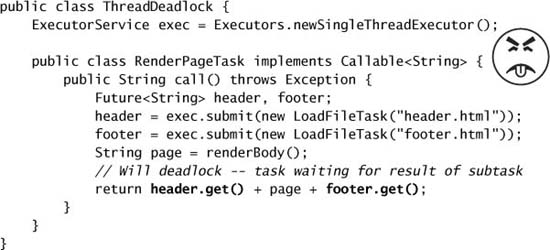

### 8.1.2. Task chạy lâu

Thread pool có thể gặp vấn đề về khả năng đáp ứng nếu các task có thể block trong thời gian dài, ngay cả khi không có khả năng deadlock. Một thread pool có thể trở nên **nghẽn** bởi các task chạy lâu, làm tăng thời gian phục vụ ngay cả với những task ngắn. Nếu kích thước pool quá nhỏ so với số task chạy lâu dự kiến ở trạng thái ổn định, cuối cùng **tất cả** thread của pool sẽ đang chạy task dài và khả năng đáp ứng sẽ suy giảm.

Một kỹ thuật có thể giảm nhẹ tác động xấu của task chạy lâu là để các task dùng **chờ tài nguyên có timeout** thay vì chờ không giới hạn. Hầu hết blocking method trong thư viện nền tảng đều có cả phiên bản không timeout lẫn có timeout, như `Thread.join`, `BlockingQueue.put`, `CountDownLatch.await`, và `Selector.select`. Nếu việc chờ hết thời gian, bạn có thể đánh dấu task là **thất bại** và hủy nó hoặc đưa lại vào queue để thực thi sau. Điều này đảm bảo rằng mỗi task cuối cùng đều tiến triển tới việc hoàn tất — thành công hoặc thất bại — giải phóng thread cho những task có thể hoàn tất nhanh hơn. Nếu một thread pool thường xuyên đầy các task bị block, đó cũng có thể là dấu hiệu **pool quá nhỏ**.

---

## 8.2. Xác định kích thước Thread Pool

Kích thước lý tưởng cho một thread pool phụ thuộc vào **loại task** sẽ được gửi và **đặc tính của hệ thống triển khai**. Kích thước thread pool hiếm khi nên được hard-code; thay vào đó, kích thước pool nên được cung cấp bởi một cơ chế cấu hình hoặc được tính động bằng cách tham vấn `Runtime.availableProcessors`.

Xác định kích thước thread pool **không phải một khoa học chính xác**, nhưng may mắn là bạn chỉ cần tránh hai cực đoan "quá lớn" và "quá nhỏ". Nếu thread pool quá lớn, các thread cạnh tranh tài nguyên CPU và bộ nhớ khan hiếm, dẫn đến mức sử dụng bộ nhớ cao hơn và có thể cạn kiệt tài nguyên. Nếu quá nhỏ, throughput suy giảm vì các processor không được dùng dù có sẵn công việc.

Để xác định kích thước thread pool đúng cách, bạn cần hiểu **môi trường tính toán** của mình, **ngân sách tài nguyên**, và **bản chất của task**. Hệ thống triển khai có bao nhiêu processor? Bao nhiêu bộ nhớ? Task chủ yếu thực hiện tính toán, I/O, hay kết hợp cả hai? Chúng có cần một tài nguyên khan hiếm nào không, như JDBC connection? Nếu bạn có những loại task khác nhau với hành vi rất khác nhau, hãy cân nhắc dùng **nhiều thread pool** để mỗi pool có thể được tinh chỉnh theo khối lượng công việc của nó.

Với các task **thiên về tính toán**, một hệ thống có N<sub>cpu</sub> processor thường đạt mức sử dụng tối ưu với một thread pool gồm **N<sub>cpu</sub> + 1** thread. (Ngay cả các thread thiên về tính toán thỉnh thoảng cũng gặp page fault hay tạm dừng vì lý do khác, nên một thread "dư" sẵn sàng chạy sẽ ngăn chu kỳ CPU bị bỏ phí khi điều đó xảy ra.) Với những task cũng bao gồm I/O hay các blocking operation khác, bạn muốn một pool **lớn hơn**, vì không phải mọi thread đều có thể được lập lịch tại mọi thời điểm. Để xác định kích thước pool đúng cách, bạn phải **ước lượng tỷ lệ giữa thời gian chờ và thời gian tính toán** cho các task của mình; ước lượng này không cần chính xác và có thể thu được qua profiling hoặc instrumentation. Ngoài ra, kích thước thread pool có thể được tinh chỉnh bằng cách chạy ứng dụng với vài kích thước pool khác nhau dưới một tải benchmark và quan sát mức sử dụng CPU.

Với các định nghĩa sau:

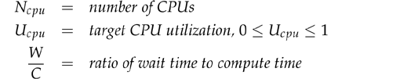

Kích thước pool tối ưu để giữ các processor ở mức sử dụng mong muốn là:


Bạn có thể xác định số CPU bằng `Runtime`:

```java
int N_CPUS = Runtime.getRuntime().availableProcessors();
```

Dĩ nhiên, chu kỳ CPU không phải tài nguyên duy nhất bạn có thể muốn quản lý bằng thread pool. Các tài nguyên khác có thể góp phần vào ràng buộc kích thước là **bộ nhớ, file handle, socket handle, và database connection**. Tính ràng buộc kích thước pool cho những loại tài nguyên này dễ hơn: chỉ cần cộng lại lượng tài nguyên đó mà mỗi task cần rồi chia cho tổng lượng khả dụng. Kết quả sẽ là **cận trên** của kích thước pool.

Khi task cần một tài nguyên trong pool như database connection, kích thước thread pool và kích thước resource pool **ảnh hưởng lẫn nhau**. Nếu mỗi task cần một connection, kích thước hiệu dụng của thread pool bị giới hạn bởi kích thước connection pool. Tương tự, khi những bên tiêu thụ connection duy nhất là các task trong pool, kích thước hiệu dụng của connection pool bị giới hạn bởi kích thước thread pool.

---

## 8.3. Cấu hình ThreadPoolExecutor

`ThreadPoolExecutor` cung cấp hiện thực nền tảng cho các executor được trả về bởi các factory `newCachedThreadPool`, `newFixedThreadPool`, và `newScheduledThreadExecutor` trong `Executors`. `ThreadPoolExecutor` là một hiện thực pool linh hoạt, bền vững, cho phép nhiều loại tùy biến.

Nếu execution policy mặc định không đáp ứng nhu cầu của bạn, bạn có thể khởi tạo một `ThreadPoolExecutor` qua constructor của nó và tùy biến nó theo ý muốn; bạn có thể tham khảo mã nguồn của `Executors` để xem execution policy của các cấu hình mặc định và dùng chúng làm điểm khởi đầu. `ThreadPoolExecutor` có vài constructor, cái tổng quát nhất được thể hiện ở Listing 8.2.

### 8.3.1. Tạo và hủy Thread

**Core pool size**, **maximum pool size**, và **keep-alive time** chi phối việc tạo và hủy thread. **Core size** là kích thước mục tiêu; hiện thực cố duy trì pool ở kích thước này ngay cả khi không có task nào để thực thi,[^2] và sẽ **không tạo thêm thread** vượt quá con số này trừ khi work queue đầy.[^3] **Maximum pool size** là cận trên của số thread pool có thể hoạt động cùng lúc. Một thread đã nhàn rỗi lâu hơn keep-alive time trở thành ứng viên để bị thu hồi và có thể bị kết thúc nếu kích thước pool hiện tại vượt quá core size.

[^2]: Khi một `ThreadPoolExecutor` mới được tạo, các core thread **không** được khởi động ngay lập tức mà chỉ khi task được gửi, trừ khi bạn gọi `prestartAllCoreThreads`.

[^3]: Developer đôi khi bị cám dỗ đặt core size bằng không để các worker thread cuối cùng bị hủy và do đó không ngăn JVM thoát, nhưng điều này có thể gây ra hành vi trông kỳ lạ trong những thread pool không dùng `SynchronousQueue` làm work queue (như `newCachedThreadPool` dùng). Nếu pool đã ở core size, `ThreadPoolExecutor` chỉ tạo thread mới **nếu work queue đầy**. Vậy nên các task được gửi tới một thread pool có work queue với sức chứa bất kỳ và core size bằng không sẽ **không thực thi cho đến khi queue đầy**, điều thường không phải mong muốn. Ở Java 6, `allowCoreThreadTimeOut` cho phép bạn yêu cầu rằng tất cả thread của pool đều có thể hết thời gian; hãy bật tính năng này với core size bằng không nếu bạn muốn một thread pool có giới hạn với work queue có giới hạn nhưng vẫn có tất cả thread bị hủy khi không có việc gì để làm.

**Listing 8.2. Constructor tổng quát của `ThreadPoolExecutor`.**

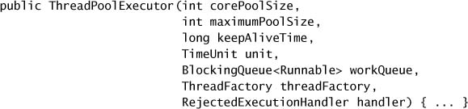

Bằng cách tinh chỉnh core pool size và keep-alive time, bạn có thể khuyến khích pool thu hồi tài nguyên đang bị các thread nhàn rỗi chiếm dụng, làm chúng khả dụng cho công việc hữu ích hơn. (Cũng như mọi thứ khác, đây là một đánh đổi: thu hồi thread nhàn rỗi sẽ phát sinh thêm độ trễ do việc tạo thread nếu sau này phải tạo lại thread khi nhu cầu tăng.)

Factory `newFixedThreadPool` đặt **cả** core pool size **lẫn** maximum pool size bằng kích thước pool được yêu cầu, tạo hiệu ứng **timeout vô hạn**; factory `newCachedThreadPool` đặt maximum pool size bằng `Integer.MAX_VALUE` và core pool size bằng không với timeout một phút, tạo hiệu ứng một thread pool **mở rộng vô hạn** nhưng sẽ co lại khi nhu cầu giảm. Các kết hợp khác đều khả thi khi dùng constructor `ThreadPoolExecutor` tường minh.

### 8.3.2. Quản lý các Task trong hàng đợi

Thread pool có giới hạn hạn chế số task có thể thực thi concurrent. (Các executor single-threaded là một trường hợp đặc biệt đáng chú ý: chúng đảm bảo rằng **không** task nào thực thi concurrent, mở ra khả năng đạt được thread safety thông qua thread confinement.)

Ở mục 6.1.2 chúng ta đã thấy việc tạo thread không giới hạn có thể dẫn đến bất ổn định như thế nào, và đã giải quyết vấn đề này bằng cách dùng một thread pool cỡ cố định thay vì tạo một thread mới cho mỗi request. Tuy nhiên, đây chỉ là **giải pháp một phần**; vẫn có thể xảy ra việc ứng dụng cạn tài nguyên dưới tải nặng, chỉ là khó hơn. Nếu tốc độ đến của request mới vượt quá tốc độ chúng có thể được xử lý, request vẫn sẽ **xếp hàng**. Với một thread pool, chúng chờ trong một hàng đợi các `Runnable` do `Executor` quản lý thay vì xếp hàng dưới dạng các thread tranh chấp CPU. Biểu diễn một task đang chờ bằng một `Runnable` và một node danh sách chắc chắn **rẻ hơn nhiều** so với bằng một thread, nhưng rủi ro cạn kiệt tài nguyên vẫn còn nếu client có thể ném request vào server nhanh hơn tốc độ nó xử lý.

Request thường đến theo **cụm** (burst) ngay cả khi tốc độ request trung bình khá ổn định. Hàng đợi có thể giúp làm mượt các cụm task nhất thời, nhưng nếu task tiếp tục đến quá nhanh, cuối cùng bạn sẽ phải **điều tiết tốc độ đến** để tránh cạn bộ nhớ.[^4] Thậm chí trước khi bạn cạn bộ nhớ, thời gian phản hồi sẽ ngày càng tệ đi khi task queue lớn dần.

[^4]: Điều này tương tự flow control trong mạng truyền thông: bạn có thể sẵn sàng buffer một lượng dữ liệu nhất định, nhưng cuối cùng bạn cần tìm cách bắt bên kia ngừng gửi dữ liệu cho bạn, hoặc vứt bỏ dữ liệu dư và hy vọng bên gửi sẽ truyền lại khi bạn không quá bận.

`ThreadPoolExecutor` cho phép bạn cung cấp một `BlockingQueue` để giữ các task chờ thực thi. Có **ba cách tiếp cận cơ bản** cho việc xếp hàng task: **unbounded queue**, **bounded queue**, và **synchronous handoff**. Lựa chọn queue tương tác với các tham số cấu hình khác như kích thước pool.

Mặc định của `newFixedThreadPool` và `newSingleThreadExecutor` là dùng một `LinkedBlockingQueue` **không giới hạn**. Task sẽ xếp hàng nếu tất cả worker thread đều bận, nhưng queue có thể **lớn không giới hạn** nếu task cứ đến nhanh hơn tốc độ chúng được thực thi.

Một chiến lược quản lý tài nguyên ổn định hơn là dùng một **bounded queue**, chẳng hạn `ArrayBlockingQueue` hoặc `LinkedBlockingQueue`/`PriorityBlockingQueue` có giới hạn. Bounded queue giúp ngăn cạn kiệt tài nguyên nhưng đặt ra câu hỏi **phải làm gì với task mới khi queue đầy**. (Có một số **saturation policy** khả dĩ để giải quyết vấn đề này; xem mục 8.3.3.) Với một work queue có giới hạn, kích thước queue và kích thước pool phải được **tinh chỉnh cùng nhau**. Một queue lớn kết hợp với một pool nhỏ có thể giúp giảm mức sử dụng bộ nhớ, mức sử dụng CPU, và context switching, với cái giá là có khả năng hạn chế throughput.

Với những pool rất lớn hoặc không giới hạn, bạn cũng có thể **bỏ qua hoàn toàn việc xếp hàng** và thay vào đó chuyển giao task trực tiếp từ producer sang worker thread bằng một `SynchronousQueue`. Một `SynchronousQueue` thực ra **không phải một queue** chút nào, mà là một cơ chế quản lý việc chuyển giao giữa các thread. Để đặt một phần tử lên một `SynchronousQueue`, phải **đã có** một thread khác đang chờ nhận chuyển giao. Nếu không có thread nào đang chờ nhưng kích thước pool hiện tại nhỏ hơn maximum, `ThreadPoolExecutor` tạo một thread mới; nếu không, task bị **từ chối** theo saturation policy. Dùng chuyển giao trực tiếp **hiệu quả hơn** vì task có thể được trao thẳng cho thread sẽ thực thi nó, thay vì trước tiên đặt lên queue rồi để worker thread lấy ra. `SynchronousQueue` chỉ là lựa chọn thực tế nếu pool không giới hạn hoặc nếu việc từ chối task dư thừa là chấp nhận được. Factory `newCachedThreadPool` dùng một `SynchronousQueue`.

Dùng một FIFO queue như `LinkedBlockingQueue` hay `ArrayBlockingQueue` khiến các task được khởi động **theo thứ tự chúng đến**. Để kiểm soát tốt hơn thứ tự thực thi task, bạn có thể dùng một `PriorityBlockingQueue`, thứ sắp xếp task theo **độ ưu tiên**. Độ ưu tiên có thể được định nghĩa bằng thứ tự tự nhiên (nếu task hiện thực `Comparable`) hoặc bằng một `Comparator`.

Factory `newCachedThreadPool` là một lựa chọn mặc định tốt cho một `Executor`, cung cấp performance xếp hàng tốt hơn một thread pool cỡ cố định.[^5] Một thread pool cỡ cố định là lựa chọn tốt khi bạn cần **giới hạn số task concurrent** vì mục đích quản lý tài nguyên, như trong một ứng dụng server nhận request từ client mạng và nếu không sẽ dễ bị quá tải.

[^5]: Sự khác biệt performance này đến từ việc dùng `SynchronousQueue` thay vì `LinkedBlockingQueue`. `SynchronousQueue` đã được thay thế ở Java 6 bằng một thuật toán nonblocking mới, cải thiện throughput trong các benchmark `Executor` **gấp ba lần** so với hiện thực `SynchronousQueue` của Java 5.0 (Scherer và cộng sự, 2006).

Việc giới hạn thread pool hay work queue **chỉ phù hợp khi các task độc lập**. Với những task phụ thuộc vào task khác, thread pool hay queue có giới hạn có thể gây **thread starvation deadlock**; thay vào đó, hãy dùng một cấu hình pool không giới hạn như `newCachedThreadPool`.[^6]

[^6]: Một cấu hình thay thế cho những task gửi task khác và chờ kết quả của chúng là dùng một thread pool có giới hạn, một `SynchronousQueue` làm work queue, và saturation policy **caller-runs**.

### 8.3.3. Saturation Policy

Khi một work queue có giới hạn đầy, **saturation policy** sẽ phát huy tác dụng. Saturation policy của một `ThreadPoolExecutor` có thể được sửa bằng cách gọi `setRejectedExecutionHandler`. (Saturation policy cũng được dùng khi một task được gửi tới một `Executor` đã bị tắt.) Có vài hiện thực của `RejectedExecutionHandler` được cung cấp, mỗi cái hiện thực một saturation policy khác nhau: `AbortPolicy`, `CallerRunsPolicy`, `DiscardPolicy`, và `DiscardOldestPolicy`.

Policy mặc định, **abort**, khiến `execute` ném `RejectedExecutionException` (unchecked); caller có thể bắt exception này và tự hiện thực cách xử lý tràn theo ý mình. Policy **discard** âm thầm loại bỏ task vừa được gửi nếu nó không thể được xếp hàng để thực thi; policy **discard-oldest** loại bỏ task lẽ ra sẽ được thực thi tiếp theo và thử gửi lại task mới. (Nếu work queue là một priority queue, cách này sẽ loại bỏ **phần tử có độ ưu tiên cao nhất**, nên kết hợp saturation policy discard-oldest với một priority queue **không phải một ý hay**.)

Policy **caller-runs** hiện thực một dạng **điều tiết** (throttling) mà không loại bỏ task cũng không ném exception, mà thay vào đó cố làm chậm dòng task mới bằng cách **đẩy bớt công việc trở lại cho caller**. Nó thực thi task vừa được gửi **không** trong một thread của pool, mà trong chính thread gọi `execute`. Nếu chúng ta sửa ví dụ `WebServer` để dùng một bounded queue và policy caller-runs, thì sau khi tất cả thread của pool bị chiếm dụng và work queue đầy, task tiếp theo sẽ được thực thi **trong main thread** trong lúc gọi `execute`. Vì việc này có lẽ sẽ mất một chút thời gian, main thread **không thể gửi thêm task nào** ít nhất trong một lúc, cho các worker thread thời gian bắt kịp phần tồn đọng. Main thread cũng sẽ **không gọi `accept`** trong thời gian này, nên các request đến sẽ xếp hàng ở **tầng TCP** thay vì trong ứng dụng. Nếu tình trạng quá tải kéo dài, cuối cùng tầng TCP sẽ quyết định rằng nó đã xếp hàng đủ nhiều request kết nối và bắt đầu loại bỏ cả các request kết nối. Khi server trở nên quá tải, tình trạng quá tải được **đẩy dần ra ngoài** — từ thread của pool sang work queue, sang ứng dụng, sang tầng TCP, và cuối cùng sang client — cho phép **suy giảm êm ái hơn** dưới tải.

Việc chọn saturation policy hay thực hiện các thay đổi khác lên execution policy có thể được làm khi `Executor` được tạo. Listing 8.3 minh họa việc tạo một thread pool cỡ cố định với saturation policy caller-runs.

**Listing 8.3. Tạo một Thread Pool cỡ cố định với Bounded Queue và Saturation Policy Caller-runs.**

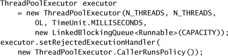

**Không có saturation policy định sẵn** nào khiến `execute` **block** khi work queue đầy. Tuy nhiên, có thể đạt được hiệu ứng tương tự bằng cách dùng một `Semaphore` để giới hạn tốc độ đưa task vào, như thể hiện ở `BoundedExecutor` trong Listing 8.4. Trong cách tiếp cận như vậy, hãy dùng một **queue không giới hạn** (không có lý do gì để giới hạn cả kích thước queue lẫn tốc độ đưa vào) và đặt giới hạn của semaphore bằng **kích thước pool cộng với số task xếp hàng bạn muốn cho phép**, vì semaphore đang giới hạn số task **cả đang thực thi lẫn đang chờ thực thi**.

### 8.3.4. Thread Factory

Bất cứ khi nào một thread pool cần tạo một thread, nó làm điều đó thông qua một **thread factory** (xem Listing 8.5). Thread factory mặc định tạo một thread mới, không phải daemon, không có cấu hình đặc biệt nào. Chỉ định một thread factory cho phép bạn **tùy biến cấu hình của các thread trong pool**. `ThreadFactory` có một method duy nhất, `newThread`, được gọi bất cứ khi nào một thread pool cần tạo một thread mới.

Có một số lý do để dùng thread factory tùy biến. Bạn có thể muốn chỉ định một `UncaughtExceptionHandler` cho các thread của pool, hoặc khởi tạo một instance của một class `Thread` tùy biến, chẳng hạn một class thực hiện debug logging. Bạn có thể muốn sửa độ ưu tiên (nói chung không phải ý hay lắm; xem mục 10.3.1) hoặc đặt trạng thái daemon (một lần nữa, cũng không phải ý hay lắm; xem mục 7.4.2) của các thread trong pool. Hoặc có lẽ bạn chỉ muốn đặt cho các thread của pool những **cái tên có ý nghĩa hơn** để đơn giản hóa việc diễn giải thread dump và error log.

**Listing 8.4. Dùng `Semaphore` để điều tiết việc gửi Task.**

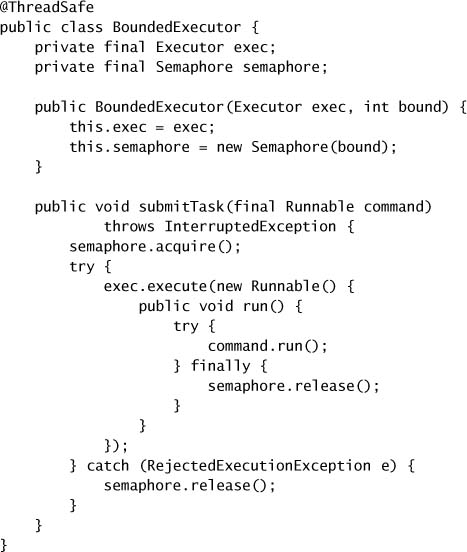

**Listing 8.5. Interface `ThreadFactory`.**

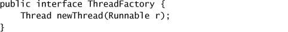

`MyThreadFactory` ở Listing 8.6 minh họa một thread factory tùy biến. Nó khởi tạo một `MyAppThread` mới, truyền một tên đặc thù cho pool vào constructor để các thread từ mỗi pool có thể phân biệt được trong thread dump và error log. `MyAppThread` cũng có thể được dùng ở nơi khác trong ứng dụng để mọi thread đều có thể tận dụng các tính năng debug của nó.

**Listing 8.6. Thread Factory tùy biến.**

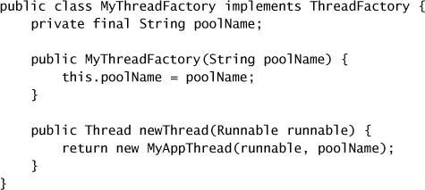

Phần tùy biến thú vị diễn ra trong `MyAppThread`, thể hiện ở Listing 8.7, thứ cho phép bạn cung cấp một tên thread, đặt một `UncaughtExceptionHandler` tùy biến ghi một thông điệp vào `Logger`, duy trì thống kê về số thread đã được tạo và bị hủy, và tùy chọn ghi một thông điệp debug vào log khi một thread được tạo hoặc kết thúc.

Nếu ứng dụng của bạn tận dụng các security policy để cấp quyền cho những codebase cụ thể, bạn có thể muốn dùng factory method `privilegedThreadFactory` trong `Executors` để tạo thread factory của mình. Nó tạo ra các thread pool có **cùng quyền, `AccessControlContext`, và `contextClassLoader`** như thread đã tạo ra `privilegedThreadFactory`. Nếu không, các thread do thread pool tạo ra sẽ **kế thừa quyền** từ bất kỳ client nào tình cờ đang gọi `execute` hay `submit` vào lúc cần một thread mới, điều có thể gây ra những exception liên quan đến bảo mật rất khó hiểu.

### 8.3.5. Tùy biến ThreadPoolExecutor sau khi construct

Hầu hết các tùy chọn được truyền vào constructor của `ThreadPoolExecutor` cũng có thể được sửa **sau khi construct** thông qua các setter (như core thread pool size, maximum thread pool size, keep-alive time, thread factory, và rejected execution handler). Nếu `Executor` được tạo qua một trong các factory method trong `Executors` (trừ `newSingleThreadExecutor`), bạn có thể **cast** kết quả thành `ThreadPoolExecutor` để truy cập các setter như trong Listing 8.8.

`Executors` bao gồm một factory method, `unconfigurableExecutorService`, nhận một `ExecutorService` có sẵn và bọc nó bằng một thứ chỉ expose các method của `ExecutorService`, để nó **không thể bị cấu hình thêm**. Khác với các hiện thực dùng pool, `newSingleThreadExecutor` trả về một `ExecutorService` được bọc theo cách này, chứ không phải một `ThreadPoolExecutor` thô. Dù một executor single-threaded thực chất được hiện thực như một thread pool với một thread, nó cũng **cam kết không thực thi task concurrent**. Nếu một đoạn code lầm lạc nào đó tăng kích thước pool trên một executor single-threaded, nó sẽ phá hỏng semantics thực thi đã định.

**Listing 8.7. Class Thread cơ sở tùy biến.**

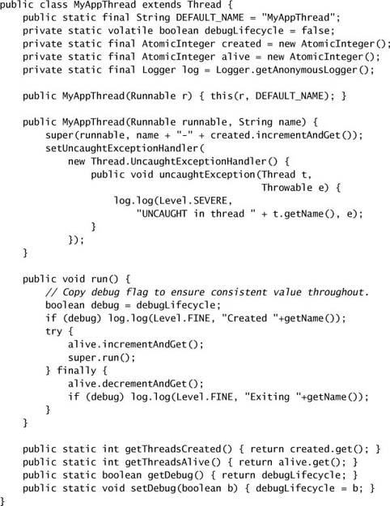

**Listing 8.8. Sửa một `Executor` được tạo bằng các factory chuẩn.**

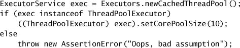

Bạn có thể dùng kỹ thuật này với các executor của riêng mình để **ngăn execution policy bị sửa đổi**. Nếu bạn sẽ expose một `ExecutorService` cho code mà bạn không tin là sẽ không sửa nó, bạn có thể bọc nó bằng một `unconfigurableExecutorService`.

---

## 8.4. Mở rộng ThreadPoolExecutor

`ThreadPoolExecutor` được thiết kế để **mở rộng**, cung cấp vài "hook" cho subclass override — `beforeExecute`, `afterExecute`, và `terminated` — có thể được dùng để mở rộng hành vi của `ThreadPoolExecutor`.

Các hook `beforeExecute` và `afterExecute` được gọi **trong thread thực thi task**, và có thể được dùng để thêm logging, đo thời gian, giám sát, hay thu thập thống kê. Hook `afterExecute` được gọi dù task hoàn tất bằng cách trả về bình thường từ `run` hay bằng cách ném một `Exception`. (Nếu task kết thúc với một `Error`, `afterExecute` **không** được gọi.) Nếu `beforeExecute` ném một `RuntimeException`, task **không được thực thi** và `afterExecute` **không** được gọi.

Hook `terminated` được gọi khi thread pool hoàn tất quá trình shutdown, sau khi tất cả task đã kết thúc và tất cả worker thread đã tắt. Nó có thể được dùng để giải phóng tài nguyên do `Executor` cấp phát trong vòng đời của nó, thực hiện thông báo hay logging, hoặc hoàn tất việc thu thập thống kê.

### 8.4.1. Ví dụ: thêm thống kê vào một Thread Pool

`TimingThreadPool` ở Listing 8.9 cho thấy một thread pool tùy biến dùng `beforeExecute`, `afterExecute`, và `terminated` để thêm logging và thu thập thống kê. Để đo thời gian chạy của một task, `beforeExecute` phải ghi lại thời điểm bắt đầu và lưu nó ở đâu đó mà `afterExecute` có thể tìm thấy. Vì các execution hook được gọi **trong thread thực thi task**, một giá trị được `beforeExecute` đặt vào một `ThreadLocal` có thể được `afterExecute` lấy ra. `TimingThreadPool` dùng một cặp `AtomicLong` để theo dõi tổng số task đã xử lý và tổng thời gian xử lý, và dùng hook `terminated` để in một thông điệp log hiển thị thời gian trung bình của một task.

**Listing 8.9. Thread Pool được mở rộng với Logging và đo thời gian.**

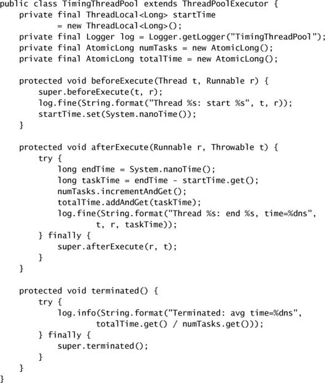

---

## 8.5. Song song hóa các thuật toán đệ quy

Các ví dụ render trang ở mục 6.3 đã trải qua một loạt tinh chỉnh để tìm kiếm parallelism khai thác được. Nỗ lực đầu tiên hoàn toàn tuần tự; nỗ lực thứ hai dùng hai thread nhưng vẫn thực hiện mọi việc tải ảnh tuần tự; phiên bản cuối cùng coi mỗi lần tải ảnh là một task riêng để đạt parallelism lớn hơn. **Các vòng lặp mà thân của chúng chứa tính toán không tầm thường hoặc thực hiện I/O có thể block thường là ứng viên tốt để song song hóa**, miễn là các vòng lặp **độc lập** với nhau.

Nếu chúng ta có một vòng lặp mà các lần lặp độc lập và ta không cần chờ tất cả chúng hoàn tất trước khi tiếp tục, ta có thể dùng một `Executor` để biến một vòng lặp tuần tự thành một vòng lặp song song, như thể hiện ở `processSequentially` và `processInParallel` trong Listing 8.10.

**Listing 8.10. Biến thực thi tuần tự thành thực thi song song.**

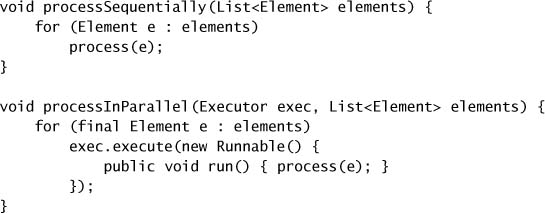

Một lời gọi tới `processInParallel` trả về **nhanh hơn** một lời gọi tới `processSequentially` vì nó trả về ngay khi tất cả task đã được xếp hàng vào `Executor`, thay vì chờ tất cả chúng hoàn tất. Nếu bạn muốn gửi một tập task và chờ tất cả hoàn tất, bạn có thể dùng `ExecutorService.invokeAll`; để lấy kết quả ngay khi chúng sẵn sàng, bạn có thể dùng một `CompletionService`, như trong `Renderer` ở trang 130.

> Các lần lặp tuần tự phù hợp để song song hóa khi mỗi lần lặp **độc lập** với những lần khác và công việc thực hiện trong mỗi lần lặp **đủ đáng kể** để bù lại chi phí quản lý một task mới.

Song song hóa vòng lặp cũng có thể áp dụng cho một số thiết kế **đệ quy**; thường có những vòng lặp tuần tự bên trong thuật toán đệ quy có thể được song song hóa theo cách tương tự Listing 8.10. Trường hợp dễ hơn là khi mỗi lần lặp **không cần** kết quả của những lần đệ quy mà nó gọi. Ví dụ, `sequentialRecursive` ở Listing 8.11 thực hiện duyệt cây theo chiều sâu, thực hiện một phép tính trên mỗi node và đặt kết quả vào một collection. Phiên bản đã biến đổi, `parallelRecursive`, cũng duyệt theo chiều sâu, nhưng thay vì tính kết quả khi mỗi node được thăm, nó **gửi một task** để tính kết quả của node.

**Listing 8.11. Biến đệ quy đuôi tuần tự thành đệ quy được song song hóa.**

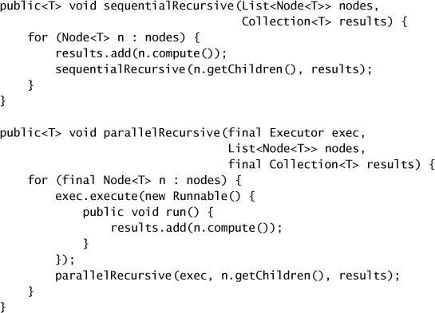

Khi `parallelRecursive` trả về, mỗi node trong cây đã được thăm (việc duyệt vẫn **tuần tự**: chỉ các lời gọi tới `compute` được thực thi song song) và phép tính cho mỗi node đã được xếp hàng vào `Executor`. Caller của `parallelRecursive` có thể chờ tất cả kết quả bằng cách tạo một `Executor` riêng cho lần duyệt đó và dùng `shutdown` cùng `awaitTermination`, như trong Listing 8.12.

**Listing 8.12. Chờ kết quả được tính song song.**

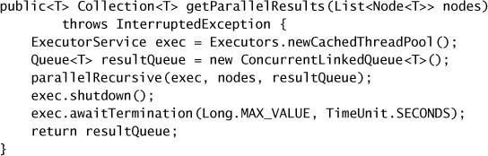

### 8.5.1. Ví dụ: Một Framework giải đố

Một ứng dụng hấp dẫn của kỹ thuật này là giải các câu đố liên quan đến việc tìm một **chuỗi các phép biến đổi** từ một trạng thái ban đầu để đạt tới một trạng thái đích, chẳng hạn các "sliding block puzzle" quen thuộc,[^7] "Hi-Q", "Instant Insanity", và các câu đố solitaire khác.

[^7]: Xem `http://www.puzzleworld.org/SlidingBlockPuzzles`.

Chúng ta định nghĩa một "puzzle" là một tổ hợp của một **vị trí ban đầu**, một **vị trí đích**, và một **tập quy tắc** xác định các nước đi hợp lệ. Tập quy tắc có hai phần: tính danh sách các nước đi hợp lệ từ một vị trí cho trước, và tính kết quả của việc áp dụng một nước đi lên một vị trí. `Puzzle` ở Listing 8.13 cho thấy trừu tượng hóa puzzle của chúng ta; các tham số kiểu `P` và `M` biểu diễn các class cho một vị trí và một nước đi. Từ interface này, chúng ta có thể viết một solver tuần tự đơn giản tìm kiếm trong không gian puzzle cho đến khi tìm được lời giải hoặc không gian puzzle cạn kiệt.

**Listing 8.13. Trừu tượng hóa cho các câu đố như "Sliding Blocks Puzzle".**

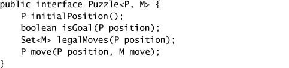

`Node` ở Listing 8.14 biểu diễn một vị trí đã đạt được thông qua một chuỗi nước đi, giữ một tham chiếu tới nước đi đã tạo ra vị trí đó và tới `Node` trước đó. Đi theo các liên kết ngược lại từ một `Node` cho phép chúng ta **tái dựng chuỗi nước đi** đã dẫn tới vị trí hiện tại.

`SequentialPuzzleSolver` ở Listing 8.15 cho thấy một solver tuần tự cho framework puzzle, thực hiện tìm kiếm theo chiều sâu trong không gian puzzle. Nó kết thúc khi tìm được một lời giải (không nhất thiết là lời giải ngắn nhất).

Viết lại solver để khai thác concurrency sẽ cho phép chúng ta tính các nước đi tiếp theo và đánh giá điều kiện đích **song song**, vì quá trình đánh giá một nước đi phần lớn độc lập với việc đánh giá các nước đi khác. (Chúng tôi nói "phần lớn" vì các task có share một chút mutable state, chẳng hạn tập các vị trí đã thấy.) Nếu có nhiều processor, điều này có thể giảm thời gian tìm ra lời giải.

`ConcurrentPuzzleSolver` ở Listing 8.16 dùng một class nội bộ `SolverTask` mở rộng `Node` và hiện thực `Runnable`. Phần lớn công việc được thực hiện trong `run`: đánh giá tập các vị trí kế tiếp khả dĩ, cắt tỉa những vị trí đã tìm kiếm, đánh giá xem đã đạt được thành công chưa (bởi task này hay bởi task khác), và gửi những vị trí chưa tìm kiếm tới một `Executor`.

Để tránh vòng lặp vô hạn, phiên bản tuần tự duy trì một `Set` các vị trí đã tìm kiếm trước đó; `ConcurrentPuzzleSolver` dùng một `ConcurrentHashMap` cho mục đích này. Điều này cung cấp thread safety và tránh race condition vốn có trong việc cập nhật có điều kiện một collection được share, bằng cách dùng `putIfAbsent` để **thêm một vị trí một cách atomic chỉ khi** nó chưa được biết đến trước đó. `ConcurrentPuzzleSolver` dùng **work queue nội bộ của thread pool** thay vì call stack để giữ trạng thái của việc tìm kiếm.

**Listing 8.14. Link Node cho Framework giải đố.**

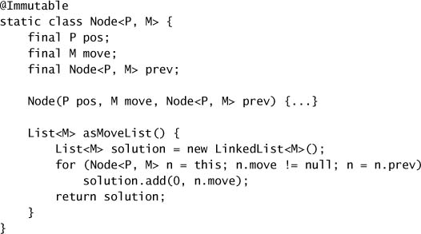

Cách tiếp cận concurrent cũng đánh đổi một dạng giới hạn này lấy một dạng khác có thể phù hợp hơn với miền bài toán. Phiên bản tuần tự thực hiện tìm kiếm theo chiều sâu, nên việc tìm kiếm bị giới hạn bởi **kích thước stack** khả dụng. Phiên bản concurrent thực hiện tìm kiếm **theo chiều rộng** và do đó không bị hạn chế bởi kích thước stack (nhưng vẫn có thể cạn bộ nhớ nếu tập các vị trí cần tìm hoặc đã tìm vượt quá bộ nhớ khả dụng).

Để dừng việc tìm kiếm khi chúng ta tìm được lời giải, chúng ta cần một cách xác định xem **đã có thread nào tìm ra lời giải chưa**. Nếu chúng ta muốn chấp nhận lời giải **đầu tiên** tìm được, ta cũng cần cập nhật lời giải **chỉ khi** chưa có task nào khác đã tìm ra. Những yêu cầu này mô tả một dạng **latch** (xem mục 5.5.1), và cụ thể hơn là một **latch có mang kết quả**. Chúng ta có thể dễ dàng xây một latch có mang kết quả và có block bằng các kỹ thuật ở chương 14, nhưng thường dễ hơn và ít lỗi hơn khi dùng các class thư viện có sẵn thay vì các cơ chế ngôn ngữ mức thấp. `ValueLatch` ở Listing 8.17 dùng một `CountDownLatch` để cung cấp hành vi latch cần thiết, và dùng locking để đảm bảo lời giải **chỉ được đặt một lần**.

Mỗi task trước tiên tham vấn solution latch và dừng nếu một lời giải đã được tìm thấy. Main thread cần chờ đến khi tìm được lời giải; `getValue` trong `ValueLatch` **block** cho đến khi một thread nào đó đặt giá trị. `ValueLatch` cung cấp một cách giữ một giá trị sao cho **chỉ lời gọi đầu tiên** thực sự đặt giá trị, caller có thể kiểm tra xem nó đã được đặt chưa, và caller có thể block chờ nó được đặt. Ở lời gọi đầu tiên tới `setValue`, lời giải được cập nhật và `CountDownLatch` được giảm, giải phóng main solver thread khỏi `getValue`.

Thread đầu tiên tìm ra lời giải cũng **tắt `Executor`**, để ngăn task mới được chấp nhận. Để khỏi phải xử lý `RejectedExecutionException`, rejected execution handler nên được đặt để **loại bỏ** các task được gửi. Khi đó, tất cả task chưa hoàn tất cuối cùng sẽ chạy tới khi xong và mọi nỗ lực thực thi task mới sau đó sẽ thất bại âm thầm, cho phép executor kết thúc. (Nếu các task mất nhiều thời gian hơn để chạy, chúng ta có thể muốn **interrupt** chúng thay vì để chúng chạy xong.)

**Listing 8.15. Solver giải đố tuần tự.**

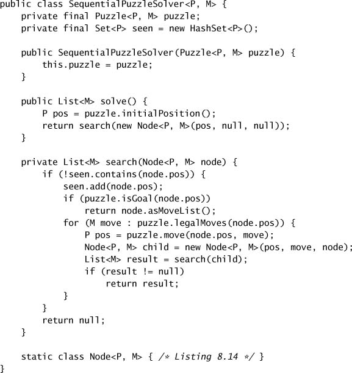

**Listing 8.16. Phiên bản Concurrent của Solver giải đố.**

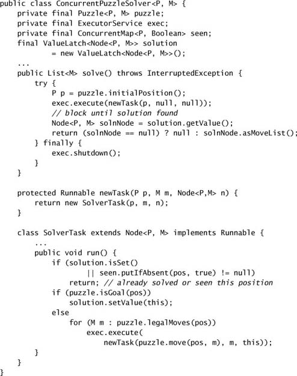

**Listing 8.17. Latch có mang kết quả được `ConcurrentPuzzleSolver` sử dụng.**

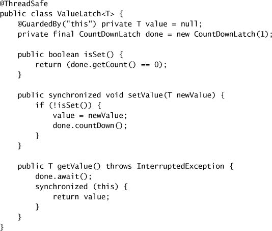

`ConcurrentPuzzleSolver` **xử lý không tốt** trường hợp **không có lời giải**: nếu mọi nước đi và vị trí khả dĩ đã được đánh giá mà không tìm thấy lời giải, `solve` sẽ **chờ mãi mãi** trong lời gọi `getSolution`. Phiên bản tuần tự kết thúc khi nó đã vét cạn không gian tìm kiếm, nhưng làm cho chương trình concurrent kết thúc đôi khi khó hơn. Một giải pháp khả dĩ là **giữ một bộ đếm các task solver đang hoạt động** và đặt lời giải bằng `null` khi bộ đếm về không, như trong Listing 8.18.

Việc tìm lời giải cũng có thể mất lâu hơn thời gian ta sẵn sàng chờ; có vài điều kiện kết thúc bổ sung mà ta có thể áp đặt lên solver. Một là **giới hạn thời gian**; điều này dễ dàng thực hiện bằng cách hiện thực một `getValue` có timeout trong `ValueLatch` (dùng phiên bản có timeout của `await`), và tắt `Executor` rồi tuyên bố thất bại nếu `getValue` hết thời gian. Một cách khác là một **thước đo đặc thù cho puzzle**, chẳng hạn chỉ tìm kiếm tối đa một số vị trí nhất định. Hoặc chúng ta có thể cung cấp một **cơ chế cancellation** và để client tự quyết định khi nào ngừng tìm kiếm.

**Listing 8.18. Solver nhận biết khi không tồn tại lời giải.**

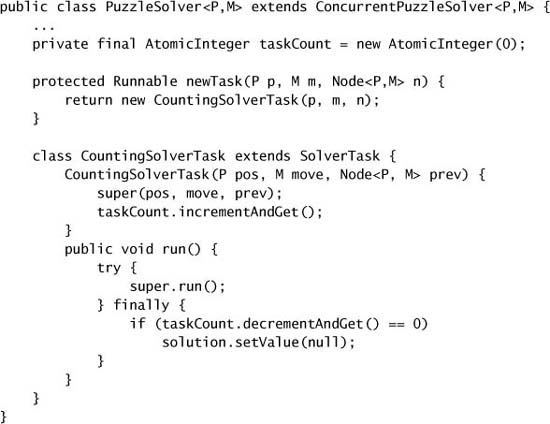

---

## Tóm tắt

Framework `Executor` là một framework mạnh mẽ và linh hoạt để thực thi task một cách concurrent. Nó cung cấp nhiều tùy chọn tinh chỉnh, chẳng hạn các policy để tạo và hủy thread, xử lý các task trong hàng đợi, và làm gì với các task dư thừa, đồng thời cung cấp vài hook để mở rộng hành vi của nó. Tuy nhiên, như với hầu hết framework mạnh mẽ, có những **tổ hợp thiết lập không hoạt động tốt cùng nhau**; một số loại task đòi hỏi execution policy cụ thể, và một số tổ hợp tham số tinh chỉnh có thể tạo ra kết quả kỳ lạ.
