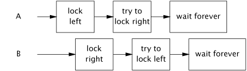
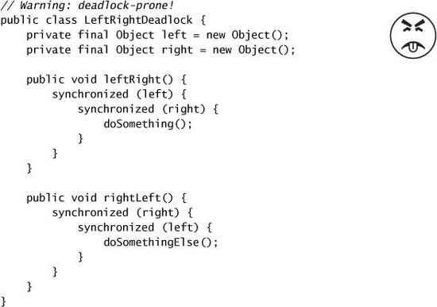
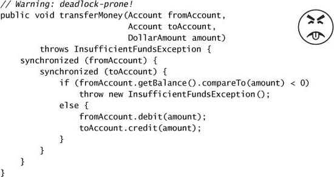
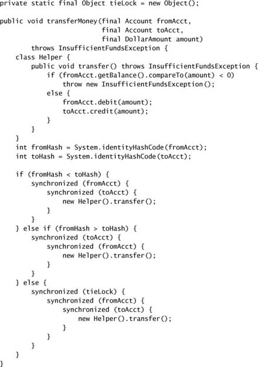
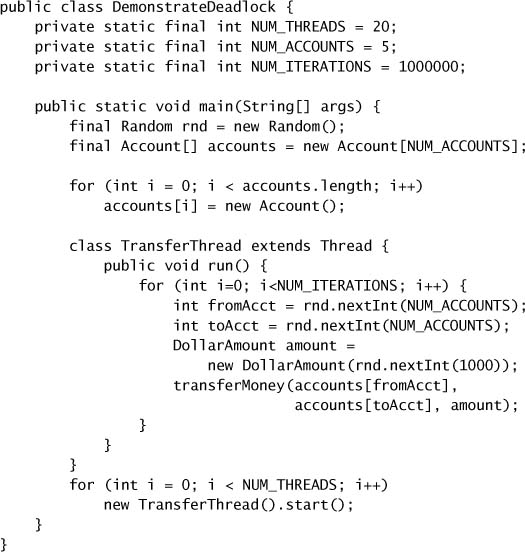
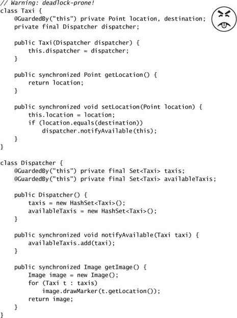
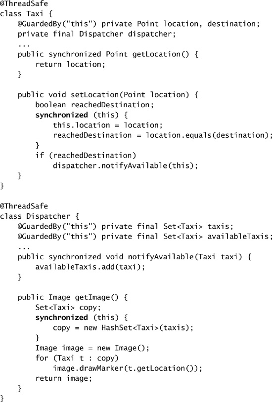
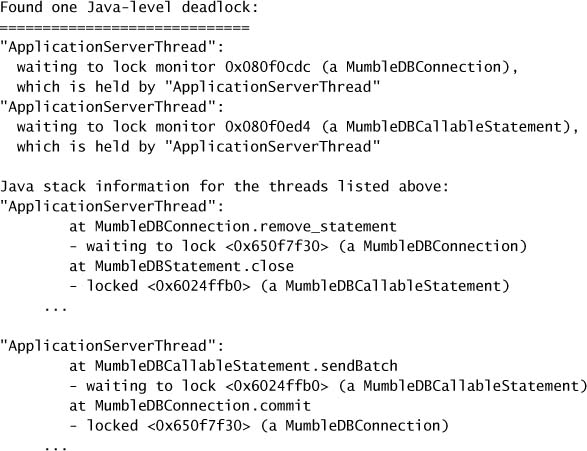

# Chương 10. Avoiding Liveness Hazards

> **Về bản dịch này.** Đây là bản **dịch đầy đủ** chương 10 của cuốn *Java Concurrency in Practice* (Brian Goetz và cộng sự). Các **thuật ngữ chuyên ngành được giữ nguyên tiếng Anh**. Toàn bộ code listing và hình vẽ được trích trực tiếp từ file PDF gốc và lưu trong thư mục `images/ch10/`.

---

Thường có sự **căng thẳng giữa safety và liveness**. Chúng ta dùng locking để đảm bảo thread safety, nhưng việc dùng locking bừa bãi có thể gây **lock-ordering deadlock**. Tương tự, chúng ta dùng thread pool và semaphore để giới hạn mức tiêu thụ tài nguyên, nhưng việc không hiểu rõ những hoạt động đang bị giới hạn có thể gây **resource deadlock**. Ứng dụng Java **không khôi phục được** từ deadlock, nên rất đáng để đảm bảo rằng thiết kế của bạn loại trừ những điều kiện có thể gây ra nó. Chương này khám phá một số nguyên nhân của thất bại về liveness và những gì có thể làm để ngăn chặn chúng.

---

## 10.1. Deadlock

Deadlock được minh họa bởi bài toán kinh điển — dù hơi mất vệ sinh — "**các triết gia ăn tối**" (dining philosophers). Năm triết gia đi ăn đồ Trung Hoa và ngồi quanh một bàn tròn. Có **năm chiếc đũa** (không phải năm đôi), mỗi chiếc đặt giữa hai người ngồi cạnh nhau. Các triết gia luân phiên giữa suy nghĩ và ăn. Mỗi người cần lấy **hai chiếc đũa** đủ lâu để ăn, nhưng sau đó có thể đặt đũa xuống và quay lại suy nghĩ. Có những thuật toán quản lý đũa cho phép mọi người ăn ít nhiều đúng lúc (một triết gia đói cố chộp cả hai chiếc đũa hai bên, nhưng nếu một chiếc không có sẵn thì đặt chiếc đang có xuống và chờ khoảng một phút trước khi thử lại), và có những thuật toán có thể khiến một số hoặc tất cả triết gia **chết đói** (mỗi triết gia lập tức chộp chiếc đũa bên trái và chờ chiếc bên phải sẵn sàng trước khi đặt chiếc bên trái xuống). Tình huống sau — trong đó mỗi người có một tài nguyên mà người khác cần và đang chờ một tài nguyên do người khác giữ, và sẽ không nhả thứ mình đang giữ cho đến khi lấy được thứ mình chưa có — chính là minh họa cho **deadlock**.

Khi một thread giữ một lock **mãi mãi**, các thread khác cố acquire lock đó sẽ block chờ mãi mãi. Khi thread A giữ lock L và cố acquire lock M, nhưng cùng lúc thread B giữ M và cố acquire L, **cả hai thread sẽ chờ mãi mãi**. Tình huống này là trường hợp đơn giản nhất của **deadlock** (hay **deadly embrace**), trong đó nhiều thread chờ mãi mãi do một **phụ thuộc locking có chu trình**. (Hãy hình dung các thread như những node của một đồ thị có hướng mà các cạnh biểu diễn quan hệ "Thread A đang chờ một tài nguyên do thread B giữ". Nếu đồ thị này có chu trình, thì có deadlock.)

Các hệ quản trị cơ sở dữ liệu được thiết kế để **phát hiện và khôi phục** từ deadlock. Một transaction có thể acquire nhiều lock, và các lock được giữ cho đến khi transaction commit. Vậy nên hoàn toàn có thể — và thực tế là không hiếm — việc hai transaction deadlock. Nếu không có can thiệp, chúng sẽ chờ mãi mãi (trong khi giữ những lock mà các transaction khác cũng có thể cần). Nhưng database server sẽ không để điều đó xảy ra. Khi nó phát hiện một tập transaction bị deadlock (bằng cách tìm chu trình trong đồ thị "đang-chờ"), nó chọn một **nạn nhân** và abort transaction đó. Việc này giải phóng các lock do nạn nhân giữ, cho phép các transaction khác tiếp tục. Ứng dụng sau đó có thể thử lại transaction bị abort, thứ giờ có thể hoàn tất vì các transaction cạnh tranh đã xong.

JVM **không hữu ích được như** database server trong việc giải quyết deadlock. Khi một tập thread Java bị deadlock, **thế là hết** — những thread đó vĩnh viễn ngừng hoạt động. Tùy vào việc những thread đó làm gì, ứng dụng có thể **đứng hình hoàn toàn**, hoặc một subsystem cụ thể có thể đứng, hoặc performance có thể suy giảm. Cách duy nhất để đưa ứng dụng trở lại khỏe mạnh là **abort và khởi động lại** nó — rồi hy vọng điều tương tự không xảy ra lần nữa.

Giống như nhiều nguy cơ concurrency khác, deadlock **hiếm khi biểu hiện ngay lập tức**. Việc một class có nguy cơ deadlock không có nghĩa là nó **sẽ** deadlock, chỉ là nó **có thể**. Khi deadlock thực sự biểu hiện, thường là vào **thời điểm tệ nhất có thể** — dưới tải nặng ở production.

### 10.1.1. Lock-ordering Deadlock

`LeftRightDeadlock` ở Listing 10.1 có nguy cơ deadlock. Các method `leftRight` và `rightLeft` mỗi cái đều acquire lock `left` và `right`. Nếu một thread gọi `leftRight` và một thread khác gọi `rightLeft`, và hành động của chúng xen kẽ như trong Figure 10.1, chúng sẽ deadlock.

**Figure 10.1. Timing không may trong `LeftRightDeadlock`.**



Deadlock trong `LeftRightDeadlock` xảy ra vì hai thread cố acquire **cùng những lock theo thứ tự khác nhau**. Nếu chúng yêu cầu các lock **theo cùng một thứ tự**, sẽ không có phụ thuộc locking có chu trình và do đó không có deadlock. Nếu bạn có thể đảm bảo rằng mọi thread cần lock L và M cùng lúc **luôn acquire L và M theo cùng thứ tự**, thì sẽ không có deadlock.

> Một chương trình sẽ **không có lock-ordering deadlock** nếu tất cả thread acquire những lock chúng cần theo một **thứ tự toàn cục cố định**.

Việc kiểm chứng thứ tự lock nhất quán đòi hỏi một **phân tích toàn cục** hành vi locking của chương trình. Chỉ kiểm tra riêng lẻ từng code path acquire nhiều lock là **không đủ**; cả `leftRight` lẫn `rightLeft` đều là những cách "hợp lý" để acquire hai lock, chỉ là chúng **không tương thích với nhau**. Khi nói đến locking, tay trái cần biết tay phải đang làm gì.

**Listing 10.1. Lock-ordering Deadlock đơn giản. Đừng làm thế này.**



### 10.1.2. Deadlock do thứ tự Lock động

Đôi khi không hiển nhiên rằng bạn có đủ quyền kiểm soát thứ tự lock để ngăn deadlock. Hãy xét đoạn code trông vô hại ở Listing 10.2, thứ chuyển tiền từ tài khoản này sang tài khoản khác. Nó acquire lock trên **cả hai** object `Account` trước khi thực hiện chuyển tiền, đảm bảo rằng số dư được cập nhật atomic và không vi phạm những invariant như "một tài khoản không thể có số dư âm".

**Listing 10.2. Deadlock do thứ tự Lock động. Đừng làm thế này.**



`transferMoney` có thể deadlock như thế nào? Có vẻ như mọi thread đều acquire lock theo cùng một thứ tự, nhưng thực tế **thứ tự lock phụ thuộc vào thứ tự các đối số** được truyền vào `transferMoney`, và những đối số này lại có thể phụ thuộc vào đầu vào bên ngoài. Deadlock có thể xảy ra nếu hai thread gọi `transferMoney` cùng lúc, một bên chuyển từ X sang Y, và bên kia làm ngược lại:

```java
A: transferMoney(myAccount, yourAccount, 10);
B: transferMoney(yourAccount, myAccount, 20);
```

Với timing không may, A sẽ acquire lock trên `myAccount` và chờ lock trên `yourAccount`, trong khi B đang giữ lock trên `yourAccount` và chờ lock trên `myAccount`.

Những deadlock kiểu này có thể được phát hiện bằng cách tương tự như ở Listing 10.1 — **tìm những lần acquire lock lồng nhau**. Vì thứ tự đối số nằm ngoài tầm kiểm soát của chúng ta, để sửa vấn đề chúng ta phải **áp đặt một thứ tự lên các lock** và acquire chúng theo thứ tự áp đặt đó một cách nhất quán xuyên suốt ứng dụng.

Một cách để áp đặt thứ tự lên object là dùng `System.identityHashCode`, thứ trả về giá trị mà `Object.hashCode` sẽ trả về. Listing 10.3 cho thấy một phiên bản của `transferMoney` dùng `System.identityHashCode` để áp đặt thứ tự lock. Nó tốn thêm vài dòng code, nhưng **loại bỏ khả năng deadlock**.

Trong trường hợp hiếm gặp là hai object có **cùng hash code**, chúng ta phải dùng một cách sắp xếp tùy ý cho việc acquire lock, và điều này **tái đưa vào** khả năng deadlock. Để ngăn thứ tự lock không nhất quán trong trường hợp này, một **lock "phá hòa" (tie-breaking) thứ ba** được sử dụng. Bằng cách acquire lock phá hòa **trước khi** acquire bất kỳ lock `Account` nào, chúng ta đảm bảo rằng mỗi lần chỉ một thread thực hiện tác vụ rủi ro là acquire hai lock theo thứ tự tùy ý, loại bỏ khả năng deadlock (miễn là cơ chế này được dùng nhất quán). Nếu va chạm hash phổ biến, kỹ thuật này có thể trở thành **nút thắt concurrency** (giống như việc có một lock duy nhất cho toàn chương trình), nhưng vì va chạm hash với `System.identityHashCode` **cực kỳ hiếm**, kỹ thuật này cung cấp phần an toàn cuối cùng với chi phí rất thấp.

**Listing 10.3. Áp đặt một thứ tự Lock để tránh Deadlock.**



Nếu `Account` có một key **duy nhất, immutable, có thể so sánh** như số tài khoản, việc áp đặt thứ tự lock còn dễ hơn nữa: sắp xếp object theo key của chúng, do đó loại bỏ nhu cầu dùng lock phá hòa.

Bạn có thể nghĩ chúng tôi đang phóng đại rủi ro deadlock vì lock thường chỉ được giữ trong thời gian ngắn, nhưng deadlock là một **vấn đề nghiêm trọng trong các hệ thống thực tế**. Một ứng dụng production có thể thực hiện **hàng tỷ** chu kỳ acquire-release lock mỗi ngày. Chỉ cần **một** trong số đó có timing sai đúng lúc là đủ để đưa ứng dụng vào deadlock, và ngay cả một quy trình load-test kỹ lưỡng cũng có thể không phát hiện được mọi deadlock tiềm ẩn.[^1] `DemonstrateDeadlock` ở Listing 10.4[^2] deadlock khá nhanh trên hầu hết hệ thống.

[^1]: Trớ trêu thay, việc giữ lock trong thời gian ngắn — điều bạn lẽ ra nên làm để giảm tranh chấp lock — lại **làm tăng** khả năng việc test không phát hiện được rủi ro deadlock tiềm ẩn.

[^2]: Để đơn giản, `DemonstrateDeadlock` bỏ qua vấn đề số dư tài khoản âm.

**Listing 10.4. Vòng lặp Driver gây Deadlock trong điều kiện điển hình.**



### 10.1.3. Deadlock giữa các Object hợp tác

Việc acquire nhiều lock không phải lúc nào cũng hiển nhiên như trong `LeftRightDeadlock` hay `transferMoney`; hai lock **không nhất thiết phải được acquire bởi cùng một method**. Hãy xét các class hợp tác ở Listing 10.5, có thể được dùng trong một ứng dụng điều phối taxi. `Taxi` biểu diễn một chiếc taxi riêng lẻ với một vị trí và một điểm đến; `Dispatcher` biểu diễn một đội taxi.

Dù **không method nào tường minh acquire hai lock**, các caller của `setLocation` và `getImage` vẫn có thể acquire hai lock. Nếu một thread gọi `setLocation` để phản hồi một cập nhật từ thiết bị nhận GPS, nó trước tiên cập nhật vị trí của taxi rồi kiểm tra xem nó đã đến điểm đến chưa. Nếu rồi, nó thông báo cho dispatcher rằng nó cần một điểm đến mới. Vì cả `setLocation` lẫn `notifyAvailable` đều `synchronized`, thread gọi `setLocation` acquire lock của `Taxi` **rồi** lock của `Dispatcher`. Tương tự, một thread gọi `getImage` acquire lock của `Dispatcher` **rồi** lock của từng `Taxi` (mỗi lần một cái). Cũng giống như ở `LeftRightDeadlock`, hai lock được acquire bởi hai thread theo **thứ tự khác nhau**, gây nguy cơ deadlock.

Rất dễ phát hiện khả năng deadlock trong `LeftRightDeadlock` hay `transferMoney` bằng cách tìm những method acquire hai lock. Phát hiện khả năng deadlock trong `Taxi` và `Dispatcher` khó hơn một chút: **dấu hiệu cảnh báo là một alien method (định nghĩa ở trang 40) đang được gọi trong khi đang giữ một lock**.

> Gọi một **alien method** trong khi đang giữ lock là **chuốc lấy rắc rối về liveness**. Alien method có thể acquire những lock khác (gây nguy cơ deadlock) hoặc block trong một thời gian dài bất ngờ, làm đứng những thread khác cần lock mà bạn đang giữ.

### 10.1.4. Open Call

Dĩ nhiên, `Taxi` và `Dispatcher` không biết rằng chúng là hai nửa của một deadlock chờ xảy ra. Và chúng cũng **không nên phải biết**; một lời gọi method là một **rào chắn trừu tượng** nhằm che chắn bạn khỏi những chi tiết về việc gì xảy ra ở phía bên kia. Nhưng vì bạn không biết điều gì đang xảy ra ở phía bên kia của lời gọi, việc gọi một alien method trong khi giữ lock là **khó phân tích** và do đó **rủi ro**.

Gọi một method **khi không giữ lock nào** được gọi là **open call** [CPJ 2.4.1.3], và những class dựa vào open call **hành xử tốt hơn và dễ compose hơn** so với những class thực hiện lời gọi trong khi giữ lock. Dùng open call để tránh deadlock tương tự như dùng encapsulation để cung cấp thread safety: dù người ta chắc chắn có thể xây một chương trình thread-safe mà không cần encapsulation nào, việc phân tích thread safety của một chương trình tận dụng encapsulation hiệu quả **dễ hơn rất nhiều** so với chương trình không làm vậy. Tương tự, việc phân tích liveness của một chương trình chỉ dựa vào open call **dễ hơn rất nhiều** so với chương trình không làm vậy. Tự giới hạn mình vào open call làm cho việc xác định những code path acquire nhiều lock — và do đó đảm bảo rằng lock được acquire theo thứ tự nhất quán — dễ hơn rất nhiều.[^3]

[^3]: Nhu cầu dựa vào open call và thứ tự lock cẩn thận phản ánh **sự rối rắm căn bản** của việc **compose các object đã synchronized** thay vì **synchronize các object đã compose**.

**Listing 10.5. Lock-ordering Deadlock giữa các Object hợp tác. Đừng làm thế này.**



`Taxi` và `Dispatcher` ở Listing 10.5 có thể dễ dàng được refactor để dùng open call và do đó loại bỏ rủi ro deadlock. Việc này bao gồm **thu hẹp các `synchronized` block** để chỉ bảo vệ những operation liên quan đến shared state, như trong Listing 10.6. Rất thường xuyên, nguyên nhân của những vấn đề như ở Listing 10.5 là việc dùng **`synchronized` method thay vì những `synchronized` block nhỏ hơn** vì lý do cú pháp gọn gàng hay đơn giản, chứ không phải vì toàn bộ method thực sự cần được một lock bảo vệ. (Như một phần thưởng, việc thu hẹp `synchronized` block cũng có thể cải thiện scalability; xem mục 11.4.1 để có lời khuyên về việc xác định kích thước `synchronized` block.)

> Hãy **cố gắng dùng open call** xuyên suốt chương trình của bạn. Những chương trình dựa vào open call **dễ phân tích tính không-deadlock hơn rất nhiều** so với những chương trình cho phép gọi alien method trong khi giữ lock.

Việc tái cấu trúc một `synchronized` block để cho phép open call đôi khi có thể có hệ quả không mong muốn, vì nó biến một operation vốn atomic thành **không atomic**. Trong nhiều trường hợp, việc mất atomicity là **hoàn toàn chấp nhận được**; không có lý do gì việc cập nhật vị trí của một taxi và thông báo cho dispatcher rằng nó sẵn sàng nhận điểm đến mới lại phải là một operation atomic. Trong những trường hợp khác, việc mất atomicity là đáng chú ý nhưng thay đổi về semantics vẫn chấp nhận được. Ở phiên bản dễ deadlock, `getImage` tạo ra một **snapshot hoàn chỉnh** về vị trí đội xe tại một thời điểm; ở phiên bản đã refactor, nó lấy vị trí của mỗi taxi tại **những thời điểm hơi khác nhau**.

Tuy nhiên, trong một số trường hợp việc mất atomicity **là một vấn đề**, và ở đây bạn sẽ phải dùng một kỹ thuật khác để đạt được atomicity. Một kỹ thuật như vậy là **cấu trúc một object concurrent sao cho chỉ một thread có thể thực thi code path theo sau open call**. Ví dụ, khi tắt một service, bạn có thể muốn chờ các operation đang thực hiện hoàn tất rồi mới giải phóng tài nguyên mà service dùng. Giữ lock của service trong khi chờ các operation hoàn tất **vốn dĩ dễ deadlock**, nhưng release lock của service trước khi service được tắt có thể cho phép các thread khác **bắt đầu operation mới**. Giải pháp là **giữ lock đủ lâu để cập nhật state của service thành "đang tắt"**, để các thread khác muốn bắt đầu operation mới — bao gồm cả việc tắt service — **thấy rằng service không khả dụng** và không thử. Sau đó bạn có thể chờ việc shutdown hoàn tất, biết rằng **chỉ thread shutdown** mới có quyền truy cập state của service sau khi open call hoàn tất. Như vậy, thay vì dùng locking để giữ các thread khác ngoài một vùng code tới hạn, kỹ thuật này dựa vào **xây dựng protocol** để các thread khác **không cố vào**.

### 10.1.5. Resource Deadlock

Cũng như các thread có thể deadlock khi mỗi bên đang chờ một lock mà bên kia giữ và sẽ không nhả, chúng cũng có thể deadlock khi **chờ tài nguyên**.

**Listing 10.6. Dùng Open Call để tránh Deadlock giữa các Object hợp tác.**



Giả sử bạn có hai tài nguyên dạng pool, chẳng hạn connection pool cho hai database khác nhau. Resource pool thường được hiện thực bằng semaphore (xem mục 5.5.3) để tạo điều kiện block khi pool rỗng. Nếu một task cần connection tới **cả hai** database và hai tài nguyên **không phải lúc nào cũng được yêu cầu theo cùng thứ tự**, thread A có thể đang giữ một connection tới database D1 trong khi chờ một connection tới database D2, còn thread B có thể đang giữ một connection tới D2 trong khi chờ một connection tới D1. (Pool càng lớn thì điều này càng ít khả năng xảy ra; nếu mỗi pool có N connection, deadlock đòi hỏi N tập thread chờ theo chu trình và rất nhiều timing không may.)

Một dạng resource deadlock khác là **thread-starvation deadlock**. Chúng ta đã thấy một ví dụ về nguy cơ này ở mục 8.1.1, trong đó một task gửi một task khác rồi chờ kết quả của nó lại thực thi trong một `Executor` single-threaded. Trong trường hợp đó, task đầu tiên sẽ chờ mãi mãi, làm đứng vĩnh viễn task đó và mọi task khác đang chờ thực thi trong `Executor` đó. **Những task chờ kết quả của task khác là nguồn chính gây thread-starvation deadlock**; pool có giới hạn và các task phụ thuộc lẫn nhau **không hợp nhau chút nào**.

---

## 10.2. Tránh và chẩn đoán Deadlock

Một chương trình **không bao giờ acquire nhiều hơn một lock tại một thời điểm** thì không thể gặp lock-ordering deadlock. Dĩ nhiên, điều này không phải lúc nào cũng thực tế, nhưng nếu bạn làm được, sẽ đỡ tốn công hơn rất nhiều. Nếu bạn buộc phải acquire nhiều lock, **thứ tự lock phải là một phần trong thiết kế của bạn**: cố giảm thiểu số tương tác locking tiềm tàng, đồng thời tuân theo và ghi lại tài liệu về một **lock-ordering protocol** cho những lock có thể được acquire cùng nhau.

Trong những chương trình dùng locking mịn, hãy kiểm tra code để đảm bảo không có deadlock bằng một chiến lược **hai phần**: thứ nhất, xác định những nơi có thể acquire nhiều lock (cố làm cho tập này nhỏ), và sau đó thực hiện một **phân tích toàn cục** trên tất cả những trường hợp đó để đảm bảo thứ tự lock nhất quán trên toàn bộ chương trình. Dùng open call ở mọi nơi có thể sẽ **đơn giản hóa đáng kể** phân tích này. Khi không có lời gọi non-open nào, việc tìm những chỗ acquire nhiều lock khá dễ, bằng cách review code hoặc bằng phân tích bytecode/mã nguồn tự động.

### 10.2.1. Thử acquire Lock có timeout

Một kỹ thuật khác để phát hiện và khôi phục từ deadlock là dùng tính năng **`tryLock` có timeout** của các class `Lock` tường minh (xem chương 13) thay vì intrinsic locking. Trong khi intrinsic lock chờ mãi mãi nếu không acquire được lock, explicit lock cho phép bạn chỉ định một timeout, sau đó `tryLock` trả về thất bại. Bằng cách dùng một timeout **dài hơn nhiều** so với thời gian bạn kỳ vọng để acquire lock, bạn có thể **giành lại quyền kiểm soát** khi có gì đó bất ngờ xảy ra. (Listing 13.3 trang 280 cho thấy một hiện thực thay thế của `transferMoney` dùng `tryLock` có poll kèm thử lại để tránh deadlock theo xác suất.)

Khi một lần thử acquire lock có timeout thất bại, bạn **không nhất thiết biết tại sao**. Có thể đã có deadlock; có thể một thread đã nhầm lẫn vào vòng lặp vô hạn trong khi giữ lock đó; hoặc có thể một hoạt động nào đó chỉ đơn giản là chạy chậm hơn nhiều so với bạn mong đợi. Dù vậy, ít nhất bạn cũng có cơ hội **ghi lại** rằng lần thử của mình đã thất bại, log mọi thông tin hữu ích về việc bạn đang cố làm, và khởi động lại phép tính một cách **êm ái hơn** so với việc kill toàn bộ tiến trình.

Dùng acquire lock có timeout để acquire nhiều lock có thể hiệu quả chống lại deadlock **ngay cả khi** timed locking không được dùng nhất quán xuyên suốt chương trình. Nếu một lần acquire lock hết thời gian, bạn có thể release các lock, **lùi lại và chờ một lúc**, rồi thử lại, có thể xóa được điều kiện deadlock và cho phép chương trình khôi phục. (Kỹ thuật này chỉ hoạt động khi **hai lock được acquire cùng nhau**; nếu nhiều lock được acquire do các lời gọi method lồng nhau, bạn không thể chỉ release lock bên ngoài, ngay cả khi bạn biết mình đang giữ nó.)

### 10.2.2. Phân tích Deadlock bằng Thread Dump

Dù việc ngăn deadlock chủ yếu là vấn đề của bạn, JVM **có thể giúp xác định** chúng khi chúng xảy ra, bằng **thread dump**. Một thread dump bao gồm một stack trace cho mỗi thread đang chạy, tương tự stack trace đi kèm một exception. Thread dump cũng bao gồm **thông tin locking**, chẳng hạn lock nào đang được thread nào giữ, chúng được acquire ở stack frame nào, và một thread bị block đang chờ acquire lock nào.[^4] Trước khi sinh một thread dump, JVM **tìm chu trình** trong đồ thị "đang-chờ" để phát hiện deadlock. Nếu tìm thấy, nó đưa vào thông tin deadlock xác định những lock và thread nào liên quan, và những lần acquire lock có vấn đề nằm ở đâu trong chương trình.

[^4]: Thông tin này hữu ích cho việc debug ngay cả khi bạn không có deadlock; kích hoạt thread dump định kỳ cho phép bạn quan sát hành vi locking của chương trình.

Để kích hoạt một thread dump, bạn có thể gửi tín hiệu `SIGQUIT` (`kill -3`) tới tiến trình JVM trên nền tảng Unix, hoặc nhấn `Ctrl-\` trên Unix hay `Ctrl-Break` trên nền tảng Windows. Nhiều IDE cũng có thể yêu cầu một thread dump.

Nếu bạn dùng các class `Lock` tường minh thay vì intrinsic locking, Java 5.0 **không hỗ trợ** việc gắn thông tin `Lock` vào thread dump; các `Lock` tường minh **hoàn toàn không xuất hiện** trong thread dump. Java 6 **có** hỗ trợ thread dump và phát hiện deadlock với `Lock` tường minh, nhưng thông tin về nơi `Lock` được acquire tất yếu **kém chính xác hơn** so với intrinsic lock. Intrinsic lock được gắn với **stack frame** nơi chúng được acquire; `Lock` tường minh chỉ được gắn với **thread đang acquire**.

Listing 10.7 cho thấy các phần của một thread dump lấy từ một ứng dụng J2EE ở production. Sự cố gây ra deadlock liên quan đến **ba component** — một ứng dụng J2EE, một J2EE container, và một JDBC driver, mỗi cái từ một nhà cung cấp khác nhau. (Tên đã được thay đổi để bảo vệ những kẻ có tội.) Cả ba đều là sản phẩm thương mại đã trải qua các chu kỳ test rộng rãi; mỗi cái đều có một bug **vô hại** cho đến khi tất cả chúng tương tác với nhau và gây ra một sự cố server chí mạng.

Chúng tôi chỉ hiển thị phần thread dump liên quan đến việc xác định deadlock. JVM đã làm rất nhiều việc giúp chúng ta trong việc chẩn đoán deadlock — lock nào gây ra vấn đề, thread nào liên quan, chúng còn giữ lock nào khác, và liệu các thread khác có bị ảnh hưởng gián tiếp hay không. Một thread giữ lock trên `MumbleDBConnection` và đang chờ acquire lock trên `MumbleDBCallableStatement`; thread kia giữ lock trên `MumbleDBCallableStatement` và đang chờ lock trên `MumbleDBConnection`.

**Listing 10.7. Một phần Thread Dump sau khi Deadlock.**



JDBC driver được dùng ở đây rõ ràng có một **bug về thứ tự lock**: những chuỗi lời gọi khác nhau qua JDBC driver acquire nhiều lock theo những thứ tự khác nhau. Nhưng vấn đề này sẽ **không biểu hiện** nếu không có một bug khác: **nhiều thread đang cố dùng cùng một `Connection` JDBC cùng lúc**. Đây không phải cách ứng dụng lẽ ra phải hoạt động — các developer đã bất ngờ khi thấy cùng một `Connection` được hai thread dùng concurrent. **Không có gì trong đặc tả JDBC yêu cầu một `Connection` phải thread-safe**, và việc confine một `Connection` vào một thread duy nhất là phổ biến, đúng như dự định ở đây. Nhà cung cấp này đã cố giao một JDBC driver thread-safe, bằng chứng là phần synchronization trên nhiều object JDBC bên trong code driver. Đáng tiếc, vì nhà cung cấp không tính đến thứ tự lock, driver dễ bị deadlock, nhưng chỉ khi **tương tác** giữa driver dễ deadlock và việc chia sẻ `Connection` sai cách của ứng dụng thì vấn đề mới lộ ra. Vì không bug nào chí mạng khi đứng riêng, cả hai đều tồn tại dai dẳng bất chấp việc test kỹ lưỡng.

---

## 10.3. Các nguy cơ Liveness khác

Dù deadlock là nguy cơ liveness gặp phải rộng rãi nhất, còn có vài nguy cơ liveness khác bạn có thể gặp trong chương trình concurrent, bao gồm **starvation**, **missed signal**, và **livelock**. (Missed signal được trình bày ở mục 14.2.3.)

### 10.3.1. Starvation

**Starvation** xảy ra khi một thread **liên tục bị từ chối** quyền truy cập vào những tài nguyên nó cần để tiến triển; tài nguyên bị "đói" phổ biến nhất là **chu kỳ CPU**. Starvation trong ứng dụng Java có thể do dùng **thread priority không phù hợp**. Nó cũng có thể do thực thi những cấu trúc không kết thúc (vòng lặp vô hạn hoặc chờ tài nguyên không kết thúc) **trong khi giữ lock**, vì các thread khác cần lock đó sẽ không bao giờ acquire được.

Các thread priority được định nghĩa trong API `Thread` chỉ đơn thuần là **gợi ý lập lịch**. API `Thread` định nghĩa mười mức ưu tiên mà JVM có thể ánh xạ sang các mức ưu tiên lập lịch của hệ điều hành **tùy ý nó thấy phù hợp**. Ánh xạ này **đặc thù theo nền tảng**, nên hai mức ưu tiên Java có thể ánh xạ sang cùng một mức ưu tiên OS trên hệ thống này và sang các mức ưu tiên OS khác nhau trên hệ thống khác. Một số hệ điều hành có ít hơn mười mức ưu tiên, trong trường hợp đó nhiều mức ưu tiên Java sẽ ánh xạ sang cùng một mức ưu tiên OS.

Các scheduler của hệ điều hành nỗ lực rất nhiều để cung cấp sự **công bằng trong lập lịch** và liveness vượt xa những gì Java Language Specification yêu cầu. Trong hầu hết ứng dụng Java, tất cả thread của ứng dụng đều có cùng độ ưu tiên, `Thread.NORM_PRIORITY`. Cơ chế thread priority là một **công cụ thô**, và không phải lúc nào cũng rõ việc thay đổi độ ưu tiên sẽ có tác dụng gì; tăng độ ưu tiên của một thread có thể **chẳng làm gì cả**, hoặc có thể **luôn khiến** một thread được lập lịch ưu tiên hơn thread khác, gây starvation.

Nói chung, khôn ngoan nhất là **cưỡng lại cám dỗ chỉnh sửa thread priority**. Ngay khi bạn bắt đầu sửa độ ưu tiên, hành vi của ứng dụng trở nên **phụ thuộc nền tảng** và bạn đưa vào rủi ro starvation. Bạn thường có thể nhận ra một chương trình đang cố khắc phục hậu quả của việc chỉnh độ ưu tiên hay các vấn đề về khả năng đáp ứng khác qua sự hiện diện của những lời gọi `Thread.sleep` hay `Thread.yield` ở những chỗ kỳ quặc, trong nỗ lực cho các thread độ ưu tiên thấp hơn nhiều thời gian hơn.[^5]

[^5]: Semantics của `Thread.yield` (và `Thread.sleep(0)`) là **không xác định** [JLS 17.9]; JVM được tự do hiện thực chúng như no-op hoặc coi chúng như gợi ý lập lịch. Cụ thể, chúng **không bắt buộc** phải có semantics của `sleep(0)` trên hệ thống Unix — đặt thread hiện tại vào cuối hàng đợi chạy của mức ưu tiên đó, nhường cho các thread khác cùng mức ưu tiên — dù một số JVM hiện thực `yield` theo cách này.

> Hãy **tránh cám dỗ dùng thread priority**, vì chúng làm tăng sự phụ thuộc nền tảng và có thể gây vấn đề liveness. Hầu hết ứng dụng concurrent có thể dùng độ ưu tiên mặc định cho mọi thread.

### 10.3.2. Khả năng đáp ứng kém

Cách starvation một bước là **khả năng đáp ứng kém**, điều không hiếm gặp trong các ứng dụng GUI dùng thread chạy nền. Chương 9 đã phát triển một framework để chuyển các task chạy lâu sang thread nền nhằm không làm đóng băng giao diện người dùng. Các task nền **thiên về CPU** vẫn có thể ảnh hưởng đến khả năng đáp ứng vì chúng có thể cạnh tranh chu kỳ CPU với event thread. Đây là một trường hợp mà việc **thay đổi thread priority là hợp lý**; khi những phép tính nền thiên về tính toán sẽ ảnh hưởng đến khả năng đáp ứng. Nếu công việc do các thread khác làm thực sự là task nền, việc **hạ độ ưu tiên** của chúng có thể làm các task tiền cảnh phản hồi tốt hơn.

Khả năng đáp ứng kém cũng có thể do **quản lý lock kém**. Nếu một thread giữ một lock trong thời gian dài (có lẽ trong khi duyệt một collection lớn và thực hiện công việc đáng kể cho mỗi phần tử), các thread khác cần truy cập collection đó có thể phải chờ **rất lâu**.

### 10.3.3. Livelock

**Livelock** là một dạng thất bại về liveness trong đó một thread, **dù không bị block**, vẫn không thể tiến triển vì nó cứ liên tục thử lại một operation mà **luôn luôn thất bại**. Livelock thường xảy ra trong các ứng dụng nhắn tin có transaction, nơi hạ tầng nhắn tin **rollback** một transaction nếu một thông điệp không thể được xử lý thành công, và đặt nó **trở lại đầu hàng đợi**. Nếu một bug trong message handler cho một loại thông điệp cụ thể khiến nó thất bại, thì mỗi lần thông điệp được lấy ra khỏi hàng đợi và truyền cho handler có bug, transaction lại bị rollback. Vì thông điệp giờ lại nằm ở đầu hàng đợi, handler được gọi **lặp đi lặp lại với cùng kết quả**. (Điều này đôi khi được gọi là vấn đề **poison message**.) Thread xử lý thông điệp **không bị block**, nhưng nó cũng **không bao giờ tiến triển**. Dạng livelock này thường đến từ code khôi phục lỗi **quá hăng hái**, nhầm lẫn coi một lỗi không thể khôi phục là lỗi có thể khôi phục.

Livelock cũng có thể xảy ra khi nhiều thread hợp tác **thay đổi state của chúng để phản hồi lẫn nhau** theo cách khiến không thread nào có thể tiến triển. Điều này tương tự chuyện xảy ra khi hai người quá lịch sự đi ngược chiều nhau trong hành lang: mỗi người bước sang một bên để tránh người kia, và giờ họ lại chắn đường nhau. Thế là cả hai lại bước sang bên, lại lần nữa, lại lần nữa…

Giải pháp cho dạng livelock này là **đưa yếu tố ngẫu nhiên** vào cơ chế thử lại. Ví dụ, khi hai trạm trong một mạng ethernet cố gửi một gói tin trên sóng mang chung cùng lúc, các gói tin **va chạm**. Các trạm phát hiện va chạm, và mỗi trạm cố gửi lại gói tin của mình sau đó. Nếu mỗi trạm thử lại chính xác sau một giây, chúng sẽ va chạm lặp đi lặp lại, và không gói tin nào gửi được, ngay cả khi có rất nhiều băng thông khả dụng. Để tránh điều này, chúng ta khiến mỗi trạm chờ một khoảng thời gian **có thành phần ngẫu nhiên**. (Protocol ethernet cũng bao gồm **exponential backoff** sau những va chạm lặp lại, giảm cả tắc nghẽn lẫn rủi ro thất bại lặp lại với nhiều trạm va chạm.) **Thử lại với thời gian chờ ngẫu nhiên và backoff** có thể hiệu quả tương tự trong việc tránh livelock ở các ứng dụng concurrent.

---

## Tóm tắt

Thất bại về liveness là một vấn đề nghiêm trọng vì **không có cách nào khôi phục** ngoài việc abort ứng dụng. Dạng thất bại liveness phổ biến nhất là **lock-ordering deadlock**. Việc tránh lock-ordering deadlock bắt đầu **từ lúc thiết kế**: đảm bảo rằng khi các thread acquire nhiều lock, chúng làm vậy **theo một thứ tự nhất quán**. Cách tốt nhất để làm điều này là dùng **open call** xuyên suốt chương trình của bạn. Điều này giảm mạnh số nơi mà nhiều lock được giữ cùng lúc, và làm cho những nơi đó **dễ nhận thấy hơn**.
