# Chương 11. Performance and Scalability

> **Về bản dịch này.** Đây là bản **dịch đầy đủ** chương 11 của cuốn *Java Concurrency in Practice* (Brian Goetz và cộng sự). Các **thuật ngữ chuyên ngành được giữ nguyên tiếng Anh**. Toàn bộ code listing và hình vẽ được trích trực tiếp từ file PDF gốc và lưu trong thư mục `images/ch11/`.

---

Một trong những lý do chính để dùng thread là **cải thiện performance**.[^1] Dùng thread có thể cải thiện mức sử dụng tài nguyên bằng cách cho phép ứng dụng khai thác năng lực xử lý sẵn có dễ dàng hơn, và có thể cải thiện khả năng đáp ứng bằng cách cho phép ứng dụng bắt đầu xử lý task mới ngay lập tức trong khi các task hiện có vẫn đang chạy.

[^1]: Một số người có thể lập luận rằng đây là lý do **duy nhất** khiến chúng ta chịu đựng độ phức tạp mà thread mang lại.

Chương này khám phá các kỹ thuật để phân tích, giám sát, và cải thiện performance của chương trình concurrent. Đáng tiếc, nhiều kỹ thuật cải thiện performance cũng **làm tăng độ phức tạp**, do đó làm tăng khả năng xảy ra thất bại về safety và liveness. Tệ hơn, một số kỹ thuật nhằm cải thiện performance thực ra lại **phản tác dụng**, hoặc đánh đổi một loại vấn đề performance này lấy một loại khác. Dù performance tốt hơn thường là điều mong muốn — và việc cải thiện performance có thể rất thỏa mãn — **safety luôn đến trước**. Hãy **làm cho chương trình của bạn đúng trước, rồi mới làm cho nó nhanh** — và chỉ khi các yêu cầu và phép đo về performance cho bạn biết nó cần nhanh hơn. Khi thiết kế một ứng dụng concurrent, việc vắt kiệt chút performance cuối cùng thường là mối bận tâm **ít quan trọng nhất**.

---

## 11.1. Suy nghĩ về Performance

Cải thiện performance nghĩa là **làm nhiều việc hơn với ít tài nguyên hơn**. Ý nghĩa của "tài nguyên" có thể khác nhau; với một hoạt động nhất định, thường có một tài nguyên cụ thể nào đó khan hiếm nhất, dù đó là chu kỳ CPU, bộ nhớ, băng thông mạng, băng thông I/O, request tới database, dung lượng đĩa, hay bất kỳ tài nguyên nào khác. Khi performance của một hoạt động bị giới hạn bởi khả năng sẵn có của một tài nguyên cụ thể, ta nói nó **bị giới hạn bởi (bound by)** tài nguyên đó: CPU-bound, database-bound, v.v.

Dù mục tiêu có thể là cải thiện performance tổng thể, việc dùng nhiều thread **luôn tạo ra một số chi phí performance** so với cách tiếp cận single-threaded. Những chi phí này bao gồm phần overhead liên quan đến việc điều phối giữa các thread (locking, signaling, và memory synchronization), tăng context switching, chi phí tạo và hủy thread, và chi phí lập lịch. Khi threading được dùng hiệu quả, những chi phí này được bù đắp thừa bởi throughput, khả năng đáp ứng, hay năng lực xử lý lớn hơn. Ngược lại, một ứng dụng concurrent được thiết kế tồi có thể chạy **còn tệ hơn** một ứng dụng tuần tự tương đương.[^2]

[^2]: Một đồng nghiệp cung cấp giai thoại thú vị này: anh ấy từng tham gia test một ứng dụng đắt đỏ và phức tạp quản lý công việc qua một thread pool có thể tinh chỉnh. Sau khi hệ thống hoàn tất, việc test cho thấy số thread tối ưu cho pool là… **1**. Điều này lẽ ra phải hiển nhiên ngay từ đầu; hệ thống mục tiêu là một hệ thống một CPU và ứng dụng gần như hoàn toàn CPU-bound.

Khi dùng concurrency để đạt performance tốt hơn, chúng ta đang cố làm hai việc: **sử dụng tài nguyên xử lý hiện có hiệu quả hơn**, và **cho phép chương trình khai thác thêm tài nguyên xử lý** nếu chúng trở nên khả dụng. Từ góc độ giám sát performance, điều này nghĩa là chúng ta muốn giữ các CPU **bận nhất có thể**. (Dĩ nhiên, điều này không có nghĩa là đốt chu kỳ bằng những phép tính vô ích; chúng ta muốn giữ CPU bận với **công việc hữu ích**.) Nếu chương trình là compute-bound, thì chúng ta có thể tăng năng lực của nó bằng cách thêm processor; nếu nó thậm chí còn không giữ được các processor hiện có bận, thì thêm nữa cũng chẳng ích gì. Threading cung cấp một phương tiện để giữ CPU "nóng" hơn bằng cách phân rã ứng dụng sao cho **luôn có việc để một processor rảnh làm**.

### 11.1.1. Performance so với Scalability

Performance của ứng dụng có thể được đo theo nhiều cách, chẳng hạn **service time**, **latency**, **throughput**, **efficiency**, **scalability**, hay **capacity**. Một số trong đó (service time, latency) là thước đo "**nhanh đến đâu**" một đơn vị công việc có thể được xử lý hay xác nhận; những cái khác (capacity, throughput) là thước đo "**bao nhiêu**" công việc có thể được thực hiện với một lượng tài nguyên tính toán cho trước.

> **Scalability** mô tả khả năng **cải thiện throughput hay capacity khi thêm tài nguyên tính toán** (như thêm CPU, bộ nhớ, dung lượng lưu trữ, hay băng thông I/O).

Thiết kế và tinh chỉnh ứng dụng concurrent cho scalability có thể **rất khác** so với tối ưu hóa performance truyền thống. Khi tinh chỉnh cho performance, mục tiêu thường là **làm cùng một việc với ít công sức hơn**, chẳng hạn tái sử dụng kết quả đã tính trước qua caching hoặc thay một thuật toán O(n²) bằng một thuật toán O(n log n). Khi tinh chỉnh cho scalability, bạn lại đang cố tìm cách **song song hóa bài toán** để có thể tận dụng thêm tài nguyên xử lý nhằm **làm nhiều việc hơn với nhiều tài nguyên hơn**.

Hai khía cạnh này của performance — **nhanh đến đâu** và **được bao nhiêu** — hoàn toàn tách biệt, và đôi khi thậm chí **xung đột với nhau**. Để đạt scalability cao hơn hay mức sử dụng phần cứng tốt hơn, chúng ta thường phải **tăng lượng công việc** để xử lý từng task riêng lẻ, chẳng hạn khi chia task thành nhiều subtask "pipeline". Trớ trêu thay, nhiều mẹo cải thiện performance trong chương trình single-threaded lại **có hại cho scalability** (xem mục 11.4.4 để có ví dụ).

Mô hình ứng dụng ba tầng quen thuộc — trong đó presentation, business logic, và persistence được tách riêng và có thể được các hệ thống khác nhau xử lý — minh họa việc cải thiện scalability thường phải trả giá bằng performance như thế nào. Một ứng dụng nguyên khối, nơi presentation, business logic, và persistence đan xen nhau, gần như chắc chắn sẽ cho performance tốt hơn **cho đơn vị công việc đầu tiên** so với một hiện thực đa tầng được phân tách tốt và phân tán trên nhiều hệ thống. Làm sao lại không thế được? Ứng dụng nguyên khối sẽ không có độ trễ mạng vốn có trong việc chuyển giao task giữa các tầng, cũng không phải trả những chi phí vốn có trong việc tách một quá trình tính toán thành các tầng trừu tượng riêng biệt (như overhead xếp hàng, overhead điều phối, và sao chép dữ liệu).

Tuy nhiên, khi hệ thống nguyên khối chạm tới **giới hạn năng lực xử lý** của nó, chúng ta có thể gặp một vấn đề nghiêm trọng: có thể **cực kỳ khó** để tăng năng lực đáng kể. Vậy nên chúng ta thường chấp nhận chi phí performance của service time dài hơn hoặc nhiều tài nguyên tính toán hơn cho mỗi đơn vị công việc, để ứng dụng của chúng ta **có thể mở rộng** nhằm xử lý tải lớn hơn bằng cách thêm tài nguyên.

Trong các khía cạnh khác nhau của performance, khía cạnh "**được bao nhiêu**" — scalability, throughput, và capacity — thường là mối quan tâm lớn hơn với ứng dụng server so với khía cạnh "**nhanh đến đâu**". (Với ứng dụng tương tác, latency thường quan trọng hơn, để người dùng không phải chờ dấu hiệu tiến triển và tự hỏi chuyện gì đang xảy ra.) Chương này tập trung chủ yếu vào **scalability** hơn là performance single-threaded thuần túy.

### 11.1.2. Đánh giá các đánh đổi về Performance

Gần như mọi quyết định kỹ thuật đều liên quan đến một dạng **đánh đổi** nào đó. Dùng thép dày hơn trong một nhịp cầu có thể tăng tải trọng và độ an toàn, nhưng cũng tăng chi phí xây dựng. Dù các quyết định kỹ thuật phần mềm thường không liên quan đến đánh đổi giữa tiền bạc và rủi ro tính mạng con người, chúng ta thường có **ít thông tin hơn** để đưa ra những đánh đổi đúng đắn. Ví dụ, thuật toán "quicksort" rất hiệu quả cho tập dữ liệu lớn, nhưng "bubble sort" kém tinh vi hơn thực ra lại **hiệu quả hơn cho tập dữ liệu nhỏ**. Nếu bạn được yêu cầu hiện thực một thủ tục sắp xếp hiệu quả, bạn cần biết đôi điều về kích thước của các tập dữ liệu nó sẽ phải xử lý, cùng với các thước đo cho bạn biết bạn đang cố tối ưu thời gian trung bình, thời gian tệ nhất, hay tính dự đoán được. Đáng tiếc, thông tin đó thường **không nằm trong** yêu cầu đưa cho tác giả của một thủ tục sắp xếp thư viện. Đây là một trong những lý do khiến hầu hết tối ưu hóa là **quá sớm**: chúng thường được thực hiện **trước khi** có một tập yêu cầu rõ ràng.

> **Tránh tối ưu hóa quá sớm.** Trước tiên hãy làm cho nó đúng, rồi mới làm cho nó nhanh — **nếu** nó chưa đủ nhanh.

Khi đưa ra quyết định kỹ thuật, đôi khi bạn đang đánh đổi một dạng chi phí này lấy một dạng khác (service time so với mức tiêu thụ bộ nhớ); đôi khi bạn đang đánh đổi chi phí lấy **safety**. Safety không nhất thiết có nghĩa là rủi ro tính mạng con người, như trong ví dụ cây cầu. Nhiều tối ưu hóa performance phải trả giá bằng **tính dễ đọc hay dễ bảo trì** — code càng "khôn ngoan" hay không hiển nhiên thì càng khó hiểu và khó bảo trì. Đôi khi tối ưu hóa đòi hỏi thỏa hiệp những nguyên tắc thiết kế hướng đối tượng tốt, chẳng hạn phá vỡ encapsulation; đôi khi chúng liên quan đến **rủi ro lỗi lớn hơn**, vì các thuật toán nhanh hơn thường phức tạp hơn. (Nếu bạn không nhận ra được chi phí hay rủi ro, có lẽ bạn chưa suy nghĩ đủ kỹ để tiến hành.)

Hầu hết quyết định về performance liên quan đến nhiều biến số và **rất phụ thuộc tình huống**. Trước khi quyết định rằng một cách tiếp cận "nhanh hơn" cách khác, hãy tự hỏi mình vài câu:

- Bạn nói "**nhanh hơn**" nghĩa là gì?
- Trong **điều kiện nào** thì cách tiếp cận này thực sự nhanh hơn? Dưới tải nhẹ hay nặng? Với tập dữ liệu lớn hay nhỏ? Bạn có thể **chứng minh câu trả lời bằng phép đo** không?
- Những điều kiện đó **có khả năng xuất hiện thường xuyên đến đâu** trong tình huống của bạn? Bạn có thể chứng minh câu trả lời bằng phép đo không?
- Code này có khả năng được dùng trong **những tình huống khác** mà điều kiện có thể khác không?
- Bạn đang đánh đổi **những chi phí ẩn nào** — như tăng rủi ro phát triển hay bảo trì — để lấy sự cải thiện performance này? Đây có phải một đánh đổi tốt không?

Những cân nhắc này áp dụng cho bất kỳ quyết định kỹ thuật nào liên quan đến performance, nhưng đây là một cuốn sách về concurrency. Tại sao chúng tôi lại khuyến nghị một cách tiếp cận bảo thủ như vậy đối với tối ưu hóa? **Cuộc săn tìm performance có lẽ là nguồn gây bug concurrency lớn nhất.** Niềm tin rằng synchronization "quá chậm" đã dẫn đến nhiều idiom trông có vẻ khôn ngoan nhưng **nguy hiểm** để giảm synchronization (như double-checked locking, bàn ở mục 16.2.4), và thường được viện dẫn như một cái cớ để không tuân theo các quy tắc về synchronization. Tuy nhiên, vì bug concurrency nằm trong số những bug khó truy vết và loại bỏ nhất, bất cứ điều gì có nguy cơ đưa chúng vào đều phải được thực hiện **rất cẩn thận**.

Tệ hơn, khi bạn đánh đổi safety lấy performance, bạn có thể **chẳng được cái nào**. Đặc biệt khi nói đến concurrency, trực giác của nhiều developer về việc vấn đề performance nằm ở đâu hay cách tiếp cận nào sẽ nhanh hơn hay dễ mở rộng hơn **thường sai**. Do đó, bắt buộc phải kèm theo mọi bài tập tinh chỉnh performance những **yêu cầu performance cụ thể** (để bạn biết khi nào cần tinh chỉnh và khi nào nên dừng) và một **chương trình đo lường** dùng cấu hình và profile tải thực tế. Hãy **đo lại sau khi tinh chỉnh** để xác minh rằng bạn đã đạt được cải thiện mong muốn. Rủi ro về safety và bảo trì đi kèm nhiều tối ưu hóa đã đủ tệ rồi — bạn không muốn trả những chi phí này nếu không cần — và bạn **chắc chắn** không muốn trả chúng nếu bạn thậm chí còn không nhận được lợi ích mong muốn.

> **Hãy đo, đừng đoán.**

Có những công cụ profiling tinh vi trên thị trường để đo performance và truy tìm các nút thắt performance, nhưng bạn **không cần phải tiêu nhiều tiền** để biết chương trình của mình đang làm gì. Ví dụ, ứng dụng miễn phí `perfbar` có thể cho bạn bức tranh tốt về mức độ bận của CPU, và vì mục tiêu của bạn thường là giữ CPU bận, đây là một cách rất tốt để đánh giá xem bạn có cần tinh chỉnh performance hay không, hoặc việc tinh chỉnh của bạn hiệu quả đến đâu.

---

## 11.2. Định luật Amdahl

Một số bài toán có thể được giải nhanh hơn với nhiều tài nguyên hơn — càng nhiều người thu hoạch mùa màng thì việc thu hoạch càng nhanh xong. Những task khác thì **về bản chất là tuần tự** — không lượng nhân công bổ sung nào có thể làm cây trồng lớn nhanh hơn. Nếu một trong những lý do chính để dùng thread là khai thác sức mạnh của nhiều processor, chúng ta cũng phải đảm bảo rằng bài toán **phù hợp để phân rã song song** và rằng chương trình của chúng ta **khai thác hiệu quả** tiềm năng song song hóa này.

Hầu hết chương trình concurrent có nhiều điểm chung với việc làm nông, gồm một hỗn hợp các phần **song song hóa được** và **tuần tự**. **Định luật Amdahl** mô tả một chương trình về lý thuyết có thể được tăng tốc bao nhiêu nhờ thêm tài nguyên tính toán, dựa trên tỷ lệ giữa thành phần song song hóa được và thành phần tuần tự.

Nếu **F** là phần của phép tính **phải được thực thi tuần tự**, thì định luật Amdahl nói rằng trên một máy có **N** processor, chúng ta có thể đạt được mức tăng tốc tối đa là:

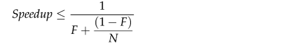

Khi N tiến tới vô cùng, mức tăng tốc tối đa hội tụ về **1/F**, nghĩa là một chương trình mà **năm mươi phần trăm** phần xử lý phải thực thi tuần tự chỉ có thể được tăng tốc **gấp đôi**, bất kể có bao nhiêu processor khả dụng, và một chương trình mà **mười phần trăm** phải thực thi tuần tự chỉ có thể tăng tốc tối đa **gấp mười lần**. Định luật Amdahl cũng định lượng **chi phí hiệu suất của việc serialize**. Với mười processor, một chương trình có 10% serialization chỉ đạt được mức tăng tốc tối đa **5,3** (ở 53% mức sử dụng), và với 100 processor nó chỉ đạt được mức tăng tốc tối đa **9,2** (ở 9% mức sử dụng). Phải tốn rất nhiều CPU bị sử dụng kém hiệu quả mà vẫn không bao giờ đạt tới con số gấp mười lần đó.

**Figure 11.1. Mức sử dụng tối đa theo định luật Amdahl với các tỷ lệ serialization khác nhau.**

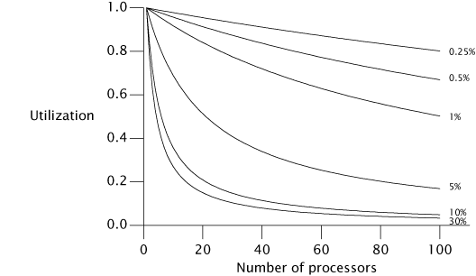

Chương 6 đã khám phá việc xác định ranh giới logic để phân rã ứng dụng thành các task. Nhưng để dự đoán mức tăng tốc khả dĩ khi chạy ứng dụng của bạn trên một hệ thống đa xử lý, bạn cũng cần **xác định các nguồn gây serialization** trong task của mình.

Hãy tưởng tượng một ứng dụng trong đó N thread thực thi `doWork` ở Listing 11.1, lấy task từ một work queue được share và xử lý chúng; giả sử rằng các task không phụ thuộc vào kết quả hay tác dụng phụ của task khác. Tạm bỏ qua cách các task được đưa lên queue, ứng dụng này sẽ mở rộng tốt đến đâu khi chúng ta thêm processor? Thoạt nhìn, có vẻ như ứng dụng **hoàn toàn song song hóa được**: các task không chờ nhau, và càng nhiều processor khả dụng thì càng nhiều task có thể được xử lý concurrent. Tuy nhiên, **vẫn có một thành phần tuần tự** — việc lấy task khỏi work queue. Work queue được **tất cả** worker thread share, và nó sẽ đòi hỏi một lượng synchronization nào đó để duy trì tính toàn vẹn trước truy cập concurrent. Nếu locking được dùng để bảo vệ state của queue, thì trong khi một thread đang dequeue một task, các thread khác cần dequeue task tiếp theo của mình **phải chờ** — và đây chính là chỗ việc xử lý task bị serialize.

Thời gian xử lý của một task đơn lẻ bao gồm không chỉ thời gian thực thi `Runnable` của task, mà còn cả thời gian **dequeue task** khỏi work queue được share. Nếu work queue là một `LinkedBlockingQueue`, operation dequeue có thể block ít hơn so với một `LinkedList` đã synchronize vì `LinkedBlockingQueue` dùng một thuật toán dễ mở rộng hơn, nhưng **truy cập bất kỳ cấu trúc dữ liệu được share nào cũng đưa vào một yếu tố serialization** trong chương trình một cách căn bản.

Ví dụ này cũng bỏ qua một nguồn serialization phổ biến khác: **xử lý kết quả**. Mọi phép tính hữu ích đều tạo ra một dạng kết quả hay tác dụng phụ nào đó — nếu không, chúng có thể bị loại bỏ như dead code. Vì `Runnable` không cung cấp cách xử lý kết quả tường minh, những task này phải có một dạng tác dụng phụ nào đó, chẳng hạn ghi kết quả vào file log hay đặt chúng vào một cấu trúc dữ liệu. File log và container chứa kết quả thường được nhiều worker thread share và do đó **cũng là một nguồn serialization**. Còn nếu mỗi thread duy trì cấu trúc dữ liệu riêng cho kết quả rồi gộp lại sau khi tất cả task hoàn thành, thì **bước gộp cuối cùng là một nguồn serialization**.

**Listing 11.1. Truy cập được serialize vào một Task Queue.**

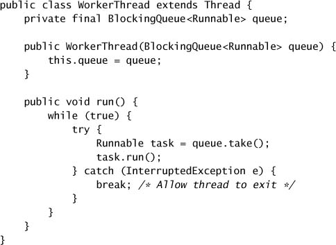

> **Mọi ứng dụng concurrent đều có một số nguồn serialization; nếu bạn nghĩ ứng dụng của mình không có, hãy nhìn lại.**

### 11.2.1. Ví dụ: Serialization ẩn trong Framework

Để thấy serialization có thể ẩn trong cấu trúc của một ứng dụng như thế nào, chúng ta có thể so sánh throughput khi thêm thread và suy ra sự khác biệt về serialization dựa trên chênh lệch scalability quan sát được. Figure 11.2 cho thấy một ứng dụng đơn giản trong đó nhiều thread liên tục lấy một phần tử khỏi một `Queue` được share và xử lý nó, tương tự Listing 11.1. Bước xử lý chỉ bao gồm tính toán cục bộ trong thread. Nếu một thread thấy queue rỗng, nó đặt một lô phần tử mới lên queue để các thread khác có thứ để xử lý ở vòng lặp tiếp theo. Việc truy cập queue được share rõ ràng kéo theo một mức độ serialization nào đó, nhưng bước xử lý thì **hoàn toàn song song hóa được** vì nó không liên quan đến dữ liệu được share.

**Figure 11.2. So sánh các hiện thực Queue.**

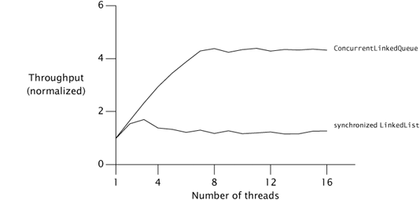

Các đường cong trong Figure 11.2 so sánh throughput của hai hiện thực `Queue` thread-safe: một `LinkedList` được bọc bằng `synchronizedList`, và một `ConcurrentLinkedQueue`. Các bài test được chạy trên một hệ thống Sparc V880 8 luồng chạy Solaris. Dù mỗi lần chạy đại diện cho **cùng một lượng "công việc"**, chúng ta có thể thấy rằng chỉ riêng việc **thay đổi hiện thực queue** đã có thể tác động lớn đến scalability.

Throughput của `ConcurrentLinkedQueue` **tiếp tục cải thiện** cho đến khi chạm số processor rồi giữ gần như không đổi. Ngược lại, throughput của `LinkedList` đã synchronize cho thấy một chút cải thiện lên đến ba thread, nhưng sau đó **tụt xuống** khi overhead synchronization tăng lên. Đến khi tới bốn hay năm thread, tranh chấp nặng đến mức **mọi** truy cập vào lock của queue đều bị tranh chấp và throughput bị chi phối bởi **context switching**.

Sự khác biệt về throughput đến từ **mức độ serialization khác nhau** giữa hai hiện thực queue. `LinkedList` đã synchronize bảo vệ **toàn bộ state của queue bằng một lock duy nhất** được giữ suốt thời gian gọi `offer` hay `remove`; `ConcurrentLinkedQueue` dùng một **thuật toán queue nonblocking** tinh vi (xem mục 15.4.2) sử dụng atomic reference để cập nhật từng con trỏ liên kết riêng lẻ. Ở cái thứ nhất, **toàn bộ** việc chèn hay xóa bị serialize; ở cái thứ hai, **chỉ các cập nhật lên từng con trỏ riêng lẻ** bị serialize.

### 11.2.2. Áp dụng định luật Amdahl một cách định tính

Định luật Amdahl định lượng mức tăng tốc khả dĩ khi có thêm tài nguyên tính toán, **nếu** chúng ta có thể ước lượng chính xác phần thực thi bị serialize. Dù đo serialization trực tiếp có thể khó, định luật Amdahl vẫn có thể hữu ích mà **không cần** phép đo như vậy.

Vì mô hình tư duy của chúng ta bị ảnh hưởng bởi môi trường, nhiều người trong chúng ta quen nghĩ rằng một hệ thống đa xử lý có hai hay bốn processor, hoặc có thể (nếu ngân sách lớn) lên tới vài chục, vì đó là công nghệ phổ biến rộng rãi trong những năm gần đây. Nhưng khi CPU đa nhân trở thành chủ đạo, các hệ thống sẽ có **hàng trăm hoặc thậm chí hàng nghìn** processor.[^3] Những thuật toán có vẻ dễ mở rộng trên hệ thống 4 luồng có thể có **nút thắt scalability ẩn** mà chỉ chưa gặp phải mà thôi.

[^3]: Cập nhật thị trường: tại thời điểm viết, Sun đang bán các hệ thống server tầm thấp dựa trên processor Niagara 8 nhân, và Azul đang bán các hệ thống server tầm cao (96, 192, và 384 luồng) dựa trên processor Vega 24 nhân.

Khi đánh giá một thuật toán, việc suy nghĩ "**ở giới hạn**" về điều gì sẽ xảy ra với hàng trăm hay hàng nghìn processor có thể cho ta cái nhìn về nơi các giới hạn mở rộng có thể xuất hiện. Ví dụ, mục 11.4.2 và 11.4.3 bàn về hai kỹ thuật giảm độ mịn của lock: **lock splitting** (chia một lock thành hai) và **lock striping** (chia một lock thành nhiều). Nhìn qua lăng kính định luật Amdahl, chúng ta thấy rằng chia một lock thành hai **không giúp ta tiến xa** trong việc khai thác nhiều processor, nhưng lock striping có vẻ **hứa hẹn hơn nhiều** vì kích thước tập stripe có thể tăng khi số processor tăng. (Dĩ nhiên, tối ưu hóa performance luôn nên được cân nhắc trong bối cảnh yêu cầu performance thực tế; trong một số trường hợp, chia một lock thành hai có thể đã đủ đáp ứng yêu cầu.)

---

## 11.3. Các chi phí do Thread gây ra

Chương trình single-threaded không chịu chi phí lập lịch cũng như chi phí synchronization, và không cần dùng lock để bảo toàn tính nhất quán của cấu trúc dữ liệu. Việc lập lịch và điều phối giữa các thread **có chi phí performance**; để thread mang lại cải thiện performance, **lợi ích performance của việc song song hóa phải lớn hơn** những chi phí do concurrency gây ra.

### 11.3.1. Context Switching

Nếu thread chính là thread duy nhất có thể lập lịch, nó gần như sẽ không bao giờ bị lập lịch ra. Ngược lại, nếu có **nhiều thread có thể chạy hơn số CPU**, cuối cùng OS sẽ **preempt** một thread để thread khác có thể dùng CPU. Điều này gây ra một **context switch**, đòi hỏi lưu ngữ cảnh thực thi của thread đang chạy và khôi phục ngữ cảnh thực thi của thread mới được lập lịch.

Context switch **không miễn phí**; việc lập lịch thread đòi hỏi thao tác lên các cấu trúc dữ liệu được share trong OS và JVM. OS và JVM dùng **chính những CPU mà chương trình của bạn dùng**; càng nhiều thời gian CPU dành cho code của JVM và OS thì càng ít thời gian dành cho chương trình của bạn. Nhưng hoạt động của OS và JVM không phải chi phí duy nhất của context switch. Khi một thread mới được chuyển vào, dữ liệu nó cần **nhiều khả năng không nằm trong cache của processor cục bộ**, nên một context switch gây ra một loạt **cache miss**, và do đó thread chạy chậm hơn một chút khi chúng vừa được lập lịch. Đây là một trong những lý do mà scheduler cấp cho mỗi thread có thể chạy một **lượng thời gian tối thiểu** nhất định ngay cả khi nhiều thread khác đang chờ: nó **phân bổ** chi phí của context switch và hệ quả của nó ra nhiều thời gian thực thi không bị gián đoạn hơn, cải thiện throughput tổng thể (với một chút cái giá về khả năng đáp ứng).

**Listing 11.2. Synchronization không có tác dụng gì. Đừng làm thế này.**

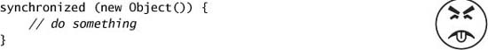

Khi một thread block vì nó đang chờ một lock bị tranh chấp, JVM thường **treo** thread đó và cho phép nó bị chuyển ra. Nếu các thread block thường xuyên, chúng sẽ không thể dùng hết lượng thời gian lập lịch của mình. Một chương trình **block nhiều hơn** (blocking I/O, chờ lock bị tranh chấp, hay chờ trên condition variable) sẽ chịu nhiều context switch hơn một chương trình CPU-bound, làm tăng overhead lập lịch và giảm throughput. (Các thuật toán nonblocking cũng có thể giúp giảm context switch; xem chương 15.)

Chi phí thực tế của context switching khác nhau giữa các nền tảng, nhưng một quy tắc ngón tay cái tốt là một context switch tốn tương đương **5.000 đến 10.000 chu kỳ đồng hồ**, hay vài micro giây trên hầu hết processor hiện nay.

Lệnh `vmstat` trên hệ thống Unix và công cụ `perfmon` trên hệ thống Windows báo cáo số context switch và phần trăm thời gian dành cho kernel. **Mức sử dụng kernel cao (trên 10%)** thường chỉ ra hoạt động lập lịch nặng, có thể do block vì I/O hoặc tranh chấp lock.

### 11.3.2. Memory Synchronization

Chi phí performance của synchronization đến từ vài nguồn. Các bảo đảm về visibility do `synchronized` và `volatile` cung cấp có thể đòi hỏi dùng những lệnh đặc biệt gọi là **memory barrier** — thứ có thể flush hay vô hiệu hóa cache, flush hardware write buffer, và làm đình trệ các pipeline thực thi. Memory barrier cũng có thể có hệ quả performance **gián tiếp** vì chúng **ngăn cản các tối ưu hóa khác của compiler**; hầu hết operation không thể được reorder qua memory barrier.

Khi đánh giá tác động performance của synchronization, quan trọng là phải phân biệt giữa synchronization **bị tranh chấp** (contended) và **không bị tranh chấp** (uncontended). Cơ chế `synchronized` được **tối ưu cho trường hợp không tranh chấp** (`volatile` thì **luôn** không tranh chấp), và tại thời điểm viết, chi phí performance của một lần synchronization "fast-path" không tranh chấp dao động từ **20 đến 250 chu kỳ đồng hồ** trên hầu hết hệ thống. Dù con số này chắc chắn không phải bằng không, tác động của synchronization **cần thiết, không tranh chấp** hiếm khi đáng kể trong performance tổng thể của ứng dụng, và lựa chọn thay thế lại đòi hỏi thỏa hiệp safety và có thể đăng ký cho bạn (hoặc người kế nhiệm bạn) một cuộc săn bug rất đau đớn về sau.

Các JVM hiện đại có thể **giảm chi phí của synchronization không cần thiết** bằng cách tối ưu bỏ đi những lần locking có thể chứng minh là không bao giờ bị tranh chấp. Nếu một lock object chỉ tiếp cận được từ thread hiện tại, JVM được phép tối ưu bỏ đi việc acquire lock vì **không có cách nào** một thread khác có thể synchronize trên cùng lock đó. Ví dụ, việc acquire lock ở Listing 11.2 **luôn có thể bị JVM loại bỏ**.

Các JVM tinh vi hơn có thể dùng **escape analysis** để xác định khi nào một tham chiếu object cục bộ **không bao giờ được publish ra heap** và do đó là thread-local. Trong `getStoogeNames` ở Listing 11.3, tham chiếu duy nhất tới `List` là local variable `stooges`, và các biến bị stack-confine tự động là thread-local. Một cách thực thi ngây thơ của `getStoogeNames` sẽ acquire và release lock trên `Vector` **bốn lần**, một lần cho mỗi lời gọi `add` hoặc `toString`. Tuy nhiên, một runtime compiler thông minh có thể **inline** những lời gọi này rồi thấy rằng `stooges` và state nội bộ của nó không bao giờ escape, và do đó **cả bốn lần acquire lock đều có thể bị loại bỏ**.[^4]

[^4]: Tối ưu hóa compiler này, gọi là **lock elision**, được thực hiện bởi JVM của IBM và được kỳ vọng có trong HotSpot từ Java 7.

**Listing 11.3. Ứng viên cho Lock Elision.**

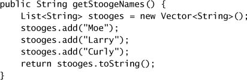

Ngay cả khi không có escape analysis, compiler cũng có thể thực hiện **lock coarsening** — việc gộp các `synchronized` block liền kề dùng cùng một lock. Với `getStoogeNames`, một JVM thực hiện lock coarsening có thể kết hợp ba lời gọi `add` và lời gọi `toString` thành **một lần acquire và release lock duy nhất**, dùng các heuristic về chi phí tương đối giữa synchronization và các lệnh bên trong `synchronized` block.[^5] Điều này không chỉ giảm overhead synchronization, mà còn cho optimizer một **khối lớn hơn nhiều** để làm việc, nhiều khả năng cho phép các tối ưu hóa khác.

[^5]: Một dynamic compiler thông minh có thể nhận ra rằng method này luôn trả về cùng một chuỗi, và sau lần thực thi đầu tiên sẽ recompile `getStoogeNames` để đơn giản trả về giá trị đã được trả về ở lần thực thi đầu tiên.

> **Đừng lo lắng quá mức về chi phí của synchronization không tranh chấp.** Cơ chế cơ bản đã khá nhanh, và JVM có thể thực hiện thêm những tối ưu hóa làm giảm hoặc loại bỏ chi phí đó. Thay vào đó, hãy **tập trung nỗ lực tối ưu vào những vùng thực sự xảy ra tranh chấp lock**.

Synchronization bởi một thread cũng có thể ảnh hưởng đến performance của các thread khác. Synchronization tạo ra **lưu lượng trên bus bộ nhớ được share**; bus này có băng thông hữu hạn và được share giữa tất cả processor. Nếu các thread phải cạnh tranh băng thông synchronization, **mọi thread dùng synchronization đều sẽ chịu thiệt**.[^6]

[^6]: Khía cạnh này đôi khi được dùng để phản đối việc dùng thuật toán nonblocking mà không có một dạng backoff nào đó, vì dưới tranh chấp nặng, thuật toán nonblocking tạo ra **nhiều lưu lượng synchronization hơn** so với thuật toán dựa trên lock. Xem chương 15.

### 11.3.3. Blocking

Synchronization không tranh chấp có thể được xử lý **hoàn toàn bên trong JVM** (Bacon và cộng sự, 1998); synchronization bị tranh chấp có thể đòi hỏi hoạt động của OS, làm tăng chi phí. Khi locking bị tranh chấp, (các) thread thua cuộc **phải block**. JVM có thể hiện thực việc block hoặc qua **spin-waiting** (lặp lại việc cố acquire lock cho đến khi thành công) hoặc bằng cách **treo** thread bị block thông qua hệ điều hành. Cách nào hiệu quả hơn phụ thuộc vào mối quan hệ giữa overhead của context switch và thời gian cho đến khi lock trở nên khả dụng; **spin-waiting tốt hơn cho những lần chờ ngắn** và **treo tốt hơn cho những lần chờ dài**. Một số JVM chọn giữa hai cách một cách thích ứng dựa trên dữ liệu profiling về thời gian chờ trong quá khứ, nhưng hầu hết chỉ đơn giản treo các thread đang chờ lock.

Việc treo một thread vì nó không lấy được lock, hoặc vì nó block trên một condition wait hay một blocking I/O operation, kéo theo **hai context switch bổ sung** và toàn bộ hoạt động OS và cache đi kèm: thread bị block bị chuyển ra trước khi lượng thời gian của nó hết hạn, rồi sau đó được chuyển vào lại sau khi lock hay tài nguyên khác trở nên khả dụng. (Việc block do tranh chấp lock cũng có chi phí cho **thread đang giữ lock**: khi nó release lock, nó phải yêu cầu OS đánh thức thread bị block.)

---

## 11.4. Giảm tranh chấp Lock

Chúng ta đã thấy rằng serialization gây hại cho scalability và context switch gây hại cho performance. **Locking bị tranh chấp gây ra cả hai**, nên giảm tranh chấp lock có thể cải thiện **cả** performance **lẫn** scalability.

Truy cập vào tài nguyên được một exclusive lock bảo vệ là **bị serialize** — mỗi lần chỉ một thread có thể truy cập. Dĩ nhiên, chúng ta dùng lock vì những lý do chính đáng, như ngăn hỏng dữ liệu, nhưng sự an toàn này **có giá**. Tranh chấp dai dẳng cho một lock **giới hạn scalability**.

> **Mối đe dọa chính đối với scalability trong các ứng dụng concurrent là exclusive resource lock.**

Có **hai yếu tố** ảnh hưởng đến khả năng xảy ra tranh chấp cho một lock: **lock đó được yêu cầu thường xuyên đến đâu** và **nó được giữ bao lâu** sau khi acquire.[^7] Nếu tích của hai yếu tố này đủ nhỏ, thì hầu hết nỗ lực acquire lock sẽ không bị tranh chấp, và tranh chấp lock sẽ không tạo ra trở ngại scalability đáng kể. Tuy nhiên, nếu lock có nhu cầu đủ cao, các thread sẽ **block chờ** nó; trong trường hợp cực đoan, **processor sẽ nằm không** dù có rất nhiều việc phải làm.

[^7]: Đây là hệ quả của **định luật Little**, một kết quả từ lý thuyết hàng đợi nói rằng "số khách hàng trung bình trong một hệ thống ổn định bằng tốc độ đến trung bình của họ nhân với thời gian trung bình họ ở trong hệ thống". (Little, 1961)

Có **ba cách** để giảm tranh chấp lock:

- **Giảm thời lượng** mà lock được giữ;
- **Giảm tần suất** mà lock được yêu cầu; hoặc
- **Thay exclusive lock** bằng những cơ chế điều phối cho phép concurrency lớn hơn.

### 11.4.1. Thu hẹp phạm vi Lock ("Vào nhanh, ra nhanh")

Một cách hiệu quả để giảm khả năng tranh chấp là **giữ lock ngắn nhất có thể**. Điều này có thể làm được bằng cách **chuyển code không cần lock ra khỏi `synchronized` block**, đặc biệt với những operation tốn kém và những operation có thể block như I/O.

Dễ thấy việc giữ một lock "nóng" quá lâu có thể giới hạn scalability như thế nào; chúng ta đã thấy một ví dụ về điều này ở `SynchronizedFactorizer` trong chương 2. Nếu một operation giữ lock trong 2 mili giây và **mọi** operation đều cần lock đó, throughput không thể lớn hơn **500 operation mỗi giây**, bất kể có bao nhiêu processor khả dụng. Giảm thời gian giữ lock xuống 1 mili giây sẽ cải thiện giới hạn throughput do lock gây ra lên **1000 operation mỗi giây**.[^8]

[^8]: Thực ra phép tính này **đánh giá thấp** chi phí của việc giữ lock quá lâu vì nó không tính đến overhead context switch sinh ra bởi tranh chấp lock tăng lên.

`AttributeStore` ở Listing 11.4 cho thấy một ví dụ về việc giữ lock lâu hơn cần thiết. Method `userLocationMatches` tra vị trí của người dùng trong một `Map` và dùng khớp biểu thức chính quy để xem giá trị thu được có khớp pattern được cung cấp hay không. **Toàn bộ** method `userLocationMatches` là `synchronized`, nhưng phần duy nhất của code **thực sự cần lock** là lời gọi `Map.get`.

**Listing 11.4. Giữ lock lâu hơn cần thiết.**

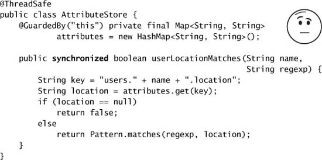

`BetterAttributeStore` ở Listing 11.5 viết lại `AttributeStore` để **giảm đáng kể thời gian giữ lock**. Bước đầu tiên là xây dựng key của `Map` gắn với vị trí của người dùng, một chuỗi dạng `users.name.location`. Việc này đòi hỏi khởi tạo một object `StringBuilder`, nối vài chuỗi vào nó, và khởi tạo kết quả thành một `String`. Sau khi lấy được vị trí, biểu thức chính quy được khớp với chuỗi vị trí thu được. Vì việc xây dựng chuỗi key và xử lý biểu thức chính quy **không truy cập shared state**, chúng không cần được thực thi trong khi giữ lock. `BetterAttributeStore` **tách những bước này ra khỏi `synchronized` block**, do đó giảm thời gian giữ lock.

**Listing 11.5. Giảm thời lượng giữ Lock.**

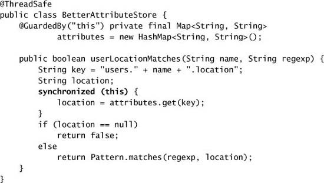

Việc giảm phạm vi lock trong `userLocationMatches` giảm đáng kể số lệnh được thực thi trong khi giữ lock. Theo định luật Amdahl, điều này **loại bỏ một trở ngại cho scalability** vì lượng code bị serialize đã giảm.

Vì `AttributeStore` chỉ có một state variable, `attributes`, chúng ta có thể cải thiện nó thêm nữa bằng kỹ thuật **ủy quyền thread safety** (mục 4.3). Bằng cách thay `attributes` bằng một `Map` thread-safe (một `Hashtable`, `synchronizedMap`, hay `ConcurrentHashMap`), `AttributeStore` có thể ủy quyền **toàn bộ** nghĩa vụ thread safety cho collection thread-safe nền tảng. Điều này loại bỏ nhu cầu synchronization tường minh trong `AttributeStore`, giảm phạm vi lock xuống chỉ còn thời gian truy cập `Map`, và **loại bỏ rủi ro** rằng một người bảo trì tương lai sẽ phá hỏng thread safety vì quên acquire lock thích hợp trước khi truy cập `attributes`.

Dù việc thu hẹp `synchronized` block có thể cải thiện scalability, một `synchronized` block **có thể quá nhỏ** — những operation cần atomic (như cập nhật nhiều biến cùng tham gia một invariant) **phải nằm trong một `synchronized` block duy nhất**. Và vì chi phí synchronization khác không, việc chia một `synchronized` block thành nhiều `synchronized` block (nếu tính đúng đắn cho phép) đến một mức nào đó sẽ trở nên **phản tác dụng** về mặt performance.[^9] Điểm cân bằng lý tưởng dĩ nhiên phụ thuộc nền tảng, nhưng trên thực tế chỉ nên lo về kích thước của một `synchronized` block khi bạn có thể chuyển những phép tính "đáng kể" hay những operation có thể block ra khỏi nó.

[^9]: Nếu JVM thực hiện lock coarsening, dù sao nó cũng có thể hoàn tác việc chia nhỏ các `synchronized` block.

### 11.4.2. Giảm độ mịn của Lock

Cách còn lại để giảm tỷ lệ thời gian một lock được giữ (và do đó khả năng nó bị tranh chấp) là khiến các thread **yêu cầu nó ít thường xuyên hơn**. Điều này có thể đạt được bằng **lock splitting** và **lock striping**, những kỹ thuật dùng các lock riêng biệt để bảo vệ nhiều state variable độc lập trước đây được bảo vệ bởi một lock duy nhất. Những kỹ thuật này **giảm độ mịn** mà việc locking diễn ra, có khả năng cho phép scalability lớn hơn — nhưng dùng nhiều lock hơn cũng **tăng rủi ro deadlock**.

Như một thí nghiệm tư duy, hãy tưởng tượng điều gì sẽ xảy ra nếu chỉ có **một lock cho toàn bộ ứng dụng** thay vì một lock riêng cho mỗi object. Khi đó việc thực thi **mọi** `synchronized` block, bất kể lock của chúng là gì, đều sẽ bị serialize. Với nhiều thread cạnh tranh lock toàn cục, khả năng hai thread cùng muốn lock tại một thời điểm **tăng lên**, dẫn đến nhiều tranh chấp hơn. Vậy nên nếu các yêu cầu lock được **phân bố trên một tập lock lớn hơn**, sẽ có ít tranh chấp hơn. Ít thread bị block chờ lock hơn, do đó tăng scalability.

Nếu một lock bảo vệ **nhiều hơn một state variable độc lập**, bạn có thể cải thiện scalability bằng cách **chia nó thành nhiều lock**, mỗi lock bảo vệ những biến khác nhau. Kết quả là mỗi lock được yêu cầu ít thường xuyên hơn.

`ServerStatus` ở Listing 11.6 cho thấy một phần giao diện giám sát cho một database server duy trì tập người dùng đang đăng nhập và tập truy vấn đang thực thi. Khi một người dùng đăng nhập hay đăng xuất, hoặc khi việc thực thi truy vấn bắt đầu hay kết thúc, object `ServerStatus` được cập nhật bằng cách gọi method `add` hay `remove` tương ứng. **Hai loại thông tin này hoàn toàn độc lập**; `ServerStatus` thậm chí có thể được chia thành hai class riêng biệt mà không mất chức năng nào.

Thay vì bảo vệ **cả** `users` **lẫn** `queries` bằng lock của `ServerStatus`, chúng ta có thể bảo vệ mỗi cái bằng **một lock riêng**, như trong Listing 11.7. Sau khi chia lock, mỗi lock mịn hơn mới sẽ thấy **ít lưu lượng locking hơn** so với lock thô ban đầu. (Việc ủy quyền cho một hiện thực `Set` thread-safe cho `users` và `queries` thay vì dùng synchronization tường minh sẽ **ngầm cung cấp** lock splitting, vì mỗi `Set` sẽ dùng một lock khác nhau để bảo vệ state của nó.)

Chia một lock thành hai mang lại khả năng cải thiện lớn nhất khi lock đang trải qua tranh chấp **vừa phải chứ không nặng**. Chia những lock ít bị tranh chấp mang lại rất ít cải thiện thực về performance hay throughput, dù nó có thể **tăng ngưỡng tải** mà tại đó performance bắt đầu suy giảm do tranh chấp. Chia những lock đang chịu tranh chấp vừa phải có thể thực sự biến chúng thành những lock **hầu như không tranh chấp**, đây là kết quả mong muốn nhất cho cả performance lẫn scalability.

**Listing 11.6. Ứng viên cho Lock Splitting.**

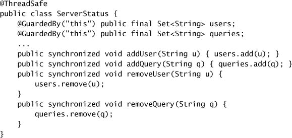

**Listing 11.7. `ServerStatus` được refactor để dùng Split Lock.**

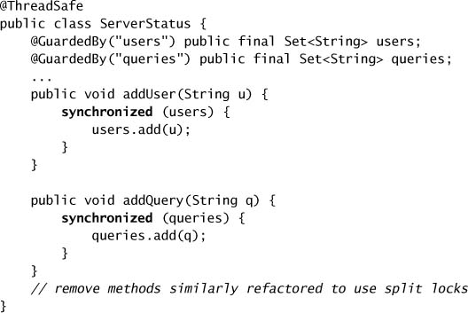

### 11.4.3. Lock Striping

Chia một lock bị tranh chấp nặng thành hai nhiều khả năng sẽ cho ra **hai lock bị tranh chấp nặng**. Dù việc này sẽ tạo ra một cải thiện scalability nhỏ nhờ cho phép hai thread thực thi concurrent thay vì một, nó vẫn **không cải thiện đáng kể** triển vọng concurrency trên một hệ thống có nhiều processor. Ví dụ lock splitting trong các class `ServerStatus` không mang lại cơ hội rõ ràng nào để chia lock thêm nữa.

Lock splitting đôi khi có thể được mở rộng để phân vùng locking trên một **tập object độc lập có kích thước thay đổi**, trong trường hợp đó nó được gọi là **lock striping**. Ví dụ, hiện thực của `ConcurrentHashMap` dùng một **mảng 16 lock**, mỗi lock bảo vệ 1/16 số hash bucket; bucket N được bảo vệ bởi lock **N mod 16**. Giả sử hàm hash cung cấp đặc tính phân bố hợp lý và key được truy cập đồng đều, điều này sẽ **giảm nhu cầu cho bất kỳ lock nào khoảng 16 lần**. Chính kỹ thuật này cho phép `ConcurrentHashMap` hỗ trợ tới **16 writer concurrent**. (Số lock có thể được tăng để cung cấp concurrency còn tốt hơn dưới truy cập nặng trên hệ thống nhiều processor, nhưng số stripe chỉ nên tăng vượt mặc định 16 khi bạn có **bằng chứng** rằng các writer concurrent đang tạo đủ tranh chấp để biện minh cho việc nâng giới hạn.)

Một trong những nhược điểm của lock striping là việc **lock collection để truy cập độc quyền** khó và tốn kém hơn so với dùng một lock duy nhất. Thường thì một operation có thể được thực hiện bằng cách acquire tối đa một lock, nhưng đôi khi bạn cần lock **toàn bộ collection**, như khi `ConcurrentHashMap` cần mở rộng map và rehash các giá trị vào một tập bucket lớn hơn. Việc này thường được làm bằng cách **acquire tất cả các lock trong tập stripe**.[^10]

[^10]: Cách duy nhất để acquire một tập intrinsic lock tùy ý là qua **đệ quy**.

`StripedMap` ở Listing 11.8 minh họa việc hiện thực một map dựa trên hash bằng lock striping. Có `N_LOCKS` lock, mỗi lock bảo vệ một tập con các bucket. Hầu hết method, như `get`, chỉ cần acquire **một lock bucket duy nhất**. Một số method có thể cần acquire tất cả các lock nhưng, như trong hiện thực của `clear`, có thể **không cần acquire tất cả cùng lúc**.[^11]

[^11]: Việc `clear` `Map` theo cách này **không atomic**, nên không nhất thiết có một thời điểm mà `StripedMap` thực sự rỗng nếu các thread khác đang concurrent thêm phần tử; làm cho operation này atomic sẽ đòi hỏi acquire tất cả các lock cùng lúc. Tuy nhiên, với những concurrent collection mà client thường không thể lock để truy cập độc quyền, kết quả của các method như `size` hay `isEmpty` dù sao cũng có thể đã lỗi thời khi chúng trả về, nên hành vi này — dù có lẽ hơi bất ngờ — thường là chấp nhận được.

### 11.4.4. Tránh Hot Field

Lock splitting và lock striping có thể cải thiện scalability vì chúng cho phép **các thread khác nhau thao tác trên dữ liệu khác nhau** (hoặc những phần khác nhau của cùng một cấu trúc dữ liệu) mà không can thiệp lẫn nhau. Một chương trình hưởng lợi từ lock splitting tất yếu **thể hiện tranh chấp cho một lock thường xuyên hơn tranh chấp cho dữ liệu mà lock đó bảo vệ**. Nếu một lock bảo vệ hai biến độc lập X và Y, và thread A muốn truy cập X trong khi B muốn truy cập Y (như trường hợp một thread gọi `addUser` còn thread khác gọi `addQuery` trong `ServerStatus`), thì hai thread **không tranh chấp dữ liệu nào cả**, dù chúng tranh chấp một lock.

**Listing 11.8. Map dựa trên Hash dùng Lock Striping.**

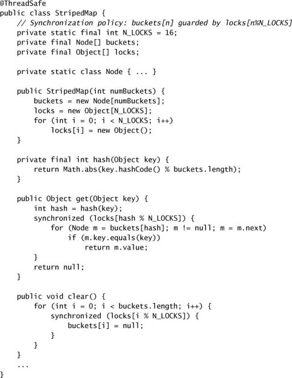

**Độ mịn của lock không thể giảm được** khi có những biến **cần thiết cho mọi operation**. Đây lại là một lĩnh vực nữa mà performance thuần túy và scalability thường xung đột với nhau; những tối ưu hóa phổ biến như cache các giá trị được tính thường xuyên có thể đưa vào những "**hot field**" giới hạn scalability.

Nếu bạn đang hiện thực `HashMap`, bạn sẽ có lựa chọn về cách `size` tính số entry trong `Map`. Cách đơn giản nhất là **đếm số entry mỗi lần** nó được gọi. Một tối ưu hóa phổ biến là **cập nhật một counter riêng** khi entry được thêm hay xóa; điều này làm tăng nhẹ chi phí của operation `put` hay `remove` để giữ counter cập nhật, nhưng giảm chi phí của operation `size` từ O(n) xuống O(1).

Việc giữ một biến đếm riêng để tăng tốc các operation như `size` và `isEmpty` hoạt động tốt cho một hiện thực single-threaded hoặc được synchronize hoàn toàn, nhưng khiến việc cải thiện scalability của hiện thực **khó hơn nhiều**, vì **mọi operation sửa đổi map giờ đây đều phải cập nhật counter được share**. Ngay cả khi bạn dùng lock striping cho các chuỗi hash, việc synchronize truy cập vào counter **tái đưa vào** những vấn đề scalability của exclusive locking. Thứ trông như một tối ưu hóa performance — cache kết quả của operation `size` — đã biến thành một **gánh nặng cho scalability**. Trong trường hợp này, counter được gọi là một **hot field** vì mọi operation biến đổi đều cần truy cập nó.

`ConcurrentHashMap` tránh vấn đề này bằng cách để `size` **liệt kê các stripe và cộng số phần tử trong mỗi stripe**, thay vì duy trì một biến đếm toàn cục. Để tránh phải liệt kê từng phần tử, `ConcurrentHashMap` duy trì một **field đếm riêng cho mỗi stripe**, cũng được bảo vệ bởi lock của stripe đó.[^12]

[^12]: Nếu `size` được gọi thường xuyên so với các operation biến đổi, các cấu trúc dữ liệu striped có thể tối ưu cho điều này bằng cách cache kích thước collection trong một biến `volatile` mỗi khi `size` được gọi và vô hiệu hóa cache (đặt nó bằng -1) mỗi khi collection bị sửa. Nếu giá trị được cache là không âm khi vào `size`, nó chính xác và có thể được trả về; nếu không, nó được tính lại.

### 11.4.5. Các lựa chọn thay thế Exclusive Lock

Kỹ thuật thứ ba để giảm nhẹ tác động của tranh chấp lock là **từ bỏ việc dùng exclusive lock** để chuyển sang một phương tiện quản lý shared state thân thiện với concurrency hơn. Những phương tiện này bao gồm dùng **concurrent collection**, **read-write lock**, **immutable object**, và **atomic variable**.

`ReadWriteLock` (xem chương 13) cưỡng chế một kỷ luật locking **nhiều-reader, một-writer**: nhiều hơn một reader có thể truy cập tài nguyên được share **concurrent** miễn là không ai trong số họ muốn sửa nó, nhưng writer phải acquire lock **độc quyền**. Với các cấu trúc dữ liệu **chủ yếu đọc**, `ReadWriteLock` có thể mang lại concurrency lớn hơn exclusive locking; với các cấu trúc dữ liệu **chỉ đọc**, tính immutable có thể **loại bỏ hoàn toàn** nhu cầu locking.

**Atomic variable** (xem chương 15) cung cấp một phương tiện giảm chi phí cập nhật những "hot field" như bộ đếm thống kê, bộ sinh sequence, hay tham chiếu tới node đầu tiên trong một cấu trúc dữ liệu liên kết. (Chúng ta đã dùng `AtomicLong` để duy trì hit counter trong các ví dụ servlet ở chương 2.) Các class atomic variable cung cấp những atomic operation **rất mịn** (và do đó dễ mở rộng hơn) trên số nguyên hay object reference, và được hiện thực bằng những primitive concurrency mức thấp (như **compare-and-swap**) do hầu hết processor hiện đại cung cấp. Nếu class của bạn có **một số ít hot field không tham gia vào invariant với các biến khác**, việc thay chúng bằng atomic variable có thể cải thiện scalability. (Việc thay đổi thuật toán để có **ít hot field hơn** có thể cải thiện scalability còn nhiều hơn nữa — atomic variable **giảm** chi phí cập nhật hot field, nhưng không **loại bỏ** nó.)

### 11.4.6. Giám sát mức sử dụng CPU

Khi test scalability, mục tiêu thường là giữ các processor **được sử dụng hoàn toàn**. Các công cụ như `vmstat` và `mpstat` trên hệ thống Unix hay `perfmon` trên hệ thống Windows có thể cho bạn biết chính xác các processor đang chạy "nóng" đến đâu.

Nếu các CPU được sử dụng **bất đối xứng** (một số CPU chạy nóng còn số khác thì không), mục tiêu đầu tiên của bạn nên là **tìm thêm parallelism** trong chương trình. Mức sử dụng bất đối xứng cho thấy hầu hết phần tính toán đang diễn ra trong một tập nhỏ các thread, và ứng dụng của bạn sẽ **không thể tận dụng thêm processor**.

Nếu các CPU **không được sử dụng hết**, bạn cần tìm hiểu tại sao. Có vài nguyên nhân khả dĩ:

**Tải không đủ.** Có thể ứng dụng đang được test đơn giản là chưa chịu đủ tải. Bạn có thể kiểm tra điều này bằng cách tăng tải và đo thay đổi về mức sử dụng, thời gian phản hồi, hay service time. Việc tạo đủ tải để bão hòa một ứng dụng có thể đòi hỏi **năng lực máy tính đáng kể**; vấn đề có thể là các hệ thống client — chứ không phải hệ thống đang được test — đang chạy hết công suất.

**I/O-bound.** Bạn có thể xác định xem một ứng dụng có bị giới hạn bởi đĩa hay không bằng `iostat` hay `perfmon`, và xem nó có bị giới hạn băng thông hay không bằng cách giám sát mức lưu lượng trên mạng.

**Bị giới hạn bởi bên ngoài.** Nếu ứng dụng của bạn phụ thuộc vào các dịch vụ bên ngoài như database hay web service, nút thắt có thể **không nằm trong code của bạn**. Bạn có thể kiểm tra điều này bằng cách dùng profiler hay công cụ quản trị database để xác định bao nhiêu thời gian đang được dành để chờ câu trả lời từ dịch vụ bên ngoài.

**Tranh chấp lock.** Công cụ profiling có thể cho bạn biết ứng dụng đang trải qua bao nhiêu tranh chấp lock và những lock nào đang "nóng". Bạn thường có thể lấy cùng thông tin đó **mà không cần profiler** thông qua **lấy mẫu ngẫu nhiên**, kích hoạt vài thread dump và tìm những thread đang tranh chấp lock. Nếu một thread bị block chờ một lock, stack frame tương ứng trong thread dump sẽ chỉ ra "`waiting to lock monitor ...`". Những lock hầu như không bị tranh chấp **hiếm khi xuất hiện** trong thread dump; một lock bị tranh chấp nặng sẽ gần như luôn có ít nhất một thread chờ acquire nó và do đó sẽ **thường xuyên xuất hiện** trong thread dump.

Nếu ứng dụng của bạn đang giữ các CPU đủ nóng, bạn có thể dùng công cụ giám sát để suy ra xem nó có hưởng lợi từ việc thêm CPU hay không. Một chương trình chỉ có bốn thread có thể giữ được một hệ thống 4 luồng sử dụng hoàn toàn, nhưng khó có khả năng thấy cải thiện performance nếu chuyển sang hệ thống 8 luồng, vì sẽ cần có **các thread runnable đang chờ** để tận dụng những processor bổ sung. (Bạn cũng có thể cấu hình lại chương trình để chia khối lượng công việc ra nhiều thread hơn, chẳng hạn điều chỉnh kích thước thread pool.) Một trong những cột mà `vmstat` báo cáo là **số thread runnable nhưng hiện không chạy vì không có CPU khả dụng**; nếu mức sử dụng CPU cao và **luôn có** thread runnable đang chờ CPU, ứng dụng của bạn có lẽ sẽ hưởng lợi từ nhiều processor hơn.

### 11.4.7. Hãy nói không với Object Pooling

Trong các phiên bản JVM đời đầu, việc cấp phát object và garbage collection **chậm**,[^13] nhưng performance của chúng đã cải thiện đáng kể kể từ đó. Thực tế, việc cấp phát trong Java giờ **nhanh hơn `malloc` trong C**: code path phổ biến cho `new Object` trong HotSpot 1.4.x và 5.0 chỉ khoảng **mười lệnh máy**.

[^13]: Cũng như mọi thứ khác — synchronization, đồ họa, khởi động JVM, reflection — điều có thể đoán trước được ở phiên bản đầu tiên của một công nghệ thử nghiệm.

Để né tránh vòng đời object "chậm", nhiều developer đã chuyển sang **object pooling**, trong đó object được tái chế thay vì bị garbage collect và cấp phát mới khi cần. Ngay cả khi tính đến overhead garbage collection giảm đi, object pooling đã được chứng minh là **một tổn thất về performance**[^14] với tất cả trừ những object đắt đỏ nhất (và là một tổn thất nghiêm trọng với những object nhẹ và trung bình) trong các chương trình single-threaded (Click, 2005).

[^14]: Ngoài việc là một tổn thất về chu kỳ CPU, object pooling còn có một loạt vấn đề khác, trong đó có thách thức đặt kích thước pool cho đúng (quá nhỏ thì pooling chẳng có tác dụng; quá lớn thì nó gây áp lực lên garbage collector, giữ lại bộ nhớ có thể được dùng hiệu quả hơn cho việc khác); rủi ro một object không được reset đúng về trạng thái mới cấp phát, đưa vào những bug tinh vi; rủi ro một thread trả object về pool nhưng vẫn tiếp tục dùng nó; và việc nó tạo thêm việc cho các generational garbage collector bằng cách khuyến khích một pattern tham chiếu từ cũ sang trẻ.

Trong các ứng dụng concurrent, pooling còn **tệ hơn nữa**. Khi các thread cấp phát object mới, **rất ít điều phối giữa các thread** là cần thiết, vì các allocator thường dùng các khối cấp phát thread-local để loại bỏ hầu hết synchronization trên cấu trúc dữ liệu heap. Nhưng nếu các thread đó thay vào đó yêu cầu một object từ pool, thì **cần một chút synchronization** để điều phối truy cập vào cấu trúc dữ liệu của pool, tạo ra khả năng một thread sẽ **block**. Vì việc block một thread do tranh chấp lock **đắt gấp hàng trăm lần** một lần cấp phát, thì ngay cả một lượng nhỏ tranh chấp do pool gây ra cũng sẽ là một **nút thắt scalability**. (Ngay cả một lần synchronization không tranh chấp thường cũng đắt hơn việc cấp phát một object.) Đây lại là một kỹ thuật nữa nhằm tối ưu hóa performance nhưng lại biến thành một nguy cơ cho scalability. Pooling có công dụng của nó,[^15] nhưng có tính hữu ích **hạn chế** như một tối ưu hóa performance.

[^15]: Trong những môi trường hạn chế, như một số mục tiêu J2ME hay RTSJ, object pooling vẫn có thể cần thiết để quản lý bộ nhớ hiệu quả hoặc để quản lý khả năng đáp ứng.

> **Cấp phát object thường rẻ hơn synchronize.**

---

## 11.5. Ví dụ: So sánh Performance của Map

Performance single-threaded của `ConcurrentHashMap` tốt hơn một chút so với một `HashMap` đã synchronize, nhưng chính khi **dùng concurrent** thì nó mới thực sự tỏa sáng. Hiện thực của `ConcurrentHashMap` giả định rằng operation phổ biến nhất là **lấy về một giá trị đã tồn tại**, và do đó được tối ưu để cung cấp performance và concurrency cao nhất cho các operation `get` thành công.

Trở ngại scalability chính đối với các hiện thực `Map` đã synchronize là **chỉ có một lock cho toàn bộ map**, nên mỗi lần chỉ một thread có thể truy cập map. Ngược lại, `ConcurrentHashMap` **không thực hiện locking** cho hầu hết operation đọc thành công, và dùng lock striping cho các operation ghi và một số ít operation đọc thực sự cần locking. Kết quả là **nhiều thread có thể truy cập `Map` concurrent mà không bị block**.

Figure 11.3 minh họa sự khác biệt về scalability giữa vài hiện thực `Map`: `ConcurrentHashMap`, `ConcurrentSkipListMap`, và `HashMap` cùng `TreeMap` được bọc bằng `synchronizedMap`. Hai cái đầu **thread-safe theo thiết kế**; hai cái sau được làm cho thread-safe bằng synchronized wrapper. Trong mỗi lần chạy, N thread concurrent thực thi một vòng lặp chặt chọn một key ngẫu nhiên và cố lấy giá trị tương ứng với key đó. Nếu giá trị không có mặt, nó được thêm vào `Map` với xác suất p = 0,6; và nếu nó có mặt, nó bị xóa với xác suất p = 0,02. Các bài test được chạy trên một bản build tiền phát hành của Java 6 trên một Sparc V880 8 luồng, và đồ thị hiển thị throughput được chuẩn hóa theo trường hợp một thread của `ConcurrentHashMap`. (Khoảng cách scalability giữa concurrent collection và synchronized collection **còn lớn hơn nữa trên Java 5.0**.)

Dữ liệu cho `ConcurrentHashMap` và `ConcurrentSkipListMap` cho thấy chúng **mở rộng tốt** tới số lượng thread lớn; throughput tiếp tục cải thiện khi thêm thread. Dù số thread trong Figure 11.3 có vẻ không lớn, chương trình test này tạo ra **nhiều tranh chấp trên mỗi thread hơn** so với một ứng dụng điển hình, vì nó chẳng làm gì khác ngoài "đập" vào `Map`; một chương trình thực tế sẽ làm thêm công việc thread-local ở mỗi vòng lặp.

**Figure 11.3. So sánh Scalability của các hiện thực Map.**

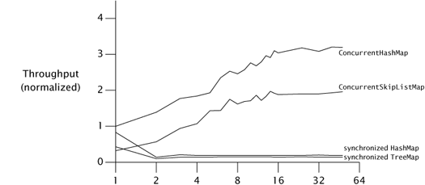

Các con số cho synchronized collection thì **không đáng khích lệ như vậy**. Performance cho trường hợp một thread tương đương `ConcurrentHashMap`, nhưng ngay khi tải chuyển từ chủ yếu không tranh chấp sang chủ yếu tranh chấp — điều xảy ra ở đây tại **hai thread** — các synchronized collection **chịu thiệt nặng nề**. Đây là hành vi phổ biến với code mà scalability bị giới hạn bởi tranh chấp lock. Miễn là tranh chấp còn thấp, thời gian mỗi operation bị chi phối bởi thời gian thực sự làm việc và throughput có thể cải thiện khi thêm thread. Một khi tranh chấp trở nên đáng kể, thời gian mỗi operation bị chi phối bởi **context switch và độ trễ lập lịch**, và việc thêm thread có **rất ít tác dụng** lên throughput.

---

## 11.6. Giảm Overhead của Context Switch

Nhiều task liên quan đến những operation có thể block; việc chuyển tiếp giữa trạng thái chạy và bị block kéo theo một **context switch**. Một nguồn gây block trong ứng dụng server là **sinh thông điệp log** trong quá trình xử lý request; để minh họa throughput có thể được cải thiện như thế nào nhờ giảm context switch, chúng ta sẽ phân tích hành vi lập lịch của hai cách tiếp cận logging.

Hầu hết logging framework là những wrapper mỏng quanh `println`; khi bạn có gì đó để log, cứ ghi ra ngay tại chỗ. Một cách tiếp cận khác đã được thể hiện ở `LogWriter` trang 152: việc logging được thực hiện trong một **thread nền chuyên dụng** thay vì bởi thread đang xử lý request. Từ góc nhìn của developer, hai cách tiếp cận này đại khái tương đương. Nhưng có thể có **khác biệt về performance**, tùy thuộc vào khối lượng hoạt động logging, có bao nhiêu thread đang logging, và các yếu tố khác như chi phí context switching.[^16]

[^16]: Việc xây một logger chuyển I/O sang thread khác có thể cải thiện performance, nhưng nó cũng đưa vào một loạt phức tạp về thiết kế, chẳng hạn interruption (chuyện gì xảy ra nếu một thread bị block trong một operation logging bị interrupt?), bảo đảm dịch vụ (logger có đảm bảo rằng một thông điệp log đã được xếp hàng thành công sẽ được ghi trước khi dịch vụ shutdown không?), saturation policy (chuyện gì xảy ra khi producer log thông điệp nhanh hơn tốc độ thread logger có thể xử lý?), và vòng đời dịch vụ (chúng ta tắt logger như thế nào, và làm sao truyền đạt trạng thái dịch vụ tới producer?).

Service time của một operation logging bao gồm mọi phép tính liên quan đến các class I/O stream; nếu operation I/O block, nó còn bao gồm cả **thời lượng thread bị block**. Hệ điều hành sẽ deschedule thread bị block cho đến khi I/O hoàn tất, và có lẽ hơi lâu hơn một chút. Khi I/O hoàn tất, các thread khác có lẽ đang hoạt động và sẽ được phép chạy hết lượng thời gian lập lịch của chúng, và có thể đã có những thread chờ trước chúng ta trên hàng đợi lập lịch — **càng làm tăng service time**. Ngoài ra, nếu nhiều thread đang logging đồng thời, có thể có **tranh chấp cho lock của output stream**, trong trường hợp đó kết quả cũng giống như với blocking I/O — thread block chờ lock và bị chuyển ra. Logging nội tuyến liên quan đến **cả I/O lẫn locking**, điều có thể dẫn đến tăng context switching và do đó tăng service time.

Việc tăng service time của request là **không mong muốn** vì vài lý do. Thứ nhất, service time ảnh hưởng đến chất lượng dịch vụ: service time dài hơn nghĩa là ai đó đang phải chờ lâu hơn để có kết quả. Nhưng quan trọng hơn, service time dài hơn trong trường hợp này nghĩa là **nhiều tranh chấp lock hơn**. Nguyên tắc "vào nhanh, ra nhanh" ở mục 11.4.1 cho chúng ta biết rằng nên giữ lock ngắn nhất có thể, vì lock được giữ càng lâu thì càng có khả năng bị tranh chấp. Nếu một thread block chờ I/O **trong khi đang giữ lock**, thì một thread khác càng có khả năng muốn lock đó trong lúc thread thứ nhất đang giữ. Các hệ thống concurrent chạy **tốt hơn nhiều** khi hầu hết lần acquire lock đều không bị tranh chấp, vì việc acquire lock bị tranh chấp nghĩa là nhiều context switch hơn. Một phong cách viết code khuyến khích nhiều context switch hơn do đó cho ra **throughput tổng thể thấp hơn**.

Việc chuyển I/O ra khỏi thread xử lý request nhiều khả năng sẽ **rút ngắn service time trung bình** cho việc xử lý request. Các thread gọi `log` không còn block chờ lock của output stream hay chờ I/O hoàn tất; chúng chỉ cần **đưa thông điệp vào queue** rồi có thể quay lại task của mình. Mặt khác, chúng ta đã đưa vào khả năng tranh chấp cho message queue, nhưng operation `put` **nhẹ hơn** so với I/O logging (thứ có thể đòi hỏi lời gọi hệ thống) và do đó **ít khả năng block hơn** trong thực tế (miễn là queue chưa đầy). Vì thread xử lý request giờ ít có khả năng block hơn, nó cũng ít có khả năng bị context-switch ra giữa chừng một request. Điều chúng ta đã làm là biến một code path phức tạp và không chắc chắn liên quan đến I/O và tranh chấp lock khả dĩ thành một **code path thẳng tuột**.

Ở một mức độ nào đó, chúng ta chỉ đang **di chuyển công việc đi chỗ khác**, chuyển I/O sang một thread nơi chi phí của nó không bị người dùng cảm nhận (bản thân điều đó cũng đã là một thắng lợi). Nhưng bằng cách chuyển **toàn bộ** I/O logging sang **một thread duy nhất**, chúng ta cũng **loại bỏ khả năng tranh chấp** cho output stream và do đó loại bỏ một nguồn gây block. Điều này cải thiện throughput tổng thể vì **ít tài nguyên hơn** bị tiêu tốn cho việc lập lịch, context switching, và quản lý lock.

Việc chuyển I/O từ nhiều thread xử lý request sang một thread logger duy nhất tương tự sự khác biệt giữa một **dây chuyền chuyền xô nước** và một **đám người rời rạc chữa cháy**. Trong cách tiếp cận "một trăm người chạy quanh với xô", bạn có nguy cơ tranh chấp lớn hơn tại nguồn nước và tại đám cháy (dẫn đến tổng lượng nước đưa tới đám cháy ít hơn), cộng thêm sự kém hiệu quả lớn hơn vì mỗi người liên tục chuyển đổi chế độ (múc nước, chạy, đổ, chạy, v.v.). Trong cách tiếp cận dây chuyền chuyền xô, dòng nước từ nguồn tới tòa nhà đang cháy là **liên tục**, ít năng lượng bị tiêu hao hơn cho việc vận chuyển nước tới đám cháy, và mỗi người **tập trung làm một việc liên tục**. Cũng như sự gián đoạn gây rối loạn và làm giảm năng suất của con người, việc **block và context switching gây rối loạn cho thread**.

---

## Tóm tắt

Vì một trong những lý do phổ biến nhất để dùng thread là khai thác nhiều processor, khi bàn về performance của ứng dụng concurrent, chúng ta thường quan tâm đến **throughput** hay **scalability** hơn là service time thuần túy. **Định luật Amdahl** cho chúng ta biết rằng scalability của một ứng dụng bị chi phối bởi **tỷ lệ code phải thực thi tuần tự**. Vì nguồn serialization chính trong chương trình Java là **exclusive resource lock**, scalability thường có thể được cải thiện bằng cách dành **ít thời gian giữ lock hơn** — hoặc bằng cách giảm độ mịn của lock, giảm thời lượng giữ lock, hoặc thay exclusive lock bằng các lựa chọn thay thế không độc quyền hay nonblocking.
