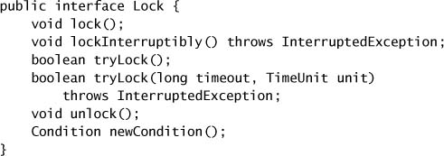
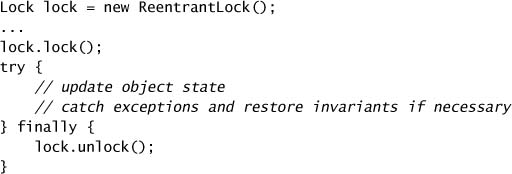
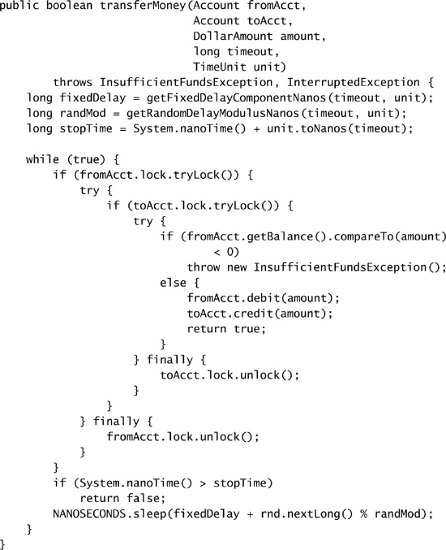
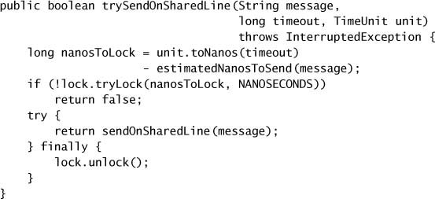
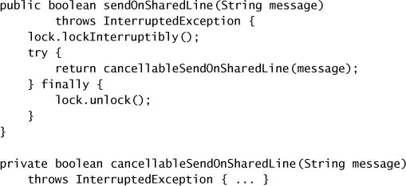
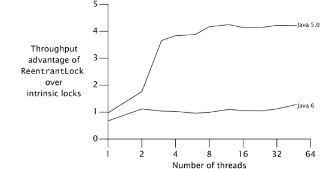
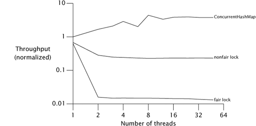
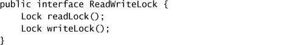
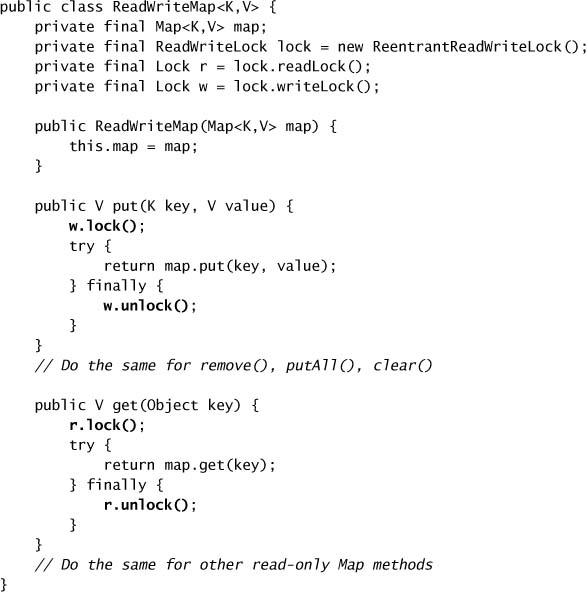
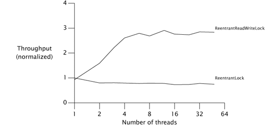

# Chương 13. Explicit Locks

> **Về bản dịch này.** Đây là bản **dịch đầy đủ** chương 13 của cuốn *Java Concurrency in Practice* (Brian Goetz và cộng sự). Các **thuật ngữ chuyên ngành được giữ nguyên tiếng Anh**. Toàn bộ code listing và hình vẽ được trích trực tiếp từ file PDF gốc và lưu trong thư mục `images/ch13/`.

---

Trước Java 5.0, các cơ chế duy nhất để điều phối truy cập vào dữ liệu được share là `synchronized` và `volatile`. Java 5.0 thêm một lựa chọn nữa: **`ReentrantLock`**. Trái với những gì một số người đã viết, `ReentrantLock` **không phải** thứ thay thế cho intrinsic locking, mà là một **lựa chọn thay thế với các tính năng nâng cao** dành cho những khi intrinsic locking tỏ ra quá hạn chế.

---

## 13.1. Lock và ReentrantLock

Interface `Lock`, thể hiện ở Listing 13.1, định nghĩa một số operation locking trừu tượng. Khác với intrinsic locking, `Lock` cung cấp lựa chọn giữa acquire lock **vô điều kiện**, **có poll**, **có timeout**, và **có thể interrupt**, và **mọi** operation lock/unlock đều **tường minh**. Các hiện thực `Lock` phải cung cấp **cùng semantics về memory-visibility** như intrinsic lock, nhưng có thể khác nhau về semantics locking, thuật toán lập lịch, bảo đảm thứ tự, và đặc tính performance. (`Lock.newCondition` được trình bày ở chương 14.)

**Listing 13.1. Interface `Lock`.**

`ReentrantLock` hiện thực `Lock`, cung cấp **cùng những bảo đảm về mutual exclusion và memory-visibility** như `synchronized`. Việc acquire một `ReentrantLock` có cùng memory semantics như việc vào một `synchronized` block, và việc release một `ReentrantLock` có cùng memory semantics như việc thoát một `synchronized` block. (Memory visibility được trình bày ở mục 3.1 và ở chương 16.) Và, giống như `synchronized`, `ReentrantLock` cung cấp **semantics locking reentrant** (xem mục 2.3.2). `ReentrantLock` hỗ trợ **tất cả** các chế độ acquire lock được định nghĩa bởi `Lock`, cung cấp nhiều linh hoạt hơn `synchronized` trong việc xử lý tình huống lock không khả dụng.

Tại sao lại tạo một cơ chế locking mới quá giống với intrinsic locking? Intrinsic locking hoạt động tốt trong hầu hết tình huống nhưng có **một số hạn chế về chức năng** — không thể interrupt một thread đang chờ acquire một lock, hoặc thử acquire một lock mà không sẵn sàng chờ nó mãi mãi. Intrinsic lock cũng **phải được release trong cùng khối code** nơi chúng được acquire; điều này đơn giản hóa việc viết code và tương tác tốt với xử lý exception, nhưng khiến các kỷ luật locking **không theo cấu trúc khối** trở nên bất khả thi. Không điều nào trong số này là lý do để từ bỏ `synchronized`, nhưng trong một số trường hợp, một cơ chế locking linh hoạt hơn mang lại **liveness hoặc performance tốt hơn**.

Listing 13.2 cho thấy dạng chuẩn để dùng một `Lock`. Idiom này **phức tạp hơn một chút** so với dùng intrinsic lock: lock **phải được release trong một khối `finally`**. Nếu không, lock sẽ **không bao giờ được release** nếu code được bảo vệ ném một exception. Khi dùng locking, bạn cũng phải cân nhắc điều gì xảy ra nếu một exception được ném ra khỏi khối `try`; nếu object có thể bị để lại ở trạng thái không nhất quán, có thể cần thêm các khối `try-catch` hay `try-finally`. (Bạn nên **luôn** cân nhắc tác động của exception khi dùng bất kỳ dạng locking nào, kể cả intrinsic locking.)

Việc **không dùng `finally` để release một `Lock` là một quả bom hẹn giờ**. Khi nó nổ, bạn sẽ rất khó truy tìm nguồn gốc vì sẽ **không có ghi chép** nào về nơi hay lúc nào `Lock` lẽ ra phải được release. Đây là một lý do **không nên** dùng `ReentrantLock` như một thứ thay thế toàn diện cho `synchronized`: nó **"nguy hiểm" hơn** vì nó không tự động dọn dẹp lock khi luồng điều khiển rời khỏi khối được bảo vệ. Dù việc nhớ release lock từ một khối `finally` không quá khó, việc quên cũng **không phải là bất khả thi**.[^1]

[^1]: FindBugs có một bộ phát hiện "unreleased lock" xác định khi nào một `Lock` không được release trên mọi code path ra khỏi khối nơi nó được acquire.

**Listing 13.2. Bảo vệ State của Object bằng `ReentrantLock`.**

### 13.1.1. Acquire Lock có Poll và có Timeout

Các chế độ acquire lock **có timeout** và **có poll** do `tryLock` cung cấp cho phép **khôi phục lỗi tinh vi hơn** so với acquire vô điều kiện. Với intrinsic lock, một deadlock là **chí mạng** — cách duy nhất để khôi phục là khởi động lại ứng dụng, và biện pháp phòng vệ duy nhất là xây dựng chương trình sao cho thứ tự lock không nhất quán là bất khả thi. Locking có timeout và có poll mang lại một lựa chọn khác: **tránh deadlock theo xác suất**.

Dùng acquire lock có timeout hay có poll (`tryLock`) cho phép bạn **giành lại quyền kiểm soát** nếu bạn không thể acquire tất cả các lock cần thiết, release những lock bạn đã acquire, và thử lại (hoặc ít nhất log lỗi và làm việc khác). Listing 13.3 cho thấy một cách khác để giải quyết deadlock do thứ tự động ở mục 10.1.2: dùng `tryLock` để cố acquire cả hai lock, nhưng **lùi lại và thử lại** nếu không thể acquire được cả hai. Thời gian `sleep` có một **thành phần cố định** và một **thành phần ngẫu nhiên** để giảm khả năng livelock. Nếu không thể acquire các lock trong khoảng thời gian đã chỉ định, `transferMoney` trả về trạng thái thất bại để operation có thể **thất bại một cách êm ái**. (Xem [CPJ 2.5.1.2] và [CPJ 2.5.1.3] để có thêm ví dụ về dùng polled lock để tránh deadlock.)

Timed lock cũng hữu ích trong việc hiện thực những hoạt động quản lý một **ngân sách thời gian** (xem mục 6.3.7). Khi một hoạt động có ngân sách thời gian gọi một blocking method, nó có thể cung cấp một timeout tương ứng với **thời gian còn lại** trong ngân sách. Điều này cho phép hoạt động kết thúc sớm nếu chúng không thể cho ra kết quả trong thời gian mong muốn. Với intrinsic lock, **không có cách nào hủy** một lần acquire lock sau khi nó đã bắt đầu, nên intrinsic lock **đặt vào tình thế rủi ro** khả năng hiện thực các hoạt động có ngân sách thời gian.

Ví dụ cổng du lịch ở Listing 6.17 trang 134 tạo một task riêng cho mỗi công ty cho thuê xe mà nó đang xin báo giá. Việc xin báo giá có lẽ liên quan đến một dạng cơ chế request qua mạng, chẳng hạn một web service request. Nhưng việc xin báo giá cũng có thể đòi hỏi **truy cập độc quyền vào một tài nguyên khan hiếm**, chẳng hạn một đường truyền liên lạc trực tiếp tới công ty.

Chúng ta đã thấy một cách để đảm bảo truy cập được serialize vào một tài nguyên ở mục 9.5: một **executor single-threaded**. Một cách tiếp cận khác là dùng một **exclusive lock** để bảo vệ truy cập vào tài nguyên. Code ở Listing 13.4 cố gửi một thông điệp trên một đường truyền chung được một `Lock` bảo vệ, nhưng **thất bại êm ái** nếu nó không thể làm vậy trong ngân sách thời gian của mình. `tryLock` có timeout làm cho việc kết hợp exclusive locking vào một hoạt động có giới hạn thời gian như vậy trở nên **khả thi**.

### 13.1.2. Acquire Lock có thể Interrupt

Cũng như acquire lock có timeout cho phép dùng exclusive locking trong các hoạt động có giới hạn thời gian, **acquire lock có thể interrupt** cho phép dùng locking trong các hoạt động **có thể hủy**. Mục 7.1.6 đã xác định vài cơ chế — chẳng hạn acquire một intrinsic lock — **không phản ứng với interruption**. Những cơ chế blocking không thể interrupt này làm phức tạp việc hiện thực các task có thể hủy. Method `lockInterruptibly` cho phép bạn thử acquire một lock **mà vẫn phản ứng với interruption**, và việc đưa nó vào `Lock` tránh tạo ra thêm một loại cơ chế blocking không thể interrupt nữa.

**Listing 13.3. Tránh Lock-ordering Deadlock bằng `tryLock`.**

**Listing 13.4. Locking với một ngân sách thời gian.**

Cấu trúc chuẩn của việc acquire lock có thể interrupt **phức tạp hơn một chút** so với acquire lock thông thường, vì cần **hai khối `try`**. (Nếu việc acquire lock có thể interrupt có thể ném `InterruptedException`, thì idiom locking `try-finally` chuẩn vẫn hoạt động.) Listing 13.5 dùng `lockInterruptibly` để hiện thực `sendOnSharedLine` từ Listing 13.4, để chúng ta có thể gọi nó từ một task có thể hủy. `tryLock` có timeout **cũng phản ứng với interruption** và do đó có thể được dùng khi bạn cần **cả** acquire lock có timeout **lẫn** có thể interrupt.

**Listing 13.5. Acquire Lock có thể Interrupt.**

### 13.1.3. Locking không theo cấu trúc khối

Với intrinsic lock, các cặp acquire-release là **theo cấu trúc khối** — một lock luôn được release trong cùng khối cơ bản nơi nó được acquire, bất kể luồng điều khiển thoát khỏi khối như thế nào. Việc tự động release lock đơn giản hóa việc phân tích và ngăn những lỗi code tiềm tàng, nhưng đôi khi cần một **kỷ luật locking linh hoạt hơn**.

Ở chương 11, chúng ta đã thấy việc giảm độ mịn của lock có thể tăng cường scalability như thế nào. Lock striping cho phép các chuỗi hash khác nhau trong một collection dựa trên hash dùng những lock khác nhau. Chúng ta có thể áp dụng nguyên tắc tương tự để giảm độ mịn locking trong một **linked list** bằng cách dùng **một lock riêng cho mỗi link node**, cho phép các thread khác nhau thao tác độc lập trên những phần khác nhau của list. Lock cho một node nhất định bảo vệ các con trỏ liên kết và dữ liệu lưu trong node đó, nên khi duyệt hay sửa list, chúng ta **phải giữ lock trên một node cho đến khi acquire được lock trên node kế tiếp**; chỉ khi đó mới có thể release lock trên node đầu tiên. Một ví dụ về kỹ thuật này, gọi là **hand-over-hand locking** hay **lock coupling**, xuất hiện ở [CPJ 2.5.1.4].

---

## 13.2. Cân nhắc về Performance

Khi `ReentrantLock` được thêm vào ở Java 5.0, nó mang lại performance **tốt hơn nhiều** so với intrinsic locking trong trường hợp bị tranh chấp. Với các primitive synchronization, **performance khi bị tranh chấp là chìa khóa cho scalability**: nếu nhiều tài nguyên hơn bị tiêu tốn cho việc quản lý lock và lập lịch, thì ít tài nguyên hơn còn lại cho ứng dụng. Một hiện thực lock tốt hơn thực hiện **ít lời gọi hệ thống hơn**, ép **ít context switch hơn**, và khởi tạo **ít lưu lượng memory-synchronization hơn** trên bus bộ nhớ được share — những operation tốn thời gian và chuyển hướng tài nguyên tính toán khỏi chương trình.

Java 6 dùng một **thuật toán cải tiến** để quản lý intrinsic lock, tương tự thuật toán mà `ReentrantLock` dùng, thu hẹp khoảng cách scalability đáng kể. Figure 13.1 cho thấy khác biệt performance giữa intrinsic lock và `ReentrantLock` trên Java 5.0 và trên một bản build tiền phát hành của Java 6, trên một hệ thống Opteron 4 luồng chạy Solaris. Các đường cong biểu diễn "**mức tăng tốc**" của `ReentrantLock` so với intrinsic locking trên cùng một phiên bản JVM. Trên Java 5.0, `ReentrantLock` mang lại throughput **tốt hơn đáng kể**, nhưng trên Java 6, hai bên **khá gần nhau**.[^2] Chương trình test cũng chính là chương trình đã dùng ở mục 11.5, lần này so sánh throughput của một `HashMap` được bảo vệ bởi một intrinsic lock và bởi một `ReentrantLock`.

[^2]: Dù đồ thị cụ thể này không cho thấy điều đó, khác biệt scalability giữa Java 5.0 và Java 6 thực sự đến từ **cải thiện ở intrinsic locking**, chứ không phải từ sự suy giảm ở `ReentrantLock`.

**Figure 13.1. Performance của Intrinsic Locking so với `ReentrantLock` trên Java 5.0 và Java 6.**

Trên Java 5.0, performance của intrinsic locking **giảm đột ngột** khi đi từ một thread (không tranh chấp) sang nhiều hơn một thread; performance của `ReentrantLock` giảm **ít hơn nhiều**, cho thấy scalability tốt hơn của nó. Nhưng trên Java 6, câu chuyện lại khác — intrinsic lock **không còn sụp đổ** dưới tranh chấp nữa, và cả hai mở rộng khá tương tự nhau.

Những đồ thị như Figure 13.1 nhắc chúng ta rằng những phát biểu dạng "**X nhanh hơn Y**" **giỏi lắm cũng chỉ đúng trong thời gian ngắn**. Performance và scalability nhạy cảm với các yếu tố nền tảng như CPU, số processor, kích thước cache, và đặc tính JVM — tất cả đều có thể thay đổi theo thời gian.[^3]

[^3]: Khi chúng tôi bắt đầu viết cuốn sách này, `ReentrantLock` dường như là đỉnh cao về scalability của lock. Chưa đầy một năm sau, intrinsic locking đã cạnh tranh ngang ngửa với nó. Performance không chỉ là một mục tiêu di động, nó có thể là một **mục tiêu di chuyển rất nhanh**.

> **Performance là một mục tiêu di động**; benchmark của ngày hôm qua cho thấy X nhanh hơn Y có thể đã lỗi thời ngay hôm nay.

---

## 13.3. Fairness

Constructor của `ReentrantLock` cung cấp lựa chọn giữa hai tùy chọn fairness: tạo một **nonfair lock** (mặc định) hoặc một **fair lock**. Các thread acquire một fair lock **theo đúng thứ tự chúng yêu cầu**, trong khi một nonfair lock cho phép **barging** (chen ngang): những thread yêu cầu một lock có thể **nhảy lên trước hàng đợi** các thread đang chờ nếu lock tình cờ khả dụng vào lúc nó được yêu cầu. (`Semaphore` cũng cung cấp lựa chọn giữa thứ tự acquire fair hay nonfair.) Các `ReentrantLock` nonfair **không cố tình thúc đẩy** việc barging — chúng chỉ đơn giản là **không ngăn** một thread chen ngang nếu nó xuất hiện đúng lúc. Với một fair lock, một thread mới yêu cầu sẽ **bị xếp hàng** nếu lock đang được thread khác giữ **hoặc** nếu có thread đang xếp hàng chờ lock; với một nonfair lock, thread chỉ bị xếp hàng nếu lock **hiện đang được giữ**.[^4]

[^4]: `tryLock` có poll **luôn chen ngang**, ngay cả với fair lock.

Chẳng phải chúng ta sẽ muốn **mọi** lock đều fair sao? Rốt cuộc thì công bằng là tốt còn bất công là xấu, đúng không? (Cứ hỏi con bạn xem.) Tuy nhiên, khi nói đến locking, fairness có **chi phí performance đáng kể** do overhead của việc treo và đánh thức thread. Trên thực tế, một **bảo đảm fairness theo thống kê** — hứa rằng một thread bị block cuối cùng sẽ acquire được lock — thường đã **đủ tốt**, và **rẻ hơn nhiều** để cung cấp. Một số thuật toán dựa vào fair queueing để đảm bảo tính đúng đắn của chúng, nhưng đó là chuyện bất thường. Trong hầu hết trường hợp, lợi ích performance của nonfair lock **vượt trội** so với lợi ích của fair queueing.

Figure 13.2 cho thấy một lần chạy khác của bài test performance `Map`, lần này so sánh `HashMap` được bọc bằng `ReentrantLock` fair và nonfair trên một hệ thống Opteron 4 luồng chạy Solaris, vẽ trên thang logarit.[^5] Phần phạt do fairness gần **hai bậc độ lớn** (gần 100 lần). **Đừng trả giá cho fairness nếu bạn không cần nó.**

[^5]: Đồ thị cho `ConcurrentHashMap` khá gợn sóng trong vùng giữa bốn và tám thread. Những biến thiên này gần như chắc chắn đến từ **nhiễu đo đạc**, có thể do tương tác tình cờ với hash code của các phần tử, việc lập lịch thread, việc thay đổi kích thước map, garbage collection hay các hiệu ứng khác của hệ thống bộ nhớ, hoặc do OS quyết định chạy một tác vụ dọn dẹp định kỳ nào đó vào khoảng thời gian bài test chạy. Thực tế là có đủ loại biến thiên trong các bài test performance mà thường không đáng để bận tâm kiểm soát. Chúng tôi không cố dọn dẹp đồ thị của mình một cách nhân tạo, vì các phép đo performance trong thế giới thực cũng **đầy nhiễu**.

**Figure 13.2. Performance của Fair Lock so với Nonfair Lock.**

Một lý do khiến barging lock chạy tốt hơn nhiều so với fair lock dưới tranh chấp nặng là có thể có một **độ trễ đáng kể** giữa lúc một thread bị treo được đánh thức và lúc nó **thực sự chạy**. Giả sử thread A giữ một lock và thread B xin lock đó. Vì lock đang bận, B bị treo. Khi A release lock, B được đánh thức để nó có thể thử lại. Trong lúc đó, nếu thread C xin lock, có **khả năng cao** rằng C có thể acquire lock, dùng nó, và release nó **trước khi B kịp thức dậy hẳn**. Trong trường hợp này, **mọi người đều thắng**: B lấy được lock không muộn hơn so với trường hợp kia, C lấy được sớm hơn nhiều, và throughput được cải thiện.

Fair lock có xu hướng hoạt động tốt nhất khi chúng được **giữ trong thời gian tương đối dài** hoặc khi **thời gian trung bình giữa các yêu cầu lock tương đối dài**. Trong những trường hợp này, điều kiện mà barging mang lại lợi thế throughput — khi lock không được giữ nhưng có một thread đang thức dậy để giành nó — **ít có khả năng xảy ra hơn**.

Giống như `ReentrantLock` mặc định, intrinsic locking **không cung cấp bảo đảm fairness tất định** nào, nhưng bảo đảm fairness theo thống kê của hầu hết hiện thực locking là **đủ tốt cho gần như mọi tình huống**. Đặc tả ngôn ngữ **không yêu cầu** JVM hiện thực intrinsic lock một cách fair, và không JVM production nào làm vậy. `ReentrantLock` **không hạ thấp** fairness của lock xuống mức mới — nó chỉ **làm tường minh** điều vốn đã hiện diện từ trước.

---

## 13.4. Chọn giữa synchronized và ReentrantLock

`ReentrantLock` cung cấp cùng semantics về locking và bộ nhớ như intrinsic locking, cùng với những tính năng bổ sung như chờ lock có timeout, chờ lock có thể interrupt, fairness, và khả năng hiện thực locking không theo cấu trúc khối. Performance của `ReentrantLock` có vẻ **vượt trội** so với intrinsic locking, thắng nhẹ trên Java 6 và thắng đậm trên Java 5.0. Vậy tại sao không deprecate `synchronized` và khuyến khích mọi code concurrent mới dùng `ReentrantLock`? Một số tác giả thực sự đã đề xuất điều này, coi `synchronized` như một cấu trúc "legacy". Nhưng đó là **đẩy một điều tốt đi quá xa**.

Intrinsic lock vẫn có những **lợi thế đáng kể** so với explicit lock. Ký pháp **quen thuộc và gọn gàng**, và nhiều chương trình hiện có đã dùng intrinsic locking — và trộn lẫn hai thứ có thể gây nhầm lẫn và dễ sinh lỗi. `ReentrantLock` chắc chắn là một công cụ **nguy hiểm hơn** synchronization; nếu bạn quên bọc lời gọi `unlock` trong một khối `finally`, code của bạn có lẽ vẫn **trông như chạy đúng**, nhưng bạn đã tạo ra một quả bom hẹn giờ có thể làm hại những người vô can. Hãy **để dành `ReentrantLock`** cho những tình huống bạn cần thứ mà `ReentrantLock` cung cấp còn intrinsic locking thì không.

> `ReentrantLock` là một **công cụ nâng cao** cho những tình huống mà intrinsic locking không khả thi. Hãy dùng nó nếu bạn cần các tính năng nâng cao của nó: acquire lock có timeout, có poll, hay có thể interrupt; fair queueing; hoặc locking không theo cấu trúc khối. Ngược lại, hãy **ưu tiên `synchronized`**.

Dưới Java 5.0, intrinsic locking có một lợi thế nữa so với `ReentrantLock`: **thread dump cho thấy call frame nào đã acquire lock nào** và có thể phát hiện, xác định các thread bị deadlock. JVM **không biết gì** về việc thread nào giữ `ReentrantLock` và do đó không thể giúp debug các vấn đề threading dùng `ReentrantLock`. Chênh lệch này đã được giải quyết ở Java 6 bằng cách cung cấp một giao diện quản lý và giám sát để các lock có thể đăng ký, cho phép thông tin locking của `ReentrantLock` xuất hiện trong thread dump và qua các giao diện quản lý, debug khác. Sự sẵn có của thông tin này cho việc debug là một lợi thế **đáng kể — dù chủ yếu là tạm thời** — cho `synchronized`; thông tin locking trong thread dump đã cứu nhiều lập trình viên khỏi cảnh hoang mang tột độ. Bản chất **không theo cấu trúc khối** của `ReentrantLock` vẫn có nghĩa là các lần acquire lock **không thể gắn với stack frame cụ thể**, như với intrinsic lock.

Những cải thiện performance trong tương lai nhiều khả năng sẽ **ưu ái `synchronized`** hơn `ReentrantLock`. Vì `synchronized` được **xây dựng sẵn trong JVM**, nó có thể thực hiện những tối ưu hóa như **lock elision** cho những lock object bị thread-confine và **lock coarsening** để loại bỏ synchronization với intrinsic lock (xem mục 11.3.2); làm điều này với những lock dựa trên thư viện có vẻ **khó khả thi hơn nhiều**. Trừ khi bạn sẽ triển khai trên Java 5.0 trong tương lai gần và bạn có nhu cầu đã được chứng minh về lợi ích scalability của `ReentrantLock` trên nền tảng đó, việc chọn `ReentrantLock` thay vì `synchronized` **vì lý do performance không phải một ý hay**.

---

## 13.5. Read-write Lock

`ReentrantLock` hiện thực một **mutual-exclusion lock** chuẩn: mỗi lần **tối đa một thread** có thể giữ một `ReentrantLock`. Nhưng mutual exclusion thường là một kỷ luật locking **mạnh hơn mức cần thiết** để bảo toàn tính toàn vẹn dữ liệu, và do đó giới hạn concurrency nhiều hơn cần thiết. Mutual exclusion là một chiến lược locking bảo thủ, ngăn chồng lấn writer/writer và writer/reader, nhưng **cũng ngăn chồng lấn reader/reader**. Trong nhiều trường hợp, các cấu trúc dữ liệu là "**chủ yếu đọc**" — chúng khả biến và đôi khi bị sửa, nhưng hầu hết truy cập chỉ là đọc. Trong những trường hợp này, sẽ tốt nếu **nới lỏng** yêu cầu locking để cho phép **nhiều reader** truy cập cấu trúc dữ liệu cùng lúc. Miễn là mỗi thread được đảm bảo một cái nhìn cập nhật về dữ liệu và không thread nào sửa dữ liệu trong lúc các reader đang xem, sẽ không có vấn đề gì. Đây chính là điều mà **read-write lock** cho phép: một tài nguyên có thể được **nhiều reader** hoặc **một writer duy nhất** truy cập tại một thời điểm, nhưng **không phải cả hai**.

`ReadWriteLock`, thể hiện ở Listing 13.6, expose **hai object `Lock`** — một để đọc và một để ghi. Để đọc dữ liệu được một `ReadWriteLock` bảo vệ, bạn phải acquire **read lock** trước, và để sửa dữ liệu được một `ReadWriteLock` bảo vệ, bạn phải acquire **write lock** trước. Dù có vẻ như có hai lock riêng biệt, read lock và write lock chỉ đơn giản là **hai góc nhìn khác nhau** của một object read-write lock tích hợp.

**Listing 13.6. Interface `ReadWriteLock`.**

Chiến lược locking do read-write lock hiện thực cho phép **nhiều reader đồng thời nhưng chỉ một writer**. Giống như `Lock`, `ReadWriteLock` chấp nhận nhiều hiện thực có thể khác nhau về performance, bảo đảm lập lịch, ưu tiên acquire, fairness, hay semantics locking.

Read-write lock là một **tối ưu hóa performance** được thiết kế để cho phép concurrency lớn hơn trong một số tình huống nhất định. Trên thực tế, read-write lock có thể cải thiện performance cho những cấu trúc dữ liệu chủ yếu đọc và được truy cập thường xuyên trên hệ thống đa xử lý; trong những điều kiện khác, chúng chạy **kém hơn một chút** so với exclusive lock do độ phức tạp lớn hơn. Việc chúng có phải một cải thiện trong một tình huống nhất định hay không tốt nhất nên được xác định qua **profiling**; vì `ReadWriteLock` dùng `Lock` cho phần đọc và phần ghi của lock, việc **thay** một read-write lock bằng một exclusive lock là tương đối dễ nếu profiling xác định rằng read-write lock không mang lại lợi ích.

Sự tương tác giữa read lock và write lock cho phép **nhiều hiện thực khả dĩ**. Một số tùy chọn hiện thực cho một `ReadWriteLock` là:

**Ưu tiên khi release.** Khi một writer release write lock và **cả** reader **lẫn** writer đều đang xếp hàng, ai nên được ưu tiên — reader, writer, hay ai hỏi trước?

**Reader barging.** Nếu lock đang được reader giữ nhưng có writer đang chờ, những reader mới đến có nên được cấp quyền truy cập ngay lập tức, hay nên **chờ sau các writer**? Cho phép reader chen ngang trước writer sẽ tăng cường concurrency nhưng có nguy cơ **bỏ đói writer**.

**Reentrancy.** Read lock và write lock có reentrant không?

**Downgrading (hạ cấp).** Nếu một thread giữ write lock, nó có thể acquire read lock mà **không release write lock** không? Điều này sẽ cho phép một writer "hạ cấp" thành read lock mà không để các writer khác sửa tài nguyên được bảo vệ trong lúc đó.

**Upgrading (nâng cấp).** Một read lock có thể được nâng cấp thành write lock được ưu tiên hơn các reader hay writer đang chờ khác không? Hầu hết hiện thực read-write lock **không hỗ trợ** upgrading, vì nếu không có một operation upgrade tường minh thì nó **dễ deadlock**. (Nếu hai reader đồng thời cố nâng cấp lên write lock, **không ai** sẽ release read lock.)

`ReentrantReadWriteLock` cung cấp semantics locking reentrant cho **cả hai** lock. Giống như `ReentrantLock`, một `ReentrantReadWriteLock` có thể được tạo là nonfair (mặc định) hoặc fair. Với một fair lock, ưu tiên được dành cho thread **đã chờ lâu nhất**; nếu lock đang được reader giữ và một thread yêu cầu write lock, thì **không reader nào nữa được phép** acquire read lock cho đến khi writer được phục vụ và release write lock. Với một nonfair lock, thứ tự các thread được cấp quyền truy cập là **không xác định**. Việc **downgrade** từ writer sang reader **được phép**; việc **upgrade** từ reader sang writer thì **không** (cố làm vậy sẽ dẫn đến deadlock).

Giống như `ReentrantLock`, write lock trong `ReentrantReadWriteLock` có một **chủ sở hữu duy nhất** và chỉ có thể được release bởi thread đã acquire nó. Trong Java 5.0, read lock hành xử giống một `Semaphore` hơn là một lock, chỉ duy trì **số lượng** reader đang hoạt động chứ không phải danh tính của chúng. Hành vi này đã được thay đổi ở Java 6 để **theo dõi cả những thread nào đã được cấp read lock**.[^6]

[^6]: Một lý do cho thay đổi này là dưới Java 5.0, hiện thực lock không thể phân biệt giữa một thread yêu cầu read lock **lần đầu** và một yêu cầu lock **reentrant**, điều này sẽ khiến các fair read-write lock **dễ deadlock**.

Read-write lock có thể cải thiện concurrency khi lock thường được **giữ trong thời gian tương đối dài** và **hầu hết operation không sửa** tài nguyên được bảo vệ. `ReadWriteMap` ở Listing 13.7 dùng một `ReentrantReadWriteLock` để bọc một `Map` sao cho nó có thể được nhiều reader share an toàn mà vẫn ngăn các xung đột reader-writer hay writer-writer.[^7] Trên thực tế, performance của `ConcurrentHashMap` tốt đến mức bạn có lẽ sẽ dùng nó thay vì cách tiếp cận này nếu tất cả những gì bạn cần là một map dựa trên hash có tính concurrent, nhưng kỹ thuật này sẽ hữu ích nếu bạn muốn cung cấp truy cập concurrent nhiều hơn cho một hiện thực `Map` thay thế như `LinkedHashMap`.

[^7]: `ReadWriteMap` không hiện thực `Map` vì việc hiện thực các view method như `entrySet` và `values` sẽ khó, và những method "dễ" thường đã đủ dùng.

**Listing 13.7. Bọc một `Map` bằng một Read-write Lock.**

Figure 13.3 cho thấy so sánh throughput giữa một `ArrayList` được bọc bằng một `ReentrantLock` và bằng một `ReadWriteLock` trên một hệ thống Opteron 4 luồng chạy Solaris. Chương trình test dùng ở đây tương tự bài test performance `Map` mà chúng ta đã dùng xuyên suốt cuốn sách — mỗi operation chọn ngẫu nhiên một giá trị và tìm nó trong collection, và một tỷ lệ nhỏ operation sẽ sửa nội dung collection.

**Figure 13.3. Performance của Read-write Lock.**

---

## Tóm tắt

Các `Lock` tường minh cung cấp một tập tính năng **mở rộng** so với intrinsic locking, bao gồm linh hoạt hơn trong việc xử lý tình huống lock không khả dụng và kiểm soát tốt hơn hành vi xếp hàng. Nhưng `ReentrantLock` **không phải** thứ thay thế toàn diện cho `synchronized`; chỉ dùng nó khi bạn cần những tính năng mà `synchronized` thiếu.

Read-write lock cho phép **nhiều reader truy cập concurrent** một object được bảo vệ, mang lại tiềm năng cải thiện scalability khi truy cập những cấu trúc dữ liệu chủ yếu đọc.
