# Chương 14. Building Custom Synchronizers

> **Về bản dịch này.** Đây là bản **dịch đầy đủ** chương 14 của cuốn *Java Concurrency in Practice* (Brian Goetz và cộng sự). Các **thuật ngữ chuyên ngành được giữ nguyên tiếng Anh**. Toàn bộ code listing và hình vẽ được trích trực tiếp từ file PDF gốc và lưu trong thư mục `images/ch14/`.

---

Thư viện class bao gồm một số **state-dependent class** — những class có operation với precondition dựa trên state — như `FutureTask`, `Semaphore`, và `BlockingQueue`. Ví dụ, bạn không thể lấy một phần tử khỏi một queue rỗng hay lấy kết quả của một task chưa hoàn tất; trước khi những operation này có thể tiến hành, bạn phải **chờ** cho đến khi queue vào trạng thái "không rỗng" hoặc task vào trạng thái "đã hoàn tất".

Cách dễ nhất để xây một state-dependent class thường là **xây dựng trên nền một class thư viện state-dependent có sẵn**; chúng ta đã làm điều này ở `ValueLatch` trang 187, dùng một `CountDownLatch` để cung cấp hành vi blocking cần thiết. Nhưng nếu các class thư viện không cung cấp chức năng bạn cần, bạn cũng có thể **tự xây synchronizer** của mình bằng các cơ chế mức thấp do ngôn ngữ và thư viện cung cấp, bao gồm **intrinsic condition queue**, **object `Condition` tường minh**, và framework **`AbstractQueuedSynchronizer`**. Chương này khám phá các lựa chọn khác nhau để hiện thực state dependence và các quy tắc sử dụng những cơ chế state dependence do nền tảng cung cấp.

---

## 14.1. Quản lý State Dependence

Trong một chương trình single-threaded, nếu một precondition dựa trên state (như "connection pool không rỗng") không thỏa mãn khi một method được gọi, nó sẽ **không bao giờ trở thành đúng**. Do đó, các class trong chương trình tuần tự có thể được viết để **fail** khi precondition của chúng không thỏa mãn. Nhưng trong một chương trình concurrent, các điều kiện dựa trên state **có thể thay đổi** nhờ hành động của các thread khác: một pool vừa rỗng vài lệnh trước có thể trở nên không rỗng vì một thread khác đã trả một phần tử về. Các method state-dependent trên object concurrent đôi khi có thể chấp nhận việc fail khi precondition không được thỏa mãn, nhưng thường có một lựa chọn tốt hơn: **chờ cho precondition trở thành đúng**.

Các operation state-dependent **block cho đến khi operation có thể tiến hành** thì tiện lợi hơn và ít gây lỗi hơn so với những operation chỉ đơn thuần fail. Cơ chế **condition queue** built-in cho phép các thread block cho đến khi một object đã vào một trạng thái cho phép tiến triển, và đánh thức các thread bị block khi chúng có thể tiến triển thêm. Chúng ta sẽ trình bày chi tiết về condition queue ở mục 14.2, nhưng để làm rõ giá trị của một cơ chế condition wait hiệu quả, trước tiên chúng ta sẽ cho thấy state dependence có thể được xử lý (một cách đau đớn) như thế nào bằng **poll và sleep**.

Một hành động state-dependent có block mang hình thức như trong Listing 14.1. Pattern locking hơi bất thường ở chỗ **lock được release và acquire lại ngay giữa operation**. Các state variable tạo nên precondition **phải được lock của object bảo vệ**, để chúng có thể giữ nguyên trong khi precondition được kiểm tra. Nhưng nếu precondition không thỏa mãn, **lock phải được release** để một thread khác có thể sửa state của object — nếu không precondition sẽ **không bao giờ** trở thành đúng. Lock sau đó phải được **acquire lại** trước khi kiểm tra precondition lần nữa.

**Listing 14.1. Cấu trúc của các hành động state-dependent có block.**

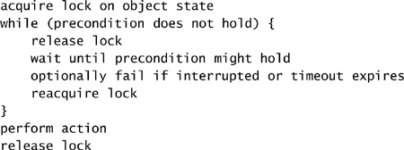

Các **bounded buffer** như `ArrayBlockingQueue` thường được dùng trong các thiết kế producer-consumer. Một bounded buffer cung cấp operation `put` và `take`, mỗi cái đều có precondition: bạn không thể lấy một phần tử khỏi một buffer rỗng, cũng không thể đưa một phần tử vào một buffer đầy. Các operation state-dependent có thể xử lý việc precondition không thỏa mãn bằng cách **ném exception** hoặc **trả về trạng thái lỗi** (biến nó thành vấn đề của caller), hoặc bằng cách **block cho đến khi object chuyển sang trạng thái đúng**.

Chúng ta sẽ phát triển vài hiện thực của một bounded buffer với những cách tiếp cận khác nhau trong việc xử lý precondition không thỏa mãn. Mỗi cái đều mở rộng `BaseBoundedBuffer` ở Listing 14.2, thứ hiện thực một circular buffer kinh điển dựa trên mảng, trong đó các state variable của buffer (`buf`, `head`, `tail`, và `count`) được intrinsic lock của buffer bảo vệ. Nó cung cấp các method `synchronized doPut` và `doTake` được subclass dùng để hiện thực operation `put` và `take`; state nền tảng được **ẩn khỏi subclass**.

### 14.1.1. Ví dụ: Lan truyền việc precondition không thỏa mãn tới Caller

`GrumpyBoundedBuffer` ở Listing 14.3 là một nỗ lực đầu tiên thô sơ nhằm hiện thực một bounded buffer. Các method `put` và `take` được `synchronized` để đảm bảo truy cập độc quyền vào state của buffer, vì cả hai đều dùng logic **check-then-act** khi truy cập buffer.

Dù cách tiếp cận này đủ dễ để hiện thực, nó **khó chịu khi sử dụng**. Exception lẽ ra phải dành cho những điều kiện **ngoại lệ** [EJ Item 39]. "Buffer đầy" không phải một điều kiện ngoại lệ với một bounded buffer, cũng như "đèn đỏ" không phải điều kiện ngoại lệ với một đèn giao thông. Sự đơn giản hóa trong việc hiện thực buffer (ép caller phải quản lý state dependence) **bị bù trừ nhiều hơn** bởi sự phức tạp đáng kể khi dùng nó, vì giờ đây caller phải sẵn sàng bắt exception và có thể phải thử lại cho **mọi** operation buffer.[^1] Một lời gọi `take` có cấu trúc tốt được thể hiện ở Listing 14.4 — **không đẹp lắm**, đặc biệt nếu `put` và `take` được gọi khắp chương trình.

[^1]: Đẩy state dependence ngược về phía caller cũng khiến việc **bảo toàn thứ tự FIFO** gần như bất khả thi; bằng cách ép caller thử lại, bạn **mất thông tin về việc ai đến trước**.

**Listing 14.2. Class cơ sở cho các hiện thực Bounded Buffer.**

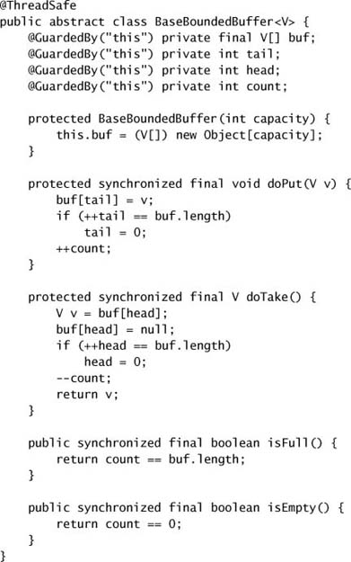

**Listing 14.3. Bounded Buffer từ chối khi Precondition không thỏa mãn.**

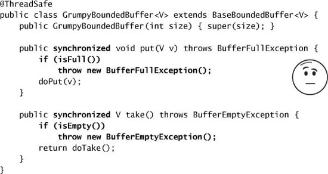

**Listing 14.4. Logic Client để gọi `GrumpyBoundedBuffer`.**

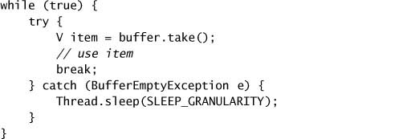

Một biến thể của cách tiếp cận này là **trả về một giá trị lỗi** khi buffer ở trạng thái sai. Đây là một cải thiện nhỏ ở chỗ nó không lạm dụng cơ chế exception bằng cách ném một exception thực chất có nghĩa là "xin lỗi, thử lại đi", nhưng nó **không giải quyết vấn đề căn bản**: rằng caller phải tự xử lý việc precondition không thỏa mãn.[^2]

[^2]: `Queue` cung cấp **cả hai** lựa chọn này — `poll` trả về `null` nếu queue rỗng, còn `remove` ném exception — nhưng `Queue` không nhằm dùng cho các thiết kế producer-consumer. `BlockingQueue`, với các operation block cho đến khi queue ở trạng thái đúng để tiến hành, là **lựa chọn tốt hơn** khi producer và consumer sẽ thực thi concurrent.

Code client ở Listing 14.4 không phải cách duy nhất để hiện thực logic thử lại. Caller có thể thử lại `take` **ngay lập tức**, không sleep — cách tiếp cận gọi là **busy waiting** hay **spin waiting**. Cách này có thể tiêu tốn **khá nhiều thời gian CPU** nếu state của buffer không thay đổi trong một lúc. Ngược lại, nếu caller quyết định sleep để không tiêu tốn nhiều CPU đến vậy, nó có thể dễ dàng "**ngủ quên**" nếu state của buffer thay đổi ngay sau lời gọi `sleep`. Vậy nên code client bị bỏ lại với lựa chọn giữa **mức sử dụng CPU kém của spin** và **khả năng đáp ứng kém của sleep**. (Ở đâu đó giữa busy waiting và sleeping là việc gọi `Thread.yield` ở mỗi vòng lặp, thứ là một gợi ý cho scheduler rằng đây sẽ là thời điểm hợp lý để cho thread khác chạy. Nếu bạn đang chờ một thread khác làm gì đó, việc đó có thể xảy ra nhanh hơn nếu bạn **nhường processor** thay vì dùng hết lượng thời gian lập lịch của mình.)

### 14.1.2. Ví dụ: Blocking thô sơ bằng Poll và Sleep

`SleepyBoundedBuffer` ở Listing 14.5 cố tiết kiệm cho caller sự bất tiện của việc hiện thực logic thử lại ở mỗi lời gọi, bằng cách **encapsulate** chính cơ chế thử lại "poll và sleep" thô sơ đó **bên trong** các operation `put` và `take`. Nếu buffer rỗng, `take` sleep cho đến khi một thread khác đưa dữ liệu vào buffer; nếu buffer đầy, `put` sleep cho đến khi một thread khác tạo chỗ trống bằng cách lấy bớt dữ liệu ra. Cách tiếp cận này **encapsulate việc quản lý precondition** và đơn giản hóa việc dùng buffer — chắc chắn là một bước đi đúng hướng.

Hiện thực của `SleepyBoundedBuffer` phức tạp hơn nỗ lực trước đó.[^3] Code của buffer **phải kiểm tra điều kiện state tương ứng trong khi giữ lock của buffer**, vì các biến biểu diễn điều kiện state được lock của buffer bảo vệ. Nếu phép kiểm tra thất bại, thread đang thực thi sẽ **sleep một lúc, trước tiên release lock** để các thread khác có thể truy cập buffer.[^4] Một khi thread thức dậy, nó **acquire lại lock** và thử lại, luân phiên giữa sleep và kiểm tra điều kiện state cho đến khi operation có thể tiến hành.

[^3]: Chúng tôi sẽ tha cho bạn chi tiết về năm hiện thực bounded buffer khác của Bạch Tuyết, đặc biệt là `SneezyBoundedBuffer` ("Hắt Xì").

[^4]: Việc một thread đi ngủ hay block trong khi giữ lock thường là một ý tồi, nhưng trong trường hợp này còn tệ hơn nữa vì điều kiện mong muốn (buffer đầy/rỗng) **không bao giờ có thể trở thành đúng nếu lock không được release**!

Từ góc nhìn của caller, cách này hoạt động rất tốt — nếu operation có thể tiến hành ngay, nó tiến hành, còn không thì nó block — và caller **không cần xử lý** cơ chế thất bại và thử lại. Việc chọn **độ mịn của sleep** là một đánh đổi giữa khả năng đáp ứng và mức sử dụng CPU; độ mịn sleep càng nhỏ thì càng phản hồi tốt, nhưng cũng càng tiêu tốn nhiều tài nguyên CPU. Figure 14.1 cho thấy độ mịn của sleep có thể ảnh hưởng đến khả năng đáp ứng như thế nào: có thể có một **độ trễ** giữa lúc chỗ trống trong buffer trở nên khả dụng và lúc thread thức dậy và kiểm tra lại.

**Figure 14.1. Thread ngủ quên vì điều kiện trở thành đúng ngay sau khi nó đi ngủ.**

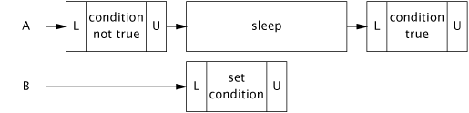

**Listing 14.5. Bounded Buffer dùng Blocking thô sơ.**

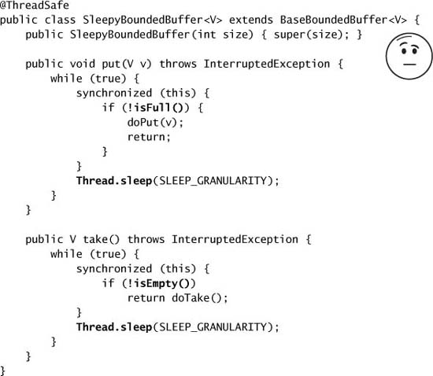

`SleepyBoundedBuffer` cũng tạo ra một yêu cầu nữa cho caller — **xử lý `InterruptedException`**. Khi một method block chờ một điều kiện trở thành đúng, điều lịch sự nên làm là cung cấp một **cơ chế cancellation** (xem chương 7). Giống như hầu hết blocking method hành xử tốt trong thư viện, `SleepyBoundedBuffer` hỗ trợ cancellation thông qua interruption, trả về sớm và ném `InterruptedException` nếu bị interrupt.

Những nỗ lực tổng hợp một blocking operation từ poll và sleep này khá **đau đớn**. Sẽ tốt nếu có một cách **treo một thread** nhưng đảm bảo rằng nó được **đánh thức kịp thời** khi một điều kiện nhất định (như buffer không còn đầy) trở thành đúng. Đây chính xác là những gì **condition queue** làm.

### 14.1.3. Condition Queue đến cứu nguy

Condition queue giống như chuông "bánh mì chín" trên máy nướng bánh của bạn. Nếu bạn đang lắng nghe nó, bạn được thông báo kịp thời khi bánh chín và có thể bỏ dở việc đang làm (hoặc không, có thể bạn muốn đọc xong tờ báo trước) để lấy bánh. Nếu bạn không lắng nghe (có lẽ bạn đã ra ngoài lấy báo), bạn có thể **bỏ lỡ thông báo**, nhưng khi trở lại bếp bạn có thể quan sát trạng thái của máy nướng và hoặc lấy bánh nếu nó đã xong, hoặc bắt đầu lắng nghe chuông lần nữa nếu chưa.

Một condition queue có tên như vậy vì nó cung cấp cho một nhóm thread — gọi là **wait set** — một cách **chờ một điều kiện cụ thể trở thành đúng**. Khác với các queue điển hình mà phần tử là các mục dữ liệu, phần tử của một condition queue là **chính các thread đang chờ điều kiện**.

Cũng như mỗi Java object có thể đóng vai trò một lock, mỗi object cũng có thể đóng vai trò một **condition queue**, và các method `wait`, `notify`, và `notifyAll` trong `Object` cấu thành API cho intrinsic condition queue. Intrinsic lock của một object và intrinsic condition queue của nó **có liên hệ**: để gọi bất kỳ method condition queue nào trên object X, bạn **phải giữ lock trên X**. Điều này là vì cơ chế chờ các điều kiện dựa trên state tất yếu **gắn chặt** với cơ chế bảo toàn tính nhất quán của state: bạn không thể chờ một điều kiện trừ khi bạn có thể kiểm tra state, và bạn không thể giải phóng một thread khác khỏi condition wait trừ khi bạn có thể sửa state.

`Object.wait` **atomically release lock và yêu cầu OS treo thread hiện tại**, cho phép các thread khác acquire lock và do đó sửa state của object. Khi thức dậy, nó **acquire lại lock** trước khi trả về. Một cách trực giác, gọi `wait` nghĩa là "**tôi muốn đi ngủ, nhưng hãy đánh thức tôi khi có gì đó thú vị xảy ra**", và gọi các method notification nghĩa là "**có gì đó thú vị đã xảy ra**".

`BoundedBuffer` ở Listing 14.6 hiện thực một bounded buffer dùng `wait` và `notifyAll`. Cái này **đơn giản hơn** phiên bản sleep, và vừa **hiệu quả hơn** (thức dậy ít thường xuyên hơn nếu state của buffer không thay đổi) vừa **phản hồi tốt hơn** (thức dậy kịp thời khi một thay đổi state thú vị xảy ra). Đây là một cải thiện lớn, nhưng lưu ý rằng việc đưa condition queue vào **không thay đổi semantics** so với phiên bản sleep. Nó chỉ đơn giản là một **tối ưu hóa trên vài phương diện**: hiệu quả CPU, overhead context-switch, và khả năng đáp ứng. Condition queue **không cho bạn làm được gì mà bạn không thể làm bằng sleep và poll**,[^5] nhưng chúng làm cho việc diễn đạt và quản lý state dependence **dễ hơn và hiệu quả hơn rất nhiều**.

[^5]: Điều này **không hoàn toàn đúng**; một fair condition queue có thể đảm bảo thứ tự tương đối mà các thread được giải phóng khỏi wait set. Intrinsic condition queue, giống như intrinsic lock, **không** cung cấp fair queueing; các `Condition` tường minh cung cấp lựa chọn giữa fair và nonfair queueing.

**Listing 14.6. Bounded Buffer dùng Condition Queue.**

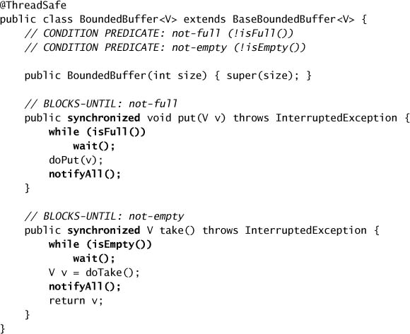

`BoundedBuffer` cuối cùng đã **đủ tốt để dùng** — nó dễ dùng và quản lý state dependence một cách hợp lý.[^6] Một phiên bản production cũng nên bao gồm các phiên bản có timeout của `put` và `take`, để các blocking operation có thể hết thời gian nếu chúng không hoàn tất được trong một ngân sách thời gian. Phiên bản có timeout của `Object.wait` giúp việc này dễ hiện thực.

[^6]: `ConditionBoundedBuffer` ở mục 14.3 còn tốt hơn: nó hiệu quả hơn vì có thể dùng **single notification** thay vì `notifyAll`.

---

## 14.2. Sử dụng Condition Queue

Condition queue giúp việc xây các class state-dependent hiệu quả và phản hồi tốt trở nên dễ hơn, nhưng chúng vẫn **rất dễ dùng sai**; có rất nhiều quy tắc về việc dùng chúng đúng cách mà **không được compiler hay nền tảng cưỡng chế**. (Đây là một trong những lý do nên xây dựng trên nền các class như `LinkedBlockingQueue`, `CountDownLatch`, `Semaphore`, và `FutureTask` khi bạn có thể; nếu làm được vậy thì dễ hơn nhiều.)

### 14.2.1. Condition Predicate

Chìa khóa để dùng condition queue đúng cách là **xác định các condition predicate** mà object có thể chờ. Chính condition predicate là thứ gây ra phần lớn sự bối rối xoay quanh `wait` và `notify`, vì nó **không có hiện thân trong API** và không gì trong đặc tả ngôn ngữ hay hiện thực JVM đảm bảo việc dùng nó đúng. Thực tế, nó **hoàn toàn không được nhắc trực tiếp** trong đặc tả ngôn ngữ hay Javadoc. Nhưng không có nó, condition wait sẽ **không hoạt động**.

**Condition predicate là precondition khiến một operation trở nên state-dependent ngay từ đầu.** Trong một bounded buffer, `take` chỉ có thể tiến hành nếu buffer **không rỗng**; nếu không nó phải chờ. Với `take`, condition predicate là "buffer không rỗng", thứ mà `take` phải kiểm tra trước khi tiến hành. Tương tự, condition predicate cho `put` là "buffer không đầy". Condition predicate là các **biểu thức được xây từ các state variable của class**; `BaseBoundedBuffer` kiểm tra "buffer không rỗng" bằng cách so `count` với không, và kiểm tra "buffer không đầy" bằng cách so `count` với kích thước buffer.

> Hãy **ghi tài liệu về (các) condition predicate** gắn với một condition queue và các operation chờ trên chúng.

Có một **mối quan hệ ba chiều quan trọng** trong một condition wait, liên quan đến **locking**, **method `wait`**, và **condition predicate**. Condition predicate liên quan đến các state variable, và các state variable được một lock bảo vệ, nên **trước khi kiểm tra condition predicate, chúng ta phải giữ lock đó**. Object lock và object condition queue (object mà `wait` và `notify` được gọi trên đó) cũng phải là **cùng một object**.

Trong `BoundedBuffer`, state của buffer được lock của buffer bảo vệ và **chính object buffer** được dùng làm condition queue. Method `take` acquire lock của buffer rồi kiểm tra condition predicate (rằng buffer không rỗng). Nếu buffer quả thực không rỗng, nó xóa phần tử đầu tiên — điều nó có thể làm vì nó **vẫn đang giữ lock** bảo vệ state của buffer.

Nếu condition predicate không đúng (buffer rỗng), `take` phải **chờ** cho đến khi một thread khác đưa một object vào buffer. Nó làm điều này bằng cách gọi `wait` trên intrinsic condition queue của buffer, thứ đòi hỏi **giữ lock trên object condition queue**. Như một thiết kế cẩn thận sẽ đảm bảo, `take` **đã giữ sẵn** lock đó, thứ nó cần để kiểm tra condition predicate (và nếu condition predicate đúng, để sửa state của buffer trong cùng một atomic operation). Method `wait` **release lock, block thread hiện tại**, và chờ cho đến khi timeout chỉ định hết hạn, thread bị interrupt, hoặc thread được đánh thức bởi một notification. Sau khi thread thức dậy, `wait` **acquire lại lock** trước khi trả về. Một thread thức dậy từ `wait` **không có ưu tiên đặc biệt** trong việc acquire lại lock; nó cạnh tranh lock giống như bất kỳ thread nào khác đang cố vào một `synchronized` block.

> **Mọi lời gọi `wait` đều ngầm gắn với một condition predicate cụ thể.** Khi gọi `wait` liên quan đến một condition predicate cụ thể, caller **phải đã giữ sẵn lock** gắn với condition queue, và lock đó cũng phải **bảo vệ các state variable** cấu thành condition predicate.

### 14.2.2. Thức dậy quá sớm

Như thể mối quan hệ ba chiều giữa lock, condition predicate, và condition queue còn chưa đủ phức tạp, việc `wait` **trả về không nhất thiết có nghĩa** rằng condition predicate mà thread đang chờ đã trở thành đúng.

Một intrinsic condition queue đơn lẻ có thể được dùng với **nhiều hơn một condition predicate**. Khi thread của bạn được đánh thức vì ai đó gọi `notifyAll`, điều đó **không có nghĩa** condition predicate bạn đang chờ giờ đã đúng. (Điều này giống như máy nướng bánh và máy pha cà phê của bạn dùng chung một cái chuông; khi nó reo, bạn vẫn phải nhìn xem thiết bị nào đã phát tín hiệu.)[^7] Thêm nữa, `wait` thậm chí còn được phép trả về một cách "**giả**" (spuriously) — không phải để phản hồi bất kỳ thread nào gọi `notify`.[^8]

[^7]: Tình huống này thực ra mô tả khá chính xác căn bếp của Tim; nhiều thiết bị kêu bíp đến mức khi bạn nghe một tiếng, bạn phải kiểm tra máy nướng bánh, lò vi sóng, máy pha cà phê, và vài thứ khác nữa để xác định nguồn tín hiệu.

[^8]: Để đẩy phép so sánh bữa sáng đi quá xa, điều này giống một máy nướng bánh có kết nối lỏng, khiến chuông reo khi bánh chín nhưng **đôi khi cũng reo khi chưa chín**.

Khi luồng điều khiển quay lại code gọi `wait`, nó đã **acquire lại lock** gắn với condition queue. Condition predicate giờ có đúng không? **Có thể**. Nó có thể đã đúng vào lúc thread thông báo gọi `notifyAll`, nhưng có thể đã trở thành **sai lần nữa** vào lúc bạn acquire lại lock. Các thread khác có thể đã acquire lock và thay đổi state của object trong khoảng giữa lúc thread của bạn được đánh thức và lúc `wait` acquire lại lock. Hoặc có thể nó **chưa hề đúng** kể từ khi bạn gọi `wait`. Bạn **không biết** tại sao một thread khác gọi `notify` hay `notifyAll`; có thể là vì một condition predicate **khác** gắn với cùng condition queue đã trở thành đúng. Việc có nhiều condition predicate trên một condition queue là **khá phổ biến** — `BoundedBuffer` dùng cùng một condition queue cho **cả** predicate "không đầy" **lẫn** "không rỗng".[^9]

[^9]: Thực tế **hoàn toàn có thể** có các thread cùng chờ **cả** "không đầy" **lẫn** "không rỗng" **cùng lúc**! Điều này có thể xảy ra khi số producer/consumer vượt quá sức chứa của buffer.

Vì tất cả những lý do này, khi bạn thức dậy từ `wait` bạn **phải kiểm tra lại condition predicate**, và quay lại chờ (hoặc fail) nếu nó vẫn chưa đúng. Vì bạn có thể thức dậy lặp đi lặp lại mà condition predicate của bạn không đúng, bạn do đó **luôn phải gọi `wait` từ bên trong một vòng lặp**, kiểm tra condition predicate ở mỗi vòng. Dạng chuẩn cho một condition wait được thể hiện ở Listing 14.7.

**Listing 14.7. Dạng chuẩn cho các Method state-dependent.**

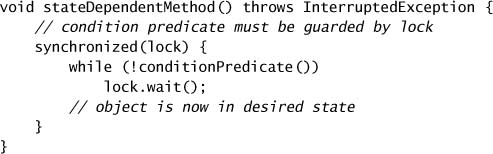

> Khi dùng condition wait (`Object.wait` hay `Condition.await`):
>
> - **Luôn có một condition predicate** — một phép kiểm tra state của object phải thỏa mãn trước khi tiến hành;
> - **Luôn kiểm tra condition predicate trước khi gọi `wait`**, và **lại lần nữa sau khi trả về từ `wait`**;
> - **Luôn gọi `wait` trong một vòng lặp**;
> - **Đảm bảo các state variable** cấu thành condition predicate được **lock gắn với condition queue** bảo vệ;
> - **Giữ lock** gắn với condition queue khi gọi `wait`, `notify`, hay `notifyAll`; và
> - **Đừng release lock** sau khi kiểm tra condition predicate nhưng trước khi hành động dựa trên nó.

### 14.2.3. Missed Signal

Chương 10 đã bàn về những thất bại liveness như deadlock và livelock. Một dạng thất bại liveness khác là **missed signal** (tín hiệu bị bỏ lỡ). Một missed signal xảy ra khi một thread phải chờ một điều kiện cụ thể **vốn đã đúng**, nhưng **không kiểm tra condition predicate trước khi chờ**. Giờ thread đang chờ được thông báo về một sự kiện **đã xảy ra rồi**. Điều này giống như bắt đầu nướng bánh, ra ngoài lấy báo, chuông reo trong lúc bạn ở ngoài, rồi ngồi xuống bàn bếp chờ chuông bánh mì. Bạn có thể phải chờ rất lâu — có khả năng là **mãi mãi**.[^10] Khác với mứt cam cho bánh mì của bạn, **notification không có tính "dính"** — nếu thread A notify trên một condition queue và thread B sau đó chờ trên chính condition queue đó, B **không thức dậy ngay** — cần một notification **khác** để đánh thức B. Missed signal là kết quả của những lỗi code như những gì được cảnh báo ở danh sách trên, chẳng hạn không kiểm tra condition predicate trước khi gọi `wait`. Nếu bạn cấu trúc các condition wait của mình như ở Listing 14.7, bạn sẽ **không gặp vấn đề** với missed signal.

[^10]: Để thoát khỏi cảnh chờ đợi này, ai đó khác sẽ phải nướng bánh, nhưng điều này chỉ làm mọi chuyện tệ hơn; khi chuông reo, bạn sẽ có một cuộc tranh cãi về quyền sở hữu bánh mì.

### 14.2.4. Notification

Cho đến giờ, chúng ta đã mô tả **một nửa** những gì diễn ra trong một condition wait: việc **chờ**. Nửa còn lại là **notification**. Trong một bounded buffer, `take` block nếu được gọi khi buffer rỗng. Để `take` được bỏ block khi buffer trở nên không rỗng, chúng ta phải đảm bảo rằng **mọi code path mà buffer có thể trở nên không rỗng đều thực hiện một notification**. Trong `BoundedBuffer`, chỉ có một chỗ như vậy — **sau một lần `put`**. Vậy nên `put` gọi `notifyAll` sau khi thêm thành công một object vào buffer. Tương tự, `take` gọi `notifyAll` sau khi xóa một phần tử để báo hiệu rằng buffer có thể không còn đầy, phòng khi có thread nào đang chờ điều kiện "không đầy".

> Bất cứ khi nào bạn `wait` trên một điều kiện, hãy đảm bảo rằng **ai đó sẽ thực hiện một notification** mỗi khi condition predicate trở thành đúng.

Có **hai method notification** trong API của condition queue — `notify` và `notifyAll`. Để gọi một trong hai, bạn **phải giữ lock** gắn với object condition queue. Gọi `notify` khiến JVM **chọn một thread** đang chờ trên condition queue đó để đánh thức; gọi `notifyAll` đánh thức **tất cả** các thread đang chờ trên condition queue đó. Vì bạn phải giữ lock trên object condition queue khi gọi `notify` hay `notifyAll`, và các thread đang chờ **không thể trả về từ `wait` mà không acquire lại lock**, thread thông báo nên **release lock nhanh chóng** để đảm bảo các thread đang chờ được bỏ block sớm nhất có thể.

Vì nhiều thread có thể chờ trên **cùng một condition queue cho những condition predicate khác nhau**, việc dùng `notify` thay vì `notifyAll` có thể **nguy hiểm**, chủ yếu vì single notification dễ gặp một vấn đề tương tự missed signal.

`BoundedBuffer` là một minh họa tốt cho lý do **nên ưu tiên `notifyAll` hơn `notify`** trong hầu hết trường hợp. Condition queue được dùng cho **hai** condition predicate khác nhau: "không đầy" và "không rỗng". Giả sử thread A chờ trên một condition queue cho predicate PA, trong khi thread B chờ trên cùng condition queue đó cho predicate PB. Giờ giả sử PB trở thành đúng và thread C thực hiện một `notify` đơn: JVM sẽ đánh thức **một thread do nó tự chọn**. Nếu A được chọn, nó sẽ thức dậy, thấy rằng PA vẫn chưa đúng, và **quay lại chờ**. Trong khi đó, B — thứ giờ có thể tiến triển — lại **không thức dậy**. Đây không hẳn là một missed signal — nó giống một "**tín hiệu bị cướp**" (hijacked signal) hơn — nhưng vấn đề thì giống nhau: một thread đang chờ một tín hiệu đã (hoặc lẽ ra đã) xảy ra.

> `notify` đơn chỉ có thể được dùng thay cho `notifyAll` khi **cả hai** điều kiện sau đều thỏa mãn:
>
> **Uniform waiters (những người chờ đồng nhất).** Chỉ có **một** condition predicate gắn với condition queue, và mỗi thread thực thi **cùng một logic** khi trả về từ `wait`; và
>
> **One-in, one-out (một vào, một ra).** Một notification trên condition variable cho phép **tối đa một thread** tiến hành.

`BoundedBuffer` **thỏa mãn** yêu cầu one-in, one-out, nhưng **không thỏa mãn** yêu cầu uniform waiters vì các thread đang chờ có thể đang chờ **hoặc** điều kiện "không đầy" **hoặc** "không rỗng". Một latch kiểu "cổng xuất phát" như dùng trong `TestHarness` trang 96 — trong đó một sự kiện duy nhất giải phóng một tập thread — **không thỏa mãn** yêu cầu one-in, one-out vì việc mở cổng xuất phát cho **nhiều thread** tiến hành.

Hầu hết class **không thỏa mãn** những yêu cầu này, nên trí tuệ phổ biến là **dùng `notifyAll` thay vì `notify` đơn**. Dù điều này có thể kém hiệu quả, việc đảm bảo class của bạn hành xử đúng khi dùng `notifyAll` **dễ hơn nhiều** so với dùng `notify`.

"Trí tuệ phổ biến" này khiến một số người **không thoải mái**, và có lý do chính đáng. Dùng `notifyAll` khi chỉ một thread có thể tiến triển là **kém hiệu quả** — đôi khi hơi kém, đôi khi kém trầm trọng. Nếu mười thread đang chờ trên một condition queue, gọi `notifyAll` khiến **tất cả** chúng thức dậy và tranh chấp lock; rồi hầu hết hoặc tất cả chúng sẽ **quay lại ngủ ngay**. Điều này nghĩa là **rất nhiều context switch** và **rất nhiều lần acquire lock bị tranh chấp** cho mỗi sự kiện mà (có thể) chỉ cho phép một thread tiến triển. (Trong trường hợp tệ nhất, dùng `notifyAll` dẫn đến **O(n²) lần đánh thức** trong khi n là đủ.) Đây lại là một tình huống nữa mà mối quan tâm về performance ủng hộ cách này còn mối quan tâm về safety ủng hộ cách kia.

Việc notification mà `put` và `take` thực hiện trong `BoundedBuffer` là **bảo thủ**: một notification được thực hiện **mỗi lần** một object được đưa vào hay lấy ra khỏi buffer. Điều này có thể được tối ưu bằng cách nhận ra rằng một thread chỉ có thể được giải phóng khỏi `wait` nếu buffer đi từ **rỗng sang không rỗng** hoặc từ **đầy sang không đầy**, và chỉ notify nếu một `put` hay `take` gây ra một trong những chuyển đổi state đó. Đây gọi là **conditional notification**. Dù conditional notification có thể cải thiện performance, nó **khó làm cho đúng** (và cũng làm phức tạp việc hiện thực subclass) nên cần được dùng **cẩn thận**. Listing 14.8 minh họa việc dùng conditional notification trong `BoundedBuffer.put`.

**Single notification** và **conditional notification** là những **tối ưu hóa**. Như thường lệ, hãy theo nguyên tắc "**Trước tiên làm cho đúng, rồi mới làm cho nhanh — nếu nó chưa đủ nhanh**" khi dùng những tối ưu hóa này; rất dễ đưa vào những thất bại liveness kỳ lạ nếu áp dụng chúng sai.

**Listing 14.8. Dùng Conditional Notification trong `BoundedBuffer.put`.**

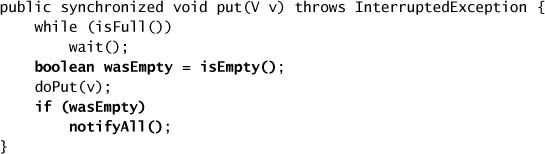

### 14.2.5. Ví dụ: Một class Gate

Latch cổng xuất phát trong `TestHarness` trang 96 được tạo với đếm ban đầu bằng một, tạo ra một **binary latch**: một latch có hai trạng thái, trạng thái ban đầu và trạng thái kết thúc. Latch ngăn các thread vượt qua cổng xuất phát cho đến khi nó được mở, tại thời điểm đó **tất cả** thread có thể đi qua. Dù cơ chế latching này thường chính xác là thứ ta cần, đôi khi việc một cổng được tạo theo cách này **không thể đóng lại** sau khi đã mở lại là một nhược điểm.

Rất dễ phát triển một class `ThreadGate` **có thể đóng lại** bằng condition wait, như trong Listing 14.9. `ThreadGate` cho phép cổng được mở và đóng, cung cấp một method `await` block cho đến khi cổng được mở. Method `open` dùng `notifyAll` vì semantics của class này **không thỏa mãn** phép kiểm tra "one-in, one-out" cho single notification.

Condition predicate mà `await` dùng **phức tạp hơn** so với chỉ đơn thuần kiểm tra `isOpen`. Điều này là cần thiết vì nếu có N thread đang chờ ở cổng vào lúc nó được mở, **tất cả** chúng đều nên được phép tiến hành. Nhưng nếu cổng được mở và đóng **liên tiếp nhanh chóng**, không phải tất cả thread có thể được giải phóng nếu `await` chỉ kiểm tra `isOpen`: vào lúc tất cả các thread nhận được notification, acquire lại lock, và thoát ra khỏi `wait`, cổng có thể **đã đóng lại**. Vậy nên `ThreadGate` dùng một condition predicate phức tạp hơn một chút: **mỗi lần cổng được đóng, một biến đếm "thế hệ" (generation) được tăng**, và một thread có thể vượt qua `await` nếu cổng **đang mở** hoặc nếu cổng **đã từng mở kể từ khi thread này đến cổng**.

Vì `ThreadGate` chỉ hỗ trợ chờ cổng mở, nó chỉ thực hiện notification trong `open`; để hỗ trợ **cả** operation "chờ mở" **lẫn** "chờ đóng", nó sẽ phải notify trong **cả** `open` **lẫn** `close`. Điều này minh họa tại sao các class state-dependent có thể **mong manh khi bảo trì** — việc thêm một operation state-dependent mới có thể đòi hỏi sửa **nhiều code path** thay đổi state của object để các notification thích hợp có thể được thực hiện.

### 14.2.6. Vấn đề an toàn với Subclass

Việc dùng conditional hay single notification đưa vào những ràng buộc có thể **làm phức tạp việc tạo subclass** [CPJ 3.3.3.3]. Nếu bạn muốn hỗ trợ subclass **chút nào**, bạn phải cấu trúc class của mình sao cho subclass có thể **thêm notification thích hợp thay mặt class cơ sở** nếu nó bị subclass theo cách vi phạm một trong các yêu cầu cho single hay conditional notification.

**Listing 14.9. Gate có thể đóng lại, dùng `wait` và `notifyAll`.**

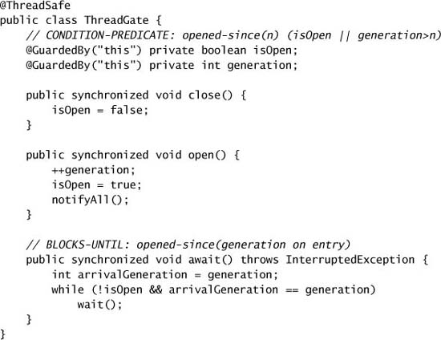

Một class state-dependent nên **hoặc** expose (và ghi tài liệu) đầy đủ các protocol chờ và notification của nó cho subclass, **hoặc** ngăn subclass tham gia vào chúng hoàn toàn. (Đây là mở rộng của "**thiết kế và ghi tài liệu cho việc kế thừa, hoặc cấm nó**" [EJ Item 15].) Ít nhất, việc thiết kế một class state-dependent cho kế thừa đòi hỏi **expose các condition queue và lock** và **ghi tài liệu về các condition predicate và synchronization policy**; nó cũng có thể đòi hỏi expose các state variable nền tảng. (Điều tệ nhất mà một class state-dependent có thể làm là **expose state của nó cho subclass nhưng không ghi tài liệu về protocol chờ và notification**; điều này giống như một class expose các state variable của nó nhưng không ghi tài liệu về các invariant.)

Một lựa chọn để làm việc này là **thực sự cấm subclass**, hoặc bằng cách làm class `final` hoặc bằng cách ẩn các condition queue, lock, và state variable khỏi subclass. Ngược lại, nếu subclass làm gì đó phá hỏng cách class cơ sở dùng `notify`, nó **cần có khả năng sửa chữa thiệt hại**. Hãy xét một blocking stack không giới hạn trong đó operation `pop` block nếu stack rỗng nhưng operation `push` luôn có thể tiến hành. Cái này **thỏa mãn** yêu cầu cho single notification. Nếu class này dùng single notification và một subclass thêm một method "pop hai phần tử liên tiếp" có block, thì giờ có **hai loại người chờ**: những người chờ pop một phần tử và những người chờ pop hai. Nhưng nếu class cơ sở **expose condition queue** và ghi tài liệu về protocol dùng nó, subclass có thể **override method `push` để thực hiện `notifyAll`**, khôi phục tính an toàn.

### 14.2.7. Encapsulate Condition Queue

Nói chung, tốt nhất là **encapsulate condition queue** sao cho nó không truy cập được từ bên ngoài cây phân cấp class nơi nó được dùng. Nếu không, caller có thể bị cám dỗ nghĩ rằng họ hiểu protocol chờ và notification của bạn và dùng chúng theo cách **không nhất quán với thiết kế** của bạn. (Không thể cưỡng chế yêu cầu uniform waiters cho single notification trừ khi object condition queue **không truy cập được** từ code bạn không kiểm soát; nếu code lạ nhầm lẫn `wait` trên condition queue của bạn, điều này có thể phá hỏng protocol notification của bạn và gây ra một tín hiệu bị cướp.)

Đáng tiếc, lời khuyên này — encapsulate các object dùng làm condition queue — **không nhất quán** với design pattern phổ biến nhất cho các class thread-safe, trong đó intrinsic lock của một object được dùng để bảo vệ state của nó. `BoundedBuffer` minh họa idiom phổ biến này, nơi **chính object buffer** vừa là lock vừa là condition queue. Tuy nhiên, `BoundedBuffer` có thể dễ dàng được tái cấu trúc để dùng một **object lock và condition queue riêng tư**; khác biệt duy nhất là nó sẽ **không còn hỗ trợ bất kỳ dạng client-side locking nào**.

### 14.2.8. Entry và Exit Protocol

Wellings (Wellings, 2004) đặc trưng hóa việc dùng `wait` và `notify` đúng cách dưới dạng **entry protocol** và **exit protocol**. Với **mỗi** operation state-dependent và với **mỗi** operation sửa state mà một operation khác có phụ thuộc state vào đó, bạn nên **định nghĩa và ghi tài liệu** một entry protocol và exit protocol. **Entry protocol** là **condition predicate của operation**; **exit protocol** bao gồm việc kiểm tra mọi state variable đã bị operation thay đổi để xem chúng có thể đã khiến một condition predicate khác trở thành đúng hay không, và nếu có thì **notify** trên condition queue tương ứng.

`AbstractQueuedSynchronizer` — nền tảng mà hầu hết các class state-dependent trong `java.util.concurrent` được xây trên đó (xem mục 14.4) — **khai thác** khái niệm exit protocol. Thay vì để các class synchronizer tự thực hiện notification của mình, nó **yêu cầu các method synchronizer trả về một giá trị** cho biết liệu hành động của nó có thể đã bỏ block một hay nhiều thread đang chờ hay không. Yêu cầu API tường minh này khiến việc "**quên notify**" ở một số chuyển đổi state trở nên **khó hơn**.

---

## 14.3. Object Condition tường minh

Như chúng ta đã thấy ở chương 13, các `Lock` tường minh có thể hữu ích trong một số tình huống mà intrinsic lock quá thiếu linh hoạt. Cũng như `Lock` là một tổng quát hóa của intrinsic lock, **`Condition`** (xem Listing 14.10) là một **tổng quát hóa của intrinsic condition queue**.

Intrinsic condition queue có vài nhược điểm. Mỗi intrinsic lock chỉ có thể có **một condition queue** gắn với nó, nghĩa là trong những class như `BoundedBuffer`, nhiều thread có thể chờ trên **cùng một condition queue cho những condition predicate khác nhau**, và pattern locking phổ biến nhất lại đòi hỏi **expose object condition queue**. Cả hai yếu tố này khiến việc cưỡng chế yêu cầu uniform waiter cho việc dùng `notify` trở nên **bất khả thi**. Nếu bạn muốn viết một object concurrent với **nhiều condition predicate**, hoặc bạn muốn kiểm soát nhiều hơn về visibility của condition queue, các class `Lock` và `Condition` tường minh cung cấp một **lựa chọn thay thế linh hoạt hơn** so với intrinsic lock và condition queue.

Một `Condition` gắn với **một `Lock` duy nhất**, cũng như một condition queue gắn với một intrinsic lock duy nhất; để tạo một `Condition`, hãy gọi `Lock.newCondition` trên lock tương ứng. Và cũng như `Lock` cung cấp một tập tính năng phong phú hơn intrinsic locking, `Condition` cung cấp một tập tính năng phong phú hơn intrinsic condition queue: **nhiều wait set trên mỗi lock**, **condition wait có thể interrupt và không thể interrupt**, **chờ dựa trên deadline**, và **lựa chọn giữa fair và nonfair queueing**.

**Listing 14.10. Interface `Condition`.**

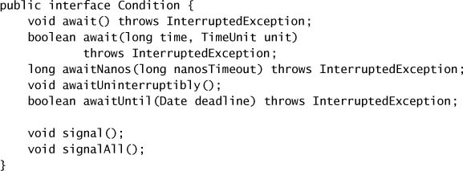

Khác với intrinsic condition queue, bạn có thể có **bao nhiêu object `Condition` trên mỗi `Lock` tùy ý**. Các object `Condition` **kế thừa thiết lập fairness** của `Lock` tương ứng; với fair lock, các thread được giải phóng khỏi `Condition.await` theo thứ tự **FIFO**.

> **Cảnh báo nguy hiểm:** Các tương đương của `wait`, `notify`, và `notifyAll` cho object `Condition` là **`await`, `signal`, và `signalAll`**. Tuy nhiên, `Condition` mở rộng `Object`, nghĩa là nó **cũng có** các method `wait` và `notify`. Hãy chắc chắn dùng đúng phiên bản — **`await` và `signal`**!

Listing 14.11 cho thấy thêm một hiện thực bounded buffer nữa, lần này dùng **hai `Condition`**, `notFull` và `notEmpty`, để **biểu diễn tường minh** các condition predicate "không đầy" và "không rỗng". Khi `take` block vì buffer rỗng, nó chờ trên `notEmpty`, và `put` bỏ block mọi thread đang block trong `take` bằng cách `signal` trên `notEmpty`.

Hành vi của `ConditionBoundedBuffer` **giống hệt** `BoundedBuffer`, nhưng cách nó dùng condition queue **dễ đọc hơn** — dễ phân tích một class dùng nhiều `Condition` hơn là một class dùng một intrinsic condition queue duy nhất với nhiều condition predicate. Bằng cách tách hai condition predicate thành các **wait set riêng biệt**, `Condition` giúp **dễ thỏa mãn** các yêu cầu cho single notification hơn. Dùng `signal` hiệu quả hơn thay vì `signalAll` sẽ **giảm số context switch và số lần acquire lock** được kích hoạt bởi mỗi operation buffer.

Cũng như với lock và condition queue built-in, **mối quan hệ ba chiều** giữa lock, condition predicate, và condition variable cũng phải được giữ khi dùng `Lock` và `Condition` tường minh. Các biến liên quan đến condition predicate **phải được `Lock` bảo vệ**, và `Lock` phải được giữ khi kiểm tra condition predicate và khi gọi `await` và `signal`.[^11]

[^11]: `ReentrantLock` yêu cầu `Lock` phải được giữ khi gọi `signal` hay `signalAll`, nhưng các hiện thực `Lock` **được phép** tạo ra những `Condition` không có yêu cầu này.

Hãy chọn giữa dùng `Condition` tường minh và intrinsic condition queue theo **cùng cách** bạn chọn giữa `ReentrantLock` và `synchronized`: dùng `Condition` nếu bạn cần các tính năng nâng cao của nó như fair queueing hay nhiều wait set trên mỗi lock, và ngược lại thì **ưu tiên intrinsic condition queue**. (Nếu bạn đã dùng `ReentrantLock` vì cần các tính năng nâng cao của nó, thì lựa chọn đã được quyết định sẵn.)

---

## 14.4. Giải phẫu một Synchronizer

Interface của `ReentrantLock` và `Semaphore` có **nhiều điểm chung**. Cả hai class đều đóng vai trò một "cổng", chỉ cho phép một số giới hạn thread đi qua tại một thời điểm; thread đến cổng và được cho qua (`lock` hay `acquire` trả về thành công), bị bắt chờ (`lock` hay `acquire` block), hoặc bị từ chối (`tryLock` hay `tryAcquire` trả về `false`, cho biết lock hay permit đã không trở nên khả dụng trong thời gian cho phép). Hơn nữa, cả hai đều cho phép các nỗ lực acquire **có thể interrupt, không thể interrupt, và có timeout**, và cả hai đều cho phép lựa chọn giữa **fair và nonfair queueing** cho các thread đang chờ.

Với những điểm chung này, bạn có thể nghĩ rằng `Semaphore` được hiện thực **trên nền** `ReentrantLock`, hoặc có lẽ `ReentrantLock` được hiện thực như một `Semaphore` với một permit. Điều này hoàn toàn khả thi; đây là một bài tập phổ biến để chứng minh rằng một counting semaphore có thể được hiện thực bằng một lock (như trong `SemaphoreOnLock` ở Listing 14.12) và rằng một lock có thể được hiện thực bằng một counting semaphore.

Trên thực tế, **cả hai đều được hiện thực bằng một class cơ sở chung**: `AbstractQueuedSynchronizer` (**AQS**) — cũng như nhiều synchronizer khác. AQS là một **framework để xây dựng lock và synchronizer**, và một dải rộng đến ngạc nhiên các synchronizer có thể được xây dễ dàng và hiệu quả bằng nó. Không chỉ `ReentrantLock` và `Semaphore` được xây bằng AQS, mà còn cả `CountDownLatch`, `ReentrantReadWriteLock`, `SynchronousQueue`,[^12] và `FutureTask`.

[^12]: Java 6 thay thế `SynchronousQueue` dựa trên AQS bằng một phiên bản nonblocking (dễ mở rộng hơn).

**Listing 14.11. Bounded Buffer dùng các Condition Variable tường minh.**

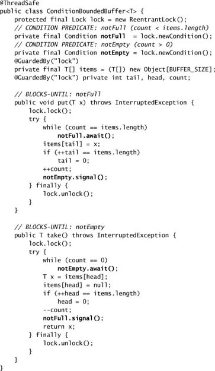

**Listing 14.12. Counting Semaphore được hiện thực bằng `Lock`.**

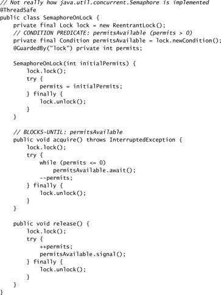

AQS xử lý nhiều chi tiết của việc hiện thực một synchronizer, chẳng hạn **xếp hàng FIFO** các thread đang chờ. Từng synchronizer riêng lẻ có thể định nghĩa **tiêu chí linh hoạt** cho việc một thread nên được cho qua hay bị bắt chờ.

Dùng AQS để xây synchronizer mang lại vài lợi ích. Nó không chỉ **giảm đáng kể công sức hiện thực**, mà bạn cũng **không phải trả giá cho nhiều điểm tranh chấp** như khi bạn xây một synchronizer trên nền một synchronizer khác. Trong `SemaphoreOnLock`, việc acquire một permit có **hai chỗ** nó có thể block — một lần ở lock bảo vệ state của semaphore, và lần nữa nếu không có permit khả dụng. Các synchronizer được xây bằng AQS chỉ có **một điểm duy nhất** chúng có thể block, giảm overhead context-switch và cải thiện throughput. AQS được **thiết kế cho scalability**, và tất cả synchronizer trong `java.util.concurrent` được xây bằng AQS đều hưởng lợi từ điều này.

---

## 14.5. AbstractQueuedSynchronizer

Hầu hết developer có lẽ sẽ **không bao giờ dùng AQS trực tiếp**; tập synchronizer chuẩn bao phủ một dải khá rộng các tình huống. Nhưng việc xem cách các synchronizer chuẩn được hiện thực có thể giúp làm rõ cách chúng hoạt động.

Các operation cơ bản mà một synchronizer dựa trên AQS thực hiện là một số biến thể của **acquire** và **release**. **Acquisition** là operation state-dependent và **luôn có thể block**. Với một lock hay semaphore, ý nghĩa của acquire khá rõ ràng — acquire lock hay một permit — và caller có thể phải chờ cho đến khi synchronizer ở trạng thái cho phép điều đó. Với `CountDownLatch`, acquire nghĩa là "chờ cho đến khi latch đạt trạng thái kết thúc", và với `FutureTask`, nó nghĩa là "chờ cho đến khi task hoàn tất". **Release không phải một blocking operation**; một release có thể cho phép các thread đang block trong acquire tiến hành.

Để một class trở nên state-dependent, nó **phải có state**. AQS đảm nhận việc quản lý một phần state cho class synchronizer: nó quản lý **một số nguyên duy nhất** chứa thông tin state, có thể được thao tác qua các method `protected` là `getState`, `setState`, và `compareAndSetState`. Cái này có thể được dùng để biểu diễn state tùy ý; ví dụ, `ReentrantLock` dùng nó để biểu diễn **số lần** thread sở hữu đã acquire lock, `Semaphore` dùng nó để biểu diễn **số permit còn lại**, và `FutureTask` dùng nó để biểu diễn **trạng thái của task** (chưa bắt đầu, đang chạy, đã hoàn tất, bị hủy). Các synchronizer cũng có thể **tự quản lý thêm state variable**; ví dụ, `ReentrantLock` theo dõi chủ sở hữu lock hiện tại để có thể phân biệt giữa yêu cầu acquire lock reentrant và yêu cầu bị tranh chấp.

Việc acquire và release trong AQS mang các hình thức thể hiện ở Listing 14.13. Tùy synchronizer, việc acquire có thể là **độc quyền** (exclusive), như với `ReentrantLock`, hoặc **không độc quyền** (nonexclusive), như với `Semaphore` và `CountDownLatch`. Một operation acquire có **hai phần**. Thứ nhất, synchronizer quyết định xem state hiện tại có cho phép acquire hay không; nếu có, thread được cho tiến hành, còn nếu không, việc acquire sẽ block hoặc fail. Quyết định này được xác định bởi **semantics của synchronizer**; ví dụ, acquire một lock có thể thành công nếu lock không được ai giữ, và acquire một latch có thể thành công nếu latch ở trạng thái kết thúc.

Phần thứ hai liên quan đến việc có thể **cập nhật state của synchronizer**; việc một thread acquire synchronizer có thể ảnh hưởng đến việc các thread khác có acquire được hay không. Ví dụ, acquire một lock thay đổi state của lock từ "không ai giữ" sang "đang được giữ", và acquire một permit từ một `Semaphore` làm giảm số permit còn lại. Ngược lại, việc một thread acquire một latch **không ảnh hưởng** đến việc các thread khác có acquire được hay không, nên acquire một latch **không thay đổi state của nó**.

**Listing 14.13. Dạng chuẩn cho Acquisition và Release trong AQS.**

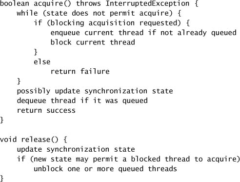

Một synchronizer hỗ trợ **acquisition độc quyền** nên hiện thực các method `protected` là `tryAcquire`, `tryRelease`, và `isHeldExclusively`, còn những synchronizer hỗ trợ **acquisition chia sẻ** nên hiện thực `tryAcquireShared` và `tryReleaseShared`. Các method `acquire`, `acquireShared`, `release`, và `releaseShared` trong AQS gọi các dạng `try` của những method này trong subclass synchronizer để xác định xem operation có thể tiến hành hay không. Subclass synchronizer có thể dùng `getState`, `setState`, và `compareAndSetState` để kiểm tra và cập nhật state theo semantics acquire và release của nó, và **thông báo cho class cơ sở qua trạng thái trả về** xem nỗ lực acquire hay release synchronizer có thành công hay không. Ví dụ, trả về một **giá trị âm** từ `tryAcquireShared` cho biết acquisition thất bại; trả về **không** cho biết synchronizer đã được acquire độc quyền; và trả về một **giá trị dương** cho biết synchronizer đã được acquire không độc quyền. Các method `tryRelease` và `tryReleaseShared` nên trả về `true` nếu việc release **có thể đã bỏ block** những thread đang cố acquire synchronizer.

Để đơn giản hóa việc hiện thực các lock hỗ trợ condition queue (như `ReentrantLock`), AQS cũng cung cấp bộ máy để xây dựng các **condition variable** gắn với synchronizer.

### 14.5.1. Một Latch đơn giản

`OneShotLatch` ở Listing 14.14 là một binary latch được hiện thực bằng AQS. Nó có hai public method, `await` và `signal`, tương ứng với **acquisition** và **release**. Ban đầu, latch đóng; bất kỳ thread nào gọi `await` sẽ block cho đến khi latch được mở. Một khi latch được mở bằng một lời gọi `signal`, các thread đang chờ được giải phóng và những thread đến latch sau đó sẽ được cho tiến hành.

**Listing 14.14. Binary Latch dùng `AbstractQueuedSynchronizer`.**

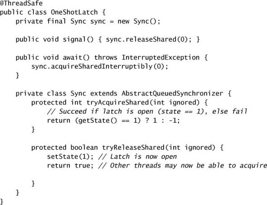

Trong `OneShotLatch`, state của AQS giữ **trạng thái của latch** — đóng (không) hay mở (một). Method `await` gọi `acquireSharedInterruptibly` trong AQS, thứ lại tham vấn method `tryAcquireShared` trong `OneShotLatch`. Hiện thực `tryAcquireShared` phải trả về một giá trị cho biết acquisition có thể tiến hành hay không. Nếu latch đã được mở trước đó, `tryAcquireShared` trả về **thành công**, cho phép thread đi qua; nếu không, nó trả về một giá trị cho biết nỗ lực acquisition **thất bại**. Method `acquireSharedInterruptibly` diễn giải thất bại nghĩa là thread nên được **đặt vào hàng đợi các thread đang chờ**. Tương tự, `signal` gọi `releaseShared`, thứ khiến `tryReleaseShared` được tham vấn. Hiện thực `tryReleaseShared` **vô điều kiện** đặt state của latch thành mở và cho biết (qua giá trị trả về) rằng synchronizer đang ở trạng thái **được release hoàn toàn**. Điều này khiến AQS cho **tất cả** các thread đang chờ thử acquire lại synchronizer, và acquisition giờ sẽ thành công vì `tryAcquireShared` trả về thành công.

`OneShotLatch` là một synchronizer **đầy đủ chức năng, dùng được, và có performance tốt**, được hiện thực chỉ trong khoảng hai mươi dòng code. Dĩ nhiên, nó thiếu một số tính năng hữu ích — như acquisition có timeout hay khả năng kiểm tra trạng thái latch — nhưng những thứ này cũng dễ hiện thực, vì AQS cung cấp các phiên bản có timeout của các method acquisition và các method tiện ích cho các operation kiểm tra phổ biến.

`OneShotLatch` **có thể** đã được hiện thực bằng cách **extend** AQS thay vì **ủy quyền** cho nó, nhưng điều này không mong muốn vì vài lý do [EJ Item 14]. Làm vậy sẽ phá hỏng interface đơn giản (hai method) của `OneShotLatch`, và dù các public method của AQS sẽ không cho phép caller làm hỏng state của latch, caller vẫn có thể **dễ dàng dùng chúng sai cách**. **Không synchronizer nào trong `java.util.concurrent` extend AQS trực tiếp** — tất cả chúng đều ủy quyền cho các subclass `private` bên trong của AQS.

---

## 14.6. AQS trong các class Synchronizer của java.util.concurrent

Nhiều class blocking trong `java.util.concurrent`, như `ReentrantLock`, `Semaphore`, `ReentrantReadWriteLock`, `CountDownLatch`, `SynchronousQueue`, và `FutureTask`, được xây dựng bằng AQS. Không đi quá sâu vào chi tiết (mã nguồn là một phần của bản tải JDK[^13]), hãy nhìn nhanh cách mỗi class này dùng AQS.

[^13]: Hoặc với ít hạn chế về giấy phép hơn tại `http://gee.cs.oswego.edu/dl/concurrency-interest`.

### 14.6.1. ReentrantLock

`ReentrantLock` **chỉ hỗ trợ acquisition độc quyền**, nên nó hiện thực `tryAcquire`, `tryRelease`, và `isHeldExclusively`; `tryAcquire` cho phiên bản nonfair được thể hiện ở Listing 14.15. `ReentrantLock` dùng synchronization state để giữ **số lần acquire lock**, và duy trì một biến `owner` giữ danh tính của thread sở hữu — biến này chỉ bị sửa khi thread hiện tại vừa acquire lock hoặc sắp release nó.[^14] Trong `tryRelease`, nó kiểm tra field `owner` để đảm bảo rằng **thread hiện tại sở hữu lock** trước khi cho phép việc unlock tiến hành; trong `tryAcquire`, nó dùng field này để phân biệt giữa một lần acquisition reentrant và một nỗ lực acquisition bị tranh chấp.

[^14]: Vì các method thao tác state `protected` có memory semantics của một lần đọc/ghi `volatile`, và `ReentrantLock` cẩn thận **chỉ đọc field `owner` sau khi gọi `getState`** và **chỉ ghi nó trước khi gọi `setState`**, `ReentrantLock` có thể "ăn theo" memory semantics của synchronization state, và do đó **tránh được synchronization thêm** — xem mục 16.1.4.

Khi một thread cố acquire một lock, `tryAcquire` trước tiên tham vấn state của lock. Nếu nó không được ai giữ, nó thử cập nhật state của lock để cho biết nó đang được giữ. Vì state có thể đã thay đổi kể từ khi nó được kiểm tra vài lệnh trước, `tryAcquire` dùng `compareAndSetState` để cố **atomically cập nhật state** cho biết lock giờ đang được giữ, đồng thời **xác nhận rằng state chưa thay đổi** kể từ lần quan sát cuối. (Xem mô tả về `compareAndSet` ở mục 15.3.) Nếu state của lock cho biết nó đã được giữ: nếu thread hiện tại là chủ sở hữu lock, biến đếm acquisition được tăng lên; nếu thread hiện tại không phải chủ sở hữu lock, nỗ lực acquisition **thất bại**.

**Listing 14.15. Hiện thực `tryAcquire` từ `ReentrantLock` nonfair.**

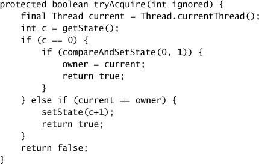

`ReentrantLock` cũng tận dụng hỗ trợ built-in của AQS cho **nhiều condition variable và wait set**. `Lock.newCondition` trả về một instance mới của `ConditionObject`, một class nội bộ của AQS.

### 14.6.2. Semaphore và CountDownLatch

`Semaphore` dùng synchronization state của AQS để giữ **số permit hiện đang khả dụng**. Method `tryAcquireShared` (xem Listing 14.16) trước tiên tính số permit còn lại, và nếu không đủ, trả về một giá trị cho biết acquire **thất bại**. Nếu có vẻ còn đủ permit, nó cố **atomically giảm số permit** bằng `compareAndSetState`. Nếu thành công (nghĩa là số permit đã không thay đổi kể từ lần kiểm tra cuối), nó trả về một giá trị cho biết acquire **thành công**. Giá trị trả về cũng mã hóa việc liệu **các nỗ lực acquisition chia sẻ khác có thể thành công hay không**, trong trường hợp đó các thread đang chờ khác cũng sẽ được bỏ block.

Vòng lặp `while` kết thúc hoặc khi không đủ permit, hoặc khi `tryAcquireShared` có thể atomically cập nhật số permit để phản ánh việc acquisition. Dù bất kỳ lời gọi `compareAndSetState` nào cũng có thể thất bại do tranh chấp với thread khác (xem mục 15.3), khiến nó phải thử lại, một trong hai tiêu chí kết thúc này sẽ trở thành đúng **trong một số lần thử lại hợp lý**. Tương tự, `tryReleaseShared` tăng số permit, có khả năng bỏ block các thread đang chờ, và thử lại cho đến khi cập nhật thành công. Giá trị trả về của `tryReleaseShared` cho biết liệu các thread khác có thể đã được bỏ block bởi việc release hay không.

`CountDownLatch` dùng AQS theo cách tương tự `Semaphore`: synchronization state giữ **biến đếm hiện tại**. Method `countDown` gọi `release`, khiến biến đếm bị giảm và **bỏ block các thread đang chờ nếu biến đếm về không**; `await` gọi `acquire`, thứ trả về ngay lập tức nếu biến đếm đã về không và ngược lại thì block.

**Listing 14.16. `tryAcquireShared` và `tryReleaseShared` từ `Semaphore`.**

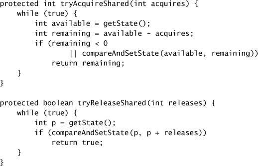

### 14.6.3. FutureTask

Thoạt nhìn, `FutureTask` thậm chí **trông không giống** một synchronizer. Nhưng `Future.get` có semantics **rất giống một latch** — nếu một sự kiện nào đó (việc hoàn tất hay hủy task được `FutureTask` biểu diễn) đã xảy ra, thì các thread có thể tiến hành, ngược lại chúng bị xếp hàng cho đến khi sự kiện đó xảy ra.

`FutureTask` dùng synchronization state của AQS để giữ **trạng thái task** — đang chạy, đã hoàn tất, hay đã bị hủy. Nó cũng duy trì thêm các state variable để giữ **kết quả** của phép tính hoặc **exception** mà nó ném ra. Nó còn duy trì một **tham chiếu tới thread đang chạy phép tính** (nếu nó hiện ở trạng thái đang chạy), để nó có thể bị interrupt nếu task bị hủy.

### 14.6.4. ReentrantReadWriteLock

Interface của `ReadWriteLock` gợi ý rằng có **hai lock** — một reader lock và một writer lock — nhưng trong hiện thực dựa trên AQS của `ReentrantReadWriteLock`, **một subclass AQS duy nhất quản lý cả read lẫn write locking**. `ReentrantReadWriteLock` dùng **16 bit** của state cho biến đếm write-lock, và **16 bit còn lại** cho biến đếm read-lock. Các operation trên read lock dùng các method acquire và release **chia sẻ**; các operation trên write lock dùng các method acquire và release **độc quyền**.

Bên trong, AQS duy trì một **hàng đợi các thread đang chờ**, theo dõi việc một thread đã yêu cầu truy cập độc quyền hay chia sẻ. Trong `ReentrantReadWriteLock`, khi lock trở nên khả dụng, nếu thread ở **đầu hàng đợi** đang tìm quyền ghi thì nó sẽ nhận được, còn nếu thread ở đầu hàng đợi đang tìm quyền đọc, thì **tất cả các thread trong hàng đợi cho đến writer đầu tiên** sẽ nhận được.[^15]

[^15]: Cơ chế này **không cho phép** lựa chọn policy ưu tiên reader hay ưu tiên writer, như một số hiện thực read-write lock làm. Để làm vậy, hoặc hàng đợi chờ của AQS sẽ phải là thứ gì đó khác một FIFO queue, hoặc sẽ cần hai hàng đợi. Tuy nhiên, một policy sắp xếp nghiêm ngặt như vậy **hiếm khi cần thiết** trên thực tế; nếu phiên bản nonfair của `ReentrantReadWriteLock` không cung cấp liveness chấp nhận được, phiên bản fair thường cung cấp thứ tự thỏa đáng và đảm bảo **không bỏ đói** cả reader lẫn writer.

---

## Tóm tắt

Nếu bạn cần hiện thực một class state-dependent — một class mà các method phải block nếu một precondition dựa trên state không thỏa mãn — chiến lược tốt nhất thường là **xây dựng trên nền một class thư viện có sẵn** như `Semaphore`, `BlockingQueue`, hay `CountDownLatch`, như trong `ValueLatch` ở trang 187. Tuy nhiên, đôi khi các class thư viện có sẵn không cung cấp một nền tảng đủ dùng; trong những trường hợp đó, bạn có thể tự xây synchronizer của mình bằng **intrinsic condition queue**, **object `Condition` tường minh**, hoặc **`AbstractQueuedSynchronizer`**. Intrinsic condition queue **gắn chặt với intrinsic locking**, vì cơ chế quản lý state dependence tất yếu gắn với cơ chế đảm bảo tính nhất quán của state. Tương tự, các `Condition` tường minh gắn chặt với các `Lock` tường minh, và cung cấp một tập tính năng mở rộng so với intrinsic condition queue, bao gồm **nhiều wait set trên mỗi lock**, **condition wait có thể interrupt hoặc không thể interrupt**, **fair hoặc nonfair queueing**, và **chờ dựa trên deadline**.
