# Chương 15. Atomic Variables and Nonblocking Synchronization

> **Về bản dịch này.** Đây là bản **dịch đầy đủ** chương 15 của cuốn *Java Concurrency in Practice* (Brian Goetz và cộng sự). Các **thuật ngữ chuyên ngành được giữ nguyên tiếng Anh**. Toàn bộ code listing và hình vẽ được trích trực tiếp từ file PDF gốc và lưu trong thư mục `images/ch15/`.

---

Nhiều class trong `java.util.concurrent`, như `Semaphore` và `ConcurrentLinkedQueue`, cung cấp performance và scalability tốt hơn các lựa chọn thay thế dùng `synchronized`. Trong chương này, chúng ta sẽ xem xét nguồn gốc chính của sự tăng cường performance này: **atomic variable** và **nonblocking synchronization**.

Phần lớn nghiên cứu gần đây về thuật toán concurrent đã tập trung vào **thuật toán nonblocking** — những thuật toán dùng các **lệnh máy atomic mức thấp** như **compare-and-swap** thay vì lock để đảm bảo tính toàn vẹn dữ liệu dưới truy cập concurrent. Thuật toán nonblocking được dùng rộng rãi trong hệ điều hành và JVM cho việc lập lịch thread và process, garbage collection, và để hiện thực lock cùng các cấu trúc dữ liệu concurrent khác.

Thuật toán nonblocking **phức tạp hơn đáng kể** để thiết kế và hiện thực so với các lựa chọn dựa trên lock, nhưng chúng có thể mang lại **lợi thế đáng kể về scalability và liveness**. Chúng điều phối ở **mức độ mịn hơn** và có thể giảm mạnh overhead lập lịch vì chúng **không block** khi nhiều thread tranh chấp cùng dữ liệu. Hơn nữa, chúng **miễn nhiễm với deadlock** và các vấn đề liveness khác. Trong các thuật toán dựa trên lock, các thread khác **không thể tiến triển** nếu một thread đi ngủ hoặc spin trong khi giữ lock, trong khi thuật toán nonblocking **không bị ảnh hưởng** bởi sự cố của từng thread riêng lẻ. Kể từ Java 5.0, có thể xây dựng các thuật toán nonblocking hiệu quả trong Java bằng các class atomic variable như `AtomicInteger` và `AtomicReference`.

Atomic variable cũng có thể được dùng như "**biến volatile tốt hơn**" ngay cả khi bạn không phát triển thuật toán nonblocking. Atomic variable cung cấp **cùng memory semantics** như biến volatile, nhưng **có thêm hỗ trợ cho các cập nhật atomic** — khiến chúng lý tưởng cho bộ đếm, bộ sinh sequence, và thu thập thống kê, đồng thời mang lại scalability tốt hơn các lựa chọn dựa trên lock.

---

## 15.1. Nhược điểm của Locking

Việc điều phối truy cập vào shared state bằng một locking protocol nhất quán đảm bảo rằng thread nào giữ lock bảo vệ một tập biến sẽ có **truy cập độc quyền** vào những biến đó, và rằng mọi thay đổi lên những biến đó **nhìn thấy được** với các thread khác sau này acquire lock.

Các JVM hiện đại có thể tối ưu việc acquire và release lock **không bị tranh chấp** khá hiệu quả, nhưng nếu nhiều thread cùng yêu cầu lock một lúc, JVM sẽ **nhờ đến sự trợ giúp của hệ điều hành**. Nếu đến mức này, một thread xấu số nào đó sẽ bị **treo** và phải được đánh thức sau.[^1] Khi thread đó được đánh thức, nó có thể phải **chờ các thread khác dùng hết lượng thời gian lập lịch** trước khi nó thực sự được lập lịch. Việc treo và đánh thức một thread có **rất nhiều overhead** và nói chung kéo theo một sự gián đoạn kéo dài. Với những class dựa trên lock có các operation **mịn** (như các class synchronized collection, nơi hầu hết method chỉ chứa vài operation), **tỷ lệ giữa overhead lập lịch và công việc hữu ích có thể rất cao** khi lock thường xuyên bị tranh chấp.

[^1]: Một JVM thông minh **không nhất thiết** phải treo một thread nếu nó tranh chấp một lock; nó có thể dùng dữ liệu profiling để quyết định một cách thích ứng giữa treo và spin lock, dựa trên việc lock đã được giữ bao lâu ở những lần acquire trước.

Biến volatile là một cơ chế synchronization **nhẹ hơn** locking vì chúng **không liên quan đến context switch hay lập lịch thread**. Tuy nhiên, biến volatile có một số hạn chế so với locking: dù chúng cung cấp bảo đảm visibility tương tự, chúng **không thể được dùng để xây dựng các compound action atomic**. Điều này nghĩa là biến volatile không thể dùng khi một biến phụ thuộc vào một biến khác, hoặc khi giá trị mới của một biến phụ thuộc vào giá trị cũ của nó. Điều này giới hạn khi nào biến volatile là phù hợp, vì chúng không thể dùng để hiện thực đáng tin cậy những công cụ phổ biến như bộ đếm hay mutex.[^2]

[^2]: Về lý thuyết là **có thể** — dù hoàn toàn không thực tế — dùng semantics của `volatile` để xây dựng mutex và các synchronizer khác; xem (Raynal, 1986).

Ví dụ, dù operation tăng (`++i`) trông như một operation atomic, nó thực ra là **ba operation riêng biệt** — đọc giá trị hiện tại của biến, cộng một vào nó, rồi ghi giá trị đã cập nhật trở lại. Để không mất một cập nhật, **toàn bộ** chuỗi read-modify-write phải atomic. Cho đến giờ, cách duy nhất chúng ta thấy để làm điều này là dùng **locking**, như trong `Counter` ở trang 56.

`Counter` là thread-safe, và khi có ít hoặc không có tranh chấp thì nó chạy hoàn toàn ổn. Nhưng dưới tranh chấp, performance chịu thiệt vì overhead context-switch và độ trễ lập lịch. Khi các lock chỉ được giữ rất ngắn, việc **bị bắt đi ngủ là một hình phạt nặng nề** cho việc xin lock vào sai thời điểm.

Locking còn có vài nhược điểm khác. Khi một thread đang chờ một lock, **nó không thể làm gì khác**. Nếu một thread đang giữ lock bị trì hoãn (do page fault, độ trễ lập lịch, hay tương tự), thì **không thread nào cần lock đó có thể tiến triển**. Đây có thể là một vấn đề nghiêm trọng nếu thread bị block là một thread có độ ưu tiên cao còn thread đang giữ lock lại có độ ưu tiên thấp hơn — một nguy cơ performance gọi là **priority inversion** (đảo ngược độ ưu tiên). Dù thread có độ ưu tiên cao hơn lẽ ra phải được ưu tiên, nó vẫn **phải chờ** cho đến khi lock được release, và điều này trên thực tế **hạ độ ưu tiên của nó xuống bằng** thread có độ ưu tiên thấp. Nếu một thread đang giữ lock bị block vĩnh viễn (do vòng lặp vô hạn, deadlock, livelock, hay thất bại liveness khác), **mọi thread chờ lock đó sẽ không bao giờ tiến triển được**.

Ngay cả khi bỏ qua những nguy cơ này, locking đơn giản là một cơ chế **nặng nề** cho những operation mịn như tăng một bộ đếm. Sẽ tốt nếu có một kỹ thuật mịn hơn để quản lý tranh chấp giữa các thread — thứ gì đó giống biến volatile, nhưng cũng cung cấp khả năng **cập nhật atomic**. May mắn thay, các processor hiện đại cung cấp cho chúng ta chính xác một cơ chế như vậy.

---

## 15.2. Hỗ trợ phần cứng cho Concurrency

Exclusive locking là một kỹ thuật **bi quan** — nó giả định điều tệ nhất (nếu bạn không khóa cửa, yêu tinh sẽ vào và xáo trộn đồ đạc của bạn) và không tiến hành cho đến khi bạn có thể đảm bảo, bằng cách acquire các lock thích hợp, rằng các thread khác sẽ không can thiệp.

Với các operation mịn, có một cách tiếp cận thay thế thường **hiệu quả hơn** — cách tiếp cận **lạc quan**, theo đó bạn cứ tiến hành một cập nhật, hy vọng có thể hoàn tất nó mà không bị can thiệp. Cách tiếp cận này dựa vào **phát hiện va chạm** để xác định xem có sự can thiệp từ các bên khác trong quá trình cập nhật hay không, trong trường hợp đó operation **thất bại và có thể được thử lại** (hoặc không). Cách tiếp cận lạc quan giống câu nói xưa: "**Xin lỗi dễ hơn xin phép**", trong đó "dễ hơn" ở đây nghĩa là "hiệu quả hơn".

Các processor được thiết kế cho hoạt động đa xử lý cung cấp những **lệnh đặc biệt** để quản lý truy cập concurrent vào các biến được share. Các processor đời đầu có các lệnh atomic **test-and-set**, **fetch-and-increment**, hoặc **swap** đủ để hiện thực mutex — thứ lại có thể được dùng để hiện thực những object concurrent tinh vi hơn. Ngày nay, gần như mọi processor hiện đại đều có một dạng **lệnh read-modify-write atomic**, chẳng hạn **compare-and-swap** hoặc **load-linked/store-conditional**. Hệ điều hành và JVM dùng những lệnh này để hiện thực lock và các cấu trúc dữ liệu concurrent, nhưng cho đến Java 5.0 chúng **chưa khả dụng trực tiếp** cho các class Java.

### 15.2.1. Compare and Swap

Cách tiếp cận mà hầu hết kiến trúc processor áp dụng, bao gồm IA32 và Sparc, là hiện thực một lệnh **compare-and-swap (CAS)**. (Các processor khác, như PowerPC, hiện thực cùng chức năng bằng một cặp lệnh: **load-linked** và **store-conditional**.) CAS có **ba toán hạng** — một vị trí bộ nhớ **V** để thao tác, giá trị cũ kỳ vọng **A**, và giá trị mới **B**. CAS **atomically cập nhật V thành giá trị mới B, nhưng chỉ khi giá trị trong V khớp với giá trị cũ kỳ vọng A**; ngược lại nó **không làm gì cả**. Trong cả hai trường hợp, nó trả về giá trị hiện đang có trong V. (Biến thể gọi là **compare-and-set** thay vào đó trả về việc operation có thành công hay không.) CAS nghĩa là "**Tôi nghĩ V nên có giá trị A; nếu đúng vậy, hãy đặt B vào đó, còn không thì đừng thay đổi nó nhưng hãy nói cho tôi biết tôi đã sai.**" CAS là một kỹ thuật **lạc quan** — nó tiến hành cập nhật với hy vọng thành công, và có thể phát hiện thất bại nếu một thread khác đã cập nhật biến kể từ lần kiểm tra cuối. `SimulatedCAS` ở Listing 15.1 minh họa **semantics** (nhưng không phải hiện thực hay performance) của CAS.

Khi nhiều thread cố cập nhật cùng một biến đồng thời bằng CAS, **một thread thắng** và cập nhật giá trị của biến, còn phần còn lại **thua**. Nhưng những thread thua **không bị trừng phạt bằng cách bị treo**, như khi chúng thất bại trong việc acquire một lock; thay vào đó, chúng được **báo rằng chúng không thắng lần này nhưng có thể thử lại**. Vì một thread thua CAS **không bị block**, nó có thể quyết định xem nó muốn thử lại, thực hiện hành động khôi phục nào đó, hay không làm gì cả.[^3] Sự linh hoạt này **loại bỏ nhiều nguy cơ liveness** liên quan đến locking (dù trong những trường hợp bất thường có thể đưa vào rủi ro livelock — xem mục 10.3.3).

[^3]: Không làm gì cả có thể là một phản hồi hoàn toàn hợp lý cho một CAS thất bại; trong một số thuật toán nonblocking, như thuật toán linked queue ở mục 15.4.2, một CAS thất bại nghĩa là **ai đó đã làm sẵn công việc bạn định làm**.

**Listing 15.1. Operation CAS mô phỏng.**

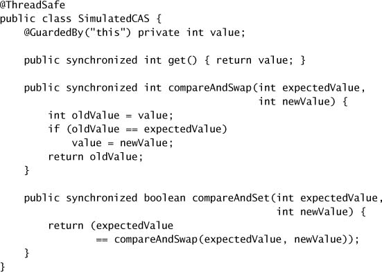

Pattern điển hình để dùng CAS là trước tiên **đọc giá trị A từ V**, **suy ra giá trị mới B từ A**, rồi **dùng CAS để atomically đổi V từ A thành B** miễn là không thread nào khác đã đổi V thành một giá trị khác trong thời gian đó. CAS giải quyết vấn đề hiện thực các chuỗi read-modify-write atomic **mà không cần locking**, vì nó có thể **phát hiện sự can thiệp** từ các thread khác.

### 15.2.2. Một Counter Nonblocking

`CasCounter` ở Listing 15.2 hiện thực một bộ đếm thread-safe dùng CAS. Operation increment tuân theo dạng chuẩn — đọc giá trị cũ, biến đổi nó thành giá trị mới (cộng một), và dùng CAS để đặt giá trị mới. Nếu CAS thất bại, operation được **thử lại ngay lập tức**. Việc thử lại liên tục thường là một chiến lược hợp lý, mặc dù trong trường hợp tranh chấp cực đoan, có thể nên **chờ hoặc backoff** trước khi thử lại để tránh livelock.

`CasCounter` **không block**, mặc dù nó có thể phải thử lại vài lần[^4] nếu các thread khác đang cập nhật bộ đếm cùng lúc. (Trên thực tế, nếu tất cả những gì bạn cần là một bộ đếm hay bộ sinh sequence, hãy dùng `AtomicInteger` hay `AtomicLong`, những class cung cấp increment atomic và các method số học khác.)

[^4]: Về lý thuyết, nó có thể phải thử lại **vô số lần** nếu các thread khác cứ thắng cuộc đua CAS; trên thực tế, kiểu starvation này **hiếm khi xảy ra**.

**Listing 15.2. Counter Nonblocking dùng CAS.**

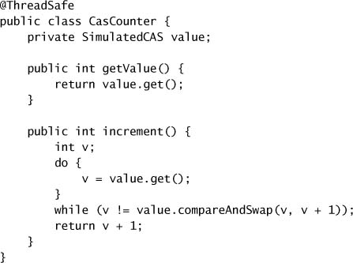

Thoạt nhìn, bộ đếm dựa trên CAS trông như thể sẽ chạy **kém hơn** một bộ đếm dựa trên lock; nó có nhiều operation hơn, luồng điều khiển phức tạp hơn, và phụ thuộc vào operation CAS có vẻ phức tạp. Nhưng trên thực tế, các bộ đếm dựa trên CAS **vượt trội đáng kể** so với bộ đếm dựa trên lock nếu có dù chỉ một chút tranh chấp, và **thường là ngay cả khi không có tranh chấp**. Đường đi nhanh cho việc acquire lock không tranh chấp thường đòi hỏi **ít nhất một CAS** cộng thêm các công việc dọn dẹp liên quan đến lock, nên **nhiều việc hơn** đang diễn ra trong trường hợp tốt nhất của bộ đếm dựa trên lock so với trường hợp bình thường của bộ đếm dựa trên CAS. Vì CAS thành công **hầu hết thời gian** (giả sử tranh chấp từ thấp đến trung bình), phần cứng sẽ **dự đoán đúng nhánh rẽ ngầm** trong vòng lặp `while`, giảm thiểu overhead của logic điều khiển phức tạp hơn.

Cú pháp ngôn ngữ cho locking có thể gọn gàng, nhưng **công việc mà JVM và OS làm để quản lý lock thì không**. Locking kéo theo việc duyệt một code path tương đối phức tạp trong JVM và có thể kéo theo locking ở mức OS, treo thread, và context switch. Trong trường hợp tốt nhất, locking đòi hỏi **ít nhất một CAS**, nên dùng lock chỉ **đẩy CAS ra khỏi tầm mắt** chứ không tiết kiệm được chi phí thực thi thực tế nào. Ngược lại, thực thi một CAS từ trong chương trình **không liên quan đến code JVM, lời gọi hệ thống, hay hoạt động lập lịch nào**. Thứ trông như một code path dài hơn ở mức ứng dụng thực ra lại là một code path **ngắn hơn nhiều** khi tính đến hoạt động của JVM và OS. Nhược điểm chính của CAS là nó **buộc caller phải xử lý tranh chấp** (bằng cách thử lại, backoff, hay bỏ cuộc), trong khi lock xử lý tranh chấp **tự động** bằng cách block cho đến khi lock khả dụng.[^5]

[^5]: Thực ra, nhược điểm lớn nhất của CAS là **độ khó của việc xây dựng các thuật toán xung quanh cho đúng**.

Performance của CAS **rất khác nhau giữa các processor**. Trên một hệ thống một CPU, một CAS thường tốn khoảng **vài chu kỳ đồng hồ**, vì không cần synchronization giữa các processor. Tại thời điểm viết, chi phí của một CAS không tranh chấp trên hệ thống nhiều CPU dao động từ khoảng **mười đến khoảng 150 chu kỳ**; performance của CAS là một **mục tiêu di chuyển nhanh** và khác nhau không chỉ giữa các kiến trúc mà thậm chí giữa các phiên bản của cùng một processor. Các lực cạnh tranh nhiều khả năng sẽ dẫn đến việc performance của CAS tiếp tục cải thiện trong vài năm tới. Một quy tắc ngón tay cái tốt là chi phí của "đường đi nhanh" cho việc acquire và release lock không tranh chấp trên hầu hết processor là **khoảng gấp đôi chi phí của một CAS**.

### 15.2.3. Hỗ trợ CAS trong JVM

Vậy, làm sao code Java thuyết phục được processor thực thi một CAS thay mặt nó? Trước Java 5.0, **không có cách nào** làm điều này ngoài việc viết native code. Ở Java 5.0, **hỗ trợ mức thấp đã được thêm vào** để expose các operation CAS trên `int`, `long`, và object reference, và JVM biên dịch chúng thành **phương tiện hiệu quả nhất** mà phần cứng nền tảng cung cấp. Trên những nền tảng hỗ trợ CAS, runtime **inline** chúng thành (các) lệnh máy tương ứng; trong trường hợp tệ nhất, nếu một lệnh giống CAS không khả dụng, JVM dùng một **spin lock**. Hỗ trợ mức thấp này của JVM được các class atomic variable (`AtomicXxx` trong `java.util.concurrent.atomic`) dùng để cung cấp một operation CAS hiệu quả trên các kiểu số và kiểu tham chiếu; các class atomic variable này được dùng, trực tiếp hoặc gián tiếp, để hiện thực **hầu hết các class trong `java.util.concurrent`**.

---

## 15.3. Các class Atomic Variable

Atomic variable **mịn hơn và nhẹ hơn** lock, và **then chốt** cho việc hiện thực code concurrent hiệu năng cao trên hệ thống đa xử lý. Atomic variable **giới hạn phạm vi tranh chấp xuống một biến duy nhất**; đây là mức mịn nhất bạn có thể đạt được (giả sử thuật toán của bạn thậm chí có thể được hiện thực với độ mịn như vậy). Đường đi nhanh (không tranh chấp) để cập nhật một atomic variable **không chậm hơn** đường đi nhanh để acquire một lock, và thường **nhanh hơn**; đường đi chậm thì **chắc chắn nhanh hơn** đường đi chậm của lock vì nó **không liên quan đến việc treo và lập lịch lại thread**. Với các thuật toán dựa trên atomic variable thay vì lock, các thread **có nhiều khả năng tiến hành mà không bị trì hoãn** và **dễ khôi phục hơn** nếu chúng có gặp tranh chấp.

Các class atomic variable cung cấp một **tổng quát hóa của biến volatile** để hỗ trợ các operation **read-modify-write có điều kiện và atomic**. `AtomicInteger` biểu diễn một giá trị `int`, và cung cấp các method `get` và `set` với **cùng memory semantics** như đọc và ghi một `volatile int`. Nó cũng cung cấp một method `compareAndSet` atomic (thứ nếu thành công sẽ có memory effect của **cả** việc đọc **lẫn** ghi một biến volatile) và, để tiện lợi, các method cộng, tăng, giảm atomic. `AtomicInteger` **trông giống bề ngoài** với một class `Counter` mở rộng, nhưng cung cấp **scalability lớn hơn nhiều** dưới tranh chấp vì nó có thể **trực tiếp khai thác hỗ trợ phần cứng nền tảng** cho concurrency.

Có **mười hai** class atomic variable, chia thành **bốn nhóm**: **scalar**, **field updater**, **array**, và **compound variable**. Các atomic variable thường dùng nhất là các **scalar**: `AtomicInteger`, `AtomicLong`, `AtomicBoolean`, và `AtomicReference`. Tất cả đều hỗ trợ CAS; các phiên bản `Integer` và `Long` cũng hỗ trợ số học. (Để mô phỏng atomic variable của các kiểu nguyên thủy khác, bạn có thể cast giá trị `short` hay `byte` sang và từ `int`, và dùng `floatToIntBits` hoặc `doubleToLongBits` cho số dấu phẩy động.)

Các class **atomic array** (có sẵn ở các phiên bản `Integer`, `Long`, và `Reference`) là những mảng mà **phần tử của chúng có thể được cập nhật atomic**. Các class atomic array cung cấp **semantics truy cập volatile cho các phần tử của mảng** — một tính năng **không có** với mảng thường: một mảng `volatile` chỉ có semantics volatile cho **tham chiếu mảng**, chứ không phải cho **các phần tử của nó**. (Các kiểu atomic variable khác được bàn ở mục 15.4.3 và 15.4.4.)

Dù các class atomic scalar mở rộng `Number`, chúng **không** mở rộng các class wrapper nguyên thủy như `Integer` hay `Long`. Thực tế, chúng **không thể**: các class wrapper nguyên thủy là **immutable** trong khi các class atomic variable là **mutable**. Các class atomic variable cũng **không định nghĩa lại `hashCode` hay `equals`**; mỗi instance là **khác biệt**. Giống hầu hết object mutable, chúng **không phải ứng viên tốt để làm key** trong các collection dựa trên hash.

### 15.3.1. Atomic như "Volatile tốt hơn"

Ở mục 3.4.2, chúng ta đã dùng một tham chiếu `volatile` tới một immutable object để cập nhật nhiều state variable một cách atomic. Ví dụ đó dựa trên **check-then-act**, nhưng trong trường hợp cụ thể đó race là **vô hại** vì chúng ta không quan tâm nếu thỉnh thoảng mất một cập nhật. Trong hầu hết tình huống khác, một check-then-act như vậy **sẽ không vô hại** và có thể làm tổn hại tính toàn vẹn dữ liệu. Ví dụ, `NumberRange` ở trang 67 **không thể** được hiện thực an toàn bằng một tham chiếu `volatile` tới một immutable holder object cho cận trên và cận dưới, cũng không thể bằng cách dùng atomic integer để lưu các cận. Vì một invariant ràng buộc hai số và chúng **không thể được cập nhật đồng thời** trong khi vẫn bảo toàn invariant, một class number range dùng tham chiếu `volatile` hay nhiều atomic integer sẽ có **chuỗi check-then-act không an toàn**.

Chúng ta có thể **kết hợp** kỹ thuật từ `OneValueCache` với atomic reference để đóng lại race condition, bằng cách **atomically cập nhật tham chiếu tới một immutable object** giữ cận dưới và cận trên. `CasNumberRange` ở Listing 15.3 dùng một `AtomicReference` tới một `IntPair` để giữ state; bằng cách dùng `compareAndSet`, nó có thể cập nhật cận trên hay cận dưới **mà không có race condition** như `NumberRange`.

**Listing 15.3. Bảo toàn Invariant nhiều biến bằng CAS.**

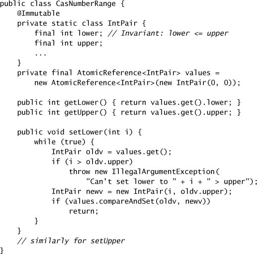

### 15.3.2. So sánh Performance: Lock so với Atomic Variable

Để minh họa sự khác biệt về scalability giữa lock và atomic variable, chúng tôi đã xây dựng một benchmark so sánh vài hiện thực của một **bộ sinh số giả ngẫu nhiên (PRNG)**. Trong một PRNG, số "ngẫu nhiên" tiếp theo là một **hàm tất định của số trước đó**, nên một PRNG phải **nhớ số trước đó** như một phần state của nó.

Listing 15.4 và 15.5 cho thấy hai hiện thực của một PRNG thread-safe, một dùng `ReentrantLock` và một dùng `AtomicInteger`. Test driver gọi mỗi cái lặp đi lặp lại; mỗi vòng lặp sinh một số ngẫu nhiên (thứ đọc và sửa state `seed` được share) và cũng thực hiện một số vòng lặp "**việc bận**" chỉ thao tác trên **dữ liệu thread-local**. Điều này mô phỏng các operation điển hình bao gồm một phần thao tác trên shared state và một phần thao tác trên state thread-local.

Figure 15.1 và 15.2 cho thấy throughput với **mức công việc mô phỏng thấp và trung bình** ở mỗi vòng lặp. Với mức tính toán thread-local **thấp**, lock hay atomic variable chịu **tranh chấp nặng**; với nhiều tính toán thread-local hơn, lock hay atomic variable chịu **ít tranh chấp hơn** vì nó được mỗi thread truy cập ít thường xuyên hơn.

**Figure 15.1. Performance của Lock và `AtomicInteger` dưới tranh chấp cao.**

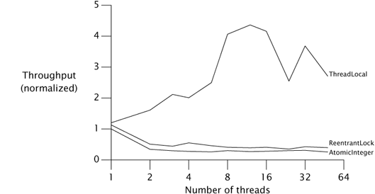

**Figure 15.2. Performance của Lock và `AtomicInteger` dưới tranh chấp trung bình.**

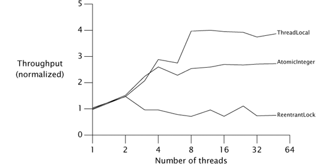

**Listing 15.4. Bộ sinh số ngẫu nhiên dùng `ReentrantLock`.**

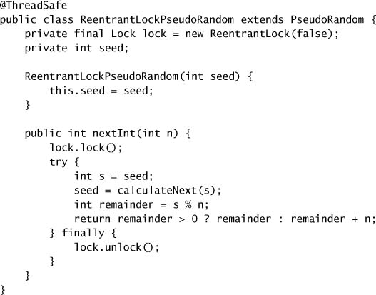

**Listing 15.5. Bộ sinh số ngẫu nhiên dùng `AtomicInteger`.**

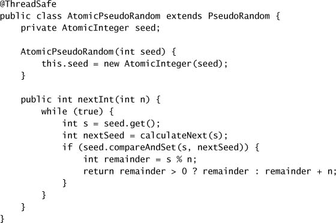

Như các đồ thị này cho thấy, ở **mức tranh chấp cao**, locking có xu hướng **vượt trội hơn** atomic variable, nhưng ở **mức tranh chấp thực tế hơn**, atomic variable **vượt trội hơn** lock.[^6] Điều này là vì một lock **phản ứng với tranh chấp bằng cách treo thread**, giảm mức sử dụng CPU và lưu lượng synchronization trên bus bộ nhớ được share. (Điều này tương tự cách việc block các producer trong một thiết kế producer-consumer làm giảm tải cho consumer và do đó cho chúng bắt kịp.) Ngược lại, với atomic variable, **việc quản lý tranh chấp bị đẩy ngược về class gọi**. Giống hầu hết thuật toán dựa trên CAS, `AtomicPseudoRandom` phản ứng với tranh chấp bằng cách **thử lại ngay lập tức**, điều thường là cách đúng nhưng trong môi trường tranh chấp cao lại chỉ **tạo thêm tranh chấp**.

[^6]: Điều tương tự cũng đúng ở những lĩnh vực khác: đèn giao thông cho throughput tốt hơn với lưu lượng cao, nhưng bùng binh cho throughput tốt hơn với lưu lượng thấp; cơ chế tranh chấp mà mạng ethernet dùng chạy tốt hơn ở mức lưu lượng thấp, còn cơ chế truyền token mà mạng token ring dùng thì tốt hơn với lưu lượng nặng.

Trước khi kết tội `AtomicPseudoRandom` là viết dở hay coi atomic variable là một lựa chọn tồi so với lock, chúng ta nên nhận ra rằng **mức tranh chấp ở Figure 15.1 là cao đến mức phi thực tế**: không chương trình thực nào chỉ làm mỗi việc tranh chấp một lock hay atomic variable. Trên thực tế, atomic **có xu hướng mở rộng tốt hơn** lock vì atomic **xử lý hiệu quả hơn** với các mức tranh chấp điển hình.

Sự đảo ngược performance giữa lock và atomic ở các mức tranh chấp khác nhau minh họa **điểm mạnh và điểm yếu** của mỗi bên. Với tranh chấp **thấp đến trung bình**, atomic cho **scalability tốt hơn**; với tranh chấp **cao**, lock cho **khả năng tránh tranh chấp tốt hơn**. (Các thuật toán dựa trên CAS cũng vượt trội hơn thuật toán dựa trên lock trên **hệ thống một CPU**, vì một CAS luôn thành công trên hệ thống một CPU trừ trường hợp hiếm hoi là một thread bị preempt giữa chừng operation read-modify-write.)

Figure 15.1 và 15.2 bao gồm một **đường cong thứ ba**: một hiện thực `PseudoRandom` dùng một `ThreadLocal` cho state của PRNG. Cách tiếp cận hiện thực này **thay đổi hành vi của class** — mỗi thread thấy chuỗi số giả ngẫu nhiên riêng của mình, thay vì tất cả thread share một chuỗi — nhưng minh họa rằng thường thì **không share state gì cả sẽ rẻ hơn** nếu có thể tránh được. Chúng ta có thể cải thiện scalability bằng cách xử lý tranh chấp hiệu quả hơn, nhưng **scalability thực sự chỉ đạt được bằng cách loại bỏ hoàn toàn tranh chấp**.

---

## 15.4. Thuật toán Nonblocking

Các thuật toán dựa trên lock có nguy cơ gặp một loạt thất bại liveness. Nếu một thread giữ lock bị trì hoãn do blocking I/O, page fault, hay độ trễ khác, hoàn toàn có thể **không thread nào tiến triển được**. Một thuật toán được gọi là **nonblocking** nếu **sự cố hay việc treo của bất kỳ thread nào không thể gây ra sự cố hay việc treo của thread khác**; một thuật toán được gọi là **lock-free** nếu, ở **mỗi bước**, có **một thread nào đó có thể tiến triển**. Các thuật toán dùng **chỉ CAS** để điều phối giữa các thread có thể, nếu được xây dựng đúng, vừa nonblocking vừa lock-free. Một CAS không tranh chấp **luôn thành công**, và nếu nhiều thread tranh chấp một CAS, **một thread luôn thắng** và do đó tiến triển. Thuật toán nonblocking cũng **miễn nhiễm với deadlock hay priority inversion** (mặc dù chúng có thể thể hiện starvation hay livelock vì chúng có thể liên quan đến việc thử lại lặp đi lặp lại). Chúng ta đã thấy một thuật toán nonblocking cho đến giờ: `CasCounter`. Các thuật toán nonblocking tốt đã được biết đến cho nhiều cấu trúc dữ liệu phổ biến, bao gồm stack, queue, priority queue, và hash table — mặc dù việc thiết kế những cái mới là **công việc tốt nhất nên để cho chuyên gia**.

### 15.4.1. Một Stack Nonblocking

Thuật toán nonblocking **phức tạp hơn đáng kể** so với các tương đương dựa trên lock. Chìa khóa để tạo ra thuật toán nonblocking là **tìm cách giới hạn phạm vi của các thay đổi atomic xuống một biến duy nhất** trong khi vẫn duy trì tính nhất quán dữ liệu. Trong các collection class liên kết như queue, đôi khi bạn có thể diễn đạt các chuyển đổi state như **thay đổi lên từng liên kết riêng lẻ** và dùng một `AtomicReference` để biểu diễn mỗi liên kết cần được cập nhật atomic.

**Stack** là cấu trúc dữ liệu liên kết đơn giản nhất: mỗi phần tử chỉ tham chiếu tới **một** phần tử khác và mỗi phần tử chỉ được **một** object reference tham chiếu tới. `ConcurrentStack` ở Listing 15.6 cho thấy cách xây một stack bằng atomic reference. Stack là một danh sách liên kết các phần tử `Node`, gốc tại `top`, mỗi node chứa một giá trị và một liên kết tới phần tử tiếp theo. Method `push` chuẩn bị một link node mới mà field `next` của nó trỏ tới `top` hiện tại của stack, rồi dùng CAS để cố **cài đặt nó lên đỉnh stack**. Nếu vẫn là node đó ở đỉnh stack như lúc chúng ta bắt đầu, CAS **thành công**; nếu node đỉnh đã thay đổi (vì một thread khác đã thêm hoặc xóa phần tử kể từ khi ta bắt đầu), CAS **thất bại** và `push` cập nhật node mới dựa trên state stack hiện tại rồi **thử lại**. Trong cả hai trường hợp, stack vẫn ở **trạng thái nhất quán** sau CAS.

`CasCounter` và `ConcurrentStack` minh họa những đặc điểm của mọi thuật toán nonblocking: **một số công việc được làm mang tính suy đoán và có thể phải làm lại**. Trong `ConcurrentStack`, khi chúng ta tạo `Node` biểu diễn phần tử mới, chúng ta **hy vọng** rằng giá trị của tham chiếu `next` sẽ vẫn đúng vào lúc nó được cài lên stack, nhưng **sẵn sàng thử lại** trong trường hợp có tranh chấp.

Các thuật toán nonblocking như `ConcurrentStack` có được thread safety từ thực tế rằng, giống như locking, `compareAndSet` cung cấp **cả bảo đảm atomicity lẫn visibility**. Khi một thread thay đổi state của stack, nó làm vậy bằng một `compareAndSet`, thứ có **memory effect của một lần ghi volatile**. Khi một thread kiểm tra stack, nó làm vậy bằng cách gọi `get` trên cùng `AtomicReference` đó, thứ có **memory effect của một lần đọc volatile**. Vậy nên mọi thay đổi do một thread thực hiện đều được **publish an toàn** tới bất kỳ thread nào khác kiểm tra state của danh sách. Và danh sách được sửa bằng một `compareAndSet` — thứ **atomically hoặc cập nhật tham chiếu `top`, hoặc thất bại** nếu nó phát hiện sự can thiệp từ thread khác.

### 15.4.2. Một Linked List Nonblocking

Hai thuật toán nonblocking chúng ta đã thấy cho đến giờ — counter và stack — minh họa pattern cơ bản của việc dùng CAS để cập nhật một giá trị mang tính suy đoán, thử lại nếu cập nhật thất bại. Mẹo để xây dựng thuật toán nonblocking là **giới hạn phạm vi các thay đổi atomic xuống một biến duy nhất**. Với counter thì việc này tầm thường, và với stack thì đủ đơn giản, nhưng với những cấu trúc dữ liệu phức tạp hơn như queue, hash table, hay cây, nó có thể **khó hơn rất nhiều**.

Một **linked queue** phức tạp hơn một stack vì nó phải hỗ trợ truy cập nhanh vào **cả đầu lẫn đuôi**. Để làm điều này, nó duy trì các con trỏ `head` và `tail` riêng biệt. **Hai con trỏ** cùng trỏ tới node ở đuôi: con trỏ `next` của phần tử cuối hiện tại, và con trỏ `tail`. Để chèn một phần tử mới thành công, **cả hai con trỏ này phải được cập nhật — một cách atomic**. Thoạt nhìn, điều này **không thể làm được** với atomic variable; cần các operation CAS riêng biệt để cập nhật hai con trỏ, và nếu cái đầu thành công nhưng cái thứ hai thất bại thì queue bị để lại ở **trạng thái không nhất quán**. Và ngay cả khi cả hai operation thành công, một thread khác có thể **cố truy cập queue giữa cái thứ nhất và cái thứ hai**. Việc xây một thuật toán nonblocking cho một linked queue đòi hỏi một **kế hoạch cho cả hai tình huống** này.

**Listing 15.6. Stack Nonblocking dùng thuật toán Treiber (Treiber, 1986).**

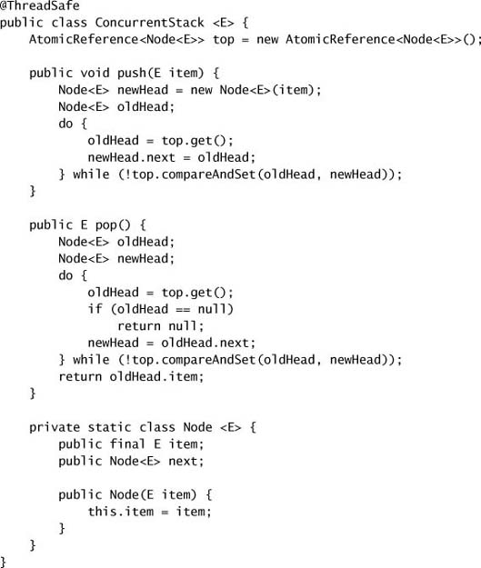

Chúng ta cần vài **mẹo** để phát triển kế hoạch này. Mẹo thứ nhất là đảm bảo rằng cấu trúc dữ liệu **luôn ở trạng thái nhất quán**, ngay cả giữa chừng một cập nhật nhiều bước. Nhờ vậy, nếu thread A đang ở giữa một cập nhật khi thread B xuất hiện, B có thể **nhận ra rằng một operation đã hoàn tất một phần** và biết là **không nên cố áp dụng cập nhật của riêng nó ngay**. Khi đó B có thể chờ (bằng cách liên tục kiểm tra state của queue) cho đến khi A xong, để hai bên không cản trở nhau.

Dù riêng mẹo này đã đủ để các thread "**thay phiên nhau**" truy cập cấu trúc dữ liệu mà không làm hỏng nó, nếu **một thread gặp sự cố giữa chừng một cập nhật**, thì **không thread nào có thể truy cập queue được nữa**. Để làm thuật toán trở nên nonblocking, chúng ta phải đảm bảo rằng sự cố của một thread **không ngăn các thread khác tiến triển**. Vì vậy, mẹo thứ hai là đảm bảo rằng nếu B đến và thấy cấu trúc dữ liệu đang ở giữa một cập nhật của A, thì **đủ thông tin đã được thể hiện trong cấu trúc dữ liệu để B hoàn tất cập nhật thay cho A**. Nếu B "**giúp**" A bằng cách hoàn tất operation của A, B có thể tiến hành operation của riêng mình mà **không phải chờ A**. Khi A quay lại hoàn tất operation của nó, nó sẽ thấy rằng **B đã làm hộ rồi**.

`LinkedQueue` ở Listing 15.7 cho thấy phần chèn của thuật toán linked-queue nonblocking **Michael-Scott** (Michael và Scott, 1996), thứ được `ConcurrentLinkedQueue` sử dụng. Như trong nhiều thuật toán queue, một queue rỗng gồm một node "**sentinel**" hay "**dummy**", và các con trỏ `head` và `tail` được khởi tạo trỏ tới sentinel. Con trỏ `tail` **luôn** trỏ tới sentinel (nếu queue rỗng), phần tử cuối cùng trong queue, hoặc (trong trường hợp một operation đang giữa chừng cập nhật) phần tử **áp chót**. Figure 15.3 minh họa một queue với hai phần tử ở trạng thái bình thường, hay **quiescent** (tĩnh).

**Figure 15.3. Queue với hai phần tử ở trạng thái Quiescent.**

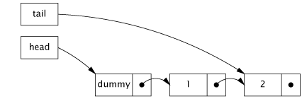

Việc chèn một phần tử mới liên quan đến việc cập nhật **hai con trỏ**. Cái thứ nhất **liên kết node mới vào cuối danh sách** bằng cách cập nhật con trỏ `next` của phần tử cuối hiện tại; cái thứ hai **xoay con trỏ `tail`** để trỏ tới phần tử cuối mới. Giữa hai operation này, queue ở **trạng thái trung gian**, thể hiện ở Figure 15.4. Sau cập nhật thứ hai, queue lại ở trạng thái quiescent, thể hiện ở Figure 15.5.

**Figure 15.4. Queue ở trạng thái trung gian trong lúc chèn.**

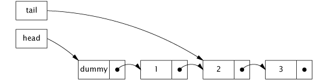

**Figure 15.5. Queue lại ở trạng thái Quiescent sau khi việc chèn hoàn tất.**

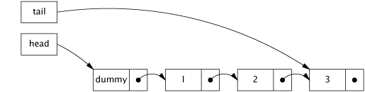

Quan sát then chốt cho phép **cả hai mẹo** cần thiết là: nếu queue ở trạng thái quiescent, thì field `next` của link node mà `tail` trỏ tới là **null**, còn nếu nó ở trạng thái trung gian, thì `tail.next` **khác null**. Vậy nên **bất kỳ thread nào cũng có thể ngay lập tức nhận biết trạng thái của queue** bằng cách kiểm tra `tail.next`. Hơn nữa, nếu queue ở trạng thái trung gian, nó có thể được **khôi phục về trạng thái quiescent** bằng cách đẩy con trỏ `tail` tiến lên một node, **hoàn tất operation thay cho thread nào đang ở giữa chừng việc chèn một phần tử**.[^7]

[^7]: Để có một trình bày đầy đủ về tính đúng đắn của thuật toán này, xem (Michael và Scott, 1996) hoặc (Herlihy và Shavit, 2006).

`LinkedQueue.put` trước tiên kiểm tra xem queue có ở trạng thái trung gian không trước khi cố chèn một phần tử mới (**bước A**). Nếu có, thì một thread khác đang trong quá trình chèn một phần tử (giữa các bước C và D của nó). Thay vì chờ thread đó xong, thread hiện tại **giúp nó** bằng cách hoàn tất operation cho nó, đẩy con trỏ `tail` tiến lên (**bước B**). Sau đó nó lặp lại phép kiểm tra này phòng khi một thread khác đã bắt đầu chèn một phần tử mới, đẩy con trỏ `tail` tiến lên cho đến khi nó thấy queue ở trạng thái quiescent để có thể bắt đầu việc chèn của riêng mình.

CAS ở **bước C** — thứ liên kết node mới vào đuôi queue — có thể **thất bại** nếu hai thread cùng cố chèn một phần tử một lúc. Trong trường hợp đó, **không có hại gì**: không thay đổi nào được thực hiện, và thread hiện tại chỉ cần **nạp lại con trỏ `tail` và thử lại**. Một khi C thành công, việc chèn được coi là **đã có hiệu lực**; CAS thứ hai (**bước D**) được coi là "**dọn dẹp**", vì nó có thể được thực hiện **hoặc bởi thread đang chèn hoặc bởi bất kỳ thread nào khác**. Nếu D thất bại, thread đang chèn **cứ trả về** thay vì thử lại CAS, vì **không cần thử lại** — một thread khác đã hoàn tất công việc ở bước B của nó rồi! Điều này hoạt động được vì **trước khi bất kỳ thread nào cố liên kết một node mới vào queue, nó luôn kiểm tra xem queue có cần dọn dẹp không** bằng cách kiểm tra `tail.next` có khác null hay không. Nếu có, nó **đẩy con trỏ `tail` tiến lên trước** (có thể nhiều lần) cho đến khi queue ở trạng thái quiescent.

**Listing 15.7. Việc chèn trong thuật toán Queue Nonblocking Michael-Scott (Michael và Scott, 1996).**

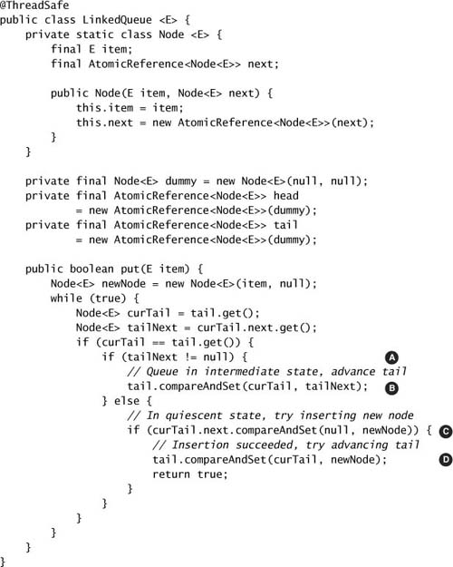

### 15.4.3. Atomic Field Updater

Listing 15.7 minh họa thuật toán mà `ConcurrentLinkedQueue` dùng, nhưng hiện thực thực tế **hơi khác**. Thay vì biểu diễn mỗi `Node` bằng một atomic reference, `ConcurrentLinkedQueue` dùng một **tham chiếu `volatile` thông thường** và cập nhật nó thông qua **`AtomicReferenceFieldUpdater` dựa trên reflection**, như thể hiện ở Listing 15.8.

**Listing 15.8. Dùng Atomic Field Updater trong `ConcurrentLinkedQueue`.**

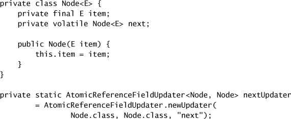

Các class atomic field updater (có sẵn ở các phiên bản `Integer`, `Long`, và `Reference`) biểu diễn một "**góc nhìn**" dựa trên reflection của một field `volatile` có sẵn, để **CAS có thể được dùng trên các field `volatile` hiện có**. Các class updater **không có constructor**; để tạo một cái, bạn gọi factory method `newUpdater`, chỉ định class và tên field. Các class field updater **không gắn với một instance cụ thể**; một cái có thể được dùng để cập nhật field mục tiêu cho **bất kỳ instance nào** của class mục tiêu. Các bảo đảm atomicity cho class updater **yếu hơn** so với các class atomic thông thường, vì bạn **không thể đảm bảo rằng các field nền tảng sẽ không bị sửa trực tiếp** — các method `compareAndSet` và số học chỉ đảm bảo atomicity **đối với các thread khác cũng dùng method của atomic field updater**.

Trong `ConcurrentLinkedQueue`, các cập nhật lên field `next` của một `Node` được áp dụng bằng method `compareAndSet` của `nextUpdater`. Cách tiếp cận hơi vòng vo này được dùng **hoàn toàn vì lý do performance**. Với những object được cấp phát thường xuyên và có vòng đời ngắn như các link node của queue, việc **loại bỏ việc tạo một `AtomicReference` cho mỗi `Node`** là đủ đáng kể để giảm chi phí của các operation chèn. Tuy nhiên, trong **gần như mọi tình huống**, atomic variable thông thường đã chạy hoàn toàn ổn — chỉ trong vài trường hợp mới cần đến atomic field updater. (Atomic field updater cũng hữu ích khi bạn muốn thực hiện các cập nhật atomic **trong khi vẫn bảo toàn dạng serialized của một class có sẵn**.)

### 15.4.4. Vấn đề ABA

**Vấn đề ABA** là một dị thường có thể phát sinh từ việc dùng compare-and-swap một cách ngây thơ trong các thuật toán mà **node có thể được tái chế** (chủ yếu trong những môi trường không có garbage collection). Một CAS thực chất hỏi "**Giá trị của V vẫn là A chứ?**", và tiến hành cập nhật nếu đúng vậy. Trong hầu hết tình huống, bao gồm các ví dụ trình bày ở chương này, điều này **hoàn toàn đủ**. Tuy nhiên, đôi khi chúng ta thực sự muốn hỏi "**Giá trị của V có thay đổi kể từ lần cuối tôi quan sát thấy nó là A không?**". Với một số thuật toán, việc đổi V từ A sang B rồi lại về A **vẫn được tính là một thay đổi** đòi hỏi chúng ta phải thử lại một bước nào đó của thuật toán.

Vấn đề ABA này có thể phát sinh trong những thuật toán **tự quản lý bộ nhớ** cho các object link node. Trong trường hợp này, việc đầu danh sách vẫn tham chiếu tới một node đã quan sát trước đó **không đủ để suy ra rằng nội dung của danh sách không thay đổi**. Nếu bạn không thể tránh vấn đề ABA bằng cách để garbage collector quản lý link node hộ bạn, vẫn có một giải pháp tương đối đơn giản: thay vì cập nhật giá trị của một tham chiếu, hãy **cập nhật một cặp giá trị — một tham chiếu và một số phiên bản**. Ngay cả khi giá trị đổi từ A sang B rồi về A, **số phiên bản sẽ khác**. `AtomicStampedReference` (và người anh em `AtomicMarkableReference`) cung cấp cập nhật atomic có điều kiện trên **một cặp biến**. `AtomicStampedReference` cập nhật một cặp **object reference – số nguyên**, cho phép các tham chiếu "**có phiên bản**" miễn nhiễm[^8] với vấn đề ABA. Tương tự, `AtomicMarkableReference` cập nhật một cặp **object reference – boolean** được một số thuật toán dùng để cho một node **ở lại trong danh sách trong khi được đánh dấu là đã xóa**.[^9]

[^8]: Trên thực tế thì thế; về lý thuyết bộ đếm **có thể tràn**.

[^9]: Nhiều processor cung cấp một operation **double-wide CAS** (CAS2 hay CASX) có thể thao tác trên một cặp con trỏ – số nguyên, điều này sẽ làm operation trên hiệu quả một cách hợp lý. Tính đến Java 6, `AtomicStampedReference` **không dùng** double-wide CAS ngay cả trên những nền tảng hỗ trợ nó. (Double-wide CAS khác với **DCAS**, thứ thao tác trên **hai vị trí bộ nhớ không liên quan**; tại thời điểm viết, **không processor hiện tại nào hiện thực DCAS**.)

---

## Tóm tắt

Các thuật toán nonblocking duy trì thread safety bằng cách dùng các **primitive concurrency mức thấp** như compare-and-swap thay vì lock. Những primitive mức thấp này được expose qua các **class atomic variable**, thứ cũng có thể được dùng như "**biến volatile tốt hơn**", cung cấp các operation cập nhật atomic cho số nguyên và object reference.

Thuật toán nonblocking **khó thiết kế và hiện thực**, nhưng có thể mang lại **scalability tốt hơn** trong điều kiện điển hình và **khả năng chống chịu tốt hơn** trước các thất bại liveness. Nhiều tiến bộ về performance concurrent từ phiên bản JVM này sang phiên bản khác đến từ việc **dùng thuật toán nonblocking**, cả bên trong JVM lẫn trong các thư viện của nền tảng.
