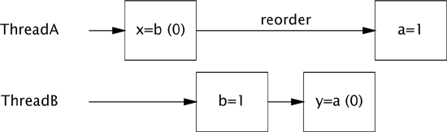
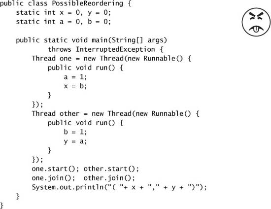
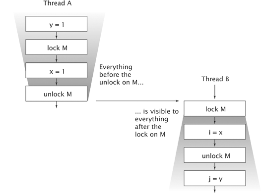
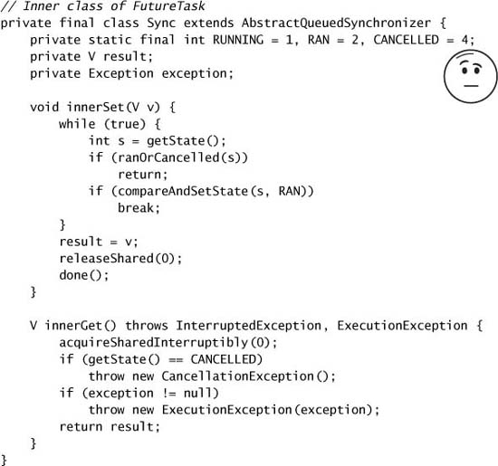
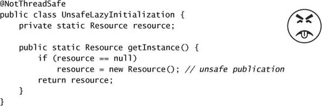
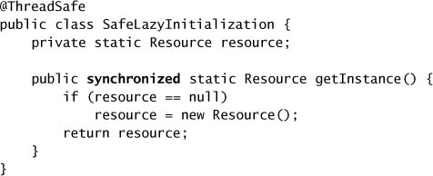
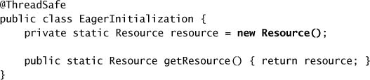
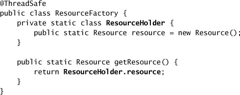
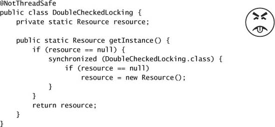
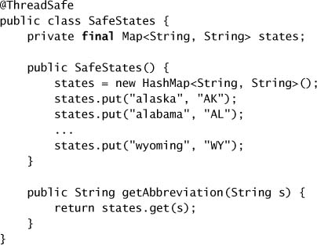

# Chương 16. The Java Memory Model

> **Về bản dịch này.** Đây là bản **dịch đầy đủ** chương 16 của cuốn *Java Concurrency in Practice* (Brian Goetz và cộng sự). Các **thuật ngữ chuyên ngành được giữ nguyên tiếng Anh**. Toàn bộ code listing và hình vẽ được trích trực tiếp từ file PDF gốc và lưu trong thư mục `images/ch16/`.

---

Xuyên suốt cuốn sách này, chúng ta hầu như đã tránh những chi tiết mức thấp của **Java Memory Model (JMM)** và thay vào đó tập trung vào những vấn đề thiết kế ở mức cao hơn như safe publication, việc đặc tả và tuân thủ các synchronization policy. Những thứ đó có được tính an toàn **từ JMM**, và bạn có thể thấy dễ dùng những cơ chế này hiệu quả hơn khi hiểu **tại sao chúng hoạt động**. Chương này vén bức màn để lộ ra những **yêu cầu và bảo đảm mức thấp** của Java Memory Model, cùng lý lẽ đằng sau một số quy tắc thiết kế mức cao hơn được đưa ra trong cuốn sách này.

---

## 16.1. Memory Model là gì, và tại sao tôi lại muốn có nó?

Giả sử một thread gán một giá trị cho `aVariable`:

```java
aVariable = 3;
```

Một memory model giải quyết câu hỏi "**Trong điều kiện nào thì một thread đọc `aVariable` sẽ thấy giá trị 3?**" Câu này nghe có vẻ ngớ ngẩn, nhưng khi **không có synchronization**, có một loạt lý do khiến một thread có thể **không thấy ngay — hoặc không bao giờ thấy** — kết quả của một operation ở thread khác. Compiler có thể sinh lệnh **theo thứ tự khác** với thứ tự "hiển nhiên" mà mã nguồn gợi ý, hoặc lưu biến trong **register** thay vì trong bộ nhớ; processor có thể thực thi lệnh **song song hoặc không theo thứ tự**; cache có thể thay đổi thứ tự mà các thao tác ghi biến được commit vào bộ nhớ chính; và giá trị lưu trong cache cục bộ của processor có thể **không nhìn thấy được** với các processor khác. Những yếu tố này có thể ngăn một thread thấy giá trị mới nhất của một biến và có thể khiến các memory action ở thread khác **tỏ ra xảy ra không theo thứ tự** — nếu bạn không dùng synchronization thích hợp.

Trong môi trường single-threaded, tất cả những "trò" mà môi trường chơi với chương trình của chúng ta đều **bị che giấu** và không có tác động nào khác ngoài việc **tăng tốc thực thi**. Java Language Specification yêu cầu JVM duy trì **semantics as-if-serial trong phạm vi một thread**: miễn là chương trình cho ra cùng kết quả như thể nó được thực thi theo thứ tự chương trình trong một môi trường tuần tự nghiêm ngặt, thì **mọi trò này đều được phép**. Và đó cũng là điều tốt, vì chính những sự sắp xếp lại này chịu trách nhiệm cho phần lớn cải thiện performance tính toán trong những năm gần đây. Chắc chắn tốc độ xung nhịp cao hơn đã góp phần cải thiện performance, nhưng **parallelism tăng lên** cũng vậy — các đơn vị thực thi superscalar có pipeline, lập lịch lệnh động, thực thi suy đoán, và cache bộ nhớ đa tầng tinh vi. Khi các processor trở nên tinh vi hơn, thì compiler cũng vậy, sắp xếp lại lệnh để tạo điều kiện cho thực thi tối ưu và dùng những thuật toán cấp phát register toàn cục tinh vi. Và khi các nhà sản xuất processor chuyển sang processor đa nhân — phần lớn vì tốc độ xung nhịp ngày càng khó tăng một cách kinh tế — thì **parallelism phần cứng sẽ chỉ tăng thêm**.

Trong môi trường multithreaded, **ảo giác về tính tuần tự không thể được duy trì mà không có chi phí performance đáng kể**. Vì phần lớn thời gian các thread trong một ứng dụng concurrent đều "làm việc của riêng mình", việc điều phối liên thread quá mức sẽ chỉ làm chậm ứng dụng mà chẳng mang lại lợi ích thực sự nào. Chỉ khi **nhiều thread share dữ liệu** thì mới cần điều phối hoạt động của chúng, và JVM **dựa vào chương trình để xác định khi nào điều này xảy ra** thông qua việc dùng synchronization.

JMM đặc tả **những bảo đảm tối thiểu** mà JVM phải đưa ra về việc khi nào các thao tác ghi biến trở nên nhìn thấy được với các thread khác. Nó được thiết kế để **cân bằng** giữa nhu cầu về tính dự đoán được và sự dễ dàng trong phát triển chương trình với thực tế của việc hiện thực các JVM hiệu năng cao trên một dải rộng các kiến trúc processor phổ biến. Một số khía cạnh của JMM có thể gây bối rối lúc đầu nếu bạn không quen với những trò mà processor và compiler hiện đại dùng để vắt thêm performance từ chương trình của bạn.

### 16.1.1. Memory Model của nền tảng

Trong một kiến trúc đa xử lý bộ nhớ chia sẻ, mỗi processor có **cache riêng** được định kỳ hòa hợp với bộ nhớ chính. Các kiến trúc processor cung cấp **mức độ cache coherence khác nhau**; một số chỉ cung cấp bảo đảm tối thiểu, cho phép các processor khác nhau thấy **những giá trị khác nhau cho cùng một vị trí bộ nhớ** tại gần như bất kỳ thời điểm nào. Hệ điều hành, compiler, và runtime (và đôi khi cả chương trình nữa) phải **bù đắp khoảng cách** giữa những gì phần cứng cung cấp và những gì thread safety đòi hỏi.

Việc đảm bảo rằng mọi processor luôn biết mọi processor khác đang làm gì là **tốn kém**. Phần lớn thời gian thông tin này là không cần thiết, nên các processor **nới lỏng** những bảo đảm về tính nhất quán bộ nhớ để cải thiện performance. **Memory model** của một kiến trúc cho chương trình biết chúng có thể mong đợi những bảo đảm gì từ hệ thống bộ nhớ, và đặc tả những **lệnh đặc biệt** cần thiết (gọi là **memory barrier** hay **fence**) để có được những bảo đảm điều phối bộ nhớ bổ sung cần thiết khi share dữ liệu. Để che chắn developer Java khỏi những khác biệt giữa các memory model của các kiến trúc, Java cung cấp **memory model của riêng nó**, và JVM xử lý sự khác biệt giữa JMM và memory model của nền tảng nền bằng cách **chèn memory barrier ở những chỗ thích hợp**.

Một mô hình tư duy tiện lợi cho việc thực thi chương trình là tưởng tượng rằng có **một thứ tự duy nhất** mà các operation xảy ra trong một chương trình, bất kể chúng thực thi trên processor nào, và rằng mỗi lần đọc một biến sẽ thấy **lần ghi cuối cùng theo thứ tự thực thi** vào biến đó bởi bất kỳ processor nào. Mô hình vui vẻ nhưng phi thực tế này được gọi là **sequential consistency** (tính nhất quán tuần tự). Các developer phần mềm thường **nhầm lẫn giả định** sequential consistency, nhưng **không multiprocessor hiện đại nào cung cấp sequential consistency**, và JMM cũng vậy. Mô hình tính toán tuần tự kinh điển, mô hình **von Neumann**, chỉ là một xấp xỉ mơ hồ về cách các multiprocessor hiện đại hành xử.

Điểm mấu chốt là các multiprocessor bộ nhớ chia sẻ hiện đại (và compiler) có thể làm những điều **đáng ngạc nhiên** khi dữ liệu được share giữa các thread, trừ khi bạn **bảo chúng đừng làm vậy** thông qua việc dùng memory barrier. May mắn thay, các chương trình Java **không cần chỉ định vị trí đặt memory barrier**; chúng chỉ cần **xác định khi nào shared state đang được truy cập**, thông qua việc dùng synchronization đúng cách.

### 16.1.2. Reordering

Khi mô tả race condition và thất bại atomicity ở chương 2, chúng ta đã dùng các sơ đồ tương tác mô tả "timing không may", trong đó scheduler xen kẽ các operation gây ra kết quả sai trong những chương trình thiếu synchronization. Tệ hơn nữa, JMM có thể cho phép các hành động **tỏ ra thực thi theo những thứ tự khác nhau từ góc nhìn của những thread khác nhau**, khiến việc suy luận về thứ tự khi không có synchronization càng phức tạp hơn. Những lý do khác nhau khiến operation có thể bị trì hoãn hay tỏ ra thực thi không theo thứ tự đều có thể được gộp vào một danh mục chung: **reordering**.

`PossibleReordering` ở Listing 16.1 minh họa việc suy luận về hành vi của ngay cả những chương trình concurrent đơn giản nhất khó đến mức nào, trừ khi chúng được synchronize đúng cách. Khá dễ tưởng tượng `PossibleReordering` có thể in ra (1, 0), hay (0, 1), hay (1, 1): thread A có thể chạy hết trước khi B bắt đầu, B có thể chạy hết trước khi A bắt đầu, hoặc các hành động của chúng có thể xen kẽ. Nhưng kỳ lạ thay, `PossibleReordering` **cũng có thể in ra (0, 0)**! Các hành động trong mỗi thread **không có phụ thuộc dòng dữ liệu** vào nhau, và do đó có thể được thực thi **không theo thứ tự**. (Ngay cả khi chúng được thực thi đúng thứ tự, thời điểm mà cache được flush ra bộ nhớ chính có thể khiến — từ góc nhìn của B — các phép gán trong A tỏ ra xảy ra **theo thứ tự ngược lại**.) Figure 16.1 cho thấy một cách xen kẽ khả dĩ có reordering dẫn đến việc in ra (0, 0).

**Figure 16.1. Sự xen kẽ cho thấy reordering trong `PossibleReordering`.**



`PossibleReordering` là một chương trình tầm thường, vậy mà việc liệt kê các kết quả khả dĩ của nó vẫn khó một cách đáng ngạc nhiên. Reordering ở mức bộ nhớ có thể khiến chương trình hành xử ngoài mong đợi. Việc suy luận về thứ tự khi không có synchronization là **cực kỳ khó**; **dễ hơn nhiều** là đảm bảo rằng chương trình của bạn dùng synchronization thích hợp. Synchronization **ngăn** compiler, runtime, và phần cứng reorder các memory operation theo những cách vi phạm các bảo đảm visibility mà JMM cung cấp.[^1]

[^1]: Trên hầu hết các kiến trúc processor phổ biến, memory model đủ mạnh để chi phí performance của một lần đọc volatile **tương đương** với một lần đọc không volatile.

### 16.1.3. Java Memory Model trong 500 từ hoặc ít hơn

Java Memory Model được đặc tả theo các **action** (hành động), bao gồm các thao tác đọc và ghi biến, lock và unlock monitor, và khởi động cùng join thread. JMM định nghĩa một **quan hệ thứ tự bộ phận**[^2] gọi là **happens-before** trên tất cả các action trong chương trình. Để đảm bảo rằng thread thực thi action B có thể thấy kết quả của action A (bất kể A và B có xảy ra ở các thread khác nhau hay không), **phải có một quan hệ happens-before giữa A và B**. Khi không có thứ tự happens-before giữa hai operation, JVM **được tự do reorder chúng tùy ý**.

[^2]: Một **quan hệ thứ tự bộ phận** là một quan hệ trên một tập hợp có tính phản đối xứng, phản xạ, và bắc cầu, nhưng với hai phần tử bất kỳ x và y, **không nhất thiết** phải có x ≤ y hoặc y ≤ x. Chúng ta dùng quan hệ thứ tự bộ phận mỗi ngày để diễn đạt sở thích; chúng ta có thể thích sushi hơn bánh phô mai và thích Mozart hơn Mahler, nhưng chúng ta không nhất thiết có một sở thích rõ ràng giữa bánh phô mai và Mozart.

**Listing 16.1. Chương trình thiếu synchronization có thể cho ra kết quả bất ngờ. Đừng làm thế này.**



Một **data race** xảy ra khi một biến được **nhiều hơn một thread đọc** và được **ít nhất một thread ghi**, nhưng các thao tác đọc và ghi **không được sắp thứ tự bởi happens-before**. Một chương trình **được synchronize đúng cách** là chương trình **không có data race**; các chương trình được synchronize đúng cách thể hiện **sequential consistency**, nghĩa là mọi action trong chương trình tỏ ra xảy ra theo một **thứ tự toàn cục cố định**.

Các quy tắc của happens-before là:

**Quy tắc thứ tự chương trình (Program order rule).** Mỗi action trong một thread happens-before mọi action trong thread đó xuất hiện sau nó theo thứ tự chương trình.

**Quy tắc monitor lock (Monitor lock rule).** Một lần unlock trên một monitor lock happens-before mọi lần lock **tiếp theo** trên chính monitor lock đó.[^3]

[^3]: Các thao tác lock và unlock trên object `Lock` tường minh có **cùng memory semantics** như intrinsic lock.

**Quy tắc biến volatile (Volatile variable rule).** Một lần ghi vào một field `volatile` happens-before mọi lần đọc **tiếp theo** của chính field đó.[^4]

[^4]: Các thao tác đọc và ghi atomic variable có **cùng memory semantics** như biến volatile.

**Quy tắc khởi động thread (Thread start rule).** Một lời gọi `Thread.start` trên một thread happens-before mọi action trong thread được khởi động.

**Quy tắc kết thúc thread (Thread termination rule).** Bất kỳ action nào trong một thread happens-before việc bất kỳ thread nào khác phát hiện thread đó đã kết thúc, hoặc bằng cách trả về thành công từ `Thread.join` hoặc bằng việc `Thread.isAlive` trả về `false`.

**Quy tắc interruption (Interruption rule).** Một thread gọi `interrupt` trên một thread khác happens-before việc thread bị interrupt phát hiện ra interrupt đó (hoặc bằng việc `InterruptedException` được ném ra, hoặc bằng việc gọi `isInterrupted` hay `interrupted`).

**Quy tắc finalizer (Finalizer rule).** Việc kết thúc constructor của một object happens-before việc bắt đầu finalizer của object đó.

**Tính bắc cầu (Transitivity).** Nếu A happens-before B, và B happens-before C, thì A happens-before C.

Mặc dù các action **chỉ được sắp thứ tự bộ phận**, các **synchronization action** — acquire và release lock, cùng các thao tác đọc và ghi biến volatile — lại được sắp **thứ tự toàn phần**. Điều này khiến việc mô tả happens-before theo các lần acquire lock và đọc biến volatile "**tiếp theo**" trở nên hợp lý.

Figure 16.2 minh họa quan hệ happens-before khi hai thread synchronize bằng một lock chung. Tất cả các action trong thread A được sắp thứ tự bởi quy tắc thứ tự chương trình, các action trong thread B cũng vậy. Vì A **release lock M** và B **sau đó acquire M**, tất cả các action trong A **trước khi release lock** do đó được sắp thứ tự **trước** các action trong B **sau khi acquire lock**. Khi hai thread synchronize trên **những lock khác nhau**, chúng ta **không thể nói gì** về thứ tự các action giữa chúng — **không có quan hệ happens-before** giữa các action ở hai thread.

**Figure 16.2. Minh họa happens-before trong Java Memory Model.**



### 16.1.4. "Ăn theo" Synchronization (Piggybacking)

Nhờ sức mạnh của thứ tự happens-before, đôi khi bạn có thể **"ăn theo" (piggyback) các tính chất visibility của một synchronization có sẵn**. Việc này đòi hỏi **kết hợp quy tắc thứ tự chương trình** của happens-before với **một trong các quy tắc sắp thứ tự khác** (thường là quy tắc monitor lock hay quy tắc biến volatile) để sắp thứ tự các truy cập vào một biến vốn không được lock nào bảo vệ. Kỹ thuật này **rất nhạy cảm với thứ tự các câu lệnh** và do đó khá **mong manh**; nó là một kỹ thuật nâng cao chỉ nên dành cho việc vắt kiệt giọt performance cuối cùng từ những class quan trọng nhất về performance như `ReentrantLock`.

Hiện thực các method `protected` của `AbstractQueuedSynchronizer` trong `FutureTask` minh họa piggybacking. AQS duy trì một số nguyên state của synchronizer mà `FutureTask` dùng để lưu trạng thái task: đang chạy, đã hoàn tất, hay đã hủy. Nhưng `FutureTask` cũng duy trì thêm các biến khác, chẳng hạn **kết quả của phép tính**. Khi một thread gọi `set` để lưu kết quả và một thread khác gọi `get` để lấy nó, hai thao tác này **tốt nhất nên được sắp thứ tự bởi happens-before**. Điều này có thể làm được bằng cách khai báo tham chiếu tới kết quả là `volatile`, nhưng **có thể khai thác synchronization có sẵn** để đạt được cùng kết quả với **chi phí thấp hơn**.

`FutureTask` được chế tác cẩn thận để đảm bảo rằng một lời gọi `tryReleaseShared` thành công **luôn happens-before** một lời gọi `tryAcquireShared` tiếp theo; `tryReleaseShared` **luôn ghi vào một biến volatile** mà `tryAcquireShared` **đọc**. Listing 16.2 cho thấy các method `innerSet` và `innerGet` được gọi khi kết quả được lưu hay lấy ra; vì `innerSet` **ghi `result` trước khi gọi `releaseShared`** (thứ gọi `tryReleaseShared`) và `innerGet` **đọc `result` sau khi gọi `acquireShared`** (thứ gọi `tryAcquireShared`), quy tắc thứ tự chương trình kết hợp với quy tắc biến volatile để đảm bảo rằng việc ghi `result` trong `innerSet` **happens-before** việc đọc `result` trong `innerGet`.

**Listing 16.2. Class nội bộ của `FutureTask` minh họa việc "ăn theo" synchronization.**



Chúng tôi gọi kỹ thuật này là "**piggybacking**" (ăn theo) vì nó dùng một thứ tự happens-before **có sẵn được tạo ra vì lý do khác** để đảm bảo visibility của object X, thay vì tạo một thứ tự happens-before **riêng** để publish X.

Kiểu piggybacking mà `FutureTask` sử dụng khá **mong manh** và **không nên thực hiện một cách tùy tiện**. Tuy nhiên, trong một số trường hợp piggybacking là **hoàn toàn hợp lý**, chẳng hạn khi một class **cam kết một thứ tự happens-before giữa các method như một phần trong specification của nó**. Ví dụ, safe publication dùng một `BlockingQueue` là một dạng piggybacking. Việc một thread đặt một object lên queue và một thread khác sau đó lấy nó ra **cấu thành safe publication** vì được đảm bảo rằng có **đủ synchronization nội bộ** trong một hiện thực `BlockingQueue` để đảm bảo rằng thao tác enqueue happens-before thao tác dequeue.

Các thứ tự happens-before khác được thư viện class đảm bảo bao gồm:

- Đặt một item vào một thread-safe collection **happens-before** việc một thread khác lấy item đó ra khỏi collection;
- Đếm ngược trên một `CountDownLatch` **happens-before** việc một thread trả về từ `await` trên latch đó;
- Release một permit cho một `Semaphore` **happens-before** việc acquire một permit từ chính `Semaphore` đó;
- Các action được thực hiện bởi task mà một `Future` biểu diễn **happens-before** việc một thread khác trả về thành công từ `Future.get`;
- Gửi một `Runnable` hay `Callable` tới một `Executor` **happens-before** việc task bắt đầu thực thi; và
- Việc một thread đến một `CyclicBarrier` hay `Exchanger` **happens-before** việc các thread khác được giải phóng khỏi chính barrier hay điểm trao đổi đó. Nếu `CyclicBarrier` dùng một barrier action, việc đến barrier **happens-before** barrier action, thứ lại **happens-before** việc các thread được giải phóng khỏi barrier.

---

## 16.2. Publication

Chương 3 đã khám phá cách một object có thể được publish an toàn hay không đúng cách. Các kỹ thuật safe publication mô tả ở đó có được tính an toàn **từ những bảo đảm mà JMM cung cấp**; những rủi ro của publication không đúng cách là **hệ quả của việc thiếu một thứ tự happens-before** giữa việc publish một shared object và việc truy cập nó từ một thread khác.

### 16.2.1. Unsafe Publication

Khả năng xảy ra reordering khi không có quan hệ happens-before giải thích tại sao việc publish một object mà không có synchronization thích hợp có thể cho phép một thread khác thấy một **object được construct dở dang** (xem mục 3.5). Việc khởi tạo một object mới liên quan đến **ghi vào các biến** — các field của object mới. Tương tự, việc publish một tham chiếu liên quan đến việc **ghi vào một biến khác** — tham chiếu tới object mới. Nếu bạn không đảm bảo rằng việc publish tham chiếu được share **happens-before** việc một thread khác nạp tham chiếu đó, thì việc ghi tham chiếu tới object mới có thể **bị reorder** (từ góc nhìn của thread tiêu thụ object) với các thao tác ghi vào các field của nó. Trong trường hợp đó, một thread khác có thể thấy một **giá trị mới nhất cho object reference** nhưng lại thấy **giá trị cũ cho một phần hoặc toàn bộ state của object đó** — một object được construct dở dang.

Unsafe publication có thể xảy ra như kết quả của một **lazy initialization không đúng**, như thể hiện ở Listing 16.3. Thoạt nhìn, vấn đề duy nhất ở đây có vẻ là race condition được mô tả ở mục 2.2.2. Trong một số hoàn cảnh nhất định, chẳng hạn khi tất cả instance của `Resource` đều giống hệt nhau, bạn có thể sẵn lòng bỏ qua chuyện này (cùng với sự kém hiệu quả của việc có thể tạo `Resource` nhiều hơn một lần). Đáng tiếc, ngay cả khi những khiếm khuyết này được bỏ qua, `UnsafeLazyInitialization` **vẫn không an toàn**, vì một thread khác có thể quan sát thấy một tham chiếu tới một `Resource` **được construct dở dang**.

**Listing 16.3. Lazy Initialization không an toàn. Đừng làm thế này.**



Giả sử thread A là thread đầu tiên gọi `getInstance`. Nó thấy `resource` là `null`, khởi tạo một `Resource` mới, và đặt `resource` trỏ tới nó. Khi thread B sau đó gọi `getInstance`, nó có thể thấy rằng `resource` đã có giá trị khác `null` và chỉ đơn giản dùng `Resource` đã được construct. Điều này thoạt nhìn có vẻ vô hại, nhưng **không có thứ tự happens-before** giữa việc ghi `resource` ở A và việc đọc `resource` ở B. Một **data race** đã được dùng để publish object, và do đó B **không được đảm bảo** sẽ thấy state đúng của `Resource`.

Constructor của `Resource` thay đổi các field của `Resource` vừa được cấp phát từ giá trị mặc định của chúng (do constructor của `Object` ghi) sang giá trị khởi tạo. Vì không thread nào dùng synchronization, B có thể **thấy các action của A theo thứ tự khác** với thứ tự A thực hiện chúng. Vậy nên ngay cả khi A khởi tạo `Resource` **trước khi** đặt `resource` trỏ tới nó, B vẫn có thể thấy việc ghi `resource` **xảy ra trước** các thao tác ghi vào các field của `Resource`. Do đó B có thể thấy một `Resource` được construct dở dang, rất có thể đang ở **trạng thái không hợp lệ** — và state của nó có thể **thay đổi bất ngờ về sau**.

> Ngoại trừ các immutable object, việc dùng một object đã được một thread khác khởi tạo là **không an toàn** trừ khi việc publication **happens-before** việc thread tiêu thụ sử dụng nó.

### 16.2.2. Safe Publication

Các idiom safe publication được mô tả ở chương 3 đảm bảo rằng object đã publish **nhìn thấy được** với các thread khác, vì chúng đảm bảo rằng việc publication **happens-before** việc thread tiêu thụ nạp một tham chiếu tới object đã publish. Nếu thread A đặt X lên một `BlockingQueue` (và không thread nào sau đó sửa nó) và thread B lấy nó ra khỏi queue, B **được đảm bảo** thấy X đúng như A để lại. Điều này là vì các hiện thực `BlockingQueue` có **đủ synchronization nội bộ** để đảm bảo rằng thao tác `put` happens-before thao tác `take`. Tương tự, dùng một shared variable được một lock bảo vệ hay một shared volatile variable đảm bảo rằng các thao tác đọc và ghi biến đó được **sắp thứ tự bởi happens-before**.

Bảo đảm happens-before này thực ra là một **lời hứa mạnh hơn** về visibility và thứ tự so với những gì safe publication đưa ra. Khi X được publish an toàn từ A sang B, safe publication đảm bảo visibility của **state của X**, nhưng **không** đảm bảo state của những biến khác mà A có thể đã đụng tới. Nhưng nếu việc A đặt X lên queue **happens-before** việc B lấy X ra khỏi queue đó, thì không chỉ B thấy X ở trạng thái A để lại (giả sử X không bị A hay ai khác sửa sau đó), mà B còn **thấy mọi thứ A đã làm trước lần chuyển giao đó** (một lần nữa, với cùng lưu ý trên).[^5]

[^5]: JMM đảm bảo rằng B thấy một giá trị **ít nhất cũng mới bằng** giá trị mà A đã ghi; các lần ghi sau đó có thể nhìn thấy được hoặc không.

Tại sao chúng ta lại tập trung nhiều đến vậy vào `@GuardedBy` và safe publication, trong khi JMM đã cung cấp cho chúng ta happens-before mạnh mẽ hơn? Việc **tư duy theo hướng chuyển giao quyền sở hữu object và publication** phù hợp với hầu hết thiết kế chương trình **tốt hơn** so với tư duy theo hướng visibility của từng lần ghi bộ nhớ riêng lẻ. Thứ tự happens-before hoạt động ở **mức từng lần truy cập bộ nhớ riêng lẻ** — nó là một dạng "**hợp ngữ của concurrency**". Safe publication hoạt động ở một mức **gần với thiết kế chương trình của bạn hơn**.

### 16.2.3. Các idiom khởi tạo an toàn

Đôi khi việc hoãn khởi tạo những object tốn kém cho đến khi chúng thực sự cần đến là hợp lý, nhưng chúng ta đã thấy việc lạm dụng lazy initialization có thể dẫn đến rắc rối như thế nào. `UnsafeLazyInitialization` có thể được sửa bằng cách làm cho method `getResource` trở thành `synchronized`, như trong Listing 16.4. Vì code path qua `getInstance` khá ngắn (một phép kiểm tra và một nhánh rẽ được dự đoán), nếu `getInstance` không được nhiều thread gọi thường xuyên, thì tranh chấp cho lock của `SafeLazyInitialization` **đủ ít** để cách tiếp cận này mang lại performance thỏa đáng.

Việc xử lý các **static field có initializer** (hoặc field mà giá trị được khởi tạo trong một static initialization block [JPL 2.2.1 và 2.5.3]) hơi **đặc biệt** và cung cấp thêm những bảo đảm về thread-safety. Static initializer được JVM chạy tại thời điểm **class initialization**, sau khi class được load nhưng **trước khi class được bất kỳ thread nào dùng**. Vì JVM **acquire một lock** trong lúc initialization [JLS 12.4.2] và lock này được **mỗi thread acquire ít nhất một lần** để đảm bảo class đã được load, các thao tác ghi bộ nhớ thực hiện trong lúc static initialization **tự động nhìn thấy được với mọi thread**. Do đó, những object được khởi tạo statically **không cần synchronization tường minh** dù trong lúc construct hay khi được tham chiếu. Tuy nhiên, điều này **chỉ áp dụng cho trạng thái lúc construct** — nếu object là mutable, **vẫn cần synchronization** từ cả reader lẫn writer để làm cho các sửa đổi sau đó nhìn thấy được và tránh hỏng dữ liệu.

**Listing 16.4. Lazy Initialization thread-safe.**



**Listing 16.5. Eager Initialization.**



Dùng **eager initialization**, thể hiện ở Listing 16.5, sẽ **loại bỏ chi phí synchronization** phát sinh ở mỗi lời gọi `getInstance` trong `SafeLazyInitialization`. Kỹ thuật này có thể được kết hợp với việc **lazy class loading** của JVM để tạo ra một kỹ thuật lazy initialization **không cần synchronization trên code path thông thường**. Idiom **lazy initialization holder class** [EJ Item 48] ở Listing 16.6 dùng một class mà **mục đích duy nhất** của nó là khởi tạo `Resource`. JVM **hoãn việc khởi tạo class `ResourceHolder`** cho đến khi nó thực sự được dùng [JLS 12.4.1], và vì `Resource` được khởi tạo bằng một static initializer, **không cần synchronization thêm nào**. Lời gọi `getResource` đầu tiên bởi bất kỳ thread nào sẽ khiến `ResourceHolder` được load và khởi tạo, tại thời điểm đó việc khởi tạo `Resource` diễn ra thông qua static initializer.

**Listing 16.6. Idiom Lazy Initialization Holder Class.**



### 16.2.4. Double-checked Locking

Không cuốn sách nào về concurrency là đầy đủ nếu thiếu phần bàn về **antipattern double-checked locking (DCL)** khét tiếng, thể hiện ở Listing 16.7. Ở những JVM rất sớm, synchronization — thậm chí cả synchronization không tranh chấp — có **chi phí performance đáng kể**. Kết quả là nhiều mẹo khôn ngoan (hoặc ít nhất là trông có vẻ khôn ngoan) đã được phát minh để giảm tác động của synchronization — một số tốt, một số tệ, và một số xấu xí. DCL rơi vào loại "**xấu xí**".

Một lần nữa, vì performance của các JVM đời đầu còn nhiều điều đáng mong đợi, lazy initialization thường được dùng để tránh những operation đắt đỏ có thể không cần thiết hoặc để giảm thời gian khởi động ứng dụng. Một method lazy initialization được viết đúng cách **đòi hỏi synchronization**. Nhưng vào thời điểm đó, synchronization chậm và — quan trọng hơn — **chưa được hiểu đầy đủ**: các khía cạnh về loại trừ (exclusion) thì đã được hiểu khá rõ, còn các khía cạnh về **visibility** thì chưa.

DCL tuyên bố mang lại điều tốt nhất của cả hai thế giới — lazy initialization mà không phải trả phạt synchronization trên code path thông thường. Cách nó hoạt động là trước tiên **kiểm tra xem có cần khởi tạo hay không mà không synchronize**, và nếu tham chiếu resource khác `null` thì dùng nó. Ngược lại, synchronize rồi **kiểm tra lại** xem `Resource` đã được khởi tạo chưa, đảm bảo rằng chỉ một thread thực sự khởi tạo `Resource` được share. Code path thông thường — lấy một tham chiếu tới một `Resource` đã được construct — **không dùng synchronization**. Và đó chính là chỗ có vấn đề: như mô tả ở mục 16.2.1, **hoàn toàn có thể xảy ra việc một thread thấy một `Resource` được construct dở dang**.

Vấn đề thực sự với DCL là **giả định** rằng điều tệ nhất có thể xảy ra khi đọc một object reference được share mà không synchronize chỉ là **nhầm lẫn thấy một giá trị stale** (trong trường hợp này là `null`); trong trường hợp đó idiom DCL bù đắp rủi ro này bằng cách **thử lại trong khi giữ lock**. Nhưng trường hợp tệ nhất thực ra **tệ hơn nhiều** — hoàn toàn có thể thấy một **giá trị hiện tại của tham chiếu** nhưng lại thấy **giá trị stale cho state của object**, nghĩa là object có thể bị nhìn thấy ở **trạng thái không hợp lệ hoặc không đúng**.

Những thay đổi sau này trong JMM (Java 5.0 trở đi) đã cho phép DCL **hoạt động được nếu `resource` được khai báo `volatile`**, và tác động performance của việc này là nhỏ vì các lần đọc volatile thường chỉ đắt hơn một chút so với đọc không volatile. Tuy nhiên, đây là một idiom mà **tính hữu dụng phần lớn đã qua đi** — những lực đã thúc đẩy nó (synchronization không tranh chấp chậm, JVM khởi động chậm) **không còn hiện diện nữa**, khiến nó kém hiệu quả hơn với vai trò một tối ưu hóa. Idiom lazy initialization holder mang lại **cùng lợi ích** và **dễ hiểu hơn**.

**Listing 16.7. Antipattern Double-checked Locking. Đừng làm thế này.**



---

## 16.3. Initialization Safety

Bảo đảm về **initialization safety** cho phép các **immutable object được construct đúng cách** được share an toàn giữa các thread **mà không cần synchronization**, bất kể chúng được publish như thế nào — **kể cả khi được publish bằng một data race**. (Điều này nghĩa là `UnsafeLazyInitialization` thực ra **an toàn nếu `Resource` là immutable**.)

Không có initialization safety, những object được cho là immutable như `String` có thể **tỏ ra thay đổi giá trị** nếu synchronization không được cả thread publish lẫn thread tiêu thụ sử dụng. Kiến trúc bảo mật **dựa vào tính immutable của `String`**; việc thiếu initialization safety có thể tạo ra những **lỗ hổng bảo mật** cho phép code độc hại vượt qua các phép kiểm tra bảo mật.

Initialization safety đảm bảo rằng với những object được construct đúng cách, **mọi thread sẽ thấy giá trị đúng của các field `final`** được constructor đặt, **bất kể object được publish như thế nào**. Hơn nữa, mọi biến có thể **tiếp cận được thông qua một field `final`** của một object được construct đúng cách (chẳng hạn các phần tử của một mảng `final` hay nội dung của một `HashMap` được một field `final` tham chiếu) **cũng được đảm bảo** nhìn thấy được với các thread khác.[^6]

[^6]: Điều này chỉ áp dụng cho những object **chỉ tiếp cận được** thông qua các field `final` của object đang được construct.

Với những object có field `final`, initialization safety **cấm việc reorder bất kỳ phần nào của quá trình construct với lần nạp tham chiếu ban đầu tới object đó**. Mọi thao tác ghi vào field `final` do constructor thực hiện, cũng như vào mọi biến tiếp cận được thông qua những field đó, đều trở nên "**đóng băng**" (frozen) khi constructor hoàn tất, và bất kỳ thread nào lấy được một tham chiếu tới object đó **được đảm bảo** thấy một giá trị **ít nhất cũng mới bằng** giá trị đã đóng băng. Các thao tác ghi khởi tạo các biến tiếp cận được qua field `final` **không bị reorder** với các operation theo sau lần đóng băng hậu construct.

Initialization safety nghĩa là `SafeStates` ở Listing 16.8 **có thể được publish an toàn** ngay cả qua unsafe lazy initialization hay việc nhét một tham chiếu tới một `SafeStates` vào một `public static` field mà không có synchronization, **mặc dù** nó không dùng synchronization nào và dựa vào `HashSet` **không thread-safe**.

**Listing 16.8. Initialization Safety cho các Immutable Object.**



Tuy nhiên, một loạt **thay đổi nhỏ** với `SafeStates` sẽ **lấy đi thread safety** của nó. Nếu `states` **không phải `final`**, hoặc nếu bất kỳ method nào ngoài constructor sửa nội dung của nó, thì initialization safety **sẽ không đủ mạnh** để truy cập `SafeStates` an toàn mà không có synchronization. Nếu `SafeStates` có **những field không `final` khác**, các thread khác vẫn có thể thấy **giá trị sai** của những field đó. Và việc cho phép object **escape trong lúc construct** sẽ **vô hiệu hóa** bảo đảm initialization-safety.

> Initialization safety chỉ đưa ra bảo đảm visibility cho những **giá trị tiếp cận được qua các field `final` tại thời điểm constructor kết thúc**. Với những giá trị tiếp cận được qua field **không `final`**, hoặc những giá trị **có thể thay đổi sau khi construct**, bạn **phải dùng synchronization** để đảm bảo visibility.

---

## Tóm tắt

Java Memory Model đặc tả **khi nào** các action của một thread lên bộ nhớ **được đảm bảo nhìn thấy được** với thread khác. Các chi tiết cụ thể liên quan đến việc đảm bảo rằng các operation được sắp thứ tự bởi một quan hệ thứ tự bộ phận gọi là **happens-before**, thứ được đặc tả ở mức từng operation bộ nhớ và synchronization riêng lẻ. Khi thiếu synchronization đầy đủ, **những điều rất kỳ lạ** có thể xảy ra khi các thread truy cập dữ liệu được share. Tuy nhiên, các quy tắc ở mức cao hơn được đưa ra ở chương 2 và 3 — chẳng hạn `@GuardedBy` và safe publication — có thể được dùng để **đảm bảo thread safety mà không phải viện đến những chi tiết mức thấp của happens-before**.
